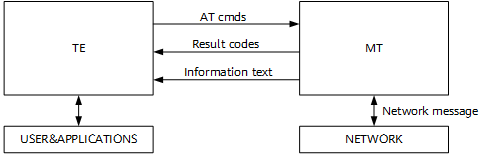
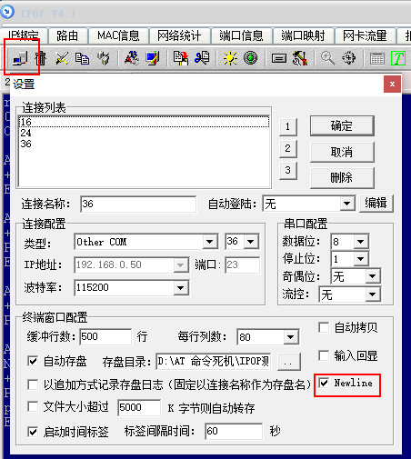

# Preface<a name="ZH-CN_TOPIC_0000001760165149"></a>

**Overview<a name="section4537382116410"></a>**

This document describes the AT command types and scenarios of the WS63V100, and provides users with the corresponding command formats and parameter example explanations.

**Product Version<a name="section111371595118"></a>**

The product versions corresponding to this document are as follows.

<a name="table22377277"></a>
<table><thead align="left"><tr id="row63051425"><th class="cellrowborder" valign="top" width="40.400000000000006%" id="mcps1.1.3.1.1"><p id="p6891761"><a name="p6891761"></a><a name="p6891761"></a><strong id="b3756104316114"><a name="b3756104316114"></a><a name="b3756104316114"></a>Product Name</strong></p>
</th>
<th class="cellrowborder" valign="top" width="59.599999999999994%" id="mcps1.1.3.1.2"><p id="p21361741"><a name="p21361741"></a><a name="p21361741"></a><strong id="b1676784314119"><a name="b1676784314119"></a><a name="b1676784314119"></a>Product Version</strong></p>
</th>
</tr>
</thead>
<tbody><tr id="row52579486"><td class="cellrowborder" valign="top" width="40.400000000000006%" headers="mcps1.1.3.1.1 "><p id="p112031718196"><a name="p112031718196"></a><a name="p112031718196"></a>WS63</p>
</td>
<td class="cellrowborder" valign="top" width="59.599999999999994%" headers="mcps1.1.3.1.2 "><p id="p5209173194"><a name="p5209173194"></a><a name="p5209173194"></a>V100</p>
</td>
</tr>
</tbody>
</table>

**Intended Audience<a name="section4378592816410"></a>**

This document is mainly intended for the following engineers:

-   Technical support engineers
-   Software development engineers

**Symbol Conventions<a name="section133020216410"></a>**

The following symbols may appear in this document. Their meanings are as follows.

<a name="table2622507016410"></a>
<table><thead align="left"><tr id="row1530720816410"><th class="cellrowborder" valign="top" width="20.580000000000002%" id="mcps1.1.3.1.1"><p id="p6450074116410"><a name="p6450074116410"></a><a name="p6450074116410"></a><strong id="b2136615816410"><a name="b2136615816410"></a><a name="b2136615816410"></a>Symbol</strong></p>
</th>
<th class="cellrowborder" valign="top" width="79.42%" id="mcps1.1.3.1.2"><p id="p5435366816410"><a name="p5435366816410"></a><a name="p5435366816410"></a><strong id="b5941558116410"><a name="b5941558116410"></a><a name="b5941558116410"></a>Description</strong></p>
</th>
</tr>
</thead>
<tbody><tr id="row1372280416410"><td class="cellrowborder" valign="top" width="20.580000000000002%" headers="mcps1.1.3.1.1 "><p id="p3734547016410"><a name="p3734547016410"></a><a name="p3734547016410"></a><a name="image2670064316410"></a><a name="image2670064316410"></a><span></span></p>
</td>
<td class="cellrowborder" valign="top" width="79.42%" headers="mcps1.1.3.1.2 "><p id="p1757432116410"><a name="p1757432116410"></a><a name="p1757432116410"></a>Indicates a hazard with a high level of risk that, if not avoided, will result in death or serious injury.</p>
</td>
</tr>
<tr id="row466863216410"><td class="cellrowborder" valign="top" width="20.580000000000002%" headers="mcps1.1.3.1.1 "><p id="p1432579516410"><a name="p1432579516410"></a><a name="p1432579516410"></a><a name="image4895582316410"></a><a name="image4895582316410"></a><span></span></p>
</td>
<td class="cellrowborder" valign="top" width="79.42%" headers="mcps1.1.3.1.2 "><p id="p959197916410"><a name="p959197916410"></a><a name="p959197916410"></a>Indicates a hazard with a medium level of risk that, if not avoided, could result in death or serious injury.</p>
</td>
</tr>
<tr id="row123863216410"><td class="cellrowborder" valign="top" width="20.580000000000002%" headers="mcps1.1.3.1.1 "><p id="p1232579516410"><a name="p1232579516410"></a><a name="p1232579516410"></a><a name="image1235582316410"></a><a name="image1235582316410"></a><span></span></p>
</td>
<td class="cellrowborder" valign="top" width="79.42%" headers="mcps1.1.3.1.2 "><p id="p123197916410"><a name="p123197916410"></a><a name="p123197916410"></a>Indicates a hazard with a low level of risk that, if not avoided, could result in minor or moderate injury.</p>
</td>
</tr>
<tr id="row5786682116410"><td class="cellrowborder" valign="top" width="20.580000000000002%" headers="mcps1.1.3.1.1 "><p id="p2204984716410"><a name="p2204984716410"></a><a name="p2204984716410"></a><a name="image4504446716410"></a><a name="image4504446716410"></a><span></span></p>
</td>
<td class="cellrowborder" valign="top" width="79.42%" headers="mcps1.1.3.1.2 "><p id="p4388861916410"><a name="p4388861916410"></a><a name="p4388861916410"></a>Used to convey device or environment safety warning information. If not avoided, it may result in device damage, data loss, degraded device performance, or other unpredictable results.</p>
<p id="p1238861916410"><a name="p1238861916410"></a><a name="p1238861916410"></a>"Notice" does not involve personal injury.</p>
</td>
</tr>
<tr id="row2856923116410"><td class="cellrowborder" valign="top" width="20.580000000000002%" headers="mcps1.1.3.1.1 "><p id="p5555360116410"><a name="p5555360116410"></a><a name="p5555360116410"></a><a name="image799324016410"></a><a name="image799324016410"></a><span></span></p>
</td>
<td class="cellrowborder" valign="top" width="79.42%" headers="mcps1.1.3.1.2 "><p id="p4612588116410"><a name="p4612588116410"></a><a name="p4612588116410"></a>Supplementary explanation of key information in the text.</p>
<p id="p1232588116410"><a name="p1232588116410"></a><a name="p1232588116410"></a>"Note" is not a safety warning and does not involve personal, device, or environmental injury information.</p>
</td>
</tr>
</tbody>
</table>

**Revision History<a name="section2467512116410"></a>**

<a name="table1557726816410"></a>
<table><thead align="left"><tr id="row2942532716410"><th class="cellrowborder" valign="top" width="23.549999999999997%" id="mcps1.1.4.1.1"><p id="p3778275416410"><a name="p3778275416410"></a><a name="p3778275416410"></a><strong id="b5687322716410"><a name="b5687322716410"></a><a name="b5687322716410"></a>Document Version</strong></p>
</th>
<th class="cellrowborder" valign="top" width="27.71%" id="mcps1.1.4.1.2"><p id="p5627845516410"><a name="p5627845516410"></a><a name="p5627845516410"></a><strong id="b5800814916410"><a name="b5800814916410"></a><a name="b5800814916410"></a>Release Date</strong></p>
</th>
<th class="cellrowborder" valign="top" width="48.74%" id="mcps1.1.4.1.3"><p id="p2382284816410"><a name="p2382284816410"></a><a name="p2382284816410"></a><strong id="b3316380216410"><a name="b3316380216410"></a><a name="b3316380216410"></a>Modification Description</strong></p>
</th>
</tr>
</thead>
<tbody><tr id="row108551922121013"><td class="cellrowborder" valign="top" width="23.549999999999997%" headers="mcps1.1.4.1.1 "><p id="p1585682241010"><a name="p1585682241010"></a><a name="p1585682241010"></a>05</p>
</td>
<td class="cellrowborder" valign="top" width="27.71%" headers="mcps1.1.4.1.2 "><p id="p15856112281014"><a name="p15856112281014"></a><a name="p15856112281014"></a>2025-08-29</p>
</td>
<td class="cellrowborder" valign="top" width="48.74%" headers="mcps1.1.4.1.3 "><a name="ul1795419366119"></a><a name="ul1795419366119"></a><ul id="ul1795419366119"><li>Updated the content of the "<a href="general_at_command_list.md">General AT Command List</a>" section.</li><li>Added the "<a href="at_heapstat_print_heap_usage.md">AT+HEAPSTAT Print Heap Usage</a>" to "<a href="at_taskmalloc_print_memory_allocation_of_each_task.md">AT+TASKMALLOC Print Memory Allocation of Each Task</a>" sections.</li><li>Updated the content of the "<a href="BLE.md">BLE</a>" section.</li><li>Updated the content of the "<a href="sle_at_command_description.md">SLE AT Command Description</a>" section.</li><li>Updated the content of the "<a href="sle_at_command_usage_scenario_examples.md">SLE AT Command Usage Scenario Examples</a>" section.</li><li>Updated the content of the "<a href="set_algorithm_parameter_values_for_radar_algorithm_parameter_set.md">Set Algorithm Parameter Values for the Corresponding Radar Algorithm Parameter Set</a>" section.</li><li>Added the "<a href="set_adaptive_wall_algorithm_parameters.md">Set Adaptive WALL Algorithm Parameters</a>" section.</li><li>Updated the content of the "<a href="platform_module_at_commands.md">Platform Module AT Commands</a>" section.</li></ul>
</td>
</tr>
<tr id="row728943191318"><td class="cellrowborder" valign="top" width="23.549999999999997%" headers="mcps1.1.4.1.1 "><p id="p229053171317"><a name="p229053171317"></a><a name="p229053171317"></a>04</p>
</td>
<td class="cellrowborder" valign="top" width="27.71%" headers="mcps1.1.4.1.2 "><p id="p42901631151316"><a name="p42901631151316"></a><a name="p42901631151316"></a>2025-02-28</p>
</td>
<td class="cellrowborder" valign="top" width="48.74%" headers="mcps1.1.4.1.3 "><a name="ul18723153071914"></a><a name="ul18723153071914"></a><ul id="ul18723153071914"><li>Updated the content of the "<a href="at_conn_initiate_connection_with_ap.md">AT+CONN Initiate Connection with AP</a>" section.</li><li>Updated the content of the "<a href="softap_related_at_commands.md">SoftAP-related AT Commands</a>" section.</li><li>Updated the content of the "<a href="BLE.md">BLE</a>" section.</li><li>Updated the content of the "<a href="sle_at_command_description.md">SLE AT Command Description</a>" section.</li><li>Updated the content of the "<a href="set_radar_status.md">Set Radar Status</a>" section.</li><li>Updated the content of the "<a href="write_user_reserved_bit.md">Write User Reserved Bit</a>" section.</li></ul>
</td>
</tr>
<tr id="row2125128171615"><td class="cellrowborder" valign="top" width="23.549999999999997%" headers="mcps1.1.4.1.1 "><p id="p112572851611"><a name="p112572851611"></a><a name="p112572851611"></a>03</p>
</td>
<td class="cellrowborder" valign="top" width="27.71%" headers="mcps1.1.4.1.2 "><p id="p121251228161618"><a name="p121251228161618"></a><a name="p121251228161618"></a>2024-10-30</p>
</td>
<td class="cellrowborder" valign="top" width="48.74%" headers="mcps1.1.4.1.3 "><a name="ul1712199192418"></a><a name="ul1712199192418"></a><ul id="ul1712199192418"><li>Updated the content of the "<a href="ble_at_command_description.md">BLE AT Command Description</a>" section.</li><li>Updated the content of the "<a href="sle_at_command_description.md">SLE AT Command Description</a>" section.</li><li>Updated the content of the "<a href="write_second_user_reserved_bit.md">Write the Second User Reserved Bit</a>" section.</li><li>Updated the content of the "<a href="at_setuart_configure_uart_functions.md">AT+SETUART Configure UART Functions</a>" section.</li></ul>
</td>
</tr>
<tr id="row18512840962"><td class="cellrowborder" valign="top" width="23.549999999999997%" headers="mcps1.1.4.1.1 "><p id="p185121040369"><a name="p185121040369"></a><a name="p185121040369"></a>02</p>
</td>
<td class="cellrowborder" valign="top" width="27.71%" headers="mcps1.1.4.1.2 "><p id="p115121140665"><a name="p115121140665"></a><a name="p115121140665"></a>2024-07-01</p>
</td>
<td class="cellrowborder" valign="top" width="48.74%" headers="mcps1.1.4.1.3 "><a name="ul171911805710"></a><a name="ul171911805710"></a><ul id="ul171911805710"><li>Added the "<a href="repeater_related_at_commands.md">Repeater-related AT Commands</a>" section.</li><li>Added the "<a href="at_scanprssid_scan_with_specified_ssid_prefix.md">AT+SCANPRSSID Scan with Specified SSID Prefix</a>" section.</li><li>Updated the content of the "<a href="at_pin_pin_connection.md">AT+PIN PIN Connection</a>" and "<a href="at_pinshow_generate_pin_code.md">AT+PINSHOW Generate PIN Code</a>" sections.</li><li>Added the "<a href="at_apscan_softap_scan.md">AT+APSCAN SoftAP Scan</a>" section.</li><li>Updated the content of the "<a href="test_debug_related_at_command_description.md">Test and Debug-related AT Command Description</a>" section.</li><li>Updated the content of the "<a href="ble_at_command_description.md">BLE AT Command Description</a>" section.</li><li>Updated the content of the "<a href="sle_at_command_description.md">SLE AT Command Description</a>" section.</li><li>Updated the content of the "<a href="platform_module_at_commands.md">Platform Module AT Commands</a>" section.</li></ul>
</td>
</tr>
<tr id="row1163912119197"><td class="cellrowborder" valign="top" width="23.549999999999997%" headers="mcps1.1.4.1.1 "><p id="p1363913117195"><a name="p1363913117195"></a><a name="p1363913117195"></a>01</p>
</td>
<td class="cellrowborder" valign="top" width="27.71%" headers="mcps1.1.4.1.2 "><p id="p14639111161916"><a name="p14639111161916"></a><a name="p14639111161916"></a>2024-04-10</p>
</td>
<td class="cellrowborder" valign="top" width="48.74%" headers="mcps1.1.4.1.3 "><p id="p156645201192"><a name="p156645201192"></a><a name="p156645201192"></a>First official version released.</p>
<a name="ul3248113016194"></a><a name="ul3248113016194"></a><ul id="ul3248113016194"><li>Updated the content of the "<a href="test_debug_related_at_command_list.md">Test and Debug-related AT Command List</a>" section.</li><li>Updated the content of the "<a href="test_debug_related_at_command_description.md">Test and Debug-related AT Command Description</a>" section.</li><li>Updated the content of the "<a href="sle_at_command_description.md">SLE AT Command Description</a>" section.</li><li>Updated the content of the "<a href="platform_module_at_commands.md">Platform Module AT Commands</a>" section.</li></ul>
</td>
</tr>
<tr id="row1610573312434"><td class="cellrowborder" valign="top" width="23.549999999999997%" headers="mcps1.1.4.1.1 "><p id="p410518335436"><a name="p410518335436"></a><a name="p410518335436"></a>00B06</p>
</td>
<td class="cellrowborder" valign="top" width="27.71%" headers="mcps1.1.4.1.2 "><p id="p1210563374317"><a name="p1210563374317"></a><a name="p1210563374317"></a>2024-03-29</p>
</td>
<td class="cellrowborder" valign="top" width="48.74%" headers="mcps1.1.4.1.3 "><a name="ul7585161851415"></a><a name="ul7585161851415"></a><ul id="ul7585161851415"><li>Updated the content of the "<a href="at_blesetname_set_local_device_name.md">3.1.2.1.5</a>" section.</li><li>Updated the content of the "<a href="set_radar_exit_delay.md">Set Radar Exit Delay</a>" section.</li><li>Updated the content of the "<a href="read_nv_item.md">Read NV Item</a>" section.</li><li>Updated the content of the "<a href="write_user_reserved_bit.md">Write User Reserved Bit</a>" section.</li></ul>
</td>
</tr>
<tr id="row4406181518410"><td class="cellrowborder" valign="top" width="23.549999999999997%" headers="mcps1.1.4.1.1 "><p id="p940713150418"><a name="p940713150418"></a><a name="p940713150418"></a>00B05</p>
</td>
<td class="cellrowborder" valign="top" width="27.71%" headers="mcps1.1.4.1.2 "><p id="p13407191514418"><a name="p13407191514418"></a><a name="p13407191514418"></a>2024-03-14</p>
</td>
<td class="cellrowborder" valign="top" width="48.74%" headers="mcps1.1.4.1.3 "><a name="ul16256754134115"></a><a name="ul16256754134115"></a><ul id="ul16256754134115"><li>Updated the content of the "<a href="test_debug_related_at_commands.md">Test and Debug-related AT Commands</a>" section.</li><li>Updated the content of the "<a href="platform_module_at_commands.md">Platform Module AT Commands</a>" chapter.</li></ul>
</td>
</tr>
<tr id="row151911843614"><td class="cellrowborder" valign="top" width="23.549999999999997%" headers="mcps1.1.4.1.1 "><p id="p14191643013"><a name="p14191643013"></a><a name="p14191643013"></a>00B04</p>
</td>
<td class="cellrowborder" valign="top" width="27.71%" headers="mcps1.1.4.1.2 "><p id="p119118431616"><a name="p119118431616"></a><a name="p119118431616"></a>2024-02-22</p>
</td>
<td class="cellrowborder" valign="top" width="48.74%" headers="mcps1.1.4.1.3 "><a name="ul13412145611114"></a><a name="ul13412145611114"></a><ul id="ul13412145611114"><li>Updated the content of the "<a href="at_stastat_view_sta_connection_status.md">AT+STASTAT View STA Connection Status</a>" section.</li><li>Updated the content of the "<a href="BLE.md">BLE</a>" section.</li><li>Updated the content of the "<a href="SLE.md">SLE</a>" section.</li></ul>
</td>
</tr>
<tr id="row16608343214"><td class="cellrowborder" valign="top" width="23.549999999999997%" headers="mcps1.1.4.1.1 "><p id="p18609140216"><a name="p18609140216"></a><a name="p18609140216"></a>00B03</p>
</td>
<td class="cellrowborder" valign="top" width="27.71%" headers="mcps1.1.4.1.2 "><p id="p260917414216"><a name="p260917414216"></a><a name="p260917414216"></a>2024-01-15</p>
</td>
<td class="cellrowborder" valign="top" width="48.74%" headers="mcps1.1.4.1.3 "><a name="ul36441820949"></a><a name="ul36441820949"></a><ul id="ul36441820949"><li>Updated the content of the "<a href="at_conn_initiate_connection_with_ap.md">AT+CONN Initiate Connection with AP</a>" section.</li><li>Updated the content of the "<a href="at_startap_start_softap_in_normal_mode.md">AT+STARTAP Start SoftAP in Normal Mode</a>" section.</li><li>Updated the content of the "<a href="ble_sle_module_at_commands.md">BLE&amp;SLE Module AT Commands</a>" chapter and added the BLE/SLE continuous send/receive commands.</li><li>Added the "<a href="repeater_related_at_commands.md">Repeater-related AT Commands</a>" chapter.</li></ul>
</td>
</tr>
<tr id="row11267101145811"><td class="cellrowborder" valign="top" width="23.549999999999997%" headers="mcps1.1.4.1.1 "><p id="p1926712115587"><a name="p1926712115587"></a><a name="p1926712115587"></a>00B02</p>
</td>
<td class="cellrowborder" valign="top" width="27.71%" headers="mcps1.1.4.1.2 "><p id="p32671118582"><a name="p32671118582"></a><a name="p32671118582"></a>2023-12-18</p>
</td>
<td class="cellrowborder" valign="top" width="48.74%" headers="mcps1.1.4.1.3 "><p id="p132672165814"><a name="p132672165814"></a><a name="p132672165814"></a>Added the "<a href="radar_module_at_commands.md">Radar Module AT Commands</a>" section.</p>
</td>
</tr>
<tr id="row5947359616410"><td class="cellrowborder" valign="top" width="23.549999999999997%" headers="mcps1.1.4.1.1 "><p id="p2149706016410"><a name="p2149706016410"></a><a name="p2149706016410"></a>00B01</p>
</td>
<td class="cellrowborder" valign="top" width="27.71%" headers="mcps1.1.4.1.2 "><p id="p648803616410"><a name="p648803616410"></a><a name="p648803616410"></a>2023-11-27</p>
</td>
<td class="cellrowborder" valign="top" width="48.74%" headers="mcps1.1.4.1.3 "><p id="p1946537916410"><a name="p1946537916410"></a><a name="p1946537916410"></a>First temporary version released.</p>
</td>
</tr>
</tbody>
</table>

# Command Description<a name="ZH-CN_TOPIC_0000001712485596"></a>


## Command Introduction<a name="ZH-CN_TOPIC_0000001760165145"></a>

AT commands are used for the exchange of control information between the TE (for example, user terminals such as a PC) and the MT (for example, mobile terminals such as a mobile station), as shown in [Figure 1](#_fig171281854102013).

**Figure 1**  AT command diagram<a name="_fig171281854102013"></a>  



## Command Types<a name="ZH-CN_TOPIC_0000001760165157"></a>

The AT command types are as shown in [Table 1](#_table838912210233).

**Table 1**  AT command type description

<a name="_table838912210233"></a>
<table><thead align="left"><tr id="row3095mcpsimp"><th class="cellrowborder" valign="top" width="33.33333333333333%" id="mcps1.2.4.1.1"><p id="p3097mcpsimp"><a name="p3097mcpsimp"></a><a name="p3097mcpsimp"></a>Type</p>
</th>
<th class="cellrowborder" valign="top" width="33.33333333333333%" id="mcps1.2.4.1.2"><p id="p3099mcpsimp"><a name="p3099mcpsimp"></a><a name="p3099mcpsimp"></a>Format</p>
</th>
<th class="cellrowborder" valign="top" width="33.33333333333333%" id="mcps1.2.4.1.3"><p id="p3101mcpsimp"><a name="p3101mcpsimp"></a><a name="p3101mcpsimp"></a>Usage</p>
</th>
</tr>
</thead>
<tbody><tr id="row3103mcpsimp"><td class="cellrowborder" valign="top" width="33.33333333333333%" headers="mcps1.2.4.1.1 "><p id="p3105mcpsimp"><a name="p3105mcpsimp"></a><a name="p3105mcpsimp"></a>Test command</p>
</td>
<td class="cellrowborder" valign="top" width="33.33333333333333%" headers="mcps1.2.4.1.2 "><p id="p3107mcpsimp"><a name="p3107mcpsimp"></a><a name="p3107mcpsimp"></a>AT+&lt;cmd&gt;=?</p>
</td>
<td class="cellrowborder" valign="top" width="33.33333333333333%" headers="mcps1.2.4.1.3 "><p id="p3109mcpsimp"><a name="p3109mcpsimp"></a><a name="p3109mcpsimp"></a>This command is used to query the parameters and value ranges of a set command.</p>
</td>
</tr>
<tr id="row3110mcpsimp"><td class="cellrowborder" valign="top" width="33.33333333333333%" headers="mcps1.2.4.1.1 "><p id="p3112mcpsimp"><a name="p3112mcpsimp"></a><a name="p3112mcpsimp"></a>Query command</p>
</td>
<td class="cellrowborder" valign="top" width="33.33333333333333%" headers="mcps1.2.4.1.2 "><p id="p3114mcpsimp"><a name="p3114mcpsimp"></a><a name="p3114mcpsimp"></a>AT+&lt;cmd&gt;?</p>
</td>
<td class="cellrowborder" valign="top" width="33.33333333333333%" headers="mcps1.2.4.1.3 "><p id="p3116mcpsimp"><a name="p3116mcpsimp"></a><a name="p3116mcpsimp"></a>This command is used to return the current value of the parameters.</p>
</td>
</tr>
<tr id="row3117mcpsimp"><td class="cellrowborder" valign="top" width="33.33333333333333%" headers="mcps1.2.4.1.1 "><p id="p3119mcpsimp"><a name="p3119mcpsimp"></a><a name="p3119mcpsimp"></a>Set command</p>
</td>
<td class="cellrowborder" valign="top" width="33.33333333333333%" headers="mcps1.2.4.1.2 "><p id="p3121mcpsimp"><a name="p3121mcpsimp"></a><a name="p3121mcpsimp"></a>AT+&lt;cmd&gt;=&lt;parameter&gt;,…</p>
</td>
<td class="cellrowborder" valign="top" width="33.33333333333333%" headers="mcps1.2.4.1.3 "><p id="p3123mcpsimp"><a name="p3123mcpsimp"></a><a name="p3123mcpsimp"></a>Sets parameter values or executes.</p>
</td>
</tr>
<tr id="row3124mcpsimp"><td class="cellrowborder" valign="top" width="33.33333333333333%" headers="mcps1.2.4.1.1 "><p id="p3126mcpsimp"><a name="p3126mcpsimp"></a><a name="p3126mcpsimp"></a>Execute command</p>
</td>
<td class="cellrowborder" valign="top" width="33.33333333333333%" headers="mcps1.2.4.1.2 "><p id="p3128mcpsimp"><a name="p3128mcpsimp"></a><a name="p3128mcpsimp"></a>AT+&lt;cmd&gt;</p>
</td>
<td class="cellrowborder" valign="top" width="33.33333333333333%" headers="mcps1.2.4.1.3 "><p id="p3130mcpsimp"><a name="p3130mcpsimp"></a><a name="p3130mcpsimp"></a>Used to execute the function of this command.</p>
</td>
</tr>
</tbody>
</table>

## Precautions<a name="ZH-CN_TOPIC_0000001760284985"></a>

-   Not every command supports all four types of commands listed in [Table 1](command_types.md#_table838912210233).
-   If an AT command that is not supported by the current software version is entered, ERROR is returned.
-   Double quotation marks indicate string data "string". For example: AT+SCANSSID="XXX".
-   Serial communication defaults: baud rate 115200, 8 data bits, 1 stop bit, no parity, and no flow control.
-   <\> indicates a mandatory parameter; the value in \[ \] is optional.
-   Parameters in a command are separated by ",". Except for string parameters enclosed in double quotation marks, a parameter itself cannot contain ",".
-   Parameters in an AT command cannot contain extra spaces.
-   AT commands must be in uppercase and must end with a carriage return and line feed (CR LF). Some serial port tools only send a carriage return (CR) without a line feed (LF) when the user presses the Enter key, causing AT commands to be unrecognized. To manually enter AT commands using a serial port tool, set the Enter key to carriage return (CR) + line feed (LF) in the tool. Taking IPOP V4.1 as an example, as shown in [Figure 1](#_fig69728515262).

    **Figure 1**  IPOP V4.1 CR+LF setting example<a name="_fig69728515262"></a>  
    

# Wi-Fi Module AT Commands<a name="ZH-CN_TOPIC_0000001718297836"></a>


## General AT Commands<a name="ZH-CN_TOPIC_0000001760285001"></a>


### General AT Command List<a name="ZH-CN_TOPIC_0000001712326076"></a>

<a name="table3151mcpsimp"></a>
<table><thead align="left"><tr id="row3156mcpsimp"><th class="cellrowborder" valign="top" width="32%" id="mcps1.1.3.1.1"><p id="p3158mcpsimp"><a name="p3158mcpsimp"></a><a name="p3158mcpsimp"></a>Command</p>
</th>
<th class="cellrowborder" valign="top" width="68%" id="mcps1.1.3.1.2"><p id="p3160mcpsimp"><a name="p3160mcpsimp"></a><a name="p3160mcpsimp"></a>Description</p>
</th>
</tr>
</thead>
<tbody><tr id="row3167mcpsimp"><td class="cellrowborder" valign="top" width="32%" headers="mcps1.1.3.1.1 "><p id="p3169mcpsimp"><a name="p3169mcpsimp"></a><a name="p3169mcpsimp"></a>AT+HELP</p>
</td>
<td class="cellrowborder" valign="top" width="68%" headers="mcps1.1.3.1.2 "><p id="p3171mcpsimp"><a name="p3171mcpsimp"></a><a name="p3171mcpsimp"></a>View currently available AT commands.</p>
</td>
</tr>
<tr id="row3172mcpsimp"><td class="cellrowborder" valign="top" width="32%" headers="mcps1.1.3.1.1 "><p id="p3174mcpsimp"><a name="p3174mcpsimp"></a><a name="p3174mcpsimp"></a>AT+MAC</p>
</td>
<td class="cellrowborder" valign="top" width="68%" headers="mcps1.1.3.1.2 "><p id="p3176mcpsimp"><a name="p3176mcpsimp"></a><a name="p3176mcpsimp"></a>MAC address management.</p>
</td>
</tr>
<tr id="row3177mcpsimp"><td class="cellrowborder" valign="top" width="32%" headers="mcps1.1.3.1.1 "><p id="p3179mcpsimp"><a name="p3179mcpsimp"></a><a name="p3179mcpsimp"></a>AT+IPERF</p>
</td>
<td class="cellrowborder" valign="top" width="68%" headers="mcps1.1.3.1.2 "><p id="p3181mcpsimp"><a name="p3181mcpsimp"></a><a name="p3181mcpsimp"></a>Performance test.</p>
</td>
</tr>
<tr id="row3182mcpsimp"><td class="cellrowborder" valign="top" width="32%" headers="mcps1.1.3.1.1 "><p id="p3184mcpsimp"><a name="p3184mcpsimp"></a><a name="p3184mcpsimp"></a>AT+SYSINFO</p>
</td>
<td class="cellrowborder" valign="top" width="68%" headers="mcps1.1.3.1.2 "><p id="p3186mcpsimp"><a name="p3186mcpsimp"></a><a name="p3186mcpsimp"></a>View system information.</p>
</td>
</tr>
<tr id="row3187mcpsimp"><td class="cellrowborder" valign="top" width="32%" headers="mcps1.1.3.1.1 "><p id="p3189mcpsimp"><a name="p3189mcpsimp"></a><a name="p3189mcpsimp"></a>AT+PING</p>
</td>
<td class="cellrowborder" valign="top" width="68%" headers="mcps1.1.3.1.2 "><p id="p3191mcpsimp"><a name="p3191mcpsimp"></a><a name="p3191mcpsimp"></a>Test IPV4 network connectivity.</p>
</td>
</tr>
<tr id="row3192mcpsimp"><td class="cellrowborder" valign="top" width="32%" headers="mcps1.1.3.1.1 "><p id="p3194mcpsimp"><a name="p3194mcpsimp"></a><a name="p3194mcpsimp"></a>AT+PING6</p>
</td>
<td class="cellrowborder" valign="top" width="68%" headers="mcps1.1.3.1.2 "><p id="p3196mcpsimp"><a name="p3196mcpsimp"></a><a name="p3196mcpsimp"></a>Test IPV6 network connectivity.</p>
</td>
</tr>
<tr id="row3197mcpsimp"><td class="cellrowborder" valign="top" width="32%" headers="mcps1.1.3.1.1 "><p id="p3199mcpsimp"><a name="p3199mcpsimp"></a><a name="p3199mcpsimp"></a>AT+DNS</p>
</td>
<td class="cellrowborder" valign="top" width="68%" headers="mcps1.1.3.1.2 "><p id="p3201mcpsimp"><a name="p3201mcpsimp"></a><a name="p3201mcpsimp"></a>Set the DNS server address of the board.</p>
</td>
</tr>
<tr id="row3202mcpsimp"><td class="cellrowborder" valign="top" width="32%" headers="mcps1.1.3.1.1 "><p id="p3204mcpsimp"><a name="p3204mcpsimp"></a><a name="p3204mcpsimp"></a>AT+NETSTAT</p>
</td>
<td class="cellrowborder" valign="top" width="68%" headers="mcps1.1.3.1.2 "><p id="p3206mcpsimp"><a name="p3206mcpsimp"></a><a name="p3206mcpsimp"></a>View network status.</p>
</td>
</tr>
<tr id="row3207mcpsimp"><td class="cellrowborder" valign="top" width="32%" headers="mcps1.1.3.1.1 "><p id="p3209mcpsimp"><a name="p3209mcpsimp"></a><a name="p3209mcpsimp"></a>AT+DHCP</p>
</td>
<td class="cellrowborder" valign="top" width="68%" headers="mcps1.1.3.1.2 "><p id="p3211mcpsimp"><a name="p3211mcpsimp"></a><a name="p3211mcpsimp"></a>DHCP client command.</p>
</td>
</tr>
<tr id="row3212mcpsimp"><td class="cellrowborder" valign="top" width="32%" headers="mcps1.1.3.1.1 "><p id="p3214mcpsimp"><a name="p3214mcpsimp"></a><a name="p3214mcpsimp"></a>AT+DHCPS</p>
</td>
<td class="cellrowborder" valign="top" width="68%" headers="mcps1.1.3.1.2 "><p id="p3216mcpsimp"><a name="p3216mcpsimp"></a><a name="p3216mcpsimp"></a>DHCPS server command.</p>
</td>
</tr>
<tr id="row3217mcpsimp"><td class="cellrowborder" valign="top" width="32%" headers="mcps1.1.3.1.1 "><p id="p3219mcpsimp"><a name="p3219mcpsimp"></a><a name="p3219mcpsimp"></a>AT+IFCFG</p>
</td>
<td class="cellrowborder" valign="top" width="68%" headers="mcps1.1.3.1.2 "><p id="p3221mcpsimp"><a name="p3221mcpsimp"></a><a name="p3221mcpsimp"></a>Interface configuration.</p>
</td>
</tr>
<tr id="row3222mcpsimp"><td class="cellrowborder" valign="top" width="32%" headers="mcps1.1.3.1.1 "><p id="p3224mcpsimp"><a name="p3224mcpsimp"></a><a name="p3224mcpsimp"></a>AT+PS</p>
</td>
<td class="cellrowborder" valign="top" width="68%" headers="mcps1.1.3.1.2 "><p id="p3226mcpsimp"><a name="p3226mcpsimp"></a><a name="p3226mcpsimp"></a>Wi-Fi low-power settings.</p>
</td>
</tr>
<tr id="row3227mcpsimp"><td class="cellrowborder" valign="top" width="32%" headers="mcps1.1.3.1.1 "><p id="p3229mcpsimp"><a name="p3229mcpsimp"></a><a name="p3229mcpsimp"></a>AT+RST</p>
</td>
<td class="cellrowborder" valign="top" width="68%" headers="mcps1.1.3.1.2 "><p id="p3231mcpsimp"><a name="p3231mcpsimp"></a><a name="p3231mcpsimp"></a>Reset the board.</p>
</td>
</tr>
<tr id="row149111659155720"><td class="cellrowborder" valign="top" width="32%" headers="mcps1.1.3.1.1 "><p id="p991145917578"><a name="p991145917578"></a><a name="p991145917578"></a>AT+SENDPKT</p>
</td>
<td class="cellrowborder" valign="top" width="68%" headers="mcps1.1.3.1.2 "><p id="p1911759125719"><a name="p1911759125719"></a><a name="p1911759125719"></a>Send an arbitrary frame.</p>
</td>
</tr>
<tr id="row145521852466"><td class="cellrowborder" valign="top" width="32%" headers="mcps1.1.3.1.1 "><p id="p13553155217619"><a name="p13553155217619"></a><a name="p13553155217619"></a>AT+HEAPSTAT</p>
</td>
<td class="cellrowborder" valign="top" width="68%" headers="mcps1.1.3.1.2 "><p id="p1655395217615"><a name="p1655395217615"></a><a name="p1655395217615"></a>Print heap usage.</p>
</td>
</tr>
<tr id="row9604121076"><td class="cellrowborder" valign="top" width="32%" headers="mcps1.1.3.1.1 "><p id="p2060492373"><a name="p2060492373"></a><a name="p2060492373"></a>AT+TASKSTACK</p>
</td>
<td class="cellrowborder" valign="top" width="68%" headers="mcps1.1.3.1.2 "><p id="p8604721472"><a name="p8604721472"></a><a name="p8604721472"></a>Print stack usage of each task.</p>
</td>
</tr>
<tr id="row4665281673"><td class="cellrowborder" valign="top" width="32%" headers="mcps1.1.3.1.1 "><p id="p96651781715"><a name="p96651781715"></a><a name="p96651781715"></a>AT+TASKMALLOC</p>
</td>
<td class="cellrowborder" valign="top" width="68%" headers="mcps1.1.3.1.2 "><p id="p116651786720"><a name="p116651786720"></a><a name="p116651786720"></a>Print memory allocation of each task.</p>
</td>
</tr>
</tbody>
</table>

### General AT Command Description<a name="ZH-CN_TOPIC_0000001712485592"></a>


#### AT+HELP View Currently Available AT Commands<a name="ZH-CN_TOPIC_0000001760165153"></a>

<a name="table102mcpsimp"></a>
<table><tbody><tr id="row107mcpsimp"><th class="firstcol" valign="top" width="18%" id="mcps1.1.3.1.1"><p id="p109mcpsimp"><a name="p109mcpsimp"></a><a name="p109mcpsimp"></a>Format</p>
</th>
<td class="cellrowborder" valign="top" width="82%" headers="mcps1.1.3.1.1 "><p id="p111mcpsimp"><a name="p111mcpsimp"></a><a name="p111mcpsimp"></a>AT+HELP</p>
</td>
</tr>
<tr id="row112mcpsimp"><th class="firstcol" valign="top" width="18%" id="mcps1.1.3.2.1"><p id="p114mcpsimp"><a name="p114mcpsimp"></a><a name="p114mcpsimp"></a>Response</p>
</th>
<td class="cellrowborder" valign="top" width="82%" headers="mcps1.1.3.2.1 "><p id="p116mcpsimp"><a name="p116mcpsimp"></a><a name="p116mcpsimp"></a>+HELP:</p>
<p id="p117mcpsimp"><a name="p117mcpsimp"></a><a name="p117mcpsimp"></a>Displays the currently supported AT commands</p>
<p id="p118mcpsimp"><a name="p118mcpsimp"></a><a name="p118mcpsimp"></a>OK</p>
</td>
</tr>
<tr id="row119mcpsimp"><th class="firstcol" valign="top" width="18%" id="mcps1.1.3.3.1"><p id="p121mcpsimp"><a name="p121mcpsimp"></a><a name="p121mcpsimp"></a>Parameter Description</p>
</th>
<td class="cellrowborder" valign="top" width="82%" headers="mcps1.1.3.3.1 "><p id="p123mcpsimp"><a name="p123mcpsimp"></a><a name="p123mcpsimp"></a>-</p>
</td>
</tr>
<tr id="row124mcpsimp"><th class="firstcol" valign="top" width="18%" id="mcps1.1.3.4.1"><p id="p126mcpsimp"><a name="p126mcpsimp"></a><a name="p126mcpsimp"></a>Example</p>
</th>
<td class="cellrowborder" valign="top" width="82%" headers="mcps1.1.3.4.1 "><p id="p128mcpsimp"><a name="p128mcpsimp"></a><a name="p128mcpsimp"></a>AT+HELP</p>
</td>
</tr>
<tr id="row129mcpsimp"><th class="firstcol" valign="top" width="18%" id="mcps1.1.3.5.1"><p id="p131mcpsimp"><a name="p131mcpsimp"></a><a name="p131mcpsimp"></a>Note</p>
</th>
<td class="cellrowborder" valign="top" width="82%" headers="mcps1.1.3.5.1 "><p id="p133mcpsimp"><a name="p133mcpsimp"></a><a name="p133mcpsimp"></a>Includes Wi-Fi, BLE, and GLE commands. Disabled by default.</p>
</td>
</tr>
</tbody>
</table>

#### AT+MAC MAC Address Management<a name="ZH-CN_TOPIC_0000001712326088"></a>

<a name="table135mcpsimp"></a>
<table><tbody><tr id="row141mcpsimp"><th class="firstcol" valign="top" width="18.011801180118013%" id="mcps1.1.4.1.1"><p id="p143mcpsimp"><a name="p143mcpsimp"></a><a name="p143mcpsimp"></a>Format</p>
</th>
<td class="cellrowborder" valign="top" width="41.64416441644164%" headers="mcps1.1.4.1.1 "><p id="p145mcpsimp"><a name="p145mcpsimp"></a><a name="p145mcpsimp"></a>Set command:</p>
<p id="p146mcpsimp"><a name="p146mcpsimp"></a><a name="p146mcpsimp"></a>AT+MAC=&lt;MAC&gt;</p>
</td>
<td class="cellrowborder" valign="top" width="40.34403440344035%" headers="mcps1.1.4.1.1 "><p id="p148mcpsimp"><a name="p148mcpsimp"></a><a name="p148mcpsimp"></a>Query command:</p>
<p id="p149mcpsimp"><a name="p149mcpsimp"></a><a name="p149mcpsimp"></a>AT+MAC?</p>
</td>
</tr>
<tr id="row150mcpsimp"><th class="firstcol" valign="top" width="18.011801180118013%" id="mcps1.1.4.2.1"><p id="p152mcpsimp"><a name="p152mcpsimp"></a><a name="p152mcpsimp"></a>Response</p>
</th>
<td class="cellrowborder" valign="top" width="41.64416441644164%" headers="mcps1.1.4.2.1 "><a name="ul2488103861514"></a><a name="ul2488103861514"></a><ul id="ul2488103861514"><li>Success: OK</li><li>Failure: ERROR</li></ul>
</td>
<td class="cellrowborder" valign="top" width="40.34403440344035%" headers="mcps1.1.4.2.1 "><p id="p158mcpsimp"><a name="p158mcpsimp"></a><a name="p158mcpsimp"></a>+MAC: &lt;MAC&gt;</p>
<a name="ul66651152131513"></a><a name="ul66651152131513"></a><ul id="ul66651152131513"><li>Success: OK</li><li>Failure: ERROR</li></ul>
</td>
</tr>
<tr id="row162mcpsimp"><th class="firstcol" valign="top" width="18.011801180118013%" id="mcps1.1.4.3.1"><p id="p164mcpsimp"><a name="p164mcpsimp"></a><a name="p164mcpsimp"></a>Parameter Description</p>
</th>
<td class="cellrowborder" valign="top" width="41.64416441644164%" headers="mcps1.1.4.3.1 "><p id="p166mcpsimp"><a name="p166mcpsimp"></a><a name="p166mcpsimp"></a>&lt;MAC&gt;: MAC address</p>
</td>
<td class="cellrowborder" valign="top" width="40.34403440344035%" headers="mcps1.1.4.3.1 "><p id="p168mcpsimp"><a name="p168mcpsimp"></a><a name="p168mcpsimp"></a>-</p>
</td>
</tr>
<tr id="row169mcpsimp"><th class="firstcol" valign="top" width="18.011801180118013%" id="mcps1.1.4.4.1"><p id="p171mcpsimp"><a name="p171mcpsimp"></a><a name="p171mcpsimp"></a>Example</p>
</th>
<td class="cellrowborder" valign="top" width="41.64416441644164%" headers="mcps1.1.4.4.1 "><p id="p173mcpsimp"><a name="p173mcpsimp"></a><a name="p173mcpsimp"></a>AT+MAC=90:2B:D2:E4:CE:28</p>
</td>
<td class="cellrowborder" valign="top" width="40.34403440344035%" headers="mcps1.1.4.4.1 "><p id="p175mcpsimp"><a name="p175mcpsimp"></a><a name="p175mcpsimp"></a>AT+MAC?</p>
</td>
</tr>
<tr id="row176mcpsimp"><th class="firstcol" valign="top" id="mcps1.1.4.5.1"><p id="p178mcpsimp"><a name="p178mcpsimp"></a><a name="p178mcpsimp"></a>Note</p>
</th>
<td class="cellrowborder" colspan="2" valign="top" headers="mcps1.1.4.5.1 "><p id="p180mcpsimp"><a name="p180mcpsimp"></a><a name="p180mcpsimp"></a>The set command takes effect only when issued before AT+STARTSTA/AT+STARTAP. The MAC address is lost after a restart. The configured address is the STA MAC address. The softAP MAC address is derived from this address by adding 2 to the second-to-last byte.</p>
</td>
</tr>
</tbody>
</table>

#### AT+IPERF Performance Test<a name="ZH-CN_TOPIC_0000001760284989"></a>

<a name="table182mcpsimp"></a>
<table><tbody><tr id="row187mcpsimp"><th class="firstcol" valign="top" width="18.55%" id="mcps1.1.3.1.1"><p id="p189mcpsimp"><a name="p189mcpsimp"></a><a name="p189mcpsimp"></a>Format</p>
</th>
<td class="cellrowborder" valign="top" width="81.45%" headers="mcps1.1.3.1.1 "><p id="p191mcpsimp"><a name="p191mcpsimp"></a><a name="p191mcpsimp"></a>AT+IPERF=&lt;-x&gt;</p>
</td>
</tr>
<tr id="row192mcpsimp"><th class="firstcol" valign="top" width="18.55%" id="mcps1.1.3.2.1"><p id="p194mcpsimp"><a name="p194mcpsimp"></a><a name="p194mcpsimp"></a>Response</p>
</th>
<td class="cellrowborder" valign="top" width="81.45%" headers="mcps1.1.3.2.1 "><p id="p196mcpsimp"><a name="p196mcpsimp"></a><a name="p196mcpsimp"></a>+IPERF:</p>
<p id="p197mcpsimp"><a name="p197mcpsimp"></a><a name="p197mcpsimp"></a>&lt;Interval&gt;  &lt;Transfer&gt; &lt;Bandwidth&gt;</p>
<a name="ul2488103861514"></a><a name="ul2488103861514"></a><ul id="ul2488103861514"><li>Success: OK</li><li>Failure: ERROR</li></ul>
</td>
</tr>
<tr id="row201mcpsimp"><th class="firstcol" valign="top" width="18.55%" id="mcps1.1.3.3.1"><p id="p203mcpsimp"><a name="p203mcpsimp"></a><a name="p203mcpsimp"></a>Parameter Description</p>
</th>
<td class="cellrowborder" valign="top" width="81.45%" headers="mcps1.1.3.3.1 "><a name="ul1053181051615"></a><a name="ul1053181051615"></a><ul id="ul1053181051615"><li>&lt;-x&gt;: parameter type<p id="p206mcpsimp"><a name="p206mcpsimp"></a><a name="p206mcpsimp"></a>-s: start in server mode</p>
<p id="p207mcpsimp"><a name="p207mcpsimp"></a><a name="p207mcpsimp"></a>-c,IP: start in client mode, where IP is the server address</p>
<p id="p208mcpsimp"><a name="p208mcpsimp"></a><a name="p208mcpsimp"></a>-u: use the UDP protocol</p>
<p id="p209mcpsimp"><a name="p209mcpsimp"></a><a name="p209mcpsimp"></a>-i,sec: display the report interval in seconds</p>
<p id="p210mcpsimp"><a name="p210mcpsimp"></a><a name="p210mcpsimp"></a>-t,sec: test duration, 30 s by default</p>
<p id="p211mcpsimp"><a name="p211mcpsimp"></a><a name="p211mcpsimp"></a>-b,Bandwidth: UDP transmit bandwidth in bps, for example, 10K or 20M; the default value is 1 Mbps</p>
<p id="p212mcpsimp"><a name="p212mcpsimp"></a><a name="p212mcpsimp"></a>-l,length: data length per transmission, in bytes</p>
<p id="p213mcpsimp"><a name="p213mcpsimp"></a><a name="p213mcpsimp"></a>-B,IP: bind a host IP address; use this parameter when the host has multiple addresses or interfaces</p>
<p id="p214mcpsimp"><a name="p214mcpsimp"></a><a name="p214mcpsimp"></a>-S,value: specify the ToS. Different value ranges correspond to tid0~tid7. The mapping between value and tid is as follows:</p>
<p id="p215mcpsimp"><a name="p215mcpsimp"></a><a name="p215mcpsimp"></a>0~31: tid0</p>
<p id="p216mcpsimp"><a name="p216mcpsimp"></a><a name="p216mcpsimp"></a>32~63: tid1</p>
<p id="p217mcpsimp"><a name="p217mcpsimp"></a><a name="p217mcpsimp"></a>64~95: tid2</p>
<p id="p218mcpsimp"><a name="p218mcpsimp"></a><a name="p218mcpsimp"></a>96~127: tid3</p>
<p id="p219mcpsimp"><a name="p219mcpsimp"></a><a name="p219mcpsimp"></a>128~159: tid4</p>
<p id="p220mcpsimp"><a name="p220mcpsimp"></a><a name="p220mcpsimp"></a>160~191: tid5</p>
<p id="p221mcpsimp"><a name="p221mcpsimp"></a><a name="p221mcpsimp"></a>192~223: tid6</p>
<p id="p222mcpsimp"><a name="p222mcpsimp"></a><a name="p222mcpsimp"></a>224~255: tid7</p>
<p id="p223mcpsimp"><a name="p223mcpsimp"></a><a name="p223mcpsimp"></a>-p,portNum: specify the port used by the server or the port the client connects to</p>
<p id="p224mcpsimp"><a name="p224mcpsimp"></a><a name="p224mcpsimp"></a>-k: stop the iperf service</p>
</li><li>&lt;Interval&gt;: statistics interval, in s.</li><li>&lt;Bandwidth&gt;: test throughput; displays the average throughput within the statistics interval.</li></ul>
</td>
</tr>
<tr id="row227mcpsimp"><th class="firstcol" valign="top" width="18.55%" id="mcps1.1.3.4.1"><p id="p229mcpsimp"><a name="p229mcpsimp"></a><a name="p229mcpsimp"></a>Example</p>
</th>
<td class="cellrowborder" valign="top" width="81.45%" headers="mcps1.1.3.4.1 "><a name="ul12292443181610"></a><a name="ul12292443181610"></a><ul id="ul12292443181610"><li>AT+IPERF=-s,-i,1: start iperf in server mode. The protocol defaults to TCP, and the report is displayed at 1 s intervals.</li><li>AT+IPERF=-s,-u,-i,1: start iperf in server mode using the UDP protocol, and the report is displayed at 1 s intervals.</li><li>AT+IPERF=-c,192.168.3.1,-t,5,-i,1: start iperf in client mode. The protocol defaults to TCP, the test duration is 5 s, and the report is displayed at 1 s intervals.</li><li>AT+IPERF=-c,192.168.3.1,-u,-b,10M,-t,5,-i,1: start iperf in client mode using the UDP protocol, with a transmit bandwidth of 10 Mbps, a test duration of 5 s, and reports displayed at 1 s intervals.</li><li>AT+IPERF=-c,192.168.3.1,-u,-b,10M,-t,5,-i,1,-l,1000,-B,192.168.3.2,-p,5001,-S,28: start iperf in client mode using the UDP protocol, with a transmit bandwidth of 10 Mbps, a test duration of 5 s, reports displayed at 1 s intervals, a maximum packet length of 1000 bytes per transmission, the host IP address bound to 192.168.3.2 for this iperf command, port 5001, and ToS set to 28.</li><li>AT+IPERF=-k: manually stop the iperf performance test.</li></ul>
</td>
</tr>
<tr id="row237mcpsimp"><th class="firstcol" valign="top" width="18.55%" id="mcps1.1.3.5.1"><p id="p239mcpsimp"><a name="p239mcpsimp"></a><a name="p239mcpsimp"></a>Note</p>
</th>
<td class="cellrowborder" valign="top" width="81.45%" headers="mcps1.1.3.5.1 "><a name="ul241mcpsimp"></a><a name="ul241mcpsimp"></a><ul id="ul241mcpsimp"><li>-c or -s must be placed in the first parameter position.</li><li>When -s is used, -k must be used to stop iperf before the next start.</li><li>When -s is used, if the traffic test ends, the iperf server process automatically closes; start the server again for the next test.</li><li>Only one instance is supported; multiple instances cannot run simultaneously.</li></ul>
</td>
</tr>
</tbody>
</table>

#### AT+SYSINFO View System Information<a name="ZH-CN_TOPIC_0000001760285005"></a>

<a name="table246mcpsimp"></a>
<table><tbody><tr id="row251mcpsimp"><th class="firstcol" valign="top" width="18.98%" id="mcps1.1.3.1.1"><p id="p253mcpsimp"><a name="p253mcpsimp"></a><a name="p253mcpsimp"></a>Format</p>
</th>
<td class="cellrowborder" valign="top" width="81.02000000000001%" headers="mcps1.1.3.1.1 "><p id="p255mcpsimp"><a name="p255mcpsimp"></a><a name="p255mcpsimp"></a>AT+SYSINFO</p>
</td>
</tr>
<tr id="row256mcpsimp"><th class="firstcol" valign="top" width="18.98%" id="mcps1.1.3.2.1"><p id="p258mcpsimp"><a name="p258mcpsimp"></a><a name="p258mcpsimp"></a>Response</p>
</th>
<td class="cellrowborder" valign="top" width="81.02000000000001%" headers="mcps1.1.3.2.1 "><p id="p260mcpsimp"><a name="p260mcpsimp"></a><a name="p260mcpsimp"></a>+SYSINFO:</p>
<p id="p1492218442221"><a name="p1492218442221"></a><a name="p1492218442221"></a>Displays the SDK version number and detailed information about all current system tasks, such as task ID, priority, stack memory size, and scheduling status.</p>
<a name="ul2488103861514"></a><a name="ul2488103861514"></a><ul id="ul2488103861514"><li>Success: OK</li><li>Failure: ERROR</li></ul>
</td>
</tr>
<tr id="row265mcpsimp"><th class="firstcol" valign="top" width="18.98%" id="mcps1.1.3.3.1"><p id="p267mcpsimp"><a name="p267mcpsimp"></a><a name="p267mcpsimp"></a>Parameter Description</p>
</th>
<td class="cellrowborder" valign="top" width="81.02000000000001%" headers="mcps1.1.3.3.1 "><p id="p269mcpsimp"><a name="p269mcpsimp"></a><a name="p269mcpsimp"></a>-</p>
</td>
</tr>
<tr id="row270mcpsimp"><th class="firstcol" valign="top" width="18.98%" id="mcps1.1.3.4.1"><p id="p272mcpsimp"><a name="p272mcpsimp"></a><a name="p272mcpsimp"></a>Example</p>
</th>
<td class="cellrowborder" valign="top" width="81.02000000000001%" headers="mcps1.1.3.4.1 "><p id="p274mcpsimp"><a name="p274mcpsimp"></a><a name="p274mcpsimp"></a>AT+SYSINFO</p>
</td>
</tr>
<tr id="row275mcpsimp"><th class="firstcol" valign="top" width="18.98%" id="mcps1.1.3.5.1"><p id="p277mcpsimp"><a name="p277mcpsimp"></a><a name="p277mcpsimp"></a>Note</p>
</th>
<td class="cellrowborder" valign="top" width="81.02000000000001%" headers="mcps1.1.3.5.1 "><p id="p279mcpsimp"><a name="p279mcpsimp"></a><a name="p279mcpsimp"></a>-</p>
</td>
</tr>
</tbody>
</table>

#### AT+PING Test IPV4 Network Connectivity<a name="ZH-CN_TOPIC_0000001712485584"></a>

<a name="table281mcpsimp"></a>
<table><tbody><tr id="row286mcpsimp"><th class="firstcol" valign="top" width="19.36%" id="mcps1.1.3.1.1"><p id="p288mcpsimp"><a name="p288mcpsimp"></a><a name="p288mcpsimp"></a>Format</p>
</th>
<td class="cellrowborder" valign="top" width="80.64%" headers="mcps1.1.3.1.1 "><p id="p290mcpsimp"><a name="p290mcpsimp"></a><a name="p290mcpsimp"></a>AT+PING=[&lt;-x&gt;,]&lt;IP&gt;</p>
</td>
</tr>
<tr id="row291mcpsimp"><th class="firstcol" valign="top" width="19.36%" id="mcps1.1.3.2.1"><p id="p293mcpsimp"><a name="p293mcpsimp"></a><a name="p293mcpsimp"></a>Response</p>
</th>
<td class="cellrowborder" valign="top" width="80.64%" headers="mcps1.1.3.2.1 "><p id="p351mcpsimp"><a name="p351mcpsimp"></a><a name="p351mcpsimp"></a>[&lt;index&gt;]Reply from &lt;IP&gt;: time=&lt;time&gt; TTL=&lt;TTL&gt;</p>
<p id="p352mcpsimp"><a name="p352mcpsimp"></a><a name="p352mcpsimp"></a>&lt;tx_count&gt; packets transmitted, &lt;rx_count&gt; received, &lt;loss_count&gt; loss</p>
<a name="ul2488103861514"></a><a name="ul2488103861514"></a><ul id="ul2488103861514"><li>Success: OK</li><li>Failure: ERROR</li></ul>
</td>
</tr>
<tr id="row301mcpsimp"><th class="firstcol" valign="top" width="19.36%" id="mcps1.1.3.3.1"><p id="p303mcpsimp"><a name="p303mcpsimp"></a><a name="p303mcpsimp"></a>Parameter Description</p>
</th>
<td class="cellrowborder" valign="top" width="80.64%" headers="mcps1.1.3.3.1 "><a name="ul1694443315177"></a><a name="ul1694443315177"></a><ul id="ul1694443315177"><li>&lt;-x&gt;: parameter type.<p id="p306mcpsimp"><a name="p306mcpsimp"></a><a name="p306mcpsimp"></a>-n,count: send the number of packets specified by count; the default value is 4</p>
<p id="p307mcpsimp"><a name="p307mcpsimp"></a><a name="p307mcpsimp"></a>-t: ping the specified host until AT+PING=-k is issued to stop</p>
<p id="p308mcpsimp"><a name="p308mcpsimp"></a><a name="p308mcpsimp"></a>-w,interval: interval between two consecutive ping packets, range 1~INT_MAX, in milliseconds</p>
<p id="p172414113118"><a name="p172414113118"></a><a name="p172414113118"></a>-W,timeout: ping timeout, range 1000~10000, in milliseconds</p>
<p id="p309mcpsimp"><a name="p309mcpsimp"></a><a name="p309mcpsimp"></a>-l,size: data length per transmission, range 0~65344, in bytes, 48 bytes by default</p>
<p id="p310mcpsimp"><a name="p310mcpsimp"></a><a name="p310mcpsimp"></a>-k: stop ping packets; no parameter follows -k</p>
</li><li>&lt;IP&gt;: IP address of the destination host.</li><li>&lt;index&gt;: sequence number of the ping packet.</li><li>&lt;time&gt;: elapsed time of the ping packet.</li><li>&lt;TTL&gt;: time to live (TTL).</li><li>&lt;tx_count&gt;: number of packets sent.</li><li>&lt;rx_count&gt;: number of packets received.</li><li>&lt;loss_count&gt;: number of lost packets.</li></ul>
</td>
</tr>
<tr id="row319mcpsimp"><th class="firstcol" valign="top" width="19.36%" id="mcps1.1.3.4.1"><p id="p321mcpsimp"><a name="p321mcpsimp"></a><a name="p321mcpsimp"></a>Example</p>
</th>
<td class="cellrowborder" valign="top" width="80.64%" headers="mcps1.1.3.4.1 "><a name="ul1680115581719"></a><a name="ul1680115581719"></a><ul id="ul1680115581719"><li>AT+PING=192.168.3.1: ping 192.168.3.1 with the default 4 packets.</li><li>AT+PING=-n,6,192.168.3.1: ping 192.168.3.1 with 6 packets.</li><li>AT+PING=-w,1,192.168.3.1: ping 192.168.3.1 with a 1 ms interval between two consecutive ping packets.</li><li>AT+PING=-l,100,192.168.3.1: ping 192.168.3.1 with a maximum packet length of 100 bytes per transmission.</li><li>AT+PING=-t,192.168.3.1: ping 192.168.3.1 continuously until the AT+PING=-k command is entered to stop.</li><li>AT+PING=-k: stop ping packets.</li></ul>
</td>
</tr>
<tr id="row329mcpsimp"><th class="firstcol" valign="top" width="19.36%" id="mcps1.1.3.5.1"><p id="p331mcpsimp"><a name="p331mcpsimp"></a><a name="p331mcpsimp"></a>Note</p>
</th>
<td class="cellrowborder" valign="top" width="80.64%" headers="mcps1.1.3.5.1 "><p id="p198011345185"><a name="p198011345185"></a><a name="p198011345185"></a>-</p>
</td>
</tr>
</tbody>
</table>

#### AT+PING6 Test IPV6 Network Connectivity<a name="ZH-CN_TOPIC_0000001712326084"></a>

<a name="table335mcpsimp"></a>
<table><tbody><tr id="row340mcpsimp"><th class="firstcol" valign="top" width="19.48%" id="mcps1.1.3.1.1"><p id="p342mcpsimp"><a name="p342mcpsimp"></a><a name="p342mcpsimp"></a>Format</p>
</th>
<td class="cellrowborder" valign="top" width="80.52%" headers="mcps1.1.3.1.1 "><p id="p344mcpsimp"><a name="p344mcpsimp"></a><a name="p344mcpsimp"></a>AT+PING6=[&lt;-x&gt;,]&lt; IP&gt;</p>
</td>
</tr>
<tr id="row345mcpsimp"><th class="firstcol" valign="top" width="19.48%" id="mcps1.1.3.2.1"><p id="p347mcpsimp"><a name="p347mcpsimp"></a><a name="p347mcpsimp"></a>Response</p>
</th>
<td class="cellrowborder" valign="top" width="80.52%" headers="mcps1.1.3.2.1 "><a name="ul18566722151810"></a><a name="ul18566722151810"></a><ul id="ul18566722151810"><li>[&lt;index&gt;]Reply from &lt;IP&gt;: time=&lt;time&gt;</li><li>&lt;tx_count&gt; packets transmitted, &lt;rx_count&gt; received, &lt;loss_count&gt; loss</li></ul>
<a name="ul2488103861514"></a><a name="ul2488103861514"></a><ul id="ul2488103861514"><li>Success: OK</li><li>Failure: ERROR</li></ul>
</td>
</tr>
<tr id="row356mcpsimp"><th class="firstcol" valign="top" width="19.48%" id="mcps1.1.3.3.1"><p id="p358mcpsimp"><a name="p358mcpsimp"></a><a name="p358mcpsimp"></a>Parameter Description</p>
</th>
<td class="cellrowborder" valign="top" width="80.52%" headers="mcps1.1.3.3.1 "><a name="ul1859816309189"></a><a name="ul1859816309189"></a><ul id="ul1859816309189"><li>&lt;-x&gt;: parameter type<p id="p361mcpsimp"><a name="p361mcpsimp"></a><a name="p361mcpsimp"></a>-c,count: execute count times; the default is 4 times</p>
<p id="p307mcpsimp"><a name="p307mcpsimp"></a><a name="p307mcpsimp"></a>-t: ping the specified host until AT+PING6=-k is issued to stop</p>
<p id="p362mcpsimp"><a name="p362mcpsimp"></a><a name="p362mcpsimp"></a>-k: stop ping packets; no -I or IP parameter follows -k</p>
</li><li>&lt; IP &gt;: IPV6 address of the destination host</li><li>&lt;index&gt;: sequence number of the sent packet</li><li>&lt;time&gt;: elapsed time of a single ping packet</li><li>&lt;tx_count&gt;: total number of packets sent</li><li>&lt;rx_count&gt;: total number of packets received</li><li>&lt;loss_count&gt;: number of lost packets</li></ul>
</td>
</tr>
<tr id="row373mcpsimp"><th class="firstcol" valign="top" width="19.48%" id="mcps1.1.3.4.1"><p id="p375mcpsimp"><a name="p375mcpsimp"></a><a name="p375mcpsimp"></a>Example</p>
</th>
<td class="cellrowborder" valign="top" width="80.52%" headers="mcps1.1.3.4.1 "><a name="ul16109133831816"></a><a name="ul16109133831816"></a><ul id="ul16109133831816"><li>AT+PING6=2001:a:b:c:d:e:f:b</li><li>AT+PING6=-c,100,2001:a:b:c:d:e:f:b</li><li>AT+PING6=-k</li></ul>
</td>
</tr>
<tr id="row380mcpsimp"><th class="firstcol" valign="top" width="19.48%" id="mcps1.1.3.5.1"><p id="p382mcpsimp"><a name="p382mcpsimp"></a><a name="p382mcpsimp"></a>Note</p>
</th>
<td class="cellrowborder" valign="top" width="80.52%" headers="mcps1.1.3.5.1 "><p id="p384mcpsimp"><a name="p384mcpsimp"></a><a name="p384mcpsimp"></a>-</p>
</td>
</tr>
</tbody>
</table>

#### AT+DNS Set the DNS Server Address of the Board<a name="ZH-CN_TOPIC_0000001760284993"></a>

<a name="table386mcpsimp"></a>
<table><tbody><tr id="row392mcpsimp"><th class="firstcol" valign="top" width="20.162016201620162%" id="mcps1.1.4.1.1"><p id="p394mcpsimp"><a name="p394mcpsimp"></a><a name="p394mcpsimp"></a>Format</p>
</th>
<td class="cellrowborder" valign="top" width="36.643664366436646%" headers="mcps1.1.4.1.1 "><p id="p396mcpsimp"><a name="p396mcpsimp"></a><a name="p396mcpsimp"></a>Set command:</p>
<p id="p397mcpsimp"><a name="p397mcpsimp"></a><a name="p397mcpsimp"></a>AT+DNS=&lt;dns_num&gt;,&lt;IP&gt;</p>
</td>
<td class="cellrowborder" valign="top" width="43.19431943194319%" headers="mcps1.1.4.1.1 "><p id="p399mcpsimp"><a name="p399mcpsimp"></a><a name="p399mcpsimp"></a>Query command:</p>
<p id="p400mcpsimp"><a name="p400mcpsimp"></a><a name="p400mcpsimp"></a>AT+DNS?</p>
</td>
</tr>
<tr id="row401mcpsimp"><th class="firstcol" valign="top" width="20.162016201620162%" id="mcps1.1.4.2.1"><p id="p403mcpsimp"><a name="p403mcpsimp"></a><a name="p403mcpsimp"></a>Response</p>
</th>
<td class="cellrowborder" valign="top" width="36.643664366436646%" headers="mcps1.1.4.2.1 "><a name="ul2488103861514"></a><a name="ul2488103861514"></a><ul id="ul2488103861514"><li>Success: OK</li><li>Failure: ERROR</li></ul>
</td>
<td class="cellrowborder" valign="top" width="43.19431943194319%" headers="mcps1.1.4.2.1 "><p id="p409mcpsimp"><a name="p409mcpsimp"></a><a name="p409mcpsimp"></a>+DNS:</p>
<p id="p410mcpsimp"><a name="p410mcpsimp"></a><a name="p410mcpsimp"></a>&lt;Dns1_IP&gt;</p>
<p id="p411mcpsimp"><a name="p411mcpsimp"></a><a name="p411mcpsimp"></a>&lt;Dns2_IP&gt;</p>
<a name="ul2682229181915"></a><a name="ul2682229181915"></a><ul id="ul2682229181915"><li>Success: OK</li><li>Failure: ERROR</li></ul>
</td>
</tr>
<tr id="row415mcpsimp"><th class="firstcol" valign="top" id="mcps1.1.4.3.1"><p id="p417mcpsimp"><a name="p417mcpsimp"></a><a name="p417mcpsimp"></a>Parameter Description</p>
</th>
<td class="cellrowborder" colspan="2" valign="top" headers="mcps1.1.4.3.1 "><a name="ul14112832201916"></a><a name="ul14112832201916"></a><ul id="ul14112832201916"><li>&lt;dns_num&gt;: select whether to set the first or second DNS server.<p id="p420mcpsimp"><a name="p420mcpsimp"></a><a name="p420mcpsimp"></a>1: the first DNS server.</p>
<p id="p421mcpsimp"><a name="p421mcpsimp"></a><a name="p421mcpsimp"></a>2: the second DNS server.</p>
</li><li>&lt;IP&gt;: IP address of the server.</li><li>&lt;Dns1_IP&gt;: IP address of DNS1.</li><li>&lt;Dns2_IP&gt;: IP address of DNS2.</li></ul>
</td>
</tr>
<tr id="row425mcpsimp"><th class="firstcol" valign="top" id="mcps1.1.4.4.1"><p id="p427mcpsimp"><a name="p427mcpsimp"></a><a name="p427mcpsimp"></a>Example</p>
</th>
<td class="cellrowborder" colspan="2" valign="top" headers="mcps1.1.4.4.1 "><a name="ul56211841171915"></a><a name="ul56211841171915"></a><ul id="ul56211841171915"><li>AT+DNS?</li><li>AT+DNS=1,192.168.3.1</li><li>AT+DNS=2,192.168.3.2</li></ul>
</td>
</tr>
<tr id="row432mcpsimp"><th class="firstcol" valign="top" id="mcps1.1.4.5.1"><p id="p434mcpsimp"><a name="p434mcpsimp"></a><a name="p434mcpsimp"></a>Note</p>
</th>
<td class="cellrowborder" colspan="2" valign="top" headers="mcps1.1.4.5.1 "><p id="p436mcpsimp"><a name="p436mcpsimp"></a><a name="p436mcpsimp"></a>-</p>
</td>
</tr>
</tbody>
</table>

#### AT+NETSTAT View Network Status<a name="ZH-CN_TOPIC_0000001712326080"></a>

<a name="table438mcpsimp"></a>
<table><tbody><tr id="row443mcpsimp"><th class="firstcol" valign="top" width="18%" id="mcps1.1.3.1.1"><p id="p445mcpsimp"><a name="p445mcpsimp"></a><a name="p445mcpsimp"></a>Format</p>
</th>
<td class="cellrowborder" valign="top" width="82%" headers="mcps1.1.3.1.1 "><p id="p447mcpsimp"><a name="p447mcpsimp"></a><a name="p447mcpsimp"></a>AT+NETSTAT</p>
</td>
</tr>
<tr id="row448mcpsimp"><th class="firstcol" valign="top" width="18%" id="mcps1.1.3.2.1"><p id="p450mcpsimp"><a name="p450mcpsimp"></a><a name="p450mcpsimp"></a>Response</p>
</th>
<td class="cellrowborder" valign="top" width="82%" headers="mcps1.1.3.2.1 "><p id="p93113619522"><a name="p93113619522"></a><a name="p93113619522"></a>Proto   Recv-Q      Send-Q      Local Address           Foreign Address      State</p>
<a name="ul2488103861514"></a><a name="ul2488103861514"></a><ul id="ul2488103861514"><li>Success: OK</li><li>Failure: ERROR</li></ul>
</td>
</tr>
<tr id="row456mcpsimp"><th class="firstcol" valign="top" width="18%" id="mcps1.1.3.3.1"><p id="p458mcpsimp"><a name="p458mcpsimp"></a><a name="p458mcpsimp"></a>Parameter Description</p>
</th>
<td class="cellrowborder" valign="top" width="82%" headers="mcps1.1.3.3.1 "><a name="ul1444315551918"></a><a name="ul1444315551918"></a><ul id="ul1444315551918"><li>Proto: protocol type.<p id="p461mcpsimp"><a name="p461mcpsimp"></a><a name="p461mcpsimp"></a>tcp</p>
<p id="p5224020144120"><a name="p5224020144120"></a><a name="p5224020144120"></a>udp</p>
</li><li>Resv-Q: amount of data not yet read by the user.</li><li>Send-Q: for TCP connections, the amount of data sent but not acknowledged; for UDP connections, the amount of data buffered because IP address resolution is incomplete.</li><li>Local Address: local address and port.</li><li>Foreign Address: remote address and port.</li><li>State: TCP connection state; not included for UDP.</li></ul>
<p id="p470mcpsimp"><a name="p470mcpsimp"></a><a name="p470mcpsimp"></a>The TCP connection states are described as follows:</p>
<a name="ul14210151520203"></a><a name="ul14210151520203"></a><ul id="ul14210151520203"><li>CLOSED: no connection state exists.</li><li>LISTEN: listening for connection requests to the TCP port from remote hosts.</li><li>SYN_SENT: waiting for a matching connection request after sending a connection request.</li><li>SYN_RCVD: waiting for the peer's acknowledgment of the connection request after receiving and sending a connection request.</li><li>ESTABLISHED: indicates an open connection.</li><li>FIN_WAIT_1: waiting for a remote TCP connection termination request, or an acknowledgment of a previous connection termination request.</li><li>FIN_WAIT_2: waiting for a connection termination request from the remote TCP.</li><li>CLOSE_WAIT: waiting for a connection termination request from the local user.</li><li>CLOSING: waiting for the remote TCP's acknowledgment of connection termination.</li><li>LAST_ACK: waiting for the acknowledgment of the original connection termination request sent to the remote TCP.</li><li>TIME_WAIT: waiting for enough time to ensure that the remote TCP receives the acknowledgment of the connection termination request.</li></ul>
</td>
</tr>
<tr id="row482mcpsimp"><th class="firstcol" valign="top" width="18%" id="mcps1.1.3.4.1"><p id="p484mcpsimp"><a name="p484mcpsimp"></a><a name="p484mcpsimp"></a>Example</p>
</th>
<td class="cellrowborder" valign="top" width="82%" headers="mcps1.1.3.4.1 "><p id="p486mcpsimp"><a name="p486mcpsimp"></a><a name="p486mcpsimp"></a>AT+NETSTAT</p>
</td>
</tr>
<tr id="row487mcpsimp"><th class="firstcol" valign="top" width="18%" id="mcps1.1.3.5.1"><p id="p489mcpsimp"><a name="p489mcpsimp"></a><a name="p489mcpsimp"></a>Note</p>
</th>
<td class="cellrowborder" valign="top" width="82%" headers="mcps1.1.3.5.1 "><p id="p491mcpsimp"><a name="p491mcpsimp"></a><a name="p491mcpsimp"></a>-</p>
</td>
</tr>
</tbody>
</table>

#### AT+DHCP DHCP Client Command<a name="ZH-CN_TOPIC_0000001760284997"></a>

<a name="table493mcpsimp"></a>
<table><tbody><tr id="row498mcpsimp"><th class="firstcol" valign="top" width="18.86%" id="mcps1.1.3.1.1"><p id="p500mcpsimp"><a name="p500mcpsimp"></a><a name="p500mcpsimp"></a>Format</p>
</th>
<td class="cellrowborder" valign="top" width="81.14%" headers="mcps1.1.3.1.1 "><p id="p502mcpsimp"><a name="p502mcpsimp"></a><a name="p502mcpsimp"></a>AT+DHCP=&lt;ifname&gt;,&lt;stat&gt;</p>
</td>
</tr>
<tr id="row503mcpsimp"><th class="firstcol" valign="top" width="18.86%" id="mcps1.1.3.2.1"><p id="p505mcpsimp"><a name="p505mcpsimp"></a><a name="p505mcpsimp"></a>Response</p>
</th>
<td class="cellrowborder" valign="top" width="81.14%" headers="mcps1.1.3.2.1 "><a name="ul2488103861514"></a><a name="ul2488103861514"></a><ul id="ul2488103861514"><li>Success: OK</li><li>Failure: ERROR</li></ul>
</td>
</tr>
<tr id="row510mcpsimp"><th class="firstcol" valign="top" width="18.86%" id="mcps1.1.3.3.1"><p id="p512mcpsimp"><a name="p512mcpsimp"></a><a name="p512mcpsimp"></a>Parameter Description</p>
</th>
<td class="cellrowborder" valign="top" width="81.14%" headers="mcps1.1.3.3.1 "><a name="ul72491932162017"></a><a name="ul72491932162017"></a><ul id="ul72491932162017"><li>&lt;ifname&gt;: NIC name.</li><li>&lt;stat&gt;: DHCP switch.<p id="p516mcpsimp"><a name="p516mcpsimp"></a><a name="p516mcpsimp"></a>0: stop</p>
<p id="p517mcpsimp"><a name="p517mcpsimp"></a><a name="p517mcpsimp"></a>1: start</p>
</li></ul>
</td>
</tr>
<tr id="row518mcpsimp"><th class="firstcol" valign="top" width="18.86%" id="mcps1.1.3.4.1"><p id="p520mcpsimp"><a name="p520mcpsimp"></a><a name="p520mcpsimp"></a>Example</p>
</th>
<td class="cellrowborder" valign="top" width="81.14%" headers="mcps1.1.3.4.1 "><p id="p522mcpsimp"><a name="p522mcpsimp"></a><a name="p522mcpsimp"></a>AT+DHCP=wlan0,1</p>
</td>
</tr>
<tr id="row523mcpsimp"><th class="firstcol" valign="top" width="18.86%" id="mcps1.1.3.5.1"><p id="p525mcpsimp"><a name="p525mcpsimp"></a><a name="p525mcpsimp"></a>Note</p>
</th>
<td class="cellrowborder" valign="top" width="81.14%" headers="mcps1.1.3.5.1 "><p id="p527mcpsimp"><a name="p527mcpsimp"></a><a name="p527mcpsimp"></a>The NIC name must be consistent with the STA NIC name queried using AT+IFCFG.</p>
</td>
</tr>
</tbody>
</table>

#### AT+DHCPS DHCPS Server Command<a name="ZH-CN_TOPIC_0000001760165161"></a>

<a name="table529mcpsimp"></a>
<table><tbody><tr id="row534mcpsimp"><th class="firstcol" valign="top" width="19.23%" id="mcps1.1.3.1.1"><p id="p536mcpsimp"><a name="p536mcpsimp"></a><a name="p536mcpsimp"></a>Format</p>
</th>
<td class="cellrowborder" valign="top" width="80.77%" headers="mcps1.1.3.1.1 "><p id="p538mcpsimp"><a name="p538mcpsimp"></a><a name="p538mcpsimp"></a>AT+DHCPS=&lt;ifname&gt;,&lt;stat&gt;</p>
</td>
</tr>
<tr id="row539mcpsimp"><th class="firstcol" valign="top" width="19.23%" id="mcps1.1.3.2.1"><p id="p541mcpsimp"><a name="p541mcpsimp"></a><a name="p541mcpsimp"></a>Response</p>
</th>
<td class="cellrowborder" valign="top" width="80.77%" headers="mcps1.1.3.2.1 "><a name="ul2488103861514"></a><a name="ul2488103861514"></a><ul id="ul2488103861514"><li>Success: OK</li><li>Failure: ERROR</li></ul>
</td>
</tr>
<tr id="row546mcpsimp"><th class="firstcol" valign="top" width="19.23%" id="mcps1.1.3.3.1"><p id="p548mcpsimp"><a name="p548mcpsimp"></a><a name="p548mcpsimp"></a>Parameter Description</p>
</th>
<td class="cellrowborder" valign="top" width="80.77%" headers="mcps1.1.3.3.1 "><a name="ul1936614314204"></a><a name="ul1936614314204"></a><ul id="ul1936614314204"><li>&lt;ifname&gt;: NIC name.</li><li>&lt;stat&gt;: DHCPS switch.<p id="p552mcpsimp"><a name="p552mcpsimp"></a><a name="p552mcpsimp"></a>0: stop</p>
<p id="p553mcpsimp"><a name="p553mcpsimp"></a><a name="p553mcpsimp"></a>1: start</p>
</li></ul>
</td>
</tr>
<tr id="row554mcpsimp"><th class="firstcol" valign="top" width="19.23%" id="mcps1.1.3.4.1"><p id="p556mcpsimp"><a name="p556mcpsimp"></a><a name="p556mcpsimp"></a>Example</p>
</th>
<td class="cellrowborder" valign="top" width="80.77%" headers="mcps1.1.3.4.1 "><p id="p558mcpsimp"><a name="p558mcpsimp"></a><a name="p558mcpsimp"></a>AT+DHCPS=ap0,1</p>
</td>
</tr>
<tr id="row559mcpsimp"><th class="firstcol" valign="top" width="19.23%" id="mcps1.1.3.5.1"><p id="p561mcpsimp"><a name="p561mcpsimp"></a><a name="p561mcpsimp"></a>Note</p>
</th>
<td class="cellrowborder" valign="top" width="80.77%" headers="mcps1.1.3.5.1 "><p id="p527mcpsimp"><a name="p527mcpsimp"></a><a name="p527mcpsimp"></a>The NIC name must be consistent with the AP NIC name queried using AT+IFCFG.</p>
</td>
</tr>
</tbody>
</table>

#### AT+IFCFG Interface Configuration<a name="ZH-CN_TOPIC_0000001712485568"></a>

<a name="table565mcpsimp"></a>
<table><tbody><tr id="row571mcpsimp"><th class="firstcol" valign="top" width="20.42204220422042%" id="mcps1.1.4.1.1"><p id="p573mcpsimp"><a name="p573mcpsimp"></a><a name="p573mcpsimp"></a>Format</p>
</th>
<td class="cellrowborder" valign="top" width="43.934393439343935%" headers="mcps1.1.4.1.1 "><p id="p575mcpsimp"><a name="p575mcpsimp"></a><a name="p575mcpsimp"></a>Set command:</p>
<p id="p576mcpsimp"><a name="p576mcpsimp"></a><a name="p576mcpsimp"></a>AT+IFCFG=&lt;ifname&gt;,&lt;IP&gt;,netmask,&lt;netmask&gt;, gateway,&lt;gateway&gt;</p>
<p id="p577mcpsimp"><a name="p577mcpsimp"></a><a name="p577mcpsimp"></a>AT+IFCFG=&lt;ifname&gt;[,&lt;switch&gt;]</p>
</td>
<td class="cellrowborder" valign="top" width="35.64356435643564%" headers="mcps1.1.4.1.1 "><p id="p579mcpsimp"><a name="p579mcpsimp"></a><a name="p579mcpsimp"></a>Query command:</p>
<p id="p580mcpsimp"><a name="p580mcpsimp"></a><a name="p580mcpsimp"></a>AT+ IFCFG</p>
</td>
</tr>
<tr id="row581mcpsimp"><th class="firstcol" valign="top" width="20.42204220422042%" id="mcps1.1.4.2.1"><p id="p583mcpsimp"><a name="p583mcpsimp"></a><a name="p583mcpsimp"></a>Response</p>
</th>
<td class="cellrowborder" valign="top" width="43.934393439343935%" headers="mcps1.1.4.2.1 "><a name="ul2488103861514"></a><a name="ul2488103861514"></a><ul id="ul2488103861514"><li>Success: OK</li><li>Failure: ERROR</li></ul>
</td>
<td class="cellrowborder" valign="top" width="35.64356435643564%" headers="mcps1.1.4.2.1 "><p id="p589mcpsimp"><a name="p589mcpsimp"></a><a name="p589mcpsimp"></a>+IFCFG:&lt;ifname&gt;,ip=&lt;IP&gt;,netmask =&lt;netmask&gt;,gateway =&lt;gateway&gt;, ip6=&lt;IP6&gt;, HWaddr =&lt;HWaddr&gt;,MTU=&lt;MTU value&gt;,  RunStatus =&lt;RunStatus&gt;</p>
<a name="ul178231354172016"></a><a name="ul178231354172016"></a><ul id="ul178231354172016"><li>Success: OK</li><li>Failure: ERROR</li></ul>
</td>
</tr>
<tr id="row593mcpsimp"><th class="firstcol" valign="top" id="mcps1.1.4.3.1"><p id="p595mcpsimp"><a name="p595mcpsimp"></a><a name="p595mcpsimp"></a>Parameter Description</p>
</th>
<td class="cellrowborder" colspan="2" valign="top" headers="mcps1.1.4.3.1 "><a name="ul152385792016"></a><a name="ul152385792016"></a><ul id="ul152385792016"><li>&lt;ifname&gt;: NIC name.</li><li>&lt;IP&gt;: IP address.</li><li>&lt;netmask&gt;: subnet mask.</li><li>&lt;gateway&gt;: gateway address.</li><li>&lt;switch&gt;: NIC switch.<p id="p602mcpsimp"><a name="p602mcpsimp"></a><a name="p602mcpsimp"></a>up: enable the NIC;</p>
<p id="p603mcpsimp"><a name="p603mcpsimp"></a><a name="p603mcpsimp"></a>down: disable the NIC.</p>
</li><li>&lt;IP6&gt;: IPV6 address.</li><li>&lt;HWaddr&gt;: hardware address.</li><li>&lt;MTU value&gt;: maximum data frame length.</li><li>&lt;RunStatus&gt;: whether the NIC is running.<p id="p611mcpsimp"><a name="p611mcpsimp"></a><a name="p611mcpsimp"></a>0: the NIC is not running;</p>
<p id="p612mcpsimp"><a name="p612mcpsimp"></a><a name="p612mcpsimp"></a>1: the NIC is running.</p>
</li></ul>
</td>
</tr>
<tr id="row613mcpsimp"><th class="firstcol" valign="top" id="mcps1.1.4.4.1"><p id="p615mcpsimp"><a name="p615mcpsimp"></a><a name="p615mcpsimp"></a>Example</p>
</th>
<td class="cellrowborder" colspan="2" valign="top" headers="mcps1.1.4.4.1 "><a name="ul14130172217210"></a><a name="ul14130172217210"></a><ul id="ul14130172217210"><li>AT+IFCFG=ap0,192.168.3.1,netmask,255.255.255.0,gateway,192.168.3.1: configure the IP address, subnet mask, and gateway of the NIC ap0.</li><li>AT+IFCFG=ap0,up: enable the NIC ap0.</li><li>AT+IFCFG=ap0,down: disable the NIC ap0.</li><li>AT+IFCFG: query various configuration information of the NICs.</li></ul>
</td>
</tr>
<tr id="row621mcpsimp"><th class="firstcol" valign="top" id="mcps1.1.4.5.1"><p id="p623mcpsimp"><a name="p623mcpsimp"></a><a name="p623mcpsimp"></a>Note</p>
</th>
<td class="cellrowborder" colspan="2" valign="top" headers="mcps1.1.4.5.1 "><a name="ul625mcpsimp"></a><a name="ul625mcpsimp"></a><ul id="ul625mcpsimp"><li>A valid &lt;HWaddr&gt; can be queried only after STA/SOFTAP is started.</li><li>When configuring the IP address, &lt;IP&gt; must immediately follow &lt;ifname&gt;.</li><li>When enabling/disabling the NIC, &lt;switch&gt; must immediately follow &lt;ifname&gt;.</li><li>Enabling/disabling the NIC and configuring the NIC's IP/netmask/gateway cannot be performed in the same command.</li></ul>
</td>
</tr>
</tbody>
</table>

#### AT+PS Wi-Fi Low-power Settings<a name="ZH-CN_TOPIC_0000001760284953"></a>

<a name="table631mcpsimp"></a>
<table><tbody><tr id="row636mcpsimp"><th class="firstcol" valign="top" width="21.36%" id="mcps1.1.3.1.1"><p id="p638mcpsimp"><a name="p638mcpsimp"></a><a name="p638mcpsimp"></a>Format</p>
</th>
<td class="cellrowborder" valign="top" width="78.64%" headers="mcps1.1.3.1.1 "><p id="p640mcpsimp"><a name="p640mcpsimp"></a><a name="p640mcpsimp"></a>AT+PS=&lt;switch&gt;</p>
</td>
</tr>
<tr id="row641mcpsimp"><th class="firstcol" valign="top" width="21.36%" id="mcps1.1.3.2.1"><p id="p643mcpsimp"><a name="p643mcpsimp"></a><a name="p643mcpsimp"></a>Response</p>
</th>
<td class="cellrowborder" valign="top" width="78.64%" headers="mcps1.1.3.2.1 "><a name="ul2488103861514"></a><a name="ul2488103861514"></a><ul id="ul2488103861514"><li>Success: OK</li><li>Failure: ERROR</li></ul>
</td>
</tr>
<tr id="row648mcpsimp"><th class="firstcol" valign="top" width="21.36%" id="mcps1.1.3.3.1"><p id="p650mcpsimp"><a name="p650mcpsimp"></a><a name="p650mcpsimp"></a>Parameter Description</p>
</th>
<td class="cellrowborder" valign="top" width="78.64%" headers="mcps1.1.3.3.1 "><a name="ul818652715217"></a><a name="ul818652715217"></a><ul id="ul818652715217"><li>&lt;switch&gt;: low-power mode enable switch.<p id="p653mcpsimp"><a name="p653mcpsimp"></a><a name="p653mcpsimp"></a>0: disable low power consumption;</p>
<p id="p654mcpsimp"><a name="p654mcpsimp"></a><a name="p654mcpsimp"></a>1: enable FAST-PS low-power mode;</p>
<p id="p645894842515"><a name="p645894842515"></a><a name="p645894842515"></a>2: enable PS-POLL low-power mode;</p>
<p id="p12203735262"><a name="p12203735262"></a><a name="p12203735262"></a>3: disable PS-POLL mode and enable FAST-PS low-power mode;</p>
<p id="p127611716269"><a name="p127611716269"></a><a name="p127611716269"></a>255: permanently disable low-power settings (for certification use only; restored after restart).</p>
</li></ul>
</td>
</tr>
<tr id="row655mcpsimp"><th class="firstcol" valign="top" width="21.36%" id="mcps1.1.3.4.1"><p id="p657mcpsimp"><a name="p657mcpsimp"></a><a name="p657mcpsimp"></a>Example</p>
</th>
<td class="cellrowborder" valign="top" width="78.64%" headers="mcps1.1.3.4.1 "><p id="p659mcpsimp"><a name="p659mcpsimp"></a><a name="p659mcpsimp"></a>AT+PS=0</p>
</td>
</tr>
<tr id="row665mcpsimp"><th class="firstcol" valign="top" width="21.36%" id="mcps1.1.3.5.1"><p id="p667mcpsimp"><a name="p667mcpsimp"></a><a name="p667mcpsimp"></a>Note</p>
</th>
<td class="cellrowborder" valign="top" width="78.64%" headers="mcps1.1.3.5.1 "><p id="entry668mcpsimpp0"><a name="entry668mcpsimpp0"></a><a name="entry668mcpsimpp0"></a>The low-power command must be issued after Wi-Fi is associated and an IP address is obtained; otherwise, it may not take effect.</p>
</td>
</tr>
</tbody>
</table>

#### AT+RST Reset the Board<a name="ZH-CN_TOPIC_0000001760284981"></a>

<a name="table670mcpsimp"></a>
<table><tbody><tr id="row675mcpsimp"><th class="firstcol" valign="top" width="21.73%" id="mcps1.1.3.1.1"><p id="p677mcpsimp"><a name="p677mcpsimp"></a><a name="p677mcpsimp"></a>Format</p>
</th>
<td class="cellrowborder" valign="top" width="78.27%" headers="mcps1.1.3.1.1 "><p id="p679mcpsimp"><a name="p679mcpsimp"></a><a name="p679mcpsimp"></a>Execute command:</p>
<p id="p680mcpsimp"><a name="p680mcpsimp"></a><a name="p680mcpsimp"></a>AT+RST</p>
</td>
</tr>
<tr id="row681mcpsimp"><th class="firstcol" valign="top" width="21.73%" id="mcps1.1.3.2.1"><p id="p683mcpsimp"><a name="p683mcpsimp"></a><a name="p683mcpsimp"></a>Response</p>
</th>
<td class="cellrowborder" valign="top" width="78.27%" headers="mcps1.1.3.2.1 "><a name="ul2488103861514"></a><a name="ul2488103861514"></a><ul id="ul2488103861514"><li>Success: OK</li><li>Failure: ERROR</li></ul>
</td>
</tr>
<tr id="row688mcpsimp"><th class="firstcol" valign="top" width="21.73%" id="mcps1.1.3.3.1"><p id="p690mcpsimp"><a name="p690mcpsimp"></a><a name="p690mcpsimp"></a>Parameter Description</p>
</th>
<td class="cellrowborder" valign="top" width="78.27%" headers="mcps1.1.3.3.1 "><p id="p692mcpsimp"><a name="p692mcpsimp"></a><a name="p692mcpsimp"></a>-</p>
</td>
</tr>
<tr id="row693mcpsimp"><th class="firstcol" valign="top" width="21.73%" id="mcps1.1.3.4.1"><p id="p695mcpsimp"><a name="p695mcpsimp"></a><a name="p695mcpsimp"></a>Example</p>
</th>
<td class="cellrowborder" valign="top" width="78.27%" headers="mcps1.1.3.4.1 "><p id="p697mcpsimp"><a name="p697mcpsimp"></a><a name="p697mcpsimp"></a>AT+RST</p>
</td>
</tr>
<tr id="row698mcpsimp"><th class="firstcol" valign="top" width="21.73%" id="mcps1.1.3.5.1"><p id="p700mcpsimp"><a name="p700mcpsimp"></a><a name="p700mcpsimp"></a>Note</p>
</th>
<td class="cellrowborder" valign="top" width="78.27%" headers="mcps1.1.3.5.1 "><p id="p702mcpsimp"><a name="p702mcpsimp"></a><a name="p702mcpsimp"></a>Soft reset</p>
</td>
</tr>
</tbody>
</table>

#### AT+SENDPKT Send an Arbitrary Frame<a name="ZH-CN_TOPIC_0000001980514713"></a>

<a name="table670mcpsimp"></a>
<table><tbody><tr id="row675mcpsimp"><th class="firstcol" valign="top" width="22.1%" id="mcps1.1.3.1.1"><p id="p677mcpsimp"><a name="p677mcpsimp"></a><a name="p677mcpsimp"></a>Format</p>
</th>
<td class="cellrowborder" valign="top" width="77.9%" headers="mcps1.1.3.1.1 "><p id="p679mcpsimp"><a name="p679mcpsimp"></a><a name="p679mcpsimp"></a>AT+SENDPKT=&lt;type&gt;,&lt;data&gt;</p>
</td>
</tr>
<tr id="row681mcpsimp"><th class="firstcol" valign="top" width="22.1%" id="mcps1.1.3.2.1"><p id="p683mcpsimp"><a name="p683mcpsimp"></a><a name="p683mcpsimp"></a>Response</p>
</th>
<td class="cellrowborder" valign="top" width="77.9%" headers="mcps1.1.3.2.1 "><a name="ul2488103861514"></a><a name="ul2488103861514"></a><ul id="ul2488103861514"><li>Success: OK</li><li>Failure: ERROR</li></ul>
</td>
</tr>
<tr id="row688mcpsimp"><th class="firstcol" valign="top" width="22.1%" id="mcps1.1.3.3.1"><p id="p690mcpsimp"><a name="p690mcpsimp"></a><a name="p690mcpsimp"></a>Parameter Description</p>
</th>
<td class="cellrowborder" valign="top" width="77.9%" headers="mcps1.1.3.3.1 "><p id="p989mcpsimp"><a name="p989mcpsimp"></a><a name="p989mcpsimp"></a>&lt;type&gt;: VAP type. Value range: 0 or 1, indicating STA and AP respectively.</p>
<p id="p972118329222"><a name="p972118329222"></a><a name="p972118329222"></a>&lt;data&gt;: packet content. The maximum character length is 2800, that is, the maximum packet size is 1400 bytes.</p>
</td>
</tr>
<tr id="row693mcpsimp"><th class="firstcol" valign="top" width="22.1%" id="mcps1.1.3.4.1"><p id="p695mcpsimp"><a name="p695mcpsimp"></a><a name="p695mcpsimp"></a>Example</p>
</th>
<td class="cellrowborder" valign="top" width="77.9%" headers="mcps1.1.3.4.1 "><p id="p1257992211513"><a name="p1257992211513"></a><a name="p1257992211513"></a>The following uses an associated STA sending an RST frame as an example. For other packet types, construct them by referring to the packet structure:</p>
<p id="p697mcpsimp"><a name="p697mcpsimp"></a><a name="p697mcpsimp"></a>AT+SENDPKT=0,B4010000D45D64A4CCD05CED93A10503</p>
<p id="p1439841512514"><a name="p1439841512514"></a><a name="p1439841512514"></a>Bits [0, 1]: B4, indicating the SubType and Type of the packet;</p>
<p id="p18221163919527"><a name="p18221163919527"></a><a name="p18221163919527"></a>Bits [2, 3]: 01, indicating the Frame Control Flag field of the packet;</p>
<p id="p9684155915312"><a name="p9684155915312"></a><a name="p9684155915312"></a>Bits [4, 7]: 0000, indicating the Duration field of the packet;</p>
<p id="p92135718540"><a name="p92135718540"></a><a name="p92135718540"></a>Bits [8, 19]: D45D64A4CCD0, indicating the RA address according to the RTS packet;</p>
<p id="p1290375725512"><a name="p1290375725512"></a><a name="p1290375725512"></a>Bits [20, 31]: 5CED93A10503, indicating the TA address according to the RTS packet.</p>
</td>
</tr>
<tr id="row698mcpsimp"><th class="firstcol" valign="top" width="22.1%" id="mcps1.1.3.5.1"><p id="p700mcpsimp"><a name="p700mcpsimp"></a><a name="p700mcpsimp"></a>Note</p>
</th>
<td class="cellrowborder" valign="top" width="77.9%" headers="mcps1.1.3.5.1 "><p id="p5130112551716"><a name="p5130112551716"></a><a name="p5130112551716"></a>If the STA is not associated and you need to send an arbitrary frame, specify the channel first.</p>
</td>
</tr>
</tbody>
</table>

#### AT+HEAPSTAT Print Heap Usage<a name="ZH-CN_TOPIC_0000002425121561"></a>

<a name="table41995683"></a>
<table><tbody><tr id="row60142677"><th class="firstcol" valign="top" width="17.8%" id="mcps1.1.3.1.1"><p id="p39718677"><a name="p39718677"></a><a name="p39718677"></a>Format</p>
</th>
<td class="cellrowborder" valign="top" width="82.19999999999999%" headers="mcps1.1.3.1.1 "><p id="p63096249"><a name="p63096249"></a><a name="p63096249"></a>AT+HEAPSTAT</p>
</td>
</tr>
<tr id="row30995332"><th class="firstcol" valign="top" width="17.8%" id="mcps1.1.3.2.1"><p id="p27593978"><a name="p27593978"></a><a name="p27593978"></a>Response</p>
</th>
<td class="cellrowborder" valign="top" width="82.19999999999999%" headers="mcps1.1.3.2.1 "><p id="p50460048"><a name="p50460048"></a><a name="p50460048"></a>Prints heap memory allocation information of all threads</p>
<p id="p51487255"><a name="p51487255"></a><a name="p51487255"></a>OK</p>
</td>
</tr>
<tr id="row60732119"><th class="firstcol" valign="top" width="17.8%" id="mcps1.1.3.3.1"><p id="p20354569"><a name="p20354569"></a><a name="p20354569"></a>Parameter Description</p>
</th>
<td class="cellrowborder" valign="top" width="82.19999999999999%" headers="mcps1.1.3.3.1 "><p id="p38107408"><a name="p38107408"></a><a name="p38107408"></a>-</p>
</td>
</tr>
<tr id="row7422359"><th class="firstcol" valign="top" width="17.8%" id="mcps1.1.3.4.1"><p id="p64340216"><a name="p64340216"></a><a name="p64340216"></a>Example</p>
</th>
<td class="cellrowborder" valign="top" width="82.19999999999999%" headers="mcps1.1.3.4.1 "><p id="p44175009"><a name="p44175009"></a><a name="p44175009"></a>AT+HEAPSTAT</p>
</td>
</tr>
<tr id="row62030769"><th class="firstcol" valign="top" width="17.8%" id="mcps1.1.3.5.1"><p id="p58436378"><a name="p58436378"></a><a name="p58436378"></a>Note</p>
</th>
<td class="cellrowborder" valign="top" width="82.19999999999999%" headers="mcps1.1.3.5.1 "><p id="p35726176"><a name="p35726176"></a><a name="p35726176"></a>-</p>
</td>
</tr>
</tbody>
</table>

#### AT+TASKSTACK Print Stack Usage of Each Task<a name="ZH-CN_TOPIC_0000002391521688"></a>

<a name="table10881164811910"></a>
<table><tbody><tr id="row148818482917"><th class="firstcol" valign="top" width="17.8%" id="mcps1.1.3.1.1"><p id="p108815481896"><a name="p108815481896"></a><a name="p108815481896"></a>Format</p>
</th>
<td class="cellrowborder" valign="top" width="82.19999999999999%" headers="mcps1.1.3.1.1 "><p id="p14881048191"><a name="p14881048191"></a><a name="p14881048191"></a>AT+TASKSTACK</p>
</td>
</tr>
<tr id="row13881848996"><th class="firstcol" valign="top" width="17.8%" id="mcps1.1.3.2.1"><p id="p1688117484919"><a name="p1688117484919"></a><a name="p1688117484919"></a>Response</p>
</th>
<td class="cellrowborder" valign="top" width="82.19999999999999%" headers="mcps1.1.3.2.1 "><p id="p13881248098"><a name="p13881248098"></a><a name="p13881248098"></a>Prints stack information of all threads</p>
<p id="p5881194813911"><a name="p5881194813911"></a><a name="p5881194813911"></a>OK</p>
</td>
</tr>
<tr id="row688134810913"><th class="firstcol" valign="top" width="17.8%" id="mcps1.1.3.3.1"><p id="p58811448795"><a name="p58811448795"></a><a name="p58811448795"></a>Parameter Description</p>
</th>
<td class="cellrowborder" valign="top" width="82.19999999999999%" headers="mcps1.1.3.3.1 "><p id="p1188144814910"><a name="p1188144814910"></a><a name="p1188144814910"></a>-</p>
</td>
</tr>
<tr id="row1488114484911"><th class="firstcol" valign="top" width="17.8%" id="mcps1.1.3.4.1"><p id="p12881348294"><a name="p12881348294"></a><a name="p12881348294"></a>Example</p>
</th>
<td class="cellrowborder" valign="top" width="82.19999999999999%" headers="mcps1.1.3.4.1 "><p id="p158816481692"><a name="p158816481692"></a><a name="p158816481692"></a>AT+TASKSTACK</p>
</td>
</tr>
<tr id="row13881048897"><th class="firstcol" valign="top" width="17.8%" id="mcps1.1.3.5.1"><p id="p198811948993"><a name="p198811948993"></a><a name="p198811948993"></a>Note</p>
</th>
<td class="cellrowborder" valign="top" width="82.19999999999999%" headers="mcps1.1.3.5.1 "><p id="p18815485913"><a name="p18815485913"></a><a name="p18815485913"></a>-</p>
</td>
</tr>
</tbody>
</table>

#### AT+TASKMALLOC Print Memory Allocation of Each Task<a name="ZH-CN_TOPIC_0000002425241417"></a>

<a name="table1950061271010"></a>
<table><tbody><tr id="row7500191231019"><th class="firstcol" valign="top" width="17.8%" id="mcps1.1.3.1.1"><p id="p14500412161019"><a name="p14500412161019"></a><a name="p14500412161019"></a>Format</p>
</th>
<td class="cellrowborder" valign="top" width="82.19999999999999%" headers="mcps1.1.3.1.1 "><p id="p750031217106"><a name="p750031217106"></a><a name="p750031217106"></a>AT+TASKMALLOC=para</p>
</td>
</tr>
<tr id="row15500612181017"><th class="firstcol" valign="top" width="17.8%" id="mcps1.1.3.2.1"><p id="p950017126102"><a name="p950017126102"></a><a name="p950017126102"></a>Response</p>
</th>
<td class="cellrowborder" valign="top" width="82.19999999999999%" headers="mcps1.1.3.2.1 "><p id="p1850011219100"><a name="p1850011219100"></a><a name="p1850011219100"></a>Prints heap memory allocation information of a specified thread</p>
<p id="p175001812191013"><a name="p175001812191013"></a><a name="p175001812191013"></a>OK</p>
</td>
</tr>
<tr id="row5500212181016"><th class="firstcol" valign="top" width="17.8%" id="mcps1.1.3.3.1"><p id="p15001212111017"><a name="p15001212111017"></a><a name="p15001212111017"></a>Parameter Description</p>
</th>
<td class="cellrowborder" valign="top" width="82.19999999999999%" headers="mcps1.1.3.3.1 "><p id="p250031231018"><a name="p250031231018"></a><a name="p250031231018"></a>&lt;task_id&gt;: thread ID</p>
</td>
</tr>
<tr id="row135001912131017"><th class="firstcol" valign="top" width="17.8%" id="mcps1.1.3.4.1"><p id="p175001122105"><a name="p175001122105"></a><a name="p175001122105"></a>Example</p>
</th>
<td class="cellrowborder" valign="top" width="82.19999999999999%" headers="mcps1.1.3.4.1 "><p id="p16500131216108"><a name="p16500131216108"></a><a name="p16500131216108"></a>AT+TASKMALLOC=2</p>
</td>
</tr>
<tr id="row050091211106"><th class="firstcol" valign="top" width="17.8%" id="mcps1.1.3.5.1"><p id="p19500131220109"><a name="p19500131220109"></a><a name="p19500131220109"></a>Note</p>
</th>
<td class="cellrowborder" valign="top" width="82.19999999999999%" headers="mcps1.1.3.5.1 "><p id="p75001812161018"><a name="p75001812161018"></a><a name="p75001812161018"></a>-</p>
</td>
</tr>
</tbody>
</table>

## STA-related AT Commands<a name="ZH-CN_TOPIC_0000001712485528"></a>


### STA-related AT Command List<a name="ZH-CN_TOPIC_0000001712485540"></a>

<a name="table709mcpsimp"></a>
<table><thead align="left"><tr id="row714mcpsimp"><th class="cellrowborder" valign="top" width="32%" id="mcps1.1.3.1.1"><p id="p716mcpsimp"><a name="p716mcpsimp"></a><a name="p716mcpsimp"></a>Command</p>
</th>
<th class="cellrowborder" valign="top" width="68%" id="mcps1.1.3.1.2"><p id="p718mcpsimp"><a name="p718mcpsimp"></a><a name="p718mcpsimp"></a>Description</p>
</th>
</tr>
</thead>
<tbody><tr id="row720mcpsimp"><td class="cellrowborder" valign="top" width="32%" headers="mcps1.1.3.1.1 "><p id="p722mcpsimp"><a name="p722mcpsimp"></a><a name="p722mcpsimp"></a>AT+STARTSTA</p>
</td>
<td class="cellrowborder" valign="top" width="68%" headers="mcps1.1.3.1.2 "><p id="p724mcpsimp"><a name="p724mcpsimp"></a><a name="p724mcpsimp"></a>Start STA.</p>
</td>
</tr>
<tr id="row725mcpsimp"><td class="cellrowborder" valign="top" width="32%" headers="mcps1.1.3.1.1 "><p id="p727mcpsimp"><a name="p727mcpsimp"></a><a name="p727mcpsimp"></a>AT+STOPSTA</p>
</td>
<td class="cellrowborder" valign="top" width="68%" headers="mcps1.1.3.1.2 "><p id="p729mcpsimp"><a name="p729mcpsimp"></a><a name="p729mcpsimp"></a>Stop STA.</p>
</td>
</tr>
<tr id="row730mcpsimp"><td class="cellrowborder" valign="top" width="32%" headers="mcps1.1.3.1.1 "><p id="p732mcpsimp"><a name="p732mcpsimp"></a><a name="p732mcpsimp"></a>AT+RECONN</p>
</td>
<td class="cellrowborder" valign="top" width="68%" headers="mcps1.1.3.1.2 "><p id="p734mcpsimp"><a name="p734mcpsimp"></a><a name="p734mcpsimp"></a>Configure the reconnection policy.</p>
</td>
</tr>
<tr id="row735mcpsimp"><td class="cellrowborder" valign="top" width="32%" headers="mcps1.1.3.1.1 "><p id="p737mcpsimp"><a name="p737mcpsimp"></a><a name="p737mcpsimp"></a>AT+SCAN</p>
</td>
<td class="cellrowborder" valign="top" width="68%" headers="mcps1.1.3.1.2 "><p id="p739mcpsimp"><a name="p739mcpsimp"></a><a name="p739mcpsimp"></a>Initiate an STA scan.</p>
</td>
</tr>
<tr id="row740mcpsimp"><td class="cellrowborder" valign="top" width="32%" headers="mcps1.1.3.1.1 "><p id="p742mcpsimp"><a name="p742mcpsimp"></a><a name="p742mcpsimp"></a>AT+SCANCHN</p>
</td>
<td class="cellrowborder" valign="top" width="68%" headers="mcps1.1.3.1.2 "><p id="p744mcpsimp"><a name="p744mcpsimp"></a><a name="p744mcpsimp"></a>Scan on a specified channel.</p>
</td>
</tr>
<tr id="row745mcpsimp"><td class="cellrowborder" valign="top" width="32%" headers="mcps1.1.3.1.1 "><p id="p747mcpsimp"><a name="p747mcpsimp"></a><a name="p747mcpsimp"></a>AT+SCANSSID</p>
</td>
<td class="cellrowborder" valign="top" width="68%" headers="mcps1.1.3.1.2 "><p id="p749mcpsimp"><a name="p749mcpsimp"></a><a name="p749mcpsimp"></a>Scan with a specified SSID.</p>
</td>
</tr>
<tr id="row17869112213377"><td class="cellrowborder" valign="top" width="32%" headers="mcps1.1.3.1.1 "><p id="p98701422173718"><a name="p98701422173718"></a><a name="p98701422173718"></a>AT+SCANPRSSID</p>
</td>
<td class="cellrowborder" valign="top" width="68%" headers="mcps1.1.3.1.2 "><p id="p1087062211374"><a name="p1087062211374"></a><a name="p1087062211374"></a>Scan with a specified SSID prefix</p>
</td>
</tr>
<tr id="row750mcpsimp"><td class="cellrowborder" valign="top" width="32%" headers="mcps1.1.3.1.1 "><p id="p752mcpsimp"><a name="p752mcpsimp"></a><a name="p752mcpsimp"></a>AT+SCANRESULT</p>
</td>
<td class="cellrowborder" valign="top" width="68%" headers="mcps1.1.3.1.2 "><p id="p754mcpsimp"><a name="p754mcpsimp"></a><a name="p754mcpsimp"></a>View STA scan results.</p>
</td>
</tr>
<tr id="row760mcpsimp"><td class="cellrowborder" valign="top" width="32%" headers="mcps1.1.3.1.1 "><p id="p762mcpsimp"><a name="p762mcpsimp"></a><a name="p762mcpsimp"></a>AT+CONN</p>
</td>
<td class="cellrowborder" valign="top" width="68%" headers="mcps1.1.3.1.2 "><p id="p764mcpsimp"><a name="p764mcpsimp"></a><a name="p764mcpsimp"></a>Initiate a connection with an AP.</p>
</td>
</tr>
<tr id="row765mcpsimp"><td class="cellrowborder" valign="top" width="32%" headers="mcps1.1.3.1.1 "><p id="p767mcpsimp"><a name="p767mcpsimp"></a><a name="p767mcpsimp"></a>AT+FCONN</p>
</td>
<td class="cellrowborder" valign="top" width="68%" headers="mcps1.1.3.1.2 "><p id="p769mcpsimp"><a name="p769mcpsimp"></a><a name="p769mcpsimp"></a>Initiate a fast connection with an AP.</p>
</td>
</tr>
<tr id="row770mcpsimp"><td class="cellrowborder" valign="top" width="32%" headers="mcps1.1.3.1.1 "><p id="p772mcpsimp"><a name="p772mcpsimp"></a><a name="p772mcpsimp"></a>AT+DISCONN</p>
</td>
<td class="cellrowborder" valign="top" width="68%" headers="mcps1.1.3.1.2 "><p id="p774mcpsimp"><a name="p774mcpsimp"></a><a name="p774mcpsimp"></a>Disconnect from the AP.</p>
</td>
</tr>
<tr id="row775mcpsimp"><td class="cellrowborder" valign="top" width="32%" headers="mcps1.1.3.1.1 "><p id="p777mcpsimp"><a name="p777mcpsimp"></a><a name="p777mcpsimp"></a>AT+STASTAT</p>
</td>
<td class="cellrowborder" valign="top" width="68%" headers="mcps1.1.3.1.2 "><p id="p779mcpsimp"><a name="p779mcpsimp"></a><a name="p779mcpsimp"></a>View STA status.</p>
</td>
</tr>
<tr id="row785mcpsimp"><td class="cellrowborder" valign="top" width="32%" headers="mcps1.1.3.1.1 "><p id="p787mcpsimp"><a name="p787mcpsimp"></a><a name="p787mcpsimp"></a>AT+PIN</p>
</td>
<td class="cellrowborder" valign="top" width="68%" headers="mcps1.1.3.1.2 "><p id="p789mcpsimp"><a name="p789mcpsimp"></a><a name="p789mcpsimp"></a>WPS PIN connection.</p>
</td>
</tr>
<tr id="row790mcpsimp"><td class="cellrowborder" valign="top" width="32%" headers="mcps1.1.3.1.1 "><p id="p792mcpsimp"><a name="p792mcpsimp"></a><a name="p792mcpsimp"></a>AT+PINSHOW</p>
</td>
<td class="cellrowborder" valign="top" width="68%" headers="mcps1.1.3.1.2 "><p id="p794mcpsimp"><a name="p794mcpsimp"></a><a name="p794mcpsimp"></a>Display the generated PIN code.</p>
</td>
</tr>
</tbody>
</table>

### STA-related AT Command Description<a name="ZH-CN_TOPIC_0000001760284933"></a>


#### AT+STARTSTA Start STA<a name="ZH-CN_TOPIC_0000001712485520"></a>

<a name="table797mcpsimp"></a>
<table><tbody><tr id="row803mcpsimp"><th class="firstcol" valign="top" width="19%" id="mcps1.1.4.1.1"><p id="p805mcpsimp"><a name="p805mcpsimp"></a><a name="p805mcpsimp"></a>Format</p>
</th>
<td class="cellrowborder" valign="top" width="56.92%" headers="mcps1.1.4.1.1 "><p id="p807mcpsimp"><a name="p807mcpsimp"></a><a name="p807mcpsimp"></a>Execution command with parameters: AT+STARTSTA=[&lt;protocol_mode&gt;],[&lt;pmf&gt;]</p>
</td>
<td class="cellrowborder" valign="top" width="24.08%" headers="mcps1.1.4.1.1 "><p id="p809mcpsimp"><a name="p809mcpsimp"></a><a name="p809mcpsimp"></a>Execution command without parameters:</p>
<p id="p810mcpsimp"><a name="p810mcpsimp"></a><a name="p810mcpsimp"></a>AT+STARTSTA</p>
</td>
</tr>
<tr id="row811mcpsimp"><th class="firstcol" valign="top" width="19%" id="mcps1.1.4.2.1"><p id="p813mcpsimp"><a name="p813mcpsimp"></a><a name="p813mcpsimp"></a>Response</p>
</th>
<td class="cellrowborder" valign="top" width="56.92%" headers="mcps1.1.4.2.1 "><a name="ul2488103861514"></a><a name="ul2488103861514"></a><ul id="ul2488103861514"><li>Success: OK</li><li>Failure: ERROR</li></ul>
</td>
<td class="cellrowborder" valign="top" width="24.08%" headers="mcps1.1.4.2.1 "><a name="ul080314814227"></a><a name="ul080314814227"></a><ul id="ul080314814227"><li>Success: OK</li><li>Failure: ERROR</li></ul>
</td>
</tr>
<tr id="row822mcpsimp"><th class="firstcol" valign="top" width="19%" id="mcps1.1.4.3.1"><p id="p824mcpsimp"><a name="p824mcpsimp"></a><a name="p824mcpsimp"></a>Parameter Description</p>
</th>
<td class="cellrowborder" valign="top" width="56.92%" headers="mcps1.1.4.3.1 "><a name="ul32391114152216"></a><a name="ul32391114152216"></a><ul id="ul32391114152216"><li>&lt;protocol_mode&gt;: protocol type, 4 by default<p id="p827mcpsimp"><a name="p827mcpsimp"></a><a name="p827mcpsimp"></a>0: not configured;</p>
<p id="p828mcpsimp"><a name="p828mcpsimp"></a><a name="p828mcpsimp"></a>1: 802.11b;</p>
<p id="p829mcpsimp"><a name="p829mcpsimp"></a><a name="p829mcpsimp"></a>2: 802.11b + 802.11g;</p>
<p id="p830mcpsimp"><a name="p830mcpsimp"></a><a name="p830mcpsimp"></a>3: 802.11b + 802.11g + 802.11n;</p>
<p id="p194171021123115"><a name="p194171021123115"></a><a name="p194171021123115"></a>4: 802.11b + 802.11g + 802.11n + 802.11ax.</p>
</li><li>&lt;pmf&gt;: management frame protection policy, 1 by default.<p id="p834mcpsimp"><a name="p834mcpsimp"></a><a name="p834mcpsimp"></a>0: no protection;</p>
<p id="p835mcpsimp"><a name="p835mcpsimp"></a><a name="p835mcpsimp"></a>1: adaptive;</p>
<p id="p836mcpsimp"><a name="p836mcpsimp"></a><a name="p836mcpsimp"></a>2: mandatory protection.</p>
</li></ul>
</td>
<td class="cellrowborder" valign="top" width="24.08%" headers="mcps1.1.4.3.1 "><p id="p838mcpsimp"><a name="p838mcpsimp"></a><a name="p838mcpsimp"></a>-</p>
</td>
</tr>
<tr id="row839mcpsimp"><th class="firstcol" valign="top" width="19%" id="mcps1.1.4.4.1"><p id="p841mcpsimp"><a name="p841mcpsimp"></a><a name="p841mcpsimp"></a>Example</p>
</th>
<td class="cellrowborder" valign="top" width="56.92%" headers="mcps1.1.4.4.1 "><p id="p843mcpsimp"><a name="p843mcpsimp"></a><a name="p843mcpsimp"></a>AT+STARTSTA</p>
<p id="p844mcpsimp"><a name="p844mcpsimp"></a><a name="p844mcpsimp"></a>AT+STARTSTA=1,1</p>
</td>
<td class="cellrowborder" valign="top" width="24.08%" headers="mcps1.1.4.4.1 "><p id="p846mcpsimp"><a name="p846mcpsimp"></a><a name="p846mcpsimp"></a>AT+STARTSTA</p>
</td>
</tr>
<tr id="row847mcpsimp"><th class="firstcol" valign="top" id="mcps1.1.4.5.1"><p id="p849mcpsimp"><a name="p849mcpsimp"></a><a name="p849mcpsimp"></a>Note</p>
</th>
<td class="cellrowborder" colspan="2" valign="top" headers="mcps1.1.4.5.1 "><a name="ul851mcpsimp"></a><a name="ul851mcpsimp"></a><ul id="ul851mcpsimp"><li>When the command is executed without parameters, the above parameters use the system default values.</li><li>Starting STA repeatedly is not supported.</li></ul>
</td>
</tr>
</tbody>
</table>

#### AT+STOPSTA Stop STA<a name="ZH-CN_TOPIC_0000001712326032"></a>

<a name="table857mcpsimp"></a>
<table><tbody><tr id="row862mcpsimp"><th class="firstcol" valign="top" width="18%" id="mcps1.1.3.1.1"><p id="p864mcpsimp"><a name="p864mcpsimp"></a><a name="p864mcpsimp"></a>Format</p>
</th>
<td class="cellrowborder" valign="top" width="82%" headers="mcps1.1.3.1.1 "><p id="p866mcpsimp"><a name="p866mcpsimp"></a><a name="p866mcpsimp"></a>AT+STOPSTA</p>
</td>
</tr>
<tr id="row867mcpsimp"><th class="firstcol" valign="top" width="18%" id="mcps1.1.3.2.1"><p id="p869mcpsimp"><a name="p869mcpsimp"></a><a name="p869mcpsimp"></a>Response</p>
</th>
<td class="cellrowborder" valign="top" width="82%" headers="mcps1.1.3.2.1 "><a name="ul2488103861514"></a><a name="ul2488103861514"></a><ul id="ul2488103861514"><li>Success: OK</li><li>Failure: ERROR</li></ul>
</td>
</tr>
<tr id="row874mcpsimp"><th class="firstcol" valign="top" width="18%" id="mcps1.1.3.3.1"><p id="p876mcpsimp"><a name="p876mcpsimp"></a><a name="p876mcpsimp"></a>Parameter Description</p>
</th>
<td class="cellrowborder" valign="top" width="82%" headers="mcps1.1.3.3.1 "><p id="p878mcpsimp"><a name="p878mcpsimp"></a><a name="p878mcpsimp"></a>-</p>
</td>
</tr>
<tr id="row879mcpsimp"><th class="firstcol" valign="top" width="18%" id="mcps1.1.3.4.1"><p id="p881mcpsimp"><a name="p881mcpsimp"></a><a name="p881mcpsimp"></a>Example</p>
</th>
<td class="cellrowborder" valign="top" width="82%" headers="mcps1.1.3.4.1 "><p id="p883mcpsimp"><a name="p883mcpsimp"></a><a name="p883mcpsimp"></a>AT+STOPSTA</p>
</td>
</tr>
<tr id="row884mcpsimp"><th class="firstcol" valign="top" width="18%" id="mcps1.1.3.5.1"><p id="p886mcpsimp"><a name="p886mcpsimp"></a><a name="p886mcpsimp"></a>Note</p>
</th>
<td class="cellrowborder" valign="top" width="82%" headers="mcps1.1.3.5.1 "><p id="p888mcpsimp"><a name="p888mcpsimp"></a><a name="p888mcpsimp"></a>After executing AT+STOPSTA, there is no need to first execute "AT+DHCP=wlan0，0" to disable the DHCP service; the DHCP service is disabled automatically.</p>
</td>
</tr>
</tbody>
</table>

#### AT+RECONN Configure the Reconnection Policy<a name="ZH-CN_TOPIC_0000001712326068"></a>

<a name="table890mcpsimp"></a>
<table><tbody><tr id="row895mcpsimp"><th class="firstcol" valign="top" width="19.48%" id="mcps1.1.3.1.1"><p id="p897mcpsimp"><a name="p897mcpsimp"></a><a name="p897mcpsimp"></a>Format</p>
</th>
<td class="cellrowborder" valign="top" width="80.52%" headers="mcps1.1.3.1.1 "><p id="p899mcpsimp"><a name="p899mcpsimp"></a><a name="p899mcpsimp"></a>AT+RECONN=&lt;enable&gt;[,&lt;period&gt;,&lt;count&gt;[,&lt;timeout&gt;]]</p>
</td>
</tr>
<tr id="row900mcpsimp"><th class="firstcol" valign="top" width="19.48%" id="mcps1.1.3.2.1"><p id="p902mcpsimp"><a name="p902mcpsimp"></a><a name="p902mcpsimp"></a>Response</p>
</th>
<td class="cellrowborder" valign="top" width="80.52%" headers="mcps1.1.3.2.1 "><a name="ul2488103861514"></a><a name="ul2488103861514"></a><ul id="ul2488103861514"><li>Success: OK</li><li>Failure: ERROR</li></ul>
</td>
</tr>
<tr id="row907mcpsimp"><th class="firstcol" valign="top" width="19.48%" id="mcps1.1.3.3.1"><p id="p909mcpsimp"><a name="p909mcpsimp"></a><a name="p909mcpsimp"></a>Parameter Description</p>
</th>
<td class="cellrowborder" valign="top" width="80.52%" headers="mcps1.1.3.3.1 "><a name="ul171781944172216"></a><a name="ul171781944172216"></a><ul id="ul171781944172216"><li>&lt;enable&gt;: reconnection enable.<p id="p912mcpsimp"><a name="p912mcpsimp"></a><a name="p912mcpsimp"></a>0: no reconnection;</p>
<p id="p913mcpsimp"><a name="p913mcpsimp"></a><a name="p913mcpsimp"></a>1: perform reconnection.</p>
</li><li>&lt;period&gt;: reconnection interval, in s. Value range: 1–65535.</li><li>&lt;count&gt;: maximum number of reconnections. Value range: 1–65535.</li><li>&lt;timeout&gt;: timeout for a single reconnection, value range: 2–65535, default 2. When the value is 65535, it indicates infinite loop reconnection.</li></ul>
</td>
</tr>
<tr id="row917mcpsimp"><th class="firstcol" valign="top" width="19.48%" id="mcps1.1.3.4.1"><p id="p919mcpsimp"><a name="p919mcpsimp"></a><a name="p919mcpsimp"></a>Example</p>
</th>
<td class="cellrowborder" valign="top" width="80.52%" headers="mcps1.1.3.4.1 "><p id="p921mcpsimp"><a name="p921mcpsimp"></a><a name="p921mcpsimp"></a>AT+RECONN=1,10,3600,50</p>
<p id="p922mcpsimp"><a name="p922mcpsimp"></a><a name="p922mcpsimp"></a>AT+RECONN=1,10,3600,</p>
<p id="p923mcpsimp"><a name="p923mcpsimp"></a><a name="p923mcpsimp"></a>AT+RECONN=0</p>
</td>
</tr>
<tr id="row924mcpsimp"><th class="firstcol" valign="top" width="19.48%" id="mcps1.1.3.5.1"><p id="p926mcpsimp"><a name="p926mcpsimp"></a><a name="p926mcpsimp"></a>Note</p>
</th>
<td class="cellrowborder" valign="top" width="80.52%" headers="mcps1.1.3.5.1 "><a name="ul928mcpsimp"></a><a name="ul928mcpsimp"></a><ul id="ul928mcpsimp"><li>When the reconnection enable bit is 0 (disabled), do not enter the following parameters; otherwise, ERROR is returned.</li><li>When the reconnection enable bit is 1 (enabled), the following parameters must be entered, with exactly 3 or 4 parameters.</li><li>This command can only be used after AT+STARTSTA. After AT+STOPSTA is executed to stop STA, the parameters configured by this command are restored to default values.</li></ul>
</td>
</tr>
</tbody>
</table>

#### AT+SCAN Initiate an STA Scan<a name="ZH-CN_TOPIC_0000001760165125"></a>

<a name="table932mcpsimp"></a>
<table><tbody><tr id="row937mcpsimp"><th class="firstcol" valign="top" width="19.98%" id="mcps1.1.3.1.1"><p id="p939mcpsimp"><a name="p939mcpsimp"></a><a name="p939mcpsimp"></a>Format</p>
</th>
<td class="cellrowborder" valign="top" width="80.02%" headers="mcps1.1.3.1.1 "><p id="p941mcpsimp"><a name="p941mcpsimp"></a><a name="p941mcpsimp"></a>AT+SCAN</p>
</td>
</tr>
<tr id="row942mcpsimp"><th class="firstcol" valign="top" width="19.98%" id="mcps1.1.3.2.1"><p id="p944mcpsimp"><a name="p944mcpsimp"></a><a name="p944mcpsimp"></a>Response</p>
</th>
<td class="cellrowborder" valign="top" width="80.02%" headers="mcps1.1.3.2.1 "><a name="ul2488103861514"></a><a name="ul2488103861514"></a><ul id="ul2488103861514"><li>Success: OK</li><li>Failure: ERROR</li></ul>
</td>
</tr>
<tr id="row949mcpsimp"><th class="firstcol" valign="top" width="19.98%" id="mcps1.1.3.3.1"><p id="p951mcpsimp"><a name="p951mcpsimp"></a><a name="p951mcpsimp"></a>Parameter Description</p>
</th>
<td class="cellrowborder" valign="top" width="80.02%" headers="mcps1.1.3.3.1 "><p id="p953mcpsimp"><a name="p953mcpsimp"></a><a name="p953mcpsimp"></a>-</p>
</td>
</tr>
<tr id="row954mcpsimp"><th class="firstcol" valign="top" width="19.98%" id="mcps1.1.3.4.1"><p id="p956mcpsimp"><a name="p956mcpsimp"></a><a name="p956mcpsimp"></a>Example</p>
</th>
<td class="cellrowborder" valign="top" width="80.02%" headers="mcps1.1.3.4.1 "><p id="p958mcpsimp"><a name="p958mcpsimp"></a><a name="p958mcpsimp"></a>AT+SCAN</p>
</td>
</tr>
<tr id="row959mcpsimp"><th class="firstcol" valign="top" width="19.98%" id="mcps1.1.3.5.1"><p id="p961mcpsimp"><a name="p961mcpsimp"></a><a name="p961mcpsimp"></a>Note</p>
</th>
<td class="cellrowborder" valign="top" width="80.02%" headers="mcps1.1.3.5.1 "><a name="ul963mcpsimp"></a><a name="ul963mcpsimp"></a><ul id="ul963mcpsimp"><li>This command is a non-blocking command.</li><li>OK indicates that the scan was started successfully. Execute "AT+SCANRESULT" to view the scan results.</li></ul>
</td>
</tr>
</tbody>
</table>

#### AT+SCANCHN Scan on a Specified Channel<a name="ZH-CN_TOPIC_0000001760284925"></a>

<a name="table968mcpsimp"></a>
<table><tbody><tr id="row973mcpsimp"><th class="firstcol" valign="top" width="20.61%" id="mcps1.1.3.1.1"><p id="p975mcpsimp"><a name="p975mcpsimp"></a><a name="p975mcpsimp"></a>Format</p>
</th>
<td class="cellrowborder" valign="top" width="79.39%" headers="mcps1.1.3.1.1 "><p id="p977mcpsimp"><a name="p977mcpsimp"></a><a name="p977mcpsimp"></a>AT+SCANCHN=&lt;chn&gt;</p>
</td>
</tr>
<tr id="row978mcpsimp"><th class="firstcol" valign="top" width="20.61%" id="mcps1.1.3.2.1"><p id="p980mcpsimp"><a name="p980mcpsimp"></a><a name="p980mcpsimp"></a>Response</p>
</th>
<td class="cellrowborder" valign="top" width="79.39%" headers="mcps1.1.3.2.1 "><a name="ul2488103861514"></a><a name="ul2488103861514"></a><ul id="ul2488103861514"><li>Success: OK</li><li>Failure: ERROR</li></ul>
</td>
</tr>
<tr id="row985mcpsimp"><th class="firstcol" valign="top" width="20.61%" id="mcps1.1.3.3.1"><p id="p987mcpsimp"><a name="p987mcpsimp"></a><a name="p987mcpsimp"></a>Parameter Description</p>
</th>
<td class="cellrowborder" valign="top" width="79.39%" headers="mcps1.1.3.3.1 "><p id="p989mcpsimp"><a name="p989mcpsimp"></a><a name="p989mcpsimp"></a>&lt;chn&gt;: channel number, value range 1–14. Only single-channel scanning is supported.</p>
</td>
</tr>
<tr id="row990mcpsimp"><th class="firstcol" valign="top" width="20.61%" id="mcps1.1.3.4.1"><p id="p992mcpsimp"><a name="p992mcpsimp"></a><a name="p992mcpsimp"></a>Example</p>
</th>
<td class="cellrowborder" valign="top" width="79.39%" headers="mcps1.1.3.4.1 "><p id="p994mcpsimp"><a name="p994mcpsimp"></a><a name="p994mcpsimp"></a>AT+SCANCHN=3</p>
</td>
</tr>
<tr id="row997mcpsimp"><th class="firstcol" valign="top" width="20.61%" id="mcps1.1.3.5.1"><p id="p999mcpsimp"><a name="p999mcpsimp"></a><a name="p999mcpsimp"></a>Note</p>
</th>
<td class="cellrowborder" valign="top" width="79.39%" headers="mcps1.1.3.5.1 "><a name="ul1001mcpsimp"></a><a name="ul1001mcpsimp"></a><ul id="ul1001mcpsimp"><li>This command is a non-blocking command.</li><li>OK indicates that the scan was started successfully.</li><li>The value range of &lt;chn&gt; varies by region; for China, it is 1–13.</li></ul>
</td>
</tr>
</tbody>
</table>

#### AT+SCANSSID Scan with a Specified SSID<a name="ZH-CN_TOPIC_0000001760284945"></a>

<a name="table1007mcpsimp"></a>
<table><tbody><tr id="row1012mcpsimp"><th class="firstcol" valign="top" width="20.86%" id="mcps1.1.3.1.1"><p id="p1014mcpsimp"><a name="p1014mcpsimp"></a><a name="p1014mcpsimp"></a>Format</p>
</th>
<td class="cellrowborder" valign="top" width="79.14%" headers="mcps1.1.3.1.1 "><p id="p1016mcpsimp"><a name="p1016mcpsimp"></a><a name="p1016mcpsimp"></a>AT+SCANSSID=&lt;ssid&gt;</p>
</td>
</tr>
<tr id="row1017mcpsimp"><th class="firstcol" valign="top" width="20.86%" id="mcps1.1.3.2.1"><p id="p1019mcpsimp"><a name="p1019mcpsimp"></a><a name="p1019mcpsimp"></a>Response</p>
</th>
<td class="cellrowborder" valign="top" width="79.14%" headers="mcps1.1.3.2.1 "><a name="ul2488103861514"></a><a name="ul2488103861514"></a><ul id="ul2488103861514"><li>Success: OK</li><li>Failure: ERROR</li></ul>
</td>
</tr>
<tr id="row1024mcpsimp"><th class="firstcol" valign="top" width="20.86%" id="mcps1.1.3.3.1"><p id="p1026mcpsimp"><a name="p1026mcpsimp"></a><a name="p1026mcpsimp"></a>Parameter Description</p>
</th>
<td class="cellrowborder" valign="top" width="79.14%" headers="mcps1.1.3.3.1 "><p id="p1028mcpsimp"><a name="p1028mcpsimp"></a><a name="p1028mcpsimp"></a>&lt;ssid&gt;: service set identifier (SSID), that is, the router name. The parameter must be enclosed in double quotation marks.</p>
</td>
</tr>
<tr id="row1029mcpsimp"><th class="firstcol" valign="top" width="20.86%" id="mcps1.1.3.4.1"><p id="p1031mcpsimp"><a name="p1031mcpsimp"></a><a name="p1031mcpsimp"></a>Example</p>
</th>
<td class="cellrowborder" valign="top" width="79.14%" headers="mcps1.1.3.4.1 "><p id="p1033mcpsimp"><a name="p1033mcpsimp"></a><a name="p1033mcpsimp"></a>AT+SCANSSID="XXX"</p>
<p id="p1034mcpsimp"><a name="p1034mcpsimp"></a><a name="p1034mcpsimp"></a>AT+SCANSSID=P"\\x43\\x68\\x69\\x6e\\x61": specify the SSID as "China" and start the scan</p>
</td>
</tr>
<tr id="row1035mcpsimp"><th class="firstcol" valign="top" width="20.86%" id="mcps1.1.3.5.1"><p id="p1037mcpsimp"><a name="p1037mcpsimp"></a><a name="p1037mcpsimp"></a>Note</p>
</th>
<td class="cellrowborder" valign="top" width="79.14%" headers="mcps1.1.3.5.1 "><a name="ul1039mcpsimp"></a><a name="ul1039mcpsimp"></a><ul id="ul1039mcpsimp"><li>This command is a non-blocking command.</li><li>OK indicates that the scan was started successfully.</li><li>If &lt;ssid&gt; contains non-ASCII characters (for example, an SSID named "China"), enter the encoding of "China" in the following format: P"\\x43\\x68\\x69\\x6e\\x61".</li><li>If the content of &lt;ssid&gt; contains special characters such as " or ,, use \ to escape them. For example, if the SSID name is "ab,c", the command parameter should be "ab\,c".</li></ul>
</td>
</tr>
</tbody>
</table>

#### AT+SCANPRSSID Scan with a Specified SSID Prefix<a name="ZH-CN_TOPIC_0000001938740002"></a>

<a name="table1007mcpsimp"></a>
<table><tbody><tr id="row1012mcpsimp"><th class="firstcol" valign="top" width="22%" id="mcps1.1.3.1.1"><p id="p1014mcpsimp"><a name="p1014mcpsimp"></a><a name="p1014mcpsimp"></a>Format</p>
</th>
<td class="cellrowborder" valign="top" width="78%" headers="mcps1.1.3.1.1 "><p id="p1016mcpsimp"><a name="p1016mcpsimp"></a><a name="p1016mcpsimp"></a>AT+SCANPRSSID=&lt;ssid&gt;</p>
</td>
</tr>
<tr id="row1017mcpsimp"><th class="firstcol" valign="top" width="22%" id="mcps1.1.3.2.1"><p id="p1019mcpsimp"><a name="p1019mcpsimp"></a><a name="p1019mcpsimp"></a>Response</p>
</th>
<td class="cellrowborder" valign="top" width="78%" headers="mcps1.1.3.2.1 "><a name="ul2488103861514"></a><a name="ul2488103861514"></a><ul id="ul2488103861514"><li>Success: OK</li><li>Failure: ERROR</li></ul>
</td>
</tr>
<tr id="row1024mcpsimp"><th class="firstcol" valign="top" width="22%" id="mcps1.1.3.3.1"><p id="p1026mcpsimp"><a name="p1026mcpsimp"></a><a name="p1026mcpsimp"></a>Parameter Description</p>
</th>
<td class="cellrowborder" valign="top" width="78%" headers="mcps1.1.3.3.1 "><p id="p1028mcpsimp"><a name="p1028mcpsimp"></a><a name="p1028mcpsimp"></a>&lt;ssid&gt;: service set identifier (SSID), that is, the router name. The parameter must be enclosed in double quotation marks.</p>
</td>
</tr>
<tr id="row1029mcpsimp"><th class="firstcol" valign="top" width="22%" id="mcps1.1.3.4.1"><p id="p1031mcpsimp"><a name="p1031mcpsimp"></a><a name="p1031mcpsimp"></a>Example</p>
</th>
<td class="cellrowborder" valign="top" width="78%" headers="mcps1.1.3.4.1 "><p id="p1033mcpsimp"><a name="p1033mcpsimp"></a><a name="p1033mcpsimp"></a>AT+SCANPRSSID="XXX"</p>
</td>
</tr>
<tr id="row1035mcpsimp"><th class="firstcol" valign="top" width="22%" id="mcps1.1.3.5.1"><p id="p1037mcpsimp"><a name="p1037mcpsimp"></a><a name="p1037mcpsimp"></a>Note</p>
</th>
<td class="cellrowborder" valign="top" width="78%" headers="mcps1.1.3.5.1 "><a name="ul1039mcpsimp"></a><a name="ul1039mcpsimp"></a><ul id="ul1039mcpsimp"><li>This command is a non-blocking command.</li><li>OK indicates that the scan was started successfully.</li><li>If &lt;ssid&gt; contains non-ASCII characters (for example, an SSID named "China"), enter the encoding of "China" in the following format: P"\\x43\\x68\\x69\\x6e\\x61".</li><li>If the content of &lt;ssid&gt; contains special characters such as " or ,, use \ to escape them. For example, if the SSID name is "ab,c", the command parameter should be "ab\,c".</li></ul>
</td>
</tr>
</tbody>
</table>

#### AT+SCANRESULT View STA Scan Results<a name="ZH-CN_TOPIC_0000001712485556"></a>

<a name="table1046mcpsimp"></a>
<table><tbody><tr id="row1051mcpsimp"><th class="firstcol" valign="top" width="21.08%" id="mcps1.1.3.1.1"><p id="p1053mcpsimp"><a name="p1053mcpsimp"></a><a name="p1053mcpsimp"></a>Format</p>
</th>
<td class="cellrowborder" valign="top" width="78.92%" headers="mcps1.1.3.1.1 "><p id="p1055mcpsimp"><a name="p1055mcpsimp"></a><a name="p1055mcpsimp"></a>AT+SCANRESULT</p>
</td>
</tr>
<tr id="row1056mcpsimp"><th class="firstcol" valign="top" width="21.08%" id="mcps1.1.3.2.1"><p id="p1058mcpsimp"><a name="p1058mcpsimp"></a><a name="p1058mcpsimp"></a>Response</p>
</th>
<td class="cellrowborder" valign="top" width="78.92%" headers="mcps1.1.3.2.1 "><p id="p1060mcpsimp"><a name="p1060mcpsimp"></a><a name="p1060mcpsimp"></a>+SCANRESULT:&lt;ssid&gt;,&lt;bssid&gt;,&lt;chn&gt;,&lt;rssi&gt;,&lt;auth_type&gt;</p>
<a name="ul2488103861514"></a><a name="ul2488103861514"></a><ul id="ul2488103861514"><li>Success: OK</li><li>Failure: ERROR</li></ul>
</td>
</tr>
<tr id="row1064mcpsimp"><th class="firstcol" valign="top" width="21.08%" id="mcps1.1.3.3.1"><p id="p1066mcpsimp"><a name="p1066mcpsimp"></a><a name="p1066mcpsimp"></a>Parameter Description</p>
</th>
<td class="cellrowborder" valign="top" width="78.92%" headers="mcps1.1.3.3.1 "><a name="ul2096272416232"></a><a name="ul2096272416232"></a><ul id="ul2096272416232"><li>&lt;ssid&gt;: service set identifier (SSID), that is, the router name</li><li>&lt;bssid&gt;: basic service set identifier (BSSID), usually the MAC address of the router</li><li>&lt;chn&gt;: channel number, value range 1–14</li><li>&lt;rssi&gt;: signal strength</li><li>&lt;auth_type&gt;: authentication method.<p id="p21771214535"><a name="p21771214535"></a><a name="p21771214535"></a>-1: invalid security type</p>
<p id="p1073mcpsimp"><a name="p1073mcpsimp"></a><a name="p1073mcpsimp"></a>0: OPEN</p>
<p id="p1074mcpsimp"><a name="p1074mcpsimp"></a><a name="p1074mcpsimp"></a>1: WEP</p>
<p id="p1075mcpsimp"><a name="p1075mcpsimp"></a><a name="p1075mcpsimp"></a>2: WPA2_PSK</p>
<p id="p1076mcpsimp"><a name="p1076mcpsimp"></a><a name="p1076mcpsimp"></a>3: WPA_WPA2_PSK</p>
<p id="p1077mcpsimp"><a name="p1077mcpsimp"></a><a name="p1077mcpsimp"></a>4: WPA_PSK</p>
<p id="p1078mcpsimp"><a name="p1078mcpsimp"></a><a name="p1078mcpsimp"></a>5: WPA</p>
<p id="p1079mcpsimp"><a name="p1079mcpsimp"></a><a name="p1079mcpsimp"></a>6: WPA2</p>
<p id="p1080mcpsimp"><a name="p1080mcpsimp"></a><a name="p1080mcpsimp"></a>7: SAE</p>
<p id="p1081mcpsimp"><a name="p1081mcpsimp"></a><a name="p1081mcpsimp"></a>8: WPA3_WPA2_PSK_MIX</p>
<p id="p166052173435"><a name="p166052173435"></a><a name="p166052173435"></a>9: WPA3-Enterprise</p>
<p id="p0711538540"><a name="p0711538540"></a><a name="p0711538540"></a>10: OWE</p>
<p id="p13796134714319"><a name="p13796134714319"></a><a name="p13796134714319"></a>11: WAPI-PSK</p>
<p id="p164624103448"><a name="p164624103448"></a><a name="p164624103448"></a>12: WAPI-CERT</p>
<p id="p64237183440"><a name="p64237183440"></a><a name="p64237183440"></a>13: WPA3/WPA2-Enterprise MIX</p>
<p id="p1551813119452"><a name="p1551813119452"></a><a name="p1551813119452"></a>14: unknown type</p>
</li></ul>
</td>
</tr>
<tr id="row1085mcpsimp"><th class="firstcol" valign="top" width="21.08%" id="mcps1.1.3.4.1"><p id="p1087mcpsimp"><a name="p1087mcpsimp"></a><a name="p1087mcpsimp"></a>Example</p>
</th>
<td class="cellrowborder" valign="top" width="78.92%" headers="mcps1.1.3.4.1 "><p id="p1089mcpsimp"><a name="p1089mcpsimp"></a><a name="p1089mcpsimp"></a>AT+SCANRESULT</p>
</td>
</tr>
<tr id="row1090mcpsimp"><th class="firstcol" valign="top" width="21.08%" id="mcps1.1.3.5.1"><p id="p1092mcpsimp"><a name="p1092mcpsimp"></a><a name="p1092mcpsimp"></a>Note</p>
</th>
<td class="cellrowborder" valign="top" width="78.92%" headers="mcps1.1.3.5.1 "><a name="ul1094mcpsimp"></a><a name="ul1094mcpsimp"></a><ul id="ul1094mcpsimp"><li>The value range of &lt;chn&gt; varies by region; for China, it is 1–13.</li><li>Scan results can be queried only after the scan command is executed successfully.</li><li>If &lt;ssid&gt; contains non-ASCII characters, it is displayed in its original encoding. For example, an SSID named "China" is displayed in the format: P"\x43\x68\x69\x6e\x61".</li><li>&lt;bssid&gt; complies with privacy requirements, for example: 2c:00:73:7e:**:**</li></ul>
</td>
</tr>
</tbody>
</table>

#### AT+CONN Initiate a Connection with an AP<a name="ZH-CN_TOPIC_0000001712326020"></a>

<a name="table1146mcpsimp"></a>
<table><tbody><tr id="row1151mcpsimp"><th class="firstcol" valign="top" width="18%" id="mcps1.1.3.1.1"><p id="p1153mcpsimp"><a name="p1153mcpsimp"></a><a name="p1153mcpsimp"></a>Format</p>
</th>
<td class="cellrowborder" valign="top" width="82%" headers="mcps1.1.3.1.1 "><p id="p1155mcpsimp"><a name="p1155mcpsimp"></a><a name="p1155mcpsimp"></a>AT+CONN=&lt;ssid&gt;[,&lt;bssid&gt;,&lt;passwd&gt;][,&lt;psk_type&gt;]</p>
</td>
</tr>
<tr id="row1156mcpsimp"><th class="firstcol" valign="top" width="18%" id="mcps1.1.3.2.1"><p id="p1158mcpsimp"><a name="p1158mcpsimp"></a><a name="p1158mcpsimp"></a>Response</p>
</th>
<td class="cellrowborder" valign="top" width="82%" headers="mcps1.1.3.2.1 "><a name="ul2488103861514"></a><a name="ul2488103861514"></a><ul id="ul2488103861514"><li>Success: OK</li><li>Failure: ERROR</li></ul>
</td>
</tr>
<tr id="row1163mcpsimp"><th class="firstcol" valign="top" width="18%" id="mcps1.1.3.3.1"><p id="p1165mcpsimp"><a name="p1165mcpsimp"></a><a name="p1165mcpsimp"></a>Parameter Description</p>
</th>
<td class="cellrowborder" valign="top" width="82%" headers="mcps1.1.3.3.1 "><a name="ul134743341891"></a><a name="ul134743341891"></a><ul id="ul134743341891"><li>&lt;ssid&gt;: service set identifier (SSID), that is, the router name. The parameter must be enclosed in double quotation marks.</li><li>&lt;bssid&gt;: basic service set identifier (BSSID), usually the MAC address of the router.</li><li>&lt;passwd&gt;: password, must be enclosed in double quotation marks.</li><li>&lt;psk_type&gt;: password type. 0 indicates ASCII format, and 1 indicates HEX format. The default value is 0.</li></ul>
</td>
</tr>
<tr id="row1184mcpsimp"><th class="firstcol" valign="top" width="18%" id="mcps1.1.3.4.1"><p id="p1186mcpsimp"><a name="p1186mcpsimp"></a><a name="p1186mcpsimp"></a>Example</p>
</th>
<td class="cellrowborder" valign="top" width="82%" headers="mcps1.1.3.4.1 "><a name="ul10590104311919"></a><a name="ul10590104311919"></a><ul id="ul10590104311919"><li>AT+CONN="XXX": connect to the router named XXX with the OPEN encryption method.</li><li>AT+CONN="XXX",,"123456789": connect to the router named XXX with a non-OPEN encryption method.</li><li>AT+CONN=,90:2B:D2:E4:CE:28,"123456789": connect to the router with BSSID 90:2B:D2:E4:CE:28.</li><li>AT+CONN= P"\\x43\\x68\\x69\\x6e\\x61",,"123456789": connect to the router named "China".</li><li>AT+CONN="XXX",,"3132333435",1: when the router uses WEP authentication and the password is in HEX format, set psk_type to 1.</li></ul>
</td>
</tr>
<tr id="row1192mcpsimp"><th class="firstcol" valign="top" width="18%" id="mcps1.1.3.5.1"><p id="p1194mcpsimp"><a name="p1194mcpsimp"></a><a name="p1194mcpsimp"></a>Note</p>
</th>
<td class="cellrowborder" valign="top" width="82%" headers="mcps1.1.3.5.1 "><a name="ul1196mcpsimp"></a><a name="ul1196mcpsimp"></a><ul id="ul1196mcpsimp"><li>&lt;ssid&gt; and &lt;bssid&gt; cannot both be empty.</li><li>When both &lt;ssid&gt; and &lt;bssid&gt; are not empty, the connection fails if &lt;ssid&gt; does not match &lt;bssid&gt;.</li><li>If &lt;ssid&gt; contains non-ASCII characters (for example, an SSID named "China"), enter the encoding of "China" in the following format: P"\\x43\\x68\\x69\\x6e\\x61".</li><li>If the content of &lt;ssid&gt; and &lt;passwd&gt; contains special characters such as " or ,, use \ to escape them. For example, if the SSID name is "ab,c", the command parameter should be "ab\,c".</li><li>If the password is of HEX type, set psk_type to 1.</li><li>This command is a non-blocking command.<a name="ol1992852172310"></a><a name="ol1992852172310"></a><ol id="ol1992852172310"><li>If WPA3 encryption or WPA2/WPA3 mixed encryption is used, psk-type=ASCII.</li><li>If WEP encryption is used and the password length is 5 or 13, psk-type=ASCII; if the password length is 10 or 26, psk-type=HEX.</li><li>If WPA, WPA2, or WPA/WPA2 mixed encryption is used and the password length is 8–63, psk-type=ASCII; if the password length is 64, psk-type=HEX.</li></ol>
</li><li>OK indicates that the connection command was issued successfully. The connection result is reported through +NOTICE as follows:<p id="p1204mcpsimp"><a name="p1204mcpsimp"></a><a name="p1204mcpsimp"></a>+NOTICE: CONNECTED indicates a successful connection;</p>
<p id="p1205mcpsimp"><a name="p1205mcpsimp"></a><a name="p1205mcpsimp"></a>+NOTICE: DISCONNECTED indicates a failed connection.</p>
</li></ul>
</td>
</tr>
</tbody>
</table>

#### AT+FCONN Initiate a Fast Connection with an AP<a name="ZH-CN_TOPIC_0000001712326048"></a>

<a name="table1207mcpsimp"></a>
<table><tbody><tr id="row1212mcpsimp"><th class="firstcol" valign="top" width="18%" id="mcps1.1.3.1.1"><p id="p1214mcpsimp"><a name="p1214mcpsimp"></a><a name="p1214mcpsimp"></a>Format</p>
</th>
<td class="cellrowborder" valign="top" width="82%" headers="mcps1.1.3.1.1 "><p id="p1216mcpsimp"><a name="p1216mcpsimp"></a><a name="p1216mcpsimp"></a>AT+FCONN=&lt;ssid&gt;,&lt;bssid&gt;,&lt;chn&gt;,&lt;auth_type&gt;[,&lt;passwd&gt;]</p>
</td>
</tr>
<tr id="row1217mcpsimp"><th class="firstcol" valign="top" width="18%" id="mcps1.1.3.2.1"><p id="p1219mcpsimp"><a name="p1219mcpsimp"></a><a name="p1219mcpsimp"></a>Response</p>
</th>
<td class="cellrowborder" valign="top" width="82%" headers="mcps1.1.3.2.1 "><a name="ul2488103861514"></a><a name="ul2488103861514"></a><ul id="ul2488103861514"><li>Success: OK</li><li>Failure: ERROR</li></ul>
</td>
</tr>
<tr id="row1224mcpsimp"><th class="firstcol" valign="top" width="18%" id="mcps1.1.3.3.1"><p id="p1226mcpsimp"><a name="p1226mcpsimp"></a><a name="p1226mcpsimp"></a>Parameter Description</p>
</th>
<td class="cellrowborder" valign="top" width="82%" headers="mcps1.1.3.3.1 "><a name="ul899313536920"></a><a name="ul899313536920"></a><ul id="ul899313536920"><li>&lt;ssid&gt;: service set identifier (SSID), that is, the router name. The parameter must be enclosed in double quotation marks.</li><li>&lt;bssid&gt;: basic service set identifier (BSSID), usually the MAC address of the router.</li><li>&lt;chn&gt;: channel number, value range 1–14.</li><li>&lt;auth_type&gt;: authentication method.<p id="p1232mcpsimp"><a name="p1232mcpsimp"></a><a name="p1232mcpsimp"></a>0: OPEN</p>
<p id="p1233mcpsimp"><a name="p1233mcpsimp"></a><a name="p1233mcpsimp"></a>1: WEP</p>
<p id="p1234mcpsimp"><a name="p1234mcpsimp"></a><a name="p1234mcpsimp"></a>2: WPA2_PSK</p>
<p id="p1235mcpsimp"><a name="p1235mcpsimp"></a><a name="p1235mcpsimp"></a>3: WPA_WPA2_PSK</p>
<p id="p125734276145"><a name="p125734276145"></a><a name="p125734276145"></a>7: WPA3-SAE</p>
<p id="p9573132715142"><a name="p9573132715142"></a><a name="p9573132715142"></a>8: WPA2_PSK_WPA3-SAE</p>
<p id="p1457317271141"><a name="p1457317271141"></a><a name="p1457317271141"></a>11: WAPI-PSK</p>
</li><li>&lt;passwd&gt;: password, must be enclosed in double quotation marks. If the peer network uses WEP authentication and the password is in ASCII format, the password must be enclosed in double-layered double quotation marks.</li></ul>
</td>
</tr>
<tr id="row1237mcpsimp"><th class="firstcol" valign="top" width="18%" id="mcps1.1.3.4.1"><p id="p1239mcpsimp"><a name="p1239mcpsimp"></a><a name="p1239mcpsimp"></a>Example</p>
</th>
<td class="cellrowborder" valign="top" width="82%" headers="mcps1.1.3.4.1 "><a name="ul1618717912100"></a><a name="ul1618717912100"></a><ul id="ul1618717912100"><li>AT+FCONN="XXX",,6,3,"123456789": connect to the router named XXX on channel 6.</li><li>AT+FCONN= P"\\x43\\x68\\x69\\x6e\\x61",,6,3,"123456789": connect to the router named "China" on channel 6.</li><li>AT+FCONN=,90:2B:D2:E4:CE:28,6,3,"123456789": connect to the router with BSSID 90:2B:D2:E4:CE:28 on channel 6.</li><li>AT+FCONN="XXX",,6,1,""1234567890123"": connect to the router named XXX. The peer router uses WEP authentication and the password is in ASCII format, so double-layered double quotation marks are used here.</li></ul>
</td>
</tr>
<tr id="row1245mcpsimp"><th class="firstcol" valign="top" width="18%" id="mcps1.1.3.5.1"><p id="p1247mcpsimp"><a name="p1247mcpsimp"></a><a name="p1247mcpsimp"></a>Note</p>
</th>
<td class="cellrowborder" valign="top" width="82%" headers="mcps1.1.3.5.1 "><a name="ul1249mcpsimp"></a><a name="ul1249mcpsimp"></a><ul id="ul1249mcpsimp"><li>&lt;ssid&gt; and &lt;bssid&gt; cannot both be empty.</li><li>When both &lt;ssid&gt; and &lt;bssid&gt; are not empty, the connection fails if &lt;ssid&gt; does not match &lt;bssid&gt;.</li><li>If &lt;ssid&gt; contains non-ASCII characters (for example, an SSID named "China"), enter the encoding of "China" in the following format: P"\\x43\\x68\\x69\\x6e\\x61".</li><li>If the content of &lt;ssid&gt; and &lt;passwd&gt; contains special characters such as " or ,, use \ to escape them. For example, if the SSID name is "ab,c", the command parameter should be "ab\,c".</li><li>When &lt;auth_type&gt; is set to OPEN, the &lt;passwd&gt; parameter and the comma before it are not required.</li><li>The value range of &lt;chn&gt; varies by region; for China, it is 1–13.</li><li>This command is a blocking command. The connection result is returned first, followed by OK or ERROR.</li><li>The connection result is reported through +NOTICE as follows:<p id="p1258mcpsimp"><a name="p1258mcpsimp"></a><a name="p1258mcpsimp"></a>+NOTICE:CONNECTED indicates a successful connection;</p>
<p id="p1259mcpsimp"><a name="p1259mcpsimp"></a><a name="p1259mcpsimp"></a>+NOTICE:DISCONNECTED indicates a failed connection.</p>
</li></ul>
</td>
</tr>
</tbody>
</table>

#### AT+DISCONN Disconnect from the AP<a name="ZH-CN_TOPIC_0000001712326012"></a>

<a name="table1262mcpsimp"></a>
<table><tbody><tr id="row1267mcpsimp"><th class="firstcol" valign="top" width="18%" id="mcps1.1.3.1.1"><p id="p1269mcpsimp"><a name="p1269mcpsimp"></a><a name="p1269mcpsimp"></a>Format</p>
</th>
<td class="cellrowborder" valign="top" width="82%" headers="mcps1.1.3.1.1 "><p id="p1271mcpsimp"><a name="p1271mcpsimp"></a><a name="p1271mcpsimp"></a>AT+DISCONN</p>
</td>
</tr>
<tr id="row1272mcpsimp"><th class="firstcol" valign="top" width="18%" id="mcps1.1.3.2.1"><p id="p1274mcpsimp"><a name="p1274mcpsimp"></a><a name="p1274mcpsimp"></a>Response</p>
</th>
<td class="cellrowborder" valign="top" width="82%" headers="mcps1.1.3.2.1 "><a name="ul2488103861514"></a><a name="ul2488103861514"></a><ul id="ul2488103861514"><li>Success: OK</li><li>Failure: ERROR</li></ul>
</td>
</tr>
<tr id="row1279mcpsimp"><th class="firstcol" valign="top" width="18%" id="mcps1.1.3.3.1"><p id="p1281mcpsimp"><a name="p1281mcpsimp"></a><a name="p1281mcpsimp"></a>Parameter Description</p>
</th>
<td class="cellrowborder" valign="top" width="82%" headers="mcps1.1.3.3.1 "><p id="p1283mcpsimp"><a name="p1283mcpsimp"></a><a name="p1283mcpsimp"></a>-</p>
</td>
</tr>
<tr id="row1284mcpsimp"><th class="firstcol" valign="top" width="18%" id="mcps1.1.3.4.1"><p id="p1286mcpsimp"><a name="p1286mcpsimp"></a><a name="p1286mcpsimp"></a>Example</p>
</th>
<td class="cellrowborder" valign="top" width="82%" headers="mcps1.1.3.4.1 "><p id="p1288mcpsimp"><a name="p1288mcpsimp"></a><a name="p1288mcpsimp"></a>AT+DISCONN</p>
</td>
</tr>
<tr id="row1289mcpsimp"><th class="firstcol" valign="top" width="18%" id="mcps1.1.3.5.1"><p id="p1291mcpsimp"><a name="p1291mcpsimp"></a><a name="p1291mcpsimp"></a>Note</p>
</th>
<td class="cellrowborder" valign="top" width="82%" headers="mcps1.1.3.5.1 "><a name="ul1293mcpsimp"></a><a name="ul1293mcpsimp"></a><ul id="ul1293mcpsimp"><li>This command is a non-blocking command.</li><li>OK indicates that the disconnect command was issued successfully.</li></ul>
</td>
</tr>
</tbody>
</table>

#### AT+STASTAT View STA Connection Status<a name="ZH-CN_TOPIC_0000001712326064"></a>

<a name="table1298mcpsimp"></a>
<table><tbody><tr id="row1303mcpsimp"><th class="firstcol" valign="top" width="18%" id="mcps1.1.3.1.1"><p id="p1305mcpsimp"><a name="p1305mcpsimp"></a><a name="p1305mcpsimp"></a>Format</p>
</th>
<td class="cellrowborder" valign="top" width="82%" headers="mcps1.1.3.1.1 "><p id="p1307mcpsimp"><a name="p1307mcpsimp"></a><a name="p1307mcpsimp"></a>AT+STASTAT</p>
</td>
</tr>
<tr id="row1308mcpsimp"><th class="firstcol" valign="top" width="18%" id="mcps1.1.3.2.1"><p id="p1310mcpsimp"><a name="p1310mcpsimp"></a><a name="p1310mcpsimp"></a>Response</p>
</th>
<td class="cellrowborder" valign="top" width="82%" headers="mcps1.1.3.2.1 "><p id="p1312mcpsimp"><a name="p1312mcpsimp"></a><a name="p1312mcpsimp"></a>+STASTAT: &lt;status&gt;,&lt;ssid&gt;, &lt;bssid &gt;,&lt;chn&gt;,&lt;rssi&gt;</p>
<a name="ul2488103861514"></a><a name="ul2488103861514"></a><ul id="ul2488103861514"><li>Success: OK</li><li>Failure: ERROR</li></ul>
</td>
</tr>
<tr id="row1316mcpsimp"><th class="firstcol" valign="top" width="18%" id="mcps1.1.3.3.1"><p id="p1318mcpsimp"><a name="p1318mcpsimp"></a><a name="p1318mcpsimp"></a>Parameter Description</p>
</th>
<td class="cellrowborder" valign="top" width="82%" headers="mcps1.1.3.3.1 "><a name="ul194160257108"></a><a name="ul194160257108"></a><ul id="ul194160257108"><li>&lt;status&gt;: current connection status.<p id="p1321mcpsimp"><a name="p1321mcpsimp"></a><a name="p1321mcpsimp"></a>0: not connected;</p>
<p id="p1322mcpsimp"><a name="p1322mcpsimp"></a><a name="p1322mcpsimp"></a>1: connected.</p>
</li><li>&lt;ssid&gt;: service set identifier (SSID), that is, the router name.</li><li>&lt;bssid &gt;: basic service set identifier (BSSID), usually the MAC address of the router.</li><li>&lt;chn&gt;: channel number, value range 1–14.</li><li>&lt;rssi&gt;: signal strength of the router, value range –100 to 0.</li></ul>
</td>
</tr>
<tr id="row1326mcpsimp"><th class="firstcol" valign="top" width="18%" id="mcps1.1.3.4.1"><p id="p1328mcpsimp"><a name="p1328mcpsimp"></a><a name="p1328mcpsimp"></a>Example</p>
</th>
<td class="cellrowborder" valign="top" width="82%" headers="mcps1.1.3.4.1 "><p id="p1330mcpsimp"><a name="p1330mcpsimp"></a><a name="p1330mcpsimp"></a>AT+STASTAT</p>
</td>
</tr>
<tr id="row1331mcpsimp"><th class="firstcol" valign="top" width="18%" id="mcps1.1.3.5.1"><p id="p1333mcpsimp"><a name="p1333mcpsimp"></a><a name="p1333mcpsimp"></a>Note</p>
</th>
<td class="cellrowborder" valign="top" width="82%" headers="mcps1.1.3.5.1 "><a name="ul21021649144711"></a><a name="ul21021649144711"></a><ul id="ul21021649144711"><li>The value range of &lt;chn&gt; varies by region; for China, it is 1–13.</li><li>If &lt;ssid&gt; contains non-ASCII characters, it is displayed in its original encoding. For example, an SSID named "China" is displayed in the format: P"\x43\x68\x69\x6e\x61".</li></ul>
</td>
</tr>
</tbody>
</table>

#### AT+PIN PIN Connection<a name="ZH-CN_TOPIC_0000001760284961"></a>

<a name="table1375mcpsimp"></a>
<table><tbody><tr id="row1380mcpsimp"><th class="firstcol" valign="top" width="18%" id="mcps1.1.3.1.1"><p id="p1382mcpsimp"><a name="p1382mcpsimp"></a><a name="p1382mcpsimp"></a>Format</p>
</th>
<td class="cellrowborder" valign="top" width="82%" headers="mcps1.1.3.1.1 "><p id="p1384mcpsimp"><a name="p1384mcpsimp"></a><a name="p1384mcpsimp"></a>AT+PIN=&lt;pin&gt;</p>
</td>
</tr>
<tr id="row1385mcpsimp"><th class="firstcol" valign="top" width="18%" id="mcps1.1.3.2.1"><p id="p1387mcpsimp"><a name="p1387mcpsimp"></a><a name="p1387mcpsimp"></a>Response</p>
</th>
<td class="cellrowborder" valign="top" width="82%" headers="mcps1.1.3.2.1 "><a name="ul2488103861514"></a><a name="ul2488103861514"></a><ul id="ul2488103861514"><li>Success: OK</li><li>Failure: ERROR</li></ul>
</td>
</tr>
<tr id="row1392mcpsimp"><th class="firstcol" valign="top" width="18%" id="mcps1.1.3.3.1"><p id="p1394mcpsimp"><a name="p1394mcpsimp"></a><a name="p1394mcpsimp"></a>Parameter Description</p>
</th>
<td class="cellrowborder" valign="top" width="82%" headers="mcps1.1.3.3.1 "><p id="p1396mcpsimp"><a name="p1396mcpsimp"></a><a name="p1396mcpsimp"></a>&lt;pin&gt;: PIN code</p>
</td>
</tr>
<tr id="row1397mcpsimp"><th class="firstcol" valign="top" width="18%" id="mcps1.1.3.4.1"><p id="p1399mcpsimp"><a name="p1399mcpsimp"></a><a name="p1399mcpsimp"></a>Example</p>
</th>
<td class="cellrowborder" valign="top" width="82%" headers="mcps1.1.3.4.1 "><p id="p1401mcpsimp"><a name="p1401mcpsimp"></a><a name="p1401mcpsimp"></a>AT+PIN=03882368</p>
</td>
</tr>
<tr id="row1402mcpsimp"><th class="firstcol" valign="top" width="18%" id="mcps1.1.3.5.1"><p id="p1404mcpsimp"><a name="p1404mcpsimp"></a><a name="p1404mcpsimp"></a>Note</p>
</th>
<td class="cellrowborder" valign="top" width="82%" headers="mcps1.1.3.5.1 "><a name="ul1406mcpsimp"></a><a name="ul1406mcpsimp"></a><ul id="ul1406mcpsimp"><li>Disabled by default.</li><li>This command is a non-blocking command.</li><li>OK indicates that the PIN connection command was issued successfully. The connection result is reported through +NOTICE as follows:<p id="p1409mcpsimp"><a name="p1409mcpsimp"></a><a name="p1409mcpsimp"></a>+NOTICE:CONNECTED indicates a successful connection.</p>
</li></ul>
</td>
</tr>
</tbody>
</table>

#### AT+PINSHOW Generate a PIN Code<a name="ZH-CN_TOPIC_0000001760165129"></a>

<a name="table1412mcpsimp"></a>
<table><tbody><tr id="row1417mcpsimp"><th class="firstcol" valign="top" width="18%" id="mcps1.1.3.1.1"><p id="p1419mcpsimp"><a name="p1419mcpsimp"></a><a name="p1419mcpsimp"></a>Query command</p>
</th>
<td class="cellrowborder" valign="top" width="82%" headers="mcps1.1.3.1.1 "><p id="p1421mcpsimp"><a name="p1421mcpsimp"></a><a name="p1421mcpsimp"></a>AT+PINSHOW</p>
</td>
</tr>
<tr id="row1422mcpsimp"><th class="firstcol" valign="top" width="18%" id="mcps1.1.3.2.1"><p id="p1424mcpsimp"><a name="p1424mcpsimp"></a><a name="p1424mcpsimp"></a>Response</p>
</th>
<td class="cellrowborder" valign="top" width="82%" headers="mcps1.1.3.2.1 "><p id="p1426mcpsimp"><a name="p1426mcpsimp"></a><a name="p1426mcpsimp"></a>+PINSHOW:&lt;pin&gt;</p>
<a name="ul2488103861514"></a><a name="ul2488103861514"></a><ul id="ul2488103861514"><li>Success: OK</li><li>Failure: ERROR</li></ul>
</td>
</tr>
<tr id="row1430mcpsimp"><th class="firstcol" valign="top" width="18%" id="mcps1.1.3.3.1"><p id="p1432mcpsimp"><a name="p1432mcpsimp"></a><a name="p1432mcpsimp"></a>Parameter Description</p>
</th>
<td class="cellrowborder" valign="top" width="82%" headers="mcps1.1.3.3.1 "><p id="p1434mcpsimp"><a name="p1434mcpsimp"></a><a name="p1434mcpsimp"></a>&lt;pin&gt;: PIN code</p>
</td>
</tr>
<tr id="row1435mcpsimp"><th class="firstcol" valign="top" width="18%" id="mcps1.1.3.4.1"><p id="p1437mcpsimp"><a name="p1437mcpsimp"></a><a name="p1437mcpsimp"></a>Example</p>
</th>
<td class="cellrowborder" valign="top" width="82%" headers="mcps1.1.3.4.1 "><p id="p1439mcpsimp"><a name="p1439mcpsimp"></a><a name="p1439mcpsimp"></a>AT+PINSHOW</p>
</td>
</tr>
<tr id="row1440mcpsimp"><th class="firstcol" valign="top" width="18%" id="mcps1.1.3.5.1"><p id="p1442mcpsimp"><a name="p1442mcpsimp"></a><a name="p1442mcpsimp"></a>Note</p>
</th>
<td class="cellrowborder" valign="top" width="82%" headers="mcps1.1.3.5.1 "><a name="ul11431188125711"></a><a name="ul11431188125711"></a><ul id="ul11431188125711"><li>Disabled by default.</li></ul>
</td>
</tr>
</tbody>
</table>

## SoftAP-related AT Commands<a name="ZH-CN_TOPIC_0000001760284965"></a>


### SoftAP-related AT Command List<a name="ZH-CN_TOPIC_0000001712326036"></a>

<a name="table1451mcpsimp"></a>
<table><thead align="left"><tr id="row1456mcpsimp"><th class="cellrowborder" valign="top" width="32%" id="mcps1.1.3.1.1"><p id="p1458mcpsimp"><a name="p1458mcpsimp"></a><a name="p1458mcpsimp"></a>Command</p>
</th>
<th class="cellrowborder" valign="top" width="68%" id="mcps1.1.3.1.2"><p id="p1460mcpsimp"><a name="p1460mcpsimp"></a><a name="p1460mcpsimp"></a>Description</p>
</th>
</tr>
</thead>
<tbody><tr id="row1462mcpsimp"><td class="cellrowborder" valign="top" width="32%" headers="mcps1.1.3.1.1 "><p id="p1464mcpsimp"><a name="p1464mcpsimp"></a><a name="p1464mcpsimp"></a>AT+STARTAP</p>
</td>
<td class="cellrowborder" valign="top" width="68%" headers="mcps1.1.3.1.2 "><p id="p1466mcpsimp"><a name="p1466mcpsimp"></a><a name="p1466mcpsimp"></a>Start SoftAP in normal mode.</p>
</td>
</tr>
<tr id="row1467mcpsimp"><td class="cellrowborder" valign="top" width="32%" headers="mcps1.1.3.1.1 "><p id="p1469mcpsimp"><a name="p1469mcpsimp"></a><a name="p1469mcpsimp"></a>AT+SETAPADV</p>
</td>
<td class="cellrowborder" valign="top" width="68%" headers="mcps1.1.3.1.2 "><p id="p1471mcpsimp"><a name="p1471mcpsimp"></a><a name="p1471mcpsimp"></a>Configure SoftAP startup parameters.</p>
</td>
</tr>
<tr id="row1472mcpsimp"><td class="cellrowborder" valign="top" width="32%" headers="mcps1.1.3.1.1 "><p id="p1474mcpsimp"><a name="p1474mcpsimp"></a><a name="p1474mcpsimp"></a>AT+STOPAP</p>
</td>
<td class="cellrowborder" valign="top" width="68%" headers="mcps1.1.3.1.2 "><p id="p1476mcpsimp"><a name="p1476mcpsimp"></a><a name="p1476mcpsimp"></a>Stop SoftAP.</p>
</td>
</tr>
<tr id="row1477mcpsimp"><td class="cellrowborder" valign="top" width="32%" headers="mcps1.1.3.1.1 "><p id="p1479mcpsimp"><a name="p1479mcpsimp"></a><a name="p1479mcpsimp"></a>AT+SHOWSTA</p>
</td>
<td class="cellrowborder" valign="top" width="68%" headers="mcps1.1.3.1.2 "><p id="p1481mcpsimp"><a name="p1481mcpsimp"></a><a name="p1481mcpsimp"></a>The AP displays the information of currently connected STAs.</p>
</td>
</tr>
<tr id="row1482mcpsimp"><td class="cellrowborder" valign="top" width="32%" headers="mcps1.1.3.1.1 "><p id="p1484mcpsimp"><a name="p1484mcpsimp"></a><a name="p1484mcpsimp"></a>AT+DEAUTHSTA</p>
</td>
<td class="cellrowborder" valign="top" width="68%" headers="mcps1.1.3.1.2 "><p id="p1486mcpsimp"><a name="p1486mcpsimp"></a><a name="p1486mcpsimp"></a>The AP disconnects an STA.</p>
</td>
</tr>
<tr id="row153706478016"><td class="cellrowborder" valign="top" width="32%" headers="mcps1.1.3.1.1 "><p id="p163719471806"><a name="p163719471806"></a><a name="p163719471806"></a>AT+APSCAN</p>
</td>
<td class="cellrowborder" valign="top" width="68%" headers="mcps1.1.3.1.2 "><p id="p113711247808"><a name="p113711247808"></a><a name="p113711247808"></a>AP scan.</p>
</td>
</tr>
<tr id="row28499555176"><td class="cellrowborder" valign="top" width="32%" headers="mcps1.1.3.1.1 "><p id="p284915581713"><a name="p284915581713"></a><a name="p284915581713"></a>AT+APSCANRESULT</p>
</td>
<td class="cellrowborder" valign="top" width="68%" headers="mcps1.1.3.1.2 "><p id="p13849555161718"><a name="p13849555161718"></a><a name="p13849555161718"></a>AP scan result display.</p>
</td>
</tr>
</tbody>
</table>

### SoftAP-related AT Command Description<a name="ZH-CN_TOPIC_0000001712326060"></a>


#### AT+STARTAP Start SoftAP in Normal Mode<a name="ZH-CN_TOPIC_0000001760165097"></a>

<a name="table1489mcpsimp"></a>
<table><tbody><tr id="row1494mcpsimp"><th class="firstcol" valign="top" width="18%" id="mcps1.1.3.1.1"><p id="p1496mcpsimp"><a name="p1496mcpsimp"></a><a name="p1496mcpsimp"></a>Format</p>
</th>
<td class="cellrowborder" valign="top" width="82%" headers="mcps1.1.3.1.1 "><p id="p1498mcpsimp"><a name="p1498mcpsimp"></a><a name="p1498mcpsimp"></a>AT+STARTAP=&lt;ssid&gt;,&lt;chn&gt;,&lt;auth_type&gt;[,&lt;passwd&gt;]</p>
</td>
</tr>
<tr id="row1499mcpsimp"><th class="firstcol" valign="top" width="18%" id="mcps1.1.3.2.1"><p id="p1501mcpsimp"><a name="p1501mcpsimp"></a><a name="p1501mcpsimp"></a>Response</p>
</th>
<td class="cellrowborder" valign="top" width="82%" headers="mcps1.1.3.2.1 "><a name="ul2488103861514"></a><a name="ul2488103861514"></a><ul id="ul2488103861514"><li>Success: OK</li><li>Failure: ERROR</li></ul>
</td>
</tr>
<tr id="row1506mcpsimp"><th class="firstcol" valign="top" width="18%" id="mcps1.1.3.3.1"><p id="p1508mcpsimp"><a name="p1508mcpsimp"></a><a name="p1508mcpsimp"></a>Parameter Description</p>
</th>
<td class="cellrowborder" valign="top" width="82%" headers="mcps1.1.3.3.1 "><a name="ul3979124491014"></a><a name="ul3979124491014"></a><ul id="ul3979124491014"><li>&lt;ssid&gt;: service set identifier (SSID), that is, the router name. The parameter must be enclosed in double quotation marks.</li><li>&lt;chn&gt;: channel number, value range 1–14. A value of 0 indicates that no channel is specified and the automatic channel selection (ACS) algorithm is used, which triggers an automatic channel scan.</li><li>&lt;auth_type&gt;: authentication method.<p id="p1516mcpsimp"><a name="p1516mcpsimp"></a><a name="p1516mcpsimp"></a>0: OPEN</p>
<p id="p10754440125512"><a name="p10754440125512"></a><a name="p10754440125512"></a>1: WEP-SHARED</p>
<p id="p1517mcpsimp"><a name="p1517mcpsimp"></a><a name="p1517mcpsimp"></a>2: WPA2_PSK</p>
<p id="p1518mcpsimp"><a name="p1518mcpsimp"></a><a name="p1518mcpsimp"></a>3: WPA_WPA2_PSK</p>
<p id="p1519mcpsimp"><a name="p1519mcpsimp"></a><a name="p1519mcpsimp"></a>7: WPA3-SAE</p>
<p id="p1521mcpsimp"><a name="p1521mcpsimp"></a><a name="p1521mcpsimp"></a>8: WPA2_PSK_WPA3-SAE</p>
<p id="p13707174311167"><a name="p13707174311167"></a><a name="p13707174311167"></a>14: WEP-OPEN</p>
</li><li>&lt;passwd&gt;: password, must be enclosed in double quotation marks. Authentication methods 2/3/7/8 require a password length of 8 characters or more; methods 1/14 require a fixed password length of 5/10/13/26.</li></ul>
</td>
</tr>
<tr id="row1524mcpsimp"><th class="firstcol" valign="top" width="18%" id="mcps1.1.3.4.1"><p id="p1526mcpsimp"><a name="p1526mcpsimp"></a><a name="p1526mcpsimp"></a>Example</p>
</th>
<td class="cellrowborder" valign="top" width="82%" headers="mcps1.1.3.4.1 "><p id="p1528mcpsimp"><a name="p1528mcpsimp"></a><a name="p1528mcpsimp"></a>AT+STARTAP="XXX",6,2,"123456789"</p>
<p id="p1529mcpsimp"><a name="p1529mcpsimp"></a><a name="p1529mcpsimp"></a>AT+STARTAP="XXX",6,0</p>
</td>
</tr>
<tr id="row1530mcpsimp"><th class="firstcol" valign="top" width="18%" id="mcps1.1.3.5.1"><p id="p1532mcpsimp"><a name="p1532mcpsimp"></a><a name="p1532mcpsimp"></a>Note</p>
</th>
<td class="cellrowborder" valign="top" width="82%" headers="mcps1.1.3.5.1 "><a name="ul1534mcpsimp"></a><a name="ul1534mcpsimp"></a><ul id="ul1534mcpsimp"><li>The value range of &lt;chn&gt; varies by region; for China, it is 1–13.</li><li>When &lt;auth_type&gt; is set to OPEN, the &lt;passwd&gt; parameter and the comma before it are not required.</li><li>When &lt;auth_type&gt; is set to WEP-SHARED or WEP-OPEN, the &lt;passwd&gt; parameter length can only be 5/10/13/26.</li><li>If the content of &lt;ssid&gt; and &lt;passwd&gt; contains special characters such as " or ,, use \ to escape them. For example, if the SSID name is "ab,c", the command parameter should be "ab\\,c".</li><li>For advanced parameter configuration, execute AT+SETAPADV first, and then start the AP;</li></ul>
</td>
</tr>
</tbody>
</table>

#### AT+SETAPADV Configure SoftAP Startup Parameters<a name="ZH-CN_TOPIC_0000001712326072"></a>

<a name="table1539mcpsimp"></a>
<table><tbody><tr id="row1544mcpsimp"><th class="firstcol" valign="top" width="18%" id="mcps1.1.3.1.1"><p id="p1546mcpsimp"><a name="p1546mcpsimp"></a><a name="p1546mcpsimp"></a>Format</p>
</th>
<td class="cellrowborder" valign="top" width="82%" headers="mcps1.1.3.1.1 "><p id="p1548mcpsimp"><a name="p1548mcpsimp"></a><a name="p1548mcpsimp"></a>AT+SETAPADV=[&lt;protocol_mode&gt;],[&lt;bcn_period&gt;],[&lt;dtim_period&gt;],[&lt;group_rekey&gt;],[&lt;ssid_hide&gt;],[&lt;sgi&gt;]</p>
</td>
</tr>
<tr id="row1549mcpsimp"><th class="firstcol" valign="top" width="18%" id="mcps1.1.3.2.1"><p id="p1551mcpsimp"><a name="p1551mcpsimp"></a><a name="p1551mcpsimp"></a>Response</p>
</th>
<td class="cellrowborder" valign="top" width="82%" headers="mcps1.1.3.2.1 "><a name="ul2488103861514"></a><a name="ul2488103861514"></a><ul id="ul2488103861514"><li>Success: OK</li><li>Failure: ERROR</li></ul>
</td>
</tr>
<tr id="row1556mcpsimp"><th class="firstcol" valign="top" width="18%" id="mcps1.1.3.3.1"><p id="p1558mcpsimp"><a name="p1558mcpsimp"></a><a name="p1558mcpsimp"></a>Parameter Description</p>
</th>
<td class="cellrowborder" valign="top" width="82%" headers="mcps1.1.3.3.1 "><a name="ul129181713112"></a><a name="ul129181713112"></a><ul id="ul129181713112"><li>&lt;protocol_mode&gt;: protocol type, 4 by default<p id="p828mcpsimp"><a name="p828mcpsimp"></a><a name="p828mcpsimp"></a>1: 802.11b</p>
<p id="p829mcpsimp"><a name="p829mcpsimp"></a><a name="p829mcpsimp"></a>2: 802.11b + 802.11g</p>
<p id="p830mcpsimp"><a name="p830mcpsimp"></a><a name="p830mcpsimp"></a>3: 802.11b + 802.11g + 802.11n</p>
<p id="p194171021123115"><a name="p194171021123115"></a><a name="p194171021123115"></a>4: 802.11b + 802.11g + 802.11n + 802.11ax</p>
</li><li>&lt;bcn_period&gt;: beacon period, value range 25–1000, in ms, 100 by default.</li><li>&lt;dtim_period&gt;: DTIM period, value range 1–30, 2 by default.</li><li>&lt;group_rekey&gt;: configure the multicast key update time, value range 30–86400, in seconds, 86400 by default.</li><li>&lt;ssid_hide&gt;: whether the SoftAP hides the SSID, 1 by default.<p id="p66952331713"><a name="p66952331713"></a><a name="p66952331713"></a>1: not hidden;</p>
<p id="p869515332011"><a name="p869515332011"></a><a name="p869515332011"></a>2: hidden.</p>
</li><li>&lt;sgi&gt;: short GI switch, 1 by default.<p id="p1571mcpsimp"><a name="p1571mcpsimp"></a><a name="p1571mcpsimp"></a>0: disable short GI;</p>
<p id="p1572mcpsimp"><a name="p1572mcpsimp"></a><a name="p1572mcpsimp"></a>1: enable short GI.</p>
</li></ul>
</td>
</tr>
<tr id="row1573mcpsimp"><th class="firstcol" valign="top" width="18%" id="mcps1.1.3.4.1"><p id="p1575mcpsimp"><a name="p1575mcpsimp"></a><a name="p1575mcpsimp"></a>Example</p>
</th>
<td class="cellrowborder" valign="top" width="82%" headers="mcps1.1.3.4.1 "><p id="p91443131969"><a name="p91443131969"></a><a name="p91443131969"></a>AT+SETAPADV=3,100,2,3600,1,1</p>
<p id="p1578mcpsimp"><a name="p1578mcpsimp"></a><a name="p1578mcpsimp"></a>AT+SETAPADV=,100,2,3600,，</p>
</td>
</tr>
<tr id="row1579mcpsimp"><th class="firstcol" valign="top" width="18%" id="mcps1.1.3.5.1"><p id="p1581mcpsimp"><a name="p1581mcpsimp"></a><a name="p1581mcpsimp"></a>Note</p>
</th>
<td class="cellrowborder" valign="top" width="82%" headers="mcps1.1.3.5.1 "><a name="ul1583mcpsimp"></a><a name="ul1583mcpsimp"></a><ul id="ul1583mcpsimp"><li>This command must be issued before AT+STARTAP.</li><li>If the default values of the above parameters do not need to be changed, this command does not need to be issued.</li><li>AT+STOPAP does not change the values of the above parameters.</li><li>Parameters can be omitted; omitted parameters use the system default values.</li></ul>
</td>
</tr>
</tbody>
</table>

#### AT+STOPAP Stop SoftAP<a name="ZH-CN_TOPIC_0000001712326040"></a>

<a name="table1590mcpsimp"></a>
<table><tbody><tr id="row1595mcpsimp"><th class="firstcol" valign="top" width="18%" id="mcps1.1.3.1.1"><p id="p1597mcpsimp"><a name="p1597mcpsimp"></a><a name="p1597mcpsimp"></a>Format</p>
</th>
<td class="cellrowborder" valign="top" width="82%" headers="mcps1.1.3.1.1 "><p id="p1599mcpsimp"><a name="p1599mcpsimp"></a><a name="p1599mcpsimp"></a>AT+STOPAP</p>
</td>
</tr>
<tr id="row1600mcpsimp"><th class="firstcol" valign="top" width="18%" id="mcps1.1.3.2.1"><p id="p1602mcpsimp"><a name="p1602mcpsimp"></a><a name="p1602mcpsimp"></a>Response</p>
</th>
<td class="cellrowborder" valign="top" width="82%" headers="mcps1.1.3.2.1 "><a name="ul2488103861514"></a><a name="ul2488103861514"></a><ul id="ul2488103861514"><li>Success: OK</li><li>Failure: ERROR</li></ul>
</td>
</tr>
<tr id="row1607mcpsimp"><th class="firstcol" valign="top" width="18%" id="mcps1.1.3.3.1"><p id="p1609mcpsimp"><a name="p1609mcpsimp"></a><a name="p1609mcpsimp"></a>Parameter Description</p>
</th>
<td class="cellrowborder" valign="top" width="82%" headers="mcps1.1.3.3.1 "><p id="p1611mcpsimp"><a name="p1611mcpsimp"></a><a name="p1611mcpsimp"></a>-</p>
</td>
</tr>
<tr id="row1612mcpsimp"><th class="firstcol" valign="top" width="18%" id="mcps1.1.3.4.1"><p id="p1614mcpsimp"><a name="p1614mcpsimp"></a><a name="p1614mcpsimp"></a>Example</p>
</th>
<td class="cellrowborder" valign="top" width="82%" headers="mcps1.1.3.4.1 "><p id="p1616mcpsimp"><a name="p1616mcpsimp"></a><a name="p1616mcpsimp"></a>AT+STOPAP</p>
</td>
</tr>
<tr id="row1617mcpsimp"><th class="firstcol" valign="top" width="18%" id="mcps1.1.3.5.1"><p id="p1619mcpsimp"><a name="p1619mcpsimp"></a><a name="p1619mcpsimp"></a>Note</p>
</th>
<td class="cellrowborder" valign="top" width="82%" headers="mcps1.1.3.5.1 "><p id="p1621mcpsimp"><a name="p1621mcpsimp"></a><a name="p1621mcpsimp"></a>After executing AT+STOPAP, there is no need to first execute "AT+DHCPS=AP0,0" to disable the DHCP service.</p>
</td>
</tr>
</tbody>
</table>

#### AT+SHOWSTA Display the Information of Currently Connected STAs<a name="ZH-CN_TOPIC_0000001712485572"></a>

<a name="table1623mcpsimp"></a>
<table><tbody><tr id="row1628mcpsimp"><th class="firstcol" valign="top" width="18%" id="mcps1.1.3.1.1"><p id="p1630mcpsimp"><a name="p1630mcpsimp"></a><a name="p1630mcpsimp"></a>Format</p>
</th>
<td class="cellrowborder" valign="top" width="82%" headers="mcps1.1.3.1.1 "><p id="p1632mcpsimp"><a name="p1632mcpsimp"></a><a name="p1632mcpsimp"></a>AT+SHOWSTA</p>
</td>
</tr>
<tr id="row1633mcpsimp"><th class="firstcol" valign="top" width="18%" id="mcps1.1.3.2.1"><p id="p1635mcpsimp"><a name="p1635mcpsimp"></a><a name="p1635mcpsimp"></a>Response</p>
</th>
<td class="cellrowborder" valign="top" width="82%" headers="mcps1.1.3.2.1 "><p id="p1637mcpsimp"><a name="p1637mcpsimp"></a><a name="p1637mcpsimp"></a>+SHOWSTA:&lt;STA_MAC&gt;, rssi: &lt;RSSI&gt;,rate&lt;RATE&gt;</p>
<a name="ul2488103861514"></a><a name="ul2488103861514"></a><ul id="ul2488103861514"><li>Success: OK</li><li>Failure: ERROR</li></ul>
</td>
</tr>
<tr id="row1641mcpsimp"><th class="firstcol" valign="top" width="18%" id="mcps1.1.3.3.1"><p id="p1643mcpsimp"><a name="p1643mcpsimp"></a><a name="p1643mcpsimp"></a>Parameter Description</p>
</th>
<td class="cellrowborder" valign="top" width="82%" headers="mcps1.1.3.3.1 "><a name="ul64931045151116"></a><a name="ul64931045151116"></a><ul id="ul64931045151116"><li>&lt;STA_MAC&gt;: MAC address of the currently connected STA.</li><li>&lt;RSSI&gt;: received signal strength.</li><li>&lt;RATE&gt;: current rate</li></ul>
</td>
</tr>
<tr id="row1646mcpsimp"><th class="firstcol" valign="top" width="18%" id="mcps1.1.3.4.1"><p id="p1648mcpsimp"><a name="p1648mcpsimp"></a><a name="p1648mcpsimp"></a>Example</p>
</th>
<td class="cellrowborder" valign="top" width="82%" headers="mcps1.1.3.4.1 "><p id="p1650mcpsimp"><a name="p1650mcpsimp"></a><a name="p1650mcpsimp"></a>AT+SHOWSTA</p>
</td>
</tr>
<tr id="row1651mcpsimp"><th class="firstcol" valign="top" width="18%" id="mcps1.1.3.5.1"><p id="p1653mcpsimp"><a name="p1653mcpsimp"></a><a name="p1653mcpsimp"></a>Note</p>
</th>
<td class="cellrowborder" valign="top" width="82%" headers="mcps1.1.3.5.1 "><p id="p1655mcpsimp"><a name="p1655mcpsimp"></a><a name="p1655mcpsimp"></a>-</p>
</td>
</tr>
</tbody>
</table>

#### AT+DEAUTHSTA Disconnect an STA<a name="ZH-CN_TOPIC_0000001760165141"></a>

<a name="table1657mcpsimp"></a>
<table><tbody><tr id="row1662mcpsimp"><th class="firstcol" valign="top" width="18%" id="mcps1.1.3.1.1"><p id="p1664mcpsimp"><a name="p1664mcpsimp"></a><a name="p1664mcpsimp"></a>Format</p>
</th>
<td class="cellrowborder" valign="top" width="82%" headers="mcps1.1.3.1.1 "><p id="p1666mcpsimp"><a name="p1666mcpsimp"></a><a name="p1666mcpsimp"></a>AT+DEAUTHSTA=&lt;MAC&gt;</p>
</td>
</tr>
<tr id="row1667mcpsimp"><th class="firstcol" valign="top" width="18%" id="mcps1.1.3.2.1"><p id="p1669mcpsimp"><a name="p1669mcpsimp"></a><a name="p1669mcpsimp"></a>Response</p>
</th>
<td class="cellrowborder" valign="top" width="82%" headers="mcps1.1.3.2.1 "><a name="ul2488103861514"></a><a name="ul2488103861514"></a><ul id="ul2488103861514"><li>Success: OK</li><li>Failure: ERROR</li></ul>
</td>
</tr>
<tr id="row1674mcpsimp"><th class="firstcol" valign="top" width="18%" id="mcps1.1.3.3.1"><p id="p1676mcpsimp"><a name="p1676mcpsimp"></a><a name="p1676mcpsimp"></a>Parameter Description</p>
</th>
<td class="cellrowborder" valign="top" width="82%" headers="mcps1.1.3.3.1 "><p id="p1678mcpsimp"><a name="p1678mcpsimp"></a><a name="p1678mcpsimp"></a>&lt;MAC&gt;: MAC address of the STA to be disconnected.</p>
</td>
</tr>
<tr id="row1679mcpsimp"><th class="firstcol" valign="top" width="18%" id="mcps1.1.3.4.1"><p id="p1681mcpsimp"><a name="p1681mcpsimp"></a><a name="p1681mcpsimp"></a>Example</p>
</th>
<td class="cellrowborder" valign="top" width="82%" headers="mcps1.1.3.4.1 "><p id="p1683mcpsimp"><a name="p1683mcpsimp"></a><a name="p1683mcpsimp"></a>AT+DEAUTHSTA=90:2B:D2:E4:CE:28</p>
</td>
</tr>
<tr id="row1684mcpsimp"><th class="firstcol" valign="top" width="18%" id="mcps1.1.3.5.1"><p id="p1686mcpsimp"><a name="p1686mcpsimp"></a><a name="p1686mcpsimp"></a>Note</p>
</th>
<td class="cellrowborder" valign="top" width="82%" headers="mcps1.1.3.5.1 "><p id="p1688mcpsimp"><a name="p1688mcpsimp"></a><a name="p1688mcpsimp"></a>-</p>
</td>
</tr>
</tbody>
</table>

#### AT+APSCAN SoftAP Scan<a name="ZH-CN_TOPIC_0000001965819241"></a>

<a name="table1657mcpsimp"></a>
<table><tbody><tr id="row1662mcpsimp"><th class="firstcol" valign="top" width="18.360000000000003%" id="mcps1.1.3.1.1"><p id="p1664mcpsimp"><a name="p1664mcpsimp"></a><a name="p1664mcpsimp"></a>Format</p>
</th>
<td class="cellrowborder" valign="top" width="81.64%" headers="mcps1.1.3.1.1 "><p id="p1666mcpsimp"><a name="p1666mcpsimp"></a><a name="p1666mcpsimp"></a>AT+APSCAN</p>
</td>
</tr>
<tr id="row1667mcpsimp"><th class="firstcol" valign="top" width="18.360000000000003%" id="mcps1.1.3.2.1"><p id="p1669mcpsimp"><a name="p1669mcpsimp"></a><a name="p1669mcpsimp"></a>Response</p>
</th>
<td class="cellrowborder" valign="top" width="81.64%" headers="mcps1.1.3.2.1 "><a name="ul2488103861514"></a><a name="ul2488103861514"></a><ul id="ul2488103861514"><li>Success: OK</li><li>Failure: ERROR</li></ul>
</td>
</tr>
<tr id="row1674mcpsimp"><th class="firstcol" valign="top" width="18.360000000000003%" id="mcps1.1.3.3.1"><p id="p1676mcpsimp"><a name="p1676mcpsimp"></a><a name="p1676mcpsimp"></a>Parameter Description</p>
</th>
<td class="cellrowborder" valign="top" width="81.64%" headers="mcps1.1.3.3.1 "><p id="p1678mcpsimp"><a name="p1678mcpsimp"></a><a name="p1678mcpsimp"></a>-</p>
</td>
</tr>
<tr id="row1679mcpsimp"><th class="firstcol" valign="top" width="18.360000000000003%" id="mcps1.1.3.4.1"><p id="p1681mcpsimp"><a name="p1681mcpsimp"></a><a name="p1681mcpsimp"></a>Example</p>
</th>
<td class="cellrowborder" valign="top" width="81.64%" headers="mcps1.1.3.4.1 "><p id="p173273126220"><a name="p173273126220"></a><a name="p173273126220"></a>AT+APSCAN</p>
</td>
</tr>
<tr id="row1684mcpsimp"><th class="firstcol" valign="top" width="18.360000000000003%" id="mcps1.1.3.5.1"><p id="p1686mcpsimp"><a name="p1686mcpsimp"></a><a name="p1686mcpsimp"></a>Note</p>
</th>
<td class="cellrowborder" valign="top" width="81.64%" headers="mcps1.1.3.5.1 "><a name="ul963mcpsimp"></a><a name="ul963mcpsimp"></a><ul id="ul963mcpsimp"><li>This command is a non-blocking command.</li><li>OK indicates that the SoftAP scan was started successfully.</li></ul>
</td>
</tr>
</tbody>
</table>

#### AT+APSCANRESULT View SoftAP Scan Results<a name="ZH-CN_TOPIC_0000002220096677"></a>

<a name="table1046mcpsimp"></a>
<table><tbody><tr id="row1051mcpsimp"><th class="firstcol" valign="top" width="20.080000000000002%" id="mcps1.1.3.1.1"><p id="p1053mcpsimp"><a name="p1053mcpsimp"></a><a name="p1053mcpsimp"></a>Format</p>
</th>
<td class="cellrowborder" valign="top" width="79.92%" headers="mcps1.1.3.1.1 "><p id="p1055mcpsimp"><a name="p1055mcpsimp"></a><a name="p1055mcpsimp"></a>AT+APSCANRESULT</p>
</td>
</tr>
<tr id="row1056mcpsimp"><th class="firstcol" valign="top" width="20.080000000000002%" id="mcps1.1.3.2.1"><p id="p1058mcpsimp"><a name="p1058mcpsimp"></a><a name="p1058mcpsimp"></a>Response</p>
</th>
<td class="cellrowborder" valign="top" width="79.92%" headers="mcps1.1.3.2.1 "><p id="p1060mcpsimp"><a name="p1060mcpsimp"></a><a name="p1060mcpsimp"></a>+SCANRESULT:&lt;ssid&gt;,&lt;bssid&gt;,&lt;chn&gt;,&lt;rssi&gt;,&lt;auth_type&gt;</p>
<a name="ul134107558195"></a><a name="ul134107558195"></a><ul id="ul134107558195"><li>Success: OK</li><li>Failure: ERROR</li></ul>
</td>
</tr>
<tr id="row1064mcpsimp"><th class="firstcol" valign="top" width="20.080000000000002%" id="mcps1.1.3.3.1"><p id="p1066mcpsimp"><a name="p1066mcpsimp"></a><a name="p1066mcpsimp"></a>Parameter Description</p>
</th>
<td class="cellrowborder" valign="top" width="79.92%" headers="mcps1.1.3.3.1 "><a name="ul2096272416232"></a><a name="ul2096272416232"></a><ul id="ul2096272416232"><li>&lt;ssid&gt;: service set identifier (SSID), that is, the router name</li><li>&lt;bssid&gt;: basic service set identifier (BSSID), usually the MAC address of the router</li><li>&lt;chn&gt;: channel number, value range 1–14</li><li>&lt;rssi&gt;: signal strength</li><li>&lt;auth_type&gt;: authentication method.<p id="p21771214535"><a name="p21771214535"></a><a name="p21771214535"></a>-1: invalid security type</p>
<p id="p1073mcpsimp"><a name="p1073mcpsimp"></a><a name="p1073mcpsimp"></a>0: OPEN</p>
<p id="p1074mcpsimp"><a name="p1074mcpsimp"></a><a name="p1074mcpsimp"></a>1: WEP</p>
<p id="p1075mcpsimp"><a name="p1075mcpsimp"></a><a name="p1075mcpsimp"></a>2: WPA2_PSK</p>
<p id="p1076mcpsimp"><a name="p1076mcpsimp"></a><a name="p1076mcpsimp"></a>3: WPA_WPA2_PSK</p>
<p id="p1077mcpsimp"><a name="p1077mcpsimp"></a><a name="p1077mcpsimp"></a>4: WPA_PSK</p>
<p id="p1078mcpsimp"><a name="p1078mcpsimp"></a><a name="p1078mcpsimp"></a>5: WPA</p>
<p id="p1079mcpsimp"><a name="p1079mcpsimp"></a><a name="p1079mcpsimp"></a>6: WPA2</p>
<p id="p1080mcpsimp"><a name="p1080mcpsimp"></a><a name="p1080mcpsimp"></a>7: SAE</p>
<p id="p1081mcpsimp"><a name="p1081mcpsimp"></a><a name="p1081mcpsimp"></a>8: WPA3_WPA2_PSK_MIX</p>
<p id="p166052173435"><a name="p166052173435"></a><a name="p166052173435"></a>9: WPA3-Enterprise</p>
<p id="p0711538540"><a name="p0711538540"></a><a name="p0711538540"></a>10: OWE</p>
<p id="p13796134714319"><a name="p13796134714319"></a><a name="p13796134714319"></a>11: WAPI-PSK</p>
<p id="p164624103448"><a name="p164624103448"></a><a name="p164624103448"></a>12: WAPI-CERT</p>
<p id="p64237183440"><a name="p64237183440"></a><a name="p64237183440"></a>13: WPA3/WPA2-Enterprise MIX</p>
<p id="p1551813119452"><a name="p1551813119452"></a><a name="p1551813119452"></a>14: unknown type</p>
</li></ul>
</td>
</tr>
<tr id="row1085mcpsimp"><th class="firstcol" valign="top" width="20.080000000000002%" id="mcps1.1.3.4.1"><p id="p1087mcpsimp"><a name="p1087mcpsimp"></a><a name="p1087mcpsimp"></a>Example</p>
</th>
<td class="cellrowborder" valign="top" width="79.92%" headers="mcps1.1.3.4.1 "><p id="p1089mcpsimp"><a name="p1089mcpsimp"></a><a name="p1089mcpsimp"></a>AT+APSCANRESULT</p>
</td>
</tr>
<tr id="row1090mcpsimp"><th class="firstcol" valign="top" width="20.080000000000002%" id="mcps1.1.3.5.1"><p id="p1092mcpsimp"><a name="p1092mcpsimp"></a><a name="p1092mcpsimp"></a>Note</p>
</th>
<td class="cellrowborder" valign="top" width="79.92%" headers="mcps1.1.3.5.1 "><a name="ul1094mcpsimp"></a><a name="ul1094mcpsimp"></a><ul id="ul1094mcpsimp"><li>The value range of &lt;chn&gt; varies by region; for China, it is 1–13.</li><li>Scan results can be queried only after the scan command is executed successfully.</li><li>If &lt;ssid&gt; contains non-ASCII characters, it is displayed in its original encoding. For example, an SSID named "China" is displayed in the format: P"\x43\x68\x69\x6e\x61".</li><li>&lt;bssid&gt; complies with privacy requirements, for example: 2c:00:73:7e:**:**</li></ul>
</td>
</tr>
</tbody>
</table>

## TCP/IP-related AT Commands<a name="ZH-CN_TOPIC_0000001712485532"></a>


### TCP/IP-Related AT Command Overview<a name="ZH-CN_TOPIC_0000001712326008"></a>

<a name="table2249mcpsimp"></a>
<table><thead align="left"><tr id="row2254mcpsimp"><th class="cellrowborder" valign="top" width="32%" id="mcps1.1.3.1.1"><p id="p2256mcpsimp"><a name="p2256mcpsimp"></a><a name="p2256mcpsimp"></a>Command</p>
</th>
<th class="cellrowborder" valign="top" width="68%" id="mcps1.1.3.1.2"><p id="p2258mcpsimp"><a name="p2258mcpsimp"></a><a name="p2258mcpsimp"></a>Description</p>
</th>
</tr>
</thead>
<tbody><tr id="row2260mcpsimp"><td class="cellrowborder" valign="top" width="32%" headers="mcps1.1.3.1.1 "><p id="p2262mcpsimp"><a name="p2262mcpsimp"></a><a name="p2262mcpsimp"></a>AT+IPSTART</p>
</td>
<td class="cellrowborder" valign="top" width="68%" headers="mcps1.1.3.1.2 "><p id="p2264mcpsimp"><a name="p2264mcpsimp"></a><a name="p2264mcpsimp"></a>Create a socket and initiate a TCP connection.</p>
</td>
</tr>
<tr id="row2265mcpsimp"><td class="cellrowborder" valign="top" width="32%" headers="mcps1.1.3.1.1 "><p id="p2267mcpsimp"><a name="p2267mcpsimp"></a><a name="p2267mcpsimp"></a>AT+IPSEND</p>
</td>
<td class="cellrowborder" valign="top" width="68%" headers="mcps1.1.3.1.2 "><p id="p2269mcpsimp"><a name="p2269mcpsimp"></a><a name="p2269mcpsimp"></a>Send TCP/UDP data.</p>
</td>
</tr>
<tr id="row2270mcpsimp"><td class="cellrowborder" valign="top" width="32%" headers="mcps1.1.3.1.1 "><p id="p2272mcpsimp"><a name="p2272mcpsimp"></a><a name="p2272mcpsimp"></a>AT+IPLISTEN</p>
</td>
<td class="cellrowborder" valign="top" width="68%" headers="mcps1.1.3.1.2 "><p id="p2274mcpsimp"><a name="p2274mcpsimp"></a><a name="p2274mcpsimp"></a>Start TCP listening.</p>
</td>
</tr>
<tr id="row2275mcpsimp"><td class="cellrowborder" valign="top" width="32%" headers="mcps1.1.3.1.1 "><p id="p2277mcpsimp"><a name="p2277mcpsimp"></a><a name="p2277mcpsimp"></a>AT+IPCLOSE</p>
</td>
<td class="cellrowborder" valign="top" width="68%" headers="mcps1.1.3.1.2 "><p id="p2279mcpsimp"><a name="p2279mcpsimp"></a><a name="p2279mcpsimp"></a>Delete the socket and disconnect the TCP connection.</p>
</td>
</tr>
<tr id="row2280mcpsimp"><td class="cellrowborder" valign="top" width="32%" headers="mcps1.1.3.1.1 "><p id="p2282mcpsimp"><a name="p2282mcpsimp"></a><a name="p2282mcpsimp"></a>+IPD</p>
</td>
<td class="cellrowborder" valign="top" width="68%" headers="mcps1.1.3.1.2 "><p id="p2284mcpsimp"><a name="p2284mcpsimp"></a><a name="p2284mcpsimp"></a>Actively report received TCP/UDP data.</p>
</td>
</tr>
</tbody>
</table>

### TCP/IP-Related AT Command Descriptions<a name="ZH-CN_TOPIC_0000001760165105"></a>


#### AT+IPSTART Create a Socket and Initiate a TCP Connection<a name="ZH-CN_TOPIC_0000001712485600"></a>

<a name="table2287mcpsimp"></a>
<table><tbody><tr id="row2293mcpsimp"><th class="firstcol" valign="top" width="19.171917191719174%" id="mcps1.1.4.1.1"><p id="p2295mcpsimp"><a name="p2295mcpsimp"></a><a name="p2295mcpsimp"></a>Format</p>
</th>
<td class="cellrowborder" valign="top" width="40.49404940494049%" headers="mcps1.1.4.1.1 "><p id="p2297mcpsimp"><a name="p2297mcpsimp"></a><a name="p2297mcpsimp"></a>TCP:</p>
<p id="p2298mcpsimp"><a name="p2298mcpsimp"></a><a name="p2298mcpsimp"></a>AT+IPSTART=&lt;link_ID&gt;,&lt;IP_protocol&gt;,&lt;remote_IP&gt;,&lt;remote_port&gt;</p>
</td>
<td class="cellrowborder" valign="top" width="40.33403340334033%" headers="mcps1.1.4.1.1 "><p id="p2300mcpsimp"><a name="p2300mcpsimp"></a><a name="p2300mcpsimp"></a>UDP:</p>
<p id="p2301mcpsimp"><a name="p2301mcpsimp"></a><a name="p2301mcpsimp"></a>AT+IPSTART=&lt;link _ID&gt;,&lt;IP_protocol&gt;,&lt;local_port&gt;</p>
</td>
</tr>
<tr id="row2302mcpsimp"><th class="firstcol" valign="top" id="mcps1.1.4.2.1"><p id="p2304mcpsimp"><a name="p2304mcpsimp"></a><a name="p2304mcpsimp"></a>Response</p>
</th>
<td class="cellrowborder" colspan="2" valign="top" headers="mcps1.1.4.2.1 "><a name="ul2488103861514"></a><a name="ul2488103861514"></a><ul id="ul2488103861514"><li>Success: OK</li><li>Failure: ERROR</li></ul>
</td>
</tr>
<tr id="row2312mcpsimp"><th class="firstcol" valign="top" id="mcps1.1.4.3.1"><p id="p2314mcpsimp"><a name="p2314mcpsimp"></a><a name="p2314mcpsimp"></a>Parameter Description</p>
</th>
<td class="cellrowborder" colspan="2" valign="top" headers="mcps1.1.4.3.1 "><a name="ul7672857201115"></a><a name="ul7672857201115"></a><ul id="ul7672857201115"><li>&lt;link_ID&gt;: Network connection ID, bound to the local socket. The value range is determined based on the service scenario. The socket resources of the network protocol stack are configured. In the AT scenario, this is only for functional verification. Six TCP connections and four UDP transports are supported, but the total number must not exceed eight. The value range is 0 to 7.</li><li>&lt;IP_protocol&gt;: IP protocol type.</li><li>TCP: TCP connection.</li><li>UDP: UDP listening.</li><li>&lt;remote_IP&gt;: Remote IP address.</li><li>&lt;remote_port&gt;: Remote port number.</li><li>&lt;local_port&gt;: Local port number.</li></ul>
</td>
</tr>
<tr id="row2323mcpsimp"><th class="firstcol" valign="top" id="mcps1.1.4.4.1"><p id="p2325mcpsimp"><a name="p2325mcpsimp"></a><a name="p2325mcpsimp"></a>Example</p>
</th>
<td class="cellrowborder" colspan="2" valign="top" headers="mcps1.1.4.4.1 "><p id="p2327mcpsimp"><a name="p2327mcpsimp"></a><a name="p2327mcpsimp"></a>AT+IPSTART=0,tcp,192.168.3.1,5001</p>
<p id="p2328mcpsimp"><a name="p2328mcpsimp"></a><a name="p2328mcpsimp"></a>AT+IPSTART=0,udp,5001</p>
</td>
</tr>
<tr id="row2329mcpsimp"><th class="firstcol" valign="top" id="mcps1.1.4.5.1"><p id="p2331mcpsimp"><a name="p2331mcpsimp"></a><a name="p2331mcpsimp"></a>Note</p>
</th>
<td class="cellrowborder" colspan="2" valign="top" headers="mcps1.1.4.5.1 "><p id="p2333mcpsimp"><a name="p2333mcpsimp"></a><a name="p2333mcpsimp"></a>-</p>
</td>
</tr>
</tbody>
</table>

#### AT+IPSEND Send TCP/UDP Data<a name="ZH-CN_TOPIC_0000001712485588"></a>

<a name="table2335mcpsimp"></a>
<table><tbody><tr id="row2341mcpsimp"><th class="firstcol" valign="top" id="mcps1.1.4.1.1"><p id="p2343mcpsimp"><a name="p2343mcpsimp"></a><a name="p2343mcpsimp"></a>Format</p>
</th>
<td class="cellrowborder" colspan="2" valign="top" headers="mcps1.1.4.1.1 "><a name="ul32961750131418"></a><a name="ul32961750131418"></a><ul id="ul32961750131418"><li>Send TCP data:<p id="p16662151171419"><a name="p16662151171419"></a><a name="p16662151171419"></a>AT+IPSEND=&lt;link_ID&gt;,&lt;len&gt;,&lt;string&gt;</p>
</li><li>Send UDP data:<p id="p2349mcpsimp"><a name="p2349mcpsimp"></a><a name="p2349mcpsimp"></a>AT+IPSEND=&lt;link_ID&gt;,&lt;len&gt;,&lt;remote IP&gt;,&lt;remote port&gt;,&lt;string&gt;</p>
</li></ul>
</td>
</tr>
<tr id="row2350mcpsimp"><th class="firstcol" valign="top" id="mcps1.1.4.2.1"><p id="p2352mcpsimp"><a name="p2352mcpsimp"></a><a name="p2352mcpsimp"></a>Response</p>
</th>
<td class="cellrowborder" colspan="2" valign="top" headers="mcps1.1.4.2.1 "><a name="ul1234132101313"></a><a name="ul1234132101313"></a><ul id="ul1234132101313"><li>Success: OK</li><li>Failure: ERROR</li></ul>
</td>
</tr>
<tr id="row2360mcpsimp"><th class="firstcol" valign="top" id="mcps1.1.4.3.1"><p id="p2362mcpsimp"><a name="p2362mcpsimp"></a><a name="p2362mcpsimp"></a>Parameter Description</p>
</th>
<td class="cellrowborder" colspan="2" valign="top" headers="mcps1.1.4.3.1 "><a name="ul1040192419126"></a><a name="ul1040192419126"></a><ul id="ul1040192419126"><li>&lt;link ID&gt;: Network connection ID, bound to the local socket. Value range: 0 to 7.</li><li>&lt;len&gt;: Length of the data to send. The maximum length is 1024.</li><li>&lt;remote_IP&gt;: Remote IP address.</li><li>&lt;remote_port&gt;: Remote port number.</li><li>&lt;string&gt;: Data to be sent.</li></ul>
</td>
</tr>
<tr id="row2368mcpsimp"><th class="firstcol" valign="top" id="mcps1.1.4.4.1"><p id="p2370mcpsimp"><a name="p2370mcpsimp"></a><a name="p2370mcpsimp"></a>Example</p>
</th>
<td class="cellrowborder" colspan="2" valign="top" headers="mcps1.1.4.4.1 "><p id="p2372mcpsimp"><a name="p2372mcpsimp"></a><a name="p2372mcpsimp"></a>AT+IPSEND=0,9,data test</p>
<p id="p2375mcpsimp"><a name="p2375mcpsimp"></a><a name="p2375mcpsimp"></a>OK</p>
<p id="p2376mcpsimp"><a name="p2376mcpsimp"></a><a name="p2376mcpsimp"></a>AT+IPSEND=0,9,192.168.3.1,5001,data test</p>
<p id="p2379mcpsimp"><a name="p2379mcpsimp"></a><a name="p2379mcpsimp"></a>OK</p>
</td>
</tr>
<tr id="row2380mcpsimp"><th class="firstcol" valign="top" id="mcps1.1.4.5.1"><p id="p2382mcpsimp"><a name="p2382mcpsimp"></a><a name="p2382mcpsimp"></a>Note</p>
</th>
<td class="cellrowborder" colspan="2" valign="top" headers="mcps1.1.4.5.1 "><a name="ul1779012712521"></a><a name="ul1779012712521"></a><ul id="ul1779012712521"><li>\0 is used as the end-of-send character. To send \0, it must be escaped as \\0.</li><li>In the TCP and UDP data sending scenarios, a server must be enabled in the network to receive data.</li></ul>
</td>
</tr>
</tbody>
</table>

#### AT+IPLISTEN Start TCP Listening<a name="ZH-CN_TOPIC_0000001712485524"></a>

<a name="table2386mcpsimp"></a>
<table><tbody><tr id="row2391mcpsimp"><th class="firstcol" valign="top" width="18%" id="mcps1.1.3.1.1"><p id="p2393mcpsimp"><a name="p2393mcpsimp"></a><a name="p2393mcpsimp"></a>Format</p>
</th>
<td class="cellrowborder" valign="top" width="82%" headers="mcps1.1.3.1.1 "><p id="p2395mcpsimp"><a name="p2395mcpsimp"></a><a name="p2395mcpsimp"></a>AT+IPLISTEN=&lt;control&gt;[,&lt;local_port&gt;]</p>
</td>
</tr>
<tr id="row2396mcpsimp"><th class="firstcol" valign="top" width="18%" id="mcps1.1.3.2.1"><p id="p2398mcpsimp"><a name="p2398mcpsimp"></a><a name="p2398mcpsimp"></a>Response</p>
</th>
<td class="cellrowborder" valign="top" width="82%" headers="mcps1.1.3.2.1 "><a name="ul1234132101313"></a><a name="ul1234132101313"></a><ul id="ul1234132101313"><li>Success: OK</li><li>Failure: ERROR</li></ul>
</td>
</tr>
<tr id="row2403mcpsimp"><th class="firstcol" valign="top" width="18%" id="mcps1.1.3.3.1"><p id="p2405mcpsimp"><a name="p2405mcpsimp"></a><a name="p2405mcpsimp"></a>Parameter Description</p>
</th>
<td class="cellrowborder" valign="top" width="82%" headers="mcps1.1.3.3.1 "><a name="ul9865330151211"></a><a name="ul9865330151211"></a><ul id="ul9865330151211"><li>&lt;control&gt;:<p id="p2408mcpsimp"><a name="p2408mcpsimp"></a><a name="p2408mcpsimp"></a>0: Disable TCP listening</p>
<p id="p2409mcpsimp"><a name="p2409mcpsimp"></a><a name="p2409mcpsimp"></a>1: Enable TCP listening</p>
</li></ul>
<a name="ul1529511321125"></a><a name="ul1529511321125"></a><ul id="ul1529511321125"><li>&lt;local_port&gt;: Local port number.</li></ul>
</td>
</tr>
<tr id="row2411mcpsimp"><th class="firstcol" valign="top" width="18%" id="mcps1.1.3.4.1"><p id="p2413mcpsimp"><a name="p2413mcpsimp"></a><a name="p2413mcpsimp"></a>Example</p>
</th>
<td class="cellrowborder" valign="top" width="82%" headers="mcps1.1.3.4.1 "><p id="p2415mcpsimp"><a name="p2415mcpsimp"></a><a name="p2415mcpsimp"></a>AT+IPLISTEN=1,5001</p>
<p id="p2416mcpsimp"><a name="p2416mcpsimp"></a><a name="p2416mcpsimp"></a>AT+IPLISTEN=0</p>
</td>
</tr>
<tr id="row2417mcpsimp"><th class="firstcol" valign="top" width="18%" id="mcps1.1.3.5.1"><p id="p2419mcpsimp"><a name="p2419mcpsimp"></a><a name="p2419mcpsimp"></a>Note</p>
</th>
<td class="cellrowborder" valign="top" width="82%" headers="mcps1.1.3.5.1 "><p id="p2421mcpsimp"><a name="p2421mcpsimp"></a><a name="p2421mcpsimp"></a>When &lt;control&gt; is set to 0, the &lt;local_port&gt; parameter is not required.</p>
</td>
</tr>
</tbody>
</table>

#### AT+IPCLOSE Close the Connection<a name="ZH-CN_TOPIC_0000001712485544"></a>

<a name="table2423mcpsimp"></a>
<table><tbody><tr id="row2428mcpsimp"><th class="firstcol" valign="top" width="18%" id="mcps1.1.3.1.1"><p id="p2430mcpsimp"><a name="p2430mcpsimp"></a><a name="p2430mcpsimp"></a>Format</p>
</th>
<td class="cellrowborder" valign="top" width="82%" headers="mcps1.1.3.1.1 "><p id="p2432mcpsimp"><a name="p2432mcpsimp"></a><a name="p2432mcpsimp"></a>AT+IPCLOSE=&lt;link_ID&gt;</p>
</td>
</tr>
<tr id="row2433mcpsimp"><th class="firstcol" valign="top" width="18%" id="mcps1.1.3.2.1"><p id="p2435mcpsimp"><a name="p2435mcpsimp"></a><a name="p2435mcpsimp"></a>Response</p>
</th>
<td class="cellrowborder" valign="top" width="82%" headers="mcps1.1.3.2.1 "><a name="ul1234132101313"></a><a name="ul1234132101313"></a><ul id="ul1234132101313"><li>Success: OK</li><li>Failure: ERROR</li></ul>
</td>
</tr>
<tr id="row2440mcpsimp"><th class="firstcol" valign="top" width="18%" id="mcps1.1.3.3.1"><p id="p2442mcpsimp"><a name="p2442mcpsimp"></a><a name="p2442mcpsimp"></a>Parameter Description</p>
</th>
<td class="cellrowborder" valign="top" width="82%" headers="mcps1.1.3.3.1 "><p id="p2444mcpsimp"><a name="p2444mcpsimp"></a><a name="p2444mcpsimp"></a>&lt;link_ID&gt;: Network connection ID, bound to the local socket. Value range: 0 to 7.</p>
</td>
</tr>
<tr id="row2445mcpsimp"><th class="firstcol" valign="top" width="18%" id="mcps1.1.3.4.1"><p id="p2447mcpsimp"><a name="p2447mcpsimp"></a><a name="p2447mcpsimp"></a>Example</p>
</th>
<td class="cellrowborder" valign="top" width="82%" headers="mcps1.1.3.4.1 "><p id="p2449mcpsimp"><a name="p2449mcpsimp"></a><a name="p2449mcpsimp"></a>AT+IPCLOSE=0</p>
</td>
</tr>
<tr id="row2450mcpsimp"><th class="firstcol" valign="top" width="18%" id="mcps1.1.3.5.1"><p id="p2452mcpsimp"><a name="p2452mcpsimp"></a><a name="p2452mcpsimp"></a>Note</p>
</th>
<td class="cellrowborder" valign="top" width="82%" headers="mcps1.1.3.5.1 "><p id="p2454mcpsimp"><a name="p2454mcpsimp"></a><a name="p2454mcpsimp"></a>-</p>
</td>
</tr>
</tbody>
</table>

#### +IPD Receive Network Data<a name="ZH-CN_TOPIC_0000001712326044"></a>

<a name="table2456mcpsimp"></a>
<table><tbody><tr id="row2461mcpsimp"><th class="firstcol" valign="top" width="18%" id="mcps1.1.3.1.1"><p id="p2463mcpsimp"><a name="p2463mcpsimp"></a><a name="p2463mcpsimp"></a>Format</p>
</th>
<td class="cellrowborder" valign="top" width="82%" headers="mcps1.1.3.1.1 "><p id="p2465mcpsimp"><a name="p2465mcpsimp"></a><a name="p2465mcpsimp"></a>+IPD,&lt;link_ID&gt;,&lt;len&gt;,&lt;remote_IP&gt;,&lt;remote_port&gt;:&lt;data&gt;</p>
</td>
</tr>
<tr id="row2466mcpsimp"><th class="firstcol" valign="top" width="18%" id="mcps1.1.3.2.1"><p id="p2468mcpsimp"><a name="p2468mcpsimp"></a><a name="p2468mcpsimp"></a>Response</p>
</th>
<td class="cellrowborder" valign="top" width="82%" headers="mcps1.1.3.2.1 "><p id="p2470mcpsimp"><a name="p2470mcpsimp"></a><a name="p2470mcpsimp"></a>When the system is in the TCP connected state or the UDP listening state, if remote TCP/UDP data is received, it is actively reported: +IPD,&lt;link_ID&gt;,&lt;len&gt;,&lt;remote_IP&gt;,&lt;remote_port&gt;:&lt;data&gt;</p>
</td>
</tr>
<tr id="row2471mcpsimp"><th class="firstcol" valign="top" width="18%" id="mcps1.1.3.3.1"><p id="p2473mcpsimp"><a name="p2473mcpsimp"></a><a name="p2473mcpsimp"></a>Parameter Description</p>
</th>
<td class="cellrowborder" valign="top" width="82%" headers="mcps1.1.3.3.1 "><a name="ul146261548172419"></a><a name="ul146261548172419"></a><ul id="ul146261548172419"><li>&lt;link_ID&gt;: Network connection ID, bound to the local socket. Value range: 0 to 7.</li><li>&lt;len&gt;: Length of the data received this time.</li><li>&lt;remote_IP&gt;: Remote IP address.</li><li>&lt;remote_port&gt;: Remote port number.</li><li>&lt;data&gt;: Received data.</li></ul>
</td>
</tr>
<tr id="row2480mcpsimp"><th class="firstcol" valign="top" width="18%" id="mcps1.1.3.4.1"><p id="p2482mcpsimp"><a name="p2482mcpsimp"></a><a name="p2482mcpsimp"></a>Example</p>
</th>
<td class="cellrowborder" valign="top" width="82%" headers="mcps1.1.3.4.1 "><p id="p2484mcpsimp"><a name="p2484mcpsimp"></a><a name="p2484mcpsimp"></a>+IPD,0,4,192.168.3.1,5001:abcd</p>
</td>
</tr>
<tr id="row2485mcpsimp"><th class="firstcol" valign="top" width="18%" id="mcps1.1.3.5.1"><p id="p2487mcpsimp"><a name="p2487mcpsimp"></a><a name="p2487mcpsimp"></a>Note</p>
</th>
<td class="cellrowborder" valign="top" width="82%" headers="mcps1.1.3.5.1 "><p id="p2489mcpsimp"><a name="p2489mcpsimp"></a><a name="p2489mcpsimp"></a>The maximum length of data received in a single report is 1024. Data longer than 1024 is reported in multiple reports.</p>
</td>
</tr>
</tbody>
</table>

## Test and Debug-Related AT Commands<a name="ZH-CN_TOPIC_0000001712485548"></a>


### Test and Debug-Related AT Command Overview<a name="ZH-CN_TOPIC_0000001760165093"></a>

<a name="table2496mcpsimp"></a>
<table><thead align="left"><tr id="row2501mcpsimp"><th class="cellrowborder" valign="top" width="32%" id="mcps1.1.3.1.1"><p id="p2503mcpsimp"><a name="p2503mcpsimp"></a><a name="p2503mcpsimp"></a>Command</p>
</th>
<th class="cellrowborder" valign="top" width="68%" id="mcps1.1.3.1.2"><p id="p2505mcpsimp"><a name="p2505mcpsimp"></a><a name="p2505mcpsimp"></a>Description</p>
</th>
</tr>
</thead>
<tbody><tr id="row2512mcpsimp"><td class="cellrowborder" valign="top" width="32%" headers="mcps1.1.3.1.1 "><p id="p2514mcpsimp"><a name="p2514mcpsimp"></a><a name="p2514mcpsimp"></a>AT+ALTX</p>
</td>
<td class="cellrowborder" valign="top" width="68%" headers="mcps1.1.3.1.2 "><p id="p2516mcpsimp"><a name="p2516mcpsimp"></a><a name="p2516mcpsimp"></a>Set the continuous transmit function.</p>
</td>
</tr>
<tr id="row2517mcpsimp"><td class="cellrowborder" valign="top" width="32%" headers="mcps1.1.3.1.1 "><p id="p2519mcpsimp"><a name="p2519mcpsimp"></a><a name="p2519mcpsimp"></a>AT+ALRX</p>
</td>
<td class="cellrowborder" valign="top" width="68%" headers="mcps1.1.3.1.2 "><p id="p2521mcpsimp"><a name="p2521mcpsimp"></a><a name="p2521mcpsimp"></a>Set the continuous receive function.</p>
</td>
</tr>
<tr id="row2522mcpsimp"><td class="cellrowborder" valign="top" width="32%" headers="mcps1.1.3.1.1 "><p id="p2524mcpsimp"><a name="p2524mcpsimp"></a><a name="p2524mcpsimp"></a>AT+RXINFO</p>
</td>
<td class="cellrowborder" valign="top" width="68%" headers="mcps1.1.3.1.2 "><p id="p2526mcpsimp"><a name="p2526mcpsimp"></a><a name="p2526mcpsimp"></a>Query the continuous receive.</p>
</td>
</tr>
<tr id="row11934192219318"><td class="cellrowborder" valign="top" width="32%" headers="mcps1.1.3.1.1 "><p id="p139344222031"><a name="p139344222031"></a><a name="p139344222031"></a>AT+CALTONE</p>
</td>
<td class="cellrowborder" valign="top" width="68%" headers="mcps1.1.3.1.2 "><p id="p1693417222035"><a name="p1693417222035"></a><a name="p1693417222035"></a>Set the tone function.</p>
</td>
</tr>
<tr id="row20442155911212"><td class="cellrowborder" valign="top" width="32%" headers="mcps1.1.3.1.1 "><p id="p7442195915210"><a name="p7442195915210"></a><a name="p7442195915210"></a>AT+CC</p>
</td>
<td class="cellrowborder" valign="top" width="68%" headers="mcps1.1.3.1.2 "><p id="p104422591626"><a name="p104422591626"></a><a name="p104422591626"></a>Set/query the country code.</p>
</td>
</tr>
<tr id="row15892531488"><td class="cellrowborder" valign="top" width="32%" headers="mcps1.1.3.1.1 "><p id="p58936316813"><a name="p58936316813"></a><a name="p58936316813"></a>AT+SETRPWR</p>
</td>
<td class="cellrowborder" valign="top" width="68%" headers="mcps1.1.3.1.2 "><p id="p3893183484"><a name="p3893183484"></a><a name="p3893183484"></a>Set the transmit power.</p>
</td>
</tr>
</tbody>
</table>

### Test and Debug-Related AT Command Descriptions<a name="ZH-CN_TOPIC_0000001760165121"></a>


#### AT+ALTX Set the Continuous Transmit Function<a name="ZH-CN_TOPIC_0000001760165137"></a>

<a name="table2606mcpsimp"></a>
<table><tbody><tr id="row2611mcpsimp"><th class="firstcol" valign="top" width="19.24%" id="mcps1.1.3.1.1"><p id="p2613mcpsimp"><a name="p2613mcpsimp"></a><a name="p2613mcpsimp"></a>Format</p>
</th>
<td class="cellrowborder" valign="top" width="80.76%" headers="mcps1.1.3.1.1 "><p id="p2615mcpsimp"><a name="p2615mcpsimp"></a><a name="p2615mcpsimp"></a>AT+ALTX=&lt;control&gt;[,&lt;protocol_mode&gt;,&lt;bw&gt;,&lt;chn&gt;]</p>
</td>
</tr>
<tr id="row2616mcpsimp"><th class="firstcol" valign="top" width="19.24%" id="mcps1.1.3.2.1"><p id="p2618mcpsimp"><a name="p2618mcpsimp"></a><a name="p2618mcpsimp"></a>Response</p>
</th>
<td class="cellrowborder" valign="top" width="80.76%" headers="mcps1.1.3.2.1 "><a name="ul2488103861514"></a><a name="ul2488103861514"></a><ul id="ul2488103861514"><li>Success: OK</li><li>Failure: ERROR</li></ul>
</td>
</tr>
<tr id="row2623mcpsimp"><th class="firstcol" valign="top" width="19.24%" id="mcps1.1.3.3.1"><p id="p2625mcpsimp"><a name="p2625mcpsimp"></a><a name="p2625mcpsimp"></a>Parameter Description</p>
</th>
<td class="cellrowborder" valign="top" width="80.76%" headers="mcps1.1.3.3.1 "><a name="ul1287124417395"></a><a name="ul1287124417395"></a><ul id="ul1287124417395"><li>&lt;control&gt;: Enable switch<p id="p2628mcpsimp"><a name="p2628mcpsimp"></a><a name="p2628mcpsimp"></a>0: Disable</p>
<p id="p2629mcpsimp"><a name="p2629mcpsimp"></a><a name="p2629mcpsimp"></a>1: Enable</p>
</li><li>&lt;protocol_mode&gt;: Protocol type<p id="p2631mcpsimp"><a name="p2631mcpsimp"></a><a name="p2631mcpsimp"></a>0: 802.11n</p>
<p id="p2632mcpsimp"><a name="p2632mcpsimp"></a><a name="p2632mcpsimp"></a>1: 802.11g</p>
<p id="p2633mcpsimp"><a name="p2633mcpsimp"></a><a name="p2633mcpsimp"></a>2: 802.11b</p>
<p id="p2634mcpsimp"><a name="p2634mcpsimp"></a><a name="p2634mcpsimp"></a>3: 802.11ax</p>
<p id="p035375718436"><a name="p035375718436"></a><a name="p035375718436"></a>5: 11n 40plus</p>
<p id="p9353757134314"><a name="p9353757134314"></a><a name="p9353757134314"></a>6: 11n 40minus</p>
</li><li>&lt;bw&gt;: Bandwidth<p id="p2636mcpsimp"><a name="p2636mcpsimp"></a><a name="p2636mcpsimp"></a>20: 20 MHz bandwidth</p>
<p id="p05431059184520"><a name="p05431059184520"></a><a name="p05431059184520"></a>40: 40 MHz bandwidth</p>
</li><li>&lt;chn&gt;: Channel number, value range 1 to 14</li></ul>
</td>
</tr>
<tr id="row2643mcpsimp"><th class="firstcol" valign="top" width="19.24%" id="mcps1.1.3.4.1"><p id="p2645mcpsimp"><a name="p2645mcpsimp"></a><a name="p2645mcpsimp"></a>Example</p>
</th>
<td class="cellrowborder" valign="top" width="80.76%" headers="mcps1.1.3.4.1 "><a name="ul8506131054019"></a><a name="ul8506131054019"></a><ul id="ul8506131054019"><li>Enable the continuous transmit function<p id="p027414610435"><a name="p027414610435"></a><a name="p027414610435"></a>AT+STARTSTA</p>
<p id="p10141045164418"><a name="p10141045164418"></a><a name="p10141045164418"></a>AT+ALTX=1,0,20,2</p>
<p id="p514134511446"><a name="p514134511446"></a><a name="p514134511446"></a>Where: 1 indicates the enable switch is on, 0 indicates the 11n protocol, 20 indicates a 20 MHz bandwidth, and 2 indicates channel 2.</p>
</li></ul>
<a name="ul654121220408"></a><a name="ul654121220408"></a><ul id="ul654121220408"><li>When enabling continuous transmit for 11n 40M<p id="p33879916442"><a name="p33879916442"></a><a name="p33879916442"></a>AT+ALTX=1,5,40,1     where: 5 indicates 40plus</p>
<p id="p2038711917448"><a name="p2038711917448"></a><a name="p2038711917448"></a>AT+ALTX=1,6,40,11   where: 6 indicates 40minus</p>
</li></ul>
</td>
</tr>
<tr id="row2649mcpsimp"><th class="firstcol" valign="top" width="19.24%" id="mcps1.1.3.5.1"><p id="p2651mcpsimp"><a name="p2651mcpsimp"></a><a name="p2651mcpsimp"></a>Note</p>
</th>
<td class="cellrowborder" valign="top" width="80.76%" headers="mcps1.1.3.5.1 "><a name="ul2653mcpsimp"></a><a name="ul2653mcpsimp"></a><ul id="ul2653mcpsimp"><li>The value range of &lt;chn&gt; varies by region; for China it is 1 to 13.</li><li>When &lt;control&gt; is set to 0, other parameters are not configured.</li></ul>
</td>
</tr>
</tbody>
</table>

#### AT+ALRX Set the Continuous Receive Function<a name="ZH-CN_TOPIC_0000001712326024"></a>

<a name="table2661mcpsimp"></a>
<table><tbody><tr id="row2666mcpsimp"><th class="firstcol" valign="top" width="18%" id="mcps1.1.3.1.1"><p id="p2668mcpsimp"><a name="p2668mcpsimp"></a><a name="p2668mcpsimp"></a>Format</p>
</th>
<td class="cellrowborder" valign="top" width="82%" headers="mcps1.1.3.1.1 "><p id="p2670mcpsimp"><a name="p2670mcpsimp"></a><a name="p2670mcpsimp"></a>AT+ALRX=&lt;control&gt;[,&lt;protocol_mode&gt;,&lt;bw&gt;,&lt;chn&gt;,&lt;mac_filter&gt;]</p>
</td>
</tr>
<tr id="row2671mcpsimp"><th class="firstcol" valign="top" width="18%" id="mcps1.1.3.2.1"><p id="p2673mcpsimp"><a name="p2673mcpsimp"></a><a name="p2673mcpsimp"></a>Response</p>
</th>
<td class="cellrowborder" valign="top" width="82%" headers="mcps1.1.3.2.1 "><a name="ul2488103861514"></a><a name="ul2488103861514"></a><ul id="ul2488103861514"><li>Success: OK</li><li>Failure: ERROR</li></ul>
</td>
</tr>
<tr id="row2678mcpsimp"><th class="firstcol" valign="top" width="18%" id="mcps1.1.3.3.1"><p id="p2680mcpsimp"><a name="p2680mcpsimp"></a><a name="p2680mcpsimp"></a>Parameter Description</p>
</th>
<td class="cellrowborder" valign="top" width="82%" headers="mcps1.1.3.3.1 "><a name="ul19071105257"></a><a name="ul19071105257"></a><ul id="ul19071105257"><li>&lt;control&gt;: Enable switch.<p id="p2683mcpsimp"><a name="p2683mcpsimp"></a><a name="p2683mcpsimp"></a>0: Disable</p>
<p id="p2684mcpsimp"><a name="p2684mcpsimp"></a><a name="p2684mcpsimp"></a>1: Enable</p>
</li><li>&lt;protocol_mode&gt;: Protocol type.<p id="p2686mcpsimp"><a name="p2686mcpsimp"></a><a name="p2686mcpsimp"></a>0: 802.11n</p>
<p id="p2687mcpsimp"><a name="p2687mcpsimp"></a><a name="p2687mcpsimp"></a>1: 802.11g</p>
<p id="p2688mcpsimp"><a name="p2688mcpsimp"></a><a name="p2688mcpsimp"></a>2: 802.11b</p>
<p id="p2689mcpsimp"><a name="p2689mcpsimp"></a><a name="p2689mcpsimp"></a>3: 802.11ax</p>
<p id="p656117501451"><a name="p656117501451"></a><a name="p656117501451"></a>5: 11n 40plus</p>
<p id="p1156120503456"><a name="p1156120503456"></a><a name="p1156120503456"></a>6: 11n 40minus</p>
<p id="p2690mcpsimp"><a name="p2690mcpsimp"></a><a name="p2690mcpsimp"></a>&lt;bw&gt;: Bandwidth</p>
<p id="p2636mcpsimp"><a name="p2636mcpsimp"></a><a name="p2636mcpsimp"></a>20: 20M bandwidth</p>
<p id="p05431059184520"><a name="p05431059184520"></a><a name="p05431059184520"></a>40: 40M bandwidth</p>
</li></ul>
<a name="ul1093719642517"></a><a name="ul1093719642517"></a><ul id="ul1093719642517"><li>&lt;chn&gt;: Channel number, value range 1 to 14.</li><li>&lt;mac_filter&gt;: MAC address filtering enable switch (not supported for now).<p id="p2694mcpsimp"><a name="p2694mcpsimp"></a><a name="p2694mcpsimp"></a>0: Disable</p>
<p id="p2695mcpsimp"><a name="p2695mcpsimp"></a><a name="p2695mcpsimp"></a>1: Enable</p>
</li></ul>
</td>
</tr>
<tr id="row2696mcpsimp"><th class="firstcol" valign="top" width="18%" id="mcps1.1.3.4.1"><p id="p2698mcpsimp"><a name="p2698mcpsimp"></a><a name="p2698mcpsimp"></a>Example</p>
</th>
<td class="cellrowborder" valign="top" width="82%" headers="mcps1.1.3.4.1 "><p id="p2700mcpsimp"><a name="p2700mcpsimp"></a><a name="p2700mcpsimp"></a>AT+ALRX=1,0,20,1,1</p>
<p id="p6789160164712"><a name="p6789160164712"></a><a name="p6789160164712"></a>When enabling continuous receive for 11n 40M:</p>
<a name="ul34531232132514"></a><a name="ul34531232132514"></a><ul id="ul34531232132514"><li>AT+ALRX=1,5,40,1,0   40plus</li><li>AT+ALRX=1,6,40,11,0  40minus</li></ul>
</td>
</tr>
<tr id="row2702mcpsimp"><th class="firstcol" valign="top" width="18%" id="mcps1.1.3.5.1"><p id="p2704mcpsimp"><a name="p2704mcpsimp"></a><a name="p2704mcpsimp"></a>Note</p>
</th>
<td class="cellrowborder" valign="top" width="82%" headers="mcps1.1.3.5.1 "><a name="ul2706mcpsimp"></a><a name="ul2706mcpsimp"></a><ul id="ul2706mcpsimp"><li>The value range of &lt;chn&gt; varies by region; for China it is 1 to 13.</li><li>When &lt;control&gt; is set to 0, other parameters are not configured.</li></ul>
</td>
</tr>
</tbody>
</table>

#### AT+RXINFO Query the Continuous Receive<a name="ZH-CN_TOPIC_0000001712485560"></a>

<a name="table2714mcpsimp"></a>
<table><tbody><tr id="row2719mcpsimp"><th class="firstcol" valign="top" width="18%" id="mcps1.1.3.1.1"><p id="p2721mcpsimp"><a name="p2721mcpsimp"></a><a name="p2721mcpsimp"></a>Format</p>
</th>
<td class="cellrowborder" valign="top" width="82%" headers="mcps1.1.3.1.1 "><p id="p2723mcpsimp"><a name="p2723mcpsimp"></a><a name="p2723mcpsimp"></a>AT+RXINFO</p>
</td>
</tr>
<tr id="row2724mcpsimp"><th class="firstcol" valign="top" width="18%" id="mcps1.1.3.2.1"><p id="p2726mcpsimp"><a name="p2726mcpsimp"></a><a name="p2726mcpsimp"></a>Response</p>
</th>
<td class="cellrowborder" valign="top" width="82%" headers="mcps1.1.3.2.1 "><p id="p142726531401"><a name="p142726531401"></a><a name="p142726531401"></a>+RXINFO: rx succ num[mpdu,ampdu]:[&lt;pkt&gt;,&lt;pkt&gt;] fail num:&lt;pkt&gt; rssi:&lt;d&gt;</p>
<p id="p927117485817"><a name="p927117485817"></a><a name="p927117485817"></a>mac mpdu[&lt;pkt&gt;,&lt;pkt&gt;] ampdu[&lt;pkt&gt;,&lt;pkt&gt;]</p>
<p id="p58161324171114"><a name="p58161324171114"></a><a name="p58161324171114"></a>phy dotb[&lt;pkt&gt;,&lt;pkt&gt;] ht[&lt;pkt&gt;,&lt;pkt&gt;] vht[&lt;pkt&gt;,&lt;pkt&gt;] lega[&lt;pkt&gt;,&lt;pkt&gt;]</p>
<a name="ul2488103861514"></a><a name="ul2488103861514"></a><ul id="ul2488103861514"><li>Success: OK</li><li>Failure: ERROR</li></ul>
</td>
</tr>
<tr id="row2732mcpsimp"><th class="firstcol" valign="top" width="18%" id="mcps1.1.3.3.1"><p id="p2734mcpsimp"><a name="p2734mcpsimp"></a><a name="p2734mcpsimp"></a>Parameter Description</p>
</th>
<td class="cellrowborder" valign="top" width="82%" headers="mcps1.1.3.3.1 "><a name="ul151814172513"></a><a name="ul151814172513"></a><ul id="ul151814172513"><li>&lt;pkt&gt;: Number of received packets.</li><li>rssi: &lt;d&gt;: RSSI strength of the last received packet.</li></ul>
</td>
</tr>
<tr id="row2737mcpsimp"><th class="firstcol" valign="top" width="18%" id="mcps1.1.3.4.1"><p id="p2739mcpsimp"><a name="p2739mcpsimp"></a><a name="p2739mcpsimp"></a>Example</p>
</th>
<td class="cellrowborder" valign="top" width="82%" headers="mcps1.1.3.4.1 "><p id="p2741mcpsimp"><a name="p2741mcpsimp"></a><a name="p2741mcpsimp"></a>AT+RXINFO</p>
</td>
</tr>
<tr id="row2742mcpsimp"><th class="firstcol" valign="top" width="18%" id="mcps1.1.3.5.1"><p id="p2744mcpsimp"><a name="p2744mcpsimp"></a><a name="p2744mcpsimp"></a>Note</p>
</th>
<td class="cellrowborder" valign="top" width="82%" headers="mcps1.1.3.5.1 "><p id="p2746mcpsimp"><a name="p2746mcpsimp"></a><a name="p2746mcpsimp"></a>Execute after the instrument finishes sending packets. The current statistics are cleared after execution.</p>
</td>
</tr>
</tbody>
</table>

#### AT+CALTONE Set the Tone Function<a name="ZH-CN_TOPIC_0000001891425221"></a>

<a name="table2714mcpsimp"></a>
<table><tbody><tr id="row2719mcpsimp"><th class="firstcol" valign="top" width="18%" id="mcps1.1.3.1.1"><p id="p2721mcpsimp"><a name="p2721mcpsimp"></a><a name="p2721mcpsimp"></a>Format</p>
</th>
<td class="cellrowborder" valign="top" width="82%" headers="mcps1.1.3.1.1 "><p id="p2723mcpsimp"><a name="p2723mcpsimp"></a><a name="p2723mcpsimp"></a>AT+CALTONE=&lt;sw&gt;, &lt;tone_freq&gt;</p>
</td>
</tr>
<tr id="row2724mcpsimp"><th class="firstcol" valign="top" width="18%" id="mcps1.1.3.2.1"><p id="p2726mcpsimp"><a name="p2726mcpsimp"></a><a name="p2726mcpsimp"></a>Response</p>
</th>
<td class="cellrowborder" valign="top" width="82%" headers="mcps1.1.3.2.1 "><a name="ul2488103861514"></a><a name="ul2488103861514"></a><ul id="ul2488103861514"><li>Success: OK</li><li>Failure: ERROR</li></ul>
</td>
</tr>
<tr id="row2732mcpsimp"><th class="firstcol" valign="top" width="18%" id="mcps1.1.3.3.1"><p id="p2734mcpsimp"><a name="p2734mcpsimp"></a><a name="p2734mcpsimp"></a>Parameter Description</p>
</th>
<td class="cellrowborder" valign="top" width="82%" headers="mcps1.1.3.3.1 "><a name="ul151814172513"></a><a name="ul151814172513"></a><ul id="ul151814172513"><li>&lt;sw&gt;: Switch, 1: On, 0: Off.</li><li>&lt;tone_freq&gt;: Tone offset frequency, in kHz</li></ul>
</td>
</tr>
<tr id="row2737mcpsimp"><th class="firstcol" valign="top" width="18%" id="mcps1.1.3.4.1"><p id="p2739mcpsimp"><a name="p2739mcpsimp"></a><a name="p2739mcpsimp"></a>Example</p>
</th>
<td class="cellrowborder" valign="top" width="82%" headers="mcps1.1.3.4.1 "><a name="ul8100183612189"></a><a name="ul8100183612189"></a><ul id="ul8100183612189"><li>Enable the tone, shifting the tone from the center frequency by 2.5 MHz<p id="p2741mcpsimp"><a name="p2741mcpsimp"></a><a name="p2741mcpsimp"></a>AT+CALTONE=1, 2500</p>
</li><li>Disable the tone<p id="p1890815285312"><a name="p1890815285312"></a><a name="p1890815285312"></a>AT+CALTONE=0, 0</p>
</li></ul>
</td>
</tr>
<tr id="row2742mcpsimp"><th class="firstcol" valign="top" width="18%" id="mcps1.1.3.5.1"><p id="p2744mcpsimp"><a name="p2744mcpsimp"></a><a name="p2744mcpsimp"></a>Note</p>
</th>
<td class="cellrowborder" valign="top" width="82%" headers="mcps1.1.3.5.1 "><p id="p2746mcpsimp"><a name="p2746mcpsimp"></a><a name="p2746mcpsimp"></a>The tone command is used after Wi-Fi continuous transmit.</p>
</td>
</tr>
</tbody>
</table>

#### AT+CC Set/Query the Country Code<a name="ZH-CN_TOPIC_0000001963836089"></a>

<a name="table2714mcpsimp"></a>
<table><tbody><tr id="row2719mcpsimp"><th class="firstcol" valign="top" width="18%" id="mcps1.1.3.1.1"><p id="p2721mcpsimp"><a name="p2721mcpsimp"></a><a name="p2721mcpsimp"></a>Format</p>
</th>
<td class="cellrowborder" valign="top" width="82%" headers="mcps1.1.3.1.1 "><p id="p2723mcpsimp"><a name="p2723mcpsimp"></a><a name="p2723mcpsimp"></a>AT+CC=&lt;country&gt;</p>
</td>
</tr>
<tr id="row2724mcpsimp"><th class="firstcol" valign="top" width="18%" id="mcps1.1.3.2.1"><p id="p2726mcpsimp"><a name="p2726mcpsimp"></a><a name="p2726mcpsimp"></a>Response</p>
</th>
<td class="cellrowborder" valign="top" width="82%" headers="mcps1.1.3.2.1 "><a name="ul2488103861514"></a><a name="ul2488103861514"></a><ul id="ul2488103861514"><li>Success: OK</li><li>Failure: ERROR</li></ul>
</td>
</tr>
<tr id="row2732mcpsimp"><th class="firstcol" valign="top" width="18%" id="mcps1.1.3.3.1"><p id="p2734mcpsimp"><a name="p2734mcpsimp"></a><a name="p2734mcpsimp"></a>Parameter Description</p>
</th>
<td class="cellrowborder" valign="top" width="82%" headers="mcps1.1.3.3.1 "><a name="ul151814172513"></a><a name="ul151814172513"></a><ul id="ul151814172513"><li>&lt;country&gt;: Country code abbreviation.</li><li>The default value is CN.</li><li>Configurable range: CN,JP,US,CA,KHRU,AU,MY,ID,TR,PL,FR,PT,IT,DE,ES,AR,ZA,MA,PH,TH,GB,CO,MX,EC,PE,CL,SA,EG,AE.</li></ul>
</td>
</tr>
<tr id="row2737mcpsimp"><th class="firstcol" valign="top" width="18%" id="mcps1.1.3.4.1"><p id="p2739mcpsimp"><a name="p2739mcpsimp"></a><a name="p2739mcpsimp"></a>Example</p>
</th>
<td class="cellrowborder" valign="top" width="82%" headers="mcps1.1.3.4.1 "><p id="p2113184017616"><a name="p2113184017616"></a><a name="p2113184017616"></a>AT+CC=CN</p>
</td>
</tr>
<tr id="row2742mcpsimp"><th class="firstcol" valign="top" width="18%" id="mcps1.1.3.5.1"><p id="p2744mcpsimp"><a name="p2744mcpsimp"></a><a name="p2744mcpsimp"></a>Note</p>
</th>
<td class="cellrowborder" valign="top" width="82%" headers="mcps1.1.3.5.1 "><p id="p2746mcpsimp"><a name="p2746mcpsimp"></a><a name="p2746mcpsimp"></a>AT+CC? is used to query the currently configured country code.</p>
</td>
</tr>
</tbody>
</table>

#### AT+SETRPWR Set the Transmit Power<a name="ZH-CN_TOPIC_0000001938593302"></a>

<a name="table2714mcpsimp"></a>
<table><tbody><tr id="row2719mcpsimp"><th class="firstcol" valign="top" width="18%" id="mcps1.1.3.1.1"><p id="p2721mcpsimp"><a name="p2721mcpsimp"></a><a name="p2721mcpsimp"></a>Format</p>
</th>
<td class="cellrowborder" valign="top" width="82%" headers="mcps1.1.3.1.1 "><p id="p2723mcpsimp"><a name="p2723mcpsimp"></a><a name="p2723mcpsimp"></a>AT+SETRPWR=&lt;protocol_mode&gt;,&lt;rate&gt;,&lt;power_offset&gt;</p>
</td>
</tr>
<tr id="row2724mcpsimp"><th class="firstcol" valign="top" width="18%" id="mcps1.1.3.2.1"><p id="p2726mcpsimp"><a name="p2726mcpsimp"></a><a name="p2726mcpsimp"></a>Response</p>
</th>
<td class="cellrowborder" valign="top" width="82%" headers="mcps1.1.3.2.1 "><a name="ul2488103861514"></a><a name="ul2488103861514"></a><ul id="ul2488103861514"><li>Success: OK</li><li>Failure: ERROR</li></ul>
</td>
</tr>
<tr id="row2732mcpsimp"><th class="firstcol" valign="top" width="18%" id="mcps1.1.3.3.1"><p id="p2734mcpsimp"><a name="p2734mcpsimp"></a><a name="p2734mcpsimp"></a>Parameter Description</p>
</th>
<td class="cellrowborder" valign="top" width="82%" headers="mcps1.1.3.3.1 "><a name="ul797574912517"></a><a name="ul797574912517"></a><ul id="ul797574912517"><li>&lt;protocol_mode&gt;: Protocol mode<p id="p2631mcpsimp"><a name="p2631mcpsimp"></a><a name="p2631mcpsimp"></a>0: 802.11b</p>
<p id="p2632mcpsimp"><a name="p2632mcpsimp"></a><a name="p2632mcpsimp"></a>1: 802.11g</p>
<p id="p2633mcpsimp"><a name="p2633mcpsimp"></a><a name="p2633mcpsimp"></a>2: 802.11n 20M/802.11ax 20M</p>
<p id="p2634mcpsimp"><a name="p2634mcpsimp"></a><a name="p2634mcpsimp"></a>3: 802.11n 40M</p>
</li><li>&lt;rate&gt;: Rate<p id="p2639mcpsimp"><a name="p2639mcpsimp"></a><a name="p2639mcpsimp"></a>802.11b: 0 to 3 indicate 1, 2, 5.5, and 11 Mbps; 4 indicates modifying all rates;</p>
<p id="p6135924142118"><a name="p6135924142118"></a><a name="p6135924142118"></a>802.11g: 0 to 7 indicate 6, 9, 12, 18, 24, 36, 48, and 54 Mbps; 8 indicates modifying all rates;</p>
<p id="p18105848151619"><a name="p18105848151619"></a><a name="p18105848151619"></a>11n/11ax 20M: 0 to 9 indicate mcs0 to mcs9; 10 indicates modifying all rates;</p>
<p id="p145499438167"><a name="p145499438167"></a><a name="p145499438167"></a>11n 40M: 0 to 9 indicate mcs0 to mcs9; 10 indicates mcs32; 11 indicates modifying all rates.</p>
</li><li>&lt;power_offset&gt;: Power offset value.<p id="p1317921812617"><a name="p1317921812617"></a><a name="p1317921812617"></a>Range: -100 to +40, unit 0.1 dB, indicating the offset relative to the current power.</p>
</li></ul>
</td>
</tr>
<tr id="row2737mcpsimp"><th class="firstcol" valign="top" width="18%" id="mcps1.1.3.4.1"><p id="p2739mcpsimp"><a name="p2739mcpsimp"></a><a name="p2739mcpsimp"></a>Example</p>
</th>
<td class="cellrowborder" valign="top" width="82%" headers="mcps1.1.3.4.1 "><p id="p2741mcpsimp"><a name="p2741mcpsimp"></a><a name="p2741mcpsimp"></a>AT+SETRPWR=0,0,-10</p>
</td>
</tr>
<tr id="row2742mcpsimp"><th class="firstcol" valign="top" width="18%" id="mcps1.1.3.5.1"><p id="p2744mcpsimp"><a name="p2744mcpsimp"></a><a name="p2744mcpsimp"></a>Note</p>
</th>
<td class="cellrowborder" valign="top" width="82%" headers="mcps1.1.3.5.1 "><p id="p2746mcpsimp"><a name="p2746mcpsimp"></a><a name="p2746mcpsimp"></a>This command must be issued after AT+STARTAP/AT+STARTSTA is executed.</p>
<p id="p0814155361612"><a name="p0814155361612"></a><a name="p0814155361612"></a>11n 20M and 11n 40M support up to mcs7.</p>
</td>
</tr>
</tbody>
</table>

## Usage Scenario Examples<a name="ZH-CN_TOPIC_0000001760284973"></a>


### Start/Stop SoftAP<a name="ZH-CN_TOPIC_0000001712485564"></a>

<a name="table2761mcpsimp"></a>
<table><thead align="left"><tr id="row2765mcpsimp"><th class="cellrowborder" valign="top" width="100%" id="mcps1.1.2.1.1"><p id="p2767mcpsimp"><a name="p2767mcpsimp"></a><a name="p2767mcpsimp"></a>Example of Starting SoftAP</p>
</th>
</tr>
</thead>
<tbody><tr id="row2768mcpsimp"><td class="cellrowborder" valign="top" width="100%" headers="mcps1.1.2.1.1 "><p id="p2770mcpsimp"><a name="p2770mcpsimp"></a><a name="p2770mcpsimp"></a>AT+MAC=90:2B:D2:E4:CE:28</p>
<p id="p2771mcpsimp"><a name="p2771mcpsimp"></a><a name="p2771mcpsimp"></a>AT+STARTAP="XXX",6,2,"123456789"</p>
<p id="p2772mcpsimp"><a name="p2772mcpsimp"></a><a name="p2772mcpsimp"></a>AT+IFCFG=ap0,192.168.3.1,netmask,255.255.255.0,gateway,192.168.3.1</p>
<p id="p2773mcpsimp"><a name="p2773mcpsimp"></a><a name="p2773mcpsimp"></a>AT+DHCPS=ap0,1</p>
</td>
</tr>
<tr id="row2774mcpsimp"><td class="cellrowborder" valign="top" width="100%" headers="mcps1.1.2.1.1 "><p id="p2776mcpsimp"><a name="p2776mcpsimp"></a><a name="p2776mcpsimp"></a>Note: The MAC address setting command is optional. If it is not set, a random MAC is used. The set MAC address is the STA address, and the SoftAP address is the STA address plus 1.</p>
</td>
</tr>
</tbody>
</table>

<a name="table2777mcpsimp"></a>
<table><thead align="left"><tr id="row2781mcpsimp"><th class="cellrowborder" valign="top" width="100%" id="mcps1.1.2.1.1"><p id="p2783mcpsimp"><a name="p2783mcpsimp"></a><a name="p2783mcpsimp"></a>Example of Stopping SoftAP</p>
</th>
</tr>
</thead>
<tbody><tr id="row2784mcpsimp"><td class="cellrowborder" valign="top" width="100%" headers="mcps1.1.2.1.1 "><p id="p2787mcpsimp"><a name="p2787mcpsimp"></a><a name="p2787mcpsimp"></a>AT+STOPAP</p>
</td>
</tr>
</tbody>
</table>

### Start/Stop STA<a name="ZH-CN_TOPIC_0000001760165109"></a>

<a name="table2792mcpsimp"></a>
<table><thead align="left"><tr id="row2796mcpsimp"><th class="cellrowborder" valign="top" width="100%" id="mcps1.1.2.1.1"><p id="p2798mcpsimp"><a name="p2798mcpsimp"></a><a name="p2798mcpsimp"></a>Example of Starting STA</p>
</th>
</tr>
</thead>
<tbody><tr id="row2799mcpsimp"><td class="cellrowborder" valign="top" width="100%" headers="mcps1.1.2.1.1 "><p id="p2801mcpsimp"><a name="p2801mcpsimp"></a><a name="p2801mcpsimp"></a>AT+MAC=90:2B:D2:E4:CE:28</p>
<p id="p2802mcpsimp"><a name="p2802mcpsimp"></a><a name="p2802mcpsimp"></a>AT+STARTSTA</p>
<p id="p2803mcpsimp"><a name="p2803mcpsimp"></a><a name="p2803mcpsimp"></a>AT+SCAN</p>
<p id="p2804mcpsimp"><a name="p2804mcpsimp"></a><a name="p2804mcpsimp"></a>AT+SCANRESULT</p>
<p id="p2805mcpsimp"><a name="p2805mcpsimp"></a><a name="p2805mcpsimp"></a>AT+CONN="XXX",,"123456789"</p>
<p id="p2806mcpsimp"><a name="p2806mcpsimp"></a><a name="p2806mcpsimp"></a>AT+STASTAT</p>
<p id="p2807mcpsimp"><a name="p2807mcpsimp"></a><a name="p2807mcpsimp"></a>AT+DHCP=wlan0,1</p>
</td>
</tr>
<tr id="row2808mcpsimp"><td class="cellrowborder" valign="top" width="100%" headers="mcps1.1.2.1.1 "><p id="p2810mcpsimp"><a name="p2810mcpsimp"></a><a name="p2810mcpsimp"></a>Note: The MAC address setting command is optional. If it is not set, a random MAC is used. The set MAC address is the STA address, and the SoftAP address is the STA address plus 1.</p>
</td>
</tr>
</tbody>
</table>

<a name="table2811mcpsimp"></a>
<table><thead align="left"><tr id="row2815mcpsimp"><th class="cellrowborder" valign="top" width="100%" id="mcps1.1.2.1.1"><p id="p2817mcpsimp"><a name="p2817mcpsimp"></a><a name="p2817mcpsimp"></a>Example of Stopping STA</p>
</th>
</tr>
</thead>
<tbody><tr id="row2818mcpsimp"><td class="cellrowborder" valign="top" width="100%" headers="mcps1.1.2.1.1 "><p id="p2821mcpsimp"><a name="p2821mcpsimp"></a><a name="p2821mcpsimp"></a>AT+STOPSTA</p>
</td>
</tr>
<tr id="row2822mcpsimp"><td class="cellrowborder" valign="top" width="100%" headers="mcps1.1.2.1.1 "><p id="p2824mcpsimp"><a name="p2824mcpsimp"></a><a name="p2824mcpsimp"></a>Note: -</p>
</td>
</tr>
</tbody>
</table>

### Throughput Test<a name="ZH-CN_TOPIC_0000001760165133"></a>

<a name="table2826mcpsimp"></a>
<table><thead align="left"><tr id="row2830mcpsimp"><th class="cellrowborder" valign="top" width="100%" id="mcps1.1.2.1.1"><p id="p2832mcpsimp"><a name="p2832mcpsimp"></a><a name="p2832mcpsimp"></a>Example of Throughput Test</p>
</th>
</tr>
</thead>
<tbody><tr id="row2833mcpsimp"><td class="cellrowborder" valign="top" width="100%" headers="mcps1.1.2.1.1 "><p id="p2835mcpsimp"><a name="p2835mcpsimp"></a><a name="p2835mcpsimp"></a>AT+STARTSTA</p>
<p id="p2836mcpsimp"><a name="p2836mcpsimp"></a><a name="p2836mcpsimp"></a>AT+SCAN</p>
<p id="p2837mcpsimp"><a name="p2837mcpsimp"></a><a name="p2837mcpsimp"></a>AT+SCANRESULT</p>
<p id="p2838mcpsimp"><a name="p2838mcpsimp"></a><a name="p2838mcpsimp"></a>AT+CONN="XXX",,0</p>
<p id="p2839mcpsimp"><a name="p2839mcpsimp"></a><a name="p2839mcpsimp"></a>AT+DHCP=wlan0,1</p>
<p id="p2840mcpsimp"><a name="p2840mcpsimp"></a><a name="p2840mcpsimp"></a>AT+IFCFG</p>
<p id="p184209401554"><a name="p184209401554"></a><a name="p184209401554"></a>AT+PING=192.168.3.1</p>
<p id="p146257503512"><a name="p146257503512"></a><a name="p146257503512"></a>AT+PING=-k</p>
<p id="p86989212415"><a name="p86989212415"></a><a name="p86989212415"></a>#UDP test; 192.168.3.1 is the peer iperf server IP address</p>
<p id="p2841mcpsimp"><a name="p2841mcpsimp"></a><a name="p2841mcpsimp"></a>AT+IPERF=-c,192.168.3.1,-u,-b,100M,-t,30,-i,1</p>
<p id="p2065791219413"><a name="p2065791219413"></a><a name="p2065791219413"></a>AT+IPERF=-s,-i,1,-u</p>
<p id="p49619581347"><a name="p49619581347"></a><a name="p49619581347"></a>#TCP test</p>
<p id="p17197216510"><a name="p17197216510"></a><a name="p17197216510"></a>AT+IPERF=-c,192.168.3.1,-i,1,-t,30</p>
<p id="p189515135510"><a name="p189515135510"></a><a name="p189515135510"></a>AT+IPERF=-s,-i,1</p>
<p id="p06276581657"><a name="p06276581657"></a><a name="p06276581657"></a>AT+IPERF=-k</p>
</td>
</tr>
<tr id="row2842mcpsimp"><td class="cellrowborder" valign="top" width="100%" headers="mcps1.1.2.1.1 "><p id="p2844mcpsimp"><a name="p2844mcpsimp"></a><a name="p2844mcpsimp"></a>Note: Before starting the AT+IPERF test, ensure that the peer IP can be pinged.</p>
</td>
</tr>
</tbody>
</table>

### RF Test<a name="ZH-CN_TOPIC_0000001760284941"></a>


#### RF Continuous Transmit Test<a name="ZH-CN_TOPIC_0000001760165081"></a>

<a name="table2847mcpsimp"></a>
<table><thead align="left"><tr id="row2851mcpsimp"><th class="cellrowborder" valign="top" width="100%" id="mcps1.1.2.1.1"><p id="p2853mcpsimp"><a name="p2853mcpsimp"></a><a name="p2853mcpsimp"></a>RF Continuous Transmit</p>
</th>
</tr>
</thead>
<tbody><tr id="row2854mcpsimp"><td class="cellrowborder" valign="top" width="100%" headers="mcps1.1.2.1.1 "><p id="p2856mcpsimp"><a name="p2856mcpsimp"></a><a name="p2856mcpsimp"></a>AT+RST</p>
<p id="p2857mcpsimp"><a name="p2857mcpsimp"></a><a name="p2857mcpsimp"></a>AT+STARTSTA</p>
<p id="p2859mcpsimp"><a name="p2859mcpsimp"></a><a name="p2859mcpsimp"></a>AT+ALTX=1,0,20,1</p>
</td>
</tr>
</tbody>
</table>

#### RF Continuous Receive Test<a name="ZH-CN_TOPIC_0000001760165113"></a>

<a name="table2864mcpsimp"></a>
<table><thead align="left"><tr id="row2868mcpsimp"><th class="cellrowborder" valign="top" width="100%" id="mcps1.1.2.1.1"><p id="p2870mcpsimp"><a name="p2870mcpsimp"></a><a name="p2870mcpsimp"></a>RF Continuous Receive</p>
</th>
</tr>
</thead>
<tbody><tr id="row2871mcpsimp"><td class="cellrowborder" valign="top" width="100%" headers="mcps1.1.2.1.1 "><p id="p2873mcpsimp"><a name="p2873mcpsimp"></a><a name="p2873mcpsimp"></a>AT+RST</p>
<p id="p2874mcpsimp"><a name="p2874mcpsimp"></a><a name="p2874mcpsimp"></a>AT+MAC=90:2B:D2:E4:CE:28</p>
<p id="p2875mcpsimp"><a name="p2875mcpsimp"></a><a name="p2875mcpsimp"></a>AT+STARTSTA</p>
<p id="p2877mcpsimp"><a name="p2877mcpsimp"></a><a name="p2877mcpsimp"></a>AT+ALRX=1,0,20,1,1</p>
<p id="p2878mcpsimp"><a name="p2878mcpsimp"></a><a name="p2878mcpsimp"></a>…</p>
<p id="p2879mcpsimp"><a name="p2879mcpsimp"></a><a name="p2879mcpsimp"></a>AT+RXINFO</p>
</td>
</tr>
<tr id="row2880mcpsimp"><td class="cellrowborder" valign="top" width="100%" headers="mcps1.1.2.1.1 "><p id="p2882mcpsimp"><a name="p2882mcpsimp"></a><a name="p2882mcpsimp"></a>Note: AT+RXINFO is the command for viewing the continuous receive results.</p>
</td>
</tr>
</tbody>
</table>

# BLE&SLE Module AT Commands<a name="ZH-CN_TOPIC_0000001716569404"></a>


## BLE<a name="ZH-CN_TOPIC_0000001716729592"></a>


### BLE AT Command Overview<a name="ZH-CN_TOPIC_0000001768518609"></a>


#### gap Module AT Commands<a name="ZH-CN_TOPIC_0000001799940982"></a>

<a name="table168181217578"></a>
<table><thead align="left"><tr id="row10511112125714"><th class="cellrowborder" valign="top" width="50%" id="mcps1.1.3.1.1"><p id="p155151218576"><a name="p155151218576"></a><a name="p155151218576"></a>Command</p>
</th>
<th class="cellrowborder" valign="top" width="50%" id="mcps1.1.3.1.2"><p id="p14519120577"><a name="p14519120577"></a><a name="p14519120577"></a>Description</p>
</th>
</tr>
</thead>
<tbody><tr id="row1251812145720"><td class="cellrowborder" valign="top" width="50%" headers="mcps1.1.3.1.1 "><p id="p9512124577"><a name="p9512124577"></a><a name="p9512124577"></a>AT+BLEENABLE</p>
</td>
<td class="cellrowborder" valign="top" width="50%" headers="mcps1.1.3.1.2 "><p id="p1251141245717"><a name="p1251141245717"></a><a name="p1251141245717"></a>Enable the BLE protocol stack</p>
</td>
</tr>
<tr id="row2515122575"><td class="cellrowborder" valign="top" width="50%" headers="mcps1.1.3.1.1 "><p id="p0510122577"><a name="p0510122577"></a><a name="p0510122577"></a>AT+BLEDISABLE</p>
</td>
<td class="cellrowborder" valign="top" width="50%" headers="mcps1.1.3.1.2 "><p id="p4517127573"><a name="p4517127573"></a><a name="p4517127573"></a>Disable the BLE protocol stack</p>
</td>
</tr>
<tr id="row2519127572"><td class="cellrowborder" valign="top" width="50%" headers="mcps1.1.3.1.1 "><p id="p19516124570"><a name="p19516124570"></a><a name="p19516124570"></a>AT+BLESETADDR=&lt;parameter&gt;</p>
</td>
<td class="cellrowborder" valign="top" width="50%" headers="mcps1.1.3.1.2 "><p id="p251121265714"><a name="p251121265714"></a><a name="p251121265714"></a>Set the local device address</p>
</td>
</tr>
<tr id="row15511612135718"><td class="cellrowborder" valign="top" width="50%" headers="mcps1.1.3.1.1 "><p id="p751412185710"><a name="p751412185710"></a><a name="p751412185710"></a>AT+BLEGETADDR</p>
</td>
<td class="cellrowborder" valign="top" width="50%" headers="mcps1.1.3.1.2 "><p id="p45114126578"><a name="p45114126578"></a><a name="p45114126578"></a>Get the local device address</p>
</td>
</tr>
<tr id="row115110120579"><td class="cellrowborder" valign="top" width="50%" headers="mcps1.1.3.1.1 "><p id="p95111129574"><a name="p95111129574"></a><a name="p95111129574"></a>AT+BLESETNAME=&lt;parameter&gt;</p>
</td>
<td class="cellrowborder" valign="top" width="50%" headers="mcps1.1.3.1.2 "><p id="p175118128576"><a name="p175118128576"></a><a name="p175118128576"></a>Set the local device name</p>
</td>
</tr>
<tr id="row251112145717"><td class="cellrowborder" valign="top" width="50%" headers="mcps1.1.3.1.1 "><p id="p155151265713"><a name="p155151265713"></a><a name="p155151265713"></a>AT+BLEGETNAME</p>
</td>
<td class="cellrowborder" valign="top" width="50%" headers="mcps1.1.3.1.2 "><p id="p1951312115719"><a name="p1951312115719"></a><a name="p1951312115719"></a>Get the local device name</p>
</td>
</tr>
<tr id="row1951111245718"><td class="cellrowborder" valign="top" width="50%" headers="mcps1.1.3.1.1 "><p id="p75111255719"><a name="p75111255719"></a><a name="p75111255719"></a>AT+BLESETAPPEARANCE=&lt;parameter&gt;</p>
</td>
<td class="cellrowborder" valign="top" width="50%" headers="mcps1.1.3.1.2 "><p id="p451512145710"><a name="p451512145710"></a><a name="p451512145710"></a>Set the local device appearance</p>
</td>
</tr>
<tr id="row10511512185719"><td class="cellrowborder" valign="top" width="50%" headers="mcps1.1.3.1.1 "><p id="p1051141216579"><a name="p1051141216579"></a><a name="p1051141216579"></a>AT+BLESETADVDATA=&lt;parameter&gt;</p>
</td>
<td class="cellrowborder" valign="top" width="50%" headers="mcps1.1.3.1.2 "><p id="p35191285710"><a name="p35191285710"></a><a name="p35191285710"></a>Set BLE advertising data</p>
</td>
</tr>
<tr id="row19514128578"><td class="cellrowborder" valign="top" width="50%" headers="mcps1.1.3.1.1 "><p id="p1151171245712"><a name="p1151171245712"></a><a name="p1151171245712"></a>AT+BLESETADVPAR=&lt;parameter&gt;</p>
</td>
<td class="cellrowborder" valign="top" width="50%" headers="mcps1.1.3.1.2 "><p id="p11511812145720"><a name="p11511812145720"></a><a name="p11511812145720"></a>Set BLE advertising parameters</p>
</td>
</tr>
<tr id="row35181210575"><td class="cellrowborder" valign="top" width="50%" headers="mcps1.1.3.1.1 "><p id="p8511712145711"><a name="p8511712145711"></a><a name="p8511712145711"></a>AT+BLESTARTADV=&lt;parameter&gt;</p>
</td>
<td class="cellrowborder" valign="top" width="50%" headers="mcps1.1.3.1.2 "><p id="p751412195716"><a name="p751412195716"></a><a name="p751412195716"></a>Start BLE advertising</p>
</td>
</tr>
<tr id="row155191218572"><td class="cellrowborder" valign="top" width="50%" headers="mcps1.1.3.1.1 "><p id="p451191285711"><a name="p451191285711"></a><a name="p451191285711"></a>AT+BLESTOPADV=&lt;parameter&gt;</p>
</td>
<td class="cellrowborder" valign="top" width="50%" headers="mcps1.1.3.1.2 "><p id="p125113129571"><a name="p125113129571"></a><a name="p125113129571"></a>Stop BLE advertising</p>
</td>
</tr>
<tr id="row251412145713"><td class="cellrowborder" valign="top" width="50%" headers="mcps1.1.3.1.1 "><p id="p1452212105718"><a name="p1452212105718"></a><a name="p1452212105718"></a>AT+BLESETSCANPAR=&lt;parameter&gt;</p>
</td>
<td class="cellrowborder" valign="top" width="50%" headers="mcps1.1.3.1.2 "><p id="p852212125717"><a name="p852212125717"></a><a name="p852212125717"></a>Set BLE scan parameters</p>
</td>
</tr>
<tr id="row13523125573"><td class="cellrowborder" valign="top" width="50%" headers="mcps1.1.3.1.1 "><p id="p11521012115711"><a name="p11521012115711"></a><a name="p11521012115711"></a>AT+BLESTARTSCAN</p>
</td>
<td class="cellrowborder" valign="top" width="50%" headers="mcps1.1.3.1.2 "><p id="p1552512105719"><a name="p1552512105719"></a><a name="p1552512105719"></a>Start BLE scanning</p>
</td>
</tr>
<tr id="row1852111219575"><td class="cellrowborder" valign="top" width="50%" headers="mcps1.1.3.1.1 "><p id="p352201265720"><a name="p352201265720"></a><a name="p352201265720"></a>AT+BLESTOPSCAN</p>
</td>
<td class="cellrowborder" valign="top" width="50%" headers="mcps1.1.3.1.2 "><p id="p75213127576"><a name="p75213127576"></a><a name="p75213127576"></a>Stop BLE scanning</p>
</td>
</tr>
<tr id="row1521312105715"><td class="cellrowborder" valign="top" width="50%" headers="mcps1.1.3.1.1 "><p id="p17521012155716"><a name="p17521012155716"></a><a name="p17521012155716"></a>AT+BLEPAIR=&lt;parameter&gt;</p>
</td>
<td class="cellrowborder" valign="top" width="50%" headers="mcps1.1.3.1.2 "><p id="p752111225719"><a name="p752111225719"></a><a name="p752111225719"></a>Initiate pairing with the peer device</p>
</td>
</tr>
<tr id="row17521212145716"><td class="cellrowborder" valign="top" width="50%" headers="mcps1.1.3.1.1 "><p id="p55217121571"><a name="p55217121571"></a><a name="p55217121571"></a>AT+BLEGETPAIREDNUM</p>
</td>
<td class="cellrowborder" valign="top" width="50%" headers="mcps1.1.3.1.2 "><p id="p1852111211574"><a name="p1852111211574"></a><a name="p1852111211574"></a>Get the number of paired BLE devices</p>
</td>
</tr>
<tr id="row125241215578"><td class="cellrowborder" valign="top" width="50%" headers="mcps1.1.3.1.1 "><p id="p195215124575"><a name="p195215124575"></a><a name="p195215124575"></a>AT+BLEGETPAIREDDEV</p>
</td>
<td class="cellrowborder" valign="top" width="50%" headers="mcps1.1.3.1.2 "><p id="p4521912115711"><a name="p4521912115711"></a><a name="p4521912115711"></a>Get the paired BLE devices</p>
</td>
</tr>
<tr id="row45281217577"><td class="cellrowborder" valign="top" width="50%" headers="mcps1.1.3.1.1 "><p id="p6520120578"><a name="p6520120578"></a><a name="p6520120578"></a>AT+BLEGETPAIREDSTA=&lt;parameter&gt;</p>
</td>
<td class="cellrowborder" valign="top" width="50%" headers="mcps1.1.3.1.2 "><p id="p65291218571"><a name="p65291218571"></a><a name="p65291218571"></a>Get the BLE device pairing status</p>
</td>
</tr>
<tr id="row85217123576"><td class="cellrowborder" valign="top" width="50%" headers="mcps1.1.3.1.1 "><p id="p1752181217579"><a name="p1752181217579"></a><a name="p1752181217579"></a>AT+BLEUNPAIR=&lt;parameter&gt;</p>
</td>
<td class="cellrowborder" valign="top" width="50%" headers="mcps1.1.3.1.2 "><p id="p5526121578"><a name="p5526121578"></a><a name="p5526121578"></a>Cancel pairing</p>
</td>
</tr>
<tr id="row2521012145716"><td class="cellrowborder" valign="top" width="50%" headers="mcps1.1.3.1.1 "><p id="p1452131213578"><a name="p1452131213578"></a><a name="p1452131213578"></a>AT+BLEUNPAIRALL</p>
</td>
<td class="cellrowborder" valign="top" width="50%" headers="mcps1.1.3.1.2 "><p id="p175216124577"><a name="p175216124577"></a><a name="p175216124577"></a>Cancel all pairings</p>
</td>
</tr>
<tr id="row195216123573"><td class="cellrowborder" valign="top" width="50%" headers="mcps1.1.3.1.1 "><p id="p175201217579"><a name="p175201217579"></a><a name="p175201217579"></a>AT+BLECONNPARUPD=&lt;parameter&gt;</p>
</td>
<td class="cellrowborder" valign="top" width="50%" headers="mcps1.1.3.1.2 "><p id="p165211210573"><a name="p165211210573"></a><a name="p165211210573"></a>Update connection parameters</p>
</td>
</tr>
<tr id="row18624152961216"><td class="cellrowborder" valign="top" width="50%" headers="mcps1.1.3.1.1 "><p id="p116240299123"><a name="p116240299123"></a><a name="p116240299123"></a>AT+BLESETFEATURE=&lt;parameter&gt;</p>
</td>
<td class="cellrowborder" valign="top" width="50%" headers="mcps1.1.3.1.2 "><p id="p2624152981213"><a name="p2624152981213"></a><a name="p2624152981213"></a>Set the feature</p>
</td>
</tr>
<tr id="row1852912185715"><td class="cellrowborder" valign="top" width="50%" headers="mcps1.1.3.1.1 "><p id="p18521612195717"><a name="p18521612195717"></a><a name="p18521612195717"></a>AT+BLECONN=&lt;parameter&gt;</p>
</td>
<td class="cellrowborder" valign="top" width="50%" headers="mcps1.1.3.1.2 "><p id="p552212125719"><a name="p552212125719"></a><a name="p552212125719"></a>Connect to a BLE device</p>
</td>
</tr>
<tr id="row51305561597"><td class="cellrowborder" valign="top" width="50%" headers="mcps1.1.3.1.1 "><p id="p11130105619918"><a name="p11130105619918"></a><a name="p11130105619918"></a>AT+BLECONNCANCEL</p>
</td>
<td class="cellrowborder" valign="top" width="50%" headers="mcps1.1.3.1.2 "><p id="p91308561794"><a name="p91308561794"></a><a name="p91308561794"></a>Cancel the asynchronous connection</p>
</td>
</tr>
<tr id="row1352012195710"><td class="cellrowborder" valign="top" width="50%" headers="mcps1.1.3.1.1 "><p id="p105281212571"><a name="p105281212571"></a><a name="p105281212571"></a>AT+BLEDISCONN=&lt;parameter&gt;</p>
</td>
<td class="cellrowborder" valign="top" width="50%" headers="mcps1.1.3.1.2 "><p id="p6521612175712"><a name="p6521612175712"></a><a name="p6521612175712"></a>Disconnect from a BLE device</p>
</td>
</tr>
<tr id="row85213122574"><td class="cellrowborder" valign="top" width="50%" headers="mcps1.1.3.1.1 "><p id="p45211265717"><a name="p45211265717"></a><a name="p45211265717"></a>AT+BLEGAPREGCBK</p>
</td>
<td class="cellrowborder" valign="top" width="50%" headers="mcps1.1.3.1.2 "><p id="p1052812125710"><a name="p1052812125710"></a><a name="p1052812125710"></a>Register the gap callback function</p>
</td>
</tr>
</tbody>
</table>

#### gatts Module AT Commands<a name="ZH-CN_TOPIC_0000001846659905"></a>

<a name="table160533945711"></a>
<table><thead align="left"><tr id="row1463153910574"><th class="cellrowborder" valign="top" width="50%" id="mcps1.1.3.1.1"><p id="p9631239145714"><a name="p9631239145714"></a><a name="p9631239145714"></a>Command</p>
</th>
<th class="cellrowborder" valign="top" width="50%" id="mcps1.1.3.1.2"><p id="p1663123910571"><a name="p1663123910571"></a><a name="p1663123910571"></a>Description</p>
</th>
</tr>
</thead>
<tbody><tr id="row263123925719"><td class="cellrowborder" valign="top" width="50%" headers="mcps1.1.3.1.1 "><p id="p106311639135717"><a name="p106311639135717"></a><a name="p106311639135717"></a>AT+GATTSREGSRV=&lt;parameter&gt;</p>
</td>
<td class="cellrowborder" valign="top" width="50%" headers="mcps1.1.3.1.2 "><p id="p1363116397571"><a name="p1363116397571"></a><a name="p1363116397571"></a>Create a GATT server</p>
</td>
</tr>
<tr id="row186311399578"><td class="cellrowborder" valign="top" width="50%" headers="mcps1.1.3.1.1 "><p id="p763118397578"><a name="p763118397578"></a><a name="p763118397578"></a>AT+GATTSUNREG=&lt;parameter&gt;</p>
</td>
<td class="cellrowborder" valign="top" width="50%" headers="mcps1.1.3.1.2 "><p id="p3631103916578"><a name="p3631103916578"></a><a name="p3631103916578"></a>Delete the GATT server and release resources</p>
</td>
</tr>
<tr id="row11631639145718"><td class="cellrowborder" valign="top" width="50%" headers="mcps1.1.3.1.1 "><p id="p46311394577"><a name="p46311394577"></a><a name="p46311394577"></a>AT+GATTSADDSERV=&lt;parameter&gt;</p>
</td>
<td class="cellrowborder" valign="top" width="50%" headers="mcps1.1.3.1.2 "><p id="p1163113393571"><a name="p1163113393571"></a><a name="p1163113393571"></a>Add a GATT service (deprecated; use the synchronous command)</p>
</td>
</tr>
<tr id="row1763163911575"><td class="cellrowborder" valign="top" width="50%" headers="mcps1.1.3.1.1 "><p id="p0631339115714"><a name="p0631339115714"></a><a name="p0631339115714"></a>AT+GATTSSYNCADDSERV=&lt;parameter&gt;</p>
</td>
<td class="cellrowborder" valign="top" width="50%" headers="mcps1.1.3.1.2 "><p id="p963112397573"><a name="p963112397573"></a><a name="p963112397573"></a>Add a GATT service (synchronous)</p>
</td>
</tr>
<tr id="row86310390571"><td class="cellrowborder" valign="top" width="50%" headers="mcps1.1.3.1.1 "><p id="p13631113911573"><a name="p13631113911573"></a><a name="p13631113911573"></a>AT+GATTSADDCHAR=&lt;parameter&gt;</p>
</td>
<td class="cellrowborder" valign="top" width="50%" headers="mcps1.1.3.1.2 "><p id="p16631539155718"><a name="p16631539155718"></a><a name="p16631539155718"></a>Add a characteristic to the GATT service (deprecated; use the synchronous command)</p>
</td>
</tr>
<tr id="row1563133916578"><td class="cellrowborder" valign="top" width="50%" headers="mcps1.1.3.1.1 "><p id="p15631939135714"><a name="p15631939135714"></a><a name="p15631939135714"></a>AT+GATTSSYNCADDCHAR=&lt;parameter&gt;</p>
</td>
<td class="cellrowborder" valign="top" width="50%" headers="mcps1.1.3.1.2 "><p id="p156312399571"><a name="p156312399571"></a><a name="p156312399571"></a>Add a characteristic to the GATT service (synchronous)</p>
</td>
</tr>
<tr id="row14631133945712"><td class="cellrowborder" valign="top" width="50%" headers="mcps1.1.3.1.1 "><p id="p1463133915713"><a name="p1463133915713"></a><a name="p1463133915713"></a>AT+GATTSADDDESCR=&lt;parameter&gt;</p>
</td>
<td class="cellrowborder" valign="top" width="50%" headers="mcps1.1.3.1.2 "><p id="p3631163915573"><a name="p3631163915573"></a><a name="p3631163915573"></a>Add a descriptor to the latest characteristic (deprecated; use the synchronous command)</p>
</td>
</tr>
<tr id="row9631839195719"><td class="cellrowborder" valign="top" width="50%" headers="mcps1.1.3.1.1 "><p id="p156311239155717"><a name="p156311239155717"></a><a name="p156311239155717"></a>AT+GATTSSYNCADDDESCR=&lt;parameter&gt;</p>
</td>
<td class="cellrowborder" valign="top" width="50%" headers="mcps1.1.3.1.2 "><p id="p176311139185715"><a name="p176311139185715"></a><a name="p176311139185715"></a>Add a descriptor to the latest characteristic (synchronous)</p>
</td>
</tr>
<tr id="row19631439145710"><td class="cellrowborder" valign="top" width="50%" headers="mcps1.1.3.1.1 "><p id="p1263112391576"><a name="p1263112391576"></a><a name="p1263112391576"></a>AT+GATTSSTARTSERV=&lt;parameter&gt;</p>
</td>
<td class="cellrowborder" valign="top" width="50%" headers="mcps1.1.3.1.2 "><p id="p14631939165716"><a name="p14631939165716"></a><a name="p14631939165716"></a>Start the specified GATT service</p>
</td>
</tr>
<tr id="row463123965713"><td class="cellrowborder" valign="top" width="50%" headers="mcps1.1.3.1.1 "><p id="p3631143917574"><a name="p3631143917574"></a><a name="p3631143917574"></a>AT+GATTSDELALLSERV=&lt;parameter&gt;</p>
</td>
<td class="cellrowborder" valign="top" width="50%" headers="mcps1.1.3.1.2 "><p id="p126311439125710"><a name="p126311439125710"></a><a name="p126311439125710"></a>Delete all services on the specified server</p>
</td>
</tr>
<tr id="row263133912576"><td class="cellrowborder" valign="top" width="50%" headers="mcps1.1.3.1.1 "><p id="p363143920577"><a name="p363143920577"></a><a name="p363143920577"></a>AT+GATTSSENDRSP=&lt;parameter&gt;</p>
</td>
<td class="cellrowborder" valign="top" width="50%" headers="mcps1.1.3.1.2 "><p id="p863163925713"><a name="p863163925713"></a><a name="p863163925713"></a>Send a response</p>
</td>
</tr>
<tr id="row863193955711"><td class="cellrowborder" valign="top" width="50%" headers="mcps1.1.3.1.1 "><p id="p16311539135712"><a name="p16311539135712"></a><a name="p16311539135712"></a>AT+GATTSSNDNTFY=&lt;parameter&gt;</p>
</td>
<td class="cellrowborder" valign="top" width="50%" headers="mcps1.1.3.1.2 "><p id="p86321939175717"><a name="p86321939175717"></a><a name="p86321939175717"></a>Send a notification or indication</p>
</td>
</tr>
<tr id="row12632539155716"><td class="cellrowborder" valign="top" width="50%" headers="mcps1.1.3.1.1 "><p id="p0632939165711"><a name="p0632939165711"></a><a name="p0632939165711"></a>AT+GATTSSNDNTFYBYUUID=&lt;parameter&gt;</p>
</td>
<td class="cellrowborder" valign="top" width="50%" headers="mcps1.1.3.1.2 "><p id="p116325398578"><a name="p116325398578"></a><a name="p116325398578"></a>Send a notification or indication by UUID</p>
</td>
</tr>
<tr id="row1863243919578"><td class="cellrowborder" valign="top" width="50%" headers="mcps1.1.3.1.1 "><p id="p463253955711"><a name="p463253955711"></a><a name="p463253955711"></a>AT+GATTSREGCBK</p>
</td>
<td class="cellrowborder" valign="top" width="50%" headers="mcps1.1.3.1.2 "><p id="p2063253912575"><a name="p2063253912575"></a><a name="p2063253912575"></a>Register the GATT server callback function</p>
</td>
</tr>
<tr id="row263223985720"><td class="cellrowborder" valign="top" width="50%" headers="mcps1.1.3.1.1 "><p id="p156321439175717"><a name="p156321439175717"></a><a name="p156321439175717"></a>AT+GATTSSETMTU=&lt;parameter&gt;</p>
</td>
<td class="cellrowborder" valign="top" width="50%" headers="mcps1.1.3.1.2 "><p id="p2632113913570"><a name="p2632113913570"></a><a name="p2632113913570"></a>Set the server RX MTU before the connection</p>
</td>
</tr>
</tbody>
</table>

#### gattc Module AT Commands<a name="ZH-CN_TOPIC_0000001846739833"></a>

<a name="table152001017586"></a>
<table><thead align="left"><tr id="row18544151015815"><th class="cellrowborder" valign="top" width="50%" id="mcps1.1.3.1.1"><p id="p1254461015810"><a name="p1254461015810"></a><a name="p1254461015810"></a>Command</p>
</th>
<th class="cellrowborder" valign="top" width="50%" id="mcps1.1.3.1.2"><p id="p254441019585"><a name="p254441019585"></a><a name="p254441019585"></a>Description</p>
</th>
</tr>
</thead>
<tbody><tr id="row5544810165814"><td class="cellrowborder" valign="top" width="50%" headers="mcps1.1.3.1.1 "><p id="p14544610115817"><a name="p14544610115817"></a><a name="p14544610115817"></a>AT+GATTCREG=&lt;parameter&gt;</p>
</td>
<td class="cellrowborder" valign="top" width="50%" headers="mcps1.1.3.1.2 "><p id="p054431017585"><a name="p054431017585"></a><a name="p054431017585"></a>Create a GATT client</p>
</td>
</tr>
<tr id="row85441110205815"><td class="cellrowborder" valign="top" width="50%" headers="mcps1.1.3.1.1 "><p id="p12544910195815"><a name="p12544910195815"></a><a name="p12544910195815"></a>AT+GATTCUNREG=&lt;parameter&gt;</p>
</td>
<td class="cellrowborder" valign="top" width="50%" headers="mcps1.1.3.1.2 "><p id="p154412108582"><a name="p154412108582"></a><a name="p154412108582"></a>Delete the GATT client and release resources</p>
</td>
</tr>
<tr id="row554471075820"><td class="cellrowborder" valign="top" width="50%" headers="mcps1.1.3.1.1 "><p id="p1254471015817"><a name="p1254471015817"></a><a name="p1254471015817"></a>AT+GATTCFNDSERV=&lt;parameter&gt;</p>
</td>
<td class="cellrowborder" valign="top" width="50%" headers="mcps1.1.3.1.2 "><p id="p145447109581"><a name="p145447109581"></a><a name="p145447109581"></a>Discover all services (can be by UUID)</p>
</td>
</tr>
<tr id="row165441610195818"><td class="cellrowborder" valign="top" width="50%" headers="mcps1.1.3.1.1 "><p id="p35441310155813"><a name="p35441310155813"></a><a name="p35441310155813"></a>AT+GATTCFNDCHAR=&lt;parameter&gt;</p>
</td>
<td class="cellrowborder" valign="top" width="50%" headers="mcps1.1.3.1.2 "><p id="p35441410135816"><a name="p35441410135816"></a><a name="p35441410135816"></a>Discover all characteristics</p>
</td>
</tr>
<tr id="row11544171095819"><td class="cellrowborder" valign="top" width="50%" headers="mcps1.1.3.1.1 "><p id="p105444102582"><a name="p105444102582"></a><a name="p105444102582"></a>AT+GATTCFNDDESCR=&lt;parameter&gt;</p>
</td>
<td class="cellrowborder" valign="top" width="50%" headers="mcps1.1.3.1.2 "><p id="p11544510165818"><a name="p11544510165818"></a><a name="p11544510165818"></a>Discover all descriptors</p>
</td>
</tr>
<tr id="row95441410145818"><td class="cellrowborder" valign="top" width="50%" headers="mcps1.1.3.1.1 "><p id="p1454491011586"><a name="p1454491011586"></a><a name="p1454491011586"></a>AT+GATTCREADBYHDL=&lt;parameter&gt;</p>
</td>
<td class="cellrowborder" valign="top" width="50%" headers="mcps1.1.3.1.2 "><p id="p1654441015589"><a name="p1654441015589"></a><a name="p1654441015589"></a>Read by handle</p>
</td>
</tr>
<tr id="row12544610155813"><td class="cellrowborder" valign="top" width="50%" headers="mcps1.1.3.1.1 "><p id="p15544131013583"><a name="p15544131013583"></a><a name="p15544131013583"></a>AT+GATTCREADBYUUID=&lt;parameter&gt;</p>
</td>
<td class="cellrowborder" valign="top" width="50%" headers="mcps1.1.3.1.2 "><p id="p1754481018585"><a name="p1754481018585"></a><a name="p1754481018585"></a>Read by UUID</p>
</td>
</tr>
<tr id="row2544141085815"><td class="cellrowborder" valign="top" width="50%" headers="mcps1.1.3.1.1 "><p id="p1454421015586"><a name="p1454421015586"></a><a name="p1454421015586"></a>AT+GATTCWRITEREQ=&lt;parameter&gt;</p>
</td>
<td class="cellrowborder" valign="top" width="50%" headers="mcps1.1.3.1.2 "><p id="p205445106587"><a name="p205445106587"></a><a name="p205445106587"></a>Write by handle request</p>
</td>
</tr>
<tr id="row6544010115819"><td class="cellrowborder" valign="top" width="50%" headers="mcps1.1.3.1.1 "><p id="p1354431018586"><a name="p1354431018586"></a><a name="p1354431018586"></a>AT+GATTCWRITECMD=&lt;parameter&gt;</p>
</td>
<td class="cellrowborder" valign="top" width="50%" headers="mcps1.1.3.1.2 "><p id="p3544141011587"><a name="p3544141011587"></a><a name="p3544141011587"></a>Write by handle command</p>
</td>
</tr>
<tr id="row18545191019584"><td class="cellrowborder" valign="top" width="50%" headers="mcps1.1.3.1.1 "><p id="p8545141085810"><a name="p8545141085810"></a><a name="p8545141085810"></a>AT+GATTCEXCHMTU=&lt;parameter&gt;</p>
</td>
<td class="cellrowborder" valign="top" width="50%" headers="mcps1.1.3.1.2 "><p id="p105451210155815"><a name="p105451210155815"></a><a name="p105451210155815"></a>Exchange MTU request</p>
</td>
</tr>
<tr id="row13545810185818"><td class="cellrowborder" valign="top" width="50%" headers="mcps1.1.3.1.1 "><p id="p95459101584"><a name="p95459101584"></a><a name="p95459101584"></a>AT+GATTCREGCBK</p>
</td>
<td class="cellrowborder" valign="top" width="50%" headers="mcps1.1.3.1.2 "><p id="p13545110145820"><a name="p13545110145820"></a><a name="p13545110145820"></a>Register the GATT client callback function</p>
</td>
</tr>
</tbody>
</table>

### BLE AT Command Descriptions<a name="ZH-CN_TOPIC_0000001720798036"></a>


#### gap Module AT Commands<a name="ZH-CN_TOPIC_0000001800130426"></a>


##### AT+BLEENABLE Enable the BLE Protocol Stack<a name="ZH-CN_TOPIC_0000001846769517"></a>

<a name="table1718115433312"></a>
<table><tbody><tr id="row432165419338"><th class="firstcol" valign="top" width="18%" id="mcps1.1.3.1.1"><p id="p1032105463311"><a name="p1032105463311"></a><a name="p1032105463311"></a>Format</p>
</th>
<td class="cellrowborder" valign="top" width="82%" headers="mcps1.1.3.1.1 "><p id="p5321854103316"><a name="p5321854103316"></a><a name="p5321854103316"></a>AT+BLEENABLE</p>
</td>
</tr>
<tr id="row2032454163315"><th class="firstcol" valign="top" width="18%" id="mcps1.1.3.2.1"><p id="p1332135412330"><a name="p1332135412330"></a><a name="p1332135412330"></a>Response</p>
</th>
<td class="cellrowborder" valign="top" width="82%" headers="mcps1.1.3.2.1 "><p id="p193325473315"><a name="p193325473315"></a><a name="p193325473315"></a>Turn on the BLE switch</p>
<p id="p833205463316"><a name="p833205463316"></a><a name="p833205463316"></a>OK</p>
</td>
</tr>
<tr id="row1633254113318"><th class="firstcol" valign="top" width="18%" id="mcps1.1.3.3.1"><p id="p183318549331"><a name="p183318549331"></a><a name="p183318549331"></a>Parameter Description</p>
</th>
<td class="cellrowborder" valign="top" width="82%" headers="mcps1.1.3.3.1 "><p id="p153365403320"><a name="p153365403320"></a><a name="p153365403320"></a>-</p>
</td>
</tr>
<tr id="row1333115433310"><th class="firstcol" valign="top" width="18%" id="mcps1.1.3.4.1"><p id="p1733154113310"><a name="p1733154113310"></a><a name="p1733154113310"></a>Example</p>
</th>
<td class="cellrowborder" valign="top" width="82%" headers="mcps1.1.3.4.1 "><p id="p333175413336"><a name="p333175413336"></a><a name="p333175413336"></a>AT+BLEENABLE</p>
</td>
</tr>
<tr id="row193319548331"><th class="firstcol" valign="top" width="18%" id="mcps1.1.3.5.1"><p id="p83305403317"><a name="p83305403317"></a><a name="p83305403317"></a>Note</p>
</th>
<td class="cellrowborder" valign="top" width="82%" headers="mcps1.1.3.5.1 "><p id="p17331554123314"><a name="p17331554123314"></a><a name="p17331554123314"></a>To use the BLE feature, this command must be issued first</p>
</td>
</tr>
</tbody>
</table>

##### AT+BLEDISABLE Disable the BLE Protocol Stack<a name="ZH-CN_TOPIC_0000001846689593"></a>

<a name="table10216815193415"></a>
<table><tbody><tr id="row5227171553412"><th class="firstcol" valign="top" width="18%" id="mcps1.1.3.1.1"><p id="p0227141512340"><a name="p0227141512340"></a><a name="p0227141512340"></a>Format</p>
</th>
<td class="cellrowborder" valign="top" width="82%" headers="mcps1.1.3.1.1 "><p id="p152273154342"><a name="p152273154342"></a><a name="p152273154342"></a>AT+BLEDISABLE</p>
</td>
</tr>
<tr id="row162276157347"><th class="firstcol" valign="top" width="18%" id="mcps1.1.3.2.1"><p id="p3227141563410"><a name="p3227141563410"></a><a name="p3227141563410"></a>Response</p>
</th>
<td class="cellrowborder" valign="top" width="82%" headers="mcps1.1.3.2.1 "><p id="p822721533412"><a name="p822721533412"></a><a name="p822721533412"></a>Turn off the BLE switch</p>
<p id="p18227161583419"><a name="p18227161583419"></a><a name="p18227161583419"></a>OK</p>
</td>
</tr>
<tr id="row822781519345"><th class="firstcol" valign="top" width="18%" id="mcps1.1.3.3.1"><p id="p1822711157341"><a name="p1822711157341"></a><a name="p1822711157341"></a>Parameter Description</p>
</th>
<td class="cellrowborder" valign="top" width="82%" headers="mcps1.1.3.3.1 "><p id="p322715157348"><a name="p322715157348"></a><a name="p322715157348"></a>-</p>
</td>
</tr>
<tr id="row16227181513347"><th class="firstcol" valign="top" width="18%" id="mcps1.1.3.4.1"><p id="p922761563410"><a name="p922761563410"></a><a name="p922761563410"></a>Example</p>
</th>
<td class="cellrowborder" valign="top" width="82%" headers="mcps1.1.3.4.1 "><p id="p22272015173418"><a name="p22272015173418"></a><a name="p22272015173418"></a>AT+BLEDISABLE</p>
</td>
</tr>
<tr id="row422761583416"><th class="firstcol" valign="top" width="18%" id="mcps1.1.3.5.1"><p id="p7227101512343"><a name="p7227101512343"></a><a name="p7227101512343"></a>Note</p>
</th>
<td class="cellrowborder" valign="top" width="82%" headers="mcps1.1.3.5.1 "><p id="p82273157347"><a name="p82273157347"></a><a name="p82273157347"></a>-</p>
</td>
</tr>
</tbody>
</table>

##### AT+BLESETADDR Set the Local Device Address<a name="ZH-CN_TOPIC_0000001799970682"></a>

<a name="table2187332113420"></a>
<table><tbody><tr id="row20198123293420"><th class="firstcol" valign="top" width="18.4%" id="mcps1.1.3.1.1"><p id="p419815327344"><a name="p419815327344"></a><a name="p419815327344"></a>Format</p>
</th>
<td class="cellrowborder" valign="top" width="81.6%" headers="mcps1.1.3.1.1 "><p id="p191989324344"><a name="p191989324344"></a><a name="p191989324344"></a>AT+BLESETADDR=&lt;addr_type,addr&gt;</p>
</td>
</tr>
<tr id="row18198173216347"><th class="firstcol" valign="top" width="18.4%" id="mcps1.1.3.2.1"><p id="p16198132153410"><a name="p16198132153410"></a><a name="p16198132153410"></a>Response</p>
</th>
<td class="cellrowborder" valign="top" width="81.6%" headers="mcps1.1.3.2.1 "><a name="ul6839518432"></a><a name="ul6839518432"></a><ul id="ul6839518432"><li>Success: OK</li><li>Failure: ERROR</li></ul>
</td>
</tr>
<tr id="row1219883214346"><th class="firstcol" valign="top" width="18.4%" id="mcps1.1.3.3.1"><p id="p719933218347"><a name="p719933218347"></a><a name="p719933218347"></a>Parameter Description</p>
</th>
<td class="cellrowborder" valign="top" width="81.6%" headers="mcps1.1.3.3.1 "><p id="p18199332103411"><a name="p18199332103411"></a><a name="p18199332103411"></a>&lt;addr_type&gt;: Bluetooth device type</p>
<p id="p41991832133417"><a name="p41991832133417"></a><a name="p41991832133417"></a>&lt;addr&gt;: Bluetooth device address</p>
</td>
</tr>
<tr id="row11998324341"><th class="firstcol" valign="top" width="18.4%" id="mcps1.1.3.4.1"><p id="p619963218349"><a name="p619963218349"></a><a name="p619963218349"></a>Example</p>
</th>
<td class="cellrowborder" valign="top" width="81.6%" headers="mcps1.1.3.4.1 "><p id="p11199183253410"><a name="p11199183253410"></a><a name="p11199183253410"></a>AT+BLESETADDR=0,0x112233445566</p>
</td>
</tr>
<tr id="row81991532173419"><th class="firstcol" valign="top" width="18.4%" id="mcps1.1.3.5.1"><p id="p1319913213344"><a name="p1319913213344"></a><a name="p1319913213344"></a>Note</p>
</th>
<td class="cellrowborder" valign="top" width="81.6%" headers="mcps1.1.3.5.1 "><p id="p285214382818"><a name="p285214382818"></a><a name="p285214382818"></a>The device type value range is</p>
<a name="ul10831193432819"></a><a name="ul10831193432819"></a><ul id="ul10831193432819"><li>0: Public device address</li><li>1: Random device address</li><li>2: Public local address</li><li>3: Random static local address</li></ul>
<p id="p41991032143418"><a name="p41991032143418"></a><a name="p41991032143418"></a>The device address is a string with a length of 14.</p>
</td>
</tr>
</tbody>
</table>

##### AT+BLEGETADDR Get the Local Device Address<a name="ZH-CN_TOPIC_0000001800130430"></a>

<a name="table1366634833413"></a>
<table><tbody><tr id="row1867716481345"><th class="firstcol" valign="top" width="18.529999999999998%" id="mcps1.1.3.1.1"><p id="p106773482344"><a name="p106773482344"></a><a name="p106773482344"></a>Format</p>
</th>
<td class="cellrowborder" valign="top" width="81.47%" headers="mcps1.1.3.1.1 "><p id="p1967774833410"><a name="p1967774833410"></a><a name="p1967774833410"></a>AT+BLEGETADDR</p>
</td>
</tr>
<tr id="row1677134818345"><th class="firstcol" valign="top" width="18.529999999999998%" id="mcps1.1.3.2.1"><p id="p367716480341"><a name="p367716480341"></a><a name="p367716480341"></a>Response</p>
</th>
<td class="cellrowborder" valign="top" width="81.47%" headers="mcps1.1.3.2.1 "><a name="ul6839518432"></a><a name="ul6839518432"></a><ul id="ul6839518432"><li>Success: Local device address</li><li>Failure: ERROR</li></ul>
</td>
</tr>
<tr id="row1167713488344"><th class="firstcol" valign="top" width="18.529999999999998%" id="mcps1.1.3.3.1"><p id="p46771548143417"><a name="p46771548143417"></a><a name="p46771548143417"></a>Parameter Description</p>
</th>
<td class="cellrowborder" valign="top" width="81.47%" headers="mcps1.1.3.3.1 "><p id="p16677648183415"><a name="p16677648183415"></a><a name="p16677648183415"></a>-</p>
</td>
</tr>
<tr id="row86771948103416"><th class="firstcol" valign="top" width="18.529999999999998%" id="mcps1.1.3.4.1"><p id="p1767784843410"><a name="p1767784843410"></a><a name="p1767784843410"></a>Example</p>
</th>
<td class="cellrowborder" valign="top" width="81.47%" headers="mcps1.1.3.4.1 "><p id="p1167754883410"><a name="p1167754883410"></a><a name="p1167754883410"></a>AT+BLEGETADDR</p>
</td>
</tr>
<tr id="row167712489349"><th class="firstcol" valign="top" width="18.529999999999998%" id="mcps1.1.3.5.1"><p id="p1767713482341"><a name="p1767713482341"></a><a name="p1767713482341"></a>Note</p>
</th>
<td class="cellrowborder" valign="top" width="81.47%" headers="mcps1.1.3.5.1 "><p id="p156775483347"><a name="p156775483347"></a><a name="p156775483347"></a>-</p>
</td>
</tr>
</tbody>
</table>

##### AT+BLESETNAME Set the Local Device Name<a name="ZH-CN_TOPIC_0000001846769521"></a>

<a name="table18647125173518"></a>
<table><tbody><tr id="row196601517358"><th class="firstcol" valign="top" width="19.32%" id="mcps1.1.3.1.1"><p id="p36608513518"><a name="p36608513518"></a><a name="p36608513518"></a>Format</p>
</th>
<td class="cellrowborder" valign="top" width="80.67999999999999%" headers="mcps1.1.3.1.1 "><p id="p146601259350"><a name="p146601259350"></a><a name="p146601259350"></a>AT+BLESETNAME=&lt;len,name&gt;</p>
</td>
</tr>
<tr id="row7660125103513"><th class="firstcol" valign="top" width="19.32%" id="mcps1.1.3.2.1"><p id="p126601657350"><a name="p126601657350"></a><a name="p126601657350"></a>Response</p>
</th>
<td class="cellrowborder" valign="top" width="80.67999999999999%" headers="mcps1.1.3.2.1 "><a name="ul6839518432"></a><a name="ul6839518432"></a><ul id="ul6839518432"><li>Success: OK</li><li>Failure: ERROR</li></ul>
</td>
</tr>
<tr id="row3661165113519"><th class="firstcol" valign="top" width="19.32%" id="mcps1.1.3.3.1"><p id="p14661557359"><a name="p14661557359"></a><a name="p14661557359"></a>Parameter Description</p>
</th>
<td class="cellrowborder" valign="top" width="80.67999999999999%" headers="mcps1.1.3.3.1 "><a name="ul8247105215390"></a><a name="ul8247105215390"></a><ul id="ul8247105215390"><li>&lt;len&gt;: Length of the local device name.</li><li>&lt;name&gt;: Local device name.</li></ul>
</td>
</tr>
<tr id="row19661175193510"><th class="firstcol" valign="top" width="19.32%" id="mcps1.1.3.4.1"><p id="p86611854352"><a name="p86611854352"></a><a name="p86611854352"></a>Example</p>
</th>
<td class="cellrowborder" valign="top" width="80.67999999999999%" headers="mcps1.1.3.4.1 "><p id="p5661205133515"><a name="p5661205133515"></a><a name="p5661205133515"></a>AT+BLESETNAME=9,atcmdtest</p>
</td>
</tr>
<tr id="row36611658354"><th class="firstcol" valign="top" width="19.32%" id="mcps1.1.3.5.1"><p id="p36619533512"><a name="p36619533512"></a><a name="p36619533512"></a>Note</p>
</th>
<td class="cellrowborder" valign="top" width="80.67999999999999%" headers="mcps1.1.3.5.1 "><p id="p1566113553512"><a name="p1566113553512"></a><a name="p1566113553512"></a>The name length value range is [1, 31], and the device name is a string of len characters.</p>
</td>
</tr>
</tbody>
</table>

##### AT+BLEGETNAME Get the Local Device Name<a name="ZH-CN_TOPIC_0000001846689597"></a>

<a name="table19274192493517"></a>
<table><tbody><tr id="row13287182413511"><th class="firstcol" valign="top" width="19.31%" id="mcps1.1.3.1.1"><p id="p20287152412356"><a name="p20287152412356"></a><a name="p20287152412356"></a>Format</p>
</th>
<td class="cellrowborder" valign="top" width="80.69%" headers="mcps1.1.3.1.1 "><p id="p152871724173512"><a name="p152871724173512"></a><a name="p152871724173512"></a>AT+BLEGETNAME</p>
</td>
</tr>
<tr id="row10287124153516"><th class="firstcol" valign="top" width="19.31%" id="mcps1.1.3.2.1"><p id="p172875243359"><a name="p172875243359"></a><a name="p172875243359"></a>Response</p>
</th>
<td class="cellrowborder" valign="top" width="80.69%" headers="mcps1.1.3.2.1 "><a name="ul6839518432"></a><a name="ul6839518432"></a><ul id="ul6839518432"><li>Success: Local device name</li><li>Failure: ERROR</li></ul>
</td>
</tr>
<tr id="row1728792420357"><th class="firstcol" valign="top" width="19.31%" id="mcps1.1.3.3.1"><p id="p5287224123517"><a name="p5287224123517"></a><a name="p5287224123517"></a>Parameter Description</p>
</th>
<td class="cellrowborder" valign="top" width="80.69%" headers="mcps1.1.3.3.1 "><p id="p1028713244353"><a name="p1028713244353"></a><a name="p1028713244353"></a>-</p>
</td>
</tr>
<tr id="row14287112415358"><th class="firstcol" valign="top" width="19.31%" id="mcps1.1.3.4.1"><p id="p928792413351"><a name="p928792413351"></a><a name="p928792413351"></a>Example</p>
</th>
<td class="cellrowborder" valign="top" width="80.69%" headers="mcps1.1.3.4.1 "><p id="p16287124193515"><a name="p16287124193515"></a><a name="p16287124193515"></a>AT+BLEGETNAME</p>
</td>
</tr>
<tr id="row828792433517"><th class="firstcol" valign="top" width="19.31%" id="mcps1.1.3.5.1"><p id="p6287192413511"><a name="p6287192413511"></a><a name="p6287192413511"></a>Note</p>
</th>
<td class="cellrowborder" valign="top" width="80.69%" headers="mcps1.1.3.5.1 "><p id="p7287124193514"><a name="p7287124193514"></a><a name="p7287124193514"></a>-</p>
</td>
</tr>
</tbody>
</table>

##### AT+BLESETAPPEARANCE Set the Local Device Appearance<a name="ZH-CN_TOPIC_0000001799970686"></a>

<a name="table164561057133514"></a>
<table><tbody><tr id="row17469105793516"><th class="firstcol" valign="top" width="19.470000000000002%" id="mcps1.1.3.1.1"><p id="p9469057203510"><a name="p9469057203510"></a><a name="p9469057203510"></a>Format</p>
</th>
<td class="cellrowborder" valign="top" width="80.53%" headers="mcps1.1.3.1.1 "><p id="p7469757133515"><a name="p7469757133515"></a><a name="p7469757133515"></a>AT+BLESETAPPEARANCE=&lt;appearance&gt;</p>
</td>
</tr>
<tr id="row1646965763520"><th class="firstcol" valign="top" width="19.470000000000002%" id="mcps1.1.3.2.1"><p id="p9469195712352"><a name="p9469195712352"></a><a name="p9469195712352"></a>Response</p>
</th>
<td class="cellrowborder" valign="top" width="80.53%" headers="mcps1.1.3.2.1 "><a name="ul6839518432"></a><a name="ul6839518432"></a><ul id="ul6839518432"><li>Success: OK</li><li>Failure: ERROR</li></ul>
</td>
</tr>
<tr id="row1846995713359"><th class="firstcol" valign="top" width="19.470000000000002%" id="mcps1.1.3.3.1"><p id="p34691657163518"><a name="p34691657163518"></a><a name="p34691657163518"></a>Parameter Description</p>
</th>
<td class="cellrowborder" valign="top" width="80.53%" headers="mcps1.1.3.3.1 "><p id="p16469135753518"><a name="p16469135753518"></a><a name="p16469135753518"></a>&lt;appearance&gt;: Local device appearance</p>
</td>
</tr>
<tr id="row154691857183518"><th class="firstcol" valign="top" width="19.470000000000002%" id="mcps1.1.3.4.1"><p id="p1346925783511"><a name="p1346925783511"></a><a name="p1346925783511"></a>Example</p>
</th>
<td class="cellrowborder" valign="top" width="80.53%" headers="mcps1.1.3.4.1 "><p id="p19469557143512"><a name="p19469557143512"></a><a name="p19469557143512"></a>AT+BLESETAPPEARANCE=961</p>
</td>
</tr>
<tr id="row114692577358"><th class="firstcol" valign="top" width="19.470000000000002%" id="mcps1.1.3.5.1"><p id="p10469175714355"><a name="p10469175714355"></a><a name="p10469175714355"></a>Note</p>
</th>
<td class="cellrowborder" valign="top" width="80.53%" headers="mcps1.1.3.5.1 "><p id="p94691557193515"><a name="p94691557193515"></a><a name="p94691557193515"></a>The parameter value must be a specified value. In the example, 961 is the appearance value of a keyboard, and 962 is the appearance of a mouse. When this device is found in the Bluetooth list of a phone, a keyboard/mouse icon is displayed.</p>
</td>
</tr>
</tbody>
</table>

##### AT+BLESETADVDATA Set BLE Advertising Data<a name="ZH-CN_TOPIC_0000001800130434"></a>

<a name="table141281320368"></a>
<table><tbody><tr id="row714473283617"><th class="firstcol" valign="top" width="19.56%" id="mcps1.1.3.1.1"><p id="p1014413211367"><a name="p1014413211367"></a><a name="p1014413211367"></a>Format</p>
</th>
<td class="cellrowborder" valign="top" width="80.44%" headers="mcps1.1.3.1.1 "><p id="p17144133218369"><a name="p17144133218369"></a><a name="p17144133218369"></a>AT+BLESETADVDATA=&lt;adv_length,adv_data,scan_rsp_length,scan_rsp_data,adv_id&gt;</p>
</td>
</tr>
<tr id="row414423293618"><th class="firstcol" valign="top" width="19.56%" id="mcps1.1.3.2.1"><p id="p3144183215365"><a name="p3144183215365"></a><a name="p3144183215365"></a>Response</p>
</th>
<td class="cellrowborder" valign="top" width="80.44%" headers="mcps1.1.3.2.1 "><a name="ul6839518432"></a><a name="ul6839518432"></a><ul id="ul6839518432"><li>Success: OK</li><li>Failure: ERROR</li></ul>
</td>
</tr>
<tr id="row51443321367"><th class="firstcol" valign="top" width="19.56%" id="mcps1.1.3.3.1"><p id="p614415327360"><a name="p614415327360"></a><a name="p614415327360"></a>Parameter Description</p>
</th>
<td class="cellrowborder" valign="top" width="80.44%" headers="mcps1.1.3.3.1 "><p id="p814433215362"><a name="p814433215362"></a><a name="p814433215362"></a>&lt;adv_length&gt;: Advertising data length (maximum 190 bytes; ≤31 indicates legacy advertising, >31 indicates extended advertising)</p>
<p id="p121441432123610"><a name="p121441432123610"></a><a name="p121441432123610"></a>&lt;adv_data&gt;: Advertising data (the advertising data must comply with the Bluetooth protocol specifications; self-defined data may cause the peer device to fail to recognize it)</p>
<p id="p11441332143619"><a name="p11441332143619"></a><a name="p11441332143619"></a>&lt;scan_rsp_length&gt;: Scan response data length (the length limit is the same as that of the advertising data)</p>
<p id="p71444329367"><a name="p71444329367"></a><a name="p71444329367"></a>&lt;scan_rsp_data&gt;: Scan response data (after the peer device scans and discovers the local broadcast, it sends a scan request; if rsp_data is configured, the local device can proactively reply with a scan response to the peer; if set to 0, no response is sent)</p>
<p id="p4144332143614"><a name="p4144332143614"></a><a name="p4144332143614"></a>&lt;adv_id&gt;: Advertising ID [1, 0xEF]</p>
</td>
</tr>
<tr id="row18144113253617"><th class="firstcol" valign="top" width="19.56%" id="mcps1.1.3.4.1"><p id="p1114403219362"><a name="p1114403219362"></a><a name="p1114403219362"></a>Example</p>
</th>
<td class="cellrowborder" valign="top" width="80.44%" headers="mcps1.1.3.4.1 "><p id="p614453216368"><a name="p614453216368"></a><a name="p614453216368"></a>AT+BLESETADVDATA=0,0,0,0,1</p>
</td>
</tr>
<tr id="row8144932163616"><th class="firstcol" valign="top" width="19.56%" id="mcps1.1.3.5.1"><p id="p1414443223614"><a name="p1414443223614"></a><a name="p1414443223614"></a>Note</p>
</th>
<td class="cellrowborder" valign="top" width="80.44%" headers="mcps1.1.3.5.1 "><p id="p18144123293611"><a name="p18144123293611"></a><a name="p18144123293611"></a>The advertising data length is in bytes, so the advertising data should be a string twice the length; the same applies to the scan response data. The advertising ID value range is [1, 0xEF].</p>
</td>
</tr>
</tbody>
</table>

##### AT+BLESETADVPAR Set Advertising Parameters<a name="ZH-CN_TOPIC_0000001846769525"></a>

<a name="table1911353133620"></a>
<table><tbody><tr id="row692745320368"><th class="firstcol" valign="top" width="19.7%" id="mcps1.1.3.1.1"><p id="p14927155313368"><a name="p14927155313368"></a><a name="p14927155313368"></a>Format</p>
</th>
<td class="cellrowborder" valign="top" width="80.30000000000001%" headers="mcps1.1.3.1.1 "><p id="p149277537366"><a name="p149277537366"></a><a name="p149277537366"></a>AT+BLESETADVPAR=&lt;min_interval,max_interval,adv_type,own_addr,peer_addr_type,peer_addr,channel_map,adv_filter_policy,tx_power,duration,adv_id&gt;</p>
</td>
</tr>
<tr id="row1292718538368"><th class="firstcol" valign="top" width="19.7%" id="mcps1.1.3.2.1"><p id="p792725317363"><a name="p792725317363"></a><a name="p792725317363"></a>Response</p>
</th>
<td class="cellrowborder" valign="top" width="80.30000000000001%" headers="mcps1.1.3.2.1 "><a name="ul2488103861514"></a><a name="ul2488103861514"></a><ul id="ul2488103861514"><li>Success: OK</li><li>Failure: ERROR</li></ul>
</td>
</tr>
<tr id="row192725312366"><th class="firstcol" valign="top" width="19.7%" id="mcps1.1.3.3.1"><p id="p492718531362"><a name="p492718531362"></a><a name="p492718531362"></a>Parameter Description</p>
</th>
<td class="cellrowborder" valign="top" width="80.30000000000001%" headers="mcps1.1.3.3.1 "><p id="p29271153193612"><a name="p29271153193612"></a><a name="p29271153193612"></a>&lt;min_interval&gt;: Minimum advertising interval; value range [0x20, 0x4000], Time=N×0.625ms</p>
<p id="p99272053183620"><a name="p99272053183620"></a><a name="p99272053183620"></a>&lt;max_interval&gt;: Maximum advertising interval; value range [0x20, 0x4000], Time=N×0.625ms</p>
<p id="p1325804119129"><a name="p1325804119129"></a><a name="p1325804119129"></a>&lt;adv_type&gt;: Advertising type</p>
<p id="p285531119218"><a name="p285531119218"></a><a name="p285531119218"></a>0: Connectable and scannable undirected advertising</p>
<p id="p14245182012215"><a name="p14245182012215"></a><a name="p14245182012215"></a>1: Connectable, non-scannable high-duty-cycle directed advertising</p>
<p id="p13398153202111"><a name="p13398153202111"></a><a name="p13398153202111"></a>2: Non-connectable, scannable undirected advertising</p>
<p id="p117536558218"><a name="p117536558218"></a><a name="p117536558218"></a>3: Non-connectable, non-scannable undirected advertising</p>
<p id="p18464185822117"><a name="p18464185822117"></a><a name="p18464185822117"></a>4: Connectable, non-scannable low-duty-cycle directed advertising</p>
<p id="p1692719539366"><a name="p1692719539366"></a><a name="p1692719539366"></a>&lt;own_addr&gt;: Local address</p>
<p id="p9927353163615"><a name="p9927353163615"></a><a name="p9927353163615"></a>&lt;peer_addr_type&gt;: Peer address type (this parameter takes effect when the advertising type is set to directed advertising)</p>
<p id="p892710531362"><a name="p892710531362"></a><a name="p892710531362"></a>&lt;peer_addr&gt;: Peer address (this parameter takes effect when the advertising type is set to directed advertising)</p>
<p id="p1792795313368"><a name="p1792795313368"></a><a name="p1792795313368"></a>&lt;channel_map&gt;: Channel map, value range [0x01, 0x07]</p>
<p id="p1692705318368"><a name="p1692705318368"></a><a name="p1692705318368"></a>&lt;adv_filter_policy&gt;: Filter policy ()</p>
<p id="p89277535361"><a name="p89277535361"></a><a name="p89277535361"></a>&lt;tx_power&gt;: Advertising power (passing values in the range [-127, 20] or 0x7F; passing 0x7F means the BTC default value is used)</p>
<p id="p5927153163616"><a name="p5927153163616"></a><a name="p5927153163616"></a>&lt;duration&gt;: Advertising duration; only the value 0 is accepted</p>
<p id="p4927145323613"><a name="p4927145323613"></a><a name="p4927145323613"></a>&lt;adv_id&gt;: Advertising ID, value range [1, 0xEF]</p>
</td>
</tr>
<tr id="row79271053163613"><th class="firstcol" valign="top" width="19.7%" id="mcps1.1.3.4.1"><p id="p792712539363"><a name="p792712539363"></a><a name="p792712539363"></a>Example</p>
</th>
<td class="cellrowborder" valign="top" width="80.30000000000001%" headers="mcps1.1.3.4.1 "><p id="p189271053103611"><a name="p189271053103611"></a><a name="p189271053103611"></a>AT+BLESETADVPAR=192,192,0,0x112233445577,0,0x112233445566,7,0,0x7F,0,1</p>
</td>
</tr>
<tr id="row19275535367"><th class="firstcol" valign="top" width="19.7%" id="mcps1.1.3.5.1"><p id="p13927175393619"><a name="p13927175393619"></a><a name="p13927175393619"></a>Note</p>
</th>
<td class="cellrowborder" valign="top" width="80.30000000000001%" headers="mcps1.1.3.5.1 "><p id="p633313272062"><a name="p633313272062"></a><a name="p633313272062"></a>1. The local address in the advertising parameters is mainly used to start advertising, and set_addr is mainly used to set the MAC address and initiate advertising. When the local address in the advertising parameters is all 0, set_addr is used both to set the MAC address and to start advertising. When the local address in the advertising parameters is not all 0, set_addr is used to set the MAC address, and the non-zero address in the advertising parameters is used to start advertising.</p>
<p id="p1692705318361"><a name="p1692705318361"></a><a name="p1692705318361"></a>2. After the address is set using advertising parameters, the Bluetooth device address type defaults to 1. When connecting, the Bluetooth device address type must be specified as 1.</p>
</td>
</tr>
</tbody>
</table>

##### AT+BLESTARTADV Start BLE Advertising<a name="ZH-CN_TOPIC_0000001846689601"></a>

<a name="table7303814133712"></a>
<table><tbody><tr id="row17314111419378"><th class="firstcol" valign="top" width="19.509999999999998%" id="mcps1.1.3.1.1"><p id="p183144141378"><a name="p183144141378"></a><a name="p183144141378"></a>Format</p>
</th>
<td class="cellrowborder" valign="top" width="80.49%" headers="mcps1.1.3.1.1 "><p id="p133140142379"><a name="p133140142379"></a><a name="p133140142379"></a>AT+BLESTARTADV=&lt;adv_id&gt;</p>
</td>
</tr>
<tr id="row1431441412372"><th class="firstcol" valign="top" width="19.509999999999998%" id="mcps1.1.3.2.1"><p id="p14314214113715"><a name="p14314214113715"></a><a name="p14314214113715"></a>Response</p>
</th>
<td class="cellrowborder" valign="top" width="80.49%" headers="mcps1.1.3.2.1 "><a name="ul1944143534218"></a><a name="ul1944143534218"></a><ul id="ul1944143534218"><li>Success: OK</li><li>Failure: ERROR</li></ul>
</td>
</tr>
<tr id="row83141714173715"><th class="firstcol" valign="top" width="19.509999999999998%" id="mcps1.1.3.3.1"><p id="p163141614203719"><a name="p163141614203719"></a><a name="p163141614203719"></a>Parameter Description</p>
</th>
<td class="cellrowborder" valign="top" width="80.49%" headers="mcps1.1.3.3.1 "><p id="p123141148370"><a name="p123141148370"></a><a name="p123141148370"></a>&lt;adv_id&gt;: Advertising ID, corresponding to adv_id in set_adv_para, [1-0xEF]</p>
</td>
</tr>
<tr id="row1631441473714"><th class="firstcol" valign="top" width="19.509999999999998%" id="mcps1.1.3.4.1"><p id="p131411414371"><a name="p131411414371"></a><a name="p131411414371"></a>Example</p>
</th>
<td class="cellrowborder" valign="top" width="80.49%" headers="mcps1.1.3.4.1 "><p id="p15314914153717"><a name="p15314914153717"></a><a name="p15314914153717"></a>AT+BLESTARTADV=1</p>
</td>
</tr>
<tr id="row1314181423710"><th class="firstcol" valign="top" width="19.509999999999998%" id="mcps1.1.3.5.1"><p id="p0315414123712"><a name="p0315414123712"></a><a name="p0315414123712"></a>Note</p>
</th>
<td class="cellrowborder" valign="top" width="80.49%" headers="mcps1.1.3.5.1 "><p id="p131561420376"><a name="p131561420376"></a><a name="p131561420376"></a>-</p>
</td>
</tr>
</tbody>
</table>

##### AT+BLESTOPADV Stop BLE Advertising<a name="ZH-CN_TOPIC_0000001799970690"></a>

<a name="table11840731163716"></a>
<table><tbody><tr id="row2085119317371"><th class="firstcol" valign="top" width="19.33%" id="mcps1.1.3.1.1"><p id="p1385183153711"><a name="p1385183153711"></a><a name="p1385183153711"></a>Format</p>
</th>
<td class="cellrowborder" valign="top" width="80.67%" headers="mcps1.1.3.1.1 "><p id="p19851193115373"><a name="p19851193115373"></a><a name="p19851193115373"></a>AT+BLESTOPADV=&lt;adv_id&gt;</p>
</td>
</tr>
<tr id="row18851531203711"><th class="firstcol" valign="top" width="19.33%" id="mcps1.1.3.2.1"><p id="p785133114379"><a name="p785133114379"></a><a name="p785133114379"></a>Response</p>
</th>
<td class="cellrowborder" valign="top" width="80.67%" headers="mcps1.1.3.2.1 "><a name="ul13747139171416"></a><a name="ul13747139171416"></a><ul id="ul13747139171416"><li>Success: OK</li><li>Failure: ERROR</li></ul>
</td>
</tr>
<tr id="row6851193153711"><th class="firstcol" valign="top" width="19.33%" id="mcps1.1.3.3.1"><p id="p13851193123715"><a name="p13851193123715"></a><a name="p13851193123715"></a>Parameter Description</p>
</th>
<td class="cellrowborder" valign="top" width="80.67%" headers="mcps1.1.3.3.1 "><p id="p12851153183718"><a name="p12851153183718"></a><a name="p12851153183718"></a>&lt;adv_id&gt;: Advertising ID</p>
</td>
</tr>
<tr id="row3851113112378"><th class="firstcol" valign="top" width="19.33%" id="mcps1.1.3.4.1"><p id="p1085113313378"><a name="p1085113313378"></a><a name="p1085113313378"></a>Example</p>
</th>
<td class="cellrowborder" valign="top" width="80.67%" headers="mcps1.1.3.4.1 "><p id="p1085193119375"><a name="p1085193119375"></a><a name="p1085193119375"></a>AT+BLESTOPADV=1</p>
</td>
</tr>
<tr id="row785133163716"><th class="firstcol" valign="top" width="19.33%" id="mcps1.1.3.5.1"><p id="p9851193183717"><a name="p9851193183717"></a><a name="p9851193183717"></a>Note</p>
</th>
<td class="cellrowborder" valign="top" width="80.67%" headers="mcps1.1.3.5.1 "><p id="p1585163116371"><a name="p1585163116371"></a><a name="p1585163116371"></a>-</p>
</td>
</tr>
</tbody>
</table>

##### AT+BLESETSCANPAR Set BLE Scan Parameters<a name="ZH-CN_TOPIC_0000002170387645"></a>

<a name="table1120219468811"></a>
<table><tbody><tr id="row1321710460816"><th class="firstcol" valign="top" width="18.78%" id="mcps1.1.3.1.1"><p id="p192174464813"><a name="p192174464813"></a><a name="p192174464813"></a>Format</p>
</th>
<td class="cellrowborder" valign="top" width="81.22%" headers="mcps1.1.3.1.1 "><p id="p32171146885"><a name="p32171146885"></a><a name="p32171146885"></a>AT+BLESETSCANPAR=&lt;scan_interval,scan_window,scan_type,scan_phy,scan_rsp_policy&gt;</p>
</td>
</tr>
<tr id="row1921714610815"><th class="firstcol" valign="top" width="18.78%" id="mcps1.1.3.2.1"><p id="p19217946883"><a name="p19217946883"></a><a name="p19217946883"></a>Response</p>
</th>
<td class="cellrowborder" valign="top" width="81.22%" headers="mcps1.1.3.2.1 "><a name="ul1513171018487"></a><a name="ul1513171018487"></a><ul id="ul1513171018487"><li>Success: OK</li><li>Failure: ERROR</li></ul>
</td>
</tr>
<tr id="row121710464814"><th class="firstcol" valign="top" width="18.78%" id="mcps1.1.3.3.1"><p id="p521713469812"><a name="p521713469812"></a><a name="p521713469812"></a>Parameter Description</p>
</th>
<td class="cellrowborder" valign="top" width="81.22%" headers="mcps1.1.3.3.1 "><p id="p182171246682"><a name="p182171246682"></a><a name="p182171246682"></a>&lt;scan_interval&gt;: Scan interval; value range [0x04, 0x4000], Time=N×0.625ms</p>
<p id="p1221714465817"><a name="p1221714465817"></a><a name="p1221714465817"></a>&lt;scan_window&gt;: Scan window; value range [0x04, 0x4000], Time=N×0.625ms</p>
<p id="p20317317192918"><a name="p20317317192918"></a><a name="p20317317192918"></a>&lt;scan_type&gt;: Scan type, value range:</p>
<a name="ul1825592842919"></a><a name="ul1825592842919"></a><ul id="ul1825592842919"><li>0: Passive scanning</li><li>1: Active scanning</li></ul>
<p id="p121720466818"><a name="p121720466818"></a><a name="p121720466818"></a>&lt;scan_phy&gt;: Scan PHY</p>
<p id="p162175461887"><a name="p162175461887"></a><a name="p162175461887"></a>&lt;scan_rsp_policy&gt;: Scan filter policy</p>
</td>
</tr>
<tr id="row6217246983"><th class="firstcol" valign="top" width="18.78%" id="mcps1.1.3.4.1"><p id="p2021711462815"><a name="p2021711462815"></a><a name="p2021711462815"></a>Example</p>
</th>
<td class="cellrowborder" valign="top" width="81.22%" headers="mcps1.1.3.4.1 "><p id="p1021714462087"><a name="p1021714462087"></a><a name="p1021714462087"></a>AT+BLESETSCANPAR=0x48,0x48,0,1,0</p>
</td>
</tr>
<tr id="row1217746281"><th class="firstcol" valign="top" width="18.78%" id="mcps1.1.3.5.1"><p id="p11217046785"><a name="p11217046785"></a><a name="p11217046785"></a>Note</p>
</th>
<td class="cellrowborder" valign="top" width="81.22%" headers="mcps1.1.3.5.1 "><p id="p021764610813"><a name="p021764610813"></a><a name="p021764610813"></a>-</p>
</td>
</tr>
</tbody>
</table>

##### AT+BLESTARTSCAN Start BLE Scanning<a name="ZH-CN_TOPIC_0000002134948344"></a>

<a name="table6208401297"></a>
<table><tbody><tr id="row152181108919"><th class="firstcol" valign="top" width="18.65%" id="mcps1.1.3.1.1"><p id="p10218140791"><a name="p10218140791"></a><a name="p10218140791"></a>Format</p>
</th>
<td class="cellrowborder" valign="top" width="81.35%" headers="mcps1.1.3.1.1 "><p id="p162183016910"><a name="p162183016910"></a><a name="p162183016910"></a>AT+BLESTARTSCAN</p>
</td>
</tr>
<tr id="row15218140899"><th class="firstcol" valign="top" width="18.65%" id="mcps1.1.3.2.1"><p id="p18218201195"><a name="p18218201195"></a><a name="p18218201195"></a>Response</p>
</th>
<td class="cellrowborder" valign="top" width="81.35%" headers="mcps1.1.3.2.1 "><a name="ul1513171018487"></a><a name="ul1513171018487"></a><ul id="ul1513171018487"><li>Success: OK</li><li>Failure: ERROR</li></ul>
</td>
</tr>
<tr id="row1821817013910"><th class="firstcol" valign="top" width="18.65%" id="mcps1.1.3.3.1"><p id="p6218140190"><a name="p6218140190"></a><a name="p6218140190"></a>Parameter Description</p>
</th>
<td class="cellrowborder" valign="top" width="81.35%" headers="mcps1.1.3.3.1 "><p id="p82186016913"><a name="p82186016913"></a><a name="p82186016913"></a>-</p>
</td>
</tr>
<tr id="row12218001390"><th class="firstcol" valign="top" width="18.65%" id="mcps1.1.3.4.1"><p id="p32181901197"><a name="p32181901197"></a><a name="p32181901197"></a>Example</p>
</th>
<td class="cellrowborder" valign="top" width="81.35%" headers="mcps1.1.3.4.1 "><p id="p321880991"><a name="p321880991"></a><a name="p321880991"></a>AT+BLESTARTSCAN</p>
</td>
</tr>
<tr id="row72181507918"><th class="firstcol" valign="top" width="18.65%" id="mcps1.1.3.5.1"><p id="p122181004912"><a name="p122181004912"></a><a name="p122181004912"></a>Note</p>
</th>
<td class="cellrowborder" valign="top" width="81.35%" headers="mcps1.1.3.5.1 "><p id="p1221870392"><a name="p1221870392"></a><a name="p1221870392"></a>-</p>
</td>
</tr>
</tbody>
</table>

##### AT+BLESTOPSCAN Stop BLE Scanning<a name="ZH-CN_TOPIC_0000002170506045"></a>

<a name="table19717111492"></a>
<table><tbody><tr id="row1710711116920"><th class="firstcol" valign="top" width="18.94%" id="mcps1.1.3.1.1"><p id="p1210711119913"><a name="p1210711119913"></a><a name="p1210711119913"></a>Format</p>
</th>
<td class="cellrowborder" valign="top" width="81.06%" headers="mcps1.1.3.1.1 "><p id="p2010711117912"><a name="p2010711117912"></a><a name="p2010711117912"></a>AT+BLESTOPSCAN</p>
</td>
</tr>
<tr id="row9107211093"><th class="firstcol" valign="top" width="18.94%" id="mcps1.1.3.2.1"><p id="p11107511194"><a name="p11107511194"></a><a name="p11107511194"></a>Response</p>
</th>
<td class="cellrowborder" valign="top" width="81.06%" headers="mcps1.1.3.2.1 "><a name="ul1513171018487"></a><a name="ul1513171018487"></a><ul id="ul1513171018487"><li>Success: OK</li><li>Failure: ERROR</li></ul>
</td>
</tr>
<tr id="row161073111797"><th class="firstcol" valign="top" width="18.94%" id="mcps1.1.3.3.1"><p id="p20107121116917"><a name="p20107121116917"></a><a name="p20107121116917"></a>Parameter Description</p>
</th>
<td class="cellrowborder" valign="top" width="81.06%" headers="mcps1.1.3.3.1 "><p id="p1210817111097"><a name="p1210817111097"></a><a name="p1210817111097"></a>-</p>
</td>
</tr>
<tr id="row161085111399"><th class="firstcol" valign="top" width="18.94%" id="mcps1.1.3.4.1"><p id="p910810111999"><a name="p910810111999"></a><a name="p910810111999"></a>Example</p>
</th>
<td class="cellrowborder" valign="top" width="81.06%" headers="mcps1.1.3.4.1 "><p id="p14108171117917"><a name="p14108171117917"></a><a name="p14108171117917"></a>AT+BLESTOPSCAN</p>
</td>
</tr>
<tr id="row01082114917"><th class="firstcol" valign="top" width="18.94%" id="mcps1.1.3.5.1"><p id="p181086111796"><a name="p181086111796"></a><a name="p181086111796"></a>Note</p>
</th>
<td class="cellrowborder" valign="top" width="81.06%" headers="mcps1.1.3.5.1 "><p id="p1710819117912"><a name="p1710819117912"></a><a name="p1710819117912"></a>-</p>
</td>
</tr>
</tbody>
</table>

##### AT+BLEPAIR Initiate Pairing with the Peer Device<a name="ZH-CN_TOPIC_0000001799970694"></a>

<a name="table1022374814383"></a>
<table><tbody><tr id="row142361048173819"><th class="firstcol" valign="top" width="18.95%" id="mcps1.1.3.1.1"><p id="p1723684812387"><a name="p1723684812387"></a><a name="p1723684812387"></a>Format</p>
</th>
<td class="cellrowborder" valign="top" width="81.05%" headers="mcps1.1.3.1.1 "><p id="p10236184893812"><a name="p10236184893812"></a><a name="p10236184893812"></a>AT+BLEPAIR=&lt;addr_type,addr&gt;</p>
</td>
</tr>
<tr id="row15236548183812"><th class="firstcol" valign="top" width="18.95%" id="mcps1.1.3.2.1"><p id="p1923619483389"><a name="p1923619483389"></a><a name="p1923619483389"></a>Response</p>
</th>
<td class="cellrowborder" valign="top" width="81.05%" headers="mcps1.1.3.2.1 "><a name="ul1944143534218"></a><a name="ul1944143534218"></a><ul id="ul1944143534218"><li>Success: OK</li><li>Failure: ERROR</li></ul>
</td>
</tr>
<tr id="row182365481386"><th class="firstcol" valign="top" width="18.95%" id="mcps1.1.3.3.1"><p id="p323615480381"><a name="p323615480381"></a><a name="p323615480381"></a>Parameter Description</p>
</th>
<td class="cellrowborder" valign="top" width="81.05%" headers="mcps1.1.3.3.1 "><p id="p423614489388"><a name="p423614489388"></a><a name="p423614489388"></a>&lt;addr_type&gt;: Bluetooth device address type</p>
<p id="p16236134815387"><a name="p16236134815387"></a><a name="p16236134815387"></a>&lt;addr&gt;: Bluetooth device address</p>
</td>
</tr>
<tr id="row8236648183815"><th class="firstcol" valign="top" width="18.95%" id="mcps1.1.3.4.1"><p id="p6236748203814"><a name="p6236748203814"></a><a name="p6236748203814"></a>Example</p>
</th>
<td class="cellrowborder" valign="top" width="81.05%" headers="mcps1.1.3.4.1 "><p id="p15236448183814"><a name="p15236448183814"></a><a name="p15236448183814"></a>AT+BLEPAIR=0,0x112233445566</p>
</td>
</tr>
<tr id="row3236114819381"><th class="firstcol" valign="top" width="18.95%" id="mcps1.1.3.5.1"><p id="p523614814385"><a name="p523614814385"></a><a name="p523614814385"></a>Note</p>
</th>
<td class="cellrowborder" valign="top" width="81.05%" headers="mcps1.1.3.5.1 "><p id="p18136152173016"><a name="p18136152173016"></a><a name="p18136152173016"></a>The device address type value range is:</p>
<a name="ul09146499304"></a><a name="ul09146499304"></a><ul id="ul09146499304"><li>0: Public device address</li><li>1: Random device address</li><li>2: Public local address</li><li>3: Random static local address</li></ul>
<p id="p59804519302"><a name="p59804519302"></a><a name="p59804519302"></a>The device address is a string with a length of 14</p>
</td>
</tr>
</tbody>
</table>

##### AT+BLEGETPAIREDNUM Get the Number of Paired BLE Devices<a name="ZH-CN_TOPIC_0000001800130442"></a>

<a name="table1094016573910"></a>
<table><tbody><tr id="row795215523912"><th class="firstcol" valign="top" width="18.63%" id="mcps1.1.3.1.1"><p id="p6952105133916"><a name="p6952105133916"></a><a name="p6952105133916"></a>Format</p>
</th>
<td class="cellrowborder" valign="top" width="81.37%" headers="mcps1.1.3.1.1 "><p id="p1895215123911"><a name="p1895215123911"></a><a name="p1895215123911"></a>AT+BLEGETPAIREDNUM</p>
</td>
</tr>
<tr id="row795210511392"><th class="firstcol" valign="top" width="18.63%" id="mcps1.1.3.2.1"><p id="p159521553392"><a name="p159521553392"></a><a name="p159521553392"></a>Response</p>
</th>
<td class="cellrowborder" valign="top" width="81.37%" headers="mcps1.1.3.2.1 "><a name="ul1944143534218"></a><a name="ul1944143534218"></a><ul id="ul1944143534218"><li>Success: Number of paired devices</li><li>Failure: ERROR</li></ul>
</td>
</tr>
<tr id="row09523523916"><th class="firstcol" valign="top" width="18.63%" id="mcps1.1.3.3.1"><p id="p1695211511396"><a name="p1695211511396"></a><a name="p1695211511396"></a>Parameter Description</p>
</th>
<td class="cellrowborder" valign="top" width="81.37%" headers="mcps1.1.3.3.1 "><p id="p11952195173917"><a name="p11952195173917"></a><a name="p11952195173917"></a>-</p>
</td>
</tr>
<tr id="row189525516397"><th class="firstcol" valign="top" width="18.63%" id="mcps1.1.3.4.1"><p id="p39527563918"><a name="p39527563918"></a><a name="p39527563918"></a>Example</p>
</th>
<td class="cellrowborder" valign="top" width="81.37%" headers="mcps1.1.3.4.1 "><p id="p1095215510390"><a name="p1095215510390"></a><a name="p1095215510390"></a>AT+BLEGETPAIREDNUM</p>
</td>
</tr>
<tr id="row99525510392"><th class="firstcol" valign="top" width="18.63%" id="mcps1.1.3.5.1"><p id="p17952850394"><a name="p17952850394"></a><a name="p17952850394"></a>Note</p>
</th>
<td class="cellrowborder" valign="top" width="81.37%" headers="mcps1.1.3.5.1 "><p id="p1295217516394"><a name="p1295217516394"></a><a name="p1295217516394"></a>-</p>
</td>
</tr>
</tbody>
</table>

##### AT+BLEGETPAIREDDEV Get the Paired BLE Devices<a name="ZH-CN_TOPIC_0000001846769533"></a>

<a name="table116984313918"></a>
<table><tbody><tr id="row1079204311392"><th class="firstcol" valign="top" width="19.43%" id="mcps1.1.3.1.1"><p id="p1379443183910"><a name="p1379443183910"></a><a name="p1379443183910"></a>Format</p>
</th>
<td class="cellrowborder" valign="top" width="80.57%" headers="mcps1.1.3.1.1 "><p id="p1079164314392"><a name="p1079164314392"></a><a name="p1079164314392"></a>AT+BLEGETPAIREDDEV</p>
</td>
</tr>
<tr id="row137924315393"><th class="firstcol" valign="top" width="19.43%" id="mcps1.1.3.2.1"><p id="p167994353913"><a name="p167994353913"></a><a name="p167994353913"></a>Response</p>
</th>
<td class="cellrowborder" valign="top" width="80.57%" headers="mcps1.1.3.2.1 "><a name="ul1286164711443"></a><a name="ul1286164711443"></a><ul id="ul1286164711443"><li>Success: Paired device address</li><li>Failure: ERROR</li></ul>
</td>
</tr>
<tr id="row479543193916"><th class="firstcol" valign="top" width="19.43%" id="mcps1.1.3.3.1"><p id="p67914435398"><a name="p67914435398"></a><a name="p67914435398"></a>Parameter Description</p>
</th>
<td class="cellrowborder" valign="top" width="80.57%" headers="mcps1.1.3.3.1 "><p id="p97954313917"><a name="p97954313917"></a><a name="p97954313917"></a>-</p>
</td>
</tr>
<tr id="row7797432394"><th class="firstcol" valign="top" width="19.43%" id="mcps1.1.3.4.1"><p id="p879743103914"><a name="p879743103914"></a><a name="p879743103914"></a>Example</p>
</th>
<td class="cellrowborder" valign="top" width="80.57%" headers="mcps1.1.3.4.1 "><p id="p117984312393"><a name="p117984312393"></a><a name="p117984312393"></a>AT+BLEGETPAIREDDEV</p>
</td>
</tr>
<tr id="row197911437393"><th class="firstcol" valign="top" width="19.43%" id="mcps1.1.3.5.1"><p id="p127954323920"><a name="p127954323920"></a><a name="p127954323920"></a>Note</p>
</th>
<td class="cellrowborder" valign="top" width="80.57%" headers="mcps1.1.3.5.1 "><p id="p11791143143912"><a name="p11791143143912"></a><a name="p11791143143912"></a>-</p>
</td>
</tr>
</tbody>
</table>

##### AT+BLEGETPAIREDSTA Get the BLE Device Pairing Status<a name="ZH-CN_TOPIC_0000001846689609"></a>

<a name="table5390125943914"></a>
<table><tbody><tr id="row4402145913913"><th class="firstcol" valign="top" width="20.11%" id="mcps1.1.3.1.1"><p id="p1940265910390"><a name="p1940265910390"></a><a name="p1940265910390"></a>Format</p>
</th>
<td class="cellrowborder" valign="top" width="79.89%" headers="mcps1.1.3.1.1 "><p id="p18402175973910"><a name="p18402175973910"></a><a name="p18402175973910"></a>AT+BLEGETPAIREDSTA=&lt;addr_type,addr&gt;</p>
</td>
</tr>
<tr id="row1840245973919"><th class="firstcol" valign="top" width="20.11%" id="mcps1.1.3.2.1"><p id="p2402115920391"><a name="p2402115920391"></a><a name="p2402115920391"></a>Response</p>
</th>
<td class="cellrowborder" valign="top" width="79.89%" headers="mcps1.1.3.2.1 "><a name="ul4236110134515"></a><a name="ul4236110134515"></a><ul id="ul4236110134515"><li>Success: BLE device pairing status</li><li>Failure: ERROR</li></ul>
</td>
</tr>
<tr id="row5402205918399"><th class="firstcol" valign="top" width="20.11%" id="mcps1.1.3.3.1"><p id="p124021659103920"><a name="p124021659103920"></a><a name="p124021659103920"></a>Parameter Description</p>
</th>
<td class="cellrowborder" valign="top" width="79.89%" headers="mcps1.1.3.3.1 "><p id="p1140265953912"><a name="p1140265953912"></a><a name="p1140265953912"></a>&lt;addr_type&gt;: Bluetooth device type</p>
<p id="p140225993917"><a name="p140225993917"></a><a name="p140225993917"></a>&lt;addr&gt;: Bluetooth device address</p>
</td>
</tr>
<tr id="row9402145910396"><th class="firstcol" valign="top" width="20.11%" id="mcps1.1.3.4.1"><p id="p1940225933913"><a name="p1940225933913"></a><a name="p1940225933913"></a>Example</p>
</th>
<td class="cellrowborder" valign="top" width="79.89%" headers="mcps1.1.3.4.1 "><p id="p34028594396"><a name="p34028594396"></a><a name="p34028594396"></a>AT+BLEGETPAIREDSTA=0,0x112233445566</p>
</td>
</tr>
<tr id="row540214593395"><th class="firstcol" valign="top" width="20.11%" id="mcps1.1.3.5.1"><p id="p1840235983914"><a name="p1840235983914"></a><a name="p1840235983914"></a>Note</p>
</th>
<td class="cellrowborder" valign="top" width="79.89%" headers="mcps1.1.3.5.1 "><p id="p11697152193114"><a name="p11697152193114"></a><a name="p11697152193114"></a>The device type value range is:</p>
<a name="ul09146499304"></a><a name="ul09146499304"></a><ul id="ul09146499304"><li>0: Public device address</li><li>1: Random device address</li><li>2: Public local address</li><li>3: Random static local address</li></ul>
<p id="p59804519302"><a name="p59804519302"></a><a name="p59804519302"></a>The device address is a string with a length of 14</p>
</td>
</tr>
</tbody>
</table>

##### AT+BLEUNPAIR Cancel Pairing<a name="ZH-CN_TOPIC_0000001799970698"></a>

<a name="table439311615404"></a>
<table><tbody><tr id="row6405131617404"><th class="firstcol" valign="top" width="19.89%" id="mcps1.1.3.1.1"><p id="p2405181615401"><a name="p2405181615401"></a><a name="p2405181615401"></a>Format</p>
</th>
<td class="cellrowborder" valign="top" width="80.11%" headers="mcps1.1.3.1.1 "><p id="p4405216114014"><a name="p4405216114014"></a><a name="p4405216114014"></a>AT+BLEUNPAIR=&lt;addr_type,addr&gt;</p>
</td>
</tr>
<tr id="row174051716154013"><th class="firstcol" valign="top" width="19.89%" id="mcps1.1.3.2.1"><p id="p54055163403"><a name="p54055163403"></a><a name="p54055163403"></a>Response</p>
</th>
<td class="cellrowborder" valign="top" width="80.11%" headers="mcps1.1.3.2.1 "><a name="ul19388153894519"></a><a name="ul19388153894519"></a><ul id="ul19388153894519"><li>Success: Disconnected</li><li>Failure: ERROR</li></ul>
</td>
</tr>
<tr id="row4405141615401"><th class="firstcol" valign="top" width="19.89%" id="mcps1.1.3.3.1"><p id="p10405161612400"><a name="p10405161612400"></a><a name="p10405161612400"></a>Parameter Description</p>
</th>
<td class="cellrowborder" valign="top" width="80.11%" headers="mcps1.1.3.3.1 "><p id="p34051616174016"><a name="p34051616174016"></a><a name="p34051616174016"></a>&lt;addr_type&gt;: Bluetooth device type</p>
<p id="p114051916144010"><a name="p114051916144010"></a><a name="p114051916144010"></a>&lt;addr&gt;: Bluetooth device address</p>
</td>
</tr>
<tr id="row15405181624016"><th class="firstcol" valign="top" width="19.89%" id="mcps1.1.3.4.1"><p id="p2405916184012"><a name="p2405916184012"></a><a name="p2405916184012"></a>Example</p>
</th>
<td class="cellrowborder" valign="top" width="80.11%" headers="mcps1.1.3.4.1 "><p id="p204057162407"><a name="p204057162407"></a><a name="p204057162407"></a>AT+BLEUNPAIR=0,0x112233445566</p>
</td>
</tr>
<tr id="row04051516174017"><th class="firstcol" valign="top" width="19.89%" id="mcps1.1.3.5.1"><p id="p8405161674018"><a name="p8405161674018"></a><a name="p8405161674018"></a>Note</p>
</th>
<td class="cellrowborder" valign="top" width="80.11%" headers="mcps1.1.3.5.1 "><p id="p11697152193114"><a name="p11697152193114"></a><a name="p11697152193114"></a>The device type value range is:</p>
<a name="ul09146499304"></a><a name="ul09146499304"></a><ul id="ul09146499304"><li>0: Public device address</li><li>1: Random device address</li><li>2: Public local address</li><li>3: Random static local address</li></ul>
<p id="p59804519302"><a name="p59804519302"></a><a name="p59804519302"></a>The device address is a string with a length of 14</p>
</td>
</tr>
</tbody>
</table>

##### AT+BLEUNPAIRALL Cancel All Pairings<a name="ZH-CN_TOPIC_0000001800130446"></a>

<a name="table134191631184017"></a>
<table><tbody><tr id="row2430831104020"><th class="firstcol" valign="top" width="19.75%" id="mcps1.1.3.1.1"><p id="p11430131144014"><a name="p11430131144014"></a><a name="p11430131144014"></a>Format</p>
</th>
<td class="cellrowborder" valign="top" width="80.25%" headers="mcps1.1.3.1.1 "><p id="p1543033112405"><a name="p1543033112405"></a><a name="p1543033112405"></a>AT+BLEUNPAIRALL</p>
</td>
</tr>
<tr id="row5430143144010"><th class="firstcol" valign="top" width="19.75%" id="mcps1.1.3.2.1"><p id="p15430143144019"><a name="p15430143144019"></a><a name="p15430143144019"></a>Response</p>
</th>
<td class="cellrowborder" valign="top" width="80.25%" headers="mcps1.1.3.2.1 "><a name="ul19388153894519"></a><a name="ul19388153894519"></a><ul id="ul19388153894519"><li>Success: Disconnected</li><li>Failure: ERROR</li></ul>
</td>
</tr>
<tr id="row1543063144012"><th class="firstcol" valign="top" width="19.75%" id="mcps1.1.3.3.1"><p id="p8430163115406"><a name="p8430163115406"></a><a name="p8430163115406"></a>Parameter Description</p>
</th>
<td class="cellrowborder" valign="top" width="80.25%" headers="mcps1.1.3.3.1 "><p id="p144308314405"><a name="p144308314405"></a><a name="p144308314405"></a>-</p>
</td>
</tr>
<tr id="row1643018317409"><th class="firstcol" valign="top" width="19.75%" id="mcps1.1.3.4.1"><p id="p1843083119404"><a name="p1843083119404"></a><a name="p1843083119404"></a>Example</p>
</th>
<td class="cellrowborder" valign="top" width="80.25%" headers="mcps1.1.3.4.1 "><p id="p134305317407"><a name="p134305317407"></a><a name="p134305317407"></a>AT+BLEUNPAIRALL</p>
</td>
</tr>
<tr id="row114302317407"><th class="firstcol" valign="top" width="19.75%" id="mcps1.1.3.5.1"><p id="p64309314409"><a name="p64309314409"></a><a name="p64309314409"></a>Note</p>
</th>
<td class="cellrowborder" valign="top" width="80.25%" headers="mcps1.1.3.5.1 "><p id="p1343073120404"><a name="p1343073120404"></a><a name="p1343073120404"></a>-</p>
</td>
</tr>
</tbody>
</table>

##### AT+BLECONNPARUPD Update Connection Parameters<a name="ZH-CN_TOPIC_0000002134955520"></a>

<a name="table14298164410100"></a>
<table><tbody><tr id="row17314184441012"><th class="firstcol" valign="top" width="18.66%" id="mcps1.1.3.1.1"><p id="p1831411447106"><a name="p1831411447106"></a><a name="p1831411447106"></a>Format</p>
</th>
<td class="cellrowborder" valign="top" width="81.34%" headers="mcps1.1.3.1.1 "><p id="p1631404416103"><a name="p1631404416103"></a><a name="p1631404416103"></a>AT+BLECONNPARUPD=&lt;conn_handle,interval_min,interval_max,slave_latency,timeout_multiplier&gt;</p>
</td>
</tr>
<tr id="row3314194415106"><th class="firstcol" valign="top" width="18.66%" id="mcps1.1.3.2.1"><p id="p73141944121011"><a name="p73141944121011"></a><a name="p73141944121011"></a>Response</p>
</th>
<td class="cellrowborder" valign="top" width="81.34%" headers="mcps1.1.3.2.1 "><a name="ul1513171018487"></a><a name="ul1513171018487"></a><ul id="ul1513171018487"><li>Success: OK</li><li>Failure: ERROR</li></ul>
</td>
</tr>
<tr id="row431434410107"><th class="firstcol" valign="top" width="18.66%" id="mcps1.1.3.3.1"><p id="p9314144419106"><a name="p9314144419106"></a><a name="p9314144419106"></a>Parameter Description</p>
</th>
<td class="cellrowborder" valign="top" width="81.34%" headers="mcps1.1.3.3.1 "><a name="ul156921535142018"></a><a name="ul156921535142018"></a><ul id="ul156921535142018"><li>&lt;conn_handle&gt;: Connection handle</li><li>&lt;interval_min&gt;: Minimum link scheduling interval, [0x06, 0x0C80], Time=N×1.25ms</li><li>&lt;interval_max&gt;: Maximum link scheduling interval, [0x06, 0x0C80], Time=N×1.25ms</li><li>&lt;slave_latency&gt;: Latency period, in slots (this value indicates that no response is required within the period of the set value; when set to 0, every packet must be responded to)</li><li>&lt;timeout_multiplier&gt;: Timeout disconnection interval</li></ul>
</td>
</tr>
<tr id="row93148444104"><th class="firstcol" valign="top" width="18.66%" id="mcps1.1.3.4.1"><p id="p93148442106"><a name="p93148442106"></a><a name="p93148442106"></a>Example</p>
</th>
<td class="cellrowborder" valign="top" width="81.34%" headers="mcps1.1.3.4.1 "><p id="p1731484401019"><a name="p1731484401019"></a><a name="p1731484401019"></a>AT+BLECONNPARUPD=0,0x48,0x48,0,500</p>
</td>
</tr>
<tr id="row1831434411108"><th class="firstcol" valign="top" width="18.66%" id="mcps1.1.3.5.1"><p id="p5314134416105"><a name="p5314134416105"></a><a name="p5314134416105"></a>Note</p>
</th>
<td class="cellrowborder" valign="top" width="81.34%" headers="mcps1.1.3.5.1 "><p id="p93142447105"><a name="p93142447105"></a><a name="p93142447105"></a>interval_min must be less than or equal to interval_max</p>
</td>
</tr>
</tbody>
</table>

##### AT+BLESETFEATURE Set BLE Features<a name="ZH-CN_TOPIC_0000002370460096"></a>

<a name="table14298164410100"></a>
<table><tbody><tr id="row17314184441012"><th class="firstcol" valign="top" width="18.66%" id="mcps1.1.3.1.1"><p id="p1831411447106"><a name="p1831411447106"></a><a name="p1831411447106"></a>Format</p>
</th>
<td class="cellrowborder" valign="top" width="81.34%" headers="mcps1.1.3.1.1 "><p id="p1631404416103"><a name="p1631404416103"></a><a name="p1631404416103"></a>AT+BLESETFEATURE=&lt;feature,val&gt;</p>
</td>
</tr>
<tr id="row3314194415106"><th class="firstcol" valign="top" width="18.66%" id="mcps1.1.3.2.1"><p id="p73141944121011"><a name="p73141944121011"></a><a name="p73141944121011"></a>Response</p>
</th>
<td class="cellrowborder" valign="top" width="81.34%" headers="mcps1.1.3.2.1 "><a name="ul1513171018487"></a><a name="ul1513171018487"></a><ul id="ul1513171018487"><li>Success: OK</li><li>Failure: ERROR</li></ul>
</td>
</tr>
<tr id="row431434410107"><th class="firstcol" valign="top" width="18.66%" id="mcps1.1.3.3.1"><p id="p9314144419106"><a name="p9314144419106"></a><a name="p9314144419106"></a>Parameter Description</p>
</th>
<td class="cellrowborder" valign="top" width="81.34%" headers="mcps1.1.3.3.1 "><a name="ul156921535142018"></a><a name="ul156921535142018"></a><ul id="ul156921535142018"><li>&lt;feature&gt;: The specific attribute to change. See the ble_feature_type_t enum for details of the values.</li><li>&lt;val&gt;: 0 or 1. 0 means the feature is disabled, and 1 means the feature is enabled.</li></ul>
</td>
</tr>
<tr id="row93148444104"><th class="firstcol" valign="top" width="18.66%" id="mcps1.1.3.4.1"><p id="p93148442106"><a name="p93148442106"></a><a name="p93148442106"></a>Example</p>
</th>
<td class="cellrowborder" valign="top" width="81.34%" headers="mcps1.1.3.4.1 "><p id="p1731484401019"><a name="p1731484401019"></a><a name="p1731484401019"></a>AT+BLESETFEATURE=0,1</p>
</td>
</tr>
<tr id="row1831434411108"><th class="firstcol" valign="top" width="18.66%" id="mcps1.1.3.5.1"><p id="p5314134416105"><a name="p5314134416105"></a><a name="p5314134416105"></a>Note</p>
</th>
<td class="cellrowborder" valign="top" width="81.34%" headers="mcps1.1.3.5.1 "><p id="p93142447105"><a name="p93142447105"></a><a name="p93142447105"></a>The feature value can only be selected from the ble_feature_type_t enum</p>
</td>
</tr>
</tbody>
</table>

##### AT+BLECONN Connect to a BLE Device<a name="ZH-CN_TOPIC_0000002135113616"></a>

<a name="table109137587108"></a>
<table><tbody><tr id="row189269583107"><th class="firstcol" valign="top" width="17.71%" id="mcps1.1.3.1.1"><p id="p392616587105"><a name="p392616587105"></a><a name="p392616587105"></a>Format</p>
</th>
<td class="cellrowborder" valign="top" width="82.28999999999999%" headers="mcps1.1.3.1.1 "><p id="p199261158171017"><a name="p199261158171017"></a><a name="p199261158171017"></a>AT+BLECONN=&lt;addr_type,addr&gt;</p>
</td>
</tr>
<tr id="row1592615582104"><th class="firstcol" valign="top" width="17.71%" id="mcps1.1.3.2.1"><p id="p992685813108"><a name="p992685813108"></a><a name="p992685813108"></a>Response</p>
</th>
<td class="cellrowborder" valign="top" width="82.28999999999999%" headers="mcps1.1.3.2.1 "><a name="ul1513171018487"></a><a name="ul1513171018487"></a><ul id="ul1513171018487"><li>Success: OK</li><li>Failure: ERROR</li></ul>
</td>
</tr>
<tr id="row992619584107"><th class="firstcol" valign="top" width="17.71%" id="mcps1.1.3.3.1"><p id="p3926258151010"><a name="p3926258151010"></a><a name="p3926258151010"></a>Parameter Description</p>
</th>
<td class="cellrowborder" valign="top" width="82.28999999999999%" headers="mcps1.1.3.3.1 "><a name="ul118711956192017"></a><a name="ul118711956192017"></a><ul id="ul118711956192017"><li>&lt;addr_type&gt;: Bluetooth device address type</li><li>&lt;addr&gt;: Bluetooth device address</li></ul>
</td>
</tr>
<tr id="row11926125831016"><th class="firstcol" valign="top" width="17.71%" id="mcps1.1.3.4.1"><p id="p13926858101018"><a name="p13926858101018"></a><a name="p13926858101018"></a>Example</p>
</th>
<td class="cellrowborder" valign="top" width="82.28999999999999%" headers="mcps1.1.3.4.1 "><p id="p892665818108"><a name="p892665818108"></a><a name="p892665818108"></a>AT+BLECONN=0,0x112233445566</p>
</td>
</tr>
<tr id="row15926175811017"><th class="firstcol" valign="top" width="17.71%" id="mcps1.1.3.5.1"><p id="p8926165851019"><a name="p8926165851019"></a><a name="p8926165851019"></a>Note</p>
</th>
<td class="cellrowborder" valign="top" width="82.28999999999999%" headers="mcps1.1.3.5.1 "><p id="p11697152193114"><a name="p11697152193114"></a><a name="p11697152193114"></a>The device address type value range is:</p>
<a name="ul09146499304"></a><a name="ul09146499304"></a><ul id="ul09146499304"><li>0: Public device address</li><li>1: Random device address</li><li>2: Public local address</li><li>3: Random static local address</li></ul>
<p id="p59804519302"><a name="p59804519302"></a><a name="p59804519302"></a>The device address is a string with a length of 14</p>
</td>
</tr>
</tbody>
</table>

##### AT+BLECONNCANCEL Cancel the Asynchronous Connection<a name="ZH-CN_TOPIC_0000002404259797"></a>

<a name="table14298164410100"></a>
<table><tbody><tr id="row17314184441012"><th class="firstcol" valign="top" width="18.66%" id="mcps1.1.3.1.1"><p id="p1831411447106"><a name="p1831411447106"></a><a name="p1831411447106"></a>Format</p>
</th>
<td class="cellrowborder" valign="top" width="81.34%" headers="mcps1.1.3.1.1 "><p id="p1631404416103"><a name="p1631404416103"></a><a name="p1631404416103"></a>AT+BLECONNCANCEL</p>
</td>
</tr>
<tr id="row3314194415106"><th class="firstcol" valign="top" width="18.66%" id="mcps1.1.3.2.1"><p id="p73141944121011"><a name="p73141944121011"></a><a name="p73141944121011"></a>Response</p>
</th>
<td class="cellrowborder" valign="top" width="81.34%" headers="mcps1.1.3.2.1 "><a name="ul1513171018487"></a><a name="ul1513171018487"></a><ul id="ul1513171018487"><li>Success: OK</li><li>Failure: ERROR</li></ul>
</td>
</tr>
<tr id="row431434410107"><th class="firstcol" valign="top" width="18.66%" id="mcps1.1.3.3.1"><p id="p9314144419106"><a name="p9314144419106"></a><a name="p9314144419106"></a>Parameter Description</p>
</th>
<td class="cellrowborder" valign="top" width="81.34%" headers="mcps1.1.3.3.1 "><p id="p1985520271288"><a name="p1985520271288"></a><a name="p1985520271288"></a>-</p>
</td>
</tr>
<tr id="row93148444104"><th class="firstcol" valign="top" width="18.66%" id="mcps1.1.3.4.1"><p id="p93148442106"><a name="p93148442106"></a><a name="p93148442106"></a>Example</p>
</th>
<td class="cellrowborder" valign="top" width="81.34%" headers="mcps1.1.3.4.1 "><p id="p1731484401019"><a name="p1731484401019"></a><a name="p1731484401019"></a>AT+BLECONNCANCEL</p>
</td>
</tr>
<tr id="row1831434411108"><th class="firstcol" valign="top" width="18.66%" id="mcps1.1.3.5.1"><p id="p5314134416105"><a name="p5314134416105"></a><a name="p5314134416105"></a>Note</p>
</th>
<td class="cellrowborder" valign="top" width="81.34%" headers="mcps1.1.3.5.1 "><p id="p93142447105"><a name="p93142447105"></a><a name="p93142447105"></a>After AT+BLESETFEATURE is used to set the connection as asynchronous and AT+BLECONN is used to initiate the connection, this AT command can only be used to cancel the connection within the connection timeout period</p>
</td>
</tr>
</tbody>
</table>

##### AT+BLEDISCONN Disconnect from a BLE Device<a name="ZH-CN_TOPIC_0000001799970702"></a>

<a name="table11607152517419"></a>
<table><tbody><tr id="row8620625164111"><th class="firstcol" valign="top" width="17.26%" id="mcps1.1.3.1.1"><p id="p462011250418"><a name="p462011250418"></a><a name="p462011250418"></a>Format</p>
</th>
<td class="cellrowborder" valign="top" width="82.74000000000001%" headers="mcps1.1.3.1.1 "><p id="p186203251414"><a name="p186203251414"></a><a name="p186203251414"></a>AT+BLEDISCONN=&lt;addr_type,addr&gt;</p>
</td>
</tr>
<tr id="row17620925174113"><th class="firstcol" valign="top" width="17.26%" id="mcps1.1.3.2.1"><p id="p362092513418"><a name="p362092513418"></a><a name="p362092513418"></a>Response</p>
</th>
<td class="cellrowborder" valign="top" width="82.74000000000001%" headers="mcps1.1.3.2.1 "><a name="ul6503817134614"></a><a name="ul6503817134614"></a><ul id="ul6503817134614"><li>Success: OK</li><li>Failure: ERROR</li></ul>
</td>
</tr>
<tr id="row1862062515417"><th class="firstcol" valign="top" width="17.26%" id="mcps1.1.3.3.1"><p id="p15620172518418"><a name="p15620172518418"></a><a name="p15620172518418"></a>Parameter Description</p>
</th>
<td class="cellrowborder" valign="top" width="82.74000000000001%" headers="mcps1.1.3.3.1 "><p id="p4620182512416"><a name="p4620182512416"></a><a name="p4620182512416"></a>&lt;addr_type&gt;: Bluetooth device type</p>
<p id="p2062020251413"><a name="p2062020251413"></a><a name="p2062020251413"></a>&lt;addr&gt;: Bluetooth device address</p>
</td>
</tr>
<tr id="row1662002511418"><th class="firstcol" valign="top" width="17.26%" id="mcps1.1.3.4.1"><p id="p1162012513413"><a name="p1162012513413"></a><a name="p1162012513413"></a>Example</p>
</th>
<td class="cellrowborder" valign="top" width="82.74000000000001%" headers="mcps1.1.3.4.1 "><p id="p20620112511416"><a name="p20620112511416"></a><a name="p20620112511416"></a>AT+BLEDISCONN=0,0x112233445566</p>
</td>
</tr>
<tr id="row1562062564114"><th class="firstcol" valign="top" width="17.26%" id="mcps1.1.3.5.1"><p id="p16620142594114"><a name="p16620142594114"></a><a name="p16620142594114"></a>Note</p>
</th>
<td class="cellrowborder" valign="top" width="82.74000000000001%" headers="mcps1.1.3.5.1 "><p id="p11697152193114"><a name="p11697152193114"></a><a name="p11697152193114"></a>The device type value range is:</p>
<a name="ul09146499304"></a><a name="ul09146499304"></a><ul id="ul09146499304"><li>0: Public device address</li><li>1: Random device address</li><li>2: Public local address</li><li>3: Random static local address</li></ul>
<p id="p59804519302"><a name="p59804519302"></a><a name="p59804519302"></a>The device address is a string with a length of 14</p>
</td>
</tr>
</tbody>
</table>

##### AT+BLEGAPREGCBK Register the BLE Callback Function<a name="ZH-CN_TOPIC_0000002170513233"></a>

<a name="table1447522613114"></a>
<table><tbody><tr id="row1248662641115"><th class="firstcol" valign="top" width="18.25%" id="mcps1.1.3.1.1"><p id="p10486626131120"><a name="p10486626131120"></a><a name="p10486626131120"></a>Format</p>
</th>
<td class="cellrowborder" valign="top" width="81.75%" headers="mcps1.1.3.1.1 "><p id="p17486726191118"><a name="p17486726191118"></a><a name="p17486726191118"></a>AT+BLEGAPREGCBK</p>
</td>
</tr>
<tr id="row4486526131110"><th class="firstcol" valign="top" width="18.25%" id="mcps1.1.3.2.1"><p id="p748642610119"><a name="p748642610119"></a><a name="p748642610119"></a>Response</p>
</th>
<td class="cellrowborder" valign="top" width="81.75%" headers="mcps1.1.3.2.1 "><a name="ul1513171018487"></a><a name="ul1513171018487"></a><ul id="ul1513171018487"><li>Success: OK</li><li>Failure: ERROR</li></ul>
</td>
</tr>
<tr id="row24861326111115"><th class="firstcol" valign="top" width="18.25%" id="mcps1.1.3.3.1"><p id="p348614267116"><a name="p348614267116"></a><a name="p348614267116"></a>Parameter Description</p>
</th>
<td class="cellrowborder" valign="top" width="81.75%" headers="mcps1.1.3.3.1 "><p id="p1148652611111"><a name="p1148652611111"></a><a name="p1148652611111"></a>-</p>
</td>
</tr>
<tr id="row54861326161112"><th class="firstcol" valign="top" width="18.25%" id="mcps1.1.3.4.1"><p id="p10486202641117"><a name="p10486202641117"></a><a name="p10486202641117"></a>Example</p>
</th>
<td class="cellrowborder" valign="top" width="81.75%" headers="mcps1.1.3.4.1 "><p id="p1486726151110"><a name="p1486726151110"></a><a name="p1486726151110"></a>AT+BLEGAPREGCBK</p>
</td>
</tr>
<tr id="row15486726111113"><th class="firstcol" valign="top" width="18.25%" id="mcps1.1.3.5.1"><p id="p948616268113"><a name="p948616268113"></a><a name="p948616268113"></a>Note</p>
</th>
<td class="cellrowborder" valign="top" width="81.75%" headers="mcps1.1.3.5.1 "><p id="p948662616114"><a name="p948662616114"></a><a name="p948662616114"></a>-</p>
</td>
</tr>
</tbody>
</table>

##### AT+BLEREADPEERRSSI  Read the RSSI Value<a name="ZH-CN_TOPIC_0000001949933008"></a>

<a name="table1447522613114"></a>
<table><tbody><tr id="row1248662641115"><th class="firstcol" valign="top" width="18%" id="mcps1.1.3.1.1"><p id="p10486626131120"><a name="p10486626131120"></a><a name="p10486626131120"></a>Format</p>
</th>
<td class="cellrowborder" valign="top" width="82%" headers="mcps1.1.3.1.1 "><p id="p17486726191118"><a name="p17486726191118"></a><a name="p17486726191118"></a>AT+BLEREADPEERRSSI=&lt;conn_handle&gt;</p>
</td>
</tr>
<tr id="row4486526131110"><th class="firstcol" valign="top" width="18%" id="mcps1.1.3.2.1"><p id="p748642610119"><a name="p748642610119"></a><a name="p748642610119"></a>Response</p>
</th>
<td class="cellrowborder" valign="top" width="82%" headers="mcps1.1.3.2.1 "><a name="ul1513171018487"></a><a name="ul1513171018487"></a><ul id="ul1513171018487"><li>Success: OK</li><li>Failure: ERROR</li></ul>
</td>
</tr>
<tr id="row24861326111115"><th class="firstcol" valign="top" width="18%" id="mcps1.1.3.3.1"><p id="p348614267116"><a name="p348614267116"></a><a name="p348614267116"></a>Parameter Description</p>
</th>
<td class="cellrowborder" valign="top" width="82%" headers="mcps1.1.3.3.1 "><a name="ul91942026122212"></a><a name="ul91942026122212"></a><ul id="ul91942026122212"><li>&lt;conn_handle&gt;: Connection handle</li></ul>
</td>
</tr>
<tr id="row54861326161112"><th class="firstcol" valign="top" width="18%" id="mcps1.1.3.4.1"><p id="p10486202641117"><a name="p10486202641117"></a><a name="p10486202641117"></a>Example</p>
</th>
<td class="cellrowborder" valign="top" width="82%" headers="mcps1.1.3.4.1 "><p id="p1486726151110"><a name="p1486726151110"></a><a name="p1486726151110"></a>AT+BLEREADPEERRSSI=0</p>
</td>
</tr>
<tr id="row15486726111113"><th class="firstcol" valign="top" width="18%" id="mcps1.1.3.5.1"><p id="p948616268113"><a name="p948616268113"></a><a name="p948616268113"></a>Note</p>
</th>
<td class="cellrowborder" valign="top" width="82%" headers="mcps1.1.3.5.1 "><p id="p948662616114"><a name="p948662616114"></a><a name="p948662616114"></a>-</p>
</td>
</tr>
</tbody>
</table>

##### AT+BLESETPHY Set BLE PHY<a name="ZH-CN_TOPIC_0000002207299037"></a>

<a name="table1447522613114"></a>
<table><tbody><tr id="row1248662641115"><th class="firstcol" valign="top" width="17.93%" id="mcps1.1.3.1.1"><p id="p4636229233"><a name="p4636229233"></a><a name="p4636229233"></a>Format</p>
</th>
<td class="cellrowborder" valign="top" width="82.07%" headers="mcps1.1.3.1.1 "><p id="p4631722152310"><a name="p4631722152310"></a><a name="p4631722152310"></a>AT+BLESETPHY=&lt;conn_handle&gt;,&lt;all_phys&gt;,&lt;tx_phys&gt;,&lt;rx_phys&gt;,&lt;phy_options&gt;</p>
</td>
</tr>
<tr id="row4486526131110"><th class="firstcol" valign="top" width="17.93%" id="mcps1.1.3.2.1"><p id="p76318228230"><a name="p76318228230"></a><a name="p76318228230"></a>Response</p>
</th>
<td class="cellrowborder" valign="top" width="82.07%" headers="mcps1.1.3.2.1 "><a name="ul1513171018487"></a><a name="ul1513171018487"></a><ul id="ul1513171018487"><li>Success: OK</li><li>Failure: ERROR</li></ul>
</td>
</tr>
<tr id="row24861326111115"><th class="firstcol" valign="top" width="17.93%" id="mcps1.1.3.3.1"><p id="p17649229233"><a name="p17649229233"></a><a name="p17649229233"></a>Parameter Description</p>
</th>
<td class="cellrowborder" valign="top" width="82.07%" headers="mcps1.1.3.3.1 "><a name="ul91942026122212"></a><a name="ul91942026122212"></a><ul id="ul91942026122212"><li>&lt;conn_handle&gt;: Connection handle</li><li>&lt;all_phys&gt;: PHY information configured by the host, configured by bit; bit0 is the TX PHY mask and bit1 is the RX PHY mask. Configuring 0 takes effect, and configuring 1 does not take effect.<p id="p3534204174512"><a name="p3534204174512"></a><a name="p3534204174512"></a>0: Both TX and RX PHY take effect</p>
<p id="p14535946454"><a name="p14535946454"></a><a name="p14535946454"></a>1: TX PHY does not take effect, RX PHY takes effect</p>
<p id="p153504104512"><a name="p153504104512"></a><a name="p153504104512"></a>2: TX PHY takes effect, RX PHY does not take effect</p>
<p id="p453524194514"><a name="p453524194514"></a><a name="p453524194514"></a>3: Neither TX nor RX PHY takes effect</p>
</li></ul>
<a name="ul13929113155219"></a><a name="ul13929113155219"></a><ul id="ul13929113155219"><li>&lt;tx_phy&gt;: TX PHYS configuration, configured by bit<p id="p206412212312"><a name="p206412212312"></a><a name="p206412212312"></a>0: 1M PHY</p>
<p id="p146419228239"><a name="p146419228239"></a><a name="p146419228239"></a>1: 2M PHY</p>
<p id="p36582219237"><a name="p36582219237"></a><a name="p36582219237"></a>2: Code PHY</p>
</li><li>&lt;rx_phy&gt;: RX PHYS configuration, configured by bit<p id="p1265162232317"><a name="p1265162232317"></a><a name="p1265162232317"></a>0: 1M PHY</p>
<p id="p96572219236"><a name="p96572219236"></a><a name="p96572219236"></a>1: 2M PHY</p>
<p id="p1565182213231"><a name="p1565182213231"></a><a name="p1565182213231"></a>2: Code PHY</p>
</li><li>&lt;phy_options&gt;: PHY coding option, takes effect for coded PHY<p id="p156522242313"><a name="p156522242313"></a><a name="p156522242313"></a>0: The host has no preferred coding</p>
<p id="p2655228230"><a name="p2655228230"></a><a name="p2655228230"></a>1: Use S=2 coded PHY (1M/2=512k)</p>
<p id="p15651822192317"><a name="p15651822192317"></a><a name="p15651822192317"></a>2: Use S=8 coded PHY (1M/8=128k)</p>
</li></ul>
</td>
</tr>
<tr id="row54861326161112"><th class="firstcol" valign="top" width="17.93%" id="mcps1.1.3.4.1"><p id="p9651722122315"><a name="p9651722122315"></a><a name="p9651722122315"></a>Example</p>
</th>
<td class="cellrowborder" valign="top" width="82.07%" headers="mcps1.1.3.4.1 "><p id="p4654229233"><a name="p4654229233"></a><a name="p4654229233"></a>AT+BLESETPHY=0,2,1,1,0</p>
</td>
</tr>
<tr id="row15486726111113"><th class="firstcol" valign="top" width="17.93%" id="mcps1.1.3.5.1"><p id="p965202262310"><a name="p965202262310"></a><a name="p965202262310"></a>Note</p>
</th>
<td class="cellrowborder" valign="top" width="82.07%" headers="mcps1.1.3.5.1 "><p id="p2650227237"><a name="p2650227237"></a><a name="p2650227237"></a>Values other than those listed for the above parameters are reserved fields. The AT side does not intercept them. After they are sent, BTC replies with an abnormal parameter. Pay attention to the abnormal log printing in the callback.</p>
</td>
</tr>
</tbody>
</table>

#### gatts Module AT Commands<a name="ZH-CN_TOPIC_0000001846769541"></a>


##### AT+GATTSREGSRV Create a GATT Server<a name="ZH-CN_TOPIC_0000001846689617"></a>

<a name="table11797121113910"></a>
<table><tbody><tr id="row1809192110398"><th class="firstcol" valign="top" width="18%" id="mcps1.1.3.1.1"><p id="p180902120391"><a name="p180902120391"></a><a name="p180902120391"></a>Format</p>
</th>
<td class="cellrowborder" valign="top" width="82%" headers="mcps1.1.3.1.1 "><p id="p17809162113916"><a name="p17809162113916"></a><a name="p17809162113916"></a>AT+GATTSREGSRV=&lt;uuid&gt;</p>
</td>
</tr>
<tr id="row580972113916"><th class="firstcol" valign="top" width="18%" id="mcps1.1.3.2.1"><p id="p17809142173914"><a name="p17809142173914"></a><a name="p17809142173914"></a>Response</p>
</th>
<td class="cellrowborder" valign="top" width="82%" headers="mcps1.1.3.2.1 "><a name="ul18404172514462"></a><a name="ul18404172514462"></a><ul id="ul18404172514462"><li>Success: OK</li><li>Failure: ERROR</li></ul>
</td>
</tr>
<tr id="row17809142173914"><th class="firstcol" valign="top" width="18%" id="mcps1.1.3.3.1"><p id="p1780972183916"><a name="p1780972183916"></a><a name="p1780972183916"></a>Parameter Description</p>
</th>
<td class="cellrowborder" valign="top" width="82%" headers="mcps1.1.3.3.1 "><p id="p180992114397"><a name="p180992114397"></a><a name="p180992114397"></a>&lt;uuid&gt;: Application UUID (length: 2 bytes or 16 bytes)</p>
</td>
</tr>
<tr id="row2080952193912"><th class="firstcol" valign="top" width="18%" id="mcps1.1.3.4.1"><p id="p280942183916"><a name="p280942183916"></a><a name="p280942183916"></a>Example</p>
</th>
<td class="cellrowborder" valign="top" width="82%" headers="mcps1.1.3.4.1 "><p id="p1480915217390"><a name="p1480915217390"></a><a name="p1480915217390"></a>AT+GATTSREGSRV=0x1122</p>
</td>
</tr>
<tr id="row1780972117393"><th class="firstcol" valign="top" width="18%" id="mcps1.1.3.5.1"><p id="p480952113917"><a name="p480952113917"></a><a name="p480952113917"></a>Note</p>
</th>
<td class="cellrowborder" valign="top" width="82%" headers="mcps1.1.3.5.1 "><p id="p38091821123910"><a name="p38091821123910"></a><a name="p38091821123910"></a>-</p>
</td>
</tr>
</tbody>
</table>

##### AT+GATTSUNREG Delete the GATT Server and Release Resources<a name="ZH-CN_TOPIC_0000001799970706"></a>

<a name="table4826336103914"></a>
<table><tbody><tr id="row1483993617397"><th class="firstcol" valign="top" width="18.240000000000002%" id="mcps1.1.3.1.1"><p id="p2839173643912"><a name="p2839173643912"></a><a name="p2839173643912"></a>Format</p>
</th>
<td class="cellrowborder" valign="top" width="81.76%" headers="mcps1.1.3.1.1 "><p id="p1183923612396"><a name="p1183923612396"></a><a name="p1183923612396"></a>AT+GATTSUNREG=&lt;server_id&gt;</p>
</td>
</tr>
<tr id="row6839136183919"><th class="firstcol" valign="top" width="18.240000000000002%" id="mcps1.1.3.2.1"><p id="p1983943620392"><a name="p1983943620392"></a><a name="p1983943620392"></a>Response</p>
</th>
<td class="cellrowborder" valign="top" width="81.76%" headers="mcps1.1.3.2.1 "><a name="ul1488818211475"></a><a name="ul1488818211475"></a><ul id="ul1488818211475"><li>Success: OK</li><li>Failure: ERROR</li></ul>
</td>
</tr>
<tr id="row283913618393"><th class="firstcol" valign="top" width="18.240000000000002%" id="mcps1.1.3.3.1"><p id="p13839936103914"><a name="p13839936103914"></a><a name="p13839936103914"></a>Parameter Description</p>
</th>
<td class="cellrowborder" valign="top" width="81.76%" headers="mcps1.1.3.3.1 "><p id="p13839236113911"><a name="p13839236113911"></a><a name="p13839236113911"></a>&lt;server_id&gt;: The server ID generated when the server is registered; the default is 1</p>
</td>
</tr>
<tr id="row178391436193915"><th class="firstcol" valign="top" width="18.240000000000002%" id="mcps1.1.3.4.1"><p id="p148397363391"><a name="p148397363391"></a><a name="p148397363391"></a>Example</p>
</th>
<td class="cellrowborder" valign="top" width="81.76%" headers="mcps1.1.3.4.1 "><p id="p18839163611391"><a name="p18839163611391"></a><a name="p18839163611391"></a>AT+GATTSUNREG=1</p>
</td>
</tr>
<tr id="row083911361392"><th class="firstcol" valign="top" width="18.240000000000002%" id="mcps1.1.3.5.1"><p id="p8839936143912"><a name="p8839936143912"></a><a name="p8839936143912"></a>Note</p>
</th>
<td class="cellrowborder" valign="top" width="81.76%" headers="mcps1.1.3.5.1 "><p id="p98398363392"><a name="p98398363392"></a><a name="p98398363392"></a>-</p>
</td>
</tr>
</tbody>
</table>

##### AT+GATTSSYNCADDSERV Add a GATT Service (Synchronous)<a name="ZH-CN_TOPIC_0000001846769545"></a>

<a name="table3228178134019"></a>
<table><tbody><tr id="row72395814405"><th class="firstcol" valign="top" width="18.86%" id="mcps1.1.3.1.1"><p id="p623912815408"><a name="p623912815408"></a><a name="p623912815408"></a>Format</p>
</th>
<td class="cellrowborder" valign="top" width="81.14%" headers="mcps1.1.3.1.1 "><p id="p023911814403"><a name="p023911814403"></a><a name="p023911814403"></a>AT+GATTSSYNCADDSERV=&lt;server_id,svc_uuid,is_primary_flag&gt;</p>
</td>
</tr>
<tr id="row182398874018"><th class="firstcol" valign="top" width="18.86%" id="mcps1.1.3.2.1"><p id="p5239484406"><a name="p5239484406"></a><a name="p5239484406"></a>Response</p>
</th>
<td class="cellrowborder" valign="top" width="81.14%" headers="mcps1.1.3.2.1 "><a name="ul1560391954711"></a><a name="ul1560391954711"></a><ul id="ul1560391954711"><li>Success: OK</li><li>Failure: ERROR</li></ul>
</td>
</tr>
<tr id="row22391481408"><th class="firstcol" valign="top" width="18.86%" id="mcps1.1.3.3.1"><p id="p12398816407"><a name="p12398816407"></a><a name="p12398816407"></a>Parameter Description</p>
</th>
<td class="cellrowborder" valign="top" width="81.14%" headers="mcps1.1.3.3.1 "><p id="p1423918816403"><a name="p1423918816403"></a><a name="p1423918816403"></a>&lt;server_id&gt;: Server ID</p>
<p id="p192391782408"><a name="p192391782408"></a><a name="p192391782408"></a>&lt;svc_uuid&gt;: Service UUID</p>
<p id="p142393894016"><a name="p142393894016"></a><a name="p142393894016"></a>&lt;is_primary_flag&gt;: Whether it is a primary service</p>
</td>
</tr>
<tr id="row11239128174010"><th class="firstcol" valign="top" width="18.86%" id="mcps1.1.3.4.1"><p id="p1923917816407"><a name="p1923917816407"></a><a name="p1923917816407"></a>Example</p>
</th>
<td class="cellrowborder" valign="top" width="81.14%" headers="mcps1.1.3.4.1 "><p id="p192395819409"><a name="p192395819409"></a><a name="p192395819409"></a>AT+GATTSSYNCADDSERV=1,0x1812,1</p>
</td>
</tr>
<tr id="row52391586406"><th class="firstcol" valign="top" width="18.86%" id="mcps1.1.3.5.1"><p id="p1923910810401"><a name="p1923910810401"></a><a name="p1923910810401"></a>Note</p>
</th>
<td class="cellrowborder" valign="top" width="81.14%" headers="mcps1.1.3.5.1 "><p id="p16239788400"><a name="p16239788400"></a><a name="p16239788400"></a>-</p>
</td>
</tr>
</tbody>
</table>

##### AT+GATTSSYNCADDCHAR Add a Characteristic to the GATT Service (Synchronous)<a name="ZH-CN_TOPIC_0000001799970710"></a>

<a name="table1469194015409"></a>
<table><tbody><tr id="row11821340104010"><th class="firstcol" valign="top" width="19.24%" id="mcps1.1.3.1.1"><p id="p118284034010"><a name="p118284034010"></a><a name="p118284034010"></a>Format</p>
</th>
<td class="cellrowborder" valign="top" width="80.76%" headers="mcps1.1.3.1.1 "><p id="p198224084015"><a name="p198224084015"></a><a name="p198224084015"></a>AT+GATTSSYNCADDCHAR=&lt;server_id,service_handle,chara_uuid,permissions,properties,value_len,value&gt;</p>
</td>
</tr>
<tr id="row282134084014"><th class="firstcol" valign="top" width="19.24%" id="mcps1.1.3.2.1"><p id="p382134014013"><a name="p382134014013"></a><a name="p382134014013"></a>Response</p>
</th>
<td class="cellrowborder" valign="top" width="80.76%" headers="mcps1.1.3.2.1 "><a name="ul145933368472"></a><a name="ul145933368472"></a><ul id="ul145933368472"><li>Success: OK</li><li>Failure: ERROR</li></ul>
</td>
</tr>
<tr id="row182104024012"><th class="firstcol" valign="top" width="19.24%" id="mcps1.1.3.3.1"><p id="p2082840134018"><a name="p2082840134018"></a><a name="p2082840134018"></a>Parameter Description</p>
</th>
<td class="cellrowborder" valign="top" width="80.76%" headers="mcps1.1.3.3.1 "><p id="p148244019409"><a name="p148244019409"></a><a name="p148244019409"></a>&lt;server_id&gt;: Server ID</p>
<p id="p1682440204018"><a name="p1682440204018"></a><a name="p1682440204018"></a>&lt;service_handle&gt;: Service handle</p>
<p id="p168220407405"><a name="p168220407405"></a><a name="p168220407405"></a>&lt;chara_uuid&gt;: Characteristic UUID</p>
<p id="p128214011408"><a name="p128214011408"></a><a name="p128214011408"></a>&lt;permissions&gt;: Permissions</p>
<a name="ul11745659156"></a><a name="ul11745659156"></a><ul id="ul11745659156"><li>0x01: Readable</li><li>0x02: Writable</li><li>0x04: Encryption required</li><li>0x08: Authentication required</li><li>0x10: Authorization required</li><li>0x20: MITM protection required</li></ul>
<p id="p1994514593345"><a name="p1994514593345"></a><a name="p1994514593345"></a>Note: When multiple permission types are used, use the value after '|'. For example, readable, writable and authorization-required is 0x01|0x02|0x08, whose value is 0x0B.</p>
<p id="p198254024012"><a name="p198254024012"></a><a name="p198254024012"></a>&lt;properties&gt;: Properties</p>
<a name="ul7634738154"></a><a name="ul7634738154"></a><ul id="ul7634738154"><li>0x01: Broadcast characteristic value</li><li>0x02: Read characteristic value</li><li>0x04: Write characteristic value without response</li><li>0x08: Write characteristic value</li><li>0x10: Notify characteristic value</li><li>0x20: Indicate characteristic value</li><li>0x40: Signed write characteristic value</li><li>0x80: Additional characteristic properties defined in the characteristic extended properties descriptor</li></ul>
<p id="p346573916388"><a name="p346573916388"></a><a name="p346573916388"></a>Note: When multiple property types are used, use the value after '|'. For example, a read-write characteristic is 0x02|0x08, whose value is 0x0A.</p>
<p id="p58215403401"><a name="p58215403401"></a><a name="p58215403401"></a>&lt;value_len&gt;: Value length</p>
<p id="p18211406407"><a name="p18211406407"></a><a name="p18211406407"></a>&lt;value&gt;: Value</p>
</td>
</tr>
<tr id="row2838408401"><th class="firstcol" valign="top" width="19.24%" id="mcps1.1.3.4.1"><p id="p148314094017"><a name="p148314094017"></a><a name="p148314094017"></a>Example</p>
</th>
<td class="cellrowborder" valign="top" width="80.76%" headers="mcps1.1.3.4.1 "><p id="p1083114084014"><a name="p1083114084014"></a><a name="p1083114084014"></a>AT+GATTSSYNCADDCHAR=1,14,0x1234,0x01,0x02,4,01010003</p>
</td>
</tr>
<tr id="row11831540134010"><th class="firstcol" valign="top" width="19.24%" id="mcps1.1.3.5.1"><p id="p68313401409"><a name="p68313401409"></a><a name="p68313401409"></a>Note</p>
</th>
<td class="cellrowborder" valign="top" width="80.76%" headers="mcps1.1.3.5.1 "><p id="p198311403401"><a name="p198311403401"></a><a name="p198311403401"></a>The value is a string twice the length of the value length.</p>
</td>
</tr>
</tbody>
</table>

##### AT+GATTSSYNCADDDESCR Add a Descriptor to the Latest Characteristic (Synchronous)<a name="ZH-CN_TOPIC_0000001846769549"></a>

<a name="table1666206104116"></a>
<table><tbody><tr id="row668086124117"><th class="firstcol" valign="top" width="19.08%" id="mcps1.1.3.1.1"><p id="p96802614114"><a name="p96802614114"></a><a name="p96802614114"></a>Format</p>
</th>
<td class="cellrowborder" valign="top" width="80.92%" headers="mcps1.1.3.1.1 "><p id="p9680196134120"><a name="p9680196134120"></a><a name="p9680196134120"></a>AT+GATTSSYNCADDDESCR=&lt;server_id,service_handle,chara_uuid,permissions,value_len,value&gt;</p>
</td>
</tr>
<tr id="row268013618414"><th class="firstcol" valign="top" width="19.08%" id="mcps1.1.3.2.1"><p id="p968015617415"><a name="p968015617415"></a><a name="p968015617415"></a>Response</p>
</th>
<td class="cellrowborder" valign="top" width="80.92%" headers="mcps1.1.3.2.1 "><a name="ul174719484476"></a><a name="ul174719484476"></a><ul id="ul174719484476"><li>Success: OK</li><li>Failure: ERROR</li></ul>
</td>
</tr>
<tr id="row1568056184113"><th class="firstcol" valign="top" width="19.08%" id="mcps1.1.3.3.1"><p id="p76807614117"><a name="p76807614117"></a><a name="p76807614117"></a>Parameter Description</p>
</th>
<td class="cellrowborder" valign="top" width="80.92%" headers="mcps1.1.3.3.1 "><p id="p196807684110"><a name="p196807684110"></a><a name="p196807684110"></a>&lt;server_id&gt;: Server ID</p>
<p id="p1368017612414"><a name="p1368017612414"></a><a name="p1368017612414"></a>&lt;service_handle&gt;: Service handle</p>
<p id="p268013616411"><a name="p268013616411"></a><a name="p268013616411"></a>&lt;chara_uuid&gt;: Characteristic UUID</p>
<p id="p968016615411"><a name="p968016615411"></a><a name="p968016615411"></a>&lt;permissions&gt;: Permissions</p>
<a name="ul19483135811149"></a><a name="ul19483135811149"></a><ul id="ul19483135811149"><li>0x01: Readable</li><li>0x02: Writable</li><li>0x04: Encryption required</li><li>0x08: Authentication required</li><li>0x10: Authorization required</li><li>0x20: MITM protection required</li></ul>
<p id="p1994514593345"><a name="p1994514593345"></a><a name="p1994514593345"></a>Note: When multiple characteristic types are combined, use the value after '|', for example, readable, writable, and authorization-required is 0x01|0x02|0x08, whose value is 0x0B</p>
<p id="p1268017694113"><a name="p1268017694113"></a><a name="p1268017694113"></a>&lt;value_len&gt;: Value length</p>
<p id="p1168036154117"><a name="p1168036154117"></a><a name="p1168036154117"></a>&lt;value&gt;: Value</p>
</td>
</tr>
<tr id="row126803610415"><th class="firstcol" valign="top" width="19.08%" id="mcps1.1.3.4.1"><p id="p12680156164110"><a name="p12680156164110"></a><a name="p12680156164110"></a>Example</p>
</th>
<td class="cellrowborder" valign="top" width="80.92%" headers="mcps1.1.3.4.1 "><p id="p15681176124113"><a name="p15681176124113"></a><a name="p15681176124113"></a>AT+GATTSSYNCADDDESCR=1,14,0x2902,0x03,2,0100</p>
</td>
</tr>
<tr id="row4681156194110"><th class="firstcol" valign="top" width="19.08%" id="mcps1.1.3.5.1"><p id="p56816644115"><a name="p56816644115"></a><a name="p56816644115"></a>Note</p>
</th>
<td class="cellrowborder" valign="top" width="80.92%" headers="mcps1.1.3.5.1 "><p id="p1068115616418"><a name="p1068115616418"></a><a name="p1068115616418"></a>The value is a string whose length is twice the value length.</p>
</td>
</tr>
</tbody>
</table>

##### AT+GATTSSTARTSERV Start the Specified GATT Service<a name="ZH-CN_TOPIC_0000001846689625"></a>

<a name="table37376245416"></a>
<table><tbody><tr id="row197521124144116"><th class="firstcol" valign="top" width="18.39%" id="mcps1.1.3.1.1"><p id="p167521243412"><a name="p167521243412"></a><a name="p167521243412"></a>Format</p>
</th>
<td class="cellrowborder" valign="top" width="81.61%" headers="mcps1.1.3.1.1 "><p id="p175282414414"><a name="p175282414414"></a><a name="p175282414414"></a>AT+GATTSSTARTSERV=&lt;server_id,service_handle&gt;</p>
</td>
</tr>
<tr id="row1475216241418"><th class="firstcol" valign="top" width="18.39%" id="mcps1.1.3.2.1"><p id="p275220243413"><a name="p275220243413"></a><a name="p275220243413"></a>Response</p>
</th>
<td class="cellrowborder" valign="top" width="81.61%" headers="mcps1.1.3.2.1 "><a name="ul588615315487"></a><a name="ul588615315487"></a><ul id="ul588615315487"><li>Success: OK</li><li>Failure: ERROR</li></ul>
</td>
</tr>
<tr id="row1675217244418"><th class="firstcol" valign="top" width="18.39%" id="mcps1.1.3.3.1"><p id="p7752162412414"><a name="p7752162412414"></a><a name="p7752162412414"></a>Parameter Description</p>
</th>
<td class="cellrowborder" valign="top" width="81.61%" headers="mcps1.1.3.3.1 "><p id="p1275262494116"><a name="p1275262494116"></a><a name="p1275262494116"></a>&lt;server_id&gt;: Server ID</p>
<p id="p775212243412"><a name="p775212243412"></a><a name="p775212243412"></a>&lt;service_handle&gt;: Service handle</p>
</td>
</tr>
<tr id="row18752182424119"><th class="firstcol" valign="top" width="18.39%" id="mcps1.1.3.4.1"><p id="p4752122420415"><a name="p4752122420415"></a><a name="p4752122420415"></a>Example</p>
</th>
<td class="cellrowborder" valign="top" width="81.61%" headers="mcps1.1.3.4.1 "><p id="p1575202494115"><a name="p1575202494115"></a><a name="p1575202494115"></a>AT+GATTSSTARTSERV=1,14</p>
</td>
</tr>
<tr id="row6752142444118"><th class="firstcol" valign="top" width="18.39%" id="mcps1.1.3.5.1"><p id="p147521249416"><a name="p147521249416"></a><a name="p147521249416"></a>Note</p>
</th>
<td class="cellrowborder" valign="top" width="81.61%" headers="mcps1.1.3.5.1 "><p id="p475232424117"><a name="p475232424117"></a><a name="p475232424117"></a>-</p>
</td>
</tr>
</tbody>
</table>

##### AT+GATTSDELALLSERV Delete All Services on the Specified Server<a name="ZH-CN_TOPIC_0000001799970714"></a>

<a name="table1563514010417"></a>
<table><tbody><tr id="row186491040194110"><th class="firstcol" valign="top" width="18%" id="mcps1.1.3.1.1"><p id="p196491240104118"><a name="p196491240104118"></a><a name="p196491240104118"></a>Format</p>
</th>
<td class="cellrowborder" valign="top" width="82%" headers="mcps1.1.3.1.1 "><p id="p464912406413"><a name="p464912406413"></a><a name="p464912406413"></a>AT+GATTSDELALLSERV=&lt;server_id&gt;</p>
</td>
</tr>
<tr id="row86494404413"><th class="firstcol" valign="top" width="18%" id="mcps1.1.3.2.1"><p id="p064914019411"><a name="p064914019411"></a><a name="p064914019411"></a>Response</p>
</th>
<td class="cellrowborder" valign="top" width="82%" headers="mcps1.1.3.2.1 "><a name="ul111832804810"></a><a name="ul111832804810"></a><ul id="ul111832804810"><li>Success: OK</li><li>Failure: ERROR</li></ul>
</td>
</tr>
<tr id="row1864984044117"><th class="firstcol" valign="top" width="18%" id="mcps1.1.3.3.1"><p id="p56501640204117"><a name="p56501640204117"></a><a name="p56501640204117"></a>Parameter Description</p>
</th>
<td class="cellrowborder" valign="top" width="82%" headers="mcps1.1.3.3.1 "><p id="p1265015400411"><a name="p1265015400411"></a><a name="p1265015400411"></a>&lt;server_id&gt;: Server ID</p>
</td>
</tr>
<tr id="row166501440194118"><th class="firstcol" valign="top" width="18%" id="mcps1.1.3.4.1"><p id="p116501640134117"><a name="p116501640134117"></a><a name="p116501640134117"></a>Example</p>
</th>
<td class="cellrowborder" valign="top" width="82%" headers="mcps1.1.3.4.1 "><p id="p9650194011413"><a name="p9650194011413"></a><a name="p9650194011413"></a>AT+GATTSDELALLSERV=1</p>
</td>
</tr>
<tr id="row1650184020413"><th class="firstcol" valign="top" width="18%" id="mcps1.1.3.5.1"><p id="p765024044111"><a name="p765024044111"></a><a name="p765024044111"></a>Note</p>
</th>
<td class="cellrowborder" valign="top" width="82%" headers="mcps1.1.3.5.1 "><p id="p7650840164112"><a name="p7650840164112"></a><a name="p7650840164112"></a>-</p>
</td>
</tr>
</tbody>
</table>

##### AT+GATTSSENDRSP Send a Response<a name="ZH-CN_TOPIC_0000001800130462"></a>

<a name="table97016570416"></a>
<table><tbody><tr id="row1684135784110"><th class="firstcol" valign="top" width="18%" id="mcps1.1.3.1.1"><p id="p684185754119"><a name="p684185754119"></a><a name="p684185754119"></a>Format</p>
</th>
<td class="cellrowborder" valign="top" width="82%" headers="mcps1.1.3.1.1 "><p id="p1284165716411"><a name="p1284165716411"></a><a name="p1284165716411"></a>AT+GATTSSENDRSP=&lt;server_id,conn_handle,request_id,status,offset,value_len,value&gt;</p>
</td>
</tr>
<tr id="row68485716417"><th class="firstcol" valign="top" width="18%" id="mcps1.1.3.2.1"><p id="p58475764117"><a name="p58475764117"></a><a name="p58475764117"></a>Response</p>
</th>
<td class="cellrowborder" valign="top" width="82%" headers="mcps1.1.3.2.1 "><a name="ul631591719486"></a><a name="ul631591719486"></a><ul id="ul631591719486"><li>Success: OK</li><li>Failure: ERROR</li></ul>
</td>
</tr>
<tr id="row18416574416"><th class="firstcol" valign="top" width="18%" id="mcps1.1.3.3.1"><p id="p118417571414"><a name="p118417571414"></a><a name="p118417571414"></a>Parameter Description</p>
</th>
<td class="cellrowborder" valign="top" width="82%" headers="mcps1.1.3.3.1 "><p id="p8841557114118"><a name="p8841557114118"></a><a name="p8841557114118"></a>&lt;server_id&gt;: Server ID</p>
<p id="p1984857194114"><a name="p1984857194114"></a><a name="p1984857194114"></a>&lt;conn_handle&gt;: Connection handle</p>
<p id="p884257174119"><a name="p884257174119"></a><a name="p884257174119"></a>&lt;request_id&gt;: Request ID (reported via req_id in the callback triggered after the client sends read/write)</p>
<p id="p184165714118"><a name="p184165714118"></a><a name="p184165714118"></a>&lt;status&gt;: Request result</p>
<p id="p1684557184118"><a name="p1684557184118"></a><a name="p1684557184118"></a>&lt;offset&gt;: Offset</p>
<p id="p1584105794113"><a name="p1584105794113"></a><a name="p1584105794113"></a>&lt;value_len&gt;: Value length</p>
<p id="p1484457164115"><a name="p1484457164115"></a><a name="p1484457164115"></a>&lt;value&gt;: Value</p>
</td>
</tr>
<tr id="row384105744110"><th class="firstcol" valign="top" width="18%" id="mcps1.1.3.4.1"><p id="p188445754117"><a name="p188445754117"></a><a name="p188445754117"></a>Example</p>
</th>
<td class="cellrowborder" valign="top" width="82%" headers="mcps1.1.3.4.1 "><p id="p208445724115"><a name="p208445724115"></a><a name="p208445724115"></a>AT+GATTSSENDRSP=1,0,1,0,0,2,0x4562</p>
</td>
</tr>
<tr id="row1685557144113"><th class="firstcol" valign="top" width="18%" id="mcps1.1.3.5.1"><p id="p685557134119"><a name="p685557134119"></a><a name="p685557134119"></a>Note</p>
</th>
<td class="cellrowborder" valign="top" width="82%" headers="mcps1.1.3.5.1 "><p id="p18856577413"><a name="p18856577413"></a><a name="p18856577413"></a>The value is a string whose length is twice the value length.</p>
</td>
</tr>
</tbody>
</table>

##### AT+GATTSSNDNTFY Send a Notification or Indication<a name="ZH-CN_TOPIC_0000001846769553"></a>

<a name="table19436412144218"></a>
<table><tbody><tr id="row844841218429"><th class="firstcol" valign="top" width="17.849999999999998%" id="mcps1.1.3.1.1"><p id="p94486122425"><a name="p94486122425"></a><a name="p94486122425"></a>Format</p>
</th>
<td class="cellrowborder" valign="top" width="82.15%" headers="mcps1.1.3.1.1 "><p id="p444881213423"><a name="p444881213423"></a><a name="p444881213423"></a>AT+GATTSSNDNTFY=&lt;server_id,conn_handle,character_value_handle,value_len,value&gt;</p>
</td>
</tr>
<tr id="row1944811294214"><th class="firstcol" valign="top" width="17.849999999999998%" id="mcps1.1.3.2.1"><p id="p0448101214216"><a name="p0448101214216"></a><a name="p0448101214216"></a>Response</p>
</th>
<td class="cellrowborder" valign="top" width="82.15%" headers="mcps1.1.3.2.1 "><a name="ul187861352154817"></a><a name="ul187861352154817"></a><ul id="ul187861352154817"><li>Success: OK</li><li>Failure: ERROR</li></ul>
</td>
</tr>
<tr id="row1344991213428"><th class="firstcol" valign="top" width="17.849999999999998%" id="mcps1.1.3.3.1"><p id="p1544919123421"><a name="p1544919123421"></a><a name="p1544919123421"></a>Parameter Description</p>
</th>
<td class="cellrowborder" valign="top" width="82.15%" headers="mcps1.1.3.3.1 "><p id="p1244931244212"><a name="p1244931244212"></a><a name="p1244931244212"></a>&lt;server_id&gt;: Server ID</p>
<p id="p12449171274211"><a name="p12449171274211"></a><a name="p12449171274211"></a>&lt;conn_handle&gt;: Connection handle</p>
<p id="p15449201254210"><a name="p15449201254210"></a><a name="p15449201254210"></a>&lt;character_value_handle&gt;: Characteristic value handle</p>
<p id="p194491412124219"><a name="p194491412124219"></a><a name="p194491412124219"></a>&lt;value_len&gt;: Value length</p>
<p id="p9449191220424"><a name="p9449191220424"></a><a name="p9449191220424"></a>&lt;value&gt;: Value</p>
</td>
</tr>
<tr id="row144912125427"><th class="firstcol" valign="top" width="17.849999999999998%" id="mcps1.1.3.4.1"><p id="p10449101274214"><a name="p10449101274214"></a><a name="p10449101274214"></a>Example</p>
</th>
<td class="cellrowborder" valign="top" width="82.15%" headers="mcps1.1.3.4.1 "><p id="p34491312194215"><a name="p34491312194215"></a><a name="p34491312194215"></a>AT+GATTSSNDNTFY=1,0,9,7,0x00000000000014</p>
</td>
</tr>
<tr id="row16449191214424"><th class="firstcol" valign="top" width="17.849999999999998%" id="mcps1.1.3.5.1"><p id="p19449112154218"><a name="p19449112154218"></a><a name="p19449112154218"></a>Note</p>
</th>
<td class="cellrowborder" valign="top" width="82.15%" headers="mcps1.1.3.5.1 "><p id="p1944920125423"><a name="p1944920125423"></a><a name="p1944920125423"></a>The value is a string whose length is twice the value length.</p>
</td>
</tr>
</tbody>
</table>

##### AT+GATTSSNDNTFYBYUUID Send a Notification or Indication by UUID<a name="ZH-CN_TOPIC_0000001846689629"></a>

<a name="table28874327426"></a>
<table><tbody><tr id="row6900123217425"><th class="firstcol" valign="top" width="17.66%" id="mcps1.1.3.1.1"><p id="p13900432144212"><a name="p13900432144212"></a><a name="p13900432144212"></a>Format</p>
</th>
<td class="cellrowborder" valign="top" width="82.34%" headers="mcps1.1.3.1.1 "><p id="p590073214422"><a name="p590073214422"></a><a name="p590073214422"></a>AT+GATTSSNDNTFYBYUUID=&lt;server_id,conn_handle,chara_uuid,start_handle,end_handle,value_len,value&gt;</p>
</td>
</tr>
<tr id="row14900193216425"><th class="firstcol" valign="top" width="17.66%" id="mcps1.1.3.2.1"><p id="p1090023284213"><a name="p1090023284213"></a><a name="p1090023284213"></a>Response</p>
</th>
<td class="cellrowborder" valign="top" width="82.34%" headers="mcps1.1.3.2.1 "><a name="ul1023610457494"></a><a name="ul1023610457494"></a><ul id="ul1023610457494"><li>Success: OK</li><li>Failure: ERROR</li></ul>
</td>
</tr>
<tr id="row12900143218426"><th class="firstcol" valign="top" width="17.66%" id="mcps1.1.3.3.1"><p id="p8900232184213"><a name="p8900232184213"></a><a name="p8900232184213"></a>Parameter Description</p>
</th>
<td class="cellrowborder" valign="top" width="82.34%" headers="mcps1.1.3.3.1 "><p id="p7900153219427"><a name="p7900153219427"></a><a name="p7900153219427"></a>&lt;server_id&gt;: Server ID</p>
<p id="p149003322425"><a name="p149003322425"></a><a name="p149003322425"></a>&lt;conn_handle&gt;: Connection handle</p>
<p id="p69008325427"><a name="p69008325427"></a><a name="p69008325427"></a>&lt;chara_uuid&gt;: Characteristic UUID</p>
<p id="p69008329421"><a name="p69008329421"></a><a name="p69008329421"></a>&lt;start_handle&gt;: Start handle (0~255)</p>
<p id="p3900123213425"><a name="p3900123213425"></a><a name="p3900123213425"></a>&lt;end_handle&gt;: End handle (0~255)</p>
<p id="p2900132144213"><a name="p2900132144213"></a><a name="p2900132144213"></a>&lt;value_len&gt;: Value length</p>
<p id="p14900132144214"><a name="p14900132144214"></a><a name="p14900132144214"></a>&lt;value&gt;: Value</p>
</td>
</tr>
<tr id="row10900832114217"><th class="firstcol" valign="top" width="17.66%" id="mcps1.1.3.4.1"><p id="p39002032104219"><a name="p39002032104219"></a><a name="p39002032104219"></a>Example</p>
</th>
<td class="cellrowborder" valign="top" width="82.34%" headers="mcps1.1.3.4.1 "><p id="p1290019326426"><a name="p1290019326426"></a><a name="p1290019326426"></a>AT+GATTSSNDNTFYBYUUID=1,0,0x2a4d,1,9,7,0x00000000000014</p>
</td>
</tr>
<tr id="row5900133218421"><th class="firstcol" valign="top" width="17.66%" id="mcps1.1.3.5.1"><p id="p49011732134216"><a name="p49011732134216"></a><a name="p49011732134216"></a>Note</p>
</th>
<td class="cellrowborder" valign="top" width="82.34%" headers="mcps1.1.3.5.1 "><p id="p16901163214427"><a name="p16901163214427"></a><a name="p16901163214427"></a>The value is a string whose length is twice the value length.</p>
</td>
</tr>
</tbody>
</table>

##### AT+GATTSREGCBK Register the GATT Server Callback Function<a name="ZH-CN_TOPIC_0000001799970718"></a>

<a name="table45617464428"></a>
<table><tbody><tr id="row56634616423"><th class="firstcol" valign="top" width="17.83%" id="mcps1.1.3.1.1"><p id="p1666146154215"><a name="p1666146154215"></a><a name="p1666146154215"></a>Format</p>
</th>
<td class="cellrowborder" valign="top" width="82.17%" headers="mcps1.1.3.1.1 "><p id="p1266174604216"><a name="p1266174604216"></a><a name="p1266174604216"></a>AT+GATTSREGCBK</p>
</td>
</tr>
<tr id="row266144664211"><th class="firstcol" valign="top" width="17.83%" id="mcps1.1.3.2.1"><p id="p566646154210"><a name="p566646154210"></a><a name="p566646154210"></a>Response</p>
</th>
<td class="cellrowborder" valign="top" width="82.17%" headers="mcps1.1.3.2.1 "><a name="ul1497513518497"></a><a name="ul1497513518497"></a><ul id="ul1497513518497"><li>Success: OK</li><li>Failure: ERROR</li></ul>
</td>
</tr>
<tr id="row11661646194211"><th class="firstcol" valign="top" width="17.83%" id="mcps1.1.3.3.1"><p id="p1166846104210"><a name="p1166846104210"></a><a name="p1166846104210"></a>Parameter Description</p>
</th>
<td class="cellrowborder" valign="top" width="82.17%" headers="mcps1.1.3.3.1 "><p id="p1266104634214"><a name="p1266104634214"></a><a name="p1266104634214"></a>-</p>
</td>
</tr>
<tr id="row366246154218"><th class="firstcol" valign="top" width="17.83%" id="mcps1.1.3.4.1"><p id="p46610465422"><a name="p46610465422"></a><a name="p46610465422"></a>Example</p>
</th>
<td class="cellrowborder" valign="top" width="82.17%" headers="mcps1.1.3.4.1 "><p id="p176613461425"><a name="p176613461425"></a><a name="p176613461425"></a>AT+GATTSREGCBK</p>
</td>
</tr>
<tr id="row1666174612428"><th class="firstcol" valign="top" width="17.83%" id="mcps1.1.3.5.1"><p id="p466114617426"><a name="p466114617426"></a><a name="p466114617426"></a>Note</p>
</th>
<td class="cellrowborder" valign="top" width="82.17%" headers="mcps1.1.3.5.1 "><p id="p106613465425"><a name="p106613465425"></a><a name="p106613465425"></a>-</p>
</td>
</tr>
</tbody>
</table>

##### AT+GATTSSETMTU Set the Server RX MTU Before Connection<a name="ZH-CN_TOPIC_0000001800130466"></a>

<a name="table1747463164314"></a>
<table><tbody><tr id="row1348513384317"><th class="firstcol" valign="top" width="18.08%" id="mcps1.1.3.1.1"><p id="p6485832432"><a name="p6485832432"></a><a name="p6485832432"></a>Format</p>
</th>
<td class="cellrowborder" valign="top" width="81.92%" headers="mcps1.1.3.1.1 "><p id="p114851338438"><a name="p114851338438"></a><a name="p114851338438"></a>AT+GATTSSETMTU=&lt;server_id,mtu_size&gt;</p>
</td>
</tr>
<tr id="row54851314436"><th class="firstcol" valign="top" width="18.08%" id="mcps1.1.3.2.1"><p id="p164851134437"><a name="p164851134437"></a><a name="p164851134437"></a>Response</p>
</th>
<td class="cellrowborder" valign="top" width="81.92%" headers="mcps1.1.3.2.1 "><a name="ul18432155754915"></a><a name="ul18432155754915"></a><ul id="ul18432155754915"><li>Success: OK</li><li>Failure: ERROR</li></ul>
</td>
</tr>
<tr id="row5485113184313"><th class="firstcol" valign="top" width="18.08%" id="mcps1.1.3.3.1"><p id="p548543154316"><a name="p548543154316"></a><a name="p548543154316"></a>Parameter Description</p>
</th>
<td class="cellrowborder" valign="top" width="81.92%" headers="mcps1.1.3.3.1 "><p id="p6485103184320"><a name="p6485103184320"></a><a name="p6485103184320"></a>&lt;server_id&gt;: Server ID</p>
<p id="p1448510320435"><a name="p1448510320435"></a><a name="p1448510320435"></a>&lt;mtu_size&gt;: MTU size (maximum 517)</p>
</td>
</tr>
<tr id="row348553134319"><th class="firstcol" valign="top" width="18.08%" id="mcps1.1.3.4.1"><p id="p24859317439"><a name="p24859317439"></a><a name="p24859317439"></a>Example</p>
</th>
<td class="cellrowborder" valign="top" width="81.92%" headers="mcps1.1.3.4.1 "><p id="p184851038434"><a name="p184851038434"></a><a name="p184851038434"></a>AT+GATTSSETMTU=1,23</p>
</td>
</tr>
<tr id="row1348513194311"><th class="firstcol" valign="top" width="18.08%" id="mcps1.1.3.5.1"><p id="p174851238439"><a name="p174851238439"></a><a name="p174851238439"></a>Note</p>
</th>
<td class="cellrowborder" valign="top" width="81.92%" headers="mcps1.1.3.5.1 "><p id="p948533114312"><a name="p948533114312"></a><a name="p948533114312"></a>The default MTU value is 23.</p>
</td>
</tr>
</tbody>
</table>

#### GATTC Module AT Commands<a name="ZH-CN_TOPIC_0000002135106464"></a>


##### AT+GATTCREG Create a GATT Client<a name="ZH-CN_TOPIC_0000002170387653"></a>

<a name="table17932153061616"></a>
<table><tbody><tr id="row1294163013166"><th class="firstcol" valign="top" width="17.130000000000003%" id="mcps1.1.3.1.1"><p id="p1394114309169"><a name="p1394114309169"></a><a name="p1394114309169"></a>Format</p>
</th>
<td class="cellrowborder" valign="top" width="82.87%" headers="mcps1.1.3.1.1 "><p id="p1494143011613"><a name="p1494143011613"></a><a name="p1494143011613"></a>AT+GATTCREG=&lt;uuid&gt;</p>
</td>
</tr>
<tr id="row17941113017162"><th class="firstcol" valign="top" width="17.130000000000003%" id="mcps1.1.3.2.1"><p id="p3941203091611"><a name="p3941203091611"></a><a name="p3941203091611"></a>Response</p>
</th>
<td class="cellrowborder" valign="top" width="82.87%" headers="mcps1.1.3.2.1 "><a name="ul1513171018487"></a><a name="ul1513171018487"></a><ul id="ul1513171018487"><li>Success: OK</li><li>Failure: ERROR</li></ul>
</td>
</tr>
<tr id="row13941103021611"><th class="firstcol" valign="top" width="17.130000000000003%" id="mcps1.1.3.3.1"><p id="p10941130171614"><a name="p10941130171614"></a><a name="p10941130171614"></a>Parameter Description</p>
</th>
<td class="cellrowborder" valign="top" width="82.87%" headers="mcps1.1.3.3.1 "><p id="p1294117303167"><a name="p1294117303167"></a><a name="p1294117303167"></a>&lt;uuid&gt;: Application UUID</p>
</td>
</tr>
<tr id="row794153019167"><th class="firstcol" valign="top" width="17.130000000000003%" id="mcps1.1.3.4.1"><p id="p1394133010166"><a name="p1394133010166"></a><a name="p1394133010166"></a>Example</p>
</th>
<td class="cellrowborder" valign="top" width="82.87%" headers="mcps1.1.3.4.1 "><p id="p139411030201618"><a name="p139411030201618"></a><a name="p139411030201618"></a>AT+GATTCREG=0x1212</p>
</td>
</tr>
<tr id="row18941130161618"><th class="firstcol" valign="top" width="17.130000000000003%" id="mcps1.1.3.5.1"><p id="p20941173021610"><a name="p20941173021610"></a><a name="p20941173021610"></a>Note</p>
</th>
<td class="cellrowborder" valign="top" width="82.87%" headers="mcps1.1.3.5.1 "><p id="p8941630131617"><a name="p8941630131617"></a><a name="p8941630131617"></a>-</p>
</td>
</tr>
</tbody>
</table>

##### AT+GATTCUNREG Delete the GATT Client and Release Resources<a name="ZH-CN_TOPIC_0000002134948352"></a>

<a name="table9178104516166"></a>
<table><tbody><tr id="row6187134519167"><th class="firstcol" valign="top" width="17.65%" id="mcps1.1.3.1.1"><p id="p1618713458169"><a name="p1618713458169"></a><a name="p1618713458169"></a>Format</p>
</th>
<td class="cellrowborder" valign="top" width="82.35%" headers="mcps1.1.3.1.1 "><p id="p12187945161619"><a name="p12187945161619"></a><a name="p12187945161619"></a>AT+GATTCUNREG=&lt;client_id&gt;</p>
</td>
</tr>
<tr id="row218854514169"><th class="firstcol" valign="top" width="17.65%" id="mcps1.1.3.2.1"><p id="p7188154512161"><a name="p7188154512161"></a><a name="p7188154512161"></a>Response</p>
</th>
<td class="cellrowborder" valign="top" width="82.35%" headers="mcps1.1.3.2.1 "><a name="ul1513171018487"></a><a name="ul1513171018487"></a><ul id="ul1513171018487"><li>Success: OK</li><li>Failure: ERROR</li></ul>
</td>
</tr>
<tr id="row1718874501620"><th class="firstcol" valign="top" width="17.65%" id="mcps1.1.3.3.1"><p id="p718844519164"><a name="p718844519164"></a><a name="p718844519164"></a>Parameter Description</p>
</th>
<td class="cellrowborder" valign="top" width="82.35%" headers="mcps1.1.3.3.1 "><p id="p41881453160"><a name="p41881453160"></a><a name="p41881453160"></a>&lt;client_id&gt;: Client ID</p>
</td>
</tr>
<tr id="row17188124531611"><th class="firstcol" valign="top" width="17.65%" id="mcps1.1.3.4.1"><p id="p1188154514163"><a name="p1188154514163"></a><a name="p1188154514163"></a>Example</p>
</th>
<td class="cellrowborder" valign="top" width="82.35%" headers="mcps1.1.3.4.1 "><p id="p1318874512162"><a name="p1318874512162"></a><a name="p1318874512162"></a>AT+GATTCUNREG=1</p>
</td>
</tr>
<tr id="row14188134521610"><th class="firstcol" valign="top" width="17.65%" id="mcps1.1.3.5.1"><p id="p6188345161616"><a name="p6188345161616"></a><a name="p6188345161616"></a>Note</p>
</th>
<td class="cellrowborder" valign="top" width="82.35%" headers="mcps1.1.3.5.1 "><p id="p918818456167"><a name="p918818456167"></a><a name="p918818456167"></a>-</p>
</td>
</tr>
</tbody>
</table>

##### AT+GATTCFNDSERV Discover Services<a name="ZH-CN_TOPIC_0000002170506053"></a>

<a name="table16243125716168"></a>
<table><tbody><tr id="row02536579164"><th class="firstcol" valign="top" width="17.9%" id="mcps1.1.3.1.1"><p id="p17253457171611"><a name="p17253457171611"></a><a name="p17253457171611"></a>Format</p>
</th>
<td class="cellrowborder" valign="top" width="82.1%" headers="mcps1.1.3.1.1 "><p id="p225345714160"><a name="p225345714160"></a><a name="p225345714160"></a>AT+GATTCFNDSERV=&lt;client_id,conn_id,uuid&gt;</p>
</td>
</tr>
<tr id="row13253155791614"><th class="firstcol" valign="top" width="17.9%" id="mcps1.1.3.2.1"><p id="p625395715161"><a name="p625395715161"></a><a name="p625395715161"></a>Response</p>
</th>
<td class="cellrowborder" valign="top" width="82.1%" headers="mcps1.1.3.2.1 "><a name="ul1513171018487"></a><a name="ul1513171018487"></a><ul id="ul1513171018487"><li>Success: OK</li><li>Failure: ERROR</li></ul>
</td>
</tr>
<tr id="row152537575166"><th class="firstcol" valign="top" width="17.9%" id="mcps1.1.3.3.1"><p id="p16253125781612"><a name="p16253125781612"></a><a name="p16253125781612"></a>Parameter Description</p>
</th>
<td class="cellrowborder" valign="top" width="82.1%" headers="mcps1.1.3.3.1 "><p id="p4253657191612"><a name="p4253657191612"></a><a name="p4253657191612"></a>&lt;client_id&gt;: Client ID;</p>
<p id="p17253135712165"><a name="p17253135712165"></a><a name="p17253135712165"></a>&lt;conn_id&gt;: Connection ID</p>
<p id="p15253205731619"><a name="p15253205731619"></a><a name="p15253205731619"></a>[uuid]: Application UUID (optional)</p>
</td>
</tr>
<tr id="row19253125771616"><th class="firstcol" valign="top" width="17.9%" id="mcps1.1.3.4.1"><p id="p225345716163"><a name="p225345716163"></a><a name="p225345716163"></a>Example</p>
</th>
<td class="cellrowborder" valign="top" width="82.1%" headers="mcps1.1.3.4.1 "><p id="p192531557131611"><a name="p192531557131611"></a><a name="p192531557131611"></a>AT+GATTCFNDSERV=1,0</p>
</td>
</tr>
<tr id="row1325335731610"><th class="firstcol" valign="top" width="17.9%" id="mcps1.1.3.5.1"><p id="p13253657131611"><a name="p13253657131611"></a><a name="p13253657131611"></a>Note</p>
</th>
<td class="cellrowborder" valign="top" width="82.1%" headers="mcps1.1.3.5.1 "><p id="p9253757191610"><a name="p9253757191610"></a><a name="p9253757191610"></a>-</p>
</td>
</tr>
</tbody>
</table>

##### AT+GATTCFNDCHAR Discover Characteristics<a name="ZH-CN_TOPIC_0000002135106468"></a>

<a name="table184771112177"></a>
<table><tbody><tr id="row04881911131717"><th class="firstcol" valign="top" width="18.029999999999998%" id="mcps1.1.3.1.1"><p id="p04889113174"><a name="p04889113174"></a><a name="p04889113174"></a>Format</p>
</th>
<td class="cellrowborder" valign="top" width="81.97%" headers="mcps1.1.3.1.1 "><p id="p1148810111177"><a name="p1148810111177"></a><a name="p1148810111177"></a>AT+GATTCFNDCHAR=&lt;client_id,conn_id,service_handle,uuid&gt;</p>
</td>
</tr>
<tr id="row3488151116174"><th class="firstcol" valign="top" width="18.029999999999998%" id="mcps1.1.3.2.1"><p id="p7488511181716"><a name="p7488511181716"></a><a name="p7488511181716"></a>Response</p>
</th>
<td class="cellrowborder" valign="top" width="81.97%" headers="mcps1.1.3.2.1 "><a name="ul1513171018487"></a><a name="ul1513171018487"></a><ul id="ul1513171018487"><li>Success: OK</li><li>Failure: ERROR</li></ul>
</td>
</tr>
<tr id="row0488131131710"><th class="firstcol" valign="top" width="18.029999999999998%" id="mcps1.1.3.3.1"><p id="p1948811113176"><a name="p1948811113176"></a><a name="p1948811113176"></a>Parameter Description</p>
</th>
<td class="cellrowborder" valign="top" width="81.97%" headers="mcps1.1.3.3.1 "><a name="ul3356257122219"></a><a name="ul3356257122219"></a><ul id="ul3356257122219"><li>&lt;client_id&gt;: Client ID</li><li>&lt;conn_id&gt;: Connection ID</li><li>&lt;service_handle&gt;: Service handle</li><li>[uuid]: Application UUID (optional)</li></ul>
</td>
</tr>
<tr id="row20488161181716"><th class="firstcol" valign="top" width="18.029999999999998%" id="mcps1.1.3.4.1"><p id="p204888118173"><a name="p204888118173"></a><a name="p204888118173"></a>Example</p>
</th>
<td class="cellrowborder" valign="top" width="81.97%" headers="mcps1.1.3.4.1 "><p id="p1348819117171"><a name="p1348819117171"></a><a name="p1348819117171"></a>AT+GATTCFNDCHAR=1,0,0</p>
</td>
</tr>
<tr id="row6488711191712"><th class="firstcol" valign="top" width="18.029999999999998%" id="mcps1.1.3.5.1"><p id="p1748821117171"><a name="p1748821117171"></a><a name="p1748821117171"></a>Note</p>
</th>
<td class="cellrowborder" valign="top" width="81.97%" headers="mcps1.1.3.5.1 "><p id="p199161033112917"><a name="p199161033112917"></a><a name="p199161033112917"></a>The service handle value can be obtained from the echo of the AT+GATTCFNDSERV command, for example: [GATTClient]Discovery service----client:1 conn_id:0</p>
<p id="p16916193312296"><a name="p16916193312296"></a><a name="p16916193312296"></a>start handle:14 end handle:17 uuid_len:2 uuid:1812 status:0</p>
<p id="p122758363307"><a name="p122758363307"></a><a name="p122758363307"></a>The service handle is the start handle; set it to 14</p>
<p id="p3488211191719"><a name="p3488211191719"></a><a name="p3488211191719"></a></p>
</td>
</tr>
</tbody>
</table>

##### AT+GATTCFNDDESCR Discover Descriptors<a name="ZH-CN_TOPIC_0000002170387661"></a>

<a name="table117367241170"></a>
<table><tbody><tr id="row8747182417179"><th class="firstcol" valign="top" width="17.98%" id="mcps1.1.3.1.1"><p id="p1474772416178"><a name="p1474772416178"></a><a name="p1474772416178"></a>Format</p>
</th>
<td class="cellrowborder" valign="top" width="82.02000000000001%" headers="mcps1.1.3.1.1 "><p id="p1574710240176"><a name="p1574710240176"></a><a name="p1574710240176"></a>AT+GATTCFNDDESCR=&lt;client_id,conn_id,declare_handle&gt;</p>
</td>
</tr>
<tr id="row77473243174"><th class="firstcol" valign="top" width="17.98%" id="mcps1.1.3.2.1"><p id="p10747172471717"><a name="p10747172471717"></a><a name="p10747172471717"></a>Response</p>
</th>
<td class="cellrowborder" valign="top" width="82.02000000000001%" headers="mcps1.1.3.2.1 "><a name="ul1513171018487"></a><a name="ul1513171018487"></a><ul id="ul1513171018487"><li>Success: OK</li><li>Failure: ERROR</li></ul>
</td>
</tr>
<tr id="row77471524151713"><th class="firstcol" valign="top" width="17.98%" id="mcps1.1.3.3.1"><p id="p4747162461714"><a name="p4747162461714"></a><a name="p4747162461714"></a>Parameter Description</p>
</th>
<td class="cellrowborder" valign="top" width="82.02000000000001%" headers="mcps1.1.3.3.1 "><a name="ul192921222319"></a><a name="ul192921222319"></a><ul id="ul192921222319"><li>&lt;client_id&gt;: Client ID</li><li>&lt;conn_id&gt;: Connection ID</li><li>&lt;declare_handle&gt;: Characteristic declaration handle</li></ul>
</td>
</tr>
<tr id="row77471824191714"><th class="firstcol" valign="top" width="17.98%" id="mcps1.1.3.4.1"><p id="p5747924141716"><a name="p5747924141716"></a><a name="p5747924141716"></a>Example</p>
</th>
<td class="cellrowborder" valign="top" width="82.02000000000001%" headers="mcps1.1.3.4.1 "><p id="p187475248170"><a name="p187475248170"></a><a name="p187475248170"></a>AT+GATTCFNDDESCR=1,1,0</p>
</td>
</tr>
<tr id="row9747824181716"><th class="firstcol" valign="top" width="17.98%" id="mcps1.1.3.5.1"><p id="p7747162413179"><a name="p7747162413179"></a><a name="p7747162413179"></a>Note</p>
</th>
<td class="cellrowborder" valign="top" width="82.02000000000001%" headers="mcps1.1.3.5.1 "><p id="p5136341103817"><a name="p5136341103817"></a><a name="p5136341103817"></a>Set the declare handle according to the echo of the AT+GATTCFNDCHAR command, for example:</p>
<p id="p14499101919377"><a name="p14499101919377"></a><a name="p14499101919377"></a>[GATTClient]Discovery character----client:1 conn_id:0 uuid_len:2 uuid:1234</p>
<p id="p749931911379"><a name="p749931911379"></a><a name="p749931911379"></a>declare handle:15 value handle:16 properties:2a status:0</p>
</td>
</tr>
</tbody>
</table>

##### AT+GATTCREADBYHDL Read by Handle<a name="ZH-CN_TOPIC_0000002134948356"></a>

<a name="table192771736121720"></a>
<table><tbody><tr id="row162877366174"><th class="firstcol" valign="top" width="17.43%" id="mcps1.1.3.1.1"><p id="p11287163619175"><a name="p11287163619175"></a><a name="p11287163619175"></a>Format</p>
</th>
<td class="cellrowborder" valign="top" width="82.57%" headers="mcps1.1.3.1.1 "><p id="p328710362177"><a name="p328710362177"></a><a name="p328710362177"></a>AT+GATTCREADBYHDL=&lt;client_id,conn_id,service_handle&gt;</p>
</td>
</tr>
<tr id="row128793691716"><th class="firstcol" valign="top" width="17.43%" id="mcps1.1.3.2.1"><p id="p1328783631717"><a name="p1328783631717"></a><a name="p1328783631717"></a>Response</p>
</th>
<td class="cellrowborder" valign="top" width="82.57%" headers="mcps1.1.3.2.1 "><a name="ul1513171018487"></a><a name="ul1513171018487"></a><ul id="ul1513171018487"><li>Success: OK</li><li>Failure: ERROR</li></ul>
</td>
</tr>
<tr id="row202871236141716"><th class="firstcol" valign="top" width="17.43%" id="mcps1.1.3.3.1"><p id="p10287123611712"><a name="p10287123611712"></a><a name="p10287123611712"></a>Parameter Description</p>
</th>
<td class="cellrowborder" valign="top" width="82.57%" headers="mcps1.1.3.3.1 "><a name="ul1090919442320"></a><a name="ul1090919442320"></a><ul id="ul1090919442320"><li>&lt;client_id&gt;: Client ID</li><li>&lt;conn_id&gt;: Connection ID</li><li>&lt;service_handle&gt;: Service handle</li></ul>
</td>
</tr>
<tr id="row8287436141712"><th class="firstcol" valign="top" width="17.43%" id="mcps1.1.3.4.1"><p id="p122881362179"><a name="p122881362179"></a><a name="p122881362179"></a>Example</p>
</th>
<td class="cellrowborder" valign="top" width="82.57%" headers="mcps1.1.3.4.1 "><p id="p22881536161719"><a name="p22881536161719"></a><a name="p22881536161719"></a>AT+GATTCREADBYHDL=1,1,0</p>
</td>
</tr>
<tr id="row728812365172"><th class="firstcol" valign="top" width="17.43%" id="mcps1.1.3.5.1"><p id="p628817367179"><a name="p628817367179"></a><a name="p628817367179"></a>Note</p>
</th>
<td class="cellrowborder" valign="top" width="82.57%" headers="mcps1.1.3.5.1 "><p id="p1928863661720"><a name="p1928863661720"></a><a name="p1928863661720"></a>-</p>
</td>
</tr>
</tbody>
</table>

##### AT+GATTCREADBYUUID Read by UUID<a name="ZH-CN_TOPIC_0000002170506057"></a>

<a name="table1467924917179"></a>
<table><tbody><tr id="row1969084916179"><th class="firstcol" valign="top" width="18.029999999999998%" id="mcps1.1.3.1.1"><p id="p1569044991719"><a name="p1569044991719"></a><a name="p1569044991719"></a>Format</p>
</th>
<td class="cellrowborder" valign="top" width="81.97%" headers="mcps1.1.3.1.1 "><p id="p1169004911715"><a name="p1169004911715"></a><a name="p1169004911715"></a>AT+GATTCREADBYUUID=&lt;client_id,conn_id,start_hdl,end_hdl,uuid&gt;</p>
</td>
</tr>
<tr id="row1669013495170"><th class="firstcol" valign="top" width="18.029999999999998%" id="mcps1.1.3.2.1"><p id="p2069024951710"><a name="p2069024951710"></a><a name="p2069024951710"></a>Response</p>
</th>
<td class="cellrowborder" valign="top" width="81.97%" headers="mcps1.1.3.2.1 "><a name="ul1513171018487"></a><a name="ul1513171018487"></a><ul id="ul1513171018487"><li>Success: OK</li><li>Failure: ERROR</li></ul>
</td>
</tr>
<tr id="row9690184912178"><th class="firstcol" valign="top" width="18.029999999999998%" id="mcps1.1.3.3.1"><p id="p569074951715"><a name="p569074951715"></a><a name="p569074951715"></a>Parameter Description</p>
</th>
<td class="cellrowborder" valign="top" width="81.97%" headers="mcps1.1.3.3.1 "><a name="ul47502913237"></a><a name="ul47502913237"></a><ul id="ul47502913237"><li>&lt;client_id&gt;: Client ID</li><li>&lt;conn_id&gt;: Connection ID</li><li>&lt;start_hdl&gt;: Start handle (1~255)</li><li>&lt;end_hdl&gt;: End handle (1~255)</li><li>&lt;uuid&gt;: UUID to read</li></ul>
</td>
</tr>
<tr id="row3690194916174"><th class="firstcol" valign="top" width="18.029999999999998%" id="mcps1.1.3.4.1"><p id="p1269013492179"><a name="p1269013492179"></a><a name="p1269013492179"></a>Example</p>
</th>
<td class="cellrowborder" valign="top" width="81.97%" headers="mcps1.1.3.4.1 "><p id="p18690154916177"><a name="p18690154916177"></a><a name="p18690154916177"></a>AT+GATTCREADBYUUID=1,0,13,13,2a4d</p>
</td>
</tr>
<tr id="row146901949201716"><th class="firstcol" valign="top" width="18.029999999999998%" id="mcps1.1.3.5.1"><p id="p6690154912176"><a name="p6690154912176"></a><a name="p6690154912176"></a>Note</p>
</th>
<td class="cellrowborder" valign="top" width="81.97%" headers="mcps1.1.3.5.1 "><p id="p199161033112917"><a name="p199161033112917"></a><a name="p199161033112917"></a>start_handle and end_handle can be obtained from the echo of the AT+GATTCFNDSERV command, for example: [GATTClient]Discovery service----client:1 conn_id:0</p>
<p id="p16916193312296"><a name="p16916193312296"></a><a name="p16916193312296"></a>start handle:14 end handle:17 uuid_len:2 uuid:1812 status:0</p>
</td>
</tr>
</tbody>
</table>

##### AT+GATTCWRITEREQ Write by Handle (Request)<a name="ZH-CN_TOPIC_0000002135106472"></a>

<a name="table1688994181810"></a>
<table><tbody><tr id="row88996413181"><th class="firstcol" valign="top" width="17.93%" id="mcps1.1.3.1.1"><p id="p5899642186"><a name="p5899642186"></a><a name="p5899642186"></a>Format</p>
</th>
<td class="cellrowborder" valign="top" width="82.07%" headers="mcps1.1.3.1.1 "><p id="p10899546182"><a name="p10899546182"></a><a name="p10899546182"></a>AT+GATTCWRITEREQ=&lt;client_id,conn_id,character_value_handle,data_len,data&gt;</p>
</td>
</tr>
<tr id="row208995414183"><th class="firstcol" valign="top" width="17.93%" id="mcps1.1.3.2.1"><p id="p889964141812"><a name="p889964141812"></a><a name="p889964141812"></a>Response</p>
</th>
<td class="cellrowborder" valign="top" width="82.07%" headers="mcps1.1.3.2.1 "><a name="ul1513171018487"></a><a name="ul1513171018487"></a><ul id="ul1513171018487"><li>Success: OK</li><li>Failure: ERROR</li></ul>
</td>
</tr>
<tr id="row389994161810"><th class="firstcol" valign="top" width="17.93%" id="mcps1.1.3.3.1"><p id="p4899154191813"><a name="p4899154191813"></a><a name="p4899154191813"></a>Parameter Description</p>
</th>
<td class="cellrowborder" valign="top" width="82.07%" headers="mcps1.1.3.3.1 "><a name="ul15480161415235"></a><a name="ul15480161415235"></a><ul id="ul15480161415235"><li>&lt;client_id&gt;: Client ID</li><li>&lt;conn_id&gt;: Connection ID</li><li>&lt;character_value_handle&gt;: Descriptor handle</li><li>&lt;data_len&gt;: Data length</li><li>&lt;data&gt;: Data</li></ul>
</td>
</tr>
<tr id="row789984121810"><th class="firstcol" valign="top" width="17.93%" id="mcps1.1.3.4.1"><p id="p79005410185"><a name="p79005410185"></a><a name="p79005410185"></a>Example</p>
</th>
<td class="cellrowborder" valign="top" width="82.07%" headers="mcps1.1.3.4.1 "><p id="p79001243189"><a name="p79001243189"></a><a name="p79001243189"></a>AT+GATTCWRITEREQ=1,0,13,1,0x11</p>
</td>
</tr>
<tr id="row390017419187"><th class="firstcol" valign="top" width="17.93%" id="mcps1.1.3.5.1"><p id="p390064171813"><a name="p390064171813"></a><a name="p390064171813"></a>Note</p>
</th>
<td class="cellrowborder" valign="top" width="82.07%" headers="mcps1.1.3.5.1 "><p id="p190074161816"><a name="p190074161816"></a><a name="p190074161816"></a>When registering the service, if the character's property is configured as "write characteristic value without response", write_req will not print an echo; if it is configured for a normal write, it will print</p>
<p id="p5136341103817"><a name="p5136341103817"></a><a name="p5136341103817"></a>Set character_value_handle according to the echo of the AT+GATTCFNDCHAR command, for example:</p>
<p id="p14499101919377"><a name="p14499101919377"></a><a name="p14499101919377"></a>[GATTClient]Discovery character----client:1 conn_id:0 uuid_len:2 uuid:1234</p>
<p id="p749931911379"><a name="p749931911379"></a><a name="p749931911379"></a>declare handle:15 value handle:16 properties:2a status:0</p>
<p id="p179131288505"><a name="p179131288505"></a><a name="p179131288505"></a>Set character_value_handle to 16</p>
</td>
</tr>
</tbody>
</table>

##### AT+GATTCWRITECMD Write by Handle (Command)<a name="ZH-CN_TOPIC_0000002170387665"></a>

<a name="table716731819181"></a>
<table><tbody><tr id="row16177518121813"><th class="firstcol" valign="top" width="17.66%" id="mcps1.1.3.1.1"><p id="p2177111841810"><a name="p2177111841810"></a><a name="p2177111841810"></a>Format</p>
</th>
<td class="cellrowborder" valign="top" width="82.34%" headers="mcps1.1.3.1.1 "><p id="p1417731815188"><a name="p1417731815188"></a><a name="p1417731815188"></a>AT+GATTCWRITECMD=&lt;client_id,conn_id,character_value_handle,data_len,data&gt;</p>
</td>
</tr>
<tr id="row21776188186"><th class="firstcol" valign="top" width="17.66%" id="mcps1.1.3.2.1"><p id="p181775187181"><a name="p181775187181"></a><a name="p181775187181"></a>Response</p>
</th>
<td class="cellrowborder" valign="top" width="82.34%" headers="mcps1.1.3.2.1 "><a name="ul1513171018487"></a><a name="ul1513171018487"></a><ul id="ul1513171018487"><li>Success: OK</li><li>Failure: ERROR</li></ul>
</td>
</tr>
<tr id="row11177518191819"><th class="firstcol" valign="top" width="17.66%" id="mcps1.1.3.3.1"><p id="p61771318111818"><a name="p61771318111818"></a><a name="p61771318111818"></a>Parameter Description</p>
</th>
<td class="cellrowborder" valign="top" width="82.34%" headers="mcps1.1.3.3.1 "><a name="ul765518187234"></a><a name="ul765518187234"></a><ul id="ul765518187234"><li>&lt;client_id&gt;: Client ID</li><li>&lt;conn_id&gt;: Connection ID</li><li>&lt;character_value_handle&gt;: Descriptor handle</li><li>&lt;data_len&gt;: Data length</li><li>&lt;data&gt;: Data</li></ul>
</td>
</tr>
<tr id="row121774189186"><th class="firstcol" valign="top" width="17.66%" id="mcps1.1.3.4.1"><p id="p1517741816183"><a name="p1517741816183"></a><a name="p1517741816183"></a>Example</p>
</th>
<td class="cellrowborder" valign="top" width="82.34%" headers="mcps1.1.3.4.1 "><p id="p12177618151813"><a name="p12177618151813"></a><a name="p12177618151813"></a>AT+GATTCWRITECMD=1,0,13,1,0x11</p>
</td>
</tr>
<tr id="row14177141811814"><th class="firstcol" valign="top" width="17.66%" id="mcps1.1.3.5.1"><p id="p191771218151818"><a name="p191771218151818"></a><a name="p191771218151818"></a>Note</p>
</th>
<td class="cellrowborder" valign="top" width="82.34%" headers="mcps1.1.3.5.1 "><p id="p181771018141818"><a name="p181771018141818"></a><a name="p181771018141818"></a>-</p>
</td>
</tr>
</tbody>
</table>

##### AT+GATTCEXCHMTU Exchange MTU Request<a name="ZH-CN_TOPIC_0000002134948360"></a>

<a name="table20288123111183"></a>
<table><tbody><tr id="row2299831101813"><th class="firstcol" valign="top" width="17.97%" id="mcps1.1.3.1.1"><p id="p5299133161812"><a name="p5299133161812"></a><a name="p5299133161812"></a>Format</p>
</th>
<td class="cellrowborder" valign="top" width="82.03%" headers="mcps1.1.3.1.1 "><p id="p72991318184"><a name="p72991318184"></a><a name="p72991318184"></a>AT+GATTCEXCHMTU=&lt;server_id,conn_id,mtu_size&gt;</p>
</td>
</tr>
<tr id="row5299153116182"><th class="firstcol" valign="top" width="17.97%" id="mcps1.1.3.2.1"><p id="p1429993171814"><a name="p1429993171814"></a><a name="p1429993171814"></a>Response</p>
</th>
<td class="cellrowborder" valign="top" width="82.03%" headers="mcps1.1.3.2.1 "><a name="ul1513171018487"></a><a name="ul1513171018487"></a><ul id="ul1513171018487"><li>Success: OK</li><li>Failure: ERROR</li></ul>
</td>
</tr>
<tr id="row152991231131810"><th class="firstcol" valign="top" width="17.97%" id="mcps1.1.3.3.1"><p id="p22991931181819"><a name="p22991931181819"></a><a name="p22991931181819"></a>Parameter Description</p>
</th>
<td class="cellrowborder" valign="top" width="82.03%" headers="mcps1.1.3.3.1 "><a name="ul123858211233"></a><a name="ul123858211233"></a><ul id="ul123858211233"><li>&lt;server_id&gt;: Server ID</li><li>&lt;conn_id&gt;: Connection ID</li><li>&lt;mtu_size&gt;: Client RX MTU size (23~517)</li></ul>
</td>
</tr>
<tr id="row172992317185"><th class="firstcol" valign="top" width="17.97%" id="mcps1.1.3.4.1"><p id="p9299133117184"><a name="p9299133117184"></a><a name="p9299133117184"></a>Example</p>
</th>
<td class="cellrowborder" valign="top" width="82.03%" headers="mcps1.1.3.4.1 "><p id="p82991531181811"><a name="p82991531181811"></a><a name="p82991531181811"></a>AT+GATTCEXCHMTU=1,0,100</p>
</td>
</tr>
<tr id="row1629919315181"><th class="firstcol" valign="top" width="17.97%" id="mcps1.1.3.5.1"><p id="p1829993118188"><a name="p1829993118188"></a><a name="p1829993118188"></a>Note</p>
</th>
<td class="cellrowborder" valign="top" width="82.03%" headers="mcps1.1.3.5.1 "><p id="p1329913101815"><a name="p1329913101815"></a><a name="p1329913101815"></a>-</p>
</td>
</tr>
</tbody>
</table>

##### AT+GATTCREGCBK Register the GATT Client Callback Function<a name="ZH-CN_TOPIC_0000002170506065"></a>

<a name="table177612425186"></a>
<table><tbody><tr id="row1978619424187"><th class="firstcol" valign="top" width="17.93%" id="mcps1.1.3.1.1"><p id="p1678664261820"><a name="p1678664261820"></a><a name="p1678664261820"></a>Format</p>
</th>
<td class="cellrowborder" valign="top" width="82.07%" headers="mcps1.1.3.1.1 "><p id="p97861142181811"><a name="p97861142181811"></a><a name="p97861142181811"></a>AT+GATTCREGCBK</p>
</td>
</tr>
<tr id="row10787114221810"><th class="firstcol" valign="top" width="17.93%" id="mcps1.1.3.2.1"><p id="p178714423189"><a name="p178714423189"></a><a name="p178714423189"></a>Response</p>
</th>
<td class="cellrowborder" valign="top" width="82.07%" headers="mcps1.1.3.2.1 "><a name="ul1513171018487"></a><a name="ul1513171018487"></a><ul id="ul1513171018487"><li>Success: OK</li><li>Failure: ERROR</li></ul>
</td>
</tr>
<tr id="row12787194261814"><th class="firstcol" valign="top" width="17.93%" id="mcps1.1.3.3.1"><p id="p6787124271814"><a name="p6787124271814"></a><a name="p6787124271814"></a>Parameter Description</p>
</th>
<td class="cellrowborder" valign="top" width="82.07%" headers="mcps1.1.3.3.1 "><p id="p1978710429181"><a name="p1978710429181"></a><a name="p1978710429181"></a>-</p>
</td>
</tr>
<tr id="row37871042111813"><th class="firstcol" valign="top" width="17.93%" id="mcps1.1.3.4.1"><p id="p778784216187"><a name="p778784216187"></a><a name="p778784216187"></a>Example</p>
</th>
<td class="cellrowborder" valign="top" width="82.07%" headers="mcps1.1.3.4.1 "><p id="p5787542191816"><a name="p5787542191816"></a><a name="p5787542191816"></a>AT+GATTCREGCBK</p>
</td>
</tr>
<tr id="row6787204201816"><th class="firstcol" valign="top" width="17.93%" id="mcps1.1.3.5.1"><p id="p7787114212183"><a name="p7787114212183"></a><a name="p7787114212183"></a>Note</p>
</th>
<td class="cellrowborder" valign="top" width="82.07%" headers="mcps1.1.3.5.1 "><p id="p14787742171817"><a name="p14787742171817"></a><a name="p14787742171817"></a>-</p>
</td>
</tr>
</tbody>
</table>

### BLE AT Command Usage Scenario Example<a name="ZH-CN_TOPIC_0000002182696384"></a>

The following demonstrates how to use AT commands to quickly build a BLE server and a BLE client and perform operations such as scanning, connection, and data transmission. The meaning of each command can be found in this document.

BLE server side:

```
AT+BLEENABLE
AT+BLEGAPREGCBK
AT+GATTSREGCBK
AT+BLESETADDR=0,0xAA8888888813
AT+GATTSREGSRV=0x1122
AT+GATTSSYNCADDSERV=1,0x1812,1
AT+GATTSSYNCADDCHAR=1,14,0x1213,0x03,0x0E,4,01010003
AT+GATTSSYNCADDDESCR=1,14,0x2902,0x03,2,0100
AT+GATTSSTARTSERV=1,14
AT+BLESETADVDATA=0,0,0,0,0x1
AT+BLESETADVPAR=0x32,0x32,0,0x000000000000,0,0x000000000000,6,0,1,0,0x1
AT+BLESTARTADV=1  # Start advertising and wait for the client to connect
AT+BLESTOPADV=1  # Stop advertising
AT+BLEGETPAIREDNUM
AT+GATTSUNREG=1
AT+GATTSDELALLSERV=1
```

BLE client side:

```
AT+BLEENABLE
AT+GATTCREGCBK
AT+BLEGAPREGCBK
AT+GATTCREG=0x1212
AT+BLESETADDR=0,0x000000003853
AT+BLECONN=0,0xAA8888888813  # Initiate the connection
AT+BLEPAIR=0,0xAA8888888813  # Pair

AT+GATTSSETMTU=1,251
AT+GATTCEXCHMTU=1,0,512
AT+GATTCWRITECMD=1,0,16,2,0x5678  # Write by handle cmd
AT+GATTCWRITEREQ=1,0,16,2,0x1122 # Write by handle req
AT+GATTCREADBYHDL=1,0,16
AT+BLEGETPAIREDNUM
AT+BLEGETPAIREDDEV
AT+BLEGETPAIREDSTA=0,0x112233445566
AT+GATTCFNDSERV=1,0
AT+GATTCFNDCHAR=1,0,14,0x1812
AT+GATTCFNDDESCR=1,0,15

AT+BLEDISCONN=0,0xAA8888888813
AT+BLEUNPAIR=1,0xAA8888888813
AT+BLESETSCANPAR=0x48,0x48,0,1,0
AT+BLESTARTSCAN
AT+BLESTOPSCAN
AT+BLESETNAME=3,123
AT+BLEGETNAME
```

## SLE<a name="ZH-CN_TOPIC_0000001764370229"></a>


### SLE AT Command List<a name="ZH-CN_TOPIC_0000001768398005"></a>

<a name="table7857319145716"></a>
<table><thead align="left"><tr id="row1990314191579"><th class="cellrowborder" valign="top" width="32%" id="mcps1.1.3.1.1"><p id="p290315197579"><a name="p290315197579"></a><a name="p290315197579"></a>Command</p>
</th>
<th class="cellrowborder" valign="top" width="68%" id="mcps1.1.3.1.2"><p id="p13903171911572"><a name="p13903171911572"></a><a name="p13903171911572"></a>Description</p>
</th>
</tr>
</thead>
<tbody><tr id="row1090301985717"><td class="cellrowborder" valign="top" width="32%" headers="mcps1.1.3.1.1 "><p id="p109031519115711"><a name="p109031519115711"></a><a name="p109031519115711"></a>AT+SLEENABLE</p>
</td>
<td class="cellrowborder" valign="top" width="68%" headers="mcps1.1.3.1.2 "><p id="p1490321912575"><a name="p1490321912575"></a><a name="p1490321912575"></a>Enable SLE</p>
</td>
</tr>
<tr id="row225717981217"><td class="cellrowborder" valign="top" width="32%" headers="mcps1.1.3.1.1 "><p id="p16258196126"><a name="p16258196126"></a><a name="p16258196126"></a>AT+SLEATCOMMONREGCBK</p>
</td>
<td class="cellrowborder" valign="top" width="68%" headers="mcps1.1.3.1.2 "><p id="p12581496126"><a name="p12581496126"></a><a name="p12581496126"></a>Register start/stop advertising and scanning callbacks</p>
</td>
</tr>
<tr id="row6903111905710"><td class="cellrowborder" valign="top" width="32%" headers="mcps1.1.3.1.1 "><p id="p1903201919575"><a name="p1903201919575"></a><a name="p1903201919575"></a>AT+SLESETADVPAR</p>
</td>
<td class="cellrowborder" valign="top" width="68%" headers="mcps1.1.3.1.2 "><p id="p990341911571"><a name="p990341911571"></a><a name="p990341911571"></a>Set SLE advertising parameters</p>
</td>
</tr>
<tr id="row39041919155713"><td class="cellrowborder" valign="top" width="32%" headers="mcps1.1.3.1.1 "><p id="p49047191574"><a name="p49047191574"></a><a name="p49047191574"></a>AT+SLESETADVDATA</p>
</td>
<td class="cellrowborder" valign="top" width="68%" headers="mcps1.1.3.1.2 "><p id="p1290451910579"><a name="p1290451910579"></a><a name="p1290451910579"></a>Set command</p>
</td>
</tr>
<tr id="row169041319145712"><td class="cellrowborder" valign="top" width="32%" headers="mcps1.1.3.1.1 "><p id="p18904101915717"><a name="p18904101915717"></a><a name="p18904101915717"></a>AT+SLESTARTADV</p>
</td>
<td class="cellrowborder" valign="top" width="68%" headers="mcps1.1.3.1.2 "><p id="p13904141919577"><a name="p13904141919577"></a><a name="p13904141919577"></a>Start SLE advertising</p>
</td>
</tr>
<tr id="row7904171925715"><td class="cellrowborder" valign="top" width="32%" headers="mcps1.1.3.1.1 "><p id="p1590461918579"><a name="p1590461918579"></a><a name="p1590461918579"></a>AT+SLESTOPADV</p>
</td>
<td class="cellrowborder" valign="top" width="68%" headers="mcps1.1.3.1.2 "><p id="p6904141915716"><a name="p6904141915716"></a><a name="p6904141915716"></a>Stop SLE advertising</p>
</td>
</tr>
<tr id="row69041197573"><td class="cellrowborder" valign="top" width="32%" headers="mcps1.1.3.1.1 "><p id="p18904151915718"><a name="p18904151915718"></a><a name="p18904151915718"></a>AT+SLESTARTSCAN</p>
</td>
<td class="cellrowborder" valign="top" width="68%" headers="mcps1.1.3.1.2 "><p id="p1490411911573"><a name="p1490411911573"></a><a name="p1490411911573"></a>Start scanning</p>
</td>
</tr>
<tr id="row1690421995715"><td class="cellrowborder" valign="top" width="32%" headers="mcps1.1.3.1.1 "><p id="p4904419195715"><a name="p4904419195715"></a><a name="p4904419195715"></a>AT+SLESTOPSCAN</p>
</td>
<td class="cellrowborder" valign="top" width="68%" headers="mcps1.1.3.1.2 "><p id="p199041195578"><a name="p199041195578"></a><a name="p199041195578"></a>Stop scanning</p>
</td>
</tr>
<tr id="row18904101918570"><td class="cellrowborder" valign="top" width="32%" headers="mcps1.1.3.1.1 "><p id="p2904119145716"><a name="p2904119145716"></a><a name="p2904119145716"></a>AT+SLESETNAME</p>
</td>
<td class="cellrowborder" valign="top" width="68%" headers="mcps1.1.3.1.2 "><p id="p13904121910573"><a name="p13904121910573"></a><a name="p13904121910573"></a>Set the local name</p>
</td>
</tr>
<tr id="row190412197575"><td class="cellrowborder" valign="top" width="32%" headers="mcps1.1.3.1.1 "><p id="p090471913574"><a name="p090471913574"></a><a name="p090471913574"></a>AT+SLEGETNAME</p>
</td>
<td class="cellrowborder" valign="top" width="68%" headers="mcps1.1.3.1.2 "><p id="p490418191573"><a name="p490418191573"></a><a name="p490418191573"></a>Get the local name</p>
</td>
</tr>
<tr id="row1090412191573"><td class="cellrowborder" valign="top" width="32%" headers="mcps1.1.3.1.1 "><p id="p990417192577"><a name="p990417192577"></a><a name="p990417192577"></a>AT+SLESETADDR</p>
</td>
<td class="cellrowborder" valign="top" width="68%" headers="mcps1.1.3.1.2 "><p id="p15904171945718"><a name="p15904171945718"></a><a name="p15904171945718"></a>Set the local address</p>
</td>
</tr>
<tr id="row3904119175717"><td class="cellrowborder" valign="top" width="32%" headers="mcps1.1.3.1.1 "><p id="p18904121985717"><a name="p18904121985717"></a><a name="p18904121985717"></a>AT+SLEGETADDR</p>
</td>
<td class="cellrowborder" valign="top" width="68%" headers="mcps1.1.3.1.2 "><p id="p6904111905715"><a name="p6904111905715"></a><a name="p6904111905715"></a>Get the local address</p>
</td>
</tr>
<tr id="row16904111912573"><td class="cellrowborder" valign="top" width="32%" headers="mcps1.1.3.1.1 "><p id="p11904131925716"><a name="p11904131925716"></a><a name="p11904131925716"></a>AT+SLECONN</p>
</td>
<td class="cellrowborder" valign="top" width="68%" headers="mcps1.1.3.1.2 "><p id="p69041719125712"><a name="p69041719125712"></a><a name="p69041719125712"></a>Establish an SLE connection</p>
</td>
</tr>
<tr id="row2904121945715"><td class="cellrowborder" valign="top" width="32%" headers="mcps1.1.3.1.1 "><p id="p29041319155710"><a name="p29041319155710"></a><a name="p29041319155710"></a>AT+SLEDISCONN</p>
</td>
<td class="cellrowborder" valign="top" width="68%" headers="mcps1.1.3.1.2 "><p id="p89041219115713"><a name="p89041219115713"></a><a name="p89041219115713"></a>Disconnect an SLE connection</p>
</td>
</tr>
<tr id="row6904219145716"><td class="cellrowborder" valign="top" width="32%" headers="mcps1.1.3.1.1 "><p id="p6904171975716"><a name="p6904171975716"></a><a name="p6904171975716"></a>AT+SLESETPHY</p>
</td>
<td class="cellrowborder" valign="top" width="68%" headers="mcps1.1.3.1.2 "><p id="p790451918578"><a name="p790451918578"></a><a name="p790451918578"></a>Set SLE PHY</p>
</td>
</tr>
<tr id="row19904121910576"><td class="cellrowborder" valign="top" width="32%" headers="mcps1.1.3.1.1 "><p id="p1390413192579"><a name="p1390413192579"></a><a name="p1390413192579"></a>AT+SLESETDEFAULTCONNP</p>
</td>
<td class="cellrowborder" valign="top" width="68%" headers="mcps1.1.3.1.2 "><p id="p10904619105720"><a name="p10904619105720"></a><a name="p10904619105720"></a>Set SLE default connection parameters</p>
</td>
</tr>
<tr id="row1084517591659"><td class="cellrowborder" valign="top" width="32%" headers="mcps1.1.3.1.1 "><p id="p78468591850"><a name="p78468591850"></a><a name="p78468591850"></a>AT+SLESETMCS</p>
</td>
<td class="cellrowborder" valign="top" width="68%" headers="mcps1.1.3.1.2 "><p id="p7846175912511"><a name="p7846175912511"></a><a name="p7846175912511"></a>Set SLE connection MCS transmission characteristics</p>
</td>
</tr>
<tr id="row15904119165714"><td class="cellrowborder" valign="top" width="32%" headers="mcps1.1.3.1.1 "><p id="p179044197577"><a name="p179044197577"></a><a name="p179044197577"></a>AT+SLEPAIR</p>
</td>
<td class="cellrowborder" valign="top" width="68%" headers="mcps1.1.3.1.2 "><p id="p15904119125717"><a name="p15904119125717"></a><a name="p15904119125717"></a>Perform encrypted pairing</p>
</td>
</tr>
<tr id="row39041919105711"><td class="cellrowborder" valign="top" width="32%" headers="mcps1.1.3.1.1 "><p id="p1390471935712"><a name="p1390471935712"></a><a name="p1390471935712"></a>AT+SLEUNPAIR</p>
</td>
<td class="cellrowborder" valign="top" width="68%" headers="mcps1.1.3.1.2 "><p id="p129041819195712"><a name="p129041819195712"></a><a name="p129041819195712"></a>Remove encrypted pairing</p>
</td>
</tr>
<tr id="row7904171917572"><td class="cellrowborder" valign="top" width="32%" headers="mcps1.1.3.1.1 "><p id="p1590411198577"><a name="p1590411198577"></a><a name="p1590411198577"></a>AT+SLEGETPAIREDNUM</p>
</td>
<td class="cellrowborder" valign="top" width="68%" headers="mcps1.1.3.1.2 "><p id="p790421910574"><a name="p790421910574"></a><a name="p790421910574"></a>Get the number of paired devices</p>
</td>
</tr>
<tr id="row59041519175717"><td class="cellrowborder" valign="top" width="32%" headers="mcps1.1.3.1.1 "><p id="p13904151917579"><a name="p13904151917579"></a><a name="p13904151917579"></a>AT+SLEGETPAIRDEV</p>
</td>
<td class="cellrowborder" valign="top" width="68%" headers="mcps1.1.3.1.2 "><p id="p179041919185713"><a name="p179041919185713"></a><a name="p179041919185713"></a>Get paired devices</p>
</td>
</tr>
<tr id="row4904219185715"><td class="cellrowborder" valign="top" width="32%" headers="mcps1.1.3.1.1 "><p id="p1904619195714"><a name="p1904619195714"></a><a name="p1904619195714"></a>AT+SLEGETPAIRSTA</p>
</td>
<td class="cellrowborder" valign="top" width="68%" headers="mcps1.1.3.1.2 "><p id="p19046198573"><a name="p19046198573"></a><a name="p19046198573"></a>Get pairing status</p>
</td>
</tr>
<tr id="row99041819115720"><td class="cellrowborder" valign="top" width="32%" headers="mcps1.1.3.1.1 "><p id="p11904171945717"><a name="p11904171945717"></a><a name="p11904171945717"></a>AT+SLEGETBONDDEV</p>
</td>
<td class="cellrowborder" valign="top" width="68%" headers="mcps1.1.3.1.2 "><p id="p8904111915578"><a name="p8904111915578"></a><a name="p8904111915578"></a>Get bonded device status</p>
</td>
</tr>
<tr id="row17904019135710"><td class="cellrowborder" valign="top" width="32%" headers="mcps1.1.3.1.1 "><p id="p1890451905720"><a name="p1890451905720"></a><a name="p1890451905720"></a>AT+SLECONNPARUPD</p>
</td>
<td class="cellrowborder" valign="top" width="68%" headers="mcps1.1.3.1.2 "><p id="p6904319185713"><a name="p6904319185713"></a><a name="p6904319185713"></a>Update SparkLink logical link parameters</p>
</td>
</tr>
<tr id="row59041619175717"><td class="cellrowborder" valign="top" width="32%" headers="mcps1.1.3.1.1 "><p id="p190420197575"><a name="p190420197575"></a><a name="p190420197575"></a>AT+SLEREADPEERRSSI</p>
</td>
<td class="cellrowborder" valign="top" width="68%" headers="mcps1.1.3.1.2 "><p id="p19049195571"><a name="p19049195571"></a><a name="p19049195571"></a>Read peer RSSI</p>
</td>
</tr>
<tr id="row179041019105710"><td class="cellrowborder" valign="top" width="32%" headers="mcps1.1.3.1.1 "><p id="p1190491914572"><a name="p1190491914572"></a><a name="p1190491914572"></a>AT+SSAPSADDSRV</p>
</td>
<td class="cellrowborder" valign="top" width="68%" headers="mcps1.1.3.1.2 "><p id="p1690421915719"><a name="p1690421915719"></a><a name="p1690421915719"></a>Register the server</p>
</td>
</tr>
<tr id="row290441925715"><td class="cellrowborder" valign="top" width="32%" headers="mcps1.1.3.1.1 "><p id="p139048193579"><a name="p139048193579"></a><a name="p139048193579"></a>AT+SSAPSDELALLSRV</p>
</td>
<td class="cellrowborder" valign="top" width="68%" headers="mcps1.1.3.1.2 "><p id="p190441965719"><a name="p190441965719"></a><a name="p190441965719"></a>Delete the server</p>
</td>
</tr>
<tr id="row29041019185718"><td class="cellrowborder" valign="top" width="32%" headers="mcps1.1.3.1.1 "><p id="p2904191985717"><a name="p2904191985717"></a><a name="p2904191985717"></a>AT+SSAPSADDSERV</p>
</td>
<td class="cellrowborder" valign="top" width="68%" headers="mcps1.1.3.1.2 "><p id="p109040198575"><a name="p109040198575"></a><a name="p109040198575"></a>Add a service</p>
</td>
</tr>
<tr id="row1290441955716"><td class="cellrowborder" valign="top" width="32%" headers="mcps1.1.3.1.1 "><p id="p390514198573"><a name="p390514198573"></a><a name="p390514198573"></a>AT+SSAPSSYNCADDSERV</p>
</td>
<td class="cellrowborder" valign="top" width="68%" headers="mcps1.1.3.1.2 "><p id="p17905619145714"><a name="p17905619145714"></a><a name="p17905619145714"></a>Add a service (synchronous)</p>
</td>
</tr>
<tr id="row13905161919571"><td class="cellrowborder" valign="top" width="32%" headers="mcps1.1.3.1.1 "><p id="p1990551910573"><a name="p1990551910573"></a><a name="p1990551910573"></a>AT+SSAPSADDPROPERTY</p>
</td>
<td class="cellrowborder" valign="top" width="68%" headers="mcps1.1.3.1.2 "><p id="p990519194577"><a name="p990519194577"></a><a name="p990519194577"></a>Add a property</p>
</td>
</tr>
<tr id="row1590561925716"><td class="cellrowborder" valign="top" width="32%" headers="mcps1.1.3.1.1 "><p id="p590581912571"><a name="p590581912571"></a><a name="p590581912571"></a>AT+SSAPSSYNCADDPROPERTY</p>
</td>
<td class="cellrowborder" valign="top" width="68%" headers="mcps1.1.3.1.2 "><p id="p1590551995719"><a name="p1590551995719"></a><a name="p1590551995719"></a>Add a property (synchronous)</p>
</td>
</tr>
<tr id="row1990531912574"><td class="cellrowborder" valign="top" width="32%" headers="mcps1.1.3.1.1 "><p id="p8905151919576"><a name="p8905151919576"></a><a name="p8905151919576"></a>AT+SSAPSADDDESCR</p>
</td>
<td class="cellrowborder" valign="top" width="68%" headers="mcps1.1.3.1.2 "><p id="p19905151913578"><a name="p19905151913578"></a><a name="p19905151913578"></a>Add a property descriptor</p>
</td>
</tr>
<tr id="row2905191914575"><td class="cellrowborder" valign="top" width="32%" headers="mcps1.1.3.1.1 "><p id="p14905161912570"><a name="p14905161912570"></a><a name="p14905161912570"></a>AT+SSAPSSYNCADDDESCR</p>
</td>
<td class="cellrowborder" valign="top" width="68%" headers="mcps1.1.3.1.2 "><p id="p49051119175711"><a name="p49051119175711"></a><a name="p49051119175711"></a>Add a property descriptor (synchronous)</p>
</td>
</tr>
<tr id="row199051719165715"><td class="cellrowborder" valign="top" width="32%" headers="mcps1.1.3.1.1 "><p id="p1390531915572"><a name="p1390531915572"></a><a name="p1390531915572"></a>AT+SSAPSSTARTSERV</p>
</td>
<td class="cellrowborder" valign="top" width="68%" headers="mcps1.1.3.1.2 "><p id="p18905619125719"><a name="p18905619125719"></a><a name="p18905619125719"></a>start service</p>
</td>
</tr>
<tr id="row290591913574"><td class="cellrowborder" valign="top" width="32%" headers="mcps1.1.3.1.1 "><p id="p1990511195570"><a name="p1990511195570"></a><a name="p1990511195570"></a>AT+SSAPSSNDNTFY</p>
</td>
<td class="cellrowborder" valign="top" width="68%" headers="mcps1.1.3.1.2 "><p id="p10905319135710"><a name="p10905319135710"></a><a name="p10905319135710"></a>The server sends a notification to the client</p>
</td>
</tr>
<tr id="row390571917573"><td class="cellrowborder" valign="top" width="32%" headers="mcps1.1.3.1.1 "><p id="p79059194574"><a name="p79059194574"></a><a name="p79059194574"></a>AT+SSAPSNTFYBYUUID</p>
</td>
<td class="cellrowborder" valign="top" width="68%" headers="mcps1.1.3.1.2 "><p id="p9905171911578"><a name="p9905171911578"></a><a name="p9905171911578"></a>The server sends a notification to the client by UUID</p>
</td>
</tr>
<tr id="row6905119175720"><td class="cellrowborder" valign="top" width="32%" headers="mcps1.1.3.1.1 "><p id="p2905419115719"><a name="p2905419115719"></a><a name="p2905419115719"></a>AT+SSAPSSNDRESP</p>
</td>
<td class="cellrowborder" valign="top" width="68%" headers="mcps1.1.3.1.2 "><p id="p790501975717"><a name="p790501975717"></a><a name="p790501975717"></a>The server sends a response to the client</p>
</td>
</tr>
<tr id="row7905151918579"><td class="cellrowborder" valign="top" width="32%" headers="mcps1.1.3.1.1 "><p id="p1690512199575"><a name="p1690512199575"></a><a name="p1690512199575"></a>AT+SSAPSREGCBK</p>
</td>
<td class="cellrowborder" valign="top" width="68%" headers="mcps1.1.3.1.2 "><p id="p1905161955712"><a name="p1905161955712"></a><a name="p1905161955712"></a>The server registers a callback function</p>
</td>
</tr>
<tr id="row190531995717"><td class="cellrowborder" valign="top" width="32%" headers="mcps1.1.3.1.1 "><p id="p15905151916579"><a name="p15905151916579"></a><a name="p15905151916579"></a>AT+SSAPCREGCBK</p>
</td>
<td class="cellrowborder" valign="top" width="68%" headers="mcps1.1.3.1.2 "><p id="p13905181912578"><a name="p13905181912578"></a><a name="p13905181912578"></a>Register the SSAPC callback function</p>
</td>
</tr>
<tr id="row159051819155718"><td class="cellrowborder" valign="top" width="32%" headers="mcps1.1.3.1.1 "><p id="p19905121913574"><a name="p19905121913574"></a><a name="p19905121913574"></a>AT+SSAPCFNDSTRU</p>
</td>
<td class="cellrowborder" valign="top" width="68%" headers="mcps1.1.3.1.2 "><p id="p139051719165710"><a name="p139051719165710"></a><a name="p139051719165710"></a>Discover services</p>
</td>
</tr>
<tr id="row3905141913573"><td class="cellrowborder" valign="top" width="32%" headers="mcps1.1.3.1.1 "><p id="p1990541911577"><a name="p1990541911577"></a><a name="p1990541911577"></a>AT+SSAPCWRITECMD</p>
</td>
<td class="cellrowborder" valign="top" width="68%" headers="mcps1.1.3.1.2 "><p id="p20905319145718"><a name="p20905319145718"></a><a name="p20905319145718"></a>The client writes data to the server</p>
</td>
</tr>
<tr id="row12905519105713"><td class="cellrowborder" valign="top" width="32%" headers="mcps1.1.3.1.1 "><p id="p5905019105716"><a name="p5905019105716"></a><a name="p5905019105716"></a>AT+SSAPCWRITEREQ</p>
</td>
<td class="cellrowborder" valign="top" width="68%" headers="mcps1.1.3.1.2 "><p id="p17905219135710"><a name="p17905219135710"></a><a name="p17905219135710"></a>The client sends a write request to the server</p>
</td>
</tr>
<tr id="row390541914571"><td class="cellrowborder" valign="top" width="32%" headers="mcps1.1.3.1.1 "><p id="p179051019185712"><a name="p179051019185712"></a><a name="p179051019185712"></a>AT+SSAPCEXCHINFO</p>
</td>
<td class="cellrowborder" valign="top" width="68%" headers="mcps1.1.3.1.2 "><p id="p590581985720"><a name="p590581985720"></a><a name="p590581985720"></a>The client initiates an information exchange</p>
</td>
</tr>
<tr id="row129057193571"><td class="cellrowborder" valign="top" width="32%" headers="mcps1.1.3.1.1 "><p id="p1490515195570"><a name="p1490515195570"></a><a name="p1490515195570"></a>AT+SSAPCREADBYUUID</p>
</td>
<td class="cellrowborder" valign="top" width="68%" headers="mcps1.1.3.1.2 "><p id="p169052197574"><a name="p169052197574"></a><a name="p169052197574"></a>The client sends a read request by UUID</p>
</td>
</tr>
<tr id="row159051319165715"><td class="cellrowborder" valign="top" width="32%" headers="mcps1.1.3.1.1 "><p id="p39058197574"><a name="p39058197574"></a><a name="p39058197574"></a>AT+SSAPCREADREQ</p>
</td>
<td class="cellrowborder" valign="top" width="68%" headers="mcps1.1.3.1.2 "><p id="p990511191573"><a name="p990511191573"></a><a name="p990511191573"></a>The client reads server property data</p>
</td>
</tr>
<tr id="row29051119105713"><td class="cellrowborder" valign="top" width="32%" headers="mcps1.1.3.1.1 "><p id="p1190515194574"><a name="p1190515194574"></a><a name="p1190515194574"></a>AT+SLESETSCANPAR</p>
</td>
<td class="cellrowborder" valign="top" width="68%" headers="mcps1.1.3.1.2 "><p id="p9905819155716"><a name="p9905819155716"></a><a name="p9905819155716"></a>Set scanning parameters</p>
</td>
</tr>
</tbody>
</table>

### SLE AT Command Description<a name="ZH-CN_TOPIC_0000001720798196"></a>


#### Enable SLE<a name="ZH-CN_TOPIC_0000001716814874"></a>

<a name="table66675445915"></a>
<table><tbody><tr id="row11693144391"><th class="firstcol" valign="top" width="17.990000000000002%" id="mcps1.1.3.1.1"><p id="p76932441992"><a name="p76932441992"></a><a name="p76932441992"></a>Set Command</p>
</th>
<td class="cellrowborder" valign="top" width="82.01%" headers="mcps1.1.3.1.1 "><p id="p869314442099"><a name="p869314442099"></a><a name="p869314442099"></a>AT+SLEENABLE</p>
</td>
</tr>
<tr id="row269304419916"><th class="firstcol" valign="top" width="17.990000000000002%" id="mcps1.1.3.2.1"><p id="p1869313447916"><a name="p1869313447916"></a><a name="p1869313447916"></a>Response</p>
</th>
<td class="cellrowborder" valign="top" width="82.01%" headers="mcps1.1.3.2.1 "><a name="ul2488103861514"></a><a name="ul2488103861514"></a><ul id="ul2488103861514"><li>Success: OK</li><li>Failure: ERROR</li></ul>
</td>
</tr>
<tr id="row96931844493"><th class="firstcol" valign="top" width="17.990000000000002%" id="mcps1.1.3.3.1"><p id="p16933441997"><a name="p16933441997"></a><a name="p16933441997"></a>Parameter Description</p>
</th>
<td class="cellrowborder" valign="top" width="82.01%" headers="mcps1.1.3.3.1 "><p id="p76930441910"><a name="p76930441910"></a><a name="p76930441910"></a>-</p>
</td>
</tr>
<tr id="row1069319446915"><th class="firstcol" valign="top" width="17.990000000000002%" id="mcps1.1.3.4.1"><p id="p169354416910"><a name="p169354416910"></a><a name="p169354416910"></a>Example</p>
</th>
<td class="cellrowborder" valign="top" width="82.01%" headers="mcps1.1.3.4.1 "><p id="p941216421846"><a name="p941216421846"></a><a name="p941216421846"></a>AT+SLEENABLE</p>
</td>
</tr>
<tr id="row8693154418913"><th class="firstcol" valign="top" width="17.990000000000002%" id="mcps1.1.3.5.1"><p id="p96935449914"><a name="p96935449914"></a><a name="p96935449914"></a>Note</p>
</th>
<td class="cellrowborder" valign="top" width="82.01%" headers="mcps1.1.3.5.1 "><p id="p146939441910"><a name="p146939441910"></a><a name="p146939441910"></a>-</p>
</td>
</tr>
</tbody>
</table>

#### Register Start/Stop Advertising and Scanning Callbacks<a name="ZH-CN_TOPIC_0000001992419669"></a>

<a name="table31983311588"></a>
<table><tbody><tr id="row821383135819"><th class="firstcol" valign="top" width="17.96%" id="mcps1.1.3.1.1"><p id="p3213193145810"><a name="p3213193145810"></a><a name="p3213193145810"></a>Set Command</p>
</th>
<td class="cellrowborder" valign="top" width="82.04%" headers="mcps1.1.3.1.1 "><p id="p1338663711131"><a name="p1338663711131"></a><a name="p1338663711131"></a>AT+SLEATCOMMONREGCBK</p>
</td>
</tr>
<tr id="row72138319585"><th class="firstcol" valign="top" width="17.96%" id="mcps1.1.3.2.1"><p id="p0213183115817"><a name="p0213183115817"></a><a name="p0213183115817"></a>Response</p>
</th>
<td class="cellrowborder" valign="top" width="82.04%" headers="mcps1.1.3.2.1 "><a name="ul2488103861514"></a><a name="ul2488103861514"></a><ul id="ul2488103861514"><li>Success: OK</li><li>Failure: ERROR</li></ul>
</td>
</tr>
<tr id="row1821313135816"><th class="firstcol" valign="top" width="17.96%" id="mcps1.1.3.3.1"><p id="p17213113112586"><a name="p17213113112586"></a><a name="p17213113112586"></a>Parameter Description</p>
</th>
<td class="cellrowborder" valign="top" width="82.04%" headers="mcps1.1.3.3.1 "><p id="p1436295117132"><a name="p1436295117132"></a><a name="p1436295117132"></a>-</p>
</td>
</tr>
<tr id="row14213153105810"><th class="firstcol" valign="top" width="17.96%" id="mcps1.1.3.4.1"><p id="p1621312311582"><a name="p1621312311582"></a><a name="p1621312311582"></a>Example</p>
</th>
<td class="cellrowborder" valign="top" width="82.04%" headers="mcps1.1.3.4.1 "><p id="p68713001417"><a name="p68713001417"></a><a name="p68713001417"></a>AT+SLEATCOMMONREGCBK</p>
</td>
</tr>
<tr id="row3213133113588"><th class="firstcol" valign="top" width="17.96%" id="mcps1.1.3.5.1"><p id="p621303114586"><a name="p621303114586"></a><a name="p621303114586"></a>Note</p>
</th>
<td class="cellrowborder" valign="top" width="82.04%" headers="mcps1.1.3.5.1 "><p id="p1721313316584"><a name="p1721313316584"></a><a name="p1721313316584"></a>This command must be sent after SLE is enabled with AT+SLEENABLE. Only after this callback is registered will the callback results for starting/stopping advertising and scanning be reported.</p>
</td>
</tr>
</tbody>
</table>

#### Set SLE Advertising Parameters<a name="ZH-CN_TOPIC_0000001764574933"></a>

<a name="table31983311588"></a>
<table><tbody><tr id="row821383135819"><th class="firstcol" valign="top" width="18.05%" id="mcps1.1.3.1.1"><p id="p3213193145810"><a name="p3213193145810"></a><a name="p3213193145810"></a>Set Command</p>
</th>
<td class="cellrowborder" valign="top" width="81.95%" headers="mcps1.1.3.1.1 "><p id="p921313115818"><a name="p921313115818"></a><a name="p921313115818"></a>AT+SLESETADVPAR=&lt;announce_handle&gt;,&lt;announce_mode&gt;,&lt;announce_interval_min&gt;,&lt;announce_interval_max&gt;,&lt;own_addr_type&gt;,&lt;own_addr_addr&gt;,&lt;peer_addr_type&gt;,&lt;peer_addr_addr&gt;,[tx_power]</p>
</td>
</tr>
<tr id="row72138319585"><th class="firstcol" valign="top" width="18.05%" id="mcps1.1.3.2.1"><p id="p0213183115817"><a name="p0213183115817"></a><a name="p0213183115817"></a>Response</p>
</th>
<td class="cellrowborder" valign="top" width="81.95%" headers="mcps1.1.3.2.1 "><a name="ul2488103861514"></a><a name="ul2488103861514"></a><ul id="ul2488103861514"><li>Success: OK</li><li>Failure: ERROR</li></ul>
</td>
</tr>
<tr id="row1821313135816"><th class="firstcol" valign="top" width="18.05%" id="mcps1.1.3.3.1"><p id="p17213113112586"><a name="p17213113112586"></a><a name="p17213113112586"></a>Parameter Description</p>
</th>
<td class="cellrowborder" valign="top" width="81.95%" headers="mcps1.1.3.3.1 "><p id="p19213103111585"><a name="p19213103111585"></a><a name="p19213103111585"></a>&lt;announce_handle&gt;: Advertising handle, value range [1, 0x10]</p>
<p id="p621373114585"><a name="p621373114585"></a><a name="p621373114585"></a>&lt;announce_mode&gt;: Advertising type</p>
<a name="ul1581102081611"></a><a name="ul1581102081611"></a><ul id="ul1581102081611"><li>0x00: Non-connectable and non-scannable</li><li>0x01: Connectable and non-scannable</li><li>0x02: Non-connectable and scannable</li><li>0x03: Connectable and scannable</li><li>0x07: Connectable and scannable (directed)</li></ul>
<p id="p19213133119583"><a name="p19213133119583"></a><a name="p19213133119583"></a>&lt;announce_interval_min&gt;: Minimum advertising interval, 0x000020~0xffffff, in units of 125 us</p>
<p id="p1721310318584"><a name="p1721310318584"></a><a name="p1721310318584"></a>&lt;announce_interval_max&gt;: Maximum advertising interval, 0x000020~0xffffff, in units of 125 us</p>
<p id="p9213123113581"><a name="p9213123113581"></a><a name="p9213123113581"></a>&lt;own_addr_type&gt;: SLE local address type, value range:</p>
<a name="ul107516309518"></a><a name="ul107516309518"></a><ul id="ul107516309518"><li>0: Public address.</li><li>6: Random address.</li></ul>
<p id="p13213143155814"><a name="p13213143155814"></a><a name="p13213143155814"></a>&lt;own_addr_addr&gt;: SLE local device address</p>
<p id="p16213731175818"><a name="p16213731175818"></a><a name="p16213731175818"></a>&lt;peer_addr_type&gt;: SLE peer device address type, value range:</p>
<a name="ul16735103691618"></a><a name="ul16735103691618"></a><ul id="ul16735103691618"><li>0: Public address.</li><li>6: Random address.</li></ul>
<p id="p1921311319583"><a name="p1921311319583"></a><a name="p1921311319583"></a>&lt;peer_addr_addr&gt;: SLE peer device address</p>
<p id="p91201520549"><a name="p91201520549"></a><a name="p91201520549"></a>[tx_power]: Power, value range: -127~+20, or 127 (default parameter; the default value is 127)</p>
</td>
</tr>
<tr id="row14213153105810"><th class="firstcol" valign="top" width="18.05%" id="mcps1.1.3.4.1"><p id="p1621312311582"><a name="p1621312311582"></a><a name="p1621312311582"></a>Example</p>
</th>
<td class="cellrowborder" valign="top" width="81.95%" headers="mcps1.1.3.4.1 "><p id="p5213113112584"><a name="p5213113112584"></a><a name="p5213113112584"></a>AT+SLESETADVPAR=1,3,200,200,0,000000000000,0,000000000000</p>
</td>
</tr>
<tr id="row3213133113588"><th class="firstcol" valign="top" width="18.05%" id="mcps1.1.3.5.1"><p id="p621303114586"><a name="p621303114586"></a><a name="p621303114586"></a>Note</p>
</th>
<td class="cellrowborder" valign="top" width="81.95%" headers="mcps1.1.3.5.1 "><p id="p1721313316584"><a name="p1721313316584"></a><a name="p1721313316584"></a>This command must be sent after SLE is enabled with AT+SLEENABLE.</p>
</td>
</tr>
</tbody>
</table>

#### Set SLE Advertising Data<a name="ZH-CN_TOPIC_0000001764654173"></a>

<a name="table16512195814918"></a>
<table><tbody><tr id="row5530858893"><th class="firstcol" valign="top" width="18.01%" id="mcps1.1.3.1.1"><p id="p115301587918"><a name="p115301587918"></a><a name="p115301587918"></a>Set Command</p>
</th>
<td class="cellrowborder" valign="top" width="81.99%" headers="mcps1.1.3.1.1 "><p id="p15301658890"><a name="p15301658890"></a><a name="p15301658890"></a>AT+SLESETADVDATA=&lt;adv_handle&gt;,&lt;announce_data_len&gt;,&lt;seek_rsp_data_len&gt;,&lt;announce_data&gt;,&lt;seek_rsp_data&gt;</p>
</td>
</tr>
<tr id="row4530135812915"><th class="firstcol" valign="top" width="18.01%" id="mcps1.1.3.2.1"><p id="p053018581396"><a name="p053018581396"></a><a name="p053018581396"></a>Response</p>
</th>
<td class="cellrowborder" valign="top" width="81.99%" headers="mcps1.1.3.2.1 "><a name="ul2488103861514"></a><a name="ul2488103861514"></a><ul id="ul2488103861514"><li>Success: OK</li><li>Failure: ERROR</li></ul>
</td>
</tr>
<tr id="row9530558293"><th class="firstcol" valign="top" width="18.01%" id="mcps1.1.3.3.1"><p id="p145301058293"><a name="p145301058293"></a><a name="p145301058293"></a>Parameter Description</p>
</th>
<td class="cellrowborder" valign="top" width="81.99%" headers="mcps1.1.3.3.1 "><p id="p18584486515"><a name="p18584486515"></a><a name="p18584486515"></a>&lt;adv_handle&gt;: Advertising handle, value range [1, 0x10]</p>
<p id="p25804817514"><a name="p25804817514"></a><a name="p25804817514"></a>&lt;announce_data_len&gt;: Device public data length (value: one byte, 0-231, remaining fields reserved).</p>
<p id="p125854815112"><a name="p125854815112"></a><a name="p125854815112"></a>&lt;seek_rsp_data_len&gt;: Scan response data length (value: one byte, 0-231, remaining fields reserved).</p>
<p id="p1858134835115"><a name="p1858134835115"></a><a name="p1858134835115"></a>&lt;announce_data&gt;: Device public data (hex string of announce_data_len bytes, maximum length 462 characters)</p>
<p id="p1058448125116"><a name="p1058448125116"></a><a name="p1058448125116"></a>&lt;seek_rsp_data&gt;: Scan response data (hex string of seek_rsp_data_len bytes, maximum length 462 characters)</p>
</td>
</tr>
<tr id="row1053011586913"><th class="firstcol" valign="top" width="18.01%" id="mcps1.1.3.4.1"><p id="p1753075814918"><a name="p1753075814918"></a><a name="p1753075814918"></a>Example</p>
</th>
<td class="cellrowborder" valign="top" width="81.99%" headers="mcps1.1.3.4.1 "><p id="p217711191867"><a name="p217711191867"></a><a name="p217711191867"></a>AT+SLESETADVDATA=1,10,4,aabbccddeeff11223344,11224455</p>
</td>
</tr>
<tr id="row55300589915"><th class="firstcol" valign="top" width="18.01%" id="mcps1.1.3.5.1"><p id="p14530358194"><a name="p14530358194"></a><a name="p14530358194"></a>Note</p>
</th>
<td class="cellrowborder" valign="top" width="81.99%" headers="mcps1.1.3.5.1 "><p id="p15530155817912"><a name="p15530155817912"></a><a name="p15530155817912"></a>This command must be sent after SLE is enabled with AT+SLEENABLE.</p>
</td>
</tr>
</tbody>
</table>

#### Start SLE Advertising<a name="ZH-CN_TOPIC_0000001716814878"></a>

<a name="table89221537352"></a>
<table><tbody><tr id="row1939103710519"><th class="firstcol" valign="top" width="18.13%" id="mcps1.1.3.1.1"><p id="p29391372518"><a name="p29391372518"></a><a name="p29391372518"></a>Set Command</p>
</th>
<td class="cellrowborder" valign="top" width="81.87%" headers="mcps1.1.3.1.1 "><p id="p793913372055"><a name="p793913372055"></a><a name="p793913372055"></a>AT+SLESTARTADV=&lt;adv_handle&gt;</p>
</td>
</tr>
<tr id="row109398376512"><th class="firstcol" valign="top" width="18.13%" id="mcps1.1.3.2.1"><p id="p89391637252"><a name="p89391637252"></a><a name="p89391637252"></a>Response</p>
</th>
<td class="cellrowborder" valign="top" width="81.87%" headers="mcps1.1.3.2.1 "><a name="ul2488103861514"></a><a name="ul2488103861514"></a><ul id="ul2488103861514"><li>Success: OK</li><li>Failure: ERROR</li></ul>
</td>
</tr>
<tr id="row3939113715512"><th class="firstcol" valign="top" width="18.13%" id="mcps1.1.3.3.1"><p id="p13939113716515"><a name="p13939113716515"></a><a name="p13939113716515"></a>Parameter Description</p>
</th>
<td class="cellrowborder" valign="top" width="81.87%" headers="mcps1.1.3.3.1 "><p id="p3939237654"><a name="p3939237654"></a><a name="p3939237654"></a>&lt;adv_handle&gt;: Advertising handle, value range [1, 0x10]</p>
</td>
</tr>
<tr id="row1393920371957"><th class="firstcol" valign="top" width="18.13%" id="mcps1.1.3.4.1"><p id="p16939103711514"><a name="p16939103711514"></a><a name="p16939103711514"></a>Example</p>
</th>
<td class="cellrowborder" valign="top" width="81.87%" headers="mcps1.1.3.4.1 "><p id="p9939113717513"><a name="p9939113717513"></a><a name="p9939113717513"></a>AT+SLESTARTADV=1</p>
</td>
</tr>
<tr id="row99399371451"><th class="firstcol" valign="top" width="18.13%" id="mcps1.1.3.5.1"><p id="p1793919371554"><a name="p1793919371554"></a><a name="p1793919371554"></a>Note</p>
</th>
<td class="cellrowborder" valign="top" width="81.87%" headers="mcps1.1.3.5.1 "><p id="p493912371958"><a name="p493912371958"></a><a name="p493912371958"></a>This command must be sent after SLE is enabled with AT+SLEENABLE.</p>
</td>
</tr>
</tbody>
</table>

#### Stop SLE Advertising<a name="ZH-CN_TOPIC_0000001764574937"></a>

<a name="table590852110613"></a>
<table><tbody><tr id="row129252216616"><th class="firstcol" valign="top" width="18.14%" id="mcps1.1.3.1.1"><p id="p139251121764"><a name="p139251121764"></a><a name="p139251121764"></a>Set Command</p>
</th>
<td class="cellrowborder" valign="top" width="81.86%" headers="mcps1.1.3.1.1 "><p id="p1692502111611"><a name="p1692502111611"></a><a name="p1692502111611"></a>AT+SLESTOPADV=&lt;adv_handle&gt;</p>
</td>
</tr>
<tr id="row1592532116617"><th class="firstcol" valign="top" width="18.14%" id="mcps1.1.3.2.1"><p id="p292516211066"><a name="p292516211066"></a><a name="p292516211066"></a>Response</p>
</th>
<td class="cellrowborder" valign="top" width="81.86%" headers="mcps1.1.3.2.1 "><a name="ul2488103861514"></a><a name="ul2488103861514"></a><ul id="ul2488103861514"><li>Success: OK</li><li>Failure: ERROR</li></ul>
</td>
</tr>
<tr id="row892518211566"><th class="firstcol" valign="top" width="18.14%" id="mcps1.1.3.3.1"><p id="p1092512218620"><a name="p1092512218620"></a><a name="p1092512218620"></a>Parameter Description</p>
</th>
<td class="cellrowborder" valign="top" width="81.86%" headers="mcps1.1.3.3.1 "><p id="p2092513211863"><a name="p2092513211863"></a><a name="p2092513211863"></a>&lt;adv_handle&gt;: Advertising handle, value range [1, 0x10]; it must be consistent with the STARTADV command</p>
</td>
</tr>
<tr id="row14925121565"><th class="firstcol" valign="top" width="18.14%" id="mcps1.1.3.4.1"><p id="p9925621566"><a name="p9925621566"></a><a name="p9925621566"></a>Example</p>
</th>
<td class="cellrowborder" valign="top" width="81.86%" headers="mcps1.1.3.4.1 "><p id="p11925221262"><a name="p11925221262"></a><a name="p11925221262"></a>AT+SLESTOPADV=1</p>
</td>
</tr>
<tr id="row169255214613"><th class="firstcol" valign="top" width="18.14%" id="mcps1.1.3.5.1"><p id="p199253211568"><a name="p199253211568"></a><a name="p199253211568"></a>Note</p>
</th>
<td class="cellrowborder" valign="top" width="81.86%" headers="mcps1.1.3.5.1 "><p id="p1692582118619"><a name="p1692582118619"></a><a name="p1692582118619"></a>This command must be sent after SLE advertising is started with AT+SLESTARTADV=1.</p>
</td>
</tr>
</tbody>
</table>

#### Set Scanning Parameters<a name="ZH-CN_TOPIC_0000001800011148"></a>

<a name="table566534462411"></a>
<table><tbody><tr id="row168384413244"><th class="firstcol" valign="top" width="18.09%" id="mcps1.1.3.1.1"><p id="p5683644112414"><a name="p5683644112414"></a><a name="p5683644112414"></a>Set Command</p>
</th>
<td class="cellrowborder" valign="top" width="81.91000000000001%" headers="mcps1.1.3.1.1 "><p id="p196831544162415"><a name="p196831544162415"></a><a name="p196831544162415"></a>AT+SLESETSCANPAR=&lt;scan_type&gt;,&lt;scan_interval&gt;,&lt;scan_window&gt;</p>
</td>
</tr>
<tr id="row1468319445242"><th class="firstcol" valign="top" width="18.09%" id="mcps1.1.3.2.1"><p id="p068334417248"><a name="p068334417248"></a><a name="p068334417248"></a>Response</p>
</th>
<td class="cellrowborder" valign="top" width="81.91000000000001%" headers="mcps1.1.3.2.1 "><a name="ul2488103861514"></a><a name="ul2488103861514"></a><ul id="ul2488103861514"><li>Success: OK</li><li>Failure: ERROR</li></ul>
</td>
</tr>
<tr id="row3683544132411"><th class="firstcol" valign="top" width="18.09%" id="mcps1.1.3.3.1"><p id="p86831144192416"><a name="p86831144192416"></a><a name="p86831144192416"></a>Parameter Description</p>
</th>
<td class="cellrowborder" valign="top" width="81.91000000000001%" headers="mcps1.1.3.3.1 "><p id="p6683104420248"><a name="p6683104420248"></a><a name="p6683104420248"></a>&lt;scan_type&gt;: Scan type. 0: Passive scan; 1: Active scan</p>
<p id="p268310441243"><a name="p268310441243"></a><a name="p268310441243"></a>&lt;scan_interval&gt;: Scan interval. Value range [0x14, 0xFFFF], in units of 125 us</p>
<p id="p12683164452410"><a name="p12683164452410"></a><a name="p12683164452410"></a>&lt;scan_window&gt;: Scan window. Value range [0x14, 0xFFFF], in units of 125 us</p>
</td>
</tr>
<tr id="row2068374413249"><th class="firstcol" valign="top" width="18.09%" id="mcps1.1.3.4.1"><p id="p11683134492410"><a name="p11683134492410"></a><a name="p11683134492410"></a>Example</p>
</th>
<td class="cellrowborder" valign="top" width="81.91000000000001%" headers="mcps1.1.3.4.1 "><p id="p116839445245"><a name="p116839445245"></a><a name="p116839445245"></a>AT+SLESETSCANPAR=0,0x48,0x48</p>
</td>
</tr>
<tr id="row6683944132414"><th class="firstcol" valign="top" width="18.09%" id="mcps1.1.3.5.1"><p id="p7683134452418"><a name="p7683134452418"></a><a name="p7683134452418"></a>Note</p>
</th>
<td class="cellrowborder" valign="top" width="81.91000000000001%" headers="mcps1.1.3.5.1 "><p id="p12683194415247"><a name="p12683194415247"></a><a name="p12683194415247"></a>This command must be sent before starting SLE scanning with AT+SLESTARTSCAN.</p>
</td>
</tr>
</tbody>
</table>

#### Enable Scanning<a name="ZH-CN_TOPIC_0000001846809985"></a>

<a name="table2547105792415"></a>
<table><tbody><tr id="row195590572248"><th class="firstcol" valign="top" width="18.12%" id="mcps1.1.3.1.1"><p id="p9559135710247"><a name="p9559135710247"></a><a name="p9559135710247"></a>Set Command</p>
</th>
<td class="cellrowborder" valign="top" width="81.88%" headers="mcps1.1.3.1.1 "><p id="p165597577248"><a name="p165597577248"></a><a name="p165597577248"></a>AT+SLESTARTSCAN</p>
</td>
</tr>
<tr id="row1855918574248"><th class="firstcol" valign="top" width="18.12%" id="mcps1.1.3.2.1"><p id="p145591957192411"><a name="p145591957192411"></a><a name="p145591957192411"></a>Response</p>
</th>
<td class="cellrowborder" valign="top" width="81.88%" headers="mcps1.1.3.2.1 "><a name="ul2488103861514"></a><a name="ul2488103861514"></a><ul id="ul2488103861514"><li>Success: OK</li><li>Failure: ERROR</li></ul>
</td>
</tr>
<tr id="row12560145711247"><th class="firstcol" valign="top" width="18.12%" id="mcps1.1.3.3.1"><p id="p18560157132413"><a name="p18560157132413"></a><a name="p18560157132413"></a>Parameter Description</p>
</th>
<td class="cellrowborder" valign="top" width="81.88%" headers="mcps1.1.3.3.1 "><p id="p35604571249"><a name="p35604571249"></a><a name="p35604571249"></a>-</p>
</td>
</tr>
<tr id="row1456025732414"><th class="firstcol" valign="top" width="18.12%" id="mcps1.1.3.4.1"><p id="p11560757102417"><a name="p11560757102417"></a><a name="p11560757102417"></a>Example</p>
</th>
<td class="cellrowborder" valign="top" width="81.88%" headers="mcps1.1.3.4.1 "><p id="p195606577244"><a name="p195606577244"></a><a name="p195606577244"></a>AT+SLESTARTSCAN</p>
</td>
</tr>
<tr id="row1560457102419"><th class="firstcol" valign="top" width="18.12%" id="mcps1.1.3.5.1"><p id="p1356045716240"><a name="p1356045716240"></a><a name="p1356045716240"></a>Note</p>
</th>
<td class="cellrowborder" valign="top" width="81.88%" headers="mcps1.1.3.5.1 "><p id="p1156055712414"><a name="p1156055712414"></a><a name="p1156055712414"></a>AT+SLEATCOMMONREGCBK must be executed first; scan results are printed on the serial port, and the same address is printed only once.</p>
</td>
</tr>
</tbody>
</table>

#### Stop Scanning<a name="ZH-CN_TOPIC_0000001846730057"></a>

<a name="table1757712119255"></a>
<table><tbody><tr id="row1958891192520"><th class="firstcol" valign="top" width="18.07%" id="mcps1.1.3.1.1"><p id="p1058816113258"><a name="p1058816113258"></a><a name="p1058816113258"></a>Set Command</p>
</th>
<td class="cellrowborder" valign="top" width="81.93%" headers="mcps1.1.3.1.1 "><p id="p658831112519"><a name="p658831112519"></a><a name="p658831112519"></a>AT+SLESTOPSCAN</p>
</td>
</tr>
<tr id="row2058814118251"><th class="firstcol" valign="top" width="18.07%" id="mcps1.1.3.2.1"><p id="p358891114252"><a name="p358891114252"></a><a name="p358891114252"></a>Response</p>
</th>
<td class="cellrowborder" valign="top" width="81.93%" headers="mcps1.1.3.2.1 "><a name="ul2488103861514"></a><a name="ul2488103861514"></a><ul id="ul2488103861514"><li>Success: OK</li><li>Failure: ERROR</li></ul>
</td>
</tr>
<tr id="row6588811102511"><th class="firstcol" valign="top" width="18.07%" id="mcps1.1.3.3.1"><p id="p958841118253"><a name="p958841118253"></a><a name="p958841118253"></a>Parameter Description</p>
</th>
<td class="cellrowborder" valign="top" width="81.93%" headers="mcps1.1.3.3.1 "><p id="p1658881112256"><a name="p1658881112256"></a><a name="p1658881112256"></a>-</p>
</td>
</tr>
<tr id="row19588811162514"><th class="firstcol" valign="top" width="18.07%" id="mcps1.1.3.4.1"><p id="p10588131113258"><a name="p10588131113258"></a><a name="p10588131113258"></a>Example</p>
</th>
<td class="cellrowborder" valign="top" width="81.93%" headers="mcps1.1.3.4.1 "><p id="p2588191172519"><a name="p2588191172519"></a><a name="p2588191172519"></a>AT+SLESTOPSCAN</p>
</td>
</tr>
<tr id="row10588141112259"><th class="firstcol" valign="top" width="18.07%" id="mcps1.1.3.5.1"><p id="p19588131115254"><a name="p19588131115254"></a><a name="p19588131115254"></a>Note</p>
</th>
<td class="cellrowborder" valign="top" width="81.93%" headers="mcps1.1.3.5.1 "><p id="p1858851118251"><a name="p1858851118251"></a><a name="p1858851118251"></a>-</p>
</td>
</tr>
</tbody>
</table>

#### Set Local Name<a name="ZH-CN_TOPIC_0000001800170908"></a>

<a name="table19535102712258"></a>
<table><tbody><tr id="row195483277257"><th class="firstcol" valign="top" width="18.04%" id="mcps1.1.3.1.1"><p id="p195481027132510"><a name="p195481027132510"></a><a name="p195481027132510"></a>Set Command</p>
</th>
<td class="cellrowborder" valign="top" width="81.96%" headers="mcps1.1.3.1.1 "><p id="p45480279256"><a name="p45480279256"></a><a name="p45480279256"></a>AT+SLESETNAME=&lt;len&gt;,&lt;name&gt;</p>
</td>
</tr>
<tr id="row55489277257"><th class="firstcol" valign="top" width="18.04%" id="mcps1.1.3.2.1"><p id="p75488278251"><a name="p75488278251"></a><a name="p75488278251"></a>Response</p>
</th>
<td class="cellrowborder" valign="top" width="81.96%" headers="mcps1.1.3.2.1 "><a name="ul2488103861514"></a><a name="ul2488103861514"></a><ul id="ul2488103861514"><li>Success: OK</li><li>Failure: ERROR</li></ul>
</td>
</tr>
<tr id="row25484279256"><th class="firstcol" valign="top" width="18.04%" id="mcps1.1.3.3.1"><p id="p1554892782517"><a name="p1554892782517"></a><a name="p1554892782517"></a>Parameter Description</p>
</th>
<td class="cellrowborder" valign="top" width="81.96%" headers="mcps1.1.3.3.1 "><p id="p12548127162515"><a name="p12548127162515"></a><a name="p12548127162515"></a>&lt;len&gt;: Name length</p>
<p id="p154816277252"><a name="p154816277252"></a><a name="p154816277252"></a>&lt;name&gt;: Name</p>
</td>
</tr>
<tr id="row254842792519"><th class="firstcol" valign="top" width="18.04%" id="mcps1.1.3.4.1"><p id="p8548182782513"><a name="p8548182782513"></a><a name="p8548182782513"></a>Example</p>
</th>
<td class="cellrowborder" valign="top" width="81.96%" headers="mcps1.1.3.4.1 "><p id="p4548162714257"><a name="p4548162714257"></a><a name="p4548162714257"></a>AT+SLESETNAME=7,SDKTEST</p>
</td>
</tr>
<tr id="row1254822713256"><th class="firstcol" valign="top" width="18.04%" id="mcps1.1.3.5.1"><p id="p5548927182519"><a name="p5548927182519"></a><a name="p5548927182519"></a>Note</p>
</th>
<td class="cellrowborder" valign="top" width="81.96%" headers="mcps1.1.3.5.1 "><p id="p1654892722514"><a name="p1654892722514"></a><a name="p1654892722514"></a>-</p>
</td>
</tr>
</tbody>
</table>

#### Get Local Name<a name="ZH-CN_TOPIC_0000001800011152"></a>

<a name="table1772534010255"></a>
<table><tbody><tr id="row17737204010256"><th class="firstcol" valign="top" width="18.22%" id="mcps1.1.3.1.1"><p id="p8737840132513"><a name="p8737840132513"></a><a name="p8737840132513"></a>Set Command</p>
</th>
<td class="cellrowborder" valign="top" width="81.78%" headers="mcps1.1.3.1.1 "><p id="p373744017258"><a name="p373744017258"></a><a name="p373744017258"></a>AT+SLEGETNAME</p>
</td>
</tr>
<tr id="row16737124082518"><th class="firstcol" valign="top" width="18.22%" id="mcps1.1.3.2.1"><p id="p1173744015256"><a name="p1173744015256"></a><a name="p1173744015256"></a>Response</p>
</th>
<td class="cellrowborder" valign="top" width="81.78%" headers="mcps1.1.3.2.1 "><a name="ul2488103861514"></a><a name="ul2488103861514"></a><ul id="ul2488103861514"><li>Success: OK</li><li>Failure: ERROR</li></ul>
</td>
</tr>
<tr id="row9737174012517"><th class="firstcol" valign="top" width="18.22%" id="mcps1.1.3.3.1"><p id="p5737184052512"><a name="p5737184052512"></a><a name="p5737184052512"></a>Parameter Description</p>
</th>
<td class="cellrowborder" valign="top" width="81.78%" headers="mcps1.1.3.3.1 "><p id="p17737114016256"><a name="p17737114016256"></a><a name="p17737114016256"></a>-</p>
</td>
</tr>
<tr id="row14737154032510"><th class="firstcol" valign="top" width="18.22%" id="mcps1.1.3.4.1"><p id="p1573794072514"><a name="p1573794072514"></a><a name="p1573794072514"></a>Example</p>
</th>
<td class="cellrowborder" valign="top" width="81.78%" headers="mcps1.1.3.4.1 "><p id="p15737194012254"><a name="p15737194012254"></a><a name="p15737194012254"></a>AT+SLEGETNAME</p>
</td>
</tr>
<tr id="row1073704013251"><th class="firstcol" valign="top" width="18.22%" id="mcps1.1.3.5.1"><p id="p1873719401252"><a name="p1873719401252"></a><a name="p1873719401252"></a>Note</p>
</th>
<td class="cellrowborder" valign="top" width="81.78%" headers="mcps1.1.3.5.1 "><p id="p173704014255"><a name="p173704014255"></a><a name="p173704014255"></a>-</p>
</td>
</tr>
</tbody>
</table>

#### Set Local Address<a name="ZH-CN_TOPIC_0000001846809989"></a>

<a name="table426419556252"></a>
<table><tbody><tr id="row122775556255"><th class="firstcol" valign="top" width="18.18%" id="mcps1.1.3.1.1"><p id="p8277105522520"><a name="p8277105522520"></a><a name="p8277105522520"></a>Set Command</p>
</th>
<td class="cellrowborder" valign="top" width="81.82000000000001%" headers="mcps1.1.3.1.1 "><p id="p18277155192516"><a name="p18277155192516"></a><a name="p18277155192516"></a>AT+SLESETADDR=&lt;addr_type&gt;,&lt;addr&gt;</p>
</td>
</tr>
<tr id="row1427725511255"><th class="firstcol" valign="top" width="18.18%" id="mcps1.1.3.2.1"><p id="p2027713558256"><a name="p2027713558256"></a><a name="p2027713558256"></a>Response</p>
</th>
<td class="cellrowborder" valign="top" width="81.82000000000001%" headers="mcps1.1.3.2.1 "><a name="ul2488103861514"></a><a name="ul2488103861514"></a><ul id="ul2488103861514"><li>Success: OK</li><li>Failure: ERROR</li></ul>
</td>
</tr>
<tr id="row3277455182519"><th class="firstcol" valign="top" width="18.18%" id="mcps1.1.3.3.1"><p id="p7277155517258"><a name="p7277155517258"></a><a name="p7277155517258"></a>Parameter Description</p>
</th>
<td class="cellrowborder" valign="top" width="81.82000000000001%" headers="mcps1.1.3.3.1 "><p id="p1727715522510"><a name="p1727715522510"></a><a name="p1727715522510"></a>&lt;addr_type&gt;: Address type. Currently, only the alliance-assigned address identifier -0 is supported</p>
<p id="p1027716550257"><a name="p1027716550257"></a><a name="p1027716550257"></a>&lt;addr&gt;: Address</p>
</td>
</tr>
<tr id="row02771855192518"><th class="firstcol" valign="top" width="18.18%" id="mcps1.1.3.4.1"><p id="p1927765510259"><a name="p1927765510259"></a><a name="p1927765510259"></a>Example</p>
</th>
<td class="cellrowborder" valign="top" width="81.82000000000001%" headers="mcps1.1.3.4.1 "><p id="p727711554255"><a name="p727711554255"></a><a name="p727711554255"></a>AT+SLESETADDR=0,0x000000000001</p>
</td>
</tr>
<tr id="row1127765542513"><th class="firstcol" valign="top" width="18.18%" id="mcps1.1.3.5.1"><p id="p4277175562515"><a name="p4277175562515"></a><a name="p4277175562515"></a>Note</p>
</th>
<td class="cellrowborder" valign="top" width="81.82000000000001%" headers="mcps1.1.3.5.1 "><p id="p6277185510257"><a name="p6277185510257"></a><a name="p6277185510257"></a>-</p>
</td>
</tr>
</tbody>
</table>

#### Get Local Address<a name="ZH-CN_TOPIC_0000001846730061"></a>

<a name="table210413134261"></a>
<table><tbody><tr id="row2117101318266"><th class="firstcol" valign="top" width="18.2%" id="mcps1.1.3.1.1"><p id="p111171713162612"><a name="p111171713162612"></a><a name="p111171713162612"></a>Set Command</p>
</th>
<td class="cellrowborder" valign="top" width="81.8%" headers="mcps1.1.3.1.1 "><p id="p21172013152618"><a name="p21172013152618"></a><a name="p21172013152618"></a>AT+SLEGETADDR</p>
</td>
</tr>
<tr id="row911731315267"><th class="firstcol" valign="top" width="18.2%" id="mcps1.1.3.2.1"><p id="p7117151311267"><a name="p7117151311267"></a><a name="p7117151311267"></a>Response</p>
</th>
<td class="cellrowborder" valign="top" width="81.8%" headers="mcps1.1.3.2.1 "><a name="ul2488103861514"></a><a name="ul2488103861514"></a><ul id="ul2488103861514"><li>Success: OK</li><li>Failure: ERROR</li></ul>
</td>
</tr>
<tr id="row151171013122611"><th class="firstcol" valign="top" width="18.2%" id="mcps1.1.3.3.1"><p id="p11117121315265"><a name="p11117121315265"></a><a name="p11117121315265"></a>Parameter Description</p>
</th>
<td class="cellrowborder" valign="top" width="81.8%" headers="mcps1.1.3.3.1 "><p id="p611713138261"><a name="p611713138261"></a><a name="p611713138261"></a>-</p>
</td>
</tr>
<tr id="row20117171318262"><th class="firstcol" valign="top" width="18.2%" id="mcps1.1.3.4.1"><p id="p18117171316267"><a name="p18117171316267"></a><a name="p18117171316267"></a>Example</p>
</th>
<td class="cellrowborder" valign="top" width="81.8%" headers="mcps1.1.3.4.1 "><p id="p191174138264"><a name="p191174138264"></a><a name="p191174138264"></a>AT+SLEGETADDR</p>
</td>
</tr>
<tr id="row11171137267"><th class="firstcol" valign="top" width="18.2%" id="mcps1.1.3.5.1"><p id="p1611761362611"><a name="p1611761362611"></a><a name="p1611761362611"></a>Note</p>
</th>
<td class="cellrowborder" valign="top" width="81.8%" headers="mcps1.1.3.5.1 "><p id="p511741314267"><a name="p511741314267"></a><a name="p511741314267"></a>-</p>
</td>
</tr>
</tbody>
</table>

#### Establish an SLE Connection<a name="ZH-CN_TOPIC_0000001764654177"></a>

<a name="table6571436192616"></a>
<table><tbody><tr id="row19701936122617"><th class="firstcol" valign="top" width="18.07%" id="mcps1.1.3.1.1"><p id="p67083610260"><a name="p67083610260"></a><a name="p67083610260"></a>Set Command</p>
</th>
<td class="cellrowborder" valign="top" width="81.93%" headers="mcps1.1.3.1.1 "><p id="p1570113610269"><a name="p1570113610269"></a><a name="p1570113610269"></a>AT+SLECONN=&lt;sle_addr_type&gt;,&lt;sle_addr&gt;</p>
</td>
</tr>
<tr id="row1370153632617"><th class="firstcol" valign="top" width="18.07%" id="mcps1.1.3.2.1"><p id="p19701036102612"><a name="p19701036102612"></a><a name="p19701036102612"></a>Response</p>
</th>
<td class="cellrowborder" valign="top" width="81.93%" headers="mcps1.1.3.2.1 "><p id="p2701936132617"><a name="p2701936132617"></a><a name="p2701936132617"></a>After a successful connection, "[connected]" will be printed along with the peer device address and the handle value (i.e., conn_id)</p>
<a name="ul35135269524"></a><a name="ul35135269524"></a><ul id="ul35135269524"><li>Success: OK</li><li>Failure: ERROR</li></ul>
</td>
</tr>
<tr id="row1970163620263"><th class="firstcol" valign="top" width="18.07%" id="mcps1.1.3.3.1"><p id="p1970153662610"><a name="p1970153662610"></a><a name="p1970153662610"></a>Parameter Description</p>
</th>
<td class="cellrowborder" valign="top" width="81.93%" headers="mcps1.1.3.3.1 "><p id="p1670336182617"><a name="p1670336182617"></a><a name="p1670336182617"></a>&lt; sle_addr_type &gt;: SLE device address type</p>
<p id="p15139121413313"><a name="p15139121413313"></a><a name="p15139121413313"></a>The value range is as follows:</p>
<a name="ul010194065312"></a><a name="ul010194065312"></a><ul id="ul010194065312"><li>0: Public address;</li><li>6: Random address.</li></ul>
<p id="p19702367265"><a name="p19702367265"></a><a name="p19702367265"></a>&lt;sle_addr&gt;: SLE device address</p>
</td>
</tr>
<tr id="row970163620268"><th class="firstcol" valign="top" width="18.07%" id="mcps1.1.3.4.1"><p id="p1870153682612"><a name="p1870153682612"></a><a name="p1870153682612"></a>Example</p>
</th>
<td class="cellrowborder" valign="top" width="81.93%" headers="mcps1.1.3.4.1 "><p id="p11704367260"><a name="p11704367260"></a><a name="p11704367260"></a>AT+SLECONN=0,000000000000</p>
</td>
</tr>
<tr id="row570936172615"><th class="firstcol" valign="top" width="18.07%" id="mcps1.1.3.5.1"><p id="p16707369260"><a name="p16707369260"></a><a name="p16707369260"></a>Note</p>
</th>
<td class="cellrowborder" valign="top" width="81.93%" headers="mcps1.1.3.5.1 "><p id="p1770193611269"><a name="p1770193611269"></a><a name="p1770193611269"></a>-</p>
</td>
</tr>
</tbody>
</table>

#### Update SparkLink Logical Link Parameters<a name="ZH-CN_TOPIC_0000001800170912"></a>

<a name="table687192582718"></a>
<table><tbody><tr id="row8105102510274"><th class="firstcol" valign="top" width="17.94%" id="mcps1.1.3.1.1"><p id="p191051325112711"><a name="p191051325112711"></a><a name="p191051325112711"></a>Set Command</p>
</th>
<td class="cellrowborder" valign="top" width="82.06%" headers="mcps1.1.3.1.1 "><p id="p101052025112717"><a name="p101052025112717"></a><a name="p101052025112717"></a>AT+SLECONNPARUPD=&lt;conn_id&gt;,&lt;interval_min&gt;,&lt;interval_max&gt;,&lt;max_latency&gt;,&lt;supervision_timeout&gt;</p>
</td>
</tr>
<tr id="row5105152516274"><th class="firstcol" valign="top" width="17.94%" id="mcps1.1.3.2.1"><p id="p110512522713"><a name="p110512522713"></a><a name="p110512522713"></a>Response</p>
</th>
<td class="cellrowborder" valign="top" width="82.06%" headers="mcps1.1.3.2.1 "><a name="ul2488103861514"></a><a name="ul2488103861514"></a><ul id="ul2488103861514"><li>Success: OK</li><li>Failure: ERROR</li></ul>
</td>
</tr>
<tr id="row191059258274"><th class="firstcol" valign="top" width="17.94%" id="mcps1.1.3.3.1"><p id="p11105132552720"><a name="p11105132552720"></a><a name="p11105132552720"></a>Parameter Description</p>
</th>
<td class="cellrowborder" valign="top" width="82.06%" headers="mcps1.1.3.3.1 "><p id="p610512515278"><a name="p610512515278"></a><a name="p610512515278"></a>&lt;conn_id&gt;: Connection ID</p>
<p id="p191051725102717"><a name="p191051725102717"></a><a name="p191051725102717"></a>&lt;interval_min&gt;: Minimum link scheduling interval, value range [0x0002, 0x7D00], in units of 125 us</p>
<p id="p6105122592710"><a name="p6105122592710"></a><a name="p6105122592710"></a>&lt;interval_max&gt;: Maximum link scheduling interval, value range [0x0002, 0x7D00], in units of 125 us</p>
<p id="p17105172511276"><a name="p17105172511276"></a><a name="p17105172511276"></a>&lt;max_latency&gt;: Latency period, in units of slot (this value indicates that no reply is needed within the configured period; 0 means every packet must be replied to), value range [0, 0x1F3]</p>
<p id="p610542518279"><a name="p610542518279"></a><a name="p610542518279"></a>&lt;supervision_timeout&gt;: Timeout, in units of 10 ms, value range [0xA, 0xC80]</p>
</td>
</tr>
<tr id="row1110516258276"><th class="firstcol" valign="top" width="17.94%" id="mcps1.1.3.4.1"><p id="p7105425172710"><a name="p7105425172710"></a><a name="p7105425172710"></a>Example</p>
</th>
<td class="cellrowborder" valign="top" width="82.06%" headers="mcps1.1.3.4.1 "><p id="p1610592572719"><a name="p1610592572719"></a><a name="p1610592572719"></a>AT+SLECONNPARUPD=0,20,20,0,500</p>
</td>
</tr>
<tr id="row710517251279"><th class="firstcol" valign="top" width="17.94%" id="mcps1.1.3.5.1"><p id="p2105152517278"><a name="p2105152517278"></a><a name="p2105152517278"></a>Note</p>
</th>
<td class="cellrowborder" valign="top" width="82.06%" headers="mcps1.1.3.5.1 "><p id="p1310518256273"><a name="p1310518256273"></a><a name="p1310518256273"></a>1. The parameter configuration must satisfy the formula: supervision_timeout * 10 > ((1 + max_latency) * (interval_max >> 2)</p>
<p id="p156614543336"><a name="p156614543336"></a><a name="p156614543336"></a>2. interval_min must be less than or equal to interval_max</p>
</td>
</tr>
</tbody>
</table>

#### Read Peer RSSI over SparkLink<a name="ZH-CN_TOPIC_0000001800011156"></a>

<a name="table11821441182710"></a>
<table><tbody><tr id="row4193104112715"><th class="firstcol" valign="top" width="18.240000000000002%" id="mcps1.1.3.1.1"><p id="p2193184152714"><a name="p2193184152714"></a><a name="p2193184152714"></a>Set Command</p>
</th>
<td class="cellrowborder" valign="top" width="81.76%" headers="mcps1.1.3.1.1 "><p id="p01931441102715"><a name="p01931441102715"></a><a name="p01931441102715"></a>AT+SLEREADPEERRSSI=&lt;conn_id&gt;</p>
</td>
</tr>
<tr id="row1419314419277"><th class="firstcol" valign="top" width="18.240000000000002%" id="mcps1.1.3.2.1"><p id="p161931941152714"><a name="p161931941152714"></a><a name="p161931941152714"></a>Response</p>
</th>
<td class="cellrowborder" valign="top" width="81.76%" headers="mcps1.1.3.2.1 "><a name="ul2488103861514"></a><a name="ul2488103861514"></a><ul id="ul2488103861514"><li>Success: OK</li><li>Failure: ERROR</li></ul>
</td>
</tr>
<tr id="row719314117271"><th class="firstcol" valign="top" width="18.240000000000002%" id="mcps1.1.3.3.1"><p id="p1319317419275"><a name="p1319317419275"></a><a name="p1319317419275"></a>Parameter Description</p>
</th>
<td class="cellrowborder" valign="top" width="81.76%" headers="mcps1.1.3.3.1 "><p id="p1019394117278"><a name="p1019394117278"></a><a name="p1019394117278"></a>&lt;conn_id&gt;: Connection ID</p>
</td>
</tr>
<tr id="row191937413273"><th class="firstcol" valign="top" width="18.240000000000002%" id="mcps1.1.3.4.1"><p id="p15193641172714"><a name="p15193641172714"></a><a name="p15193641172714"></a>Example</p>
</th>
<td class="cellrowborder" valign="top" width="81.76%" headers="mcps1.1.3.4.1 "><p id="p9193164114278"><a name="p9193164114278"></a><a name="p9193164114278"></a>AT+SLEREADPEERRSSI=0</p>
</td>
</tr>
<tr id="row119364113272"><th class="firstcol" valign="top" width="18.240000000000002%" id="mcps1.1.3.5.1"><p id="p619354142714"><a name="p619354142714"></a><a name="p619354142714"></a>Note</p>
</th>
<td class="cellrowborder" valign="top" width="81.76%" headers="mcps1.1.3.5.1 "><p id="p81938419276"><a name="p81938419276"></a><a name="p81938419276"></a>AT+SLEREGCONNCBK must be executed before reading the peer RSSI</p>
</td>
</tr>
</tbody>
</table>

#### Disconnect an SLE Connection<a name="ZH-CN_TOPIC_0000001716974322"></a>

<a name="table56835218107"></a>
<table><tbody><tr id="row198465214104"><th class="firstcol" valign="top" width="18.029999999999998%" id="mcps1.1.3.1.1"><p id="p384135216108"><a name="p384135216108"></a><a name="p384135216108"></a>Set Command</p>
</th>
<td class="cellrowborder" valign="top" width="81.97%" headers="mcps1.1.3.1.1 "><p id="p1484185251020"><a name="p1484185251020"></a><a name="p1484185251020"></a>AT+SLEDISCONN=&lt;sle_addr_type&gt;,&lt;sle_addr&gt;</p>
</td>
</tr>
<tr id="row78415210102"><th class="firstcol" valign="top" width="18.029999999999998%" id="mcps1.1.3.2.1"><p id="p58485214103"><a name="p58485214103"></a><a name="p58485214103"></a>Response</p>
</th>
<td class="cellrowborder" valign="top" width="81.97%" headers="mcps1.1.3.2.1 "><a name="ul2488103861514"></a><a name="ul2488103861514"></a><ul id="ul2488103861514"><li>Success: OK</li><li>Failure: ERROR</li></ul>
<p id="p177211426393"><a name="p177211426393"></a><a name="p177211426393"></a>After a successful disconnection, "[disconnected]" will be printed along with the peer device address and the handle value.</p>
</td>
</tr>
<tr id="row128465221011"><th class="firstcol" valign="top" width="18.029999999999998%" id="mcps1.1.3.3.1"><p id="p1684352131016"><a name="p1684352131016"></a><a name="p1684352131016"></a>Parameter Description</p>
</th>
<td class="cellrowborder" valign="top" width="81.97%" headers="mcps1.1.3.3.1 "><a name="ul2437169173414"></a><a name="ul2437169173414"></a><ul id="ul2437169173414"><li>&lt; sle_addr_type &gt;: SLE device address type.<p id="p15139121413313"><a name="p15139121413313"></a><a name="p15139121413313"></a>The value range is as follows:</p>
<p id="p63264336339"><a name="p63264336339"></a><a name="p63264336339"></a>0: Public address;</p>
<p id="p2106831143315"><a name="p2106831143315"></a><a name="p2106831143315"></a>6: Random address.</p>
</li></ul>
<a name="ul881321011349"></a><a name="ul881321011349"></a><ul id="ul881321011349"><li>&lt;sle_addr&gt;: SLE device address.</li></ul>
</td>
</tr>
<tr id="row1484165216106"><th class="firstcol" valign="top" width="18.029999999999998%" id="mcps1.1.3.4.1"><p id="p9841952141019"><a name="p9841952141019"></a><a name="p9841952141019"></a>Example</p>
</th>
<td class="cellrowborder" valign="top" width="81.97%" headers="mcps1.1.3.4.1 "><p id="p78418523107"><a name="p78418523107"></a><a name="p78418523107"></a>AT+SLEDISCONN=0,000000000000</p>
</td>
</tr>
<tr id="row188495213108"><th class="firstcol" valign="top" width="18.029999999999998%" id="mcps1.1.3.5.1"><p id="p78414523101"><a name="p78414523101"></a><a name="p78414523101"></a>Note</p>
</th>
<td class="cellrowborder" valign="top" width="81.97%" headers="mcps1.1.3.5.1 "><p id="p138575217105"><a name="p138575217105"></a><a name="p138575217105"></a>-</p>
</td>
</tr>
</tbody>
</table>

#### Set SLE PHY<a name="ZH-CN_TOPIC_0000001846809993"></a>

<a name="table1592343618281"></a>
<table><tbody><tr id="row7937536102813"><th class="firstcol" valign="top" width="17.93%" id="mcps1.1.3.1.1"><p id="p493713617282"><a name="p493713617282"></a><a name="p493713617282"></a>Set Command</p>
</th>
<td class="cellrowborder" valign="top" width="82.07%" headers="mcps1.1.3.1.1 "><p id="p112819440209"><a name="p112819440209"></a><a name="p112819440209"></a>AT+SLESETPHY=&lt;conn_id&gt;,&lt;tx_phy&gt;,&lt;rx_phy&gt;,[tx_format],[rx_format],[tx_pilot_density],[rx_pilot_density],[g_feedback],[t_feedback]</p>
</td>
</tr>
<tr id="row4937193662812"><th class="firstcol" valign="top" width="17.93%" id="mcps1.1.3.2.1"><p id="p159371436132814"><a name="p159371436132814"></a><a name="p159371436132814"></a>Response</p>
</th>
<td class="cellrowborder" valign="top" width="82.07%" headers="mcps1.1.3.2.1 "><a name="ul2488103861514"></a><a name="ul2488103861514"></a><ul id="ul2488103861514"><li>Success: OK</li><li>Failure: ERROR</li></ul>
</td>
</tr>
<tr id="row6937183618285"><th class="firstcol" valign="top" width="17.93%" id="mcps1.1.3.3.1"><p id="p293743642816"><a name="p293743642816"></a><a name="p293743642816"></a>Parameter Description</p>
</th>
<td class="cellrowborder" valign="top" width="82.07%" headers="mcps1.1.3.3.1 "><p id="p19371036182813"><a name="p19371036182813"></a><a name="p19371036182813"></a>&lt;conn_id&gt;: Connection ID</p>
<p id="p16937163611289"><a name="p16937163611289"></a><a name="p16937163611289"></a>&lt;tx_phy&gt;: TX PHY value, possible values:</p>
<a name="ul1299510247176"></a><a name="ul1299510247176"></a><ul id="ul1299510247176"><li>0: 1M PHY</li><li>1: 2M PHY</li><li>2: 4M PHY</li></ul>
<p id="p11937836132818"><a name="p11937836132818"></a><a name="p11937836132818"></a>&lt;rx_phy&gt;: RX PHY value, possible values:</p>
<a name="ul148071432151718"></a><a name="ul148071432151718"></a><ul id="ul148071432151718"><li>0: 1M PHY</li><li>1: 2M PHY</li><li>2: 4M PHY<p id="p193431615151916"><a name="p193431615151916"></a><a name="p193431615151916"></a>&lt;tx_format&gt; value: 0~13 (optional parameter)</p>
<p id="p1439505681813"><a name="p1439505681813"></a><a name="p1439505681813"></a>&lt;rx_format&gt; value: 0~13 (optional parameter)</p>
<p id="p1395105661816"><a name="p1395105661816"></a><a name="p1395105661816"></a>&lt;tx_pilot_density&gt; value: 0~3 (optional parameter)</p>
<p id="p2039595619181"><a name="p2039595619181"></a><a name="p2039595619181"></a>&lt;rx_pilot_density&gt; value: 0~3 (optional parameter)</p>
<p id="p1439555614182"><a name="p1439555614182"></a><a name="p1439555614182"></a>&lt;g_feedback&gt; value: 0~63 (optional parameter)</p>
<p id="p439595661814"><a name="p439595661814"></a><a name="p439595661814"></a>&lt;t_feedback&gt; value: 0~7 (optional parameter)</p>
</li></ul>
</td>
</tr>
<tr id="row20937193612286"><th class="firstcol" valign="top" width="17.93%" id="mcps1.1.3.4.1"><p id="p693723632811"><a name="p693723632811"></a><a name="p693723632811"></a>Example</p>
</th>
<td class="cellrowborder" valign="top" width="82.07%" headers="mcps1.1.3.4.1 "><p id="p1066083842012"><a name="p1066083842012"></a><a name="p1066083842012"></a>AT+SLESETPHY=0,1,1,0,0,2,2,0,0 or AT+SLESETPHY=0,1,1</p>
</td>
</tr>
<tr id="row19937113615281"><th class="firstcol" valign="top" width="17.93%" id="mcps1.1.3.5.1"><p id="p1393703613281"><a name="p1393703613281"></a><a name="p1393703613281"></a>Note</p>
</th>
<td class="cellrowborder" valign="top" width="82.07%" headers="mcps1.1.3.5.1 "><p id="p1293743611283"><a name="p1293743611283"></a><a name="p1293743611283"></a>The value range of tx_phy and rx_phy is 0~0xFF; the remaining fields are reserved and take no effect after being sent</p>
</td>
</tr>
</tbody>
</table>

#### Set SLE Default Connection Parameters<a name="ZH-CN_TOPIC_0000001846730065"></a>

<a name="table16157135211282"></a>
<table><tbody><tr id="row18170175210282"><th class="firstcol" valign="top" width="17.919999999999998%" id="mcps1.1.3.1.1"><p id="p14170125213286"><a name="p14170125213286"></a><a name="p14170125213286"></a>Set Command</p>
</th>
<td class="cellrowborder" valign="top" width="82.08%" headers="mcps1.1.3.1.1 "><p id="p4695443183120"><a name="p4695443183120"></a><a name="p4695443183120"></a>AT+SLESETDEFAULTCONNP=&lt;enable_filter_policy&gt;,&lt;initiate_phys&gt;,&lt;gt_negotiate&gt;,&lt;scan_interval&gt;,&lt;scan_window&gt;,&lt;max_interval&gt;,&lt;min_interval&gt;,&lt;timeout&gt;</p>
</td>
</tr>
<tr id="row9170552152812"><th class="firstcol" valign="top" width="17.919999999999998%" id="mcps1.1.3.2.1"><p id="p1170185211281"><a name="p1170185211281"></a><a name="p1170185211281"></a>Response</p>
</th>
<td class="cellrowborder" valign="top" width="82.08%" headers="mcps1.1.3.2.1 "><a name="ul2488103861514"></a><a name="ul2488103861514"></a><ul id="ul2488103861514"><li>Success: OK</li><li>Failure: ERROR</li></ul>
</td>
</tr>
<tr id="row717015524280"><th class="firstcol" valign="top" width="17.919999999999998%" id="mcps1.1.3.3.1"><p id="p9170105216286"><a name="p9170105216286"></a><a name="p9170105216286"></a>Parameter Description</p>
</th>
<td class="cellrowborder" valign="top" width="82.08%" headers="mcps1.1.3.3.1 "><a name="ul175825588276"></a><a name="ul175825588276"></a><ul id="ul175825588276"><li>&lt;enable_filter_policy&gt;: Whether to enable link filtering</li><li>&lt;initiate_phys&gt;: Link scanning bandwidth<p id="p2067133319276"><a name="p2067133319276"></a><a name="p2067133319276"></a>1: 1M PHY</p>
<p id="p3732103520275"><a name="p3732103520275"></a><a name="p3732103520275"></a>2: 2M PHY</p>
</li><li>&lt;gt_negotiate&gt;: Whether G and T interaction is performed during link establishment</li><li>&lt;scan_interval&gt;: Interval for scanning the peer device<p id="p128712012132816"><a name="p128712012132816"></a><a name="p128712012132816"></a>Minimum value: 0x14</p>
<p id="p164014152812"><a name="p164014152812"></a><a name="p164014152812"></a>Maximum value: 0xFFFF</p>
</li><li>&lt;scan_window&gt;: Window for scanning the peer device<p id="p2496322112813"><a name="p2496322112813"></a><a name="p2496322112813"></a>Minimum value: 0x14</p>
<p id="p1549652262817"><a name="p1549652262817"></a><a name="p1549652262817"></a>Maximum value: the passed-in &lt;scan_interval&gt;</p>
</li><li>&lt;max_interval&gt;: Maximum link scheduling interval<p id="p169736216414"><a name="p169736216414"></a><a name="p169736216414"></a>Minimum value: 0x10</p>
<p id="p117701425182819"><a name="p117701425182819"></a><a name="p117701425182819"></a>Maximum value: 0x7D00</p>
</li><li>&lt;min_interval&gt;: Minimum link scheduling interval<p id="p1076142814283"><a name="p1076142814283"></a><a name="p1076142814283"></a>Minimum value: 0x10</p>
<p id="p146720018412"><a name="p146720018412"></a><a name="p146720018412"></a>Maximum value: the passed-in &lt;max_interval&gt;</p>
</li><li>&lt;timeout&gt;: Link timeout (N x 10 ms)<p id="p697117343289"><a name="p697117343289"></a><a name="p697117343289"></a>Minimum value: 0xA</p>
<p id="p17803429142810"><a name="p17803429142810"></a><a name="p17803429142810"></a>Maximum value: 0xC80</p>
</li></ul>
</td>
</tr>
<tr id="row12171125242816"><th class="firstcol" valign="top" width="17.919999999999998%" id="mcps1.1.3.4.1"><p id="p01716520285"><a name="p01716520285"></a><a name="p01716520285"></a>Example</p>
</th>
<td class="cellrowborder" valign="top" width="82.08%" headers="mcps1.1.3.4.1 "><p id="p11894212314"><a name="p11894212314"></a><a name="p11894212314"></a>AT+SLESETDEFAULTCONNP=0,1,0x1,0x20,0x20,0x64,0x64,0x1FC</p>
</td>
</tr>
<tr id="row817111527280"><th class="firstcol" valign="top" width="17.919999999999998%" id="mcps1.1.3.5.1"><p id="p1517195215286"><a name="p1517195215286"></a><a name="p1517195215286"></a>Note</p>
</th>
<td class="cellrowborder" valign="top" width="82.08%" headers="mcps1.1.3.5.1 "><p id="p14171115282814"><a name="p14171115282814"></a><a name="p14171115282814"></a>-</p>
</td>
</tr>
</tbody>
</table>

#### Set SLE Connection MCS Transmission Characteristics<a name="ZH-CN_TOPIC_0000002246703525"></a>

<a name="table65261020132415"></a>
<table><tbody><tr id="row854232082419"><th class="firstcol" valign="top" width="15.909999999999998%" id="mcps1.1.3.1.1"><p id="p12542122017241"><a name="p12542122017241"></a><a name="p12542122017241"></a>Set Command</p>
</th>
<td class="cellrowborder" valign="top" width="84.09%" headers="mcps1.1.3.1.1 "><p id="p65421020152414"><a name="p65421020152414"></a><a name="p65421020152414"></a>AT+SLESETMCS =&lt;conn_id&gt;,&lt;mcs&gt;</p>
</td>
</tr>
<tr id="row1654222014242"><th class="firstcol" valign="top" width="15.909999999999998%" id="mcps1.1.3.2.1"><p id="p12542112052419"><a name="p12542112052419"></a><a name="p12542112052419"></a>Response</p>
</th>
<td class="cellrowborder" valign="top" width="84.09%" headers="mcps1.1.3.2.1 "><a name="ul1513171018487"></a><a name="ul1513171018487"></a><ul id="ul1513171018487"><li>Success: OK</li><li>Failure: ERROR</li></ul>
</td>
</tr>
<tr id="row454215202249"><th class="firstcol" valign="top" width="15.909999999999998%" id="mcps1.1.3.3.1"><p id="p2542152022418"><a name="p2542152022418"></a><a name="p2542152022418"></a>Parameter Description</p>
</th>
<td class="cellrowborder" valign="top" width="84.09%" headers="mcps1.1.3.3.1 "><p id="p766813217126"><a name="p766813217126"></a><a name="p766813217126"></a>&lt;conn_id&gt;: SLE connection ID (printed in the returned callback after the AT+SLECONN command is executed successfully)</p>
<p id="p6668821101214"><a name="p6668821101214"></a><a name="p6668821101214"></a>&lt;mcs&gt;: Transmission mode of the connection corresponding to conn_id</p>
<a name="ul280269123"></a><a name="ul280269123"></a><ul id="ul280269123"><li>Minimum value: 0</li><li>Maximum value: 12</li></ul>
</td>
</tr>
<tr id="row854242013245"><th class="firstcol" valign="top" width="15.909999999999998%" id="mcps1.1.3.4.1"><p id="p19542182017245"><a name="p19542182017245"></a><a name="p19542182017245"></a>Example</p>
</th>
<td class="cellrowborder" valign="top" width="84.09%" headers="mcps1.1.3.4.1 "><p id="p254217205247"><a name="p254217205247"></a><a name="p254217205247"></a>AT+SLESETMCS=0,6</p>
</td>
</tr>
<tr id="row5542192032420"><th class="firstcol" valign="top" width="15.909999999999998%" id="mcps1.1.3.5.1"><p id="p105421205243"><a name="p105421205243"></a><a name="p105421205243"></a>Note</p>
</th>
<td class="cellrowborder" valign="top" width="84.09%" headers="mcps1.1.3.5.1 "><p id="p13542162016245"><a name="p13542162016245"></a><a name="p13542162016245"></a>-</p>
</td>
</tr>
</tbody>
</table>

#### Perform Encrypted Pairing<a name="ZH-CN_TOPIC_0000001716814882"></a>

<a name="table204951112172915"></a>
<table><tbody><tr id="row9507141220293"><th class="firstcol" valign="top" width="18.34%" id="mcps1.1.3.1.1"><p id="p18507171214294"><a name="p18507171214294"></a><a name="p18507171214294"></a>Set Command</p>
</th>
<td class="cellrowborder" valign="top" width="81.66%" headers="mcps1.1.3.1.1 "><p id="p950751212299"><a name="p950751212299"></a><a name="p950751212299"></a>AT+SLEPAIR=&lt;sle_addr_type&gt;,&lt;sle_addr&gt;</p>
</td>
</tr>
<tr id="row1850717128292"><th class="firstcol" valign="top" width="18.34%" id="mcps1.1.3.2.1"><p id="p14507201217296"><a name="p14507201217296"></a><a name="p14507201217296"></a>Response</p>
</th>
<td class="cellrowborder" valign="top" width="81.66%" headers="mcps1.1.3.2.1 "><a name="ul2488103861514"></a><a name="ul2488103861514"></a><ul id="ul2488103861514"><li>Success: OK</li><li>Failure: ERROR</li></ul>
</td>
</tr>
<tr id="row1350719121296"><th class="firstcol" valign="top" width="18.34%" id="mcps1.1.3.3.1"><p id="p8507181215294"><a name="p8507181215294"></a><a name="p8507181215294"></a>Parameter Description</p>
</th>
<td class="cellrowborder" valign="top" width="81.66%" headers="mcps1.1.3.3.1 "><p id="p850791212913"><a name="p850791212913"></a><a name="p850791212913"></a>&lt; sle_addr_type &gt;: SLE device address type</p>
<p id="p15139121413313"><a name="p15139121413313"></a><a name="p15139121413313"></a>The value range is as follows:</p>
<a name="ul010194065312"></a><a name="ul010194065312"></a><ul id="ul010194065312"><li>0: Public address</li><li>6: Random address</li></ul>
<p id="p050714122295"><a name="p050714122295"></a><a name="p050714122295"></a>&lt;sle_addr&gt;: SLE device address</p>
</td>
</tr>
<tr id="row4507101232912"><th class="firstcol" valign="top" width="18.34%" id="mcps1.1.3.4.1"><p id="p125075121293"><a name="p125075121293"></a><a name="p125075121293"></a>Example</p>
</th>
<td class="cellrowborder" valign="top" width="81.66%" headers="mcps1.1.3.4.1 "><p id="p155071512112912"><a name="p155071512112912"></a><a name="p155071512112912"></a>AT+SLEPAIR=0,000000000000</p>
</td>
</tr>
<tr id="row1050710120291"><th class="firstcol" valign="top" width="18.34%" id="mcps1.1.3.5.1"><p id="p11507191217292"><a name="p11507191217292"></a><a name="p11507191217292"></a>Note</p>
</th>
<td class="cellrowborder" valign="top" width="81.66%" headers="mcps1.1.3.5.1 "><p id="p19508712182913"><a name="p19508712182913"></a><a name="p19508712182913"></a>Encrypted pairing with the peer must be started after the SLE connection is established.</p>
</td>
</tr>
</tbody>
</table>

#### Remove Encrypted Pairing<a name="ZH-CN_TOPIC_0000001764574941"></a>

<a name="table0582541162915"></a>
<table><tbody><tr id="row1759404118296"><th class="firstcol" valign="top" width="18.25%" id="mcps1.1.3.1.1"><p id="p45949413290"><a name="p45949413290"></a><a name="p45949413290"></a>Set Command</p>
</th>
<td class="cellrowborder" valign="top" width="81.75%" headers="mcps1.1.3.1.1 "><p id="p759444142920"><a name="p759444142920"></a><a name="p759444142920"></a>AT+SLEUNPAIR=&lt;sle_addr_type&gt;,&lt;sle_addr&gt;</p>
</td>
</tr>
<tr id="row1859415418291"><th class="firstcol" valign="top" width="18.25%" id="mcps1.1.3.2.1"><p id="p165942041152911"><a name="p165942041152911"></a><a name="p165942041152911"></a>Response</p>
</th>
<td class="cellrowborder" valign="top" width="81.75%" headers="mcps1.1.3.2.1 "><a name="ul2488103861514"></a><a name="ul2488103861514"></a><ul id="ul2488103861514"><li>Success: OK</li><li>Failure: ERROR</li></ul>
</td>
</tr>
<tr id="row659474152915"><th class="firstcol" valign="top" width="18.25%" id="mcps1.1.3.3.1"><p id="p1159414120295"><a name="p1159414120295"></a><a name="p1159414120295"></a>Parameter Description</p>
</th>
<td class="cellrowborder" valign="top" width="81.75%" headers="mcps1.1.3.3.1 "><p id="p17594154119296"><a name="p17594154119296"></a><a name="p17594154119296"></a>&lt; sle_addr_type &gt;: SLE device address type</p>
<p id="p15139121413313"><a name="p15139121413313"></a><a name="p15139121413313"></a>The value range is as follows:</p>
<a name="ul010194065312"></a><a name="ul010194065312"></a><ul id="ul010194065312"><li>0: Public address</li><li>6: Random address</li></ul>
<p id="p16594541112917"><a name="p16594541112917"></a><a name="p16594541112917"></a>&lt;sle_addr&gt;: SLE device address</p>
</td>
</tr>
<tr id="row17594041122917"><th class="firstcol" valign="top" width="18.25%" id="mcps1.1.3.4.1"><p id="p1759424118293"><a name="p1759424118293"></a><a name="p1759424118293"></a>Example</p>
</th>
<td class="cellrowborder" valign="top" width="81.75%" headers="mcps1.1.3.4.1 "><p id="p1959474116298"><a name="p1959474116298"></a><a name="p1959474116298"></a>AT+SLEUNPAIR=0,000000000000</p>
</td>
</tr>
<tr id="row18594164119291"><th class="firstcol" valign="top" width="18.25%" id="mcps1.1.3.5.1"><p id="p659419418297"><a name="p659419418297"></a><a name="p659419418297"></a>Note</p>
</th>
<td class="cellrowborder" valign="top" width="81.75%" headers="mcps1.1.3.5.1 "><p id="p165941441182910"><a name="p165941441182910"></a><a name="p165941441182910"></a>-</p>
</td>
</tr>
</tbody>
</table>

#### Get the Number of Paired Devices<a name="ZH-CN_TOPIC_0000001800170916"></a>

<a name="table145904993016"></a>
<table><tbody><tr id="row146041919302"><th class="firstcol" valign="top" width="17.79%" id="mcps1.1.3.1.1"><p id="p360513918305"><a name="p360513918305"></a><a name="p360513918305"></a>Set Command</p>
</th>
<td class="cellrowborder" valign="top" width="82.21000000000001%" headers="mcps1.1.3.1.1 "><p id="p26058993014"><a name="p26058993014"></a><a name="p26058993014"></a>AT+SLEGETPAIREDNUM</p>
</td>
</tr>
<tr id="row360517918304"><th class="firstcol" valign="top" width="17.79%" id="mcps1.1.3.2.1"><p id="p160512912304"><a name="p160512912304"></a><a name="p160512912304"></a>Response</p>
</th>
<td class="cellrowborder" valign="top" width="82.21000000000001%" headers="mcps1.1.3.2.1 "><a name="ul2488103861514"></a><a name="ul2488103861514"></a><ul id="ul2488103861514"><li>Success: OK</li><li>Failure: ERROR</li></ul>
</td>
</tr>
<tr id="row146052096301"><th class="firstcol" valign="top" width="17.79%" id="mcps1.1.3.3.1"><p id="p17605129203011"><a name="p17605129203011"></a><a name="p17605129203011"></a>Parameter Description</p>
</th>
<td class="cellrowborder" valign="top" width="82.21000000000001%" headers="mcps1.1.3.3.1 "><p id="p2060512923016"><a name="p2060512923016"></a><a name="p2060512923016"></a>-</p>
</td>
</tr>
<tr id="row86057953015"><th class="firstcol" valign="top" width="17.79%" id="mcps1.1.3.4.1"><p id="p1260579173017"><a name="p1260579173017"></a><a name="p1260579173017"></a>Example</p>
</th>
<td class="cellrowborder" valign="top" width="82.21000000000001%" headers="mcps1.1.3.4.1 "><p id="p1460559143019"><a name="p1460559143019"></a><a name="p1460559143019"></a>AT+SLEGETPAIREDNUM</p>
</td>
</tr>
<tr id="row960559173017"><th class="firstcol" valign="top" width="17.79%" id="mcps1.1.3.5.1"><p id="p960569203016"><a name="p960569203016"></a><a name="p960569203016"></a>Note</p>
</th>
<td class="cellrowborder" valign="top" width="82.21000000000001%" headers="mcps1.1.3.5.1 "><p id="p166051397303"><a name="p166051397303"></a><a name="p166051397303"></a>-</p>
</td>
</tr>
</tbody>
</table>

#### Get Paired Devices<a name="ZH-CN_TOPIC_0000001800011160"></a>

<a name="table113032114309"></a>
<table><tbody><tr id="row214672173015"><th class="firstcol" valign="top" width="17.919999999999998%" id="mcps1.1.3.1.1"><p id="p6146172183015"><a name="p6146172183015"></a><a name="p6146172183015"></a>Set Command</p>
</th>
<td class="cellrowborder" valign="top" width="82.08%" headers="mcps1.1.3.1.1 "><p id="p1714662110304"><a name="p1714662110304"></a><a name="p1714662110304"></a>AT+SLEGETPAIRDEV</p>
</td>
</tr>
<tr id="row1214672113305"><th class="firstcol" valign="top" width="17.919999999999998%" id="mcps1.1.3.2.1"><p id="p10146102116306"><a name="p10146102116306"></a><a name="p10146102116306"></a>Response</p>
</th>
<td class="cellrowborder" valign="top" width="82.08%" headers="mcps1.1.3.2.1 "><a name="ul2488103861514"></a><a name="ul2488103861514"></a><ul id="ul2488103861514"><li>Success: OK</li><li>Failure: ERROR</li></ul>
</td>
</tr>
<tr id="row014672114309"><th class="firstcol" valign="top" width="17.919999999999998%" id="mcps1.1.3.3.1"><p id="p714614212307"><a name="p714614212307"></a><a name="p714614212307"></a>Parameter Description</p>
</th>
<td class="cellrowborder" valign="top" width="82.08%" headers="mcps1.1.3.3.1 "><p id="p314662153020"><a name="p314662153020"></a><a name="p314662153020"></a>-</p>
</td>
</tr>
<tr id="row71463213303"><th class="firstcol" valign="top" width="17.919999999999998%" id="mcps1.1.3.4.1"><p id="p18146122183015"><a name="p18146122183015"></a><a name="p18146122183015"></a>Example</p>
</th>
<td class="cellrowborder" valign="top" width="82.08%" headers="mcps1.1.3.4.1 "><p id="p214617219309"><a name="p214617219309"></a><a name="p214617219309"></a>AT+SLEGETPAIRDEV</p>
</td>
</tr>
<tr id="row1014615218305"><th class="firstcol" valign="top" width="17.919999999999998%" id="mcps1.1.3.5.1"><p id="p1614622117305"><a name="p1614622117305"></a><a name="p1614622117305"></a>Note</p>
</th>
<td class="cellrowborder" valign="top" width="82.08%" headers="mcps1.1.3.5.1 "><p id="p2146102193017"><a name="p2146102193017"></a><a name="p2146102193017"></a>-</p>
</td>
</tr>
</tbody>
</table>

#### Get Device Pairing Status<a name="ZH-CN_TOPIC_0000001846809997"></a>

<a name="table182993423014"></a>
<table><tbody><tr id="row1741634153018"><th class="firstcol" valign="top" width="18.07%" id="mcps1.1.3.1.1"><p id="p104133453010"><a name="p104133453010"></a><a name="p104133453010"></a>Set Command</p>
</th>
<td class="cellrowborder" valign="top" width="81.93%" headers="mcps1.1.3.1.1 "><p id="p4418342305"><a name="p4418342305"></a><a name="p4418342305"></a>AT+SLEGETPAIRSTA=&lt;sle_addr_type&gt;,&lt;sle_addr&gt;</p>
</td>
</tr>
<tr id="row241163483018"><th class="firstcol" valign="top" width="18.07%" id="mcps1.1.3.2.1"><p id="p341103411300"><a name="p341103411300"></a><a name="p341103411300"></a>Response</p>
</th>
<td class="cellrowborder" valign="top" width="81.93%" headers="mcps1.1.3.2.1 "><a name="ul13402711115513"></a><a name="ul13402711115513"></a><ul id="ul13402711115513"><li>Success: OK</li><li>Failure: ERROR</li></ul>
</td>
</tr>
<tr id="row841153463011"><th class="firstcol" valign="top" width="18.07%" id="mcps1.1.3.3.1"><p id="p12411534123013"><a name="p12411534123013"></a><a name="p12411534123013"></a>Parameter Description</p>
</th>
<td class="cellrowborder" valign="top" width="81.93%" headers="mcps1.1.3.3.1 "><p id="p34123412302"><a name="p34123412302"></a><a name="p34123412302"></a>&lt; sle_addr_type &gt;: SLE device address type</p>
<p id="p15139121413313"><a name="p15139121413313"></a><a name="p15139121413313"></a>The value range is as follows:</p>
<a name="ul010194065312"></a><a name="ul010194065312"></a><ul id="ul010194065312"><li>0: Public address</li><li>6: Random address</li></ul>
<p id="p84133493014"><a name="p84133493014"></a><a name="p84133493014"></a>&lt;sle_addr&gt;: SLE device address</p>
</td>
</tr>
<tr id="row94183413019"><th class="firstcol" valign="top" width="18.07%" id="mcps1.1.3.4.1"><p id="p184133414307"><a name="p184133414307"></a><a name="p184133414307"></a>Example</p>
</th>
<td class="cellrowborder" valign="top" width="81.93%" headers="mcps1.1.3.4.1 "><p id="p54117349309"><a name="p54117349309"></a><a name="p54117349309"></a>AT+SLEGETPAIRSTA=0,000000000000</p>
</td>
</tr>
<tr id="row1941934113014"><th class="firstcol" valign="top" width="18.07%" id="mcps1.1.3.5.1"><p id="p941163423017"><a name="p941163423017"></a><a name="p941163423017"></a>Note</p>
</th>
<td class="cellrowborder" valign="top" width="81.93%" headers="mcps1.1.3.5.1 "><p id="p1441123410303"><a name="p1441123410303"></a><a name="p1441123410303"></a>-</p>
</td>
</tr>
</tbody>
</table>

#### Get Bonded Devices<a name="ZH-CN_TOPIC_0000001846730069"></a>

<a name="table128501752133014"></a>
<table><tbody><tr id="row1886015273012"><th class="firstcol" valign="top" width="18.279999999999998%" id="mcps1.1.3.1.1"><p id="p5860195212300"><a name="p5860195212300"></a><a name="p5860195212300"></a>Set Command</p>
</th>
<td class="cellrowborder" valign="top" width="81.72%" headers="mcps1.1.3.1.1 "><p id="p5860152113015"><a name="p5860152113015"></a><a name="p5860152113015"></a>AT+SLEGETBONDDEV</p>
</td>
</tr>
<tr id="row128604525306"><th class="firstcol" valign="top" width="18.279999999999998%" id="mcps1.1.3.2.1"><p id="p886045216306"><a name="p886045216306"></a><a name="p886045216306"></a>Response</p>
</th>
<td class="cellrowborder" valign="top" width="81.72%" headers="mcps1.1.3.2.1 "><a name="ul473197135519"></a><a name="ul473197135519"></a><ul id="ul473197135519"><li>Success: OK</li><li>Failure: ERROR</li></ul>
</td>
</tr>
<tr id="row12860105243010"><th class="firstcol" valign="top" width="18.279999999999998%" id="mcps1.1.3.3.1"><p id="p158601852183012"><a name="p158601852183012"></a><a name="p158601852183012"></a>Parameter Description</p>
</th>
<td class="cellrowborder" valign="top" width="81.72%" headers="mcps1.1.3.3.1 "><p id="p886085210307"><a name="p886085210307"></a><a name="p886085210307"></a>-</p>
</td>
</tr>
<tr id="row8860105293016"><th class="firstcol" valign="top" width="18.279999999999998%" id="mcps1.1.3.4.1"><p id="p178608523304"><a name="p178608523304"></a><a name="p178608523304"></a>Example</p>
</th>
<td class="cellrowborder" valign="top" width="81.72%" headers="mcps1.1.3.4.1 "><p id="p108603525307"><a name="p108603525307"></a><a name="p108603525307"></a>AT+SLEGETBONDDEV</p>
</td>
</tr>
<tr id="row1486017526307"><th class="firstcol" valign="top" width="18.279999999999998%" id="mcps1.1.3.5.1"><p id="p786045293012"><a name="p786045293012"></a><a name="p786045293012"></a>Note</p>
</th>
<td class="cellrowborder" valign="top" width="81.72%" headers="mcps1.1.3.5.1 "><p id="p11860652133019"><a name="p11860652133019"></a><a name="p11860652133019"></a>-</p>
</td>
</tr>
</tbody>
</table>

#### Register the Server<a name="ZH-CN_TOPIC_0000001765111629"></a>

<a name="table3958111319317"></a>
<table><tbody><tr id="row896871333116"><th class="firstcol" valign="top" width="18.310000000000002%" id="mcps1.1.3.1.1"><p id="p8968141353116"><a name="p8968141353116"></a><a name="p8968141353116"></a>Set Command</p>
</th>
<td class="cellrowborder" valign="top" width="81.69%" headers="mcps1.1.3.1.1 "><p id="p2096811134311"><a name="p2096811134311"></a><a name="p2096811134311"></a>AT+SSAPSADDSRV=&lt;uuid&gt;</p>
</td>
</tr>
<tr id="row2096831363111"><th class="firstcol" valign="top" width="18.310000000000002%" id="mcps1.1.3.2.1"><p id="p1996881310316"><a name="p1996881310316"></a><a name="p1996881310316"></a>Response</p>
</th>
<td class="cellrowborder" valign="top" width="81.69%" headers="mcps1.1.3.2.1 "><a name="ul12943202320554"></a><a name="ul12943202320554"></a><ul id="ul12943202320554"><li>Success: OK</li><li>Failure: ERROR</li></ul>
</td>
</tr>
<tr id="row10968513123118"><th class="firstcol" valign="top" width="18.310000000000002%" id="mcps1.1.3.3.1"><p id="p3969113143114"><a name="p3969113143114"></a><a name="p3969113143114"></a>Parameter Description</p>
</th>
<td class="cellrowborder" valign="top" width="81.69%" headers="mcps1.1.3.3.1 "><p id="p296941312316"><a name="p296941312316"></a><a name="p296941312316"></a>-</p>
</td>
</tr>
<tr id="row19969191310316"><th class="firstcol" valign="top" width="18.310000000000002%" id="mcps1.1.3.4.1"><p id="p3969113193113"><a name="p3969113193113"></a><a name="p3969113193113"></a>Example</p>
</th>
<td class="cellrowborder" valign="top" width="81.69%" headers="mcps1.1.3.4.1 "><p id="p14969101393114"><a name="p14969101393114"></a><a name="p14969101393114"></a>AT+SSAPSADDSRV=0x1234</p>
</td>
</tr>
<tr id="row1896941313113"><th class="firstcol" valign="top" width="18.310000000000002%" id="mcps1.1.3.5.1"><p id="p18969101373117"><a name="p18969101373117"></a><a name="p18969101373117"></a>Note</p>
</th>
<td class="cellrowborder" valign="top" width="81.69%" headers="mcps1.1.3.5.1 "><p id="p096931317319"><a name="p096931317319"></a><a name="p096931317319"></a>-</p>
</td>
</tr>
</tbody>
</table>

#### Add Service (Synchronous)<a name="ZH-CN_TOPIC_0000001800170920"></a>

<a name="table7107749193118"></a>
<table><tbody><tr id="row811716490318"><th class="firstcol" valign="top" width="18.16%" id="mcps1.1.3.1.1"><p id="p101171949103112"><a name="p101171949103112"></a><a name="p101171949103112"></a>Set Command</p>
</th>
<td class="cellrowborder" valign="top" width="81.84%" headers="mcps1.1.3.1.1 "><p id="p711717491311"><a name="p711717491311"></a><a name="p711717491311"></a>AT+SSAPSSYNCADDSERV=&lt;uuid&gt;,&lt;is_primary&gt;</p>
</td>
</tr>
<tr id="row16117184914314"><th class="firstcol" valign="top" width="18.16%" id="mcps1.1.3.2.1"><p id="p911764915318"><a name="p911764915318"></a><a name="p911764915318"></a>Response</p>
</th>
<td class="cellrowborder" valign="top" width="81.84%" headers="mcps1.1.3.2.1 "><a name="ul125132307552"></a><a name="ul125132307552"></a><ul id="ul125132307552"><li>Success: OK</li><li>Failure: ERROR</li></ul>
</td>
</tr>
<tr id="row13117114923114"><th class="firstcol" valign="top" width="18.16%" id="mcps1.1.3.3.1"><p id="p1111774916318"><a name="p1111774916318"></a><a name="p1111774916318"></a>Parameter Description</p>
</th>
<td class="cellrowborder" valign="top" width="81.84%" headers="mcps1.1.3.3.1 "><p id="p7117449143116"><a name="p7117449143116"></a><a name="p7117449143116"></a>-</p>
</td>
</tr>
<tr id="row1911854910317"><th class="firstcol" valign="top" width="18.16%" id="mcps1.1.3.4.1"><p id="p611874916312"><a name="p611874916312"></a><a name="p611874916312"></a>Example</p>
</th>
<td class="cellrowborder" valign="top" width="81.84%" headers="mcps1.1.3.4.1 "><p id="p1811834903118"><a name="p1811834903118"></a><a name="p1811834903118"></a>AT+SSAPSSYNCADDSERV=0x2222,1</p>
</td>
</tr>
<tr id="row211874913110"><th class="firstcol" valign="top" width="18.16%" id="mcps1.1.3.5.1"><p id="p1711812494310"><a name="p1711812494310"></a><a name="p1711812494310"></a>Note</p>
</th>
<td class="cellrowborder" valign="top" width="81.84%" headers="mcps1.1.3.5.1 "><p id="p181181249173112"><a name="p181181249173112"></a><a name="p181181249173112"></a>-</p>
</td>
</tr>
</tbody>
</table>

#### Add Property (Synchronous)<a name="ZH-CN_TOPIC_0000001800011164"></a>

<a name="table15669123763215"></a>
<table><tbody><tr id="row4682937203210"><th class="firstcol" valign="top" width="17.94%" id="mcps1.1.3.1.1"><p id="p196821637143218"><a name="p196821637143218"></a><a name="p196821637143218"></a>Set Command</p>
</th>
<td class="cellrowborder" valign="top" width="82.06%" headers="mcps1.1.3.1.1 "><p id="p36822370326"><a name="p36822370326"></a><a name="p36822370326"></a>AT+SSAPSSYNCADDPROPERTY=&lt;service_handle&gt;,&lt;uuid&gt;,&lt;permissions&gt;,&lt;operate_indication&gt;,&lt;value_len&gt;,&lt;value&gt;</p>
</td>
</tr>
<tr id="row12682637203214"><th class="firstcol" valign="top" width="17.94%" id="mcps1.1.3.2.1"><p id="p13682937203210"><a name="p13682937203210"></a><a name="p13682937203210"></a>Response</p>
</th>
<td class="cellrowborder" valign="top" width="82.06%" headers="mcps1.1.3.2.1 "><a name="ul240512445556"></a><a name="ul240512445556"></a><ul id="ul240512445556"><li>Success: OK</li><li>Failure: ERROR</li></ul>
</td>
</tr>
<tr id="row11682137113213"><th class="firstcol" valign="top" width="17.94%" id="mcps1.1.3.3.1"><p id="p1168214371326"><a name="p1168214371326"></a><a name="p1168214371326"></a>Parameter Description</p>
</th>
<td class="cellrowborder" valign="top" width="82.06%" headers="mcps1.1.3.3.1 "><p id="p3682537103217"><a name="p3682537103217"></a><a name="p3682537103217"></a>&lt;service_handle&gt;: Service handle</p>
<p id="p2682123743216"><a name="p2682123743216"></a><a name="p2682123743216"></a>&lt;uuid&gt;: SSAP characteristic UUID</p>
<p id="p168217376324"><a name="p168217376324"></a><a name="p168217376324"></a>&lt;permissions&gt;: Characteristic permissions</p>
<a name="ul2351558175"></a><a name="ul2351558175"></a><ul id="ul2351558175"><li>0x01: Readable</li><li>0x02: Writable</li><li>0x04: Encryption required</li><li>0x08: Authentication required</li><li>0x10: Authorization required</li></ul>
<p id="p1994514593345"><a name="p1994514593345"></a><a name="p1994514593345"></a>Note: When multiple permission types are combined, use the value after '|', for example, readable, writable, and authorization-required is 0x01|0x02|0x08, whose value is 0x0B</p>
<p id="p18683193783217"><a name="p18683193783217"></a><a name="p18683193783217"></a>&lt;operate_indication&gt;: Operation indication</p>
<a name="ul564175717176"></a><a name="ul564175717176"></a><ul id="ul564175717176"><li>0x01: The data value can be read</li><li>0x02: The data value can be written; no feedback is provided after writing</li><li>0x04: The data value can be written; feedback is provided to the client after writing</li><li>0x08: The data value is delivered to the client through notification</li><li>0x10: The data value is delivered to the client through indication</li><li>0x20: The data value can be carried in advertising</li><li>0x100: The data value description descriptor can be written</li><li>0x200: The client configuration descriptor can be written</li><li>0x400: The server configuration descriptor can be written<p id="p971020166354"><a name="p971020166354"></a><a name="p971020166354"></a>Note: When multiple permission types are combined, use the value after '|', for example, readable and writable is 0x01|0x02, whose value is 0x03</p>
</li></ul>
<p id="p176832378321"><a name="p176832378321"></a><a name="p176832378321"></a>&lt;value_len&gt;: Data length of the response</p>
<p id="p1068393703215"><a name="p1068393703215"></a><a name="p1068393703215"></a>&lt;value&gt;: Data of the response</p>
</td>
</tr>
<tr id="row16683637123210"><th class="firstcol" valign="top" width="17.94%" id="mcps1.1.3.4.1"><p id="p568393793218"><a name="p568393793218"></a><a name="p568393793218"></a>Example</p>
</th>
<td class="cellrowborder" valign="top" width="82.06%" headers="mcps1.1.3.4.1 "><p id="p2068313374323"><a name="p2068313374323"></a><a name="p2068313374323"></a>AT+SSAPSSYNCADDPROPERTY=1,0x2323,5,5,2,0x1234</p>
</td>
</tr>
<tr id="row7683103733216"><th class="firstcol" valign="top" width="17.94%" id="mcps1.1.3.5.1"><p id="p668393753218"><a name="p668393753218"></a><a name="p668393753218"></a>Note</p>
</th>
<td class="cellrowborder" valign="top" width="82.06%" headers="mcps1.1.3.5.1 "><a name="ol1494015110532"></a><a name="ol1494015110532"></a><ol id="ol1494015110532"><li>In versions after the interoperability update, the service handle starts from 16, and the command can use AT+SSAPSSYNCADDPROPERTY=16,0x2323,5,5,2,0x1234-</li><li>During data read/write, whether the operation is allowed is determined based on the specific bits in &lt;permissions&gt; and &lt;operate_indication&gt;.<p id="p963222117549"><a name="p963222117549"></a><a name="p963222117549"></a>For example, if &lt;operate_indication&gt; is 0 (data read/write not allowed), read/write operations from the peer will be rejected.</p>
</li></ol>
</td>
</tr>
</tbody>
</table>

#### Add Property Descriptor (Synchronous)<a name="ZH-CN_TOPIC_0000001846810001"></a>

<a name="table1741782414348"></a>
<table><tbody><tr id="row114311924193411"><th class="firstcol" valign="top" width="18.29%" id="mcps1.1.3.1.1"><p id="p16431162463415"><a name="p16431162463415"></a><a name="p16431162463415"></a>Set Command</p>
</th>
<td class="cellrowborder" valign="top" width="81.71000000000001%" headers="mcps1.1.3.1.1 "><p id="p6431172420349"><a name="p6431172420349"></a><a name="p6431172420349"></a>AT+SSAPSSYNCADDDESCR=&lt;service_handle&gt;,&lt;property_handle&gt;,&lt;uuid&gt;,&lt;permissions&gt;,&lt;operate_indication&gt;,&lt;type&gt;,&lt;value_len&gt;,&lt;value&gt;</p>
</td>
</tr>
<tr id="row134318241343"><th class="firstcol" valign="top" width="18.29%" id="mcps1.1.3.2.1"><p id="p1843119240341"><a name="p1843119240341"></a><a name="p1843119240341"></a>Response</p>
</th>
<td class="cellrowborder" valign="top" width="81.71000000000001%" headers="mcps1.1.3.2.1 "><a name="ul12678563551"></a><a name="ul12678563551"></a><ul id="ul12678563551"><li>Success: OK</li><li>Failure: ERROR</li></ul>
</td>
</tr>
<tr id="row1643142483417"><th class="firstcol" valign="top" width="18.29%" id="mcps1.1.3.3.1"><p id="p74311243341"><a name="p74311243341"></a><a name="p74311243341"></a>Parameter Description</p>
</th>
<td class="cellrowborder" valign="top" width="81.71000000000001%" headers="mcps1.1.3.3.1 "><p id="p3431924143415"><a name="p3431924143415"></a><a name="p3431924143415"></a>&lt;service_handle&gt;: Service handle</p>
<p id="p1943192411342"><a name="p1943192411342"></a><a name="p1943192411342"></a>&lt;property_handle&gt;: Property handle</p>
<p id="p1431172463413"><a name="p1431172463413"></a><a name="p1431172463413"></a>&lt;uuid&gt;: SSAP descriptor UUID</p>
<p id="p5431132423411"><a name="p5431132423411"></a><a name="p5431132423411"></a>&lt;permissions&gt;: Characteristic permissions</p>
<a name="ul161939818185"></a><a name="ul161939818185"></a><ul id="ul161939818185"><li>0x01: Readable</li><li>0x02: Writable</li><li>0x04: Encryption required</li><li>0x08: Authentication required</li><li>0x10: Authorization required</li></ul>
<p id="p1994514593345"><a name="p1994514593345"></a><a name="p1994514593345"></a>Note: When multiple permission types are combined, use the value after '|', for example, readable, writable, and authorization-required is 0x01|0x02|0x08, whose value is 0x0B</p>
<p id="p9431524143411"><a name="p9431524143411"></a><a name="p9431524143411"></a>&lt;operate_indication&gt;: Operation indication</p>
<a name="ul7755110121810"></a><a name="ul7755110121810"></a><ul id="ul7755110121810"><li>0x01: The data value can be read</li><li>0x02: The data value can be written; no feedback is provided after writing</li><li>0x04: The data value can be written; feedback is provided to the client after writing</li><li>0x08: The data value is delivered to the client through notification</li><li>0x10: The data value is delivered to the client through indication</li><li>0x20: The data value can be carried in advertising</li><li>0x100: The data value description descriptor can be written</li><li>0x200: The client configuration descriptor can be written</li><li>0x400: The server configuration descriptor can be written<p id="p889898445"><a name="p889898445"></a><a name="p889898445"></a>Note: When multiple permission types are combined, use the value after '|', for example, readable and writable is 0x01|0x02, whose value is 0x03</p>
</li></ul>
<p id="p543111245343"><a name="p543111245343"></a><a name="p543111245343"></a>&lt;type&gt;: Descriptor type</p>
<p id="p13431192463415"><a name="p13431192463415"></a><a name="p13431192463415"></a>&lt;value_len&gt;: Data length</p>
<p id="p74317242346"><a name="p74317242346"></a><a name="p74317242346"></a>&lt;value&gt;: Data</p>
</td>
</tr>
<tr id="row19431192415349"><th class="firstcol" valign="top" width="18.29%" id="mcps1.1.3.4.1"><p id="p943162417344"><a name="p943162417344"></a><a name="p943162417344"></a>Example</p>
</th>
<td class="cellrowborder" valign="top" width="81.71000000000001%" headers="mcps1.1.3.4.1 "><p id="p1143172413417"><a name="p1143172413417"></a><a name="p1143172413417"></a>AT+SSAPSSYNCADDDESCR=1,2,0x3333,5,5,2,2,0x0200</p>
</td>
</tr>
<tr id="row843122473415"><th class="firstcol" valign="top" width="18.29%" id="mcps1.1.3.5.1"><p id="p184318241342"><a name="p184318241342"></a><a name="p184318241342"></a>Note</p>
</th>
<td class="cellrowborder" valign="top" width="81.71000000000001%" headers="mcps1.1.3.5.1 "><p id="p1027141513120"><a name="p1027141513120"></a><a name="p1027141513120"></a>In versions after the interoperability update, the service handle starts from 16, and the command can use AT+SSAPSSYNCADDDESCR=16,17,0x3333,5,5,2,2,0x0200</p>
</td>
</tr>
</tbody>
</table>

#### Server Sends a Notification to the Client<a name="ZH-CN_TOPIC_0000001846730073"></a>

<a name="table965941203417"></a>
<table><tbody><tr id="row1781184112344"><th class="firstcol" valign="top" width="17.77%" id="mcps1.1.3.1.1"><p id="p78118411341"><a name="p78118411341"></a><a name="p78118411341"></a>Set Command</p>
</th>
<td class="cellrowborder" valign="top" width="82.23%" headers="mcps1.1.3.1.1 "><p id="p2811141133412"><a name="p2811141133412"></a><a name="p2811141133412"></a>AT+SSAPSSNDNTFY=&lt;conn_id&gt;,&lt;handle&gt;,&lt;type&gt;,&lt;value_len&gt;,&lt;value&gt;</p>
</td>
</tr>
<tr id="row7816413340"><th class="firstcol" valign="top" width="17.77%" id="mcps1.1.3.2.1"><p id="p38119414349"><a name="p38119414349"></a><a name="p38119414349"></a>Response</p>
</th>
<td class="cellrowborder" valign="top" width="82.23%" headers="mcps1.1.3.2.1 "><a name="ul1388286145615"></a><a name="ul1388286145615"></a><ul id="ul1388286145615"><li>Success: OK</li><li>Failure: ERROR</li></ul>
</td>
</tr>
<tr id="row1881641143413"><th class="firstcol" valign="top" width="17.77%" id="mcps1.1.3.3.1"><p id="p1581104116341"><a name="p1581104116341"></a><a name="p1581104116341"></a>Parameter Description</p>
</th>
<td class="cellrowborder" valign="top" width="82.23%" headers="mcps1.1.3.3.1 "><p id="p381144113420"><a name="p381144113420"></a><a name="p381144113420"></a>&lt;conn_id&gt;: <span id="ph8304175144712"><a name="ph8304175144712"></a><a name="ph8304175144712"></a>printed after the connection is established</span><span id="ph835672594814"><a name="ph835672594814"></a><a name="ph835672594814"></a>conn_id</span></p>
<p id="p16815411340"><a name="p16815411340"></a><a name="p16815411340"></a>&lt;handle&gt;: Property handle</p>
<p id="p1081941163417"><a name="p1081941163417"></a><a name="p1081941163417"></a>&lt;type&gt;: SSAP characteristic type</p>
<a name="ul18349161695615"></a><a name="ul18349161695615"></a><ul id="ul18349161695615"><li>0: Characteristic value;</li><li>1: Property description descriptor</li><li>2: Client configuration descriptor</li><li>3: Server configuration descriptor</li><li>4: Format descriptor</li><li>5: Service management reserved descriptor, 0x05-0x1F</li><li>0xFF: Vendor-defined descriptor</li></ul>
<p id="p481841103420"><a name="p481841103420"></a><a name="p481841103420"></a>&lt;value_len&gt;: Data length</p>
<p id="p88164112349"><a name="p88164112349"></a><a name="p88164112349"></a>&lt;value&gt;: Data</p>
</td>
</tr>
<tr id="row682114115345"><th class="firstcol" valign="top" width="17.77%" id="mcps1.1.3.4.1"><p id="p1882341163412"><a name="p1882341163412"></a><a name="p1882341163412"></a>Example</p>
</th>
<td class="cellrowborder" valign="top" width="82.23%" headers="mcps1.1.3.4.1 "><p id="p9825411342"><a name="p9825411342"></a><a name="p9825411342"></a>AT+SSAPSSNDNTFY=0,2,0,2,0x0200</p>
</td>
</tr>
<tr id="row12821741113410"><th class="firstcol" valign="top" width="17.77%" id="mcps1.1.3.5.1"><p id="p6821541123412"><a name="p6821541123412"></a><a name="p6821541123412"></a>Note</p>
</th>
<td class="cellrowborder" valign="top" width="82.23%" headers="mcps1.1.3.5.1 "><p id="p10826418342"><a name="p10826418342"></a><a name="p10826418342"></a><span id="ph744014497484"><a name="ph744014497484"></a><a name="ph744014497484"></a>conn_id is printed in the echo after the connection is established. By default, the first connection is 0, the second connection is 1, and so on.</span></p>
</td>
</tr>
</tbody>
</table>

#### Server Sends a Notification to the Client by UUID<a name="ZH-CN_TOPIC_0000001800170924"></a>

<a name="table75617595345"></a>
<table><tbody><tr id="row145796595347"><th class="firstcol" valign="top" width="18.240000000000002%" id="mcps1.1.3.1.1"><p id="p1857935916340"><a name="p1857935916340"></a><a name="p1857935916340"></a>Set Command</p>
</th>
<td class="cellrowborder" valign="top" width="81.76%" headers="mcps1.1.3.1.1 "><p id="p1357920593346"><a name="p1357920593346"></a><a name="p1357920593346"></a>AT+SSAPSNTFYBYUUID=&lt;conn_id&gt;,&lt;uuid&gt;,&lt;start_hdl&gt;,&lt;end_hdl&gt;,&lt;type&gt;,&lt;value_len&gt;,&lt;value&gt;</p>
</td>
</tr>
<tr id="row165791059173415"><th class="firstcol" valign="top" width="18.240000000000002%" id="mcps1.1.3.2.1"><p id="p7579175920345"><a name="p7579175920345"></a><a name="p7579175920345"></a>Response</p>
</th>
<td class="cellrowborder" valign="top" width="81.76%" headers="mcps1.1.3.2.1 "><a name="ul198472635614"></a><a name="ul198472635614"></a><ul id="ul198472635614"><li>Success: OK</li><li>Failure: ERROR</li></ul>
</td>
</tr>
<tr id="row957945916344"><th class="firstcol" valign="top" width="18.240000000000002%" id="mcps1.1.3.3.1"><p id="p105791459203416"><a name="p105791459203416"></a><a name="p105791459203416"></a>Parameter Description</p>
</th>
<td class="cellrowborder" valign="top" width="81.76%" headers="mcps1.1.3.3.1 "><p id="p11579115943419"><a name="p11579115943419"></a><a name="p11579115943419"></a>&lt;conn_id&gt;: conn_id printed after the connection is established</p>
<p id="p657985916348"><a name="p657985916348"></a><a name="p657985916348"></a>&lt;uuid&gt;: Property UUID</p>
<p id="p957917599345"><a name="p957917599345"></a><a name="p957917599345"></a>&lt;start_hdl&gt;: Start handle</p>
<p id="p357915914345"><a name="p357915914345"></a><a name="p357915914345"></a>&lt;end_hdl&gt;: End handle</p>
<p id="p25792597341"><a name="p25792597341"></a><a name="p25792597341"></a>&lt;type&gt;: SSAP characteristic type</p>
<a name="ul264344235613"></a><a name="ul264344235613"></a><ul id="ul264344235613"><li>0: Characteristic value</li><li>1: Property description descriptor</li><li>2: Client configuration descriptor</li><li>3: Server configuration descriptor</li><li>4: Format descriptor</li><li>5: Service management reserved descriptor, 0x05-0x1F</li><li>0xFF: Vendor-defined descriptor</li></ul>
<p id="p19579459153416"><a name="p19579459153416"></a><a name="p19579459153416"></a>&lt;value_len&gt;: Data length</p>
<p id="p145791590342"><a name="p145791590342"></a><a name="p145791590342"></a>&lt;value&gt;: Data</p>
</td>
</tr>
<tr id="row257913590345"><th class="firstcol" valign="top" width="18.240000000000002%" id="mcps1.1.3.4.1"><p id="p1357955923414"><a name="p1357955923414"></a><a name="p1357955923414"></a>Example</p>
</th>
<td class="cellrowborder" valign="top" width="81.76%" headers="mcps1.1.3.4.1 "><p id="p25791596341"><a name="p25791596341"></a><a name="p25791596341"></a>AT+SSAPSNTFYBYUUID=0,0x1234,0,0xFFFF,0,2,0x0200</p>
</td>
</tr>
<tr id="row9579205918341"><th class="firstcol" valign="top" width="18.240000000000002%" id="mcps1.1.3.5.1"><p id="p7579105983419"><a name="p7579105983419"></a><a name="p7579105983419"></a>Note</p>
</th>
<td class="cellrowborder" valign="top" width="81.76%" headers="mcps1.1.3.5.1 "><p id="p10826418342"><a name="p10826418342"></a><a name="p10826418342"></a>conn_id is printed in the echo after the connection is established. By default, the first connection is 0, the second connection is 1, and so on.</p>
</td>
</tr>
</tbody>
</table>

#### Server Sends Response<a name="ZH-CN_TOPIC_0000001800011168"></a>

<a name="table3878172358"></a>
<table><tbody><tr id="row2010110178351"><th class="firstcol" valign="top" width="18.18%" id="mcps1.1.3.1.1"><p id="p151011517193517"><a name="p151011517193517"></a><a name="p151011517193517"></a>Set Command</p>
</th>
<td class="cellrowborder" valign="top" width="81.82000000000001%" headers="mcps1.1.3.1.1 "><p id="p610171716352"><a name="p610171716352"></a><a name="p610171716352"></a>AT+SSAPSSNDRESP=&lt;conn_id&gt;,&lt;request_id&gt;,&lt;status&gt;,&lt;value_len&gt;,&lt;value&gt;</p>
</td>
</tr>
<tr id="row1610101743514"><th class="firstcol" valign="top" width="18.18%" id="mcps1.1.3.2.1"><p id="p3101201783516"><a name="p3101201783516"></a><a name="p3101201783516"></a>Response</p>
</th>
<td class="cellrowborder" valign="top" width="81.82000000000001%" headers="mcps1.1.3.2.1 "><a name="ul974384817565"></a><a name="ul974384817565"></a><ul id="ul974384817565"><li>Success: OK</li><li>Failure: ERROR</li></ul>
</td>
</tr>
<tr id="row910113177351"><th class="firstcol" valign="top" width="18.18%" id="mcps1.1.3.3.1"><p id="p21017176356"><a name="p21017176356"></a><a name="p21017176356"></a>Parameter Description</p>
</th>
<td class="cellrowborder" valign="top" width="81.82000000000001%" headers="mcps1.1.3.3.1 "><p id="p1210151793515"><a name="p1210151793515"></a><a name="p1210151793515"></a>&lt;conn_id&gt;: The conn_id printed after the connection is established</p>
<p id="p16101101718355"><a name="p16101101718355"></a><a name="p16101101718355"></a>&lt;request_id&gt;: Request ID</p>
<p id="p410141723518"><a name="p410141723518"></a><a name="p410141723518"></a>&lt;status&gt;: The reason for sending the response</p>
<p id="p1610112173359"><a name="p1610112173359"></a><a name="p1610112173359"></a>&lt;value_len&gt;: Data length</p>
<p id="p11101161703517"><a name="p11101161703517"></a><a name="p11101161703517"></a>&lt;value&gt;: Data</p>
</td>
</tr>
<tr id="row19101181716356"><th class="firstcol" valign="top" width="18.18%" id="mcps1.1.3.4.1"><p id="p21011117103516"><a name="p21011117103516"></a><a name="p21011117103516"></a>Example</p>
</th>
<td class="cellrowborder" valign="top" width="81.82000000000001%" headers="mcps1.1.3.4.1 "><p id="p1210141716351"><a name="p1210141716351"></a><a name="p1210141716351"></a>AT+SSAPSSNDRESP=0,0,0,2,0x0200</p>
</td>
</tr>
<tr id="row1610120174350"><th class="firstcol" valign="top" width="18.18%" id="mcps1.1.3.5.1"><p id="p810161712357"><a name="p810161712357"></a><a name="p810161712357"></a>Note</p>
</th>
<td class="cellrowborder" valign="top" width="81.82000000000001%" headers="mcps1.1.3.5.1 "><p id="p1210141718352"><a name="p1210141718352"></a><a name="p1210141718352"></a>The conn_id is printed in the echo after the connection is established. By default, the first connection is 0, the second connection is 1, and so on.</p>
</td>
</tr>
</tbody>
</table>

#### Server Registers a Callback<a name="ZH-CN_TOPIC_0000001846810005"></a>

<a name="table1069473143515"></a>
<table><tbody><tr id="row3704431163510"><th class="firstcol" valign="top" width="18.22%" id="mcps1.1.3.1.1"><p id="p87041731123518"><a name="p87041731123518"></a><a name="p87041731123518"></a>Set Command</p>
</th>
<td class="cellrowborder" valign="top" width="81.78%" headers="mcps1.1.3.1.1 "><p id="p57041631163512"><a name="p57041631163512"></a><a name="p57041631163512"></a>AT+SSAPSREGCBK</p>
</td>
</tr>
<tr id="row7704113143511"><th class="firstcol" valign="top" width="18.22%" id="mcps1.1.3.2.1"><p id="p12704133133511"><a name="p12704133133511"></a><a name="p12704133133511"></a>Response</p>
</th>
<td class="cellrowborder" valign="top" width="81.78%" headers="mcps1.1.3.2.1 "><a name="ul6496145812568"></a><a name="ul6496145812568"></a><ul id="ul6496145812568"><li>Success: OK</li><li>Failure: ERROR</li></ul>
</td>
</tr>
<tr id="row11704153117352"><th class="firstcol" valign="top" width="18.22%" id="mcps1.1.3.3.1"><p id="p17042031173511"><a name="p17042031173511"></a><a name="p17042031173511"></a>Parameter Description</p>
</th>
<td class="cellrowborder" valign="top" width="81.78%" headers="mcps1.1.3.3.1 "><p id="p137041431123518"><a name="p137041431123518"></a><a name="p137041431123518"></a>-</p>
</td>
</tr>
<tr id="row117041831103519"><th class="firstcol" valign="top" width="18.22%" id="mcps1.1.3.4.1"><p id="p27047317352"><a name="p27047317352"></a><a name="p27047317352"></a>Example</p>
</th>
<td class="cellrowborder" valign="top" width="81.78%" headers="mcps1.1.3.4.1 "><p id="p27051731153518"><a name="p27051731153518"></a><a name="p27051731153518"></a>AT+SSAPSREGCBK</p>
</td>
</tr>
<tr id="row17052317350"><th class="firstcol" valign="top" width="18.22%" id="mcps1.1.3.5.1"><p id="p17705103112353"><a name="p17705103112353"></a><a name="p17705103112353"></a>Note</p>
</th>
<td class="cellrowborder" valign="top" width="81.78%" headers="mcps1.1.3.5.1 "><p id="p1770533123517"><a name="p1770533123517"></a><a name="p1770533123517"></a>-</p>
</td>
</tr>
</tbody>
</table>

#### start service<a name="ZH-CN_TOPIC_0000001765111633"></a>

<a name="table142111155183510"></a>
<table><tbody><tr id="row5221115573511"><th class="firstcol" valign="top" width="17.79%" id="mcps1.1.3.1.1"><p id="p42217557356"><a name="p42217557356"></a><a name="p42217557356"></a>Set Command</p>
</th>
<td class="cellrowborder" valign="top" width="82.21000000000001%" headers="mcps1.1.3.1.1 "><p id="p17221755123519"><a name="p17221755123519"></a><a name="p17221755123519"></a>AT+SSAPSSTARTSERV=&lt;service_handle&gt;</p>
</td>
</tr>
<tr id="row1622155517355"><th class="firstcol" valign="top" width="17.79%" id="mcps1.1.3.2.1"><p id="p522110558354"><a name="p522110558354"></a><a name="p522110558354"></a>Response</p>
</th>
<td class="cellrowborder" valign="top" width="82.21000000000001%" headers="mcps1.1.3.2.1 "><a name="ul1124696125714"></a><a name="ul1124696125714"></a><ul id="ul1124696125714"><li>Success: OK</li><li>Failure: ERROR</li></ul>
</td>
</tr>
<tr id="row12211155183515"><th class="firstcol" valign="top" width="17.79%" id="mcps1.1.3.3.1"><p id="p822105510354"><a name="p822105510354"></a><a name="p822105510354"></a>Parameter Description</p>
</th>
<td class="cellrowborder" valign="top" width="82.21000000000001%" headers="mcps1.1.3.3.1 "><p id="p1622125518353"><a name="p1622125518353"></a><a name="p1622125518353"></a>&lt;service_handle&gt;: Service handle</p>
</td>
</tr>
<tr id="row12221185518357"><th class="firstcol" valign="top" width="17.79%" id="mcps1.1.3.4.1"><p id="p13221255113517"><a name="p13221255113517"></a><a name="p13221255113517"></a>Example</p>
</th>
<td class="cellrowborder" valign="top" width="82.21000000000001%" headers="mcps1.1.3.4.1 "><p id="p4221555183514"><a name="p4221555183514"></a><a name="p4221555183514"></a>AT+SSAPSSTARTSERV=1</p>
</td>
</tr>
<tr id="row11221175516355"><th class="firstcol" valign="top" width="17.79%" id="mcps1.1.3.5.1"><p id="p17221125553517"><a name="p17221125553517"></a><a name="p17221125553517"></a>Note</p>
</th>
<td class="cellrowborder" valign="top" width="82.21000000000001%" headers="mcps1.1.3.5.1 "><p id="p11221955203515"><a name="p11221955203515"></a><a name="p11221955203515"></a>-</p>
</td>
</tr>
</tbody>
</table>

#### Register the SSAPC Callback Function<a name="ZH-CN_TOPIC_0000001765230889"></a>

<a name="table16182141663616"></a>
<table><tbody><tr id="row3199416193613"><th class="firstcol" valign="top" width="17.62%" id="mcps1.1.3.1.1"><p id="p171991016163617"><a name="p171991016163617"></a><a name="p171991016163617"></a>Set Command</p>
</th>
<td class="cellrowborder" valign="top" width="82.38%" headers="mcps1.1.3.1.1 "><p id="p121991716113610"><a name="p121991716113610"></a><a name="p121991716113610"></a>AT+SSAPCREGCBK</p>
</td>
</tr>
<tr id="row16199191683614"><th class="firstcol" valign="top" width="17.62%" id="mcps1.1.3.2.1"><p id="p1919971615362"><a name="p1919971615362"></a><a name="p1919971615362"></a>Response</p>
</th>
<td class="cellrowborder" valign="top" width="82.38%" headers="mcps1.1.3.2.1 "><a name="ul592639195720"></a><a name="ul592639195720"></a><ul id="ul592639195720"><li>Success: OK</li><li>Failure: ERROR</li></ul>
</td>
</tr>
<tr id="row1219915163367"><th class="firstcol" valign="top" width="17.62%" id="mcps1.1.3.3.1"><p id="p15199101618360"><a name="p15199101618360"></a><a name="p15199101618360"></a>Parameter Description</p>
</th>
<td class="cellrowborder" valign="top" width="82.38%" headers="mcps1.1.3.3.1 "><p id="p1199191619365"><a name="p1199191619365"></a><a name="p1199191619365"></a>-</p>
</td>
</tr>
<tr id="row019961693610"><th class="firstcol" valign="top" width="17.62%" id="mcps1.1.3.4.1"><p id="p2199516123614"><a name="p2199516123614"></a><a name="p2199516123614"></a>Example</p>
</th>
<td class="cellrowborder" valign="top" width="82.38%" headers="mcps1.1.3.4.1 "><p id="p01991416123612"><a name="p01991416123612"></a><a name="p01991416123612"></a>AT+SSAPCREGCBK</p>
</td>
</tr>
<tr id="row1119901673616"><th class="firstcol" valign="top" width="17.62%" id="mcps1.1.3.5.1"><p id="p18199716143614"><a name="p18199716143614"></a><a name="p18199716143614"></a>Note</p>
</th>
<td class="cellrowborder" valign="top" width="82.38%" headers="mcps1.1.3.5.1 "><p id="p1519911164362"><a name="p1519911164362"></a><a name="p1519911164362"></a>-</p>
</td>
</tr>
</tbody>
</table>

#### Discover Service<a name="ZH-CN_TOPIC_0000001717591016"></a>

<a name="table168761742173615"></a>
<table><tbody><tr id="row9888144217367"><th class="firstcol" valign="top" width="18.29%" id="mcps1.1.3.1.1"><p id="p688844213617"><a name="p688844213617"></a><a name="p688844213617"></a>Set Command</p>
</th>
<td class="cellrowborder" valign="top" width="81.71000000000001%" headers="mcps1.1.3.1.1 "><p id="p1388834223614"><a name="p1388834223614"></a><a name="p1388834223614"></a>AT+SSAPCFNDSTRU=&lt;client_id&gt;,&lt;conn_id&gt;,&lt;type&gt;,[uuid],&lt;start_hdl&gt;,&lt;end_hdl&gt;</p>
</td>
</tr>
<tr id="row12888104215367"><th class="firstcol" valign="top" width="18.29%" id="mcps1.1.3.2.1"><p id="p1688818424362"><a name="p1688818424362"></a><a name="p1688818424362"></a>Response</p>
</th>
<td class="cellrowborder" valign="top" width="81.71000000000001%" headers="mcps1.1.3.2.1 "><a name="ul82751616155712"></a><a name="ul82751616155712"></a><ul id="ul82751616155712"><li>Success: OK</li><li>Failure: ERROR</li></ul>
</td>
</tr>
<tr id="row488854216367"><th class="firstcol" valign="top" width="18.29%" id="mcps1.1.3.3.1"><p id="p2888124219362"><a name="p2888124219362"></a><a name="p2888124219362"></a>Parameter Description</p>
</th>
<td class="cellrowborder" valign="top" width="81.71000000000001%" headers="mcps1.1.3.3.1 "><a name="ul186028210123"></a><a name="ul186028210123"></a><ul id="ul186028210123"><li>&lt;client_id&gt;: Client ID</li><li>&lt;conn_id&gt;: Connection ID</li><li>&lt;type&gt;: Search type<p id="p1744610594457"><a name="p1744610594457"></a><a name="p1744610594457"></a>1: Primary service</p>
<p id="p54461859104511"><a name="p54461859104511"></a><a name="p54461859104511"></a>3: Property</p>
</li><li>&lt;uuid&gt;: Optional parameter. The default value is 0. Enter any UUID to query all services.</li><li>&lt;start_hdl&gt;: The handle of the service</li><li>&lt;end_hdl&gt;: The maximum handle of the corresponding PROPERTY and DESCR</li></ul>
</td>
</tr>
<tr id="row988974273611"><th class="firstcol" valign="top" width="18.29%" id="mcps1.1.3.4.1"><p id="p1188984215364"><a name="p1188984215364"></a><a name="p1188984215364"></a>Example</p>
</th>
<td class="cellrowborder" valign="top" width="81.71000000000001%" headers="mcps1.1.3.4.1 "><p id="p8889442143615"><a name="p8889442143615"></a><a name="p8889442143615"></a>AT+SSAPCFNDSTRU=0,0,1,0,0,0xff</p>
</td>
</tr>
<tr id="row788964293610"><th class="firstcol" valign="top" width="18.29%" id="mcps1.1.3.5.1"><p id="p28898429361"><a name="p28898429361"></a><a name="p28898429361"></a>Note</p>
</th>
<td class="cellrowborder" valign="top" width="81.71000000000001%" headers="mcps1.1.3.5.1 "><p id="p3889174223614"><a name="p3889174223614"></a><a name="p3889174223614"></a>When sending the service discovery command, you need to specify the UUID of the corresponding service or PROPERTY. The callback will print the corresponding UUID and handle, or pass 0 to print the information of all services.</p>
</td>
</tr>
</tbody>
</table>

#### Discover Service by Handle<a name="ZH-CN_TOPIC_0000002146398092"></a>

<a name="table185219111124"></a>
<table><tbody><tr id="row1553616111725"><th class="firstcol" valign="top" width="18.33%" id="mcps1.1.3.1.1"><p id="p7536411626"><a name="p7536411626"></a><a name="p7536411626"></a>Set Command</p>
</th>
<td class="cellrowborder" valign="top" width="81.67%" headers="mcps1.1.3.1.1 "><p id="p55369111925"><a name="p55369111925"></a><a name="p55369111925"></a>AT+SSAPCFNDSTRUBYHDL=&lt;client_id&gt;,&lt;conn_id&gt;,&lt;type&gt;,&lt;start_hdl&gt;,&lt;end_hdl&gt;</p>
</td>
</tr>
<tr id="row1253621114218"><th class="firstcol" valign="top" width="18.33%" id="mcps1.1.3.2.1"><p id="p3536131114215"><a name="p3536131114215"></a><a name="p3536131114215"></a>Response</p>
</th>
<td class="cellrowborder" valign="top" width="81.67%" headers="mcps1.1.3.2.1 "><a name="ul102271071312"></a><a name="ul102271071312"></a><ul id="ul102271071312"><li>Success: OK</li><li>Failure: ERROR</li></ul>
</td>
</tr>
<tr id="row12536141120216"><th class="firstcol" valign="top" width="18.33%" id="mcps1.1.3.3.1"><p id="p55367111624"><a name="p55367111624"></a><a name="p55367111624"></a>Parameter Description</p>
</th>
<td class="cellrowborder" valign="top" width="81.67%" headers="mcps1.1.3.3.1 "><a name="ul8810820163019"></a><a name="ul8810820163019"></a><ul id="ul8810820163019"><li>&lt;client_id&gt;: Client ID</li><li>&lt;conn_id&gt;: Connection ID</li><li>&lt;type&gt;: Search type. The values are as follows:<p id="p0637112222313"><a name="p0637112222313"></a><a name="p0637112222313"></a>1: Primary service.</p>
<p id="p145362011023"><a name="p145362011023"></a><a name="p145362011023"></a>3: Property.</p>
</li><li>&lt;start_hdl&gt;: The starting handle of the service to be searched</li><li>&lt;end_hdl&gt;: The ending handle of the service to be searched</li></ul>
</td>
</tr>
<tr id="row1553618111424"><th class="firstcol" valign="top" width="18.33%" id="mcps1.1.3.4.1"><p id="p195366111020"><a name="p195366111020"></a><a name="p195366111020"></a>Example</p>
</th>
<td class="cellrowborder" valign="top" width="81.67%" headers="mcps1.1.3.4.1 "><p id="p2536111429"><a name="p2536111429"></a><a name="p2536111429"></a>AT+SSAPCFNDSTRUBYHDL=0,0,1,0,0xff</p>
</td>
</tr>
<tr id="row453613118213"><th class="firstcol" valign="top" width="18.33%" id="mcps1.1.3.5.1"><p id="p14536101111219"><a name="p14536101111219"></a><a name="p14536101111219"></a>Note</p>
</th>
<td class="cellrowborder" valign="top" width="81.67%" headers="mcps1.1.3.5.1 "><p id="p11536311729"><a name="p11536311729"></a><a name="p11536311729"></a>-</p>
</td>
</tr>
</tbody>
</table>

Description of the search type field:

```
typedef enum {
SSAP_FIND_TYPE_SERVICE_STRUCTURE = 0x00,     /*Service structure*/
SSAP_FIND_TYPE_PRIMARY_SERVICE   = 0x01，   /*Primary service*/
SSAP_FIND_TYPE_REFERENCE_SERVICE = 0x02,      /*Reference service*/
SSAP_FIND_TYPE_PROPERTY          = 0x03,       /*Property*/
SSAP_FIND_TYPE_METHOD            = 0x04,       /*Method*/
SSAP_FIND_TYPE_EVENT             = 0x05,        /*Event*/
} ssap_find_type_t;
```

#### Client Writes Data to the Server<a name="ZH-CN_TOPIC_0000001765111677"></a>

<a name="table5473102413810"></a>
<table><tbody><tr id="row94905245381"><th class="firstcol" valign="top" width="18.19%" id="mcps1.1.3.1.1"><p id="p12490172423812"><a name="p12490172423812"></a><a name="p12490172423812"></a>Set Command</p>
</th>
<td class="cellrowborder" valign="top" width="81.81%" headers="mcps1.1.3.1.1 "><p id="p1249082416382"><a name="p1249082416382"></a><a name="p1249082416382"></a>AT+SSAPCWRITECMD=&lt;client_id&gt;,&lt;conn_id&gt;,&lt;handle&gt;,&lt;type&gt;,&lt;len&gt;,&lt;write_data&gt;</p>
</td>
</tr>
<tr id="row1049062418386"><th class="firstcol" valign="top" width="18.19%" id="mcps1.1.3.2.1"><p id="p1249020248382"><a name="p1249020248382"></a><a name="p1249020248382"></a>Response</p>
</th>
<td class="cellrowborder" valign="top" width="81.81%" headers="mcps1.1.3.2.1 "><a name="ul498213115719"></a><a name="ul498213115719"></a><ul id="ul498213115719"><li>Success: OK</li><li>Failure: ERROR</li></ul>
</td>
</tr>
<tr id="row1049072403815"><th class="firstcol" valign="top" width="18.19%" id="mcps1.1.3.3.1"><p id="p04901224103812"><a name="p04901224103812"></a><a name="p04901224103812"></a>Parameter Description</p>
</th>
<td class="cellrowborder" valign="top" width="81.81%" headers="mcps1.1.3.3.1 "><p id="p24909245389"><a name="p24909245389"></a><a name="p24909245389"></a>&lt;client_id&gt;: Client ID</p>
<p id="p8490122473816"><a name="p8490122473816"></a><a name="p8490122473816"></a>&lt;conn_id&gt;: Connection ID</p>
<p id="p84904246387"><a name="p84904246387"></a><a name="p84904246387"></a>&lt;handle&gt;: Property handle</p>
<p id="p24901524203811"><a name="p24901524203811"></a><a name="p24901524203811"></a>&lt;type&gt;: Property type. Value range (0-0xFF): pass 0 to modify the value of the property, pass 2 to modify the value of the CCCD, and other values are not validated</p>
<p id="p2490724183817"><a name="p2490724183817"></a><a name="p2490724183817"></a>&lt;len&gt;: Length of the data to be written</p>
<p id="p11490124103814"><a name="p11490124103814"></a><a name="p11490124103814"></a>&lt;write_data&gt;: Data segment to be written</p>
</td>
</tr>
<tr id="row1749002483814"><th class="firstcol" valign="top" width="18.19%" id="mcps1.1.3.4.1"><p id="p14490724103815"><a name="p14490724103815"></a><a name="p14490724103815"></a>Example</p>
</th>
<td class="cellrowborder" valign="top" width="81.81%" headers="mcps1.1.3.4.1 "><p id="p154908246384"><a name="p154908246384"></a><a name="p154908246384"></a>AT+SSAPCWRITECMD=0,0,2,0,2,0x8899</p>
</td>
</tr>
<tr id="row164909244383"><th class="firstcol" valign="top" width="18.19%" id="mcps1.1.3.5.1"><p id="p249092411388"><a name="p249092411388"></a><a name="p249092411388"></a>Note</p>
</th>
<td class="cellrowborder" valign="top" width="81.81%" headers="mcps1.1.3.5.1 "><p id="p7490132413813"><a name="p7490132413813"></a><a name="p7490132413813"></a>-</p>
</td>
</tr>
</tbody>
</table>

#### Client Sends a Write Request to the Server<a name="ZH-CN_TOPIC_0000001846730077"></a>

<a name="table15801174714386"></a>
<table><tbody><tr id="row13814547123815"><th class="firstcol" valign="top" width="17.78%" id="mcps1.1.3.1.1"><p id="p15814647113812"><a name="p15814647113812"></a><a name="p15814647113812"></a>Set Command</p>
</th>
<td class="cellrowborder" valign="top" width="82.22%" headers="mcps1.1.3.1.1 "><p id="p88141047153812"><a name="p88141047153812"></a><a name="p88141047153812"></a>AT+SSAPCWRITEREQ=&lt;client_id&gt;,&lt;conn_id&gt;,&lt;handle&gt;,&lt;type&gt;,&lt;len&gt;,&lt;write_data&gt;</p>
</td>
</tr>
<tr id="row10814047103812"><th class="firstcol" valign="top" width="17.78%" id="mcps1.1.3.2.1"><p id="p181413474384"><a name="p181413474384"></a><a name="p181413474384"></a>Response</p>
</th>
<td class="cellrowborder" valign="top" width="82.22%" headers="mcps1.1.3.2.1 "><a name="ul7216638135717"></a><a name="ul7216638135717"></a><ul id="ul7216638135717"><li>Success: OK</li><li>Failure: ERROR</li></ul>
</td>
</tr>
<tr id="row13814114733814"><th class="firstcol" valign="top" width="17.78%" id="mcps1.1.3.3.1"><p id="p58141477382"><a name="p58141477382"></a><a name="p58141477382"></a>Parameter Description</p>
</th>
<td class="cellrowborder" valign="top" width="82.22%" headers="mcps1.1.3.3.1 "><p id="p381415479381"><a name="p381415479381"></a><a name="p381415479381"></a>&lt;client_id&gt;: Client ID</p>
<p id="p11814114713383"><a name="p11814114713383"></a><a name="p11814114713383"></a>&lt;conn_id&gt;: Connection ID</p>
<p id="p1481404715386"><a name="p1481404715386"></a><a name="p1481404715386"></a>&lt;handle&gt;: Property handle</p>
<p id="p18814947123813"><a name="p18814947123813"></a><a name="p18814947123813"></a>&lt;type&gt;: Property type. Value range (0~0xFF): pass 0 to modify the value of the property, pass 2 to modify the value of the CCCD, and other values are not validated</p>
<p id="p7814194716385"><a name="p7814194716385"></a><a name="p7814194716385"></a>&lt;len&gt;: Length of the data to be written</p>
<p id="p138141947143811"><a name="p138141947143811"></a><a name="p138141947143811"></a>&lt;write_data&gt;: Data segment to be written</p>
</td>
</tr>
<tr id="row281444712380"><th class="firstcol" valign="top" width="17.78%" id="mcps1.1.3.4.1"><p id="p128141447133818"><a name="p128141447133818"></a><a name="p128141447133818"></a>Example</p>
</th>
<td class="cellrowborder" valign="top" width="82.22%" headers="mcps1.1.3.4.1 "><p id="p11814144773818"><a name="p11814144773818"></a><a name="p11814144773818"></a>AT+SSAPCWRITEREQ=0,0,2,0,2,0x8899</p>
</td>
</tr>
<tr id="row981410477386"><th class="firstcol" valign="top" width="17.78%" id="mcps1.1.3.5.1"><p id="p1581416476387"><a name="p1581416476387"></a><a name="p1581416476387"></a>Note</p>
</th>
<td class="cellrowborder" valign="top" width="82.22%" headers="mcps1.1.3.5.1 "><p id="p58142047133816"><a name="p58142047133816"></a><a name="p58142047133816"></a>-</p>
</td>
</tr>
</tbody>
</table>

#### Set Server Information<a name="ZH-CN_TOPIC_0000002181845265"></a>

<a name="table104302333610"></a>
<table><tbody><tr id="row1444143133618"><th class="firstcol" valign="top" width="17.96%" id="mcps1.1.3.1.1"><p id="p1644114323618"><a name="p1644114323618"></a><a name="p1644114323618"></a>Set Command</p>
</th>
<td class="cellrowborder" valign="top" width="82.04%" headers="mcps1.1.3.1.1 "><p id="p174411633361"><a name="p174411633361"></a><a name="p174411633361"></a>AT+SSAPSSETINFO=&lt;mtu_size&gt;,&lt;version&gt;</p>
</td>
</tr>
<tr id="row544133193612"><th class="firstcol" valign="top" width="17.96%" id="mcps1.1.3.2.1"><p id="p6441936364"><a name="p6441936364"></a><a name="p6441936364"></a>Response</p>
</th>
<td class="cellrowborder" valign="top" width="82.04%" headers="mcps1.1.3.2.1 "><a name="ul102271071312"></a><a name="ul102271071312"></a><ul id="ul102271071312"><li>Success: OK</li><li>Failure: ERROR</li></ul>
</td>
</tr>
<tr id="row8441143183614"><th class="firstcol" valign="top" width="17.96%" id="mcps1.1.3.3.1"><p id="p104413316361"><a name="p104413316361"></a><a name="p104413316361"></a>Parameter Description</p>
</th>
<td class="cellrowborder" valign="top" width="82.04%" headers="mcps1.1.3.3.1 "><a name="ul106061114243"></a><a name="ul106061114243"></a><ul id="ul106061114243"><li>&lt;mtu_size&gt;: The MTU of the ssap channel.<p id="p349735110598"><a name="p349735110598"></a><a name="p349735110598"></a>Minimum: 251</p>
<p id="p1097133414317"><a name="p1097133414317"></a><a name="p1097133414317"></a>Maximum: 1500</p>
</li><li>&lt;version&gt;: Version number (reserved field)</li></ul>
</td>
</tr>
<tr id="row104418393616"><th class="firstcol" valign="top" width="17.96%" id="mcps1.1.3.4.1"><p id="p044217303615"><a name="p044217303615"></a><a name="p044217303615"></a>Example</p>
</th>
<td class="cellrowborder" valign="top" width="82.04%" headers="mcps1.1.3.4.1 "><p id="p1544212315361"><a name="p1544212315361"></a><a name="p1544212315361"></a>AT+SSAPSSETINFO=251,1</p>
</td>
</tr>
<tr id="row944211313368"><th class="firstcol" valign="top" width="17.96%" id="mcps1.1.3.5.1"><p id="p16442430369"><a name="p16442430369"></a><a name="p16442430369"></a>Note</p>
</th>
<td class="cellrowborder" valign="top" width="82.04%" headers="mcps1.1.3.5.1 "><p id="p16442173193618"><a name="p16442173193618"></a><a name="p16442173193618"></a>-</p>
</td>
</tr>
</tbody>
</table>

#### Set Client Information<a name="ZH-CN_TOPIC_0000002205979828"></a>

<a name="table104302333610"></a>
<table><tbody><tr id="row1444143133618"><th class="firstcol" valign="top" width="17.96%" id="mcps1.1.3.1.1"><p id="p1644114323618"><a name="p1644114323618"></a><a name="p1644114323618"></a>Set Command</p>
</th>
<td class="cellrowborder" valign="top" width="82.04%" headers="mcps1.1.3.1.1 "><p id="p174411633361"><a name="p174411633361"></a><a name="p174411633361"></a>AT+SSAPCEXCHINFO=&lt;client_id&gt;,&lt;conn_id&gt;,&lt;mtu_size&gt;,&lt;version&gt;</p>
</td>
</tr>
<tr id="row544133193612"><th class="firstcol" valign="top" width="17.96%" id="mcps1.1.3.2.1"><p id="p6441936364"><a name="p6441936364"></a><a name="p6441936364"></a>Response</p>
</th>
<td class="cellrowborder" valign="top" width="82.04%" headers="mcps1.1.3.2.1 "><a name="ul102271071312"></a><a name="ul102271071312"></a><ul id="ul102271071312"><li>Success: OK</li><li>Failure: ERROR</li></ul>
</td>
</tr>
<tr id="row8441143183614"><th class="firstcol" valign="top" width="17.96%" id="mcps1.1.3.3.1"><p id="p104413316361"><a name="p104413316361"></a><a name="p104413316361"></a>Parameter Description</p>
</th>
<td class="cellrowborder" valign="top" width="82.04%" headers="mcps1.1.3.3.1 "><a name="ul106061114243"></a><a name="ul106061114243"></a><ul id="ul106061114243"><li>&lt;client_id&gt;: Client ID</li><li>&lt;conn_id&gt;: Connection ID</li><li>&lt;mtu_size&gt;: The MTU of the ssap channel.<p id="p349735110598"><a name="p349735110598"></a><a name="p349735110598"></a>Minimum: 251</p>
<p id="p1097133414317"><a name="p1097133414317"></a><a name="p1097133414317"></a>Maximum: 1500</p>
</li><li>&lt;version&gt;: Version number (reserved field)</li></ul>
</td>
</tr>
<tr id="row104418393616"><th class="firstcol" valign="top" width="17.96%" id="mcps1.1.3.4.1"><p id="p044217303615"><a name="p044217303615"></a><a name="p044217303615"></a>Example</p>
</th>
<td class="cellrowborder" valign="top" width="82.04%" headers="mcps1.1.3.4.1 "><p id="p1544212315361"><a name="p1544212315361"></a><a name="p1544212315361"></a>AT+SSAPCEXCHINFO=0,0,251,1</p>
</td>
</tr>
<tr id="row944211313368"><th class="firstcol" valign="top" width="17.96%" id="mcps1.1.3.5.1"><p id="p16442430369"><a name="p16442430369"></a><a name="p16442430369"></a>Note</p>
</th>
<td class="cellrowborder" valign="top" width="82.04%" headers="mcps1.1.3.5.1 "><p id="p16442173193618"><a name="p16442173193618"></a><a name="p16442173193618"></a>-</p>
</td>
</tr>
</tbody>
</table>

#### Client Sends a Read Request by UUID<a name="ZH-CN_TOPIC_0000001800011172"></a>

<a name="table35621218123918"></a>
<table><tbody><tr id="row6576121816394"><th class="firstcol" valign="top" width="17.96%" id="mcps1.1.3.1.1"><p id="p05761718183912"><a name="p05761718183912"></a><a name="p05761718183912"></a>Set Command</p>
</th>
<td class="cellrowborder" valign="top" width="82.04%" headers="mcps1.1.3.1.1 "><p id="p4576161817394"><a name="p4576161817394"></a><a name="p4576161817394"></a>AT+SSAPCREADBYUUID=&lt;client_id&gt;,&lt;conn_id&gt;,&lt;uuid&gt;,&lt;type&gt;,&lt;start_hdl&gt;,&lt;end_hdl&gt;</p>
</td>
</tr>
<tr id="row115761218193914"><th class="firstcol" valign="top" width="17.96%" id="mcps1.1.3.2.1"><p id="p195765182395"><a name="p195765182395"></a><a name="p195765182395"></a>Response</p>
</th>
<td class="cellrowborder" valign="top" width="82.04%" headers="mcps1.1.3.2.1 "><a name="ul97694965719"></a><a name="ul97694965719"></a><ul id="ul97694965719"><li>Success: OK</li><li>Failure: ERROR</li></ul>
</td>
</tr>
<tr id="row185761918183912"><th class="firstcol" valign="top" width="17.96%" id="mcps1.1.3.3.1"><p id="p25761189397"><a name="p25761189397"></a><a name="p25761189397"></a>Parameter Description</p>
</th>
<td class="cellrowborder" valign="top" width="82.04%" headers="mcps1.1.3.3.1 "><p id="p1576151813910"><a name="p1576151813910"></a><a name="p1576151813910"></a>&lt;client_id&gt;: Client ID</p>
<p id="p19576418133918"><a name="p19576418133918"></a><a name="p19576418133918"></a>&lt;conn_id&gt;: Connection ID</p>
<p id="p1576818123914"><a name="p1576818123914"></a><a name="p1576818123914"></a>&lt;uuid&gt;: UUID</p>
<p id="p5576121893920"><a name="p5576121893920"></a><a name="p5576121893920"></a>&lt;type&gt;: Client type. Value: 0/1/3</p>
<p id="p5576118113916"><a name="p5576118113916"></a><a name="p5576118113916"></a>&lt;start_hdl&gt;: Start handle</p>
<p id="p2057691883920"><a name="p2057691883920"></a><a name="p2057691883920"></a>&lt;end_hdl &gt;: End handle</p>
</td>
</tr>
<tr id="row15576191817391"><th class="firstcol" valign="top" width="17.96%" id="mcps1.1.3.4.1"><p id="p5576191873920"><a name="p5576191873920"></a><a name="p5576191873920"></a>Example</p>
</th>
<td class="cellrowborder" valign="top" width="82.04%" headers="mcps1.1.3.4.1 "><p id="p15761518193918"><a name="p15761518193918"></a><a name="p15761518193918"></a>AT+SSAPCREADBYUUID=0,0,0x1234,0,0,0xFFFF</p>
</td>
</tr>
<tr id="row18576101803915"><th class="firstcol" valign="top" width="17.96%" id="mcps1.1.3.5.1"><p id="p105761518113920"><a name="p105761518113920"></a><a name="p105761518113920"></a>Note</p>
</th>
<td class="cellrowborder" valign="top" width="82.04%" headers="mcps1.1.3.5.1 "><p id="p18576121818393"><a name="p18576121818393"></a><a name="p18576121818393"></a>The handle can be set according to the echo of the service discovery</p>
</td>
</tr>
</tbody>
</table>

#### Client Reads Property Data from the Server<a name="ZH-CN_TOPIC_0000001717431668"></a>

<a name="table2549554163915"></a>
<table><tbody><tr id="row185641154183910"><th class="firstcol" valign="top" width="18.27%" id="mcps1.1.3.1.1"><p id="p056415463916"><a name="p056415463916"></a><a name="p056415463916"></a>Set Command</p>
</th>
<td class="cellrowborder" valign="top" width="81.73%" headers="mcps1.1.3.1.1 "><p id="p1056495414399"><a name="p1056495414399"></a><a name="p1056495414399"></a>AT+SSAPCREADREQ=&lt;client_id&gt;,&lt;conn_id&gt;,&lt;handle&gt;,&lt;type&gt;</p>
</td>
</tr>
<tr id="row15648547393"><th class="firstcol" valign="top" width="18.27%" id="mcps1.1.3.2.1"><p id="p14564155443912"><a name="p14564155443912"></a><a name="p14564155443912"></a>Response</p>
</th>
<td class="cellrowborder" valign="top" width="81.73%" headers="mcps1.1.3.2.1 "><a name="ul101043558572"></a><a name="ul101043558572"></a><ul id="ul101043558572"><li>Success: OK</li><li>Failure: ERROR</li></ul>
</td>
</tr>
<tr id="row9564175414393"><th class="firstcol" valign="top" width="18.27%" id="mcps1.1.3.3.1"><p id="p15641954123915"><a name="p15641954123915"></a><a name="p15641954123915"></a>Parameter Description</p>
</th>
<td class="cellrowborder" valign="top" width="81.73%" headers="mcps1.1.3.3.1 "><p id="p125649547393"><a name="p125649547393"></a><a name="p125649547393"></a>&lt;client_id&gt;: Client ID (reserved parameter)</p>
<p id="p25641254143915"><a name="p25641254143915"></a><a name="p25641254143915"></a>&lt;conn_id&gt;: Connection ID</p>
<p id="p135646542396"><a name="p135646542396"></a><a name="p135646542396"></a>&lt;handle&gt;: Property handle (printed in the echo of the service discovery)</p>
<p id="p1356418546390"><a name="p1356418546390"></a><a name="p1356418546390"></a>&lt;type&gt;: Client type. Value: 0/1/3</p>
</td>
</tr>
<tr id="row856485463916"><th class="firstcol" valign="top" width="18.27%" id="mcps1.1.3.4.1"><p id="p656435413913"><a name="p656435413913"></a><a name="p656435413913"></a>Example</p>
</th>
<td class="cellrowborder" valign="top" width="81.73%" headers="mcps1.1.3.4.1 "><p id="p7564105483910"><a name="p7564105483910"></a><a name="p7564105483910"></a>AT+SSAPCREADREQ=0,0,2,0</p>
</td>
</tr>
<tr id="row75641854163917"><th class="firstcol" valign="top" width="18.27%" id="mcps1.1.3.5.1"><p id="p1656417546397"><a name="p1656417546397"></a><a name="p1656417546397"></a>Note</p>
</th>
<td class="cellrowborder" valign="top" width="81.73%" headers="mcps1.1.3.5.1 "><p id="p2056445443911"><a name="p2056445443911"></a><a name="p2056445443911"></a>The handle used for reading data must be consistent with the handle used for writing data</p>
</td>
</tr>
</tbody>
</table>

**Table 1**  Device appearance value list

<a name="table3537124511404"></a>
<table><thead align="left"><tr id="row558934544018"><th class="cellrowborder" valign="top" width="61.444444444444436%" id="mcps1.2.4.1.1"><p id="p15589164574014"><a name="p15589164574014"></a><a name="p15589164574014"></a>Device Appearance</p>
</th>
<th class="cellrowborder" valign="top" width="11.292929292929292%" id="mcps1.2.4.1.2"><p id="p13589124510405"><a name="p13589124510405"></a><a name="p13589124510405"></a>Value</p>
</th>
<th class="cellrowborder" valign="top" width="27.26262626262626%" id="mcps1.2.4.1.3"><p id="p1658911456407"><a name="p1658911456407"></a><a name="p1658911456407"></a>Description</p>
</th>
</tr>
</thead>
<tbody><tr id="row1258919456404"><td class="cellrowborder" valign="top" width="61.444444444444436%" headers="mcps1.2.4.1.1 "><p id="p1358911459407"><a name="p1358911459407"></a><a name="p1358911459407"></a>BLE_APPEARANCE_UNKNOWN</p>
</td>
<td class="cellrowborder" valign="top" width="11.292929292929292%" headers="mcps1.2.4.1.2 "><p id="p13589164513400"><a name="p13589164513400"></a><a name="p13589164513400"></a>0</p>
</td>
<td class="cellrowborder" valign="top" width="27.26262626262626%" headers="mcps1.2.4.1.3 "><p id="p1958944524017"><a name="p1958944524017"></a><a name="p1958944524017"></a>None</p>
</td>
</tr>
<tr id="row258914450402"><td class="cellrowborder" valign="top" width="61.444444444444436%" headers="mcps1.2.4.1.1 "><p id="p3589145144016"><a name="p3589145144016"></a><a name="p3589145144016"></a>BLE_APPEARANCE_GENERIC_PHONE</p>
</td>
<td class="cellrowborder" valign="top" width="11.292929292929292%" headers="mcps1.2.4.1.2 "><p id="p20589194554014"><a name="p20589194554014"></a><a name="p20589194554014"></a>64</p>
</td>
<td class="cellrowborder" valign="top" width="27.26262626262626%" headers="mcps1.2.4.1.3 "><p id="p358911459409"><a name="p358911459409"></a><a name="p358911459409"></a>Generic category</p>
</td>
</tr>
<tr id="row1958904534012"><td class="cellrowborder" valign="top" width="61.444444444444436%" headers="mcps1.2.4.1.1 "><p id="p35891459407"><a name="p35891459407"></a><a name="p35891459407"></a>BLE_APPEARANCE_GENERIC_COMPUTER</p>
</td>
<td class="cellrowborder" valign="top" width="11.292929292929292%" headers="mcps1.2.4.1.2 "><p id="p45897452403"><a name="p45897452403"></a><a name="p45897452403"></a>128</p>
</td>
<td class="cellrowborder" valign="top" width="27.26262626262626%" headers="mcps1.2.4.1.3 "><p id="p4589154514010"><a name="p4589154514010"></a><a name="p4589154514010"></a>Generic category</p>
</td>
</tr>
<tr id="row195896456405"><td class="cellrowborder" valign="top" width="61.444444444444436%" headers="mcps1.2.4.1.1 "><p id="p15891445174016"><a name="p15891445174016"></a><a name="p15891445174016"></a>BLE_APPEARANCE_GENERIC_WATCH</p>
</td>
<td class="cellrowborder" valign="top" width="11.292929292929292%" headers="mcps1.2.4.1.2 "><p id="p12589945204010"><a name="p12589945204010"></a><a name="p12589945204010"></a>192</p>
</td>
<td class="cellrowborder" valign="top" width="27.26262626262626%" headers="mcps1.2.4.1.3 "><p id="p858914564013"><a name="p858914564013"></a><a name="p858914564013"></a>Generic category</p>
</td>
</tr>
<tr id="row558964554019"><td class="cellrowborder" valign="top" width="61.444444444444436%" headers="mcps1.2.4.1.1 "><p id="p9589204544016"><a name="p9589204544016"></a><a name="p9589204544016"></a>BLE_APPEARANCE_WATCH_SPORTS_WATCH</p>
</td>
<td class="cellrowborder" valign="top" width="11.292929292929292%" headers="mcps1.2.4.1.2 "><p id="p1758911458405"><a name="p1758911458405"></a><a name="p1758911458405"></a>193</p>
</td>
<td class="cellrowborder" valign="top" width="27.26262626262626%" headers="mcps1.2.4.1.3 "><p id="p1558984524016"><a name="p1558984524016"></a><a name="p1558984524016"></a>Watch subtype</p>
</td>
</tr>
<tr id="row2058924514013"><td class="cellrowborder" valign="top" width="61.444444444444436%" headers="mcps1.2.4.1.1 "><p id="p2589184510404"><a name="p2589184510404"></a><a name="p2589184510404"></a>BLE_APPEARANCE_GENERIC_CLOCK</p>
</td>
<td class="cellrowborder" valign="top" width="11.292929292929292%" headers="mcps1.2.4.1.2 "><p id="p1589345144015"><a name="p1589345144015"></a><a name="p1589345144015"></a>256</p>
</td>
<td class="cellrowborder" valign="top" width="27.26262626262626%" headers="mcps1.2.4.1.3 "><p id="p13590245134013"><a name="p13590245134013"></a><a name="p13590245134013"></a>Generic category</p>
</td>
</tr>
<tr id="row8590154512403"><td class="cellrowborder" valign="top" width="61.444444444444436%" headers="mcps1.2.4.1.1 "><p id="p859064514016"><a name="p859064514016"></a><a name="p859064514016"></a>BLE_APPEARANCE_GENERIC_DISPLAY</p>
</td>
<td class="cellrowborder" valign="top" width="11.292929292929292%" headers="mcps1.2.4.1.2 "><p id="p195901545164015"><a name="p195901545164015"></a><a name="p195901545164015"></a>320</p>
</td>
<td class="cellrowborder" valign="top" width="27.26262626262626%" headers="mcps1.2.4.1.3 "><p id="p135901345194015"><a name="p135901345194015"></a><a name="p135901345194015"></a>Generic category</p>
</td>
</tr>
<tr id="row16590645164012"><td class="cellrowborder" valign="top" width="61.444444444444436%" headers="mcps1.2.4.1.1 "><p id="p19590124517406"><a name="p19590124517406"></a><a name="p19590124517406"></a>BLE_APPEARANCE_GENERIC_REMOTE_CONTROL</p>
</td>
<td class="cellrowborder" valign="top" width="11.292929292929292%" headers="mcps1.2.4.1.2 "><p id="p105901145134015"><a name="p105901145134015"></a><a name="p105901145134015"></a>384</p>
</td>
<td class="cellrowborder" valign="top" width="27.26262626262626%" headers="mcps1.2.4.1.3 "><p id="p659014513405"><a name="p659014513405"></a><a name="p659014513405"></a>Generic category</p>
</td>
</tr>
<tr id="row20590204544015"><td class="cellrowborder" valign="top" width="61.444444444444436%" headers="mcps1.2.4.1.1 "><p id="p0590114594011"><a name="p0590114594011"></a><a name="p0590114594011"></a>BLE_APPEARANCE_GENERIC_EYE_GLASSES</p>
</td>
<td class="cellrowborder" valign="top" width="11.292929292929292%" headers="mcps1.2.4.1.2 "><p id="p1659024534014"><a name="p1659024534014"></a><a name="p1659024534014"></a>448</p>
</td>
<td class="cellrowborder" valign="top" width="27.26262626262626%" headers="mcps1.2.4.1.3 "><p id="p1159016451401"><a name="p1159016451401"></a><a name="p1159016451401"></a>Generic category</p>
</td>
</tr>
<tr id="row19590174514014"><td class="cellrowborder" valign="top" width="61.444444444444436%" headers="mcps1.2.4.1.1 "><p id="p059004594013"><a name="p059004594013"></a><a name="p059004594013"></a>BLE_APPEARANCE_GENERIC_TAG</p>
</td>
<td class="cellrowborder" valign="top" width="11.292929292929292%" headers="mcps1.2.4.1.2 "><p id="p35904452407"><a name="p35904452407"></a><a name="p35904452407"></a>512</p>
</td>
<td class="cellrowborder" valign="top" width="27.26262626262626%" headers="mcps1.2.4.1.3 "><p id="p2590145134012"><a name="p2590145134012"></a><a name="p2590145134012"></a>Generic category</p>
</td>
</tr>
<tr id="row175901745134012"><td class="cellrowborder" valign="top" width="61.444444444444436%" headers="mcps1.2.4.1.1 "><p id="p4590845164017"><a name="p4590845164017"></a><a name="p4590845164017"></a>BLE_APPEARANCE_GENERIC_KEYRING</p>
</td>
<td class="cellrowborder" valign="top" width="11.292929292929292%" headers="mcps1.2.4.1.2 "><p id="p2590245204014"><a name="p2590245204014"></a><a name="p2590245204014"></a>576</p>
</td>
<td class="cellrowborder" valign="top" width="27.26262626262626%" headers="mcps1.2.4.1.3 "><p id="p9590245184012"><a name="p9590245184012"></a><a name="p9590245184012"></a>Generic category</p>
</td>
</tr>
<tr id="row6590154554013"><td class="cellrowborder" valign="top" width="61.444444444444436%" headers="mcps1.2.4.1.1 "><p id="p16590204564017"><a name="p16590204564017"></a><a name="p16590204564017"></a>BLE_APPEARANCE_GENERIC_MEDIA_PLAYER</p>
</td>
<td class="cellrowborder" valign="top" width="11.292929292929292%" headers="mcps1.2.4.1.2 "><p id="p059094584011"><a name="p059094584011"></a><a name="p059094584011"></a>640</p>
</td>
<td class="cellrowborder" valign="top" width="27.26262626262626%" headers="mcps1.2.4.1.3 "><p id="p13590154514409"><a name="p13590154514409"></a><a name="p13590154514409"></a>Generic category</p>
</td>
</tr>
<tr id="row11590184514402"><td class="cellrowborder" valign="top" width="61.444444444444436%" headers="mcps1.2.4.1.1 "><p id="p10590104574019"><a name="p10590104574019"></a><a name="p10590104574019"></a>BLE_APPEARANCE_GENERIC_BARCODE_SCANNER</p>
</td>
<td class="cellrowborder" valign="top" width="11.292929292929292%" headers="mcps1.2.4.1.2 "><p id="p17590194515407"><a name="p17590194515407"></a><a name="p17590194515407"></a>704</p>
</td>
<td class="cellrowborder" valign="top" width="27.26262626262626%" headers="mcps1.2.4.1.3 "><p id="p3590245184013"><a name="p3590245184013"></a><a name="p3590245184013"></a>Generic category</p>
</td>
</tr>
<tr id="row1059019457403"><td class="cellrowborder" valign="top" width="61.444444444444436%" headers="mcps1.2.4.1.1 "><p id="p5590124510406"><a name="p5590124510406"></a><a name="p5590124510406"></a>BLE_APPEARANCE_GENERIC_THERMOMETER</p>
</td>
<td class="cellrowborder" valign="top" width="11.292929292929292%" headers="mcps1.2.4.1.2 "><p id="p1959014554018"><a name="p1959014554018"></a><a name="p1959014554018"></a>768</p>
</td>
<td class="cellrowborder" valign="top" width="27.26262626262626%" headers="mcps1.2.4.1.3 "><p id="p05901645184016"><a name="p05901645184016"></a><a name="p05901645184016"></a>Generic category</p>
</td>
</tr>
<tr id="row1459084513403"><td class="cellrowborder" valign="top" width="61.444444444444436%" headers="mcps1.2.4.1.1 "><p id="p7590154520408"><a name="p7590154520408"></a><a name="p7590154520408"></a>BLE_APPEARANCE_THERMOMETER_EAR</p>
</td>
<td class="cellrowborder" valign="top" width="11.292929292929292%" headers="mcps1.2.4.1.2 "><p id="p959054524011"><a name="p959054524011"></a><a name="p959054524011"></a>769</p>
</td>
<td class="cellrowborder" valign="top" width="27.26262626262626%" headers="mcps1.2.4.1.3 "><p id="p4590124510403"><a name="p4590124510403"></a><a name="p4590124510403"></a>Thermometer subtype</p>
</td>
</tr>
<tr id="row2590154564016"><td class="cellrowborder" valign="top" width="61.444444444444436%" headers="mcps1.2.4.1.1 "><p id="p1559044594011"><a name="p1559044594011"></a><a name="p1559044594011"></a>BLE_APPEARANCE_GENERIC_HEART_RATE_SENSOR</p>
</td>
<td class="cellrowborder" valign="top" width="11.292929292929292%" headers="mcps1.2.4.1.2 "><p id="p13590104516403"><a name="p13590104516403"></a><a name="p13590104516403"></a>832</p>
</td>
<td class="cellrowborder" valign="top" width="27.26262626262626%" headers="mcps1.2.4.1.3 "><p id="p13590104516401"><a name="p13590104516401"></a><a name="p13590104516401"></a>Generic category</p>
</td>
</tr>
<tr id="row20590124519408"><td class="cellrowborder" valign="top" width="61.444444444444436%" headers="mcps1.2.4.1.1 "><p id="p059014456407"><a name="p059014456407"></a><a name="p059014456407"></a>BLE_APPEARANCE_HEART_RATE_SENSOR_HEART_RATE_BELT</p>
</td>
<td class="cellrowborder" valign="top" width="11.292929292929292%" headers="mcps1.2.4.1.2 "><p id="p1859044519400"><a name="p1859044519400"></a><a name="p1859044519400"></a>833</p>
</td>
<td class="cellrowborder" valign="top" width="27.26262626262626%" headers="mcps1.2.4.1.3 "><p id="p45901245174018"><a name="p45901245174018"></a><a name="p45901245174018"></a>Heart Rate Sensor subtype</p>
</td>
</tr>
<tr id="row12590194534014"><td class="cellrowborder" valign="top" width="61.444444444444436%" headers="mcps1.2.4.1.1 "><p id="p10590174510404"><a name="p10590174510404"></a><a name="p10590174510404"></a>BLE_APPEARANCE_GENERIC_BLOOD_PRESSURE</p>
</td>
<td class="cellrowborder" valign="top" width="11.292929292929292%" headers="mcps1.2.4.1.2 "><p id="p6590114534014"><a name="p6590114534014"></a><a name="p6590114534014"></a>896</p>
</td>
<td class="cellrowborder" valign="top" width="27.26262626262626%" headers="mcps1.2.4.1.3 "><p id="p65902045114016"><a name="p65902045114016"></a><a name="p65902045114016"></a>Generic category</p>
</td>
</tr>
<tr id="row8590164534017"><td class="cellrowborder" valign="top" width="61.444444444444436%" headers="mcps1.2.4.1.1 "><p id="p35903458407"><a name="p35903458407"></a><a name="p35903458407"></a>BLE_APPEARANCE_BLOOD_PRESSURE_ARM</p>
</td>
<td class="cellrowborder" valign="top" width="11.292929292929292%" headers="mcps1.2.4.1.2 "><p id="p1590174534019"><a name="p1590174534019"></a><a name="p1590174534019"></a>897</p>
</td>
<td class="cellrowborder" valign="top" width="27.26262626262626%" headers="mcps1.2.4.1.3 "><p id="p959084511404"><a name="p959084511404"></a><a name="p959084511404"></a>Blood Pressure subtype</p>
</td>
</tr>
<tr id="row4590164514405"><td class="cellrowborder" valign="top" width="61.444444444444436%" headers="mcps1.2.4.1.1 "><p id="p859024574016"><a name="p859024574016"></a><a name="p859024574016"></a>BLE_APPEARANCE_BLOOD_PRESSURE_WRIST</p>
</td>
<td class="cellrowborder" valign="top" width="11.292929292929292%" headers="mcps1.2.4.1.2 "><p id="p85905458402"><a name="p85905458402"></a><a name="p85905458402"></a>898</p>
</td>
<td class="cellrowborder" valign="top" width="27.26262626262626%" headers="mcps1.2.4.1.3 "><p id="p259084513408"><a name="p259084513408"></a><a name="p259084513408"></a>Blood Pressure subtype</p>
</td>
</tr>
<tr id="row1759019450406"><td class="cellrowborder" valign="top" width="61.444444444444436%" headers="mcps1.2.4.1.1 "><p id="p4590144515402"><a name="p4590144515402"></a><a name="p4590144515402"></a>BLE_APPEARANCE_HUMAN_INTERFACE_DEVICE_HID</p>
</td>
<td class="cellrowborder" valign="top" width="11.292929292929292%" headers="mcps1.2.4.1.2 "><p id="p259064511403"><a name="p259064511403"></a><a name="p259064511403"></a>960</p>
</td>
<td class="cellrowborder" valign="top" width="27.26262626262626%" headers="mcps1.2.4.1.3 "><p id="p1159024544020"><a name="p1159024544020"></a><a name="p1159024544020"></a>HID Generic</p>
</td>
</tr>
<tr id="row195902045154013"><td class="cellrowborder" valign="top" width="61.444444444444436%" headers="mcps1.2.4.1.1 "><p id="p659015451406"><a name="p659015451406"></a><a name="p659015451406"></a>BLE_APPEARANCE_KEYBOARD</p>
</td>
<td class="cellrowborder" valign="top" width="11.292929292929292%" headers="mcps1.2.4.1.2 "><p id="p45901245184016"><a name="p45901245184016"></a><a name="p45901245184016"></a>961</p>
</td>
<td class="cellrowborder" valign="top" width="27.26262626262626%" headers="mcps1.2.4.1.3 "><p id="p1459017453402"><a name="p1459017453402"></a><a name="p1459017453402"></a>HID subtype</p>
</td>
</tr>
<tr id="row35911245184019"><td class="cellrowborder" valign="top" width="61.444444444444436%" headers="mcps1.2.4.1.1 "><p id="p14591345154011"><a name="p14591345154011"></a><a name="p14591345154011"></a>BLE_APPEARANCE_MOUSE</p>
</td>
<td class="cellrowborder" valign="top" width="11.292929292929292%" headers="mcps1.2.4.1.2 "><p id="p10591104514013"><a name="p10591104514013"></a><a name="p10591104514013"></a>962</p>
</td>
<td class="cellrowborder" valign="top" width="27.26262626262626%" headers="mcps1.2.4.1.3 "><p id="p135911745164012"><a name="p135911745164012"></a><a name="p135911745164012"></a>HID subtype</p>
</td>
</tr>
<tr id="row14591144564011"><td class="cellrowborder" valign="top" width="61.444444444444436%" headers="mcps1.2.4.1.1 "><p id="p759104534010"><a name="p759104534010"></a><a name="p759104534010"></a>BLE_APPEARANCE_JOYSTICK</p>
</td>
<td class="cellrowborder" valign="top" width="11.292929292929292%" headers="mcps1.2.4.1.2 "><p id="p17591204524010"><a name="p17591204524010"></a><a name="p17591204524010"></a>963</p>
</td>
<td class="cellrowborder" valign="top" width="27.26262626262626%" headers="mcps1.2.4.1.3 "><p id="p3591174515405"><a name="p3591174515405"></a><a name="p3591174515405"></a>HID subtype</p>
</td>
</tr>
<tr id="row959144514011"><td class="cellrowborder" valign="top" width="61.444444444444436%" headers="mcps1.2.4.1.1 "><p id="p5591104574012"><a name="p5591104574012"></a><a name="p5591104574012"></a>BLE_APPEARANCE_GAMEPAD</p>
</td>
<td class="cellrowborder" valign="top" width="11.292929292929292%" headers="mcps1.2.4.1.2 "><p id="p2059116454407"><a name="p2059116454407"></a><a name="p2059116454407"></a>964</p>
</td>
<td class="cellrowborder" valign="top" width="27.26262626262626%" headers="mcps1.2.4.1.3 "><p id="p759194594012"><a name="p759194594012"></a><a name="p759194594012"></a>HID subtype</p>
</td>
</tr>
<tr id="row459194524019"><td class="cellrowborder" valign="top" width="61.444444444444436%" headers="mcps1.2.4.1.1 "><p id="p559144519408"><a name="p559144519408"></a><a name="p559144519408"></a>BLE_APPEARANCE_DIGITIZER_TABLET</p>
</td>
<td class="cellrowborder" valign="top" width="11.292929292929292%" headers="mcps1.2.4.1.2 "><p id="p2591174519409"><a name="p2591174519409"></a><a name="p2591174519409"></a>965</p>
</td>
<td class="cellrowborder" valign="top" width="27.26262626262626%" headers="mcps1.2.4.1.3 "><p id="p359164518408"><a name="p359164518408"></a><a name="p359164518408"></a>HID subtype</p>
</td>
</tr>
<tr id="row12591145114017"><td class="cellrowborder" valign="top" width="61.444444444444436%" headers="mcps1.2.4.1.1 "><p id="p8591645124011"><a name="p8591645124011"></a><a name="p8591645124011"></a>BLE_APPEARANCE_CARD_READER</p>
</td>
<td class="cellrowborder" valign="top" width="11.292929292929292%" headers="mcps1.2.4.1.2 "><p id="p19591134544018"><a name="p19591134544018"></a><a name="p19591134544018"></a>966</p>
</td>
<td class="cellrowborder" valign="top" width="27.26262626262626%" headers="mcps1.2.4.1.3 "><p id="p1559154517405"><a name="p1559154517405"></a><a name="p1559154517405"></a>HID subtype</p>
</td>
</tr>
<tr id="row1659114504018"><td class="cellrowborder" valign="top" width="61.444444444444436%" headers="mcps1.2.4.1.1 "><p id="p13591145174010"><a name="p13591145174010"></a><a name="p13591145174010"></a>BLE_APPEARANCE_DIGITAL_PEN</p>
</td>
<td class="cellrowborder" valign="top" width="11.292929292929292%" headers="mcps1.2.4.1.2 "><p id="p17591245204012"><a name="p17591245204012"></a><a name="p17591245204012"></a>967</p>
</td>
<td class="cellrowborder" valign="top" width="27.26262626262626%" headers="mcps1.2.4.1.3 "><p id="p155911451403"><a name="p155911451403"></a><a name="p155911451403"></a>HID subtype</p>
</td>
</tr>
<tr id="row115911145194018"><td class="cellrowborder" valign="top" width="61.444444444444436%" headers="mcps1.2.4.1.1 "><p id="p2591945194011"><a name="p2591945194011"></a><a name="p2591945194011"></a>BLE_APPEARANCE_BARCODE_SCANNER</p>
</td>
<td class="cellrowborder" valign="top" width="11.292929292929292%" headers="mcps1.2.4.1.2 "><p id="p1759124516406"><a name="p1759124516406"></a><a name="p1759124516406"></a>968</p>
</td>
<td class="cellrowborder" valign="top" width="27.26262626262626%" headers="mcps1.2.4.1.3 "><p id="p659184514010"><a name="p659184514010"></a><a name="p659184514010"></a>HID subtype</p>
</td>
</tr>
<tr id="row205916457402"><td class="cellrowborder" valign="top" width="61.444444444444436%" headers="mcps1.2.4.1.1 "><p id="p205911545124011"><a name="p205911545124011"></a><a name="p205911545124011"></a>BLE_APPEARANCE_GENERIC_GLUCOSE_METER</p>
</td>
<td class="cellrowborder" valign="top" width="11.292929292929292%" headers="mcps1.2.4.1.2 "><p id="p859154504010"><a name="p859154504010"></a><a name="p859154504010"></a>1024</p>
</td>
<td class="cellrowborder" valign="top" width="27.26262626262626%" headers="mcps1.2.4.1.3 "><p id="p1059144524018"><a name="p1059144524018"></a><a name="p1059144524018"></a>Generic category</p>
</td>
</tr>
<tr id="row15591144519400"><td class="cellrowborder" valign="top" width="61.444444444444436%" headers="mcps1.2.4.1.1 "><p id="p759194554011"><a name="p759194554011"></a><a name="p759194554011"></a>BLE_APPEARANCE_GENERIC_RUNNING_WALKING_SENSOR</p>
</td>
<td class="cellrowborder" valign="top" width="11.292929292929292%" headers="mcps1.2.4.1.2 "><p id="p7591845164019"><a name="p7591845164019"></a><a name="p7591845164019"></a>1088</p>
</td>
<td class="cellrowborder" valign="top" width="27.26262626262626%" headers="mcps1.2.4.1.3 "><p id="p125911745144015"><a name="p125911745144015"></a><a name="p125911745144015"></a>Generic category</p>
</td>
</tr>
<tr id="row159184519403"><td class="cellrowborder" valign="top" width="61.444444444444436%" headers="mcps1.2.4.1.1 "><p id="p1859104554012"><a name="p1859104554012"></a><a name="p1859104554012"></a>BLE_APPEARANCE_RUNNING_WALKING_SENSOR_IN_SHOE</p>
</td>
<td class="cellrowborder" valign="top" width="11.292929292929292%" headers="mcps1.2.4.1.2 "><p id="p1591144518408"><a name="p1591144518408"></a><a name="p1591144518408"></a>1089</p>
</td>
<td class="cellrowborder" valign="top" width="27.26262626262626%" headers="mcps1.2.4.1.3 "><p id="p359154554018"><a name="p359154554018"></a><a name="p359154554018"></a>Running Walking Sensor subtype</p>
</td>
</tr>
<tr id="row175919452404"><td class="cellrowborder" valign="top" width="61.444444444444436%" headers="mcps1.2.4.1.1 "><p id="p1059116459404"><a name="p1059116459404"></a><a name="p1059116459404"></a>BLE_APPEARANCE_RUNNING_WALKING_SENSOR_ON_SHOE</p>
</td>
<td class="cellrowborder" valign="top" width="11.292929292929292%" headers="mcps1.2.4.1.2 "><p id="p195912454403"><a name="p195912454403"></a><a name="p195912454403"></a>1090</p>
</td>
<td class="cellrowborder" valign="top" width="27.26262626262626%" headers="mcps1.2.4.1.3 "><p id="p195917458404"><a name="p195917458404"></a><a name="p195917458404"></a>Running Walking Sensor subtype</p>
</td>
</tr>
<tr id="row12591545164015"><td class="cellrowborder" valign="top" width="61.444444444444436%" headers="mcps1.2.4.1.1 "><p id="p155918457408"><a name="p155918457408"></a><a name="p155918457408"></a>BLE_APPEARANCE_RUNNING_WALKING_SENSOR_ON_HIP</p>
</td>
<td class="cellrowborder" valign="top" width="11.292929292929292%" headers="mcps1.2.4.1.2 "><p id="p12591194512405"><a name="p12591194512405"></a><a name="p12591194512405"></a>1091</p>
</td>
<td class="cellrowborder" valign="top" width="27.26262626262626%" headers="mcps1.2.4.1.3 "><p id="p859114524015"><a name="p859114524015"></a><a name="p859114524015"></a>Running Walking Sensor subtype</p>
</td>
</tr>
<tr id="row125914457404"><td class="cellrowborder" valign="top" width="61.444444444444436%" headers="mcps1.2.4.1.1 "><p id="p1859114511408"><a name="p1859114511408"></a><a name="p1859114511408"></a>BLE_APPEARANCE_GENERIC_CYCLING</p>
</td>
<td class="cellrowborder" valign="top" width="11.292929292929292%" headers="mcps1.2.4.1.2 "><p id="p25911845104012"><a name="p25911845104012"></a><a name="p25911845104012"></a>1152</p>
</td>
<td class="cellrowborder" valign="top" width="27.26262626262626%" headers="mcps1.2.4.1.3 "><p id="p1259174554016"><a name="p1259174554016"></a><a name="p1259174554016"></a>Generic category</p>
</td>
</tr>
<tr id="row6591104534013"><td class="cellrowborder" valign="top" width="61.444444444444436%" headers="mcps1.2.4.1.1 "><p id="p1359117456401"><a name="p1359117456401"></a><a name="p1359117456401"></a>BLE_APPEARANCE_CYCLING_CYCLING_COMPUTER</p>
</td>
<td class="cellrowborder" valign="top" width="11.292929292929292%" headers="mcps1.2.4.1.2 "><p id="p1259104511403"><a name="p1259104511403"></a><a name="p1259104511403"></a>1153</p>
</td>
<td class="cellrowborder" valign="top" width="27.26262626262626%" headers="mcps1.2.4.1.3 "><p id="p175911845194013"><a name="p175911845194013"></a><a name="p175911845194013"></a>Cycling subtype</p>
</td>
</tr>
<tr id="row1759154520402"><td class="cellrowborder" valign="top" width="61.444444444444436%" headers="mcps1.2.4.1.1 "><p id="p759124564017"><a name="p759124564017"></a><a name="p759124564017"></a>BLE_APPEARANCE_CYCLING_SPEED_SENSOR</p>
</td>
<td class="cellrowborder" valign="top" width="11.292929292929292%" headers="mcps1.2.4.1.2 "><p id="p12591114504015"><a name="p12591114504015"></a><a name="p12591114504015"></a>1154</p>
</td>
<td class="cellrowborder" valign="top" width="27.26262626262626%" headers="mcps1.2.4.1.3 "><p id="p159194554017"><a name="p159194554017"></a><a name="p159194554017"></a>Cycling subtype</p>
</td>
</tr>
<tr id="row1659174516409"><td class="cellrowborder" valign="top" width="61.444444444444436%" headers="mcps1.2.4.1.1 "><p id="p155912458402"><a name="p155912458402"></a><a name="p155912458402"></a>BLE_APPEARANCE_CYCLING_CADENCE_SENSOR</p>
</td>
<td class="cellrowborder" valign="top" width="11.292929292929292%" headers="mcps1.2.4.1.2 "><p id="p459174584019"><a name="p459174584019"></a><a name="p459174584019"></a>1155</p>
</td>
<td class="cellrowborder" valign="top" width="27.26262626262626%" headers="mcps1.2.4.1.3 "><p id="p16591245164011"><a name="p16591245164011"></a><a name="p16591245164011"></a>Cycling subtype</p>
</td>
</tr>
<tr id="row1359114584019"><td class="cellrowborder" valign="top" width="61.444444444444436%" headers="mcps1.2.4.1.1 "><p id="p1591145204019"><a name="p1591145204019"></a><a name="p1591145204019"></a>BLE_APPEARANCE_CYCLING_POWER_SENSOR</p>
</td>
<td class="cellrowborder" valign="top" width="11.292929292929292%" headers="mcps1.2.4.1.2 "><p id="p359284512407"><a name="p359284512407"></a><a name="p359284512407"></a>1156</p>
</td>
<td class="cellrowborder" valign="top" width="27.26262626262626%" headers="mcps1.2.4.1.3 "><p id="p1159211457402"><a name="p1159211457402"></a><a name="p1159211457402"></a>Cycling subtype</p>
</td>
</tr>
<tr id="row1659254584016"><td class="cellrowborder" valign="top" width="61.444444444444436%" headers="mcps1.2.4.1.1 "><p id="p1659254524010"><a name="p1659254524010"></a><a name="p1659254524010"></a>BLE_APPEARANCE_CYCLING_SPEED_AND_CADENCE_SENSOR</p>
</td>
<td class="cellrowborder" valign="top" width="11.292929292929292%" headers="mcps1.2.4.1.2 "><p id="p8592134520404"><a name="p8592134520404"></a><a name="p8592134520404"></a>1157</p>
</td>
<td class="cellrowborder" valign="top" width="27.26262626262626%" headers="mcps1.2.4.1.3 "><p id="p95921745124016"><a name="p95921745124016"></a><a name="p95921745124016"></a>Cycling subtype</p>
</td>
</tr>
<tr id="row1259254514409"><td class="cellrowborder" valign="top" width="61.444444444444436%" headers="mcps1.2.4.1.1 "><p id="p9592144514408"><a name="p9592144514408"></a><a name="p9592144514408"></a>BLE_APPEARANCE_INVALID</p>
</td>
<td class="cellrowborder" valign="top" width="11.292929292929292%" headers="mcps1.2.4.1.2 "><p id="p15592104515401"><a name="p15592104515401"></a><a name="p15592104515401"></a>65536</p>
</td>
<td class="cellrowborder" valign="top" width="27.26262626262626%" headers="mcps1.2.4.1.3 "><p id="p3592645174012"><a name="p3592645174012"></a><a name="p3592645174012"></a>out of uint16_t</p>
</td>
</tr>
</tbody>
</table>

### SLE AT Command Usage Scenario Examples<a name="ZH-CN_TOPIC_0000002182536660"></a>

The following demonstrates how to quickly build an SLE server and an SLE client using AT commands and perform operations such as scanning, connection, and data transmission. The meaning of each command can be found in this document.

SLE server side:

```
AT+SLEENABLE
AT+SSAPSREGCBK
AT+SLEATCOMMONREGCBK
AT+SLEREGCONNCBK
AT+SLESETADDR=0,0x000000000063
AT+SLESETADVPAR=1,3,0x400,0x400,0,000000000063,0,000000000000
AT+SLESETADVDATA=1,10,4,aabbccddeeff11223344,11224455
AT+SLESTARTADV=1  # Start advertising
AT+SSAPSADDSRV=0x1234
AT+SSAPSSYNCADDSERV=0x2223,1
AT+SSAPSSYNCADDPROPERTY=16,0x2224,0x03,0x08,6,0x112233445566
AT+SSAPSSYNCADDDESCR=16,17,0xa90a,0x03,0x13,2,2,0x0100
AT+SSAPSSTARTSERV=16
```

SLE client side:

```
AT+SLEENABLE
AT+SLEATCOMMONREGCBK
AT+SLEREGCONNCBK
AT+SSAPCREGCBK
AT+SLESETADDR=0,0x999999990115
AT+SLECONN=0,0x000000000063  # Initiate connection
AT+SLEPAIR=0,0x000000000063  # Initiate pairing
AT+SSAPCWRITECMD=0,0,0x11,0,7,0x123456789abcde  # Send write command
AT+SSAPCREADREQ=0,0,0x11,0  # Send read request
AT+SSAPCWRITEREQ=0,0,0x11,0,2,0x7890  # Send write request
AT+SSAPCFNDSTRU=0,0,0x1,0,0,0xff
AT+SLESETSCANPAR=1,0x48,0x48
AT+SLESTARTSCAN
AT+SLESTOPSCAN
```

# Radar Module AT Commands<a name="ZH-CN_TOPIC_0000001770977773"></a>


## Set Radar Status<a name="ZH-CN_TOPIC_0000001723657276"></a>

<a name="table1252811221920"></a>
<table><tbody><tr id="row145467221528"><th class="firstcol" valign="top" width="17.75%" id="mcps1.1.3.1.1"><p id="p15461722528"><a name="p15461722528"></a><a name="p15461722528"></a>Set Command</p>
</th>
<td class="cellrowborder" valign="top" width="82.25%" headers="mcps1.1.3.1.1 "><p id="p185465228219"><a name="p185465228219"></a><a name="p185465228219"></a>AT+RADARSETST=&lt;status&gt;</p>
</td>
</tr>
<tr id="row354620228218"><th class="firstcol" valign="top" width="17.75%" id="mcps1.1.3.2.1"><p id="p8546122427"><a name="p8546122427"></a><a name="p8546122427"></a>Response</p>
</th>
<td class="cellrowborder" valign="top" width="82.25%" headers="mcps1.1.3.2.1 "><a name="ul2488103861514"></a><a name="ul2488103861514"></a><ul id="ul2488103861514"><li>Success: OK</li><li>Failure: ERROR</li></ul>
</td>
</tr>
<tr id="row75462022523"><th class="firstcol" valign="top" width="17.75%" id="mcps1.1.3.3.1"><p id="p19546102214219"><a name="p19546102214219"></a><a name="p19546102214219"></a>Parameter Description</p>
</th>
<td class="cellrowborder" valign="top" width="82.25%" headers="mcps1.1.3.3.1 "><p id="p54591953163614"><a name="p54591953163614"></a><a name="p54591953163614"></a>&lt;status&gt;: Radar status.</p>
<p id="p153761955193617"><a name="p153761955193617"></a><a name="p153761955193617"></a>0: stop</p>
<p id="p266505633615"><a name="p266505633615"></a><a name="p266505633615"></a>1: start</p>
<p id="p12661558143610"><a name="p12661558143610"></a><a name="p12661558143610"></a>2: reset</p>
<p id="p1024555919368"><a name="p1024555919368"></a><a name="p1024555919368"></a>3: resume</p>
</td>
</tr>
<tr id="row8546122212217"><th class="firstcol" valign="top" width="17.75%" id="mcps1.1.3.4.1"><p id="p1954614221629"><a name="p1954614221629"></a><a name="p1954614221629"></a>Example</p>
</th>
<td class="cellrowborder" valign="top" width="82.25%" headers="mcps1.1.3.4.1 "><p id="p1254632211215"><a name="p1254632211215"></a><a name="p1254632211215"></a>AT+RADARSETST=1 starts the radar, and AT+RADARSETST=0 stops the radar.</p>
</td>
</tr>
<tr id="row8546152210213"><th class="firstcol" valign="top" width="17.75%" id="mcps1.1.3.5.1"><p id="p7546922427"><a name="p7546922427"></a><a name="p7546922427"></a>Note</p>
</th>
<td class="cellrowborder" valign="top" width="82.25%" headers="mcps1.1.3.5.1 "><p id="p887152135610"><a name="p887152135610"></a><a name="p887152135610"></a>Before starting the radar, you need to start STA or SoftAp. STA can be used in either the associated or disconnected state.</p>
</td>
</tr>
</tbody>
</table>

## Query Radar Status<a name="ZH-CN_TOPIC_0000001771297729"></a>

<a name="table1252811221920"></a>
<table><tbody><tr id="row145467221528"><th class="firstcol" valign="top" width="17.95%" id="mcps1.1.3.1.1"><p id="p15461722528"><a name="p15461722528"></a><a name="p15461722528"></a>Set Command</p>
</th>
<td class="cellrowborder" valign="top" width="82.05%" headers="mcps1.1.3.1.1 "><p id="p185465228219"><a name="p185465228219"></a><a name="p185465228219"></a>AT+RADARGETST</p>
</td>
</tr>
<tr id="row354620228218"><th class="firstcol" valign="top" width="17.95%" id="mcps1.1.3.2.1"><p id="p8546122427"><a name="p8546122427"></a><a name="p8546122427"></a>Response</p>
</th>
<td class="cellrowborder" valign="top" width="82.05%" headers="mcps1.1.3.2.1 "><a name="ul2488103861514"></a><a name="ul2488103861514"></a><ul id="ul2488103861514"><li>Success: OK</li><li>Failure: ERROR</li></ul>
</td>
</tr>
<tr id="row75462022523"><th class="firstcol" valign="top" width="17.95%" id="mcps1.1.3.3.1"><p id="p19546102214219"><a name="p19546102214219"></a><a name="p19546102214219"></a>Parameter Description</p>
</th>
<td class="cellrowborder" valign="top" width="82.05%" headers="mcps1.1.3.3.1 "><p id="p1854642214217"><a name="p1854642214217"></a><a name="p1854642214217"></a>-</p>
</td>
</tr>
<tr id="row8546122212217"><th class="firstcol" valign="top" width="17.95%" id="mcps1.1.3.4.1"><p id="p1954614221629"><a name="p1954614221629"></a><a name="p1954614221629"></a>Example</p>
</th>
<td class="cellrowborder" valign="top" width="82.05%" headers="mcps1.1.3.4.1 "><p id="p1254632211215"><a name="p1254632211215"></a><a name="p1254632211215"></a>AT+RADARGETST</p>
</td>
</tr>
<tr id="row8546152210213"><th class="firstcol" valign="top" width="17.95%" id="mcps1.1.3.5.1"><p id="p7546922427"><a name="p7546922427"></a><a name="p7546922427"></a>Note</p>
</th>
<td class="cellrowborder" valign="top" width="82.05%" headers="mcps1.1.3.5.1 "><a name="ul19380739143710"></a><a name="ul19380739143710"></a><ul id="ul19380739143710"><li>Returns the current radar status:<p id="p11986134993716"><a name="p11986134993716"></a><a name="p11986134993716"></a>0: idle;</p>
<p id="p12898104420375"><a name="p12898104420375"></a><a name="p12898104420375"></a>1: running.</p>
</li><li>After executing the AT+RADARSETST=1 command, the queried status should be 1; otherwise, the radar function is abnormal.</li></ul>
</td>
</tr>
</tbody>
</table>

## Set Radar Exit Delay<a name="ZH-CN_TOPIC_0000001771217057"></a>

<a name="table1252811221920"></a>
<table><tbody><tr id="row145467221528"><th class="firstcol" valign="top" width="17.83%" id="mcps1.1.3.1.1"><p id="p15461722528"><a name="p15461722528"></a><a name="p15461722528"></a>Set Command</p>
</th>
<td class="cellrowborder" valign="top" width="82.17%" headers="mcps1.1.3.1.1 "><p id="p185465228219"><a name="p185465228219"></a><a name="p185465228219"></a>AT+RADARSETDLY=&lt;dly_time&gt;</p>
</td>
</tr>
<tr id="row354620228218"><th class="firstcol" valign="top" width="17.83%" id="mcps1.1.3.2.1"><p id="p8546122427"><a name="p8546122427"></a><a name="p8546122427"></a>Response</p>
</th>
<td class="cellrowborder" valign="top" width="82.17%" headers="mcps1.1.3.2.1 "><a name="ul2488103861514"></a><a name="ul2488103861514"></a><ul id="ul2488103861514"><li>Success: OK</li><li>Failure: ERROR</li></ul>
</td>
</tr>
<tr id="row75462022523"><th class="firstcol" valign="top" width="17.83%" id="mcps1.1.3.3.1"><p id="p19546102214219"><a name="p19546102214219"></a><a name="p19546102214219"></a>Parameter Description</p>
</th>
<td class="cellrowborder" valign="top" width="82.17%" headers="mcps1.1.3.3.1 "><p id="p1854642214217"><a name="p1854642214217"></a><a name="p1854642214217"></a>&lt;dly_time&gt;: The exit time for the radar to transition from the target-present state to the target-free state. Range: 8 to 43200, unit: s.</p>
</td>
</tr>
<tr id="row8546122212217"><th class="firstcol" valign="top" width="17.83%" id="mcps1.1.3.4.1"><p id="p1954614221629"><a name="p1954614221629"></a><a name="p1954614221629"></a>Example</p>
</th>
<td class="cellrowborder" valign="top" width="82.17%" headers="mcps1.1.3.4.1 "><p id="p1254632211215"><a name="p1254632211215"></a><a name="p1254632211215"></a>AT+RADARSETDLY=20 sets the exit time for the radar to transition from the target-present state to the target-free state to 20s.</p>
</td>
</tr>
<tr id="row8546152210213"><th class="firstcol" valign="top" width="17.83%" id="mcps1.1.3.5.1"><p id="p7546922427"><a name="p7546922427"></a><a name="p7546922427"></a>Note</p>
</th>
<td class="cellrowborder" valign="top" width="82.17%" headers="mcps1.1.3.5.1 "><p id="p2546172211214"><a name="p2546172211214"></a><a name="p2546172211214"></a>After the state switches from target-present to target-free, the sensing indicator turns off.</p>
</td>
</tr>
</tbody>
</table>

## Query Radar Exit Delay<a name="ZH-CN_TOPIC_0000001723657280"></a>

<a name="table1252811221920"></a>
<table><tbody><tr id="row145467221528"><th class="firstcol" valign="top" width="17.97%" id="mcps1.1.3.1.1"><p id="p15461722528"><a name="p15461722528"></a><a name="p15461722528"></a>Set Command</p>
</th>
<td class="cellrowborder" valign="top" width="82.03%" headers="mcps1.1.3.1.1 "><p id="p185465228219"><a name="p185465228219"></a><a name="p185465228219"></a>AT+RADARGETDLY</p>
</td>
</tr>
<tr id="row354620228218"><th class="firstcol" valign="top" width="17.97%" id="mcps1.1.3.2.1"><p id="p8546122427"><a name="p8546122427"></a><a name="p8546122427"></a>Response</p>
</th>
<td class="cellrowborder" valign="top" width="82.03%" headers="mcps1.1.3.2.1 "><a name="ul2488103861514"></a><a name="ul2488103861514"></a><ul id="ul2488103861514"><li>Success: OK</li><li>Failure: ERROR</li></ul>
</td>
</tr>
<tr id="row75462022523"><th class="firstcol" valign="top" width="17.97%" id="mcps1.1.3.3.1"><p id="p19546102214219"><a name="p19546102214219"></a><a name="p19546102214219"></a>Parameter Description</p>
</th>
<td class="cellrowborder" valign="top" width="82.03%" headers="mcps1.1.3.3.1 "><p id="p1854642214217"><a name="p1854642214217"></a><a name="p1854642214217"></a>-</p>
</td>
</tr>
<tr id="row8546122212217"><th class="firstcol" valign="top" width="17.97%" id="mcps1.1.3.4.1"><p id="p1954614221629"><a name="p1954614221629"></a><a name="p1954614221629"></a>Example</p>
</th>
<td class="cellrowborder" valign="top" width="82.03%" headers="mcps1.1.3.4.1 "><p id="p1254632211215"><a name="p1254632211215"></a><a name="p1254632211215"></a>AT+RADARGETDLY</p>
</td>
</tr>
<tr id="row8546152210213"><th class="firstcol" valign="top" width="17.97%" id="mcps1.1.3.5.1"><p id="p7546922427"><a name="p7546922427"></a><a name="p7546922427"></a>Note</p>
</th>
<td class="cellrowborder" valign="top" width="82.03%" headers="mcps1.1.3.5.1 "><p id="p2546172211214"><a name="p2546172211214"></a><a name="p2546172211214"></a>Returns the current exit time of the radar from the target-present state to the target-free state.</p>
</td>
</tr>
</tbody>
</table>

## Query Radar Antenna Isolation Information<a name="ZH-CN_TOPIC_0000001771297733"></a>

<a name="table1252811221920"></a>
<table><tbody><tr id="row145467221528"><th class="firstcol" valign="top" width="18.67%" id="mcps1.1.3.1.1"><p id="p15461722528"><a name="p15461722528"></a><a name="p15461722528"></a>Set Command</p>
</th>
<td class="cellrowborder" valign="top" width="81.33%" headers="mcps1.1.3.1.1 "><p id="p185465228219"><a name="p185465228219"></a><a name="p185465228219"></a>AT+RADARGETISO</p>
</td>
</tr>
<tr id="row354620228218"><th class="firstcol" valign="top" width="18.67%" id="mcps1.1.3.2.1"><p id="p8546122427"><a name="p8546122427"></a><a name="p8546122427"></a>Response</p>
</th>
<td class="cellrowborder" valign="top" width="81.33%" headers="mcps1.1.3.2.1 "><a name="ul2488103861514"></a><a name="ul2488103861514"></a><ul id="ul2488103861514"><li>Success: OK</li><li>Failure: ERROR</li></ul>
</td>
</tr>
<tr id="row75462022523"><th class="firstcol" valign="top" width="18.67%" id="mcps1.1.3.3.1"><p id="p19546102214219"><a name="p19546102214219"></a><a name="p19546102214219"></a>Parameter Description</p>
</th>
<td class="cellrowborder" valign="top" width="81.33%" headers="mcps1.1.3.3.1 "><p id="p1854642214217"><a name="p1854642214217"></a><a name="p1854642214217"></a>-</p>
</td>
</tr>
<tr id="row8546122212217"><th class="firstcol" valign="top" width="18.67%" id="mcps1.1.3.4.1"><p id="p1954614221629"><a name="p1954614221629"></a><a name="p1954614221629"></a>Example</p>
</th>
<td class="cellrowborder" valign="top" width="81.33%" headers="mcps1.1.3.4.1 "><p id="p1254632211215"><a name="p1254632211215"></a><a name="p1254632211215"></a>AT+RADARGETISO</p>
</td>
</tr>
<tr id="row8546152210213"><th class="firstcol" valign="top" width="18.67%" id="mcps1.1.3.5.1"><p id="p7546922427"><a name="p7546922427"></a><a name="p7546922427"></a>Note</p>
</th>
<td class="cellrowborder" valign="top" width="81.33%" headers="mcps1.1.3.5.1 "><p id="p2546172211214"><a name="p2546172211214"></a><a name="p2546172211214"></a>Returns the antenna isolation information under the channel conditions currently used by the radar.</p>
</td>
</tr>
</tbody>
</table>

## Set Radar Debug Parameters<a name="ZH-CN_TOPIC_0000001883736036"></a>

<a name="table1252811221920"></a>
<table><tbody><tr id="row145467221528"><th class="firstcol" valign="top" width="18.05%" id="mcps1.1.3.1.1"><p id="p15461722528"><a name="p15461722528"></a><a name="p15461722528"></a>Set Command</p>
</th>
<td class="cellrowborder" valign="top" width="81.95%" headers="mcps1.1.3.1.1 "><p id="p185465228219"><a name="p185465228219"></a><a name="p185465228219"></a>AT+RADARSETPARA=&lt;times&gt;,&lt;loop&gt;,&lt;ant&gt;,&lt;wave&gt;,&lt;dbg_type&gt;,&lt;period&gt;</p>
</td>
</tr>
<tr id="row354620228218"><th class="firstcol" valign="top" width="18.05%" id="mcps1.1.3.2.1"><p id="p8546122427"><a name="p8546122427"></a><a name="p8546122427"></a>Response</p>
</th>
<td class="cellrowborder" valign="top" width="81.95%" headers="mcps1.1.3.2.1 "><a name="ul2488103861514"></a><a name="ul2488103861514"></a><ul id="ul2488103861514"><li>Success: OK</li><li>Failure: ERROR</li></ul>
</td>
</tr>
<tr id="row75462022523"><th class="firstcol" valign="top" width="18.05%" id="mcps1.1.3.3.1"><p id="p19546102214219"><a name="p19546102214219"></a><a name="p19546102214219"></a>Parameter Description</p>
</th>
<td class="cellrowborder" valign="top" width="81.95%" headers="mcps1.1.3.3.1 "><p id="p1854642214217"><a name="p1854642214217"></a><a name="p1854642214217"></a>&lt;times&gt;: The number of times the radar subframe is sent.</p>
<p id="p153761955193617"><a name="p153761955193617"></a><a name="p153761955193617"></a>0: Unlimited times. Once the radar is started, it keeps sending until the radar is stopped.</p>
<p id="p266505633615"><a name="p266505633615"></a><a name="p266505633615"></a>1~20: 1 to 20 times, for debugging.</p>
<p id="p5476183251318"><a name="p5476183251318"></a><a name="p5476183251318"></a>&lt;loop&gt;: The number of times the radar waveform is cyclically sent in a single subframe. The default value is 8.</p>
<p id="p11264345284"><a name="p11264345284"></a><a name="p11264345284"></a>&lt;ant&gt;: Receive path selection. The default value is 0.</p>
<p id="p10115105911299"><a name="p10115105911299"></a><a name="p10115105911299"></a>&lt;wave&gt;: Radar transmit waveform type selection. The default value is 2.</p>
<p id="p10463164616369"><a name="p10463164616369"></a><a name="p10463164616369"></a>&lt;dbg_type&gt;: Debug information output selection, range 0~4.</p>
<p id="p51572058163611"><a name="p51572058163611"></a><a name="p51572058163611"></a>0: UART0 outputs only basic process logs, and UART1 has no output;</p>
<p id="p13872216372"><a name="p13872216372"></a><a name="p13872216372"></a>1: UART0 outputs basic process logs + basic detection results of a single frame, and UART1 outputs raw data after pulse compression + debug results of a single frame;</p>
<p id="p106461131184012"><a name="p106461131184012"></a><a name="p106461131184012"></a>2: UART0 outputs basic process logs + basic detection results of a single frame, and UART1 outputs raw ADC data + debug results of a single frame (&lt;period&gt; needs to be adjusted to above 15000);</p>
<p id="p15181920416"><a name="p15181920416"></a><a name="p15181920416"></a>3: UART0 outputs basic process logs + basic detection results of a single frame, and UART1 outputs debug results of a single frame;</p>
<p id="p86551226184111"><a name="p86551226184111"></a><a name="p86551226184111"></a>4: UART0 outputs basic process logs + basic detection results of a single frame + debug results of a single frame, and UART1 has no output.</p>
<p id="p2794185410481"><a name="p2794185410481"></a><a name="p2794185410481"></a>&lt;period&gt;: Radar subframe interval, unit μs, range 3000~100000. The default value is 5000. A larger value can be set during debugging.</p>
</td>
</tr>
<tr id="row8546122212217"><th class="firstcol" valign="top" width="18.05%" id="mcps1.1.3.4.1"><p id="p1954614221629"><a name="p1954614221629"></a><a name="p1954614221629"></a>Example</p>
</th>
<td class="cellrowborder" valign="top" width="81.95%" headers="mcps1.1.3.4.1 "><p id="p1254632211215"><a name="p1254632211215"></a><a name="p1254632211215"></a>AT+RADARSETPARA=0,8,0,2,0,5000</p>
</td>
</tr>
<tr id="row8546152210213"><th class="firstcol" valign="top" width="18.05%" id="mcps1.1.3.5.1"><p id="p7546922427"><a name="p7546922427"></a><a name="p7546922427"></a>Note</p>
</th>
<td class="cellrowborder" valign="top" width="81.95%" headers="mcps1.1.3.5.1 "><p id="p2546172211214"><a name="p2546172211214"></a><a name="p2546172211214"></a>None</p>
</td>
</tr>
</tbody>
</table>

## Set Radar Algorithm Parameter Set Selection<a name="ZH-CN_TOPIC_0000001929655225"></a>

<a name="table1252811221920"></a>
<table><tbody><tr id="row145467221528"><th class="firstcol" valign="top" width="17.77%" id="mcps1.1.3.1.1"><p id="p15461722528"><a name="p15461722528"></a><a name="p15461722528"></a>Set Command</p>
</th>
<td class="cellrowborder" valign="top" width="82.23%" headers="mcps1.1.3.1.1 "><p id="p185465228219"><a name="p185465228219"></a><a name="p185465228219"></a>AT+RADARLAGCTRL=&lt;height&gt;,&lt;material&gt;,&lt;scenario&gt;,&lt;fusion_track&gt;,&lt;fusion_ai&gt;</p>
</td>
</tr>
<tr id="row354620228218"><th class="firstcol" valign="top" width="17.77%" id="mcps1.1.3.2.1"><p id="p8546122427"><a name="p8546122427"></a><a name="p8546122427"></a>Response</p>
</th>
<td class="cellrowborder" valign="top" width="82.23%" headers="mcps1.1.3.2.1 "><a name="ul2488103861514"></a><a name="ul2488103861514"></a><ul id="ul2488103861514"><li>Success: OK</li><li>Failure: ERROR</li></ul>
</td>
</tr>
<tr id="row75462022523"><th class="firstcol" valign="top" width="17.77%" id="mcps1.1.3.3.1"><p id="p19546102214219"><a name="p19546102214219"></a><a name="p19546102214219"></a>Parameter Description</p>
</th>
<td class="cellrowborder" valign="top" width="82.23%" headers="mcps1.1.3.3.1 "><p id="p1854642214217"><a name="p1854642214217"></a><a name="p1854642214217"></a>&lt;height&gt;: The mounting height information of the module installation position, range 0~2.</p>
<a name="ul1116311363118"></a><a name="ul1116311363118"></a><ul id="ul1116311363118"><li>0: The mounting height is 0~1.5 m;</li><li>1: The mounting height is 1.5~2.5 m;</li><li>2: The mounting height is 2.5~3.5 m.</li></ul>
<p id="p20391135121314"><a name="p20391135121314"></a><a name="p20391135121314"></a>&lt;material&gt;: The material covering the front or surroundings of the module antenna, range 0~1.</p>
<a name="ul558418512319"></a><a name="ul558418512319"></a><ul id="ul558418512319"><li>0: Plastic, or other materials that have little impact on the antenna;</li><li>1: Materials that have a significant impact on the antenna, such as metal, PCB, display panels, etc.</li></ul>
<p id="p20275429181514"><a name="p20275429181514"></a><a name="p20275429181514"></a>&lt;scenario&gt;: The usage environment of the module, range 0~1.</p>
<a name="ul716219813110"></a><a name="ul716219813110"></a><ul id="ul716219813110"><li>0: Home environment, or other home-like environments with a space of less than 30 m² and a floor height of less than 3 m</li><li>1: Open environment, more than 30 m² with a floor height of more than 3 m.</li></ul>
<div class="p" id="p1618165981616"><a name="p1618165981616"></a><a name="p1618165981616"></a>&lt;fusion_track&gt;: Whether to enable the distance tracking algorithm. Enabled by default, range 0~1.<a name="ul1454215216313"></a><a name="ul1454215216313"></a><ul id="ul1454215216313"><li>0: Disabled;</li><li>1: Enabled.</li></ul>
</div>
<p id="p19191202119179"><a name="p19191202119179"></a><a name="p19191202119179"></a>&lt;fusion_ai&gt;: Whether to enable the AI human body recognition algorithm (which can resist wind-blown curtains and green plants, and fans whose oscillating blades are made of plastic). Enabled by default, range 0~1.</p>
<a name="ul79369245316"></a><a name="ul79369245316"></a><ul id="ul79369245316"><li>0: Disabled;</li><li>1: Enabled.</li></ul>
</td>
</tr>
<tr id="row8546122212217"><th class="firstcol" valign="top" width="17.77%" id="mcps1.1.3.4.1"><p id="p1954614221629"><a name="p1954614221629"></a><a name="p1954614221629"></a>Example</p>
</th>
<td class="cellrowborder" valign="top" width="82.23%" headers="mcps1.1.3.4.1 "><p id="p5943134155811"><a name="p5943134155811"></a><a name="p5943134155811"></a>AT+RADARALGCTRL=1,0,0,1,1</p>
</td>
</tr>
<tr id="row8546152210213"><th class="firstcol" valign="top" width="17.77%" id="mcps1.1.3.5.1"><p id="p7546922427"><a name="p7546922427"></a><a name="p7546922427"></a>Note</p>
</th>
<td class="cellrowborder" valign="top" width="82.23%" headers="mcps1.1.3.5.1 "><p id="p2546172211214"><a name="p2546172211214"></a><a name="p2546172211214"></a>The first three parameter settings, together with whether the current Wi-Fi is in AP or STA mode, can be mapped to 16 sets of parameters in the firmware.</p>
<p id="p0772125613012"><a name="p0772125613012"></a><a name="p0772125613012"></a>The parameters must be set within the protocol range. Values beyond the range will cause the setting to fail, and the default parameter set will be selected.</p>
</td>
</tr>
</tbody>
</table>

## Set the Algorithm Parameter Values under the Corresponding Radar Algorithm Parameter Set<a name="ZH-CN_TOPIC_0000001883576116"></a>

<a name="table1252811221920"></a>
<table><tbody><tr id="row145467221528"><th class="firstcol" valign="top" width="17.78%" id="mcps1.1.3.1.1"><p id="p15461722528"><a name="p15461722528"></a><a name="p15461722528"></a>Set Command</p>
</th>
<td class="cellrowborder" valign="top" width="82.22%" headers="mcps1.1.3.1.1 "><p id="p185465228219"><a name="p185465228219"></a><a name="p185465228219"></a>AT+RADARALGPARA=&lt;d_th_1m&gt;,&lt;d_th_2m&gt;,&lt;p_th&gt;,&lt;t_th_1m&gt;,&lt;t_th_2m&gt;,&lt;b_th_ratio&gt;,&lt;b_th_cnt&gt;,&lt;a_th&gt;,&lt;pt_cld_para_1&gt;&lt;pt_cld_para_2&gt;&lt;pt_cld_para_3&gt;&lt;pt_cld_para_4&gt;&lt;rd_pwr_para_1&gt;&lt;rd_pwr_para_2&gt;&lt;rd_pwr_para_3&gt;&lt;write_to_flash&gt;</p>
</td>
</tr>
<tr id="row354620228218"><th class="firstcol" valign="top" width="17.78%" id="mcps1.1.3.2.1"><p id="p8546122427"><a name="p8546122427"></a><a name="p8546122427"></a>Response</p>
</th>
<td class="cellrowborder" valign="top" width="82.22%" headers="mcps1.1.3.2.1 "><a name="ul2488103861514"></a><a name="ul2488103861514"></a><ul id="ul2488103861514"><li>Success: OK</li><li>Failure: ERROR</li></ul>
</td>
</tr>
<tr id="row75462022523"><th class="firstcol" valign="top" width="17.78%" id="mcps1.1.3.3.1"><p id="p19546102214219"><a name="p19546102214219"></a><a name="p19546102214219"></a>Parameter Description</p>
</th>
<td class="cellrowborder" valign="top" width="82.22%" headers="mcps1.1.3.3.1 "><p id="p1854642214217"><a name="p1854642214217"></a><a name="p1854642214217"></a>&lt;d_th_1m&gt;: Detection threshold for the approaching 1 m range, unit dB, range 0~99.</p>
<p id="p2191182115179"><a name="p2191182115179"></a><a name="p2191182115179"></a>&lt;d_th_2m&gt;: Detection threshold for the approaching 2 m range, unit dB, range 0~99.</p>
<p id="p128636422238"><a name="p128636422238"></a><a name="p128636422238"></a>&lt;p_th&gt;: Presence detection threshold for the 6 m range, unit dB, range 0~99.</p>
<p id="p174114714242"><a name="p174114714242"></a><a name="p174114714242"></a>&lt;t_th_1m&gt;: Detection threshold for distance tracking in the 1 m range, unit decimeter, range 0~30.</p>
<p id="p1913074815244"><a name="p1913074815244"></a><a name="p1913074815244"></a>&lt;t_th_2m&gt;: Detection threshold for distance tracking in the 2 m range, unit decimeter, range 0~30.</p>
<p id="p5333164972415"><a name="p5333164972415"></a><a name="p5333164972415"></a>&lt;b_th_ratio&gt;: Percentage threshold for anti-spectrum symmetric interference, range 0~99.</p>
<p id="p14991104972413"><a name="p14991104972413"></a><a name="p14991104972413"></a>&lt;b_th_cnt&gt;: Count threshold for anti-spectrum symmetric interference, range 0~99.</p>
<p id="p932975072418"><a name="p932975072418"></a><a name="p932975072418"></a>&lt;a_th&gt;: Similarity threshold for AI human body recognition, range 0~99.</p>
<p id="p298657427"><a name="p298657427"></a><a name="p298657427"></a>&lt;pt_cld_para_1&gt;: Point cloud threshold for the 0~1 m range, range 0~20.</p>
<p id="p194722814212"><a name="p194722814212"></a><a name="p194722814212"></a>&lt;pt_cld_para_2&gt;: Point cloud threshold for the 1~2 m range, range 0~20.</p>
<p id="p123306101421"><a name="p123306101421"></a><a name="p123306101421"></a>&lt;pt_cld_para_3&gt;: Point cloud threshold for the 2~5 m range, range 0~20.</p>
<p id="p76781911104217"><a name="p76781911104217"></a><a name="p76781911104217"></a>&lt;pt_cld_para_4&gt;: Point cloud threshold for the range above 5 m, range 0~20.</p>
<p id="p1765713154217"><a name="p1765713154217"></a><a name="p1765713154217"></a>&lt;rd_pwr_para_1&gt;: Point cloud threshold for the 0~1 m range, range 1~100.</p>
<p id="p34524145423"><a name="p34524145423"></a><a name="p34524145423"></a>&lt;rd_pwr_para_2&gt;: Point cloud threshold for the 1~2 m range, range 1~100.</p>
<p id="p192161621123910"><a name="p192161621123910"></a><a name="p192161621123910"></a>&lt;rd_pwr_para_3&gt;: Point cloud threshold for the 2~6 m range, range 1~100.</p>
<p id="p6268115913427"><a name="p6268115913427"></a><a name="p6268115913427"></a>&lt;write_to_flash&gt;: Whether to write to flash. 1 means write to flash, range 0~1.</p>
</td>
</tr>
<tr id="row8546122212217"><th class="firstcol" valign="top" width="17.78%" id="mcps1.1.3.4.1"><p id="p1954614221629"><a name="p1954614221629"></a><a name="p1954614221629"></a>Example</p>
</th>
<td class="cellrowborder" valign="top" width="82.22%" headers="mcps1.1.3.4.1 "><p id="p7787912165019"><a name="p7787912165019"></a><a name="p7787912165019"></a>AT+RADARALGPARA=38,28,30,10,20,50,15,70,3,3,3,3,3,3,3,0</p>
</td>
</tr>
<tr id="row8546152210213"><th class="firstcol" valign="top" width="17.78%" id="mcps1.1.3.5.1"><p id="p7546922427"><a name="p7546922427"></a><a name="p7546922427"></a>Note</p>
</th>
<td class="cellrowborder" valign="top" width="82.22%" headers="mcps1.1.3.5.1 "><p id="p2546172211214"><a name="p2546172211214"></a><a name="p2546172211214"></a>The parameters must be set within the protocol range. Values beyond the range will cause the setting to fail, and the default parameters will be used.</p>
</td>
</tr>
</tbody>
</table>

## Set the Adaptive WALL Algorithm Parameters<a name="ZH-CN_TOPIC_0000002398034841"></a>

<a name="table1252811221920"></a>
<table><tbody><tr id="row145467221528"><th class="firstcol" valign="top" width="23.32%" id="mcps1.1.3.1.1"><p id="p15461722528"><a name="p15461722528"></a><a name="p15461722528"></a>Set Command</p>
</th>
<td class="cellrowborder" valign="top" width="76.68%" headers="mcps1.1.3.1.1 "><p id="p185465228219"><a name="p185465228219"></a><a name="p185465228219"></a>AT+RADARWALLPARA=&lt;update_duration&gt;,&lt;check_duration&gt;,&lt;calc_duration_multiplier&gt;,&lt;is_thru_wall_adapt_en&gt;,&lt;use_pwr_sum&gt;,&lt;sensitivity&gt;,&lt;save_thres&gt;,&lt;use_leakage&gt;,&lt;write_to_flash&gt;</p>
</td>
</tr>
<tr id="row354620228218"><th class="firstcol" valign="top" width="23.32%" id="mcps1.1.3.2.1"><p id="p8546122427"><a name="p8546122427"></a><a name="p8546122427"></a>Response</p>
</th>
<td class="cellrowborder" valign="top" width="76.68%" headers="mcps1.1.3.2.1 "><a name="ul2488103861514"></a><a name="ul2488103861514"></a><ul id="ul2488103861514"><li>Success: OK</li><li>Failure: ERROR</li></ul>
</td>
</tr>
<tr id="row75462022523"><th class="firstcol" valign="top" width="23.32%" id="mcps1.1.3.3.1"><p id="p19546102214219"><a name="p19546102214219"></a><a name="p19546102214219"></a>Parameter Description</p>
</th>
<td class="cellrowborder" valign="top" width="76.68%" headers="mcps1.1.3.3.1 "><p id="p1854642214217"><a name="p1854642214217"></a><a name="p1854642214217"></a>&lt;update_duration&gt;: Update period, unit: frame, range 1~30000.</p>
<p id="p2191182115179"><a name="p2191182115179"></a><a name="p2191182115179"></a>&lt;check_duration&gt;: Check period, unit: frame, range 1~30000.</p>
<p id="p128636422238"><a name="p128636422238"></a><a name="p128636422238"></a>&lt;calc_duration_multiplier&gt;: Calculation period coefficient, range 1~255.</p>
<p id="p174114714242"><a name="p174114714242"></a><a name="p174114714242"></a>&lt;is_thru_wall_adapt_en&gt;: Algorithm switch, range 0~1.</p>
<p id="p1913074815244"><a name="p1913074815244"></a><a name="p1913074815244"></a>&lt;use_pwr_sum&gt;: Whether to use pwr_sum, range 0~1.</p>
<p id="p5333164972415"><a name="p5333164972415"></a><a name="p5333164972415"></a>&lt;sensitivity&gt;: Sensitivity adjustment, dimensionless, range 0~500.</p>
<p id="p14991104972413"><a name="p14991104972413"></a><a name="p14991104972413"></a>&lt;save_thres&gt;: Whether to use different channel buf threshold records, range 0~1.</p>
<p id="p932975072418"><a name="p932975072418"></a><a name="p932975072418"></a>&lt;use_leakage&gt;: Whether to use leakage to adjust the threshold, range 0~1.</p>
<p id="p19154134664514"><a name="p19154134664514"></a><a name="p19154134664514"></a>&lt;write_to_flash&gt;: Whether to write to flash. 1 means write to flash, range 0~1.</p>
</td>
</tr>
<tr id="row8546122212217"><th class="firstcol" valign="top" width="23.32%" id="mcps1.1.3.4.1"><p id="p1954614221629"><a name="p1954614221629"></a><a name="p1954614221629"></a>Example</p>
</th>
<td class="cellrowborder" valign="top" width="76.68%" headers="mcps1.1.3.4.1 "><p id="p1254632211215"><a name="p1254632211215"></a><a name="p1254632211215"></a>AT+RADARWALLPARA=100,100,1,1,0,250,0,0,1</p>
</td>
</tr>
<tr id="row8546152210213"><th class="firstcol" valign="top" width="23.32%" id="mcps1.1.3.5.1"><p id="p7546922427"><a name="p7546922427"></a><a name="p7546922427"></a>Note</p>
</th>
<td class="cellrowborder" valign="top" width="76.68%" headers="mcps1.1.3.5.1 "><p id="p2546172211214"><a name="p2546172211214"></a><a name="p2546172211214"></a>The parameters must be set within the protocol range. Values beyond the range will cause the setting to fail, and the default parameters will be used.</p>
</td>
</tr>
</tbody>
</table>

# Platform Module AT Commands<a name="ZH-CN_TOPIC_0000001869576741"></a>


## Read NV Item<a name="ZH-CN_TOPIC_0000001869665633"></a>

<a name="table895135863813"></a>
<table><tbody><tr id="row1242135819382"><th class="firstcol" valign="top" width="17.73%" id="mcps1.1.3.1.1"><p id="p14242195814383"><a name="p14242195814383"></a><a name="p14242195814383"></a>Set Command</p>
</th>
<td class="cellrowborder" valign="top" width="82.27%" headers="mcps1.1.3.1.1 "><p id="p224225863816"><a name="p224225863816"></a><a name="p224225863816"></a>AT+NVREAD=&lt;key_id&gt;</p>
</td>
</tr>
<tr id="row14243175863814"><th class="firstcol" valign="top" width="17.73%" id="mcps1.1.3.2.1"><p id="p42431158153818"><a name="p42431158153818"></a><a name="p42431158153818"></a>Response</p>
</th>
<td class="cellrowborder" valign="top" width="82.27%" headers="mcps1.1.3.2.1 "><a name="ul2488103861514"></a><a name="ul2488103861514"></a><ul id="ul2488103861514"><li>Success: OK</li><li>Failure: ERROR</li></ul>
</td>
</tr>
<tr id="row5243658153814"><th class="firstcol" valign="top" width="17.73%" id="mcps1.1.3.3.1"><p id="p13243155813383"><a name="p13243155813383"></a><a name="p13243155813383"></a>Parameter Description</p>
</th>
<td class="cellrowborder" valign="top" width="82.27%" headers="mcps1.1.3.3.1 "><a name="ul205101121132718"></a><a name="ul205101121132718"></a><ul id="ul205101121132718"><li>&lt;key_id&gt;: The ID of the NV item to be read</li></ul>
</td>
</tr>
<tr id="row324313589382"><th class="firstcol" valign="top" width="17.73%" id="mcps1.1.3.4.1"><p id="p1824310581389"><a name="p1824310581389"></a><a name="p1824310581389"></a>Example</p>
</th>
<td class="cellrowborder" valign="top" width="82.27%" headers="mcps1.1.3.4.1 "><p id="p822121710159"><a name="p822121710159"></a><a name="p822121710159"></a>AT+NVREAD=0x3  //Read the NV item with ID 0x3</p>
<p id="p544945723919"><a name="p544945723919"></a><a name="p544945723919"></a>NV[0x3] is permanent  //This NV item has the permanent attribute, and its value cannot be modified through commands or interfaces</p>
<p id="p4449657123920"><a name="p4449657123920"></a><a name="p4449657123920"></a>NV[0x3] is non_upgrade //This NV item has the non-upgradeable attribute, and its value cannot be modified through OTA</p>
<p id="p544985713395"><a name="p544985713395"></a><a name="p544985713395"></a>nv_value[0] = [0x1] //This NV item is one byte long, and the value of the first byte is 1</p>
<p id="p12449185753919"><a name="p12449185753919"></a><a name="p12449185753919"></a>OK</p>
</td>
</tr>
<tr id="row7243258173816"><th class="firstcol" valign="top" width="17.73%" id="mcps1.1.3.5.1"><p id="p42439589386"><a name="p42439589386"></a><a name="p42439589386"></a>Note</p>
</th>
<td class="cellrowborder" valign="top" width="82.27%" headers="mcps1.1.3.5.1 "><p id="p1524325818388"><a name="p1524325818388"></a><a name="p1524325818388"></a>-</p>
</td>
</tr>
</tbody>
</table>

## Modify NV Item<a name="ZH-CN_TOPIC_0000001869585429"></a>

<a name="table895135863813"></a>
<table><tbody><tr id="row1242135819382"><th class="firstcol" valign="top" width="18.14%" id="mcps1.1.3.1.1"><p id="p14242195814383"><a name="p14242195814383"></a><a name="p14242195814383"></a>Set Command</p>
</th>
<td class="cellrowborder" valign="top" width="81.86%" headers="mcps1.1.3.1.1 "><p id="p224225863816"><a name="p224225863816"></a><a name="p224225863816"></a>AT+NVWRITE=&lt;key_id&gt;,&lt;attr&gt;,&lt;length&gt;,&lt;value&gt;</p>
</td>
</tr>
<tr id="row14243175863814"><th class="firstcol" valign="top" width="18.14%" id="mcps1.1.3.2.1"><p id="p42431158153818"><a name="p42431158153818"></a><a name="p42431158153818"></a>Response</p>
</th>
<td class="cellrowborder" valign="top" width="81.86%" headers="mcps1.1.3.2.1 "><a name="ul2488103861514"></a><a name="ul2488103861514"></a><ul id="ul2488103861514"><li>Success: OK</li><li>Failure: ERROR</li></ul>
</td>
</tr>
<tr id="row5243658153814"><th class="firstcol" valign="top" width="18.14%" id="mcps1.1.3.3.1"><p id="p13243155813383"><a name="p13243155813383"></a><a name="p13243155813383"></a>Parameter Description</p>
</th>
<td class="cellrowborder" valign="top" width="81.86%" headers="mcps1.1.3.3.1 "><p id="p16302103411587"><a name="p16302103411587"></a><a name="p16302103411587"></a>&lt;key_id&gt;: The ID of the NV item to be modified</p>
<p id="p5302123475818"><a name="p5302123475818"></a><a name="p5302123475818"></a>&lt;attr&gt;: The attribute value to be modified.</p>
<a name="ul168071036185819"></a><a name="ul168071036185819"></a><ul id="ul168071036185819"><li>0: Normal NV</li><li>1: Permanent NV, cannot be modified/upgraded</li><li>4: Non-upgradeable NV, can be modified but cannot be upgraded through OTA</li></ul>
<p id="p5302734105814"><a name="p5302734105814"></a><a name="p5302734105814"></a>&lt;length&gt;: The length of the value to be modified. For non-encrypted NV items, the maximum supported value is 4060; for encrypted NV items, it is 4048</p>
<p id="p1430253419582"><a name="p1430253419582"></a><a name="p1430253419582"></a>&lt;value&gt;: The value to be modified, where every two characters are recognized as one byte</p>
</td>
</tr>
<tr id="row324313589382"><th class="firstcol" valign="top" width="18.14%" id="mcps1.1.3.4.1"><p id="p1824310581389"><a name="p1824310581389"></a><a name="p1824310581389"></a>Example</p>
</th>
<td class="cellrowborder" valign="top" width="81.86%" headers="mcps1.1.3.4.1 "><p id="p18973163962812"><a name="p18973163962812"></a><a name="p18973163962812"></a>AT+NVWRITE=0x5,0,6,010203040506  Modify the value of the NV item with ID 0x5 to [1,2,3,4,5,6]</p>
<p id="p144379276918"><a name="p144379276918"></a><a name="p144379276918"></a>nv_value[0] = [0x1]</p>
<p id="p84376271916"><a name="p84376271916"></a><a name="p84376271916"></a>nv_value[1] = [0x2]</p>
<p id="p1243716271899"><a name="p1243716271899"></a><a name="p1243716271899"></a>nv_value[2] = [0x3]</p>
<p id="p34377271191"><a name="p34377271191"></a><a name="p34377271191"></a>nv_value[3] = [0x4]</p>
<p id="p64372275913"><a name="p64372275913"></a><a name="p64372275913"></a>nv_value[4] = [0x5]</p>
<p id="p154377271917"><a name="p154377271917"></a><a name="p154377271917"></a>nv_value[5] = [0x6]</p>
<p id="p64377271997"><a name="p64377271997"></a><a name="p64377271997"></a>OK</p>
</td>
</tr>
<tr id="row7243258173816"><th class="firstcol" valign="top" width="18.14%" id="mcps1.1.3.5.1"><p id="p42439589386"><a name="p42439589386"></a><a name="p42439589386"></a>Note</p>
</th>
<td class="cellrowborder" valign="top" width="81.86%" headers="mcps1.1.3.5.1 "><a name="ul118841150101311"></a><a name="ul118841150101311"></a><ul id="ul118841150101311"><li>Do not add the '0x' prefix when entering the value; otherwise, the judgment of length will be affected</li></ul>
</td>
</tr>
</tbody>
</table>

## Write eFuse MAC<a name="ZH-CN_TOPIC_0000001870182913"></a>

<a name="table895135863813"></a>
<table><tbody><tr id="row1242135819382"><th class="firstcol" valign="top" width="17.82%" id="mcps1.1.3.1.1"><p id="p14242195814383"><a name="p14242195814383"></a><a name="p14242195814383"></a>Set Command</p>
</th>
<td class="cellrowborder" valign="top" width="82.17999999999999%" headers="mcps1.1.3.1.1 "><p id="p224225863816"><a name="p224225863816"></a><a name="p224225863816"></a>AT+EFUSEMAC=&lt;mac_addr&gt;,&lt;type&gt;</p>
</td>
</tr>
<tr id="row14243175863814"><th class="firstcol" valign="top" width="17.82%" id="mcps1.1.3.2.1"><p id="p42431158153818"><a name="p42431158153818"></a><a name="p42431158153818"></a>Response</p>
</th>
<td class="cellrowborder" valign="top" width="82.17999999999999%" headers="mcps1.1.3.2.1 "><a name="ul2488103861514"></a><a name="ul2488103861514"></a><ul id="ul2488103861514"><li>Success: OK</li><li>Failure: ERROR</li></ul>
</td>
</tr>
<tr id="row5243658153814"><th class="firstcol" valign="top" width="17.82%" id="mcps1.1.3.3.1"><p id="p13243155813383"><a name="p13243155813383"></a><a name="p13243155813383"></a>Parameter Description</p>
</th>
<td class="cellrowborder" valign="top" width="82.17999999999999%" headers="mcps1.1.3.3.1 "><p id="p17652174085818"><a name="p17652174085818"></a><a name="p17652174085818"></a>&lt;mac_addr&gt;: The MAC address to be set. All-zero, all-one, and multicast addresses will automatically return an error and fail to be set</p>
<p id="p165224015589"><a name="p165224015589"></a><a name="p165224015589"></a>&lt;type&gt;: The type of MAC address to be set.</p>
<a name="ul54321942105812"></a><a name="ul54321942105812"></a><ul id="ul54321942105812"><li>0: Write the Wi-Fi MAC address</li><li>1: Write the NV MAC</li><li>2: Write the SLE MAC address</li></ul>
</td>
</tr>
<tr id="row324313589382"><th class="firstcol" valign="top" width="17.82%" id="mcps1.1.3.4.1"><p id="p1824310581389"><a name="p1824310581389"></a><a name="p1824310581389"></a>Example</p>
</th>
<td class="cellrowborder" valign="top" width="82.17999999999999%" headers="mcps1.1.3.4.1 "><p id="p822121710159"><a name="p822121710159"></a><a name="p822121710159"></a>AT+EFUSEMAC=00:22:33:44:55:cc,0  Write the Wi-Fi MAC address. It can be written at most four times, and the software uses the value written last</p>
<p id="p125614123812"><a name="p125614123812"></a><a name="p125614123812"></a>OK</p>
<p id="p15678101881514"><a name="p15678101881514"></a><a name="p15678101881514"></a>AT+EFUSEMAC=00:22:33:44:55:44,2 Write the SLE MAC address. It can be written only once</p>
<p id="p7299655384"><a name="p7299655384"></a><a name="p7299655384"></a>OK</p>
</td>
</tr>
<tr id="row7243258173816"><th class="firstcol" valign="top" width="17.82%" id="mcps1.1.3.5.1"><p id="p42439589386"><a name="p42439589386"></a><a name="p42439589386"></a>Note</p>
</th>
<td class="cellrowborder" valign="top" width="82.17999999999999%" headers="mcps1.1.3.5.1 "><p id="p1524325818388"><a name="p1524325818388"></a><a name="p1524325818388"></a>-</p>
</td>
</tr>
</tbody>
</table>

## Read eFuse MAC<a name="ZH-CN_TOPIC_0000001823383526"></a>

<a name="table31061926111715"></a>
<table><tbody><tr id="row2010622614178"><th class="firstcol" valign="top" width="17.630000000000003%" id="mcps1.1.3.1.1"><p id="p310619264171"><a name="p310619264171"></a><a name="p310619264171"></a>Set Command</p>
</th>
<td class="cellrowborder" valign="top" width="82.37%" headers="mcps1.1.3.1.1 "><p id="p81062263172"><a name="p81062263172"></a><a name="p81062263172"></a>AT+EFUSEMAC?</p>
</td>
</tr>
<tr id="row171068269171"><th class="firstcol" valign="top" width="17.630000000000003%" id="mcps1.1.3.2.1"><p id="p1710662610174"><a name="p1710662610174"></a><a name="p1710662610174"></a>Response</p>
</th>
<td class="cellrowborder" valign="top" width="82.37%" headers="mcps1.1.3.2.1 "><a name="ul18106152631712"></a><a name="ul18106152631712"></a><ul id="ul18106152631712"><li>Success: OK</li><li>Failure: ERROR</li></ul>
</td>
</tr>
<tr id="row9106926181713"><th class="firstcol" valign="top" width="17.630000000000003%" id="mcps1.1.3.3.1"><p id="p13106102631716"><a name="p13106102631716"></a><a name="p13106102631716"></a>Parameter Description</p>
</th>
<td class="cellrowborder" valign="top" width="82.37%" headers="mcps1.1.3.3.1 "><p id="p1065024261711"><a name="p1065024261711"></a><a name="p1065024261711"></a>None</p>
</td>
</tr>
<tr id="row1310602619175"><th class="firstcol" valign="top" width="17.630000000000003%" id="mcps1.1.3.4.1"><p id="p16106226191718"><a name="p16106226191718"></a><a name="p16106226191718"></a>Example</p>
</th>
<td class="cellrowborder" valign="top" width="82.37%" headers="mcps1.1.3.4.1 "><p id="p149811014191813"><a name="p149811014191813"></a><a name="p149811014191813"></a>AT+EFUSEMAC?</p>
<p id="p99811714131810"><a name="p99811714131810"></a><a name="p99811714131810"></a>+EFUSEMAC: NV MAC 00:00:00:00:**:**     // Print the MAC address stored in NV</p>
<p id="p1998181415189"><a name="p1998181415189"></a><a name="p1998181415189"></a>+EFUSEMAC: EFUSE MAC 00:22:33:44:**:**   // Print the Wi-Fi MAC address written into eFuse (the address written last is printed)</p>
<p id="p198131410185"><a name="p198131410185"></a><a name="p198131410185"></a>+EFUSEMAC: Efuse mac chance(s) left: 0 times.  // Indicate how many more times the Wi-Fi MAC address in eFuse can be written (up to four times)</p>
<p id="p119811714101817"><a name="p119811714101817"></a><a name="p119811714101817"></a>+EFUSEMAC: EFUSE SLE MAC 00:22:33:44:**:**  // Print the SLE MAC address stored in eFuse</p>
<p id="p4280531102910"><a name="p4280531102910"></a><a name="p4280531102910"></a>+EFUSEMAC: NV SLE MAC 00:00:00:00:**:**</p>
<p id="p398121412184"><a name="p398121412184"></a><a name="p398121412184"></a>OK</p>
</td>
</tr>
<tr id="row810612631719"><th class="firstcol" valign="top" width="17.630000000000003%" id="mcps1.1.3.5.1"><p id="p810632611172"><a name="p810632611172"></a><a name="p810632611172"></a>Note</p>
</th>
<td class="cellrowborder" valign="top" width="82.37%" headers="mcps1.1.3.5.1 "><p id="p111067264173"><a name="p111067264173"></a><a name="p111067264173"></a>-</p>
</td>
</tr>
</tbody>
</table>

## Write to the User Reserved Area<a name="ZH-CN_TOPIC_0000001870263141"></a>

<a name="table895135863813"></a>
<table><tbody><tr id="row1242135819382"><th class="firstcol" valign="top" width="17.330000000000002%" id="mcps1.1.3.1.1"><p id="p14242195814383"><a name="p14242195814383"></a><a name="p14242195814383"></a>Set Command</p>
</th>
<td class="cellrowborder" valign="top" width="82.67%" headers="mcps1.1.3.1.1 "><p id="p224225863816"><a name="p224225863816"></a><a name="p224225863816"></a>AT+CUSTOMEFUSE=&lt;efuse_data&gt;[,&lt;force&gt;]</p>
</td>
</tr>
<tr id="row14243175863814"><th class="firstcol" valign="top" width="17.330000000000002%" id="mcps1.1.3.2.1"><p id="p42431158153818"><a name="p42431158153818"></a><a name="p42431158153818"></a>Response</p>
</th>
<td class="cellrowborder" valign="top" width="82.67%" headers="mcps1.1.3.2.1 "><a name="ul2488103861514"></a><a name="ul2488103861514"></a><ul id="ul2488103861514"><li>Success: OK</li><li>Failure: ERROR</li></ul>
</td>
</tr>
<tr id="row5243658153814"><th class="firstcol" valign="top" width="17.330000000000002%" id="mcps1.1.3.3.1"><p id="p13243155813383"><a name="p13243155813383"></a><a name="p13243155813383"></a>Parameter Description</p>
</th>
<td class="cellrowborder" valign="top" width="82.67%" headers="mcps1.1.3.3.1 "><a name="ul205101121132718"></a><a name="ul205101121132718"></a><ul id="ul205101121132718"><li>&lt;efuse_data&gt;: 0x0123456789abcdef2546565487341248, a 128-bit hexadecimal number starting with 0x, where the high bits correspond to the high bits of eFuse</li><li>&lt;force&gt;: Optional parameter; indicates whether to force the write. When set to forced write, the state of the bit to be written is ignored. Bits set to 1 in efuse_data are guaranteed to be 1, and bits set to 0 will not be written to eFuse<p id="p10441259163017"><a name="p10441259163017"></a><a name="p10441259163017"></a>0: Do not force the write</p>
<p id="p1444135914307"><a name="p1444135914307"></a><a name="p1444135914307"></a>1: Force the write</p>
</li></ul>
</td>
</tr>
<tr id="row324313589382"><th class="firstcol" valign="top" width="17.330000000000002%" id="mcps1.1.3.4.1"><p id="p1824310581389"><a name="p1824310581389"></a><a name="p1824310581389"></a>Example</p>
</th>
<td class="cellrowborder" valign="top" width="82.67%" headers="mcps1.1.3.4.1 "><p id="p268319160387"><a name="p268319160387"></a><a name="p268319160387"></a>Write the lowest bit and the second-lowest bit to 1 in sequence using the following process:</p>
<a name="ol16164192513416"></a><a name="ol16164192513416"></a><ol id="ol16164192513416"><li>AT+CUSTOMEFUSE=0x00000000000000000000000000000001<p id="p1673842974116"><a name="p1673842974116"></a><a name="p1673842974116"></a>OK</p>
<p id="p18694103216417"><a name="p18694103216417"></a><a name="p18694103216417"></a>This command can write the lowest bit to 1. The lowest bit needs to be configured as 1, and other bits that do not need to be written should be configured as 0</p>
</li><li>AT+CUSTOMEFUSE=0x00000000000000000000000000000002<p id="p1994643618419"><a name="p1994643618419"></a><a name="p1994643618419"></a>ERROR</p>
<p id="p17946436114113"><a name="p17946436114113"></a><a name="p17946436114113"></a>Because the lowest bit of the entire customer reserved area has already been written, writing cannot continue</p>
</li><li>AT+CUSTOMEFUSE=0x00000000000000000000000000000002,1<p id="p207804584012"><a name="p207804584012"></a><a name="p207804584012"></a>OK</p>
<p id="p22951479416"><a name="p22951479416"></a><a name="p22951479416"></a>After configuring the second parameter to 1, the customer reserved area can be written again. After this command is executed, combined with the first command, both the lowest bit and the second-lowest bit are written to 1 at this time. Note that querying the entire customer reserved area now returns 0x00000000000000000000000000000003</p>
</li></ol>
</td>
</tr>
<tr id="row7243258173816"><th class="firstcol" valign="top" width="17.330000000000002%" id="mcps1.1.3.5.1"><p id="p42439589386"><a name="p42439589386"></a><a name="p42439589386"></a>Note</p>
</th>
<td class="cellrowborder" valign="top" width="82.67%" headers="mcps1.1.3.5.1 "><p id="p1524325818388"><a name="p1524325818388"></a><a name="p1524325818388"></a>-The data width of efuse_data must be 128 bits, and data bits with a value of 0 cannot be omitted. This command is only available in the production test version.</p>
<p id="p11874104116141"><a name="p11874104116141"></a><a name="p11874104116141"></a>When writing eduse_data, note that bits to be written should be set to 1, and bits that do not need to be written should be set to 0.</p>
<p id="p194621637161711"><a name="p194621637161711"></a><a name="p194621637161711"></a>The bits to be written must not overlap with bits that have already been written.</p>
<p id="p121418277524"><a name="p121418277524"></a><a name="p121418277524"></a>Since eFuse can only change bits from 0 to 1 and cannot change them from 1 to 0, this command is subject to the same constraint.</p>
</td>
</tr>
</tbody>
</table>

## Query the User Reserved Area<a name="ZH-CN_TOPIC_0000001823543354"></a>

<a name="table10335112911"></a>
<table><tbody><tr id="row4355112919"><th class="firstcol" valign="top" width="17.96%" id="mcps1.1.3.1.1"><p id="p1631451152915"><a name="p1631451152915"></a><a name="p1631451152915"></a>Set Command</p>
</th>
<td class="cellrowborder" valign="top" width="82.04%" headers="mcps1.1.3.1.1 "><p id="p18335116295"><a name="p18335116295"></a><a name="p18335116295"></a>AT+CUSTOMEFUSE?</p>
</td>
</tr>
<tr id="row0335118291"><th class="firstcol" valign="top" width="17.96%" id="mcps1.1.3.2.1"><p id="p131951142919"><a name="p131951142919"></a><a name="p131951142919"></a>Response</p>
</th>
<td class="cellrowborder" valign="top" width="82.04%" headers="mcps1.1.3.2.1 "><a name="ul2485119295"></a><a name="ul2485119295"></a><ul id="ul2485119295"><li>Success: OK</li><li>Failure: ERROR</li></ul>
</td>
</tr>
<tr id="row1425113294"><th class="firstcol" valign="top" width="17.96%" id="mcps1.1.3.3.1"><p id="p14651122918"><a name="p14651122918"></a><a name="p14651122918"></a>Parameter Description</p>
</th>
<td class="cellrowborder" valign="top" width="82.04%" headers="mcps1.1.3.3.1 "><p id="p555010583580"><a name="p555010583580"></a><a name="p555010583580"></a>-</p>
</td>
</tr>
<tr id="row6412512290"><th class="firstcol" valign="top" width="17.96%" id="mcps1.1.3.4.1"><p id="p204351122913"><a name="p204351122913"></a><a name="p204351122913"></a>Example</p>
</th>
<td class="cellrowborder" valign="top" width="82.04%" headers="mcps1.1.3.4.1 "><p id="p173343168306"><a name="p173343168306"></a><a name="p173343168306"></a>AT+CUSTOMEFUSE?</p>
<p id="p133431615303"><a name="p133431615303"></a><a name="p133431615303"></a>RESERVED EFUSE:0x1032547698badcfeefcdab8967452301</p>
<p id="p1133441683012"><a name="p1133441683012"></a><a name="p1133441683012"></a>OK</p>
</td>
</tr>
<tr id="row174155142919"><th class="firstcol" valign="top" width="17.96%" id="mcps1.1.3.5.1"><p id="p9445112915"><a name="p9445112915"></a><a name="p9445112915"></a>Note</p>
</th>
<td class="cellrowborder" valign="top" width="82.04%" headers="mcps1.1.3.5.1 "><p id="p1524325818388"><a name="p1524325818388"></a><a name="p1524325818388"></a>This command is only available in the production test version.</p>
</td>
</tr>
</tbody>
</table>

## Print the Version Number<a name="ZH-CN_TOPIC_0000001911034196"></a>

<a name="table10335112911"></a>
<table><tbody><tr id="row4355112919"><th class="firstcol" valign="top" width="17.83%" id="mcps1.1.3.1.1"><p id="p1631451152915"><a name="p1631451152915"></a><a name="p1631451152915"></a>Set Command</p>
</th>
<td class="cellrowborder" valign="top" width="82.17%" headers="mcps1.1.3.1.1 "><p id="p18335116295"><a name="p18335116295"></a><a name="p18335116295"></a>AT+CSV</p>
</td>
</tr>
<tr id="row0335118291"><th class="firstcol" valign="top" width="17.83%" id="mcps1.1.3.2.1"><p id="p131951142919"><a name="p131951142919"></a><a name="p131951142919"></a>Response</p>
</th>
<td class="cellrowborder" valign="top" width="82.17%" headers="mcps1.1.3.2.1 "><a name="ul2485119295"></a><a name="ul2485119295"></a><ul id="ul2485119295"><li>Success: OK</li><li>Failure: ERROR</li></ul>
</td>
</tr>
<tr id="row1425113294"><th class="firstcol" valign="top" width="17.83%" id="mcps1.1.3.3.1"><p id="p14651122918"><a name="p14651122918"></a><a name="p14651122918"></a>Parameter Description</p>
</th>
<td class="cellrowborder" valign="top" width="82.17%" headers="mcps1.1.3.3.1 "><p id="p555010583580"><a name="p555010583580"></a><a name="p555010583580"></a>-</p>
</td>
</tr>
<tr id="row6412512290"><th class="firstcol" valign="top" width="17.83%" id="mcps1.1.3.4.1"><p id="p204351122913"><a name="p204351122913"></a><a name="p204351122913"></a>Example</p>
</th>
<td class="cellrowborder" valign="top" width="82.17%" headers="mcps1.1.3.4.1 "><p id="p1856371063210"><a name="p1856371063210"></a><a name="p1856371063210"></a>AT+CSV</p>
<p id="p11563141063220"><a name="p11563141063220"></a><a name="p11563141063220"></a>SDK Version:1.10.T0</p>
<p id="p8563151033213"><a name="p8563151033213"></a><a name="p8563151033213"></a>OK</p>
</td>
</tr>
<tr id="row174155142919"><th class="firstcol" valign="top" width="17.83%" id="mcps1.1.3.5.1"><p id="p9445112915"><a name="p9445112915"></a><a name="p9445112915"></a>Note</p>
</th>
<td class="cellrowborder" valign="top" width="82.17%" headers="mcps1.1.3.5.1 "><p id="p1524325818388"><a name="p1524325818388"></a><a name="p1524325818388"></a>-</p>
</td>
</tr>
</tbody>
</table>

## Print Crash Information<a name="ZH-CN_TOPIC_0000001944513353"></a>

<a name="table10335112911"></a>
<table><tbody><tr id="row4355112919"><th class="firstcol" valign="top" width="17.96%" id="mcps1.1.3.1.1"><p id="p1631451152915"><a name="p1631451152915"></a><a name="p1631451152915"></a>Set Command</p>
</th>
<td class="cellrowborder" valign="top" width="82.04%" headers="mcps1.1.3.1.1 "><p id="p18335116295"><a name="p18335116295"></a><a name="p18335116295"></a>AT+DUMP</p>
</td>
</tr>
<tr id="row0335118291"><th class="firstcol" valign="top" width="17.96%" id="mcps1.1.3.2.1"><p id="p131951142919"><a name="p131951142919"></a><a name="p131951142919"></a>Response</p>
</th>
<td class="cellrowborder" valign="top" width="82.04%" headers="mcps1.1.3.2.1 "><a name="ul2485119295"></a><a name="ul2485119295"></a><ul id="ul2485119295"><li>Success: OK</li><li>Failure: No crash information is printed</li></ul>
</td>
</tr>
<tr id="row1425113294"><th class="firstcol" valign="top" width="17.96%" id="mcps1.1.3.3.1"><p id="p14651122918"><a name="p14651122918"></a><a name="p14651122918"></a>Parameter Description</p>
</th>
<td class="cellrowborder" valign="top" width="82.04%" headers="mcps1.1.3.3.1 "><p id="p555010583580"><a name="p555010583580"></a><a name="p555010583580"></a>-</p>
</td>
</tr>
<tr id="row6412512290"><th class="firstcol" valign="top" width="17.96%" id="mcps1.1.3.4.1"><p id="p204351122913"><a name="p204351122913"></a><a name="p204351122913"></a>Example</p>
</th>
<td class="cellrowborder" valign="top" width="82.04%" headers="mcps1.1.3.4.1 "><p id="p188277569324"><a name="p188277569324"></a><a name="p188277569324"></a>AT+dump</p>
<p id="p1682765623218"><a name="p1682765623218"></a><a name="p1682765623218"></a>No crash dump found!</p>
<p id="p08271156123215"><a name="p08271156123215"></a><a name="p08271156123215"></a>OK</p>
<p id="p582715673210"><a name="p582715673210"></a><a name="p582715673210"></a>Or</p>
<p id="p85351734123610"><a name="p85351734123610"></a><a name="p85351734123610"></a>Print the crash information</p>
<p id="p14650114683611"><a name="p14650114683611"></a><a name="p14650114683611"></a>APP|--------------Last Crash info dump--------------</p>
<p id="p5650194613366"><a name="p5650194613366"></a><a name="p5650194613366"></a>APP|task:at</p>
<p id="p4650154614365"><a name="p4650154614365"></a><a name="p4650154614365"></a>thrdPid:0xb</p>
<p id="p36501846153617"><a name="p36501846153617"></a><a name="p36501846153617"></a>type:0x7</p>
<p id="p1650134620367"><a name="p1650134620367"></a><a name="p1650134620367"></a>nestCnt:1</p>
<p id="p7650154653613"><a name="p7650154653613"></a><a name="p7650154653613"></a>phase:Task</p>
<p id="p2065094619362"><a name="p2065094619362"></a><a name="p2065094619362"></a>ccause:0x1</p>
<p id="p2065017463367"><a name="p2065017463367"></a><a name="p2065017463367"></a>mcause:0x7</p>
<p id="p1665017465360"><a name="p1665017465360"></a><a name="p1665017465360"></a>mtval:0x0</p>
<p id="p296854717365"><a name="p296854717365"></a><a name="p296854717365"></a>......</p>
</td>
</tr>
<tr id="row174155142919"><th class="firstcol" valign="top" width="17.96%" id="mcps1.1.3.5.1"><p id="p9445112915"><a name="p9445112915"></a><a name="p9445112915"></a>Note</p>
</th>
<td class="cellrowborder" valign="top" width="82.04%" headers="mcps1.1.3.5.1 "><p id="p1524325818388"><a name="p1524325818388"></a><a name="p1524325818388"></a>Only the last crash information is saved and printed only once. It can be exported and then parsed with a script</p>
</td>
</tr>
</tbody>
</table>

## Set the Log Level<a name="ZH-CN_TOPIC_0000001911034204"></a>

<a name="table10335112911"></a>
<table><tbody><tr id="row4355112919"><th class="firstcol" valign="top" width="18.08%" id="mcps1.1.3.1.1"><p id="p1631451152915"><a name="p1631451152915"></a><a name="p1631451152915"></a>Set Command</p>
</th>
<td class="cellrowborder" valign="top" width="81.92%" headers="mcps1.1.3.1.1 "><p id="p18335116295"><a name="p18335116295"></a><a name="p18335116295"></a>AT+LOGL=&lt;level&gt;</p>
</td>
</tr>
<tr id="row0335118291"><th class="firstcol" valign="top" width="18.08%" id="mcps1.1.3.2.1"><p id="p131951142919"><a name="p131951142919"></a><a name="p131951142919"></a>Response</p>
</th>
<td class="cellrowborder" valign="top" width="81.92%" headers="mcps1.1.3.2.1 "><a name="ul2485119295"></a><a name="ul2485119295"></a><ul id="ul2485119295"><li>Success: OK</li><li>Failure: ERROR</li></ul>
</td>
</tr>
<tr id="row1425113294"><th class="firstcol" valign="top" width="18.08%" id="mcps1.1.3.3.1"><p id="p14651122918"><a name="p14651122918"></a><a name="p14651122918"></a>Parameter Description</p>
</th>
<td class="cellrowborder" valign="top" width="81.92%" headers="mcps1.1.3.3.1 "><a name="ul205101121132718"></a><a name="ul205101121132718"></a><ul id="ul205101121132718"><li>&lt;level&gt;: 0: debug level, 1: warn level, 2: error level</li></ul>
</td>
</tr>
<tr id="row6412512290"><th class="firstcol" valign="top" width="18.08%" id="mcps1.1.3.4.1"><p id="p204351122913"><a name="p204351122913"></a><a name="p204351122913"></a>Example</p>
</th>
<td class="cellrowborder" valign="top" width="81.92%" headers="mcps1.1.3.4.1 "><p id="p467281194216"><a name="p467281194216"></a><a name="p467281194216"></a>AT+LOGL=1 //Set the log level</p>
<p id="p4672211134216"><a name="p4672211134216"></a><a name="p4672211134216"></a>+LOGL:1</p>
<p id="p13672711174213"><a name="p13672711174213"></a><a name="p13672711174213"></a>OK</p>
<p id="p119781159104216"><a name="p119781159104216"></a><a name="p119781159104216"></a>AT+LOGL //Query the log level</p>
<p id="p997818594425"><a name="p997818594425"></a><a name="p997818594425"></a>+LOGL:1</p>
<p id="p1697815916424"><a name="p1697815916424"></a><a name="p1697815916424"></a>OK</p>
</td>
</tr>
<tr id="row174155142919"><th class="firstcol" valign="top" width="18.08%" id="mcps1.1.3.5.1"><p id="p9445112915"><a name="p9445112915"></a><a name="p9445112915"></a>Note</p>
</th>
<td class="cellrowborder" valign="top" width="81.92%" headers="mcps1.1.3.5.1 "><a name="ul38151226318"></a><a name="ul38151226318"></a><ul id="ul38151226318"><li>When no parameter is provided, the log level is queried</li><li>Not supported in the production test version</li><li>This command is provided for customer use and only takes effect on the following print interfaces:<p id="p16721710113817"><a name="p16721710113817"></a><a name="p16721710113817"></a>dfx_print_info，dfx_print_warn，dfx_print_error，dfx_print</p>
</li></ul>
</td>
</tr>
</tbody>
</table>

## Set the IO Working Mode<a name="ZH-CN_TOPIC_0000001920076472"></a>

<a name="table10335112911"></a>
<table><tbody><tr id="row4355112919"><th class="firstcol" valign="top" width="17.83%" id="mcps1.1.3.1.1"><p id="p1631451152915"><a name="p1631451152915"></a><a name="p1631451152915"></a>Set Command</p>
</th>
<td class="cellrowborder" valign="top" width="82.17%" headers="mcps1.1.3.1.1 "><p id="p1386111426188"><a name="p1386111426188"></a><a name="p1386111426188"></a>AT+SETIOMODE=&lt;GPIO ID&gt;,&lt;MODE&gt;,&lt;PULL&gt;,&lt;DS&gt;</p>
</td>
</tr>
<tr id="row0335118291"><th class="firstcol" valign="top" width="17.83%" id="mcps1.1.3.2.1"><p id="p131951142919"><a name="p131951142919"></a><a name="p131951142919"></a>Response</p>
</th>
<td class="cellrowborder" valign="top" width="82.17%" headers="mcps1.1.3.2.1 "><a name="ul2485119295"></a><a name="ul2485119295"></a><ul id="ul2485119295"><li>Success: OK</li><li>Failure: ERROR</li></ul>
</td>
</tr>
<tr id="row1425113294"><th class="firstcol" valign="top" width="17.83%" id="mcps1.1.3.3.1"><p id="p14651122918"><a name="p14651122918"></a><a name="p14651122918"></a>Parameter Description</p>
</th>
<td class="cellrowborder" valign="top" width="82.17%" headers="mcps1.1.3.3.1 "><a name="ul42264814217"></a><a name="ul42264814217"></a><ul id="ul42264814217"><li>&lt;GPIO ID&gt;: 0~18</li><li>&lt;MODE&gt;: 0~7, the IO pin multiplexing mode. Different pins support different multiplexing modes. For details, see the Chip User Guide.</li><li>&lt;PULL&gt;: 0~3, the pin pull-up/pull-down status:<p id="p3840017133216"><a name="p3840017133216"></a><a name="p3840017133216"></a>0: Disabled;</p>
<p id="p18999113117219"><a name="p18999113117219"></a><a name="p18999113117219"></a>1: Pull-down;</p>
<p id="p5270639225"><a name="p5270639225"></a><a name="p5270639225"></a>2: Strong pull-up;</p>
<p id="p195697715215"><a name="p195697715215"></a><a name="p195697715215"></a>3: Pull-up.</p>
</li><li>&lt;DS&gt;: 0~7, the pin drive capability. From 7 to 0, the drive capability decreases in turn.</li></ul>
</td>
</tr>
<tr id="row6412512290"><th class="firstcol" valign="top" width="17.83%" id="mcps1.1.3.4.1"><p id="p204351122913"><a name="p204351122913"></a><a name="p204351122913"></a>Example</p>
</th>
<td class="cellrowborder" valign="top" width="82.17%" headers="mcps1.1.3.4.1 "><p id="p913289112814"><a name="p913289112814"></a><a name="p913289112814"></a>AT+SETIOMODE=1,2,3,4</p>
<p id="p1513217922815"><a name="p1513217922815"></a><a name="p1513217922815"></a>+SETIOMODE:&lt;GPIO ID&gt;,&lt;MODE&gt;,&lt;PULL&gt;,&lt;DS&gt;</p>
<p id="p4132799285"><a name="p4132799285"></a><a name="p4132799285"></a>OK</p>
</td>
</tr>
<tr id="row174155142919"><th class="firstcol" valign="top" width="17.83%" id="mcps1.1.3.5.1"><p id="p9445112915"><a name="p9445112915"></a><a name="p9445112915"></a>Note</p>
</th>
<td class="cellrowborder" valign="top" width="82.17%" headers="mcps1.1.3.5.1 ">&nbsp;&nbsp;</td>
</tr>
</tbody>
</table>

## Query the IO Working Mode<a name="ZH-CN_TOPIC_0000001949075369"></a>

<a name="table10335112911"></a>
<table><tbody><tr id="row4355112919"><th class="firstcol" valign="top" width="17.96%" id="mcps1.1.3.1.1"><p id="p1631451152915"><a name="p1631451152915"></a><a name="p1631451152915"></a>Set Command</p>
</th>
<td class="cellrowborder" valign="top" width="82.04%" headers="mcps1.1.3.1.1 "><p id="p2086118423187"><a name="p2086118423187"></a><a name="p2086118423187"></a>AT+GETIOMODE=&lt;GPIO ID&gt;</p>
</td>
</tr>
<tr id="row0335118291"><th class="firstcol" valign="top" width="17.96%" id="mcps1.1.3.2.1"><p id="p131951142919"><a name="p131951142919"></a><a name="p131951142919"></a>Response</p>
</th>
<td class="cellrowborder" valign="top" width="82.04%" headers="mcps1.1.3.2.1 "><a name="ul2485119295"></a><a name="ul2485119295"></a><ul id="ul2485119295"><li>Success: OK</li><li>Failure: ERROR</li></ul>
</td>
</tr>
<tr id="row1425113294"><th class="firstcol" valign="top" width="17.96%" id="mcps1.1.3.3.1"><p id="p14651122918"><a name="p14651122918"></a><a name="p14651122918"></a>Parameter Description</p>
</th>
<td class="cellrowborder" valign="top" width="82.04%" headers="mcps1.1.3.3.1 "><a name="ul42264814217"></a><a name="ul42264814217"></a><ul id="ul42264814217"><li>&lt;ID&gt;: 0~18</li></ul>
</td>
</tr>
<tr id="row6412512290"><th class="firstcol" valign="top" width="17.96%" id="mcps1.1.3.4.1"><p id="p204351122913"><a name="p204351122913"></a><a name="p204351122913"></a>Example</p>
</th>
<td class="cellrowborder" valign="top" width="82.04%" headers="mcps1.1.3.4.1 "><p id="p1260152643211"><a name="p1260152643211"></a><a name="p1260152643211"></a>AT+GETIOMODE=1</p>
<p id="p16042653215"><a name="p16042653215"></a><a name="p16042653215"></a>+GETIOMODE:&lt;GPIO ID&gt;,&lt;MODE&gt;,&lt;PULL&gt;,&lt;DS&gt;</p>
<p id="p1960152643215"><a name="p1960152643215"></a><a name="p1960152643215"></a>OK</p>
<a name="ul1945017193319"></a><a name="ul1945017193319"></a><ul id="ul1945017193319"><li>&lt;MODE&gt;: 0~7, the IO pin multiplexing mode. Different pins support different multiplexing modes. For details, see the Chip User Guide.</li><li>&lt;PULL&gt;: 0~3, the pin pull-up/pull-down status:<p id="p10220202516333"><a name="p10220202516333"></a><a name="p10220202516333"></a>0: Disabled;</p>
<p id="p18999113117219"><a name="p18999113117219"></a><a name="p18999113117219"></a>1: Pull-down;</p>
<p id="p5270639225"><a name="p5270639225"></a><a name="p5270639225"></a>2: Strong pull-up;</p>
<p id="p195697715215"><a name="p195697715215"></a><a name="p195697715215"></a>3: Pull-up.</p>
</li><li>&lt;DS&gt;: 0~7, the pin drive capability. From 7 to 0, the drive capability decreases in turn.</li></ul>
</td>
</tr>
<tr id="row174155142919"><th class="firstcol" valign="top" width="17.96%" id="mcps1.1.3.5.1"><p id="p9445112915"><a name="p9445112915"></a><a name="p9445112915"></a>Note</p>
</th>
<td class="cellrowborder" valign="top" width="82.04%" headers="mcps1.1.3.5.1 "><p id="p1524325818388"><a name="p1524325818388"></a><a name="p1524325818388"></a>-</p>
</td>
</tr>
</tbody>
</table>

## Set GPIO to Work as Input or Output<a name="ZH-CN_TOPIC_0000001920236164"></a>

<a name="table10335112911"></a>
<table><tbody><tr id="row4355112919"><th class="firstcol" valign="top" width="17.71%" id="mcps1.1.3.1.1"><p id="p1631451152915"><a name="p1631451152915"></a><a name="p1631451152915"></a>Set Command</p>
</th>
<td class="cellrowborder" valign="top" width="82.28999999999999%" headers="mcps1.1.3.1.1 "><p id="p2086118423187"><a name="p2086118423187"></a><a name="p2086118423187"></a>AT+GPIODIR=&lt;GPIO ID&gt;,&lt;DIR&gt;</p>
</td>
</tr>
<tr id="row0335118291"><th class="firstcol" valign="top" width="17.71%" id="mcps1.1.3.2.1"><p id="p131951142919"><a name="p131951142919"></a><a name="p131951142919"></a>Response</p>
</th>
<td class="cellrowborder" valign="top" width="82.28999999999999%" headers="mcps1.1.3.2.1 "><a name="ul2485119295"></a><a name="ul2485119295"></a><ul id="ul2485119295"><li>Success: OK</li><li>Failure: ERROR</li></ul>
</td>
</tr>
<tr id="row1425113294"><th class="firstcol" valign="top" width="17.71%" id="mcps1.1.3.3.1"><p id="p14651122918"><a name="p14651122918"></a><a name="p14651122918"></a>Parameter Description</p>
</th>
<td class="cellrowborder" valign="top" width="82.28999999999999%" headers="mcps1.1.3.3.1 "><a name="ul42264814217"></a><a name="ul42264814217"></a><ul id="ul42264814217"><li>&lt;GPIO ID&gt;: 0~18</li><li>&lt;DIR&gt;: 0: Input, 1: Output</li></ul>
</td>
</tr>
<tr id="row6412512290"><th class="firstcol" valign="top" width="17.71%" id="mcps1.1.3.4.1"><p id="p204351122913"><a name="p204351122913"></a><a name="p204351122913"></a>Example</p>
</th>
<td class="cellrowborder" valign="top" width="82.28999999999999%" headers="mcps1.1.3.4.1 "><p id="p2445155133313"><a name="p2445155133313"></a><a name="p2445155133313"></a>AT+GPIODIR=2,1</p>
<p id="p14456511339"><a name="p14456511339"></a><a name="p14456511339"></a>+GPIODIR:&lt;GPIO ID&gt;,&lt;DIR&gt;</p>
<p id="p044512515335"><a name="p044512515335"></a><a name="p044512515335"></a>OK</p>
</td>
</tr>
<tr id="row174155142919"><th class="firstcol" valign="top" width="17.71%" id="mcps1.1.3.5.1"><p id="p9445112915"><a name="p9445112915"></a><a name="p9445112915"></a>Note</p>
</th>
<td class="cellrowborder" valign="top" width="82.28999999999999%" headers="mcps1.1.3.5.1 "><p id="p1524325818388"><a name="p1524325818388"></a><a name="p1524325818388"></a>An error is returned when the pin corresponding to the queried ID is not in the GPIO multiplexing state</p>
</td>
</tr>
</tbody>
</table>

## Set the GPIO Level Status<a name="ZH-CN_TOPIC_0000001920076476"></a>

<a name="table10335112911"></a>
<table><tbody><tr id="row4355112919"><th class="firstcol" valign="top" width="18.08%" id="mcps1.1.3.1.1"><p id="p1631451152915"><a name="p1631451152915"></a><a name="p1631451152915"></a>Set Command</p>
</th>
<td class="cellrowborder" valign="top" width="81.92%" headers="mcps1.1.3.1.1 "><p id="p2086118423187"><a name="p2086118423187"></a><a name="p2086118423187"></a>AT+WTGPIO=&lt;GPIO ID&gt;,&lt;LEVEL&gt;</p>
</td>
</tr>
<tr id="row0335118291"><th class="firstcol" valign="top" width="18.08%" id="mcps1.1.3.2.1"><p id="p131951142919"><a name="p131951142919"></a><a name="p131951142919"></a>Response</p>
</th>
<td class="cellrowborder" valign="top" width="81.92%" headers="mcps1.1.3.2.1 "><a name="ul2485119295"></a><a name="ul2485119295"></a><ul id="ul2485119295"><li>Success: OK</li><li>Failure: ERROR</li></ul>
</td>
</tr>
<tr id="row1425113294"><th class="firstcol" valign="top" width="18.08%" id="mcps1.1.3.3.1"><p id="p14651122918"><a name="p14651122918"></a><a name="p14651122918"></a>Parameter Description</p>
</th>
<td class="cellrowborder" valign="top" width="81.92%" headers="mcps1.1.3.3.1 "><a name="ul42264814217"></a><a name="ul42264814217"></a><ul id="ul42264814217"><li>&lt;GPIO ID&gt;: 0~18</li><li>&lt;LEVEL&gt;: 0: Low level, 1: High level</li></ul>
</td>
</tr>
<tr id="row6412512290"><th class="firstcol" valign="top" width="18.08%" id="mcps1.1.3.4.1"><p id="p204351122913"><a name="p204351122913"></a><a name="p204351122913"></a>Example</p>
</th>
<td class="cellrowborder" valign="top" width="81.92%" headers="mcps1.1.3.4.1 "><p id="p1386616172531"><a name="p1386616172531"></a><a name="p1386616172531"></a>AT+WTGPIO=3,1</p>
<p id="p286691795318"><a name="p286691795318"></a><a name="p286691795318"></a>+WRGPIO:&lt;GPIO ID&gt;,&lt;DIR&gt;,&lt;LEVEL&gt;</p>
<p id="p13866317135311"><a name="p13866317135311"></a><a name="p13866317135311"></a>OK</p>
<a name="ul1024015335573"></a><a name="ul1024015335573"></a><ul id="ul1024015335573"><li>&lt;DIR&gt;: 0: Input, 1: Output</li></ul>
</td>
</tr>
<tr id="row174155142919"><th class="firstcol" valign="top" width="18.08%" id="mcps1.1.3.5.1"><p id="p9445112915"><a name="p9445112915"></a><a name="p9445112915"></a>Note</p>
</th>
<td class="cellrowborder" valign="top" width="81.92%" headers="mcps1.1.3.5.1 "><p id="p1524325818388"><a name="p1524325818388"></a><a name="p1524325818388"></a>An error is returned when the pin corresponding to the queried ID is not in the output mode</p>
</td>
</tr>
</tbody>
</table>

## Read the GPIO Level Status<a name="ZH-CN_TOPIC_0000001949075373"></a>

<a name="table10335112911"></a>
<table><tbody><tr id="row4355112919"><th class="firstcol" valign="top" width="18.21%" id="mcps1.1.3.1.1"><p id="p1631451152915"><a name="p1631451152915"></a><a name="p1631451152915"></a>Set Command</p>
</th>
<td class="cellrowborder" valign="top" width="81.78999999999999%" headers="mcps1.1.3.1.1 "><p id="p9863242191813"><a name="p9863242191813"></a><a name="p9863242191813"></a>AT+RDGPIO=&lt;GPIO ID&gt;</p>
</td>
</tr>
<tr id="row0335118291"><th class="firstcol" valign="top" width="18.21%" id="mcps1.1.3.2.1"><p id="p131951142919"><a name="p131951142919"></a><a name="p131951142919"></a>Response</p>
</th>
<td class="cellrowborder" valign="top" width="81.78999999999999%" headers="mcps1.1.3.2.1 "><a name="ul2485119295"></a><a name="ul2485119295"></a><ul id="ul2485119295"><li>Success: OK</li><li>Failure: ERROR</li></ul>
</td>
</tr>
<tr id="row1425113294"><th class="firstcol" valign="top" width="18.21%" id="mcps1.1.3.3.1"><p id="p14651122918"><a name="p14651122918"></a><a name="p14651122918"></a>Parameter Description</p>
</th>
<td class="cellrowborder" valign="top" width="81.78999999999999%" headers="mcps1.1.3.3.1 "><a name="ul42264814217"></a><a name="ul42264814217"></a><ul id="ul42264814217"><li>&lt;ID&gt;: 0~18</li></ul>
</td>
</tr>
<tr id="row6412512290"><th class="firstcol" valign="top" width="18.21%" id="mcps1.1.3.4.1"><p id="p204351122913"><a name="p204351122913"></a><a name="p204351122913"></a>Example</p>
</th>
<td class="cellrowborder" valign="top" width="81.78999999999999%" headers="mcps1.1.3.4.1 "><p id="p5781114335119"><a name="p5781114335119"></a><a name="p5781114335119"></a>AT+RDGPIO=2</p>
<p id="p6781154318515"><a name="p6781154318515"></a><a name="p6781154318515"></a>+RDGPIO:&lt;GPIO ID&gt;,&lt;DIR&gt;,&lt;LEVEL&gt;</p>
<p id="p165919019112"><a name="p165919019112"></a><a name="p165919019112"></a>OK</p>
<a name="ul4264164916020"></a><a name="ul4264164916020"></a><ul id="ul4264164916020"><li>&lt;DIR&gt;:<p id="p7790853203310"><a name="p7790853203310"></a><a name="p7790853203310"></a>0: Input</p>
<p id="p13790453143316"><a name="p13790453143316"></a><a name="p13790453143316"></a>1: Output</p>
</li><li>&lt;LEVEL&gt;:<p id="p15323528341"><a name="p15323528341"></a><a name="p15323528341"></a>0: Low level</p>
<p id="p33237213412"><a name="p33237213412"></a><a name="p33237213412"></a>1: High level</p>
</li></ul>
</td>
</tr>
<tr id="row174155142919"><th class="firstcol" valign="top" width="18.21%" id="mcps1.1.3.5.1"><p id="p9445112915"><a name="p9445112915"></a><a name="p9445112915"></a>Note</p>
</th>
<td class="cellrowborder" valign="top" width="81.78999999999999%" headers="mcps1.1.3.5.1 "><p id="p1524325818388"><a name="p1524325818388"></a><a name="p1524325818388"></a>-</p>
</td>
</tr>
</tbody>
</table>

## Write to the Second User Reserved Area<a name="ZH-CN_TOPIC_0000001952742085"></a>

> **Notice:** 
>This write operation is irreversible. The written EFUSE bits reuse the EFUSE area of the root public key HASH used in secure boot. After writing to this area, the secure boot function will no longer be available.

<a name="table895135863813"></a>
<table><tbody><tr id="row1242135819382"><th class="firstcol" valign="top" width="18.099999999999998%" id="mcps1.1.3.1.1"><p id="p14242195814383"><a name="p14242195814383"></a><a name="p14242195814383"></a>Set Command</p>
</th>
<td class="cellrowborder" valign="top" width="81.89999999999999%" headers="mcps1.1.3.1.1 "><p id="p224225863816"><a name="p224225863816"></a><a name="p224225863816"></a>AT+CUSTOMEFUSEREUSEFAPC=&lt;efuse_data&gt;</p>
</td>
</tr>
<tr id="row14243175863814"><th class="firstcol" valign="top" width="18.099999999999998%" id="mcps1.1.3.2.1"><p id="p42431158153818"><a name="p42431158153818"></a><a name="p42431158153818"></a>Response</p>
</th>
<td class="cellrowborder" valign="top" width="81.89999999999999%" headers="mcps1.1.3.2.1 "><a name="ul2488103861514"></a><a name="ul2488103861514"></a><ul id="ul2488103861514"><li>Success: OK</li><li>Failure: ERROR</li></ul>
</td>
</tr>
<tr id="row5243658153814"><th class="firstcol" valign="top" width="18.099999999999998%" id="mcps1.1.3.3.1"><p id="p13243155813383"><a name="p13243155813383"></a><a name="p13243155813383"></a>Parameter Description</p>
</th>
<td class="cellrowborder" valign="top" width="81.89999999999999%" headers="mcps1.1.3.3.1 "><a name="ul205101121132718"></a><a name="ul205101121132718"></a><ul id="ul205101121132718"><li>&lt;efuse_data&gt;: 0x0123456789abcdef2546565487341248, a 128-bit hexadecimal number starting with 0x, where the high bits correspond to the high bits of EFUSE</li></ul>
</td>
</tr>
<tr id="row324313589382"><th class="firstcol" valign="top" width="18.099999999999998%" id="mcps1.1.3.4.1"><p id="p1824310581389"><a name="p1824310581389"></a><a name="p1824310581389"></a>Example</p>
</th>
<td class="cellrowborder" valign="top" width="81.89999999999999%" headers="mcps1.1.3.4.1 "><p id="p224161310288"><a name="p224161310288"></a><a name="p224161310288"></a>AT+CUSTOMEFUSEREUSEFAPC=0x0123456789abcdef2546565487341248</p>
<p id="p26577158285"><a name="p26577158285"></a><a name="p26577158285"></a>OK</p>
</td>
</tr>
<tr id="row7243258173816"><th class="firstcol" valign="top" width="18.099999999999998%" id="mcps1.1.3.5.1"><p id="p42439589386"><a name="p42439589386"></a><a name="p42439589386"></a>Note</p>
</th>
<td class="cellrowborder" valign="top" width="81.89999999999999%" headers="mcps1.1.3.5.1 "><p id="p1524325818388"><a name="p1524325818388"></a><a name="p1524325818388"></a>-The data width of efuse_data must be 128 bits, and high bits with a value of 0 cannot be omitted. This command is only available in the production test version.</p>
<p id="p792312118176"><a name="p792312118176"></a><a name="p792312118176"></a>-This command can succeed at most twice. The second write appends to the end of the content written by the first write rather than overwriting it.</p>
</td>
</tr>
</tbody>
</table>

## Query the Second User Reserved Area<a name="ZH-CN_TOPIC_0000001952582313"></a>

<a name="table10335112911"></a>
<table><tbody><tr id="row4355112919"><th class="firstcol" valign="top" width="18.08%" id="mcps1.1.3.1.1"><p id="p1631451152915"><a name="p1631451152915"></a><a name="p1631451152915"></a>Set Command</p>
</th>
<td class="cellrowborder" valign="top" width="81.92%" headers="mcps1.1.3.1.1 "><p id="p18335116295"><a name="p18335116295"></a><a name="p18335116295"></a>AT+CUSTOMEFUSEREUSEFAPC?</p>
</td>
</tr>
<tr id="row0335118291"><th class="firstcol" valign="top" width="18.08%" id="mcps1.1.3.2.1"><p id="p131951142919"><a name="p131951142919"></a><a name="p131951142919"></a>Response</p>
</th>
<td class="cellrowborder" valign="top" width="81.92%" headers="mcps1.1.3.2.1 "><a name="ul2485119295"></a><a name="ul2485119295"></a><ul id="ul2485119295"><li>Success: OK</li><li>Failure: ERROR</li></ul>
</td>
</tr>
<tr id="row1425113294"><th class="firstcol" valign="top" width="18.08%" id="mcps1.1.3.3.1"><p id="p14651122918"><a name="p14651122918"></a><a name="p14651122918"></a>Parameter Description</p>
</th>
<td class="cellrowborder" valign="top" width="81.92%" headers="mcps1.1.3.3.1 "><p id="p555010583580"><a name="p555010583580"></a><a name="p555010583580"></a>-</p>
</td>
</tr>
<tr id="row6412512290"><th class="firstcol" valign="top" width="18.08%" id="mcps1.1.3.4.1"><p id="p204351122913"><a name="p204351122913"></a><a name="p204351122913"></a>Example</p>
</th>
<td class="cellrowborder" valign="top" width="81.92%" headers="mcps1.1.3.4.1 "><p id="p173343168306"><a name="p173343168306"></a><a name="p173343168306"></a>AT+CUSTOMEFUSEREUSEFAPC?</p>
<p id="p133431615303"><a name="p133431615303"></a><a name="p133431615303"></a>RESERVED2 EFUSE:0x1032547698badcfeefcdab8967452301</p>
<p id="p1133441683012"><a name="p1133441683012"></a><a name="p1133441683012"></a>OK</p>
</td>
</tr>
<tr id="row174155142919"><th class="firstcol" valign="top" width="18.08%" id="mcps1.1.3.5.1"><p id="p9445112915"><a name="p9445112915"></a><a name="p9445112915"></a>Note</p>
</th>
<td class="cellrowborder" valign="top" width="81.92%" headers="mcps1.1.3.5.1 "><p id="p1524325818388"><a name="p1524325818388"></a><a name="p1524325818388"></a>-This command is only available in the production test version.</p>
<p id="p18758131791817"><a name="p18758131791817"></a><a name="p18758131791817"></a>-This command reads the second group of 128-bit data first. If the read result is empty (all 0s), it reads the first group of data. If the first group is also empty, all-zero data is returned.</p>
</td>
</tr>
</tbody>
</table>

## AT+SETUART Configures the Serial Port Function<a name="ZH-CN_TOPIC_0000002008285966"></a>

<a name="table10335112911"></a>
<table><tbody><tr id="row4355112919"><th class="firstcol" valign="top" width="17.83%" id="mcps1.1.3.1.1"><p id="p1631451152915"><a name="p1631451152915"></a><a name="p1631451152915"></a>Set Command</p>
</th>
<td class="cellrowborder" valign="top" width="82.17%" headers="mcps1.1.3.1.1 "><p id="p112381822202317"><a name="p112381822202317"></a><a name="p112381822202317"></a>AT+SETUART=&lt;debug_uart&gt;,&lt;at_uart&gt;,&lt;hso_uart&gt;</p>
</td>
</tr>
<tr id="row0335118291"><th class="firstcol" valign="top" width="17.83%" id="mcps1.1.3.2.1"><p id="p131951142919"><a name="p131951142919"></a><a name="p131951142919"></a>Response</p>
</th>
<td class="cellrowborder" valign="top" width="82.17%" headers="mcps1.1.3.2.1 "><a name="ul2485119295"></a><a name="ul2485119295"></a><ul id="ul2485119295"><li>Success: OK</li><li>Failure: ERROR</li></ul>
</td>
</tr>
<tr id="row1425113294"><th class="firstcol" valign="top" width="17.83%" id="mcps1.1.3.3.1"><p id="p14651122918"><a name="p14651122918"></a><a name="p14651122918"></a>Parameter Description</p>
</th>
<td class="cellrowborder" valign="top" width="82.17%" headers="mcps1.1.3.3.1 "><p id="p31371051203012"><a name="p31371051203012"></a><a name="p31371051203012"></a>&lt;debug_uart&gt;: The serial port for debug printing. Value range: 0 to 2. Default value: 0</p>
<p id="p72383222230"><a name="p72383222230"></a><a name="p72383222230"></a>&lt;at_uart&gt;: The serial port for AT commands. Value range: 0 to 2. Default value: 0</p>
<p id="p92383229237"><a name="p92383229237"></a><a name="p92383229237"></a>&lt;hso_uart&gt;: The serial port for HSO communication. Value range: 0 to 2. Default value: 1</p>
<p id="p162382225236"><a name="p162382225236"></a><a name="p162382225236"></a>The serial ports corresponding to the three UART values 0, 1, and 2 are as follows:</p>
<p id="p023813227230"><a name="p023813227230"></a><a name="p023813227230"></a>0: UART 0</p>
<p id="p162381922162314"><a name="p162381922162314"></a><a name="p162381922162314"></a>1: UART 1</p>
<p id="p102381122192310"><a name="p102381122192310"></a><a name="p102381122192310"></a>2: UART 2</p>
</td>
</tr>
<tr id="row6412512290"><th class="firstcol" valign="top" width="17.83%" id="mcps1.1.3.4.1"><p id="p204351122913"><a name="p204351122913"></a><a name="p204351122913"></a>Example</p>
</th>
<td class="cellrowborder" valign="top" width="82.17%" headers="mcps1.1.3.4.1 "><p id="p22382225233"><a name="p22382225233"></a><a name="p22382225233"></a>AT+SETUART=0,0,1</p>
<p id="p8917114282918"><a name="p8917114282918"></a><a name="p8917114282918"></a>OK</p>
<p id="p11386116102912"><a name="p11386116102912"></a><a name="p11386116102912"></a>AT+SETUART=0,1,2</p>
<p id="p131241475297"><a name="p131241475297"></a><a name="p131241475297"></a>OK</p>
</td>
</tr>
<tr id="row174155142919"><th class="firstcol" valign="top" width="17.83%" id="mcps1.1.3.5.1"><p id="p9445112915"><a name="p9445112915"></a><a name="p9445112915"></a>Note</p>
</th>
<td class="cellrowborder" valign="top" width="82.17%" headers="mcps1.1.3.5.1 "><a name="ul1423862216237"></a><a name="ul1423862216237"></a><ul id="ul1423862216237"><li>HSO must exclusively occupy one serial port.</li><li>The configuration of this command takes effect only after the board restarts.</li><li>This command is not supported in the production test version, where only printing is available.</li></ul>
</td>
</tr>
</tbody>
</table>

