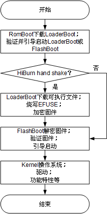
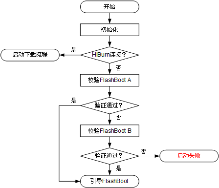
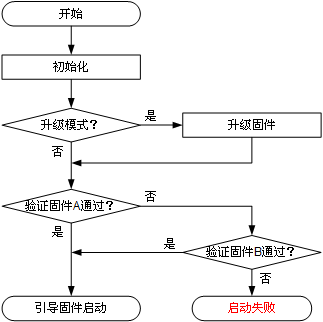

# Preface

**Overview**

This document describes the workflows of WS63V100 RomBoot, LoaderBoot, and FlashBoot. Users can refer to this document to perform secondary development of FlashBoot.

**Product Version**

The product versions corresponding to this document are as follows.

<table><thead align="left"><tr id="row55967882"><th class="cellrowborder" valign="top" width="39.39%" id="mcps1.1.3.1.1">
<strong id="b21211131516">Product Name</strong>

</th>
<th class="cellrowborder" valign="top" width="60.61%" id="mcps1.1.3.1.2">
<strong id="b18261911191515">Product Version</strong>

</th>
</tr>
</thead>
<tbody><tr id="row39329394"><td class="cellrowborder" valign="top" width="39.39%" headers="mcps1.1.3.1.1 ">
WS63

</td>
<td class="cellrowborder" valign="top" width="60.61%" headers="mcps1.1.3.1.2 ">
V100

</td>
</tr>
</tbody>
</table>

**Target Audience**

This document is mainly applicable to the following engineers:

-   Technical Support Engineer
-   Software Development Engineer

**Symbol Conventions**

The following symbols may appear in this document. Their meanings are described below.

<table><thead align="left"><tr id="row1530720816410"><th class="cellrowborder" valign="top" width="20.580000000000002%" id="mcps1.1.3.1.1">
<strong id="b2136615816410">Symbol</strong>

</th>
<th class="cellrowborder" valign="top" width="79.42%" id="mcps1.1.3.1.2">
<strong id="b5941558116410">Description</strong>

</th>
</tr>
</thead>
<tbody><tr id="row1372280416410"><td class="cellrowborder" valign="top" width="20.580000000000002%" headers="mcps1.1.3.1.1 ">

</td>
<td class="cellrowborder" valign="top" width="79.42%" headers="mcps1.1.3.1.2 ">
Indicates a high-level risk hazard that, if not avoided, will result in death or serious injury.

</td>
</tr>
<tr id="row466863216410"><td class="cellrowborder" valign="top" width="20.580000000000002%" headers="mcps1.1.3.1.1 ">

</td>
<td class="cellrowborder" valign="top" width="79.42%" headers="mcps1.1.3.1.2 ">
Indicates a medium-level risk hazard that, if not avoided, may result in death or serious injury.

</td>
</tr>
<tr id="row123863216410"><td class="cellrowborder" valign="top" width="20.580000000000002%" headers="mcps1.1.3.1.1 ">

</td>
<td class="cellrowborder" valign="top" width="79.42%" headers="mcps1.1.3.1.2 ">
Indicates a low-level risk hazard that, if not avoided, may result in minor or moderate injury.

</td>
</tr>
<tr id="row5786682116410"><td class="cellrowborder" valign="top" width="20.580000000000002%" headers="mcps1.1.3.1.1 ">

</td>
<td class="cellrowborder" valign="top" width="79.42%" headers="mcps1.1.3.1.2 ">
Used to convey safety warning information about the device or environment. If not avoided, it may result in device damage, data loss, reduced device performance, or other unpredictable results.

"Notice" does not involve personal injury.

</td>
</tr>
<tr id="row2856923116410"><td class="cellrowborder" valign="top" width="20.580000000000002%" headers="mcps1.1.3.1.1 ">

</td>
<td class="cellrowborder" valign="top" width="79.42%" headers="mcps1.1.3.1.2 ">
Supplementary description of key information in the main text.

"Note" is not safety warning information and does not involve personal, device, or environmental harm.

</td>
</tr>
</tbody>
</table>

**Revision History**

<table><thead align="left"><tr id="row2942532716410"><th class="cellrowborder" valign="top" width="15.65%" id="mcps1.1.4.1.1">
<strong id="b5687322716410">Document Version</strong>

</th>
<th class="cellrowborder" valign="top" width="20.89%" id="mcps1.1.4.1.2">
<strong id="b5800814916410">Release Date</strong>

</th>
<th class="cellrowborder" valign="top" width="63.46000000000001%" id="mcps1.1.4.1.3">
<strong id="b3316380216410">Modification Description</strong>

</th>
</tr>
</thead>
<tbody><tr id="row820313201511"><td class="cellrowborder" valign="top" width="15.65%" headers="mcps1.1.4.1.1 ">
01

</td>
<td class="cellrowborder" valign="top" width="20.89%" headers="mcps1.1.4.1.2 ">
2024-04-10

</td>
<td class="cellrowborder" valign="top" width="63.46000000000001%" headers="mcps1.1.4.1.3 ">
First official version release.

</td>
</tr>
<tr id="row5947359616410"><td class="cellrowborder" valign="top" width="15.65%" headers="mcps1.1.4.1.1 ">
00B01

</td>
<td class="cellrowborder" valign="top" width="20.89%" headers="mcps1.1.4.1.2 ">
2023-12-18

</td>
<td class="cellrowborder" valign="top" width="63.46000000000001%" headers="mcps1.1.4.1.3 ">
First interim version release.

</td>
</tr>
</tbody>
</table>

# Boot Introduction

WS63V100 Boot consists of three parts: RomBoot, FlashBoot, and LoaderBoot.

-   RomBoot functions include:
    -   Load LoaderBoot into RAM, and then use LoaderBoot to download images to Flash, burn eFuse, and so on.
    -   Verify and boot FlashBoot. FlashBoot is divided into side A and side B. If side A passes verification, it boots directly. If verification fails, side B is verified. If side B passes verification, the system boots from side B; otherwise, the system resets and restarts.

-   FlashBoot functions include:
    -   Upgrade the firmware.
    -   Verify and boot the firmware.

-   LoaderBoot functions include:
    -   Download images to Flash.
    -   Burn EFUSE (for example, keys related to secure boot/Flash encryption).

**Figure 1**  Boot startup process  

# RomBoot Function Description

## Downloading Images and Burning EFUSE

RomBoot implements the functions of downloading images to Flash and burning EFUSE by loading LoaderBoot. For specific operations, see the *WS63V100 BurnTool User Guide*.

## Verifying and Booting FlashBoot

The process of verifying and booting FlashBoot is shown in [Figure 1](#fig1578634595518).

**Figure 1**  FlashBoot verification and boot flowchart  

# LoaderBoot Function Description

LoaderBoot is the component that directly interacts with BurnTool. RomBoot cannot directly implement the burning function. LoaderBoot needs to be loaded into RAM, and then the program jumps to LoaderBoot to complete the burning of related content through LoaderBoot. The content that LoaderBoot can burn includes:

-   FlashBoot
-   EFUSE parameter configuration file
-   Firmware images (including NV parameters)
-   Production test images

> **Note:** 
>LoaderBoot generally does not involve secondary development.

# FlashBoot Description

## FlashBoot Startup Process

The process of verifying and booting the firmware is shown in [Figure 1](#fig921910011115).

**Figure 1**  Firmware verification and boot flowchart  

