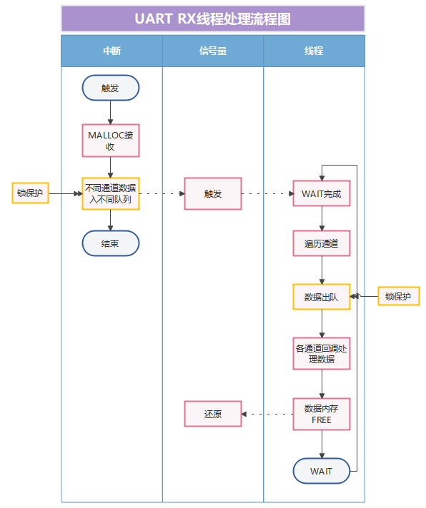
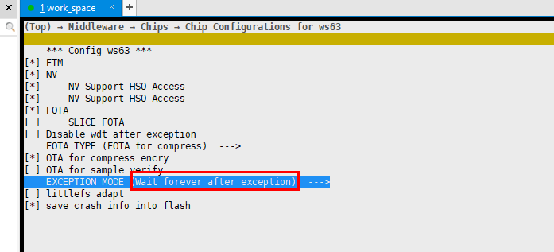

# Preface<a name="ZH-CN_TOPIC_0000001815946742"></a>

**Overview<a name="section4537382116410"></a>**

This document describes the WS63 device driver development content, including working principles, scenario-based interface usage, and precautions.

**Product Version<a name="section12266191774710"></a>**

<a name="table2270181717471"></a>
<table><thead align="left"><tr id="row15364171712479"><th class="cellrowborder" valign="top" width="31.759999999999998%" id="mcps1.1.3.1.1"><p id="p123646174478"><a name="p123646174478"></a><a name="p123646174478"></a><strong id="b4974171818546"><a name="b4974171818546"></a><a name="b4974171818546"></a>Product Name</strong></p>
</th>
<th class="cellrowborder" valign="top" width="68.24%" id="mcps1.1.3.1.2"><p id="p1936401717470"><a name="p1936401717470"></a><a name="p1936401717470"></a><strong id="b14976118115417"><a name="b14976118115417"></a><a name="b14976118115417"></a>Product Version</strong></p>
</th>
</tr>
</thead>
<tbody><tr id="row19364317104716"><td class="cellrowborder" valign="top" width="31.759999999999998%" headers="mcps1.1.3.1.1 "><p id="p14623132513473"><a name="p14623132513473"></a><a name="p14623132513473"></a>WS63</p>
</td>
<td class="cellrowborder" valign="top" width="68.24%" headers="mcps1.1.3.1.2 "><p id="p56214251471"><a name="p56214251471"></a><a name="p56214251471"></a>V100</p>
</td>
</tr>
</tbody>
</table>

**Audience<a name="section4378592816410"></a>**

This document is intended for the following engineers:

-   Technical support engineers
-   Software development engineers

**Symbol Conventions<a name="section133020216410"></a>**

The following symbols may appear in this document. Their meanings are as follows:

<a name="table2622507016410"></a>
<table><thead align="left"><tr id="row1530720816410"><th class="cellrowborder" valign="top" width="20.580000000000002%" id="mcps1.1.3.1.1"><p id="p6450074116410"><a name="p6450074116410"></a><a name="p6450074116410"></a><strong id="b2136615816410"><a name="b2136615816410"></a><a name="b2136615816410"></a>Symbol</strong></p>
</th>
<th class="cellrowborder" valign="top" width="79.42%" id="mcps1.1.3.1.2"><p id="p5435366816410"><a name="p5435366816410"></a><a name="p5435366816410"></a><strong id="b5941558116410"><a name="b5941558116410"></a><a name="b5941558116410"></a>Description</strong></p>
</th>
</tr>
</thead>
<tbody><tr id="row1372280416410"><td class="cellrowborder" valign="top" width="20.580000000000002%" headers="mcps1.1.3.1.1 "><p id="p3734547016410"><a name="p3734547016410"></a><a name="p3734547016410"></a><a name="image2670064316410"></a><a name="image2670064316410"></a><span></span></p>
</td>
<td class="cellrowborder" valign="top" width="79.42%" headers="mcps1.1.3.1.2 "><p id="p1757432116410"><a name="p1757432116410"></a><a name="p1757432116410"></a>Indicates a hazard with a high level of risk that, if not avoided, will result in death or serious injury.</p>
</td>
</tr>
<tr id="row466863216410"><td class="cellrowborder" valign="top" width="20.580000000000002%" headers="mcps1.1.3.1.1 "><p id="p1432579516410"><a name="p1432579516410"></a><a name="p1432579516410"></a><a name="image4895582316410"></a><a name="image4895582316410"></a><span></span></p>
</td>
<td class="cellrowborder" valign="top" width="79.42%" headers="mcps1.1.3.1.2 "><p id="p959197916410"><a name="p959197916410"></a><a name="p959197916410"></a>Indicates a hazard with a medium level of risk that, if not avoided, could result in death or serious injury.</p>
</td>
</tr>
<tr id="row123863216410"><td class="cellrowborder" valign="top" width="20.580000000000002%" headers="mcps1.1.3.1.1 "><p id="p1232579516410"><a name="p1232579516410"></a><a name="p1232579516410"></a><a name="image1235582316410"></a><a name="image1235582316410"></a><span></span></p>
</td>
<td class="cellrowborder" valign="top" width="79.42%" headers="mcps1.1.3.1.2 "><p id="p123197916410"><a name="p123197916410"></a><a name="p123197916410"></a>Indicates a hazard with a low level of risk that, if not avoided, could result in minor or moderate injury.</p>
</td>
</tr>
<tr id="row5786682116410"><td class="cellrowborder" valign="top" width="20.580000000000002%" headers="mcps1.1.3.1.1 "><p id="p2204984716410"><a name="p2204984716410"></a><a name="p2204984716410"></a><a name="image4504446716410"></a><a name="image4504446716410"></a><span></span></p>
</td>
<td class="cellrowborder" valign="top" width="79.42%" headers="mcps1.1.3.1.2 "><p id="p4388861916410"><a name="p4388861916410"></a><a name="p4388861916410"></a>Conveys device or environment safety warning information. If not avoided, it may result in device damage, data loss, degraded device performance, or other unpredictable consequences.</p>
<p id="p1238861916410"><a name="p1238861916410"></a><a name="p1238861916410"></a>The "Caution" notice does not involve personal injury.</p>
</td>
</tr>
<tr id="row2856923116410"><td class="cellrowborder" valign="top" width="20.580000000000002%" headers="mcps1.1.3.1.1 "><p id="p5555360116410"><a name="p5555360116410"></a><a name="p5555360116410"></a><a name="image799324016410"></a><a name="image799324016410"></a><span></span></p>
</td>
<td class="cellrowborder" valign="top" width="79.42%" headers="mcps1.1.3.1.2 "><p id="p4612588116410"><a name="p4612588116410"></a><a name="p4612588116410"></a>Supplementary explanation of key information in the main text.</p>
<p id="p1232588116410"><a name="p1232588116410"></a><a name="p1232588116410"></a>The "Note" is not safety warning information and does not involve personal, device, or environmental harm.</p>
</td>
</tr>
</tbody>
</table>

**Revision History<a name="section2467512116410"></a>**

<a name="table1557726816410"></a>
<table><thead align="left"><tr id="row2942532716410"><th class="cellrowborder" valign="top" width="18.7%" id="mcps1.1.4.1.1"><p id="p3778275416410"><a name="p3778275416410"></a><a name="p3778275416410"></a><strong id="b5687322716410"><a name="b5687322716410"></a><a name="b5687322716410"></a>Document Version</strong></p>
</th>
<th class="cellrowborder" valign="top" width="20.21%" id="mcps1.1.4.1.2"><p id="p5627845516410"><a name="p5627845516410"></a><a name="p5627845516410"></a><strong id="b5800814916410"><a name="b5800814916410"></a><a name="b5800814916410"></a>Release Date</strong></p>
</th>
<th class="cellrowborder" valign="top" width="61.09%" id="mcps1.1.4.1.3"><p id="p2382284816410"><a name="p2382284816410"></a><a name="p2382284816410"></a><strong id="b3316380216410"><a name="b3316380216410"></a><a name="b3316380216410"></a>Revision Description</strong></p>
</th>
</tr>
</thead>
<tbody><tr id="row783381372417"><td class="cellrowborder" valign="top" width="18.7%" headers="mcps1.1.4.1.1 "><p id="p383411312418"><a name="p383411312418"></a><a name="p383411312418"></a>04</p>
</td>
<td class="cellrowborder" valign="top" width="20.21%" headers="mcps1.1.4.1.2 "><p id="p08341513142411"><a name="p08341513142411"></a><a name="p08341513142411"></a>2025-08-29</p>
</td>
<td class="cellrowborder" valign="top" width="61.09%" headers="mcps1.1.4.1.3 "><a name="ul21981219257"></a><a name="ul21981219257"></a><ul id="ul21981219257"><li>Updated the content of the "<a href="GPIO.md">GPIO</a>" "<a href="functional_description-1.md">Functional Description</a>" section.</li><li>Updated the content of the "<a href="UART.md">UART</a>" "<a href="precautions-7.md">Precautions</a>" section.</li><li>Updated the content of the "<a href="SPI.md">SPI</a>" "<a href="overview-8.md">Overview</a>" and "<a href="development_guidelines-10.md">Development Guidelines</a>" sections.</li><li>Updated the content of the "<a href="ADC.md">ADC</a>" "<a href="functional_description-17.md">Functional Description</a>" and "<a href="development_guidelines-18.md">Development Guidelines</a>" sections.</li><li>Updated the content of the "<a href="PWM.md">PWM</a>" "<a href="overview-24.md">Overview</a>" and "<a href="functional_description-25.md">Functional Description</a>" sections.</li><li>Updated the content of the "<a href="WDT.md">WDT</a>" "<a href="precautions-31.md">Precautions</a>" section.</li><li>Added the "<a href="REBOOT.md">REBOOT</a>" chapter.</li></ul>
</td>
</tr>
<tr id="row1492411844315"><td class="cellrowborder" valign="top" width="18.7%" headers="mcps1.1.4.1.1 "><p id="p892488144317"><a name="p892488144317"></a><a name="p892488144317"></a>03</p>
</td>
<td class="cellrowborder" valign="top" width="20.21%" headers="mcps1.1.4.1.2 "><p id="p392417884310"><a name="p392417884310"></a><a name="p392417884310"></a>2025-02-28</p>
</td>
<td class="cellrowborder" valign="top" width="61.09%" headers="mcps1.1.4.1.3 "><a name="ul139902388456"></a><a name="ul139902388456"></a><ul id="ul139902388456"><li>Updated the content of the "<a href="SPI.md">SPI</a>" "<a href="configuration_guidelines.md">Configuration Guidelines</a>" and "<a href="precautions-11.md">Precautions</a>" sections.</li><li>Updated the content of the "<a href="PWM.md">PWM</a>" "<a href="functional_description-25.md">Functional Description</a>" and "<a href="development_guidelines-26.md">Development Guidelines</a>" sections.</li><li>Updated the content of the "<a href="Timer.md">Timer</a>" "<a href="overview-32.md">Overview</a>" section.</li><li>Updated the content of the "<a href="Systick.md">Systick</a>" "<a href="overview-36.md">Overview</a>" and "<a href="precautions-39.md">Precautions</a>" sections.</li></ul>
</td>
</tr>
<tr id="row59361135219"><td class="cellrowborder" valign="top" width="18.7%" headers="mcps1.1.4.1.1 "><p id="p1593710118528"><a name="p1593710118528"></a><a name="p1593710118528"></a>02</p>
</td>
<td class="cellrowborder" valign="top" width="20.21%" headers="mcps1.1.4.1.2 "><p id="p1393717112524"><a name="p1393717112524"></a><a name="p1393717112524"></a>2024-10-30</p>
</td>
<td class="cellrowborder" valign="top" width="61.09%" headers="mcps1.1.4.1.3 "><p id="p1274182065219"><a name="p1274182065219"></a><a name="p1274182065219"></a>Updated the content of the "<a href="UART.md">UART</a>" "<a href="precautions-7.md">Precautions</a>" section.</p>
</td>
</tr>
<tr id="row10398174612161"><td class="cellrowborder" valign="top" width="18.7%" headers="mcps1.1.4.1.1 "><p id="p1739810466168"><a name="p1739810466168"></a><a name="p1739810466168"></a>01</p>
</td>
<td class="cellrowborder" valign="top" width="20.21%" headers="mcps1.1.4.1.2 "><p id="p53981462160"><a name="p53981462160"></a><a name="p53981462160"></a>2024-04-10</p>
</td>
<td class="cellrowborder" valign="top" width="61.09%" headers="mcps1.1.4.1.3 "><p id="p839824618162"><a name="p839824618162"></a><a name="p839824618162"></a>First official release.</p>
</td>
</tr>
<tr id="row97898558332"><td class="cellrowborder" valign="top" width="18.7%" headers="mcps1.1.4.1.1 "><p id="p378945517333"><a name="p378945517333"></a><a name="p378945517333"></a>00B02</p>
</td>
<td class="cellrowborder" valign="top" width="20.21%" headers="mcps1.1.4.1.2 "><p id="p9789185513334"><a name="p9789185513334"></a><a name="p9789185513334"></a>2024-03-29</p>
</td>
<td class="cellrowborder" valign="top" width="61.09%" headers="mcps1.1.4.1.3 "><a name="ul5193333413"></a><a name="ul5193333413"></a><ul id="ul5193333413"><li>Updated the content of the "<a href="Pinctrl.md">Pinctrl</a>" "<a href="overview.md">Overview</a>" and "<a href="development_guidelines.md">Development Guidelines</a>" sections.</li><li>Updated the content of the "<a href="SPI.md">SPI</a>" "<a href="overview-8.md">Overview</a>" section.</li><li>Updated the content of the "<a href="I2C.md">I2C</a>" "<a href="functional_description-13.md">Functional Description</a>" and "<a href="development_guidelines-14.md">Development Guidelines</a>" sections.</li><li>Updated the content of the "<a href="WDT.md">WDT</a>" "<a href="overview-28.md">Overview</a>" section.</li><li>Updated the content of the "<a href="Timer.md">Timer</a>" "<a href="precautions-35.md">Precautions</a>" section.</li><li>Updated the content of the "<a href="TCXO.md">TCXO</a>" "<a href="overview-40.md">Overview</a>" section.</li></ul>
</td>
</tr>
<tr id="row530915382403"><td class="cellrowborder" valign="top" width="18.7%" headers="mcps1.1.4.1.1 "><p id="p2149706016410"><a name="p2149706016410"></a><a name="p2149706016410"></a>00B01</p>
</td>
<td class="cellrowborder" valign="top" width="20.21%" headers="mcps1.1.4.1.2 "><p id="p648803616410"><a name="p648803616410"></a><a name="p648803616410"></a>2024-03-15</p>
</td>
<td class="cellrowborder" valign="top" width="61.09%" headers="mcps1.1.4.1.3 "><p id="p1946537916410"><a name="p1946537916410"></a><a name="p1946537916410"></a>First temporary release.</p>
</td>
</tr>
</tbody>
</table>

# Pinctrl<a name="ZH-CN_TOPIC_0000001816106494"></a>


## Overview<a name="ZH-CN_TOPIC_0000001862746297"></a>

The Pinctrl controller is used to control the multiplexing function of IO pins. The configurable specifications are as follows:

-   Supports configuring a group of IO pins, GPIO\_00 to GPIO\_18.
-   Supports configuring the IO drive strength, IO function multiplexing, and IO pull-up/pull-down states.

## Functional Description<a name="ZH-CN_TOPIC_0000001816106450"></a>

The interfaces and functions provided by the Pinctrl driver module are as follows:

-   uapi\_pin\_init: Initializes the Pinctrl.
-   uapi\_pin\_deinit: Deinitializes the Pinctrl.
-   uapi\_pin\_set\_mode: Sets the multiplexing mode of a specified IO.
-   uapi\_pin\_get\_mode: Obtains the multiplexing mode of a specified IO.
-   uapi\_pin\_set\_ds: Sets the drive strength of a specified IO.
-   uapi\_pin\_get\_ds: Obtains the drive strength of a specified IO.
-   uapi\_pin\_set\_pull: Sets the pull-up/pull-down state of a specified IO.
-   uapi\_pin\_get\_pull: Obtains the pull-up/pull-down state of a specified IO.

## Development Guidelines<a name="ZH-CN_TOPIC_0000001862706533"></a>

The Pinctrl interface usage follows these steps (the following steps are optional based on actual requirements):

1.  Call the uapi\_pin\_set\_mode and uapi\_pin\_get\_mode interfaces to set/query the multiplexing mode of a specified IO.
2.  Call the uapi\_pin\_set\_ds and uapi\_pin\_get\_ds interfaces to set/query the drive strength of a specified IO.
3.  Call the uapi\_pin\_set\_pull and uapi\_pin\_get\_pull interfaces to set/query the pull-up/pull-down state of a specified IO.

Example:

```
    /* Set the multiplexing function of GPIO_00 to gpio */
    uapi_pin_set_mode(GPIO_00, PIN_MODE_0);
    /* Set the drive strength of GPIO_00 to PIN_DS_2 */
    uapi_pin_set_ds(GPIO_00, PIN_DS_2);
    /* Set GPIO_00 to pull-up mode */
    uapi_pin_set_pull(GPIO_00, PIN_PULL_TYPE_UP);

```

## Precautions<a name="ZH-CN_TOPIC_0000001862706493"></a>

When configuring the IO multiplexing function, check whether the IO supports the target function or has already been multiplexed to another function to avoid affecting existing functions. For IO multiplexing, refer to the definition of the "pin\_t" structure in the "sdk\drivers\chips\ws63\include\platform\_core\_rom.h" source file.

# GPIO<a name="ZH-CN_TOPIC_0000001815946714"></a>


## Overview<a name="ZH-CN_TOPIC_0000001862746321"></a>

GPIO (General-purpose input/output) is a general-purpose I/O interface standard. It can be configured as input or output mode to control external devices or communicate with other devices. It can be used to connect various devices, such as LED lights, sensors, actuators, and so on.

The GPIO specifications are as follows:

-   Supports setting the GPIO pin direction and output level state.
-   Supports external level interrupt and external edge interrupt reporting.
-   Supports an independent interrupt for each GPIO.

## Functional Description<a name="ZH-CN_TOPIC_0000001862746313"></a>

The interfaces and functions provided by the GPIO module are as follows:

-   uapi\_gpio\_init: Initializes the GPIO.
-   uapi\_gpio\_deinit: Deinitializes the GPIO.
-   uapi\_gpio\_set\_dir: Sets the direction (input/output) of a specified GPIO.
-   uapi\_gpio\_get\_dir: Obtains the direction (input/output) of a specified GPIO.
-   uapi\_gpio\_set\_val: Sets the level state of a specified GPIO.
-   uapi\_gpio\_get\_val: Obtains the level state of a specified GPIO.
-   uapi\_gpio\_register\_isr\_func: Registers the interrupt of a specified GPIO.
-   uapi\_gpio\_unregister\_isr\_func: Unregisters the interrupt of a specified GPIO.
-   uapi\_gpio\_disable\_interrupt: Disables the GPIO interrupt.
-   uapi\_gpio\_enable\_interrupt: Enables the GPIO interrupt.
-   uapi\_gpio\_clear\_interrupt: Clears the GPIO interrupt.
-   uapi\_gpio\_toggle: Toggles the GPIO output level state.

## Development Guidelines<a name="ZH-CN_TOPIC_0000001862706509"></a>

The GPIO interface usage follows these steps:

1.  Call the uapi\_pin\_set\_mode interface to multiplex the PIN to the GPIO function.
2.  Based on development requirements, the GPIO interface can be set to output, input, or interrupt mode as follows:
    -   Output mode:
        1.  Call the uapi\_gpio\_set\_dir interface to set the GPIO direction to OUT.
        2.  Call the uapi\_gpio\_set\_val interface to set the GPIO output level state (high/low).

    -   Input mode:
        1.  Call the uapi\_gpio\_set\_dir interface to set the GPIO direction to IN.
        2.  Call the uapi\_gpio\_get\_val interface to obtain the GPIO input level state.

    -   Interrupt mode:
        1.  Call the uapi\_gpio\_set\_dir interface to set the GPIO direction to IN.
        2.  Call the uapi\_gpio\_register\_isr\_func interface to register the GPIO interrupt callback function.
        3.  Call the uapi\_gpio\_unregister\_isr\_func interface to unregister the GPIO interrupt callback function (called when unregistering the interrupt).

Example:

```
#include "gpio.h"
void gpio_callback_func(pin_t pin, uintptr_t param)
{
    unused(param);
    osal_printk("PIN:%d interrupt success. \r\n", pin);
}
errcode_t sample_gpio_test(pin_t pin)
{
    uapi_pin_init();
    uapi_gpio_init();
    uapi_pin_set_mode(pin, HAL_PIO_FUNC_GPIO); /* Set the specified IO to GPIO mode */
    uapi_gpio_set_dir(pin, GPIO_DIRECTION_INPUT); /* Set the specified GPIO to input mode */
    /* Register the rising-edge interrupt of the specified GPIO, with gpio_callback_func as the callback function */
    if (uapi_gpio_register_isr_func(pin, GPIO_INTERRUPT_RISING_EDGE, gpio_callback_func) != ERRCODE_SUCC) {
        uapi_gpio_unregister_isr_func(pin); /* Clean up residual resources */
        return ERRCODE_FAIL;
    }
    return ERRCODE_SUCC;
}
```

## Precautions<a name="ZH-CN_TOPIC_0000001862706497"></a>

-   When using the GPIO level interrupt, control the time for which the input level triggers the interrupt in the callback function; otherwise, the system will remain in interrupt handling and be unable to execute other functions.
-   When there is no explicit requirement scenario for the trigger mode, it is recommended to use the default configuration.

# UART<a name="ZH-CN_TOPIC_0000001862706541"></a>


## Overview<a name="ZH-CN_TOPIC_0000001816106542"></a>

UART (Universal Asynchronous Receiver/Transmitter) is a serial, asynchronous, full-duplex communication protocol used for data transmission between devices. UART is one of the most commonly used device-to-device communication protocols. Once correctly configured, UART can work with many different types of serial protocols that involve sending and receiving serial data.

The MCU side of the WS63 chip provides three configurable UART peripheral units: UART0, UART1, and UART2. The UART specifications are as follows:

-   Supports programmable data bits \(5-8bit\), programmable stop bits \(1-2bit\), and programmable parity bits \(odd/even parity, no parity\).
-   UART supports no-flow-control and RTS/CTS flow control modes.
-   Provides a 64×8 TX FIFO and a 64×10 RX FIFO.
-   Supports interrupt masking and response for receive FIFO interrupt, transmit FIFO interrupt, receive timeout interrupt, error interrupt, and so on.
-   Supports DMA data transfer.

## Functional Description<a name="ZH-CN_TOPIC_0000001816106526"></a>

> **Note:** 
>If the UART driver needs to support DMA data transmission and reception, ensure that the DMA driver has been initialized.

The driver code declares the UART driver functions in include\driver\uart.h. The interfaces and functions provided are as follows:

-   uapi\_uart\_init: Initializes the UART.
-   uapi\_uart\_deinit: Deinitializes the UART.
-   uapi\_uart\_read: Reads data.
-   uapi\_uart\_write: Writes data.
-   uapi\_uart\_set\_flow\_ctrl: Configures UART hardware flow control.
-   uapi\_uart\_set\_software\_flow\_ctrl\_level: Configures the software flow control level.
-   uapi\_uart\_get\_attr: Obtains UART configuration parameters.
-   uapi\_uart\_set\_attr: Sets UART configuration parameters.
-   uapi\_uart\_has\_pending\_transmissions: Queries whether the UART is transmitting data.
-   uapi\_uart\_register\_rx\_callback: Registers the receive callback function, which is triggered based on the trigger condition and Size.
-   uapi\_uart\_unregister\_rx\_callback: Unregisters the receive callback function.
-   uapi\_uart\_register\_parity\_error\_callback: Registers the callback function for parity error handling.
-   uapi\_uart\_register\_frame\_error\_callback: Registers the callback function for frame error handling.
-   uapi\_uart\_write\_int: Sends data to the opened UART in interrupt mode. The callback function is invoked when data transmission completes.
-   uapi\_uart\_write\_by\_dma: Sends data via DMA.
-   uapi\_uart\_flush\_rx\_data: Flushes the data in the UART receive buffer.
-   uapi\_uart\_get\_rx\_data\_count: Obtains the data in the current receive buffer.
-   uapi\_uart\_rx\_fifo\_is\_empty: Determines whether the RX FIFO is empty.

## Development Guidelines<a name="ZH-CN_TOPIC_0000001862706573"></a>

Taking UART0 as an example, the data transmission and reception process is as follows:

1.  Configure IO multiplexing. Multiplex the corresponding IOs to the TX, RX, RTS, and CTS functions of UART1.

    If hardware flow control is not required, configure only TX and RX.

    ```
    void usr_uart_io_config(void)
    {
        /* The IO multiplexing configuration below can also be centralized in the usr_io_init function in the SDK */
        uapi_pin_set_mode(S_AGPIO5, HAL_PIO_FUNC_UART_H0_M1); /* uart1 rtx */
        uapi_pin_set_mode(S_AGPIO6, HAL_PIO_FUNC_UART_H0_M1); /* uart1 ctx */
        uapi_pin_set_mode(S_AGPIO12, HAL_PIO_FUNC_UART_H0_M1); /* uart1 tx */
        uapi_pin_set_mode(S_AGPIO13, HAL_PIO_FUNC_UART_H0_M1); /* uart1 rx */
    }
    ```

2.  Initialize the UART. Configure attributes such as baud rate and data bits, and enable the UART.

    ```
    #define TEST_UART_RX_BUFF_SIZE　0x1 /* Define the UART receive buffer size */
    unsigned char g_uart_rx_buff[TEST_UART_RX_BUFF_SIZE] = { 0 };
    uart_buffer_config_t g_uart_buffer_config = {
        .rx_buffer = g_uart_rx_buff,
        .rx_buffer_size = TEST_UART_RX_BUFF_SIZE
    };
    errcode_t usr_uart_init_config(void)
    {
        errcode_t errcode;
        uart_attr_t attr = {
            .baud_rate = 115200, /* Baud rate */
            .data_bits = UART_DATA_BIT_8,      /* Data bits */
            .stop_bits = UART_STOP_BIT_1,      /* Stop bits */
            .parity = UART_PARITY_NONE         /* Parity */
        };
        uart_pin_config_t pin_config = {
            .tx_pin = S_AGPIO5, /* uart1 tx */
            .rx_pin = S_AGPIO6, /* uart1 rx */
            .cts_pin = S_AGPIO12, /* Flow control function, optional */
            .rts_pin = S_AGPIO13  /* Flow control function, optional */
        };
        errcode = uapi_uart_init(UART_BUS_1, &pin_config, &attr, NULL, &g_uart_buffer_config);
        if (errcode != ERRCODE_SUCC) {
            osal_printk("uart init fail\r\n");
        }
        return errcode;
    }
    ```

3.  UART data transmission and reception. Call the UART polling read/write interfaces to transmit and receive data.

    ```
    void usr_uart_read_data(void)
    {
        int len;
        unsigned char g_test_uart_rx_buffer[64];
        len = uapi_uart_read(UART_BUS_0, g_test_uart_rx_buffer, 64, 0);
        if(len > 0) {
            /* process */
        }
    }
    int usr_uart_write_data(unsigned int size, char* buff)
    {
        unsigned char tx_buff[10] = { 0 };
        if (memcpy_s(tx_buff, 10, buff, size) != EOK) {
            return ERRCODE_FAIL;
        }
        int ret = uapi_uart_write(UART_BUS_0, tx_buff, size, 0);
        if(ret == -1) {
            return ERRCODE_FAIL;
        }
        return ERRCODE_SUCC;
    }
    ```

The UART DMA mode data transmission process is as follows:

1.  Configure IO multiplexing. Multiplex the corresponding IOs to the TX, RX, RTS, and CTS functions of UART.

    If hardware flow control is not required, configure only TX and RX.

    ```
    void usr_uart_io_config(void)
    {
        /* The IO multiplexing configuration below can also be centralized in the usr_io_init function in the SDK */
        uapi_pin_set_mode(S_AGPIO5, HAL_PIO_FUNC_UART_H0_M1); /* uart1 rtx */
        uapi_pin_set_mode(S_AGPIO6, HAL_PIO_FUNC_UART_H0_M1); /* uart1 ctx */
        uapi_pin_set_mode(S_AGPIO12, HAL_PIO_FUNC_UART_H0_M1); /* uart1 tx */
        uapi_pin_set_mode(S_AGPIO13, HAL_PIO_FUNC_UART_H0_M1); /* uart1 rx */
    }
    ```

2.  Initialize the UART. Configure attributes such as baud rate and data bits, and enable the UART.

    ```
    errcode_t usr_uart_init_config(void)
    {
        errcode_t errcode;
        uart_attr_t attr = {
            .baud_rate = 115200, /* Baud rate */
            .data_bits = UART_DATA_BIT_8,      /* Data bits */
            .stop_bits = UART_STOP_BIT_1,      /* Stop bits */
            .parity = UART_PARITY_NONE         /* Parity */
        };
        uart_pin_config_t pin_config = {
            .tx_pin = S_AGPIO5, /* uart1 tx */
            .rx_pin = S_AGPIO6, /* uart1 rx */
            .cts_pin = S_AGPIO12, /* Flow control function, optional */
            .rts_pin = S_AGPIO13  /* Flow control function, optional */
        };
        uart_extra_attr_t ext_config = {
            .tx_dma_enable = true,
            .tx_int_threshold = 0x4,
        }
        errcode = uapi_uart_init(UART_BUS_1, &pin_config, &attr, &ext_config, &g_uart_buffer_config);
        if (errcode != ERRCODE_SUCC) {
            osal_printk("uart init fail\r\n");
        }
        return errcode;
    }
    ```

3.  UART DMA data transmission.

    ```
    #define TEST_UART_DMA_SEND_BUFF_SIZE 1024
    #define HAL_DMA_TRANSFER_WIDTH_8 0
    #define HAL_DMA_BURST_TRANSACTION_LENGTH_4 1
    static errcode_t test_uart_write_by_dma()
    {
        uint8_t dma_buff[TEST_UART_DMA_SEND_BUFF_SIZE] = { 0 };
        if (memset_s(dma_buff, TEST_UART_DMA_SEND_BUFF_SIZE, 0XA5, TEST_UART_DMA_SEND_BUFF_SIZE) != 0) {
            return ERRCODE_FAIL;
        }
        uart_write_dma_config_t dma_cfg = {
            .src_width = HAL_DMA_TRANSFER_WIDTH_8,              /* 0 indicates 8 bits */
            .dest_width = HAL_DMA_TRANSFER_WIDTH_8,             /* 0 indicates 8 bits */
            .burst_length = HAL_DMA_BURST_TRANSACTION_LENGTH_4, /* Indicates 4 bytes */
            .priority = 0                                       /* Priority 0 */
        };
        if (uapi_uart_write_by_dma(UART_BUS_0, dma_buff, len, &dma_cfg) != len) {
            osal_printk("[UART] *** memory t--o uart fail!\r\n");
            return ERRCODE_FAIL;
        }
        return ERRCODE_SUCC;
    }
    ```

## Precautions<a name="ZH-CN_TOPIC_0000001862746341"></a>

-   In the SDK, UART0 is used by default as the shared serial port for program flashing, Testsuite, AT commands, and data printing.
-   In the SDK, UART1 is used by default as the maintenance and test data channel of the DebugKites tool.
-   In the SDK, the drivers/chips/ws63/include/platform\_core.h file defines the UART usage. TEST\_SUITE\_UART\_BUS defines the serial port used for Testsuite debugging, and LOG\_UART\_BUS defines the serial port used by the HSO tool.
-   In the SDK, the UART provides the feature macro CONFIG\_UART\_SUPPORT\_RX\_THREAD.
    -   After enabling CONFIG\_UART\_SUPPORT\_RX\_THREAD, the serial port RX data can be configured to be processed by a thread. This avoids the scenario where the hardware interrupt directly calls the serial port callback function and takes too long, causing lost interrupts and ultimately RX data packet loss.
    -   Working principle of the feature: A thread is created. When the thread is triggered, it processes the data queues of each serial port by calling the callback function of each serial port. In the interrupt, the direct call to the serial port callback function is removed; instead, the interrupt only receives data, stores it in the queue, and triggers the thread for processing. This shortens the interrupt processing time and reduces the probability of lost interrupts.

        

    -   The feature is enabled as follows:

1.  Enter the menuconfig configuration and go to \(Top\) → Drivers → Drivers → UART → Uart Configuration.
2.  Under UART support RX, enable UART support RX thread.
3.  Configure the thread-related parameters, including the uart rx thread stack size, the rx data flow control waterline size, and the thread priority, and save the configuration after completion.

# SPI<a name="ZH-CN_TOPIC_0000001815946766"></a>


## Overview<a name="ZH-CN_TOPIC_0000001862746329"></a>

SPI (Serial Peripheral Interface) is a high-speed, full-duplex, synchronous communication bus. It enables the MCU to communicate with various peripheral devices in a serial manner to exchange information. The SPI bus can be directly connected to a variety of standard peripheral devices from various manufacturers, including FLASH, RAM, network controllers, LCD display drivers, A/D converters, and MCUs. A standard SPI bus generally uses four lines: the serial clock line (SCLK), the master input/slave output data line MISO, the master output/slave input data line MOSI, and the active-low slave select line NSS.

WS63 provides two groups of configurable full-duplex standard SPI peripherals, SPI0 to SPI1. The SPI specifications are as follows:

-   Supports the following three SPI frame formats:
    -   Motorola frame format
    -   TI (Texas Instruments) frame format
    -   National Microwire frame format

-   Each SPI has separate TX and RX FIFOs with a width of 32bit×64.
-   Supports a maximum transmission width of 32 bits.

## Functional Description<a name="ZH-CN_TOPIC_0000001816106522"></a>

In master mode, SPI supports polling read/write, interrupt read/write, and DMA read/write. In slave mode, SPI supports interrupt read/write and DMA read/write.

If the SPI driver needs to use DMA mode for data read/write, ensure that the DMA driver has been initialized. For DMA initialization, refer to "[DMA](DMA.md)".

The interfaces and functions provided by the SPI module are as follows:

-   uapi\_spi\_init: Initializes the SPI (including settings such as master/slave mode, polarity, phase, frame protocol, transmission frequency, and transmission width).
-   uapi\_spi\_deinit: Deinitializes the SPI (closes the corresponding SPI unit and releases resources).
-   uapi\_spi\_get\_attr:  Obtains the basic configuration parameters of the SPI (master/slave mode, clock polarity, clock phase, clock division factor, SPI working frequency, serial transmission protocol, SPI frame format, SPI frame length, SPI transmission mode, and so on).
-   uapi\_spi\_set\_attr: Sets the basic configuration parameters of the SPI.
-   uapi\_spi\_get\_extra\_attr: Obtains the advanced configuration parameters of the SPI (whether the SPI uses DMA for data transmission, whether the SPI uses DMA for data reception, QSPI parameters, and so on).
-   uapi\_spi\_set\_extra\_attr: Sets the advanced configuration parameters of the SPI.
-   uapi\_spi\_select\_slave: Chip select.
-   uapi\_spi\_master\_write: The SPI master sends data in half-duplex mode.
-   uapi\_spi\_master\_read: The SPI master receives data in half-duplex mode.
-   uapi\_spi\_master\_writeread: The SPI master transmits and receives data in full-duplex mode.
-   uapi\_spi\_slave\_read: The SPI slave receives data in half-duplex mode.
-   uapi\_spi\_slave\_write: The SPI slave sends data in half-duplex mode.

## Configuration Guidelines<a name="ZH-CN_TOPIC_0000002218638453"></a>

To obtain the required interface rate, configure the bus\_clk and freq\_mhz fields in the spi\_attr\_t structure according to [\#ZH-CN\_TOPIC\_0000002218638453/table144001871199](#table144001871199) when initializing the SPI (calling the uapi\_spi\_init interface). To obtain an interface rate of 1M, configure bus\_clk to 80000000 and freq\_mhz to 1.

<a name="table144001871199"></a>
<table><thead align="left"><tr id="row104001179910"><th class="cellrowborder" valign="top" width="33.33333333333333%" id="mcps1.1.4.1.1"><p id="p967618260464"><a name="p967618260464"></a><a name="p967618260464"></a>Interface Rate</p>
</th>
<th class="cellrowborder" valign="top" width="33.33333333333333%" id="mcps1.1.4.1.2"><p id="p10676226114619"><a name="p10676226114619"></a><a name="p10676226114619"></a>bus_clk Configuration (Decimal)</p>
</th>
<th class="cellrowborder" valign="top" width="33.33333333333333%" id="mcps1.1.4.1.3"><p id="p1367610262462"><a name="p1367610262462"></a><a name="p1367610262462"></a>freq_mhz Configuration</p>
</th>
</tr>
</thead>
<tbody><tr id="row4400271993"><td class="cellrowborder" valign="top" width="33.33333333333333%" headers="mcps1.1.4.1.1 "><p id="p86768264469"><a name="p86768264469"></a><a name="p86768264469"></a>1M</p>
</td>
<td class="cellrowborder" valign="top" width="33.33333333333333%" headers="mcps1.1.4.1.2 "><p id="p84001976912"><a name="p84001976912"></a><a name="p84001976912"></a>80000000</p>
</td>
<td class="cellrowborder" valign="top" width="33.33333333333333%" headers="mcps1.1.4.1.3 "><p id="p1140012713910"><a name="p1140012713910"></a><a name="p1140012713910"></a>1</p>
</td>
</tr>
<tr id="row740057799"><td class="cellrowborder" valign="top" width="33.33333333333333%" headers="mcps1.1.4.1.1 "><p id="p5904192617917"><a name="p5904192617917"></a><a name="p5904192617917"></a>2M</p>
</td>
<td class="cellrowborder" valign="top" width="33.33333333333333%" headers="mcps1.1.4.1.2 "><p id="p144001376914"><a name="p144001376914"></a><a name="p144001376914"></a>80000000</p>
</td>
<td class="cellrowborder" valign="top" width="33.33333333333333%" headers="mcps1.1.4.1.3 "><p id="p24011271199"><a name="p24011271199"></a><a name="p24011271199"></a>2</p>
</td>
</tr>
<tr id="row2040112716910"><td class="cellrowborder" valign="top" width="33.33333333333333%" headers="mcps1.1.4.1.1 "><p id="p1959816275911"><a name="p1959816275911"></a><a name="p1959816275911"></a>4M</p>
</td>
<td class="cellrowborder" valign="top" width="33.33333333333333%" headers="mcps1.1.4.1.2 "><p id="p12401076920"><a name="p12401076920"></a><a name="p12401076920"></a>80000000</p>
</td>
<td class="cellrowborder" valign="top" width="33.33333333333333%" headers="mcps1.1.4.1.3 "><p id="p10401671193"><a name="p10401671193"></a><a name="p10401671193"></a>4</p>
</td>
</tr>
<tr id="row17401157798"><td class="cellrowborder" valign="top" width="33.33333333333333%" headers="mcps1.1.4.1.1 "><p id="p16260828595"><a name="p16260828595"></a><a name="p16260828595"></a>8M</p>
</td>
<td class="cellrowborder" valign="top" width="33.33333333333333%" headers="mcps1.1.4.1.2 "><p id="p15401147193"><a name="p15401147193"></a><a name="p15401147193"></a>80000000</p>
</td>
<td class="cellrowborder" valign="top" width="33.33333333333333%" headers="mcps1.1.4.1.3 "><p id="p2401971197"><a name="p2401971197"></a><a name="p2401971197"></a>8</p>
</td>
</tr>
<tr id="row1240114719910"><td class="cellrowborder" valign="top" width="33.33333333333333%" headers="mcps1.1.4.1.1 "><p id="p189912281892"><a name="p189912281892"></a><a name="p189912281892"></a>10M</p>
</td>
<td class="cellrowborder" valign="top" width="33.33333333333333%" headers="mcps1.1.4.1.2 "><p id="p840157996"><a name="p840157996"></a><a name="p840157996"></a>80000000</p>
</td>
<td class="cellrowborder" valign="top" width="33.33333333333333%" headers="mcps1.1.4.1.3 "><p id="p12401127192"><a name="p12401127192"></a><a name="p12401127192"></a>10</p>
</td>
</tr>
</tbody>
</table>

## Development Guidelines<a name="ZH-CN_TOPIC_0000001862706569"></a>

SPI is used to interface with devices that support the SPI protocol. An SPI unit can act as a master or slave device. Taking the SPI unit as the master device as an example, the write operation is as follows:

1.  Configure the pins used by the SPI function to the SPI function through IO multiplexing.

    For the multiplexing of each pin function, refer to the definitions of each pin function in platform\_core.h.

    ```
    #define SPI_PIN_MISO    S_MGPIO16
    #define SPI_PIN_MOSI    S_MGPIO17
    #define SPI_PIN_CLK     S_MGPIO18
    #define SPI_PIN_CS      S_MGPIO19
    void usr_spi_io_init(void)
    {
        /* Set the SPI pinmux */
        uapi_pin_set_mode(SPI_PIN_MISO, SPI_PIN_MISO_PINMUX);       /* Set the SPI MISO pinmux */
        uapi_pin_set_mode(SPI_PIN_MOSI, SPI_PIN_MOSI_PINMUX);       /* Set the SPI MOSI pinmux */
        uapi_pin_set_mode(SPI_PIN_CLK, SPI_PIN_CLK_PINMUX);         /* Set the SPI CLK pinmux */
        uapi_pin_set_mode(SPI_PIN_CS, SPI_PIN_CS_PINMUX);           /* Set the SPI CS pinmux */
    }
    ```

2.  Call uapi\_spi\_init to initialize SPI resources, select the SPI functional unit, and configure SPI parameters.

    ```
    #define TEST_SPI                SPI_BUS_2
    #define BUS_CLOCK               32000000    /* 32M */
    #define SPI_FREQUENCY           2
    errcode_t usr_spi_init(void)
    {
        spi_attr_t config = { 0 };
        spi_extra_attr_t ext_config = { 0 };
        ext_config.sspi_param.wait_cycles = 0x10;
        usr_spi_io_init();
        config.freq_mhz = SPI_FREQUENCY;                            /* SPI frequency division value */
        config.is_slave = false;                                    /* Master mode */
        config.frame_size = HAL_SPI_FRAME_SIZE_8;                   /* SPI frame size, using 8 bits */
        config.salve_num = 1;                                       /* Use chip select 0 */
        config.spi_frame_format = HAL_SPI_FRAME_FORMAT_STANDARD;    /* SPI transmission mode: standard SPI */
        config.bus_clk = BUS_CLOCK;                                 /* SPI transmission rate */
        config.frame_format = SPI_CFG_FRAME_FORMAT_MOTOROLA_SPI;    /* SPI protocol format: Motorola SPI protocol format */
        config.tmod = HAL_SPI_TRANS_MODE_TXRX;                      /* SPI transmission mode: transmit/receive mode */
        config.clk_phase = SPI_CFG_CLK_CPHA_0;                      /* SPI phase: SPI_CFG_CLK_CPHA_0 */
        config.clk_polarity = SPI_CFG_CLK_CPOL_0;                   /* SPI polarity: SPI_CFG_CLK_CPOL_0 */
        /* Initialize the SPI */
        errcode_t err = uapi_spi_init(TEST_SPI, &config, &ext_config);
        return err;
    }
    ```

3.  Call uapi\_spi\_master\_writeread to perform SPI master write/read operations.

    Taking master write/read as an example:

    ```
    errcode_t usr_spi_writeread(uint8_t *wdata, uint8_t wlen, uint8_t *rdata, uint8_t rlen)
    {
        spi_xfer_data_t spi_recv_xfer = { 0 };
        spi_recv_xfer.tx_buff = wdata;                               /* Set the TX buffer */
        spi_recv_xfer.tx_bytes = wlen;                               /* Set the TX buffer length */
        spi_recv_xfer.rx_buff = rdata;                               /* Set the RX buffer */
        spi_recv_xfer.rx_bytes = rlen;                               /* Set the RX buffer length */
        spi_porting_set_rx_mode(TEST_SPI, rlen);                     /* Set the RX reception mode of the write/read interface */
        return uapi_spi_master_writeread(TEST_SPI, &spi_recv_xfer, 100); /* Read data */
    }
    ```

## Precautions<a name="ZH-CN_TOPIC_0000001862746285"></a>

-   When the SPI is no longer used, you must call uapi\_spi\_deinit to release resources; otherwise, an error will be returned during initialization.
-   When using the microwire frame protocol, the master device can only send 8-bit data due to the limitations of the microwire frame protocol.
-   When the chip acts as the master device and the slave device is slow, the master device should delay appropriately after each read/write interface call to prevent data errors caused by the slave device reading/writing data too slowly.
-   For the scenario where the SPI master only needs to read from an external device, configure tmod to rx\_mod. In this case, there is no need to enable the CONFIG\_SPI\_SUPPORT\_TXRX\_TRANS\_MODE macro.
-   For the two-way communication scenario where the SPI master needs to read and write, configure tmod to txrx\_mod. If the uapi\_spi\_master\_read interface has no clock or chip select signal, enable the CONFIG\_SPI\_SUPPORT\_TXRX\_TRANS\_MODE macro.

# I2C<a name="ZH-CN_TOPIC_0000001862706481"></a>


## Overview<a name="ZH-CN_TOPIC_0000001862706561"></a>

IIC (Inter-Integrated Circuit), also called I2C, is a serial communication bus that uses a master-slave architecture to facilitate communication between the MCU and peripheral device components.

The I2C bus consists of two lines: SDA (Serial Data Line) and SCL (Serial Clock Line), where SDA is the data line and SCL is the clock line. Each device on the I2C bus has a unique address, through which the master can communicate with the device.

WS63 provides two groups of I2C peripherals supporting master mode, I2C0 to I2C1. The I2C specifications are as follows:

-   Supports standard mode and fast mode. In serial 8-bit bidirectional data transmission scenarios, the standard mode can reach 100 kbit/s, and the fast mode can reach 400 kbit/s.
-   Supports a FIFO with a width of 32bit×8.
-   Supports 7-bit/10-bit addressing modes.

## Functional Description<a name="ZH-CN_TOPIC_0000001862706565"></a>

The interfaces and functions provided by the I2C module are as follows:

-   uapi\_i2c\_master\_init: Initializes the I2C device as a master. The parameters to be passed include the bus number, baud rate, and high-speed mode master code (WS63 does not support high-speed mode; pass 0).
-   uapi\_i2c\_deinit: Deinitializes the I2C device, supporting both master and slave.
-   uapi\_i2c\_master\_write: The I2C master sends data to the target slave in polling mode.
-   uapi\_i2c\_master\_read: The master receives data from the target I2C slave in polling mode.
-   uapi\_i2c\_master\_writeread: The master sends data to the target I2C slave and receives data from the slave in polling mode.
-   uapi\_i2c\_set\_baudrate: Resets the baud rate of an initialized I2C, supporting both master and slave.

## Development Guidelines<a name="ZH-CN_TOPIC_0000001816106470"></a>

I2C is used to interface with devices that support the I2C protocol. An I2C unit can act as a master device. Taking the I2C unit as the master device as an example:

1.  Configure the used pins to the I2C function through IO multiplexing.
2.  Call the uapi\_i2c\_init interface to initialize I2C resources. The following example initializes the I2C master:

    ```
    #define TEST_I2C                    I2C_BUS_0
    #define I2C_BAUDRATE                400000    /* 400kHz */
    #define I2C_PIN_CLK_PINMUX      PIN_MODE_2
    #define I2C_PIN_DAT_PINMUX      PIN_MODE_2
    #define I2C_PIN_CLK             GPIO_18
    #define I2C_PIN_DAT             GPIO_17
    errcode_t sample_i2c_init(void)
    {
        /* Set the I2C pinmux */
        uapi_pin_set_mode(I2C_PIN_CLK, I2C_PIN_CLK_PINMUX);       /* Set the I2C CLK pinmux */
        uapi_pin_set_mode(I2C_PIN_DAT, I2C_PIN_DAT_PINMUX);       /* Set the I2C DAT pinmux */
        /* Initialize the I2C */
        return uapi_i2c_master_init(TEST_I2C, I2C_BAUDRATE, 0);     /* Initialize i2c0 */
    }
    ```

3.  Call the uapi\_i2c\_master\_write interface to send data from the master.

    ```
    errcode_t sample_i2c_write(uint8_t *data, uint8_t len, uint16_t addr)
    {
        i2c_data_t i2c_send_data = { 0 };
        i2c_send_data.send_buf = data;                                   /* Set the TX buffer */
        i2c_send_data.send_len = len;                                    /* Set the TX buffer length */
        return uapi_i2c_master_write(TEST_I2C, addr, &i2c_send_data);     /* Send data */
    }
    ```

## Precautions<a name="ZH-CN_TOPIC_0000001862706505"></a>

-   The function uapi\_i2c\_set\_baudrate requires the I2C to be initialized before it is called, so that the baud rate can be modified. If uapi\_i2c\_set\_baudrate is called before the I2C is initialized, the error code ERRCODE\_I2C\_NOT\_INIT will be returned.
-   Ensure that the data sending pointer send\_buf and the data receiving pointer receive\_buf are not passed as null pointers.
-   If the data to be sent exceeds the acceptable range of the connected device, the transmission will fail. If the transmission fails and then another I2C device is switched to continue sending, the bus may hang, and no I2C device can send data correctly.
-   uapi\_i2c\_master\_init cannot be called multiple times. After use, call uapi\_i2c\_deinit to deinitialize.

# ADC<a name="ZH-CN_TOPIC_0000001815946750"></a>


## Overview<a name="ZH-CN_TOPIC_0000001815946698"></a>

An ADC (Analog-to-Digital Converter) is a device that converts continuously varying analog signals into discrete digital signals.

Real-world analog signals, such as temperature, pressure, sound, or images, need to be converted into digital signals that are easier to store, process, and transmit. An ADC can implement this function and can be applied to battery level detection, key detection, and so on.

## Functional Description<a name="ZH-CN_TOPIC_0000001862746333"></a>

The interfaces and functions provided by the ADC module are as follows:

-   uapi\_adc\_init: Initializes the ADC.
-   uapi\_adc\_deinit: Deinitializes the ADC.
-   uapi\_adc\_power\_en: Calibrates the ADC.
-   uapi\_adc\_open\_channel: Configures the pin multiplexing of the channel.
-   uapi\_adc\_close\_channel: Disables the pin multiplexing of the corresponding channel.
-   uapi\_adc\_auto\_scan\_ch\_enable: Configures the channels to be scanned and starts scanning.
-   uapi\_adc\_auto\_scan\_disable: Stops scanning.
-   adc\_port\_read: Reads the current voltage value to be measured.

## Development Guidelines<a name="ZH-CN_TOPIC_0000001815946754"></a>

Example:

Enabling the ADC:

```
int hadc_power_on_demo(void)
{
    uapi_adc_power_en(AFE_HADC_MODE, true);
    return TEST_OK;
}
```

Disabling the ADC when idle

```
int hadc_power_off_demo(void)
{
    uapi_adc_power_en(AFE_HADC_MODE, false);
    return TEST_OK;
}
Example code:
void test_adc_callback(uint8_t ch, uint32_t *buffer)
{
    for (uint32_t i = 0; i < length; i++) {
        printf("channel: %d, voltage: %dmv\r\n", ch, buffer[i]);
    }
}
 
void test_adc_stop_auto_scan(uint8_t channel)
{
       uapi_adc_auto_scan_ch_disable(channel);
}
 
void test_adc_start_auto_scan(uint8_t channel, adc_scan_config_t config, adc_callback_t callback)
{
       uapi_adc_init(ADC_CLOCK_500KHZ);
       uapi_adc_power_en(AFE_SCAN_MODE_MAX_NUM, true);
       uapi_adc_auto_scan_ch_enable((uint8_t)channel, config, test_adc_callback)；
}
 
void test_adc()
{
       adc_scan_config_t config = {.type = 0, .freq = 1};
       test_adc_start_auto_scan(0, config, test_adc_callback);
       test_adc_stop_auto_scan(0); // Use this interface to call the print interface to output the ADC conversion result
}

#define ADC_CHANNEL 0
void adc_test()
{
    uapi_adc_init(0);
    uint16_t voltage = 0;
    adc_port_read(ADC_CHANNEL , &voltage);  // Directly use this interface to obtain the ADC conversion result
    
}
```

## Precautions<a name="ZH-CN_TOPIC_0000001862706577"></a>

The measurement range considerations are as follows:

-   Analog input voltage range

    Limited by the supply voltage of the GPIO multiplexed for analog/digital functions, the ADC reference voltage is 0-3.3V, and six ports can input voltage values.

# DMA<a name="ZH-CN_TOPIC_0000001816106538"></a>


## Overview<a name="ZH-CN_TOPIC_0000001862746345"></a>

DMA (Direct Memory Access) is a working mode in which data exchange is performed entirely by hardware. In this mode, the direct memory access controller (DMAC) transfers data directly between memory and peripherals, between peripherals, and between memory and memory, reducing processor intervention and overhead.

DMA is generally used for high-speed transmission of data in groups. Upon receiving a DMA transfer request, the DMAC starts the bus master controller according to the CPU's channel configuration, sends address and control signals to the memory and peripherals, counts the number of data units transferred, and reports the end or error of the transfer operation to the CPU by interrupt.

The DMA specifications provided are as follows:

-   Supports memory-to-memory, memory-to-peripheral, and peripheral-to-memory transfer types.
-   The DMA on the MCU side supports 4 channels and 16 hardware handshake interfaces, and the channel parameter priority is configurable.
-   All channels support a maximum single-packet length of 4095 data units.
-   Supports configurable endianness.

## Functional Description<a name="ZH-CN_TOPIC_0000001816106530"></a>

> **Note:** 
>If DMA is needed for data transmission in SPI/UART, initialize the DMA at system startup.

The interfaces and functions provided by the DMA module are as follows:

-   uapi\_dma\_init: Initializes the DMA.
-   uapi\_dma\_deinit: Deinitializes the DMA.
-   uapi\_dma\_open: Opens the DMA.
-   uapi\_dma\_close: Closes the DMA.
-   uapi\_dma\_start\_transfer: Starts DMA transfer on the specified channel.
-   uapi\_dma\_end\_transfer: Stops DMA transfer on the specified channel.
-   uapi\_dma\_transfer\_memory\_single: Transfers memory-to-memory data through a DMA channel.
-   uapi\_dma\_configure\_peripheral\_transfer\_single: Transfers memory-to-peripheral or peripheral-to-memory data through a DMA channel.
-   uapi\_dma\_enbale\_lli: Enables DMA linked-list transfer.
-   uapi\_dma\_transfer\_memory\_lli: Transfers memory-to-memory data through a DMA channel in linked-list mode.
-   uapi\_dma\_configure\_peripheral\_transfer\_lli: Transfers memory-to-peripheral or peripheral-to-memory data through a DMA channel in linked-list mode.

## Development Guidelines<a name="ZH-CN_TOPIC_0000001816106534"></a>

The DMA interface only provides the memory-to-memory copy function externally (for other copy modes, refer to the development guidelines of the corresponding peripheral driver in this document). The operation steps are as follows:

1.  Call the uapi\_dma\_init interface to initialize the DMA module.
2.  Call the uapi\_dma\_open interface to open the DMA channel.
3.  Call the uapi\_dma\_start\_transfer interface to start the DMA transfer.

Example:

```
#include "dma.h"
#include "hal_dma.h"
/* Callback function handling after transfer completion */
static bool g_dma_trans_done;
static bool g_dma_trans_succ;
void test_dma_trans_done_callback(uint8_t intr, uint8_t channel, uintptr_t arg)
{
    unused(channel);
    unused(arg);
    switch (intr) {
        case HAL_DMA_INTERRUPT_TFR:
            g_dma_trans_done = true;
            g_dma_trans_succ = true;
            break;
        case HAL_DMA_INTERRUPT_BLOCK:
            g_dma_trans_done = true;
            g_dma_trans_succ = true;
            break;
        case HAL_DMA_INTERRUPT_ERR:
            g_dma_trans_done = true;
            g_dma_trans_succ = false;
            break;
        default:
            break;
    }
    osal_printk("[DMA] int_type is %d. \r\n", intr);
}
static void test_fill_test_buffer(void *data, unsigned int length)
{
    for (unsigned int i = 0; i < length; i++) {
        *((unsigned char *)data + i) = (unsigned char)i;
    }
}
static void test_clear_test_buffer(void *data, unsigned int length)
{
    memset_s(data, length, 0, length);
}
errcode_t test_dma_mem_to_mem_single(void)
{
    dma_ch_user_memory_config_t transfer_config;
    /* Fill the data to be sent at the source address */
    test_fill_test_buffer((void *)(uintptr_t)g_dma_src_data, sizeof(g_dma_src_data));
    /* Clear the data at the destination address */
    test_clear_test_buffer((void *)(uintptr_t)g_dma_desc_data, sizeof(g_dma_desc_data));
    /* Initialize the DMA */
    uapi_dma_init();
    /* Enable the DMA module */
    uapi_dma_open();
    /* Source address */
    transfer_config.src = ((uint32_t)(uintptr_t)g_dma_src_data);
    /* Destination address */
    transfer_config.dest = ((uint32_t)(uintptr_t)g_dma_desc_data);
    /* Number of transfers */
    transfer_config.transfer_num = 100;
    /* Priority 0-3, 0 is the lowest */
    transfer_config.priority = 0;
    /* Transfer width 0:1 byte 1:2 bytes 2:4 bytes */
    transfer_config.width = 0;
    /* Call the block-based send function interface and register the callback function */
    if (uapi_dma_transfer_memory_single(&transfer_config, test_dma_trans_done_callback, 0) != ERRCODE_SUCC) {
        return ERRCODE_FAIL;
    }
    /* Wait for the transfer to complete */
    while (!g_dma_trans_done) { }
    if (!g_dma_trans_succ) {
        return ERRCODE_FAIL;
    }
    return ERRCODE_SUCC;
}
```

## Precautions<a name="ZH-CN_TOPIC_0000001862746337"></a>

It is recommended to use DMA only in scenarios where non-blocking data copy is required. In this case, the CPU can be released; after the transfer is complete, the CPU reports an interrupt, and the callback function can determine the transfer success or failure based on the event type. In blocking transfer scenarios, it is still recommended to use memcpy\_s for data copy.

# PWM<a name="ZH-CN_TOPIC_0000001862746325"></a>


## Overview<a name="ZH-CN_TOPIC_0000001862706557"></a>

The PWM (Pulse Width Modulation) module modulates the width of a series of pulses to equivalently generate the required waveform. That is, it digitally encodes the level of analog signals and adjusts signal changes by regulating the frequency and duty cycle.

The PWM specifications are as follows:

-   Supports 8 channels of PWM output, with each register independently configurable.
-   Supports adjustable 0-level width and 1-level width.
-   Supports fixed-cycle-count transmission mode.
-   Supports interrupt clearing and interrupt query.

## Functional Description<a name="ZH-CN_TOPIC_0000001815946762"></a>

The interfaces and functions provided by the PWM module are as follows:

-   uapi\_pwm\_init: Initializes the PWM.
-   uapi\_pwm\_deinit: Deinitializes the PWM.
-   uapi\_pwm\_open: Opens the PWM channel.
-   uapi\_pwm\_close: Closes the PWM channel.
-   uapi\_pwm\_register\_interrupt: Registers an interrupt callback for the PWM.
-   uapi\_pwm\_unregister\_interrupt: Unregisters the interrupt callback of the PWM.
-   uapi\_pwm\_start: Starts PWM signal output.
-   uapi\_pwm\_stop: Stops PWM signal output.
-   uapi\_pwm\_set\_group: Sets the PWM channel group.
-   uapi\_pwm\_start\_group: Starts the PWM channels of the selected group.
-   uapi\_pwm\_config\_preload: Modifies the PWM configuration (low\_time, high\_time, offset\_time, cycles); the configuration switches smoothly after the current cycle completes.
-   uapi\_pwm\_update\_cfg: Modifies the PWM configuration (low\_time, high\_time, offset\_time, cycles); the configuration takes effect immediately.

## Development Guidelines<a name="ZH-CN_TOPIC_0000001815946758"></a>

PWM uses the digital output of the microprocessor to control analog circuits. The operation steps are as follows:

1.  Multiplex the IO to the PWM function.
2.  Call uapi\_pwm\_init to initialize the PWM.
3.  Call uapi\_pwm\_open to configure PWM parameters and open the specified channel.
4.  Call the uapi\_pwm\_register\_interrupt interface to register the PWM interrupt callback function.
5.  Call the uapi\_pwm\_set\_group interface to set the group number of the PWM channel.
6.  Call the uapi\_pwm\_start\_group interface to start the PWM signal output of the specified group.
7.  Call the uapi\_pwm\_close interface to stop the PWM signal output of the specified ID.
8.  Call the uapi\_pwm\_deinit interface to deinitialize the PWM of the specified ID.

Example:

```
#include "pwm.h"
#include "pwm_porting.h"
#define TEST_MAX_TIMES 10
#define TEST_DELAY_MS 1000
/* Register the PWM interrupt callback function */
static errcode_t pwm_test_callback(pwm_channel_t channel)
{
    osal_printk("PWM channel number is %d, func of interrupt start. \r\n", channel);
    uapi_pwm_isr(channel);
    return ERRCODE_SUCC;
}
void test_pwm_sample(pin_t pin, pin_mode_t mode, pwm_channel_t channel，pwm_v151_group_t group)
{
    /* Set the number of loop iterations */
    unsigned int test_times;
    /* Configure low_time, high_time, cycles, repeat. When repeat is true, cycles is invalid */
    /* offset_time is not used, set to 0 */
    pwm_config_t cfg_repeat = { 100, 100, 0, 0, true };
    /* Set the mode that can be used as a PWM IO */
    uapi_pin_set_mode(pin, mode);
    uapi_pwm_init();
    /* Open the PWM of the specified channel */
    uapi_pwm_open(channel, &cfg_repeat);
    /* Register the callback function */
    uapi_pwm_register_interrupt(channel, pwm_test_callback);
    /* Start the PWM output of the specified channel */
uapi_pwm_set_group(group, &channel, 1);
    uapi_pwm_start_group(group);
    /* The current setting is loop output. Loop TEST_MAX_TIMES times, delay TEST_DELAY_MS each time, and then close the PWM output */
    for (test_times = 0; test_times <= TEST_MAX_TIMES; test_times++) {
    if (test_times == TEST_MAX_TIMES) {
            uapi_pwm_close(channel);
            osal_printk("now close the pwm output and trigger interrupt \r\n");
        }
        osal_mdelay(TEST_DELAY_MS);
    }
    uapi_pwm_deinit();
    return;
}
```

## Precautions<a name="ZH-CN_TOPIC_0000001815946770"></a>

-   Before calling the uapi\_pwm\_deinit interface, call the uapi\_pwm\_close interface first.
-   uapi\_pwm\_stop/uapi\_pwm\_close of the PWM cannot be called in an interrupt.
-   The PWM does not support a duty cycle of 0.
-   The PWM does not support multi-channel complementary output.
-   After waking up from deep sleep, configure the multiplexing relationship first, then call the uapi\_pwm\_deinit interface to deinitialize, and then call the uapi\_pwm\_init interface to initialize.

# WDT<a name="ZH-CN_TOPIC_0000001862706537"></a>


## Overview<a name="ZH-CN_TOPIC_0000001862746249"></a>

WDT (Watch Dog Timer)

A watchdog timer is generally used to recover from CPU operation exceptions. If the system is running normally, the dog is kicked periodically to prevent the timer from timing out. If the system stops running for some reason or fails to kick the dog normally, so that the timer is not reset within the set timeout period, the watchdog considers the system faulty and triggers corresponding handling measures, such as resetting the system or executing a specific error handling routine.

The WDT specifications are as follows:

-   Provides one CPU watchdog and one PMU watchdog, where the PMU watchdog is not open to users.
-   The CPU watchdog timeout is adjustable from 2s to 108s.
-   The CPU watchdog supports two working modes: direct reset and reset after interrupt.

## Functional Description<a name="ZH-CN_TOPIC_0000001816106446"></a>

The interfaces and functions provided by the WDT module are as follows:

-   uapi\_watchdog\_init: Initializes the watchdog function and sets the watchdog timeout period, in seconds.
-   uapi\_watchdog\_deinit: Deinitializes the watchdog function.
-   uapi\_watchdog\_set\_time: Sets the watchdog timeout period, in seconds (if not set, the default is 15s).
-   uapi\_watchdog\_enable: Enables the watchdog.
-   uapi\_watchdog\_kick: Restarts the counter.
-   uapi\_watchdog\_disable: Disables the watchdog.
-   uapi\_watchdog\_get\_left\_time: Obtains the remaining time of the watchdog, in ms.

## Development Guidelines<a name="ZH-CN_TOPIC_0000001862746317"></a>

WDT is generally used to detect crashes. If the dog is not kicked within the waiting time after the last kick, a system reset is generated or a watchdog interrupt is reported according to the watchdog's configured enable mode. Reference code is as follows:

1.  Call uapi\_watchdog\_init to initialize and set the watchdog timeout period.
2.  Call uapi\_watchdog\_enable to enable the watchdog module; the reset mode and interrupt mode are configurable.
3.  Call uapi\_watchdog\_kick to kick the dog. At this point, the kick operation has been implemented in the idle task.
4.  Call uapi\_watchdog\_get\_left\_time to obtain the remaining time of the watchdog timer (optional).
5.  Call uapi\_watchdog\_disable to disable the watchdog (it is not recommended to disable the watchdog under normal circumstances).

Example:

```
#include "watchdog.h"
#include "watchdog_porting.h"
void sample_wdt(void)
{
    uint32_t sample_remain_ms;
    /* Set the watchdog timeout period */
    uapi_watchdog_init(CHIP_WDT_TIMEOUT_32S);/* Set the timeout period */
    uapi_watchdog_enable(WDT_MODE_RESET);/* Enable the watchdog */
    osal_mdelay(5000); /* delay 5000 ms */
    uapi_watchdog_kick(); /* Kick the dog */
    uapi_watchdog_get_left_time(&sample_remain_ms); /* Obtain the remaining timeout */
    osal_printk("sample_remain_ms = %x! \n", sample_remain_ms);
    uapi_watchdog_disable();/* Disable the watchdog */
}
```

## Precautions<a name="ZH-CN_TOPIC_0000001815946694"></a>

-   If the obtained time is 0xFFFFFFFF, the watchdog is not enabled.
-   The watchdog is enabled in the SDK and a kick operation already exists. In special scenarios where the CPU needs to be occupied for a long time, you can disable the watchdog or add a kick operation in the business code to prevent the watchdog from resetting in normal business scenarios.
-   The default watchdog timeout is 15s. A second trigger will cause a reset; pay attention when using it. Generally, it is not recommended to modify the timeout.

# Timer<a name="ZH-CN_TOPIC_0000001862746309"></a>


## Overview<a name="ZH-CN_TOPIC_0000001815946726"></a>

A Timer is an important module used for timekeeping and generating timing events. It usually consists of a counter and some related registers. The core function of a timer is to count according to the configured clock source and preset count value, and to generate interrupts or trigger other events under specific conditions.

The Timer specifications are as follows:

-   Provides three timers (Timer0 to Timer2), where Timer0 is used to support the system clock, and Timer1 and Timer2 are provided for business use.
-   Each timer provides a 32-bit register for counting.
-   Supports timeout interrupt and reload values.

## Functional Description<a name="ZH-CN_TOPIC_0000001862746293"></a>

The interfaces and functions provided by the Timer module are as follows:

-   uapi\_timer\_adapter: Adapts the timer configuration.
-   uapi\_timer\_init: Initializes the Timer.
-   uapi\_timer\_deinit: Deinitializes the Timer.
-   uapi\_timer\_create: Creates a timer.
-   uapi\_timer\_delete: Deletes a specified timer.
-   uapi\_timer\_start: Starts a specified high-precision timer to begin timing.
-   uapi\_timer\_stop: Stops the current timer.
-   uapi\_get\_time\_us: Obtains the current timing value.

## Development Guidelines<a name="ZH-CN_TOPIC_0000001862746273"></a>

Use the Timer driver interface to create a timer that triggers an interrupt at a 5ms period. The reference steps are as follows:

1.  Call the uapi\_timer\_adapter interface to configure the timer index, timer interrupt number, and interrupt priority.
2.  Call the uapi\_timer\_init interface to initialize the timer function.
3.  Call the uapi\_timer\_create interface to create a high-precision timer. The function parameter handle is the unique timer identifier.
4.  Call the uapi\_timer\_start interface to set the timeout, the timeout callback function, the callback function input parameters, and start the timer.
5.  Call the uapi\_timer\_stop interface to stop the current timer.
6.  Call the uapi\_timer\_delete interface to delete the current timer.

Example:

```
#include "timer.h"
#define DELAY_5MS       5000
#define DELAY_1S        1000000
#define TIMER_IRQ_PRIO  3      /* Interrupt priority range, from high to low:  0~7 */
static timer_handle_t timer1_handle = 0;
static void timer1_callback(uintptr_t data);
void timer1_callback(uintptr_t data)
{
    unused(data);
    osal_printk("Timer1 5ms int test!\r\n");
    /* Enable the next timer interrupt */
    uapi_timer_start(timer1_handle, DELAY_5MS, timer1_callback, 0);
}
errcode_t test_timer_sample(void)
{
    errcode_t ret;
    /* Timer software initialization */
    uapi_timer_init();
    /* Set up timer1 hardware initialization, set the interrupt number, and configure the priority */
    ret = uapi_timer_adapter(TIMER_INDEX_1, TIMER_1_IRQN, TIMER_IRQ_PRIO);
    /* Create the timer1 software timer control handle */
    uapi_timer_create(TIMER_INDEX_1, &timer1_handle);
    /* Start the timer */
    uapi_timer_start(timer1_handle, DELAY_5MS, timer1_callback, 0);
    osal_mdelay(DELAY_1S);
    /* Stop the timer */
    uapi_timer_stop(timer1_handle);
    /* Delete the timer */
    uapi_timer_delete(timer1_handle);
    return ret;
}
```

## Precautions<a name="ZH-CN_TOPIC_0000001862746301"></a>

-   The timeout of the timer created by Timer is in μs.
-   By default, up to two high-precision timers (Timer1 to Timer2) can be created simultaneously. Timer1 provides 6 software timers, and Timer2 provides 4 software timers.
-   Timer0 is used by default as the system clock source of LiteOS. Do not configure it using uapi interfaces.
-   In non-low-power mode, the maximum count value configurable for the Timer is 2^32-1s.
-   After confirming that the current high-precision timer is no longer needed, call the uapi\_timer\_delete interface to release the timer resources.
-   Do not call interfaces such as uapi\_timer\_stop and uapi\_timer\_delete in the Timer callback function.

# Systick<a name="ZH-CN_TOPIC_0000001816106482"></a>


## Overview<a name="ZH-CN_TOPIC_0000001816106502"></a>

Systick is a hardware device or functional module in a microcontroller system, used to provide an accurate time base and timing functions.

The system timing specifications are as follows:

-   Systick provides a 32-bit register and a 16-bit register for storing the count value, with a maximum count of 2^48-1.
-   The internal 32kHz clock can be used as the clock source.

## Functional Description<a name="ZH-CN_TOPIC_0000001816106458"></a>

The interfaces and functions provided by the Systick module are as follows:

-   uapi\_systick\_init: Initializes the Systick.
-   uapi\_systick\_deinit: Deinitializes the Systick.
-   uapi\_systick\_count\_clear: Clears the Systick count.
-   uapi\_systick\_get\_count: Obtains the Systick count value.
-   uapi\_systick\_get\_s: Obtains the Systick count value in seconds.
-   uapi\_systick\_get\_ms: Obtains the Systick count value in milliseconds.
-   uapi\_systick\_get\_us: Obtains the Systick count value in microseconds.
-   uapi\_systick\_delay\_count: Delays by the specified count.
-   uapi\_systick\_delay\_s: Delays by the specified number of seconds.
-   uapi\_systick\_delay\_ms: Delays by the specified number of milliseconds.
-   uapi\_systick\_delay\_us: Delays by the specified number of microseconds.

## Development Guidelines<a name="ZH-CN_TOPIC_0000001862706517"></a>

1.  Call the uapi\_systick\_init interface to initialize the Systick module.
2.  Call the uapi\_systick\_get\_count interface to obtain the current Systick count value.
3.  Call the uapi\_systick\_delay\_ms interface to delay for the time passed in as a parameter.
4.  Call the uapi\_systick\_get\_count interface again to obtain the current Systick count value.

Example:

```
#include "systick.h"
void test_systick_sample(void)
{
    uint64_t count_before_delay_count;
    uint64_t count_after_delay_count;
    /* Initialize the Systick module */
    uapi_systick_init();
    /* Verify the delay time by the count difference */
    count_before_delay_count= uapi_systick_get_count();
    uapi_systick_delay_ms(1000);
    count_after_delay_count = uapi_systick_get_count();
    osal_printk("test case delay count %lu.\r\n", count_before_delay_count - count_after_delay_count);
}
```

## Precautions<a name="ZH-CN_TOPIC_0000001816106506"></a>

-   The Systick clock source uses the internal 32k clock, and the minimum counting unit is about 30μs. Pay attention when using the μs delay interface.
-   Systick is generally used to provide a stable clock signal as the reference clock of the entire microcontroller system. For high-precision delay, use TCXO.

# TCXO<a name="ZH-CN_TOPIC_0000001815946710"></a>


## Overview<a name="ZH-CN_TOPIC_0000001816106498"></a>

TCXO (Temperature Compensated Crystal Oscillator) is a temperature-compensated crystal oscillator that reduces the impact of temperature on the oscillation frequency by introducing a temperature sensor and a temperature compensation circuit into the circuit, thereby providing a more stable clock signal. The WS63 chip has a built-in TCXO crystal oscillator and its counting unit for counting and delay. Users can also modify the clock configuration to use an external crystal oscillator as the clock input of the TCXO counting unit. The WS63 TCXO specifications are as follows:

-   The internal TCXO is up to 32M, and the minimum counting unit is about 32ns.
-   The TCXO counter provides two 32-bit registers for storing the count value, with a maximum count of 2^64-1.

## Functional Description<a name="ZH-CN_TOPIC_0000001862706525"></a>

The interfaces and functions provided by the TCXO module are as follows:

-   uapi\_tcxo\_init: Initializes the TCXO.
-   uapi\_tcxo\_deinit: Deinitializes the TCXO.
-   uapi\_tcxo\_get\_count: Obtains the TCXO count value.
-   uapi\_tcxo\_get\_ms: Obtains the TCXO count value in milliseconds.
-   uapi\_tcxo\_get\_us: Obtains the TCXO count value in microseconds.
-   uapi\_tcxo\_delay\_ms: Delays by the specified number of milliseconds.
-   uapi\_tcxo\_delay\_us: Delays by the specified number of microseconds.

## Development Guidelines<a name="ZH-CN_TOPIC_0000001816106514"></a>

1.  Call the uapi\_tcxo\_init interface to initialize the TCXO module.
2.  Call the uapi\_tcxo\_get\_count interface to obtain the current TCXO count value.
3.  Call the uapi\_tcxo\_delay\_ms interface to delay for the time passed in as a parameter.

Example:

```
#include "tcxo.h"
void test_tcxo_sample(void)
{
    uint64_t count_before_delay_count;
    uint64_t count_after_delay_count;
    /* Initialize the TCXO module */
    uapi_tcxo_init();
    /* Verify the delay time by the count difference */
    count_before_delay_count = uapi_tcxo_get_count();
    uapi_tcxo_delay_ms(1000);
    count_after_delay_count= uapi_tcxo_get_count();
    osal_printk("test case delay count %lu.\r\n", count_before_delay_count - count_after_delay_count);
    return;
}
```

## Precautions<a name="ZH-CN_TOPIC_0000001815946718"></a>

None.

# SFC<a name="ZH-CN_TOPIC_0000001862746261"></a>


## Overview<a name="ZH-CN_TOPIC_0000001862746277"></a>

Flash is a non-volatile flash memory technology, also called flash memory, which usually supports the SPI protocol. Flash can implement multiple commands such as read, write, and erase through the SPI protocol, and some Flash supports the XIP mode. The WS63 chip can connect to an external Flash chip through the on-chip XIP peripheral combined with the SPI interface. Through XIP and QSPI, the WS63 chip can directly read instructions and data from Flash in a bus manner.

## Functional Description<a name="ZH-CN_TOPIC_0000001862746289"></a>

The interfaces and functions provided by the Flash module are as follows:

-   uapi\_sfc\_init: Initializes the Flash.
-   uapi\_sfc\_init\_rom: Initializes the Flash with single-line read/write of 512KB.
-   uapi\_sfc\_deinit: Deinitializes the Flash.
-   uapi\_sfc\_reg\_read: Provides register-mode read; the read data is stored in read\_buffer by byte.
-   uapi\_sfc\_reg\_write: Provides register-mode write; the data to be written is stored in write\_data by byte.
-   uapi\_sfc\_reg\_erase: Erases the Flash in register mode; when write-back is not enabled, the address and size must be aligned to sectors.
-   uapi\_sfc\_reg\_erase\_chip: Erases the entire Flash in register mode.
-   uapi\_sfc\_reg\_other\_flash\_opt: Reads and writes the Flash attributes in register mode.
-   uapi\_sfc\_dma\_read: Provides DMA-mode read; the read data is stored in read\_buffer by byte.
-   uapi\_sfc\_dma\_write: Provides register-mode write; the data to be written is stored in write\_data by byte.
-   uapi\_sfc\_suspend: Suspends the SFC.
-   uapi\_sfc\_resume: Resumes the SFC.

## Development Guidelines<a name="ZH-CN_TOPIC_0000001862706549"></a>

Example:

1.  Initialize the Flash.

    ```
    const sfc_flash_config_t sfc_cfg = {
        .read_type = FAST_READ_QUAD_OUTPUT,
        .write_type = PAGE_PROGRAM,
        .mapping_addr = 0x200000,
        .mapping_size = 0x800000,
    };
    
    static uint32_t sfc_flash_init(void)
    {
        return uapi_sfc_init((sfc_flash_config_t *)&sfc_cfg);
    }
    ```

2.  Read data from the specified address of the Flash.

    ```
        ret = (uint32_t)memcpy_s((void *)(uintptr_t)FLASHBOOT_RAM_ADDR, BOOT_MAX_LEN,
            (void *)(uintptr_t)(g_flash_info.part_info.addr_info.addr + FLASH_START_ADDR), LOADER_BOOT_SIGN_HEAD_LEN);
    ```

## Precautions<a name="ZH-CN_TOPIC_0000001862706513"></a>

-   Ensure that the Flash has been initialized before performing read, write, or erase operations on it.

# EFUSE<a name="ZH-CN_TOPIC_0000001820240684"></a>


## Overview<a name="ZH-CN_TOPIC_0000001820400480"></a>

eFuse stands for "electronic fuse". It is a programmable electronic fuse and a non-volatile storage device used to store information and protect the chip. WS63 only provides interfaces for operating the user-reserved space.

## Functional Description<a name="ZH-CN_TOPIC_0000001867040361"></a>

The interfaces and functions provided by the eFuse module are as follows:

-   uapi\_efuse\_user\_read\_bit: Reads one bit from the user-reserved eFuse space.
-   uapi\_efuse\_user\_read\_buffer: Reads multiple bytes from the user-reserved eFuse space into the provided buffer.
-   uapi\_efuse\_user\_write\_bit: Writes 1 to the corresponding bit in the user-reserved eFuse space.
-   uapi\_efuse\_user\_write\_buffer: Writes multiple bytes from the provided buffer to the user-reserved eFuse space.

## Development Guidelines<a name="ZH-CN_TOPIC_0000001867160181"></a>

Example:

1.  Initialize the eFuse.

    ```
    uapi_efuse_init();
    ```

2.  Read eFuse values by buffer.

    ```
    uint8_t efuse_data[8] = {0};
    uint32_t byte_number = 1;
    uint16_t length = 8;
    // Read 8 bytes starting from the 10th byte in the 2048-bit space
    uapi_efuse_user_read_buffer(byte_number, efuse_data, length);
    
    
    ```

## Precautions<a name="ZH-CN_TOPIC_0000001820240688"></a>

The user-reserved eFuse space of WS63 is 128 bits in total. Read and write operations must not exceed the entire eFuse reserved space.

# REBOOT<a name="ZH-CN_TOPIC_0000002390533964"></a>


## Overview<a name="ZH-CN_TOPIC_0000002390534104"></a>

reboot is used to restart the chip. WS63 has four main restart reasons: reset pin reset, power-off restart, software restart, and watchdog restart.

## Functional Description<a name="ZH-CN_TOPIC_0000002424054009"></a>

The interfaces and functions provided by the reboot module are as follows:

-   reboot\_port\_reboot\_chip: Software restart.
-   reboot\_port\_get\_rst\_reason: Obtains the current restart reason (the reason is cleared after each read, so the customer needs to save it; find the corresponding restart reason through reboot\_port\_rst\_reason\_t in reboot\_porting.h).

## Development Guidelines<a name="ZH-CN_TOPIC_0000002424213853"></a>

\#include "reboot\_porting.h"

1.  Obtain the restart reason

    uint32\_t rsn = reboot\_port\_get\_rst\_reason\(\);

## Precautions<a name="ZH-CN_TOPIC_0000002390693952"></a>

-   For reset pin reset and power-off reset, the restart reasons obtained through the reboot\_port\_get\_rst\_reason interface are the same.
-   When a watchdog reset is triggered, the software restart interface is called. Therefore, for software restart and watchdog restart, the restart reasons obtained through the reboot\_port\_get\_rst\_reason interface are the same. To obtain the real watchdog restart reason, modify the menuconfig configuration. The modification method is shown in the figure below: switch exception mode to wait forever after exception.

    

