# Preface<a name="ZH-CN_TOPIC_0000001861402277"></a>

**Overview<a name="section4537382116410"></a>**

This document describes the application scenarios, implementation principles, and interface descriptions of the WS63V100-related features in detail, so that readers can understand and use the related features.

**Intended Audience<a name="section4378592816410"></a>**

This document mainly applies to the following engineers:

-   Software development engineer
-   Technical support engineer
-   Hardware development engineer

**Product Version<a name="section12266191774710"></a>**

The product versions corresponding to this document are as follows.

<a name="table2270181717471"></a>
<table><thead align="left"><tr id="row15364171712479"><th class="cellrowborder" valign="top" width="43.480000000000004%" id="mcps1.1.3.1.1"><p id="p123646174478"><a name="p123646174478"></a><a name="p123646174478"></a><strong id="b5942730175717"><a name="b5942730175717"></a><a name="b5942730175717"></a>Product Name</strong></p>
</th>
<th class="cellrowborder" valign="top" width="56.52%" id="mcps1.1.3.1.2"><p id="p1936401717470"><a name="p1936401717470"></a><a name="p1936401717470"></a><strong id="b1594613304577"><a name="b1594613304577"></a><a name="b1594613304577"></a>Product Version</strong></p>
</th>
</tr>
</thead>
<tbody><tr id="row997133615471"><td class="cellrowborder" valign="top" width="43.480000000000004%" headers="mcps1.1.3.1.1 "><p id="p1879110164152"><a name="p1879110164152"></a><a name="p1879110164152"></a>WS63</p>
</td>
<td class="cellrowborder" valign="top" width="56.52%" headers="mcps1.1.3.1.2 "><p id="p897253619477"><a name="p897253619477"></a><a name="p897253619477"></a>V100</p>
</td>
</tr>
</tbody>
</table>

**Symbol Conventions<a name="section133020216410"></a>**

The following symbols may appear in this document. Their meanings are described as follows.

<a name="table2622507016410"></a>
<table><thead align="left"><tr id="row1530720816410"><th class="cellrowborder" valign="top" width="20.580000000000002%" id="mcps1.1.3.1.1"><p id="p6450074116410"><a name="p6450074116410"></a><a name="p6450074116410"></a><strong id="b2136615816410"><a name="b2136615816410"></a><a name="b2136615816410"></a>Symbol</strong></p>
</th>
<th class="cellrowborder" valign="top" width="79.42%" id="mcps1.1.3.1.2"><p id="p5435366816410"><a name="p5435366816410"></a><a name="p5435366816410"></a><strong id="b5941558116410"><a name="b5941558116410"></a><a name="b5941558116410"></a>Description</strong></p>
</th>
</tr>
</thead>
<tbody><tr id="row1372280416410"><td class="cellrowborder" valign="top" width="20.580000000000002%" headers="mcps1.1.3.1.1 "><p id="p3734547016410"><a name="p3734547016410"></a><a name="p3734547016410"></a><a name="image2670064316410"></a><a name="image2670064316410"></a><span></span></p>
</td>
<td class="cellrowborder" valign="top" width="79.42%" headers="mcps1.1.3.1.2 "><p id="p1757432116410"><a name="p1757432116410"></a><a name="p1757432116410"></a>Indicates a high-level hazard that, if not avoided, will result in death or serious injury.</p>
</td>
</tr>
<tr id="row466863216410"><td class="cellrowborder" valign="top" width="20.580000000000002%" headers="mcps1.1.3.1.1 "><p id="p1432579516410"><a name="p1432579516410"></a><a name="p1432579516410"></a><a name="image4895582316410"></a><a name="image4895582316410"></a><span></span></p>
</td>
<td class="cellrowborder" valign="top" width="79.42%" headers="mcps1.1.3.1.2 "><p id="p959197916410"><a name="p959197916410"></a><a name="p959197916410"></a>Indicates a medium-level hazard that, if not avoided, could result in death or serious injury.</p>
</td>
</tr>
<tr id="row123863216410"><td class="cellrowborder" valign="top" width="20.580000000000002%" headers="mcps1.1.3.1.1 "><p id="p1232579516410"><a name="p1232579516410"></a><a name="p1232579516410"></a><a name="image1235582316410"></a><a name="image1235582316410"></a><span></span></p>
</td>
<td class="cellrowborder" valign="top" width="79.42%" headers="mcps1.1.3.1.2 "><p id="p123197916410"><a name="p123197916410"></a><a name="p123197916410"></a>Indicates a low-level hazard that, if not avoided, could result in minor or moderate injury.</p>
</td>
</tr>
<tr id="row5786682116410"><td class="cellrowborder" valign="top" width="20.580000000000002%" headers="mcps1.1.3.1.1 "><p id="p2204984716410"><a name="p2204984716410"></a><a name="p2204984716410"></a><a name="image4504446716410"></a><a name="image4504446716410"></a><span></span></p>
</td>
<td class="cellrowborder" valign="top" width="79.42%" headers="mcps1.1.3.1.2 "><p id="p4388861916410"><a name="p4388861916410"></a><a name="p4388861916410"></a>Used to convey device or environment safety warning information. If not avoided, it may result in device damage, data loss, degraded device performance, or other unpredictable results.</p>
<p id="p1238861916410"><a name="p1238861916410"></a><a name="p1238861916410"></a>"Notice" does not involve personal injury.</p>
</td>
</tr>
<tr id="row2856923116410"><td class="cellrowborder" valign="top" width="20.580000000000002%" headers="mcps1.1.3.1.1 "><p id="p5555360116410"><a name="p5555360116410"></a><a name="p5555360116410"></a><a name="image799324016410"></a><a name="image799324016410"></a><span></span></p>
</td>
<td class="cellrowborder" valign="top" width="79.42%" headers="mcps1.1.3.1.2 "><p id="p4612588116410"><a name="p4612588116410"></a><a name="p4612588116410"></a>Supplementary explanation of key information in the text.</p>
<p id="p1232588116410"><a name="p1232588116410"></a><a name="p1232588116410"></a>"Note" is not a safety warning and does not involve personal, device, or environmental injury information.</p>
</td>
</tr>
</tbody>
</table>

**Revision History<a name="section109451217111316"></a>**

<a name="table1557726816410"></a>
<table><thead align="left"><tr id="row2942532716410"><th class="cellrowborder" valign="top" width="20.72%" id="mcps1.1.4.1.1"><p id="p3778275416410"><a name="p3778275416410"></a><a name="p3778275416410"></a><strong id="b5687322716410"><a name="b5687322716410"></a><a name="b5687322716410"></a>Document Version</strong></p>
</th>
<th class="cellrowborder" valign="top" width="26.119999999999997%" id="mcps1.1.4.1.2"><p id="p5627845516410"><a name="p5627845516410"></a><a name="p5627845516410"></a><strong id="b5800814916410"><a name="b5800814916410"></a><a name="b5800814916410"></a>Release Date</strong></p>
</th>
<th class="cellrowborder" valign="top" width="53.16%" id="mcps1.1.4.1.3"><p id="p2382284816410"><a name="p2382284816410"></a><a name="p2382284816410"></a><strong id="b3316380216410"><a name="b3316380216410"></a><a name="b3316380216410"></a>Modification Description</strong></p>
</th>
</tr>
</thead>
<tbody><tr id="row143541277582"><td class="cellrowborder" valign="top" width="20.72%" headers="mcps1.1.4.1.1 "><p id="p10355177580"><a name="p10355177580"></a><a name="p10355177580"></a>02</p>
</td>
<td class="cellrowborder" valign="top" width="26.119999999999997%" headers="mcps1.1.4.1.2 "><p id="p183557712587"><a name="p183557712587"></a><a name="p183557712587"></a>2024-06-27</p>
</td>
<td class="cellrowborder" valign="top" width="53.16%" headers="mcps1.1.4.1.3 "><a name="ul136751163586"></a><a name="ul136751163586"></a><ul id="ul136751163586"><li>Updated the content of the "<a href="radar_feature_description.md">Radar Feature Description</a>" sections "<a href="overview-10.md">Overview</a>" and "<a href="development_process.md">Development Process</a>".</li><li>Updated the content of the "<a href="ble_network_provisioning_feature_description.md">BLE Network Provisioning Feature Description</a>" section "<a href="usage_example-15.md">Usage Example</a>".</li></ul>
</td>
</tr>
<tr id="row1314911120814"><td class="cellrowborder" valign="top" width="20.72%" headers="mcps1.1.4.1.1 "><p id="p111492119820"><a name="p111492119820"></a><a name="p111492119820"></a>01</p>
</td>
<td class="cellrowborder" valign="top" width="26.119999999999997%" headers="mcps1.1.4.1.2 "><p id="p31495111588"><a name="p31495111588"></a><a name="p31495111588"></a>2024-04-10</p>
</td>
<td class="cellrowborder" valign="top" width="53.16%" headers="mcps1.1.4.1.3 "><p id="p111491811980"><a name="p111491811980"></a><a name="p111491811980"></a>First official version release.</p>
<p id="p14704204216812"><a name="p14704204216812"></a><a name="p14704204216812"></a>Updated the content of the "<a href="flash_online_decryption_feature_description.md">FLASH Online Decryption Feature Description</a>" section "<a href="interface_description-27.md">Interface Description</a>".</p>
</td>
</tr>
<tr id="row34881323186"><td class="cellrowborder" valign="top" width="20.72%" headers="mcps1.1.4.1.1 "><p id="p1948813218188"><a name="p1948813218188"></a><a name="p1948813218188"></a>00B02</p>
</td>
<td class="cellrowborder" valign="top" width="26.119999999999997%" headers="mcps1.1.4.1.2 "><p id="p1248817217189"><a name="p1248817217189"></a><a name="p1248817217189"></a>2024-03-29</p>
</td>
<td class="cellrowborder" valign="top" width="53.16%" headers="mcps1.1.4.1.3 "><a name="ul920411111182"></a><a name="ul920411111182"></a><ul id="ul920411111182"><li>Updated the content of the "<a href="dynamic_country_code_feature_description.md">Dynamic Country Code Feature Description</a>" section "<a href="usage_example-4.md">Usage Example</a>".</li><li>Updated the content of the "<a href="ble_network_provisioning_feature_description.md">BLE Network Provisioning Feature Description</a>" section "<a href="usage_example-15.md">Usage Example</a>".</li></ul>
</td>
</tr>
<tr id="row5947359616410"><td class="cellrowborder" valign="top" width="20.72%" headers="mcps1.1.4.1.1 "><p id="p2149706016410"><a name="p2149706016410"></a><a name="p2149706016410"></a>00B01</p>
</td>
<td class="cellrowborder" valign="top" width="26.119999999999997%" headers="mcps1.1.4.1.2 "><p id="p648803616410"><a name="p648803616410"></a><a name="p648803616410"></a>2024-03-15</p>
</td>
<td class="cellrowborder" valign="top" width="53.16%" headers="mcps1.1.4.1.3 "><p id="p1946537916410"><a name="p1946537916410"></a><a name="p1946537916410"></a>First temporary version release</p>
</td>
</tr>
</tbody>
</table>

# Promiscuous Mode Feature Description<a name="ZH-CN_TOPIC_0000001861322461"></a>


## Overview<a name="ZH-CN_TOPIC_0000001861402265"></a>

The promiscuous mode feature is used to capture all management frames/data frames that pass through the device and save the captured packets to a file. The packet information can be opened and viewed using packet capture software such as Wireshark and OmniPeek.

## Application Scenarios<a name="ZH-CN_TOPIC_0000001814482608"></a>

After Wi-Fi promiscuous mode is enabled, unicast/multicast management frames and data frames between surrounding APs and STAs are captured. One typical application scenario is to serve as a packet capture network card. As shown in the following figure, the WS63 chip acts as a packet capture network card connected to a PC over the serial port to capture packets around the PC.

**Figure 1**  Packet capture over the air in promiscuous mode<a name="fig826561411215"></a>  
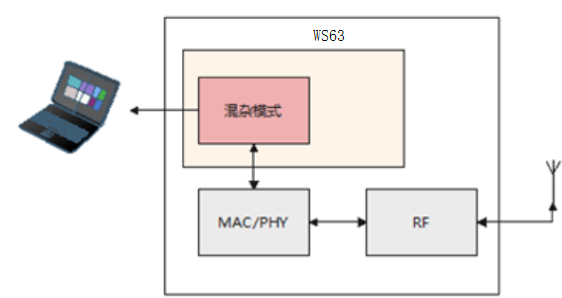

## Implementation Principle<a name="ZH-CN_TOPIC_0000001861402257"></a>

During propagation, wireless network signals radiate outward from the transmitting point like ripples. In theory, if a receiver is located where wireless signals pass by, it can "hear" any signal that passes through it, but it may not "understand" it (that is, it cannot parse the packet content).

Take the following figure as an example: when a Phone communicates with a Smart Watch, a Laptop is fully capable of monitoring their communication over the air. Air interface packet capture works based on this principle. If we want to capture the wireless packets of an embedded device, we only need to run a wireless device with monitoring capability near it.

**Figure 1**  Promiscuous mode<a name="fig981521318497"></a>  
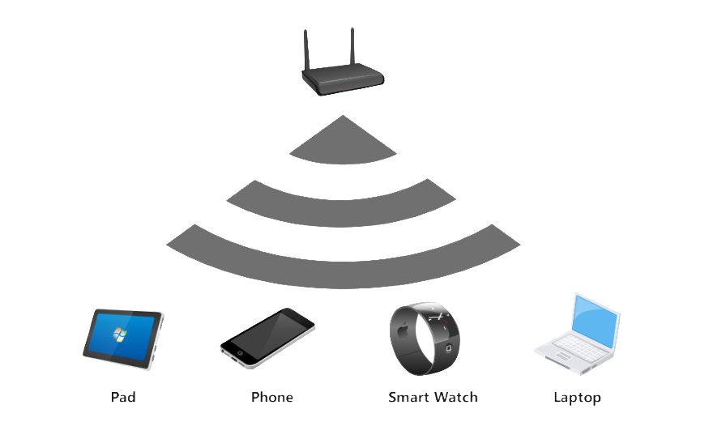

## Interface Description<a name="ZH-CN_TOPIC_0000001861402261"></a>


### Promiscuous Interface Declaration<a name="ZH-CN_TOPIC_0000001869980537"></a>

```
/**
 * @if Eng
 * @brief  Type of WiFi interface.
 * @else
 * @brief  Type of WiFi interface。
 * @endif
 */
typedef enum {
    IFTYPE_STA,         /*!< @if Eng STAION.
                             @else STAION。 @endif */
    IFTYPE_AP,          /*!< @if Eng HOTSPOT.
                             @else HOTSPOT。 @endif */
    IFTYPE_P2P_CLIENT,  /*!< @if Eng P2P CLIENT.
                             @else P2P CLIENT。 @endif */
    IFTYPE_P2P_GO,      /*!< @if Eng P2P GO.
                             @else P2P GO。 @endif */
    IFTYPE_P2P_DEVICE,  /*!< @if Eng P2P DEVICE.
                             @else P2P DEVICE。 @endif */
    IFTYPES_BUTT
} wifi_if_type_enum;

/**
 * @if Eng
 * @brief  Struct of frame filter config in monitor mode.
 * @else
 * @brief  Frame filter configuration structure in monitor mode.
 * @endif
 */
typedef struct {
    int8_t mdata_en  : 1;   /*!< @if Eng get multi-cast data frame flag.
                                 @else Enable receiving multicast (broadcast) data packets. @endif */
    int8_t udata_en  : 1;   /*!< @if Eng get single-cast data frame flag.
                                 @else Enable receiving unicast data packets. @endif */
    int8_t mmngt_en  : 1;   /*!< @if Eng get multi-cast mgmt frame flag.
                                 @else Enable receiving multicast (broadcast) management packets. @endif */
    int8_t umngt_en  : 1;   /*!< @if Eng get single-cast mgmt frame flag.
                                 @else Enable receiving unicast management packets. @endif */
    int8_t custom_en : 1;   /*!< @if Eng get beacon/probe response flag.
                                 @else Enable receiving beacon/probe request packets. @endif */
    int8_t resvd     : 3;   /*!< @if Eng reserved bits.
                                 @else Reserved field. @endif */
} wifi_ptype_filter_stru;

/**
 * @if Eng
 * @brief  Set monitor mode.
 * @param  [in]  iftype Interface type.
 * @param  [in]  enable Enable(1) or disable(0).
 * @param  [in]  filter Filtered frame type enum.
 * @retval EXT_WIFI_OK        Execute successfully.
 * @retval EXT_WIFI_FAIL      Execute failed.
 * @else
 * @brief  Set promiscuous mode.
 * @param  [in]  iftype Interface type.
 * @param  [in]  enable Enable/disable.
 * @param  [in]  filter Filter list.
 * @retval EXT_WIFI_OK   Succeeded.
 * @retval EXT_WIFI_FAIL Failed.
 * @endif
 */
errcode_t wifi_set_promis_mode(wifi_if_type_enum iftype, int32_t enable, const wifi_ptype_filter_stru *filter);
```

### Enabling and Disabling Promiscuous Mode<a name="ZH-CN_TOPIC_0000001823220754"></a>

Command format: AT+CCPRIV=$vap,set\_monitor,$switch,$val1,$val2,$val3,$val4

Parameter description:

-   $vap: indicates the name of the VAP to be maintained and tested, usually wlan0.
-   $switch: indicates whether the function is enabled, disabled, or paused, corresponding to 1, 0, and 2.
-   $val1: indicates the broadcast/multicast data frame filtering switch, corresponding to 0 and 1, where 0 means filtering and 1 means not filtering.
-   $val2: indicates the unicast data frame filtering switch, corresponding to 0 and 1, where 0 means filtering and 1 means not filtering.
-   $val3: indicates the broadcast/multicast management frame filtering switch, corresponding to 0 and 1, where 0 means filtering and 1 means not filtering.
-   $val4: indicates the unicast management frame filtering switch, corresponding to 0 and 1, where 0 means filtering and 1 means not filtering.

Command examples:

-   Enable reporting of all frames: AT+CCPRIV=wlan0,set\_monitor,1,1,1,1,1
-   View promiscuous mode packet reception statistics: AT+CCPRIV=wlan0,set\_monitor,2 (PS: after the command is successfully delivered, the packet reception statistics will be printed in the DebugKits tool.)
-   Disable promiscuous mode: AT+CCPRIV=wlan0,set\_monitor,0

## Usage Example<a name="ZH-CN_TOPIC_0000001861402273"></a>

1.  After executing the commands related to "[1.4 Interface Description](interface_description.md)", enable the corresponding frame filtering switches as required. For example, to report all frames: AT+CCPRIV=wlan0,set\_monitor,1,1,1,1,1
2.  To view the packet reception count statistics after promiscuous mode is enabled, enter the command AT+CCPRIV=wlan0,set\_monitor,2 and check the DebugKits tool.

# Dynamic Country Code Feature Description<a name="ZH-CN_TOPIC_0000001814482628"></a>


## Overview<a name="ZH-CN_TOPIC_0000001861402269"></a>

The dynamic country code feature is used to support global shipping scenarios. Based on the country information pre-configured on the device, it automatically adjusts the transmit power table to comply with the legal regulations on transmit power in various regions around the world.

## Application Scenarios<a name="ZH-CN_TOPIC_0000001861322477"></a>

When handling Internet access problems, devices from other countries are often found to have abnormal scan/connection/negotiation rate conditions, many of which are related to the 802.11d protocol (country code setting).

The country code is used to identify the country where a wireless device is located. Different country codes specify different RF characteristics of wireless devices, including the AP transmit power, supported channels, and so on. The purpose of configuring the country code is to make the RF characteristics of wireless devices comply with the laws and regulations of different countries or regions. When configuring a WLAN device for the first time, you must configure the correct country code to ensure compliance with local laws and regulations.

The dynamic country code provides a configuration method, by which customers can set the country code to adjust the transmit power to the region corresponding to the country (China, Asia-Pacific, North America, Europe), thereby complying with legal regulations.

**Figure 1**  Dynamic country code application scenario<a name="fig9557113619505"></a>  
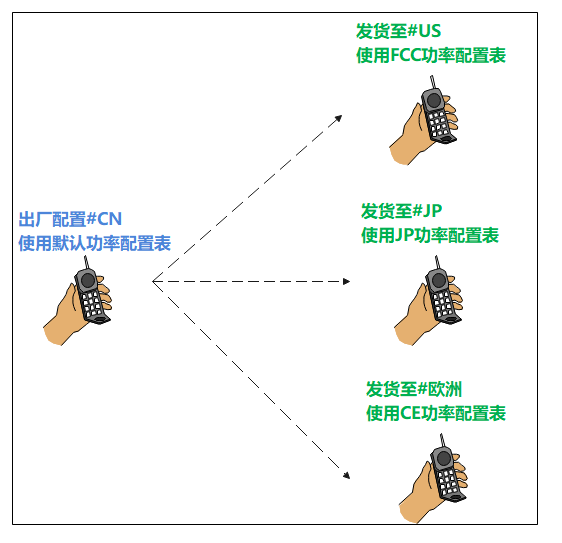

## Implementation Principle<a name="ZH-CN_TOPIC_0000001814482620"></a>

The relationship between countries and regions is mapped through a configuration file. Each country code corresponds to one region, and each region corresponds to a set of power tables. When the country code changes, the corresponding power table is reconfigured accordingly.

**Figure 1**  Dynamic country code design principle diagram<a name="fig1792093211512"></a>  
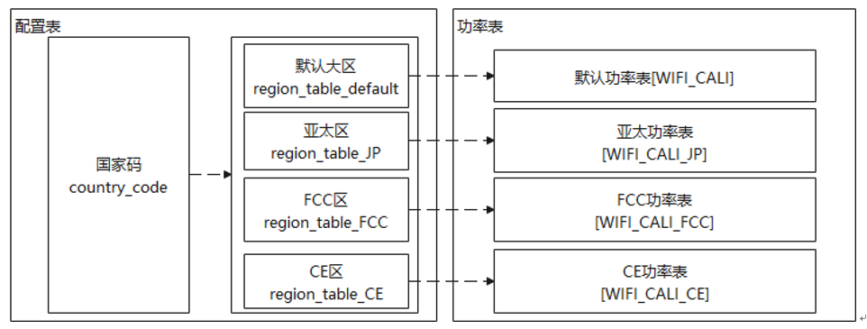

## Interface Description<a name="ZH-CN_TOPIC_0000001814482616"></a>


### Country Code Interface Declaration<a name="ZH-CN_TOPIC_0000001869747065"></a>

```
/**
* @ingroup  soc_wifi_basic
* @brief  Set country code.CNcomment:Set country code.CNend
*
* @par Description:
*           Set country code(two uppercases).CNcomment:Set country code, which consists of two uppercase characters.CNend
*
* @attention  1.Before setting the country code, you must call uapi_wifi_init to complete the initialization.
*             CNcomment:Before setting the country code, you must call uapi_wifi_init to complete initialization.CNend\n
*             2.cc_len should be greater than or equal to 3.CNcomment:cc_len should be greater than or equal to 3.CNend
* @param  cc               [IN]     Type  #const char *, country code.CNcomment:Country code.CNend
* @param  cc_len           [IN]     Type  #unsigned char, country code length.CNcomment:Country code length.CNend
*
* @retval #EXT_WIFI_OK  Excute successfully
* @retval #Other           Error code
* @par Dependency:
*            @li soc_wifi_api.h: WiFi API
* @see  NULL
* @since
*/
td_s32 uapi_wifi_set_country(const td_char *cc, td_u8 cc_len);

/**
* @ingroup  soc_wifi_basic
* @brief  Get country code.CNcomment:Get country code.CNend
*
* @par Description:
*           Get country code.CNcomment:Get country code, which consists of two uppercase characters.CNend
*
* @attention  1.Before getting the country code, you must call uapi_wifi_init to complete the initialization.
*             CNcomment:Before getting the country code, you must call uapi_wifi_init to complete initialization.CNend
* @param  cc               [OUT]     Type  #char *, country code.CNcomment:Country code.CNend
* @param  len              [IN/OUT]  Type  #int *, country code length.CNcomment:Country code length.CNend
*
* @retval #EXT_WIFI_OK  Excute successfully
* @retval #Other           Error code
* @par Dependency:
*            @li soc_wifi_api.h: WiFi API
* @see  NULL
* @since
*/
td_s32 uapi_wifi_get_country(td_char *cc, td_u8 *len);
```

### Setting and Reading the Country Code<a name="ZH-CN_TOPIC_0000001823147282"></a>

```
AT+CC=&country
AT+CC?
```

> **Note:** 
>-   $COUNTRY: country code. Configurable range: CN,JP,US,CA,KHRU,AU,MY,ID,TR,PL,FR,PT,IT,DE,ES,AR,ZA,MA,PH,TH,GB,CO,MX,EC,PE,CL,SA,EG,AE.

## Usage Example<a name="ZH-CN_TOPIC_0000001814642424"></a>

When loading the driver, configure the regional power based on the NV configuration file, as shown in [Figure 1](#fig153673315174).

**Figure 1**  NV country code configuration example<a name="fig153673315174"></a>  
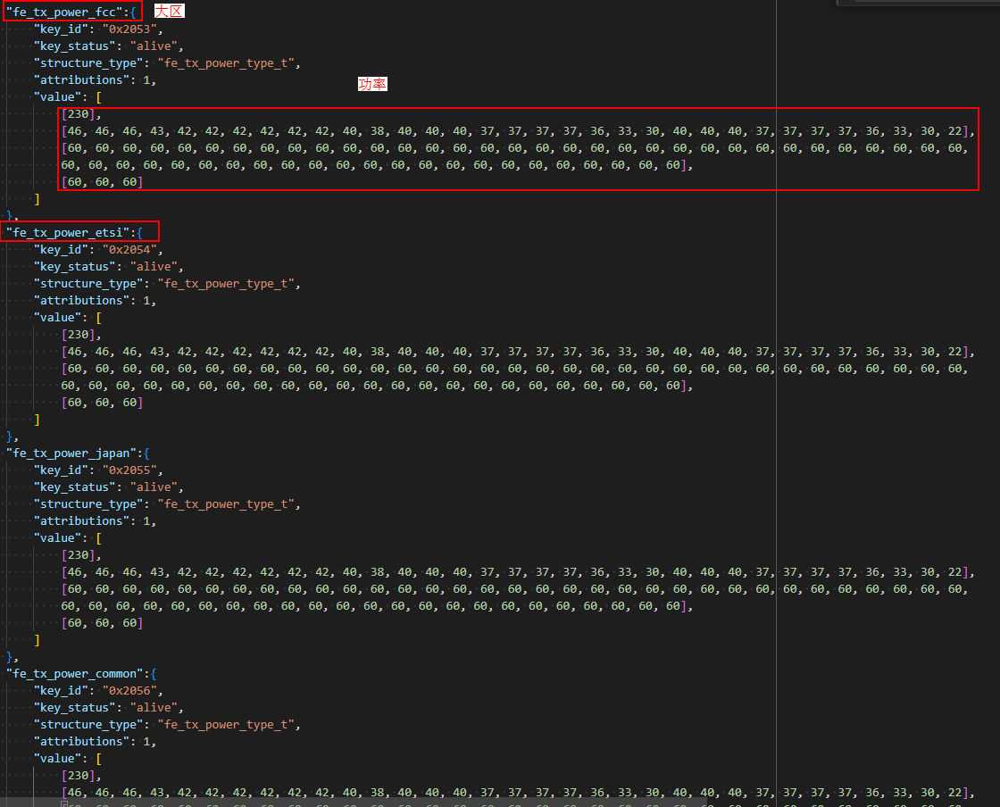

# Repeater Feature Description<a name="ZH-CN_TOPIC_0000001814482612"></a>


## Overview<a name="ZH-CN_TOPIC_0000001861322465"></a>

The repeater feature is mainly used in wireless network connections. By forwarding packets, it implements long-distance wireless communication, achieving the goals of expanding network coverage and reducing network deployment costs.

## Application Scenarios<a name="ZH-CN_TOPIC_0000001861322473"></a>

The repeater feature establishes a connection with the ROOT AP by creating a Repeater-STA port, and creates a Repeater-AP port to provide services to other STAs. Its working principle is that packet forwarding is supported between the Repeater-STA and the Repeater-AP, thereby implementing packet exchange between the ROOT AP and STAs and completing network services. A Repeater-STA supports access to one ROOT AP, and a Repeater-AP supports up to 5 devices accessing simultaneously.

**Figure 1**  Repeater scenario<a name="fig19426155220148"></a>  
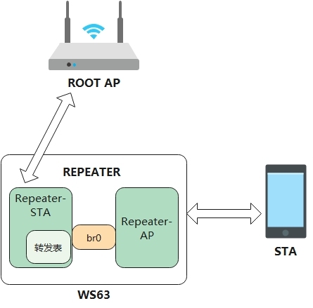

## Implementation Principle<a name="ZH-CN_TOPIC_0000001814482624"></a>

When a packet sent by an STA to the ROOT AP passes through the repeater, the mapping between the source MAC address and the source IP address in the packet is recorded in the forwarding table, and the source MAC address in the packet is modified to the MAC address of the Repeater-STA before the packet is sent to the ROOT AP.

When a packet sent by the ROOT AP to an STA passes through the repeater, the destination IP address is looked up in the forwarding table, the destination MAC address in the packet is changed, and the packet is forwarded to the correct STA.

**Figure 1**  Repeater-STA uplink data scenario<a name="fig197851812111510"></a>  
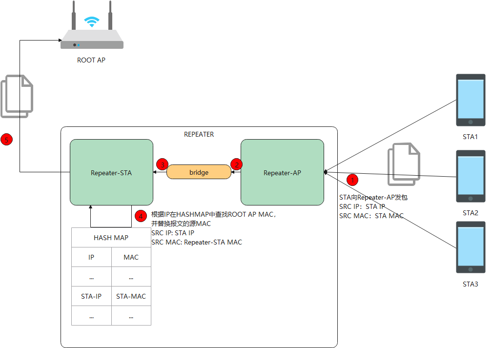

**Figure 2**  Repeater-STA downlink data scenario<a name="fig146122114150"></a>  
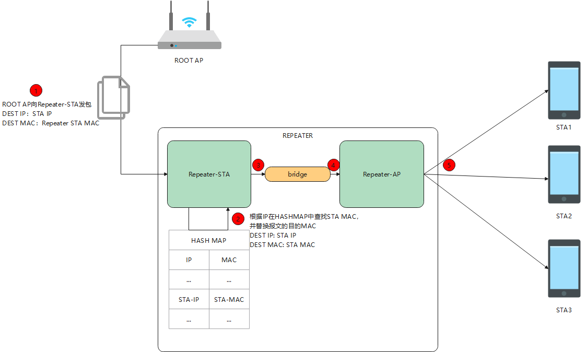

## Interface Description<a name="ZH-CN_TOPIC_0000001861322469"></a>

None

## Usage Example<a name="ZH-CN_TOPIC_0000001814642428"></a>

1.  Create the ap0 port.

    ```
    AT+STARTAP="my_ap",13,2,"12345678"
    ```

2.  Create the wlan0 port and associate it with the ROOT AP.

    ```
    AT+STARTSTA
    AT+SCAN
    AT+CONN="ROOTAP",,"12345678"
    ```

3.  Enable the repeater function.

    ```
    AT+BRCTL=addbr
    ```

4.  Add the ap0 port and the wlan0 port to the repeater, serving as the Repeater-AP and the Repeater-STA, respectively.

    ```
    AT+BRCTL=addif,wlan0
    AT+BRCTL=addif,ap0
    ```

5.  Have the companion STA associate with the Repeater-AP and obtain an IP address, and then perform ping tests, Iperf tests, and so on.
6.  After the test is complete, remove the wlan0 port and the ap0 port from the repeater, and disable the repeater function.

    ```
    AT+BRCTL=delif,wlan0
    AT+BRCTL=delif,ap0
    AT+BRCTL=delbr
    ```

# Radar Feature Description<a name="ZH-CN_TOPIC_0000001816981854"></a>


## Overview<a name="ZH-CN_TOPIC_0000001863701613"></a>

The radar feature periodically transmits and receives radar signals to detect moving targets. Users can call the radar APIs to use this feature. For details, see the "WS63V100 Radar Quick Start Guide".

## Development Process<a name="ZH-CN_TOPIC_0000001817141618"></a>


### Data Structure<a name="ZH-CN_TOPIC_0000001863726881"></a>

Radar status setting enumeration definition:

```
typedef enum {
    RADAR_STATUS_STOP = 0,  /* Radar status configuration: stop */
    RADAR_STATUS_START,     /* Radar status configuration: start */
    RADAR_STATUS_RESET,     /* Radar status configuration: reset */
    RADAR_STATUS_RESUME,    /* Radar status configuration: resume */
} radar_set_sts_t;
```

Radar status query enumeration definition:

```
typedef enum {
    RADAR_STATUS_IDLE = 0,  /* Radar status: not working */
    RADAR_STATUS_RUNNING,   /* Radar status: working */
} radar_get_sts_t;
```

Radar result reporting structure definition:

```
typedef struct {
    uint32_t lower_boundary;    /* The radar result approaches the lower boundary of detection */
    uint32_t upper_boundary;    /* The radar result approaches the upper boundary of detection */
    uint8_t is_human_presence;  /* Whether a human is present in the radar result */
    uint8_t reserved_0;
    uint8_t reserved_1;
    uint8_t reserved_2;
} radar_result_t;
```

Result callback function data structure definition:

typedef void \(\*radar\_result\_cb\_t\)\(radar\_result\_t \*result\);

### APIs<a name="ZH-CN_TOPIC_0000001817166882"></a>

The radar APIs are listed in the following table.

<a name="table22371515403"></a>
<table><thead align="left"><tr id="row227219117405"><th class="cellrowborder" valign="top" width="15.310000000000002%" id="mcps1.1.5.1.1"><p id="p1927281174018"><a name="p1927281174018"></a><a name="p1927281174018"></a>Interface Name</p>
</th>
<th class="cellrowborder" valign="top" width="29.32%" id="mcps1.1.5.1.2"><p id="p2272171144016"><a name="p2272171144016"></a><a name="p2272171144016"></a>Description</p>
</th>
<th class="cellrowborder" valign="top" width="28.02%" id="mcps1.1.5.1.3"><p id="p82723111408"><a name="p82723111408"></a><a name="p82723111408"></a>Parameter Description</p>
</th>
<th class="cellrowborder" valign="top" width="27.35%" id="mcps1.1.5.1.4"><p id="p14272181144015"><a name="p14272181144015"></a><a name="p14272181144015"></a>Return Value Description</p>
</th>
</tr>
</thead>
<tbody><tr id="row027210119403"><td class="cellrowborder" valign="top" width="15.310000000000002%" headers="mcps1.1.5.1.1 "><p id="p12764860585"><a name="p12764860585"></a><a name="p12764860585"></a>uapi_radar_set_status</p>
</td>
<td class="cellrowborder" valign="top" width="29.32%" headers="mcps1.1.5.1.2 "><p id="p169217338583"><a name="p169217338583"></a><a name="p169217338583"></a>Set the radar status</p>
</td>
<td class="cellrowborder" valign="top" width="28.02%" headers="mcps1.1.5.1.3 "><p id="p1891165755816"><a name="p1891165755816"></a><a name="p1891165755816"></a><em id="i10911257105810"><a name="i10911257105810"></a><a name="i10911257105810"></a>sts</em>:: Radar status</p>
</td>
<td class="cellrowborder" valign="top" width="27.35%" headers="mcps1.1.5.1.4 "><p id="p02728115407"><a name="p02728115407"></a><a name="p02728115407"></a>Return value of the interface: error code.</p>
</td>
</tr>
<tr id="row1616011618525"><td class="cellrowborder" valign="top" width="15.310000000000002%" headers="mcps1.1.5.1.1 "><p id="p759656646"><a name="p759656646"></a><a name="p759656646"></a>uapi_radar_get_status</p>
</td>
<td class="cellrowborder" valign="top" width="29.32%" headers="mcps1.1.5.1.2 "><p id="p946181118512"><a name="p946181118512"></a><a name="p946181118512"></a>Get the radar status</p>
</td>
<td class="cellrowborder" valign="top" width="28.02%" headers="mcps1.1.5.1.3 "><p id="p4839131192411"><a name="p4839131192411"></a><a name="p4839131192411"></a>*sts: Radar status</p>
</td>
<td class="cellrowborder" valign="top" width="27.35%" headers="mcps1.1.5.1.4 "><p id="p416013619525"><a name="p416013619525"></a><a name="p416013619525"></a>Return value of the interface: error code.</p>
</td>
</tr>
<tr id="row433461213529"><td class="cellrowborder" valign="top" width="15.310000000000002%" headers="mcps1.1.5.1.1 "><p id="p1521913368248"><a name="p1521913368248"></a><a name="p1521913368248"></a>uapi_radar_register_result_cb</p>
</td>
<td class="cellrowborder" valign="top" width="29.32%" headers="mcps1.1.5.1.2 "><p id="p2040044952415"><a name="p2040044952415"></a><a name="p2040044952415"></a>Register the radar result callback function</p>
</td>
<td class="cellrowborder" valign="top" width="28.02%" headers="mcps1.1.5.1.3 "><p id="p111717605817"><a name="p111717605817"></a><a name="p111717605817"></a><em id="i191719635817"><a name="i191719635817"></a><a name="i191719635817"></a>cb</em>: Callback function</p>
</td>
<td class="cellrowborder" valign="top" width="27.35%" headers="mcps1.1.5.1.4 "><p id="p93341612145216"><a name="p93341612145216"></a><a name="p93341612145216"></a>Return value of the interface: error code.</p>
</td>
</tr>
<tr id="row7455151520524"><td class="cellrowborder" valign="top" width="15.310000000000002%" headers="mcps1.1.5.1.1 "><p id="p237215226548"><a name="p237215226548"></a><a name="p237215226548"></a>uapi_radar_set_delay_time</p>
</td>
<td class="cellrowborder" valign="top" width="29.32%" headers="mcps1.1.5.1.2 "><p id="p20438555155717"><a name="p20438555155717"></a><a name="p20438555155717"></a>Set the exit delay time</p>
</td>
<td class="cellrowborder" valign="top" width="28.02%" headers="mcps1.1.5.1.3 "><p id="p11781611508"><a name="p11781611508"></a><a name="p11781611508"></a><em id="i1517817119017"><a name="i1517817119017"></a><a name="i1517817119017"></a>time</em>: Exit delay time</p>
</td>
<td class="cellrowborder" valign="top" width="27.35%" headers="mcps1.1.5.1.4 "><p id="p945561535210"><a name="p945561535210"></a><a name="p945561535210"></a>Return value of the interface: error code.</p>
</td>
</tr>
<tr id="row075421825219"><td class="cellrowborder" valign="top" width="15.310000000000002%" headers="mcps1.1.5.1.1 "><p id="p1095042819543"><a name="p1095042819543"></a><a name="p1095042819543"></a>uapi_radar_get_delay_time</p>
</td>
<td class="cellrowborder" valign="top" width="29.32%" headers="mcps1.1.5.1.2 "><p id="p380774614577"><a name="p380774614577"></a><a name="p380774614577"></a>Get the exit delay time</p>
</td>
<td class="cellrowborder" valign="top" width="28.02%" headers="mcps1.1.5.1.3 "><p id="p186220181402"><a name="p186220181402"></a><a name="p186220181402"></a>*time: Exit delay time</p>
</td>
<td class="cellrowborder" valign="top" width="27.35%" headers="mcps1.1.5.1.4 "><p id="p13755111835210"><a name="p13755111835210"></a><a name="p13755111835210"></a>Return value of the interface: error code.</p>
</td>
</tr>
<tr id="row3308174117548"><td class="cellrowborder" valign="top" width="15.310000000000002%" headers="mcps1.1.5.1.1 "><p id="p5203752105411"><a name="p5203752105411"></a><a name="p5203752105411"></a>uapi_radar_get_isolation</p>
</td>
<td class="cellrowborder" valign="top" width="29.32%" headers="mcps1.1.5.1.2 "><p id="p1153716360574"><a name="p1153716360574"></a><a name="p1153716360574"></a>Get the antenna isolation information</p>
</td>
<td class="cellrowborder" valign="top" width="28.02%" headers="mcps1.1.5.1.3 "><p id="p156716278014"><a name="p156716278014"></a><a name="p156716278014"></a>*iso: Antenna isolation information</p>
</td>
<td class="cellrowborder" valign="top" width="27.35%" headers="mcps1.1.5.1.4 "><p id="p8308134112547"><a name="p8308134112547"></a><a name="p8308134112547"></a>Return value of the interface: error code.</p>
</td>
</tr>
</tbody>
</table>

### Error Codes<a name="ZH-CN_TOPIC_0000001863886685"></a>

<a name="table54639314269"></a>
<table><thead align="left"><tr id="row1950714310264"><th class="cellrowborder" valign="top" width="9.09090909090909%" id="mcps1.1.5.1.1"><p id="p1550810310267"><a name="p1550810310267"></a><a name="p1550810310267"></a>No.</p>
</th>
<th class="cellrowborder" valign="top" width="40.40404040404041%" id="mcps1.1.5.1.2"><p id="p9508237262"><a name="p9508237262"></a><a name="p9508237262"></a>Definition</p>
</th>
<th class="cellrowborder" valign="top" width="14.14141414141414%" id="mcps1.1.5.1.3"><p id="p2508239265"><a name="p2508239265"></a><a name="p2508239265"></a>Actual Value</p>
</th>
<th class="cellrowborder" valign="top" width="36.36363636363636%" id="mcps1.1.5.1.4"><p id="p11508138268"><a name="p11508138268"></a><a name="p11508138268"></a>Description</p>
</th>
</tr>
</thead>
<tbody><tr id="row15081315264"><td class="cellrowborder" valign="top" width="9.09090909090909%" headers="mcps1.1.5.1.1 "><p id="p19508193202616"><a name="p19508193202616"></a><a name="p19508193202616"></a>1</p>
</td>
<td class="cellrowborder" valign="top" width="40.40404040404041%" headers="mcps1.1.5.1.2 "><p id="p551413454113"><a name="p551413454113"></a><a name="p551413454113"></a>ERRCODE_SUCC</p>
</td>
<td class="cellrowborder" valign="top" width="14.14141414141414%" headers="mcps1.1.5.1.3 "><p id="p35083342610"><a name="p35083342610"></a><a name="p35083342610"></a>0</p>
</td>
<td class="cellrowborder" valign="top" width="36.36363636363636%" headers="mcps1.1.5.1.4 "><p id="p95081731266"><a name="p95081731266"></a><a name="p95081731266"></a>Error code indicating successful execution.</p>
</td>
</tr>
<tr id="row35081335265"><td class="cellrowborder" valign="top" width="9.09090909090909%" headers="mcps1.1.5.1.1 "><p id="p25086318265"><a name="p25086318265"></a><a name="p25086318265"></a>2</p>
</td>
<td class="cellrowborder" valign="top" width="40.40404040404041%" headers="mcps1.1.5.1.2 "><p id="p151481351921"><a name="p151481351921"></a><a name="p151481351921"></a>ERRCODE_FAIL</p>
</td>
<td class="cellrowborder" valign="top" width="14.14141414141414%" headers="mcps1.1.5.1.3 "><p id="p118571415928"><a name="p118571415928"></a><a name="p118571415928"></a>0xFFFFFFFF</p>
</td>
<td class="cellrowborder" valign="top" width="36.36363636363636%" headers="mcps1.1.5.1.4 "><p id="p9508183172616"><a name="p9508183172616"></a><a name="p9508183172616"></a>Error code indicating failed execution.</p>
</td>
</tr>
</tbody>
</table>

## Precautions<a name="ZH-CN_TOPIC_0000001863861405"></a>

The radar feature works on a Wi-Fi channel. Therefore, before enabling the radar, ensure that a Wi-Fi channel is configured. It is sufficient for Wi-Fi to enter softAP or STA mode.

## Programming Example<a name="ZH-CN_TOPIC_0000001816981858"></a>

```
typedef void (*radar_result_cb_t)(radar_result_t *result);

#define WIFI_IFNAME_MAX_SIZE             16
#define WIFI_MAX_SSID_LEN                33
#define WIFI_SCAN_AP_LIMIT               64
#define WIFI_MAC_LEN                     6
#define WIFI_INIT_WAIT_TIME              500 // 5s
#define WIFI_START_STA_DELAY             100 // 1s

#define RADAR_STATUS_SET_START            1
#define RADAR_STATUS_QUERY_DELAY         1000 // 10s

// Sample implementation of starting STA mode on Wi-Fi
td_s32 radar_start_sta(td_void)
{
    (void)osDelay(WIFI_INIT_WAIT_TIME); /* 500: Delay 0.5s to wait for Wi-Fi initialization to complete */
    PRINT("STA try enable.\r\n");
    /* Create the STA interface */
    if (wifi_sta_enable() != 0) {
        PRINT("sta enbale fail !\r\n");
        return -1;
    }

    /* Connection succeeded */
    PRINT("STA connect success.\r\n");
    return 0;
}

// Sample implementation of the radar result callback function
static void radar_print_res(radar_result_t *res)
{
    PRINT("[RADAR_SAMPLE] lb:%u, hb:%u, hm:%u\r\n", res->lower_boundary, res->upper_boundary, res->is_human_presence);
}

int radar_demo_init(void *param)
{
    PRINT("[RADAR_SAMPLE] radar_demo_init sta!\r\n");

    param = param;
    // Start STA mode on Wi-Fi
    radar_start_sta();

    // Register the radar result callback function
    uapi_radar_register_result_cb(radar_print_res);

    // Start the radar
    (void)osDelay(WIFI_START_STA_DELAY);
    uapi_radar_set_status(RADAR_STATUS_SET_START);

    // Example of the radar query interface
    while(1) {
        (void)osDelay(RADAR_STATUS_QUERY_DELAY);
        uint8_t sts;
        uapi_radar_get_status(&sts);
        uint16_t time;
        uapi_radar_get_delay_time(&time);
        uint16_t iso;
        uapi_radar_get_isolation(&iso);
    }

    return 0;
}
```

# BLE Network Provisioning Feature Description<a name="ZH-CN_TOPIC_0000001820425798"></a>


## Overview<a name="ZH-CN_TOPIC_0000001867225469"></a>

BLE network provisioning refers to using BLE to assist Wi-Fi network access.

## Application Scenarios<a name="ZH-CN_TOPIC_0000001867185281"></a>

In BLE network provisioning mode, the device sends provisioning broadcasts over BLE when it is not connected to a network. A nearby phone that scans the broadcast can interact with the user in multiple ways:

1) The phone application proactively pops up a dialog to ask the phone user whether to allow the device to join the home network.

2) The phone application displays the device in the available device list after proactive scanning, and the user manually selects to add the device to the home network.

If the user chooses to join, the phone establishes a BLE connection with the device and then transmits the Wi-Fi network access information (SSID, password, etc.) to the device. Compared with SoftAP provisioning, users do not need to switch between Wi-Fi AP and STA modes, which greatly improves the end-user experience.

## Implementation Principle<a name="ZH-CN_TOPIC_0000001820585606"></a>

The reference process of BLE network provisioning is shown in [Figure 1](#fig07609154494).

**Figure 1**  BLE network provisioning process<a name="fig07609154494"></a>  
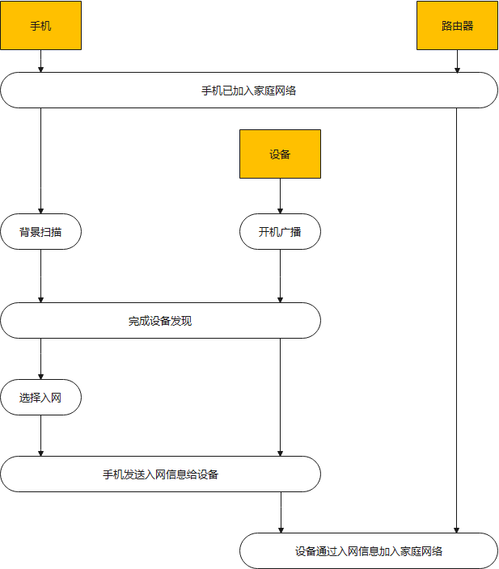

Devices using the WS63 chip start in the no-network mode and automatically send provisioning broadcasts. Users can adjust the broadcast duration, interval, and the trigger conditions for rebroadcasting.

## Interface Description<a name="ZH-CN_TOPIC_0000001820425802"></a>

See the BLE Development Process section in the "WS63V100 Software Development Guide".

## Usage Example<a name="ZH-CN_TOPIC_0000001835660816"></a>

1.  In the SDK root directory, run the command "python3 build.py  ws63-liteos-app menuconfig", and configure the corresponding compilation options as shown in the following figure.

    **Figure 1**  BLE Demo configuration options<a name="fig161841164188"></a>  
    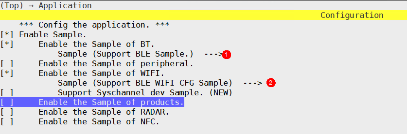

    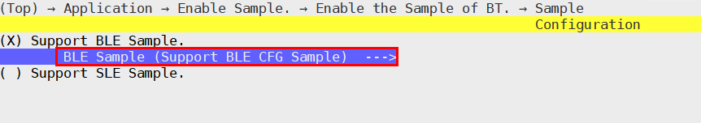

    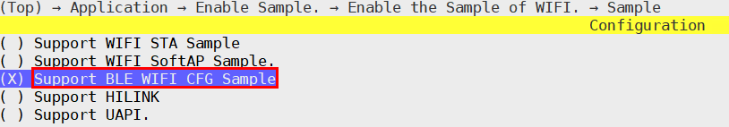

2.  After the configuration is complete, run the command python3 build.py  ws63-liteos-app to burn the generated image into the board using BurnTool.
3.  Install the "EasyConnect" application on an Android phone, tap "wifi configuration", and configure the Wi-Fi parameters to be connected.

    **Figure 2**  Configuring Wi-Fi parameters<a name="fig950015862315"></a>  
    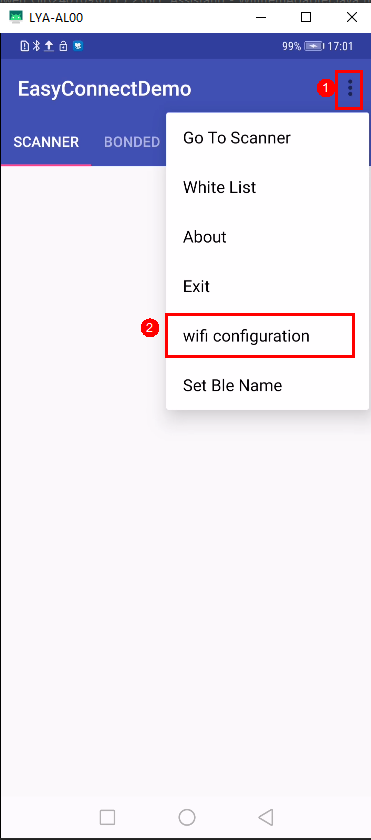

4.  Tap "Set Ble Name". The default configuration is ble\_wifi\_config.

    **Figure 3**  Configuring the Bluetooth name<a name="fig15386967248"></a>  
    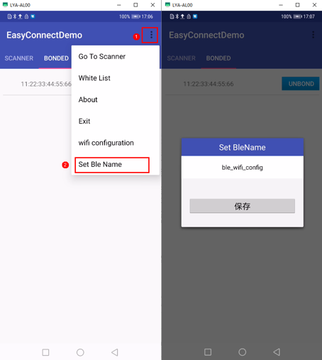

5.  After the configuration is complete, tap "Provision Network". After the Android phone successfully connects to the 63 module, a successful connection is displayed and announced.

    **Figure 4**  WS63 module network provisioning succeeded<a name="fig143399108245"></a>  
    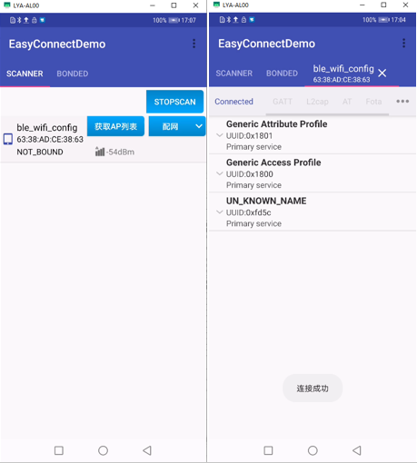

> **Note:** 
>The "EasyConnect" provisioning software can be obtained through technical support.

# BLE Gateway Feature Description<a name="ZH-CN_TOPIC_0000001867225477"></a>


## Overview<a name="ZH-CN_TOPIC_0000001867185285"></a>

The BLE gateway acts as a relay to help BLE devices that cannot directly communicate with the server connect to the cloud.

## Application Scenarios<a name="ZH-CN_TOPIC_0000001820585610"></a>

The BLE gateway implements authentication, connection management, and route forwarding for multiple BLE child devices. Commands sent from the cloud are delivered to the BLE devices through the gateway; the status of the BLE devices can also be reported to the server through the gateway.

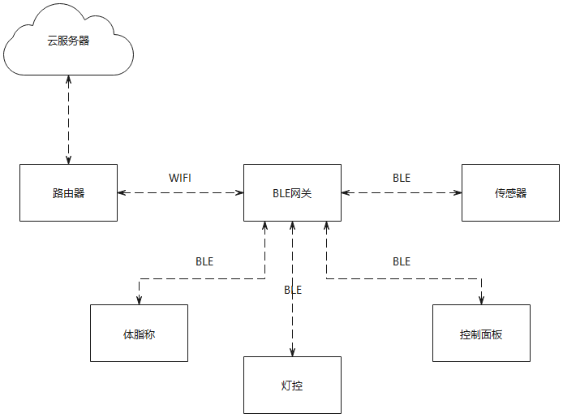

## Implementation Principle<a name="ZH-CN_TOPIC_0000001820425806"></a>

The working process of the BLE gateway is as follows:

1.  The gateway enables background scanning. BLE child devices send broadcasts. The gateway identifies the supported service IDs and proactively establishes BLE connections to complete authentication and data transmission.
2.  The gateway service program uploads the received BLE data to the server through a Wi-Fi router.
3.  The server displays the BLE device information on the phone application or the display screen of the control hub. Control commands can also be transmitted from the server to the gateway over Wi-Fi, and then from the gateway to the devices over BLE.

## Interface Description<a name="ZH-CN_TOPIC_0000001867225485"></a>

See the BLE Development Process section in the "WS63V100 Software Development Guide".

# Secure Boot Feature Description<a name="ZH-CN_TOPIC_0000001867185289"></a>


## Overview<a name="ZH-CN_TOPIC_0000001820585614"></a>

Secure boot refers to the function of verifying images level by level using the keys pre-written in eFuse during system startup.

## Application Scenarios<a name="ZH-CN_TOPIC_0000001820425810"></a>

Secure boot is used to ensure the integrity and security of images and prevent images from being cracked and tampered with.

> **Notice:** 
>The secure boot function is enabled by burning eFuse during the production test phase. After this function is enabled, images can start normally only when they are signed with the corresponding key set in eFuse.

## Implementation Principle<a name="ZH-CN_TOPIC_0000001867225489"></a>

The HASH value of the root public key and the secure boot enable bit are pre-written into eFuse.

After the system resets, it starts from bootrom.

1.  In bootrom, calculate the HASH value of the root public key in the image and verify it against the value in eFuse.
2.  After the root public key passes verification, use the root public key to verify the signature of the ssb image.
3.  After the ssb image passes verification, use the secondary public key in the ssb image to verify the Flashboot image.
4.  After the Flashboot image passes verification, use the tertiary public key in Flashboot to verify the App image.
5.  After the App image passes verification, jump to the App image to complete the startup.

[Figure 7.1 Secure boot image level-by-level verification process](#fig475583715529)

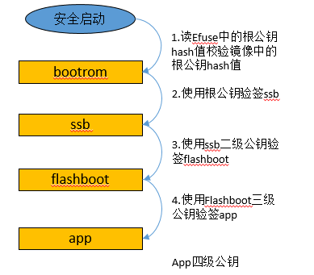

## Interface Description<a name="ZH-CN_TOPIC_0000001867185293"></a>

1.  Configure the eFuse secure boot enable bit to 1.

    

2.  Configure the HASH value of the root public key to be burned into eFuse.

    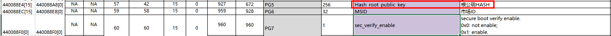

> **Note:** 
>For configuration, refer to the Secure Boot Configuration section in the "WS63V100 Secondary Development Network Security Precautions".

# FLASH Online Decryption Feature Description<a name="ZH-CN_TOPIC_0000001820585618"></a>


## Overview<a name="ZH-CN_TOPIC_0000001820425814"></a>

FLASH online decryption means that when the CPU accesses an encrypted image on FLASH, the image is decrypted online before being run.

## Application Scenarios<a name="ZH-CN_TOPIC_0000001867225493"></a>

The FLASH online decryption feature is mainly used to decrypt and run APP images stored in encrypted form on FLASH.

> **Notice:** 
>For the FLASH online decryption function, image encryption must be enabled before compilation, and the corresponding key derivation parameters must be written into eFuse.

## Implementation Principle<a name="ZH-CN_TOPIC_0000001867185297"></a>

After the FLASH online decryption function is enabled:

1.  During the compilation phase, the image is encrypted after signing.
2.  The image is stored in the encrypted state when burned to FLASH.
3.  The decryption area is automatically configured during startup.
4.  During CPU runtime, the image is automatically decrypted by hardware according to the configuration.

**Figure 1**  FLASH online decryption diagram<a name="fig62789223170"></a>  
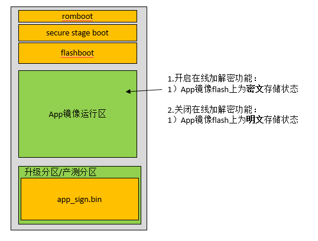

## Interface Description<a name="ZH-CN_TOPIC_0000001820585622"></a>

1.  In the configuration file hi3863/boards/HI3863/sdk/build/config/target\_config/ws63/sign\_config/liteos\_app\_bin\_ecc.cfg, set SignSuite to 1 and configure the IV and PlainKey corresponding to the key derivation parameters.
2.  Write the key derivation parameters to the corresponding position in eFuse.

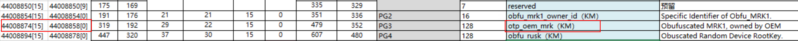

> **Note:** 
>For configuration, refer to the Image Encryption Configuration section in the "WS63V100 Secondary Development Network Security Precautions".

