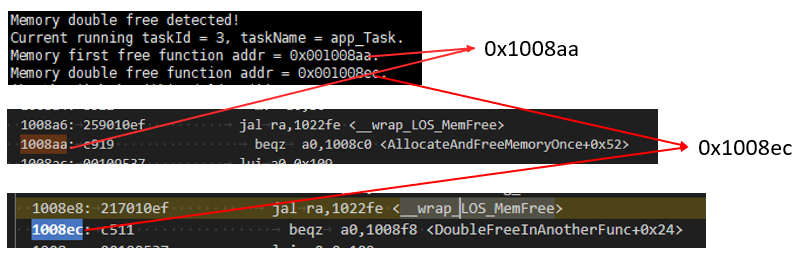
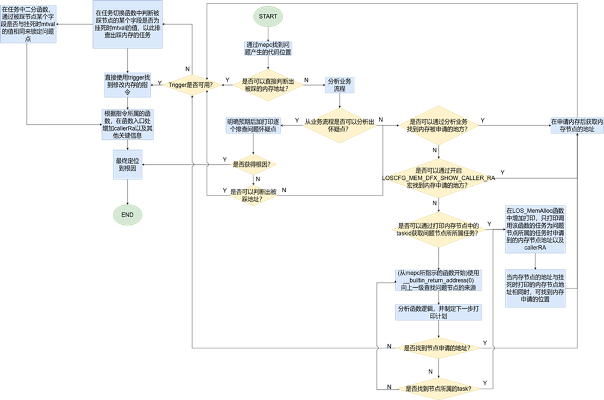
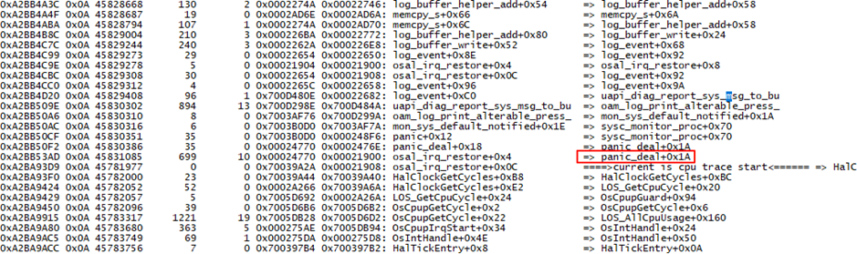
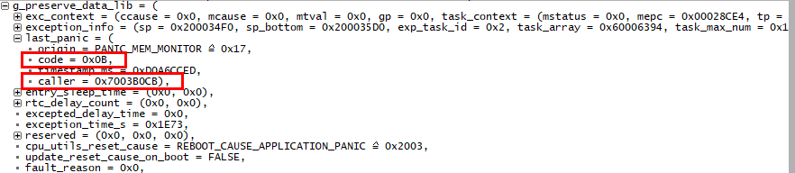
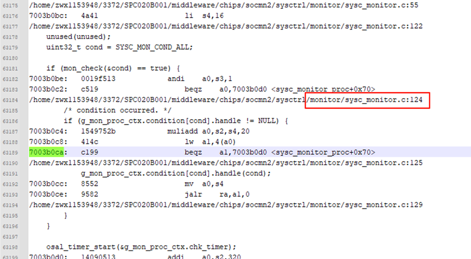

# Preface

**Overview**

This document describes in detail the methods and ideas for locating crash issues in LiteOS in combination with log information.

**Intended Audience**

This document is mainly applicable to LiteOS developers.

This document is mainly applicable to the following audiences:

-   Software development engineers
-   Technical support engineers

**Symbol Conventions**

The following symbols may appear in this document. Their meanings are described as follows.

<table><thead align="left"><tr id="row1530720816410"><th class="cellrowborder" valign="top" width="20.580000000000002%" id="mcps1.1.3.1.1">
<strong id="b2136615816410">Symbol</strong>

</th>
<th class="cellrowborder" valign="top" width="79.42%" id="mcps1.1.3.1.2">
<strong id="b5941558116410">Description</strong>

</th>
</tr>
</thead>
<tbody><tr id="row1372280416410"><td class="cellrowborder" valign="top" width="20.580000000000002%" headers="mcps1.1.3.1.1 ">

</td>
<td class="cellrowborder" valign="top" width="79.42%" headers="mcps1.1.3.1.2 ">
Indicates a hazard with a high level of risk that, if not avoided, will result in death or serious injury.

</td>
</tr>
<tr id="row466863216410"><td class="cellrowborder" valign="top" width="20.580000000000002%" headers="mcps1.1.3.1.1 ">

</td>
<td class="cellrowborder" valign="top" width="79.42%" headers="mcps1.1.3.1.2 ">
Indicates a hazard with a medium level of risk that, if not avoided, may result in death or serious injury.

</td>
</tr>
<tr id="row123863216410"><td class="cellrowborder" valign="top" width="20.580000000000002%" headers="mcps1.1.3.1.1 ">

</td>
<td class="cellrowborder" valign="top" width="79.42%" headers="mcps1.1.3.1.2 ">
Indicates a hazard with a low level of risk that, if not avoided, may result in minor or moderate injury.

</td>
</tr>
<tr id="row5786682116410"><td class="cellrowborder" valign="top" width="20.580000000000002%" headers="mcps1.1.3.1.1 ">

</td>
<td class="cellrowborder" valign="top" width="79.42%" headers="mcps1.1.3.1.2 ">
Used to convey device or environment safety warning information. If not avoided, it may result in device damage, data loss, degraded device performance, or other unpredictable results.

A notice does not involve personal injury.

</td>
</tr>
<tr id="row2856923116410"><td class="cellrowborder" valign="top" width="20.580000000000002%" headers="mcps1.1.3.1.1 ">

</td>
<td class="cellrowborder" valign="top" width="79.42%" headers="mcps1.1.3.1.2 ">
Supplementary explanation of key information in the main text.

A note is not safety warning information and does not involve personal, device, or environmental damage.

</td>
</tr>
</tbody>
</table>

**Revision History**

<table><thead align="left"><tr id="row2942532716410"><th class="cellrowborder" valign="top" width="20.72%" id="mcps1.1.4.1.1">
<strong id="b5687322716410">Document Version</strong>

</th>
<th class="cellrowborder" valign="top" width="26.119999999999997%" id="mcps1.1.4.1.2">
<strong id="b5800814916410">Release Date</strong>

</th>
<th class="cellrowborder" valign="top" width="53.16%" id="mcps1.1.4.1.3">
<strong id="b3316380216410">Change Description</strong>

</th>
</tr>
</thead>
<tbody><tr id="row5947359616410"><td class="cellrowborder" valign="top" width="20.72%" headers="mcps1.1.4.1.1 ">
01

</td>
<td class="cellrowborder" valign="top" width="26.119999999999997%" headers="mcps1.1.4.1.2 ">
2026-03-17

</td>
<td class="cellrowborder" valign="top" width="53.16%" headers="mcps1.1.4.1.3 ">
First official release

</td>
</tr>
</tbody>
</table>

# Overview

## Background

In embedded systems, crashes occur frequently due to factors such as multi-task concurrency, resource contention, memory management exceptions, hardware driver defects, or improper configuration. FBB-RTOS adopts a single-process design and does not enable the MMU mechanism. While the globally visible physical memory feature improves efficiency, it also makes illegal memory operations more likely to cause system-level crashes. Compared with operating systems such as Android/Linux that have complete DFX toolchains and log systems, FBB-RTOS faces greater challenges in exception diagnosis. Crash issues are often difficult to locate quickly, especially when the crash does not occur at the first scene, resulting in low troubleshooting efficiency.

This document aims to systematically review the existing DFX capabilities and common diagnostic methods of FBB-RTOS, providing the R&D team with structured troubleshooting ideas. The following points need to be specially noted:

-   Crash issues are usually deeply coupled with specific business scenarios.
-   The current document only covers the usage of existing DFX tools.
-   The content will be continuously updated as DFX capabilities are enhanced.

## Interpreting Crash Logs

During FBB-RTOS operation, when the system crashes, key log information is output. These logs contain critical debugging data such as exception types, error addresses, and register states. Correctly interpreting these logs is the key step in locating the root cause of the crash. Common logs and their meaning annotations when the system crashes are as follows:

<table><tbody><tr id="row992mcpsimp"><td class="cellrowborder" valign="top" width="100%">
<strong id="b2123156153619">Instruction access fault      //①Exception type: such as instruction fetch exception, Stack overflow, PMP access fault, etc.</strong>

<strong id="b1112835613615">Memory map region access fault</strong>

task:app_Task            <strong id="b163071328374"> //②Name of the task where the exception occurred</strong>

thrdPid:0x3              <strong id="b1691825153718"> //③ID of the task where the exception occurred</strong>

type:0x1

nestCnt:1               <strong id="b3657105374">  //④Exception nesting count; >1 indicates that exception re-entry occurred during exception handling</strong>

phase:Task

ccause:0x1

mcause:0x1

<strong id="b193118331376">mtval:0xfffffffffe </strong>         <strong id="b871961433714">//⑤Memory address accessed when the exception occurred</strong>

gp:0x110004

mstatus:0x1880

<strong id="b914218413375">mepc:0xfffffffffe </strong>        <strong id="b162811923113719"> //⑥Address of the instruction being executed when the exception occurred (can be reverse-looked up to find the corresponding code)</strong>

<strong id="b1935011453379">ra:0x1161a8 </strong>           <strong id="b1838284993715"> //⑦Address of the next instruction of the parent function to which the faulting instruction belongs (can be reverse-looked up to find the function)</strong>

sp:0x103930           <strong id="b1896715220376"> //⑧Stack pointer of the task or interrupt when the exception occurred</strong>

tp:0xfc631c8

t0:0x103875

t1:0xa

t2:0x11012000

s0:0x3

s1:0x119338

</td>
</tr>
</tbody>
</table>

Note: Reverse lookup by instruction address means searching for the address in the ELF file, which will match the address of a line of assembly code in the code segment. Example:

Reverse lookup mepc:0x115df4, search for 115df4 in the ELF, indicating that the instruction being executed when the exception occurred is sw a0,0\(a1\).

<table><tbody><tr id="row1021mcpsimp"><td class="cellrowborder" valign="top" width="100%">
00115dd8 &lt;app_init&gt;:

115dc: 717d addi sp,sp,-16

115de0: c606 sw ra,12(sp)

115de4: 00108b2a051f l.li a0,108b2a &lt;g_xRegsMap+0x56c&gt;

115de8: 7f0000ef jal ra,101196

115dec: 12345678051f l.li a0,12345678 &lt;__heap_end+0x12225678&gt;

115df0: 018005b7 lui a1,0x1800

<strong id="b961497103819">115df4: c188 sw a0,0(a1)</strong>

115df8: 40b2 lw ra,12(sp)

</td>
</tr>
</tbody>
</table>

## Overall Approach

Based on the experience in handling historical issues, the main causes of FBB-RTOS crash issues are summarized as follows:

-   Load/Store access fault caused by memory corruption
-   Stack overflow
-   Instruction access fault (instruction fetch exception)
-   Watchdog timeout (Watchdog Timeout)
-   Out Of Memory
-   Panic
-   Illegal memory access: including access to reserved memory (Store/AMO access fault) and PMP-protected memory (PMP access fault)
-   Unaligned memory layout
-   Deadlock (Dead Lock)
-   Unaligned access (Unaligned Access)

The following chapters will systematically cover the above types of exceptions through typical problem cases, providing troubleshooting ideas and solutions in combination with real scenarios to help developers quickly identify the root cause of problems and efficiently fix system exceptions.

For fault location of crash issues, a layered and progressive analysis method can be adopted. The specific implementation steps are as follows:

-   **Trace the root cause by exception type**

    The exception type information in the crash log is generated by FBB-RTOS by parsing hardware exception registers such as mcause and ccause, which directly reflects the hardware-level or system-level exception event that triggered the crash. During analysis:

    First, lock down the exception type recorded in the log (such as instruction fetch exception, stack overflow, etc.) to identify the most direct exception trigger.

    Analyze possible causes based on the exception type (for example, the cause of an instruction fetch exception may be an abnormal function pointer or an abnormal code segment).

    Investigate and analyze the possible causes one by one.

-   **Investigate the code logic in the exception context**

    Analyzing the key register values ra, mepc, and mtval can respectively reveal the specific function being executed, the specific assembly instruction, and the memory address accessed when the crash occurred, so that the code logic in the exception context can be investigated and analyzed.

-   **Use DFX tools for dynamic diagnosis**

    When conventional analysis cannot locate the issue, enable the DFX mechanism, turn on kernel debugging configurations (such as backtrace, memory access monitoring trigger, etc.), recompile, and reproduce the problem to obtain more detailed runtime data.

# Crash Troubleshooting Guide

Common key exception information and their corresponding direct crash causes are shown in the following table. Each will be elaborated in detail in the following sections.

<table><thead align="left"><tr id="row773mcpsimp"><th class="cellrowborder" valign="top" width="45%" id="mcps1.1.3.1.1">
<strong id="b776mcpsimp">Key Exception Information</strong>

</th>
<th class="cellrowborder" valign="top" width="55.00000000000001%" id="mcps1.1.3.1.2">
<strong id="b779mcpsimp">Crash Cause</strong>

</th>
</tr>
</thead>
<tbody><tr id="row780mcpsimp"><td class="cellrowborder" valign="top" width="45%" headers="mcps1.1.3.1.1 ">
Stack overflow

</td>
<td class="cellrowborder" valign="top" width="55.00000000000001%" headers="mcps1.1.3.1.2 ">
Stack overflow

</td>
</tr>
<tr id="row785mcpsimp"><td class="cellrowborder" valign="top" width="45%" headers="mcps1.1.3.1.1 ">
Instruction access fault

</td>
<td class="cellrowborder" valign="top" width="55.00000000000001%" headers="mcps1.1.3.1.2 ">
Instruction fetch exception

</td>
</tr>
<tr id="row790mcpsimp"><td class="cellrowborder" valign="top" width="45%" headers="mcps1.1.3.1.1 ">
Oops:NMI

</td>
<td class="cellrowborder" valign="top" width="55.00000000000001%" headers="mcps1.1.3.1.2 ">
Watchdog timeout

</td>
</tr>
<tr id="row795mcpsimp"><td class="cellrowborder" valign="top" width="45%" headers="mcps1.1.3.1.1 ">
Panic

</td>
<td class="cellrowborder" valign="top" width="55.00000000000001%" headers="mcps1.1.3.1.2 ">
Active Panic

</td>
</tr>
<tr id="row800mcpsimp"><td class="cellrowborder" valign="top" width="45%" headers="mcps1.1.3.1.1 ">
PMP access fault

</td>
<td class="cellrowborder" valign="top" width="55.00000000000001%" headers="mcps1.1.3.1.2 ">
Access to a PMP-protected address

</td>
</tr>
<tr id="row805mcpsimp"><td class="cellrowborder" valign="top" width="45%" headers="mcps1.1.3.1.1 ">
Store/AMO access fault

</td>
<td class="cellrowborder" valign="top" width="55.00000000000001%" headers="mcps1.1.3.1.2 ">
Access to reserved memory

</td>
</tr>
<tr id="row810mcpsimp"><td class="cellrowborder" valign="top" width="45%" headers="mcps1.1.3.1.1 ">
Dead lock

</td>
<td class="cellrowborder" valign="top" width="55.00000000000001%" headers="mcps1.1.3.1.2 ">
Deadlock

</td>
</tr>
<tr id="row815mcpsimp"><td class="cellrowborder" valign="top" width="45%" headers="mcps1.1.3.1.1 ">
Load/Store address misaligned

</td>
<td class="cellrowborder" valign="top" width="55.00000000000001%" headers="mcps1.1.3.1.2 ">
Unaligned access

</td>
</tr>
</tbody>
</table>

## Stack Overflow

### Problem Identification

FBB-RTOS enables stack overflow detection by default. The detection methods include magic word detection and hardware stack detection.

-   Magic word detection principle: A 4-byte (32-bit) magic word is filled at the top of the stack. During a task switch, the software checks whether the magic word has been modified. If the magic word has been modified, it is determined to be a stack overflow.
-   Hardware stack detection principle: Some chips provide a stack limit register. During a task switch or interrupt, the system writes the stack top pointer of the new task into the stack limit register, and the chip hardware automatically detects whether the stack pointer SP exceeds the boundary.

    When a stack overflow is detected, the system hangs and outputs "stack overflow" in the exception type. Example:

    
    <table><tbody><tr id="row1343mcpsimp"><td class="cellrowborder" valign="top" width="100%">
[2025-10-30 21:47:07] CURRENT task ID: <strong id="b1546192413818">Task_A:9 stack overflow!</strong>

    </td>
    </tr>
    </tbody>
    </table>

### Cause Analysis

-   **Oversized local variables**: Defining extremely large arrays or complex structures within a function.

-   **Insufficient stack space allocation**: **No safety margin is reserved**, that is, when setting the task stack size, the stack requirements of the worst-case execution path (such as exception handling branches) are not considered.

### Problem Location

**Location Methods**

1.  **Thread identification**: The specific thread where the stack overflow occurred can be determined through the task name and task ID (task ID:) in the system log.
2.  **Use static estimation tools**: Use the stack estimation tool to estimate the stack usage peak of tasks/functions, identify functions with excessive stack consumption (such as functions containing large local variables), and use the task command to check the currently configured task stack size to determine whether the function stack overhead is too large or the configuration is unreasonable. For the usage of the tool, see the LiteOS Development Guide (limitation: the analysis of function pointer call chains may have errors).

**Reference Case**

<table><tbody><tr id="row1365mcpsimp"><td class="cellrowborder" valign="top" width="100%">
[2025-10-30 21:47:07] CURRENT task ID: <strong id="b811043433810">Task_A:9 stack overflow!</strong>

[2025-10-30 21:47:07] B

[2025-10-30 21:47:41] breakpoint

[2025-10-30 21:47:41] Not available

[2025-10-30 21:47:41] APP&gt;exception:42

[2025-10-30 21:47:41] task:Task_A

[2025-10-30 21:47:41] thrdPid:0x9

[2025-10-30 21:47:41] type:0x42

[2025-10-30 21:47:41] nestCnt:1

[2025-10-30 21:47:41] phase:Task

[2025-10-30 21:47:41] ccause:0x73616870

[2025-10-30 21:47:41] mcause:0x61543a65

[2025-10-30 21:47:41] mtval:0xaab73

[2025-10-30 21:47:41] gp:0x0

[2025-10-30 21:47:41] mstatus:0x0

[2025-10-30 21:47:41] mepc:0x0

[2025-10-30 21:47:41] ra:0x37df6

[2025-10-30 21:47:41] sp:0x0

</td>
</tr>
</tbody>
</table>

-   Based on the "stack overflow" in the log, it can be confirmed that this is a stack overflow issue.
-   Based on "task ID: Task\_A:9" in the log, it can be confirmed that the task where the stack overflow occurred is Task\_A.
-   The task command shows that the stack size is the default value, which is too small. The issue was resolved after adjusting the stack size.

## Instruction Fetch Exception

### Problem Identification

An instruction fetch exception usually occurs when the CPU attempts to read an instruction from an illegal or non-executable memory address. The exception type is Instruction access fault. Example:

<table><tbody><tr id="row583mcpsimp"><td class="cellrowborder" valign="top" width="100%">
<strong id="b24221343183817">Instruction access fault</strong>

<strong id="b134231643143818">Memory map region access fault</strong>

</td>
</tr>
</tbody>
</table>

### Cause Analysis

-   **Use of null/dangling pointers**: When a function pointer is null or uninitialized/unassigned, the function pointer value is a random value.

-   **Corrupted code segment**: Program and data are placed in adjacent memory regions. When a data write operation goes out of bounds (memcpy/memset), the code region may be rewritten.

-   **Code segment not copied**: When the device starts up, code is usually read from an external storage medium. If the code segment is not copied to the corresponding RAM during startup, the code segment will not exist.

-   **Linker script configuration issues**: The linker script supports configuring multiple code segments. When code segment A is linked to code segment B, the code segment will be relocated to the wrong code segment.

### Problem Location

**Location Methods**

-   **Check the function pointer**: Locate the exception code context based on mtval and ra, and check whether the exception is caused by a function pointer. If so, check whether the function pointer is a null pointer or a dangling pointer.

-   **Check the linker script**: Check whether the code segment where the faulting function resides has a copy operation. If so, check the linker script to see whether the source and destination addresses of the copy match expectations.

-   **Check code segment copying**: Compare whether the memory value at the runtime address of the faulting function is the same as the value of the first instruction of the function in the disassembly. If they differ, check whether the code segment has been corrupted or was not copied/was incorrectly copied.

-   **Code segment monitoring**: Use PMP to configure the code segment where the faulting function resides with RX permissions to monitor whether the code segment is corrupted.

**Reference Case**

<table><tbody><tr id="row1145mcpsimp"><td class="cellrowborder" valign="top" width="100%">
<strong id="b1879317113919">Instruction access fault            // Exception information</strong>

<strong id="b479518115391">Memory map region access fault    // Exception information</strong>

task:app_Task

thrdPid:0x3

type:0x1

nestCnt:1

phase:Task

ccause:0x1

mcause:0x1

mtval:0xfffffffffe

gp:0x110004

mstatus:0x1880

<strong id="b15431112403913">mepc:0xfffffffffe                // Faulting instruction accessed</strong>

<strong id="b44311224113917">ra:0x1161a8                   // Parent function</strong>

sp:0x103930

tp:0xfc631c8

t0:0x103875

t1:0xa

t2:0x11012000

s0:0x3

s1:0x119338

</td>
</tr>
</tbody>
</table>

-   Locate the faulting function: Based on the ra value 0x807556, locate the function currently being executed in the disassembly file.

    
    <table><tbody><tr id="row1174mcpsimp"><td class="cellrowborder" valign="top" width="100%">
__attribute__((weak)) void app_init(void)

    
{

    
fn_test_t fn = (fn_test_t)(UINT32 *)<strong id="b13407183515393">0xffffffff</strong>;

    
fn();

    
}

    </td>
    </tr>
    </tbody>
    </table>

-   It is confirmed that there is a function pointer call in the function, and the function pointer is abnormal.

## Watchdog Timeout

### Problem Identification

FBB-RTOS requires periodically kicking the watchdog (resetting the timer) during runtime. If the watchdog is not kicked on time, the watchdog timer overflows and generates an NMI exception, and "Oops:NMI" is output in the exception type. Example:

<table><tbody><tr id="row569mcpsimp"><td class="cellrowborder" valign="top" width="100%">
try to enter wfi

<strong id="b61751044183917">Oops:NMI</strong>

task:pm_suspend_task

thrdPid:0x6

</td>
</tr>
</tbody>
</table>

### Cause Analysis

-   **CPU resources occupied**
    -   CPU resources are occupied by interrupts and high-priority tasks. Specific causes include:
        1.  **Overlong interrupt handling**: Interrupt handling takes too long, or the interrupt cannot exit normally.
        2.  **Interrupt storm**: A peripheral generates a large number of interrupts, causing the CPU to be busy handling interrupts.
        3.  **Abnormal high-priority task**: A high-priority task keeps running due to a bug (for example, entering an infinite loop), causing the low-priority watchdog-kicking task to never get a time slice.

    -   **High-priority tasks keep preempting the CPU**: The system load is too high, and the watchdog-kicking task never gets its turn.

-   **Abnormal scheduling of the watchdog-kicking task**
    -   **Incorrect task parameters**: The period of the watchdog-kicking task is greater than the watchdog timeout threshold.
    -   **Task accidentally deleted**: An erroneous API call accidentally deletes the watchdog-kicking task.
    -   **Scheduler fault**: Abnormal task scheduling.

### Problem Location

**Location Methods**

-   **Preliminary analysis**

    Search the disassembly based on MEPC to investigate and analyze the code logic of the exception context.

-   **Problem analysis**

    To analyze the watchdog timeout issue, it is necessary to focus on the scheduling and execution of tasks (including interrupts) during the critical period before the system hangs (that is, within the watchdog kick timeout window). Specifically, the analysis can be performed from the following three dimensions:

    1.  **CPU idle status check**: If there is a CPU idle period, it indicates abnormal scheduling of the watchdog-kicking task.
    2.  **Task CPU usage analysis**: If a task's CPU usage is significantly abnormal, the task may have fallen into an infinite loop or a logic error.
    3.  **System load evaluation**: If frequent task switching occurs and CPU utilization remains at full load, the overall system load is too high, preventing the watchdog-kicking task from being scheduled in time.

    The information for the above three dimensions can be obtained through the DFX tool trace or scheduling statistics provided by the system. For the specific usage of trace and scheduling statistics, refer to the "Trace" chapter and the "Scheduling Statistics" chapter of the LiteOS Development Guide respectively.

-   **Diagnostic method for tasks with abnormally high CPU usage**

    If a task is found to have abnormally high CPU usage, its complete call stack needs to be obtained to precisely locate the problematic code. You can enable the system's backtrace feature and add output of the call stacks of all tasks in the NMI exception.

**Reference Case**

<table><tbody><tr id="row852mcpsimp"><td class="cellrowborder" valign="top" width="100%">
[APP][00026106]:[INFO app_pm_suspend-&gt;15]:app_pm_suspend

pm_suspend.

try to enter wfi

<strong id="b1190115313914">Oops:NMI</strong>

task:pm_suspend_task

thrdPid:0x6

type:0xc

nestCnt:0

phase:1

ccause:0x2

mcause:0x8000000c

mtval:0x0

gp:0x7720572a

mstatus:0x1880

<strong id="b122301928404">mepc:0x1182c4</strong>

ra:0x1182bc

sp:0x103920

</td>
</tr>
</tbody>
</table>

According to the mepc value 0x1182c4, check the disassembly:

<table><tbody><tr id="row876mcpsimp"><td class="cellrowborder" valign="top" width="100%">
001182C0 &lt;wfi_loop&gt;:

1182c0: 10500073	   wfi

<strong id="b778210136409">1182c4: bff5	            j 1182c0 &lt;wfi_loop&gt;</strong>

1182c6: bfcd	            j 1182b8 &lt;drv_pm_suspend+0x76&gt;

</td>
</tr>
</tbody>
</table>

Find the corresponding code:

<table><tbody><tr id="row887mcpsimp"><td class="cellrowborder" valign="top" width="100%">
while (1)  {

pm_printk("try to enter wfi\n");

asm volatile("fence\n\r"

"wfi_loop:\n\r"

"wfi\n\r"

"j wfi_loop\n\r");

}

</td>
</tr>
</tbody>
</table>

This indicates that the system has entered low-power/standby mode, in which only interrupts can wake it up. Analyzing the interrupt intervals reveals that the interrupt frequency is lower than the watchdog kick period, causing a watchdog timeout reset, which falls into the category of scheduling anomalies.

## Panic

### Problem Identification

An active software Panic is a proactive termination mechanism adopted by the system for unrecoverable errors or serious violations of system rules. The system outputs detailed error diagnostic information, mainly including the following key contents:

-   **Error description**: The cause of the panic (for example, "ASSERT ERROR!  at xxx.c:123").
-   **Context of the currently running task**: Current task name, task ID, and register values.

### Cause Analysis

-   **Assertion**: The LOS\_ASSERT\(expr\) macro is triggered when the condition is not satisfied, usually indicating a program logic error or an abnormal system state.

-   **LOS\_Panic**: The LOS\_Panic\(\) function is called when critical system exceptions are detected, such as repeated memory release or corruption of the heap memory node header.

### Problem Location

1.  **Location methods**

-   **Preliminary location of the Panic source**

    If the log contains a file name and line number, directly view the corresponding source code to confirm the problem location.

    Search for the printed information in the code, or combine it with mepc (PC register value) to locate the hung code line.

    If it is an assertion failure, check the assertion expression and analyze why it does not hold (such as null pointer, out-of-bounds, illegal state, etc.).

-   **In-depth investigation based on the LOS\_PANIC cause**

    Based on the LOS\_PANIC cause, such as repeated memory release or heap memory node header corruption, refer to the analysis methods in the corresponding chapters.

**Reference Case**

**Example 1: Assertion failure**

<table><tbody><tr id="row4111133155716"><td class="cellrowborder" valign="top" width="100%">
<strong id="b63758254407">ASSERT ERROR! los_cpup.c, 378, OsCpupGetCycle</strong>

task:CpupGuardCreator

thrdPid:0x0

type:0x2

nestCnt:1

phase:1

ccause:0x0

mcause:0x0

mtval:0x0

gp:0x0

mstatus:0x0

mepc:0x0

ra:0xd

sp:0x0

</td>
</tr>
</tbody>
</table>

From the above exception print information, we can know:

Exception location: line 378 of los\_cpup.c.

Assertion condition: LOS\_ASSERT\(cycles \>= g\_startCycles\).

Direct cause: The system detected that the cycles value is less than g\_startCycles, violating the expected logic.

**Example 2: LOS\_PANIC example**

<table><tbody><tr id="row238mcpsimp"><td class="cellrowborder" valign="top" width="100%">
The node:0x112270 is not used!

task:app_Task

thrdPid:0x3

type:0xb

nestCnt:1

phase:1

ccause:0x0

mcause:0xb

mtval:0x0

gp:0x10ff00

mstatus:0x1800

<strong id="b9978233124011">mepc:0x1008fe</strong>

ra:0x1008fe

sp:0x111690

</td>
</tr>
</tbody>
</table>

Exception location: Reverse-lookup the code segment in the disassembly file based on the mepc value, or search for the printed information in the source code, to find the Panic source LOS\_PANIC\("The node:%p is not used!\\n", node\).

## Accessing PMP-Protected Memory

### Problem Identification

After PMP is configured on the system, permission checks are performed on bus instruction fetches, data accesses, and data stores according to the PMP configuration. If a check fails, an exception is reported (the ongoing instruction fetch, data access, or data store operation is not executed). "PMP access fault" is output in the exception information, and the exception type also clearly indicates the type of the exceptional operation.

-   Instruction access fault // The exceptional operation is "instruction fetch"
-   Load access fault// The exceptional operation is "Load"
-   Store/AMO access fault // The exceptional operation is "Store"

Example:

<table><tbody><tr id="row598mcpsimp"><td class="cellrowborder" valign="top" width="100%">
Instruction access fault

<strong id="b042254110402">PMP access fault</strong>

</td>
</tr>
</tbody>
</table>

### Cause Analysis

-   Mismatch between operations and permissions. A PMP exception is reported in the following cases, where × indicates that an exception is reported:

    
    <table><thead align="left"><tr id="row1430mcpsimp"><th class="cellrowborder" valign="top" width="25%" id="mcps1.1.5.1.1">
Operation/Permission

    </th>
    <th class="cellrowborder" valign="top" width="25%" id="mcps1.1.5.1.2">
R

    </th>
    <th class="cellrowborder" valign="top" width="25%" id="mcps1.1.5.1.3">
W

    </th>
    <th class="cellrowborder" valign="top" width="25%" id="mcps1.1.5.1.4">
X

    </th>
    </tr>
    </thead>
    <tbody><tr id="row1439mcpsimp"><td class="cellrowborder" valign="top" width="25%" headers="mcps1.1.5.1.1 ">
Instruction fetch

    </td>
    <td class="cellrowborder" valign="top" width="25%" headers="mcps1.1.5.1.2 ">
×

    </td>
    <td class="cellrowborder" valign="top" width="25%" headers="mcps1.1.5.1.3 ">
×

    </td>
    <td class="cellrowborder" valign="top" width="25%" headers="mcps1.1.5.1.4 ">&nbsp;&nbsp;</td>
    </tr>
    <tr id="row1447mcpsimp"><td class="cellrowborder" valign="top" width="25%" headers="mcps1.1.5.1.1 ">
Load

    </td>
    <td class="cellrowborder" valign="top" width="25%" headers="mcps1.1.5.1.2 ">&nbsp;&nbsp;</td>
    <td class="cellrowborder" valign="top" width="25%" headers="mcps1.1.5.1.3 ">
×

    </td>
    <td class="cellrowborder" valign="top" width="25%" headers="mcps1.1.5.1.4 ">
×

    </td>
    </tr>
    <tr id="row1455mcpsimp"><td class="cellrowborder" valign="top" width="25%" headers="mcps1.1.5.1.1 ">
Store

    </td>
    <td class="cellrowborder" valign="top" width="25%" headers="mcps1.1.5.1.2 ">
×

    </td>
    <td class="cellrowborder" valign="top" width="25%" headers="mcps1.1.5.1.3 ">&nbsp;&nbsp;</td>
    <td class="cellrowborder" valign="top" width="25%" headers="mcps1.1.5.1.4 ">
×

    </td>
    </tr>
    </tbody>
    </table>

-   PMP exceptions can also be triggered in the following scenarios.

    Operations that cross PMP regions, for example: reading 4 bytes of data where the first 2 bytes are in region A and the last 2 bytes are in region B.

    PMP entry ≥ 1, and the memory access does not match any PMP entry.

### Problem Location

**Location Methods**

-   **Locate the faulting instruction address via mepc**

    Based on the mepc register value, confirm the address of the instruction that the CPU attempted to execute when the exception occurred.

-   **Confirm the exceptional access address via mtval**

    Based on mtval, confirm the memory address accessed (for Load/Store exceptions) or the instruction address (for instruction fetch exceptions) when the exception occurred.

-   **If the exceptional address/instruction matches the expected memory layout, check the PMP configuration**

    If the faulting instruction address or the accessed address matches the system memory layout (for example, located in a legal code segment, data segment, stack, etc.), first check whether the PMP (Physical Memory Protection) configuration is correct.

-   **If the faulting instruction (fetch) does not match expectations**, refer to the "[Instruction Fetch Exception](instruction_fetch_exception.md)" chapter.
-   **If the faulting instruction accesses a memory region not covered by PMP configuration, refer to the memory corruption chapter for location.**

**Reference Case**

<table><tbody><tr id="row695mcpsimp"><td class="cellrowborder" valign="top" width="100%">
Instruction access fault

<strong id="b299825324017">PMP access fault</strong>

APP exception:1

task: at

thrdPid:0xb

type:0x1

nestCnt:1

phase:Task

ccause:0x7

mcause:0x38000001

<strong id="b18352026419">mtval:0x22082444</strong>

gp:0x10017bed

mstatus:0x80207880

<strong id="b1679825124119">mepc:0x22082444</strong>

ra:0x2b09e

sp:0x1003f5e0

</td>
</tr>
</tbody>
</table>

-   Exception address location: According to mepc, the address accessed by the exception is 0x22082444. mtval confirms that the protected address is also 0x22082444, indicating that this address has not been configured with executable permission, but the system attempted to fetch an instruction from it.
-   Check the PMP permission configuration: Check the PMP configuration for this memory in the code and confirm whether the PMP permissions are configured reasonably based on business requirements.

    
    <table><tbody><tr id="row720mcpsimp"><td class="cellrowborder" valign="top" width="100%">
pmpRegion.accPermission.readAcc = E_MEM_RD_ACC_RD;

    
pmpRegion.accPermission.writeAcc = E_MEM_WR_ACC_NON_WR;

    
pmpRegion.accPermission.executeAcc = E_MEM_EX_ACC_NON_EX;

    
pmpRegion.memAttr = MEM_ATTR_DEV_NON_BUF;

    
pmpRegion.blocked = FALSE;

    
pmpRegion.ucaAddressMatch = PMP_RGN_ADDR_MATCH_NAPOT;

    
/* Configure nonsecure pagetable */

    
pmpRegion.ucNumber = PMP_REGION_NS_PAGE_TABLE_START;

    
pmpRegion.uwBaseAddress = pt-&gt;nonsec.baseAddr;

    
pmpRegion.uwRegionSize = pt-&gt;nonsec.tableSize;

    
pmpRegion.sectl = SEC_CONTROl_NOSECURE_NONMMU;

    
ret = ArchProtectionRegionSet(&amp;pmpRegion);

    
if (ret != LOS_OK) {

    
PRINT_ERR("ArchProtectionRegionSet failed!!", _FUNCTION_, __LINE__, ret);

    
return LOS_NOK;

    
}

    </td>
    </tr>
    </tbody>
    </table>

## Accessing Reserved Memory

### Problem Identification

Accessing the reserved address space triggers an exception. The exception information contains Store/AMO access fault and does not contain PMP access fault.

Example:

<table><tbody><tr id="row264mcpsimp"><td class="cellrowborder" valign="top" width="100%">
<strong id="b14631327134112">Store/AMO access fault      // Exception information</strong>

AXIM error response

</td>
</tr>
</tbody>
</table>

### Cause Analysis

The system accessed the reserved address space.

### Problem Location

**Location Methods**

-   **Locate the exceptional access address via mtval and verify its validity.**

    mtval can be used to lock down the memory address that the CPU attempted to access when the exception occurred. Combined with the address space allocation table provided by the system, confirm whether the address belongs to reserved addresses. If it is not a reserved address, check whether the address meets the memory alignment requirements, for the LINX core architecture.

    lw / sw (32-bit load/store): The address must be 4-byte aligned (that is, the address ends with 0x00, 0x04, 0x08, etc.).

    lh / sh (16-bit load/store): The address must be 2-byte aligned (that is, the address ends with 0x00, 0x02, etc.).

-   **Locate the faulting instruction address via mepc, reverse-lookup the disassembly, and locate the faulting source code.**

**Reference Case**

<table><tbody><tr id="row288mcpsimp"><td class="cellrowborder" valign="top" width="100%">
<strong id="b12704113564117">Store/AMO access fault      // Exception information</strong>

<strong id="b5705193534116">AXIM error response        // Exception information</strong>

task:app_Task

thrdPid:0x3

type:0x7

nestCnt:1

phase:Task

ccause:0x2

mcause:0x7

mtval:0x18000000          // Address of the exceptional access

gp:0x110004

mstatus:0x1880

mepc:0x115df8            // Address of the instruction that triggered the exception

ra:0x11687c

sp:0x103910

</td>
</tr>
</tbody>
</table>

-   Based on mtval, the memory address of the exceptional access can be locked down as 0x1800000, confirming it is a reserved memory address.
-   Reverse-looking up the disassembly file based on mepc reveals the line where the problematic code is located.

    
    <table><tbody><tr id="row312mcpsimp"><td class="cellrowborder" valign="top" width="100%">
00115dd8 &lt;app_init&gt;:

    
115dc: 717d addi sp,sp,-16

    
115de0: c606 sw ra,12(sp)

    
115de4: 00108b2a051f l.li a0,108b2a &lt;g_xRegsMap+0x56c&gt;

    
115de8: 7f0000ef jal ra,101196

    
115dec: 12345678051f l.li a0,12345678 &lt;__heap_end+0x12225678&gt;

    
115df0: 018005b7 lui a1,0x1800

    
<strong id="b107671951174114">115df4: c188 sw a0,0(a1)</strong>

    
115df8: 40b2 lw ra,12(sp)

    
115dfc: 6141 addi sp,sp,16

    
115e00: bdd9 j 100890 &lt;tc_mem_013_7&gt;

    </td>
    </tr>
    </tbody>
    </table>

<table><tbody><tr id="row329mcpsimp"><td class="cellrowborder" valign="top" width="100%">
__attribute__((weak)) void app_init(void)

{

UINT32 t = 0x1800000;

*(UINT32 *)t = 0x12345678;

}

</td>
</tr>
</tbody>
</table>

## Deadlock

### Problem Identification

FBB-RTOS provides the deadlock detection DFX feature, which supports deadlock detection for four types of locks: spinlocks, mutexes, binary semaphores, and thread locks, as well as detection of repeated locking, erroneous release, and lock depth overflow. The related kernel configurations are as follows:

<table><thead align="left"><tr id="row110mcpsimp"><th class="cellrowborder" valign="top" width="35%" id="mcps1.1.5.1.1">
Configuration Item

</th>
<th class="cellrowborder" valign="top" width="24%" id="mcps1.1.5.1.2">
Description

</th>
<th class="cellrowborder" valign="top" width="9%" id="mcps1.1.5.1.3">
Default Value

</th>
<th class="cellrowborder" valign="top" width="32%" id="mcps1.1.5.1.4">
Dependency

</th>
</tr>
</thead>
<tbody><tr id="row119mcpsimp"><td class="cellrowborder" valign="top" width="35%" headers="mcps1.1.5.1.1 ">
LOSCFG_KERNEL_LOCKDEP

</td>
<td class="cellrowborder" valign="top" width="24%" headers="mcps1.1.5.1.2 ">
Enable deadlock detection

</td>
<td class="cellrowborder" valign="top" width="9%" headers="mcps1.1.5.1.3 ">
N

</td>
<td class="cellrowborder" valign="top" width="32%" headers="mcps1.1.5.1.4 ">
LOSCFG_KERNEL_MEM_ALLOC

</td>
</tr>
<tr id="row128mcpsimp"><td class="cellrowborder" valign="top" width="35%" headers="mcps1.1.5.1.1 ">
LOSCFG_KERNEL_SPINDEP

</td>
<td class="cellrowborder" valign="top" width="24%" headers="mcps1.1.5.1.2 ">
Enable spinlock deadlock detection

</td>
<td class="cellrowborder" valign="top" width="9%" headers="mcps1.1.5.1.3 ">
N

</td>
<td class="cellrowborder" valign="top" width="32%" headers="mcps1.1.5.1.4 ">
LOSCFG_KERNEL_SMP

</td>
</tr>
<tr id="row137mcpsimp"><td class="cellrowborder" valign="top" width="35%" headers="mcps1.1.5.1.1 ">
LOSCFG_KERNEL_MUXDEP

</td>
<td class="cellrowborder" valign="top" width="24%" headers="mcps1.1.5.1.2 ">
Enable mutex deadlock detection

</td>
<td class="cellrowborder" valign="top" width="9%" headers="mcps1.1.5.1.3 ">
N

</td>
<td class="cellrowborder" valign="top" width="32%" headers="mcps1.1.5.1.4 ">
LOSCFG_BASE_IPC_MUX

</td>
</tr>
<tr id="row146mcpsimp"><td class="cellrowborder" valign="top" width="35%" headers="mcps1.1.5.1.1 ">
LOSCFG_KERNEL_SEMDEP

</td>
<td class="cellrowborder" valign="top" width="24%" headers="mcps1.1.5.1.2 ">
Enable binary semaphore deadlock detection

</td>
<td class="cellrowborder" valign="top" width="9%" headers="mcps1.1.5.1.3 ">
N

</td>
<td class="cellrowborder" valign="top" width="32%" headers="mcps1.1.5.1.4 ">
LOSCFG_BASE_IPC_SEM

</td>
</tr>
<tr id="row155mcpsimp"><td class="cellrowborder" valign="top" width="35%" headers="mcps1.1.5.1.1 ">
LOSCFG_PTHREAD_MUXDEP

</td>
<td class="cellrowborder" valign="top" width="24%" headers="mcps1.1.5.1.2 ">
Enable thread lock deadlock detection

</td>
<td class="cellrowborder" valign="top" width="9%" headers="mcps1.1.5.1.3 ">
N

</td>
<td class="cellrowborder" valign="top" width="32%" headers="mcps1.1.5.1.4 ">
LOSCFG_COMPAT_POSIX

</td>
</tr>
</tbody>
</table>

If the related kernel configurations are enabled, the system hangs when a deadlock is detected, and "dead lock" is output in the exception information. Example:

<table><tbody><tr id="row169mcpsimp"><td class="cellrowborder" valign="top" width="100%">
[2025-11-17 11:20:49] lockdep check failed

[2025-11-17 11:20:49] error type   : <strong id="b532141334212">dead lock</strong>

[2025-11-17 11:20:49] request addr : 0x47262

[2025-11-17 11:20:49] task name    : Task_B

</td>
</tr>
</tbody>
</table>

### Cause Analysis

Two tasks are each waiting for the resources held by the other.

### Problem Location

**Location Methods**

**Reverse-lookup the request address to locate the faulting lock function:** Copy the request addr value that triggered the exception into the disassembly file of the system image, and locate the specific code line by address to identify which lock function had an exception during execution.

Note: The reverse lookup result of request addr usually points to the entry of a specific lock function. If multiple locks of the same type exist in a task, they can be further distinguished by the lock ID to precisely locate the specific lock object.

**Reference Case**

<table><tbody><tr id="row915mcpsimp"><td class="cellrowborder" valign="top" width="100%">
[2025-11-17 11:20:49] app_init start ok

[2025-11-17 11:20:49] Task_A pend muxid 31

[2025-11-17 11:20:49] Task_B pend muxid 32

[2025-11-17 11:20:49] APP|thread_main start

[2025-11-17 11:20:49] lockdep check failed

[2025-11-17 11:20:49] <strong id="b12781025144220">error type   : dead lock</strong>

[2025-11-17 11:20:49] <strong id="b17117129154215">request addr : 0x47262</strong>

[2025-11-17 11:20:49] <strong id="b1158293224216">task name    : Task_B</strong>

[2025-11-17 11:20:49] task id      : 8

[2025-11-17 11:20:49] cpu num      : 0

[2025-11-17 11:20:49] start dumping lockdep information

[2025-11-17 11:20:49] [0] <strong id="b1617114013428">Mutex ID: 0032</strong>

[2025-11-17 11:20:49] [1] <strong id="b1482154415420">Mutex ID: 0031 &lt;-- now</strong>

[2025-11-17 11:20:49] task name    : Task_A

[2025-11-17 11:20:49] task id      : 7

[2025-11-17 11:20:49] cpu num      : 0

[2025-11-17 11:20:49] start dumping lockdep information

[2025-11-17 11:20:49] [0] <strong id="b11352195213428">Mutex ID: 0031</strong>

[2025-11-17 11:20:49] [1] <strong id="b16295155624216">Mutex ID: 0032 &lt;-- now</strong>

[2025-11-17 11:20:49] runTask-&gt;taskName = Task_B

[2025-11-17 11:20:49] runTask-&gt;taskId = 8

[2025-11-17 11:20:49] fp:0x10021010

</td>
</tr>
</tbody>
</table>

-   From the exception information, it can be known that tasks Task\_A and Task\_B are in a deadlock: Task\_B holds lock 0032 and requests lock 0031, while Task\_A holds lock 0031 and requests lock 0032.
-   Based on the request addr value (0x47262 in this example), find this address in the disassembly file of the system image to determine the specific lock function LOS\_MuxPend, and further locate the position where Task A calls the mutex.

    
    <table><tbody><tr id="row946mcpsimp"><td class="cellrowborder" valign="top" width="100%">
000253da &lt;Task_A&gt;:

    
253da: 40 99        	c.push	{ra,s0-s1}, -16

    
253dc: 00 08        	addi	s0, sp, 16

    
253de: 37 d5 01 20  	lui	a0, 131101

    
253e2: 93 04 c5 ed  	addi	s1, a0, -292

    
253e6: c8 44        	lw	a0, 12(s1)

    
253e8: fd 55        	addi	a1, zero, -1

    
<strong id="b10190314194317">253ea: ef 10 12 60  	jal	ra, 0x471ea &lt;LOS_MuxPend&gt;</strong>

    
253ee: 11 e9        	bne	a0, zero, 0x25402 &lt;Task_A+0x28&gt;

    
253f0: d0 44        	lw	a2, 12(s1)

    
253f2: 55 65        	lui	a0, 21

    
253f4: 13 05 75 e8  	addi	a0, a0, -377

    
253f8: d1 65        	lui	a1, 20

    
253fa: 93 85 45 fe  	addi	a1, a1, -28

    
253fe: ef 20 c2 1c  	jal	ra, 0x475ca &lt;dprintf&gt;

    
25402: 09 45        	addi	a0, zero, 2

    
25404: ef 10 52 2a  	jal	ra, 0x46ea8 &lt;LOS_Msleep&gt;

    
25408: 88 48        	lw	a0, 16(s1)

    
2540a: fd 55        	addi	a1, zero, -1

    
<strong id="b15278104215430">2540c: ef 10 f2 5d  	jal	ra, 0x471ea &lt;LOS_MuxPend&gt;</strong>

    
……..

    
000471ea &lt;LOS_MuxPend&gt;:

    
471ea: c0 9b        	c.push	{ra,s0-s6}, -32

    
471ec: 00 10        	addi	s0, sp, 32

    
471ee: 2a 8b        	add	s6, a0, zero

    
471f0: 28 91        	c.zext.h	a0, a0

    
……..

    
4724e: 63 0d 55 03  	beq	a0, s5, 0x47288 &lt;LOS_MuxPend+0x9e&gt;

    
47252: 5a 85        	add	a0, s6, zero

    
47254: ef e0 9f c5  	jal	ra, 0x45eac &lt;OsMuxLockDepGet&gt;

    
47258: aa 85        	add	a1, a0, zero

    
4725a: 01 45        	addi	a0, zero, 0

    
4725c: 5a 86        	add	a2, s6, zero

    
4725e: ef e0 9f dd  	jal	ra, 0x46036 &lt;OsLockDepCheckIn&gt;

    
<strong id="b1465410551431">47262: 52 85        	add	a0, s4, zero</strong>

    
47264: db 55 c5 00  	lhu.u	a1, 12(a0)

    
47268: 9d c5        	beq	a1, zero, 0x47296 &lt;LOS_MuxPend+0xac&gt;

    
4726a: 63 85 09 04  	beq	s3, zero, 0x472b4 &lt;LOS_MuxPend+0xca&gt;

    </td>
    </tr>
    </tbody>
    </table>

## Unaligned Access

### Problem Identification

Memory alignment access requirement: When accessing data, its physical address must be an integer multiple of the byte width of the data type.

32-bit data (such as uint32\_t, float): The address must be a multiple of 4 (for example, 0x0000, 0x0004, 0x0008);

16-bit data (such as uint16\_t): The address must be a multiple of 2;

8-bit data (such as uint8\_t): The address can be any value (no alignment required).

An unaligned access is an access behavior that violates the above rules. When a program attempts to load or store data at an unaligned address, the hardware triggers an exception, and the keywords "Load address misaligned" or "Store/AMO address misaligned" appear in the crash log. Example:

<table><tbody><tr id="row186mcpsimp"><td class="cellrowborder" valign="top" width="100%">
[2025-10-30 21:47:41] <strong id="b735514124410">Load address misaligned</strong>

</td>
</tr>
</tbody>
</table>

### Cause Analysis

-   **Core cause**

    The memory access model does not match the hardware alignment requirements. The chip does not support unaligned accesses, and the software does not take this into account. This often occurs when code suddenly crashes after being ported to a new platform, and is especially prominent on customer-customized chip architectures.

-   **Typical scenarios**
    -   **Structure padding and alignment control**: By default, the compiler pads structure members for memory alignment to improve access efficiency. If directives such as \#pragma pack\(1\) are used to force the removal of alignment, and then structure members are accessed directly, unaligned accesses are likely to occur.
    -   **Pointer type casting**: Casting a char\* or void\* pointer to a pointer of a more strictly aligned type (such as int\*, float\*) and dereferencing it can easily cause unaligned accesses.
    -   **Network protocol packet/binary file parsing**: In network communication or file parsing scenarios, raw byte buffers (char\[\]) are often directly mapped to structure pointers. If the data fields defined by the protocol are not aligned, or alignment is not considered during parsing, unaligned accesses will occur.

### Problem Location

**Location Methods**

The code line where the unaligned access caused the hang can be located based on mepc (PC register value).

**Reference Case**

<table><tbody><tr id="row1300mcpsimp"><td class="cellrowborder" valign="top" width="100%">
DOORBELL_VERSION = 20231205_V0.0001_test1

[app_main:903] p = 0x4886440

[app_main:907] p1 = 0x4886441

==================================================exception_analyze==================================================

CPU0 run addr = 0x403de7e

!!! cpu 1 exception_analyze: DEBUG_MSG = 0x0, DEBUG_PRP_NUM = 0xffffffff DSPCON=e00

R0: 42312a6

R1: 4224043

R2: 38d

R3: 0

R4: 4224043

R5: 42234e0

R6: 4886441

R7: 422b1f2

R8: 423128d

R9: 46d9e90

R10: 10101010

R11: 11111111

R12: 12121212

R13: 13131313

R14: 14141414

R15: 15151515

icfg: 7010280

psr: 0

rets: 0x40937c2

rete: 0x0

retx: 0x0

reti: 0x4000e32

usp: 489680c, ssp: 42eee68 sp: 42eee68

</td>
</tr>
</tbody>
</table>

When adapting for customer J, the above hang occurred due to an unaligned access. This scenario belongs to FBB-RTOS adaptation to a chip from another vendor, where the chip does not support unaligned accesses. (The print information provided by the customer itself did not indicate the current exception type)

Solution: Convert unaligned access operations into byte-by-byte operations.

## Other Exceptions

When the root cause cannot be directly located from the system exception log and code context, or when the analysis methods provided above can only narrow it down to an abnormal variable, memory block, or resource, it is usually necessary to suspect memory corruption, insufficient memory, or unaligned memory layout issues. Such exceptions do not have a fixed exception type, and the exception often does not occur at the first scene, making problem location difficult. For such exceptions, FBB-RTOS provides corresponding DFX tools that can precisely locate high-frequency memory exception problems, including out-of-bounds access of dynamically allocated memory, corruption of fixed memory regions, wild writes caused by repeated release of pointers, and memory leaks.

### Memory Corruption

#### Cause Analysis

When memory corruption occurs, the system usually does not hang at the first scene. The exception typically appears only when the corrupted content is accessed, manifesting as system crashes, abnormal variable values, data transmission errors, abnormal business results, abnormal task suspension or exit, invalid instructions, memory validity check failures, and other issues.

The root causes of memory corruption include array overflow, dynamic memory overflow, wild writes, repeated release, and so on.

#### Problem Location

**Location Methods**

The DFX capabilities currently provided by the FBB-RTOS system mainly solve the following three types of typical memory corruption problems:

-   Fixed-region memory corruption (the same memory region or a fixed variable is corrupted every time)

    Monitor read/write operations on the fixed region through trigger to capture the first scene of memory corruption. First determine the corrupted memory address, then enable the LOSCFG\_TRIGGER\_ENABLE kernel configuration and use trigger for monitoring. Two usage methods are currently provided:

    Method 1 (recommended): For products that do not have a command line adapted, the trigger interface can be called directly.

    
    <table><tbody><tr id="row391mcpsimp"><td class="cellrowborder" valign="top" width="100%">
UINT32 ArchProtectionSetAddrRo(UINT32 addr, UINT32 size)

    
Function description: Configure protection based on the provided address and range;

    
Parameter description:

    
addr: The start address of the protected range. When size is 4, addr needs to be 4-byte aligned;

    
size: The size of the protected range;

    
Usage example:

    
ArchProtectionSetAddrRo(0x100000, 4): The protected address range is [0x100000, 0x100003], 4 bytes in total;

    
************************************************************************************

    
UINT32 ArchProtectionUnSetAddrRo(UINT32 index)

    
Function description: Cancel the protection of the trigger at the specified index

    
Parameter description: index: The trigger index, valid range [0, 3]. index == 0xffffffff indicates canceling all trigger protection.

    </td>
    </tr>
    </tbody>
    </table>

    Method 2: Use commands in the command line

    
    <table><tbody><tr id="row409mcpsimp"><td class="cellrowborder" valign="top" width="100%">
trigger set addr size

    
Command description: Set a trigger to protect size bytes starting from address addr

    
Example: trigger set 0x1405ca4 4 protects the 4 bytes starting from address 0x1405ca4

    
Note: After the trigger is set, the current trigger information is printed

    
************************************************************************************

    
trigger unset

    
Command description: Remove the current trigger

    
Example: trigger unset

    </td>
    </tr>
    </tbody>
    </table>

-   Heap out-of-bounds corruption of the memory node header

    Use the DFX tool provided by FBB\_RTOS to determine the corrupted memory node, and then locate it based on information such as the taskId in the corrupted memory node. For specific operation methods, refer to Chapter 8.3.3 of the LiteOS Development Guide.

-   Repeated memory release

    Use the DFX tool provided by FBB\_RTOS to determine the repeated release instruction, then determine the problematic function through the disassembly file, and locate it step by step using information such as callerRA.

    The specific steps are:

    Enable the LOSCFG\_MEM\_DFX\_DOUBLE\_FREE\_CHECK kernel configuration.

    Add the compilation option and recompile and run.

    
    <table><tbody><tr id="row432mcpsimp"><td class="cellrowborder" valign="top" width="100%">
# Add the compilation option

    
# target_standard_sw21_application_template    add the compilation option to linkflags

    
'linkflags': [

    
'-Wl,--wrap=LOS_MemFree'

    
],

    </td>
    </tr>
    </tbody>
    </table>

    Based on the printed information combined with the disassembly file, the call site of the repeated free function can be determined.

    

    For detailed usage and introduction, refer to the "Memory Repeated Release Detection" chapter of the LiteOS Development Guide.

    For other issues such as wild writes, there is currently no particularly good method; they are mainly analyzed further by combining the business code at the exception point. For detailed analysis ideas, refer to the following figure.

    

**Reference Case**

Example 1 (heap out-of-bounds corruption of the memory node header):

<table><tbody><tr id="row451mcpsimp"><td class="cellrowborder" valign="top" width="100%">
<strong id="b1565573020455">The node:0x1137b4 has been damaged!</strong>

<strong id="b665613010459">node:0x1137b4 has been damaged! pre node:0x11379c，pre node CallerRA：0x100864</strong>

task:app_Task

thrdPid:0x3

type:0xb

nestCnt:1

phase:1

ccause:0x0

mcause:0xb

mtval:0x0

gp:0x10fda0

mstatus:0x1800

mepc:0x1008ae

ra:0x1008ae

sp:0x113540

X4 :0x0

X5 :0xffffd8f0

X6 :0x1134bb

X7 :0xa

X8 :0x113670

X9 :0x1137cc

X10:0x11359c

X11:0x40e5f3e4

X12:0x24

X13:0x1

</td>
</tr>
</tbody>
</table>

The key print information "The node:0x1137b4 has been damaged" confirms that the heap memory has been corrupted. Usually, it is the out-of-bounds access of the preceding node that corrupts the memory node header of the following node. Directly use the callerRA information of the preceding node (prenode) to determine the allocator of the adjacent preceding node, and then search for the callerRA address in the disassembly to determine the code line.

Example 2 (locating fixed-region corruption via trigger):

The exception information is as follows:

<table><tbody><tr id="row485mcpsimp"><td class="cellrowborder" valign="top" width="100%">
ptr_node:0x11cfdc

task:app_Task

thrdId:0x3

type:0x5

phase:1

ccause:0x0

mcause:0x0

mtval:0xababeffc

gp:0x115c50

mstatus:0x1800

<strong id="b1116264134513">mepc:0x102ee0</strong>

ra:0x2ed4

sp:0x11a170

</td>
</tr>
</tbody>
</table>

-   Find the function running when the exception occurred via mepc: 0x102ee0.

    
    <table><tbody><tr id="row506mcpsimp"><td class="cellrowborder" valign="top" width="100%">
00102eac &lt;OsMemFreeNode&gt;:

    
102eac: 713d addi sp,sp,-32

    
102eae: ce06 sw ra,28(sp)

    
102eb0: cc22 sw s0,24(sp)

    
102eb2: ca26 sw s1,20(sp)

    
102eb4: c84a sw s2,16(sp)

    
102eb6: c64e sw s3,12(sp)

    
102eb8: 84aa mv s1,a0

    
102eba: 3fffffff099f l.li s3,3fffffff &lt;_heap_end+0x3fedffff&gt;

    
102ec0: 4554 lw a3,12(a0)

    
102ec2: 00455603 lhu a2,4(a0)

    
102ec6: 05c58913 addi s2,a1,92

    
102eca: 00858513 addi a0,a1,8

    
102ece: 0136f5b3 and a1,a3,s3

    
102ed2: 2ca9 jal ra,10312c

    
102ed4: 44c8 lw a0,12(s1)

    
102ed6: 4480 lw s0,8(s1)

    
102ed8: 013575b3 and a1,a0,s3

    
102edc: c4cc sw a1,12(s1)

    
102ede: cc2d beqz s0,102f58 &lt;OsMemFreeNode+0xac&gt;

    
<strong id="b158478541455">102ee0: 4448 lw a0,12(s0)</strong>

    </td>
    </tr>
    </tbody>
    </table>

-   It is found that the faulting instruction is a load operation, and the base address is stored in the s0 register. Combined with the exception information, it is found that the s0 register holds an abnormal address (0xababeff2).
-   Combined with the code and disassembly, the exception occurs when a field is fetched from a structure at the faulting instruction, so it is suspected that the structure has been corrupted.

    
    <table><tbody><tr id="row535mcpsimp"><td class="cellrowborder" valign="top" width="100%">
if ((<strong id="b13880675464">node-&gt;selfNode.preNode != NULL</strong>) &amp;&amp;

    
!OS_MEM_NODE_GET_USED_FLAG(node-&gt;selfNode.preNode-&gt;selfNode.sizeAndFlag)) {

    
LosMemDynNode *preNode = node-&gt;selfNode.preNode;

    
OsMemMergeNode(node);

    
nextNode = OS_MEM_NEXT_NODE(preNode);

    
if (!OS_MEM_NODE_GET_USED_FLAG(nextNode-&gt;selfNode.sizeAndFlag)) {

    
OsMemListDelete(&amp;nextNode-&gt;selfNode.freeNodeInfo, firstNode);

    
OsMemMergeNode(nextNode);

    
}

    </td>
    </tr>
    </tbody>
    </table>

-   Since the corrupted node is a dynamically allocated memory node, enable the CallerRA recording capability to record the top-level function address of the memory node allocation, and add a print statement before the position of the red box in step 3 to print out the CallerRA of the memory node.
-   Combined with the CallerRA, find the function that allocated the memory node, and after the node is allocated, use Trigger to monitor the node.

    
    <table><tbody><tr id="row552mcpsimp"><td class="cellrowborder" valign="top" width="100%">
ArchProtectionSetAddrRo(node_addr, 4);

    </td>
    </tr>
    </tbody>
    </table>

-   When the exception is triggered again, mepc reveals that the culprit of the memory corruption is 0x299f8.

    
    <table><tbody><tr id="row560mcpsimp"><td class="cellrowborder" valign="top" width="100%">
task name: osMain, mepc: <strong id="b9651202574616">0x299f8</strong>, caller: 0x2666e, diff addr: 0Ox22130304, old val: Ox0001254d, new val: 0xababeff2

    </td>
    </tr>
    </tbody>
    </table>

### Out Of Memory\(oom\)

#### Cause Analysis

-   Memory leak

    This usually occurs when a function is called repeatedly and the dynamically allocated memory inside the function is not released. The leaked memory accumulates over time to a certain level, eventually exhausting the system memory and triggering a system exception hang.

-   Excessively large memory request

    When a program attempts to allocate a large block of memory but the system does not have enough memory, the memory allocation function may return failure. Failing to properly handle such exceptions triggers a program crash.

#### Problem Location

**Location Methods**

-   Check whether the requested memory size matches business expectations

    If the requested size is abnormally large, confirm whether it is a business logic error or an erroneous operation.

    If the requested size is reasonable, further investigate whether there is a memory leak or insufficient system memory resources.

-   Check the current memory status

    If freesize < the requested amount, the memory is exhausted. Further confirm whether it is a memory leak or the total heap size is insufficient.

    If freesize \> the requested amount, but a specific mem pool has insufficient memory, adjust the memory size of the corresponding mem pool based on business requirements.

    If freesize \> the requested amount, and maxfreeNodeSize < the requested amount, it may be a memory leak or fragmentation.

-   Memory leak location process

    Enable the LOSCFG\_MEM\_DFX\_SHOW\_CALLER\_RA kernel configuration, recompile the system, and enable the memory leak tracking feature. For details, refer to Chapter 8.4 of the LiteOS Development Guide.

    During system operation, execute the task\_mem command multiple times to view the usage of memory nodes, and pay attention to whether the number of memory nodes with the same callerRA (call stack return address) keeps growing. If it grows, a memory leak exists; confirm the leak point with the callerRA.

-   Memory fragmentation location and optimization

    Fragmentation assessment: Use the LOS\_MemFragInfo interface to obtain the number of free blocks in each memory block size range. If there are many small free blocks, fragmentation is severe.

    Fragmentation optimization strategy: Optimize the slab configuration based on the frequency and size of business requests; modules with high-frequency allocation/release use a dedicated memory pool to reduce the impact of fragmentation.

-   If the memory status is normal, memory miniaturization optimization can be considered.

**Reference Case**

-   Parsing the dump file shows that the current PC points to panic\_deal, the crash cause is in g\_preserve\_data\_lib, and the crash cause code = 0x0B.

    

    

    -   Based on the caller, reverse-looking up the disassembly file shows that the exception context is at line 124 of sysc\_monitor.c.

    

-   The error code 0xB means REBOOT\_CAUSE\_MON\_MEM\_ALMOST\_EMPTY, that is, the crash cause is insufficient memory. Combined with the analysis of the business-side code logic, a memory leak is highly likely. Checking the memory usage of the task, it is found that the used memory size keeps increasing, which basically confirms that the OOM is caused by a memory leak. The memory leak DFX tool provided by FBB-RTOS was used to locate the problematic code.

    
    <table><tbody><tr id="row641mcpsimp"><td class="cellrowborder" valign="top" width="100%">
ID:11 Name:transmit, Priority:20, Status:8, Stack size:3072, Top stack:0x20013100, Heap Curr used:0, Heap Peak used:0

    
ID:12 Name:ux_task, Priority:10, Status:8, Stack size:8192, Top stack:0x20013d20, Heap Curr used:7240, Heap Peak used:7884

    
ID:12 Name:ux_task, Priority:10, Status:8, Stack size:8192, Top stack:0x20013d20, Heap Curr used:7332, Heap Peak used:7988

    
ID:12 Name:ux_task, Priority:10, Status:8, Stack size:8192, Top stack:0x20013d20, Heap Curr used:7424, Heap Peak used:8076

    
ID:12 Name:ux_task, Priority:10, Status:8, Stack size:8192, Top stack:0x20013d20, Heap Curr used:7516, Heap Peak used:8160

    
ID:12 Name:ux_task, Priority:10, Status:8, Stack size:8192, Top stack:0x20013d20, Heap Curr used:7608, Heap Peak used:8260

    
ID:12 Name:ux_task, Priority:10, Status:8, Stack size:8192, Top stack:0x20013d20, Heap Curr used:7700, Heap Peak used:8352

    
ID:12 Name:ux_task, Priority:10, Status:8, Stack size:8192, Top stack:0x20013d20, Heap Curr used:7792, Heap Peak used:8444

    
ID:12 Name:ux_task, Priority:10, Status:8, Stack size:8192, Top stack:0x20013d20, Heap Curr used:7884, Heap Peak used:8536

    
ID:12 Name:ux_task, Priority:10, Status:8, Stack size:8192, Top stack:0x20013d20, Heap Curr used:7976, Heap Peak used:8628

    
ID:12 Name:ux_task, Priority:10, Status:8, Stack size:8192, Top stack:0x20013d20, Heap Curr used:8068, Heap Peak used:8720

    
ID:12 Name:ux_task, Priority:10, Status:8, Stack size:8192, Top stack:0x20013d20, Heap Curr used:8160, Heap Peak used:8812

    
ID:12 Name:ux_task, Priority:10, Status:8, Stack size:8192, Top stack:0x20013d20, Heap Curr used:8252, Heap Peak used:8904

    
ID:12 Name:ux_task, Priority:10, Status:8, Stack size:8192, Top stack:0x20013d20, Heap Curr used:8344, Heap Peak used:8996

    
ID:12 Name:ux_task, Priority:10, Status:8, Stack size:8192, Top stack:0x20013d20, Heap Curr used:8436, Heap Peak used:9264

    
ID:12 Name:ux_task, Priority:10, Status:8, Stack size:8192, Top stack:0x20013d20, Heap Curr used:8528, Heap Peak used:9264

    
ID:12 Name:ux_task, Priority:10, Status:8, Stack size:8192, Top stack:0x20013d20, Heap Curr used:8620, Heap Peak used:9272

    
ID:12 Name:ux_task, Priority:10, Status:8, Stack size:8192, Top stack:0x20013d20, Heap Curr used:8712, Heap Peak used:9364

    
ID:12 Name:ux_task, Priority:10, Status:8, Stack size:8192, Top stack:0x20013d20, Heap Curr used:8804, Heap Peak used:9456

    
ID:12 Name:ux_task, Priority:10, Status:8, Stack size:8192, Top stack:0x20013d20, Heap Curr used:8896, Heap Peak used:9548

    
ID:12 Name:ux_task, Priority:10, Status:8, Stack size:8192, Top stack:0x20013d20, Heap Curr used:8988, Heap Peak used:9640

    
ID:12 Name:ux_task, Priority:10, Status:8, Stack size:8192, Top stack:0x20013d20, Heap Curr used:9080, Heap Peak used:9732

    </td>
    </tr>
    </tbody>
    </table>

### Unaligned Memory Layout

#### Cause Analysis

The main cause of exceptions in this scenario is incorrect configuration of the linker script.

#### Problem Location and Resolution

**Location Methods**

-   For exceptions during the startup phase, check the linker script and memory layout first.

    If the system exception occurs during the startup phase, first check whether each section in the linker script meets the memory alignment requirements. If the alignment requirements are met, use a tool to dump the code/data sections in RAM and verify whether they are consistent with the linker script expectations.

-   For exceptions during task creation, check the stack start address alignment first.

    If the exception occurs during task creation, first judge based on the return value of the task creation interface.

-   For exceptions when reading structure fields, check the dynamic memory node alignment first.

    If the exception occurs when reading fields of a dynamically allocated structure, and destructive writes such as memory corruption have been ruled out, first print the memory header node address and check whether the memory address meets 4-byte alignment.

**Reference Case**

-   Using the LOS\_MemTaskIdGet function to obtain the task to which a pointer belongs returns an abnormal result (ret != taskID).

    
    <table><tbody><tr id="row1055mcpsimp"><td class="cellrowborder" valign="top" width="100%">
static UINT32 testcase(VOID)

    
{

    
UINT32 ret;

    
UINT32 size = 0x100;

    
void *p = NULL;

    
ret = LOS_MemTaskIdGet(p);

    
ICUNIT_ASSERT_EQUAL(ret, OS_INVALID, ret);

    
p = LOS_MemAlloc(OS_SYS_MEM_ADDR, size);

    
printf("p:%p\n", p);

    
ICUNIT_ASSERT_NOT_EQUAL(p, NULL, p);

    
<strong id="b01390116485">ret = LOS_MemTaskIdGet(p);   // Where the exception occurred</strong>

    
ICUNIT_ASSERT_EQUAL(ret, OsCurrTaskGet()-&gt;taskId, ret);

    
ret = LOS_MemFree(OS_SYS_MEM_ADDR, p);

    
ICUNIT_ASSERT_EQUAL(ret, LOS_OK, ret);

    
size = 0x1;

    
p = LOS_MemAlloc(OS_SYS_MEM_ADDR, size);

    
printf("p:%p\n", p);

    
ICUNIT_ASSERT_NOT_EQUAL(p, NULL, p);

    
}

    </td>
    </tr>
    </tbody>
    </table>

-   After adding print statements, when traversing memory nodes, a large number of unaligned memory nodes appear (memory nodes should be at least 2-byte aligned).

    
    <table><tbody><tr id="row1082mcpsimp"><td class="cellrowborder" valign="top" width="100%">
[XTS_I] ====&gt; ts [liteos_memory] start

    
[XTS_I] ---&gt; tc [IT_LOS_MEM_043] start

    
[ERR] input ptr is out of system memory range

    
p:0x117f59        // Abnormal memory address, unaligned

    
tmpNode:0x116b59

    
tmpNode:0x116e01

    
tmpNode:0x117069

    
tmpNode:0x1172ad

    
tmpNode:0x1174e1

    
tmpNode:0x117cfl

    
tmpNode:0x117f49

    
[XIS_E][testcase:46] ret=1

    
[XIS_E][testcase:46] [step0: NULL] Check [(ret) == (0)] failed, errno = 0x78740002

    </td>
    </tr>
    </tbody>
    </table>

-   Checking the ld file reveals that the heap start position was not aligned, causing the memory pool exception.

    
    <table><tbody><tr id="row1103mcpsimp"><td class="cellrowborder" valign="top" width="100%">
.bss : ALIGN(0x20) {

    
__bss_start = .;

    
*(.bss .bss.* .sbss* .gnu.linkonce.b.* COMMON)

    
__bss_end = .;

    
<strong id="b311652624816">. = ALIGN(0x10);  // Add alignment</strong>

    
__heap_start = .;

    
} &gt; SRAM_DATA

    
__heap_end = ORIGIN(SRAM_DATA) + LENGTH(SRAM_DATA);

    
__startup_stack = __heap_end - 0x20;

    
__heap_size = __heap_end - __heap_start;

    
. = ALIGN(0x10);

    
__end = .;

    </td>
    </tr>
    </tbody>
    </table>

## Summary

<table><thead align="left"><tr id="row1190mcpsimp"><th class="cellrowborder" valign="top" width="18.81%" id="mcps1.1.4.1.1">
<strong id="b1193mcpsimp">Key Exception Information</strong>

</th>
<th class="cellrowborder" valign="top" width="15.840000000000002%" id="mcps1.1.4.1.2">
<strong id="b1196mcpsimp">Crash Cause</strong>

</th>
<th class="cellrowborder" valign="top" width="65.35%" id="mcps1.1.4.1.3">
<strong id="b1199mcpsimp">Root Cause Investigation Steps</strong>

</th>
</tr>
</thead>
<tbody><tr id="row1200mcpsimp"><td class="cellrowborder" valign="top" width="18.81%" headers="mcps1.1.4.1.1 ">
Stack overflow

</td>
<td class="cellrowborder" valign="top" width="15.840000000000002%" headers="mcps1.1.4.1.2 ">
Stack overflow

</td>
<td class="cellrowborder" valign="top" width="65.35%" headers="mcps1.1.4.1.3 ">
The specific thread where the stack overflow occurred can be determined through the task name and task ID (task ID:) in the log, and then the stack size can be adjusted or the code rectified in combination with the stack estimation tool.

</td>
</tr>
<tr id="row1208mcpsimp"><td class="cellrowborder" valign="top" width="18.81%" headers="mcps1.1.4.1.1 ">
Instruction access fault

</td>
<td class="cellrowborder" valign="top" width="15.840000000000002%" headers="mcps1.1.4.1.2 ">
Instruction fetch exception

</td>
<td class="cellrowborder" valign="top" width="65.35%" headers="mcps1.1.4.1.3 "><ol id="ol1214mcpsimp"><li>Locate the exception code context based on mtval and ra, and investigate the function pointer.</li><li>Check whether the code segment where the function resides has a copy operation; if so, investigate the linker script.</li><li>Investigate whether the code segment has been corrupted, which can be located through the PMP mechanism.</li></ol>
</td>
</tr>
<tr id="row1218mcpsimp"><td class="cellrowborder" valign="top" width="18.81%" headers="mcps1.1.4.1.1 ">
Oops:NMI

</td>
<td class="cellrowborder" valign="top" width="15.840000000000002%" headers="mcps1.1.4.1.2 ">
Watchdog timeout

</td>
<td class="cellrowborder" valign="top" width="65.35%" headers="mcps1.1.4.1.3 ">
The cause can be determined based on the scheduling information recorded by trace before the timeout, the CPU usage information, and the call stacks of all tasks at the time of the exception.

</td>
</tr>
<tr id="row1226mcpsimp"><td class="cellrowborder" valign="top" width="18.81%" headers="mcps1.1.4.1.1 ">
Panic

</td>
<td class="cellrowborder" valign="top" width="15.840000000000002%" headers="mcps1.1.4.1.2 ">
Active Panic

</td>
<td class="cellrowborder" valign="top" width="65.35%" headers="mcps1.1.4.1.3 "><ol id="ol1232mcpsimp"><li>If the print contains the file name and line number, the source code location can be confirmed directly.</li><li>If the assertion fails, check why the assertion expression does not hold.</li><li>Search for printed information in the code or locate the hung code line based on mepc.</li></ol>
</td>
</tr>
<tr id="row1236mcpsimp"><td class="cellrowborder" valign="top" width="18.81%" headers="mcps1.1.4.1.1 ">
PMP access fault

</td>
<td class="cellrowborder" valign="top" width="15.840000000000002%" headers="mcps1.1.4.1.2 ">
Access to a PMP-protected address

</td>
<td class="cellrowborder" valign="top" width="65.35%" headers="mcps1.1.4.1.3 "><ol id="ol1242mcpsimp"><li>Based on mepc and mtval, the memory address with the permission exception can be determined; investigate the PMP configuration.</li><li>If it is an instruction fetch issue, refer to the instruction fetch exception chapter for location.</li><li>If it is access to a memory region not covered by PMP configuration, refer to the memory corruption chapter for location.</li></ol>
</td>
</tr>
<tr id="row1246mcpsimp"><td class="cellrowborder" valign="top" width="18.81%" headers="mcps1.1.4.1.1 ">
Store/AMO access fault

</td>
<td class="cellrowborder" valign="top" width="15.840000000000002%" headers="mcps1.1.4.1.2 ">
Access to reserved memory

</td>
<td class="cellrowborder" valign="top" width="65.35%" headers="mcps1.1.4.1.3 "><ol id="ol1252mcpsimp"><li>Locate the exceptional access address based on mtval and verify its validity.</li><li>Locate the faulting instruction address via mepc, reverse-lookup the disassembly, and locate the faulting source code.</li></ol>
</td>
</tr>
<tr id="row1255mcpsimp"><td class="cellrowborder" valign="top" width="18.81%" headers="mcps1.1.4.1.1 ">
Dead lock

</td>
<td class="cellrowborder" valign="top" width="15.840000000000002%" headers="mcps1.1.4.1.2 ">
Deadlock

</td>
<td class="cellrowborder" valign="top" width="65.35%" headers="mcps1.1.4.1.3 ">
Reverse-lookup the request address to locate the faulting lock function.

</td>
</tr>
<tr id="row1263mcpsimp"><td class="cellrowborder" valign="top" width="18.81%" headers="mcps1.1.4.1.1 ">
Load/Store address misaligned

</td>
<td class="cellrowborder" valign="top" width="15.840000000000002%" headers="mcps1.1.4.1.2 ">
Unaligned access

</td>
<td class="cellrowborder" valign="top" width="65.35%" headers="mcps1.1.4.1.3 ">
The code line where the unaligned access caused the hang can be located based on mepc.

</td>
</tr>
<tr id="row1271mcpsimp"><td class="cellrowborder" valign="top" width="18.81%" headers="mcps1.1.4.1.1 ">
-

</td>
<td class="cellrowborder" valign="top" width="15.840000000000002%" headers="mcps1.1.4.1.2 ">
Memory corruption, OOM, unaligned memory layout

</td>
<td class="cellrowborder" valign="top" width="65.35%" headers="mcps1.1.4.1.3 "><ol id="ol1276mcpsimp"><li>After confirming the suspicion point, use the existing DFX tools to investigate.</li><li>Analyze in combination with business logic.</li></ol>
</td>
</tr>
</tbody>
</table>

