# Preface<a name="ZH-CN_TOPIC_0000002543394395"></a>

**Overview<a name="section1556345714215"></a>**

This document describes the architecture of LiteOS and how to develop and debug LiteOS.

**Intended Audience<a name="section436220614215"></a>**

This document is mainly applicable to LiteOS developers.

This document is mainly applicable to the following audiences:

-   IoT device-side software engineers
-   IoT solution architects

**Symbol Conventions<a name="section1970558814215"></a>**

The following symbols may appear in this document. Their meanings are described as follows.

<a name="table2622507016410"></a>
<table><thead align="left"><tr id="row1530720816410"><th class="cellrowborder" valign="top" width="20.580000000000002%" id="mcps1.1.3.1.1"><p id="p6450074116410"><a name="p6450074116410"></a><a name="p6450074116410"></a><strong id="b2136615816410"><a name="b2136615816410"></a><a name="b2136615816410"></a>Symbol</strong></p>
</th>
<th class="cellrowborder" valign="top" width="79.42%" id="mcps1.1.3.1.2"><p id="p5435366816410"><a name="p5435366816410"></a><a name="p5435366816410"></a><strong id="b5941558116410"><a name="b5941558116410"></a><a name="b5941558116410"></a>Description</strong></p>
</th>
</tr>
</thead>
<tbody><tr id="row1372280416410"><td class="cellrowborder" valign="top" width="20.580000000000002%" headers="mcps1.1.3.1.1 "><p id="p3734547016410"><a name="p3734547016410"></a><a name="p3734547016410"></a><a name="image2670064316410"></a><a name="image2670064316410"></a><span></span></p>
</td>
<td class="cellrowborder" valign="top" width="79.42%" headers="mcps1.1.3.1.2 "><p id="p1757432116410"><a name="p1757432116410"></a><a name="p1757432116410"></a>Indicates a hazard with a high level of risk that, if not avoided, will result in death or serious injury.</p>
</td>
</tr>
<tr id="row466863216410"><td class="cellrowborder" valign="top" width="20.580000000000002%" headers="mcps1.1.3.1.1 "><p id="p1432579516410"><a name="p1432579516410"></a><a name="p1432579516410"></a><a name="image4895582316410"></a><a name="image4895582316410"></a><span></span></p>
</td>
<td class="cellrowborder" valign="top" width="79.42%" headers="mcps1.1.3.1.2 "><p id="p959197916410"><a name="p959197916410"></a><a name="p959197916410"></a>Indicates a hazard with a medium level of risk that, if not avoided, may result in death or serious injury.</p>
</td>
</tr>
<tr id="row123863216410"><td class="cellrowborder" valign="top" width="20.580000000000002%" headers="mcps1.1.3.1.1 "><p id="p1232579516410"><a name="p1232579516410"></a><a name="p1232579516410"></a><a name="image1235582316410"></a><a name="image1235582316410"></a><span></span></p>
</td>
<td class="cellrowborder" valign="top" width="79.42%" headers="mcps1.1.3.1.2 "><p id="p123197916410"><a name="p123197916410"></a><a name="p123197916410"></a>Indicates a hazard with a low level of risk that, if not avoided, may result in minor or moderate injury.</p>
</td>
</tr>
<tr id="row5786682116410"><td class="cellrowborder" valign="top" width="20.580000000000002%" headers="mcps1.1.3.1.1 "><p id="p2204984716410"><a name="p2204984716410"></a><a name="p2204984716410"></a><a name="image4504446716410"></a><a name="image4504446716410"></a><span></span></p>
</td>
<td class="cellrowborder" valign="top" width="79.42%" headers="mcps1.1.3.1.2 "><p id="p4388861916410"><a name="p4388861916410"></a><a name="p4388861916410"></a>Used to convey device or environment safety warning information. If not avoided, it may result in device damage, data loss, degraded device performance, or other unpredictable results.</p>
<p id="p1238861916410"><a name="p1238861916410"></a><a name="p1238861916410"></a>A notice does not involve personal injury.</p>
</td>
</tr>
<tr id="row2856923116410"><td class="cellrowborder" valign="top" width="20.580000000000002%" headers="mcps1.1.3.1.1 "><p id="p5555360116410"><a name="p5555360116410"></a><a name="p5555360116410"></a><a name="image799324016410"></a><a name="image799324016410"></a><span></span></p>
</td>
<td class="cellrowborder" valign="top" width="79.42%" headers="mcps1.1.3.1.2 "><p id="p4612588116410"><a name="p4612588116410"></a><a name="p4612588116410"></a>Supplementary explanation of key information in the main text.</p>
<p id="p1232588116410"><a name="p1232588116410"></a><a name="p1232588116410"></a>A note is not safety warning information and does not involve personal, device, or environmental damage.</p>
</td>
</tr>
</tbody>
</table>

**Revision History<a name="section3731806114215"></a>**

<a name="table1557726816410"></a>
<table><thead align="left"><tr id="row2942532716410"><th class="cellrowborder" valign="top" width="20.72%" id="mcps1.1.4.1.1"><p id="p3778275416410"><a name="p3778275416410"></a><a name="p3778275416410"></a><strong id="b5687322716410"><a name="b5687322716410"></a><a name="b5687322716410"></a>Document Version</strong></p>
</th>
<th class="cellrowborder" valign="top" width="26.119999999999997%" id="mcps1.1.4.1.2"><p id="p5627845516410"><a name="p5627845516410"></a><a name="p5627845516410"></a><strong id="b5800814916410"><a name="b5800814916410"></a><a name="b5800814916410"></a>Release Date</strong></p>
</th>
<th class="cellrowborder" valign="top" width="53.16%" id="mcps1.1.4.1.3"><p id="p2382284816410"><a name="p2382284816410"></a><a name="p2382284816410"></a><strong id="b3316380216410"><a name="b3316380216410"></a><a name="b3316380216410"></a>Change Description</strong></p>
</th>
</tr>
</thead>
<tbody><tr id="row5947359616410"><td class="cellrowborder" valign="top" width="20.72%" headers="mcps1.1.4.1.1 "><p id="p2149706016410"><a name="p2149706016410"></a><a name="p2149706016410"></a>01</p>
</td>
<td class="cellrowborder" valign="top" width="26.119999999999997%" headers="mcps1.1.4.1.2 "><p id="p17709349593"><a name="p17709349593"></a><a name="p17709349593"></a>2026-03-17</p>
</td>
<td class="cellrowborder" valign="top" width="53.16%" headers="mcps1.1.4.1.3 "><p id="p1946537916410"><a name="p1946537916410"></a><a name="p1946537916410"></a>First official release</p>
</td>
</tr>
</tbody>
</table>

# Overview<a name="ZH-CN_TOPIC_0000002543354183"></a>


## Background<a name="ZH-CN_TOPIC_0000002543394193"></a>

LiteOS is a lightweight real-time operating system with key capabilities such as lightweight design, low power consumption, fast startup, and rich components.

**Figure 1**  Basic framework of LiteOS<a name="fig5318103119570"></a>  
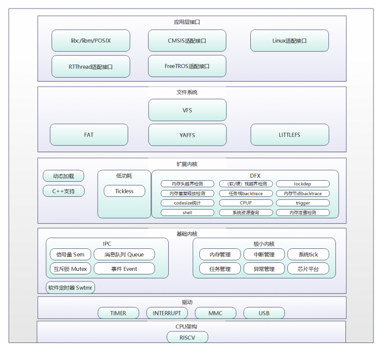

The base kernel of LiteOS consists of a non-scalable minimal kernel and other scalable modules. The minimal kernel contains only the basic functions related to task management and scheduling. The scalable modules include semaphores, mutexes, queue management, event management, software timers, memory management, interrupt management, exception management, and the system clock Tick.

LiteOS supports running in a single-core environment.

**Advantages of LiteOS<a name="s6e0aa4faed9041bb807479a04ddebdab"></a>**

-   High real-time performance and high stability.
-   Low power consumption. Supports dynamic loading and scattered loading.
-   Supports static feature tailoring.
-   Fast startup.

**Introduction to Kernel Modules<a name="s0796b68eb2334c48b6b259a344d24636"></a>**

-   Task management

    Provides task creation, deletion, delay, suspension, and resume functions, supports locking and unlocking task scheduling, supports preemptive scheduling of tasks by priority, and round-robin scheduling of tasks with the same priority.

-   Memory management
    -   Provides static memory and dynamic memory algorithms, and supports memory allocation and release. Currently supported memory management algorithms include the fixed-size BOX algorithm, and the bestfit and bestfit\_little algorithms for dynamic allocation.
    -   Provides memory statistics and memory out-of-bounds detection.

-   Hardware-related

    Provides interrupt management, exception management, system clock Tick, and other functions.

    -   Interrupt management: provides interrupt creation, deletion, enable, disable, and request bit clearing.
    -   Exception management: after an exception occurs during system operation, the system jumps to the exception handling module to print the function call stack information of the current exception or save the current system state.
    -   Tick: the Tick is the basic time unit of OS scheduling. Its duration is determined by the number of Ticks per second and is configured by the user.

-   IPC communication

    Provides message queues, events, semaphores, and mutexes.

    -   Message queue: supports message queue creation, deletion, sending, and receiving.
    -   Event: supports event reading and writing.
    -   Semaphore: supports semaphore creation, deletion, acquisition, and release.
    -   Mutex: supports mutex creation, deletion, acquisition, and release.

-   Software timer

    Software timers provide timer creation, deletion, startup, and stop functions.

-   Low power consumption

    Tickless: the Tickless mechanism reduces unnecessary clock interrupts by calculating the time of the next meaningful clock interrupt, thereby reducing system power consumption. After the Tickless feature is enabled, the system starts the Tickless mechanism when the CPU is idle.

-   Extended kernel/DFX
    -   CPU usage: obtains the CPU usage of the system or a specified task.
    -   Trace event monitoring: obtains the context of event occurrence in real time and writes it to the buffer. Supports custom buffers, monitoring events of specified modules, starting/stopping Trace, and clearing/outputting trace buffer data.
    -   Perf: a performance analysis tool that can be used to find performance bottlenecks and locate hot code. LiteOS supports configuring the sampling data buffer and sampling events, starting/stopping Perf, and outputting sampling data.
    -   Shell: the LiteOS Shell receives user commands through the serial port or Telnet, and invokes and executes the corresponding applications through commands. The LiteOS Shell supports common basic debugging functions, including system, file, network, and dynamic loading commands, and also supports user-defined commands.

-   C++ support

    LiteOS supports some STL features, exceptions, and RTTI. Other features are supported by the compiler.

## Supported Cores<a name="ZH-CN_TOPIC_0000002543394345"></a>

<a name="table37599927114623"></a>
<table><thead align="left"><tr id="row9045213114623"><th class="cellrowborder" valign="top" width="42.730000000000004%" id="mcps1.1.3.1.1"><p id="p17292119114623"><a name="p17292119114623"></a><a name="p17292119114623"></a>Supported Cores</p>
</th>
<th class="cellrowborder" valign="top" width="57.269999999999996%" id="mcps1.1.3.1.2"><p id="p58484359114623"><a name="p58484359114623"></a><a name="p58484359114623"></a>Chip</p>
</th>
</tr>
</thead>
<tbody><tr id="row56597184114623"><td class="cellrowborder" valign="top" width="42.730000000000004%" headers="mcps1.1.3.1.1 "><p id="p20969186114623"><a name="p20969186114623"></a><a name="p20969186114623"></a>LinxCore131, LinxCore132, LinxCore170</p>
</td>
<td class="cellrowborder" valign="top" width="57.269999999999996%" headers="mcps1.1.3.1.2 "><p id="p20782492114623"><a name="p20782492114623"></a><a name="p20782492114623"></a>Hi3863, Hi3853</p>
</td>
</tr>
</tbody>
</table>

## Usage Constraints<a name="ZH-CN_TOPIC_0000002511954398"></a>

-   LiteOS provides a set of its own OS interfaces and also supports the POSIX and CMSIS interfaces. Do not mix these interfaces. Mixing interfaces may cause unpredictable errors. For example, using the POSIX interface to acquire a semaphore but the LiteOS interface to release it.
-   Only LiteOS interfaces can be used to develop drivers. The upper-layer APP is recommended to use the POSIX interfaces.

# Base Kernel<a name="ZH-CN_TOPIC_0000002543394197"></a>


## Task<a name="ZH-CN_TOPIC_0000002543394247"></a>


### Overview<a name="ZH-CN_TOPIC_0000002511794444"></a>

**Basic Concepts<a name="section734172610531"></a>**

From the system perspective, a task is the smallest running unit that competes for system resources. A task can use or wait for system resources such as the CPU and memory space, and runs independently of other tasks.

The LiteOS task module provides users with multiple tasks, implements switching between tasks, and helps users manage business program flows. The LiteOS task module has the following features:

-   Supports multiple tasks.
-   One task represents one thread.
-   Preemptive scheduling mechanism: a higher-priority task can preempt a lower-priority task, and a lower-priority task can be scheduled only after the higher-priority task is blocked or completes.
-   Tasks with the same priority support time-slice round-robin scheduling.
-   There are 32 priorities in total \[0, 31\]. Priority 0 is the highest and priority 31 is the lowest.
-   Tasks have two attributes (detached and joinable). By default, tasks are created with the detached attribute.

**Task-related Concepts<a name="section5879050715587"></a>**

-   Task state

    Tasks in the LiteOS system have multiple running states. After system initialization is complete, created tasks can compete for resources in the system and are scheduled by the kernel.

    Task states are usually divided into the following four types:

    -   Ready: the task is in the ready queue, waiting only for the CPU.
    -   Running: the task is being executed.
    -   Blocked: the task is not in the ready queue. This includes tasks that are suspended (suspend state), tasks that are delayed (delay state), and tasks waiting for a semaphore, reading/writing a queue, or waiting for an event.
    -   Dead: the task has finished running and is waiting for the system to reclaim resources. This includes tasks in the zombie state and tasks that have been reclaimed (unused state).

-   Task state transitions

    **Figure 1**  Task state diagram<a name="fig183501322820"></a>  
    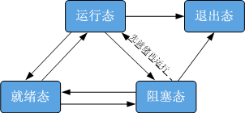

    The task state transitions are described as follows:

    -   Ready to Running

        After a task is created, it enters the ready state. When a task switch occurs, the task with the highest priority in the ready queue is executed and enters the running state, and the task is removed from the ready queue.

    -   Running to Blocked

        When a running task becomes blocked (suspended, delayed, reading a semaphore, etc.), its state changes from running to blocked. A task switch then occurs, and the task with the highest priority in the ready queue is taken out and run.

    -   Blocked to Ready (Blocked to Running)

        After a blocked task is resumed (task resume, delay timeout, semaphore read timeout, or successful semaphore read), the resumed task is added to the ready queue and its state changes from blocked to ready. If the priority of the resumed task is higher than that of the currently running task, a task switch occurs and the task changes from ready to running.

    -   Ready to Blocked

        A task may also be blocked (suspended) in the ready state. In this case, the task state changes from ready to blocked, and the task is removed from the ready queue. The task does not participate in task scheduling until it is resumed.

    -   Running to Ready

        After a higher-priority task is created or resumed, task scheduling occurs. The task with the highest priority in the ready queue is taken out and switched to the running state, and the originally running task changes from running to ready and is inserted into the ready queue.

    -   Running to Dead

        When a running task finishes running, its state changes from running to dead. The dead state includes the normal exit state after a task finishes running and the zombie state. For example, a joinable task that finishes running but whose resources have not been reclaimed presents the zombie state externally, that is, the dead state.

    -   Blocked to Dead

        When a blocked task calls the delete interface, its state changes from blocked to dead.

-   Task ID

    The task ID is returned to the user through a parameter when the task is created and is an important identifier of the task. ID numbers in the system are unique. Users can use the task ID to suspend a specified task, resume a task, query a task name, and perform other operations.

-   Task priority

    The priority indicates the order in which tasks are executed. The task priority determines the task to be executed when a task switch occurs. The task with the highest priority in the ready queue will be executed.

-   Task entry function

    The function that a new task executes after being scheduled. This function is implemented by the user and set through the task creation structure when the task is created.

-   Task stack

    Each task has an independent stack space, which is called the task stack. The information saved in the stack space includes local variables, registers, function parameters, function return addresses, etc.

-   Task context

    Resources used by a task during running, such as registers, are called the task context. When the task is suspended and other tasks continue to execute, values in resources such as registers may be modified. If the task context is not saved during a task switch, unknown errors may occur after the task is resumed.

    Therefore, when a task switch occurs, LiteOS saves the context information of the switched-out task in its own task stack, so that after the task is resumed, the context information at the time of suspension can be restored from the stack space and the code interrupted at the time of suspension can be executed continuously.

-   Task control block (TCB)

    Each task has a task control block (TCB). The TCB contains the task context stack pointer, task state, task priority, task ID, task name, task stack size, and other information, which can reflect the running status of each task.

-   Task switch

    A task switch includes obtaining the task with the highest priority in the ready queue, saving the context of the switched-out task, and restoring the context of the switched-in task.

-   Task attributes

    Tasks have two attributes (detached and joinable), and different attributes determine how a task terminates. The joinable attribute is the non-detached state. After a task in this state exits, its resources are not automatically released. Another task must wait for and obtain its return value through the LOS\_TaskJoin interface before the resources can be released. The detached attribute is the detached state. After a task in this state exits, its resources are automatically reclaimed, and the task cannot be waited on — waiting is meaningless.

**Scheduler-related Concepts<a name="section36661640105416"></a>**

LiteOS provides two scheduling modes: the global queue scheduler mode and the multi-queue scheduler mode, each with advantages in different scenarios. The system currently uses the global scheduler mode by default.

-   Global queue scheduler mode: the system uses only one priority queue to hold tasks ready to run. All cores use the same priority queue for scheduling, and all tasks preempt the same priority queue. Therefore, the global queue scheduler mode provides higher real-time performance.
-   Multi-queue scheduler mode: used only on multi-core systems. The system creates a priority queue for each core based on the number of cores, and each core schedules tasks using only its own priority queue. The system migrates tasks across different priority queues through a load balancing algorithm, which effectively reduces frequent inter-core migration compared with the global queue scheduler mode.

**Working Mechanism<a name="section1786939515524"></a>**

When a user creates a task, the system initializes the task stack and presets the context. In addition, the system places the address of the task entry function at the appropriate location. In this way, the task entry function is executed when the task is started for the first time and enters the running state.

### Development Guidelines<a name="ZH-CN_TOPIC_0000002511954396"></a>

**Usage Scenarios<a name="section5224652316715"></a>**

After a task is created, the kernel can lock task scheduling, unlock task scheduling, suspend, resume, delay, and perform other operations. It can also set the task priority and obtain the task priority.

**Functions<a name="section21906860141415"></a>**

The LiteOS task management module provides the following functions. For detailed interface information, see the API reference.

<a name="table4179158561"></a>
<table><thead align="left"><tr id="row8216185185618"><th class="cellrowborder" valign="top" width="19.39%" id="mcps1.1.4.1.1"><p id="p1221612517569"><a name="p1221612517569"></a><a name="p1221612517569"></a>Function Category</p>
</th>
<th class="cellrowborder" valign="top" width="28.57%" id="mcps1.1.4.1.2"><p id="p112160513563"><a name="p112160513563"></a><a name="p112160513563"></a>API Name</p>
</th>
<th class="cellrowborder" valign="top" width="52.04%" id="mcps1.1.4.1.3"><p id="p92161755561"><a name="p92161755561"></a><a name="p92161755561"></a>Description</p>
</th>
</tr>
</thead>
<tbody><tr id="row19216758565"><td class="cellrowborder" rowspan="6" valign="top" width="19.39%" headers="mcps1.1.4.1.1 "><p id="p421614525612"><a name="p421614525612"></a><a name="p421614525612"></a>Creating and deleting tasks</p>
</td>
<td class="cellrowborder" valign="top" width="28.57%" headers="mcps1.1.4.1.2 "><p id="p621615525618"><a name="p621615525618"></a><a name="p621615525618"></a>LOS_TaskCreateOnly</p>
</td>
<td class="cellrowborder" valign="top" width="52.04%" headers="mcps1.1.4.1.3 "><p id="p221645165613"><a name="p221645165613"></a><a name="p221645165613"></a>Creates a task and places it in the suspend state without scheduling it. If scheduling is required, call LOS_TaskResume to place the task in the ready state.</p>
</td>
</tr>
<tr id="row12216959560"><td class="cellrowborder" valign="top" headers="mcps1.1.4.1.1 "><p id="p132169512563"><a name="p132169512563"></a><a name="p132169512563"></a>LOS_TaskCreate</p>
</td>
<td class="cellrowborder" valign="top" headers="mcps1.1.4.1.2 "><p id="p17216195205619"><a name="p17216195205619"></a><a name="p17216195205619"></a>Creates a task and places it in the ready state. If there is no higher-priority task in the ready queue, the task is run.</p>
</td>
</tr>
<tr id="row92160515569"><td class="cellrowborder" valign="top" headers="mcps1.1.4.1.1 "><p id="p02162545614"><a name="p02162545614"></a><a name="p02162545614"></a>LOS_TaskCreateOnlyStatic</p>
</td>
<td class="cellrowborder" valign="top" headers="mcps1.1.4.1.2 "><p id="p121616575618"><a name="p121616575618"></a><a name="p121616575618"></a>Creates a task with the task stack passed in by the user, and places the task in the suspend state without scheduling it. If scheduling is required, call LOS_TaskResume to place the task in the ready state.</p>
</td>
</tr>
<tr id="row92165585613"><td class="cellrowborder" valign="top" headers="mcps1.1.4.1.1 "><p id="p1821613545618"><a name="p1821613545618"></a><a name="p1821613545618"></a>LOS_TaskCreateStatic</p>
</td>
<td class="cellrowborder" valign="top" headers="mcps1.1.4.1.2 "><p id="p32161595611"><a name="p32161595611"></a><a name="p32161595611"></a>Creates a task with the task stack passed in by the user, and places the task in the ready state. If there is no higher-priority task in the ready queue, the task is run.</p>
</td>
</tr>
<tr id="row5216551563"><td class="cellrowborder" valign="top" headers="mcps1.1.4.1.1 "><p id="p821613565618"><a name="p821613565618"></a><a name="p821613565618"></a>LOS_TaskDelete</p>
</td>
<td class="cellrowborder" valign="top" headers="mcps1.1.4.1.2 "><p id="p621619595619"><a name="p621619595619"></a><a name="p621619595619"></a>Deletes the specified task.</p>
</td>
</tr>
<tr id="row721635175617"><td class="cellrowborder" valign="top" headers="mcps1.1.4.1.1 "><p id="p72161756568"><a name="p72161756568"></a><a name="p72161756568"></a>LOS_TaskJoin</p>
</td>
<td class="cellrowborder" valign="top" headers="mcps1.1.4.1.2 "><p id="p1121612555614"><a name="p1121612555614"></a><a name="p1121612555614"></a>Waits for the specified task in a blocking manner and reclaims the task resources.</p>
</td>
</tr>
<tr id="row7216175125614"><td class="cellrowborder" rowspan="5" valign="top" width="19.39%" headers="mcps1.1.4.1.1 "><p id="p152161451567"><a name="p152161451567"></a><a name="p152161451567"></a>Controlling task states</p>
</td>
<td class="cellrowborder" valign="top" width="28.57%" headers="mcps1.1.4.1.2 "><p id="p132162515561"><a name="p132162515561"></a><a name="p132162515561"></a>LOS_TaskResume</p>
</td>
<td class="cellrowborder" valign="top" width="52.04%" headers="mcps1.1.4.1.3 "><p id="p2216175185615"><a name="p2216175185615"></a><a name="p2216175185615"></a>Resumes a suspended task and places it in the ready state.</p>
</td>
</tr>
<tr id="row172161058566"><td class="cellrowborder" valign="top" headers="mcps1.1.4.1.1 "><p id="p921610514562"><a name="p921610514562"></a><a name="p921610514562"></a>LOS_TaskSuspend</p>
</td>
<td class="cellrowborder" valign="top" headers="mcps1.1.4.1.2 "><p id="p921618510562"><a name="p921618510562"></a><a name="p921618510562"></a>Suspends the specified task and then switches tasks.</p>
</td>
</tr>
<tr id="row15216185135612"><td class="cellrowborder" valign="top" headers="mcps1.1.4.1.1 "><p id="p112161456569"><a name="p112161456569"></a><a name="p112161456569"></a>LOS_TaskDelay</p>
</td>
<td class="cellrowborder" valign="top" headers="mcps1.1.4.1.2 "><p id="p1721695105619"><a name="p1721695105619"></a><a name="p1721695105619"></a>Delays the task for a specified period and releases the CPU. After the wait time expires, the task re-enters the ready state.</p>
</td>
</tr>
<tr id="row921645155616"><td class="cellrowborder" valign="top" headers="mcps1.1.4.1.1 "><p id="p1721616545618"><a name="p1721616545618"></a><a name="p1721616545618"></a>LOS_TaskYield</p>
</td>
<td class="cellrowborder" valign="top" headers="mcps1.1.4.1.2 "><p id="p5216185145612"><a name="p5216185145612"></a><a name="p5216185145612"></a>Releases the CPU from the current task and moves it to the end of the ready task queue with the same priority.</p>
</td>
</tr>
<tr id="row1221614555612"><td class="cellrowborder" valign="top" headers="mcps1.1.4.1.1 "><p id="p1321665115610"><a name="p1321665115610"></a><a name="p1321665115610"></a>LOS_TaskDetach</p>
</td>
<td class="cellrowborder" valign="top" headers="mcps1.1.4.1.2 "><p id="p1021610545619"><a name="p1021610545619"></a><a name="p1021610545619"></a>Sets the task attribute to detached.</p>
</td>
</tr>
<tr id="row102165516564"><td class="cellrowborder" rowspan="3" valign="top" width="19.39%" headers="mcps1.1.4.1.1 "><p id="p1821695185611"><a name="p1821695185611"></a><a name="p1821695185611"></a>Controlling task scheduling</p>
</td>
<td class="cellrowborder" valign="top" width="28.57%" headers="mcps1.1.4.1.2 "><p id="p18216135165615"><a name="p18216135165615"></a><a name="p18216135165615"></a>LOS_TaskLock</p>
</td>
<td class="cellrowborder" valign="top" width="52.04%" headers="mcps1.1.4.1.3 "><p id="p19216135115620"><a name="p19216135115620"></a><a name="p19216135115620"></a>Locks task scheduling. The task can still be interrupted.</p>
</td>
</tr>
<tr id="row321614516562"><td class="cellrowborder" valign="top" headers="mcps1.1.4.1.1 "><p id="p821611515565"><a name="p821611515565"></a><a name="p821611515565"></a>LOS_TaskUnlock</p>
</td>
<td class="cellrowborder" valign="top" headers="mcps1.1.4.1.2 "><p id="p921617545610"><a name="p921617545610"></a><a name="p921617545610"></a>Unlocks task scheduling.</p>
</td>
</tr>
<tr id="row2021614519564"><td class="cellrowborder" valign="top" headers="mcps1.1.4.1.1 "><p id="p1521715185618"><a name="p1521715185618"></a><a name="p1521715185618"></a>LOS_TaskUnlockNoSched</p>
</td>
<td class="cellrowborder" valign="top" headers="mcps1.1.4.1.2 "><p id="p821735175614"><a name="p821735175614"></a><a name="p821735175614"></a>Unlocks task scheduling and continues executing the current task.</p>
</td>
</tr>
<tr id="row62177585616"><td class="cellrowborder" rowspan="3" valign="top" width="19.39%" headers="mcps1.1.4.1.1 "><p id="p42172535620"><a name="p42172535620"></a><a name="p42172535620"></a>Controlling task priority</p>
</td>
<td class="cellrowborder" valign="top" width="28.57%" headers="mcps1.1.4.1.2 "><p id="p16217165185620"><a name="p16217165185620"></a><a name="p16217165185620"></a>LOS_CurTaskPriSet</p>
</td>
<td class="cellrowborder" valign="top" width="52.04%" headers="mcps1.1.4.1.3 "><p id="p15217850561"><a name="p15217850561"></a><a name="p15217850561"></a>Sets the priority of the current task.</p>
</td>
</tr>
<tr id="row1217255564"><td class="cellrowborder" valign="top" headers="mcps1.1.4.1.1 "><p id="p721710519562"><a name="p721710519562"></a><a name="p721710519562"></a>LOS_TaskPriSet</p>
</td>
<td class="cellrowborder" valign="top" headers="mcps1.1.4.1.2 "><p id="p1121717555618"><a name="p1121717555618"></a><a name="p1121717555618"></a>Sets the priority of the specified task.</p>
</td>
</tr>
<tr id="row1721716514561"><td class="cellrowborder" valign="top" headers="mcps1.1.4.1.1 "><p id="p1621775145610"><a name="p1621775145610"></a><a name="p1621775145610"></a>LOS_TaskPriGet</p>
</td>
<td class="cellrowborder" valign="top" headers="mcps1.1.4.1.2 "><p id="p8217552561"><a name="p8217552561"></a><a name="p8217552561"></a>Obtains the priority of the specified task.</p>
</td>
</tr>
<tr id="row821710519567"><td class="cellrowborder" valign="top" width="19.39%" headers="mcps1.1.4.1.1 "><p id="p9217115195610"><a name="p9217115195610"></a><a name="p9217115195610"></a>Reclaiming task stack resources</p>
</td>
<td class="cellrowborder" valign="top" width="28.57%" headers="mcps1.1.4.1.2 "><p id="p18217165165610"><a name="p18217165165610"></a><a name="p18217165165610"></a>LOS_TaskResRecycle</p>
</td>
<td class="cellrowborder" valign="top" width="52.04%" headers="mcps1.1.4.1.3 "><p id="p1421712505619"><a name="p1421712505619"></a><a name="p1421712505619"></a>Reclaims all task stack resources pending reclamation.</p>
</td>
</tr>
<tr id="row1217554562"><td class="cellrowborder" rowspan="3" valign="top" width="19.39%" headers="mcps1.1.4.1.1 "><p id="p1921718520569"><a name="p1921718520569"></a><a name="p1921718520569"></a>Obtaining task information</p>
</td>
<td class="cellrowborder" valign="top" width="28.57%" headers="mcps1.1.4.1.2 "><p id="p17217755561"><a name="p17217755561"></a><a name="p17217755561"></a>LOS_CurTaskIDGet</p>
</td>
<td class="cellrowborder" valign="top" width="52.04%" headers="mcps1.1.4.1.3 "><p id="p112171052563"><a name="p112171052563"></a><a name="p112171052563"></a>Obtains the ID of the current task.</p>
</td>
</tr>
<tr id="row221717511563"><td class="cellrowborder" valign="top" headers="mcps1.1.4.1.1 "><p id="p1821720512563"><a name="p1821720512563"></a><a name="p1821720512563"></a>LOS_TaskInfoGet</p>
</td>
<td class="cellrowborder" valign="top" headers="mcps1.1.4.1.2 "><p id="p321712515619"><a name="p321712515619"></a><a name="p321712515619"></a>Obtains information about the specified task, including the task state, priority, task stack size, stack pointer SP, task entry function, and used task stack size.</p>
</td>
</tr>
<tr id="row621718515614"><td class="cellrowborder" valign="top" headers="mcps1.1.4.1.1 "><p id="p182171751561"><a name="p182171751561"></a><a name="p182171751561"></a>LOS_TaskIsScheduled</p>
</td>
<td class="cellrowborder" valign="top" headers="mcps1.1.4.1.2 "><p id="p202176565612"><a name="p202176565612"></a><a name="p202176565612"></a>Queries whether the current core has started task scheduling.</p>
</td>
</tr>
<tr id="row5217165155611"><td class="cellrowborder" valign="top" width="19.39%" headers="mcps1.1.4.1.1 "><p id="p82178518561"><a name="p82178518561"></a><a name="p82178518561"></a>Task information DFX</p>
</td>
<td class="cellrowborder" valign="top" width="28.57%" headers="mcps1.1.4.1.2 "><p id="p1217855567"><a name="p1217855567"></a><a name="p1217855567"></a>LOS_TaskSwitchHookReg</p>
</td>
<td class="cellrowborder" valign="top" width="52.04%" headers="mcps1.1.4.1.3 "><p id="p152171250569"><a name="p152171250569"></a><a name="p152171250569"></a>Registers a hook function for task context switching. This hook function is invoked when a task context switch occurs only after the LOSCFG_BASE_CORE_TSK_MONITOR macro switch is enabled.</p>
</td>
</tr>
<tr id="row162171535615"><td class="cellrowborder" valign="top" width="19.39%" headers="mcps1.1.4.1.1 "><p id="p421716555615"><a name="p421716555615"></a><a name="p421716555615"></a>Task idle processing callback</p>
</td>
<td class="cellrowborder" valign="top" width="28.57%" headers="mcps1.1.4.1.2 "><p id="p1721785105610"><a name="p1721785105610"></a><a name="p1721785105610"></a>LOS_IdleHandlerHookReg</p>
</td>
<td class="cellrowborder" valign="top" width="52.04%" headers="mcps1.1.4.1.3 "><p id="p32175519569"><a name="p32175519569"></a><a name="p32175519569"></a>Registers an idle task hook function, which is invoked when the system is idle.</p>
</td>
</tr>
<tr id="row7217125195619"><td class="cellrowborder" valign="top" width="19.39%" headers="mcps1.1.4.1.1 "><p id="p112170555610"><a name="p112170555610"></a><a name="p112170555610"></a>Allocating the task secure stack</p>
</td>
<td class="cellrowborder" valign="top" width="28.57%" headers="mcps1.1.4.1.2 "><p id="p1221713555617"><a name="p1221713555617"></a><a name="p1221713555617"></a>LOS_TaskAllocSecureContext</p>
</td>
<td class="cellrowborder" valign="top" width="52.04%" headers="mcps1.1.4.1.3 "><p id="p202171851565"><a name="p202171851565"></a><a name="p202171851565"></a>Allocates the task secure stack. This function is available only after the LOSCFG_TRUSTZONE macro switch is enabled.</p>
</td>
</tr>
</tbody>
</table>

> **Notice:** 
>The task stack size of each task can be set individually when the task is created. If it is set to 0, the default task stack size (LOSCFG\_BASE\_CORE\_TSK\_DEFAULT\_STACK\_SIZE) is used as the task stack size.

**Configuration Items<a name="section4504031135613"></a>**

-   Shared stack feature

    -   Shared stack feature description: in the native system, each task has its own independent stack area. After the shared stack is introduced, some tasks share the same task stack, which is called the shared stack. When task scheduling occurs, the stack data of the old task is copied out of the shared stack to the heap, and the stack data of the new task is copied from the heap back to the shared stack.
    -   Shared stack usage instructions:

        LOSCFG\_SHARED\_STACK: master switch of the shared stack. The shared stack feature can be used only after it is enabled.

        LOSCFG\_SHARED\_STACK\_SIZE: configures the shared stack size (in bytes). The default value of this macro is 16384. It can be adjusted as required. The adjustment range is 3072 to 65536, and the value must be divisible by 16. It is recommended to set it to the maximum task stack size among tasks participating in sharing.

        Currently, the shared stack feature uses a whitelist policy, and tasks in the whitelist are shared tasks. The configuration method is as follows (using hiwing as an example):

        Configure the g\_taskBlackList array in the file "Huawei\_LiteOS/self\_src/targets/hiwing/board.c". Each entry has 3 fields, indicating "task name", "whether to participate in sharing", and "whether to compress data during stack copy".

        Example:

        ```
        /*
        Set the shared stack whitelist here. Tasks in the whitelist participate in sharing
        Only tasks participating in sharing can participate in compression
        */
        const TaskBlackList g_sharedTask[LOSCFG_BASE_CORE_TSK_LIMIT + 1] = {
            //              taskName               In shared?                            Compressed?
            {"app_Task",                            TRUE,                               FALSE},
            {"SerialShellTask",                     TRUE,                               FALSE},
            {"SerialEntryTask",                     TRUE,                               FALSE},
            {"TskInSharedBlackLits",                TRUE,                               FALSE},
        };
        ```

    > **Notice:** 
    >-   If a task is created with the stack passed in at creation time, the task cannot participate in sharing.
    >-   After the shared stack is enabled, you can also enable the LOSCFG\_SHARED\_TASK\_STAT macro to add the task information display function, but this increases memory overhead by about 0.6 KB.

    <a name="table98267209577"></a>
    <table><thead align="left"><tr id="row5835152014574"><th class="cellrowborder" valign="top" width="19.39%" id="mcps1.1.4.1.1"><p id="p783514208575"><a name="p783514208575"></a><a name="p783514208575"></a>Function Category</p>
    </th>
    <th class="cellrowborder" valign="top" width="15.010000000000002%" id="mcps1.1.4.1.2"><p id="p158351320185719"><a name="p158351320185719"></a><a name="p158351320185719"></a>API Name</p>
    </th>
    <th class="cellrowborder" valign="top" width="65.60000000000001%" id="mcps1.1.4.1.3"><p id="p198361720205716"><a name="p198361720205716"></a><a name="p198361720205716"></a>Description</p>
    </th>
    </tr>
    </thead>
    <tbody><tr id="row128361420125718"><td class="cellrowborder" valign="top" width="19.39%" headers="mcps1.1.4.1.1 "><p id="p17836102055711"><a name="p17836102055711"></a><a name="p17836102055711"></a>Displaying task scheduling performance information</p>
    </td>
    <td class="cellrowborder" valign="top" width="15.010000000000002%" headers="mcps1.1.4.1.2 "><p id="p1683642020575"><a name="p1683642020575"></a><a name="p1683642020575"></a>SharedTaskStatPrint</p>
    </td>
    <td class="cellrowborder" valign="top" width="65.60000000000001%" headers="mcps1.1.4.1.3 "><p id="p67361334183917"><a name="p67361334183917"></a><a name="p67361334183917"></a>Prints task performance information:</p>
    <p id="p108362020155719"><a name="p108362020155719"></a><a name="p108362020155719"></a>The first group is overall performance data, including the maximum task scheduling time, the average time, and the number of times scheduling time exceeds 8000 cycleTime.</p>
    <p id="p1683692020578"><a name="p1683692020578"></a><a name="p1683692020578"></a>The second group is per-task performance data, including the task name, ID, number of scheduling times, number of compressed copy operations (0 if the task does not participate in compression or compression is not enabled), number of successful compressions, compression success rate, maximum time to copy out to the heap, maximum time to copy into the shared stack, and the number of times copy time exceeds 8000 cycleTime.</p>
    </td>
    </tr>
    </tbody>
    </table>

-   Weighted fair scheduling feature
    -   Weighted fair scheduling (WCFS) feature description:

        In a system without WCFS, there is a set of priority queues (PriQueue) in the system. Tasks are inserted into different queues based on their priorities. During task scheduling, the head of the queue with the highest priority is taken.

        After WCFS is introduced, each task calculates a weighted virtual running time based on its priority and running time, and tasks are sorted by priority according to the virtual running time, achieving a relatively fair state. During task scheduling, the CFS task with the highest priority (CFSTask) is first obtained from the CFS queue, and then the RT task (non-CFS task) with the highest priority (RTTask) is obtained. The priorities of CFSTask and RTTask are compared, and the one with the higher priority is executed. If CFSTask and RTTask have the same priority, RTTask is executed. The CPU executes the Idle task only after all RTTask and CFS tasks are executed.

    -   Usage instructions:

        Enable the LOSCFG\_WCFS\_SCHEDULER macro to use the CFS feature. Currently, the weighted fair scheduling feature uses a blacklist policy. Tasks in the blacklist do not participate in weighted fair scheduling. The configuration method is as follows (using hiwing as an example):

        Configure the g\_rtTaskName array in the file "LiteOS/Huawei\_LiteOS/self\_src/targets/hiwing/board.c". Simply add the names of threads that do not participate in weighted fair scheduling to the array.

        Example:

        ```
        CHAR *g_rtTaskName[CFS_TASK_LIST_NUM] = {
            "app_Task",
            "SerialShellTask",
            "SerialEntryTask",
        };
        ```

    -   Others:

        LiteOS also provides the UINT32 LOS\_RemoveTaskFromCFS\(UINT32 taskid\); interface. Pass the thread ID to this interface, and the thread with the corresponding ID is added to the WCFS blacklist. OK is returned on success.

        > **Note:** 
        >Note: OK is also returned if the thread no longer participates in WCFS, or if the thread is the IdleTask.

**TASK State<a name="section752424385712"></a>**

Most task states in LiteOS are maintained by the kernel. Only the self-deleting state is visible to users, and users need to pass the following definitions when creating a task:

<a name="table1052614315578"></a>
<table><thead align="left"><tr id="row7542104319575"><th class="cellrowborder" valign="top" width="31.313131313131308%" id="mcps1.1.4.1.1"><p id="p15542843165714"><a name="p15542843165714"></a><a name="p15542843165714"></a>Definition</p>
</th>
<th class="cellrowborder" valign="top" width="21.002100210021002%" id="mcps1.1.4.1.2"><p id="p7542743175711"><a name="p7542743175711"></a><a name="p7542743175711"></a>Actual Value</p>
</th>
<th class="cellrowborder" valign="top" width="47.68476847684768%" id="mcps1.1.4.1.3"><p id="p45424431573"><a name="p45424431573"></a><a name="p45424431573"></a>Description</p>
</th>
</tr>
</thead>
<tbody><tr id="row15542164335718"><td class="cellrowborder" valign="top" width="31.313131313131308%" headers="mcps1.1.4.1.1 "><p id="p6542124325712"><a name="p6542124325712"></a><a name="p6542124325712"></a>LOS_TASK_STATUS_JOINABLE</p>
</td>
<td class="cellrowborder" valign="top" width="21.002100210021002%" headers="mcps1.1.4.1.2 "><p id="p6542174385710"><a name="p6542174385710"></a><a name="p6542174385710"></a>0x0080</p>
</td>
<td class="cellrowborder" valign="top" width="47.68476847684768%" headers="mcps1.1.4.1.3 "><p id="p185421043155720"><a name="p185421043155720"></a><a name="p185421043155720"></a>The task does not release resources automatically. The resources can be released only after another task waits for and obtains its return value</p>
</td>
</tr>
<tr id="row954219430572"><td class="cellrowborder" valign="top" width="31.313131313131308%" headers="mcps1.1.4.1.1 "><p id="p1854244312574"><a name="p1854244312574"></a><a name="p1854244312574"></a>LOS_TASK_STATUS_DETACHED</p>
</td>
<td class="cellrowborder" valign="top" width="21.002100210021002%" headers="mcps1.1.4.1.2 "><p id="p45421443175712"><a name="p45421443175712"></a><a name="p45421443175712"></a>0x0100</p>
</td>
<td class="cellrowborder" valign="top" width="47.68476847684768%" headers="mcps1.1.4.1.3 "><p id="p11542114375712"><a name="p11542114375712"></a><a name="p11542114375712"></a>The task is self-deleting</p>
</td>
</tr>
</tbody>
</table>

When calling the task creation interface, users can set the uwResved field of the TSK\_INIT\_PARAM\_S parameter to LOS\_TASK\_STATUS\_DETACHED (detached attribute) or LOS\_TASK\_STATUS\_JOINABLE (joinable attribute).

> **Notice:** 
>The joinable attribute of tasks is affected by the LOSCFG\_TASK\_JOINABLE switch.
>-   Open the menu (see "[Opening the menuconfig Menu](opening_the_menuconfig_menu.md)" for how to open it). The LOSCFG\_TASK\_JOINABLE configuration is located under Kernel ---\> Basic Config ---\> Task ---\>Enable Join/Detach mechanism.
>-   When LOSCFG\_TASK\_JOINABLE is enabled, only tasks whose state is set to LOS\_TASK\_STATUS\_JOINABLE can be joinable tasks. Joinable tasks are not self-deleting. Users need to reclaim the resources of joinable tasks by calling the LOS\_TaskJoin function, or set the task to the detached attribute by calling the LOS\_TaskDetach interface. Tasks with the detached attribute automatically reclaim their resources after running to completion.
>-   When LOSCFG\_TASK\_JOINABLE is disabled, tasks have only the detached attribute, regardless of whether the uwResved field of the TSK\_INIT\_PARAM\_S parameter is set to LOS\_TASK\_STATUS\_JOINABLE.
>-   The LOS\_TaskDelete interface cannot reclaim the resources of joinable tasks. Resources can only be reclaimed through the LOS\_TaskJoin interface.

**TASK Priority<a name="section67131625816"></a>**

The priority of LiteOS tasks currently supports the range (LOS\_TASK\_PRIORITY\_HIGHEST \~ LOS\_TASK\_PRIORITY\_LOWEST). The smaller the value, the higher the priority.

<a name="table1596141625815"></a>
<table><thead align="left"><tr id="row1919681675815"><th class="cellrowborder" valign="top" width="36.19361936193619%" id="mcps1.1.4.1.1"><p id="p319618168584"><a name="p319618168584"></a><a name="p319618168584"></a>Definition</p>
</th>
<th class="cellrowborder" valign="top" width="25.48254825482548%" id="mcps1.1.4.1.2"><p id="p419611611586"><a name="p419611611586"></a><a name="p419611611586"></a>Actual Value</p>
</th>
<th class="cellrowborder" valign="top" width="38.32383238323832%" id="mcps1.1.4.1.3"><p id="p519613162586"><a name="p519613162586"></a><a name="p519613162586"></a>Description</p>
</th>
</tr>
</thead>
<tbody><tr id="row619611167582"><td class="cellrowborder" valign="top" width="36.19361936193619%" headers="mcps1.1.4.1.1 "><p id="p21961616115811"><a name="p21961616115811"></a><a name="p21961616115811"></a>LOS_TASK_PRIORITY_HIGHEST</p>
</td>
<td class="cellrowborder" valign="top" width="25.48254825482548%" headers="mcps1.1.4.1.2 "><p id="p1619611169586"><a name="p1619611169586"></a><a name="p1619611169586"></a>0</p>
</td>
<td class="cellrowborder" valign="top" width="38.32383238323832%" headers="mcps1.1.4.1.3 "><p id="p1219601619583"><a name="p1219601619583"></a><a name="p1219601619583"></a>The highest task priority.</p>
</td>
</tr>
<tr id="row7196616135810"><td class="cellrowborder" valign="top" width="36.19361936193619%" headers="mcps1.1.4.1.1 "><p id="p619651685815"><a name="p619651685815"></a><a name="p619651685815"></a>LOS_TASK_PRIORITY_LOWEST</p>
</td>
<td class="cellrowborder" valign="top" width="25.48254825482548%" headers="mcps1.1.4.1.2 "><p id="p121966169589"><a name="p121966169589"></a><a name="p121966169589"></a>31</p>
</td>
<td class="cellrowborder" valign="top" width="38.32383238323832%" headers="mcps1.1.4.1.3 "><p id="p4196016135814"><a name="p4196016135814"></a><a name="p4196016135814"></a>The lowest task priority.</p>
</td>
</tr>
</tbody>
</table>

**TASK Error Codes<a name="section147241611587"></a>**

Operations such as creating, deleting, suspending, resuming, and delaying tasks may fail. When a failure occurs, the corresponding error code is returned to help quickly locate the cause.

<a name="table20987165581"></a>
<table><thead align="left"><tr id="row1419661695820"><th class="cellrowborder" valign="top" width="23.662366236623665%" id="mcps1.1.5.1.1"><p id="p10196161617588"><a name="p10196161617588"></a><a name="p10196161617588"></a>Definition</p>
</th>
<th class="cellrowborder" valign="top" width="11.821182118211821%" id="mcps1.1.5.1.2"><p id="p15196616205812"><a name="p15196616205812"></a><a name="p15196616205812"></a>Actual Value</p>
</th>
<th class="cellrowborder" valign="top" width="31.183118311831187%" id="mcps1.1.5.1.3"><p id="p15196216195815"><a name="p15196216195815"></a><a name="p15196216195815"></a>Description</p>
</th>
<th class="cellrowborder" valign="top" width="33.33333333333333%" id="mcps1.1.5.1.4"><p id="p17196316165812"><a name="p17196316165812"></a><a name="p17196316165812"></a>Suggested Solution</p>
</th>
</tr>
</thead>
<tbody><tr id="row141962165586"><td class="cellrowborder" valign="top" width="23.662366236623665%" headers="mcps1.1.5.1.1 "><p id="p3196181617583"><a name="p3196181617583"></a><a name="p3196181617583"></a>LOS_ERRNO_TSK_NO_MEMORY</p>
</td>
<td class="cellrowborder" valign="top" width="11.821182118211821%" headers="mcps1.1.5.1.2 "><p id="p7196111625818"><a name="p7196111625818"></a><a name="p7196111625818"></a>0x03000200</p>
</td>
<td class="cellrowborder" valign="top" width="31.183118311831187%" headers="mcps1.1.5.1.3 "><p id="p51961916145810"><a name="p51961916145810"></a><a name="p51961916145810"></a>Insufficient memory space.</p>
</td>
<td class="cellrowborder" valign="top" width="33.33333333333333%" headers="mcps1.1.5.1.4 "><p id="p111962160582"><a name="p111962160582"></a><a name="p111962160582"></a>Increase the dynamic memory space in either of the following ways:</p>
<a name="ul1019612162585"></a><a name="ul1019612162585"></a><ul id="ul1019612162585"><li>Set a larger system dynamic memory pool. The configuration item is OS_SYS_MEM_SIZE.</li><li>Release part of the dynamic memory.<p id="p19196111635819"><a name="p19196111635819"></a><a name="p19196111635819"></a>If the error occurs during task initialization in the LiteOS startup process, it can also be resolved by reducing the maximum number of tasks supported by the system. If the error occurs during task creation, it can also be resolved by reducing the task stack size.</p>
</li></ul>
</td>
</tr>
<tr id="row5196191605815"><td class="cellrowborder" valign="top" width="23.662366236623665%" headers="mcps1.1.5.1.1 "><p id="p619611617588"><a name="p619611617588"></a><a name="p619611617588"></a>LOS_ERRNO_TSK_PTR_NULL</p>
</td>
<td class="cellrowborder" valign="top" width="11.821182118211821%" headers="mcps1.1.5.1.2 "><p id="p141970161584"><a name="p141970161584"></a><a name="p141970161584"></a>0x02000201</p>
</td>
<td class="cellrowborder" valign="top" width="31.183118311831187%" headers="mcps1.1.5.1.3 "><p id="p18197111619583"><a name="p18197111619583"></a><a name="p18197111619583"></a>The task parameter initParam passed to the task creation interface is a null pointer, or the parameter passed to the task information obtaining interface is a null pointer.</p>
</td>
<td class="cellrowborder" valign="top" width="33.33333333333333%" headers="mcps1.1.5.1.4 "><p id="p7197181619584"><a name="p7197181619584"></a><a name="p7197181619584"></a>Ensure that the passed parameter is not a null pointer.</p>
</td>
</tr>
<tr id="row111971716125812"><td class="cellrowborder" valign="top" width="23.662366236623665%" headers="mcps1.1.5.1.1 "><p id="p41971616185810"><a name="p41971616185810"></a><a name="p41971616185810"></a>LOS_ERRNO_TSK_STKSZ_NOT_ALIGN</p>
</td>
<td class="cellrowborder" valign="top" width="11.821182118211821%" headers="mcps1.1.5.1.2 "><p id="p2019791665812"><a name="p2019791665812"></a><a name="p2019791665812"></a>0x02000202</p>
</td>
<td class="cellrowborder" valign="top" width="31.183118311831187%" headers="mcps1.1.5.1.3 "><p id="p619716162582"><a name="p619716162582"></a><a name="p619716162582"></a>When creating a task with a user-provided task stack, the start address or size of the task stack is not aligned with LOSCFG_STACK_POINT_ALIGN_SIZE.</p>
</td>
<td class="cellrowborder" valign="top" width="33.33333333333333%" headers="mcps1.1.5.1.4 "><p id="p1019771611582"><a name="p1019771611582"></a><a name="p1019771611582"></a>Align the start address and size of the task stack with LOSCFG_STACK_POINT_ALIGN_SIZE.</p>
</td>
</tr>
<tr id="row51971916205813"><td class="cellrowborder" valign="top" width="23.662366236623665%" headers="mcps1.1.5.1.1 "><p id="p8197201612589"><a name="p8197201612589"></a><a name="p8197201612589"></a>LOS_ERRNO_TSK_PRIOR_ERROR</p>
</td>
<td class="cellrowborder" valign="top" width="11.821182118211821%" headers="mcps1.1.5.1.2 "><p id="p019711635813"><a name="p019711635813"></a><a name="p019711635813"></a>0x02000203</p>
</td>
<td class="cellrowborder" valign="top" width="31.183118311831187%" headers="mcps1.1.5.1.3 "><p id="p1519716166582"><a name="p1519716166582"></a><a name="p1519716166582"></a>The priority parameter passed in when creating a task or setting the task priority is incorrect.</p>
</td>
<td class="cellrowborder" valign="top" width="33.33333333333333%" headers="mcps1.1.5.1.4 "><p id="p219771611583"><a name="p219771611583"></a><a name="p219771611583"></a>Check the task priority. It must be in the range [0, 31].</p>
</td>
</tr>
<tr id="row161971162584"><td class="cellrowborder" valign="top" width="23.662366236623665%" headers="mcps1.1.5.1.1 "><p id="p1219720162586"><a name="p1219720162586"></a><a name="p1219720162586"></a>LOS_ERRNO_TSK_ENTRY_NULL</p>
</td>
<td class="cellrowborder" valign="top" width="11.821182118211821%" headers="mcps1.1.5.1.2 "><p id="p10197171619582"><a name="p10197171619582"></a><a name="p10197171619582"></a>0x02000204</p>
</td>
<td class="cellrowborder" valign="top" width="31.183118311831187%" headers="mcps1.1.5.1.3 "><p id="p2019710166582"><a name="p2019710166582"></a><a name="p2019710166582"></a>The task entry function passed in when creating a task is a null pointer.</p>
</td>
<td class="cellrowborder" valign="top" width="33.33333333333333%" headers="mcps1.1.5.1.4 "><p id="p71971916135816"><a name="p71971916135816"></a><a name="p71971916135816"></a>Define the task entry function.</p>
</td>
</tr>
<tr id="row181971716185818"><td class="cellrowborder" valign="top" width="23.662366236623665%" headers="mcps1.1.5.1.1 "><p id="p619717161584"><a name="p619717161584"></a><a name="p619717161584"></a>LOS_ERRNO_TSK_NAME_EMPTY</p>
</td>
<td class="cellrowborder" valign="top" width="11.821182118211821%" headers="mcps1.1.5.1.2 "><p id="p319771635819"><a name="p319771635819"></a><a name="p319771635819"></a>0x02000205</p>
</td>
<td class="cellrowborder" valign="top" width="31.183118311831187%" headers="mcps1.1.5.1.3 "><p id="p16197141645816"><a name="p16197141645816"></a><a name="p16197141645816"></a>The task name passed in when creating a task is a null pointer.</p>
</td>
<td class="cellrowborder" valign="top" width="33.33333333333333%" headers="mcps1.1.5.1.4 "><p id="p1519751675812"><a name="p1519751675812"></a><a name="p1519751675812"></a>Set the task name.</p>
</td>
</tr>
<tr id="row161971416125817"><td class="cellrowborder" valign="top" width="23.662366236623665%" headers="mcps1.1.5.1.1 "><p id="p1619711655815"><a name="p1619711655815"></a><a name="p1619711655815"></a>LOS_ERRNO_TSK_STKSZ_TOO_SMALL</p>
</td>
<td class="cellrowborder" valign="top" width="11.821182118211821%" headers="mcps1.1.5.1.2 "><p id="p15197181695815"><a name="p15197181695815"></a><a name="p15197181695815"></a>0x02000206</p>
</td>
<td class="cellrowborder" valign="top" width="31.183118311831187%" headers="mcps1.1.5.1.3 "><p id="p519720167583"><a name="p519720167583"></a><a name="p519720167583"></a>The task stack passed in when creating a task is too small.</p>
</td>
<td class="cellrowborder" valign="top" width="33.33333333333333%" headers="mcps1.1.5.1.4 "><p id="p1419761614587"><a name="p1419761614587"></a><a name="p1419761614587"></a>Increase the task stack size so that it is not smaller than the minimum task stack size set by the system (the configuration item is LOS_TASK_MIN_STACK_SIZE).</p>
</td>
</tr>
<tr id="row1519741645815"><td class="cellrowborder" valign="top" width="23.662366236623665%" headers="mcps1.1.5.1.1 "><p id="p1419761615818"><a name="p1419761615818"></a><a name="p1419761615818"></a>LOS_ERRNO_TSK_ID_INVALID</p>
</td>
<td class="cellrowborder" valign="top" width="11.821182118211821%" headers="mcps1.1.5.1.2 "><p id="p31977169581"><a name="p31977169581"></a><a name="p31977169581"></a>0x02000207</p>
</td>
<td class="cellrowborder" valign="top" width="31.183118311831187%" headers="mcps1.1.5.1.3 "><p id="p419710161586"><a name="p419710161586"></a><a name="p419710161586"></a>The task ID is invalid because it exceeds the range supported by the OS.</p>
</td>
<td class="cellrowborder" valign="top" width="33.33333333333333%" headers="mcps1.1.5.1.4 "><p id="p10197101614584"><a name="p10197101614584"></a><a name="p10197101614584"></a>Check the task ID.</p>
</td>
</tr>
<tr id="row219751619586"><td class="cellrowborder" valign="top" width="23.662366236623665%" headers="mcps1.1.5.1.1 "><p id="p219717161581"><a name="p219717161581"></a><a name="p219717161581"></a>LOS_ERRNO_TSK_ALREADY_SUSPENDED</p>
</td>
<td class="cellrowborder" valign="top" width="11.821182118211821%" headers="mcps1.1.5.1.2 "><p id="p12197816105810"><a name="p12197816105810"></a><a name="p12197816105810"></a>0x02000208</p>
</td>
<td class="cellrowborder" valign="top" width="31.183118311831187%" headers="mcps1.1.5.1.3 "><p id="p17197131635811"><a name="p17197131635811"></a><a name="p17197131635811"></a>When suspending a task, the task is found to have already been suspended.</p>
</td>
<td class="cellrowborder" valign="top" width="33.33333333333333%" headers="mcps1.1.5.1.4 "><p id="p11197131616588"><a name="p11197131616588"></a><a name="p11197131616588"></a>Wait until the task is resumed before trying to suspend it again.</p>
</td>
</tr>
<tr id="row20197516175814"><td class="cellrowborder" valign="top" width="23.662366236623665%" headers="mcps1.1.5.1.1 "><p id="p619711645815"><a name="p619711645815"></a><a name="p619711645815"></a>LOS_ERRNO_TSK_NOT_SUSPENDED</p>
</td>
<td class="cellrowborder" valign="top" width="11.821182118211821%" headers="mcps1.1.5.1.2 "><p id="p919761619585"><a name="p919761619585"></a><a name="p919761619585"></a>0x02000209</p>
</td>
<td class="cellrowborder" valign="top" width="31.183118311831187%" headers="mcps1.1.5.1.3 "><p id="p4197616135811"><a name="p4197616135811"></a><a name="p4197616135811"></a>When resuming a task, the task is found not to have been suspended.</p>
</td>
<td class="cellrowborder" valign="top" width="33.33333333333333%" headers="mcps1.1.5.1.4 "><p id="p1219721665815"><a name="p1219721665815"></a><a name="p1219721665815"></a>Suspend the task first, and then try to resume it.</p>
</td>
</tr>
<tr id="row16197101625814"><td class="cellrowborder" valign="top" width="23.662366236623665%" headers="mcps1.1.5.1.1 "><p id="p1019741695818"><a name="p1019741695818"></a><a name="p1019741695818"></a>LOS_ERRNO_TSK_NOT_CREATED</p>
</td>
<td class="cellrowborder" valign="top" width="11.821182118211821%" headers="mcps1.1.5.1.2 "><p id="p1419710161582"><a name="p1419710161582"></a><a name="p1419710161582"></a>0x0200020A</p>
</td>
<td class="cellrowborder" valign="top" width="31.183118311831187%" headers="mcps1.1.5.1.3 "><p id="p019771655813"><a name="p019771655813"></a><a name="p019771655813"></a>The task has not been created.</p>
</td>
<td class="cellrowborder" valign="top" width="33.33333333333333%" headers="mcps1.1.5.1.4 "><p id="p319716168582"><a name="p319716168582"></a><a name="p319716168582"></a>Create the task. This error may occur in the following operations:</p>
<a name="ul11197116145816"></a><a name="ul11197116145816"></a><ul id="ul11197116145816"><li>Deleting a task</li><li>Resuming/suspending a task</li><li>Setting the priority of a specified task</li><li>Obtaining the information of a specified task</li><li>Setting the CPU set on which a specified task runs</li></ul>
</td>
</tr>
<tr id="row419713161589"><td class="cellrowborder" valign="top" width="23.662366236623665%" headers="mcps1.1.5.1.1 "><p id="p1719713167589"><a name="p1719713167589"></a><a name="p1719713167589"></a>LOS_ERRNO_TSK_DELETE_LOCKED</p>
</td>
<td class="cellrowborder" valign="top" width="11.821182118211821%" headers="mcps1.1.5.1.2 "><p id="p121971516105812"><a name="p121971516105812"></a><a name="p121971516105812"></a>0x0300020B</p>
</td>
<td class="cellrowborder" valign="top" width="31.183118311831187%" headers="mcps1.1.5.1.3 "><p id="p10197151685819"><a name="p10197151685819"></a><a name="p10197151685819"></a>The task is in the locked state when it is deleted.</p>
</td>
<td class="cellrowborder" valign="top" width="33.33333333333333%" headers="mcps1.1.5.1.4 "><p id="p201971016115817"><a name="p201971016115817"></a><a name="p201971016115817"></a>Unlock the task before deleting it.</p>
</td>
</tr>
<tr id="row9197121619587"><td class="cellrowborder" valign="top" width="23.662366236623665%" headers="mcps1.1.5.1.1 "><p id="p3198181618582"><a name="p3198181618582"></a><a name="p3198181618582"></a>LOS_ERRNO_TSK_DELAY_IN_INT</p>
</td>
<td class="cellrowborder" valign="top" width="11.821182118211821%" headers="mcps1.1.5.1.2 "><p id="p151982166583"><a name="p151982166583"></a><a name="p151982166583"></a>0x0300020D</p>
</td>
<td class="cellrowborder" valign="top" width="31.183118311831187%" headers="mcps1.1.5.1.3 "><p id="p14198191625813"><a name="p14198191625813"></a><a name="p14198191625813"></a>The task is delayed during an interrupt.</p>
</td>
<td class="cellrowborder" valign="top" width="33.33333333333333%" headers="mcps1.1.5.1.4 "><p id="p14198111620586"><a name="p14198111620586"></a><a name="p14198111620586"></a>Wait until the interrupt exits before performing the delay operation.</p>
</td>
</tr>
<tr id="row7198516175810"><td class="cellrowborder" valign="top" width="23.662366236623665%" headers="mcps1.1.5.1.1 "><p id="p8198316125816"><a name="p8198316125816"></a><a name="p8198316125816"></a>LOS_ERRNO_TSK_DELAY_IN_LOCK</p>
</td>
<td class="cellrowborder" valign="top" width="11.821182118211821%" headers="mcps1.1.5.1.2 "><p id="p6198116155812"><a name="p6198116155812"></a><a name="p6198116155812"></a>0x0200020E</p>
</td>
<td class="cellrowborder" valign="top" width="31.183118311831187%" headers="mcps1.1.5.1.3 "><p id="p719861611582"><a name="p719861611582"></a><a name="p719861611582"></a>The task is delayed while task scheduling is locked.</p>
</td>
<td class="cellrowborder" valign="top" width="33.33333333333333%" headers="mcps1.1.5.1.4 "><p id="p9198111612583"><a name="p9198111612583"></a><a name="p9198111612583"></a>Unlock the task before delaying it.</p>
</td>
</tr>
<tr id="row1219831645815"><td class="cellrowborder" valign="top" width="23.662366236623665%" headers="mcps1.1.5.1.1 "><p id="p17198616195817"><a name="p17198616195817"></a><a name="p17198616195817"></a>LOS_ERRNO_TSK_YIELD_IN_LOCK</p>
</td>
<td class="cellrowborder" valign="top" width="11.821182118211821%" headers="mcps1.1.5.1.2 "><p id="p3198201616582"><a name="p3198201616582"></a><a name="p3198201616582"></a>0x0200020F</p>
</td>
<td class="cellrowborder" valign="top" width="31.183118311831187%" headers="mcps1.1.5.1.3 "><p id="p141981616105819"><a name="p141981616105819"></a><a name="p141981616105819"></a>A Yield operation is performed while task scheduling is locked.</p>
</td>
<td class="cellrowborder" valign="top" width="33.33333333333333%" headers="mcps1.1.5.1.4 "><p id="p619812169589"><a name="p619812169589"></a><a name="p619812169589"></a>Perform the Yield operation after the task is unlocked.</p>
</td>
</tr>
<tr id="row10198121695816"><td class="cellrowborder" valign="top" width="23.662366236623665%" headers="mcps1.1.5.1.1 "><p id="p1019851615817"><a name="p1019851615817"></a><a name="p1019851615817"></a>LOS_ERRNO_TSK_YIELD_NOT_ENOUGH_TASK</p>
</td>
<td class="cellrowborder" valign="top" width="11.821182118211821%" headers="mcps1.1.5.1.2 "><p id="p919881645816"><a name="p919881645816"></a><a name="p919881645816"></a>0x02000210</p>
</td>
<td class="cellrowborder" valign="top" width="31.183118311831187%" headers="mcps1.1.5.1.3 "><p id="p13198201675816"><a name="p13198201675816"></a><a name="p13198201675816"></a>When performing a Yield operation, it is found that there are no other tasks in the ready task queue with the same priority.</p>
</td>
<td class="cellrowborder" valign="top" width="33.33333333333333%" headers="mcps1.1.5.1.4 "><p id="p1519811615813"><a name="p1519811615813"></a><a name="p1519811615813"></a>Increase the number of tasks with the same priority as the current task.</p>
</td>
</tr>
<tr id="row71981516185817"><td class="cellrowborder" valign="top" width="23.662366236623665%" headers="mcps1.1.5.1.1 "><p id="p919831655820"><a name="p919831655820"></a><a name="p919831655820"></a>LOS_ERRNO_TSK_TCB_UNAVAILABLE</p>
</td>
<td class="cellrowborder" valign="top" width="11.821182118211821%" headers="mcps1.1.5.1.2 "><p id="p8198121655816"><a name="p8198121655816"></a><a name="p8198121655816"></a>0x02000211</p>
</td>
<td class="cellrowborder" valign="top" width="31.183118311831187%" headers="mcps1.1.5.1.3 "><p id="p1419841610584"><a name="p1419841610584"></a><a name="p1419841610584"></a>When creating a task, it is found that there is no free task control block available.</p>
</td>
<td class="cellrowborder" valign="top" width="33.33333333333333%" headers="mcps1.1.5.1.4 "><p id="p14198101614582"><a name="p14198101614582"></a><a name="p14198101614582"></a>Call the LOS_TaskResRecyle interface to reclaim free task control blocks. If creation still fails after reclamation, increase the number of task control blocks in the system.</p>
</td>
</tr>
<tr id="row18198416165816"><td class="cellrowborder" valign="top" width="23.662366236623665%" headers="mcps1.1.5.1.1 "><p id="p31988165583"><a name="p31988165583"></a><a name="p31988165583"></a>LOS_ERRNO_TSK_OPERATE_SYSTEM_TASK</p>
</td>
<td class="cellrowborder" valign="top" width="11.821182118211821%" headers="mcps1.1.5.1.2 "><p id="p111989168584"><a name="p111989168584"></a><a name="p111989168584"></a>0x02000214</p>
</td>
<td class="cellrowborder" valign="top" width="31.183118311831187%" headers="mcps1.1.5.1.3 "><p id="p16198191655816"><a name="p16198191655816"></a><a name="p16198191655816"></a>System-level tasks, such as the idle task and software timer tasks, cannot be deleted, suspended, or delayed. The priorities of system-level tasks cannot be modified either.</p>
</td>
<td class="cellrowborder" valign="top" width="33.33333333333333%" headers="mcps1.1.5.1.4 "><p id="p161981416185819"><a name="p161981416185819"></a><a name="p161981416185819"></a>Check the task ID and do not operate on system tasks.</p>
</td>
</tr>
<tr id="row14198151612589"><td class="cellrowborder" valign="top" width="23.662366236623665%" headers="mcps1.1.5.1.1 "><p id="p141987165586"><a name="p141987165586"></a><a name="p141987165586"></a>LOS_ERRNO_TSK_SUSPEND_LOCKED</p>
</td>
<td class="cellrowborder" valign="top" width="11.821182118211821%" headers="mcps1.1.5.1.2 "><p id="p31981316145817"><a name="p31981316145817"></a><a name="p31981316145817"></a>0x03000215</p>
</td>
<td class="cellrowborder" valign="top" width="31.183118311831187%" headers="mcps1.1.5.1.3 "><p id="p12198141605817"><a name="p12198141605817"></a><a name="p12198141605817"></a>A task in the locked state cannot be suspended.</p>
</td>
<td class="cellrowborder" valign="top" width="33.33333333333333%" headers="mcps1.1.5.1.4 "><p id="p51981216195814"><a name="p51981216195814"></a><a name="p51981216195814"></a>Unlock the task before trying to suspend it.</p>
</td>
</tr>
<tr id="row9198191615814"><td class="cellrowborder" valign="top" width="23.662366236623665%" headers="mcps1.1.5.1.1 "><p id="p1319871619580"><a name="p1319871619580"></a><a name="p1319871619580"></a>LOS_ERRNO_TSK_STKSZ_TOO_LARGE</p>
</td>
<td class="cellrowborder" valign="top" width="11.821182118211821%" headers="mcps1.1.5.1.2 "><p id="p319841614585"><a name="p319841614585"></a><a name="p319841614585"></a>0x02000220</p>
</td>
<td class="cellrowborder" valign="top" width="31.183118311831187%" headers="mcps1.1.5.1.3 "><p id="p1198016105814"><a name="p1198016105814"></a><a name="p1198016105814"></a>The task stack is set too large when creating a task.</p>
</td>
<td class="cellrowborder" valign="top" width="33.33333333333333%" headers="mcps1.1.5.1.4 "><p id="p1119821685818"><a name="p1119821685818"></a><a name="p1119821685818"></a>Reduce the task stack size.</p>
</td>
</tr>
<tr id="row719817163589"><td class="cellrowborder" valign="top" width="23.662366236623665%" headers="mcps1.1.5.1.1 "><p id="p519861611580"><a name="p519861611580"></a><a name="p519861611580"></a>LOS_ERRNO_TSK_CPU_AFFINITY_MASK_ERR</p>
</td>
<td class="cellrowborder" valign="top" width="11.821182118211821%" headers="mcps1.1.5.1.2 "><p id="p2019831685813"><a name="p2019831685813"></a><a name="p2019831685813"></a>0x03000223</p>
</td>
<td class="cellrowborder" valign="top" width="31.183118311831187%" headers="mcps1.1.5.1.3 "><p id="p10198161612585"><a name="p10198161612585"></a><a name="p10198161612585"></a>An incorrect CPU set is passed in when setting the CPU set on which a specified task runs.</p>
</td>
<td class="cellrowborder" valign="top" width="33.33333333333333%" headers="mcps1.1.5.1.4 "><p id="p619821614584"><a name="p619821614584"></a><a name="p619821614584"></a>Check the CPU mask passed in.</p>
</td>
</tr>
<tr id="row519881611583"><td class="cellrowborder" valign="top" width="23.662366236623665%" headers="mcps1.1.5.1.1 "><p id="p13198316185819"><a name="p13198316185819"></a><a name="p13198316185819"></a>LOS_ERRNO_TSK_YIELD_IN_INT</p>
</td>
<td class="cellrowborder" valign="top" width="11.821182118211821%" headers="mcps1.1.5.1.2 "><p id="p1019861610585"><a name="p1019861610585"></a><a name="p1019861610585"></a>0x02000224</p>
</td>
<td class="cellrowborder" valign="top" width="31.183118311831187%" headers="mcps1.1.5.1.3 "><p id="p1198151625812"><a name="p1198151625812"></a><a name="p1198151625812"></a>Yield operations on tasks are not allowed in interrupts.</p>
</td>
<td class="cellrowborder" valign="top" width="33.33333333333333%" headers="mcps1.1.5.1.4 "><p id="p4199151611585"><a name="p4199151611585"></a><a name="p4199151611585"></a>Do not perform Yield operations in interrupts.</p>
</td>
</tr>
<tr id="row10199316145812"><td class="cellrowborder" valign="top" width="23.662366236623665%" headers="mcps1.1.5.1.1 "><p id="p1419921615586"><a name="p1419921615586"></a><a name="p1419921615586"></a>LOS_ERRNO_TSK_MP_SYNC_RESOURCE</p>
</td>
<td class="cellrowborder" valign="top" width="11.821182118211821%" headers="mcps1.1.5.1.2 "><p id="p201991516185815"><a name="p201991516185815"></a><a name="p201991516185815"></a>0x02000225</p>
</td>
<td class="cellrowborder" valign="top" width="31.183118311831187%" headers="mcps1.1.5.1.3 "><p id="p13199131695810"><a name="p13199131695810"></a><a name="p13199131695810"></a>The cross-core task deletion synchronization function fails to apply for resources.</p>
</td>
<td class="cellrowborder" valign="top" width="33.33333333333333%" headers="mcps1.1.5.1.4 "><p id="p131991016185814"><a name="p131991016185814"></a><a name="p131991016185814"></a>Increase the number of semaphores supported by the system by setting a larger value of LOSCFG_BASE_IPC_SEM_LIMIT.</p>
</td>
</tr>
<tr id="row1919920161589"><td class="cellrowborder" valign="top" width="23.662366236623665%" headers="mcps1.1.5.1.1 "><p id="p191991416115818"><a name="p191991416115818"></a><a name="p191991416115818"></a>LOS_ERRNO_TSK_MP_SYNC_FAILED</p>
</td>
<td class="cellrowborder" valign="top" width="11.821182118211821%" headers="mcps1.1.5.1.2 "><p id="p15199116155817"><a name="p15199116155817"></a><a name="p15199116155817"></a>0x02000226</p>
</td>
<td class="cellrowborder" valign="top" width="31.183118311831187%" headers="mcps1.1.5.1.3 "><p id="p181991016175814"><a name="p181991016175814"></a><a name="p181991016175814"></a>The cross-core task deletion synchronization function fails to delete the task in time.</p>
</td>
<td class="cellrowborder" valign="top" width="33.33333333333333%" headers="mcps1.1.5.1.4 "><p id="p219918166588"><a name="p219918166588"></a><a name="p219918166588"></a>Check whether the target task to be deleted undergoes frequent state transitions, causing the system to fail to complete the deletion within the specified time.</p>
</td>
</tr>
<tr id="row8199111614588"><td class="cellrowborder" valign="top" width="23.662366236623665%" headers="mcps1.1.5.1.1 "><p id="p141997162583"><a name="p141997162583"></a><a name="p141997162583"></a>LOS_ERRNO_TSK_ALLOC_SECURE_INT</p>
</td>
<td class="cellrowborder" valign="top" width="11.821182118211821%" headers="mcps1.1.5.1.2 "><p id="p919971685813"><a name="p919971685813"></a><a name="p919971685813"></a>0x02000227</p>
</td>
<td class="cellrowborder" valign="top" width="31.183118311831187%" headers="mcps1.1.5.1.3 "><p id="p21991116145819"><a name="p21991116145819"></a><a name="p21991116145819"></a>Allocating the task secure stack is not allowed in interrupts.</p>
</td>
<td class="cellrowborder" valign="top" width="33.33333333333333%" headers="mcps1.1.5.1.4 "><p id="p1719910169588"><a name="p1719910169588"></a><a name="p1719910169588"></a>Do not allocate the task secure stack in interrupts.</p>
</td>
</tr>
<tr id="row1819941611582"><td class="cellrowborder" valign="top" width="23.662366236623665%" headers="mcps1.1.5.1.1 "><p id="p1119971695813"><a name="p1119971695813"></a><a name="p1119971695813"></a>LOS_ERRNO_TSK_SECURE_ALREADY_ALLOC</p>
</td>
<td class="cellrowborder" valign="top" width="11.821182118211821%" headers="mcps1.1.5.1.2 "><p id="p151991916135819"><a name="p151991916135819"></a><a name="p151991916135819"></a>0x02000228</p>
</td>
<td class="cellrowborder" valign="top" width="31.183118311831187%" headers="mcps1.1.5.1.3 "><p id="p1219961618589"><a name="p1219961618589"></a><a name="p1219961618589"></a>The task secure stack has already been allocated.</p>
</td>
<td class="cellrowborder" valign="top" width="33.33333333333333%" headers="mcps1.1.5.1.4 "><p id="p8199816175811"><a name="p8199816175811"></a><a name="p8199816175811"></a>Do not allocate the secure stack for the same task repeatedly.</p>
</td>
</tr>
<tr id="row151991716125815"><td class="cellrowborder" valign="top" width="23.662366236623665%" headers="mcps1.1.5.1.1 "><p id="p12199151695815"><a name="p12199151695815"></a><a name="p12199151695815"></a>LOS_ERRNO_TSK_ALLOC_SECURE_FAILED</p>
</td>
<td class="cellrowborder" valign="top" width="11.821182118211821%" headers="mcps1.1.5.1.2 "><p id="p3199121625811"><a name="p3199121625811"></a><a name="p3199121625811"></a>0x02000229</p>
</td>
<td class="cellrowborder" valign="top" width="31.183118311831187%" headers="mcps1.1.5.1.3 "><p id="p11199181618586"><a name="p11199181618586"></a><a name="p11199181618586"></a>Failed to allocate the secure stack.</p>
</td>
<td class="cellrowborder" valign="top" width="33.33333333333333%" headers="mcps1.1.5.1.4 "><p id="p1619913163582"><a name="p1619913163582"></a><a name="p1619913163582"></a>The secure world has insufficient memory. It is recommended to release some memory in the secure world.</p>
</td>
</tr>
<tr id="row11199101655810"><td class="cellrowborder" valign="top" width="23.662366236623665%" headers="mcps1.1.5.1.1 "><p id="p8199916175813"><a name="p8199916175813"></a><a name="p8199916175813"></a>LOS_ERRNO_TSK_FREE_SECURE_FAILED</p>
</td>
<td class="cellrowborder" valign="top" width="11.821182118211821%" headers="mcps1.1.5.1.2 "><p id="p319915160585"><a name="p319915160585"></a><a name="p319915160585"></a>0x0200022A</p>
</td>
<td class="cellrowborder" valign="top" width="31.183118311831187%" headers="mcps1.1.5.1.3 "><p id="p1919921625811"><a name="p1919921625811"></a><a name="p1919921625811"></a>Failed to release the secure stack.</p>
</td>
<td class="cellrowborder" valign="top" width="33.33333333333333%" headers="mcps1.1.5.1.4 "><p id="p4199161625811"><a name="p4199161625811"></a><a name="p4199161625811"></a>Not used currently.</p>
</td>
</tr>
<tr id="row3199141615817"><td class="cellrowborder" valign="top" width="23.662366236623665%" headers="mcps1.1.5.1.1 "><p id="p13199111617583"><a name="p13199111617583"></a><a name="p13199111617583"></a>LOS_ERRNO_TSK_NOT_ALLOW_IN_INT</p>
</td>
<td class="cellrowborder" valign="top" width="11.821182118211821%" headers="mcps1.1.5.1.2 "><p id="p81991164582"><a name="p81991164582"></a><a name="p81991164582"></a>0x0200022B</p>
</td>
<td class="cellrowborder" valign="top" width="31.183118311831187%" headers="mcps1.1.5.1.3 "><p id="p1819961619589"><a name="p1819961619589"></a><a name="p1819961619589"></a>This interface is not allowed in the interrupt context.</p>
</td>
<td class="cellrowborder" valign="top" width="33.33333333333333%" headers="mcps1.1.5.1.4 "><p id="p111992016145819"><a name="p111992016145819"></a><a name="p111992016145819"></a>Do not call the corresponding interface in interrupts.</p>
</td>
</tr>
<tr id="row1519917168583"><td class="cellrowborder" valign="top" width="23.662366236623665%" headers="mcps1.1.5.1.1 "><p id="p18199016115817"><a name="p18199016115817"></a><a name="p18199016115817"></a>LOS_ERRNO_TSK_SCHED_LOCKED</p>
</td>
<td class="cellrowborder" valign="top" width="11.821182118211821%" headers="mcps1.1.5.1.2 "><p id="p719910167582"><a name="p719910167582"></a><a name="p719910167582"></a>0x0200022C</p>
</td>
<td class="cellrowborder" valign="top" width="31.183118311831187%" headers="mcps1.1.5.1.3 "><p id="p1419931616588"><a name="p1419931616588"></a><a name="p1419931616588"></a>This interface may block. Disabling scheduling is not allowed.</p>
</td>
<td class="cellrowborder" valign="top" width="33.33333333333333%" headers="mcps1.1.5.1.4 "><p id="p18199616185817"><a name="p18199616185817"></a><a name="p18199616185817"></a>Check the scheduling lock logic.</p>
</td>
</tr>
<tr id="row9199161695816"><td class="cellrowborder" valign="top" width="23.662366236623665%" headers="mcps1.1.5.1.1 "><p id="p919911655811"><a name="p919911655811"></a><a name="p919911655811"></a>LOS_ERRNO_TSK_ALREADY_JOIN</p>
</td>
<td class="cellrowborder" valign="top" width="11.821182118211821%" headers="mcps1.1.5.1.2 "><p id="p719912162581"><a name="p719912162581"></a><a name="p719912162581"></a>0x0200022D</p>
</td>
<td class="cellrowborder" valign="top" width="31.183118311831187%" headers="mcps1.1.5.1.3 "><p id="p2199131618583"><a name="p2199131618583"></a><a name="p2199131618583"></a>A joinable task cannot be waited on by multiple tasks at the same time.</p>
</td>
<td class="cellrowborder" valign="top" width="33.33333333333333%" headers="mcps1.1.5.1.4 "><p id="p161991216165820"><a name="p161991216165820"></a><a name="p161991216165820"></a>Check whether another task is already waiting.</p>
</td>
</tr>
<tr id="row21991116145818"><td class="cellrowborder" valign="top" width="23.662366236623665%" headers="mcps1.1.5.1.1 "><p id="p191994169582"><a name="p191994169582"></a><a name="p191994169582"></a>LOS_ERRNO_TSK_IS_DETACHED</p>
</td>
<td class="cellrowborder" valign="top" width="11.821182118211821%" headers="mcps1.1.5.1.2 "><p id="p01991016155815"><a name="p01991016155815"></a><a name="p01991016155815"></a>0x0200022E</p>
</td>
<td class="cellrowborder" valign="top" width="31.183118311831187%" headers="mcps1.1.5.1.3 "><p id="p1519971615812"><a name="p1519971615812"></a><a name="p1519971615812"></a>The current task attribute is detached.</p>
</td>
<td class="cellrowborder" valign="top" width="33.33333333333333%" headers="mcps1.1.5.1.4 "><p id="p3199131615586"><a name="p3199131615586"></a><a name="p3199131615586"></a>Check whether a detached task is being joined or the task is being set to the detached attribute repeatedly.</p>
</td>
</tr>
<tr id="row7199181655817"><td class="cellrowborder" valign="top" width="23.662366236623665%" headers="mcps1.1.5.1.1 "><p id="p201991716135817"><a name="p201991716135817"></a><a name="p201991716135817"></a>LOS_ERRNO_TSK_NOT_JOIN_SELF</p>
</td>
<td class="cellrowborder" valign="top" width="11.821182118211821%" headers="mcps1.1.5.1.2 "><p id="p19199111615816"><a name="p19199111615816"></a><a name="p19199111615816"></a>0x0200022F</p>
</td>
<td class="cellrowborder" valign="top" width="31.183118311831187%" headers="mcps1.1.5.1.3 "><p id="p1619971615816"><a name="p1619971615816"></a><a name="p1619971615816"></a>A task cannot join itself.</p>
</td>
<td class="cellrowborder" valign="top" width="33.33333333333333%" headers="mcps1.1.5.1.4 "><p id="p51997168588"><a name="p51997168588"></a><a name="p51997168588"></a>Check whether the taskid passed in is correct.</p>
</td>
</tr>
<tr id="row1199111655820"><td class="cellrowborder" valign="top" width="23.662366236623665%" headers="mcps1.1.5.1.1 "><p id="p1019981685820"><a name="p1019981685820"></a><a name="p1019981685820"></a>LOS_ERRNO_TSK_IS_ZOMBIE</p>
</td>
<td class="cellrowborder" valign="top" width="11.821182118211821%" headers="mcps1.1.5.1.2 "><p id="p219981613586"><a name="p219981613586"></a><a name="p219981613586"></a>0x02000230</p>
</td>
<td class="cellrowborder" valign="top" width="31.183118311831187%" headers="mcps1.1.5.1.3 "><p id="p119941620587"><a name="p119941620587"></a><a name="p119941620587"></a>Operating on a task in the zombie state is not allowed.</p>
</td>
<td class="cellrowborder" valign="top" width="33.33333333333333%" headers="mcps1.1.5.1.4 "><p id="p61992169584"><a name="p61992169584"></a><a name="p61992169584"></a>Check whether a task in the zombie state is being deleted, having its priority/attributes/CPU affinity set, or being suspended or resumed. Do not operate on a task in the zombie state.</p>
</td>
</tr>
</tbody>
</table>

> **Notice:** 
>-   For error code definitions, see "[Error Code Introduction](development_guide-17.md#section29852515161)". Bits 8 to 15 represent the module to which the error code belongs. The value for the task module is 0x02.
>-   Error code serial numbers 0x16 and 0x1C in the task module are not defined and cannot be used.

**Development Process<a name="section191474365819"></a>**

This section uses task creation as an example to describe the development process.

1.  Open the menu and go to Kernel ---\> Basic Config ---\> Task to complete the task module configuration.

    <a name="table41184435587"></a>
    <table><thead align="left"><tr id="row326764313585"><th class="cellrowborder" valign="top" width="26.8%" id="mcps1.1.6.1.1"><p id="p226711438581"><a name="p226711438581"></a><a name="p226711438581"></a>Configuration Item</p>
    </th>
    <th class="cellrowborder" valign="top" width="40.21%" id="mcps1.1.6.1.2"><p id="p12671143125818"><a name="p12671143125818"></a><a name="p12671143125818"></a>Meaning</p>
    </th>
    <th class="cellrowborder" valign="top" width="15.459999999999999%" id="mcps1.1.6.1.3"><p id="p826714355812"><a name="p826714355812"></a><a name="p826714355812"></a>Value Range</p>
    </th>
    <th class="cellrowborder" valign="top" width="10.31%" id="mcps1.1.6.1.4"><p id="p12267543125818"><a name="p12267543125818"></a><a name="p12267543125818"></a>Default Value</p>
    </th>
    <th class="cellrowborder" valign="top" width="7.22%" id="mcps1.1.6.1.5"><p id="p10267343145814"><a name="p10267343145814"></a><a name="p10267343145814"></a>Dependency</p>
    </th>
    </tr>
    </thead>
    <tbody><tr id="row1526718435586"><td class="cellrowborder" valign="top" width="26.8%" headers="mcps1.1.6.1.1 "><p id="p22672432589"><a name="p22672432589"></a><a name="p22672432589"></a>LOSCFG_BASE_CORE_TSK_LIMIT</p>
    </td>
    <td class="cellrowborder" valign="top" width="40.21%" headers="mcps1.1.6.1.2 "><p id="p326718434585"><a name="p326718434585"></a><a name="p326718434585"></a>The maximum number of tasks supported by the system.</p>
    </td>
    <td class="cellrowborder" valign="top" width="15.459999999999999%" headers="mcps1.1.6.1.3 "><p id="p14267124395819"><a name="p14267124395819"></a><a name="p14267124395819"></a>(0, 256]</p>
    </td>
    <td class="cellrowborder" valign="top" width="10.31%" headers="mcps1.1.6.1.4 "><p id="p13267164335816"><a name="p13267164335816"></a><a name="p13267164335816"></a>The default value varies by platform</p>
    </td>
    <td class="cellrowborder" valign="top" width="7.22%" headers="mcps1.1.6.1.5 "><p id="p32673435586"><a name="p32673435586"></a><a name="p32673435586"></a>None</p>
    </td>
    </tr>
    <tr id="row626718433582"><td class="cellrowborder" valign="top" width="26.8%" headers="mcps1.1.6.1.1 "><p id="p9267164312589"><a name="p9267164312589"></a><a name="p9267164312589"></a>LOSCFG_BASE_CORE_TSK_MIN_STACK_SIZE</p>
    </td>
    <td class="cellrowborder" valign="top" width="40.21%" headers="mcps1.1.6.1.2 "><p id="p102671643105818"><a name="p102671643105818"></a><a name="p102671643105818"></a>The minimum task stack size. The default value is generally sufficient.</p>
    </td>
    <td class="cellrowborder" valign="top" width="15.459999999999999%" headers="mcps1.1.6.1.3 "><p id="p526717438582"><a name="p526717438582"></a><a name="p526717438582"></a>(0, OS_SYS_MEM_SIZE)</p>
    </td>
    <td class="cellrowborder" valign="top" width="10.31%" headers="mcps1.1.6.1.4 "><p id="p1026734316583"><a name="p1026734316583"></a><a name="p1026734316583"></a>The default value varies by platform</p>
    </td>
    <td class="cellrowborder" valign="top" width="7.22%" headers="mcps1.1.6.1.5 "><p id="p112671843165811"><a name="p112671843165811"></a><a name="p112671843165811"></a>None</p>
    </td>
    </tr>
    <tr id="row2267154325817"><td class="cellrowborder" valign="top" width="26.8%" headers="mcps1.1.6.1.1 "><p id="p19267194325811"><a name="p19267194325811"></a><a name="p19267194325811"></a>LOSCFG_BASE_CORE_TSK_DEFAULT_STACK_SIZE</p>
    </td>
    <td class="cellrowborder" valign="top" width="40.21%" headers="mcps1.1.6.1.2 "><p id="p12674431582"><a name="p12674431582"></a><a name="p12674431582"></a>The default task stack size.</p>
    </td>
    <td class="cellrowborder" valign="top" width="15.459999999999999%" headers="mcps1.1.6.1.3 "><p id="p2267114395820"><a name="p2267114395820"></a><a name="p2267114395820"></a>(0, OS_SYS_MEM_SIZE)</p>
    </td>
    <td class="cellrowborder" valign="top" width="10.31%" headers="mcps1.1.6.1.4 "><p id="p8267114312583"><a name="p8267114312583"></a><a name="p8267114312583"></a>The default value varies by platform</p>
    </td>
    <td class="cellrowborder" valign="top" width="7.22%" headers="mcps1.1.6.1.5 "><p id="p6267134320585"><a name="p6267134320585"></a><a name="p6267134320585"></a>None</p>
    </td>
    </tr>
    <tr id="row6267164311589"><td class="cellrowborder" valign="top" width="26.8%" headers="mcps1.1.6.1.1 "><p id="p11267164355818"><a name="p11267164355818"></a><a name="p11267164355818"></a>LOSCFG_BASE_CORE_TSK_IDLE_STACK_SIZE</p>
    </td>
    <td class="cellrowborder" valign="top" width="40.21%" headers="mcps1.1.6.1.2 "><p id="p62671543175816"><a name="p62671543175816"></a><a name="p62671543175816"></a>The idle task stack size. The default value is generally sufficient.</p>
    </td>
    <td class="cellrowborder" valign="top" width="15.459999999999999%" headers="mcps1.1.6.1.3 "><p id="p2267114345816"><a name="p2267114345816"></a><a name="p2267114345816"></a>(0, OS_SYS_MEM_SIZE)</p>
    </td>
    <td class="cellrowborder" valign="top" width="10.31%" headers="mcps1.1.6.1.4 "><p id="p18267043135814"><a name="p18267043135814"></a><a name="p18267043135814"></a>The default value varies by platform</p>
    </td>
    <td class="cellrowborder" valign="top" width="7.22%" headers="mcps1.1.6.1.5 "><p id="p19267184312586"><a name="p19267184312586"></a><a name="p19267184312586"></a>None</p>
    </td>
    </tr>
    <tr id="row6267164319586"><td class="cellrowborder" valign="top" width="26.8%" headers="mcps1.1.6.1.1 "><p id="p5267154315586"><a name="p5267154315586"></a><a name="p5267154315586"></a>LOSCFG_BASE_CORE_TSK_DEFAULT_PRIO</p>
    </td>
    <td class="cellrowborder" valign="top" width="40.21%" headers="mcps1.1.6.1.2 "><p id="p1826713433583"><a name="p1826713433583"></a><a name="p1826713433583"></a>The default task priority. The default configuration is generally sufficient.</p>
    </td>
    <td class="cellrowborder" valign="top" width="15.459999999999999%" headers="mcps1.1.6.1.3 "><p id="p22671943185817"><a name="p22671943185817"></a><a name="p22671943185817"></a>[0,31]</p>
    </td>
    <td class="cellrowborder" valign="top" width="10.31%" headers="mcps1.1.6.1.4 "><p id="p526711431587"><a name="p526711431587"></a><a name="p526711431587"></a>10</p>
    </td>
    <td class="cellrowborder" valign="top" width="7.22%" headers="mcps1.1.6.1.5 "><p id="p1626774310583"><a name="p1626774310583"></a><a name="p1626774310583"></a>None</p>
    </td>
    </tr>
    <tr id="row7267043185818"><td class="cellrowborder" valign="top" width="26.8%" headers="mcps1.1.6.1.1 "><p id="p18267343135812"><a name="p18267343135812"></a><a name="p18267343135812"></a>LOSCFG_BASE_CORE_TIMESLICE</p>
    </td>
    <td class="cellrowborder" valign="top" width="40.21%" headers="mcps1.1.6.1.2 "><p id="p22671543135814"><a name="p22671543135814"></a><a name="p22671543135814"></a>Task time-slice scheduling switch.</p>
    </td>
    <td class="cellrowborder" valign="top" width="15.459999999999999%" headers="mcps1.1.6.1.3 "><p id="p926711439580"><a name="p926711439580"></a><a name="p926711439580"></a>YES/NO</p>
    </td>
    <td class="cellrowborder" valign="top" width="10.31%" headers="mcps1.1.6.1.4 "><p id="p526774313585"><a name="p526774313585"></a><a name="p526774313585"></a>YES</p>
    </td>
    <td class="cellrowborder" valign="top" width="7.22%" headers="mcps1.1.6.1.5 "><p id="p10267174315582"><a name="p10267174315582"></a><a name="p10267174315582"></a>None</p>
    </td>
    </tr>
    <tr id="row02671343105819"><td class="cellrowborder" valign="top" width="26.8%" headers="mcps1.1.6.1.1 "><p id="p13267164385819"><a name="p13267164385819"></a><a name="p13267164385819"></a>LOSCFG_BASE_CORE_TIMESLICE_TIMEOUT</p>
    </td>
    <td class="cellrowborder" valign="top" width="40.21%" headers="mcps1.1.6.1.2 "><p id="p1226754355815"><a name="p1226754355815"></a><a name="p1226754355815"></a>The maximum execution time of tasks with the same priority. (Unit: Tick)</p>
    </td>
    <td class="cellrowborder" valign="top" width="15.459999999999999%" headers="mcps1.1.6.1.3 "><p id="p426719432587"><a name="p426719432587"></a><a name="p426719432587"></a>(0, 65535]</p>
    </td>
    <td class="cellrowborder" valign="top" width="10.31%" headers="mcps1.1.6.1.4 "><p id="p626754315811"><a name="p626754315811"></a><a name="p626754315811"></a>The default value varies by platform</p>
    </td>
    <td class="cellrowborder" valign="top" width="7.22%" headers="mcps1.1.6.1.5 "><p id="p12267164395819"><a name="p12267164395819"></a><a name="p12267164395819"></a>None</p>
    </td>
    </tr>
    <tr id="row6267143155812"><td class="cellrowborder" valign="top" width="26.8%" headers="mcps1.1.6.1.1 "><p id="p19267043185812"><a name="p19267043185812"></a><a name="p19267043185812"></a>LOSCFG_OBSOLETE_API</p>
    </td>
    <td class="cellrowborder" valign="top" width="40.21%" headers="mcps1.1.6.1.2 "><p id="p426794314585"><a name="p426794314585"></a><a name="p426794314585"></a>When enabled, task parameters use the legacy UINTPTR auwArgs[4] mode; otherwise, the new task parameter VOID *pArgs is used. It is recommended to disable this switch and use the new task parameter.</p>
    </td>
    <td class="cellrowborder" valign="top" width="15.459999999999999%" headers="mcps1.1.6.1.3 "><p id="p4267204395813"><a name="p4267204395813"></a><a name="p4267204395813"></a>YES/NO</p>
    </td>
    <td class="cellrowborder" valign="top" width="10.31%" headers="mcps1.1.6.1.4 "><p id="p3267114319587"><a name="p3267114319587"></a><a name="p3267114319587"></a>The default value varies by platform</p>
    </td>
    <td class="cellrowborder" valign="top" width="7.22%" headers="mcps1.1.6.1.5 "><p id="p22671643145816"><a name="p22671643145816"></a><a name="p22671643145816"></a>None</p>
    </td>
    </tr>
    <tr id="row1226794319584"><td class="cellrowborder" valign="top" width="26.8%" headers="mcps1.1.6.1.1 "><p id="p826710437589"><a name="p826710437589"></a><a name="p826710437589"></a>LOSCFG_BASE_CORE_TSK_MONITOR</p>
    </td>
    <td class="cellrowborder" valign="top" width="40.21%" headers="mcps1.1.6.1.2 "><p id="p19267154311581"><a name="p19267154311581"></a><a name="p19267154311581"></a>Task stack overflow check and monitoring switch.</p>
    </td>
    <td class="cellrowborder" valign="top" width="15.459999999999999%" headers="mcps1.1.6.1.3 "><p id="p5267134311588"><a name="p5267134311588"></a><a name="p5267134311588"></a>YES/NO</p>
    </td>
    <td class="cellrowborder" valign="top" width="10.31%" headers="mcps1.1.6.1.4 "><p id="p182671243125817"><a name="p182671243125817"></a><a name="p182671243125817"></a>YES</p>
    </td>
    <td class="cellrowborder" valign="top" width="7.22%" headers="mcps1.1.6.1.5 "><p id="p6267104395810"><a name="p6267104395810"></a><a name="p6267104395810"></a>None</p>
    </td>
    </tr>
    <tr id="row1926704335813"><td class="cellrowborder" valign="top" width="26.8%" headers="mcps1.1.6.1.1 "><p id="p226744318583"><a name="p226744318583"></a><a name="p226744318583"></a>LOSCFG_TASK_STACK_STATIC_ALLOCATION</p>
    </td>
    <td class="cellrowborder" valign="top" width="40.21%" headers="mcps1.1.6.1.2 "><p id="p1026704305812"><a name="p1026704305812"></a><a name="p1026704305812"></a>Supports the user passing in the task stack when creating a task.</p>
    </td>
    <td class="cellrowborder" valign="top" width="15.459999999999999%" headers="mcps1.1.6.1.3 "><p id="p1826874313584"><a name="p1826874313584"></a><a name="p1826874313584"></a>YES/NO</p>
    </td>
    <td class="cellrowborder" valign="top" width="10.31%" headers="mcps1.1.6.1.4 "><p id="p32689433583"><a name="p32689433583"></a><a name="p32689433583"></a>NO</p>
    </td>
    <td class="cellrowborder" valign="top" width="7.22%" headers="mcps1.1.6.1.5 "><p id="p13268194355811"><a name="p13268194355811"></a><a name="p13268194355811"></a>None</p>
    </td>
    </tr>
    <tr id="row12687439587"><td class="cellrowborder" valign="top" width="26.8%" headers="mcps1.1.6.1.1 "><p id="p12681843165811"><a name="p12681843165811"></a><a name="p12681843165811"></a>LOSCFG_TASK_JOINABLE</p>
    </td>
    <td class="cellrowborder" valign="top" width="40.21%" headers="mcps1.1.6.1.2 "><p id="p32681243195819"><a name="p32681243195819"></a><a name="p32681243195819"></a>Enables the kernel join/detach mechanism.</p>
    </td>
    <td class="cellrowborder" valign="top" width="15.459999999999999%" headers="mcps1.1.6.1.3 "><p id="p12268243135813"><a name="p12268243135813"></a><a name="p12268243135813"></a>YES/NO</p>
    </td>
    <td class="cellrowborder" valign="top" width="10.31%" headers="mcps1.1.6.1.4 "><p id="p1126894335810"><a name="p1126894335810"></a><a name="p1126894335810"></a>NO</p>
    </td>
    <td class="cellrowborder" valign="top" width="7.22%" headers="mcps1.1.6.1.5 "><p id="p5268743115811"><a name="p5268743115811"></a><a name="p5268743115811"></a>None</p>
    </td>
    </tr>
    <tr id="row426884311588"><td class="cellrowborder" valign="top" width="26.8%" headers="mcps1.1.6.1.1 "><p id="p132681043155819"><a name="p132681043155819"></a><a name="p132681043155819"></a>LOSCFG_TASK_STACK_DYNAMIC_ALLOCATION</p>
    </td>
    <td class="cellrowborder" valign="top" width="40.21%" headers="mcps1.1.6.1.2 "><p id="p32686435582"><a name="p32686435582"></a><a name="p32686435582"></a>Supports dynamically allocating memory for the task stack when creating a task.</p>
    </td>
    <td class="cellrowborder" valign="top" width="15.459999999999999%" headers="mcps1.1.6.1.3 "><p id="p1268114325814"><a name="p1268114325814"></a><a name="p1268114325814"></a>YES/NO</p>
    </td>
    <td class="cellrowborder" valign="top" width="10.31%" headers="mcps1.1.6.1.4 "><p id="p1926854325820"><a name="p1926854325820"></a><a name="p1926854325820"></a>YES</p>
    </td>
    <td class="cellrowborder" valign="top" width="7.22%" headers="mcps1.1.6.1.5 "><p id="p526819439588"><a name="p526819439588"></a><a name="p526819439588"></a>None</p>
    </td>
    </tr>
    </tbody>
    </table>

2.  Open the menu and go to Kernel ---\> Basic Config ---\> Enable Scheduler to complete the task scheduling configuration.

    <a name="table131321043125816"></a>
    <table><thead align="left"><tr id="row62681443185810"><th class="cellrowborder" valign="top" width="26.800000000000008%" id="mcps1.1.6.1.1"><p id="p6268114313583"><a name="p6268114313583"></a><a name="p6268114313583"></a>Configuration Item</p>
    </th>
    <th class="cellrowborder" valign="top" width="29.900000000000006%" id="mcps1.1.6.1.2"><p id="p1626816439584"><a name="p1626816439584"></a><a name="p1626816439584"></a>Meaning</p>
    </th>
    <th class="cellrowborder" valign="top" width="11.340000000000002%" id="mcps1.1.6.1.3"><p id="p112687435583"><a name="p112687435583"></a><a name="p112687435583"></a>Value Range</p>
    </th>
    <th class="cellrowborder" valign="top" width="8.250000000000002%" id="mcps1.1.6.1.4"><p id="p19268114315586"><a name="p19268114315586"></a><a name="p19268114315586"></a>Default Value</p>
    </th>
    <th class="cellrowborder" valign="top" width="23.710000000000004%" id="mcps1.1.6.1.5"><p id="p326810430583"><a name="p326810430583"></a><a name="p326810430583"></a>Dependency</p>
    </th>
    </tr>
    </thead>
    <tbody><tr id="row82682434588"><td class="cellrowborder" valign="top" width="26.800000000000008%" headers="mcps1.1.6.1.1 "><p id="p926894375812"><a name="p926894375812"></a><a name="p926894375812"></a>LOSCFG_SCHED_SQ</p>
    </td>
    <td class="cellrowborder" valign="top" width="29.900000000000006%" headers="mcps1.1.6.1.2 "><p id="p42687433581"><a name="p42687433581"></a><a name="p42687433581"></a>Global queue scheduler mode.</p>
    </td>
    <td class="cellrowborder" valign="top" width="11.340000000000002%" headers="mcps1.1.6.1.3 "><p id="p22681543105820"><a name="p22681543105820"></a><a name="p22681543105820"></a>YES/NO</p>
    </td>
    <td class="cellrowborder" valign="top" width="8.250000000000002%" headers="mcps1.1.6.1.4 "><p id="p132681243125818"><a name="p132681243125818"></a><a name="p132681243125818"></a>YES</p>
    </td>
    <td class="cellrowborder" valign="top" width="23.710000000000004%" headers="mcps1.1.6.1.5 "><p id="p142684436581"><a name="p142684436581"></a><a name="p142684436581"></a>None</p>
    </td>
    </tr>
    <tr id="row32688437588"><td class="cellrowborder" valign="top" width="26.800000000000008%" headers="mcps1.1.6.1.1 "><p id="p1326824313583"><a name="p1326824313583"></a><a name="p1326824313583"></a>LOSCFG_SCHED_MQ</p>
    </td>
    <td class="cellrowborder" valign="top" width="29.900000000000006%" headers="mcps1.1.6.1.2 "><p id="p42681043165813"><a name="p42681043165813"></a><a name="p42681043165813"></a>Multi-queue scheduler mode.</p>
    </td>
    <td class="cellrowborder" valign="top" width="11.340000000000002%" headers="mcps1.1.6.1.3 "><p id="p20268104395817"><a name="p20268104395817"></a><a name="p20268104395817"></a>YES/NO</p>
    </td>
    <td class="cellrowborder" valign="top" width="8.250000000000002%" headers="mcps1.1.6.1.4 "><p id="p19268124313584"><a name="p19268124313584"></a><a name="p19268124313584"></a>NO</p>
    </td>
    <td class="cellrowborder" valign="top" width="23.710000000000004%" headers="mcps1.1.6.1.5 "><p id="p426864335818"><a name="p426864335818"></a><a name="p426864335818"></a>LOSCFG_KERNEL_SMP</p>
    </td>
    </tr>
    <tr id="row112681943125819"><td class="cellrowborder" valign="top" width="26.800000000000008%" headers="mcps1.1.6.1.1 "><p id="p0268943135814"><a name="p0268943135814"></a><a name="p0268943135814"></a>LOSCFG_SCHED_LOAD_BALANCE_SIMPLE</p>
    </td>
    <td class="cellrowborder" valign="top" width="29.900000000000006%" headers="mcps1.1.6.1.2 "><p id="p15268134310585"><a name="p15268134310585"></a><a name="p15268134310585"></a>Simple load balancing algorithm.</p>
    </td>
    <td class="cellrowborder" valign="top" width="11.340000000000002%" headers="mcps1.1.6.1.3 "><p id="p1126819436582"><a name="p1126819436582"></a><a name="p1126819436582"></a>YES/NO</p>
    </td>
    <td class="cellrowborder" valign="top" width="8.250000000000002%" headers="mcps1.1.6.1.4 "><p id="p82681843105815"><a name="p82681843105815"></a><a name="p82681843105815"></a>NO</p>
    </td>
    <td class="cellrowborder" valign="top" width="23.710000000000004%" headers="mcps1.1.6.1.5 "><p id="p1626874317586"><a name="p1626874317586"></a><a name="p1626874317586"></a>LOSCFG_SCHED_MQ</p>
    </td>
    </tr>
    <tr id="row326819439585"><td class="cellrowborder" valign="top" width="26.800000000000008%" headers="mcps1.1.6.1.1 "><p id="p12268104317587"><a name="p12268104317587"></a><a name="p12268104317587"></a>LOSCFG_SCHED_LOAD_BALANCE_CPUP</p>
    </td>
    <td class="cellrowborder" valign="top" width="29.900000000000006%" headers="mcps1.1.6.1.2 "><p id="p19268124325814"><a name="p19268124325814"></a><a name="p19268124325814"></a>CPUP-based load balancing algorithm.</p>
    </td>
    <td class="cellrowborder" valign="top" width="11.340000000000002%" headers="mcps1.1.6.1.3 "><p id="p7268174316583"><a name="p7268174316583"></a><a name="p7268174316583"></a>YES/NO</p>
    </td>
    <td class="cellrowborder" valign="top" width="8.250000000000002%" headers="mcps1.1.6.1.4 "><p id="p1826820437581"><a name="p1826820437581"></a><a name="p1826820437581"></a>NO</p>
    </td>
    <td class="cellrowborder" valign="top" width="23.710000000000004%" headers="mcps1.1.6.1.5 "><p id="p19268124315811"><a name="p19268124315811"></a><a name="p19268124315811"></a>LOSCFG_SCHED_MQ</p>
    <p id="p11268144345816"><a name="p11268144345816"></a><a name="p11268144345816"></a>LOSCFG_KERNEL_CPUP</p>
    </td>
    </tr>
    </tbody>
    </table>

3.  Lock task scheduling with LOS\_TaskLock to prevent higher-priority tasks from being scheduled.
4.  Create a task with LOS\_TaskCreate, or statically create a task with LOS\_TaskCreateStatic \(the LOSCFG\_TASK\_STACK\_STATIC\_ALLOCATION macro needs to be enabled\).
5.  Unlock tasks with LOS\_TaskUnlock so that tasks are scheduled by priority.
6.  Delay a task with LOS\_TaskDelay so that the task waits for a specified period.
7.  Suspend the specified task with LOS\_TaskSuspend. The task remains suspended and waits for a resume operation.
8.  Resume the suspended task with LOS\_TaskResume.

**Platform Differences<a name="section19116643155813"></a>**

None.

**DFX<a name="section43216539154246"></a>**

OsDbgTskInfoGet function: when the OsDbgTskInfoGet function is called with taskId as the parameter, it displays the task name, entry function, taskId, priority, current state, stack size, usage peak, sp pointer position, stack top, and CPUP state (printed when the CPUP feature is enabled) of the task. When 0xFFFFFFFF is passed, information about all tasks is displayed.

When the weighted fair scheduling feature is enabled, the priorities of tasks participating in fair scheduling carry the \[CFS\] flag.

When the shared stack feature is enabled, tasks participating in the shared stack have the same stack size, stack top, and peak.

### Precautions<a name="ZH-CN_TOPIC_0000002511954448"></a>

-   Task creation:
    -   The task name is a pointer and no space is allocated for it. When setting the task name, do not assign the address of a local variable to the task name pointer.
    -   When creating a task, memory is allocated for the task stack in 16-byte or sizeof\(UINTPTR\) \* 2 alignment. The principle for determining the task stack size is: just enough is sufficient — too much is wasteful, and too little causes task stack overflow.

-   Locking tasks:
    -   Locking task scheduling does not disable interrupts, so tasks can still be interrupted.
    -   Locking task scheduling must be used together with unlocking task scheduling.

-   Task priority:
    -   Task scheduling may occur when the task priority is set.
    -   The LOS\_CurTaskPriSet and LOS\_TaskPriSet interfaces cannot be used in interrupts or to modify the priority of the software timer task.
    -   If the task corresponding to the task ID passed to the LOS\_TaskPriGet interface has not been created, or the task ID exceeds the maximum number of tasks, 0xffff is returned uniformly.

-   Prohibited operations:
    -   When suspending the current task, if the task has been locked, it cannot be suspended.
    -   The idle task and software timer tasks cannot be suspended or deleted.
    -   Executing LOS\_TaskDelay in an interrupt handler or when tasks are locked will fail.

-   Task resources:
    -   When the Idle task is executed, the task control blocks and task stacks of previously deleted tasks are reclaimed.
    -   The configurable maximum number of system tasks refers to the total number of tasks in the entire system, not the number of tasks users can use. For example, if the system software timer occupies one additional task resource, the number of task resources available to users decreases by one.
    -   When deleting a task, ensure that the resources requested by the task (such as mutexes and semaphores) have been released.

### Programming Example<a name="ZH-CN_TOPIC_0000002511794390"></a>

**Example Description<a name="section43216539154246"></a>**

This example describes basic task operation methods, including creating two tasks with different priorities, task delay, task scheduling lock and unlock, suspension, and resume. It also explains the task priority scheduling mechanism and the application of each interface.

**Code Example<a name="section4467667154434"></a>**

Prerequisites: complete the task module configuration in the menuconfig menu.

```
UINT32 g_taskHiId;
UINT32 g_taskLoId;
#define TSK_PRIOR_HI 4
#define TSK_PRIOR_LO 5

UINT32 Example_TaskHi(VOID)
{
    UINT32 ret;

    printf("Enter TaskHi Handler.\r\n");

    /* Delay for 2 ticks. After the delay, this task is suspended and the task with the highest priority among the remaining tasks (task g_taskLoId) is executed */
    ret = LOS_TaskDelay(2);
    if (ret != LOS_OK) {
        printf("Delay Task Failed.\r\n");
        return LOS_NOK;
    }

    /* After 2 ticks elapse, the task is resumed and continues executing */
    printf("TaskHi LOS_TaskDelay Done.\r\n");

    /* Suspend its own task */
    ret = LOS_TaskSuspend(g_taskHiId);
    if (ret != LOS_OK) {
        printf("Suspend TaskHi Failed.\r\n");
        return LOS_NOK;
    }
    printf("TaskHi LOS_TaskResume Success.\r\n");

    return ret;
}

/* Entry function of the low-priority task */
UINT32 Example_TaskLo(VOID)
{
    UINT32 ret;

    printf("Enter TaskLo Handler.\r\n");

    /* Delay for 2 ticks. After the delay, this task is suspended and the task with the highest priority among the remaining tasks (the background task) is executed */
    ret = LOS_TaskDelay(2);
    if (ret != LOS_OK) {
        printf("Delay TaskLo Failed.\r\n");
        return LOS_NOK;
    }

    printf("TaskHi LOS_TaskSuspend Success.\r\n");

    /* Resume the suspended task g_taskHiId */
    ret = LOS_TaskResume(g_taskHiId);
    if (ret != LOS_OK) {
        printf("Resume TaskHi Failed.\r\n");
        return LOS_NOK;
    }

    printf("TaskHi LOS_TaskDelete Success.\r\n");

    return ret;
}

/* Task test entry function. Creates two tasks with different priorities */
UINT32 Example_TskCaseEntry(VOID)
{
    UINT32 ret;
    TSK_INIT_PARAM_S initParam;

    /* Lock task scheduling to prevent scheduling caused by newly created tasks with higher priorities than the current task */
    LOS_TaskLock();

    printf("LOS_TaskLock() Success!\r\n");

    initParam.pfnTaskEntry = (TSK_ENTRY_FUNC)Example_TaskHi;
    initParam.usTaskPrio = TSK_PRIOR_HI;
    initParam.pcName = "TaskHi";
    initParam.uwStackSize = LOSCFG_BASE_CORE_TSK_MIN_STACK_SIZE;
    initParam.uwResved   = LOS_TASK_STATUS_DETACHED;
    /* Create the high-priority task. Because task scheduling is locked, the task will not be executed immediately after creation */
    ret = LOS_TaskCreate(&g_taskHiId, &initParam);
    if (ret != LOS_OK) {
        LOS_TaskUnlock();

        printf("Example_TaskHi create Failed!\r\n");
        return LOS_NOK;
    }

    printf("Example_TaskHi create Success!\r\n");

    initParam.pfnTaskEntry = (TSK_ENTRY_FUNC)Example_TaskLo;
    initParam.usTaskPrio = TSK_PRIOR_LO;
    initParam.pcName = "TaskLo";
    initParam.uwStackSize = LOSCFG_BASE_CORE_TSK_MIN_STACK_SIZE;
    initParam.uwResved   = LOS_TASK_STATUS_DETACHED;

    /* Create the low-priority task. Because task scheduling is locked, the task will not be executed immediately after creation */
    ret = LOS_TaskCreate(&g_taskLoId, &initParam);
    if (ret != LOS_OK) {
        LOS_TaskUnlock();

        printf("Example_TaskLo create Failed!\r\n");
        return LOS_NOK;
    }

    printf("Example_TaskLo create Success!\r\n");

    /* Unlock task scheduling. Task scheduling occurs at this point, and the task with the highest priority in the ready queue is executed */
    LOS_TaskUnlock();

    return LOS_OK;
}
```

**Result Verification<a name="section28642348111041"></a>**

The result of compiling and running is as follows:

```
LOS_TaskLock() Success!
Example_TaskHi create Success!
Example_TaskLo create Success!
Enter TaskHi Handler.
Enter TaskLo Handler.
TaskHi LOS_TaskDelay Done.
TaskHi LOS_TaskSuspend Success.
TaskHi LOS_TaskResume Success.
TaskHi LOS_TaskDelete Success.
```

## Memory<a name="ZH-CN_TOPIC_0000002543354351"></a>


### Overview<a name="ZH-CN_TOPIC_0000002511794206"></a>

**Basic Concepts<a name="section29816331307"></a>**

The memory management module is used to manage the memory resources of the system. It is one of the core modules of the operating system and mainly includes memory initialization, allocation, and release.

During system operation, the memory management module manages memory usage by users and the OS through memory allocation/release, optimizing memory utilization and efficiency while minimizing memory fragmentation in the system.

LiteOS memory management is divided into static memory management and dynamic memory management.

-   Dynamic memory management: allocates memory blocks of user-specified sizes from the dynamic memory pool. It supports two memory management algorithms: bestfit (also called dlink) and bestfit\_little.
    -   Advantages: allocation on demand.
    -   Disadvantages: fragmentation may occur in the memory pool.

-   Static memory management: allocates memory blocks of preset (fixed) sizes from the static memory pool at initialization.
    -   Advantages: high allocation and release efficiency, and no fragmentation in the static memory pool.
    -   Disadvantages: only memory blocks of the preset size can be allocated; allocation on demand is not supported.

**Dynamic Memory Working Mechanism — bestfit<a name="section09973313011"></a>**

Dynamic memory management allocates memory blocks of any size from a relatively large contiguous memory region (the memory pool, also the heap memory) configured by the system, based on user requirements, when memory resources are sufficient. When the user no longer needs a memory block, it can be released back to the system for the next use.

Compared with static memory, dynamic memory management has the advantage of allocation on demand, but the disadvantage is that fragmentation is likely to occur in the memory pool.

The bestfit memory management structure is shown in [Figure 1](#fig210817337012).

**Figure 1**  bestfit dynamic memory management structure<a name="fig210817337012"></a>  
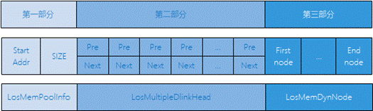

-   First part

    The start address of the heap memory (also called the memory pool) and the total size of the heap region.

-   Second part

    It is an array, where each element is a doubly linked list. The control headers of all free nodes are categorized and attached to the doubly linked lists of this array.

    Assuming the smallest node allowed by the memory is 2<sup>min</sup> bytes, the first doubly linked list of the array stores all free nodes whose size is 2<sup>min</sup><=size< 2<sup>min+1</sup>, the second doubly linked list stores all free nodes whose size is 2<sup>min+1</sup><=size< 2<sup>min+2</sup>, and so on. The nth doubly linked list stores all free nodes whose size is 2<sup>min+n-1</sup><=size< 2<sup>min+n</sup>. Each time memory is allocated, the free node of the most appropriate size is retrieved from this array for allocation. Each time memory is released, the memory is stored as a free node in this array for the next use.

-   Third part

    Occupying most of the memory pool space, it is the actual region used to store nodes. The declaration and a brief introduction of the LosMemDynNode node structure are as follows:

    ```
    typedef struct { 
         union { 
             LOS_DL_LIST freeNodeInfo;         /* Free memory node */ 
             struct { 
                 UINT32 magic; 
                 UINT32 taskId   : 16; 
             }; 
         }; 
         struct tagLosMemDynNode *preNode; 
         UINT32 sizeAndFlag; 
     } LosMemCtlNode; 
      
     typedef struct tagLosMemDynNode { 
         LosMemCtlNode selfNode; 
     } LosMemDynNode;
    ```

    **Figure 2**  Introduction to the LosMemDynNode structure<a name="fig058314220317"></a>  
    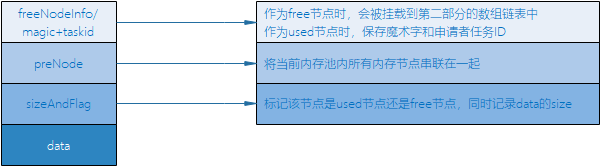

    **Figure 3**  Memory allocation result with alignment<a name="fig16147103315316"></a>  
    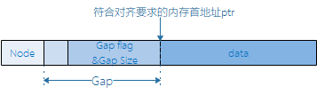

    If the start address of the data space contained in the allocated node does not meet the alignment requirement, alignment is required. The Gap field can be added to ensure that the returned pointer meets the alignment requirement.

**Dynamic Memory Working Mechanism — bestfit\_little<a name="section114106571361"></a>**

The bestfit\_little algorithm is also a best-fit algorithm. Compared with the bestfit algorithm, it omits the second part in [Figure 1](#fig210817337012), so it has a smaller footprint, but its allocation and release performance is inferior to bestfit. Generally, it is recommended to choose the bestfit algorithm when memory space is sufficient.

**Slab Working Mechanism<a name="section19410135711610"></a>**

The best-fit algorithm selects the smallest and most suitable memory block in the memory pool for each allocation, while the slab mechanism can be used to allocate fixed-size memory blocks, reducing the possibility of memory fragmentation.

The slab mechanism in LiteOS memory management supports configuring the number of slab classes and the maximum space of each class.

The slab mechanism is described using an example where the memory pool has 4 slab classes, each with a maximum space of 512 bytes. These 4 slab classes are allocated from the memory pool using the best-fit algorithm. The first slab class is divided into 32 slab blocks of 16 bytes, the second slab class is divided into 16 slab blocks of 32 bytes, the third slab class is divided into 8 slab blocks of 64 bytes, and the fourth slab class is divided into 4 slab blocks of 128 bytes.

When initializing the memory module, first initialize the memory pool, then allocate 4 slab classes from the initialized memory pool using the best-fit algorithm, and then initialize the 4 slab classes one by one according to the slab memory management mechanism.

Each time memory is allocated, it is first allocated from the best-fitting slab class that satisfies the requested size (for example, if a user requests 20 bytes of memory, it is allocated from the slab class with 32-byte slab blocks). If the allocation succeeds, the entire slab block is returned to the user, and the entire block is reclaimed when released. Note that if the satisfying slab class has no allocatable memory blocks left, memory is allocated from the memory pool using the best-fit algorithm instead of continuing to allocate from a slab class with larger slab blocks. When releasing memory, first check whether the released memory block belongs to a slab class. If so, return it to the corresponding slab class; otherwise, return it to the memory pool.

**Figure 4**  Overview of the memory data structure<a name="fig9601249193110"></a>  
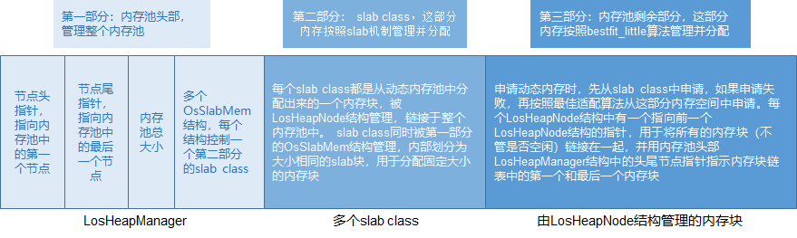

**Static Memory Working Mechanism<a name="section204112571462"></a>**

Static memory is essentially a static array. The block size in the static memory pool is set at initialization and cannot be changed after initialization.

The static memory pool consists of a control block and several memory blocks of the same size. The control block is located at the head of the memory pool and is used for memory block management. Memory blocks are allocated and released in units of the block size.

**Figure 5**  Static memory diagram<a name="fig726071013325"></a>  
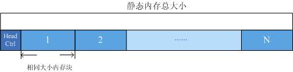

### Dynamic Memory<a name="ZH-CN_TOPIC_0000002511954228"></a>


#### Development Guidelines<a name="ZH-CN_TOPIC_0000002543394279"></a>

**Usage Scenarios<a name="section85001821793"></a>**

The main work of dynamic memory management is to dynamically allocate and manage the memory regions requested by users.

Dynamic memory management is mainly used in scenarios where users need memory blocks of different sizes. When users need memory, they can use the OS dynamic memory allocation function to obtain a memory block of the specified size. Once the memory is no longer needed, it is returned through the dynamic memory release function so that it can be reused.

**Functions<a name="section205001826915"></a>**

The dynamic memory management module in the LiteOS system provides the following functions for users. For detailed interface information, see the API reference.

<a name="table85121521299"></a>
<table><thead align="left"><tr id="row1955622195"><th class="cellrowborder" valign="top" width="22.6%" id="mcps1.1.4.1.1"><p id="p12556621196"><a name="p12556621196"></a><a name="p12556621196"></a>Function Category</p>
</th>
<th class="cellrowborder" valign="top" width="24.18%" id="mcps1.1.4.1.2"><p id="p185561225910"><a name="p185561225910"></a><a name="p185561225910"></a>API Name</p>
</th>
<th class="cellrowborder" valign="top" width="53.22%" id="mcps1.1.4.1.3"><p id="p13556621891"><a name="p13556621891"></a><a name="p13556621891"></a>Description</p>
</th>
</tr>
</thead>
<tbody><tr id="row75561229916"><td class="cellrowborder" rowspan="3" valign="top" width="22.6%" headers="mcps1.1.4.1.1 "><p id="p3556162899"><a name="p3556162899"></a><a name="p3556162899"></a>Initializing and deleting a memory pool</p>
</td>
<td class="cellrowborder" valign="top" width="24.18%" headers="mcps1.1.4.1.2 "><p id="p105564213912"><a name="p105564213912"></a><a name="p105564213912"></a>LOS_MemInit</p>
</td>
<td class="cellrowborder" valign="top" width="53.22%" headers="mcps1.1.4.1.3 "><p id="p10556529911"><a name="p10556529911"></a><a name="p10556529911"></a>Initializes a specified dynamic memory pool with the size of size (when LOSCFG_MEM_MUL_POOL_ALLOC is enabled, use this interface with caution; after initialization, memory needs to be proactively allocated to prevent the memory pool from being released incorrectly).</p>
</td>
</tr>
<tr id="row35564219912"><td class="cellrowborder" valign="top" headers="mcps1.1.4.1.1 "><p id="p75569210914"><a name="p75569210914"></a><a name="p75569210914"></a>LOS_MemDeInit</p>
</td>
<td class="cellrowborder" valign="top" headers="mcps1.1.4.1.2 "><p id="p8556021191"><a name="p8556021191"></a><a name="p8556021191"></a>Deletes the specified memory pool. It takes effect only when LOSCFG_MEM_MUL_POOL is enabled.</p>
</td>
</tr>
<tr id="row125561321792"><td class="cellrowborder" valign="top" headers="mcps1.1.4.1.1 "><p id="p125561921390"><a name="p125561921390"></a><a name="p125561921390"></a>LOS_MemPoolInit</p>
</td>
<td class="cellrowborder" valign="top" headers="mcps1.1.4.1.2 "><p id="p0556112996"><a name="p0556112996"></a><a name="p0556112996"></a>Initializes a specified dynamic memory pool with the size of size and the attribute attr (indicating whether the slab feature is enabled).</p>
</td>
</tr>
<tr id="row0556524913"><td class="cellrowborder" rowspan="4" valign="top" width="22.6%" headers="mcps1.1.4.1.1 "><p id="p17556124913"><a name="p17556124913"></a><a name="p17556124913"></a>Allocating and releasing dynamic memory</p>
</td>
<td class="cellrowborder" valign="top" width="24.18%" headers="mcps1.1.4.1.2 "><p id="p11556324911"><a name="p11556324911"></a><a name="p11556324911"></a>LOS_MemAlloc</p>
</td>
<td class="cellrowborder" valign="top" width="53.22%" headers="mcps1.1.4.1.3 "><p id="p13556152897"><a name="p13556152897"></a><a name="p13556152897"></a>Allocates memory of the length size from the specified dynamic memory pool.</p>
</td>
</tr>
<tr id="row0556112198"><td class="cellrowborder" valign="top" headers="mcps1.1.4.1.1 "><p id="p855613216912"><a name="p855613216912"></a><a name="p855613216912"></a>LOS_MemFree</p>
</td>
<td class="cellrowborder" valign="top" headers="mcps1.1.4.1.2 "><p id="p5556421599"><a name="p5556421599"></a><a name="p5556421599"></a>Releases the allocated memory.</p>
</td>
</tr>
<tr id="row1755622498"><td class="cellrowborder" valign="top" headers="mcps1.1.4.1.1 "><p id="p175561219920"><a name="p175561219920"></a><a name="p175561219920"></a>LOS_MemRealloc</p>
</td>
<td class="cellrowborder" valign="top" headers="mcps1.1.4.1.2 "><p id="p8556921390"><a name="p8556921390"></a><a name="p8556921390"></a>Reallocates a memory block of the size size and copies the content of the original memory block to the new one. If the new memory block is allocated successfully, the original memory block is released.</p>
</td>
</tr>
<tr id="row955632491"><td class="cellrowborder" valign="top" headers="mcps1.1.4.1.1 "><p id="p1556122795"><a name="p1556122795"></a><a name="p1556122795"></a>LOS_MemAllocAlign</p>
</td>
<td class="cellrowborder" valign="top" headers="mcps1.1.4.1.2 "><p id="p14556721698"><a name="p14556721698"></a><a name="p14556721698"></a>Allocates memory of the length size from the specified dynamic memory pool, with the address aligned by boundary bytes.</p>
</td>
</tr>
<tr id="row105561421918"><td class="cellrowborder" rowspan="5" valign="top" width="22.6%" headers="mcps1.1.4.1.1 "><p id="p1355614219910"><a name="p1355614219910"></a><a name="p1355614219910"></a>Allocating and releasing memory from multiple memory pools</p>
</td>
<td class="cellrowborder" valign="top" width="24.18%" headers="mcps1.1.4.1.2 "><p id="p555614213917"><a name="p555614213917"></a><a name="p555614213917"></a>LOS_MulPoolRegister</p>
</td>
<td class="cellrowborder" valign="top" width="53.22%" headers="mcps1.1.4.1.3 "><p id="p125564218910"><a name="p125564218910"></a><a name="p125564218910"></a>Registers hooks for obtaining the memory pool address and releasing the pool. The address and size of the memory pool are obtained from the hooks. It takes effect only when LOSCFG_MEM_MUL_POOL_ALLOC is enabled. (Duplicate registration is not supported.)</p>
</td>
</tr>
<tr id="row1555662294"><td class="cellrowborder" valign="top" headers="mcps1.1.4.1.1 "><p id="p17556102590"><a name="p17556102590"></a><a name="p17556102590"></a>LOS_MulPoolAlloc</p>
</td>
<td class="cellrowborder" valign="top" headers="mcps1.1.4.1.2 "><p id="p7556821597"><a name="p7556821597"></a><a name="p7556821597"></a>Allocates memory of the length size from a non-system pool. If memory is insufficient, a new memory pool is automatically created. It takes effect only when LOSCFG_MEM_MUL_POOL_ALLOC is enabled.</p>
</td>
</tr>
<tr id="row205561526913"><td class="cellrowborder" valign="top" headers="mcps1.1.4.1.1 "><p id="p1055614214917"><a name="p1055614214917"></a><a name="p1055614214917"></a>LOS_MulPoolRealloc</p>
</td>
<td class="cellrowborder" valign="top" headers="mcps1.1.4.1.2 "><p id="p7556821098"><a name="p7556821098"></a><a name="p7556821098"></a>Reallocates memory of the length size from a non-system pool. If memory is insufficient, a new memory pool is automatically created. It takes effect only when LOSCFG_MEM_MUL_POOL_ALLOC is enabled.</p>
</td>
</tr>
<tr id="row35562211911"><td class="cellrowborder" valign="top" headers="mcps1.1.4.1.1 "><p id="p7556152992"><a name="p7556152992"></a><a name="p7556152992"></a>LOS_MulPoolFree</p>
</td>
<td class="cellrowborder" valign="top" headers="mcps1.1.4.1.2 "><p id="p5556626914"><a name="p5556626914"></a><a name="p5556626914"></a>Releases the allocated memory from a non-system pool. It takes effect only when LOSCFG_MEM_MUL_POOL_ALLOC is enabled.</p>
</td>
</tr>
<tr id="row255619211916"><td class="cellrowborder" valign="top" headers="mcps1.1.4.1.1 "><p id="p19556521897"><a name="p19556521897"></a><a name="p19556521897"></a>LOS_MulPoolShrink</p>
</td>
<td class="cellrowborder" valign="top" headers="mcps1.1.4.1.2 "><p id="p1555652795"><a name="p1555652795"></a><a name="p1555652795"></a>Releases unused memory pools. It takes effect only when LOSCFG_MEM_MUL_POOL_ALLOC is enabled.</p>
</td>
</tr>
<tr id="row195565211919"><td class="cellrowborder" rowspan="4" valign="top" width="22.6%" headers="mcps1.1.4.1.1 "><p id="p655617218911"><a name="p655617218911"></a><a name="p655617218911"></a>Obtaining memory pool information</p>
</td>
<td class="cellrowborder" valign="top" width="24.18%" headers="mcps1.1.4.1.2 "><p id="p4556721794"><a name="p4556721794"></a><a name="p4556721794"></a>LOS_MemPoolSizeGet</p>
</td>
<td class="cellrowborder" valign="top" width="53.22%" headers="mcps1.1.4.1.3 "><p id="p18556721496"><a name="p18556721496"></a><a name="p18556721496"></a>Obtains the total size of the specified dynamic memory pool.</p>
</td>
</tr>
<tr id="row135561121894"><td class="cellrowborder" valign="top" headers="mcps1.1.4.1.1 "><p id="p85566210918"><a name="p85566210918"></a><a name="p85566210918"></a>LOS_MemTotalUsedGet</p>
</td>
<td class="cellrowborder" valign="top" headers="mcps1.1.4.1.2 "><p id="p12556102797"><a name="p12556102797"></a><a name="p12556102797"></a>Obtains the total used size of the specified dynamic memory pool.</p>
</td>
</tr>
<tr id="row17556192991"><td class="cellrowborder" valign="top" headers="mcps1.1.4.1.1 "><p id="p1955617210912"><a name="p1955617210912"></a><a name="p1955617210912"></a>LOS_MemInfoGet</p>
</td>
<td class="cellrowborder" valign="top" headers="mcps1.1.4.1.2 "><p id="p8556123914"><a name="p8556123914"></a><a name="p8556123914"></a>Obtains the memory structure information of the specified memory pool, including the free memory size, used memory size, number of free memory blocks, number of used memory blocks, and the largest free memory block size.</p>
</td>
</tr>
<tr id="row155561727918"><td class="cellrowborder" valign="top" headers="mcps1.1.4.1.1 "><p id="p175562021599"><a name="p175562021599"></a><a name="p175562021599"></a>LOS_MemPoolList</p>
</td>
<td class="cellrowborder" valign="top" headers="mcps1.1.4.1.2 "><p id="p35561222917"><a name="p35561222917"></a><a name="p35561222917"></a>Prints all initialized memory pools in the system, including the start address of each memory pool, memory pool size, total free memory size, total used memory size, largest free memory block size, number of free memory blocks, and number of used memory blocks. It takes effect only when LOSCFG_MEM_MUL_POOL is enabled.</p>
</td>
</tr>
<tr id="row145572219918"><td class="cellrowborder" rowspan="8" valign="top" width="22.6%" headers="mcps1.1.4.1.1 "><p id="p1455712214920"><a name="p1455712214920"></a><a name="p1455712214920"></a>Obtaining memory block information</p>
</td>
<td class="cellrowborder" valign="top" width="24.18%" headers="mcps1.1.4.1.2 "><p id="p15557122095"><a name="p15557122095"></a><a name="p15557122095"></a>LOS_MemFreeBlksGet</p>
</td>
<td class="cellrowborder" valign="top" width="53.22%" headers="mcps1.1.4.1.3 "><p id="p9557022919"><a name="p9557022919"></a><a name="p9557022919"></a>Obtains the number of free memory blocks in the specified memory pool.</p>
</td>
</tr>
<tr id="row755713213916"><td class="cellrowborder" valign="top" headers="mcps1.1.4.1.1 "><p id="p85571217919"><a name="p85571217919"></a><a name="p85571217919"></a>LOS_MemTotalPeakUsedGet</p>
</td>
<td class="cellrowborder" valign="top" headers="mcps1.1.4.1.2 "><p id="p1555713214916"><a name="p1555713214916"></a><a name="p1555713214916"></a>Returns the maximum usage peak of the memory pool (depends on the LOSCFG_MEM_TASK_STAT macro).</p>
</td>
</tr>
<tr id="row95571026915"><td class="cellrowborder" valign="top" headers="mcps1.1.4.1.1 "><p id="p1855732994"><a name="p1855732994"></a><a name="p1855732994"></a>LOS_MemTotalUsedCostGet</p>
</td>
<td class="cellrowborder" valign="top" headers="mcps1.1.4.1.2 "><p id="p2557162599"><a name="p2557162599"></a><a name="p2557162599"></a>Returns the actual size of memory used in the memory pool (including the memory management part).</p>
</td>
</tr>
<tr id="row1255711217920"><td class="cellrowborder" valign="top" headers="mcps1.1.4.1.1 "><p id="p155571321191"><a name="p155571321191"></a><a name="p155571321191"></a>LOS_MemUsedBlksGet</p>
</td>
<td class="cellrowborder" valign="top" headers="mcps1.1.4.1.2 "><p id="p855719214919"><a name="p855719214919"></a><a name="p855719214919"></a>Obtains the number of used memory blocks in the specified memory pool.</p>
</td>
</tr>
<tr id="row3557924910"><td class="cellrowborder" valign="top" headers="mcps1.1.4.1.1 "><p id="p1155714211918"><a name="p1155714211918"></a><a name="p1155714211918"></a>LOS_MemTaskIdGet</p>
</td>
<td class="cellrowborder" valign="top" headers="mcps1.1.4.1.2 "><p id="p10557182993"><a name="p10557182993"></a><a name="p10557182993"></a>Obtains the ID of the task that allocated the specified memory block. It takes effect only when LOSCFG_MEM_DEBUG or LOSCFG_MEM_TASK_STAT is enabled.</p>
</td>
</tr>
<tr id="row65571923915"><td class="cellrowborder" valign="top" headers="mcps1.1.4.1.1 "><p id="p755714218911"><a name="p755714218911"></a><a name="p755714218911"></a>LOS_MemLastUsedGet</p>
</td>
<td class="cellrowborder" valign="top" headers="mcps1.1.4.1.2 "><p id="p135575215919"><a name="p135575215919"></a><a name="p135575215919"></a>Obtains the address of the first byte after the last byte used by the tail node of the memory pool.</p>
<p id="p5557132293"><a name="p5557132293"></a><a name="p5557132293"></a>If the tail node is a used node, the last byte used by the tail node is the end of the node.</p>
<p id="p105576219918"><a name="p105576219918"></a><a name="p105576219918"></a>If the tail node is a free node, the last byte used by the tail node is the node head structure.</p>
</td>
</tr>
<tr id="row3557829915"><td class="cellrowborder" valign="top" headers="mcps1.1.4.1.1 "><p id="p1557028913"><a name="p1557028913"></a><a name="p1557028913"></a>LOS_MemNodeSizeCheck</p>
</td>
<td class="cellrowborder" valign="top" headers="mcps1.1.4.1.2 "><p id="p145572219913"><a name="p145572219913"></a><a name="p145572219913"></a>Obtains the total size and available size of the specified memory block. It takes effect only when LOSCFG_BASE_MEM_NODE_SIZE_CHECK is enabled.</p>
</td>
</tr>
<tr id="row25578215920"><td class="cellrowborder" valign="top" headers="mcps1.1.4.1.1 "><p id="p1155712220919"><a name="p1155712220919"></a><a name="p1155712220919"></a>LOS_MemFreeNodeShow</p>
</td>
<td class="cellrowborder" valign="top" headers="mcps1.1.4.1.2 "><p id="p15557929913"><a name="p15557929913"></a><a name="p15557929913"></a>Prints the sizes and quantities of free memory blocks in the specified memory pool.</p>
</td>
</tr>
<tr id="row55571328916"><td class="cellrowborder" valign="top" width="22.6%" headers="mcps1.1.4.1.1 "><p id="p55570214914"><a name="p55570214914"></a><a name="p55570214914"></a>Checking the integrity of a specified memory pool</p>
</td>
<td class="cellrowborder" valign="top" width="24.18%" headers="mcps1.1.4.1.2 "><p id="p12557725911"><a name="p12557725911"></a><a name="p12557725911"></a>LOS_MemIntegrityCheck</p>
</td>
<td class="cellrowborder" valign="top" width="53.22%" headers="mcps1.1.4.1.3 "><p id="p3557182898"><a name="p3557182898"></a><a name="p3557182898"></a>Checks the integrity of the specified memory pool. It takes effect only when LOSCFG_BASE_MEM_NODE_INTEGRITY_CHECK is enabled.</p>
</td>
</tr>
<tr id="row125579212911"><td class="cellrowborder" rowspan="2" valign="top" width="22.6%" headers="mcps1.1.4.1.1 "><p id="p7557152691"><a name="p7557152691"></a><a name="p7557152691"></a>Setting and obtaining the memory check level (effective only when LOSCFG_BASE_MEM_NODE_SIZE_CHECK is enabled)</p>
</td>
<td class="cellrowborder" valign="top" width="24.18%" headers="mcps1.1.4.1.2 "><p id="p19557122595"><a name="p19557122595"></a><a name="p19557122595"></a>LOS_MemCheckLevelSet</p>
</td>
<td class="cellrowborder" valign="top" width="53.22%" headers="mcps1.1.4.1.3 "><p id="p35574213915"><a name="p35574213915"></a><a name="p35574213915"></a>Sets the memory check level.</p>
</td>
</tr>
<tr id="row10557928914"><td class="cellrowborder" valign="top" headers="mcps1.1.4.1.1 "><p id="p15571521694"><a name="p15571521694"></a><a name="p15571521694"></a>LOS_MemCheckLevelGet</p>
</td>
<td class="cellrowborder" valign="top" headers="mcps1.1.4.1.2 "><p id="p1557142495"><a name="p1557142495"></a><a name="p1557142495"></a>Obtains the memory check level.</p>
</td>
</tr>
<tr id="row1655762596"><td class="cellrowborder" rowspan="4" valign="top" width="22.6%" headers="mcps1.1.4.1.1 "><p id="p105571521193"><a name="p105571521193"></a><a name="p105571521193"></a>Allocating and releasing dynamic memory for a specified module (effective only when LOSCFG_MEM_MUL_MODULE is enabled)</p>
</td>
<td class="cellrowborder" valign="top" width="24.18%" headers="mcps1.1.4.1.2 "><p id="p11557521594"><a name="p11557521594"></a><a name="p11557521594"></a>LOS_MemMalloc</p>
</td>
<td class="cellrowborder" valign="top" width="53.22%" headers="mcps1.1.4.1.3 "><p id="p1055720219910"><a name="p1055720219910"></a><a name="p1055720219910"></a>Allocates memory of the length size from the specified dynamic memory pool to the specified module and includes it in the module statistics.</p>
</td>
</tr>
<tr id="row125571021093"><td class="cellrowborder" valign="top" headers="mcps1.1.4.1.1 "><p id="p165577216919"><a name="p165577216919"></a><a name="p165577216919"></a>LOS_MemMfree</p>
</td>
<td class="cellrowborder" valign="top" headers="mcps1.1.4.1.2 "><p id="p2557142398"><a name="p2557142398"></a><a name="p2557142398"></a>Releases the allocated memory block and includes it in the module statistics.</p>
</td>
</tr>
<tr id="row11557129915"><td class="cellrowborder" valign="top" headers="mcps1.1.4.1.1 "><p id="p35571921497"><a name="p35571921497"></a><a name="p35571921497"></a>LOS_MemMallocAlign</p>
</td>
<td class="cellrowborder" valign="top" headers="mcps1.1.4.1.2 "><p id="p155715213914"><a name="p155715213914"></a><a name="p155715213914"></a>Allocates memory of the length size from the specified dynamic memory pool to the specified module, with the address aligned by boundary bytes, and includes it in the module statistics.</p>
</td>
</tr>
<tr id="row13557329912"><td class="cellrowborder" valign="top" headers="mcps1.1.4.1.1 "><p id="p355712695"><a name="p355712695"></a><a name="p355712695"></a>LOS_MemMrealloc</p>
</td>
<td class="cellrowborder" valign="top" headers="mcps1.1.4.1.2 "><p id="p65571921792"><a name="p65571921792"></a><a name="p65571921792"></a>Reallocates a memory block of the size size to the specified module, copies the content of the original memory block to the new one, and includes it in the module statistics. If the new memory block is allocated successfully, the original memory block is released.</p>
</td>
</tr>
<tr id="row185571321499"><td class="cellrowborder" valign="top" width="22.6%" headers="mcps1.1.4.1.1 "><p id="p25578214911"><a name="p25578214911"></a><a name="p25578214911"></a>Obtaining the memory usage of a specified module (effective only when LOSCFG_MEM_MUL_MODULE is enabled)</p>
</td>
<td class="cellrowborder" valign="top" width="24.18%" headers="mcps1.1.4.1.2 "><p id="p1055782799"><a name="p1055782799"></a><a name="p1055782799"></a>LOS_MemMusedGet</p>
</td>
<td class="cellrowborder" valign="top" width="53.22%" headers="mcps1.1.4.1.3 "><p id="p6557624918"><a name="p6557624918"></a><a name="p6557624918"></a>Obtains the memory usage of the specified module. Unit: Byte.</p>
</td>
</tr>
<tr id="row16557421192"><td class="cellrowborder" valign="top" width="22.6%" headers="mcps1.1.4.1.1 "><p id="p185571129910"><a name="p185571129910"></a><a name="p185571129910"></a>Configuring the slab size</p>
</td>
<td class="cellrowborder" valign="top" width="24.18%" headers="mcps1.1.4.1.2 "><p id="p20557129913"><a name="p20557129913"></a><a name="p20557129913"></a>LOS_SlabSizeCfg</p>
</td>
<td class="cellrowborder" valign="top" width="53.22%" headers="mcps1.1.4.1.3 "><p id="p165571321394"><a name="p165571321394"></a><a name="p165571321394"></a>Used to configure the slab class size. It must be called before LOS_MemInit.</p>
</td>
</tr>
<tr id="row1355712214914"><td class="cellrowborder" valign="top" width="22.6%" headers="mcps1.1.4.1.1 "><p id="p195574213920"><a name="p195574213920"></a><a name="p195574213920"></a>Obtaining task memory usage</p>
</td>
<td class="cellrowborder" valign="top" width="24.18%" headers="mcps1.1.4.1.2 "><p id="p1622285511114"><a name="p1622285511114"></a><a name="p1622285511114"></a>LOS_MemTaskHeapInfoGet</p>
</td>
<td class="cellrowborder" valign="top" width="53.22%" headers="mcps1.1.4.1.3 "><p id="p16557521197"><a name="p16557521197"></a><a name="p16557521197"></a>Prints the memory usage information of the specified task.</p>
</td>
</tr>
<tr id="row19557424918"><td class="cellrowborder" rowspan="9" valign="top" width="22.6%" headers="mcps1.1.4.1.1 "><p id="p155571217919"><a name="p155571217919"></a><a name="p155571217919"></a>DFX functions</p>
</td>
<td class="cellrowborder" valign="top" width="24.18%" headers="mcps1.1.4.1.2 "><p id="p12474800122"><a name="p12474800122"></a><a name="p12474800122"></a>LOS_SaveCallerRa</p>
</td>
<td class="cellrowborder" valign="top" width="53.22%" headers="mcps1.1.4.1.3 "><p id="p955714215911"><a name="p955714215911"></a><a name="p955714215911"></a>Saves the caller of the current task.</p>
</td>
</tr>
<tr id="row2557620917"><td class="cellrowborder" valign="top" headers="mcps1.1.4.1.1 "><p id="p6969710111219"><a name="p6969710111219"></a><a name="p6969710111219"></a>LOS_IsSetCallerRa</p>
</td>
<td class="cellrowborder" valign="top" headers="mcps1.1.4.1.2 "><p id="p18557172893"><a name="p18557172893"></a><a name="p18557172893"></a>Checks whether the caller of the current task has been saved.</p>
</td>
</tr>
<tr id="row13557921295"><td class="cellrowborder" valign="top" headers="mcps1.1.4.1.1 "><p id="p1049171691214"><a name="p1049171691214"></a><a name="p1049171691214"></a>LOS_ResetCallerRa</p>
</td>
<td class="cellrowborder" valign="top" headers="mcps1.1.4.1.2 "><p id="p9557192597"><a name="p9557192597"></a><a name="p9557192597"></a>Resets the caller of the current task.</p>
</td>
</tr>
<tr id="row1155792595"><td class="cellrowborder" valign="top" headers="mcps1.1.4.1.1 "><p id="p102871821191218"><a name="p102871821191218"></a><a name="p102871821191218"></a>LOS_MemDfxOpsReg</p>
</td>
<td class="cellrowborder" valign="top" headers="mcps1.1.4.1.2 "><p id="p555722792"><a name="p555722792"></a><a name="p555722792"></a>Registers a DFX operation set so that the system can record memory operation information.</p>
</td>
</tr>
<tr id="row5557322098"><td class="cellrowborder" valign="top" headers="mcps1.1.4.1.1 "><p id="p147922741218"><a name="p147922741218"></a><a name="p147922741218"></a>LOS_MemAllocDfxHook</p>
</td>
<td class="cellrowborder" valign="top" headers="mcps1.1.4.1.2 "><p id="p165571821892"><a name="p165571821892"></a><a name="p165571821892"></a>Called after a memory allocation operation to record allocation information.</p>
</td>
</tr>
<tr id="row85571221397"><td class="cellrowborder" valign="top" headers="mcps1.1.4.1.1 "><p id="p92483171216"><a name="p92483171216"></a><a name="p92483171216"></a>LOS_MemFreeDfxHook</p>
</td>
<td class="cellrowborder" valign="top" headers="mcps1.1.4.1.2 "><p id="p35571029913"><a name="p35571029913"></a><a name="p35571029913"></a><span>Called after a memory release operation to record release information.</span></p>
</td>
</tr>
<tr id="row125581027917"><td class="cellrowborder" valign="top" headers="mcps1.1.4.1.1 "><p id="p1027316367121"><a name="p1027316367121"></a><a name="p1027316367121"></a>LOS_MemPoolOpsReg</p>
</td>
<td class="cellrowborder" valign="top" headers="mcps1.1.4.1.2 "><p id="p205588216912"><a name="p205588216912"></a><a name="p205588216912"></a>Registers a DFX operation set so that the system can record memory pool operation information.</p>
</td>
</tr>
<tr id="row20558021092"><td class="cellrowborder" valign="top" headers="mcps1.1.4.1.1 "><p id="p4567240121212"><a name="p4567240121212"></a><a name="p4567240121212"></a>LOS_MemPoolMemAllocHook</p>
</td>
<td class="cellrowborder" valign="top" headers="mcps1.1.4.1.2 "><p id="p18558112991"><a name="p18558112991"></a><a name="p18558112991"></a>Called after a memory pool allocation operation to record allocation information.</p>
</td>
</tr>
<tr id="row95581026920"><td class="cellrowborder" valign="top" headers="mcps1.1.4.1.1 "><p id="p1462819443129"><a name="p1462819443129"></a><a name="p1462819443129"></a>LOS_MemPoolMemFreeHook</p>
</td>
<td class="cellrowborder" valign="top" headers="mcps1.1.4.1.2 "><p id="p2558724919"><a name="p2558724919"></a><a name="p2558724919"></a><span>Called after a memory pool release operation to record release information.</span></p>
</td>
</tr>
</tbody>
</table>

> **Notice:** 
>-   Dynamic memory provides memory debugging and testing functions. For details, see "[Memory Debugging and Testing Methods](memory_debugging_methods.md)".
>-   For the bestfit\_little algorithm, only the "[Multi-memory-pool Mechanism](multi_memory_pool_mechanism.md)" and "[Memory Legality Check](memory_legality_check.md)" are supported. Other memory debugging and testing functions are not supported.
>-   Among the preceding interfaces, those controlled by macro switches are all related to memory debugging and testing functions.
>-   After LOS\_MemRealloc/LOS\_MemMrealloc is performed on memory allocated through LOS\_MemAllocAlign/LOS\_MemMallocAlign, the new memory start address is not guaranteed to remain aligned.
>-   For the bestfit\_little algorithm, performing LOS\_MemRealloc on memory allocated through LOS\_MemAllocAlign is not supported; otherwise, failure is returned.
>-   The multi-memory-pool allocation and release function is supported only under the bestfit algorithm.

> **Note:** 
>LiteOS provides the multi-module memory statistics function, which is based on wrapper interfaces of common memory interfaces with a module ID added as an input parameter. When different business modules perform memory operations, they call the corresponding wrapper interfaces, so that the memory usage of each module can be collected and the memory usage of a specified module can be obtained through the module ID.
>Application scenario: the system business is clearly modularized, and users need to collect the memory usage of each module.
>Dependency: currently only the bestfit memory management algorithm supports this function. LOSCFG\_KERNEL\_MEM\_BESTFIT needs to be enabled.
>Usage method:
>1.  The configuration item of this function is LOSCFG\_MEM\_MUL\_MODULE, and the configuration path is Kernel ---\> Memory Management ---\> Dynamic Memory Management ---\> Enable Memory module statistics;
>2.  Configure a unique module ID for each business module. In the module code, call the corresponding interface during memory operations and pass the corresponding module ID;
>3.  Use the LOS\_MemMusedGet interface to obtain the memory usage of a specified module, which can be used for optimizing the memory usage of modules.
>Precautions:
>1.  The module ID is limited by the macro MEM\_MODULE\_MAX. When the number of system modules exceeds this value, the size of MEM\_MODULE\_MAX needs to be modified by configuring LOSCFG\_MEM\_MODULE\_MAX. Configuration path: Kernel ---\> Memory Management ---\> Enable Memory module statistics ---\> Max Memory Module Number.
>2.  All memory operations in a module need to call interfaces starting with LOS\_MemM; otherwise, the statistics may be inaccurate.

**Development Process<a name="section1104112417132"></a>**

This section describes the development process of typical scenarios using dynamic memory.

1.  Configure the start address and size of the dynamic memory pool in the "los\_config.h" file.

    <a name="table20118182441320"></a>
    <table><thead align="left"><tr id="row151581724181319"><th class="cellrowborder" valign="top" width="19.588041195880415%" id="mcps1.1.6.1.1"><p id="p14158202416137"><a name="p14158202416137"></a><a name="p14158202416137"></a>Configuration Item</p>
    </th>
    <th class="cellrowborder" valign="top" width="27.837216278372168%" id="mcps1.1.6.1.2"><p id="p1115818246133"><a name="p1115818246133"></a><a name="p1115818246133"></a>Meaning</p>
    </th>
    <th class="cellrowborder" valign="top" width="11.338866113388663%" id="mcps1.1.6.1.3"><p id="p12158824151312"><a name="p12158824151312"></a><a name="p12158824151312"></a>Value Range</p>
    </th>
    <th class="cellrowborder" valign="top" width="27.837216278372168%" id="mcps1.1.6.1.4"><p id="p71581824101312"><a name="p71581824101312"></a><a name="p71581824101312"></a>Default Value</p>
    </th>
    <th class="cellrowborder" valign="top" width="13.398660133986606%" id="mcps1.1.6.1.5"><p id="p4158172451311"><a name="p4158172451311"></a><a name="p4158172451311"></a>Dependency</p>
    </th>
    </tr>
    </thead>
    <tbody><tr id="row41588249135"><td class="cellrowborder" valign="top" width="19.588041195880415%" headers="mcps1.1.6.1.1 "><p id="p1715814247132"><a name="p1715814247132"></a><a name="p1715814247132"></a>OS_SYS_MEM_ADDR</p>
    </td>
    <td class="cellrowborder" valign="top" width="27.837216278372168%" headers="mcps1.1.6.1.2 "><p id="p181588247132"><a name="p181588247132"></a><a name="p181588247132"></a>Start address of the system dynamic memory</p>
    </td>
    <td class="cellrowborder" valign="top" width="11.338866113388663%" headers="mcps1.1.6.1.3 "><p id="p1115815243136"><a name="p1115815243136"></a><a name="p1115815243136"></a>[0, n)</p>
    </td>
    <td class="cellrowborder" valign="top" width="27.837216278372168%" headers="mcps1.1.6.1.4 "><p id="p815815243134"><a name="p815815243134"></a><a name="p815815243134"></a>__heap_start</p>
    </td>
    <td class="cellrowborder" valign="top" width="13.398660133986606%" headers="mcps1.1.6.1.5 "><p id="p115892421312"><a name="p115892421312"></a><a name="p115892421312"></a>None</p>
    </td>
    </tr>
    <tr id="row151584242135"><td class="cellrowborder" valign="top" width="19.588041195880415%" headers="mcps1.1.6.1.1 "><p id="p41585241136"><a name="p41585241136"></a><a name="p41585241136"></a>OS_SYS_MEM_SIZE</p>
    </td>
    <td class="cellrowborder" valign="top" width="27.837216278372168%" headers="mcps1.1.6.1.2 "><p id="p14158192416137"><a name="p14158192416137"></a><a name="p14158192416137"></a>Size of the system dynamic memory pool (DDR adaptive configuration), in bytes</p>
    </td>
    <td class="cellrowborder" valign="top" width="11.338866113388663%" headers="mcps1.1.6.1.3 "><p id="p61581324171319"><a name="p61581324171319"></a><a name="p61581324171319"></a>[0, n)</p>
    </td>
    <td class="cellrowborder" valign="top" width="27.837216278372168%" headers="mcps1.1.6.1.4 "><p id="p1158182471318"><a name="p1158182471318"></a><a name="p1158182471318"></a>From the end of the bss segment to the end of the system DDR</p>
    </td>
    <td class="cellrowborder" valign="top" width="13.398660133986606%" headers="mcps1.1.6.1.5 "><p id="p171581324101319"><a name="p171581324101319"></a><a name="p171581324101319"></a>None</p>
    </td>
    </tr>
    </tbody>
    </table>

    -   OS\_SYS\_MEM\_ADDR: the default value is generally sufficient.
    -   OS\_SYS\_MEM\_SIZE: the default value is generally sufficient.

2.  Open the menu and go to Kernel ---\> Memory Management to complete the dynamic memory management module configuration.

    <a name="table6120122461315"></a>
    <table><thead align="left"><tr id="row12159122415131"><th class="cellrowborder" valign="top" width="20.62206220622062%" id="mcps1.1.6.1.1"><p id="p615920247133"><a name="p615920247133"></a><a name="p615920247133"></a>Configuration Item</p>
    </th>
    <th class="cellrowborder" valign="top" width="26.8026802680268%" id="mcps1.1.6.1.2"><p id="p415972491315"><a name="p415972491315"></a><a name="p415972491315"></a>Meaning</p>
    </th>
    <th class="cellrowborder" valign="top" width="13.4013401340134%" id="mcps1.1.6.1.3"><p id="p13159142451314"><a name="p13159142451314"></a><a name="p13159142451314"></a>Value Range</p>
    </th>
    <th class="cellrowborder" valign="top" width="16.49164916491649%" id="mcps1.1.6.1.4"><p id="p41591524171313"><a name="p41591524171313"></a><a name="p41591524171313"></a>Default Value</p>
    </th>
    <th class="cellrowborder" valign="top" width="22.68226822682268%" id="mcps1.1.6.1.5"><p id="p11591324111311"><a name="p11591324111311"></a><a name="p11591324111311"></a>Dependency</p>
    </th>
    </tr>
    </thead>
    <tbody><tr id="row151598242136"><td class="cellrowborder" valign="top" width="20.62206220622062%" headers="mcps1.1.6.1.1 "><p id="p151591024171312"><a name="p151591024171312"></a><a name="p151591024171312"></a>LOSCFG_KERNEL_MEM_BESTFIT</p>
    </td>
    <td class="cellrowborder" valign="top" width="26.8026802680268%" headers="mcps1.1.6.1.2 "><p id="p9159924151313"><a name="p9159924151313"></a><a name="p9159924151313"></a>Selects the bestfit memory management algorithm</p>
    </td>
    <td class="cellrowborder" valign="top" width="13.4013401340134%" headers="mcps1.1.6.1.3 "><p id="p5159162415130"><a name="p5159162415130"></a><a name="p5159162415130"></a>YES/NO</p>
    </td>
    <td class="cellrowborder" valign="top" width="16.49164916491649%" headers="mcps1.1.6.1.4 "><p id="p16159192441312"><a name="p16159192441312"></a><a name="p16159192441312"></a>YES</p>
    </td>
    <td class="cellrowborder" valign="top" width="22.68226822682268%" headers="mcps1.1.6.1.5 "><p id="p215972417134"><a name="p215972417134"></a><a name="p215972417134"></a>None</p>
    </td>
    </tr>
    <tr id="row615942431319"><td class="cellrowborder" valign="top" width="20.62206220622062%" headers="mcps1.1.6.1.1 "><p id="p11159724101317"><a name="p11159724101317"></a><a name="p11159724101317"></a>LOSCFG_KERNEL_MEM_BESTFIT_LITTLE</p>
    </td>
    <td class="cellrowborder" valign="top" width="26.8026802680268%" headers="mcps1.1.6.1.2 "><p id="p161592241138"><a name="p161592241138"></a><a name="p161592241138"></a>Selects the bestfit_little memory management algorithm</p>
    </td>
    <td class="cellrowborder" valign="top" width="13.4013401340134%" headers="mcps1.1.6.1.3 "><p id="p131597248133"><a name="p131597248133"></a><a name="p131597248133"></a>YES/NO</p>
    </td>
    <td class="cellrowborder" valign="top" width="16.49164916491649%" headers="mcps1.1.6.1.4 "><p id="p81599243134"><a name="p81599243134"></a><a name="p81599243134"></a>NO</p>
    </td>
    <td class="cellrowborder" valign="top" width="22.68226822682268%" headers="mcps1.1.6.1.5 "><p id="p315922415132"><a name="p315922415132"></a><a name="p315922415132"></a>None</p>
    </td>
    </tr>
    <tr id="row515902420134"><td class="cellrowborder" valign="top" width="20.62206220622062%" headers="mcps1.1.6.1.1 "><p id="p815916246139"><a name="p815916246139"></a><a name="p815916246139"></a>LOSCFG_KERNEL_MEM_SLAB_EXTENTION</p>
    </td>
    <td class="cellrowborder" valign="top" width="26.8026802680268%" headers="mcps1.1.6.1.2 "><p id="p915992421311"><a name="p915992421311"></a><a name="p915992421311"></a>Enables the slab feature, which can reduce the degree of memory fragmentation during continuous system operation</p>
    </td>
    <td class="cellrowborder" valign="top" width="13.4013401340134%" headers="mcps1.1.6.1.3 "><p id="p101591924141313"><a name="p101591924141313"></a><a name="p101591924141313"></a>YES/NO</p>
    </td>
    <td class="cellrowborder" valign="top" width="16.49164916491649%" headers="mcps1.1.6.1.4 "><p id="p51595247134"><a name="p51595247134"></a><a name="p51595247134"></a>NO</p>
    </td>
    <td class="cellrowborder" valign="top" width="22.68226822682268%" headers="mcps1.1.6.1.5 "><p id="p3159224171312"><a name="p3159224171312"></a><a name="p3159224171312"></a>None</p>
    </td>
    </tr>
    <tr id="row515942411139"><td class="cellrowborder" valign="top" width="20.62206220622062%" headers="mcps1.1.6.1.1 "><p id="p14159324101319"><a name="p14159324101319"></a><a name="p14159324101319"></a>LOSCFG_KERNEL_MEM_SLAB_AUTO_EXPANSION_MODE</p>
    </td>
    <td class="cellrowborder" valign="top" width="26.8026802680268%" headers="mcps1.1.6.1.2 "><p id="p19159192481312"><a name="p19159192481312"></a><a name="p19159192481312"></a>Slab auto expansion. When the memory allocated to slab is insufficient, new space can be automatically allocated from the system memory pool for expansion</p>
    </td>
    <td class="cellrowborder" valign="top" width="13.4013401340134%" headers="mcps1.1.6.1.3 "><p id="p12159152421310"><a name="p12159152421310"></a><a name="p12159152421310"></a>YES/NO</p>
    </td>
    <td class="cellrowborder" valign="top" width="16.49164916491649%" headers="mcps1.1.6.1.4 "><p id="p4159112418133"><a name="p4159112418133"></a><a name="p4159112418133"></a>NO</p>
    </td>
    <td class="cellrowborder" valign="top" width="22.68226822682268%" headers="mcps1.1.6.1.5 "><p id="p181591324101315"><a name="p181591324101315"></a><a name="p181591324101315"></a>LOSCFG_KERNEL_MEM_SLAB_EXTENTION</p>
    </td>
    </tr>
    <tr id="row18159162421312"><td class="cellrowborder" valign="top" width="20.62206220622062%" headers="mcps1.1.6.1.1 "><p id="p615922410137"><a name="p615922410137"></a><a name="p615922410137"></a>LOSCFG_MEM_TASK_STAT</p>
    </td>
    <td class="cellrowborder" valign="top" width="26.8026802680268%" headers="mcps1.1.6.1.2 "><p id="p715942421311"><a name="p715942421311"></a><a name="p715942421311"></a>Enables task memory statistics</p>
    </td>
    <td class="cellrowborder" valign="top" width="13.4013401340134%" headers="mcps1.1.6.1.3 "><p id="p51591824101318"><a name="p51591824101318"></a><a name="p51591824101318"></a>YES/NO</p>
    </td>
    <td class="cellrowborder" valign="top" width="16.49164916491649%" headers="mcps1.1.6.1.4 "><p id="p1115912242132"><a name="p1115912242132"></a><a name="p1115912242132"></a>YES</p>
    </td>
    <td class="cellrowborder" valign="top" width="22.68226822682268%" headers="mcps1.1.6.1.5 "><p id="p1615982491314"><a name="p1615982491314"></a><a name="p1615982491314"></a>LOSCFG_KERNEL_MEM_BESTFIT or LOSCFG_KERNEL_MEM_BESTFIT_LITTLE</p>
    </td>
    </tr>
    <tr id="row1159172418131"><td class="cellrowborder" valign="top" width="20.62206220622062%" headers="mcps1.1.6.1.1 "><p id="p181591524111313"><a name="p181591524111313"></a><a name="p181591524111313"></a>LOSCFG_MEM_MUL_MODULE</p>
    </td>
    <td class="cellrowborder" valign="top" width="26.8026802680268%" headers="mcps1.1.6.1.2 "><p id="p1215952491314"><a name="p1215952491314"></a><a name="p1215952491314"></a>Multi-module memory statistics</p>
    </td>
    <td class="cellrowborder" valign="top" width="13.4013401340134%" headers="mcps1.1.6.1.3 "><p id="p14159724131318"><a name="p14159724131318"></a><a name="p14159724131318"></a>YES/NO</p>
    </td>
    <td class="cellrowborder" valign="top" width="16.49164916491649%" headers="mcps1.1.6.1.4 "><p id="p1015962414139"><a name="p1015962414139"></a><a name="p1015962414139"></a>NO</p>
    </td>
    <td class="cellrowborder" valign="top" width="22.68226822682268%" headers="mcps1.1.6.1.5 "><p id="p515982401313"><a name="p515982401313"></a><a name="p515982401313"></a>LOSCFG_KERNEL_MEM_BESTFIT</p>
    </td>
    </tr>
    <tr id="row1515952421319"><td class="cellrowborder" valign="top" width="20.62206220622062%" headers="mcps1.1.6.1.1 "><p id="p015992420136"><a name="p015992420136"></a><a name="p015992420136"></a>LOSCFG_MEM_MODULE_MAX</p>
    </td>
    <td class="cellrowborder" valign="top" width="26.8026802680268%" headers="mcps1.1.6.1.2 "><p id="p101591624161313"><a name="p101591624161313"></a><a name="p101591624161313"></a>Maximum number of modules for multi-module memory statistics</p>
    </td>
    <td class="cellrowborder" valign="top" width="13.4013401340134%" headers="mcps1.1.6.1.3 "><p id="p111591624191317"><a name="p111591624191317"></a><a name="p111591624191317"></a>8-1024</p>
    </td>
    <td class="cellrowborder" valign="top" width="16.49164916491649%" headers="mcps1.1.6.1.4 "><p id="p16159102491311"><a name="p16159102491311"></a><a name="p16159102491311"></a>32</p>
    </td>
    <td class="cellrowborder" valign="top" width="22.68226822682268%" headers="mcps1.1.6.1.5 "><p id="p1915902410136"><a name="p1915902410136"></a><a name="p1915902410136"></a>LOSCFG_MEM_MUL_MODULE</p>
    </td>
    </tr>
    <tr id="row31591240138"><td class="cellrowborder" valign="top" width="20.62206220622062%" headers="mcps1.1.6.1.1 "><p id="p141591124121315"><a name="p141591124121315"></a><a name="p141591124121315"></a>LOSCFG_MEM_MUL_POOL</p>
    </td>
    <td class="cellrowborder" valign="top" width="26.8026802680268%" headers="mcps1.1.6.1.2 "><p id="p0159324191312"><a name="p0159324191312"></a><a name="p0159324191312"></a>Multi-memory-pool link statistics function</p>
    </td>
    <td class="cellrowborder" valign="top" width="13.4013401340134%" headers="mcps1.1.6.1.3 "><p id="p12159102471315"><a name="p12159102471315"></a><a name="p12159102471315"></a>YES/NO</p>
    </td>
    <td class="cellrowborder" valign="top" width="16.49164916491649%" headers="mcps1.1.6.1.4 "><p id="p11159162431317"><a name="p11159162431317"></a><a name="p11159162431317"></a>NO</p>
    </td>
    <td class="cellrowborder" valign="top" width="22.68226822682268%" headers="mcps1.1.6.1.5 "><p id="p9159162413139"><a name="p9159162413139"></a><a name="p9159162413139"></a>LOSCFG_KERNEL_MEM_BESTFIT or LOSCFG_KERNEL_MEM_BESTFIT_LITTLE</p>
    </td>
    </tr>
    <tr id="row14159102411131"><td class="cellrowborder" valign="top" width="20.62206220622062%" headers="mcps1.1.6.1.1 "><p id="p8159142412138"><a name="p8159142412138"></a><a name="p8159142412138"></a>LOSCFG_MEM_MUL_POOL_ALLOC</p>
    </td>
    <td class="cellrowborder" valign="top" width="26.8026802680268%" headers="mcps1.1.6.1.2 "><p id="p21591024121317"><a name="p21591024121317"></a><a name="p21591024121317"></a>Multi-memory-pool elastic expansion function</p>
    </td>
    <td class="cellrowborder" valign="top" width="13.4013401340134%" headers="mcps1.1.6.1.3 "><p id="p41591524191318"><a name="p41591524191318"></a><a name="p41591524191318"></a>YES/NO</p>
    </td>
    <td class="cellrowborder" valign="top" width="16.49164916491649%" headers="mcps1.1.6.1.4 "><p id="p215932461316"><a name="p215932461316"></a><a name="p215932461316"></a>NO</p>
    </td>
    <td class="cellrowborder" valign="top" width="22.68226822682268%" headers="mcps1.1.6.1.5 "><p id="p1159824121314"><a name="p1159824121314"></a><a name="p1159824121314"></a>LOSCFG_MEM_MUL_POOL and LOSCFG_KERNEL_MEM_BESTFIT, with LOSCFG_EXC_INTERACTION disabled</p>
    </td>
    </tr>
    </tbody>
    </table>

3.  Initialize LOS\_MemInit.

    After a memory pool is initialized, as shown in the figure, an EndNode is generated, and all the remaining memory is marked as FreeNode nodes.

    > **Note:** 
    >As the node at the end of the memory pool, the EndNode has a size of 0.

    

4.  Allocate dynamic memory of any size with LOS\_MemAlloc.

    Check whether the dynamic memory pool has space of the requested size. If so, a memory block is carved out and returned as a pointer; otherwise, NULL is returned.

    Calling LOS\_MemAlloc three times creates three nodes, which are assumed to be UsedA, UsedB, and UsedC with sizes sizeA, sizeB, and sizeC respectively. Because there is only one large FreeNode when the memory pool is just initialized, these memory blocks are carved out of this FreeNode.

    

    When malloc is performed while multiple FreeNodes exist in the memory pool, the FreeNode of the most appropriate size is matched for creating a new memory block, reducing memory fragmentation. If the new memory block is not equal to the size of the used FreeNode, the remaining memory is marked as a new FreeNode after the new memory block is created.

5.  Release dynamic memory with LOS\_MemFree. The memory block is reclaimed for the next use.

    Assume that LOS\_MemFree is called to release the memory block UsedB. The memory block UsedB is reclaimed and marked as a FreeNode. When a memory block is reclaimed, adjacent FreeNodes are automatically merged.

    

**Platform Differences<a name="section12118152471315"></a>**

None.

#### Precautions<a name="ZH-CN_TOPIC_0000002511954400"></a>

-   Memory allocation:
    -   The aligned memory allocation interfaces LOS\_MemAllocAlign/LOS\_MemMallocAlign may consume additional memory for address alignment, resulting in some lost memory. When the system releases the aligned memory, the memory lost due to alignment is reclaimed at the same time.
    -   If the memory reallocation interfaces LOS\_MemRealloc/LOS\_MemMrealloc succeed, the system determines whether the originally allocated memory needs to be released and returns the address of the reallocated memory. If reallocation fails, the original memory remains unchanged and NULL is returned. Do not use pPtr = LOS\_MemRealloc\(pool, pPtr, uwSize\), that is, do not use the old memory address variable pPtr to receive the return value.

-   Memory release:

    Calling LOS\_MemFree/LOS\_MemMfree on the same memory block multiple times: the first call returns success, but releasing the same memory block repeatedly causes illegal pointer operations, and the result is unpredictable.

-   Other restrictions:
    -   Because dynamic memory management requires control block data structures to manage memory, and these data structures consume additional memory, the total amount of memory actually available to users is smaller than the configured OS\_SYS\_MEM\_SIZE.
    -   In the memory node control block structure LosMemDynNode used by dynamic memory management, the member sizeAndFlag is of the UINT32 type, in which the upper two bits are flag bits and the remaining 30 bits indicate the memory node size. Therefore, the size of the memory pool initialized by the user must not exceed 1 GB; otherwise, unpredictable results may occur.

#### Programming Example<a name="ZH-CN_TOPIC_0000002543394165"></a>


##### Example of Common Memory Usage<a name="ZH-CN_TOPIC_0000002543354139"></a>

**Example Description<a name="section5049564511595"></a>**

Prerequisites: Complete the dynamic memory configuration in the menuconfig menu.

This example performs the following steps:

1.  Initialize a dynamic memory pool.
2.  Allocate a memory block from the dynamic memory pool.
3.  Store a piece of data in the memory block.
4.  Print the data in the memory block.
5.  Release the memory block.

**Programming Example<a name="section60752912413"></a>**

```
#define TEST_POOL_SIZE (2*1024*1024)
UINT8 g_testPool[TEST_POOL_SIZE];

VOID Example_DynMem(VOID)
{
    UINT32 *mem = NULL;
    UINT32 ret;

    ret = LOS_MemInit(g_testPool, TEST_POOL_SIZE);
    if (LOS_OK  == ret) {
        dprintf("Memory pool initialization succeeded!\n");
    } else {
        dprintf("Memory pool initialization failed!\n");
        return;
    }

    /* Allocate memory */
    mem = (UINT32 *)LOS_MemAlloc(g_testPool, 4);
    if (NULL == mem) {
        dprintf("Memory allocation failed!\n");
        return;
    }
    dprintf("Memory allocation succeeded\n");

    /* Assign a value */
    *mem = 828;
    dprintf("*mem = %d\n", *mem);

    /* Release memory */
    ret = LOS_MemFree(g_testPool, mem);
    if (LOS_OK == ret) {
        dprintf("Memory released successfully!\n");
    } else {
        dprintf("Memory release failed!\n");
    }

    return;
}
```

**Result Verification<a name="section3983848912449"></a>**

The result obtained after compilation and running is as follows:

```
Memory pool initialization succeeded!
Memory allocation succeeded
*mem = 828
Memory released successfully!
```

##### Example of Multi-module Memory Usage<a name="ZH-CN_TOPIC_0000002543354353"></a>

**Example Description<a name="section44812027817"></a>**

Prerequisites: Complete the multi-module memory statistics configuration in the menuconfig menu.

This example performs the following steps:

1.  Allocate a memory block for module 0 from the dynamic memory pool.
2.  Obtain the memory usage of module 0.
3.  Allocate a memory block for module 1 from the dynamic memory pool.
4.  Obtain the memory usage of module 1.
5.  Release the memory of module 0 and module 1.

**Programming Example<a name="section44812215812"></a>**

```
void test(void)
{
    void *ptr = NULL;
    void *ptrTmp = NULL;
    UINT32 size = 0x10;
    UINT32 module = 0;
    UINT32 memUsed = 0;

    ptr = LOS_MemMalloc(OS_SYS_MEM_ADDR, size, module);
    if (ptr == NULL) {
        PRINTK("module %d malloc failed\n", module);
    } else {
        PRINTK("module %d malloc successed\n", module);
    }

    memUsed = LOS_MemMusedGet(module);
    PRINTK("module %d mem used size %d\n", module, memUsed);

    module = 1;
    ptrTmp = LOS_MemMalloc(OS_SYS_MEM_ADDR, size, module);
    if (ptrTmp == NULL) {
        PRINTK("module %d malloc failed\n", module);
    } else {
        PRINTK("module %d malloc successed\n", module);
    }

    memUsed = LOS_MemMusedGet(module);
    PRINTK("module %d mem used size %d\n", module, memUsed);

    module = 0;
    (VOID)LOS_MemMfree(OS_SYS_MEM_ADDR, ptr, module);
    module = 1;
    (VOID)LOS_MemMfree(OS_SYS_MEM_ADDR, ptrTmp, module);
}
```

**Result Verification<a name="section17482221481"></a>**

The result obtained after compilation and running is as follows:

```
module 0 malloc successed
module 0 mem used size 32
module 1 malloc successed
module 1 mem used size 32
```

### Static Memory<a name="ZH-CN_TOPIC_0000002511794218"></a>


#### Development Guidelines<a name="ZH-CN_TOPIC_0000002511794370"></a>

**Usage Scenarios<a name="section18537875142955"></a>**

When users need memory of a fixed length, they can obtain it through static memory allocation. Once the memory is no longer needed, it is returned through the static memory release function so that it can be reused.

**Functions<a name="section46614967194125"></a>**

The static memory management of LiteOS provides the following functions for users. For details about the interfaces, see the API reference.

<a name="table959344221518"></a>
<table><thead align="left"><tr id="row7608942191516"><th class="cellrowborder" valign="top" width="24.240000000000002%" id="mcps1.1.4.1.1"><p id="p1608114211159"><a name="p1608114211159"></a><a name="p1608114211159"></a>Function Category</p>
</th>
<th class="cellrowborder" valign="top" width="23.23%" id="mcps1.1.4.1.2"><p id="p1960824251516"><a name="p1960824251516"></a><a name="p1960824251516"></a>API Name</p>
</th>
<th class="cellrowborder" valign="top" width="52.53%" id="mcps1.1.4.1.3"><p id="p9608042121518"><a name="p9608042121518"></a><a name="p9608042121518"></a>Description</p>
</th>
</tr>
</thead>
<tbody><tr id="row560824217159"><td class="cellrowborder" valign="top" width="24.240000000000002%" headers="mcps1.1.4.1.1 "><p id="p560864210158"><a name="p560864210158"></a><a name="p560864210158"></a>Initialize a static memory pool</p>
</td>
<td class="cellrowborder" valign="top" width="23.23%" headers="mcps1.1.4.1.2 "><p id="p176081142161513"><a name="p176081142161513"></a><a name="p176081142161513"></a>LOS_MemboxInit</p>
</td>
<td class="cellrowborder" valign="top" width="52.53%" headers="mcps1.1.4.1.3 "><p id="p16608134210157"><a name="p16608134210157"></a><a name="p16608134210157"></a>Initialize a static memory pool, and set its start address, total size, and the size of each memory block based on the input parameters.</p>
</td>
</tr>
<tr id="row660817429159"><td class="cellrowborder" valign="top" width="24.240000000000002%" headers="mcps1.1.4.1.1 "><p id="p460894212158"><a name="p460894212158"></a><a name="p460894212158"></a>Clear the content of a static memory block</p>
</td>
<td class="cellrowborder" valign="top" width="23.23%" headers="mcps1.1.4.1.2 "><p id="p1560810427159"><a name="p1560810427159"></a><a name="p1560810427159"></a>LOS_MemboxClr</p>
</td>
<td class="cellrowborder" valign="top" width="52.53%" headers="mcps1.1.4.1.3 "><p id="p16608542151512"><a name="p16608542151512"></a><a name="p16608542151512"></a>Clear the content of the specified static memory block.</p>
</td>
</tr>
<tr id="row18608742151518"><td class="cellrowborder" rowspan="2" valign="top" width="24.240000000000002%" headers="mcps1.1.4.1.1 "><p id="p166081542131519"><a name="p166081542131519"></a><a name="p166081542131519"></a>Allocate and release static memory</p>
</td>
<td class="cellrowborder" valign="top" width="23.23%" headers="mcps1.1.4.1.2 "><p id="p136081742181513"><a name="p136081742181513"></a><a name="p136081742181513"></a>LOS_MemboxAlloc</p>
</td>
<td class="cellrowborder" valign="top" width="52.53%" headers="mcps1.1.4.1.3 "><p id="p1460874221519"><a name="p1460874221519"></a><a name="p1460874221519"></a>Allocate a static memory block from the specified static memory pool.</p>
</td>
</tr>
<tr id="row19608134251516"><td class="cellrowborder" valign="top" headers="mcps1.1.4.1.1 "><p id="p8608542121517"><a name="p8608542121517"></a><a name="p8608542121517"></a>LOS_MemboxFree</p>
</td>
<td class="cellrowborder" valign="top" headers="mcps1.1.4.1.2 "><p id="p17608142111514"><a name="p17608142111514"></a><a name="p17608142111514"></a>Release the specified static memory block.</p>
</td>
</tr>
<tr id="row2608104261515"><td class="cellrowborder" rowspan="2" valign="top" width="24.240000000000002%" headers="mcps1.1.4.1.1 "><p id="p166088425153"><a name="p166088425153"></a><a name="p166088425153"></a>Obtain and print static memory pool information</p>
</td>
<td class="cellrowborder" valign="top" width="23.23%" headers="mcps1.1.4.1.2 "><p id="p46088422151"><a name="p46088422151"></a><a name="p46088422151"></a>LOS_MemboxStatisticsGet</p>
</td>
<td class="cellrowborder" valign="top" width="52.53%" headers="mcps1.1.4.1.3 "><p id="p1660834213154"><a name="p1660834213154"></a><a name="p1660834213154"></a>Obtain information about the specified static memory pool, including the total number of memory blocks in the pool, the number of allocated memory blocks, and the size of each memory block.</p>
</td>
</tr>
<tr id="row66081042121510"><td class="cellrowborder" valign="top" headers="mcps1.1.4.1.1 "><p id="p1960884215152"><a name="p1960884215152"></a><a name="p1960884215152"></a>LOS_ShowBox</p>
</td>
<td class="cellrowborder" valign="top" headers="mcps1.1.4.1.2 "><p id="p36086428151"><a name="p36086428151"></a><a name="p36086428151"></a>Print information about all nodes of the specified static memory pool (the print level is LOS_INFO_LEVEL), including the start address of the memory pool, the memory block size, the total number of memory blocks, the start address of each free memory block, and the start address of all memory blocks.</p>
</td>
</tr>
</tbody>
</table>

**Development Flow<a name="section37525629143945"></a>**

This section describes the typical development flow of using static memory.

1.  Open the menu, enter the Kernel ---\> Memory Management menu, and complete the configuration of the static memory management module.

    <a name="table1124543155750"></a>
    <table><thead align="left"><tr id="row1056095314712"><th class="cellrowborder" valign="top" width="24.062406240624064%" id="mcps1.1.6.1.1"><p id="p15912448155750"><a name="p15912448155750"></a><a name="p15912448155750"></a>Configuration Item</p>
    </th>
    <th class="cellrowborder" valign="top" width="30.8030803080308%" id="mcps1.1.6.1.2"><p id="p13839897155750"><a name="p13839897155750"></a><a name="p13839897155750"></a>Meaning</p>
    </th>
    <th class="cellrowborder" valign="top" width="13.16131613161316%" id="mcps1.1.6.1.3"><p id="p47289871155750"><a name="p47289871155750"></a><a name="p47289871155750"></a>Value Range</p>
    </th>
    <th class="cellrowborder" valign="top" width="11.97119711971197%" id="mcps1.1.6.1.4"><p id="p5274313155750"><a name="p5274313155750"></a><a name="p5274313155750"></a>Default Value</p>
    </th>
    <th class="cellrowborder" valign="top" width="20.002000200020003%" id="mcps1.1.6.1.5"><p id="p24566191155750"><a name="p24566191155750"></a><a name="p24566191155750"></a>Dependency</p>
    </th>
    </tr>
    </thead>
    <tbody><tr id="row1285895105110"><td class="cellrowborder" valign="top" width="24.062406240624064%" headers="mcps1.1.6.1.1 "><p id="p385820511514"><a name="p385820511514"></a><a name="p385820511514"></a>LOSCFG_KERNEL_MEMBOX</p>
    </td>
    <td class="cellrowborder" valign="top" width="30.8030803080308%" headers="mcps1.1.6.1.2 "><p id="p1285865185120"><a name="p1285865185120"></a><a name="p1285865185120"></a>Enable membox memory management</p>
    </td>
    <td class="cellrowborder" valign="top" width="13.16131613161316%" headers="mcps1.1.6.1.3 "><p id="p98588575113"><a name="p98588575113"></a><a name="p98588575113"></a>YES/NO</p>
    </td>
    <td class="cellrowborder" valign="top" width="11.97119711971197%" headers="mcps1.1.6.1.4 "><p id="p4858165175114"><a name="p4858165175114"></a><a name="p4858165175114"></a>YES</p>
    </td>
    <td class="cellrowborder" valign="top" width="20.002000200020003%" headers="mcps1.1.6.1.5 "><p id="p138583585110"><a name="p138583585110"></a><a name="p138583585110"></a>None</p>
    </td>
    </tr>
    <tr id="row171786312512"><td class="cellrowborder" valign="top" width="24.062406240624064%" headers="mcps1.1.6.1.1 "><p id="p517823135115"><a name="p517823135115"></a><a name="p517823135115"></a>LOSCFG_KERNEL_MEMBOX_STATIC</p>
    </td>
    <td class="cellrowborder" valign="top" width="30.8030803080308%" headers="mcps1.1.6.1.2 "><p id="p19178036516"><a name="p19178036516"></a><a name="p19178036516"></a>Implement membox using static memory</p>
    </td>
    <td class="cellrowborder" valign="top" width="13.16131613161316%" headers="mcps1.1.6.1.3 "><p id="p16178739511"><a name="p16178739511"></a><a name="p16178739511"></a>YES/NO</p>
    </td>
    <td class="cellrowborder" valign="top" width="11.97119711971197%" headers="mcps1.1.6.1.4 "><p id="p017843125114"><a name="p017843125114"></a><a name="p017843125114"></a>YES</p>
    </td>
    <td class="cellrowborder" valign="top" width="20.002000200020003%" headers="mcps1.1.6.1.5 "><p id="p19178163195111"><a name="p19178163195111"></a><a name="p19178163195111"></a>LOSCFG_KERNEL_MEMBOX</p>
    </td>
    </tr>
    <tr id="row817517013516"><td class="cellrowborder" valign="top" width="24.062406240624064%" headers="mcps1.1.6.1.1 "><p id="p1117516016516"><a name="p1117516016516"></a><a name="p1117516016516"></a>LOSCFG_KERNEL_MEMBOX_DYNAMIC</p>
    </td>
    <td class="cellrowborder" valign="top" width="30.8030803080308%" headers="mcps1.1.6.1.2 "><p id="p11754020514"><a name="p11754020514"></a><a name="p11754020514"></a>Implement membox using dynamic memory</p>
    </td>
    <td class="cellrowborder" valign="top" width="13.16131613161316%" headers="mcps1.1.6.1.3 "><p id="p1817513013516"><a name="p1817513013516"></a><a name="p1817513013516"></a>YES/NO</p>
    </td>
    <td class="cellrowborder" valign="top" width="11.97119711971197%" headers="mcps1.1.6.1.4 "><p id="p17175003512"><a name="p17175003512"></a><a name="p17175003512"></a>NO</p>
    </td>
    <td class="cellrowborder" valign="top" width="20.002000200020003%" headers="mcps1.1.6.1.5 "><p id="p20176201511"><a name="p20176201511"></a><a name="p20176201511"></a>LOSCFG_KERNEL_MEMBOX</p>
    </td>
    </tr>
    </tbody>
    </table>

1.  Plan a memory area as the static memory pool.
2.  Call LOS\_MemboxInit to initialize the static memory pool.

    The initialization divides the memory area specified by the input parameter into N blocks (the value of N depends on the total size of the static memory and the block size), attaches all memory blocks to the free linked list, and places a control header at the start of the memory.

3.  Call LOS\_MemboxAlloc to allocate static memory.

    The system obtains the first free block from the free linked list and returns the start address of the memory block.

4.  Call LOS\_MemboxClr.

    Clear the memory block corresponding to the input address.

5.  Call LOS\_MemboxFree.

    Add the memory block to the free linked list.

**Platform Differences<a name="section22783633165217"></a>**

None.

#### Precautions<a name="ZH-CN_TOPIC_0000002543354211"></a>

If the static memory pool area is obtained through dynamic memory allocation, release the memory when the static memory pool is no longer needed to avoid memory leaks.

#### Programming Example<a name="ZH-CN_TOPIC_0000002511794250"></a>

**Example Description<a name="section21541389142037"></a>**

Prerequisites: Complete the static memory configuration in the menuconfig menu.

This example performs the following steps:

1.  Initialize a static memory pool.
2.  Allocate a static memory block from the static memory pool.
3.  Store a piece of data in the memory block.
4.  Print the data in the memory block.
5.  Clear the data in the memory block.
6.  Release the memory block.

**Programming Example<a name="section47408530142115"></a>**

```
VOID Example_StaticMem(VOID)
{
    UINT32 *mem = NULL;
    UINT32 blkSize = 10;
    UINT32 boxSize = 100;
    UINT32 boxMem[1000];
    UINT32 ret;

    ret = LOS_MemboxInit(&boxMem[0], boxSize, blkSize);
    if(ret != LOS_OK) {
        printf("Memory pool initialization failed!\n");
        return;
    } else {
        printf("Memory pool initialization succeeded!\n");
    }

    /* Allocate a memory block */
    mem = (UINT32 *)LOS_MemboxAlloc(boxMem);
    if (NULL == mem) {
        printf("Memory allocation failed!\n");
        return;
    }
    printf("Memory allocation succeeded\n");

    /* Assign a value */
    *mem = 828;
    printf("*mem = %d\n", *mem);

     /* Clear the memory content */
     LOS_MemboxClr(boxMem, mem);
     printf("Memory content cleared successfully\n *mem = %d\n", *mem);

    /* Release memory */
    ret = LOS_MemboxFree(boxMem, mem);
    if (LOS_OK == ret) {
        printf("Memory released successfully!\n");
    } else {
        printf("Memory release failed!\n");
    }

    return;
}
```

**Result Verification<a name="section45784923142519"></a>**

The result obtained after compilation and running is as follows:

```
Memory pool initialization succeeded!
Memory allocation succeeded
*mem = 828
Memory content cleared successfully
*mem = 0
Memory released successfully!
```

## Interrupt<a name="ZH-CN_TOPIC_0000002543394313"></a>


### Overview<a name="ZH-CN_TOPIC_0000002543354263"></a>

**Basic Concepts<a name="section6092055115413"></a>**

An interrupt is a process in which the CPU pauses the execution of the current program and executes a new program when needed. That is, during program execution, a transaction that must be handled by the CPU immediately occurs. At this point, the CPU temporarily suspends the execution of the current program to handle this transaction. This process is called an interrupt.

Peripherals can complete certain work without CPU involvement, but in some cases they also need the CPU to perform certain work for them. Through the interrupt mechanism, the CPU can execute other tasks when peripherals do not require CPU involvement; when peripherals need the CPU, they generate an interrupt signal to make the CPU immediately interrupt the current task to respond to the interrupt request. In this way, the CPU can avoid spending a large amount of time waiting for and querying peripheral states, effectively improving the real-time performance and execution efficiency of the system.

LiteOS interrupt features:

-   Interrupt nesting: high-priority interrupts can preempt low-priority interrupts, and this feature is configurable.
-   A dedicated interrupt stack is used, and this is configurable.
-   The number of supported interrupt priorities is configurable.
-   The number of supported interrupts is configurable.
-   Interrupt bottom half, and this is configurable.

**Interrupt-related Hardware<a name="section835914496338"></a>**

The hardware related to interrupts can be divided into three categories: devices, interrupt controllers, and the CPU itself.

-   Devices

    The source that initiates an interrupt. When a device needs to request the CPU, it generates an interrupt signal, which is connected to the interrupt controller.

-   Interrupt controller

    The interrupt controller is one of the many peripherals of the CPU. On the one hand, it receives inputs from the interrupt pins of other peripherals; on the other hand, it sends interrupt signals to the CPU. By programming the interrupt controller, you can enable or disable interrupt sources and set the priority and trigger mode of interrupt sources. Common interrupt controllers include VIC (Vector Interrupt Controller), GIC (General Interrupt Controller), PLIC (Platform-Level Interrupt Controller), and CLIC (Core-Local Interrupt Controller). The interrupt controllers used in RISC-V are PLIC and CLIC.

-   CPU

    The CPU responds to requests from interrupt sources, interrupts the currently executing task, and executes the interrupt handler instead.

**Interrupt-related Concepts<a name="section53711673346"></a>**

-   Interrupt number:

    Each interrupt request signal has a specific flag that allows the computer to determine which device initiated the interrupt request. This flag is the interrupt number.

-   Interrupt request:

    An "urgent event" needs to apply to the CPU (by sending an electrical pulse signal) for an interrupt, that is, to ask the CPU to pause the currently executing task and handle the "urgent event" instead. This application process is called an interrupt request.

-   Interrupt priority:

    To enable the system to respond to and handle all interrupts in a timely manner, the system divides interrupt sources into several levels based on the importance and urgency of the interrupt events. These levels are called interrupt priorities.

-   Interrupt handler:

    When a peripheral generates an interrupt request, the CPU pauses the current task and responds to the interrupt request, that is, it executes the interrupt handler. Every device that generates an interrupt has a corresponding interrupt handler.

-   Interrupt nesting:

    Interrupt nesting is also called interrupt preemption. It refers to the situation where, while an interrupt handler is being executed, another interrupt source with a higher priority raises an interrupt request. In this case, the currently executing interrupt handler of the lower-priority interrupt source is temporarily terminated, and the higher-priority interrupt request is handled instead. After the handling is complete, the execution returns to the previously interrupted handler and continues.

-   Interrupt triggering:

    The interrupt source sends an interrupt signal to the interrupt controller. The interrupt controller arbitrates the interrupt, determines the priority, and sends the interrupt signal to the CPU. When the interrupt source generates an interrupt signal, it sets the interrupt trigger to "1", indicating that the interrupt source has generated an interrupt and requires the CPU to respond to it.

-   Interrupt trigger type:

    An external interrupt request is sent to the NVIC/GIC through a physical signal, which can be level-triggered or edge-triggered.

-   Interrupt vector:

    The entry address of the interrupt service routine.

-   Interrupt vector table:

    The storage area that stores interrupt vectors. Interrupt vectors correspond to interrupt numbers and are stored in the interrupt vector table in the order of interrupt numbers.

-   Interrupt sharing:

    When there are few peripherals, one peripheral can correspond to one interrupt number. However, to support more hardware devices, multiple devices can share one interrupt number, and the interrupt handlers sharing the same interrupt number form a linked list. When an external device generates an interrupt request, the system traverses and executes the linked list of interrupt handlers corresponding to the interrupt number until it finds the interrupt handler for the corresponding device. During the traversal, each interrupt handler can detect the device ID to determine whether the interrupt was generated by the device corresponding to this interrupt handler.

-   Inter-core interrupt:

    For multi-core systems, the interrupt controller allows the hardware thread of one CPU to interrupt the hardware threads of other CPUs. This mechanism is called an inter-core interrupt. The implementation of inter-core interrupts is based on memory sharing among multiple CPUs. Using inter-core interrupts can reduce excessive load on a single CPU and effectively improve system efficiency. Currently, only the GIC interrupt controller and the LingLong interrupt controller support inter-core interrupts.

-   Interrupt bottom half:

    Unlike the interrupt handler, the interrupt bottom half runs in the task context. In the interrupt handler, users can add non-urgent operations that do not have high real-time requirements to the interrupt bottom half for execution.

**Working Principles<a name="section66198724155629"></a>**

-   Interrupt nesting in LiteOS:

    Interrupt nesting of GIC and NVIC is implemented by hardware.

    Interrupt nesting mechanism of RISC-V: In interrupt nesting, after interrupt A is triggered, the current operations are pushed onto the stack. Before calling the interrupt handler, MIE is set to 1 to allow new interrupts to be responded to. During the execution of interrupt A's handler, if a higher-priority interrupt B is triggered, B pushes the current operations, that is, the operations related to interrupt A, onto the stack, and then executes the handler of interrupt B. After the handler of interrupt B is executed, the MIE field in the mstatus register is temporarily set to 0 to disable interrupt response, the operations related to interrupt A are popped from the stack, and MIE is set to 1 to allow the processor to respond to interrupts again. Then interrupt B ends and the execution of interrupt A continues.

-   Interrupt bottom half in LiteOS:

    The interrupt bottom half relies on the linked list, task, and event mechanisms.

    In the interrupt handler, users add bottom-half processing functions to the queue. After the interrupt exits, the bottom-half processing functions added by users are executed one by one in the interrupt bottom-half task.

### Development Guidelines<a name="ZH-CN_TOPIC_0000002511954372"></a>

**Usage Scenarios<a name="section47834271164120"></a>**

When an interrupt request is generated, the CPU pauses the current task and responds to the peripheral request. As needed, users can register interrupt handlers through interrupt requests to specify the specific operations to be executed when the CPU responds to an interrupt request.

**Functions<a name="section1659236113710"></a>**

The interrupt module of LiteOS provides the following functions for users. For details about the interfaces, see the API reference.

<a name="table2065084711711"></a>
<table><thead align="left"><tr id="row156711247151716"><th class="cellrowborder" valign="top" width="19.39%" id="mcps1.1.4.1.1"><p id="p12671144751711"><a name="p12671144751711"></a><a name="p12671144751711"></a>Function Category</p>
</th>
<th class="cellrowborder" valign="top" width="18.37%" id="mcps1.1.4.1.2"><p id="p13671247111710"><a name="p13671247111710"></a><a name="p13671247111710"></a>API Name</p>
</th>
<th class="cellrowborder" valign="top" width="62.239999999999995%" id="mcps1.1.4.1.3"><p id="p56711747101717"><a name="p56711747101717"></a><a name="p56711747101717"></a>Description</p>
</th>
</tr>
</thead>
<tbody><tr id="row567114781713"><td class="cellrowborder" rowspan="2" valign="top" width="19.39%" headers="mcps1.1.4.1.1 "><p id="p6671144718179"><a name="p6671144718179"></a><a name="p6671144718179"></a>Creating and deleting interrupts</p>
</td>
<td class="cellrowborder" valign="top" width="18.37%" headers="mcps1.1.4.1.2 "><p id="p1167104751716"><a name="p1167104751716"></a><a name="p1167104751716"></a>LOS_HwiCreate</p>
</td>
<td class="cellrowborder" valign="top" width="62.239999999999995%" headers="mcps1.1.4.1.3 "><p id="p767164716173"><a name="p767164716173"></a><a name="p767164716173"></a>Create an interrupt, and register the interrupt number, interrupt trigger mode, interrupt priority, and interrupt handler. When the interrupt is triggered, handleIrq calls the interrupt handler.</p>
</td>
</tr>
<tr id="row1867113475172"><td class="cellrowborder" valign="top" headers="mcps1.1.4.1.1 "><p id="p12671134710177"><a name="p12671134710177"></a><a name="p12671134710177"></a>LOS_HwiDelete</p>
</td>
<td class="cellrowborder" valign="top" headers="mcps1.1.4.1.2 "><p id="p14671247191713"><a name="p14671247191713"></a><a name="p14671247191713"></a>Delete an interrupt. Note that this interface should not be called in the registered interrupt handler, because in shared mode, illegal memory may be accessed.</p>
</td>
</tr>
<tr id="row5671174714171"><td class="cellrowborder" rowspan="3" valign="top" width="19.39%" headers="mcps1.1.4.1.1 "><p id="p1567124761719"><a name="p1567124761719"></a><a name="p1567124761719"></a>Opening and closing all interrupts</p>
</td>
<td class="cellrowborder" valign="top" width="18.37%" headers="mcps1.1.4.1.2 "><p id="p567114781712"><a name="p567114781712"></a><a name="p567114781712"></a>LOS_IntUnLock</p>
</td>
<td class="cellrowborder" valign="top" width="62.239999999999995%" headers="mcps1.1.4.1.3 "><p id="p367119478175"><a name="p367119478175"></a><a name="p367119478175"></a>Enable all interrupt responses of the current processor.</p>
</td>
</tr>
<tr id="row1067164715173"><td class="cellrowborder" valign="top" headers="mcps1.1.4.1.1 "><p id="p3671747131719"><a name="p3671747131719"></a><a name="p3671747131719"></a>LOS_IntLock</p>
</td>
<td class="cellrowborder" valign="top" headers="mcps1.1.4.1.2 "><p id="p11671194712171"><a name="p11671194712171"></a><a name="p11671194712171"></a>Disable all interrupt responses of the current processor.</p>
</td>
</tr>
<tr id="row15671144731714"><td class="cellrowborder" valign="top" headers="mcps1.1.4.1.1 "><p id="p1867154717177"><a name="p1867154717177"></a><a name="p1867154717177"></a>LOS_IntRestore</p>
</td>
<td class="cellrowborder" valign="top" headers="mcps1.1.4.1.2 "><p id="p17671174720176"><a name="p17671174720176"></a><a name="p17671174720176"></a>Restore the state before all interrupts were disabled by LOS_IntLock.</p>
</td>
</tr>
<tr id="row1671647171711"><td class="cellrowborder" rowspan="2" valign="top" width="19.39%" headers="mcps1.1.4.1.1 "><p id="p1267117473171"><a name="p1267117473171"></a><a name="p1267117473171"></a>Enabling and masking a specified interrupt</p>
</td>
<td class="cellrowborder" valign="top" width="18.37%" headers="mcps1.1.4.1.2 "><p id="p6671164714175"><a name="p6671164714175"></a><a name="p6671164714175"></a>LOS_HwiDisable</p>
</td>
<td class="cellrowborder" valign="top" width="62.239999999999995%" headers="mcps1.1.4.1.3 "><p id="p667116472173"><a name="p667116472173"></a><a name="p667116472173"></a>Mask an interrupt (prevent the CPU from responding to the interrupt by setting registers).</p>
</td>
</tr>
<tr id="row7671134751717"><td class="cellrowborder" valign="top" headers="mcps1.1.4.1.1 "><p id="p7671647181713"><a name="p7671647181713"></a><a name="p7671647181713"></a>LOS_HwiEnable</p>
</td>
<td class="cellrowborder" valign="top" headers="mcps1.1.4.1.2 "><p id="p1167174771718"><a name="p1167174771718"></a><a name="p1167174771718"></a>Enable an interrupt (allow the CPU to respond to the interrupt by setting registers).</p>
</td>
</tr>
<tr id="row067164718179"><td class="cellrowborder" valign="top" width="19.39%" headers="mcps1.1.4.1.1 "><p id="p1467154751711"><a name="p1467154751711"></a><a name="p1467154751711"></a>Setting the interrupt priority</p>
</td>
<td class="cellrowborder" valign="top" width="18.37%" headers="mcps1.1.4.1.2 "><p id="p1067112479174"><a name="p1067112479174"></a><a name="p1067112479174"></a>LOS_HwiSetPriority</p>
</td>
<td class="cellrowborder" valign="top" width="62.239999999999995%" headers="mcps1.1.4.1.3 "><p id="p66711471179"><a name="p66711471179"></a><a name="p66711471179"></a>Set the interrupt priority.</p>
</td>
</tr>
<tr id="row1467115479179"><td class="cellrowborder" valign="top" width="19.39%" headers="mcps1.1.4.1.1 "><p id="p16711447151715"><a name="p16711447151715"></a><a name="p16711447151715"></a>Triggering an interrupt</p>
</td>
<td class="cellrowborder" valign="top" width="18.37%" headers="mcps1.1.4.1.2 "><p id="p156710478170"><a name="p156710478170"></a><a name="p156710478170"></a>LOS_HwiTrigger</p>
</td>
<td class="cellrowborder" valign="top" width="62.239999999999995%" headers="mcps1.1.4.1.3 "><p id="p196711147181715"><a name="p196711147181715"></a><a name="p196711147181715"></a>Trigger an interrupt (simulate an external interrupt by writing to the related registers of the interrupt controller).</p>
</td>
</tr>
<tr id="row1067174761716"><td class="cellrowborder" valign="top" width="19.39%" headers="mcps1.1.4.1.1 "><p id="p46712047171715"><a name="p46712047171715"></a><a name="p46712047171715"></a>Clearing the interrupt register status</p>
</td>
<td class="cellrowborder" valign="top" width="18.37%" headers="mcps1.1.4.1.2 "><p id="p96716479178"><a name="p96716479178"></a><a name="p96716479178"></a>LOS_HwiClear</p>
</td>
<td class="cellrowborder" valign="top" width="62.239999999999995%" headers="mcps1.1.4.1.3 "><p id="p9671134791717"><a name="p9671134791717"></a><a name="p9671134791717"></a>Clear the status bits of the interrupt register corresponding to the interrupt number. This interface depends on the interrupt controller version and is not mandatory.</p>
</td>
</tr>
<tr id="row567114479171"><td class="cellrowborder" valign="top" width="19.39%" headers="mcps1.1.4.1.1 "><p id="p1267116473178"><a name="p1267116473178"></a><a name="p1267116473178"></a>Setting the pre-interrupt processing hook function</p>
</td>
<td class="cellrowborder" valign="top" width="18.37%" headers="mcps1.1.4.1.2 "><p id="p267117476173"><a name="p267117476173"></a><a name="p267117476173"></a>LOS_HwiPreHookReg</p>
</td>
<td class="cellrowborder" valign="top" width="62.239999999999995%" headers="mcps1.1.4.1.3 "><p id="p1267134731719"><a name="p1267134731719"></a><a name="p1267134731719"></a>Set the pre-interrupt processing hook function.</p>
</td>
</tr>
<tr id="row96712474177"><td class="cellrowborder" valign="top" width="19.39%" headers="mcps1.1.4.1.1 "><p id="p15671184710172"><a name="p15671184710172"></a><a name="p15671184710172"></a>Setting the post-interrupt processing hook function</p>
</td>
<td class="cellrowborder" valign="top" width="18.37%" headers="mcps1.1.4.1.2 "><p id="p46711447191712"><a name="p46711447191712"></a><a name="p46711447191712"></a>LOS_HwiPostHookReg</p>
</td>
<td class="cellrowborder" valign="top" width="62.239999999999995%" headers="mcps1.1.4.1.3 "><p id="p16671247201713"><a name="p16671247201713"></a><a name="p16671247201713"></a>Set the post-interrupt processing hook function.</p>
</td>
</tr>
<tr id="row1467116479176"><td class="cellrowborder" valign="top" width="19.39%" headers="mcps1.1.4.1.1 "><p id="p1867204716170"><a name="p1867204716170"></a><a name="p1867204716170"></a>Obtaining the interrupt response count</p>
</td>
<td class="cellrowborder" valign="top" width="18.37%" headers="mcps1.1.4.1.2 "><p id="p116721247201714"><a name="p116721247201714"></a><a name="p116721247201714"></a>LOS_HwiRespCntGet</p>
</td>
<td class="cellrowborder" valign="top" width="62.239999999999995%" headers="mcps1.1.4.1.3 "><p id="p1167234721714"><a name="p1167234721714"></a><a name="p1167234721714"></a>Obtain the response count of an interrupt.</p>
</td>
</tr>
<tr id="row1672124771715"><td class="cellrowborder" valign="top" width="19.39%" headers="mcps1.1.4.1.1 "><p id="p19672164711710"><a name="p19672164711710"></a><a name="p19672164711710"></a>Adding an interrupt bottom-half function</p>
</td>
<td class="cellrowborder" valign="top" width="18.37%" headers="mcps1.1.4.1.2 "><p id="p106729479177"><a name="p106729479177"></a><a name="p106729479177"></a>LOS_HwiBhworkAdd</p>
</td>
<td class="cellrowborder" valign="top" width="62.239999999999995%" headers="mcps1.1.4.1.3 "><p id="p1667214710172"><a name="p1667214710172"></a><a name="p1667214710172"></a>Add an interrupt bottom-half function.</p>
</td>
</tr>
</tbody>
</table>

**HWI Error Codes<a name="section15699448173937"></a>**

Operations that may fail return corresponding error codes to help quickly locate the cause of the error.

<a name="table379813141814"></a>
<table><thead align="left"><tr id="row3107101313187"><th class="cellrowborder" valign="top" width="6.09%" id="mcps1.1.6.1.1"><p id="p1610741313185"><a name="p1610741313185"></a><a name="p1610741313185"></a>No.</p>
</th>
<th class="cellrowborder" valign="top" width="17.380000000000003%" id="mcps1.1.6.1.2"><p id="p910791315182"><a name="p910791315182"></a><a name="p910791315182"></a>Definition</p>
</th>
<th class="cellrowborder" valign="top" width="13.270000000000001%" id="mcps1.1.6.1.3"><p id="p191071113181815"><a name="p191071113181815"></a><a name="p191071113181815"></a>Actual Value</p>
</th>
<th class="cellrowborder" valign="top" width="31.630000000000003%" id="mcps1.1.6.1.4"><p id="p1210716130185"><a name="p1210716130185"></a><a name="p1210716130185"></a>Description</p>
</th>
<th class="cellrowborder" valign="top" width="31.630000000000003%" id="mcps1.1.6.1.5"><p id="p910717136183"><a name="p910717136183"></a><a name="p910717136183"></a>Recommended Solution</p>
</th>
</tr>
</thead>
<tbody><tr id="row01071913101818"><td class="cellrowborder" valign="top" width="6.09%" headers="mcps1.1.6.1.1 "><p id="p20107413191811"><a name="p20107413191811"></a><a name="p20107413191811"></a>1</p>
</td>
<td class="cellrowborder" valign="top" width="17.380000000000003%" headers="mcps1.1.6.1.2 "><p id="p16107191351819"><a name="p16107191351819"></a><a name="p16107191351819"></a>LOS_ERRNO_HWI_NUM_INVALID</p>
<p id="p161072134182"><a name="p161072134182"></a><a name="p161072134182"></a>(OS_ERRNO_HWI_NUM_INVALID)</p>
</td>
<td class="cellrowborder" valign="top" width="13.270000000000001%" headers="mcps1.1.6.1.3 "><p id="p16107181311184"><a name="p16107181311184"></a><a name="p16107181311184"></a>0x02000900</p>
</td>
<td class="cellrowborder" valign="top" width="31.630000000000003%" headers="mcps1.1.6.1.4 "><p id="p510781312184"><a name="p510781312184"></a><a name="p510781312184"></a>An invalid interrupt number was passed in when creating or deleting an interrupt. The old error code OS_ERRNO_HWI_NUM_INVALID will no longer be supported.</p>
</td>
<td class="cellrowborder" valign="top" width="31.630000000000003%" headers="mcps1.1.6.1.5 "><p id="p21073135185"><a name="p21073135185"></a><a name="p21073135185"></a>Check the interrupt number and provide a valid interrupt number.</p>
</td>
</tr>
<tr id="row9107201341812"><td class="cellrowborder" valign="top" width="6.09%" headers="mcps1.1.6.1.1 "><p id="p610811311812"><a name="p610811311812"></a><a name="p610811311812"></a>2</p>
</td>
<td class="cellrowborder" valign="top" width="17.380000000000003%" headers="mcps1.1.6.1.2 "><p id="p1810811136187"><a name="p1810811136187"></a><a name="p1810811136187"></a>LOS_ERRNO_HWI_PROC_FUNC_NULL</p>
<p id="p201081113111819"><a name="p201081113111819"></a><a name="p201081113111819"></a>(OS_ERRNO_HWI_PROC_FUNC_NULL)</p>
</td>
<td class="cellrowborder" valign="top" width="13.270000000000001%" headers="mcps1.1.6.1.3 "><p id="p1110821351816"><a name="p1110821351816"></a><a name="p1110821351816"></a>0x02000901</p>
</td>
<td class="cellrowborder" valign="top" width="31.630000000000003%" headers="mcps1.1.6.1.4 "><p id="p4108713191812"><a name="p4108713191812"></a><a name="p4108713191812"></a>When creating an interrupt, the interrupt handler pointer passed in was NULL. If this error code is returned when calling other interfaces, it indicates that the interface function is not supported. The old error code OS_ERRNO_HWI_PROC_FUNC_NULL will no longer be supported.</p>
</td>
<td class="cellrowborder" valign="top" width="31.630000000000003%" headers="mcps1.1.6.1.5 "><p id="p2108111315189"><a name="p2108111315189"></a><a name="p2108111315189"></a>Pass a non-NULL interrupt handler pointer.</p>
</td>
</tr>
<tr id="row1610820139182"><td class="cellrowborder" valign="top" width="6.09%" headers="mcps1.1.6.1.1 "><p id="p610819132189"><a name="p610819132189"></a><a name="p610819132189"></a>3</p>
</td>
<td class="cellrowborder" valign="top" width="17.380000000000003%" headers="mcps1.1.6.1.2 "><p id="p1710816136183"><a name="p1710816136183"></a><a name="p1710816136183"></a>LOS_ERRNO_HWI_NO_MEMORY</p>
<p id="p110819134189"><a name="p110819134189"></a><a name="p110819134189"></a>(OS_ERRNO_HWI_NO_MEMORY)</p>
</td>
<td class="cellrowborder" valign="top" width="13.270000000000001%" headers="mcps1.1.6.1.3 "><p id="p9108713111814"><a name="p9108713111814"></a><a name="p9108713111814"></a>0x02000903</p>
</td>
<td class="cellrowborder" valign="top" width="31.630000000000003%" headers="mcps1.1.6.1.4 "><p id="p151081013111812"><a name="p151081013111812"></a><a name="p151081013111812"></a>Insufficient memory occurred when creating an interrupt. The old error code OS_ERRNO_HWI_NO_MEMORY will no longer be supported.</p>
</td>
<td class="cellrowborder" valign="top" width="31.630000000000003%" headers="mcps1.1.6.1.5 "><p id="p81089131184"><a name="p81089131184"></a><a name="p81089131184"></a>Increase the dynamic memory space. This can be achieved in two ways:</p>
<a name="ul18108161310189"></a><a name="ul18108161310189"></a><ul id="ul18108161310189"><li>Set a larger system dynamic memory pool; the configuration item is OS_SYS_MEM_SIZE.</li><li>Release part of the dynamic memory.</li></ul>
</td>
</tr>
<tr id="row13108201321813"><td class="cellrowborder" valign="top" width="6.09%" headers="mcps1.1.6.1.1 "><p id="p111081213131810"><a name="p111081213131810"></a><a name="p111081213131810"></a>4</p>
</td>
<td class="cellrowborder" valign="top" width="17.380000000000003%" headers="mcps1.1.6.1.2 "><p id="p210841351817"><a name="p210841351817"></a><a name="p210841351817"></a>LOS_ERRNO_HWI_ALREADY_CREATED</p>
<p id="p131082136187"><a name="p131082136187"></a><a name="p131082136187"></a>(OS_ERRNO_HWI_ALREADY_CREATED)</p>
</td>
<td class="cellrowborder" valign="top" width="13.270000000000001%" headers="mcps1.1.6.1.3 "><p id="p1210841313185"><a name="p1210841313185"></a><a name="p1210841313185"></a>0x02000904</p>
</td>
<td class="cellrowborder" valign="top" width="31.630000000000003%" headers="mcps1.1.6.1.4 "><p id="p710831314187"><a name="p710831314187"></a><a name="p710831314187"></a>When creating an interrupt, it was found that the interrupt number to be registered has already been created. The old error code OS_ERRNO_HWI_ALREADY_CREATED will no longer be supported.</p>
</td>
<td class="cellrowborder" valign="top" width="31.630000000000003%" headers="mcps1.1.6.1.5 "><p id="p16108101321815"><a name="p16108101321815"></a><a name="p16108101321815"></a>For a non-shared interrupt number, check whether the passed interrupt number has already been created. For a shared interrupt number, check whether the linked list of the passed interrupt number already contains a device ID that matches the function parameters.</p>
</td>
</tr>
<tr id="row19108171317184"><td class="cellrowborder" valign="top" width="6.09%" headers="mcps1.1.6.1.1 "><p id="p6108213131817"><a name="p6108213131817"></a><a name="p6108213131817"></a>5</p>
</td>
<td class="cellrowborder" valign="top" width="17.380000000000003%" headers="mcps1.1.6.1.2 "><p id="p51082013141817"><a name="p51082013141817"></a><a name="p51082013141817"></a>LOS_ERRNO_HWI_PRIO_INVALID</p>
<p id="p0108201381810"><a name="p0108201381810"></a><a name="p0108201381810"></a>(OS_ERRNO_HWI_PRIO_INVALID)</p>
</td>
<td class="cellrowborder" valign="top" width="13.270000000000001%" headers="mcps1.1.6.1.3 "><p id="p1710831316184"><a name="p1710831316184"></a><a name="p1710831316184"></a>0x02000905</p>
</td>
<td class="cellrowborder" valign="top" width="31.630000000000003%" headers="mcps1.1.6.1.4 "><p id="p14108111316182"><a name="p14108111316182"></a><a name="p14108111316182"></a>The interrupt priority passed in when creating an interrupt is invalid. The old error code OS_ERRNO_HWI_PRIO_INVALID will no longer be supported.</p>
</td>
<td class="cellrowborder" valign="top" width="31.630000000000003%" headers="mcps1.1.6.1.5 "><p id="p161081913171814"><a name="p161081913171814"></a><a name="p161081913171814"></a>Pass a valid interrupt priority. The valid range of the priority depends on the hardware and can be configured externally.</p>
</td>
</tr>
<tr id="row8108161310189"><td class="cellrowborder" valign="top" width="6.09%" headers="mcps1.1.6.1.1 "><p id="p14108111351812"><a name="p14108111351812"></a><a name="p14108111351812"></a>6</p>
</td>
<td class="cellrowborder" valign="top" width="17.380000000000003%" headers="mcps1.1.6.1.2 "><p id="p310815132189"><a name="p310815132189"></a><a name="p310815132189"></a>LOS_ERRNO_HWI_INTERR</p>
<p id="p11108101321813"><a name="p11108101321813"></a><a name="p11108101321813"></a>(OS_ERRNO_HWI_INTERR)</p>
</td>
<td class="cellrowborder" valign="top" width="13.270000000000001%" headers="mcps1.1.6.1.3 "><p id="p71081513191816"><a name="p71081513191816"></a><a name="p71081513191816"></a>0x02000908</p>
</td>
<td class="cellrowborder" valign="top" width="31.630000000000003%" headers="mcps1.1.6.1.4 "><p id="p111081513141810"><a name="p111081513141810"></a><a name="p111081513141810"></a>The request_irq or bus_request_intr interface was called in an interrupt. The old error code OS_ERRNO_HWI_INTERR will no longer be supported. Note that these two interfaces do not exist in the open-source version.</p>
</td>
<td class="cellrowborder" valign="top" width="31.630000000000003%" headers="mcps1.1.6.1.5 "><p id="p1610812130183"><a name="p1610812130183"></a><a name="p1610812130183"></a>Check whether the usage of the request_irq and bus_request_intr interfaces is correct.</p>
</td>
</tr>
<tr id="row2010810132189"><td class="cellrowborder" valign="top" width="6.09%" headers="mcps1.1.6.1.1 "><p id="p141081813121819"><a name="p141081813121819"></a><a name="p141081813121819"></a>7</p>
</td>
<td class="cellrowborder" valign="top" width="17.380000000000003%" headers="mcps1.1.6.1.2 "><p id="p121082139189"><a name="p121082139189"></a><a name="p121082139189"></a>LOS_ERRNO_HWI_SHARED_ERROR</p>
<p id="p81084133188"><a name="p81084133188"></a><a name="p81084133188"></a>(OS_ERRNO_HWI_SHARED_ERROR)</p>
</td>
<td class="cellrowborder" valign="top" width="13.270000000000001%" headers="mcps1.1.6.1.3 "><p id="p0108713191812"><a name="p0108713191812"></a><a name="p0108713191812"></a>0x02000909</p>
</td>
<td class="cellrowborder" valign="top" width="31.630000000000003%" headers="mcps1.1.6.1.4 "><p id="p18108713151818"><a name="p18108713151818"></a><a name="p18108713151818"></a>When creating an interrupt: it is found that hwiMode specifies creating a shared interrupt but no device ID is set; or hwiMode specifies creating a non-shared interrupt but the interrupt number was previously created as a shared interrupt; or LOSCFG_SHARED_IRQ is configured as NO, but the input parameter specifies creating a shared interrupt when creating the interrupt.</p>
<p id="p6108191351820"><a name="p6108191351820"></a><a name="p6108191351820"></a>When deleting an interrupt: the device ID was specified as a shared interrupt at creation, but no device ID was set at deletion, resulting in a deletion error. The old error code OS_ERRNO_HWI_SHARED_ERROR will no longer be supported.</p>
</td>
<td class="cellrowborder" valign="top" width="31.630000000000003%" headers="mcps1.1.6.1.5 "><p id="p1910816130182"><a name="p1910816130182"></a><a name="p1910816130182"></a>Check the input parameters. At creation, the hwiMode parameter must be consistent with irqParam. If hwiMode is 0, it indicates a non-shared interrupt, and irqParam should be NULL. If hwiMode is IRQF_SHARD, it indicates a shared interrupt, and irqParam needs to be set with the device ID. When LOSCFG_SHARED_IRQ is NO, that is, in non-shared interrupt mode, only non-shared interrupts can be created. When deleting an interrupt, irqParam must be the same as the parameter used when creating the interrupt.</p>
</td>
</tr>
<tr id="row210891313183"><td class="cellrowborder" valign="top" width="6.09%" headers="mcps1.1.6.1.1 "><p id="p8108213101810"><a name="p8108213101810"></a><a name="p8108213101810"></a>9</p>
</td>
<td class="cellrowborder" valign="top" width="17.380000000000003%" headers="mcps1.1.6.1.2 "><p id="p151081113101811"><a name="p151081113101811"></a><a name="p151081113101811"></a>LOS_ERRNO_HWI_NO_CPUP_MEMORY</p>
</td>
<td class="cellrowborder" valign="top" width="13.270000000000001%" headers="mcps1.1.6.1.3 "><p id="p12108171391815"><a name="p12108171391815"></a><a name="p12108171391815"></a>0x0200090C</p>
</td>
<td class="cellrowborder" valign="top" width="31.630000000000003%" headers="mcps1.1.6.1.4 "><p id="p610831361810"><a name="p610831361810"></a><a name="p610831361810"></a>After the CPUP switch LOSCFG_CPUP_CB_NUM_CONFIGURABLE is enabled, if the number of interrupt-related control blocks of the CPUP is insufficient when creating an interrupt, this error is returned.</p>
</td>
<td class="cellrowborder" valign="top" width="31.630000000000003%" headers="mcps1.1.6.1.5 "><p id="p131081813131819"><a name="p131081813131819"></a><a name="p131081813131819"></a>Determine the configuration macro LOSCFG_CPUP_IRQ_CB_NUM based on the actual number of interrupts rather than the maximum interrupt index, and it must not exceed LOSCFG_PLATFORM_HWI_LIMIT.</p>
</td>
</tr>
<tr id="row1110810132181"><td class="cellrowborder" valign="top" width="6.09%" headers="mcps1.1.6.1.1 "><p id="p16108313181814"><a name="p16108313181814"></a><a name="p16108313181814"></a>10</p>
</td>
<td class="cellrowborder" valign="top" width="17.380000000000003%" headers="mcps1.1.6.1.2 "><p id="p3108131317185"><a name="p3108131317185"></a><a name="p3108131317185"></a>LOS_ERRNO_HWI_NOT_INTERRUPT_CONTEXT</p>
</td>
<td class="cellrowborder" valign="top" width="13.270000000000001%" headers="mcps1.1.6.1.3 "><p id="p610891331811"><a name="p610891331811"></a><a name="p610891331811"></a>0x0200090D</p>
</td>
<td class="cellrowborder" valign="top" width="31.630000000000003%" headers="mcps1.1.6.1.4 "><p id="p1510861331815"><a name="p1510861331815"></a><a name="p1510861331815"></a>LOS_HwiBhworkAdd was called outside the interrupt context.</p>
</td>
<td class="cellrowborder" valign="top" width="31.630000000000003%" headers="mcps1.1.6.1.5 "><p id="p14108513181810"><a name="p14108513181810"></a><a name="p14108513181810"></a>Call LOS_HwiBhworkAdd in the interrupt context.</p>
</td>
</tr>
<tr id="row9108181311187"><td class="cellrowborder" valign="top" width="6.09%" headers="mcps1.1.6.1.1 "><p id="p0108513141817"><a name="p0108513141817"></a><a name="p0108513141817"></a>11</p>
</td>
<td class="cellrowborder" valign="top" width="17.380000000000003%" headers="mcps1.1.6.1.2 "><p id="p310891371814"><a name="p310891371814"></a><a name="p310891371814"></a>LOS_ERRNO_HWI_PTR_NULL</p>
</td>
<td class="cellrowborder" valign="top" width="13.270000000000001%" headers="mcps1.1.6.1.3 "><p id="p2108161315185"><a name="p2108161315185"></a><a name="p2108161315185"></a>0x0200090E</p>
</td>
<td class="cellrowborder" valign="top" width="31.630000000000003%" headers="mcps1.1.6.1.4 "><p id="p111082136187"><a name="p111082136187"></a><a name="p111082136187"></a>A function input pointer is NULL.</p>
</td>
<td class="cellrowborder" valign="top" width="31.630000000000003%" headers="mcps1.1.6.1.5 "><p id="p11081013101812"><a name="p11081013101812"></a><a name="p11081013101812"></a>Pass a valid non-NULL pointer as the input parameter.</p>
</td>
</tr>
<tr id="row1810819136185"><td class="cellrowborder" valign="top" width="6.09%" headers="mcps1.1.6.1.1 "><p id="p14108121321818"><a name="p14108121321818"></a><a name="p14108121321818"></a>12</p>
</td>
<td class="cellrowborder" valign="top" width="17.380000000000003%" headers="mcps1.1.6.1.2 "><p id="p61081113121816"><a name="p61081113121816"></a><a name="p61081113121816"></a>LOS_ERRNO_HWI_ARG_NOT_ENABLED</p>
</td>
<td class="cellrowborder" valign="top" width="13.270000000000001%" headers="mcps1.1.6.1.3 "><p id="p101082132181"><a name="p101082132181"></a><a name="p101082132181"></a>0x0200090F</p>
</td>
<td class="cellrowborder" valign="top" width="31.630000000000003%" headers="mcps1.1.6.1.4 "><p id="p10108213131815"><a name="p10108213131815"></a><a name="p10108213131815"></a>When LOSCFG_HWI_WITH_ARG is not enabled, a non-NULL pointer was passed as the last parameter of LOS_HwiCreate.</p>
</td>
<td class="cellrowborder" valign="top" width="31.630000000000003%" headers="mcps1.1.6.1.5 "><p id="p161081013121817"><a name="p161081013121817"></a><a name="p161081013121817"></a>Pass NULL as the last parameter of LOS_HwiCreate, or enable LOSCFG_HWI_WITH_ARG.</p>
</td>
</tr>
<tr id="row131081413141820"><td class="cellrowborder" valign="top" width="6.09%" headers="mcps1.1.6.1.1 "><p id="p210816135188"><a name="p210816135188"></a><a name="p210816135188"></a>13</p>
</td>
<td class="cellrowborder" valign="top" width="17.380000000000003%" headers="mcps1.1.6.1.2 "><p id="p9108151361814"><a name="p9108151361814"></a><a name="p9108151361814"></a>LOS_ERRNO_HWI_AFFI_INVALID</p>
</td>
<td class="cellrowborder" valign="top" width="13.270000000000001%" headers="mcps1.1.6.1.3 "><p id="p10108111351812"><a name="p10108111351812"></a><a name="p10108111351812"></a>0x02000910</p>
</td>
<td class="cellrowborder" valign="top" width="31.630000000000003%" headers="mcps1.1.6.1.4 "><p id="p010881361812"><a name="p010881361812"></a><a name="p010881361812"></a>An invalid cpuMask was passed to LOS_HwiSetAffinity.</p>
</td>
<td class="cellrowborder" valign="top" width="31.630000000000003%" headers="mcps1.1.6.1.5 "><p id="p15108111311188"><a name="p15108111311188"></a><a name="p15108111311188"></a>Pass a valid cpuMask as the input parameter.</p>
</td>
</tr>
</tbody>
</table>

> **Notice:** 
>For the error code definitions, see "[Error Code Introduction](development_guide-17.md#section29852515161)". Bits 8 to 15 indicate the module to which the error code belongs; for the interrupt module, the value is 0x09.

**Development Flow<a name="section53273340143412"></a>**

1.  Open the menu, enter the Kernel ---\> Interrupt Management menu, and complete the configuration of the interrupt module.

    <a name="table19885144191918"></a>
    <table><thead align="left"><tr id="row1890984161918"><th class="cellrowborder" valign="top" width="22.447755224477554%" id="mcps1.1.6.1.1"><p id="p490917411920"><a name="p490917411920"></a><a name="p490917411920"></a>Configuration Item</p>
    </th>
    <th class="cellrowborder" valign="top" width="28.56714328567143%" id="mcps1.1.6.1.2"><p id="p190910417198"><a name="p190910417198"></a><a name="p190910417198"></a>Meaning</p>
    </th>
    <th class="cellrowborder" valign="top" width="14.288571142885711%" id="mcps1.1.6.1.3"><p id="p390944171913"><a name="p390944171913"></a><a name="p390944171913"></a>Value Range</p>
    </th>
    <th class="cellrowborder" valign="top" width="14.288571142885711%" id="mcps1.1.6.1.4"><p id="p1090915418194"><a name="p1090915418194"></a><a name="p1090915418194"></a>Default Value</p>
    </th>
    <th class="cellrowborder" valign="top" width="20.407959204079592%" id="mcps1.1.6.1.5"><p id="p990974181913"><a name="p990974181913"></a><a name="p990974181913"></a>Dependency</p>
    </th>
    </tr>
    </thead>
    <tbody><tr id="row1190924171910"><td class="cellrowborder" valign="top" width="22.447755224477554%" headers="mcps1.1.6.1.1 "><p id="p16909184181915"><a name="p16909184181915"></a><a name="p16909184181915"></a>LOSCFG_ARCH_INTERRUPT_PREEMPTION</p>
    </td>
    <td class="cellrowborder" valign="top" width="28.56714328567143%" headers="mcps1.1.6.1.2 "><p id="p15909154111916"><a name="p15909154111916"></a><a name="p15909154111916"></a>Enable interrupt nesting</p>
    </td>
    <td class="cellrowborder" valign="top" width="14.288571142885711%" headers="mcps1.1.6.1.3 "><p id="p390984121920"><a name="p390984121920"></a><a name="p390984121920"></a>YES/NO</p>
    </td>
    <td class="cellrowborder" valign="top" width="14.288571142885711%" headers="mcps1.1.6.1.4 "><p id="p1590913401910"><a name="p1590913401910"></a><a name="p1590913401910"></a>NO</p>
    </td>
    <td class="cellrowborder" valign="top" width="20.407959204079592%" headers="mcps1.1.6.1.5 "><p id="p1909164191918"><a name="p1909164191918"></a><a name="p1909164191918"></a>GICv3, RISC-V</p>
    </td>
    </tr>
    <tr id="row179096461918"><td class="cellrowborder" valign="top" width="22.447755224477554%" headers="mcps1.1.6.1.1 "><p id="p12909174121918"><a name="p12909174121918"></a><a name="p12909174121918"></a>LOSCFG_IRQ_USE_STANDALONE_STACK</p>
    </td>
    <td class="cellrowborder" valign="top" width="28.56714328567143%" headers="mcps1.1.6.1.2 "><p id="p09091749196"><a name="p09091749196"></a><a name="p09091749196"></a>Use a dedicated interrupt stack</p>
    </td>
    <td class="cellrowborder" valign="top" width="14.288571142885711%" headers="mcps1.1.6.1.3 "><p id="p1690916415191"><a name="p1690916415191"></a><a name="p1690916415191"></a>YES/NO</p>
    </td>
    <td class="cellrowborder" valign="top" width="14.288571142885711%" headers="mcps1.1.6.1.4 "><p id="p2090914151915"><a name="p2090914151915"></a><a name="p2090914151915"></a>YES</p>
    </td>
    <td class="cellrowborder" valign="top" width="20.407959204079592%" headers="mcps1.1.6.1.5 "><p id="p11910104121916"><a name="p11910104121916"></a><a name="p11910104121916"></a>Depends on the CPU architecture. Currently, Cortex-A, Cortex-R, ARM64, and LingLong support optional selection, while RISC-V uses a dedicated interrupt stack by default.</p>
    </td>
    </tr>
    <tr id="row1191014441913"><td class="cellrowborder" valign="top" width="22.447755224477554%" headers="mcps1.1.6.1.1 "><p id="p1391019461911"><a name="p1391019461911"></a><a name="p1391019461911"></a>LOSCFG_PLATFORM_HWI_LIMIT</p>
    </td>
    <td class="cellrowborder" valign="top" width="28.56714328567143%" headers="mcps1.1.6.1.2 "><p id="p1991012419192"><a name="p1991012419192"></a><a name="p1991012419192"></a>Maximum number of interrupts used</p>
    </td>
    <td class="cellrowborder" valign="top" width="14.288571142885711%" headers="mcps1.1.6.1.3 "><p id="p1291011491918"><a name="p1291011491918"></a><a name="p1291011491918"></a>Adapted based on the chip manual</p>
    </td>
    <td class="cellrowborder" valign="top" width="14.288571142885711%" headers="mcps1.1.6.1.4 "><p id="p12910443196"><a name="p12910443196"></a><a name="p12910443196"></a>Adapted based on the chip manual</p>
    </td>
    <td class="cellrowborder" valign="top" width="20.407959204079592%" headers="mcps1.1.6.1.5 "><p id="p199101243193"><a name="p199101243193"></a><a name="p199101243193"></a>None</p>
    </td>
    </tr>
    <tr id="row4910348198"><td class="cellrowborder" valign="top" width="22.447755224477554%" headers="mcps1.1.6.1.1 "><p id="p391010421913"><a name="p391010421913"></a><a name="p391010421913"></a>LOSCFG_HWI_PRIO_LIMIT</p>
    </td>
    <td class="cellrowborder" valign="top" width="28.56714328567143%" headers="mcps1.1.6.1.2 "><p id="p179102417195"><a name="p179102417195"></a><a name="p179102417195"></a>Number of interrupt priorities that can be set</p>
    </td>
    <td class="cellrowborder" valign="top" width="14.288571142885711%" headers="mcps1.1.6.1.3 "><p id="p3910045194"><a name="p3910045194"></a><a name="p3910045194"></a>Adapted based on the chip manual</p>
    </td>
    <td class="cellrowborder" valign="top" width="14.288571142885711%" headers="mcps1.1.6.1.4 "><p id="p17910240194"><a name="p17910240194"></a><a name="p17910240194"></a>Adapted based on the chip manual</p>
    </td>
    <td class="cellrowborder" valign="top" width="20.407959204079592%" headers="mcps1.1.6.1.5 "><p id="p99105414196"><a name="p99105414196"></a><a name="p99105414196"></a>None</p>
    </td>
    </tr>
    <tr id="row14910194181917"><td class="cellrowborder" valign="top" width="22.447755224477554%" headers="mcps1.1.6.1.1 "><p id="p1791011401913"><a name="p1791011401913"></a><a name="p1791011401913"></a>LOSCFG_IRQ_STACK_SIZE</p>
    </td>
    <td class="cellrowborder" valign="top" width="28.56714328567143%" headers="mcps1.1.6.1.2 "><p id="p18910048197"><a name="p18910048197"></a><a name="p18910048197"></a>Interrupt stack size</p>
    </td>
    <td class="cellrowborder" valign="top" width="14.288571142885711%" headers="mcps1.1.6.1.3 "><p id="p11910124161910"><a name="p11910124161910"></a><a name="p11910124161910"></a>Self-adaptive based on the board</p>
    </td>
    <td class="cellrowborder" valign="top" width="14.288571142885711%" headers="mcps1.1.6.1.4 "><p id="p1191064111914"><a name="p1191064111914"></a><a name="p1191064111914"></a>0x2000</p>
    </td>
    <td class="cellrowborder" valign="top" width="20.407959204079592%" headers="mcps1.1.6.1.5 "><p id="p1691074121911"><a name="p1691074121911"></a><a name="p1691074121911"></a>Currently only configurable for RISC-V/ARM64</p>
    </td>
    </tr>
    <tr id="row12910184161914"><td class="cellrowborder" valign="top" width="22.447755224477554%" headers="mcps1.1.6.1.1 "><p id="p9910545193"><a name="p9910545193"></a><a name="p9910545193"></a>LOSCFG_NMI_STACK_SIZE</p>
    </td>
    <td class="cellrowborder" valign="top" width="28.56714328567143%" headers="mcps1.1.6.1.2 "><p id="p69101415195"><a name="p69101415195"></a><a name="p69101415195"></a>Non-maskable interrupt stack size</p>
    </td>
    <td class="cellrowborder" valign="top" width="14.288571142885711%" headers="mcps1.1.6.1.3 "><p id="p4910442193"><a name="p4910442193"></a><a name="p4910442193"></a>Self-adaptive based on the board</p>
    </td>
    <td class="cellrowborder" valign="top" width="14.288571142885711%" headers="mcps1.1.6.1.4 "><p id="p13910194201915"><a name="p13910194201915"></a><a name="p13910194201915"></a>0x800</p>
    </td>
    <td class="cellrowborder" valign="top" width="20.407959204079592%" headers="mcps1.1.6.1.5 "><p id="p39107431919"><a name="p39107431919"></a><a name="p39107431919"></a>Currently only configurable for RISC-V</p>
    </td>
    </tr>
    <tr id="row691044131917"><td class="cellrowborder" valign="top" width="22.447755224477554%" headers="mcps1.1.6.1.1 "><p id="p2091024151910"><a name="p2091024151910"></a><a name="p2091024151910"></a>LOSCFG_HWI_PRE_POST_PROCESS</p>
    </td>
    <td class="cellrowborder" valign="top" width="28.56714328567143%" headers="mcps1.1.6.1.2 "><p id="p18910124141916"><a name="p18910124141916"></a><a name="p18910124141916"></a>Pre- and post-interrupt processing hook functions</p>
    </td>
    <td class="cellrowborder" valign="top" width="14.288571142885711%" headers="mcps1.1.6.1.3 "><p id="p159104411193"><a name="p159104411193"></a><a name="p159104411193"></a>YES/NO</p>
    </td>
    <td class="cellrowborder" valign="top" width="14.288571142885711%" headers="mcps1.1.6.1.4 "><p id="p15910645191"><a name="p15910645191"></a><a name="p15910645191"></a>NO</p>
    </td>
    <td class="cellrowborder" valign="top" width="20.407959204079592%" headers="mcps1.1.6.1.5 "><p id="p17910124161916"><a name="p17910124161916"></a><a name="p17910124161916"></a>None</p>
    </td>
    </tr>
    <tr id="row8910184201918"><td class="cellrowborder" valign="top" width="22.447755224477554%" headers="mcps1.1.6.1.1 "><p id="p1591084121920"><a name="p1591084121920"></a><a name="p1591084121920"></a>LOSCFG_HWI_BOTTOM_HALF</p>
    </td>
    <td class="cellrowborder" valign="top" width="28.56714328567143%" headers="mcps1.1.6.1.2 "><p id="p159107421920"><a name="p159107421920"></a><a name="p159107421920"></a>Enable the interrupt bottom half</p>
    </td>
    <td class="cellrowborder" valign="top" width="14.288571142885711%" headers="mcps1.1.6.1.3 "><p id="p7910194141910"><a name="p7910194141910"></a><a name="p7910194141910"></a>YES/NO</p>
    </td>
    <td class="cellrowborder" valign="top" width="14.288571142885711%" headers="mcps1.1.6.1.4 "><p id="p69101042193"><a name="p69101042193"></a><a name="p69101042193"></a>NO</p>
    </td>
    <td class="cellrowborder" valign="top" width="20.407959204079592%" headers="mcps1.1.6.1.5 "><p id="p9910184131910"><a name="p9910184131910"></a><a name="p9910184131910"></a>LOSCFG_BASE_IPC_EVENT</p>
    </td>
    </tr>
    <tr id="row199106418192"><td class="cellrowborder" valign="top" width="22.447755224477554%" headers="mcps1.1.6.1.1 "><p id="p591044141911"><a name="p591044141911"></a><a name="p591044141911"></a>LOSCFG_HWI_BOTTOM_HALF_WORK_LIMIT</p>
    </td>
    <td class="cellrowborder" valign="top" width="28.56714328567143%" headers="mcps1.1.6.1.2 "><p id="p9910194191911"><a name="p9910194191911"></a><a name="p9910194191911"></a>Maximum number of items buffered in the interrupt bottom-half queue</p>
    </td>
    <td class="cellrowborder" valign="top" width="14.288571142885711%" headers="mcps1.1.6.1.3 "><p id="p1491017410191"><a name="p1491017410191"></a><a name="p1491017410191"></a>Self-adaptive based on the board</p>
    </td>
    <td class="cellrowborder" valign="top" width="14.288571142885711%" headers="mcps1.1.6.1.4 "><p id="p89101543197"><a name="p89101543197"></a><a name="p89101543197"></a>16</p>
    </td>
    <td class="cellrowborder" valign="top" width="20.407959204079592%" headers="mcps1.1.6.1.5 "><p id="p139102431914"><a name="p139102431914"></a><a name="p139102431914"></a>LOSCFG_HWI_BOTTOM_HALF</p>
    </td>
    </tr>
    <tr id="row3910942193"><td class="cellrowborder" valign="top" width="22.447755224477554%" headers="mcps1.1.6.1.1 "><p id="p79101414197"><a name="p79101414197"></a><a name="p79101414197"></a>LOSCFG_HWI_WITH_ARG</p>
    </td>
    <td class="cellrowborder" valign="top" width="28.56714328567143%" headers="mcps1.1.6.1.2 "><p id="p119108461919"><a name="p119108461919"></a><a name="p119108461919"></a>Create interrupts with parameters</p>
    </td>
    <td class="cellrowborder" valign="top" width="14.288571142885711%" headers="mcps1.1.6.1.3 "><p id="p1391019415195"><a name="p1391019415195"></a><a name="p1391019415195"></a>YES/NO</p>
    </td>
    <td class="cellrowborder" valign="top" width="14.288571142885711%" headers="mcps1.1.6.1.4 "><p id="p991013421914"><a name="p991013421914"></a><a name="p991013421914"></a>YES</p>
    </td>
    <td class="cellrowborder" valign="top" width="20.407959204079592%" headers="mcps1.1.6.1.5 "><p id="p10910248197"><a name="p10910248197"></a><a name="p10910248197"></a>LOSCFG_KERNEL_MEM_ALLOC</p>
    </td>
    </tr>
    <tr id="row15910641196"><td class="cellrowborder" valign="top" width="22.447755224477554%" headers="mcps1.1.6.1.1 "><p id="p691024131913"><a name="p691024131913"></a><a name="p691024131913"></a>LOSCFG_ARCH_INTERRUPT_TAKEOVER</p>
    </td>
    <td class="cellrowborder" valign="top" width="28.56714328567143%" headers="mcps1.1.6.1.2 "><p id="p139105414197"><a name="p139105414197"></a><a name="p139105414197"></a>Enable interrupt takeover</p>
    </td>
    <td class="cellrowborder" valign="top" width="14.288571142885711%" headers="mcps1.1.6.1.3 "><p id="p59105413192"><a name="p59105413192"></a><a name="p59105413192"></a>YES/NO</p>
    </td>
    <td class="cellrowborder" valign="top" width="14.288571142885711%" headers="mcps1.1.6.1.4 "><p id="p189106412197"><a name="p189106412197"></a><a name="p189106412197"></a>YES</p>
    </td>
    <td class="cellrowborder" valign="top" width="20.407959204079592%" headers="mcps1.1.6.1.5 "><p id="p591011411915"><a name="p591011411915"></a><a name="p591011411915"></a>None</p>
    </td>
    </tr>
    </tbody>
    </table>

2.  Call the interrupt creation interface LOS\_HwiCreate to create an interrupt.
3.  Call LOS\_HwiEnable to enable the specified interrupt.
4.  Call LOS\_HwiTrigger to trigger the specified interrupt (this interface simulates an external interrupt by writing to the related registers of the interrupt controller; common peripheral devices do not need to perform this step).
5.  In the interrupt handler, call LOS\_HwiBhworkAdd to add an interrupt bottom-half processing function (if there is no bottom-half processing function, this step can be skipped).
6.  Call LOS\_HwiDisable to mask the specified interrupt. Use this interface based on the actual situation to determine whether the interrupt needs to be masked.
7.  Call LOS\_HwiDelete to delete the specified interrupt. Use this interface based on the actual situation to determine whether the interrupt needs to be deleted.

### Precautions<a name="ZH-CN_TOPIC_0000002511954270"></a>

-   Interrupt handling:
    -   The interrupt handler must not take too long; otherwise, it affects the CPU's timely response to interrupts.
    -   Functions that trigger scheduling must not be executed during interrupt response.

-   Interrupt sharing:

    The interrupt sharing mechanism supports different devices using the same interrupt number to register the same interrupt handler, but the input parameter pDevId (device ID) of the interrupt handler must be unique to represent different devices. That is, for the same interrupt number, the same dev can be mounted only once; however, for the same interrupt number and the same interrupt handler, different dev values can be mounted repeatedly.

-   Interrupt triggering:

    RISC-V himideerV200 does not support the LOS\_HwiTrigger interface because the pending register of the RISC-V himideerV200 interrupt controller is not writable. If users need to simulate interrupt triggering for testing, use software interrupts or peripheral interrupts to verify the interrupt triggering process.

-   Interrupt register status clearing:

    When interrupt nesting is enabled on RISC-V himideerV200, for level-triggered interrupts, LOS\_HwiClear must be called at the end of the interrupt handler to actively clear the interrupt register status. That is, for RISC-V himideerV200, the LOS\_HwiClear interface only takes effect in interrupt nesting scenarios. In non-nesting scenarios, users do not need to clear the interrupt controller status, and the LOS\_HwiClear interface has no effect on clearing the interrupt status.

-   Interrupt bottom half:

    Delay interfaces are prohibited in user processing functions of the interrupt bottom half, and blocking interfaces must be avoided. The running time of the interrupt bottom-half task is uncertain; it runs only when the interrupt bottom-half task has the highest priority.

-   Compatible interfaces:

    LiteOS provides interrupt interfaces compatible with Linux: request\_irq, disable\_irq, enable\_irq, and free\_irq. For details, see "[Interrupt](interrupt-134.md)". Developers can choose appropriate interfaces as needed.

-   Other restrictions:
    -   Configure the maximum number of supported interrupts and the number of settable interrupt priorities based on the specific hardware.
    -   The input parameter of LOS\_IntRestore\(\) must be the return value of the corresponding LOS\_IntLock\(\) (that is, the CPSR value before interrupts are disabled).
    -   In Cortex-M series processors, interrupts 0-15 are for internal use; in Cortex-A7, interrupts 0-31 are for internal use. Therefore, users are advised not to apply for or create them.

### Programming Example<a name="ZH-CN_TOPIC_0000002511954412"></a>

**Example Description<a name="section1288182415417"></a>**

This example implements the following functions:

1.  Create an interrupt.
2.  Set the interrupt affinity.
3.  Enable the interrupt.
4.  Trigger the interrupt.
5.  Mask the interrupt.
6.  Delete the interrupt.

**Programming Example<a name="section47263443154123"></a>**

Prerequisites: Configure the maximum number of interrupts used and the number of settable interrupt priorities in the menuconfig menu.

The code implementation is as follows:

```
#include "los_hwi.h"
#include "los_typedef.h"
#include "los_task.h"

STATIC UINT32 g_BhworkCnt = 0;

STATIC VOID HwiBhfunc(VOID *data)
{
    UINT32 *count = (UINT32 *data);
    (*count)++;
}

STATIC VOID HwiUsrIrq(VOID)
{
    UINT32 ret;
    ret = LOS_HwiBhworkAdd(HwiBhfunc, &g_BhworkCnt);
    if (ret != LOS_OK) {
        printf("\n hwi bhwork add failed, %x \n", ret);
    }
    printf("\n in the func HwiUsrIrq \n"); 
}

/* cpu0 trigger, cpu0 response */
UINT32 It_Hwi_001(VOID)
{
    UINT32 ret;
    HWI_HANDLE_T irqNum = 26;
    HWI_PRIOR_T  irqPri = 0x3;

    ret = LOS_HwiCreate(irqNum, irqPri, 0, (HWI_PROC_FUNC)HwiUsrIrq, 0);
    if (ret != LOS_OK) {
        return LOS_NOK;
    }

#ifdef LOSCFG_KERNEL_SMP
    ret = LOS_HwiSetAffinity(irqNum, CPUID_TO_AFFI_MASK(ArchCurrCpuid()));
    if (ret != LOS_OK) {
        return LOS_NOK;
    }
#endif
    ret = LOS_HwiEnable(irqNum);
    if (ret != LOS_OK) {
        return LOS_NOK;
    }

    ret = LOS_HwiTrigger(irqNum);
    if (ret != LOS_OK) {
        return LOS_NOK;
    }

    LOS_TaskDelay(1);

    ret = LOS_HwiDisable(irqNum);
    if (ret != LOS_OK) {
        return LOS_NOK;
    }

    ret = LOS_HwiDelete(irqNum, NULL);
    if (ret != LOS_OK) {
        return LOS_NOK;
    }

    return LOS_OK;
}
```

## Exception Handling<a name="ZH-CN_TOPIC_0000002543394391"></a>


### Overview<a name="ZH-CN_TOPIC_0000002543394267"></a>

**Basic Concepts<a name="section87327719588"></a>**

Exception handling is a series of actions taken by the operating system to handle abnormal situations (chip hardware exceptions) that occur during operation, such as printing the call stack information of the current function, CPU context information, and task stack information when an exception occurs.

As a debugging and testing means, exception handling can provide users with useful exception information when the system encounters an exception, such as the exception type and the system state at the time of the exception, making it convenient for users to locate and analyze problems.

When an exception occurs in the system, the exception handling of LiteOS performs the following actions: it displays the information of the task running at the time of the exception (including the task name, task ID, stack size, and so on) and the CPU context. For some chips based on the RISC-V architecture, in scenarios with high memory size requirements, LiteOS provides the minimal feature macro LOSCFG\_EXC\_SIMPLE\_INFO (menuconfig menu item: Kernel ---\> Exception Management ---\> Enable Exception Simple Info), which is used to trim redundant exception prompt string information while still retaining all information about the CPU execution environment at the time of the exception.

**Working Principles<a name="section30766000195929"></a>**

Each function has its own stack space, called a stack frame. When a function is called, the stack frame of the child function is created, and the function input parameters, local variables, and registers are pushed onto the stack. Stack frames grow from high addresses to low addresses.

Taking the RISC-V 32-bit architecture as an example, each stack frame typically stores the historical values of the return address (RA), stack pointer (SP), and frame pointer (FP), which are used to trace back the function call relationship.

Stack analysis:

-   RA register (x1): The return address register, which points to the address of the next instruction to be executed after the current function returns.
-   SP register (x2): The stack pointer register, which points to the top of the current stack frame.
-   FP register (x8): It can be used as a frame pointer register. When a specific option is enabled at compile time, it points to the start address of the parent function's stack frame. In RISC-V, x8 is also called s0 or fp.

    By default, the GCC compiler may use x8 as a general-purpose register (for example, to save local variables). In this case, stack frames cannot be traced back directly through FP. To support call stack parsing, add "-fno-omit-frame-pointer" to the compilation parameters to force the compiler to use x8 as the frame pointer. In this way, the FP and RA of the previous frame are saved at the entry of each function, forming a chained structure.

    When an exception occurs in the system, the CPU prints the register values at the exception scene (including ra, sp, fp, and so on). Through the fp saved in the current stack frame, the parent function's stack frame can be found, and then the ra saved in the parent stack frame (that is, the parent function's return address) and its fp can be retrieved. By iterating in this way, the complete function call stack can be traced, helping developers quickly locate the cause of the exception.

    The stack analysis principle is as follows. The actual stack information varies with different CPU architectures; the following is only a schematic illustration.

    1.  Assume the function call chain: main calls func1, and func1 calls func2. Currently func2 is being executed, and its stack frame is as follows (addresses from high to low, each cell being 4 bytes):

        **Figure 1**  Schematic diagram of the stack analysis principle<a name="fig17819675511"></a>  
        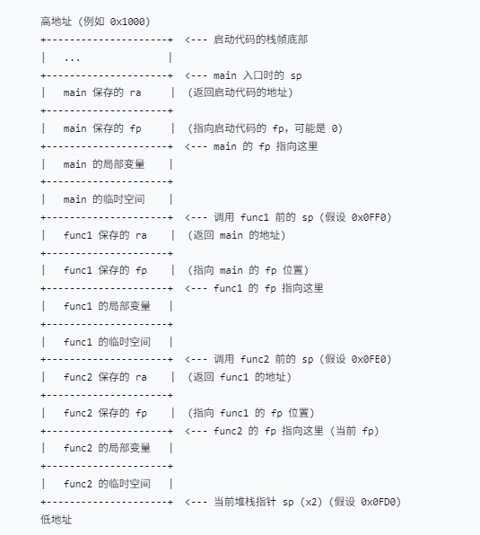

    1.  Key point description:

        sp (stack pointer): Always points to the lowest address of the current stack frame (that is, the last allocated space). When func2 is executing, sp points to the free area below func2's local variables (or the occupied bottom).

        fp (frame pointer): Points to the location in the current stack frame where the fp of the previous frame is saved. For example, the address pointed to by func2's fp stores the fp value of func1, and func1's fp in turn points to the location of main's fp, thus forming a linked list.

        Return address ra: Before calling a child function, each function saves the current ra into its own stack frame (usually located 4 bytes above the saved fp; for example, in [Figure 1](#fig17819675511), func2's ra is at the fp+4 position). In this way, when the function returns, ra can be restored from the stack frame.

    2.  Exception traceback process:

        When an exception occurs, the CPU saves the current register values (including sp, fp, ra, and so on). Assuming that an exception occurs in func2, we can trace back the call stack through the following steps:

        1.  <a name="li1729972117216"></a>Read the content at the address pointed to by the current fp to obtain the fp of the previous frame (that is, func1's fp value).
        2.  <a name="li157721425132114"></a>Read the content at the address of the current fp + 4 to obtain the return address of the current function func2 (that is, the address of the next instruction after func2 is called in func1).
        3.  Use the fp obtained in the previous step as the new current fp, and repeat steps [3.a](#li1729972117216) and [3.b](#li157721425132114) to obtain in sequence func1's return address (that is, the next instruction after func1 is called in main) and main's fp, until fp becomes 0 or an invalid value.

        This chained structure enables debuggers and exception handlers to accurately restore the function call sequence and quickly locate the context in which the problem occurred.

### Development Guidelines<a name="ZH-CN_TOPIC_0000002511954422"></a>

**Usage Scenarios<a name="section185414131459"></a>**

Exception handling processes chip hardware exceptions that occur during system operation. The exception types vary across different chips; see the chip manual for the specific exception types.

**Functions<a name="section1659236113710"></a>**

The exception module of LiteOS provides the following functions for users. For details about the interfaces, see the API reference.

<a name="table1194515532475"></a>
<table><thead align="left"><tr id="row16946153174710"><th class="cellrowborder" valign="top" width="16.57%" id="mcps1.1.4.1.1"><p id="p19946175304711"><a name="p19946175304711"></a><a name="p19946175304711"></a>Function Category</p>
</th>
<th class="cellrowborder" valign="top" width="32.28%" id="mcps1.1.4.1.2"><p id="p49461953174712"><a name="p49461953174712"></a><a name="p49461953174712"></a>API Name</p>
</th>
<th class="cellrowborder" valign="top" width="51.150000000000006%" id="mcps1.1.4.1.3"><p id="p16946165311479"><a name="p16946165311479"></a><a name="p16946165311479"></a>Description</p>
</th>
</tr>
</thead>
<tbody><tr id="row2628719163410"><td class="cellrowborder" valign="top" width="16.57%" headers="mcps1.1.4.1.1 "><p id="p1332120172135"><a name="p1332120172135"></a><a name="p1332120172135"></a>Pausing a core</p>
</td>
<td class="cellrowborder" valign="top" width="32.28%" headers="mcps1.1.4.1.2 "><p id="p462814196347"><a name="p462814196347"></a><a name="p462814196347"></a>LOS_Panic</p>
</td>
<td class="cellrowborder" valign="top" width="51.150000000000006%" headers="mcps1.1.4.1.3 "><p id="p15494261155"><a name="p15494261155"></a><a name="p15494261155"></a>Pause the current core and print information.</p>
</td>
</tr>
<tr id="row81191347135013"><td class="cellrowborder" rowspan="2" valign="top" width="16.57%" headers="mcps1.1.4.1.1 "><p id="p171191747135016"><a name="p171191747135016"></a><a name="p171191747135016"></a>Stack backtrace</p>
<p id="p2036512411711"><a name="p2036512411711"></a><a name="p2036512411711"></a></p>
</td>
<td class="cellrowborder" valign="top" width="32.28%" headers="mcps1.1.4.1.2 "><p id="p1811934715012"><a name="p1811934715012"></a><a name="p1811934715012"></a>LOS_BackTrace</p>
</td>
<td class="cellrowborder" valign="top" width="51.150000000000006%" headers="mcps1.1.4.1.3 "><p id="p17119547125020"><a name="p17119547125020"></a><a name="p17119547125020"></a>Print the stack backtrace information of the current task.</p>
</td>
</tr>
<tr id="row18364644177"><td class="cellrowborder" valign="top" headers="mcps1.1.4.1.1 "><p id="p1736534111717"><a name="p1736534111717"></a><a name="p1736534111717"></a>LOS_TaskBackTrace</p>
</td>
<td class="cellrowborder" valign="top" headers="mcps1.1.4.1.2 "><p id="p133658491717"><a name="p133658491717"></a><a name="p133658491717"></a>Print the stack backtrace information of the specified task.</p>
</td>
</tr>
</tbody>
</table>

**Locating Process<a name="section4760051492346"></a>**

The general locating steps of exception handling are as follows:

1.  Open the image disassembly (asm) file generated after compilation.
2.  Search for the position of the PC pointer (which points to the currently executing instruction) in the asm file to find the function where the exception occurred.
3.  <a name="li1979153992612"></a>Find the parent function of the exception function based on the LR value.
4.  Repeat [3](#li1979153992612) to obtain the call relationship between functions and find the cause of the exception.

The specific locating method is described with examples in the example section.

**Configuration Items<a name="section277562653518"></a>**

Open the menu, enter the Kernel ---\> Exception Management menu, and complete the configuration of the exception handling module.

<a name="table307549115016"></a>
<table><thead align="left"><tr id="row6708500315016"><th class="cellrowborder" valign="top" width="22.81771822817718%" id="mcps1.1.6.1.1"><p id="p1839509215016"><a name="p1839509215016"></a><a name="p1839509215016"></a>Configuration Item</p>
</th>
<th class="cellrowborder" valign="top" width="27.997200279972006%" id="mcps1.1.6.1.2"><p id="p1360747715016"><a name="p1360747715016"></a><a name="p1360747715016"></a>Meaning</p>
</th>
<th class="cellrowborder" valign="top" width="14.138586141385861%" id="mcps1.1.6.1.3"><p id="p2846381815016"><a name="p2846381815016"></a><a name="p2846381815016"></a>Value Range</p>
</th>
<th class="cellrowborder" valign="top" width="14.308569143085691%" id="mcps1.1.6.1.4"><p id="p2386789915016"><a name="p2386789915016"></a><a name="p2386789915016"></a>Default Value</p>
</th>
<th class="cellrowborder" valign="top" width="20.73792620737926%" id="mcps1.1.6.1.5"><p id="p5425169815016"><a name="p5425169815016"></a><a name="p5425169815016"></a>Dependency</p>
</th>
</tr>
</thead>
<tbody><tr id="row1345014211687"><td class="cellrowborder" valign="top" width="22.81771822817718%" headers="mcps1.1.6.1.1 "><p id="p645115211811"><a name="p645115211811"></a><a name="p645115211811"></a>LOSCFG_EXC_SIMPLE_INFO</p>
</td>
<td class="cellrowborder" valign="top" width="27.997200279972006%" headers="mcps1.1.6.1.2 "><p id="p174513211880"><a name="p174513211880"></a><a name="p174513211880"></a>After being enabled, the exception output information is reduced.</p>
</td>
<td class="cellrowborder" valign="top" width="14.138586141385861%" headers="mcps1.1.6.1.3 "><p id="p1245110219812"><a name="p1245110219812"></a><a name="p1245110219812"></a>YES/NO</p>
</td>
<td class="cellrowborder" valign="top" width="14.308569143085691%" headers="mcps1.1.6.1.4 "><p id="p1645119211387"><a name="p1645119211387"></a><a name="p1645119211387"></a>NO</p>
</td>
<td class="cellrowborder" valign="top" width="20.73792620737926%" headers="mcps1.1.6.1.5 "><p id="p245192110814"><a name="p245192110814"></a><a name="p245192110814"></a>None</p>
</td>
</tr>
<tr id="row16428109124"><td class="cellrowborder" valign="top" width="22.81771822817718%" headers="mcps1.1.6.1.1 "><p id="p1542813010120"><a name="p1542813010120"></a><a name="p1542813010120"></a>LOSCFG_EXC_STACK_SIZE</p>
</td>
<td class="cellrowborder" valign="top" width="27.997200279972006%" headers="mcps1.1.6.1.2 "><p id="p5428100201212"><a name="p5428100201212"></a><a name="p5428100201212"></a>Exception stack size</p>
</td>
<td class="cellrowborder" valign="top" width="14.138586141385861%" headers="mcps1.1.6.1.3 "><p id="p44281904126"><a name="p44281904126"></a><a name="p44281904126"></a>Self-adaptive based on the board</p>
</td>
<td class="cellrowborder" valign="top" width="14.308569143085691%" headers="mcps1.1.6.1.4 "><p id="p104281706127"><a name="p104281706127"></a><a name="p104281706127"></a>0x800</p>
</td>
<td class="cellrowborder" valign="top" width="20.73792620737926%" headers="mcps1.1.6.1.5 "><p id="p442820111211"><a name="p442820111211"></a><a name="p442820111211"></a>Currently only configurable for RISC-V</p>
</td>
</tr>
<tr id="row17861750123411"><td class="cellrowborder" valign="top" width="22.81771822817718%" headers="mcps1.1.6.1.1 "><p id="p11786125013410"><a name="p11786125013410"></a><a name="p11786125013410"></a>LOSCFG_SVC_STACK_SIZE</p>
</td>
<td class="cellrowborder" valign="top" width="27.997200279972006%" headers="mcps1.1.6.1.2 "><p id="p578655013341"><a name="p578655013341"></a><a name="p578655013341"></a>System call (SVC) stack size</p>
</td>
<td class="cellrowborder" valign="top" width="14.138586141385861%" headers="mcps1.1.6.1.3 "><p id="p778695017349"><a name="p778695017349"></a><a name="p778695017349"></a>Self-adaptive based on the board</p>
</td>
<td class="cellrowborder" valign="top" width="14.308569143085691%" headers="mcps1.1.6.1.4 "><p id="p9786185011344"><a name="p9786185011344"></a><a name="p9786185011344"></a>0x2000</p>
</td>
<td class="cellrowborder" valign="top" width="20.73792620737926%" headers="mcps1.1.6.1.5 "><p id="p46151068395"><a name="p46151068395"></a><a name="p46151068395"></a>LOSCFG_ARCH_ARM_CORTEX_A or LOSCFG_ARCH_ARM_CORTEX_R or LOSCFG_ARCH_ARM_926</p>
</td>
</tr>
</tbody>
</table>

### Precautions<a name="ZH-CN_TOPIC_0000002511794216"></a>

To view call stack information, you must add the compilation option macro "-fno-omit-frame-pointer" to support stack frames; otherwise, the FP register is disabled at compile time.

Users can set custom exception handling functions by calling the ArchSetExcHook and ArchSetNMIHook interfaces. However, inside the exception handling function, LOS\_TaskLock must be used to lock the task scheduling mechanism to avoid secondary exceptions or other potential problems caused by triggering scheduling.

### Programming Example<a name="ZH-CN_TOPIC_0000002511954280"></a>

A system exception is triggered by incorrectly releasing memory. After the system exception is suspended, the exception call stack print information and key register information can be seen on the serial port, as shown below, where Type indicates the exception type. Here, the value 0x2 indicates an illegal instruction; for other values, see the chip manual. With this information, the function where the exception occurred and its call stack relationship can be located.

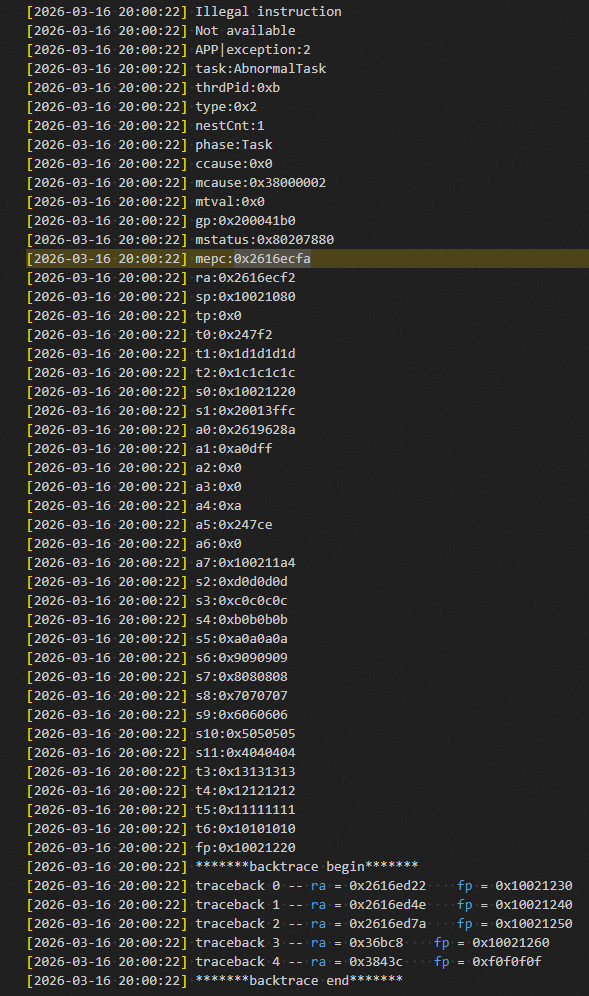

The locating steps are as follows:

1.  Open the .asm disassembly file generated after compilation (it is generated by default in the "LiteOS/out/<platform\>" directory, where platform is the specific platform name).
2.  Search for the position of the mepc pointer 2616ecfa in the .asm file (remove the 0x prefix).

    The mepc address points to the instruction being executed by the program when the exception occurred. In the asm file corresponding to the currently executed binary file, search for the mepc value 2616ecfa to find the file where the exception occurred, and the result is shown in the following figure.

    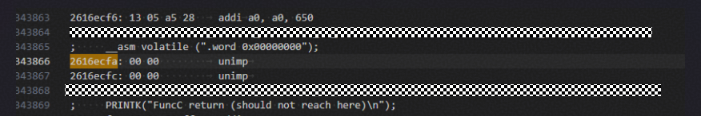

    The following can be seen from the figure:

    1.  The instruction unimp that the CPU was executing at the time of the exception.
    2.  The exception occurred at the "\_\_asm volatile \(".word 0x00000000"\)" statement in the "It\_los\_task\_045.c" file.

    Next, we need to find out who called this statement.

3.  Search for the call stack based on the ra return register value.

    Starting from the backtrace begin in the exception information, the call stack information is printed. In the asm file, search for the ra corresponding to traceback 0\~2, as shown in the following figures.

    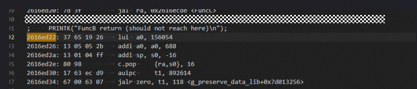

    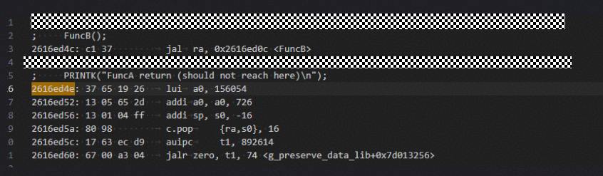

    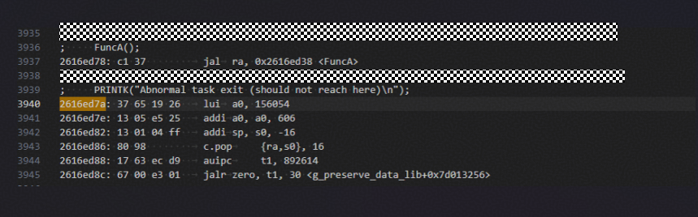

    It can be seen that FuncC called the "\_\_asm volatile \(".word 0x00000000"\)" statement and the exception occurred. Using this method, the function call relationship at the time of the exception is obtained as follows: FuncA\(business function\) ---\> FuncB---\> FuncC ---\> \_\_asm volatile \(".word 0x00000000"\).

    Finally, this method can be used to identify the information of the entire exception call stack.

## Error Handling<a name="ZH-CN_TOPIC_0000002543354257"></a>


### Overview<a name="ZH-CN_TOPIC_0000002511954302"></a>

**Basic Concepts<a name="section62024452101623"></a>**

Error handling means that when a program runs into an error, the interface functions of the error handling module are called to report the error information, and the registered hook function is called for specific processing, while the scene is saved for problem locating.

Through error handling, illegal input in a program can be controlled and prompted, preventing the program from crashing.

**Working Principles<a name="section3026392017222"></a>**

Error handling is a mechanism for handling abnormal situations. When an error occurs in a program, the corresponding error code is displayed. In addition, if the corresponding error handling function is registered, this function is executed.

**Figure 1**  Error handling diagram<a name="fig1551272917226"></a>  
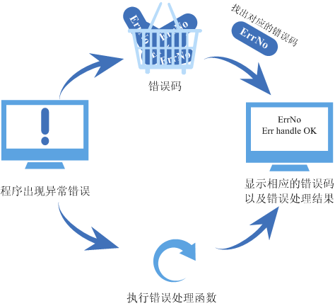

### Development Guidelines<a name="ZH-CN_TOPIC_0000002511954294"></a>

**Error Code Introduction<a name="section29852515161"></a>**

Errors may occur when API interfaces are called. In this case, the interface returns the corresponding error code to help quickly locate the cause of the error.

An error code is a 32-bit unsigned integer. Bits 31 to 24 indicate the error level, bits 23 to 16 indicate the error code flag (the current value of this flag is 0), bits 15 to 8 represent the module to which the error code belongs, and bits 7 to 0 indicate the error code number.

For example, the error code LOS\_ERRNO\_TSK\_NO\_MEMORY in the task module is defined as a fatal-level error, the module ID is LOS\_MOD\_TSK, and the error code number is 0. Its definition is as follows:

```
#define LOS_ERRNO_TSK_NO_MEMORY  LOS_ERRNO_OS_FATAL(LOS_MOD_TSK, 0x00)
```

```
#define LOS_ERRNO_OS_FATAL(MID, ERRNO)  \
    (LOS_ERRTYPE_FATAL | LOS_ERRNO_OS_ID | ((UINT32)(MID) << 8) | ((UINT32)(ERRNO)))
```

> **Note:** 
>-   LOS\_ERRTYPE\_FATAL: The error level is fatal, and the value is 0x03000000.
>-   LOS\_ERRNO\_OS\_ID: The error code flag, with the value 0x000000.
>-   MID: The module to which the error code belongs; the value of LOS\_MOD\_TSK is 0x2.
>-   ERRNO: The error code number.
>Therefore, the value of LOS\_ERRNO\_TSK\_NO\_MEMORY is 0x03000200.

**Error Code Handling<a name="section4791065162858"></a>**

Sometimes, error codes alone cannot quickly and accurately locate a problem. To facilitate error analysis for users, the error handling module supports registering error handling hook functions. When an error occurs, users can call the LOS\_ErrHandle interface to execute the error handling function.

The error handling module of LiteOS provides the following interfaces for users. For details about the interfaces, see the API reference.

<a name="table3025663162858"></a>
<table><thead align="left"><tr id="row33230790162858"><th class="cellrowborder" valign="top" width="16.22837716228377%" id="mcps1.1.5.1.1"><p id="p57624058162858"><a name="p57624058162858"></a><a name="p57624058162858"></a>API Name</p>
</th>
<th class="cellrowborder" valign="top" width="21.32786721327867%" id="mcps1.1.5.1.2"><p id="p37037121162858"><a name="p37037121162858"></a><a name="p37037121162858"></a>Description</p>
</th>
<th class="cellrowborder" valign="top" width="29.137086291370863%" id="mcps1.1.5.1.3"><p id="p10255125316586"><a name="p10255125316586"></a><a name="p10255125316586"></a>Parameter</p>
</th>
<th class="cellrowborder" valign="top" width="33.306669333066694%" id="mcps1.1.5.1.4"><p id="p817653416591"><a name="p817653416591"></a><a name="p817653416591"></a>Remarks</p>
</th>
</tr>
</thead>
<tbody><tr id="row19886134212579"><td class="cellrowborder" valign="top" width="16.22837716228377%" headers="mcps1.1.5.1.1 "><p id="p3886204219573"><a name="p3886204219573"></a><a name="p3886204219573"></a>LOS_RegErrHandle</p>
</td>
<td class="cellrowborder" valign="top" width="21.32786721327867%" headers="mcps1.1.5.1.2 "><p id="p8887142155718"><a name="p8887142155718"></a><a name="p8887142155718"></a>Register an error handling hook function.</p>
</td>
<td class="cellrowborder" valign="top" width="29.137086291370863%" headers="mcps1.1.5.1.3 "><p id="p182558531589"><a name="p182558531589"></a><a name="p182558531589"></a>func: Error handling hook function</p>
</td>
<td class="cellrowborder" valign="top" width="33.306669333066694%" headers="mcps1.1.5.1.4 "><p id="p17176143414596"><a name="p17176143414596"></a><a name="p17176143414596"></a>-</p>
</td>
</tr>
<tr id="row65700953153913"><td class="cellrowborder" rowspan="5" valign="top" width="16.22837716228377%" headers="mcps1.1.5.1.1 "><p id="p23722761153913"><a name="p23722761153913"></a><a name="p23722761153913"></a>LOS_ErrHandle</p>
</td>
<td class="cellrowborder" rowspan="5" valign="top" width="21.32786721327867%" headers="mcps1.1.5.1.2 "><p id="p42495518153913"><a name="p42495518153913"></a><a name="p42495518153913"></a>Call the hook function to handle errors.</p>
</td>
<td class="cellrowborder" valign="top" width="29.137086291370863%" headers="mcps1.1.5.1.3 "><p id="p1125515536588"><a name="p1125515536588"></a><a name="p1125515536588"></a>fileName: Name of the file for storing error logs</p>
</td>
<td class="cellrowborder" valign="top" width="33.306669333066694%" headers="mcps1.1.5.1.4 "><p id="p10176183455917"><a name="p10176183455917"></a><a name="p10176183455917"></a>When called internally by the system, the input parameter is "os_unspecific_file".</p>
</td>
</tr>
<tr id="row147465137018"><td class="cellrowborder" valign="top" headers="mcps1.1.5.1.1 "><p id="p1874711319013"><a name="p1874711319013"></a><a name="p1874711319013"></a>lineNo: Line number of the code where the error occurred</p>
</td>
<td class="cellrowborder" valign="top" headers="mcps1.1.5.1.2 "><p id="p37471513301"><a name="p37471513301"></a><a name="p37471513301"></a>When called internally by the system, if the value is 0xA1B2C3F8, it indicates that no line number was passed.</p>
</td>
</tr>
<tr id="row853242816018"><td class="cellrowborder" valign="top" headers="mcps1.1.5.1.1 "><p id="p16532328904"><a name="p16532328904"></a><a name="p16532328904"></a>errnoNo: Error code</p>
</td>
<td class="cellrowborder" valign="top" headers="mcps1.1.5.1.2 "><p id="p653219281502"><a name="p653219281502"></a><a name="p653219281502"></a>-</p>
</td>
</tr>
<tr id="row158973181308"><td class="cellrowborder" valign="top" headers="mcps1.1.5.1.1 "><p id="p689771819017"><a name="p689771819017"></a><a name="p689771819017"></a>paraLen: Length of the input parameter para</p>
</td>
<td class="cellrowborder" valign="top" headers="mcps1.1.5.1.2 "><p id="p128975181707"><a name="p128975181707"></a><a name="p128975181707"></a>When called internally by the system, the input parameter is 0.</p>
</td>
</tr>
<tr id="row8697181313"><td class="cellrowborder" valign="top" headers="mcps1.1.5.1.1 "><p id="p36914188113"><a name="p36914188113"></a><a name="p36914188113"></a>para: Error label</p>
</td>
<td class="cellrowborder" valign="top" headers="mcps1.1.5.1.2 "><p id="p1469121814119"><a name="p1469121814119"></a><a name="p1469121814119"></a>When called internally by the system, the input parameter is NULL.</p>
</td>
</tr>
</tbody>
</table>

> **Notice:** 
>The system internally proactively calls the registered hook functions at certain errors that are difficult to locate (currently, the hook functions are proactively called only in the mutex module and the semaphore module).

### Precautions<a name="ZH-CN_TOPIC_0000002511954356"></a>

The system has one and only one error handling hook function. When the hook function is registered multiple times, the hook function registered last overrides the previously registered one.

### Programming Example<a name="ZH-CN_TOPIC_0000002543354231"></a>

**Example Description<a name="section12652506102830"></a>**

This example demonstrates the following functions:

1.  Register an error handling hook function.
2.  Execute the error handling function.

**Programming Example<a name="section15395384102858"></a>**

The code implementation is as follows:

```
#include "los_err.h"
#include "los_typedef.h"
#include <stdio.h>

void Test_ErrHandle(CHAR *fileName, UINT32 lineNo, UINT32 errorNo, UINT32 paraLen, VOID  *para)
{
    printf("err handle ok\n");
}

static UINT32 TestCase(VOID)
{
    UINT32 errNo = 0;
    UINT32 ret;
    UINT32 errLine = 16;

    LOS_RegErrHandle(Test_ErrHandle);

    ret = LOS_ErrHandle("os_unspecific_file", errLine, errNo, 0, NULL);
    if (ret != LOS_OK) {
        return LOS_NOK;
    }

    return LOS_OK;
}
```

**Result Verification<a name="section12568740144737"></a>**

The result obtained after compilation and running is as follows:

```
HuaWei LiteOS # err handle ok
```

## Queue<a name="ZH-CN_TOPIC_0000002543394261"></a>


### Overview<a name="ZH-CN_TOPIC_0000002543394171"></a>

**Basic Concepts<a name="section6310708215125"></a>**

A queue, also called a message queue, is a data structure commonly used for inter-task communication. A queue receives messages of variable lengths from tasks or interrupts, and determines whether the transferred messages are stored in the queue space based on different interfaces.

A task can read messages from a queue. When the queue is empty of messages, the reading task is suspended; when new messages arrive in the queue, the suspended reading task is woken up to process the new messages. A task can also write messages to a queue. When the queue is full of messages, the writing task is suspended; when there are free message nodes in the queue, the suspended writing task is woken up to write messages. If the timeout for reading from and writing to the queue is set to 0, the task is not suspended and the interface returns directly. This is the non-blocking mode.

The message queue provides an asynchronous processing mechanism, allowing a message to be placed in the queue without being processed immediately. In addition, the queue also plays a role in buffering messages.

LiteOS uses queues to implement asynchronous communication between tasks, with the following features:

-   Messages are queued in first-in-first-out (FIFO) order, and asynchronous read and write are supported.
-   Both queue reading and writing support the timeout mechanism.
-   Each time a message is read, the message node is set to the free state.
-   The message type for sending is determined by both communicating parties, and messages of different lengths (not exceeding the message node size of the queue) are allowed.
-   A task can receive and send messages from/to any message queue.
-   Multiple tasks can receive and send messages from/to the same message queue.
-   The queue space required when creating a queue supports, by default, the mode in which the system dynamically allocates memory inside the interface; it also supports the mode in which the user-allocated queue space is passed as an input parameter of the interface.

**Working Principles<a name="section4442771013118"></a>**

Queue control block:

```
typedef enum {
    OS_QUEUE_READ =0,
    OS_QUEUE_WRITE =1,
    OS_QUEUE_N_RW =2
} QueueReadWrite;

/**
  * Queue information block structure
  */
typedef struct 
{
    UINT8       *queueHandle;                    /* Queue pointer */
    UINT8       queueState;                      /* Queue state */
    UINT8       queueMemType;                    /* Memory allocation mode when creating the queue */
    UINT16      queueLen;                        /* Number of message nodes in the queue, that is, the queue length */
    UINT16      queueSize;                       /* Message node size */
    UINT32      queueId;                         /* Queue ID */
    UINT16      queueHead;                       /* Position of the message head node (array index) */
    UINT16      queueTail;                       /* Position of the message tail node (array index) */
    UINT16      readWriteableCnt[OS_QUEUE_N_RW]; /* The element at array index 0 indicates the number of readable messages in the queue,                              
                                                    and the element at array index 1 indicates the number of writable messages in the queue */
    LOS_DL_LIST readWriteList[OS_QUEUE_N_RW];    /* Linked list of tasks waiting to read or write messages, 
                                                    index 0: read linked list, index 1: write linked list */
    LOS_DL_LIST memList;                         /* Memory block linked list used by the MailBox module in CMSIS-RTOS */
} LosQueueCB;
```

Each queue control block contains the queue state, indicating the usage of the queue:

-   OS\_QUEUE\_UNUSED: The queue is not used.
-   OS\_QUEUE\_INUSED: The queue is in use.

Each queue control block also contains the memory allocation mode used when creating the queue:

-   OS\_QUEUE\_ALLOC\_DYNAMIC: The queue space required when creating the queue is obtained by the system through dynamic memory allocation.
-   OS\_QUEUE\_ALLOC\_STATIC: The queue space required when creating the queue is allocated by the interface caller and then passed to the interface.

**Queue Working Principles<a name="section7733141312315"></a>**

**Table 1**  Queue working principle description table

<a name="table11733413163114"></a>
<table><thead align="left"><tr id="row13732101313113"><th class="cellrowborder" valign="top" width="16.24%" id="mcps1.2.3.1.1"><p id="p11732131333118"><a name="p11732131333118"></a><a name="p11732131333118"></a>Function</p>
</th>
<th class="cellrowborder" valign="top" width="83.76%" id="mcps1.2.3.1.2"><p id="p873214133311"><a name="p873214133311"></a><a name="p873214133311"></a>Working Principle Description</p>
</th>
</tr>
</thead>
<tbody><tr id="row573211315311"><td class="cellrowborder" valign="top" width="16.24%" headers="mcps1.2.3.1.1 "><p id="p16732813123118"><a name="p16732813123118"></a><a name="p16732813123118"></a>Creating a queue</p>
</td>
<td class="cellrowborder" valign="top" width="83.76%" headers="mcps1.2.3.1.2 "><p id="p15732413113116"><a name="p15732413113116"></a><a name="p15732413113116"></a>If the queue is created successfully, the queue ID is returned.</p>
<p id="p6732131333117"><a name="p6732131333117"></a><a name="p6732131333117"></a>The queue control block maintains the message head node position Head and the message tail node position Tail, which are used to indicate the storage of messages in the current queue.</p>
<a name="ul187321913163119"></a><a name="ul187321913163119"></a><ul id="ul187321913163119"><li>Head indicates the start position of the occupied message nodes in the queue.</li><li>Tail indicates the end position of the occupied message nodes, which is also the start position of the free message nodes.</li></ul>
<p id="p2732181333118"><a name="p2732181333118"></a><a name="p2732181333118"></a>(Note: When the queue is just created, both Head and Tail point to the start position of the queue.)</p>
</td>
</tr>
<tr id="row2732111314314"><td class="cellrowborder" valign="top" width="16.24%" headers="mcps1.2.3.1.1 "><p id="p97321413103115"><a name="p97321413103115"></a><a name="p97321413103115"></a>Writing to a queue</p>
</td>
<td class="cellrowborder" valign="top" width="83.76%" headers="mcps1.2.3.1.2 "><p id="p77326139319"><a name="p77326139319"></a><a name="p77326139319"></a>Determine whether the queue can be written based on readWriteableCnt[1]. A write operation cannot be performed on a full queue (readWriteableCnt[1] is 0).</p>
<p id="p0732191353112"><a name="p0732191353112"></a><a name="p0732191353112"></a>Writing to a queue supports the following two write modes.</p>
<a name="ul7732213173115"></a><a name="ul7732213173115"></a><ul id="ul7732213173115"><li>Write to the queue tail node: When writing to the tail node, find the start free message node based on Tail as the data write target. If Tail already points to the end of the queue, the wrap-around mode is used.</li><li>Write to the queue head node: When writing to the head node, use the node before Head as the data write target. If Head points to the start position of the queue, the wrap-around mode is used.</li></ul>
</td>
</tr>
<tr id="row127328139316"><td class="cellrowborder" valign="top" width="16.24%" headers="mcps1.2.3.1.1 "><p id="p4732213123115"><a name="p4732213123115"></a><a name="p4732213123115"></a>Reading from a queue</p>
</td>
<td class="cellrowborder" valign="top" width="83.76%" headers="mcps1.2.3.1.2 "><p id="p273221323114"><a name="p273221323114"></a><a name="p273221323114"></a>Determine whether the queue has messages to read based on readWriteableCnt[0]. A read operation on an all-free queue (readWriteableCnt[0] is 0) causes the task to be suspended.</p>
<a name="ul14732913183112"></a><a name="ul14732913183112"></a><ul id="ul14732913183112"><li>If the queue has messages to read, find the message node written to the queue first based on Head and read it.</li><li>If Head already points to the end of the queue, the wrap-around mode is used.</li></ul>
</td>
</tr>
<tr id="row1573313136311"><td class="cellrowborder" valign="top" width="16.24%" headers="mcps1.2.3.1.1 "><p id="p3732913143118"><a name="p3732913143118"></a><a name="p3732913143118"></a>Deleting a queue</p>
</td>
<td class="cellrowborder" valign="top" width="83.76%" headers="mcps1.2.3.1.2 "><p id="p18732101313317"><a name="p18732101313317"></a><a name="p18732101313317"></a>Find the corresponding queue based on the queue ID, set the queue state to unused, and reset the queue control block to the initial state. If the queue was created through system dynamic memory allocation, the memory occupied by the queue is also released.</p>
</td>
</tr>
</tbody>
</table>

**Figure 1**  Queue read/write data operation diagram<a name="fig1673391333119"></a>  
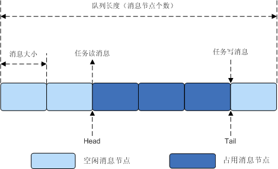

[Figure 1](#fig1673391333119) illustrates reading from and writing to the queue. The figure only shows the tail node write mode without the head node write mode, but the two modes are similar.

### Development Guidelines<a name="ZH-CN_TOPIC_0000002543394379"></a>

**Usage Scenarios<a name="section1521963620410"></a>**

Queues are used for inter-task communication and can implement asynchronous message processing. In addition, the sender and receiver of messages do not need to contact each other; the two are decoupled.

**Functions<a name="section267785513432"></a>**

The queue module in LiteOS provides the following functions. For details about the interfaces, see the API reference.

<a name="table23667517184354"></a>
<table><thead align="left"><tr id="row23800586184354"><th class="cellrowborder" valign="top" width="21.66%" id="mcps1.1.4.1.1"><p id="p5651424118443"><a name="p5651424118443"></a><a name="p5651424118443"></a>Function Category</p>
</th>
<th class="cellrowborder" valign="top" width="25.78%" id="mcps1.1.4.1.2"><p id="p1425081918443"><a name="p1425081918443"></a><a name="p1425081918443"></a>API Name</p>
</th>
<th class="cellrowborder" valign="top" width="52.56000000000001%" id="mcps1.1.4.1.3"><p id="p1346571418443"><a name="p1346571418443"></a><a name="p1346571418443"></a>Description</p>
</th>
</tr>
</thead>
<tbody><tr id="row62888924184354"><td class="cellrowborder" rowspan="3" valign="top" width="21.66%" headers="mcps1.1.4.1.1 "><p id="p3328741318443"><a name="p3328741318443"></a><a name="p3328741318443"></a>Creating/deleting a message queue</p>
</td>
<td class="cellrowborder" valign="top" width="25.78%" headers="mcps1.1.4.1.2 "><p id="p1192591318443"><a name="p1192591318443"></a><a name="p1192591318443"></a>LOS_QueueCreate</p>
</td>
<td class="cellrowborder" valign="top" width="52.56000000000001%" headers="mcps1.1.4.1.3 "><p id="p2647489018443"><a name="p2647489018443"></a><a name="p2647489018443"></a>Create a message queue, with the system dynamically allocating the queue space.</p>
</td>
</tr>
<tr id="row4459241419"><td class="cellrowborder" valign="top" headers="mcps1.1.4.1.1 "><p id="p123598451144"><a name="p123598451144"></a><a name="p123598451144"></a>LOS_QueueCreateStatic</p>
</td>
<td class="cellrowborder" valign="top" headers="mcps1.1.4.1.2 "><p id="p1345192141410"><a name="p1345192141410"></a><a name="p1345192141410"></a>Create a message queue, with the user allocating the queue memory space and passing it to the interface.</p>
</td>
</tr>
<tr id="row151398386345"><td class="cellrowborder" valign="top" headers="mcps1.1.4.1.1 "><p id="p17568143915340"><a name="p17568143915340"></a><a name="p17568143915340"></a>LOS_QueueDelete</p>
</td>
<td class="cellrowborder" valign="top" headers="mcps1.1.4.1.2 "><p id="p11568153963413"><a name="p11568153963413"></a><a name="p11568153963413"></a>Delete a specified queue based on the queue ID.</p>
</td>
</tr>
<tr id="row25480013184354"><td class="cellrowborder" rowspan="3" valign="top" width="21.66%" headers="mcps1.1.4.1.1 "><p id="p3995088818443"><a name="p3995088818443"></a><a name="p3995088818443"></a>Reading from/writing to a queue (without copy)</p>
</td>
<td class="cellrowborder" valign="top" width="25.78%" headers="mcps1.1.4.1.2 "><p id="p1479653518443"><a name="p1479653518443"></a><a name="p1479653518443"></a>LOS_QueueRead</p>
</td>
<td class="cellrowborder" valign="top" width="52.56000000000001%" headers="mcps1.1.4.1.3 "><p id="p5766871918443"><a name="p5766871918443"></a><a name="p5766871918443"></a>Read the data in the head node of the specified queue (the data in a queue node is actually an address).</p>
</td>
</tr>
<tr id="row13975964184354"><td class="cellrowborder" valign="top" headers="mcps1.1.4.1.1 "><p id="p4222878818443"><a name="p4222878818443"></a><a name="p4222878818443"></a>LOS_QueueWrite</p>
</td>
<td class="cellrowborder" valign="top" headers="mcps1.1.4.1.2 "><p id="p6508866818443"><a name="p6508866818443"></a><a name="p6508866818443"></a>Write the value of the input parameter bufferAddr (that is, the buffer address) to the tail node of the specified queue.</p>
</td>
</tr>
<tr id="row147410295355"><td class="cellrowborder" valign="top" headers="mcps1.1.4.1.1 "><p id="p23501231123510"><a name="p23501231123510"></a><a name="p23501231123510"></a>LOS_QueueWriteHead</p>
</td>
<td class="cellrowborder" valign="top" headers="mcps1.1.4.1.2 "><p id="p13503312359"><a name="p13503312359"></a><a name="p13503312359"></a>Write the value of the input parameter bufferAddr (that is, the buffer address) to the head node of the specified queue.</p>
</td>
</tr>
<tr id="row49536790111815"><td class="cellrowborder" rowspan="3" valign="top" width="21.66%" headers="mcps1.1.4.1.1 "><p id="p53057044111815"><a name="p53057044111815"></a><a name="p53057044111815"></a>Reading from/writing to a queue (with copy)</p>
</td>
<td class="cellrowborder" valign="top" width="25.78%" headers="mcps1.1.4.1.2 "><p id="p2653311111815"><a name="p2653311111815"></a><a name="p2653311111815"></a>LOS_QueueReadCopy</p>
</td>
<td class="cellrowborder" valign="top" width="52.56000000000001%" headers="mcps1.1.4.1.3 "><p id="p13591614111815"><a name="p13591614111815"></a><a name="p13591614111815"></a>Read the data in the head node of the specified queue.</p>
</td>
</tr>
<tr id="row43811731111820"><td class="cellrowborder" valign="top" headers="mcps1.1.4.1.1 "><p id="p21507820111820"><a name="p21507820111820"></a><a name="p21507820111820"></a>LOS_QueueWriteCopy</p>
</td>
<td class="cellrowborder" valign="top" headers="mcps1.1.4.1.2 "><p id="p64411829111820"><a name="p64411829111820"></a><a name="p64411829111820"></a>Write the data stored in the input parameter bufferAddr to the tail node of the specified queue.</p>
</td>
</tr>
<tr id="row53214216105859"><td class="cellrowborder" valign="top" headers="mcps1.1.4.1.1 "><p id="p38164146105859"><a name="p38164146105859"></a><a name="p38164146105859"></a>LOS_QueueWriteHeadCopy</p>
</td>
<td class="cellrowborder" valign="top" headers="mcps1.1.4.1.2 "><p id="p4288110105859"><a name="p4288110105859"></a><a name="p4288110105859"></a>Write the data stored in the input parameter bufferAddr to the head node of the specified queue.</p>
</td>
</tr>
<tr id="row16299901184354"><td class="cellrowborder" valign="top" width="21.66%" headers="mcps1.1.4.1.1 "><p id="p378995218443"><a name="p378995218443"></a><a name="p378995218443"></a>Obtaining queue information</p>
</td>
<td class="cellrowborder" valign="top" width="25.78%" headers="mcps1.1.4.1.2 "><p id="p3855073218443"><a name="p3855073218443"></a><a name="p3855073218443"></a>LOS_QueueInfoGet</p>
</td>
<td class="cellrowborder" valign="top" width="52.56000000000001%" headers="mcps1.1.4.1.3 "><p id="p3560155518443"><a name="p3560155518443"></a><a name="p3560155518443"></a>Obtain information about the specified queue, including the queue ID, queue length, message node size, head node, tail node, number of readable nodes, number of writable nodes, tasks waiting for read operations, tasks waiting for write operations, and tasks waiting for mail operations.</p>
</td>
</tr>
<tr id="row39901647982"><td class="cellrowborder" valign="top" width="21.66%" headers="mcps1.1.4.1.1 "><p id="p399154719811"><a name="p399154719811"></a><a name="p399154719811"></a>Obtaining all queue information</p>
</td>
<td class="cellrowborder" valign="top" width="25.78%" headers="mcps1.1.4.1.2 "><p id="p899124719818"><a name="p899124719818"></a><a name="p899124719818"></a>LOS_QueueInfoAllGet</p>
</td>
<td class="cellrowborder" valign="top" width="52.56000000000001%" headers="mcps1.1.4.1.3 "><p id="p699118471881"><a name="p699118471881"></a><a name="p699118471881"></a>The function is the same as that of LOS_QueueInfoGet. Compared with LOS_QueueInfoGet, this interface supports scenarios where the number of tasks is greater than 64.</p>
</td>
</tr>
</tbody>
</table>

**Queue Error Codes<a name="section58399290191416"></a>**

Operations that may fail return corresponding error codes to help quickly locate the cause of the error.

<a name="table66521465191749"></a>
<table><thead align="left"><tr id="row66647056191749"><th class="cellrowborder" valign="top" width="5.41%" id="mcps1.1.6.1.1"><p id="p65995609191749"><a name="p65995609191749"></a><a name="p65995609191749"></a>No.</p>
</th>
<th class="cellrowborder" valign="top" width="20.02%" id="mcps1.1.6.1.2"><p id="p44044076191749"><a name="p44044076191749"></a><a name="p44044076191749"></a>Definition</p>
</th>
<th class="cellrowborder" valign="top" width="14.05%" id="mcps1.1.6.1.3"><p id="p10800441191749"><a name="p10800441191749"></a><a name="p10800441191749"></a>Actual Value</p>
</th>
<th class="cellrowborder" valign="top" width="24.610000000000003%" id="mcps1.1.6.1.4"><p id="p39597633191844"><a name="p39597633191844"></a><a name="p39597633191844"></a>Description</p>
</th>
<th class="cellrowborder" valign="top" width="35.91%" id="mcps1.1.6.1.5"><p id="p61844251191749"><a name="p61844251191749"></a><a name="p61844251191749"></a>Recommended Solution</p>
</th>
</tr>
</thead>
<tbody><tr id="row33366968191749"><td class="cellrowborder" valign="top" width="5.41%" headers="mcps1.1.6.1.1 "><p id="p18369922191749"><a name="p18369922191749"></a><a name="p18369922191749"></a>1</p>
</td>
<td class="cellrowborder" valign="top" width="20.02%" headers="mcps1.1.6.1.2 "><p id="p11568741191749"><a name="p11568741191749"></a><a name="p11568741191749"></a>LOS_ERRNO_QUEUE_NO_MEMORY</p>
</td>
<td class="cellrowborder" valign="top" width="14.05%" headers="mcps1.1.6.1.3 "><p id="p64652808191749"><a name="p64652808191749"></a><a name="p64652808191749"></a>0x02000601</p>
</td>
<td class="cellrowborder" valign="top" width="24.610000000000003%" headers="mcps1.1.6.1.4 "><p id="p787615154915"><a name="p787615154915"></a><a name="p787615154915"></a>Memory allocation from the dynamic memory pool failed during queue initialization.</p>
</td>
<td class="cellrowborder" valign="top" width="35.91%" headers="mcps1.1.6.1.5 "><p id="p1687611564915"><a name="p1687611564915"></a><a name="p1687611564915"></a>Set a larger system dynamic memory pool (the configuration item is OS_SYS_MEM_SIZE), or reduce the maximum number of queues supported by the system.</p>
</td>
</tr>
<tr id="row33397154191749"><td class="cellrowborder" valign="top" width="5.41%" headers="mcps1.1.6.1.1 "><p id="p20814974191749"><a name="p20814974191749"></a><a name="p20814974191749"></a>2</p>
</td>
<td class="cellrowborder" valign="top" width="20.02%" headers="mcps1.1.6.1.2 "><p id="p8291367191749"><a name="p8291367191749"></a><a name="p8291367191749"></a>LOS_ERRNO_QUEUE_CREATE_NO_MEMORY</p>
</td>
<td class="cellrowborder" valign="top" width="14.05%" headers="mcps1.1.6.1.3 "><p id="p512132191749"><a name="p512132191749"></a><a name="p512132191749"></a>0x02000602</p>
</td>
<td class="cellrowborder" valign="top" width="24.610000000000003%" headers="mcps1.1.6.1.4 "><p id="p181431132184915"><a name="p181431132184915"></a><a name="p181431132184915"></a>Memory allocation from the dynamic memory pool failed when creating the queue.</p>
</td>
<td class="cellrowborder" valign="top" width="35.91%" headers="mcps1.1.6.1.5 "><p id="p614312322497"><a name="p614312322497"></a><a name="p614312322497"></a>Set a larger system dynamic memory pool (the configuration item is OS_SYS_MEM_SIZE), or reduce the queue length and message node size of the queue to be created.</p>
</td>
</tr>
<tr id="row41391008191749"><td class="cellrowborder" valign="top" width="5.41%" headers="mcps1.1.6.1.1 "><p id="p64337369191749"><a name="p64337369191749"></a><a name="p64337369191749"></a>3</p>
</td>
<td class="cellrowborder" valign="top" width="20.02%" headers="mcps1.1.6.1.2 "><p id="p43944370191749"><a name="p43944370191749"></a><a name="p43944370191749"></a>LOS_ERRNO_QUEUE_SIZE_TOO_BIG</p>
</td>
<td class="cellrowborder" valign="top" width="14.05%" headers="mcps1.1.6.1.3 "><p id="p2724179191749"><a name="p2724179191749"></a><a name="p2724179191749"></a>0x02000603</p>
</td>
<td class="cellrowborder" valign="top" width="24.610000000000003%" headers="mcps1.1.6.1.4 "><p id="p197252184910"><a name="p197252184910"></a><a name="p197252184910"></a>The message node size exceeds the upper limit when creating the queue.</p>
</td>
<td class="cellrowborder" valign="top" width="35.91%" headers="mcps1.1.6.1.5 "><p id="p49735213493"><a name="p49735213493"></a><a name="p49735213493"></a>Change the message node size in the input parameters so that it does not exceed the upper limit.</p>
</td>
</tr>
<tr id="row10026959191749"><td class="cellrowborder" valign="top" width="5.41%" headers="mcps1.1.6.1.1 "><p id="p6877374191749"><a name="p6877374191749"></a><a name="p6877374191749"></a>4</p>
</td>
<td class="cellrowborder" valign="top" width="20.02%" headers="mcps1.1.6.1.2 "><p id="p20196417191749"><a name="p20196417191749"></a><a name="p20196417191749"></a>LOS_ERRNO_QUEUE_CB_UNAVAILABLE</p>
</td>
<td class="cellrowborder" valign="top" width="14.05%" headers="mcps1.1.6.1.3 "><p id="p25297089191749"><a name="p25297089191749"></a><a name="p25297089191749"></a>0x02000604</p>
</td>
<td class="cellrowborder" valign="top" width="24.610000000000003%" headers="mcps1.1.6.1.4 "><p id="p1732013725019"><a name="p1732013725019"></a><a name="p1732013725019"></a>When creating the queue, there are no free queues left in the system.</p>
</td>
<td class="cellrowborder" valign="top" width="35.91%" headers="mcps1.1.6.1.5 "><p id="p232020755019"><a name="p232020755019"></a><a name="p232020755019"></a>Increase the maximum number of queues supported by the system.</p>
</td>
</tr>
<tr id="row59373972191749"><td class="cellrowborder" valign="top" width="5.41%" headers="mcps1.1.6.1.1 "><p id="p44562467191749"><a name="p44562467191749"></a><a name="p44562467191749"></a>5</p>
</td>
<td class="cellrowborder" valign="top" width="20.02%" headers="mcps1.1.6.1.2 "><p id="p52790107191749"><a name="p52790107191749"></a><a name="p52790107191749"></a>LOS_ERRNO_QUEUE_NOT_FOUND</p>
</td>
<td class="cellrowborder" valign="top" width="14.05%" headers="mcps1.1.6.1.3 "><p id="p48140259191749"><a name="p48140259191749"></a><a name="p48140259191749"></a>0x02000605</p>
</td>
<td class="cellrowborder" valign="top" width="24.610000000000003%" headers="mcps1.1.6.1.4 "><p id="p60420222193129"><a name="p60420222193129"></a><a name="p60420222193129"></a>The queue ID passed to the queue deletion interface is greater than or equal to the maximum number of queues supported by the system.</p>
</td>
<td class="cellrowborder" valign="top" width="35.91%" headers="mcps1.1.6.1.5 "><p id="p49643405193152"><a name="p49643405193152"></a><a name="p49643405193152"></a>Ensure that the queue ID is valid.</p>
</td>
</tr>
<tr id="row36473565191749"><td class="cellrowborder" valign="top" width="5.41%" headers="mcps1.1.6.1.1 "><p id="p1568774191749"><a name="p1568774191749"></a><a name="p1568774191749"></a>6</p>
</td>
<td class="cellrowborder" valign="top" width="20.02%" headers="mcps1.1.6.1.2 "><p id="p59961868191749"><a name="p59961868191749"></a><a name="p59961868191749"></a>LOS_ERRNO_QUEUE_PEND_IN_LOCK</p>
</td>
<td class="cellrowborder" valign="top" width="14.05%" headers="mcps1.1.6.1.3 "><p id="p25073110191749"><a name="p25073110191749"></a><a name="p25073110191749"></a>0x02000606</p>
</td>
<td class="cellrowborder" valign="top" width="24.610000000000003%" headers="mcps1.1.6.1.4 "><p id="p19045334193230"><a name="p19045334193230"></a><a name="p19045334193230"></a>When the task is locked, blocking waiting for writing or reading messages in the queue is prohibited.</p>
</td>
<td class="cellrowborder" valign="top" width="35.91%" headers="mcps1.1.6.1.5 "><p id="p20051835193257"><a name="p20051835193257"></a><a name="p20051835193257"></a>Unlock the task before using the queue.</p>
</td>
</tr>
<tr id="row51263497192010"><td class="cellrowborder" valign="top" width="5.41%" headers="mcps1.1.6.1.1 "><p id="p58702556192010"><a name="p58702556192010"></a><a name="p58702556192010"></a>7</p>
</td>
<td class="cellrowborder" valign="top" width="20.02%" headers="mcps1.1.6.1.2 "><p id="p57286633192010"><a name="p57286633192010"></a><a name="p57286633192010"></a>LOS_ERRNO_QUEUE_TIMEOUT</p>
</td>
<td class="cellrowborder" valign="top" width="14.05%" headers="mcps1.1.6.1.3 "><p id="p9705686192010"><a name="p9705686192010"></a><a name="p9705686192010"></a>0x02000607</p>
</td>
<td class="cellrowborder" valign="top" width="24.610000000000003%" headers="mcps1.1.6.1.4 "><p id="p53994389193449"><a name="p53994389193449"></a><a name="p53994389193449"></a>Timeout when waiting for the queue to be processed.</p>
</td>
<td class="cellrowborder" valign="top" width="35.91%" headers="mcps1.1.6.1.5 "><p id="p51382338193520"><a name="p51382338193520"></a><a name="p51382338193520"></a>Check whether the set timeout is appropriate.</p>
</td>
</tr>
<tr id="row36402998193312"><td class="cellrowborder" valign="top" width="5.41%" headers="mcps1.1.6.1.1 "><p id="p62961745193312"><a name="p62961745193312"></a><a name="p62961745193312"></a>8</p>
</td>
<td class="cellrowborder" valign="top" width="20.02%" headers="mcps1.1.6.1.2 "><p id="p66736597193312"><a name="p66736597193312"></a><a name="p66736597193312"></a>LOS_ERRNO_QUEUE_IN_TSKUSE</p>
</td>
<td class="cellrowborder" valign="top" width="14.05%" headers="mcps1.1.6.1.3 "><p id="p36955240193312"><a name="p36955240193312"></a><a name="p36955240193312"></a>0x02000608</p>
</td>
<td class="cellrowborder" valign="top" width="24.610000000000003%" headers="mcps1.1.6.1.4 "><p id="p3637555120413"><a name="p3637555120413"></a><a name="p3637555120413"></a>The queue has blocked tasks and cannot be deleted.</p>
</td>
<td class="cellrowborder" valign="top" width="35.91%" headers="mcps1.1.6.1.5 "><p id="p66119138193312"><a name="p66119138193312"></a><a name="p66119138193312"></a>Enable the task to obtain resources instead of being blocked in the queue.</p>
</td>
</tr>
<tr id="row51203889193321"><td class="cellrowborder" valign="top" width="5.41%" headers="mcps1.1.6.1.1 "><p id="p53874317193321"><a name="p53874317193321"></a><a name="p53874317193321"></a>9</p>
</td>
<td class="cellrowborder" valign="top" width="20.02%" headers="mcps1.1.6.1.2 "><p id="p1743582193321"><a name="p1743582193321"></a><a name="p1743582193321"></a>LOS_ERRNO_QUEUE_WRITE_IN_INTERRUPT</p>
</td>
<td class="cellrowborder" valign="top" width="14.05%" headers="mcps1.1.6.1.3 "><p id="p7012492193321"><a name="p7012492193321"></a><a name="p7012492193321"></a>0x02000609</p>
</td>
<td class="cellrowborder" valign="top" width="24.610000000000003%" headers="mcps1.1.6.1.4 "><p id="p31140990193321"><a name="p31140990193321"></a><a name="p31140990193321"></a>The queue cannot be written in blocking mode in the interrupt handler.</p>
</td>
<td class="cellrowborder" valign="top" width="35.91%" headers="mcps1.1.6.1.5 "><p id="p51817932193749"><a name="p51817932193749"></a><a name="p51817932193749"></a>Set the queue write operation to non-blocking mode, that is, set the write queue timeout to 0.</p>
</td>
</tr>
<tr id="row58997007193325"><td class="cellrowborder" valign="top" width="5.41%" headers="mcps1.1.6.1.1 "><p id="p14028263193325"><a name="p14028263193325"></a><a name="p14028263193325"></a>10</p>
</td>
<td class="cellrowborder" valign="top" width="20.02%" headers="mcps1.1.6.1.2 "><p id="p62547532193325"><a name="p62547532193325"></a><a name="p62547532193325"></a>LOS_ERRNO_QUEUE_NOT_CREATE</p>
</td>
<td class="cellrowborder" valign="top" width="14.05%" headers="mcps1.1.6.1.3 "><p id="p33185317193325"><a name="p33185317193325"></a><a name="p33185317193325"></a>0x0200060A</p>
</td>
<td class="cellrowborder" valign="top" width="24.610000000000003%" headers="mcps1.1.6.1.4 "><p id="p3656155193325"><a name="p3656155193325"></a><a name="p3656155193325"></a>The queue has not been created.</p>
</td>
<td class="cellrowborder" valign="top" width="35.91%" headers="mcps1.1.6.1.5 "><p id="p14251707193839"><a name="p14251707193839"></a><a name="p14251707193839"></a>Create the queue, or use a queue that has already been created.</p>
</td>
</tr>
<tr id="row23132180193345"><td class="cellrowborder" valign="top" width="5.41%" headers="mcps1.1.6.1.1 "><p id="p61767288193345"><a name="p61767288193345"></a><a name="p61767288193345"></a>11</p>
</td>
<td class="cellrowborder" valign="top" width="20.02%" headers="mcps1.1.6.1.2 "><p id="p37094461193345"><a name="p37094461193345"></a><a name="p37094461193345"></a>LOS_ERRNO_QUEUE_IN_TSKWRITE</p>
</td>
<td class="cellrowborder" valign="top" width="14.05%" headers="mcps1.1.6.1.3 "><p id="p51861387193345"><a name="p51861387193345"></a><a name="p51861387193345"></a>0x0200060B</p>
</td>
<td class="cellrowborder" valign="top" width="24.610000000000003%" headers="mcps1.1.6.1.4 "><p id="p6555415519399"><a name="p6555415519399"></a><a name="p6555415519399"></a>Queue reading and writing are not synchronized.</p>
</td>
<td class="cellrowborder" valign="top" width="35.91%" headers="mcps1.1.6.1.5 "><p id="p20620767193345"><a name="p20620767193345"></a><a name="p20620767193345"></a>Synchronize the read and write operations on the queue, that is, multiple tasks cannot concurrently read from or write to the same queue.</p>
</td>
</tr>
<tr id="row21687970193352"><td class="cellrowborder" valign="top" width="5.41%" headers="mcps1.1.6.1.1 "><p id="p11895156193352"><a name="p11895156193352"></a><a name="p11895156193352"></a>12</p>
</td>
<td class="cellrowborder" valign="top" width="20.02%" headers="mcps1.1.6.1.2 "><p id="p23983603193352"><a name="p23983603193352"></a><a name="p23983603193352"></a>LOS_ERRNO_QUEUE_CREAT_PTR_NULL</p>
</td>
<td class="cellrowborder" valign="top" width="14.05%" headers="mcps1.1.6.1.3 "><p id="p63623686193352"><a name="p63623686193352"></a><a name="p63623686193352"></a>0x0200060C</p>
</td>
<td class="cellrowborder" valign="top" width="24.610000000000003%" headers="mcps1.1.6.1.4 "><p id="p3279290519404"><a name="p3279290519404"></a><a name="p3279290519404"></a>For the queue creation interface, the input parameter used to save the queue ID is a NULL pointer.</p>
</td>
<td class="cellrowborder" valign="top" width="35.91%" headers="mcps1.1.6.1.5 "><p id="p17873674193352"><a name="p17873674193352"></a><a name="p17873674193352"></a>Ensure that the passed parameter is not a NULL pointer.</p>
</td>
</tr>
<tr id="row32251036193358"><td class="cellrowborder" valign="top" width="5.41%" headers="mcps1.1.6.1.1 "><p id="p62197112193358"><a name="p62197112193358"></a><a name="p62197112193358"></a>13</p>
</td>
<td class="cellrowborder" valign="top" width="20.02%" headers="mcps1.1.6.1.2 "><p id="p4801272193358"><a name="p4801272193358"></a><a name="p4801272193358"></a>LOS_ERRNO_QUEUE_PARA_ISZERO</p>
</td>
<td class="cellrowborder" valign="top" width="14.05%" headers="mcps1.1.6.1.3 "><p id="p53358724193358"><a name="p53358724193358"></a><a name="p53358724193358"></a>0x0200060D</p>
</td>
<td class="cellrowborder" valign="top" width="24.610000000000003%" headers="mcps1.1.6.1.4 "><p id="p27309930194051"><a name="p27309930194051"></a><a name="p27309930194051"></a>For the queue creation interface, the queue length or the message node size in the input parameters is 0.</p>
</td>
<td class="cellrowborder" valign="top" width="35.91%" headers="mcps1.1.6.1.5 "><p id="p46758883193358"><a name="p46758883193358"></a><a name="p46758883193358"></a>Pass the correct queue length and message node size.</p>
</td>
</tr>
<tr id="row6471318219343"><td class="cellrowborder" valign="top" width="5.41%" headers="mcps1.1.6.1.1 "><p id="p727640719343"><a name="p727640719343"></a><a name="p727640719343"></a>14</p>
</td>
<td class="cellrowborder" valign="top" width="20.02%" headers="mcps1.1.6.1.2 "><p id="p5251806419343"><a name="p5251806419343"></a><a name="p5251806419343"></a>LOS_ERRNO_QUEUE_INVALID</p>
</td>
<td class="cellrowborder" valign="top" width="14.05%" headers="mcps1.1.6.1.3 "><p id="p2610475319343"><a name="p2610475319343"></a><a name="p2610475319343"></a>0x0200060E</p>
</td>
<td class="cellrowborder" valign="top" width="24.610000000000003%" headers="mcps1.1.6.1.4 "><p id="p5223249920528"><a name="p5223249920528"></a><a name="p5223249920528"></a>The queue ID passed to the queue read, queue write, or queue information obtaining interface is greater than or equal to the maximum number of queues supported by the system.</p>
</td>
<td class="cellrowborder" valign="top" width="35.91%" headers="mcps1.1.6.1.5 "><p id="p329454442063"><a name="p329454442063"></a><a name="p329454442063"></a>Ensure that the queue ID is valid.</p>
</td>
</tr>
<tr id="row3895023819348"><td class="cellrowborder" valign="top" width="5.41%" headers="mcps1.1.6.1.1 "><p id="p85270419348"><a name="p85270419348"></a><a name="p85270419348"></a>15</p>
</td>
<td class="cellrowborder" valign="top" width="20.02%" headers="mcps1.1.6.1.2 "><p id="p196018619348"><a name="p196018619348"></a><a name="p196018619348"></a>LOS_ERRNO_QUEUE_READ_PTR_NULL</p>
</td>
<td class="cellrowborder" valign="top" width="14.05%" headers="mcps1.1.6.1.3 "><p id="p2455739719348"><a name="p2455739719348"></a><a name="p2455739719348"></a>0x0200060F</p>
</td>
<td class="cellrowborder" valign="top" width="24.610000000000003%" headers="mcps1.1.6.1.4 "><p id="p5676363194253"><a name="p5676363194253"></a><a name="p5676363194253"></a>The pointer passed to the queue read interface is NULL.</p>
</td>
<td class="cellrowborder" valign="top" width="35.91%" headers="mcps1.1.6.1.5 "><p id="p37131993194325"><a name="p37131993194325"></a><a name="p37131993194325"></a>Ensure that the passed parameter is not a NULL pointer.</p>
</td>
</tr>
<tr id="row15616099193413"><td class="cellrowborder" valign="top" width="5.41%" headers="mcps1.1.6.1.1 "><p id="p56944481193413"><a name="p56944481193413"></a><a name="p56944481193413"></a>16</p>
</td>
<td class="cellrowborder" valign="top" width="20.02%" headers="mcps1.1.6.1.2 "><p id="p49100215193413"><a name="p49100215193413"></a><a name="p49100215193413"></a>LOS_ERRNO_QUEUE_READSIZE_IS_INVALID</p>
</td>
<td class="cellrowborder" valign="top" width="14.05%" headers="mcps1.1.6.1.3 "><p id="p17694478193413"><a name="p17694478193413"></a><a name="p17694478193413"></a>0x02000610</p>
</td>
<td class="cellrowborder" valign="top" width="24.610000000000003%" headers="mcps1.1.6.1.4 "><p id="p23966605193413"><a name="p23966605193413"></a><a name="p23966605193413"></a>The buffer size passed to the queue read interface is 0 or greater than 0xFFFB.</p>
</td>
<td class="cellrowborder" valign="top" width="35.91%" headers="mcps1.1.6.1.5 "><p id="p62246877193413"><a name="p62246877193413"></a><a name="p62246877193413"></a>A correct buffer size passed in needs to be greater than 0 and less than 0xFFFC.</p>
</td>
</tr>
<tr id="row24056666194424"><td class="cellrowborder" valign="top" width="5.41%" headers="mcps1.1.6.1.1 "><p id="p2432890194424"><a name="p2432890194424"></a><a name="p2432890194424"></a>17</p>
</td>
<td class="cellrowborder" valign="top" width="20.02%" headers="mcps1.1.6.1.2 "><p id="p62846374194424"><a name="p62846374194424"></a><a name="p62846374194424"></a>LOS_ERRNO_QUEUE_WRITE_PTR_NULL</p>
</td>
<td class="cellrowborder" valign="top" width="14.05%" headers="mcps1.1.6.1.3 "><p id="p57391559194424"><a name="p57391559194424"></a><a name="p57391559194424"></a>0x02000612</p>
</td>
<td class="cellrowborder" valign="top" width="24.610000000000003%" headers="mcps1.1.6.1.4 "><p id="p2160612619463"><a name="p2160612619463"></a><a name="p2160612619463"></a>The buffer pointer passed to the queue write interface is NULL.</p>
</td>
<td class="cellrowborder" valign="top" width="35.91%" headers="mcps1.1.6.1.5 "><p id="p65297927194424"><a name="p65297927194424"></a><a name="p65297927194424"></a>Ensure that the passed parameter is not a NULL pointer.</p>
</td>
</tr>
<tr id="row23479934194430"><td class="cellrowborder" valign="top" width="5.41%" headers="mcps1.1.6.1.1 "><p id="p22826525194430"><a name="p22826525194430"></a><a name="p22826525194430"></a>18</p>
</td>
<td class="cellrowborder" valign="top" width="20.02%" headers="mcps1.1.6.1.2 "><p id="p37009232194430"><a name="p37009232194430"></a><a name="p37009232194430"></a>LOS_ERRNO_QUEUE_WRITESIZE_ISZERO</p>
</td>
<td class="cellrowborder" valign="top" width="14.05%" headers="mcps1.1.6.1.3 "><p id="p44957824194430"><a name="p44957824194430"></a><a name="p44957824194430"></a>0x02000613</p>
</td>
<td class="cellrowborder" valign="top" width="24.610000000000003%" headers="mcps1.1.6.1.4 "><p id="p28691532194638"><a name="p28691532194638"></a><a name="p28691532194638"></a>The buffer size passed to the queue write interface is 0.</p>
</td>
<td class="cellrowborder" valign="top" width="35.91%" headers="mcps1.1.6.1.5 "><p id="p24827637194430"><a name="p24827637194430"></a><a name="p24827637194430"></a>Pass the correct buffer size.</p>
</td>
</tr>
<tr id="row2499390194657"><td class="cellrowborder" valign="top" width="5.41%" headers="mcps1.1.6.1.1 "><p id="p1124069194657"><a name="p1124069194657"></a><a name="p1124069194657"></a>19</p>
</td>
<td class="cellrowborder" valign="top" width="20.02%" headers="mcps1.1.6.1.2 "><p id="p23940727194657"><a name="p23940727194657"></a><a name="p23940727194657"></a>LOS_ERRNO_QUEUE_WRITE_SIZE_TOO_BIG</p>
</td>
<td class="cellrowborder" valign="top" width="14.05%" headers="mcps1.1.6.1.3 "><p id="p60150750194657"><a name="p60150750194657"></a><a name="p60150750194657"></a>0x02000615</p>
</td>
<td class="cellrowborder" valign="top" width="24.610000000000003%" headers="mcps1.1.6.1.4 "><p id="p40372610194657"><a name="p40372610194657"></a><a name="p40372610194657"></a>The buffer size passed to the queue write interface is larger than the message node size of the queue.</p>
</td>
<td class="cellrowborder" valign="top" width="35.91%" headers="mcps1.1.6.1.5 "><p id="p7860434194847"><a name="p7860434194847"></a><a name="p7860434194847"></a>Reduce the buffer size, or increase the message node size of the queue.</p>
</td>
</tr>
<tr id="row4823728219471"><td class="cellrowborder" valign="top" width="5.41%" headers="mcps1.1.6.1.1 "><p id="p1490580719471"><a name="p1490580719471"></a><a name="p1490580719471"></a>20</p>
</td>
<td class="cellrowborder" valign="top" width="20.02%" headers="mcps1.1.6.1.2 "><p id="p6651970819471"><a name="p6651970819471"></a><a name="p6651970819471"></a>LOS_ERRNO_QUEUE_ISFULL</p>
</td>
<td class="cellrowborder" valign="top" width="14.05%" headers="mcps1.1.6.1.3 "><p id="p1938724919471"><a name="p1938724919471"></a><a name="p1938724919471"></a>0x02000616</p>
</td>
<td class="cellrowborder" valign="top" width="24.610000000000003%" headers="mcps1.1.6.1.4 "><p id="p15921102185619"><a name="p15921102185619"></a><a name="p15921102185619"></a>There are no available free nodes when writing to the queue.</p>
</td>
<td class="cellrowborder" valign="top" width="35.91%" headers="mcps1.1.6.1.5 "><p id="p892182115562"><a name="p892182115562"></a><a name="p892182115562"></a>Before writing to the queue, ensure that there are available free nodes in the queue, or write to the queue in blocking mode, that is, set the write queue timeout to a value greater than 0.</p>
</td>
</tr>
<tr id="row33549139194916"><td class="cellrowborder" valign="top" width="5.41%" headers="mcps1.1.6.1.1 "><p id="p33125773194917"><a name="p33125773194917"></a><a name="p33125773194917"></a>21</p>
</td>
<td class="cellrowborder" valign="top" width="20.02%" headers="mcps1.1.6.1.2 "><p id="p65941984194917"><a name="p65941984194917"></a><a name="p65941984194917"></a>LOS_ERRNO_QUEUE_PTR_NULL</p>
</td>
<td class="cellrowborder" valign="top" width="14.05%" headers="mcps1.1.6.1.3 "><p id="p39700467194917"><a name="p39700467194917"></a><a name="p39700467194917"></a>0x02000617</p>
</td>
<td class="cellrowborder" valign="top" width="24.610000000000003%" headers="mcps1.1.6.1.4 "><p id="p1581313369567"><a name="p1581313369567"></a><a name="p1581313369567"></a>The pointer passed to the queue information obtaining interface is NULL.</p>
</td>
<td class="cellrowborder" valign="top" width="35.91%" headers="mcps1.1.6.1.5 "><p id="p1981333617564"><a name="p1981333617564"></a><a name="p1981333617564"></a>Ensure that the passed parameter is not a NULL pointer.</p>
</td>
</tr>
<tr id="row39947507194923"><td class="cellrowborder" valign="top" width="5.41%" headers="mcps1.1.6.1.1 "><p id="p14522634194923"><a name="p14522634194923"></a><a name="p14522634194923"></a>22</p>
</td>
<td class="cellrowborder" valign="top" width="20.02%" headers="mcps1.1.6.1.2 "><p id="p35482697194923"><a name="p35482697194923"></a><a name="p35482697194923"></a>LOS_ERRNO_QUEUE_READ_IN_INTERRUPT</p>
</td>
<td class="cellrowborder" valign="top" width="14.05%" headers="mcps1.1.6.1.3 "><p id="p55526233194923"><a name="p55526233194923"></a><a name="p55526233194923"></a>0x02000618</p>
</td>
<td class="cellrowborder" valign="top" width="24.610000000000003%" headers="mcps1.1.6.1.4 "><p id="p719617491561"><a name="p719617491561"></a><a name="p719617491561"></a>The queue cannot be read in blocking mode in the interrupt handler.</p>
</td>
<td class="cellrowborder" valign="top" width="35.91%" headers="mcps1.1.6.1.5 "><p id="p4196154910564"><a name="p4196154910564"></a><a name="p4196154910564"></a>Set the queue read operation to non-blocking mode, that is, set the read queue timeout to 0.</p>
</td>
</tr>
<tr id="row50011219194929"><td class="cellrowborder" valign="top" width="5.41%" headers="mcps1.1.6.1.1 "><p id="p24376929194929"><a name="p24376929194929"></a><a name="p24376929194929"></a>23</p>
</td>
<td class="cellrowborder" valign="top" width="20.02%" headers="mcps1.1.6.1.2 "><p id="p28374236194929"><a name="p28374236194929"></a><a name="p28374236194929"></a>LOS_ERRNO_QUEUE_MAIL_HANDLE_INVALID</p>
</td>
<td class="cellrowborder" valign="top" width="14.05%" headers="mcps1.1.6.1.3 "><p id="p16611755194929"><a name="p16611755194929"></a><a name="p16611755194929"></a>0x02000619</p>
</td>
<td class="cellrowborder" valign="top" width="24.610000000000003%" headers="mcps1.1.6.1.4 "><p id="p419411103577"><a name="p419411103577"></a><a name="p419411103577"></a>For the mail queue in CMSIS-RTOS 1.0, when releasing a memory block, it is found that the passed mail queue ID is invalid.</p>
</td>
<td class="cellrowborder" valign="top" width="35.91%" headers="mcps1.1.6.1.5 "><p id="p55981730143813"><a name="p55981730143813"></a><a name="p55981730143813"></a>Ensure that the passed mail queue ID is correct.</p>
</td>
</tr>
<tr id="row41671503194933"><td class="cellrowborder" valign="top" width="5.41%" headers="mcps1.1.6.1.1 "><p id="p19948548194933"><a name="p19948548194933"></a><a name="p19948548194933"></a>24</p>
</td>
<td class="cellrowborder" valign="top" width="20.02%" headers="mcps1.1.6.1.2 "><p id="p5219669194933"><a name="p5219669194933"></a><a name="p5219669194933"></a>LOS_ERRNO_QUEUE_MAIL_PTR_INVALID</p>
</td>
<td class="cellrowborder" valign="top" width="14.05%" headers="mcps1.1.6.1.3 "><p id="p20140076194933"><a name="p20140076194933"></a><a name="p20140076194933"></a>0x0200061A</p>
</td>
<td class="cellrowborder" valign="top" width="24.610000000000003%" headers="mcps1.1.6.1.4 "><p id="p128852235715"><a name="p128852235715"></a><a name="p128852235715"></a>For the mail queue in CMSIS-RTOS 1.0, when releasing a memory block, it is found that the passed mail memory pool pointer is NULL.</p>
</td>
<td class="cellrowborder" valign="top" width="35.91%" headers="mcps1.1.6.1.5 "><p id="p828862235714"><a name="p828862235714"></a><a name="p828862235714"></a>Pass a non-NULL mail memory pool pointer.</p>
</td>
</tr>
<tr id="row24094539194938"><td class="cellrowborder" valign="top" width="5.41%" headers="mcps1.1.6.1.1 "><p id="p5500604194938"><a name="p5500604194938"></a><a name="p5500604194938"></a>25</p>
</td>
<td class="cellrowborder" valign="top" width="20.02%" headers="mcps1.1.6.1.2 "><p id="p42895774194938"><a name="p42895774194938"></a><a name="p42895774194938"></a>LOS_ERRNO_QUEUE_MAIL_FREE_ERROR</p>
</td>
<td class="cellrowborder" valign="top" width="14.05%" headers="mcps1.1.6.1.3 "><p id="p52005656194938"><a name="p52005656194938"></a><a name="p52005656194938"></a>0x0200061B</p>
</td>
<td class="cellrowborder" valign="top" width="24.610000000000003%" headers="mcps1.1.6.1.4 "><p id="p1834033520578"><a name="p1834033520578"></a><a name="p1834033520578"></a>For the mail queue in CMSIS-RTOS 1.0, releasing the memory block failed.</p>
</td>
<td class="cellrowborder" valign="top" width="35.91%" headers="mcps1.1.6.1.5 "><p id="p834011351571"><a name="p834011351571"></a><a name="p834011351571"></a>Pass a non-NULL mail queue memory block pointer.</p>
</td>
</tr>
<tr id="row32525342195533"><td class="cellrowborder" valign="top" width="5.41%" headers="mcps1.1.6.1.1 "><p id="p17307058195533"><a name="p17307058195533"></a><a name="p17307058195533"></a>26</p>
</td>
<td class="cellrowborder" valign="top" width="20.02%" headers="mcps1.1.6.1.2 "><p id="p59694421195533"><a name="p59694421195533"></a><a name="p59694421195533"></a>LOS_ERRNO_QUEUE_ISEMPTY</p>
</td>
<td class="cellrowborder" valign="top" width="14.05%" headers="mcps1.1.6.1.3 "><p id="p3409970195533"><a name="p3409970195533"></a><a name="p3409970195533"></a>0x0200061D</p>
</td>
<td class="cellrowborder" valign="top" width="24.610000000000003%" headers="mcps1.1.6.1.4 "><p id="p7772143195533"><a name="p7772143195533"></a><a name="p7772143195533"></a>The queue is empty.</p>
</td>
<td class="cellrowborder" valign="top" width="35.91%" headers="mcps1.1.6.1.5 "><p id="p65865508195654"><a name="p65865508195654"></a><a name="p65865508195654"></a>Before reading from the queue, ensure that there are unread messages in the queue, or read from the queue in blocking mode, that is, set the read queue timeout to a value greater than 0.</p>
</td>
</tr>
<tr id="row14065892195540"><td class="cellrowborder" valign="top" width="5.41%" headers="mcps1.1.6.1.1 "><p id="p65595428195540"><a name="p65595428195540"></a><a name="p65595428195540"></a>27</p>
</td>
<td class="cellrowborder" valign="top" width="20.02%" headers="mcps1.1.6.1.2 "><p id="p11629424195540"><a name="p11629424195540"></a><a name="p11629424195540"></a>LOS_ERRNO_QUEUE_READ_SIZE_TOO_SMALL</p>
</td>
<td class="cellrowborder" valign="top" width="14.05%" headers="mcps1.1.6.1.3 "><p id="p2459313195540"><a name="p2459313195540"></a><a name="p2459313195540"></a>0x0200061F</p>
</td>
<td class="cellrowborder" valign="top" width="24.610000000000003%" headers="mcps1.1.6.1.4 "><p id="p910254135819"><a name="p910254135819"></a><a name="p910254135819"></a>The read buffer size passed to the queue read interface is smaller than the message node size of the queue.</p>
</td>
<td class="cellrowborder" valign="top" width="35.91%" headers="mcps1.1.6.1.5 "><p id="p4713788520034"><a name="p4713788520034"></a><a name="p4713788520034"></a>Increase the buffer size, or reduce the message node size of the queue.</p>
</td>
</tr>
<tr id="row4229205320167"><td class="cellrowborder" valign="top" width="5.41%" headers="mcps1.1.6.1.1 "><p id="p1230553161611"><a name="p1230553161611"></a><a name="p1230553161611"></a>28</p>
</td>
<td class="cellrowborder" valign="top" width="20.02%" headers="mcps1.1.6.1.2 "><p id="p4895152161819"><a name="p4895152161819"></a><a name="p4895152161819"></a>LOS_ERRNO_QUEUE_INFO_SIZE_TOO_SMALL</p>
</td>
<td class="cellrowborder" valign="top" width="14.05%" headers="mcps1.1.6.1.3 "><p id="p5230653121618"><a name="p5230653121618"></a><a name="p5230653121618"></a>0x02000620</p>
</td>
<td class="cellrowborder" valign="top" width="24.610000000000003%" headers="mcps1.1.6.1.4 "><p id="p823013539169"><a name="p823013539169"></a><a name="p823013539169"></a>The buffer size passed in when reading queue information is smaller than the size of the information to be stored.</p>
</td>
<td class="cellrowborder" valign="top" width="35.91%" headers="mcps1.1.6.1.5 "><p id="p523065301615"><a name="p523065301615"></a><a name="p523065301615"></a>Increase the buffer size, or reduce the number of tasks to be obtained.</p>
</td>
</tr>
</tbody>
</table>

> **Notice:** 
>-   For the error code definitions, see "[Error Code Introduction](development_guide-17.md#section29852515161)". Bits 8 to 15 indicate the module to which the error code belongs; for the queue module, the value is 0x06.
>-   The error code numbers 0x11 and 0x14 in the queue module are not defined and are unavailable.

**Development Flow<a name="section3269044813432"></a>**

The typical flow of using the queue module is as follows:

1.  Open the menu, enter the Kernel ---\> Enable Queue menu, and complete the configuration of the queue module.

    <a name="table32617244171025"></a>
    <table><thead align="left"><tr id="row41225896171025"><th class="cellrowborder" valign="top" width="23.25%" id="mcps1.1.6.1.1"><p id="p50963290171025"><a name="p50963290171025"></a><a name="p50963290171025"></a>Configuration Item</p>
    </th>
    <th class="cellrowborder" valign="top" width="31.22%" id="mcps1.1.6.1.2"><p id="p34385849171025"><a name="p34385849171025"></a><a name="p34385849171025"></a>Meaning</p>
    </th>
    <th class="cellrowborder" valign="top" width="12.770000000000001%" id="mcps1.1.6.1.3"><p id="p19411171414538"><a name="p19411171414538"></a><a name="p19411171414538"></a>Value Range</p>
    </th>
    <th class="cellrowborder" valign="top" width="11.15%" id="mcps1.1.6.1.4"><p id="p52666268171025"><a name="p52666268171025"></a><a name="p52666268171025"></a>Default Value</p>
    </th>
    <th class="cellrowborder" valign="top" width="21.61%" id="mcps1.1.6.1.5"><p id="p38109296171025"><a name="p38109296171025"></a><a name="p38109296171025"></a>Dependency</p>
    </th>
    </tr>
    </thead>
    <tbody><tr id="row1811644317012"><td class="cellrowborder" valign="top" width="23.25%" headers="mcps1.1.6.1.1 "><p id="p1510306017"><a name="p1510306017"></a><a name="p1510306017"></a>LOSCFG_BASE_IPC_QUEUE</p>
    </td>
    <td class="cellrowborder" valign="top" width="31.22%" headers="mcps1.1.6.1.2 "><p id="p7309049162730"><a name="p7309049162730"></a><a name="p7309049162730"></a>Queue module trimming switch</p>
    </td>
    <td class="cellrowborder" valign="top" width="12.770000000000001%" headers="mcps1.1.6.1.3 "><p id="p55162128162730"><a name="p55162128162730"></a><a name="p55162128162730"></a>YES/NO</p>
    </td>
    <td class="cellrowborder" valign="top" width="11.15%" headers="mcps1.1.6.1.4 "><p id="p38947346162730"><a name="p38947346162730"></a><a name="p38947346162730"></a>YES</p>
    </td>
    <td class="cellrowborder" valign="top" width="21.61%" headers="mcps1.1.6.1.5 "><p id="p618473162730"><a name="p618473162730"></a><a name="p618473162730"></a>None</p>
    </td>
    </tr>
    <tr id="row54575334171025"><td class="cellrowborder" valign="top" width="23.25%" headers="mcps1.1.6.1.1 "><p id="p58525911171025"><a name="p58525911171025"></a><a name="p58525911171025"></a>LOSCFG_QUEUE_STATIC_ALLOCATION</p>
    </td>
    <td class="cellrowborder" valign="top" width="31.22%" headers="mcps1.1.6.1.2 "><p id="p11216088171057"><a name="p11216088171057"></a><a name="p11216088171057"></a>Support creating queues with user-allocated memory</p>
    </td>
    <td class="cellrowborder" valign="top" width="12.770000000000001%" headers="mcps1.1.6.1.3 "><p id="p1319010382532"><a name="p1319010382532"></a><a name="p1319010382532"></a>YES/NO</p>
    </td>
    <td class="cellrowborder" valign="top" width="11.15%" headers="mcps1.1.6.1.4 "><p id="p123251518512"><a name="p123251518512"></a><a name="p123251518512"></a>NO</p>
    </td>
    <td class="cellrowborder" valign="top" width="21.61%" headers="mcps1.1.6.1.5 "><p id="p39572571171025"><a name="p39572571171025"></a><a name="p39572571171025"></a>LOSCFG_BASE_IPC_QUEUE</p>
    </td>
    </tr>
    <tr id="row58701968171025"><td class="cellrowborder" valign="top" width="23.25%" headers="mcps1.1.6.1.1 "><p id="p57239002171025"><a name="p57239002171025"></a><a name="p57239002171025"></a>LOSCFG_BASE_IPC_QUEUE_LIMIT</p>
    </td>
    <td class="cellrowborder" valign="top" width="31.22%" headers="mcps1.1.6.1.2 "><p id="p5847613171025"><a name="p5847613171025"></a><a name="p5847613171025"></a>Maximum number of queues supported by the system</p>
    </td>
    <td class="cellrowborder" valign="top" width="12.770000000000001%" headers="mcps1.1.6.1.3 "><p id="p13411111415537"><a name="p13411111415537"></a><a name="p13411111415537"></a>&lt;65535&gt;</p>
    </td>
    <td class="cellrowborder" valign="top" width="11.15%" headers="mcps1.1.6.1.4 "><p id="p47029099171025"><a name="p47029099171025"></a><a name="p47029099171025"></a>1024</p>
    </td>
    <td class="cellrowborder" valign="top" width="21.61%" headers="mcps1.1.6.1.5 "><p id="p51260679171025"><a name="p51260679171025"></a><a name="p51260679171025"></a>LOSCFG_BASE_IPC_QUEUE</p>
    </td>
    </tr>
    <tr id="row18541323432"><td class="cellrowborder" valign="top" width="23.25%" headers="mcps1.1.6.1.1 "><p id="p145443210431"><a name="p145443210431"></a><a name="p145443210431"></a>LOSCFG_QUEUE_DYNAMIC_ALLOCATION</p>
    </td>
    <td class="cellrowborder" valign="top" width="31.22%" headers="mcps1.1.6.1.2 "><p id="p15548321433"><a name="p15548321433"></a><a name="p15548321433"></a>Support dynamic memory allocation when creating queues</p>
    </td>
    <td class="cellrowborder" valign="top" width="12.770000000000001%" headers="mcps1.1.6.1.3 "><p id="p115410325439"><a name="p115410325439"></a><a name="p115410325439"></a>YES/NO</p>
    </td>
    <td class="cellrowborder" valign="top" width="11.15%" headers="mcps1.1.6.1.4 "><p id="p1054143213438"><a name="p1054143213438"></a><a name="p1054143213438"></a>YES</p>
    </td>
    <td class="cellrowborder" valign="top" width="21.61%" headers="mcps1.1.6.1.5 "><p id="p13947531114414"><a name="p13947531114414"></a><a name="p13947531114414"></a>LOSCFG_KERNEL_MEM_ALLOC</p>
    </td>
    </tr>
    <tr id="row019713592444"><td class="cellrowborder" valign="top" width="23.25%" headers="mcps1.1.6.1.1 "><p id="p1198135984417"><a name="p1198135984417"></a><a name="p1198135984417"></a>LOSCFG_QUEUE_PEAK_STAT</p>
    </td>
    <td class="cellrowborder" valign="top" width="31.22%" headers="mcps1.1.6.1.2 "><p id="p219815591445"><a name="p219815591445"></a><a name="p219815591445"></a>Support queue peak statistics</p>
    </td>
    <td class="cellrowborder" valign="top" width="12.770000000000001%" headers="mcps1.1.6.1.3 "><p id="p101981059114410"><a name="p101981059114410"></a><a name="p101981059114410"></a>YES/NO</p>
    </td>
    <td class="cellrowborder" valign="top" width="11.15%" headers="mcps1.1.6.1.4 "><p id="p13198155914448"><a name="p13198155914448"></a><a name="p13198155914448"></a>NO</p>
    </td>
    <td class="cellrowborder" valign="top" width="21.61%" headers="mcps1.1.6.1.5 "><p id="p1619815924416"><a name="p1619815924416"></a><a name="p1619815924416"></a>None</p>
    </td>
    </tr>
    </tbody>
    </table>

2.  Create a queue. After the queue is successfully created, the queue ID can be obtained.
3.  Write to the queue.
4.  Read from the queue.
5.  Obtain queue information.
6.  Delete the queue.

### Precautions<a name="ZH-CN_TOPIC_0000002543394205"></a>

-   Queue creation:
    -   The maximum number of queues supported by the system refers to the total number of queue resources in the entire system, not the number available to users. For example, if a system software timer occupies one more queue resource, the queue resources available to users are reduced by one.
    -   The queue name and flags passed in when creating a queue are not used for the time being and are reserved parameters for future use.

-   Queue read/write:
    -   LOS\_QueueReadCopy, LOS\_QueueWriteCopy, and LOS\_QueueWriteHeadCopy form one group of interfaces, while LOS\_QueueRead, LOS\_QueueWrite, and LOS\_QueueWriteHead form another group. The two groups of interfaces must be used together.
    -   Since the interfaces LOS\_QueueWrite, LOS\_QueueWriteHead, and LOS\_QueueRead actually operate on data addresses, users must ensure that the memory area pointed to by the pointer obtained through LOS\_QueueRead is not abnormally modified or released during queue reading; otherwise, unpredictable consequences may occur.
    -   Since the interfaces LOS\_QueueWrite, LOS\_QueueWriteHead, and LOS\_QueueRead actually operate on data addresses, it means that the actual length of the messages written and read is only a pointer-sized datum. Therefore, before using this group of interfaces, users need to ensure that the message node size is the length of one pointer when creating the queue, to avoid unnecessary waste and read failures.

-   Others:
    -   The input parameter timeout in the queue interface functions is a relative time.
    -   After the queue is no longer used, if memory has been dynamically allocated, release the memory in a timely manner.

### Programming Example<a name="ZH-CN_TOPIC_0000002543354265"></a>

**Example Description<a name="section44682154155854"></a>**

Create a queue and two tasks. Task 1 calls the queue write interface to send messages, and task 2 receives messages through the queue read interface.

1.  Create task 1 and task 2 through LOS\_TaskCreate.
2.  Create a message queue through LOS\_QueueCreate.
3.  Send messages in send\_Entry of task 1.
4.  Receive messages in recv\_Entry of task 2.
5.  Delete the queue through LOS\_QueueDelete.

**Programming Example<a name="section49256164155854"></a>**

Prerequisites: Complete the queue module configuration in the menuconfig menu.

```
#include "los_task.h"
#include "los_queue.h"

static UINT32 g_queue;
#define BUFFER_LEN 50

VOID send_Entry(VOID)
{
    UINT32 i = 0;
    UINT32 ret = 0;
    CHAR abuf[] = "test is message x";
    UINT32 len = sizeof(abuf);

    while (i < 5) {
        abuf[len -2] = '0' + i;
        i++;

        ret = LOS_QueueWriteCopy(g_queue, abuf, len, 0);
        if(ret != LOS_OK) {
            dprintf("send message failure, error: %x\n", ret);
        }

        LOS_TaskDelay(5);
    }
}

VOID recv_Entry(VOID)
{
    UINT32 ret = 0;
    CHAR readBuf[BUFFER_LEN] = {0};
    UINT32 readLen = BUFFER_LEN;

    while (1) {
        ret = LOS_QueueReadCopy(g_queue, readBuf, &readLen, 0);
        if(ret != LOS_OK) {
            dprintf("recv message failure, error: %x\n", ret);
            break;
        }

        dprintf("recv message: %s\n", readBuf);
        LOS_TaskDelay(5);
    }

    while (LOS_OK != LOS_QueueDelete(g_queue)) {
        LOS_TaskDelay(1);
    }

    dprintf("delete the queue success!\n");
}

UINT32 Example_CreateTask(VOID)
{
    UINT32 ret = 0; 
    UINT32 task1, task2;
    TSK_INIT_PARAM_S initParam;

    initParam.pfnTaskEntry = (TSK_ENTRY_FUNC)send_Entry;
    initParam.usTaskPrio = 9;
    initParam.uwStackSize = LOS_TASK_MIN_STACK_SIZE;
    initParam.pcName = "sendQueue";
#ifdef LOSCFG_KERNEL_SMP
    initParam.usCpuAffiMask = CPUID_TO_AFFI_MASK(ArchCurrCpuid());
#endif
    initParam.uwResved = LOS_TASK_STATUS_DETACHED;

    LOS_TaskLock();
    ret = LOS_TaskCreate(&task1, &initParam);
    if(ret != LOS_OK) {
        dprintf("create task1 failed, error: %x\n", ret);
        return ret;
    }

    initParam.pcName = "recvQueue";
    initParam.pfnTaskEntry = (TSK_ENTRY_FUNC)recv_Entry;
    ret = LOS_TaskCreate(&task2, &initParam);
    if(ret != LOS_OK) {
        dprintf("create task2 failed, error: %x\n", ret);
        return ret;
    }

    ret = LOS_QueueCreate("queue", 5, &g_queue, 0, BUFFER_LEN);
    if(ret != LOS_OK) {
        dprintf("create queue failure, error: %x\n", ret);
    }

    dprintf("create the queue success!\n");
    LOS_TaskUnlock();
    return ret;
}
```

**Result Verification<a name="section1053838416953"></a>**

The result obtained after compilation and running is as follows:

```
create the queue success!
recv message: test is message 0
recv message: test is message 1
recv message: test is message 2
recv message: test is message 3
recv message: test is message 4
recv message failure, error: 200061d
delete the queue success!
```

## Event<a name="ZH-CN_TOPIC_0000002543394341"></a>


### Overview<a name="ZH-CN_TOPIC_0000002543394315"></a>

**Basic Concepts<a name="section3529299142920"></a>**

An event is a mechanism for inter-task communication and can be used for synchronization between tasks.

In a multi-task environment, tasks often need synchronization operations; a wait is a synchronization. Events can provide one-to-many and many-to-many synchronization operations.

-   One-to-many synchronization model: A task waits for the triggering of multiple events. The task can be woken up to process events when any one event occurs, or it can be woken up only after several events all occur.
-   Many-to-many synchronization model: Multiple tasks wait for the triggering of multiple events.

Events provided by LiteOS have the following features:

-   A task triggers or waits for events by creating an event control block.
-   Events are independent of each other and are implemented internally through a 32-bit unsigned integer, in which each bit identifies an event type. Bit 25 is unavailable, so up to 31 event types are supported.
-   Events are only used for synchronization between tasks and do not support data transmission.
-   If the same event type is written to an event control block multiple times, it is equivalent to being written only once before being cleared.
-   Multiple tasks can read from and write to the same event.
-   The event read/write timeout mechanism is supported.

**Event Control Block**

```
/**
 * Event control structure
 */
typedef struct tagEvent {
    UINT32 uwEventID;            /* Event ID, each bit identifies an event type */
    LOS_DL_LIST    stEventList;  /* Linked list of tasks reading events */
} EVENT_CB_S, *PEVENT_CB_S;
```

uwEventID: Used to identify the event types that occurred for the task, in which each bit represents an event type (0 indicates that the event type has not occurred, and 1 indicates that the event type has occurred). There are 31 event types in total. (Bit 25 is reserved by the system.)

**Event Read Modes**

When reading events, you can select a read mode. The read modes are as follows:

-   All events (LOS\_WAITMODE\_AND): Logical AND. Based on the event type mask eventMask passed to the interface, the read succeeds only when all these events have occurred; otherwise, the task blocks and waits or an error code is returned.
-   Any event (LOS\_WAITMODE\_OR): Logical OR. Based on the event type mask eventMask passed to the interface, the read succeeds as long as any one of these events has occurred; otherwise, the task blocks and waits or an error code is returned.
-   Clear events (LOS\_WAITMODE\_CLR): This is an additional read mode that needs to be used together with the all-events mode or the any-event mode (LOS\_WAITMODE\_AND | LOS\_WAITMODE\_CLR or LOS\_WAITMODE\_OR | LOS\_WAITMODE\_CLR). In this mode, after the all-events mode or the any-event mode set is read successfully, the corresponding event type bits in the event control block are automatically cleared.

**Working Principles<a name="section6083898817632"></a>**

When a task calls the LOS\_EventRead interface to read events, it can read one or more event types based on the event mask eventMask in the input parameters. After the events are read successfully, if LOS\_WAITMODE\_CLR is set, the read event types are cleared; otherwise, the read event types are not cleared and need to be cleared explicitly. The read mode can be selected through the input parameters to read all events in the event mask or any event in the event mask.

When a task calls the LOS\_EventWrite interface to write events, the specified event types are written to the specified event control block, and multiple event types can be written at a time. Writing events triggers task scheduling.

When a task calls the LOS\_EventClear interface to clear events, the corresponding bits of the events are cleared based on the input parameter event and the event types to be cleared.

**Figure 1**  Event wake-up task diagram<a name="fig5480864217647"></a>  


### Development Guidelines<a name="ZH-CN_TOPIC_0000002511954308"></a>

**Use Cases<a name="section4635261117538"></a>**

Events can be applied to a variety of task synchronization scenarios and can replace semaphores in some synchronization scenarios.

**Features<a name="section1976906162710"></a>**

The LiteOS event module provides the following features for users. For details about the interfaces, see the API reference.

<a name="table31878844162710"></a>
<table><thead align="left"><tr id="row24909577162710"><th class="cellrowborder" valign="top" width="17.7%" id="mcps1.1.4.1.1"><p id="p4409895162710"><a name="p4409895162710"></a><a name="p4409895162710"></a>Function Category</p>
</th>
<th class="cellrowborder" valign="top" width="18.18%" id="mcps1.1.4.1.2"><p id="p21657225162710"><a name="p21657225162710"></a><a name="p21657225162710"></a>Interface Name</p>
</th>
<th class="cellrowborder" valign="top" width="64.12%" id="mcps1.1.4.1.3"><p id="p9404824162710"><a name="p9404824162710"></a><a name="p9404824162710"></a>Description</p>
</th>
</tr>
</thead>
<tbody><tr id="row24183005155142"><td class="cellrowborder" valign="top" width="17.7%" headers="mcps1.1.4.1.1 "><p id="p34065167155340"><a name="p34065167155340"></a><a name="p34065167155340"></a>Initialize Event</p>
</td>
<td class="cellrowborder" valign="top" width="18.18%" headers="mcps1.1.4.1.2 "><p id="p19341936155142"><a name="p19341936155142"></a><a name="p19341936155142"></a>LOS_EventInit</p>
</td>
<td class="cellrowborder" valign="top" width="64.12%" headers="mcps1.1.4.1.3 "><p id="p23193017155142"><a name="p23193017155142"></a><a name="p23193017155142"></a>Initialize an event control block.</p>
</td>
</tr>
<tr id="row23593275162710"><td class="cellrowborder" rowspan="4" valign="top" width="17.7%" headers="mcps1.1.4.1.1 "><p id="p32007131162710"><a name="p32007131162710"></a><a name="p32007131162710"></a>Read/Write Event</p>
</td>
<td class="cellrowborder" valign="top" width="18.18%" headers="mcps1.1.4.1.2 "><p id="p42440799162710"><a name="p42440799162710"></a><a name="p42440799162710"></a>LOS_EventRead</p>
</td>
<td class="cellrowborder" valign="top" width="64.12%" headers="mcps1.1.4.1.3 "><p id="p15152688162710"><a name="p15152688162710"></a><a name="p15152688162710"></a>Read the specified event type. The timeout is a relative time, in ticks.</p>
</td>
</tr>
<tr id="row2156464162710"><td class="cellrowborder" valign="top" headers="mcps1.1.4.1.1 "><p id="p55702669162710"><a name="p55702669162710"></a><a name="p55702669162710"></a>LOS_EventWrite</p>
</td>
<td class="cellrowborder" valign="top" headers="mcps1.1.4.1.2 "><p id="p15622373162710"><a name="p15622373162710"></a><a name="p15622373162710"></a>Write the specified event type.</p>
</td>
</tr>
<tr id="row2032714020360"><td class="cellrowborder" valign="top" headers="mcps1.1.4.1.1 "><p id="p1832710018365"><a name="p1832710018365"></a><a name="p1832710018365"></a>LOS_EventCondRead</p>
</td>
<td class="cellrowborder" valign="top" headers="mcps1.1.4.1.2 "><p id="p16327809362"><a name="p16327809362"></a><a name="p16327809362"></a>Read events that meet the specified condition. The timeout is a relative time, in ticks. Used together with LOS_EventCondWrite.</p>
</td>
</tr>
<tr id="row157561646366"><td class="cellrowborder" valign="top" headers="mcps1.1.4.1.1 "><p id="p157569410362"><a name="p157569410362"></a><a name="p157569410362"></a>LOS_EventCondWrite</p>
</td>
<td class="cellrowborder" valign="top" headers="mcps1.1.4.1.2 "><p id="p1475604103614"><a name="p1475604103614"></a><a name="p1475604103614"></a>Write the specified event. Used together with LOS_EventCondRead.</p>
</td>
</tr>
<tr id="row6383631162710"><td class="cellrowborder" valign="top" width="17.7%" headers="mcps1.1.4.1.1 "><p id="p47312118162710"><a name="p47312118162710"></a><a name="p47312118162710"></a>Clear Event</p>
</td>
<td class="cellrowborder" valign="top" width="18.18%" headers="mcps1.1.4.1.2 "><p id="p7076378162710"><a name="p7076378162710"></a><a name="p7076378162710"></a>LOS_EventClear</p>
</td>
<td class="cellrowborder" valign="top" width="64.12%" headers="mcps1.1.4.1.3 "><p id="p36315746162710"><a name="p36315746162710"></a><a name="p36315746162710"></a>Clear the specified event type.</p>
</td>
</tr>
<tr id="row13860287164240"><td class="cellrowborder" valign="top" width="17.7%" headers="mcps1.1.4.1.1 "><p id="p48941496164240"><a name="p48941496164240"></a><a name="p48941496164240"></a>Verify Event Mask</p>
</td>
<td class="cellrowborder" valign="top" width="18.18%" headers="mcps1.1.4.1.2 "><p id="p4838245164240"><a name="p4838245164240"></a><a name="p4838245164240"></a>LOS_EventPoll</p>
</td>
<td class="cellrowborder" valign="top" width="64.12%" headers="mcps1.1.4.1.3 "><p id="p56353583164240"><a name="p56353583164240"></a><a name="p56353583164240"></a>Determine whether the event passed in by the user meets expectations based on the event ID, event mask, and read mode passed in by the user.</p>
</td>
</tr>
<tr id="row5784255164347"><td class="cellrowborder" valign="top" width="17.7%" headers="mcps1.1.4.1.1 "><p id="p65871477164347"><a name="p65871477164347"></a><a name="p65871477164347"></a>Destroy Event</p>
</td>
<td class="cellrowborder" valign="top" width="18.18%" headers="mcps1.1.4.1.2 "><p id="p33989420164347"><a name="p33989420164347"></a><a name="p33989420164347"></a>LOS_EventDestroy</p>
</td>
<td class="cellrowborder" valign="top" width="64.12%" headers="mcps1.1.4.1.3 "><p id="p1679627164347"><a name="p1679627164347"></a><a name="p1679627164347"></a>Destroy the specified event control block.</p>
</td>
</tr>
</tbody>
</table>

**Event Error Codes<a name="section40811079115428"></a>**

For operations that may fail, the corresponding error code is returned so that the cause of the error can be quickly identified.

<a name="table874491812737"></a>
<table><thead align="left"><tr id="row2830196712737"><th class="cellrowborder" valign="top" width="5.45%" id="mcps1.1.6.1.1"><p id="p2971281012737"><a name="p2971281012737"></a><a name="p2971281012737"></a>No.</p>
</th>
<th class="cellrowborder" valign="top" width="21.990000000000002%" id="mcps1.1.6.1.2"><p id="p5792739612737"><a name="p5792739612737"></a><a name="p5792739612737"></a>Definition</p>
</th>
<th class="cellrowborder" valign="top" width="12.879999999999999%" id="mcps1.1.6.1.3"><p id="p6160751912737"><a name="p6160751912737"></a><a name="p6160751912737"></a>Actual Value</p>
</th>
<th class="cellrowborder" valign="top" width="30.78%" id="mcps1.1.6.1.4"><p id="p2415315512737"><a name="p2415315512737"></a><a name="p2415315512737"></a>Description</p>
</th>
<th class="cellrowborder" valign="top" width="28.9%" id="mcps1.1.6.1.5"><p id="p1024850212737"><a name="p1024850212737"></a><a name="p1024850212737"></a>Reference Solution</p>
</th>
</tr>
</thead>
<tbody><tr id="row35955500121027"><td class="cellrowborder" valign="top" width="5.45%" headers="mcps1.1.6.1.1 "><p id="p26714373121027"><a name="p26714373121027"></a><a name="p26714373121027"></a>1</p>
</td>
<td class="cellrowborder" valign="top" width="21.990000000000002%" headers="mcps1.1.6.1.2 "><p id="p16380603121027"><a name="p16380603121027"></a><a name="p16380603121027"></a>LOS_ERRNO_EVENT_SETBIT_INVALID</p>
</td>
<td class="cellrowborder" valign="top" width="12.879999999999999%" headers="mcps1.1.6.1.3 "><p id="p12580778121054"><a name="p12580778121054"></a><a name="p12580778121054"></a>0x02001C00</p>
</td>
<td class="cellrowborder" valign="top" width="30.78%" headers="mcps1.1.6.1.4 "><p id="p31845851121027"><a name="p31845851121027"></a><a name="p31845851121027"></a>When writing an event, bit 25 of the event ID is set to 1. This bit is reserved by the OS and cannot be set to 1.</p>
</td>
<td class="cellrowborder" valign="top" width="28.9%" headers="mcps1.1.6.1.5 "><p id="p29377175121027"><a name="p29377175121027"></a><a name="p29377175121027"></a>Set bit 25 of the event ID to 0.</p>
</td>
</tr>
<tr id="row2512766212737"><td class="cellrowborder" valign="top" width="5.45%" headers="mcps1.1.6.1.1 "><p id="p2207475012737"><a name="p2207475012737"></a><a name="p2207475012737"></a>2</p>
</td>
<td class="cellrowborder" valign="top" width="21.990000000000002%" headers="mcps1.1.6.1.2 "><p id="p4322430612737"><a name="p4322430612737"></a><a name="p4322430612737"></a>LOS_ERRNO_EVENT_READ_TIMEOUT</p>
</td>
<td class="cellrowborder" valign="top" width="12.879999999999999%" headers="mcps1.1.6.1.3 "><p id="p1150789112737"><a name="p1150789112737"></a><a name="p1150789112737"></a>0x02001C01</p>
</td>
<td class="cellrowborder" valign="top" width="30.78%" headers="mcps1.1.6.1.4 "><p id="p5972394412737"><a name="p5972394412737"></a><a name="p5972394412737"></a>Timeout while reading an event.</p>
</td>
<td class="cellrowborder" valign="top" width="28.9%" headers="mcps1.1.6.1.5 "><p id="p580127312737"><a name="p580127312737"></a><a name="p580127312737"></a>Increase the wait time or read the event again.</p>
</td>
</tr>
<tr id="row5221146412737"><td class="cellrowborder" valign="top" width="5.45%" headers="mcps1.1.6.1.1 "><p id="p127022412737"><a name="p127022412737"></a><a name="p127022412737"></a>3</p>
</td>
<td class="cellrowborder" valign="top" width="21.990000000000002%" headers="mcps1.1.6.1.2 "><p id="p3577930412737"><a name="p3577930412737"></a><a name="p3577930412737"></a>LOS_ERRNO_EVENT_EVENTMASK_INVALID</p>
</td>
<td class="cellrowborder" valign="top" width="12.879999999999999%" headers="mcps1.1.6.1.3 "><p id="p1244248812737"><a name="p1244248812737"></a><a name="p1244248812737"></a>0x02001C02</p>
</td>
<td class="cellrowborder" valign="top" width="30.78%" headers="mcps1.1.6.1.4 "><p id="p120861712737"><a name="p120861712737"></a><a name="p120861712737"></a>The event ID passed in is invalid.</p>
</td>
<td class="cellrowborder" valign="top" width="28.9%" headers="mcps1.1.6.1.5 "><p id="p3078915412737"><a name="p3078915412737"></a><a name="p3078915412737"></a>Pass a valid event ID parameter.</p>
</td>
</tr>
<tr id="row866693812737"><td class="cellrowborder" valign="top" width="5.45%" headers="mcps1.1.6.1.1 "><p id="p3093336312737"><a name="p3093336312737"></a><a name="p3093336312737"></a>4</p>
</td>
<td class="cellrowborder" valign="top" width="21.990000000000002%" headers="mcps1.1.6.1.2 "><p id="p2257447312737"><a name="p2257447312737"></a><a name="p2257447312737"></a>LOS_ERRNO_EVENT_READ_IN_INTERRUPT</p>
</td>
<td class="cellrowborder" valign="top" width="12.879999999999999%" headers="mcps1.1.6.1.3 "><p id="p1659299512737"><a name="p1659299512737"></a><a name="p1659299512737"></a>0x02001C03</p>
</td>
<td class="cellrowborder" valign="top" width="30.78%" headers="mcps1.1.6.1.4 "><p id="p185533712737"><a name="p185533712737"></a><a name="p185533712737"></a>Reading an event in an interrupt.</p>
</td>
<td class="cellrowborder" valign="top" width="28.9%" headers="mcps1.1.6.1.5 "><p id="p1606464512737"><a name="p1606464512737"></a><a name="p1606464512737"></a>Start a new task to obtain the event.</p>
</td>
</tr>
<tr id="row1036407712737"><td class="cellrowborder" valign="top" width="5.45%" headers="mcps1.1.6.1.1 "><p id="p3418393812737"><a name="p3418393812737"></a><a name="p3418393812737"></a>5</p>
</td>
<td class="cellrowborder" valign="top" width="21.990000000000002%" headers="mcps1.1.6.1.2 "><p id="p1743561612737"><a name="p1743561612737"></a><a name="p1743561612737"></a>LOS_ERRNO_EVENT_FLAGS_INVALID</p>
</td>
<td class="cellrowborder" valign="top" width="12.879999999999999%" headers="mcps1.1.6.1.3 "><p id="p299876612737"><a name="p299876612737"></a><a name="p299876612737"></a>0x02001C04</p>
</td>
<td class="cellrowborder" valign="top" width="30.78%" headers="mcps1.1.6.1.4 "><p id="p4157346012737"><a name="p4157346012737"></a><a name="p4157346012737"></a>The mode for reading the event is invalid.</p>
</td>
<td class="cellrowborder" valign="top" width="28.9%" headers="mcps1.1.6.1.5 "><p id="p1200709912737"><a name="p1200709912737"></a><a name="p1200709912737"></a>Pass a valid mode parameter.</p>
</td>
</tr>
<tr id="row4095503012737"><td class="cellrowborder" valign="top" width="5.45%" headers="mcps1.1.6.1.1 "><p id="p2902313712737"><a name="p2902313712737"></a><a name="p2902313712737"></a>6</p>
</td>
<td class="cellrowborder" valign="top" width="21.990000000000002%" headers="mcps1.1.6.1.2 "><p id="p206387212737"><a name="p206387212737"></a><a name="p206387212737"></a>LOS_ERRNO_EVENT_READ_IN_LOCK</p>
</td>
<td class="cellrowborder" valign="top" width="12.879999999999999%" headers="mcps1.1.6.1.3 "><p id="p3295593212737"><a name="p3295593212737"></a><a name="p3295593212737"></a>0x02001C05</p>
</td>
<td class="cellrowborder" valign="top" width="30.78%" headers="mcps1.1.6.1.4 "><p id="p5218479612737"><a name="p5218479612737"></a><a name="p5218479612737"></a>The task is locked and cannot read events.</p>
</td>
<td class="cellrowborder" valign="top" width="28.9%" headers="mcps1.1.6.1.5 "><p id="p6621892012737"><a name="p6621892012737"></a><a name="p6621892012737"></a>Unlock the task and then read the event.</p>
</td>
</tr>
<tr id="row3924015812752"><td class="cellrowborder" valign="top" width="5.45%" headers="mcps1.1.6.1.1 "><p id="p2433626212752"><a name="p2433626212752"></a><a name="p2433626212752"></a>7</p>
</td>
<td class="cellrowborder" valign="top" width="21.990000000000002%" headers="mcps1.1.6.1.2 "><p id="p2508019012752"><a name="p2508019012752"></a><a name="p2508019012752"></a>LOS_ERRNO_EVENT_PTR_NULL</p>
</td>
<td class="cellrowborder" valign="top" width="12.879999999999999%" headers="mcps1.1.6.1.3 "><p id="p1822948612752"><a name="p1822948612752"></a><a name="p1822948612752"></a>0x02001C06</p>
</td>
<td class="cellrowborder" valign="top" width="30.78%" headers="mcps1.1.6.1.4 "><p id="p19340712752"><a name="p19340712752"></a><a name="p19340712752"></a>The parameter passed in is a null pointer.</p>
</td>
<td class="cellrowborder" valign="top" width="28.9%" headers="mcps1.1.6.1.5 "><p id="p1566600812752"><a name="p1566600812752"></a><a name="p1566600812752"></a>Pass a non-null parameter.</p>
</td>
</tr>
<tr id="row1787264972819"><td class="cellrowborder" valign="top" width="5.45%" headers="mcps1.1.6.1.1 "><p id="p11872249152818"><a name="p11872249152818"></a><a name="p11872249152818"></a>8</p>
</td>
<td class="cellrowborder" valign="top" width="21.990000000000002%" headers="mcps1.1.6.1.2 "><p id="p15873849132813"><a name="p15873849132813"></a><a name="p15873849132813"></a>LOS_ERRNO_EVENT_SHOULD_NOT_DESTORY</p>
</td>
<td class="cellrowborder" valign="top" width="12.879999999999999%" headers="mcps1.1.6.1.3 "><p id="p1387374910289"><a name="p1387374910289"></a><a name="p1387374910289"></a>0x02001C08</p>
</td>
<td class="cellrowborder" valign="top" width="30.78%" headers="mcps1.1.6.1.4 "><p id="p1987324952817"><a name="p1987324952817"></a><a name="p1987324952817"></a>There are still tasks on the event list, so the event cannot be destroyed.</p>
</td>
<td class="cellrowborder" valign="top" width="28.9%" headers="mcps1.1.6.1.5 "><p id="p187310492283"><a name="p187310492283"></a><a name="p187310492283"></a>Check whether the event list is empty first.</p>
</td>
</tr>
</tbody>
</table>

> **Notice:** 
>For the definition of error codes, see "[Error Code Introduction](development_guide-17.md#section29852515161)". Bits 8 to 15 represent the module to which the error code belongs. The value 0x1C indicates the event module.

**Development Process<a name="section64718916162724"></a>**

The typical process of using the event module is as follows:

1.  Open the menu, enter the Kernel ---\> Enable Event menu, and complete the configuration of the event module.

    <a name="table32617244171025"></a>
    <table><thead align="left"><tr id="row41225896171025"><th class="cellrowborder" valign="top" width="22.380000000000003%" id="mcps1.1.6.1.1"><p id="p50963290171025"><a name="p50963290171025"></a><a name="p50963290171025"></a>Configuration Item</p>
    </th>
    <th class="cellrowborder" valign="top" width="29.67000000000001%" id="mcps1.1.6.1.2"><p id="p34385849171025"><a name="p34385849171025"></a><a name="p34385849171025"></a>Meaning</p>
    </th>
    <th class="cellrowborder" valign="top" width="13.970000000000002%" id="mcps1.1.6.1.3"><p id="p1469319211502"><a name="p1469319211502"></a><a name="p1469319211502"></a>Value Range</p>
    </th>
    <th class="cellrowborder" valign="top" width="14.3%" id="mcps1.1.6.1.4"><p id="p52666268171025"><a name="p52666268171025"></a><a name="p52666268171025"></a>Default Value</p>
    </th>
    <th class="cellrowborder" valign="top" width="19.680000000000003%" id="mcps1.1.6.1.5"><p id="p38109296171025"><a name="p38109296171025"></a><a name="p38109296171025"></a>Dependency</p>
    </th>
    </tr>
    </thead>
    <tbody><tr id="row54575334171025"><td class="cellrowborder" valign="top" width="22.380000000000003%" headers="mcps1.1.6.1.1 "><p id="p58525911171025"><a name="p58525911171025"></a><a name="p58525911171025"></a>LOSCFG_BASE_IPC_EVENT</p>
    </td>
    <td class="cellrowborder" valign="top" width="29.67000000000001%" headers="mcps1.1.6.1.2 "><p id="p11216088171057"><a name="p11216088171057"></a><a name="p11216088171057"></a>Switch for enabling or disabling the event feature</p>
    </td>
    <td class="cellrowborder" valign="top" width="13.970000000000002%" headers="mcps1.1.6.1.3 "><p id="p10693142185017"><a name="p10693142185017"></a><a name="p10693142185017"></a>YES/NO</p>
    </td>
    <td class="cellrowborder" valign="top" width="14.3%" headers="mcps1.1.6.1.4 "><p id="p56826855171025"><a name="p56826855171025"></a><a name="p56826855171025"></a>YES</p>
    </td>
    <td class="cellrowborder" valign="top" width="19.680000000000003%" headers="mcps1.1.6.1.5 "><p id="p39572571171025"><a name="p39572571171025"></a><a name="p39572571171025"></a>None</p>
    </td>
    </tr>
    </tbody>
    </table>

2.  Call the event initialization interface LOS\_EventInit to initialize the event wait queue.
3.  Write an event using LOS\_EventWrite or LOS\_EventCondWrite to write the specified event type or event.
4.  Read an event using LOS\_EventRead or LOS\_EventCondRead to read the specified event type or conditional event.
5.  Clear an event using LOS\_EventClear to clear the specified event type. This interface applies only to events of the event type.
6.  Destroy the event using LOS\_EventDestroy.

**Platform Differences<a name="section62116636104633"></a>**

None.

### Precautions<a name="ZH-CN_TOPIC_0000002543394221"></a>

-   The event read/write interfaces cannot be called before the system is initialized. Otherwise, the system will run abnormally.
-   In an interrupt, an event object can be written but cannot be read.
-   When task scheduling is locked, tasks are not allowed to block on reading events.
-   To distinguish whether the LOS\_EventRead interface returns an event or an error code, bit 25 of the event mask must not be used.
-   The input parameter of LOS\_EventClear is the complement of the specified event type to be cleared (\~events).
-   LOS\_EventWrite and LOS\_EventRead are used in pairs, and LOS\_EventCondWrite and LOS\_EventCondRead are used in pairs. The difference between the two groups of interfaces is that the former group is used to read or write events of the specified event type, while the latter group is used to read or write events that meet the specified event condition. The event condition is implemented by the user. The write-event task does not need to care about the event condition; instead, it notifies the read-event task in a broadcast manner, that is, it wakes up the read task, and the read task determines whether the event condition it reads is satisfied. This may bring some performance overhead, but it can simplify the write-event task.

### Programming Example<a name="ZH-CN_TOPIC_0000002511794388"></a>


#### Read/Write Based on Event Type<a name="ZH-CN_TOPIC_0000002543354369"></a>

**Example Description<a name="section57243849151319"></a>**

In this example, the task Example\_TaskEntry creates a task Example\_Event. Example\_Event blocks while reading an event, and Example\_TaskEntry writes an event to this task. The task switching that accompanies event operations can be understood from the order of the log output in this example.

1.  In the task Example\_TaskEntry, create the task Example\_Event, where the priority of Example\_Event is higher than that of Example\_TaskEntry.
2.  In the task Example\_Event, read event 0x00000001. The task blocks and a task switch occurs, executing the task Example\_TaskEntry.
3.  In the task Example\_TaskEntry, write event 0x00000001 to the task Example\_Event. A task switch occurs, executing the task Example\_Event.
4.  Example\_Event continues to execute until the task ends.
5.  Example\_TaskEntry continues to execute until the task ends.

**Sample Code<a name="section31107981151351"></a>**

Prerequisites: Complete the configuration of the event module in the menuconfig menu.

The code is as follows:

```
#include "los_event.h"
#include "los_task.h"
#include "securec.h"

/* Task ID */
UINT32 g_testTaskId;

/* Event control structure */
EVENT_CB_S g_exampleEvent;

/* Event type to wait for */
#define EVENT_WAIT 0x00000001

/* Example task entry function */
VOID Example_Event(VOID)
{
    UINT32 ret;
    UINT32 event;

    /* Read the event in timeout wait mode. The timeout is 100 ticks. If the specified event is not read within 100 ticks, the event read times out and the task is woken up directly */
    printf("Example_Event wait event 0x%x \n", EVENT_WAIT);

    event = LOS_EventRead(&g_exampleEvent, EVENT_WAIT, LOS_WAITMODE_AND, 100);
    if (event == EVENT_WAIT) {
        printf("Example_Event,read event :0x%x\n", event);
    } else {
        printf("Example_Event,read event timeout\n");
    }
}

UINT32 Example_TaskEntry(VOID)
{
    UINT32 ret;
    TSK_INIT_PARAM_S task1;

    /* Initialize the event */
    ret = LOS_EventInit(&g_exampleEvent);
    if (ret != LOS_OK) {
        printf("init event failed .\n");
        return -1;
    }

    /* Create a task */
    (VOID)memset_s(&task1, sizeof(TSK_INIT_PARAM_S), 0, sizeof(TSK_INIT_PARAM_S));
    task1.pfnTaskEntry = (TSK_ENTRY_FUNC)Example_Event;
    task1.pcName       = "EventTsk1";
    task1.uwStackSize  = OS_TSK_DEFAULT_STACK_SIZE;
    task1.usTaskPrio   = 5;
    ret = LOS_TaskCreate(&g_testTaskId, &task1);
    if (ret != LOS_OK) {
        printf("task create failed .\n");
        return LOS_NOK;
    }

    /* Write the event that g_testTaskId waits for */
    printf("Example_TaskEntry write event .\n");

    ret = LOS_EventWrite(&g_exampleEvent, EVENT_WAIT);
    if (ret != LOS_OK) {
        printf("event write failed .\n");
        return LOS_NOK;
    }

    /* Clear the flag bits */
    printf("EventMask:%d\n", g_exampleEvent.uwEventID);
    LOS_EventClear(&g_exampleEvent, ~g_exampleEvent.uwEventID);
    printf("EventMask:%d\n", g_exampleEvent.uwEventID);

    /* Delete the task */
    ret = LOS_TaskDelete(g_testTaskId);
    if (ret != LOS_OK) {
        printf("task delete failed .\n");
        return LOS_NOK;
    }

    return LOS_OK;
}
```

**Result Verification<a name="section9844937144850"></a>**

The compilation and running results are as follows:

```
Example_Event wait event 0x1 
Example_TaskEntry write event .
Example_Event,read event :0x1
EventMask:1
EventMask:0
```

#### Read/Write Based on Event Condition<a name="ZH-CN_TOPIC_0000002511954382"></a>

**Example Description<a name="section1373097007"></a>**

In this example, the task ExampleTaskEntry creates two read-event tasks, readTask1 and readTask2, and one write-event task, writeTask. writeTask sets the conditions waited on by readTask1 and readTask2 to true one by one and writes events. readTask1 and readTask2 read the expected events and stop blocking. The task switching that accompanies event operations can be understood from the order of the log output in this example.

1.  In the task ExampleTaskEntry, create two read-event tasks, readTask1 and readTask2.
2.  The condition EventCondition1 waited on by the task readTask1 is currently false. The target event has not been read and no timeout has occurred, so the task blocks.
3.  The condition EventCondition2 waited on by the task readTask2 is currently false. The target event has not been read and no timeout has occurred, so the task blocks.
4.  In the task ExampleTaskEntry, create the write-event task writeTask.
5.  writeTask sets the condition waited on by readTask1 to true and writes an event.
6.  Both readTask1 and readTask2 are woken up. However, because only the condition of readTask1 is true, readTask1 successfully reads the event and continues execution, while readTask2 fails to read the event and remains blocked.
7.  writeTask sets the condition waited on by readTask2 to true and writes an event.
8.  readTask2 is woken up. Since the condition is true, readTask2 successfully reads the event and continues execution.

**Sample Code<a name="section97311678014"></a>**

Prerequisites: Complete the configuration of the event module in the menuconfig menu.

The code is as follows:

```
#include "los_event.h"
#include "los_task.h"
#include "securec.h"

/* Task ID */
static UINT32 g_readTskId1;
static UINT32 g_readTskId2;
static UINT32 g_writeTskId;

/* Conditions waited on by g_readTskId1 and g_readTskId2 */
static int g_testData1 = 0;
static int g_testData2 = 0;

/* Event control structure */
static EVENT_CB_S g_event;

/* Entry function of the write-event task */
static VOID WriteTaskFunc(VOID)
{
    UINT32 ret;

    g_testData1 = 1;
    printf("\nWriteTaskFunc: write for ReadTaskFunc1\n\n");
    ret = LOS_EventCondWrite(&g_event);
    if (ret != LOS_OK) {
        printf("WriteTaskFunc failed: ret = %u\n", ret);
        return;
    }
    LOS_TaskDelay(2);    /* 2: delay 2 ticks */

    printf("\nWriteTaskFunc: write for ReadTaskFunc2\n\n");
    g_testData2 = 1;
    ret = LOS_EventCondWrite(&g_event);
    if (ret != LOS_OK) {
        printf("WriteTaskFunc failed: ret = %u\n", ret);
        return;
    }
    LOS_TaskDelay(2);    /* 2: delay 2 ticks */

    return;
}

/* Event condition that read-event task 1 expects to read */
static BOOL EventCondition1(VOID)
{
    BOOL ret;

    ret = (g_testData1 == 1) ? TRUE : FALSE;
    printf("EventCondition1: ret = %s\n", (ret ? "TRUE" : "FALSE"));
    return ret;
}

/* Entry function of read-event task 1 */
static VOID ReadTaskFunc1(VOID)
{
    UINT32 ret;

    ret = LOS_EventCondRead(&g_event, EventCondition1(), LOS_WAIT_FOREVER);
    if (ret != LOS_OK) {
        printf("ReadTaskFunc1 read failed!\n");
        return;
    }

    printf("ReadTaskFunc1 read succeeded!\n");
    return;
}

/* Event condition that read-event task 2 expects to read */
static BOOL EventCondition2(VOID)
{
    BOOL ret;

    ret = (g_testData2 == 1) ? TRUE : FALSE;
    printf("EventCondition2: ret = %s\n", (ret ? "TRUE" : "FALSE"));
    return ret;
}

/* Entry function of read-event task 2 */
static VOID ReadTaskFunc2(VOID)
{
    UINT32 ret;

    ret = LOS_EventCondRead(&g_event, EventCondition2(), LOS_WAIT_FOREVER);
    if (ret != LOS_OK) {
        printf("ReadTaskFunc2 read failed!\n");
        return;
    }

    printf("ReadTaskFunc2 read succeeded!\n");
    return;
}

static VOID InitTaskParam(TSK_INIT_PARAM_S *task, char *taskName, TSK_ENTRY_FUNC entry, UINT16 prio, UINT16 affi)
{
    task->pcName        = taskName;
    task->pfnTaskEntry  = entry;
    task->usTaskPrio    = prio;
    task->uwStackSize   = LOSCFG_BASE_CORE_TSK_DEFAULT_STACK_SIZE;
    task->uwResved      = LOS_TASK_STATUS_DETACHED;

#ifdef LOSCFG_KERNEL_SMP
    task->usCpuAffiMask = affi;
#endif
}

static UINT32 ExampleTaskEntry(VOID)
{
    UINT32 ret;
    TSK_INIT_PARAM_S readTask1 = {0};
    TSK_INIT_PARAM_S readTask2 = {0};
    TSK_INIT_PARAM_S writeTask = {0};

    ret = LOS_EventInit(&g_event);
    if (ret != LOS_OK) {
        return ret;
    }

    InitTaskParam(&readTask1, "EventReadTsk1", (TSK_ENTRY_FUNC)ReadTaskFunc1, 5, CPUID_TO_AFFI_MASK(ArchCurrCpuid()));
    ret = LOS_TaskCreate(&g_readTskId1, &readTask1);
    if (ret != LOS_OK) {
        return ret;
    }

    InitTaskParam(&readTask2, "EventReadTsk2", (TSK_ENTRY_FUNC)ReadTaskFunc2, 5, CPUID_TO_AFFI_MASK(ArchCurrCpuid()));
    ret = LOS_TaskCreate(&g_readTskId2, &readTask2);
    if (ret != LOS_OK) {
        return ret;
    }

    InitTaskParam(&writeTask, "EventWriteTsk45", (TSK_ENTRY_FUNC)WriteTaskFunc, 5, CPUID_TO_AFFI_MASK(ArchCurrCpuid()));
    ret = LOS_TaskCreate(&g_writeTskId, &writeTask);
    if (ret != LOS_OK) {
        return ret;
    }

    (VOID)LOS_TaskDelay(6);   /* 6: delay 6 ticks */

    (VOID)LOS_EventDestroy(&g_event);
    return LOS_OK;
}
```

**Result Verification<a name="section1173218711018"></a>**

The compilation and running results are as follows:

```
EventCondition1: ret = FALSE
EventCondition2: ret = FALSE

WriteTaskFunc: write for ReadTaskFunc1

EventCondition1: ret = TRUE
ReadTaskFunc1 read succeeded!
EventCondition2: ret = FALSE

WriteTaskFunc: write for ReadTaskFunc2

EventCondition2: ret = TRUE
EventCondition2: ret = TRUE
ReadTaskFunc2 read succeeded!
```

## Semaphore<a name="ZH-CN_TOPIC_0000002543394271"></a>


### Overview<a name="ZH-CN_TOPIC_0000002543354321"></a>

**Basic Concepts<a name="section6092055115413"></a>**

A semaphore is a mechanism for inter-task communication that implements synchronization between tasks or mutually exclusive access to shared resources.

The data structure of a semaphore usually contains a count value, which counts the number of valid resources and indicates the number of remaining shared resources that can be used. The value has two meanings:

-   0, indicating that the semaphore is currently unavailable and there may be tasks waiting for the semaphore.
-   A positive value, indicating that the semaphore can currently be acquired.

The usage of a semaphore for synchronization differs from that of a semaphore for mutual exclusion as follows:

-   When used for mutual exclusion, the initial semaphore count value is not 0, indicating the number of available shared resources. Before using a shared resource, acquire the semaphore first, then use one shared resource, and release the semaphore after use. In this way, when all shared resources are used up, that is, when the semaphore count is reduced to 0, other tasks that need to acquire the semaphore are blocked, thus ensuring mutually exclusive access to shared resources. In addition, when the number of shared resources is 1, it is recommended to use a binary semaphore. The count value of a binary semaphore is at most 1, which is a mechanism similar to a mutex.
-   When used for synchronization, the initial semaphore count value is 0. Task 1 blocks when acquiring the semaphore. Only after task 2 or an interrupt releases the semaphore can task 1 enter the Ready or Running state, thus achieving synchronization between tasks.

**Working Principles<a name="section63875252163942"></a>**

Semaphore control block:

```
/**
 * Semaphore control structure.
 */
typedef struct {
    UINT8           semStat;          /* In-use flag */
    UINT8           semType;          /* Semaphore type */
    UINT16          semCount;         /* Semaphore count */
    UINT32          semId;            /* Semaphore index */
    LOS_DL_LIST     semList;          /* List of tasks blocked on this semaphore */
} LosSemCB;
```

**Semaphore Working Principles<a name="section1058110135616"></a>**

-   Semaphore initialization: Allocate memory for the configured N semaphores (the value of N can be configured by the user through the LOSCFG\_BASE\_IPC\_SEM\_LIMIT macro), initialize all semaphores as unused, and add them to the unused list for use by the system.
-   Semaphore creation: Obtain a semaphore from the unused semaphore list and set its initial value.
-   Semaphore request: If the counter value is greater than 0, decrement it by 1 directly and return success. Otherwise, the task blocks and waits for other tasks to release the semaphore. The waiting timeout can be set. When a task is blocked by a semaphore, the task is attached to the tail of the semaphore wait queue.
-   Semaphore release: If no task is waiting for the semaphore, increment the counter by 1 directly and return. Otherwise, wake up the first task in the semaphore wait queue.
-   Semaphore deletion: Set the semaphore in use as unused and attach it back to the unused list.
-   A semaphore allows multiple tasks to access shared resources at the same time, but limits the maximum number of tasks that can access the resource at the same time. When the number of tasks accessing the resource reaches the maximum allowed, other tasks attempting to acquire the resource are blocked until a task releases the semaphore.

**Figure 1**  Semaphore working diagram<a name="fig5558667216401"></a>  
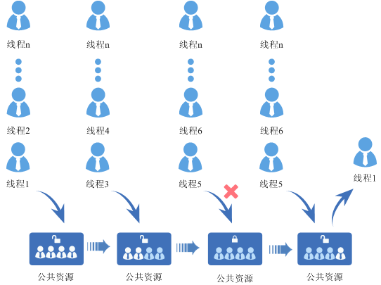

### Development Guidelines<a name="ZH-CN_TOPIC_0000002511794364"></a>

**Use Cases<a name="section61127176164034"></a>**

In a multitasking system, a semaphore is a very flexible synchronization method that can be used in a variety of scenarios to implement functions such as locking, synchronization, and resource counting. It can also be conveniently used for synchronization between tasks and between interrupts and tasks. Semaphores are commonly used to help a group of competing tasks access shared resources.

**Features<a name="section49492823145823"></a>**

The LiteOS semaphore module provides the following features for users. For details about the interfaces, see the API reference.

<a name="table42808011145823"></a>
<table><thead align="left"><tr id="row27710684145823"><th class="cellrowborder" valign="top" width="20.102010201020104%" id="mcps1.1.4.1.1"><p id="p29972955145823"><a name="p29972955145823"></a><a name="p29972955145823"></a>Function Category</p>
</th>
<th class="cellrowborder" valign="top" width="26.862686268626863%" id="mcps1.1.4.1.2"><p id="p11890286145823"><a name="p11890286145823"></a><a name="p11890286145823"></a>Interface Name</p>
</th>
<th class="cellrowborder" valign="top" width="53.03530353035304%" id="mcps1.1.4.1.3"><p id="p23589118145823"><a name="p23589118145823"></a><a name="p23589118145823"></a>Description</p>
</th>
</tr>
</thead>
<tbody><tr id="row31670386145823"><td class="cellrowborder" rowspan="3" valign="top" width="20.102010201020104%" headers="mcps1.1.4.1.1 "><p id="p15164467145823"><a name="p15164467145823"></a><a name="p15164467145823"></a>Create/Delete Semaphore</p>
</td>
<td class="cellrowborder" valign="top" width="26.862686268626863%" headers="mcps1.1.4.1.2 "><p id="p20362280145823"><a name="p20362280145823"></a><a name="p20362280145823"></a>LOS_SemCreate</p>
</td>
<td class="cellrowborder" valign="top" width="53.03530353035304%" headers="mcps1.1.4.1.3 "><p id="p38731961145823"><a name="p38731961145823"></a><a name="p38731961145823"></a>Create a semaphore and return the semaphore ID.</p>
</td>
</tr>
<tr id="row11854496016"><td class="cellrowborder" valign="top" headers="mcps1.1.4.1.1 "><p id="p1851149602"><a name="p1851149602"></a><a name="p1851149602"></a>LOS_BinarySemCreate</p>
</td>
<td class="cellrowborder" valign="top" headers="mcps1.1.4.1.2 "><p id="p108544917020"><a name="p108544917020"></a><a name="p108544917020"></a>Create a binary semaphore whose count value is at most 1.</p>
</td>
</tr>
<tr id="row13043336145823"><td class="cellrowborder" valign="top" headers="mcps1.1.4.1.1 "><p id="p161317214406"><a name="p161317214406"></a><a name="p161317214406"></a>LOS_SemDelete</p>
</td>
<td class="cellrowborder" valign="top" headers="mcps1.1.4.1.2 "><p id="p13531752145823"><a name="p13531752145823"></a><a name="p13531752145823"></a>Delete the specified semaphore.</p>
</td>
</tr>
<tr id="row54676905145823"><td class="cellrowborder" rowspan="2" valign="top" width="20.102010201020104%" headers="mcps1.1.4.1.1 "><p id="p66753213145823"><a name="p66753213145823"></a><a name="p66753213145823"></a>Request/Release Semaphore</p>
</td>
<td class="cellrowborder" valign="top" width="26.862686268626863%" headers="mcps1.1.4.1.2 "><p id="p29675167144037"><a name="p29675167144037"></a><a name="p29675167144037"></a>LOS_SemPend</p>
</td>
<td class="cellrowborder" valign="top" width="53.03530353035304%" headers="mcps1.1.4.1.3 "><p id="p15387322145823"><a name="p15387322145823"></a><a name="p15387322145823"></a>Request the specified semaphore and set the timeout.</p>
</td>
</tr>
<tr id="row4268172145823"><td class="cellrowborder" valign="top" headers="mcps1.1.4.1.1 "><p id="p33315591144148"><a name="p33315591144148"></a><a name="p33315591144148"></a>LOS_SemPost</p>
</td>
<td class="cellrowborder" valign="top" headers="mcps1.1.4.1.2 "><p id="p19085650145823"><a name="p19085650145823"></a><a name="p19085650145823"></a>Release the specified semaphore.</p>
</td>
</tr>
</tbody>
</table>

> **Note:** 
>There are three modes for requesting a semaphore: non-blocking mode, permanent blocking mode, and timed blocking mode.
>-   Non-blocking mode: When a task requests a semaphore with the input parameter timeout set to 0, the request succeeds if the current semaphore count is not 0; otherwise, the request fails immediately.
>-   Permanent blocking mode: When a task requests a semaphore with the input parameter timeout set to 0xFFFFFFFF, the request succeeds if the current semaphore count is not 0. Otherwise, the task enters the blocked state and the system switches to the ready task with the highest priority to continue execution. After the task enters the blocked state, it will not resume execution until another task releases the semaphore.
>-   Timed blocking mode: When a task requests a semaphore with 0 < timeout < 0xFFFFFFFF, the request succeeds if the current semaphore count is not 0. Otherwise, the task enters the blocked state and the system switches to the ready task with the highest priority to continue execution. After the task enters the blocked state, if another task releases the semaphore before the timeout expires, the task can successfully acquire the semaphore and continue execution. If the semaphore is not acquired before the timeout, the interface returns a timeout error code.

**Semaphore Error Codes<a name="section868101994847"></a>**

For operations that may fail, the corresponding error code is returned so that the cause of the error can be quickly identified.

<a name="table6015294495642"></a>
<table><thead align="left"><tr id="row2267197395642"><th class="cellrowborder" valign="top" width="5.65%" id="mcps1.1.6.1.1"><p id="p1908783195642"><a name="p1908783195642"></a><a name="p1908783195642"></a>No.</p>
</th>
<th class="cellrowborder" valign="top" width="21.19%" id="mcps1.1.6.1.2"><p id="p261046995642"><a name="p261046995642"></a><a name="p261046995642"></a>Definition</p>
</th>
<th class="cellrowborder" valign="top" width="13.05%" id="mcps1.1.6.1.3"><p id="p1012144095642"><a name="p1012144095642"></a><a name="p1012144095642"></a>Actual Value</p>
</th>
<th class="cellrowborder" valign="top" width="26.91%" id="mcps1.1.6.1.4"><p id="p1453028795642"><a name="p1453028795642"></a><a name="p1453028795642"></a>Description</p>
</th>
<th class="cellrowborder" valign="top" width="33.2%" id="mcps1.1.6.1.5"><p id="p2753561710026"><a name="p2753561710026"></a><a name="p2753561710026"></a>Reference Solution</p>
</th>
</tr>
</thead>
<tbody><tr id="row6366372295642"><td class="cellrowborder" valign="top" width="5.65%" headers="mcps1.1.6.1.1 "><p id="p5648782795642"><a name="p5648782795642"></a><a name="p5648782795642"></a>1</p>
</td>
<td class="cellrowborder" valign="top" width="21.19%" headers="mcps1.1.6.1.2 "><p id="p1211123695642"><a name="p1211123695642"></a><a name="p1211123695642"></a>LOS_ERRNO_SEM_NO_MEMORY</p>
</td>
<td class="cellrowborder" valign="top" width="13.05%" headers="mcps1.1.6.1.3 "><p id="p4148605495642"><a name="p4148605495642"></a><a name="p4148605495642"></a>0x02000700</p>
</td>
<td class="cellrowborder" valign="top" width="26.91%" headers="mcps1.1.6.1.4 "><p id="p492720095642"><a name="p492720095642"></a><a name="p492720095642"></a>Insufficient memory when initializing the semaphore.</p>
</td>
<td class="cellrowborder" valign="top" width="33.2%" headers="mcps1.1.6.1.5 "><p id="p145551278485"><a name="p145551278485"></a><a name="p145551278485"></a>Adjust OS_SYS_MEM_SIZE to ensure sufficient memory for semaphores, or reduce the maximum number of semaphores supported by the system, LOSCFG_BASE_IPC_SEM_LIMIT.</p>
</td>
</tr>
<tr id="row4434480695642"><td class="cellrowborder" valign="top" width="5.65%" headers="mcps1.1.6.1.1 "><p id="p3515954495642"><a name="p3515954495642"></a><a name="p3515954495642"></a>2</p>
</td>
<td class="cellrowborder" valign="top" width="21.19%" headers="mcps1.1.6.1.2 "><p id="p2935083995642"><a name="p2935083995642"></a><a name="p2935083995642"></a>LOS_ERRNO_SEM_INVALID</p>
</td>
<td class="cellrowborder" valign="top" width="13.05%" headers="mcps1.1.6.1.3 "><p id="p2860775495642"><a name="p2860775495642"></a><a name="p2860775495642"></a>0x02000701</p>
</td>
<td class="cellrowborder" valign="top" width="26.91%" headers="mcps1.1.6.1.4 "><p id="p3552674695642"><a name="p3552674695642"></a><a name="p3552674695642"></a>The semaphore ID is incorrect or the semaphore is not created.</p>
</td>
<td class="cellrowborder" valign="top" width="33.2%" headers="mcps1.1.6.1.5 "><p id="p412423410026"><a name="p412423410026"></a><a name="p412423410026"></a>Pass a correct semaphore ID or create the semaphore before using it.</p>
</td>
</tr>
<tr id="row5130526095642"><td class="cellrowborder" valign="top" width="5.65%" headers="mcps1.1.6.1.1 "><p id="p6208537795642"><a name="p6208537795642"></a><a name="p6208537795642"></a>3</p>
</td>
<td class="cellrowborder" valign="top" width="21.19%" headers="mcps1.1.6.1.2 "><p id="p6285965595642"><a name="p6285965595642"></a><a name="p6285965595642"></a>LOS_ERRNO_SEM_PTR_NULL</p>
</td>
<td class="cellrowborder" valign="top" width="13.05%" headers="mcps1.1.6.1.3 "><p id="p5846730195642"><a name="p5846730195642"></a><a name="p5846730195642"></a>0x02000702</p>
</td>
<td class="cellrowborder" valign="top" width="26.91%" headers="mcps1.1.6.1.4 "><p id="p3823098095642"><a name="p3823098095642"></a><a name="p3823098095642"></a>A null pointer is passed in.</p>
</td>
<td class="cellrowborder" valign="top" width="33.2%" headers="mcps1.1.6.1.5 "><p id="p6562756010026"><a name="p6562756010026"></a><a name="p6562756010026"></a>Pass a valid pointer.</p>
</td>
</tr>
<tr id="row853450895642"><td class="cellrowborder" valign="top" width="5.65%" headers="mcps1.1.6.1.1 "><p id="p2020651095642"><a name="p2020651095642"></a><a name="p2020651095642"></a>4</p>
</td>
<td class="cellrowborder" valign="top" width="21.19%" headers="mcps1.1.6.1.2 "><p id="p2611462995642"><a name="p2611462995642"></a><a name="p2611462995642"></a>LOS_ERRNO_SEM_ALL_BUSY</p>
</td>
<td class="cellrowborder" valign="top" width="13.05%" headers="mcps1.1.6.1.3 "><p id="p3491023395642"><a name="p3491023395642"></a><a name="p3491023395642"></a>0x02000703</p>
</td>
<td class="cellrowborder" valign="top" width="26.91%" headers="mcps1.1.6.1.4 "><p id="p915662595642"><a name="p915662595642"></a><a name="p915662595642"></a>When creating a semaphore, there are no unused semaphores in the system.</p>
</td>
<td class="cellrowborder" valign="top" width="33.2%" headers="mcps1.1.6.1.5 "><p id="p1423211810026"><a name="p1423211810026"></a><a name="p1423211810026"></a>Delete unused semaphores in a timely manner or increase the maximum number of semaphores supported by the system, LOSCFG_BASE_IPC_SEM_LIMIT.</p>
</td>
</tr>
<tr id="row1530076695642"><td class="cellrowborder" valign="top" width="5.65%" headers="mcps1.1.6.1.1 "><p id="p3140256895642"><a name="p3140256895642"></a><a name="p3140256895642"></a>5</p>
</td>
<td class="cellrowborder" valign="top" width="21.19%" headers="mcps1.1.6.1.2 "><p id="p6058010795642"><a name="p6058010795642"></a><a name="p6058010795642"></a>LOS_ERRNO_SEM_UNAVAILABLE</p>
</td>
<td class="cellrowborder" valign="top" width="13.05%" headers="mcps1.1.6.1.3 "><p id="p804161495642"><a name="p804161495642"></a><a name="p804161495642"></a>0x02000704</p>
</td>
<td class="cellrowborder" valign="top" width="26.91%" headers="mcps1.1.6.1.4 "><p id="p10819081152943"><a name="p10819081152943"></a><a name="p10819081152943"></a>The semaphore is not acquired in non-blocking mode.</p>
</td>
<td class="cellrowborder" valign="top" width="33.2%" headers="mcps1.1.6.1.5 "><p id="p42669253153017"><a name="p42669253153017"></a><a name="p42669253153017"></a>Choose blocking wait or handle the error appropriately based on the error code.</p>
</td>
</tr>
<tr id="row2386554195642"><td class="cellrowborder" valign="top" width="5.65%" headers="mcps1.1.6.1.1 "><p id="p5406070595642"><a name="p5406070595642"></a><a name="p5406070595642"></a>6</p>
</td>
<td class="cellrowborder" valign="top" width="21.19%" headers="mcps1.1.6.1.2 "><p id="p1684095295642"><a name="p1684095295642"></a><a name="p1684095295642"></a>LOS_ERRNO_SEM_PEND_INTERR</p>
</td>
<td class="cellrowborder" valign="top" width="13.05%" headers="mcps1.1.6.1.3 "><p id="p2193989295642"><a name="p2193989295642"></a><a name="p2193989295642"></a>0x02000705</p>
</td>
<td class="cellrowborder" valign="top" width="26.91%" headers="mcps1.1.6.1.4 "><p id="p63490793152953"><a name="p63490793152953"></a><a name="p63490793152953"></a>LOS_SemPend is illegally called to request a semaphore during an interrupt.</p>
</td>
<td class="cellrowborder" valign="top" width="33.2%" headers="mcps1.1.6.1.5 "><p id="p43375472153017"><a name="p43375472153017"></a><a name="p43375472153017"></a>Do not call LOS_SemPend during an interrupt.</p>
</td>
</tr>
<tr id="row2227229895642"><td class="cellrowborder" valign="top" width="5.65%" headers="mcps1.1.6.1.1 "><p id="p5922568095642"><a name="p5922568095642"></a><a name="p5922568095642"></a>7</p>
</td>
<td class="cellrowborder" valign="top" width="21.19%" headers="mcps1.1.6.1.2 "><p id="p3255077595642"><a name="p3255077595642"></a><a name="p3255077595642"></a>LOS_ERRNO_SEM_PEND_IN_LOCK</p>
</td>
<td class="cellrowborder" valign="top" width="13.05%" headers="mcps1.1.6.1.3 "><p id="p1936711095642"><a name="p1936711095642"></a><a name="p1936711095642"></a>0x02000706</p>
</td>
<td class="cellrowborder" valign="top" width="26.91%" headers="mcps1.1.6.1.4 "><p id="p52085876152953"><a name="p52085876152953"></a><a name="p52085876152953"></a>The task is locked and cannot acquire the semaphore.</p>
</td>
<td class="cellrowborder" valign="top" width="33.2%" headers="mcps1.1.6.1.5 "><p id="p36140674153017"><a name="p36140674153017"></a><a name="p36140674153017"></a>Do not call LOS_SemPend to request a semaphore while the task is locked.</p>
</td>
</tr>
<tr id="row43458669101114"><td class="cellrowborder" valign="top" width="5.65%" headers="mcps1.1.6.1.1 "><p id="p30491270101114"><a name="p30491270101114"></a><a name="p30491270101114"></a>8</p>
</td>
<td class="cellrowborder" valign="top" width="21.19%" headers="mcps1.1.6.1.2 "><p id="p53873767101114"><a name="p53873767101114"></a><a name="p53873767101114"></a>LOS_ERRNO_SEM_TIMEOUT</p>
</td>
<td class="cellrowborder" valign="top" width="13.05%" headers="mcps1.1.6.1.3 "><p id="p1699001101114"><a name="p1699001101114"></a><a name="p1699001101114"></a>0x02000707</p>
</td>
<td class="cellrowborder" valign="top" width="26.91%" headers="mcps1.1.6.1.4 "><p id="p28760934152953"><a name="p28760934152953"></a><a name="p28760934152953"></a>Timeout while acquiring the semaphore.</p>
</td>
<td class="cellrowborder" valign="top" width="33.2%" headers="mcps1.1.6.1.5 "><p id="p48623836153017"><a name="p48623836153017"></a><a name="p48623836153017"></a>Set the timeout to a reasonable value.</p>
</td>
</tr>
<tr id="row12143904101125"><td class="cellrowborder" valign="top" width="5.65%" headers="mcps1.1.6.1.1 "><p id="p44132204101125"><a name="p44132204101125"></a><a name="p44132204101125"></a>9</p>
</td>
<td class="cellrowborder" valign="top" width="21.19%" headers="mcps1.1.6.1.2 "><p id="p17938739101125"><a name="p17938739101125"></a><a name="p17938739101125"></a>LOS_ERRNO_SEM_OVERFLOW</p>
</td>
<td class="cellrowborder" valign="top" width="13.05%" headers="mcps1.1.6.1.3 "><p id="p43751775101125"><a name="p43751775101125"></a><a name="p43751775101125"></a>0x02000708</p>
</td>
<td class="cellrowborder" valign="top" width="26.91%" headers="mcps1.1.6.1.4 "><p id="p35771040152953"><a name="p35771040152953"></a><a name="p35771040152953"></a>The semaphore count has reached the maximum value and the semaphore cannot be released further.</p>
</td>
<td class="cellrowborder" valign="top" width="33.2%" headers="mcps1.1.6.1.5 "><p id="p7712100153017"><a name="p7712100153017"></a><a name="p7712100153017"></a>Handle the error appropriately based on the error code.</p>
</td>
</tr>
<tr id="row44185939101121"><td class="cellrowborder" valign="top" width="5.65%" headers="mcps1.1.6.1.1 "><p id="p22291345101121"><a name="p22291345101121"></a><a name="p22291345101121"></a>10</p>
</td>
<td class="cellrowborder" valign="top" width="21.19%" headers="mcps1.1.6.1.2 "><p id="p60768531101121"><a name="p60768531101121"></a><a name="p60768531101121"></a>LOS_ERRNO_SEM_PENDED</p>
</td>
<td class="cellrowborder" valign="top" width="13.05%" headers="mcps1.1.6.1.3 "><p id="p23304002101121"><a name="p23304002101121"></a><a name="p23304002101121"></a>0x02000709</p>
</td>
<td class="cellrowborder" valign="top" width="26.91%" headers="mcps1.1.6.1.4 "><p id="p52495624152953"><a name="p52495624152953"></a><a name="p52495624152953"></a>The queue of tasks waiting for the semaphore is not empty.</p>
</td>
<td class="cellrowborder" valign="top" width="33.2%" headers="mcps1.1.6.1.5 "><p id="p9449161153017"><a name="p9449161153017"></a><a name="p9449161153017"></a>Wake up all tasks waiting for the semaphore before deleting it.</p>
</td>
</tr>
</tbody>
</table>

> **Notice:** 
>For the definition of error codes, see "[Error Code Introduction](development_guide-17.md#section29852515161)". Bits 8 to 15 represent the module to which the error code belongs. The value 0x07 indicates the semaphore module.

**Development Process<a name="section486548315050"></a>**

The typical development process of a semaphore is as follows:

1.  Open the menu, enter the Kernel ---\> Enable Sem menu, and complete the configuration of the semaphore.

    <a name="table34659900162615"></a>
    <table><thead align="left"><tr id="row3414390162615"><th class="cellrowborder" valign="top" width="25.757424257574236%" id="mcps1.1.6.1.1"><p id="p8130151162615"><a name="p8130151162615"></a><a name="p8130151162615"></a>Configuration Item</p>
    </th>
    <th class="cellrowborder" valign="top" width="30.456954304569532%" id="mcps1.1.6.1.2"><p id="p54562526162615"><a name="p54562526162615"></a><a name="p54562526162615"></a>Meaning</p>
    </th>
    <th class="cellrowborder" valign="top" width="16.6983301669833%" id="mcps1.1.6.1.3"><p id="p57488448162615"><a name="p57488448162615"></a><a name="p57488448162615"></a>Value Range</p>
    </th>
    <th class="cellrowborder" valign="top" width="13.85861413858614%" id="mcps1.1.6.1.4"><p id="p26052727162615"><a name="p26052727162615"></a><a name="p26052727162615"></a>Default Value</p>
    </th>
    <th class="cellrowborder" valign="top" width="13.228677132286768%" id="mcps1.1.6.1.5"><p id="p29896171162615"><a name="p29896171162615"></a><a name="p29896171162615"></a>Dependency</p>
    </th>
    </tr>
    </thead>
    <tbody><tr id="row5670787162615"><td class="cellrowborder" valign="top" width="25.757424257574236%" headers="mcps1.1.6.1.1 "><p id="p56680616162615"><a name="p56680616162615"></a><a name="p56680616162615"></a>LOSCFG_BASE_IPC_SEM</p>
    </td>
    <td class="cellrowborder" valign="top" width="30.456954304569532%" headers="mcps1.1.6.1.2 "><p id="p27727169162615"><a name="p27727169162615"></a><a name="p27727169162615"></a>Switch for enabling or disabling the semaphore module</p>
    </td>
    <td class="cellrowborder" valign="top" width="16.6983301669833%" headers="mcps1.1.6.1.3 "><p id="p31308215162615"><a name="p31308215162615"></a><a name="p31308215162615"></a>YES/NO</p>
    </td>
    <td class="cellrowborder" valign="top" width="13.85861413858614%" headers="mcps1.1.6.1.4 "><p id="p52937457162615"><a name="p52937457162615"></a><a name="p52937457162615"></a>YES</p>
    </td>
    <td class="cellrowborder" valign="top" width="13.228677132286768%" headers="mcps1.1.6.1.5 "><p id="p60075607162615"><a name="p60075607162615"></a><a name="p60075607162615"></a>None</p>
    </td>
    </tr>
    <tr id="row3809559162615"><td class="cellrowborder" valign="top" width="25.757424257574236%" headers="mcps1.1.6.1.1 "><p id="p40138859162615"><a name="p40138859162615"></a><a name="p40138859162615"></a>LOSCFG_BASE_IPC_SEM_LIMIT</p>
    </td>
    <td class="cellrowborder" valign="top" width="30.456954304569532%" headers="mcps1.1.6.1.2 "><p id="p30022176162615"><a name="p30022176162615"></a><a name="p30022176162615"></a>Maximum number of semaphores supported by the system</p>
    </td>
    <td class="cellrowborder" valign="top" width="16.6983301669833%" headers="mcps1.1.6.1.3 "><p id="p15877214162615"><a name="p15877214162615"></a><a name="p15877214162615"></a>[0, 65535]</p>
    </td>
    <td class="cellrowborder" valign="top" width="13.85861413858614%" headers="mcps1.1.6.1.4 "><p id="p10985932162615"><a name="p10985932162615"></a><a name="p10985932162615"></a>1024</p>
    </td>
    <td class="cellrowborder" valign="top" width="13.228677132286768%" headers="mcps1.1.6.1.5 "><p id="p17445266162615"><a name="p17445266162615"></a><a name="p17445266162615"></a>None</p>
    </td>
    </tr>
    </tbody>
    </table>

2.  Create a semaphore using LOS\_SemCreate. To create a binary semaphore, call LOS\_BinarySemCreate.
3.  Request a semaphore using LOS\_SemPend.
4.  Release a semaphore using LOS\_SemPost.
5.  Delete a semaphore using LOS\_SemDelete.

**Platform Differences<a name="section28221686151840"></a>**

None.

### Precautions<a name="ZH-CN_TOPIC_0000002543394329"></a>

Because interrupts cannot be blocked, the blocking mode must not be used to request a semaphore in an interrupt.

### Programming Example<a name="ZH-CN_TOPIC_0000002511954346"></a>

**Example Description<a name="section1288182415417"></a>**

This example implements the following functions:

1.  The test task Example\_TaskEntry creates a semaphore, locks task scheduling, and creates two tasks, Example\_SemTask1 and Example\_SemTask2. The priority of Example\_SemTask2 is higher than that of Example\_SemTask1. Both tasks request the same semaphore. After task scheduling is unlocked, the two tasks block, and the test task Example\_TaskEntry releases the semaphore.
2.  Example\_SemTask2 acquires the semaphore and is scheduled, then the task sleeps for 20 ticks. Example\_SemTask2 is delayed, and Example\_SemTask1 is woken up.
3.  Example\_SemTask1 requests the semaphore in timed blocking mode with a wait time of 10 ticks. Because the semaphore is still held by Example\_SemTask2, Example\_SemTask1 is suspended. After 10 ticks, Example\_SemTask1 still has not acquired the semaphore, so it is woken up and attempts to request the semaphore in permanent blocking mode, suspending again.
4.  After 20 ticks, Example\_SemTask2 is woken up and releases the semaphore. Example\_SemTask1 acquires the semaphore, is scheduled to run, and finally releases the semaphore.
5.  After Example\_SemTask1 finishes execution and 40 ticks have passed, the task Example\_TaskEntry is woken up, deletes the semaphore, and deletes the two tasks.

**Sample Code<a name="section47263443154123"></a>**

Prerequisites: Complete the configuration of the semaphore in the menuconfig menu.

The code is as follows:

```
#include "los_sem.h"
#include "securec.h"

/* Task ID */
static UINT32 g_testTaskId01;
static UINT32 g_testTaskId02;
/* Priority of the test task */
#define TASK_PRIO_TEST  5
/* Semaphore structure ID */
static UINT32 g_semId;

VOID Example_SemTask1(VOID)
{
    UINT32 ret;

    printf("Example_SemTask1 try get sem g_semId ,timeout 10 ticks.\n");
    /* Request the semaphore in timed blocking mode. The timeout is 10 ticks */
    ret = LOS_SemPend(g_semId, 10);

    /* Semaphore acquired */
    if (ret == LOS_OK) {
         LOS_SemPost(g_semId);
         return;
    }
    /* Timeout elapsed, the semaphore is not acquired */
    if (ret == LOS_ERRNO_SEM_TIMEOUT) {
        printf("Example_SemTask1 timeout and try get sem g_semId wait forever.\n");
        /* Request the semaphore in permanent blocking mode */
        ret = LOS_SemPend(g_semId, LOS_WAIT_FOREVER);
        printf("Example_SemTask1 wait_forever and get sem g_semId .\n");
        if (ret == LOS_OK) {
            LOS_SemPost(g_semId);
            return;
        }
    }
}

VOID Example_SemTask2(VOID)
{
    UINT32 ret;
    printf("Example_SemTask2 try get sem g_semId wait forever.\n");
    /* Request the semaphore in permanent blocking mode */
    ret = LOS_SemPend(g_semId, LOS_WAIT_FOREVER);

    if (ret == LOS_OK) {
        printf("Example_SemTask2 get sem g_semId and then delay 20ticks .\n");
    }

    /* The task sleeps for 20 ticks */
    LOS_TaskDelay(20);

    printf("Example_SemTask2 post sem g_semId .\n");
    /* Release the semaphore */
    LOS_SemPost(g_semId);
    return;
}

UINT32 ExampleTaskEntry(VOID)
{
    UINT32 ret;
    TSK_INIT_PARAM_S task1;
    TSK_INIT_PARAM_S task2;

   /* Create a semaphore */
    LOS_SemCreate(0,&g_semId);

    /* Lock task scheduling */
    LOS_TaskLock();

    /* Create task 1 */
    (VOID)memset_s(&task1, sizeof(TSK_INIT_PARAM_S), 0, sizeof(TSK_INIT_PARAM_S));
    task1.pfnTaskEntry = (TSK_ENTRY_FUNC)Example_SemTask1;
    task1.pcName       = "TestTsk1";
    task1.uwStackSize  = OS_TSK_DEFAULT_STACK_SIZE;
    task1.usTaskPrio   = TASK_PRIO_TEST;
    ret = LOS_TaskCreate(&g_testTaskId01, &task1);
    if (ret != LOS_OK) {
        printf("task1 create failed .\n");
        return LOS_NOK;
    }

    /* Create task 2 */
    (VOID)memset_s(&task2, sizeof(TSK_INIT_PARAM_S), 0, sizeof(TSK_INIT_PARAM_S));
    task2.pfnTaskEntry = (TSK_ENTRY_FUNC)Example_SemTask2;
    task2.pcName       = "TestTsk2";
    task2.uwStackSize  = OS_TSK_DEFAULT_STACK_SIZE;
    task2.usTaskPrio   = (TASK_PRIO_TEST - 1);
    ret = LOS_TaskCreate(&g_testTaskId02, &task2);
    if (ret != LOS_OK) {
        printf("task2 create failed .\n");
        return LOS_NOK;
    }

    /* Unlock task scheduling */
    LOS_TaskUnlock();

    ret = LOS_SemPost(g_semId);

    /* The task sleeps for 40 ticks */
    LOS_TaskDelay(40);

    /* Delete the semaphore */
    LOS_SemDelete(g_semId);

    /* Delete task 1 */
    ret = LOS_TaskDelete(g_testTaskId01);
    if (ret != LOS_OK) {
        printf("task1 delete failed .\n");
        return LOS_NOK;
    }
    /* Delete task 2 */
    ret = LOS_TaskDelete(g_testTaskId02);
    if (ret != LOS_OK) {
        printf("task2 delete failed .\n");
        return LOS_NOK;
    }

    return LOS_OK;
}
```

**Result Verification<a name="section60141895113933"></a>**

The compilation and running results are as follows:

```
Example_SemTask2 try get sem g_semId wait forever.
Example_SemTask1 try get sem g_semId ,timeout 10 ticks.
Example_SemTask2 get sem g_semId and then delay 20ticks .
Example_SemTask1 timeout and try get sem g_semId wait forever.
Example_SemTask2 post sem g_semId .
Example_SemTask1 wait_forever and get sem g_semId .
```

## Read-Write Semaphore<a name="ZH-CN_TOPIC_0000002511954268"></a>


### Overview<a name="ZH-CN_TOPIC_0000002543394243"></a>

**Basic Concepts<a name="section310017301523"></a>**

A read-write semaphore (rwsem) functions similarly to a common semaphore and is often used for mutually exclusive access to shared resources and task synchronization. A read-write semaphore divides holders into readers and writers. If a holder needs to write to the shared resource protected by the semaphore, the holder is defined as a writer; if a holder only accesses the shared resource without modifying it, the holder is defined as a reader.

A read-write semaphore can have an unlimited number of readers at the same time, that is, readers are not mutually exclusive and can be concurrent. However, a read-write semaphore can have only one writer at a time. Writers are exclusive, so write-write operations are mutually exclusive and read-write operations are mutually exclusive.

**Working Principles<a name="section348137523"></a>**

Read-write semaphore control block:

```
typedef struct {
    UINT8       rwsemState;      /* In-use flag */
    INT16       rwsemCount;      /* Number of owners of the read-write semaphore */
    UINT32      rwsemId;         /* Read-write semaphore index */
    LOS_DL_LIST waitList;        /* Wait queue, used to record tasks blocked on this read-write semaphore */
} OsRwsemCB;
```

**Read-Write Semaphore Working Principles<a name="section18288946126"></a>**

-   Read-write semaphore resource initialization: Allocate memory for the configured N read-write semaphores (the value of N can be configured by the user through the LOSCFG\_BASE\_IPC\_RWSEM\_LIMIT macro), initialize all read-write semaphores as unused, and add them to the unused list for use by the system.
-   Create a read-write semaphore: Obtain a read-write semaphore from the unused list.
-   Request a read semaphore: If the semaphore is not held yet or is held by other readers, return success. Otherwise, the task blocks and waits for other tasks to release the semaphore. The waiting timeout can be set. When a task is blocked by a read-write semaphore, the task is attached to the tail of the read-write semaphore wait queue.
-   Request a write semaphore: If the semaphore is not held yet, return success. Otherwise, the task blocks and waits for other tasks to release the semaphore. The waiting timeout can be set. When a task is blocked by a read-write semaphore, the task is attached to the tail of the read-write semaphore wait queue.
-   Release a read semaphore: If no task is waiting for the read-write semaphore, return directly. When the semaphore is in the read state, the task at the head of the wait queue can only be a writer. Wake up this writer and return.
-   Release a write semaphore: If no task is waiting for the read-write semaphore, return directly. If the task at the head of the wait queue is a writer, wake up this writer and return. If the task at the head of the wait queue is a reader, wake up this reader and the consecutive readers behind it until the wait queue is empty or a writer is encountered.
-   Downgrade a write semaphore to a read semaphore: The semaphore is changed to a read semaphore. If no task is waiting for the read-write semaphore or the task at the head of the wait queue is a writer, return directly. Otherwise, wake up the reader at the head of the wait queue and the consecutive readers behind it until the wait queue is empty or a writer is encountered.
-   Delete a read-write semaphore: Set the read-write semaphore in use to the unused state and attach it back to the unused list.

    > **Note:** 
    >A read-write semaphore allows multiple tasks to access shared resources at the same time, but only one task can modify the shared resources at a time. In scenarios where there are more read tasks than write tasks, this can effectively improve the overall system performance.

### Development Guidelines<a name="ZH-CN_TOPIC_0000002543394173"></a>

**Use Cases<a name="section114035201319"></a>**

A read-write semaphore is a multitasking synchronization and mutual exclusion mechanism optimized based on common semaphores. It can be used in a variety of scenarios to implement functions such as locking, synchronization, and resource counting, and can also be conveniently used for synchronization between tasks. It is suitable for scenarios where there are more read tasks than write tasks.

**Features<a name="section98336261439"></a>**

The LiteOS read-write semaphore module provides the following features for users. For details about the interfaces, see the API reference.

<a name="table03581826517"></a>
<table><thead align="left"><tr id="row33581923516"><th class="cellrowborder" valign="top" width="22.38223822382238%" id="mcps1.1.4.1.1"><p id="p11358221651"><a name="p11358221651"></a><a name="p11358221651"></a>Function Category</p>
</th>
<th class="cellrowborder" valign="top" width="28.572857285728574%" id="mcps1.1.4.1.2"><p id="p143589214512"><a name="p143589214512"></a><a name="p143589214512"></a>Interface Name</p>
</th>
<th class="cellrowborder" valign="top" width="49.04490449044904%" id="mcps1.1.4.1.3"><p id="p133585211513"><a name="p133585211513"></a><a name="p133585211513"></a>Description</p>
</th>
</tr>
</thead>
<tbody><tr id="row15358421458"><td class="cellrowborder" rowspan="2" valign="top" width="22.38223822382238%" headers="mcps1.1.4.1.1 "><p id="p9358628520"><a name="p9358628520"></a><a name="p9358628520"></a>Create/Delete Read-Write Semaphore</p>
<p id="p12358222511"><a name="p12358222511"></a><a name="p12358222511"></a></p>
</td>
<td class="cellrowborder" valign="top" width="28.572857285728574%" headers="mcps1.1.4.1.2 "><p id="p63581721256"><a name="p63581721256"></a><a name="p63581721256"></a>LOS_RwsemCreate</p>
</td>
<td class="cellrowborder" valign="top" width="49.04490449044904%" headers="mcps1.1.4.1.3 "><p id="p93581321652"><a name="p93581321652"></a><a name="p93581321652"></a>Create a read-write semaphore and return the read-write semaphore ID.</p>
</td>
</tr>
<tr id="row635817216519"><td class="cellrowborder" valign="top" headers="mcps1.1.4.1.1 "><p id="p2035813214512"><a name="p2035813214512"></a><a name="p2035813214512"></a>LOS_RwsemDelete</p>
</td>
<td class="cellrowborder" valign="top" headers="mcps1.1.4.1.2 "><p id="p15358172354"><a name="p15358172354"></a><a name="p15358172354"></a>Delete the specified read-write semaphore.</p>
</td>
</tr>
<tr id="row935810212513"><td class="cellrowborder" rowspan="5" valign="top" width="22.38223822382238%" headers="mcps1.1.4.1.1 "><p id="p104715451112"><a name="p104715451112"></a><a name="p104715451112"></a>Request/Release Read-Write Semaphore</p>
</td>
<td class="cellrowborder" valign="top" width="28.572857285728574%" headers="mcps1.1.4.1.2 "><p id="p1435816218513"><a name="p1435816218513"></a><a name="p1435816218513"></a>LOS_RwsemPendRead</p>
</td>
<td class="cellrowborder" valign="top" width="49.04490449044904%" headers="mcps1.1.4.1.3 "><p id="p173583219512"><a name="p173583219512"></a><a name="p173583219512"></a>Request the specified read-write semaphore as a read semaphore. A timeout wait is supported.</p>
</td>
</tr>
<tr id="row1835817210514"><td class="cellrowborder" valign="top" headers="mcps1.1.4.1.1 "><p id="p63581825515"><a name="p63581825515"></a><a name="p63581825515"></a>LOS_RwsemPostRead</p>
</td>
<td class="cellrowborder" valign="top" headers="mcps1.1.4.1.2 "><p id="p17358182458"><a name="p17358182458"></a><a name="p17358182458"></a>Release the specified read semaphore.</p>
</td>
</tr>
<tr id="row186612161987"><td class="cellrowborder" valign="top" headers="mcps1.1.4.1.1 "><p id="p866121612819"><a name="p866121612819"></a><a name="p866121612819"></a>LOS_RwsemPendWrite</p>
</td>
<td class="cellrowborder" valign="top" headers="mcps1.1.4.1.2 "><p id="p5661616683"><a name="p5661616683"></a><a name="p5661616683"></a>Request the specified read-write semaphore as a write semaphore. A timeout wait is supported.</p>
</td>
</tr>
<tr id="row1841622018814"><td class="cellrowborder" valign="top" headers="mcps1.1.4.1.1 "><p id="p34169201589"><a name="p34169201589"></a><a name="p34169201589"></a>LOS_RwsemPostWrite</p>
</td>
<td class="cellrowborder" valign="top" headers="mcps1.1.4.1.2 "><p id="p12416192017813"><a name="p12416192017813"></a><a name="p12416192017813"></a>Release the specified write semaphore.</p>
</td>
</tr>
<tr id="row1937116592917"><td class="cellrowborder" valign="top" headers="mcps1.1.4.1.1 "><p id="p03713595918"><a name="p03713595918"></a><a name="p03713595918"></a>LOS_RwsemDowngradeWrite</p>
</td>
<td class="cellrowborder" valign="top" headers="mcps1.1.4.1.2 "><p id="p13371135910916"><a name="p13371135910916"></a><a name="p13371135910916"></a>Downgrade the specified write semaphore to a read semaphore.</p>
</td>
</tr>
</tbody>
</table>

> **Note:** 
>A read-write semaphore supports three request modes: non-blocking mode, permanent blocking mode, and timed blocking mode.
>-   Non-blocking mode: When a task requests a read-write semaphore with the input parameter timeout set to 0, the request succeeds if the read-write semaphore is available; otherwise, the request fails immediately.
>-   Permanent blocking mode: When a task requests a read-write semaphore with the input parameter timeout set to 0xFFFFFFFF, the request succeeds if the read-write semaphore is available. Otherwise, the task enters the blocked state and the system switches to the ready task with the highest priority to continue execution. After the task enters the blocked state, it will not resume execution until another task releases the read-write semaphore and makes it available again.
>-   Timed blocking mode: When a task requests a read-write semaphore with 0 < timeout < 0xFFFFFFFF, the request succeeds if the read-write semaphore is available. Otherwise, the task enters the blocked state and the system switches to the ready task with the highest priority to continue execution. After the task enters the blocked state, if another task releases the semaphore before the timeout expires and makes the read-write semaphore available again, the task can successfully acquire the read-write semaphore and continue execution. If the read-write semaphore is not acquired before the timeout, the interface returns a timeout error code.

**Read-Write Semaphore Error Codes<a name="section511418333317"></a>**

For operations that may fail, the operating system returns the corresponding error code so that the cause of the error can be quickly identified.

<a name="table206421660270"></a>
<table><thead align="left"><tr id="row10643106122719"><th class="cellrowborder" valign="top" width="5.84%" id="mcps1.1.6.1.1"><p id="p36438617278"><a name="p36438617278"></a><a name="p36438617278"></a>No.</p>
</th>
<th class="cellrowborder" valign="top" width="20.16%" id="mcps1.1.6.1.2"><p id="p26431613272"><a name="p26431613272"></a><a name="p26431613272"></a>Definition</p>
</th>
<th class="cellrowborder" valign="top" width="9.21%" id="mcps1.1.6.1.3"><p id="p86433672716"><a name="p86433672716"></a><a name="p86433672716"></a>Actual Value</p>
</th>
<th class="cellrowborder" valign="top" width="31.630000000000003%" id="mcps1.1.6.1.4"><p id="p1764376142713"><a name="p1764376142713"></a><a name="p1764376142713"></a>Description</p>
</th>
<th class="cellrowborder" valign="top" width="33.160000000000004%" id="mcps1.1.6.1.5"><p id="p1764326202718"><a name="p1764326202718"></a><a name="p1764326202718"></a>Reference Solution</p>
</th>
</tr>
</thead>
<tbody><tr id="row5643264273"><td class="cellrowborder" valign="top" width="5.84%" headers="mcps1.1.6.1.1 "><p id="p4643664275"><a name="p4643664275"></a><a name="p4643664275"></a>1</p>
</td>
<td class="cellrowborder" valign="top" width="20.16%" headers="mcps1.1.6.1.2 "><p id="p136434652717"><a name="p136434652717"></a><a name="p136434652717"></a>LOS_ERRNO_RWSEM_INVALID</p>
</td>
<td class="cellrowborder" valign="top" width="9.21%" headers="mcps1.1.6.1.3 "><p id="p964346122710"><a name="p964346122710"></a><a name="p964346122710"></a>0x02002200</p>
</td>
<td class="cellrowborder" valign="top" width="31.630000000000003%" headers="mcps1.1.6.1.4 "><p id="p1643206122714"><a name="p1643206122714"></a><a name="p1643206122714"></a>The read-write semaphore ID is incorrect or the read-write semaphore is not created.</p>
</td>
<td class="cellrowborder" valign="top" width="33.160000000000004%" headers="mcps1.1.6.1.5 "><p id="p15643136162718"><a name="p15643136162718"></a><a name="p15643136162718"></a>Pass a correct read-write semaphore ID or create the read-write semaphore before using it.</p>
</td>
</tr>
<tr id="row116432620275"><td class="cellrowborder" valign="top" width="5.84%" headers="mcps1.1.6.1.1 "><p id="p56438652720"><a name="p56438652720"></a><a name="p56438652720"></a>2</p>
</td>
<td class="cellrowborder" valign="top" width="20.16%" headers="mcps1.1.6.1.2 "><p id="p20643106172714"><a name="p20643106172714"></a><a name="p20643106172714"></a>LOS_ERRNO_RWSEM_PTR_NULL</p>
</td>
<td class="cellrowborder" valign="top" width="9.21%" headers="mcps1.1.6.1.3 "><p id="p1764313613275"><a name="p1764313613275"></a><a name="p1764313613275"></a>0x02002201</p>
</td>
<td class="cellrowborder" valign="top" width="31.630000000000003%" headers="mcps1.1.6.1.4 "><p id="p76436612274"><a name="p76436612274"></a><a name="p76436612274"></a>A null pointer is passed in.</p>
</td>
<td class="cellrowborder" valign="top" width="33.160000000000004%" headers="mcps1.1.6.1.5 "><p id="p156438662715"><a name="p156438662715"></a><a name="p156438662715"></a>Pass a valid pointer.</p>
</td>
</tr>
<tr id="row7643106102717"><td class="cellrowborder" valign="top" width="5.84%" headers="mcps1.1.6.1.1 "><p id="p106430632717"><a name="p106430632717"></a><a name="p106430632717"></a>3</p>
</td>
<td class="cellrowborder" valign="top" width="20.16%" headers="mcps1.1.6.1.2 "><p id="p664311672717"><a name="p664311672717"></a><a name="p664311672717"></a>LOS_ERRNO_RWSEM_ALL_BUSY</p>
</td>
<td class="cellrowborder" valign="top" width="9.21%" headers="mcps1.1.6.1.3 "><p id="p26434612272"><a name="p26434612272"></a><a name="p26434612272"></a>0x02002202</p>
</td>
<td class="cellrowborder" valign="top" width="31.630000000000003%" headers="mcps1.1.6.1.4 "><p id="p46431602711"><a name="p46431602711"></a><a name="p46431602711"></a>When creating a read-write semaphore, there are no unused read-write semaphores in the system.</p>
</td>
<td class="cellrowborder" valign="top" width="33.160000000000004%" headers="mcps1.1.6.1.5 "><p id="p0643196172719"><a name="p0643196172719"></a><a name="p0643196172719"></a>Delete unused read-write semaphores in a timely manner or increase the maximum number of read-write semaphores supported by the system, LOSCFG_BASE_IPC_RWSEM_LIMIT.</p>
</td>
</tr>
<tr id="row2064313632718"><td class="cellrowborder" valign="top" width="5.84%" headers="mcps1.1.6.1.1 "><p id="p6643116142717"><a name="p6643116142717"></a><a name="p6643116142717"></a>4</p>
</td>
<td class="cellrowborder" valign="top" width="20.16%" headers="mcps1.1.6.1.2 "><p id="p1164396132717"><a name="p1164396132717"></a><a name="p1164396132717"></a>LOS_ERRNO_RWSEM_PEND_INTERR</p>
</td>
<td class="cellrowborder" valign="top" width="9.21%" headers="mcps1.1.6.1.3 "><p id="p176433616276"><a name="p176433616276"></a><a name="p176433616276"></a>0x02002203</p>
</td>
<td class="cellrowborder" valign="top" width="31.630000000000003%" headers="mcps1.1.6.1.4 "><p id="p164318610273"><a name="p164318610273"></a><a name="p164318610273"></a>APIs are illegally called during an interrupt, for example, requesting a read-write semaphore in a blocking manner.</p>
</td>
<td class="cellrowborder" valign="top" width="33.160000000000004%" headers="mcps1.1.6.1.5 "><p id="p66432652712"><a name="p66432652712"></a><a name="p66432652712"></a>Call APIs properly and do not acquire a read-write semaphore in a blocking manner during an interrupt.</p>
</td>
</tr>
<tr id="row1423612506300"><td class="cellrowborder" valign="top" width="5.84%" headers="mcps1.1.6.1.1 "><p id="p15237105023011"><a name="p15237105023011"></a><a name="p15237105023011"></a>5</p>
</td>
<td class="cellrowborder" valign="top" width="20.16%" headers="mcps1.1.6.1.2 "><p id="p1923711509308"><a name="p1923711509308"></a><a name="p1923711509308"></a>LOS_ERRNO_RWSEM_PEND_IN_LOCK</p>
</td>
<td class="cellrowborder" valign="top" width="9.21%" headers="mcps1.1.6.1.3 "><p id="p17237195011307"><a name="p17237195011307"></a><a name="p17237195011307"></a>0x02002204</p>
</td>
<td class="cellrowborder" valign="top" width="31.630000000000003%" headers="mcps1.1.6.1.4 "><p id="p3237350193013"><a name="p3237350193013"></a><a name="p3237350193013"></a>The task is locked and cannot acquire the read-write semaphore.</p>
</td>
<td class="cellrowborder" valign="top" width="33.160000000000004%" headers="mcps1.1.6.1.5 "><p id="p1723735010302"><a name="p1723735010302"></a><a name="p1723735010302"></a>Do not call APIs to acquire a read-write semaphore while the task is locked.</p>
</td>
</tr>
<tr id="row1851322183119"><td class="cellrowborder" valign="top" width="5.84%" headers="mcps1.1.6.1.1 "><p id="p85131211318"><a name="p85131211318"></a><a name="p85131211318"></a>6</p>
</td>
<td class="cellrowborder" valign="top" width="20.16%" headers="mcps1.1.6.1.2 "><p id="p4513142163113"><a name="p4513142163113"></a><a name="p4513142163113"></a>LOS_ERRNO_RWSEM_TIMEOUT</p>
</td>
<td class="cellrowborder" valign="top" width="9.21%" headers="mcps1.1.6.1.3 "><p id="p1551315263116"><a name="p1551315263116"></a><a name="p1551315263116"></a>0x02002205</p>
</td>
<td class="cellrowborder" valign="top" width="31.630000000000003%" headers="mcps1.1.6.1.4 "><p id="p45134215316"><a name="p45134215316"></a><a name="p45134215316"></a>Timeout while acquiring the read-write semaphore.</p>
</td>
<td class="cellrowborder" valign="top" width="33.160000000000004%" headers="mcps1.1.6.1.5 "><p id="p751362193112"><a name="p751362193112"></a><a name="p751362193112"></a>Set the timeout to a reasonable value.</p>
</td>
</tr>
<tr id="row22851618153111"><td class="cellrowborder" valign="top" width="5.84%" headers="mcps1.1.6.1.1 "><p id="p42851718143112"><a name="p42851718143112"></a><a name="p42851718143112"></a>7</p>
</td>
<td class="cellrowborder" valign="top" width="20.16%" headers="mcps1.1.6.1.2 "><p id="p028581863115"><a name="p028581863115"></a><a name="p028581863115"></a>LOS_ERRNO_RWSEM_PENDED</p>
</td>
<td class="cellrowborder" valign="top" width="9.21%" headers="mcps1.1.6.1.3 "><p id="p1128531883118"><a name="p1128531883118"></a><a name="p1128531883118"></a>0x02002206</p>
</td>
<td class="cellrowborder" valign="top" width="31.630000000000003%" headers="mcps1.1.6.1.4 "><p id="p0285111810310"><a name="p0285111810310"></a><a name="p0285111810310"></a>The queue of tasks waiting for the read-write semaphore is not empty.</p>
</td>
<td class="cellrowborder" valign="top" width="33.160000000000004%" headers="mcps1.1.6.1.5 "><p id="p62851118103115"><a name="p62851118103115"></a><a name="p62851118103115"></a>Wake up all tasks waiting for the read-write semaphore before deleting it.</p>
</td>
</tr>
<tr id="row817683415313"><td class="cellrowborder" valign="top" width="5.84%" headers="mcps1.1.6.1.1 "><p id="p18176133453115"><a name="p18176133453115"></a><a name="p18176133453115"></a>8</p>
</td>
<td class="cellrowborder" valign="top" width="20.16%" headers="mcps1.1.6.1.2 "><p id="p517619345316"><a name="p517619345316"></a><a name="p517619345316"></a>LOS_ERRNO_RWSEM_INVALID_STATUS</p>
</td>
<td class="cellrowborder" valign="top" width="9.21%" headers="mcps1.1.6.1.3 "><p id="p15176163416319"><a name="p15176163416319"></a><a name="p15176163416319"></a>0x02002207</p>
</td>
<td class="cellrowborder" valign="top" width="31.630000000000003%" headers="mcps1.1.6.1.4 "><p id="p21761834123118"><a name="p21761834123118"></a><a name="p21761834123118"></a>When releasing or downgrading the read-write semaphore, the semaphore state is incorrect.</p>
</td>
<td class="cellrowborder" valign="top" width="33.160000000000004%" headers="mcps1.1.6.1.5 "><p id="p13176134183115"><a name="p13176134183115"></a><a name="p13176134183115"></a>Release and downgrade the read-write semaphore correctly.</p>
</td>
</tr>
<tr id="row744124583116"><td class="cellrowborder" valign="top" width="5.84%" headers="mcps1.1.6.1.1 "><p id="p544213451319"><a name="p544213451319"></a><a name="p544213451319"></a>9</p>
</td>
<td class="cellrowborder" valign="top" width="20.16%" headers="mcps1.1.6.1.2 "><p id="p1444224510315"><a name="p1444224510315"></a><a name="p1444224510315"></a>LOS_ERRNO_RWSEM_UNAVAILABLE</p>
</td>
<td class="cellrowborder" valign="top" width="9.21%" headers="mcps1.1.6.1.3 "><p id="p14442124517315"><a name="p14442124517315"></a><a name="p14442124517315"></a>0x02002208</p>
</td>
<td class="cellrowborder" valign="top" width="31.630000000000003%" headers="mcps1.1.6.1.4 "><p id="p944284512314"><a name="p944284512314"></a><a name="p944284512314"></a>The read-write semaphore is not acquired in non-blocking mode.</p>
</td>
<td class="cellrowborder" valign="top" width="33.160000000000004%" headers="mcps1.1.6.1.5 "><p id="p3442645113117"><a name="p3442645113117"></a><a name="p3442645113117"></a>Choose blocking wait or handle the error appropriately based on the error code.</p>
</td>
</tr>
</tbody>
</table>

> **Notice:** 
>For the definition of error codes, see "[Error Code Introduction](development_guide-17.md#section29852515161)". Bits 8 to 15 represent the module to which the error code belongs. The value 0x22 indicates the semaphore module.

**Development Process<a name="section11442163912318"></a>**

The typical development process of a read-write semaphore is as follows:

1.  Open the menu, enter the Kernel ---\> Enable Rwsem menu, and complete the configuration of the read-write semaphore.

    <a name="table13597832204619"></a>
    <table><thead align="left"><tr id="row9598132154620"><th class="cellrowborder" valign="top" width="24.59%" id="mcps1.1.6.1.1"><p id="p20598173211462"><a name="p20598173211462"></a><a name="p20598173211462"></a>Configuration Item</p>
    </th>
    <th class="cellrowborder" valign="top" width="20.630000000000003%" id="mcps1.1.6.1.2"><p id="p5598103224620"><a name="p5598103224620"></a><a name="p5598103224620"></a>Meaning</p>
    </th>
    <th class="cellrowborder" valign="top" width="14.78%" id="mcps1.1.6.1.3"><p id="p65981321463"><a name="p65981321463"></a><a name="p65981321463"></a>Value Range</p>
    </th>
    <th class="cellrowborder" valign="top" width="20%" id="mcps1.1.6.1.4"><p id="p13598113210461"><a name="p13598113210461"></a><a name="p13598113210461"></a>Default Value</p>
    </th>
    <th class="cellrowborder" valign="top" width="20%" id="mcps1.1.6.1.5"><p id="p165985323461"><a name="p165985323461"></a><a name="p165985323461"></a>Dependency</p>
    </th>
    </tr>
    </thead>
    <tbody><tr id="row1259853219463"><td class="cellrowborder" valign="top" width="24.59%" headers="mcps1.1.6.1.1 "><p id="p20598832144613"><a name="p20598832144613"></a><a name="p20598832144613"></a>LOSCFG_BASE_IPC_RWSEM</p>
    </td>
    <td class="cellrowborder" valign="top" width="20.630000000000003%" headers="mcps1.1.6.1.2 "><p id="p20598193218462"><a name="p20598193218462"></a><a name="p20598193218462"></a>Switch for enabling or disabling the read-write semaphore module</p>
    </td>
    <td class="cellrowborder" valign="top" width="14.78%" headers="mcps1.1.6.1.3 "><p id="p1859843214614"><a name="p1859843214614"></a><a name="p1859843214614"></a>YES/NO</p>
    </td>
    <td class="cellrowborder" valign="top" width="20%" headers="mcps1.1.6.1.4 "><p id="p1959820325464"><a name="p1959820325464"></a><a name="p1959820325464"></a>YES</p>
    </td>
    <td class="cellrowborder" valign="top" width="20%" headers="mcps1.1.6.1.5 "><p id="p1159810321462"><a name="p1159810321462"></a><a name="p1159810321462"></a>None</p>
    </td>
    </tr>
    <tr id="row2598432164614"><td class="cellrowborder" valign="top" width="24.59%" headers="mcps1.1.6.1.1 "><p id="p8598143294615"><a name="p8598143294615"></a><a name="p8598143294615"></a>LOSCFG_BASE_IPC_RWSEM_LIMIT</p>
    </td>
    <td class="cellrowborder" valign="top" width="20.630000000000003%" headers="mcps1.1.6.1.2 "><p id="p1759853294611"><a name="p1759853294611"></a><a name="p1759853294611"></a>Maximum number of read-write semaphores supported by the system</p>
    </td>
    <td class="cellrowborder" valign="top" width="14.78%" headers="mcps1.1.6.1.3 "><p id="p1459883204619"><a name="p1459883204619"></a><a name="p1459883204619"></a>[0, 65535]</p>
    </td>
    <td class="cellrowborder" valign="top" width="20%" headers="mcps1.1.6.1.4 "><p id="p125981532144614"><a name="p125981532144614"></a><a name="p125981532144614"></a>1024</p>
    </td>
    <td class="cellrowborder" valign="top" width="20%" headers="mcps1.1.6.1.5 "><p id="p75981932204618"><a name="p75981932204618"></a><a name="p75981932204618"></a>LOSCFG_BASE_IPC_RWSEM</p>
    </td>
    </tr>
    </tbody>
    </table>

2.  Create a read-write semaphore using LOS\_RwsemCreate.
3.  Request a read semaphore using LOS\_RwsemPendRead.
4.  Release a read semaphore using LOS\_RwsemPostRead.
5.  Delete a read-write semaphore using LOS\_RwsemDelete.

**Platform Differences<a name="section481710455319"></a>**

None.

### Precautions<a name="ZH-CN_TOPIC_0000002511954458"></a>

Because interrupts cannot be blocked, the blocking mode must not be used to request a read-write semaphore in an interrupt.

### Programming Example<a name="ZH-CN_TOPIC_0000002511794374"></a>

**Example Description<a name="section46667411846"></a>**

This example implements the following functions:

1.  The test task ExampleTaskEntry creates a read-write semaphore and requests the write semaphore, locks task scheduling, and creates three tasks: ExampleReadTask1, ExampleReadTask2, and ExampleWriteTask2. ExampleReadTask1 and ExampleReadTask2 have higher priorities than ExampleWriteTask2 and request the read semaphore. ExampleWriteTask2 requests the write semaphore.
2.  After ExampleTaskEntry unlocks task scheduling, ExampleReadTask1 and ExampleReadTask2 fail to acquire the read semaphore and block permanently. ExampleWriteTask2 fails to acquire the write semaphore after waiting for 1 tick and switches to permanent blocking to wait for the write semaphore.
3.  ExampleTaskEntry downgrades the write semaphore to a read semaphore. ExampleReadTask1 and ExampleReadTask2 successfully acquire the read semaphore, and ExampleWriteTask2 remains blocked.
4.  After ExampleReadTask1, ExampleReadTask2, and ExampleTaskEntry release the read semaphore, ExampleWriteTask2 successfully acquires the write semaphore.
5.  ExampleWriteTask2 releases the write semaphore.

**Sample Code<a name="section195581247182018"></a>**

Prerequisites: Complete the configuration of the read-write semaphore in the menuconfig menu.

The code is as follows:

```
#include "los_rwsem.h"
#include "securec.h"

static UINT32 g_rwsemId; /* Read-write semaphore structure ID */

VOID ExampleReadTask1(VOID)
{
    UINT32 ret;

    /* Timeout elapsed, the read semaphore is not acquired */
    printf("[ExampleReadTask1] try get rwsem as read, wait forever.\n");
    /* Request the read semaphore in permanent blocking mode */
    ret = LOS_RwsemPendRead(g_rwsemId, LOS_WAIT_FOREVER);
    if (ret == LOS_OK) {
        printf("[ExampleReadTask1] get rwsem success.\n");
        LOS_TaskDelay(3);
        printf("[ExampleReadTask1] post rwsem.\n");
        LOS_RwsemPostRead(g_rwsemId);
        return;
    }
}

VOID ExampleReadTask2(VOID)
{
    UINT32 ret;

    /* Timeout elapsed, the read semaphore is not acquired */
    printf("[ExampleReadTask2] try get rwsem as read, wait forever.\n");
    /* Request the read semaphore in permanent blocking mode */
    ret = LOS_RwsemPendRead(g_rwsemId, LOS_WAIT_FOREVER);
    if (ret == LOS_OK) {
        printf("[ExampleReadTask2] get rwsem success.\n");
        LOS_TaskDelay(3);
        printf("[ExampleReadTask2] post rwsem.\n");
        LOS_RwsemPostRead(g_rwsemId);
        return;
    }
}

VOID ExampleWriteTask2(VOID)
{
    UINT32 ret;

    printf("[ExampleWriteTask2] try get rwsem as write, timeout 1 tick.\n");
    /* Request the write semaphore in timed blocking mode. The timeout is 1 tick */
    ret = LOS_RwsemPendWrite(g_rwsemId, 1);

    /* Write semaphore acquired */
    if (ret == LOS_OK) {
         LOS_RwsemPostWrite(g_rwsemId);
         return;
    }
    /* Timeout elapsed, the write semaphore is not acquired */
    if (ret == LOS_ERRNO_RWSEM_TIMEOUT) {
        printf("[ExampleWriteTask2] timeout and try get rwsem as write, wait forever.\n");
        /* Request the write semaphore in permanent blocking mode */
        ret = LOS_RwsemPendWrite(g_rwsemId, LOS_WAIT_FOREVER);
        if (ret == LOS_OK) {
            printf("[ExampleWriteTask2] get rwsem success.\n");
            LOS_TaskDelay(3);
            printf("[ExampleWriteTask2] post rwsem.\n");
            LOS_RwsemPostWrite(g_rwsemId);
            return;
        }
    }
    return;
}

static VOID InitTaskParam(TSK_INIT_PARAM_S *task, char *taskName, TSK_ENTRY_FUNC entry, UINT16 prio, UINT16 affi)
{
    task->pcName        = taskName;
    task->pfnTaskEntry  = entry;
    task->usTaskPrio    = prio;
    task->uwStackSize   = LOSCFG_BASE_CORE_TSK_DEFAULT_STACK_SIZE;
    task->uwResved      = LOS_TASK_STATUS_DETACHED;

#ifdef LOSCFG_KERNEL_SMP
    task->usCpuAffiMask = affi;
#endif
}

UINT32 ExampleTaskEntry(VOID)
{
    UINT32 ret;
    UINT32 readTsk1Id, readTsk2Id, writeTsk2Id;
    TSK_INIT_PARAM_S readTask1 = {0};
    TSK_INIT_PARAM_S readTask2 = {0};
    TSK_INIT_PARAM_S writeTask2 = {0};

   /* Create a read-write semaphore */
    ret = LOS_RwsemCreate(&g_rwsemId);
    if (ret != LOS_OK) {
        printf("[ExampleTaskEntry] create rwsem failed.\n");
        return LOS_NOK;
    }

    ret = LOS_RwsemPendWrite(g_rwsemId, 0);
    if (ret != LOS_OK) {
        printf("[ExampleTaskEntry] get rwsem failed.\n");
        return LOS_NOK;
    }
    printf("[ExampleTaskEntry] get rwsem success.\n");

    /* Lock task scheduling */
    LOS_TaskLock();

    /* Create read task 1 */
    InitTaskParam(&readTask1, "resemReadTsk1", (TSK_ENTRY_FUNC)ExampleReadTask1, 5, CPUID_TO_AFFI_MASK(ArchCurrCpuid()));
    ret = LOS_TaskCreate(&readTsk1Id, &readTask1);
    if (ret != LOS_OK) {
        printf("[ExampleTaskEntry] readTask1 create failed.\n");
        return LOS_NOK;
    }

    /* Create read task 2 */
    InitTaskParam(&readTask2, "resemReadTsk2", (TSK_ENTRY_FUNC)ExampleReadTask2, 5, CPUID_TO_AFFI_MASK(ArchCurrCpuid()));
    ret = LOS_TaskCreate(&readTsk2Id, &readTask2);
    if (ret != LOS_OK) {
        printf("[ExampleTaskEntry] readTask2 create failed.\n");
        return LOS_NOK;
    }

    /* Create write task 2 */
    InitTaskParam(&writeTask2, "resemWriteTsk2", (TSK_ENTRY_FUNC)ExampleWriteTask2, 9, CPUID_TO_AFFI_MASK(ArchCurrCpuid()));
    ret = LOS_TaskCreate(&writeTsk2Id, &writeTask2);
    if (ret != LOS_OK) {
        printf("[ExampleTaskEntry] writeTask2 create failed.\n");
        return LOS_NOK;
    }

    /* Unlock task scheduling */
    LOS_TaskUnlock();

    /* Yield the CPU for 5 ticks, waiting for readTask1, readTask2, and writeTask2 to execute and block first */
    LOS_TaskDelay(5);

    /* Downgrade the write semaphore to a read semaphore */
    printf("[ExampleTaskEntry] downgrade rwsem.\n");
    LOS_RwsemDowngradeWrite(g_rwsemId);

    /* The task sleeps for 5 ticks */
    LOS_TaskDelay(5);

    LOS_RwsemPostRead(g_rwsemId);

    /* The task sleeps for 10 ticks */
    LOS_TaskDelay(10);

    /* Delete the read-write semaphore */
    LOS_RwsemDelete(g_rwsemId);

    return LOS_OK;
}
```

**Result Verification<a name="section4231162132110"></a>**

The compilation and running results are as follows:

```
[ExampleTaskEntry] get rwsem success.
[ExampleReadTask1] try get rwsem as read, wait forever.
[ExampleReadTask2] try get rwsem as read, wait forever.
[ExampleWriteTask2] try get rwsem as write, timeout 1 tick.
[ExampleWriteTask2] timeout and try get rwsem as write, wait forever.
[ExampleTaskEntry] downgrade rwsem.
[ExampleReadTask1] get rwsem success.
[ExampleReadTask2] get rwsem success.
[ExampleReadTask1] post rwsem.
[ExampleReadTask2] post rwsem.
[ExampleWriteTask2] get rwsem success.
[ExampleWriteTask2] post rwsem.
```

## Mutex<a name="ZH-CN_TOPIC_0000002543354169"></a>


### Overview<a name="ZH-CN_TOPIC_0000002511794368"></a>

**Basic Concepts<a name="section46769130155416"></a>**

A mutex, also called a mutually exclusive semaphore, is a special binary semaphore used to implement exclusive processing of critical resources. In addition, a mutex can solve the priority inversion problem of semaphores.

At any time, a mutex has only two states: open or closed. When a task holds the mutex, the task obtains ownership of the mutex, and the mutex is in the closed state. When the task releases the mutex, the task loses ownership of the mutex, and the mutex is in the open state. When a task holds the mutex, other tasks cannot open or hold the mutex.

The mutex provided by LiteOS has the following features:

-   The priority inheritance algorithm is used to solve the priority inversion problem.
-   In the scenario where multiple tasks block waiting for the same mutex, two modes are supported: waiting based on task priority and FIFO.

**Working Principles<a name="section5106159142616"></a>**

In a multitasking environment, multiple tasks may access the same public resource. Some public resources are non-shared critical resources that can only be used exclusively. How does a mutex avoid such conflicts?

When a mutex is used to handle synchronized access to critical resources, the mutex is in the locked state if a task accesses the resource. At this time, other tasks that want to access the critical resource are blocked. Only after the mutex is released by the task holding it can other tasks access the public resource again, and the mutex is locked again at that time. This ensures that only one task accesses the critical resource at a time, guaranteeing the integrity of operations on the critical resource.

**Figure 1**  Mutex working diagram<a name="fig25049494142655"></a>  


### Development Guidelines<a name="ZH-CN_TOPIC_0000002511954364"></a>

**Use Cases<a name="section10746131142833"></a>**

In a multitasking environment, multiple tasks often compete for the same critical resource. A mutex provides a mutual exclusion mechanism between tasks, preventing two tasks from accessing the same critical resource at the same time, thereby implementing exclusive access.

**Features<a name="section34540545162410"></a>**

The LiteOS mutex module provides the following features for users. For details about the interfaces, see the API reference.

<a name="table14234001162410"></a>
<table><thead align="left"><tr id="row20709259162410"><th class="cellrowborder" valign="top" width="22.122212221222124%" id="mcps1.1.4.1.1"><p id="p66837260162410"><a name="p66837260162410"></a><a name="p66837260162410"></a>Function Category</p>
</th>
<th class="cellrowborder" valign="top" width="26.36263626362636%" id="mcps1.1.4.1.2"><p id="p45109011162410"><a name="p45109011162410"></a><a name="p45109011162410"></a>Interface Name</p>
</th>
<th class="cellrowborder" valign="top" width="51.515151515151516%" id="mcps1.1.4.1.3"><p id="p29951237162410"><a name="p29951237162410"></a><a name="p29951237162410"></a>Description</p>
</th>
</tr>
</thead>
<tbody><tr id="row10131148162410"><td class="cellrowborder" rowspan="2" valign="top" width="22.122212221222124%" headers="mcps1.1.4.1.1 "><p id="p15316688162410"><a name="p15316688162410"></a><a name="p15316688162410"></a>Create/Delete Mutex</p>
</td>
<td class="cellrowborder" valign="top" width="26.36263626362636%" headers="mcps1.1.4.1.2 "><p id="p32692216162410"><a name="p32692216162410"></a><a name="p32692216162410"></a>LOS_MuxCreate</p>
</td>
<td class="cellrowborder" valign="top" width="51.515151515151516%" headers="mcps1.1.4.1.3 "><p id="p30823853162410"><a name="p30823853162410"></a><a name="p30823853162410"></a>Create a mutex.</p>
</td>
</tr>
<tr id="row8979223162410"><td class="cellrowborder" valign="top" headers="mcps1.1.4.1.1 "><p id="p56228490162410"><a name="p56228490162410"></a><a name="p56228490162410"></a>LOS_MuxDelete</p>
</td>
<td class="cellrowborder" valign="top" headers="mcps1.1.4.1.2 "><p id="p58213821162410"><a name="p58213821162410"></a><a name="p58213821162410"></a>Delete the specified mutex.</p>
</td>
</tr>
<tr id="row54162342162410"><td class="cellrowborder" rowspan="2" valign="top" width="22.122212221222124%" headers="mcps1.1.4.1.1 "><p id="p25073564162410"><a name="p25073564162410"></a><a name="p25073564162410"></a>Request/Release Mutex</p>
</td>
<td class="cellrowborder" valign="top" width="26.36263626362636%" headers="mcps1.1.4.1.2 "><p id="p17692840162410"><a name="p17692840162410"></a><a name="p17692840162410"></a>LOS_MuxPend</p>
</td>
<td class="cellrowborder" valign="top" width="51.515151515151516%" headers="mcps1.1.4.1.3 "><p id="p23833903162410"><a name="p23833903162410"></a><a name="p23833903162410"></a>Request the specified mutex.</p>
</td>
</tr>
<tr id="row13178541162410"><td class="cellrowborder" valign="top" headers="mcps1.1.4.1.1 "><p id="p60828923162410"><a name="p60828923162410"></a><a name="p60828923162410"></a>LOS_MuxPost</p>
</td>
<td class="cellrowborder" valign="top" headers="mcps1.1.4.1.2 "><p id="p28195705162410"><a name="p28195705162410"></a><a name="p28195705162410"></a>Release the specified mutex.</p>
</td>
</tr>
</tbody>
</table>

> **Note:** 
>There are three modes for requesting a mutex: non-blocking mode, permanent blocking mode, and timed blocking mode.
>-   Non-blocking mode: When a task requests a mutex with the input parameter timeout set to 0, the request succeeds if no task currently holds the mutex, or if the task holding the mutex is the same as the task requesting it; otherwise, the request fails immediately.
>-   Permanent blocking mode: When a task requests a mutex with the input parameter timeout set to 0xFFFFFFFF, the request succeeds if no task currently holds the mutex. Otherwise, the task enters the blocked state and the system switches to the ready task with the highest priority to continue execution. After the task enters the blocked state, it will not resume execution until another task releases the mutex.
>-   Timed blocking mode: When a task requests a mutex with 0 < timeout < 0xFFFFFFFF, the request succeeds if no task currently holds the mutex. Otherwise, the task enters the blocked state and the system switches to the ready task with the highest priority to continue execution. After the task enters the blocked state, if another task releases the mutex before the timeout expires, the task can successfully acquire the mutex and continue execution. If the mutex is not acquired before the timeout, the interface returns a timeout error code.
>Releasing a mutex:
>-   If a task is blocked on the mutex, wake up the blocked task with the highest priority. The task enters the ready state and task scheduling is performed.
>-   If no task is blocked on the mutex, the mutex is released successfully.

**Mutex Error Codes<a name="section5167218318523"></a>**

For operations that may fail, the corresponding error code is returned so that the cause of the error can be quickly identified.

<a name="table1155510185440"></a>
<table><thead align="left"><tr id="row30398401185440"><th class="cellrowborder" valign="top" width="6.18%" id="mcps1.1.6.1.1"><p id="p14509506185440"><a name="p14509506185440"></a><a name="p14509506185440"></a>No.</p>
</th>
<th class="cellrowborder" valign="top" width="21.05%" id="mcps1.1.6.1.2"><p id="p34419344185440"><a name="p34419344185440"></a><a name="p34419344185440"></a>Definition</p>
</th>
<th class="cellrowborder" valign="top" width="12.25%" id="mcps1.1.6.1.3"><p id="p36503519185440"><a name="p36503519185440"></a><a name="p36503519185440"></a>Actual Value</p>
</th>
<th class="cellrowborder" valign="top" width="27.02%" id="mcps1.1.6.1.4"><p id="p3995095185440"><a name="p3995095185440"></a><a name="p3995095185440"></a>Description</p>
</th>
<th class="cellrowborder" valign="top" width="33.5%" id="mcps1.1.6.1.5"><p id="p55167263185440"><a name="p55167263185440"></a><a name="p55167263185440"></a>Reference Solution</p>
</th>
</tr>
</thead>
<tbody><tr id="row26743320185440"><td class="cellrowborder" valign="top" width="6.18%" headers="mcps1.1.6.1.1 "><p id="p18725340185440"><a name="p18725340185440"></a><a name="p18725340185440"></a>1</p>
</td>
<td class="cellrowborder" valign="top" width="21.05%" headers="mcps1.1.6.1.2 "><p id="p40357572185440"><a name="p40357572185440"></a><a name="p40357572185440"></a>LOS_ERRNO_MUX_NO_MEMORY</p>
</td>
<td class="cellrowborder" valign="top" width="12.25%" headers="mcps1.1.6.1.3 "><p id="p47737913185440"><a name="p47737913185440"></a><a name="p47737913185440"></a>0x02001D 00</p>
</td>
<td class="cellrowborder" valign="top" width="27.02%" headers="mcps1.1.6.1.4 "><p id="p41565730185440"><a name="p41565730185440"></a><a name="p41565730185440"></a>Insufficient memory when initializing the mutex module.</p>
</td>
<td class="cellrowborder" valign="top" width="33.5%" headers="mcps1.1.6.1.5 "><p id="p829261710818"><a name="p829261710818"></a><a name="p829261710818"></a>Set a larger system dynamic memory pool through the configuration item OS_SYS_MEM_SIZE, or reduce the maximum number of mutexes supported by the system.</p>
</td>
</tr>
<tr id="row35319849185440"><td class="cellrowborder" valign="top" width="6.18%" headers="mcps1.1.6.1.1 "><p id="p42335492185440"><a name="p42335492185440"></a><a name="p42335492185440"></a>2</p>
</td>
<td class="cellrowborder" valign="top" width="21.05%" headers="mcps1.1.6.1.2 "><p id="p6622832185440"><a name="p6622832185440"></a><a name="p6622832185440"></a>LOS_ERRNO_MUX_INVALID</p>
</td>
<td class="cellrowborder" valign="top" width="12.25%" headers="mcps1.1.6.1.3 "><p id="p66687380185440"><a name="p66687380185440"></a><a name="p66687380185440"></a>0x02001D01</p>
</td>
<td class="cellrowborder" valign="top" width="27.02%" headers="mcps1.1.6.1.4 "><p id="p32968729185440"><a name="p32968729185440"></a><a name="p32968729185440"></a>The mutex is unavailable.</p>
</td>
<td class="cellrowborder" valign="top" width="33.5%" headers="mcps1.1.6.1.5 "><p id="p53221415185440"><a name="p53221415185440"></a><a name="p53221415185440"></a>Pass a valid mutex ID.</p>
</td>
</tr>
<tr id="row9230688185440"><td class="cellrowborder" valign="top" width="6.18%" headers="mcps1.1.6.1.1 "><p id="p9488269185440"><a name="p9488269185440"></a><a name="p9488269185440"></a>3</p>
</td>
<td class="cellrowborder" valign="top" width="21.05%" headers="mcps1.1.6.1.2 "><p id="p30352343185440"><a name="p30352343185440"></a><a name="p30352343185440"></a>LOS_ERRNO_MUX_PTR_NULL</p>
</td>
<td class="cellrowborder" valign="top" width="12.25%" headers="mcps1.1.6.1.3 "><p id="p42620709185440"><a name="p42620709185440"></a><a name="p42620709185440"></a>0x02001D02</p>
</td>
<td class="cellrowborder" valign="top" width="27.02%" headers="mcps1.1.6.1.4 "><p id="p29725408185440"><a name="p29725408185440"></a><a name="p29725408185440"></a>A null pointer is passed in when creating the mutex.</p>
</td>
<td class="cellrowborder" valign="top" width="33.5%" headers="mcps1.1.6.1.5 "><p id="p58947823185440"><a name="p58947823185440"></a><a name="p58947823185440"></a>Pass a valid pointer.</p>
</td>
</tr>
<tr id="row60768362185440"><td class="cellrowborder" valign="top" width="6.18%" headers="mcps1.1.6.1.1 "><p id="p23290259185440"><a name="p23290259185440"></a><a name="p23290259185440"></a>4</p>
</td>
<td class="cellrowborder" valign="top" width="21.05%" headers="mcps1.1.6.1.2 "><p id="p7462788185440"><a name="p7462788185440"></a><a name="p7462788185440"></a>LOS_ERRNO_MUX_ALL_BUSY</p>
</td>
<td class="cellrowborder" valign="top" width="12.25%" headers="mcps1.1.6.1.3 "><p id="p506086185440"><a name="p506086185440"></a><a name="p506086185440"></a>0x02001D03</p>
</td>
<td class="cellrowborder" valign="top" width="27.02%" headers="mcps1.1.6.1.4 "><p id="p40992992185440"><a name="p40992992185440"></a><a name="p40992992185440"></a>When creating a mutex, there are no available mutexes in the system.</p>
</td>
<td class="cellrowborder" valign="top" width="33.5%" headers="mcps1.1.6.1.5 "><p id="p32098075185440"><a name="p32098075185440"></a><a name="p32098075185440"></a>Increase the maximum number of mutexes supported by the system.</p>
</td>
</tr>
<tr id="row20447224185440"><td class="cellrowborder" valign="top" width="6.18%" headers="mcps1.1.6.1.1 "><p id="p45612471185440"><a name="p45612471185440"></a><a name="p45612471185440"></a>5</p>
</td>
<td class="cellrowborder" valign="top" width="21.05%" headers="mcps1.1.6.1.2 "><p id="p3622666185440"><a name="p3622666185440"></a><a name="p3622666185440"></a>LOS_ERRNO_MUX_UNAVAILABLE</p>
</td>
<td class="cellrowborder" valign="top" width="12.25%" headers="mcps1.1.6.1.3 "><p id="p25000538185440"><a name="p25000538185440"></a><a name="p25000538185440"></a>0x02001D04</p>
</td>
<td class="cellrowborder" valign="top" width="27.02%" headers="mcps1.1.6.1.4 "><p id="p11777678185440"><a name="p11777678185440"></a><a name="p11777678185440"></a>Failed to request the mutex because it is already held by another thread.</p>
</td>
<td class="cellrowborder" valign="top" width="33.5%" headers="mcps1.1.6.1.5 "><p id="p14467855185440"><a name="p14467855185440"></a><a name="p14467855185440"></a>Wait for the other thread to release the mutex or set a wait time.</p>
</td>
</tr>
<tr id="row63101831185440"><td class="cellrowborder" valign="top" width="6.18%" headers="mcps1.1.6.1.1 "><p id="p10974693185440"><a name="p10974693185440"></a><a name="p10974693185440"></a>6</p>
</td>
<td class="cellrowborder" valign="top" width="21.05%" headers="mcps1.1.6.1.2 "><p id="p16534980185440"><a name="p16534980185440"></a><a name="p16534980185440"></a>LOS_ERRNO_MUX_PEND_INTERR</p>
</td>
<td class="cellrowborder" valign="top" width="12.25%" headers="mcps1.1.6.1.3 "><p id="p64265036185440"><a name="p64265036185440"></a><a name="p64265036185440"></a>0x02001D05</p>
</td>
<td class="cellrowborder" valign="top" width="27.02%" headers="mcps1.1.6.1.4 "><p id="p38085412185440"><a name="p38085412185440"></a><a name="p38085412185440"></a>Using a mutex in an interrupt.</p>
</td>
<td class="cellrowborder" valign="top" width="33.5%" headers="mcps1.1.6.1.5 "><p id="p65019508185440"><a name="p65019508185440"></a><a name="p65019508185440"></a>Do not request or release a mutex in an interrupt.</p>
</td>
</tr>
<tr id="row48304665185440"><td class="cellrowborder" valign="top" width="6.18%" headers="mcps1.1.6.1.1 "><p id="p20363793185440"><a name="p20363793185440"></a><a name="p20363793185440"></a>7</p>
</td>
<td class="cellrowborder" valign="top" width="21.05%" headers="mcps1.1.6.1.2 "><p id="p38854550185440"><a name="p38854550185440"></a><a name="p38854550185440"></a>LOS_ERRNO_MUX_PEND_IN_LOCK</p>
</td>
<td class="cellrowborder" valign="top" width="12.25%" headers="mcps1.1.6.1.3 "><p id="p60210831185440"><a name="p60210831185440"></a><a name="p60210831185440"></a>0x02001D06</p>
</td>
<td class="cellrowborder" valign="top" width="27.02%" headers="mcps1.1.6.1.4 "><p id="p45239141185440"><a name="p45239141185440"></a><a name="p45239141185440"></a>When task scheduling is locked, a mutex must not be requested in blocking mode.</p>
</td>
<td class="cellrowborder" valign="top" width="33.5%" headers="mcps1.1.6.1.5 "><p id="p40491775185440"><a name="p40491775185440"></a><a name="p40491775185440"></a>Request the mutex in non-blocking mode, or enable task scheduling before requesting the mutex in blocking mode.</p>
</td>
</tr>
<tr id="row28881657185440"><td class="cellrowborder" valign="top" width="6.18%" headers="mcps1.1.6.1.1 "><p id="p57712885185440"><a name="p57712885185440"></a><a name="p57712885185440"></a>8</p>
</td>
<td class="cellrowborder" valign="top" width="21.05%" headers="mcps1.1.6.1.2 "><p id="p44232105185440"><a name="p44232105185440"></a><a name="p44232105185440"></a>LOS_ERRNO_MUX_TIMEOUT</p>
</td>
<td class="cellrowborder" valign="top" width="12.25%" headers="mcps1.1.6.1.3 "><p id="p26030782185440"><a name="p26030782185440"></a><a name="p26030782185440"></a>0x02001D07</p>
</td>
<td class="cellrowborder" valign="top" width="27.02%" headers="mcps1.1.6.1.4 "><p id="p28118620185440"><a name="p28118620185440"></a><a name="p28118620185440"></a>Timeout while requesting the mutex.</p>
</td>
<td class="cellrowborder" valign="top" width="33.5%" headers="mcps1.1.6.1.5 "><p id="p63015722185440"><a name="p63015722185440"></a><a name="p63015722185440"></a>Increase the wait time or use the wait-forever mode.</p>
</td>
</tr>
<tr id="row29674680185440"><td class="cellrowborder" valign="top" width="6.18%" headers="mcps1.1.6.1.1 "><p id="p54838841185440"><a name="p54838841185440"></a><a name="p54838841185440"></a>9</p>
</td>
<td class="cellrowborder" valign="top" width="21.05%" headers="mcps1.1.6.1.2 "><p id="p12761131185440"><a name="p12761131185440"></a><a name="p12761131185440"></a>LOS_ERRNO_MUX_PENDED</p>
</td>
<td class="cellrowborder" valign="top" width="12.25%" headers="mcps1.1.6.1.3 "><p id="p27018677185440"><a name="p27018677185440"></a><a name="p27018677185440"></a>0x02001D09</p>
</td>
<td class="cellrowborder" valign="top" width="27.02%" headers="mcps1.1.6.1.4 "><p id="p41029248185440"><a name="p41029248185440"></a><a name="p41029248185440"></a>Deleting a mutex that is in use.</p>
</td>
<td class="cellrowborder" valign="top" width="33.5%" headers="mcps1.1.6.1.5 "><p id="p35034804185440"><a name="p35034804185440"></a><a name="p35034804185440"></a>Delete the mutex after it is unlocked.</p>
</td>
</tr>
</tbody>
</table>

> **Notice:** 
>For the definition of error codes, see "[Error Code Introduction](development_guide-17.md#section29852515161)". Bits 8 to 15 represent the module to which the error code belongs. The value 0x1D indicates the mutex module.

**Development Process<a name="section9569749113453"></a>**

The development process of a mutex in typical scenarios is as follows:

1.  Open the menu, enter the Kernel ---\> Enable Mutex menu, and complete the configuration of the mutex.

    <a name="table1016571215273"></a>
    <table><thead align="left"><tr id="row716519123275"><th class="cellrowborder" valign="top" width="20.96%" id="mcps1.1.6.1.1"><p id="p50963290171025"><a name="p50963290171025"></a><a name="p50963290171025"></a>Configuration Item</p>
    </th>
    <th class="cellrowborder" valign="top" width="33.95%" id="mcps1.1.6.1.2"><p id="p34385849171025"><a name="p34385849171025"></a><a name="p34385849171025"></a>Meaning</p>
    </th>
    <th class="cellrowborder" valign="top" width="12.770000000000001%" id="mcps1.1.6.1.3"><p id="p19411171414538"><a name="p19411171414538"></a><a name="p19411171414538"></a>Value Range</p>
    </th>
    <th class="cellrowborder" valign="top" width="11.25%" id="mcps1.1.6.1.4"><p id="p52666268171025"><a name="p52666268171025"></a><a name="p52666268171025"></a>Default Value</p>
    </th>
    <th class="cellrowborder" valign="top" width="21.07%" id="mcps1.1.6.1.5"><p id="p38109296171025"><a name="p38109296171025"></a><a name="p38109296171025"></a>Dependency</p>
    </th>
    </tr>
    </thead>
    <tbody><tr id="row4836101282912"><td class="cellrowborder" valign="top" width="20.96%" headers="mcps1.1.6.1.1 "><p id="p58229317162733"><a name="p58229317162733"></a><a name="p58229317162733"></a>LOSCFG_BASE_IPC_MUX</p>
    </td>
    <td class="cellrowborder" valign="top" width="33.95%" headers="mcps1.1.6.1.2 "><p id="p18954268162733"><a name="p18954268162733"></a><a name="p18954268162733"></a>Switch for enabling or disabling the mutex module</p>
    </td>
    <td class="cellrowborder" valign="top" width="12.770000000000001%" headers="mcps1.1.6.1.3 "><p id="p58900702162733"><a name="p58900702162733"></a><a name="p58900702162733"></a>YES/NO</p>
    </td>
    <td class="cellrowborder" valign="top" width="11.25%" headers="mcps1.1.6.1.4 "><p id="p6227573162733"><a name="p6227573162733"></a><a name="p6227573162733"></a>YES</p>
    </td>
    <td class="cellrowborder" valign="top" width="21.07%" headers="mcps1.1.6.1.5 "><p id="p34671433162733"><a name="p34671433162733"></a><a name="p34671433162733"></a>None</p>
    </td>
    </tr>
    <tr id="row4165181211278"><td class="cellrowborder" valign="top" width="20.96%" headers="mcps1.1.6.1.1 "><p id="p123891942105715"><a name="p123891942105715"></a><a name="p123891942105715"></a>LOSCFG_MUTEX_WAITMODE_PRIO</p>
    </td>
    <td class="cellrowborder" valign="top" width="33.95%" headers="mcps1.1.6.1.2 "><p id="p11216088171057"><a name="p11216088171057"></a><a name="p11216088171057"></a>Wait mode of the mutex based on task priority</p>
    </td>
    <td class="cellrowborder" valign="top" width="12.770000000000001%" headers="mcps1.1.6.1.3 "><p id="p1319010382532"><a name="p1319010382532"></a><a name="p1319010382532"></a>YES/NO</p>
    </td>
    <td class="cellrowborder" valign="top" width="11.25%" headers="mcps1.1.6.1.4 "><p id="p56826855171025"><a name="p56826855171025"></a><a name="p56826855171025"></a>YES</p>
    </td>
    <td class="cellrowborder" valign="top" width="21.07%" headers="mcps1.1.6.1.5 "><p id="p39572571171025"><a name="p39572571171025"></a><a name="p39572571171025"></a>LOSCFG_BASE_IPC_MUX</p>
    </td>
    </tr>
    <tr id="row41651012172712"><td class="cellrowborder" valign="top" width="20.96%" headers="mcps1.1.6.1.1 "><p id="p17335125112573"><a name="p17335125112573"></a><a name="p17335125112573"></a>LOSCFG_MUTEX_WAITMODE_FIFO</p>
    </td>
    <td class="cellrowborder" valign="top" width="33.95%" headers="mcps1.1.6.1.2 "><p id="p6335105115711"><a name="p6335105115711"></a><a name="p6335105115711"></a>Wait mode of the mutex based on FIFO</p>
    </td>
    <td class="cellrowborder" valign="top" width="12.770000000000001%" headers="mcps1.1.6.1.3 "><p id="p5335135195717"><a name="p5335135195717"></a><a name="p5335135195717"></a>YES/NO</p>
    </td>
    <td class="cellrowborder" valign="top" width="11.25%" headers="mcps1.1.6.1.4 "><p id="p14335251155712"><a name="p14335251155712"></a><a name="p14335251155712"></a>NO</p>
    </td>
    <td class="cellrowborder" valign="top" width="21.07%" headers="mcps1.1.6.1.5 "><p id="p13335135115579"><a name="p13335135115579"></a><a name="p13335135115579"></a>LOSCFG_BASE_IPC_MUX</p>
    </td>
    </tr>
    <tr id="row1716511232718"><td class="cellrowborder" valign="top" width="20.96%" headers="mcps1.1.6.1.1 "><p id="p57239002171025"><a name="p57239002171025"></a><a name="p57239002171025"></a>LOSCFG_BASE_IPC_MUX_LIMIT</p>
    </td>
    <td class="cellrowborder" valign="top" width="33.95%" headers="mcps1.1.6.1.2 "><p id="p15841531294"><a name="p15841531294"></a><a name="p15841531294"></a>Maximum number of mutexes supported by the system</p>
    </td>
    <td class="cellrowborder" valign="top" width="12.770000000000001%" headers="mcps1.1.6.1.3 "><p id="p13411111415537"><a name="p13411111415537"></a><a name="p13411111415537"></a>&lt;65535</p>
    </td>
    <td class="cellrowborder" valign="top" width="11.25%" headers="mcps1.1.6.1.4 "><p id="p47029099171025"><a name="p47029099171025"></a><a name="p47029099171025"></a>1024</p>
    </td>
    <td class="cellrowborder" valign="top" width="21.07%" headers="mcps1.1.6.1.5 "><p id="p51260679171025"><a name="p51260679171025"></a><a name="p51260679171025"></a>LOSCFG_BASE_IPC_MUX</p>
    </td>
    </tr>
    <tr id="row613873719319"><td class="cellrowborder" valign="top" width="20.96%" headers="mcps1.1.6.1.1 "><p id="p114611939133111"><a name="p114611939133111"></a><a name="p114611939133111"></a>LOSCFG_BASE_IPC_MUX_CREATOR</p>
    </td>
    <td class="cellrowborder" valign="top" width="33.95%" headers="mcps1.1.6.1.2 "><p id="p5138637123119"><a name="p5138637123119"></a><a name="p5138637123119"></a>Record the creator information of the mutex</p>
    </td>
    <td class="cellrowborder" valign="top" width="12.770000000000001%" headers="mcps1.1.6.1.3 "><p id="p51381637173112"><a name="p51381637173112"></a><a name="p51381637173112"></a>YES/NO</p>
    </td>
    <td class="cellrowborder" valign="top" width="11.25%" headers="mcps1.1.6.1.4 "><p id="p1013893718312"><a name="p1013893718312"></a><a name="p1013893718312"></a>NO</p>
    </td>
    <td class="cellrowborder" valign="top" width="21.07%" headers="mcps1.1.6.1.5 "><p id="p319991143313"><a name="p319991143313"></a><a name="p319991143313"></a>LOSCFG_BASE_IPC_MUX</p>
    </td>
    </tr>
    </tbody>
    </table>

2.  Create a mutex using LOS\_MuxCreate.
3.  Request a mutex using LOS\_MuxPend.
4.  Release a mutex using LOS\_MuxPost.
5.  Delete a mutex using LOS\_MuxDelete.

**Platform Differences<a name="section32521403144937"></a>**

None.

### Precautions<a name="ZH-CN_TOPIC_0000002543394275"></a>

-   A mutex cannot be used in an interrupt service routine.
-   As a real-time operating system, LiteOS must ensure the real-time performance of task scheduling and avoid long-term blocking of tasks as much as possible. Therefore, after acquiring a mutex, the mutex should be released as soon as possible.
-   While holding a mutex, interfaces such as LOS\_TaskPriSet must not be called to change the priority of the task holding the mutex.
-   A mutex does not support priority inversion scenarios involving multiple tasks with the same priority.

### Programming Example<a name="ZH-CN_TOPIC_0000002511794410"></a>

**Example Description<a name="section1814955816725"></a>**

This example implements the following process.

1.  The task Example\_TaskEntry creates a mutex, locks task scheduling, and creates two tasks, Example\_MutexTask1 and Example\_MutexTask2. The priority of Example\_MutexTask2 is higher than that of Example\_MutexTask1. Task scheduling is unlocked, and then the task Example\_TaskEntry sleeps for 300 ticks.
2.  Example\_MutexTask2 is scheduled, requests the mutex in permanent blocking mode, and successfully acquires it. Then the task sleeps for 100 ticks. Example\_MutexTask2 is suspended, and Example\_MutexTask1 is woken up.
3.  Example\_MutexTask1 requests the mutex in timed blocking mode with a wait time of 10 ticks. Because the mutex is still held by Example\_MutexTask2, Example\_MutexTask1 is suspended. After the 10-tick timeout expires, Example\_MutexTask1 is woken up and requests the mutex in permanent blocking mode. Because the mutex is still held by Example\_MutexTask2, Example\_MutexTask1 is suspended again.
4.  After the 100-tick sleep time expires, Example\_MutexTask2 is woken up, releases the mutex, and wakes up Example\_MutexTask1. After Example\_MutexTask1 successfully acquires the mutex, it releases the mutex.
5.  After the 300-tick sleep time expires, the task Example\_TaskEntry is scheduled to run, deletes the mutex, and deletes the two tasks.

**Sample Code<a name="section35197262142848"></a>**

Prerequisites: Open the menu to complete the configuration of the mutex.

The code is as follows:

```
/* Mutex handle ID */
UINT32 g_testMux;
/* Task ID */
UINT32 g_testTaskId01;
UINT32 g_testTaskId02;

VOID Example_MutexTask1(VOID)
{
    UINT32 ret;

    printf("task1 try to get  mutex, wait 10 ticks.\n");
    /* Request the mutex */
    ret = LOS_MuxPend(g_testMux, 10);

    if (ret == LOS_OK) {
        printf("task1 get mutex g_testMux.\n");
        /* Release the mutex */
        LOS_MuxPost(g_testMux);
        return;
    } else if (ret == LOS_ERRNO_MUX_TIMEOUT ) {
            printf("task1 timeout and try to get mutex, wait forever.\n");
            /* Request the mutex */
            ret = LOS_MuxPend(g_testMux, LOS_WAIT_FOREVER);
            if (ret == LOS_OK) {
                printf("task1 wait forever, get mutex g_testMux.\n");
                /* Release the mutex */
                LOS_MuxPost(g_testMux);
                return;
            }
    }
    return;
}

VOID Example_MutexTask2(VOID)
{
    printf("task2 try to get  mutex, wait forever.\n");
    /* Request the mutex */
    (VOID)LOS_MuxPend(g_testMux, LOS_WAIT_FOREVER);

    printf("task2 get mutex g_testMux and suspend 100 ticks.\n");

    /* The task sleeps for 100 ticks */
    LOS_TaskDelay(100);

    printf("task2 resumed and post the g_testMux\n");
    /* Release the mutex */
    LOS_MuxPost(g_testMux);
    return;
}

UINT32 Example_TaskEntry(VOID)
{
    UINT32 ret;
    TSK_INIT_PARAM_S task1;
    TSK_INIT_PARAM_S task2;

    /* Create a mutex */
    LOS_MuxCreate(&g_testMux);

    /* Lock task scheduling */
    LOS_TaskLock();

    /* Create task 1 */
    memset(&task1, 0, sizeof(TSK_INIT_PARAM_S));
    task1.pfnTaskEntry = (TSK_ENTRY_FUNC)Example_MutexTask1;
    task1.pcName       = "MutexTsk1";
    task1.uwStackSize  = LOSCFG_BASE_CORE_TSK_DEFAULT_STACK_SIZE;
    task1.usTaskPrio   = 5;
    ret = LOS_TaskCreate(&g_testTaskId01, &task1);
    if (ret != LOS_OK) {
        printf("task1 create failed.\n");
        return LOS_NOK;
    }

    /* Create task 2 */
    memset(&task2, 0, sizeof(TSK_INIT_PARAM_S));
    task2.pfnTaskEntry = (TSK_ENTRY_FUNC)Example_MutexTask2;
    task2.pcName       = "MutexTsk2";
    task2.uwStackSize  = LOSCFG_BASE_CORE_TSK_DEFAULT_STACK_SIZE;
    task2.usTaskPrio   = 4;
    ret = LOS_TaskCreate(&g_testTaskId02, &task2);
    if (ret != LOS_OK) {
        printf("task2 create failed.\n");
        return LOS_NOK;
    }

    /* Unlock task scheduling */
    LOS_TaskUnlock();
    /* Sleep for 300 ticks */
    LOS_TaskDelay(300);

    /* Delete the mutex */
    LOS_MuxDelete(g_testMux);

    /* Delete task 1 */
    ret = LOS_TaskDelete(g_testTaskId01);
    if (ret != LOS_OK) {
        printf("task1 delete failed .\n");
        return LOS_NOK;
    }
    /* Delete task 2 */
    ret = LOS_TaskDelete(g_testTaskId02);
    if (ret != LOS_OK) {
        printf("task2 delete failed .\n");
        return LOS_NOK;
    }

    return LOS_OK;
}
```

**Result Verification<a name="section5949313217435"></a>**

The compilation and running results are as follows:

```
task2 try to get  mutex, wait forever.
task2 get mutex g_testMux and suspend 100 ticks.
task1 try to get  mutex, wait 10 ticks.
task1 timeout and try to get mutex, wait forever.
task2 resumed and post the g_testMux
task1 wait forever,get mutex g_testMux.
```

## Software Timer<a name="ZH-CN_TOPIC_0000002543354177"></a>


### Overview<a name="ZH-CN_TOPIC_0000002543354327"></a>

**Basic Concepts<a name="section50571083144137"></a>**

A software timer is a timer simulated by software based on the system tick clock interrupt. When the set number of ticks elapses, the user-defined callback function is triggered.

Hardware timers are limited by hardware, and their number is insufficient to meet the actual needs of users. Therefore, to meet user needs and provide more timers, LiteOS provides the software timer feature, which supports the following features:

-   Create a software timer.
-   Start a software timer.
-   Stop a software timer.
-   Delete a software timer.
-   Obtain the number of remaining ticks of a software timer.
-   The number of supported software timers is configurable.

**Working Principles<a name="section2437362619634"></a>**

Software timers are system resources. A continuous block of memory is allocated during module initialization.

Software timers use one queue and one task resource of the system. The triggering of software timers follows the queue rule, first in, first out. Timers with a shorter timing duration are always closer to the head of the queue than timers with a longer timing duration, satisfying the principle of priority triggering.

Software timers use the tick as the basic time unit. When a software timer is created and started, LiteOS determines the expiration tick of the timer based on the current system tick time and the configured timing duration, and attaches the timer control structure to the global timing list.

When a tick interrupt arrives, the tick interrupt handler scans the global timing list of software timers to check whether any timer has expired. If so, the expired timers are recorded. After the tick interrupt handler finishes, the software timer task (with the highest priority) is woken up, and the recorded timer callback functions are invoked in this task.

-   Timer states:
    -   OS\_SWTMR\_STATUS\_UNUSED (The timer is unused)

        During timer module initialization, the system initializes all timer resources in the system to this state.

    -   OS\_SWTMR\_STATUS\_TICKING (The timer is in the counting state)

        After the timer is created, calling the LOS\_SwtmrStart interface starts the timer, and the timer enters this state, which is the state of the timer while running.

    -   OS\_SWTMR\_STATUS\_CREATED (The timer is created but not started, or has been stopped)

        After the timer is created, if it is not in the counting state, the timer enters this state.

    -   OS\_SWTMR\_STATUS\_DELETING (The timer has been deleted)

        If the timer type is one-shot, the timer enters this state after the timer expires.

-   Timer modes:

    Software timers provide three modes:

    -   One-shot timer: This type of timer triggers a timer event only once after being started, and then the timer is deleted automatically.
    -   Periodic timer: This type of timer triggers timer events periodically and keeps running forever until the user stops the timer manually.
    -   One-shot timer that is not deleted automatically after the timeout is triggered. The timer deletion interface must be called to delete the timer.

### Development Guidelines<a name="ZH-CN_TOPIC_0000002543354325"></a>

**Use Cases<a name="section13436514165422"></a>**

-   Create a one-shot timer and execute the user-defined callback function after the timeout.
-   Create a periodic timer and execute the user-defined callback function after the timeout.

**Features<a name="section56429059144646"></a>**

The LiteOS software timer module provides the following features for users. For details about the interfaces, see the API reference.

<a name="table40995251191116"></a>
<table><thead align="left"><tr id="row4794074191116"><th class="cellrowborder" valign="top" width="21.272127212721273%" id="mcps1.1.4.1.1"><p id="p62695608191128"><a name="p62695608191128"></a><a name="p62695608191128"></a>Function Category</p>
</th>
<th class="cellrowborder" valign="top" width="21.362136213621362%" id="mcps1.1.4.1.2"><p id="p45179468191128"><a name="p45179468191128"></a><a name="p45179468191128"></a>Interface Name</p>
</th>
<th class="cellrowborder" valign="top" width="57.365736573657365%" id="mcps1.1.4.1.3"><p id="p35658285191128"><a name="p35658285191128"></a><a name="p35658285191128"></a>Description</p>
</th>
</tr>
</thead>
<tbody><tr id="row21373124191116"><td class="cellrowborder" rowspan="3" valign="top" width="21.272127212721273%" headers="mcps1.1.4.1.1 "><p id="p58786840191814"><a name="p58786840191814"></a><a name="p58786840191814"></a>Create/Delete Timer</p>
<p id="p189016529291"><a name="p189016529291"></a><a name="p189016529291"></a></p>
</td>
<td class="cellrowborder" valign="top" width="21.362136213621362%" headers="mcps1.1.4.1.2 "><p id="p38654909191116"><a name="p38654909191116"></a><a name="p38654909191116"></a>LOS_SwtmrCreate</p>
</td>
<td class="cellrowborder" valign="top" width="57.365736573657365%" headers="mcps1.1.4.1.3 "><p id="p44039894191116"><a name="p44039894191116"></a><a name="p44039894191116"></a>Create a timer, set the timing duration, timer mode, and callback function, and return the timer ID.</p>
</td>
</tr>
<tr id="row60814726191116"><td class="cellrowborder" valign="top" headers="mcps1.1.4.1.1 "><p id="p43221843191116"><a name="p43221843191116"></a><a name="p43221843191116"></a>LOS_SwtmrDelete</p>
</td>
<td class="cellrowborder" valign="top" headers="mcps1.1.4.1.2 "><p id="p11308433191116"><a name="p11308433191116"></a><a name="p11308433191116"></a>Asynchronously delete a timer. The interface returns immediately after input parameter checking, without guaranteeing that the software timer resources have been released when the interface returns. The software timer resources are released after all callbacks of the target timer are executed.</p>
</td>
</tr>
<tr id="row1090025216291"><td class="cellrowborder" valign="top" headers="mcps1.1.4.1.1 "><p id="p1490115220291"><a name="p1490115220291"></a><a name="p1490115220291"></a>LOS_SwtmrSyncDelete</p>
</td>
<td class="cellrowborder" valign="top" headers="mcps1.1.4.1.2 "><p id="p890195242912"><a name="p890195242912"></a><a name="p890195242912"></a>Synchronously delete a timer. After input parameter checking, the interface waits for all callbacks of the target timer to be executed, then deletes the timer and releases the software timer resources.</p>
</td>
</tr>
<tr id="row34667038191116"><td class="cellrowborder" rowspan="2" valign="top" width="21.272127212721273%" headers="mcps1.1.4.1.1 "><p id="p17418294192043"><a name="p17418294192043"></a><a name="p17418294192043"></a>Start/Stop Timer</p>
</td>
<td class="cellrowborder" valign="top" width="21.362136213621362%" headers="mcps1.1.4.1.2 "><p id="p18500437191116"><a name="p18500437191116"></a><a name="p18500437191116"></a>LOS_SwtmrStart</p>
</td>
<td class="cellrowborder" valign="top" width="57.365736573657365%" headers="mcps1.1.4.1.3 "><p id="p22140466191116"><a name="p22140466191116"></a><a name="p22140466191116"></a>Start a timer.</p>
</td>
</tr>
<tr id="row65046469191116"><td class="cellrowborder" valign="top" headers="mcps1.1.4.1.1 "><p id="p24618586191116"><a name="p24618586191116"></a><a name="p24618586191116"></a>LOS_SwtmrStop</p>
</td>
<td class="cellrowborder" valign="top" headers="mcps1.1.4.1.2 "><p id="p47948415191116"><a name="p47948415191116"></a><a name="p47948415191116"></a>Stop a timer.</p>
</td>
</tr>
<tr id="row2588454612258"><td class="cellrowborder" valign="top" width="21.272127212721273%" headers="mcps1.1.4.1.1 "><p id="p1627345912258"><a name="p1627345912258"></a><a name="p1627345912258"></a>Obtain the number of remaining ticks of a software timer</p>
</td>
<td class="cellrowborder" valign="top" width="21.362136213621362%" headers="mcps1.1.4.1.2 "><p id="p4308183412258"><a name="p4308183412258"></a><a name="p4308183412258"></a>LOS_SwtmrTimeGet</p>
</td>
<td class="cellrowborder" valign="top" width="57.365736573657365%" headers="mcps1.1.4.1.3 "><p id="p6707649212258"><a name="p6707649212258"></a><a name="p6707649212258"></a>Obtain the number of remaining ticks of a software timer.</p>
</td>
</tr>
</tbody>
</table>

**Software Timer Error Codes<a name="section49465627194043"></a>**

For operations that may fail, the corresponding error code is returned so that the cause of the error can be quickly identified.

<a name="table6015294495642"></a>
<table><thead align="left"><tr id="row2267197395642"><th class="cellrowborder" valign="top" width="5.36%" id="mcps1.1.6.1.1"><p id="p1908783195642"><a name="p1908783195642"></a><a name="p1908783195642"></a>No.</p>
</th>
<th class="cellrowborder" valign="top" width="24.8%" id="mcps1.1.6.1.2"><p id="p261046995642"><a name="p261046995642"></a><a name="p261046995642"></a>Definition</p>
</th>
<th class="cellrowborder" valign="top" width="13.3%" id="mcps1.1.6.1.3"><p id="p1012144095642"><a name="p1012144095642"></a><a name="p1012144095642"></a>Actual Value</p>
</th>
<th class="cellrowborder" valign="top" width="27.01%" id="mcps1.1.6.1.4"><p id="p1453028795642"><a name="p1453028795642"></a><a name="p1453028795642"></a>Description</p>
</th>
<th class="cellrowborder" valign="top" width="29.53%" id="mcps1.1.6.1.5"><p id="p2753561710026"><a name="p2753561710026"></a><a name="p2753561710026"></a>Reference Solution</p>
</th>
</tr>
</thead>
<tbody><tr id="row6366372295642"><td class="cellrowborder" valign="top" width="5.36%" headers="mcps1.1.6.1.1 "><p id="p5648782795642"><a name="p5648782795642"></a><a name="p5648782795642"></a>1</p>
</td>
<td class="cellrowborder" valign="top" width="24.8%" headers="mcps1.1.6.1.2 "><p id="p1211123695642"><a name="p1211123695642"></a><a name="p1211123695642"></a>LOS_ERRNO_SWTMR_PTR_NULL</p>
</td>
<td class="cellrowborder" valign="top" width="13.3%" headers="mcps1.1.6.1.3 "><p id="p4148605495642"><a name="p4148605495642"></a><a name="p4148605495642"></a>0x02000300</p>
</td>
<td class="cellrowborder" valign="top" width="27.01%" headers="mcps1.1.6.1.4 "><p id="p492720095642"><a name="p492720095642"></a><a name="p492720095642"></a>The software timer callback function is empty.</p>
</td>
<td class="cellrowborder" valign="top" width="29.53%" headers="mcps1.1.6.1.5 "><p id="p1579250110026"><a name="p1579250110026"></a><a name="p1579250110026"></a>Define a callback function for the software timer.</p>
</td>
</tr>
<tr id="row4434480695642"><td class="cellrowborder" valign="top" width="5.36%" headers="mcps1.1.6.1.1 "><p id="p3515954495642"><a name="p3515954495642"></a><a name="p3515954495642"></a>2</p>
</td>
<td class="cellrowborder" valign="top" width="24.8%" headers="mcps1.1.6.1.2 "><p id="p2935083995642"><a name="p2935083995642"></a><a name="p2935083995642"></a>LOS_ERRNO_SWTMR_INTERVAL_NOT_SUITED</p>
</td>
<td class="cellrowborder" valign="top" width="13.3%" headers="mcps1.1.6.1.3 "><p id="p2860775495642"><a name="p2860775495642"></a><a name="p2860775495642"></a>0x02000301</p>
</td>
<td class="cellrowborder" valign="top" width="27.01%" headers="mcps1.1.6.1.4 "><p id="p3552674695642"><a name="p3552674695642"></a><a name="p3552674695642"></a>The timing duration of the software timer is 0.</p>
</td>
<td class="cellrowborder" valign="top" width="29.53%" headers="mcps1.1.6.1.5 "><p id="p412423410026"><a name="p412423410026"></a><a name="p412423410026"></a>Redefine the timing duration of the timer.</p>
</td>
</tr>
<tr id="row5130526095642"><td class="cellrowborder" valign="top" width="5.36%" headers="mcps1.1.6.1.1 "><p id="p6208537795642"><a name="p6208537795642"></a><a name="p6208537795642"></a>3</p>
</td>
<td class="cellrowborder" valign="top" width="24.8%" headers="mcps1.1.6.1.2 "><p id="p14395618185923"><a name="p14395618185923"></a><a name="p14395618185923"></a>LOS_ERRNO_SWTMR_MODE_INVALID</p>
</td>
<td class="cellrowborder" valign="top" width="13.3%" headers="mcps1.1.6.1.3 "><p id="p5846730195642"><a name="p5846730195642"></a><a name="p5846730195642"></a>0x02000302</p>
</td>
<td class="cellrowborder" valign="top" width="27.01%" headers="mcps1.1.6.1.4 "><p id="p3823098095642"><a name="p3823098095642"></a><a name="p3823098095642"></a>Incorrect software timer mode.</p>
</td>
<td class="cellrowborder" valign="top" width="29.53%" headers="mcps1.1.6.1.5 "><p id="p6562756010026"><a name="p6562756010026"></a><a name="p6562756010026"></a>The value range is [0, 2]. Setting the software timer mode to 3 is not supported.</p>
</td>
</tr>
<tr id="row853450895642"><td class="cellrowborder" valign="top" width="5.36%" headers="mcps1.1.6.1.1 "><p id="p2020651095642"><a name="p2020651095642"></a><a name="p2020651095642"></a>4</p>
</td>
<td class="cellrowborder" valign="top" width="24.8%" headers="mcps1.1.6.1.2 "><p id="p2611462995642"><a name="p2611462995642"></a><a name="p2611462995642"></a>LOS_ERRNO_SWTMR_RET_PTR_NULL</p>
</td>
<td class="cellrowborder" valign="top" width="13.3%" headers="mcps1.1.6.1.3 "><p id="p3491023395642"><a name="p3491023395642"></a><a name="p3491023395642"></a>0x02000303</p>
</td>
<td class="cellrowborder" valign="top" width="27.01%" headers="mcps1.1.6.1.4 "><p id="p915662595642"><a name="p915662595642"></a><a name="p915662595642"></a>The input software timer ID pointer is NULL.</p>
</td>
<td class="cellrowborder" valign="top" width="29.53%" headers="mcps1.1.6.1.5 "><p id="p1423211810026"><a name="p1423211810026"></a><a name="p1423211810026"></a>Define an ID variable and pass a valid pointer.</p>
</td>
</tr>
<tr id="row1530076695642"><td class="cellrowborder" valign="top" width="5.36%" headers="mcps1.1.6.1.1 "><p id="p3140256895642"><a name="p3140256895642"></a><a name="p3140256895642"></a>5</p>
</td>
<td class="cellrowborder" valign="top" width="24.8%" headers="mcps1.1.6.1.2 "><p id="p6058010795642"><a name="p6058010795642"></a><a name="p6058010795642"></a>LOS_ERRNO_SWTMR_MAXSIZE</p>
</td>
<td class="cellrowborder" valign="top" width="13.3%" headers="mcps1.1.6.1.3 "><p id="p804161495642"><a name="p804161495642"></a><a name="p804161495642"></a>0x02000304</p>
</td>
<td class="cellrowborder" valign="top" width="27.01%" headers="mcps1.1.6.1.4 "><p id="p4739096995642"><a name="p4739096995642"></a><a name="p4739096995642"></a>The number of software timers exceeds the maximum value.</p>
</td>
<td class="cellrowborder" valign="top" width="29.53%" headers="mcps1.1.6.1.5 "><p id="p1195087610026"><a name="p1195087610026"></a><a name="p1195087610026"></a>Reset the maximum number of software timers, or wait for a software timer to release resources.</p>
</td>
</tr>
<tr id="row2386554195642"><td class="cellrowborder" valign="top" width="5.36%" headers="mcps1.1.6.1.1 "><p id="p5406070595642"><a name="p5406070595642"></a><a name="p5406070595642"></a>6</p>
</td>
<td class="cellrowborder" valign="top" width="24.8%" headers="mcps1.1.6.1.2 "><p id="p1684095295642"><a name="p1684095295642"></a><a name="p1684095295642"></a>LOS_ERRNO_SWTMR_ID_INVALID</p>
</td>
<td class="cellrowborder" valign="top" width="13.3%" headers="mcps1.1.6.1.3 "><p id="p2193989295642"><a name="p2193989295642"></a><a name="p2193989295642"></a>0x02000305</p>
</td>
<td class="cellrowborder" valign="top" width="27.01%" headers="mcps1.1.6.1.4 "><p id="p3230086195642"><a name="p3230086195642"></a><a name="p3230086195642"></a>The input software timer ID is incorrect.</p>
</td>
<td class="cellrowborder" valign="top" width="29.53%" headers="mcps1.1.6.1.5 "><p id="p2849689910026"><a name="p2849689910026"></a><a name="p2849689910026"></a>Ensure that the input parameter is valid.</p>
</td>
</tr>
<tr id="row2227229895642"><td class="cellrowborder" valign="top" width="5.36%" headers="mcps1.1.6.1.1 "><p id="p5922568095642"><a name="p5922568095642"></a><a name="p5922568095642"></a>7</p>
</td>
<td class="cellrowborder" valign="top" width="24.8%" headers="mcps1.1.6.1.2 "><p id="p3255077595642"><a name="p3255077595642"></a><a name="p3255077595642"></a>LOS_ERRNO_SWTMR_NOT_CREATED</p>
</td>
<td class="cellrowborder" valign="top" width="13.3%" headers="mcps1.1.6.1.3 "><p id="p1936711095642"><a name="p1936711095642"></a><a name="p1936711095642"></a>0x02000306</p>
</td>
<td class="cellrowborder" valign="top" width="27.01%" headers="mcps1.1.6.1.4 "><p id="p2523210295642"><a name="p2523210295642"></a><a name="p2523210295642"></a>The software timer is not created.</p>
</td>
<td class="cellrowborder" valign="top" width="29.53%" headers="mcps1.1.6.1.5 "><p id="p62917066101048"><a name="p62917066101048"></a><a name="p62917066101048"></a>Create a software timer.</p>
</td>
</tr>
<tr id="row43458669101114"><td class="cellrowborder" valign="top" width="5.36%" headers="mcps1.1.6.1.1 "><p id="p30491270101114"><a name="p30491270101114"></a><a name="p30491270101114"></a>8</p>
</td>
<td class="cellrowborder" valign="top" width="24.8%" headers="mcps1.1.6.1.2 "><p id="p53873767101114"><a name="p53873767101114"></a><a name="p53873767101114"></a>LOS_ERRNO_SWTMR_NO_MEMORY</p>
</td>
<td class="cellrowborder" valign="top" width="13.3%" headers="mcps1.1.6.1.3 "><p id="p1699001101114"><a name="p1699001101114"></a><a name="p1699001101114"></a>0x02000307</p>
</td>
<td class="cellrowborder" valign="top" width="27.01%" headers="mcps1.1.6.1.4 "><p id="p3955882919926"><a name="p3955882919926"></a><a name="p3955882919926"></a>Insufficient memory when initializing the software timer module.</p>
</td>
<td class="cellrowborder" valign="top" width="29.53%" headers="mcps1.1.6.1.5 "><p id="p60375397191252"><a name="p60375397191252"></a><a name="p60375397191252"></a>Adjust OS_SYS_MEM_SIZE to ensure sufficient memory for software timers.</p>
</td>
</tr>
<tr id="row44185939101121"><td class="cellrowborder" valign="top" width="5.36%" headers="mcps1.1.6.1.1 "><p id="p22291345101121"><a name="p22291345101121"></a><a name="p22291345101121"></a>9</p>
</td>
<td class="cellrowborder" valign="top" width="24.8%" headers="mcps1.1.6.1.2 "><p id="p60768531101121"><a name="p60768531101121"></a><a name="p60768531101121"></a>LOS_ERRNO_SWTMR_HWI_ACTIVE</p>
</td>
<td class="cellrowborder" valign="top" width="13.3%" headers="mcps1.1.6.1.3 "><p id="p23304002101121"><a name="p23304002101121"></a><a name="p23304002101121"></a>0x02000309</p>
</td>
<td class="cellrowborder" valign="top" width="27.01%" headers="mcps1.1.6.1.4 "><p id="p8576005101121"><a name="p8576005101121"></a><a name="p8576005101121"></a>Using a timer in an interrupt.</p>
</td>
<td class="cellrowborder" valign="top" width="29.53%" headers="mcps1.1.6.1.5 "><p id="p23567813101121"><a name="p23567813101121"></a><a name="p23567813101121"></a>Modify the source code to ensure that timers are not used in interrupts.</p>
</td>
</tr>
<tr id="row61184987101143"><td class="cellrowborder" valign="top" width="5.36%" headers="mcps1.1.6.1.1 "><p id="p57036951101143"><a name="p57036951101143"></a><a name="p57036951101143"></a>10</p>
</td>
<td class="cellrowborder" valign="top" width="24.8%" headers="mcps1.1.6.1.2 "><p id="p56590286101143"><a name="p56590286101143"></a><a name="p56590286101143"></a>LOS_ERRNO_SWTMR_QUEUE_CREATE_FAILED</p>
</td>
<td class="cellrowborder" valign="top" width="13.3%" headers="mcps1.1.6.1.3 "><p id="p20410474101143"><a name="p20410474101143"></a><a name="p20410474101143"></a>0x0200030b</p>
</td>
<td class="cellrowborder" valign="top" width="27.01%" headers="mcps1.1.6.1.4 "><p id="p42635731101143"><a name="p42635731101143"></a><a name="p42635731101143"></a>Failed to create the timer queue during software timer initialization.</p>
</td>
<td class="cellrowborder" valign="top" width="29.53%" headers="mcps1.1.6.1.5 "><p id="p17562130104812"><a name="p17562130104812"></a><a name="p17562130104812"></a>Adjust OS_SYS_MEM_SIZE to ensure sufficient memory for creating the software timer queue.</p>
</td>
</tr>
<tr id="row55331775101146"><td class="cellrowborder" valign="top" width="5.36%" headers="mcps1.1.6.1.1 "><p id="p52688791101146"><a name="p52688791101146"></a><a name="p52688791101146"></a>11</p>
</td>
<td class="cellrowborder" valign="top" width="24.8%" headers="mcps1.1.6.1.2 "><p id="p39933692101146"><a name="p39933692101146"></a><a name="p39933692101146"></a>LOS_ERRNO_SWTMR_TASK_CREATE_FAILED</p>
</td>
<td class="cellrowborder" valign="top" width="13.3%" headers="mcps1.1.6.1.3 "><p id="p39289074192041"><a name="p39289074192041"></a><a name="p39289074192041"></a>0x0200030c</p>
</td>
<td class="cellrowborder" valign="top" width="27.01%" headers="mcps1.1.6.1.4 "><p id="p11950219101146"><a name="p11950219101146"></a><a name="p11950219101146"></a>Failed to create the timer task during software timer initialization.</p>
</td>
<td class="cellrowborder" valign="top" width="29.53%" headers="mcps1.1.6.1.5 "><p id="p47151913492"><a name="p47151913492"></a><a name="p47151913492"></a>Adjust OS_SYS_MEM_SIZE to ensure sufficient memory for creating the software timer task.</p>
</td>
</tr>
<tr id="row2857798210120"><td class="cellrowborder" valign="top" width="5.36%" headers="mcps1.1.6.1.1 "><p id="p3311521410120"><a name="p3311521410120"></a><a name="p3311521410120"></a>12</p>
</td>
<td class="cellrowborder" valign="top" width="24.8%" headers="mcps1.1.6.1.2 "><p id="p6508665810120"><a name="p6508665810120"></a><a name="p6508665810120"></a>LOS_ERRNO_SWTMR_NOT_STARTED</p>
</td>
<td class="cellrowborder" valign="top" width="13.3%" headers="mcps1.1.6.1.3 "><p id="p3752793910120"><a name="p3752793910120"></a><a name="p3752793910120"></a>0x0200030d</p>
</td>
<td class="cellrowborder" valign="top" width="27.01%" headers="mcps1.1.6.1.4 "><p id="p59973912192254"><a name="p59973912192254"></a><a name="p59973912192254"></a>The software timer is not started.</p>
</td>
<td class="cellrowborder" valign="top" width="29.53%" headers="mcps1.1.6.1.5 "><p id="p5265929219236"><a name="p5265929219236"></a><a name="p5265929219236"></a>Start the software timer.</p>
</td>
</tr>
<tr id="row4447897810129"><td class="cellrowborder" valign="top" width="5.36%" headers="mcps1.1.6.1.1 "><p id="p4602745410129"><a name="p4602745410129"></a><a name="p4602745410129"></a>13</p>
</td>
<td class="cellrowborder" valign="top" width="24.8%" headers="mcps1.1.6.1.2 "><p id="p3723625410129"><a name="p3723625410129"></a><a name="p3723625410129"></a>LOS_ERRNO_SWTMR_STATUS_INVALID</p>
</td>
<td class="cellrowborder" valign="top" width="13.3%" headers="mcps1.1.6.1.3 "><p id="p6334657010129"><a name="p6334657010129"></a><a name="p6334657010129"></a>0x0200030e</p>
</td>
<td class="cellrowborder" valign="top" width="27.01%" headers="mcps1.1.6.1.4 "><p id="p6695266119244"><a name="p6695266119244"></a><a name="p6695266119244"></a>Incorrect software timer state.</p>
</td>
<td class="cellrowborder" valign="top" width="29.53%" headers="mcps1.1.6.1.5 "><p id="p61350282192418"><a name="p61350282192418"></a><a name="p61350282192418"></a>Check and confirm the state of the software timer.</p>
</td>
</tr>
<tr id="row4160002610127"><td class="cellrowborder" valign="top" width="5.36%" headers="mcps1.1.6.1.1 "><p id="p1415891810127"><a name="p1415891810127"></a><a name="p1415891810127"></a>14</p>
</td>
<td class="cellrowborder" valign="top" width="24.8%" headers="mcps1.1.6.1.2 "><p id="p602173510127"><a name="p602173510127"></a><a name="p602173510127"></a>LOS_ERRNO_SWTMR_TICK_PTR_NULL</p>
</td>
<td class="cellrowborder" valign="top" width="13.3%" headers="mcps1.1.6.1.3 "><p id="p1799856510127"><a name="p1799856510127"></a><a name="p1799856510127"></a>0x02000310</p>
</td>
<td class="cellrowborder" valign="top" width="27.01%" headers="mcps1.1.6.1.4 "><p id="p401190419321"><a name="p401190419321"></a><a name="p401190419321"></a>The input pointer used to obtain the number of remaining ticks of the software timer is NULL.</p>
</td>
<td class="cellrowborder" valign="top" width="29.53%" headers="mcps1.1.6.1.5 "><p id="p4409730210127"><a name="p4409730210127"></a><a name="p4409730210127"></a>Define a valid variable to pass a valid pointer.</p>
</td>
</tr>
<tr id="row4522121517596"><td class="cellrowborder" valign="top" width="5.36%" headers="mcps1.1.6.1.1 "><p id="p8522915125913"><a name="p8522915125913"></a><a name="p8522915125913"></a>15</p>
</td>
<td class="cellrowborder" valign="top" width="24.8%" headers="mcps1.1.6.1.2 "><p id="p4522111595915"><a name="p4522111595915"></a><a name="p4522111595915"></a>LOS_ERRNO_SWTMR_SORTLINK_CREATE_FAILED</p>
</td>
<td class="cellrowborder" valign="top" width="13.3%" headers="mcps1.1.6.1.3 "><p id="p452271525919"><a name="p452271525919"></a><a name="p452271525919"></a>0x02000311</p>
</td>
<td class="cellrowborder" valign="top" width="27.01%" headers="mcps1.1.6.1.4 "><p id="p1522191517594"><a name="p1522191517594"></a><a name="p1522191517594"></a>Failed to create the timer list during software timer initialization.</p>
</td>
<td class="cellrowborder" valign="top" width="29.53%" headers="mcps1.1.6.1.5 "><p id="p12161145652119"><a name="p12161145652119"></a><a name="p12161145652119"></a>Adjust OS_SYS_MEM_SIZE to ensure sufficient memory for creating the software timer list.</p>
</td>
</tr>
<tr id="row1292833142516"><td class="cellrowborder" valign="top" width="5.36%" headers="mcps1.1.6.1.1 "><p id="p189285372516"><a name="p189285372516"></a><a name="p189285372516"></a>16</p>
</td>
<td class="cellrowborder" valign="top" width="24.8%" headers="mcps1.1.6.1.2 "><p id="p69283372512"><a name="p69283372512"></a><a name="p69283372512"></a>LOS_ERRNO_SWTMR_INVALID_SYNCDEL</p>
</td>
<td class="cellrowborder" valign="top" width="13.3%" headers="mcps1.1.6.1.3 "><p id="p2092815315257"><a name="p2092815315257"></a><a name="p2092815315257"></a>0x02000312</p>
</td>
<td class="cellrowborder" valign="top" width="27.01%" headers="mcps1.1.6.1.4 "><p id="p189280312253"><a name="p189280312253"></a><a name="p189280312253"></a>An attempt is made to synchronously delete a timer in an interrupt or in a software timer callback, and the deletion fails.</p>
</td>
<td class="cellrowborder" valign="top" width="29.53%" headers="mcps1.1.6.1.5 "><p id="p99282038253"><a name="p99282038253"></a><a name="p99282038253"></a>Adjust the code logic to avoid synchronously deleting software timers in interrupts or software timer callbacks.</p>
</td>
</tr>
</tbody>
</table>

> **Notice:** 
>For the definition of error codes, see "[Error Code Introduction](development_guide-17.md#section29852515161)". Bits 8 to 15 represent the module to which the error code belongs. The value 0x03 indicates the software timer module.

**Development Process<a name="section9158190144721"></a>**

The typical development process of a software timer is as follows:

1.  Open the menu, enter the Kernel ---\> Enable Software Timer menu, and complete the configuration of the software timer.

    <a name="table32617244171025"></a>
    <table><thead align="left"><tr id="row41225896171025"><th class="cellrowborder" valign="top" width="19.1%" id="mcps1.1.6.1.1"><p id="p50963290171025"><a name="p50963290171025"></a><a name="p50963290171025"></a>Configuration Item</p>
    </th>
    <th class="cellrowborder" valign="top" width="25.66%" id="mcps1.1.6.1.2"><p id="p34385849171025"><a name="p34385849171025"></a><a name="p34385849171025"></a>Meaning</p>
    </th>
    <th class="cellrowborder" valign="top" width="23.52%" id="mcps1.1.6.1.3"><p id="p19411171414538"><a name="p19411171414538"></a><a name="p19411171414538"></a>Value Range</p>
    </th>
    <th class="cellrowborder" valign="top" width="12.22%" id="mcps1.1.6.1.4"><p id="p52666268171025"><a name="p52666268171025"></a><a name="p52666268171025"></a>Default Value</p>
    </th>
    <th class="cellrowborder" valign="top" width="19.5%" id="mcps1.1.6.1.5"><p id="p38109296171025"><a name="p38109296171025"></a><a name="p38109296171025"></a>Dependency</p>
    </th>
    </tr>
    </thead>
    <tbody><tr id="row54575334171025"><td class="cellrowborder" valign="top" width="19.1%" headers="mcps1.1.6.1.1 "><p id="p58525911171025"><a name="p58525911171025"></a><a name="p58525911171025"></a>LOSCFG_BASE_CORE_SWTMR</p>
    </td>
    <td class="cellrowborder" valign="top" width="25.66%" headers="mcps1.1.6.1.2 "><p id="p11216088171057"><a name="p11216088171057"></a><a name="p11216088171057"></a>Switch for enabling or disabling the software timer</p>
    </td>
    <td class="cellrowborder" valign="top" width="23.52%" headers="mcps1.1.6.1.3 "><p id="p1319010382532"><a name="p1319010382532"></a><a name="p1319010382532"></a>YES/NO</p>
    </td>
    <td class="cellrowborder" valign="top" width="12.22%" headers="mcps1.1.6.1.4 "><p id="p56826855171025"><a name="p56826855171025"></a><a name="p56826855171025"></a>YES</p>
    </td>
    <td class="cellrowborder" valign="top" width="19.5%" headers="mcps1.1.6.1.5 "><p id="p39572571171025"><a name="p39572571171025"></a><a name="p39572571171025"></a>LOSCFG_BASE_IPC_QUEUE</p>
    </td>
    </tr>
    <tr id="row58701968171025"><td class="cellrowborder" valign="top" width="19.1%" headers="mcps1.1.6.1.1 "><p id="p57239002171025"><a name="p57239002171025"></a><a name="p57239002171025"></a>LOSCFG_BASE_CORE_SWTMR_LIMIT</p>
    </td>
    <td class="cellrowborder" valign="top" width="25.66%" headers="mcps1.1.6.1.2 "><p id="p5847613171025"><a name="p5847613171025"></a><a name="p5847613171025"></a>Maximum number of software timers supported</p>
    </td>
    <td class="cellrowborder" valign="top" width="23.52%" headers="mcps1.1.6.1.3 "><p id="p13411111415537"><a name="p13411111415537"></a><a name="p13411111415537"></a>&lt;65535</p>
    </td>
    <td class="cellrowborder" valign="top" width="12.22%" headers="mcps1.1.6.1.4 "><p id="p47029099171025"><a name="p47029099171025"></a><a name="p47029099171025"></a>1024</p>
    </td>
    <td class="cellrowborder" valign="top" width="19.5%" headers="mcps1.1.6.1.5 "><p id="p51260679171025"><a name="p51260679171025"></a><a name="p51260679171025"></a>LOSCFG_BASE_CORE_SWTMR</p>
    </td>
    </tr>
    <tr id="row83501594558"><td class="cellrowborder" valign="top" width="19.1%" headers="mcps1.1.6.1.1 "><p id="p33501690553"><a name="p33501690553"></a><a name="p33501690553"></a>LOSCFG_BASE_CORE_SWTMR_IN_ISR</p>
    </td>
    <td class="cellrowborder" valign="top" width="25.66%" headers="mcps1.1.6.1.2 "><p id="p163506915514"><a name="p163506915514"></a><a name="p163506915514"></a>Execute the callback function directly in an interrupt</p>
    </td>
    <td class="cellrowborder" valign="top" width="23.52%" headers="mcps1.1.6.1.3 "><p id="p1435016955514"><a name="p1435016955514"></a><a name="p1435016955514"></a>YES/NO</p>
    </td>
    <td class="cellrowborder" valign="top" width="12.22%" headers="mcps1.1.6.1.4 "><p id="p5350139115520"><a name="p5350139115520"></a><a name="p5350139115520"></a>NO</p>
    </td>
    <td class="cellrowborder" valign="top" width="19.5%" headers="mcps1.1.6.1.5 "><p id="p63502095557"><a name="p63502095557"></a><a name="p63502095557"></a>LOSCFG_BASE_CORE_SWTMR</p>
    </td>
    </tr>
    <tr id="row2631049132410"><td class="cellrowborder" valign="top" width="19.1%" headers="mcps1.1.6.1.1 "><p id="p9632749192412"><a name="p9632749192412"></a><a name="p9632749192412"></a>LOSCFG_BASE_CORE_TSK_SWTMR_STACK_SIZE</p>
    <p id="p1713150204114"><a name="p1713150204114"></a><a name="p1713150204114"></a>(Menu path: Kernel ---&gt; Basic Config ---&gt; Task)</p>
    </td>
    <td class="cellrowborder" valign="top" width="25.66%" headers="mcps1.1.6.1.2 "><p id="p1263216496241"><a name="p1263216496241"></a><a name="p1263216496241"></a>Stack size of the software timer task</p>
    </td>
    <td class="cellrowborder" valign="top" width="23.52%" headers="mcps1.1.6.1.3 "><p id="p15632154922412"><a name="p15632154922412"></a><a name="p15632154922412"></a>[LOSCFG_BASE_CORE_TSK_MIN_STACK_SIZE, OS_SYS_MEM_SIZE)</p>
    </td>
    <td class="cellrowborder" valign="top" width="12.22%" headers="mcps1.1.6.1.4 "><p id="p4632164962419"><a name="p4632164962419"></a><a name="p4632164962419"></a>24576</p>
    </td>
    <td class="cellrowborder" valign="top" width="19.5%" headers="mcps1.1.6.1.5 "><p id="p1063219494249"><a name="p1063219494249"></a><a name="p1063219494249"></a>LOSCFG_BASE_CORE_SWTMR</p>
    </td>
    </tr>
    <tr id="row69934590462"><td class="cellrowborder" valign="top" width="19.1%" headers="mcps1.1.6.1.1 "><p id="p1699311593468"><a name="p1699311593468"></a><a name="p1699311593468"></a>LOSCFG_SWTMR_SYNC_DELETE</p>
    </td>
    <td class="cellrowborder" valign="top" width="25.66%" headers="mcps1.1.6.1.2 "><p id="p49931259134618"><a name="p49931259134618"></a><a name="p49931259134618"></a>Support synchronous deletion of software timers</p>
    </td>
    <td class="cellrowborder" valign="top" width="23.52%" headers="mcps1.1.6.1.3 "><p id="p59939593468"><a name="p59939593468"></a><a name="p59939593468"></a>YES/NO</p>
    </td>
    <td class="cellrowborder" valign="top" width="12.22%" headers="mcps1.1.6.1.4 "><p id="p2099315595469"><a name="p2099315595469"></a><a name="p2099315595469"></a>NO</p>
    </td>
    <td class="cellrowborder" valign="top" width="19.5%" headers="mcps1.1.6.1.5 "><p id="p1393220388475"><a name="p1393220388475"></a><a name="p1393220388475"></a>LOSCFG_BASE_CORE_SYS_RES_CHECK</p>
    </td>
    </tr>
    <tr id="row86584814487"><td class="cellrowborder" valign="top" width="19.1%" headers="mcps1.1.6.1.1 "><p id="p56591587487"><a name="p56591587487"></a><a name="p56591587487"></a>LOSCFG_BASE_CORE_SWTMR_ALIGN</p>
    </td>
    <td class="cellrowborder" valign="top" width="25.66%" headers="mcps1.1.6.1.2 "><p id="p1365919816482"><a name="p1365919816482"></a><a name="p1365919816482"></a>Support software timer alignment</p>
    </td>
    <td class="cellrowborder" valign="top" width="23.52%" headers="mcps1.1.6.1.3 "><p id="p0659168164816"><a name="p0659168164816"></a><a name="p0659168164816"></a>YES/NO</p>
    </td>
    <td class="cellrowborder" valign="top" width="12.22%" headers="mcps1.1.6.1.4 "><p id="p186591981489"><a name="p186591981489"></a><a name="p186591981489"></a>NO</p>
    </td>
    <td class="cellrowborder" valign="top" width="19.5%" headers="mcps1.1.6.1.5 "><p id="p189521913125016"><a name="p189521913125016"></a><a name="p189521913125016"></a>LOSCFG_BASE_CORE_USE_MULTI_LIST</p>
    </td>
    </tr>
    </tbody>
    </table>

2.  Create a timer using LOS\_SwtmrCreate, and set the timing duration, timer mode, and callback function after the timeout.
3.  Start a timer using LOS\_SwtmrStart.
4.  Obtain the number of remaining ticks of the software timer using LOS\_SwtmrTimeGet.
5.  Stop a timer using LOS\_SwtmrStop.
6.  Delete a timer using LOS\_SwtmrDelete.

### Precautions<a name="ZH-CN_TOPIC_0000002511954202"></a>

-   The callback function of a software timer should not perform too many operations. Interfaces or operations that may cause a task to suspend or block are not recommended. Using them may delay the response of the software timer and affect normal service functions.
-   If the LOSCFG\_BASE\_CORE\_SWTMR\_IN\_ISR macro is not enabled, the software timer uses one task resource of the system. The priority of the software timer task is set to 0 and cannot be modified.
-   The configurable number of software timers in the system refers to the total number of software timers available to the entire system, not the number of software timers available to users. For example, if the system occupies one more software timer, the software timer resources available to users decrease by one.
-   For a one-shot timer that does not delete itself, the user needs to call the timer deletion interface to delete the timer and reclaim the timer resources to avoid resource leaks.
-   The timing accuracy of software timers is related to the period of the system tick clock.

### Programming Example<a name="ZH-CN_TOPIC_0000002543354377"></a>

**Example Description<a name="section19202902143129"></a>**

The following example demonstrates the following functions:

1.  Create, start, stop, and delete a software timer.
2.  How to use one-shot software timers and periodic software timers.

**Sample Code<a name="section3113546143129"></a>**

Prerequisites: Complete the configuration of the software timer in the menuconfig menu.

The code is as follows:

```
UINT32 g_timerCount1 = 0;
UINT32 g_timerCount2 = 0;

VOID Timer1_CallBack(UINT32 arg)
{
    UINT64 lastTick;

    g_timerCount1++;
    lastTick=(UINT32)LOS_TickCountGet();
    dprintf("g_timerCount1=%d\n", g_timerCount1);
    dprintf("tick_last1=%d\n", lastTick);
}

VOID Timer2_CallBack(UINT32 arg)
{
    UINT64 lastTick;

    lastTick=(UINT32)LOS_TickCountGet();
    g_timerCount2++;
    dprintf("g_timerCount2=%d\n", g_timerCount2);
    dprintf("tick_last2=%d\n", lastTick);
}

VOID Timer_example(VOID)
{
    UINT16 id1;     // Timer1 id
    UINT16 id2;     // Timer2 id
    UINT32 tick;

    LOS_SwtmrCreate(1000, LOS_SWTMR_MODE_ONCE, Timer1_CallBack, &id1, 1);
    LOS_SwtmrCreate(100, LOS_SWTMR_MODE_PERIOD, Timer2_CallBack, &id2, 1);
    dprintf("create Timer1 success\n");

    LOS_SwtmrStart(id1);
    dprintf("start Timer1 sucess\n");
    LOS_TaskDelay(200);
    LOS_SwtmrTimeGet(id1, &tick);
    dprintf("tick =%d\n", tick);
    LOS_SwtmrStop(id1);
    dprintf("stop Timer1 sucess\n");

    LOS_SwtmrStart(id1);
    LOS_TaskDelay(1000);
    LOS_SwtmrDelete(id1);
    dprintf("delete Timer1 sucess\n");

    LOS_SwtmrStart(id2);
    dprintf("start Timer2\n");
    LOS_TaskDelay(1000);
    LOS_SwtmrStop(id2);
    LOS_SwtmrDelete(id2); 
}
```

**Result Verification<a name="section3992572012944"></a>**

The results are as follows:

```
Create Timer1 success
start Timer1 sucess
tick =800
Stop Timer1 sucess
g_timerCount1=1201
tick_last1=1201
delete Timer1 success
Start Timer2
g_timerCount2=1
tick_last2=1301
g_timerCount2=2
tick_last2=1401
g_timerCount2=3
tick_last2=1501
g_timerCount2=4
tick_last2=1601
g_timerCount2=5
tick_last2=1701
g_timerCount2=6
tick_last2=1801
g_timerCount2=7
tick_last2=1901
g_timerCount2=8
tick_last2=2001
g_timerCount2=9
tick_last2=2101
g_timerCount2=10
tick_last2=2201
```

## Spinlock<a name="ZH-CN_TOPIC_0000002511794380"></a>


### Overview<a name="ZH-CN_TOPIC_0000002511954324"></a>

In a multi-core environment, because the same memory space is used, multiple cores may access the same resource. Therefore, a mutually exclusive access mechanism is required to ensure that only one core operates at a time. A spinlock is such a mechanism.

A spinlock means that when a thread attempts to acquire a lock that has already been acquired by another thread, the thread waits in a loop and keeps checking whether the lock can be acquired successfully, and exits the loop only after acquiring the lock. Therefore, it is recommended to protect operations with short execution time to prevent obvious impact on the overall system performance.

A spinlock is similar to a mutex. Both are designed to solve the problem of mutually exclusive use of shared resources. Whether it is a mutex or a spinlock, there can be at most one holder at any time. However, the two differ slightly in the scheduling mechanism. For a mutex, if the lock is already occupied, the lock requester is blocked. A spinlock, however, does not block the caller; it keeps looping to check whether the spinlock has been released.

### Development Guidelines<a name="ZH-CN_TOPIC_0000002543354217"></a>

**Usage Scenarios<a name="section10746131142833"></a>**

Spinlocks provide a mutual exclusion access mechanism between tasks to prevent two tasks from accessing the same shared resource at the same time.

**Features<a name="section335816715456"></a>**

The spinlock module of LiteOS provides users with the following features. For detailed interface information, see the API reference.

<a name="table14234001162410"></a>
<table><thead align="left"><tr id="row20709259162410"><th class="cellrowborder" valign="top" width="21.922192219221923%" id="mcps1.1.5.1.1"><p id="p66837260162410"><a name="p66837260162410"></a><a name="p66837260162410"></a>Function Category</p>
</th>
<th class="cellrowborder" valign="top" width="16.521652165216523%" id="mcps1.1.5.1.2"><p id="p45109011162410"><a name="p45109011162410"></a><a name="p45109011162410"></a>Interface Name</p>
</th>
<th class="cellrowborder" valign="top" width="41.824182418241826%" id="mcps1.1.5.1.3"><p id="p29951237162410"><a name="p29951237162410"></a><a name="p29951237162410"></a>Description</p>
</th>
<th class="cellrowborder" valign="top" width="19.731973197319732%" id="mcps1.1.5.1.4"><p id="p15665113415"><a name="p15665113415"></a><a name="p15665113415"></a>Precautions</p>
</th>
</tr>
</thead>
<tbody><tr id="row10131148162410"><td class="cellrowborder" rowspan="2" valign="top" width="21.922192219221923%" headers="mcps1.1.5.1.1 "><p id="p15316688162410"><a name="p15316688162410"></a><a name="p15316688162410"></a>Initialize a spinlock</p>
</td>
<td class="cellrowborder" valign="top" width="16.521652165216523%" headers="mcps1.1.5.1.2 "><p id="p32692216162410"><a name="p32692216162410"></a><a name="p32692216162410"></a>LOS_SpinInit</p>
</td>
<td class="cellrowborder" valign="top" width="41.824182418241826%" headers="mcps1.1.5.1.3 "><p id="p30823853162410"><a name="p30823853162410"></a><a name="p30823853162410"></a>Dynamically initialize a spinlock.</p>
</td>
<td class="cellrowborder" valign="top" width="19.731973197319732%" headers="mcps1.1.5.1.4 "><p id="p105663111416"><a name="p105663111416"></a><a name="p105663111416"></a>The caller must ensure the validity of the input parameters.</p>
</td>
</tr>
<tr id="row185813332337"><td class="cellrowborder" valign="top" headers="mcps1.1.5.1.1 "><p id="p9582173353317"><a name="p9582173353317"></a><a name="p9582173353317"></a>SPIN_LOCK_INIT</p>
</td>
<td class="cellrowborder" valign="top" headers="mcps1.1.5.1.2 "><p id="p15582103317339"><a name="p15582103317339"></a><a name="p15582103317339"></a>Statically initialize a spinlock.</p>
</td>
<td class="cellrowborder" valign="top" headers="mcps1.1.5.1.3 "><p id="p45672154114"><a name="p45672154114"></a><a name="p45672154114"></a>Not applicable.</p>
</td>
</tr>
<tr id="row54162342162410"><td class="cellrowborder" rowspan="4" valign="top" width="21.922192219221923%" headers="mcps1.1.5.1.1 "><p id="p25073564162410"><a name="p25073564162410"></a><a name="p25073564162410"></a>Acquire/Release a spinlock</p>
</td>
<td class="cellrowborder" valign="top" width="16.521652165216523%" headers="mcps1.1.5.1.2 "><p id="p17692840162410"><a name="p17692840162410"></a><a name="p17692840162410"></a>LOS_SpinLock</p>
</td>
<td class="cellrowborder" valign="top" width="41.824182418241826%" headers="mcps1.1.5.1.3 "><p id="p23833903162410"><a name="p23833903162410"></a><a name="p23833903162410"></a>Acquire the specified spinlock. If the lock cannot be obtained, it waits in a loop.</p>
</td>
<td class="cellrowborder" valign="top" width="19.731973197319732%" headers="mcps1.1.5.1.4 "><p id="p756717194115"><a name="p756717194115"></a><a name="p756717194115"></a>The caller must ensure the validity of the input parameters.</p>
</td>
</tr>
<tr id="row6130742123610"><td class="cellrowborder" valign="top" headers="mcps1.1.5.1.1 "><p id="p41301442183610"><a name="p41301442183610"></a><a name="p41301442183610"></a>LOS_SpinTrylock</p>
</td>
<td class="cellrowborder" valign="top" headers="mcps1.1.5.1.2 "><p id="p16130442103610"><a name="p16130442103610"></a><a name="p16130442103610"></a>Try to acquire the specified spinlock. If the lock cannot be obtained, failure is returned directly without waiting in a loop.</p>
</td>
<td class="cellrowborder" valign="top" headers="mcps1.1.5.1.3 "><p id="p1856715110419"><a name="p1856715110419"></a><a name="p1856715110419"></a>The caller must ensure the validity of the input parameters.</p>
</td>
</tr>
<tr id="row13178541162410"><td class="cellrowborder" valign="top" headers="mcps1.1.5.1.1 "><p id="p60828923162410"><a name="p60828923162410"></a><a name="p60828923162410"></a>LOS_SpinUnlock</p>
</td>
<td class="cellrowborder" valign="top" headers="mcps1.1.5.1.2 "><p id="p28195705162410"><a name="p28195705162410"></a><a name="p28195705162410"></a>Release the specified spinlock.</p>
</td>
<td class="cellrowborder" valign="top" headers="mcps1.1.5.1.3 "><p id="p156718134116"><a name="p156718134116"></a><a name="p156718134116"></a>The caller must ensure the validity of the input parameters.</p>
</td>
</tr>
<tr id="row2334213165219"><td class="cellrowborder" valign="top" headers="mcps1.1.5.1.1 "><p id="p933416137528"><a name="p933416137528"></a><a name="p933416137528"></a>LOS_SpinUnlockNoSched</p>
</td>
<td class="cellrowborder" valign="top" headers="mcps1.1.5.1.2 "><p id="p13334111317526"><a name="p13334111317526"></a><a name="p13334111317526"></a>Release the specified spinlock and continue executing the current task (refer to the comments for use in special scenarios; incorrect use may cause scheduling timing disorder).</p>
</td>
<td class="cellrowborder" valign="top" headers="mcps1.1.5.1.3 "><p id="p135671144113"><a name="p135671144113"></a><a name="p135671144113"></a>The caller must ensure the validity of the input parameters.</p>
</td>
</tr>
<tr id="row829833285118"><td class="cellrowborder" rowspan="2" valign="top" width="21.922192219221923%" headers="mcps1.1.5.1.1 "><p id="p1826134717516"><a name="p1826134717516"></a><a name="p1826134717516"></a>Acquire/Release a spinlock (with interrupt disable protection)</p>
</td>
<td class="cellrowborder" valign="top" width="16.521652165216523%" headers="mcps1.1.5.1.2 "><p id="p6298132165119"><a name="p6298132165119"></a><a name="p6298132165119"></a>LOS_SpinLockSave</p>
</td>
<td class="cellrowborder" valign="top" width="41.824182418241826%" headers="mcps1.1.5.1.3 "><p id="p329873275110"><a name="p329873275110"></a><a name="p329873275110"></a>Disable interrupts, and then acquire the specified spinlock.</p>
</td>
<td class="cellrowborder" valign="top" width="19.731973197319732%" headers="mcps1.1.5.1.4 "><p id="p6567171154110"><a name="p6567171154110"></a><a name="p6567171154110"></a>The caller must ensure the validity of the input parameters.</p>
</td>
</tr>
<tr id="row2474173655120"><td class="cellrowborder" valign="top" headers="mcps1.1.5.1.1 "><p id="p3474123617518"><a name="p3474123617518"></a><a name="p3474123617518"></a>LOS_SpinUnlockRestore</p>
</td>
<td class="cellrowborder" valign="top" headers="mcps1.1.5.1.2 "><p id="p1347433685113"><a name="p1347433685113"></a><a name="p1347433685113"></a>Release the specified spinlock first, and then restore the interrupt state.</p>
</td>
<td class="cellrowborder" valign="top" headers="mcps1.1.5.1.3 "><p id="p6567151204118"><a name="p6567151204118"></a><a name="p6567151204118"></a>The caller must ensure the validity of the input parameters.</p>
</td>
</tr>
<tr id="row13315131215318"><td class="cellrowborder" valign="top" width="21.922192219221923%" headers="mcps1.1.5.1.1 "><p id="p0315812115318"><a name="p0315812115318"></a><a name="p0315812115318"></a>Get the held state of a spinlock</p>
</td>
<td class="cellrowborder" valign="top" width="16.521652165216523%" headers="mcps1.1.5.1.2 "><p id="p133153129534"><a name="p133153129534"></a><a name="p133153129534"></a>LOS_SpinHeld</p>
</td>
<td class="cellrowborder" valign="top" width="41.824182418241826%" headers="mcps1.1.5.1.3 "><p id="p123154125539"><a name="p123154125539"></a><a name="p123154125539"></a>Check whether the spinlock is already held.</p>
</td>
<td class="cellrowborder" valign="top" width="19.731973197319732%" headers="mcps1.1.5.1.4 "><p id="p25679164112"><a name="p25679164112"></a><a name="p25679164112"></a>The caller must ensure the validity of the input parameters.</p>
</td>
</tr>
</tbody>
</table>

**Development Process<a name="section1137085411376"></a>**

The typical development process of spinlocks:

1.  Spinlocks depend on SMP. Open the menu; the menu path of the configuration item is: Kernel ---\> Enable Kernel SMP.

    <a name="table34659900162615"></a>
    <table><thead align="left"><tr id="row3414390162615"><th class="cellrowborder" valign="top" width="27.477252274772525%" id="mcps1.1.6.1.1"><p id="p8130151162615"><a name="p8130151162615"></a><a name="p8130151162615"></a>Configuration Item</p>
    </th>
    <th class="cellrowborder" valign="top" width="29.277072292770722%" id="mcps1.1.6.1.2"><p id="p54562526162615"><a name="p54562526162615"></a><a name="p54562526162615"></a>Meaning</p>
    </th>
    <th class="cellrowborder" valign="top" width="15.608439156084392%" id="mcps1.1.6.1.3"><p id="p57488448162615"><a name="p57488448162615"></a><a name="p57488448162615"></a>Value Range</p>
    </th>
    <th class="cellrowborder" valign="top" width="12.768723127687231%" id="mcps1.1.6.1.4"><p id="p26052727162615"><a name="p26052727162615"></a><a name="p26052727162615"></a>Default Value</p>
    </th>
    <th class="cellrowborder" valign="top" width="14.86851314868513%" id="mcps1.1.6.1.5"><p id="p29896171162615"><a name="p29896171162615"></a><a name="p29896171162615"></a>Dependency</p>
    </th>
    </tr>
    </thead>
    <tbody><tr id="row5670787162615"><td class="cellrowborder" valign="top" width="27.477252274772525%" headers="mcps1.1.6.1.1 "><p id="p767075542311"><a name="p767075542311"></a><a name="p767075542311"></a>LOSCFG_KERNEL_SMP</p>
    </td>
    <td class="cellrowborder" valign="top" width="29.277072292770722%" headers="mcps1.1.6.1.2 "><p id="p27727169162615"><a name="p27727169162615"></a><a name="p27727169162615"></a>SMP control switch</p>
    </td>
    <td class="cellrowborder" valign="top" width="15.608439156084392%" headers="mcps1.1.6.1.3 "><p id="p31308215162615"><a name="p31308215162615"></a><a name="p31308215162615"></a>YES/NO</p>
    </td>
    <td class="cellrowborder" valign="top" width="12.768723127687231%" headers="mcps1.1.6.1.4 "><p id="p52937457162615"><a name="p52937457162615"></a><a name="p52937457162615"></a>YES</p>
    </td>
    <td class="cellrowborder" valign="top" width="14.86851314868513%" headers="mcps1.1.6.1.5 "><p id="p60075607162615"><a name="p60075607162615"></a><a name="p60075607162615"></a>Hardware supports multiple cores</p>
    </td>
    </tr>
    <tr id="row3809559162615"><td class="cellrowborder" valign="top" width="27.477252274772525%" headers="mcps1.1.6.1.1 "><p id="p131131669249"><a name="p131131669249"></a><a name="p131131669249"></a>LOSCFG_KERNEL_SMP_CORE_NUM</p>
    </td>
    <td class="cellrowborder" valign="top" width="29.277072292770722%" headers="mcps1.1.6.1.2 "><p id="p30022176162615"><a name="p30022176162615"></a><a name="p30022176162615"></a>Number of cores</p>
    </td>
    <td class="cellrowborder" valign="top" width="15.608439156084392%" headers="mcps1.1.6.1.3 "><p id="p15877214162615"><a name="p15877214162615"></a><a name="p15877214162615"></a>Architecture-dependent</p>
    </td>
    <td class="cellrowborder" valign="top" width="12.768723127687231%" headers="mcps1.1.6.1.4 "><p id="p10985932162615"><a name="p10985932162615"></a><a name="p10985932162615"></a>2</p>
    </td>
    <td class="cellrowborder" valign="top" width="14.86851314868513%" headers="mcps1.1.6.1.5 "><p id="p17445266162615"><a name="p17445266162615"></a><a name="p17445266162615"></a>None</p>
    </td>
    </tr>
    </tbody>
    </table>

2.  Create a spinlock: Use LOS\_SpinInit to initialize a spinlock, or use SPIN\_LOCK\_INIT to initialize a spinlock in static memory.
3.  Acquire a spinlock: Use the LOS\_SpinLock/LOS\_SpinTrylock/LOS\_SpinLockSave interfaces to acquire the specified spinlock. If acquisition succeeds, continue executing the lock-protected code; if acquisition fails, busy-wait in the spinlock acquisition until the spinlock is obtained.
4.  Release the spinlock: Use the LOS\_SpinUnlock/LOS\_SpinUnlockRestore interfaces to release the spinlock. After the lock-protected code is executed, release the corresponding spinlock so that other cores can acquire the spinlock.

### Precautions<a name="ZH-CN_TOPIC_0000002511794324"></a>

-   The main point is that the validity of the function input parameters must be guaranteed by the caller.
-   The same task must not lock the same spinlock multiple times; otherwise, a deadlock may occur.
-   While a spinlock is held, the lock-related operations of the local core are executed; therefore, task scheduling on the local core can only occur after the outermost unlock is completed.
-   LOS\_SpinLock and LOS\_SpinUnlock can be used standalone, that is, interrupt disabling is not required; however, the user must ensure that the interfaces are used only in tasks or interrupts. If the interfaces may be called from both tasks and interrupts, use LOS\_SpinLockSave and LOS\_SpinUnlockRestore, because using LOS\_SpinLock without disabling interrupts may cause a deadlock.
-   Use spinlocks with caution for time-consuming operations; mutexes can be used for protection instead.
-   In single-core scenarios where SMP is not enabled, the spinlock feature is ineffective; only LOS\_SpinLockSave and LOS\_SpinUnlockRestore provide the interrupt disable/restore function.
-   It is recommended to use LOS\_SpinLock with LOS\_SpinUnlock, and LOS\_SpinLockSave with LOS\_SpinUnlockRestore, to avoid errors.

### Programming Example<a name="ZH-CN_TOPIC_0000002543394335"></a>

**Example Description<a name="section1814955816725"></a>**

This example implements the following process.

1.  Task Example\_TaskEntry initializes the spinlock and creates two tasks, Example\_SpinTask1 and Example\_SpinTask2, which run on the two cores respectively.
2.  Both Example\_SpinTask1 and Example\_SpinTask2 acquire the spinlock. To simulate actual operations, they perform delay operations while holding the spinlock, and finally release the spinlock.
3.  After 300 ticks, task Example\_TaskEntry is scheduled and runs, and deletes tasks Example\_SpinTask1 and Example\_SpinTask2.

> **Notice:** 
>The runtime sequence of multiple cores is not fixed, so the task execution order may vary.

**Programming Example<a name="section35197262142848"></a>**

Prerequisites: In menuconfig, enable the LOSCFG\_KERNEL\_SMP configuration item and set the number of cores.

The code implementation is as follows:

```
#include "los_spinlock.h"
#include "los_task.h"

/* Spinlock handle ID */
SPIN_LOCK_S g_testSpinlock;
/* Task ID */
UINT32 g_testTaskId01;
UINT32 g_testTaskId02;

VOID Example_SpinTask1(VOID)
{
    UINT32 i;
    UINTPTR intSave;

    /* Acquire the spinlock */
    dprintf("task1 try to get spinlock\n");
    LOS_SpinLockSave(&g_testSpinlock, &intSave);
    dprintf("task1 got spinlock\n");
    for(i = 0; i < 5000; i++) {
        asm volatile("nop");
    }

    /* Release the spinlock */
    dprintf("task1 release spinlock\n");
    LOS_SpinUnlockRestore(&g_testSpinlock, intSave);

    return;
}

VOID Example_SpinTask2(VOID)
{
    UINT32 i;
    UINTPTR intSave;

    /* Acquire the spinlock */
    dprintf("task2 try to get spinlock\n");
    LOS_SpinLockSave(&g_testSpinlock, &intSave);
    dprintf("task2 got spinlock\n");
    for(i = 0; i < 5000; i++) {
        asm volatile("nop");
    }

    /* Release the spinlock */
    dprintf("task2 release spinlock\n");
    LOS_SpinUnlockRestore(&g_testSpinlock, intSave);

    return;
}

UINT32 Example_TaskEntry(VOID)
{
    UINT32 ret;
    TSK_INIT_PARAM_S stTask1;
    TSK_INIT_PARAM_S stTask2;

    /* Initialize the spinlock */
    LOS_SpinInit(&g_testSpinlock);

    /* Create task 1 */
    memset(&stTask1, 0, sizeof(TSK_INIT_PARAM_S));
    stTask1.pfnTaskEntry  = (TSK_ENTRY_FUNC)Example_SpinTask1;
    stTask1.pcName        = "SpinTsk1";
    stTask1.uwStackSize   = LOSCFG_BASE_CORE_TSK_MIN_STACK_SIZE;
    stTask1.usTaskPrio    = 5;
#ifdef LOSCFG_KERNEL_SMP
    /* Bind the task to CPU0 */
    stTask1.usCpuAffiMask = CPUID_TO_AFFI_MASK(0);
#endif
    ret = LOS_TaskCreate(&g_testTaskId01, &stTask1);
    if(ret != LOS_OK) {
        dprintf("task1 create failed .\n");
        return LOS_NOK;
    }

    /* Create task 2 */
    memset(&stTask2, 0, sizeof(TSK_INIT_PARAM_S));
    stTask2.pfnTaskEntry = (TSK_ENTRY_FUNC)Example_SpinTask2;
    stTask2.pcName       = "SpinTsk2";
    stTask2.uwStackSize  = LOSCFG_BASE_CORE_TSK_MIN_STACK_SIZE;
    stTask2.usTaskPrio   = 5;
#ifdef LOSCFG_KERNEL_SMP
    /* Bind the task to CPU1 */
    stTask1.usCpuAffiMask = CPUID_TO_AFFI_MASK(1);
#endif
    ret = LOS_TaskCreate(&g_testTaskId02, &stTask2);
    if(ret != LOS_OK) {
        dprintf("task2 create failed .\n");
        return LOS_NOK;
    }

    /* Sleep the task for 300 ticks */
    LOS_TaskDelay(300);

    /* Delete task 1 */
    ret = LOS_TaskDelete(g_testTaskId01);
    if(ret != LOS_OK) {
        dprintf("task1 delete failed .\n");
        return LOS_NOK;
    }
    /* Delete task 2 */
    ret = LOS_TaskDelete(g_testTaskId02);
    if(ret != LOS_OK) {
        dprintf("task2 delete failed .\n");
        return LOS_NOK;
    }

    return LOS_OK;
}
```

**Result Verification<a name="section5949313217435"></a>**

The result obtained after compilation and execution is:

```
task2 try to get spinlock
task2 got spinlock
task1 try to get spinlock
task2 release spinlock
task1 got spinlock
task1 release spinlock
```

## Hierarchical Initialization<a name="ZH-CN_TOPIC_0000002543394215"></a>


### Overview<a name="ZH-CN_TOPIC_0000002543354335"></a>

**Basic Concepts<a name="section1035061383619"></a>**

Hierarchical initialization divides the Kernel startup process into multiple phases. There are dependencies between the phases: a later-initialized phase may depend on the interfaces of a previously-initialized phase. For newly added call interfaces in the Kernel startup process, there is no longer any need to modify the startup code to add function calls. Instead, interfaces can be registered through the hierarchical initialization registration macros, and the Kernel automatically executes all registered initialization interfaces in order during startup.

**Operating Mechanism<a name="section228681993810"></a>**

-   Each function that needs to be executed during Kernel initialization generates a function pointer variable pointing to the function when the hierarchical startup macro is used.
-   When the image is compiled and generated, the linker script places the above function pointer variables into a dedicated section.
-   During Kernel initialization, all function pointers are retrieved from the section address and all initialization functions are executed in sequence.

### Development Guidelines<a name="ZH-CN_TOPIC_0000002511954402"></a>

**Usage Scenarios<a name="section940762643818"></a>**

Hierarchical initialization enables full decoupling between the Kernel initialization module and other modules. The Kernel initialization module no longer needs to be aware of the initialization interfaces of specific modules, and the initialization interfaces do not need to care about how they are invoked.

**Features<a name="section12159032113819"></a>**

The hierarchical initialization module in LiteOS provides the following features. For detailed interface information, see the API reference.

<a name="table23667517184354"></a>
<table><thead align="left"><tr id="row23800586184354"><th class="cellrowborder" valign="top" width="31.78%" id="mcps1.1.3.1.1"><p id="p1425081918443"><a name="p1425081918443"></a><a name="p1425081918443"></a>Interface Name</p>
</th>
<th class="cellrowborder" valign="top" width="68.22%" id="mcps1.1.3.1.2"><p id="p1346571418443"><a name="p1346571418443"></a><a name="p1346571418443"></a>Description</p>
</th>
</tr>
</thead>
<tbody><tr id="row62888924184354"><td class="cellrowborder" valign="top" width="31.78%" headers="mcps1.1.3.1.1 "><p id="p1849391973311"><a name="p1849391973311"></a><a name="p1849391973311"></a>LOS_SYS_INIT</p>
</td>
<td class="cellrowborder" valign="top" width="68.22%" headers="mcps1.1.3.1.2 "><p id="p2647489018443"><a name="p2647489018443"></a><a name="p2647489018443"></a>Register an initialization function; the function runs in the Kernel phase.</p>
</td>
</tr>
</tbody>
</table>

Hierarchy division: During hierarchical initialization, the earlier a hierarchy appears in the following table, the higher its priority and the earlier it is executed.

<a name="table759224743412"></a>
<table><thead align="left"><tr id="row35921147123410"><th class="cellrowborder" valign="top" width="31.78%" id="mcps1.1.3.1.1"><p id="p659234716343"><a name="p659234716343"></a><a name="p659234716343"></a>Startup Hierarchy Macro</p>
</th>
<th class="cellrowborder" valign="top" width="68.22%" id="mcps1.1.3.1.2"><p id="p55921947143418"><a name="p55921947143418"></a><a name="p55921947143418"></a>Description</p>
</th>
</tr>
</thead>
<tbody><tr id="row115921747113416"><td class="cellrowborder" valign="top" width="31.78%" headers="mcps1.1.3.1.1 "><p id="p1984711318351"><a name="p1984711318351"></a><a name="p1984711318351"></a>SYS_INIT_LEVEL_EARLY</p>
</td>
<td class="cellrowborder" valign="top" width="68.22%" headers="mcps1.1.3.1.2 "><p id="p18849161811365"><a name="p18849161811365"></a><a name="p18849161811365"></a>Early stage of Kernel startup. This stage is for user use only, and initialization functions registered at this stage must not depend on Kernel resources.</p>
</td>
</tr>
<tr id="row18246195410344"><td class="cellrowborder" valign="top" width="31.78%" headers="mcps1.1.3.1.1 "><p id="p179733486354"><a name="p179733486354"></a><a name="p179733486354"></a>SYS_INIT_LEVEL_AHEAD</p>
</td>
<td class="cellrowborder" valign="top" width="68.22%" headers="mcps1.1.3.1.2 "><p id="p9246145412345"><a name="p9246145412345"></a><a name="p9246145412345"></a>Preparation stage of Kernel startup. This stage is for system modules only, preparing for kernel initialization.</p>
</td>
</tr>
<tr id="row333134113513"><td class="cellrowborder" valign="top" width="31.78%" headers="mcps1.1.3.1.1 "><p id="p122195233513"><a name="p122195233513"></a><a name="p122195233513"></a>SYS_INIT_LEVEL_ARCH</p>
</td>
<td class="cellrowborder" valign="top" width="68.22%" headers="mcps1.1.3.1.2 "><p id="p53311046354"><a name="p53311046354"></a><a name="p53311046354"></a>This stage is for system modules only; architecture-related initialization.</p>
</td>
</tr>
<tr id="row1666771359"><td class="cellrowborder" valign="top" width="31.78%" headers="mcps1.1.3.1.1 "><p id="p16377165417351"><a name="p16377165417351"></a><a name="p16377165417351"></a>SYS_INIT_LEVEL_KERNEL</p>
</td>
<td class="cellrowborder" valign="top" width="68.22%" headers="mcps1.1.3.1.2 "><p id="p46664753513"><a name="p46664753513"></a><a name="p46664753513"></a>This stage is for system modules only; initialization of the kernel basic submodules.</p>
</td>
</tr>
<tr id="row78505114359"><td class="cellrowborder" valign="top" width="31.78%" headers="mcps1.1.3.1.1 "><p id="p158731156203517"><a name="p158731156203517"></a><a name="p158731156203517"></a>SYS_INIT_LEVEL_KERNEL_ADDITION</p>
</td>
<td class="cellrowborder" valign="top" width="68.22%" headers="mcps1.1.3.1.2 "><p id="p1785061163520"><a name="p1785061163520"></a><a name="p1785061163520"></a>This stage is for system modules only; initialization of the extended kernel modules.</p>
</td>
</tr>
<tr id="row1373016251358"><td class="cellrowborder" valign="top" width="31.78%" headers="mcps1.1.3.1.1 "><p id="p19406125913520"><a name="p19406125913520"></a><a name="p19406125913520"></a>SYS_INIT_LEVEL_COMPONENT</p>
</td>
<td class="cellrowborder" valign="top" width="68.22%" headers="mcps1.1.3.1.2 "><p id="p1073022516359"><a name="p1073022516359"></a><a name="p1073022516359"></a>This stage is for system modules only; component-related initialization.</p>
</td>
</tr>
<tr id="row24751729365"><td class="cellrowborder" valign="top" width="31.78%" headers="mcps1.1.3.1.1 "><p id="p1966015818365"><a name="p1966015818365"></a><a name="p1966015818365"></a>SYS_INIT_LEVEL_APP</p>
</td>
<td class="cellrowborder" valign="top" width="68.22%" headers="mcps1.1.3.1.2 "><p id="p194750243612"><a name="p194750243612"></a><a name="p194750243612"></a>Application initialization.</p>
</td>
</tr>
<tr id="row2291206183614"><td class="cellrowborder" valign="top" width="31.78%" headers="mcps1.1.3.1.1 "><p id="p17928171019367"><a name="p17928171019367"></a><a name="p17928171019367"></a>SYS_INIT_LEVEL_RESERVE</p>
</td>
<td class="cellrowborder" valign="top" width="68.22%" headers="mcps1.1.3.1.2 "><p id="p12915653619"><a name="p12915653619"></a><a name="p12915653619"></a>Late stage of Kernel startup. This stage is for user use, and initialization functions registered at this stage may depend on Kernel resources.</p>
</td>
</tr>
</tbody>
</table>

Priority division: Dependencies may exist among initialization functions at the same hierarchy. The sync priority can only be used to set the priority of functions within the same hierarchy. The smaller the sync value, the higher the priority and the earlier the function is executed.

<a name="table825613503466"></a>
<table><thead align="left"><tr id="row0256175020469"><th class="cellrowborder" valign="top" width="31.78%" id="mcps1.1.3.1.1"><p id="p112567503462"><a name="p112567503462"></a><a name="p112567503462"></a>Priority Macro</p>
</th>
<th class="cellrowborder" valign="top" width="68.22%" id="mcps1.1.3.1.2"><p id="p82563501468"><a name="p82563501468"></a><a name="p82563501468"></a>Description</p>
</th>
</tr>
</thead>
<tbody><tr id="row0256850194611"><td class="cellrowborder" valign="top" width="31.78%" headers="mcps1.1.3.1.1 "><p id="p10646816144720"><a name="p10646816144720"></a><a name="p10646816144720"></a>SYS_INIT_SYNC_0</p>
</td>
<td class="cellrowborder" valign="top" width="68.22%" headers="mcps1.1.3.1.2 "><p id="p167581018490"><a name="p167581018490"></a><a name="p167581018490"></a>Sync 0 priority, executed first within the same hierarchy.</p>
</td>
</tr>
<tr id="row1325655019465"><td class="cellrowborder" valign="top" width="31.78%" headers="mcps1.1.3.1.1 "><p id="p249112315474"><a name="p249112315474"></a><a name="p249112315474"></a>SYS_INIT_SYNC_1</p>
</td>
<td class="cellrowborder" valign="top" width="68.22%" headers="mcps1.1.3.1.2 "><p id="p17256115054615"><a name="p17256115054615"></a><a name="p17256115054615"></a>Sync 1 priority.</p>
</td>
</tr>
<tr id="row824116911"><td class="cellrowborder" valign="top" width="31.78%" headers="mcps1.1.3.1.1 "><p id="p20261115915"><a name="p20261115915"></a><a name="p20261115915"></a>SYS_INIT_SYNC_2</p>
</td>
<td class="cellrowborder" valign="top" width="68.22%" headers="mcps1.1.3.1.2 "><p id="p1421211195"><a name="p1421211195"></a><a name="p1421211195"></a>Sync 2 priority.</p>
</td>
</tr>
<tr id="row1779110146920"><td class="cellrowborder" valign="top" width="31.78%" headers="mcps1.1.3.1.1 "><p id="p107912146914"><a name="p107912146914"></a><a name="p107912146914"></a>SYS_INIT_SYNC_3</p>
</td>
<td class="cellrowborder" valign="top" width="68.22%" headers="mcps1.1.3.1.2 "><p id="p1179110141394"><a name="p1179110141394"></a><a name="p1179110141394"></a>Sync 3 priority.</p>
</td>
</tr>
<tr id="row96862183914"><td class="cellrowborder" valign="top" width="31.78%" headers="mcps1.1.3.1.1 "><p id="p168671813912"><a name="p168671813912"></a><a name="p168671813912"></a>SYS_INIT_SYNC_4</p>
</td>
<td class="cellrowborder" valign="top" width="68.22%" headers="mcps1.1.3.1.2 "><p id="p1468616181795"><a name="p1468616181795"></a><a name="p1468616181795"></a>Sync 4 priority.</p>
</td>
</tr>
</tbody>
</table>

**Development Process<a name="section24119526389"></a>**

1.  Determine the dependencies of the initialization interfaces, and then determine the hierarchy and priority.
2.  Call LOS\_SYS\_INIT to register the initialization interface.

### Precautions<a name="ZH-CN_TOPIC_0000002511794222"></a>

-   Hierarchical initialization applies to initialization functions of the type typedef unsigned int \(\*SysInitcallFunc\)\(void\).
-   Since initialization functions are not called directly in the code, some compilers may optimize them away, causing registration failure. It is recommended to use the -u link option.
-   Multiple initialization interfaces can be registered at the same hierarchy and sync priority, but there must be no dependencies among these interfaces.

### Programming Example<a name="ZH-CN_TOPIC_0000002543394175"></a>

**Example Description<a name="section29991417399"></a>**

The following example describes how to use the hierarchical initialization registration interface:

1.  Determine the dependencies, hierarchy, and priority of the initialization interfaces.
2.  Register the initialization interfaces.

**Programming Example<a name="section1523919163918"></a>**

```
#include "stdio.h"
#include "los_init.h"
#include "los_list.h"
#include "los_hwi.h"

#ifdef __cplusplus
#if __cplusplus
extern "C" {
#endif /* __cpluscplus */
#endif /* __cpluscplus */

UINT32 g_count;
LOS_DL_LIST g_DLlist;

UINT32 InitLevelTest1(VOID)
{
    dprintf("InitLevelTest1 init\n");
    g_count = 10;
    LOS_ListInit(&g_DLlist);

    return LOS_OK;
}
/* InitLevelTest1 has no dependence, set SYS_INIT_LEVEL_EARLY level */
LOS_SYS_INIT(InitLevelTest1, SYS_INIT_LEVEL_EARLY, SYS_INIT_SYNC_0);

STATIC VOID HwiUsrIrq(VOID)
{
    g_count++;
}

UINT32 InitLevelTest2(VOID)
{
    UINT32 ret;
    HWI_HANDLE_T irqNum = 26;
    HWI_PRIOR_T  irqPri = 0x3;

    dprintf("InitLevelTest2 init\n");
    ret = LOS_HwiCreate(irqNum, irqPri, 0, (HWI_PROC_FUNC)HwiUsrIrq, 0);
    if (ret != LOS_OK) {
        return LOS_NOK;
    }
    return ret ;
}
/* InitLevelTest2 relies on the hwi module, set SYS_INIT_LEVEL_RESERVE level */
LOS_SYS_INIT(InitLevelTest2, SYS_INIT_LEVEL_RESERVE, SYS_INIT_SYNC_0);

#ifdef __cplusplus
#if __cplusplus
}
#endif /* __cpluscplus */
#endif /* __cpluscplus */
```

**Result Verification<a name="section9807161719392"></a>**

The result obtained after compilation and execution is:

```
InitLevelTest1 init
InitLevelTest2 init
```

## Others<a name="ZH-CN_TOPIC_0000002543354291"></a>


### Time Management<a name="ZH-CN_TOPIC_0000002543394375"></a>


#### Overview<a name="ZH-CN_TOPIC_0000002511954316"></a>

**Basic Concepts<a name="section6609263414935"></a>**

Time management is based on the system clock and provides all time-related services to applications.

The system clock is generated by interrupts triggered by output pulses produced by the timer/counter and is generally defined as an integer or long integer. The period of the output pulse is called a "clock tick". The system clock is also called the time stamp or Tick.

Users measure time in seconds and milliseconds, while the operating system measures time in Ticks. When users need to perform system operations, such as task suspension and delay, the time management module is required to convert between Ticks and seconds/milliseconds.

The time management module of LiteOS provides time conversion, statistics, and delay functions.

**Related Concepts<a name="section12490545164852"></a>**

-   Cycle

    The smallest time unit of the system. The duration of a Cycle is determined by the system main clock frequency, which is the number of Cycles per second.

-   Tick

    Tick is the basic time unit of the operating system, determined by the number of Ticks per second configured by the user.

#### Development Guidelines<a name="ZH-CN_TOPIC_0000002511954352"></a>

**Usage Scenarios<a name="section25528897165014"></a>**

Users need to know the current system runtime and the conversion relationship between Ticks and seconds/milliseconds.

**Features<a name="section5599199614853"></a>**

The time management of LiteOS provides the following features. For detailed interface information, see the API reference.

<a name="table1597633114853"></a>
<table><thead align="left"><tr id="row6547625614853"><th class="cellrowborder" valign="top" width="17.07%" id="mcps1.1.4.1.1"><p id="p197652314853"><a name="p197652314853"></a><a name="p197652314853"></a>Function Category</p>
</th>
<th class="cellrowborder" valign="top" width="18.66%" id="mcps1.1.4.1.2"><p id="p3159926114853"><a name="p3159926114853"></a><a name="p3159926114853"></a>Interface Name</p>
</th>
<th class="cellrowborder" valign="top" width="64.27000000000001%" id="mcps1.1.4.1.3"><p id="p1752099814853"><a name="p1752099814853"></a><a name="p1752099814853"></a>Description</p>
</th>
</tr>
</thead>
<tbody><tr id="row37761567115936"><td class="cellrowborder" rowspan="2" valign="top" width="17.07%" headers="mcps1.1.4.1.1 "><p id="p66321365112810"><a name="p66321365112810"></a><a name="p66321365112810"></a>Time conversion</p>
</td>
<td class="cellrowborder" valign="top" width="18.66%" headers="mcps1.1.4.1.2 "><p id="p38788111115936"><a name="p38788111115936"></a><a name="p38788111115936"></a>LOS_MS2Tick</p>
</td>
<td class="cellrowborder" valign="top" width="64.27000000000001%" headers="mcps1.1.4.1.3 "><p id="p54829304115936"><a name="p54829304115936"></a><a name="p54829304115936"></a>Convert milliseconds to Ticks using the round-up calculation method.</p>
</td>
</tr>
<tr id="row2021456214853"><td class="cellrowborder" valign="top" headers="mcps1.1.4.1.1 "><p id="p2676682114853"><a name="p2676682114853"></a><a name="p2676682114853"></a>LOS_Tick2MS</p>
</td>
<td class="cellrowborder" valign="top" headers="mcps1.1.4.1.2 "><p id="p2062890114853"><a name="p2062890114853"></a><a name="p2062890114853"></a>Convert Ticks to milliseconds.</p>
</td>
</tr>
<tr id="row4646930012230"><td class="cellrowborder" rowspan="4" valign="top" width="17.07%" headers="mcps1.1.4.1.1 "><p id="p54265225145715"><a name="p54265225145715"></a><a name="p54265225145715"></a>Time statistics</p>
</td>
<td class="cellrowborder" valign="top" width="18.66%" headers="mcps1.1.4.1.2 "><p id="p951174812230"><a name="p951174812230"></a><a name="p951174812230"></a>LOS_CyclePerTickGet</p>
</td>
<td class="cellrowborder" valign="top" width="64.27000000000001%" headers="mcps1.1.4.1.3 "><p id="p3225415312230"><a name="p3225415312230"></a><a name="p3225415312230"></a>The number of Cycles per Tick.</p>
</td>
</tr>
<tr id="row5082319714571"><td class="cellrowborder" valign="top" headers="mcps1.1.4.1.1 "><p id="p33407133145715"><a name="p33407133145715"></a><a name="p33407133145715"></a>LOS_TickCountGet</p>
</td>
<td class="cellrowborder" valign="top" headers="mcps1.1.4.1.2 "><p id="p21623253145715"><a name="p21623253145715"></a><a name="p21623253145715"></a>Get the number of Ticks since system startup.</p>
</td>
</tr>
<tr id="row155873165506"><td class="cellrowborder" valign="top" headers="mcps1.1.4.1.1 "><p id="p16587171610509"><a name="p16587171610509"></a><a name="p16587171610509"></a>LOS_GetCpuCycle</p>
</td>
<td class="cellrowborder" valign="top" headers="mcps1.1.4.1.2 "><p id="p1758741635020"><a name="p1758741635020"></a><a name="p1758741635020"></a>Get the number of Cycles since system startup.</p>
</td>
</tr>
<tr id="row01423075018"><td class="cellrowborder" valign="top" headers="mcps1.1.4.1.1 "><p id="p15146306504"><a name="p15146306504"></a><a name="p15146306504"></a>LOS_CurrNanosec</p>
</td>
<td class="cellrowborder" valign="top" headers="mcps1.1.4.1.2 "><p id="p1314173035019"><a name="p1314173035019"></a><a name="p1314173035019"></a>Get the number of nanoseconds since system startup.</p>
</td>
</tr>
<tr id="row39991813135113"><td class="cellrowborder" rowspan="2" valign="top" width="17.07%" headers="mcps1.1.4.1.1 "><p id="p164791723145114"><a name="p164791723145114"></a><a name="p164791723145114"></a>Delay management</p>
</td>
<td class="cellrowborder" valign="top" width="18.66%" headers="mcps1.1.4.1.2 "><p id="p12999113115113"><a name="p12999113115113"></a><a name="p12999113115113"></a>LOS_Udelay</p>
</td>
<td class="cellrowborder" valign="top" width="64.27000000000001%" headers="mcps1.1.4.1.3 "><p id="p7999111315513"><a name="p7999111315513"></a><a name="p7999111315513"></a>Busy wait in μs, but can be preempted by tasks with higher priority.</p>
</td>
</tr>
<tr id="row1195310175513"><td class="cellrowborder" valign="top" headers="mcps1.1.4.1.1 "><p id="p12953417125120"><a name="p12953417125120"></a><a name="p12953417125120"></a>LOS_Mdelay</p>
</td>
<td class="cellrowborder" valign="top" headers="mcps1.1.4.1.2 "><p id="p1195351765110"><a name="p1195351765110"></a><a name="p1195351765110"></a>Busy wait in ms, but can be preempted by tasks with higher priority.</p>
</td>
</tr>
</tbody>
</table>

**Time Management Error Codes<a name="section1387861718220"></a>**

Time conversion may fail, and corresponding error codes need to be returned so that the cause of the error can be quickly located.

<a name="table6015294495642"></a>
<table><thead align="left"><tr id="row2267197395642"><th class="cellrowborder" valign="top" width="5.65%" id="mcps1.1.6.1.1"><p id="p1908783195642"><a name="p1908783195642"></a><a name="p1908783195642"></a>No.</p>
</th>
<th class="cellrowborder" valign="top" width="22.41%" id="mcps1.1.6.1.2"><p id="p261046995642"><a name="p261046995642"></a><a name="p261046995642"></a>Definition</p>
</th>
<th class="cellrowborder" valign="top" width="12.15%" id="mcps1.1.6.1.3"><p id="p1012144095642"><a name="p1012144095642"></a><a name="p1012144095642"></a>Actual Value</p>
</th>
<th class="cellrowborder" valign="top" width="19.07%" id="mcps1.1.6.1.4"><p id="p1453028795642"><a name="p1453028795642"></a><a name="p1453028795642"></a>Description</p>
</th>
<th class="cellrowborder" valign="top" width="40.72%" id="mcps1.1.6.1.5"><p id="p2753561710026"><a name="p2753561710026"></a><a name="p2753561710026"></a>Recommended Solution</p>
</th>
</tr>
</thead>
<tbody><tr id="row6366372295642"><td class="cellrowborder" valign="top" width="5.65%" headers="mcps1.1.6.1.1 "><p id="p5648782795642"><a name="p5648782795642"></a><a name="p5648782795642"></a>1</p>
</td>
<td class="cellrowborder" valign="top" width="22.41%" headers="mcps1.1.6.1.2 "><p id="p1211123695642"><a name="p1211123695642"></a><a name="p1211123695642"></a>LOS_ERRNO_TICK_CFG_INVALID</p>
</td>
<td class="cellrowborder" valign="top" width="12.15%" headers="mcps1.1.6.1.3 "><p id="p74295235817"><a name="p74295235817"></a><a name="p74295235817"></a>0x02000400</p>
</td>
<td class="cellrowborder" valign="top" width="19.07%" headers="mcps1.1.6.1.4 "><p id="p492720095642"><a name="p492720095642"></a><a name="p492720095642"></a>Invalid system Tick configuration.</p>
</td>
<td class="cellrowborder" valign="top" width="40.72%" headers="mcps1.1.6.1.5 "><p id="p1579250110026"><a name="p1579250110026"></a><a name="p1579250110026"></a>Configure a valid system main clock frequency OS_SYS_CLOCK during board-level configuration adaptation, and enable a valid LOSCFG_BASE_CORE_TICK_PER_SECOND in the menu configuration.</p>
</td>
</tr>
</tbody>
</table>

**Development Process<a name="section51115536141116"></a>**

The typical development process of time management:

1.  According to actual requirements, confirm during board-level configuration adaptation whether to enable the LOSCFG\_BASE\_CORE\_TICK\_HW\_TIME macro to select an external timer, and configure the system main clock frequency OS\_SYS\_CLOCK (in Hz). The default value of OS\_SYS\_CLOCK is configured based on the hardware platform.
2.  Open the menu to configure LOSCFG\_BASE\_CORE\_TICK\_PER\_SECOND; the menu path of the configuration item is: Kernel ---\>Basic Config ---\>Task.

    <a name="table1124543155750"></a>
    <table><thead align="left"><tr id="row32017475155750"><th class="cellrowborder" valign="top" width="27.400000000000002%" id="mcps1.1.6.1.1"><p id="p15912448155750"><a name="p15912448155750"></a><a name="p15912448155750"></a>Configuration Item</p>
    </th>
    <th class="cellrowborder" valign="top" width="27.12%" id="mcps1.1.6.1.2"><p id="p13839897155750"><a name="p13839897155750"></a><a name="p13839897155750"></a>Meaning</p>
    </th>
    <th class="cellrowborder" valign="top" width="17.02%" id="mcps1.1.6.1.3"><p id="p47289871155750"><a name="p47289871155750"></a><a name="p47289871155750"></a>Value Range</p>
    </th>
    <th class="cellrowborder" valign="top" width="14.96%" id="mcps1.1.6.1.4"><p id="p5274313155750"><a name="p5274313155750"></a><a name="p5274313155750"></a>Default Value</p>
    </th>
    <th class="cellrowborder" valign="top" width="13.5%" id="mcps1.1.6.1.5"><p id="p24566191155750"><a name="p24566191155750"></a><a name="p24566191155750"></a>Dependency</p>
    </th>
    </tr>
    </thead>
    <tbody><tr id="row58661230155951"><td class="cellrowborder" valign="top" width="27.400000000000002%" headers="mcps1.1.6.1.1 "><p id="p53939171155951"><a name="p53939171155951"></a><a name="p53939171155951"></a>LOSCFG_BASE_CORE_TICK_PER_SECOND</p>
    </td>
    <td class="cellrowborder" valign="top" width="27.12%" headers="mcps1.1.6.1.2 "><p id="p6996745155951"><a name="p6996745155951"></a><a name="p6996745155951"></a>Number of Ticks per second</p>
    </td>
    <td class="cellrowborder" valign="top" width="17.02%" headers="mcps1.1.6.1.3 "><p id="p7058646112722"><a name="p7058646112722"></a><a name="p7058646112722"></a>(0，1000]</p>
    </td>
    <td class="cellrowborder" valign="top" width="14.96%" headers="mcps1.1.6.1.4 "><p id="p3184774155951"><a name="p3184774155951"></a><a name="p3184774155951"></a>100</p>
    </td>
    <td class="cellrowborder" valign="top" width="13.5%" headers="mcps1.1.6.1.5 "><p id="p56640174155951"><a name="p56640174155951"></a><a name="p56640174155951"></a>None</p>
    </td>
    </tr>
    </tbody>
    </table>

3.  Call the clock conversion/statistics interfaces.

#### Precautions<a name="ZH-CN_TOPIC_0000002511954236"></a>

-   Time management is not a standalone functional module; it depends on the two configuration options OS\_SYS\_CLOCK and LOSCFG\_BASE\_CORE\_TICK\_PER\_SECOND.
-   The system Tick count does not increment while interrupts are disabled; therefore, the system Tick count cannot be used as accurate time.

#### Programming Example<a name="ZH-CN_TOPIC_0000002543354343"></a>

**Example Description<a name="section662833410449"></a>**

The following example describes the basic methods of time management, including:

1.  Time conversion: convert milliseconds to Ticks, or Ticks to milliseconds.
2.  Time statistics: the number of Cycles per Tick, the number of Ticks since system startup, and the number of Ticks after a delay.

**Programming Example<a name="section4101244910522"></a>**

Prerequisites:

-   Use the default value 100 of the number of Ticks per second, LOSCFG\_BASE\_CORE\_TICK\_PER\_SECOND.
-   Configure the system main clock frequency OS\_SYS\_CLOCK.

Time conversion:

```
VOID Example_TransformTime(VOID)
{
    UINT32 ms;
    UINT32 tick;

    tick = LOS_MS2Tick(10000);    // Convert 10000 ms to ticks
    dprintf("tick = %d \n",tick);
    ms = LOS_Tick2MS(100);        // Convert 100 ticks to ms
    dprintf("ms = %d \n",ms);
}
```

Time statistics and time delay:

```
VOID Example_GetTime(VOID)
{
    UINT32 cyclePerTick;
    UINT64 tickCount;

    cyclePerTick  = LOS_CyclePerTickGet();
    if(0 != cyclePerTick) {
        dprintf("LOS_CyclePerTickGet = %d \n", cyclePerTick);
    }

    tickCount = LOS_TickCountGet();
    if(0 != tickCount) {
        dprintf("LOS_TickCountGet = %d \n", (UINT32)tickCount);
    }

    LOS_TaskDelay(200);
    tickCount = LOS_TickCountGet();
    if(0 != tickCount) {
        dprintf("LOS_TickCountGet after delay = %d \n", (UINT32)tickCount);
    }
}
```

**Result Verification<a name="section183091759378"></a>**

The result obtained after compilation and execution is:

Time conversion:

```
tick = 1000
ms = 1000
```

Time statistics and time delay:

```
LOS_CyclePerTickGet = 495000 
LOS_TickCountGet = 1 
LOS_TickCountGet after delay = 201
```

### Doubly Linked List<a name="ZH-CN_TOPIC_0000002543354147"></a>


#### Overview<a name="ZH-CN_TOPIC_0000002511794448"></a>

**Basic Concepts<a name="section3529299142920"></a>**

A doubly linked list is a linked list with both forward and backward directions: in addition to the pointer to the next node, each node also has a pointer to the previous node. Its head pointer is uniquely determined.

Starting from any node in a doubly linked list, its predecessor and successor nodes can be conveniently accessed. This data structure makes searching in a doubly linked list more convenient, especially when traversing large amounts of data. Due to the symmetry of doubly linked lists, various operations such as insertion and deletion can be easily performed, but attention should be paid to operations in both the forward and backward directions.

#### Development Guidelines<a name="ZH-CN_TOPIC_0000002511794372"></a>

**Features<a name="section1976906162710"></a>**

The doubly linked list module of LiteOS provides users with the following features. For detailed interface information, see the API reference.

<a name="table31878844162710"></a>
<table><thead align="left"><tr id="row24909577162710"><th class="cellrowborder" valign="top" width="19.271927192719275%" id="mcps1.1.5.1.1"><p id="p4409895162710"><a name="p4409895162710"></a><a name="p4409895162710"></a>Function Category</p>
</th>
<th class="cellrowborder" valign="top" width="16.67166716671667%" id="mcps1.1.5.1.2"><p id="p21657225162710"><a name="p21657225162710"></a><a name="p21657225162710"></a>Interface Name</p>
</th>
<th class="cellrowborder" valign="top" width="43.824382438243816%" id="mcps1.1.5.1.3"><p id="p9404824162710"><a name="p9404824162710"></a><a name="p9404824162710"></a>Description</p>
</th>
<th class="cellrowborder" valign="top" width="20.23202320232023%" id="mcps1.1.5.1.4"><p id="p1737143964210"><a name="p1737143964210"></a><a name="p1737143964210"></a>Precautions</p>
</th>
</tr>
</thead>
<tbody><tr id="row3332575162537"><td class="cellrowborder" rowspan="2" valign="top" width="19.271927192719275%" headers="mcps1.1.5.1.1 "><p id="p1503143162537"><a name="p1503143162537"></a><a name="p1503143162537"></a>Initialize a linked list</p>
</td>
<td class="cellrowborder" valign="top" width="16.67166716671667%" headers="mcps1.1.5.1.2 "><p id="p54645735162537"><a name="p54645735162537"></a><a name="p54645735162537"></a>LOS_ListInit</p>
</td>
<td class="cellrowborder" valign="top" width="43.824382438243816%" headers="mcps1.1.5.1.3 "><p id="p64228424162537"><a name="p64228424162537"></a><a name="p64228424162537"></a>Initialize the specified node as a doubly linked list node.</p>
</td>
<td class="cellrowborder" valign="top" width="20.23202320232023%" headers="mcps1.1.5.1.4 "><p id="p1371639204210"><a name="p1371639204210"></a><a name="p1371639204210"></a>The caller must ensure the validity of the input parameters.</p>
</td>
</tr>
<tr id="row63311156131410"><td class="cellrowborder" valign="top" headers="mcps1.1.5.1.1 "><p id="p833117569148"><a name="p833117569148"></a><a name="p833117569148"></a>LOS_DL_LIST_HEAD</p>
</td>
<td class="cellrowborder" valign="top" headers="mcps1.1.5.1.2 "><p id="p833111569142"><a name="p833111569142"></a><a name="p833111569142"></a>Define a node and initialize it as a doubly linked list node.</p>
</td>
<td class="cellrowborder" valign="top" headers="mcps1.1.5.1.3 "><p id="p1637183994218"><a name="p1637183994218"></a><a name="p1637183994218"></a>Not applicable.</p>
</td>
</tr>
<tr id="row23593275162710"><td class="cellrowborder" rowspan="3" valign="top" width="19.271927192719275%" headers="mcps1.1.5.1.1 "><p id="p20608486161731"><a name="p20608486161731"></a><a name="p20608486161731"></a>Add a node</p>
</td>
<td class="cellrowborder" valign="top" width="16.67166716671667%" headers="mcps1.1.5.1.2 "><p id="p42440799162710"><a name="p42440799162710"></a><a name="p42440799162710"></a>LOS_ListAdd</p>
</td>
<td class="cellrowborder" valign="top" width="43.824382438243816%" headers="mcps1.1.5.1.3 "><p id="p15152688162710"><a name="p15152688162710"></a><a name="p15152688162710"></a>Insert the specified node at the head of the doubly linked list.</p>
</td>
<td class="cellrowborder" valign="top" width="20.23202320232023%" headers="mcps1.1.5.1.4 "><p id="p637203914425"><a name="p637203914425"></a><a name="p637203914425"></a>The caller must ensure the validity of the input parameters.</p>
</td>
</tr>
<tr id="row56015283114519"><td class="cellrowborder" valign="top" headers="mcps1.1.5.1.1 "><p id="p28138252114519"><a name="p28138252114519"></a><a name="p28138252114519"></a>LOS_ListHeadInsert</p>
</td>
<td class="cellrowborder" valign="top" headers="mcps1.1.5.1.2 "><p id="p64605955114519"><a name="p64605955114519"></a><a name="p64605955114519"></a>Insert the specified node at the head of the doubly linked list, same as LOS_ListAdd.</p>
</td>
<td class="cellrowborder" valign="top" headers="mcps1.1.5.1.3 "><p id="p2371739174219"><a name="p2371739174219"></a><a name="p2371739174219"></a>The caller must ensure the validity of the input parameters.</p>
</td>
</tr>
<tr id="row9935195212551"><td class="cellrowborder" valign="top" headers="mcps1.1.5.1.1 "><p id="p55702669162710"><a name="p55702669162710"></a><a name="p55702669162710"></a>LOS_ListTailInsert</p>
</td>
<td class="cellrowborder" valign="top" headers="mcps1.1.5.1.2 "><p id="p15622373162710"><a name="p15622373162710"></a><a name="p15622373162710"></a>Insert the specified node at the tail of the doubly linked list.</p>
</td>
<td class="cellrowborder" valign="top" headers="mcps1.1.5.1.3 "><p id="p1737239154215"><a name="p1737239154215"></a><a name="p1737239154215"></a>The caller must ensure the validity of the input parameters.</p>
</td>
</tr>
<tr id="row448985511526"><td class="cellrowborder" rowspan="2" valign="top" width="19.271927192719275%" headers="mcps1.1.5.1.1 "><p id="p49686117162150"><a name="p49686117162150"></a><a name="p49686117162150"></a>Delete a node</p>
</td>
<td class="cellrowborder" valign="top" width="16.67166716671667%" headers="mcps1.1.5.1.2 "><p id="p6426197611526"><a name="p6426197611526"></a><a name="p6426197611526"></a>LOS_ListDelete</p>
</td>
<td class="cellrowborder" valign="top" width="43.824382438243816%" headers="mcps1.1.5.1.3 "><p id="p52712195115237"><a name="p52712195115237"></a><a name="p52712195115237"></a>Delete the specified node from the linked list.</p>
</td>
<td class="cellrowborder" valign="top" width="20.23202320232023%" headers="mcps1.1.5.1.4 "><p id="p1737939134219"><a name="p1737939134219"></a><a name="p1737939134219"></a>The caller must ensure the validity of the input parameters.</p>
</td>
</tr>
<tr id="row1023610324012"><td class="cellrowborder" valign="top" headers="mcps1.1.5.1.1 "><p id="p307431620736"><a name="p307431620736"></a><a name="p307431620736"></a>LOS_ListDelInit</p>
</td>
<td class="cellrowborder" valign="top" headers="mcps1.1.5.1.2 "><p id="p2658453620736"><a name="p2658453620736"></a><a name="p2658453620736"></a>Delete the specified node from the linked list and use the node to initialize the linked list.</p>
</td>
<td class="cellrowborder" valign="top" headers="mcps1.1.5.1.3 "><p id="p1738193910428"><a name="p1738193910428"></a><a name="p1738193910428"></a>The caller must ensure the validity of the input parameters.</p>
</td>
</tr>
<tr id="row20058016115551"><td class="cellrowborder" valign="top" width="19.271927192719275%" headers="mcps1.1.5.1.1 "><p id="p14086595115551"><a name="p14086595115551"></a><a name="p14086595115551"></a>Check whether the doubly linked list is empty</p>
</td>
<td class="cellrowborder" valign="top" width="16.67166716671667%" headers="mcps1.1.5.1.2 "><p id="p163555115551"><a name="p163555115551"></a><a name="p163555115551"></a>LOS_ListEmpty</p>
</td>
<td class="cellrowborder" valign="top" width="43.824382438243816%" headers="mcps1.1.5.1.3 "><p id="p13247975115551"><a name="p13247975115551"></a><a name="p13247975115551"></a>Check whether the linked list is empty.</p>
</td>
<td class="cellrowborder" valign="top" width="20.23202320232023%" headers="mcps1.1.5.1.4 "><p id="p103813904219"><a name="p103813904219"></a><a name="p103813904219"></a>The caller must ensure the validity of the input parameters.</p>
</td>
</tr>
<tr id="row247318308166"><td class="cellrowborder" rowspan="2" valign="top" width="19.271927192719275%" headers="mcps1.1.5.1.1 "><p id="p1547433061614"><a name="p1547433061614"></a><a name="p1547433061614"></a>Get a node</p>
</td>
<td class="cellrowborder" valign="top" width="16.67166716671667%" headers="mcps1.1.5.1.2 "><p id="p147463071610"><a name="p147463071610"></a><a name="p147463071610"></a>LOS_DL_LIST_LAST</p>
</td>
<td class="cellrowborder" valign="top" width="43.824382438243816%" headers="mcps1.1.5.1.3 "><p id="p11474330171618"><a name="p11474330171618"></a><a name="p11474330171618"></a>Get the predecessor node of the specified node.</p>
</td>
<td class="cellrowborder" valign="top" width="20.23202320232023%" headers="mcps1.1.5.1.4 "><p id="p43893994213"><a name="p43893994213"></a><a name="p43893994213"></a>Not applicable.</p>
</td>
</tr>
<tr id="row8121720112211"><td class="cellrowborder" valign="top" headers="mcps1.1.5.1.1 "><p id="p14121172052216"><a name="p14121172052216"></a><a name="p14121172052216"></a>LOS_DL_LIST_FIRST</p>
</td>
<td class="cellrowborder" valign="top" headers="mcps1.1.5.1.2 "><p id="p26938427224"><a name="p26938427224"></a><a name="p26938427224"></a>Get the successor node of the specified node.</p>
</td>
<td class="cellrowborder" valign="top" headers="mcps1.1.5.1.3 "><p id="p1680034212436"><a name="p1680034212436"></a><a name="p1680034212436"></a>Not applicable.</p>
</td>
</tr>
<tr id="row4549184416612"><td class="cellrowborder" rowspan="2" valign="top" width="19.271927192719275%" headers="mcps1.1.5.1.1 "><p id="p354934420619"><a name="p354934420619"></a><a name="p354934420619"></a>Get structure information</p>
</td>
<td class="cellrowborder" valign="top" width="16.67166716671667%" headers="mcps1.1.5.1.2 "><p id="p135494441562"><a name="p135494441562"></a><a name="p135494441562"></a>LOS_DL_LIST_ENTRY</p>
</td>
<td class="cellrowborder" valign="top" width="43.824382438243816%" headers="mcps1.1.5.1.3 "><p id="p1764811219106"><a name="p1764811219106"></a><a name="p1764811219106"></a>Get the address of the structure containing the linked list. The first input parameter of the interface specifies a node in the linked list, the second input parameter is the name of the structure to obtain, and the third input parameter is the name of the linked list within the structure.</p>
</td>
<td class="cellrowborder" valign="top" width="20.23202320232023%" headers="mcps1.1.5.1.4 "><p id="p13804124217430"><a name="p13804124217430"></a><a name="p13804124217430"></a>Not applicable.</p>
</td>
</tr>
<tr id="row15765744192214"><td class="cellrowborder" valign="top" headers="mcps1.1.5.1.1 "><p id="p5765124418226"><a name="p5765124418226"></a><a name="p5765124418226"></a>LOS_OFF_SET_OF</p>
</td>
<td class="cellrowborder" valign="top" headers="mcps1.1.5.1.2 "><p id="p67652044152220"><a name="p67652044152220"></a><a name="p67652044152220"></a>Get the offset of a member within the specified structure relative to the starting address of the structure.</p>
</td>
<td class="cellrowborder" valign="top" headers="mcps1.1.5.1.3 "><p id="p280634204312"><a name="p280634204312"></a><a name="p280634204312"></a>Not applicable.</p>
</td>
</tr>
<tr id="row16797171711230"><td class="cellrowborder" rowspan="2" valign="top" width="19.271927192719275%" headers="mcps1.1.5.1.1 "><p id="p3797151712318"><a name="p3797151712318"></a><a name="p3797151712318"></a>Traverse the doubly linked list</p>
</td>
<td class="cellrowborder" valign="top" width="16.67166716671667%" headers="mcps1.1.5.1.2 "><p id="p10797141711235"><a name="p10797141711235"></a><a name="p10797141711235"></a>LOS_DL_LIST_FOR_EACH</p>
</td>
<td class="cellrowborder" valign="top" width="43.824382438243816%" headers="mcps1.1.5.1.3 "><p id="p157971517122317"><a name="p157971517122317"></a><a name="p157971517122317"></a>Traverse the doubly linked list.</p>
</td>
<td class="cellrowborder" valign="top" width="20.23202320232023%" headers="mcps1.1.5.1.4 "><p id="p178081542154319"><a name="p178081542154319"></a><a name="p178081542154319"></a>Not applicable.</p>
</td>
</tr>
<tr id="row163687110268"><td class="cellrowborder" valign="top" headers="mcps1.1.5.1.1 "><p id="p153686172620"><a name="p153686172620"></a><a name="p153686172620"></a>LOS_DL_LIST_FOR_EACH_SAFE</p>
</td>
<td class="cellrowborder" valign="top" headers="mcps1.1.5.1.2 "><p id="p236812162616"><a name="p236812162616"></a><a name="p236812162616"></a>Traverse the doubly linked list and store the successor node of the current node for safe verification.</p>
</td>
<td class="cellrowborder" valign="top" headers="mcps1.1.5.1.3 "><p id="p14810184214311"><a name="p14810184214311"></a><a name="p14810184214311"></a>Not applicable.</p>
</td>
</tr>
<tr id="row522163914275"><td class="cellrowborder" rowspan="3" valign="top" width="19.271927192719275%" headers="mcps1.1.5.1.1 "><p id="p9221183932712"><a name="p9221183932712"></a><a name="p9221183932712"></a>Traverse the structures containing the doubly linked list</p>
</td>
<td class="cellrowborder" valign="top" width="16.67166716671667%" headers="mcps1.1.5.1.2 "><p id="p422114390274"><a name="p422114390274"></a><a name="p422114390274"></a>LOS_DL_LIST_FOR_EACH_ENTRY</p>
</td>
<td class="cellrowborder" valign="top" width="43.824382438243816%" headers="mcps1.1.5.1.3 "><p id="p322153910274"><a name="p322153910274"></a><a name="p322153910274"></a>Traverse the specified doubly linked list and get the address of the structure containing the linked list node.</p>
</td>
<td class="cellrowborder" valign="top" width="20.23202320232023%" headers="mcps1.1.5.1.4 "><p id="p1081213420435"><a name="p1081213420435"></a><a name="p1081213420435"></a>Not applicable.</p>
</td>
</tr>
<tr id="row1433317199289"><td class="cellrowborder" valign="top" headers="mcps1.1.5.1.1 "><p id="p933319196285"><a name="p933319196285"></a><a name="p933319196285"></a>LOS_DL_LIST_FOR_EACH_ENTRY_SAFE</p>
</td>
<td class="cellrowborder" valign="top" headers="mcps1.1.5.1.2 "><p id="p1833341992818"><a name="p1833341992818"></a><a name="p1833341992818"></a>Traverse the specified doubly linked list, get the address of the structure containing the linked list node, and store the address of the structure containing the successor node of the current node.</p>
</td>
<td class="cellrowborder" valign="top" headers="mcps1.1.5.1.3 "><p id="p48138429436"><a name="p48138429436"></a><a name="p48138429436"></a>Not applicable.</p>
</td>
</tr>
<tr id="row27341222192815"><td class="cellrowborder" valign="top" headers="mcps1.1.5.1.1 "><p id="p3734222162811"><a name="p3734222162811"></a><a name="p3734222162811"></a>LOS_DL_LIST_FOR_EACH_ENTRY_HOOK</p>
</td>
<td class="cellrowborder" valign="top" headers="mcps1.1.5.1.2 "><p id="p12734722182811"><a name="p12734722182811"></a><a name="p12734722182811"></a>Traverse the specified doubly linked list, get the address of the structure containing the linked list node, and call the hook function in each loop.</p>
</td>
<td class="cellrowborder" valign="top" headers="mcps1.1.5.1.3 "><p id="p1781516429431"><a name="p1781516429431"></a><a name="p1781516429431"></a>Not applicable.</p>
</td>
</tr>
</tbody>
</table>

**Development Process<a name="section64718916162724"></a>**

The typical development process of a doubly linked list:

1.  Call LOS\_ListInit/LOS\_DL\_LIST\_HEAD to initialize the doubly linked list.
2.  Call LOS\_ListAdd/LOS\_ListHeadInsert to insert a node at the head of the linked list.
3.  Call LOS\_ListTailInsert to insert a node at the tail of the linked list.
4.  Call LOS\_ListDelete to delete the specified node.
5.  Call LOS\_ListEmpty to check whether the linked list is empty.
6.  Call LOS\_ListDelInit to delete the specified node and initialize the linked list with this node.

#### Precautions<a name="ZH-CN_TOPIC_0000002511954232"></a>

-   Note that the validity of the function input parameters must be guaranteed by the caller.
-   Pay attention to the forward and backward operations of the node pointers.
-   The linked list operation interfaces are low-level interfaces that do not check the input parameters for null; users must ensure that the parameters passed are valid.
-   If the memory of a linked list node is dynamically allocated, pay attention to releasing the memory when deleting the node.

#### Programming Example<a name="ZH-CN_TOPIC_0000002543354163"></a>

**Example Description<a name="section57243849151319"></a>**

This example implements the following functions:

1.  Initialize the doubly linked list.
2.  Add a node.
3.  Delete a node.
4.  Test whether the operations succeed.

**Programming Example<a name="section31107981151351"></a>**

The code implementation is as follows:

```
#include "stdio.h"
#include "los_list.h"

#ifdef __cplusplus
#if __cplusplus
extern "C" {
#endif /* __cpluscplus */
#endif /* __cpluscplus */

static UINT32 DLlist_sample(VOID)
{
    LOS_DL_LIST DLlist = {NULL,NULL};
    LOS_DL_LIST DLlistNode01 = {NULL,NULL};
    LOS_DL_LIST DLlistNode02 = {NULL,NULL};
    LOS_DL_LIST DLlistNode03 = {NULL,NULL};

    dprintf("Initial head\n");
    LOS_ListInit(&DLlist);

    LOS_ListAdd(&DLlist, &DLlistNode01);
    if (DLlistNode01.pstNext == &DLlist && DLlistNode01.pstPrev == &DLlist) {
        dprintf("Add DLlistNode01 success \n");
    }

    LOS_ListTailInsert(&DLlist, &DLlistNode02);
    if (DLlistNode02.pstNext == &DLlist && DLlistNode02.pstPrev == &DLlistNode01) {
        dprintf("Tail insert DLlistNode02 success \n");
    }

    LOS_ListHeadInsert(&DLlistNode02, &DLlistNode03);
    if (DLlistNode03.pstNext == &DLlist && DLlistNode03.pstPrev == &DLlistNode02) {
        dprintf("Head insert DLlistNode03 success \n");
    }

    LOS_ListDelInit(&DLlistNode03);
    LOS_ListDelete(&DLlistNode01);
    LOS_ListDelete(&DLlistNode02);

    if (LOS_ListEmpty(&DLlist)) {
        dprintf("Delete success \n");
    }

    return LOS_OK;
}

#ifdef __cplusplus
#if __cplusplus
}
#endif /* __cpluscplus */
#endif /* __cpluscplus */
```

**Result Verification<a name="section9844937144850"></a>**

The result obtained after compilation and execution is:

```
Initial head 
Add DLlistNode01 success 
Tail insert DLlistNode02 success 
Head insert DLlistNode03 success 
Delete success 
```

### Atomic Operation<a name="ZH-CN_TOPIC_0000002543354337"></a>


#### Overview<a name="ZH-CN_TOPIC_0000002511794200"></a>

**Basic Concepts<a name="section64131474101014"></a>**

In a multitasking operating system, modifying data in a memory region requires three steps: "read-modify-write". However, the data in the same memory region may be accessed by multiple tasks at the same time. If the data modification process is interrupted by another task, the execution result of the operation becomes unpredictable.

Using the method of enabling/disabling interrupts can certainly ensure that the execution results of multiple tasks are as expected, but this method obviously affects system performance.

The ARMv6 architecture introduces the LDREX and STREX instructions to support more refined non-blocking synchronization of shared memory. The atomic operations implemented based on them ensure that the "read-modify-write" operation on the same data is not interrupted during its execution, that is, the atomicity of the operation.

**Operating Mechanism<a name="section1775887101044"></a>**

LiteOS encapsulates the LDREX and STREX instructions of the ARMv6 architecture and provides users with a set of atomic operation interfaces.

-   LDREX Rx, \[Ry\]

    Read the value in memory and mark the memory region as exclusive access:

    -   Read the 4-byte memory data pointed to by register Ry and save it to register Rx.
    -   Add an exclusive access mark to the memory region pointed to by Ry.

-   STREX Rf, Rx, \[Ry\]

    Check whether the memory has an exclusive access mark. If it does, update the memory value and clear the mark; otherwise, do not update the memory:

    -   Has the exclusive access mark
        1.  Update the value in register Rx to the memory pointed to by register Ry.
        2.  Set the flag register Rf to 0.

    -   Does not have the exclusive access mark
        1.  Do not update the memory.
        2.  Set the flag register Rf to 1.

-   Check the flag register
    -   When the flag register is 0, exit the loop and the atomic operation ends.
    -   When the flag register is 1, continue the loop and perform the atomic operation again.

#### Development Guidelines<a name="ZH-CN_TOPIC_0000002543354279"></a>

**Usage Scenarios<a name="section2421510815955"></a>**

When multiple tasks perform addition, subtraction, or exchange operations on the same memory data, use atomic operations to ensure predictable results.

**Features<a name="section585006715106"></a>**

The atomic data of LiteOS includes two types: Atomic (signed 32-bit) and Atomic64 (signed 64-bit). The atomic operation module provides users with the following features. For detailed interface information, see the API reference.

<a name="table423153820811"></a>
<table><thead align="left"><tr id="row1872972720811"><th class="cellrowborder" valign="top" width="16.27%" id="mcps1.1.5.1.1"><p id="p2197741720811"><a name="p2197741720811"></a><a name="p2197741720811"></a>Function Category</p>
</th>
<th class="cellrowborder" valign="top" width="21.11%" id="mcps1.1.5.1.2"><p id="p1280752020811"><a name="p1280752020811"></a><a name="p1280752020811"></a>Interface Name</p>
</th>
<th class="cellrowborder" valign="top" width="35.21%" id="mcps1.1.5.1.3"><p id="p3595409320811"><a name="p3595409320811"></a><a name="p3595409320811"></a>Description</p>
</th>
<th class="cellrowborder" valign="top" width="27.41%" id="mcps1.1.5.1.4"><p id="p18443104441"><a name="p18443104441"></a><a name="p18443104441"></a>Precautions</p>
</th>
</tr>
</thead>
<tbody><tr id="row8821422144017"><td class="cellrowborder" valign="top" width="16.27%" headers="mcps1.1.5.1.1 "><p id="p1082116226408"><a name="p1082116226408"></a><a name="p1082116226408"></a>Read</p>
</td>
<td class="cellrowborder" valign="top" width="21.11%" headers="mcps1.1.5.1.2 "><p id="p118211822134019"><a name="p118211822134019"></a><a name="p118211822134019"></a>LOS_AtomicRead</p>
</td>
<td class="cellrowborder" valign="top" width="35.21%" headers="mcps1.1.5.1.3 "><p id="p3821172210403"><a name="p3821172210403"></a><a name="p3821172210403"></a>Read memory data.</p>
</td>
<td class="cellrowborder" valign="top" width="27.41%" headers="mcps1.1.5.1.4 "><p id="p18210122316449"><a name="p18210122316449"></a><a name="p18210122316449"></a>The caller must ensure the validity of the input parameters.</p>
</td>
</tr>
<tr id="row12907201494015"><td class="cellrowborder" valign="top" width="16.27%" headers="mcps1.1.5.1.1 "><p id="p1790851494014"><a name="p1790851494014"></a><a name="p1790851494014"></a>Write</p>
</td>
<td class="cellrowborder" valign="top" width="21.11%" headers="mcps1.1.5.1.2 "><p id="p79081214184016"><a name="p79081214184016"></a><a name="p79081214184016"></a>LOS_AtomicSet</p>
</td>
<td class="cellrowborder" valign="top" width="35.21%" headers="mcps1.1.5.1.3 "><p id="p1908314114017"><a name="p1908314114017"></a><a name="p1908314114017"></a>Write memory data.</p>
</td>
<td class="cellrowborder" valign="top" width="27.41%" headers="mcps1.1.5.1.4 "><p id="p5222023194419"><a name="p5222023194419"></a><a name="p5222023194419"></a>The caller must ensure the validity of the input parameters.</p>
</td>
</tr>
<tr id="row3711131920811"><td class="cellrowborder" rowspan="4" valign="top" width="16.27%" headers="mcps1.1.5.1.1 "><p id="p1464320720811"><a name="p1464320720811"></a><a name="p1464320720811"></a>Add</p>
</td>
<td class="cellrowborder" valign="top" width="21.11%" headers="mcps1.1.5.1.2 "><p id="p5788323720811"><a name="p5788323720811"></a><a name="p5788323720811"></a>LOS_AtomicAdd</p>
</td>
<td class="cellrowborder" valign="top" width="35.21%" headers="mcps1.1.5.1.3 "><p id="p6073589620811"><a name="p6073589620811"></a><a name="p6073589620811"></a>Add to the memory data.</p>
</td>
<td class="cellrowborder" valign="top" width="27.41%" headers="mcps1.1.5.1.4 "><p id="p1023482318443"><a name="p1023482318443"></a><a name="p1023482318443"></a>The caller must ensure the validity of the input parameters.</p>
</td>
</tr>
<tr id="row15982181955512"><td class="cellrowborder" valign="top" headers="mcps1.1.5.1.1 "><p id="p159821019205512"><a name="p159821019205512"></a><a name="p159821019205512"></a>LOS_AtomicSub</p>
</td>
<td class="cellrowborder" valign="top" headers="mcps1.1.5.1.2 "><p id="p189821319125516"><a name="p189821319125516"></a><a name="p189821319125516"></a>Subtract from the memory data.</p>
</td>
<td class="cellrowborder" valign="top" headers="mcps1.1.5.1.3 "><p id="p1423617234443"><a name="p1423617234443"></a><a name="p1423617234443"></a>The caller must ensure the validity of the input parameters.</p>
</td>
</tr>
<tr id="row3156887520811"><td class="cellrowborder" valign="top" headers="mcps1.1.5.1.1 "><p id="p6009666520811"><a name="p6009666520811"></a><a name="p6009666520811"></a>LOS_AtomicInc</p>
</td>
<td class="cellrowborder" valign="top" headers="mcps1.1.5.1.2 "><p id="p6683076820811"><a name="p6683076820811"></a><a name="p6683076820811"></a>Add 1 to the memory data.</p>
</td>
<td class="cellrowborder" valign="top" headers="mcps1.1.5.1.3 "><p id="p223832354410"><a name="p223832354410"></a><a name="p223832354410"></a>The caller must ensure the validity of the input parameters.</p>
</td>
</tr>
<tr id="row152478191611"><td class="cellrowborder" valign="top" headers="mcps1.1.5.1.1 "><p id="p487389551611"><a name="p487389551611"></a><a name="p487389551611"></a>LOS_AtomicIncRet</p>
</td>
<td class="cellrowborder" valign="top" headers="mcps1.1.5.1.2 "><p id="p4737212173750"><a name="p4737212173750"></a><a name="p4737212173750"></a>Add 1 to the memory data and return the result.</p>
</td>
<td class="cellrowborder" valign="top" headers="mcps1.1.5.1.3 "><p id="p924015237446"><a name="p924015237446"></a><a name="p924015237446"></a>The caller must ensure the validity of the input parameters.</p>
</td>
</tr>
<tr id="row551826141617"><td class="cellrowborder" rowspan="2" valign="top" width="16.27%" headers="mcps1.1.5.1.1 "><p id="p1025291220215"><a name="p1025291220215"></a><a name="p1025291220215"></a>Subtract</p>
</td>
<td class="cellrowborder" valign="top" width="21.11%" headers="mcps1.1.5.1.2 "><p id="p8139021617"><a name="p8139021617"></a><a name="p8139021617"></a>LOS_AtomicDec</p>
</td>
<td class="cellrowborder" valign="top" width="35.21%" headers="mcps1.1.5.1.3 "><p id="p659261051617"><a name="p659261051617"></a><a name="p659261051617"></a>Subtract 1 from the memory data.</p>
</td>
<td class="cellrowborder" valign="top" width="27.41%" headers="mcps1.1.5.1.4 "><p id="p3242923104410"><a name="p3242923104410"></a><a name="p3242923104410"></a>The caller must ensure the validity of the input parameters.</p>
</td>
</tr>
<tr id="row5082721316112"><td class="cellrowborder" valign="top" headers="mcps1.1.5.1.1 "><p id="p1340185216112"><a name="p1340185216112"></a><a name="p1340185216112"></a>LOS_AtomicDecRet</p>
</td>
<td class="cellrowborder" valign="top" headers="mcps1.1.5.1.2 "><p id="p1180824516112"><a name="p1180824516112"></a><a name="p1180824516112"></a>Subtract 1 from the memory data and return the result.</p>
</td>
<td class="cellrowborder" valign="top" headers="mcps1.1.5.1.3 "><p id="p224472316444"><a name="p224472316444"></a><a name="p224472316444"></a>The caller must ensure the validity of the input parameters.</p>
</td>
</tr>
<tr id="row11187400233110"><td class="cellrowborder" rowspan="2" valign="top" width="16.27%" headers="mcps1.1.5.1.1 "><p id="p1353275352817"><a name="p1353275352817"></a><a name="p1353275352817"></a>Exchange</p>
</td>
<td class="cellrowborder" valign="top" width="21.11%" headers="mcps1.1.5.1.2 "><p id="p50546033233110"><a name="p50546033233110"></a><a name="p50546033233110"></a>LOS_AtomicXchg32bits</p>
</td>
<td class="cellrowborder" valign="top" width="35.21%" headers="mcps1.1.5.1.3 "><p id="p588031233110"><a name="p588031233110"></a><a name="p588031233110"></a>Exchange the memory data; the original value in memory is returned as the return value.</p>
</td>
<td class="cellrowborder" valign="top" width="27.41%" headers="mcps1.1.5.1.4 "><p id="p12245112384416"><a name="p12245112384416"></a><a name="p12245112384416"></a>The caller must ensure the validity of the input parameters.</p>
</td>
</tr>
<tr id="row4980729516444"><td class="cellrowborder" valign="top" headers="mcps1.1.5.1.1 "><p id="p3260399916444"><a name="p3260399916444"></a><a name="p3260399916444"></a>LOS_AtomicCmpXchg32bits</p>
</td>
<td class="cellrowborder" valign="top" headers="mcps1.1.5.1.2 "><p id="p2367825216444"><a name="p2367825216444"></a><a name="p2367825216444"></a>Compare and exchange the memory data, and return the comparison result.</p>
</td>
<td class="cellrowborder" valign="top" headers="mcps1.1.5.1.3 "><p id="p1124752310449"><a name="p1124752310449"></a><a name="p1124752310449"></a>The caller must ensure the validity of the input parameters.</p>
</td>
</tr>
</tbody>
</table>

<a name="table14459125365612"></a>
<table><thead align="left"><tr id="row11459105325613"><th class="cellrowborder" valign="top" width="16.171617161716174%" id="mcps1.1.5.1.1"><p id="p15459185355610"><a name="p15459185355610"></a><a name="p15459185355610"></a>Function Category</p>
</th>
<th class="cellrowborder" valign="top" width="21.202120212021203%" id="mcps1.1.5.1.2"><p id="p44591453115611"><a name="p44591453115611"></a><a name="p44591453115611"></a>Interface Name</p>
</th>
<th class="cellrowborder" valign="top" width="34.85348534853485%" id="mcps1.1.5.1.3"><p id="p24591253165610"><a name="p24591253165610"></a><a name="p24591253165610"></a>Description</p>
</th>
<th class="cellrowborder" valign="top" width="27.772777277727773%" id="mcps1.1.5.1.4"><p id="p886213347460"><a name="p886213347460"></a><a name="p886213347460"></a>Precautions</p>
</th>
</tr>
</thead>
<tbody><tr id="row184591853145610"><td class="cellrowborder" valign="top" width="16.171617161716174%" headers="mcps1.1.5.1.1 "><p id="p17459195315612"><a name="p17459195315612"></a><a name="p17459195315612"></a>Read</p>
</td>
<td class="cellrowborder" valign="top" width="21.202120212021203%" headers="mcps1.1.5.1.2 "><p id="p134591653155613"><a name="p134591653155613"></a><a name="p134591653155613"></a>LOS_Atomic64Read</p>
</td>
<td class="cellrowborder" valign="top" width="34.85348534853485%" headers="mcps1.1.5.1.3 "><p id="p545915531560"><a name="p545915531560"></a><a name="p545915531560"></a>Read 64-bit memory data.</p>
</td>
<td class="cellrowborder" valign="top" width="27.772777277727773%" headers="mcps1.1.5.1.4 "><p id="p791764664611"><a name="p791764664611"></a><a name="p791764664611"></a>The caller must ensure the validity of the input parameters.</p>
</td>
</tr>
<tr id="row2459195325618"><td class="cellrowborder" valign="top" width="16.171617161716174%" headers="mcps1.1.5.1.1 "><p id="p44592053105614"><a name="p44592053105614"></a><a name="p44592053105614"></a>Write</p>
</td>
<td class="cellrowborder" valign="top" width="21.202120212021203%" headers="mcps1.1.5.1.2 "><p id="p594319452578"><a name="p594319452578"></a><a name="p594319452578"></a>LOS_Atomic64Set</p>
</td>
<td class="cellrowborder" valign="top" width="34.85348534853485%" headers="mcps1.1.5.1.3 "><p id="p14596533569"><a name="p14596533569"></a><a name="p14596533569"></a>Write 64-bit memory data.</p>
</td>
<td class="cellrowborder" valign="top" width="27.772777277727773%" headers="mcps1.1.5.1.4 "><p id="p209291546164616"><a name="p209291546164616"></a><a name="p209291546164616"></a>The caller must ensure the validity of the input parameters.</p>
</td>
</tr>
<tr id="row8459195313562"><td class="cellrowborder" rowspan="4" valign="top" width="16.171617161716174%" headers="mcps1.1.5.1.1 "><p id="p1459753145613"><a name="p1459753145613"></a><a name="p1459753145613"></a>Add</p>
</td>
<td class="cellrowborder" valign="top" width="21.202120212021203%" headers="mcps1.1.5.1.2 "><p id="p134591253195618"><a name="p134591253195618"></a><a name="p134591253195618"></a>LOS_Atomic64Add</p>
</td>
<td class="cellrowborder" valign="top" width="34.85348534853485%" headers="mcps1.1.5.1.3 "><p id="p5459165318568"><a name="p5459165318568"></a><a name="p5459165318568"></a>Add to the 64-bit memory data.</p>
</td>
<td class="cellrowborder" valign="top" width="27.772777277727773%" headers="mcps1.1.5.1.4 "><p id="p493274624615"><a name="p493274624615"></a><a name="p493274624615"></a>The caller must ensure the validity of the input parameters.</p>
</td>
</tr>
<tr id="row345965325611"><td class="cellrowborder" valign="top" headers="mcps1.1.5.1.1 "><p id="p17459753165610"><a name="p17459753165610"></a><a name="p17459753165610"></a>LOS_Atomic64Sub</p>
</td>
<td class="cellrowborder" valign="top" headers="mcps1.1.5.1.2 "><p id="p194591053165610"><a name="p194591053165610"></a><a name="p194591053165610"></a>Subtract from the 64-bit memory data.</p>
</td>
<td class="cellrowborder" valign="top" headers="mcps1.1.5.1.3 "><p id="p1493414469468"><a name="p1493414469468"></a><a name="p1493414469468"></a>The caller must ensure the validity of the input parameters.</p>
</td>
</tr>
<tr id="row144591153135611"><td class="cellrowborder" valign="top" headers="mcps1.1.5.1.1 "><p id="p2459125317562"><a name="p2459125317562"></a><a name="p2459125317562"></a>LOS_Atomic64Inc</p>
</td>
<td class="cellrowborder" valign="top" headers="mcps1.1.5.1.2 "><p id="p04591153165619"><a name="p04591153165619"></a><a name="p04591153165619"></a>Add 1 to the 64-bit memory data.</p>
</td>
<td class="cellrowborder" valign="top" headers="mcps1.1.5.1.3 "><p id="p8936164684619"><a name="p8936164684619"></a><a name="p8936164684619"></a>The caller must ensure the validity of the input parameters.</p>
</td>
</tr>
<tr id="row114591653145617"><td class="cellrowborder" valign="top" headers="mcps1.1.5.1.1 "><p id="p645955317563"><a name="p645955317563"></a><a name="p645955317563"></a>LOS_Atomic64IncRet</p>
</td>
<td class="cellrowborder" valign="top" headers="mcps1.1.5.1.2 "><p id="p16459953185614"><a name="p16459953185614"></a><a name="p16459953185614"></a>Add 1 to the 64-bit memory data and return the result.</p>
</td>
<td class="cellrowborder" valign="top" headers="mcps1.1.5.1.3 "><p id="p793812460469"><a name="p793812460469"></a><a name="p793812460469"></a>The caller must ensure the validity of the input parameters.</p>
</td>
</tr>
<tr id="row745995310561"><td class="cellrowborder" rowspan="2" valign="top" width="16.171617161716174%" headers="mcps1.1.5.1.1 "><p id="p1645935315612"><a name="p1645935315612"></a><a name="p1645935315612"></a>Subtract</p>
</td>
<td class="cellrowborder" valign="top" width="21.202120212021203%" headers="mcps1.1.5.1.2 "><p id="p1045955365615"><a name="p1045955365615"></a><a name="p1045955365615"></a>LOS_Atomic64Dec</p>
</td>
<td class="cellrowborder" valign="top" width="34.85348534853485%" headers="mcps1.1.5.1.3 "><p id="p84596533569"><a name="p84596533569"></a><a name="p84596533569"></a>Subtract 1 from the 64-bit memory data.</p>
</td>
<td class="cellrowborder" valign="top" width="27.772777277727773%" headers="mcps1.1.5.1.4 "><p id="p189419469460"><a name="p189419469460"></a><a name="p189419469460"></a>The caller must ensure the validity of the input parameters.</p>
</td>
</tr>
<tr id="row18459195365617"><td class="cellrowborder" valign="top" headers="mcps1.1.5.1.1 "><p id="p645975315561"><a name="p645975315561"></a><a name="p645975315561"></a>LOS_Atomic64DecRet</p>
</td>
<td class="cellrowborder" valign="top" headers="mcps1.1.5.1.2 "><p id="p124599539568"><a name="p124599539568"></a><a name="p124599539568"></a>Subtract 1 from the 64-bit memory data and return the result.</p>
</td>
<td class="cellrowborder" valign="top" headers="mcps1.1.5.1.3 "><p id="p119431846104617"><a name="p119431846104617"></a><a name="p119431846104617"></a>The caller must ensure the validity of the input parameters.</p>
</td>
</tr>
<tr id="row1645905355610"><td class="cellrowborder" rowspan="2" valign="top" width="16.171617161716174%" headers="mcps1.1.5.1.1 "><p id="p945914530567"><a name="p945914530567"></a><a name="p945914530567"></a>Exchange</p>
</td>
<td class="cellrowborder" valign="top" width="21.202120212021203%" headers="mcps1.1.5.1.2 "><p id="p194915482214"><a name="p194915482214"></a><a name="p194915482214"></a>LOS_AtomicXchg64bits</p>
</td>
<td class="cellrowborder" valign="top" width="34.85348534853485%" headers="mcps1.1.5.1.3 "><p id="p13459175315562"><a name="p13459175315562"></a><a name="p13459175315562"></a>Exchange the 64-bit memory data; the original value in memory is returned as the return value.</p>
</td>
<td class="cellrowborder" valign="top" width="27.772777277727773%" headers="mcps1.1.5.1.4 "><p id="p1945134664619"><a name="p1945134664619"></a><a name="p1945134664619"></a>The caller must ensure the validity of the input parameters.</p>
</td>
</tr>
<tr id="row17459115345618"><td class="cellrowborder" valign="top" headers="mcps1.1.5.1.1 "><p id="p10459195312568"><a name="p10459195312568"></a><a name="p10459195312568"></a>LOS_AtomicCmpXchg64bits</p>
</td>
<td class="cellrowborder" valign="top" headers="mcps1.1.5.1.2 "><p id="p1445925315614"><a name="p1445925315614"></a><a name="p1445925315614"></a>Compare and exchange the 64-bit memory data, and return the comparison result.</p>
</td>
<td class="cellrowborder" valign="top" headers="mcps1.1.5.1.3 "><p id="p14947134618462"><a name="p14947134618462"></a><a name="p14947134618462"></a>The caller must ensure the validity of the input parameters.</p>
</td>
</tr>
</tbody>
</table>

> **Notice:** 
>In atomic operations, the operands and their results must not exceed the maximum value supported by the bit width of the function.

**Platform Differences<a name="section22034412151019"></a>**

None.

#### Precautions<a name="ZH-CN_TOPIC_0000002543354195"></a>

-   Note that the validity of the function input parameters must be guaranteed by the caller.
-   Currently, the atomic operation interfaces only support integer data.
-   Atomic operations can only guarantee the atomicity of operations; they cannot guarantee that the operation will not experience wrap-around overflow.

#### Programming Example<a name="ZH-CN_TOPIC_0000002543394405"></a>

**Example Description<a name="section3463876395722"></a>**

Call the atomic operation interfaces and observe the results:

1.  Create two tasks.
    1.  Task 1 uses LOS\_AtomicInc to add 1 to the global variable 100 times.
    2.  Task 2 uses LOS\_AtomicDec to subtract 1 from the global variable 100 times.

2.  After the subtasks finish, print the value of the global variable in the main task.

**Programming Example<a name="section29406291185759"></a>**

```
#include "los_hwi.h"
#include "los_atomic.h"
#include "los_task.h"

UINT32 g_testTaskId01;
UINT32 g_testTaskId02;
Atomic g_sum;
Atomic g_count;

UINT32 Example_Atomic01(VOID)
{
    int i = 0;
    for(i = 0; i < 100; ++i) {
        LOS_AtomicInc(&g_sum);
    }

    LOS_AtomicInc(&g_count);
    return LOS_OK;
}

UINT32 Example_Atomic02(VOID)
{
    int i = 0;
    for(i = 0; i < 100; ++i) {
        LOS_AtomicDec(&g_sum);
    }

    LOS_AtomicInc(&g_count);
    return LOS_OK;
}

UINT32 Example_TaskEntry(VOID)
{
    TSK_INIT_PARAM_S stTask1={0};
    stTask1.pfnTaskEntry = (TSK_ENTRY_FUNC)Example_Atomic01;
    stTask1.pcName       = "TestAtomicTsk1";
    stTask1.uwStackSize  = LOSCFG_BASE_CORE_TSK_DEFAULT_STACK_SIZE;
    stTask1.usTaskPrio   = 4;
    stTask1.uwResved     = LOS_TASK_STATUS_DETACHED;

    TSK_INIT_PARAM_S stTask2={0};
    stTask2.pfnTaskEntry = (TSK_ENTRY_FUNC)Example_Atomic02;
    stTask2.pcName       = "TestAtomicTsk2";
    stTask2.uwStackSize  = LOSCFG_BASE_CORE_TSK_DEFAULT_STACK_SIZE;
    stTask2.usTaskPrio   = 4;
    stTask2.uwResved     = LOS_TASK_STATUS_DETACHED;

    LOS_TaskLock();
    LOS_TaskCreate(&g_testTaskId01, &stTask1);
    LOS_TaskCreate(&g_testTaskId02, &stTask2);
    LOS_TaskUnlock();

    while(LOS_AtomicRead(&g_count) != 2);
    dprintf("g_sum = %d\n", g_sum);

    return LOS_OK;
}
```

**Result Verification<a name="section345551352065"></a>**

The result obtained after compilation and execution is:

```
g_sum = 0
```

### Bit Operation<a name="ZH-CN_TOPIC_0000002543394333"></a>


#### Overview<a name="ZH-CN_TOPIC_0000002511954368"></a>

**Basic Concepts<a name="section19060819115120"></a>**

Bit operations refer to operations on the bit positions of binary numbers. A program can set a variable as a status word, and each bit (flag bit) in the status word can have a custom-defined meaning.

#### Development Guidelines<a name="ZH-CN_TOPIC_0000002511954334"></a>

**Usage Scenarios<a name="section3383949133619"></a>**

The system provides operations to set flag bits to 1 and clear them to 0, which can change the content of the flag bits. It also provides the functions of obtaining the highest and lowest bits set to 1 in the status word. Users can also perform bit operations on system registers.

**Features<a name="section30372907115550"></a>**

The bit operation module of LiteOS provides users with the following features. For detailed interface information, see the API reference.

<a name="table43157872115614"></a>
<table><thead align="left"><tr id="row61966233115614"><th class="cellrowborder" valign="top" width="23.87238723872387%" id="mcps1.1.4.1.1"><p id="p9118648115614"><a name="p9118648115614"></a><a name="p9118648115614"></a>Function Category</p>
</th>
<th class="cellrowborder" valign="top" width="22.94229422942294%" id="mcps1.1.4.1.2"><p id="p413017115614"><a name="p413017115614"></a><a name="p413017115614"></a>Interface Name</p>
</th>
<th class="cellrowborder" valign="top" width="53.185318531853184%" id="mcps1.1.4.1.3"><p id="p33454382115614"><a name="p33454382115614"></a><a name="p33454382115614"></a>Description</p>
</th>
</tr>
</thead>
<tbody><tr id="row32653983115614"><td class="cellrowborder" rowspan="2" valign="top" width="23.87238723872387%" headers="mcps1.1.4.1.1 "><p id="p27727006115614"><a name="p27727006115614"></a><a name="p27727006115614"></a>Set/Clear flag bits</p>
</td>
<td class="cellrowborder" valign="top" width="22.94229422942294%" headers="mcps1.1.4.1.2 "><p id="p6665151352510"><a name="p6665151352510"></a><a name="p6665151352510"></a>LOS_BitmapSet</p>
</td>
<td class="cellrowborder" valign="top" width="53.185318531853184%" headers="mcps1.1.4.1.3 "><p id="p51870782115614"><a name="p51870782115614"></a><a name="p51870782115614"></a>Set a flag bit of the status word to 1.</p>
</td>
</tr>
<tr id="row64183855115614"><td class="cellrowborder" valign="top" headers="mcps1.1.4.1.1 "><p id="p2156603115614"><a name="p2156603115614"></a><a name="p2156603115614"></a>LOS_BitmapClr</p>
</td>
<td class="cellrowborder" valign="top" headers="mcps1.1.4.1.2 "><p id="p40467168115614"><a name="p40467168115614"></a><a name="p40467168115614"></a>Clear a flag bit of the status word to 0.</p>
</td>
</tr>
<tr id="row28660194115614"><td class="cellrowborder" rowspan="2" valign="top" width="23.87238723872387%" headers="mcps1.1.4.1.1 "><p id="p39774405115614"><a name="p39774405115614"></a><a name="p39774405115614"></a>Get the bit position where the flag bit is 1</p>
</td>
<td class="cellrowborder" valign="top" width="22.94229422942294%" headers="mcps1.1.4.1.2 "><p id="p501352115614"><a name="p501352115614"></a><a name="p501352115614"></a>LOS_HighBitGet</p>
</td>
<td class="cellrowborder" valign="top" width="53.185318531853184%" headers="mcps1.1.4.1.3 "><p id="p40609523115614"><a name="p40609523115614"></a><a name="p40609523115614"></a>Get the highest bit set to 1 in the status word.</p>
</td>
</tr>
<tr id="row29941391115614"><td class="cellrowborder" valign="top" headers="mcps1.1.4.1.1 "><p id="p17827586115614"><a name="p17827586115614"></a><a name="p17827586115614"></a>LOS_LowBitGet</p>
</td>
<td class="cellrowborder" valign="top" headers="mcps1.1.4.1.2 "><p id="p34748382115614"><a name="p34748382115614"></a><a name="p34748382115614"></a>Get the lowest bit set to 1 in the status word.</p>
</td>
</tr>
</tbody>
</table>

#### Precautions<a name="ZH-CN_TOPIC_0000002511794204"></a>

None.

#### Programming Example<a name="ZH-CN_TOPIC_0000002543394273"></a>

**Example Description<a name="section5521988115849"></a>**

Perform bit operations on data. This example implements the following functions:

1.  Set a flag bit to 1.
2.  Get the highest bit position where the flag bit is 1.
3.  Clear a flag bit to 0.
4.  Get the lowest bit position where the flag bit is 1.

**Programming Example<a name="section61591980115921"></a>**

```
#include "los_bitmap.h"
#include "los_printf.h"

static UINT32 Bit_Sample(VOID)
{
  UINT32 flag = 0x10101010;
  UINT16 pos;

  dprintf("\nBitmap Sample!\n");
  dprintf("The flag is 0x%8x\n", flag);

  pos = 8;
  LOS_BitmapSet(&flag, pos);
  dprintf("LOS_BitmapSet:\t pos : %d, the flag is 0x%0+8x\n", pos, flag);

  pos = LOS_HighBitGet(flag);
  dprintf("LOS_HighBitGet:\t The highest one bit is %d, the flag is 0x%0+8x\n", pos, flag);

  LOS_BitmapClr(&flag, pos);
  dprintf("LOS_BitmapClr:\t pos : %d, the flag is 0x%0+8x\n", pos, flag);

  pos = LOS_LowBitGet(flag);
  dprintf("LOS_LowBitGet:\t The lowest one bit is %d, the flag is 0x%0+8x\n\n", pos, flag);

  return LOS_OK;
}
```

**Result Verification<a name="section3936152212125"></a>**

The result obtained after compilation and execution is:

```
Bitmap Sample!
The flag is 0x10101010
LOS_BitmapSet: pos : 8,  the flag is 0x10101110
LOS_HighBitGet:The highest one bit is 28, the flag is 0x10101110
LOS_BitmapClr: pos : 28, the flag is 0x00101110
LOS_LowBitGet: The lowest one bit is 4, the flag is 0x00101110
```

### Ring Buffer (ringbuf)<a name="ZH-CN_TOPIC_0000002543354347"></a>


#### Overview<a name="ZH-CN_TOPIC_0000002543394169"></a>

**Basic Concepts<a name="section1332883117423"></a>**

As a circular buffering mechanism for data, the ring buffer (ringbuf) caches data streams in a first-in-first-out manner.

**ringbuf Control Block<a name="section132710420424"></a>**

```
typedef struct {
    UINT32 startIdx;                       /* Read index of the ringbuf */
    UINT32 endIdx;                         /* Write index of the ringbuf */
    UINT32 size;                           /* Total size of the ringbuf, in bytes */
    UINT32 remain;                         /* Remaining available size of the ringbuf, in bytes */
    SPIN_LOCK_S lock;                      /* Spinlock of the ringbuf */
    RingbufStatus status                   /* Status of the ringbuf */
    RingbufFlag flag;                      /* Flag of the ringbuf */
    CHAR *fifo;                            /* Starting address of the ringbuf buffer */
} Ringbuf;
```

Each ringbuf has two states:

-   RBUF\_UNINIT: The ringbuf is not initialized.
-   RBUF\_INITED: The ringbuf is initialized.

Each ringbuf has two modes:

-   RBUF\_NORMAL: Normal mode of the ringbuf.
-   RBUF\_OVERWRITE: Overwrite mode of the ringbuf.

**Operating Mechanism<a name="section1771014914435"></a>**

**Figure 1**  Ring buffer operation diagram<a name="fig888011218413"></a>  
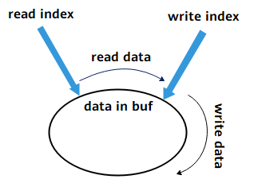

The ringbuf control block maintains the starting address of the buffer and the relative offsets of the read/write pointers. startIdx is the offset of the read pointer relative to the starting address of the ringbuf buffer, and endIdx is the relative offset of the write pointer. The data between startIdx and endIdx is the buffered data. When the ringbuf is just created, the read and write pointer offsets are both 0.

-   When writing data to the ringbuf, first check the ringbuf flag. If the flag is RBUF\_NORMAL, the ringbuf is in normal mode; if the flag is RBUF\_OVERWRITE, the ringbuf is in overwrite mode.
    -   Normal mode: When writing data to the ringbuf, first check whether the ringbuf still has available memory. Writing continues only when there is available memory: endIdx increases and the remaining available memory of the ringbuf decreases; otherwise, the data to be written is discarded, and the amount of written data can be determined by the return value of LOS\_RingbufWrite\(\). If the ringbuf is already full, writing cannot continue because old data will not be overwritten.
    -   Overwrite mode: When writing data to the ringbuf, first check the data to be written. If the data to be written is larger than size, clear the ringbuf and write only size-length data; if the data to be written is smaller than size but larger than the remaining memory remain, clear part of the earliest cached data and then write the data; if the data to be written is smaller than the remaining memory remain, write directly; in all cases, the actual written length is returned.

-   When reading data, the earliest cached data is read in a first-in-first-out manner: startIdx increases and the remaining available memory of the ringbuf increases. After data is read, since the read pointer moves backward, the same data cannot be read again.

    When endIdx grows to equal startIdx, it indicates that the ringbuf is full and writing cannot continue. Data must be read out before more data can be written to the ringbuf.

#### Development Guidelines<a name="ZH-CN_TOPIC_0000002543394325"></a>

**Usage Scenarios<a name="section13465143134317"></a>**

The ringbuf is used for data buffering and follows the first-in-first-out principle.

**Features<a name="section6112145484310"></a>**

The ringbuf module in LiteOS provides the following features. For detailed interface information, see the API reference.

<a name="table157mcpsimp"></a>
<table><thead align="left"><tr id="row163mcpsimp"><th class="cellrowborder" valign="top" width="21.862186218621858%" id="mcps1.1.4.1.1"><p id="p165mcpsimp"><a name="p165mcpsimp"></a><a name="p165mcpsimp"></a>Function Category</p>
</th>
<th class="cellrowborder" valign="top" width="21.14211421142114%" id="mcps1.1.4.1.2"><p id="p167mcpsimp"><a name="p167mcpsimp"></a><a name="p167mcpsimp"></a>Interface Name</p>
</th>
<th class="cellrowborder" valign="top" width="56.99569956995699%" id="mcps1.1.4.1.3"><p id="p169mcpsimp"><a name="p169mcpsimp"></a><a name="p169mcpsimp"></a>Description</p>
</th>
</tr>
</thead>
<tbody><tr id="row170mcpsimp"><td class="cellrowborder" rowspan="2" valign="top" width="21.862186218621858%" headers="mcps1.1.4.1.1 "><p id="p172mcpsimp"><a name="p172mcpsimp"></a><a name="p172mcpsimp"></a>Initialize/Reset the ring buffer</p>
</td>
<td class="cellrowborder" valign="top" width="21.14211421142114%" headers="mcps1.1.4.1.2 "><p id="p174mcpsimp"><a name="p174mcpsimp"></a><a name="p174mcpsimp"></a>LOS_RingbufInit</p>
</td>
<td class="cellrowborder" valign="top" width="56.99569956995699%" headers="mcps1.1.4.1.3 "><p id="p176mcpsimp"><a name="p176mcpsimp"></a><a name="p176mcpsimp"></a>Initialize the ring buffer; the buffer memory, size, and flag are passed in through input parameters.</p>
</td>
</tr>
<tr id="row177mcpsimp"><td class="cellrowborder" valign="top" headers="mcps1.1.4.1.1 "><p id="p180mcpsimp"><a name="p180mcpsimp"></a><a name="p180mcpsimp"></a>LOS_RingbufReset</p>
</td>
<td class="cellrowborder" valign="top" headers="mcps1.1.4.1.2 "><p id="p182mcpsimp"><a name="p182mcpsimp"></a><a name="p182mcpsimp"></a>Reset the state of the buffer: the read/write offsets are reset to 0 and the data in the buffer is cleared.</p>
</td>
</tr>
<tr id="row183mcpsimp"><td class="cellrowborder" rowspan="3" valign="top" width="21.862186218621858%" headers="mcps1.1.4.1.1 "><p id="p185mcpsimp"><a name="p185mcpsimp"></a><a name="p185mcpsimp"></a>Read/Write the ring buffer</p>
</td>
<td class="cellrowborder" valign="top" width="21.14211421142114%" headers="mcps1.1.4.1.2 "><p id="p187mcpsimp"><a name="p187mcpsimp"></a><a name="p187mcpsimp"></a>LOS_RingbufRead</p>
</td>
<td class="cellrowborder" valign="top" width="56.99569956995699%" headers="mcps1.1.4.1.3 "><p id="p189mcpsimp"><a name="p189mcpsimp"></a><a name="p189mcpsimp"></a>Read data of the specified size from the ring buffer into the specified address space, and return the amount of data read.</p>
</td>
</tr>
<tr id="row111261639185112"><td class="cellrowborder" valign="top" headers="mcps1.1.4.1.1 "><p id="p1283155512518"><a name="p1283155512518"></a><a name="p1283155512518"></a>LOS_RingbufPeek</p>
</td>
<td class="cellrowborder" valign="top" headers="mcps1.1.4.1.2 "><p id="p8640141445218"><a name="p8640141445218"></a><a name="p8640141445218"></a>Peek data of the specified size from the ring buffer into the specified address space, and return the amount of data read.</p>
</td>
</tr>
<tr id="row190mcpsimp"><td class="cellrowborder" valign="top" headers="mcps1.1.4.1.1 "><p id="p193mcpsimp"><a name="p193mcpsimp"></a><a name="p193mcpsimp"></a>LOS_RingbufWrite</p>
</td>
<td class="cellrowborder" valign="top" headers="mcps1.1.4.1.2 "><p id="p195mcpsimp"><a name="p195mcpsimp"></a><a name="p195mcpsimp"></a>Write data of the specified size to the ring buffer, and return the amount of data successfully written to the buffer.</p>
</td>
</tr>
<tr id="row196mcpsimp"><td class="cellrowborder" valign="top" width="21.862186218621858%" headers="mcps1.1.4.1.1 "><p id="p198mcpsimp"><a name="p198mcpsimp"></a><a name="p198mcpsimp"></a>Get the amount of buffered data</p>
</td>
<td class="cellrowborder" valign="top" width="21.14211421142114%" headers="mcps1.1.4.1.2 "><p id="p200mcpsimp"><a name="p200mcpsimp"></a><a name="p200mcpsimp"></a>LOS_RingbufUsedSize</p>
</td>
<td class="cellrowborder" valign="top" width="56.99569956995699%" headers="mcps1.1.4.1.3 "><p id="p202mcpsimp"><a name="p202mcpsimp"></a><a name="p202mcpsimp"></a>Get the amount of data cached in the ring buffer.</p>
</td>
</tr>
</tbody>
</table>

**Development Process<a name="section29082323441"></a>**

The typical development process using the ringbuf module is as follows:

1.  Open the menu and go to Kernel ---\> Enable Ringbuf to complete the configuration of the ringbuf module.

    <a name="table116mcpsimp"></a>
    <table><thead align="left"><tr id="row124mcpsimp"><th class="cellrowborder" valign="top" width="22.64226422642264%" id="mcps1.1.6.1.1"><p id="p126mcpsimp"><a name="p126mcpsimp"></a><a name="p126mcpsimp"></a>Configuration Item</p>
    </th>
    <th class="cellrowborder" valign="top" width="33.64336433643364%" id="mcps1.1.6.1.2"><p id="p128mcpsimp"><a name="p128mcpsimp"></a><a name="p128mcpsimp"></a>Meaning</p>
    </th>
    <th class="cellrowborder" valign="top" width="13.09130913091309%" id="mcps1.1.6.1.3"><p id="p130mcpsimp"><a name="p130mcpsimp"></a><a name="p130mcpsimp"></a>Value Range</p>
    </th>
    <th class="cellrowborder" valign="top" width="13.09130913091309%" id="mcps1.1.6.1.4"><p id="p132mcpsimp"><a name="p132mcpsimp"></a><a name="p132mcpsimp"></a>Default Value</p>
    </th>
    <th class="cellrowborder" valign="top" width="17.531753175317533%" id="mcps1.1.6.1.5"><p id="p134mcpsimp"><a name="p134mcpsimp"></a><a name="p134mcpsimp"></a>Dependency</p>
    </th>
    </tr>
    </thead>
    <tbody><tr id="row135mcpsimp"><td class="cellrowborder" valign="top" width="22.64226422642264%" headers="mcps1.1.6.1.1 "><p id="p137mcpsimp"><a name="p137mcpsimp"></a><a name="p137mcpsimp"></a>LOSCFG_KERNEL_RINGBUF</p>
    </td>
    <td class="cellrowborder" valign="top" width="33.64336433643364%" headers="mcps1.1.6.1.2 "><p id="p139mcpsimp"><a name="p139mcpsimp"></a><a name="p139mcpsimp"></a>ringbuf tailoring switch</p>
    </td>
    <td class="cellrowborder" valign="top" width="13.09130913091309%" headers="mcps1.1.6.1.3 "><p id="p141mcpsimp"><a name="p141mcpsimp"></a><a name="p141mcpsimp"></a>YES/NO</p>
    </td>
    <td class="cellrowborder" valign="top" width="13.09130913091309%" headers="mcps1.1.6.1.4 "><p id="p143mcpsimp"><a name="p143mcpsimp"></a><a name="p143mcpsimp"></a>NO</p>
    </td>
    <td class="cellrowborder" valign="top" width="17.531753175317533%" headers="mcps1.1.6.1.5 "><p id="p145mcpsimp"><a name="p145mcpsimp"></a><a name="p145mcpsimp"></a>None</p>
    </td>
    </tr>
    </tbody>
    </table>

2.  Allocate a memory block for the ringbuf.
3.  Initialize the ringbuf with LOS\_RingbufInit.
4.  Write to the ringbuf.
5.  Read the ringbuf at an appropriate time.

#### Precautions<a name="ZH-CN_TOPIC_0000002543354385"></a>

-   The behavior of the ringbuf write interface is determined by the LOS\_RingbufInit interface during initialization.
-   After data is read from the buffer through the LOS\_RingbufRead interface, the data cannot be read again.
-   The LOS\_RingbufPeek interface only peeks at the buffer data without consuming it, so the data can still be read.
-   In normal mode, when the buffer is full, writing cannot continue. Check the return value of LOS\_RingbufWrite to confirm the actual amount of data written.
-   After using the ringbuf, the user needs to release the allocated memory by themselves.

#### Programming Example<a name="ZH-CN_TOPIC_0000002543394319"></a>

**Example Description<a name="section12506115818444"></a>**

Create a ringbuf and two tasks. Task 1 writes data to the ringbuf periodically, and task 2 reads the data when the amount of data in the ringbuf reaches a certain threshold.

1.  Lock task scheduling and create task 1 and task 2 through LOS\_TaskCreate.
2.  Allocate a memory block for use as the ring buffer.
3.  Initialize a buffer with LOS\_RingbufInit.
4.  Unlock task scheduling.
5.  Task 1 writes data to the ring buffer.
6.  Task 2 reads the data when the data reaches the watermark.

**Programming Example<a name="section513085444714"></a>**

```
static Ringbuf g_Ringbuf = {0};
#define READ_TRIGGER_THRESHOLD 32
#define RINGBUF_SIZE 128

VOID WriteTask(VOID)
{
    UINT32 i = 0;
    UINT32 ret = 0;
    CHAR data[READ_TRIGGER_THRESHOLD * 2 + 1] = "LiteOS test data, send in WriteTask, receive & check in ReadTask";
    for (;;) {
        ret = LOS_RingbufWrite(&g_Ringbuf, data + i, READ_TRIGGER_THRESHOLD / 2);
        if (ret != READ_TRIGGER_THRESHOLD / 2) {
            PRINT_ERR("real write count is %u\n", ret);
        }
        i += ret;
        if (i >= strlen(data)) {
            break;
        } else {
            LOS_Msleep(1000); /* 1000: sleep 1000 ms */
        }
    }
}

VOID ReadTask(VOID)
{
    UINT32 i = 0;
    UINT32 ret = 0;
    UINT32 count = 0;
    CHAR data[READ_TRIGGER_THRESHOLD * 2 + 1] = {0};
    for (;;) {
        count = LOS_RingbufUsedSize(&g_Ringbuf);
        if (count >= READ_TRIGGER_THRESHOLD) {
            ret = LOS_RingbufRead(&g_Ringbuf, data + i, count);
            i += ret;
            PRINTK("read data count %u \n", i);
            if (i == READ_TRIGGER_THRESHOLD * 2) {
                PRINTK("data receive done: %s\n", data);
                break;
            }
        } else {
            PRINTK("info: data count %u < %u\n", count, READ_TRIGGER_THRESHOLD);
        }
        LOS_Msleep(1000); /* 1000: sleep 1000 ms */
    }
}

UINT32 SampleTaskCreat(VOID)
{
    UINT32 ret = 0;
    UINT32 task1, task2;
    CHAR *buff = NULL;
    TSK_INIT_PARAM_S initParam;

    initParam.pfnTaskEntry = (TSK_ENTRY_FUNC)WriteTask;
    initParam.usTaskPrio = LOSCFG_BASE_CORE_TSK_DEFAULT_PRIO;
    initParam.uwStackSize = LOSCFG_BASE_CORE_TSK_DEFAULT_STACK_SIZE;
    initParam.pcName = "WriteTask";
#ifdef LOSCFG_KERNEL_SMP
    initParam.usCpuAffiMask = CPUID_TO_AFFI_MASK(ArchCurrCpuid());
#endif
    initParam.uwResved = LOS_TASK_STATUS_DETACHED;

    LOS_TaskLock();
    ret = LOS_TaskCreate(&task1, &initParam);
    if(ret != LOS_OK) {
        PRINT_ERR("create WriteTask failed, error: %x\n", ret);
        return ret;
    }

    initParam.pcName = "ReadTask";
    initParam.pfnTaskEntry = (TSK_ENTRY_FUNC)ReadTask;
    ret = LOS_TaskCreate(&task2, &initParam);
    if(ret != LOS_OK) {
        PRINT_ERR("create ReadTask failed, error: %x\n", ret);
        return ret;
    }

    buff = (CHAR *)LOS_MemAlloc(m_aucSysMem0, RINGBUF_SIZE);
    if (buff == NULL) {
        PRINT_ERR("malloc falied");
        return LOS_NOK;
    }
    ret = LOS_RingbufInit(&g_Ringbuf, buff, RINGBUF_SIZE, RBUF_NORMAL);
    if (ret != LOS_OK) {
        PRINT_ERR("ringbuf init falied");
        return LOS_NOK;
    }

    PRINTK("create the ringbuf success!\n");
    LOS_TaskUnlock();
    return ret;
}
```

**Result Verification<a name="section2084111313455"></a>**

The result obtained after compilation and execution is:

```
create the ringbuf success!
info: data count 16 < 32
read data count 32
info: data count 16 < 32
read data count 64
data receive done: LiteOS test data, send in WriteTask, receive & check in ReadTask
```

### General-Purpose Memory Access<a name="ZH-CN_TOPIC_0000002511794328"></a>


#### Overview<a name="ZH-CN_TOPIC_0000002543354171"></a>

**Basic Concepts<a name="section19060819115120"></a>**

When registers or memory are located in the memory space, they are called I/O memory. LiteOS provides a set of general-purpose interfaces for operating I/O memory.

#### Development Guidelines<a name="ZH-CN_TOPIC_0000002511794454"></a>

**Usage Scenarios<a name="section3383949133619"></a>**

The system provides read/write operations for (1, 2, 4, 8)-byte registers, making it convenient to write driver code.

**Features<a name="section30372907115550"></a>**

LiteOS provides users with the following features. For detailed interface information, see the API reference.

<a name="table43157872115614"></a>
<table><thead align="left"><tr id="row61966233115614"><th class="cellrowborder" valign="top" width="20.22202220222022%" id="mcps1.1.4.1.1"><p id="p9118648115614"><a name="p9118648115614"></a><a name="p9118648115614"></a>Function Category</p>
</th>
<th class="cellrowborder" valign="top" width="27.962796279627966%" id="mcps1.1.4.1.2"><p id="p413017115614"><a name="p413017115614"></a><a name="p413017115614"></a>Interface Name</p>
</th>
<th class="cellrowborder" valign="top" width="51.81518151815182%" id="mcps1.1.4.1.3"><p id="p33454382115614"><a name="p33454382115614"></a><a name="p33454382115614"></a>Description</p>
</th>
</tr>
</thead>
<tbody><tr id="row32653983115614"><td class="cellrowborder" rowspan="4" valign="top" width="20.22202220222022%" headers="mcps1.1.4.1.1 "><p id="p27727006115614"><a name="p27727006115614"></a><a name="p27727006115614"></a>Read/Write 64-bit data</p>
</td>
<td class="cellrowborder" valign="top" width="27.962796279627966%" headers="mcps1.1.4.1.2 "><p id="p6665151352510"><a name="p6665151352510"></a><a name="p6665151352510"></a>WRITE64(addr，value)</p>
</td>
<td class="cellrowborder" valign="top" width="51.81518151815182%" headers="mcps1.1.4.1.3 "><p id="p51870782115614"><a name="p51870782115614"></a><a name="p51870782115614"></a>Write the 64-bit data (value) to the 64-bit register (addr).</p>
</td>
</tr>
<tr id="row64183855115614"><td class="cellrowborder" valign="top" headers="mcps1.1.4.1.1 "><p id="p2156603115614"><a name="p2156603115614"></a><a name="p2156603115614"></a>READ64(addr，value)</p>
</td>
<td class="cellrowborder" valign="top" headers="mcps1.1.4.1.2 "><p id="p159611816145818"><a name="p159611816145818"></a><a name="p159611816145818"></a>Read the 64-bit register (addr).</p>
</td>
</tr>
<tr id="row19475164210583"><td class="cellrowborder" valign="top" headers="mcps1.1.4.1.1 "><p id="p1647504205815"><a name="p1647504205815"></a><a name="p1647504205815"></a>WRITE64_MB(addr，value)</p>
</td>
<td class="cellrowborder" valign="top" headers="mcps1.1.4.1.2 "><p id="p1447594285814"><a name="p1447594285814"></a><a name="p1447594285814"></a>Write the 64-bit data (value) to the 64-bit register (addr); synchronize with a data synchronization barrier before writing.</p>
</td>
</tr>
<tr id="row18475194215815"><td class="cellrowborder" valign="top" headers="mcps1.1.4.1.1 "><p id="p1947564210586"><a name="p1947564210586"></a><a name="p1947564210586"></a>READ64_MB(addr，value)</p>
</td>
<td class="cellrowborder" valign="top" headers="mcps1.1.4.1.2 "><p id="p171063362036"><a name="p171063362036"></a><a name="p171063362036"></a>Read the 64-bit register (addr); synchronize with a data synchronization barrier before reading.</p>
</td>
</tr>
<tr id="row97101224174512"><td class="cellrowborder" rowspan="4" valign="top" width="20.22202220222022%" headers="mcps1.1.4.1.1 "><p id="p1136262014510"><a name="p1136262014510"></a><a name="p1136262014510"></a>Read/Write 32-bit data</p>
</td>
<td class="cellrowborder" valign="top" width="27.962796279627966%" headers="mcps1.1.4.1.2 "><p id="p93621720194512"><a name="p93621720194512"></a><a name="p93621720194512"></a>WRITE32(addr，value)</p>
</td>
<td class="cellrowborder" valign="top" width="51.81518151815182%" headers="mcps1.1.4.1.3 "><p id="p636212209451"><a name="p636212209451"></a><a name="p636212209451"></a>Write the 32-bit data (value) to the 32-bit register (addr).</p>
</td>
</tr>
<tr id="row5710102417454"><td class="cellrowborder" valign="top" headers="mcps1.1.4.1.1 "><p id="p43621220134515"><a name="p43621220134515"></a><a name="p43621220134515"></a>READ32(addr，value)</p>
</td>
<td class="cellrowborder" valign="top" headers="mcps1.1.4.1.2 "><p id="p53621120194515"><a name="p53621120194515"></a><a name="p53621120194515"></a>Read the 32-bit register (addr).</p>
</td>
</tr>
<tr id="row971072444513"><td class="cellrowborder" valign="top" headers="mcps1.1.4.1.1 "><p id="p20362132084520"><a name="p20362132084520"></a><a name="p20362132084520"></a>WRITE32_MB(addr，value)</p>
</td>
<td class="cellrowborder" valign="top" headers="mcps1.1.4.1.2 "><p id="p123621620124512"><a name="p123621620124512"></a><a name="p123621620124512"></a>Write the 32-bit data (value) to the 32-bit register (addr); synchronize with a data synchronization barrier before writing.</p>
</td>
</tr>
<tr id="row197101324104517"><td class="cellrowborder" valign="top" headers="mcps1.1.4.1.1 "><p id="p123632020104513"><a name="p123632020104513"></a><a name="p123632020104513"></a>READ32_MB(addr，value)</p>
</td>
<td class="cellrowborder" valign="top" headers="mcps1.1.4.1.2 "><p id="p11363182064511"><a name="p11363182064511"></a><a name="p11363182064511"></a>Read the 32-bit register (addr); synchronize with a data synchronization barrier before reading.</p>
</td>
</tr>
<tr id="row3417528164512"><td class="cellrowborder" rowspan="4" valign="top" width="20.22202220222022%" headers="mcps1.1.4.1.1 "><p id="p125695278452"><a name="p125695278452"></a><a name="p125695278452"></a>Read/Write 16-bit data</p>
</td>
<td class="cellrowborder" valign="top" width="27.962796279627966%" headers="mcps1.1.4.1.2 "><p id="p10569142704510"><a name="p10569142704510"></a><a name="p10569142704510"></a>WRITE16(addr，value)</p>
</td>
<td class="cellrowborder" valign="top" width="51.81518151815182%" headers="mcps1.1.4.1.3 "><p id="p20569142764520"><a name="p20569142764520"></a><a name="p20569142764520"></a>Write the 16-bit data (value) to the 16-bit register (addr).</p>
</td>
</tr>
<tr id="row441712813454"><td class="cellrowborder" valign="top" headers="mcps1.1.4.1.1 "><p id="p556914279458"><a name="p556914279458"></a><a name="p556914279458"></a>READ16(addr，value)</p>
</td>
<td class="cellrowborder" valign="top" headers="mcps1.1.4.1.2 "><p id="p1569142764512"><a name="p1569142764512"></a><a name="p1569142764512"></a>Read the 16-bit register (addr).</p>
</td>
</tr>
<tr id="row641782864516"><td class="cellrowborder" valign="top" headers="mcps1.1.4.1.1 "><p id="p1756952719451"><a name="p1756952719451"></a><a name="p1756952719451"></a>WRITE16_MB(addr，value)</p>
</td>
<td class="cellrowborder" valign="top" headers="mcps1.1.4.1.2 "><p id="p756952744515"><a name="p756952744515"></a><a name="p756952744515"></a>Write the 16-bit data (value) to the 16-bit register (addr); synchronize with a data synchronization barrier before writing.</p>
</td>
</tr>
<tr id="row144178288454"><td class="cellrowborder" valign="top" headers="mcps1.1.4.1.1 "><p id="p656942704518"><a name="p656942704518"></a><a name="p656942704518"></a>READ16_MB(addr，value)</p>
</td>
<td class="cellrowborder" valign="top" headers="mcps1.1.4.1.2 "><p id="p356912724514"><a name="p356912724514"></a><a name="p356912724514"></a>Read the 16-bit register (addr); synchronize with a data synchronization barrier before reading.</p>
</td>
</tr>
<tr id="row125743119452"><td class="cellrowborder" rowspan="4" valign="top" width="20.22202220222022%" headers="mcps1.1.4.1.1 "><p id="p1136683014450"><a name="p1136683014450"></a><a name="p1136683014450"></a>Read/Write 8-bit data</p>
</td>
<td class="cellrowborder" valign="top" width="27.962796279627966%" headers="mcps1.1.4.1.2 "><p id="p133667305455"><a name="p133667305455"></a><a name="p133667305455"></a>WRITE8(addr，value)</p>
</td>
<td class="cellrowborder" valign="top" width="51.81518151815182%" headers="mcps1.1.4.1.3 "><p id="p6366163034517"><a name="p6366163034517"></a><a name="p6366163034517"></a>Write the 8-bit data (value) to the 8-bit register (addr).</p>
</td>
</tr>
<tr id="row8576316451"><td class="cellrowborder" valign="top" headers="mcps1.1.4.1.1 "><p id="p143666307453"><a name="p143666307453"></a><a name="p143666307453"></a>READ8(addr，value)</p>
</td>
<td class="cellrowborder" valign="top" headers="mcps1.1.4.1.2 "><p id="p17366203044520"><a name="p17366203044520"></a><a name="p17366203044520"></a>Read the 8-bit register (addr).</p>
</td>
</tr>
<tr id="row175753134510"><td class="cellrowborder" valign="top" headers="mcps1.1.4.1.1 "><p id="p33664304457"><a name="p33664304457"></a><a name="p33664304457"></a>WRITE8_MB(addr，value)</p>
</td>
<td class="cellrowborder" valign="top" headers="mcps1.1.4.1.2 "><p id="p536703074513"><a name="p536703074513"></a><a name="p536703074513"></a>Write the 8-bit data (value) to the 8-bit register (addr); synchronize with a data synchronization barrier before writing.</p>
</td>
</tr>
<tr id="row45713118458"><td class="cellrowborder" valign="top" headers="mcps1.1.4.1.1 "><p id="p11367113013455"><a name="p11367113013455"></a><a name="p11367113013455"></a>READ8_MB(addr，value)</p>
</td>
<td class="cellrowborder" valign="top" headers="mcps1.1.4.1.2 "><p id="p193672030114513"><a name="p193672030114513"></a><a name="p193672030114513"></a>Read the 8-bit register (addr); synchronize with a data synchronization barrier before reading.</p>
</td>
</tr>
</tbody>
</table>

> **Notice:** 
>On a 32-bit ARM architecture, accessing a 64-bit register write via the str instruction would cause the data at the high 32-bit register address and the low 32-bit register address to take effect at different times; therefore, the strd instruction is used.

#### Precautions<a name="ZH-CN_TOPIC_0000002543354251"></a>

None.

# Extended Kernel<a name="ZH-CN_TOPIC_0000002511794264"></a>


## Dynamic Loading<a name="ZH-CN_TOPIC_0000002532922710"></a>


### Overview<a name="ZH-CN_TOPIC_0000002533083474"></a>

**Basic Concepts<a name="section18886111610113"></a>**

Dynamic loading is a program loading technique.

Static linking links the module files of a program into a complete executable file at the link stage, and the executable file is loaded into memory as a whole at runtime. Dynamic loading allows users to compile the modules of a program into independent .o and .so files without linking them into an executable file, and dynamically load a module into memory when it is needed.

LiteOS supports dynamic loading of OBJ object files (.o files) and SO shared object files (.so files), which need to be used together with the object files and the system binary image file.

**Figure 1**  Dynamic loading diagram<a name="fig339213331310"></a>  
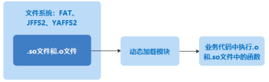

**Concepts Related to Dynamic Loading<a name="section163715271925"></a>**

In terms of its representation, a symbol table is an array that records symbol names and their memory addresses. The symbol table is loaded into the symbol management structure of the dynamic loading module when the dynamic loading module is initialized. When a user module is loaded for symbol relocation, the dynamic loading module obtains the address of the corresponding symbol by looking up the symbol management structure.

**Operating Mechanism<a name="section15891125417212"></a>**

SO files may be stored on storage media in ZIP (compressed) or NOZIP (uncompressed) form, and there are correspondingly two loading strategies.

-   NOZIP strategy: Ordinary so files can obtain the corresponding file information through multiple lseek and read operations. First, based on the SegmentHeader information of the so file, the size of the corresponding loadable segment is calculated, then the corresponding space is allocated, the loadable segment is loaded into memory, and the dynamic loading work is completed. Since only a small portion of the file is read each time, there is no memory waste problem.
-   ZIP strategy: When reading a ZIP compressed file, the entire file must be read into memory at once (mem1). However, the size of the loadable segment in the corresponding so file is unknown during the first read, so a second memory allocation (mem2) is required. Since mem2 already contains all the information needed for this dynamic loading, keeping mem1 and mem2 coexisting would waste memory and cause an excessively high memory peak. The solution is to read the ZIP file twice: the purpose of the first read is only to calculate the final required memory size (release the corresponding memory immediately after the calculation), and the purpose of the second read is to complete the dynamic loading work based on the corresponding information. As can be seen, the ZIP loading strategy avoids excessively high memory peaks at the cost of instructions.

### Development Guidelines<a name="ZH-CN_TOPIC_0000002532923528"></a>

**Usage Scenarios<a name="section18886111610113"></a>**

Static linking links the module files of a program into a whole and loads them into memory at once at runtime, with advantages such as fast code loading. However, when the program is large and modules are frequently changed or upgraded, problems such as waste of memory and disk space and difficulty in module updates may arise.

Dynamic loading technology can better solve the above problems in static linking: when the program needs to execute code in an external module, the external module is dynamically loaded into memory, and can be unloaded when no longer needed. This enables features such as sharing of common code and smooth module upgrades.

**Features<a name="section421118358518"></a>**

The dynamic loading module of LiteOS provides users with the following features. For detailed interface information, see the API reference.

<a name="table0930132467"></a>
<table><thead align="left"><tr id="row29471215613"><th class="cellrowborder" valign="top" width="23.44%" id="mcps1.1.4.1.1"><p id="p694714214613"><a name="p694714214613"></a><a name="p694714214613"></a>Function Category</p>
</th>
<th class="cellrowborder" valign="top" width="20.79%" id="mcps1.1.4.1.2"><p id="p1194792961"><a name="p1194792961"></a><a name="p1194792961"></a>Interface Name</p>
</th>
<th class="cellrowborder" valign="top" width="55.769999999999996%" id="mcps1.1.4.1.3"><p id="p13947626620"><a name="p13947626620"></a><a name="p13947626620"></a>Description</p>
</th>
</tr>
</thead>
<tbody><tr id="row1794718213619"><td class="cellrowborder" valign="top" width="23.44%" headers="mcps1.1.4.1.1 "><p id="p4947723619"><a name="p4947723619"></a><a name="p4947723619"></a>Destroy dynamic loading</p>
</td>
<td class="cellrowborder" valign="top" width="20.79%" headers="mcps1.1.4.1.2 "><p id="p10947322614"><a name="p10947322614"></a><a name="p10947322614"></a>LOS_LdDestroy</p>
</td>
<td class="cellrowborder" valign="top" width="55.769999999999996%" headers="mcps1.1.4.1.3 "><p id="p1947182964"><a name="p1947182964"></a><a name="p1947182964"></a>Destroy the dynamic loading module.</p>
</td>
</tr>
<tr id="row1694716213615"><td class="cellrowborder" rowspan="3" valign="top" width="23.44%" headers="mcps1.1.4.1.1 "><p id="p199473212615"><a name="p199473212615"></a><a name="p199473212615"></a>Dynamically load module files</p>
</td>
<td class="cellrowborder" valign="top" width="20.79%" headers="mcps1.1.4.1.2 "><p id="p159474211610"><a name="p159474211610"></a><a name="p159474211610"></a>LOS_SoLoad</p>
</td>
<td class="cellrowborder" valign="top" width="55.769999999999996%" headers="mcps1.1.4.1.3 "><p id="p179471421568"><a name="p179471421568"></a><a name="p179471421568"></a>Dynamically load an so module (depends on the file system).</p>
</td>
</tr>
<tr id="row7947121169"><td class="cellrowborder" valign="top" headers="mcps1.1.4.1.1 "><p id="p13947142562"><a name="p13947142562"></a><a name="p13947142562"></a>LOS_MemLoad</p>
</td>
<td class="cellrowborder" valign="top" headers="mcps1.1.4.1.2 "><p id="p1094782968"><a name="p1094782968"></a><a name="p1094782968"></a>Dynamically load an so or obj module (does not depend on the file system; loaded from the specified memory space).</p>
</td>
</tr>
<tr id="row5947920614"><td class="cellrowborder" valign="top" headers="mcps1.1.4.1.1 "><p id="p1294714212617"><a name="p1294714212617"></a><a name="p1294714212617"></a>LOS_ObjLoad</p>
</td>
<td class="cellrowborder" valign="top" headers="mcps1.1.4.1.2 "><p id="p1947112765"><a name="p1947112765"></a><a name="p1947112765"></a>Dynamically load an obj module (depends on the file system).</p>
</td>
</tr>
<tr id="row11947172660"><td class="cellrowborder" rowspan="2" valign="top" width="23.44%" headers="mcps1.1.4.1.1 "><p id="p1794719217616"><a name="p1794719217616"></a><a name="p1794719217616"></a>Dynamically load module files into a static space</p>
</td>
<td class="cellrowborder" valign="top" width="20.79%" headers="mcps1.1.4.1.2 "><p id="p179471024616"><a name="p179471024616"></a><a name="p179471024616"></a>LOS_MemLoadStatic</p>
</td>
<td class="cellrowborder" valign="top" width="55.769999999999996%" headers="mcps1.1.4.1.3 "><p id="p29471529617"><a name="p29471529617"></a><a name="p29471529617"></a>Dynamically load an so or obj module into the specified static space (does not depend on the file system; loaded from the specified memory space).</p>
</td>
</tr>
<tr id="row7947925615"><td class="cellrowborder" valign="top" headers="mcps1.1.4.1.1 "><p id="p169471120613"><a name="p169471120613"></a><a name="p169471120613"></a>LOS_SoLoadStatic</p>
</td>
<td class="cellrowborder" valign="top" headers="mcps1.1.4.1.2 "><p id="p159471621611"><a name="p159471621611"></a><a name="p159471621611"></a>Dynamically load an so module (depends on the file system) into the specified static space.</p>
</td>
</tr>
<tr id="row129471225616"><td class="cellrowborder" rowspan="2" valign="top" width="23.44%" headers="mcps1.1.4.1.1 "><p id="p3947162864"><a name="p3947162864"></a><a name="p3947162864"></a>Get the space size required by the module in the running view</p>
</td>
<td class="cellrowborder" valign="top" width="20.79%" headers="mcps1.1.4.1.2 "><p id="p69478219614"><a name="p69478219614"></a><a name="p69478219614"></a>LOS_ModuleSizeGet</p>
</td>
<td class="cellrowborder" valign="top" width="55.769999999999996%" headers="mcps1.1.4.1.3 "><p id="p109471329619"><a name="p109471329619"></a><a name="p109471329619"></a>Calculate the static space size required to load and run an so or obj module.</p>
</td>
</tr>
<tr id="row189479212610"><td class="cellrowborder" valign="top" headers="mcps1.1.4.1.1 "><p id="p69476218611"><a name="p69476218611"></a><a name="p69476218611"></a>LOS_DynSizeGetFromFS</p>
</td>
<td class="cellrowborder" valign="top" headers="mcps1.1.4.1.2 "><p id="p2947152867"><a name="p2947152867"></a><a name="p2947152867"></a>Calculate the static space size required to load and run an so module (depends on the file system).</p>
</td>
</tr>
<tr id="row0947421269"><td class="cellrowborder" valign="top" width="23.44%" headers="mcps1.1.4.1.1 "><p id="p394792963"><a name="p394792963"></a><a name="p394792963"></a>Find the symbol address</p>
</td>
<td class="cellrowborder" valign="top" width="20.79%" headers="mcps1.1.4.1.2 "><p id="p189471522616"><a name="p189471522616"></a><a name="p189471522616"></a>LOS_FindSymByName</p>
</td>
<td class="cellrowborder" valign="top" width="55.769999999999996%" headers="mcps1.1.4.1.3 "><p id="p0947421969"><a name="p0947421969"></a><a name="p0947421969"></a>Find the symbol address in the module or system symbol table.</p>
</td>
</tr>
<tr id="row9947822613"><td class="cellrowborder" valign="top" width="23.44%" headers="mcps1.1.4.1.1 "><p id="p694772563"><a name="p694772563"></a><a name="p694772563"></a>Unload a module</p>
</td>
<td class="cellrowborder" valign="top" width="20.79%" headers="mcps1.1.4.1.2 "><p id="p794710215616"><a name="p794710215616"></a><a name="p794710215616"></a>LOS_ModuleUnload</p>
</td>
<td class="cellrowborder" valign="top" width="55.769999999999996%" headers="mcps1.1.4.1.3 "><p id="p129471327616"><a name="p129471327616"></a><a name="p129471327616"></a>Unload a module.</p>
</td>
</tr>
<tr id="row1894710217615"><td class="cellrowborder" rowspan="3" valign="top" width="23.44%" headers="mcps1.1.4.1.1 "><p id="p13947225613"><a name="p13947225613"></a><a name="p13947225613"></a>Set the search path/parameters/memory pool address of dynamic loading</p>
</td>
<td class="cellrowborder" valign="top" width="20.79%" headers="mcps1.1.4.1.2 "><p id="p794717214613"><a name="p794717214613"></a><a name="p794717214613"></a>LOS_PathAdd</p>
</td>
<td class="cellrowborder" valign="top" width="55.769999999999996%" headers="mcps1.1.4.1.3 "><p id="p13947325616"><a name="p13947325616"></a><a name="p13947325616"></a>Add a search path for modules.</p>
</td>
</tr>
<tr id="row194752663"><td class="cellrowborder" valign="top" headers="mcps1.1.4.1.1 "><p id="p139471423613"><a name="p139471423613"></a><a name="p139471423613"></a>LOS_DynParamReg</p>
</td>
<td class="cellrowborder" valign="top" headers="mcps1.1.4.1.2 "><p id="p69471323616"><a name="p69471323616"></a><a name="p69471323616"></a>Set the dynamic loading parameters of the so module. To use this interface, the LOSCFG_DYNLOAD_DYN_FROM_FS macro switch must be enabled; that is, the dynamic loading parameters can only be set when so modules are loaded from the file system.</p>
</td>
</tr>
<tr id="row16947821768"><td class="cellrowborder" valign="top" headers="mcps1.1.4.1.1 "><p id="p15947621363"><a name="p15947621363"></a><a name="p15947621363"></a>LOS_DynMemPoolSet</p>
</td>
<td class="cellrowborder" valign="top" headers="mcps1.1.4.1.2 "><p id="p139471223614"><a name="p139471223614"></a><a name="p139471223614"></a>Set the address of the memory pool used for dynamic loading.</p>
</td>
</tr>
</tbody>
</table>

> **Note:** 
>The input parameter of the LOS\_DynMemPoolSet interface must be a memory pool address initialized by LOS\_MemInit, that is, managed by the LiteOS memory management algorithm, and the memory pool must not overlap with the system memory pool. This interface must be used before loading .so or .o files.

> **Notice:** 
>The memory protection/memory management unit designs of different target platforms may differ. Before using the interfaces provided in this chapter, be sure to read the relevant documentation of the target platform to understand the platform hardware capabilities and usage limitations.

**DYNLOAD Error Codes<a name="section916114818910"></a>**

Corresponding error codes are returned for operations that may fail, so that the cause of the error can be quickly located.

<a name="table2012212305915"></a>
<table><thead align="left"><tr id="row61421300913"><th class="cellrowborder" valign="top" width="8.41%" id="mcps1.1.6.1.1"><p id="p1314215301895"><a name="p1314215301895"></a><a name="p1314215301895"></a>No.</p>
</th>
<th class="cellrowborder" valign="top" width="26%" id="mcps1.1.6.1.2"><p id="p71426301492"><a name="p71426301492"></a><a name="p71426301492"></a>Definition</p>
</th>
<th class="cellrowborder" valign="top" width="13.98%" id="mcps1.1.6.1.3"><p id="p114213301398"><a name="p114213301398"></a><a name="p114213301398"></a>Actual Value</p>
</th>
<th class="cellrowborder" valign="top" width="29.67%" id="mcps1.1.6.1.4"><p id="p7142123018912"><a name="p7142123018912"></a><a name="p7142123018912"></a>Description</p>
</th>
<th class="cellrowborder" valign="top" width="21.94%" id="mcps1.1.6.1.5"><p id="p31425301198"><a name="p31425301198"></a><a name="p31425301198"></a>Recommended Solution</p>
</th>
</tr>
</thead>
<tbody><tr id="row1114283011912"><td class="cellrowborder" valign="top" width="8.41%" headers="mcps1.1.6.1.1 "><p id="p414220301194"><a name="p414220301194"></a><a name="p414220301194"></a>1</p>
</td>
<td class="cellrowborder" valign="top" width="26%" headers="mcps1.1.6.1.2 "><p id="p3142103019912"><a name="p3142103019912"></a><a name="p3142103019912"></a>LOS_ERRNO_LD_INVALID_ARG</p>
</td>
<td class="cellrowborder" valign="top" width="13.98%" headers="mcps1.1.6.1.3 "><p id="p7142133012918"><a name="p7142133012918"></a><a name="p7142133012918"></a>0x02002600</p>
</td>
<td class="cellrowborder" valign="top" width="29.67%" headers="mcps1.1.6.1.4 "><p id="p14142183010910"><a name="p14142183010910"></a><a name="p14142183010910"></a>The passed parameters contain illegal values such as NULL and 0.</p>
</td>
<td class="cellrowborder" valign="top" width="21.94%" headers="mcps1.1.6.1.5 "><p id="p1714210301297"><a name="p1714210301297"></a><a name="p1714210301297"></a>Pass correct parameters.</p>
</td>
</tr>
<tr id="row314219301191"><td class="cellrowborder" valign="top" width="8.41%" headers="mcps1.1.6.1.1 "><p id="p10142930094"><a name="p10142930094"></a><a name="p10142930094"></a>2</p>
</td>
<td class="cellrowborder" valign="top" width="26%" headers="mcps1.1.6.1.2 "><p id="p121421306912"><a name="p121421306912"></a><a name="p121421306912"></a>LOS_ERRNO_LD_INVALID_ELF</p>
</td>
<td class="cellrowborder" valign="top" width="13.98%" headers="mcps1.1.6.1.3 "><p id="p14142430594"><a name="p14142430594"></a><a name="p14142430594"></a>0x02002601</p>
</td>
<td class="cellrowborder" valign="top" width="29.67%" headers="mcps1.1.6.1.4 "><p id="p51428305915"><a name="p51428305915"></a><a name="p51428305915"></a>The passed ELF is incorrect or of an unsupported type.</p>
</td>
<td class="cellrowborder" valign="top" width="21.94%" headers="mcps1.1.6.1.5 "><p id="p1514214301299"><a name="p1514214301299"></a><a name="p1514214301299"></a>Pass a correct ELF file.</p>
</td>
</tr>
</tbody>
</table>

**Development Process<a name="section104548121012"></a>**

Dynamic loading mainly involves the following steps:

1.  Prepare the compilation environment
2.  Compile the module files to be loaded
3.  Write the dynamic loading business code
4.  Compile the system image
5.  Prepare the system environment

**Prepare the Compilation Environment<a name="section8962143881011"></a>**

1.  Add compilation options for .o and .so modules.

    -   The "-nostdlib -fno-PIC" option must be added to the compilation options of .o modules.
    -   The "-nostdlib -fPIC -shared" option must be added to the compilation options of .so modules.

    > **Note:** 
    >The compilation options listed below can be selected as needed.
    >**-z max-page-size=value**
    >Set the alignment parameter of the loadable program segments of .o and .so modules to the value. Adding this option can effectively reduce the blank areas between the virtual addresses of adjacent loadable segments caused by alignment requirements. If this option is not added, the default alignment parameter is 0x10000.

    > **Notice:** 
    >-   The IPC dynamic loading requires the user to ensure that the starting addresses of all sections of the LD\_SHT\_PROGBITS and LD\_SHT\_NOBITS types in the provided module files are 4-byte aligned; otherwise, the loading of the module is refused.
    >-   When generating .o and .so modules, linking against the standard library of the compiler is prohibited (that is, options such as -ldl, -lpthread, and -lc are not allowed), and the compilation option "-nostdlib" must be used.

    The following is an example of adding compilation options for .o and .so modules:

    ```
    RM = -rm -rf
     
    CC = arm-himix100-linux-gcc
     
     
    SRCS = $(wildcard *.c)
    OBJS = $(patsubst %.c,%.o,$(SRCS))
    SOS = $(patsubst %.c,%.so,$(SRCS))
     
    all: $(SOS)
     
    $(OBJS): %.o : %.c
       @$(CC) -nostdlib -c $< -fno-PIC -o $@ 
     
    $(SOS): %.so : %.c
        @$(CC) -nostdlib $< -fPIC -shared -o $@ 
     
    clean:
        @$(RM) $(SOS) $(OBJS)
     
    .PHONY: all clean
    ```

2.  Modify the system Makefile.

    The Makefile for compiling the system image must include the "config.mk" file in the root directory and use the "LITEOS\_CFLAGS" or "LITEOS\_CXXFLAGS" compilation options in "config.mk". An example is as follows:

    ```
    LITEOSTOPDIR ?= ../..
     
    SAMPLE_OUT = .
     
    include $(LITEOSTOPDIR)/config.mk 
    RM = -rm -rf
     
    LITEOS_LIBDEPS := --start-group $(LITEOS_LIBDEP) --end-group
     
    SRCS = $(wildcard sample.c)
     
    OBJS = $(patsubst %.c,$(SAMPLE_OUT)/%.o,$(SRCS))
     
    all: $(OBJS)
     
    clean:
        @$(RM) *.o  sample *.bin *.map *.asm
     
    $(OBJS): $(SAMPLE_OUT)/%.o : %.c
        $(CC) $(LITEOS_CFLAGS) -c $< -o $@
     
        $(LD) $(LITEOS_LDFLAGS) -uinit_jffspar_param --gc-sections -Map=$(SAMPLE_OUT)/sample.map -o $
        (SAMPLE_OUT)/sample ./$@ $(LITEOS_LIBDEPS) $(LITEOS_TABLES_LDFLAGS) $(LITEOS_DYNLDFLAGS)
        $(OBJCOPY) -O binary $(SAMPLE_OUT)/sample $(SAMPLE_OUT)/sample.bin
        $(OBJDUMP) -d $(SAMPLE_OUT)/sample >$(SAMPLE_OUT)/sample.asm
    ```

**Compile the Module Files to Be Loaded<a name="section528153613185"></a>**

Compile strictly according to the following steps, using a makefile as an example.

1.  Compile the .o and .so modules, and copy all .o and .so files required for running to the same directory.

    > **Note:** 
    >The compilation options listed below can be selected as needed.
    >**-z max-page-size=value**
    >Set the alignment parameter of the loadable program segments of .o and .so modules to the value. Adding this option can effectively reduce the blank areas between the virtual addresses of adjacent loadable segments caused by alignment requirements. If this option is not added, the default alignment parameter is 0x10000.

2.  Go to the "RTOS\_Lite/build/scripts/dynload\_tools" directory and run the "sym.sh" script. An example is as follows:

    ```
    LITEOSTOPDIR ?= ../..
    ```

    > **Note:** 
    >-   The input parameter "/home/wmin/customer/out" of the sym.sh script is the absolute path of the directory where the .o and .so files are located. "out/dynload\_sym" is the absolute path of the directory where "los\_dynload\_gsymbol.c" is generated; it is recommended to specify the compilation output directory of the project.
    >-   Note that if the .o or .so files to be loaded are updated, the script must be run again. The script extracts all system symbols (symbols not defined by users) from the .o and .so files, so that the compiler can calculate the addresses of the corresponding symbols when compiling the system image.
    >-   The script must be run in the "RTOS\_Lite/build/scripts/dynload\_tools" directory.
    >-   After running the "sym.sh" script, ensure that "los\_dynload\_gsymbol.c" is generated in the "out/dynload\_sym" directory, and that the file participates in compilation during the compilation phase and the generated object file participates in linking. Otherwise, symbol resolution problems may occur during the loading of .o and .so files.

3.  (Optional) Go to "RTOS\_Lite/build/scripts/dynload\_tools" and run litesym to generate miniaturized loadable files:

    For example, if the file to be loaded is a.o, when LOSCFG\_DYNLOAD\_LITE\_SYMTAB is enabled, the original file needs to be processed into a custom format before it can be loaded correctly. It can be generated with the following command.

    ```
    $ python3 litesym /home/wmin/customer/out/a.o -o 
    /home/wmin/customer/out/a_litesym.o
    ```

    > **Note:** 
    >-   When LOSCFG\_DYNLOAD\_LITE\_SYMTAB is enabled, the file to be loaded must have been processed by the symtab script; otherwise, loading fails.
    >-   If LOSCFG\_DYNLOAD\_LITE\_SYMTAB is not needed, this script does not need to be run.

**Write the Dynamic Loading Business Code<a name="section107436407244"></a>**

1.  Open the menu and go to Kernel ---\> Enable Extend Kernel ---\> Enable Dynamic Load Feature to complete the configuration of the dynamic loading module.

    <a name="table747491532510"></a>
    <table><thead align="left"><tr id="row10505121552520"><th class="cellrowborder" valign="top" width="22.009999999999998%" id="mcps1.1.6.1.1"><p id="p65051156251"><a name="p65051156251"></a><a name="p65051156251"></a>Configuration Item</p>
    </th>
    <th class="cellrowborder" valign="top" width="29.03%" id="mcps1.1.6.1.2"><p id="p7505121542514"><a name="p7505121542514"></a><a name="p7505121542514"></a>Meaning</p>
    </th>
    <th class="cellrowborder" valign="top" width="17.080000000000002%" id="mcps1.1.6.1.3"><p id="p6505201514255"><a name="p6505201514255"></a><a name="p6505201514255"></a>Value Range</p>
    </th>
    <th class="cellrowborder" valign="top" width="8.92%" id="mcps1.1.6.1.4"><p id="p185053155251"><a name="p185053155251"></a><a name="p185053155251"></a>Default Value</p>
    </th>
    <th class="cellrowborder" valign="top" width="22.96%" id="mcps1.1.6.1.5"><p id="p45054159254"><a name="p45054159254"></a><a name="p45054159254"></a>Dependency</p>
    </th>
    </tr>
    </thead>
    <tbody><tr id="row950581514259"><td class="cellrowborder" valign="top" width="22.009999999999998%" headers="mcps1.1.6.1.1 "><p id="p1505715132516"><a name="p1505715132516"></a><a name="p1505715132516"></a>LOSCFG_KERNEL_DYNLOAD</p>
    </td>
    <td class="cellrowborder" valign="top" width="29.03%" headers="mcps1.1.6.1.2 "><p id="p17505101552519"><a name="p17505101552519"></a><a name="p17505101552519"></a>Tailoring switch of the dynamic loading module</p>
    </td>
    <td class="cellrowborder" valign="top" width="17.080000000000002%" headers="mcps1.1.6.1.3 "><p id="p2505215182514"><a name="p2505215182514"></a><a name="p2505215182514"></a>YES/NO</p>
    </td>
    <td class="cellrowborder" valign="top" width="8.92%" headers="mcps1.1.6.1.4 "><p id="p155051715152516"><a name="p155051715152516"></a><a name="p155051715152516"></a>YES</p>
    </td>
    <td class="cellrowborder" valign="top" width="22.96%" headers="mcps1.1.6.1.5 "><p id="p1950551502514"><a name="p1950551502514"></a><a name="p1950551502514"></a>LOSCFG_KERNEL_EXTKERNEL</p>
    </td>
    </tr>
    <tr id="row85059150253"><td class="cellrowborder" valign="top" width="22.009999999999998%" headers="mcps1.1.6.1.1 "><p id="p1505815202516"><a name="p1505815202516"></a><a name="p1505815202516"></a>LOSCFG_KERNEL_DYNLOAD_DYN</p>
    </td>
    <td class="cellrowborder" valign="top" width="29.03%" headers="mcps1.1.6.1.2 "><p id="p9505815192510"><a name="p9505815192510"></a><a name="p9505815192510"></a>Enable so file loading</p>
    </td>
    <td class="cellrowborder" valign="top" width="17.080000000000002%" headers="mcps1.1.6.1.3 "><p id="p6505191582518"><a name="p6505191582518"></a><a name="p6505191582518"></a>YES/NO</p>
    </td>
    <td class="cellrowborder" valign="top" width="8.92%" headers="mcps1.1.6.1.4 "><p id="p12505151516258"><a name="p12505151516258"></a><a name="p12505151516258"></a>YES</p>
    </td>
    <td class="cellrowborder" valign="top" width="22.96%" headers="mcps1.1.6.1.5 "><p id="p1350571515256"><a name="p1350571515256"></a><a name="p1350571515256"></a>LOSCFG_KERNEL_DYNLOAD</p>
    </td>
    </tr>
    <tr id="row1505101552516"><td class="cellrowborder" valign="top" width="22.009999999999998%" headers="mcps1.1.6.1.1 "><p id="p0505115142518"><a name="p0505115142518"></a><a name="p0505115142518"></a>LOSCFG_DYNLOAD_DYN_FROM_FS</p>
    </td>
    <td class="cellrowborder" valign="top" width="29.03%" headers="mcps1.1.6.1.2 "><p id="p18505515102516"><a name="p18505515102516"></a><a name="p18505515102516"></a>Enable so file loading from the file system</p>
    </td>
    <td class="cellrowborder" valign="top" width="17.080000000000002%" headers="mcps1.1.6.1.3 "><p id="p850571518259"><a name="p850571518259"></a><a name="p850571518259"></a>YES/NO</p>
    </td>
    <td class="cellrowborder" valign="top" width="8.92%" headers="mcps1.1.6.1.4 "><p id="p65056157253"><a name="p65056157253"></a><a name="p65056157253"></a>YES</p>
    </td>
    <td class="cellrowborder" valign="top" width="22.96%" headers="mcps1.1.6.1.5 "><p id="p55054154251"><a name="p55054154251"></a><a name="p55054154251"></a>LOSCFG_KERNEL_DYNLOAD_DYN</p>
    </td>
    </tr>
    <tr id="row850561502517"><td class="cellrowborder" valign="top" width="22.009999999999998%" headers="mcps1.1.6.1.1 "><p id="p1450521572516"><a name="p1450521572516"></a><a name="p1450521572516"></a>LOSCFG_DYNLOAD_DYN_FROM_MEM</p>
    </td>
    <td class="cellrowborder" valign="top" width="29.03%" headers="mcps1.1.6.1.2 "><p id="p1350516156258"><a name="p1350516156258"></a><a name="p1350516156258"></a>Enable so file loading from the specified memory</p>
    </td>
    <td class="cellrowborder" valign="top" width="17.080000000000002%" headers="mcps1.1.6.1.3 "><p id="p450551519252"><a name="p450551519252"></a><a name="p450551519252"></a>YES/NO</p>
    </td>
    <td class="cellrowborder" valign="top" width="8.92%" headers="mcps1.1.6.1.4 "><p id="p9505111515252"><a name="p9505111515252"></a><a name="p9505111515252"></a>YES</p>
    </td>
    <td class="cellrowborder" valign="top" width="22.96%" headers="mcps1.1.6.1.5 "><p id="p165058154252"><a name="p165058154252"></a><a name="p165058154252"></a>LOSCFG_KERNEL_DYNLOAD_DYN</p>
    </td>
    </tr>
    <tr id="row16505121542513"><td class="cellrowborder" valign="top" width="22.009999999999998%" headers="mcps1.1.6.1.1 "><p id="p18505181532519"><a name="p18505181532519"></a><a name="p18505181532519"></a>LOSCFG_KERNEL_DYNLOAD_REL</p>
    </td>
    <td class="cellrowborder" valign="top" width="29.03%" headers="mcps1.1.6.1.2 "><p id="p5505161510256"><a name="p5505161510256"></a><a name="p5505161510256"></a>Enable obj file loading</p>
    </td>
    <td class="cellrowborder" valign="top" width="17.080000000000002%" headers="mcps1.1.6.1.3 "><p id="p9505151562514"><a name="p9505151562514"></a><a name="p9505151562514"></a>YES/NO</p>
    </td>
    <td class="cellrowborder" valign="top" width="8.92%" headers="mcps1.1.6.1.4 "><p id="p35054150258"><a name="p35054150258"></a><a name="p35054150258"></a>YES</p>
    </td>
    <td class="cellrowborder" valign="top" width="22.96%" headers="mcps1.1.6.1.5 "><p id="p8505315142517"><a name="p8505315142517"></a><a name="p8505315142517"></a>LOSCFG_KERNEL_DYNLOAD</p>
    </td>
    </tr>
    <tr id="row050541510254"><td class="cellrowborder" valign="top" width="22.009999999999998%" headers="mcps1.1.6.1.1 "><p id="p1650551502514"><a name="p1650551502514"></a><a name="p1650551502514"></a>LOSCFG_DYNLOAD_DYN_FROM_MEM_STATIC</p>
    </td>
    <td class="cellrowborder" valign="top" width="29.03%" headers="mcps1.1.6.1.2 "><p id="p8505111518252"><a name="p8505111518252"></a><a name="p8505111518252"></a>Enable loading so files from memory into the specified memory</p>
    </td>
    <td class="cellrowborder" valign="top" width="17.080000000000002%" headers="mcps1.1.6.1.3 "><p id="p15051153252"><a name="p15051153252"></a><a name="p15051153252"></a>YES/NO</p>
    </td>
    <td class="cellrowborder" valign="top" width="8.92%" headers="mcps1.1.6.1.4 "><p id="p195051115112511"><a name="p195051115112511"></a><a name="p195051115112511"></a>NO</p>
    </td>
    <td class="cellrowborder" valign="top" width="22.96%" headers="mcps1.1.6.1.5 "><p id="p13505715182516"><a name="p13505715182516"></a><a name="p13505715182516"></a>LOSCFG_KERNEL_DYNLOAD_DYN</p>
    </td>
    </tr>
    <tr id="row850571510252"><td class="cellrowborder" valign="top" width="22.009999999999998%" headers="mcps1.1.6.1.1 "><p id="p450551522514"><a name="p450551522514"></a><a name="p450551522514"></a>LOSCFG_DYNLOAD_DYN_FROM_FS_STATIC</p>
    </td>
    <td class="cellrowborder" valign="top" width="29.03%" headers="mcps1.1.6.1.2 "><p id="p16505015132518"><a name="p16505015132518"></a><a name="p16505015132518"></a>Enable loading so files from the file system into the specified memory</p>
    </td>
    <td class="cellrowborder" valign="top" width="17.080000000000002%" headers="mcps1.1.6.1.3 "><p id="p195058152256"><a name="p195058152256"></a><a name="p195058152256"></a>YES/NO</p>
    </td>
    <td class="cellrowborder" valign="top" width="8.92%" headers="mcps1.1.6.1.4 "><p id="p12505131512258"><a name="p12505131512258"></a><a name="p12505131512258"></a>NO</p>
    </td>
    <td class="cellrowborder" valign="top" width="22.96%" headers="mcps1.1.6.1.5 "><p id="p65051815132516"><a name="p65051815132516"></a><a name="p65051815132516"></a>LOSCFG_KERNEL_DYNLOAD_DYN</p>
    </td>
    </tr>
    <tr id="row135051215152511"><td class="cellrowborder" valign="top" width="22.009999999999998%" headers="mcps1.1.6.1.1 "><p id="p185062015192517"><a name="p185062015192517"></a><a name="p185062015192517"></a>LOSCFG_DYNLOAD_REL_FROM_FS</p>
    </td>
    <td class="cellrowborder" valign="top" width="29.03%" headers="mcps1.1.6.1.2 "><p id="p1850611155251"><a name="p1850611155251"></a><a name="p1850611155251"></a>Enable obj file loading from the file system</p>
    </td>
    <td class="cellrowborder" valign="top" width="17.080000000000002%" headers="mcps1.1.6.1.3 "><p id="p15506315122510"><a name="p15506315122510"></a><a name="p15506315122510"></a>YES/NO</p>
    </td>
    <td class="cellrowborder" valign="top" width="8.92%" headers="mcps1.1.6.1.4 "><p id="p1850611582515"><a name="p1850611582515"></a><a name="p1850611582515"></a>YES</p>
    </td>
    <td class="cellrowborder" valign="top" width="22.96%" headers="mcps1.1.6.1.5 "><p id="p15506171512516"><a name="p15506171512516"></a><a name="p15506171512516"></a>LOSCFG_KERNEL_DYNLOAD_REL</p>
    </td>
    </tr>
    <tr id="row150615155257"><td class="cellrowborder" valign="top" width="22.009999999999998%" headers="mcps1.1.6.1.1 "><p id="p165068159256"><a name="p165068159256"></a><a name="p165068159256"></a>LOSCFG_DYNLOAD_REL_FROM_MEM</p>
    </td>
    <td class="cellrowborder" valign="top" width="29.03%" headers="mcps1.1.6.1.2 "><p id="p1650651542514"><a name="p1650651542514"></a><a name="p1650651542514"></a>Enable obj file loading from the specified memory</p>
    </td>
    <td class="cellrowborder" valign="top" width="17.080000000000002%" headers="mcps1.1.6.1.3 "><p id="p85061515162517"><a name="p85061515162517"></a><a name="p85061515162517"></a>YES/NO</p>
    </td>
    <td class="cellrowborder" valign="top" width="8.92%" headers="mcps1.1.6.1.4 "><p id="p35061715142518"><a name="p35061715142518"></a><a name="p35061715142518"></a>YES</p>
    </td>
    <td class="cellrowborder" valign="top" width="22.96%" headers="mcps1.1.6.1.5 "><p id="p125061015132519"><a name="p125061015132519"></a><a name="p125061015132519"></a>LOSCFG_KERNEL_DYNLOAD_REL</p>
    </td>
    </tr>
    <tr id="row105067157259"><td class="cellrowborder" valign="top" width="22.009999999999998%" headers="mcps1.1.6.1.1 "><p id="p4506161562512"><a name="p4506161562512"></a><a name="p4506161562512"></a>LOSCFG_DYNLOAD_REL_FROM_MEM_STATIC</p>
    </td>
    <td class="cellrowborder" valign="top" width="29.03%" headers="mcps1.1.6.1.2 "><p id="p750619152255"><a name="p750619152255"></a><a name="p750619152255"></a>Enable loading obj files from the specified memory into the specified static space</p>
    </td>
    <td class="cellrowborder" valign="top" width="17.080000000000002%" headers="mcps1.1.6.1.3 "><p id="p15061915102512"><a name="p15061915102512"></a><a name="p15061915102512"></a>YES/NO</p>
    </td>
    <td class="cellrowborder" valign="top" width="8.92%" headers="mcps1.1.6.1.4 "><p id="p950615154254"><a name="p950615154254"></a><a name="p950615154254"></a>NO</p>
    </td>
    <td class="cellrowborder" valign="top" width="22.96%" headers="mcps1.1.6.1.5 "><p id="p145061115152519"><a name="p145061115152519"></a><a name="p145061115152519"></a>LOSCFG_KERNEL_DYNLOAD_REL</p>
    </td>
    </tr>
    <tr id="row1650631512518"><td class="cellrowborder" valign="top" width="22.009999999999998%" headers="mcps1.1.6.1.1 "><p id="p550661520256"><a name="p550661520256"></a><a name="p550661520256"></a>LOSCFG_DYNLOAD_LITE_SYMTAB</p>
    </td>
    <td class="cellrowborder" valign="top" width="29.03%" headers="mcps1.1.6.1.2 "><p id="p250601518256"><a name="p250601518256"></a><a name="p250601518256"></a>Enable a custom symbol table to simplify the symbol table creation process, thereby reducing the size of the OS dynamic loader</p>
    </td>
    <td class="cellrowborder" valign="top" width="17.080000000000002%" headers="mcps1.1.6.1.3 "><p id="p8506615122512"><a name="p8506615122512"></a><a name="p8506615122512"></a>YES/NO</p>
    </td>
    <td class="cellrowborder" valign="top" width="8.92%" headers="mcps1.1.6.1.4 "><p id="p1250618156257"><a name="p1250618156257"></a><a name="p1250618156257"></a>NO</p>
    </td>
    <td class="cellrowborder" valign="top" width="22.96%" headers="mcps1.1.6.1.5 "><p id="p850631542513"><a name="p850631542513"></a><a name="p850631542513"></a>LOSCFG_DYNLOAD_REL_FROM_MEM &amp;&amp; !LOSCFG_DYNLOAD_REL_FROM_FS &amp;&amp;</p>
    <p id="p250661516250"><a name="p250661516250"></a><a name="p250661516250"></a>!LOSCFG_DYNLOAD_REL_FROM_MEM_STATIC</p>
    </td>
    </tr>
    <tr id="row14506171532516"><td class="cellrowborder" valign="top" width="22.009999999999998%" headers="mcps1.1.6.1.1 "><p id="p15506215162510"><a name="p15506215162510"></a><a name="p15506215162510"></a>LOSCFG_KERNEL_DYNLOAD_MODULE_NUM</p>
    </td>
    <td class="cellrowborder" valign="top" width="29.03%" headers="mcps1.1.6.1.2 "><p id="p195061315122515"><a name="p195061315122515"></a><a name="p195061315122515"></a>Configure the number of modules that users can load simultaneously</p>
    </td>
    <td class="cellrowborder" valign="top" width="17.080000000000002%" headers="mcps1.1.6.1.3 "><p id="p35061315182518"><a name="p35061315182518"></a><a name="p35061315182518"></a>1-65535</p>
    </td>
    <td class="cellrowborder" valign="top" width="8.92%" headers="mcps1.1.6.1.4 "><p id="p105061415102518"><a name="p105061415102518"></a><a name="p105061415102518"></a>10</p>
    </td>
    <td class="cellrowborder" valign="top" width="22.96%" headers="mcps1.1.6.1.5 "><p id="p2506151502512"><a name="p2506151502512"></a><a name="p2506151502512"></a>LOSCFG_KERNEL_DYNLOAD</p>
    </td>
    </tr>
    <tr id="row650621542518"><td class="cellrowborder" valign="top" width="22.009999999999998%" headers="mcps1.1.6.1.1 "><p id="p125061915112516"><a name="p125061915112516"></a><a name="p125061915112516"></a>LOSCFG_DYNLOAD_CPP_LIBRARY</p>
    </td>
    <td class="cellrowborder" valign="top" width="29.03%" headers="mcps1.1.6.1.2 "><p id="p18506131522512"><a name="p18506131522512"></a><a name="p18506131522512"></a>Support dynamic loading of C++ dynamic libraries</p>
    </td>
    <td class="cellrowborder" valign="top" width="17.080000000000002%" headers="mcps1.1.6.1.3 "><p id="p05061415132511"><a name="p05061415132511"></a><a name="p05061415132511"></a>YES/NO</p>
    </td>
    <td class="cellrowborder" valign="top" width="8.92%" headers="mcps1.1.6.1.4 "><p id="p1950671552519"><a name="p1950671552519"></a><a name="p1950671552519"></a>NO</p>
    </td>
    <td class="cellrowborder" valign="top" width="22.96%" headers="mcps1.1.6.1.5 "><p id="p1250610150252"><a name="p1250610150252"></a><a name="p1250610150252"></a>LOSCFG_KERNEL_EXTKERNEL</p>
    </td>
    </tr>
    </tbody>
    </table>

    > **Notice:** 
    >If LOSCFG\_KERNEL\_NX (non-executable data segment, which depends on the Cortex-A chip and corresponds to the menu item Kernel ---\> Enable Data Sec NX Feature in menuconfig) and the dynamic loading module are enabled at the same time, only .so files can be dynamically loaded; other forms of loading may have exceptions. In addition, the heap size used by dynamic loading (located at the tail of the system dynamic memory pool) needs to be configured.

2.  Set the address of the memory pool used for dynamic loading (optional).

    The LOS\_DynMemPoolSet interface can be called to set the memory pool used for dynamic loading. If not set, the system memory pool is used by default.

3.  Set the dynamic loading strategy of so files.

    In different application scenarios, so files may be stored on storage media in ZIP or NOZIP form. If so files need to be loaded from the file system, the specific loading strategy must be specified before initializing the dynamic loading module, because of the differences in read/write operations between compressed and uncompressed files.

    ```
    DYNLOAD_PARAM_S dynloadParam = {ZIP}; // Set the ZIP or NOZIP policy
    LOS_DynParamReg(&dynloadParam);       // Set the specific loading strategy
    ```

    > **Note:** 
    >so files stored in ZIP format must use the ZIP loading strategy, while ordinary so files can be loaded successfully with either of the two strategies above; the NOZIP strategy is recommended. If not set, the NOZIP loading strategy is used by default.

4.  Use relative paths (optional).

    If you want to use relative paths when dynamically loading modules, you can add the absolute paths of the directories where the .so and .o files are located through the LOS\_PathAdd interface:

    ```
    ret = LOS_PathAdd("/yaffs/bin/dynload");
    if (ret != LOS_OK) {
        printf("add relative path failed");
        return 1;
    }
    ```

    After adding the path, you only need to pass the file name when calling the LOS\_SoLoad, LOS\_ObjLoad, and LOS\_MemLoad interfaces; dynamic loading will search for the specified file in the added path.

    > **Note:** 
    >-   Relative paths can be used when calling the dynamic loading module interfaces only after the path is added through the LOS\_PathAdd interface.
    >-   The LOS\_PathAdd interface can be called multiple times to add multiple relative paths.
    >-   If modules with the same file name exist under multiple added paths, all paths are searched in the order the paths were added when loading the module, and only the first file found is loaded.

5.  Load the user module.

    The dynamic loading module supports loading .o and .so modules.

    -   Use the LOS\_ObjLoad interface to dynamically load obj files (note that obj modules can only be loaded from the file system):

        ```
        if ((handle = LOS_ObjLoad("/yaffs/bin/dynload/foo.o")) == NULL) {
            printf("load module ERROR!!!!!!\n");
            return 1;
        }
        ```

    -   Use the LOS\_SoLoad interface to dynamically load so files:

        ```
        if ((handle = LOS_SoLoad("/yaffs/bin/dynload/foo.so")) == NULL) {
            printf("load module ERROR!!!!!!\n");
            return 1;
        }
        ```

    > **Note:** 
    >For the dynamic loading of so files:
    >-   If module A needs module B, that is, module A depends on module B, and it is explicitly specified that A.so depends on B.so (B.so is used as a compilation parameter when compiling A.so), then loading module A automatically loads module B as well. If the dependency between module A and module B is not explicitly specified, it must be ensured that module B has been successfully loaded before module A is loaded.
    >-   For platforms that do not support a file system, so files can be dynamically loaded directly from the specified memory space by calling the LOS\_MemLoad interface.

6.  Get the symbol addresses in the user module.
    -   Find a symbol in a specific user module

        When you need to find a symbol address in a specific user module, call the LOS\_FindSymByName interface and set the first parameter of LOS\_FindSymByName to the handle of the user module to search.

        ```
        if ((magic = LOS_FindSymByName(handle, "os_symbol_table")) == NULL) {
            printf("symbol not found\n");
            return 1;
        }
        ```

    -   Find a symbol in the global symbol table

        When you need to find a symbol address in the global symbol table (that is, the OS modules, including this module and all other user modules), call the LOS\_FindSymByName interface and set the first parameter of LOS\_FindSymByName to **NULL**.

        ```
        if ((funTestCase0 = LOS_FindSymByName(NULL, "printf")) == NULL) {
            printf("symbol not found\n");
            return 1;
        }
        ```

7.  Use the obtained symbol address.

    LOS\_FindSymByName returns the symbol address (a VOID \* pointer). After converting the type of the symbol address, the symbol can be used. The following are examples for data-type symbols and function-type symbols.

    -   Integer-type symbol

        There is a test.c to be loaded, which has a global variable UINT32 g\_test = 0. The address of g\_test can be obtained with the following code.

        ```
        const char *g_pscOsOSSymtblFilePath = "/yaffs/bin/dynload/test.so";
        UINT32 * g_testPtr = NULL;
        INT8 *ptr = (INT8 *)NULL;
        if ((pOSSymtblHandler = LOS_SoLoad(g_pscOsOSSymtblFilePath)) == NULL) {
            return LOS_NOK;
        }
        if ((ptr = LOS_FindSymByName(pOSSymtblHandler, "g_test")) == NULL) {
            printf("g_uwTest not found\n");
            return LOS_NOK;
        }
        g_testPtr = (UINT32 *)ptr; /* Cast to the actual pointer type */
        ```

    -   Function-type symbol

        foo.c defines a parameterless function test\_0 and a function test\_2 with two parameters, which are compiled into foo.o.

        ```
        foo.c：
        int test_0(void)
        {  
            return 0;
        }
        int test_2(int i, int j)
        {
            return 0;
        }
        ```

        The following code demonstrates how to obtain and call the functions in the foo.o module in demo.c.

        ```
        demo.c：
        typedef int (* TST_CASE_FUNC)();                /* Declaration of a function pointer type with no parameters */
        typedef int (* TST_CASE_FUNC1)(UINT32);         /* Declaration of a function pointer type with one parameter */
        typedef int (* TST_CASE_FUNC2)(UINT32, UINT32); /* Declaration of a function pointer type with two parameters */
         
        TST_CASE_FUNC funTestCase0 = NULL;              /* Function pointer definition */
        TST_CASE_FUNC2 funTestCase2 = NULL;
        int ret;
         
        handle = LOS_ObjLoad("/yaffs/bin/dynload/foo.o");
        funTestCase0 = LOS_FindSymByName(handle, "test_0")；
        if (funTestCase0 == NULL) {
            printf("can not find the function name\n");
            return 1;
        }
        ret = funTestCase0();
         
        funTestCase2 = LOS_FindSymByName(NULL, "test_2");
        if (funTestCase2 == NULL){
            printf("can not find the function name\n");
            return 1;
        }
        ret = funTestCase2(42, 57);
        ```

8.  Unload the module.

    Call the LOS\_ModuleUnload interface to unload a module, passing the handle of the module to be unloaded as a parameter. For handles of loaded obj or so files, the LOS\_ModuleUnload interface is used uniformly for unloading.

    ```
    ret = LOS_ModuleUnload(handle);
    if (ret != LOS_OK) {
        printf("unload module failed");
        return 1;
    }
    ```

9.  Destroy the dynamic loading module.

    When dynamic loading is no longer needed, call the LOS\_LdDestroy interface to destroy the dynamic loading module.

    > **Notice:** 
    >-   Destroying the dynamic loading module automatically unloads all loaded modules; after destruction, the modules can no longer be used.
    >-   Before destroying the dynamic loading module, confirm that the module is no longer in use.

**Compile the System Image<a name="section3109122184520"></a>**

Run make in the root directory of the RTOS\_Lite source code to compile the system image.

After compilation, the generated system image file "vs\_server.bin" can be found in the out/<platform name> directory under the root directory.

> **Note:** 
>If the .o and .so files to be loaded contain undefined external symbols (symbols neither defined in these .o and .so files nor valid system global symbols), corresponding errors will be reported when compiling the system image file. Check the error messages to ensure the system image is compiled correctly.

**Prepare the System Environment<a name="section197318815467"></a>**

The .so files (or .o files) need to be used together with the system image file.

-   If loading modules from the file system is selected, the module files must be placed in a file system, such as YAFFS or FAT.
-   If loading from the specified memory space is selected, ignore step [2](#li56071746204613) below; you only need to flash the module files to the specified memory space.

Recommended operation sequence:

1.  Flash the system image file to the flash of the development board.
2.  <a name="li56071746204613"></a>Store the .so files (or .o files) in the flash of the development board. There are two cases:
    -   If the module files are stored on a hot-swappable SD card device, simply insert the SD card into the development board. If the .so files (or .o files) need to be updated, insert the SD card into a computer to update them.
    -   If the module files are stored on a non-hot-swappable storage device, update the files in either of the following two ways:
        1.  Compile the module files into the file system image, and then flash the file system image to the flash of the development board.
        2.  After starting the LiteOS system, download the .so files (or .o files) using the tftp command. An example command is as follows:

            ```
            tftp -g -l /yaffs/bin/dynload/foo.so -r foo.so 10.67.211.235
            ```

3.  Start the system for verification

### Precautions<a name="ZH-CN_TOPIC_0000002563883379"></a>

-   Compilation options:
    -   The "-nostdlib -fno-PIC" option must be added to the compilation options of .o modules.
    -   The "-nostdlib -fPIC -shared" option must be added to the compilation options of .so modules.

-   Security:
    -   For the loaded module files, the provider must guarantee that their source is reliable and safe. It is strongly recommended to prohibit the application system from loading files from high-risk external media such as SD cards and USB flash drives. If it is really necessary, the provider/application layer must guarantee the reliability of the files. Huawei assumes no responsibility for any loss or problems arising therefrom.
    -   If a loaded file has problems, it may cause a series of problems including, but not limited to, device damage and data leakage/tampering. Huawei assumes no responsibility for these.

-   Other limitations:
    -   Before compiling the system image, ensure that the .o and .so files to be loaded are ready; this ensures that, when the system image file is subsequently compiled, the external symbol information called by these .o and .so files has already been integrated into the final system image.
    -   When loading .o and .so modules, if an external symbol referenced by the module is found to be defined repeatedly in other modules without dependencies, relocation of the reference is refused, causing the loading of the module to fail. To avoid abnormal use, users should ensure in advance that there are no duplicate symbol definitions (variables or function interfaces) in all modules to be loaded.

### Programming Example<a name="ZH-CN_TOPIC_0000002563803413"></a>

Example Description

In the example, sample\_foo.c defines a parameterless function test\_0 and a function test\_2 with two parameters, which are compiled into foo.o. sample\_Dynamic\_loading.c demonstrates how to obtain and call the functions in the foo.o module. The code implementation of sample\_Dynamic\_loading.c is as follows:

Programming Example

```
typedefint (* TST_CASE_FUNC)(VOID);                 /* Declaration of a function pointer type with no parameters */
typedefint (* TST_CASE_FUNC2)(UINT32, UINT32);     /* Declaration of a function pointer type with two parameters */
TST_CASE_FUNC funTestCase0 = NULL;                /* Function pointer definition */
TST_CASE_FUNC2 funTestCase2 = NULL;
int ret;
void *handle = NULL;
handle = LOS_ObjLoad("/jffs0/bin/dynload/dynload_test.o");
funTestCase0 = LOS_FindSymByName(handle, "test_0");
if (funTestCase0 == NULL) {
    printf("can not find the function name\n");
    return;
}
ret = funTestCase0();                            /* Call the function pointer */
funTestCase2 = LOS_FindSymByName(NULL, "test_2");
if (funTestCase2 == NULL){
    printf("can not find the function name\n");
    return;
}
ret = funTestCase2(42, 57);                      /* Call the function pointer */
ret = LOS_ModuleUnload(handle);
if (ret != LOS_OK) {
    printf("unload module failed");
    return;
}
LOS_LdDestroy();
```

The result obtained after compilation and execution is:

```
Huawei LiteOS#
test_0
test_2: 42 57
```

## Low-Power Framework<a name="ZH-CN_TOPIC_0000002543394389"></a>


### Overview<a name="ZH-CN_TOPIC_0000002511954212"></a>

The low power framework is a unified management framework for low power modules, providing support for multiple low power capabilities such as Tickless, system sleep, and sleep wake-up.

The low power framework enables Tickless by default. In addition, because low power features are highly related to specific businesses and hardware, the low power framework exposes relevant function interfaces for developers to adapt, so as to better adapt to hardware and extend functions. At the same time, specific policies can also be customized in the default low power framework.

<a name="t3143b9cb85b443fc9dca5935928558e4"></a>
<table><thead align="left"><tr id="r47d5a65f29b64fe38df70ad2b51dc4e3"><th class="cellrowborder" valign="top" width="27.68%" id="mcps1.1.3.1.1"><p id="a5a6f64800ddc4de4846c2336cb5be38f"><a name="a5a6f64800ddc4de4846c2336cb5be38f"></a><a name="a5a6f64800ddc4de4846c2336cb5be38f"></a>Interface Name</p>
</th>
<th class="cellrowborder" valign="top" width="72.32%" id="mcps1.1.3.1.2"><p id="a4ef010b1e56e42388175d1f6e7f7bd95"><a name="a4ef010b1e56e42388175d1f6e7f7bd95"></a><a name="a4ef010b1e56e42388175d1f6e7f7bd95"></a>Description</p>
</th>
</tr>
</thead>
<tbody><tr id="r9e39454d094e4fb294b97e3f8670b9b2"><td class="cellrowborder" valign="top" width="27.68%" headers="mcps1.1.3.1.1 "><p id="ad4d4fb4d97b8447cb2c2f815474cab1f"><a name="ad4d4fb4d97b8447cb2c2f815474cab1f"></a><a name="ad4d4fb4d97b8447cb2c2f815474cab1f"></a>LOS_PowerMgrInit</p>
</td>
<td class="cellrowborder" valign="top" width="72.32%" headers="mcps1.1.3.1.2 "><p id="p12880456165815"><a name="p12880456165815"></a><a name="p12880456165815"></a>Initializes the low power framework. The input parameter is the framework parameter pointer, which can be used to customize the low power policy and specific sleep actions. Note that the input parameter cannot be empty; otherwise, registration will fail.</p>
</td>
</tr>
<tr id="row11666232154916"><td class="cellrowborder" valign="top" width="27.68%" headers="mcps1.1.3.1.1 "><p id="p666610328493"><a name="p666610328493"></a><a name="p666610328493"></a>LOS_LowpowerHookReg</p>
</td>
<td class="cellrowborder" valign="top" width="72.32%" headers="mcps1.1.3.1.2 "><p id="p1866673284920"><a name="p1866673284920"></a><a name="p1866673284920"></a>Registers the sleep entry function of the low power framework. This sleep function is called when the system is idle (registration is optional. When LOS_PowerMgrInit is initialized, a default entry is registered to use the low power framework that comes with the system).</p>
</td>
</tr>
</tbody>
</table>

**Low Power Framework Error Codes<a name="section9779184716173"></a>**

<a name="table6015294495642"></a>
<table><thead align="left"><tr id="row2267197395642"><th class="cellrowborder" valign="top" width="7.37%" id="mcps1.1.6.1.1"><p id="p1908783195642"><a name="p1908783195642"></a><a name="p1908783195642"></a>No.</p>
</th>
<th class="cellrowborder" valign="top" width="19.84%" id="mcps1.1.6.1.2"><p id="p261046995642"><a name="p261046995642"></a><a name="p261046995642"></a>Definition</p>
</th>
<th class="cellrowborder" valign="top" width="11.85%" id="mcps1.1.6.1.3"><p id="p1012144095642"><a name="p1012144095642"></a><a name="p1012144095642"></a>Actual Value</p>
</th>
<th class="cellrowborder" valign="top" width="30.380000000000003%" id="mcps1.1.6.1.4"><p id="p1453028795642"><a name="p1453028795642"></a><a name="p1453028795642"></a>Description</p>
</th>
<th class="cellrowborder" valign="top" width="30.56%" id="mcps1.1.6.1.5"><p id="p2753561710026"><a name="p2753561710026"></a><a name="p2753561710026"></a>Reference Solution</p>
</th>
</tr>
</thead>
<tbody><tr id="row6366372295642"><td class="cellrowborder" valign="top" width="7.37%" headers="mcps1.1.6.1.1 "><p id="p5648782795642"><a name="p5648782795642"></a><a name="p5648782795642"></a>1</p>
</td>
<td class="cellrowborder" valign="top" width="19.84%" headers="mcps1.1.6.1.2 "><p id="p1777962771812"><a name="p1777962771812"></a><a name="p1777962771812"></a>LOS_ERRNO_LPM_INIT_NULL</p>
</td>
<td class="cellrowborder" valign="top" width="11.85%" headers="mcps1.1.6.1.3 "><p id="p79731158420"><a name="p79731158420"></a><a name="p79731158420"></a>0x02002100</p>
</td>
<td class="cellrowborder" valign="top" width="30.380000000000003%" headers="mcps1.1.6.1.4 "><p id="p2042213307197"><a name="p2042213307197"></a><a name="p2042213307197"></a>The parameter passed to the low power framework initialization interface is empty.</p>
</td>
<td class="cellrowborder" valign="top" width="30.56%" headers="mcps1.1.6.1.5 "><p id="p13421530101913"><a name="p13421530101913"></a><a name="p13421530101913"></a>Ensure that the passed parameter is not empty.</p>
</td>
</tr>
</tbody>
</table>

> **NOTICE:** 
>For the definition of error codes, see "[Error Code Introduction](development_guide-17.md#section29852515161)". Bits 8 to 15 represent the module to which the error code belongs. The value 0x21 indicates the low power module.

### Tickless<a name="ZH-CN_TOPIC_0000002511954340"></a>


#### Overview<a name="ZH-CN_TOPIC_0000002543354165"></a>

**Basic Concepts<a name="section7842986141442"></a>**

The Tickless mechanism is a new timing mechanism that uses dynamic clock interrupts to replace periodic clock timing.

Task scheduling is usually triggered by clock interrupts. Under the periodic timing mechanism, each clock interrupt checks whether the current scheduling conditions are met, but clock interrupts that can trigger task scheduling usually account for only a small portion. Software timer tasks must be implemented through clock interrupts. Each clock interrupt also checks whether a software timer expires; if so, the callback function of the timer is scheduled. However, in most clock interrupts, no software timer expires. The Tickless mechanism works by intentionally omitting unnecessary clock interrupts and determining the occurrence time of the next "meaningful" clock interrupt, without generating "meaningless" clock interrupts. By eliminating meaningless clock interrupts during CPU idle periods, the system power consumption can be effectively reduced.

**Working Principles<a name="section4198546414140"></a>**

The Tickless mechanism of LiteOS adopts the "idle mode", that is, the Tickless mechanism is enabled when the CPU is idle (in the idle task). By calculating the time of the next task scheduling and the time when the next software timer expires, the smaller of the two is set as the time of the next clock interrupt, thereby reducing meaningless clock interrupts.

#### Development Guidelines<a name="ZH-CN_TOPIC_0000002511794282"></a>

**Use Cases<a name="section42689600142443"></a>**

The system CPU stays idle for a long time, and the system has high power consumption requirements.

**Development Flow<a name="section35077543142535"></a>**

The typical Tickless development flow:

1.  Open the menu and navigate to Kernel ---\> Enable Extend Kernel ---\> Enable Low Power Management Framework ---\> Low Power Management Configure, and enable Tickless.

    <a name="table353863617421"></a>
    <table><thead align="left"><tr id="row10538636174213"><th class="cellrowborder" valign="top" width="20.18%" id="mcps1.1.6.1.1"><p id="p15912448155750"><a name="p15912448155750"></a><a name="p15912448155750"></a>Configuration Item</p>
    </th>
    <th class="cellrowborder" valign="top" width="28.49%" id="mcps1.1.6.1.2"><p id="p13839897155750"><a name="p13839897155750"></a><a name="p13839897155750"></a>Meaning</p>
    </th>
    <th class="cellrowborder" valign="top" width="15.18%" id="mcps1.1.6.1.3"><p id="p47289871155750"><a name="p47289871155750"></a><a name="p47289871155750"></a>Value Range</p>
    </th>
    <th class="cellrowborder" valign="top" width="14.09%" id="mcps1.1.6.1.4"><p id="p5274313155750"><a name="p5274313155750"></a><a name="p5274313155750"></a>Default Value</p>
    </th>
    <th class="cellrowborder" valign="top" width="22.06%" id="mcps1.1.6.1.5"><p id="p24566191155750"><a name="p24566191155750"></a><a name="p24566191155750"></a>Dependency</p>
    </th>
    </tr>
    </thead>
    <tbody><tr id="row17538163664214"><td class="cellrowborder" valign="top" width="20.18%" headers="mcps1.1.6.1.1 "><p id="p11538123619429"><a name="p11538123619429"></a><a name="p11538123619429"></a>LOSCFG_KERNEL_TICKLESS</p>
    </td>
    <td class="cellrowborder" valign="top" width="28.49%" headers="mcps1.1.6.1.2 "><p id="p15381136104211"><a name="p15381136104211"></a><a name="p15381136104211"></a>Tickless switch</p>
    </td>
    <td class="cellrowborder" valign="top" width="15.18%" headers="mcps1.1.6.1.3 "><p id="p8538113614426"><a name="p8538113614426"></a><a name="p8538113614426"></a>YES/NO</p>
    </td>
    <td class="cellrowborder" valign="top" width="14.09%" headers="mcps1.1.6.1.4 "><p id="p18538183684219"><a name="p18538183684219"></a><a name="p18538183684219"></a>YES</p>
    </td>
    <td class="cellrowborder" valign="top" width="22.06%" headers="mcps1.1.6.1.5 "><p id="p0538173604215"><a name="p0538173604215"></a><a name="p0538173604215"></a>LOSCFG_KERNEL_LOWPOWER</p>
    </td>
    </tr>
    </tbody>
    </table>

2.  When the system has no business to run for a long time, it enters the idle task and automatically enters tickless mode based on the available sleep time.

**Platform Differences<a name="section3447472142537"></a>**

None.

#### Precautions<a name="ZH-CN_TOPIC_0000002543354273"></a>

Because both the Tickless mechanism and the system time are timed by the Tick interrupt timer, it is not recommended in scenarios with extremely high time accuracy requirements.

Due to differences in the Systick register width across platforms, to avoid register overflow, when configuring the tickless sleep time, you need to calculate the maximum number of ticks for normal tickless operation based on the maximum value accepted by the register, the system clock frequency, and LOSCFG\_BASE\_CORE\_TICK\_PER\_SECOND. For example, on the cortex-m4 platform, because the SysTick-\>LOAD register is 24 bits and the system clock frequency is 120 MHz, if LOSCFG\_BASE\_CORE\_TICK\_PER\_SECOND is set to 1000, the configured tickless sleep time should not exceed the corresponding threshold: \(2^24 - 1\) / \(120000000 / 1000\) = 139 ticks.

### System Sleep<a name="ZH-CN_TOPIC_0000002543394257"></a>


#### Overview<a name="ZH-CN_TOPIC_0000002511954278"></a>

**Basic Concepts<a name="section10194551201518"></a>**

System sleep is a low-power mechanism that balances system performance and energy consumption. Users can configure sleep policies to adjust the system clock frequency, change peripheral working modes, or power off peripherals in standby scenarios, thereby saving power and improving battery life.

The low-power control of system sleep mainly supports:

-   Sleep mode.
-   Sleep voting mechanism.
-   System frequency scaling.

**Low Power Flow Registration Structure<a name="section938813535280"></a>**

Currently, system sleep supports two modes: light sleep and deep sleep. System sleep includes light sleep logic by default. If you have custom sleep logic or deep sleep requirements, you can register the low power flow structure struct PowerMgrParameter.

```
typedef struct {
    PowerMgrRunOps runOps;                  /* power manager run operations */
} PowerMgrParameter; 

typedef struct {
#ifdef LOSCFG_KERNEL_DYN_FREQ
    UINT32 (*changeFreq)(LosFreqMode freq); /**< Tune system frequency */
#endif
#if defined (LOSCFG_KERNEL_LIGHTSLEEP) || defined (LOSCFG_KERNEL_DEEPSLEEP)
    LosSleepMode (*getSleepMode)(VOID);     /**< GetSleepMode, provided for special needs before entering sleep */
#endif
#ifdef LOSCFG_KERNEL_LIGHTSLEEP
    VOID (*enterLightSleep)(VOID);    /**< Enter light sleep */
#endif
#ifdef LOSCFG_KERNEL_DEEPSLEEP
#ifdef LOSCFG_LOWPOWER_SLEEP_USERCONFIG
    VOID (*userPreConfig)(VOID);      /**< UserPreconfig, provided for special needs before entering sleep */
    VOID (*userPostConfig)(VOID);     /**< UserPostconfig, provided for special needs after wakeup */
#endif
    VOID (*systemWakeup)(VOID);       /**< System wakeup */
    VOID (*suspendConfig)(VOID);      /**< Supend device before entering deep sleep */
    VOID (*resumeConfig)(VOID);       /**< Resume device after wakeup from deep sleep */
#ifdef LOSCFG_KERNEL_SMP
    VOID (*otherCoreResume)(VOID);    /**< Other core Resume for multi-core scenes */
#endif
    VOID (*enterDeepSleep)(VOID);     /**< Enter deep sleep */
    VOID (*setWakeUpTimer)(UINT32 timeout);   /**< Set wakeup timer */
    UINT32 (*withdrawWakeUpTimer)(VOID);      /**< Withdraw wakeup timer */
#ifdef LOSCFG_KERNEL_RAM_SAVE
    VOID (*contextSave)(VOID);        /**< Context save */
    VOID (*contextRestore)(VOID);     /**< Context restore */
#endif
#endif
#ifdef LOSCFG_LOWPOWER_SLEEP_WFI
    VOID (*enterWFI)(VOID);     /**< Enter WFI mode */
#endif
} PowerMgrRunOps;
```

#### Development Guidelines<a name="ZH-CN_TOPIC_0000002511954314"></a>

You can define sleep policies based on specific business scenarios, specifying which sleep modes are prohibited or allowed and selecting different sleep modes. Because deep sleep and other modes may involve specific hardware and clocks, you need to implement the corresponding functions to adapt to the hardware. In addition, the system sleep module reserves interfaces at the beginning and end of the flow, allowing you to extend the sleep flow for scenarios with special requirements.

The system sleep module provides the following functions. For details about the interfaces, see the API reference.

<a name="t3143b9cb85b443fc9dca5935928558e4"></a>
<table><thead align="left"><tr id="r47d5a65f29b64fe38df70ad2b51dc4e3"><th class="cellrowborder" valign="top" width="18.310000000000002%" id="mcps1.1.4.1.1"><p id="p4124916122310"><a name="p4124916122310"></a><a name="p4124916122310"></a>Function Category</p>
</th>
<th class="cellrowborder" valign="top" width="30.73%" id="mcps1.1.4.1.2"><p id="a5a6f64800ddc4de4846c2336cb5be38f"><a name="a5a6f64800ddc4de4846c2336cb5be38f"></a><a name="a5a6f64800ddc4de4846c2336cb5be38f"></a>Interface Name</p>
</th>
<th class="cellrowborder" valign="top" width="50.96000000000001%" id="mcps1.1.4.1.3"><p id="a4ef010b1e56e42388175d1f6e7f7bd95"><a name="a4ef010b1e56e42388175d1f6e7f7bd95"></a><a name="a4ef010b1e56e42388175d1f6e7f7bd95"></a>Description</p>
</th>
</tr>
</thead>
<tbody><tr id="row1560203514237"><td class="cellrowborder" rowspan="3" valign="top" width="18.310000000000002%" headers="mcps1.1.4.1.1 "><p id="p35606351237"><a name="p35606351237"></a><a name="p35606351237"></a>System sleep switch</p>
</td>
<td class="cellrowborder" valign="top" width="30.73%" headers="mcps1.1.4.1.2 "><p id="p3404145962311"><a name="p3404145962311"></a><a name="p3404145962311"></a>LOS_EnableLowPower</p>
</td>
<td class="cellrowborder" valign="top" width="50.96000000000001%" headers="mcps1.1.4.1.3 "><p id="p85611535152311"><a name="p85611535152311"></a><a name="p85611535152311"></a>Enables system sleep. It takes effect only in debug mode.</p>
</td>
</tr>
<tr id="row3208519103413"><td class="cellrowborder" valign="top" headers="mcps1.1.4.1.1 "><p id="p132098191345"><a name="p132098191345"></a><a name="p132098191345"></a>LOS_DisableLowPower</p>
</td>
<td class="cellrowborder" valign="top" headers="mcps1.1.4.1.2 "><p id="p1920991963420"><a name="p1920991963420"></a><a name="p1920991963420"></a>Disables system sleep. It takes effect only in debug mode.</p>
</td>
</tr>
<tr id="row524894542610"><td class="cellrowborder" valign="top" headers="mcps1.1.4.1.1 "><p id="p20196134617267"><a name="p20196134617267"></a><a name="p20196134617267"></a>LOS_GetLowPowerStatus</p>
</td>
<td class="cellrowborder" valign="top" headers="mcps1.1.4.1.2 "><p id="p41961946192611"><a name="p41961946192611"></a><a name="p41961946192611"></a>Obtains the system sleep switch status. It takes effect only in debug mode.</p>
</td>
</tr>
<tr id="row5178339141920"><td class="cellrowborder" valign="top" width="18.310000000000002%" headers="mcps1.1.4.1.1 "><p id="p1886151019279"><a name="p1886151019279"></a><a name="p1886151019279"></a>System sleep time</p>
</td>
<td class="cellrowborder" valign="top" width="30.73%" headers="mcps1.1.4.1.2 "><p id="p201781439111912"><a name="p201781439111912"></a><a name="p201781439111912"></a>LOS_SleepTicksGet</p>
</td>
<td class="cellrowborder" valign="top" width="50.96000000000001%" headers="mcps1.1.4.1.3 "><p id="p10178339141915"><a name="p10178339141915"></a><a name="p10178339141915"></a>Obtains the system sleep time.</p>
</td>
</tr>
<tr id="row21141550142313"><td class="cellrowborder" rowspan="2" valign="top" width="18.310000000000002%" headers="mcps1.1.4.1.1 "><p id="p12561115632317"><a name="p12561115632317"></a><a name="p12561115632317"></a>System voting</p>
</td>
<td class="cellrowborder" valign="top" width="30.73%" headers="mcps1.1.4.1.2 "><p id="p870135612218"><a name="p870135612218"></a><a name="p870135612218"></a>LOS_PowerMgrSleepLock</p>
</td>
<td class="cellrowborder" valign="top" width="50.96000000000001%" headers="mcps1.1.4.1.3 "><p id="p13561195652319"><a name="p13561195652319"></a><a name="p13561195652319"></a>Forbids entering the specified sleep mode.</p>
</td>
</tr>
<tr id="row834154722318"><td class="cellrowborder" valign="top" headers="mcps1.1.4.1.1 "><p id="p19636101119232"><a name="p19636101119232"></a><a name="p19636101119232"></a>LOS_PowerMgrSleepUnLock</p>
</td>
<td class="cellrowborder" valign="top" headers="mcps1.1.4.1.2 "><p id="p12561135615237"><a name="p12561135615237"></a><a name="p12561135615237"></a>Allows entering the specified sleep mode.</p>
</td>
</tr>
<tr id="row14310203613230"><td class="cellrowborder" valign="top" width="18.310000000000002%" headers="mcps1.1.4.1.1 "><p id="p156195642315"><a name="p156195642315"></a><a name="p156195642315"></a>System frequency scaling</p>
</td>
<td class="cellrowborder" valign="top" width="30.73%" headers="mcps1.1.4.1.2 "><p id="p55611356142317"><a name="p55611356142317"></a><a name="p55611356142317"></a>LOS_PowerMgrChangeFreq</p>
</td>
<td class="cellrowborder" valign="top" width="50.96000000000001%" headers="mcps1.1.4.1.3 "><p id="p1156195611235"><a name="p1156195611235"></a><a name="p1156195611235"></a>Scales the system frequency.</p>
</td>
</tr>
</tbody>
</table>

The default system sleep flow is shown in [Figure 1](#fig1146175912314).

**Figure 1**  System sleep flow chart<a name="fig1146175912314"></a>  
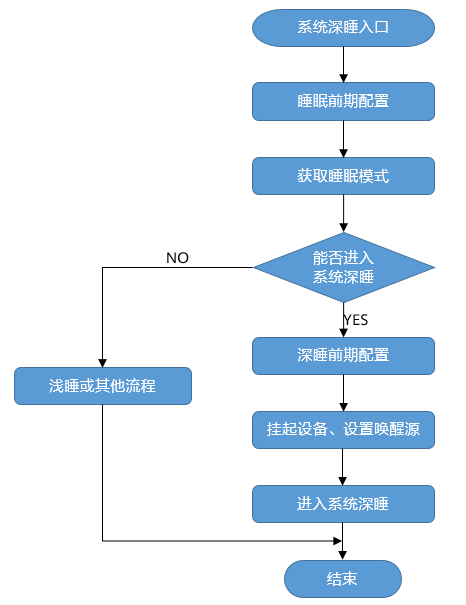

When the system enters sleep, it first performs pre-sleep configuration and determines the sleep mode based on the system sleepable time and the user-defined sleep policy.

-   If deep sleep mode is selected, pre-deep-sleep configuration is performed, such as masking interrupts and saving device states. Then devices are suspended and the wake-up source is set, and the system enters deep sleep mode.
-   If light sleep or another mode is selected, the corresponding flow is executed. Usually, Tickless works together with light sleep to mask Tick interrupts. You can also use a custom Tick masking and recovery mechanism. By default, light sleep only enters the Tickless + WFI mode.

**Development Flow<a name="section35077543142535"></a>**

The typical system sleep development flow:

1.  Open the menu and navigate to Kernel ---\> Enable Extend Kernel ---\> Enable Low Power Management Framework ---\> Low Power Management Configure.

    <a name="table840413411435"></a>
    <table><thead align="left"><tr id="row12404740437"><th class="cellrowborder" valign="top" width="22.74%" id="mcps1.1.6.1.1"><p id="p2404104144315"><a name="p2404104144315"></a><a name="p2404104144315"></a>Configuration Item</p>
    </th>
    <th class="cellrowborder" valign="top" width="32.49%" id="mcps1.1.6.1.2"><p id="p2040412414439"><a name="p2040412414439"></a><a name="p2040412414439"></a>Meaning</p>
    </th>
    <th class="cellrowborder" valign="top" width="12.1%" id="mcps1.1.6.1.3"><p id="p3404134194319"><a name="p3404134194319"></a><a name="p3404134194319"></a>Value Range</p>
    </th>
    <th class="cellrowborder" valign="top" width="10.61%" id="mcps1.1.6.1.4"><p id="p13404942439"><a name="p13404942439"></a><a name="p13404942439"></a>Default Value</p>
    </th>
    <th class="cellrowborder" valign="top" width="22.06%" id="mcps1.1.6.1.5"><p id="p7404104154316"><a name="p7404104154316"></a><a name="p7404104154316"></a>Dependency</p>
    </th>
    </tr>
    </thead>
    <tbody><tr id="row174041446436"><td class="cellrowborder" valign="top" width="22.74%" headers="mcps1.1.6.1.1 "><p id="p1680514441201"><a name="p1680514441201"></a><a name="p1680514441201"></a>LOSCFG_KERNEL_LIGHTSLEEP</p>
    </td>
    <td class="cellrowborder" valign="top" width="32.49%" headers="mcps1.1.6.1.2 "><p id="p18805844202"><a name="p18805844202"></a><a name="p18805844202"></a>Light sleep mode switch of system sleep</p>
    </td>
    <td class="cellrowborder" valign="top" width="12.1%" headers="mcps1.1.6.1.3 "><p id="p158042441505"><a name="p158042441505"></a><a name="p158042441505"></a>YES/NO</p>
    </td>
    <td class="cellrowborder" valign="top" width="10.61%" headers="mcps1.1.6.1.4 "><p id="p380414414018"><a name="p380414414018"></a><a name="p380414414018"></a>NO</p>
    </td>
    <td class="cellrowborder" valign="top" width="22.06%" headers="mcps1.1.6.1.5 "><p id="p177821844207"><a name="p177821844207"></a><a name="p177821844207"></a>LOSCFG_KERNEL_LOWPOWER</p>
    </td>
    </tr>
    <tr id="row1640317674419"><td class="cellrowborder" valign="top" width="22.74%" headers="mcps1.1.6.1.1 "><p id="p164032634418"><a name="p164032634418"></a><a name="p164032634418"></a>LOSCFG_KERNEL_DEEPSLEEP</p>
    </td>
    <td class="cellrowborder" valign="top" width="32.49%" headers="mcps1.1.6.1.2 "><p id="p04048615445"><a name="p04048615445"></a><a name="p04048615445"></a>Deep sleep mode switch of system sleep</p>
    </td>
    <td class="cellrowborder" valign="top" width="12.1%" headers="mcps1.1.6.1.3 "><p id="p1040426114416"><a name="p1040426114416"></a><a name="p1040426114416"></a>YES/NO</p>
    </td>
    <td class="cellrowborder" valign="top" width="10.61%" headers="mcps1.1.6.1.4 "><p id="p340414613443"><a name="p340414613443"></a><a name="p340414613443"></a>NO</p>
    </td>
    <td class="cellrowborder" valign="top" width="22.06%" headers="mcps1.1.6.1.5 "><p id="p1140412617446"><a name="p1140412617446"></a><a name="p1140412617446"></a>LOSCFG_KERNEL_LOWPOWER, and requires hardware platform support</p>
    </td>
    </tr>
    <tr id="row1656522343511"><td class="cellrowborder" valign="top" width="22.74%" headers="mcps1.1.6.1.1 "><p id="p3565102317351"><a name="p3565102317351"></a><a name="p3565102317351"></a>LOSCFG_KERNEL_WAKEUPTIMER_CALIBRATION</p>
    </td>
    <td class="cellrowborder" valign="top" width="32.49%" headers="mcps1.1.6.1.2 "><p id="p35651223143511"><a name="p35651223143511"></a><a name="p35651223143511"></a>External timer tick calibration switch for deep sleep mode of system sleep</p>
    </td>
    <td class="cellrowborder" valign="top" width="12.1%" headers="mcps1.1.6.1.3 "><p id="p17122162023610"><a name="p17122162023610"></a><a name="p17122162023610"></a>YES/NO</p>
    </td>
    <td class="cellrowborder" valign="top" width="10.61%" headers="mcps1.1.6.1.4 "><p id="p9654133183614"><a name="p9654133183614"></a><a name="p9654133183614"></a>YES</p>
    </td>
    <td class="cellrowborder" valign="top" width="22.06%" headers="mcps1.1.6.1.5 "><p id="p95651823193518"><a name="p95651823193518"></a><a name="p95651823193518"></a>LOSCFG_KERNEL_DEEPSLEEP &amp;&amp; LOSCFG_KERNEL_LOWPOWER, and requires hardware platform support</p>
    </td>
    </tr>
    <tr id="row83561620162718"><td class="cellrowborder" valign="top" width="22.74%" headers="mcps1.1.6.1.1 "><p id="p1935682012719"><a name="p1935682012719"></a><a name="p1935682012719"></a>LOSCFG_KERNEL_RAM_SAVE</p>
    </td>
    <td class="cellrowborder" valign="top" width="32.49%" headers="mcps1.1.6.1.2 "><p id="p1235719201279"><a name="p1235719201279"></a><a name="p1235719201279"></a>Memory save switch for deep sleep mode during system sleep</p>
    </td>
    <td class="cellrowborder" valign="top" width="12.1%" headers="mcps1.1.6.1.3 "><p id="p197751913284"><a name="p197751913284"></a><a name="p197751913284"></a>YES/NO</p>
    </td>
    <td class="cellrowborder" valign="top" width="10.61%" headers="mcps1.1.6.1.4 "><p id="p49777193282"><a name="p49777193282"></a><a name="p49777193282"></a>NO</p>
    </td>
    <td class="cellrowborder" valign="top" width="22.06%" headers="mcps1.1.6.1.5 "><p id="p103571620142717"><a name="p103571620142717"></a><a name="p103571620142717"></a>LOSCFG_KERNEL_DEEPSLEEP, and requires hardware platform support</p>
    </td>
    </tr>
    <tr id="row182451518194115"><td class="cellrowborder" valign="top" width="22.74%" headers="mcps1.1.6.1.1 "><p id="p724519189415"><a name="p724519189415"></a><a name="p724519189415"></a>LOSCFG_LOWPOWER_SLEEP_USERCONFIG</p>
    </td>
    <td class="cellrowborder" valign="top" width="32.49%" headers="mcps1.1.6.1.2 "><p id="p152451918184117"><a name="p152451918184117"></a><a name="p152451918184117"></a>Pre/post processing switch during system sleep</p>
    </td>
    <td class="cellrowborder" valign="top" width="12.1%" headers="mcps1.1.6.1.3 "><p id="p924531804113"><a name="p924531804113"></a><a name="p924531804113"></a>YES/NO</p>
    </td>
    <td class="cellrowborder" valign="top" width="10.61%" headers="mcps1.1.6.1.4 "><p id="p172451184419"><a name="p172451184419"></a><a name="p172451184419"></a>NO</p>
    </td>
    <td class="cellrowborder" valign="top" width="22.06%" headers="mcps1.1.6.1.5 "><p id="p624571815419"><a name="p624571815419"></a><a name="p624571815419"></a>LOSCFG_KERNEL_DEEPSLEEP</p>
    </td>
    </tr>
    <tr id="row853164104719"><td class="cellrowborder" valign="top" width="22.74%" headers="mcps1.1.6.1.1 "><p id="p183391020286"><a name="p183391020286"></a><a name="p183391020286"></a>LOSCFG_KERNEL_DYN_FREQ</p>
    </td>
    <td class="cellrowborder" valign="top" width="32.49%" headers="mcps1.1.6.1.2 "><p id="p13533414720"><a name="p13533414720"></a><a name="p13533414720"></a>Frequency scaling switch of system sleep</p>
    </td>
    <td class="cellrowborder" valign="top" width="12.1%" headers="mcps1.1.6.1.3 "><p id="p1533454717"><a name="p1533454717"></a><a name="p1533454717"></a>YES/NO</p>
    </td>
    <td class="cellrowborder" valign="top" width="10.61%" headers="mcps1.1.6.1.4 "><p id="p155334154715"><a name="p155334154715"></a><a name="p155334154715"></a>NO</p>
    </td>
    <td class="cellrowborder" valign="top" width="22.06%" headers="mcps1.1.6.1.5 "><p id="p15324144719"><a name="p15324144719"></a><a name="p15324144719"></a>LOSCFG_KERNEL_LOWPOWER, and requires hardware platform support</p>
    </td>
    </tr>
    <tr id="row12104741333"><td class="cellrowborder" valign="top" width="22.74%" headers="mcps1.1.6.1.1 "><p id="p1104041437"><a name="p1104041437"></a><a name="p1104041437"></a>LOSCFG_LOWPOWER_SLEEP_VETO</p>
    </td>
    <td class="cellrowborder" valign="top" width="32.49%" headers="mcps1.1.6.1.2 "><p id="p13104141337"><a name="p13104141337"></a><a name="p13104141337"></a>Voting switch of system sleep</p>
    </td>
    <td class="cellrowborder" valign="top" width="12.1%" headers="mcps1.1.6.1.3 "><p id="p13104194539"><a name="p13104194539"></a><a name="p13104194539"></a>YES/NO</p>
    </td>
    <td class="cellrowborder" valign="top" width="10.61%" headers="mcps1.1.6.1.4 "><p id="p1110412415315"><a name="p1110412415315"></a><a name="p1110412415315"></a>NO</p>
    </td>
    <td class="cellrowborder" valign="top" width="22.06%" headers="mcps1.1.6.1.5 "><p id="p1410494932"><a name="p1410494932"></a><a name="p1410494932"></a>LOSCFG_KERNEL_LOWPOWER</p>
    </td>
    </tr>
    <tr id="row6643183333415"><td class="cellrowborder" valign="top" width="22.74%" headers="mcps1.1.6.1.1 "><p id="p271033893413"><a name="p271033893413"></a><a name="p271033893413"></a>LOSCFG_LOWPOWER_SLEEP_BY_TICK</p>
    </td>
    <td class="cellrowborder" valign="top" width="32.49%" headers="mcps1.1.6.1.2 "><p id="p164303314346"><a name="p164303314346"></a><a name="p164303314346"></a>Switch for automatically identifying the sleep mode based on the ready time</p>
    </td>
    <td class="cellrowborder" valign="top" width="12.1%" headers="mcps1.1.6.1.3 "><p id="p186431133123415"><a name="p186431133123415"></a><a name="p186431133123415"></a>YES/NO</p>
    </td>
    <td class="cellrowborder" valign="top" width="10.61%" headers="mcps1.1.6.1.4 "><p id="p176431233153416"><a name="p176431233153416"></a><a name="p176431233153416"></a>YES</p>
    </td>
    <td class="cellrowborder" valign="top" width="22.06%" headers="mcps1.1.6.1.5 "><p id="p0528424352"><a name="p0528424352"></a><a name="p0528424352"></a>LOSCFG_KERNEL_LOWPOWER</p>
    </td>
    </tr>
    <tr id="row241819314447"><td class="cellrowborder" valign="top" width="22.74%" headers="mcps1.1.6.1.1 "><p id="p741816313446"><a name="p741816313446"></a><a name="p741816313446"></a>LOSCFG_LOWPOWER_SLEEP_WFI</p>
    </td>
    <td class="cellrowborder" valign="top" width="32.49%" headers="mcps1.1.6.1.2 "><p id="p18418113119444"><a name="p18418113119444"></a><a name="p18418113119444"></a>Custom configuration switch for WFI mode during system sleep</p>
    </td>
    <td class="cellrowborder" valign="top" width="12.1%" headers="mcps1.1.6.1.3 "><p id="p94181731114418"><a name="p94181731114418"></a><a name="p94181731114418"></a>YES/NO</p>
    </td>
    <td class="cellrowborder" valign="top" width="10.61%" headers="mcps1.1.6.1.4 "><p id="p1141853134415"><a name="p1141853134415"></a><a name="p1141853134415"></a>NO</p>
    </td>
    <td class="cellrowborder" valign="top" width="22.06%" headers="mcps1.1.6.1.5 "><p id="p54185319442"><a name="p54185319442"></a><a name="p54185319442"></a>LOSCFG_KERNEL_LOWPOWER</p>
    </td>
    </tr>
    <tr id="row0697163175212"><td class="cellrowborder" valign="top" width="22.74%" headers="mcps1.1.6.1.1 "><p id="p17697173195212"><a name="p17697173195212"></a><a name="p17697173195212"></a>LOSCFG_MAX_SLEEP_TIME</p>
    </td>
    <td class="cellrowborder" valign="top" width="32.49%" headers="mcps1.1.6.1.2 "><p id="p1469743205213"><a name="p1469743205213"></a><a name="p1469743205213"></a>Maximum sleep threshold configuration for system sleep</p>
    </td>
    <td class="cellrowborder" valign="top" width="12.1%" headers="mcps1.1.6.1.3 "><p id="p96971837523"><a name="p96971837523"></a><a name="p96971837523"></a>INT</p>
    </td>
    <td class="cellrowborder" valign="top" width="10.61%" headers="mcps1.1.6.1.4 "><p id="p26972316526"><a name="p26972316526"></a><a name="p26972316526"></a>10000</p>
    </td>
    <td class="cellrowborder" valign="top" width="22.06%" headers="mcps1.1.6.1.5 "><p id="p66972313522"><a name="p66972313522"></a><a name="p66972313522"></a>LOSCFG_KERNEL_LOWPOWER</p>
    </td>
    </tr>
    <tr id="row677772211587"><td class="cellrowborder" valign="top" width="22.74%" headers="mcps1.1.6.1.1 "><p id="p47771922105814"><a name="p47771922105814"></a><a name="p47771922105814"></a>LOSCFG_MIN_LIGHT_SLEEP_TIME</p>
    </td>
    <td class="cellrowborder" valign="top" width="32.49%" headers="mcps1.1.6.1.2 "><p id="p37771722175819"><a name="p37771722175819"></a><a name="p37771722175819"></a>Minimum light sleep threshold configuration for system sleep</p>
    </td>
    <td class="cellrowborder" valign="top" width="12.1%" headers="mcps1.1.6.1.3 "><p id="p18777152214582"><a name="p18777152214582"></a><a name="p18777152214582"></a>INT</p>
    </td>
    <td class="cellrowborder" valign="top" width="10.61%" headers="mcps1.1.6.1.4 "><p id="p47771522145819"><a name="p47771522145819"></a><a name="p47771522145819"></a>50</p>
    </td>
    <td class="cellrowborder" valign="top" width="22.06%" headers="mcps1.1.6.1.5 "><p id="p11777142213583"><a name="p11777142213583"></a><a name="p11777142213583"></a>LOSCFG_KERNEL_LIGHTSLEEP</p>
    </td>
    </tr>
    <tr id="row158011627115918"><td class="cellrowborder" valign="top" width="22.74%" headers="mcps1.1.6.1.1 "><p id="p108011827115910"><a name="p108011827115910"></a><a name="p108011827115910"></a>LOSCFG_MIN_DEEP_SLEEP_TIME</p>
    </td>
    <td class="cellrowborder" valign="top" width="32.49%" headers="mcps1.1.6.1.2 "><p id="p2080172717595"><a name="p2080172717595"></a><a name="p2080172717595"></a>Minimum deep sleep threshold configuration for system sleep</p>
    </td>
    <td class="cellrowborder" valign="top" width="12.1%" headers="mcps1.1.6.1.3 "><p id="p1880118271597"><a name="p1880118271597"></a><a name="p1880118271597"></a>INT</p>
    </td>
    <td class="cellrowborder" valign="top" width="10.61%" headers="mcps1.1.6.1.4 "><p id="p118015270593"><a name="p118015270593"></a><a name="p118015270593"></a>2000</p>
    </td>
    <td class="cellrowborder" valign="top" width="22.06%" headers="mcps1.1.6.1.5 "><p id="p19801152725917"><a name="p19801152725917"></a><a name="p19801152725917"></a>LOSCFG_KERNEL_DEEPSLEEP</p>
    </td>
    </tr>
    <tr id="row843214111017"><td class="cellrowborder" valign="top" width="22.74%" headers="mcps1.1.6.1.1 "><p id="p143215111604"><a name="p143215111604"></a><a name="p143215111604"></a>LOSCFG_DELTA_TICKS</p>
    </td>
    <td class="cellrowborder" valign="top" width="32.49%" headers="mcps1.1.6.1.2 "><p id="p19432811909"><a name="p19432811909"></a><a name="p19432811909"></a>Deep sleep tick compensation configuration for system sleep</p>
    </td>
    <td class="cellrowborder" valign="top" width="12.1%" headers="mcps1.1.6.1.3 "><p id="p1543251116014"><a name="p1543251116014"></a><a name="p1543251116014"></a>INT</p>
    </td>
    <td class="cellrowborder" valign="top" width="10.61%" headers="mcps1.1.6.1.4 "><p id="p64323116015"><a name="p64323116015"></a><a name="p64323116015"></a>1</p>
    </td>
    <td class="cellrowborder" valign="top" width="22.06%" headers="mcps1.1.6.1.5 "><p id="p44321111807"><a name="p44321111807"></a><a name="p44321111807"></a>LOSCFG_KERNEL_DEEPSLEEP</p>
    </td>
    </tr>
    <tr id="row1804103111710"><td class="cellrowborder" valign="top" width="22.74%" headers="mcps1.1.6.1.1 "><p id="p78042311074"><a name="p78042311074"></a><a name="p78042311074"></a>LOSCFG_EXT_TIMER_FREQ</p>
    </td>
    <td class="cellrowborder" valign="top" width="32.49%" headers="mcps1.1.6.1.2 "><p id="p480412318720"><a name="p480412318720"></a><a name="p480412318720"></a>External clock frequency configuration for deep sleep during system sleep</p>
    </td>
    <td class="cellrowborder" valign="top" width="12.1%" headers="mcps1.1.6.1.3 "><p id="p1780403117718"><a name="p1780403117718"></a><a name="p1780403117718"></a>INT</p>
    </td>
    <td class="cellrowborder" valign="top" width="10.61%" headers="mcps1.1.6.1.4 "><p id="p18804231774"><a name="p18804231774"></a><a name="p18804231774"></a>1</p>
    </td>
    <td class="cellrowborder" valign="top" width="22.06%" headers="mcps1.1.6.1.5 "><p id="p980414311718"><a name="p980414311718"></a><a name="p980414311718"></a>LOSCFG_KERNEL_DEEPSLEEP</p>
    </td>
    </tr>
    </tbody>
    </table>

2.  Configure the system sleep and wake-up policy in Menuconfig, including the minimum light sleep/deep sleep thresholds and the maximum sleep threshold. If deep sleep mode is enabled, choose whether to enable custom WFI, pre/post-sleep processing, deep sleep tick compensation, and the external clock frequency as needed.
3.  Adapt the sleep interfaces of the corresponding sleep mode. For details, see "[Low Power Flow Registration Structure](overview-83.md#section938813535280)".
4.  When the system is busy, call the LOS\_PowerMgrSleepLock interface to forbid entering the specified sleep mode (deep sleep or light sleep). When the system is idle, call the LOS\_PowerMgrSleepUnLock interface to allow entering the specified sleep mode. Note that these two interfaces should be used together.
5.  When the system is in standby, it automatically enters the corresponding sleep mode based on the business voting and the actual sleepable duration of the system.

#### Precautions<a name="ZH-CN_TOPIC_0000002543354315"></a>

-   When deep sleep mode is enabled, it is recommended to write back the cache to memory in the enterDeepSleep hook function of the substructure member struct PowerMgrRunOps in "[Low Power Flow Registration Structure](overview-83.md#section938813535280)".
-   For the frequency scaling mechanism provided by the low power framework, if the system enters the idle state after startup but before the first frequency scaling of the business, the system will scale the frequency to the highest by default.

#### Programming Example<a name="ZH-CN_TOPIC_0000002543354299"></a>

**Example Description<a name="section3463876395722"></a>**

This example implements the following functions on a CPU with the cortex-M architecture:

1.  Register the low power flow framework and adapt interfaces such as deep sleep and RTC enablement.
2.  Create a user task and delay for 5000 ticks in the task, so that the system enters deep sleep mode.

**Sample Code<a name="section768121154111"></a>**

Prerequisites: Complete the deep sleep configuration of system sleep in the menuconfig menu, and configure the user sleep thresholds: LOSCFG\_MIN\_SLEEP\_TIME, LOSCFG\_MAX\_SLEEP\_TIME, and LOSCFG\_MIN\_DEEP\_SLEEP\_TIME.

Part of the code is implemented as follows:

1.  Register the low power framework

    ```
    #ifdef LOSCFG_KERNEL_LOWPOWER
    #include "los_lowpower.h"
    #endif
    const PowerMgrParameter gPowerMgrParameter = {       // User-defined system sleep configuration; implement the member functions as needed
        .runOps = {
    #ifdefLOSCFG_KERNEL_LIGHTSLEEP
            .enterLightSleep = EnterLightSleep,          // Light sleep action. Here, set it to enter WFI mode
            .getSleepMode = GetSleepMode,                // Get the user sleep mode
    #endif
    #ifdefLOSCFG_KERNEL_DEEPSLEEP
            .suspendConfig = SuspendDevice,              // Action to disable peripherals
            .resumeConfig = ResumeDevice,                // Resume peripherals
            .enterDeepSleep = EnterDeepSleep,            // Deep sleep action. Here, set it to the STM32 standby mode
            .setWakeUpTimer = SetWakeUpTimer,            // Set the wake-up source. Here, enable the external RTC based on the input parameter (sleep time)
            .withdrawWakeUpTimer = WithdrawWakeUpTimer,  // Withdraw the wake-up source. Here, stop RTC timing
    #endif
        }
    };
    INT32 main(VOID)
    {
        UINT32 ret;
    #ifdef LOSCFG_KERNEL_LOWPOWER
        // Register the low power flow framework. If only the default Tickless and light sleep modes are needed, call LOS_PowerMgrInit(NULL) to register the system default framework.
        LOS_PowerMgrInit(gPowerMgrParameter);
    #endif
        HardwareInit();
        printf("[main]: Hello, welcome to liteos !\n");
        PRINT_RELEASE("********Hello LiteOS ********\n"
                      "\nversion : %s\nopen-version : %s %u.%u.%u\n"
                      "build data : %s %s\n\n"
                      "**********************************\n",
            HW_LITEOS_VER, HW_LITEOS_SYSNAME, MAJ_V, MIN_V, REL_V, __DATE__,
            __TIME__);
        OsSetMainTask();
        OsCurrTaskSet(OsGetMainTask());
        ret = OsMain();
        if (ret != LOS_OK) {
            return LOS_NOK;
        }
        RTC_Start();
        g_kernelInit = 1;
        OsStart();
        return LOS_OK;
    }
    ```

2.  Create a task and perform the delay operation in the task entry function:

    ```
    STATIC VOID task_demo1(VOID)
    {
        while (1) {
            osDelay(5000); // Delay the task for 5000 ticks
        }
    }
    ```

**Result Verification<a name="section556751395722"></a>**

Because the deep sleep threshold is set to 2000 and the task delays for 5000 ticks, the system enters deep sleep mode:

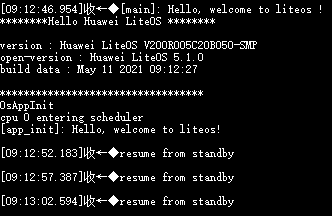

As shown in the preceding figure, the system wakes up from standby mode every 5 seconds.

### Sleep Wake-up<a name="ZH-CN_TOPIC_0000002511954220"></a>


#### Overview<a name="ZH-CN_TOPIC_0000002543394403"></a>

**Basic Concepts<a name="s47879e50880744a2b55503c4af0f770c"></a>**

Sleep wake-up (RunStop) is a mechanism for saving the system scene image and quickly resuming operation from the scene image.

When the user calls the sleep wake-up interface at a certain moment during system operation, the system state snapshot (CPU scene and memory) at that moment can be saved to Flash. After the system restarts, the system can be restored from the snapshot, allowing it to continue running from the state saved in the snapshot.

**Working Principles<a name="section11193183881413"></a>**

After the business modules are initialized and run stably, the sleep wake-up interface is called to save the system snapshot, which contains all CPU scenes and memory states required by the business modules. After the system runs for a period of time, when the business modules are idle, the main core powers off itself and enters low power mode. When there is business to process, the MCU sends a specific data packet to wake up and power on the main core. After the hardware states are restored, the system resumes running from the Flash snapshot. In this way, the business modules do not need to be re-initialized after the system is powered on again, achieving fast wake-up of the business modules.

#### Development Guidelines<a name="ZH-CN_TOPIC_0000002511794284"></a>

**Use Cases<a name="s92d232002be74e1e8dc9b2a1183ff365"></a>**

If you want the system to enter low power mode after running for a period of time, and to quickly restore to the state before low power mode when business arrives, so as to quickly resume business processing capabilities, this application scenario can be implemented through sleep wake-up.

In a certain project, sleep wake-up is used to implement chip sleep wake-up: after the system business runs stably, a snapshot of the current system state is saved. When the system enters the idle state, the main core powers off itself and enters low power mode. When a business message arrives, the MMU powers on the main core, and the system quickly starts from the snapshot and resumes execution. Taking a WIFI chip as an example, RunStop can keep the WIFI state connected when the main core is in low power mode, and enable fast wake-up of the WIFI state.

**Functions<a name="sfa0a25ee8bad4bdd93695c770e70d719"></a>**

The sleep wake-up module provides the following functions. For details about the interfaces, see the API reference.

<a name="t3143b9cb85b443fc9dca5935928558e4"></a>
<table><thead align="left"><tr id="r47d5a65f29b64fe38df70ad2b51dc4e3"><th class="cellrowborder" valign="top" width="32.29%" id="mcps1.1.3.1.1"><p id="a5a6f64800ddc4de4846c2336cb5be38f"><a name="a5a6f64800ddc4de4846c2336cb5be38f"></a><a name="a5a6f64800ddc4de4846c2336cb5be38f"></a>Interface Name</p>
</th>
<th class="cellrowborder" valign="top" width="67.71000000000001%" id="mcps1.1.3.1.2"><p id="a4ef010b1e56e42388175d1f6e7f7bd95"><a name="a4ef010b1e56e42388175d1f6e7f7bd95"></a><a name="a4ef010b1e56e42388175d1f6e7f7bd95"></a>Description</p>
</th>
</tr>
</thead>
<tbody><tr id="r9e39454d094e4fb294b97e3f8670b9b2"><td class="cellrowborder" valign="top" width="32.29%" headers="mcps1.1.3.1.1 "><p id="ad4d4fb4d97b8447cb2c2f815474cab1f"><a name="ad4d4fb4d97b8447cb2c2f815474cab1f"></a><a name="ad4d4fb4d97b8447cb2c2f815474cab1f"></a>LOS_MakeImage</p>
</td>
<td class="cellrowborder" valign="top" width="67.71000000000001%" headers="mcps1.1.3.1.2 "><p id="a97e086c521514b7f98cf8c9e7c5bdf77"><a name="a97e086c521514b7f98cf8c9e7c5bdf77"></a><a name="a97e086c521514b7f98cf8c9e7c5bdf77"></a>Saves the system state snapshot to the specified medium.</p>
</td>
</tr>
</tbody>
</table>

**Development Flow<a name="sd10543a441614c43b1256290d0996f88"></a>**

**Figure 1**  Sleep wake-up flow chart<a name="fig126065711337"></a>  
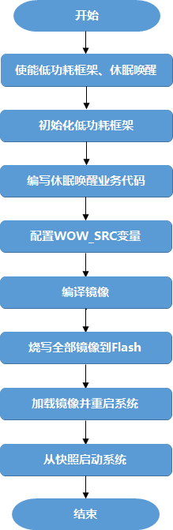

1.  Enable the low power framework and sleep wake-up.

    Open the menu. The menu path of the related configuration items is: Kernel ---\> Enable Extend Kernel ---\> Enable Low Power Management Framework ---\> Low Power Management Configure.

    <a name="table11799131714460"></a>
    <table><thead align="left"><tr id="row16800121713464"><th class="cellrowborder" valign="top" width="24.37%" id="mcps1.1.6.1.1"><p id="p15912448155750"><a name="p15912448155750"></a><a name="p15912448155750"></a>Configuration Item</p>
    </th>
    <th class="cellrowborder" valign="top" width="21.17%" id="mcps1.1.6.1.2"><p id="p13839897155750"><a name="p13839897155750"></a><a name="p13839897155750"></a>Meaning</p>
    </th>
    <th class="cellrowborder" valign="top" width="13.18%" id="mcps1.1.6.1.3"><p id="p47289871155750"><a name="p47289871155750"></a><a name="p47289871155750"></a>Value Range</p>
    </th>
    <th class="cellrowborder" valign="top" width="11.43%" id="mcps1.1.6.1.4"><p id="p5274313155750"><a name="p5274313155750"></a><a name="p5274313155750"></a>Default Value</p>
    </th>
    <th class="cellrowborder" valign="top" width="29.849999999999998%" id="mcps1.1.6.1.5"><p id="p24566191155750"><a name="p24566191155750"></a><a name="p24566191155750"></a>Dependency</p>
    </th>
    </tr>
    </thead>
    <tbody><tr id="row138007177462"><td class="cellrowborder" valign="top" width="24.37%" headers="mcps1.1.6.1.1 "><p id="p9800131794619"><a name="p9800131794619"></a><a name="p9800131794619"></a>LOSCFG_KERNEL_LOWPOWER</p>
    </td>
    <td class="cellrowborder" valign="top" width="21.17%" headers="mcps1.1.6.1.2 "><p id="p38006174461"><a name="p38006174461"></a><a name="p38006174461"></a>Low power framework switch</p>
    </td>
    <td class="cellrowborder" valign="top" width="13.18%" headers="mcps1.1.6.1.3 "><p id="p480020179467"><a name="p480020179467"></a><a name="p480020179467"></a>YES/NO</p>
    </td>
    <td class="cellrowborder" valign="top" width="11.43%" headers="mcps1.1.6.1.4 "><p id="p1546223317491"><a name="p1546223317491"></a><a name="p1546223317491"></a>YES</p>
    </td>
    <td class="cellrowborder" valign="top" width="29.849999999999998%" headers="mcps1.1.6.1.5 "><p id="p1980081794615"><a name="p1980081794615"></a><a name="p1980081794615"></a>LOSCFG_KERNEL_EXTKERNEL</p>
    </td>
    </tr>
    <tr id="row1132133114478"><td class="cellrowborder" valign="top" width="24.37%" headers="mcps1.1.6.1.1 "><p id="p41321731204714"><a name="p41321731204714"></a><a name="p41321731204714"></a>LOSCFG_KERNEL_RUNSTOP</p>
    </td>
    <td class="cellrowborder" valign="top" width="21.17%" headers="mcps1.1.6.1.2 "><p id="p213217316474"><a name="p213217316474"></a><a name="p213217316474"></a>Sleep wake-up switch</p>
    </td>
    <td class="cellrowborder" valign="top" width="13.18%" headers="mcps1.1.6.1.3 "><p id="p81321031194717"><a name="p81321031194717"></a><a name="p81321031194717"></a>YES/NO</p>
    </td>
    <td class="cellrowborder" valign="top" width="11.43%" headers="mcps1.1.6.1.4 "><p id="p15132331184710"><a name="p15132331184710"></a><a name="p15132331184710"></a>NO</p>
    </td>
    <td class="cellrowborder" valign="top" width="29.849999999999998%" headers="mcps1.1.6.1.5 "><p id="p19501401014"><a name="p19501401014"></a><a name="p19501401014"></a>Sleep wake-up depends on Flash, Uboot, and the bestfit memory management algorithm. The macro switch for Nand Flash is LOSCFG_DRIVERS_MTD_NAND, and the macro switch for spi_nor flash is LOSCFG_DRIVERS_MTD_SPI_NOR</p>
    </td>
    </tr>
    </tbody>
    </table>

2.  Initialize the low power framework.

    In the main entry function, call LOS\_PowerMgrInit before OsStart to initialize the low power framework as the system default framework. The example code is as follows:

    ```
    #ifdef LOSCFG_KERNEL_LOWPOWER
    #include "los_lowpower.h"
    const PowerMgrRunOps runOps = {
        .getSleepMode = NULL,
    };
    
    UINT32 OsPreSystemConfig(VOID)
    {
        PowerMgrParameter param;
        param.runOps = runOps;
        return LOS_PowerMgrInit(&param);
    }
    
    #endif
    LITE_OS_SEC_TEXT_INIT int main(void)
    {
        ......
    #ifdef LOSCFG_KERNEL_LOWPOWER
        ret = OsPreSystemConfig();
        if (ret != LOS_OK) {
            return LOS_NOK;
        }
    #endif
        OsStart();
        ......
    }
    ```

3.  <a name="lba71c2142af140a9a7f53c2b33f72fda"></a>Write the snapshot business code.

    The entry function of the business code is app\_init, which is located in the "self\_src/targets/board/$\(LITEOS\_PLATFORM\)/os\_adapt/os\_adapt.c" file in the root directory of the source code.

    After the snapshot business code, call LOS\_MakeImage to save the current system state snapshot to the specified medium, and control the compilation of non-snapshot business code through the MAKE\_WOW\_IMAGE macro, so as to compile both the snapshot image and the full image. The example code is as follows.

    ```
    void wakeup_callback(void)
    {
    #ifdef LOSCFG_KERNEL_CPUP
        LOS_CpupReset();
    #endif
        (VOID)LOS_HwiEnable(83);
    }
    #define NOR_ERASE_ALIGN_SIZE    (64 * 1024)
    #define NOR_READ_ALIGN_SIZE     1
    #define NOR_WRITE_ALIGN_SIZE    1
    int flash_read(void *memaddr, size_t start, size_t size)
    {
        return spiflash_read(memaddr, start, size);
    }
    int flash_write(void *memaddr, size_t start, size_t size)
    {
        spiflash_erase(start, size);
        return spiflash_write(memaddr, start, size);
    }
    void app_init(void)
    {
    #ifdef LOSCFG_KERNEL_RUNSTOP
        RUNSTOP_PARAM_S stRunstopParam;       // Define a parameter variable for LOS_MakeImage
    #endif
    #ifdef LOSCFG_DRIVERS_MTD_SPI_NOR
        (void)spinor_init();
        mtd = get_mtd("spinor");
    #endif
    #if defined(LOSCFG_KERNEL_RUNSTOP) && defined(LOSCFG_DRIVERS_MTD_SPI_NOR)
        memset(&stRunstopParam, 0, sizeof(RUNSTOP_PARAM_S));
        /* LOS_MakeImage parameter configuration */
        stRunstopParam.pfFlashReadFunc          = flash_read;             // Specify the medium read function
        stRunstopParam.pfFlashWriteFunc         = flash_write;            // Specify the medium write function
        stRunstopParam.pfIdleWakeupCallback     = idle_wakeup_callback;   // Specify the callback function to be executed in the idle task after recovery from the snapshot
        stRunstopParam.pfImageDoneCallback      = NULL;                   // Specify the callback function after the snapshot image is generated; set to NULL here
        stRunstopParam.pfWakeupCallback         = wakeup_callback;        // Specify the callback function to be executed after recovery from the snapshot       
        stRunstopParam.uwFlashEraseAlignSize    = NOR_ERASE_ALIGN_SIZE;   // Erase alignment parameter of the medium
        stRunstopParam.uwFlashWriteAlignSize    = NOR_WRITE_ALIGN_SIZE;   // Write alignment parameter of the medium
        stRunstopParam.uwFlashReadAlignSize     = NOR_READ_ALIGN_SIZE;    // Read alignment parameter of the medium
        stRunstopParam.uwImageFlashAddr         = 0x100000;               // Start address of the medium for flashing the full system image
        stRunstopParam.uwWowFlashAddr           = 0x800000;               // Start address of the medium for saving the snapshot
        LOS_MakeImage(&stRunstopParam);
    #endif
    #ifndef MAKE_WOW_IMAGE
    #ifdef LOSCFG_KERNEL_RUNSTOP
        PRINTK("Image length 0x%x\n", OsWowImageSizeGet());
    #endif
    #endif /* MAKE_WOW_IMAGE */
    }
    ```

4.  Configure the WOW\_SRC variable.

    In the "build/make/wow\_scatter.mk" file in the root directory of the source code, configure the WOW\_SRC variable to the path of the business source file that calls the sleep wake-up function, as shown below. LITEOSTOPDIR indicates the "RTOS\_Lite/self\_src" source code directory.

    ```
    WOW_SRC := $(LITEOSTOPDIR)/targets/$(LITEOS_PLATFORM)/os_adapt/os_adapt.c
    ```

5.  Compile the system image.
    1.  Run the make command in the root directory to compile all business code.

        ```
        RTOS_Lite$ make
        ```

    2.  After the compilation is complete, check the layout of the image sections to verify that the snapshot image is generated successfully. Enter the system image generation directory (for example, the image generation directory of the Hi3556V200 platform is "out/hi3556v200", and other platforms follow the same pattern), where you can see the generated system ELF file vs\_server. Run the "readelf -S vs\_server" command to view the section header information. The result is shown in [Figure 2](#f9b0ebe192bdc45ecbb7905814b234902).

        **Figure 2**  readelf result of the system ELF file vs\_server<a name="f9b0ebe192bdc45ecbb7905814b234902"></a>  
        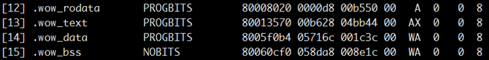

        [Figure 2](#f9b0ebe192bdc45ecbb7905814b234902) shows the section information related to sleep wake-up (including the section name, start address, and offset size). Among them, .wow\_rodata is the read-only data section of the sleep wake-up image, .wow\_text is the code section, .wow\_data is the data section, and .wow\_bss is the bss section.

    3.  View the .text section of the sleep wake-up link script "RTOS\_Lite/self\_src/tools/scripts/ld/wow.ld". It can be seen that wow.O\(\*\.text\*\) has been added, which integrates the symbols related to the snapshot part of the sleep wake-up code into the same section, as shown in [Figure 3](#fd7546a5c1b3e41fc9a0e3677f7161dd4).

        **Figure 3**  .text section of the link script<a name="fd7546a5c1b3e41fc9a0e3677f7161dd4"></a>  
        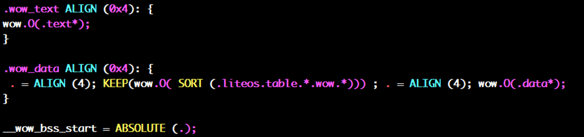

6.  Flash the full image to Flash.

    Enter the serial port tool interface and refer to the following commands to flash the full image to address 0x100000 of Flash.

    ```
    tftp 0x81000000 vs_server.bin;sf probe 0;sf erase 0x100000 0x300000;sf write 0x81000000 0x100000 0x300000;
    ```

    Here, "vs\_server.bin" is the system image file name. First, flash it to a high address 0x81000000 in memory. Then, flash it to Flash with the start address 0x100000 and the flash length 0x300000. That is, the size of the image file to be flashed cannot exceed 3M. Adjust the length value according to the actual image size.

    > **NOTE:** 
    >You can choose the image flashing tool and method according to the actual environment.

7.  Load the full image.

    Refer to the following commands to read the full image from address 0x100000 of Flash and load it to memory address 0x80200000.

    ```
    sf probe 0;sf read 0x80200000 0x100000 0x300000;
    ```

    Run the following command to start the system from memory address 0x80200000.

    ```
    go 0x80200000;
    ```

8.  Restore operation from the snapshot based on the snapshot image size fed back by the system.

    **Figure 4**  Print information at system startup<a name="fig0166121312444"></a>  
    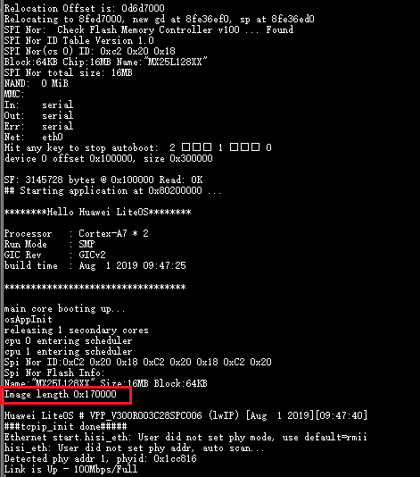

    Based on the information printed at system startup, the size of the sleep wake-up snapshot image can be obtained, as shown in the red box in [Figure 4](#fig0166121312444). In this example, the snapshot size is 0x170000. The snapshot is written to address 0x800000 of the medium (from [3](#lba71c2142af140a9a7f53c2b33f72fda), the start address of the medium for saving the snapshot can be obtained as 0x800000).

    Restart the system and run the following commands in uboot: read the snapshot image of 0x170000 bytes from address 0x800000 of the medium where the snapshot is saved, load it to memory address 0x80200000, and then run "go 0x80200000" to start the system from the snapshot.

    ```
    sf probe 0;sf read 0x80200000 0x800000 0x170000;
    go 0x80200000;
    ```

    The startup effect is shown in [Figure 5](#fig21388201444).

    **Figure 5**  Print information after executing commands in uboot<a name="fig21388201444"></a>  
    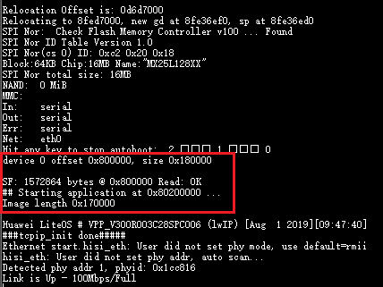

    The system starts successfully from the snapshot.

#### Precautions<a name="ZH-CN_TOPIC_0000002511794348"></a>

-   When writing sleep wake-up business code, you need to ensure that all code and data of the snapshot are covered before "\#ifndef MAKE\_WOW\_IMAGE". Otherwise, the system restored from the snapshot will not contain all sleep wake-up business.
-   Sleep wake-up depends on the storage medium. Currently, LiteOS depends on Flash, so this feature depends on Flash. If Flash support is disabled, the sleep wake-up feature will also be disabled. If you need to enable sleep wake-up on other storage media, refer to the current Flash configuration for adaptation.

## CPU Usage<a name="ZH-CN_TOPIC_0000002511794416"></a>


### Overview<a name="ZH-CN_TOPIC_0000002543354201"></a>

**Basic Concepts<a name="section58658659128"></a>**

LiteOS CPUP (Central Processing Unit Percent, that is, CPU usage) is classified into system CPU usage, task CPU usage, and interrupt CPU usage.

System CPU usage refers to the CPU usage of the system within a period, indicating how idle or busy the system is over a period of time, and also indicating the CPU load.

Task CPU usage refers to the CPU usage of a single task, indicating how idle or busy a single task is over a period of time.

Interrupt CPU usage refers to the interrupt usage within a period, indicating the interrupt processing time of the system over a period of time.

**Working Principles<a name="section64191838171416"></a>**

LiteOS CPUP uses task-level recording. When a task switch occurs, the task's entry time is recorded; at the next task switch, the task's exit time is recorded, from which the task's running time in this period is calculated and accumulated to the task's total occupied time.

The calculation methods of CPU usage are:

System CPU usage = total running time of all tasks except the idle task / total system running time.

Task CPU usage = total task running time / total system running time.

Interrupt CPU usage = total interrupt running time / total system running time

### Development Guidelines<a name="ZH-CN_TOPIC_0000002511794350"></a>

**Use Cases<a name="section42233910171524"></a>**

Use the system CPU usage to determine whether the current system load exceeds the design specifications.

Use the CPU usage of each task in the system to determine whether the CPU usage of each task meets the design expectations.

**Functions<a name="section3382358420811"></a>**

The LiteOS CPU usage module provides the following functions. For details about the interfaces, see the API reference.

<a name="table423153820811"></a>
<table><thead align="left"><tr id="row1872972720811"><th class="cellrowborder" valign="top" width="21.32786721327867%" id="mcps1.1.4.1.1"><p id="p2197741720811"><a name="p2197741720811"></a><a name="p2197741720811"></a>Function Category</p>
</th>
<th class="cellrowborder" valign="top" width="21.767823217678234%" id="mcps1.1.4.1.2"><p id="p1280752020811"><a name="p1280752020811"></a><a name="p1280752020811"></a>Interface Name</p>
</th>
<th class="cellrowborder" valign="top" width="56.9043095690431%" id="mcps1.1.4.1.3"><p id="p3595409320811"><a name="p3595409320811"></a><a name="p3595409320811"></a>Description</p>
</th>
</tr>
</thead>
<tbody><tr id="row3156887520811"><td class="cellrowborder" valign="top" width="21.32786721327867%" headers="mcps1.1.4.1.1 "><p id="p534411020433"><a name="p534411020433"></a><a name="p534411020433"></a>Get system CPU usage</p>
</td>
<td class="cellrowborder" valign="top" width="21.767823217678234%" headers="mcps1.1.4.1.2 "><p id="p6009666520811"><a name="p6009666520811"></a><a name="p6009666520811"></a>LOS_HistorySysCpuUsage</p>
</td>
<td class="cellrowborder" valign="top" width="56.9043095690431%" headers="mcps1.1.4.1.3 "><p id="p6683076820811"><a name="p6683076820811"></a><a name="p6683076820811"></a>Obtains the system CPU usage, excluding the idle task.</p>
</td>
</tr>
<tr id="row749511820811"><td class="cellrowborder" rowspan="2" valign="top" width="21.32786721327867%" headers="mcps1.1.4.1.1 "><p id="p157261813435"><a name="p157261813435"></a><a name="p157261813435"></a>Get task CPU usage</p>
</td>
<td class="cellrowborder" valign="top" width="21.767823217678234%" headers="mcps1.1.4.1.2 "><p id="p30313106201548"><a name="p30313106201548"></a><a name="p30313106201548"></a>LOS_HistoryTaskCpuUsage</p>
</td>
<td class="cellrowborder" valign="top" width="56.9043095690431%" headers="mcps1.1.4.1.3 "><p id="p6481168620811"><a name="p6481168620811"></a><a name="p6481168620811"></a>Obtains the CPU usage of the specified task.</p>
</td>
</tr>
<tr id="row11187400233110"><td class="cellrowborder" valign="top" headers="mcps1.1.4.1.1 "><p id="p50546033233110"><a name="p50546033233110"></a><a name="p50546033233110"></a>LOS_AllCpuUsage</p>
</td>
<td class="cellrowborder" valign="top" headers="mcps1.1.4.1.2 "><p id="p1551115616178"><a name="p1551115616178"></a><a name="p1551115616178"></a>When LOSCFG_CPUP_INCLUDE_IRQ is enabled and the input parameter flag is set to 0, the CPU usage of all interrupts is obtained. When the input parameter flag is set to a non-zero value, or after LOSCFG_CPUP_INCLUDE_IRQ is disabled, the CPU usage of all tasks (including the idle task) is obtained.</p>
</td>
</tr>
<tr id="row56789172171319"><td class="cellrowborder" valign="top" width="21.32786721327867%" headers="mcps1.1.4.1.1 "><p id="p36520229171319"><a name="p36520229171319"></a><a name="p36520229171319"></a>Reset CPU usage</p>
</td>
<td class="cellrowborder" valign="top" width="21.767823217678234%" headers="mcps1.1.4.1.2 "><p id="p5348574171319"><a name="p5348574171319"></a><a name="p5348574171319"></a>LOS_CpupReset</p>
</td>
<td class="cellrowborder" valign="top" width="56.9043095690431%" headers="mcps1.1.4.1.3 "><p id="p30581384171319"><a name="p30581384171319"></a><a name="p30581384171319"></a>Resets the CPU usage data, including the system and task CPU usage.</p>
</td>
</tr>
<tr id="row1141240145811"><td class="cellrowborder" valign="top" width="21.32786721327867%" headers="mcps1.1.4.1.1 "><p id="p10141134013586"><a name="p10141134013586"></a><a name="p10141134013586"></a>Suspend CPU usage statistics</p>
</td>
<td class="cellrowborder" valign="top" width="21.767823217678234%" headers="mcps1.1.4.1.2 "><p id="p171619218016"><a name="p171619218016"></a><a name="p171619218016"></a>LOS_CpupStop</p>
</td>
<td class="cellrowborder" valign="top" width="56.9043095690431%" headers="mcps1.1.4.1.3 "><p id="p6141164010581"><a name="p6141164010581"></a><a name="p6141164010581"></a>Suspends CPU usage statistics. The CPU usage of interrupts and tasks is no longer updated.</p>
<p id="p138819359120"><a name="p138819359120"></a><a name="p138819359120"></a></p>
</td>
</tr>
<tr id="row811117419112"><td class="cellrowborder" valign="top" width="21.32786721327867%" headers="mcps1.1.4.1.1 "><p id="p41111041918"><a name="p41111041918"></a><a name="p41111041918"></a>Start CPU usage statistics</p>
</td>
<td class="cellrowborder" valign="top" width="21.767823217678234%" headers="mcps1.1.4.1.2 "><p id="p06861224322"><a name="p06861224322"></a><a name="p06861224322"></a>LOS_CpupStart</p>
</td>
<td class="cellrowborder" valign="top" width="56.9043095690431%" headers="mcps1.1.4.1.3 "><p id="p1211117414113"><a name="p1211117414113"></a><a name="p1211117414113"></a>Starts CPU usage statistics. The CPU usage of interrupts and tasks will be cleared to 0 first, and then statistics will be recalculated from this point.</p>
</td>
</tr>
</tbody>
</table>

> **NOTE:** 
>-   The CPU usage obtained through the preceding interfaces is in permille, so the valid representation range of CPU usage is 0 to 1000. A system CPU usage of 1000 indicates that the system is running at full load. A task CPU usage of 1000 indicates that the system has been running the task during the period.
>-   There are three modes for obtaining CPU usage, set through the input parameter mode:
>    -   CPUP\_LAST\_MULIT\_RECORD (value 0, formerly CPUP\_LAST\_TEN\_SECONDS): Obtains the CPU usage in the last multiple sampling records, 10s by default.
>    -   CPUP\_LAST\_ONE\_RECORD (value 1, formerly CPUP\_LAST\_ONE\_SECONDS): Obtains the CPU usage of the last sampling record, 1s by default.
>    -   CPUP\_ALL\_TIME (value 0xffff), or any other value than 0 and 1: Obtains the CPU usage since the system starts.

**CPUP Error Codes<a name="section560718304572"></a>**

<a name="table66521465191749"></a>
<table><thead align="left"><tr id="row66647056191749"><th class="cellrowborder" valign="top" width="6.827936012485369%" id="mcps1.1.6.1.1"><p id="p65995609191749"><a name="p65995609191749"></a><a name="p65995609191749"></a>No.</p>
</th>
<th class="cellrowborder" valign="top" width="21.2348809988295%" id="mcps1.1.6.1.2"><p id="p44044076191749"><a name="p44044076191749"></a><a name="p44044076191749"></a>Definition</p>
</th>
<th class="cellrowborder" valign="top" width="10.280920795942256%" id="mcps1.1.6.1.3"><p id="p10800441191749"><a name="p10800441191749"></a><a name="p10800441191749"></a>Actual Value</p>
</th>
<th class="cellrowborder" valign="top" width="29.545454545454547%" id="mcps1.1.6.1.4"><p id="p39597633191844"><a name="p39597633191844"></a><a name="p39597633191844"></a>Description</p>
</th>
<th class="cellrowborder" valign="top" width="32.11080764728834%" id="mcps1.1.6.1.5"><p id="p61844251191749"><a name="p61844251191749"></a><a name="p61844251191749"></a>Reference Solution</p>
</th>
</tr>
</thead>
<tbody><tr id="row134571758181017"><td class="cellrowborder" valign="top" width="6.827936012485369%" headers="mcps1.1.6.1.1 "><p id="p4487040819218"><a name="p4487040819218"></a><a name="p4487040819218"></a>1</p>
</td>
<td class="cellrowborder" valign="top" width="21.2348809988295%" headers="mcps1.1.6.1.2 "><p id="p951161311811"><a name="p951161311811"></a><a name="p951161311811"></a>LOS_ERRNO_CPUP_NO_MEMORY</p>
</td>
<td class="cellrowborder" valign="top" width="10.280920795942256%" headers="mcps1.1.6.1.3 "><p id="p16806186191017"><a name="p16806186191017"></a><a name="p16806186191017"></a>0x02001E00</p>
</td>
<td class="cellrowborder" valign="top" width="29.545454545454547%" headers="mcps1.1.6.1.4 "><p id="p3955882919926"><a name="p3955882919926"></a><a name="p3955882919926"></a>Insufficient memory when initializing the CPU usage module.</p>
</td>
<td class="cellrowborder" valign="top" width="32.11080764728834%" headers="mcps1.1.6.1.5 "><p id="p60375397191252"><a name="p60375397191252"></a><a name="p60375397191252"></a>Adjust OS_SYS_MEM_SIZE to ensure sufficient memory for the CPU usage module.</p>
</td>
</tr>
<tr id="row151402056115819"><td class="cellrowborder" valign="top" width="6.827936012485369%" headers="mcps1.1.6.1.1 "><p id="p18369922191749"><a name="p18369922191749"></a><a name="p18369922191749"></a>2</p>
</td>
<td class="cellrowborder" valign="top" width="21.2348809988295%" headers="mcps1.1.6.1.2 "><p id="p1332621616820"><a name="p1332621616820"></a><a name="p1332621616820"></a>LOS_ERRNO_CPUP_TASK_PTR_NULL</p>
</td>
<td class="cellrowborder" valign="top" width="10.280920795942256%" headers="mcps1.1.6.1.3 "><p id="p6826106121015"><a name="p6826106121015"></a><a name="p6826106121015"></a>0x02001E01</p>
</td>
<td class="cellrowborder" valign="top" width="29.545454545454547%" headers="mcps1.1.6.1.4 "><p id="p1732013725019"><a name="p1732013725019"></a><a name="p1732013725019"></a>A null pointer exists in the input parameter.</p>
</td>
<td class="cellrowborder" valign="top" width="32.11080764728834%" headers="mcps1.1.6.1.5 "><p id="p1314075613583"><a name="p1314075613583"></a><a name="p1314075613583"></a>Pass a valid pointer.</p>
</td>
</tr>
<tr id="row6482175315584"><td class="cellrowborder" valign="top" width="6.827936012485369%" headers="mcps1.1.6.1.1 "><p id="p20814974191749"><a name="p20814974191749"></a><a name="p20814974191749"></a>3</p>
</td>
<td class="cellrowborder" valign="top" width="21.2348809988295%" headers="mcps1.1.6.1.2 "><p id="p1353114131819"><a name="p1353114131819"></a><a name="p1353114131819"></a>LOS_ERRNO_CPUP_NO_INIT</p>
</td>
<td class="cellrowborder" valign="top" width="10.280920795942256%" headers="mcps1.1.6.1.3 "><p id="p98261367102"><a name="p98261367102"></a><a name="p98261367102"></a>0x02001E02</p>
</td>
<td class="cellrowborder" valign="top" width="29.545454545454547%" headers="mcps1.1.6.1.4 "><p id="p14547152614018"><a name="p14547152614018"></a><a name="p14547152614018"></a>The CPU usage module is not initialized.</p>
</td>
<td class="cellrowborder" valign="top" width="32.11080764728834%" headers="mcps1.1.6.1.5 "><p id="p11482135313584"><a name="p11482135313584"></a><a name="p11482135313584"></a>Initialize the CPU usage module before using it.</p>
</td>
</tr>
<tr id="row193514965819"><td class="cellrowborder" valign="top" width="6.827936012485369%" headers="mcps1.1.6.1.1 "><p id="p64337369191749"><a name="p64337369191749"></a><a name="p64337369191749"></a>4</p>
</td>
<td class="cellrowborder" valign="top" width="21.2348809988295%" headers="mcps1.1.6.1.2 "><p id="p1853111137813"><a name="p1853111137813"></a><a name="p1853111137813"></a>LOS_ERRNO_CPUP_MAXNUM_INVALID</p>
</td>
<td class="cellrowborder" valign="top" width="10.280920795942256%" headers="mcps1.1.6.1.3 "><p id="p682520620109"><a name="p682520620109"></a><a name="p682520620109"></a>0x02001E03</p>
</td>
<td class="cellrowborder" valign="top" width="29.545454545454547%" headers="mcps1.1.6.1.4 "><p id="p181431132184915"><a name="p181431132184915"></a><a name="p181431132184915"></a>The input parameter (maximum number of threads or interrupts) passed to the LOS_AllCpuUsage interface is invalid.</p>
</td>
<td class="cellrowborder" valign="top" width="32.11080764728834%" headers="mcps1.1.6.1.5 "><p id="p2744733101114"><a name="p2744733101114"></a><a name="p2744733101114"></a>Pass the correct maximum number of threads or interrupts.</p>
</td>
</tr>
<tr id="row6517730619218"><td class="cellrowborder" valign="top" width="6.827936012485369%" headers="mcps1.1.6.1.1 "><p id="p6877374191749"><a name="p6877374191749"></a><a name="p6877374191749"></a>5</p>
</td>
<td class="cellrowborder" valign="top" width="21.2348809988295%" headers="mcps1.1.6.1.2 "><p id="p25313131813"><a name="p25313131813"></a><a name="p25313131813"></a>LOS_ERRNO_CPUP_THREAD_NO_CREATED</p>
</td>
<td class="cellrowborder" valign="top" width="10.280920795942256%" headers="mcps1.1.6.1.3 "><p id="p1082517610102"><a name="p1082517610102"></a><a name="p1082517610102"></a>0x02001E04</p>
</td>
<td class="cellrowborder" valign="top" width="29.545454545454547%" headers="mcps1.1.6.1.4 "><p id="p1677174015619"><a name="p1677174015619"></a><a name="p1677174015619"></a>The specified task has not been created when obtaining its CPU usage.</p>
</td>
<td class="cellrowborder" valign="top" width="32.11080764728834%" headers="mcps1.1.6.1.5 "><p id="p1372919138224"><a name="p1372919138224"></a><a name="p1372919138224"></a>The system can only calculate the CPU usage of created tasks. Check whether the task corresponding to the passed task ID has been created.</p>
</td>
</tr>
<tr id="row33366968191749"><td class="cellrowborder" valign="top" width="6.827936012485369%" headers="mcps1.1.6.1.1 "><p id="p44562467191749"><a name="p44562467191749"></a><a name="p44562467191749"></a>6</p>
</td>
<td class="cellrowborder" valign="top" width="21.2348809988295%" headers="mcps1.1.6.1.2 "><p id="p1353051315819"><a name="p1353051315819"></a><a name="p1353051315819"></a>LOS_ERRNO_CPUP_TSK_ID_INVALID</p>
</td>
<td class="cellrowborder" valign="top" width="10.280920795942256%" headers="mcps1.1.6.1.3 "><p id="p178242614103"><a name="p178242614103"></a><a name="p178242614103"></a>0x02001E05</p>
</td>
<td class="cellrowborder" valign="top" width="29.545454545454547%" headers="mcps1.1.6.1.4 "><p id="p9238164164714"><a name="p9238164164714"></a><a name="p9238164164714"></a>An invalid task ID is passed when calling the interface for obtaining the CPU usage of a specified task.</p>
</td>
<td class="cellrowborder" valign="top" width="32.11080764728834%" headers="mcps1.1.6.1.5 "><p id="p5424607519267"><a name="p5424607519267"></a><a name="p5424607519267"></a>Check the validity of the passed task ID.</p>
</td>
</tr>
</tbody>
</table>

> **NOTICE:** 
>For the definition of error codes, see "[Error Code Introduction](development_guide-17.md#section29852515161)". Bits 8 to 15 represent the module to which the error code belongs. The value 0x1E indicates the CPUP module.

**Development Flow<a name="section5280239320811"></a>**

The typical development flow of CPU usage:

1.  Open the menu and navigate to Kernel ---\> Enable Extend Kernel ---\> Enable Cpup to complete the configuration of the CPU usage module.

    <a name="table06655375130"></a>
    <table><thead align="left"><tr id="row8665203751318"><th class="cellrowborder" valign="top" width="20.910000000000004%" id="mcps1.1.6.1.1"><p id="p61687296155221"><a name="p61687296155221"></a><a name="p61687296155221"></a>Configuration Item</p>
    </th>
    <th class="cellrowborder" valign="top" width="37.82%" id="mcps1.1.6.1.2"><p id="p25007692155221"><a name="p25007692155221"></a><a name="p25007692155221"></a>Meaning</p>
    </th>
    <th class="cellrowborder" valign="top" width="10.730000000000002%" id="mcps1.1.6.1.3"><p id="p47081329204415"><a name="p47081329204415"></a><a name="p47081329204415"></a>Value Range</p>
    </th>
    <th class="cellrowborder" valign="top" width="9.280000000000001%" id="mcps1.1.6.1.4"><p id="p7383544155221"><a name="p7383544155221"></a><a name="p7383544155221"></a>Default Value</p>
    </th>
    <th class="cellrowborder" valign="top" width="21.260000000000005%" id="mcps1.1.6.1.5"><p id="p34917797155221"><a name="p34917797155221"></a><a name="p34917797155221"></a>Dependency</p>
    </th>
    </tr>
    </thead>
    <tbody><tr id="row9665837161320"><td class="cellrowborder" valign="top" width="20.910000000000004%" headers="mcps1.1.6.1.1 "><p id="p3665143710130"><a name="p3665143710130"></a><a name="p3665143710130"></a>LOSCFG_KERNEL_CPUP</p>
    </td>
    <td class="cellrowborder" valign="top" width="37.82%" headers="mcps1.1.6.1.2 "><p id="p13665737191318"><a name="p13665737191318"></a><a name="p13665737191318"></a>Switch of the CPUP module.</p>
    </td>
    <td class="cellrowborder" valign="top" width="10.730000000000002%" headers="mcps1.1.6.1.3 "><p id="p19665193721319"><a name="p19665193721319"></a><a name="p19665193721319"></a>YES/NO</p>
    </td>
    <td class="cellrowborder" valign="top" width="9.280000000000001%" headers="mcps1.1.6.1.4 "><p id="p1866573713131"><a name="p1866573713131"></a><a name="p1866573713131"></a>YES</p>
    </td>
    <td class="cellrowborder" valign="top" width="21.260000000000005%" headers="mcps1.1.6.1.5 "><p id="p1266519378138"><a name="p1266519378138"></a><a name="p1266519378138"></a>LOSCFG_KERNEL_EXTKERNEL</p>
    </td>
    </tr>
    <tr id="row11788122121713"><td class="cellrowborder" valign="top" width="20.910000000000004%" headers="mcps1.1.6.1.1 "><p id="p14789112219173"><a name="p14789112219173"></a><a name="p14789112219173"></a>LOSCFG_CPUP_START_STOP</p>
    </td>
    <td class="cellrowborder" valign="top" width="37.82%" headers="mcps1.1.6.1.2 "><p id="p157896222178"><a name="p157896222178"></a><a name="p157896222178"></a>Dynamic start/stop switch of CPUP.</p>
    </td>
    <td class="cellrowborder" valign="top" width="10.730000000000002%" headers="mcps1.1.6.1.3 "><p id="p1486013445174"><a name="p1486013445174"></a><a name="p1486013445174"></a>YES/NO</p>
    </td>
    <td class="cellrowborder" valign="top" width="9.280000000000001%" headers="mcps1.1.6.1.4 "><p id="p10789172221715"><a name="p10789172221715"></a><a name="p10789172221715"></a>NO</p>
    </td>
    <td class="cellrowborder" valign="top" width="21.260000000000005%" headers="mcps1.1.6.1.5 "><p id="p117891922181710"><a name="p117891922181710"></a><a name="p117891922181710"></a>LOSCFG_KERNEL_CPUP &amp;&amp; !LOSCFG_SCHED_LOAD_BALANCE_CPUP</p>
    </td>
    </tr>
    <tr id="row7665183761312"><td class="cellrowborder" valign="top" width="20.910000000000004%" headers="mcps1.1.6.1.1 "><p id="p666523715137"><a name="p666523715137"></a><a name="p666523715137"></a>LOSCFG_CPUP_INCLUDE_IRQ</p>
    </td>
    <td class="cellrowborder" valign="top" width="37.82%" headers="mcps1.1.6.1.2 "><p id="p766543721311"><a name="p766543721311"></a><a name="p766543721311"></a>After this configuration item is enabled, the interrupt CPU usage can be obtained through the LOS_HistoryTaskCpuUsage and LOS_AllCpuUsage interfaces. After this configuration item is disabled, only the task CPU usage can be obtained.</p>
    </td>
    <td class="cellrowborder" valign="top" width="10.730000000000002%" headers="mcps1.1.6.1.3 "><p id="p9665183731312"><a name="p9665183731312"></a><a name="p9665183731312"></a>YES/NO</p>
    </td>
    <td class="cellrowborder" valign="top" width="9.280000000000001%" headers="mcps1.1.6.1.4 "><p id="p116651837181311"><a name="p116651837181311"></a><a name="p116651837181311"></a>YES</p>
    </td>
    <td class="cellrowborder" valign="top" width="21.260000000000005%" headers="mcps1.1.6.1.5 "><p id="p1066517373133"><a name="p1066517373133"></a><a name="p1066517373133"></a>LOSCFG_KERNEL_CPUP &amp;&amp; LOSCFG_ARCH_INTERRUPT_TAKEOVER</p>
    </td>
    </tr>
    <tr id="row174184215814"><td class="cellrowborder" valign="top" width="20.910000000000004%" headers="mcps1.1.6.1.1 "><p id="p16418121584"><a name="p16418121584"></a><a name="p16418121584"></a>LOSCFG_CPUP_CB_NUM_CONFIGURABLE</p>
    </td>
    <td class="cellrowborder" valign="top" width="37.82%" headers="mcps1.1.6.1.2 "><p id="p2041912217819"><a name="p2041912217819"></a><a name="p2041912217819"></a>After this configuration item is enabled, the number of resources of the interrupt-related control blocks of CPUP can be configured independently, without relying on LOSCFG_PLATFORM_HWI_LIMIT, which can optimize the size of CPUP.</p>
    </td>
    <td class="cellrowborder" valign="top" width="10.730000000000002%" headers="mcps1.1.6.1.3 "><p id="p3133151393"><a name="p3133151393"></a><a name="p3133151393"></a>YES/NO</p>
    </td>
    <td class="cellrowborder" valign="top" width="9.280000000000001%" headers="mcps1.1.6.1.4 "><p id="p154190217814"><a name="p154190217814"></a><a name="p154190217814"></a>NO</p>
    </td>
    <td class="cellrowborder" valign="top" width="21.260000000000005%" headers="mcps1.1.6.1.5 "><p id="p14419521581"><a name="p14419521581"></a><a name="p14419521581"></a>LOSCFG_CPUP_INCLUDE_IRQ</p>
    </td>
    </tr>
    <tr id="row664710421493"><td class="cellrowborder" valign="top" width="20.910000000000004%" headers="mcps1.1.6.1.1 "><p id="p7647742896"><a name="p7647742896"></a><a name="p7647742896"></a>LOSCFG_CPUP_IRQ_CB_NUM</p>
    </td>
    <td class="cellrowborder" valign="top" width="37.82%" headers="mcps1.1.6.1.2 "><p id="p17648042391"><a name="p17648042391"></a><a name="p17648042391"></a>The number of resources of the interrupt-related control blocks of CPUP, configured according to the actual number of interrupts, not exceeding LOSCFG_PLATFORM_HWI_LIMIT.</p>
    </td>
    <td class="cellrowborder" valign="top" width="10.730000000000002%" headers="mcps1.1.6.1.3 "><p id="p2064810421398"><a name="p2064810421398"></a><a name="p2064810421398"></a>[1, LOSCFG_PLATFORM_HWI_LIMIT]</p>
    </td>
    <td class="cellrowborder" valign="top" width="9.280000000000001%" headers="mcps1.1.6.1.4 "><p id="p1064814428914"><a name="p1064814428914"></a><a name="p1064814428914"></a>LOSCFG_PLATFORM_HWI_LIMIT</p>
    </td>
    <td class="cellrowborder" valign="top" width="21.260000000000005%" headers="mcps1.1.6.1.5 "><p id="p664815422912"><a name="p664815422912"></a><a name="p664815422912"></a>LOSCFG_CPUP_CB_NUM_CONFIGURABLE</p>
    </td>
    </tr>
    <tr id="row618850141312"><td class="cellrowborder" valign="top" width="20.910000000000004%" headers="mcps1.1.6.1.1 "><p id="p7188170181314"><a name="p7188170181314"></a><a name="p7188170181314"></a>LOSCFG_CPUP_SAMPLE_PERIOD</p>
    </td>
    <td class="cellrowborder" valign="top" width="37.82%" headers="mcps1.1.6.1.2 "><p id="p1518860181315"><a name="p1518860181315"></a><a name="p1518860181315"></a>The sampling period of CPUP, in ticks, indicating the periodic running interval of the CPUP software timer.</p>
    </td>
    <td class="cellrowborder" valign="top" width="10.730000000000002%" headers="mcps1.1.6.1.3 "><p id="p1718820021317"><a name="p1718820021317"></a><a name="p1718820021317"></a>[10, 1000]. In practice, the time is also limited to [100ms, 10s]</p>
    </td>
    <td class="cellrowborder" valign="top" width="9.280000000000001%" headers="mcps1.1.6.1.4 "><p id="p181886021316"><a name="p181886021316"></a><a name="p181886021316"></a>LOSCFG_BASE_CORE_TICK_PER_SECOND</p>
    </td>
    <td class="cellrowborder" valign="top" width="21.260000000000005%" headers="mcps1.1.6.1.5 "><p id="p8188190181311"><a name="p8188190181311"></a><a name="p8188190181311"></a>LOSCFG_KERNEL_CPUP &amp;&amp; !LOSCFG_SCHED_LOAD_BALANCE_CPUP</p>
    </td>
    </tr>
    <tr id="row1439391417132"><td class="cellrowborder" valign="top" width="20.910000000000004%" headers="mcps1.1.6.1.1 "><p id="p1439313142133"><a name="p1439313142133"></a><a name="p1439313142133"></a>LOSCFG_CPUP_HISTORY_RECORD_NUM</p>
    </td>
    <td class="cellrowborder" valign="top" width="37.82%" headers="mcps1.1.6.1.2 "><p id="p163931814141316"><a name="p163931814141316"></a><a name="p163931814141316"></a>The maximum number of sampling records of CPUP, actually a ring buffer, indicating the maximum number of recent sampling records of CPU usage information the user can view.</p>
    </td>
    <td class="cellrowborder" valign="top" width="10.730000000000002%" headers="mcps1.1.6.1.3 "><p id="p1139471441315"><a name="p1139471441315"></a><a name="p1139471441315"></a>[1,10]</p>
    </td>
    <td class="cellrowborder" valign="top" width="9.280000000000001%" headers="mcps1.1.6.1.4 "><p id="p0394121412134"><a name="p0394121412134"></a><a name="p0394121412134"></a>10</p>
    </td>
    <td class="cellrowborder" valign="top" width="21.260000000000005%" headers="mcps1.1.6.1.5 "><p id="p1739471414138"><a name="p1739471414138"></a><a name="p1739471414138"></a>LOSCFG_KERNEL_CPUP &amp;&amp; !LOSCFG_SCHED_LOAD_BALANCE_CPUP</p>
    </td>
    </tr>
    </tbody>
    </table>

2.  Obtain the system CPU usage through LOS\_HistorySysCpuUsage.
3.  Obtain the CPU usage of a specified task or interrupt through LOS\_HistoryTaskCpuUsage.
4.  Obtain the CPU usage of all tasks or all interrupts through LOS\_AllCpuUsage.

**Platform Differences<a name="section3340376820811"></a>**

None.

### Precautions<a name="ZH-CN_TOPIC_0000002543354293"></a>

-   CPU usage has a certain impact on performance. Generally, the usage of each task only needs to be known during product development. Therefore, it is recommended to disable CPU usage when releasing the product.
-   After the configuration item LOSCFG\_CPUP\_INCLUDE\_IRQ is disabled, the interrupt time in the system will be counted into the task in which the interrupt occurs, that is, the task interrupted by the interrupt.

### Programming Example<a name="ZH-CN_TOPIC_0000002511954320"></a>

**Example Description<a name="section3463876395722"></a>**

This example implements the following functions:

1.  Create a task to test CPUP.
2.  Obtain the CPUP of all tasks or interrupts in the last 1s.
3.  Obtain the total CPU usage of the system (excluding the idle task) in the last 10s.
4.  Obtain the CPUP of the CPUP test task.

**Sample Code<a name="section2811476595722"></a>**

Prerequisites: Open the menu and configure the CPU usage module.

The code is implemented as follows:

```
#include <unistd.h >
#include "los_task.h"
#include "los_cpup.h"

#define MAXTASKNUM  32

UINT32 cpupUse;
UINT32 g_cpuTestTaskId;

VOID Example_CPUP(VOID)
{
    printf("entry cpup test example\n");
    while(1) {
        usleep(100);
    }
}

UINT32 Example_CPUP_Test(VOID)
{
    UINT32 ret;
    TSK_INIT_PARAM_S cpupTestTask;
    CPUP_INFO_S cpupInfo[MAXTASKNUM];

    /* Create a task to test CPUP */
    memset(&cpupTestTask, 0, sizeof(TSK_INIT_PARAM_S));
    cpupTestTask.pfnTaskEntry = (TSK_ENTRY_FUNC)Example_CPUP;
    cpupTestTask.pcName       = "TestCpupTsk";                           /* Test task name */
    cpupTestTask.uwStackSize  = LOSCFG_BASE_CORE_TSK_DEFAULT_STACK_SIZE;
    cpupTestTask.usTaskPrio   = 5;
    cpupTestTask.uwResved   = LOS_TASK_STATUS_DETACHED;

    ret = LOS_TaskCreate(&g_cpuTestTaskId, &cpupTestTask);
    if(ret != LOS_OK) {
        printf("cpupTestTask create failed.\n");
        return LOS_NOK;
    }
    usleep(100);

    /* Number of tasks or interrupts running in the system */
    UINT16 maxNum = MAXTASKNUM; 

    /* Obtain the CPU usage of all tasks or interrupts in the last 1s */
    cpupUse = LOS_AllCpuUsage(maxNum, cpupInfo, CPUP_LAST_ONE_SECONDS, 0);
    printf("the system cpu usage in last 1s: %d\n", cpupUse);

    /* Obtain the total CPU usage of the system (excluding the idle task) in the last 10s */
    cpupUse = LOS_HistorySysCpuUsage(CPUP_LAST_TEN_SECONDS);
    printf("the history system cpu usage in last 10s: %d\n", cpupUse);

    /* Obtain the CPU usage of the specified task in the last 1s. In this test routine, the specified task is the CPUP test task created above */
    cpupUse = LOS_HistoryTaskCpuUsage(g_cpuTestTaskId, CPUP_LAST_ONE_SECONDS);
    printf("cpu usage of the cpupTestTask in last 1s:\n TaskID: %d\n usage: %d\n", g_cpuTestTaskId, cpupUse);

    return LOS_OK;
}
```

**Result Verification<a name="section556751395722"></a>**

The result of compilation and running is:

```
the system cpu usage in last 1s: 15
the history system cpu usage in last 10s: 3
cpu usage of the cpupTestTask in last 1s:
TaskID: 10
usage: 0
```

## Trace<a name="ZH-CN_TOPIC_0000002511954370"></a>


### Overview<a name="ZH-CN_TOPIC_0000002543354253"></a>

**Basic Concepts<a name="section7842986141442"></a>**

Trace records system behavior in real time, similar to a system "recording" function. After a system exception occurs, it helps users view historical events and locate problems.

**Working Principles<a name="section4198546414140"></a>**

LiteOS Trace uses static code instrumentation and buffer recording. When a stub is executed, the context of the event is captured and written to the buffer.

The input parameters of the instrumentation function need to provide the event type to be monitored, the subject object of the event operation, and the event parameters. This information is written to the buffer, and the buffer also records event context information such as the time when the event occurs and the task information in the system.

### Development Guidelines<a name="ZH-CN_TOPIC_0000002511954446"></a>

**Use Cases<a name="section4198546414140"></a>**

-   Use Trace to understand the running path of the system and the system operating mechanism.

-   Use Trace to analyze the operations before a system exception and locate crash problems.

**Functions<a name="section513220500441"></a>**

The LiteOS Trace module provides the following functions. For details about the interfaces, see the API reference.

<a name="table826553194917"></a>
<table><thead align="left"><tr id="row19261653124916"><th class="cellrowborder" valign="top" width="23.13231323132313%" id="mcps1.1.4.1.1"><p id="p137061421145020"><a name="p137061421145020"></a><a name="p137061421145020"></a>Function Category</p>
</th>
<th class="cellrowborder" valign="top" width="29.91299129912991%" id="mcps1.1.4.1.2"><p id="p197061221105017"><a name="p197061221105017"></a><a name="p197061221105017"></a>Interface Name</p>
</th>
<th class="cellrowborder" valign="top" width="46.954695469546955%" id="mcps1.1.4.1.3"><p id="p117060212502"><a name="p117060212502"></a><a name="p117060212502"></a>Description</p>
</th>
</tr>
</thead>
<tbody><tr id="row62615354910"><td class="cellrowborder" valign="top" width="23.13231323132313%" headers="mcps1.1.4.1.1 "><p id="p1570622110504"><a name="p1570622110504"></a><a name="p1570622110504"></a>Configure the Trace buffer</p>
</td>
<td class="cellrowborder" valign="top" width="29.91299129912991%" headers="mcps1.1.4.1.2 "><p id="p77061021175013"><a name="p77061021175013"></a><a name="p77061021175013"></a>LOS_TraceInit</p>
</td>
<td class="cellrowborder" valign="top" width="46.954695469546955%" headers="mcps1.1.4.1.3 "><p id="p15706102115017"><a name="p15706102115017"></a><a name="p15706102115017"></a>Configures the address and size of the Trace buffer.</p>
</td>
</tr>
<tr id="row7277531490"><td class="cellrowborder" rowspan="2" valign="top" width="23.13231323132313%" headers="mcps1.1.4.1.1 "><p id="p1070622117508"><a name="p1070622117508"></a><a name="p1070622117508"></a>Start/Stop Trace event recording</p>
</td>
<td class="cellrowborder" valign="top" width="29.91299129912991%" headers="mcps1.1.4.1.2 "><p id="p1070652116503"><a name="p1070652116503"></a><a name="p1070652116503"></a>LOS_TraceStart</p>
</td>
<td class="cellrowborder" valign="top" width="46.954695469546955%" headers="mcps1.1.4.1.3 "><p id="p870672112506"><a name="p870672112506"></a><a name="p870672112506"></a>Starts event recording.</p>
</td>
</tr>
<tr id="row52705319498"><td class="cellrowborder" valign="top" headers="mcps1.1.4.1.1 "><p id="p167067218506"><a name="p167067218506"></a><a name="p167067218506"></a>LOS_TraceStop</p>
</td>
<td class="cellrowborder" valign="top" headers="mcps1.1.4.1.2 "><p id="p137061321135015"><a name="p137061321135015"></a><a name="p137061321135015"></a>Stops event recording.</p>
</td>
</tr>
<tr id="row1218417320179"><td class="cellrowborder" rowspan="3" valign="top" width="23.13231323132313%" headers="mcps1.1.4.1.1 "><p id="p74971212111717"><a name="p74971212111717"></a><a name="p74971212111717"></a>Operate the data recorded by Trace</p>
</td>
<td class="cellrowborder" valign="top" width="29.91299129912991%" headers="mcps1.1.4.1.2 "><p id="p20497121231712"><a name="p20497121231712"></a><a name="p20497121231712"></a>LOS_TraceRecordDump</p>
</td>
<td class="cellrowborder" valign="top" width="46.954695469546955%" headers="mcps1.1.4.1.3 "><p id="p184971112191712"><a name="p184971112191712"></a><a name="p184971112191712"></a>Outputs the Trace buffer data.</p>
</td>
</tr>
<tr id="row627175314920"><td class="cellrowborder" valign="top" headers="mcps1.1.4.1.1 "><p id="p13706421145011"><a name="p13706421145011"></a><a name="p13706421145011"></a>LOS_TraceRecordGet</p>
</td>
<td class="cellrowborder" valign="top" headers="mcps1.1.4.1.2 "><p id="p15706421145019"><a name="p15706421145019"></a><a name="p15706421145019"></a>Obtains the start address of the Trace buffer.</p>
</td>
</tr>
<tr id="row727153194910"><td class="cellrowborder" valign="top" headers="mcps1.1.4.1.1 "><p id="p57061421145010"><a name="p57061421145010"></a><a name="p57061421145010"></a>LOS_TraceReset</p>
</td>
<td class="cellrowborder" valign="top" headers="mcps1.1.4.1.2 "><p id="p1170617214502"><a name="p1170617214502"></a><a name="p1170617214502"></a>Clears the events in the Trace buffer.</p>
</td>
</tr>
<tr id="row18271153114920"><td class="cellrowborder" valign="top" width="23.13231323132313%" headers="mcps1.1.4.1.1 "><p id="p1270672112501"><a name="p1270672112501"></a><a name="p1270672112501"></a>Filter the modules recorded by Trace</p>
</td>
<td class="cellrowborder" valign="top" width="29.91299129912991%" headers="mcps1.1.4.1.2 "><p id="p570617212502"><a name="p570617212502"></a><a name="p570617212502"></a>LOS_TraceEventMaskSet</p>
</td>
<td class="cellrowborder" valign="top" width="46.954695469546955%" headers="mcps1.1.4.1.3 "><p id="p10706172110508"><a name="p10706172110508"></a><a name="p10706172110508"></a>Sets the event mask to record only the events of certain modules.</p>
</td>
</tr>
<tr id="row1767361119506"><td class="cellrowborder" valign="top" width="23.13231323132313%" headers="mcps1.1.4.1.1 "><p id="p197061021155019"><a name="p197061021155019"></a><a name="p197061021155019"></a>Mask events of a specific interrupt number</p>
</td>
<td class="cellrowborder" valign="top" width="29.91299129912991%" headers="mcps1.1.4.1.2 "><p id="p1670642185010"><a name="p1670642185010"></a><a name="p1670642185010"></a>LOS_TraceHwiFilterHookReg</p>
</td>
<td class="cellrowborder" valign="top" width="46.954695469546955%" headers="mcps1.1.4.1.3 "><p id="p10706321125012"><a name="p10706321125012"></a><a name="p10706321125012"></a>Registers a hook function for filtering events of specific interrupt numbers.</p>
</td>
</tr>
<tr id="row9700201318364"><td class="cellrowborder" rowspan="2" valign="top" width="23.13231323132313%" headers="mcps1.1.4.1.1 "><p id="p148201139133610"><a name="p148201139133610"></a><a name="p148201139133610"></a>Instrumentation functions</p>
</td>
<td class="cellrowborder" valign="top" width="29.91299129912991%" headers="mcps1.1.4.1.2 "><p id="p970111134363"><a name="p970111134363"></a><a name="p970111134363"></a>LOS_TRACE_EASY</p>
</td>
<td class="cellrowborder" valign="top" width="46.954695469546955%" headers="mcps1.1.4.1.3 "><p id="p167011613133619"><a name="p167011613133619"></a><a name="p167011613133619"></a>Simple instrumentation.</p>
</td>
</tr>
<tr id="row140992673615"><td class="cellrowborder" valign="top" headers="mcps1.1.4.1.1 "><p id="p12410526133613"><a name="p12410526133613"></a><a name="p12410526133613"></a>LOS_TRACE</p>
</td>
<td class="cellrowborder" valign="top" headers="mcps1.1.4.1.2 "><p id="p24103265361"><a name="p24103265361"></a><a name="p24103265361"></a>Standard instrumentation.</p>
</td>
</tr>
</tbody>
</table>

> **NOTE:** 
>1.  LOS\_TRACE\_EASY\(TYPE, IDENTITY, params...\) simple instrumentation.
>    -   One-line instrumentation. The user only needs to insert this interface in the target source code.
>    -   TYPE: The valid value range is [0, 0xF], indicating different event types.
>    -   IDENTITY: of type UINTPTR, indicating the subject object of the event operation.
>    -   Params: of type UINTPTR, indicating the parameters of the event.
>    Example:
>    ```
>    LOS_TRACE_EASY(1, userId0, userParam1, userParam2);
>    LOS_TRACE_EASY(2, userId0);
>    LOS_TRACE_EASY(1, userId1, userParam1);
>    LOS_TRACE_EASY(2, userId1);
>    LOS_TRACE_EASY(3, userParma1, userParam2, userParam3); // parmas can reuse the IDENTITY field (when IDENTITY is not necessary)
>    ```
>1.  LOS\_TRACE\(TYPE, IDENTITY, params...\) standard instrumentation.
>    -   Compared with simple instrumentation, it supports dynamic event filtering and parameter trimming, but users need to extend it according to the rules.
>    -   TYPE is used to set a specific event type. You can define a custom event type in enum LOS\_TRACE\_TYPE in the los\_trace.h header file. For the definition method and rules, refer to other event types.
>    -   The types and meanings of IDENTITY and Params are the same as those of simple instrumentation.
>    Example:
>    ```
>    1. Define the event mask in enum LOS_TRACE_MASK, that is, the module-level event type. The definition convention is TRACE_#MOD#_FLAG, where #MOD# indicates the module name. For example:
>      TRACE_FS_FLAG = 0x2000
>    2. Define a specific event type in enum LOS_TRACE_TYPE. The definition convention is #TYPE# = TRACE_#MOD#_FLAG | NUMBER. For example:
>      FS_READ  = TRACE_FS_FLAG | 0; // Read file
>      FS_WRITE = TRACE_FS_FLAG | 1; // Write file
>    3. Define the event parameters. The definition convention is #TYPE#_PARAMS(IDENTITY, parma1...) IDENTITY, ...
>      The #TYPE# here is the #TYPE# in item 2 above. For example:
>      #define FS_READ_PARAMS(fp, fd, flag, size)    fp, fd, flag, size
>      The parameters defined by the macro correspond to the event parameters recorded in the Trace buffer. Users can trim any parameter field.
>      When the definition is empty, it means that events of this type are not monitored:
>      #define FS_READ_PARAMS(fp, fd, flag, size) // Do not monitor file read events
>    4. Insert the code stub at an appropriate position. The definition convention is LOS_TRACE(#TYPE#, #TYPE#_PARAMS(IDENTITY, parma1...))
>      LOS_TRACE(FS_READ, fp, fd, flag, size); // Code stub for reading a file. The input parameters after #TYPE# are the input parameters of the FS_READ_PARAMS function in item 3 above.
>    ```
>1.  All Trace events and parameters preset by LiteOS can be trimmed in the preceding way. For details about the parameters, see "kernel\_lite/include/los\_trace.h".
>2.  The Trace Mask event filtering interface LOS\_TraceEventMaskSet\(UINT32 mask\) takes effect only on the high 28 bits of the input parameter mask (corresponding to the enable bit of a module in LOS\_TRACE\_MASK). It is only used for module filtering, and fine-grained filtering for a specific event is not supported yet. For example, if LOS\_TraceEventMaskSet\(0x202\) is called, the effective mask is 0x200 (TRACE\_QUE\_FLAG), and all events of the QUE module will be collected. The generally recommended usage is:
>    LOS\_TraceEventMaskSet\(TRACE\_EVENT\_FLAG | TRACE\_MUX\_FLAG | TRACE\_SEM\_FLAG | TRACE\_QUE\_FLAG\);
>3.  If you only need to filter simple instrumentation events, set the Trace Mask to TRACE\_MAX\_FLAG.
>4.  The Trace buffer is limited in size. When it is full, events will be overwritten. Users can identify the latest event through the CurEvtIndex printed by LOS\_TraceRecordDump.

**Trace Error Codes<a name="section13844216355"></a>**

To quickly locate the causes of Trace operation failures, both Trace initialization and Trace start need to return the corresponding error codes. For other interfaces without return values, such as stopping Trace and clearing and dumping Trace data, the error cause is always that the Trace status is invalid, and the system prints the error cause directly.

<a name="table6015294495642"></a>
<table><thead align="left"><tr id="row2267197395642"><th class="cellrowborder" valign="top" width="6.845296303539997%" id="mcps1.1.6.1.1"><p id="p1908783195642"><a name="p1908783195642"></a><a name="p1908783195642"></a>No.</p>
</th>
<th class="cellrowborder" valign="top" width="24.124779972618814%" id="mcps1.1.6.1.2"><p id="p261046995642"><a name="p261046995642"></a><a name="p261046995642"></a>Definition</p>
</th>
<th class="cellrowborder" valign="top" width="10.219049481713279%" id="mcps1.1.6.1.3"><p id="p1012144095642"><a name="p1012144095642"></a><a name="p1012144095642"></a>Actual Value</p>
</th>
<th class="cellrowborder" valign="top" width="26.276158810874247%" id="mcps1.1.6.1.4"><p id="p1453028795642"><a name="p1453028795642"></a><a name="p1453028795642"></a>Description</p>
</th>
<th class="cellrowborder" valign="top" width="32.534715431253666%" id="mcps1.1.6.1.5"><p id="p2753561710026"><a name="p2753561710026"></a><a name="p2753561710026"></a>Reference Solution</p>
</th>
</tr>
</thead>
<tbody><tr id="row6366372295642"><td class="cellrowborder" valign="top" width="6.845296303539997%" headers="mcps1.1.6.1.1 "><p id="p5648782795642"><a name="p5648782795642"></a><a name="p5648782795642"></a>1</p>
</td>
<td class="cellrowborder" valign="top" width="24.124779972618814%" headers="mcps1.1.6.1.2 "><p id="p1211123695642"><a name="p1211123695642"></a><a name="p1211123695642"></a>LOS_ERRNO_TRACE_ERROR_STATUS</p>
</td>
<td class="cellrowborder" valign="top" width="10.219049481713279%" headers="mcps1.1.6.1.3 "><p id="p4148605495642"><a name="p4148605495642"></a><a name="p4148605495642"></a>0x02001400</p>
</td>
<td class="cellrowborder" valign="top" width="26.276158810874247%" headers="mcps1.1.6.1.4 "><p id="p492720095642"><a name="p492720095642"></a><a name="p492720095642"></a>The status is incorrect when initializing Trace or starting Trace.</p>
</td>
<td class="cellrowborder" valign="top" width="32.534715431253666%" headers="mcps1.1.6.1.5 "><a name="ul5833554505"></a><a name="ul5833554505"></a><ul id="ul5833554505"><li>Delete duplicate Trace initialization.</li><li>Initialize Trace before starting it.</li></ul>
</td>
</tr>
<tr id="row112091915183814"><td class="cellrowborder" valign="top" width="6.845296303539997%" headers="mcps1.1.6.1.1 "><p id="p2020918159388"><a name="p2020918159388"></a><a name="p2020918159388"></a>2</p>
</td>
<td class="cellrowborder" valign="top" width="24.124779972618814%" headers="mcps1.1.6.1.2 "><p id="p8209171516380"><a name="p8209171516380"></a><a name="p8209171516380"></a>LOS_ERRNO_TRACE_NO_MEMORY</p>
</td>
<td class="cellrowborder" valign="top" width="10.219049481713279%" headers="mcps1.1.6.1.3 "><p id="p182092153388"><a name="p182092153388"></a><a name="p182092153388"></a>0x02001401</p>
</td>
<td class="cellrowborder" valign="top" width="26.276158810874247%" headers="mcps1.1.6.1.4 "><p id="p20209111510381"><a name="p20209111510381"></a><a name="p20209111510381"></a>Buffer application fails when initializing Trace.</p>
</td>
<td class="cellrowborder" valign="top" width="32.534715431253666%" headers="mcps1.1.6.1.5 "><p id="p14525105518557"><a name="p14525105518557"></a><a name="p14525105518557"></a>There are two solutions:</p>
<a name="ul17711443556"></a><a name="ul17711443556"></a><ul id="ul17711443556"><li>Configure LOSCFG_TRACE_BUFFER_SIZE to reduce the Trace buffer size. It can be modified through the menuconfig menu item: Kernel ---&gt; Enable Extend Kernel ---&gt; Enable Trace Feature ---&gt; Trace work mode (Offline mode) ---&gt; Trace record buffer size.</li><li>Configure LOSCFG_BASE_CORE_TSK_LIMIT to reduce the maximum number of tasks. It can be modified through the menuconfig menu item: Kernel ---&gt; Basic Config ---&gt; Task Max Task Number.</li></ul>
</td>
</tr>
<tr id="row1698417245383"><td class="cellrowborder" valign="top" width="6.845296303539997%" headers="mcps1.1.6.1.1 "><p id="p149841024163810"><a name="p149841024163810"></a><a name="p149841024163810"></a>3</p>
</td>
<td class="cellrowborder" valign="top" width="24.124779972618814%" headers="mcps1.1.6.1.2 "><p id="p2098432413813"><a name="p2098432413813"></a><a name="p2098432413813"></a>LOS_ERRNO_TRACE_BUF_TOO_SMALL</p>
</td>
<td class="cellrowborder" valign="top" width="10.219049481713279%" headers="mcps1.1.6.1.3 "><p id="p19984162443818"><a name="p19984162443818"></a><a name="p19984162443818"></a>0x02001402</p>
</td>
<td class="cellrowborder" valign="top" width="26.276158810874247%" headers="mcps1.1.6.1.4 "><p id="p6984202473819"><a name="p6984202473819"></a><a name="p6984202473819"></a>The buffer size is set too small when initializing Trace.</p>
</td>
<td class="cellrowborder" valign="top" width="32.534715431253666%" headers="mcps1.1.6.1.5 "><p id="p1098419242384"><a name="p1098419242384"></a><a name="p1098419242384"></a>Configure LOSCFG_TRACE_BUFFER_SIZE to increase the Trace buffer size. The menuconfig menu item is: Kernel ---&gt; Enable Extend Kernel ---&gt; Enable Trace Feature ---&gt; Trace work mode (Offline mode) ---&gt; Trace record buffer size.</p>
</td>
</tr>
<tr id="row152783232719"><td class="cellrowborder" valign="top" width="6.845296303539997%" headers="mcps1.1.6.1.1 "><p id="p1727193242712"><a name="p1727193242712"></a><a name="p1727193242712"></a>4</p>
</td>
<td class="cellrowborder" valign="top" width="24.124779972618814%" headers="mcps1.1.6.1.2 "><p id="p42710324277"><a name="p42710324277"></a><a name="p42710324277"></a>LOS_ERRNO_TRACE_BUF_IS_NULL</p>
</td>
<td class="cellrowborder" valign="top" width="10.219049481713279%" headers="mcps1.1.6.1.3 "><p id="p7271932182712"><a name="p7271932182712"></a><a name="p7271932182712"></a>0x02001403</p>
</td>
<td class="cellrowborder" valign="top" width="26.276158810874247%" headers="mcps1.1.6.1.4 "><p id="p1227732142710"><a name="p1227732142710"></a><a name="p1227732142710"></a>Trace is initialized in offline mode, dynamic memory is disabled, and the specified buffer is NULL.</p>
</td>
<td class="cellrowborder" valign="top" width="32.534715431253666%" headers="mcps1.1.6.1.5 "><p id="p027103212720"><a name="p027103212720"></a><a name="p027103212720"></a>The solutions are as follows:</p>
<a name="ul2703122953316"></a><a name="ul2703122953316"></a><ul id="ul2703122953316"><li>Pass a valid buffer address when initializing Trace.</li><li>Enable dynamic memory.</li><li>Use online mode.</li></ul>
</td>
</tr>
</tbody>
</table>

> **NOTICE:** 
>For the definition of error codes, see "[Error Code Introduction](development_guide-17.md#section29852515161)". Bits 8 to 15 represent the module to which the error code belongs. The value 0x14 indicates the Trace module.

**Development Flow<a name="section15585181011559"></a>**

The typical development flow of Trace:

1.  Open the menu and navigate to Kernel ---\> Enable Extend Kernel ---\> Enable Trace Feature to complete the Trace configuration.

    <a name="table06655375130"></a>
    <table><thead align="left"><tr id="row8665203751318"><th class="cellrowborder" valign="top" width="24.36%" id="mcps1.1.6.1.1"><p id="p61687296155221"><a name="p61687296155221"></a><a name="p61687296155221"></a>Configuration Item</p>
    </th>
    <th class="cellrowborder" valign="top" width="32.05%" id="mcps1.1.6.1.2"><p id="p25007692155221"><a name="p25007692155221"></a><a name="p25007692155221"></a>Meaning</p>
    </th>
    <th class="cellrowborder" valign="top" width="10.31%" id="mcps1.1.6.1.3"><p id="p47081329204415"><a name="p47081329204415"></a><a name="p47081329204415"></a>Value Range</p>
    </th>
    <th class="cellrowborder" valign="top" width="8.64%" id="mcps1.1.6.1.4"><p id="p7383544155221"><a name="p7383544155221"></a><a name="p7383544155221"></a>Default Value</p>
    </th>
    <th class="cellrowborder" valign="top" width="24.64%" id="mcps1.1.6.1.5"><p id="p34917797155221"><a name="p34917797155221"></a><a name="p34917797155221"></a>Dependency</p>
    </th>
    </tr>
    </thead>
    <tbody><tr id="row9665837161320"><td class="cellrowborder" valign="top" width="24.36%" headers="mcps1.1.6.1.1 "><p id="p3665143710130"><a name="p3665143710130"></a><a name="p3665143710130"></a>LOSCFG_KERNEL_TRACE</p>
    </td>
    <td class="cellrowborder" valign="top" width="32.05%" headers="mcps1.1.6.1.2 "><p id="p13665737191318"><a name="p13665737191318"></a><a name="p13665737191318"></a>Switch of the Trace module.</p>
    </td>
    <td class="cellrowborder" valign="top" width="10.31%" headers="mcps1.1.6.1.3 "><p id="p19665193721319"><a name="p19665193721319"></a><a name="p19665193721319"></a>YES/NO</p>
    </td>
    <td class="cellrowborder" valign="top" width="8.64%" headers="mcps1.1.6.1.4 "><p id="p1866573713131"><a name="p1866573713131"></a><a name="p1866573713131"></a>NO</p>
    </td>
    <td class="cellrowborder" valign="top" width="24.64%" headers="mcps1.1.6.1.5 "><p id="p1266519378138"><a name="p1266519378138"></a><a name="p1266519378138"></a>LOSCFG_KERNEL_EXTKERNEL</p>
    </td>
    </tr>
    <tr id="row1193311701712"><td class="cellrowborder" valign="top" width="24.36%" headers="mcps1.1.6.1.1 "><p id="p565351111510"><a name="p565351111510"></a><a name="p565351111510"></a>LOSCFG_RECORDER_MODE_OFFLINE</p>
    </td>
    <td class="cellrowborder" valign="top" width="32.05%" headers="mcps1.1.6.1.2 "><p id="p9933111721714"><a name="p9933111721714"></a><a name="p9933111721714"></a>The Trace working mode is offline mode.</p>
    </td>
    <td class="cellrowborder" valign="top" width="10.31%" headers="mcps1.1.6.1.3 "><p id="p6933141711719"><a name="p6933141711719"></a><a name="p6933141711719"></a>YES/NO</p>
    </td>
    <td class="cellrowborder" valign="top" width="8.64%" headers="mcps1.1.6.1.4 "><p id="p13933131712173"><a name="p13933131712173"></a><a name="p13933131712173"></a>YES</p>
    </td>
    <td class="cellrowborder" valign="top" width="24.64%" headers="mcps1.1.6.1.5 "><p id="p79331717111713"><a name="p79331717111713"></a><a name="p79331717111713"></a>LOSCFG_KERNEL_TRACE</p>
    </td>
    </tr>
    <tr id="row1363216235172"><td class="cellrowborder" valign="top" width="24.36%" headers="mcps1.1.6.1.1 "><p id="p164432221258"><a name="p164432221258"></a><a name="p164432221258"></a>LOSCFG_RECORDER_MODE_ONLINE</p>
    </td>
    <td class="cellrowborder" valign="top" width="32.05%" headers="mcps1.1.6.1.2 "><p id="p463216237171"><a name="p463216237171"></a><a name="p463216237171"></a>The Trace working mode is online mode.</p>
    </td>
    <td class="cellrowborder" valign="top" width="10.31%" headers="mcps1.1.6.1.3 "><p id="p063232310177"><a name="p063232310177"></a><a name="p063232310177"></a>YES/NO</p>
    </td>
    <td class="cellrowborder" valign="top" width="8.64%" headers="mcps1.1.6.1.4 "><p id="p136321523141717"><a name="p136321523141717"></a><a name="p136321523141717"></a>NO</p>
    </td>
    <td class="cellrowborder" valign="top" width="24.64%" headers="mcps1.1.6.1.5 "><p id="p13632623151714"><a name="p13632623151714"></a><a name="p13632623151714"></a>LOSCFG_KERNEL_TRACE</p>
    </td>
    </tr>
    <tr id="row866021191717"><td class="cellrowborder" valign="top" width="24.36%" headers="mcps1.1.6.1.1 "><p id="p176602181713"><a name="p176602181713"></a><a name="p176602181713"></a>LOSCFG_TRACE_CLIENT_INTERACT</p>
    </td>
    <td class="cellrowborder" valign="top" width="32.05%" headers="mcps1.1.6.1.2 "><p id="p66612114174"><a name="p66612114174"></a><a name="p66612114174"></a>Enables interaction with the Trace IDE (LiteOS Studio), including data visualization and flow control.</p>
    </td>
    <td class="cellrowborder" valign="top" width="10.31%" headers="mcps1.1.6.1.3 "><p id="p136610216173"><a name="p136610216173"></a><a name="p136610216173"></a>YES/NO</p>
    </td>
    <td class="cellrowborder" valign="top" width="8.64%" headers="mcps1.1.6.1.4 "><p id="p8666214175"><a name="p8666214175"></a><a name="p8666214175"></a>NO</p>
    </td>
    <td class="cellrowborder" valign="top" width="24.64%" headers="mcps1.1.6.1.5 "><p id="p4662021201717"><a name="p4662021201717"></a><a name="p4662021201717"></a>LOSCFG_KERNEL_TRACE</p>
    </td>
    </tr>
    <tr id="row1985044712205"><td class="cellrowborder" valign="top" width="24.36%" headers="mcps1.1.6.1.1 "><p id="p1685054715202"><a name="p1685054715202"></a><a name="p1685054715202"></a>LOSCFG_TRACE_PIPELINE_SERIAL</p>
    </td>
    <td class="cellrowborder" valign="top" width="32.05%" headers="mcps1.1.6.1.2 "><p id="p13850147192010"><a name="p13850147192010"></a><a name="p13850147192010"></a>Selects the serial port as the IDE data visualization channel.</p>
    </td>
    <td class="cellrowborder" valign="top" width="10.31%" headers="mcps1.1.6.1.3 "><p id="p1985024716201"><a name="p1985024716201"></a><a name="p1985024716201"></a>YES/NO</p>
    </td>
    <td class="cellrowborder" valign="top" width="8.64%" headers="mcps1.1.6.1.4 "><p id="p1685024712012"><a name="p1685024712012"></a><a name="p1685024712012"></a>YES</p>
    </td>
    <td class="cellrowborder" valign="top" width="24.64%" headers="mcps1.1.6.1.5 "><p id="p53475337916"><a name="p53475337916"></a><a name="p53475337916"></a>LOSCFG_TRACE_CLIENT_INTERACT</p>
    </td>
    </tr>
    <tr id="row38211350172019"><td class="cellrowborder" valign="top" width="24.36%" headers="mcps1.1.6.1.1 "><p id="p48221509207"><a name="p48221509207"></a><a name="p48221509207"></a>LOSCFG_TRACE_CONTROL_VIA_SHELL</p>
    </td>
    <td class="cellrowborder" valign="top" width="32.05%" headers="mcps1.1.6.1.2 "><p id="p482235020204"><a name="p482235020204"></a><a name="p482235020204"></a>Selects shell as the IDE flow control method.</p>
    </td>
    <td class="cellrowborder" valign="top" width="10.31%" headers="mcps1.1.6.1.3 "><p id="p12822750132015"><a name="p12822750132015"></a><a name="p12822750132015"></a>YES/NO</p>
    </td>
    <td class="cellrowborder" valign="top" width="8.64%" headers="mcps1.1.6.1.4 "><p id="p13822105012014"><a name="p13822105012014"></a><a name="p13822105012014"></a>YES</p>
    </td>
    <td class="cellrowborder" valign="top" width="24.64%" headers="mcps1.1.6.1.5 "><p id="p12551133151117"><a name="p12551133151117"></a><a name="p12551133151117"></a>LOSCFG_TRACE_CLIENT_INTERACT &amp;&amp; LOSCFG_SHELL</p>
    </td>
    </tr>
    <tr id="row20489356191111"><td class="cellrowborder" valign="top" width="24.36%" headers="mcps1.1.6.1.1 "><p id="p548925610113"><a name="p548925610113"></a><a name="p548925610113"></a>LOSCFG_TRACE_CONTROL_AGENT</p>
    </td>
    <td class="cellrowborder" valign="top" width="32.05%" headers="mcps1.1.6.1.2 "><p id="p748975617115"><a name="p748975617115"></a><a name="p748975617115"></a>Selects agent as the IDE flow control method.</p>
    </td>
    <td class="cellrowborder" valign="top" width="10.31%" headers="mcps1.1.6.1.3 "><p id="p245718577126"><a name="p245718577126"></a><a name="p245718577126"></a>YES/NO</p>
    </td>
    <td class="cellrowborder" valign="top" width="8.64%" headers="mcps1.1.6.1.4 "><p id="p5489956171118"><a name="p5489956171118"></a><a name="p5489956171118"></a>NO</p>
    </td>
    <td class="cellrowborder" valign="top" width="24.64%" headers="mcps1.1.6.1.5 "><p id="p7489115613117"><a name="p7489115613117"></a><a name="p7489115613117"></a>LOSCFG_TRACE_CLIENT_INTERACT</p>
    </td>
    </tr>
    <tr id="row10858152718144"><td class="cellrowborder" valign="top" width="24.36%" headers="mcps1.1.6.1.1 "><p id="p685952717142"><a name="p685952717142"></a><a name="p685952717142"></a>LOSCFG_TRACE_NO_CONTROL</p>
    </td>
    <td class="cellrowborder" valign="top" width="32.05%" headers="mcps1.1.6.1.2 "><p id="p68591027191416"><a name="p68591027191416"></a><a name="p68591027191416"></a>Does not enable IDE flow control.</p>
    </td>
    <td class="cellrowborder" valign="top" width="10.31%" headers="mcps1.1.6.1.3 "><p id="p1540675816140"><a name="p1540675816140"></a><a name="p1540675816140"></a>YES/NO</p>
    </td>
    <td class="cellrowborder" valign="top" width="8.64%" headers="mcps1.1.6.1.4 "><p id="p188591827141416"><a name="p188591827141416"></a><a name="p188591827141416"></a>NO</p>
    </td>
    <td class="cellrowborder" valign="top" width="24.64%" headers="mcps1.1.6.1.5 "><p id="p10859152716147"><a name="p10859152716147"></a><a name="p10859152716147"></a>LOSCFG_TRACE_CLIENT_INTERACT</p>
    </td>
    </tr>
    <tr id="row1570885312571"><td class="cellrowborder" valign="top" width="24.36%" headers="mcps1.1.6.1.1 "><p id="p17708135316579"><a name="p17708135316579"></a><a name="p17708135316579"></a>LOSCFG_TRACE_MSG_EXTEND</p>
    </td>
    <td class="cellrowborder" valign="top" width="32.05%" headers="mcps1.1.6.1.2 "><p id="p167081053105716"><a name="p167081053105716"></a><a name="p167081053105716"></a>Records more extended information of the system.</p>
    </td>
    <td class="cellrowborder" valign="top" width="10.31%" headers="mcps1.1.6.1.3 "><p id="p8708115375713"><a name="p8708115375713"></a><a name="p8708115375713"></a>YES/NO</p>
    </td>
    <td class="cellrowborder" valign="top" width="8.64%" headers="mcps1.1.6.1.4 "><p id="p14708853165710"><a name="p14708853165710"></a><a name="p14708853165710"></a>NO</p>
    </td>
    <td class="cellrowborder" valign="top" width="24.64%" headers="mcps1.1.6.1.5 "><p id="p27081353125712"><a name="p27081353125712"></a><a name="p27081353125712"></a>LOSCFG_KERNEL_TRACE</p>
    </td>
    </tr>
    <tr id="row1512904610571"><td class="cellrowborder" valign="top" width="24.36%" headers="mcps1.1.6.1.1 "><p id="p71291246205712"><a name="p71291246205712"></a><a name="p71291246205712"></a>LOSCFG_TRACE_FRAME_CORE_MSG</p>
    </td>
    <td class="cellrowborder" valign="top" width="32.05%" headers="mcps1.1.6.1.2 "><p id="p1213074616572"><a name="p1213074616572"></a><a name="p1213074616572"></a>Records CPUID, interrupt status, and task lock status.</p>
    </td>
    <td class="cellrowborder" valign="top" width="10.31%" headers="mcps1.1.6.1.3 "><p id="p191301046105713"><a name="p191301046105713"></a><a name="p191301046105713"></a>YES/NO</p>
    </td>
    <td class="cellrowborder" valign="top" width="8.64%" headers="mcps1.1.6.1.4 "><p id="p13130144620575"><a name="p13130144620575"></a><a name="p13130144620575"></a>NO</p>
    </td>
    <td class="cellrowborder" valign="top" width="24.64%" headers="mcps1.1.6.1.5 "><p id="p6130846195713"><a name="p6130846195713"></a><a name="p6130846195713"></a>LOSCFG_TRACE_MSG_EXTEND</p>
    </td>
    </tr>
    <tr id="row195211119585"><td class="cellrowborder" valign="top" width="24.36%" headers="mcps1.1.6.1.1 "><p id="p75214120589"><a name="p75214120589"></a><a name="p75214120589"></a>LOSCFG_TRACE_FRAME_EVENT_COUNT</p>
    </td>
    <td class="cellrowborder" valign="top" width="32.05%" headers="mcps1.1.6.1.2 "><p id="p352913586"><a name="p352913586"></a><a name="p352913586"></a>Records the sequence number of events.</p>
    </td>
    <td class="cellrowborder" valign="top" width="10.31%" headers="mcps1.1.6.1.3 "><p id="p252618587"><a name="p252618587"></a><a name="p252618587"></a>YES/NO</p>
    </td>
    <td class="cellrowborder" valign="top" width="8.64%" headers="mcps1.1.6.1.4 "><p id="p16521115581"><a name="p16521115581"></a><a name="p16521115581"></a>NO</p>
    </td>
    <td class="cellrowborder" valign="top" width="24.64%" headers="mcps1.1.6.1.5 "><p id="p0525175819"><a name="p0525175819"></a><a name="p0525175819"></a>LOSCFG_TRACE_MSG_EXTEND</p>
    </td>
    </tr>
    <tr id="row153901512105817"><td class="cellrowborder" valign="top" width="24.36%" headers="mcps1.1.6.1.1 "><p id="p1439081219584"><a name="p1439081219584"></a><a name="p1439081219584"></a>LOSCFG_TRACE_FRAME_MAX_PARAMS</p>
    </td>
    <td class="cellrowborder" valign="top" width="32.05%" headers="mcps1.1.6.1.2 "><p id="p13390212185820"><a name="p13390212185820"></a><a name="p13390212185820"></a>Configures the maximum number of parameters recorded for events.</p>
    </td>
    <td class="cellrowborder" valign="top" width="10.31%" headers="mcps1.1.6.1.3 "><p id="p2039071255819"><a name="p2039071255819"></a><a name="p2039071255819"></a>INT</p>
    </td>
    <td class="cellrowborder" valign="top" width="8.64%" headers="mcps1.1.6.1.4 "><p id="p33907126585"><a name="p33907126585"></a><a name="p33907126585"></a>3</p>
    </td>
    <td class="cellrowborder" valign="top" width="24.64%" headers="mcps1.1.6.1.5 "><p id="p239081217587"><a name="p239081217587"></a><a name="p239081217587"></a>LOSCFG_KERNEL_TRACE</p>
    </td>
    </tr>
    <tr id="row196924201912"><td class="cellrowborder" valign="top" width="24.36%" headers="mcps1.1.6.1.1 "><p id="p1169315202015"><a name="p1169315202015"></a><a name="p1169315202015"></a>LOSCFG_TRACE_BUFFER_SIZE</p>
    </td>
    <td class="cellrowborder" valign="top" width="32.05%" headers="mcps1.1.6.1.2 "><p id="p969314205116"><a name="p969314205116"></a><a name="p969314205116"></a>Configures the Trace buffer size.</p>
    </td>
    <td class="cellrowborder" valign="top" width="10.31%" headers="mcps1.1.6.1.3 "><p id="p206938204114"><a name="p206938204114"></a><a name="p206938204114"></a>INT</p>
    </td>
    <td class="cellrowborder" valign="top" width="8.64%" headers="mcps1.1.6.1.4 "><p id="p26932208112"><a name="p26932208112"></a><a name="p26932208112"></a>2048</p>
    </td>
    <td class="cellrowborder" valign="top" width="24.64%" headers="mcps1.1.6.1.5 "><p id="p10693182019115"><a name="p10693182019115"></a><a name="p10693182019115"></a>LOSCFG_RECORDER_MODE_OFFLINE</p>
    </td>
    </tr>
    </tbody>
    </table>

2.  \(Optional\) Preset event parameters and event stubs (or use the system default event parameter configurations and event stubs).
3.  \(Optional\) Call LOS\_TraceStop to stop Trace, and then clear the buffer with LOS\_TraceReset (Trace is started by default in the system).
4.  <a name="li9675154015213"></a>\(Optional\) Call LOS\_TraceEventMaskSet to set the event mask to be monitored (the system default event mask only enables interrupts and task switching). For the event mask, see the LOS\_TRACE\_MASK definition in "los\_trace.h".
5.  Call LOS\_TraceStart at the start point of the code where events need to be recorded.
6.  Call LOS\_TraceStop at the end point of the code where events need to be recorded.
7.  <a name="li6676134085219"></a>Call LOS\_TraceRecordDump to output the buffer data (the input parameter of the function is Boolean: FALSE indicates formatted output, and TRUE indicates output to the Windows client).

> **NOTE:** 
>The interfaces in [4](#li9675154015213) to [7](#li6676134085219) above are all encapsulated with corresponding shell commands. The mapping is as follows. For details about the commands, see "[Trace Command Reference](trace_command_reference.md)":
>-   LOS\_TraceEventMaskSet — trace\_mask
>-   LOS\_TraceStart — trace\_start
>-   LOS\_TraceStop — trace\_stop
>-   LOS\_TraceRecordDump — trace\_dump

**Platform Differences<a name="section15592521317"></a>**

None.

### Precautions<a name="ZH-CN_TOPIC_0000002543354167"></a>

Because Trace affects system performance, and considering that the events occurring in the system generally only need to be understood during product development, it is recommended to disable Trace when releasing the product.

### Programming Example<a name="ZH-CN_TOPIC_0000002543394229"></a>

**Example Description<a name="section1259791613416"></a>**

This example implements the following functions:

1.  Create a task for Trace testing.
2.  Set the event mask.
3.  Start Trace.
4.  Stop Trace.
5.  Format and output the Trace data.

**Sample Code<a name="section183663491786"></a>**

Prerequisites: Complete the Trace module configuration in the menuconfig menu.

The code is implemented as follows:

```
#include "los_trace.h"

UINT32 g_traceTestTaskId;
VOID Example_Trace(VOID)
{
    UINT32 ret;

    LOS_TaskDelay(10);

    /* Start trace */
    ret = LOS_TraceStart();
    if (ret != LOS_OK) {
        dprintf("trace start error\n");
        return;
    }

    /* Trigger the task switching event */
    LOS_TaskDelay(1);

    LOS_TaskDelay(1);

    LOS_TaskDelay(1);

    /* Stop trace */
    LOS_TraceStop();

    LOS_TraceRecordDump(FALSE);
}

UINT32 Example_Trace_test(VOID)
{
    UINT32 ret;
    TSK_INIT_PARAM_S traceTestTask;

    /* Create a task for trace testing */
    memset(&traceTestTask, 0, sizeof(TSK_INIT_PARAM_S));
    traceTestTask.pfnTaskEntry = (TSK_ENTRY_FUNC)Example_Trace;
    traceTestTask.pcName       = "TestTraceTsk";    /* Test task name */
    traceTestTask.uwStackSize  = 0x800;
    traceTestTask.usTaskPrio   = 5;
    traceTestTask.uwResved   = LOS_TASK_STATUS_DETACHED;
    ret = LOS_TaskCreate(&g_traceTestTaskId, &traceTestTask);
    if(ret != LOS_OK){
        dprintf("TraceTestTask create failed .\n");
        return LOS_NOK;
    }

    /* Trace is started by default in the system. Therefore, stop trace first, clear the buffer, and then restart trace */
    LOS_TraceStop();
    LOS_TraceReset();

    /* Enable event recording of the task module */
    LOS_TraceEventMaskSet(TRACE_TASK_FLAG);

    return LOS_OK;
}
```

**Result Verification<a name="section375141581110"></a>**

The result of compilation and running is:

```
*******TraceInfo begin*******
clockFreq = 50000000
CurEvtIndex = 7
Index   Time(cycles)      EventType      CurTask   Identity      params    
0       0x366d5e88        0x45           0x1       0x0           0x1f         0x4          0x0
1       0x366d74ae        0x45           0x0       0x1           0x0          0x8          0x1f
2       0x36940da6        0x45           0x1       0xc           0x1f         0x4          0x9
3       0x3694337c        0x45           0xc       0x1           0x9          0x8          0x1f
4       0x36eea56e        0x45           0x1       0xc           0x1f         0x4          0x9
5       0x36eec810        0x45           0xc       0x1           0x9          0x8          0x1f
6       0x3706f804        0x45           0x1       0x0           0x1f         0x4          0x0
7       0x37070e59        0x45           0x0       0x1           0x0          0x8          0x1f
*******TraceInfo end*******
```

The output event information includes: occurrence time, event type, the task in which the event occurs, the subject object of the event operation, and other parameters of the event.

-   Time\(cycles\): indicates the time when the event occurs, in clock cycles.
-   EventType: for the specific event indicated, see enum LOS\_TRACE\_TYPE in the "los\_trace.h" header file.
-   CurTask: indicates the task that is currently running, with the value being the taskId.
-   Identity: indicates the subject object of the event operation. See \#TYPE\#\_PARAMS in the "los\_trace.h" header file.
-   params: for the event parameters indicated, see \#TYPE\#\_PARAMS in the "los\_trace.h" header file.

The output item with index 0 is used as an example for description.

```
Index   Time(cycles)      EventType      CurTask   Identity      params 
0       0x366d5e88        0x45           0x1       0x0           0x1f         0x4          0x0
```

-   Time\(cycles\) can be converted to time using the formula cycles/clockFreq, in seconds.
-   0x45 is the TASK\_SWITCH event, that is, the task switching event. The taskId of the currently running task is 0x1.
-   To understand the meanings of Identity and params, view the TASK\_SWITCH\_PARAMS macro definition:

    ```
    #define TASK_SWITCH_PARAMS(taskId, oldPriority, oldTaskStatus, newPriority, newTaskStatus) \
    taskId, oldPriority, oldTaskStatus, newPriority, newTaskStatus
    ```

    Because \#TYPE\#\_PARAMS\(IDENTITY, parma1...\) IDENTITY, ..., Identity is taskId \(0x0\), and the first parameter is oldPriority \(0x1f\)...

    > **NOTE:** 
    >The number of params is configured by Record max params under Enable Trace Feature in menuconfig. The default value is 3. Parameters beyond this number will not be recorded. Users should configure this value reasonably.

In summary, the task switches from 0x1 to 0x0. The priority of task 0x1 is 0x1f, its status is 0x4, and the priority of task 0x0 is 0x0.

## Perf<a name="ZH-CN_TOPIC_0000002511954264"></a>


### Overview<a name="ZH-CN_TOPIC_0000002543354243"></a>

**Basic Concepts<a name="section7842986141442"></a>**

Perf is a performance analysis tool. It relies on the PMU (Performance Monitoring Unit) to count sampling events and collect contexts, and calculates the hot spot distribution and hot path of the algorithm.

**Working Principles<a name="section4198546414140"></a>**

Based on the event sampling principle and performance events, when an event occurs, the corresponding event counter overflows and triggers an interrupt. In the interrupt handler, the event information is recorded, including the current PC, the ID of the currently running task, and the call stack.

### Development Guidelines<a name="ZH-CN_TOPIC_0000002511794198"></a>

**Use Cases<a name="section4198546414140"></a>**

Use Perf to find performance bottlenecks and locate hotspot code, so as to optimize system performance more efficiently.

**Functions<a name="section513220500441"></a>**

The LiteOS Perf module provides the following functions. For details about the interfaces, see the API reference.

<a name="table826553194917"></a>
<table><thead align="left"><tr id="row19261653124916"><th class="cellrowborder" valign="top" width="23.92239223922392%" id="mcps1.1.4.1.1"><p id="p137061421145020"><a name="p137061421145020"></a><a name="p137061421145020"></a>Function Category</p>
</th>
<th class="cellrowborder" valign="top" width="28.752875287528752%" id="mcps1.1.4.1.2"><p id="p197061221105017"><a name="p197061221105017"></a><a name="p197061221105017"></a>Interface Name</p>
</th>
<th class="cellrowborder" valign="top" width="47.32473247324733%" id="mcps1.1.4.1.3"><p id="p117060212502"><a name="p117060212502"></a><a name="p117060212502"></a>Description</p>
</th>
</tr>
</thead>
<tbody><tr id="row62615354910"><td class="cellrowborder" valign="top" width="23.92239223922392%" headers="mcps1.1.4.1.1 "><p id="p1570622110504"><a name="p1570622110504"></a><a name="p1570622110504"></a>Initialize Perf</p>
</td>
<td class="cellrowborder" valign="top" width="28.752875287528752%" headers="mcps1.1.4.1.2 "><p id="p77061021175013"><a name="p77061021175013"></a><a name="p77061021175013"></a>LOS_PerfInit</p>
</td>
<td class="cellrowborder" valign="top" width="47.32473247324733%" headers="mcps1.1.4.1.3 "><p id="p15706102115017"><a name="p15706102115017"></a><a name="p15706102115017"></a>Initializes the PMU and the sampling buffer.</p>
</td>
</tr>
<tr id="row7277531490"><td class="cellrowborder" rowspan="2" valign="top" width="23.92239223922392%" headers="mcps1.1.4.1.1 "><p id="p1070622117508"><a name="p1070622117508"></a><a name="p1070622117508"></a>Start/Stop Perf sampling</p>
</td>
<td class="cellrowborder" valign="top" width="28.752875287528752%" headers="mcps1.1.4.1.2 "><p id="p1070652116503"><a name="p1070652116503"></a><a name="p1070652116503"></a>LOS_PerfStart</p>
</td>
<td class="cellrowborder" valign="top" width="47.32473247324733%" headers="mcps1.1.4.1.3 "><p id="p870672112506"><a name="p870672112506"></a><a name="p870672112506"></a>Starts sampling.</p>
</td>
</tr>
<tr id="row52705319498"><td class="cellrowborder" valign="top" headers="mcps1.1.4.1.1 "><p id="p167067218506"><a name="p167067218506"></a><a name="p167067218506"></a>LOS_PerfStop</p>
</td>
<td class="cellrowborder" valign="top" headers="mcps1.1.4.1.2 "><p id="p137061321135015"><a name="p137061321135015"></a><a name="p137061321135015"></a>Stops sampling.</p>
</td>
</tr>
<tr id="row1218417320179"><td class="cellrowborder" valign="top" width="23.92239223922392%" headers="mcps1.1.4.1.1 "><p id="p74971212111717"><a name="p74971212111717"></a><a name="p74971212111717"></a>Configure Perf sampling events</p>
</td>
<td class="cellrowborder" valign="top" width="28.752875287528752%" headers="mcps1.1.4.1.2 "><p id="p20497121231712"><a name="p20497121231712"></a><a name="p20497121231712"></a>LOS_PerfConfig</p>
</td>
<td class="cellrowborder" valign="top" width="47.32473247324733%" headers="mcps1.1.4.1.3 "><p id="p184971112191712"><a name="p184971112191712"></a><a name="p184971112191712"></a>Configures the type and period of sampling events.</p>
</td>
</tr>
<tr id="row20549928325"><td class="cellrowborder" valign="top" width="23.92239223922392%" headers="mcps1.1.4.1.1 "><p id="p12549023329"><a name="p12549023329"></a><a name="p12549023329"></a>Read sampling data</p>
</td>
<td class="cellrowborder" valign="top" width="28.752875287528752%" headers="mcps1.1.4.1.2 "><p id="p19549152163219"><a name="p19549152163219"></a><a name="p19549152163219"></a>LOS_PerfDataRead</p>
</td>
<td class="cellrowborder" valign="top" width="47.32473247324733%" headers="mcps1.1.4.1.3 "><p id="p165491221321"><a name="p165491221321"></a><a name="p165491221321"></a>Reads the sampling data to the specified address.</p>
</td>
</tr>
<tr id="row627175314920"><td class="cellrowborder" rowspan="2" valign="top" width="23.92239223922392%" headers="mcps1.1.4.1.1 "><p id="p187061121165012"><a name="p187061121165012"></a><a name="p187061121165012"></a>Register hook functions for the sampling data buffer</p>
</td>
<td class="cellrowborder" valign="top" width="28.752875287528752%" headers="mcps1.1.4.1.2 "><p id="p13706421145011"><a name="p13706421145011"></a><a name="p13706421145011"></a>LOS_PerfNotifyHookReg</p>
</td>
<td class="cellrowborder" valign="top" width="47.32473247324733%" headers="mcps1.1.4.1.3 "><p id="p15706421145019"><a name="p15706421145019"></a><a name="p15706421145019"></a>Registers the processing hook for buffer waterline arrival.</p>
</td>
</tr>
<tr id="row727153194910"><td class="cellrowborder" valign="top" headers="mcps1.1.4.1.1 "><p id="p57061421145010"><a name="p57061421145010"></a><a name="p57061421145010"></a>LOS_PerfFlushHookReg</p>
</td>
<td class="cellrowborder" valign="top" headers="mcps1.1.4.1.2 "><p id="p1170617214502"><a name="p1170617214502"></a><a name="p1170617214502"></a>Registers the hook for flushing the buffer cache.</p>
</td>
</tr>
<tr id="row625955882316"><td class="cellrowborder" valign="top" width="23.92239223922392%" headers="mcps1.1.4.1.1 "><p id="p7260175812233"><a name="p7260175812233"></a><a name="p7260175812233"></a>Deinitialize Perf</p>
</td>
<td class="cellrowborder" valign="top" width="28.752875287528752%" headers="mcps1.1.4.1.2 "><p id="p326005872314"><a name="p326005872314"></a><a name="p326005872314"></a>LOS_PerfDeinit</p>
</td>
<td class="cellrowborder" valign="top" width="47.32473247324733%" headers="mcps1.1.4.1.3 "><p id="p32600583238"><a name="p32600583238"></a><a name="p32600583238"></a>Deinitializes the PMU.</p>
</td>
</tr>
</tbody>
</table>

> **NOTICE:** 
>The sampling data buffer is a ring buffer. The areas in the buffer that have been read can be overwritten, while the areas that have not been read cannot be overwritten.

**Perf Error Codes<a name="section13844216355"></a>**

To quickly locate the error causes that may lead to Perf operation failures, both the Perf initialization interface and the Perf sampling configuration interface need to return corresponding error codes. The details are described in the following table:

<a name="table6015294495642"></a>
<table><thead align="left"><tr id="row2267197395642"><th class="cellrowborder" valign="top" width="6.857366771159875%" id="mcps1.1.6.1.1"><p id="p1908783195642"><a name="p1908783195642"></a><a name="p1908783195642"></a>No.</p>
</th>
<th class="cellrowborder" valign="top" width="23.736285266457678%" id="mcps1.1.6.1.2"><p id="p261046995642"><a name="p261046995642"></a><a name="p261046995642"></a>Definition</p>
</th>
<th class="cellrowborder" valign="top" width="10.834639498432603%" id="mcps1.1.6.1.3"><p id="p1012144095642"><a name="p1012144095642"></a><a name="p1012144095642"></a>Actual Value</p>
</th>
<th class="cellrowborder" valign="top" width="27.351097178683386%" id="mcps1.1.6.1.4"><p id="p1453028795642"><a name="p1453028795642"></a><a name="p1453028795642"></a>Description</p>
</th>
<th class="cellrowborder" valign="top" width="31.220611285266457%" id="mcps1.1.6.1.5"><p id="p2753561710026"><a name="p2753561710026"></a><a name="p2753561710026"></a>Reference Solution</p>
</th>
</tr>
</thead>
<tbody><tr id="row6366372295642"><td class="cellrowborder" valign="top" width="6.857366771159875%" headers="mcps1.1.6.1.1 "><p id="p5648782795642"><a name="p5648782795642"></a><a name="p5648782795642"></a>1</p>
</td>
<td class="cellrowborder" valign="top" width="23.736285266457678%" headers="mcps1.1.6.1.2 "><p id="p1211123695642"><a name="p1211123695642"></a><a name="p1211123695642"></a>LOS_ERRNO_PERF_STATUS_INVALID</p>
</td>
<td class="cellrowborder" valign="top" width="10.834639498432603%" headers="mcps1.1.6.1.3 "><p id="p4148605495642"><a name="p4148605495642"></a><a name="p4148605495642"></a>0x02002000</p>
</td>
<td class="cellrowborder" valign="top" width="27.351097178683386%" headers="mcps1.1.6.1.4 "><p id="p492720095642"><a name="p492720095642"></a><a name="p492720095642"></a>The status is incorrect when initializing Perf or configuring sampling events.</p>
</td>
<td class="cellrowborder" valign="top" width="31.220611285266457%" headers="mcps1.1.6.1.5 "><p id="p144215555119"><a name="p144215555119"></a><a name="p144215555119"></a>Do not initialize Perf repeatedly. Sampling events can only be configured when Perf is in the stopped state.</p>
</td>
</tr>
<tr id="row112091915183814"><td class="cellrowborder" valign="top" width="6.857366771159875%" headers="mcps1.1.6.1.1 "><p id="p2020918159388"><a name="p2020918159388"></a><a name="p2020918159388"></a>2</p>
</td>
<td class="cellrowborder" valign="top" width="23.736285266457678%" headers="mcps1.1.6.1.2 "><p id="p8209171516380"><a name="p8209171516380"></a><a name="p8209171516380"></a>LOS_ERRNO_PERF_HW_INIT_ERROR</p>
</td>
<td class="cellrowborder" valign="top" width="10.834639498432603%" headers="mcps1.1.6.1.3 "><p id="p182092153388"><a name="p182092153388"></a><a name="p182092153388"></a>0x02002001</p>
</td>
<td class="cellrowborder" valign="top" width="27.351097178683386%" headers="mcps1.1.6.1.4 "><p id="p20209111510381"><a name="p20209111510381"></a><a name="p20209111510381"></a>The hardware PMU initialization fails when initializing Perf.</p>
</td>
<td class="cellrowborder" valign="top" width="31.220611285266457%" headers="mcps1.1.6.1.5 "><p id="p020941510380"><a name="p020941510380"></a><a name="p020941510380"></a>Check whether the platform has a hardware PMU unit and whether the PMU interrupt number is correct.</p>
</td>
</tr>
<tr id="row1698417245383"><td class="cellrowborder" valign="top" width="6.857366771159875%" headers="mcps1.1.6.1.1 "><p id="p149841024163810"><a name="p149841024163810"></a><a name="p149841024163810"></a>3</p>
</td>
<td class="cellrowborder" valign="top" width="23.736285266457678%" headers="mcps1.1.6.1.2 "><p id="p19001624122914"><a name="p19001624122914"></a><a name="p19001624122914"></a>LOS_ERRNO_PERF_TIMED_INIT_ERROR</p>
</td>
<td class="cellrowborder" valign="top" width="10.834639498432603%" headers="mcps1.1.6.1.3 "><p id="p19984162443818"><a name="p19984162443818"></a><a name="p19984162443818"></a>0x02002002</p>
</td>
<td class="cellrowborder" valign="top" width="27.351097178683386%" headers="mcps1.1.6.1.4 "><p id="p6984202473819"><a name="p6984202473819"></a><a name="p6984202473819"></a>The high-precision Hrtimer PMU initialization fails when initializing Perf.</p>
</td>
<td class="cellrowborder" valign="top" width="31.220611285266457%" headers="mcps1.1.6.1.5 "><p id="p1098419242384"><a name="p1098419242384"></a><a name="p1098419242384"></a>Check whether the platform has a high-precision timer unit.</p>
</td>
</tr>
<tr id="row654614262918"><td class="cellrowborder" valign="top" width="6.857366771159875%" headers="mcps1.1.6.1.1 "><p id="p054614272919"><a name="p054614272919"></a><a name="p054614272919"></a>4</p>
</td>
<td class="cellrowborder" valign="top" width="23.736285266457678%" headers="mcps1.1.6.1.2 "><p id="p185461142142917"><a name="p185461142142917"></a><a name="p185461142142917"></a>LOS_ERRNO_PERF_SW_INIT_ERROR</p>
</td>
<td class="cellrowborder" valign="top" width="10.834639498432603%" headers="mcps1.1.6.1.3 "><p id="p2546134211296"><a name="p2546134211296"></a><a name="p2546134211296"></a>0x02002003</p>
</td>
<td class="cellrowborder" valign="top" width="27.351097178683386%" headers="mcps1.1.6.1.4 "><p id="p2546114210296"><a name="p2546114210296"></a><a name="p2546114210296"></a>The software PMU initialization fails when initializing Perf.</p>
</td>
<td class="cellrowborder" valign="top" width="31.220611285266457%" headers="mcps1.1.6.1.5 "><p id="p10546142192914"><a name="p10546142192914"></a><a name="p10546142192914"></a>Check whether the software PMU function is enabled.</p>
</td>
</tr>
<tr id="row174189109306"><td class="cellrowborder" valign="top" width="6.857366771159875%" headers="mcps1.1.6.1.1 "><p id="p184181410113018"><a name="p184181410113018"></a><a name="p184181410113018"></a>5</p>
</td>
<td class="cellrowborder" valign="top" width="23.736285266457678%" headers="mcps1.1.6.1.2 "><p id="p12418141013309"><a name="p12418141013309"></a><a name="p12418141013309"></a>LOS_ERRNO_PERF_BUF_ERROR</p>
</td>
<td class="cellrowborder" valign="top" width="10.834639498432603%" headers="mcps1.1.6.1.3 "><p id="p13418181013301"><a name="p13418181013301"></a><a name="p13418181013301"></a>0x02002004</p>
</td>
<td class="cellrowborder" valign="top" width="27.351097178683386%" headers="mcps1.1.6.1.4 "><p id="p9418910173018"><a name="p9418910173018"></a><a name="p9418910173018"></a>The buffer initialization fails when initializing Perf.</p>
</td>
<td class="cellrowborder" valign="top" width="31.220611285266457%" headers="mcps1.1.6.1.5 "><p id="p341871073010"><a name="p341871073010"></a><a name="p341871073010"></a>The configured Perf buffer size is too large or too small. This can be resolved by modifying LOS_PERF_BUFFER_SIZE in "los_config.h".</p>
</td>
</tr>
<tr id="row1469834712294"><td class="cellrowborder" valign="top" width="6.857366771159875%" headers="mcps1.1.6.1.1 "><p id="p12699144762911"><a name="p12699144762911"></a><a name="p12699144762911"></a>6</p>
</td>
<td class="cellrowborder" valign="top" width="23.736285266457678%" headers="mcps1.1.6.1.2 "><p id="p136991247192916"><a name="p136991247192916"></a><a name="p136991247192916"></a>LOS_ERRNO_PERF_INVALID_PMU</p>
</td>
<td class="cellrowborder" valign="top" width="10.834639498432603%" headers="mcps1.1.6.1.3 "><p id="p136991947102919"><a name="p136991947102919"></a><a name="p136991947102919"></a>0x02002005</p>
</td>
<td class="cellrowborder" valign="top" width="27.351097178683386%" headers="mcps1.1.6.1.4 "><p id="p569916479299"><a name="p569916479299"></a><a name="p569916479299"></a>The PMU configured for sampling events is not registered.</p>
</td>
<td class="cellrowborder" valign="top" width="31.220611285266457%" headers="mcps1.1.6.1.5 "><p id="p11699124742913"><a name="p11699124742913"></a><a name="p11699124742913"></a>Each type of PMU can be selected through menuconfig. Ensure that the corresponding PMU is enabled.</p>
</td>
</tr>
<tr id="row198091622103016"><td class="cellrowborder" valign="top" width="6.857366771159875%" headers="mcps1.1.6.1.1 "><p id="p38095226308"><a name="p38095226308"></a><a name="p38095226308"></a>7</p>
</td>
<td class="cellrowborder" valign="top" width="23.736285266457678%" headers="mcps1.1.6.1.2 "><p id="p1580962214302"><a name="p1580962214302"></a><a name="p1580962214302"></a>LOS_ERRNO_PERF_PMU_CONFIG_ERROR</p>
</td>
<td class="cellrowborder" valign="top" width="10.834639498432603%" headers="mcps1.1.6.1.3 "><p id="p3809182212305"><a name="p3809182212305"></a><a name="p3809182212305"></a>0x02002006</p>
</td>
<td class="cellrowborder" valign="top" width="27.351097178683386%" headers="mcps1.1.6.1.4 "><p id="p1380916227302"><a name="p1380916227302"></a><a name="p1380916227302"></a>The event parameters for configuring sampling events are invalid.</p>
</td>
<td class="cellrowborder" valign="top" width="31.220611285266457%" headers="mcps1.1.6.1.5 "><p id="p13809172210304"><a name="p13809172210304"></a><a name="p13809172210304"></a>Check whether the event type, event ID, and event period in LOS_PerfConfig are valid.</p>
<p id="p93481029175712"><a name="p93481029175712"></a><a name="p93481029175712"></a>For the event types, see enum PerfEventType, including:</p>
<a name="ul524375191419"></a><a name="ul524375191419"></a><ul id="ul524375191419"><li>Hardware events<p id="p7496201413567"><a name="p7496201413567"></a><a name="p7496201413567"></a>For the event IDs, see enum PmuHwId;</p>
<p id="p135054227551"><a name="p135054227551"></a><a name="p135054227551"></a>Period range: [0x101, 0xFFFFFFFF];</p>
<p id="p8595163651614"><a name="p8595163651614"></a><a name="p8595163651614"></a>(Note: On the armv8-m architecture, the cycle counter period range is [0x101, 0xFFFFFFFF], and the event counter period range is [0x101, 0xFFFF])</p>
</li></ul>
<a name="ul13435354191416"></a><a name="ul13435354191416"></a><ul id="ul13435354191416"><li>Software events<p id="p117541219145812"><a name="p117541219145812"></a><a name="p117541219145812"></a>For the event IDs, see enum PmuSwId;</p>
<p id="p155715055819"><a name="p155715055819"></a><a name="p155715055819"></a>Period range: &gt;0;</p>
</li></ul>
<a name="ul86028569148"></a><a name="ul86028569148"></a><ul id="ul86028569148"><li>Periodic events<p id="p28513140013"><a name="p28513140013"></a><a name="p28513140013"></a>For the event IDs, see enum PmuTimedId;</p>
<p id="p19474163212015"><a name="p19474163212015"></a><a name="p19474163212015"></a>Period range: &gt;0;</p>
</li></ul>
</td>
</tr>
<tr id="row45206155325"><td class="cellrowborder" valign="top" width="6.857366771159875%" headers="mcps1.1.6.1.1 "><p id="p1452111151326"><a name="p1452111151326"></a><a name="p1452111151326"></a>8</p>
</td>
<td class="cellrowborder" valign="top" width="23.736285266457678%" headers="mcps1.1.6.1.2 "><p id="p135217155322"><a name="p135217155322"></a><a name="p135217155322"></a>LOS_ERRNO_PERF_CONFIG_NULL</p>
</td>
<td class="cellrowborder" valign="top" width="10.834639498432603%" headers="mcps1.1.6.1.3 "><p id="p1452181573215"><a name="p1452181573215"></a><a name="p1452181573215"></a>0x02002007</p>
</td>
<td class="cellrowborder" valign="top" width="27.351097178683386%" headers="mcps1.1.6.1.4 "><p id="p1152121593210"><a name="p1152121593210"></a><a name="p1152121593210"></a>The input parameter for configuring sampling events is a null pointer.</p>
</td>
<td class="cellrowborder" valign="top" width="31.220611285266457%" headers="mcps1.1.6.1.5 "><p id="p4521715173215"><a name="p4521715173215"></a><a name="p4521715173215"></a>The input parameter of LOS_PerfConfig cannot be a null pointer.</p>
</td>
</tr>
<tr id="row456074544512"><td class="cellrowborder" valign="top" width="6.857366771159875%" headers="mcps1.1.6.1.1 "><p id="p856094511453"><a name="p856094511453"></a><a name="p856094511453"></a>9</p>
</td>
<td class="cellrowborder" valign="top" width="23.736285266457678%" headers="mcps1.1.6.1.2 "><p id="p45608457451"><a name="p45608457451"></a><a name="p45608457451"></a>LOS_ERRNO_PERF_CONFIG_TASK_FILTER_ERROR</p>
</td>
<td class="cellrowborder" valign="top" width="10.834639498432603%" headers="mcps1.1.6.1.3 "><p id="p19560174511457"><a name="p19560174511457"></a><a name="p19560174511457"></a>0x02002008</p>
</td>
<td class="cellrowborder" valign="top" width="27.351097178683386%" headers="mcps1.1.6.1.4 "><p id="p115602045184519"><a name="p115602045184519"></a><a name="p115602045184519"></a>Failed to configure the task whitelist.</p>
</td>
<td class="cellrowborder" valign="top" width="31.220611285266457%" headers="mcps1.1.6.1.5 "><p id="p155601745194517"><a name="p155601745194517"></a><a name="p155601745194517"></a>Check whether the input parameters of memcpy_s are correct when copying the whitelist.</p>
</td>
</tr>
<tr id="row1141575842715"><td class="cellrowborder" valign="top" width="6.857366771159875%" headers="mcps1.1.6.1.1 "><p id="p1341625816279"><a name="p1341625816279"></a><a name="p1341625816279"></a>10</p>
</td>
<td class="cellrowborder" valign="top" width="23.736285266457678%" headers="mcps1.1.6.1.2 "><p id="p1534213504508"><a name="p1534213504508"></a><a name="p1534213504508"></a>LOS_ERRNO_PERF_INIT_NO_MEMERY</p>
</td>
<td class="cellrowborder" valign="top" width="10.834639498432603%" headers="mcps1.1.6.1.3 "><p id="p15416658132716"><a name="p15416658132716"></a><a name="p15416658132716"></a>0x02002009</p>
</td>
<td class="cellrowborder" valign="top" width="27.351097178683386%" headers="mcps1.1.6.1.4 "><p id="p114161058182713"><a name="p114161058182713"></a><a name="p114161058182713"></a>Insufficient memory when initializing Perf.</p>
</td>
<td class="cellrowborder" valign="top" width="31.220611285266457%" headers="mcps1.1.6.1.5 "><p id="p174162582271"><a name="p174162582271"></a><a name="p174162582271"></a>Check the remaining memory of the current system, or disable the per-task statistics function to reduce memory usage.</p>
</td>
</tr>
</tbody>
</table>

> **NOTICE:** 
>For the definition of error codes, see "[Error Code Introduction](development_guide-17.md#section29852515161)". Bits 8 to 15 represent the module to which the error code belongs. The value 0x20 indicates the Perf module.

**Development Flow<a name="section15585181011559"></a>**

The typical development flow of Perf:

1.  Open the menu and navigate to Kernel ---\> Enable Extend Kernel ---\> Enable Perf Feature to complete the Perf configuration.

    <a name="table06655375130"></a>
    <table><thead align="left"><tr id="row8665203751318"><th class="cellrowborder" valign="top" width="25.449999999999996%" id="mcps1.1.6.1.1"><p id="p61687296155221"><a name="p61687296155221"></a><a name="p61687296155221"></a>Configuration Item</p>
    </th>
    <th class="cellrowborder" valign="top" width="31.339999999999996%" id="mcps1.1.6.1.2"><p id="p25007692155221"><a name="p25007692155221"></a><a name="p25007692155221"></a>Meaning</p>
    </th>
    <th class="cellrowborder" valign="top" width="11.249999999999998%" id="mcps1.1.6.1.3"><p id="p47081329204415"><a name="p47081329204415"></a><a name="p47081329204415"></a>Value Range</p>
    </th>
    <th class="cellrowborder" valign="top" width="10.269999999999998%" id="mcps1.1.6.1.4"><p id="p7383544155221"><a name="p7383544155221"></a><a name="p7383544155221"></a>Default Value</p>
    </th>
    <th class="cellrowborder" valign="top" width="21.689999999999994%" id="mcps1.1.6.1.5"><p id="p34917797155221"><a name="p34917797155221"></a><a name="p34917797155221"></a>Dependency</p>
    </th>
    </tr>
    </thead>
    <tbody><tr id="row9665837161320"><td class="cellrowborder" valign="top" width="25.449999999999996%" headers="mcps1.1.6.1.1 "><p id="p3665143710130"><a name="p3665143710130"></a><a name="p3665143710130"></a>LOSCFG_KERNEL_PERF</p>
    </td>
    <td class="cellrowborder" valign="top" width="31.339999999999996%" headers="mcps1.1.6.1.2 "><p id="p13665737191318"><a name="p13665737191318"></a><a name="p13665737191318"></a>Switch of the Perf module</p>
    </td>
    <td class="cellrowborder" valign="top" width="11.249999999999998%" headers="mcps1.1.6.1.3 "><p id="p19665193721319"><a name="p19665193721319"></a><a name="p19665193721319"></a>YES/NO</p>
    </td>
    <td class="cellrowborder" valign="top" width="10.269999999999998%" headers="mcps1.1.6.1.4 "><p id="p1866573713131"><a name="p1866573713131"></a><a name="p1866573713131"></a>NO</p>
    </td>
    <td class="cellrowborder" valign="top" width="21.689999999999994%" headers="mcps1.1.6.1.5 "><p id="p1266519378138"><a name="p1266519378138"></a><a name="p1266519378138"></a>LOSCFG_KERNEL_EXTKERNEL</p>
    </td>
    </tr>
    <tr id="row1193311701712"><td class="cellrowborder" valign="top" width="25.449999999999996%" headers="mcps1.1.6.1.1 "><p id="p1393321719177"><a name="p1393321719177"></a><a name="p1393321719177"></a>LOSCFG_PERF_CALC_TIME_BY_TICK</p>
    </td>
    <td class="cellrowborder" valign="top" width="31.339999999999996%" headers="mcps1.1.6.1.2 "><p id="p9933111721714"><a name="p9933111721714"></a><a name="p9933111721714"></a>The Perf module uses Tick as the time unit</p>
    </td>
    <td class="cellrowborder" valign="top" width="11.249999999999998%" headers="mcps1.1.6.1.3 "><p id="p6933141711719"><a name="p6933141711719"></a><a name="p6933141711719"></a>YES/NO</p>
    </td>
    <td class="cellrowborder" valign="top" width="10.269999999999998%" headers="mcps1.1.6.1.4 "><p id="p13933131712173"><a name="p13933131712173"></a><a name="p13933131712173"></a>YES</p>
    </td>
    <td class="cellrowborder" valign="top" width="21.689999999999994%" headers="mcps1.1.6.1.5 "><p id="p79331717111713"><a name="p79331717111713"></a><a name="p79331717111713"></a>LOSCFG_KERNEL_PERF</p>
    </td>
    </tr>
    <tr id="row1363216235172"><td class="cellrowborder" valign="top" width="25.449999999999996%" headers="mcps1.1.6.1.1 "><p id="p86322239172"><a name="p86322239172"></a><a name="p86322239172"></a>LOSCFG_PERF_CALC_TIME_BY_CYCLE</p>
    </td>
    <td class="cellrowborder" valign="top" width="31.339999999999996%" headers="mcps1.1.6.1.2 "><p id="p463216237171"><a name="p463216237171"></a><a name="p463216237171"></a>The Perf module uses the system cycle as the time unit</p>
    </td>
    <td class="cellrowborder" valign="top" width="11.249999999999998%" headers="mcps1.1.6.1.3 "><p id="p063232310177"><a name="p063232310177"></a><a name="p063232310177"></a>YES/NO</p>
    </td>
    <td class="cellrowborder" valign="top" width="10.269999999999998%" headers="mcps1.1.6.1.4 "><p id="p136321523141717"><a name="p136321523141717"></a><a name="p136321523141717"></a>NO</p>
    </td>
    <td class="cellrowborder" valign="top" width="21.689999999999994%" headers="mcps1.1.6.1.5 "><p id="p13632623151714"><a name="p13632623151714"></a><a name="p13632623151714"></a>LOSCFG_KERNEL_PERF</p>
    </td>
    </tr>
    <tr id="row866021191717"><td class="cellrowborder" valign="top" width="25.449999999999996%" headers="mcps1.1.6.1.1 "><p id="p176602181713"><a name="p176602181713"></a><a name="p176602181713"></a>LOSCFG_PERF_HW_PMU</p>
    </td>
    <td class="cellrowborder" valign="top" width="31.339999999999996%" headers="mcps1.1.6.1.2 "><p id="p66612114174"><a name="p66612114174"></a><a name="p66612114174"></a>Enables hardware PMU sampling events</p>
    </td>
    <td class="cellrowborder" valign="top" width="11.249999999999998%" headers="mcps1.1.6.1.3 "><p id="p136610216173"><a name="p136610216173"></a><a name="p136610216173"></a>YES/NO</p>
    </td>
    <td class="cellrowborder" valign="top" width="10.269999999999998%" headers="mcps1.1.6.1.4 "><p id="p8666214175"><a name="p8666214175"></a><a name="p8666214175"></a>NO</p>
    </td>
    <td class="cellrowborder" valign="top" width="21.689999999999994%" headers="mcps1.1.6.1.5 "><p id="p581714152016"><a name="p581714152016"></a><a name="p581714152016"></a>LOSCFG_KERNEL_PERF&amp;&amp;</p>
    <p id="p4662021201717"><a name="p4662021201717"></a><a name="p4662021201717"></a>LOSCFG_ARCH_PMU</p>
    </td>
    </tr>
    <tr id="row1985044712205"><td class="cellrowborder" valign="top" width="25.449999999999996%" headers="mcps1.1.6.1.1 "><p id="p1685054715202"><a name="p1685054715202"></a><a name="p1685054715202"></a>LOSCFG_PERF_TIMED_PMU</p>
    </td>
    <td class="cellrowborder" valign="top" width="31.339999999999996%" headers="mcps1.1.6.1.2 "><p id="p13850147192010"><a name="p13850147192010"></a><a name="p13850147192010"></a>Enables high-precision periodic PMU sampling events</p>
    </td>
    <td class="cellrowborder" valign="top" width="11.249999999999998%" headers="mcps1.1.6.1.3 "><p id="p1985024716201"><a name="p1985024716201"></a><a name="p1985024716201"></a>YES/NO</p>
    </td>
    <td class="cellrowborder" valign="top" width="10.269999999999998%" headers="mcps1.1.6.1.4 "><p id="p1685024712012"><a name="p1685024712012"></a><a name="p1685024712012"></a>NO</p>
    </td>
    <td class="cellrowborder" valign="top" width="21.689999999999994%" headers="mcps1.1.6.1.5 "><p id="p1785019473204"><a name="p1785019473204"></a><a name="p1785019473204"></a>LOSCFG_KERNEL_PERF &amp;&amp; LOSCFG_COMPAT_LINUX_HRTIMER</p>
    </td>
    </tr>
    <tr id="row38211350172019"><td class="cellrowborder" valign="top" width="25.449999999999996%" headers="mcps1.1.6.1.1 "><p id="p48221509207"><a name="p48221509207"></a><a name="p48221509207"></a>LOSCFG_PERF_SW_PMU</p>
    </td>
    <td class="cellrowborder" valign="top" width="31.339999999999996%" headers="mcps1.1.6.1.2 "><p id="p482235020204"><a name="p482235020204"></a><a name="p482235020204"></a>Enables software PMU sampling events</p>
    </td>
    <td class="cellrowborder" valign="top" width="11.249999999999998%" headers="mcps1.1.6.1.3 "><p id="p12822750132015"><a name="p12822750132015"></a><a name="p12822750132015"></a>YES/NO</p>
    </td>
    <td class="cellrowborder" valign="top" width="10.269999999999998%" headers="mcps1.1.6.1.4 "><p id="p13822105012014"><a name="p13822105012014"></a><a name="p13822105012014"></a>YES</p>
    </td>
    <td class="cellrowborder" valign="top" width="21.689999999999994%" headers="mcps1.1.6.1.5 "><p id="p188226501204"><a name="p188226501204"></a><a name="p188226501204"></a>LOSCFG_KERNEL_PERF</p>
    </td>
    </tr>
    <tr id="row8826115316336"><td class="cellrowborder" valign="top" width="25.449999999999996%" headers="mcps1.1.6.1.1 "><p id="p128261553163314"><a name="p128261553163314"></a><a name="p128261553163314"></a>LOSCFG_KERNEL_PERF_PER_TASK</p>
    </td>
    <td class="cellrowborder" valign="top" width="31.339999999999996%" headers="mcps1.1.6.1.2 "><p id="p3826453163315"><a name="p3826453163315"></a><a name="p3826453163315"></a>Perf per-task statistics mode switch</p>
    </td>
    <td class="cellrowborder" valign="top" width="11.249999999999998%" headers="mcps1.1.6.1.3 "><p id="p3826115363312"><a name="p3826115363312"></a><a name="p3826115363312"></a>YES/NO</p>
    </td>
    <td class="cellrowborder" valign="top" width="10.269999999999998%" headers="mcps1.1.6.1.4 "><p id="p1582625333312"><a name="p1582625333312"></a><a name="p1582625333312"></a>NO</p>
    </td>
    <td class="cellrowborder" valign="top" width="21.689999999999994%" headers="mcps1.1.6.1.5 "><p id="p148272053183314"><a name="p148272053183314"></a><a name="p148272053183314"></a>LOSCFG_KERNEL_PERF</p>
    </td>
    </tr>
    <tr id="row144031573334"><td class="cellrowborder" valign="top" width="25.449999999999996%" headers="mcps1.1.6.1.1 "><p id="p540355763311"><a name="p540355763311"></a><a name="p540355763311"></a>LOSCFG_KERNEL_PERF_SEPARATED_IRQ</p>
    </td>
    <td class="cellrowborder" valign="top" width="31.339999999999996%" headers="mcps1.1.6.1.2 "><p id="p18403175793320"><a name="p18403175793320"></a><a name="p18403175793320"></a>Perf independent interrupt statistics mode switch</p>
    </td>
    <td class="cellrowborder" valign="top" width="11.249999999999998%" headers="mcps1.1.6.1.3 "><p id="p1940316573337"><a name="p1940316573337"></a><a name="p1940316573337"></a>YES/NO</p>
    </td>
    <td class="cellrowborder" valign="top" width="10.269999999999998%" headers="mcps1.1.6.1.4 "><p id="p11403115713313"><a name="p11403115713313"></a><a name="p11403115713313"></a>NO</p>
    </td>
    <td class="cellrowborder" valign="top" width="21.689999999999994%" headers="mcps1.1.6.1.5 "><p id="p1140335773310"><a name="p1140335773310"></a><a name="p1140335773310"></a>LOSCFG_KERNEL_PERF &amp;&amp; LOSCFG_ARCH_INTERRUPT_TAKEOVER</p>
    </td>
    </tr>
    </tbody>
    </table>

1.  Call LOS\_PerfConfig to configure the events to be sampled.

    Perf provides 2 modes of configuration and 3 major types of event configuration:

    -   2 modes: counting mode (only counts the number of event occurrences) and sampling mode (collects context such as task ID, PC, backtrace, etc.).
    -   3 event types: CPU hardware events (cycle, branch, icache, dcache, etc.), OS software events (task switch, mux pend, irq, etc.), and high-precision periodic events (cpu clock).

2.  Call LOS\_PerfStart at the start point of the code to be sampled.
3.  Call LOS\_PerfStop at the end point of the code to be sampled.
4.  Call the LOS\_PerfDataRead interface to read the sampling data, and use the LiteOS Studio tool for analysis (click the performance analysis tab in the debugging tool).

**Platform Differences<a name="section15592521317"></a>**

Sampling of hardware events depends on the PMU hardware unit and differs across platforms. Currently, LiteOS Perf supports PMUs of the armv7, armv8, risc-v, xea2, and LingLong architectures.

### Precautions<a name="ZH-CN_TOPIC_0000002543394249"></a>

Perf is used for performance debugging and has a certain impact on system performance. It is recommended to disable the Perf module switch LOSCFG\_KERNEL\_PERF when releasing the product.

### Programming Example<a name="ZH-CN_TOPIC_0000002543354387"></a>

**Example Description<a name="section1259791613416"></a>**

This example implements the following functions:

1.  Configure sampling events.
2.  Start Perf.
3.  Execute the algorithm to be profiled.
4.  Stop Perf.
5.  Output the statistics results.

**Programming Example<a name="section183663491786"></a>**

Prerequisites: Complete the configuration of the Perf module in the menuconfig menu.

Open the menu, go to Kernel ---\> Enable Extend Kernel ---\> Enable Perf Feature, then select "Enable Hardware Pmu Events for Sampling, Enable Perf Per-Task mode" and "Enable Perf Separated IRQ mode" to enable PMU monitoring of hardware events, and enable per-task Perf statistics and independent interrupt statistics.

The code is implemented as follows:

```
#include "los_perf.h"
#include "los_memory.h"

#define TEST_PERF_BUFFER_SIZE    1024
#define OUTPUT_BUFFER_SIZE       0x200

#ifndef LOSCFG_KERNEL_MEM_ALLOC
STATIC CHAR g_buffer[TEST_PERF_BUFFER_SIZE] = {0};
#endif

STATIC VOID OsPrintBuff(const CHAR *buf, UINT32 num)
{
    UINT32 i;
    dprintf("num: ");
    for (i = 0; i < num; i++) {
        dprintf(" %02u", i);
    }
    dprintf("\n");
    dprintf("hex: ");
    for (i = 0; i < num; i++) {
        dprintf(" %02x", buf[i]);
    }
    dprintf("\n");
}

VOID PerfTestHWEvent(VOID)
{
    UINT32 ret;
    CHAR buf[OUTPUT_BUFFER_SIZE] = {0};
    UINT32 len;
    CHAR *buffer = NULL;

    PerfConfigAttr attr1 = {
        .eventsCfg = {
            .type        = PERF_EVENT_TYPE_HW,
            .events = {
                [0]      = {PERF_COUNT_HW_CPU_CYCLES, 0xFFFF},
                [1]      = {PERF_COUNT_HW_BRANCH_INSTRUCTIONS, 0xFFFFFF00},
            },
            .eventsNr    = 2,
            .predivided  = 1,             /* cycle counter increase every 64 cycles */
        },
        .taskIds         = {0},
        .taskIdsNr       = 0,            
        .needSample      = 0,
        .sampleType      = PERF_RECORD_IP | PERF_RECORD_CALLCHAIN,
    };
#ifdef LOSCFG_KERNEL_MEM_ALLOC
    buffer = (CHAR *)LOS_MemAlloc(m_aucSysMem1, TEST_PERF_BUFFER_SIZE);
#else
    buffer = g_buffer;
#endif

    ret = LOS_PerfInit(buffer, TEST_PERF_BUFFER_SIZE);
    if (ret != LOS_OK) {
        PRINT_ERR("perf init error %u\n", ret);
        return;
    }

    ret = LOS_PerfConfig(&attr1);
    if (ret != LOS_OK) {
        PRINT_ERR("perf config error %u\n", ret);
        return;
    }

    PRINTK("------count mode------\n");
    LOS_PerfStart(0);
    test();          /* code snippets concerned by users */
    LOS_PerfStop();

    PRINTK("--------sample mode------ \n");
    attr1.needSample = 1;
    LOS_PerfConfig(&attr1);
    LOS_PerfStart(2);
    test();         /* code snippets concerned by users */
    LOS_PerfStop();

    len = LOS_PerfDataRead(buf, OUTPUT_BUFFER_SIZE); /* get sample data */
    OsPrintBuff(buf, len); /* print data */
    memset(buf, 0, sizeof(buf));
#ifdef LOSCFG_KERNEL_MEM_ALLOC
    (VOID)LOS_MemFree(m_aucSysMem1, buffer);
#endif
    LOS_PerfDeinit();
}
```

**Result Verification<a name="section375141581110"></a>**

The result obtained by compiling and running the example is:

```
------count mode------
[EMG] perf count [tid 0 / Swt_Task]:
[EMG] [cycles] eventType: 0xff count: 0
[EMG] [branches] eventType: 0xc count: 0
[EMG] perf count [tid 1 / IdleCore000]:
[EMG] [cycles] eventType: 0xff count: 0
[EMG] [branches] eventType: 0xc count: 0
[EMG] perf count [tid 2 / app_Task]:
[EMG] [cycles] eventType: 0xff count: 40043481344
[EMG] [branches] eventType: 0xc count: 10002153167
[EMG] perf count [tid 3 / Swt_Task]:
[EMG] [cycles] eventType: 0xff count: 0
[EMG] [branches] eventType: 0xc count: 0
[EMG] perf count [tid 4 / IdleCore000]:
[EMG] [cycles] eventType: 0xff count: 100718720
[EMG] [branches] eventType: 0xc count: 5182967
[EMG] perf count [tid 5 / SerialShellTask]:
[EMG] [cycles] eventType: 0xff count: 0
[EMG] [branches] eventType: 0xc count: 0
[EMG] perf count [tid 6 / SerialEntryTask]:
[EMG] [cycles] eventType: 0xff count: 0
[EMG] [branches] eventType: 0xc count: 0
[EMG] perf count [irq@core 0]:
[EMG] [cycles] eventType: 0xff count: 891017
[EMG] [branches] eventType: 0xc count: 2948096
[EMG] perf count [irq@core 1]:
[EMG] [cycles] eventType: 0xff count: 889686
[EMG] [branches] eventType: 0xc count: 2948154
[EMG] time used: 44668000(us)
--------sample mode------
[EMG] time used: 44673000(us)
num:  00 01 02 03 04 05 06 07 08 09 10 11 12 13 14 15 16 17 18 19 20 21 22 23 24 25 26 27 28 29 30 31 32 33 34 35 36 37 38 39 40 ...
hex:  00 ef ef ef 00 00 00 00 14 00 00 00 60 00 00 00 02 00 00 00 90 2d 20 80 02 00 00 00 d4 5f 20 80 54 55 21 80 90 2d 20 80 02 ...
```

In count mode, the system prints the following information after perf stop:

-   When the per-task statistics feature is enabled, the header information of each task is printed first, and the subsequent event counts belong to that task

    ```
    perf count [tid 2 / app_Task]
    ```

    Task ID: 2, task name: app\_Task.

-   When the per-task statistics feature is disabled, the header information of each core is printed first, and the subsequent event counts belong to that core

    ```
    perf count [core 0]
    ```

    Core ID: core 0.

-   When the independent interrupt statistics feature is enabled, the interrupt header information of each core is printed first, and the subsequent event counts belong to the interrupts of that core

    ```
    perf count [irq@core 0]
    ```

    Core ID: core 0.

-   Event count information:

    ```
    [cycles] eventType: 0xff count: 40043481344
    ```

    Event name: cycles, event type: 0xff, number of event occurrences: 40043481344.

    > **Note:** 
    >When the sampling event is a hardware PMU event, the printed event type is the actual hardware event ID rather than the abstract type defined in enum PmuHwId. For hardware event IDs, see the specifications in the manual of each architecture.

-   In sample mode, the system records the sampling data into the memory specified by the user, that is, the input parameter of LOS\_PerfInit. Users can print the address of this memory, export this memory section through the JTAG port, and then parse it with the LiteOS Studio offline tool. Users can also use LOS\_PerfDataRead to read the data to a specified address for viewing or further processing. In the example, OsPrintBuff is a test interface that prints the sampled data read byte by byte, where num indicates the byte number and hex indicates the value in that byte.

    > **Notice:** 
    >-   On the RISC-V architecture, sample mode requires calling the OsPerfCheckEventCount\(\) function in the timer interrupt handler. Generally, the Tick interrupt handler is used.
    >-   In Perf independent interrupt statistics mode, PMU interrupts are not counted separately. In addition, because Timed PMU also relies on interrupts for operation, the counts may be inconsistent with expectations. If you need to use Timed PMU, disable Perf independent interrupt statistics.

## C++ Support<a name="ZH-CN_TOPIC_0000002511794230"></a>


### Overview<a name="ZH-CN_TOPIC_0000002511954452"></a>

**Basic Concepts<a name="section56909789201849"></a>**

As one of the most widely used programming languages today, C++ supports features such as classes, encapsulation, and overloading. It is an object-oriented programming language developed on the basis of the C language.

**Operating Mechanism<a name="section16537201849"></a>**

STL (Standard Template Library) is a collection of "containers", as well as a collection of algorithms and other components. Its purpose is to standardize components, so that after using standardized components, there is no need for redevelopment, and ready-made components can be used directly.

### Development Guidelines<a name="ZH-CN_TOPIC_0000002543354175"></a>

**Functions<a name="section4529911120325"></a>**

<a name="table5999158320325"></a>
<table><thead align="left"><tr id="row2323990220325"><th class="cellrowborder" valign="top" width="24.76247624762476%" id="mcps1.1.4.1.1"><p id="p1748969020325"><a name="p1748969020325"></a><a name="p1748969020325"></a>Function Category</p>
</th>
<th class="cellrowborder" valign="top" width="23.002300230023003%" id="mcps1.1.4.1.2"><p id="p5025139720325"><a name="p5025139720325"></a><a name="p5025139720325"></a>Interface Name</p>
</th>
<th class="cellrowborder" valign="top" width="52.235223522352236%" id="mcps1.1.4.1.3"><p id="p2204176620325"><a name="p2204176620325"></a><a name="p2204176620325"></a>Description</p>
</th>
</tr>
</thead>
<tbody><tr id="row1839119416414"><td class="cellrowborder" valign="top" width="24.76247624762476%" headers="mcps1.1.4.1.1 "><p id="p5391141124113"><a name="p5391141124113"></a><a name="p5391141124113"></a>Prerequisites for using C++ features</p>
</td>
<td class="cellrowborder" valign="top" width="23.002300230023003%" headers="mcps1.1.4.1.2 "><p id="p11391441164119"><a name="p11391441164119"></a><a name="p11391441164119"></a>LOS_CppSystemInit</p>
</td>
<td class="cellrowborder" valign="top" width="52.235223522352236%" headers="mcps1.1.4.1.3 "><p id="p17391204116414"><a name="p17391204116414"></a><a name="p17391204116414"></a>Initialize C++ constructors</p>
</td>
</tr>
</tbody>
</table>

> **Note:** 
>This function has 3 input parameters:
>-   The first parameter: the start address of the init\_array section.
>-   The second parameter: the end address of the init\_array section.
>-   The third parameter: marks the scenario in which C++ features are invoked, including BEFORE\_SCATTER (using C++ features in the fast startup phase of scatter loading), AFTER\_SCATTER (using C++ features in the non-fast startup phase of scatter loading), and NO\_SCATTER (using C++ features without the scatter loading feature, or not using C++ features under scatter loading).

**Development Process<a name="section41972154195820"></a>**

1.  Open the menu and select Kernel ---\> Enable Extend Kernel ---\> C++ Support to enable C++.

    <a name="table06655375130"></a>
    <table><thead align="left"><tr id="row8665203751318"><th class="cellrowborder" valign="top" width="24.36%" id="mcps1.1.6.1.1"><p id="p61687296155221"><a name="p61687296155221"></a><a name="p61687296155221"></a>Configuration Item</p>
    </th>
    <th class="cellrowborder" valign="top" width="32.09%" id="mcps1.1.6.1.2"><p id="p25007692155221"><a name="p25007692155221"></a><a name="p25007692155221"></a>Meaning</p>
    </th>
    <th class="cellrowborder" valign="top" width="10.27%" id="mcps1.1.6.1.3"><p id="p47081329204415"><a name="p47081329204415"></a><a name="p47081329204415"></a>Value Range</p>
    </th>
    <th class="cellrowborder" valign="top" width="8.64%" id="mcps1.1.6.1.4"><p id="p7383544155221"><a name="p7383544155221"></a><a name="p7383544155221"></a>Default Value</p>
    </th>
    <th class="cellrowborder" valign="top" width="24.64%" id="mcps1.1.6.1.5"><p id="p34917797155221"><a name="p34917797155221"></a><a name="p34917797155221"></a>Dependency</p>
    </th>
    </tr>
    </thead>
    <tbody><tr id="row9665837161320"><td class="cellrowborder" valign="top" width="24.36%" headers="mcps1.1.6.1.1 "><p id="p3665143710130"><a name="p3665143710130"></a><a name="p3665143710130"></a>LOSCFG_KERNEL_CPPSUPPORT</p>
    </td>
    <td class="cellrowborder" valign="top" width="32.09%" headers="mcps1.1.6.1.2 "><p id="p13665737191318"><a name="p13665737191318"></a><a name="p13665737191318"></a>Switch for tailoring C++ features</p>
    </td>
    <td class="cellrowborder" valign="top" width="10.27%" headers="mcps1.1.6.1.3 "><p id="p19665193721319"><a name="p19665193721319"></a><a name="p19665193721319"></a>YES/NO</p>
    </td>
    <td class="cellrowborder" valign="top" width="8.64%" headers="mcps1.1.6.1.4 "><p id="p1866573713131"><a name="p1866573713131"></a><a name="p1866573713131"></a>YES</p>
    </td>
    <td class="cellrowborder" valign="top" width="24.64%" headers="mcps1.1.6.1.5 "><p id="p1266519378138"><a name="p1266519378138"></a><a name="p1266519378138"></a>LOSCFG_KERNEL_EXTKERNEL</p>
    </td>
    </tr>
    </tbody>
    </table>

2.  Before using C++ features, call the LOS\_CppSystemInit function to initialize the C++ constructors.

    Because the loading timing of the code and data segments involved in C++ initialization differs under scatter loading, the invocation of the C++ initialization function LOS\_CppSystemInit differs between the cases with scatter loading enabled and disabled. The constructor initialization is stored in the init\_array section, and the section range is passed through the variables \_\_init\_array\_start and \_\_init\_array\_end.

    -   Scatter loading disabled

        When scatter loading is disabled, call LOS\_CppSystemInit with the NO\_SCATTER parameter (indicating that the scatter loading feature is not enabled) before invoking C++ code:

        ```
        LOS_CppSystemInit((unsigned long)&__init_array_start, (unsigned long)&__init_array_end, NO_SCATTER);
        ```

    -   Scatter loading enabled
        -   If you need to invoke related C++ code in the fast startup phase of scatter loading:

            Before invoking C++ code in the fast startup phase of scatter loading, call LOS\_CppSystemInit with the BEFORE\_SCATTER parameter (indicating invocation in the fast startup phase of scatter loading):

            ```
            LOS_CppSystemInit((unsigned long)&__init_array_start, (unsigned long)&__init_array_end, BEFORE_SCATTER);
            ```

            In the non-fast startup phase of scatter loading, call LOS\_CppSystemInit with the AFTER\_SCATTER parameter (indicating invocation in the non-fast startup phase of scatter loading):

            ```
            LOS_CppSystemInit((unsigned long)&__init_array_start, (unsigned long)&__init_array_end, AFTER_SCATTER);
            ```

        -   If there is no need to invoke related C++ code in the fast startup phase of scatter loading:

            Call LOS\_CppSystemInit once with the NO\_SCATTER parameter:

            ```
            LOS_CppSystemInit((unsigned long)&__init_array_start, (unsigned long)&__init_array_end, NO_SCATTER);
            ```

3.  Mixed invocation of C functions and C++ functions.

    To call functions of C programs in C++, the code needs to include the macros contained in C++:

    ```
    #ifdef __cplusplus
    #if __cplusplus
    extern "C" {
    #endif /* __cplusplus */
    #endif /* __cplusplus */
    /* code */
    ...
    #ifdef __cplusplus
    #if __cplusplus
    }
    #endif /* __cplusplus */
    #endif /* __cplusplus */
    ```

### Precautions<a name="ZH-CN_TOPIC_0000002543354135"></a>

-   The C++ feature of LiteOS requires compiler adaptation to be supported. The compiler must use the C library provided by LiteOS when compiling and linking C++ code.
-   The cout function of C++ depends on the console feature.

### Programming Example<a name="ZH-CN_TOPIC_0000002511954432"></a>

**Example Description<a name="section318536152416"></a>**

This example implements running C++ code on LiteOS.

1.  Write C++ code.
2.  Before running the C++ code, initialize the C++ constructors in the app\_init function. Scatter loading is not enabled here, so it is sufficient to call LOS\_CppSystemInit once with the NO\_SCATTER parameter.
3.  Invoke the written C++ code after LOS\_CppSystemInit.

**Programming Example<a name="section1366625255"></a>**

Prerequisites: Open the menu to enable C++ support.

The C++ code is implemented as follows:

```
#ifdef __cplusplus
#if __cplusplus
extern "C" {
#endif /* __cplusplus */
#endif /* __cplusplus */

using namespace std;

class TestClass {
public:
    TestClass(int arg);
    ~TestClass(void);
    void PrintTest(void);
    void StringTest(void);
    void MapTest(void);
private:
    int intTest;
    string stringTest;
    map<string, int> mapTest;
};
TestClass::TestClass(int arg)
{
    cout << "TestClass is constructed here, arg = " << arg << endl;
    intTest = arg;
}
TestClass::~TestClass(void)
{
    cout << "TestClass is destructed" << endl;
}
void TestClass::PrintTest(void)
{
    cout << __FUNCTION__ << " enter" << endl;
    cout << " intTest = " << this->intTest << endl;
}
void TestClass::StringTest(void)
{
    cout << __FUNCTION__ << " enter" << endl;
    string a("Lite");
    string b("OS");
    string c("LiteOS");
    if (a != b) {
        cout << " " << a << " != " << b << endl;
    }
    a += b;
    if (a == c) {
        cout << " " << a << " == " << c << endl;
    }
}
void TestClass::MapTest(void)
{
    cout << __FUNCTION__ << " enter" << endl;
    mapTest.insert(pair<string, int>("Huawei", 1));
    mapTest.insert(pair<string, int>("LiteOS", 2));
    mapTest.insert(pair<string, int>("Open", 3));
    mapTest.insert(pair<string, int>("Source", 4));
    cout << " show map key&value" << endl;
    for (auto &it : mapTest) {
        cout << " " << it.first << " " << it.second << endl;
    }
    mapTest["LiteOS"] = 8; /* 8: new value */
    cout << " change value of \"LiteOS\" key" << endl;
    for (auto &it : mapTest) {
        cout << " " << it.first << " " << it.second << endl;
    }
}

void CppTestEntry(void)
{
    cout << "LiteOS cpp sample start" << endl;
    TestClass test(123);
    test.PrintTest();
    test.StringTest();
    test.MapTest();
    cout << "LiteOS cpp sample stop" << endl;
}

#ifdef __cplusplus
#if __cplusplus
}
#endif /* __cplusplus */
#endif /* __cplusplus */
```

After initializing the C++ constructors in app\_init, invoke the C++ code as follows:

```
void app_init(void)
{
    ......
    /* Initialize C++ constructors */
    LOS_CppSystemInit((UINT32)&__init_array_start, (UINT32)&__init_array_end, NO_SCATTER);
    /* Invoke C++ code */
    CppTestEntry();
    ......
}
```

**Result Verification<a name="section690173217290"></a>**

After running the CppTestEntry\(\) function, the result is as follows:

```
LiteOS cpp sample start
TestClass is constructed here, arg = 123
PrintTest enter
 intTest = 123
StringTest enter
 Lite != OS
 LiteOS == LiteOS
MapTest enter
 show map key&value
 Huawei 1
 LiteOS 2
 Open 3
 Source 4
 change value of "LiteOS" key
 Huawei 1
 LiteOS 8
 Open 3
 Source 4
LiteOS cpp sample stop
TestClass is destructed
```

## Console<a name="ZH-CN_TOPIC_0000002511954262"></a>


### Overview<a name="ZH-CN_TOPIC_0000002543354357"></a>

**Basic Concepts<a name="section7842986141442"></a>**

The console is a device used for inputting/outputting system information. It can send text output to users and receive text input from users.

### Development Guidelines<a name="ZH-CN_TOPIC_0000002543394185"></a>

**Functions<a name="section10651146185512"></a>**

The console module of LiteOS provides the following functions for users. For details about the interfaces, see the API reference.

<a name="table76156318568"></a>
<table><thead align="left"><tr id="row1161514315560"><th class="cellrowborder" valign="top" width="21.952195219521954%" id="mcps1.1.4.1.1"><p id="p126159317564"><a name="p126159317564"></a><a name="p126159317564"></a>Function Category</p>
</th>
<th class="cellrowborder" valign="top" width="30.283028302830285%" id="mcps1.1.4.1.2"><p id="p861512355616"><a name="p861512355616"></a><a name="p861512355616"></a>Interface Name</p>
</th>
<th class="cellrowborder" valign="top" width="47.76477647764777%" id="mcps1.1.4.1.3"><p id="p11615143105619"><a name="p11615143105619"></a><a name="p11615143105619"></a>Description</p>
</th>
</tr>
</thead>
<tbody><tr id="row136156345612"><td class="cellrowborder" rowspan="2" valign="top" width="21.952195219521954%" headers="mcps1.1.4.1.1 "><p id="p161553145613"><a name="p161553145613"></a><a name="p161553145613"></a>Initialize</p>
</td>
<td class="cellrowborder" valign="top" width="30.283028302830285%" headers="mcps1.1.4.1.2 "><p id="p1561515355614"><a name="p1561515355614"></a><a name="p1561515355614"></a>system_console_init</p>
</td>
<td class="cellrowborder" valign="top" width="47.76477647764777%" headers="mcps1.1.4.1.3 "><p id="p196151838563"><a name="p196151838563"></a><a name="p196151838563"></a>Initialize the console.</p>
</td>
</tr>
<tr id="row196156312565"><td class="cellrowborder" valign="top" headers="mcps1.1.4.1.1 "><p id="p8615163105617"><a name="p8615163105617"></a><a name="p8615163105617"></a>virtual_serial_init</p>
</td>
<td class="cellrowborder" valign="top" headers="mcps1.1.4.1.2 "><p id="p8615113185612"><a name="p8615113185612"></a><a name="p8615113185612"></a>Initialize the virtual serial port.</p>
</td>
</tr>
<tr id="row261623165617"><td class="cellrowborder" rowspan="2" valign="top" width="21.952195219521954%" headers="mcps1.1.4.1.1 "><p id="p15616931562"><a name="p15616931562"></a><a name="p15616931562"></a>Deinitialize</p>
</td>
<td class="cellrowborder" valign="top" width="30.283028302830285%" headers="mcps1.1.4.1.2 "><p id="p17616153105618"><a name="p17616153105618"></a><a name="p17616153105618"></a>system_console_deinit</p>
</td>
<td class="cellrowborder" valign="top" width="47.76477647764777%" headers="mcps1.1.4.1.3 "><p id="p36162312565"><a name="p36162312565"></a><a name="p36162312565"></a>Deinitialize the console.</p>
</td>
</tr>
<tr id="row8616173175614"><td class="cellrowborder" valign="top" headers="mcps1.1.4.1.1 "><p id="p1461619325615"><a name="p1461619325615"></a><a name="p1461619325615"></a>virtual_serial_deinit</p>
</td>
<td class="cellrowborder" valign="top" headers="mcps1.1.4.1.2 "><p id="p166161735564"><a name="p166161735564"></a><a name="p166161735564"></a>Deinitialize the virtual serial port.</p>
</td>
</tr>
</tbody>
</table>

### Precautions<a name="ZH-CN_TOPIC_0000002543354275"></a>

-   The console feature depends on the file system.
-   The priority of the console output task is 30.
-   Exception output does not go through the console.

# File System<a name="ZH-CN_TOPIC_0000002511794232"></a>


## Feature Overview<a name="ZH-CN_TOPIC_0000002511954240"></a>

Taking Hi3556V200 as an example, this chapter introduces the file systems currently supported by LiteOS, including VFS, FAT, YAFFS2, and LITTLEFS.

**Feature Overview of Each File System<a name="section7641171161530"></a>**

<a name="table65366581161754"></a>
<table><thead align="left"><tr id="row47926806161754"><th class="cellrowborder" valign="top" width="18.67%" id="mcps1.1.3.1.1"><p id="p42032694161754"><a name="p42032694161754"></a><a name="p42032694161754"></a>File System</p>
</th>
<th class="cellrowborder" valign="top" width="81.33%" id="mcps1.1.3.1.2"><p id="p49205021161754"><a name="p49205021161754"></a><a name="p49205021161754"></a>Feature Overview</p>
</th>
</tr>
</thead>
<tbody><tr id="row40192011161754"><td class="cellrowborder" valign="top" width="18.67%" headers="mcps1.1.3.1.1 "><p id="p34327481161754"><a name="p34327481161754"></a><a name="p34327481161754"></a>VFS</p>
</td>
<td class="cellrowborder" valign="top" width="81.33%" headers="mcps1.1.3.1.2 "><p id="p2185140215270"><a name="p2185140215270"></a><a name="p2185140215270"></a>VFS is the abbreviation of Virtual File System. By adopting standard Unix system interfaces, VFS can access different file systems located on different physical media, providing a unified operation mode for various file systems.</p>
</td>
</tr>
<tr id="row23929245161754"><td class="cellrowborder" valign="top" width="18.67%" headers="mcps1.1.3.1.1 "><p id="p59220653161754"><a name="p59220653161754"></a><a name="p59220653161754"></a>FAT</p>
</td>
<td class="cellrowborder" valign="top" width="81.33%" headers="mcps1.1.3.1.2 "><p id="p32143561161754"><a name="p32143561161754"></a><a name="p32143561161754"></a>The FAT file system is the abbreviation of File Allocation Table, which includes FAT12, FAT16, and FAT32. Using the FAT file system on removable storage media (USB drives, SD cards, portable hard disks, etc.) allows devices to maintain good compatibility with desktop systems such as Windows and Linux.</p>
</td>
</tr>
<tr id="row20856600161754"><td class="cellrowborder" valign="top" width="18.67%" headers="mcps1.1.3.1.1 "><p id="p11663026161754"><a name="p11663026161754"></a><a name="p11663026161754"></a>YAFFS2</p>
</td>
<td class="cellrowborder" valign="top" width="81.33%" headers="mcps1.1.3.1.2 "><p id="p62605903162345"><a name="p62605903162345"></a><a name="p62605903162345"></a>YAFFS is the abbreviation of Yet Another Flash File System. It is an open-source embedded file system designed for Nand Flash, suitable for large-capacity storage devices, making Nand Flash efficient and robust.</p>
<p id="p1631152016243"><a name="p1631152016243"></a><a name="p1631152016243"></a>YAFFS2 provides wear leveling and power-off protection for the file system, ensuring that data is not damaged by accidents during file system modification. The YAFFS2 in LiteOS supports multiple partitions.</p>
</td>
</tr>
<tr id="row1998954211716"><td class="cellrowborder" valign="top" width="18.67%" headers="mcps1.1.3.1.1 "><p id="p1899094271715"><a name="p1899094271715"></a><a name="p1899094271715"></a>LITTLEFS</p>
</td>
<td class="cellrowborder" valign="top" width="81.33%" headers="mcps1.1.3.1.2 "><p id="p1717115692515"><a name="p1717115692515"></a><a name="p1717115692515"></a>LITTLEFS (Little File System) is a block-based fail-safe file system that uses small logs to store metadata and larger copy-on-write (COW) structures to store file data. It is mainly applied to file management on NOR Flash memory.</p>
<p id="p17990194218175"><a name="p17990194218175"></a><a name="p17990194218175"></a>LITTLEFS provides wear leveling and power-off protection for the file system, ensuring that data is not damaged by accidents during file system modification.</p>
</td>
</tr>
</tbody>
</table>

## VFS<a name="ZH-CN_TOPIC_0000002543394217"></a>


### Overview<a name="ZH-CN_TOPIC_0000002511954456"></a>

**Basic Concepts<a name="section893242782229"></a>**

VFS is the abbreviation of Virtual File System. It is a software glue layer over heterogeneous file systems, providing users with unified Unix file operation interfaces.

Because the interfaces of different file system types are not unified, when a system has multiple file system types, accessing different file systems requires using different non-standard interfaces. However, by adding a VFS layer to the system to provide unified abstract interfaces, the differences between underlying heterogeneous file systems can be shielded, so that there is no need to care about the underlying storage media and file system types when accessing the file system, thereby improving development efficiency.

In LiteOS, the VFS framework is implemented through an in-memory tree structure, where each node of the tree is an inode structure. After device registration and file system mounting, corresponding nodes are generated in the tree according to paths.

The two main functions of VFS are as follows:

-   Node lookup.
-   Unified invocation (standard).

**Operating Mechanism<a name="section2269907182246"></a>**

Through the VFS layer, standard Unix file operation functions (such as open, read, write, etc.) can be used to access different file systems on different media.

The key to the inode in the VFS framework's memory lies in the u and i\_private fields: one is a pointer to a function method structure, and the other is a data pointer. There are three types of inode tree nodes:

-   Virtual node: acts as a virtual file of the VFS framework to maintain tree continuity, such as /bin, /bin/vs, and /dev.
-   Device node: located in the /dev directory and corresponding to a device, such as /dev/mmc0.
-   Mount point: generated after the mount function is called, such as /bin/vs/sd, /ramfs, and /yaffs.

**Figure 1**  VFS tree node structure<a name="fig5890791915154"></a>  
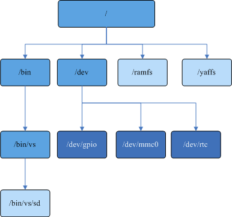

During system initialization, los\_vfs\_init\(\) is called, using "/" as the root\_inode.

**File Descriptor<a name="section1261532910128"></a>**

In this design, there are two types of file descriptors. Dynamic memory arrays are used to manage normal file descriptors, and global arrays are used to manage network descriptors. These two arrays are not contiguous in memory.

-   File descriptors, that is, normal file descriptors, where 0 is reserved as the system stdin standard input, 1 is reserved as the system stdout standard output, and 2 is reserved as the system stderr standard error output. File descriptors allocatable by users range from 3 to CONFIG\_NFILE\_DESCRIPTORS-1.
-   Socket descriptors, whose allocation starts from CONFIG\_NFILE\_DESCRIPTORS.

### Development Guidelines<a name="ZH-CN_TOPIC_0000002511954442"></a>

**Interface Description<a name="section14759620114917"></a>**

<a name="table4255115016"></a>
<table><thead align="left"><tr id="row825515504"><th class="cellrowborder" valign="top" width="22.12%" id="mcps1.1.4.1.1"><p id="p192155118505"><a name="p192155118505"></a><a name="p192155118505"></a>Header File</p>
</th>
<th class="cellrowborder" valign="top" width="27.92%" id="mcps1.1.4.1.2"><p id="p22851205018"><a name="p22851205018"></a><a name="p22851205018"></a>Interface Name</p>
</th>
<th class="cellrowborder" valign="top" width="49.96%" id="mcps1.1.4.1.3"><p id="p15255114502"><a name="p15255114502"></a><a name="p15255114502"></a>Description</p>
</th>
</tr>
</thead>
<tbody><tr id="row126511503"><td class="cellrowborder" rowspan="7" valign="top" width="22.12%" headers="mcps1.1.4.1.1 "><p id="p42851195012"><a name="p42851195012"></a><a name="p42851195012"></a>open_source/incubator-nuttx/liteos/fs/include/fs/fs.h</p>
</td>
<td class="cellrowborder" valign="top" width="27.92%" headers="mcps1.1.4.1.2 "><p id="p9215515504"><a name="p9215515504"></a><a name="p9215515504"></a>register_driver</p>
</td>
<td class="cellrowborder" valign="top" width="49.96%" headers="mcps1.1.4.1.3 "><p id="p42205195017"><a name="p42205195017"></a><a name="p42205195017"></a>Register a character driver to the file system.</p>
</td>
</tr>
<tr id="row82105119503"><td class="cellrowborder" valign="top" headers="mcps1.1.4.1.1 "><p id="p10218515502"><a name="p10218515502"></a><a name="p10218515502"></a>unregister_driver</p>
</td>
<td class="cellrowborder" valign="top" headers="mcps1.1.4.1.2 "><p id="p32051155019"><a name="p32051155019"></a><a name="p32051155019"></a>Unregister a character driver.</p>
</td>
</tr>
<tr id="row62751135015"><td class="cellrowborder" valign="top" headers="mcps1.1.4.1.1 "><p id="p17295165013"><a name="p17295165013"></a><a name="p17295165013"></a>register_blockdriver</p>
</td>
<td class="cellrowborder" valign="top" headers="mcps1.1.4.1.2 "><p id="p62135119507"><a name="p62135119507"></a><a name="p62135119507"></a>Register a block device driver to the file system.</p>
</td>
</tr>
<tr id="row82135135014"><td class="cellrowborder" valign="top" headers="mcps1.1.4.1.1 "><p id="p162105114502"><a name="p162105114502"></a><a name="p162105114502"></a>unregister_blockdriver</p>
</td>
<td class="cellrowborder" valign="top" headers="mcps1.1.4.1.2 "><p id="p02651145017"><a name="p02651145017"></a><a name="p02651145017"></a>Unregister a block device driver.</p>
</td>
</tr>
<tr id="row1023514503"><td class="cellrowborder" valign="top" headers="mcps1.1.4.1.1 "><p id="p20285165011"><a name="p20285165011"></a><a name="p20285165011"></a>open_blockdriver</p>
</td>
<td class="cellrowborder" valign="top" headers="mcps1.1.4.1.2 "><p id="p4265125014"><a name="p4265125014"></a><a name="p4265125014"></a>Open a block device.</p>
</td>
</tr>
<tr id="row1325518505"><td class="cellrowborder" valign="top" headers="mcps1.1.4.1.1 "><p id="p11275145017"><a name="p11275145017"></a><a name="p11275145017"></a>close_blockdriver</p>
</td>
<td class="cellrowborder" valign="top" headers="mcps1.1.4.1.2 "><p id="p721051115011"><a name="p721051115011"></a><a name="p721051115011"></a>Close a block device.</p>
</td>
</tr>
<tr id="row39653625210"><td class="cellrowborder" valign="top" headers="mcps1.1.4.1.1 "><p id="p159660645217"><a name="p159660645217"></a><a name="p159660645217"></a>find_blockdriver</p>
</td>
<td class="cellrowborder" valign="top" headers="mcps1.1.4.1.2 "><p id="p896606125217"><a name="p896606125217"></a><a name="p896606125217"></a>Find a block device.</p>
</td>
</tr>
<tr id="row99092059114918"><td class="cellrowborder" rowspan="3" valign="top" width="22.12%" headers="mcps1.1.4.1.1 "><p id="p2488184355210"><a name="p2488184355210"></a><a name="p2488184355210"></a>fs/include/los_fs.h</p>
</td>
<td class="cellrowborder" valign="top" width="27.92%" headers="mcps1.1.4.1.2 "><p id="p7220101835019"><a name="p7220101835019"></a><a name="p7220101835019"></a>chattr</p>
</td>
<td class="cellrowborder" valign="top" width="49.96%" headers="mcps1.1.4.1.3 "><p id="p32203183507"><a name="p32203183507"></a><a name="p32203183507"></a>Change the attributes of a file in the file system. Currently, only the FAT file system supports it. The modified file attributes currently support four types: F_RDO (read-only), F_HID (hidden), F_SYS (system file), and F_ARC (archive).</p>
</td>
</tr>
<tr id="row2909155974920"><td class="cellrowborder" valign="top" headers="mcps1.1.4.1.1 "><p id="p14370222509"><a name="p14370222509"></a><a name="p14370222509"></a>ls</p>
</td>
<td class="cellrowborder" valign="top" headers="mcps1.1.4.1.2 "><p id="p74371822135014"><a name="p74371822135014"></a><a name="p74371822135014"></a>List the contents of a directory.</p>
</td>
</tr>
<tr id="row10909145994917"><td class="cellrowborder" valign="top" headers="mcps1.1.4.1.1 "><p id="p1525072905014"><a name="p1525072905014"></a><a name="p1525072905014"></a>rindex</p>
</td>
<td class="cellrowborder" valign="top" headers="mcps1.1.4.1.2 "><p id="p025013298507"><a name="p025013298507"></a><a name="p025013298507"></a>Search from the right side of the specified string for the first occurrence of the specified character.</p>
</td>
</tr>
</tbody>
</table>

> **Note:** 
>About file attributes:
>-   Currently, only the file attributes of the FAT file system can be modified. Other file systems handle attributes such as read-only in their own ways.
>-   The four attributes F\_RDO (read-only), F\_HID (hidden), F\_SYS (system file), and F\_ARC (archive) do not conflict with each other and can be modified arbitrarily.
>-   Files/directories with the read-only attribute cannot be deleted.
>-   Files/directories with the read-only attribute can be renamed.
>-   Read-only files cannot be opened with O\_CREAT, O\_TRUNC, or any mode containing write permission.
>-   In LiteOS, files with the hidden attribute are visible; in Windows, they are invisible (when hidden file attributes are not displayed).
>-   If a file is given the hidden attribute in LiteOS, it can only be found through the command line in Windows (regardless of whether hidden file attributes are displayed, the file is invisible in Windows).

**Development Process<a name="section85947282256"></a>**

Driver developers are advised to use the VFS framework to register/unregister devices, and to invoke drivers by operating character device files with open\(\) and read\(\) at the application layer.

1.  Open the menu and select FileSystem ---\> Enable VFS to enable VFS.

    <a name="table06655375130"></a>
    <table><thead align="left"><tr id="row8665203751318"><th class="cellrowborder" valign="top" width="24.45%" id="mcps1.1.6.1.1"><p id="p61687296155221"><a name="p61687296155221"></a><a name="p61687296155221"></a>Configuration Item</p>
    </th>
    <th class="cellrowborder" valign="top" width="21.91%" id="mcps1.1.6.1.2"><p id="p25007692155221"><a name="p25007692155221"></a><a name="p25007692155221"></a>Meaning</p>
    </th>
    <th class="cellrowborder" valign="top" width="14.549999999999999%" id="mcps1.1.6.1.3"><p id="p47081329204415"><a name="p47081329204415"></a><a name="p47081329204415"></a>Value Range</p>
    </th>
    <th class="cellrowborder" valign="top" width="14.82%" id="mcps1.1.6.1.4"><p id="p7383544155221"><a name="p7383544155221"></a><a name="p7383544155221"></a>Default Value</p>
    </th>
    <th class="cellrowborder" valign="top" width="24.27%" id="mcps1.1.6.1.5"><p id="p34917797155221"><a name="p34917797155221"></a><a name="p34917797155221"></a>Dependency</p>
    </th>
    </tr>
    </thead>
    <tbody><tr id="row9665837161320"><td class="cellrowborder" valign="top" width="24.45%" headers="mcps1.1.6.1.1 "><p id="p3665143710130"><a name="p3665143710130"></a><a name="p3665143710130"></a>LOSCFG_FS_VFS</p>
    </td>
    <td class="cellrowborder" valign="top" width="21.91%" headers="mcps1.1.6.1.2 "><p id="p13665737191318"><a name="p13665737191318"></a><a name="p13665737191318"></a>Switch for tailoring the VFS framework</p>
    </td>
    <td class="cellrowborder" valign="top" width="14.549999999999999%" headers="mcps1.1.6.1.3 "><p id="p19665193721319"><a name="p19665193721319"></a><a name="p19665193721319"></a>YES/NO</p>
    </td>
    <td class="cellrowborder" valign="top" width="14.82%" headers="mcps1.1.6.1.4 "><p id="p1866573713131"><a name="p1866573713131"></a><a name="p1866573713131"></a>YES</p>
    </td>
    <td class="cellrowborder" valign="top" width="24.27%" headers="mcps1.1.6.1.5 "><p id="p1266519378138"><a name="p1266519378138"></a><a name="p1266519378138"></a>None</p>
    </td>
    </tr>
    </tbody>
    </table>

2.  Call the register\_driver\(\) and register\_blockdriver\(\) interfaces to generate device nodes, and call the mount\(\) interface to generate file system mount nodes. For the development process of generating device nodes, see [Development Guidelines](development_guide-148.md) in File Operation Adaptation.

### Precautions<a name="ZH-CN_TOPIC_0000002511954366"></a>

-   The directory names and file names created by all file systems under VFS can be up to 255 characters. Creation fails if the length exceeds this limit.
-   The maximum full path length of files and directories supported by the VFS layer is 259 characters. Creation fails if the length exceeds this limit.
-   Only the two special characters "-" and "\_" are supported in file names and directory names in all file systems. Using other special characters may cause unpredictable consequences. Please use them with caution.
-   For all file systems under VFS, when a file is opened in creation mode or write-only mode, the file permission defaults to the mode parameter value 0666 of the open interface. Because the file systems under VFS do not fully support file permission modes, it is recommended to use 0666 as the parameter.
-   During optimization iterations, VFS may change the errno return values of the abnormal error branches of some POSIX interfaces (rename, dup, opendir, etc.) to be closer to the POSIX standard. Businesses should handle errno return values with caution.
-   For block device nodes (for example, "/dev/mmc0"), if the bpos of the block device driver implements the unlink callback function and the return value is OK, an erroneous call to unlink("/dev/mmc0") will cause the block device node to be deleted and disappear, affecting normal business functions. If you want the block device node to remain resident, simply do not implement the unlink callback.
-   The ls command displays the size of block device node files, where the size value is the capacity of the block device. If you do not want the corresponding device capacity to be displayed, simply do not implement the geometry callback function in the bpos of the block device driver.
-   VFS can directly create multi-level directories recursively.
-   Devices are classified into character devices and block devices. For data security on devices, mount the corresponding file system first, and then operate data through file system interfaces.
-   los\_vfs\_init\(\) can only be called once. Multiple calls will cause file system exceptions.
-   When open opens a file, the parameters O\_RDWR, O\_WRONLY, and O\_RDONLY are mutually exclusive, and only one of them can appear. If two or more are used as open parameters, unpredictable errors may occur, and their use is prohibited.
-   It is not recommended to use open on a directory to directly obtain directory data. To obtain directory information, call the opendir interface to open the directory.
-   Interfaces such as open\(\) and read\(\) are not thread-safe. In multi-thread scenarios, it is recommended to use interfaces such as fopen\(\) and fread\(\).
-   Mount the file system strictly according to the manual. Incorrect mounting may damage the device and the system.
-   The mount point must be an empty directory. Do not mount repeatedly to the same mount point, or to a directory or file under another mount point.
-   Do not mount a nonexistent file system during sleep/wake-up or scatter loading.
-   Before using unregister\_driver to unload a device, ensure that the character device has been properly closed, that is, the numbers of open and close operations must match; otherwise, the unload will fail.
-   Before umount, ensure that all directories and files in the file system are closed; otherwise, umount will fail. Forced umount may cause problems including but not limited to file system damage and device damage, for which Huawei assumes no responsibility.
-   Before removing the SD card, ensure that all directories and files have been closed and the umount operation has been performed. Forced card removal may cause problems including but not limited to SD data loss and SD card damage, for which Huawei assumes no responsibility.

## FAT<a name="ZH-CN_TOPIC_0000002511954226"></a>


### Overview<a name="ZH-CN_TOPIC_0000002511954384"></a>

**Basic Concepts<a name="section6477880682322"></a>**

The FAT file system is the abbreviation of File Allocation Table, which includes FAT12, FAT16, and FAT32. The FAT file system divides a hard disk into five areas: MBR area, DBR area, FAT area, DIR area, and DATA area.

The FAT file system supports various media, especially widely used on removable storage media (USB drives, SD cards, portable hard disks, etc.). Moreover, the FAT file system enables embedded devices to maintain good compatibility with desktop systems such as Windows and Linux, making it convenient for users to manage and operate files.

The FAT file system in LiteOS has the following features:

-   Small code size and resource footprint, tailorable, and supports multiple physical media.
-   Compatible with systems such as Windows and Linux.
-   Supports functions such as multi-device and multi-partition identification.
-   Supports multiple hard disk partitions, allowing file operations on primary and logical partitions.
-   Supports identifying other types of file systems on the hard disk, such as NTFS.
-   Supports the virtual partition feature based on FAT32.

    When the virtual partition feature is enabled, users can call the virtual partition configuration interface los\_set\_virpartparam\(\) to configure the number of virtual partitions, space percentages, and virtual partition entry names for a specific physical partition. Based on the configured entry names, corresponding folders are created in the root directory as virtual partition entries.

    -   Operations performed inside the corresponding virtual partition are regarded as operations performed within the corresponding virtual partition.
    -   If the sum of the space percentages of all virtual partitions does not reach 100%, write operations outside the virtual partition entry directories are allowed, and the total writable space outside all virtual partition entries at this time is the remaining space of the percentage sum. If the sum of the space percentages of all virtual partitions reaches 100%, write operations outside the virtual partition entry directories will be rejected due to insufficient space.

### Development Guidelines<a name="ZH-CN_TOPIC_0000002511794412"></a>

**Interface Description of the FAT File System<a name="section7969162141015"></a>**

<a name="table161271310106"></a>
<table><thead align="left"><tr id="row1212101361015"><th class="cellrowborder" valign="top" width="21.31213121312131%" id="mcps1.1.4.1.1"><p id="p1312111315109"><a name="p1312111315109"></a><a name="p1312111315109"></a>Header File</p>
</th>
<th class="cellrowborder" valign="top" width="31.453145314531454%" id="mcps1.1.4.1.2"><p id="p1912111312109"><a name="p1912111312109"></a><a name="p1912111312109"></a>Interface Name</p>
</th>
<th class="cellrowborder" valign="top" width="47.234723472347234%" id="mcps1.1.4.1.3"><p id="p14121113181010"><a name="p14121113181010"></a><a name="p14121113181010"></a>Description</p>
</th>
</tr>
</thead>
<tbody><tr id="row13122013121015"><td class="cellrowborder" rowspan="13" valign="top" width="21.31213121312131%" headers="mcps1.1.4.1.1 "><p id="p1567663719414"><a name="p1567663719414"></a><a name="p1567663719414"></a>fs/include/los_fs.h</p>
</td>
<td class="cellrowborder" valign="top" width="31.453145314531454%" headers="mcps1.1.4.1.2 "><p id="p2012713181015"><a name="p2012713181015"></a><a name="p2012713181015"></a>getlabel</p>
</td>
<td class="cellrowborder" valign="top" width="47.234723472347234%" headers="mcps1.1.4.1.3 "><p id="p16128139104"><a name="p16128139104"></a><a name="p16128139104"></a>Get the drive label</p>
</td>
</tr>
<tr id="row1712101331017"><td class="cellrowborder" valign="top" headers="mcps1.1.4.1.1 "><p id="p14123136103"><a name="p14123136103"></a><a name="p14123136103"></a>set_label</p>
</td>
<td class="cellrowborder" valign="top" headers="mcps1.1.4.1.2 "><p id="p312101361014"><a name="p312101361014"></a><a name="p312101361014"></a>Set the drive label</p>
</td>
</tr>
<tr id="row111211391019"><td class="cellrowborder" valign="top" headers="mcps1.1.4.1.1 "><p id="p11212136107"><a name="p11212136107"></a><a name="p11212136107"></a>format</p>
</td>
<td class="cellrowborder" valign="top" headers="mcps1.1.4.1.2 "><p id="p1412713131012"><a name="p1412713131012"></a><a name="p1412713131012"></a>Format the disk</p>
</td>
</tr>
<tr id="row9947518181615"><td class="cellrowborder" valign="top" headers="mcps1.1.4.1.1 "><p id="p1894713187169"><a name="p1894713187169"></a><a name="p1894713187169"></a>los_set_systime_status</p>
</td>
<td class="cellrowborder" valign="top" headers="mcps1.1.4.1.2 "><p id="p3947318111610"><a name="p3947318111610"></a><a name="p3947318111610"></a>Set whether the current system time of the FAT file is valid or invalid</p>
</td>
</tr>
<tr id="row2675467511"><td class="cellrowborder" valign="top" headers="mcps1.1.4.1.1 "><p id="p1327133118256"><a name="p1327133118256"></a><a name="p1327133118256"></a>LOS_SetSyncThreadPrio</p>
</td>
<td class="cellrowborder" valign="top" headers="mcps1.1.4.1.2 "><p id="p1032743162519"><a name="p1032743162519"></a><a name="p1032743162519"></a>Set the priority of the asynchronous cache flush task of the FAT file system</p>
</td>
</tr>
<tr id="row1527065218516"><td class="cellrowborder" valign="top" headers="mcps1.1.4.1.1 "><p id="p15435163442518"><a name="p15435163442518"></a><a name="p15435163442518"></a>LOS_SetSyncThreadInterval</p>
</td>
<td class="cellrowborder" valign="top" headers="mcps1.1.4.1.2 "><p id="p543514341257"><a name="p543514341257"></a><a name="p543514341257"></a>Set the time interval for asynchronous cache flushing of the FAT file system</p>
</td>
</tr>
<tr id="row1826316619499"><td class="cellrowborder" valign="top" headers="mcps1.1.4.1.1 "><p id="p1126366154910"><a name="p1126366154910"></a><a name="p1126366154910"></a>LOS_GetSyncThreadInterval</p>
</td>
<td class="cellrowborder" valign="top" headers="mcps1.1.4.1.2 "><p id="p726326114914"><a name="p726326114914"></a><a name="p726326114914"></a>Get the time interval for asynchronous cache flushing of the FAT file system</p>
</td>
</tr>
<tr id="row2010010497519"><td class="cellrowborder" valign="top" headers="mcps1.1.4.1.1 "><p id="p18736247152516"><a name="p18736247152516"></a><a name="p18736247152516"></a>LOS_SetDirtyRatioThreshold</p>
</td>
<td class="cellrowborder" valign="top" headers="mcps1.1.4.1.2 "><p id="p573624714259"><a name="p573624714259"></a><a name="p573624714259"></a>Set the dirty block ratio threshold for asynchronous cache flushing of the FAT file system</p>
</td>
</tr>
<tr id="row141815661514"><td class="cellrowborder" valign="top" headers="mcps1.1.4.1.1 "><p id="p1218118631515"><a name="p1218118631515"></a><a name="p1218118631515"></a>LOS_GetDirtyRatioThreshold</p>
</td>
<td class="cellrowborder" valign="top" headers="mcps1.1.4.1.2 "><p id="p2181186201515"><a name="p2181186201515"></a><a name="p2181186201515"></a>Get the dirty block ratio threshold for asynchronous cache flushing of the FAT file system</p>
</td>
</tr>
<tr id="row429212405016"><td class="cellrowborder" valign="top" headers="mcps1.1.4.1.1 "><p id="p3292114115010"><a name="p3292114115010"></a><a name="p3292114115010"></a>LOS_SetBlockExpireInterval</p>
</td>
<td class="cellrowborder" valign="top" headers="mcps1.1.4.1.2 "><p id="p1729284185019"><a name="p1729284185019"></a><a name="p1729284185019"></a>Set the maximum expiration interval of FAT file system blocks</p>
</td>
</tr>
<tr id="row1160311712502"><td class="cellrowborder" valign="top" headers="mcps1.1.4.1.1 "><p id="p136036717503"><a name="p136036717503"></a><a name="p136036717503"></a>LOS_GetBlockExpireInterval</p>
</td>
<td class="cellrowborder" valign="top" headers="mcps1.1.4.1.2 "><p id="p6603127115018"><a name="p6603127115018"></a><a name="p6603127115018"></a>Get the maximum expiration interval of FAT file system blocks</p>
</td>
</tr>
<tr id="row493917384716"><td class="cellrowborder" valign="top" headers="mcps1.1.4.1.1 "><p id="p6635105419716"><a name="p6635105419716"></a><a name="p6635105419716"></a>LOS_FatSetMemPool</p>
</td>
<td class="cellrowborder" valign="top" headers="mcps1.1.4.1.2 "><p id="p5939173811716"><a name="p5939173811716"></a><a name="p5939173811716"></a>Set the independent memory pool of the FAT file system</p>
</td>
</tr>
<tr id="row2737438716"><td class="cellrowborder" valign="top" headers="mcps1.1.4.1.1 "><p id="p240610017811"><a name="p240610017811"></a><a name="p240610017811"></a>LOS_BcacheSetMemPool</p>
</td>
<td class="cellrowborder" valign="top" headers="mcps1.1.4.1.2 "><p id="p273114310711"><a name="p273114310711"></a><a name="p273114310711"></a>Set the independent memory pool of the FAT file system cache</p>
</td>
</tr>
<tr id="row653815533211"><td class="cellrowborder" rowspan="2" valign="top" width="21.31213121312131%" headers="mcps1.1.4.1.1 "><p id="p1353919543219"><a name="p1353919543219"></a><a name="p1353919543219"></a>vfs_files.h</p>
</td>
<td class="cellrowborder" valign="top" width="31.453145314531454%" headers="mcps1.1.4.1.2 "><p id="p18768181333211"><a name="p18768181333211"></a><a name="p18768181333211"></a>LOS_PartitionFormat</p>
</td>
<td class="cellrowborder" valign="top" width="47.234723472347234%" headers="mcps1.1.4.1.3 "><p id="p753911513327"><a name="p753911513327"></a><a name="p753911513327"></a>Format the disk. A custom interface for some platforms only.</p>
</td>
</tr>
<tr id="row4690172623315"><td class="cellrowborder" valign="top" headers="mcps1.1.4.1.1 "><p id="p13270628133320"><a name="p13270628133320"></a><a name="p13270628133320"></a>LOS_DiskPartition</p>
</td>
<td class="cellrowborder" valign="top" headers="mcps1.1.4.1.2 "><p id="p156907263334"><a name="p156907263334"></a><a name="p156907263334"></a>Create disk partitions by proportion. A custom interface for some platforms only.</p>
</td>
</tr>
</tbody>
</table>

> **Note:** 
>-   After the asynchronous cache flush of the FAT file system is enabled, the system creates a task to flush the cache. The conditions for waking up the thread to flush dirty data are as follows:
>    1.  Periodic wake-up every 5 s.
>    2.  Dirty data stays for more than 3 s.
>    3.  Dirty data volume exceeds 50%. When any one of the conditions is triggered, the thread immediately writes the dirty data back to the disk.
>-   The FAT file system can be configured in the "open\_source/FatFs/source/ffconf.h" file, where FF\_FS\_LOCK is the maximum number of files (folders) that can be opened simultaneously.

**Interface Description of Virtual Partitions<a name="section1339318355214"></a>**

<a name="table11078557104122"></a>
<table><thead align="left"><tr id="row43836930104122"><th class="cellrowborder" valign="top" width="21.25%" id="mcps1.1.4.1.1"><p id="p92938388226"><a name="p92938388226"></a><a name="p92938388226"></a>Header File</p>
</th>
<th class="cellrowborder" valign="top" width="31.259999999999998%" id="mcps1.1.4.1.2"><p id="p3811615104122"><a name="p3811615104122"></a><a name="p3811615104122"></a>Interface Name</p>
</th>
<th class="cellrowborder" valign="top" width="47.49%" id="mcps1.1.4.1.3"><p id="p40305361104122"><a name="p40305361104122"></a><a name="p40305361104122"></a>Interface Function Description</p>
</th>
</tr>
</thead>
<tbody><tr id="row25923222171958"><td class="cellrowborder" rowspan="2" valign="top" width="21.25%" headers="mcps1.1.4.1.1 "><p id="p8293153882213"><a name="p8293153882213"></a><a name="p8293153882213"></a>fs/include/los_fs.h</p>
</td>
<td class="cellrowborder" valign="top" width="31.259999999999998%" headers="mcps1.1.4.1.2 "><p id="p102412617206"><a name="p102412617206"></a><a name="p102412617206"></a>los_set_virpartparam</p>
</td>
<td class="cellrowborder" valign="top" width="47.49%" headers="mcps1.1.4.1.3 "><p id="p18775309171958"><a name="p18775309171958"></a><a name="p18775309171958"></a>Set the parameters of virtual partitions</p>
</td>
</tr>
<tr id="row27203935104122"><td class="cellrowborder" valign="top" headers="mcps1.1.4.1.1 "><p id="p42549504104122"><a name="p42549504104122"></a><a name="p42549504104122"></a>virstatfs</p>
</td>
<td class="cellrowborder" valign="top" headers="mcps1.1.4.1.2 "><p id="p23957801104122"><a name="p23957801104122"></a><a name="p23957801104122"></a>Get the status of the specified virtual partition</p>
</td>
</tr>
</tbody>
</table>

The allocation structure of virtual partitions is defined as follows:

```
#define _MAX_ENTRYLENGTH  16 
#define _MAX_VIRVOLUMES   5

typedef struct virtual_partition_info
{
    char *devpartpath; 
    int  virpartnum;
    double virpartpercent[_MAX_VIRVOLUMES];
    char virpartname[_MAX_VIRVOLUMES][_MAX_ENTRYLENGTH + 1];
} virpartinfo;
```

<a name="table41675869161646"></a>
<table><thead align="left"><tr id="row65969368161646"><th class="cellrowborder" valign="top" width="20.73%" id="mcps1.1.4.1.1"><p id="p23790785164524"><a name="p23790785164524"></a><a name="p23790785164524"></a>Member</p>
</th>
<th class="cellrowborder" valign="top" width="22.97%" id="mcps1.1.4.1.2"><p id="p66852855164524"><a name="p66852855164524"></a><a name="p66852855164524"></a>Description</p>
</th>
<th class="cellrowborder" valign="top" width="56.3%" id="mcps1.1.4.1.3"><p id="p31187935164524"><a name="p31187935164524"></a><a name="p31187935164524"></a>Precautions</p>
</th>
</tr>
</thead>
<tbody><tr id="row46533916161949"><td class="cellrowborder" valign="top" width="20.73%" headers="mcps1.1.4.1.1 "><p id="p30800757161949"><a name="p30800757161949"></a><a name="p30800757161949"></a>devpartpath</p>
</td>
<td class="cellrowborder" valign="top" width="22.97%" headers="mcps1.1.4.1.2 "><p id="p11833417161949"><a name="p11833417161949"></a><a name="p11833417161949"></a>Device node path</p>
</td>
<td class="cellrowborder" valign="top" width="56.3%" headers="mcps1.1.4.1.3 "><p id="p18982721161949"><a name="p18982721161949"></a><a name="p18982721161949"></a>The name of the selected device node. It must be a device node path under /dev, with DISK_NAME as the upper limit.</p>
</td>
</tr>
<tr id="row30613636161646"><td class="cellrowborder" valign="top" width="20.73%" headers="mcps1.1.4.1.1 "><p id="p66349026161646"><a name="p66349026161646"></a><a name="p66349026161646"></a>virpartnum</p>
</td>
<td class="cellrowborder" valign="top" width="22.97%" headers="mcps1.1.4.1.2 "><p id="p5562024161646"><a name="p5562024161646"></a><a name="p5562024161646"></a>Number of virtual partitions</p>
</td>
<td class="cellrowborder" valign="top" width="56.3%" headers="mcps1.1.4.1.3 "><p id="p47870770161646"><a name="p47870770161646"></a><a name="p47870770161646"></a>The minimum value is 1, and the maximum value is _MAX_VIRVOLUMES, which is 5.</p>
</td>
</tr>
<tr id="row28183748161646"><td class="cellrowborder" valign="top" width="20.73%" headers="mcps1.1.4.1.1 "><p id="p28653908161646"><a name="p28653908161646"></a><a name="p28653908161646"></a>virpartpercent</p>
</td>
<td class="cellrowborder" valign="top" width="22.97%" headers="mcps1.1.4.1.2 "><p id="p39265241161646"><a name="p39265241161646"></a><a name="p39265241161646"></a>Virtual partition percentage</p>
</td>
<td class="cellrowborder" valign="top" width="56.3%" headers="mcps1.1.4.1.3 "><p id="p26367975161646"><a name="p26367975161646"></a><a name="p26367975161646"></a>The sum must be greater than 0.00 and less than or equal to 1.00. The value of each member must be greater than 0.00 and less than 1.00.</p>
</td>
</tr>
<tr id="row35985184161646"><td class="cellrowborder" valign="top" width="20.73%" headers="mcps1.1.4.1.1 "><p id="p9812375161646"><a name="p9812375161646"></a><a name="p9812375161646"></a>virpartname</p>
</td>
<td class="cellrowborder" valign="top" width="22.97%" headers="mcps1.1.4.1.2 "><p id="p56604901161646"><a name="p56604901161646"></a><a name="p56604901161646"></a>Virtual partition entry name</p>
</td>
<td class="cellrowborder" valign="top" width="56.3%" headers="mcps1.1.4.1.3 "><p id="p21594272161646"><a name="p21594272161646"></a><a name="p21594272161646"></a>The entry name can contain at most _MAX_ENTRYLENGTH, that is, 16 valid characters, and must not be empty. The passed-in set must not contain duplicate names. The entry name must not contain illegal name characters.</p>
</td>
</tr>
</tbody>
</table>

> **Notice:** 
>-   In LiteOS, the virtual partition feature only applies to a specific single physical partition. The device node can be set through the virtual partition parameter allocation interface.
>-   After the specified physical device node is set, the settings are locked and cannot be changed again. The configured parameters are adopted at mounting. The settings are unlocked only after unmounting.
>-   After unmounting, the virtual partition parameters need to be reconfigured through the virtual partition parameter allocation interface.
>-   If a virtual partition has already been configured on the inserted physical partition but its configuration parameters are inconsistent with those set by the current system through the allocation interface, the partition will be managed according to the existing configuration parameters.

**Interface Behavior Changes Involving Virtual Partitions<a name="section6536455293510"></a>**

After the virtual partition feature is enabled, the behavior of some interfaces changes under virtual partitions. The behavior changes of the following interfaces only apply to physical partitions to which the virtual partition feature has been successfully applied. For physical partitions with the basic FAT file system to which virtual partitions have not been applied, as well as other file systems, the behavior of these interfaces does not change.

The following interfaces only change their functional behavior with respect to virtual partitions. The calling methods and parameters of the functions are not affected.

<a name="table4044419493815"></a>
<table><thead align="left"><tr id="row1635630393815"><th class="cellrowborder" valign="top" width="7.5200000000000005%" id="mcps1.1.5.1.1"><p id="p4547664393815"><a name="p4547664393815"></a><a name="p4547664393815"></a>No.</p>
</th>
<th class="cellrowborder" valign="top" width="14.97%" id="mcps1.1.5.1.2"><p id="p5972949693815"><a name="p5972949693815"></a><a name="p5972949693815"></a>Interface Name</p>
</th>
<th class="cellrowborder" valign="top" width="36.720000000000006%" id="mcps1.1.5.1.3"><p id="p625103093815"><a name="p625103093815"></a><a name="p625103093815"></a>Behavior Change</p>
</th>
<th class="cellrowborder" valign="top" width="40.79%" id="mcps1.1.5.1.4"><p id="p675491104611"><a name="p675491104611"></a><a name="p675491104611"></a>Return Value and Error Code Description</p>
</th>
</tr>
</thead>
<tbody><tr id="row5625927193815"><td class="cellrowborder" valign="top" width="7.5200000000000005%" headers="mcps1.1.5.1.1 "><p id="p125081357184517"><a name="p125081357184517"></a><a name="p125081357184517"></a>1</p>
</td>
<td class="cellrowborder" valign="top" width="14.97%" headers="mcps1.1.5.1.2 "><p id="p3507157174515"><a name="p3507157174515"></a><a name="p3507157174515"></a>mount</p>
</td>
<td class="cellrowborder" valign="top" width="36.720000000000006%" headers="mcps1.1.5.1.3 "><p id="p17507115715458"><a name="p17507115715458"></a><a name="p17507115715458"></a>After the basic FAT partition is mounted, the system attempts to identify whether the current physical partition has already applied virtual partitions, loads virtual partitions for the physical partition according to its configured information, and checks and attempts to repair the virtual partition entries. If the current physical partition has not applied virtual partitions and meets the conditions for enabling virtual partitions, virtual partitions will be automatically applied to and created on the physical partition.</p>
</td>
<td class="cellrowborder" valign="top" width="40.79%" headers="mcps1.1.5.1.4 "><p id="p145073577453"><a name="p145073577453"></a><a name="p145073577453"></a>A return value of -1 indicates that the basic FAT partition failed to mount, in which case a libc error code is triggered to indicate the type of error that occurred;</p>
<p id="p16371121954717"><a name="p16371121954717"></a><a name="p16371121954717"></a>A return value of 0 indicates that the basic FAT partition mounted successfully. In this case, if the error code is 0, the virtual partitions mounted successfully; if the error code is VIRERR_MODIFIED, VIRERR_CHAIN_ERR, VIRERR_OCCUPIED, VIRERR_NOTCLEAR, VIRERR_NOTFIT, or VIRERR_NOPARAM, the virtual partitions failed to mount.</p>
</td>
</tr>
<tr id="row21560096102546"><td class="cellrowborder" valign="top" width="7.5200000000000005%" headers="mcps1.1.5.1.1 "><p id="p1950625774516"><a name="p1950625774516"></a><a name="p1950625774516"></a>2</p>
</td>
<td class="cellrowborder" valign="top" width="14.97%" headers="mcps1.1.5.1.2 "><p id="p102751831174715"><a name="p102751831174715"></a><a name="p102751831174715"></a>format</p>
</td>
<td class="cellrowborder" valign="top" width="36.720000000000006%" headers="mcps1.1.5.1.3 "><p id="p1927553124717"><a name="p1927553124717"></a><a name="p1927553124717"></a>When the FAT partition is already mounted and formatted as a FAT32 file system, virtual partitions will be applied to the physical partition after formatting is complete. If the file system is not FAT32, the formatting operation is completed and the virtual partitions of the physical partition are cleared. If the FAT partition is not mounted, regardless of the file system type, the formatting operation is completed and then the virtual partitions of the physical partition are cleared.</p>
</td>
<td class="cellrowborder" valign="top" width="40.79%" headers="mcps1.1.5.1.4 "><p id="p18275113117476"><a name="p18275113117476"></a><a name="p18275113117476"></a>A return value of -1 indicates that formatting of the basic FAT partition failed, in which case a libc error code is triggered to indicate the type of error that occurred;</p>
<p id="p3996153814477"><a name="p3996153814477"></a><a name="p3996153814477"></a>A return value of 0 indicates that formatting of the basic FAT partition is complete. If the partition is not mounted at this time, the error code will be VIRERR_NOTMOUNT. If the formatted partition is not the device node path set by the allocation interface, or the allocation interface has not set parameters, VIRERR_NOPARAM will be indicated. If the partition is mounted, an error code of 0 indicates that virtual partitions were applied or reapplied successfully, or the error code may be VIRERR_NOTFIT.</p>
</td>
</tr>
<tr id="row244526210325"><td class="cellrowborder" valign="top" width="7.5200000000000005%" headers="mcps1.1.5.1.1 "><p id="p1335445416479"><a name="p1335445416479"></a><a name="p1335445416479"></a>3</p>
</td>
<td class="cellrowborder" valign="top" width="14.97%" headers="mcps1.1.5.1.2 "><p id="p153541754204715"><a name="p153541754204715"></a><a name="p153541754204715"></a>open</p>
</td>
<td class="cellrowborder" valign="top" width="36.720000000000006%" headers="mcps1.1.5.1.3 "><p id="p4354654104710"><a name="p4354654104710"></a><a name="p4354654104710"></a>See the description in <a href="#section198521275381">Compatibility of Virtual Partitions</a>.</p>
</td>
<td class="cellrowborder" valign="top" width="40.79%" headers="mcps1.1.5.1.4 "><p id="p1235415414714"><a name="p1235415414714"></a><a name="p1235415414714"></a>None</p>
</td>
</tr>
<tr id="row65513752103311"><td class="cellrowborder" valign="top" width="7.5200000000000005%" headers="mcps1.1.5.1.1 "><p id="p143541754124713"><a name="p143541754124713"></a><a name="p143541754124713"></a>4</p>
</td>
<td class="cellrowborder" valign="top" width="14.97%" headers="mcps1.1.5.1.2 "><p id="p43542054114712"><a name="p43542054114712"></a><a name="p43542054114712"></a>mkdir</p>
</td>
<td class="cellrowborder" valign="top" width="36.720000000000006%" headers="mcps1.1.5.1.3 "><p id="p14354165454712"><a name="p14354165454712"></a><a name="p14354165454712"></a>See the description in <a href="#section198521275381">Compatibility of Virtual Partitions</a>.</p>
</td>
<td class="cellrowborder" valign="top" width="40.79%" headers="mcps1.1.5.1.4 "><p id="p9354125444719"><a name="p9354125444719"></a><a name="p9354125444719"></a>None</p>
</td>
</tr>
<tr id="row31739794103342"><td class="cellrowborder" valign="top" width="7.5200000000000005%" headers="mcps1.1.5.1.1 "><p id="p1735475410479"><a name="p1735475410479"></a><a name="p1735475410479"></a>5</p>
</td>
<td class="cellrowborder" valign="top" width="14.97%" headers="mcps1.1.5.1.2 "><p id="p635455464715"><a name="p635455464715"></a><a name="p635455464715"></a>rmdir</p>
</td>
<td class="cellrowborder" valign="top" width="36.720000000000006%" headers="mcps1.1.5.1.3 "><p id="p135411544474"><a name="p135411544474"></a><a name="p135411544474"></a>When virtual partitions have been successfully applied to the physical partition, the virtual partition entry directories cannot be deleted.</p>
</td>
<td class="cellrowborder" valign="top" width="40.79%" headers="mcps1.1.5.1.4 "><p id="p1354125413476"><a name="p1354125413476"></a><a name="p1354125413476"></a>None</p>
</td>
</tr>
<tr id="row52617016103522"><td class="cellrowborder" valign="top" width="7.5200000000000005%" headers="mcps1.1.5.1.1 "><p id="p6354155494716"><a name="p6354155494716"></a><a name="p6354155494716"></a>6</p>
</td>
<td class="cellrowborder" valign="top" width="14.97%" headers="mcps1.1.5.1.2 "><p id="p193544547473"><a name="p193544547473"></a><a name="p193544547473"></a>remove</p>
</td>
<td class="cellrowborder" valign="top" width="36.720000000000006%" headers="mcps1.1.5.1.3 "><p id="p63543542476"><a name="p63543542476"></a><a name="p63543542476"></a>When virtual partitions have been successfully applied to the physical partition, the virtual partition entry directories cannot be deleted.</p>
</td>
<td class="cellrowborder" valign="top" width="40.79%" headers="mcps1.1.5.1.4 "><p id="p2355125414711"><a name="p2355125414711"></a><a name="p2355125414711"></a>None</p>
</td>
</tr>
<tr id="row52487658103550"><td class="cellrowborder" valign="top" width="7.5200000000000005%" headers="mcps1.1.5.1.1 "><p id="p5355354104717"><a name="p5355354104717"></a><a name="p5355354104717"></a>7</p>
</td>
<td class="cellrowborder" valign="top" width="14.97%" headers="mcps1.1.5.1.2 "><p id="p12355125404712"><a name="p12355125404712"></a><a name="p12355125404712"></a>rename</p>
</td>
<td class="cellrowborder" valign="top" width="36.720000000000006%" headers="mcps1.1.5.1.3 "><p id="p1535515484713"><a name="p1535515484713"></a><a name="p1535515484713"></a>When virtual partitions have been successfully applied to the physical partition, the virtual partition entry directories cannot be renamed.</p>
</td>
<td class="cellrowborder" valign="top" width="40.79%" headers="mcps1.1.5.1.4 "><p id="p235513542476"><a name="p235513542476"></a><a name="p235513542476"></a>None</p>
</td>
</tr>
</tbody>
</table>

**Error Codes of Virtual Partitions<a name="section41559669155127"></a>**

Errors in applying virtual partitions can only occur during mounting or formatting. After the corresponding operation of the basic FAT file system is completed, virtual partitions are configured and applied. If a problem occurs or a condition is triggered at this time, the virtual partition passes the error code to the upper layer to distinguish what happened during the application of virtual partitions. At the same time, the partition will be managed as a basic FAT file system rather than using virtual partition management on top of it.

> **Note:** 
>The return values of the mount and format operations indicate the success or failure of the basic FAT file system.
>-   When the interface returns 0, the corresponding basic FAT file system operation succeeded. At this time, the virtual partition error code can be obtained by accessing errno to check whether an exception occurred during the application of virtual partitions.
>-   When the interface returns -1, the corresponding basic FAT file system operation failed. In this case, errno is a libc error code indicating the reason for the basic FAT operation failure, and no longer indicates virtual partition information.

<a name="table6015294495642"></a>
<table><thead align="left"><tr id="row2267197395642"><th class="cellrowborder" valign="top" width="7.10928907109289%" id="mcps1.1.6.1.1"><p id="p1908783195642"><a name="p1908783195642"></a><a name="p1908783195642"></a>No.</p>
</th>
<th class="cellrowborder" valign="top" width="19.07809219078092%" id="mcps1.1.6.1.2"><p id="p261046995642"><a name="p261046995642"></a><a name="p261046995642"></a>Definition</p>
</th>
<th class="cellrowborder" valign="top" width="15.278472152784719%" id="mcps1.1.6.1.3"><p id="p1012144095642"><a name="p1012144095642"></a><a name="p1012144095642"></a>Actual Value</p>
</th>
<th class="cellrowborder" valign="top" width="26.76732326767323%" id="mcps1.1.6.1.4"><p id="p1453028795642"><a name="p1453028795642"></a><a name="p1453028795642"></a>Description</p>
</th>
<th class="cellrowborder" valign="top" width="31.76682331766823%" id="mcps1.1.6.1.5"><p id="p2753561710026"><a name="p2753561710026"></a><a name="p2753561710026"></a>Trigger Condition</p>
</th>
</tr>
</thead>
<tbody><tr id="row6366372295642"><td class="cellrowborder" valign="top" width="7.10928907109289%" headers="mcps1.1.6.1.1 "><p id="p5648782795642"><a name="p5648782795642"></a><a name="p5648782795642"></a>1</p>
</td>
<td class="cellrowborder" valign="top" width="19.07809219078092%" headers="mcps1.1.6.1.2 "><p id="p1211123695642"><a name="p1211123695642"></a><a name="p1211123695642"></a>VIRERR_MODIFIED</p>
</td>
<td class="cellrowborder" valign="top" width="15.278472152784719%" headers="mcps1.1.6.1.3 "><p id="p4148605495642"><a name="p4148605495642"></a><a name="p4148605495642"></a>0x10000001</p>
</td>
<td class="cellrowborder" valign="top" width="26.76732326767323%" headers="mcps1.1.6.1.4 "><p id="p492720095642"><a name="p492720095642"></a><a name="p492720095642"></a>The reserved sector information of the virtual partition is damaged</p>
</td>
<td class="cellrowborder" valign="top" width="31.76682331766823%" headers="mcps1.1.6.1.5 "><p id="p1579250110026"><a name="p1579250110026"></a><a name="p1579250110026"></a>Whether it has been repartitioned, whether the partition size has been adjusted, or whether the SD card has ever been damaged.</p>
</td>
</tr>
<tr id="row4434480695642"><td class="cellrowborder" valign="top" width="7.10928907109289%" headers="mcps1.1.6.1.1 "><p id="p3515954495642"><a name="p3515954495642"></a><a name="p3515954495642"></a>2</p>
</td>
<td class="cellrowborder" valign="top" width="19.07809219078092%" headers="mcps1.1.6.1.2 "><p id="p2935083995642"><a name="p2935083995642"></a><a name="p2935083995642"></a>VIRERR_CHAIN_ERR</p>
</td>
<td class="cellrowborder" valign="top" width="15.278472152784719%" headers="mcps1.1.6.1.3 "><p id="p2860775495642"><a name="p2860775495642"></a><a name="p2860775495642"></a>0x10000002</p>
</td>
<td class="cellrowborder" valign="top" width="26.76732326767323%" headers="mcps1.1.6.1.4 "><p id="p3552674695642"><a name="p3552674695642"></a><a name="p3552674695642"></a>The virtual partition entry directory has been moved out of its virtual partition</p>
</td>
<td class="cellrowborder" valign="top" width="31.76682331766823%" headers="mcps1.1.6.1.5 "><p id="p412423410026"><a name="p412423410026"></a><a name="p412423410026"></a>Deleting and recreating the virtual partition entry directory on another platform has a certain probability of triggering this problem.</p>
</td>
</tr>
<tr id="row5130526095642"><td class="cellrowborder" valign="top" width="7.10928907109289%" headers="mcps1.1.6.1.1 "><p id="p6208537795642"><a name="p6208537795642"></a><a name="p6208537795642"></a>3</p>
</td>
<td class="cellrowborder" valign="top" width="19.07809219078092%" headers="mcps1.1.6.1.2 "><p id="p6285965595642"><a name="p6285965595642"></a><a name="p6285965595642"></a>VIRERR_OCCUPIED</p>
</td>
<td class="cellrowborder" valign="top" width="15.278472152784719%" headers="mcps1.1.6.1.3 "><p id="p5846730195642"><a name="p5846730195642"></a><a name="p5846730195642"></a>0x10000003</p>
</td>
<td class="cellrowborder" valign="top" width="26.76732326767323%" headers="mcps1.1.6.1.4 "><p id="p3823098095642"><a name="p3823098095642"></a><a name="p3823098095642"></a>The virtual partition entry is occupied by a file with the same name</p>
</td>
<td class="cellrowborder" valign="top" width="31.76682331766823%" headers="mcps1.1.6.1.5 "><p id="p6562756010026"><a name="p6562756010026"></a><a name="p6562756010026"></a>A file with the same name exists in the root directory of the physical partition, preventing the creation of the virtual partition entry.</p>
</td>
</tr>
<tr id="row853450895642"><td class="cellrowborder" valign="top" width="7.10928907109289%" headers="mcps1.1.6.1.1 "><p id="p2020651095642"><a name="p2020651095642"></a><a name="p2020651095642"></a>4</p>
</td>
<td class="cellrowborder" valign="top" width="19.07809219078092%" headers="mcps1.1.6.1.2 "><p id="p2611462995642"><a name="p2611462995642"></a><a name="p2611462995642"></a>VIRERR_NOTCLEAR</p>
</td>
<td class="cellrowborder" valign="top" width="15.278472152784719%" headers="mcps1.1.6.1.3 "><p id="p3491023395642"><a name="p3491023395642"></a><a name="p3491023395642"></a>0x10000004</p>
</td>
<td class="cellrowborder" valign="top" width="26.76732326767323%" headers="mcps1.1.6.1.4 "><p id="p915662595642"><a name="p915662595642"></a><a name="p915662595642"></a>The physical partition is not empty</p>
</td>
<td class="cellrowborder" valign="top" width="31.76682331766823%" headers="mcps1.1.6.1.5 "><p id="p1423211810026"><a name="p1423211810026"></a><a name="p1423211810026"></a>When applying virtual partitions to a new physical partition, the partition is not empty.</p>
</td>
</tr>
<tr id="row1530076695642"><td class="cellrowborder" valign="top" width="7.10928907109289%" headers="mcps1.1.6.1.1 "><p id="p3140256895642"><a name="p3140256895642"></a><a name="p3140256895642"></a>5</p>
</td>
<td class="cellrowborder" valign="top" width="19.07809219078092%" headers="mcps1.1.6.1.2 "><p id="p6058010795642"><a name="p6058010795642"></a><a name="p6058010795642"></a>VIRERR_NOTFIT</p>
</td>
<td class="cellrowborder" valign="top" width="15.278472152784719%" headers="mcps1.1.6.1.3 "><p id="p804161495642"><a name="p804161495642"></a><a name="p804161495642"></a>0x10000005</p>
</td>
<td class="cellrowborder" valign="top" width="26.76732326767323%" headers="mcps1.1.6.1.4 "><p id="p4739096995642"><a name="p4739096995642"></a><a name="p4739096995642"></a>The physical partition is not a FAT32 file system</p>
</td>
<td class="cellrowborder" valign="top" width="31.76682331766823%" headers="mcps1.1.6.1.5 "><p id="p1195087610026"><a name="p1195087610026"></a><a name="p1195087610026"></a>Whether the physical partition is a FAT32 file system.</p>
</td>
</tr>
<tr id="row2386554195642"><td class="cellrowborder" valign="top" width="7.10928907109289%" headers="mcps1.1.6.1.1 "><p id="p5406070595642"><a name="p5406070595642"></a><a name="p5406070595642"></a>6</p>
</td>
<td class="cellrowborder" valign="top" width="19.07809219078092%" headers="mcps1.1.6.1.2 "><p id="p1684095295642"><a name="p1684095295642"></a><a name="p1684095295642"></a>VIRERR_NOTMOUNT</p>
</td>
<td class="cellrowborder" valign="top" width="15.278472152784719%" headers="mcps1.1.6.1.3 "><p id="p2193989295642"><a name="p2193989295642"></a><a name="p2193989295642"></a>0x10000006</p>
</td>
<td class="cellrowborder" valign="top" width="26.76732326767323%" headers="mcps1.1.6.1.4 "><p id="p3230086195642"><a name="p3230086195642"></a><a name="p3230086195642"></a>The device is not mounted</p>
</td>
<td class="cellrowborder" valign="top" width="31.76682331766823%" headers="mcps1.1.6.1.5 "><p id="p2849689910026"><a name="p2849689910026"></a><a name="p2849689910026"></a>The device is not mounted when formatting is performed.</p>
</td>
</tr>
<tr id="row4371453417140"><td class="cellrowborder" valign="top" width="7.10928907109289%" headers="mcps1.1.6.1.1 "><p id="p5472162502615"><a name="p5472162502615"></a><a name="p5472162502615"></a>7</p>
</td>
<td class="cellrowborder" valign="top" width="19.07809219078092%" headers="mcps1.1.6.1.2 "><p id="p7472525112615"><a name="p7472525112615"></a><a name="p7472525112615"></a>VIRERR_INTER_ERR</p>
</td>
<td class="cellrowborder" valign="top" width="15.278472152784719%" headers="mcps1.1.6.1.3 "><p id="p4472825162614"><a name="p4472825162614"></a><a name="p4472825162614"></a>0x10000007</p>
</td>
<td class="cellrowborder" valign="top" width="26.76732326767323%" headers="mcps1.1.6.1.4 "><p id="p164721525132617"><a name="p164721525132617"></a><a name="p164721525132617"></a>Unexpected error</p>
</td>
<td class="cellrowborder" valign="top" width="31.76682331766823%" headers="mcps1.1.6.1.5 "><p id="p144721258260"><a name="p144721258260"></a><a name="p144721258260"></a>An unexpected error occurred during the application of virtual partitions.</p>
</td>
</tr>
<tr id="row187779821729"><td class="cellrowborder" valign="top" width="7.10928907109289%" headers="mcps1.1.6.1.1 "><p id="p1247272512263"><a name="p1247272512263"></a><a name="p1247272512263"></a>8</p>
</td>
<td class="cellrowborder" valign="top" width="19.07809219078092%" headers="mcps1.1.6.1.2 "><p id="p13472142542618"><a name="p13472142542618"></a><a name="p13472142542618"></a>VIRERR_NOPARAM</p>
</td>
<td class="cellrowborder" valign="top" width="15.278472152784719%" headers="mcps1.1.6.1.3 "><p id="p1472725182612"><a name="p1472725182612"></a><a name="p1472725182612"></a>0x10000008</p>
</td>
<td class="cellrowborder" valign="top" width="26.76732326767323%" headers="mcps1.1.6.1.4 "><p id="p134721225132610"><a name="p134721225132610"></a><a name="p134721225132610"></a>Virtual partitions have not been globally configured</p>
</td>
<td class="cellrowborder" valign="top" width="31.76682331766823%" headers="mcps1.1.6.1.5 "><p id="p8472202522611"><a name="p8472202522611"></a><a name="p8472202522611"></a>The allocation interface needs to be called before performing mount/format operations.</p>
</td>
</tr>
<tr id="row247331811965"><td class="cellrowborder" valign="top" width="7.10928907109289%" headers="mcps1.1.6.1.1 "><p id="p447214254267"><a name="p447214254267"></a><a name="p447214254267"></a>9</p>
</td>
<td class="cellrowborder" valign="top" width="19.07809219078092%" headers="mcps1.1.6.1.2 "><p id="p1347222511267"><a name="p1347222511267"></a><a name="p1347222511267"></a>VIRERR_PARMLOCKED</p>
</td>
<td class="cellrowborder" valign="top" width="15.278472152784719%" headers="mcps1.1.6.1.3 "><p id="p1447262572612"><a name="p1447262572612"></a><a name="p1447262572612"></a>0x10000009</p>
</td>
<td class="cellrowborder" valign="top" width="26.76732326767323%" headers="mcps1.1.6.1.4 "><p id="p104721325142620"><a name="p104721325142620"></a><a name="p104721325142620"></a>The settings are locked</p>
</td>
<td class="cellrowborder" valign="top" width="31.76682331766823%" headers="mcps1.1.6.1.5 "><p id="p19472182518265"><a name="p19472182518265"></a><a name="p19472182518265"></a>The settings are locked and cannot be set again.</p>
</td>
</tr>
<tr id="row484154831968"><td class="cellrowborder" valign="top" width="7.10928907109289%" headers="mcps1.1.6.1.1 "><p id="p1247232502614"><a name="p1247232502614"></a><a name="p1247232502614"></a>10</p>
</td>
<td class="cellrowborder" valign="top" width="19.07809219078092%" headers="mcps1.1.6.1.2 "><p id="p164729252261"><a name="p164729252261"></a><a name="p164729252261"></a>VIRERR_PARMNUMERR</p>
</td>
<td class="cellrowborder" valign="top" width="15.278472152784719%" headers="mcps1.1.6.1.3 "><p id="p247252522613"><a name="p247252522613"></a><a name="p247252522613"></a>0x1000000A</p>
</td>
<td class="cellrowborder" valign="top" width="26.76732326767323%" headers="mcps1.1.6.1.4 "><p id="p1547292532616"><a name="p1547292532616"></a><a name="p1547292532616"></a>The VirPartNum field of the allocation interface is incorrect</p>
</td>
<td class="cellrowborder" valign="top" width="31.76682331766823%" headers="mcps1.1.6.1.5 "><p id="p547272512269"><a name="p547272512269"></a><a name="p547272512269"></a>Check whether the configured value of VirPartNum is correct.</p>
</td>
</tr>
<tr id="row420953131969"><td class="cellrowborder" valign="top" width="7.10928907109289%" headers="mcps1.1.6.1.1 "><p id="p747272542620"><a name="p747272542620"></a><a name="p747272542620"></a>11</p>
</td>
<td class="cellrowborder" valign="top" width="19.07809219078092%" headers="mcps1.1.6.1.2 "><p id="p247232572617"><a name="p247232572617"></a><a name="p247232572617"></a>VIRERR_PARMPERCENTERR</p>
</td>
<td class="cellrowborder" valign="top" width="15.278472152784719%" headers="mcps1.1.6.1.3 "><p id="p17472112572617"><a name="p17472112572617"></a><a name="p17472112572617"></a>0x1000000B</p>
</td>
<td class="cellrowborder" valign="top" width="26.76732326767323%" headers="mcps1.1.6.1.4 "><p id="p11472925162619"><a name="p11472925162619"></a><a name="p11472925162619"></a>The VirPartPercent field of the allocation interface is incorrect</p>
</td>
<td class="cellrowborder" valign="top" width="31.76682331766823%" headers="mcps1.1.6.1.5 "><p id="p10472192512267"><a name="p10472192512267"></a><a name="p10472192512267"></a>Check whether the value of the VirPartPercent field is correct.</p>
</td>
</tr>
<tr id="row2026028119611"><td class="cellrowborder" valign="top" width="7.10928907109289%" headers="mcps1.1.6.1.1 "><p id="p10472112515261"><a name="p10472112515261"></a><a name="p10472112515261"></a>12</p>
</td>
<td class="cellrowborder" valign="top" width="19.07809219078092%" headers="mcps1.1.6.1.2 "><p id="p17472102520266"><a name="p17472102520266"></a><a name="p17472102520266"></a>VIRERR_PARMNAMEERR</p>
</td>
<td class="cellrowborder" valign="top" width="15.278472152784719%" headers="mcps1.1.6.1.3 "><p id="p1147232552616"><a name="p1147232552616"></a><a name="p1147232552616"></a>0x1000000C</p>
</td>
<td class="cellrowborder" valign="top" width="26.76732326767323%" headers="mcps1.1.6.1.4 "><p id="p74721125142612"><a name="p74721125142612"></a><a name="p74721125142612"></a>The VirPartName field of the allocation interface is incorrect</p>
</td>
<td class="cellrowborder" valign="top" width="31.76682331766823%" headers="mcps1.1.6.1.5 "><p id="p12472625172617"><a name="p12472625172617"></a><a name="p12472625172617"></a>Check whether the setting of the VirPartName field is correct.</p>
</td>
</tr>
<tr id="row5404645825529"><td class="cellrowborder" valign="top" width="7.10928907109289%" headers="mcps1.1.6.1.1 "><p id="p8472172516264"><a name="p8472172516264"></a><a name="p8472172516264"></a>13</p>
</td>
<td class="cellrowborder" valign="top" width="19.07809219078092%" headers="mcps1.1.6.1.2 "><p id="p184721425112616"><a name="p184721425112616"></a><a name="p184721425112616"></a>VIRERR_PARMDEVERR</p>
</td>
<td class="cellrowborder" valign="top" width="15.278472152784719%" headers="mcps1.1.6.1.3 "><p id="p147292562610"><a name="p147292562610"></a><a name="p147292562610"></a>0x1000000D</p>
</td>
<td class="cellrowborder" valign="top" width="26.76732326767323%" headers="mcps1.1.6.1.4 "><p id="p124729259263"><a name="p124729259263"></a><a name="p124729259263"></a>The DevPartPath field of the allocation interface is incorrect</p>
</td>
<td class="cellrowborder" valign="top" width="31.76682331766823%" headers="mcps1.1.6.1.5 "><p id="p19472172518264"><a name="p19472172518264"></a><a name="p19472172518264"></a>Check whether the DevPartPath field is correct.</p>
</td>
</tr>
</tbody>
</table>

**Compatibility of Virtual Partitions<a name="section198521275381"></a>**

The virtual partition feature is a FAT-based file management mode unique to LiteOS. When operating on a physical partition to which virtual partitions have been applied on other platforms, be sure to understand the following compatibility characteristics to avoid problems in use.

-   Operations such as repartitioning the storage medium and resizing the storage medium will directly invalidate the virtual partition feature of the physical partition.
-   When creating folders on a physical partition to which virtual partitions have been applied on other platforms, note the following:
    -   If the created folder is outside the virtual partition entries and the sum of the percentages of all virtual partitions is 100%, creating new files or folders in that folder will not be allowed the next time in LiteOS.

-   When writing files to a physical partition to which virtual partitions have been applied on other platforms, note the following:
    -   If the written files are outside the virtual partition entries and the sum of the percentages of all virtual partitions is 100%, these files can only be accessed read-only the next time in LiteOS.
    -   If the written files are inside the virtual partition entries and the entire cluster chains of the files are within the cluster chain management scope of the corresponding virtual partitions, these files will be accessed with normal permissions the next time in LiteOS.
    -   If the written files are inside the virtual partition entries but part or all of the cluster chains of the files are outside the management scope of the virtual partitions, these files can only be accessed with read-only permissions the next time in LiteOS.

-   Deleting a virtual partition entry directory on another platform will cause the corresponding virtual partition to be unexpectedly lost. During the next mount in LiteOS, an attempt will be made to rebuild the lost virtual partition.
    -   If the user creates a folder with the same name after deletion and the entire cluster chain of the folder falls within the management scope of the corresponding virtual partition, the virtual partition entry will be correctly identified during the next mount in LiteOS.
    -   If the user creates a folder with the same name after deletion but part or all of the cluster chain falls outside the jurisdiction of the corresponding virtual partition, the virtual partition entry verification will fail during the next mount in LiteOS, and the virtual partition application will be rejected.

-   Renaming a virtual partition entry directory on another platform will cause the corresponding virtual partition to be unexpectedly lost. During the next mount in LiteOS, an attempt will be made to rebuild the lost virtual partition. The original files will not be lost, but they will no longer be managed by the virtual partition feature and can only be accessed with read-only permissions.

**Development Process<a name="section485291782345"></a>**

Using the FAT feature involves the following steps, among which the operations on virtual partitions are optional and are only involved when the FAT virtual partition feature is used. Select them according to actual business requirements (for detailed operations of each step, see the breakdown below):

1.  Open the menu, enter FileSystem ---\> Enable FAT, and complete the configuration of the FAT file system.

    <a name="table06655375130"></a>
    <table><thead align="left"><tr id="row8665203751318"><th class="cellrowborder" valign="top" width="27%" id="mcps1.1.6.1.1"><p id="p61687296155221"><a name="p61687296155221"></a><a name="p61687296155221"></a>Configuration Item</p>
    </th>
    <th class="cellrowborder" valign="top" width="22.34%" id="mcps1.1.6.1.2"><p id="p25007692155221"><a name="p25007692155221"></a><a name="p25007692155221"></a>Meaning</p>
    </th>
    <th class="cellrowborder" valign="top" width="13.38%" id="mcps1.1.6.1.3"><p id="p47081329204415"><a name="p47081329204415"></a><a name="p47081329204415"></a>Value Range</p>
    </th>
    <th class="cellrowborder" valign="top" width="13.73%" id="mcps1.1.6.1.4"><p id="p7383544155221"><a name="p7383544155221"></a><a name="p7383544155221"></a>Default Value</p>
    </th>
    <th class="cellrowborder" valign="top" width="23.549999999999997%" id="mcps1.1.6.1.5"><p id="p34917797155221"><a name="p34917797155221"></a><a name="p34917797155221"></a>Dependency</p>
    </th>
    </tr>
    </thead>
    <tbody><tr id="row9665837161320"><td class="cellrowborder" valign="top" width="27%" headers="mcps1.1.6.1.1 "><p id="p3665143710130"><a name="p3665143710130"></a><a name="p3665143710130"></a>LOSCFG_FS_FAT</p>
    </td>
    <td class="cellrowborder" valign="top" width="22.34%" headers="mcps1.1.6.1.2 "><p id="p43336113320"><a name="p43336113320"></a><a name="p43336113320"></a>Switch for enabling the FAT file system</p>
    </td>
    <td class="cellrowborder" valign="top" width="13.38%" headers="mcps1.1.6.1.3 "><p id="p19665193721319"><a name="p19665193721319"></a><a name="p19665193721319"></a>YES/NO</p>
    </td>
    <td class="cellrowborder" valign="top" width="13.73%" headers="mcps1.1.6.1.4 "><p id="p1866573713131"><a name="p1866573713131"></a><a name="p1866573713131"></a>YES</p>
    </td>
    <td class="cellrowborder" valign="top" width="23.549999999999997%" headers="mcps1.1.6.1.5 "><p id="p1266519378138"><a name="p1266519378138"></a><a name="p1266519378138"></a>LOSCFG_FS_VFS &amp;&amp; LOSCFG_DRIVER_DISK</p>
    </td>
    </tr>
    <tr id="row1660917151345"><td class="cellrowborder" valign="top" width="27%" headers="mcps1.1.6.1.1 "><p id="p3610131513341"><a name="p3610131513341"></a><a name="p3610131513341"></a>LOSCFG_FS_FAT_CACHE</p>
    </td>
    <td class="cellrowborder" valign="top" width="22.34%" headers="mcps1.1.6.1.2 "><p id="p1761071517348"><a name="p1761071517348"></a><a name="p1761071517348"></a>Enable the cache of the FAT file system</p>
    </td>
    <td class="cellrowborder" valign="top" width="13.38%" headers="mcps1.1.6.1.3 "><p id="p1361015152345"><a name="p1361015152345"></a><a name="p1361015152345"></a>YES/NO</p>
    </td>
    <td class="cellrowborder" valign="top" width="13.73%" headers="mcps1.1.6.1.4 "><p id="p1161015151344"><a name="p1161015151344"></a><a name="p1161015151344"></a>YES</p>
    </td>
    <td class="cellrowborder" valign="top" width="23.549999999999997%" headers="mcps1.1.6.1.5 "><p id="p38430143516"><a name="p38430143516"></a><a name="p38430143516"></a>LOSCFG_FS_FAT</p>
    </td>
    </tr>
    <tr id="row6591621183420"><td class="cellrowborder" valign="top" width="27%" headers="mcps1.1.6.1.1 "><p id="p145992153418"><a name="p145992153418"></a><a name="p145992153418"></a>LOSCFG_FS_FAT_CACHE_SYNC_THREAD</p>
    </td>
    <td class="cellrowborder" valign="top" width="22.34%" headers="mcps1.1.6.1.2 "><p id="p205952111344"><a name="p205952111344"></a><a name="p205952111344"></a>Enable asynchronous cache flushing of the FAT file system</p>
    </td>
    <td class="cellrowborder" valign="top" width="13.38%" headers="mcps1.1.6.1.3 "><p id="p7591721133412"><a name="p7591721133412"></a><a name="p7591721133412"></a>YES/NO</p>
    </td>
    <td class="cellrowborder" valign="top" width="13.73%" headers="mcps1.1.6.1.4 "><p id="p165982119345"><a name="p165982119345"></a><a name="p165982119345"></a>YES</p>
    </td>
    <td class="cellrowborder" valign="top" width="23.549999999999997%" headers="mcps1.1.6.1.5 "><p id="p2017243193520"><a name="p2017243193520"></a><a name="p2017243193520"></a>LOSCFG_FS_FAT_CACHE</p>
    </td>
    </tr>
    <tr id="row2105517108"><td class="cellrowborder" valign="top" width="27%" headers="mcps1.1.6.1.1 "><p id="p21015110107"><a name="p21015110107"></a><a name="p21015110107"></a>LOSCFG_FS_FAT_CACHE_PROC</p>
    </td>
    <td class="cellrowborder" valign="top" width="22.34%" headers="mcps1.1.6.1.2 "><p id="p71015514104"><a name="p71015514104"></a><a name="p71015514104"></a>Enable cache statistics of the FAT file system</p>
    </td>
    <td class="cellrowborder" valign="top" width="13.38%" headers="mcps1.1.6.1.3 "><p id="p171025111013"><a name="p171025111013"></a><a name="p171025111013"></a>YES/NO</p>
    </td>
    <td class="cellrowborder" valign="top" width="13.73%" headers="mcps1.1.6.1.4 "><p id="p19108513108"><a name="p19108513108"></a><a name="p19108513108"></a>YES</p>
    </td>
    <td class="cellrowborder" valign="top" width="23.549999999999997%" headers="mcps1.1.6.1.5 "><p id="p310145141017"><a name="p310145141017"></a><a name="p310145141017"></a>LOSCFG_FS_FAT_CACHE</p>
    </td>
    </tr>
    <tr id="row1199817412611"><td class="cellrowborder" valign="top" width="27%" headers="mcps1.1.6.1.1 "><p id="p10998246614"><a name="p10998246614"></a><a name="p10998246614"></a>LOSCFG_FS_FAT_CACHE_INDEPENDENT_MEMORY_POOL</p>
    </td>
    <td class="cellrowborder" valign="top" width="22.34%" headers="mcps1.1.6.1.2 "><p id="p7998449611"><a name="p7998449611"></a><a name="p7998449611"></a>Enable the independent memory pool of the FAT file system cache</p>
    </td>
    <td class="cellrowborder" valign="top" width="13.38%" headers="mcps1.1.6.1.3 "><p id="p49991041618"><a name="p49991041618"></a><a name="p49991041618"></a>YES/NO</p>
    </td>
    <td class="cellrowborder" valign="top" width="13.73%" headers="mcps1.1.6.1.4 "><p id="p109991941617"><a name="p109991941617"></a><a name="p109991941617"></a>NO</p>
    </td>
    <td class="cellrowborder" valign="top" width="23.549999999999997%" headers="mcps1.1.6.1.5 "><p id="p1699913411613"><a name="p1699913411613"></a><a name="p1699913411613"></a>LOSCFG_FS_FAT_CACHE</p>
    </td>
    </tr>
    <tr id="row53792188346"><td class="cellrowborder" valign="top" width="27%" headers="mcps1.1.6.1.1 "><p id="p1237918182347"><a name="p1237918182347"></a><a name="p1237918182347"></a>LOSCFG_FS_FAT_CHINESE</p>
    </td>
    <td class="cellrowborder" valign="top" width="22.34%" headers="mcps1.1.6.1.2 "><p id="p203797181344"><a name="p203797181344"></a><a name="p203797181344"></a>Enable Chinese support in the FAT file system</p>
    </td>
    <td class="cellrowborder" valign="top" width="13.38%" headers="mcps1.1.6.1.3 "><p id="p8362134993712"><a name="p8362134993712"></a><a name="p8362134993712"></a>YES/NO</p>
    </td>
    <td class="cellrowborder" valign="top" width="13.73%" headers="mcps1.1.6.1.4 "><p id="p1536254910378"><a name="p1536254910378"></a><a name="p1536254910378"></a>YES</p>
    </td>
    <td class="cellrowborder" valign="top" width="23.549999999999997%" headers="mcps1.1.6.1.5 "><p id="p1048413333359"><a name="p1048413333359"></a><a name="p1048413333359"></a>LOSCFG_FS_FAT</p>
    </td>
    </tr>
    <tr id="row12727731112518"><td class="cellrowborder" valign="top" width="27%" headers="mcps1.1.6.1.1 "><p id="p27271731112511"><a name="p27271731112511"></a><a name="p27271731112511"></a>LOSCFG_FS_FAT_CHINESE_GB2312</p>
    </td>
    <td class="cellrowborder" valign="top" width="22.34%" headers="mcps1.1.6.1.2 "><p id="p8727163116253"><a name="p8727163116253"></a><a name="p8727163116253"></a>Use the GB2312 Chinese encoding</p>
    </td>
    <td class="cellrowborder" valign="top" width="13.38%" headers="mcps1.1.6.1.3 "><p id="p6727183118251"><a name="p6727183118251"></a><a name="p6727183118251"></a>YES/NO</p>
    </td>
    <td class="cellrowborder" valign="top" width="13.73%" headers="mcps1.1.6.1.4 "><p id="p1372717318250"><a name="p1372717318250"></a><a name="p1372717318250"></a>YES</p>
    </td>
    <td class="cellrowborder" valign="top" width="23.549999999999997%" headers="mcps1.1.6.1.5 "><p id="p9727431132511"><a name="p9727431132511"></a><a name="p9727431132511"></a>LOSCFG_FS_FAT_CHINESE</p>
    </td>
    </tr>
    <tr id="row3906112752519"><td class="cellrowborder" valign="top" width="27%" headers="mcps1.1.6.1.1 "><p id="p8907162716257"><a name="p8907162716257"></a><a name="p8907162716257"></a>LOSCFG_FS_FAT_CHINESE_UTF_8</p>
    </td>
    <td class="cellrowborder" valign="top" width="22.34%" headers="mcps1.1.6.1.2 "><p id="p20907202713256"><a name="p20907202713256"></a><a name="p20907202713256"></a>Use the UTF-8 Chinese encoding</p>
    </td>
    <td class="cellrowborder" valign="top" width="13.38%" headers="mcps1.1.6.1.3 "><p id="p129072027162518"><a name="p129072027162518"></a><a name="p129072027162518"></a>YES/NO</p>
    </td>
    <td class="cellrowborder" valign="top" width="13.73%" headers="mcps1.1.6.1.4 "><p id="p1090722718253"><a name="p1090722718253"></a><a name="p1090722718253"></a>NO</p>
    </td>
    <td class="cellrowborder" valign="top" width="23.549999999999997%" headers="mcps1.1.6.1.5 "><p id="p1290732792513"><a name="p1290732792513"></a><a name="p1290732792513"></a>LOSCFG_FS_FAT_CHINESE</p>
    </td>
    </tr>
    <tr id="row65079467919"><td class="cellrowborder" valign="top" width="27%" headers="mcps1.1.6.1.1 "><p id="p750716461293"><a name="p750716461293"></a><a name="p750716461293"></a>LOSCFG_FS_FAT_DCACHE</p>
    </td>
    <td class="cellrowborder" valign="top" width="22.34%" headers="mcps1.1.6.1.2 "><p id="p155079462911"><a name="p155079462911"></a><a name="p155079462911"></a>Enable the directory entry cache of the FAT file system</p>
    </td>
    <td class="cellrowborder" valign="top" width="13.38%" headers="mcps1.1.6.1.3 "><p id="p1550715461690"><a name="p1550715461690"></a><a name="p1550715461690"></a>YES/NO</p>
    </td>
    <td class="cellrowborder" valign="top" width="13.73%" headers="mcps1.1.6.1.4 "><p id="p85075462917"><a name="p85075462917"></a><a name="p85075462917"></a>YES</p>
    </td>
    <td class="cellrowborder" valign="top" width="23.549999999999997%" headers="mcps1.1.6.1.5 "><p id="p050715467916"><a name="p050715467916"></a><a name="p050715467916"></a>LOSCFG_FS_FAT</p>
    </td>
    </tr>
    <tr id="row449516561997"><td class="cellrowborder" valign="top" width="27%" headers="mcps1.1.6.1.1 "><p id="p1149535611917"><a name="p1149535611917"></a><a name="p1149535611917"></a>LOSCFG_FS_FAT_TRIM</p>
    </td>
    <td class="cellrowborder" valign="top" width="22.34%" headers="mcps1.1.6.1.2 "><p id="p549513561196"><a name="p549513561196"></a><a name="p549513561196"></a>Enable media TRIM for the FAT file system</p>
    </td>
    <td class="cellrowborder" valign="top" width="13.38%" headers="mcps1.1.6.1.3 "><p id="p8495456797"><a name="p8495456797"></a><a name="p8495456797"></a>YES/NO</p>
    </td>
    <td class="cellrowborder" valign="top" width="13.73%" headers="mcps1.1.6.1.4 "><p id="p449517561392"><a name="p449517561392"></a><a name="p449517561392"></a>YES</p>
    </td>
    <td class="cellrowborder" valign="top" width="23.549999999999997%" headers="mcps1.1.6.1.5 "><p id="p24959569916"><a name="p24959569916"></a><a name="p24959569916"></a>LOSCFG_FS_FAT</p>
    </td>
    </tr>
    <tr id="row1779011512916"><td class="cellrowborder" valign="top" width="27%" headers="mcps1.1.6.1.1 "><p id="p207902511919"><a name="p207902511919"></a><a name="p207902511919"></a>LOSCFG_FS_FAT_UNI_TRIM</p>
    </td>
    <td class="cellrowborder" valign="top" width="22.34%" headers="mcps1.1.6.1.2 "><p id="p479014511492"><a name="p479014511492"></a><a name="p479014511492"></a>Enable merged media TRIM for the FAT file system</p>
    </td>
    <td class="cellrowborder" valign="top" width="13.38%" headers="mcps1.1.6.1.3 "><p id="p579018511998"><a name="p579018511998"></a><a name="p579018511998"></a>YES/NO</p>
    </td>
    <td class="cellrowborder" valign="top" width="13.73%" headers="mcps1.1.6.1.4 "><p id="p379045112918"><a name="p379045112918"></a><a name="p379045112918"></a>YES</p>
    </td>
    <td class="cellrowborder" valign="top" width="23.549999999999997%" headers="mcps1.1.6.1.5 "><p id="p127908513916"><a name="p127908513916"></a><a name="p127908513916"></a>LOSCFG_FS_FAT</p>
    </td>
    </tr>
    <tr id="row113701942121317"><td class="cellrowborder" valign="top" width="27%" headers="mcps1.1.6.1.1 "><p id="p337134213133"><a name="p337134213133"></a><a name="p337134213133"></a>LOSCFG_FS_FAT_DIRECT_TRIM</p>
    </td>
    <td class="cellrowborder" valign="top" width="22.34%" headers="mcps1.1.6.1.2 "><p id="p14371154291310"><a name="p14371154291310"></a><a name="p14371154291310"></a>Enable direct media TRIM for the FAT file system</p>
    </td>
    <td class="cellrowborder" valign="top" width="13.38%" headers="mcps1.1.6.1.3 "><p id="p237174291315"><a name="p237174291315"></a><a name="p237174291315"></a>YES/NO</p>
    </td>
    <td class="cellrowborder" valign="top" width="13.73%" headers="mcps1.1.6.1.4 "><p id="p193710423132"><a name="p193710423132"></a><a name="p193710423132"></a>NO</p>
    </td>
    <td class="cellrowborder" valign="top" width="23.549999999999997%" headers="mcps1.1.6.1.5 "><p id="p103711942101315"><a name="p103711942101315"></a><a name="p103711942101315"></a>LOSCFG_FS_FAT</p>
    </td>
    </tr>
    <tr id="row7840102843818"><td class="cellrowborder" valign="top" width="27%" headers="mcps1.1.6.1.1 "><p id="p5840132833813"><a name="p5840132833813"></a><a name="p5840132833813"></a>LOSCFG_FS_FAT_VIRTUAL_PARTITION</p>
    </td>
    <td class="cellrowborder" valign="top" width="22.34%" headers="mcps1.1.6.1.2 "><p id="p1484092833815"><a name="p1484092833815"></a><a name="p1484092833815"></a>Enable virtual partition support in the FAT file system</p>
    </td>
    <td class="cellrowborder" valign="top" width="13.38%" headers="mcps1.1.6.1.3 "><p id="p715012369386"><a name="p715012369386"></a><a name="p715012369386"></a>YES/NO</p>
    </td>
    <td class="cellrowborder" valign="top" width="13.73%" headers="mcps1.1.6.1.4 "><p id="p7150183613386"><a name="p7150183613386"></a><a name="p7150183613386"></a>NO</p>
    </td>
    <td class="cellrowborder" valign="top" width="23.549999999999997%" headers="mcps1.1.6.1.5 "><p id="p56911938163814"><a name="p56911938163814"></a><a name="p56911938163814"></a>LOSCFG_FS_FAT</p>
    </td>
    </tr>
    <tr id="row1824911841915"><td class="cellrowborder" valign="top" width="27%" headers="mcps1.1.6.1.1 "><p id="p446915497169"><a name="p446915497169"></a><a name="p446915497169"></a>LOSCFG_FS_FAT_FTL</p>
    </td>
    <td class="cellrowborder" valign="top" width="22.34%" headers="mcps1.1.6.1.2 "><p id="p114691249121613"><a name="p114691249121613"></a><a name="p114691249121613"></a>Enable the FAT file system to run on flash</p>
    </td>
    <td class="cellrowborder" valign="top" width="13.38%" headers="mcps1.1.6.1.3 "><p id="p16469349131620"><a name="p16469349131620"></a><a name="p16469349131620"></a>YES/NO</p>
    </td>
    <td class="cellrowborder" valign="top" width="13.73%" headers="mcps1.1.6.1.4 "><p id="p1046944921614"><a name="p1046944921614"></a><a name="p1046944921614"></a>NO</p>
    </td>
    <td class="cellrowborder" valign="top" width="23.549999999999997%" headers="mcps1.1.6.1.5 "><p id="p1346964991612"><a name="p1346964991612"></a><a name="p1346964991612"></a>LOSCFG_FS_FAT &amp;&amp;</p>
    <p id="p1648763612208"><a name="p1648763612208"></a><a name="p1648763612208"></a>LOSCFG_DRIVERS_MTD</p>
    </td>
    </tr>
    <tr id="row419717254194"><td class="cellrowborder" valign="top" width="27%" headers="mcps1.1.6.1.1 "><p id="p13611355101618"><a name="p13611355101618"></a><a name="p13611355101618"></a>LOSCFG_FS_FAT_FTL_COMPRESS</p>
    </td>
    <td class="cellrowborder" valign="top" width="22.34%" headers="mcps1.1.6.1.2 "><p id="p36145513166"><a name="p36145513166"></a><a name="p36145513166"></a>Enable reading and writing compressed data when the FAT file system runs on flash.</p>
    </td>
    <td class="cellrowborder" valign="top" width="13.38%" headers="mcps1.1.6.1.3 "><p id="p361145541614"><a name="p361145541614"></a><a name="p361145541614"></a>YES/NO</p>
    </td>
    <td class="cellrowborder" valign="top" width="13.73%" headers="mcps1.1.6.1.4 "><p id="p1961655141611"><a name="p1961655141611"></a><a name="p1961655141611"></a>NO</p>
    </td>
    <td class="cellrowborder" valign="top" width="23.549999999999997%" headers="mcps1.1.6.1.5 "><p id="p96185516160"><a name="p96185516160"></a><a name="p96185516160"></a>LOSCFG_FS_FAT_FTL</p>
    </td>
    </tr>
    <tr id="row155796521563"><td class="cellrowborder" valign="top" width="27%" headers="mcps1.1.6.1.1 "><p id="p105794521463"><a name="p105794521463"></a><a name="p105794521463"></a>LOSCFG_FS_FAT_INDEPENDENT_MEMORY_POOL</p>
    </td>
    <td class="cellrowborder" valign="top" width="22.34%" headers="mcps1.1.6.1.2 "><p id="p1357916521069"><a name="p1357916521069"></a><a name="p1357916521069"></a>Enable the independent memory pool of the FAT file system</p>
    </td>
    <td class="cellrowborder" valign="top" width="13.38%" headers="mcps1.1.6.1.3 "><p id="p1657912529616"><a name="p1657912529616"></a><a name="p1657912529616"></a>YES/NO</p>
    </td>
    <td class="cellrowborder" valign="top" width="13.73%" headers="mcps1.1.6.1.4 "><p id="p1657935215620"><a name="p1657935215620"></a><a name="p1657935215620"></a>NO</p>
    </td>
    <td class="cellrowborder" valign="top" width="23.549999999999997%" headers="mcps1.1.6.1.5 "><p id="p057916521617"><a name="p057916521617"></a><a name="p057916521617"></a>LOSCFG_FS_FAT</p>
    </td>
    </tr>
    <tr id="row9570162162716"><td class="cellrowborder" valign="top" width="27%" headers="mcps1.1.6.1.1 "><p id="p175704282711"><a name="p175704282711"></a><a name="p175704282711"></a>LOSCFG_FS_FAT_STACK_LFN</p>
    </td>
    <td class="cellrowborder" valign="top" width="22.34%" headers="mcps1.1.6.1.2 "><p id="p15570162162715"><a name="p15570162162715"></a><a name="p15570162162715"></a>Use stack memory for the 512-byte LFN</p>
    </td>
    <td class="cellrowborder" valign="top" width="13.38%" headers="mcps1.1.6.1.3 "><p id="p357015222711"><a name="p357015222711"></a><a name="p357015222711"></a>YES/NO</p>
    </td>
    <td class="cellrowborder" valign="top" width="13.73%" headers="mcps1.1.6.1.4 "><p id="p1857016252715"><a name="p1857016252715"></a><a name="p1857016252715"></a>YES</p>
    </td>
    <td class="cellrowborder" valign="top" width="23.549999999999997%" headers="mcps1.1.6.1.5 "><p id="p25709252717"><a name="p25709252717"></a><a name="p25709252717"></a>LOSCFG_FS_FAT</p>
    </td>
    </tr>
    <tr id="row13659619278"><td class="cellrowborder" valign="top" width="27%" headers="mcps1.1.6.1.1 "><p id="p163661462274"><a name="p163661462274"></a><a name="p163661462274"></a>LOSCFG_FS_FAT_HEAP_LFN</p>
    </td>
    <td class="cellrowborder" valign="top" width="22.34%" headers="mcps1.1.6.1.2 "><p id="p2366116152717"><a name="p2366116152717"></a><a name="p2366116152717"></a>Use heap memory for the 512-byte LFN</p>
    </td>
    <td class="cellrowborder" valign="top" width="13.38%" headers="mcps1.1.6.1.3 "><p id="p3366468278"><a name="p3366468278"></a><a name="p3366468278"></a>YES/NO</p>
    </td>
    <td class="cellrowborder" valign="top" width="13.73%" headers="mcps1.1.6.1.4 "><p id="p183664652715"><a name="p183664652715"></a><a name="p183664652715"></a>NO</p>
    </td>
    <td class="cellrowborder" valign="top" width="23.549999999999997%" headers="mcps1.1.6.1.5 "><p id="p153661067277"><a name="p153661067277"></a><a name="p153661067277"></a>LOSCFG_FS_FAT</p>
    </td>
    </tr>
    </tbody>
    </table>

    > **Note:** 
    >-   When the virtual partition feature is enabled, the entire FAT file system of LiteOS will be managed with the virtual partition feature first. Virtual partitions do not support the FAT directory entry cache.
    >-   When the FAT directory entry cache is enabled, some memory is consumed to cache the directory entries of the FAT file system, thereby reducing the time consumed by repeated access to some interfaces.
    >-   When the FAT Trim feature is enabled, the write amplification behavior of the disk can be effectively mitigated, improving the stability of the data write rate.
    >-   When the FTL feature is enabled, the FAT file system can be used on Nor Flash. Use add\_mtd\_partition to add partitions, generating spinorblk0ftlp0.
    >-   After formatting the device with format, mounting can obtain a clean FAT file system.

2.  [Create an FTL-based FAT file system image (optional)](#section16184182812011)
3.  [Identify the device](#section2702400611456)
4.  [Mount the FAT file system](#section66721645121327)
5.  [Unmount the FAT file system](#section251035512144)
6.  [Check the operability conditions of virtual partitions (optional)](#section64183334165837)
7.  [Allocate virtual partitions (optional)](#section18934718162041)
8.  [Mount virtual partitions (optional)](#section534657396)
9.  [Unmount virtual partitions (optional)](#section36514067172137)
10. [Create virtual partitions (optional)](#section438711581219)
11. [Delete virtual partitions (optional)](#section474922717221)

**Create an FTL-Based FAT File System Image (Optional)<a name="section16184182812011"></a>**

FTL supports pre-production of file system images. Use the tool source code in the mkftl2image directory and run make to compile and generate "mkfs.ftl" for production. When the compression options are modified, "mkfs.ftl" must be regenerated. The command format is as follows: mkfs.ftl \[inDir\] \[partitionSize\] \[blockSize\] \[pageSize\] \[outFile\].

```
./mkfs.ftl appfs 0x400000 0x10000 0x200 appfs.ftl
```

<a name="table1743113371340"></a>
<table><thead align="left"><tr id="row14432137113411"><th class="cellrowborder" valign="top" width="36.230000000000004%" id="mcps1.1.3.1.1"><p id="p2432143703417"><a name="p2432143703417"></a><a name="p2432143703417"></a>Parameter</p>
</th>
<th class="cellrowborder" valign="top" width="63.77%" id="mcps1.1.3.1.2"><p id="p16432103716347"><a name="p16432103716347"></a><a name="p16432103716347"></a>Meaning</p>
</th>
</tr>
</thead>
<tbody><tr id="row743210372342"><td class="cellrowborder" valign="top" width="36.230000000000004%" headers="mcps1.1.3.1.1 "><p id="p0959219113512"><a name="p0959219113512"></a><a name="p0959219113512"></a>inDir</p>
</td>
<td class="cellrowborder" valign="top" width="63.77%" headers="mcps1.1.3.1.2 "><p id="p44570218113354"><a name="p44570218113354"></a><a name="p44570218113354"></a><span>The source directory to be made into an image</span></p>
</td>
</tr>
<tr id="row16432163712344"><td class="cellrowborder" valign="top" width="36.230000000000004%" headers="mcps1.1.3.1.1 "><p id="p8167115218713"><a name="p8167115218713"></a><a name="p8167115218713"></a>partitionSize</p>
</td>
<td class="cellrowborder" valign="top" width="63.77%" headers="mcps1.1.3.1.2 "><p id="p13738311819"><a name="p13738311819"></a><a name="p13738311819"></a>Partition size</p>
</td>
</tr>
<tr id="row4432193718343"><td class="cellrowborder" valign="top" width="36.230000000000004%" headers="mcps1.1.3.1.1 "><p id="p79591119193510"><a name="p79591119193510"></a><a name="p79591119193510"></a>blockSize</p>
</td>
<td class="cellrowborder" valign="top" width="63.77%" headers="mcps1.1.3.1.2 "><p id="p1959319123518"><a name="p1959319123518"></a><a name="p1959319123518"></a>Block size of the Flash device</p>
</td>
</tr>
<tr id="row74321037113418"><td class="cellrowborder" valign="top" width="36.230000000000004%" headers="mcps1.1.3.1.1 "><p id="p8959819153511"><a name="p8959819153511"></a><a name="p8959819153511"></a>pageSize</p>
</td>
<td class="cellrowborder" valign="top" width="63.77%" headers="mcps1.1.3.1.2 "><p id="p151631691495"><a name="p151631691495"></a><a name="p151631691495"></a>Page size of the Flash device</p>
</td>
</tr>
<tr id="row169495440912"><td class="cellrowborder" valign="top" width="36.230000000000004%" headers="mcps1.1.3.1.1 "><p id="p1194913446911"><a name="p1194913446911"></a><a name="p1194913446911"></a>outFile</p>
</td>
<td class="cellrowborder" valign="top" width="63.77%" headers="mcps1.1.3.1.2 "><p id="p194913441797"><a name="p194913441797"></a><a name="p194913441797"></a>The output file system image file</p>
</td>
</tr>
</tbody>
</table>

**Identify the Device<a name="section2702400611456"></a>**

Multi-partition and multi-device support can be enabled in the "open\_source/FatFs/source/ffconf.h" file. After multi-partition support is enabled, multiple partitions on the device can be operated; otherwise, only the first partition can be operated. After multi-device support is enabled, multiple devices can be mounted as FAT file systems. The specific configuration items are:

-   Set FF\_MULTI\_PARTITION to 1 to enable the multi-partition feature.

-   Set FF\_VOLUMES to a value greater than 1 to enable the multi-device feature.

The system automatically identifies the inserted SD card and automatically registers device nodes, as shown below. mmcblk0 and mmcblk1 are card 0 and card 1, which are independent primary devices. mmcblk0p0 and mmcblk0p1 are two partitions of card 0, and mmcblk1p0 is a partition of card 1. These partitions can be used as partition devices. **When partition devices exist, the use of primary devices is prohibited.**

```
LiteOS# ls
Directory /dev:
acodec                  0
adec                    0
aenc                    0
ai                      0
ao                      0
console                 0
fb0                     0
hi_gpio                 0
hi_mipi                 0
hi_rtc                  0
hi_tde                  0
i2c-0                   0
i2c-1                   0
i2c-2                   0
isp_dev                 0
lcd                     0
logmpp                  0
mem                     0
mmcblk0                 0
mmcblk0p0               0
mmcblk0p1               0
mmcblk1                 0
mmcblk1p0               0
```

You can use the partinfo command in Shell to view the partition information of the device:

```
LiteOS # partinfo /dev/sdap0
part info :
disk id          : 3
part_id in system: 0
part no in disk  : 0
part no in mbr   : 1
part filesystem  : 0C
part dev name    : sdap0
part sec start   : 2048
part sec count   : 167794688
```

**Mount the FAT File System<a name="section66721645121327"></a>**

Call the mount\(\) function to mount the device node.

```
ret = mount("/dev/mmcblk0p0", "/bin/vs/sd", "vfat", 0, NULL);
if (ret) {
    dprintf("mount fat filesystem err %d\n", ret);
}
```

> **Note:** 
>The mount\(\) function has five parameters:
>-   The first parameter indicates the device node.
>-   The second parameter indicates the mount point.
>-   The third parameter indicates the file system type.
>-   The fourth parameter indicates the mount flag, which defaults to 0.
>-   The last parameter indicates private data, which defaults to NULL.

In addition to calling the mount\(\) function in the source code, you can also use the mount command in Shell to mount. The first three parameters are the same as those of the mount\(\) function, and the last two parameters do not need to be set. The following response indicates that the mount was successful:

```
LiteOS# mount /dev/mmcblk0p0 /bin/vs/sd vfat
mount ok
```

**Unmount the FAT File System<a name="section251035512144"></a>**

Call the umount\(\) function to unmount a partition. Only the correct mount point needs to be given. You can also use the umount command in Shell. The following response indicates that the unmount was successful:

```
LiteOS# umount /bin/vs/sd
umount ok
```

**Check the Operability Conditions of Virtual Partitions (Optional)<a name="section64183334165837"></a>**

-   For physical partitions of storage devices (such as SD cards, USB drives, portable hard disks, etc.) to which the virtual partition feature has never been applied in LiteOS, the following must be ensured:
    -   The physical partition is a FAT32 partition.
    -   There are no files under the physical partition.

-   For physical partitions of storage devices to which the virtual partition feature has been applied in LiteOS, the following must be ensured:
    -   The virtual partition entry directories under the physical partition have not been deleted, renamed, or damaged in any other way.
    -   The data in the reserved sectors of the physical partition is intact.

If any of the conditions is not met, the virtual partition feature cannot be applied to the physical partition, and only the conventional FAT file system can be applied.

**Allocate Virtual Partitions (Optional)<a name="section18934718162041"></a>**

The virtual partition feature targets a physical partition in a specific scenario. The partition device needs to be specified and its configuration parameters set through the allocation interface los\_set\_virpartparam\(\) (the virtual partition parameter allocation interface). The main purpose of the virtual partition parameter allocation interface is to allow users to create virtual partitions that fit the scenario.

After the system starts, to apply the virtual partition feature, you need to first call los\_set\_virpartparam\(\) to configure the number of virtual partitions in the current system and the key parameters of the corresponding virtual partitions. If not configured, subsequent virtual partition applications will fail.

-   For physical partitions of storage devices to which the virtual partition feature has never been applied in LiteOS, you can set the required parameters through the allocation interface before applying virtual partitions. Normally, after successful allocation, mounting the physical partition completes the application of virtual partitions.
-   If the physical partition being operated on has already applied the virtual partition feature, as long as the virtual partitions already configured on the partition pass verification, the parameters set through the allocation interface can be ignored, and the partition is managed unconditionally according to its internal parameters.

**Mount Virtual Partitions (Optional)<a name="section534657396"></a>**

After the FAT file system is mounted, virtual partitions are automatically applied to the mounted partition. If the virtual partition application succeeds, virtual partitions are enabled to manage the physical partition. If the virtual partition application fails, the physical partition is managed as a normal FAT file system, and a specific error code is passed out to indicate the type of error that occurred during the application of virtual partitions.

After virtual partitions are successfully mounted, directories with the corresponding number and names are created in the partition root directory as virtual partition entries. Creating files inside a virtual partition entry is equivalent to creating files in the corresponding virtual partition. The maximum available space in each virtual partition entry is the configured virtual partition percentage size.

**Unmount Virtual Partitions (Optional)<a name="section36514067172137"></a>**

Unmounting virtual partitions can be regarded as the reverse process of mounting, which will not be repeated here.

**Create Virtual Partitions (Optional)<a name="section438711581219"></a>**

When applying virtual partitions to a new physical partition, performing the mount operation completes the creation of the virtual partitions, which can then be reused in LiteOS. The basic parameters of the created virtual partitions follow the parameters set by the allocation interface.

In some cases, to reapply virtual partitions to a partition, you can format the disk on the already mounted partition as a FAT32 file system. After the formatting operation is complete, virtual partitions are reapplied to the physical partition.

> **Notice:** 
>Performing the formatting operation will cause user data loss. Please be careful when performing this operation.

**Delete Virtual Partitions (Optional)<a name="section474922717221"></a>**

When it is necessary to revoke the virtual partition feature on a physical partition in some cases, you can format the unmounted partition to clear the virtual partition information on it.

> **Notice:** 
>Performing the formatting operation will cause user data loss. Please be careful when performing this operation.

### Precautions<a name="ZH-CN_TOPIC_0000002543394381"></a>

-   In the FAT file system, a single file cannot be larger than 4 GB.
-   For file names with absolute paths, the total length after removing the mount point cannot exceed 252 bytes.
-   Currently, only the FAT32 format is supported. If other file formats are used, format the medium as FAT32 first and then connect it to LiteOS.
-   Operations supported by the FAT file system include: open, close, read, write, seek, sync, opendir, closedir, readdir, rewinddir, statfs, virstatfs, unlink, mkdir, rmdir, rename, stat, lstat, stat64, utime, chattr, seek64, getlabel, set\_label, format, fallocate, fallocate64, truncate, truncate64, and fscheck.
-   After a file is opened in write mode, opening it again before it is closed will fail. The same file opened simultaneously must be opened read-only in all cases. If a file is kept open for a long time without close, data will be lost. It must be closed to save the data.
-   When open opens a file with the O\_TRUNC parameter, the file contents will be cleared.
-   If open is not called with the mode parameter, file permissions cannot be controlled through the mode parameter.
-   Currently, it is not recommended to use open with the O\_DIRECTORY attribute on the FAT file system. Use opendir\(\) to open directories.
-   The read and write pointers of the FAT file system are not separated. Therefore, after a file is opened with O\_APPEND (append write), the read pointer is also at the end of the file, and users need to manually reposition it before reading the file.
-   The file time obtained by the stat and lstat functions of the FAT file system is only the file modification time. Obtaining the file creation time and last access time is not supported for now. The Microsoft FAT protocol does not support times before 1980.
-   Before the format operation, if the FAT file system is already mounted, ensure that all directories and files have been closed; otherwise, format will fail.
-   FAT supports the read-only mount attribute:
    -   When the mount function parameter is MS\_RDONLY, FAT enables the read-only attribute. All interfaces with write operations (except the format interface), such as write, mkdir, and unlink, as well as files opened without the O\_RDONLY attribute, will be rejected, and the EACCESS error code is passed out.
    -   When the mount function parameter is MS\_NOSYNC, FAT does not proactively write the cache contents back to the storage device. The following FAT interfaces (open, close, unlink, rename, mkdir, rmdir, chattr, truncate) do not automatically perform sync operations. Although this improves speed, the upper layer needs to actively call sync to synchronize data; otherwise, power-off may cause data loss.

-   The current default cache size is 16 blocks, with each block containing 256 sectors. The number of cache blocks CONFIG\_FS\_FAT\_BLOCK\_NUMS and the number of sectors per block CONFIG\_FS\_FAT\_SECTOR\_PER\_BLOCK can be modified in the "fs/include/vfs\_config.h" file. Note that CONFIG\_FS\_FAT\_SECTOR\_PER\_BLOCK must be a multiple of 32 and cannot be greater than 2048.
-   When there are two SD card slots, card 0 and card 1 are not fixed: the card inserted first is card 0, and the card inserted later is card 1.
-   To avoid SD card exceptions and memory leaks, when removing the card while the SD card is in use, you must first close the files and directories that are currently open, and then umount the mount node.

## YAFFS2<a name="ZH-CN_TOPIC_0000002511954450"></a>


### Overview<a name="ZH-CN_TOPIC_0000002511794236"></a>

**Basic Concepts<a name="section1851132581018"></a>**

YAFFS is the abbreviation of Yet Another Flash File System. It is an open-source embedded file system designed for Nand Flash. In YAFFS, the smallest storage unit is the page.

Currently, the YAFFS file system has two versions: YAFFS and YAFFS2. The main difference lies in the page read/write size. YAFFS2 supports up to 2K per page, far higher than the 512 bytes of YAFFS. Therefore, YAFFS2 can better support large-capacity Nand Flash chips. In addition, YAFFS2 has a 64-byte SPARE area for storing bad block information, ECC verification, and so on.

-   YAFFS2 is specifically designed for Nand Flash and is suitable for large-capacity storage devices, making Nand Flash efficient and robust.
-   YAFFS2 implements read/write support of 2K per page, with significant improvements in memory usage, garbage collection speed, read/write speed, and more.
-   YAFFS2 provides wear leveling and power-off protection for the file system, ensuring that data is not damaged even if an unexpected event occurs when modifying data in the file system.
-   The YAFFS2 file system in LiteOS supports multiple partitions and is implemented with a doubly linked list structure.

### Development Guidelines<a name="ZH-CN_TOPIC_0000002511794406"></a>

**Interface Description<a name="section7971144863716"></a>**

<a name="table4255115016"></a>
<table><thead align="left"><tr id="row825515504"><th class="cellrowborder" valign="top" width="20.54205420542054%" id="mcps1.1.4.1.1"><p id="p192155118505"><a name="p192155118505"></a><a name="p192155118505"></a>Header File</p>
</th>
<th class="cellrowborder" valign="top" width="27.71277127712771%" id="mcps1.1.4.1.2"><p id="p22851205018"><a name="p22851205018"></a><a name="p22851205018"></a>Interface Name</p>
</th>
<th class="cellrowborder" valign="top" width="51.745174517451744%" id="mcps1.1.4.1.3"><p id="p15255114502"><a name="p15255114502"></a><a name="p15255114502"></a>Description</p>
</th>
</tr>
</thead>
<tbody><tr id="row19237910382"><td class="cellrowborder" rowspan="2" valign="top" width="20.54205420542054%" headers="mcps1.1.4.1.1 "><p id="p142349203814"><a name="p142349203814"></a><a name="p142349203814"></a>fs/include/mtd_partition.h</p>
</td>
<td class="cellrowborder" valign="top" width="27.71277127712771%" headers="mcps1.1.4.1.2 "><p id="p142318910383"><a name="p142318910383"></a><a name="p142318910383"></a>add_mtd_partition</p>
</td>
<td class="cellrowborder" valign="top" width="51.745174517451744%" headers="mcps1.1.4.1.3 "><p id="p8231933817"><a name="p8231933817"></a><a name="p8231933817"></a>Add a YAFFS2 partition. This function automatically names the device node. For YAFFS2, the naming rule is "/dev/nandblk" plus the partition number.</p>
</td>
</tr>
<tr id="row1223444016414"><td class="cellrowborder" valign="top" headers="mcps1.1.4.1.1 "><p id="p133811237124211"><a name="p133811237124211"></a><a name="p133811237124211"></a>delete_mtd_partition</p>
</td>
<td class="cellrowborder" valign="top" headers="mcps1.1.4.1.2 "><p id="p364852011425"><a name="p364852011425"></a><a name="p364852011425"></a>Delete an unmounted partition.</p>
</td>
</tr>
</tbody>
</table>

> **Note:** 
>1.  When add\_mtd\_partition adds a YAFFS2 partition, the system automatically aligns the start address and partition size according to the device block size. This function has four parameters:
>    -   The first parameter indicates the medium, supporting "nand" and "spinor". YAFFS2 partitions are used on "nand", and littlefs is used on "spinor".
>    -   The second parameter indicates the start address of the partition, passed in hexadecimal format.
>    -   The third parameter indicates the partition size, passed in hexadecimal format.
>    -   The last parameter indicates the partition number, with valid values from 0 to 19.
>2.  The delete\_mtd\_partition function has two parameters:
>    -   The first parameter is the partition number.
>    -   The second parameter is the medium type. This function corresponds to the add\_mtd\_partition\(\) function.

**Development Process<a name="section5388291281132"></a>**

Using the YAFFS2 file system of LiteOS involves the following steps (for detailed operations of each step, see the breakdown below):

1.  Open the menu and select FileSystem ---\> Enable YAFFS2 to enable the YAFFS2 file system.

    <a name="table06655375130"></a>
    <table><thead align="left"><tr id="row8665203751318"><th class="cellrowborder" valign="top" width="24.45%" id="mcps1.1.6.1.1"><p id="p61687296155221"><a name="p61687296155221"></a><a name="p61687296155221"></a>Configuration Item</p>
    </th>
    <th class="cellrowborder" valign="top" width="21.91%" id="mcps1.1.6.1.2"><p id="p25007692155221"><a name="p25007692155221"></a><a name="p25007692155221"></a>Meaning</p>
    </th>
    <th class="cellrowborder" valign="top" width="14.549999999999999%" id="mcps1.1.6.1.3"><p id="p47081329204415"><a name="p47081329204415"></a><a name="p47081329204415"></a>Value Range</p>
    </th>
    <th class="cellrowborder" valign="top" width="14.82%" id="mcps1.1.6.1.4"><p id="p7383544155221"><a name="p7383544155221"></a><a name="p7383544155221"></a>Default Value</p>
    </th>
    <th class="cellrowborder" valign="top" width="24.27%" id="mcps1.1.6.1.5"><p id="p34917797155221"><a name="p34917797155221"></a><a name="p34917797155221"></a>Dependency</p>
    </th>
    </tr>
    </thead>
    <tbody><tr id="row9665837161320"><td class="cellrowborder" valign="top" width="24.45%" headers="mcps1.1.6.1.1 "><p id="p1270485014235"><a name="p1270485014235"></a><a name="p1270485014235"></a>LOSCFG_FS_YAFFS</p>
    </td>
    <td class="cellrowborder" valign="top" width="21.91%" headers="mcps1.1.6.1.2 "><p id="p43336113320"><a name="p43336113320"></a><a name="p43336113320"></a>Switch for enabling YAFFS2</p>
    </td>
    <td class="cellrowborder" valign="top" width="14.549999999999999%" headers="mcps1.1.6.1.3 "><p id="p19665193721319"><a name="p19665193721319"></a><a name="p19665193721319"></a>YES/NO</p>
    </td>
    <td class="cellrowborder" valign="top" width="14.82%" headers="mcps1.1.6.1.4 "><p id="p1866573713131"><a name="p1866573713131"></a><a name="p1866573713131"></a>YES</p>
    </td>
    <td class="cellrowborder" valign="top" width="24.27%" headers="mcps1.1.6.1.5 "><p id="p1266519378138"><a name="p1266519378138"></a><a name="p1266519378138"></a>LOSCFG_FS_VFS &amp;&amp; LOSCFG_DRIVERS_MTD_NAND</p>
    </td>
    </tr>
    </tbody>
    </table>

2.  [Create and flash a YAFFS2 file system image (optional)](#section192051391330)
3.  [Call add\_mtd\_partition to create a partition](#section23461645105832)
4.  [Call the mount function to mount the partition](#section6239091011157)
5.  [Call the umount function to unmount the partition](#section61251692111359)
6.  [Call the delete\_mtd\_partition function to delete the partition](#section53099814111441)

**Create and Flash a YAFFS2 File System Image (Optional)<a name="section192051391330"></a>**

Currently, the mkyaffs2image tool is supported for creating file system images. You can refer to the following command to create an image:

```
./mkyaffs2image rootfs rootfs.yaffs2 1 2
```

<a name="table1743113371340"></a>
<table><thead align="left"><tr id="row14432137113411"><th class="cellrowborder" valign="top" width="29.56%" id="mcps1.1.3.1.1"><p id="p2432143703417"><a name="p2432143703417"></a><a name="p2432143703417"></a>Parameter</p>
</th>
<th class="cellrowborder" valign="top" width="70.44%" id="mcps1.1.3.1.2"><p id="p16432103716347"><a name="p16432103716347"></a><a name="p16432103716347"></a>Meaning</p>
</th>
</tr>
</thead>
<tbody><tr id="row743210372342"><td class="cellrowborder" valign="top" width="29.56%" headers="mcps1.1.3.1.1 "><p id="p0959219113512"><a name="p0959219113512"></a><a name="p0959219113512"></a>rootfs</p>
</td>
<td class="cellrowborder" valign="top" width="70.44%" headers="mcps1.1.3.1.2 "><p id="p44570218113354"><a name="p44570218113354"></a><a name="p44570218113354"></a><span>The source directory to be made into an image</span></p>
</td>
</tr>
<tr id="row16432163712344"><td class="cellrowborder" valign="top" width="29.56%" headers="mcps1.1.3.1.1 "><p id="p19959191915351"><a name="p19959191915351"></a><a name="p19959191915351"></a>rootfs.yaffs2</p>
</td>
<td class="cellrowborder" valign="top" width="70.44%" headers="mcps1.1.3.1.2 "><p id="p179596199356"><a name="p179596199356"></a><a name="p179596199356"></a>Image name</p>
</td>
</tr>
<tr id="row4432193718343"><td class="cellrowborder" valign="top" width="29.56%" headers="mcps1.1.3.1.1 "><p id="p79591119193510"><a name="p79591119193510"></a><a name="p79591119193510"></a>1</p>
</td>
<td class="cellrowborder" valign="top" width="70.44%" headers="mcps1.1.3.1.2 "><p id="p1959319123518"><a name="p1959319123518"></a><a name="p1959319123518"></a>The page size of the Nand Flash device. 1 indicates a 2 KB page size.</p>
</td>
</tr>
<tr id="row74321037113418"><td class="cellrowborder" valign="top" width="29.56%" headers="mcps1.1.3.1.1 "><p id="p8959819153511"><a name="p8959819153511"></a><a name="p8959819153511"></a>2</p>
</td>
<td class="cellrowborder" valign="top" width="70.44%" headers="mcps1.1.3.1.2 "><p id="p595961943517"><a name="p595961943517"></a><a name="p595961943517"></a>The ECC verification type of the Nand Flash device. 2 indicates 4 bits/512.</p>
</td>
</tr>
</tbody>
</table>

> **Note:** 
>Users can modify the parameter values in the command according to actual conditions.

After the image is created, you can flash the image.

**Call add\_mtd\_partition to Create a Partition<a name="section23461645105832"></a>**

The sample code for creating a partition is as follows:

```
if (ret = add_mtd_partition("nand", 0x900000, 0x200000, 0) < 0) {
    dprintf("add yaffs partition 0 failed, return %d\n", ret);
}

if (ret = add_mtd_partition("nand", 0xb00000, 0x200000, 1) < 0) {
    dprintf("add yaffs partition 1 failed, return %d\n", ret);
}
```

After successful creation, you can use the "partition nand" command in Shell to view the partition information of the Nand Flash:

```
LiteOS# partition nand
nand partition num:0, dev name:/dev/nandblk0, mountpt:(null), startaddr:0x0900000,length:0x0200000
nand partition num:1, dev name:/dev/nandblk1, mountpt:(null), startaddr:0x0b00000,length:0x0200000
```

**Call the mount Function to Mount a Partition<a name="section6239091011157"></a>**

Call the mount\(\) function to mount the device node.

```
ret = mount("/dev/nandblk0", "/yaffs0", "yaffs", 0, NULL);
if (ret) {
    dprintf("mount yaffs err %d\n", ret);
}
```

> **Note:** 
>The mount\(\) function has five parameters:
>-   The first parameter indicates the device node. This parameter needs to correspond to the add\_mtd\_partition\(\) function.
>-   The second parameter indicates the mount point.
>-   The third parameter indicates the file system type.
>-   The fourth parameter indicates the mount flag, which defaults to 0.
>-   The last parameter indicates private data, which defaults to NULL.

In addition to calling the mount\(\) function in the source code, you can also use the mount command in Shell to mount. The first three parameters are the same as those of the mount\(\) function, and the last two parameters do not need to be given. The echo "mount ok" indicates that the mount was successful:

```
LiteOS# mount /dev/nandblk1 /yaffs1 yaffs
mount ok
```

After successful mounting, you can use the partition nand command in Shell to view the mount point information of the device node:

```
LiteOS# partition nand
nand partition num:0, dev name:/dev/nandblk0, mountpt:/yaffs0, startaddr:0x0900000,length:0x0200000
nand partition num:1, dev name:/dev/nandblk1, mountpt:/yaffs1, startaddr:0x0b00000,length:0x0200000
```

**Call the umount Function to Unmount a Partition<a name="section61251692111359"></a>**

Call the umount\(\) function to unmount a partition. Only the mount point needs to be given correctly. This operation can also be performed with the umount command in Shell. The echo "umount ok" indicates that the command was executed successfully:

```
LiteOS# umount /yaffs1
umount ok

LiteOS# umount /yaffs0
umount ok
```

After successful unmounting, you can use the "partition nand" command in Shell to see that the mount point of the device node becomes empty.

```
LiteOS# partition nand
nand partition num:0, dev name:/dev/nandblk0, mountpt:(null), startaddr:0x0900000,length:0x0200000
nand partition num:1, dev name:/dev/nandblk1, mountpt:(null), startaddr:0x0b00000,length:0x0200000
```

**Call the delete\_mtd\_partition Function to Delete a Partition<a name="section53099814111441"></a>**

Before calling delete\_mtd\_partition to delete a partition, unmount the partition.

```
ret = delete_mtd_partition(1, "nand");
if (ret != 0) {
    printf("delte yaffs error\n");
} else {
    printf("delete yaffs ok\n");
}
```

### Precautions<a name="ZH-CN_TOPIC_0000002543394201"></a>

-   For the multi-partition feature of YAFFS2, the partition start address can be flexibly configured, but partition addresses must not overlap. Users need to configure space reasonably according to Flash usage to prevent conflicts with other file systems or space unsuitable for mounting the YAFFS2 file system.
-   The minimum addable partition is one block in size, but the minimum mountable partition is 9 blocks in size (determined by YAFFS2 characteristics). Note the difference between these two concepts.
-   It is recommended to erase the partition before use.
-   The YAFFS2 file system in LiteOS allows only 20 directories to be opened continuously.
-   Operations supported by the YAFFS2 file system include: open, close, read, write, seek, sync, dup, opendir, closedir, readdir, rewinddir, statfs, unlink, mkdir, rmdir, rename, stat, stat64, and seek64.
-   When open opens a file with the O\_TRUNC parameter, the file contents are cleared only if write permission is also held.
-   YAFFS2 currently does not support obtaining the atime, mtime, and ctime of files. The value obtained through the stat interface is 0.
-   Currently, it is not recommended to use open with the O\_DIRECTORY attribute on YAFFS2. Use opendir\(\) to open directories.
-   YAFFS2 supports the read-only mount attribute. When the mount function parameter is MS\_RDONLY, YAFFS2 enables the read-only attribute. All interfaces with write operations, such as write, mkdir, and unlink, as well as files opened without the O\_RDONLY attribute, will be rejected, and the EACCES error code is passed out.
-   When open opens a file, o\_flags must contain one of O\_RDONLY, O\_WRONLY, and O\_RDWR. The read/write permissions set in o\_flags must match the mode set when the file was created.

## LITTLEFS<a name="ZH-CN_TOPIC_0000002543354281"></a>


### Overview<a name="ZH-CN_TOPIC_0000002511794292"></a>

**Basic Concepts<a name="section4154117153"></a>**

LITTLEFS is the abbreviation of LITTLE File System. It is a fail-safe file system specially designed for microcontrollers, mainly applied to NOR Flash memory. Its features include:

-   Readable and writable.
-   Provides wear leveling.
-   Provides power-off safety protection. When modifying data in the file system, data is not damaged even if an unexpected event occurs.
-   Compact memory and code footprint, occupying very little RAM and FLASH.

LITTLEFS is a block-based file system. The disk is divided into an array of uniformly sized blocks, which are used as logical units of storage and allocated by a common block allocator when in use. LITTLEFS uses small logs to store metadata and larger copy-on-write (COW) structures to store file data.

The LITTLEFS in LiteOS is mainly applied to file management on NOR Flash memory and supports multiple partitions.

### Development Guidelines<a name="ZH-CN_TOPIC_0000002543394183"></a>

**Interface Description<a name="section1260522614565"></a>**

<a name="table4255115016"></a>
<table><thead align="left"><tr id="row825515504"><th class="cellrowborder" valign="top" width="20.54205420542054%" id="mcps1.1.4.1.1"><p id="p192155118505"><a name="p192155118505"></a><a name="p192155118505"></a>Header File</p>
</th>
<th class="cellrowborder" valign="top" width="26.542654265426545%" id="mcps1.1.4.1.2"><p id="p22851205018"><a name="p22851205018"></a><a name="p22851205018"></a>Interface Name</p>
</th>
<th class="cellrowborder" valign="top" width="52.91529152915292%" id="mcps1.1.4.1.3"><p id="p15255114502"><a name="p15255114502"></a><a name="p15255114502"></a>Description</p>
</th>
</tr>
</thead>
<tbody><tr id="row19237910382"><td class="cellrowborder" rowspan="2" valign="top" width="20.54205420542054%" headers="mcps1.1.4.1.1 "><p id="p1477852131115"><a name="p1477852131115"></a><a name="p1477852131115"></a>fs/include/mtd_partition.h</p>
</td>
<td class="cellrowborder" valign="top" width="26.542654265426545%" headers="mcps1.1.4.1.2 "><p id="p142318910383"><a name="p142318910383"></a><a name="p142318910383"></a>add_mtd_partition</p>
</td>
<td class="cellrowborder" valign="top" width="52.91529152915292%" headers="mcps1.1.4.1.3 "><p id="p8231933817"><a name="p8231933817"></a><a name="p8231933817"></a>Add a file system partition. This function automatically names the device node. For LITTLEFS, the naming rule is "/dev/spinorblk0".</p>
</td>
</tr>
<tr id="row1223444016414"><td class="cellrowborder" valign="top" headers="mcps1.1.4.1.1 "><p id="p133811237124211"><a name="p133811237124211"></a><a name="p133811237124211"></a>delete_mtd_partition</p>
</td>
<td class="cellrowborder" valign="top" headers="mcps1.1.4.1.2 "><p id="p364852011425"><a name="p364852011425"></a><a name="p364852011425"></a>Delete an unmounted partition.</p>
</td>
</tr>
<tr id="row1388017413575"><td class="cellrowborder" rowspan="3" valign="top" width="20.54205420542054%" headers="mcps1.1.4.1.1 "><p id="p891620515819"><a name="p891620515819"></a><a name="p891620515819"></a>open_source/musl/include/sys/mount.h</p>
<p id="p194264912378"><a name="p194264912378"></a><a name="p194264912378"></a></p>
</td>
<td class="cellrowborder" valign="top" width="26.542654265426545%" headers="mcps1.1.4.1.2 "><p id="p58801841195718"><a name="p58801841195718"></a><a name="p58801841195718"></a>mount</p>
</td>
<td class="cellrowborder" valign="top" width="52.91529152915292%" headers="mcps1.1.4.1.3 "><p id="p158811413574"><a name="p158811413574"></a><a name="p158811413574"></a>Mount a file system.</p>
</td>
</tr>
<tr id="row932818522577"><td class="cellrowborder" valign="top" headers="mcps1.1.4.1.1 "><p id="p18328452205718"><a name="p18328452205718"></a><a name="p18328452205718"></a>umount</p>
</td>
<td class="cellrowborder" valign="top" headers="mcps1.1.4.1.2 "><p id="p1432855217576"><a name="p1432855217576"></a><a name="p1432855217576"></a>Unmount a file system.</p>
</td>
</tr>
<tr id="row54261193375"><td class="cellrowborder" valign="top" headers="mcps1.1.4.1.1 "><p id="p12697134093716"><a name="p12697134093716"></a><a name="p12697134093716"></a>umount2</p>
</td>
<td class="cellrowborder" valign="top" headers="mcps1.1.4.1.2 "><p id="p84261095371"><a name="p84261095371"></a><a name="p84261095371"></a>Forcefully unmount a file system. Memory leaks may occur in some scenarios, and the system needs to be restarted before the file system can be used again.</p>
</td>
</tr>
</tbody>
</table>

**Development Process<a name="section1094316117514"></a>**

1.  [Enable LITTLEFS](#section3935175110219)
2.  [Add a LITTLEFS partition](#section568175215448)
3.  [Mount the LITTLEFS partition](#section20045735318)
4.  [Unmount the LITTLEFS partition](#section108261937687)
5.  [Delete the LITTLEFS partition](#section19623150161217)

**Enable LITTLEFS<a name="section3935175110219"></a>**

Open the menu and select FileSystem ---\> Enable LITTLEFS to enable the LITTLEFS file system.

<a name="table06655375130"></a>
<table><thead align="left"><tr id="row8665203751318"><th class="cellrowborder" valign="top" width="19.009999999999998%" id="mcps1.1.6.1.1"><p id="p61687296155221"><a name="p61687296155221"></a><a name="p61687296155221"></a>Configuration Item</p>
</th>
<th class="cellrowborder" valign="top" width="23.74%" id="mcps1.1.6.1.2"><p id="p25007692155221"><a name="p25007692155221"></a><a name="p25007692155221"></a>Meaning</p>
</th>
<th class="cellrowborder" valign="top" width="13.819999999999999%" id="mcps1.1.6.1.3"><p id="p47081329204415"><a name="p47081329204415"></a><a name="p47081329204415"></a>Value Range</p>
</th>
<th class="cellrowborder" valign="top" width="12.559999999999999%" id="mcps1.1.6.1.4"><p id="p7383544155221"><a name="p7383544155221"></a><a name="p7383544155221"></a>Default Value</p>
</th>
<th class="cellrowborder" valign="top" width="30.869999999999997%" id="mcps1.1.6.1.5"><p id="p34917797155221"><a name="p34917797155221"></a><a name="p34917797155221"></a>Dependency</p>
</th>
</tr>
</thead>
<tbody><tr id="row9665837161320"><td class="cellrowborder" valign="top" width="19.009999999999998%" headers="mcps1.1.6.1.1 "><p id="p3665143710130"><a name="p3665143710130"></a><a name="p3665143710130"></a>LOSCFG_FS_LITTLEFS</p>
</td>
<td class="cellrowborder" valign="top" width="23.74%" headers="mcps1.1.6.1.2 "><p id="p43336113320"><a name="p43336113320"></a><a name="p43336113320"></a>Switch for enabling LITTLEFS</p>
</td>
<td class="cellrowborder" valign="top" width="13.819999999999999%" headers="mcps1.1.6.1.3 "><p id="p19665193721319"><a name="p19665193721319"></a><a name="p19665193721319"></a>YES/NO</p>
</td>
<td class="cellrowborder" valign="top" width="12.559999999999999%" headers="mcps1.1.6.1.4 "><p id="p1866573713131"><a name="p1866573713131"></a><a name="p1866573713131"></a>YES</p>
</td>
<td class="cellrowborder" valign="top" width="30.869999999999997%" headers="mcps1.1.6.1.5 "><p id="p1266519378138"><a name="p1266519378138"></a><a name="p1266519378138"></a>LOSCFG_FS_VFS &amp;&amp; LOSCFG_DRIVERS_MTD_SPI_NOR</p>
</td>
</tr>
</tbody>
</table>

**Add a LITTLEFS Partition<a name="section568175215448"></a>**

Call the add\_mtd\_partition\(\) function to add a LITTLEFS partition.

```
if (add_mtd_partition("spinor", 0x100000, 0x500000, 0) != 0) {
    dprintf("add spinor partition failed\n");
}
```

> **Note:** 
>When add\_mtd\_partition\(\) adds a LITTLEFS partition, the system automatically aligns the partition start address and size according to the device block size.
>This function has four parameters:
>-   The first parameter indicates the medium, supporting "nand" and "spinor". LITTLEFS partitions are used on "spinor".
>-   The second parameter indicates the start address of the partition, passed in hexadecimal format.
>-   The third parameter indicates the partition size, passed in hexadecimal format.
>-   The last parameter indicates the partition number, with valid values from 0 to 19.

After success, you can use the "partition spinor" command in Shell to view the spinor flash partition information. For more details, see "[partition](partition.md)".

```
LiteOS# partition spinor
spinor partition num:0, dev name:/dev/spinorblk0, mountpt:(null), startaddr:0x0100000, length:0x0500000
```

**Mount the LITTLEFS Partition<a name="section20045735318"></a>**

Call the mount\(\) function to mount the device node.

```
ret = mount("/dev/spinorblk0", "/littlefs0", "littlefs", 0, NULL);
if (ret != 0) {
    dprintf("ERROR:mount littlefs failed\n");
}
```

> **Note:** 
>The mount\(\) function has five parameters:
>-   The first parameter indicates the device node. This parameter must correspond to the add\_mtd\_partition\(\) function.
>-   The second parameter indicates the mount point.
>-   The third parameter indicates the file system type.
>-   The fourth parameter indicates the mount flag, which defaults to 0.
>-   The last parameter indicates private data, which defaults to NULL.

To check whether the mount\(\) function call succeeds, run "[ls](ls.md)" in Shell to view the directories under the current root directory.

```
LiteOS# ls
Directory /:
bin                  <DIR>
dev                  <DIR>
littlefs0            <DIR>
```

After successful mounting, you can perform read/write operations on the NOR Flash.

**Unmount the LITTLEFS Partition<a name="section108261937687"></a>**

Call the umount\(\) function to unmount a partition. Only the correct mount point needs to be given.

```
ret = umount("/littlefs0");
if (ret != 0) {
    dprintf("umount littlefs err\n");
}
```

> **Note:** 
>The umount\(\) function has only one parameter, which "indicates the mount point".

**Delete the LITTLEFS Partition<a name="section19623150161217"></a>**

Call delete\_mtd\_partition\(\) to delete an unmounted partition.

```
delete_mtd_partition(0, "spinor");
```

> **Note:** 
>The delete\_mtd\_partition\(\) function has two parameters:
>-   The first parameter is the partition number.
>-   The second parameter is the medium type. This parameter corresponds to the add\_mtd\_partition\(\) function.

### Precautions<a name="ZH-CN_TOPIC_0000002511954414"></a>

-   If a file is opened with O\_TRUNC, the file contents will be cleared.
-   If open is not called with the mode parameter, file permissions cannot be controlled through the mode parameter.
-   The read and write pointers of the LITTLEFS file system are separated. After a file is opened with O\_APPEND (append write), the read pointer is at the beginning of the file and the write pointer is at the end of the file.
-   The LITTLEFS file system is used on NOR Flash and ultimately calls the NOR Flash driver interfaces. Therefore, before using the LITTLEFS file system, ensure that NOR Flash memory exists and the driver has been initialized successfully (spinor\_init\(\) returns 0).
-   Operations currently supported by the LITTLEFS file system include: open, close, read, write, seek, opendir, closedir, readdir, rewinddir, unlink, mkdir, rmdir, rename, stat, stat64, and seek64.
-   The current default size of the LITTLEFS read/write cache is 1024 bytes. LFS\_CACHE\_SIZE can be modified in the "fs/littlefs/include/vfs\_littlefs.h" file. Note that it must be a multiple of LFS\_MIN\_CACHE\_SIZE and cannot be greater than 65536 bytes.
-   If a file is opened and data is written, renaming it without close will cause data loss.
-   Currently, the access operation can only determine whether a file exists, not whether the file has the specified permissions.
-   Currently, the stat operation can only obtain the file name, size, and file type (file or directory), and cannot obtain file permissions.
-   Currently, it is not recommended to use open with the O\_DIRECTORY attribute on LITTLEFS. Use opendir\(\) to open directories.
-   If the same file is opened simultaneously, it must be opened read-only in all cases. If a file is opened in write mode by multiple parties and data is written, close is required to save the data, and only the data of the last close is saved.
-   LITTLEFS supports the read-only mount attribute. When the mountflags parameter of the mount function is MS\_RDONLY, LITTLEFS enables the read-only attribute. All interfaces with write operations, such as write, mkdir, and unlink, as well as files opened without the O\_RDONLY attribute, will be rejected, and the EACCESS error code is passed out.

# Compatible Interfaces<a name="ZH-CN_TOPIC_0000002543354259"></a>


## Overview<a name="ZH-CN_TOPIC_0000002511794312"></a>

**Figure 1**  Schematic diagram of compatible interfaces<a name="fig8583153851412"></a>  
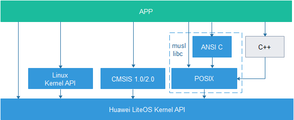

LiteOS provides a set of its own OS interfaces and also supports the musl libc library, the C++ standard library, CMSIS interfaces, and Linux interfaces. Upper-layer applications are advised to call compatible interfaces such as the musl libc library rather than directly calling LiteOS's own OS interfaces. The following sections list the compatible interfaces supported by LiteOS.

> **Notice:** 
>The libc library functions adapted by LiteOS follow the implementation form of the open-source musl libc. The musl open-source code follows the standard C specification ISO/IEC 9899:1999 and the POSIX standard 1003.1™-2008: as the simplest low-level library functions, they do not perform non-null checks on pointer-type parameters internally, and the legitimacy of the input parameters is guaranteed by the user.
>Among them, the time acquisition interfaces implemented by LiteOS all calculate from the start of system scheduling, which is inconsistent with the interface standard definitions. Special attention is required when using them.

## POSIX Interfaces<a name="ZH-CN_TOPIC_0000002511794418"></a>


### POSIX Support Interfaces<a name="ZH-CN_TOPIC_0000002543394355"></a>

LiteOS provides a set of POSIX adaptation interfaces. For detailed specifications, see the following table.

<a name="table7251821191815"></a>
<table><thead align="left"><tr id="row132381621141816"><th class="cellrowborder" valign="top" width="14.2%" id="mcps1.1.5.1.1"><p id="p4238821141818"><a name="p4238821141818"></a><a name="p4238821141818"></a>Header File</p>
</th>
<th class="cellrowborder" valign="top" width="20.810000000000002%" id="mcps1.1.5.1.2"><p id="p12238192111185"><a name="p12238192111185"></a><a name="p12238192111185"></a>Interface Name</p>
</th>
<th class="cellrowborder" valign="top" width="16.46%" id="mcps1.1.5.1.3"><p id="p02381021171812"><a name="p02381021171812"></a><a name="p02381021171812"></a>Type</p>
</th>
<th class="cellrowborder" valign="top" width="48.53%" id="mcps1.1.5.1.4"><p id="p1023882151811"><a name="p1023882151811"></a><a name="p1023882151811"></a>Description</p>
</th>
</tr>
</thead>
<tbody><tr id="row059428409"><td class="cellrowborder" valign="top" width="14.2%" headers="mcps1.1.5.1.1 "><p id="p78920414394"><a name="p78920414394"></a><a name="p78920414394"></a>ctype.h</p>
</td>
<td class="cellrowborder" valign="top" width="20.810000000000002%" headers="mcps1.1.5.1.2 "><p id="p14892134143918"><a name="p14892134143918"></a><a name="p14892134143918"></a>isalnum_l</p>
</td>
<td class="cellrowborder" valign="top" width="16.46%" headers="mcps1.1.5.1.3 "><p id="p18892124133917"><a name="p18892124133917"></a><a name="p18892124133917"></a>Data checking</p>
</td>
<td class="cellrowborder" valign="top" width="48.53%" headers="mcps1.1.5.1.4 "><p id="p28922413910"><a name="p28922413910"></a><a name="p28922413910"></a>Determine whether the input is a letter or digit</p>
</td>
</tr>
<tr id="row036910155011"><td class="cellrowborder" valign="top" width="14.2%" headers="mcps1.1.5.1.1 "><p id="p1389212418397"><a name="p1389212418397"></a><a name="p1389212418397"></a>ctype.h</p>
</td>
<td class="cellrowborder" valign="top" width="20.810000000000002%" headers="mcps1.1.5.1.2 "><p id="p98921845399"><a name="p98921845399"></a><a name="p98921845399"></a>isalpha_l</p>
</td>
<td class="cellrowborder" valign="top" width="16.46%" headers="mcps1.1.5.1.3 "><p id="p68927413391"><a name="p68927413391"></a><a name="p68927413391"></a>Data checking</p>
</td>
<td class="cellrowborder" valign="top" width="48.53%" headers="mcps1.1.5.1.4 "><p id="p138923412393"><a name="p138923412393"></a><a name="p138923412393"></a>Determine whether the input is a letter</p>
</td>
</tr>
<tr id="row857315181204"><td class="cellrowborder" valign="top" width="14.2%" headers="mcps1.1.5.1.1 "><p id="p138925433910"><a name="p138925433910"></a><a name="p138925433910"></a>ctype.h</p>
</td>
<td class="cellrowborder" valign="top" width="20.810000000000002%" headers="mcps1.1.5.1.2 "><p id="p17892154163916"><a name="p17892154163916"></a><a name="p17892154163916"></a>isascii</p>
</td>
<td class="cellrowborder" valign="top" width="16.46%" headers="mcps1.1.5.1.3 "><p id="p108921349391"><a name="p108921349391"></a><a name="p108921349391"></a>Data checking</p>
</td>
<td class="cellrowborder" valign="top" width="48.53%" headers="mcps1.1.5.1.4 "><p id="p989215416397"><a name="p989215416397"></a><a name="p989215416397"></a>Determine whether the input is an ASCII code</p>
</td>
</tr>
<tr id="row6747921201"><td class="cellrowborder" valign="top" width="14.2%" headers="mcps1.1.5.1.1 "><p id="p2892154173910"><a name="p2892154173910"></a><a name="p2892154173910"></a>ctype.h</p>
</td>
<td class="cellrowborder" valign="top" width="20.810000000000002%" headers="mcps1.1.5.1.2 "><p id="p1889215411396"><a name="p1889215411396"></a><a name="p1889215411396"></a>isblank</p>
</td>
<td class="cellrowborder" valign="top" width="16.46%" headers="mcps1.1.5.1.3 "><p id="p19892134103916"><a name="p19892134103916"></a><a name="p19892134103916"></a>Data checking</p>
</td>
<td class="cellrowborder" valign="top" width="48.53%" headers="mcps1.1.5.1.4 "><p id="p1189212419394"><a name="p1189212419394"></a><a name="p1189212419394"></a>Determine whether the input is a space or tab</p>
</td>
</tr>
<tr id="row74641425303"><td class="cellrowborder" valign="top" width="14.2%" headers="mcps1.1.5.1.1 "><p id="p28928483917"><a name="p28928483917"></a><a name="p28928483917"></a>ctype.h</p>
</td>
<td class="cellrowborder" valign="top" width="20.810000000000002%" headers="mcps1.1.5.1.2 "><p id="p1189219415395"><a name="p1189219415395"></a><a name="p1189219415395"></a>isblank_l</p>
</td>
<td class="cellrowborder" valign="top" width="16.46%" headers="mcps1.1.5.1.3 "><p id="p2089213443916"><a name="p2089213443916"></a><a name="p2089213443916"></a>Data checking</p>
</td>
<td class="cellrowborder" valign="top" width="48.53%" headers="mcps1.1.5.1.4 "><p id="p108921247395"><a name="p108921247395"></a><a name="p108921247395"></a>Determine whether the input is a space or tab</p>
</td>
</tr>
<tr id="row2416341505"><td class="cellrowborder" valign="top" width="14.2%" headers="mcps1.1.5.1.1 "><p id="p889254123917"><a name="p889254123917"></a><a name="p889254123917"></a>ctype.h</p>
</td>
<td class="cellrowborder" valign="top" width="20.810000000000002%" headers="mcps1.1.5.1.2 "><p id="p17892545396"><a name="p17892545396"></a><a name="p17892545396"></a>iscntrl_l</p>
</td>
<td class="cellrowborder" valign="top" width="16.46%" headers="mcps1.1.5.1.3 "><p id="p689218420395"><a name="p689218420395"></a><a name="p689218420395"></a>Data checking</p>
</td>
<td class="cellrowborder" valign="top" width="48.53%" headers="mcps1.1.5.1.4 "><p id="p128928493912"><a name="p128928493912"></a><a name="p128928493912"></a>Determine whether the input is a control character</p>
</td>
</tr>
<tr id="row1615174313015"><td class="cellrowborder" valign="top" width="14.2%" headers="mcps1.1.5.1.1 "><p id="p589217413398"><a name="p589217413398"></a><a name="p589217413398"></a>ctype.h</p>
</td>
<td class="cellrowborder" valign="top" width="20.810000000000002%" headers="mcps1.1.5.1.2 "><p id="p78924453911"><a name="p78924453911"></a><a name="p78924453911"></a>isdigit_l</p>
</td>
<td class="cellrowborder" valign="top" width="16.46%" headers="mcps1.1.5.1.3 "><p id="p789219413398"><a name="p789219413398"></a><a name="p789219413398"></a>Data checking</p>
</td>
<td class="cellrowborder" valign="top" width="48.53%" headers="mcps1.1.5.1.4 "><p id="p10892649393"><a name="p10892649393"></a><a name="p10892649393"></a>Determine whether the input is a decimal number</p>
</td>
</tr>
<tr id="row8600165113016"><td class="cellrowborder" valign="top" width="14.2%" headers="mcps1.1.5.1.1 "><p id="p58921045396"><a name="p58921045396"></a><a name="p58921045396"></a>ctype.h</p>
</td>
<td class="cellrowborder" valign="top" width="20.810000000000002%" headers="mcps1.1.5.1.2 "><p id="p389214163912"><a name="p389214163912"></a><a name="p389214163912"></a>isgraph_l</p>
</td>
<td class="cellrowborder" valign="top" width="16.46%" headers="mcps1.1.5.1.3 "><p id="p989215483918"><a name="p989215483918"></a><a name="p989215483918"></a>Data checking</p>
</td>
<td class="cellrowborder" valign="top" width="48.53%" headers="mcps1.1.5.1.4 "><p id="p12892114153914"><a name="p12892114153914"></a><a name="p12892114153914"></a>Determine whether the input has a graphical representation</p>
</td>
</tr>
<tr id="row68521041711"><td class="cellrowborder" valign="top" width="14.2%" headers="mcps1.1.5.1.1 "><p id="p7892549396"><a name="p7892549396"></a><a name="p7892549396"></a>ctype.h</p>
</td>
<td class="cellrowborder" valign="top" width="20.810000000000002%" headers="mcps1.1.5.1.2 "><p id="p38921420397"><a name="p38921420397"></a><a name="p38921420397"></a>islower_l</p>
</td>
<td class="cellrowborder" valign="top" width="16.46%" headers="mcps1.1.5.1.3 "><p id="p2892154113913"><a name="p2892154113913"></a><a name="p2892154113913"></a>Data checking</p>
</td>
<td class="cellrowborder" valign="top" width="48.53%" headers="mcps1.1.5.1.4 "><p id="p18929417396"><a name="p18929417396"></a><a name="p18929417396"></a>Determine whether the input is a lowercase letter</p>
</td>
</tr>
<tr id="row1799921115119"><td class="cellrowborder" valign="top" width="14.2%" headers="mcps1.1.5.1.1 "><p id="p089224173911"><a name="p089224173911"></a><a name="p089224173911"></a>ctype.h</p>
</td>
<td class="cellrowborder" valign="top" width="20.810000000000002%" headers="mcps1.1.5.1.2 "><p id="p118927453912"><a name="p118927453912"></a><a name="p118927453912"></a>isprint_l</p>
</td>
<td class="cellrowborder" valign="top" width="16.46%" headers="mcps1.1.5.1.3 "><p id="p989374153913"><a name="p989374153913"></a><a name="p989374153913"></a>Data checking</p>
</td>
<td class="cellrowborder" valign="top" width="48.53%" headers="mcps1.1.5.1.4 "><p id="p1689319416394"><a name="p1689319416394"></a><a name="p1689319416394"></a>Determine whether the input is printable</p>
</td>
</tr>
<tr id="row18915120817"><td class="cellrowborder" valign="top" width="14.2%" headers="mcps1.1.5.1.1 "><p id="p8893645398"><a name="p8893645398"></a><a name="p8893645398"></a>ctype.h</p>
</td>
<td class="cellrowborder" valign="top" width="20.810000000000002%" headers="mcps1.1.5.1.2 "><p id="p20893164193910"><a name="p20893164193910"></a><a name="p20893164193910"></a>ispunct_l</p>
</td>
<td class="cellrowborder" valign="top" width="16.46%" headers="mcps1.1.5.1.3 "><p id="p1789384133912"><a name="p1789384133912"></a><a name="p1789384133912"></a>Data checking</p>
</td>
<td class="cellrowborder" valign="top" width="48.53%" headers="mcps1.1.5.1.4 "><p id="p289317416392"><a name="p289317416392"></a><a name="p289317416392"></a>Determine whether the input is a punctuation mark</p>
</td>
</tr>
<tr id="row555018392110"><td class="cellrowborder" valign="top" width="14.2%" headers="mcps1.1.5.1.1 "><p id="p58931403916"><a name="p58931403916"></a><a name="p58931403916"></a>ctype.h</p>
</td>
<td class="cellrowborder" valign="top" width="20.810000000000002%" headers="mcps1.1.5.1.2 "><p id="p10893114163914"><a name="p10893114163914"></a><a name="p10893114163914"></a>isspace_l</p>
</td>
<td class="cellrowborder" valign="top" width="16.46%" headers="mcps1.1.5.1.3 "><p id="p98931341396"><a name="p98931341396"></a><a name="p98931341396"></a>Data checking</p>
</td>
<td class="cellrowborder" valign="top" width="48.53%" headers="mcps1.1.5.1.4 "><p id="p1089320443919"><a name="p1089320443919"></a><a name="p1089320443919"></a>Determine whether the input is a space</p>
</td>
</tr>
<tr id="row5130847218"><td class="cellrowborder" valign="top" width="14.2%" headers="mcps1.1.5.1.1 "><p id="p1589316493913"><a name="p1589316493913"></a><a name="p1589316493913"></a>ctype.h</p>
</td>
<td class="cellrowborder" valign="top" width="20.810000000000002%" headers="mcps1.1.5.1.2 "><p id="p158931740397"><a name="p158931740397"></a><a name="p158931740397"></a>isupper_l</p>
</td>
<td class="cellrowborder" valign="top" width="16.46%" headers="mcps1.1.5.1.3 "><p id="p789317433916"><a name="p789317433916"></a><a name="p789317433916"></a>Data checking</p>
</td>
<td class="cellrowborder" valign="top" width="48.53%" headers="mcps1.1.5.1.4 "><p id="p12893114183910"><a name="p12893114183910"></a><a name="p12893114183910"></a>Determine whether the input is an uppercase letter</p>
</td>
</tr>
<tr id="row11431055319"><td class="cellrowborder" valign="top" width="14.2%" headers="mcps1.1.5.1.1 "><p id="p1989310473917"><a name="p1989310473917"></a><a name="p1989310473917"></a>ctype.h</p>
</td>
<td class="cellrowborder" valign="top" width="20.810000000000002%" headers="mcps1.1.5.1.2 "><p id="p13893446394"><a name="p13893446394"></a><a name="p13893446394"></a>isxdigit_l</p>
</td>
<td class="cellrowborder" valign="top" width="16.46%" headers="mcps1.1.5.1.3 "><p id="p1989314415398"><a name="p1989314415398"></a><a name="p1989314415398"></a>Data checking</p>
</td>
<td class="cellrowborder" valign="top" width="48.53%" headers="mcps1.1.5.1.4 "><p id="p18893144133916"><a name="p18893144133916"></a><a name="p18893144133916"></a>Determine whether the input is a hexadecimal number</p>
</td>
</tr>
<tr id="row341135918119"><td class="cellrowborder" valign="top" width="14.2%" headers="mcps1.1.5.1.1 "><p id="p1789311413395"><a name="p1789311413395"></a><a name="p1789311413395"></a>ctype.h</p>
</td>
<td class="cellrowborder" valign="top" width="20.810000000000002%" headers="mcps1.1.5.1.2 "><p id="p18893184133913"><a name="p18893184133913"></a><a name="p18893184133913"></a>toascii</p>
</td>
<td class="cellrowborder" valign="top" width="16.46%" headers="mcps1.1.5.1.3 "><p id="p1289319417397"><a name="p1289319417397"></a><a name="p1289319417397"></a>Data conversion function</p>
</td>
<td class="cellrowborder" valign="top" width="48.53%" headers="mcps1.1.5.1.4 "><p id="p128934413396"><a name="p128934413396"></a><a name="p128934413396"></a>Convert a character to an ASCII code</p>
</td>
</tr>
<tr id="row1447011156220"><td class="cellrowborder" valign="top" width="14.2%" headers="mcps1.1.5.1.1 "><p id="p88931641398"><a name="p88931641398"></a><a name="p88931641398"></a>ctype.h</p>
</td>
<td class="cellrowborder" valign="top" width="20.810000000000002%" headers="mcps1.1.5.1.2 "><p id="p48931483912"><a name="p48931483912"></a><a name="p48931483912"></a>tolower_l</p>
</td>
<td class="cellrowborder" valign="top" width="16.46%" headers="mcps1.1.5.1.3 "><p id="p168938443917"><a name="p168938443917"></a><a name="p168938443917"></a>Data conversion function</p>
</td>
<td class="cellrowborder" valign="top" width="48.53%" headers="mcps1.1.5.1.4 "><p id="p15893149390"><a name="p15893149390"></a><a name="p15893149390"></a>Convert an uppercase letter to a lowercase letter</p>
</td>
</tr>
<tr id="row2088412310215"><td class="cellrowborder" valign="top" width="14.2%" headers="mcps1.1.5.1.1 "><p id="p2893948393"><a name="p2893948393"></a><a name="p2893948393"></a>ctype.h</p>
</td>
<td class="cellrowborder" valign="top" width="20.810000000000002%" headers="mcps1.1.5.1.2 "><p id="p14893194143917"><a name="p14893194143917"></a><a name="p14893194143917"></a>toupper_l</p>
</td>
<td class="cellrowborder" valign="top" width="16.46%" headers="mcps1.1.5.1.3 "><p id="p4893164103920"><a name="p4893164103920"></a><a name="p4893164103920"></a>Data conversion function</p>
</td>
<td class="cellrowborder" valign="top" width="48.53%" headers="mcps1.1.5.1.4 "><p id="p089310415396"><a name="p089310415396"></a><a name="p089310415396"></a>Convert a lowercase letter to an uppercase letter</p>
</td>
</tr>
<tr id="row8761029726"><td class="cellrowborder" valign="top" width="14.2%" headers="mcps1.1.5.1.1 "><p id="p189364123915"><a name="p189364123915"></a><a name="p189364123915"></a>dirent.h</p>
</td>
<td class="cellrowborder" valign="top" width="20.810000000000002%" headers="mcps1.1.5.1.2 "><p id="p148931543393"><a name="p148931543393"></a><a name="p148931543393"></a>alphasort</p>
</td>
<td class="cellrowborder" valign="top" width="16.46%" headers="mcps1.1.5.1.3 "><p id="p0893747394"><a name="p0893747394"></a><a name="p0893747394"></a>Directory operations</p>
</td>
<td class="cellrowborder" valign="top" width="48.53%" headers="mcps1.1.5.1.4 "><p id="p1289312413397"><a name="p1289312413397"></a><a name="p1289312413397"></a>Sort directory entries in alphabetical order</p>
</td>
</tr>
<tr id="row712463311219"><td class="cellrowborder" valign="top" width="14.2%" headers="mcps1.1.5.1.1 "><p id="p78933493913"><a name="p78933493913"></a><a name="p78933493913"></a>dirent.h</p>
</td>
<td class="cellrowborder" valign="top" width="20.810000000000002%" headers="mcps1.1.5.1.2 "><p id="p17893744393"><a name="p17893744393"></a><a name="p17893744393"></a>closedir</p>
</td>
<td class="cellrowborder" valign="top" width="16.46%" headers="mcps1.1.5.1.3 "><p id="p108931241391"><a name="p108931241391"></a><a name="p108931241391"></a>Directory operations</p>
</td>
<td class="cellrowborder" valign="top" width="48.53%" headers="mcps1.1.5.1.4 "><p id="p58931493910"><a name="p58931493910"></a><a name="p58931493910"></a>Close a directory</p>
</td>
</tr>
<tr id="row18768173715218"><td class="cellrowborder" valign="top" width="14.2%" headers="mcps1.1.5.1.1 "><p id="p1589310453913"><a name="p1589310453913"></a><a name="p1589310453913"></a>dirent.h</p>
</td>
<td class="cellrowborder" valign="top" width="20.810000000000002%" headers="mcps1.1.5.1.2 "><p id="p15894340395"><a name="p15894340395"></a><a name="p15894340395"></a>opendir</p>
</td>
<td class="cellrowborder" valign="top" width="16.46%" headers="mcps1.1.5.1.3 "><p id="p148949423911"><a name="p148949423911"></a><a name="p148949423911"></a>Directory operations</p>
</td>
<td class="cellrowborder" valign="top" width="48.53%" headers="mcps1.1.5.1.4 "><p id="p128947433916"><a name="p128947433916"></a><a name="p128947433916"></a>Open a directory</p>
</td>
</tr>
<tr id="row1965214422026"><td class="cellrowborder" valign="top" width="14.2%" headers="mcps1.1.5.1.1 "><p id="p15894048395"><a name="p15894048395"></a><a name="p15894048395"></a>dirent.h</p>
</td>
<td class="cellrowborder" valign="top" width="20.810000000000002%" headers="mcps1.1.5.1.2 "><p id="p089464163912"><a name="p089464163912"></a><a name="p089464163912"></a>readdir</p>
</td>
<td class="cellrowborder" valign="top" width="16.46%" headers="mcps1.1.5.1.3 "><p id="p1789413483919"><a name="p1789413483919"></a><a name="p1789413483919"></a>Directory operations</p>
</td>
<td class="cellrowborder" valign="top" width="48.53%" headers="mcps1.1.5.1.4 "><p id="p148942403918"><a name="p148942403918"></a><a name="p148942403918"></a>Read a directory</p>
</td>
</tr>
<tr id="row23781056192218"><td class="cellrowborder" valign="top" width="14.2%" headers="mcps1.1.5.1.1 "><p id="p1189494123918"><a name="p1189494123918"></a><a name="p1189494123918"></a>dirent.h</p>
</td>
<td class="cellrowborder" valign="top" width="20.810000000000002%" headers="mcps1.1.5.1.2 "><p id="p138941947399"><a name="p138941947399"></a><a name="p138941947399"></a>rewinddir</p>
</td>
<td class="cellrowborder" valign="top" width="16.46%" headers="mcps1.1.5.1.3 "><p id="p13894342397"><a name="p13894342397"></a><a name="p13894342397"></a>Directory operations</p>
</td>
<td class="cellrowborder" valign="top" width="48.53%" headers="mcps1.1.5.1.4 "><p id="p1989417414391"><a name="p1989417414391"></a><a name="p1989417414391"></a>Reset the directory read position to the beginning</p>
</td>
</tr>
<tr id="row794925932217"><td class="cellrowborder" valign="top" width="14.2%" headers="mcps1.1.5.1.1 "><p id="p12894134163911"><a name="p12894134163911"></a><a name="p12894134163911"></a>dirent.h</p>
</td>
<td class="cellrowborder" valign="top" width="20.810000000000002%" headers="mcps1.1.5.1.2 "><p id="p1389413473916"><a name="p1389413473916"></a><a name="p1389413473916"></a>scandir</p>
</td>
<td class="cellrowborder" valign="top" width="16.46%" headers="mcps1.1.5.1.3 "><p id="p789418419392"><a name="p789418419392"></a><a name="p789418419392"></a>Directory operations</p>
</td>
<td class="cellrowborder" valign="top" width="48.53%" headers="mcps1.1.5.1.4 "><p id="p589434183920"><a name="p589434183920"></a><a name="p589434183920"></a>Scan the directory and perform condition filtering</p>
</td>
</tr>
<tr id="row4545184142311"><td class="cellrowborder" valign="top" width="14.2%" headers="mcps1.1.5.1.1 "><p id="p1389410403914"><a name="p1389410403914"></a><a name="p1389410403914"></a>dirent.h</p>
</td>
<td class="cellrowborder" valign="top" width="20.810000000000002%" headers="mcps1.1.5.1.2 "><p id="p889411453919"><a name="p889411453919"></a><a name="p889411453919"></a>seekdir</p>
</td>
<td class="cellrowborder" valign="top" width="16.46%" headers="mcps1.1.5.1.3 "><p id="p38941048395"><a name="p38941048395"></a><a name="p38941048395"></a>Directory operations</p>
</td>
<td class="cellrowborder" valign="top" width="48.53%" headers="mcps1.1.5.1.4 "><p id="p168944412394"><a name="p168944412394"></a><a name="p168944412394"></a>Set the position for the next directory read</p>
</td>
</tr>
<tr id="row1535718842315"><td class="cellrowborder" valign="top" width="14.2%" headers="mcps1.1.5.1.1 "><p id="p1689484123914"><a name="p1689484123914"></a><a name="p1689484123914"></a>dirent.h</p>
</td>
<td class="cellrowborder" valign="top" width="20.810000000000002%" headers="mcps1.1.5.1.2 "><p id="p38943403911"><a name="p38943403911"></a><a name="p38943403911"></a>telldir</p>
</td>
<td class="cellrowborder" valign="top" width="16.46%" headers="mcps1.1.5.1.3 "><p id="p689424153918"><a name="p689424153918"></a><a name="p689424153918"></a>Directory operations</p>
</td>
<td class="cellrowborder" valign="top" width="48.53%" headers="mcps1.1.5.1.4 "><p id="p178940463918"><a name="p178940463918"></a><a name="p178940463918"></a>Obtain the read position of the directory stream</p>
</td>
</tr>
<tr id="row4259181917214"><td class="cellrowborder" valign="top" width="14.2%" headers="mcps1.1.5.1.1 "><p id="p1025911194218"><a name="p1025911194218"></a><a name="p1025911194218"></a>dlfcn.h</p>
</td>
<td class="cellrowborder" valign="top" width="20.810000000000002%" headers="mcps1.1.5.1.2 "><p id="p1425911902117"><a name="p1425911902117"></a><a name="p1425911902117"></a>dlclose</p>
</td>
<td class="cellrowborder" valign="top" width="16.46%" headers="mcps1.1.5.1.3 "><p id="p225917197218"><a name="p225917197218"></a><a name="p225917197218"></a>Dynamic loading</p>
</td>
<td class="cellrowborder" valign="top" width="48.53%" headers="mcps1.1.5.1.4 "><p id="p19259191902114"><a name="p19259191902114"></a><a name="p19259191902114"></a>Unload a module</p>
</td>
</tr>
<tr id="row15476103082110"><td class="cellrowborder" valign="top" width="14.2%" headers="mcps1.1.5.1.1 "><p id="p1447683072113"><a name="p1447683072113"></a><a name="p1447683072113"></a>dlfcn.h</p>
</td>
<td class="cellrowborder" valign="top" width="20.810000000000002%" headers="mcps1.1.5.1.2 "><p id="p9476113012214"><a name="p9476113012214"></a><a name="p9476113012214"></a>dlopen</p>
</td>
<td class="cellrowborder" valign="top" width="16.46%" headers="mcps1.1.5.1.3 "><p id="p14766308218"><a name="p14766308218"></a><a name="p14766308218"></a>Dynamic loading</p>
</td>
<td class="cellrowborder" valign="top" width="48.53%" headers="mcps1.1.5.1.4 "><p id="p104761530112110"><a name="p104761530112110"></a><a name="p104761530112110"></a>Dynamically load an so module</p>
</td>
</tr>
<tr id="row824042518217"><td class="cellrowborder" valign="top" width="14.2%" headers="mcps1.1.5.1.1 "><p id="p17240192572113"><a name="p17240192572113"></a><a name="p17240192572113"></a>dlfcn.h</p>
</td>
<td class="cellrowborder" valign="top" width="20.810000000000002%" headers="mcps1.1.5.1.2 "><p id="p72400252213"><a name="p72400252213"></a><a name="p72400252213"></a>dlsym</p>
</td>
<td class="cellrowborder" valign="top" width="16.46%" headers="mcps1.1.5.1.3 "><p id="p8240325152114"><a name="p8240325152114"></a><a name="p8240325152114"></a>Dynamic loading</p>
</td>
<td class="cellrowborder" valign="top" width="48.53%" headers="mcps1.1.5.1.4 "><p id="p724016250211"><a name="p724016250211"></a><a name="p724016250211"></a>Look up a symbol in the module or system symbol table</p>
</td>
</tr>
<tr id="row10817132113618"><td class="cellrowborder" valign="top" width="14.2%" headers="mcps1.1.5.1.1 "><p id="p1481862116361"><a name="p1481862116361"></a><a name="p1481862116361"></a>fcntl.h</p>
</td>
<td class="cellrowborder" valign="top" width="20.810000000000002%" headers="mcps1.1.5.1.2 "><p id="p2818152153617"><a name="p2818152153617"></a><a name="p2818152153617"></a>creat</p>
</td>
<td class="cellrowborder" valign="top" width="16.46%" headers="mcps1.1.5.1.3 "><p id="p158181221143612"><a name="p158181221143612"></a><a name="p158181221143612"></a>File operation function</p>
</td>
<td class="cellrowborder" valign="top" width="48.53%" headers="mcps1.1.5.1.4 "><p id="p28181621193617"><a name="p28181621193617"></a><a name="p28181621193617"></a>Create a file</p>
</td>
</tr>
<tr id="row090483733812"><td class="cellrowborder" valign="top" width="14.2%" headers="mcps1.1.5.1.1 "><p id="p290418378385"><a name="p290418378385"></a><a name="p290418378385"></a>fcntl.h</p>
</td>
<td class="cellrowborder" valign="top" width="20.810000000000002%" headers="mcps1.1.5.1.2 "><p id="p7904163723819"><a name="p7904163723819"></a><a name="p7904163723819"></a>fcntl</p>
</td>
<td class="cellrowborder" valign="top" width="16.46%" headers="mcps1.1.5.1.3 "><p id="p1490423773810"><a name="p1490423773810"></a><a name="p1490423773810"></a>File operation function</p>
</td>
<td class="cellrowborder" valign="top" width="48.53%" headers="mcps1.1.5.1.4 "><p id="p149047373387"><a name="p149047373387"></a><a name="p149047373387"></a>File descriptor operation</p>
</td>
</tr>
<tr id="row1671558183912"><td class="cellrowborder" valign="top" width="14.2%" headers="mcps1.1.5.1.1 "><p id="p7715198143917"><a name="p7715198143917"></a><a name="p7715198143917"></a>fcntl.h</p>
</td>
<td class="cellrowborder" valign="top" width="20.810000000000002%" headers="mcps1.1.5.1.2 "><p id="p1371515823919"><a name="p1371515823919"></a><a name="p1371515823919"></a>open</p>
</td>
<td class="cellrowborder" valign="top" width="16.46%" headers="mcps1.1.5.1.3 "><p id="p27151987392"><a name="p27151987392"></a><a name="p27151987392"></a>File operation function</p>
</td>
<td class="cellrowborder" valign="top" width="48.53%" headers="mcps1.1.5.1.4 "><p id="p971512853920"><a name="p971512853920"></a><a name="p971512853920"></a>Open a file</p>
</td>
</tr>
<tr id="row125714713366"><td class="cellrowborder" valign="top" width="14.2%" headers="mcps1.1.5.1.1 "><p id="p957479361"><a name="p957479361"></a><a name="p957479361"></a>langinfo.h</p>
</td>
<td class="cellrowborder" valign="top" width="20.810000000000002%" headers="mcps1.1.5.1.2 "><p id="p10571718363"><a name="p10571718363"></a><a name="p10571718363"></a>nl_langinfo</p>
</td>
<td class="cellrowborder" valign="top" width="16.46%" headers="mcps1.1.5.1.3 "><p id="p10575703610"><a name="p10575703610"></a><a name="p10575703610"></a>System function</p>
</td>
<td class="cellrowborder" valign="top" width="48.53%" headers="mcps1.1.5.1.4 "><p id="p115712793617"><a name="p115712793617"></a><a name="p115712793617"></a>Return the specified locale information</p>
</td>
</tr>
<tr id="row821410153362"><td class="cellrowborder" valign="top" width="14.2%" headers="mcps1.1.5.1.1 "><p id="p1221451518368"><a name="p1221451518368"></a><a name="p1221451518368"></a>langinfo.h</p>
</td>
<td class="cellrowborder" valign="top" width="20.810000000000002%" headers="mcps1.1.5.1.2 "><p id="p12144157367"><a name="p12144157367"></a><a name="p12144157367"></a>nl_langinfo_l</p>
</td>
<td class="cellrowborder" valign="top" width="16.46%" headers="mcps1.1.5.1.3 "><p id="p1321481513616"><a name="p1321481513616"></a><a name="p1321481513616"></a>System function</p>
</td>
<td class="cellrowborder" valign="top" width="48.53%" headers="mcps1.1.5.1.4 "><p id="p112141015123618"><a name="p112141015123618"></a><a name="p112141015123618"></a>Return the specified locale information</p>
</td>
</tr>
<tr id="row1499161814365"><td class="cellrowborder" valign="top" width="14.2%" headers="mcps1.1.5.1.1 "><p id="p1199191819369"><a name="p1199191819369"></a><a name="p1199191819369"></a>libgen.h</p>
</td>
<td class="cellrowborder" valign="top" width="20.810000000000002%" headers="mcps1.1.5.1.2 "><p id="p179915183361"><a name="p179915183361"></a><a name="p179915183361"></a>basename</p>
</td>
<td class="cellrowborder" valign="top" width="16.46%" headers="mcps1.1.5.1.3 "><p id="p1599117181365"><a name="p1599117181365"></a><a name="p1599117181365"></a>File path</p>
</td>
<td class="cellrowborder" valign="top" width="48.53%" headers="mcps1.1.5.1.4 "><p id="p8991151823610"><a name="p8991151823610"></a><a name="p8991151823610"></a>Return the file name</p>
</td>
</tr>
<tr id="row22381321151819"><td class="cellrowborder" valign="top" width="14.2%" headers="mcps1.1.5.1.1 "><p id="p7238121101820"><a name="p7238121101820"></a><a name="p7238121101820"></a>mqueue.h</p>
</td>
<td class="cellrowborder" valign="top" width="20.810000000000002%" headers="mcps1.1.5.1.2 "><p id="p142381621101814"><a name="p142381621101814"></a><a name="p142381621101814"></a>mq_close</p>
</td>
<td class="cellrowborder" valign="top" width="16.46%" headers="mcps1.1.5.1.3 "><p id="p1823812171817"><a name="p1823812171817"></a><a name="p1823812171817"></a>Message queue</p>
</td>
<td class="cellrowborder" valign="top" width="48.53%" headers="mcps1.1.5.1.4 "><p id="p1923802112183"><a name="p1923802112183"></a><a name="p1923802112183"></a>Close a message queue</p>
</td>
</tr>
<tr id="row10238192131816"><td class="cellrowborder" valign="top" width="14.2%" headers="mcps1.1.5.1.1 "><p id="p323862121816"><a name="p323862121816"></a><a name="p323862121816"></a>mqueue.h</p>
</td>
<td class="cellrowborder" valign="top" width="20.810000000000002%" headers="mcps1.1.5.1.2 "><p id="p923812219182"><a name="p923812219182"></a><a name="p923812219182"></a>mq_getattr</p>
</td>
<td class="cellrowborder" valign="top" width="16.46%" headers="mcps1.1.5.1.3 "><p id="p8238121141819"><a name="p8238121141819"></a><a name="p8238121141819"></a>Message queue</p>
</td>
<td class="cellrowborder" valign="top" width="48.53%" headers="mcps1.1.5.1.4 "><p id="p1623892141819"><a name="p1623892141819"></a><a name="p1623892141819"></a>Get the message queue attributes</p>
</td>
</tr>
<tr id="row32382213185"><td class="cellrowborder" valign="top" width="14.2%" headers="mcps1.1.5.1.1 "><p id="p17238221151817"><a name="p17238221151817"></a><a name="p17238221151817"></a>mqueue.h</p>
</td>
<td class="cellrowborder" valign="top" width="20.810000000000002%" headers="mcps1.1.5.1.2 "><p id="p162387216183"><a name="p162387216183"></a><a name="p162387216183"></a>mq_open</p>
</td>
<td class="cellrowborder" valign="top" width="16.46%" headers="mcps1.1.5.1.3 "><p id="p102381221161812"><a name="p102381221161812"></a><a name="p102381221161812"></a>Message queue</p>
</td>
<td class="cellrowborder" valign="top" width="48.53%" headers="mcps1.1.5.1.4 "><p id="p1623813216185"><a name="p1623813216185"></a><a name="p1623813216185"></a>Open a message queue</p>
</td>
</tr>
<tr id="row1223814210185"><td class="cellrowborder" valign="top" width="14.2%" headers="mcps1.1.5.1.1 "><p id="p1323862121815"><a name="p1323862121815"></a><a name="p1323862121815"></a>mqueue.h</p>
</td>
<td class="cellrowborder" valign="top" width="20.810000000000002%" headers="mcps1.1.5.1.2 "><p id="p1523802141813"><a name="p1523802141813"></a><a name="p1523802141813"></a>mq_receive</p>
</td>
<td class="cellrowborder" valign="top" width="16.46%" headers="mcps1.1.5.1.3 "><p id="p12381215186"><a name="p12381215186"></a><a name="p12381215186"></a>Message queue</p>
</td>
<td class="cellrowborder" valign="top" width="48.53%" headers="mcps1.1.5.1.4 "><p id="p1923816215184"><a name="p1923816215184"></a><a name="p1923816215184"></a>Receive a message from the message queue</p>
</td>
</tr>
<tr id="row3238122111812"><td class="cellrowborder" valign="top" width="14.2%" headers="mcps1.1.5.1.1 "><p id="p1923872171816"><a name="p1923872171816"></a><a name="p1923872171816"></a>mqueue.h</p>
</td>
<td class="cellrowborder" valign="top" width="20.810000000000002%" headers="mcps1.1.5.1.2 "><p id="p1523822111820"><a name="p1523822111820"></a><a name="p1523822111820"></a>mq_send</p>
</td>
<td class="cellrowborder" valign="top" width="16.46%" headers="mcps1.1.5.1.3 "><p id="p1423892121810"><a name="p1423892121810"></a><a name="p1423892121810"></a>Message queue</p>
</td>
<td class="cellrowborder" valign="top" width="48.53%" headers="mcps1.1.5.1.4 "><p id="p20238621101811"><a name="p20238621101811"></a><a name="p20238621101811"></a>Send a message to the message queue</p>
</td>
</tr>
<tr id="row16238021151810"><td class="cellrowborder" valign="top" width="14.2%" headers="mcps1.1.5.1.1 "><p id="p623852118186"><a name="p623852118186"></a><a name="p623852118186"></a>mqueue.h</p>
</td>
<td class="cellrowborder" valign="top" width="20.810000000000002%" headers="mcps1.1.5.1.2 "><p id="p1823815217185"><a name="p1823815217185"></a><a name="p1823815217185"></a>mq_setattr</p>
</td>
<td class="cellrowborder" valign="top" width="16.46%" headers="mcps1.1.5.1.3 "><p id="p923882112185"><a name="p923882112185"></a><a name="p923882112185"></a>Message queue</p>
</td>
<td class="cellrowborder" valign="top" width="48.53%" headers="mcps1.1.5.1.4 "><p id="p323832191817"><a name="p323832191817"></a><a name="p323832191817"></a>Set the message queue attributes</p>
</td>
</tr>
<tr id="row523813212188"><td class="cellrowborder" valign="top" width="14.2%" headers="mcps1.1.5.1.1 "><p id="p122385217182"><a name="p122385217182"></a><a name="p122385217182"></a>mqueue.h</p>
</td>
<td class="cellrowborder" valign="top" width="20.810000000000002%" headers="mcps1.1.5.1.2 "><p id="p923814217181"><a name="p923814217181"></a><a name="p923814217181"></a>mq_timedreceive</p>
</td>
<td class="cellrowborder" valign="top" width="16.46%" headers="mcps1.1.5.1.3 "><p id="p20238142111814"><a name="p20238142111814"></a><a name="p20238142111814"></a>Message queue</p>
</td>
<td class="cellrowborder" valign="top" width="48.53%" headers="mcps1.1.5.1.4 "><p id="p5238142113188"><a name="p5238142113188"></a><a name="p5238142113188"></a>Receive a message with a timeout</p>
</td>
</tr>
<tr id="row1023852181818"><td class="cellrowborder" valign="top" width="14.2%" headers="mcps1.1.5.1.1 "><p id="p42381321181814"><a name="p42381321181814"></a><a name="p42381321181814"></a>mqueue.h</p>
</td>
<td class="cellrowborder" valign="top" width="20.810000000000002%" headers="mcps1.1.5.1.2 "><p id="p17238172141816"><a name="p17238172141816"></a><a name="p17238172141816"></a>mq_timedsend</p>
</td>
<td class="cellrowborder" valign="top" width="16.46%" headers="mcps1.1.5.1.3 "><p id="p132386217185"><a name="p132386217185"></a><a name="p132386217185"></a>Message queue</p>
</td>
<td class="cellrowborder" valign="top" width="48.53%" headers="mcps1.1.5.1.4 "><p id="p023832118183"><a name="p023832118183"></a><a name="p023832118183"></a>Send a message with a timeout</p>
</td>
</tr>
<tr id="row16238521131810"><td class="cellrowborder" valign="top" width="14.2%" headers="mcps1.1.5.1.1 "><p id="p42381021131818"><a name="p42381021131818"></a><a name="p42381021131818"></a>mqueue.h</p>
</td>
<td class="cellrowborder" valign="top" width="20.810000000000002%" headers="mcps1.1.5.1.2 "><p id="p62381121151811"><a name="p62381121151811"></a><a name="p62381121151811"></a>mq_unlink</p>
</td>
<td class="cellrowborder" valign="top" width="16.46%" headers="mcps1.1.5.1.3 "><p id="p92382021131810"><a name="p92382021131810"></a><a name="p92382021131810"></a>Message queue</p>
</td>
<td class="cellrowborder" valign="top" width="48.53%" headers="mcps1.1.5.1.4 "><p id="p823815218181"><a name="p823815218181"></a><a name="p823815218181"></a>Remove a message queue</p>
</td>
</tr>
<tr id="row17241929103513"><td class="cellrowborder" valign="top" width="14.2%" headers="mcps1.1.5.1.1 "><p id="p2896184123914"><a name="p2896184123914"></a><a name="p2896184123914"></a>net/if.h</p>
</td>
<td class="cellrowborder" valign="top" width="20.810000000000002%" headers="mcps1.1.5.1.2 "><p id="p78962453913"><a name="p78962453913"></a><a name="p78962453913"></a>if_freenameindex</p>
</td>
<td class="cellrowborder" valign="top" width="16.46%" headers="mcps1.1.5.1.3 "><p id="p1989613411393"><a name="p1989613411393"></a><a name="p1989613411393"></a>Network function</p>
</td>
<td class="cellrowborder" valign="top" width="48.53%" headers="mcps1.1.5.1.4 "><p id="p389619433919"><a name="p389619433919"></a><a name="p389619433919"></a>After obtaining the interface names and indexes with if_nameindex(), call this function to release the dynamically allocated memory area</p>
</td>
</tr>
<tr id="row591534203516"><td class="cellrowborder" valign="top" width="14.2%" headers="mcps1.1.5.1.1 "><p id="p1489614103913"><a name="p1489614103913"></a><a name="p1489614103913"></a>net/if.h</p>
</td>
<td class="cellrowborder" valign="top" width="20.810000000000002%" headers="mcps1.1.5.1.2 "><p id="p489610417395"><a name="p489610417395"></a><a name="p489610417395"></a>if_indextoname</p>
</td>
<td class="cellrowborder" valign="top" width="16.46%" headers="mcps1.1.5.1.3 "><p id="p148964415397"><a name="p148964415397"></a><a name="p148964415397"></a>Data conversion function</p>
</td>
<td class="cellrowborder" valign="top" width="48.53%" headers="mcps1.1.5.1.4 "><p id="p11896344392"><a name="p11896344392"></a><a name="p11896344392"></a>Convert a network interface index to an interface name</p>
</td>
</tr>
<tr id="row6358143743514"><td class="cellrowborder" valign="top" width="14.2%" headers="mcps1.1.5.1.1 "><p id="p789614413910"><a name="p789614413910"></a><a name="p789614413910"></a>net/if.h</p>
</td>
<td class="cellrowborder" valign="top" width="20.810000000000002%" headers="mcps1.1.5.1.2 "><p id="p9896154133915"><a name="p9896154133915"></a><a name="p9896154133915"></a>if_nameindex</p>
</td>
<td class="cellrowborder" valign="top" width="16.46%" headers="mcps1.1.5.1.3 "><p id="p19896194193919"><a name="p19896194193919"></a><a name="p19896194193919"></a>Network function</p>
</td>
<td class="cellrowborder" valign="top" width="48.53%" headers="mcps1.1.5.1.4 "><p id="p3896546399"><a name="p3896546399"></a><a name="p3896546399"></a>Return a dynamically allocated array of struct if_nameindex structures, where each element corresponds to a local network interface</p>
</td>
</tr>
<tr id="row571394118350"><td class="cellrowborder" valign="top" width="14.2%" headers="mcps1.1.5.1.1 "><p id="p118973473915"><a name="p118973473915"></a><a name="p118973473915"></a>net/if.h</p>
</td>
<td class="cellrowborder" valign="top" width="20.810000000000002%" headers="mcps1.1.5.1.2 "><p id="p1389764113915"><a name="p1389764113915"></a><a name="p1389764113915"></a>if_nametoindex</p>
</td>
<td class="cellrowborder" valign="top" width="16.46%" headers="mcps1.1.5.1.3 "><p id="p889744153919"><a name="p889744153919"></a><a name="p889744153919"></a>Data conversion function</p>
</td>
<td class="cellrowborder" valign="top" width="48.53%" headers="mcps1.1.5.1.4 "><p id="p2897349391"><a name="p2897349391"></a><a name="p2897349391"></a>Convert a network interface name to an interface index</p>
</td>
</tr>
<tr id="row11739535104018"><td class="cellrowborder" valign="top" width="14.2%" headers="mcps1.1.5.1.1 "><p id="p1589794133918"><a name="p1589794133918"></a><a name="p1589794133918"></a>netdb.h</p>
</td>
<td class="cellrowborder" valign="top" width="20.810000000000002%" headers="mcps1.1.5.1.2 "><p id="p128973413916"><a name="p128973413916"></a><a name="p128973413916"></a>freeaddrinfo</p>
</td>
<td class="cellrowborder" valign="top" width="16.46%" headers="mcps1.1.5.1.3 "><p id="p3897649392"><a name="p3897649392"></a><a name="p3897649392"></a>Network function</p>
</td>
<td class="cellrowborder" valign="top" width="48.53%" headers="mcps1.1.5.1.4 "><p id="p14897146391"><a name="p14897146391"></a><a name="p14897146391"></a>Release the memory space allocated by getaddrinfo</p>
</td>
</tr>
<tr id="row1220604424018"><td class="cellrowborder" valign="top" width="14.2%" headers="mcps1.1.5.1.1 "><p id="p1089716483919"><a name="p1089716483919"></a><a name="p1089716483919"></a>netdb.h</p>
</td>
<td class="cellrowborder" valign="top" width="20.810000000000002%" headers="mcps1.1.5.1.2 "><p id="p128976417394"><a name="p128976417394"></a><a name="p128976417394"></a>getaddrinfo</p>
</td>
<td class="cellrowborder" valign="top" width="16.46%" headers="mcps1.1.5.1.3 "><p id="p389710423914"><a name="p389710423914"></a><a name="p389710423914"></a>Network function</p>
</td>
<td class="cellrowborder" valign="top" width="48.53%" headers="mcps1.1.5.1.4 "><p id="p489712415393"><a name="p489712415393"></a><a name="p489712415393"></a>Convert a host name and service name to a socket address</p>
</td>
</tr>
<tr id="row14598154144010"><td class="cellrowborder" valign="top" width="14.2%" headers="mcps1.1.5.1.1 "><p id="p188971433912"><a name="p188971433912"></a><a name="p188971433912"></a>netdb.h</p>
</td>
<td class="cellrowborder" valign="top" width="20.810000000000002%" headers="mcps1.1.5.1.2 "><p id="p1889710483916"><a name="p1889710483916"></a><a name="p1889710483916"></a>getnameinfo</p>
</td>
<td class="cellrowborder" valign="top" width="16.46%" headers="mcps1.1.5.1.3 "><p id="p198971246396"><a name="p198971246396"></a><a name="p198971246396"></a>Network function</p>
</td>
<td class="cellrowborder" valign="top" width="48.53%" headers="mcps1.1.5.1.4 "><p id="p98977412397"><a name="p98977412397"></a><a name="p98977412397"></a>Convert a socket address to a host name and service name</p>
</td>
</tr>
<tr id="row97131254155818"><td class="cellrowborder" valign="top" width="14.2%" headers="mcps1.1.5.1.1 "><p id="p1789711414391"><a name="p1789711414391"></a><a name="p1789711414391"></a>poll.h</p>
</td>
<td class="cellrowborder" valign="top" width="20.810000000000002%" headers="mcps1.1.5.1.2 "><p id="p19897194163914"><a name="p19897194163914"></a><a name="p19897194163914"></a>poll</p>
</td>
<td class="cellrowborder" valign="top" width="16.46%" headers="mcps1.1.5.1.3 "><p id="p28973473920"><a name="p28973473920"></a><a name="p28973473920"></a>File operation function</p>
</td>
<td class="cellrowborder" valign="top" width="48.53%" headers="mcps1.1.5.1.4 "><p id="p28976433917"><a name="p28976433917"></a><a name="p28976433917"></a>Monitor file descriptors</p>
</td>
</tr>
<tr id="row1323842110187"><td class="cellrowborder" valign="top" width="14.2%" headers="mcps1.1.5.1.1 "><p id="p82381621171816"><a name="p82381621171816"></a><a name="p82381621171816"></a>pthread.h</p>
</td>
<td class="cellrowborder" valign="top" width="20.810000000000002%" headers="mcps1.1.5.1.2 "><p id="p323917218181"><a name="p323917218181"></a><a name="p323917218181"></a>pthread_attr_destroy</p>
</td>
<td class="cellrowborder" valign="top" width="16.46%" headers="mcps1.1.5.1.3 "><p id="p22391521131811"><a name="p22391521131811"></a><a name="p22391521131811"></a>pthread</p>
</td>
<td class="cellrowborder" valign="top" width="48.53%" headers="mcps1.1.5.1.4 "><p id="p1623922151819"><a name="p1623922151819"></a><a name="p1623922151819"></a>Delete thread attributes</p>
</td>
</tr>
<tr id="row152398216183"><td class="cellrowborder" valign="top" width="14.2%" headers="mcps1.1.5.1.1 "><p id="p132391421101816"><a name="p132391421101816"></a><a name="p132391421101816"></a>pthread.h</p>
</td>
<td class="cellrowborder" valign="top" width="20.810000000000002%" headers="mcps1.1.5.1.2 "><p id="p1239152117186"><a name="p1239152117186"></a><a name="p1239152117186"></a>pthread_attr_getdetachstate</p>
</td>
<td class="cellrowborder" valign="top" width="16.46%" headers="mcps1.1.5.1.3 "><p id="p14239221151817"><a name="p14239221151817"></a><a name="p14239221151817"></a>pthread</p>
</td>
<td class="cellrowborder" valign="top" width="48.53%" headers="mcps1.1.5.1.4 "><p id="p112392216186"><a name="p112392216186"></a><a name="p112392216186"></a>Get the detach state attribute</p>
</td>
</tr>
<tr id="row423912191818"><td class="cellrowborder" valign="top" width="14.2%" headers="mcps1.1.5.1.1 "><p id="p12239102121819"><a name="p12239102121819"></a><a name="p12239102121819"></a>pthread.h</p>
</td>
<td class="cellrowborder" valign="top" width="20.810000000000002%" headers="mcps1.1.5.1.2 "><p id="p3239182117183"><a name="p3239182117183"></a><a name="p3239182117183"></a>pthread_attr_getinheritsched</p>
</td>
<td class="cellrowborder" valign="top" width="16.46%" headers="mcps1.1.5.1.3 "><p id="p1623972112184"><a name="p1623972112184"></a><a name="p1623972112184"></a>pthread</p>
</td>
<td class="cellrowborder" valign="top" width="48.53%" headers="mcps1.1.5.1.4 "><p id="p3239202114182"><a name="p3239202114182"></a><a name="p3239202114182"></a>Get the task scheduling mode</p>
</td>
</tr>
<tr id="row92395213186"><td class="cellrowborder" valign="top" width="14.2%" headers="mcps1.1.5.1.1 "><p id="p123962119183"><a name="p123962119183"></a><a name="p123962119183"></a>pthread.h</p>
</td>
<td class="cellrowborder" valign="top" width="20.810000000000002%" headers="mcps1.1.5.1.2 "><p id="p1239132117182"><a name="p1239132117182"></a><a name="p1239132117182"></a>pthread_attr_getschedparam</p>
</td>
<td class="cellrowborder" valign="top" width="16.46%" headers="mcps1.1.5.1.3 "><p id="p172399212186"><a name="p172399212186"></a><a name="p172399212186"></a>pthread</p>
</td>
<td class="cellrowborder" valign="top" width="48.53%" headers="mcps1.1.5.1.4 "><p id="p1923918211189"><a name="p1923918211189"></a><a name="p1923918211189"></a>Get the task scheduling parameters</p>
</td>
</tr>
<tr id="row11239142191817"><td class="cellrowborder" valign="top" width="14.2%" headers="mcps1.1.5.1.1 "><p id="p7239142118182"><a name="p7239142118182"></a><a name="p7239142118182"></a>pthread.h</p>
</td>
<td class="cellrowborder" valign="top" width="20.810000000000002%" headers="mcps1.1.5.1.2 "><p id="p1623913214189"><a name="p1623913214189"></a><a name="p1623913214189"></a>pthread_attr_getschedpolicy</p>
</td>
<td class="cellrowborder" valign="top" width="16.46%" headers="mcps1.1.5.1.3 "><p id="p16239421121818"><a name="p16239421121818"></a><a name="p16239421121818"></a>pthread</p>
</td>
<td class="cellrowborder" valign="top" width="48.53%" headers="mcps1.1.5.1.4 "><p id="p1523952151817"><a name="p1523952151817"></a><a name="p1523952151817"></a>Get the task scheduling policy attribute. Currently, only the SCHED_RR scheduling policy is supported; SCHED_OTHER and SCHED_FIFO are not supported</p>
</td>
</tr>
<tr id="row823913218181"><td class="cellrowborder" valign="top" width="14.2%" headers="mcps1.1.5.1.1 "><p id="p223942118182"><a name="p223942118182"></a><a name="p223942118182"></a>pthread.h</p>
</td>
<td class="cellrowborder" valign="top" width="20.810000000000002%" headers="mcps1.1.5.1.2 "><p id="p1123972116189"><a name="p1123972116189"></a><a name="p1123972116189"></a>pthread_attr_getscope</p>
</td>
<td class="cellrowborder" valign="top" width="16.46%" headers="mcps1.1.5.1.3 "><p id="p22395218186"><a name="p22395218186"></a><a name="p22395218186"></a>pthread</p>
</td>
<td class="cellrowborder" valign="top" width="48.53%" headers="mcps1.1.5.1.4 "><p id="p4239721201815"><a name="p4239721201815"></a><a name="p4239721201815"></a>Get the task scope attribute. The task scope currently supports only PTHREAD_SCOPE_SYSTEM, not PTHREAD_SCOPE_PROCESS</p>
</td>
</tr>
<tr id="row8239021161811"><td class="cellrowborder" valign="top" width="14.2%" headers="mcps1.1.5.1.1 "><p id="p10239172112189"><a name="p10239172112189"></a><a name="p10239172112189"></a>pthread.h</p>
</td>
<td class="cellrowborder" valign="top" width="20.810000000000002%" headers="mcps1.1.5.1.2 "><p id="p623911215182"><a name="p623911215182"></a><a name="p623911215182"></a>pthread_attr_getstackaddr</p>
</td>
<td class="cellrowborder" valign="top" width="16.46%" headers="mcps1.1.5.1.3 "><p id="p142391721191820"><a name="p142391721191820"></a><a name="p142391721191820"></a>pthread</p>
</td>
<td class="cellrowborder" valign="top" width="48.53%" headers="mcps1.1.5.1.4 "><p id="p823920218189"><a name="p823920218189"></a><a name="p823920218189"></a>Get the start address of the task stack</p>
</td>
</tr>
<tr id="row723972171811"><td class="cellrowborder" valign="top" width="14.2%" headers="mcps1.1.5.1.1 "><p id="p42391221111810"><a name="p42391221111810"></a><a name="p42391221111810"></a>pthread.h</p>
</td>
<td class="cellrowborder" valign="top" width="20.810000000000002%" headers="mcps1.1.5.1.2 "><p id="p202399217187"><a name="p202399217187"></a><a name="p202399217187"></a>pthread_attr_getstacksize</p>
</td>
<td class="cellrowborder" valign="top" width="16.46%" headers="mcps1.1.5.1.3 "><p id="p323962116188"><a name="p323962116188"></a><a name="p323962116188"></a>pthread</p>
</td>
<td class="cellrowborder" valign="top" width="48.53%" headers="mcps1.1.5.1.4 "><p id="p142391021171816"><a name="p142391021171816"></a><a name="p142391021171816"></a>Get the stack size of the task attribute</p>
</td>
</tr>
<tr id="row1623919212184"><td class="cellrowborder" valign="top" width="14.2%" headers="mcps1.1.5.1.1 "><p id="p423952118184"><a name="p423952118184"></a><a name="p423952118184"></a>pthread.h</p>
</td>
<td class="cellrowborder" valign="top" width="20.810000000000002%" headers="mcps1.1.5.1.2 "><p id="p423982161813"><a name="p423982161813"></a><a name="p423982161813"></a>pthread_attr_init</p>
</td>
<td class="cellrowborder" valign="top" width="16.46%" headers="mcps1.1.5.1.3 "><p id="p423972121817"><a name="p423972121817"></a><a name="p423972121817"></a>pthread</p>
</td>
<td class="cellrowborder" valign="top" width="48.53%" headers="mcps1.1.5.1.4 "><p id="p16239182141811"><a name="p16239182141811"></a><a name="p16239182141811"></a>Initialize task attributes</p>
</td>
</tr>
<tr id="row723962110181"><td class="cellrowborder" valign="top" width="14.2%" headers="mcps1.1.5.1.1 "><p id="p223972111183"><a name="p223972111183"></a><a name="p223972111183"></a>pthread.h</p>
</td>
<td class="cellrowborder" valign="top" width="20.810000000000002%" headers="mcps1.1.5.1.2 "><p id="p82393214188"><a name="p82393214188"></a><a name="p82393214188"></a>pthread_attr_setdetachstate</p>
</td>
<td class="cellrowborder" valign="top" width="16.46%" headers="mcps1.1.5.1.3 "><p id="p52391821191819"><a name="p52391821191819"></a><a name="p52391821191819"></a>pthread</p>
</td>
<td class="cellrowborder" valign="top" width="48.53%" headers="mcps1.1.5.1.4 "><p id="p1723912116187"><a name="p1723912116187"></a><a name="p1723912116187"></a>Set the task attribute detach state</p>
</td>
</tr>
<tr id="row6239122115189"><td class="cellrowborder" valign="top" width="14.2%" headers="mcps1.1.5.1.1 "><p id="p423952117181"><a name="p423952117181"></a><a name="p423952117181"></a>pthread.h</p>
</td>
<td class="cellrowborder" valign="top" width="20.810000000000002%" headers="mcps1.1.5.1.2 "><p id="p623952171818"><a name="p623952171818"></a><a name="p623952171818"></a>pthread_attr_setinheritsched</p>
</td>
<td class="cellrowborder" valign="top" width="16.46%" headers="mcps1.1.5.1.3 "><p id="p18239122151817"><a name="p18239122151817"></a><a name="p18239122151817"></a>pthread</p>
</td>
<td class="cellrowborder" valign="top" width="48.53%" headers="mcps1.1.5.1.4 "><p id="p18239102191810"><a name="p18239102191810"></a><a name="p18239102191810"></a>Set the task scheduling mode</p>
</td>
</tr>
<tr id="row8239521191815"><td class="cellrowborder" valign="top" width="14.2%" headers="mcps1.1.5.1.1 "><p id="p723972114182"><a name="p723972114182"></a><a name="p723972114182"></a>pthread.h</p>
</td>
<td class="cellrowborder" valign="top" width="20.810000000000002%" headers="mcps1.1.5.1.2 "><p id="p13239162112185"><a name="p13239162112185"></a><a name="p13239162112185"></a>pthread_attr_setschedparam</p>
</td>
<td class="cellrowborder" valign="top" width="16.46%" headers="mcps1.1.5.1.3 "><p id="p023912116182"><a name="p023912116182"></a><a name="p023912116182"></a>pthread</p>
</td>
<td class="cellrowborder" valign="top" width="48.53%" headers="mcps1.1.5.1.4 "><p id="p323962181814"><a name="p323962181814"></a><a name="p323962181814"></a>Set the task scheduling parameters. Note that in LiteOS, the smaller the task priority value, the higher the task priority in the system, which is opposite to the standard library functions, and only priorities 0 to 31 are supported. Note: the inheritsched field of the pthread_attr_t task attribute must be set to PTHREAD_EXPLICIT_SCHED; otherwise, the set task scheduling priority will not take effect. The system is set to PTHREAD_INHERIT_SCHED by default</p>
</td>
</tr>
<tr id="row523962114184"><td class="cellrowborder" valign="top" width="14.2%" headers="mcps1.1.5.1.1 "><p id="p6239152141816"><a name="p6239152141816"></a><a name="p6239152141816"></a>pthread.h</p>
</td>
<td class="cellrowborder" valign="top" width="20.810000000000002%" headers="mcps1.1.5.1.2 "><p id="p2239152115188"><a name="p2239152115188"></a><a name="p2239152115188"></a>pthread_attr_setschedpolicy</p>
</td>
<td class="cellrowborder" valign="top" width="16.46%" headers="mcps1.1.5.1.3 "><p id="p523911215180"><a name="p523911215180"></a><a name="p523911215180"></a>pthread</p>
</td>
<td class="cellrowborder" valign="top" width="48.53%" headers="mcps1.1.5.1.4 "><p id="p5239112115188"><a name="p5239112115188"></a><a name="p5239112115188"></a>Set the task scheduling policy attribute. Currently, only the SCHED_RR scheduling policy is supported; SCHED_OTHER and SCHED_FIFO are not supported</p>
</td>
</tr>
<tr id="row723919218181"><td class="cellrowborder" valign="top" width="14.2%" headers="mcps1.1.5.1.1 "><p id="p182394214180"><a name="p182394214180"></a><a name="p182394214180"></a>pthread.h</p>
</td>
<td class="cellrowborder" valign="top" width="20.810000000000002%" headers="mcps1.1.5.1.2 "><p id="p162391321141814"><a name="p162391321141814"></a><a name="p162391321141814"></a>pthread_attr_setscope</p>
</td>
<td class="cellrowborder" valign="top" width="16.46%" headers="mcps1.1.5.1.3 "><p id="p1823962116183"><a name="p1823962116183"></a><a name="p1823962116183"></a>pthread</p>
</td>
<td class="cellrowborder" valign="top" width="48.53%" headers="mcps1.1.5.1.4 "><p id="p1239102117182"><a name="p1239102117182"></a><a name="p1239102117182"></a>Set the task scope attribute. The task scope currently supports only PTHREAD_SCOPE_SYSTEM, not PTHREAD_SCOPE_PROCESS</p>
</td>
</tr>
<tr id="row12392021121818"><td class="cellrowborder" valign="top" width="14.2%" headers="mcps1.1.5.1.1 "><p id="p723952181819"><a name="p723952181819"></a><a name="p723952181819"></a>pthread.h</p>
</td>
<td class="cellrowborder" valign="top" width="20.810000000000002%" headers="mcps1.1.5.1.2 "><p id="p2239221111810"><a name="p2239221111810"></a><a name="p2239221111810"></a>pthread_attr_setstackaddr</p>
</td>
<td class="cellrowborder" valign="top" width="16.46%" headers="mcps1.1.5.1.3 "><p id="p123932181815"><a name="p123932181815"></a><a name="p123932181815"></a>pthread</p>
</td>
<td class="cellrowborder" valign="top" width="48.53%" headers="mcps1.1.5.1.4 "><p id="p8239102151811"><a name="p8239102151811"></a><a name="p8239102151811"></a>Set the start address of the task stack</p>
</td>
</tr>
<tr id="row13239192131814"><td class="cellrowborder" valign="top" width="14.2%" headers="mcps1.1.5.1.1 "><p id="p7239192121815"><a name="p7239192121815"></a><a name="p7239192121815"></a>pthread.h</p>
</td>
<td class="cellrowborder" valign="top" width="20.810000000000002%" headers="mcps1.1.5.1.2 "><p id="p0239142111815"><a name="p0239142111815"></a><a name="p0239142111815"></a>pthread_attr_setstacksize</p>
</td>
<td class="cellrowborder" valign="top" width="16.46%" headers="mcps1.1.5.1.3 "><p id="p8240152110180"><a name="p8240152110180"></a><a name="p8240152110180"></a>pthread</p>
</td>
<td class="cellrowborder" valign="top" width="48.53%" headers="mcps1.1.5.1.4 "><p id="p92401821181813"><a name="p92401821181813"></a><a name="p92401821181813"></a>Set the stack size of the task attribute</p>
</td>
</tr>
<tr id="row924002113182"><td class="cellrowborder" valign="top" width="14.2%" headers="mcps1.1.5.1.1 "><p id="p11240172119186"><a name="p11240172119186"></a><a name="p11240172119186"></a>pthread.h</p>
</td>
<td class="cellrowborder" valign="top" width="20.810000000000002%" headers="mcps1.1.5.1.2 "><p id="p20240122121819"><a name="p20240122121819"></a><a name="p20240122121819"></a>pthread_cancel</p>
</td>
<td class="cellrowborder" valign="top" width="16.46%" headers="mcps1.1.5.1.3 "><p id="p8240192111186"><a name="p8240192111186"></a><a name="p8240192111186"></a>pthread</p>
</td>
<td class="cellrowborder" valign="top" width="48.53%" headers="mcps1.1.5.1.4 "><p id="p52406217183"><a name="p52406217183"></a><a name="p52406217183"></a>Cancel a task. Only the mode of setting the PTHREAD_CANCEL_ASYNCHRONOUS state first and then calling pthread_cancel to cancel the task is supported</p>
</td>
</tr>
<tr id="row2240921161812"><td class="cellrowborder" valign="top" width="14.2%" headers="mcps1.1.5.1.1 "><p id="p18240721171816"><a name="p18240721171816"></a><a name="p18240721171816"></a>pthread.h</p>
</td>
<td class="cellrowborder" valign="top" width="20.810000000000002%" headers="mcps1.1.5.1.2 "><p id="p0240142111185"><a name="p0240142111185"></a><a name="p0240142111185"></a>pthread_cond_broadcast</p>
</td>
<td class="cellrowborder" valign="top" width="16.46%" headers="mcps1.1.5.1.3 "><p id="p132401212188"><a name="p132401212188"></a><a name="p132401212188"></a>pthread</p>
</td>
<td class="cellrowborder" valign="top" width="48.53%" headers="mcps1.1.5.1.4 "><p id="p11240152171815"><a name="p11240152171815"></a><a name="p11240152171815"></a>Wake up all threads blocked on the condition variable</p>
</td>
</tr>
<tr id="row02400217183"><td class="cellrowborder" valign="top" width="14.2%" headers="mcps1.1.5.1.1 "><p id="p9240192191810"><a name="p9240192191810"></a><a name="p9240192191810"></a>pthread.h</p>
</td>
<td class="cellrowborder" valign="top" width="20.810000000000002%" headers="mcps1.1.5.1.2 "><p id="p9240172101816"><a name="p9240172101816"></a><a name="p9240172101816"></a>pthread_cond_destroy</p>
</td>
<td class="cellrowborder" valign="top" width="16.46%" headers="mcps1.1.5.1.3 "><p id="p1924022112188"><a name="p1924022112188"></a><a name="p1924022112188"></a>pthread</p>
</td>
<td class="cellrowborder" valign="top" width="48.53%" headers="mcps1.1.5.1.4 "><p id="p2240202113188"><a name="p2240202113188"></a><a name="p2240202113188"></a>Release a condition variable</p>
</td>
</tr>
<tr id="row624002116184"><td class="cellrowborder" valign="top" width="14.2%" headers="mcps1.1.5.1.1 "><p id="p1224022121810"><a name="p1224022121810"></a><a name="p1224022121810"></a>pthread.h</p>
</td>
<td class="cellrowborder" valign="top" width="20.810000000000002%" headers="mcps1.1.5.1.2 "><p id="p112401121201818"><a name="p112401121201818"></a><a name="p112401121201818"></a>pthread_cond_init</p>
</td>
<td class="cellrowborder" valign="top" width="16.46%" headers="mcps1.1.5.1.3 "><p id="p13240172161817"><a name="p13240172161817"></a><a name="p13240172161817"></a>pthread</p>
</td>
<td class="cellrowborder" valign="top" width="48.53%" headers="mcps1.1.5.1.4 "><p id="p192401921101812"><a name="p192401921101812"></a><a name="p192401921101812"></a>Initialize a condition variable</p>
</td>
</tr>
<tr id="row122401321191818"><td class="cellrowborder" valign="top" width="14.2%" headers="mcps1.1.5.1.1 "><p id="p92401215181"><a name="p92401215181"></a><a name="p92401215181"></a>pthread.h</p>
</td>
<td class="cellrowborder" valign="top" width="20.810000000000002%" headers="mcps1.1.5.1.2 "><p id="p18240172131818"><a name="p18240172131818"></a><a name="p18240172131818"></a>pthread_cond_signal</p>
</td>
<td class="cellrowborder" valign="top" width="16.46%" headers="mcps1.1.5.1.3 "><p id="p624010217185"><a name="p624010217185"></a><a name="p624010217185"></a>pthread</p>
</td>
<td class="cellrowborder" valign="top" width="48.53%" headers="mcps1.1.5.1.4 "><p id="p102401221131810"><a name="p102401221131810"></a><a name="p102401221131810"></a>Release one thread blocked on the condition variable</p>
</td>
</tr>
<tr id="row1240202110180"><td class="cellrowborder" valign="top" width="14.2%" headers="mcps1.1.5.1.1 "><p id="p4240112116181"><a name="p4240112116181"></a><a name="p4240112116181"></a>pthread.h</p>
</td>
<td class="cellrowborder" valign="top" width="20.810000000000002%" headers="mcps1.1.5.1.2 "><p id="p18240721131819"><a name="p18240721131819"></a><a name="p18240721131819"></a>pthread_cond_timedwait</p>
</td>
<td class="cellrowborder" valign="top" width="16.46%" headers="mcps1.1.5.1.3 "><p id="p924019215185"><a name="p924019215185"></a><a name="p924019215185"></a>pthread</p>
</td>
<td class="cellrowborder" valign="top" width="48.53%" headers="mcps1.1.5.1.4 "><p id="p102401821121812"><a name="p102401821121812"></a><a name="p102401821121812"></a>Wait for a condition variable within the timeout period. When the timeout wait time is a relative time, LiteOS cannot handle the case where the timeout has already elapsed</p>
</td>
</tr>
<tr id="row524011219184"><td class="cellrowborder" valign="top" width="14.2%" headers="mcps1.1.5.1.1 "><p id="p11240102114184"><a name="p11240102114184"></a><a name="p11240102114184"></a>pthread.h</p>
</td>
<td class="cellrowborder" valign="top" width="20.810000000000002%" headers="mcps1.1.5.1.2 "><p id="p224011210180"><a name="p224011210180"></a><a name="p224011210180"></a>pthread_cond_wait</p>
</td>
<td class="cellrowborder" valign="top" width="16.46%" headers="mcps1.1.5.1.3 "><p id="p22402216183"><a name="p22402216183"></a><a name="p22402216183"></a>pthread</p>
</td>
<td class="cellrowborder" valign="top" width="48.53%" headers="mcps1.1.5.1.4 "><p id="p2240132111187"><a name="p2240132111187"></a><a name="p2240132111187"></a>Wait on a condition variable</p>
</td>
</tr>
<tr id="row172406213188"><td class="cellrowborder" valign="top" width="14.2%" headers="mcps1.1.5.1.1 "><p id="p112401721191817"><a name="p112401721191817"></a><a name="p112401721191817"></a>pthread.h</p>
</td>
<td class="cellrowborder" valign="top" width="20.810000000000002%" headers="mcps1.1.5.1.2 "><p id="p14240202141818"><a name="p14240202141818"></a><a name="p14240202141818"></a>pthread_condattr_destroy</p>
</td>
<td class="cellrowborder" valign="top" width="16.46%" headers="mcps1.1.5.1.3 "><p id="p12240182113183"><a name="p12240182113183"></a><a name="p12240182113183"></a>pthread</p>
</td>
<td class="cellrowborder" valign="top" width="48.53%" headers="mcps1.1.5.1.4 "><p id="p1824022114187"><a name="p1824022114187"></a><a name="p1824022114187"></a>Delete the storage and invalidate the attribute object</p>
</td>
</tr>
<tr id="row1724012212188"><td class="cellrowborder" valign="top" width="14.2%" headers="mcps1.1.5.1.1 "><p id="p3240162117185"><a name="p3240162117185"></a><a name="p3240162117185"></a>pthread.h</p>
</td>
<td class="cellrowborder" valign="top" width="20.810000000000002%" headers="mcps1.1.5.1.2 "><p id="p324010215184"><a name="p324010215184"></a><a name="p324010215184"></a>pthread_condattr_getclock</p>
</td>
<td class="cellrowborder" valign="top" width="16.46%" headers="mcps1.1.5.1.3 "><p id="p102401321191810"><a name="p102401321191810"></a><a name="p102401321191810"></a>pthread</p>
</td>
<td class="cellrowborder" valign="top" width="48.53%" headers="mcps1.1.5.1.4 "><p id="p1224092117188"><a name="p1224092117188"></a><a name="p1224092117188"></a>Get the task clock</p>
</td>
</tr>
<tr id="row1924042181818"><td class="cellrowborder" valign="top" width="14.2%" headers="mcps1.1.5.1.1 "><p id="p1924072113188"><a name="p1924072113188"></a><a name="p1924072113188"></a>pthread.h</p>
</td>
<td class="cellrowborder" valign="top" width="20.810000000000002%" headers="mcps1.1.5.1.2 "><p id="p224013216187"><a name="p224013216187"></a><a name="p224013216187"></a>pthread_condattr_getpshared</p>
</td>
<td class="cellrowborder" valign="top" width="16.46%" headers="mcps1.1.5.1.3 "><p id="p5240132191810"><a name="p5240132191810"></a><a name="p5240132191810"></a>pthread</p>
</td>
<td class="cellrowborder" valign="top" width="48.53%" headers="mcps1.1.5.1.4 "><p id="p10240122151814"><a name="p10240122151814"></a><a name="p10240122151814"></a>Get the condition variable attribute. Currently, only the PTHREAD_PROCESS_PRIVATE condition variable attribute can be obtained</p>
</td>
</tr>
<tr id="row524092119184"><td class="cellrowborder" valign="top" width="14.2%" headers="mcps1.1.5.1.1 "><p id="p624072112183"><a name="p624072112183"></a><a name="p624072112183"></a>pthread.h</p>
</td>
<td class="cellrowborder" valign="top" width="20.810000000000002%" headers="mcps1.1.5.1.2 "><p id="p1724042151820"><a name="p1724042151820"></a><a name="p1724042151820"></a>pthread_condattr_init</p>
</td>
<td class="cellrowborder" valign="top" width="16.46%" headers="mcps1.1.5.1.3 "><p id="p132409218185"><a name="p132409218185"></a><a name="p132409218185"></a>pthread</p>
</td>
<td class="cellrowborder" valign="top" width="48.53%" headers="mcps1.1.5.1.4 "><p id="p162401121191815"><a name="p162401121191815"></a><a name="p162401121191815"></a>Initialize a condition variable attribute</p>
</td>
</tr>
<tr id="row11240142121813"><td class="cellrowborder" valign="top" width="14.2%" headers="mcps1.1.5.1.1 "><p id="p1624052110184"><a name="p1624052110184"></a><a name="p1624052110184"></a>pthread.h</p>
</td>
<td class="cellrowborder" valign="top" width="20.810000000000002%" headers="mcps1.1.5.1.2 "><p id="p142401521121820"><a name="p142401521121820"></a><a name="p142401521121820"></a>pthread_condattr_setclock</p>
</td>
<td class="cellrowborder" valign="top" width="16.46%" headers="mcps1.1.5.1.3 "><p id="p122404210189"><a name="p122404210189"></a><a name="p122404210189"></a>pthread</p>
</td>
<td class="cellrowborder" valign="top" width="48.53%" headers="mcps1.1.5.1.4 "><p id="p824042111817"><a name="p824042111817"></a><a name="p824042111817"></a>Set the task clock. Only CLOCK_MONOTONIC or CLOCK_REALTIME modes are supported</p>
</td>
</tr>
<tr id="row3240321131812"><td class="cellrowborder" valign="top" width="14.2%" headers="mcps1.1.5.1.1 "><p id="p102401021101819"><a name="p102401021101819"></a><a name="p102401021101819"></a>pthread.h</p>
</td>
<td class="cellrowborder" valign="top" width="20.810000000000002%" headers="mcps1.1.5.1.2 "><p id="p112401821161815"><a name="p112401821161815"></a><a name="p112401821161815"></a>pthread_condattr_setpshared</p>
</td>
<td class="cellrowborder" valign="top" width="16.46%" headers="mcps1.1.5.1.3 "><p id="p1924042161813"><a name="p1924042161813"></a><a name="p1924042161813"></a>pthread</p>
</td>
<td class="cellrowborder" valign="top" width="48.53%" headers="mcps1.1.5.1.4 "><p id="p524020214189"><a name="p524020214189"></a><a name="p524020214189"></a>Set the condition variable attribute. Only the PTHREAD_PROCESS_PRIVATE attribute is supported</p>
</td>
</tr>
<tr id="row1240321181817"><td class="cellrowborder" valign="top" width="14.2%" headers="mcps1.1.5.1.1 "><p id="p1324014211187"><a name="p1324014211187"></a><a name="p1324014211187"></a>pthread.h</p>
</td>
<td class="cellrowborder" valign="top" width="20.810000000000002%" headers="mcps1.1.5.1.2 "><p id="p1424052161817"><a name="p1424052161817"></a><a name="p1424052161817"></a>pthread_create</p>
</td>
<td class="cellrowborder" valign="top" width="16.46%" headers="mcps1.1.5.1.3 "><p id="p1824012191811"><a name="p1824012191811"></a><a name="p1824012191811"></a>pthread</p>
</td>
<td class="cellrowborder" valign="top" width="48.53%" headers="mcps1.1.5.1.4 "><p id="p62411621181816"><a name="p62411621181816"></a><a name="p62411621181816"></a>Create a task</p>
</td>
</tr>
<tr id="row52411021161813"><td class="cellrowborder" valign="top" width="14.2%" headers="mcps1.1.5.1.1 "><p id="p2024122161814"><a name="p2024122161814"></a><a name="p2024122161814"></a>pthread.h</p>
</td>
<td class="cellrowborder" valign="top" width="20.810000000000002%" headers="mcps1.1.5.1.2 "><p id="p6241152131813"><a name="p6241152131813"></a><a name="p6241152131813"></a>pthread_detach</p>
</td>
<td class="cellrowborder" valign="top" width="16.46%" headers="mcps1.1.5.1.3 "><p id="p024162121812"><a name="p024162121812"></a><a name="p024162121812"></a>pthread</p>
</td>
<td class="cellrowborder" valign="top" width="48.53%" headers="mcps1.1.5.1.4 "><p id="p13241162112181"><a name="p13241162112181"></a><a name="p13241162112181"></a>Detach a task</p>
</td>
</tr>
<tr id="row5241152114184"><td class="cellrowborder" valign="top" width="14.2%" headers="mcps1.1.5.1.1 "><p id="p52411621151816"><a name="p52411621151816"></a><a name="p52411621151816"></a>pthread.h</p>
</td>
<td class="cellrowborder" valign="top" width="20.810000000000002%" headers="mcps1.1.5.1.2 "><p id="p13241132121816"><a name="p13241132121816"></a><a name="p13241132121816"></a>pthread_equal</p>
</td>
<td class="cellrowborder" valign="top" width="16.46%" headers="mcps1.1.5.1.3 "><p id="p82418218184"><a name="p82418218184"></a><a name="p82418218184"></a>pthread</p>
</td>
<td class="cellrowborder" valign="top" width="48.53%" headers="mcps1.1.5.1.4 "><p id="p16241172117181"><a name="p16241172117181"></a><a name="p16241172117181"></a>Determine whether they are the same task</p>
</td>
</tr>
<tr id="row17241421131819"><td class="cellrowborder" valign="top" width="14.2%" headers="mcps1.1.5.1.1 "><p id="p3241122161813"><a name="p3241122161813"></a><a name="p3241122161813"></a>pthread.h</p>
</td>
<td class="cellrowborder" valign="top" width="20.810000000000002%" headers="mcps1.1.5.1.2 "><p id="p6241421121818"><a name="p6241421121818"></a><a name="p6241421121818"></a>pthread_exit</p>
</td>
<td class="cellrowborder" valign="top" width="16.46%" headers="mcps1.1.5.1.3 "><p id="p192418213180"><a name="p192418213180"></a><a name="p192418213180"></a>pthread</p>
</td>
<td class="cellrowborder" valign="top" width="48.53%" headers="mcps1.1.5.1.4 "><p id="p19241132141814"><a name="p19241132141814"></a><a name="p19241132141814"></a>Task exit</p>
</td>
</tr>
<tr id="row18241102110185"><td class="cellrowborder" valign="top" width="14.2%" headers="mcps1.1.5.1.1 "><p id="p4241421151819"><a name="p4241421151819"></a><a name="p4241421151819"></a>pthread.h</p>
</td>
<td class="cellrowborder" valign="top" width="20.810000000000002%" headers="mcps1.1.5.1.2 "><p id="p1324112114188"><a name="p1324112114188"></a><a name="p1324112114188"></a>pthread_getschedparam</p>
</td>
<td class="cellrowborder" valign="top" width="16.46%" headers="mcps1.1.5.1.3 "><p id="p19241112111819"><a name="p19241112111819"></a><a name="p19241112111819"></a>pthread</p>
</td>
<td class="cellrowborder" valign="top" width="48.53%" headers="mcps1.1.5.1.4 "><p id="p112416215185"><a name="p112416215185"></a><a name="p112416215185"></a>Get the task priority and scheduling parameters. Currently, only the SCHED_RR scheduling policy is supported; SCHED_OTHER and SCHED_FIFO are not supported</p>
</td>
</tr>
<tr id="row224114213181"><td class="cellrowborder" valign="top" width="14.2%" headers="mcps1.1.5.1.1 "><p id="p1424132116180"><a name="p1424132116180"></a><a name="p1424132116180"></a>pthread.h</p>
</td>
<td class="cellrowborder" valign="top" width="20.810000000000002%" headers="mcps1.1.5.1.2 "><p id="p122415217182"><a name="p122415217182"></a><a name="p122415217182"></a>pthread_getspecific</p>
</td>
<td class="cellrowborder" valign="top" width="16.46%" headers="mcps1.1.5.1.3 "><p id="p172419215183"><a name="p172419215183"></a><a name="p172419215183"></a>pthread</p>
</td>
<td class="cellrowborder" valign="top" width="48.53%" headers="mcps1.1.5.1.4 "><p id="p1224142151817"><a name="p1224142151817"></a><a name="p1224142151817"></a>Get the key binding of the calling thread</p>
</td>
</tr>
<tr id="row1824111219189"><td class="cellrowborder" valign="top" width="14.2%" headers="mcps1.1.5.1.1 "><p id="p4241122181817"><a name="p4241122181817"></a><a name="p4241122181817"></a>pthread.h</p>
</td>
<td class="cellrowborder" valign="top" width="20.810000000000002%" headers="mcps1.1.5.1.2 "><p id="p15241192131814"><a name="p15241192131814"></a><a name="p15241192131814"></a>pthread_join</p>
</td>
<td class="cellrowborder" valign="top" width="16.46%" headers="mcps1.1.5.1.3 "><p id="p10241142116188"><a name="p10241142116188"></a><a name="p10241142116188"></a>pthread</p>
</td>
<td class="cellrowborder" valign="top" width="48.53%" headers="mcps1.1.5.1.4 "><p id="p1824162151819"><a name="p1824162151819"></a><a name="p1824162151819"></a>Block a task</p>
</td>
</tr>
<tr id="row624115212187"><td class="cellrowborder" valign="top" width="14.2%" headers="mcps1.1.5.1.1 "><p id="p1624192131819"><a name="p1624192131819"></a><a name="p1624192131819"></a>pthread.h</p>
</td>
<td class="cellrowborder" valign="top" width="20.810000000000002%" headers="mcps1.1.5.1.2 "><p id="p19241172131814"><a name="p19241172131814"></a><a name="p19241172131814"></a>pthread_key_create</p>
</td>
<td class="cellrowborder" valign="top" width="16.46%" headers="mcps1.1.5.1.3 "><p id="p9241152120189"><a name="p9241152120189"></a><a name="p9241152120189"></a>pthread</p>
</td>
<td class="cellrowborder" valign="top" width="48.53%" headers="mcps1.1.5.1.4 "><p id="p162411321161812"><a name="p162411321161812"></a><a name="p162411321161812"></a>Allocate a key for identifying thread-specific data in the process</p>
</td>
</tr>
<tr id="row9241221131813"><td class="cellrowborder" valign="top" width="14.2%" headers="mcps1.1.5.1.1 "><p id="p324122191816"><a name="p324122191816"></a><a name="p324122191816"></a>pthread.h</p>
</td>
<td class="cellrowborder" valign="top" width="20.810000000000002%" headers="mcps1.1.5.1.2 "><p id="p9241521161813"><a name="p9241521161813"></a><a name="p9241521161813"></a>pthread_key_delete</p>
</td>
<td class="cellrowborder" valign="top" width="16.46%" headers="mcps1.1.5.1.3 "><p id="p1424111217182"><a name="p1424111217182"></a><a name="p1424111217182"></a>pthread</p>
</td>
<td class="cellrowborder" valign="top" width="48.53%" headers="mcps1.1.5.1.4 "><p id="p2241112112185"><a name="p2241112112185"></a><a name="p2241112112185"></a>Destroy an existing thread-specific data key</p>
</td>
</tr>
<tr id="row2241112111819"><td class="cellrowborder" valign="top" width="14.2%" headers="mcps1.1.5.1.1 "><p id="p124162151818"><a name="p124162151818"></a><a name="p124162151818"></a>pthread.h</p>
</td>
<td class="cellrowborder" valign="top" width="20.810000000000002%" headers="mcps1.1.5.1.2 "><p id="p19241182121812"><a name="p19241182121812"></a><a name="p19241182121812"></a>pthread_mutex_destroy</p>
</td>
<td class="cellrowborder" valign="top" width="16.46%" headers="mcps1.1.5.1.3 "><p id="p924119216188"><a name="p924119216188"></a><a name="p924119216188"></a>pthread</p>
</td>
<td class="cellrowborder" valign="top" width="48.53%" headers="mcps1.1.5.1.4 "><p id="p19241122111815"><a name="p19241122111815"></a><a name="p19241122111815"></a>Delete a mutex</p>
</td>
</tr>
<tr id="row132412213188"><td class="cellrowborder" valign="top" width="14.2%" headers="mcps1.1.5.1.1 "><p id="p5241122111816"><a name="p5241122111816"></a><a name="p5241122111816"></a>pthread.h</p>
</td>
<td class="cellrowborder" valign="top" width="20.810000000000002%" headers="mcps1.1.5.1.2 "><p id="p17241162114184"><a name="p17241162114184"></a><a name="p17241162114184"></a>pthread_mutex_getprioceiling</p>
</td>
<td class="cellrowborder" valign="top" width="16.46%" headers="mcps1.1.5.1.3 "><p id="p5241321181812"><a name="p5241321181812"></a><a name="p5241321181812"></a>pthread</p>
</td>
<td class="cellrowborder" valign="top" width="48.53%" headers="mcps1.1.5.1.4 "><p id="p324162110183"><a name="p324162110183"></a><a name="p324162110183"></a>Get the priority ceiling of the mutex</p>
</td>
</tr>
<tr id="row624142120188"><td class="cellrowborder" valign="top" width="14.2%" headers="mcps1.1.5.1.1 "><p id="p22411721111811"><a name="p22411721111811"></a><a name="p22411721111811"></a>pthread.h</p>
</td>
<td class="cellrowborder" valign="top" width="20.810000000000002%" headers="mcps1.1.5.1.2 "><p id="p7241112117186"><a name="p7241112117186"></a><a name="p7241112117186"></a>pthread_mutex_init</p>
</td>
<td class="cellrowborder" valign="top" width="16.46%" headers="mcps1.1.5.1.3 "><p id="p142412021101815"><a name="p142412021101815"></a><a name="p142412021101815"></a>pthread</p>
</td>
<td class="cellrowborder" valign="top" width="48.53%" headers="mcps1.1.5.1.4 "><p id="p924119210185"><a name="p924119210185"></a><a name="p924119210185"></a>Initialize a mutex</p>
</td>
</tr>
<tr id="row15241132117182"><td class="cellrowborder" valign="top" width="14.2%" headers="mcps1.1.5.1.1 "><p id="p52412021151810"><a name="p52412021151810"></a><a name="p52412021151810"></a>pthread.h</p>
</td>
<td class="cellrowborder" valign="top" width="20.810000000000002%" headers="mcps1.1.5.1.2 "><p id="p1424192114182"><a name="p1424192114182"></a><a name="p1424192114182"></a>pthread_mutex_lock</p>
</td>
<td class="cellrowborder" valign="top" width="16.46%" headers="mcps1.1.5.1.3 "><p id="p1024152115183"><a name="p1024152115183"></a><a name="p1024152115183"></a>pthread</p>
</td>
<td class="cellrowborder" valign="top" width="48.53%" headers="mcps1.1.5.1.4 "><p id="p124112217186"><a name="p124112217186"></a><a name="p124112217186"></a>Acquire a mutex (blocking operation)</p>
</td>
</tr>
<tr id="row9241182111810"><td class="cellrowborder" valign="top" width="14.2%" headers="mcps1.1.5.1.1 "><p id="p4241182181811"><a name="p4241182181811"></a><a name="p4241182181811"></a>pthread.h</p>
</td>
<td class="cellrowborder" valign="top" width="20.810000000000002%" headers="mcps1.1.5.1.2 "><p id="p224132112185"><a name="p224132112185"></a><a name="p224132112185"></a>pthread_mutex_setprioceiling</p>
</td>
<td class="cellrowborder" valign="top" width="16.46%" headers="mcps1.1.5.1.3 "><p id="p2024114215182"><a name="p2024114215182"></a><a name="p2024114215182"></a>pthread</p>
</td>
<td class="cellrowborder" valign="top" width="48.53%" headers="mcps1.1.5.1.4 "><p id="p112416210182"><a name="p112416210182"></a><a name="p112416210182"></a>Set the priority ceiling of the mutex</p>
</td>
</tr>
<tr id="row0241521171816"><td class="cellrowborder" valign="top" width="14.2%" headers="mcps1.1.5.1.1 "><p id="p824112120185"><a name="p824112120185"></a><a name="p824112120185"></a>pthread.h</p>
</td>
<td class="cellrowborder" valign="top" width="20.810000000000002%" headers="mcps1.1.5.1.2 "><p id="p10241122113181"><a name="p10241122113181"></a><a name="p10241122113181"></a>pthread_mutex_timedlock</p>
</td>
<td class="cellrowborder" valign="top" width="16.46%" headers="mcps1.1.5.1.3 "><p id="p1024114217189"><a name="p1024114217189"></a><a name="p1024114217189"></a>pthread</p>
</td>
<td class="cellrowborder" valign="top" width="48.53%" headers="mcps1.1.5.1.4 "><p id="p8241621101817"><a name="p8241621101817"></a><a name="p8241621101817"></a>Acquire a mutex (blocking only within the set time)</p>
</td>
</tr>
<tr id="row182417215189"><td class="cellrowborder" valign="top" width="14.2%" headers="mcps1.1.5.1.1 "><p id="p1224116212180"><a name="p1224116212180"></a><a name="p1224116212180"></a>pthread.h</p>
</td>
<td class="cellrowborder" valign="top" width="20.810000000000002%" headers="mcps1.1.5.1.2 "><p id="p1624182111189"><a name="p1624182111189"></a><a name="p1624182111189"></a>pthread_mutex_trylock</p>
</td>
<td class="cellrowborder" valign="top" width="16.46%" headers="mcps1.1.5.1.3 "><p id="p12411221181813"><a name="p12411221181813"></a><a name="p12411221181813"></a>pthread</p>
</td>
<td class="cellrowborder" valign="top" width="48.53%" headers="mcps1.1.5.1.4 "><p id="p18241182141811"><a name="p18241182141811"></a><a name="p18241182141811"></a>Try to acquire a mutex (non-blocking)</p>
</td>
</tr>
<tr id="row5241821191817"><td class="cellrowborder" valign="top" width="14.2%" headers="mcps1.1.5.1.1 "><p id="p7241102131812"><a name="p7241102131812"></a><a name="p7241102131812"></a>pthread.h</p>
</td>
<td class="cellrowborder" valign="top" width="20.810000000000002%" headers="mcps1.1.5.1.2 "><p id="p4241192151811"><a name="p4241192151811"></a><a name="p4241192151811"></a>pthread_mutex_unlock</p>
</td>
<td class="cellrowborder" valign="top" width="16.46%" headers="mcps1.1.5.1.3 "><p id="p17241152101818"><a name="p17241152101818"></a><a name="p17241152101818"></a>pthread</p>
</td>
<td class="cellrowborder" valign="top" width="48.53%" headers="mcps1.1.5.1.4 "><p id="p124192116188"><a name="p124192116188"></a><a name="p124192116188"></a>Release a mutex</p>
</td>
</tr>
<tr id="row162411421121816"><td class="cellrowborder" valign="top" width="14.2%" headers="mcps1.1.5.1.1 "><p id="p112413215182"><a name="p112413215182"></a><a name="p112413215182"></a>pthread.h</p>
</td>
<td class="cellrowborder" valign="top" width="20.810000000000002%" headers="mcps1.1.5.1.2 "><p id="p20242421151816"><a name="p20242421151816"></a><a name="p20242421151816"></a>pthread_mutexattr_destroy</p>
</td>
<td class="cellrowborder" valign="top" width="16.46%" headers="mcps1.1.5.1.3 "><p id="p624282171816"><a name="p624282171816"></a><a name="p624282171816"></a>pthread</p>
</td>
<td class="cellrowborder" valign="top" width="48.53%" headers="mcps1.1.5.1.4 "><p id="p9242172111816"><a name="p9242172111816"></a><a name="p9242172111816"></a>Destroy the mutex attribute object</p>
</td>
</tr>
<tr id="row7242162131810"><td class="cellrowborder" valign="top" width="14.2%" headers="mcps1.1.5.1.1 "><p id="p1824282110189"><a name="p1824282110189"></a><a name="p1824282110189"></a>pthread.h</p>
</td>
<td class="cellrowborder" valign="top" width="20.810000000000002%" headers="mcps1.1.5.1.2 "><p id="p13242921121817"><a name="p13242921121817"></a><a name="p13242921121817"></a>pthread_mutexattr_getprioceiling</p>
</td>
<td class="cellrowborder" valign="top" width="16.46%" headers="mcps1.1.5.1.3 "><p id="p1724272171814"><a name="p1724272171814"></a><a name="p1724272171814"></a>pthread</p>
</td>
<td class="cellrowborder" valign="top" width="48.53%" headers="mcps1.1.5.1.4 "><p id="p11242102161818"><a name="p11242102161818"></a><a name="p11242102161818"></a>Get the priority ceiling of the mutex attribute</p>
</td>
</tr>
<tr id="row8242162111814"><td class="cellrowborder" valign="top" width="14.2%" headers="mcps1.1.5.1.1 "><p id="p1242132191819"><a name="p1242132191819"></a><a name="p1242132191819"></a>pthread.h</p>
</td>
<td class="cellrowborder" valign="top" width="20.810000000000002%" headers="mcps1.1.5.1.2 "><p id="p19242021121813"><a name="p19242021121813"></a><a name="p19242021121813"></a>pthread_mutexattr_getprotocol</p>
</td>
<td class="cellrowborder" valign="top" width="16.46%" headers="mcps1.1.5.1.3 "><p id="p424211214182"><a name="p424211214182"></a><a name="p424211214182"></a>pthread</p>
</td>
<td class="cellrowborder" valign="top" width="48.53%" headers="mcps1.1.5.1.4 "><p id="p224232141814"><a name="p224232141814"></a><a name="p224232141814"></a>Get the protocol attribute of the mutex attribute</p>
</td>
</tr>
<tr id="row5242172117186"><td class="cellrowborder" valign="top" width="14.2%" headers="mcps1.1.5.1.1 "><p id="p224292181818"><a name="p224292181818"></a><a name="p224292181818"></a>pthread.h</p>
</td>
<td class="cellrowborder" valign="top" width="20.810000000000002%" headers="mcps1.1.5.1.2 "><p id="p1224211213181"><a name="p1224211213181"></a><a name="p1224211213181"></a>pthread_mutexattr_gettype</p>
</td>
<td class="cellrowborder" valign="top" width="16.46%" headers="mcps1.1.5.1.3 "><p id="p924242141812"><a name="p924242141812"></a><a name="p924242141812"></a>pthread</p>
</td>
<td class="cellrowborder" valign="top" width="48.53%" headers="mcps1.1.5.1.4 "><p id="p124272131814"><a name="p124272131814"></a><a name="p124272131814"></a>Get the type attribute of the mutex</p>
</td>
</tr>
<tr id="row1824262118186"><td class="cellrowborder" valign="top" width="14.2%" headers="mcps1.1.5.1.1 "><p id="p1924214214180"><a name="p1924214214180"></a><a name="p1924214214180"></a>pthread.h</p>
</td>
<td class="cellrowborder" valign="top" width="20.810000000000002%" headers="mcps1.1.5.1.2 "><p id="p3242621171814"><a name="p3242621171814"></a><a name="p3242621171814"></a>pthread_mutexattr_init</p>
</td>
<td class="cellrowborder" valign="top" width="16.46%" headers="mcps1.1.5.1.3 "><p id="p132426216183"><a name="p132426216183"></a><a name="p132426216183"></a>pthread</p>
</td>
<td class="cellrowborder" valign="top" width="48.53%" headers="mcps1.1.5.1.4 "><p id="p1524232111811"><a name="p1524232111811"></a><a name="p1524232111811"></a>Initialize a mutex attribute object</p>
</td>
</tr>
<tr id="row15242132181811"><td class="cellrowborder" valign="top" width="14.2%" headers="mcps1.1.5.1.1 "><p id="p324211211181"><a name="p324211211181"></a><a name="p324211211181"></a>pthread.h</p>
</td>
<td class="cellrowborder" valign="top" width="20.810000000000002%" headers="mcps1.1.5.1.2 "><p id="p12422211186"><a name="p12422211186"></a><a name="p12422211186"></a>pthread_mutexattr_setprioceiling</p>
</td>
<td class="cellrowborder" valign="top" width="16.46%" headers="mcps1.1.5.1.3 "><p id="p824211215182"><a name="p824211215182"></a><a name="p824211215182"></a>pthread</p>
</td>
<td class="cellrowborder" valign="top" width="48.53%" headers="mcps1.1.5.1.4 "><p id="p182421721161813"><a name="p182421721161813"></a><a name="p182421721161813"></a>Set the priority ceiling of the mutex attribute</p>
</td>
</tr>
<tr id="row10242142116183"><td class="cellrowborder" valign="top" width="14.2%" headers="mcps1.1.5.1.1 "><p id="p1424222141818"><a name="p1424222141818"></a><a name="p1424222141818"></a>pthread.h</p>
</td>
<td class="cellrowborder" valign="top" width="20.810000000000002%" headers="mcps1.1.5.1.2 "><p id="p13242172181812"><a name="p13242172181812"></a><a name="p13242172181812"></a>pthread_mutexattr_setprotocol</p>
</td>
<td class="cellrowborder" valign="top" width="16.46%" headers="mcps1.1.5.1.3 "><p id="p124222161818"><a name="p124222161818"></a><a name="p124222161818"></a>pthread</p>
</td>
<td class="cellrowborder" valign="top" width="48.53%" headers="mcps1.1.5.1.4 "><p id="p112421021101810"><a name="p112421021101810"></a><a name="p112421021101810"></a>Set the protocol attribute of the mutex attribute</p>
</td>
</tr>
<tr id="row1824212117183"><td class="cellrowborder" valign="top" width="14.2%" headers="mcps1.1.5.1.1 "><p id="p142427213185"><a name="p142427213185"></a><a name="p142427213185"></a>pthread.h</p>
</td>
<td class="cellrowborder" valign="top" width="20.810000000000002%" headers="mcps1.1.5.1.2 "><p id="p3242921111817"><a name="p3242921111817"></a><a name="p3242921111817"></a>pthread_mutexattr_settype</p>
</td>
<td class="cellrowborder" valign="top" width="16.46%" headers="mcps1.1.5.1.3 "><p id="p17242142115185"><a name="p17242142115185"></a><a name="p17242142115185"></a>pthread</p>
</td>
<td class="cellrowborder" valign="top" width="48.53%" headers="mcps1.1.5.1.4 "><p id="p5242142161817"><a name="p5242142161817"></a><a name="p5242142161817"></a>Set the type attribute of the mutex</p>
</td>
</tr>
<tr id="row1624213213184"><td class="cellrowborder" valign="top" width="14.2%" headers="mcps1.1.5.1.1 "><p id="p14242221171811"><a name="p14242221171811"></a><a name="p14242221171811"></a>pthread.h</p>
</td>
<td class="cellrowborder" valign="top" width="20.810000000000002%" headers="mcps1.1.5.1.2 "><p id="p42422021161816"><a name="p42422021161816"></a><a name="p42422021161816"></a>pthread_once</p>
</td>
<td class="cellrowborder" valign="top" width="16.46%" headers="mcps1.1.5.1.3 "><p id="p142421321141820"><a name="p142421321141820"></a><a name="p142421321141820"></a>pthread</p>
</td>
<td class="cellrowborder" valign="top" width="48.53%" headers="mcps1.1.5.1.4 "><p id="p112421721131818"><a name="p112421721131818"></a><a name="p112421721131818"></a>Perform a one-time operation</p>
</td>
</tr>
<tr id="row172421521131812"><td class="cellrowborder" valign="top" width="14.2%" headers="mcps1.1.5.1.1 "><p id="p1324218212183"><a name="p1324218212183"></a><a name="p1324218212183"></a>pthread.h</p>
</td>
<td class="cellrowborder" valign="top" width="20.810000000000002%" headers="mcps1.1.5.1.2 "><p id="p19242112171819"><a name="p19242112171819"></a><a name="p19242112171819"></a>pthread_self</p>
</td>
<td class="cellrowborder" valign="top" width="16.46%" headers="mcps1.1.5.1.3 "><p id="p52421221151813"><a name="p52421221151813"></a><a name="p52421221151813"></a>pthread</p>
</td>
<td class="cellrowborder" valign="top" width="48.53%" headers="mcps1.1.5.1.4 "><p id="p3242521171815"><a name="p3242521171815"></a><a name="p3242521171815"></a>Get the task ID</p>
</td>
</tr>
<tr id="row42428211182"><td class="cellrowborder" valign="top" width="14.2%" headers="mcps1.1.5.1.1 "><p id="p152423215187"><a name="p152423215187"></a><a name="p152423215187"></a>pthread.h</p>
</td>
<td class="cellrowborder" valign="top" width="20.810000000000002%" headers="mcps1.1.5.1.2 "><p id="p12242182161816"><a name="p12242182161816"></a><a name="p12242182161816"></a>pthread_setcancelstate</p>
</td>
<td class="cellrowborder" valign="top" width="16.46%" headers="mcps1.1.5.1.3 "><p id="p024272116181"><a name="p024272116181"></a><a name="p024272116181"></a>pthread</p>
</td>
<td class="cellrowborder" valign="top" width="48.53%" headers="mcps1.1.5.1.4 "><p id="p18242921171810"><a name="p18242921171810"></a><a name="p18242921171810"></a>Task cancel function switch</p>
</td>
</tr>
<tr id="row1424212214184"><td class="cellrowborder" valign="top" width="14.2%" headers="mcps1.1.5.1.1 "><p id="p19242202191818"><a name="p19242202191818"></a><a name="p19242202191818"></a>pthread.h</p>
</td>
<td class="cellrowborder" valign="top" width="20.810000000000002%" headers="mcps1.1.5.1.2 "><p id="p52421621111811"><a name="p52421621111811"></a><a name="p52421621111811"></a>pthread_setcanceltype</p>
</td>
<td class="cellrowborder" valign="top" width="16.46%" headers="mcps1.1.5.1.3 "><p id="p1242162151811"><a name="p1242162151811"></a><a name="p1242162151811"></a>pthread</p>
</td>
<td class="cellrowborder" valign="top" width="48.53%" headers="mcps1.1.5.1.4 "><p id="p8242202118181"><a name="p8242202118181"></a><a name="p8242202118181"></a>Set the task cancel type</p>
</td>
</tr>
<tr id="row6242921121813"><td class="cellrowborder" valign="top" width="14.2%" headers="mcps1.1.5.1.1 "><p id="p1224212118183"><a name="p1224212118183"></a><a name="p1224212118183"></a>pthread.h</p>
</td>
<td class="cellrowborder" valign="top" width="20.810000000000002%" headers="mcps1.1.5.1.2 "><p id="p17242172117180"><a name="p17242172117180"></a><a name="p17242172117180"></a>pthread_setschedparam</p>
</td>
<td class="cellrowborder" valign="top" width="16.46%" headers="mcps1.1.5.1.3 "><p id="p15242132121819"><a name="p15242132121819"></a><a name="p15242132121819"></a>pthread</p>
</td>
<td class="cellrowborder" valign="top" width="48.53%" headers="mcps1.1.5.1.4 "><p id="p172421621191810"><a name="p172421621191810"></a><a name="p172421621191810"></a>Set the task priority and scheduling policy. Currently, only the SCHED_RR scheduling policy is supported; SCHED_OTHER and SCHED_FIFO are not supported, and the task priority supports only 0 to 31</p>
</td>
</tr>
<tr id="row824252121810"><td class="cellrowborder" valign="top" width="14.2%" headers="mcps1.1.5.1.1 "><p id="p102428219182"><a name="p102428219182"></a><a name="p102428219182"></a>pthread.h</p>
</td>
<td class="cellrowborder" valign="top" width="20.810000000000002%" headers="mcps1.1.5.1.2 "><p id="p19242142118188"><a name="p19242142118188"></a><a name="p19242142118188"></a>pthread_setschedprio</p>
</td>
<td class="cellrowborder" valign="top" width="16.46%" headers="mcps1.1.5.1.3 "><p id="p17242162171818"><a name="p17242162171818"></a><a name="p17242162171818"></a>pthread</p>
</td>
<td class="cellrowborder" valign="top" width="48.53%" headers="mcps1.1.5.1.4 "><p id="p13242821111817"><a name="p13242821111817"></a><a name="p13242821111817"></a>Set the task priority. The task priority supports only 0 to 31</p>
</td>
</tr>
<tr id="row1924202181819"><td class="cellrowborder" valign="top" width="14.2%" headers="mcps1.1.5.1.1 "><p id="p162421521181814"><a name="p162421521181814"></a><a name="p162421521181814"></a>pthread.h</p>
</td>
<td class="cellrowborder" valign="top" width="20.810000000000002%" headers="mcps1.1.5.1.2 "><p id="p924212181817"><a name="p924212181817"></a><a name="p924212181817"></a>pthread_setspecific</p>
</td>
<td class="cellrowborder" valign="top" width="16.46%" headers="mcps1.1.5.1.3 "><p id="p62421221111817"><a name="p62421221111817"></a><a name="p62421221111817"></a>pthread</p>
</td>
<td class="cellrowborder" valign="top" width="48.53%" headers="mcps1.1.5.1.4 "><p id="p524292120188"><a name="p524292120188"></a><a name="p524292120188"></a>Set thread data</p>
</td>
</tr>
<tr id="row3242192181819"><td class="cellrowborder" valign="top" width="14.2%" headers="mcps1.1.5.1.1 "><p id="p14242321191818"><a name="p14242321191818"></a><a name="p14242321191818"></a>pthread.h</p>
</td>
<td class="cellrowborder" valign="top" width="20.810000000000002%" headers="mcps1.1.5.1.2 "><p id="p16242121141810"><a name="p16242121141810"></a><a name="p16242121141810"></a>pthread_testcancel</p>
</td>
<td class="cellrowborder" valign="top" width="16.46%" headers="mcps1.1.5.1.3 "><p id="p142421121151818"><a name="p142421121151818"></a><a name="p142421121151818"></a>pthread</p>
</td>
<td class="cellrowborder" valign="top" width="48.53%" headers="mcps1.1.5.1.4 "><p id="p324212117183"><a name="p324212117183"></a><a name="p324212117183"></a>Cancel a task</p>
</td>
</tr>
<tr id="row1224232111820"><td class="cellrowborder" valign="top" width="14.2%" headers="mcps1.1.5.1.1 "><p id="p9242421121819"><a name="p9242421121819"></a><a name="p9242421121819"></a>sched.h</p>
</td>
<td class="cellrowborder" valign="top" width="20.810000000000002%" headers="mcps1.1.5.1.2 "><p id="p1524272171819"><a name="p1524272171819"></a><a name="p1524272171819"></a>sched_get_priority_max</p>
</td>
<td class="cellrowborder" valign="top" width="16.46%" headers="mcps1.1.5.1.3 "><p id="p1242102171816"><a name="p1242102171816"></a><a name="p1242102171816"></a>Scheduling function</p>
</td>
<td class="cellrowborder" valign="top" width="48.53%" headers="mcps1.1.5.1.4 "><p id="p92421221151812"><a name="p92421221151812"></a><a name="p92421221151812"></a>Get the maximum priority value supported by the system</p>
</td>
</tr>
<tr id="row22425216188"><td class="cellrowborder" valign="top" width="14.2%" headers="mcps1.1.5.1.1 "><p id="p52428212181"><a name="p52428212181"></a><a name="p52428212181"></a>sched.h</p>
</td>
<td class="cellrowborder" valign="top" width="20.810000000000002%" headers="mcps1.1.5.1.2 "><p id="p6242112119182"><a name="p6242112119182"></a><a name="p6242112119182"></a>sched_get_priority_min</p>
</td>
<td class="cellrowborder" valign="top" width="16.46%" headers="mcps1.1.5.1.3 "><p id="p152425216184"><a name="p152425216184"></a><a name="p152425216184"></a>Scheduling function</p>
</td>
<td class="cellrowborder" valign="top" width="48.53%" headers="mcps1.1.5.1.4 "><p id="p12242192151811"><a name="p12242192151811"></a><a name="p12242192151811"></a>Get the minimum priority value supported by the system</p>
</td>
</tr>
<tr id="row1724252112187"><td class="cellrowborder" valign="top" width="14.2%" headers="mcps1.1.5.1.1 "><p id="p112425217185"><a name="p112425217185"></a><a name="p112425217185"></a>sched.h</p>
</td>
<td class="cellrowborder" valign="top" width="20.810000000000002%" headers="mcps1.1.5.1.2 "><p id="p162421321111816"><a name="p162421321111816"></a><a name="p162421321111816"></a>sched_yield</p>
</td>
<td class="cellrowborder" valign="top" width="16.46%" headers="mcps1.1.5.1.3 "><p id="p1524212115185"><a name="p1524212115185"></a><a name="p1524212115185"></a>Scheduling function</p>
</td>
<td class="cellrowborder" valign="top" width="48.53%" headers="mcps1.1.5.1.4 "><p id="p5242221181820"><a name="p5242221181820"></a><a name="p5242221181820"></a>Make the current thread yield the CPU</p>
</td>
</tr>
<tr id="row12421621131812"><td class="cellrowborder" valign="top" width="14.2%" headers="mcps1.1.5.1.1 "><p id="p1024222119182"><a name="p1024222119182"></a><a name="p1024222119182"></a>semaphore.h</p>
</td>
<td class="cellrowborder" valign="top" width="20.810000000000002%" headers="mcps1.1.5.1.2 "><p id="p32421421121817"><a name="p32421421121817"></a><a name="p32421421121817"></a>sem_destroy</p>
</td>
<td class="cellrowborder" valign="top" width="16.46%" headers="mcps1.1.5.1.3 "><p id="p132422218189"><a name="p132422218189"></a><a name="p132422218189"></a>Semaphore</p>
</td>
<td class="cellrowborder" valign="top" width="48.53%" headers="mcps1.1.5.1.4 "><p id="p5242921141811"><a name="p5242921141811"></a><a name="p5242921141811"></a>Destroy an unnamed semaphore</p>
</td>
</tr>
<tr id="row82431021111810"><td class="cellrowborder" valign="top" width="14.2%" headers="mcps1.1.5.1.1 "><p id="p12431121121811"><a name="p12431121121811"></a><a name="p12431121121811"></a>semaphore.h</p>
</td>
<td class="cellrowborder" valign="top" width="20.810000000000002%" headers="mcps1.1.5.1.2 "><p id="p62431721131820"><a name="p62431721131820"></a><a name="p62431721131820"></a>sem_getvalue</p>
</td>
<td class="cellrowborder" valign="top" width="16.46%" headers="mcps1.1.5.1.3 "><p id="p52431221141811"><a name="p52431221141811"></a><a name="p52431221141811"></a>Semaphore</p>
</td>
<td class="cellrowborder" valign="top" width="48.53%" headers="mcps1.1.5.1.4 "><p id="p192431218188"><a name="p192431218188"></a><a name="p192431218188"></a>Get the value of the specified semaphore</p>
</td>
</tr>
<tr id="row924392114187"><td class="cellrowborder" valign="top" width="14.2%" headers="mcps1.1.5.1.1 "><p id="p424382112181"><a name="p424382112181"></a><a name="p424382112181"></a>semaphore.h</p>
</td>
<td class="cellrowborder" valign="top" width="20.810000000000002%" headers="mcps1.1.5.1.2 "><p id="p1424312213181"><a name="p1424312213181"></a><a name="p1424312213181"></a>sem_init</p>
</td>
<td class="cellrowborder" valign="top" width="16.46%" headers="mcps1.1.5.1.3 "><p id="p324312113181"><a name="p324312113181"></a><a name="p324312113181"></a>Semaphore</p>
</td>
<td class="cellrowborder" valign="top" width="48.53%" headers="mcps1.1.5.1.4 "><p id="p6243202141820"><a name="p6243202141820"></a><a name="p6243202141820"></a>Initialize an unnamed semaphore</p>
</td>
</tr>
<tr id="row724362117186"><td class="cellrowborder" valign="top" width="14.2%" headers="mcps1.1.5.1.1 "><p id="p102434212184"><a name="p102434212184"></a><a name="p102434212184"></a>semaphore.h</p>
</td>
<td class="cellrowborder" valign="top" width="20.810000000000002%" headers="mcps1.1.5.1.2 "><p id="p1024310218186"><a name="p1024310218186"></a><a name="p1024310218186"></a>sem_post</p>
</td>
<td class="cellrowborder" valign="top" width="16.46%" headers="mcps1.1.5.1.3 "><p id="p1224392111182"><a name="p1224392111182"></a><a name="p1224392111182"></a>Semaphore</p>
</td>
<td class="cellrowborder" valign="top" width="48.53%" headers="mcps1.1.5.1.4 "><p id="p102431121121814"><a name="p102431121121814"></a><a name="p102431121121814"></a>Release a specified unnamed semaphore</p>
</td>
</tr>
<tr id="row52431721131815"><td class="cellrowborder" valign="top" width="14.2%" headers="mcps1.1.5.1.1 "><p id="p19243102151819"><a name="p19243102151819"></a><a name="p19243102151819"></a>semaphore.h</p>
</td>
<td class="cellrowborder" valign="top" width="20.810000000000002%" headers="mcps1.1.5.1.2 "><p id="p22431621131819"><a name="p22431621131819"></a><a name="p22431621131819"></a>sem_timedwait</p>
</td>
<td class="cellrowborder" valign="top" width="16.46%" headers="mcps1.1.5.1.3 "><p id="p152431121171813"><a name="p152431121171813"></a><a name="p152431121171813"></a>Semaphore</p>
</td>
<td class="cellrowborder" valign="top" width="48.53%" headers="mcps1.1.5.1.4 "><p id="p1424318211185"><a name="p1424318211185"></a><a name="p1424318211185"></a>Acquire an unnamed semaphore with a timeout wait. When the timeout wait time is a relative time, LiteOS cannot handle the case where the timeout has already elapsed</p>
</td>
</tr>
<tr id="row12436219183"><td class="cellrowborder" valign="top" width="14.2%" headers="mcps1.1.5.1.1 "><p id="p7243202116189"><a name="p7243202116189"></a><a name="p7243202116189"></a>semaphore.h</p>
</td>
<td class="cellrowborder" valign="top" width="20.810000000000002%" headers="mcps1.1.5.1.2 "><p id="p124312211186"><a name="p124312211186"></a><a name="p124312211186"></a>sem_trywait</p>
</td>
<td class="cellrowborder" valign="top" width="16.46%" headers="mcps1.1.5.1.3 "><p id="p1424392101812"><a name="p1424392101812"></a><a name="p1424392101812"></a>Semaphore</p>
</td>
<td class="cellrowborder" valign="top" width="48.53%" headers="mcps1.1.5.1.4 "><p id="p62431721151820"><a name="p62431721151820"></a><a name="p62431721151820"></a>Try to acquire an unnamed semaphore</p>
</td>
</tr>
<tr id="row1824311212185"><td class="cellrowborder" valign="top" width="14.2%" headers="mcps1.1.5.1.1 "><p id="p17243122121819"><a name="p17243122121819"></a><a name="p17243122121819"></a>semaphore.h</p>
</td>
<td class="cellrowborder" valign="top" width="20.810000000000002%" headers="mcps1.1.5.1.2 "><p id="p12243202118188"><a name="p12243202118188"></a><a name="p12243202118188"></a>sem_wait</p>
</td>
<td class="cellrowborder" valign="top" width="16.46%" headers="mcps1.1.5.1.3 "><p id="p182431421191819"><a name="p182431421191819"></a><a name="p182431421191819"></a>Semaphore</p>
</td>
<td class="cellrowborder" valign="top" width="48.53%" headers="mcps1.1.5.1.4 "><p id="p122431421181815"><a name="p122431421181815"></a><a name="p122431421181815"></a>Acquire and wait on an unnamed semaphore</p>
</td>
</tr>
<tr id="row1956415914593"><td class="cellrowborder" valign="top" width="14.2%" headers="mcps1.1.5.1.1 "><p id="p1989810493914"><a name="p1989810493914"></a><a name="p1989810493914"></a>stdio.h</p>
</td>
<td class="cellrowborder" valign="top" width="20.810000000000002%" headers="mcps1.1.5.1.2 "><p id="p889818493911"><a name="p889818493911"></a><a name="p889818493911"></a>dprintf</p>
</td>
<td class="cellrowborder" valign="top" width="16.46%" headers="mcps1.1.5.1.3 "><p id="p148981943392"><a name="p148981943392"></a><a name="p148981943392"></a>Standard I/O operation</p>
</td>
<td class="cellrowborder" valign="top" width="48.53%" headers="mcps1.1.5.1.4 "><p id="p1089815413914"><a name="p1089815413914"></a><a name="p1089815413914"></a>Print function</p>
</td>
</tr>
<tr id="row17727424135716"><td class="cellrowborder" valign="top" width="14.2%" headers="mcps1.1.5.1.1 "><p id="p11898164183916"><a name="p11898164183916"></a><a name="p11898164183916"></a>stdio.h</p>
</td>
<td class="cellrowborder" valign="top" width="20.810000000000002%" headers="mcps1.1.5.1.2 "><p id="p18898741390"><a name="p18898741390"></a><a name="p18898741390"></a>fdopen</p>
</td>
<td class="cellrowborder" valign="top" width="16.46%" headers="mcps1.1.5.1.3 "><p id="p198981440393"><a name="p198981440393"></a><a name="p198981440393"></a>File operation function</p>
</td>
<td class="cellrowborder" valign="top" width="48.53%" headers="mcps1.1.5.1.4 "><p id="p17898174123910"><a name="p17898174123910"></a><a name="p17898174123910"></a>Take an existing file descriptor and associate a standard I/O stream with it</p>
</td>
</tr>
<tr id="row141776511006"><td class="cellrowborder" valign="top" width="14.2%" headers="mcps1.1.5.1.1 "><p id="p15898444399"><a name="p15898444399"></a><a name="p15898444399"></a>stdio.h</p>
</td>
<td class="cellrowborder" valign="top" width="20.810000000000002%" headers="mcps1.1.5.1.2 "><p id="p1289814143917"><a name="p1289814143917"></a><a name="p1289814143917"></a>fileno</p>
</td>
<td class="cellrowborder" valign="top" width="16.46%" headers="mcps1.1.5.1.3 "><p id="p28989413910"><a name="p28989413910"></a><a name="p28989413910"></a>File operation function</p>
</td>
<td class="cellrowborder" valign="top" width="48.53%" headers="mcps1.1.5.1.4 "><p id="p1089810415394"><a name="p1089810415394"></a><a name="p1089810415394"></a>Obtain the file descriptor used by the file stream specified by the stream parameter. If the file stream has been closed, -1 is returned and the error code is set</p>
</td>
</tr>
<tr id="row87521821924"><td class="cellrowborder" valign="top" width="14.2%" headers="mcps1.1.5.1.1 "><p id="p1089924123914"><a name="p1089924123914"></a><a name="p1089924123914"></a>stdio.h</p>
</td>
<td class="cellrowborder" valign="top" width="20.810000000000002%" headers="mcps1.1.5.1.2 "><p id="p1789934193915"><a name="p1789934193915"></a><a name="p1789934193915"></a>fseeko</p>
</td>
<td class="cellrowborder" valign="top" width="16.46%" headers="mcps1.1.5.1.3 "><p id="p1389911443915"><a name="p1389911443915"></a><a name="p1389911443915"></a>File operation function</p>
</td>
<td class="cellrowborder" valign="top" width="48.53%" headers="mcps1.1.5.1.4 "><p id="p1289916403912"><a name="p1289916403912"></a><a name="p1289916403912"></a>Move the read/write position of the file stream</p>
</td>
</tr>
<tr id="row1715230637"><td class="cellrowborder" valign="top" width="14.2%" headers="mcps1.1.5.1.1 "><p id="p789913403914"><a name="p789913403914"></a><a name="p789913403914"></a>stdio.h</p>
</td>
<td class="cellrowborder" valign="top" width="20.810000000000002%" headers="mcps1.1.5.1.2 "><p id="p789914163914"><a name="p789914163914"></a><a name="p789914163914"></a>ftello</p>
</td>
<td class="cellrowborder" valign="top" width="16.46%" headers="mcps1.1.5.1.3 "><p id="p789984103920"><a name="p789984103920"></a><a name="p789984103920"></a>File operation function</p>
</td>
<td class="cellrowborder" valign="top" width="48.53%" headers="mcps1.1.5.1.4 "><p id="p5899154103915"><a name="p5899154103915"></a><a name="p5899154103915"></a>Get the read position of the file stream</p>
</td>
</tr>
<tr id="row12741139141819"><td class="cellrowborder" valign="top" width="14.2%" headers="mcps1.1.5.1.1 "><p id="p1974129111812"><a name="p1974129111812"></a><a name="p1974129111812"></a>stdlib.h</p>
</td>
<td class="cellrowborder" valign="top" width="20.810000000000002%" headers="mcps1.1.5.1.2 "><p id="p1274115911188"><a name="p1274115911188"></a><a name="p1274115911188"></a>initstate</p>
</td>
<td class="cellrowborder" valign="top" width="16.46%" headers="mcps1.1.5.1.3 "><p id="p774111910182"><a name="p774111910182"></a><a name="p774111910182"></a>Random number function</p>
</td>
<td class="cellrowborder" valign="top" width="48.53%" headers="mcps1.1.5.1.4 "><p id="p7741590187"><a name="p7741590187"></a><a name="p7741590187"></a>Initialize the random number generation state</p>
</td>
</tr>
<tr id="row199769321263"><td class="cellrowborder" valign="top" width="14.2%" headers="mcps1.1.5.1.1 "><p id="p1897611321620"><a name="p1897611321620"></a><a name="p1897611321620"></a>stdlib.h</p>
</td>
<td class="cellrowborder" valign="top" width="20.810000000000002%" headers="mcps1.1.5.1.2 "><p id="p5976183218616"><a name="p5976183218616"></a><a name="p5976183218616"></a>lrand48</p>
</td>
<td class="cellrowborder" valign="top" width="16.46%" headers="mcps1.1.5.1.3 "><p id="p12976193217614"><a name="p12976193217614"></a><a name="p12976193217614"></a>Random number function</p>
</td>
<td class="cellrowborder" valign="top" width="48.53%" headers="mcps1.1.5.1.4 "><p id="p199761632160"><a name="p199761632160"></a><a name="p199761632160"></a>Obtain a positive long integer random number</p>
</td>
</tr>
<tr id="row11787145817137"><td class="cellrowborder" valign="top" width="14.2%" headers="mcps1.1.5.1.1 "><p id="p16903194193914"><a name="p16903194193914"></a><a name="p16903194193914"></a>stdlib.h</p>
</td>
<td class="cellrowborder" valign="top" width="20.810000000000002%" headers="mcps1.1.5.1.2 "><p id="p18903041398"><a name="p18903041398"></a><a name="p18903041398"></a>mkstemp</p>
</td>
<td class="cellrowborder" valign="top" width="16.46%" headers="mcps1.1.5.1.3 "><p id="p09035414393"><a name="p09035414393"></a><a name="p09035414393"></a>File processing function</p>
</td>
<td class="cellrowborder" valign="top" width="48.53%" headers="mcps1.1.5.1.4 "><p id="p39035423910"><a name="p39035423910"></a><a name="p39035423910"></a>Create a unique temporary file</p>
</td>
</tr>
<tr id="row3841135420814"><td class="cellrowborder" valign="top" width="14.2%" headers="mcps1.1.5.1.1 "><p id="p13841185412819"><a name="p13841185412819"></a><a name="p13841185412819"></a>stdlib.h</p>
</td>
<td class="cellrowborder" valign="top" width="20.810000000000002%" headers="mcps1.1.5.1.2 "><p id="p58411654989"><a name="p58411654989"></a><a name="p58411654989"></a>nrand48</p>
</td>
<td class="cellrowborder" valign="top" width="16.46%" headers="mcps1.1.5.1.3 "><p id="p4841165412816"><a name="p4841165412816"></a><a name="p4841165412816"></a>Random number function</p>
</td>
<td class="cellrowborder" valign="top" width="48.53%" headers="mcps1.1.5.1.4 "><p id="p1384118549819"><a name="p1384118549819"></a><a name="p1384118549819"></a>Generate a positive random number</p>
</td>
</tr>
<tr id="row83171995155"><td class="cellrowborder" valign="top" width="14.2%" headers="mcps1.1.5.1.1 "><p id="p39036443918"><a name="p39036443918"></a><a name="p39036443918"></a>stdlib.h</p>
</td>
<td class="cellrowborder" valign="top" width="20.810000000000002%" headers="mcps1.1.5.1.2 "><p id="p14903154193918"><a name="p14903154193918"></a><a name="p14903154193918"></a>posix_memalign</p>
</td>
<td class="cellrowborder" valign="top" width="16.46%" headers="mcps1.1.5.1.3 "><p id="p490312483920"><a name="p490312483920"></a><a name="p490312483920"></a>Memory operation</p>
</td>
<td class="cellrowborder" valign="top" width="48.53%" headers="mcps1.1.5.1.4 "><p id="p139031043396"><a name="p139031043396"></a><a name="p139031043396"></a>Allocate aligned memory and return the memory pointer</p>
</td>
</tr>
<tr id="row9820813917"><td class="cellrowborder" valign="top" width="14.2%" headers="mcps1.1.5.1.1 "><p id="p1582051292"><a name="p1582051292"></a><a name="p1582051292"></a>stdlib.h</p>
</td>
<td class="cellrowborder" valign="top" width="20.810000000000002%" headers="mcps1.1.5.1.2 "><p id="p282011116914"><a name="p282011116914"></a><a name="p282011116914"></a>random</p>
</td>
<td class="cellrowborder" valign="top" width="16.46%" headers="mcps1.1.5.1.3 "><p id="p58201916913"><a name="p58201916913"></a><a name="p58201916913"></a>Random number function</p>
</td>
<td class="cellrowborder" valign="top" width="48.53%" headers="mcps1.1.5.1.4 "><p id="p148209116913"><a name="p148209116913"></a><a name="p148209116913"></a>Generate a random number in the range 0 to RAND_MAX</p>
</td>
</tr>
<tr id="row199603512122"><td class="cellrowborder" valign="top" width="14.2%" headers="mcps1.1.5.1.1 "><p id="p1514284816555"><a name="p1514284816555"></a><a name="p1514284816555"></a>stdlib.h</p>
</td>
<td class="cellrowborder" valign="top" width="20.810000000000002%" headers="mcps1.1.5.1.2 "><p id="p7142848145518"><a name="p7142848145518"></a><a name="p7142848145518"></a>realpath</p>
</td>
<td class="cellrowborder" valign="top" width="16.46%" headers="mcps1.1.5.1.3 "><p id="p114214488555"><a name="p114214488555"></a><a name="p114214488555"></a>File processing function</p>
</td>
<td class="cellrowborder" valign="top" width="48.53%" headers="mcps1.1.5.1.4 "><p id="p151423484552"><a name="p151423484552"></a><a name="p151423484552"></a>Convert a relative path to an absolute path. The length of the input parameter resolved_path must be no less than PATH_MAX</p>
</td>
</tr>
<tr id="row1566114111599"><td class="cellrowborder" valign="top" width="14.2%" headers="mcps1.1.5.1.1 "><p id="p1661181112917"><a name="p1661181112917"></a><a name="p1661181112917"></a>stdlib.h</p>
</td>
<td class="cellrowborder" valign="top" width="20.810000000000002%" headers="mcps1.1.5.1.2 "><p id="p56613116919"><a name="p56613116919"></a><a name="p56613116919"></a>seed48</p>
</td>
<td class="cellrowborder" valign="top" width="16.46%" headers="mcps1.1.5.1.3 "><p id="p1661111114920"><a name="p1661111114920"></a><a name="p1661111114920"></a>Random number function</p>
</td>
<td class="cellrowborder" valign="top" width="48.53%" headers="mcps1.1.5.1.4 "><p id="p3661711392"><a name="p3661711392"></a><a name="p3661711392"></a>Set the 48-bit random number seed</p>
</td>
</tr>
<tr id="row28244365136"><td class="cellrowborder" valign="top" width="14.2%" headers="mcps1.1.5.1.1 "><p id="p1824636131315"><a name="p1824636131315"></a><a name="p1824636131315"></a>stdlib.h</p>
</td>
<td class="cellrowborder" valign="top" width="20.810000000000002%" headers="mcps1.1.5.1.2 "><p id="p148248360134"><a name="p148248360134"></a><a name="p148248360134"></a>setstate</p>
</td>
<td class="cellrowborder" valign="top" width="16.46%" headers="mcps1.1.5.1.3 "><p id="p9824153621319"><a name="p9824153621319"></a><a name="p9824153621319"></a>Random number function</p>
</td>
<td class="cellrowborder" valign="top" width="48.53%" headers="mcps1.1.5.1.4 "><p id="p9824123661311"><a name="p9824123661311"></a><a name="p9824123661311"></a>Set the random number state</p>
</td>
</tr>
<tr id="row12480135314134"><td class="cellrowborder" valign="top" width="14.2%" headers="mcps1.1.5.1.1 "><p id="p1948045341312"><a name="p1948045341312"></a><a name="p1948045341312"></a>stdlib.h</p>
</td>
<td class="cellrowborder" valign="top" width="20.810000000000002%" headers="mcps1.1.5.1.2 "><p id="p24801153181314"><a name="p24801153181314"></a><a name="p24801153181314"></a>srand48</p>
</td>
<td class="cellrowborder" valign="top" width="16.46%" headers="mcps1.1.5.1.3 "><p id="p14480653171312"><a name="p14480653171312"></a><a name="p14480653171312"></a>Random number function</p>
</td>
<td class="cellrowborder" valign="top" width="48.53%" headers="mcps1.1.5.1.4 "><p id="p17480145318135"><a name="p17480145318135"></a><a name="p17480145318135"></a>Set the 48-bit random number seed</p>
</td>
</tr>
<tr id="row16011858101317"><td class="cellrowborder" valign="top" width="14.2%" headers="mcps1.1.5.1.1 "><p id="p860110580139"><a name="p860110580139"></a><a name="p860110580139"></a>stdlib.h</p>
</td>
<td class="cellrowborder" valign="top" width="20.810000000000002%" headers="mcps1.1.5.1.2 "><p id="p156011583138"><a name="p156011583138"></a><a name="p156011583138"></a>srandom</p>
</td>
<td class="cellrowborder" valign="top" width="16.46%" headers="mcps1.1.5.1.3 "><p id="p1860115814138"><a name="p1860115814138"></a><a name="p1860115814138"></a>Random number function</p>
</td>
<td class="cellrowborder" valign="top" width="48.53%" headers="mcps1.1.5.1.4 "><p id="p1260112583131"><a name="p1260112583131"></a><a name="p1260112583131"></a>Generate a random number seed</p>
</td>
</tr>
<tr id="row18886111310145"><td class="cellrowborder" valign="top" width="14.2%" headers="mcps1.1.5.1.1 "><p id="p139057483911"><a name="p139057483911"></a><a name="p139057483911"></a>string.h</p>
</td>
<td class="cellrowborder" valign="top" width="20.810000000000002%" headers="mcps1.1.5.1.2 "><p id="p69051045390"><a name="p69051045390"></a><a name="p69051045390"></a>stpcpy</p>
</td>
<td class="cellrowborder" valign="top" width="16.46%" headers="mcps1.1.5.1.3 "><p id="p209051942399"><a name="p209051942399"></a><a name="p209051942399"></a>String processing function</p>
</td>
<td class="cellrowborder" valign="top" width="48.53%" headers="mcps1.1.5.1.4 "><p id="p7905042397"><a name="p7905042397"></a><a name="p7905042397"></a>Assign a string to an array</p>
</td>
</tr>
<tr id="row96641591511"><td class="cellrowborder" valign="top" width="14.2%" headers="mcps1.1.5.1.1 "><p id="p090515415393"><a name="p090515415393"></a><a name="p090515415393"></a>string.h</p>
</td>
<td class="cellrowborder" valign="top" width="20.810000000000002%" headers="mcps1.1.5.1.2 "><p id="p690518433910"><a name="p690518433910"></a><a name="p690518433910"></a>stpncpy</p>
</td>
<td class="cellrowborder" valign="top" width="16.46%" headers="mcps1.1.5.1.3 "><p id="p17905154163917"><a name="p17905154163917"></a><a name="p17905154163917"></a>String processing function</p>
</td>
<td class="cellrowborder" valign="top" width="48.53%" headers="mcps1.1.5.1.4 "><p id="p290519418399"><a name="p290519418399"></a><a name="p290519418399"></a>Assign a string to an array</p>
</td>
</tr>
<tr id="row1815633131110"><td class="cellrowborder" valign="top" width="14.2%" headers="mcps1.1.5.1.1 "><p id="p990594113910"><a name="p990594113910"></a><a name="p990594113910"></a>string.h</p>
</td>
<td class="cellrowborder" valign="top" width="20.810000000000002%" headers="mcps1.1.5.1.2 "><p id="p590519415396"><a name="p590519415396"></a><a name="p590519415396"></a>strcoll_l</p>
</td>
<td class="cellrowborder" valign="top" width="16.46%" headers="mcps1.1.5.1.3 "><p id="p2090584183910"><a name="p2090584183910"></a><a name="p2090584183910"></a>String processing function</p>
</td>
<td class="cellrowborder" valign="top" width="48.53%" headers="mcps1.1.5.1.4 "><p id="p11905174133918"><a name="p11905174133918"></a><a name="p11905174133918"></a>Compare strings according to LC_COLLATE</p>
</td>
</tr>
<tr id="row640913317168"><td class="cellrowborder" valign="top" width="14.2%" headers="mcps1.1.5.1.1 "><p id="p890544113919"><a name="p890544113919"></a><a name="p890544113919"></a>string.h</p>
</td>
<td class="cellrowborder" valign="top" width="20.810000000000002%" headers="mcps1.1.5.1.2 "><p id="p199051348397"><a name="p199051348397"></a><a name="p199051348397"></a>strdup</p>
</td>
<td class="cellrowborder" valign="top" width="16.46%" headers="mcps1.1.5.1.3 "><p id="p109051845396"><a name="p109051845396"></a><a name="p109051845396"></a>String processing function</p>
</td>
<td class="cellrowborder" valign="top" width="48.53%" headers="mcps1.1.5.1.4 "><p id="p39051433918"><a name="p39051433918"></a><a name="p39051433918"></a>Copy a string to newly allocated memory</p>
</td>
</tr>
<tr id="row1630110430919"><td class="cellrowborder" valign="top" width="14.2%" headers="mcps1.1.5.1.1 "><p id="p090518483912"><a name="p090518483912"></a><a name="p090518483912"></a>string.h</p>
</td>
<td class="cellrowborder" valign="top" width="20.810000000000002%" headers="mcps1.1.5.1.2 "><p id="p179059412391"><a name="p179059412391"></a><a name="p179059412391"></a>strerror_l</p>
</td>
<td class="cellrowborder" valign="top" width="16.46%" headers="mcps1.1.5.1.3 "><p id="p690511423914"><a name="p690511423914"></a><a name="p690511423914"></a>String processing function</p>
</td>
<td class="cellrowborder" valign="top" width="48.53%" headers="mcps1.1.5.1.4 "><p id="p14905164113920"><a name="p14905164113920"></a><a name="p14905164113920"></a>Return a pointer to the error message string</p>
</td>
</tr>
<tr id="row104951022121718"><td class="cellrowborder" valign="top" width="14.2%" headers="mcps1.1.5.1.1 "><p id="p1590511453913"><a name="p1590511453913"></a><a name="p1590511453913"></a>string.h</p>
</td>
<td class="cellrowborder" valign="top" width="20.810000000000002%" headers="mcps1.1.5.1.2 "><p id="p1190534103913"><a name="p1190534103913"></a><a name="p1190534103913"></a>strerror_r</p>
</td>
<td class="cellrowborder" valign="top" width="16.46%" headers="mcps1.1.5.1.3 "><p id="p139051644396"><a name="p139051644396"></a><a name="p139051644396"></a>String processing function</p>
</td>
<td class="cellrowborder" valign="top" width="48.53%" headers="mcps1.1.5.1.4 "><p id="p19057411395"><a name="p19057411395"></a><a name="p19057411395"></a>Return a pointer to the error message string (reentrant)</p>
</td>
</tr>
<tr id="row19284147201816"><td class="cellrowborder" valign="top" width="14.2%" headers="mcps1.1.5.1.1 "><p id="p1190612403917"><a name="p1190612403917"></a><a name="p1190612403917"></a>string.h</p>
</td>
<td class="cellrowborder" valign="top" width="20.810000000000002%" headers="mcps1.1.5.1.2 "><p id="p590654123917"><a name="p590654123917"></a><a name="p590654123917"></a>strnlen</p>
</td>
<td class="cellrowborder" valign="top" width="16.46%" headers="mcps1.1.5.1.3 "><p id="p13906641390"><a name="p13906641390"></a><a name="p13906641390"></a>String processing function</p>
</td>
<td class="cellrowborder" valign="top" width="48.53%" headers="mcps1.1.5.1.4 "><p id="p69067419392"><a name="p69067419392"></a><a name="p69067419392"></a>Return the string length</p>
</td>
</tr>
<tr id="row0949141415197"><td class="cellrowborder" valign="top" width="14.2%" headers="mcps1.1.5.1.1 "><p id="p1290764133914"><a name="p1290764133914"></a><a name="p1290764133914"></a>string.h</p>
</td>
<td class="cellrowborder" valign="top" width="20.810000000000002%" headers="mcps1.1.5.1.2 "><p id="p109073413915"><a name="p109073413915"></a><a name="p109073413915"></a>strtok_r</p>
</td>
<td class="cellrowborder" valign="top" width="16.46%" headers="mcps1.1.5.1.3 "><p id="p3907843395"><a name="p3907843395"></a><a name="p3907843395"></a>String processing function</p>
</td>
<td class="cellrowborder" valign="top" width="48.53%" headers="mcps1.1.5.1.4 "><p id="p1590715410398"><a name="p1590715410398"></a><a name="p1590715410398"></a>Split a string</p>
</td>
</tr>
<tr id="row58013465917"><td class="cellrowborder" valign="top" width="14.2%" headers="mcps1.1.5.1.1 "><p id="p14907144143911"><a name="p14907144143911"></a><a name="p14907144143911"></a>string.h</p>
</td>
<td class="cellrowborder" valign="top" width="20.810000000000002%" headers="mcps1.1.5.1.2 "><p id="p690794183916"><a name="p690794183916"></a><a name="p690794183916"></a>strxfrm_l</p>
</td>
<td class="cellrowborder" valign="top" width="16.46%" headers="mcps1.1.5.1.3 "><p id="p7907548399"><a name="p7907548399"></a><a name="p7907548399"></a>String processing function</p>
</td>
<td class="cellrowborder" valign="top" width="48.53%" headers="mcps1.1.5.1.4 "><p id="p590720414392"><a name="p590720414392"></a><a name="p590720414392"></a>Convert the string src according to LC_COLLATE. If the length of the passed-in n is less than the length of the string src, no conversion is performed and the length of the string src is returned directly</p>
</td>
</tr>
<tr id="row1551025019912"><td class="cellrowborder" valign="top" width="14.2%" headers="mcps1.1.5.1.1 "><p id="p145106503912"><a name="p145106503912"></a><a name="p145106503912"></a>strings.h</p>
</td>
<td class="cellrowborder" valign="top" width="20.810000000000002%" headers="mcps1.1.5.1.2 "><p id="p175104503913"><a name="p175104503913"></a><a name="p175104503913"></a>ffs</p>
</td>
<td class="cellrowborder" valign="top" width="16.46%" headers="mcps1.1.5.1.3 "><p id="p451011507910"><a name="p451011507910"></a><a name="p451011507910"></a>Bit operation function</p>
</td>
<td class="cellrowborder" valign="top" width="48.53%" headers="mcps1.1.5.1.4 "><p id="p105102506910"><a name="p105102506910"></a><a name="p105102506910"></a>Find the first set bit in an integer</p>
</td>
</tr>
<tr id="row128891355897"><td class="cellrowborder" valign="top" width="14.2%" headers="mcps1.1.5.1.1 "><p id="p390734153918"><a name="p390734153918"></a><a name="p390734153918"></a>strings.h</p>
</td>
<td class="cellrowborder" valign="top" width="20.810000000000002%" headers="mcps1.1.5.1.2 "><p id="p109073412396"><a name="p109073412396"></a><a name="p109073412396"></a>strcasecmp</p>
</td>
<td class="cellrowborder" valign="top" width="16.46%" headers="mcps1.1.5.1.3 "><p id="p169071453919"><a name="p169071453919"></a><a name="p169071453919"></a>String processing function</p>
</td>
<td class="cellrowborder" valign="top" width="48.53%" headers="mcps1.1.5.1.4 "><p id="p179077411399"><a name="p179077411399"></a><a name="p179077411399"></a>String comparison</p>
</td>
</tr>
<tr id="row126661330104"><td class="cellrowborder" valign="top" width="14.2%" headers="mcps1.1.5.1.1 "><p id="p11907154153913"><a name="p11907154153913"></a><a name="p11907154153913"></a>strings.h</p>
</td>
<td class="cellrowborder" valign="top" width="20.810000000000002%" headers="mcps1.1.5.1.2 "><p id="p1390715419393"><a name="p1390715419393"></a><a name="p1390715419393"></a>strcasecmp_l</p>
</td>
<td class="cellrowborder" valign="top" width="16.46%" headers="mcps1.1.5.1.3 "><p id="p199076411398"><a name="p199076411398"></a><a name="p199076411398"></a>String processing function</p>
</td>
<td class="cellrowborder" valign="top" width="48.53%" headers="mcps1.1.5.1.4 "><p id="p1490714423916"><a name="p1490714423916"></a><a name="p1490714423916"></a>String comparison</p>
</td>
</tr>
<tr id="row195158111013"><td class="cellrowborder" valign="top" width="14.2%" headers="mcps1.1.5.1.1 "><p id="p690712416394"><a name="p690712416394"></a><a name="p690712416394"></a>strings.h</p>
</td>
<td class="cellrowborder" valign="top" width="20.810000000000002%" headers="mcps1.1.5.1.2 "><p id="p1990716414392"><a name="p1990716414392"></a><a name="p1990716414392"></a>strncasecmp</p>
</td>
<td class="cellrowborder" valign="top" width="16.46%" headers="mcps1.1.5.1.3 "><p id="p9907194153918"><a name="p9907194153918"></a><a name="p9907194153918"></a>String processing function</p>
</td>
<td class="cellrowborder" valign="top" width="48.53%" headers="mcps1.1.5.1.4 "><p id="p199079415395"><a name="p199079415395"></a><a name="p199079415395"></a>String comparison</p>
</td>
</tr>
<tr id="row129511835723"><td class="cellrowborder" valign="top" width="14.2%" headers="mcps1.1.5.1.1 "><p id="p15907941398"><a name="p15907941398"></a><a name="p15907941398"></a>strings.h</p>
</td>
<td class="cellrowborder" valign="top" width="20.810000000000002%" headers="mcps1.1.5.1.2 "><p id="p1590718415399"><a name="p1590718415399"></a><a name="p1590718415399"></a>strncasecmp_l</p>
</td>
<td class="cellrowborder" valign="top" width="16.46%" headers="mcps1.1.5.1.3 "><p id="p69072443918"><a name="p69072443918"></a><a name="p69072443918"></a>String processing function</p>
</td>
<td class="cellrowborder" valign="top" width="48.53%" headers="mcps1.1.5.1.4 "><p id="p19071542392"><a name="p19071542392"></a><a name="p19071542392"></a>String comparison</p>
</td>
</tr>
<tr id="row8913191819574"><td class="cellrowborder" valign="top" width="14.2%" headers="mcps1.1.5.1.1 "><p id="p19913101895718"><a name="p19913101895718"></a><a name="p19913101895718"></a>sys/ioctl.h</p>
</td>
<td class="cellrowborder" valign="top" width="20.810000000000002%" headers="mcps1.1.5.1.2 "><p id="p1291361825711"><a name="p1291361825711"></a><a name="p1291361825711"></a>ioctl</p>
</td>
<td class="cellrowborder" valign="top" width="16.46%" headers="mcps1.1.5.1.3 "><p id="p1691361825715"><a name="p1691361825715"></a><a name="p1691361825715"></a>File operation function</p>
</td>
<td class="cellrowborder" valign="top" width="48.53%" headers="mcps1.1.5.1.4 "><p id="p119131418205713"><a name="p119131418205713"></a><a name="p119131418205713"></a>Perform the specified operation</p>
</td>
</tr>
<tr id="row123212213504"><td class="cellrowborder" valign="top" width="14.2%" headers="mcps1.1.5.1.1 "><p id="p28976418393"><a name="p28976418393"></a><a name="p28976418393"></a>sys/select.h</p>
</td>
<td class="cellrowborder" valign="top" width="20.810000000000002%" headers="mcps1.1.5.1.2 "><p id="p1189764103917"><a name="p1189764103917"></a><a name="p1189764103917"></a>select</p>
</td>
<td class="cellrowborder" valign="top" width="16.46%" headers="mcps1.1.5.1.3 "><p id="p88977414398"><a name="p88977414398"></a><a name="p88977414398"></a>File operation function</p>
</td>
<td class="cellrowborder" valign="top" width="48.53%" headers="mcps1.1.5.1.4 "><p id="p08977411399"><a name="p08977411399"></a><a name="p08977411399"></a>Monitor file descriptors. The user must ensure that the file descriptors to be monitored are positive values less than FD_SETSIZE; otherwise, undefined behavior may occur</p>
</td>
</tr>
<tr id="row13117155174514"><td class="cellrowborder" valign="top" width="14.2%" headers="mcps1.1.5.1.1 "><p id="p68971147399"><a name="p68971147399"></a><a name="p68971147399"></a>sys/stat.h</p>
</td>
<td class="cellrowborder" valign="top" width="20.810000000000002%" headers="mcps1.1.5.1.2 "><p id="p9897134143917"><a name="p9897134143917"></a><a name="p9897134143917"></a>fstat</p>
</td>
<td class="cellrowborder" valign="top" width="16.46%" headers="mcps1.1.5.1.3 "><p id="p68979414399"><a name="p68979414399"></a><a name="p68979414399"></a>File operation interface</p>
</td>
<td class="cellrowborder" valign="top" width="48.53%" headers="mcps1.1.5.1.4 "><p id="p7897845394"><a name="p7897845394"></a><a name="p7897845394"></a>Get file attributes</p>
</td>
</tr>
<tr id="row441475464512"><td class="cellrowborder" valign="top" width="14.2%" headers="mcps1.1.5.1.1 "><p id="p20897941399"><a name="p20897941399"></a><a name="p20897941399"></a>sys/stat.h</p>
</td>
<td class="cellrowborder" valign="top" width="20.810000000000002%" headers="mcps1.1.5.1.2 "><p id="p1289714173920"><a name="p1289714173920"></a><a name="p1289714173920"></a>lstat</p>
</td>
<td class="cellrowborder" valign="top" width="16.46%" headers="mcps1.1.5.1.3 "><p id="p1489720415393"><a name="p1489720415393"></a><a name="p1489720415393"></a>File operation interface</p>
</td>
<td class="cellrowborder" valign="top" width="48.53%" headers="mcps1.1.5.1.4 "><p id="p178977415391"><a name="p178977415391"></a><a name="p178977415391"></a>Get file attributes</p>
</td>
</tr>
<tr id="row16945011465"><td class="cellrowborder" valign="top" width="14.2%" headers="mcps1.1.5.1.1 "><p id="p118979412392"><a name="p118979412392"></a><a name="p118979412392"></a>sys/stat.h</p>
</td>
<td class="cellrowborder" valign="top" width="20.810000000000002%" headers="mcps1.1.5.1.2 "><p id="p108971942396"><a name="p108971942396"></a><a name="p108971942396"></a>mkdir</p>
</td>
<td class="cellrowborder" valign="top" width="16.46%" headers="mcps1.1.5.1.3 "><p id="p108977420391"><a name="p108977420391"></a><a name="p108977420391"></a>Directory operation interface</p>
</td>
<td class="cellrowborder" valign="top" width="48.53%" headers="mcps1.1.5.1.4 "><p id="p10897134103915"><a name="p10897134103915"></a><a name="p10897134103915"></a>Create a directory</p>
</td>
</tr>
<tr id="row816413594617"><td class="cellrowborder" valign="top" width="14.2%" headers="mcps1.1.5.1.1 "><p id="p989713443910"><a name="p989713443910"></a><a name="p989713443910"></a>sys/stat.h</p>
</td>
<td class="cellrowborder" valign="top" width="20.810000000000002%" headers="mcps1.1.5.1.2 "><p id="p10897154163917"><a name="p10897154163917"></a><a name="p10897154163917"></a>stat</p>
</td>
<td class="cellrowborder" valign="top" width="16.46%" headers="mcps1.1.5.1.3 "><p id="p1189717411391"><a name="p1189717411391"></a><a name="p1189717411391"></a>File operation interface</p>
</td>
<td class="cellrowborder" valign="top" width="48.53%" headers="mcps1.1.5.1.4 "><p id="p789784143914"><a name="p789784143914"></a><a name="p789784143914"></a>Get file attributes</p>
</td>
</tr>
<tr id="row18331089468"><td class="cellrowborder" valign="top" width="14.2%" headers="mcps1.1.5.1.1 "><p id="p10908048392"><a name="p10908048392"></a><a name="p10908048392"></a>sys/time.h</p>
</td>
<td class="cellrowborder" valign="top" width="20.810000000000002%" headers="mcps1.1.5.1.2 "><p id="p1190954183912"><a name="p1190954183912"></a><a name="p1190954183912"></a>gettimeofday</p>
</td>
<td class="cellrowborder" valign="top" width="16.46%" headers="mcps1.1.5.1.3 "><p id="p129095418393"><a name="p129095418393"></a><a name="p129095418393"></a>Time function</p>
</td>
<td class="cellrowborder" valign="top" width="48.53%" headers="mcps1.1.5.1.4 "><p id="p29091846392"><a name="p29091846392"></a><a name="p29091846392"></a>Get the current time, returned in seconds and microseconds</p>
</td>
</tr>
<tr id="row115917075112"><td class="cellrowborder" valign="top" width="14.2%" headers="mcps1.1.5.1.1 "><p id="p1591024143920"><a name="p1591024143920"></a><a name="p1591024143920"></a>sys/times.h</p>
</td>
<td class="cellrowborder" valign="top" width="20.810000000000002%" headers="mcps1.1.5.1.2 "><p id="p18910648391"><a name="p18910648391"></a><a name="p18910648391"></a>times</p>
</td>
<td class="cellrowborder" valign="top" width="16.46%" headers="mcps1.1.5.1.3 "><p id="p09101483918"><a name="p09101483918"></a><a name="p09101483918"></a>Time function</p>
</td>
<td class="cellrowborder" valign="top" width="48.53%" headers="mcps1.1.5.1.4 "><p id="p189101144396"><a name="p189101144396"></a><a name="p189101144396"></a>Get the CPU tick into buff</p>
</td>
</tr>
<tr id="row11806121495317"><td class="cellrowborder" valign="top" width="14.2%" headers="mcps1.1.5.1.1 "><p id="p391113483919"><a name="p391113483919"></a><a name="p391113483919"></a>sys/uio.h</p>
</td>
<td class="cellrowborder" valign="top" width="20.810000000000002%" headers="mcps1.1.5.1.2 "><p id="p49118413915"><a name="p49118413915"></a><a name="p49118413915"></a>readv</p>
</td>
<td class="cellrowborder" valign="top" width="16.46%" headers="mcps1.1.5.1.3 "><p id="p99111544396"><a name="p99111544396"></a><a name="p99111544396"></a>File operation function</p>
</td>
<td class="cellrowborder" valign="top" width="48.53%" headers="mcps1.1.5.1.4 "><p id="p19118411399"><a name="p19118411399"></a><a name="p19118411399"></a>Read a file</p>
</td>
</tr>
<tr id="row19603618125316"><td class="cellrowborder" valign="top" width="14.2%" headers="mcps1.1.5.1.1 "><p id="p13911194113910"><a name="p13911194113910"></a><a name="p13911194113910"></a>sys/uio.h</p>
</td>
<td class="cellrowborder" valign="top" width="20.810000000000002%" headers="mcps1.1.5.1.2 "><p id="p59111041396"><a name="p59111041396"></a><a name="p59111041396"></a>writev</p>
</td>
<td class="cellrowborder" valign="top" width="16.46%" headers="mcps1.1.5.1.3 "><p id="p14911114193911"><a name="p14911114193911"></a><a name="p14911114193911"></a>File operation function</p>
</td>
<td class="cellrowborder" valign="top" width="48.53%" headers="mcps1.1.5.1.4 "><p id="p209113453914"><a name="p209113453914"></a><a name="p209113453914"></a>Write to a file</p>
</td>
</tr>
<tr id="row155493692811"><td class="cellrowborder" valign="top" width="14.2%" headers="mcps1.1.5.1.1 "><p id="p165483619286"><a name="p165483619286"></a><a name="p165483619286"></a>sys/utsname.h</p>
</td>
<td class="cellrowborder" valign="top" width="20.810000000000002%" headers="mcps1.1.5.1.2 "><p id="p754133612816"><a name="p754133612816"></a><a name="p754133612816"></a>uname</p>
</td>
<td class="cellrowborder" valign="top" width="16.46%" headers="mcps1.1.5.1.3 "><p id="p354133619286"><a name="p354133619286"></a><a name="p354133619286"></a>System function</p>
</td>
<td class="cellrowborder" valign="top" width="48.53%" headers="mcps1.1.5.1.4 "><p id="p135415365287"><a name="p135415365287"></a><a name="p135415365287"></a>Get system information. The LOSCFG_LIB_VENDORNAME option can be configured to change the nodename member of the return value; hardware identifiers and domain name information are not returned</p>
</td>
</tr>
<tr id="row31301215513"><td class="cellrowborder" valign="top" width="14.2%" headers="mcps1.1.5.1.1 "><p id="p93998562534"><a name="p93998562534"></a><a name="p93998562534"></a>syslog.h</p>
</td>
<td class="cellrowborder" valign="top" width="20.810000000000002%" headers="mcps1.1.5.1.2 "><p id="p439945625315"><a name="p439945625315"></a><a name="p439945625315"></a>syslog</p>
</td>
<td class="cellrowborder" valign="top" width="16.46%" headers="mcps1.1.5.1.3 "><p id="p16399185625319"><a name="p16399185625319"></a><a name="p16399185625319"></a>System function</p>
</td>
<td class="cellrowborder" valign="top" width="48.53%" headers="mcps1.1.5.1.4 "><p id="p163991856135312"><a name="p163991856135312"></a><a name="p163991856135312"></a>Output system logs. Outputting logs by level through the first input parameter is not supported</p>
</td>
</tr>
<tr id="row2053017314486"><td class="cellrowborder" valign="top" width="14.2%" headers="mcps1.1.5.1.1 "><p id="p149088416398"><a name="p149088416398"></a><a name="p149088416398"></a>time.h</p>
</td>
<td class="cellrowborder" valign="top" width="20.810000000000002%" headers="mcps1.1.5.1.2 "><p id="p39081412396"><a name="p39081412396"></a><a name="p39081412396"></a>asctime_r</p>
</td>
<td class="cellrowborder" valign="top" width="16.46%" headers="mcps1.1.5.1.3 "><p id="p17908046390"><a name="p17908046390"></a><a name="p17908046390"></a>Time function</p>
</td>
<td class="cellrowborder" valign="top" width="48.53%" headers="mcps1.1.5.1.4 "><p id="p18908842396"><a name="p18908842396"></a><a name="p18908842396"></a>Represent the time and date as a string</p>
</td>
</tr>
<tr id="row1697318610412"><td class="cellrowborder" valign="top" width="14.2%" headers="mcps1.1.5.1.1 "><p id="p119731465414"><a name="p119731465414"></a><a name="p119731465414"></a>time.h</p>
</td>
<td class="cellrowborder" valign="top" width="20.810000000000002%" headers="mcps1.1.5.1.2 "><p id="p897336349"><a name="p897336349"></a><a name="p897336349"></a>clock_getres</p>
</td>
<td class="cellrowborder" valign="top" width="16.46%" headers="mcps1.1.5.1.3 "><p id="p17973126044"><a name="p17973126044"></a><a name="p17973126044"></a>Time function</p>
</td>
<td class="cellrowborder" valign="top" width="48.53%" headers="mcps1.1.5.1.4 "><p id="p14973463414"><a name="p14973463414"></a><a name="p14973463414"></a>Get the time precision that the corresponding clock type can provide</p>
</td>
</tr>
<tr id="row1042912117417"><td class="cellrowborder" valign="top" width="14.2%" headers="mcps1.1.5.1.1 "><p id="p11429511943"><a name="p11429511943"></a><a name="p11429511943"></a>time.h</p>
</td>
<td class="cellrowborder" valign="top" width="20.810000000000002%" headers="mcps1.1.5.1.2 "><p id="p142916115412"><a name="p142916115412"></a><a name="p142916115412"></a>clock_gettime</p>
</td>
<td class="cellrowborder" valign="top" width="16.46%" headers="mcps1.1.5.1.3 "><p id="p04294112410"><a name="p04294112410"></a><a name="p04294112410"></a>Time function</p>
</td>
<td class="cellrowborder" valign="top" width="48.53%" headers="mcps1.1.5.1.4 "><p id="p942931116420"><a name="p942931116420"></a><a name="p942931116420"></a>Get the time of the specified clock</p>
</td>
</tr>
<tr id="row19799515748"><td class="cellrowborder" valign="top" width="14.2%" headers="mcps1.1.5.1.1 "><p id="p579901511417"><a name="p579901511417"></a><a name="p579901511417"></a>time.h</p>
</td>
<td class="cellrowborder" valign="top" width="20.810000000000002%" headers="mcps1.1.5.1.2 "><p id="p7799141512419"><a name="p7799141512419"></a><a name="p7799141512419"></a>clock_settime</p>
</td>
<td class="cellrowborder" valign="top" width="16.46%" headers="mcps1.1.5.1.3 "><p id="p97991615942"><a name="p97991615942"></a><a name="p97991615942"></a>Time function</p>
</td>
<td class="cellrowborder" valign="top" width="48.53%" headers="mcps1.1.5.1.4 "><p id="p779919151043"><a name="p779919151043"></a><a name="p779919151043"></a>Set the time of the specified clock</p>
</td>
</tr>
<tr id="row629524613516"><td class="cellrowborder" valign="top" width="14.2%" headers="mcps1.1.5.1.1 "><p id="p145798328225"><a name="p145798328225"></a><a name="p145798328225"></a>time.h</p>
</td>
<td class="cellrowborder" valign="top" width="20.810000000000002%" headers="mcps1.1.5.1.2 "><p id="p15580103218229"><a name="p15580103218229"></a><a name="p15580103218229"></a>clock_nanosleep</p>
</td>
<td class="cellrowborder" valign="top" width="16.46%" headers="mcps1.1.5.1.3 "><p id="p102951146175110"><a name="p102951146175110"></a><a name="p102951146175110"></a>Time function</p>
</td>
<td class="cellrowborder" valign="top" width="48.53%" headers="mcps1.1.5.1.4 "><p id="p8295946135115"><a name="p8295946135115"></a><a name="p8295946135115"></a>High-resolution sleep with a selectable clock (currently, only CLOCK_REALTIME is supported)</p>
</td>
</tr>
<tr id="row1461244613489"><td class="cellrowborder" valign="top" width="14.2%" headers="mcps1.1.5.1.1 "><p id="p15908145394"><a name="p15908145394"></a><a name="p15908145394"></a>time.h</p>
</td>
<td class="cellrowborder" valign="top" width="20.810000000000002%" headers="mcps1.1.5.1.2 "><p id="p1790814417396"><a name="p1790814417396"></a><a name="p1790814417396"></a>ctime_r</p>
</td>
<td class="cellrowborder" valign="top" width="16.46%" headers="mcps1.1.5.1.3 "><p id="p12908114163917"><a name="p12908114163917"></a><a name="p12908114163917"></a>Time function</p>
</td>
<td class="cellrowborder" valign="top" width="48.53%" headers="mcps1.1.5.1.4 "><p id="p29085418396"><a name="p29085418396"></a><a name="p29085418396"></a>Represent the time and date as a string</p>
</td>
</tr>
<tr id="row1212613504482"><td class="cellrowborder" valign="top" width="14.2%" headers="mcps1.1.5.1.1 "><p id="p09096410393"><a name="p09096410393"></a><a name="p09096410393"></a>time.h</p>
</td>
<td class="cellrowborder" valign="top" width="20.810000000000002%" headers="mcps1.1.5.1.2 "><p id="p59091345396"><a name="p59091345396"></a><a name="p59091345396"></a>gmtime_r</p>
</td>
<td class="cellrowborder" valign="top" width="16.46%" headers="mcps1.1.5.1.3 "><p id="p590916453918"><a name="p590916453918"></a><a name="p590916453918"></a>Time function</p>
</td>
<td class="cellrowborder" valign="top" width="48.53%" headers="mcps1.1.5.1.4 "><p id="p13909154123913"><a name="p13909154123913"></a><a name="p13909154123913"></a>Obtain the current time and date</p>
</td>
</tr>
<tr id="row18438753134811"><td class="cellrowborder" valign="top" width="14.2%" headers="mcps1.1.5.1.1 "><p id="p49095483918"><a name="p49095483918"></a><a name="p49095483918"></a>time.h</p>
</td>
<td class="cellrowborder" valign="top" width="20.810000000000002%" headers="mcps1.1.5.1.2 "><p id="p590912483915"><a name="p590912483915"></a><a name="p590912483915"></a>localtime_r</p>
</td>
<td class="cellrowborder" valign="top" width="16.46%" headers="mcps1.1.5.1.3 "><p id="p19909144133910"><a name="p19909144133910"></a><a name="p19909144133910"></a>Time function</p>
</td>
<td class="cellrowborder" valign="top" width="48.53%" headers="mcps1.1.5.1.4 "><p id="p890911463911"><a name="p890911463911"></a><a name="p890911463911"></a>Obtain the current local time and date</p>
</td>
</tr>
<tr id="row1724372111187"><td class="cellrowborder" valign="top" width="14.2%" headers="mcps1.1.5.1.1 "><p id="p624314212183"><a name="p624314212183"></a><a name="p624314212183"></a>time.h</p>
</td>
<td class="cellrowborder" valign="top" width="20.810000000000002%" headers="mcps1.1.5.1.2 "><p id="p9243221191813"><a name="p9243221191813"></a><a name="p9243221191813"></a>nanosleep</p>
</td>
<td class="cellrowborder" valign="top" width="16.46%" headers="mcps1.1.5.1.3 "><p id="p2243202117181"><a name="p2243202117181"></a><a name="p2243202117181"></a>Time function</p>
</td>
<td class="cellrowborder" valign="top" width="48.53%" headers="mcps1.1.5.1.4 "><p id="p22431213186"><a name="p22431213186"></a><a name="p22431213186"></a>The process sleeps in nanoseconds, but currently only tick-based sleep (10 ms by default) is supported. The second parameter is not supported, and the number of seconds set by the parameter must not exceed 4292 seconds</p>
</td>
</tr>
<tr id="row1363573363018"><td class="cellrowborder" valign="top" width="14.2%" headers="mcps1.1.5.1.1 "><p id="p10635173311301"><a name="p10635173311301"></a><a name="p10635173311301"></a>time.h</p>
</td>
<td class="cellrowborder" valign="top" width="20.810000000000002%" headers="mcps1.1.5.1.2 "><p id="p17635123363017"><a name="p17635123363017"></a><a name="p17635123363017"></a>strftime_l</p>
</td>
<td class="cellrowborder" valign="top" width="16.46%" headers="mcps1.1.5.1.3 "><p id="p563613343013"><a name="p563613343013"></a><a name="p563613343013"></a>Time function</p>
</td>
<td class="cellrowborder" valign="top" width="48.53%" headers="mcps1.1.5.1.4 "><p id="p16361333193010"><a name="p16361333193010"></a><a name="p16361333193010"></a>Format the date and time. The format specifiers do not support the %z or %Z format conversions</p>
</td>
</tr>
<tr id="row187681217173117"><td class="cellrowborder" valign="top" width="14.2%" headers="mcps1.1.5.1.1 "><p id="p5768171711311"><a name="p5768171711311"></a><a name="p5768171711311"></a>time.h</p>
</td>
<td class="cellrowborder" valign="top" width="20.810000000000002%" headers="mcps1.1.5.1.2 "><p id="p1176811712319"><a name="p1176811712319"></a><a name="p1176811712319"></a>strptime</p>
</td>
<td class="cellrowborder" valign="top" width="16.46%" headers="mcps1.1.5.1.3 "><p id="p77681917193113"><a name="p77681917193113"></a><a name="p77681917193113"></a>Time function</p>
</td>
<td class="cellrowborder" valign="top" width="48.53%" headers="mcps1.1.5.1.4 "><p id="p1376831703117"><a name="p1376831703117"></a><a name="p1376831703117"></a>Convert a string to a time type according to a specific time format</p>
</td>
</tr>
<tr id="row16243182181817"><td class="cellrowborder" valign="top" width="14.2%" headers="mcps1.1.5.1.1 "><p id="p1243162119182"><a name="p1243162119182"></a><a name="p1243162119182"></a>time.h</p>
</td>
<td class="cellrowborder" valign="top" width="20.810000000000002%" headers="mcps1.1.5.1.2 "><p id="p824382121812"><a name="p824382121812"></a><a name="p824382121812"></a>timer_create</p>
</td>
<td class="cellrowborder" valign="top" width="16.46%" headers="mcps1.1.5.1.3 "><p id="p20243521171812"><a name="p20243521171812"></a><a name="p20243521171812"></a>Time function</p>
</td>
<td class="cellrowborder" valign="top" width="48.53%" headers="mcps1.1.5.1.4 "><p id="p192432219188"><a name="p192432219188"></a><a name="p192432219188"></a>Create a timer. Only SIGEV_THREAD is supported for handling in a thread (LiteOS provides two implementations: the timer callback function is processed in a thread or in an interrupt. The mode used is controlled by the macro switch LOSCFG_BASE_CORE_SWTMR_IN_ISR); clock_id supports only CLOCK_REALTIME.</p>
</td>
</tr>
<tr id="row924332111811"><td class="cellrowborder" valign="top" width="14.2%" headers="mcps1.1.5.1.1 "><p id="p162439218183"><a name="p162439218183"></a><a name="p162439218183"></a>time.h</p>
</td>
<td class="cellrowborder" valign="top" width="20.810000000000002%" headers="mcps1.1.5.1.2 "><p id="p32439212185"><a name="p32439212185"></a><a name="p32439212185"></a>timer_delete</p>
</td>
<td class="cellrowborder" valign="top" width="16.46%" headers="mcps1.1.5.1.3 "><p id="p4243182121812"><a name="p4243182121812"></a><a name="p4243182121812"></a>Time function</p>
</td>
<td class="cellrowborder" valign="top" width="48.53%" headers="mcps1.1.5.1.4 "><p id="p1424312121818"><a name="p1424312121818"></a><a name="p1424312121818"></a>Delete a timer</p>
</td>
</tr>
<tr id="row132431321131820"><td class="cellrowborder" valign="top" width="14.2%" headers="mcps1.1.5.1.1 "><p id="p1324313213182"><a name="p1324313213182"></a><a name="p1324313213182"></a>time.h</p>
</td>
<td class="cellrowborder" valign="top" width="20.810000000000002%" headers="mcps1.1.5.1.2 "><p id="p13243421191817"><a name="p13243421191817"></a><a name="p13243421191817"></a>timer_getoverrun</p>
</td>
<td class="cellrowborder" valign="top" width="16.46%" headers="mcps1.1.5.1.3 "><p id="p624322151815"><a name="p624322151815"></a><a name="p624322151815"></a>Time function</p>
</td>
<td class="cellrowborder" valign="top" width="48.53%" headers="mcps1.1.5.1.4 "><p id="p824332114189"><a name="p824332114189"></a><a name="p824332114189"></a>Get the timer timeout count</p>
</td>
</tr>
<tr id="row42431621131815"><td class="cellrowborder" valign="top" width="14.2%" headers="mcps1.1.5.1.1 "><p id="p324315217182"><a name="p324315217182"></a><a name="p324315217182"></a>time.h</p>
</td>
<td class="cellrowborder" valign="top" width="20.810000000000002%" headers="mcps1.1.5.1.2 "><p id="p724312218187"><a name="p724312218187"></a><a name="p724312218187"></a>timer_gettime</p>
</td>
<td class="cellrowborder" valign="top" width="16.46%" headers="mcps1.1.5.1.3 "><p id="p112438216183"><a name="p112438216183"></a><a name="p112438216183"></a>Time function</p>
</td>
<td class="cellrowborder" valign="top" width="48.53%" headers="mcps1.1.5.1.4 "><p id="p192431021151817"><a name="p192431021151817"></a><a name="p192431021151817"></a>Obtain the remaining time of a timer</p>
</td>
</tr>
<tr id="row162431821181814"><td class="cellrowborder" valign="top" width="14.2%" headers="mcps1.1.5.1.1 "><p id="p18243132181814"><a name="p18243132181814"></a><a name="p18243132181814"></a>time.h</p>
</td>
<td class="cellrowborder" valign="top" width="20.810000000000002%" headers="mcps1.1.5.1.2 "><p id="p152431321181817"><a name="p152431321181817"></a><a name="p152431321181817"></a>timer_settime</p>
</td>
<td class="cellrowborder" valign="top" width="16.46%" headers="mcps1.1.5.1.3 "><p id="p112431321101810"><a name="p112431321101810"></a><a name="p112431321101810"></a>Time function</p>
</td>
<td class="cellrowborder" valign="top" width="48.53%" headers="mcps1.1.5.1.4 "><p id="p1124316213181"><a name="p1124316213181"></a><a name="p1124316213181"></a>Initialize or deactivate a timer. When the <em id="i2651194717444"><a name="i2651194717444"></a><a name="i2651194717444"></a>it_interval</em> parameter is 0, the timer must also be manually deleted after use.</p>
</td>
</tr>
<tr id="row167966241009"><td class="cellrowborder" valign="top" width="14.2%" headers="mcps1.1.5.1.1 "><p id="p209114411394"><a name="p209114411394"></a><a name="p209114411394"></a>unistd.h</p>
</td>
<td class="cellrowborder" valign="top" width="20.810000000000002%" headers="mcps1.1.5.1.2 "><p id="p491117420393"><a name="p491117420393"></a><a name="p491117420393"></a>access</p>
</td>
<td class="cellrowborder" valign="top" width="16.46%" headers="mcps1.1.5.1.3 "><p id="p9911647398"><a name="p9911647398"></a><a name="p9911647398"></a>File operation function</p>
</td>
<td class="cellrowborder" valign="top" width="48.53%" headers="mcps1.1.5.1.4 "><p id="p791111411397"><a name="p791111411397"></a><a name="p791111411397"></a>Check file permissions</p>
</td>
</tr>
<tr id="row14965428205"><td class="cellrowborder" valign="top" width="14.2%" headers="mcps1.1.5.1.1 "><p id="p891184103911"><a name="p891184103911"></a><a name="p891184103911"></a>unistd.h</p>
</td>
<td class="cellrowborder" valign="top" width="20.810000000000002%" headers="mcps1.1.5.1.2 "><p id="p179116413915"><a name="p179116413915"></a><a name="p179116413915"></a>chdir</p>
</td>
<td class="cellrowborder" valign="top" width="16.46%" headers="mcps1.1.5.1.3 "><p id="p391144143919"><a name="p391144143919"></a><a name="p391144143919"></a>Directory operation interface</p>
</td>
<td class="cellrowborder" valign="top" width="48.53%" headers="mcps1.1.5.1.4 "><p id="p591116419394"><a name="p591116419394"></a><a name="p591116419394"></a>Change the current working directory</p>
</td>
</tr>
<tr id="row18238143218015"><td class="cellrowborder" valign="top" width="14.2%" headers="mcps1.1.5.1.1 "><p id="p14911124193912"><a name="p14911124193912"></a><a name="p14911124193912"></a>unistd.h</p>
</td>
<td class="cellrowborder" valign="top" width="20.810000000000002%" headers="mcps1.1.5.1.2 "><p id="p091154123911"><a name="p091154123911"></a><a name="p091154123911"></a>close</p>
</td>
<td class="cellrowborder" valign="top" width="16.46%" headers="mcps1.1.5.1.3 "><p id="p179117410391"><a name="p179117410391"></a><a name="p179117410391"></a>File operation interface</p>
</td>
<td class="cellrowborder" valign="top" width="48.53%" headers="mcps1.1.5.1.4 "><p id="p491117483912"><a name="p491117483912"></a><a name="p491117483912"></a>Close a file</p>
</td>
</tr>
<tr id="row15461836007"><td class="cellrowborder" valign="top" width="14.2%" headers="mcps1.1.5.1.1 "><p id="p59116419398"><a name="p59116419398"></a><a name="p59116419398"></a>unistd.h</p>
</td>
<td class="cellrowborder" valign="top" width="20.810000000000002%" headers="mcps1.1.5.1.2 "><p id="p89111343396"><a name="p89111343396"></a><a name="p89111343396"></a>dup</p>
</td>
<td class="cellrowborder" valign="top" width="16.46%" headers="mcps1.1.5.1.3 "><p id="p29111746397"><a name="p29111746397"></a><a name="p29111746397"></a>File operation function</p>
</td>
<td class="cellrowborder" valign="top" width="48.53%" headers="mcps1.1.5.1.4 "><p id="p14911645396"><a name="p14911645396"></a><a name="p14911645396"></a>Duplicate a file descriptor</p>
</td>
</tr>
<tr id="row11139104116010"><td class="cellrowborder" valign="top" width="14.2%" headers="mcps1.1.5.1.1 "><p id="p291194113910"><a name="p291194113910"></a><a name="p291194113910"></a>unistd.h</p>
</td>
<td class="cellrowborder" valign="top" width="20.810000000000002%" headers="mcps1.1.5.1.2 "><p id="p1891115433916"><a name="p1891115433916"></a><a name="p1891115433916"></a>dup2</p>
</td>
<td class="cellrowborder" valign="top" width="16.46%" headers="mcps1.1.5.1.3 "><p id="p99119415393"><a name="p99119415393"></a><a name="p99119415393"></a>File operation function</p>
</td>
<td class="cellrowborder" valign="top" width="48.53%" headers="mcps1.1.5.1.4 "><p id="p491118403919"><a name="p491118403919"></a><a name="p491118403919"></a>Duplicate a file descriptor</p>
</td>
</tr>
<tr id="row1798915442014"><td class="cellrowborder" valign="top" width="14.2%" headers="mcps1.1.5.1.1 "><p id="p39114473914"><a name="p39114473914"></a><a name="p39114473914"></a>unistd.h</p>
</td>
<td class="cellrowborder" valign="top" width="20.810000000000002%" headers="mcps1.1.5.1.2 "><p id="p69111347398"><a name="p69111347398"></a><a name="p69111347398"></a>fsync</p>
</td>
<td class="cellrowborder" valign="top" width="16.46%" headers="mcps1.1.5.1.3 "><p id="p15911104103912"><a name="p15911104103912"></a><a name="p15911104103912"></a>File operation function</p>
</td>
<td class="cellrowborder" valign="top" width="48.53%" headers="mcps1.1.5.1.4 "><p id="p1191124133910"><a name="p1191124133910"></a><a name="p1191124133910"></a>File synchronization</p>
</td>
</tr>
<tr id="row858654810018"><td class="cellrowborder" valign="top" width="14.2%" headers="mcps1.1.5.1.1 "><p id="p18911164143914"><a name="p18911164143914"></a><a name="p18911164143914"></a>unistd.h</p>
</td>
<td class="cellrowborder" valign="top" width="20.810000000000002%" headers="mcps1.1.5.1.2 "><p id="p6911134193915"><a name="p6911134193915"></a><a name="p6911134193915"></a>ftruncate</p>
</td>
<td class="cellrowborder" valign="top" width="16.46%" headers="mcps1.1.5.1.3 "><p id="p291164203910"><a name="p291164203910"></a><a name="p291164203910"></a>File operation function</p>
</td>
<td class="cellrowborder" valign="top" width="48.53%" headers="mcps1.1.5.1.4 "><p id="p891120403919"><a name="p891120403919"></a><a name="p891120403919"></a>Change the file size</p>
</td>
</tr>
<tr id="row18524952701"><td class="cellrowborder" valign="top" width="14.2%" headers="mcps1.1.5.1.1 "><p id="p5911444397"><a name="p5911444397"></a><a name="p5911444397"></a>unistd.h</p>
</td>
<td class="cellrowborder" valign="top" width="20.810000000000002%" headers="mcps1.1.5.1.2 "><p id="p149115417395"><a name="p149115417395"></a><a name="p149115417395"></a>getcwd</p>
</td>
<td class="cellrowborder" valign="top" width="16.46%" headers="mcps1.1.5.1.3 "><p id="p1491144153913"><a name="p1491144153913"></a><a name="p1491144153913"></a>Directory operation interface</p>
</td>
<td class="cellrowborder" valign="top" width="48.53%" headers="mcps1.1.5.1.4 "><p id="p159118420395"><a name="p159118420395"></a><a name="p159118420395"></a>Get the current working directory</p>
</td>
</tr>
<tr id="row1953395719019"><td class="cellrowborder" valign="top" width="14.2%" headers="mcps1.1.5.1.1 "><p id="p38950483910"><a name="p38950483910"></a><a name="p38950483910"></a>unistd.h</p>
</td>
<td class="cellrowborder" valign="top" width="20.810000000000002%" headers="mcps1.1.5.1.2 "><p id="p9895943396"><a name="p9895943396"></a><a name="p9895943396"></a>getopt</p>
</td>
<td class="cellrowborder" valign="top" width="16.46%" headers="mcps1.1.5.1.3 "><p id="p11895243391"><a name="p11895243391"></a><a name="p11895243391"></a>System function</p>
</td>
<td class="cellrowborder" valign="top" width="48.53%" headers="mcps1.1.5.1.4 "><p id="p168957493917"><a name="p168957493917"></a><a name="p168957493917"></a>Parse command-line arguments</p>
</td>
</tr>
<tr id="row11589520579"><td class="cellrowborder" valign="top" width="14.2%" headers="mcps1.1.5.1.1 "><p id="p659019275719"><a name="p659019275719"></a><a name="p659019275719"></a>unistd.h</p>
</td>
<td class="cellrowborder" valign="top" width="20.810000000000002%" headers="mcps1.1.5.1.2 "><p id="p1059017214577"><a name="p1059017214577"></a><a name="p1059017214577"></a>getpid</p>
</td>
<td class="cellrowborder" valign="top" width="16.46%" headers="mcps1.1.5.1.3 "><p id="p175906213571"><a name="p175906213571"></a><a name="p175906213571"></a>System function</p>
</td>
<td class="cellrowborder" valign="top" width="48.53%" headers="mcps1.1.5.1.4 "><p id="p13590162145710"><a name="p13590162145710"></a><a name="p13590162145710"></a>Get the task ID</p>
</td>
</tr>
<tr id="row299524410920"><td class="cellrowborder" valign="top" width="14.2%" headers="mcps1.1.5.1.1 "><p id="p12911643398"><a name="p12911643398"></a><a name="p12911643398"></a>unistd.h</p>
</td>
<td class="cellrowborder" valign="top" width="20.810000000000002%" headers="mcps1.1.5.1.2 "><p id="p49116473916"><a name="p49116473916"></a><a name="p49116473916"></a>isatty</p>
</td>
<td class="cellrowborder" valign="top" width="16.46%" headers="mcps1.1.5.1.3 "><p id="p15912154183910"><a name="p15912154183910"></a><a name="p15912154183910"></a>File operation function</p>
</td>
<td class="cellrowborder" valign="top" width="48.53%" headers="mcps1.1.5.1.4 "><p id="p0912441399"><a name="p0912441399"></a><a name="p0912441399"></a>Determine whether the file is a terminal device</p>
</td>
</tr>
<tr id="row1757174819919"><td class="cellrowborder" valign="top" width="14.2%" headers="mcps1.1.5.1.1 "><p id="p13912194203918"><a name="p13912194203918"></a><a name="p13912194203918"></a>unistd.h</p>
</td>
<td class="cellrowborder" valign="top" width="20.810000000000002%" headers="mcps1.1.5.1.2 "><p id="p1191218453911"><a name="p1191218453911"></a><a name="p1191218453911"></a>lseek</p>
</td>
<td class="cellrowborder" valign="top" width="16.46%" headers="mcps1.1.5.1.3 "><p id="p149125417397"><a name="p149125417397"></a><a name="p149125417397"></a>File operation function</p>
</td>
<td class="cellrowborder" valign="top" width="48.53%" headers="mcps1.1.5.1.4 "><p id="p991213417399"><a name="p991213417399"></a><a name="p991213417399"></a>Change the file read/write pointer</p>
</td>
</tr>
<tr id="row113099236114"><td class="cellrowborder" valign="top" width="14.2%" headers="mcps1.1.5.1.1 "><p id="p1191224123917"><a name="p1191224123917"></a><a name="p1191224123917"></a>unistd.h</p>
</td>
<td class="cellrowborder" valign="top" width="20.810000000000002%" headers="mcps1.1.5.1.2 "><p id="p59128483913"><a name="p59128483913"></a><a name="p59128483913"></a>pread</p>
</td>
<td class="cellrowborder" valign="top" width="16.46%" headers="mcps1.1.5.1.3 "><p id="p29121743395"><a name="p29121743395"></a><a name="p29121743395"></a>File operation function</p>
</td>
<td class="cellrowborder" valign="top" width="48.53%" headers="mcps1.1.5.1.4 "><p id="p391215443910"><a name="p391215443910"></a><a name="p391215443910"></a>Read a file</p>
</td>
</tr>
<tr id="row837630181119"><td class="cellrowborder" valign="top" width="14.2%" headers="mcps1.1.5.1.1 "><p id="p179121640397"><a name="p179121640397"></a><a name="p179121640397"></a>unistd.h</p>
</td>
<td class="cellrowborder" valign="top" width="20.810000000000002%" headers="mcps1.1.5.1.2 "><p id="p1591212483912"><a name="p1591212483912"></a><a name="p1591212483912"></a>pwrite</p>
</td>
<td class="cellrowborder" valign="top" width="16.46%" headers="mcps1.1.5.1.3 "><p id="p2091215483916"><a name="p2091215483916"></a><a name="p2091215483916"></a>File operation function</p>
</td>
<td class="cellrowborder" valign="top" width="48.53%" headers="mcps1.1.5.1.4 "><p id="p10912134153914"><a name="p10912134153914"></a><a name="p10912134153914"></a>Write to a file</p>
</td>
</tr>
<tr id="row1019533691120"><td class="cellrowborder" valign="top" width="14.2%" headers="mcps1.1.5.1.1 "><p id="p1091210414396"><a name="p1091210414396"></a><a name="p1091210414396"></a>unistd.h</p>
</td>
<td class="cellrowborder" valign="top" width="20.810000000000002%" headers="mcps1.1.5.1.2 "><p id="p129126412399"><a name="p129126412399"></a><a name="p129126412399"></a>read</p>
</td>
<td class="cellrowborder" valign="top" width="16.46%" headers="mcps1.1.5.1.3 "><p id="p791217423917"><a name="p791217423917"></a><a name="p791217423917"></a>File operation function</p>
</td>
<td class="cellrowborder" valign="top" width="48.53%" headers="mcps1.1.5.1.4 "><p id="p691284153920"><a name="p691284153920"></a><a name="p691284153920"></a>Read a file</p>
</td>
</tr>
<tr id="row677953951114"><td class="cellrowborder" valign="top" width="14.2%" headers="mcps1.1.5.1.1 "><p id="p18912164163910"><a name="p18912164163910"></a><a name="p18912164163910"></a>unistd.h</p>
</td>
<td class="cellrowborder" valign="top" width="20.810000000000002%" headers="mcps1.1.5.1.2 "><p id="p9912154133920"><a name="p9912154133920"></a><a name="p9912154133920"></a>rmdir</p>
</td>
<td class="cellrowborder" valign="top" width="16.46%" headers="mcps1.1.5.1.3 "><p id="p10912444397"><a name="p10912444397"></a><a name="p10912444397"></a>Directory operation interface</p>
</td>
<td class="cellrowborder" valign="top" width="48.53%" headers="mcps1.1.5.1.4 "><p id="p8912545399"><a name="p8912545399"></a><a name="p8912545399"></a>Delete a directory</p>
</td>
</tr>
<tr id="row27411425114"><td class="cellrowborder" valign="top" width="14.2%" headers="mcps1.1.5.1.1 "><p id="p17912154143915"><a name="p17912154143915"></a><a name="p17912154143915"></a>unistd.h</p>
</td>
<td class="cellrowborder" valign="top" width="20.810000000000002%" headers="mcps1.1.5.1.2 "><p id="p119121645399"><a name="p119121645399"></a><a name="p119121645399"></a>sleep</p>
</td>
<td class="cellrowborder" valign="top" width="16.46%" headers="mcps1.1.5.1.3 "><p id="p119127418399"><a name="p119127418399"></a><a name="p119127418399"></a>Time function</p>
</td>
<td class="cellrowborder" valign="top" width="48.53%" headers="mcps1.1.5.1.4 "><p id="p1491215420399"><a name="p1491215420399"></a><a name="p1491215420399"></a>Block the process in units of seconds</p>
</td>
</tr>
<tr id="row184744481115"><td class="cellrowborder" valign="top" width="14.2%" headers="mcps1.1.5.1.1 "><p id="p1791254203917"><a name="p1791254203917"></a><a name="p1791254203917"></a>unistd.h</p>
</td>
<td class="cellrowborder" valign="top" width="20.810000000000002%" headers="mcps1.1.5.1.2 "><p id="p1391210463914"><a name="p1391210463914"></a><a name="p1391210463914"></a>sync</p>
</td>
<td class="cellrowborder" valign="top" width="16.46%" headers="mcps1.1.5.1.3 "><p id="p1991212453911"><a name="p1991212453911"></a><a name="p1991212453911"></a>File operation function</p>
</td>
<td class="cellrowborder" valign="top" width="48.53%" headers="mcps1.1.5.1.4 "><p id="p19912341397"><a name="p19912341397"></a><a name="p19912341397"></a>File synchronization</p>
</td>
</tr>
<tr id="row18875913574"><td class="cellrowborder" valign="top" width="14.2%" headers="mcps1.1.5.1.1 "><p id="p178871599577"><a name="p178871599577"></a><a name="p178871599577"></a>unistd.h</p>
</td>
<td class="cellrowborder" valign="top" width="20.810000000000002%" headers="mcps1.1.5.1.2 "><p id="p12887291576"><a name="p12887291576"></a><a name="p12887291576"></a>sysconf</p>
</td>
<td class="cellrowborder" valign="top" width="16.46%" headers="mcps1.1.5.1.3 "><p id="p178878915712"><a name="p178878915712"></a><a name="p178878915712"></a>System function</p>
</td>
<td class="cellrowborder" valign="top" width="48.53%" headers="mcps1.1.5.1.4 "><p id="p488717916577"><a name="p488717916577"></a><a name="p488717916577"></a>Get system parameters</p>
</td>
</tr>
<tr id="row475032712137"><td class="cellrowborder" valign="top" width="14.2%" headers="mcps1.1.5.1.1 "><p id="p1575012731312"><a name="p1575012731312"></a><a name="p1575012731312"></a>unistd.h</p>
</td>
<td class="cellrowborder" valign="top" width="20.810000000000002%" headers="mcps1.1.5.1.2 "><p id="p19750102711310"><a name="p19750102711310"></a><a name="p19750102711310"></a>unlink</p>
</td>
<td class="cellrowborder" valign="top" width="16.46%" headers="mcps1.1.5.1.3 "><p id="p20750102712132"><a name="p20750102712132"></a><a name="p20750102712132"></a>File operation function</p>
</td>
<td class="cellrowborder" valign="top" width="48.53%" headers="mcps1.1.5.1.4 "><p id="p1675092716133"><a name="p1675092716133"></a><a name="p1675092716133"></a>Delete a file</p>
</td>
</tr>
<tr id="row137808317134"><td class="cellrowborder" valign="top" width="14.2%" headers="mcps1.1.5.1.1 "><p id="p1391218453915"><a name="p1391218453915"></a><a name="p1391218453915"></a>unistd.h</p>
</td>
<td class="cellrowborder" valign="top" width="20.810000000000002%" headers="mcps1.1.5.1.2 "><p id="p59129416391"><a name="p59129416391"></a><a name="p59129416391"></a>write</p>
</td>
<td class="cellrowborder" valign="top" width="16.46%" headers="mcps1.1.5.1.3 "><p id="p49120453918"><a name="p49120453918"></a><a name="p49120453918"></a>File operation function</p>
</td>
<td class="cellrowborder" valign="top" width="48.53%" headers="mcps1.1.5.1.4 "><p id="p19126416396"><a name="p19126416396"></a><a name="p19126416396"></a>Write to a file</p>
</td>
</tr>
<tr id="row94444597264"><td class="cellrowborder" valign="top" width="14.2%" headers="mcps1.1.5.1.1 "><p id="p29127423913"><a name="p29127423913"></a><a name="p29127423913"></a>utime.h</p>
</td>
<td class="cellrowborder" valign="top" width="20.810000000000002%" headers="mcps1.1.5.1.2 "><p id="p18912154173916"><a name="p18912154173916"></a><a name="p18912154173916"></a>utime</p>
</td>
<td class="cellrowborder" valign="top" width="16.46%" headers="mcps1.1.5.1.3 "><p id="p159122411399"><a name="p159122411399"></a><a name="p159122411399"></a>File operation function</p>
</td>
<td class="cellrowborder" valign="top" width="48.53%" headers="mcps1.1.5.1.4 "><p id="p89121642393"><a name="p89121642393"></a><a name="p89121642393"></a>Modify file time</p>
</td>
</tr>
<tr id="row85325615132"><td class="cellrowborder" valign="top" width="14.2%" headers="mcps1.1.5.1.1 "><p id="p79131845395"><a name="p79131845395"></a><a name="p79131845395"></a>wchar.h</p>
</td>
<td class="cellrowborder" valign="top" width="20.810000000000002%" headers="mcps1.1.5.1.2 "><p id="p991311412395"><a name="p991311412395"></a><a name="p991311412395"></a>mbsnrtowcs</p>
</td>
<td class="cellrowborder" valign="top" width="16.46%" headers="mcps1.1.5.1.3 "><p id="p29131242394"><a name="p29131242394"></a><a name="p29131242394"></a>Wide character processing function</p>
</td>
<td class="cellrowborder" valign="top" width="48.53%" headers="mcps1.1.5.1.4 "><p id="p1191310413392"><a name="p1191310413392"></a><a name="p1191310413392"></a>Convert a multibyte sequence to wide characters (with a maximum length limit)</p>
</td>
</tr>
<tr id="row1759214191318"><td class="cellrowborder" valign="top" width="14.2%" headers="mcps1.1.5.1.1 "><p id="p291434133919"><a name="p291434133919"></a><a name="p291434133919"></a>wchar.h</p>
</td>
<td class="cellrowborder" valign="top" width="20.810000000000002%" headers="mcps1.1.5.1.2 "><p id="p091418419397"><a name="p091418419397"></a><a name="p091418419397"></a>wcscoll_l</p>
</td>
<td class="cellrowborder" valign="top" width="16.46%" headers="mcps1.1.5.1.3 "><p id="p199141540395"><a name="p199141540395"></a><a name="p199141540395"></a>Wide character processing function</p>
</td>
<td class="cellrowborder" valign="top" width="48.53%" headers="mcps1.1.5.1.4 "><p id="p1091434163919"><a name="p1091434163919"></a><a name="p1091434163919"></a>Compare wide strings using the character collation order of the current locale</p>
</td>
</tr>
<tr id="row1117121751310"><td class="cellrowborder" valign="top" width="14.2%" headers="mcps1.1.5.1.1 "><p id="p1291416410390"><a name="p1291416410390"></a><a name="p1291416410390"></a>wchar.h</p>
</td>
<td class="cellrowborder" valign="top" width="20.810000000000002%" headers="mcps1.1.5.1.2 "><p id="p09141748396"><a name="p09141748396"></a><a name="p09141748396"></a>wcsnlen</p>
</td>
<td class="cellrowborder" valign="top" width="16.46%" headers="mcps1.1.5.1.3 "><p id="p189147417391"><a name="p189147417391"></a><a name="p189147417391"></a>Wide character processing function</p>
</td>
<td class="cellrowborder" valign="top" width="48.53%" headers="mcps1.1.5.1.4 "><p id="p19145453914"><a name="p19145453914"></a><a name="p19145453914"></a>Return the length of a multibyte character (with a maximum length limit)</p>
</td>
</tr>
<tr id="row191936270133"><td class="cellrowborder" valign="top" width="14.2%" headers="mcps1.1.5.1.1 "><p id="p10914174123918"><a name="p10914174123918"></a><a name="p10914174123918"></a>wchar.h</p>
</td>
<td class="cellrowborder" valign="top" width="20.810000000000002%" headers="mcps1.1.5.1.2 "><p id="p13914545396"><a name="p13914545396"></a><a name="p13914545396"></a>wcsnrtombs</p>
</td>
<td class="cellrowborder" valign="top" width="16.46%" headers="mcps1.1.5.1.3 "><p id="p191474163917"><a name="p191474163917"></a><a name="p191474163917"></a>Conversion function</p>
</td>
<td class="cellrowborder" valign="top" width="48.53%" headers="mcps1.1.5.1.4 "><p id="p291444113912"><a name="p291444113912"></a><a name="p291444113912"></a>Convert the encoding stored in the array to multibyte characters (with a maximum length limit)</p>
</td>
</tr>
<tr id="row9395181820140"><td class="cellrowborder" valign="top" width="14.2%" headers="mcps1.1.5.1.1 "><p id="p89150483918"><a name="p89150483918"></a><a name="p89150483918"></a>wchar.h</p>
</td>
<td class="cellrowborder" valign="top" width="20.810000000000002%" headers="mcps1.1.5.1.2 "><p id="p1391514433920"><a name="p1391514433920"></a><a name="p1391514433920"></a>wcsxfrm_l</p>
</td>
<td class="cellrowborder" valign="top" width="16.46%" headers="mcps1.1.5.1.3 "><p id="p2915194103913"><a name="p2915194103913"></a><a name="p2915194103913"></a>Wide character processing function</p>
</td>
<td class="cellrowborder" valign="top" width="48.53%" headers="mcps1.1.5.1.4 "><p id="p09151042391"><a name="p09151042391"></a><a name="p09151042391"></a>Convert the first n characters of the wide string according to the LC_COLLATE in the program's current locale options</p>
</td>
</tr>
<tr id="row6948146309"><td class="cellrowborder" valign="top" width="14.2%" headers="mcps1.1.5.1.1 "><p id="p1791513473918"><a name="p1791513473918"></a><a name="p1791513473918"></a>wctype.h</p>
</td>
<td class="cellrowborder" valign="top" width="20.810000000000002%" headers="mcps1.1.5.1.2 "><p id="p191519433910"><a name="p191519433910"></a><a name="p191519433910"></a>iswalnum_l</p>
</td>
<td class="cellrowborder" valign="top" width="16.46%" headers="mcps1.1.5.1.3 "><p id="p09156418398"><a name="p09156418398"></a><a name="p09156418398"></a>Wide character processing function</p>
</td>
<td class="cellrowborder" valign="top" width="48.53%" headers="mcps1.1.5.1.4 "><p id="p091520433918"><a name="p091520433918"></a><a name="p091520433918"></a>Determine whether the wide character is a letter or digit</p>
</td>
</tr>
<tr id="row19488443015"><td class="cellrowborder" valign="top" width="14.2%" headers="mcps1.1.5.1.1 "><p id="p179155493913"><a name="p179155493913"></a><a name="p179155493913"></a>wctype.h</p>
</td>
<td class="cellrowborder" valign="top" width="20.810000000000002%" headers="mcps1.1.5.1.2 "><p id="p159157414394"><a name="p159157414394"></a><a name="p159157414394"></a>iswalpha_l</p>
</td>
<td class="cellrowborder" valign="top" width="16.46%" headers="mcps1.1.5.1.3 "><p id="p591584133910"><a name="p591584133910"></a><a name="p591584133910"></a>Wide character processing function</p>
</td>
<td class="cellrowborder" valign="top" width="48.53%" headers="mcps1.1.5.1.4 "><p id="p119152047393"><a name="p119152047393"></a><a name="p119152047393"></a>Determine whether the wide character is an English letter</p>
</td>
</tr>
<tr id="row1677055115301"><td class="cellrowborder" valign="top" width="14.2%" headers="mcps1.1.5.1.1 "><p id="p2077005123015"><a name="p2077005123015"></a><a name="p2077005123015"></a>wctype.h</p>
</td>
<td class="cellrowborder" valign="top" width="20.810000000000002%" headers="mcps1.1.5.1.2 "><p id="p177701251153018"><a name="p177701251153018"></a><a name="p177701251153018"></a>iswblank</p>
</td>
<td class="cellrowborder" valign="top" width="16.46%" headers="mcps1.1.5.1.3 "><p id="p17770175114304"><a name="p17770175114304"></a><a name="p17770175114304"></a>Wide character processing function</p>
</td>
<td class="cellrowborder" valign="top" width="48.53%" headers="mcps1.1.5.1.4 "><p id="p10770851143014"><a name="p10770851143014"></a><a name="p10770851143014"></a>Determine whether the wide character is a TAB or space</p>
</td>
</tr>
<tr id="row1594814433012"><td class="cellrowborder" valign="top" width="14.2%" headers="mcps1.1.5.1.1 "><p id="p1291594113910"><a name="p1291594113910"></a><a name="p1291594113910"></a>wctype.h</p>
</td>
<td class="cellrowborder" valign="top" width="20.810000000000002%" headers="mcps1.1.5.1.2 "><p id="p1915134113916"><a name="p1915134113916"></a><a name="p1915134113916"></a>iswblank_l</p>
</td>
<td class="cellrowborder" valign="top" width="16.46%" headers="mcps1.1.5.1.3 "><p id="p4915154153916"><a name="p4915154153916"></a><a name="p4915154153916"></a>Wide character processing function</p>
</td>
<td class="cellrowborder" valign="top" width="48.53%" headers="mcps1.1.5.1.4 "><p id="p69157413393"><a name="p69157413393"></a><a name="p69157413393"></a>Determine whether the wide character is a TAB or space</p>
</td>
</tr>
<tr id="row199485413304"><td class="cellrowborder" valign="top" width="14.2%" headers="mcps1.1.5.1.1 "><p id="p3915184103910"><a name="p3915184103910"></a><a name="p3915184103910"></a>wctype.h</p>
</td>
<td class="cellrowborder" valign="top" width="20.810000000000002%" headers="mcps1.1.5.1.2 "><p id="p591504143920"><a name="p591504143920"></a><a name="p591504143920"></a>iswcntrl_l</p>
</td>
<td class="cellrowborder" valign="top" width="16.46%" headers="mcps1.1.5.1.3 "><p id="p14915184163910"><a name="p14915184163910"></a><a name="p14915184163910"></a>Wide character processing function</p>
</td>
<td class="cellrowborder" valign="top" width="48.53%" headers="mcps1.1.5.1.4 "><p id="p091512415392"><a name="p091512415392"></a><a name="p091512415392"></a>Determine whether the wide character is a control character</p>
</td>
</tr>
<tr id="row1394814453014"><td class="cellrowborder" valign="top" width="14.2%" headers="mcps1.1.5.1.1 "><p id="p16915194163916"><a name="p16915194163916"></a><a name="p16915194163916"></a>wctype.h</p>
</td>
<td class="cellrowborder" valign="top" width="20.810000000000002%" headers="mcps1.1.5.1.2 "><p id="p1591513483910"><a name="p1591513483910"></a><a name="p1591513483910"></a>iswctype_l</p>
</td>
<td class="cellrowborder" valign="top" width="16.46%" headers="mcps1.1.5.1.3 "><p id="p891584113916"><a name="p891584113916"></a><a name="p891584113916"></a>Wide character handling functions</p>
</td>
<td class="cellrowborder" valign="top" width="48.53%" headers="mcps1.1.5.1.4 "><p id="p1391511417395"><a name="p1391511417395"></a><a name="p1391511417395"></a>Checks whether the character is a wide character type</p>
</td>
</tr>
<tr id="row149488419303"><td class="cellrowborder" valign="top" width="14.2%" headers="mcps1.1.5.1.1 "><p id="p17915134203911"><a name="p17915134203911"></a><a name="p17915134203911"></a>wctype.h</p>
</td>
<td class="cellrowborder" valign="top" width="20.810000000000002%" headers="mcps1.1.5.1.2 "><p id="p1591513443912"><a name="p1591513443912"></a><a name="p1591513443912"></a>iswdigit_l</p>
</td>
<td class="cellrowborder" valign="top" width="16.46%" headers="mcps1.1.5.1.3 "><p id="p11915114193920"><a name="p11915114193920"></a><a name="p11915114193920"></a>Wide character handling functions</p>
</td>
<td class="cellrowborder" valign="top" width="48.53%" headers="mcps1.1.5.1.4 "><p id="p191584183911"><a name="p191584183911"></a><a name="p191584183911"></a>Checks whether the wide character is an Arabic digit 0 to 9</p>
</td>
</tr>
<tr id="row894719423013"><td class="cellrowborder" valign="top" width="14.2%" headers="mcps1.1.5.1.1 "><p id="p09151844399"><a name="p09151844399"></a><a name="p09151844399"></a>wctype.h</p>
</td>
<td class="cellrowborder" valign="top" width="20.810000000000002%" headers="mcps1.1.5.1.2 "><p id="p1391511493918"><a name="p1391511493918"></a><a name="p1391511493918"></a>iswgraph_l</p>
</td>
<td class="cellrowborder" valign="top" width="16.46%" headers="mcps1.1.5.1.3 "><p id="p391574193919"><a name="p391574193919"></a><a name="p391574193919"></a>Wide character handling functions</p>
</td>
<td class="cellrowborder" valign="top" width="48.53%" headers="mcps1.1.5.1.4 "><p id="p1291504153915"><a name="p1291504153915"></a><a name="p1291504153915"></a>Checks whether the wide character is a printable character other than a space</p>
</td>
</tr>
<tr id="row13947194183019"><td class="cellrowborder" valign="top" width="14.2%" headers="mcps1.1.5.1.1 "><p id="p9915134193918"><a name="p9915134193918"></a><a name="p9915134193918"></a>wctype.h</p>
</td>
<td class="cellrowborder" valign="top" width="20.810000000000002%" headers="mcps1.1.5.1.2 "><p id="p291684143917"><a name="p291684143917"></a><a name="p291684143917"></a>iswlower_l</p>
</td>
<td class="cellrowborder" valign="top" width="16.46%" headers="mcps1.1.5.1.3 "><p id="p209161744399"><a name="p209161744399"></a><a name="p209161744399"></a>Wide character handling functions</p>
</td>
<td class="cellrowborder" valign="top" width="48.53%" headers="mcps1.1.5.1.4 "><p id="p14916114183914"><a name="p14916114183914"></a><a name="p14916114183914"></a>Checks whether the wide character is a lowercase English letter</p>
</td>
</tr>
<tr id="row129472433011"><td class="cellrowborder" valign="top" width="14.2%" headers="mcps1.1.5.1.1 "><p id="p7916245393"><a name="p7916245393"></a><a name="p7916245393"></a>wctype.h</p>
</td>
<td class="cellrowborder" valign="top" width="20.810000000000002%" headers="mcps1.1.5.1.2 "><p id="p1091616416396"><a name="p1091616416396"></a><a name="p1091616416396"></a>iswprint_l</p>
</td>
<td class="cellrowborder" valign="top" width="16.46%" headers="mcps1.1.5.1.3 "><p id="p109163403911"><a name="p109163403911"></a><a name="p109163403911"></a>Wide character handling functions</p>
</td>
<td class="cellrowborder" valign="top" width="48.53%" headers="mcps1.1.5.1.4 "><p id="p15916154123911"><a name="p15916154123911"></a><a name="p15916154123911"></a>Checks whether the wide character is a printable character</p>
</td>
</tr>
<tr id="row494718443014"><td class="cellrowborder" valign="top" width="14.2%" headers="mcps1.1.5.1.1 "><p id="p119161642393"><a name="p119161642393"></a><a name="p119161642393"></a>wctype.h</p>
</td>
<td class="cellrowborder" valign="top" width="20.810000000000002%" headers="mcps1.1.5.1.2 "><p id="p1491612418399"><a name="p1491612418399"></a><a name="p1491612418399"></a>iswpunct_l</p>
</td>
<td class="cellrowborder" valign="top" width="16.46%" headers="mcps1.1.5.1.3 "><p id="p691615414393"><a name="p691615414393"></a><a name="p691615414393"></a>Wide character handling functions</p>
</td>
<td class="cellrowborder" valign="top" width="48.53%" headers="mcps1.1.5.1.4 "><p id="p5916144396"><a name="p5916144396"></a><a name="p5916144396"></a>Checks whether the wide character is a punctuation mark or special symbol</p>
</td>
</tr>
<tr id="row1494714113017"><td class="cellrowborder" valign="top" width="14.2%" headers="mcps1.1.5.1.1 "><p id="p6916340399"><a name="p6916340399"></a><a name="p6916340399"></a>wctype.h</p>
</td>
<td class="cellrowborder" valign="top" width="20.810000000000002%" headers="mcps1.1.5.1.2 "><p id="p7916204143915"><a name="p7916204143915"></a><a name="p7916204143915"></a>iswspace_l</p>
</td>
<td class="cellrowborder" valign="top" width="16.46%" headers="mcps1.1.5.1.3 "><p id="p1391613493915"><a name="p1391613493915"></a><a name="p1391613493915"></a>Wide character handling functions</p>
</td>
<td class="cellrowborder" valign="top" width="48.53%" headers="mcps1.1.5.1.4 "><p id="p149161947392"><a name="p149161947392"></a><a name="p149161947392"></a>Checks whether the wide character is a space character</p>
</td>
</tr>
<tr id="row17947204113017"><td class="cellrowborder" valign="top" width="14.2%" headers="mcps1.1.5.1.1 "><p id="p1491613419395"><a name="p1491613419395"></a><a name="p1491613419395"></a>wctype.h</p>
</td>
<td class="cellrowborder" valign="top" width="20.810000000000002%" headers="mcps1.1.5.1.2 "><p id="p99164420399"><a name="p99164420399"></a><a name="p99164420399"></a>iswupper_l</p>
</td>
<td class="cellrowborder" valign="top" width="16.46%" headers="mcps1.1.5.1.3 "><p id="p17916204163916"><a name="p17916204163916"></a><a name="p17916204163916"></a>Wide character handling functions</p>
</td>
<td class="cellrowborder" valign="top" width="48.53%" headers="mcps1.1.5.1.4 "><p id="p191644183911"><a name="p191644183911"></a><a name="p191644183911"></a>Checks whether the wide character is an uppercase English letter</p>
</td>
</tr>
<tr id="row1694784203015"><td class="cellrowborder" valign="top" width="14.2%" headers="mcps1.1.5.1.1 "><p id="p169169413918"><a name="p169169413918"></a><a name="p169169413918"></a>wctype.h</p>
</td>
<td class="cellrowborder" valign="top" width="20.810000000000002%" headers="mcps1.1.5.1.2 "><p id="p14916114103918"><a name="p14916114103918"></a><a name="p14916114103918"></a>iswxdigit_l</p>
</td>
<td class="cellrowborder" valign="top" width="16.46%" headers="mcps1.1.5.1.3 "><p id="p149163483914"><a name="p149163483914"></a><a name="p149163483914"></a>Wide character handling functions</p>
</td>
<td class="cellrowborder" valign="top" width="48.53%" headers="mcps1.1.5.1.4 "><p id="p17916194203917"><a name="p17916194203917"></a><a name="p17916194203917"></a>Checks whether the wide character is a hexadecimal digit</p>
</td>
</tr>
<tr id="row149473418307"><td class="cellrowborder" valign="top" width="14.2%" headers="mcps1.1.5.1.1 "><p id="p1991617473914"><a name="p1991617473914"></a><a name="p1991617473914"></a>wctype.h</p>
</td>
<td class="cellrowborder" valign="top" width="20.810000000000002%" headers="mcps1.1.5.1.2 "><p id="p691617417392"><a name="p691617417392"></a><a name="p691617417392"></a>towlower_l</p>
</td>
<td class="cellrowborder" valign="top" width="16.46%" headers="mcps1.1.5.1.3 "><p id="p591613483912"><a name="p591613483912"></a><a name="p591613483912"></a>Wide character handling functions</p>
</td>
<td class="cellrowborder" valign="top" width="48.53%" headers="mcps1.1.5.1.4 "><p id="p8916349394"><a name="p8916349394"></a><a name="p8916349394"></a>Converts the wide character to lowercase</p>
</td>
</tr>
<tr id="row18946174173015"><td class="cellrowborder" valign="top" width="14.2%" headers="mcps1.1.5.1.1 "><p id="p1591674173910"><a name="p1591674173910"></a><a name="p1591674173910"></a>wctype.h</p>
</td>
<td class="cellrowborder" valign="top" width="20.810000000000002%" headers="mcps1.1.5.1.2 "><p id="p09168410396"><a name="p09168410396"></a><a name="p09168410396"></a>towupper_l</p>
</td>
<td class="cellrowborder" valign="top" width="16.46%" headers="mcps1.1.5.1.3 "><p id="p1991634153917"><a name="p1991634153917"></a><a name="p1991634153917"></a>Wide character handling functions</p>
</td>
<td class="cellrowborder" valign="top" width="48.53%" headers="mcps1.1.5.1.4 "><p id="p129166443911"><a name="p129166443911"></a><a name="p129166443911"></a>Converts the wide character to uppercase</p>
</td>
</tr>
<tr id="row1946204133015"><td class="cellrowborder" valign="top" width="14.2%" headers="mcps1.1.5.1.1 "><p id="p189166414393"><a name="p189166414393"></a><a name="p189166414393"></a>wctype.h</p>
</td>
<td class="cellrowborder" valign="top" width="20.810000000000002%" headers="mcps1.1.5.1.2 "><p id="p19162463920"><a name="p19162463920"></a><a name="p19162463920"></a>wctype_l</p>
</td>
<td class="cellrowborder" valign="top" width="16.46%" headers="mcps1.1.5.1.3 "><p id="p991616414397"><a name="p991616414397"></a><a name="p991616414397"></a>Wide character handling functions</p>
</td>
<td class="cellrowborder" valign="top" width="48.53%" headers="mcps1.1.5.1.4 "><p id="p1591644123920"><a name="p1591644123920"></a><a name="p1591644123920"></a>Checks whether the character is a wide character type</p>
</td>
</tr>
</tbody>
</table>

### POSIX NP Supported Interfaces<a name="ZH-CN_TOPIC_0000002543354235"></a>

LiteOS also provides a set of POSIX NP (nonportable) adaptation interfaces to support some NP interfaces of SMP (multi-core). NP interfaces are non-POSIX standard interfaces and serve as a supplement to POSIX interfaces. The following interfaces can operate on affinity only when multi-core mode is enabled. In single-core mode, they directly return ENOERR.

<a name="table15187811191616"></a>
<table><thead align="left"><tr id="row51877117164"><th class="cellrowborder" valign="top" width="19.24192419241924%" id="mcps1.1.4.1.1"><p id="p18554101919162"><a name="p18554101919162"></a><a name="p18554101919162"></a>File Name</p>
</th>
<th class="cellrowborder" valign="top" width="36.293629362936294%" id="mcps1.1.4.1.2"><p id="p1555481921613"><a name="p1555481921613"></a><a name="p1555481921613"></a>Interface Name</p>
</th>
<th class="cellrowborder" valign="top" width="44.46444644464446%" id="mcps1.1.4.1.3"><p id="p105541119141616"><a name="p105541119141616"></a><a name="p105541119141616"></a>Description</p>
</th>
</tr>
</thead>
<tbody><tr id="row125001527111612"><td class="cellrowborder" valign="top" width="19.24192419241924%" headers="mcps1.1.4.1.1 "><p id="p8123112613163"><a name="p8123112613163"></a><a name="p8123112613163"></a>pthread.h</p>
</td>
<td class="cellrowborder" valign="top" width="36.293629362936294%" headers="mcps1.1.4.1.2 "><p id="p212332691611"><a name="p212332691611"></a><a name="p212332691611"></a>pthread_attr_setaffinity_np</p>
</td>
<td class="cellrowborder" valign="top" width="44.46444644464446%" headers="mcps1.1.4.1.3 "><p id="p121231126111611"><a name="p121231126111611"></a><a name="p121231126111611"></a>Sets the affinity attribute of attr</p>
</td>
</tr>
<tr id="row1850032741611"><td class="cellrowborder" valign="top" width="19.24192419241924%" headers="mcps1.1.4.1.1 "><p id="p612342631618"><a name="p612342631618"></a><a name="p612342631618"></a>pthread.h</p>
</td>
<td class="cellrowborder" valign="top" width="36.293629362936294%" headers="mcps1.1.4.1.2 "><p id="p142865499328"><a name="p142865499328"></a><a name="p142865499328"></a>pthread_attr_getaffinity_np</p>
</td>
<td class="cellrowborder" valign="top" width="44.46444644464446%" headers="mcps1.1.4.1.3 "><p id="p13320230348"><a name="p13320230348"></a><a name="p13320230348"></a>Gets the affinity attribute of attr</p>
</td>
</tr>
<tr id="row95000277165"><td class="cellrowborder" valign="top" width="19.24192419241924%" headers="mcps1.1.4.1.1 "><p id="p119713377322"><a name="p119713377322"></a><a name="p119713377322"></a>pthread.h</p>
</td>
<td class="cellrowborder" valign="top" width="36.293629362936294%" headers="mcps1.1.4.1.2 "><p id="p3123102611610"><a name="p3123102611610"></a><a name="p3123102611610"></a>pthread_setaffinity_np</p>
</td>
<td class="cellrowborder" valign="top" width="44.46444644464446%" headers="mcps1.1.4.1.3 "><p id="p112332641618"><a name="p112332641618"></a><a name="p112332641618"></a>Sets the affinity of the pthread task</p>
</td>
</tr>
<tr id="row3499227101618"><td class="cellrowborder" valign="top" width="19.24192419241924%" headers="mcps1.1.4.1.1 "><p id="p5123152631619"><a name="p5123152631619"></a><a name="p5123152631619"></a>pthread.h</p>
</td>
<td class="cellrowborder" valign="top" width="36.293629362936294%" headers="mcps1.1.4.1.2 "><p id="p121231226171619"><a name="p121231226171619"></a><a name="p121231226171619"></a>pthread_getaffinity_np</p>
</td>
<td class="cellrowborder" valign="top" width="44.46444644464446%" headers="mcps1.1.4.1.3 "><p id="p112302612168"><a name="p112302612168"></a><a name="p112302612168"></a>Gets the affinity of the pthread task</p>
</td>
</tr>
<tr id="row1230222513917"><td class="cellrowborder" valign="top" width="19.24192419241924%" headers="mcps1.1.4.1.1 "><p id="p1630219254399"><a name="p1630219254399"></a><a name="p1630219254399"></a>pthread.h</p>
</td>
<td class="cellrowborder" valign="top" width="36.293629362936294%" headers="mcps1.1.4.1.2 "><p id="p19302112512392"><a name="p19302112512392"></a><a name="p19302112512392"></a>pthread_setname_np</p>
</td>
<td class="cellrowborder" valign="top" width="44.46444644464446%" headers="mcps1.1.4.1.3 "><p id="p14302625183914"><a name="p14302625183914"></a><a name="p14302625183914"></a>Sets the thread name</p>
</td>
</tr>
<tr id="row19504830133919"><td class="cellrowborder" valign="top" width="19.24192419241924%" headers="mcps1.1.4.1.1 "><p id="p195041730103914"><a name="p195041730103914"></a><a name="p195041730103914"></a>pthread.h</p>
</td>
<td class="cellrowborder" valign="top" width="36.293629362936294%" headers="mcps1.1.4.1.2 "><p id="p55041530123917"><a name="p55041530123917"></a><a name="p55041530123917"></a>pthread_getname_np</p>
</td>
<td class="cellrowborder" valign="top" width="44.46444644464446%" headers="mcps1.1.4.1.3 "><p id="p135041730173919"><a name="p135041730173919"></a><a name="p135041730173919"></a>Gets the thread name</p>
</td>
</tr>
</tbody>
</table>

### POSIX Interfaces Not Supported<a name="ZH-CN_TOPIC_0000002543394303"></a>

Some POSIX interfaces in LiteOS are not supported. For details, see the following table.

<a name="table1468184223610"></a>
<table><thead align="left"><tr id="row6768114223617"><th class="cellrowborder" valign="top" width="27.51%" id="mcps1.1.3.1.1"><p id="p1768164273619"><a name="p1768164273619"></a><a name="p1768164273619"></a>Header File</p>
</th>
<th class="cellrowborder" valign="top" width="72.49%" id="mcps1.1.3.1.2"><p id="p97685429365"><a name="p97685429365"></a><a name="p97685429365"></a>Interface Name</p>
</th>
</tr>
</thead>
<tbody><tr id="row912952516715"><td class="cellrowborder" valign="top" width="27.51%" headers="mcps1.1.3.1.1 "><p id="p1476872454916"><a name="p1476872454916"></a><a name="p1476872454916"></a>aio.h</p>
</td>
<td class="cellrowborder" valign="top" width="72.49%" headers="mcps1.1.3.1.2 "><p id="p14768202413496"><a name="p14768202413496"></a><a name="p14768202413496"></a>aio_cancel</p>
</td>
</tr>
<tr id="row14842914719"><td class="cellrowborder" valign="top" width="27.51%" headers="mcps1.1.3.1.1 "><p id="p1876892414496"><a name="p1876892414496"></a><a name="p1876892414496"></a>aio.h</p>
</td>
<td class="cellrowborder" valign="top" width="72.49%" headers="mcps1.1.3.1.2 "><p id="p207681924124915"><a name="p207681924124915"></a><a name="p207681924124915"></a>aio_error</p>
</td>
</tr>
<tr id="row17331336370"><td class="cellrowborder" valign="top" width="27.51%" headers="mcps1.1.3.1.1 "><p id="p127681524124915"><a name="p127681524124915"></a><a name="p127681524124915"></a>aio.h</p>
</td>
<td class="cellrowborder" valign="top" width="72.49%" headers="mcps1.1.3.1.2 "><p id="p19768152419491"><a name="p19768152419491"></a><a name="p19768152419491"></a>aio_fsync</p>
</td>
</tr>
<tr id="row19451153372"><td class="cellrowborder" valign="top" width="27.51%" headers="mcps1.1.3.1.1 "><p id="p187681124194918"><a name="p187681124194918"></a><a name="p187681124194918"></a>aio.h</p>
</td>
<td class="cellrowborder" valign="top" width="72.49%" headers="mcps1.1.3.1.2 "><p id="p57681024134914"><a name="p57681024134914"></a><a name="p57681024134914"></a>aio_read</p>
</td>
</tr>
<tr id="row15708205712716"><td class="cellrowborder" valign="top" width="27.51%" headers="mcps1.1.3.1.1 "><p id="p12768824204915"><a name="p12768824204915"></a><a name="p12768824204915"></a>aio.h</p>
</td>
<td class="cellrowborder" valign="top" width="72.49%" headers="mcps1.1.3.1.2 "><p id="p3768132419498"><a name="p3768132419498"></a><a name="p3768132419498"></a>aio_return</p>
</td>
</tr>
<tr id="row1182395985"><td class="cellrowborder" valign="top" width="27.51%" headers="mcps1.1.3.1.1 "><p id="p127682024174918"><a name="p127682024174918"></a><a name="p127682024174918"></a>aio.h</p>
</td>
<td class="cellrowborder" valign="top" width="72.49%" headers="mcps1.1.3.1.2 "><p id="p97684249497"><a name="p97684249497"></a><a name="p97684249497"></a>aio_suspend</p>
</td>
</tr>
<tr id="row32652010486"><td class="cellrowborder" valign="top" width="27.51%" headers="mcps1.1.3.1.1 "><p id="p19768102415493"><a name="p19768102415493"></a><a name="p19768102415493"></a>aio.h</p>
</td>
<td class="cellrowborder" valign="top" width="72.49%" headers="mcps1.1.3.1.2 "><p id="p07681724124915"><a name="p07681724124915"></a><a name="p07681724124915"></a>aio_write</p>
</td>
</tr>
<tr id="row25611814185"><td class="cellrowborder" valign="top" width="27.51%" headers="mcps1.1.3.1.1 "><p id="p1376812494910"><a name="p1376812494910"></a><a name="p1376812494910"></a>aio.h</p>
</td>
<td class="cellrowborder" valign="top" width="72.49%" headers="mcps1.1.3.1.2 "><p id="p1376892414910"><a name="p1376892414910"></a><a name="p1376892414910"></a>lio_listio</p>
</td>
</tr>
<tr id="row111671527132413"><td class="cellrowborder" valign="top" width="27.51%" headers="mcps1.1.3.1.1 "><p id="p157691924104913"><a name="p157691924104913"></a><a name="p157691924104913"></a>dirent.h</p>
</td>
<td class="cellrowborder" valign="top" width="72.49%" headers="mcps1.1.3.1.2 "><p id="p167691124194913"><a name="p167691124194913"></a><a name="p167691124194913"></a>dirfd</p>
</td>
</tr>
<tr id="row14879032122413"><td class="cellrowborder" valign="top" width="27.51%" headers="mcps1.1.3.1.1 "><p id="p6769724124912"><a name="p6769724124912"></a><a name="p6769724124912"></a>dirent.h</p>
</td>
<td class="cellrowborder" valign="top" width="72.49%" headers="mcps1.1.3.1.2 "><p id="p1376912420491"><a name="p1376912420491"></a><a name="p1376912420491"></a>fdopendir</p>
</td>
</tr>
<tr id="row2295837102413"><td class="cellrowborder" valign="top" width="27.51%" headers="mcps1.1.3.1.1 "><p id="p776982411491"><a name="p776982411491"></a><a name="p776982411491"></a>dirent.h</p>
</td>
<td class="cellrowborder" valign="top" width="72.49%" headers="mcps1.1.3.1.2 "><p id="p19769132414911"><a name="p19769132414911"></a><a name="p19769132414911"></a>readdir_r</p>
</td>
</tr>
<tr id="row656621771912"><td class="cellrowborder" valign="top" width="27.51%" headers="mcps1.1.3.1.1 "><p id="p185666173195"><a name="p185666173195"></a><a name="p185666173195"></a>dlfcn.h</p>
</td>
<td class="cellrowborder" valign="top" width="72.49%" headers="mcps1.1.3.1.2 "><p id="p165660178191"><a name="p165660178191"></a><a name="p165660178191"></a>dlerror</p>
</td>
</tr>
<tr id="row1598442324310"><td class="cellrowborder" valign="top" width="27.51%" headers="mcps1.1.3.1.1 "><p id="p1198420236438"><a name="p1198420236438"></a><a name="p1198420236438"></a>fcntl.h</p>
</td>
<td class="cellrowborder" valign="top" width="72.49%" headers="mcps1.1.3.1.2 "><p id="p698422317435"><a name="p698422317435"></a><a name="p698422317435"></a>openat</p>
</td>
</tr>
<tr id="row166610276431"><td class="cellrowborder" valign="top" width="27.51%" headers="mcps1.1.3.1.1 "><p id="p4661202734315"><a name="p4661202734315"></a><a name="p4661202734315"></a>fcntl.h</p>
</td>
<td class="cellrowborder" valign="top" width="72.49%" headers="mcps1.1.3.1.2 "><p id="p36618276435"><a name="p36618276435"></a><a name="p36618276435"></a>posix_fadvise</p>
</td>
</tr>
<tr id="row6867213449"><td class="cellrowborder" valign="top" width="27.51%" headers="mcps1.1.3.1.1 "><p id="p88615217440"><a name="p88615217440"></a><a name="p88615217440"></a>fcntl.h</p>
</td>
<td class="cellrowborder" valign="top" width="72.49%" headers="mcps1.1.3.1.2 "><p id="p68652120444"><a name="p68652120444"></a><a name="p68652120444"></a>posix_fallocate</p>
</td>
</tr>
<tr id="row20982114105516"><td class="cellrowborder" valign="top" width="27.51%" headers="mcps1.1.3.1.1 "><p id="p998214415553"><a name="p998214415553"></a><a name="p998214415553"></a>fmtmsg.h</p>
</td>
<td class="cellrowborder" valign="top" width="72.49%" headers="mcps1.1.3.1.2 "><p id="p13982204125519"><a name="p13982204125519"></a><a name="p13982204125519"></a>fmtmsg</p>
</td>
</tr>
<tr id="row178811485611"><td class="cellrowborder" valign="top" width="27.51%" headers="mcps1.1.3.1.1 "><p id="p108871415614"><a name="p108871415614"></a><a name="p108871415614"></a>fnmatch.h</p>
</td>
<td class="cellrowborder" valign="top" width="72.49%" headers="mcps1.1.3.1.2 "><p id="p19885142561"><a name="p19885142561"></a><a name="p19885142561"></a>fnmatch</p>
</td>
</tr>
<tr id="row33764428584"><td class="cellrowborder" valign="top" width="27.51%" headers="mcps1.1.3.1.1 "><p id="p14770324154914"><a name="p14770324154914"></a><a name="p14770324154914"></a>ftw.h</p>
</td>
<td class="cellrowborder" valign="top" width="72.49%" headers="mcps1.1.3.1.2 "><p id="p11770102419495"><a name="p11770102419495"></a><a name="p11770102419495"></a>ftw</p>
</td>
</tr>
<tr id="row110147115812"><td class="cellrowborder" valign="top" width="27.51%" headers="mcps1.1.3.1.1 "><p id="p177092454913"><a name="p177092454913"></a><a name="p177092454913"></a>ftw.h</p>
</td>
<td class="cellrowborder" valign="top" width="72.49%" headers="mcps1.1.3.1.2 "><p id="p7770182454915"><a name="p7770182454915"></a><a name="p7770182454915"></a>nftw</p>
</td>
</tr>
<tr id="row198439208418"><td class="cellrowborder" valign="top" width="27.51%" headers="mcps1.1.3.1.1 "><p id="p1777018244499"><a name="p1777018244499"></a><a name="p1777018244499"></a>glob.h</p>
</td>
<td class="cellrowborder" valign="top" width="72.49%" headers="mcps1.1.3.1.2 "><p id="p577018248493"><a name="p577018248493"></a><a name="p577018248493"></a>glob</p>
</td>
</tr>
<tr id="row228832515414"><td class="cellrowborder" valign="top" width="27.51%" headers="mcps1.1.3.1.1 "><p id="p777022414914"><a name="p777022414914"></a><a name="p777022414914"></a>glob.h</p>
</td>
<td class="cellrowborder" valign="top" width="72.49%" headers="mcps1.1.3.1.2 "><p id="p37701624194918"><a name="p37701624194918"></a><a name="p37701624194918"></a>globfree</p>
</td>
</tr>
<tr id="row1380418542517"><td class="cellrowborder" valign="top" width="27.51%" headers="mcps1.1.3.1.1 "><p id="p977032417497"><a name="p977032417497"></a><a name="p977032417497"></a>grp.h</p>
</td>
<td class="cellrowborder" valign="top" width="72.49%" headers="mcps1.1.3.1.2 "><p id="p7770182464915"><a name="p7770182464915"></a><a name="p7770182464915"></a>endgrent</p>
</td>
</tr>
<tr id="row10551537670"><td class="cellrowborder" valign="top" width="27.51%" headers="mcps1.1.3.1.1 "><p id="p19770324164914"><a name="p19770324164914"></a><a name="p19770324164914"></a>grp.h</p>
</td>
<td class="cellrowborder" valign="top" width="72.49%" headers="mcps1.1.3.1.2 "><p id="p5770152484919"><a name="p5770152484919"></a><a name="p5770152484919"></a>getgrent</p>
</td>
</tr>
<tr id="row15797140977"><td class="cellrowborder" valign="top" width="27.51%" headers="mcps1.1.3.1.1 "><p id="p117711624164920"><a name="p117711624164920"></a><a name="p117711624164920"></a>grp.h</p>
</td>
<td class="cellrowborder" valign="top" width="72.49%" headers="mcps1.1.3.1.2 "><p id="p14771182494912"><a name="p14771182494912"></a><a name="p14771182494912"></a>getgrgid</p>
</td>
</tr>
<tr id="row9760847979"><td class="cellrowborder" valign="top" width="27.51%" headers="mcps1.1.3.1.1 "><p id="p777182434910"><a name="p777182434910"></a><a name="p777182434910"></a>grp.h</p>
</td>
<td class="cellrowborder" valign="top" width="72.49%" headers="mcps1.1.3.1.2 "><p id="p147711324204913"><a name="p147711324204913"></a><a name="p147711324204913"></a>getgrgid_r</p>
</td>
</tr>
<tr id="row1929145118719"><td class="cellrowborder" valign="top" width="27.51%" headers="mcps1.1.3.1.1 "><p id="p1077152444911"><a name="p1077152444911"></a><a name="p1077152444911"></a>grp.h</p>
</td>
<td class="cellrowborder" valign="top" width="72.49%" headers="mcps1.1.3.1.2 "><p id="p197711024164911"><a name="p197711024164911"></a><a name="p197711024164911"></a>getgrnam</p>
</td>
</tr>
<tr id="row2342104884"><td class="cellrowborder" valign="top" width="27.51%" headers="mcps1.1.3.1.1 "><p id="p777152418499"><a name="p777152418499"></a><a name="p777152418499"></a>grp.h</p>
</td>
<td class="cellrowborder" valign="top" width="72.49%" headers="mcps1.1.3.1.2 "><p id="p20771162404911"><a name="p20771162404911"></a><a name="p20771162404911"></a>getgrnam_r</p>
</td>
</tr>
<tr id="row15153360817"><td class="cellrowborder" valign="top" width="27.51%" headers="mcps1.1.3.1.1 "><p id="p1951516361188"><a name="p1951516361188"></a><a name="p1951516361188"></a>grp.h</p>
</td>
<td class="cellrowborder" valign="top" width="72.49%" headers="mcps1.1.3.1.2 "><p id="p195151536587"><a name="p195151536587"></a><a name="p195151536587"></a>setgrent</p>
</td>
</tr>
<tr id="row182161614153"><td class="cellrowborder" valign="top" width="27.51%" headers="mcps1.1.3.1.1 "><p id="p102171712156"><a name="p102171712156"></a><a name="p102171712156"></a>iconv.h</p>
</td>
<td class="cellrowborder" valign="top" width="72.49%" headers="mcps1.1.3.1.2 "><p id="p122175111515"><a name="p122175111515"></a><a name="p122175111515"></a>iconv</p>
</td>
</tr>
<tr id="row97081154154"><td class="cellrowborder" valign="top" width="27.51%" headers="mcps1.1.3.1.1 "><p id="p157081857157"><a name="p157081857157"></a><a name="p157081857157"></a>iconv.h</p>
</td>
<td class="cellrowborder" valign="top" width="72.49%" headers="mcps1.1.3.1.2 "><p id="p87085516155"><a name="p87085516155"></a><a name="p87085516155"></a>iconv_close</p>
</td>
</tr>
<tr id="row16822396151"><td class="cellrowborder" valign="top" width="27.51%" headers="mcps1.1.3.1.1 "><p id="p882214951515"><a name="p882214951515"></a><a name="p882214951515"></a>iconv.h</p>
</td>
<td class="cellrowborder" valign="top" width="72.49%" headers="mcps1.1.3.1.2 "><p id="p168226914150"><a name="p168226914150"></a><a name="p168226914150"></a>iconv_open</p>
</td>
</tr>
<tr id="row1410571422517"><td class="cellrowborder" valign="top" width="27.51%" headers="mcps1.1.3.1.1 "><p id="p3771122414493"><a name="p3771122414493"></a><a name="p3771122414493"></a>inttypes.h</p>
</td>
<td class="cellrowborder" valign="top" width="72.49%" headers="mcps1.1.3.1.2 "><p id="p12771162434918"><a name="p12771162434918"></a><a name="p12771162434918"></a>imaxabs</p>
</td>
</tr>
<tr id="row1721731810250"><td class="cellrowborder" valign="top" width="27.51%" headers="mcps1.1.3.1.1 "><p id="p19771182415491"><a name="p19771182415491"></a><a name="p19771182415491"></a>inttypes.h</p>
</td>
<td class="cellrowborder" valign="top" width="72.49%" headers="mcps1.1.3.1.2 "><p id="p8771152417497"><a name="p8771152417497"></a><a name="p8771152417497"></a>imaxdiv</p>
</td>
</tr>
<tr id="row5853447301"><td class="cellrowborder" valign="top" width="27.51%" headers="mcps1.1.3.1.1 "><p id="p47715247494"><a name="p47715247494"></a><a name="p47715247494"></a>libgen.h</p>
</td>
<td class="cellrowborder" valign="top" width="72.49%" headers="mcps1.1.3.1.2 "><p id="p127715248495"><a name="p127715248495"></a><a name="p127715248495"></a>dirname</p>
</td>
</tr>
<tr id="row198502031163617"><td class="cellrowborder" valign="top" width="27.51%" headers="mcps1.1.3.1.1 "><p id="p1677122444916"><a name="p1677122444916"></a><a name="p1677122444916"></a>locale.h</p>
</td>
<td class="cellrowborder" valign="top" width="72.49%" headers="mcps1.1.3.1.2 "><p id="p16771122419491"><a name="p16771122419491"></a><a name="p16771122419491"></a>duplocale</p>
</td>
</tr>
<tr id="row16565635183620"><td class="cellrowborder" valign="top" width="27.51%" headers="mcps1.1.3.1.1 "><p id="p1377172413499"><a name="p1377172413499"></a><a name="p1377172413499"></a>locale.h</p>
</td>
<td class="cellrowborder" valign="top" width="72.49%" headers="mcps1.1.3.1.2 "><p id="p16771122411495"><a name="p16771122411495"></a><a name="p16771122411495"></a>freelocale</p>
</td>
</tr>
<tr id="row955944413618"><td class="cellrowborder" valign="top" width="27.51%" headers="mcps1.1.3.1.1 "><p id="p1177162418496"><a name="p1177162418496"></a><a name="p1177162418496"></a>locale.h</p>
</td>
<td class="cellrowborder" valign="top" width="72.49%" headers="mcps1.1.3.1.2 "><p id="p0771524124918"><a name="p0771524124918"></a><a name="p0771524124918"></a>newlocale</p>
</td>
</tr>
<tr id="row517585313619"><td class="cellrowborder" valign="top" width="27.51%" headers="mcps1.1.3.1.1 "><p id="p157711245497"><a name="p157711245497"></a><a name="p157711245497"></a>locale.h</p>
</td>
<td class="cellrowborder" valign="top" width="72.49%" headers="mcps1.1.3.1.2 "><p id="p1877182464911"><a name="p1877182464911"></a><a name="p1877182464911"></a>uselocale</p>
</td>
</tr>
<tr id="row1955115262285"><td class="cellrowborder" valign="top" width="27.51%" headers="mcps1.1.3.1.1 "><p id="p07721624114910"><a name="p07721624114910"></a><a name="p07721624114910"></a>monetary.h</p>
</td>
<td class="cellrowborder" valign="top" width="72.49%" headers="mcps1.1.3.1.2 "><p id="p11772142474913"><a name="p11772142474913"></a><a name="p11772142474913"></a>strfmon</p>
</td>
</tr>
<tr id="row191331132142816"><td class="cellrowborder" valign="top" width="27.51%" headers="mcps1.1.3.1.1 "><p id="p277219242491"><a name="p277219242491"></a><a name="p277219242491"></a>monetary.h</p>
</td>
<td class="cellrowborder" valign="top" width="72.49%" headers="mcps1.1.3.1.2 "><p id="p877242413498"><a name="p877242413498"></a><a name="p877242413498"></a>strfmon_l</p>
</td>
</tr>
<tr id="row11768942133618"><td class="cellrowborder" valign="top" width="27.51%" headers="mcps1.1.3.1.1 "><p id="p976817425369"><a name="p976817425369"></a><a name="p976817425369"></a>mqueue.h</p>
</td>
<td class="cellrowborder" valign="top" width="72.49%" headers="mcps1.1.3.1.2 "><p id="p676815425363"><a name="p676815425363"></a><a name="p676815425363"></a>mq_notify</p>
</td>
</tr>
<tr id="row31938810447"><td class="cellrowborder" valign="top" width="27.51%" headers="mcps1.1.3.1.1 "><p id="p1677282417491"><a name="p1677282417491"></a><a name="p1677282417491"></a>netdb.h</p>
</td>
<td class="cellrowborder" valign="top" width="72.49%" headers="mcps1.1.3.1.2 "><p id="p177272484919"><a name="p177272484919"></a><a name="p177272484919"></a>endhostent</p>
</td>
</tr>
<tr id="row1650661311444"><td class="cellrowborder" valign="top" width="27.51%" headers="mcps1.1.3.1.1 "><p id="p187726246496"><a name="p187726246496"></a><a name="p187726246496"></a>netdb.h</p>
</td>
<td class="cellrowborder" valign="top" width="72.49%" headers="mcps1.1.3.1.2 "><p id="p1077202474919"><a name="p1077202474919"></a><a name="p1077202474919"></a>endnetent</p>
</td>
</tr>
<tr id="row15671754418"><td class="cellrowborder" valign="top" width="27.51%" headers="mcps1.1.3.1.1 "><p id="p17721224104914"><a name="p17721224104914"></a><a name="p17721224104914"></a>netdb.h</p>
</td>
<td class="cellrowborder" valign="top" width="72.49%" headers="mcps1.1.3.1.2 "><p id="p6772324184913"><a name="p6772324184913"></a><a name="p6772324184913"></a>endprotoent</p>
</td>
</tr>
<tr id="row144751620174410"><td class="cellrowborder" valign="top" width="27.51%" headers="mcps1.1.3.1.1 "><p id="p677302417495"><a name="p677302417495"></a><a name="p677302417495"></a>netdb.h</p>
</td>
<td class="cellrowborder" valign="top" width="72.49%" headers="mcps1.1.3.1.2 "><p id="p1773132464915"><a name="p1773132464915"></a><a name="p1773132464915"></a>endservent</p>
</td>
</tr>
<tr id="row23102444411"><td class="cellrowborder" valign="top" width="27.51%" headers="mcps1.1.3.1.1 "><p id="p1773024114920"><a name="p1773024114920"></a><a name="p1773024114920"></a>netdb.h</p>
</td>
<td class="cellrowborder" valign="top" width="72.49%" headers="mcps1.1.3.1.2 "><p id="p1077318249495"><a name="p1077318249495"></a><a name="p1077318249495"></a>gai_strerror</p>
</td>
</tr>
<tr id="row770074314514"><td class="cellrowborder" valign="top" width="27.51%" headers="mcps1.1.3.1.1 "><p id="p1877332454918"><a name="p1877332454918"></a><a name="p1877332454918"></a>netdb.h</p>
</td>
<td class="cellrowborder" valign="top" width="72.49%" headers="mcps1.1.3.1.2 "><p id="p477310247493"><a name="p477310247493"></a><a name="p477310247493"></a>gethostent</p>
</td>
</tr>
<tr id="row318914493455"><td class="cellrowborder" valign="top" width="27.51%" headers="mcps1.1.3.1.1 "><p id="p9773132474918"><a name="p9773132474918"></a><a name="p9773132474918"></a>netdb.h</p>
</td>
<td class="cellrowborder" valign="top" width="72.49%" headers="mcps1.1.3.1.2 "><p id="p1577312412492"><a name="p1577312412492"></a><a name="p1577312412492"></a>getnetbyaddr</p>
</td>
</tr>
<tr id="row1495155218452"><td class="cellrowborder" valign="top" width="27.51%" headers="mcps1.1.3.1.1 "><p id="p7773132454910"><a name="p7773132454910"></a><a name="p7773132454910"></a>netdb.h</p>
</td>
<td class="cellrowborder" valign="top" width="72.49%" headers="mcps1.1.3.1.2 "><p id="p167734243499"><a name="p167734243499"></a><a name="p167734243499"></a>getnetbyname</p>
</td>
</tr>
<tr id="row122292562458"><td class="cellrowborder" valign="top" width="27.51%" headers="mcps1.1.3.1.1 "><p id="p1977310245497"><a name="p1977310245497"></a><a name="p1977310245497"></a>netdb.h</p>
</td>
<td class="cellrowborder" valign="top" width="72.49%" headers="mcps1.1.3.1.2 "><p id="p0773824144913"><a name="p0773824144913"></a><a name="p0773824144913"></a>getnetent</p>
</td>
</tr>
<tr id="row1775675974517"><td class="cellrowborder" valign="top" width="27.51%" headers="mcps1.1.3.1.1 "><p id="p17736248494"><a name="p17736248494"></a><a name="p17736248494"></a>netdb.h</p>
</td>
<td class="cellrowborder" valign="top" width="72.49%" headers="mcps1.1.3.1.2 "><p id="p0773152424916"><a name="p0773152424916"></a><a name="p0773152424916"></a>getprotobyname</p>
</td>
</tr>
<tr id="row1972113204612"><td class="cellrowborder" valign="top" width="27.51%" headers="mcps1.1.3.1.1 "><p id="p207731324184918"><a name="p207731324184918"></a><a name="p207731324184918"></a>netdb.h</p>
</td>
<td class="cellrowborder" valign="top" width="72.49%" headers="mcps1.1.3.1.2 "><p id="p8773924154911"><a name="p8773924154911"></a><a name="p8773924154911"></a>getprotobynumber</p>
</td>
</tr>
<tr id="row1576216784618"><td class="cellrowborder" valign="top" width="27.51%" headers="mcps1.1.3.1.1 "><p id="p14773182484912"><a name="p14773182484912"></a><a name="p14773182484912"></a>netdb.h</p>
</td>
<td class="cellrowborder" valign="top" width="72.49%" headers="mcps1.1.3.1.2 "><p id="p2773172414914"><a name="p2773172414914"></a><a name="p2773172414914"></a>getprotoent</p>
</td>
</tr>
<tr id="row1896617111464"><td class="cellrowborder" valign="top" width="27.51%" headers="mcps1.1.3.1.1 "><p id="p10773524184920"><a name="p10773524184920"></a><a name="p10773524184920"></a>netdb.h</p>
</td>
<td class="cellrowborder" valign="top" width="72.49%" headers="mcps1.1.3.1.2 "><p id="p777312248491"><a name="p777312248491"></a><a name="p777312248491"></a>getservbyname</p>
</td>
</tr>
<tr id="row10811512476"><td class="cellrowborder" valign="top" width="27.51%" headers="mcps1.1.3.1.1 "><p id="p28118144712"><a name="p28118144712"></a><a name="p28118144712"></a>netdb.h</p>
</td>
<td class="cellrowborder" valign="top" width="72.49%" headers="mcps1.1.3.1.2 "><p id="p1681118174712"><a name="p1681118174712"></a><a name="p1681118174712"></a>getservbyport</p>
</td>
</tr>
<tr id="row193203264712"><td class="cellrowborder" valign="top" width="27.51%" headers="mcps1.1.3.1.1 "><p id="p14313212474"><a name="p14313212474"></a><a name="p14313212474"></a>netdb.h</p>
</td>
<td class="cellrowborder" valign="top" width="72.49%" headers="mcps1.1.3.1.2 "><p id="p14323214475"><a name="p14323214475"></a><a name="p14323214475"></a>getservent</p>
</td>
</tr>
<tr id="row96151737104910"><td class="cellrowborder" valign="top" width="27.51%" headers="mcps1.1.3.1.1 "><p id="p1377312411492"><a name="p1377312411492"></a><a name="p1377312411492"></a>netdb.h</p>
</td>
<td class="cellrowborder" valign="top" width="72.49%" headers="mcps1.1.3.1.2 "><p id="p3773102412492"><a name="p3773102412492"></a><a name="p3773102412492"></a>sethostent</p>
</td>
</tr>
<tr id="row134131241174916"><td class="cellrowborder" valign="top" width="27.51%" headers="mcps1.1.3.1.1 "><p id="p177382434918"><a name="p177382434918"></a><a name="p177382434918"></a>netdb.h</p>
</td>
<td class="cellrowborder" valign="top" width="72.49%" headers="mcps1.1.3.1.2 "><p id="p18773124144912"><a name="p18773124144912"></a><a name="p18773124144912"></a>setnetent</p>
</td>
</tr>
<tr id="row8519444144917"><td class="cellrowborder" valign="top" width="27.51%" headers="mcps1.1.3.1.1 "><p id="p19773122417499"><a name="p19773122417499"></a><a name="p19773122417499"></a>netdb.h</p>
</td>
<td class="cellrowborder" valign="top" width="72.49%" headers="mcps1.1.3.1.2 "><p id="p1177322415492"><a name="p1177322415492"></a><a name="p1177322415492"></a>setprotoent</p>
</td>
</tr>
<tr id="row1307204816495"><td class="cellrowborder" valign="top" width="27.51%" headers="mcps1.1.3.1.1 "><p id="p11773142434917"><a name="p11773142434917"></a><a name="p11773142434917"></a>netdb.h</p>
</td>
<td class="cellrowborder" valign="top" width="72.49%" headers="mcps1.1.3.1.2 "><p id="p6773924134913"><a name="p6773924134913"></a><a name="p6773924134913"></a>setservent</p>
</td>
</tr>
<tr id="row17259919577"><td class="cellrowborder" valign="top" width="27.51%" headers="mcps1.1.3.1.1 "><p id="p19259131155713"><a name="p19259131155713"></a><a name="p19259131155713"></a>nl_types.h</p>
</td>
<td class="cellrowborder" valign="top" width="72.49%" headers="mcps1.1.3.1.2 "><p id="p12597165714"><a name="p12597165714"></a><a name="p12597165714"></a>catclose</p>
</td>
</tr>
<tr id="row155511615712"><td class="cellrowborder" valign="top" width="27.51%" headers="mcps1.1.3.1.1 "><p id="p0551156155717"><a name="p0551156155717"></a><a name="p0551156155717"></a>nl_types.h</p>
</td>
<td class="cellrowborder" valign="top" width="72.49%" headers="mcps1.1.3.1.2 "><p id="p1755111645711"><a name="p1755111645711"></a><a name="p1755111645711"></a>catgets</p>
</td>
</tr>
<tr id="row1293810915711"><td class="cellrowborder" valign="top" width="27.51%" headers="mcps1.1.3.1.1 "><p id="p1693817975712"><a name="p1693817975712"></a><a name="p1693817975712"></a>nl_types.h</p>
</td>
<td class="cellrowborder" valign="top" width="72.49%" headers="mcps1.1.3.1.2 "><p id="p1938797578"><a name="p1938797578"></a><a name="p1938797578"></a>catopen</p>
</td>
</tr>
<tr id="row7768114263612"><td class="cellrowborder" valign="top" width="27.51%" headers="mcps1.1.3.1.1 "><p id="p576814211367"><a name="p576814211367"></a><a name="p576814211367"></a>pthread.h</p>
</td>
<td class="cellrowborder" valign="top" width="72.49%" headers="mcps1.1.3.1.2 "><p id="p16768642103619"><a name="p16768642103619"></a><a name="p16768642103619"></a>pthread_atfork</p>
</td>
</tr>
<tr id="row1076874253612"><td class="cellrowborder" valign="top" width="27.51%" headers="mcps1.1.3.1.1 "><p id="p157682042163610"><a name="p157682042163610"></a><a name="p157682042163610"></a>pthread.h</p>
</td>
<td class="cellrowborder" valign="top" width="72.49%" headers="mcps1.1.3.1.2 "><p id="p17768144212369"><a name="p17768144212369"></a><a name="p17768144212369"></a>pthread_attr_getguardsize</p>
</td>
</tr>
<tr id="row276818426364"><td class="cellrowborder" valign="top" width="27.51%" headers="mcps1.1.3.1.1 "><p id="p147681342193612"><a name="p147681342193612"></a><a name="p147681342193612"></a>pthread.h</p>
</td>
<td class="cellrowborder" valign="top" width="72.49%" headers="mcps1.1.3.1.2 "><p id="p187681423365"><a name="p187681423365"></a><a name="p187681423365"></a>pthread_attr_getstack</p>
</td>
</tr>
<tr id="row376824263612"><td class="cellrowborder" valign="top" width="27.51%" headers="mcps1.1.3.1.1 "><p id="p176824217364"><a name="p176824217364"></a><a name="p176824217364"></a>pthread.h</p>
</td>
<td class="cellrowborder" valign="top" width="72.49%" headers="mcps1.1.3.1.2 "><p id="p1276834273611"><a name="p1276834273611"></a><a name="p1276834273611"></a>pthread_attr_setguardsize</p>
</td>
</tr>
<tr id="row1576854203615"><td class="cellrowborder" valign="top" width="27.51%" headers="mcps1.1.3.1.1 "><p id="p876812426361"><a name="p876812426361"></a><a name="p876812426361"></a>pthread.h</p>
</td>
<td class="cellrowborder" valign="top" width="72.49%" headers="mcps1.1.3.1.2 "><p id="p176816427365"><a name="p176816427365"></a><a name="p176816427365"></a>pthread_attr_setstack</p>
</td>
</tr>
<tr id="row1476816420363"><td class="cellrowborder" valign="top" width="27.51%" headers="mcps1.1.3.1.1 "><p id="p14768144283611"><a name="p14768144283611"></a><a name="p14768144283611"></a>pthread.h</p>
</td>
<td class="cellrowborder" valign="top" width="72.49%" headers="mcps1.1.3.1.2 "><p id="p1276854233610"><a name="p1276854233610"></a><a name="p1276854233610"></a>pthread_barrier_destroy</p>
</td>
</tr>
<tr id="row137681442203611"><td class="cellrowborder" valign="top" width="27.51%" headers="mcps1.1.3.1.1 "><p id="p167681942143613"><a name="p167681942143613"></a><a name="p167681942143613"></a>pthread.h</p>
</td>
<td class="cellrowborder" valign="top" width="72.49%" headers="mcps1.1.3.1.2 "><p id="p876834217368"><a name="p876834217368"></a><a name="p876834217368"></a>pthread_barrier_init</p>
</td>
</tr>
<tr id="row2076804253615"><td class="cellrowborder" valign="top" width="27.51%" headers="mcps1.1.3.1.1 "><p id="p17682428367"><a name="p17682428367"></a><a name="p17682428367"></a>pthread.h</p>
</td>
<td class="cellrowborder" valign="top" width="72.49%" headers="mcps1.1.3.1.2 "><p id="p127689429365"><a name="p127689429365"></a><a name="p127689429365"></a>pthread_barrier_wait</p>
</td>
</tr>
<tr id="row77681426365"><td class="cellrowborder" valign="top" width="27.51%" headers="mcps1.1.3.1.1 "><p id="p5768542133612"><a name="p5768542133612"></a><a name="p5768542133612"></a>pthread.h</p>
</td>
<td class="cellrowborder" valign="top" width="72.49%" headers="mcps1.1.3.1.2 "><p id="p187681742123619"><a name="p187681742123619"></a><a name="p187681742123619"></a>pthread_barrierattr_destroy</p>
</td>
</tr>
<tr id="row076811421365"><td class="cellrowborder" valign="top" width="27.51%" headers="mcps1.1.3.1.1 "><p id="p176813428363"><a name="p176813428363"></a><a name="p176813428363"></a>pthread.h</p>
</td>
<td class="cellrowborder" valign="top" width="72.49%" headers="mcps1.1.3.1.2 "><p id="p1676854213361"><a name="p1676854213361"></a><a name="p1676854213361"></a>pthread_barrierattr_getpshared</p>
</td>
</tr>
<tr id="row376864273616"><td class="cellrowborder" valign="top" width="27.51%" headers="mcps1.1.3.1.1 "><p id="p1576834243610"><a name="p1576834243610"></a><a name="p1576834243610"></a>pthread.h</p>
</td>
<td class="cellrowborder" valign="top" width="72.49%" headers="mcps1.1.3.1.2 "><p id="p20768142173614"><a name="p20768142173614"></a><a name="p20768142173614"></a>pthread_barrierattr_init</p>
</td>
</tr>
<tr id="row1976894253613"><td class="cellrowborder" valign="top" width="27.51%" headers="mcps1.1.3.1.1 "><p id="p1076804215361"><a name="p1076804215361"></a><a name="p1076804215361"></a>pthread.h</p>
</td>
<td class="cellrowborder" valign="top" width="72.49%" headers="mcps1.1.3.1.2 "><p id="p376810420360"><a name="p376810420360"></a><a name="p376810420360"></a>pthread_barrierattr_setpshared</p>
</td>
</tr>
<tr id="row8611731133412"><td class="cellrowborder" valign="top" width="27.51%" headers="mcps1.1.3.1.1 "><p id="p1161263113340"><a name="p1161263113340"></a><a name="p1161263113340"></a>pthread.h</p>
</td>
<td class="cellrowborder" valign="top" width="72.49%" headers="mcps1.1.3.1.2 "><p id="p1761213103418"><a name="p1761213103418"></a><a name="p1761213103418"></a>pthread_getattr_default_np</p>
</td>
</tr>
<tr id="row061433620341"><td class="cellrowborder" valign="top" width="27.51%" headers="mcps1.1.3.1.1 "><p id="p15614183615341"><a name="p15614183615341"></a><a name="p15614183615341"></a>pthread.h</p>
</td>
<td class="cellrowborder" valign="top" width="72.49%" headers="mcps1.1.3.1.2 "><p id="p76141336123410"><a name="p76141336123410"></a><a name="p76141336123410"></a>pthread_getattr_np</p>
</td>
</tr>
<tr id="row176818425367"><td class="cellrowborder" valign="top" width="27.51%" headers="mcps1.1.3.1.1 "><p id="p2076817424369"><a name="p2076817424369"></a><a name="p2076817424369"></a>pthread.h</p>
</td>
<td class="cellrowborder" valign="top" width="72.49%" headers="mcps1.1.3.1.2 "><p id="p27681242103611"><a name="p27681242103611"></a><a name="p27681242103611"></a>pthread_getconcurrency</p>
</td>
</tr>
<tr id="row3768114213611"><td class="cellrowborder" valign="top" width="27.51%" headers="mcps1.1.3.1.1 "><p id="p57687428362"><a name="p57687428362"></a><a name="p57687428362"></a>pthread.h</p>
</td>
<td class="cellrowborder" valign="top" width="72.49%" headers="mcps1.1.3.1.2 "><p id="p97686429366"><a name="p97686429366"></a><a name="p97686429366"></a>pthread_getcpuclockid</p>
</td>
</tr>
<tr id="row1687113018238"><td class="cellrowborder" valign="top" width="27.51%" headers="mcps1.1.3.1.1 "><p id="p1668810309233"><a name="p1668810309233"></a><a name="p1668810309233"></a>pthread.h</p>
</td>
<td class="cellrowborder" valign="top" width="72.49%" headers="mcps1.1.3.1.2 "><p id="p068883012313"><a name="p068883012313"></a><a name="p068883012313"></a>pthread_getname_np</p>
</td>
</tr>
<tr id="row137681542103617"><td class="cellrowborder" valign="top" width="27.51%" headers="mcps1.1.3.1.1 "><p id="p976814215369"><a name="p976814215369"></a><a name="p976814215369"></a>pthread.h</p>
</td>
<td class="cellrowborder" valign="top" width="72.49%" headers="mcps1.1.3.1.2 "><p id="p19768124216366"><a name="p19768124216366"></a><a name="p19768124216366"></a>pthread_mutex_consistent</p>
</td>
</tr>
<tr id="row137681428361"><td class="cellrowborder" valign="top" width="27.51%" headers="mcps1.1.3.1.1 "><p id="p17768134263610"><a name="p17768134263610"></a><a name="p17768134263610"></a>pthread.h</p>
</td>
<td class="cellrowborder" valign="top" width="72.49%" headers="mcps1.1.3.1.2 "><p id="p276820424367"><a name="p276820424367"></a><a name="p276820424367"></a>pthread_mutexattr_getpshared</p>
</td>
</tr>
<tr id="row77686427368"><td class="cellrowborder" valign="top" width="27.51%" headers="mcps1.1.3.1.1 "><p id="p9768142183613"><a name="p9768142183613"></a><a name="p9768142183613"></a>pthread.h</p>
</td>
<td class="cellrowborder" valign="top" width="72.49%" headers="mcps1.1.3.1.2 "><p id="p676810421365"><a name="p676810421365"></a><a name="p676810421365"></a>pthread_mutexattr_getrobust</p>
</td>
</tr>
<tr id="row8768194213616"><td class="cellrowborder" valign="top" width="27.51%" headers="mcps1.1.3.1.1 "><p id="p6769164211362"><a name="p6769164211362"></a><a name="p6769164211362"></a>pthread.h</p>
</td>
<td class="cellrowborder" valign="top" width="72.49%" headers="mcps1.1.3.1.2 "><p id="p4769174283613"><a name="p4769174283613"></a><a name="p4769174283613"></a>pthread_mutexattr_setpshared</p>
</td>
</tr>
<tr id="row876954223610"><td class="cellrowborder" valign="top" width="27.51%" headers="mcps1.1.3.1.1 "><p id="p4769942193612"><a name="p4769942193612"></a><a name="p4769942193612"></a>pthread.h</p>
</td>
<td class="cellrowborder" valign="top" width="72.49%" headers="mcps1.1.3.1.2 "><p id="p15769194219365"><a name="p15769194219365"></a><a name="p15769194219365"></a>pthread_mutexattr_setrobust</p>
</td>
</tr>
<tr id="row17769154214367"><td class="cellrowborder" valign="top" width="27.51%" headers="mcps1.1.3.1.1 "><p id="p12769114212365"><a name="p12769114212365"></a><a name="p12769114212365"></a>pthread.h</p>
</td>
<td class="cellrowborder" valign="top" width="72.49%" headers="mcps1.1.3.1.2 "><p id="p147692421363"><a name="p147692421363"></a><a name="p147692421363"></a>pthread_rwlock_destroy</p>
</td>
</tr>
<tr id="row576916427362"><td class="cellrowborder" valign="top" width="27.51%" headers="mcps1.1.3.1.1 "><p id="p376924210369"><a name="p376924210369"></a><a name="p376924210369"></a>pthread.h</p>
</td>
<td class="cellrowborder" valign="top" width="72.49%" headers="mcps1.1.3.1.2 "><p id="p2769104211367"><a name="p2769104211367"></a><a name="p2769104211367"></a>pthread_rwlock_init</p>
</td>
</tr>
<tr id="row67691642163613"><td class="cellrowborder" valign="top" width="27.51%" headers="mcps1.1.3.1.1 "><p id="p27691542143617"><a name="p27691542143617"></a><a name="p27691542143617"></a>pthread.h</p>
</td>
<td class="cellrowborder" valign="top" width="72.49%" headers="mcps1.1.3.1.2 "><p id="p47691942113619"><a name="p47691942113619"></a><a name="p47691942113619"></a>pthread_rwlock_rdlock</p>
</td>
</tr>
<tr id="row1976904217366"><td class="cellrowborder" valign="top" width="27.51%" headers="mcps1.1.3.1.1 "><p id="p07691442113616"><a name="p07691442113616"></a><a name="p07691442113616"></a>pthread.h</p>
</td>
<td class="cellrowborder" valign="top" width="72.49%" headers="mcps1.1.3.1.2 "><p id="p476911427366"><a name="p476911427366"></a><a name="p476911427366"></a>pthread_rwlock_timedrdlock</p>
</td>
</tr>
<tr id="row1976934211362"><td class="cellrowborder" valign="top" width="27.51%" headers="mcps1.1.3.1.1 "><p id="p16769184223611"><a name="p16769184223611"></a><a name="p16769184223611"></a>pthread.h</p>
</td>
<td class="cellrowborder" valign="top" width="72.49%" headers="mcps1.1.3.1.2 "><p id="p3769144253611"><a name="p3769144253611"></a><a name="p3769144253611"></a>pthread_rwlock_timedwrlock</p>
</td>
</tr>
<tr id="row976917426365"><td class="cellrowborder" valign="top" width="27.51%" headers="mcps1.1.3.1.1 "><p id="p1776915420364"><a name="p1776915420364"></a><a name="p1776915420364"></a>pthread.h</p>
</td>
<td class="cellrowborder" valign="top" width="72.49%" headers="mcps1.1.3.1.2 "><p id="p12769104233610"><a name="p12769104233610"></a><a name="p12769104233610"></a>pthread_rwlock_tryrdlock</p>
</td>
</tr>
<tr id="row57691242193618"><td class="cellrowborder" valign="top" width="27.51%" headers="mcps1.1.3.1.1 "><p id="p97695427369"><a name="p97695427369"></a><a name="p97695427369"></a>pthread.h</p>
</td>
<td class="cellrowborder" valign="top" width="72.49%" headers="mcps1.1.3.1.2 "><p id="p18769184293610"><a name="p18769184293610"></a><a name="p18769184293610"></a>pthread_rwlock_trywrlock</p>
</td>
</tr>
<tr id="row11769124243611"><td class="cellrowborder" valign="top" width="27.51%" headers="mcps1.1.3.1.1 "><p id="p1176912425364"><a name="p1176912425364"></a><a name="p1176912425364"></a>pthread.h</p>
</td>
<td class="cellrowborder" valign="top" width="72.49%" headers="mcps1.1.3.1.2 "><p id="p7769142113615"><a name="p7769142113615"></a><a name="p7769142113615"></a>pthread_rwlock_unlock</p>
</td>
</tr>
<tr id="row2769164219364"><td class="cellrowborder" valign="top" width="27.51%" headers="mcps1.1.3.1.1 "><p id="p6769174215360"><a name="p6769174215360"></a><a name="p6769174215360"></a>pthread.h</p>
</td>
<td class="cellrowborder" valign="top" width="72.49%" headers="mcps1.1.3.1.2 "><p id="p976954210361"><a name="p976954210361"></a><a name="p976954210361"></a>pthread_rwlock_wrlock</p>
</td>
</tr>
<tr id="row7769174220362"><td class="cellrowborder" valign="top" width="27.51%" headers="mcps1.1.3.1.1 "><p id="p7769942133618"><a name="p7769942133618"></a><a name="p7769942133618"></a>pthread.h</p>
</td>
<td class="cellrowborder" valign="top" width="72.49%" headers="mcps1.1.3.1.2 "><p id="p15769342153612"><a name="p15769342153612"></a><a name="p15769342153612"></a>pthread_rwlockattr_destroy</p>
</td>
</tr>
<tr id="row11769184233615"><td class="cellrowborder" valign="top" width="27.51%" headers="mcps1.1.3.1.1 "><p id="p5769184217364"><a name="p5769184217364"></a><a name="p5769184217364"></a>pthread.h</p>
</td>
<td class="cellrowborder" valign="top" width="72.49%" headers="mcps1.1.3.1.2 "><p id="p10769104217361"><a name="p10769104217361"></a><a name="p10769104217361"></a>pthread_rwlockattr_getpshared</p>
</td>
</tr>
<tr id="row12769134214366"><td class="cellrowborder" valign="top" width="27.51%" headers="mcps1.1.3.1.1 "><p id="p776944215366"><a name="p776944215366"></a><a name="p776944215366"></a>pthread.h</p>
</td>
<td class="cellrowborder" valign="top" width="72.49%" headers="mcps1.1.3.1.2 "><p id="p8769174223612"><a name="p8769174223612"></a><a name="p8769174223612"></a>pthread_rwlockattr_init</p>
</td>
</tr>
<tr id="row15769194211362"><td class="cellrowborder" valign="top" width="27.51%" headers="mcps1.1.3.1.1 "><p id="p1576914220364"><a name="p1576914220364"></a><a name="p1576914220364"></a>pthread.h</p>
</td>
<td class="cellrowborder" valign="top" width="72.49%" headers="mcps1.1.3.1.2 "><p id="p57692423369"><a name="p57692423369"></a><a name="p57692423369"></a>pthread_rwlockattr_setpshared</p>
</td>
</tr>
<tr id="row982413249387"><td class="cellrowborder" valign="top" width="27.51%" headers="mcps1.1.3.1.1 "><p id="p108245241381"><a name="p108245241381"></a><a name="p108245241381"></a>pthread.h</p>
</td>
<td class="cellrowborder" valign="top" width="72.49%" headers="mcps1.1.3.1.2 "><p id="p5824112415383"><a name="p5824112415383"></a><a name="p5824112415383"></a>pthread_setattr_default_np</p>
</td>
</tr>
<tr id="row17769134218360"><td class="cellrowborder" valign="top" width="27.51%" headers="mcps1.1.3.1.1 "><p id="p16769842203615"><a name="p16769842203615"></a><a name="p16769842203615"></a>pthread.h</p>
</td>
<td class="cellrowborder" valign="top" width="72.49%" headers="mcps1.1.3.1.2 "><p id="p776994293616"><a name="p776994293616"></a><a name="p776994293616"></a>pthread_setconcurrency</p>
</td>
</tr>
<tr id="row16467103533910"><td class="cellrowborder" valign="top" width="27.51%" headers="mcps1.1.3.1.1 "><p id="p13467235103920"><a name="p13467235103920"></a><a name="p13467235103920"></a>pthread.h</p>
</td>
<td class="cellrowborder" valign="top" width="72.49%" headers="mcps1.1.3.1.2 "><p id="p046717355399"><a name="p046717355399"></a><a name="p046717355399"></a>pthread_setname_np</p>
</td>
</tr>
<tr id="row4769194233614"><td class="cellrowborder" valign="top" width="27.51%" headers="mcps1.1.3.1.1 "><p id="p776917426369"><a name="p776917426369"></a><a name="p776917426369"></a>pthread.h</p>
</td>
<td class="cellrowborder" valign="top" width="72.49%" headers="mcps1.1.3.1.2 "><p id="p276914219367"><a name="p276914219367"></a><a name="p276914219367"></a>pthread_spin_destroy</p>
</td>
</tr>
<tr id="row37691642123613"><td class="cellrowborder" valign="top" width="27.51%" headers="mcps1.1.3.1.1 "><p id="p18769124219365"><a name="p18769124219365"></a><a name="p18769124219365"></a>pthread.h</p>
</td>
<td class="cellrowborder" valign="top" width="72.49%" headers="mcps1.1.3.1.2 "><p id="p8769542123615"><a name="p8769542123615"></a><a name="p8769542123615"></a>pthread_spin_init</p>
</td>
</tr>
<tr id="row13769194219367"><td class="cellrowborder" valign="top" width="27.51%" headers="mcps1.1.3.1.1 "><p id="p147691742163615"><a name="p147691742163615"></a><a name="p147691742163615"></a>pthread.h</p>
</td>
<td class="cellrowborder" valign="top" width="72.49%" headers="mcps1.1.3.1.2 "><p id="p1676974293612"><a name="p1676974293612"></a><a name="p1676974293612"></a>pthread_spin_lock</p>
</td>
</tr>
<tr id="row776910428369"><td class="cellrowborder" valign="top" width="27.51%" headers="mcps1.1.3.1.1 "><p id="p776912429361"><a name="p776912429361"></a><a name="p776912429361"></a>pthread.h</p>
</td>
<td class="cellrowborder" valign="top" width="72.49%" headers="mcps1.1.3.1.2 "><p id="p19769142173613"><a name="p19769142173613"></a><a name="p19769142173613"></a>pthread_spin_trylock</p>
</td>
</tr>
<tr id="row147691742133615"><td class="cellrowborder" valign="top" width="27.51%" headers="mcps1.1.3.1.1 "><p id="p18769742113616"><a name="p18769742113616"></a><a name="p18769742113616"></a>pthread.h</p>
</td>
<td class="cellrowborder" valign="top" width="72.49%" headers="mcps1.1.3.1.2 "><p id="p17769154218365"><a name="p17769154218365"></a><a name="p17769154218365"></a>pthread_spin_unlock</p>
</td>
</tr>
<tr id="row3151202913401"><td class="cellrowborder" valign="top" width="27.51%" headers="mcps1.1.3.1.1 "><p id="p615162924012"><a name="p615162924012"></a><a name="p615162924012"></a>pthread.h</p>
</td>
<td class="cellrowborder" valign="top" width="72.49%" headers="mcps1.1.3.1.2 "><p id="p151511929134014"><a name="p151511929134014"></a><a name="p151511929134014"></a>pthread_timedjoin_np</p>
</td>
</tr>
<tr id="row486973612407"><td class="cellrowborder" valign="top" width="27.51%" headers="mcps1.1.3.1.1 "><p id="p7869636144010"><a name="p7869636144010"></a><a name="p7869636144010"></a>pthread.h</p>
</td>
<td class="cellrowborder" valign="top" width="72.49%" headers="mcps1.1.3.1.2 "><p id="p1286943614016"><a name="p1286943614016"></a><a name="p1286943614016"></a>pthread_tryjoin_np</p>
</td>
</tr>
<tr id="row2046571191618"><td class="cellrowborder" valign="top" width="27.51%" headers="mcps1.1.3.1.1 "><p id="p8773102418498"><a name="p8773102418498"></a><a name="p8773102418498"></a>pwd.h</p>
</td>
<td class="cellrowborder" valign="top" width="72.49%" headers="mcps1.1.3.1.2 "><p id="p1677382454912"><a name="p1677382454912"></a><a name="p1677382454912"></a>endpwent</p>
</td>
</tr>
<tr id="row959191420166"><td class="cellrowborder" valign="top" width="27.51%" headers="mcps1.1.3.1.1 "><p id="p127731824134910"><a name="p127731824134910"></a><a name="p127731824134910"></a>pwd.h</p>
</td>
<td class="cellrowborder" valign="top" width="72.49%" headers="mcps1.1.3.1.2 "><p id="p7773924194918"><a name="p7773924194918"></a><a name="p7773924194918"></a>getpwent</p>
</td>
</tr>
<tr id="row1053921801613"><td class="cellrowborder" valign="top" width="27.51%" headers="mcps1.1.3.1.1 "><p id="p97731824174916"><a name="p97731824174916"></a><a name="p97731824174916"></a>pwd.h</p>
</td>
<td class="cellrowborder" valign="top" width="72.49%" headers="mcps1.1.3.1.2 "><p id="p177731424144919"><a name="p177731424144919"></a><a name="p177731424144919"></a>getpwnam</p>
</td>
</tr>
<tr id="row2075019304168"><td class="cellrowborder" valign="top" width="27.51%" headers="mcps1.1.3.1.1 "><p id="p1277312244496"><a name="p1277312244496"></a><a name="p1277312244496"></a>pwd.h</p>
</td>
<td class="cellrowborder" valign="top" width="72.49%" headers="mcps1.1.3.1.2 "><p id="p157731624184919"><a name="p157731624184919"></a><a name="p157731624184919"></a>getpwnam_r</p>
</td>
</tr>
<tr id="row19271193461612"><td class="cellrowborder" valign="top" width="27.51%" headers="mcps1.1.3.1.1 "><p id="p87731224184917"><a name="p87731224184917"></a><a name="p87731224184917"></a>pwd.h</p>
</td>
<td class="cellrowborder" valign="top" width="72.49%" headers="mcps1.1.3.1.2 "><p id="p1777314247491"><a name="p1777314247491"></a><a name="p1777314247491"></a>getpwuid</p>
</td>
</tr>
<tr id="row1288918382168"><td class="cellrowborder" valign="top" width="27.51%" headers="mcps1.1.3.1.1 "><p id="p127731624164910"><a name="p127731624164910"></a><a name="p127731624164910"></a>pwd.h</p>
</td>
<td class="cellrowborder" valign="top" width="72.49%" headers="mcps1.1.3.1.2 "><p id="p107731245492"><a name="p107731245492"></a><a name="p107731245492"></a>getpwuid_r</p>
</td>
</tr>
<tr id="row0403433164"><td class="cellrowborder" valign="top" width="27.51%" headers="mcps1.1.3.1.1 "><p id="p277372454919"><a name="p277372454919"></a><a name="p277372454919"></a>pwd.h</p>
</td>
<td class="cellrowborder" valign="top" width="72.49%" headers="mcps1.1.3.1.2 "><p id="p17773124134913"><a name="p17773124134913"></a><a name="p17773124134913"></a>setpwent</p>
</td>
</tr>
<tr id="row36210161920"><td class="cellrowborder" valign="top" width="27.51%" headers="mcps1.1.3.1.1 "><p id="p15774132494920"><a name="p15774132494920"></a><a name="p15774132494920"></a>regex.h</p>
</td>
<td class="cellrowborder" valign="top" width="72.49%" headers="mcps1.1.3.1.2 "><p id="p10774192417495"><a name="p10774192417495"></a><a name="p10774192417495"></a>regcomp</p>
</td>
</tr>
<tr id="row72481531914"><td class="cellrowborder" valign="top" width="27.51%" headers="mcps1.1.3.1.1 "><p id="p177432474920"><a name="p177432474920"></a><a name="p177432474920"></a>regex.h</p>
</td>
<td class="cellrowborder" valign="top" width="72.49%" headers="mcps1.1.3.1.2 "><p id="p107741424134910"><a name="p107741424134910"></a><a name="p107741424134910"></a>regerror</p>
</td>
</tr>
<tr id="row9385159131914"><td class="cellrowborder" valign="top" width="27.51%" headers="mcps1.1.3.1.1 "><p id="p1077417243491"><a name="p1077417243491"></a><a name="p1077417243491"></a>regex.h</p>
</td>
<td class="cellrowborder" valign="top" width="72.49%" headers="mcps1.1.3.1.2 "><p id="p3774142420490"><a name="p3774142420490"></a><a name="p3774142420490"></a>regexec</p>
</td>
</tr>
<tr id="row13775101231911"><td class="cellrowborder" valign="top" width="27.51%" headers="mcps1.1.3.1.1 "><p id="p17741224124915"><a name="p17741224124915"></a><a name="p17741224124915"></a>regex.h</p>
</td>
<td class="cellrowborder" valign="top" width="72.49%" headers="mcps1.1.3.1.2 "><p id="p147741324184916"><a name="p147741324184916"></a><a name="p147741324184916"></a>regfree</p>
</td>
</tr>
<tr id="row119816349558"><td class="cellrowborder" valign="top" width="27.51%" headers="mcps1.1.3.1.1 "><p id="p1677422494917"><a name="p1677422494917"></a><a name="p1677422494917"></a>setjmp.h</p>
</td>
<td class="cellrowborder" valign="top" width="72.49%" headers="mcps1.1.3.1.2 "><p id="p27741924114910"><a name="p27741924114910"></a><a name="p27741924114910"></a>siglongjmp</p>
</td>
</tr>
<tr id="row777974317555"><td class="cellrowborder" valign="top" width="27.51%" headers="mcps1.1.3.1.1 "><p id="p7774624194918"><a name="p7774624194918"></a><a name="p7774624194918"></a>setjmp.h</p>
</td>
<td class="cellrowborder" valign="top" width="72.49%" headers="mcps1.1.3.1.2 "><p id="p197743242490"><a name="p197743242490"></a><a name="p197743242490"></a>sigsetjmp</p>
</td>
</tr>
<tr id="row17691142133616"><td class="cellrowborder" valign="top" width="27.51%" headers="mcps1.1.3.1.1 "><p id="p1076984212367"><a name="p1076984212367"></a><a name="p1076984212367"></a>sched.h</p>
</td>
<td class="cellrowborder" valign="top" width="72.49%" headers="mcps1.1.3.1.2 "><p id="p676994213618"><a name="p676994213618"></a><a name="p676994213618"></a>sched_getparam</p>
</td>
</tr>
<tr id="row13769124213367"><td class="cellrowborder" valign="top" width="27.51%" headers="mcps1.1.3.1.1 "><p id="p17769194211368"><a name="p17769194211368"></a><a name="p17769194211368"></a>sched.h</p>
</td>
<td class="cellrowborder" valign="top" width="72.49%" headers="mcps1.1.3.1.2 "><p id="p107691342113616"><a name="p107691342113616"></a><a name="p107691342113616"></a>sched_getscheduler</p>
</td>
</tr>
<tr id="row1476994233613"><td class="cellrowborder" valign="top" width="27.51%" headers="mcps1.1.3.1.1 "><p id="p176974219368"><a name="p176974219368"></a><a name="p176974219368"></a>sched.h</p>
</td>
<td class="cellrowborder" valign="top" width="72.49%" headers="mcps1.1.3.1.2 "><p id="p13769184213614"><a name="p13769184213614"></a><a name="p13769184213614"></a>sched_rr_get_interval</p>
</td>
</tr>
<tr id="row17691142143615"><td class="cellrowborder" valign="top" width="27.51%" headers="mcps1.1.3.1.1 "><p id="p177691428361"><a name="p177691428361"></a><a name="p177691428361"></a>sched.h</p>
</td>
<td class="cellrowborder" valign="top" width="72.49%" headers="mcps1.1.3.1.2 "><p id="p197697425362"><a name="p197697425362"></a><a name="p197697425362"></a>sched_setparam</p>
</td>
</tr>
<tr id="row1876916423361"><td class="cellrowborder" valign="top" width="27.51%" headers="mcps1.1.3.1.1 "><p id="p11769114263610"><a name="p11769114263610"></a><a name="p11769114263610"></a>sched.h</p>
</td>
<td class="cellrowborder" valign="top" width="72.49%" headers="mcps1.1.3.1.2 "><p id="p2076984293612"><a name="p2076984293612"></a><a name="p2076984293612"></a>sched_setscheduler</p>
</td>
</tr>
<tr id="row894183110448"><td class="cellrowborder" valign="top" width="27.51%" headers="mcps1.1.3.1.1 "><p id="p394133114443"><a name="p394133114443"></a><a name="p394133114443"></a>search.h</p>
</td>
<td class="cellrowborder" valign="top" width="72.49%" headers="mcps1.1.3.1.2 "><p id="p1694731124413"><a name="p1694731124413"></a><a name="p1694731124413"></a>hcreate</p>
</td>
</tr>
<tr id="row17912339467"><td class="cellrowborder" valign="top" width="27.51%" headers="mcps1.1.3.1.1 "><p id="p1377472414913"><a name="p1377472414913"></a><a name="p1377472414913"></a>search.h</p>
</td>
<td class="cellrowborder" valign="top" width="72.49%" headers="mcps1.1.3.1.2 "><p id="p177741324134910"><a name="p177741324134910"></a><a name="p177741324134910"></a>hdestroy</p>
</td>
</tr>
<tr id="row587316578468"><td class="cellrowborder" valign="top" width="27.51%" headers="mcps1.1.3.1.1 "><p id="p1677482424912"><a name="p1677482424912"></a><a name="p1677482424912"></a>search.h</p>
</td>
<td class="cellrowborder" valign="top" width="72.49%" headers="mcps1.1.3.1.2 "><p id="p9774132420492"><a name="p9774132420492"></a><a name="p9774132420492"></a>hsearch</p>
</td>
</tr>
<tr id="row7328111474719"><td class="cellrowborder" valign="top" width="27.51%" headers="mcps1.1.3.1.1 "><p id="p9774192410498"><a name="p9774192410498"></a><a name="p9774192410498"></a>search.h</p>
</td>
<td class="cellrowborder" valign="top" width="72.49%" headers="mcps1.1.3.1.2 "><p id="p1877412464910"><a name="p1877412464910"></a><a name="p1877412464910"></a>insque</p>
</td>
</tr>
<tr id="row18687162310473"><td class="cellrowborder" valign="top" width="27.51%" headers="mcps1.1.3.1.1 "><p id="p197741624144914"><a name="p197741624144914"></a><a name="p197741624144914"></a>search.h</p>
</td>
<td class="cellrowborder" valign="top" width="72.49%" headers="mcps1.1.3.1.2 "><p id="p5774132414915"><a name="p5774132414915"></a><a name="p5774132414915"></a>lfind</p>
</td>
</tr>
<tr id="row11791228124713"><td class="cellrowborder" valign="top" width="27.51%" headers="mcps1.1.3.1.1 "><p id="p5774112413499"><a name="p5774112413499"></a><a name="p5774112413499"></a>search.h</p>
</td>
<td class="cellrowborder" valign="top" width="72.49%" headers="mcps1.1.3.1.2 "><p id="p1477413245498"><a name="p1477413245498"></a><a name="p1477413245498"></a>lsearch</p>
</td>
</tr>
<tr id="row376520327475"><td class="cellrowborder" valign="top" width="27.51%" headers="mcps1.1.3.1.1 "><p id="p0774124154914"><a name="p0774124154914"></a><a name="p0774124154914"></a>search.h</p>
</td>
<td class="cellrowborder" valign="top" width="72.49%" headers="mcps1.1.3.1.2 "><p id="p57741224164911"><a name="p57741224164911"></a><a name="p57741224164911"></a>remque</p>
</td>
</tr>
<tr id="row3593123612477"><td class="cellrowborder" valign="top" width="27.51%" headers="mcps1.1.3.1.1 "><p id="p107740242495"><a name="p107740242495"></a><a name="p107740242495"></a>search.h</p>
</td>
<td class="cellrowborder" valign="top" width="72.49%" headers="mcps1.1.3.1.2 "><p id="p77741224174919"><a name="p77741224174919"></a><a name="p77741224174919"></a>tdelete</p>
</td>
</tr>
<tr id="row14896124304711"><td class="cellrowborder" valign="top" width="27.51%" headers="mcps1.1.3.1.1 "><p id="p10774112410495"><a name="p10774112410495"></a><a name="p10774112410495"></a>search.h</p>
</td>
<td class="cellrowborder" valign="top" width="72.49%" headers="mcps1.1.3.1.2 "><p id="p117749241494"><a name="p117749241494"></a><a name="p117749241494"></a>tfind</p>
</td>
</tr>
<tr id="row9101247144715"><td class="cellrowborder" valign="top" width="27.51%" headers="mcps1.1.3.1.1 "><p id="p07742245498"><a name="p07742245498"></a><a name="p07742245498"></a>search.h</p>
</td>
<td class="cellrowborder" valign="top" width="72.49%" headers="mcps1.1.3.1.2 "><p id="p207741824124918"><a name="p207741824124918"></a><a name="p207741824124918"></a>tsearch</p>
</td>
</tr>
<tr id="row268735017479"><td class="cellrowborder" valign="top" width="27.51%" headers="mcps1.1.3.1.1 "><p id="p3774132416498"><a name="p3774132416498"></a><a name="p3774132416498"></a>search.h</p>
</td>
<td class="cellrowborder" valign="top" width="72.49%" headers="mcps1.1.3.1.2 "><p id="p877442434912"><a name="p877442434912"></a><a name="p877442434912"></a>twalk</p>
</td>
</tr>
<tr id="row176917420365"><td class="cellrowborder" valign="top" width="27.51%" headers="mcps1.1.3.1.1 "><p id="p1676914273619"><a name="p1676914273619"></a><a name="p1676914273619"></a>semaphore.h</p>
</td>
<td class="cellrowborder" valign="top" width="72.49%" headers="mcps1.1.3.1.2 "><p id="p177699429368"><a name="p177699429368"></a><a name="p177699429368"></a>sem_close</p>
</td>
</tr>
<tr id="row157697429364"><td class="cellrowborder" valign="top" width="27.51%" headers="mcps1.1.3.1.1 "><p id="p10769542113612"><a name="p10769542113612"></a><a name="p10769542113612"></a>semaphore.h</p>
</td>
<td class="cellrowborder" valign="top" width="72.49%" headers="mcps1.1.3.1.2 "><p id="p107692042123619"><a name="p107692042123619"></a><a name="p107692042123619"></a>sem_open</p>
</td>
</tr>
<tr id="row37691542143617"><td class="cellrowborder" valign="top" width="27.51%" headers="mcps1.1.3.1.1 "><p id="p676913424363"><a name="p676913424363"></a><a name="p676913424363"></a>semaphore.h</p>
</td>
<td class="cellrowborder" valign="top" width="72.49%" headers="mcps1.1.3.1.2 "><p id="p676944273619"><a name="p676944273619"></a><a name="p676944273619"></a>sem_unlink</p>
</td>
</tr>
<tr id="row77691342143619"><td class="cellrowborder" valign="top" width="27.51%" headers="mcps1.1.3.1.1 "><p id="p1776915428362"><a name="p1776915428362"></a><a name="p1776915428362"></a>signal.h</p>
</td>
<td class="cellrowborder" valign="top" width="72.49%" headers="mcps1.1.3.1.2 "><p id="p2769642153617"><a name="p2769642153617"></a><a name="p2769642153617"></a>kill</p>
</td>
</tr>
<tr id="row19769742163613"><td class="cellrowborder" valign="top" width="27.51%" headers="mcps1.1.3.1.1 "><p id="p1676984283618"><a name="p1676984283618"></a><a name="p1676984283618"></a>signal.h</p>
</td>
<td class="cellrowborder" valign="top" width="72.49%" headers="mcps1.1.3.1.2 "><p id="p19769184243612"><a name="p19769184243612"></a><a name="p19769184243612"></a>killpg</p>
</td>
</tr>
<tr id="row577084214369"><td class="cellrowborder" valign="top" width="27.51%" headers="mcps1.1.3.1.1 "><p id="p1477019425366"><a name="p1477019425366"></a><a name="p1477019425366"></a>signal.h</p>
</td>
<td class="cellrowborder" valign="top" width="72.49%" headers="mcps1.1.3.1.2 "><p id="p17770184293616"><a name="p17770184293616"></a><a name="p17770184293616"></a>psiginfo</p>
</td>
</tr>
<tr id="row177019426361"><td class="cellrowborder" valign="top" width="27.51%" headers="mcps1.1.3.1.1 "><p id="p4770842113612"><a name="p4770842113612"></a><a name="p4770842113612"></a>signal.h</p>
</td>
<td class="cellrowborder" valign="top" width="72.49%" headers="mcps1.1.3.1.2 "><p id="p17701942103619"><a name="p17701942103619"></a><a name="p17701942103619"></a>psignal</p>
</td>
</tr>
<tr id="row57709426365"><td class="cellrowborder" valign="top" width="27.51%" headers="mcps1.1.3.1.1 "><p id="p15770144219363"><a name="p15770144219363"></a><a name="p15770144219363"></a>signal.h</p>
</td>
<td class="cellrowborder" valign="top" width="72.49%" headers="mcps1.1.3.1.2 "><p id="p14770342123616"><a name="p14770342123616"></a><a name="p14770342123616"></a>pthread_kill</p>
</td>
</tr>
<tr id="row16770242143610"><td class="cellrowborder" valign="top" width="27.51%" headers="mcps1.1.3.1.1 "><p id="p1077015423369"><a name="p1077015423369"></a><a name="p1077015423369"></a>signal.h</p>
</td>
<td class="cellrowborder" valign="top" width="72.49%" headers="mcps1.1.3.1.2 "><p id="p1377084213619"><a name="p1377084213619"></a><a name="p1377084213619"></a>pthread_sigmask</p>
</td>
</tr>
<tr id="row1377074203616"><td class="cellrowborder" valign="top" width="27.51%" headers="mcps1.1.3.1.1 "><p id="p277034219362"><a name="p277034219362"></a><a name="p277034219362"></a>signal.h</p>
</td>
<td class="cellrowborder" valign="top" width="72.49%" headers="mcps1.1.3.1.2 "><p id="p07701442103617"><a name="p07701442103617"></a><a name="p07701442103617"></a>sigaction</p>
</td>
</tr>
<tr id="row977019425363"><td class="cellrowborder" valign="top" width="27.51%" headers="mcps1.1.3.1.1 "><p id="p11770194253617"><a name="p11770194253617"></a><a name="p11770194253617"></a>signal.h</p>
</td>
<td class="cellrowborder" valign="top" width="72.49%" headers="mcps1.1.3.1.2 "><p id="p477044218369"><a name="p477044218369"></a><a name="p477044218369"></a>sigaddset</p>
</td>
</tr>
<tr id="row777014214368"><td class="cellrowborder" valign="top" width="27.51%" headers="mcps1.1.3.1.1 "><p id="p87701428363"><a name="p87701428363"></a><a name="p87701428363"></a>signal.h</p>
</td>
<td class="cellrowborder" valign="top" width="72.49%" headers="mcps1.1.3.1.2 "><p id="p6770124213617"><a name="p6770124213617"></a><a name="p6770124213617"></a>sigaltstack</p>
</td>
</tr>
<tr id="row07701542113618"><td class="cellrowborder" valign="top" width="27.51%" headers="mcps1.1.3.1.1 "><p id="p16770104233618"><a name="p16770104233618"></a><a name="p16770104233618"></a>signal.h</p>
</td>
<td class="cellrowborder" valign="top" width="72.49%" headers="mcps1.1.3.1.2 "><p id="p6770342183618"><a name="p6770342183618"></a><a name="p6770342183618"></a>sigdelset</p>
</td>
</tr>
<tr id="row11770842163612"><td class="cellrowborder" valign="top" width="27.51%" headers="mcps1.1.3.1.1 "><p id="p15770144210365"><a name="p15770144210365"></a><a name="p15770144210365"></a>signal.h</p>
</td>
<td class="cellrowborder" valign="top" width="72.49%" headers="mcps1.1.3.1.2 "><p id="p15770342133616"><a name="p15770342133616"></a><a name="p15770342133616"></a>sigemptyset</p>
</td>
</tr>
<tr id="row777034219369"><td class="cellrowborder" valign="top" width="27.51%" headers="mcps1.1.3.1.1 "><p id="p1577014283611"><a name="p1577014283611"></a><a name="p1577014283611"></a>signal.h</p>
</td>
<td class="cellrowborder" valign="top" width="72.49%" headers="mcps1.1.3.1.2 "><p id="p16770114210365"><a name="p16770114210365"></a><a name="p16770114210365"></a>sigfillset</p>
</td>
</tr>
<tr id="row377034233610"><td class="cellrowborder" valign="top" width="27.51%" headers="mcps1.1.3.1.1 "><p id="p577014212365"><a name="p577014212365"></a><a name="p577014212365"></a>signal.h</p>
</td>
<td class="cellrowborder" valign="top" width="72.49%" headers="mcps1.1.3.1.2 "><p id="p10770204216368"><a name="p10770204216368"></a><a name="p10770204216368"></a>sighold</p>
</td>
</tr>
<tr id="row377064253620"><td class="cellrowborder" valign="top" width="27.51%" headers="mcps1.1.3.1.1 "><p id="p17701642103620"><a name="p17701642103620"></a><a name="p17701642103620"></a>signal.h</p>
</td>
<td class="cellrowborder" valign="top" width="72.49%" headers="mcps1.1.3.1.2 "><p id="p11770142123613"><a name="p11770142123613"></a><a name="p11770142123613"></a>sigignore</p>
</td>
</tr>
<tr id="row7770642113612"><td class="cellrowborder" valign="top" width="27.51%" headers="mcps1.1.3.1.1 "><p id="p37701742133611"><a name="p37701742133611"></a><a name="p37701742133611"></a>signal.h</p>
</td>
<td class="cellrowborder" valign="top" width="72.49%" headers="mcps1.1.3.1.2 "><p id="p1377024212362"><a name="p1377024212362"></a><a name="p1377024212362"></a>siginterrupt</p>
</td>
</tr>
<tr id="row5770104293613"><td class="cellrowborder" valign="top" width="27.51%" headers="mcps1.1.3.1.1 "><p id="p1377064223613"><a name="p1377064223613"></a><a name="p1377064223613"></a>signal.h</p>
</td>
<td class="cellrowborder" valign="top" width="72.49%" headers="mcps1.1.3.1.2 "><p id="p2770174293611"><a name="p2770174293611"></a><a name="p2770174293611"></a>sigismember</p>
</td>
</tr>
<tr id="row1177074211362"><td class="cellrowborder" valign="top" width="27.51%" headers="mcps1.1.3.1.1 "><p id="p13770204214365"><a name="p13770204214365"></a><a name="p13770204214365"></a>signal.h</p>
</td>
<td class="cellrowborder" valign="top" width="72.49%" headers="mcps1.1.3.1.2 "><p id="p1777014263610"><a name="p1777014263610"></a><a name="p1777014263610"></a>sigpause</p>
</td>
</tr>
<tr id="row777094263610"><td class="cellrowborder" valign="top" width="27.51%" headers="mcps1.1.3.1.1 "><p id="p1577015426369"><a name="p1577015426369"></a><a name="p1577015426369"></a>signal.h</p>
</td>
<td class="cellrowborder" valign="top" width="72.49%" headers="mcps1.1.3.1.2 "><p id="p27701942193610"><a name="p27701942193610"></a><a name="p27701942193610"></a>sigpending</p>
</td>
</tr>
<tr id="row27709421362"><td class="cellrowborder" valign="top" width="27.51%" headers="mcps1.1.3.1.1 "><p id="p137708429361"><a name="p137708429361"></a><a name="p137708429361"></a>signal.h</p>
</td>
<td class="cellrowborder" valign="top" width="72.49%" headers="mcps1.1.3.1.2 "><p id="p11770742153617"><a name="p11770742153617"></a><a name="p11770742153617"></a>sigprocmask</p>
</td>
</tr>
<tr id="row4770124210368"><td class="cellrowborder" valign="top" width="27.51%" headers="mcps1.1.3.1.1 "><p id="p477044223618"><a name="p477044223618"></a><a name="p477044223618"></a>signal.h</p>
</td>
<td class="cellrowborder" valign="top" width="72.49%" headers="mcps1.1.3.1.2 "><p id="p2077054212367"><a name="p2077054212367"></a><a name="p2077054212367"></a>sigqueue</p>
</td>
</tr>
<tr id="row14770942163617"><td class="cellrowborder" valign="top" width="27.51%" headers="mcps1.1.3.1.1 "><p id="p1877024233618"><a name="p1877024233618"></a><a name="p1877024233618"></a>signal.h</p>
</td>
<td class="cellrowborder" valign="top" width="72.49%" headers="mcps1.1.3.1.2 "><p id="p17701242203612"><a name="p17701242203612"></a><a name="p17701242203612"></a>sigrelse</p>
</td>
</tr>
<tr id="row57702429366"><td class="cellrowborder" valign="top" width="27.51%" headers="mcps1.1.3.1.1 "><p id="p1977034283614"><a name="p1977034283614"></a><a name="p1977034283614"></a>signal.h</p>
</td>
<td class="cellrowborder" valign="top" width="72.49%" headers="mcps1.1.3.1.2 "><p id="p177064223618"><a name="p177064223618"></a><a name="p177064223618"></a>sigsuspend</p>
</td>
</tr>
<tr id="row67701342133618"><td class="cellrowborder" valign="top" width="27.51%" headers="mcps1.1.3.1.1 "><p id="p4770542133611"><a name="p4770542133611"></a><a name="p4770542133611"></a>signal.h</p>
</td>
<td class="cellrowborder" valign="top" width="72.49%" headers="mcps1.1.3.1.2 "><p id="p277084243610"><a name="p277084243610"></a><a name="p277084243610"></a>sigtimedwait</p>
</td>
</tr>
<tr id="row977010425361"><td class="cellrowborder" valign="top" width="27.51%" headers="mcps1.1.3.1.1 "><p id="p127701427369"><a name="p127701427369"></a><a name="p127701427369"></a>signal.h</p>
</td>
<td class="cellrowborder" valign="top" width="72.49%" headers="mcps1.1.3.1.2 "><p id="p3770194219364"><a name="p3770194219364"></a><a name="p3770194219364"></a>sigwait</p>
</td>
</tr>
<tr id="row4770242103611"><td class="cellrowborder" valign="top" width="27.51%" headers="mcps1.1.3.1.1 "><p id="p977013421363"><a name="p977013421363"></a><a name="p977013421363"></a>signal.h</p>
</td>
<td class="cellrowborder" valign="top" width="72.49%" headers="mcps1.1.3.1.2 "><p id="p377016426367"><a name="p377016426367"></a><a name="p377016426367"></a>sigwaitinfo</p>
</td>
</tr>
<tr id="row197268417399"><td class="cellrowborder" valign="top" width="27.51%" headers="mcps1.1.3.1.1 "><p id="p13775724124910"><a name="p13775724124910"></a><a name="p13775724124910"></a>spawn.h</p>
</td>
<td class="cellrowborder" valign="top" width="72.49%" headers="mcps1.1.3.1.2 "><p id="p377522444915"><a name="p377522444915"></a><a name="p377522444915"></a>posix_spawn</p>
</td>
</tr>
<tr id="row6231151312390"><td class="cellrowborder" valign="top" width="27.51%" headers="mcps1.1.3.1.1 "><p id="p127751124194917"><a name="p127751124194917"></a><a name="p127751124194917"></a>spawn.h</p>
</td>
<td class="cellrowborder" valign="top" width="72.49%" headers="mcps1.1.3.1.2 "><p id="p1177582444915"><a name="p1177582444915"></a><a name="p1177582444915"></a>posix_spawn_file_actions_addclose</p>
</td>
</tr>
<tr id="row11941131783919"><td class="cellrowborder" valign="top" width="27.51%" headers="mcps1.1.3.1.1 "><p id="p13775624204919"><a name="p13775624204919"></a><a name="p13775624204919"></a>spawn.h</p>
</td>
<td class="cellrowborder" valign="top" width="72.49%" headers="mcps1.1.3.1.2 "><p id="p777502419493"><a name="p777502419493"></a><a name="p777502419493"></a>posix_spawn_file_actions_adddup2</p>
</td>
</tr>
<tr id="row107800303397"><td class="cellrowborder" valign="top" width="27.51%" headers="mcps1.1.3.1.1 "><p id="p1077532419491"><a name="p1077532419491"></a><a name="p1077532419491"></a>spawn.h</p>
</td>
<td class="cellrowborder" valign="top" width="72.49%" headers="mcps1.1.3.1.2 "><p id="p877582444913"><a name="p877582444913"></a><a name="p877582444913"></a>posix_spawn_file_actions_addopen</p>
</td>
</tr>
<tr id="row138196347396"><td class="cellrowborder" valign="top" width="27.51%" headers="mcps1.1.3.1.1 "><p id="p67751924114917"><a name="p67751924114917"></a><a name="p67751924114917"></a>spawn.h</p>
</td>
<td class="cellrowborder" valign="top" width="72.49%" headers="mcps1.1.3.1.2 "><p id="p12775172416494"><a name="p12775172416494"></a><a name="p12775172416494"></a>posix_spawn_file_actions_destroy</p>
</td>
</tr>
<tr id="row154874386397"><td class="cellrowborder" valign="top" width="27.51%" headers="mcps1.1.3.1.1 "><p id="p877532444919"><a name="p877532444919"></a><a name="p877532444919"></a>spawn.h</p>
</td>
<td class="cellrowborder" valign="top" width="72.49%" headers="mcps1.1.3.1.2 "><p id="p977592454912"><a name="p977592454912"></a><a name="p977592454912"></a>posix_spawn_file_actions_init</p>
</td>
</tr>
<tr id="row1727844216398"><td class="cellrowborder" valign="top" width="27.51%" headers="mcps1.1.3.1.1 "><p id="p47751924124914"><a name="p47751924124914"></a><a name="p47751924124914"></a>spawn.h</p>
</td>
<td class="cellrowborder" valign="top" width="72.49%" headers="mcps1.1.3.1.2 "><p id="p67751248495"><a name="p67751248495"></a><a name="p67751248495"></a>posix_spawnattr_destroy</p>
</td>
</tr>
<tr id="row10927184573916"><td class="cellrowborder" valign="top" width="27.51%" headers="mcps1.1.3.1.1 "><p id="p167751924114918"><a name="p167751924114918"></a><a name="p167751924114918"></a>spawn.h</p>
</td>
<td class="cellrowborder" valign="top" width="72.49%" headers="mcps1.1.3.1.2 "><p id="p1577517249499"><a name="p1577517249499"></a><a name="p1577517249499"></a>posix_spawnattr_getflags</p>
</td>
</tr>
<tr id="row3979204913919"><td class="cellrowborder" valign="top" width="27.51%" headers="mcps1.1.3.1.1 "><p id="p677582418498"><a name="p677582418498"></a><a name="p677582418498"></a>spawn.h</p>
</td>
<td class="cellrowborder" valign="top" width="72.49%" headers="mcps1.1.3.1.2 "><p id="p1377519242491"><a name="p1377519242491"></a><a name="p1377519242491"></a>posix_spawnattr_getpgroup</p>
</td>
</tr>
<tr id="row140910562396"><td class="cellrowborder" valign="top" width="27.51%" headers="mcps1.1.3.1.1 "><p id="p16775102464910"><a name="p16775102464910"></a><a name="p16775102464910"></a>spawn.h</p>
</td>
<td class="cellrowborder" valign="top" width="72.49%" headers="mcps1.1.3.1.2 "><p id="p107751224134919"><a name="p107751224134919"></a><a name="p107751224134919"></a>posix_spawnattr_getschedparam</p>
</td>
</tr>
<tr id="row288565953915"><td class="cellrowborder" valign="top" width="27.51%" headers="mcps1.1.3.1.1 "><p id="p1077592416498"><a name="p1077592416498"></a><a name="p1077592416498"></a>spawn.h</p>
</td>
<td class="cellrowborder" valign="top" width="72.49%" headers="mcps1.1.3.1.2 "><p id="p12775524134913"><a name="p12775524134913"></a><a name="p12775524134913"></a>posix_spawnattr_getschedpolicy</p>
</td>
</tr>
<tr id="row22378354014"><td class="cellrowborder" valign="top" width="27.51%" headers="mcps1.1.3.1.1 "><p id="p4775102415491"><a name="p4775102415491"></a><a name="p4775102415491"></a>spawn.h</p>
</td>
<td class="cellrowborder" valign="top" width="72.49%" headers="mcps1.1.3.1.2 "><p id="p57751024114912"><a name="p57751024114912"></a><a name="p57751024114912"></a>posix_spawnattr_getsigdefault</p>
</td>
</tr>
<tr id="row412115917406"><td class="cellrowborder" valign="top" width="27.51%" headers="mcps1.1.3.1.1 "><p id="p1577522424912"><a name="p1577522424912"></a><a name="p1577522424912"></a>spawn.h</p>
</td>
<td class="cellrowborder" valign="top" width="72.49%" headers="mcps1.1.3.1.2 "><p id="p19775132414916"><a name="p19775132414916"></a><a name="p19775132414916"></a>posix_spawnattr_getsigmask</p>
</td>
</tr>
<tr id="row8540912134011"><td class="cellrowborder" valign="top" width="27.51%" headers="mcps1.1.3.1.1 "><p id="p1277519243492"><a name="p1277519243492"></a><a name="p1277519243492"></a>spawn.h</p>
</td>
<td class="cellrowborder" valign="top" width="72.49%" headers="mcps1.1.3.1.2 "><p id="p1677542414499"><a name="p1677542414499"></a><a name="p1677542414499"></a>posix_spawnattr_init</p>
</td>
</tr>
<tr id="row147801816144014"><td class="cellrowborder" valign="top" width="27.51%" headers="mcps1.1.3.1.1 "><p id="p1077510249491"><a name="p1077510249491"></a><a name="p1077510249491"></a>spawn.h</p>
</td>
<td class="cellrowborder" valign="top" width="72.49%" headers="mcps1.1.3.1.2 "><p id="p1977582484915"><a name="p1977582484915"></a><a name="p1977582484915"></a>posix_spawnattr_setflags</p>
</td>
</tr>
<tr id="row143673204405"><td class="cellrowborder" valign="top" width="27.51%" headers="mcps1.1.3.1.1 "><p id="p1677510245499"><a name="p1677510245499"></a><a name="p1677510245499"></a>spawn.h</p>
</td>
<td class="cellrowborder" valign="top" width="72.49%" headers="mcps1.1.3.1.2 "><p id="p1177572494915"><a name="p1177572494915"></a><a name="p1177572494915"></a>posix_spawnattr_setpgroup</p>
</td>
</tr>
<tr id="row15580192494015"><td class="cellrowborder" valign="top" width="27.51%" headers="mcps1.1.3.1.1 "><p id="p15775202411490"><a name="p15775202411490"></a><a name="p15775202411490"></a>spawn.h</p>
</td>
<td class="cellrowborder" valign="top" width="72.49%" headers="mcps1.1.3.1.2 "><p id="p17775142404915"><a name="p17775142404915"></a><a name="p17775142404915"></a>posix_spawnattr_setschedparam</p>
</td>
</tr>
<tr id="row87751827184011"><td class="cellrowborder" valign="top" width="27.51%" headers="mcps1.1.3.1.1 "><p id="p9775142419491"><a name="p9775142419491"></a><a name="p9775142419491"></a>spawn.h</p>
</td>
<td class="cellrowborder" valign="top" width="72.49%" headers="mcps1.1.3.1.2 "><p id="p18775142454912"><a name="p18775142454912"></a><a name="p18775142454912"></a>posix_spawnattr_setschedpolicy</p>
</td>
</tr>
<tr id="row1890153112402"><td class="cellrowborder" valign="top" width="27.51%" headers="mcps1.1.3.1.1 "><p id="p127751324184915"><a name="p127751324184915"></a><a name="p127751324184915"></a>spawn.h</p>
</td>
<td class="cellrowborder" valign="top" width="72.49%" headers="mcps1.1.3.1.2 "><p id="p15775524194910"><a name="p15775524194910"></a><a name="p15775524194910"></a>posix_spawnattr_setsigdefault</p>
</td>
</tr>
<tr id="row1017054184011"><td class="cellrowborder" valign="top" width="27.51%" headers="mcps1.1.3.1.1 "><p id="p9775162434917"><a name="p9775162434917"></a><a name="p9775162434917"></a>spawn.h</p>
</td>
<td class="cellrowborder" valign="top" width="72.49%" headers="mcps1.1.3.1.2 "><p id="p8775122410497"><a name="p8775122410497"></a><a name="p8775122410497"></a>posix_spawnattr_setsigmask</p>
</td>
</tr>
<tr id="row148717442404"><td class="cellrowborder" valign="top" width="27.51%" headers="mcps1.1.3.1.1 "><p id="p13775224114914"><a name="p13775224114914"></a><a name="p13775224114914"></a>spawn.h</p>
</td>
<td class="cellrowborder" valign="top" width="72.49%" headers="mcps1.1.3.1.2 "><p id="p577519249490"><a name="p577519249490"></a><a name="p577519249490"></a>posix_spawnp</p>
</td>
</tr>
<tr id="row280384954014"><td class="cellrowborder" valign="top" width="27.51%" headers="mcps1.1.3.1.1 "><p id="p1880344916407"><a name="p1880344916407"></a><a name="p1880344916407"></a>stdio.h</p>
</td>
<td class="cellrowborder" valign="top" width="72.49%" headers="mcps1.1.3.1.2 "><p id="p178039495403"><a name="p178039495403"></a><a name="p178039495403"></a>ctermid</p>
</td>
</tr>
<tr id="row15873175304018"><td class="cellrowborder" valign="top" width="27.51%" headers="mcps1.1.3.1.1 "><p id="p387305310401"><a name="p387305310401"></a><a name="p387305310401"></a>stdio.h</p>
</td>
<td class="cellrowborder" valign="top" width="72.49%" headers="mcps1.1.3.1.2 "><p id="p1387335394016"><a name="p1387335394016"></a><a name="p1387335394016"></a>flockfile</p>
</td>
</tr>
<tr id="row1394155714402"><td class="cellrowborder" valign="top" width="27.51%" headers="mcps1.1.3.1.1 "><p id="p6942175724013"><a name="p6942175724013"></a><a name="p6942175724013"></a>stdio.h</p>
</td>
<td class="cellrowborder" valign="top" width="72.49%" headers="mcps1.1.3.1.2 "><p id="p694215579408"><a name="p694215579408"></a><a name="p694215579408"></a>fmemopen</p>
</td>
</tr>
<tr id="row61651214417"><td class="cellrowborder" valign="top" width="27.51%" headers="mcps1.1.3.1.1 "><p id="p17165141134114"><a name="p17165141134114"></a><a name="p17165141134114"></a>stdio.h</p>
</td>
<td class="cellrowborder" valign="top" width="72.49%" headers="mcps1.1.3.1.2 "><p id="p516514184115"><a name="p516514184115"></a><a name="p516514184115"></a>ftrylockfile</p>
</td>
</tr>
<tr id="row59937494120"><td class="cellrowborder" valign="top" width="27.51%" headers="mcps1.1.3.1.1 "><p id="p10993141414"><a name="p10993141414"></a><a name="p10993141414"></a>stdio.h</p>
</td>
<td class="cellrowborder" valign="top" width="72.49%" headers="mcps1.1.3.1.2 "><p id="p109937413412"><a name="p109937413412"></a><a name="p109937413412"></a>funlockfile</p>
</td>
</tr>
<tr id="row5873149124115"><td class="cellrowborder" valign="top" width="27.51%" headers="mcps1.1.3.1.1 "><p id="p1987312914114"><a name="p1987312914114"></a><a name="p1987312914114"></a>stdio.h</p>
</td>
<td class="cellrowborder" valign="top" width="72.49%" headers="mcps1.1.3.1.2 "><p id="p3873895418"><a name="p3873895418"></a><a name="p3873895418"></a>getc_unlocked</p>
</td>
</tr>
<tr id="row7545413134114"><td class="cellrowborder" valign="top" width="27.51%" headers="mcps1.1.3.1.1 "><p id="p4545713204116"><a name="p4545713204116"></a><a name="p4545713204116"></a>stdio.h</p>
</td>
<td class="cellrowborder" valign="top" width="72.49%" headers="mcps1.1.3.1.2 "><p id="p135451113174112"><a name="p135451113174112"></a><a name="p135451113174112"></a>getchar_unlocked</p>
</td>
</tr>
<tr id="row17731133344411"><td class="cellrowborder" valign="top" width="27.51%" headers="mcps1.1.3.1.1 "><p id="p9731163310447"><a name="p9731163310447"></a><a name="p9731163310447"></a>stdio.h</p>
</td>
<td class="cellrowborder" valign="top" width="72.49%" headers="mcps1.1.3.1.2 "><p id="p77319339449"><a name="p77319339449"></a><a name="p77319339449"></a>getdelim</p>
</td>
</tr>
<tr id="row13784371443"><td class="cellrowborder" valign="top" width="27.51%" headers="mcps1.1.3.1.1 "><p id="p93783373446"><a name="p93783373446"></a><a name="p93783373446"></a>stdio.h</p>
</td>
<td class="cellrowborder" valign="top" width="72.49%" headers="mcps1.1.3.1.2 "><p id="p15378143784416"><a name="p15378143784416"></a><a name="p15378143784416"></a>getline</p>
</td>
</tr>
<tr id="row185561616104510"><td class="cellrowborder" valign="top" width="27.51%" headers="mcps1.1.3.1.1 "><p id="p3556171684511"><a name="p3556171684511"></a><a name="p3556171684511"></a>stdio.h</p>
</td>
<td class="cellrowborder" valign="top" width="72.49%" headers="mcps1.1.3.1.2 "><p id="p1355681610457"><a name="p1355681610457"></a><a name="p1355681610457"></a>open_memstream</p>
</td>
</tr>
<tr id="row29581219204512"><td class="cellrowborder" valign="top" width="27.51%" headers="mcps1.1.3.1.1 "><p id="p15958819174515"><a name="p15958819174515"></a><a name="p15958819174515"></a>stdio.h</p>
</td>
<td class="cellrowborder" valign="top" width="72.49%" headers="mcps1.1.3.1.2 "><p id="p109581119114511"><a name="p109581119114511"></a><a name="p109581119114511"></a>pclose</p>
</td>
</tr>
<tr id="row27201523184518"><td class="cellrowborder" valign="top" width="27.51%" headers="mcps1.1.3.1.1 "><p id="p7720823144513"><a name="p7720823144513"></a><a name="p7720823144513"></a>stdio.h</p>
</td>
<td class="cellrowborder" valign="top" width="72.49%" headers="mcps1.1.3.1.2 "><p id="p8720152319455"><a name="p8720152319455"></a><a name="p8720152319455"></a>popen</p>
</td>
</tr>
<tr id="row35677274458"><td class="cellrowborder" valign="top" width="27.51%" headers="mcps1.1.3.1.1 "><p id="p456711271454"><a name="p456711271454"></a><a name="p456711271454"></a>stdio.h</p>
</td>
<td class="cellrowborder" valign="top" width="72.49%" headers="mcps1.1.3.1.2 "><p id="p3567132717451"><a name="p3567132717451"></a><a name="p3567132717451"></a>putc_unlocked</p>
</td>
</tr>
<tr id="row346531184510"><td class="cellrowborder" valign="top" width="27.51%" headers="mcps1.1.3.1.1 "><p id="p144663154511"><a name="p144663154511"></a><a name="p144663154511"></a>stdio.h</p>
</td>
<td class="cellrowborder" valign="top" width="72.49%" headers="mcps1.1.3.1.2 "><p id="p7461031124520"><a name="p7461031124520"></a><a name="p7461031124520"></a>putchar_unlocked</p>
</td>
</tr>
<tr id="row17759133914520"><td class="cellrowborder" valign="top" width="27.51%" headers="mcps1.1.3.1.1 "><p id="p1675912397453"><a name="p1675912397453"></a><a name="p1675912397453"></a>stdio.h</p>
</td>
<td class="cellrowborder" valign="top" width="72.49%" headers="mcps1.1.3.1.2 "><p id="p10759133918458"><a name="p10759133918458"></a><a name="p10759133918458"></a>renameat</p>
</td>
</tr>
<tr id="row58939720471"><td class="cellrowborder" valign="top" width="27.51%" headers="mcps1.1.3.1.1 "><p id="p14893878476"><a name="p14893878476"></a><a name="p14893878476"></a>stdio.h</p>
</td>
<td class="cellrowborder" valign="top" width="72.49%" headers="mcps1.1.3.1.2 "><p id="p78937724714"><a name="p78937724714"></a><a name="p78937724714"></a>tempnam</p>
</td>
</tr>
<tr id="row12903112481910"><td class="cellrowborder" valign="top" width="27.51%" headers="mcps1.1.3.1.1 "><p id="p290313242198"><a name="p290313242198"></a><a name="p290313242198"></a>stdlib.h</p>
</td>
<td class="cellrowborder" valign="top" width="72.49%" headers="mcps1.1.3.1.2 "><p id="p890415249190"><a name="p890415249190"></a><a name="p890415249190"></a>_Exit</p>
</td>
</tr>
<tr id="row1091413582593"><td class="cellrowborder" valign="top" width="27.51%" headers="mcps1.1.3.1.1 "><p id="p79141358145911"><a name="p79141358145911"></a><a name="p79141358145911"></a>stdlib.h</p>
</td>
<td class="cellrowborder" valign="top" width="72.49%" headers="mcps1.1.3.1.2 "><p id="p8914195814596"><a name="p8914195814596"></a><a name="p8914195814596"></a>a64l</p>
</td>
</tr>
<tr id="row7604531702"><td class="cellrowborder" valign="top" width="27.51%" headers="mcps1.1.3.1.1 "><p id="p16604531403"><a name="p16604531403"></a><a name="p16604531403"></a>stdlib.h</p>
</td>
<td class="cellrowborder" valign="top" width="72.49%" headers="mcps1.1.3.1.2 "><p id="p4604132015"><a name="p4604132015"></a><a name="p4604132015"></a>drand48</p>
</td>
</tr>
<tr id="row18931962010"><td class="cellrowborder" valign="top" width="27.51%" headers="mcps1.1.3.1.1 "><p id="p1889326806"><a name="p1889326806"></a><a name="p1889326806"></a>stdlib.h</p>
</td>
<td class="cellrowborder" valign="top" width="72.49%" headers="mcps1.1.3.1.2 "><p id="p19893361019"><a name="p19893361019"></a><a name="p19893361019"></a>erand48</p>
</td>
</tr>
<tr id="row1386717504535"><td class="cellrowborder" valign="top" width="27.51%" headers="mcps1.1.3.1.1 "><p id="p186711509530"><a name="p186711509530"></a><a name="p186711509530"></a>stdlib.h</p>
</td>
<td class="cellrowborder" valign="top" width="72.49%" headers="mcps1.1.3.1.2 "><p id="p28677509537"><a name="p28677509537"></a><a name="p28677509537"></a>exit</p>
</td>
</tr>
<tr id="row492010008"><td class="cellrowborder" valign="top" width="27.51%" headers="mcps1.1.3.1.1 "><p id="p592201014011"><a name="p592201014011"></a><a name="p592201014011"></a>stdlib.h</p>
</td>
<td class="cellrowborder" valign="top" width="72.49%" headers="mcps1.1.3.1.2 "><p id="p4926101704"><a name="p4926101704"></a><a name="p4926101704"></a>getsubopt</p>
</td>
</tr>
<tr id="row510114131706"><td class="cellrowborder" valign="top" width="27.51%" headers="mcps1.1.3.1.1 "><p id="p12101111317014"><a name="p12101111317014"></a><a name="p12101111317014"></a>stdlib.h</p>
</td>
<td class="cellrowborder" valign="top" width="72.49%" headers="mcps1.1.3.1.2 "><p id="p1810117131708"><a name="p1810117131708"></a><a name="p1810117131708"></a>grantpt</p>
</td>
</tr>
<tr id="row6129131619017"><td class="cellrowborder" valign="top" width="27.51%" headers="mcps1.1.3.1.1 "><p id="p012911161404"><a name="p012911161404"></a><a name="p012911161404"></a>stdlib.h</p>
</td>
<td class="cellrowborder" valign="top" width="72.49%" headers="mcps1.1.3.1.2 "><p id="p18129191614010"><a name="p18129191614010"></a><a name="p18129191614010"></a>jrand48</p>
</td>
</tr>
<tr id="row18463019901"><td class="cellrowborder" valign="top" width="27.51%" headers="mcps1.1.3.1.1 "><p id="p946320199013"><a name="p946320199013"></a><a name="p946320199013"></a>stdlib.h</p>
</td>
<td class="cellrowborder" valign="top" width="72.49%" headers="mcps1.1.3.1.2 "><p id="p646316191016"><a name="p646316191016"></a><a name="p646316191016"></a>l64a</p>
</td>
</tr>
<tr id="row15612222401"><td class="cellrowborder" valign="top" width="27.51%" headers="mcps1.1.3.1.1 "><p id="p1961217221708"><a name="p1961217221708"></a><a name="p1961217221708"></a>stdlib.h</p>
</td>
<td class="cellrowborder" valign="top" width="72.49%" headers="mcps1.1.3.1.2 "><p id="p1661272216017"><a name="p1661272216017"></a><a name="p1661272216017"></a>lcong48</p>
</td>
</tr>
<tr id="row1623422616017"><td class="cellrowborder" valign="top" width="27.51%" headers="mcps1.1.3.1.1 "><p id="p12341626308"><a name="p12341626308"></a><a name="p12341626308"></a>stdlib.h</p>
</td>
<td class="cellrowborder" valign="top" width="72.49%" headers="mcps1.1.3.1.2 "><p id="p323415267011"><a name="p323415267011"></a><a name="p323415267011"></a>mkdtemp</p>
</td>
</tr>
<tr id="row1779013301701"><td class="cellrowborder" valign="top" width="27.51%" headers="mcps1.1.3.1.1 "><p id="p8790103017019"><a name="p8790103017019"></a><a name="p8790103017019"></a>stdlib.h</p>
</td>
<td class="cellrowborder" valign="top" width="72.49%" headers="mcps1.1.3.1.2 "><p id="p5790630709"><a name="p5790630709"></a><a name="p5790630709"></a>mrand48</p>
</td>
</tr>
<tr id="row27325342018"><td class="cellrowborder" valign="top" width="27.51%" headers="mcps1.1.3.1.1 "><p id="p18732193418015"><a name="p18732193418015"></a><a name="p18732193418015"></a>stdlib.h</p>
</td>
<td class="cellrowborder" valign="top" width="72.49%" headers="mcps1.1.3.1.2 "><p id="p873293417013"><a name="p873293417013"></a><a name="p873293417013"></a>posix_openpt</p>
</td>
</tr>
<tr id="row1810216441005"><td class="cellrowborder" valign="top" width="27.51%" headers="mcps1.1.3.1.1 "><p id="p21024441004"><a name="p21024441004"></a><a name="p21024441004"></a>stdlib.h</p>
</td>
<td class="cellrowborder" valign="top" width="72.49%" headers="mcps1.1.3.1.2 "><p id="p13102114414019"><a name="p13102114414019"></a><a name="p13102114414019"></a>ptsname</p>
</td>
</tr>
<tr id="row1135019478015"><td class="cellrowborder" valign="top" width="27.51%" headers="mcps1.1.3.1.1 "><p id="p1635020471302"><a name="p1635020471302"></a><a name="p1635020471302"></a>stdlib.h</p>
</td>
<td class="cellrowborder" valign="top" width="72.49%" headers="mcps1.1.3.1.2 "><p id="p103500478010"><a name="p103500478010"></a><a name="p103500478010"></a>putenv</p>
</td>
</tr>
<tr id="row33931141332"><td class="cellrowborder" valign="top" width="27.51%" headers="mcps1.1.3.1.1 "><p id="p83936419311"><a name="p83936419311"></a><a name="p83936419311"></a>stdlib.h</p>
</td>
<td class="cellrowborder" valign="top" width="72.49%" headers="mcps1.1.3.1.2 "><p id="p1839334339"><a name="p1839334339"></a><a name="p1839334339"></a>rand_r</p>
</td>
</tr>
<tr id="row39201971317"><td class="cellrowborder" valign="top" width="27.51%" headers="mcps1.1.3.1.1 "><p id="p5920157038"><a name="p5920157038"></a><a name="p5920157038"></a>stdlib.h</p>
</td>
<td class="cellrowborder" valign="top" width="72.49%" headers="mcps1.1.3.1.2 "><p id="p209201971234"><a name="p209201971234"></a><a name="p209201971234"></a>setenv</p>
</td>
</tr>
<tr id="row15968211534"><td class="cellrowborder" valign="top" width="27.51%" headers="mcps1.1.3.1.1 "><p id="p19968811337"><a name="p19968811337"></a><a name="p19968811337"></a>stdlib.h</p>
</td>
<td class="cellrowborder" valign="top" width="72.49%" headers="mcps1.1.3.1.2 "><p id="p7968211835"><a name="p7968211835"></a><a name="p7968211835"></a>setkey</p>
</td>
</tr>
<tr id="row928151510311"><td class="cellrowborder" valign="top" width="27.51%" headers="mcps1.1.3.1.1 "><p id="p1028117151432"><a name="p1028117151432"></a><a name="p1028117151432"></a>stdlib.h</p>
</td>
<td class="cellrowborder" valign="top" width="72.49%" headers="mcps1.1.3.1.2 "><p id="p19281131515313"><a name="p19281131515313"></a><a name="p19281131515313"></a>unlockpt</p>
</td>
</tr>
<tr id="row19178175118319"><td class="cellrowborder" valign="top" width="27.51%" headers="mcps1.1.3.1.1 "><p id="p12178125119320"><a name="p12178125119320"></a><a name="p12178125119320"></a>stdlib.h</p>
</td>
<td class="cellrowborder" valign="top" width="72.49%" headers="mcps1.1.3.1.2 "><p id="p201781951838"><a name="p201781951838"></a><a name="p201781951838"></a>unsetenv</p>
</td>
</tr>
<tr id="row135684722017"><td class="cellrowborder" valign="top" width="27.51%" headers="mcps1.1.3.1.1 "><p id="p17356447162015"><a name="p17356447162015"></a><a name="p17356447162015"></a>string.h</p>
</td>
<td class="cellrowborder" valign="top" width="72.49%" headers="mcps1.1.3.1.2 "><p id="p15356104772019"><a name="p15356104772019"></a><a name="p15356104772019"></a>memccpy</p>
</td>
</tr>
<tr id="row49126562208"><td class="cellrowborder" valign="top" width="27.51%" headers="mcps1.1.3.1.1 "><p id="p11912656122012"><a name="p11912656122012"></a><a name="p11912656122012"></a>string.h</p>
</td>
<td class="cellrowborder" valign="top" width="72.49%" headers="mcps1.1.3.1.2 "><p id="p14912756142013"><a name="p14912756142013"></a><a name="p14912756142013"></a>strndup</p>
</td>
</tr>
<tr id="row1754918092114"><td class="cellrowborder" valign="top" width="27.51%" headers="mcps1.1.3.1.1 "><p id="p1654960162116"><a name="p1654960162116"></a><a name="p1654960162116"></a>string.h</p>
</td>
<td class="cellrowborder" valign="top" width="72.49%" headers="mcps1.1.3.1.2 "><p id="p195498018215"><a name="p195498018215"></a><a name="p195498018215"></a>strsignal</p>
</td>
</tr>
<tr id="row10435137346"><td class="cellrowborder" valign="top" width="27.51%" headers="mcps1.1.3.1.1 "><p id="p1743523711418"><a name="p1743523711418"></a><a name="p1743523711418"></a>stropts.h</p>
</td>
<td class="cellrowborder" valign="top" width="72.49%" headers="mcps1.1.3.1.2 "><p id="p24355372417"><a name="p24355372417"></a><a name="p24355372417"></a>isastream</p>
</td>
</tr>
<tr id="row1019213919010"><td class="cellrowborder" valign="top" width="27.51%" headers="mcps1.1.3.1.1 "><p id="p201923396019"><a name="p201923396019"></a><a name="p201923396019"></a>sys/ipc.h</p>
</td>
<td class="cellrowborder" valign="top" width="72.49%" headers="mcps1.1.3.1.2 "><p id="p141923391002"><a name="p141923391002"></a><a name="p141923391002"></a>ftok</p>
</td>
</tr>
<tr id="row1650331018151"><td class="cellrowborder" valign="top" width="27.51%" headers="mcps1.1.3.1.1 "><p id="p15503910161516"><a name="p15503910161516"></a><a name="p15503910161516"></a>sys/mman.h</p>
</td>
<td class="cellrowborder" valign="top" width="72.49%" headers="mcps1.1.3.1.2 "><p id="p19503121051511"><a name="p19503121051511"></a><a name="p19503121051511"></a>mlock</p>
</td>
</tr>
<tr id="row11448111451520"><td class="cellrowborder" valign="top" width="27.51%" headers="mcps1.1.3.1.1 "><p id="p18448114191515"><a name="p18448114191515"></a><a name="p18448114191515"></a>sys/mman.h</p>
</td>
<td class="cellrowborder" valign="top" width="72.49%" headers="mcps1.1.3.1.2 "><p id="p174482014121516"><a name="p174482014121516"></a><a name="p174482014121516"></a>mlockall</p>
</td>
</tr>
<tr id="row17362121711516"><td class="cellrowborder" valign="top" width="27.51%" headers="mcps1.1.3.1.1 "><p id="p536391731518"><a name="p536391731518"></a><a name="p536391731518"></a>sys/mman.h</p>
</td>
<td class="cellrowborder" valign="top" width="72.49%" headers="mcps1.1.3.1.2 "><p id="p8363517171511"><a name="p8363517171511"></a><a name="p8363517171511"></a>mmap</p>
</td>
</tr>
<tr id="row187143202157"><td class="cellrowborder" valign="top" width="27.51%" headers="mcps1.1.3.1.1 "><p id="p187151420201512"><a name="p187151420201512"></a><a name="p187151420201512"></a>sys/mman.h</p>
</td>
<td class="cellrowborder" valign="top" width="72.49%" headers="mcps1.1.3.1.2 "><p id="p1971542014152"><a name="p1971542014152"></a><a name="p1971542014152"></a>mprotect</p>
</td>
</tr>
<tr id="row173862391515"><td class="cellrowborder" valign="top" width="27.51%" headers="mcps1.1.3.1.1 "><p id="p5739123151511"><a name="p5739123151511"></a><a name="p5739123151511"></a>sys/mman.h</p>
</td>
<td class="cellrowborder" valign="top" width="72.49%" headers="mcps1.1.3.1.2 "><p id="p6739223201514"><a name="p6739223201514"></a><a name="p6739223201514"></a>msync</p>
</td>
</tr>
<tr id="row119191027191517"><td class="cellrowborder" valign="top" width="27.51%" headers="mcps1.1.3.1.1 "><p id="p2919142781512"><a name="p2919142781512"></a><a name="p2919142781512"></a>sys/mman.h</p>
</td>
<td class="cellrowborder" valign="top" width="72.49%" headers="mcps1.1.3.1.2 "><p id="p4919172713154"><a name="p4919172713154"></a><a name="p4919172713154"></a>munlock</p>
</td>
</tr>
<tr id="row714113171512"><td class="cellrowborder" valign="top" width="27.51%" headers="mcps1.1.3.1.1 "><p id="p111403110153"><a name="p111403110153"></a><a name="p111403110153"></a>sys/mman.h</p>
</td>
<td class="cellrowborder" valign="top" width="72.49%" headers="mcps1.1.3.1.2 "><p id="p101413315158"><a name="p101413315158"></a><a name="p101413315158"></a>munlockall</p>
</td>
</tr>
<tr id="row943593711520"><td class="cellrowborder" valign="top" width="27.51%" headers="mcps1.1.3.1.1 "><p id="p043523711156"><a name="p043523711156"></a><a name="p043523711156"></a>sys/mman.h</p>
</td>
<td class="cellrowborder" valign="top" width="72.49%" headers="mcps1.1.3.1.2 "><p id="p17435203719158"><a name="p17435203719158"></a><a name="p17435203719158"></a>munmap</p>
</td>
</tr>
<tr id="row4272241101510"><td class="cellrowborder" valign="top" width="27.51%" headers="mcps1.1.3.1.1 "><p id="p13272441111516"><a name="p13272441111516"></a><a name="p13272441111516"></a>sys/mman.h</p>
</td>
<td class="cellrowborder" valign="top" width="72.49%" headers="mcps1.1.3.1.2 "><p id="p427284131518"><a name="p427284131518"></a><a name="p427284131518"></a>posix_madvise</p>
</td>
</tr>
<tr id="row1973638101716"><td class="cellrowborder" valign="top" width="27.51%" headers="mcps1.1.3.1.1 "><p id="p27369821714"><a name="p27369821714"></a><a name="p27369821714"></a>sys/mman.h</p>
</td>
<td class="cellrowborder" valign="top" width="72.49%" headers="mcps1.1.3.1.2 "><p id="p1373614871718"><a name="p1373614871718"></a><a name="p1373614871718"></a>shm_open</p>
</td>
</tr>
<tr id="row33700130177"><td class="cellrowborder" valign="top" width="27.51%" headers="mcps1.1.3.1.1 "><p id="p637019132171"><a name="p637019132171"></a><a name="p637019132171"></a>sys/mman.h</p>
</td>
<td class="cellrowborder" valign="top" width="72.49%" headers="mcps1.1.3.1.2 "><p id="p1037031351711"><a name="p1037031351711"></a><a name="p1037031351711"></a>shm_unlink</p>
</td>
</tr>
<tr id="row71661452142312"><td class="cellrowborder" valign="top" width="27.51%" headers="mcps1.1.3.1.1 "><p id="p416635242316"><a name="p416635242316"></a><a name="p416635242316"></a>sys/msg.h</p>
</td>
<td class="cellrowborder" valign="top" width="72.49%" headers="mcps1.1.3.1.2 "><p id="p416675216232"><a name="p416675216232"></a><a name="p416675216232"></a>msgctl</p>
</td>
</tr>
<tr id="row20468955182318"><td class="cellrowborder" valign="top" width="27.51%" headers="mcps1.1.3.1.1 "><p id="p446875516238"><a name="p446875516238"></a><a name="p446875516238"></a>sys/msg.h</p>
</td>
<td class="cellrowborder" valign="top" width="72.49%" headers="mcps1.1.3.1.2 "><p id="p18468555202318"><a name="p18468555202318"></a><a name="p18468555202318"></a>msgget</p>
</td>
</tr>
<tr id="row2836155820233"><td class="cellrowborder" valign="top" width="27.51%" headers="mcps1.1.3.1.1 "><p id="p178367583231"><a name="p178367583231"></a><a name="p178367583231"></a>sys/msg.h</p>
</td>
<td class="cellrowborder" valign="top" width="72.49%" headers="mcps1.1.3.1.2 "><p id="p108361358182314"><a name="p108361358182314"></a><a name="p108361358182314"></a>msgrcv</p>
</td>
</tr>
<tr id="row51925211245"><td class="cellrowborder" valign="top" width="27.51%" headers="mcps1.1.3.1.1 "><p id="p91922213244"><a name="p91922213244"></a><a name="p91922213244"></a>sys/msg.h</p>
</td>
<td class="cellrowborder" valign="top" width="72.49%" headers="mcps1.1.3.1.2 "><p id="p21921124247"><a name="p21921124247"></a><a name="p21921124247"></a>msgsnd</p>
</td>
</tr>
<tr id="row10234125510463"><td class="cellrowborder" valign="top" width="27.51%" headers="mcps1.1.3.1.1 "><p id="p92341855144617"><a name="p92341855144617"></a><a name="p92341855144617"></a>sys/resource.h</p>
</td>
<td class="cellrowborder" valign="top" width="72.49%" headers="mcps1.1.3.1.2 "><p id="p823410555464"><a name="p823410555464"></a><a name="p823410555464"></a>getpriority</p>
</td>
</tr>
<tr id="row2091345814612"><td class="cellrowborder" valign="top" width="27.51%" headers="mcps1.1.3.1.1 "><p id="p129132580462"><a name="p129132580462"></a><a name="p129132580462"></a>sys/resource.h</p>
</td>
<td class="cellrowborder" valign="top" width="72.49%" headers="mcps1.1.3.1.2 "><p id="p11913058184615"><a name="p11913058184615"></a><a name="p11913058184615"></a>getrlimit</p>
</td>
</tr>
<tr id="row399916119479"><td class="cellrowborder" valign="top" width="27.51%" headers="mcps1.1.3.1.1 "><p id="p15999213474"><a name="p15999213474"></a><a name="p15999213474"></a>sys/resource.h</p>
</td>
<td class="cellrowborder" valign="top" width="72.49%" headers="mcps1.1.3.1.2 "><p id="p39991810479"><a name="p39991810479"></a><a name="p39991810479"></a>getrusage</p>
</td>
</tr>
<tr id="row685214134715"><td class="cellrowborder" valign="top" width="27.51%" headers="mcps1.1.3.1.1 "><p id="p8853174124718"><a name="p8853174124718"></a><a name="p8853174124718"></a>sys/resource.h</p>
</td>
<td class="cellrowborder" valign="top" width="72.49%" headers="mcps1.1.3.1.2 "><p id="p1785317410476"><a name="p1785317410476"></a><a name="p1785317410476"></a>setpriority</p>
</td>
</tr>
<tr id="row17608108174712"><td class="cellrowborder" valign="top" width="27.51%" headers="mcps1.1.3.1.1 "><p id="p1660811817474"><a name="p1660811817474"></a><a name="p1660811817474"></a>sys/resource.h</p>
</td>
<td class="cellrowborder" valign="top" width="72.49%" headers="mcps1.1.3.1.2 "><p id="p860816818475"><a name="p860816818475"></a><a name="p860816818475"></a>setrlimit</p>
</td>
</tr>
<tr id="row4492649195615"><td class="cellrowborder" valign="top" width="27.51%" headers="mcps1.1.3.1.1 "><p id="p6492134995618"><a name="p6492134995618"></a><a name="p6492134995618"></a>sys/select.h</p>
</td>
<td class="cellrowborder" valign="top" width="72.49%" headers="mcps1.1.3.1.2 "><p id="p1349324955614"><a name="p1349324955614"></a><a name="p1349324955614"></a>pselect</p>
</td>
</tr>
<tr id="row431464516584"><td class="cellrowborder" valign="top" width="27.51%" headers="mcps1.1.3.1.1 "><p id="p2314204517586"><a name="p2314204517586"></a><a name="p2314204517586"></a>sys/sem.h</p>
</td>
<td class="cellrowborder" valign="top" width="72.49%" headers="mcps1.1.3.1.2 "><p id="p431494575815"><a name="p431494575815"></a><a name="p431494575815"></a>semctl</p>
</td>
</tr>
<tr id="row847254910582"><td class="cellrowborder" valign="top" width="27.51%" headers="mcps1.1.3.1.1 "><p id="p1447211491583"><a name="p1447211491583"></a><a name="p1447211491583"></a>sys/sem.h</p>
</td>
<td class="cellrowborder" valign="top" width="72.49%" headers="mcps1.1.3.1.2 "><p id="p947254985815"><a name="p947254985815"></a><a name="p947254985815"></a>semget</p>
</td>
</tr>
<tr id="row516515591588"><td class="cellrowborder" valign="top" width="27.51%" headers="mcps1.1.3.1.1 "><p id="p111651359135813"><a name="p111651359135813"></a><a name="p111651359135813"></a>sys/sem.h</p>
</td>
<td class="cellrowborder" valign="top" width="72.49%" headers="mcps1.1.3.1.2 "><p id="p16166659195810"><a name="p16166659195810"></a><a name="p16166659195810"></a>semop</p>
</td>
</tr>
<tr id="row65131629182110"><td class="cellrowborder" valign="top" width="27.51%" headers="mcps1.1.3.1.1 "><p id="p13513102917213"><a name="p13513102917213"></a><a name="p13513102917213"></a>sys/shm.h</p>
</td>
<td class="cellrowborder" valign="top" width="72.49%" headers="mcps1.1.3.1.2 "><p id="p351302912117"><a name="p351302912117"></a><a name="p351302912117"></a>shmat</p>
</td>
</tr>
<tr id="row942813392115"><td class="cellrowborder" valign="top" width="27.51%" headers="mcps1.1.3.1.1 "><p id="p18428933192116"><a name="p18428933192116"></a><a name="p18428933192116"></a>sys/shm.h</p>
</td>
<td class="cellrowborder" valign="top" width="72.49%" headers="mcps1.1.3.1.2 "><p id="p542812339218"><a name="p542812339218"></a><a name="p542812339218"></a>shmctl</p>
</td>
</tr>
<tr id="row649313762112"><td class="cellrowborder" valign="top" width="27.51%" headers="mcps1.1.3.1.1 "><p id="p10493337152117"><a name="p10493337152117"></a><a name="p10493337152117"></a>sys/shm.h</p>
</td>
<td class="cellrowborder" valign="top" width="72.49%" headers="mcps1.1.3.1.2 "><p id="p649313782110"><a name="p649313782110"></a><a name="p649313782110"></a>shmdt</p>
</td>
</tr>
<tr id="row1784484014214"><td class="cellrowborder" valign="top" width="27.51%" headers="mcps1.1.3.1.1 "><p id="p1844240102114"><a name="p1844240102114"></a><a name="p1844240102114"></a>sys/shm.h</p>
</td>
<td class="cellrowborder" valign="top" width="72.49%" headers="mcps1.1.3.1.2 "><p id="p1784454015211"><a name="p1784454015211"></a><a name="p1784454015211"></a>shmget</p>
</td>
</tr>
<tr id="row13247151132810"><td class="cellrowborder" valign="top" width="27.51%" headers="mcps1.1.3.1.1 "><p id="p1224791122819"><a name="p1224791122819"></a><a name="p1224791122819"></a>sys/socket.h</p>
</td>
<td class="cellrowborder" valign="top" width="72.49%" headers="mcps1.1.3.1.2 "><p id="p62471818288"><a name="p62471818288"></a><a name="p62471818288"></a>sockatmark</p>
</td>
</tr>
<tr id="row35067412812"><td class="cellrowborder" valign="top" width="27.51%" headers="mcps1.1.3.1.1 "><p id="p150734162819"><a name="p150734162819"></a><a name="p150734162819"></a>sys/socket.h</p>
</td>
<td class="cellrowborder" valign="top" width="72.49%" headers="mcps1.1.3.1.2 "><p id="p1950710417282"><a name="p1950710417282"></a><a name="p1950710417282"></a>socketpair</p>
</td>
</tr>
<tr id="row103331616105616"><td class="cellrowborder" valign="top" width="27.51%" headers="mcps1.1.3.1.1 "><p id="p1933351695611"><a name="p1933351695611"></a><a name="p1933351695611"></a>sys/stat.h</p>
</td>
<td class="cellrowborder" valign="top" width="72.49%" headers="mcps1.1.3.1.2 "><p id="p10333616205615"><a name="p10333616205615"></a><a name="p10333616205615"></a>chmod</p>
</td>
</tr>
<tr id="row1353520155613"><td class="cellrowborder" valign="top" width="27.51%" headers="mcps1.1.3.1.1 "><p id="p125392019569"><a name="p125392019569"></a><a name="p125392019569"></a>sys/stat.h</p>
</td>
<td class="cellrowborder" valign="top" width="72.49%" headers="mcps1.1.3.1.2 "><p id="p553320165611"><a name="p553320165611"></a><a name="p553320165611"></a>fchmod</p>
</td>
</tr>
<tr id="row176051823175612"><td class="cellrowborder" valign="top" width="27.51%" headers="mcps1.1.3.1.1 "><p id="p206054237560"><a name="p206054237560"></a><a name="p206054237560"></a>sys/stat.h</p>
</td>
<td class="cellrowborder" valign="top" width="72.49%" headers="mcps1.1.3.1.2 "><p id="p1360512365613"><a name="p1360512365613"></a><a name="p1360512365613"></a>fchmodat</p>
</td>
</tr>
<tr id="row95971926135615"><td class="cellrowborder" valign="top" width="27.51%" headers="mcps1.1.3.1.1 "><p id="p9598102618567"><a name="p9598102618567"></a><a name="p9598102618567"></a>sys/stat.h</p>
</td>
<td class="cellrowborder" valign="top" width="72.49%" headers="mcps1.1.3.1.2 "><p id="p9598142614563"><a name="p9598142614563"></a><a name="p9598142614563"></a>fstatat</p>
</td>
</tr>
<tr id="row6571130205616"><td class="cellrowborder" valign="top" width="27.51%" headers="mcps1.1.3.1.1 "><p id="p1357143013565"><a name="p1357143013565"></a><a name="p1357143013565"></a>sys/stat.h</p>
</td>
<td class="cellrowborder" valign="top" width="72.49%" headers="mcps1.1.3.1.2 "><p id="p13571203085619"><a name="p13571203085619"></a><a name="p13571203085619"></a>futimens</p>
</td>
</tr>
<tr id="row174717353566"><td class="cellrowborder" valign="top" width="27.51%" headers="mcps1.1.3.1.1 "><p id="p1147103595610"><a name="p1147103595610"></a><a name="p1147103595610"></a>sys/stat.h</p>
</td>
<td class="cellrowborder" valign="top" width="72.49%" headers="mcps1.1.3.1.2 "><p id="p9471535135616"><a name="p9471535135616"></a><a name="p9471535135616"></a>mkdirat</p>
</td>
</tr>
<tr id="row524533825611"><td class="cellrowborder" valign="top" width="27.51%" headers="mcps1.1.3.1.1 "><p id="p82451838125612"><a name="p82451838125612"></a><a name="p82451838125612"></a>sys/stat.h</p>
</td>
<td class="cellrowborder" valign="top" width="72.49%" headers="mcps1.1.3.1.2 "><p id="p0245143817568"><a name="p0245143817568"></a><a name="p0245143817568"></a>mkfifo</p>
</td>
</tr>
<tr id="row104812594565"><td class="cellrowborder" valign="top" width="27.51%" headers="mcps1.1.3.1.1 "><p id="p1848175975610"><a name="p1848175975610"></a><a name="p1848175975610"></a>sys/stat.h</p>
</td>
<td class="cellrowborder" valign="top" width="72.49%" headers="mcps1.1.3.1.2 "><p id="p74814596568"><a name="p74814596568"></a><a name="p74814596568"></a>mkfifoat</p>
</td>
</tr>
<tr id="row712193115718"><td class="cellrowborder" valign="top" width="27.51%" headers="mcps1.1.3.1.1 "><p id="p1712115315572"><a name="p1712115315572"></a><a name="p1712115315572"></a>sys/stat.h</p>
</td>
<td class="cellrowborder" valign="top" width="72.49%" headers="mcps1.1.3.1.2 "><p id="p61217345719"><a name="p61217345719"></a><a name="p61217345719"></a>mknod</p>
</td>
</tr>
<tr id="row1157976185715"><td class="cellrowborder" valign="top" width="27.51%" headers="mcps1.1.3.1.1 "><p id="p10579263572"><a name="p10579263572"></a><a name="p10579263572"></a>sys/stat.h</p>
</td>
<td class="cellrowborder" valign="top" width="72.49%" headers="mcps1.1.3.1.2 "><p id="p85791161573"><a name="p85791161573"></a><a name="p85791161573"></a>mknodat</p>
</td>
</tr>
<tr id="row2459816165913"><td class="cellrowborder" valign="top" width="27.51%" headers="mcps1.1.3.1.1 "><p id="p1146001619597"><a name="p1146001619597"></a><a name="p1146001619597"></a>sys/stat.h</p>
</td>
<td class="cellrowborder" valign="top" width="72.49%" headers="mcps1.1.3.1.2 "><p id="p18460191615596"><a name="p18460191615596"></a><a name="p18460191615596"></a>umask</p>
</td>
</tr>
<tr id="row6171142217591"><td class="cellrowborder" valign="top" width="27.51%" headers="mcps1.1.3.1.1 "><p id="p15171622155910"><a name="p15171622155910"></a><a name="p15171622155910"></a>sys/stat.h</p>
</td>
<td class="cellrowborder" valign="top" width="72.49%" headers="mcps1.1.3.1.2 "><p id="p2171422135917"><a name="p2171422135917"></a><a name="p2171422135917"></a>utimensat</p>
</td>
</tr>
<tr id="row17832204931210"><td class="cellrowborder" valign="top" width="27.51%" headers="mcps1.1.3.1.1 "><p id="p148322049151217"><a name="p148322049151217"></a><a name="p148322049151217"></a>sys/time.h</p>
</td>
<td class="cellrowborder" valign="top" width="72.49%" headers="mcps1.1.3.1.2 "><p id="p13832104919126"><a name="p13832104919126"></a><a name="p13832104919126"></a>getitimer</p>
</td>
</tr>
<tr id="row195628537128"><td class="cellrowborder" valign="top" width="27.51%" headers="mcps1.1.3.1.1 "><p id="p14562125341210"><a name="p14562125341210"></a><a name="p14562125341210"></a>sys/time.h</p>
</td>
<td class="cellrowborder" valign="top" width="72.49%" headers="mcps1.1.3.1.2 "><p id="p145622533120"><a name="p145622533120"></a><a name="p145622533120"></a>setitimer</p>
</td>
</tr>
<tr id="row537914631514"><td class="cellrowborder" valign="top" width="27.51%" headers="mcps1.1.3.1.1 "><p id="p537996161518"><a name="p537996161518"></a><a name="p537996161518"></a>sys/time.h</p>
</td>
<td class="cellrowborder" valign="top" width="72.49%" headers="mcps1.1.3.1.2 "><p id="p23796615157"><a name="p23796615157"></a><a name="p23796615157"></a>utimes</p>
</td>
</tr>
<tr id="row1344662418111"><td class="cellrowborder" valign="top" width="27.51%" headers="mcps1.1.3.1.1 "><p id="p1544617241610"><a name="p1544617241610"></a><a name="p1544617241610"></a>sys/wait.h</p>
</td>
<td class="cellrowborder" valign="top" width="72.49%" headers="mcps1.1.3.1.2 "><p id="p17446102418118"><a name="p17446102418118"></a><a name="p17446102418118"></a>wait</p>
</td>
</tr>
<tr id="row819216367119"><td class="cellrowborder" valign="top" width="27.51%" headers="mcps1.1.3.1.1 "><p id="p17193123613118"><a name="p17193123613118"></a><a name="p17193123613118"></a>sys/wait.h</p>
</td>
<td class="cellrowborder" valign="top" width="72.49%" headers="mcps1.1.3.1.2 "><p id="p819313366113"><a name="p819313366113"></a><a name="p819313366113"></a>waitid</p>
</td>
</tr>
<tr id="row634013581217"><td class="cellrowborder" valign="top" width="27.51%" headers="mcps1.1.3.1.1 "><p id="p1834010581111"><a name="p1834010581111"></a><a name="p1834010581111"></a>sys/wait.h</p>
</td>
<td class="cellrowborder" valign="top" width="72.49%" headers="mcps1.1.3.1.2 "><p id="p23401558012"><a name="p23401558012"></a><a name="p23401558012"></a>waitpid</p>
</td>
</tr>
<tr id="row0134754165113"><td class="cellrowborder" valign="top" width="27.51%" headers="mcps1.1.3.1.1 "><p id="p18134165420516"><a name="p18134165420516"></a><a name="p18134165420516"></a>syslog.h</p>
</td>
<td class="cellrowborder" valign="top" width="72.49%" headers="mcps1.1.3.1.2 "><p id="p1113411549519"><a name="p1113411549519"></a><a name="p1113411549519"></a>closelog</p>
</td>
</tr>
<tr id="row18431165714518"><td class="cellrowborder" valign="top" width="27.51%" headers="mcps1.1.3.1.1 "><p id="p134321257175116"><a name="p134321257175116"></a><a name="p134321257175116"></a>syslog.h</p>
</td>
<td class="cellrowborder" valign="top" width="72.49%" headers="mcps1.1.3.1.2 "><p id="p94321057125112"><a name="p94321057125112"></a><a name="p94321057125112"></a>openlog</p>
</td>
</tr>
<tr id="row17891012529"><td class="cellrowborder" valign="top" width="27.51%" headers="mcps1.1.3.1.1 "><p id="p20891312529"><a name="p20891312529"></a><a name="p20891312529"></a>syslog.h</p>
</td>
<td class="cellrowborder" valign="top" width="72.49%" headers="mcps1.1.3.1.2 "><p id="p138916185218"><a name="p138916185218"></a><a name="p138916185218"></a>setlogmask</p>
</td>
</tr>
<tr id="row111031525"><td class="cellrowborder" valign="top" width="27.51%" headers="mcps1.1.3.1.1 "><p id="p111153629"><a name="p111153629"></a><a name="p111153629"></a>termios.h</p>
</td>
<td class="cellrowborder" valign="top" width="72.49%" headers="mcps1.1.3.1.2 "><p id="p8115318215"><a name="p8115318215"></a><a name="p8115318215"></a>cfgetispeed</p>
</td>
</tr>
<tr id="row929412100215"><td class="cellrowborder" valign="top" width="27.51%" headers="mcps1.1.3.1.1 "><p id="p1829421016213"><a name="p1829421016213"></a><a name="p1829421016213"></a>termios.h</p>
</td>
<td class="cellrowborder" valign="top" width="72.49%" headers="mcps1.1.3.1.2 "><p id="p1629416106220"><a name="p1629416106220"></a><a name="p1629416106220"></a>cfgetospeed</p>
</td>
</tr>
<tr id="row197531417627"><td class="cellrowborder" valign="top" width="27.51%" headers="mcps1.1.3.1.1 "><p id="p147535177218"><a name="p147535177218"></a><a name="p147535177218"></a>termios.h</p>
</td>
<td class="cellrowborder" valign="top" width="72.49%" headers="mcps1.1.3.1.2 "><p id="p9753151710215"><a name="p9753151710215"></a><a name="p9753151710215"></a>cfsetispeed</p>
</td>
</tr>
<tr id="row115581027321"><td class="cellrowborder" valign="top" width="27.51%" headers="mcps1.1.3.1.1 "><p id="p55581827825"><a name="p55581827825"></a><a name="p55581827825"></a>termios.h</p>
</td>
<td class="cellrowborder" valign="top" width="72.49%" headers="mcps1.1.3.1.2 "><p id="p1055811271329"><a name="p1055811271329"></a><a name="p1055811271329"></a>cfsetospeed</p>
</td>
</tr>
<tr id="row762520551401"><td class="cellrowborder" valign="top" width="27.51%" headers="mcps1.1.3.1.1 "><p id="p147791724124915"><a name="p147791724124915"></a><a name="p147791724124915"></a>termios.h</p>
</td>
<td class="cellrowborder" valign="top" width="72.49%" headers="mcps1.1.3.1.2 "><p id="p1677915249492"><a name="p1677915249492"></a><a name="p1677915249492"></a>tcdrain</p>
</td>
</tr>
<tr id="row164381121112"><td class="cellrowborder" valign="top" width="27.51%" headers="mcps1.1.3.1.1 "><p id="p13779162417492"><a name="p13779162417492"></a><a name="p13779162417492"></a>termios.h</p>
</td>
<td class="cellrowborder" valign="top" width="72.49%" headers="mcps1.1.3.1.2 "><p id="p0779024194910"><a name="p0779024194910"></a><a name="p0779024194910"></a>tcflow</p>
</td>
</tr>
<tr id="row19141416711"><td class="cellrowborder" valign="top" width="27.51%" headers="mcps1.1.3.1.1 "><p id="p2077918244493"><a name="p2077918244493"></a><a name="p2077918244493"></a>termios.h</p>
</td>
<td class="cellrowborder" valign="top" width="72.49%" headers="mcps1.1.3.1.2 "><p id="p187792246496"><a name="p187792246496"></a><a name="p187792246496"></a>tcflush</p>
</td>
</tr>
<tr id="row56101191112"><td class="cellrowborder" valign="top" width="27.51%" headers="mcps1.1.3.1.1 "><p id="p6779102419498"><a name="p6779102419498"></a><a name="p6779102419498"></a>termios.h</p>
</td>
<td class="cellrowborder" valign="top" width="72.49%" headers="mcps1.1.3.1.2 "><p id="p15779124174918"><a name="p15779124174918"></a><a name="p15779124174918"></a>tcgetattr</p>
</td>
</tr>
<tr id="row1889112319111"><td class="cellrowborder" valign="top" width="27.51%" headers="mcps1.1.3.1.1 "><p id="p7779102444919"><a name="p7779102444919"></a><a name="p7779102444919"></a>termios.h</p>
</td>
<td class="cellrowborder" valign="top" width="72.49%" headers="mcps1.1.3.1.2 "><p id="p1577952414918"><a name="p1577952414918"></a><a name="p1577952414918"></a>tcgetsid</p>
</td>
</tr>
<tr id="row13333227818"><td class="cellrowborder" valign="top" width="27.51%" headers="mcps1.1.3.1.1 "><p id="p677992444917"><a name="p677992444917"></a><a name="p677992444917"></a>termios.h</p>
</td>
<td class="cellrowborder" valign="top" width="72.49%" headers="mcps1.1.3.1.2 "><p id="p1779124164916"><a name="p1779124164916"></a><a name="p1779124164916"></a>tcsendbreak</p>
</td>
</tr>
<tr id="row4755103117114"><td class="cellrowborder" valign="top" width="27.51%" headers="mcps1.1.3.1.1 "><p id="p167798249490"><a name="p167798249490"></a><a name="p167798249490"></a>termios.h</p>
</td>
<td class="cellrowborder" valign="top" width="72.49%" headers="mcps1.1.3.1.2 "><p id="p1877992411490"><a name="p1877992411490"></a><a name="p1877992411490"></a>tcsetattr</p>
</td>
</tr>
<tr id="row16571102972220"><td class="cellrowborder" valign="top" width="27.51%" headers="mcps1.1.3.1.1 "><p id="p1357202952211"><a name="p1357202952211"></a><a name="p1357202952211"></a>time.h</p>
</td>
<td class="cellrowborder" valign="top" width="72.49%" headers="mcps1.1.3.1.2 "><p id="p9572202922219"><a name="p9572202922219"></a><a name="p9572202922219"></a>clock_getcpuclockid</p>
</td>
</tr>
<tr id="row14841153532210"><td class="cellrowborder" valign="top" width="27.51%" headers="mcps1.1.3.1.1 "><p id="p17841163532214"><a name="p17841163532214"></a><a name="p17841163532214"></a>time.h</p>
</td>
<td class="cellrowborder" valign="top" width="72.49%" headers="mcps1.1.3.1.2 "><p id="p3841123522212"><a name="p3841123522212"></a><a name="p3841123522212"></a>getdate</p>
</td>
</tr>
<tr id="row1316413519389"><td class="cellrowborder" valign="top" width="27.51%" headers="mcps1.1.3.1.1 "><p id="p1016535103817"><a name="p1016535103817"></a><a name="p1016535103817"></a>time.h</p>
</td>
<td class="cellrowborder" valign="top" width="72.49%" headers="mcps1.1.3.1.2 "><p id="p181655593814"><a name="p181655593814"></a><a name="p181655593814"></a>tzset</p>
</td>
</tr>
<tr id="row759911811444"><td class="cellrowborder" valign="top" width="27.51%" headers="mcps1.1.3.1.1 "><p id="p2599171844411"><a name="p2599171844411"></a><a name="p2599171844411"></a>ulimit.h</p>
</td>
<td class="cellrowborder" valign="top" width="72.49%" headers="mcps1.1.3.1.2 "><p id="p459951824418"><a name="p459951824418"></a><a name="p459951824418"></a>ulimit</p>
</td>
</tr>
<tr id="row17716184131415"><td class="cellrowborder" valign="top" width="27.51%" headers="mcps1.1.3.1.1 "><p id="p67161841101413"><a name="p67161841101413"></a><a name="p67161841101413"></a>unistd</p>
</td>
<td class="cellrowborder" valign="top" width="72.49%" headers="mcps1.1.3.1.2 "><p id="p16716144117148"><a name="p16716144117148"></a><a name="p16716144117148"></a>_exit</p>
</td>
</tr>
<tr id="row173463216299"><td class="cellrowborder" valign="top" width="27.51%" headers="mcps1.1.3.1.1 "><p id="p16346102119291"><a name="p16346102119291"></a><a name="p16346102119291"></a>unistd.h</p>
</td>
<td class="cellrowborder" valign="top" width="72.49%" headers="mcps1.1.3.1.2 "><p id="p23461321102919"><a name="p23461321102919"></a><a name="p23461321102919"></a>alarm</p>
</td>
</tr>
<tr id="row1924993812918"><td class="cellrowborder" valign="top" width="27.51%" headers="mcps1.1.3.1.1 "><p id="p624914386294"><a name="p624914386294"></a><a name="p624914386294"></a>unistd.h</p>
</td>
<td class="cellrowborder" valign="top" width="72.49%" headers="mcps1.1.3.1.2 "><p id="p17249193812911"><a name="p17249193812911"></a><a name="p17249193812911"></a>chown</p>
</td>
</tr>
<tr id="row1323111423295"><td class="cellrowborder" valign="top" width="27.51%" headers="mcps1.1.3.1.1 "><p id="p3231742152919"><a name="p3231742152919"></a><a name="p3231742152919"></a>unistd.h</p>
</td>
<td class="cellrowborder" valign="top" width="72.49%" headers="mcps1.1.3.1.2 "><p id="p423114242918"><a name="p423114242918"></a><a name="p423114242918"></a>confstr</p>
</td>
</tr>
<tr id="row475015461296"><td class="cellrowborder" valign="top" width="27.51%" headers="mcps1.1.3.1.1 "><p id="p16750144619292"><a name="p16750144619292"></a><a name="p16750144619292"></a>unistd.h</p>
</td>
<td class="cellrowborder" valign="top" width="72.49%" headers="mcps1.1.3.1.2 "><p id="p137509469295"><a name="p137509469295"></a><a name="p137509469295"></a>crypt</p>
</td>
</tr>
<tr id="row169533496296"><td class="cellrowborder" valign="top" width="27.51%" headers="mcps1.1.3.1.1 "><p id="p189531749112912"><a name="p189531749112912"></a><a name="p189531749112912"></a>unistd.h</p>
</td>
<td class="cellrowborder" valign="top" width="72.49%" headers="mcps1.1.3.1.2 "><p id="p4953174917291"><a name="p4953174917291"></a><a name="p4953174917291"></a>ctermid</p>
</td>
</tr>
<tr id="row695855213299"><td class="cellrowborder" valign="top" width="27.51%" headers="mcps1.1.3.1.1 "><p id="p1795845219297"><a name="p1795845219297"></a><a name="p1795845219297"></a>unistd.h</p>
</td>
<td class="cellrowborder" valign="top" width="72.49%" headers="mcps1.1.3.1.2 "><p id="p095819524292"><a name="p095819524292"></a><a name="p095819524292"></a>encrypt</p>
</td>
</tr>
<tr id="row6559115619291"><td class="cellrowborder" valign="top" width="27.51%" headers="mcps1.1.3.1.1 "><p id="p13559256132915"><a name="p13559256132915"></a><a name="p13559256132915"></a>unistd.h</p>
</td>
<td class="cellrowborder" valign="top" width="72.49%" headers="mcps1.1.3.1.2 "><p id="p855905618293"><a name="p855905618293"></a><a name="p855905618293"></a>execl</p>
</td>
</tr>
<tr id="row671898113015"><td class="cellrowborder" valign="top" width="27.51%" headers="mcps1.1.3.1.1 "><p id="p1971818183015"><a name="p1971818183015"></a><a name="p1971818183015"></a>unistd.h</p>
</td>
<td class="cellrowborder" valign="top" width="72.49%" headers="mcps1.1.3.1.2 "><p id="p17180843011"><a name="p17180843011"></a><a name="p17180843011"></a>execle</p>
</td>
</tr>
<tr id="row143881012123020"><td class="cellrowborder" valign="top" width="27.51%" headers="mcps1.1.3.1.1 "><p id="p1238851293020"><a name="p1238851293020"></a><a name="p1238851293020"></a>unistd.h</p>
</td>
<td class="cellrowborder" valign="top" width="72.49%" headers="mcps1.1.3.1.2 "><p id="p10388171211307"><a name="p10388171211307"></a><a name="p10388171211307"></a>execlp</p>
</td>
</tr>
<tr id="row76711715143012"><td class="cellrowborder" valign="top" width="27.51%" headers="mcps1.1.3.1.1 "><p id="p146711515203016"><a name="p146711515203016"></a><a name="p146711515203016"></a>unistd.h</p>
</td>
<td class="cellrowborder" valign="top" width="72.49%" headers="mcps1.1.3.1.2 "><p id="p1567141519302"><a name="p1567141519302"></a><a name="p1567141519302"></a>execv</p>
</td>
</tr>
<tr id="row109771518123017"><td class="cellrowborder" valign="top" width="27.51%" headers="mcps1.1.3.1.1 "><p id="p14977151863011"><a name="p14977151863011"></a><a name="p14977151863011"></a>unistd.h</p>
</td>
<td class="cellrowborder" valign="top" width="72.49%" headers="mcps1.1.3.1.2 "><p id="p159771618143017"><a name="p159771618143017"></a><a name="p159771618143017"></a>execve</p>
</td>
</tr>
<tr id="row12570102214305"><td class="cellrowborder" valign="top" width="27.51%" headers="mcps1.1.3.1.1 "><p id="p857082283014"><a name="p857082283014"></a><a name="p857082283014"></a>unistd.h</p>
</td>
<td class="cellrowborder" valign="top" width="72.49%" headers="mcps1.1.3.1.2 "><p id="p857042243011"><a name="p857042243011"></a><a name="p857042243011"></a>execvp</p>
</td>
</tr>
<tr id="row9995173015306"><td class="cellrowborder" valign="top" width="27.51%" headers="mcps1.1.3.1.1 "><p id="p99950302309"><a name="p99950302309"></a><a name="p99950302309"></a>unistd.h</p>
</td>
<td class="cellrowborder" valign="top" width="72.49%" headers="mcps1.1.3.1.2 "><p id="p16995630123016"><a name="p16995630123016"></a><a name="p16995630123016"></a>faccessat</p>
</td>
</tr>
<tr id="row917283653016"><td class="cellrowborder" valign="top" width="27.51%" headers="mcps1.1.3.1.1 "><p id="p7172436193020"><a name="p7172436193020"></a><a name="p7172436193020"></a>unistd.h</p>
</td>
<td class="cellrowborder" valign="top" width="72.49%" headers="mcps1.1.3.1.2 "><p id="p14173836133015"><a name="p14173836133015"></a><a name="p14173836133015"></a>fchdir</p>
</td>
</tr>
<tr id="row564513973010"><td class="cellrowborder" valign="top" width="27.51%" headers="mcps1.1.3.1.1 "><p id="p206451139203010"><a name="p206451139203010"></a><a name="p206451139203010"></a>unistd.h</p>
</td>
<td class="cellrowborder" valign="top" width="72.49%" headers="mcps1.1.3.1.2 "><p id="p1164523911302"><a name="p1164523911302"></a><a name="p1164523911302"></a>fchown</p>
</td>
</tr>
<tr id="row14339174323020"><td class="cellrowborder" valign="top" width="27.51%" headers="mcps1.1.3.1.1 "><p id="p9339144363018"><a name="p9339144363018"></a><a name="p9339144363018"></a>unistd.h</p>
</td>
<td class="cellrowborder" valign="top" width="72.49%" headers="mcps1.1.3.1.2 "><p id="p433964383019"><a name="p433964383019"></a><a name="p433964383019"></a>fchownat</p>
</td>
</tr>
<tr id="row12789746113016"><td class="cellrowborder" valign="top" width="27.51%" headers="mcps1.1.3.1.1 "><p id="p678934612308"><a name="p678934612308"></a><a name="p678934612308"></a>unistd.h</p>
</td>
<td class="cellrowborder" valign="top" width="72.49%" headers="mcps1.1.3.1.2 "><p id="p18789174612300"><a name="p18789174612300"></a><a name="p18789174612300"></a>fdatasync</p>
</td>
</tr>
<tr id="row1121014108356"><td class="cellrowborder" valign="top" width="27.51%" headers="mcps1.1.3.1.1 "><p id="p1521001012356"><a name="p1521001012356"></a><a name="p1521001012356"></a>unistd.h</p>
</td>
<td class="cellrowborder" valign="top" width="72.49%" headers="mcps1.1.3.1.2 "><p id="p421071033516"><a name="p421071033516"></a><a name="p421071033516"></a>fexecve</p>
</td>
</tr>
<tr id="row33761214163519"><td class="cellrowborder" valign="top" width="27.51%" headers="mcps1.1.3.1.1 "><p id="p937712148352"><a name="p937712148352"></a><a name="p937712148352"></a>unistd.h</p>
</td>
<td class="cellrowborder" valign="top" width="72.49%" headers="mcps1.1.3.1.2 "><p id="p133771314113512"><a name="p133771314113512"></a><a name="p133771314113512"></a>fork</p>
</td>
</tr>
<tr id="row872221812354"><td class="cellrowborder" valign="top" width="27.51%" headers="mcps1.1.3.1.1 "><p id="p1572210188354"><a name="p1572210188354"></a><a name="p1572210188354"></a>unistd.h</p>
</td>
<td class="cellrowborder" valign="top" width="72.49%" headers="mcps1.1.3.1.2 "><p id="p10722111863511"><a name="p10722111863511"></a><a name="p10722111863511"></a>fpathconf</p>
</td>
</tr>
<tr id="row2553822123511"><td class="cellrowborder" valign="top" width="27.51%" headers="mcps1.1.3.1.1 "><p id="p7553122217356"><a name="p7553122217356"></a><a name="p7553122217356"></a>unistd.h</p>
</td>
<td class="cellrowborder" valign="top" width="72.49%" headers="mcps1.1.3.1.2 "><p id="p165531522113514"><a name="p165531522113514"></a><a name="p165531522113514"></a>getegid</p>
</td>
</tr>
<tr id="row14359627123519"><td class="cellrowborder" valign="top" width="27.51%" headers="mcps1.1.3.1.1 "><p id="p63591427203515"><a name="p63591427203515"></a><a name="p63591427203515"></a>unistd.h</p>
</td>
<td class="cellrowborder" valign="top" width="72.49%" headers="mcps1.1.3.1.2 "><p id="p1236112763516"><a name="p1236112763516"></a><a name="p1236112763516"></a>geteuid</p>
</td>
</tr>
<tr id="row15909231203518"><td class="cellrowborder" valign="top" width="27.51%" headers="mcps1.1.3.1.1 "><p id="p11910231173512"><a name="p11910231173512"></a><a name="p11910231173512"></a>unistd.h</p>
</td>
<td class="cellrowborder" valign="top" width="72.49%" headers="mcps1.1.3.1.2 "><p id="p1591016318352"><a name="p1591016318352"></a><a name="p1591016318352"></a>getgid</p>
</td>
</tr>
<tr id="row14383163618357"><td class="cellrowborder" valign="top" width="27.51%" headers="mcps1.1.3.1.1 "><p id="p13383736113514"><a name="p13383736113514"></a><a name="p13383736113514"></a>unistd.h</p>
</td>
<td class="cellrowborder" valign="top" width="72.49%" headers="mcps1.1.3.1.2 "><p id="p18383736153512"><a name="p18383736153512"></a><a name="p18383736153512"></a>getgroups</p>
</td>
</tr>
<tr id="row1342446355"><td class="cellrowborder" valign="top" width="27.51%" headers="mcps1.1.3.1.1 "><p id="p114204413510"><a name="p114204413510"></a><a name="p114204413510"></a>unistd.h</p>
</td>
<td class="cellrowborder" valign="top" width="72.49%" headers="mcps1.1.3.1.2 "><p id="p1241244113515"><a name="p1241244113515"></a><a name="p1241244113515"></a>gethostid</p>
</td>
</tr>
<tr id="row18424247113519"><td class="cellrowborder" valign="top" width="27.51%" headers="mcps1.1.3.1.1 "><p id="p142434783517"><a name="p142434783517"></a><a name="p142434783517"></a>unistd.h</p>
</td>
<td class="cellrowborder" valign="top" width="72.49%" headers="mcps1.1.3.1.2 "><p id="p1142554715352"><a name="p1142554715352"></a><a name="p1142554715352"></a>gethostname</p>
</td>
</tr>
<tr id="row9897115043514"><td class="cellrowborder" valign="top" width="27.51%" headers="mcps1.1.3.1.1 "><p id="p1289712506357"><a name="p1289712506357"></a><a name="p1289712506357"></a>unistd.h</p>
</td>
<td class="cellrowborder" valign="top" width="72.49%" headers="mcps1.1.3.1.2 "><p id="p11897195083515"><a name="p11897195083515"></a><a name="p11897195083515"></a>getlogin</p>
</td>
</tr>
<tr id="row12983195433520"><td class="cellrowborder" valign="top" width="27.51%" headers="mcps1.1.3.1.1 "><p id="p6983135463516"><a name="p6983135463516"></a><a name="p6983135463516"></a>unistd.h</p>
</td>
<td class="cellrowborder" valign="top" width="72.49%" headers="mcps1.1.3.1.2 "><p id="p19983205443517"><a name="p19983205443517"></a><a name="p19983205443517"></a>getlogin_r</p>
</td>
</tr>
<tr id="row1045617599359"><td class="cellrowborder" valign="top" width="27.51%" headers="mcps1.1.3.1.1 "><p id="p16456205953519"><a name="p16456205953519"></a><a name="p16456205953519"></a>unistd.h</p>
</td>
<td class="cellrowborder" valign="top" width="72.49%" headers="mcps1.1.3.1.2 "><p id="p1245615913512"><a name="p1245615913512"></a><a name="p1245615913512"></a>getpgid</p>
</td>
</tr>
<tr id="row16755101369"><td class="cellrowborder" valign="top" width="27.51%" headers="mcps1.1.3.1.1 "><p id="p36754108366"><a name="p36754108366"></a><a name="p36754108366"></a>unistd.h</p>
</td>
<td class="cellrowborder" valign="top" width="72.49%" headers="mcps1.1.3.1.2 "><p id="p96751101368"><a name="p96751101368"></a><a name="p96751101368"></a>getpgrp</p>
</td>
</tr>
<tr id="row17587914173619"><td class="cellrowborder" valign="top" width="27.51%" headers="mcps1.1.3.1.1 "><p id="p5587121443613"><a name="p5587121443613"></a><a name="p5587121443613"></a>unistd.h</p>
</td>
<td class="cellrowborder" valign="top" width="72.49%" headers="mcps1.1.3.1.2 "><p id="p55871014153613"><a name="p55871014153613"></a><a name="p55871014153613"></a>getppid</p>
</td>
</tr>
<tr id="row1212681817360"><td class="cellrowborder" valign="top" width="27.51%" headers="mcps1.1.3.1.1 "><p id="p1012641893620"><a name="p1012641893620"></a><a name="p1012641893620"></a>unistd.h</p>
</td>
<td class="cellrowborder" valign="top" width="72.49%" headers="mcps1.1.3.1.2 "><p id="p212611184368"><a name="p212611184368"></a><a name="p212611184368"></a>getsid</p>
</td>
</tr>
<tr id="row1548515218364"><td class="cellrowborder" valign="top" width="27.51%" headers="mcps1.1.3.1.1 "><p id="p11485132116364"><a name="p11485132116364"></a><a name="p11485132116364"></a>unistd.h</p>
</td>
<td class="cellrowborder" valign="top" width="72.49%" headers="mcps1.1.3.1.2 "><p id="p5485121173617"><a name="p5485121173617"></a><a name="p5485121173617"></a>getuid</p>
</td>
</tr>
<tr id="row141561721173914"><td class="cellrowborder" valign="top" width="27.51%" headers="mcps1.1.3.1.1 "><p id="p17156621123915"><a name="p17156621123915"></a><a name="p17156621123915"></a>unistd.h</p>
</td>
<td class="cellrowborder" valign="top" width="72.49%" headers="mcps1.1.3.1.2 "><p id="p101562214397"><a name="p101562214397"></a><a name="p101562214397"></a>lchown</p>
</td>
</tr>
<tr id="row177304245394"><td class="cellrowborder" valign="top" width="27.51%" headers="mcps1.1.3.1.1 "><p id="p13730162413918"><a name="p13730162413918"></a><a name="p13730162413918"></a>unistd.h</p>
</td>
<td class="cellrowborder" valign="top" width="72.49%" headers="mcps1.1.3.1.2 "><p id="p16730924153914"><a name="p16730924153914"></a><a name="p16730924153914"></a>link</p>
</td>
</tr>
<tr id="row4541192833919"><td class="cellrowborder" valign="top" width="27.51%" headers="mcps1.1.3.1.1 "><p id="p15541112815392"><a name="p15541112815392"></a><a name="p15541112815392"></a>unistd.h</p>
</td>
<td class="cellrowborder" valign="top" width="72.49%" headers="mcps1.1.3.1.2 "><p id="p1054172863914"><a name="p1054172863914"></a><a name="p1054172863914"></a>linkat</p>
</td>
</tr>
<tr id="row250310383397"><td class="cellrowborder" valign="top" width="27.51%" headers="mcps1.1.3.1.1 "><p id="p1650314384397"><a name="p1650314384397"></a><a name="p1650314384397"></a>unistd.h</p>
</td>
<td class="cellrowborder" valign="top" width="72.49%" headers="mcps1.1.3.1.2 "><p id="p14503133813910"><a name="p14503133813910"></a><a name="p14503133813910"></a>nice</p>
</td>
</tr>
<tr id="row139841142133919"><td class="cellrowborder" valign="top" width="27.51%" headers="mcps1.1.3.1.1 "><p id="p119844428397"><a name="p119844428397"></a><a name="p119844428397"></a>unistd.h</p>
</td>
<td class="cellrowborder" valign="top" width="72.49%" headers="mcps1.1.3.1.2 "><p id="p3985142103910"><a name="p3985142103910"></a><a name="p3985142103910"></a>pathconf</p>
</td>
</tr>
<tr id="row68104715398"><td class="cellrowborder" valign="top" width="27.51%" headers="mcps1.1.3.1.1 "><p id="p285476394"><a name="p285476394"></a><a name="p285476394"></a>unistd.h</p>
</td>
<td class="cellrowborder" valign="top" width="72.49%" headers="mcps1.1.3.1.2 "><p id="p1581247113912"><a name="p1581247113912"></a><a name="p1581247113912"></a>pause</p>
</td>
</tr>
<tr id="row1981005110395"><td class="cellrowborder" valign="top" width="27.51%" headers="mcps1.1.3.1.1 "><p id="p20810195112395"><a name="p20810195112395"></a><a name="p20810195112395"></a>unistd.h</p>
</td>
<td class="cellrowborder" valign="top" width="72.49%" headers="mcps1.1.3.1.2 "><p id="p148101651103910"><a name="p148101651103910"></a><a name="p148101651103910"></a>pipe</p>
</td>
</tr>
<tr id="row14426175518396"><td class="cellrowborder" valign="top" width="27.51%" headers="mcps1.1.3.1.1 "><p id="p2042613553395"><a name="p2042613553395"></a><a name="p2042613553395"></a>unistd.h</p>
</td>
<td class="cellrowborder" valign="top" width="72.49%" headers="mcps1.1.3.1.2 "><p id="p642665523914"><a name="p642665523914"></a><a name="p642665523914"></a>readlink</p>
</td>
</tr>
<tr id="row13903105913395"><td class="cellrowborder" valign="top" width="27.51%" headers="mcps1.1.3.1.1 "><p id="p1990415599393"><a name="p1990415599393"></a><a name="p1990415599393"></a>unistd.h</p>
</td>
<td class="cellrowborder" valign="top" width="72.49%" headers="mcps1.1.3.1.2 "><p id="p790435913912"><a name="p790435913912"></a><a name="p790435913912"></a>readlinkat</p>
</td>
</tr>
<tr id="row1649910414020"><td class="cellrowborder" valign="top" width="27.51%" headers="mcps1.1.3.1.1 "><p id="p184991942407"><a name="p184991942407"></a><a name="p184991942407"></a>unistd.h</p>
</td>
<td class="cellrowborder" valign="top" width="72.49%" headers="mcps1.1.3.1.2 "><p id="p1349912474010"><a name="p1349912474010"></a><a name="p1349912474010"></a>setegid</p>
</td>
</tr>
<tr id="row197501811114015"><td class="cellrowborder" valign="top" width="27.51%" headers="mcps1.1.3.1.1 "><p id="p1275071184019"><a name="p1275071184019"></a><a name="p1275071184019"></a>unistd.h</p>
</td>
<td class="cellrowborder" valign="top" width="72.49%" headers="mcps1.1.3.1.2 "><p id="p127501711134013"><a name="p127501711134013"></a><a name="p127501711134013"></a>seteuid</p>
</td>
</tr>
<tr id="row156431116174015"><td class="cellrowborder" valign="top" width="27.51%" headers="mcps1.1.3.1.1 "><p id="p2643131654013"><a name="p2643131654013"></a><a name="p2643131654013"></a>unistd.h</p>
</td>
<td class="cellrowborder" valign="top" width="72.49%" headers="mcps1.1.3.1.2 "><p id="p0643151654011"><a name="p0643151654011"></a><a name="p0643151654011"></a>setgid</p>
</td>
</tr>
<tr id="row14561202407"><td class="cellrowborder" valign="top" width="27.51%" headers="mcps1.1.3.1.1 "><p id="p9456920194015"><a name="p9456920194015"></a><a name="p9456920194015"></a>unistd.h</p>
</td>
<td class="cellrowborder" valign="top" width="72.49%" headers="mcps1.1.3.1.2 "><p id="p18456182094017"><a name="p18456182094017"></a><a name="p18456182094017"></a>setpgid</p>
</td>
</tr>
<tr id="row67641523154015"><td class="cellrowborder" valign="top" width="27.51%" headers="mcps1.1.3.1.1 "><p id="p13764102374017"><a name="p13764102374017"></a><a name="p13764102374017"></a>unistd.h</p>
</td>
<td class="cellrowborder" valign="top" width="72.49%" headers="mcps1.1.3.1.2 "><p id="p177641123144017"><a name="p177641123144017"></a><a name="p177641123144017"></a>setpgrp</p>
</td>
</tr>
<tr id="row1747242784018"><td class="cellrowborder" valign="top" width="27.51%" headers="mcps1.1.3.1.1 "><p id="p44724275404"><a name="p44724275404"></a><a name="p44724275404"></a>unistd.h</p>
</td>
<td class="cellrowborder" valign="top" width="72.49%" headers="mcps1.1.3.1.2 "><p id="p18472122717404"><a name="p18472122717404"></a><a name="p18472122717404"></a>setregid</p>
</td>
</tr>
<tr id="row1681119300406"><td class="cellrowborder" valign="top" width="27.51%" headers="mcps1.1.3.1.1 "><p id="p18811630174020"><a name="p18811630174020"></a><a name="p18811630174020"></a>unistd.h</p>
</td>
<td class="cellrowborder" valign="top" width="72.49%" headers="mcps1.1.3.1.2 "><p id="p11811193013405"><a name="p11811193013405"></a><a name="p11811193013405"></a>setreuid</p>
</td>
</tr>
<tr id="row6716553455"><td class="cellrowborder" valign="top" width="27.51%" headers="mcps1.1.3.1.1 "><p id="p271205524516"><a name="p271205524516"></a><a name="p271205524516"></a>unistd.h</p>
</td>
<td class="cellrowborder" valign="top" width="72.49%" headers="mcps1.1.3.1.2 "><p id="p1571105510455"><a name="p1571105510455"></a><a name="p1571105510455"></a>setsid</p>
</td>
</tr>
<tr id="row138754589453"><td class="cellrowborder" valign="top" width="27.51%" headers="mcps1.1.3.1.1 "><p id="p98761758124510"><a name="p98761758124510"></a><a name="p98761758124510"></a>unistd.h</p>
</td>
<td class="cellrowborder" valign="top" width="72.49%" headers="mcps1.1.3.1.2 "><p id="p4876105874513"><a name="p4876105874513"></a><a name="p4876105874513"></a>setuid</p>
</td>
</tr>
<tr id="row1350112234619"><td class="cellrowborder" valign="top" width="27.51%" headers="mcps1.1.3.1.1 "><p id="p105015211465"><a name="p105015211465"></a><a name="p105015211465"></a>unistd.h</p>
</td>
<td class="cellrowborder" valign="top" width="72.49%" headers="mcps1.1.3.1.2 "><p id="p650172124614"><a name="p650172124614"></a><a name="p650172124614"></a>swab</p>
</td>
</tr>
<tr id="row297118510466"><td class="cellrowborder" valign="top" width="27.51%" headers="mcps1.1.3.1.1 "><p id="p189712514464"><a name="p189712514464"></a><a name="p189712514464"></a>unistd.h</p>
</td>
<td class="cellrowborder" valign="top" width="72.49%" headers="mcps1.1.3.1.2 "><p id="p18971185184615"><a name="p18971185184615"></a><a name="p18971185184615"></a>symlink</p>
</td>
</tr>
<tr id="row848718108462"><td class="cellrowborder" valign="top" width="27.51%" headers="mcps1.1.3.1.1 "><p id="p2487181019461"><a name="p2487181019461"></a><a name="p2487181019461"></a>unistd.h</p>
</td>
<td class="cellrowborder" valign="top" width="72.49%" headers="mcps1.1.3.1.2 "><p id="p17487151014615"><a name="p17487151014615"></a><a name="p17487151014615"></a>symlinkat</p>
</td>
</tr>
<tr id="row1428151404611"><td class="cellrowborder" valign="top" width="27.51%" headers="mcps1.1.3.1.1 "><p id="p72815143464"><a name="p72815143464"></a><a name="p72815143464"></a>unistd.h</p>
</td>
<td class="cellrowborder" valign="top" width="72.49%" headers="mcps1.1.3.1.2 "><p id="p128114114616"><a name="p128114114616"></a><a name="p128114114616"></a>tcgetpgrp</p>
</td>
</tr>
<tr id="row038241816467"><td class="cellrowborder" valign="top" width="27.51%" headers="mcps1.1.3.1.1 "><p id="p1138210185469"><a name="p1138210185469"></a><a name="p1138210185469"></a>unistd.h</p>
</td>
<td class="cellrowborder" valign="top" width="72.49%" headers="mcps1.1.3.1.2 "><p id="p838281814614"><a name="p838281814614"></a><a name="p838281814614"></a>tcsetpgrp</p>
</td>
</tr>
<tr id="row26144213468"><td class="cellrowborder" valign="top" width="27.51%" headers="mcps1.1.3.1.1 "><p id="p061492120465"><a name="p061492120465"></a><a name="p061492120465"></a>unistd.h</p>
</td>
<td class="cellrowborder" valign="top" width="72.49%" headers="mcps1.1.3.1.2 "><p id="p18614122184610"><a name="p18614122184610"></a><a name="p18614122184610"></a>truncate</p>
</td>
</tr>
<tr id="row155518250468"><td class="cellrowborder" valign="top" width="27.51%" headers="mcps1.1.3.1.1 "><p id="p19571625114619"><a name="p19571625114619"></a><a name="p19571625114619"></a>unistd.h</p>
</td>
<td class="cellrowborder" valign="top" width="72.49%" headers="mcps1.1.3.1.2 "><p id="p55702534613"><a name="p55702534613"></a><a name="p55702534613"></a>ttyname</p>
</td>
</tr>
<tr id="row8391102820464"><td class="cellrowborder" valign="top" width="27.51%" headers="mcps1.1.3.1.1 "><p id="p13911528194613"><a name="p13911528194613"></a><a name="p13911528194613"></a>unistd.h</p>
</td>
<td class="cellrowborder" valign="top" width="72.49%" headers="mcps1.1.3.1.2 "><p id="p17391132834619"><a name="p17391132834619"></a><a name="p17391132834619"></a>ttyname_r</p>
</td>
</tr>
<tr id="row24071313468"><td class="cellrowborder" valign="top" width="27.51%" headers="mcps1.1.3.1.1 "><p id="p144081531194618"><a name="p144081531194618"></a><a name="p144081531194618"></a>unistd.h</p>
</td>
<td class="cellrowborder" valign="top" width="72.49%" headers="mcps1.1.3.1.2 "><p id="p640843194610"><a name="p640843194610"></a><a name="p640843194610"></a>unlinkat</p>
</td>
</tr>
<tr id="row1544564324617"><td class="cellrowborder" valign="top" width="27.51%" headers="mcps1.1.3.1.1 "><p id="p144564354611"><a name="p144564354611"></a><a name="p144564354611"></a>utmpx.h</p>
</td>
<td class="cellrowborder" valign="top" width="72.49%" headers="mcps1.1.3.1.2 "><p id="p1944594320468"><a name="p1944594320468"></a><a name="p1944594320468"></a>endutxent</p>
</td>
</tr>
<tr id="row103371753194619"><td class="cellrowborder" valign="top" width="27.51%" headers="mcps1.1.3.1.1 "><p id="p133715318462"><a name="p133715318462"></a><a name="p133715318462"></a>utmpx.h</p>
</td>
<td class="cellrowborder" valign="top" width="72.49%" headers="mcps1.1.3.1.2 "><p id="p533745310461"><a name="p533745310461"></a><a name="p533745310461"></a>getutxent</p>
</td>
</tr>
<tr id="row11980172418299"><td class="cellrowborder" valign="top" width="27.51%" headers="mcps1.1.3.1.1 "><p id="p1998162432919"><a name="p1998162432919"></a><a name="p1998162432919"></a>utmpx.h</p>
</td>
<td class="cellrowborder" valign="top" width="72.49%" headers="mcps1.1.3.1.2 "><p id="p179811224142914"><a name="p179811224142914"></a><a name="p179811224142914"></a>getutxid</p>
</td>
</tr>
<tr id="row995083118299"><td class="cellrowborder" valign="top" width="27.51%" headers="mcps1.1.3.1.1 "><p id="p15950153112296"><a name="p15950153112296"></a><a name="p15950153112296"></a>utmpx.h</p>
</td>
<td class="cellrowborder" valign="top" width="72.49%" headers="mcps1.1.3.1.2 "><p id="p109506318293"><a name="p109506318293"></a><a name="p109506318293"></a>getutxline</p>
</td>
</tr>
<tr id="row1756192992913"><td class="cellrowborder" valign="top" width="27.51%" headers="mcps1.1.3.1.1 "><p id="p1056132952918"><a name="p1056132952918"></a><a name="p1056132952918"></a>utmpx.h</p>
</td>
<td class="cellrowborder" valign="top" width="72.49%" headers="mcps1.1.3.1.2 "><p id="p1156182942917"><a name="p1156182942917"></a><a name="p1156182942917"></a>pututxline</p>
</td>
</tr>
<tr id="row658583592912"><td class="cellrowborder" valign="top" width="27.51%" headers="mcps1.1.3.1.1 "><p id="p1958583511296"><a name="p1958583511296"></a><a name="p1958583511296"></a>utmpx.h</p>
</td>
<td class="cellrowborder" valign="top" width="72.49%" headers="mcps1.1.3.1.2 "><p id="p1558543518290"><a name="p1558543518290"></a><a name="p1558543518290"></a>setutxent</p>
</td>
</tr>
<tr id="row759811318484"><td class="cellrowborder" valign="top" width="27.51%" headers="mcps1.1.3.1.1 "><p id="p759910136488"><a name="p759910136488"></a><a name="p759910136488"></a>wchar.h</p>
</td>
<td class="cellrowborder" valign="top" width="72.49%" headers="mcps1.1.3.1.2 "><p id="p4599181334819"><a name="p4599181334819"></a><a name="p4599181334819"></a>open_wmemstream</p>
</td>
</tr>
<tr id="row386918163480"><td class="cellrowborder" valign="top" width="27.51%" headers="mcps1.1.3.1.1 "><p id="p68691016204810"><a name="p68691016204810"></a><a name="p68691016204810"></a>wchar.h</p>
</td>
<td class="cellrowborder" valign="top" width="72.49%" headers="mcps1.1.3.1.2 "><p id="p1586941684812"><a name="p1586941684812"></a><a name="p1586941684812"></a>wcpcpy</p>
</td>
</tr>
<tr id="row4847205487"><td class="cellrowborder" valign="top" width="27.51%" headers="mcps1.1.3.1.1 "><p id="p208410209481"><a name="p208410209481"></a><a name="p208410209481"></a>wchar.h</p>
</td>
<td class="cellrowborder" valign="top" width="72.49%" headers="mcps1.1.3.1.2 "><p id="p08412019482"><a name="p08412019482"></a><a name="p08412019482"></a>wcpncpy</p>
</td>
</tr>
<tr id="row19341142364819"><td class="cellrowborder" valign="top" width="27.51%" headers="mcps1.1.3.1.1 "><p id="p23416233488"><a name="p23416233488"></a><a name="p23416233488"></a>wchar.h</p>
</td>
<td class="cellrowborder" valign="top" width="72.49%" headers="mcps1.1.3.1.2 "><p id="p19341223104815"><a name="p19341223104815"></a><a name="p19341223104815"></a>wcscasecmp</p>
</td>
</tr>
<tr id="row14181728134816"><td class="cellrowborder" valign="top" width="27.51%" headers="mcps1.1.3.1.1 "><p id="p141812824818"><a name="p141812824818"></a><a name="p141812824818"></a>wchar.h</p>
</td>
<td class="cellrowborder" valign="top" width="72.49%" headers="mcps1.1.3.1.2 "><p id="p1418112820489"><a name="p1418112820489"></a><a name="p1418112820489"></a>wcscasecmp_l</p>
</td>
</tr>
<tr id="row17658839204815"><td class="cellrowborder" valign="top" width="27.51%" headers="mcps1.1.3.1.1 "><p id="p9658339204818"><a name="p9658339204818"></a><a name="p9658339204818"></a>wchar.h</p>
</td>
<td class="cellrowborder" valign="top" width="72.49%" headers="mcps1.1.3.1.2 "><p id="p1065843912485"><a name="p1065843912485"></a><a name="p1065843912485"></a>wcsdup</p>
</td>
</tr>
<tr id="row4296645194813"><td class="cellrowborder" valign="top" width="27.51%" headers="mcps1.1.3.1.1 "><p id="p92961545144812"><a name="p92961545144812"></a><a name="p92961545144812"></a>wchar.h</p>
</td>
<td class="cellrowborder" valign="top" width="72.49%" headers="mcps1.1.3.1.2 "><p id="p6296114514815"><a name="p6296114514815"></a><a name="p6296114514815"></a>wcsncasecmp</p>
</td>
</tr>
<tr id="row2074914844810"><td class="cellrowborder" valign="top" width="27.51%" headers="mcps1.1.3.1.1 "><p id="p1474924818482"><a name="p1474924818482"></a><a name="p1474924818482"></a>wchar.h</p>
</td>
<td class="cellrowborder" valign="top" width="72.49%" headers="mcps1.1.3.1.2 "><p id="p19749164812487"><a name="p19749164812487"></a><a name="p19749164812487"></a>wcsncasecmp_l</p>
</td>
</tr>
<tr id="row206281252104815"><td class="cellrowborder" valign="top" width="27.51%" headers="mcps1.1.3.1.1 "><p id="p3629152144814"><a name="p3629152144814"></a><a name="p3629152144814"></a>wchar.h</p>
</td>
<td class="cellrowborder" valign="top" width="72.49%" headers="mcps1.1.3.1.2 "><p id="p0629115215486"><a name="p0629115215486"></a><a name="p0629115215486"></a>wcswidth</p>
</td>
</tr>
<tr id="row11903185694818"><td class="cellrowborder" valign="top" width="27.51%" headers="mcps1.1.3.1.1 "><p id="p1790465644820"><a name="p1790465644820"></a><a name="p1790465644820"></a>wchar.h</p>
</td>
<td class="cellrowborder" valign="top" width="72.49%" headers="mcps1.1.3.1.2 "><p id="p7904155611484"><a name="p7904155611484"></a><a name="p7904155611484"></a>wcwidth</p>
</td>
</tr>
<tr id="row2193724182119"><td class="cellrowborder" valign="top" width="27.51%" headers="mcps1.1.3.1.1 "><p id="p219392442113"><a name="p219392442113"></a><a name="p219392442113"></a>wctype.h</p>
</td>
<td class="cellrowborder" valign="top" width="72.49%" headers="mcps1.1.3.1.2 "><p id="p61931124132114"><a name="p61931124132114"></a><a name="p61931124132114"></a>towctrans_l</p>
</td>
</tr>
<tr id="row1240529202111"><td class="cellrowborder" valign="top" width="27.51%" headers="mcps1.1.3.1.1 "><p id="p19411829192119"><a name="p19411829192119"></a><a name="p19411829192119"></a>wctype.h</p>
</td>
<td class="cellrowborder" valign="top" width="72.49%" headers="mcps1.1.3.1.2 "><p id="p841129142111"><a name="p841129142111"></a><a name="p841129142111"></a>wctrans_l</p>
</td>
</tr>
<tr id="row4431162372413"><td class="cellrowborder" valign="top" width="27.51%" headers="mcps1.1.3.1.1 "><p id="p243112311244"><a name="p243112311244"></a><a name="p243112311244"></a>wordexp.h</p>
</td>
<td class="cellrowborder" valign="top" width="72.49%" headers="mcps1.1.3.1.2 "><p id="p44310233243"><a name="p44310233243"></a><a name="p44310233243"></a>wordexp</p>
</td>
</tr>
<tr id="row9799152752416"><td class="cellrowborder" valign="top" width="27.51%" headers="mcps1.1.3.1.1 "><p id="p18800122792413"><a name="p18800122792413"></a><a name="p18800122792413"></a>wordexp.h</p>
</td>
<td class="cellrowborder" valign="top" width="72.49%" headers="mcps1.1.3.1.2 "><p id="p580052742410"><a name="p580052742410"></a><a name="p580052742410"></a>wordfree</p>
</td>
</tr>
</tbody>
</table>

## Libc/Libm/Libmat Interfaces<a name="ZH-CN_TOPIC_0000002543354221"></a>


### Libc-Supported Interfaces<a name="ZH-CN_TOPIC_0000002511954292"></a>

LiteOS supports a subset of Libc interfaces, as listed in the following table.

<a name="table122636420399"></a>
<table><thead align="left"><tr id="row8890104103913"><th class="cellrowborder" valign="top" width="15.068493150684931%" id="mcps1.1.5.1.1"><p id="p58903433918"><a name="p58903433918"></a><a name="p58903433918"></a>Header File</p>
</th>
<th class="cellrowborder" valign="top" width="14.268573142685732%" id="mcps1.1.5.1.2"><p id="p1289012433916"><a name="p1289012433916"></a><a name="p1289012433916"></a>Interface Name</p>
</th>
<th class="cellrowborder" valign="top" width="18.208179182081793%" id="mcps1.1.5.1.3"><p id="p489014415396"><a name="p489014415396"></a><a name="p489014415396"></a>Type</p>
</th>
<th class="cellrowborder" valign="top" width="52.45475452454754%" id="mcps1.1.5.1.4"><p id="p089094103919"><a name="p089094103919"></a><a name="p089094103919"></a>Description</p>
</th>
</tr>
</thead>
<tbody><tr id="row20890649391"><td class="cellrowborder" valign="top" width="15.068493150684931%" headers="mcps1.1.5.1.1 "><p id="p1189019423912"><a name="p1189019423912"></a><a name="p1189019423912"></a>arpa/inet.h</p>
</td>
<td class="cellrowborder" valign="top" width="14.268573142685732%" headers="mcps1.1.5.1.2 "><p id="p48901046399"><a name="p48901046399"></a><a name="p48901046399"></a>inet_aton</p>
</td>
<td class="cellrowborder" valign="top" width="18.208179182081793%" headers="mcps1.1.5.1.3 "><p id="p1189004153916"><a name="p1189004153916"></a><a name="p1189004153916"></a>Network function</p>
</td>
<td class="cellrowborder" valign="top" width="52.45475452454754%" headers="mcps1.1.5.1.4 "><p id="p198900415392"><a name="p198900415392"></a><a name="p198900415392"></a>Converts the string IP address to numeric format and stores it at the address passed in</p>
</td>
</tr>
<tr id="row87433013547"><td class="cellrowborder" valign="top" width="15.068493150684931%" headers="mcps1.1.5.1.1 "><p id="p1174113019540"><a name="p1174113019540"></a><a name="p1174113019540"></a>arpa/inet.h</p>
</td>
<td class="cellrowborder" valign="top" width="14.268573142685732%" headers="mcps1.1.5.1.2 "><p id="p152191511115618"><a name="p152191511115618"></a><a name="p152191511115618"></a>htonl</p>
</td>
<td class="cellrowborder" valign="top" width="18.208179182081793%" headers="mcps1.1.5.1.3 "><p id="p92566595512"><a name="p92566595512"></a><a name="p92566595512"></a>Network function</p>
</td>
<td class="cellrowborder" valign="top" width="52.45475452454754%" headers="mcps1.1.5.1.4 "><p id="p156165327561"><a name="p156165327561"></a><a name="p156165327561"></a>Converts the host number to the network byte order of an unsigned long integer</p>
</td>
</tr>
<tr id="row1123184019545"><td class="cellrowborder" valign="top" width="15.068493150684931%" headers="mcps1.1.5.1.1 "><p id="p9231114075420"><a name="p9231114075420"></a><a name="p9231114075420"></a>arpa/inet.h</p>
</td>
<td class="cellrowborder" valign="top" width="14.268573142685732%" headers="mcps1.1.5.1.2 "><p id="p122196116566"><a name="p122196116566"></a><a name="p122196116566"></a>htons</p>
</td>
<td class="cellrowborder" valign="top" width="18.208179182081793%" headers="mcps1.1.5.1.3 "><p id="p62562595512"><a name="p62562595512"></a><a name="p62562595512"></a>Network function</p>
</td>
<td class="cellrowborder" valign="top" width="52.45475452454754%" headers="mcps1.1.5.1.4 "><p id="p3616123215616"><a name="p3616123215616"></a><a name="p3616123215616"></a>Converts an integer variable from host byte order to network byte order</p>
</td>
</tr>
<tr id="row2750336145417"><td class="cellrowborder" valign="top" width="15.068493150684931%" headers="mcps1.1.5.1.1 "><p id="p1075013613541"><a name="p1075013613541"></a><a name="p1075013613541"></a>arpa/inet.h</p>
</td>
<td class="cellrowborder" valign="top" width="14.268573142685732%" headers="mcps1.1.5.1.2 "><p id="p8219151115612"><a name="p8219151115612"></a><a name="p8219151115612"></a>ntohl</p>
</td>
<td class="cellrowborder" valign="top" width="18.208179182081793%" headers="mcps1.1.5.1.3 "><p id="p7256155165518"><a name="p7256155165518"></a><a name="p7256155165518"></a>Network function</p>
</td>
<td class="cellrowborder" valign="top" width="52.45475452454754%" headers="mcps1.1.5.1.4 "><p id="p7616132195611"><a name="p7616132195611"></a><a name="p7616132195611"></a>Converts an unsigned long integer from network byte order to host byte order</p>
</td>
</tr>
<tr id="row34651033105415"><td class="cellrowborder" valign="top" width="15.068493150684931%" headers="mcps1.1.5.1.1 "><p id="p1746653385414"><a name="p1746653385414"></a><a name="p1746653385414"></a>arpa/inet.h</p>
</td>
<td class="cellrowborder" valign="top" width="14.268573142685732%" headers="mcps1.1.5.1.2 "><p id="p1219101135616"><a name="p1219101135616"></a><a name="p1219101135616"></a>ntohs</p>
</td>
<td class="cellrowborder" valign="top" width="18.208179182081793%" headers="mcps1.1.5.1.3 "><p id="p1846613395414"><a name="p1846613395414"></a><a name="p1846613395414"></a>Network function</p>
</td>
<td class="cellrowborder" valign="top" width="52.45475452454754%" headers="mcps1.1.5.1.4 "><p id="p19616932205620"><a name="p19616932205620"></a><a name="p19616932205620"></a>Converts a 16-bit number from network byte order to host byte order</p>
</td>
</tr>
<tr id="row12891648393"><td class="cellrowborder" valign="top" width="15.068493150684931%" headers="mcps1.1.5.1.1 "><p id="p78922412393"><a name="p78922412393"></a><a name="p78922412393"></a>assert.h</p>
</td>
<td class="cellrowborder" valign="top" width="14.268573142685732%" headers="mcps1.1.5.1.2 "><p id="p58921248398"><a name="p58921248398"></a><a name="p58921248398"></a>assert</p>
</td>
<td class="cellrowborder" valign="top" width="18.208179182081793%" headers="mcps1.1.5.1.3 "><p id="p1289218411399"><a name="p1289218411399"></a><a name="p1289218411399"></a>Diagnostic macro function</p>
</td>
<td class="cellrowborder" valign="top" width="52.45475452454754%" headers="mcps1.1.5.1.4 "><p id="p1789213443913"><a name="p1789213443913"></a><a name="p1789213443913"></a>Terminates program execution if its condition returns an error; used for debugging</p>
</td>
</tr>
<tr id="row189214411391"><td class="cellrowborder" valign="top" width="15.068493150684931%" headers="mcps1.1.5.1.1 "><p id="p10892174143911"><a name="p10892174143911"></a><a name="p10892174143911"></a>ctype.h</p>
</td>
<td class="cellrowborder" valign="top" width="14.268573142685732%" headers="mcps1.1.5.1.2 "><p id="p289211453919"><a name="p289211453919"></a><a name="p289211453919"></a>isalnum</p>
</td>
<td class="cellrowborder" valign="top" width="18.208179182081793%" headers="mcps1.1.5.1.3 "><p id="p9892184123916"><a name="p9892184123916"></a><a name="p9892184123916"></a>Data check</p>
</td>
<td class="cellrowborder" valign="top" width="52.45475452454754%" headers="mcps1.1.5.1.4 "><p id="p78923493915"><a name="p78923493915"></a><a name="p78923493915"></a>Checks whether the input parameter is a letter or digit</p>
</td>
</tr>
<tr id="row1589264173917"><td class="cellrowborder" valign="top" width="15.068493150684931%" headers="mcps1.1.5.1.1 "><p id="p19892944395"><a name="p19892944395"></a><a name="p19892944395"></a>ctype.h</p>
</td>
<td class="cellrowborder" valign="top" width="14.268573142685732%" headers="mcps1.1.5.1.2 "><p id="p68928433916"><a name="p68928433916"></a><a name="p68928433916"></a>isalpha</p>
</td>
<td class="cellrowborder" valign="top" width="18.208179182081793%" headers="mcps1.1.5.1.3 "><p id="p489214423918"><a name="p489214423918"></a><a name="p489214423918"></a>Data check</p>
</td>
<td class="cellrowborder" valign="top" width="52.45475452454754%" headers="mcps1.1.5.1.4 "><p id="p68921543393"><a name="p68921543393"></a><a name="p68921543393"></a>Checks whether the input parameter is a letter</p>
</td>
</tr>
<tr id="row20892124133914"><td class="cellrowborder" valign="top" width="15.068493150684931%" headers="mcps1.1.5.1.1 "><p id="p1089244103917"><a name="p1089244103917"></a><a name="p1089244103917"></a>ctype.h</p>
</td>
<td class="cellrowborder" valign="top" width="14.268573142685732%" headers="mcps1.1.5.1.2 "><p id="p8892174173917"><a name="p8892174173917"></a><a name="p8892174173917"></a>iscntrl</p>
</td>
<td class="cellrowborder" valign="top" width="18.208179182081793%" headers="mcps1.1.5.1.3 "><p id="p2089244143917"><a name="p2089244143917"></a><a name="p2089244143917"></a>Data check</p>
</td>
<td class="cellrowborder" valign="top" width="52.45475452454754%" headers="mcps1.1.5.1.4 "><p id="p1489234103919"><a name="p1489234103919"></a><a name="p1489234103919"></a>Checks whether the input parameter is a control character</p>
</td>
</tr>
<tr id="row789215413910"><td class="cellrowborder" valign="top" width="15.068493150684931%" headers="mcps1.1.5.1.1 "><p id="p15892124153913"><a name="p15892124153913"></a><a name="p15892124153913"></a>ctype.h</p>
</td>
<td class="cellrowborder" valign="top" width="14.268573142685732%" headers="mcps1.1.5.1.2 "><p id="p2892842391"><a name="p2892842391"></a><a name="p2892842391"></a>isdigit</p>
</td>
<td class="cellrowborder" valign="top" width="18.208179182081793%" headers="mcps1.1.5.1.3 "><p id="p1789218493916"><a name="p1789218493916"></a><a name="p1789218493916"></a>Data check</p>
</td>
<td class="cellrowborder" valign="top" width="52.45475452454754%" headers="mcps1.1.5.1.4 "><p id="p489217463915"><a name="p489217463915"></a><a name="p489217463915"></a>Checks whether the input parameter is a decimal digit</p>
</td>
</tr>
<tr id="row989284103917"><td class="cellrowborder" valign="top" width="15.068493150684931%" headers="mcps1.1.5.1.1 "><p id="p1689211483911"><a name="p1689211483911"></a><a name="p1689211483911"></a>ctype.h</p>
</td>
<td class="cellrowborder" valign="top" width="14.268573142685732%" headers="mcps1.1.5.1.2 "><p id="p88920423916"><a name="p88920423916"></a><a name="p88920423916"></a>isgraph</p>
</td>
<td class="cellrowborder" valign="top" width="18.208179182081793%" headers="mcps1.1.5.1.3 "><p id="p1889254133910"><a name="p1889254133910"></a><a name="p1889254133910"></a>Data check</p>
</td>
<td class="cellrowborder" valign="top" width="52.45475452454754%" headers="mcps1.1.5.1.4 "><p id="p11892114183911"><a name="p11892114183911"></a><a name="p11892114183911"></a>Checks whether the input parameter has a graphical representation</p>
</td>
</tr>
<tr id="row68921142397"><td class="cellrowborder" valign="top" width="15.068493150684931%" headers="mcps1.1.5.1.1 "><p id="p5892174203913"><a name="p5892174203913"></a><a name="p5892174203913"></a>ctype.h</p>
</td>
<td class="cellrowborder" valign="top" width="14.268573142685732%" headers="mcps1.1.5.1.2 "><p id="p8892154103910"><a name="p8892154103910"></a><a name="p8892154103910"></a>islower</p>
</td>
<td class="cellrowborder" valign="top" width="18.208179182081793%" headers="mcps1.1.5.1.3 "><p id="p18892740396"><a name="p18892740396"></a><a name="p18892740396"></a>Data check</p>
</td>
<td class="cellrowborder" valign="top" width="52.45475452454754%" headers="mcps1.1.5.1.4 "><p id="p178929419397"><a name="p178929419397"></a><a name="p178929419397"></a>Checks whether the input parameter is a lowercase letter</p>
</td>
</tr>
<tr id="row138929423911"><td class="cellrowborder" valign="top" width="15.068493150684931%" headers="mcps1.1.5.1.1 "><p id="p1889219412393"><a name="p1889219412393"></a><a name="p1889219412393"></a>ctype.h</p>
</td>
<td class="cellrowborder" valign="top" width="14.268573142685732%" headers="mcps1.1.5.1.2 "><p id="p148921345396"><a name="p148921345396"></a><a name="p148921345396"></a>isprint</p>
</td>
<td class="cellrowborder" valign="top" width="18.208179182081793%" headers="mcps1.1.5.1.3 "><p id="p4892124163918"><a name="p4892124163918"></a><a name="p4892124163918"></a>Data check</p>
</td>
<td class="cellrowborder" valign="top" width="52.45475452454754%" headers="mcps1.1.5.1.4 "><p id="p889274183917"><a name="p889274183917"></a><a name="p889274183917"></a>Checks whether the input parameter is printable</p>
</td>
</tr>
<tr id="row168930433914"><td class="cellrowborder" valign="top" width="15.068493150684931%" headers="mcps1.1.5.1.1 "><p id="p168931143390"><a name="p168931143390"></a><a name="p168931143390"></a>ctype.h</p>
</td>
<td class="cellrowborder" valign="top" width="14.268573142685732%" headers="mcps1.1.5.1.2 "><p id="p18933453915"><a name="p18933453915"></a><a name="p18933453915"></a>ispunct</p>
</td>
<td class="cellrowborder" valign="top" width="18.208179182081793%" headers="mcps1.1.5.1.3 "><p id="p128931744393"><a name="p128931744393"></a><a name="p128931744393"></a>Data check</p>
</td>
<td class="cellrowborder" valign="top" width="52.45475452454754%" headers="mcps1.1.5.1.4 "><p id="p089312416396"><a name="p089312416396"></a><a name="p089312416396"></a>Checks whether the input parameter is a punctuation character</p>
</td>
</tr>
<tr id="row1989374163920"><td class="cellrowborder" valign="top" width="15.068493150684931%" headers="mcps1.1.5.1.1 "><p id="p68931047391"><a name="p68931047391"></a><a name="p68931047391"></a>ctype.h</p>
</td>
<td class="cellrowborder" valign="top" width="14.268573142685732%" headers="mcps1.1.5.1.2 "><p id="p38931416392"><a name="p38931416392"></a><a name="p38931416392"></a>isspace</p>
</td>
<td class="cellrowborder" valign="top" width="18.208179182081793%" headers="mcps1.1.5.1.3 "><p id="p13893944395"><a name="p13893944395"></a><a name="p13893944395"></a>Data check</p>
</td>
<td class="cellrowborder" valign="top" width="52.45475452454754%" headers="mcps1.1.5.1.4 "><p id="p1989320483912"><a name="p1989320483912"></a><a name="p1989320483912"></a>Checks whether the input parameter is a space</p>
</td>
</tr>
<tr id="row20893749395"><td class="cellrowborder" valign="top" width="15.068493150684931%" headers="mcps1.1.5.1.1 "><p id="p1189311413394"><a name="p1189311413394"></a><a name="p1189311413394"></a>ctype.h</p>
</td>
<td class="cellrowborder" valign="top" width="14.268573142685732%" headers="mcps1.1.5.1.2 "><p id="p15893194183913"><a name="p15893194183913"></a><a name="p15893194183913"></a>isupper</p>
</td>
<td class="cellrowborder" valign="top" width="18.208179182081793%" headers="mcps1.1.5.1.3 "><p id="p789319415394"><a name="p789319415394"></a><a name="p789319415394"></a>Data check</p>
</td>
<td class="cellrowborder" valign="top" width="52.45475452454754%" headers="mcps1.1.5.1.4 "><p id="p489334133918"><a name="p489334133918"></a><a name="p489334133918"></a>Checks whether the input parameter is an uppercase letter</p>
</td>
</tr>
<tr id="row138930413916"><td class="cellrowborder" valign="top" width="15.068493150684931%" headers="mcps1.1.5.1.1 "><p id="p389344143916"><a name="p389344143916"></a><a name="p389344143916"></a>ctype.h</p>
</td>
<td class="cellrowborder" valign="top" width="14.268573142685732%" headers="mcps1.1.5.1.2 "><p id="p489304143915"><a name="p489304143915"></a><a name="p489304143915"></a>isxdigit</p>
</td>
<td class="cellrowborder" valign="top" width="18.208179182081793%" headers="mcps1.1.5.1.3 "><p id="p198931244395"><a name="p198931244395"></a><a name="p198931244395"></a>Data check</p>
</td>
<td class="cellrowborder" valign="top" width="52.45475452454754%" headers="mcps1.1.5.1.4 "><p id="p1893154123917"><a name="p1893154123917"></a><a name="p1893154123917"></a>Checks whether the input parameter is a hexadecimal digit</p>
</td>
</tr>
<tr id="row1489310417390"><td class="cellrowborder" valign="top" width="15.068493150684931%" headers="mcps1.1.5.1.1 "><p id="p158939423917"><a name="p158939423917"></a><a name="p158939423917"></a>ctype.h</p>
</td>
<td class="cellrowborder" valign="top" width="14.268573142685732%" headers="mcps1.1.5.1.2 "><p id="p12893124103912"><a name="p12893124103912"></a><a name="p12893124103912"></a>tolower</p>
</td>
<td class="cellrowborder" valign="top" width="18.208179182081793%" headers="mcps1.1.5.1.3 "><p id="p089310433911"><a name="p089310433911"></a><a name="p089310433911"></a>Data conversion function</p>
</td>
<td class="cellrowborder" valign="top" width="52.45475452454754%" headers="mcps1.1.5.1.4 "><p id="p1789334153915"><a name="p1789334153915"></a><a name="p1789334153915"></a>Converts an uppercase letter to a lowercase letter</p>
</td>
</tr>
<tr id="row5893154193916"><td class="cellrowborder" valign="top" width="15.068493150684931%" headers="mcps1.1.5.1.1 "><p id="p198931543392"><a name="p198931543392"></a><a name="p198931543392"></a>ctype.h</p>
</td>
<td class="cellrowborder" valign="top" width="14.268573142685732%" headers="mcps1.1.5.1.2 "><p id="p28936453915"><a name="p28936453915"></a><a name="p28936453915"></a>toupper</p>
</td>
<td class="cellrowborder" valign="top" width="18.208179182081793%" headers="mcps1.1.5.1.3 "><p id="p88931747393"><a name="p88931747393"></a><a name="p88931747393"></a>Data conversion function</p>
</td>
<td class="cellrowborder" valign="top" width="52.45475452454754%" headers="mcps1.1.5.1.4 "><p id="p78934414395"><a name="p78934414395"></a><a name="p78934414395"></a>Converts a lowercase letter to an uppercase letter</p>
</td>
</tr>
<tr id="row889414417396"><td class="cellrowborder" valign="top" width="15.068493150684931%" headers="mcps1.1.5.1.1 "><p id="p48945413390"><a name="p48945413390"></a><a name="p48945413390"></a>err.h</p>
</td>
<td class="cellrowborder" valign="top" width="14.268573142685732%" headers="mcps1.1.5.1.2 "><p id="p489411493916"><a name="p489411493916"></a><a name="p489411493916"></a>err</p>
</td>
<td class="cellrowborder" valign="top" width="18.208179182081793%" headers="mcps1.1.5.1.3 "><p id="p13894184103915"><a name="p13894184103915"></a><a name="p13894184103915"></a>Error notification</p>
</td>
<td class="cellrowborder" valign="top" width="52.45475452454754%" headers="mcps1.1.5.1.4 "><p id="p1089411423919"><a name="p1089411423919"></a><a name="p1089411423919"></a>Outputs error information</p>
</td>
</tr>
<tr id="row9894245399"><td class="cellrowborder" valign="top" width="15.068493150684931%" headers="mcps1.1.5.1.1 "><p id="p16894104183914"><a name="p16894104183914"></a><a name="p16894104183914"></a>err.h</p>
</td>
<td class="cellrowborder" valign="top" width="14.268573142685732%" headers="mcps1.1.5.1.2 "><p id="p789412419397"><a name="p789412419397"></a><a name="p789412419397"></a>errx</p>
</td>
<td class="cellrowborder" valign="top" width="18.208179182081793%" headers="mcps1.1.5.1.3 "><p id="p289413420393"><a name="p289413420393"></a><a name="p289413420393"></a>Error notification</p>
</td>
<td class="cellrowborder" valign="top" width="52.45475452454754%" headers="mcps1.1.5.1.4 "><p id="p98941545393"><a name="p98941545393"></a><a name="p98941545393"></a>Outputs error information</p>
</td>
</tr>
<tr id="row089419420392"><td class="cellrowborder" valign="top" width="15.068493150684931%" headers="mcps1.1.5.1.1 "><p id="p18941944395"><a name="p18941944395"></a><a name="p18941944395"></a>err.h</p>
</td>
<td class="cellrowborder" valign="top" width="14.268573142685732%" headers="mcps1.1.5.1.2 "><p id="p889414133917"><a name="p889414133917"></a><a name="p889414133917"></a>verr</p>
</td>
<td class="cellrowborder" valign="top" width="18.208179182081793%" headers="mcps1.1.5.1.3 "><p id="p118941541398"><a name="p118941541398"></a><a name="p118941541398"></a>Error notification</p>
</td>
<td class="cellrowborder" valign="top" width="52.45475452454754%" headers="mcps1.1.5.1.4 "><p id="p14894249399"><a name="p14894249399"></a><a name="p14894249399"></a>Outputs error information</p>
</td>
</tr>
<tr id="row88941245392"><td class="cellrowborder" valign="top" width="15.068493150684931%" headers="mcps1.1.5.1.1 "><p id="p11894134103919"><a name="p11894134103919"></a><a name="p11894134103919"></a>err.h</p>
</td>
<td class="cellrowborder" valign="top" width="14.268573142685732%" headers="mcps1.1.5.1.2 "><p id="p489411473919"><a name="p489411473919"></a><a name="p489411473919"></a>verrx</p>
</td>
<td class="cellrowborder" valign="top" width="18.208179182081793%" headers="mcps1.1.5.1.3 "><p id="p128941941398"><a name="p128941941398"></a><a name="p128941941398"></a>Error notification</p>
</td>
<td class="cellrowborder" valign="top" width="52.45475452454754%" headers="mcps1.1.5.1.4 "><p id="p189412493919"><a name="p189412493919"></a><a name="p189412493919"></a>Outputs error information</p>
</td>
</tr>
<tr id="row9894194123918"><td class="cellrowborder" valign="top" width="15.068493150684931%" headers="mcps1.1.5.1.1 "><p id="p989414493910"><a name="p989414493910"></a><a name="p989414493910"></a>err.h</p>
</td>
<td class="cellrowborder" valign="top" width="14.268573142685732%" headers="mcps1.1.5.1.2 "><p id="p178943415398"><a name="p178943415398"></a><a name="p178943415398"></a>vwarn</p>
</td>
<td class="cellrowborder" valign="top" width="18.208179182081793%" headers="mcps1.1.5.1.3 "><p id="p78941547399"><a name="p78941547399"></a><a name="p78941547399"></a>Error notification</p>
</td>
<td class="cellrowborder" valign="top" width="52.45475452454754%" headers="mcps1.1.5.1.4 "><p id="p1289413433920"><a name="p1289413433920"></a><a name="p1289413433920"></a>Outputs warning information</p>
</td>
</tr>
<tr id="row20894134133920"><td class="cellrowborder" valign="top" width="15.068493150684931%" headers="mcps1.1.5.1.1 "><p id="p148941410399"><a name="p148941410399"></a><a name="p148941410399"></a>err.h</p>
</td>
<td class="cellrowborder" valign="top" width="14.268573142685732%" headers="mcps1.1.5.1.2 "><p id="p789564123918"><a name="p789564123918"></a><a name="p789564123918"></a>vwarnx</p>
</td>
<td class="cellrowborder" valign="top" width="18.208179182081793%" headers="mcps1.1.5.1.3 "><p id="p1489524153911"><a name="p1489524153911"></a><a name="p1489524153911"></a>Error notification</p>
</td>
<td class="cellrowborder" valign="top" width="52.45475452454754%" headers="mcps1.1.5.1.4 "><p id="p78957473912"><a name="p78957473912"></a><a name="p78957473912"></a>Outputs warning information</p>
</td>
</tr>
<tr id="row138951441397"><td class="cellrowborder" valign="top" width="15.068493150684931%" headers="mcps1.1.5.1.1 "><p id="p08951049397"><a name="p08951049397"></a><a name="p08951049397"></a>err.h</p>
</td>
<td class="cellrowborder" valign="top" width="14.268573142685732%" headers="mcps1.1.5.1.2 "><p id="p1989517419392"><a name="p1989517419392"></a><a name="p1989517419392"></a>warn</p>
</td>
<td class="cellrowborder" valign="top" width="18.208179182081793%" headers="mcps1.1.5.1.3 "><p id="p118957473910"><a name="p118957473910"></a><a name="p118957473910"></a>Error notification</p>
</td>
<td class="cellrowborder" valign="top" width="52.45475452454754%" headers="mcps1.1.5.1.4 "><p id="p2895148397"><a name="p2895148397"></a><a name="p2895148397"></a>Outputs warning information</p>
</td>
</tr>
<tr id="row789574183915"><td class="cellrowborder" valign="top" width="15.068493150684931%" headers="mcps1.1.5.1.1 "><p id="p1895842395"><a name="p1895842395"></a><a name="p1895842395"></a>err.h</p>
</td>
<td class="cellrowborder" valign="top" width="14.268573142685732%" headers="mcps1.1.5.1.2 "><p id="p789513411399"><a name="p789513411399"></a><a name="p789513411399"></a>warnx</p>
</td>
<td class="cellrowborder" valign="top" width="18.208179182081793%" headers="mcps1.1.5.1.3 "><p id="p5895134103920"><a name="p5895134103920"></a><a name="p5895134103920"></a>Error notification</p>
</td>
<td class="cellrowborder" valign="top" width="52.45475452454754%" headers="mcps1.1.5.1.4 "><p id="p08954415396"><a name="p08954415396"></a><a name="p08954415396"></a>Outputs warning information</p>
</td>
</tr>
<tr id="row4895134103915"><td class="cellrowborder" valign="top" width="15.068493150684931%" headers="mcps1.1.5.1.1 "><p id="p138951945395"><a name="p138951945395"></a><a name="p138951945395"></a>errno.h</p>
</td>
<td class="cellrowborder" valign="top" width="14.268573142685732%" headers="mcps1.1.5.1.2 "><p id="p1389594183916"><a name="p1389594183916"></a><a name="p1389594183916"></a>errno</p>
</td>
<td class="cellrowborder" valign="top" width="18.208179182081793%" headers="mcps1.1.5.1.3 "><p id="p1289520411397"><a name="p1289520411397"></a><a name="p1289520411397"></a>Error information</p>
</td>
<td class="cellrowborder" valign="top" width="52.45475452454754%" headers="mcps1.1.5.1.4 "><p id="p98951445397"><a name="p98951445397"></a><a name="p98951445397"></a>Error type</p>
</td>
</tr>
<tr id="row1289518483919"><td class="cellrowborder" valign="top" width="15.068493150684931%" headers="mcps1.1.5.1.1 "><p id="p148951147394"><a name="p148951147394"></a><a name="p148951147394"></a>errno.h</p>
</td>
<td class="cellrowborder" valign="top" width="14.268573142685732%" headers="mcps1.1.5.1.2 "><p id="p11895104143913"><a name="p11895104143913"></a><a name="p11895104143913"></a>get_errno</p>
</td>
<td class="cellrowborder" valign="top" width="18.208179182081793%" headers="mcps1.1.5.1.3 "><p id="p18957443915"><a name="p18957443915"></a><a name="p18957443915"></a>Error information</p>
</td>
<td class="cellrowborder" valign="top" width="52.45475452454754%" headers="mcps1.1.5.1.4 "><p id="p1289512443917"><a name="p1289512443917"></a><a name="p1289512443917"></a>Obtains the error type</p>
</td>
</tr>
<tr id="row1889504193911"><td class="cellrowborder" valign="top" width="15.068493150684931%" headers="mcps1.1.5.1.1 "><p id="p589544163918"><a name="p589544163918"></a><a name="p589544163918"></a>errno.h</p>
</td>
<td class="cellrowborder" valign="top" width="14.268573142685732%" headers="mcps1.1.5.1.2 "><p id="p17895104193912"><a name="p17895104193912"></a><a name="p17895104193912"></a>set_errno</p>
</td>
<td class="cellrowborder" valign="top" width="18.208179182081793%" headers="mcps1.1.5.1.3 "><p id="p19895134103920"><a name="p19895134103920"></a><a name="p19895134103920"></a>Error information</p>
</td>
<td class="cellrowborder" valign="top" width="52.45475452454754%" headers="mcps1.1.5.1.4 "><p id="p18959413911"><a name="p18959413911"></a><a name="p18959413911"></a>Sets the error type</p>
</td>
</tr>
<tr id="row168957463916"><td class="cellrowborder" valign="top" width="15.068493150684931%" headers="mcps1.1.5.1.1 "><p id="p98953413910"><a name="p98953413910"></a><a name="p98953413910"></a>fcntl.h</p>
</td>
<td class="cellrowborder" valign="top" width="14.268573142685732%" headers="mcps1.1.5.1.2 "><p id="p78951845393"><a name="p78951845393"></a><a name="p78951845393"></a>creat64</p>
</td>
<td class="cellrowborder" valign="top" width="18.208179182081793%" headers="mcps1.1.5.1.3 "><p id="p1895164163918"><a name="p1895164163918"></a><a name="p1895164163918"></a>File operation function</p>
</td>
<td class="cellrowborder" valign="top" width="52.45475452454754%" headers="mcps1.1.5.1.4 "><p id="p1895114153916"><a name="p1895114153916"></a><a name="p1895114153916"></a>Creates a file (64-bit)</p>
</td>
</tr>
<tr id="row48951044399"><td class="cellrowborder" valign="top" width="15.068493150684931%" headers="mcps1.1.5.1.1 "><p id="p789516415397"><a name="p789516415397"></a><a name="p789516415397"></a>fcntl.h</p>
</td>
<td class="cellrowborder" valign="top" width="14.268573142685732%" headers="mcps1.1.5.1.2 "><p id="p189513463916"><a name="p189513463916"></a><a name="p189513463916"></a>fallcoate</p>
</td>
<td class="cellrowborder" valign="top" width="18.208179182081793%" headers="mcps1.1.5.1.3 "><p id="p08952433910"><a name="p08952433910"></a><a name="p08952433910"></a>File operation function</p>
</td>
<td class="cellrowborder" valign="top" width="52.45475452454754%" headers="mcps1.1.5.1.4 "><p id="p11895204193915"><a name="p11895204193915"></a><a name="p11895204193915"></a>Pre-allocates physical space for a file</p>
</td>
</tr>
<tr id="row1089518419399"><td class="cellrowborder" valign="top" width="15.068493150684931%" headers="mcps1.1.5.1.1 "><p id="p178956493916"><a name="p178956493916"></a><a name="p178956493916"></a>fcntl.h</p>
</td>
<td class="cellrowborder" valign="top" width="14.268573142685732%" headers="mcps1.1.5.1.2 "><p id="p12895184143919"><a name="p12895184143919"></a><a name="p12895184143919"></a>fallcoate64</p>
</td>
<td class="cellrowborder" valign="top" width="18.208179182081793%" headers="mcps1.1.5.1.3 "><p id="p289516414396"><a name="p289516414396"></a><a name="p289516414396"></a>File operation function</p>
</td>
<td class="cellrowborder" valign="top" width="52.45475452454754%" headers="mcps1.1.5.1.4 "><p id="p1089574103919"><a name="p1089574103919"></a><a name="p1089574103919"></a>Pre-allocates physical space for a file (64-bit)</p>
</td>
</tr>
<tr id="row8895164113911"><td class="cellrowborder" valign="top" width="15.068493150684931%" headers="mcps1.1.5.1.1 "><p id="p13895124183918"><a name="p13895124183918"></a><a name="p13895124183918"></a>fcntl.h</p>
</td>
<td class="cellrowborder" valign="top" width="14.268573142685732%" headers="mcps1.1.5.1.2 "><p id="p1889594163920"><a name="p1889594163920"></a><a name="p1889594163920"></a>open64</p>
</td>
<td class="cellrowborder" valign="top" width="18.208179182081793%" headers="mcps1.1.5.1.3 "><p id="p1895547396"><a name="p1895547396"></a><a name="p1895547396"></a>File operation function</p>
</td>
<td class="cellrowborder" valign="top" width="52.45475452454754%" headers="mcps1.1.5.1.4 "><p id="p138957433916"><a name="p138957433916"></a><a name="p138957433916"></a>Opens a file (64-bit)</p>
</td>
</tr>
<tr id="row6895244395"><td class="cellrowborder" valign="top" width="15.068493150684931%" headers="mcps1.1.5.1.1 "><p id="p1589584123912"><a name="p1589584123912"></a><a name="p1589584123912"></a>ifaddrs.h</p>
</td>
<td class="cellrowborder" valign="top" width="14.268573142685732%" headers="mcps1.1.5.1.2 "><p id="p289564113916"><a name="p289564113916"></a><a name="p289564113916"></a>freeifaddrs</p>
</td>
<td class="cellrowborder" valign="top" width="18.208179182081793%" headers="mcps1.1.5.1.3 "><p id="p5895104133913"><a name="p5895104133913"></a><a name="p5895104133913"></a>Network function</p>
</td>
<td class="cellrowborder" valign="top" width="52.45475452454754%" headers="mcps1.1.5.1.4 "><p id="p148951249398"><a name="p148951249398"></a><a name="p148951249398"></a>Releases local IP addresses</p>
</td>
</tr>
<tr id="row15895444399"><td class="cellrowborder" valign="top" width="15.068493150684931%" headers="mcps1.1.5.1.1 "><p id="p12895144399"><a name="p12895144399"></a><a name="p12895144399"></a>ifaddrs.h</p>
</td>
<td class="cellrowborder" valign="top" width="14.268573142685732%" headers="mcps1.1.5.1.2 "><p id="p5895154163919"><a name="p5895154163919"></a><a name="p5895154163919"></a>getifaddrs</p>
</td>
<td class="cellrowborder" valign="top" width="18.208179182081793%" headers="mcps1.1.5.1.3 "><p id="p5895045396"><a name="p5895045396"></a><a name="p5895045396"></a>Network function</p>
</td>
<td class="cellrowborder" valign="top" width="52.45475452454754%" headers="mcps1.1.5.1.4 "><p id="p168951945392"><a name="p168951945392"></a><a name="p168951945392"></a>Obtains local IP addresses</p>
</td>
</tr>
<tr id="row689517411399"><td class="cellrowborder" valign="top" width="15.068493150684931%" headers="mcps1.1.5.1.1 "><p id="p98959419392"><a name="p98959419392"></a><a name="p98959419392"></a>inttypes.h</p>
</td>
<td class="cellrowborder" valign="top" width="14.268573142685732%" headers="mcps1.1.5.1.2 "><p id="p7895114203910"><a name="p7895114203910"></a><a name="p7895114203910"></a>strtoimax</p>
</td>
<td class="cellrowborder" valign="top" width="18.208179182081793%" headers="mcps1.1.5.1.3 "><p id="p28952410395"><a name="p28952410395"></a><a name="p28952410395"></a>Data conversion function</p>
</td>
<td class="cellrowborder" valign="top" width="52.45475452454754%" headers="mcps1.1.5.1.4 "><p id="p1389564143913"><a name="p1389564143913"></a><a name="p1389564143913"></a>Parses an integer value from a string</p>
</td>
</tr>
<tr id="row168951043396"><td class="cellrowborder" valign="top" width="15.068493150684931%" headers="mcps1.1.5.1.1 "><p id="p14895945397"><a name="p14895945397"></a><a name="p14895945397"></a>inttypes.h</p>
</td>
<td class="cellrowborder" valign="top" width="14.268573142685732%" headers="mcps1.1.5.1.2 "><p id="p1389554123913"><a name="p1389554123913"></a><a name="p1389554123913"></a>strtoumax</p>
</td>
<td class="cellrowborder" valign="top" width="18.208179182081793%" headers="mcps1.1.5.1.3 "><p id="p0895124113910"><a name="p0895124113910"></a><a name="p0895124113910"></a>Data conversion function</p>
</td>
<td class="cellrowborder" valign="top" width="52.45475452454754%" headers="mcps1.1.5.1.4 "><p id="p11895945391"><a name="p11895945391"></a><a name="p11895945391"></a>Parses an integer value from a string</p>
</td>
</tr>
<tr id="row68969412391"><td class="cellrowborder" valign="top" width="15.068493150684931%" headers="mcps1.1.5.1.1 "><p id="p158961244398"><a name="p158961244398"></a><a name="p158961244398"></a>inttypes.h</p>
</td>
<td class="cellrowborder" valign="top" width="14.268573142685732%" headers="mcps1.1.5.1.2 "><p id="p1789617493920"><a name="p1789617493920"></a><a name="p1789617493920"></a>wcstoimax</p>
</td>
<td class="cellrowborder" valign="top" width="18.208179182081793%" headers="mcps1.1.5.1.3 "><p id="p168962433913"><a name="p168962433913"></a><a name="p168962433913"></a>Data conversion function</p>
</td>
<td class="cellrowborder" valign="top" width="52.45475452454754%" headers="mcps1.1.5.1.4 "><p id="p589618423918"><a name="p589618423918"></a><a name="p589618423918"></a>Parses an integer value from a string</p>
</td>
</tr>
<tr id="row8896549391"><td class="cellrowborder" valign="top" width="15.068493150684931%" headers="mcps1.1.5.1.1 "><p id="p5896843396"><a name="p5896843396"></a><a name="p5896843396"></a>inttypes.h</p>
</td>
<td class="cellrowborder" valign="top" width="14.268573142685732%" headers="mcps1.1.5.1.2 "><p id="p8896642395"><a name="p8896642395"></a><a name="p8896642395"></a>wcstoumax</p>
</td>
<td class="cellrowborder" valign="top" width="18.208179182081793%" headers="mcps1.1.5.1.3 "><p id="p128961843398"><a name="p128961843398"></a><a name="p128961843398"></a>Data conversion function</p>
</td>
<td class="cellrowborder" valign="top" width="52.45475452454754%" headers="mcps1.1.5.1.4 "><p id="p148964403915"><a name="p148964403915"></a><a name="p148964403915"></a>Parses an integer value from a string</p>
</td>
</tr>
<tr id="row128969443915"><td class="cellrowborder" valign="top" width="15.068493150684931%" headers="mcps1.1.5.1.1 "><p id="p15896148391"><a name="p15896148391"></a><a name="p15896148391"></a>locale.h</p>
</td>
<td class="cellrowborder" valign="top" width="14.268573142685732%" headers="mcps1.1.5.1.2 "><p id="p14896154123910"><a name="p14896154123910"></a><a name="p14896154123910"></a>setlocale</p>
</td>
<td class="cellrowborder" valign="top" width="18.208179182081793%" headers="mcps1.1.5.1.3 "><p id="p68968463912"><a name="p68968463912"></a><a name="p68968463912"></a>System function</p>
</td>
<td class="cellrowborder" valign="top" width="52.45475452454754%" headers="mcps1.1.5.1.4 "><p id="p158962473920"><a name="p158962473920"></a><a name="p158962473920"></a>Sets or reads locale information. When reading locale information, C.UTF-8 is returned. Because LiteOS does not support internationalization, setting the locale has no effect.</p>
</td>
</tr>
<tr id="row108965413913"><td class="cellrowborder" valign="top" width="15.068493150684931%" headers="mcps1.1.5.1.1 "><p id="p118968415390"><a name="p118968415390"></a><a name="p118968415390"></a>malloc.h</p>
</td>
<td class="cellrowborder" valign="top" width="14.268573142685732%" headers="mcps1.1.5.1.2 "><p id="p14896144173913"><a name="p14896144173913"></a><a name="p14896144173913"></a>calloc</p>
</td>
<td class="cellrowborder" valign="top" width="18.208179182081793%" headers="mcps1.1.5.1.3 "><p id="p10896641397"><a name="p10896641397"></a><a name="p10896641397"></a>Memory operation</p>
</td>
<td class="cellrowborder" valign="top" width="52.45475452454754%" headers="mcps1.1.5.1.4 "><p id="p289611410395"><a name="p289611410395"></a><a name="p289611410395"></a>Allocates memory and returns a memory pointer</p>
</td>
</tr>
<tr id="row899934664014"><td class="cellrowborder" valign="top" width="15.068493150684931%" headers="mcps1.1.5.1.1 "><p id="p1182310193413"><a name="p1182310193413"></a><a name="p1182310193413"></a>malloc.h</p>
</td>
<td class="cellrowborder" valign="top" width="14.268573142685732%" headers="mcps1.1.5.1.2 "><p id="p134459495406"><a name="p134459495406"></a><a name="p134459495406"></a>free</p>
</td>
<td class="cellrowborder" valign="top" width="18.208179182081793%" headers="mcps1.1.5.1.3 "><p id="p24466494409"><a name="p24466494409"></a><a name="p24466494409"></a>Memory operation</p>
</td>
<td class="cellrowborder" valign="top" width="52.45475452454754%" headers="mcps1.1.5.1.4 "><p id="p8446124984014"><a name="p8446124984014"></a><a name="p8446124984014"></a>Frees previously allocated dynamic memory</p>
</td>
</tr>
<tr id="row178962415392"><td class="cellrowborder" valign="top" width="15.068493150684931%" headers="mcps1.1.5.1.1 "><p id="p148962045399"><a name="p148962045399"></a><a name="p148962045399"></a>malloc.h</p>
</td>
<td class="cellrowborder" valign="top" width="14.268573142685732%" headers="mcps1.1.5.1.2 "><p id="p289664173919"><a name="p289664173919"></a><a name="p289664173919"></a>malloc</p>
</td>
<td class="cellrowborder" valign="top" width="18.208179182081793%" headers="mcps1.1.5.1.3 "><p id="p8896104153914"><a name="p8896104153914"></a><a name="p8896104153914"></a>Memory operation</p>
</td>
<td class="cellrowborder" valign="top" width="52.45475452454754%" headers="mcps1.1.5.1.4 "><p id="p989620423913"><a name="p989620423913"></a><a name="p989620423913"></a>Allocates memory and returns a memory pointer</p>
</td>
</tr>
<tr id="row1489612413914"><td class="cellrowborder" valign="top" width="15.068493150684931%" headers="mcps1.1.5.1.1 "><p id="p289613493912"><a name="p289613493912"></a><a name="p289613493912"></a>malloc.h</p>
</td>
<td class="cellrowborder" valign="top" width="14.268573142685732%" headers="mcps1.1.5.1.2 "><p id="p148961843396"><a name="p148961843396"></a><a name="p148961843396"></a>memalign</p>
</td>
<td class="cellrowborder" valign="top" width="18.208179182081793%" headers="mcps1.1.5.1.3 "><p id="p118961143399"><a name="p118961143399"></a><a name="p118961143399"></a>Memory operation</p>
</td>
<td class="cellrowborder" valign="top" width="52.45475452454754%" headers="mcps1.1.5.1.4 "><p id="p78961343396"><a name="p78961343396"></a><a name="p78961343396"></a>Allocates aligned memory and returns a memory pointer</p>
</td>
</tr>
<tr id="row118961346399"><td class="cellrowborder" valign="top" width="15.068493150684931%" headers="mcps1.1.5.1.1 "><p id="p78962423915"><a name="p78962423915"></a><a name="p78962423915"></a>malloc.h</p>
</td>
<td class="cellrowborder" valign="top" width="14.268573142685732%" headers="mcps1.1.5.1.2 "><p id="p58967463915"><a name="p58967463915"></a><a name="p58967463915"></a>realloc</p>
</td>
<td class="cellrowborder" valign="top" width="18.208179182081793%" headers="mcps1.1.5.1.3 "><p id="p108969433919"><a name="p108969433919"></a><a name="p108969433919"></a>Memory operation</p>
</td>
<td class="cellrowborder" valign="top" width="52.45475452454754%" headers="mcps1.1.5.1.4 "><p id="p48969453914"><a name="p48969453914"></a><a name="p48969453914"></a>Resizes previously allocated memory and returns a memory pointer</p>
</td>
</tr>
<tr id="row189615443919"><td class="cellrowborder" valign="top" width="15.068493150684931%" headers="mcps1.1.5.1.1 "><p id="p789610473914"><a name="p789610473914"></a><a name="p789610473914"></a>malloc.h</p>
</td>
<td class="cellrowborder" valign="top" width="14.268573142685732%" headers="mcps1.1.5.1.2 "><p id="p208961646390"><a name="p208961646390"></a><a name="p208961646390"></a>zalloc</p>
</td>
<td class="cellrowborder" valign="top" width="18.208179182081793%" headers="mcps1.1.5.1.3 "><p id="p58964411398"><a name="p58964411398"></a><a name="p58964411398"></a>Memory operation</p>
</td>
<td class="cellrowborder" valign="top" width="52.45475452454754%" headers="mcps1.1.5.1.4 "><p id="p1389624143919"><a name="p1389624143919"></a><a name="p1389624143919"></a>Allocates memory, zeroes the memory area, and returns a memory pointer</p>
</td>
</tr>
<tr id="row12897204133910"><td class="cellrowborder" valign="top" width="15.068493150684931%" headers="mcps1.1.5.1.1 "><p id="p689710414392"><a name="p689710414392"></a><a name="p689710414392"></a>netdb.h</p>
</td>
<td class="cellrowborder" valign="top" width="14.268573142685732%" headers="mcps1.1.5.1.2 "><p id="p489713453916"><a name="p489713453916"></a><a name="p489713453916"></a>gethostbyname</p>
</td>
<td class="cellrowborder" valign="top" width="18.208179182081793%" headers="mcps1.1.5.1.3 "><p id="p148971845392"><a name="p148971845392"></a><a name="p148971845392"></a>Network function</p>
</td>
<td class="cellrowborder" valign="top" width="52.45475452454754%" headers="mcps1.1.5.1.4 "><p id="p88979417396"><a name="p88979417396"></a><a name="p88979417396"></a>Obtains the host information corresponding to the given host name</p>
</td>
</tr>
<tr id="row148976412395"><td class="cellrowborder" valign="top" width="15.068493150684931%" headers="mcps1.1.5.1.1 "><p id="p289710412393"><a name="p289710412393"></a><a name="p289710412393"></a>netdb.h</p>
</td>
<td class="cellrowborder" valign="top" width="14.268573142685732%" headers="mcps1.1.5.1.2 "><p id="p138977403910"><a name="p138977403910"></a><a name="p138977403910"></a>gethostbyname_r</p>
</td>
<td class="cellrowborder" valign="top" width="18.208179182081793%" headers="mcps1.1.5.1.3 "><p id="p7897114113912"><a name="p7897114113912"></a><a name="p7897114113912"></a>Network function</p>
</td>
<td class="cellrowborder" valign="top" width="52.45475452454754%" headers="mcps1.1.5.1.4 "><p id="p289794123912"><a name="p289794123912"></a><a name="p289794123912"></a>Obtains the host information corresponding to the given host name; reentrant</p>
</td>
</tr>
<tr id="row317312218016"><td class="cellrowborder" valign="top" width="15.068493150684931%" headers="mcps1.1.5.1.1 "><p id="p0173721201"><a name="p0173721201"></a><a name="p0173721201"></a>poll.h</p>
</td>
<td class="cellrowborder" valign="top" width="14.268573142685732%" headers="mcps1.1.5.1.2 "><p id="p217322305"><a name="p217322305"></a><a name="p217322305"></a>notify_poll</p>
</td>
<td class="cellrowborder" valign="top" width="18.208179182081793%" headers="mcps1.1.5.1.3 "><p id="p6173621802"><a name="p6173621802"></a><a name="p6173621802"></a>File operation function</p>
</td>
<td class="cellrowborder" valign="top" width="52.45475452454754%" headers="mcps1.1.5.1.4 "><p id="p1017317210018"><a name="p1017317210018"></a><a name="p1017317210018"></a>Monitors file descriptors</p>
</td>
</tr>
<tr id="row8176581507"><td class="cellrowborder" valign="top" width="15.068493150684931%" headers="mcps1.1.5.1.1 "><p id="p141761683010"><a name="p141761683010"></a><a name="p141761683010"></a>poll.h</p>
</td>
<td class="cellrowborder" valign="top" width="14.268573142685732%" headers="mcps1.1.5.1.2 "><p id="p81761780018"><a name="p81761780018"></a><a name="p81761780018"></a>notify_poll_with_key</p>
</td>
<td class="cellrowborder" valign="top" width="18.208179182081793%" headers="mcps1.1.5.1.3 "><p id="p161767812014"><a name="p161767812014"></a><a name="p161767812014"></a>File operation function</p>
</td>
<td class="cellrowborder" valign="top" width="52.45475452454754%" headers="mcps1.1.5.1.4 "><p id="p9176181018"><a name="p9176181018"></a><a name="p9176181018"></a>Monitors file descriptors</p>
</td>
</tr>
<tr id="row6897124123914"><td class="cellrowborder" valign="top" width="15.068493150684931%" headers="mcps1.1.5.1.1 "><p id="p158977473913"><a name="p158977473913"></a><a name="p158977473913"></a>resolv.h</p>
</td>
<td class="cellrowborder" valign="top" width="14.268573142685732%" headers="mcps1.1.5.1.2 "><p id="p138972419391"><a name="p138972419391"></a><a name="p138972419391"></a>dn_comp</p>
</td>
<td class="cellrowborder" valign="top" width="18.208179182081793%" headers="mcps1.1.5.1.3 "><p id="p7897845395"><a name="p7897845395"></a><a name="p7897845395"></a>Network function</p>
</td>
<td class="cellrowborder" valign="top" width="52.45475452454754%" headers="mcps1.1.5.1.4 "><p id="p98971644399"><a name="p98971644399"></a><a name="p98971644399"></a>Compresses a domain name</p>
</td>
</tr>
<tr id="row58436329364"><td class="cellrowborder" valign="top" width="15.068493150684931%" headers="mcps1.1.5.1.1 "><p id="p931874012012"><a name="p931874012012"></a><a name="p931874012012"></a>sched.h</p>
</td>
<td class="cellrowborder" valign="top" width="14.268573142685732%" headers="mcps1.1.5.1.2 "><p id="p20319940005"><a name="p20319940005"></a><a name="p20319940005"></a>sched_getaffinity</p>
</td>
<td class="cellrowborder" valign="top" width="18.208179182081793%" headers="mcps1.1.5.1.3 "><p id="p143191040309"><a name="p143191040309"></a><a name="p143191040309"></a>Scheduling function</p>
</td>
<td class="cellrowborder" valign="top" width="52.45475452454754%" headers="mcps1.1.5.1.4 "><p id="p331914010017"><a name="p331914010017"></a><a name="p331914010017"></a>Obtains the CPU affinity of the specified task</p>
</td>
</tr>
<tr id="row168483673612"><td class="cellrowborder" valign="top" width="15.068493150684931%" headers="mcps1.1.5.1.1 "><p id="p1060295016011"><a name="p1060295016011"></a><a name="p1060295016011"></a>sched.h</p>
</td>
<td class="cellrowborder" valign="top" width="14.268573142685732%" headers="mcps1.1.5.1.2 "><p id="p96020501602"><a name="p96020501602"></a><a name="p96020501602"></a>sched_setaffinity</p>
</td>
<td class="cellrowborder" valign="top" width="18.208179182081793%" headers="mcps1.1.5.1.3 "><p id="p0602165014018"><a name="p0602165014018"></a><a name="p0602165014018"></a>Scheduling function</p>
</td>
<td class="cellrowborder" valign="top" width="52.45475452454754%" headers="mcps1.1.5.1.4 "><p id="p1560212501605"><a name="p1560212501605"></a><a name="p1560212501605"></a>Sets the CPU affinity of the specified task</p>
</td>
</tr>
<tr id="row489794153912"><td class="cellrowborder" valign="top" width="15.068493150684931%" headers="mcps1.1.5.1.1 "><p id="p1289714443914"><a name="p1289714443914"></a><a name="p1289714443914"></a>setjmp.h</p>
</td>
<td class="cellrowborder" valign="top" width="14.268573142685732%" headers="mcps1.1.5.1.2 "><p id="p789754153919"><a name="p789754153919"></a><a name="p789754153919"></a>longjmp</p>
</td>
<td class="cellrowborder" valign="top" width="18.208179182081793%" headers="mcps1.1.5.1.3 "><p id="p389754123916"><a name="p389754123916"></a><a name="p389754123916"></a>System function</p>
</td>
<td class="cellrowborder" valign="top" width="52.45475452454754%" headers="mcps1.1.5.1.4 "><p id="p1789718433910"><a name="p1789718433910"></a><a name="p1789718433910"></a>Long jump</p>
</td>
</tr>
<tr id="row2897645391"><td class="cellrowborder" valign="top" width="15.068493150684931%" headers="mcps1.1.5.1.1 "><p id="p9897747391"><a name="p9897747391"></a><a name="p9897747391"></a>setjmp.h</p>
</td>
<td class="cellrowborder" valign="top" width="14.268573142685732%" headers="mcps1.1.5.1.2 "><p id="p98971845392"><a name="p98971845392"></a><a name="p98971845392"></a>setjmp</p>
</td>
<td class="cellrowborder" valign="top" width="18.208179182081793%" headers="mcps1.1.5.1.3 "><p id="p16897124123910"><a name="p16897124123910"></a><a name="p16897124123910"></a>System function</p>
</td>
<td class="cellrowborder" valign="top" width="52.45475452454754%" headers="mcps1.1.5.1.4 "><p id="p1689715417397"><a name="p1689715417397"></a><a name="p1689715417397"></a>Serves as a non-local label and acts like a goto</p>
</td>
</tr>
<tr id="row28975493917"><td class="cellrowborder" valign="top" width="15.068493150684931%" headers="mcps1.1.5.1.1 "><p id="p17897104123919"><a name="p17897104123919"></a><a name="p17897104123919"></a>stdio.h</p>
</td>
<td class="cellrowborder" valign="top" width="14.268573142685732%" headers="mcps1.1.5.1.2 "><p id="p68972423911"><a name="p68972423911"></a><a name="p68972423911"></a>asprintf</p>
</td>
<td class="cellrowborder" valign="top" width="18.208179182081793%" headers="mcps1.1.5.1.3 "><p id="p58978412393"><a name="p58978412393"></a><a name="p58978412393"></a>Formatted string function</p>
</td>
<td class="cellrowborder" valign="top" width="52.45475452454754%" headers="mcps1.1.5.1.4 "><p id="p12897194153917"><a name="p12897194153917"></a><a name="p12897194153917"></a>Formats and copies a string</p>
</td>
</tr>
<tr id="row861516085413"><td class="cellrowborder" valign="top" width="15.068493150684931%" headers="mcps1.1.5.1.1 "><p id="p1061514055411"><a name="p1061514055411"></a><a name="p1061514055411"></a>stdio.h</p>
</td>
<td class="cellrowborder" valign="top" width="14.268573142685732%" headers="mcps1.1.5.1.2 "><p id="p261516013549"><a name="p261516013549"></a><a name="p261516013549"></a>clearerr</p>
</td>
<td class="cellrowborder" valign="top" width="18.208179182081793%" headers="mcps1.1.5.1.3 "><p id="p56155065418"><a name="p56155065418"></a><a name="p56155065418"></a>Error handling function</p>
</td>
<td class="cellrowborder" valign="top" width="52.45475452454754%" headers="mcps1.1.5.1.4 "><p id="p1615100125418"><a name="p1615100125418"></a><a name="p1615100125418"></a>Clears the error flag (locked)</p>
</td>
</tr>
<tr id="row48973463915"><td class="cellrowborder" valign="top" width="15.068493150684931%" headers="mcps1.1.5.1.1 "><p id="p1389819463917"><a name="p1389819463917"></a><a name="p1389819463917"></a>stdio.h</p>
</td>
<td class="cellrowborder" valign="top" width="14.268573142685732%" headers="mcps1.1.5.1.2 "><p id="p08981545397"><a name="p08981545397"></a><a name="p08981545397"></a>clearerr_unlocked</p>
</td>
<td class="cellrowborder" valign="top" width="18.208179182081793%" headers="mcps1.1.5.1.3 "><p id="p689834123913"><a name="p689834123913"></a><a name="p689834123913"></a>Error handling function</p>
</td>
<td class="cellrowborder" valign="top" width="52.45475452454754%" headers="mcps1.1.5.1.4 "><p id="p689815412392"><a name="p689815412392"></a><a name="p689815412392"></a>Clears the error flag (unlocked)</p>
</td>
</tr>
<tr id="row289854123917"><td class="cellrowborder" valign="top" width="15.068493150684931%" headers="mcps1.1.5.1.1 "><p id="p1689815413392"><a name="p1689815413392"></a><a name="p1689815413392"></a>stdio.h</p>
</td>
<td class="cellrowborder" valign="top" width="14.268573142685732%" headers="mcps1.1.5.1.2 "><p id="p1989818473911"><a name="p1989818473911"></a><a name="p1989818473911"></a>fclose</p>
</td>
<td class="cellrowborder" valign="top" width="18.208179182081793%" headers="mcps1.1.5.1.3 "><p id="p7898343391"><a name="p7898343391"></a><a name="p7898343391"></a>File operation function</p>
</td>
<td class="cellrowborder" valign="top" width="52.45475452454754%" headers="mcps1.1.5.1.4 "><p id="p11898848395"><a name="p11898848395"></a><a name="p11898848395"></a>Closes the file. Operations performed after the file is closed will fail and set an error code</p>
</td>
</tr>
<tr id="row208981346392"><td class="cellrowborder" valign="top" width="15.068493150684931%" headers="mcps1.1.5.1.1 "><p id="p589874113918"><a name="p589874113918"></a><a name="p589874113918"></a>stdio.h</p>
</td>
<td class="cellrowborder" valign="top" width="14.268573142685732%" headers="mcps1.1.5.1.2 "><p id="p8898849396"><a name="p8898849396"></a><a name="p8898849396"></a>feof</p>
</td>
<td class="cellrowborder" valign="top" width="18.208179182081793%" headers="mcps1.1.5.1.3 "><p id="p1589834163915"><a name="p1589834163915"></a><a name="p1589834163915"></a>File operation function</p>
</td>
<td class="cellrowborder" valign="top" width="52.45475452454754%" headers="mcps1.1.5.1.4 "><p id="p1289812473912"><a name="p1289812473912"></a><a name="p1289812473912"></a>Checks whether the end of the file has been reached on the file stream</p>
</td>
</tr>
<tr id="row138981144394"><td class="cellrowborder" valign="top" width="15.068493150684931%" headers="mcps1.1.5.1.1 "><p id="p18981244391"><a name="p18981244391"></a><a name="p18981244391"></a>stdio.h</p>
</td>
<td class="cellrowborder" valign="top" width="14.268573142685732%" headers="mcps1.1.5.1.2 "><p id="p589884103919"><a name="p589884103919"></a><a name="p589884103919"></a>feof_unlocked</p>
</td>
<td class="cellrowborder" valign="top" width="18.208179182081793%" headers="mcps1.1.5.1.3 "><p id="p118982453920"><a name="p118982453920"></a><a name="p118982453920"></a>File operation function</p>
</td>
<td class="cellrowborder" valign="top" width="52.45475452454754%" headers="mcps1.1.5.1.4 "><p id="p208989413391"><a name="p208989413391"></a><a name="p208989413391"></a>Checks whether the end of the file has been reached on the file stream (unlocked)</p>
</td>
</tr>
<tr id="row148986493912"><td class="cellrowborder" valign="top" width="15.068493150684931%" headers="mcps1.1.5.1.1 "><p id="p1689884163916"><a name="p1689884163916"></a><a name="p1689884163916"></a>stdio.h</p>
</td>
<td class="cellrowborder" valign="top" width="14.268573142685732%" headers="mcps1.1.5.1.2 "><p id="p289810416396"><a name="p289810416396"></a><a name="p289810416396"></a>ferror</p>
</td>
<td class="cellrowborder" valign="top" width="18.208179182081793%" headers="mcps1.1.5.1.3 "><p id="p38987412398"><a name="p38987412398"></a><a name="p38987412398"></a>File operation function</p>
</td>
<td class="cellrowborder" valign="top" width="52.45475452454754%" headers="mcps1.1.5.1.4 "><p id="p889818411398"><a name="p889818411398"></a><a name="p889818411398"></a>Checks whether the file stream has an error</p>
</td>
</tr>
<tr id="row489884153918"><td class="cellrowborder" valign="top" width="15.068493150684931%" headers="mcps1.1.5.1.1 "><p id="p48981649391"><a name="p48981649391"></a><a name="p48981649391"></a>stdio.h</p>
</td>
</td>
<td class="cellrowborder" valign="top" width="14.268573142685732%" headers="mcps1.1.5.1.2 "><p id="p0898124103910"><a name="p0898124103910"></a><a name="p0898124103910"></a>ferror_unlocked</p>
</td>
<td class="cellrowborder" valign="top" width="18.208179182081793%" headers="mcps1.1.5.1.3 "><p id="p188984473920"><a name="p188984473920"></a><a name="p188984473920"></a>File operation function</p>
</td>
<td class="cellrowborder" valign="top" width="52.45475452454754%" headers="mcps1.1.5.1.4 "><p id="p489864133911"><a name="p489864133911"></a><a name="p489864133911"></a>Checks whether the file stream has an error (unlocked)</p>
</td>
</tr>
<tr id="row1389814123916"><td class="cellrowborder" valign="top" width="15.068493150684931%" headers="mcps1.1.5.1.1 "><p id="p38983418398"><a name="p38983418398"></a><a name="p38983418398"></a>stdio.h</p>
</td>
<td class="cellrowborder" valign="top" width="14.268573142685732%" headers="mcps1.1.5.1.2 "><p id="p889811453916"><a name="p889811453916"></a><a name="p889811453916"></a>fflush</p>
</td>
<td class="cellrowborder" valign="top" width="18.208179182081793%" headers="mcps1.1.5.1.3 "><p id="p1589819419390"><a name="p1589819419390"></a><a name="p1589819419390"></a>File operation function</p>
</td>
<td class="cellrowborder" valign="top" width="52.45475452454754%" headers="mcps1.1.5.1.4 "><p id="p18981147399"><a name="p18981147399"></a><a name="p18981147399"></a>Flushes the buffer</p>
</td>
</tr>
<tr id="row089864183918"><td class="cellrowborder" valign="top" width="15.068493150684931%" headers="mcps1.1.5.1.1 "><p id="p1189834113913"><a name="p1189834113913"></a><a name="p1189834113913"></a>stdio.h</p>
</td>
<td class="cellrowborder" valign="top" width="14.268573142685732%" headers="mcps1.1.5.1.2 "><p id="p18981549399"><a name="p18981549399"></a><a name="p18981549399"></a>fflush_unlocked</p>
</td>
<td class="cellrowborder" valign="top" width="18.208179182081793%" headers="mcps1.1.5.1.3 "><p id="p5898124103917"><a name="p5898124103917"></a><a name="p5898124103917"></a>File operation function</p>
</td>
<td class="cellrowborder" valign="top" width="52.45475452454754%" headers="mcps1.1.5.1.4 "><p id="p13898154133914"><a name="p13898154133914"></a><a name="p13898154133914"></a>Flushes the buffer (unlocked)</p>
</td>
</tr>
<tr id="row1689874183918"><td class="cellrowborder" valign="top" width="15.068493150684931%" headers="mcps1.1.5.1.1 "><p id="p68981645396"><a name="p68981645396"></a><a name="p68981645396"></a>stdio.h</p>
</td>
<td class="cellrowborder" valign="top" width="14.268573142685732%" headers="mcps1.1.5.1.2 "><p id="p18898184133910"><a name="p18898184133910"></a><a name="p18898184133910"></a>fgetc</p>
</td>
<td class="cellrowborder" valign="top" width="18.208179182081793%" headers="mcps1.1.5.1.3 "><p id="p1689816443913"><a name="p1689816443913"></a><a name="p1689816443913"></a>File operation function</p>
</td>
<td class="cellrowborder" valign="top" width="52.45475452454754%" headers="mcps1.1.5.1.4 "><p id="p98986493916"><a name="p98986493916"></a><a name="p98986493916"></a>Reads a character from a file</p>
</td>
</tr>
<tr id="row178987417390"><td class="cellrowborder" valign="top" width="15.068493150684931%" headers="mcps1.1.5.1.1 "><p id="p78981247396"><a name="p78981247396"></a><a name="p78981247396"></a>stdio.h</p>
</td>
<td class="cellrowborder" valign="top" width="14.268573142685732%" headers="mcps1.1.5.1.2 "><p id="p9898949392"><a name="p9898949392"></a><a name="p9898949392"></a>fgetpos</p>
</td>
<td class="cellrowborder" valign="top" width="18.208179182081793%" headers="mcps1.1.5.1.3 "><p id="p1589812415391"><a name="p1589812415391"></a><a name="p1589812415391"></a>File operation function</p>
</td>
<td class="cellrowborder" valign="top" width="52.45475452454754%" headers="mcps1.1.5.1.4 "><p id="p689854203911"><a name="p689854203911"></a><a name="p689854203911"></a>Obtains the read position of the file stream</p>
</td>
</tr>
<tr id="row5898124103915"><td class="cellrowborder" valign="top" width="15.068493150684931%" headers="mcps1.1.5.1.1 "><p id="p18989463914"><a name="p18989463914"></a><a name="p18989463914"></a>stdio.h</p>
</td>
<td class="cellrowborder" valign="top" width="14.268573142685732%" headers="mcps1.1.5.1.2 "><p id="p1898842395"><a name="p1898842395"></a><a name="p1898842395"></a>fgets</p>
</td>
<td class="cellrowborder" valign="top" width="18.208179182081793%" headers="mcps1.1.5.1.3 "><p id="p98986414398"><a name="p98986414398"></a><a name="p98986414398"></a>File operation function</p>
</td>
<td class="cellrowborder" valign="top" width="52.45475452454754%" headers="mcps1.1.5.1.4 "><p id="p198981841396"><a name="p198981841396"></a><a name="p198981841396"></a>Reads a string from a file</p>
</td>
</tr>
<tr id="row208981147395"><td class="cellrowborder" valign="top" width="15.068493150684931%" headers="mcps1.1.5.1.1 "><p id="p1589834143916"><a name="p1589834143916"></a><a name="p1589834143916"></a>stdio.h</p>
</td>
<td class="cellrowborder" valign="top" width="14.268573142685732%" headers="mcps1.1.5.1.2 "><p id="p128984415392"><a name="p128984415392"></a><a name="p128984415392"></a>fgets_unlocked</p>
</td>
<td class="cellrowborder" valign="top" width="18.208179182081793%" headers="mcps1.1.5.1.3 "><p id="p13898047396"><a name="p13898047396"></a><a name="p13898047396"></a>File operation function</p>
</td>
<td class="cellrowborder" valign="top" width="52.45475452454754%" headers="mcps1.1.5.1.4 "><p id="p389874193914"><a name="p389874193914"></a><a name="p389874193914"></a>Reads a string from a file (unlocked)</p>
</td>
</tr>
<tr id="row1389819493918"><td class="cellrowborder" valign="top" width="15.068493150684931%" headers="mcps1.1.5.1.1 "><p id="p789834193916"><a name="p789834193916"></a><a name="p789834193916"></a>stdio.h</p>
</td>
<td class="cellrowborder" valign="top" width="14.268573142685732%" headers="mcps1.1.5.1.2 "><p id="p78982453919"><a name="p78982453919"></a><a name="p78982453919"></a>fileno_unlocked</p>
</td>
<td class="cellrowborder" valign="top" width="18.208179182081793%" headers="mcps1.1.5.1.3 "><p id="p198982423910"><a name="p198982423910"></a><a name="p198982423910"></a>File operation function</p>
</td>
<td class="cellrowborder" valign="top" width="52.45475452454754%" headers="mcps1.1.5.1.4 "><p id="p28981049396"><a name="p28981049396"></a><a name="p28981049396"></a>Obtains the file descriptor used by the file stream specified by the stream parameter (unlocked),</p>
<p id="p1089810415394"><a name="p1089810415394"></a><a name="p1089810415394"></a>If the file stream has been closed, -1 is returned and an error code is set</p>
</td>
</tr>
<tr id="row6898124173917"><td class="cellrowborder" valign="top" width="15.068493150684931%" headers="mcps1.1.5.1.1 "><p id="p1589810443915"><a name="p1589810443915"></a><a name="p1589810443915"></a>stdio.h</p>
</td>
<td class="cellrowborder" valign="top" width="14.268573142685732%" headers="mcps1.1.5.1.2 "><p id="p1689834143911"><a name="p1689834143911"></a><a name="p1689834143911"></a>fopen</p>
</td>
<td class="cellrowborder" valign="top" width="18.208179182081793%" headers="mcps1.1.5.1.3 "><p id="p38981348396"><a name="p38981348396"></a><a name="p38981348396"></a>File operation function</p>
</td>
<td class="cellrowborder" valign="top" width="52.45475452454754%" headers="mcps1.1.5.1.4 "><p id="p789819418397"><a name="p789819418397"></a><a name="p789819418397"></a>Opens a file. Opening a file in rx mode is not supported; otherwise, NULL is returned</p>
</td>
</tr>
<tr id="row1075916527917"><td class="cellrowborder" valign="top" width="15.068493150684931%" headers="mcps1.1.5.1.1 "><p id="p1075905213910"><a name="p1075905213910"></a><a name="p1075905213910"></a>stdio.h</p>
</td>
<td class="cellrowborder" valign="top" width="14.268573142685732%" headers="mcps1.1.5.1.2 "><p id="p0759115219913"><a name="p0759115219913"></a><a name="p0759115219913"></a>fopen64</p>
</td>
<td class="cellrowborder" valign="top" width="18.208179182081793%" headers="mcps1.1.5.1.3 "><p id="p77597521994"><a name="p77597521994"></a><a name="p77597521994"></a>File operation function</p>
</td>
<td class="cellrowborder" valign="top" width="52.45475452454754%" headers="mcps1.1.5.1.4 "><p id="p27591552192"><a name="p27591552192"></a><a name="p27591552192"></a>Opens a file (64-bit)</p>
</td>
</tr>
<tr id="row1289816415398"><td class="cellrowborder" valign="top" width="15.068493150684931%" headers="mcps1.1.5.1.1 "><p id="p188981340396"><a name="p188981340396"></a><a name="p188981340396"></a>stdio.h</p>
</td>
<td class="cellrowborder" valign="top" width="14.268573142685732%" headers="mcps1.1.5.1.2 "><p id="p10899144113913"><a name="p10899144113913"></a><a name="p10899144113913"></a>fprintf</p>
</td>
<td class="cellrowborder" valign="top" width="18.208179182081793%" headers="mcps1.1.5.1.3 "><p id="p148991642398"><a name="p148991642398"></a><a name="p148991642398"></a>File operation function</p>
</td>
<td class="cellrowborder" valign="top" width="52.45475452454754%" headers="mcps1.1.5.1.4 "><p id="p1189915423918"><a name="p1189915423918"></a><a name="p1189915423918"></a>Formats and outputs data to a file</p>
</td>
</tr>
<tr id="row12899943396"><td class="cellrowborder" valign="top" width="15.068493150684931%" headers="mcps1.1.5.1.1 "><p id="p68996463914"><a name="p68996463914"></a><a name="p68996463914"></a>stdio.h</p>
</td>
<td class="cellrowborder" valign="top" width="14.268573142685732%" headers="mcps1.1.5.1.2 "><p id="p789916412392"><a name="p789916412392"></a><a name="p789916412392"></a>fputc</p>
</td>
<td class="cellrowborder" valign="top" width="18.208179182081793%" headers="mcps1.1.5.1.3 "><p id="p20899640391"><a name="p20899640391"></a><a name="p20899640391"></a>File operation function</p>
</td>
<td class="cellrowborder" valign="top" width="52.45475452454754%" headers="mcps1.1.5.1.4 "><p id="p1899114103910"><a name="p1899114103910"></a><a name="p1899114103910"></a>Writes a character to the file stream</p>
</td>
</tr>
<tr id="row1989944113918"><td class="cellrowborder" valign="top" width="15.068493150684931%" headers="mcps1.1.5.1.1 "><p id="p17899847395"><a name="p17899847395"></a><a name="p17899847395"></a>stdio.h</p>
</td>
<td class="cellrowborder" valign="top" width="14.268573142685732%" headers="mcps1.1.5.1.2 "><p id="p189919413916"><a name="p189919413916"></a><a name="p189919413916"></a>fputs</p>
</td>
<td class="cellrowborder" valign="top" width="18.208179182081793%" headers="mcps1.1.5.1.3 "><p id="p1899246397"><a name="p1899246397"></a><a name="p1899246397"></a>File operation function</p>
</td>
<td class="cellrowborder" valign="top" width="52.45475452454754%" headers="mcps1.1.5.1.4 "><p id="p489916418394"><a name="p489916418394"></a><a name="p489916418394"></a>Writes a string to the file stream</p>
</td>
</tr>
<tr id="row0462223127"><td class="cellrowborder" valign="top" width="15.068493150684931%" headers="mcps1.1.5.1.1 "><p id="p13462192151216"><a name="p13462192151216"></a><a name="p13462192151216"></a>stdio.h</p>
</td>
<td class="cellrowborder" valign="top" width="14.268573142685732%" headers="mcps1.1.5.1.2 "><p id="p124621231217"><a name="p124621231217"></a><a name="p124621231217"></a>fputs_unlocked</p>
</td>
<td class="cellrowborder" valign="top" width="18.208179182081793%" headers="mcps1.1.5.1.3 "><p id="p9462229124"><a name="p9462229124"></a><a name="p9462229124"></a>File operation function</p>
</td>
<td class="cellrowborder" valign="top" width="52.45475452454754%" headers="mcps1.1.5.1.4 "><p id="p546215241215"><a name="p546215241215"></a><a name="p546215241215"></a>Writes a string to the file stream (unlocked)</p>
</td>
</tr>
<tr id="row8899148391"><td class="cellrowborder" valign="top" width="15.068493150684931%" headers="mcps1.1.5.1.1 "><p id="p889918410395"><a name="p889918410395"></a><a name="p889918410395"></a>stdio.h</p>
</td>
<td class="cellrowborder" valign="top" width="14.268573142685732%" headers="mcps1.1.5.1.2 "><p id="p17899154183915"><a name="p17899154183915"></a><a name="p17899154183915"></a>fread</p>
</td>
<td class="cellrowborder" valign="top" width="18.208179182081793%" headers="mcps1.1.5.1.3 "><p id="p19899144123920"><a name="p19899144123920"></a><a name="p19899144123920"></a>File operation function</p>
</td>
<td class="cellrowborder" valign="top" width="52.45475452454754%" headers="mcps1.1.5.1.4 "><p id="p1989914183913"><a name="p1989914183913"></a><a name="p1989914183913"></a>Reads data from the file stream. The size read is not aligned; the user must ensure size alignment</p>
</td>
</tr>
<tr id="row18998414398"><td class="cellrowborder" valign="top" width="15.068493150684931%" headers="mcps1.1.5.1.1 "><p id="p158991745390"><a name="p158991745390"></a><a name="p158991745390"></a>stdio.h</p>
</td>
<td class="cellrowborder" valign="top" width="14.268573142685732%" headers="mcps1.1.5.1.2 "><p id="p68991742391"><a name="p68991742391"></a><a name="p68991742391"></a>fread_unlocked</p>
</td>
<td class="cellrowborder" valign="top" width="18.208179182081793%" headers="mcps1.1.5.1.3 "><p id="p389917423910"><a name="p389917423910"></a><a name="p389917423910"></a>File operation function</p>
</td>
<td class="cellrowborder" valign="top" width="52.45475452454754%" headers="mcps1.1.5.1.4 "><p id="p489919411396"><a name="p489919411396"></a><a name="p489919411396"></a>Reads data from the file stream (unlocked)</p>
</td>
</tr>
<tr id="row289913413917"><td class="cellrowborder" valign="top" width="15.068493150684931%" headers="mcps1.1.5.1.1 "><p id="p6899649392"><a name="p6899649392"></a><a name="p6899649392"></a>stdio.h</p>
</td>
<td class="cellrowborder" valign="top" width="14.268573142685732%" headers="mcps1.1.5.1.2 "><p id="p20899945391"><a name="p20899945391"></a><a name="p20899945391"></a>freopen</p>
</td>
<td class="cellrowborder" valign="top" width="18.208179182081793%" headers="mcps1.1.5.1.3 "><p id="p6899843392"><a name="p6899843392"></a><a name="p6899843392"></a>File operation function</p>
</td>
<td class="cellrowborder" valign="top" width="52.45475452454754%" headers="mcps1.1.5.1.4 "><p id="p16899164163917"><a name="p16899164163917"></a><a name="p16899164163917"></a>Closes the opened file, opens a new file in the specified mode, and associates the new file stream with the old file stream</p>
</td>
</tr>
<tr id="row7100131615130"><td class="cellrowborder" valign="top" width="15.068493150684931%" headers="mcps1.1.5.1.1 "><p id="p10100131691313"><a name="p10100131691313"></a><a name="p10100131691313"></a>stdio.h</p>
</td>
<td class="cellrowborder" valign="top" width="14.268573142685732%" headers="mcps1.1.5.1.2 "><p id="p18100816101312"><a name="p18100816101312"></a><a name="p18100816101312"></a>freopen64</p>
</td>
<td class="cellrowborder" valign="top" width="18.208179182081793%" headers="mcps1.1.5.1.3 "><p id="p16100181611317"><a name="p16100181611317"></a><a name="p16100181611317"></a>File operation function</p>
</td>
<td class="cellrowborder" valign="top" width="52.45475452454754%" headers="mcps1.1.5.1.4 "><p id="p81009163131"><a name="p81009163131"></a><a name="p81009163131"></a>Closes the opened file, opens a new file in the specified mode, and associates the new file stream with the old file (64-bit)</p>
</td>
</tr>
<tr id="row589934163917"><td class="cellrowborder" valign="top" width="15.068493150684931%" headers="mcps1.1.5.1.1 "><p id="p7899449395"><a name="p7899449395"></a><a name="p7899449395"></a>stdio.h</p>
</td>
<td class="cellrowborder" valign="top" width="14.268573142685732%" headers="mcps1.1.5.1.2 "><p id="p118991746397"><a name="p118991746397"></a><a name="p118991746397"></a>fscanf</p>
</td>
<td class="cellrowborder" valign="top" width="18.208179182081793%" headers="mcps1.1.5.1.3 "><p id="p1289914403917"><a name="p1289914403917"></a><a name="p1289914403917"></a>File operation function</p>
</td>
<td class="cellrowborder" valign="top" width="52.45475452454754%" headers="mcps1.1.5.1.4 "><p id="p18996423911"><a name="p18996423911"></a><a name="p18996423911"></a>Reads formatted input</p>
</td>
</tr>
<tr id="row198991047390"><td class="cellrowborder" valign="top" width="15.068493150684931%" headers="mcps1.1.5.1.1 "><p id="p2089904113911"><a name="p2089904113911"></a><a name="p2089904113911"></a>stdio.h</p>
</td>
<td class="cellrowborder" valign="top" width="14.268573142685732%" headers="mcps1.1.5.1.2 "><p id="p108990433910"><a name="p108990433910"></a><a name="p108990433910"></a>fseek</p>
</td>
<td class="cellrowborder" valign="top" width="18.208179182081793%" headers="mcps1.1.5.1.3 "><p id="p489911443911"><a name="p489911443911"></a><a name="p489911443911"></a>File operation function</p>
</td>
<td class="cellrowborder" valign="top" width="52.45475452454754%" headers="mcps1.1.5.1.4 "><p id="p48998493917"><a name="p48998493917"></a><a name="p48998493917"></a>Moves the read position of the file stream</p>
</td>
</tr>
<tr id="row35689392144"><td class="cellrowborder" valign="top" width="15.068493150684931%" headers="mcps1.1.5.1.1 "><p id="p6568103920147"><a name="p6568103920147"></a><a name="p6568103920147"></a>stdio.h</p>
</td>
<td class="cellrowborder" valign="top" width="14.268573142685732%" headers="mcps1.1.5.1.2 "><p id="p1856873921415"><a name="p1856873921415"></a><a name="p1856873921415"></a>fseeko64</p>
</td>
<td class="cellrowborder" valign="top" width="18.208179182081793%" headers="mcps1.1.5.1.3 "><p id="p9568039171411"><a name="p9568039171411"></a><a name="p9568039171411"></a>File operation function</p>
</td>
<td class="cellrowborder" valign="top" width="52.45475452454754%" headers="mcps1.1.5.1.4 "><p id="p12568143991418"><a name="p12568143991418"></a><a name="p12568143991418"></a>Moves the read/write position of the file stream (64-bit)</p>
</td>
</tr>
<tr id="row208999423913"><td class="cellrowborder" valign="top" width="15.068493150684931%" headers="mcps1.1.5.1.1 "><p id="p19899849397"><a name="p19899849397"></a><a name="p19899849397"></a>stdio.h</p>
</td>
<td class="cellrowborder" valign="top" width="14.268573142685732%" headers="mcps1.1.5.1.2 "><p id="p1589917410398"><a name="p1589917410398"></a><a name="p1589917410398"></a>fsetpos</p>
</td>
<td class="cellrowborder" valign="top" width="18.208179182081793%" headers="mcps1.1.5.1.3 "><p id="p88995463915"><a name="p88995463915"></a><a name="p88995463915"></a>File operation function</p>
</td>
<td class="cellrowborder" valign="top" width="52.45475452454754%" headers="mcps1.1.5.1.4 "><p id="p0899124133919"><a name="p0899124133919"></a><a name="p0899124133919"></a>Moves the read position of the file stream</p>
</td>
</tr>
<tr id="row739311413155"><td class="cellrowborder" valign="top" width="15.068493150684931%" headers="mcps1.1.5.1.1 "><p id="p3393144121517"><a name="p3393144121517"></a><a name="p3393144121517"></a>stdio.h</p>
</td>
<td class="cellrowborder" valign="top" width="14.268573142685732%" headers="mcps1.1.5.1.2 "><p id="p6393641181513"><a name="p6393641181513"></a><a name="p6393641181513"></a>fsetpos64</p>
</td>
<td class="cellrowborder" valign="top" width="18.208179182081793%" headers="mcps1.1.5.1.3 "><p id="p1393144111516"><a name="p1393144111516"></a><a name="p1393144111516"></a>File operation function</p>
</td>
<td class="cellrowborder" valign="top" width="52.45475452454754%" headers="mcps1.1.5.1.4 "><p id="p139444131510"><a name="p139444131510"></a><a name="p139444131510"></a>Moves the read position of the file stream (64-bit)</p>
</td>
</tr>
<tr id="row48990483916"><td class="cellrowborder" valign="top" width="15.068493150684931%" headers="mcps1.1.5.1.1 "><p id="p188991147398"><a name="p188991147398"></a><a name="p188991147398"></a>stdio.h</p>
</td>
<td class="cellrowborder" valign="top" width="14.268573142685732%" headers="mcps1.1.5.1.2 "><p id="p08991342395"><a name="p08991342395"></a><a name="p08991342395"></a>ftell</p>
</td>
<td class="cellrowborder" valign="top" width="18.208179182081793%" headers="mcps1.1.5.1.3 "><p id="p9899941393"><a name="p9899941393"></a><a name="p9899941393"></a>File operation function</p>
</td>
<td class="cellrowborder" valign="top" width="52.45475452454754%" headers="mcps1.1.5.1.4 "><p id="p17899442391"><a name="p17899442391"></a><a name="p17899442391"></a>Obtains the read position of the file stream</p>
</td>
</tr>
<tr id="row52641824161616"><td class="cellrowborder" valign="top" width="15.068493150684931%" headers="mcps1.1.5.1.1 "><p id="p1626422415162"><a name="p1626422415162"></a><a name="p1626422415162"></a>stdio.h</p>
</td>
<td class="cellrowborder" valign="top" width="14.268573142685732%" headers="mcps1.1.5.1.2 "><p id="p32641524141619"><a name="p32641524141619"></a><a name="p32641524141619"></a>ftello64</p>
</td>
<td class="cellrowborder" valign="top" width="18.208179182081793%" headers="mcps1.1.5.1.3 "><p id="p62649249161"><a name="p62649249161"></a><a name="p62649249161"></a>File operation function</p>
</td>
<td class="cellrowborder" valign="top" width="52.45475452454754%" headers="mcps1.1.5.1.4 "><p id="p4264424191619"><a name="p4264424191619"></a><a name="p4264424191619"></a>Obtains the read position of the file stream (64-bit)</p>
</td>
</tr>
<tr id="row789917420396"><td class="cellrowborder" valign="top" width="15.068493150684931%" headers="mcps1.1.5.1.1 "><p id="p198994463916"><a name="p198994463916"></a><a name="p198994463916"></a>stdio.h</p>
</td>
<td class="cellrowborder" valign="top" width="14.268573142685732%" headers="mcps1.1.5.1.2 "><p id="p1289910410398"><a name="p1289910410398"></a><a name="p1289910410398"></a>fwrite</p>
</td>
<td class="cellrowborder" valign="top" width="18.208179182081793%" headers="mcps1.1.5.1.3 "><p id="p3899345390"><a name="p3899345390"></a><a name="p3899345390"></a>File operation function</p>
</td>
<td class="cellrowborder" valign="top" width="52.45475452454754%" headers="mcps1.1.5.1.4 "><p id="p1489915463913"><a name="p1489915463913"></a><a name="p1489915463913"></a>Writes data to the file stream. The size written is not aligned; the user must ensure size alignment. Input parameters are validated</p>
</td>
</tr>
<tr id="row389974163912"><td class="cellrowborder" valign="top" width="15.068493150684931%" headers="mcps1.1.5.1.1 "><p id="p28994423919"><a name="p28994423919"></a><a name="p28994423919"></a>stdio.h</p>
</td>
<td class="cellrowborder" valign="top" width="14.268573142685732%" headers="mcps1.1.5.1.2 "><p id="p1489910483912"><a name="p1489910483912"></a><a name="p1489910483912"></a>fwrite_unlocked</p>
</td>
<td class="cellrowborder" valign="top" width="18.208179182081793%" headers="mcps1.1.5.1.3 "><p id="p289917463919"><a name="p289917463919"></a><a name="p289917463919"></a>File operation function</p>
</td>
<td class="cellrowborder" valign="top" width="52.45475452454754%" headers="mcps1.1.5.1.4 "><p id="p158997420394"><a name="p158997420394"></a><a name="p158997420394"></a>Writes data to the file stream (unlocked)</p>
</td>
</tr>
<tr id="row08991943395"><td class="cellrowborder" valign="top" width="15.068493150684931%" headers="mcps1.1.5.1.1 "><p id="p1389912483914"><a name="p1389912483914"></a><a name="p1389912483914"></a>stdio.h</p>
</td>
<td class="cellrowborder" valign="top" width="14.268573142685732%" headers="mcps1.1.5.1.2 "><p id="p889915443918"><a name="p889915443918"></a><a name="p889915443918"></a>getc</p>
</td>
<td class="cellrowborder" valign="top" width="18.208179182081793%" headers="mcps1.1.5.1.3 "><p id="p208991245392"><a name="p208991245392"></a><a name="p208991245392"></a>Standard I/O operation</p>
</td>
<td class="cellrowborder" valign="top" width="52.45475452454754%" headers="mcps1.1.5.1.4 "><p id="p289954153918"><a name="p289954153918"></a><a name="p289954153918"></a>Reads a character from a file</p>
</td>
</tr>
<tr id="row178991441394"><td class="cellrowborder" valign="top" width="15.068493150684931%" headers="mcps1.1.5.1.1 "><p id="p589918473918"><a name="p589918473918"></a><a name="p589918473918"></a>stdio.h</p>
</td>
<td class="cellrowborder" valign="top" width="14.268573142685732%" headers="mcps1.1.5.1.2 "><p id="p15899144153913"><a name="p15899144153913"></a><a name="p15899144153913"></a>getchar</p>
</td>
<td class="cellrowborder" valign="top" width="18.208179182081793%" headers="mcps1.1.5.1.3 "><p id="p689913414391"><a name="p689913414391"></a><a name="p689913414391"></a>Standard I/O operation</p>
</td>
<td class="cellrowborder" valign="top" width="52.45475452454754%" headers="mcps1.1.5.1.4 "><p id="p1089915483911"><a name="p1089915483911"></a><a name="p1089915483911"></a>Reads a character from a file</p>
</td>
</tr>
<tr id="row48992419397"><td class="cellrowborder" valign="top" width="15.068493150684931%" headers="mcps1.1.5.1.1 "><p id="p11899114153915"><a name="p11899114153915"></a><a name="p11899114153915"></a>stdio.h</p>
</td>
<td class="cellrowborder" valign="top" width="14.268573142685732%" headers="mcps1.1.5.1.2 "><p id="p1899847393"><a name="p1899847393"></a><a name="p1899847393"></a>gets</p>
</td>
<td class="cellrowborder" valign="top" width="18.208179182081793%" headers="mcps1.1.5.1.3 "><p id="p10899844398"><a name="p10899844398"></a><a name="p10899844398"></a>Standard I/O operation</p>
</td>
<td class="cellrowborder" valign="top" width="52.45475452454754%" headers="mcps1.1.5.1.4 "><p id="p390015473917"><a name="p390015473917"></a><a name="p390015473917"></a>Reads a string from a file</p>
</td>
</tr>
<tr id="row39003414398"><td class="cellrowborder" valign="top" width="15.068493150684931%" headers="mcps1.1.5.1.1 "><p id="p109002493913"><a name="p109002493913"></a><a name="p109002493913"></a>stdio.h</p>
</td>
<td class="cellrowborder" valign="top" width="14.268573142685732%" headers="mcps1.1.5.1.2 "><p id="p09001483912"><a name="p09001483912"></a><a name="p09001483912"></a>perror</p>
</td>
<td class="cellrowborder" valign="top" width="18.208179182081793%" headers="mcps1.1.5.1.3 "><p id="p15900204163919"><a name="p15900204163919"></a><a name="p15900204163919"></a>Standard I/O operation</p>
</td>
<td class="cellrowborder" valign="top" width="52.45475452454754%" headers="mcps1.1.5.1.4 "><p id="p690015416397"><a name="p690015416397"></a><a name="p690015416397"></a>Outputs error information to the standard error stream</p>
</td>
</tr>
<tr id="row99009414394"><td class="cellrowborder" valign="top" width="15.068493150684931%" headers="mcps1.1.5.1.1 "><p id="p189004453914"><a name="p189004453914"></a><a name="p189004453914"></a>stdio.h</p>
</td>
<td class="cellrowborder" valign="top" width="14.268573142685732%" headers="mcps1.1.5.1.2 "><p id="p09001413394"><a name="p09001413394"></a><a name="p09001413394"></a>printf</p>
</td>
<td class="cellrowborder" valign="top" width="18.208179182081793%" headers="mcps1.1.5.1.3 "><p id="p1390034123915"><a name="p1390034123915"></a><a name="p1390034123915"></a>Standard I/O operation</p>
</td>
<td class="cellrowborder" valign="top" width="52.45475452454754%" headers="mcps1.1.5.1.4 "><p id="p49002423918"><a name="p49002423918"></a><a name="p49002423918"></a>Formats and outputs data</p>
</td>
</tr>
<tr id="row790018415393"><td class="cellrowborder" valign="top" width="15.068493150684931%" headers="mcps1.1.5.1.1 "><p id="p690013413397"><a name="p690013413397"></a><a name="p690013413397"></a>stdio.h</p>
</td>
<td class="cellrowborder" valign="top" width="14.268573142685732%" headers="mcps1.1.5.1.2 "><p id="p390084183919"><a name="p390084183919"></a><a name="p390084183919"></a>putc</p>
</td>
<td class="cellrowborder" valign="top" width="18.208179182081793%" headers="mcps1.1.5.1.3 "><p id="p19900134153919"><a name="p19900134153919"></a><a name="p19900134153919"></a>Standard I/O operation</p>
</td>
<td class="cellrowborder" valign="top" width="52.45475452454754%" headers="mcps1.1.5.1.4 "><p id="p179003423917"><a name="p179003423917"></a><a name="p179003423917"></a>Writes a specified character to a file</p>
</td>
</tr>
<tr id="row149001841397"><td class="cellrowborder" valign="top" width="15.068493150684931%" headers="mcps1.1.5.1.1 "><p id="p1690014123917"><a name="p1690014123917"></a><a name="p1690014123917"></a>stdio.h</p>
</td>
<td class="cellrowborder" valign="top" width="14.268573142685732%" headers="mcps1.1.5.1.2 "><p id="p790054153913"><a name="p790054153913"></a><a name="p790054153913"></a>putchar</p>
</td>
<td class="cellrowborder" valign="top" width="18.208179182081793%" headers="mcps1.1.5.1.3 "><p id="p13900184173917"><a name="p13900184173917"></a><a name="p13900184173917"></a>Standard I/O operation</p>
</td>
<td class="cellrowborder" valign="top" width="52.45475452454754%" headers="mcps1.1.5.1.4 "><p id="p19900547393"><a name="p19900547393"></a><a name="p19900547393"></a>Writes a specified character to the standard output stream</p>
</td>
</tr>
<tr id="row159001483918"><td class="cellrowborder" valign="top" width="15.068493150684931%" headers="mcps1.1.5.1.1 "><p id="p16900204113911"><a name="p16900204113911"></a><a name="p16900204113911"></a>stdio.h</p>
</td>
<td class="cellrowborder" valign="top" width="14.268573142685732%" headers="mcps1.1.5.1.2 "><p id="p890004103916"><a name="p890004103916"></a><a name="p890004103916"></a>puts</p>
</td>
<td class="cellrowborder" valign="top" width="18.208179182081793%" headers="mcps1.1.5.1.3 "><p id="p190014133918"><a name="p190014133918"></a><a name="p190014133918"></a>Standard I/O operation</p>
</td>
<td class="cellrowborder" valign="top" width="52.45475452454754%" headers="mcps1.1.5.1.4 "><p id="p169001414396"><a name="p169001414396"></a><a name="p169001414396"></a>Writes the specified string to the standard output stream</p>
</td>
</tr>
<tr id="row790016453913"><td class="cellrowborder" valign="top" width="15.068493150684931%" headers="mcps1.1.5.1.1 "><p id="p1790094153916"><a name="p1790094153916"></a><a name="p1790094153916"></a>stdio.h</p>
</td>
<td class="cellrowborder" valign="top" width="14.268573142685732%" headers="mcps1.1.5.1.2 "><p id="p17900346398"><a name="p17900346398"></a><a name="p17900346398"></a>putw</p>
</td>
<td class="cellrowborder" valign="top" width="18.208179182081793%" headers="mcps1.1.5.1.3 "><p id="p1690010493910"><a name="p1690010493910"></a><a name="p1690010493910"></a>Standard I/O operation</p>
</td>
<td class="cellrowborder" valign="top" width="52.45475452454754%" headers="mcps1.1.5.1.4 "><p id="p79009410399"><a name="p79009410399"></a><a name="p79009410399"></a>Writes an integer to a file</p>
</td>
</tr>
<tr id="row1790034143920"><td class="cellrowborder" valign="top" width="15.068493150684931%" headers="mcps1.1.5.1.1 "><p id="p89009493919"><a name="p89009493919"></a><a name="p89009493919"></a>stdio.h</p>
</td>
<td class="cellrowborder" valign="top" width="14.268573142685732%" headers="mcps1.1.5.1.2 "><p id="p119005403914"><a name="p119005403914"></a><a name="p119005403914"></a>remove</p>
</td>
<td class="cellrowborder" valign="top" width="18.208179182081793%" headers="mcps1.1.5.1.3 "><p id="p199006414396"><a name="p199006414396"></a><a name="p199006414396"></a>File operation function</p>
</td>
<td class="cellrowborder" valign="top" width="52.45475452454754%" headers="mcps1.1.5.1.4 "><p id="p14900104123913"><a name="p14900104123913"></a><a name="p14900104123913"></a>Deletes</p>
</td>
</tr>
<tr id="row109000419396"><td class="cellrowborder" valign="top" width="15.068493150684931%" headers="mcps1.1.5.1.1 "><p id="p4900043399"><a name="p4900043399"></a><a name="p4900043399"></a>stdio.h</p>
</td>
<td class="cellrowborder" valign="top" width="14.268573142685732%" headers="mcps1.1.5.1.2 "><p id="p590054133916"><a name="p590054133916"></a><a name="p590054133916"></a>rename</p>
</td>
<td class="cellrowborder" valign="top" width="18.208179182081793%" headers="mcps1.1.5.1.3 "><p id="p1590004203915"><a name="p1590004203915"></a><a name="p1590004203915"></a>File operation function</p>
</td>
<td class="cellrowborder" valign="top" width="52.45475452454754%" headers="mcps1.1.5.1.4 "><p id="p13900144123916"><a name="p13900144123916"></a><a name="p13900144123916"></a>Renames</p>
</td>
</tr>
<tr id="row1690018413913"><td class="cellrowborder" valign="top" width="15.068493150684931%" headers="mcps1.1.5.1.1 "><p id="p149008483914"><a name="p149008483914"></a><a name="p149008483914"></a>stdio.h</p>
</td>
<td class="cellrowborder" valign="top" width="14.268573142685732%" headers="mcps1.1.5.1.2 "><p id="p19003416394"><a name="p19003416394"></a><a name="p19003416394"></a>rewind</p>
</td>
<td class="cellrowborder" valign="top" width="18.208179182081793%" headers="mcps1.1.5.1.3 "><p id="p1490044193919"><a name="p1490044193919"></a><a name="p1490044193919"></a>File operation function</p>
</td>
<td class="cellrowborder" valign="top" width="52.45475452454754%" headers="mcps1.1.5.1.4 "><p id="p990015473919"><a name="p990015473919"></a><a name="p990015473919"></a>Moves the read position of the file stream to the start</p>
</td>
</tr>
<tr id="row890074113916"><td class="cellrowborder" valign="top" width="15.068493150684931%" headers="mcps1.1.5.1.1 "><p id="p790012411396"><a name="p790012411396"></a><a name="p790012411396"></a>stdio.h</p>
</td>
<td class="cellrowborder" valign="top" width="14.268573142685732%" headers="mcps1.1.5.1.2 "><p id="p1490017420395"><a name="p1490017420395"></a><a name="p1490017420395"></a>scanf</p>
</td>
<td class="cellrowborder" valign="top" width="18.208179182081793%" headers="mcps1.1.5.1.3 "><p id="p590010414399"><a name="p590010414399"></a><a name="p590010414399"></a>Formatted input/output function</p>
</td>
<td class="cellrowborder" valign="top" width="52.45475452454754%" headers="mcps1.1.5.1.4 "><p id="p190024193915"><a name="p190024193915"></a><a name="p190024193915"></a>Formats string input</p>
</td>
</tr>
<tr id="row1190011418398"><td class="cellrowborder" valign="top" width="15.068493150684931%" headers="mcps1.1.5.1.1 "><p id="p590004183913"><a name="p590004183913"></a><a name="p590004183913"></a>stdio.h</p>
</td>
<td class="cellrowborder" valign="top" width="14.268573142685732%" headers="mcps1.1.5.1.2 "><p id="p79003433915"><a name="p79003433915"></a><a name="p79003433915"></a>setbuf</p>
</td>
<td class="cellrowborder" valign="top" width="18.208179182081793%" headers="mcps1.1.5.1.3 "><p id="p14900184193910"><a name="p14900184193910"></a><a name="p14900184193910"></a>File operation function</p>
</td>
<td class="cellrowborder" valign="top" width="52.45475452454754%" headers="mcps1.1.5.1.4 "><p id="p1090084153910"><a name="p1090084153910"></a><a name="p1090084153910"></a>Sets the buffer of the file stream</p>
</td>
</tr>
<tr id="row169002423911"><td class="cellrowborder" valign="top" width="15.068493150684931%" headers="mcps1.1.5.1.1 "><p id="p0900124123919"><a name="p0900124123919"></a><a name="p0900124123919"></a>stdio.h</p>
</td>
<td class="cellrowborder" valign="top" width="14.268573142685732%" headers="mcps1.1.5.1.2 "><p id="p290010433917"><a name="p290010433917"></a><a name="p290010433917"></a>setbuffer</p>
</td>
<td class="cellrowborder" valign="top" width="18.208179182081793%" headers="mcps1.1.5.1.3 "><p id="p790064123915"><a name="p790064123915"></a><a name="p790064123915"></a>File operation function</p>
</td>
<td class="cellrowborder" valign="top" width="52.45475452454754%" headers="mcps1.1.5.1.4 "><p id="p109001147395"><a name="p109001147395"></a><a name="p109001147395"></a>Sets the buffer of the file stream</p>
</td>
</tr>
<tr id="row590084173910"><td class="cellrowborder" valign="top" width="15.068493150684931%" headers="mcps1.1.5.1.1 "><p id="p19003411397"><a name="p19003411397"></a><a name="p19003411397"></a>stdio.h</p>
</td>
<td class="cellrowborder" valign="top" width="14.268573142685732%" headers="mcps1.1.5.1.2 "><p id="p179005443910"><a name="p179005443910"></a><a name="p179005443910"></a>setvbuf</p>
</td>
<td class="cellrowborder" valign="top" width="18.208179182081793%" headers="mcps1.1.5.1.3 "><p id="p0901194103912"><a name="p0901194103912"></a><a name="p0901194103912"></a>File operation function</p>
</td>
<td class="cellrowborder" valign="top" width="52.45475452454754%" headers="mcps1.1.5.1.4 "><p id="p89016411391"><a name="p89016411391"></a><a name="p89016411391"></a>Sets the buffer of the file stream. If the size parameter is less than 0, -1 is returned and an error code is set. If the buf parameter is NULL, a space of the default size is dynamically allocated as the file buffer</p>
</td>
</tr>
<tr id="row19017410397"><td class="cellrowborder" valign="top" width="15.068493150684931%" headers="mcps1.1.5.1.1 "><p id="p19019493913"><a name="p19019493913"></a><a name="p19019493913"></a>stdio.h</p>
</td>
<td class="cellrowborder" valign="top" width="14.268573142685732%" headers="mcps1.1.5.1.2 "><p id="p119018412395"><a name="p119018412395"></a><a name="p119018412395"></a>snprintf</p>
</td>
<td class="cellrowborder" valign="top" width="18.208179182081793%" headers="mcps1.1.5.1.3 "><p id="p790144133913"><a name="p790144133913"></a><a name="p790144133913"></a>Formatted input/output function</p>
</td>
<td class="cellrowborder" valign="top" width="52.45475452454754%" headers="mcps1.1.5.1.4 "><p id="p790110418398"><a name="p790110418398"></a><a name="p790110418398"></a>Formats a string</p>
</td>
</tr>
<tr id="row0901549391"><td class="cellrowborder" valign="top" width="15.068493150684931%" headers="mcps1.1.5.1.1 "><p id="p1790120411391"><a name="p1790120411391"></a><a name="p1790120411391"></a>stdio.h</p>
</td>
<td class="cellrowborder" valign="top" width="14.268573142685732%" headers="mcps1.1.5.1.2 "><p id="p790113433916"><a name="p790113433916"></a><a name="p790113433916"></a>sprintf</p>
</td>
<td class="cellrowborder" valign="top" width="18.208179182081793%" headers="mcps1.1.5.1.3 "><p id="p169012463919"><a name="p169012463919"></a><a name="p169012463919"></a>Formatted input/output function</p>
</td>
<td class="cellrowborder" valign="top" width="52.45475452454754%" headers="mcps1.1.5.1.4 "><p id="p109019473911"><a name="p109019473911"></a><a name="p109019473911"></a>Formats a string</p>
</td>
</tr>
<tr id="row12901441390"><td class="cellrowborder" valign="top" width="15.068493150684931%" headers="mcps1.1.5.1.1 "><p id="p16901154183913"><a name="p16901154183913"></a><a name="p16901154183913"></a>stdio.h</p>
</td>
<td class="cellrowborder" valign="top" width="14.268573142685732%" headers="mcps1.1.5.1.2 "><p id="p1090110416396"><a name="p1090110416396"></a><a name="p1090110416396"></a>sscanf</p>
</td>
<td class="cellrowborder" valign="top" width="18.208179182081793%" headers="mcps1.1.5.1.3 "><p id="p1390124183916"><a name="p1390124183916"></a><a name="p1390124183916"></a>Formatted input/output function</p>
</td>
<td class="cellrowborder" valign="top" width="52.45475452454754%" headers="mcps1.1.5.1.4 "><p id="p14901194183913"><a name="p14901194183913"></a><a name="p14901194183913"></a>Formats an input string</p>
</td>
</tr>
<tr id="row490116453918"><td class="cellrowborder" valign="top" width="15.068493150684931%" headers="mcps1.1.5.1.1 "><p id="p29011045397"><a name="p29011045397"></a><a name="p29011045397"></a>stdio.h</p>
</td>
<td class="cellrowborder" valign="top" width="14.268573142685732%" headers="mcps1.1.5.1.2 "><p id="p1690111453918"><a name="p1690111453918"></a><a name="p1690111453918"></a>tmpnam</p>
</td>
<td class="cellrowborder" valign="top" width="18.208179182081793%" headers="mcps1.1.5.1.3 "><p id="p159015463910"><a name="p159015463910"></a><a name="p159015463910"></a>File operation function</p>
</td>
<td class="cellrowborder" valign="top" width="52.45475452454754%" headers="mcps1.1.5.1.4 "><p id="p490154163914"><a name="p490154163914"></a><a name="p490154163914"></a>Returns a pointer to a unique file name</p>
</td>
</tr>
<tr id="row79011648391"><td class="cellrowborder" valign="top" width="15.068493150684931%" headers="mcps1.1.5.1.1 "><p id="p39016493920"><a name="p39016493920"></a><a name="p39016493920"></a>stdio.h</p>
</td>
<td class="cellrowborder" valign="top" width="14.268573142685732%" headers="mcps1.1.5.1.2 "><p id="p129011744397"><a name="p129011744397"></a><a name="p129011744397"></a>ungetc</p>
</td>
<td class="cellrowborder" valign="top" width="18.208179182081793%" headers="mcps1.1.5.1.3 "><p id="p79011942391"><a name="p79011942391"></a><a name="p79011942391"></a>File operation function</p>
</td>
<td class="cellrowborder" valign="top" width="52.45475452454754%" headers="mcps1.1.5.1.4 "><p id="p109011449396"><a name="p109011449396"></a><a name="p109011449396"></a>Writes a specified character back to the file stream</p>
</td>
</tr>
<tr id="row13901144173918"><td class="cellrowborder" valign="top" width="15.068493150684931%" headers="mcps1.1.5.1.1 "><p id="p1890110416396"><a name="p1890110416396"></a><a name="p1890110416396"></a>stdio.h</p>
</td>
<td class="cellrowborder" valign="top" width="14.268573142685732%" headers="mcps1.1.5.1.2 "><p id="p3901164153917"><a name="p3901164153917"></a><a name="p3901164153917"></a>vasprintf</p>
</td>
<td class="cellrowborder" valign="top" width="18.208179182081793%" headers="mcps1.1.5.1.3 "><p id="p29013483919"><a name="p29013483919"></a><a name="p29013483919"></a>Formatted input/output function</p>
</td>
<td class="cellrowborder" valign="top" width="52.45475452454754%" headers="mcps1.1.5.1.4 "><p id="p14901542398"><a name="p14901542398"></a><a name="p14901542398"></a>Formats a string</p>
</td>
</tr>
<tr id="row1890144103920"><td class="cellrowborder" valign="top" width="15.068493150684931%" headers="mcps1.1.5.1.1 "><p id="p1990110414394"><a name="p1990110414394"></a><a name="p1990110414394"></a>stdio.h</p>
</td>
<td class="cellrowborder" valign="top" width="14.268573142685732%" headers="mcps1.1.5.1.2 "><p id="p79017410398"><a name="p79017410398"></a><a name="p79017410398"></a>vfprintf</p>
</td>
<td class="cellrowborder" valign="top" width="18.208179182081793%" headers="mcps1.1.5.1.3 "><p id="p59018417399"><a name="p59018417399"></a><a name="p59018417399"></a>Formatted input/output function</p>
</td>
<td class="cellrowborder" valign="top" width="52.45475452454754%" headers="mcps1.1.5.1.4 "><p id="p9901342390"><a name="p9901342390"></a><a name="p9901342390"></a>Formats and outputs data to a file</p>
</td>
</tr>
<tr id="row8901114103914"><td class="cellrowborder" valign="top" width="15.068493150684931%" headers="mcps1.1.5.1.1 "><p id="p890194133913"><a name="p890194133913"></a><a name="p890194133913"></a>stdio.h</p>
</td>
<td class="cellrowborder" valign="top" width="14.268573142685732%" headers="mcps1.1.5.1.2 "><p id="p6901124193919"><a name="p6901124193919"></a><a name="p6901124193919"></a>vfscanf</p>
</td>
<td class="cellrowborder" valign="top" width="18.208179182081793%" headers="mcps1.1.5.1.3 "><p id="p109022433918"><a name="p109022433918"></a><a name="p109022433918"></a>Formatted input/output function</p>
</td>
<td class="cellrowborder" valign="top" width="52.45475452454754%" headers="mcps1.1.5.1.4 "><p id="p1890216433919"><a name="p1890216433919"></a><a name="p1890216433919"></a>Reads a string from the file stream and converts and formats the data according to the format parameter</p>
</td>
</tr>
<tr id="row15902448395"><td class="cellrowborder" valign="top" width="15.068493150684931%" headers="mcps1.1.5.1.1 "><p id="p119021649392"><a name="p119021649392"></a><a name="p119021649392"></a>stdio.h</p>
</td>
<td class="cellrowborder" valign="top" width="14.268573142685732%" headers="mcps1.1.5.1.2 "><p id="p39029473911"><a name="p39029473911"></a><a name="p39029473911"></a>vprintf</p>
</td>
<td class="cellrowborder" valign="top" width="18.208179182081793%" headers="mcps1.1.5.1.3 "><p id="p090212423914"><a name="p090212423914"></a><a name="p090212423914"></a>Formatted input/output function</p>
</td>
<td class="cellrowborder" valign="top" width="52.45475452454754%" headers="mcps1.1.5.1.4 "><p id="p790210443911"><a name="p790210443911"></a><a name="p790210443911"></a>Formats and outputs</p>
</td>
</tr>
<tr id="row190219411396"><td class="cellrowborder" valign="top" width="15.068493150684931%" headers="mcps1.1.5.1.1 "><p id="p1890211433919"><a name="p1890211433919"></a><a name="p1890211433919"></a>stdio.h</p>
</td>
<td class="cellrowborder" valign="top" width="14.268573142685732%" headers="mcps1.1.5.1.2 "><p id="p29021493917"><a name="p29021493917"></a><a name="p29021493917"></a>vscanf</p>
</td>
<td class="cellrowborder" valign="top" width="18.208179182081793%" headers="mcps1.1.5.1.3 "><p id="p15902154123919"><a name="p15902154123919"></a><a name="p15902154123919"></a>Formatted input/output function</p>
</td>
<td class="cellrowborder" valign="top" width="52.45475452454754%" headers="mcps1.1.5.1.4 "><p id="p1990215403916"><a name="p1990215403916"></a><a name="p1990215403916"></a>Formats string input</p>
</td>
</tr>
<tr id="row15902646391"><td class="cellrowborder" valign="top" width="15.068493150684931%" headers="mcps1.1.5.1.1 "><p id="p69021744394"><a name="p69021744394"></a><a name="p69021744394"></a>stdio.h</p>
</td>
<td class="cellrowborder" valign="top" width="14.268573142685732%" headers="mcps1.1.5.1.2 "><p id="p1990217473912"><a name="p1990217473912"></a><a name="p1990217473912"></a>vsnprintf</p>
</td>
<td class="cellrowborder" valign="top" width="18.208179182081793%" headers="mcps1.1.5.1.3 "><p id="p190217443920"><a name="p190217443920"></a><a name="p190217443920"></a>Formatted input/output function</p>
</td>
<td class="cellrowborder" valign="top" width="52.45475452454754%" headers="mcps1.1.5.1.4 "><p id="p19027410395"><a name="p19027410395"></a><a name="p19027410395"></a>Formats a string</p>
</td>
</tr>
<tr id="row11902194113916"><td class="cellrowborder" valign="top" width="15.068493150684931%" headers="mcps1.1.5.1.1 "><p id="p7902349390"><a name="p7902349390"></a><a name="p7902349390"></a>stdio.h</p>
</td>
<td class="cellrowborder" valign="top" width="14.268573142685732%" headers="mcps1.1.5.1.2 "><p id="p690294173918"><a name="p690294173918"></a><a name="p690294173918"></a>vsprintf</p>
</td>
<td class="cellrowborder" valign="top" width="18.208179182081793%" headers="mcps1.1.5.1.3 "><p id="p1090214163918"><a name="p1090214163918"></a><a name="p1090214163918"></a>Formatted input/output function</p>
</td>
<td class="cellrowborder" valign="top" width="52.45475452454754%" headers="mcps1.1.5.1.4 "><p id="p79028411397"><a name="p79028411397"></a><a name="p79028411397"></a>Formats a string</p>
</td>
</tr>
<tr id="row390218415392"><td class="cellrowborder" valign="top" width="15.068493150684931%" headers="mcps1.1.5.1.1 "><p id="p0902243398"><a name="p0902243398"></a><a name="p0902243398"></a>stdio.h</p>
</td>
<td class="cellrowborder" valign="top" width="14.268573142685732%" headers="mcps1.1.5.1.2 "><p id="p18902194123917"><a name="p18902194123917"></a><a name="p18902194123917"></a>vsscanf</p>
</td>
<td class="cellrowborder" valign="top" width="18.208179182081793%" headers="mcps1.1.5.1.3 "><p id="p1790215417393"><a name="p1790215417393"></a><a name="p1790215417393"></a>Formatted input/output function</p>
</td>
<td class="cellrowborder" valign="top" width="52.45475452454754%" headers="mcps1.1.5.1.4 "><p id="p1290216418397"><a name="p1290216418397"></a><a name="p1290216418397"></a>Formats an input string</p>
</td>
</tr>
<tr id="row119023433916"><td class="cellrowborder" valign="top" width="15.068493150684931%" headers="mcps1.1.5.1.1 "><p id="p390217433911"><a name="p390217433911"></a><a name="p390217433911"></a>stdlib.h</p>
</td>
<td class="cellrowborder" valign="top" width="14.268573142685732%" headers="mcps1.1.5.1.2 "><p id="p16902124163920"><a name="p16902124163920"></a><a name="p16902124163920"></a>abort</p>
</td>
<td class="cellrowborder" valign="top" width="18.208179182081793%" headers="mcps1.1.5.1.3 "><p id="p6902849398"><a name="p6902849398"></a><a name="p6902849398"></a>System function</p>
</td>
<td class="cellrowborder" valign="top" width="52.45475452454754%" headers="mcps1.1.5.1.4 "><p id="p10902044392"><a name="p10902044392"></a><a name="p10902044392"></a>Terminates the system abnormally</p>
</td>
</tr>
<tr id="row2902134113910"><td class="cellrowborder" valign="top" width="15.068493150684931%" headers="mcps1.1.5.1.1 "><p id="p1390214417391"><a name="p1390214417391"></a><a name="p1390214417391"></a>stdlib.h</p>
</td>
<td class="cellrowborder" valign="top" width="14.268573142685732%" headers="mcps1.1.5.1.2 "><p id="p690213412395"><a name="p690213412395"></a><a name="p690213412395"></a>abs</p>
</td>
<td class="cellrowborder" valign="top" width="18.208179182081793%" headers="mcps1.1.5.1.3 "><p id="p1090294103916"><a name="p1090294103916"></a><a name="p1090294103916"></a>Mathematical calculation function</p>
</td>
<td class="cellrowborder" valign="top" width="52.45475452454754%" headers="mcps1.1.5.1.4 "><p id="p39021144394"><a name="p39021144394"></a><a name="p39021144394"></a>Computes the absolute value of an integer</p>
</td>
</tr>
<tr id="row16902174153910"><td class="cellrowborder" valign="top" width="15.068493150684931%" headers="mcps1.1.5.1.1 "><p id="p189025420399"><a name="p189025420399"></a><a name="p189025420399"></a>stdlib.h</p>
</td>
<td class="cellrowborder" valign="top" width="14.268573142685732%" headers="mcps1.1.5.1.2 "><p id="p17902144113919"><a name="p17902144113919"></a><a name="p17902144113919"></a>atof</p>
</td>
<td class="cellrowborder" valign="top" width="18.208179182081793%" headers="mcps1.1.5.1.3 "><p id="p2090210410394"><a name="p2090210410394"></a><a name="p2090210410394"></a>Data conversion function</p>
</td>
<td class="cellrowborder" valign="top" width="52.45475452454754%" headers="mcps1.1.5.1.4 "><p id="p8902104173916"><a name="p8902104173916"></a><a name="p8902104173916"></a>Converts a string to a floating-point number</p>
</td>
</tr>
<tr id="row1090214153914"><td class="cellrowborder" valign="top" width="15.068493150684931%" headers="mcps1.1.5.1.1 "><p id="p1790234113920"><a name="p1790234113920"></a><a name="p1790234113920"></a>stdlib.h</p>
</td>
<td class="cellrowborder" valign="top" width="14.268573142685732%" headers="mcps1.1.5.1.2 "><p id="p190217413399"><a name="p190217413399"></a><a name="p190217413399"></a>atoi</p>
</td>
<td class="cellrowborder" valign="top" width="18.208179182081793%" headers="mcps1.1.5.1.3 "><p id="p139021403914"><a name="p139021403914"></a><a name="p139021403914"></a>Data conversion function</p>
</td>
<td class="cellrowborder" valign="top" width="52.45475452454754%" headers="mcps1.1.5.1.4 "><p id="p11902648394"><a name="p11902648394"></a><a name="p11902648394"></a>Converts a string to an integer</p>
</td>
</tr>
<tr id="row4902348396"><td class="cellrowborder" valign="top" width="15.068493150684931%" headers="mcps1.1.5.1.1 "><p id="p199027453917"><a name="p199027453917"></a><a name="p199027453917"></a>stdlib.h</p>
</td>
<td class="cellrowborder" valign="top" width="14.268573142685732%" headers="mcps1.1.5.1.2 "><p id="p59027423919"><a name="p59027423919"></a><a name="p59027423919"></a>atol</p>
</td>
<td class="cellrowborder" valign="top" width="18.208179182081793%" headers="mcps1.1.5.1.3 "><p id="p16902748391"><a name="p16902748391"></a><a name="p16902748391"></a>Data conversion function</p>
</td>
<td class="cellrowborder" valign="top" width="52.45475452454754%" headers="mcps1.1.5.1.4 "><p id="p290214163917"><a name="p290214163917"></a><a name="p290214163917"></a>Converts a string to a long integer</p>
</td>
</tr>
<tr id="row890216418390"><td class="cellrowborder" valign="top" width="15.068493150684931%" headers="mcps1.1.5.1.1 "><p id="p1590213412390"><a name="p1590213412390"></a><a name="p1590213412390"></a>stdlib.h</p>
</td>
<td class="cellrowborder" valign="top" width="14.268573142685732%" headers="mcps1.1.5.1.2 "><p id="p690213415395"><a name="p690213415395"></a><a name="p690213415395"></a>atoll</p>
</td>
<td class="cellrowborder" valign="top" width="18.208179182081793%" headers="mcps1.1.5.1.3 "><p id="p179031842391"><a name="p179031842391"></a><a name="p179031842391"></a>Data conversion function</p>
</td>
<td class="cellrowborder" valign="top" width="52.45475452454754%" headers="mcps1.1.5.1.4 "><p id="p1290313412398"><a name="p1290313412398"></a><a name="p1290313412398"></a>Converts a string to a long long integer</p>
</td>
</tr>
<tr id="row4903349393"><td class="cellrowborder" valign="top" width="15.068493150684931%" headers="mcps1.1.5.1.1 "><p id="p7903943394"><a name="p7903943394"></a><a name="p7903943394"></a>stdlib.h</p>
</td>
<td class="cellrowborder" valign="top" width="14.268573142685732%" headers="mcps1.1.5.1.2 "><p id="p79038403916"><a name="p79038403916"></a><a name="p79038403916"></a>bsearch</p>
</td>
<td class="cellrowborder" valign="top" width="18.208179182081793%" headers="mcps1.1.5.1.3 "><p id="p9903124133916"><a name="p9903124133916"></a><a name="p9903124133916"></a>Data structure function</p>
</td>
<td class="cellrowborder" valign="top" width="52.45475452454754%" headers="mcps1.1.5.1.4 "><p id="p8903442398"><a name="p8903442398"></a><a name="p8903442398"></a>Binary search</p>
</td>
</tr>
<tr id="row8903124153916"><td class="cellrowborder" valign="top" width="15.068493150684931%" headers="mcps1.1.5.1.1 "><p id="p5903104143914"><a name="p5903104143914"></a><a name="p5903104143914"></a>stdlib.h</p>
</td>
<td class="cellrowborder" valign="top" width="14.268573142685732%" headers="mcps1.1.5.1.2 "><p id="p490304153910"><a name="p490304153910"></a><a name="p490304153910"></a>labs</p>
</td>
<td class="cellrowborder" valign="top" width="18.208179182081793%" headers="mcps1.1.5.1.3 "><p id="p18903134183910"><a name="p18903134183910"></a><a name="p18903134183910"></a>Mathematical calculation function</p>
</td>
<td class="cellrowborder" valign="top" width="52.45475452454754%" headers="mcps1.1.5.1.4 "><p id="p590364163917"><a name="p590364163917"></a><a name="p590364163917"></a>Computes the absolute value of a long integer</p>
</td>
</tr>
<tr id="row159035414392"><td class="cellrowborder" valign="top" width="15.068493150684931%" headers="mcps1.1.5.1.1 "><p id="p1190344193914"><a name="p1190344193914"></a><a name="p1190344193914"></a>stdlib.h</p>
</td>
<td class="cellrowborder" valign="top" width="14.268573142685732%" headers="mcps1.1.5.1.2 "><p id="p0903154123912"><a name="p0903154123912"></a><a name="p0903154123912"></a>llabs</p>
</td>
<td class="cellrowborder" valign="top" width="18.208179182081793%" headers="mcps1.1.5.1.3 "><p id="p159032443916"><a name="p159032443916"></a><a name="p159032443916"></a>Mathematical calculation function</p>
</td>
<td class="cellrowborder" valign="top" width="52.45475452454754%" headers="mcps1.1.5.1.4 "><p id="p4903746391"><a name="p4903746391"></a><a name="p4903746391"></a>Computes the absolute value of a long integer</p>
</td>
</tr>
<tr id="row990312418391"><td class="cellrowborder" valign="top" width="15.068493150684931%" headers="mcps1.1.5.1.1 "><p id="p1790310453916"><a name="p1790310453916"></a><a name="p1790310453916"></a>stdlib.h</p>
</td>
<td class="cellrowborder" valign="top" width="14.268573142685732%" headers="mcps1.1.5.1.2 "><p id="p1490318420395"><a name="p1490318420395"></a><a name="p1490318420395"></a>mblen</p>
</td>
<td class="cellrowborder" valign="top" width="18.208179182081793%" headers="mcps1.1.5.1.3 "><p id="p790313463915"><a name="p790313463915"></a><a name="p790313463915"></a>Multibyte character function</p>
</td>
<td class="cellrowborder" valign="top" width="52.45475452454754%" headers="mcps1.1.5.1.4 "><p id="p4903941398"><a name="p4903941398"></a><a name="p4903941398"></a>Length of a multibyte character string</p>
</td>
</tr>
<tr id="row1690374183917"><td class="cellrowborder" valign="top" width="15.068493150684931%" headers="mcps1.1.5.1.1 "><p id="p1090319453912"><a name="p1090319453912"></a><a name="p1090319453912"></a>stdlib.h</p>
</td>
<td class="cellrowborder" valign="top" width="14.268573142685732%" headers="mcps1.1.5.1.2 "><p id="p1490312423918"><a name="p1490312423918"></a><a name="p1490312423918"></a>mbstowcs</p>
</td>
<td class="cellrowborder" valign="top" width="18.208179182081793%" headers="mcps1.1.5.1.3 "><p id="p69037483910"><a name="p69037483910"></a><a name="p69037483910"></a>Multibyte character function</p>
</td>
<td class="cellrowborder" valign="top" width="52.45475452454754%" headers="mcps1.1.5.1.4 "><p id="p4903174143911"><a name="p4903174143911"></a><a name="p4903174143911"></a>Converts a multibyte string to a wide-character string</p>
</td>
</tr>
<tr id="row99035413913"><td class="cellrowborder" valign="top" width="15.068493150684931%" headers="mcps1.1.5.1.1 "><p id="p990311417392"><a name="p990311417392"></a><a name="p990311417392"></a>stdlib.h</p>
</td>
<td class="cellrowborder" valign="top" width="14.268573142685732%" headers="mcps1.1.5.1.2 "><p id="p5903647398"><a name="p5903647398"></a><a name="p5903647398"></a>mbtowc</p>
</td>
<td class="cellrowborder" valign="top" width="18.208179182081793%" headers="mcps1.1.5.1.3 "><p id="p159036414391"><a name="p159036414391"></a><a name="p159036414391"></a>Multibyte character function</p>
</td>
<td class="cellrowborder" valign="top" width="52.45475452454754%" headers="mcps1.1.5.1.4 "><p id="p1390312419397"><a name="p1390312419397"></a><a name="p1390312419397"></a>Converts a multibyte character to a wide character</p>
</td>
</tr>
<tr id="row19033483911"><td class="cellrowborder" valign="top" width="15.068493150684931%" headers="mcps1.1.5.1.1 "><p id="p169034473919"><a name="p169034473919"></a><a name="p169034473919"></a>stdlib.h</p>
</td>
<td class="cellrowborder" valign="top" width="14.268573142685732%" headers="mcps1.1.5.1.2 "><p id="p790310411393"><a name="p790310411393"></a><a name="p790310411393"></a>mkostemps</p>
</td>
<td class="cellrowborder" valign="top" width="18.208179182081793%" headers="mcps1.1.5.1.3 "><p id="p990318417395"><a name="p990318417395"></a><a name="p990318417395"></a>File handling function</p>
</td>
<td class="cellrowborder" valign="top" width="52.45475452454754%" headers="mcps1.1.5.1.4 "><p id="p290319414391"><a name="p290319414391"></a><a name="p290319414391"></a>Generates a unique temporary file name</p>
</td>
</tr>
<tr id="row189031745391"><td class="cellrowborder" valign="top" width="15.068493150684931%" headers="mcps1.1.5.1.1 "><p id="p169031244391"><a name="p169031244391"></a><a name="p169031244391"></a>stdlib.h</p>
</td>
<td class="cellrowborder" valign="top" width="14.268573142685732%" headers="mcps1.1.5.1.2 "><p id="p59031347394"><a name="p59031347394"></a><a name="p59031347394"></a>mkstemps</p>
</td>
<td class="cellrowborder" valign="top" width="18.208179182081793%" headers="mcps1.1.5.1.3 "><p id="p13903744396"><a name="p13903744396"></a><a name="p13903744396"></a>File handling function</p>
</td>
<td class="cellrowborder" valign="top" width="52.45475452454754%" headers="mcps1.1.5.1.4 "><p id="p1390320423914"><a name="p1390320423914"></a><a name="p1390320423914"></a>Creates a unique temporary file</p>
</td>
</tr>
<tr id="row19903134143912"><td class="cellrowborder" valign="top" width="15.068493150684931%" headers="mcps1.1.5.1.1 "><p id="p19903134163910"><a name="p19903134163910"></a><a name="p19903134163910"></a>stdlib.h</p>
</td>
<td class="cellrowborder" valign="top" width="14.268573142685732%" headers="mcps1.1.5.1.2 "><p id="p179034493915"><a name="p179034493915"></a><a name="p179034493915"></a>qsort</p>
</td>
<td class="cellrowborder" valign="top" width="18.208179182081793%" headers="mcps1.1.5.1.3 "><p id="p9903164113918"><a name="p9903164113918"></a><a name="p9903164113918"></a>Sorting function</p>
</td>
<td class="cellrowborder" valign="top" width="52.45475452454754%" headers="mcps1.1.5.1.4 "><p id="p149031348398"><a name="p149031348398"></a><a name="p149031348398"></a>Sorts an array using the quicksort method</p>
</td>
</tr>
<tr id="row136471322163011"><td class="cellrowborder" valign="top" width="15.068493150684931%" headers="mcps1.1.5.1.1 "><p id="p358013110302"><a name="p358013110302"></a><a name="p358013110302"></a>stdlib.h</p>
</td>
<td class="cellrowborder" valign="top" width="14.268573142685732%" headers="mcps1.1.5.1.2 "><p id="p36471522143013"><a name="p36471522143013"></a><a name="p36471522143013"></a>qsort_r</p>
</td>
<td class="cellrowborder" valign="top" width="18.208179182081793%" headers="mcps1.1.5.1.3 "><p id="p164702243016"><a name="p164702243016"></a><a name="p164702243016"></a>Sorting function</p>
</td>
<td class="cellrowborder" valign="top" width="52.45475452454754%" headers="mcps1.1.5.1.4 "><p id="p116471622143020"><a name="p116471622143020"></a><a name="p116471622143020"></a>Sorts an array using the quicksort method</p>
</td>
</tr>
<tr id="row385245218179"><td class="cellrowborder" valign="top" width="15.068493150684931%" headers="mcps1.1.5.1.1 "><p id="p1637861993"><a name="p1637861993"></a><a name="p1637861993"></a>stdlib.h</p>
</td>
<td class="cellrowborder" valign="top" width="14.268573142685732%" headers="mcps1.1.5.1.2 "><p id="p863713615911"><a name="p863713615911"></a><a name="p863713615911"></a>rand</p>
</td>
<td class="cellrowborder" valign="top" width="18.208179182081793%" headers="mcps1.1.5.1.3 "><p id="p46377612918"><a name="p46377612918"></a><a name="p46377612918"></a>Random number function</p>
</td>
<td class="cellrowborder" valign="top" width="52.45475452454754%" headers="mcps1.1.5.1.4 "><p id="p26371169912"><a name="p26371169912"></a><a name="p26371169912"></a>Generates a random number</p>
</td>
</tr>
<tr id="row101949071920"><td class="cellrowborder" valign="top" width="15.068493150684931%" headers="mcps1.1.5.1.1 "><p id="p62851147141314"><a name="p62851147141314"></a><a name="p62851147141314"></a>stdlib.h</p>
</td>
<td class="cellrowborder" valign="top" width="14.268573142685732%" headers="mcps1.1.5.1.2 "><p id="p72851147111317"><a name="p72851147111317"></a><a name="p72851147111317"></a>srand</p>
</td>
<td class="cellrowborder" valign="top" width="18.208179182081793%" headers="mcps1.1.5.1.3 "><p id="p16285347161311"><a name="p16285347161311"></a><a name="p16285347161311"></a>Random number function</p>
</td>
<td class="cellrowborder" valign="top" width="52.45475452454754%" headers="mcps1.1.5.1.4 "><p id="p142851347161319"><a name="p142851347161319"></a><a name="p142851347161319"></a>Sets the random number seed</p>
</td>
</tr>
<tr id="row4904104183915"><td class="cellrowborder" valign="top" width="15.068493150684931%" headers="mcps1.1.5.1.1 "><p id="p5904947397"><a name="p5904947397"></a><a name="p5904947397"></a>stdlib.h</p>
</td>
<td class="cellrowborder" valign="top" width="14.268573142685732%" headers="mcps1.1.5.1.2 "><p id="p29041493919"><a name="p29041493919"></a><a name="p29041493919"></a>strtod</p>
</td>
<td class="cellrowborder" valign="top" width="18.208179182081793%" headers="mcps1.1.5.1.3 "><p id="p49042415392"><a name="p49042415392"></a><a name="p49042415392"></a>Data conversion function</p>
</td>
<td class="cellrowborder" valign="top" width="52.45475452454754%" headers="mcps1.1.5.1.4 "><p id="p29041842392"><a name="p29041842392"></a><a name="p29041842392"></a>Converts a string to a floating-point number</p>
</td>
</tr>
<tr id="row1590410423913"><td class="cellrowborder" valign="top" width="15.068493150684931%" headers="mcps1.1.5.1.1 "><p id="p109042410396"><a name="p109042410396"></a><a name="p109042410396"></a>stdlib.h</p>
</td>
<td class="cellrowborder" valign="top" width="14.268573142685732%" headers="mcps1.1.5.1.2 "><p id="p1690404183913"><a name="p1690404183913"></a><a name="p1690404183913"></a>strtof</p>
</td>
<td class="cellrowborder" valign="top" width="18.208179182081793%" headers="mcps1.1.5.1.3 "><p id="p190418473914"><a name="p190418473914"></a><a name="p190418473914"></a>String handling function</p>
</td>
<td class="cellrowborder" valign="top" width="52.45475452454754%" headers="mcps1.1.5.1.4 "><p id="p10904164143914"><a name="p10904164143914"></a><a name="p10904164143914"></a>Converts a string to a single-precision floating-point number</p>
</td>
</tr>
<tr id="row39040433917"><td class="cellrowborder" valign="top" width="15.068493150684931%" headers="mcps1.1.5.1.1 "><p id="p89046410398"><a name="p89046410398"></a><a name="p89046410398"></a>stdlib.h</p>
</td>
<td class="cellrowborder" valign="top" width="14.268573142685732%" headers="mcps1.1.5.1.2 "><p id="p79042047395"><a name="p79042047395"></a><a name="p79042047395"></a>strtol</p>
</td>
<td class="cellrowborder" valign="top" width="18.208179182081793%" headers="mcps1.1.5.1.3 "><p id="p1990413493916"><a name="p1990413493916"></a><a name="p1990413493916"></a>Data conversion function</p>
</td>
<td class="cellrowborder" valign="top" width="52.45475452454754%" headers="mcps1.1.5.1.4 "><p id="p990416414395"><a name="p990416414395"></a><a name="p990416414395"></a>Converts a string to a long integer</p>
</td>
</tr>
<tr id="row2904241397"><td class="cellrowborder" valign="top" width="15.068493150684931%" headers="mcps1.1.5.1.1 "><p id="p2904164163918"><a name="p2904164163918"></a><a name="p2904164163918"></a>stdlib.h</p>
</td>
<td class="cellrowborder" valign="top" width="14.268573142685732%" headers="mcps1.1.5.1.2 "><p id="p990484143913"><a name="p990484143913"></a><a name="p990484143913"></a>strtold</p>
</td>
<td class="cellrowborder" valign="top" width="18.208179182081793%" headers="mcps1.1.5.1.3 "><p id="p99041243396"><a name="p99041243396"></a><a name="p99041243396"></a>String handling function</p>
</td>
<td class="cellrowborder" valign="top" width="52.45475452454754%" headers="mcps1.1.5.1.4 "><p id="p19045443912"><a name="p19045443912"></a><a name="p19045443912"></a>Converts a string to a long double-precision floating-point number</p>
</td>
</tr>
<tr id="row79042042391"><td class="cellrowborder" valign="top" width="15.068493150684931%" headers="mcps1.1.5.1.1 "><p id="p139041248398"><a name="p139041248398"></a><a name="p139041248398"></a>stdlib.h</p>
</td>
<td class="cellrowborder" valign="top" width="14.268573142685732%" headers="mcps1.1.5.1.2 "><p id="p49045473911"><a name="p49045473911"></a><a name="p49045473911"></a>strtoll</p>
</td>
<td class="cellrowborder" valign="top" width="18.208179182081793%" headers="mcps1.1.5.1.3 "><p id="p89041940392"><a name="p89041940392"></a><a name="p89041940392"></a>String handling function</p>
</td>
<td class="cellrowborder" valign="top" width="52.45475452454754%" headers="mcps1.1.5.1.4 "><p id="p89047483918"><a name="p89047483918"></a><a name="p89047483918"></a>Converts a string to a long long integer</p>
</td>
</tr>
<tr id="row9904164173918"><td class="cellrowborder" valign="top" width="15.068493150684931%" headers="mcps1.1.5.1.1 "><p id="p7904114183918"><a name="p7904114183918"></a><a name="p7904114183918"></a>stdlib.h</p>
</td>
<td class="cellrowborder" valign="top" width="14.268573142685732%" headers="mcps1.1.5.1.2 "><p id="p16904134183917"><a name="p16904134183917"></a><a name="p16904134183917"></a>strtoul</p>
</td>
<td class="cellrowborder" valign="top" width="18.208179182081793%" headers="mcps1.1.5.1.3 "><p id="p1790414193918"><a name="p1790414193918"></a><a name="p1790414193918"></a>Data conversion function</p>
</td>
<td class="cellrowborder" valign="top" width="52.45475452454754%" headers="mcps1.1.5.1.4 "><p id="p17904346395"><a name="p17904346395"></a><a name="p17904346395"></a>Converts a string to an unsigned long integer</p>
</td>
</tr>
<tr id="row1290454183918"><td class="cellrowborder" valign="top" width="15.068493150684931%" headers="mcps1.1.5.1.1 "><p id="p290424173917"><a name="p290424173917"></a><a name="p290424173917"></a>stdlib.h</p>
</td>
<td class="cellrowborder" valign="top" width="14.268573142685732%" headers="mcps1.1.5.1.2 "><p id="p39041745399"><a name="p39041745399"></a><a name="p39041745399"></a>strtoull</p>
</td>
<td class="cellrowborder" valign="top" width="18.208179182081793%" headers="mcps1.1.5.1.3 "><p id="p790413412395"><a name="p790413412395"></a><a name="p790413412395"></a>String handling function</p>
</td>
<td class="cellrowborder" valign="top" width="52.45475452454754%" headers="mcps1.1.5.1.4 "><p id="p1490416433914"><a name="p1490416433914"></a><a name="p1490416433914"></a>Converts a string to an unsigned long long integer</p>
</td>
</tr>
<tr id="row1490416410396"><td class="cellrowborder" valign="top" width="15.068493150684931%" headers="mcps1.1.5.1.1 "><p id="p69049423916"><a name="p69049423916"></a><a name="p69049423916"></a>stdlib.h</p>
</td>
<td class="cellrowborder" valign="top" width="14.268573142685732%" headers="mcps1.1.5.1.2 "><p id="p7904114103913"><a name="p7904114103913"></a><a name="p7904114103913"></a>wctomb</p>
</td>
<td class="cellrowborder" valign="top" width="18.208179182081793%" headers="mcps1.1.5.1.3 "><p id="p2904148391"><a name="p2904148391"></a><a name="p2904148391"></a>Multibyte character function</p>
</td>
<td class="cellrowborder" valign="top" width="52.45475452454754%" headers="mcps1.1.5.1.4 "><p id="p79042041394"><a name="p79042041394"></a><a name="p79042041394"></a>Converts a wide character to a multibyte character</p>
</td>
</tr>
<tr id="row39041648394"><td class="cellrowborder" valign="top" width="15.068493150684931%" headers="mcps1.1.5.1.1 "><p id="p1390474163916"><a name="p1390474163916"></a><a name="p1390474163916"></a>string.h</p>
</td>
<td class="cellrowborder" valign="top" width="14.268573142685732%" headers="mcps1.1.5.1.2 "><p id="p1390464163916"><a name="p1390464163916"></a><a name="p1390464163916"></a>memchr</p>
</td>
<td class="cellrowborder" valign="top" width="18.208179182081793%" headers="mcps1.1.5.1.3 "><p id="p9904174193911"><a name="p9904174193911"></a><a name="p9904174193911"></a>String handling function</p>
</td>
<td class="cellrowborder" valign="top" width="52.45475452454754%" headers="mcps1.1.5.1.4 "><p id="p1990412433919"><a name="p1990412433919"></a><a name="p1990412433919"></a>Searches for a specific character within a memory range</p>
</td>
</tr>
<tr id="row990414153919"><td class="cellrowborder" valign="top" width="15.068493150684931%" headers="mcps1.1.5.1.1 "><p id="p189045413920"><a name="p189045413920"></a><a name="p189045413920"></a>string.h</p>
</td>
<td class="cellrowborder" valign="top" width="14.268573142685732%" headers="mcps1.1.5.1.2 "><p id="p17904124203920"><a name="p17904124203920"></a><a name="p17904124203920"></a>memcmp</p>
</td>
<td class="cellrowborder" valign="top" width="18.208179182081793%" headers="mcps1.1.5.1.3 "><p id="p6904124103917"><a name="p6904124103917"></a><a name="p6904124103917"></a>String handling function</p>
</td>
<td class="cellrowborder" valign="top" width="52.45475452454754%" headers="mcps1.1.5.1.4 "><p id="p1190444113920"><a name="p1190444113920"></a><a name="p1190444113920"></a>Compares memory contents</p>
</td>
</tr>
<tr id="row1390420420397"><td class="cellrowborder" valign="top" width="15.068493150684931%" headers="mcps1.1.5.1.1 "><p id="p390413453914"><a name="p390413453914"></a><a name="p390413453914"></a>string.h</p>
</td>
<td class="cellrowborder" valign="top" width="14.268573142685732%" headers="mcps1.1.5.1.2 "><p id="p1090410415392"><a name="p1090410415392"></a><a name="p1090410415392"></a>memcpy</p>
</td>
<td class="cellrowborder" valign="top" width="18.208179182081793%" headers="mcps1.1.5.1.3 "><p id="p290418419395"><a name="p290418419395"></a><a name="p290418419395"></a>String handling function</p>
</td>
<td class="cellrowborder" valign="top" width="52.45475452454754%" headers="mcps1.1.5.1.4 "><p id="p1890410483912"><a name="p1890410483912"></a><a name="p1890410483912"></a>Copies memory contents</p>
</td>
</tr>
<tr id="row290414193913"><td class="cellrowborder" valign="top" width="15.068493150684931%" headers="mcps1.1.5.1.1 "><p id="p5904184103910"><a name="p5904184103910"></a><a name="p5904184103910"></a>string.h</p>
</td>
<td class="cellrowborder" valign="top" width="14.268573142685732%" headers="mcps1.1.5.1.2 "><p id="p169043415390"><a name="p169043415390"></a><a name="p169043415390"></a>memmove</p>
</td>
<td class="cellrowborder" valign="top" width="18.208179182081793%" headers="mcps1.1.5.1.3 "><p id="p149041841397"><a name="p149041841397"></a><a name="p149041841397"></a>String handling function</p>
</td>
<td class="cellrowborder" valign="top" width="52.45475452454754%" headers="mcps1.1.5.1.4 "><p id="p129041741393"><a name="p129041741393"></a><a name="p129041741393"></a>Copies memory contents</p>
</td>
</tr>
<tr id="row590434193911"><td class="cellrowborder" valign="top" width="15.068493150684931%" headers="mcps1.1.5.1.1 "><p id="p49041249393"><a name="p49041249393"></a><a name="p49041249393"></a>string.h</p>
</td>
<td class="cellrowborder" valign="top" width="14.268573142685732%" headers="mcps1.1.5.1.2 "><p id="p890494113916"><a name="p890494113916"></a><a name="p890494113916"></a>memrchr</p>
</td>
<td class="cellrowborder" valign="top" width="18.208179182081793%" headers="mcps1.1.5.1.3 "><p id="p20904194183918"><a name="p20904194183918"></a><a name="p20904194183918"></a>String handling function</p>
</td>
<td class="cellrowborder" valign="top" width="52.45475452454754%" headers="mcps1.1.5.1.4 "><p id="p1190424153915"><a name="p1190424153915"></a><a name="p1190424153915"></a>Searches for the first occurrence of a character</p>
</td>
</tr>
<tr id="row69041416398"><td class="cellrowborder" valign="top" width="15.068493150684931%" headers="mcps1.1.5.1.1 "><p id="p99055493916"><a name="p99055493916"></a><a name="p99055493916"></a>string.h</p>
</td>
<td class="cellrowborder" valign="top" width="14.268573142685732%" headers="mcps1.1.5.1.2 "><p id="p139059483913"><a name="p139059483913"></a><a name="p139059483913"></a>memset</p>
</td>
<td class="cellrowborder" valign="top" width="18.208179182081793%" headers="mcps1.1.5.1.3 "><p id="p79057473918"><a name="p79057473918"></a><a name="p79057473918"></a>String handling function</p>
</td>
<td class="cellrowborder" valign="top" width="52.45475452454754%" headers="mcps1.1.5.1.4 "><p id="p129059416392"><a name="p129059416392"></a><a name="p129059416392"></a>Fills a memory area with a value</p>
</td>
</tr>
<tr id="row085564117295"><td class="cellrowborder" valign="top" width="15.068493150684931%" headers="mcps1.1.5.1.1 "><p id="p5855114115297"><a name="p5855114115297"></a><a name="p5855114115297"></a>string.h</p>
</td>
<td class="cellrowborder" valign="top" width="14.268573142685732%" headers="mcps1.1.5.1.2 "><p id="p1085544152919"><a name="p1085544152919"></a><a name="p1085544152919"></a>strcasestr</p>
</td>
<td class="cellrowborder" valign="top" width="18.208179182081793%" headers="mcps1.1.5.1.3 "><p id="p785564112919"><a name="p785564112919"></a><a name="p785564112919"></a>String handling function</p>
</td>
<td class="cellrowborder" valign="top" width="52.45475452454754%" headers="mcps1.1.5.1.4 "><p id="p185518412295"><a name="p185518412295"></a><a name="p185518412295"></a>Searches for a specified string within a string, ignoring case</p>
</td>
</tr>
<tr id="row59052417394"><td class="cellrowborder" valign="top" width="15.068493150684931%" headers="mcps1.1.5.1.1 "><p id="p990511453913"><a name="p990511453913"></a><a name="p990511453913"></a>string.h</p>
</td>
<td class="cellrowborder" valign="top" width="14.268573142685732%" headers="mcps1.1.5.1.2 "><p id="p29057413910"><a name="p29057413910"></a><a name="p29057413910"></a>strcat</p>
</td>
<td class="cellrowborder" valign="top" width="18.208179182081793%" headers="mcps1.1.5.1.3 "><p id="p590574133910"><a name="p590574133910"></a><a name="p590574133910"></a>String handling function</p>
</td>
<td class="cellrowborder" valign="top" width="52.45475452454754%" headers="mcps1.1.5.1.4 "><p id="p1905741395"><a name="p1905741395"></a><a name="p1905741395"></a>Concatenates two strings</p>
</td>
</tr>
<tr id="row149058420396"><td class="cellrowborder" valign="top" width="15.068493150684931%" headers="mcps1.1.5.1.1 "><p id="p1090518411393"><a name="p1090518411393"></a><a name="p1090518411393"></a>string.h</p>
</td>
<td class="cellrowborder" valign="top" width="14.268573142685732%" headers="mcps1.1.5.1.2 "><p id="p79055410399"><a name="p79055410399"></a><a name="p79055410399"></a>strchr</p>
</td>
<td class="cellrowborder" valign="top" width="18.208179182081793%" headers="mcps1.1.5.1.3 "><p id="p109051433917"><a name="p109051433917"></a><a name="p109051433917"></a>String handling function</p>
</td>
<td class="cellrowborder" valign="top" width="52.45475452454754%" headers="mcps1.1.5.1.4 "><p id="p19052412392"><a name="p19052412392"></a><a name="p19052412392"></a>Searches for the first occurrence of a character</p>
</td>
</tr>
<tr id="row17905546390"><td class="cellrowborder" valign="top" width="15.068493150684931%" headers="mcps1.1.5.1.1 "><p id="p59055414397"><a name="p59055414397"></a><a name="p59055414397"></a>string.h</p>
</td>
<td class="cellrowborder" valign="top" width="14.268573142685732%" headers="mcps1.1.5.1.2 "><p id="p149051742393"><a name="p149051742393"></a><a name="p149051742393"></a>strchrnul</p>
</td>
<td class="cellrowborder" valign="top" width="18.208179182081793%" headers="mcps1.1.5.1.3 "><p id="p39056453919"><a name="p39056453919"></a><a name="p39056453919"></a>String handling function</p>
</td>
<td class="cellrowborder" valign="top" width="52.45475452454754%" headers="mcps1.1.5.1.4 "><p id="p1590544193913"><a name="p1590544193913"></a><a name="p1590544193913"></a>Searches for the first occurrence of a character</p>
</td>
</tr>
<tr id="row1590510413394"><td class="cellrowborder" valign="top" width="15.068493150684931%" headers="mcps1.1.5.1.1 "><p id="p11905204173918"><a name="p11905204173918"></a><a name="p11905204173918"></a>string.h</p>
</td>
<td class="cellrowborder" valign="top" width="14.268573142685732%" headers="mcps1.1.5.1.2 "><p id="p1590517483915"><a name="p1590517483915"></a><a name="p1590517483915"></a>strcmp</p>
</td>
<td class="cellrowborder" valign="top" width="18.208179182081793%" headers="mcps1.1.5.1.3 "><p id="p29059414396"><a name="p29059414396"></a><a name="p29059414396"></a>String handling function</p>
</td>
<td class="cellrowborder" valign="top" width="52.45475452454754%" headers="mcps1.1.5.1.4 "><p id="p14905543397"><a name="p14905543397"></a><a name="p14905543397"></a>Compares strings</p>
</td>
</tr>
<tr id="row1290515463918"><td class="cellrowborder" valign="top" width="15.068493150684931%" headers="mcps1.1.5.1.1 "><p id="p590519413398"><a name="p590519413398"></a><a name="p590519413398"></a>string.h</p>
</td>
<td class="cellrowborder" valign="top" width="14.268573142685732%" headers="mcps1.1.5.1.2 "><p id="p119051448399"><a name="p119051448399"></a><a name="p119051448399"></a>strcoll</p>
</td>
<td class="cellrowborder" valign="top" width="18.208179182081793%" headers="mcps1.1.5.1.3 "><p id="p8905164133915"><a name="p8905164133915"></a><a name="p8905164133915"></a>String handling function</p>
</td>
<td class="cellrowborder" valign="top" width="52.45475452454754%" headers="mcps1.1.5.1.4 "><p id="p129056483914"><a name="p129056483914"></a><a name="p129056483914"></a>Compares strings according to LC_COLLATE</p>
</td>
</tr>
<tr id="row1490513415393"><td class="cellrowborder" valign="top" width="15.068493150684931%" headers="mcps1.1.5.1.1 "><p id="p39051647395"><a name="p39051647395"></a><a name="p39051647395"></a>string.h</p>
</td>
<td class="cellrowborder" valign="top" width="14.268573142685732%" headers="mcps1.1.5.1.2 "><p id="p169051042399"><a name="p169051042399"></a><a name="p169051042399"></a>strcpy</p>
</td>
<td class="cellrowborder" valign="top" width="18.208179182081793%" headers="mcps1.1.5.1.3 "><p id="p1090512463918"><a name="p1090512463918"></a><a name="p1090512463918"></a>String handling function</p>
</td>
<td class="cellrowborder" valign="top" width="52.45475452454754%" headers="mcps1.1.5.1.4 "><p id="p5905748392"><a name="p5905748392"></a><a name="p5905748392"></a>Copies a string</p>
</td>
</tr>
<tr id="row16905144153911"><td class="cellrowborder" valign="top" width="15.068493150684931%" headers="mcps1.1.5.1.1 "><p id="p19054413917"><a name="p19054413917"></a><a name="p19054413917"></a>string.h</p>
</td>
<td class="cellrowborder" valign="top" width="14.268573142685732%" headers="mcps1.1.5.1.2 "><p id="p1590513413396"><a name="p1590513413396"></a><a name="p1590513413396"></a>strcspn</p>
</td>
<td class="cellrowborder" valign="top" width="18.208179182081793%" headers="mcps1.1.5.1.3 "><p id="p12905943396"><a name="p12905943396"></a><a name="p12905943396"></a>String handling function</p>
</td>
<td class="cellrowborder" valign="top" width="52.45475452454754%" headers="mcps1.1.5.1.4 "><p id="p2905104113915"><a name="p2905104113915"></a><a name="p2905104113915"></a>Returns the number of consecutive characters at the beginning of string 1 that are not in string 2</p>
</td>
</tr>
<tr id="row13905154163912"><td class="cellrowborder" valign="top" width="15.068493150684931%" headers="mcps1.1.5.1.1 "><p id="p790514443919"><a name="p790514443919"></a><a name="p790514443919"></a>string.h</p>
</td>
<td class="cellrowborder" valign="top" width="14.268573142685732%" headers="mcps1.1.5.1.2 "><p id="p79051642396"><a name="p79051642396"></a><a name="p79051642396"></a>strerror</p>
</td>
<td class="cellrowborder" valign="top" width="18.208179182081793%" headers="mcps1.1.5.1.3 "><p id="p9905242392"><a name="p9905242392"></a><a name="p9905242392"></a>String handling function</p>
</td>
<td class="cellrowborder" valign="top" width="52.45475452454754%" headers="mcps1.1.5.1.4 "><p id="p490534193911"><a name="p490534193911"></a><a name="p490534193911"></a>Returns a pointer to an error message string</p>
</td>
</tr>
<tr id="row89055453914"><td class="cellrowborder" valign="top" width="15.068493150684931%" headers="mcps1.1.5.1.1 "><p id="p89055423917"><a name="p89055423917"></a><a name="p89055423917"></a>string.h</p>
</td>
<td class="cellrowborder" valign="top" width="14.268573142685732%" headers="mcps1.1.5.1.2 "><p id="p169051493917"><a name="p169051493917"></a><a name="p169051493917"></a>strlcpy</p>
</td>
<td class="cellrowborder" valign="top" width="18.208179182081793%" headers="mcps1.1.5.1.3 "><p id="p12905134183920"><a name="p12905134183920"></a><a name="p12905134183920"></a>String handling function</p>
</td>
<td class="cellrowborder" valign="top" width="52.45475452454754%" headers="mcps1.1.5.1.4 "><p id="p179055414397"><a name="p179055414397"></a><a name="p179055414397"></a>Copies a string</p>
</td>
</tr>
<tr id="row1890574113912"><td class="cellrowborder" valign="top" width="15.068493150684931%" headers="mcps1.1.5.1.1 "><p id="p1090517463912"><a name="p1090517463912"></a><a name="p1090517463912"></a>string.h</p>
</td>
<td class="cellrowborder" valign="top" width="14.268573142685732%" headers="mcps1.1.5.1.2 "><p id="p129051418394"><a name="p129051418394"></a><a name="p129051418394"></a>strlen</p>
</td>
<td class="cellrowborder" valign="top" width="18.208179182081793%" headers="mcps1.1.5.1.3 "><p id="p090511411393"><a name="p090511411393"></a><a name="p090511411393"></a>String handling function</p>
</td>
<td class="cellrowborder" valign="top" width="52.45475452454754%" headers="mcps1.1.5.1.4 "><p id="p139052423917"><a name="p139052423917"></a><a name="p139052423917"></a>Returns the length of a string</p>
</td>
</tr>
<tr id="row89051244395"><td class="cellrowborder" valign="top" width="15.068493150684931%" headers="mcps1.1.5.1.1 "><p id="p169052414393"><a name="p169052414393"></a><a name="p169052414393"></a>string.h</p>
</td>
<td class="cellrowborder" valign="top" width="14.268573142685732%" headers="mcps1.1.5.1.2 "><p id="p1590510418392"><a name="p1590510418392"></a><a name="p1590510418392"></a>strncat</p>
</td>
<td class="cellrowborder" valign="top" width="18.208179182081793%" headers="mcps1.1.5.1.3 "><p id="p119057473919"><a name="p119057473919"></a><a name="p119057473919"></a>String handling function</p>
</td>
<td class="cellrowborder" valign="top" width="52.45475452454754%" headers="mcps1.1.5.1.4 "><p id="p19905174173911"><a name="p19905174173911"></a><a name="p19905174173911"></a>Concatenates two strings</p>
</td>
</tr>
<tr id="row3905746397"><td class="cellrowborder" valign="top" width="15.068493150684931%" headers="mcps1.1.5.1.1 "><p id="p89061745397"><a name="p89061745397"></a><a name="p89061745397"></a>string.h</p>
</td>
<td class="cellrowborder" valign="top" width="14.268573142685732%" headers="mcps1.1.5.1.2 "><p id="p5906124113918"><a name="p5906124113918"></a><a name="p5906124113918"></a>strncmp</p>
</td>
<td class="cellrowborder" valign="top" width="18.208179182081793%" headers="mcps1.1.5.1.3 "><p id="p1790624143917"><a name="p1790624143917"></a><a name="p1790624143917"></a>String handling function</p>
</td>
<td class="cellrowborder" valign="top" width="52.45475452454754%" headers="mcps1.1.5.1.4 "><p id="p29068417397"><a name="p29068417397"></a><a name="p29068417397"></a>Compares strings</p>
</td>
</tr>
<tr id="row7906449396"><td class="cellrowborder" valign="top" width="15.068493150684931%" headers="mcps1.1.5.1.1 "><p id="p1690618463918"><a name="p1690618463918"></a><a name="p1690618463918"></a>string.h</p>
</td>
<td class="cellrowborder" valign="top" width="14.268573142685732%" headers="mcps1.1.5.1.2 "><p id="p3906114163914"><a name="p3906114163914"></a><a name="p3906114163914"></a>strncpy</p>
</td>
<td class="cellrowborder" valign="top" width="18.208179182081793%" headers="mcps1.1.5.1.3 "><p id="p790618443919"><a name="p790618443919"></a><a name="p790618443919"></a>String handling function</p>
</td>
<td class="cellrowborder" valign="top" width="52.45475452454754%" headers="mcps1.1.5.1.4 "><p id="p189061246394"><a name="p189061246394"></a><a name="p189061246394"></a>Copies a string</p>
</td>
</tr>
<tr id="row1990615443911"><td class="cellrowborder" valign="top" width="15.068493150684931%" headers="mcps1.1.5.1.1 "><p id="p1590684103911"><a name="p1590684103911"></a><a name="p1590684103911"></a>string.h</p>
</td>
<td class="cellrowborder" valign="top" width="14.268573142685732%" headers="mcps1.1.5.1.2 "><p id="p29063416398"><a name="p29063416398"></a><a name="p29063416398"></a>strpbrk</p>
</td>
<td class="cellrowborder" valign="top" width="18.208179182081793%" headers="mcps1.1.5.1.3 "><p id="p10906154183918"><a name="p10906154183918"></a><a name="p10906154183918"></a>String handling function</p>
</td>
<td class="cellrowborder" valign="top" width="52.45475452454754%" headers="mcps1.1.5.1.4 "><p id="p190664113919"><a name="p190664113919"></a><a name="p190664113919"></a>Searches a string for the first occurrence of a specified character</p>
</td>
</tr>
<tr id="row59067423915"><td class="cellrowborder" valign="top" width="15.068493150684931%" headers="mcps1.1.5.1.1 "><p id="p390654113914"><a name="p390654113914"></a><a name="p390654113914"></a>string.h</p>
</td>
<td class="cellrowborder" valign="top" width="14.268573142685732%" headers="mcps1.1.5.1.2 "><p id="p390611410399"><a name="p390611410399"></a><a name="p390611410399"></a>strrchr</p>
</td>
<td class="cellrowborder" valign="top" width="18.208179182081793%" headers="mcps1.1.5.1.3 "><p id="p1290611419392"><a name="p1290611419392"></a><a name="p1290611419392"></a>String handling function</p>
</td>
<td class="cellrowborder" valign="top" width="52.45475452454754%" headers="mcps1.1.5.1.4 "><p id="p1890618418398"><a name="p1890618418398"></a><a name="p1890618418398"></a>Searches for the last occurrence of a specified character in a string</p>
</td>
</tr>
<tr id="row129064414399"><td class="cellrowborder" valign="top" width="15.068493150684931%" headers="mcps1.1.5.1.1 "><p id="p790674123910"><a name="p790674123910"></a><a name="p790674123910"></a>string.h</p>
</td>
<td class="cellrowborder" valign="top" width="14.268573142685732%" headers="mcps1.1.5.1.2 "><p id="p15906184153915"><a name="p15906184153915"></a><a name="p15906184153915"></a>strsep</p>
</td>
<td class="cellrowborder" valign="top" width="18.208179182081793%" headers="mcps1.1.5.1.3 "><p id="p189066411399"><a name="p189066411399"></a><a name="p189066411399"></a>String handling function</p>
</td>
<td class="cellrowborder" valign="top" width="52.45475452454754%" headers="mcps1.1.5.1.4 "><p id="p290664133912"><a name="p290664133912"></a><a name="p290664133912"></a>Splits a string into a group of strings</p>
</td>
</tr>
<tr id="row6906145391"><td class="cellrowborder" valign="top" width="15.068493150684931%" headers="mcps1.1.5.1.1 "><p id="p119066473912"><a name="p119066473912"></a><a name="p119066473912"></a>string.h</p>
</td>
<td class="cellrowborder" valign="top" width="14.268573142685732%" headers="mcps1.1.5.1.2 "><p id="p18906341393"><a name="p18906341393"></a><a name="p18906341393"></a>strspn</p>
</td>
<td class="cellrowborder" valign="top" width="18.208179182081793%" headers="mcps1.1.5.1.3 "><p id="p20907134143911"><a name="p20907134143911"></a><a name="p20907134143911"></a>String handling function</p>
</td>
<td class="cellrowborder" valign="top" width="52.45475452454754%" headers="mcps1.1.5.1.4 "><p id="p149076473915"><a name="p149076473915"></a><a name="p149076473915"></a>Returns the number of consecutive characters in the string that do not contain the specified string content</p>
</td>
</tr>
<tr id="row169070453910"><td class="cellrowborder" valign="top" width="15.068493150684931%" headers="mcps1.1.5.1.1 "><p id="p12907104153914"><a name="p12907104153914"></a><a name="p12907104153914"></a>string.h</p>
</td>
<td class="cellrowborder" valign="top" width="14.268573142685732%" headers="mcps1.1.5.1.2 "><p id="p129071841394"><a name="p129071841394"></a><a name="p129071841394"></a>strstr</p>
</td>
<td class="cellrowborder" valign="top" width="18.208179182081793%" headers="mcps1.1.5.1.3 "><p id="p149073443915"><a name="p149073443915"></a><a name="p149073443915"></a>String handling function</p>
</td>
<td class="cellrowborder" valign="top" width="52.45475452454754%" headers="mcps1.1.5.1.4 "><p id="p1907340392"><a name="p1907340392"></a><a name="p1907340392"></a>Searches for a specified string within a string</p>
</td>
</tr>
<tr id="row790710418392"><td class="cellrowborder" valign="top" width="15.068493150684931%" headers="mcps1.1.5.1.1 "><p id="p1290714403910"><a name="p1290714403910"></a><a name="p1290714403910"></a>string.h</p>
</td>
<td class="cellrowborder" valign="top" width="14.268573142685732%" headers="mcps1.1.5.1.2 "><p id="p990715410393"><a name="p990715410393"></a><a name="p990715410393"></a>strtok</p>
</td>
<td class="cellrowborder" valign="top" width="18.208179182081793%" headers="mcps1.1.5.1.3 "><p id="p1890724103911"><a name="p1890724103911"></a><a name="p1890724103911"></a>String handling function</p>
</td>
<td class="cellrowborder" valign="top" width="52.45475452454754%" headers="mcps1.1.5.1.4 "><p id="p1890712416391"><a name="p1890712416391"></a><a name="p1890712416391"></a>Splits a string</p>
</td>
</tr>
<tr id="row149071548390"><td class="cellrowborder" valign="top" width="15.068493150684931%" headers="mcps1.1.5.1.1 "><p id="p1690715493910"><a name="p1690715493910"></a><a name="p1690715493910"></a>string.h</p>
</td>
<td class="cellrowborder" valign="top" width="14.268573142685732%" headers="mcps1.1.5.1.2 "><p id="p2907194173919"><a name="p2907194173919"></a><a name="p2907194173919"></a>strxfrm</p>
</td>
<td class="cellrowborder" valign="top" width="18.208179182081793%" headers="mcps1.1.5.1.3 "><p id="p10907124123918"><a name="p10907124123918"></a><a name="p10907124123918"></a>String handling function</p>
</td>
<td class="cellrowborder" valign="top" width="52.45475452454754%" headers="mcps1.1.5.1.4 "><p id="p109077493920"><a name="p109077493920"></a><a name="p109077493920"></a>Transforms the string src according to LC_COLLATE. If the length of the passed-in n is less than the length of the string src, no transformation is performed and the length of the string src is returned directly</p>
</td>
</tr>
<tr id="row19075416393"><td class="cellrowborder" valign="top" width="15.068493150684931%" headers="mcps1.1.5.1.1 "><p id="p19070414393"><a name="p19070414393"></a><a name="p19070414393"></a>strings.h</p>
</td>
<td class="cellrowborder" valign="top" width="14.268573142685732%" headers="mcps1.1.5.1.2 "><p id="p11907242392"><a name="p11907242392"></a><a name="p11907242392"></a>bcmp</p>
</td>
<td class="cellrowborder" valign="top" width="18.208179182081793%" headers="mcps1.1.5.1.3 "><p id="p1890715418397"><a name="p1890715418397"></a><a name="p1890715418397"></a>Memory operation</p>
</td>
<td class="cellrowborder" valign="top" width="52.45475452454754%" headers="mcps1.1.5.1.4 "><p id="p129071946396"><a name="p129071946396"></a><a name="p129071946396"></a>Same as memcmp</p>
</td>
</tr>
<tr id="row1690710473911"><td class="cellrowborder" valign="top" width="15.068493150684931%" headers="mcps1.1.5.1.1 "><p id="p1990713483910"><a name="p1990713483910"></a><a name="p1990713483910"></a>strings.h</p>
</td>
<td class="cellrowborder" valign="top" width="14.268573142685732%" headers="mcps1.1.5.1.2 "><p id="p1390784203912"><a name="p1390784203912"></a><a name="p1390784203912"></a>bcopy</p>
</td>
<td class="cellrowborder" valign="top" width="18.208179182081793%" headers="mcps1.1.5.1.3 "><p id="p129079416393"><a name="p129079416393"></a><a name="p129079416393"></a>Memory operation</p>
</td>
<td class="cellrowborder" valign="top" width="52.45475452454754%" headers="mcps1.1.5.1.4 "><p id="p7907944399"><a name="p7907944399"></a><a name="p7907944399"></a>Same as memmove</p>
</td>
</tr>
<tr id="row090714473919"><td class="cellrowborder" valign="top" width="15.068493150684931%" headers="mcps1.1.5.1.1 "><p id="p39071348392"><a name="p39071348392"></a><a name="p39071348392"></a>strings.h</p>
</td>
<td class="cellrowborder" valign="top" width="14.268573142685732%" headers="mcps1.1.5.1.2 "><p id="p290764163914"><a name="p290764163914"></a><a name="p290764163914"></a>bzero</p>
</td>
<td class="cellrowborder" valign="top" width="18.208179182081793%" headers="mcps1.1.5.1.3 "><p id="p590712433912"><a name="p590712433912"></a><a name="p590712433912"></a>Memory operation</p>
</td>
<td class="cellrowborder" valign="top" width="52.45475452454754%" headers="mcps1.1.5.1.4 "><p id="p199072423917"><a name="p199072423917"></a><a name="p199072423917"></a>Same as memset</p>
</td>
</tr>
<tr id="row1690711417399"><td class="cellrowborder" valign="top" width="15.068493150684931%" headers="mcps1.1.5.1.1 "><p id="p14907114133911"><a name="p14907114133911"></a><a name="p14907114133911"></a>strings.h</p>
</td>
<td class="cellrowborder" valign="top" width="14.268573142685732%" headers="mcps1.1.5.1.2 "><p id="p39076433914"><a name="p39076433914"></a><a name="p39076433914"></a>rindex</p>
</td>
<td class="cellrowborder" valign="top" width="18.208179182081793%" headers="mcps1.1.5.1.3 "><p id="p9907946396"><a name="p9907946396"></a><a name="p9907946396"></a>Character handling function</p>
</td>
<td class="cellrowborder" valign="top" width="52.45475452454754%" headers="mcps1.1.5.1.4 "><p id="p69071547394"><a name="p69071547394"></a><a name="p69071547394"></a>Character handling</p>
</td>
</tr>
<tr id="row210513519192"><td class="cellrowborder" valign="top" width="15.068493150684931%" headers="mcps1.1.5.1.1 "><p id="p313994142020"><a name="p313994142020"></a><a name="p313994142020"></a>sys/mount.h</p>
</td>
<td class="cellrowborder" valign="top" width="14.268573142685732%" headers="mcps1.1.5.1.2 "><p id="p141390432017"><a name="p141390432017"></a><a name="p141390432017"></a>mount</p>
</td>
<td class="cellrowborder" valign="top" width="18.208179182081793%" headers="mcps1.1.5.1.3 "><p id="p181391143208"><a name="p181391143208"></a><a name="p181391143208"></a>File system operation</p>
</td>
<td class="cellrowborder" valign="top" width="52.45475452454754%" headers="mcps1.1.5.1.4 "><p id="p113920419201"><a name="p113920419201"></a><a name="p113920419201"></a>Mounts a file system</p>
</td>
</tr>
<tr id="row19707131152011"><td class="cellrowborder" valign="top" width="15.068493150684931%" headers="mcps1.1.5.1.1 "><p id="p11391549202"><a name="p11391549202"></a><a name="p11391549202"></a>sys/mount.h</p>
</td>
<td class="cellrowborder" valign="top" width="14.268573142685732%" headers="mcps1.1.5.1.2 "><p id="p2139184192016"><a name="p2139184192016"></a><a name="p2139184192016"></a>umount</p>
</td>
<td class="cellrowborder" valign="top" width="18.208179182081793%" headers="mcps1.1.5.1.3 "><p id="p51391482010"><a name="p51391482010"></a><a name="p51391482010"></a>File system operation</p>
</td>
<td class="cellrowborder" valign="top" width="52.45475452454754%" headers="mcps1.1.5.1.4 "><p id="p1213924162017"><a name="p1213924162017"></a><a name="p1213924162017"></a>Unmounts a file system</p>
</td>
</tr>
<tr id="row1790754163917"><td class="cellrowborder" valign="top" width="15.068493150684931%" headers="mcps1.1.5.1.1 "><p id="p16907443397"><a name="p16907443397"></a><a name="p16907443397"></a>sys/prctl.h</p>
</td>
<td class="cellrowborder" valign="top" width="14.268573142685732%" headers="mcps1.1.5.1.2 "><p id="p189071444394"><a name="p189071444394"></a><a name="p189071444394"></a>prctl</p>
</td>
<td class="cellrowborder" valign="top" width="18.208179182081793%" headers="mcps1.1.5.1.3 "><p id="p169073453911"><a name="p169073453911"></a><a name="p169073453911"></a>pthread</p>
</td>
<td class="cellrowborder" valign="top" width="52.45475452454754%" headers="mcps1.1.5.1.4 "><p id="p139075415392"><a name="p139075415392"></a><a name="p139075415392"></a>Thread operations. Currently, only the PR_SET_NAME operation is supported to modify the thread name</p>
</td>
</tr>
<tr id="row1420093574919"><td class="cellrowborder" valign="top" width="15.068493150684931%" headers="mcps1.1.5.1.1 "><p id="p8243341164717"><a name="p8243341164717"></a><a name="p8243341164717"></a>sys/stat.h</p>
</td>
<td class="cellrowborder" valign="top" width="14.268573142685732%" headers="mcps1.1.5.1.2 "><p id="p9243174113475"><a name="p9243174113475"></a><a name="p9243174113475"></a>fstat64</p>
</td>
<td class="cellrowborder" valign="top" width="18.208179182081793%" headers="mcps1.1.5.1.3 "><p id="p12438419477"><a name="p12438419477"></a><a name="p12438419477"></a>File operation interface</p>
</td>
<td class="cellrowborder" valign="top" width="52.45475452454754%" headers="mcps1.1.5.1.4 "><p id="p13243124118475"><a name="p13243124118475"></a><a name="p13243124118475"></a>Obtains file attributes (64-bit)</p>
</td>
</tr>
<tr id="row177528301343"><td class="cellrowborder" valign="top" width="15.068493150684931%" headers="mcps1.1.5.1.1 "><p id="p133141533943"><a name="p133141533943"></a><a name="p133141533943"></a>sys/statfs.h</p>
</td>
<td class="cellrowborder" valign="top" width="14.268573142685732%" headers="mcps1.1.5.1.2 "><p id="p831493316417"><a name="p831493316417"></a><a name="p831493316417"></a>statfs</p>
</td>
<td class="cellrowborder" valign="top" width="18.208179182081793%" headers="mcps1.1.5.1.3 "><p id="p1231493319412"><a name="p1231493319412"></a><a name="p1231493319412"></a>File operation interface</p>
</td>
<td class="cellrowborder" valign="top" width="52.45475452454754%" headers="mcps1.1.5.1.4 "><p id="p1431463312412"><a name="p1431463312412"></a><a name="p1431463312412"></a>Obtains file system attributes</p>
</td>
</tr>
<tr id="row165851532166"><td class="cellrowborder" valign="top" width="15.068493150684931%" headers="mcps1.1.5.1.1 "><p id="p1058513331610"><a name="p1058513331610"></a><a name="p1058513331610"></a>sys/time.h</p>
</td>
<td class="cellrowborder" valign="top" width="14.268573142685732%" headers="mcps1.1.5.1.2 "><p id="p1858516315167"><a name="p1858516315167"></a><a name="p1858516315167"></a>adjtime</p>
</td>
<td class="cellrowborder" valign="top" width="18.208179182081793%" headers="mcps1.1.5.1.3 "><p id="p1258519315166"><a name="p1258519315166"></a><a name="p1258519315166"></a>Time function</p>
</td>
<td class="cellrowborder" valign="top" width="52.45475452454754%" headers="mcps1.1.5.1.4 "><p id="p185852331611"><a name="p185852331611"></a><a name="p185852331611"></a>Adjusts the system time by the time value delta</p>
</td>
</tr>
<tr id="row10773423785"><td class="cellrowborder" valign="top" width="15.068493150684931%" headers="mcps1.1.5.1.1 "><p id="p57731323781"><a name="p57731323781"></a><a name="p57731323781"></a>sys/time.h</p>
</td>
<td class="cellrowborder" valign="top" width="14.268573142685732%" headers="mcps1.1.5.1.2 "><p id="p37731723986"><a name="p37731723986"></a><a name="p37731723986"></a>settimeofday</p>
</td>
<td class="cellrowborder" valign="top" width="18.208179182081793%" headers="mcps1.1.5.1.3 "><p id="p127736235819"><a name="p127736235819"></a><a name="p127736235819"></a>Time function</p>
</td>
<td class="cellrowborder" valign="top" width="52.45475452454754%" headers="mcps1.1.5.1.4 "><p id="p8773623380"><a name="p8773623380"></a><a name="p8773623380"></a>Sets the system time</p>
</td>
</tr>
<tr id="row1148251561014"><td class="cellrowborder" valign="top" width="15.068493150684931%" headers="mcps1.1.5.1.1 "><p id="p13752191519155"><a name="p13752191519155"></a><a name="p13752191519155"></a>threads.h</p>
</td>
<td class="cellrowborder" valign="top" width="14.268573142685732%" headers="mcps1.1.5.1.2 "><p id="p15753915111517"><a name="p15753915111517"></a><a name="p15753915111517"></a>tss_get</p>
</td>
<td class="cellrowborder" valign="top" width="18.208179182081793%" headers="mcps1.1.5.1.3 "><p id="p167531415141514"><a name="p167531415141514"></a><a name="p167531415141514"></a>pthread</p>
</td>
<td class="cellrowborder" valign="top" width="52.45475452454754%" headers="mcps1.1.5.1.4 "><p id="p187535159153"><a name="p187535159153"></a><a name="p187535159153"></a>Obtains the key binding of the calling thread, same as pthread_getspecific</p>
</td>
</tr>
<tr id="row49081418396"><td class="cellrowborder" valign="top" width="15.068493150684931%" headers="mcps1.1.5.1.1 "><p id="p14908124123914"><a name="p14908124123914"></a><a name="p14908124123914"></a>time.h</p>
</td>
<td class="cellrowborder" valign="top" width="14.268573142685732%" headers="mcps1.1.5.1.2 "><p id="p890818418391"><a name="p890818418391"></a><a name="p890818418391"></a>asctime</p>
</td>
<td class="cellrowborder" valign="top" width="18.208179182081793%" headers="mcps1.1.5.1.3 "><p id="p1908448391"><a name="p1908448391"></a><a name="p1908448391"></a>Time function</p>
</td>
<td class="cellrowborder" valign="top" width="52.45475452454754%" headers="mcps1.1.5.1.4 "><p id="p109089443915"><a name="p109089443915"></a><a name="p109089443915"></a>Represents time and date as a string</p>
</td>
</tr>
<tr id="row1995762114116"><td class="cellrowborder" valign="top" width="15.068493150684931%" headers="mcps1.1.5.1.1 "><p id="p109573215417"><a name="p109573215417"></a><a name="p109573215417"></a>time.h</p>
</td>
<td class="cellrowborder" valign="top" width="14.268573142685732%" headers="mcps1.1.5.1.2 "><p id="p1595717211414"><a name="p1595717211414"></a><a name="p1595717211414"></a>clock</p>
</td>
<td class="cellrowborder" valign="top" width="18.208179182081793%" headers="mcps1.1.5.1.3 "><p id="p695722184112"><a name="p695722184112"></a><a name="p695722184112"></a>Time function</p>
</td>
<td class="cellrowborder" valign="top" width="52.45475452454754%" headers="mcps1.1.5.1.4 "><p id="p10957182144110"><a name="p10957182144110"></a><a name="p10957182144110"></a>Obtains the time used by the processor clock</p>
</td>
</tr>
<tr id="row79085419393"><td class="cellrowborder" valign="top" width="15.068493150684931%" headers="mcps1.1.5.1.1 "><p id="p159081443397"><a name="p159081443397"></a><a name="p159081443397"></a>time.h</p>
</td>
<td class="cellrowborder" valign="top" width="14.268573142685732%" headers="mcps1.1.5.1.2 "><p id="p20908184143911"><a name="p20908184143911"></a><a name="p20908184143911"></a>ctime</p>
</td>
<td class="cellrowborder" valign="top" width="18.208179182081793%" headers="mcps1.1.5.1.3 "><p id="p189084423919"><a name="p189084423919"></a><a name="p189084423919"></a>Time function</p>
</td>
<td class="cellrowborder" valign="top" width="52.45475452454754%" headers="mcps1.1.5.1.4 "><p id="p9908144203918"><a name="p9908144203918"></a><a name="p9908144203918"></a>Represents time and date as a string</p>
</td>
</tr>
<tr id="row16908104123910"><td class="cellrowborder" valign="top" width="15.068493150684931%" headers="mcps1.1.5.1.1 "><p id="p1290894103916"><a name="p1290894103916"></a><a name="p1290894103916"></a>time.h</p>
</td>
<td class="cellrowborder" valign="top" width="14.268573142685732%" headers="mcps1.1.5.1.2 "><p id="p3908144133913"><a name="p3908144133913"></a><a name="p3908144133913"></a>difftime</p>
</td>
<td class="cellrowborder" valign="top" width="18.208179182081793%" headers="mcps1.1.5.1.3 "><p id="p159081041396"><a name="p159081041396"></a><a name="p159081041396"></a>Time function</p>
</td>
<td class="cellrowborder" valign="top" width="52.45475452454754%" headers="mcps1.1.5.1.4 "><p id="p17908541393"><a name="p17908541393"></a><a name="p17908541393"></a>Returns the difference between two times (seconds)</p>
</td>
</tr>
<tr id="row9909184143914"><td class="cellrowborder" valign="top" width="15.068493150684931%" headers="mcps1.1.5.1.1 "><p id="p15909440395"><a name="p15909440395"></a><a name="p15909440395"></a>time.h</p>
</td>
<td class="cellrowborder" valign="top" width="14.268573142685732%" headers="mcps1.1.5.1.2 "><p id="p1390913413911"><a name="p1390913413911"></a><a name="p1390913413911"></a>gmtime</p>
</td>
<td class="cellrowborder" valign="top" width="18.208179182081793%" headers="mcps1.1.5.1.3 "><p id="p690924183913"><a name="p690924183913"></a><a name="p690924183913"></a>Time function</p>
</td>
<td class="cellrowborder" valign="top" width="52.45475452454754%" headers="mcps1.1.5.1.4 "><p id="p19909447392"><a name="p19909447392"></a><a name="p19909447392"></a>Obtains the current time and date</p>
</td>
</tr>
<tr id="row17909749399"><td class="cellrowborder" valign="top" width="15.068493150684931%" headers="mcps1.1.5.1.1 "><p id="p129096443914"><a name="p129096443914"></a><a name="p129096443914"></a>time.h</p>
</td>
<td class="cellrowborder" valign="top" width="14.268573142685732%" headers="mcps1.1.5.1.2 "><p id="p1090915412394"><a name="p1090915412394"></a><a name="p1090915412394"></a>localtime</p>
</td>
<td class="cellrowborder" valign="top" width="18.208179182081793%" headers="mcps1.1.5.1.3 "><p id="p59098433913"><a name="p59098433913"></a><a name="p59098433913"></a>Time function</p>
</td>
<td class="cellrowborder" valign="top" width="52.45475452454754%" headers="mcps1.1.5.1.4 "><p id="p390919411399"><a name="p390919411399"></a><a name="p390919411399"></a>Obtains the current local time and date</p>
</td>
</tr>
<tr id="row39095419393"><td class="cellrowborder" valign="top" width="15.068493150684931%" headers="mcps1.1.5.1.1 "><p id="p590916420398"><a name="p590916420398"></a><a name="p590916420398"></a>time.h</p>
</td>
<td class="cellrowborder" valign="top" width="14.268573142685732%" headers="mcps1.1.5.1.2 "><p id="p1690915413399"><a name="p1690915413399"></a><a name="p1690915413399"></a>mktime</p>
</td>
<td class="cellrowborder" valign="top" width="18.208179182081793%" headers="mcps1.1.5.1.3 "><p id="p159091423911"><a name="p159091423911"></a><a name="p159091423911"></a>Time function</p>
</td>
<td class="cellrowborder" valign="top" width="52.45475452454754%" headers="mcps1.1.5.1.4 "><p id="p190919423919"><a name="p190919423919"></a><a name="p190919423919"></a>Converts time structure data to elapsed seconds</p>
</td>
</tr>
<tr id="row1690916493915"><td class="cellrowborder" valign="top" width="15.068493150684931%" headers="mcps1.1.5.1.1 "><p id="p1909134143910"><a name="p1909134143910"></a><a name="p1909134143910"></a>time.h</p>
</td>
<td class="cellrowborder" valign="top" width="14.268573142685732%" headers="mcps1.1.5.1.2 "><p id="p290920483916"><a name="p290920483916"></a><a name="p290920483916"></a>stime</p>
</td>
<td class="cellrowborder" valign="top" width="18.208179182081793%" headers="mcps1.1.5.1.3 "><p id="p59091248394"><a name="p59091248394"></a><a name="p59091248394"></a>Time function</p>
</td>
<td class="cellrowborder" valign="top" width="52.45475452454754%" headers="mcps1.1.5.1.4 "><p id="p890919416391"><a name="p890919416391"></a><a name="p890919416391"></a>Sets the time</p>
</td>
</tr>
<tr id="row4909134143910"><td class="cellrowborder" valign="top" width="15.068493150684931%" headers="mcps1.1.5.1.1 "><p id="p149094410399"><a name="p149094410399"></a><a name="p149094410399"></a>time.h</p>
</td>
<td class="cellrowborder" valign="top" width="14.268573142685732%" headers="mcps1.1.5.1.2 "><p id="p790916410394"><a name="p790916410394"></a><a name="p790916410394"></a>strftime</p>
</td>
<td class="cellrowborder" valign="top" width="18.208179182081793%" headers="mcps1.1.5.1.3 "><p id="p49095413395"><a name="p49095413395"></a><a name="p49095413395"></a>Time function</p>
</td>
<td class="cellrowborder" valign="top" width="52.45475452454754%" headers="mcps1.1.5.1.4 "><p id="p89091349397"><a name="p89091349397"></a><a name="p89091349397"></a>Formats date and time. The formatting characters do not support the %z or %Z format conversions</p>
</td>
</tr>
<tr id="row7808857114420"><td class="cellrowborder" valign="top" width="15.068493150684931%" headers="mcps1.1.5.1.1 "><p id="p98081457194416"><a name="p98081457194416"></a><a name="p98081457194416"></a>time.h</p>
</td>
<td class="cellrowborder" valign="top" width="14.268573142685732%" headers="mcps1.1.5.1.2 "><p id="p13808957184411"><a name="p13808957184411"></a><a name="p13808957184411"></a>time</p>
</td>
<td class="cellrowborder" valign="top" width="18.208179182081793%" headers="mcps1.1.5.1.3 "><p id="p188081157174417"><a name="p188081157174417"></a><a name="p188081157174417"></a>Time function</p>
</td>
<td class="cellrowborder" valign="top" width="52.45475452454754%" headers="mcps1.1.5.1.4 "><p id="p17808115754411"><a name="p17808115754411"></a><a name="p17808115754411"></a>Obtains the current system time</p>
</td>
</tr>
<tr id="row19092049399"><td class="cellrowborder" valign="top" width="15.068493150684931%" headers="mcps1.1.5.1.1 "><p id="p1890911403920"><a name="p1890911403920"></a><a name="p1890911403920"></a>time64.h</p>
</td>
<td class="cellrowborder" valign="top" width="14.268573142685732%" headers="mcps1.1.5.1.2 "><p id="p9909114143918"><a name="p9909114143918"></a><a name="p9909114143918"></a>asctime64</p>
</td>
<td class="cellrowborder" valign="top" width="18.208179182081793%" headers="mcps1.1.5.1.3 "><p id="p17909144153917"><a name="p17909144153917"></a><a name="p17909144153917"></a>Time function</p>
</td>
<td class="cellrowborder" valign="top" width="52.45475452454754%" headers="mcps1.1.5.1.4 "><p id="p1290914414391"><a name="p1290914414391"></a><a name="p1290914414391"></a>Represents time and date as a string</p>
</td>
</tr>
<tr id="row3909346393"><td class="cellrowborder" valign="top" width="15.068493150684931%" headers="mcps1.1.5.1.1 "><p id="p209091947394"><a name="p209091947394"></a><a name="p209091947394"></a>time64.h</p>
</td>
<td class="cellrowborder" valign="top" width="14.268573142685732%" headers="mcps1.1.5.1.2 "><p id="p1590912412395"><a name="p1590912412395"></a><a name="p1590912412395"></a>asctime64_r</p>
</td>
<td class="cellrowborder" valign="top" width="18.208179182081793%" headers="mcps1.1.5.1.3 "><p id="p189091349392"><a name="p189091349392"></a><a name="p189091349392"></a>Time function</p>
</td>
<td class="cellrowborder" valign="top" width="52.45475452454754%" headers="mcps1.1.5.1.4 "><p id="p5909174123910"><a name="p5909174123910"></a><a name="p5909174123910"></a>Represents time and date as a string</p>
</td>
</tr>
<tr id="row99096423915"><td class="cellrowborder" valign="top" width="15.068493150684931%" headers="mcps1.1.5.1.1 "><p id="p99098423918"><a name="p99098423918"></a><a name="p99098423918"></a>time64.h</p>
</td>
<td class="cellrowborder" valign="top" width="14.268573142685732%" headers="mcps1.1.5.1.2 "><p id="p9909124173912"><a name="p9909124173912"></a><a name="p9909124173912"></a>ctime64</p>
</td>
<td class="cellrowborder" valign="top" width="18.208179182081793%" headers="mcps1.1.5.1.3 "><p id="p1890919418391"><a name="p1890919418391"></a><a name="p1890919418391"></a>Time function</p>
</td>
<td class="cellrowborder" valign="top" width="52.45475452454754%" headers="mcps1.1.5.1.4 "><p id="p99097418397"><a name="p99097418397"></a><a name="p99097418397"></a>Represents time and date as a string</p>
</td>
</tr>
<tr id="row5909104133919"><td class="cellrowborder" valign="top" width="15.068493150684931%" headers="mcps1.1.5.1.1 "><p id="p6909748395"><a name="p6909748395"></a><a name="p6909748395"></a>time64.h</p>
</td>
<td class="cellrowborder" valign="top" width="14.268573142685732%" headers="mcps1.1.5.1.2 "><p id="p17909540397"><a name="p17909540397"></a><a name="p17909540397"></a>ctime64_r</p>
</td>
<td class="cellrowborder" valign="top" width="18.208179182081793%" headers="mcps1.1.5.1.3 "><p id="p0909134113919"><a name="p0909134113919"></a><a name="p0909134113919"></a>Time function</p>
</td>
<td class="cellrowborder" valign="top" width="52.45475452454754%" headers="mcps1.1.5.1.4 "><p id="p59091420390"><a name="p59091420390"></a><a name="p59091420390"></a>Represents time and date as a string</p>
</td>
</tr>
<tr id="row790911473919"><td class="cellrowborder" valign="top" width="15.068493150684931%" headers="mcps1.1.5.1.1 "><p id="p290915413919"><a name="p290915413919"></a><a name="p290915413919"></a>time64.h</p>
</td>
<td class="cellrowborder" valign="top" width="14.268573142685732%" headers="mcps1.1.5.1.2 "><p id="p10909144193914"><a name="p10909144193914"></a><a name="p10909144193914"></a>gmtime64</p>
</td>
<td class="cellrowborder" valign="top" width="18.208179182081793%" headers="mcps1.1.5.1.3 "><p id="p29091647397"><a name="p29091647397"></a><a name="p29091647397"></a>Time function</p>
</td>
<td class="cellrowborder" valign="top" width="52.45475452454754%" headers="mcps1.1.5.1.4 "><p id="p199095433913"><a name="p199095433913"></a><a name="p199095433913"></a>Obtains the current time and date</p>
</td>
</tr>
<tr id="row190964183913"><td class="cellrowborder" valign="top" width="15.068493150684931%" headers="mcps1.1.5.1.1 "><p id="p691014423914"><a name="p691014423914"></a><a name="p691014423914"></a>time64.h</p>
</td>
<td class="cellrowborder" valign="top" width="14.268573142685732%" headers="mcps1.1.5.1.2 "><p id="p129101412394"><a name="p129101412394"></a><a name="p129101412394"></a>gmtime64_r</p>
</td>
<td class="cellrowborder" valign="top" width="18.208179182081793%" headers="mcps1.1.5.1.3 "><p id="p11910104103912"><a name="p11910104103912"></a><a name="p11910104103912"></a>Time function</p>
</td>
<td class="cellrowborder" valign="top" width="52.45475452454754%" headers="mcps1.1.5.1.4 "><p id="p19106433910"><a name="p19106433910"></a><a name="p19106433910"></a>Obtains the current time and date</p>
</td>
</tr>
<tr id="row491013413918"><td class="cellrowborder" valign="top" width="15.068493150684931%" headers="mcps1.1.5.1.1 "><p id="p1791014417394"><a name="p1791014417394"></a><a name="p1791014417394"></a>time64.h</p>
</td>
<td class="cellrowborder" valign="top" width="14.268573142685732%" headers="mcps1.1.5.1.2 "><p id="p1591094133917"><a name="p1591094133917"></a><a name="p1591094133917"></a>gettimeofday64</p>
</td>
<td class="cellrowborder" valign="top" width="18.208179182081793%" headers="mcps1.1.5.1.3 "><p id="p119107483912"><a name="p119107483912"></a><a name="p119107483912"></a>Time function</p>
</td>
<td class="cellrowborder" valign="top" width="52.45475452454754%" headers="mcps1.1.5.1.4 "><p id="p1591014113914"><a name="p1591014113914"></a><a name="p1591014113914"></a>Obtains the current system time. LiteOS re-implements this interface to obtain the system time after 2038 on 32-bit platforms</p>
</td>
</tr>
<tr id="row991014473918"><td class="cellrowborder" valign="top" width="15.068493150684931%" headers="mcps1.1.5.1.1 "><p id="p791044173910"><a name="p791044173910"></a><a name="p791044173910"></a>time64.h</p>
</td>
<td class="cellrowborder" valign="top" width="14.268573142685732%" headers="mcps1.1.5.1.2 "><p id="p4910746397"><a name="p4910746397"></a><a name="p4910746397"></a>localtime64</p>
</td>
<td class="cellrowborder" valign="top" width="18.208179182081793%" headers="mcps1.1.5.1.3 "><p id="p1891084193916"><a name="p1891084193916"></a><a name="p1891084193916"></a>Time function</p>
</td>
<td class="cellrowborder" valign="top" width="52.45475452454754%" headers="mcps1.1.5.1.4 "><p id="p1691064183916"><a name="p1691064183916"></a><a name="p1691064183916"></a>Obtains the current local time and date</p>
</td>
</tr>
<tr id="row1891054143920"><td class="cellrowborder" valign="top" width="15.068493150684931%" headers="mcps1.1.5.1.1 "><p id="p99101463914"><a name="p99101463914"></a><a name="p99101463914"></a>time64.h</p>
</td>
<td class="cellrowborder" valign="top" width="14.268573142685732%" headers="mcps1.1.5.1.2 "><p id="p2091015453910"><a name="p2091015453910"></a><a name="p2091015453910"></a>localtime64_r</p>
</td>
<td class="cellrowborder" valign="top" width="18.208179182081793%" headers="mcps1.1.5.1.3 "><p id="p9910164103914"><a name="p9910164103914"></a><a name="p9910164103914"></a>Time function</p>
</td>
<td class="cellrowborder" valign="top" width="52.45475452454754%" headers="mcps1.1.5.1.4 "><p id="p2091044103915"><a name="p2091044103915"></a><a name="p2091044103915"></a>Obtains the current local time and date</p>
</td>
</tr>
<tr id="row1910246396"><td class="cellrowborder" valign="top" width="15.068493150684931%" headers="mcps1.1.5.1.1 "><p id="p18910940396"><a name="p18910940396"></a><a name="p18910940396"></a>time64.h</p>
</td>
<td class="cellrowborder" valign="top" width="14.268573142685732%" headers="mcps1.1.5.1.2 "><p id="p10910124193916"><a name="p10910124193916"></a><a name="p10910124193916"></a>mktime64</p>
</td>
<td class="cellrowborder" valign="top" width="18.208179182081793%" headers="mcps1.1.5.1.3 "><p id="p139101413393"><a name="p139101413393"></a><a name="p139101413393"></a>Time function</p>
</td>
<td class="cellrowborder" valign="top" width="52.45475452454754%" headers="mcps1.1.5.1.4 "><p id="p191012416398"><a name="p191012416398"></a><a name="p191012416398"></a>Converts time structure data to elapsed seconds</p>
</td>
</tr>
<tr id="row391034153912"><td class="cellrowborder" valign="top" width="15.068493150684931%" headers="mcps1.1.5.1.1 "><p id="p12910184183913"><a name="p12910184183913"></a><a name="p12910184183913"></a>time64.h</p>
</td>
<td class="cellrowborder" valign="top" width="14.268573142685732%" headers="mcps1.1.5.1.2 "><p id="p179103416399"><a name="p179103416399"></a><a name="p179103416399"></a>settimeofday64</p>
</td>
<td class="cellrowborder" valign="top" width="18.208179182081793%" headers="mcps1.1.5.1.3 "><p id="p69108413399"><a name="p69108413399"></a><a name="p69108413399"></a>Time function</p>
</td>
<td class="cellrowborder" valign="top" width="52.45475452454754%" headers="mcps1.1.5.1.4 "><p id="p12910124173917"><a name="p12910124173917"></a><a name="p12910124173917"></a>Sets the current time. LiteOS re-implements this interface to set the current system time to a time after 2038 on 32-bit platforms</p>
</td>
</tr>
<tr id="row99101441397"><td class="cellrowborder" valign="top" width="15.068493150684931%" headers="mcps1.1.5.1.1 "><p id="p1191016411394"><a name="p1191016411394"></a><a name="p1191016411394"></a>tzdst.h</p>
</td>
<td class="cellrowborder" valign="top" width="14.268573142685732%" headers="mcps1.1.5.1.2 "><p id="p891054143913"><a name="p891054143913"></a><a name="p891054143913"></a>settimezone</p>
</td>
<td class="cellrowborder" valign="top" width="18.208179182081793%" headers="mcps1.1.5.1.3 "><p id="p691014113918"><a name="p691014113918"></a><a name="p691014113918"></a>Time function</p>
</td>
<td class="cellrowborder" valign="top" width="52.45475452454754%" headers="mcps1.1.5.1.4 "><p id="p10910945398"><a name="p10910945398"></a><a name="p10910945398"></a>Sets the time zone</p>
</td>
</tr>
<tr id="row89103453914"><td class="cellrowborder" valign="top" width="15.068493150684931%" headers="mcps1.1.5.1.1 "><p id="p1991011416397"><a name="p1991011416397"></a><a name="p1991011416397"></a>tzdst.h</p>
</td>
<td class="cellrowborder" valign="top" width="14.268573142685732%" headers="mcps1.1.5.1.2 "><p id="p12910448393"><a name="p12910448393"></a><a name="p12910448393"></a>dst_disable</p>
</td>
<td class="cellrowborder" valign="top" width="18.208179182081793%" headers="mcps1.1.5.1.3 "><p id="p891012414394"><a name="p891012414394"></a><a name="p891012414394"></a>Time function</p>
</td>
<td class="cellrowborder" valign="top" width="52.45475452454754%" headers="mcps1.1.5.1.4 "><p id="p20910184173920"><a name="p20910184173920"></a><a name="p20910184173920"></a>Disables daylight saving time</p>
</td>
</tr>
<tr id="row1910849394"><td class="cellrowborder" valign="top" width="15.068493150684931%" headers="mcps1.1.5.1.1 "><p id="p291014413393"><a name="p291014413393"></a><a name="p291014413393"></a>tzdst.h</p>
</td>
<td class="cellrowborder" valign="top" width="14.268573142685732%" headers="mcps1.1.5.1.2 "><p id="p10910114163920"><a name="p10910114163920"></a><a name="p10910114163920"></a>dst_enable</p>
</td>
<td class="cellrowborder" valign="top" width="18.208179182081793%" headers="mcps1.1.5.1.3 "><p id="p49101143396"><a name="p49101143396"></a><a name="p49101143396"></a>Time function</p>
</td>
<td class="cellrowborder" valign="top" width="52.45475452454754%" headers="mcps1.1.5.1.4 "><p id="p591114433914"><a name="p591114433914"></a><a name="p591114433914"></a>Enables daylight saving time</p>
</td>
</tr>
<tr id="row17911146398"><td class="cellrowborder" valign="top" width="15.068493150684931%" headers="mcps1.1.5.1.1 "><p id="p19112046391"><a name="p19112046391"></a><a name="p19112046391"></a>tzdst.h</p>
</td>
<td class="cellrowborder" valign="top" width="14.268573142685732%" headers="mcps1.1.5.1.2 "><p id="p49116493914"><a name="p49116493914"></a><a name="p49116493914"></a>dst_inquire</p>
</td>
<td class="cellrowborder" valign="top" width="18.208179182081793%" headers="mcps1.1.5.1.3 "><p id="p79111841393"><a name="p79111841393"></a><a name="p79111841393"></a>Time function</p>
</td>
<td class="cellrowborder" valign="top" width="52.45475452454754%" headers="mcps1.1.5.1.4 "><p id="p129116433916"><a name="p129116433916"></a><a name="p129116433916"></a>Queries daylight saving time</p>
</td>
</tr>
<tr id="row176714616412"><td class="cellrowborder" valign="top" width="15.068493150684931%" headers="mcps1.1.5.1.1 "><p id="p86729611416"><a name="p86729611416"></a><a name="p86729611416"></a>uchar.h</p>
</td>
<td class="cellrowborder" valign="top" width="14.268573142685732%" headers="mcps1.1.5.1.2 "><p id="p15672760411"><a name="p15672760411"></a><a name="p15672760411"></a>c32rtomb</p>
</td>
<td class="cellrowborder" valign="top" width="18.208179182081793%" headers="mcps1.1.5.1.3 "><p id="p15672126174119"><a name="p15672126174119"></a><a name="p15672126174119"></a>Wide character handling function</p>
</td>
<td class="cellrowborder" valign="top" width="52.45475452454754%" headers="mcps1.1.5.1.4 "><p id="p1667216194111"><a name="p1667216194111"></a><a name="p1667216194111"></a>Converts a 32-bit wide character to a multibyte character</p>
</td>
</tr>
<tr id="row19911946394"><td class="cellrowborder" valign="top" width="15.068493150684931%" headers="mcps1.1.5.1.1 "><p id="p1911104103910"><a name="p1911104103910"></a><a name="p1911104103910"></a>uchar.h</p>
</td>
<td class="cellrowborder" valign="top" width="14.268573142685732%" headers="mcps1.1.5.1.2 "><p id="p169112049399"><a name="p169112049399"></a><a name="p169112049399"></a>mbrtoc32</p>
</td>
<td class="cellrowborder" valign="top" width="18.208179182081793%" headers="mcps1.1.5.1.3 "><p id="p49110493919"><a name="p49110493919"></a><a name="p49110493919"></a>Wide character handling function</p>
</td>
<td class="cellrowborder" valign="top" width="52.45475452454754%" headers="mcps1.1.5.1.4 "><p id="p11911184103916"><a name="p11911184103916"></a><a name="p11911184103916"></a>Converts a multibyte character to a 32-bit wide character</p>
</td>
</tr>
<tr id="row1688964418210"><td class="cellrowborder" valign="top" width="15.068493150684931%" headers="mcps1.1.5.1.1 "><p id="p1888944418219"><a name="p1888944418219"></a><a name="p1888944418219"></a>unistd.h</p>
</td>
<td class="cellrowborder" valign="top" width="14.268573142685732%" headers="mcps1.1.5.1.2 "><p id="p10889144412112"><a name="p10889144412112"></a><a name="p10889144412112"></a>ftruncate64</p>
</td>
<td class="cellrowborder" valign="top" width="18.208179182081793%" headers="mcps1.1.5.1.3 "><p id="p1888994462112"><a name="p1888994462112"></a><a name="p1888994462112"></a>File operation function</p>
</td>
<td class="cellrowborder" valign="top" width="52.45475452454754%" headers="mcps1.1.5.1.4 "><p id="p6889104482110"><a name="p6889104482110"></a><a name="p6889104482110"></a>Changes the file size</p>
</td>
</tr>
<tr id="row59111746399"><td class="cellrowborder" valign="top" width="15.068493150684931%" headers="mcps1.1.5.1.1 "><p id="p12911447397"><a name="p12911447397"></a><a name="p12911447397"></a>unistd.h</p>
</td>
<td class="cellrowborder" valign="top" width="14.268573142685732%" headers="mcps1.1.5.1.2 "><p id="p129116433911"><a name="p129116433911"></a><a name="p129116433911"></a>getentropy</p>
</td>
<td class="cellrowborder" valign="top" width="18.208179182081793%" headers="mcps1.1.5.1.3 "><p id="p1391112417399"><a name="p1391112417399"></a><a name="p1391112417399"></a>Random number function</p>
</td>
<td class="cellrowborder" valign="top" width="52.45475452454754%" headers="mcps1.1.5.1.4 "><p id="p5911174183913"><a name="p5911174183913"></a><a name="p5911174183913"></a>Obtains a random number of the specified length. If the hardware cannot provide a random number, failure is returned</p>
</td>
</tr>
<tr id="row59111242390"><td class="cellrowborder" valign="top" width="15.068493150684931%" headers="mcps1.1.5.1.1 "><p id="p991164113913"><a name="p991164113913"></a><a name="p991164113913"></a>unistd.h</p>
</td>
<td class="cellrowborder" valign="top" width="14.268573142685732%" headers="mcps1.1.5.1.2 "><p id="p39118415393"><a name="p39118415393"></a><a name="p39118415393"></a>getpagesize</p>
</td>
<td class="cellrowborder" valign="top" width="18.208179182081793%" headers="mcps1.1.5.1.3 "><p id="p79111346398"><a name="p79111346398"></a><a name="p79111346398"></a>System function</p>
</td>
<td class="cellrowborder" valign="top" width="52.45475452454754%" headers="mcps1.1.5.1.4 "><p id="p39118410398"><a name="p39118410398"></a><a name="p39118410398"></a>Obtains the page size</p>
</td>
</tr>
<tr id="row18912104153915"><td class="cellrowborder" valign="top" width="15.068493150684931%" headers="mcps1.1.5.1.1 "><p id="p891284203913"><a name="p891284203913"></a><a name="p891284203913"></a>unistd.h</p>
</td>
<td class="cellrowborder" valign="top" width="14.268573142685732%" headers="mcps1.1.5.1.2 "><p id="p169129463916"><a name="p169129463916"></a><a name="p169129463916"></a>lseek64</p>
</td>
<td class="cellrowborder" valign="top" width="18.208179182081793%" headers="mcps1.1.5.1.3 "><p id="p4912144113920"><a name="p4912144113920"></a><a name="p4912144113920"></a>File operation function</p>
</td>
<td class="cellrowborder" valign="top" width="52.45475452454754%" headers="mcps1.1.5.1.4 "><p id="p149127493917"><a name="p149127493917"></a><a name="p149127493917"></a>Changes the file read/write pointer</p>
</td>
</tr>
<tr id="row79120413397"><td class="cellrowborder" valign="top" width="15.068493150684931%" headers="mcps1.1.5.1.1 "><p id="p1191224133916"><a name="p1191224133916"></a><a name="p1191224133916"></a>unistd.h</p>
</td>
<td class="cellrowborder" valign="top" width="14.268573142685732%" headers="mcps1.1.5.1.2 "><p id="p191294133919"><a name="p191294133919"></a><a name="p191294133919"></a>pread64</p>
</td>
<td class="cellrowborder" valign="top" width="18.208179182081793%" headers="mcps1.1.5.1.3 "><p id="p991217453919"><a name="p991217453919"></a><a name="p991217453919"></a>File operation function</p>
</td>
<td class="cellrowborder" valign="top" width="52.45475452454754%" headers="mcps1.1.5.1.4 "><p id="p199122049390"><a name="p199122049390"></a><a name="p199122049390"></a>Reads a file</p>
</td>
</tr>
<tr id="row1091214411395"><td class="cellrowborder" valign="top" width="15.068493150684931%" headers="mcps1.1.5.1.1 "><p id="p1091224193914"><a name="p1091224193914"></a><a name="p1091224193914"></a>unistd.h</p>
</td>
<td class="cellrowborder" valign="top" width="14.268573142685732%" headers="mcps1.1.5.1.2 "><p id="p791264133914"><a name="p791264133914"></a><a name="p791264133914"></a>pwrite64</p>
</td>
<td class="cellrowborder" valign="top" width="18.208179182081793%" headers="mcps1.1.5.1.3 "><p id="p15912647398"><a name="p15912647398"></a><a name="p15912647398"></a>File operation function</p>
</td>
<td class="cellrowborder" valign="top" width="52.45475452454754%" headers="mcps1.1.5.1.4 "><p id="p491216433911"><a name="p491216433911"></a><a name="p491216433911"></a>Writes a file</p>
</td>
</tr>
<tr id="row6912443399"><td class="cellrowborder" valign="top" width="15.068493150684931%" headers="mcps1.1.5.1.1 "><p id="p1691204143920"><a name="p1691204143920"></a><a name="p1691204143920"></a>unistd.h</p>
</td>
<td class="cellrowborder" valign="top" width="14.268573142685732%" headers="mcps1.1.5.1.2 "><p id="p14912941394"><a name="p14912941394"></a><a name="p14912941394"></a>usleep</p>
</td>
<td class="cellrowborder" valign="top" width="18.208179182081793%" headers="mcps1.1.5.1.3 "><p id="p49121414392"><a name="p49121414392"></a><a name="p49121414392"></a>Time function</p>
</td>
<td class="cellrowborder" valign="top" width="52.45475452454754%" headers="mcps1.1.5.1.4 "><p id="p1791274193917"><a name="p1791274193917"></a><a name="p1791274193917"></a>Blocks the process for the specified time in microseconds</p>
</td>
</tr>
<tr id="row09121041393"><td class="cellrowborder" valign="top" width="15.068493150684931%" headers="mcps1.1.5.1.1 "><p id="p17912124113912"><a name="p17912124113912"></a><a name="p17912124113912"></a>wchar.h</p>
</td>
<td class="cellrowborder" valign="top" width="14.268573142685732%" headers="mcps1.1.5.1.2 "><p id="p59127473919"><a name="p59127473919"></a><a name="p59127473919"></a>btowc</p>
</td>
<td class="cellrowborder" valign="top" width="18.208179182081793%" headers="mcps1.1.5.1.3 "><p id="p149120412393"><a name="p149120412393"></a><a name="p149120412393"></a>Wide character handling function</p>
</td>
<td class="cellrowborder" valign="top" width="52.45475452454754%" headers="mcps1.1.5.1.4 "><p id="p791264113917"><a name="p791264113917"></a><a name="p791264113917"></a>Converts a single byte to a wide character</p>
</td>
</tr>
<tr id="row13912847392"><td class="cellrowborder" valign="top" width="15.068493150684931%" headers="mcps1.1.5.1.1 "><p id="p1391217412398"><a name="p1391217412398"></a><a name="p1391217412398"></a>wchar.h</p>
</td>
<td class="cellrowborder" valign="top" width="14.268573142685732%" headers="mcps1.1.5.1.2 "><p id="p2912144173919"><a name="p2912144173919"></a><a name="p2912144173919"></a>fgetwc</p>
</td>
<td class="cellrowborder" valign="top" width="18.208179182081793%" headers="mcps1.1.5.1.3 "><p id="p1391219417395"><a name="p1391219417395"></a><a name="p1391219417395"></a>Wide character handling function</p>
</td>
<td class="cellrowborder" valign="top" width="52.45475452454754%" headers="mcps1.1.5.1.4 "><p id="p14912174113919"><a name="p14912174113919"></a><a name="p14912174113919"></a>Converts a single byte to a wide character</p>
</td>
</tr>
<tr id="row891210463917"><td class="cellrowborder" valign="top" width="15.068493150684931%" headers="mcps1.1.5.1.1 "><p id="p1891284183916"><a name="p1891284183916"></a><a name="p1891284183916"></a>wchar.h</p>
</td>
<td class="cellrowborder" valign="top" width="14.268573142685732%" headers="mcps1.1.5.1.2 "><p id="p109129411396"><a name="p109129411396"></a><a name="p109129411396"></a>fgetwc_unlocked</p>
</td>
<td class="cellrowborder" valign="top" width="18.208179182081793%" headers="mcps1.1.5.1.3 "><p id="p1091294163910"><a name="p1091294163910"></a><a name="p1091294163910"></a>Wide character handling function</p>
</td>
<td class="cellrowborder" valign="top" width="52.45475452454754%" headers="mcps1.1.5.1.4 "><p id="p39129483912"><a name="p39129483912"></a><a name="p39129483912"></a>Converts a single byte to a wide character (unlocked)</p>
</td>
</tr>
<tr id="row1691284103913"><td class="cellrowborder" valign="top" width="15.068493150684931%" headers="mcps1.1.5.1.1 "><p id="p12912154143910"><a name="p12912154143910"></a><a name="p12912154143910"></a>wchar.h</p>
</td>
<td class="cellrowborder" valign="top" width="14.268573142685732%" headers="mcps1.1.5.1.2 "><p id="p12912448395"><a name="p12912448395"></a><a name="p12912448395"></a>fputwc</p>
</td>
<td class="cellrowborder" valign="top" width="18.208179182081793%" headers="mcps1.1.5.1.3 "><p id="p3912164103911"><a name="p3912164103911"></a><a name="p3912164103911"></a>Wide character handling function</p>
</td>
<td class="cellrowborder" valign="top" width="52.45475452454754%" headers="mcps1.1.5.1.4 "><p id="p20912174183910"><a name="p20912174183910"></a><a name="p20912174183910"></a>Writes a wide character to the file stream</p>
</td>
</tr>
<tr id="row1491254193917"><td class="cellrowborder" valign="top" width="15.068493150684931%" headers="mcps1.1.5.1.1 "><p id="p119121148393"><a name="p119121148393"></a><a name="p119121148393"></a>wchar.h</p>
</td>
<td class="cellrowborder" valign="top" width="14.268573142685732%" headers="mcps1.1.5.1.2 "><p id="p199129412395"><a name="p199129412395"></a><a name="p199129412395"></a>fputwc_unlocked</p>
</td>
<td class="cellrowborder" valign="top" width="18.208179182081793%" headers="mcps1.1.5.1.3 "><p id="p791212418395"><a name="p791212418395"></a><a name="p791212418395"></a>Wide character handling function</p>
</td>
<td class="cellrowborder" valign="top" width="52.45475452454754%" headers="mcps1.1.5.1.4 "><p id="p11912194183910"><a name="p11912194183910"></a><a name="p11912194183910"></a>Writes a wide character to the file stream (unlocked)</p>
</td>
</tr>
<tr id="row1291315417396"><td class="cellrowborder" valign="top" width="15.068493150684931%" headers="mcps1.1.5.1.1 "><p id="p17913043392"><a name="p17913043392"></a><a name="p17913043392"></a>wchar.h</p>
</td>
<td class="cellrowborder" valign="top" width="14.268573142685732%" headers="mcps1.1.5.1.2 "><p id="p791344103918"><a name="p791344103918"></a><a name="p791344103918"></a>fwide</p>
</td>
<td class="cellrowborder" valign="top" width="18.208179182081793%" headers="mcps1.1.5.1.3 "><p id="p29131433918"><a name="p29131433918"></a><a name="p29131433918"></a>File operation function</p>
</td>
<td class="cellrowborder" valign="top" width="52.45475452454754%" headers="mcps1.1.5.1.4 "><p id="p99134473911"><a name="p99134473911"></a><a name="p99134473911"></a>Sets or queries the orientation of the file stream</p>
</td>
</tr>
<tr id="row49133418397"><td class="cellrowborder" valign="top" width="15.068493150684931%" headers="mcps1.1.5.1.1 "><p id="p3913746396"><a name="p3913746396"></a><a name="p3913746396"></a>wchar.h</p>
</td>
<td class="cellrowborder" valign="top" width="14.268573142685732%" headers="mcps1.1.5.1.2 "><p id="p199133423920"><a name="p199133423920"></a><a name="p199133423920"></a>getwc</p>
</td>
<td class="cellrowborder" valign="top" width="18.208179182081793%" headers="mcps1.1.5.1.3 "><p id="p1291310473918"><a name="p1291310473918"></a><a name="p1291310473918"></a>Wide character handling function</p>
</td>
<td class="cellrowborder" valign="top" width="52.45475452454754%" headers="mcps1.1.5.1.4 "><p id="p9913174183913"><a name="p9913174183913"></a><a name="p9913174183913"></a>Reads a wide character from a file</p>
</td>
</tr>
<tr id="row139138416391"><td class="cellrowborder" valign="top" width="15.068493150684931%" headers="mcps1.1.5.1.1 "><p id="p99135411394"><a name="p99135411394"></a><a name="p99135411394"></a>wchar.h</p>
</td>
<td class="cellrowborder" valign="top" width="14.268573142685732%" headers="mcps1.1.5.1.2 "><p id="p129131542398"><a name="p129131542398"></a><a name="p129131542398"></a>getwc_unlocked</p>
</td>
<td class="cellrowborder" valign="top" width="18.208179182081793%" headers="mcps1.1.5.1.3 "><p id="p1991315411399"><a name="p1991315411399"></a><a name="p1991315411399"></a>Wide character handling function</p>
</td>
<td class="cellrowborder" valign="top" width="52.45475452454754%" headers="mcps1.1.5.1.4 "><p id="p1191324153918"><a name="p1191324153918"></a><a name="p1191324153918"></a>Reads a wide character from a file (unlocked)</p>
</td>
</tr>
<tr id="row39132415396"><td class="cellrowborder" valign="top" width="15.068493150684931%" headers="mcps1.1.5.1.1 "><p id="p29131423917"><a name="p29131423917"></a><a name="p29131423917"></a>wchar.h</p>
</td>
<td class="cellrowborder" valign="top" width="14.268573142685732%" headers="mcps1.1.5.1.2 "><p id="p791315417391"><a name="p791315417391"></a><a name="p791315417391"></a>mbrlen</p>
</td>
<td class="cellrowborder" valign="top" width="18.208179182081793%" headers="mcps1.1.5.1.3 "><p id="p1291318493917"><a name="p1291318493917"></a><a name="p1291318493917"></a>Wide character handling function</p>
</td>
<td class="cellrowborder" valign="top" width="52.45475452454754%" headers="mcps1.1.5.1.4 "><p id="p79132433913"><a name="p79132433913"></a><a name="p79132433913"></a>Returns the length of a multibyte character</p>
</td>
</tr>
<tr id="row2091318453913"><td class="cellrowborder" valign="top" width="15.068493150684931%" headers="mcps1.1.5.1.1 "><p id="p291317423910"><a name="p291317423910"></a><a name="p291317423910"></a>wchar.h</p>
</td>
<td class="cellrowborder" valign="top" width="14.268573142685732%" headers="mcps1.1.5.1.2 "><p id="p159134403910"><a name="p159134403910"></a><a name="p159134403910"></a>mbrtowc</p>
</td>
<td class="cellrowborder" valign="top" width="18.208179182081793%" headers="mcps1.1.5.1.3 "><p id="p091384103911"><a name="p091384103911"></a><a name="p091384103911"></a>Wide character handling function</p>
</td>
<td class="cellrowborder" valign="top" width="52.45475452454754%" headers="mcps1.1.5.1.4 "><p id="p6913174113914"><a name="p6913174113914"></a><a name="p6913174113914"></a>Converts a multibyte sequence to a wide character</p>
</td>
</tr>
<tr id="row9913164163911"><td class="cellrowborder" valign="top" width="15.068493150684931%" headers="mcps1.1.5.1.1 "><p id="p169135418393"><a name="p169135418393"></a><a name="p169135418393"></a>wchar.h</p>
</td>
<td class="cellrowborder" valign="top" width="14.268573142685732%" headers="mcps1.1.5.1.2 "><p id="p19913194143915"><a name="p19913194143915"></a><a name="p19913194143915"></a>mbsinit</p>
</td>
<td class="cellrowborder" valign="top" width="18.208179182081793%" headers="mcps1.1.5.1.3 "><p id="p139131342392"><a name="p139131342392"></a><a name="p139131342392"></a>Wide character handling function</p>
</td>
<td class="cellrowborder" valign="top" width="52.45475452454754%" headers="mcps1.1.5.1.4 "><p id="p19913142393"><a name="p19913142393"></a><a name="p19913142393"></a>Tests the initial conversion state</p>
</td>
</tr>
<tr id="row591384183919"><td class="cellrowborder" valign="top" width="15.068493150684931%" headers="mcps1.1.5.1.1 "><p id="p149131647397"><a name="p149131647397"></a><a name="p149131647397"></a>wchar.h</p>
</td>
<td class="cellrowborder" valign="top" width="14.268573142685732%" headers="mcps1.1.5.1.2 "><p id="p149134493920"><a name="p149134493920"></a><a name="p149134493920"></a>mbsrtowcs</p>
</td>
<td class="cellrowborder" valign="top" width="18.208179182081793%" headers="mcps1.1.5.1.3 "><p id="p169131943391"><a name="p169131943391"></a><a name="p169131943391"></a>Wide character handling function</p>
</td>
<td class="cellrowborder" valign="top" width="52.45475452454754%" headers="mcps1.1.5.1.4 "><p id="p13913144193912"><a name="p13913144193912"></a><a name="p13913144193912"></a>Converts a multibyte sequence to a wide character</p>
</td>
</tr>
<tr id="row13914143391"><td class="cellrowborder" valign="top" width="15.068493150684931%" headers="mcps1.1.5.1.1 "><p id="p1491418419393"><a name="p1491418419393"></a><a name="p1491418419393"></a>wchar.h</p>
</td>
<td class="cellrowborder" valign="top" width="14.268573142685732%" headers="mcps1.1.5.1.2 "><p id="p5914114123916"><a name="p5914114123916"></a><a name="p5914114123916"></a>putwc</p>
</td>
<td class="cellrowborder" valign="top" width="18.208179182081793%" headers="mcps1.1.5.1.3 "><p id="p39144493917"><a name="p39144493917"></a><a name="p39144493917"></a>Wide character handling function</p>
</td>
<td class="cellrowborder" valign="top" width="52.45475452454754%" headers="mcps1.1.5.1.4 "><p id="p791417403915"><a name="p791417403915"></a><a name="p791417403915"></a>Writes a specified wide character to a file</p>
</td>
</tr>
<tr id="row3914164193919"><td class="cellrowborder" valign="top" width="15.068493150684931%" headers="mcps1.1.5.1.1 "><p id="p159141142391"><a name="p159141142391"></a><a name="p159141142391"></a>wchar.h</p>
</td>
<td class="cellrowborder" valign="top" width="14.268573142685732%" headers="mcps1.1.5.1.2 "><p id="p1914114133919"><a name="p1914114133919"></a><a name="p1914114133919"></a>putwc_unlocked</p>
</td>
<td class="cellrowborder" valign="top" width="18.208179182081793%" headers="mcps1.1.5.1.3 "><p id="p991416413397"><a name="p991416413397"></a><a name="p991416413397"></a>Wide character handling function</p>
</td>
<td class="cellrowborder" valign="top" width="52.45475452454754%" headers="mcps1.1.5.1.4 "><p id="p1891416411396"><a name="p1891416411396"></a><a name="p1891416411396"></a>Writes a specified wide character to a file (unlocked)</p>
</td>
</tr>
<tr id="row7914164113916"><td class="cellrowborder" valign="top" width="15.068493150684931%" headers="mcps1.1.5.1.1 "><p id="p199145463917"><a name="p199145463917"></a><a name="p199145463917"></a>wchar.h</p>
</td>
<td class="cellrowborder" valign="top" width="14.268573142685732%" headers="mcps1.1.5.1.2 "><p id="p12914134113919"><a name="p12914134113919"></a><a name="p12914134113919"></a>swprintf</p>
</td>
<td class="cellrowborder" valign="top" width="18.208179182081793%" headers="mcps1.1.5.1.3 "><p id="p149141743392"><a name="p149141743392"></a><a name="p149141743392"></a>Formatted input/output function</p>
</td>
<td class="cellrowborder" valign="top" width="52.45475452454754%" headers="mcps1.1.5.1.4 "><p id="p7914147393"><a name="p7914147393"></a><a name="p7914147393"></a>Formats a wide string</p>
</td>
</tr>
<tr id="row49142046398"><td class="cellrowborder" valign="top" width="15.068493150684931%" headers="mcps1.1.5.1.1 "><p id="p89141348399"><a name="p89141348399"></a><a name="p89141348399"></a>wchar.h</p>
</td>
<td class="cellrowborder" valign="top" width="14.268573142685732%" headers="mcps1.1.5.1.2 "><p id="p1391414493913"><a name="p1391414493913"></a><a name="p1391414493913"></a>ungetwc</p>
</td>
<td class="cellrowborder" valign="top" width="18.208179182081793%" headers="mcps1.1.5.1.3 "><p id="p4914244398"><a name="p4914244398"></a><a name="p4914244398"></a>Wide character handling function</p>
</td>
<td class="cellrowborder" valign="top" width="52.45475452454754%" headers="mcps1.1.5.1.4 "><p id="p1291414410394"><a name="p1291414410394"></a><a name="p1291414410394"></a>Writes a wide character back to the specified file stream</p>
</td>
</tr>
<tr id="row3914154183914"><td class="cellrowborder" valign="top" width="15.068493150684931%" headers="mcps1.1.5.1.1 "><p id="p3914104133918"><a name="p3914104133918"></a><a name="p3914104133918"></a>wchar.h</p>
</td>
<td class="cellrowborder" valign="top" width="14.268573142685732%" headers="mcps1.1.5.1.2 "><p id="p1791411418395"><a name="p1791411418395"></a><a name="p1791411418395"></a>vfwprintf</p>
</td>
<td class="cellrowborder" valign="top" width="18.208179182081793%" headers="mcps1.1.5.1.3 "><p id="p129148403915"><a name="p129148403915"></a><a name="p129148403915"></a>Formatted input/output function</p>
</td>
<td class="cellrowborder" valign="top" width="52.45475452454754%" headers="mcps1.1.5.1.4 "><p id="p119142433914"><a name="p119142433914"></a><a name="p119142433914"></a>Formats and outputs wide-character data to a file</p>
</td>
</tr>
<tr id="row12914144193914"><td class="cellrowborder" valign="top" width="15.068493150684931%" headers="mcps1.1.5.1.1 "><p id="p1691411473915"><a name="p1691411473915"></a><a name="p1691411473915"></a>wchar.h</p>
</td>
<td class="cellrowborder" valign="top" width="14.268573142685732%" headers="mcps1.1.5.1.2 "><p id="p7914241397"><a name="p7914241397"></a><a name="p7914241397"></a>vfwscanf</p>
</td>
<td class="cellrowborder" valign="top" width="18.208179182081793%" headers="mcps1.1.5.1.3 "><p id="p591411413391"><a name="p591411413391"></a><a name="p591411413391"></a>Formatted input/output function</p>
</td>
<td class="cellrowborder" valign="top" width="52.45475452454754%" headers="mcps1.1.5.1.4 "><p id="p1991418418393"><a name="p1991418418393"></a><a name="p1991418418393"></a>Formats a wide string from the input stream</p>
</td>
</tr>
<tr id="row1914141395"><td class="cellrowborder" valign="top" width="15.068493150684931%" headers="mcps1.1.5.1.1 "><p id="p16914648390"><a name="p16914648390"></a><a name="p16914648390"></a>wchar.h</p>
</td>
<td class="cellrowborder" valign="top" width="14.268573142685732%" headers="mcps1.1.5.1.2 "><p id="p1991410443914"><a name="p1991410443914"></a><a name="p1991410443914"></a>vswprintf</p>
</td>
<td class="cellrowborder" valign="top" width="18.208179182081793%" headers="mcps1.1.5.1.3 "><p id="p139144415396"><a name="p139144415396"></a><a name="p139144415396"></a>Formatted input/output function</p>
</td>
<td class="cellrowborder" valign="top" width="52.45475452454754%" headers="mcps1.1.5.1.4 "><p id="p791424103919"><a name="p791424103919"></a><a name="p791424103919"></a>Formats a wide string</p>
</td>
</tr>
<tr id="row14914124163916"><td class="cellrowborder" valign="top" width="15.068493150684931%" headers="mcps1.1.5.1.1 "><p id="p129149412398"><a name="p129149412398"></a><a name="p129149412398"></a>wchar.h</p>
</td>
<td class="cellrowborder" valign="top" width="14.268573142685732%" headers="mcps1.1.5.1.2 "><p id="p6914144153919"><a name="p6914144153919"></a><a name="p6914144153919"></a>wcrtomb</p>
</td>
<td class="cellrowborder" valign="top" width="18.208179182081793%" headers="mcps1.1.5.1.3 "><p id="p20914184173917"><a name="p20914184173917"></a><a name="p20914184173917"></a>Wide character handling function</p>
</td>
<td class="cellrowborder" valign="top" width="52.45475452454754%" headers="mcps1.1.5.1.4 "><p id="p19141341393"><a name="p19141341393"></a><a name="p19141341393"></a>Converts a wide character code to a character</p>
</td>
</tr>
<tr id="row591494143916"><td class="cellrowborder" valign="top" width="15.068493150684931%" headers="mcps1.1.5.1.1 "><p id="p199144413398"><a name="p199144413398"></a><a name="p199144413398"></a>wchar.h</p>
</td>
<td class="cellrowborder" valign="top" width="14.268573142685732%" headers="mcps1.1.5.1.2 "><p id="p1791411453917"><a name="p1791411453917"></a><a name="p1791411453917"></a>wcschr</p>
</td>
<td class="cellrowborder" valign="top" width="18.208179182081793%" headers="mcps1.1.5.1.3 "><p id="p89141411394"><a name="p89141411394"></a><a name="p89141411394"></a>Wide character handling function</p>
</td>
<td class="cellrowborder" valign="top" width="52.45475452454754%" headers="mcps1.1.5.1.4 "><p id="p391412419396"><a name="p391412419396"></a><a name="p391412419396"></a>Searches for the first occurrence of a specified wide character in a wide string</p>
</td>
</tr>
<tr id="row291413413914"><td class="cellrowborder" valign="top" width="15.068493150684931%" headers="mcps1.1.5.1.1 "><p id="p17914144394"><a name="p17914144394"></a><a name="p17914144394"></a>wchar.h</p>
</td>
<td class="cellrowborder" valign="top" width="14.268573142685732%" headers="mcps1.1.5.1.2 "><p id="p6914104103912"><a name="p6914104103912"></a><a name="p6914104103912"></a>wcscmp</p>
</td>
<td class="cellrowborder" valign="top" width="18.208179182081793%" headers="mcps1.1.5.1.3 "><p id="p1491464163910"><a name="p1491464163910"></a><a name="p1491464163910"></a>Wide character handling function</p>
</td>
<td class="cellrowborder" valign="top" width="52.45475452454754%" headers="mcps1.1.5.1.4 "><p id="p19147416397"><a name="p19147416397"></a><a name="p19147416397"></a>Compares wide strings</p>
</td>
</tr>
<tr id="row49141420393"><td class="cellrowborder" valign="top" width="15.068493150684931%" headers="mcps1.1.5.1.1 "><p id="p1591414173910"><a name="p1591414173910"></a><a name="p1591414173910"></a>wchar.h</p>
</td>
<td class="cellrowborder" valign="top" width="14.268573142685732%" headers="mcps1.1.5.1.2 "><p id="p1491415443915"><a name="p1491415443915"></a><a name="p1491415443915"></a>wcscoll</p>
</td>
<td class="cellrowborder" valign="top" width="18.208179182081793%" headers="mcps1.1.5.1.3 "><p id="p159141413390"><a name="p159141413390"></a><a name="p159141413390"></a>Wide character handling function</p>
</td>
<td class="cellrowborder" valign="top" width="52.45475452454754%" headers="mcps1.1.5.1.4 "><p id="p0914104173918"><a name="p0914104173918"></a><a name="p0914104173918"></a>Compares wide strings using the character collation order of the current locale</p>
</td>
</tr>
<tr id="row391413463910"><td class="cellrowborder" valign="top" width="15.068493150684931%" headers="mcps1.1.5.1.1 "><p id="p169141041396"><a name="p169141041396"></a><a name="p169141041396"></a>wchar.h</p>
</td>
<td class="cellrowborder" valign="top" width="14.268573142685732%" headers="mcps1.1.5.1.2 "><p id="p109141747397"><a name="p109141747397"></a><a name="p109141747397"></a>wcsftime</p>
</td>
<td class="cellrowborder" valign="top" width="18.208179182081793%" headers="mcps1.1.5.1.3 "><p id="p4914144193910"><a name="p4914144193910"></a><a name="p4914144193910"></a>Wide character handling function</p>
</td>
<td class="cellrowborder" valign="top" width="52.45475452454754%" headers="mcps1.1.5.1.4 "><p id="p49141403912"><a name="p49141403912"></a><a name="p49141403912"></a>Formats time</p>
</td>
</tr>
<tr id="row291412415395"><td class="cellrowborder" valign="top" width="15.068493150684931%" headers="mcps1.1.5.1.1 "><p id="p891419453911"><a name="p891419453911"></a><a name="p891419453911"></a>wchar.h</p>
</td>
<td class="cellrowborder" valign="top" width="14.268573142685732%" headers="mcps1.1.5.1.2 "><p id="p29141448399"><a name="p29141448399"></a><a name="p29141448399"></a>wcsftime_l</p>
</td>
<td class="cellrowborder" valign="top" width="18.208179182081793%" headers="mcps1.1.5.1.3 "><p id="p0914841392"><a name="p0914841392"></a><a name="p0914841392"></a>Wide character handling function</p>
</td>
<td class="cellrowborder" valign="top" width="52.45475452454754%" headers="mcps1.1.5.1.4 "><p id="p59141943397"><a name="p59141943397"></a><a name="p59141943397"></a>Formats time</p>
</td>
</tr>
<tr id="row149145493917"><td class="cellrowborder" valign="top" width="15.068493150684931%" headers="mcps1.1.5.1.1 "><p id="p9914114163916"><a name="p9914114163916"></a><a name="p9914114163916"></a>wchar.h</p>
</td>
<td class="cellrowborder" valign="top" width="14.268573142685732%" headers="mcps1.1.5.1.2 "><p id="p391410413394"><a name="p391410413394"></a><a name="p391410413394"></a>wcslen</p>
</td>
<td class="cellrowborder" valign="top" width="18.208179182081793%" headers="mcps1.1.5.1.3 "><p id="p1791411413392"><a name="p1791411413392"></a><a name="p1791411413392"></a>Wide character handling function</p>
</td>
<td class="cellrowborder" valign="top" width="52.45475452454754%" headers="mcps1.1.5.1.4 "><p id="p091415443912"><a name="p091415443912"></a><a name="p091415443912"></a>Returns the length of a wide string</p>
</td>
</tr>
<tr id="row5914124153914"><td class="cellrowborder" valign="top" width="15.068493150684931%" headers="mcps1.1.5.1.1 "><p id="p2914244396"><a name="p2914244396"></a><a name="p2914244396"></a>wchar.h</p>
</td>
<td class="cellrowborder" valign="top" width="14.268573142685732%" headers="mcps1.1.5.1.2 "><p id="p1791410443912"><a name="p1791410443912"></a><a name="p1791410443912"></a>wcsncmp</p>
</td>
<td class="cellrowborder" valign="top" width="18.208179182081793%" headers="mcps1.1.5.1.3 "><p id="p129141643394"><a name="p129141643394"></a><a name="p129141643394"></a>Wide character handling function</p>
</td>
<td class="cellrowborder" valign="top" width="52.45475452454754%" headers="mcps1.1.5.1.4 "><p id="p1591416416394"><a name="p1591416416394"></a><a name="p1591416416394"></a>Compares a specified number of characters of two wide strings</p>
</td>
</tr>
<tr id="row11914154133913"><td class="cellrowborder" valign="top" width="15.068493150684931%" headers="mcps1.1.5.1.1 "><p id="p1991414415395"><a name="p1991414415395"></a><a name="p1991414415395"></a>wchar.h</p>
</td>
<td class="cellrowborder" valign="top" width="14.268573142685732%" headers="mcps1.1.5.1.2 "><p id="p29141543393"><a name="p29141543393"></a><a name="p29141543393"></a>wcsncpy</p>
</td>
<td class="cellrowborder" valign="top" width="18.208179182081793%" headers="mcps1.1.5.1.3 "><p id="p391410463918"><a name="p391410463918"></a><a name="p391410463918"></a>Wide character handling function</p>
</td>
<td class="cellrowborder" valign="top" width="52.45475452454754%" headers="mcps1.1.5.1.4 "><p id="p1191434183917"><a name="p1191434183917"></a><a name="p1191434183917"></a>Copies a wide string</p>
</td>
</tr>
<tr id="row29147415399"><td class="cellrowborder" valign="top" width="15.068493150684931%" headers="mcps1.1.5.1.1 "><p id="p159141948393"><a name="p159141948393"></a><a name="p159141948393"></a>wchar.h</p>
</td>
<td class="cellrowborder" valign="top" width="14.268573142685732%" headers="mcps1.1.5.1.2 "><p id="p1591564123915"><a name="p1591564123915"></a><a name="p1591564123915"></a>wcsrtombs</p>
</td>
<td class="cellrowborder" valign="top" width="18.208179182081793%" headers="mcps1.1.5.1.3 "><p id="p19915194203918"><a name="p19915194203918"></a><a name="p19915194203918"></a>Conversion function</p>
</td>
<td class="cellrowborder" valign="top" width="52.45475452454754%" headers="mcps1.1.5.1.4 "><p id="p2915743391"><a name="p2915743391"></a><a name="p2915743391"></a>Converts the encoding stored in the array to multibyte characters</p>
</td>
</tr>
<tr id="row14915184203917"><td class="cellrowborder" valign="top" width="15.068493150684931%" headers="mcps1.1.5.1.1 "><p id="p17915204173919"><a name="p17915204173919"></a><a name="p17915204173919"></a>wchar.h</p>
</td>
<td class="cellrowborder" valign="top" width="14.268573142685732%" headers="mcps1.1.5.1.2 "><p id="p691513411394"><a name="p691513411394"></a><a name="p691513411394"></a>wcsstr</p>
</td>
<td class="cellrowborder" valign="top" width="18.208179182081793%" headers="mcps1.1.5.1.3 "><p id="p991513417396"><a name="p991513417396"></a><a name="p991513417396"></a>Wide character handling function</p>
</td>
<td class="cellrowborder" valign="top" width="52.45475452454754%" headers="mcps1.1.5.1.4 "><p id="p129157433920"><a name="p129157433920"></a><a name="p129157433920"></a>Searches for one wide string within another wide string</p>
</td>
</tr>
<tr id="row16915174113918"><td class="cellrowborder" valign="top" width="15.068493150684931%" headers="mcps1.1.5.1.1 "><p id="p1791516420397"><a name="p1791516420397"></a><a name="p1791516420397"></a>wchar.h</p>
</td>
<td class="cellrowborder" valign="top" width="14.268573142685732%" headers="mcps1.1.5.1.2 "><p id="p19915174103919"><a name="p19915174103919"></a><a name="p19915174103919"></a>wcstol</p>
</td>
<td class="cellrowborder" valign="top" width="18.208179182081793%" headers="mcps1.1.5.1.3 "><p id="p179158453916"><a name="p179158453916"></a><a name="p179158453916"></a>Wide character handling function</p>
</td>
<td class="cellrowborder" valign="top" width="52.45475452454754%" headers="mcps1.1.5.1.4 "><p id="p99150417399"><a name="p99150417399"></a><a name="p99150417399"></a>Converts a wide string to a long integer</p>
</td>
</tr>
<tr id="row79158463913"><td class="cellrowborder" valign="top" width="15.068493150684931%" headers="mcps1.1.5.1.1 "><p id="p10915144133914"><a name="p10915144133914"></a><a name="p10915144133914"></a>wchar.h</p>
</td>
<td class="cellrowborder" valign="top" width="14.268573142685732%" headers="mcps1.1.5.1.2 "><p id="p109155493916"><a name="p109155493916"></a><a name="p109155493916"></a>wcstoll</p>
</td>
<td class="cellrowborder" valign="top" width="18.208179182081793%" headers="mcps1.1.5.1.3 "><p id="p149157473918"><a name="p149157473918"></a><a name="p149157473918"></a>Wide character handling function</p>
</td>
<td class="cellrowborder" valign="top" width="52.45475452454754%" headers="mcps1.1.5.1.4 "><p id="p13915443392"><a name="p13915443392"></a><a name="p13915443392"></a>Converts a wide string to a long long integer</p>
</td>
</tr>
<tr id="row1191518411392"><td class="cellrowborder" valign="top" width="15.068493150684931%" headers="mcps1.1.5.1.1 "><p id="p119155493910"><a name="p119155493910"></a><a name="p119155493910"></a>wchar.h</p>
</td>
<td class="cellrowborder" valign="top" width="14.268573142685732%" headers="mcps1.1.5.1.2 "><p id="p89157423910"><a name="p89157423910"></a><a name="p89157423910"></a>wcstoul</p>
</td>
<td class="cellrowborder" valign="top" width="18.208179182081793%" headers="mcps1.1.5.1.3 "><p id="p391511493912"><a name="p391511493912"></a><a name="p391511493912"></a>Wide character handling function</p>
</td>
<td class="cellrowborder" valign="top" width="52.45475452454754%" headers="mcps1.1.5.1.4 "><p id="p6915114133917"><a name="p6915114133917"></a><a name="p6915114133917"></a>Converts a wide string to an unsigned long integer</p>
</td>
</tr>
<tr id="row291520412394"><td class="cellrowborder" valign="top" width="15.068493150684931%" headers="mcps1.1.5.1.1 "><p id="p091510453915"><a name="p091510453915"></a><a name="p091510453915"></a>wchar.h</p>
</td>
<td class="cellrowborder" valign="top" width="14.268573142685732%" headers="mcps1.1.5.1.2 "><p id="p891594183916"><a name="p891594183916"></a><a name="p891594183916"></a>wcstoull</p>
</td>
<td class="cellrowborder" valign="top" width="18.208179182081793%" headers="mcps1.1.5.1.3 "><p id="p79151453913"><a name="p79151453913"></a><a name="p79151453913"></a>Wide character handling function</p>
</td>
<td class="cellrowborder" valign="top" width="52.45475452454754%" headers="mcps1.1.5.1.4 "><p id="p159151415399"><a name="p159151415399"></a><a name="p159151415399"></a>Converts a wide string to an unsigned long long integer</p>
</td>
</tr>
<tr id="row1491512493917"><td class="cellrowborder" valign="top" width="15.068493150684931%" headers="mcps1.1.5.1.1 "><p id="p991512493918"><a name="p991512493918"></a><a name="p991512493918"></a>wchar.h</p>
</td>
<td class="cellrowborder" valign="top" width="14.268573142685732%" headers="mcps1.1.5.1.2 "><p id="p49154416396"><a name="p49154416396"></a><a name="p49154416396"></a>wcsxfrm</p>
</td>
<td class="cellrowborder" valign="top" width="18.208179182081793%" headers="mcps1.1.5.1.3 "><p id="p99154415390"><a name="p99154415390"></a><a name="p99154415390"></a>Wide character handling function</p>
</td>
<td class="cellrowborder" valign="top" width="52.45475452454754%" headers="mcps1.1.5.1.4 "><p id="p109159483915"><a name="p109159483915"></a><a name="p109159483915"></a>Transforms the first n characters of a wide string according to the LC_COLLATE in the program's current locale options</p>
</td>
</tr>
<tr id="row1091517413391"><td class="cellrowborder" valign="top" width="15.068493150684931%" headers="mcps1.1.5.1.1 "><p id="p149157433918"><a name="p149157433918"></a><a name="p149157433918"></a>wchar.h</p>
</td>
<td class="cellrowborder" valign="top" width="14.268573142685732%" headers="mcps1.1.5.1.2 "><p id="p8915164173913"><a name="p8915164173913"></a><a name="p8915164173913"></a>wctob</p>
</td>
<td class="cellrowborder" valign="top" width="18.208179182081793%" headers="mcps1.1.5.1.3 "><p id="p59158412394"><a name="p59158412394"></a><a name="p59158412394"></a>Wide character handling function</p>
</td>
<td class="cellrowborder" valign="top" width="52.45475452454754%" headers="mcps1.1.5.1.4 "><p id="p5915154143914"><a name="p5915154143914"></a><a name="p5915154143914"></a>Converts a wide character to a single-byte character</p>
</td>
</tr>
<tr id="row591518417396"><td class="cellrowborder" valign="top" width="15.068493150684931%" headers="mcps1.1.5.1.1 "><p id="p09153410391"><a name="p09153410391"></a><a name="p09153410391"></a>wchar.h</p>
</td>
<td class="cellrowborder" valign="top" width="14.268573142685732%" headers="mcps1.1.5.1.2 "><p id="p179155423919"><a name="p179155423919"></a><a name="p179155423919"></a>wmemchr</p>
</td>
<td class="cellrowborder" valign="top" width="18.208179182081793%" headers="mcps1.1.5.1.3 "><p id="p149157420399"><a name="p149157420399"></a><a name="p149157420399"></a>Wide character handling function</p>
</td>
<td class="cellrowborder" valign="top" width="52.45475452454754%" headers="mcps1.1.5.1.4 "><p id="p29153418393"><a name="p29153418393"></a><a name="p29153418393"></a>Searches in a wide-character array</p>
</td>
</tr>
<tr id="row79152453917"><td class="cellrowborder" valign="top" width="15.068493150684931%" headers="mcps1.1.5.1.1 "><p id="p291511423916"><a name="p291511423916"></a><a name="p291511423916"></a>wchar.h</p>
</td>
<td class="cellrowborder" valign="top" width="14.268573142685732%" headers="mcps1.1.5.1.2 "><p id="p10915134193916"><a name="p10915134193916"></a><a name="p10915134193916"></a>wmemcmp</p>
</td>
<td class="cellrowborder" valign="top" width="18.208179182081793%" headers="mcps1.1.5.1.3 "><p id="p291510417398"><a name="p291510417398"></a><a name="p291510417398"></a>Wide character handling function</p>
</td>
<td class="cellrowborder" valign="top" width="52.45475452454754%" headers="mcps1.1.5.1.4 "><p id="p691564143920"><a name="p691564143920"></a><a name="p691564143920"></a>Compares two wide-character arrays</p>
</td>
</tr>
<tr id="row129156412391"><td class="cellrowborder" valign="top" width="15.068493150684931%" headers="mcps1.1.5.1.1 "><p id="p89157443918"><a name="p89157443918"></a><a name="p89157443918"></a>wchar.h</p>
</td>
<td class="cellrowborder" valign="top" width="14.268573142685732%" headers="mcps1.1.5.1.2 "><p id="p199157423914"><a name="p199157423914"></a><a name="p199157423914"></a>wmemcpy</p>
</td>
<td class="cellrowborder" valign="top" width="18.208179182081793%" headers="mcps1.1.5.1.3 "><p id="p13915164193920"><a name="p13915164193920"></a><a name="p13915164193920"></a>Wide character handling function</p>
</td>
<td class="cellrowborder" valign="top" width="52.45475452454754%" headers="mcps1.1.5.1.4 "><p id="p2915646399"><a name="p2915646399"></a><a name="p2915646399"></a>Copies a wide-character array</p>
</td>
</tr>
<tr id="row209156493912"><td class="cellrowborder" valign="top" width="15.068493150684931%" headers="mcps1.1.5.1.1 "><p id="p169158443918"><a name="p169158443918"></a><a name="p169158443918"></a>wchar.h</p>
</td>
<td class="cellrowborder" valign="top" width="14.268573142685732%" headers="mcps1.1.5.1.2 "><p id="p19151423912"><a name="p19151423912"></a><a name="p19151423912"></a>wmemmove</p>
</td>
<td class="cellrowborder" valign="top" width="18.208179182081793%" headers="mcps1.1.5.1.3 "><p id="p59158423913"><a name="p59158423913"></a><a name="p59158423913"></a>Wide character handling function</p>
</td>
<td class="cellrowborder" valign="top" width="52.45475452454754%" headers="mcps1.1.5.1.4 "><p id="p891514433910"><a name="p891514433910"></a><a name="p891514433910"></a>Copies a wide-character array</p>
</td>
</tr>
<tr id="row691517410399"><td class="cellrowborder" valign="top" width="15.068493150684931%" headers="mcps1.1.5.1.1 "><p id="p1891594193910"><a name="p1891594193910"></a><a name="p1891594193910"></a>wchar.h</p>
</td>
<td class="cellrowborder" valign="top" width="14.268573142685732%" headers="mcps1.1.5.1.2 "><p id="p1291516493910"><a name="p1291516493910"></a><a name="p1291516493910"></a>wmemset</p>
</td>
<td class="cellrowborder" valign="top" width="18.208179182081793%" headers="mcps1.1.5.1.3 "><p id="p891514203910"><a name="p891514203910"></a><a name="p891514203910"></a>Wide character handling function</p>
</td>
<td class="cellrowborder" valign="top" width="52.45475452454754%" headers="mcps1.1.5.1.4 "><p id="p791517483911"><a name="p791517483911"></a><a name="p791517483911"></a>Fills a wide-character array</p>
</td>
</tr>
<tr id="row6915541399"><td class="cellrowborder" valign="top" width="15.068493150684931%" headers="mcps1.1.5.1.1 "><p id="p1791513473918"><a name="p1791513473918"></a><a name="p1791513473918"></a>wctype.h</p>
</td>
<td class="cellrowborder" valign="top" width="14.268573142685732%" headers="mcps1.1.5.1.2 "><p id="p191519433910"><a name="p191519433910"></a><a name="p191519433910"></a>iswalnum</p>
</td>
<td class="cellrowborder" valign="top" width="18.208179182081793%" headers="mcps1.1.5.1.3 "><p id="p09156418398"><a name="p09156418398"></a><a name="p09156418398"></a>Wide character handling function</p>
</td>
<td class="cellrowborder" valign="top" width="52.45475452454754%" headers="mcps1.1.5.1.4 "><p id="p091520433918"><a name="p091520433918"></a><a name="p091520433918"></a>Checks whether a wide character is a letter or digit</p>
</td>
</tr>
<tr id="row691513412396"><td class="cellrowborder" valign="top" width="15.068493150684931%" headers="mcps1.1.5.1.1 "><p id="p179155493913"><a name="p179155493913"></a><a name="p179155493913"></a>wctype.h</p>
</td>
<td class="cellrowborder" valign="top" width="14.268573142685732%" headers="mcps1.1.5.1.2 "><p id="p159157414394"><a name="p159157414394"></a><a name="p159157414394"></a>iswalpha</p>
</td>
<td class="cellrowborder" valign="top" width="18.208179182081793%" headers="mcps1.1.5.1.3 "><p id="p591584133910"><a name="p591584133910"></a><a name="p591584133910"></a>Wide character handling function</p>
</td>
<td class="cellrowborder" valign="top" width="52.45475452454754%" headers="mcps1.1.5.1.4 "><p id="p119152047393"><a name="p119152047393"></a><a name="p119152047393"></a>Checks whether a wide character is an English letter</p>
</td>
</tr>
<tr id="row1991512411393"><td class="cellrowborder" valign="top" width="15.068493150684931%" headers="mcps1.1.5.1.1 "><p id="p3915184103910"><a name="p3915184103910"></a><a name="p3915184103910"></a>wctype.h</p>
</td>
<td class="cellrowborder" valign="top" width="14.268573142685732%" headers="mcps1.1.5.1.2 "><p id="p591504143920"><a name="p591504143920"></a><a name="p591504143920"></a>iswcntrl</p>
</td>
<td class="cellrowborder" valign="top" width="18.208179182081793%" headers="mcps1.1.5.1.3 "><p id="p14915184163910"><a name="p14915184163910"></a><a name="p14915184163910"></a>Wide character handling function</p>
</td>
<td class="cellrowborder" valign="top" width="52.45475452454754%" headers="mcps1.1.5.1.4 "><p id="p091512415392"><a name="p091512415392"></a><a name="p091512415392"></a>Checks whether a wide character is a control character</p>
</td>
</tr>
<tr id="row69155417399"><td class="cellrowborder" valign="top" width="15.068493150684931%" headers="mcps1.1.5.1.1 "><p id="p16915194163916"><a name="p16915194163916"></a><a name="p16915194163916"></a>wctype.h</p>
</td>
<td class="cellrowborder" valign="top" width="14.268573142685732%" headers="mcps1.1.5.1.2 "><p id="p1591513483910"><a name="p1591513483910"></a><a name="p1591513483910"></a>iswctype</p>
</td>
<td class="cellrowborder" valign="top" width="18.208179182081793%" headers="mcps1.1.5.1.3 "><p id="p891584113916"><a name="p891584113916"></a><a name="p891584113916"></a>Wide character handling function</p>
</td>
<td class="cellrowborder" valign="top" width="52.45475452454754%" headers="mcps1.1.5.1.4 "><p id="p1391511417395"><a name="p1391511417395"></a><a name="p1391511417395"></a>Checks whether it is a wide-character type</p>
</td>
</tr>
<tr id="row189152423913"><td class="cellrowborder" valign="top" width="15.068493150684931%" headers="mcps1.1.5.1.1 "><p id="p17915134203911"><a name="p17915134203911"></a><a name="p17915134203911"></a>wctype.h</p>
</td>
<td class="cellrowborder" valign="top" width="14.268573142685732%" headers="mcps1.1.5.1.2 "><p id="p1591513443912"><a name="p1591513443912"></a><a name="p1591513443912"></a>iswdigit</p>
</td>
<td class="cellrowborder" valign="top" width="18.208179182081793%" headers="mcps1.1.5.1.3 "><p id="p11915114193920"><a name="p11915114193920"></a><a name="p11915114193920"></a>Wide character handling function</p>
</td>
<td class="cellrowborder" valign="top" width="52.45475452454754%" headers="mcps1.1.5.1.4 "><p id="p191584183911"><a name="p191584183911"></a><a name="p191584183911"></a>Checks whether a wide character is an Arabic numeral from 0 to 9</p>
</td>
</tr>
<tr id="row191514143919"><td class="cellrowborder" valign="top" width="15.068493150684931%" headers="mcps1.1.5.1.1 "><p id="p09151844399"><a name="p09151844399"></a><a name="p09151844399"></a>wctype.h</p>
</td>
<td class="cellrowborder" valign="top" width="14.268573142685732%" headers="mcps1.1.5.1.2 "><p id="p1391511493918"><a name="p1391511493918"></a><a name="p1391511493918"></a>iswgraph</p>
</td>
<td class="cellrowborder" valign="top" width="18.208179182081793%" headers="mcps1.1.5.1.3 "><p id="p391574193919"><a name="p391574193919"></a><a name="p391574193919"></a>Wide character handling function</p>
</td>
<td class="cellrowborder" valign="top" width="52.45475452454754%" headers="mcps1.1.5.1.4 "><p id="p1291504153915"><a name="p1291504153915"></a><a name="p1291504153915"></a>Checks whether a wide character is a printable character other than a space</p>
</td>
</tr>
<tr id="row1915154173919"><td class="cellrowborder" valign="top" width="15.068493150684931%" headers="mcps1.1.5.1.1 "><p id="p9915134193918"><a name="p9915134193918"></a><a name="p9915134193918"></a>wctype.h</p>
</td>
<td class="cellrowborder" valign="top" width="14.268573142685732%" headers="mcps1.1.5.1.2 "><p id="p291684143917"><a name="p291684143917"></a><a name="p291684143917"></a>iswlower</p>
</td>
<td class="cellrowborder" valign="top" width="18.208179182081793%" headers="mcps1.1.5.1.3 "><p id="p209161744399"><a name="p209161744399"></a><a name="p209161744399"></a>Wide character handling function</p>
</td>
<td class="cellrowborder" valign="top" width="52.45475452454754%" headers="mcps1.1.5.1.4 "><p id="p14916114183914"><a name="p14916114183914"></a><a name="p14916114183914"></a>Checks whether a wide character is a lowercase English letter</p>
</td>
</tr>
<tr id="row091614423920"><td class="cellrowborder" valign="top" width="15.068493150684931%" headers="mcps1.1.5.1.1 "><p id="p7916245393"><a name="p7916245393"></a><a name="p7916245393"></a>wctype.h</p>
</td>
<td class="cellrowborder" valign="top" width="14.268573142685732%" headers="mcps1.1.5.1.2 "><p id="p1091616416396"><a name="p1091616416396"></a><a name="p1091616416396"></a>iswprint</p>
</td>
<td class="cellrowborder" valign="top" width="18.208179182081793%" headers="mcps1.1.5.1.3 "><p id="p109163403911"><a name="p109163403911"></a><a name="p109163403911"></a>Wide character handling function</p>
</td>
<td class="cellrowborder" valign="top" width="52.45475452454754%" headers="mcps1.1.5.1.4 "><p id="p15916154123911"><a name="p15916154123911"></a><a name="p15916154123911"></a>Checks whether a wide character is a printable character</p>
</td>
</tr>
<tr id="row79161844394"><td class="cellrowborder" valign="top" width="15.068493150684931%" headers="mcps1.1.5.1.1 "><p id="p119161642393"><a name="p119161642393"></a><a name="p119161642393"></a>wctype.h</p>
</td>
<td class="cellrowborder" valign="top" width="14.268573142685732%" headers="mcps1.1.5.1.2 "><p id="p1491612418399"><a name="p1491612418399"></a><a name="p1491612418399"></a>iswpunct</p>
</td>
<td class="cellrowborder" valign="top" width="18.208179182081793%" headers="mcps1.1.5.1.3 "><p id="p691615414393"><a name="p691615414393"></a><a name="p691615414393"></a>Wide character handling function</p>
</td>
<td class="cellrowborder" valign="top" width="52.45475452454754%" headers="mcps1.1.5.1.4 "><p id="p5916144396"><a name="p5916144396"></a><a name="p5916144396"></a>Checks whether a wide character is a punctuation mark or special symbol</p>
</td>
</tr>
<tr id="row1491615418394"><td class="cellrowborder" valign="top" width="15.068493150684931%" headers="mcps1.1.5.1.1 "><p id="p6916340399"><a name="p6916340399"></a><a name="p6916340399"></a>wctype.h</p>
</td>
<td class="cellrowborder" valign="top" width="14.268573142685732%" headers="mcps1.1.5.1.2 "><p id="p7916204143915"><a name="p7916204143915"></a><a name="p7916204143915"></a>iswspace</p>
</td>
<td class="cellrowborder" valign="top" width="18.208179182081793%" headers="mcps1.1.5.1.3 "><p id="p1391613493915"><a name="p1391613493915"></a><a name="p1391613493915"></a>Wide character handling function</p>
</td>
<td class="cellrowborder" valign="top" width="52.45475452454754%" headers="mcps1.1.5.1.4 "><p id="p149161947392"><a name="p149161947392"></a><a name="p149161947392"></a>Checks whether a wide character is a space character</p>
</td>
</tr>
<tr id="row17916174103917"><td class="cellrowborder" valign="top" width="15.068493150684931%" headers="mcps1.1.5.1.1 "><p id="p1491613419395"><a name="p1491613419395"></a><a name="p1491613419395"></a>wctype.h</p>
</td>
<td class="cellrowborder" valign="top" width="14.268573142685732%" headers="mcps1.1.5.1.2 "><p id="p99164420399"><a name="p99164420399"></a><a name="p99164420399"></a>iswupper</p>
</td>
<td class="cellrowborder" valign="top" width="18.208179182081793%" headers="mcps1.1.5.1.3 "><p id="p17916204163916"><a name="p17916204163916"></a><a name="p17916204163916"></a>Wide character handling function</p>
</td>
<td class="cellrowborder" valign="top" width="52.45475452454754%" headers="mcps1.1.5.1.4 "><p id="p191644183911"><a name="p191644183911"></a><a name="p191644183911"></a>Checks whether a wide character is an uppercase English letter</p>
</td>
</tr>
<tr id="row291613417393"><td class="cellrowborder" valign="top" width="15.068493150684931%" headers="mcps1.1.5.1.1 "><p id="p169169413918"><a name="p169169413918"></a><a name="p169169413918"></a>wctype.h</p>
</td>
<td class="cellrowborder" valign="top" width="14.268573142685732%" headers="mcps1.1.5.1.2 "><p id="p14916114103918"><a name="p14916114103918"></a><a name="p14916114103918"></a>iswxdigit</p>
</td>
<td class="cellrowborder" valign="top" width="18.208179182081793%" headers="mcps1.1.5.1.3 "><p id="p149163483914"><a name="p149163483914"></a><a name="p149163483914"></a>Wide character handling function</p>
</td>
<td class="cellrowborder" valign="top" width="52.45475452454754%" headers="mcps1.1.5.1.4 "><p id="p17916194203917"><a name="p17916194203917"></a><a name="p17916194203917"></a>Checks whether a wide character is a hexadecimal digit</p>
</td>
</tr>
<tr id="row99161043394"><td class="cellrowborder" valign="top" width="15.068493150684931%" headers="mcps1.1.5.1.1 "><p id="p1991617473914"><a name="p1991617473914"></a><a name="p1991617473914"></a>wctype.h</p>
</td>
<td class="cellrowborder" valign="top" width="14.268573142685732%" headers="mcps1.1.5.1.2 "><p id="p691617417392"><a name="p691617417392"></a><a name="p691617417392"></a>towlower</p>
</td>
<td class="cellrowborder" valign="top" width="18.208179182081793%" headers="mcps1.1.5.1.3 "><p id="p591613483912"><a name="p591613483912"></a><a name="p591613483912"></a>Wide character handling function</p>
</td>
<td class="cellrowborder" valign="top" width="52.45475452454754%" headers="mcps1.1.5.1.4 "><p id="p8916349394"><a name="p8916349394"></a><a name="p8916349394"></a>Converts a wide character to a lowercase letter</p>
</td>
</tr>
<tr id="row1191610453918"><td class="cellrowborder" valign="top" width="15.068493150684931%" headers="mcps1.1.5.1.1 "><p id="p1591674173910"><a name="p1591674173910"></a><a name="p1591674173910"></a>wctype.h</p>
</td>
<td class="cellrowborder" valign="top" width="14.268573142685732%" headers="mcps1.1.5.1.2 "><p id="p09168410396"><a name="p09168410396"></a><a name="p09168410396"></a>towupper</p>
</td>
<td class="cellrowborder" valign="top" width="18.208179182081793%" headers="mcps1.1.5.1.3 "><p id="p1991634153917"><a name="p1991634153917"></a><a name="p1991634153917"></a>Wide character handling function</p>
</td>
<td class="cellrowborder" valign="top" width="52.45475452454754%" headers="mcps1.1.5.1.4 "><p id="p129166443911"><a name="p129166443911"></a><a name="p129166443911"></a>Converts a wide character to an uppercase letter</p>
</td>
</tr>
<tr id="row189161412394"><td class="cellrowborder" valign="top" width="15.068493150684931%" headers="mcps1.1.5.1.1 "><p id="p1591616483912"><a name="p1591616483912"></a><a name="p1591616483912"></a>wctype.h</p>
</td>
<td class="cellrowborder" valign="top" width="14.268573142685732%" headers="mcps1.1.5.1.2 "><p id="p14916124183916"><a name="p14916124183916"></a><a name="p14916124183916"></a>wctype</p>
</td>
<td class="cellrowborder" valign="top" width="18.208179182081793%" headers="mcps1.1.5.1.3 "><p id="p1791611419395"><a name="p1791611419395"></a><a name="p1791611419395"></a>Wide character handling function</p>
</td>
<td class="cellrowborder" valign="top" width="52.45475452454754%" headers="mcps1.1.5.1.4 "><p id="p149161544395"><a name="p149161544395"></a><a name="p149161544395"></a>Checks whether it is a wide-character type</p>
</td>
</tr>
</tbody>
</table>


### Libm Supported Interfaces<a name="ZH-CN_TOPIC_0000002511794272"></a>

LiteOS provides a set of Libm open-source interfaces. For details about the specifications, see the following table.

> **Notice:** 
>Libm does not support setting the error return code.

<a name="table1648014104461"></a>
<table><thead align="left"><tr id="row084051074616"><th class="cellrowborder" valign="top" width="13.43%" id="mcps1.1.5.1.1"><p id="p10840201016462"><a name="p10840201016462"></a><a name="p10840201016462"></a>Header File</p>
</th>
<th class="cellrowborder" valign="top" width="15.76%" id="mcps1.1.5.1.2"><p id="p1384041019465"><a name="p1384041019465"></a><a name="p1384041019465"></a>Interface Name</p>
</th>
<th class="cellrowborder" valign="top" width="20.169999999999998%" id="mcps1.1.5.1.3"><p id="p1184031044618"><a name="p1184031044618"></a><a name="p1184031044618"></a>Type</p>
</th>
<th class="cellrowborder" valign="top" width="50.63999999999999%" id="mcps1.1.5.1.4"><p id="p18840210124618"><a name="p18840210124618"></a><a name="p18840210124618"></a>Description</p>
</th>
</tr>
</thead>
<tbody><tr id="row3338164132414"><td class="cellrowborder" valign="top" width="13.43%" headers="mcps1.1.5.1.1 "><p id="p173381141243"><a name="p173381141243"></a><a name="p173381141243"></a>complex.h</p>
</td>
<td class="cellrowborder" valign="top" width="15.76%" headers="mcps1.1.5.1.2 "><p id="p233811442416"><a name="p233811442416"></a><a name="p233811442416"></a>cabs</p>
</td>
<td class="cellrowborder" valign="top" width="20.169999999999998%" headers="mcps1.1.5.1.3 "><p id="p163381145248"><a name="p163381145248"></a><a name="p163381145248"></a>Complex Calculation Function</p>
</td>
<td class="cellrowborder" valign="top" width="50.63999999999999%" headers="mcps1.1.5.1.4 "><p id="p333819413249"><a name="p333819413249"></a><a name="p333819413249"></a>Calculate the absolute value of a complex number</p>
</td>
</tr>
<tr id="row1184021064618"><td class="cellrowborder" valign="top" width="13.43%" headers="mcps1.1.5.1.1 "><p id="p5840131018468"><a name="p5840131018468"></a><a name="p5840131018468"></a>math.h</p>
</td>
<td class="cellrowborder" valign="top" width="15.76%" headers="mcps1.1.5.1.2 "><p id="p11840131044617"><a name="p11840131044617"></a><a name="p11840131044617"></a>acos</p>
</td>
<td class="cellrowborder" valign="top" width="20.169999999999998%" headers="mcps1.1.5.1.3 "><p id="p188403105465"><a name="p188403105465"></a><a name="p188403105465"></a>Math Calculation Function</p>
</td>
<td class="cellrowborder" valign="top" width="50.63999999999999%" headers="mcps1.1.5.1.4 "><p id="p784071016465"><a name="p784071016465"></a><a name="p784071016465"></a>Get the arccosine function value</p>
</td>
</tr>
<tr id="row58406101467"><td class="cellrowborder" valign="top" width="13.43%" headers="mcps1.1.5.1.1 "><p id="p1384071015461"><a name="p1384071015461"></a><a name="p1384071015461"></a>math.h</p>
</td>
<td class="cellrowborder" valign="top" width="15.76%" headers="mcps1.1.5.1.2 "><p id="p20840010114618"><a name="p20840010114618"></a><a name="p20840010114618"></a>acosf</p>
</td>
<td class="cellrowborder" valign="top" width="20.169999999999998%" headers="mcps1.1.5.1.3 "><p id="p1884091012461"><a name="p1884091012461"></a><a name="p1884091012461"></a>Math Calculation Function</p>
</td>
<td class="cellrowborder" valign="top" width="50.63999999999999%" headers="mcps1.1.5.1.4 "><p id="p984014100463"><a name="p984014100463"></a><a name="p984014100463"></a>Calculate the arccosine function</p>
</td>
</tr>
<tr id="row784017104468"><td class="cellrowborder" valign="top" width="13.43%" headers="mcps1.1.5.1.1 "><p id="p108403108468"><a name="p108403108468"></a><a name="p108403108468"></a>math.h</p>
</td>
<td class="cellrowborder" valign="top" width="15.76%" headers="mcps1.1.5.1.2 "><p id="p19840810164611"><a name="p19840810164611"></a><a name="p19840810164611"></a>acosh</p>
</td>
<td class="cellrowborder" valign="top" width="20.169999999999998%" headers="mcps1.1.5.1.3 "><p id="p188406104469"><a name="p188406104469"></a><a name="p188406104469"></a>Math Calculation Function</p>
</td>
<td class="cellrowborder" valign="top" width="50.63999999999999%" headers="mcps1.1.5.1.4 "><p id="p15840710144615"><a name="p15840710144615"></a><a name="p15840710144615"></a>Calculate the inverse hyperbolic cosine value</p>
</td>
</tr>
<tr id="row1584017106467"><td class="cellrowborder" valign="top" width="13.43%" headers="mcps1.1.5.1.1 "><p id="p17840161094615"><a name="p17840161094615"></a><a name="p17840161094615"></a>math.h</p>
</td>
<td class="cellrowborder" valign="top" width="15.76%" headers="mcps1.1.5.1.2 "><p id="p684017107467"><a name="p684017107467"></a><a name="p684017107467"></a>acoshf</p>
</td>
<td class="cellrowborder" valign="top" width="20.169999999999998%" headers="mcps1.1.5.1.3 "><p id="p5840910114613"><a name="p5840910114613"></a><a name="p5840910114613"></a>Math Calculation Function</p>
</td>
<td class="cellrowborder" valign="top" width="50.63999999999999%" headers="mcps1.1.5.1.4 "><p id="p6840510104611"><a name="p6840510104611"></a><a name="p6840510104611"></a>Calculate the inverse hyperbolic cosine value</p>
</td>
</tr>
<tr id="row1284021034612"><td class="cellrowborder" valign="top" width="13.43%" headers="mcps1.1.5.1.1 "><p id="p198401107460"><a name="p198401107460"></a><a name="p198401107460"></a>math.h</p>
</td>
<td class="cellrowborder" valign="top" width="15.76%" headers="mcps1.1.5.1.2 "><p id="p184018100466"><a name="p184018100466"></a><a name="p184018100466"></a>acoshl</p>
</td>
<td class="cellrowborder" valign="top" width="20.169999999999998%" headers="mcps1.1.5.1.3 "><p id="p2840161074618"><a name="p2840161074618"></a><a name="p2840161074618"></a>Math Calculation Function</p>
</td>
<td class="cellrowborder" valign="top" width="50.63999999999999%" headers="mcps1.1.5.1.4 "><p id="p084071054612"><a name="p084071054612"></a><a name="p084071054612"></a>Calculate the inverse hyperbolic cosine value</p>
</td>
</tr>
<tr id="row14840141012469"><td class="cellrowborder" valign="top" width="13.43%" headers="mcps1.1.5.1.1 "><p id="p1284091012467"><a name="p1284091012467"></a><a name="p1284091012467"></a>math.h</p>
</td>
<td class="cellrowborder" valign="top" width="15.76%" headers="mcps1.1.5.1.2 "><p id="p1784012106460"><a name="p1784012106460"></a><a name="p1784012106460"></a>acosl</p>
</td>
<td class="cellrowborder" valign="top" width="20.169999999999998%" headers="mcps1.1.5.1.3 "><p id="p5840510144611"><a name="p5840510144611"></a><a name="p5840510144611"></a>Math Calculation Function</p>
</td>
<td class="cellrowborder" valign="top" width="50.63999999999999%" headers="mcps1.1.5.1.4 "><p id="p4840151004618"><a name="p4840151004618"></a><a name="p4840151004618"></a>Calculate the arccosine function</p>
</td>
</tr>
<tr id="row20840201017461"><td class="cellrowborder" valign="top" width="13.43%" headers="mcps1.1.5.1.1 "><p id="p1084011084620"><a name="p1084011084620"></a><a name="p1084011084620"></a>math.h</p>
</td>
<td class="cellrowborder" valign="top" width="15.76%" headers="mcps1.1.5.1.2 "><p id="p884011107463"><a name="p884011107463"></a><a name="p884011107463"></a>asin</p>
</td>
<td class="cellrowborder" valign="top" width="20.169999999999998%" headers="mcps1.1.5.1.3 "><p id="p1284015109467"><a name="p1284015109467"></a><a name="p1284015109467"></a>Math Calculation Function</p>
</td>
<td class="cellrowborder" valign="top" width="50.63999999999999%" headers="mcps1.1.5.1.4 "><p id="p13840210124618"><a name="p13840210124618"></a><a name="p13840210124618"></a>Get the arcsine function value</p>
</td>
</tr>
<tr id="row1084061018461"><td class="cellrowborder" valign="top" width="13.43%" headers="mcps1.1.5.1.1 "><p id="p118401310184616"><a name="p118401310184616"></a><a name="p118401310184616"></a>math.h</p>
</td>
<td class="cellrowborder" valign="top" width="15.76%" headers="mcps1.1.5.1.2 "><p id="p18840171012463"><a name="p18840171012463"></a><a name="p18840171012463"></a>asinf</p>
</td>
<td class="cellrowborder" valign="top" width="20.169999999999998%" headers="mcps1.1.5.1.3 "><p id="p20840101014463"><a name="p20840101014463"></a><a name="p20840101014463"></a>Math Calculation Function</p>
</td>
<td class="cellrowborder" valign="top" width="50.63999999999999%" headers="mcps1.1.5.1.4 "><p id="p58401010144613"><a name="p58401010144613"></a><a name="p58401010144613"></a>Calculate the arcsine function</p>
</td>
</tr>
<tr id="row12840151013469"><td class="cellrowborder" valign="top" width="13.43%" headers="mcps1.1.5.1.1 "><p id="p138401110124616"><a name="p138401110124616"></a><a name="p138401110124616"></a>math.h</p>
</td>
<td class="cellrowborder" valign="top" width="15.76%" headers="mcps1.1.5.1.2 "><p id="p118403102461"><a name="p118403102461"></a><a name="p118403102461"></a>asinh</p>
</td>
<td class="cellrowborder" valign="top" width="20.169999999999998%" headers="mcps1.1.5.1.3 "><p id="p3840510154612"><a name="p3840510154612"></a><a name="p3840510154612"></a>Math Calculation Function</p>
</td>
<td class="cellrowborder" valign="top" width="50.63999999999999%" headers="mcps1.1.5.1.4 "><p id="p38403103466"><a name="p38403103466"></a><a name="p38403103466"></a>Calculate the inverse hyperbolic sine value</p>
</td>
</tr>
<tr id="row128401810124611"><td class="cellrowborder" valign="top" width="13.43%" headers="mcps1.1.5.1.1 "><p id="p1840181084617"><a name="p1840181084617"></a><a name="p1840181084617"></a>math.h</p>
</td>
<td class="cellrowborder" valign="top" width="15.76%" headers="mcps1.1.5.1.2 "><p id="p18840171013463"><a name="p18840171013463"></a><a name="p18840171013463"></a>asinhf</p>
</td>
<td class="cellrowborder" valign="top" width="20.169999999999998%" headers="mcps1.1.5.1.3 "><p id="p19840191004617"><a name="p19840191004617"></a><a name="p19840191004617"></a>Math Calculation Function</p>
</td>
<td class="cellrowborder" valign="top" width="50.63999999999999%" headers="mcps1.1.5.1.4 "><p id="p8840191015468"><a name="p8840191015468"></a><a name="p8840191015468"></a>Calculate the inverse hyperbolic sine value</p>
</td>
</tr>
<tr id="row1984010104463"><td class="cellrowborder" valign="top" width="13.43%" headers="mcps1.1.5.1.1 "><p id="p128401010114618"><a name="p128401010114618"></a><a name="p128401010114618"></a>math.h</p>
</td>
<td class="cellrowborder" valign="top" width="15.76%" headers="mcps1.1.5.1.2 "><p id="p1084013106463"><a name="p1084013106463"></a><a name="p1084013106463"></a>asinhl</p>
</td>
<td class="cellrowborder" valign="top" width="20.169999999999998%" headers="mcps1.1.5.1.3 "><p id="p4840171010466"><a name="p4840171010466"></a><a name="p4840171010466"></a>Math Calculation Function</p>
</td>
<td class="cellrowborder" valign="top" width="50.63999999999999%" headers="mcps1.1.5.1.4 "><p id="p1584014106466"><a name="p1584014106466"></a><a name="p1584014106466"></a>Calculate the inverse hyperbolic sine value</p>
</td>
</tr>
<tr id="row18840111011462"><td class="cellrowborder" valign="top" width="13.43%" headers="mcps1.1.5.1.1 "><p id="p08408109467"><a name="p08408109467"></a><a name="p08408109467"></a>math.h</p>
</td>
<td class="cellrowborder" valign="top" width="15.76%" headers="mcps1.1.5.1.2 "><p id="p16840111084615"><a name="p16840111084615"></a><a name="p16840111084615"></a>asinl</p>
</td>
<td class="cellrowborder" valign="top" width="20.169999999999998%" headers="mcps1.1.5.1.3 "><p id="p584013105464"><a name="p584013105464"></a><a name="p584013105464"></a>Math Calculation Function</p>
</td>
<td class="cellrowborder" valign="top" width="50.63999999999999%" headers="mcps1.1.5.1.4 "><p id="p13840161018465"><a name="p13840161018465"></a><a name="p13840161018465"></a>Calculate the arcsine function</p>
</td>
</tr>
<tr id="row10840101064620"><td class="cellrowborder" valign="top" width="13.43%" headers="mcps1.1.5.1.1 "><p id="p178401910104611"><a name="p178401910104611"></a><a name="p178401910104611"></a>math.h</p>
</td>
<td class="cellrowborder" valign="top" width="15.76%" headers="mcps1.1.5.1.2 "><p id="p19840111024612"><a name="p19840111024612"></a><a name="p19840111024612"></a>atan</p>
</td>
<td class="cellrowborder" valign="top" width="20.169999999999998%" headers="mcps1.1.5.1.3 "><p id="p1484011015468"><a name="p1484011015468"></a><a name="p1484011015468"></a>Math Calculation Function</p>
</td>
<td class="cellrowborder" valign="top" width="50.63999999999999%" headers="mcps1.1.5.1.4 "><p id="p1840101024614"><a name="p1840101024614"></a><a name="p1840101024614"></a>Get the arctangent function value</p>
</td>
</tr>
<tr id="row3840181044612"><td class="cellrowborder" valign="top" width="13.43%" headers="mcps1.1.5.1.1 "><p id="p17840121024613"><a name="p17840121024613"></a><a name="p17840121024613"></a>math.h</p>
</td>
<td class="cellrowborder" valign="top" width="15.76%" headers="mcps1.1.5.1.2 "><p id="p7840111044611"><a name="p7840111044611"></a><a name="p7840111044611"></a>atan2</p>
</td>
<td class="cellrowborder" valign="top" width="20.169999999999998%" headers="mcps1.1.5.1.3 "><p id="p1484119101464"><a name="p1484119101464"></a><a name="p1484119101464"></a>Math Calculation Function</p>
</td>
<td class="cellrowborder" valign="top" width="50.63999999999999%" headers="mcps1.1.5.1.4 "><p id="p88418105463"><a name="p88418105463"></a><a name="p88418105463"></a>Get the arctangent function value</p>
</td>
</tr>
<tr id="row98411410134618"><td class="cellrowborder" valign="top" width="13.43%" headers="mcps1.1.5.1.1 "><p id="p10841110184616"><a name="p10841110184616"></a><a name="p10841110184616"></a>math.h</p>
</td>
<td class="cellrowborder" valign="top" width="15.76%" headers="mcps1.1.5.1.2 "><p id="p1184121074615"><a name="p1184121074615"></a><a name="p1184121074615"></a>atan2f</p>
</td>
<td class="cellrowborder" valign="top" width="20.169999999999998%" headers="mcps1.1.5.1.3 "><p id="p784110104465"><a name="p784110104465"></a><a name="p784110104465"></a>Math Calculation Function</p>
</td>
<td class="cellrowborder" valign="top" width="50.63999999999999%" headers="mcps1.1.5.1.4 "><p id="p1684141018467"><a name="p1684141018467"></a><a name="p1684141018467"></a>Calculate the arctangent value (in radians)</p>
</td>
</tr>
<tr id="row484161019466"><td class="cellrowborder" valign="top" width="13.43%" headers="mcps1.1.5.1.1 "><p id="p584111024610"><a name="p584111024610"></a><a name="p584111024610"></a>math.h</p>
</td>
<td class="cellrowborder" valign="top" width="15.76%" headers="mcps1.1.5.1.2 "><p id="p684111108462"><a name="p684111108462"></a><a name="p684111108462"></a>atan2l</p>
</td>
<td class="cellrowborder" valign="top" width="20.169999999999998%" headers="mcps1.1.5.1.3 "><p id="p13841161019462"><a name="p13841161019462"></a><a name="p13841161019462"></a>Math Calculation Function</p>
</td>
<td class="cellrowborder" valign="top" width="50.63999999999999%" headers="mcps1.1.5.1.4 "><p id="p7841151084618"><a name="p7841151084618"></a><a name="p7841151084618"></a>Calculate the arctangent value (in radians)</p>
</td>
</tr>
<tr id="row178411210134612"><td class="cellrowborder" valign="top" width="13.43%" headers="mcps1.1.5.1.1 "><p id="p1084119106464"><a name="p1084119106464"></a><a name="p1084119106464"></a>math.h</p>
</td>
<td class="cellrowborder" valign="top" width="15.76%" headers="mcps1.1.5.1.2 "><p id="p584141016467"><a name="p584141016467"></a><a name="p584141016467"></a>atanf</p>
</td>
<td class="cellrowborder" valign="top" width="20.169999999999998%" headers="mcps1.1.5.1.3 "><p id="p1584191018469"><a name="p1584191018469"></a><a name="p1584191018469"></a>Math Calculation Function</p>
</td>
<td class="cellrowborder" valign="top" width="50.63999999999999%" headers="mcps1.1.5.1.4 "><p id="p17841410194619"><a name="p17841410194619"></a><a name="p17841410194619"></a>Calculate the arctangent function</p>
</td>
</tr>
<tr id="row11841161094610"><td class="cellrowborder" valign="top" width="13.43%" headers="mcps1.1.5.1.1 "><p id="p1984131010465"><a name="p1984131010465"></a><a name="p1984131010465"></a>math.h</p>
</td>
<td class="cellrowborder" valign="top" width="15.76%" headers="mcps1.1.5.1.2 "><p id="p128411410164619"><a name="p128411410164619"></a><a name="p128411410164619"></a>atanh</p>
</td>
<td class="cellrowborder" valign="top" width="20.169999999999998%" headers="mcps1.1.5.1.3 "><p id="p1841111064620"><a name="p1841111064620"></a><a name="p1841111064620"></a>Math Calculation Function</p>
</td>
<td class="cellrowborder" valign="top" width="50.63999999999999%" headers="mcps1.1.5.1.4 "><p id="p1784121011468"><a name="p1784121011468"></a><a name="p1784121011468"></a>Calculate the inverse hyperbolic tangent function</p>
</td>
</tr>
<tr id="row884110107467"><td class="cellrowborder" valign="top" width="13.43%" headers="mcps1.1.5.1.1 "><p id="p13841151054619"><a name="p13841151054619"></a><a name="p13841151054619"></a>math.h</p>
</td>
<td class="cellrowborder" valign="top" width="15.76%" headers="mcps1.1.5.1.2 "><p id="p3841181074613"><a name="p3841181074613"></a><a name="p3841181074613"></a>atanhf</p>
</td>
<td class="cellrowborder" valign="top" width="20.169999999999998%" headers="mcps1.1.5.1.3 "><p id="p168412010174619"><a name="p168412010174619"></a><a name="p168412010174619"></a>Math Calculation Function</p>
</td>
<td class="cellrowborder" valign="top" width="50.63999999999999%" headers="mcps1.1.5.1.4 "><p id="p16841010194620"><a name="p16841010194620"></a><a name="p16841010194620"></a>Calculate the inverse hyperbolic tangent function</p>
</td>
</tr>
<tr id="row14841810194617"><td class="cellrowborder" valign="top" width="13.43%" headers="mcps1.1.5.1.1 "><p id="p88411810144611"><a name="p88411810144611"></a><a name="p88411810144611"></a>math.h</p>
</td>
<td class="cellrowborder" valign="top" width="15.76%" headers="mcps1.1.5.1.2 "><p id="p3841111020463"><a name="p3841111020463"></a><a name="p3841111020463"></a>atanhl</p>
</td>
<td class="cellrowborder" valign="top" width="20.169999999999998%" headers="mcps1.1.5.1.3 "><p id="p11841161016466"><a name="p11841161016466"></a><a name="p11841161016466"></a>Math Calculation Function</p>
</td>
<td class="cellrowborder" valign="top" width="50.63999999999999%" headers="mcps1.1.5.1.4 "><p id="p14841121011468"><a name="p14841121011468"></a><a name="p14841121011468"></a>Calculate the inverse hyperbolic tangent function</p>
</td>
</tr>
<tr id="row5841121014466"><td class="cellrowborder" valign="top" width="13.43%" headers="mcps1.1.5.1.1 "><p id="p11841151014615"><a name="p11841151014615"></a><a name="p11841151014615"></a>math.h</p>
</td>
<td class="cellrowborder" valign="top" width="15.76%" headers="mcps1.1.5.1.2 "><p id="p3841410144615"><a name="p3841410144615"></a><a name="p3841410144615"></a>atanl</p>
</td>
<td class="cellrowborder" valign="top" width="20.169999999999998%" headers="mcps1.1.5.1.3 "><p id="p7841151014615"><a name="p7841151014615"></a><a name="p7841151014615"></a>Math Calculation Function</p>
</td>
<td class="cellrowborder" valign="top" width="50.63999999999999%" headers="mcps1.1.5.1.4 "><p id="p884115107460"><a name="p884115107460"></a><a name="p884115107460"></a>Calculate the arctangent function</p>
</td>
</tr>
<tr id="row3496117175218"><td class="cellrowborder" valign="top" width="13.43%" headers="mcps1.1.5.1.1 "><p id="p449618715217"><a name="p449618715217"></a><a name="p449618715217"></a>math.h</p>
</td>
<td class="cellrowborder" valign="top" width="15.76%" headers="mcps1.1.5.1.2 "><p id="p18496147205217"><a name="p18496147205217"></a><a name="p18496147205217"></a>cbrt</p>
</td>
<td class="cellrowborder" valign="top" width="20.169999999999998%" headers="mcps1.1.5.1.3 "><p id="p12496107185217"><a name="p12496107185217"></a><a name="p12496107185217"></a>Math Calculation Function</p>
</td>
<td class="cellrowborder" valign="top" width="50.63999999999999%" headers="mcps1.1.5.1.4 "><p id="p124963713528"><a name="p124963713528"></a><a name="p124963713528"></a>Calculate the cube root</p>
</td>
</tr>
<tr id="row1547816145217"><td class="cellrowborder" valign="top" width="13.43%" headers="mcps1.1.5.1.1 "><p id="p947916175215"><a name="p947916175215"></a><a name="p947916175215"></a>math.h</p>
</td>
<td class="cellrowborder" valign="top" width="15.76%" headers="mcps1.1.5.1.2 "><p id="p5481616115213"><a name="p5481616115213"></a><a name="p5481616115213"></a>cbrtf</p>
</td>
<td class="cellrowborder" valign="top" width="20.169999999999998%" headers="mcps1.1.5.1.3 "><p id="p4486169528"><a name="p4486169528"></a><a name="p4486169528"></a>Math Calculation Function</p>
</td>
<td class="cellrowborder" valign="top" width="50.63999999999999%" headers="mcps1.1.5.1.4 "><p id="p124818166521"><a name="p124818166521"></a><a name="p124818166521"></a>Calculate the cube root</p>
</td>
</tr>
<tr id="row684117107469"><td class="cellrowborder" valign="top" width="13.43%" headers="mcps1.1.5.1.1 "><p id="p8841111019463"><a name="p8841111019463"></a><a name="p8841111019463"></a>math.h</p>
</td>
<td class="cellrowborder" valign="top" width="15.76%" headers="mcps1.1.5.1.2 "><p id="p1284161014465"><a name="p1284161014465"></a><a name="p1284161014465"></a>cbrtl</p>
</td>
<td class="cellrowborder" valign="top" width="20.169999999999998%" headers="mcps1.1.5.1.3 "><p id="p98411710134616"><a name="p98411710134616"></a><a name="p98411710134616"></a>Math Calculation Function</p>
</td>
<td class="cellrowborder" valign="top" width="50.63999999999999%" headers="mcps1.1.5.1.4 "><p id="p1984131064616"><a name="p1984131064616"></a><a name="p1984131064616"></a>Calculate the cube root</p>
</td>
</tr>
<tr id="row35944590539"><td class="cellrowborder" valign="top" width="13.43%" headers="mcps1.1.5.1.1 "><p id="p205941599535"><a name="p205941599535"></a><a name="p205941599535"></a>math.h</p>
</td>
<td class="cellrowborder" valign="top" width="15.76%" headers="mcps1.1.5.1.2 "><p id="p165941959185314"><a name="p165941959185314"></a><a name="p165941959185314"></a>ceil</p>
</td>
<td class="cellrowborder" valign="top" width="20.169999999999998%" headers="mcps1.1.5.1.3 "><p id="p859417591532"><a name="p859417591532"></a><a name="p859417591532"></a>Math Calculation Function</p>
</td>
<td class="cellrowborder" valign="top" width="50.63999999999999%" headers="mcps1.1.5.1.4 "><p id="p125941059135318"><a name="p125941059135318"></a><a name="p125941059135318"></a>Calculate the smallest integer value</p>
</td>
</tr>
<tr id="row18482288546"><td class="cellrowborder" valign="top" width="13.43%" headers="mcps1.1.5.1.1 "><p id="p174821811548"><a name="p174821811548"></a><a name="p174821811548"></a>math.h</p>
</td>
<td class="cellrowborder" valign="top" width="15.76%" headers="mcps1.1.5.1.2 "><p id="p1648288185417"><a name="p1648288185417"></a><a name="p1648288185417"></a>ceilf</p>
</td>
<td class="cellrowborder" valign="top" width="20.169999999999998%" headers="mcps1.1.5.1.3 "><p id="p44823813547"><a name="p44823813547"></a><a name="p44823813547"></a>Math Calculation Function</p>
</td>
<td class="cellrowborder" valign="top" width="50.63999999999999%" headers="mcps1.1.5.1.4 "><p id="p1348216810546"><a name="p1348216810546"></a><a name="p1348216810546"></a>Calculate the smallest integer value</p>
</td>
</tr>
<tr id="row148418102469"><td class="cellrowborder" valign="top" width="13.43%" headers="mcps1.1.5.1.1 "><p id="p1884113102469"><a name="p1884113102469"></a><a name="p1884113102469"></a>math.h</p>
</td>
<td class="cellrowborder" valign="top" width="15.76%" headers="mcps1.1.5.1.2 "><p id="p0841101044614"><a name="p0841101044614"></a><a name="p0841101044614"></a>ceill</p>
</td>
<td class="cellrowborder" valign="top" width="20.169999999999998%" headers="mcps1.1.5.1.3 "><p id="p1884121020465"><a name="p1884121020465"></a><a name="p1884121020465"></a>Math Calculation Function</p>
</td>
<td class="cellrowborder" valign="top" width="50.63999999999999%" headers="mcps1.1.5.1.4 "><p id="p188419101464"><a name="p188419101464"></a><a name="p188419101464"></a>Calculate the smallest integer value</p>
</td>
</tr>
<tr id="row13337225165612"><td class="cellrowborder" valign="top" width="13.43%" headers="mcps1.1.5.1.1 "><p id="p143372258566"><a name="p143372258566"></a><a name="p143372258566"></a>math.h</p>
</td>
<td class="cellrowborder" valign="top" width="15.76%" headers="mcps1.1.5.1.2 "><p id="p1337112510562"><a name="p1337112510562"></a><a name="p1337112510562"></a>copysign</p>
</td>
<td class="cellrowborder" valign="top" width="20.169999999999998%" headers="mcps1.1.5.1.3 "><p id="p433792515613"><a name="p433792515613"></a><a name="p433792515613"></a>Math Calculation Function</p>
</td>
<td class="cellrowborder" valign="top" width="50.63999999999999%" headers="mcps1.1.5.1.4 "><p id="p16337182516568"><a name="p16337182516568"></a><a name="p16337182516568"></a>Return x, but with the sign bit changed to the sign bit of y</p>
</td>
</tr>
<tr id="row1916618360567"><td class="cellrowborder" valign="top" width="13.43%" headers="mcps1.1.5.1.1 "><p id="p1316619366569"><a name="p1316619366569"></a><a name="p1316619366569"></a>math.h</p>
</td>
<td class="cellrowborder" valign="top" width="15.76%" headers="mcps1.1.5.1.2 "><p id="p1916613619560"><a name="p1916613619560"></a><a name="p1916613619560"></a>copysignf</p>
</td>
<td class="cellrowborder" valign="top" width="20.169999999999998%" headers="mcps1.1.5.1.3 "><p id="p8166113655613"><a name="p8166113655613"></a><a name="p8166113655613"></a>Math Calculation Function</p>
</td>
<td class="cellrowborder" valign="top" width="50.63999999999999%" headers="mcps1.1.5.1.4 "><p id="p1166936155617"><a name="p1166936155617"></a><a name="p1166936155617"></a>Return x, but with the sign bit changed to the sign bit of y</p>
</td>
</tr>
<tr id="row184171044620"><td class="cellrowborder" valign="top" width="13.43%" headers="mcps1.1.5.1.1 "><p id="p128411210194617"><a name="p128411210194617"></a><a name="p128411210194617"></a>math.h</p>
</td>
<td class="cellrowborder" valign="top" width="15.76%" headers="mcps1.1.5.1.2 "><p id="p138417101463"><a name="p138417101463"></a><a name="p138417101463"></a>copysignl</p>
</td>
<td class="cellrowborder" valign="top" width="20.169999999999998%" headers="mcps1.1.5.1.3 "><p id="p6841181015462"><a name="p6841181015462"></a><a name="p6841181015462"></a>Math Calculation Function</p>
</td>
<td class="cellrowborder" valign="top" width="50.63999999999999%" headers="mcps1.1.5.1.4 "><p id="p1284112101461"><a name="p1284112101461"></a><a name="p1284112101461"></a>Return x, but with the sign bit changed to the sign bit of y</p>
</td>
</tr>
<tr id="row95871217582"><td class="cellrowborder" valign="top" width="13.43%" headers="mcps1.1.5.1.1 "><p id="p15871615584"><a name="p15871615584"></a><a name="p15871615584"></a>math.h</p>
</td>
<td class="cellrowborder" valign="top" width="15.76%" headers="mcps1.1.5.1.2 "><p id="p25874135811"><a name="p25874135811"></a><a name="p25874135811"></a>cos</p>
</td>
<td class="cellrowborder" valign="top" width="20.169999999999998%" headers="mcps1.1.5.1.3 "><p id="p2587210581"><a name="p2587210581"></a><a name="p2587210581"></a>Math Calculation Function</p>
</td>
<td class="cellrowborder" valign="top" width="50.63999999999999%" headers="mcps1.1.5.1.4 "><p id="p15587141165811"><a name="p15587141165811"></a><a name="p15587141165811"></a>Calculate the cosine function</p>
</td>
</tr>
<tr id="row28487775815"><td class="cellrowborder" valign="top" width="13.43%" headers="mcps1.1.5.1.1 "><p id="p14848197105816"><a name="p14848197105816"></a><a name="p14848197105816"></a>math.h</p>
</td>
<td class="cellrowborder" valign="top" width="15.76%" headers="mcps1.1.5.1.2 "><p id="p884813711583"><a name="p884813711583"></a><a name="p884813711583"></a>cosf</p>
</td>
<td class="cellrowborder" valign="top" width="20.169999999999998%" headers="mcps1.1.5.1.3 "><p id="p1784811775818"><a name="p1784811775818"></a><a name="p1784811775818"></a>Math Calculation Function</p>
</td>
<td class="cellrowborder" valign="top" width="50.63999999999999%" headers="mcps1.1.5.1.4 "><p id="p884867175810"><a name="p884867175810"></a><a name="p884867175810"></a>Calculate the cosine function</p>
</td>
</tr>
<tr id="row19361161217583"><td class="cellrowborder" valign="top" width="13.43%" headers="mcps1.1.5.1.1 "><p id="p13361171214580"><a name="p13361171214580"></a><a name="p13361171214580"></a>math.h</p>
</td>
<td class="cellrowborder" valign="top" width="15.76%" headers="mcps1.1.5.1.2 "><p id="p3361812175813"><a name="p3361812175813"></a><a name="p3361812175813"></a>cosh</p>
</td>
<td class="cellrowborder" valign="top" width="20.169999999999998%" headers="mcps1.1.5.1.3 "><p id="p33616129586"><a name="p33616129586"></a><a name="p33616129586"></a>Math Calculation Function</p>
</td>
<td class="cellrowborder" valign="top" width="50.63999999999999%" headers="mcps1.1.5.1.4 "><p id="p336116127583"><a name="p336116127583"></a><a name="p336116127583"></a>Calculate the hyperbolic cosine function</p>
</td>
</tr>
<tr id="row132281716135812"><td class="cellrowborder" valign="top" width="13.43%" headers="mcps1.1.5.1.1 "><p id="p12281716165820"><a name="p12281716165820"></a><a name="p12281716165820"></a>math.h</p>
</td>
<td class="cellrowborder" valign="top" width="15.76%" headers="mcps1.1.5.1.2 "><p id="p8228191605820"><a name="p8228191605820"></a><a name="p8228191605820"></a>coshf</p>
</td>
<td class="cellrowborder" valign="top" width="20.169999999999998%" headers="mcps1.1.5.1.3 "><p id="p122282165581"><a name="p122282165581"></a><a name="p122282165581"></a>Math Calculation Function</p>
</td>
<td class="cellrowborder" valign="top" width="50.63999999999999%" headers="mcps1.1.5.1.4 "><p id="p2229716135814"><a name="p2229716135814"></a><a name="p2229716135814"></a>Calculate the hyperbolic cosine function</p>
</td>
</tr>
<tr id="row19841121094612"><td class="cellrowborder" valign="top" width="13.43%" headers="mcps1.1.5.1.1 "><p id="p17841510164610"><a name="p17841510164610"></a><a name="p17841510164610"></a>math.h</p>
</td>
<td class="cellrowborder" valign="top" width="15.76%" headers="mcps1.1.5.1.2 "><p id="p1684161019463"><a name="p1684161019463"></a><a name="p1684161019463"></a>coshl</p>
</td>
<td class="cellrowborder" valign="top" width="20.169999999999998%" headers="mcps1.1.5.1.3 "><p id="p13841201004613"><a name="p13841201004613"></a><a name="p13841201004613"></a>Math Calculation Function</p>
</td>
<td class="cellrowborder" valign="top" width="50.63999999999999%" headers="mcps1.1.5.1.4 "><p id="p9841171014467"><a name="p9841171014467"></a><a name="p9841171014467"></a>Calculate the hyperbolic cosine function</p>
</td>
</tr>
<tr id="row1684151011463"><td class="cellrowborder" valign="top" width="13.43%" headers="mcps1.1.5.1.1 "><p id="p78410102465"><a name="p78410102465"></a><a name="p78410102465"></a>math.h</p>
</td>
<td class="cellrowborder" valign="top" width="15.76%" headers="mcps1.1.5.1.2 "><p id="p9841810134611"><a name="p9841810134611"></a><a name="p9841810134611"></a>cosl</p>
</td>
<td class="cellrowborder" valign="top" width="20.169999999999998%" headers="mcps1.1.5.1.3 "><p id="p3841181054617"><a name="p3841181054617"></a><a name="p3841181054617"></a>Math Calculation Function</p>
</td>
<td class="cellrowborder" valign="top" width="50.63999999999999%" headers="mcps1.1.5.1.4 "><p id="p188411210124612"><a name="p188411210124612"></a><a name="p188411210124612"></a>Calculate the cosine function</p>
</td>
</tr>
<tr id="row14841410184612"><td class="cellrowborder" valign="top" width="13.43%" headers="mcps1.1.5.1.1 "><p id="p684151014616"><a name="p684151014616"></a><a name="p684151014616"></a>math.h</p>
</td>
<td class="cellrowborder" valign="top" width="15.76%" headers="mcps1.1.5.1.2 "><p id="p184161016460"><a name="p184161016460"></a><a name="p184161016460"></a>drem</p>
</td>
<td class="cellrowborder" valign="top" width="20.169999999999998%" headers="mcps1.1.5.1.3 "><p id="p1984121014466"><a name="p1984121014466"></a><a name="p1984121014466"></a>Math Calculation Function</p>
</td>
<td class="cellrowborder" valign="top" width="50.63999999999999%" headers="mcps1.1.5.1.4 "><p id="p1484191020469"><a name="p1484191020469"></a><a name="p1484191020469"></a>Calculate the remainder (double)</p>
</td>
</tr>
<tr id="row1784111103460"><td class="cellrowborder" valign="top" width="13.43%" headers="mcps1.1.5.1.1 "><p id="p148411410124610"><a name="p148411410124610"></a><a name="p148411410124610"></a>math.h</p>
</td>
<td class="cellrowborder" valign="top" width="15.76%" headers="mcps1.1.5.1.2 "><p id="p1884141034611"><a name="p1884141034611"></a><a name="p1884141034611"></a>dremf</p>
</td>
<td class="cellrowborder" valign="top" width="20.169999999999998%" headers="mcps1.1.5.1.3 "><p id="p1084113102464"><a name="p1084113102464"></a><a name="p1084113102464"></a>Math Calculation Function</p>
</td>
<td class="cellrowborder" valign="top" width="50.63999999999999%" headers="mcps1.1.5.1.4 "><p id="p1284131034618"><a name="p1284131034618"></a><a name="p1284131034618"></a>Calculate the remainder (float)</p>
</td>
</tr>
<tr id="row68410101469"><td class="cellrowborder" valign="top" width="13.43%" headers="mcps1.1.5.1.1 "><p id="p11841191044612"><a name="p11841191044612"></a><a name="p11841191044612"></a>math.h</p>
</td>
<td class="cellrowborder" valign="top" width="15.76%" headers="mcps1.1.5.1.2 "><p id="p484161074612"><a name="p484161074612"></a><a name="p484161074612"></a>erf</p>
</td>
<td class="cellrowborder" valign="top" width="20.169999999999998%" headers="mcps1.1.5.1.3 "><p id="p158415104461"><a name="p158415104461"></a><a name="p158415104461"></a>Math Calculation Function</p>
</td>
<td class="cellrowborder" valign="top" width="50.63999999999999%" headers="mcps1.1.5.1.4 "><p id="p19841101017465"><a name="p19841101017465"></a><a name="p19841101017465"></a>Calculate the error function</p>
</td>
</tr>
<tr id="row178411310184617"><td class="cellrowborder" valign="top" width="13.43%" headers="mcps1.1.5.1.1 "><p id="p7841151074616"><a name="p7841151074616"></a><a name="p7841151074616"></a>math.h</p>
</td>
<td class="cellrowborder" valign="top" width="15.76%" headers="mcps1.1.5.1.2 "><p id="p188411910114616"><a name="p188411910114616"></a><a name="p188411910114616"></a>erfc</p>
</td>
<td class="cellrowborder" valign="top" width="20.169999999999998%" headers="mcps1.1.5.1.3 "><p id="p1841101064619"><a name="p1841101064619"></a><a name="p1841101064619"></a>Math Calculation Function</p>
</td>
<td class="cellrowborder" valign="top" width="50.63999999999999%" headers="mcps1.1.5.1.4 "><p id="p2841181019461"><a name="p2841181019461"></a><a name="p2841181019461"></a>Calculate the complementary error function</p>
</td>
</tr>
<tr id="row5841510124613"><td class="cellrowborder" valign="top" width="13.43%" headers="mcps1.1.5.1.1 "><p id="p5841121024613"><a name="p5841121024613"></a><a name="p5841121024613"></a>math.h</p>
</td>
<td class="cellrowborder" valign="top" width="15.76%" headers="mcps1.1.5.1.2 "><p id="p28411210164615"><a name="p28411210164615"></a><a name="p28411210164615"></a>erfcf</p>
</td>
<td class="cellrowborder" valign="top" width="20.169999999999998%" headers="mcps1.1.5.1.3 "><p id="p118411210134615"><a name="p118411210134615"></a><a name="p118411210134615"></a>Math Calculation Function</p>
</td>
<td class="cellrowborder" valign="top" width="50.63999999999999%" headers="mcps1.1.5.1.4 "><p id="p1284191012466"><a name="p1284191012466"></a><a name="p1284191012466"></a>Calculate the complementary error function</p>
</td>
</tr>
<tr id="row88411810114615"><td class="cellrowborder" valign="top" width="13.43%" headers="mcps1.1.5.1.1 "><p id="p1841310164613"><a name="p1841310164613"></a><a name="p1841310164613"></a>math.h</p>
</td>
<td class="cellrowborder" valign="top" width="15.76%" headers="mcps1.1.5.1.2 "><p id="p584181024614"><a name="p584181024614"></a><a name="p584181024614"></a>erfcl</p>
</td>
<td class="cellrowborder" valign="top" width="20.169999999999998%" headers="mcps1.1.5.1.3 "><p id="p14841110144615"><a name="p14841110144615"></a><a name="p14841110144615"></a>Math Calculation Function</p>
</td>
<td class="cellrowborder" valign="top" width="50.63999999999999%" headers="mcps1.1.5.1.4 "><p id="p284191017467"><a name="p284191017467"></a><a name="p284191017467"></a>Calculate the complementary error function</p>
</td>
</tr>
<tr id="row1484161084613"><td class="cellrowborder" valign="top" width="13.43%" headers="mcps1.1.5.1.1 "><p id="p484111019467"><a name="p484111019467"></a><a name="p484111019467"></a>math.h</p>
</td>
<td class="cellrowborder" valign="top" width="15.76%" headers="mcps1.1.5.1.2 "><p id="p16841131054616"><a name="p16841131054616"></a><a name="p16841131054616"></a>erff</p>
</td>
<td class="cellrowborder" valign="top" width="20.169999999999998%" headers="mcps1.1.5.1.3 "><p id="p14841191018467"><a name="p14841191018467"></a><a name="p14841191018467"></a>Math Calculation Function</p>
</td>
<td class="cellrowborder" valign="top" width="50.63999999999999%" headers="mcps1.1.5.1.4 "><p id="p178411010184610"><a name="p178411010184610"></a><a name="p178411010184610"></a>Calculate the error function</p>
</td>
</tr>
<tr id="row18841810124617"><td class="cellrowborder" valign="top" width="13.43%" headers="mcps1.1.5.1.1 "><p id="p5841131012469"><a name="p5841131012469"></a><a name="p5841131012469"></a>math.h</p>
</td>
<td class="cellrowborder" valign="top" width="15.76%" headers="mcps1.1.5.1.2 "><p id="p15841111019466"><a name="p15841111019466"></a><a name="p15841111019466"></a>erfl</p>
</td>
<td class="cellrowborder" valign="top" width="20.169999999999998%" headers="mcps1.1.5.1.3 "><p id="p084217107466"><a name="p084217107466"></a><a name="p084217107466"></a>Math Calculation Function</p>
</td>
<td class="cellrowborder" valign="top" width="50.63999999999999%" headers="mcps1.1.5.1.4 "><p id="p3842171084617"><a name="p3842171084617"></a><a name="p3842171084617"></a>Calculate the error function</p>
</td>
</tr>
<tr id="row3842101044610"><td class="cellrowborder" valign="top" width="13.43%" headers="mcps1.1.5.1.1 "><p id="p1684271034616"><a name="p1684271034616"></a><a name="p1684271034616"></a>math.h</p>
</td>
<td class="cellrowborder" valign="top" width="15.76%" headers="mcps1.1.5.1.2 "><p id="p1384231014614"><a name="p1384231014614"></a><a name="p1384231014614"></a>exp</p>
</td>
<td class="cellrowborder" valign="top" width="20.169999999999998%" headers="mcps1.1.5.1.3 "><p id="p48421210184611"><a name="p48421210184611"></a><a name="p48421210184611"></a>Math Calculation Function</p>
</td>
<td class="cellrowborder" valign="top" width="50.63999999999999%" headers="mcps1.1.5.1.4 "><p id="p108423101463"><a name="p108423101463"></a><a name="p108423101463"></a>Calculate the exponential</p>
</td>
</tr>
<tr id="row14840111213419"><td class="cellrowborder" valign="top" width="13.43%" headers="mcps1.1.5.1.1 "><p id="p1484014121742"><a name="p1484014121742"></a><a name="p1484014121742"></a>math.h</p>
</td>
<td class="cellrowborder" valign="top" width="15.76%" headers="mcps1.1.5.1.2 "><p id="p1184019127416"><a name="p1184019127416"></a><a name="p1184019127416"></a>exp10</p>
</td>
<td class="cellrowborder" valign="top" width="20.169999999999998%" headers="mcps1.1.5.1.3 "><p id="p68408126418"><a name="p68408126418"></a><a name="p68408126418"></a>Math Calculation Function</p>
</td>
<td class="cellrowborder" valign="top" width="50.63999999999999%" headers="mcps1.1.5.1.4 "><p id="p48401012840"><a name="p48401012840"></a><a name="p48401012840"></a>Calculate 10 to the power of x</p>
</td>
</tr>
<tr id="row6842151054616"><td class="cellrowborder" valign="top" width="13.43%" headers="mcps1.1.5.1.1 "><p id="p17842121013464"><a name="p17842121013464"></a><a name="p17842121013464"></a>math.h</p>
</td>
<td class="cellrowborder" valign="top" width="15.76%" headers="mcps1.1.5.1.2 "><p id="p88424100461"><a name="p88424100461"></a><a name="p88424100461"></a>exp10l</p>
</td>
<td class="cellrowborder" valign="top" width="20.169999999999998%" headers="mcps1.1.5.1.3 "><p id="p17842710104613"><a name="p17842710104613"></a><a name="p17842710104613"></a>Math Calculation Function</p>
</td>
<td class="cellrowborder" valign="top" width="50.63999999999999%" headers="mcps1.1.5.1.4 "><p id="p98421910194612"><a name="p98421910194612"></a><a name="p98421910194612"></a>Calculate 10 to the power of x</p>
</td>
</tr>
<tr id="row14842191015465"><td class="cellrowborder" valign="top" width="13.43%" headers="mcps1.1.5.1.1 "><p id="p1884214106463"><a name="p1884214106463"></a><a name="p1884214106463"></a>math.h</p>
</td>
<td class="cellrowborder" valign="top" width="15.76%" headers="mcps1.1.5.1.2 "><p id="p0842910134614"><a name="p0842910134614"></a><a name="p0842910134614"></a>exp2</p>
</td>
<td class="cellrowborder" valign="top" width="20.169999999999998%" headers="mcps1.1.5.1.3 "><p id="p198422100469"><a name="p198422100469"></a><a name="p198422100469"></a>Math Calculation Function</p>
</td>
<td class="cellrowborder" valign="top" width="50.63999999999999%" headers="mcps1.1.5.1.4 "><p id="p17842121064614"><a name="p17842121064614"></a><a name="p17842121064614"></a>Calculate 2 to the power of x</p>
</td>
</tr>
<tr id="row684215108469"><td class="cellrowborder" valign="top" width="13.43%" headers="mcps1.1.5.1.1 "><p id="p178421910134616"><a name="p178421910134616"></a><a name="p178421910134616"></a>math.h</p>
</td>
<td class="cellrowborder" valign="top" width="15.76%" headers="mcps1.1.5.1.2 "><p id="p1184231024615"><a name="p1184231024615"></a><a name="p1184231024615"></a>exp2f</p>
</td>
<td class="cellrowborder" valign="top" width="20.169999999999998%" headers="mcps1.1.5.1.3 "><p id="p1084271094612"><a name="p1084271094612"></a><a name="p1084271094612"></a>Math Calculation Function</p>
</td>
<td class="cellrowborder" valign="top" width="50.63999999999999%" headers="mcps1.1.5.1.4 "><p id="p18842010154619"><a name="p18842010154619"></a><a name="p18842010154619"></a>Calculate 2 to the power of x</p>
</td>
</tr>
<tr id="row184291034617"><td class="cellrowborder" valign="top" width="13.43%" headers="mcps1.1.5.1.1 "><p id="p13842910184620"><a name="p13842910184620"></a><a name="p13842910184620"></a>math.h</p>
</td>
<td class="cellrowborder" valign="top" width="15.76%" headers="mcps1.1.5.1.2 "><p id="p18842181015461"><a name="p18842181015461"></a><a name="p18842181015461"></a>exp2l</p>
</td>
<td class="cellrowborder" valign="top" width="20.169999999999998%" headers="mcps1.1.5.1.3 "><p id="p10842410194619"><a name="p10842410194619"></a><a name="p10842410194619"></a>Math Calculation Function</p>
</td>
<td class="cellrowborder" valign="top" width="50.63999999999999%" headers="mcps1.1.5.1.4 "><p id="p17842101014618"><a name="p17842101014618"></a><a name="p17842101014618"></a>Calculate 2 to the power of x</p>
</td>
</tr>
<tr id="row784212108465"><td class="cellrowborder" valign="top" width="13.43%" headers="mcps1.1.5.1.1 "><p id="p13842111034616"><a name="p13842111034616"></a><a name="p13842111034616"></a>math.h</p>
</td>
<td class="cellrowborder" valign="top" width="15.76%" headers="mcps1.1.5.1.2 "><p id="p5842111024618"><a name="p5842111024618"></a><a name="p5842111024618"></a>expf</p>
</td>
<td class="cellrowborder" valign="top" width="20.169999999999998%" headers="mcps1.1.5.1.3 "><p id="p11842151018468"><a name="p11842151018468"></a><a name="p11842151018468"></a>Math Calculation Function</p>
</td>
<td class="cellrowborder" valign="top" width="50.63999999999999%" headers="mcps1.1.5.1.4 "><p id="p8842181034610"><a name="p8842181034610"></a><a name="p8842181034610"></a>Calculate e to the power of x</p>
</td>
</tr>
<tr id="row9842410124617"><td class="cellrowborder" valign="top" width="13.43%" headers="mcps1.1.5.1.1 "><p id="p1284281010461"><a name="p1284281010461"></a><a name="p1284281010461"></a>math.h</p>
</td>
<td class="cellrowborder" valign="top" width="15.76%" headers="mcps1.1.5.1.2 "><p id="p7842710154613"><a name="p7842710154613"></a><a name="p7842710154613"></a>expl</p>
</td>
<td class="cellrowborder" valign="top" width="20.169999999999998%" headers="mcps1.1.5.1.3 "><p id="p38429107461"><a name="p38429107461"></a><a name="p38429107461"></a>Math Calculation Function</p>
</td>
<td class="cellrowborder" valign="top" width="50.63999999999999%" headers="mcps1.1.5.1.4 "><p id="p18421010134613"><a name="p18421010134613"></a><a name="p18421010134613"></a>Calculate e to the power of x</p>
</td>
</tr>
<tr id="row68424103460"><td class="cellrowborder" valign="top" width="13.43%" headers="mcps1.1.5.1.1 "><p id="p5842191004618"><a name="p5842191004618"></a><a name="p5842191004618"></a>math.h</p>
</td>
<td class="cellrowborder" valign="top" width="15.76%" headers="mcps1.1.5.1.2 "><p id="p2842181074615"><a name="p2842181074615"></a><a name="p2842181074615"></a>expm1</p>
</td>
<td class="cellrowborder" valign="top" width="20.169999999999998%" headers="mcps1.1.5.1.3 "><p id="p2842810184619"><a name="p2842810184619"></a><a name="p2842810184619"></a>Math Calculation Function</p>
</td>
<td class="cellrowborder" valign="top" width="50.63999999999999%" headers="mcps1.1.5.1.4 "><p id="p13842141044614"><a name="p13842141044614"></a><a name="p13842141044614"></a>exp(x) - 1.0</p>
</td>
</tr>
<tr id="row108421610174618"><td class="cellrowborder" valign="top" width="13.43%" headers="mcps1.1.5.1.1 "><p id="p1184211100460"><a name="p1184211100460"></a><a name="p1184211100460"></a>math.h</p>
</td>
<td class="cellrowborder" valign="top" width="15.76%" headers="mcps1.1.5.1.2 "><p id="p384251084617"><a name="p384251084617"></a><a name="p384251084617"></a>expm1f</p>
</td>
<td class="cellrowborder" valign="top" width="20.169999999999998%" headers="mcps1.1.5.1.3 "><p id="p8842111017462"><a name="p8842111017462"></a><a name="p8842111017462"></a>Math Calculation Function</p>
</td>
<td class="cellrowborder" valign="top" width="50.63999999999999%" headers="mcps1.1.5.1.4 "><p id="p78421104467"><a name="p78421104467"></a><a name="p78421104467"></a>exp(x) - 1</p>
</td>
</tr>
<tr id="row984211102467"><td class="cellrowborder" valign="top" width="13.43%" headers="mcps1.1.5.1.1 "><p id="p4842310134618"><a name="p4842310134618"></a><a name="p4842310134618"></a>math.h</p>
</td>
<td class="cellrowborder" valign="top" width="15.76%" headers="mcps1.1.5.1.2 "><p id="p2842810144610"><a name="p2842810144610"></a><a name="p2842810144610"></a>expm1l</p>
</td>
<td class="cellrowborder" valign="top" width="20.169999999999998%" headers="mcps1.1.5.1.3 "><p id="p1684241011465"><a name="p1684241011465"></a><a name="p1684241011465"></a>Math Calculation Function</p>
</td>
<td class="cellrowborder" valign="top" width="50.63999999999999%" headers="mcps1.1.5.1.4 "><p id="p1184211084619"><a name="p1184211084619"></a><a name="p1184211084619"></a>exp(x) - 1</p>
</td>
</tr>
<tr id="row168421310134620"><td class="cellrowborder" valign="top" width="13.43%" headers="mcps1.1.5.1.1 "><p id="p10842910124611"><a name="p10842910124611"></a><a name="p10842910124611"></a>math.h</p>
</td>
<td class="cellrowborder" valign="top" width="15.76%" headers="mcps1.1.5.1.2 "><p id="p13842810194613"><a name="p13842810194613"></a><a name="p13842810194613"></a>fabs</p>
</td>
<td class="cellrowborder" valign="top" width="20.169999999999998%" headers="mcps1.1.5.1.3 "><p id="p17842310184611"><a name="p17842310184611"></a><a name="p17842310184611"></a>Math Calculation Function</p>
</td>
<td class="cellrowborder" valign="top" width="50.63999999999999%" headers="mcps1.1.5.1.4 "><p id="p158422105463"><a name="p158422105463"></a><a name="p158422105463"></a>Calculate the absolute value of a floating-point number</p>
</td>
</tr>
<tr id="row6842121034610"><td class="cellrowborder" valign="top" width="13.43%" headers="mcps1.1.5.1.1 "><p id="p18842171064615"><a name="p18842171064615"></a><a name="p18842171064615"></a>math.h</p>
</td>
<td class="cellrowborder" valign="top" width="15.76%" headers="mcps1.1.5.1.2 "><p id="p3842010204617"><a name="p3842010204617"></a><a name="p3842010204617"></a>fabsf</p>
</td>
<td class="cellrowborder" valign="top" width="20.169999999999998%" headers="mcps1.1.5.1.3 "><p id="p0842191094619"><a name="p0842191094619"></a><a name="p0842191094619"></a>Math Calculation Function</p>
</td>
<td class="cellrowborder" valign="top" width="50.63999999999999%" headers="mcps1.1.5.1.4 "><p id="p1984291011463"><a name="p1984291011463"></a><a name="p1984291011463"></a>Calculate the absolute value of a floating-point number</p>
</td>
</tr>
<tr id="row1984213102468"><td class="cellrowborder" valign="top" width="13.43%" headers="mcps1.1.5.1.1 "><p id="p3842181012468"><a name="p3842181012468"></a><a name="p3842181012468"></a>math.h</p>
</td>
<td class="cellrowborder" valign="top" width="15.76%" headers="mcps1.1.5.1.2 "><p id="p8842810124611"><a name="p8842810124611"></a><a name="p8842810124611"></a>fabsl</p>
</td>
<td class="cellrowborder" valign="top" width="20.169999999999998%" headers="mcps1.1.5.1.3 "><p id="p484221084612"><a name="p484221084612"></a><a name="p484221084612"></a>Math Calculation Function</p>
</td>
<td class="cellrowborder" valign="top" width="50.63999999999999%" headers="mcps1.1.5.1.4 "><p id="p15842161024610"><a name="p15842161024610"></a><a name="p15842161024610"></a>Calculate the absolute value of a floating-point number</p>
</td>
</tr>
<tr id="row12842410184615"><td class="cellrowborder" valign="top" width="13.43%" headers="mcps1.1.5.1.1 "><p id="p14842121011468"><a name="p14842121011468"></a><a name="p14842121011468"></a>math.h</p>
</td>
<td class="cellrowborder" valign="top" width="15.76%" headers="mcps1.1.5.1.2 "><p id="p16842410104619"><a name="p16842410104619"></a><a name="p16842410104619"></a>fdim</p>
</td>
<td class="cellrowborder" valign="top" width="20.169999999999998%" headers="mcps1.1.5.1.3 "><p id="p18420101460"><a name="p18420101460"></a><a name="p18420101460"></a>Math Calculation Function</p>
</td>
<td class="cellrowborder" valign="top" width="50.63999999999999%" headers="mcps1.1.5.1.4 "><p id="p118429109466"><a name="p118429109466"></a><a name="p118429109466"></a>Calculate the absolute value of the difference between the input parameters</p>
</td>
</tr>
<tr id="row7842910164611"><td class="cellrowborder" valign="top" width="13.43%" headers="mcps1.1.5.1.1 "><p id="p984291024610"><a name="p984291024610"></a><a name="p984291024610"></a>math.h</p>
</td>
<td class="cellrowborder" valign="top" width="15.76%" headers="mcps1.1.5.1.2 "><p id="p1684214108464"><a name="p1684214108464"></a><a name="p1684214108464"></a>fdimf</p>
</td>
<td class="cellrowborder" valign="top" width="20.169999999999998%" headers="mcps1.1.5.1.3 "><p id="p10842110184615"><a name="p10842110184615"></a><a name="p10842110184615"></a>Math Calculation Function</p>
</td>
<td class="cellrowborder" valign="top" width="50.63999999999999%" headers="mcps1.1.5.1.4 "><p id="p28421010174614"><a name="p28421010174614"></a><a name="p28421010174614"></a>Calculate the absolute value of the difference between the input parameters</p>
</td>
</tr>
<tr id="row16842101004614"><td class="cellrowborder" valign="top" width="13.43%" headers="mcps1.1.5.1.1 "><p id="p1384231054610"><a name="p1384231054610"></a><a name="p1384231054610"></a>math.h</p>
</td>
<td class="cellrowborder" valign="top" width="15.76%" headers="mcps1.1.5.1.2 "><p id="p11842101084616"><a name="p11842101084616"></a><a name="p11842101084616"></a>fdiml</p>
</td>
<td class="cellrowborder" valign="top" width="20.169999999999998%" headers="mcps1.1.5.1.3 "><p id="p1084241018467"><a name="p1084241018467"></a><a name="p1084241018467"></a>Math Calculation Function</p>
</td>
<td class="cellrowborder" valign="top" width="50.63999999999999%" headers="mcps1.1.5.1.4 "><p id="p3842910174611"><a name="p3842910174611"></a><a name="p3842910174611"></a>Calculate the absolute value of the difference between the input parameters</p>
</td>
</tr>
<tr id="row14842310164614"><td class="cellrowborder" valign="top" width="13.43%" headers="mcps1.1.5.1.1 "><p id="p8842110204619"><a name="p8842110204619"></a><a name="p8842110204619"></a>math.h</p>
</td>
<td class="cellrowborder" valign="top" width="15.76%" headers="mcps1.1.5.1.2 "><p id="p184216104461"><a name="p184216104461"></a><a name="p184216104461"></a>finite</p>
</td>
<td class="cellrowborder" valign="top" width="20.169999999999998%" headers="mcps1.1.5.1.3 "><p id="p78421100462"><a name="p78421100462"></a><a name="p78421100462"></a>Math Calculation Function</p>
</td>
<td class="cellrowborder" valign="top" width="50.63999999999999%" headers="mcps1.1.5.1.4 "><p id="p14842141084615"><a name="p14842141084615"></a><a name="p14842141084615"></a>Determine whether the data is valid</p>
</td>
</tr>
<tr id="row158425104460"><td class="cellrowborder" valign="top" width="13.43%" headers="mcps1.1.5.1.1 "><p id="p178421010114610"><a name="p178421010114610"></a><a name="p178421010114610"></a>math.h</p>
</td>
<td class="cellrowborder" valign="top" width="15.76%" headers="mcps1.1.5.1.2 "><p id="p1984221024613"><a name="p1984221024613"></a><a name="p1984221024613"></a>finitef</p>
</td>
<td class="cellrowborder" valign="top" width="20.169999999999998%" headers="mcps1.1.5.1.3 "><p id="p1984261064615"><a name="p1984261064615"></a><a name="p1984261064615"></a>Math Calculation Function</p>
</td>
<td class="cellrowborder" valign="top" width="50.63999999999999%" headers="mcps1.1.5.1.4 "><p id="p484201094619"><a name="p484201094619"></a><a name="p484201094619"></a>Determine whether the data is valid</p>
</td>
</tr>
<tr id="row11842101019461"><td class="cellrowborder" valign="top" width="13.43%" headers="mcps1.1.5.1.1 "><p id="p19842151074615"><a name="p19842151074615"></a><a name="p19842151074615"></a>math.h</p>
</td>
<td class="cellrowborder" valign="top" width="15.76%" headers="mcps1.1.5.1.2 "><p id="p6842151013467"><a name="p6842151013467"></a><a name="p6842151013467"></a>floor</p>
</td>
<td class="cellrowborder" valign="top" width="20.169999999999998%" headers="mcps1.1.5.1.3 "><p id="p1484241084618"><a name="p1484241084618"></a><a name="p1484241084618"></a>Math Calculation Function</p>
</td>
<td class="cellrowborder" valign="top" width="50.63999999999999%" headers="mcps1.1.5.1.4 "><p id="p9842171017463"><a name="p9842171017463"></a><a name="p9842171017463"></a>Round down</p>
</td>
</tr>
<tr id="row98421710124618"><td class="cellrowborder" valign="top" width="13.43%" headers="mcps1.1.5.1.1 "><p id="p684271074615"><a name="p684271074615"></a><a name="p684271074615"></a>math.h</p>
</td>
<td class="cellrowborder" valign="top" width="15.76%" headers="mcps1.1.5.1.2 "><p id="p28431910184616"><a name="p28431910184616"></a><a name="p28431910184616"></a>floorf</p>
</td>
<td class="cellrowborder" valign="top" width="20.169999999999998%" headers="mcps1.1.5.1.3 "><p id="p1843510164620"><a name="p1843510164620"></a><a name="p1843510164620"></a>Math Calculation Function</p>
</td>
<td class="cellrowborder" valign="top" width="50.63999999999999%" headers="mcps1.1.5.1.4 "><p id="p1843910164611"><a name="p1843910164611"></a><a name="p1843910164611"></a>Round down</p>
</td>
</tr>
<tr id="row884321017467"><td class="cellrowborder" valign="top" width="13.43%" headers="mcps1.1.5.1.1 "><p id="p284371017466"><a name="p284371017466"></a><a name="p284371017466"></a>math.h</p>
</td>
<td class="cellrowborder" valign="top" width="15.76%" headers="mcps1.1.5.1.2 "><p id="p884371054618"><a name="p884371054618"></a><a name="p884371054618"></a>floorl</p>
</td>
<td class="cellrowborder" valign="top" width="20.169999999999998%" headers="mcps1.1.5.1.3 "><p id="p984312104465"><a name="p984312104465"></a><a name="p984312104465"></a>Math Calculation Function</p>
</td>
<td class="cellrowborder" valign="top" width="50.63999999999999%" headers="mcps1.1.5.1.4 "><p id="p17843121034616"><a name="p17843121034616"></a><a name="p17843121034616"></a>Round down</p>
</td>
</tr>
<tr id="row148431410194613"><td class="cellrowborder" valign="top" width="13.43%" headers="mcps1.1.5.1.1 "><p id="p1784341054619"><a name="p1784341054619"></a><a name="p1784341054619"></a>math.h</p>
</td>
<td class="cellrowborder" valign="top" width="15.76%" headers="mcps1.1.5.1.2 "><p id="p28434108464"><a name="p28434108464"></a><a name="p28434108464"></a>fma</p>
</td>
<td class="cellrowborder" valign="top" width="20.169999999999998%" headers="mcps1.1.5.1.3 "><p id="p084318100462"><a name="p084318100462"></a><a name="p084318100462"></a>Math Calculation Function</p>
</td>
<td class="cellrowborder" valign="top" width="50.63999999999999%" headers="mcps1.1.5.1.4 "><p id="p1843161024614"><a name="p1843161024614"></a><a name="p1843161024614"></a>Floating-point operation (x &middot; y) + z</p>
</td>
</tr>
<tr id="row178431410114612"><td class="cellrowborder" valign="top" width="13.43%" headers="mcps1.1.5.1.1 "><p id="p384381011463"><a name="p384381011463"></a><a name="p384381011463"></a>math.h</p>
</td>
<td class="cellrowborder" valign="top" width="15.76%" headers="mcps1.1.5.1.2 "><p id="p20843101020466"><a name="p20843101020466"></a><a name="p20843101020466"></a>fmaf</p>
</td>
<td class="cellrowborder" valign="top" width="20.169999999999998%" headers="mcps1.1.5.1.3 "><p id="p1484361018464"><a name="p1484361018464"></a><a name="p1484361018464"></a>Math Calculation Function</p>
</td>
<td class="cellrowborder" valign="top" width="50.63999999999999%" headers="mcps1.1.5.1.4 "><p id="p6843610104620"><a name="p6843610104620"></a><a name="p6843610104620"></a>Floating-point operation (x &middot; y) + z</p>
</td>
</tr>
<tr id="row17843610124610"><td class="cellrowborder" valign="top" width="13.43%" headers="mcps1.1.5.1.1 "><p id="p17843181019462"><a name="p17843181019462"></a><a name="p17843181019462"></a>math.h</p>
</td>
<td class="cellrowborder" valign="top" width="15.76%" headers="mcps1.1.5.1.2 "><p id="p984301019463"><a name="p984301019463"></a><a name="p984301019463"></a>fmal</p>
</td>
<td class="cellrowborder" valign="top" width="20.169999999999998%" headers="mcps1.1.5.1.3 "><p id="p2084331010465"><a name="p2084331010465"></a><a name="p2084331010465"></a>Math Calculation Function</p>
</td>
<td class="cellrowborder" valign="top" width="50.63999999999999%" headers="mcps1.1.5.1.4 "><p id="p284310103460"><a name="p284310103460"></a><a name="p284310103460"></a>Floating-point operation (x &middot; y) + z</p>
</td>
</tr>
<tr id="row1784301054615"><td class="cellrowborder" valign="top" width="13.43%" headers="mcps1.1.5.1.1 "><p id="p1884317104461"><a name="p1884317104461"></a><a name="p1884317104461"></a>math.h</p>
</td>
<td class="cellrowborder" valign="top" width="15.76%" headers="mcps1.1.5.1.2 "><p id="p1484321020468"><a name="p1484321020468"></a><a name="p1484321020468"></a>fmax</p>
</td>
<td class="cellrowborder" valign="top" width="20.169999999999998%" headers="mcps1.1.5.1.3 "><p id="p1384321054620"><a name="p1384321054620"></a><a name="p1384321054620"></a>Math Calculation Function</p>
</td>
<td class="cellrowborder" valign="top" width="50.63999999999999%" headers="mcps1.1.5.1.4 "><p id="p184331017463"><a name="p184331017463"></a><a name="p184331017463"></a>Return the larger of the two floating-point input parameters</p>
</td>
</tr>
<tr id="row1284341014610"><td class="cellrowborder" valign="top" width="13.43%" headers="mcps1.1.5.1.1 "><p id="p7843111011460"><a name="p7843111011460"></a><a name="p7843111011460"></a>math.h</p>
</td>
<td class="cellrowborder" valign="top" width="15.76%" headers="mcps1.1.5.1.2 "><p id="p184310107467"><a name="p184310107467"></a><a name="p184310107467"></a>fmaxf</p>
</td>
<td class="cellrowborder" valign="top" width="20.169999999999998%" headers="mcps1.1.5.1.3 "><p id="p9843101064614"><a name="p9843101064614"></a><a name="p9843101064614"></a>Math Calculation Function</p>
</td>
<td class="cellrowborder" valign="top" width="50.63999999999999%" headers="mcps1.1.5.1.4 "><p id="p884361074619"><a name="p884361074619"></a><a name="p884361074619"></a>Return the larger of the two floating-point input parameters</p>
</td>
</tr>
<tr id="row18431510124613"><td class="cellrowborder" valign="top" width="13.43%" headers="mcps1.1.5.1.1 "><p id="p1584371084620"><a name="p1584371084620"></a><a name="p1584371084620"></a>math.h</p>
</td>
<td class="cellrowborder" valign="top" width="15.76%" headers="mcps1.1.5.1.2 "><p id="p1784351010467"><a name="p1784351010467"></a><a name="p1784351010467"></a>fmaxl</p>
</td>
<td class="cellrowborder" valign="top" width="20.169999999999998%" headers="mcps1.1.5.1.3 "><p id="p178434101462"><a name="p178434101462"></a><a name="p178434101462"></a>Math Calculation Function</p>
</td>
<td class="cellrowborder" valign="top" width="50.63999999999999%" headers="mcps1.1.5.1.4 "><p id="p148431810104615"><a name="p148431810104615"></a><a name="p148431810104615"></a>Return the larger of the two floating-point input parameters</p>
</td>
</tr>
<tr id="row188433105468"><td class="cellrowborder" valign="top" width="13.43%" headers="mcps1.1.5.1.1 "><p id="p1984371013466"><a name="p1984371013466"></a><a name="p1984371013466"></a>math.h</p>
</td>
<td class="cellrowborder" valign="top" width="15.76%" headers="mcps1.1.5.1.2 "><p id="p88436108464"><a name="p88436108464"></a><a name="p88436108464"></a>fmin</p>
</td>
<td class="cellrowborder" valign="top" width="20.169999999999998%" headers="mcps1.1.5.1.3 "><p id="p2843131084616"><a name="p2843131084616"></a><a name="p2843131084616"></a>Math Calculation Function</p>
</td>
<td class="cellrowborder" valign="top" width="50.63999999999999%" headers="mcps1.1.5.1.4 "><p id="p1984351064611"><a name="p1984351064611"></a><a name="p1984351064611"></a>Return the smaller of the two floating-point input parameters</p>
</td>
</tr>
<tr id="row884315102463"><td class="cellrowborder" valign="top" width="13.43%" headers="mcps1.1.5.1.1 "><p id="p18843710174613"><a name="p18843710174613"></a><a name="p18843710174613"></a>math.h</p>
</td>
<td class="cellrowborder" valign="top" width="15.76%" headers="mcps1.1.5.1.2 "><p id="p118437105468"><a name="p118437105468"></a><a name="p118437105468"></a>fminf</p>
</td>
<td class="cellrowborder" valign="top" width="20.169999999999998%" headers="mcps1.1.5.1.3 "><p id="p19843121084613"><a name="p19843121084613"></a><a name="p19843121084613"></a>Math Calculation Function</p>
</td>
<td class="cellrowborder" valign="top" width="50.63999999999999%" headers="mcps1.1.5.1.4 "><p id="p12843410134610"><a name="p12843410134610"></a><a name="p12843410134610"></a>Return the smaller of the two floating-point input parameters</p>
</td>
</tr>
<tr id="row2843121014620"><td class="cellrowborder" valign="top" width="13.43%" headers="mcps1.1.5.1.1 "><p id="p384331014462"><a name="p384331014462"></a><a name="p384331014462"></a>math.h</p>
</td>
<td class="cellrowborder" valign="top" width="15.76%" headers="mcps1.1.5.1.2 "><p id="p15843141084619"><a name="p15843141084619"></a><a name="p15843141084619"></a>fminl</p>
</td>
<td class="cellrowborder" valign="top" width="20.169999999999998%" headers="mcps1.1.5.1.3 "><p id="p1884321024619"><a name="p1884321024619"></a><a name="p1884321024619"></a>Math Calculation Function</p>
</td>
<td class="cellrowborder" valign="top" width="50.63999999999999%" headers="mcps1.1.5.1.4 "><p id="p178431610144610"><a name="p178431610144610"></a><a name="p178431610144610"></a>Return the smaller of the two floating-point input parameters</p>
</td>
</tr>
<tr id="row1184371018464"><td class="cellrowborder" valign="top" width="13.43%" headers="mcps1.1.5.1.1 "><p id="p128431410184611"><a name="p128431410184611"></a><a name="p128431410184611"></a>math.h</p>
</td>
<td class="cellrowborder" valign="top" width="15.76%" headers="mcps1.1.5.1.2 "><p id="p18431610124617"><a name="p18431610124617"></a><a name="p18431610124617"></a>fmod</p>
</td>
<td class="cellrowborder" valign="top" width="20.169999999999998%" headers="mcps1.1.5.1.3 "><p id="p10843181010463"><a name="p10843181010463"></a><a name="p10843181010463"></a>Math Calculation Function</p>
</td>
<td class="cellrowborder" valign="top" width="50.63999999999999%" headers="mcps1.1.5.1.4 "><p id="p684341044614"><a name="p684341044614"></a><a name="p684341044614"></a>Calculate the remainder</p>
</td>
</tr>
<tr id="row14843610124618"><td class="cellrowborder" valign="top" width="13.43%" headers="mcps1.1.5.1.1 "><p id="p584371012461"><a name="p584371012461"></a><a name="p584371012461"></a>math.h</p>
</td>
<td class="cellrowborder" valign="top" width="15.76%" headers="mcps1.1.5.1.2 "><p id="p1843151074614"><a name="p1843151074614"></a><a name="p1843151074614"></a>fmodf</p>
</td>
<td class="cellrowborder" valign="top" width="20.169999999999998%" headers="mcps1.1.5.1.3 "><p id="p98433103461"><a name="p98433103461"></a><a name="p98433103461"></a>Math Calculation Function</p>
</td>
<td class="cellrowborder" valign="top" width="50.63999999999999%" headers="mcps1.1.5.1.4 "><p id="p15843110144620"><a name="p15843110144620"></a><a name="p15843110144620"></a>Calculate the remainder</p>
</td>
</tr>
<tr id="row8843410194619"><td class="cellrowborder" valign="top" width="13.43%" headers="mcps1.1.5.1.1 "><p id="p984361004613"><a name="p984361004613"></a><a name="p984361004613"></a>math.h</p>
</td>
<td class="cellrowborder" valign="top" width="15.76%" headers="mcps1.1.5.1.2 "><p id="p0843131004612"><a name="p0843131004612"></a><a name="p0843131004612"></a>fmodl</p>
</td>
<td class="cellrowborder" valign="top" width="20.169999999999998%" headers="mcps1.1.5.1.3 "><p id="p20843161017463"><a name="p20843161017463"></a><a name="p20843161017463"></a>Math Calculation Function</p>
</td>
<td class="cellrowborder" valign="top" width="50.63999999999999%" headers="mcps1.1.5.1.4 "><p id="p1884381018469"><a name="p1884381018469"></a><a name="p1884381018469"></a>Calculate the remainder</p>
</td>
</tr>
<tr id="row884314103463"><td class="cellrowborder" valign="top" width="13.43%" headers="mcps1.1.5.1.1 "><p id="p6843210164610"><a name="p6843210164610"></a><a name="p6843210164610"></a>math.h</p>
</td>
<td class="cellrowborder" valign="top" width="15.76%" headers="mcps1.1.5.1.2 "><p id="p28431910124619"><a name="p28431910124619"></a><a name="p28431910124619"></a>frexp</p>
</td>
<td class="cellrowborder" valign="top" width="20.169999999999998%" headers="mcps1.1.5.1.3 "><p id="p3843191064613"><a name="p3843191064613"></a><a name="p3843191064613"></a>Math Calculation Function</p>
</td>
<td class="cellrowborder" valign="top" width="50.63999999999999%" headers="mcps1.1.5.1.4 "><p id="p10843191044611"><a name="p10843191044611"></a><a name="p10843191044611"></a>Split a floating-point number into mantissa and exponent</p>
</td>
</tr>
<tr id="row1184311004613"><td class="cellrowborder" valign="top" width="13.43%" headers="mcps1.1.5.1.1 "><p id="p7843131018468"><a name="p7843131018468"></a><a name="p7843131018468"></a>math.h</p>
</td>
<td class="cellrowborder" valign="top" width="15.76%" headers="mcps1.1.5.1.2 "><p id="p38431610114618"><a name="p38431610114618"></a><a name="p38431610114618"></a>frexpf</p>
</td>
<td class="cellrowborder" valign="top" width="20.169999999999998%" headers="mcps1.1.5.1.3 "><p id="p14843810154616"><a name="p14843810154616"></a><a name="p14843810154616"></a>Math Calculation Function</p>
</td>
<td class="cellrowborder" valign="top" width="50.63999999999999%" headers="mcps1.1.5.1.4 "><p id="p984311019469"><a name="p984311019469"></a><a name="p984311019469"></a>Decompose a floating-point number into mantissa and exponent</p>
</td>
</tr>
<tr id="row168433106468"><td class="cellrowborder" valign="top" width="13.43%" headers="mcps1.1.5.1.1 "><p id="p19843810144617"><a name="p19843810144617"></a><a name="p19843810144617"></a>math.h</p>
</td>
<td class="cellrowborder" valign="top" width="15.76%" headers="mcps1.1.5.1.2 "><p id="p1984311054616"><a name="p1984311054616"></a><a name="p1984311054616"></a>frexpl</p>
</td>
<td class="cellrowborder" valign="top" width="20.169999999999998%" headers="mcps1.1.5.1.3 "><p id="p13843710204613"><a name="p13843710204613"></a><a name="p13843710204613"></a>Math Calculation Function</p>
</td>
<td class="cellrowborder" valign="top" width="50.63999999999999%" headers="mcps1.1.5.1.4 "><p id="p1843310184619"><a name="p1843310184619"></a><a name="p1843310184619"></a>Decompose a floating-point number into mantissa and exponent</p>
</td>
</tr>
<tr id="row178439109466"><td class="cellrowborder" valign="top" width="13.43%" headers="mcps1.1.5.1.1 "><p id="p1843410104619"><a name="p1843410104619"></a><a name="p1843410104619"></a>math.h</p>
</td>
<td class="cellrowborder" valign="top" width="15.76%" headers="mcps1.1.5.1.2 "><p id="p1784361044619"><a name="p1784361044619"></a><a name="p1784361044619"></a>hypot</p>
</td>
<td class="cellrowborder" valign="top" width="20.169999999999998%" headers="mcps1.1.5.1.3 "><p id="p1984310108467"><a name="p1984310108467"></a><a name="p1984310108467"></a>Math Calculation Function</p>
</td>
<td class="cellrowborder" valign="top" width="50.63999999999999%" headers="mcps1.1.5.1.4 "><p id="p138438104465"><a name="p138438104465"></a><a name="p138438104465"></a>Return the length of the hypotenuse of a right triangle</p>
</td>
</tr>
<tr id="row1284341013466"><td class="cellrowborder" valign="top" width="13.43%" headers="mcps1.1.5.1.1 "><p id="p16843810124615"><a name="p16843810124615"></a><a name="p16843810124615"></a>math.h</p>
</td>
<td class="cellrowborder" valign="top" width="15.76%" headers="mcps1.1.5.1.2 "><p id="p1784312101465"><a name="p1784312101465"></a><a name="p1784312101465"></a>hypotf</p>
</td>
<td class="cellrowborder" valign="top" width="20.169999999999998%" headers="mcps1.1.5.1.3 "><p id="p58432109464"><a name="p58432109464"></a><a name="p58432109464"></a>Math Calculation Function</p>
</td>
<td class="cellrowborder" valign="top" width="50.63999999999999%" headers="mcps1.1.5.1.4 "><p id="p14843410134610"><a name="p14843410134610"></a><a name="p14843410134610"></a>Return the length of the hypotenuse of a right triangle</p>
</td>
</tr>
<tr id="row12843171012462"><td class="cellrowborder" valign="top" width="13.43%" headers="mcps1.1.5.1.1 "><p id="p1784361018466"><a name="p1784361018466"></a><a name="p1784361018466"></a>math.h</p>
</td>
<td class="cellrowborder" valign="top" width="15.76%" headers="mcps1.1.5.1.2 "><p id="p1184318104464"><a name="p1184318104464"></a><a name="p1184318104464"></a>hypotl</p>
</td>
<td class="cellrowborder" valign="top" width="20.169999999999998%" headers="mcps1.1.5.1.3 "><p id="p1184351016461"><a name="p1184351016461"></a><a name="p1184351016461"></a>Math Calculation Function</p>
</td>
<td class="cellrowborder" valign="top" width="50.63999999999999%" headers="mcps1.1.5.1.4 "><p id="p178431310114615"><a name="p178431310114615"></a><a name="p178431310114615"></a>Return the length of the hypotenuse of a right triangle</p>
</td>
</tr>
<tr id="row12843111014463"><td class="cellrowborder" valign="top" width="13.43%" headers="mcps1.1.5.1.1 "><p id="p38431510164620"><a name="p38431510164620"></a><a name="p38431510164620"></a>math.h</p>
</td>
<td class="cellrowborder" valign="top" width="15.76%" headers="mcps1.1.5.1.2 "><p id="p18843161044618"><a name="p18843161044618"></a><a name="p18843161044618"></a>ilogb</p>
</td>
<td class="cellrowborder" valign="top" width="20.169999999999998%" headers="mcps1.1.5.1.3 "><p id="p15844141044612"><a name="p15844141044612"></a><a name="p15844141044612"></a>Math Calculation Function</p>
</td>
<td class="cellrowborder" valign="top" width="50.63999999999999%" headers="mcps1.1.5.1.4 "><p id="p168441410134610"><a name="p168441410134610"></a><a name="p168441410134610"></a>Same as logb, but returns a signed integer</p>
</td>
</tr>
<tr id="row2844910104620"><td class="cellrowborder" valign="top" width="13.43%" headers="mcps1.1.5.1.1 "><p id="p5844610174611"><a name="p5844610174611"></a><a name="p5844610174611"></a>math.h</p>
</td>
<td class="cellrowborder" valign="top" width="15.76%" headers="mcps1.1.5.1.2 "><p id="p17844710124616"><a name="p17844710124616"></a><a name="p17844710124616"></a>ilogbf</p>
</td>
<td class="cellrowborder" valign="top" width="20.169999999999998%" headers="mcps1.1.5.1.3 "><p id="p58443109466"><a name="p58443109466"></a><a name="p58443109466"></a>Math Calculation Function</p>
</td>
<td class="cellrowborder" valign="top" width="50.63999999999999%" headers="mcps1.1.5.1.4 "><p id="p7844161064611"><a name="p7844161064611"></a><a name="p7844161064611"></a>Same as logb, but returns a signed integer</p>
</td>
</tr>
<tr id="row1844610104618"><td class="cellrowborder" valign="top" width="13.43%" headers="mcps1.1.5.1.1 "><p id="p5844810124614"><a name="p5844810124614"></a><a name="p5844810124614"></a>math.h</p>
</td>
<td class="cellrowborder" valign="top" width="15.76%" headers="mcps1.1.5.1.2 "><p id="p1844141015468"><a name="p1844141015468"></a><a name="p1844141015468"></a>ilogbl</p>
</td>
<td class="cellrowborder" valign="top" width="20.169999999999998%" headers="mcps1.1.5.1.3 "><p id="p284471034614"><a name="p284471034614"></a><a name="p284471034614"></a>Math Calculation Function</p>
</td>
<td class="cellrowborder" valign="top" width="50.63999999999999%" headers="mcps1.1.5.1.4 "><p id="p158442107468"><a name="p158442107468"></a><a name="p158442107468"></a>Same as logb, but returns a signed integer</p>
</td>
</tr>
<tr id="row1684441010464"><td class="cellrowborder" valign="top" width="13.43%" headers="mcps1.1.5.1.1 "><p id="p13844141054617"><a name="p13844141054617"></a><a name="p13844141054617"></a>math.h</p>
</td>
<td class="cellrowborder" valign="top" width="15.76%" headers="mcps1.1.5.1.2 "><p id="p584420101464"><a name="p584420101464"></a><a name="p584420101464"></a>isnan</p>
</td>
<td class="cellrowborder" valign="top" width="20.169999999999998%" headers="mcps1.1.5.1.3 "><p id="p68441310124618"><a name="p68441310124618"></a><a name="p68441310124618"></a>Data Judgment</p>
</td>
<td class="cellrowborder" valign="top" width="50.63999999999999%" headers="mcps1.1.5.1.4 "><p id="p084421019465"><a name="p084421019465"></a><a name="p084421019465"></a>Determine whether the parameter is a value that cannot be represented</p>
</td>
</tr>
<tr id="row68441810194614"><td class="cellrowborder" valign="top" width="13.43%" headers="mcps1.1.5.1.1 "><p id="p6844191084619"><a name="p6844191084619"></a><a name="p6844191084619"></a>math.h</p>
</td>
<td class="cellrowborder" valign="top" width="15.76%" headers="mcps1.1.5.1.2 "><p id="p13844810134618"><a name="p13844810134618"></a><a name="p13844810134618"></a>j0</p>
</td>
<td class="cellrowborder" valign="top" width="20.169999999999998%" headers="mcps1.1.5.1.3 "><p id="p15844210104611"><a name="p15844210104611"></a><a name="p15844210104611"></a>Math Calculation Function</p>
</td>
<td class="cellrowborder" valign="top" width="50.63999999999999%" headers="mcps1.1.5.1.4 "><p id="p20844191094610"><a name="p20844191094610"></a><a name="p20844191094610"></a>Return the 0th-order Bessel function of the first kind for x</p>
</td>
</tr>
<tr id="row68444103460"><td class="cellrowborder" valign="top" width="13.43%" headers="mcps1.1.5.1.1 "><p id="p16844210194620"><a name="p16844210194620"></a><a name="p16844210194620"></a>math.h</p>
</td>
<td class="cellrowborder" valign="top" width="15.76%" headers="mcps1.1.5.1.2 "><p id="p884491024617"><a name="p884491024617"></a><a name="p884491024617"></a>j0f</p>
</td>
<td class="cellrowborder" valign="top" width="20.169999999999998%" headers="mcps1.1.5.1.3 "><p id="p18844191019469"><a name="p18844191019469"></a><a name="p18844191019469"></a>Math Calculation Function</p>
</td>
<td class="cellrowborder" valign="top" width="50.63999999999999%" headers="mcps1.1.5.1.4 "><p id="p284401014617"><a name="p284401014617"></a><a name="p284401014617"></a>Return the 0th-order Bessel function of the first kind for x</p>
</td>
</tr>
<tr id="row10844121016463"><td class="cellrowborder" valign="top" width="13.43%" headers="mcps1.1.5.1.1 "><p id="p13844910134617"><a name="p13844910134617"></a><a name="p13844910134617"></a>math.h</p>
</td>
<td class="cellrowborder" valign="top" width="15.76%" headers="mcps1.1.5.1.2 "><p id="p1384451020467"><a name="p1384451020467"></a><a name="p1384451020467"></a>j1</p>
</td>
<td class="cellrowborder" valign="top" width="20.169999999999998%" headers="mcps1.1.5.1.3 "><p id="p1184451004617"><a name="p1184451004617"></a><a name="p1184451004617"></a>Math Calculation Function</p>
</td>
<td class="cellrowborder" valign="top" width="50.63999999999999%" headers="mcps1.1.5.1.4 "><p id="p16844910124620"><a name="p16844910124620"></a><a name="p16844910124620"></a>Return the 1st-order Bessel function of the first kind for x</p>
</td>
</tr>
<tr id="row5844121044616"><td class="cellrowborder" valign="top" width="13.43%" headers="mcps1.1.5.1.1 "><p id="p13844710104611"><a name="p13844710104611"></a><a name="p13844710104611"></a>math.h</p>
</td>
<td class="cellrowborder" valign="top" width="15.76%" headers="mcps1.1.5.1.2 "><p id="p9844310164612"><a name="p9844310164612"></a><a name="p9844310164612"></a>j1f</p>
</td>
<td class="cellrowborder" valign="top" width="20.169999999999998%" headers="mcps1.1.5.1.3 "><p id="p5844310154616"><a name="p5844310154616"></a><a name="p5844310154616"></a>Math Calculation Function</p>
</td>
<td class="cellrowborder" valign="top" width="50.63999999999999%" headers="mcps1.1.5.1.4 "><p id="p12844131016468"><a name="p12844131016468"></a><a name="p12844131016468"></a>Return the 1st-order Bessel function of the first kind for x</p>
</td>
</tr>
<tr id="row19844151074616"><td class="cellrowborder" valign="top" width="13.43%" headers="mcps1.1.5.1.1 "><p id="p178441510114615"><a name="p178441510114615"></a><a name="p178441510114615"></a>math.h</p>
</td>
<td class="cellrowborder" valign="top" width="15.76%" headers="mcps1.1.5.1.2 "><p id="p3844131014617"><a name="p3844131014617"></a><a name="p3844131014617"></a>jn</p>
</td>
<td class="cellrowborder" valign="top" width="20.169999999999998%" headers="mcps1.1.5.1.3 "><p id="p5844141017466"><a name="p5844141017466"></a><a name="p5844141017466"></a>Math Calculation Function</p>
</td>
<td class="cellrowborder" valign="top" width="50.63999999999999%" headers="mcps1.1.5.1.4 "><p id="p1784421020467"><a name="p1784421020467"></a><a name="p1784421020467"></a>Return the nth-order Bessel function of the first kind for x</p>
</td>
</tr>
<tr id="row1844121084611"><td class="cellrowborder" valign="top" width="13.43%" headers="mcps1.1.5.1.1 "><p id="p1384416102465"><a name="p1384416102465"></a><a name="p1384416102465"></a>math.h</p>
</td>
<td class="cellrowborder" valign="top" width="15.76%" headers="mcps1.1.5.1.2 "><p id="p108441610184612"><a name="p108441610184612"></a><a name="p108441610184612"></a>jnf</p>
</td>
<td class="cellrowborder" valign="top" width="20.169999999999998%" headers="mcps1.1.5.1.3 "><p id="p118441210184614"><a name="p118441210184614"></a><a name="p118441210184614"></a>Math Calculation Function</p>
</td>
<td class="cellrowborder" valign="top" width="50.63999999999999%" headers="mcps1.1.5.1.4 "><p id="p4844201016461"><a name="p4844201016461"></a><a name="p4844201016461"></a>Return the nth-order Bessel function of the first kind for x</p>
</td>
</tr>
<tr id="row11844410194612"><td class="cellrowborder" valign="top" width="13.43%" headers="mcps1.1.5.1.1 "><p id="p88443109460"><a name="p88443109460"></a><a name="p88443109460"></a>math.h</p>
</td>
<td class="cellrowborder" valign="top" width="15.76%" headers="mcps1.1.5.1.2 "><p id="p14844610194610"><a name="p14844610194610"></a><a name="p14844610194610"></a>ldexp</p>
</td>
<td class="cellrowborder" valign="top" width="20.169999999999998%" headers="mcps1.1.5.1.3 "><p id="p384481012460"><a name="p384481012460"></a><a name="p384481012460"></a>Math Calculation Function</p>
</td>
<td class="cellrowborder" valign="top" width="50.63999999999999%" headers="mcps1.1.5.1.4 "><p id="p19844121044610"><a name="p19844121044610"></a><a name="p19844121044610"></a>Return x multiplied by 2 raised to the power of exp</p>
</td>
</tr>
<tr id="row38441610124615"><td class="cellrowborder" valign="top" width="13.43%" headers="mcps1.1.5.1.1 "><p id="p484411014619"><a name="p484411014619"></a><a name="p484411014619"></a>math.h</p>
</td>
<td class="cellrowborder" valign="top" width="15.76%" headers="mcps1.1.5.1.2 "><p id="p1784411106466"><a name="p1784411106466"></a><a name="p1784411106466"></a>ldexpf</p>
</td>
<td class="cellrowborder" valign="top" width="20.169999999999998%" headers="mcps1.1.5.1.3 "><p id="p11844181054616"><a name="p11844181054616"></a><a name="p11844181054616"></a>Math Calculation Function</p>
</td>
<td class="cellrowborder" valign="top" width="50.63999999999999%" headers="mcps1.1.5.1.4 "><p id="p68441110154613"><a name="p68441110154613"></a><a name="p68441110154613"></a>Return x multiplied by 2 raised to the power of exp</p>
</td>
</tr>
<tr id="row16844210104613"><td class="cellrowborder" valign="top" width="13.43%" headers="mcps1.1.5.1.1 "><p id="p484410103463"><a name="p484410103463"></a><a name="p484410103463"></a>math.h</p>
</td>
<td class="cellrowborder" valign="top" width="15.76%" headers="mcps1.1.5.1.2 "><p id="p17844151013464"><a name="p17844151013464"></a><a name="p17844151013464"></a>ldexpl</p>
</td>
<td class="cellrowborder" valign="top" width="20.169999999999998%" headers="mcps1.1.5.1.3 "><p id="p13844101010460"><a name="p13844101010460"></a><a name="p13844101010460"></a>Math Calculation Function</p>
</td>
<td class="cellrowborder" valign="top" width="50.63999999999999%" headers="mcps1.1.5.1.4 "><p id="p9844161024619"><a name="p9844161024619"></a><a name="p9844161024619"></a>Return x multiplied by 2 raised to the power of exp</p>
</td>
</tr>
<tr id="row28441410204620"><td class="cellrowborder" valign="top" width="13.43%" headers="mcps1.1.5.1.1 "><p id="p138445107466"><a name="p138445107466"></a><a name="p138445107466"></a>math.h</p>
</td>
<td class="cellrowborder" valign="top" width="15.76%" headers="mcps1.1.5.1.2 "><p id="p128441610104618"><a name="p128441610104618"></a><a name="p128441610104618"></a>lgamma</p>
</td>
<td class="cellrowborder" valign="top" width="20.169999999999998%" headers="mcps1.1.5.1.3 "><p id="p1384441094617"><a name="p1384441094617"></a><a name="p1384441094617"></a>Math Calculation Function</p>
</td>
<td class="cellrowborder" valign="top" width="50.63999999999999%" headers="mcps1.1.5.1.4 "><p id="p48442010124616"><a name="p48442010124616"></a><a name="p48442010124616"></a>Return the natural logarithm of the absolute value of the gamma function. The gamma function is: gamma (x) = integral from 0 to ∞ of t^(x-1) e^-t dt</p>
</td>
</tr>
<tr id="row284441054610"><td class="cellrowborder" valign="top" width="13.43%" headers="mcps1.1.5.1.1 "><p id="p284421004613"><a name="p284421004613"></a><a name="p284421004613"></a>math.h</p>
</td>
<td class="cellrowborder" valign="top" width="15.76%" headers="mcps1.1.5.1.2 "><p id="p128442104462"><a name="p128442104462"></a><a name="p128442104462"></a>lgamma_r</p>
</td>
<td class="cellrowborder" valign="top" width="20.169999999999998%" headers="mcps1.1.5.1.3 "><p id="p198445101464"><a name="p198445101464"></a><a name="p198445101464"></a>Math Calculation Function</p>
</td>
<td class="cellrowborder" valign="top" width="50.63999999999999%" headers="mcps1.1.5.1.4 "><p id="p168441210144617"><a name="p168441210144617"></a><a name="p168441210144617"></a>lgamma_r is similar to lgamma, but it stores the sign of the intermediate result in the variable pointed to by the second input parameter instead of in a global variable. This interface is reentrant.</p>
</td>
</tr>
<tr id="row1844710154611"><td class="cellrowborder" valign="top" width="13.43%" headers="mcps1.1.5.1.1 "><p id="p6844710134617"><a name="p6844710134617"></a><a name="p6844710134617"></a>math.h</p>
</td>
<td class="cellrowborder" valign="top" width="15.76%" headers="mcps1.1.5.1.2 "><p id="p8844310124618"><a name="p8844310124618"></a><a name="p8844310124618"></a>lgammaf</p>
</td>
<td class="cellrowborder" valign="top" width="20.169999999999998%" headers="mcps1.1.5.1.3 "><p id="p1184431064612"><a name="p1184431064612"></a><a name="p1184431064612"></a>Math Calculation Function</p>
</td>
<td class="cellrowborder" valign="top" width="50.63999999999999%" headers="mcps1.1.5.1.4 "><p id="p1984416101460"><a name="p1984416101460"></a><a name="p1984416101460"></a>Return the natural logarithm of the absolute value of the gamma function. The gamma function is: gamma (x) = integral from 0 to ∞ of t^(x-1) e^-t dt</p>
</td>
</tr>
<tr id="row1784431017467"><td class="cellrowborder" valign="top" width="13.43%" headers="mcps1.1.5.1.1 "><p id="p68441810104613"><a name="p68441810104613"></a><a name="p68441810104613"></a>math.h</p>
</td>
<td class="cellrowborder" valign="top" width="15.76%" headers="mcps1.1.5.1.2 "><p id="p20844111014468"><a name="p20844111014468"></a><a name="p20844111014468"></a>lgammaf_r</p>
</td>
<td class="cellrowborder" valign="top" width="20.169999999999998%" headers="mcps1.1.5.1.3 "><p id="p7844111020468"><a name="p7844111020468"></a><a name="p7844111020468"></a>Math Calculation Function</p>
</td>
<td class="cellrowborder" valign="top" width="50.63999999999999%" headers="mcps1.1.5.1.4 "><p id="p084418108464"><a name="p084418108464"></a><a name="p084418108464"></a>lgamma_r is similar to lgamma, but it stores the sign of the intermediate result in the variable pointed to by the second input parameter instead of in a global variable. This interface is reentrant.</p>
</td>
</tr>
<tr id="row0844141094615"><td class="cellrowborder" valign="top" width="13.43%" headers="mcps1.1.5.1.1 "><p id="p108441210194618"><a name="p108441210194618"></a><a name="p108441210194618"></a>math.h</p>
</td>
<td class="cellrowborder" valign="top" width="15.76%" headers="mcps1.1.5.1.2 "><p id="p28441710104618"><a name="p28441710104618"></a><a name="p28441710104618"></a>lgammal</p>
</td>
<td class="cellrowborder" valign="top" width="20.169999999999998%" headers="mcps1.1.5.1.3 "><p id="p1384431016467"><a name="p1384431016467"></a><a name="p1384431016467"></a>Math Calculation Function</p>
</td>
<td class="cellrowborder" valign="top" width="50.63999999999999%" headers="mcps1.1.5.1.4 "><p id="p10844710124617"><a name="p10844710124617"></a><a name="p10844710124617"></a>Return the natural logarithm of the absolute value of the gamma function. The gamma function is: gamma (x) = integral from 0 to ∞ of t^(x-1) e^-t dt</p>
</td>
</tr>
<tr id="row12844121012462"><td class="cellrowborder" valign="top" width="13.43%" headers="mcps1.1.5.1.1 "><p id="p188446105467"><a name="p188446105467"></a><a name="p188446105467"></a>math.h</p>
</td>
<td class="cellrowborder" valign="top" width="15.76%" headers="mcps1.1.5.1.2 "><p id="p484401034619"><a name="p484401034619"></a><a name="p484401034619"></a>lgammal_r</p>
</td>
<td class="cellrowborder" valign="top" width="20.169999999999998%" headers="mcps1.1.5.1.3 "><p id="p3844101014463"><a name="p3844101014463"></a><a name="p3844101014463"></a>Math Calculation Function</p>
</td>
<td class="cellrowborder" valign="top" width="50.63999999999999%" headers="mcps1.1.5.1.4 "><p id="p1484421094612"><a name="p1484421094612"></a><a name="p1484421094612"></a>lgamma_r is similar to lgamma, but it stores the sign of the intermediate result in the variable pointed to by the second input parameter instead of in a global variable. This interface is reentrant.</p>
</td>
</tr>
<tr id="row19844410134611"><td class="cellrowborder" valign="top" width="13.43%" headers="mcps1.1.5.1.1 "><p id="p484491054613"><a name="p484491054613"></a><a name="p484491054613"></a>math.h</p>
</td>
<td class="cellrowborder" valign="top" width="15.76%" headers="mcps1.1.5.1.2 "><p id="p1584410105461"><a name="p1584410105461"></a><a name="p1584410105461"></a>llrint</p>
</td>
<td class="cellrowborder" valign="top" width="20.169999999999998%" headers="mcps1.1.5.1.3 "><p id="p48448102468"><a name="p48448102468"></a><a name="p48448102468"></a>Math Calculation Function</p>
</td>
<td class="cellrowborder" valign="top" width="50.63999999999999%" headers="mcps1.1.5.1.4 "><p id="p584451011462"><a name="p584451011462"></a><a name="p584451011462"></a>Round x to an integer value according to the current rounding mode</p>
</td>
</tr>
<tr id="row11844410174610"><td class="cellrowborder" valign="top" width="13.43%" headers="mcps1.1.5.1.1 "><p id="p684419107466"><a name="p684419107466"></a><a name="p684419107466"></a>math.h</p>
</td>
<td class="cellrowborder" valign="top" width="15.76%" headers="mcps1.1.5.1.2 "><p id="p128441010164618"><a name="p128441010164618"></a><a name="p128441010164618"></a>llrintf</p>
</td>
<td class="cellrowborder" valign="top" width="20.169999999999998%" headers="mcps1.1.5.1.3 "><p id="p884513104467"><a name="p884513104467"></a><a name="p884513104467"></a>Math Calculation Function</p>
</td>
<td class="cellrowborder" valign="top" width="50.63999999999999%" headers="mcps1.1.5.1.4 "><p id="p158451510194614"><a name="p158451510194614"></a><a name="p158451510194614"></a>Round x to an integer value according to the current rounding mode</p>
</td>
</tr>
<tr id="row108452109466"><td class="cellrowborder" valign="top" width="13.43%" headers="mcps1.1.5.1.1 "><p id="p1384510106465"><a name="p1384510106465"></a><a name="p1384510106465"></a>math.h</p>
</td>
<td class="cellrowborder" valign="top" width="15.76%" headers="mcps1.1.5.1.2 "><p id="p1384517101463"><a name="p1384517101463"></a><a name="p1384517101463"></a>llrintl</p>
</td>
<td class="cellrowborder" valign="top" width="20.169999999999998%" headers="mcps1.1.5.1.3 "><p id="p8845191019465"><a name="p8845191019465"></a><a name="p8845191019465"></a>Math Calculation Function</p>
</td>
<td class="cellrowborder" valign="top" width="50.63999999999999%" headers="mcps1.1.5.1.4 "><p id="p5845191044615"><a name="p5845191044615"></a><a name="p5845191044615"></a>Round x to an integer value according to the current rounding mode</p>
</td>
</tr>
<tr id="row13845101024614"><td class="cellrowborder" valign="top" width="13.43%" headers="mcps1.1.5.1.1 "><p id="p15845181064610"><a name="p15845181064610"></a><a name="p15845181064610"></a>math.h</p>
</td>
<td class="cellrowborder" valign="top" width="15.76%" headers="mcps1.1.5.1.2 "><p id="p178452103460"><a name="p178452103460"></a><a name="p178452103460"></a>llround</p>
</td>
<td class="cellrowborder" valign="top" width="20.169999999999998%" headers="mcps1.1.5.1.3 "><p id="p12845141014620"><a name="p12845141014620"></a><a name="p12845141014620"></a>Math Calculation Function</p>
</td>
<td class="cellrowborder" valign="top" width="50.63999999999999%" headers="mcps1.1.5.1.4 "><p id="p9845141084617"><a name="p9845141084617"></a><a name="p9845141084617"></a>Round to the nearest integer</p>
</td>
</tr>
<tr id="row8845171018465"><td class="cellrowborder" valign="top" width="13.43%" headers="mcps1.1.5.1.1 "><p id="p198451910204610"><a name="p198451910204610"></a><a name="p198451910204610"></a>math.h</p>
</td>
<td class="cellrowborder" valign="top" width="15.76%" headers="mcps1.1.5.1.2 "><p id="p8845131014467"><a name="p8845131014467"></a><a name="p8845131014467"></a>llroundf</p>
</td>
<td class="cellrowborder" valign="top" width="20.169999999999998%" headers="mcps1.1.5.1.3 "><p id="p1584571015461"><a name="p1584571015461"></a><a name="p1584571015461"></a>Math Calculation Function</p>
</td>
<td class="cellrowborder" valign="top" width="50.63999999999999%" headers="mcps1.1.5.1.4 "><p id="p20845151084617"><a name="p20845151084617"></a><a name="p20845151084617"></a>Round to the nearest integer</p>
</td>
</tr>
<tr id="row6845710124619"><td class="cellrowborder" valign="top" width="13.43%" headers="mcps1.1.5.1.1 "><p id="p1684501054611"><a name="p1684501054611"></a><a name="p1684501054611"></a>math.h</p>
</td>
<td class="cellrowborder" valign="top" width="15.76%" headers="mcps1.1.5.1.2 "><p id="p13845201024612"><a name="p13845201024612"></a><a name="p13845201024612"></a>llroundl</p>
</td>
<td class="cellrowborder" valign="top" width="20.169999999999998%" headers="mcps1.1.5.1.3 "><p id="p1084591084614"><a name="p1084591084614"></a><a name="p1084591084614"></a>Math Calculation Function</p>
</td>
<td class="cellrowborder" valign="top" width="50.63999999999999%" headers="mcps1.1.5.1.4 "><p id="p19845191015461"><a name="p19845191015461"></a><a name="p19845191015461"></a>Round to the nearest integer</p>
</td>
</tr>
<tr id="row4845131018465"><td class="cellrowborder" valign="top" width="13.43%" headers="mcps1.1.5.1.1 "><p id="p18845101013466"><a name="p18845101013466"></a><a name="p18845101013466"></a>math.h</p>
</td>
<td class="cellrowborder" valign="top" width="15.76%" headers="mcps1.1.5.1.2 "><p id="p6845131019461"><a name="p6845131019461"></a><a name="p6845131019461"></a>log</p>
</td>
<td class="cellrowborder" valign="top" width="20.169999999999998%" headers="mcps1.1.5.1.3 "><p id="p8845171074614"><a name="p8845171074614"></a><a name="p8845171074614"></a>Math Calculation Function</p>
</td>
<td class="cellrowborder" valign="top" width="50.63999999999999%" headers="mcps1.1.5.1.4 "><p id="p14845111017461"><a name="p14845111017461"></a><a name="p14845111017461"></a>Calculate the logarithm to base e</p>
</td>
</tr>
<tr id="row58458107467"><td class="cellrowborder" valign="top" width="13.43%" headers="mcps1.1.5.1.1 "><p id="p68457100461"><a name="p68457100461"></a><a name="p68457100461"></a>math.h</p>
</td>
<td class="cellrowborder" valign="top" width="15.76%" headers="mcps1.1.5.1.2 "><p id="p184551064620"><a name="p184551064620"></a><a name="p184551064620"></a>log10</p>
</td>
<td class="cellrowborder" valign="top" width="20.169999999999998%" headers="mcps1.1.5.1.3 "><p id="p11845111019469"><a name="p11845111019469"></a><a name="p11845111019469"></a>Math Calculation Function</p>
</td>
<td class="cellrowborder" valign="top" width="50.63999999999999%" headers="mcps1.1.5.1.4 "><p id="p1284581011469"><a name="p1284581011469"></a><a name="p1284581011469"></a>Calculate the logarithm to base 10</p>
</td>
</tr>
<tr id="row128456103461"><td class="cellrowborder" valign="top" width="13.43%" headers="mcps1.1.5.1.1 "><p id="p20845121064610"><a name="p20845121064610"></a><a name="p20845121064610"></a>math.h</p>
</td>
<td class="cellrowborder" valign="top" width="15.76%" headers="mcps1.1.5.1.2 "><p id="p98456102462"><a name="p98456102462"></a><a name="p98456102462"></a>log10f</p>
</td>
<td class="cellrowborder" valign="top" width="20.169999999999998%" headers="mcps1.1.5.1.3 "><p id="p384517102465"><a name="p384517102465"></a><a name="p384517102465"></a>Math Calculation Function</p>
</td>
<td class="cellrowborder" valign="top" width="50.63999999999999%" headers="mcps1.1.5.1.4 "><p id="p118455105466"><a name="p118455105466"></a><a name="p118455105466"></a>Calculate the logarithm of x to base 10</p>
</td>
</tr>
<tr id="row1584514108466"><td class="cellrowborder" valign="top" width="13.43%" headers="mcps1.1.5.1.1 "><p id="p158457105466"><a name="p158457105466"></a><a name="p158457105466"></a>math.h</p>
</td>
<td class="cellrowborder" valign="top" width="15.76%" headers="mcps1.1.5.1.2 "><p id="p8845161016466"><a name="p8845161016466"></a><a name="p8845161016466"></a>log10l</p>
</td>
<td class="cellrowborder" valign="top" width="20.169999999999998%" headers="mcps1.1.5.1.3 "><p id="p4845610114616"><a name="p4845610114616"></a><a name="p4845610114616"></a>Math Calculation Function</p>
</td>
<td class="cellrowborder" valign="top" width="50.63999999999999%" headers="mcps1.1.5.1.4 "><p id="p1784551017464"><a name="p1784551017464"></a><a name="p1784551017464"></a>Calculate the logarithm of x to base 10</p>
</td>
</tr>
<tr id="row15845910154616"><td class="cellrowborder" valign="top" width="13.43%" headers="mcps1.1.5.1.1 "><p id="p10845201054613"><a name="p10845201054613"></a><a name="p10845201054613"></a>math.h</p>
</td>
<td class="cellrowborder" valign="top" width="15.76%" headers="mcps1.1.5.1.2 "><p id="p18453104461"><a name="p18453104461"></a><a name="p18453104461"></a>log1p</p>
</td>
<td class="cellrowborder" valign="top" width="20.169999999999998%" headers="mcps1.1.5.1.3 "><p id="p484571074611"><a name="p484571074611"></a><a name="p484571074611"></a>Math Calculation Function</p>
</td>
<td class="cellrowborder" valign="top" width="50.63999999999999%" headers="mcps1.1.5.1.4 "><p id="p17845110134618"><a name="p17845110134618"></a><a name="p17845110134618"></a>log(1+x)</p>
</td>
</tr>
<tr id="row884571044612"><td class="cellrowborder" valign="top" width="13.43%" headers="mcps1.1.5.1.1 "><p id="p20845510134617"><a name="p20845510134617"></a><a name="p20845510134617"></a>math.h</p>
</td>
<td class="cellrowborder" valign="top" width="15.76%" headers="mcps1.1.5.1.2 "><p id="p168451910164618"><a name="p168451910164618"></a><a name="p168451910164618"></a>log1pf</p>
</td>
<td class="cellrowborder" valign="top" width="20.169999999999998%" headers="mcps1.1.5.1.3 "><p id="p1584520100468"><a name="p1584520100468"></a><a name="p1584520100468"></a>Math Calculation Function</p>
</td>
<td class="cellrowborder" valign="top" width="50.63999999999999%" headers="mcps1.1.5.1.4 "><p id="p108451510104617"><a name="p108451510104617"></a><a name="p108451510104617"></a>log(1+x)</p>
</td>
</tr>
<tr id="row10845161016467"><td class="cellrowborder" valign="top" width="13.43%" headers="mcps1.1.5.1.1 "><p id="p15845151011467"><a name="p15845151011467"></a><a name="p15845151011467"></a>math.h</p>
</td>
<td class="cellrowborder" valign="top" width="15.76%" headers="mcps1.1.5.1.2 "><p id="p138458102460"><a name="p138458102460"></a><a name="p138458102460"></a>log1pl</p>
</td>
<td class="cellrowborder" valign="top" width="20.169999999999998%" headers="mcps1.1.5.1.3 "><p id="p084581034614"><a name="p084581034614"></a><a name="p084581034614"></a>Math Calculation Function</p>
</td>
<td class="cellrowborder" valign="top" width="50.63999999999999%" headers="mcps1.1.5.1.4 "><p id="p7845141064614"><a name="p7845141064614"></a><a name="p7845141064614"></a>log(1+x)</p>
</td>
</tr>
<tr id="row12845121034615"><td class="cellrowborder" valign="top" width="13.43%" headers="mcps1.1.5.1.1 "><p id="p2084521064615"><a name="p2084521064615"></a><a name="p2084521064615"></a>math.h</p>
</td>
<td class="cellrowborder" valign="top" width="15.76%" headers="mcps1.1.5.1.2 "><p id="p98457104466"><a name="p98457104466"></a><a name="p98457104466"></a>log2</p>
</td>
<td class="cellrowborder" valign="top" width="20.169999999999998%" headers="mcps1.1.5.1.3 "><p id="p38458107467"><a name="p38458107467"></a><a name="p38458107467"></a>Math Calculation Function</p>
</td>
<td class="cellrowborder" valign="top" width="50.63999999999999%" headers="mcps1.1.5.1.4 "><p id="p1384531054613"><a name="p1384531054613"></a><a name="p1384531054613"></a>Calculate the logarithm of x to base 2</p>
</td>
</tr>
<tr id="row884531074615"><td class="cellrowborder" valign="top" width="13.43%" headers="mcps1.1.5.1.1 "><p id="p1384519103464"><a name="p1384519103464"></a><a name="p1384519103464"></a>math.h</p>
</td>
<td class="cellrowborder" valign="top" width="15.76%" headers="mcps1.1.5.1.2 "><p id="p1784511094618"><a name="p1784511094618"></a><a name="p1784511094618"></a>log2f</p>
</td>
<td class="cellrowborder" valign="top" width="20.169999999999998%" headers="mcps1.1.5.1.3 "><p id="p384511014468"><a name="p384511014468"></a><a name="p384511014468"></a>Math Calculation Function</p>
</td>
<td class="cellrowborder" valign="top" width="50.63999999999999%" headers="mcps1.1.5.1.4 "><p id="p58451510154616"><a name="p58451510154616"></a><a name="p58451510154616"></a>Calculate the logarithm of x to base 2</p>
</td>
</tr>
<tr id="row8845810134617"><td class="cellrowborder" valign="top" width="13.43%" headers="mcps1.1.5.1.1 "><p id="p5845410134618"><a name="p5845410134618"></a><a name="p5845410134618"></a>math.h</p>
</td>
<td class="cellrowborder" valign="top" width="15.76%" headers="mcps1.1.5.1.2 "><p id="p1184541014617"><a name="p1184541014617"></a><a name="p1184541014617"></a>log2l</p>
</td>
<td class="cellrowborder" valign="top" width="20.169999999999998%" headers="mcps1.1.5.1.3 "><p id="p16845191016464"><a name="p16845191016464"></a><a name="p16845191016464"></a>Math Calculation Function</p>
</td>
<td class="cellrowborder" valign="top" width="50.63999999999999%" headers="mcps1.1.5.1.4 "><p id="p168451102465"><a name="p168451102465"></a><a name="p168451102465"></a>Calculate the logarithm of x to base 2</p>
</td>
</tr>
<tr id="row118456101462"><td class="cellrowborder" valign="top" width="13.43%" headers="mcps1.1.5.1.1 "><p id="p984551094619"><a name="p984551094619"></a><a name="p984551094619"></a>math.h</p>
</td>
<td class="cellrowborder" valign="top" width="15.76%" headers="mcps1.1.5.1.2 "><p id="p38451610134619"><a name="p38451610134619"></a><a name="p38451610134619"></a>logb</p>
</td>
<td class="cellrowborder" valign="top" width="20.169999999999998%" headers="mcps1.1.5.1.3 "><p id="p1984571054613"><a name="p1984571054613"></a><a name="p1984571054613"></a>Math Calculation Function</p>
</td>
<td class="cellrowborder" valign="top" width="50.63999999999999%" headers="mcps1.1.5.1.4 "><p id="p1084511020463"><a name="p1084511020463"></a><a name="p1084511020463"></a>Using FLT_RADIX as the base of the logarithm, return the logarithm of the absolute value of x</p>
</td>
</tr>
<tr id="row1884511034617"><td class="cellrowborder" valign="top" width="13.43%" headers="mcps1.1.5.1.1 "><p id="p1284516108461"><a name="p1284516108461"></a><a name="p1284516108461"></a>math.h</p>
</td>
<td class="cellrowborder" valign="top" width="15.76%" headers="mcps1.1.5.1.2 "><p id="p158451810104616"><a name="p158451810104616"></a><a name="p158451810104616"></a>logbf</p>
</td>
<td class="cellrowborder" valign="top" width="20.169999999999998%" headers="mcps1.1.5.1.3 "><p id="p1184517108466"><a name="p1184517108466"></a><a name="p1184517108466"></a>Math Calculation Function</p>
</td>
<td class="cellrowborder" valign="top" width="50.63999999999999%" headers="mcps1.1.5.1.4 "><p id="p1484541014467"><a name="p1484541014467"></a><a name="p1484541014467"></a>Using FLT_RADIX as the base of the logarithm, return the logarithm of the absolute value of x</p>
</td>
</tr>
<tr id="row17845310124612"><td class="cellrowborder" valign="top" width="13.43%" headers="mcps1.1.5.1.1 "><p id="p4845151084614"><a name="p4845151084614"></a><a name="p4845151084614"></a>math.h</p>
</td>
<td class="cellrowborder" valign="top" width="15.76%" headers="mcps1.1.5.1.2 "><p id="p4845161034612"><a name="p4845161034612"></a><a name="p4845161034612"></a>logbl</p>
</td>
<td class="cellrowborder" valign="top" width="20.169999999999998%" headers="mcps1.1.5.1.3 "><p id="p16845171014463"><a name="p16845171014463"></a><a name="p16845171014463"></a>Math Calculation Function</p>
</td>
<td class="cellrowborder" valign="top" width="50.63999999999999%" headers="mcps1.1.5.1.4 "><p id="p2845131016460"><a name="p2845131016460"></a><a name="p2845131016460"></a>Using FLT_RADIX as the base of the logarithm, return the logarithm of the absolute value of x</p>
</td>
</tr>
<tr id="row1084519104469"><td class="cellrowborder" valign="top" width="13.43%" headers="mcps1.1.5.1.1 "><p id="p58459103462"><a name="p58459103462"></a><a name="p58459103462"></a>math.h</p>
</td>
<td class="cellrowborder" valign="top" width="15.76%" headers="mcps1.1.5.1.2 "><p id="p7845121016462"><a name="p7845121016462"></a><a name="p7845121016462"></a>logf</p>
</td>
<td class="cellrowborder" valign="top" width="20.169999999999998%" headers="mcps1.1.5.1.3 "><p id="p15845191074620"><a name="p15845191074620"></a><a name="p15845191074620"></a>Math Calculation Function</p>
</td>
<td class="cellrowborder" valign="top" width="50.63999999999999%" headers="mcps1.1.5.1.4 "><p id="p16845410114619"><a name="p16845410114619"></a><a name="p16845410114619"></a>Calculate the logarithm of x to base e</p>
</td>
</tr>
<tr id="row684521074616"><td class="cellrowborder" valign="top" width="13.43%" headers="mcps1.1.5.1.1 "><p id="p1484515102464"><a name="p1484515102464"></a><a name="p1484515102464"></a>math.h</p>
</td>
<td class="cellrowborder" valign="top" width="15.76%" headers="mcps1.1.5.1.2 "><p id="p12846210114616"><a name="p12846210114616"></a><a name="p12846210114616"></a>logl</p>
</td>
<td class="cellrowborder" valign="top" width="20.169999999999998%" headers="mcps1.1.5.1.3 "><p id="p1384612109464"><a name="p1384612109464"></a><a name="p1384612109464"></a>Math Calculation Function</p>
</td>
<td class="cellrowborder" valign="top" width="50.63999999999999%" headers="mcps1.1.5.1.4 "><p id="p1484621034616"><a name="p1484621034616"></a><a name="p1484621034616"></a>Calculate the logarithm of x to base e</p>
</td>
</tr>
<tr id="row188463108469"><td class="cellrowborder" valign="top" width="13.43%" headers="mcps1.1.5.1.1 "><p id="p0846410164610"><a name="p0846410164610"></a><a name="p0846410164610"></a>math.h</p>
</td>
<td class="cellrowborder" valign="top" width="15.76%" headers="mcps1.1.5.1.2 "><p id="p208461110114615"><a name="p208461110114615"></a><a name="p208461110114615"></a>lrint</p>
</td>
<td class="cellrowborder" valign="top" width="20.169999999999998%" headers="mcps1.1.5.1.3 "><p id="p2846141012469"><a name="p2846141012469"></a><a name="p2846141012469"></a>Math Calculation Function</p>
</td>
<td class="cellrowborder" valign="top" width="50.63999999999999%" headers="mcps1.1.5.1.4 "><p id="p6846201014468"><a name="p6846201014468"></a><a name="p6846201014468"></a>Round x to an integer value according to the current rounding mode; the return value is of type long int</p>
</td>
</tr>
<tr id="row984610101468"><td class="cellrowborder" valign="top" width="13.43%" headers="mcps1.1.5.1.1 "><p id="p2084671017468"><a name="p2084671017468"></a><a name="p2084671017468"></a>math.h</p>
</td>
<td class="cellrowborder" valign="top" width="15.76%" headers="mcps1.1.5.1.2 "><p id="p198468104469"><a name="p198468104469"></a><a name="p198468104469"></a>lrintf</p>
</td>
<td class="cellrowborder" valign="top" width="20.169999999999998%" headers="mcps1.1.5.1.3 "><p id="p48469104463"><a name="p48469104463"></a><a name="p48469104463"></a>Math Calculation Function</p>
</td>
<td class="cellrowborder" valign="top" width="50.63999999999999%" headers="mcps1.1.5.1.4 "><p id="p684681074610"><a name="p684681074610"></a><a name="p684681074610"></a>Round x to an integer value according to the current rounding mode; the return value is of type long int</p>
</td>
</tr>
<tr id="row118462101460"><td class="cellrowborder" valign="top" width="13.43%" headers="mcps1.1.5.1.1 "><p id="p8846131084614"><a name="p8846131084614"></a><a name="p8846131084614"></a>math.h</p>
</td>
<td class="cellrowborder" valign="top" width="15.76%" headers="mcps1.1.5.1.2 "><p id="p13846310174613"><a name="p13846310174613"></a><a name="p13846310174613"></a>lrintl</p>
</td>
<td class="cellrowborder" valign="top" width="20.169999999999998%" headers="mcps1.1.5.1.3 "><p id="p1584614109468"><a name="p1584614109468"></a><a name="p1584614109468"></a>Math Calculation Function</p>
</td>
<td class="cellrowborder" valign="top" width="50.63999999999999%" headers="mcps1.1.5.1.4 "><p id="p1284631015468"><a name="p1284631015468"></a><a name="p1284631015468"></a>Round x to an integer value according to the current rounding mode; the return value is of type long int</p>
</td>
</tr>
<tr id="row484691084616"><td class="cellrowborder" valign="top" width="13.43%" headers="mcps1.1.5.1.1 "><p id="p2084612101466"><a name="p2084612101466"></a><a name="p2084612101466"></a>math.h</p>
</td>
<td class="cellrowborder" valign="top" width="15.76%" headers="mcps1.1.5.1.2 "><p id="p18461010184614"><a name="p18461010184614"></a><a name="p18461010184614"></a>lround</p>
</td>
<td class="cellrowborder" valign="top" width="20.169999999999998%" headers="mcps1.1.5.1.3 "><p id="p2846510194616"><a name="p2846510194616"></a><a name="p2846510194616"></a>Math Calculation Function</p>
</td>
<td class="cellrowborder" valign="top" width="50.63999999999999%" headers="mcps1.1.5.1.4 "><p id="p584616108467"><a name="p584616108467"></a><a name="p584616108467"></a>Round x to an integer value according to the current rounding mode; the return value is of type long int</p>
</td>
</tr>
<tr id="row4846131012469"><td class="cellrowborder" valign="top" width="13.43%" headers="mcps1.1.5.1.1 "><p id="p14846121010466"><a name="p14846121010466"></a><a name="p14846121010466"></a>math.h</p>
</td>
<td class="cellrowborder" valign="top" width="15.76%" headers="mcps1.1.5.1.2 "><p id="p17846210164614"><a name="p17846210164614"></a><a name="p17846210164614"></a>lroundf</p>
</td>
<td class="cellrowborder" valign="top" width="20.169999999999998%" headers="mcps1.1.5.1.3 "><p id="p984671024618"><a name="p984671024618"></a><a name="p984671024618"></a>Math Calculation Function</p>
</td>
<td class="cellrowborder" valign="top" width="50.63999999999999%" headers="mcps1.1.5.1.4 "><p id="p1484611094611"><a name="p1484611094611"></a><a name="p1484611094611"></a>Round x to an integer value according to the current rounding mode; the return value is of type long int</p>
</td>
</tr>
<tr id="row138461102461"><td class="cellrowborder" valign="top" width="13.43%" headers="mcps1.1.5.1.1 "><p id="p78461610114611"><a name="p78461610114611"></a><a name="p78461610114611"></a>math.h</p>
</td>
<td class="cellrowborder" valign="top" width="15.76%" headers="mcps1.1.5.1.2 "><p id="p16846710124618"><a name="p16846710124618"></a><a name="p16846710124618"></a>lroundl</p>
</td>
<td class="cellrowborder" valign="top" width="20.169999999999998%" headers="mcps1.1.5.1.3 "><p id="p08461110134613"><a name="p08461110134613"></a><a name="p08461110134613"></a>Math Calculation Function</p>
</td>
<td class="cellrowborder" valign="top" width="50.63999999999999%" headers="mcps1.1.5.1.4 "><p id="p2846121034614"><a name="p2846121034614"></a><a name="p2846121034614"></a>Round x to an integer value according to the current rounding mode; the return value is of type long int</p>
</td>
</tr>
<tr id="row5846191012464"><td class="cellrowborder" valign="top" width="13.43%" headers="mcps1.1.5.1.1 "><p id="p184610107461"><a name="p184610107461"></a><a name="p184610107461"></a>math.h</p>
</td>
<td class="cellrowborder" valign="top" width="15.76%" headers="mcps1.1.5.1.2 "><p id="p1184641019462"><a name="p1184641019462"></a><a name="p1184641019462"></a>modf</p>
</td>
<td class="cellrowborder" valign="top" width="20.169999999999998%" headers="mcps1.1.5.1.3 "><p id="p198461110154615"><a name="p198461110154615"></a><a name="p198461110154615"></a>Math Calculation Function</p>
</td>
<td class="cellrowborder" valign="top" width="50.63999999999999%" headers="mcps1.1.5.1.4 "><p id="p108469100460"><a name="p108469100460"></a><a name="p108469100460"></a>Split a floating-point number into integer and fractional parts, and return the fractional part</p>
</td>
</tr>
<tr id="row48461010104613"><td class="cellrowborder" valign="top" width="13.43%" headers="mcps1.1.5.1.1 "><p id="p9846910174610"><a name="p9846910174610"></a><a name="p9846910174610"></a>math.h</p>
</td>
<td class="cellrowborder" valign="top" width="15.76%" headers="mcps1.1.5.1.2 "><p id="p13846111014466"><a name="p13846111014466"></a><a name="p13846111014466"></a>modff</p>
</td>
<td class="cellrowborder" valign="top" width="20.169999999999998%" headers="mcps1.1.5.1.3 "><p id="p16846610194611"><a name="p16846610194611"></a><a name="p16846610194611"></a>Math Calculation Function</p>
</td>
<td class="cellrowborder" valign="top" width="50.63999999999999%" headers="mcps1.1.5.1.4 "><p id="p4846111064613"><a name="p4846111064613"></a><a name="p4846111064613"></a>Split a floating-point value into integer and fractional parts</p>
</td>
</tr>
<tr id="row19846191010462"><td class="cellrowborder" valign="top" width="13.43%" headers="mcps1.1.5.1.1 "><p id="p1884661084610"><a name="p1884661084610"></a><a name="p1884661084610"></a>math.h</p>
</td>
<td class="cellrowborder" valign="top" width="15.76%" headers="mcps1.1.5.1.2 "><p id="p198461310104613"><a name="p198461310104613"></a><a name="p198461310104613"></a>modfl</p>
</td>
<td class="cellrowborder" valign="top" width="20.169999999999998%" headers="mcps1.1.5.1.3 "><p id="p1284616108464"><a name="p1284616108464"></a><a name="p1284616108464"></a>Math Calculation Function</p>
</td>
<td class="cellrowborder" valign="top" width="50.63999999999999%" headers="mcps1.1.5.1.4 "><p id="p0846191054616"><a name="p0846191054616"></a><a name="p0846191054616"></a>Split a floating-point value into integer and fractional parts</p>
</td>
</tr>
<tr id="row5846410164615"><td class="cellrowborder" valign="top" width="13.43%" headers="mcps1.1.5.1.1 "><p id="p684681094619"><a name="p684681094619"></a><a name="p684681094619"></a>math.h</p>
</td>
<td class="cellrowborder" valign="top" width="15.76%" headers="mcps1.1.5.1.2 "><p id="p1184691013468"><a name="p1184691013468"></a><a name="p1184691013468"></a>nan</p>
</td>
<td class="cellrowborder" valign="top" width="20.169999999999998%" headers="mcps1.1.5.1.3 "><p id="p10846181012465"><a name="p10846181012465"></a><a name="p10846181012465"></a>Data Judgment</p>
</td>
<td class="cellrowborder" valign="top" width="50.63999999999999%" headers="mcps1.1.5.1.4 "><p id="p48469107462"><a name="p48469107462"></a><a name="p48469107462"></a>Return NaN (Not a Number)</p>
</td>
</tr>
<tr id="row148469102463"><td class="cellrowborder" valign="top" width="13.43%" headers="mcps1.1.5.1.1 "><p id="p9846131064619"><a name="p9846131064619"></a><a name="p9846131064619"></a>math.h</p>
</td>
<td class="cellrowborder" valign="top" width="15.76%" headers="mcps1.1.5.1.2 "><p id="p6846310194617"><a name="p6846310194617"></a><a name="p6846310194617"></a>nanf</p>
</td>
<td class="cellrowborder" valign="top" width="20.169999999999998%" headers="mcps1.1.5.1.3 "><p id="p188466109467"><a name="p188466109467"></a><a name="p188466109467"></a>Data Judgment</p>
</td>
<td class="cellrowborder" valign="top" width="50.63999999999999%" headers="mcps1.1.5.1.4 "><p id="p19846810134613"><a name="p19846810134613"></a><a name="p19846810134613"></a>Return NaN (Not a Number)</p>
</td>
</tr>
<tr id="row3846610124611"><td class="cellrowborder" valign="top" width="13.43%" headers="mcps1.1.5.1.1 "><p id="p38471110134615"><a name="p38471110134615"></a><a name="p38471110134615"></a>math.h</p>
</td>
<td class="cellrowborder" valign="top" width="15.76%" headers="mcps1.1.5.1.2 "><p id="p284781054614"><a name="p284781054614"></a><a name="p284781054614"></a>nanl</p>
</td>
<td class="cellrowborder" valign="top" width="20.169999999999998%" headers="mcps1.1.5.1.3 "><p id="p1784714101468"><a name="p1784714101468"></a><a name="p1784714101468"></a>Data Judgment</p>
</td>
<td class="cellrowborder" valign="top" width="50.63999999999999%" headers="mcps1.1.5.1.4 "><p id="p108471910134611"><a name="p108471910134611"></a><a name="p108471910134611"></a>Return NaN (Not a Number)</p>
</td>
</tr>
<tr id="row1884791094611"><td class="cellrowborder" valign="top" width="13.43%" headers="mcps1.1.5.1.1 "><p id="p7847121074614"><a name="p7847121074614"></a><a name="p7847121074614"></a>math.h</p>
</td>
<td class="cellrowborder" valign="top" width="15.76%" headers="mcps1.1.5.1.2 "><p id="p10847310104612"><a name="p10847310104612"></a><a name="p10847310104612"></a>nearbyint</p>
</td>
<td class="cellrowborder" valign="top" width="20.169999999999998%" headers="mcps1.1.5.1.3 "><p id="p12847191014466"><a name="p12847191014466"></a><a name="p12847191014466"></a>Math Calculation Function</p>
</td>
<td class="cellrowborder" valign="top" width="50.63999999999999%" headers="mcps1.1.5.1.4 "><p id="p118471610154611"><a name="p118471610154611"></a><a name="p118471610154611"></a>Round x to an integer value according to the current rounding mode</p>
</td>
</tr>
<tr id="row1084719102466"><td class="cellrowborder" valign="top" width="13.43%" headers="mcps1.1.5.1.1 "><p id="p884761017462"><a name="p884761017462"></a><a name="p884761017462"></a>math.h</p>
</td>
<td class="cellrowborder" valign="top" width="15.76%" headers="mcps1.1.5.1.2 "><p id="p5847410144612"><a name="p5847410144612"></a><a name="p5847410144612"></a>nearbyintf</p>
</td>
<td class="cellrowborder" valign="top" width="20.169999999999998%" headers="mcps1.1.5.1.3 "><p id="p284716102468"><a name="p284716102468"></a><a name="p284716102468"></a>Math Calculation Function</p>
</td>
<td class="cellrowborder" valign="top" width="50.63999999999999%" headers="mcps1.1.5.1.4 "><p id="p18471100468"><a name="p18471100468"></a><a name="p18471100468"></a>Round x to an integer value according to the current rounding mode</p>
</td>
</tr>
<tr id="row1384711102465"><td class="cellrowborder" valign="top" width="13.43%" headers="mcps1.1.5.1.1 "><p id="p178474109462"><a name="p178474109462"></a><a name="p178474109462"></a>math.h</p>
</td>
<td class="cellrowborder" valign="top" width="15.76%" headers="mcps1.1.5.1.2 "><p id="p1584741014614"><a name="p1584741014614"></a><a name="p1584741014614"></a>nearbyintl</p>
</td>
<td class="cellrowborder" valign="top" width="20.169999999999998%" headers="mcps1.1.5.1.3 "><p id="p684721044611"><a name="p684721044611"></a><a name="p684721044611"></a>Math Calculation Function</p>
</td>
<td class="cellrowborder" valign="top" width="50.63999999999999%" headers="mcps1.1.5.1.4 "><p id="p584721004613"><a name="p584721004613"></a><a name="p584721004613"></a>Round x to an integer value according to the current rounding mode</p>
</td>
</tr>
<tr id="row1684771034618"><td class="cellrowborder" valign="top" width="13.43%" headers="mcps1.1.5.1.1 "><p id="p108471107465"><a name="p108471107465"></a><a name="p108471107465"></a>math.h</p>
</td>
<td class="cellrowborder" valign="top" width="15.76%" headers="mcps1.1.5.1.2 "><p id="p68471310184617"><a name="p68471310184617"></a><a name="p68471310184617"></a>nextafter</p>
</td>
<td class="cellrowborder" valign="top" width="20.169999999999998%" headers="mcps1.1.5.1.3 "><p id="p4847710134610"><a name="p4847710134610"></a><a name="p4847710134610"></a>Math Calculation Function</p>
</td>
<td class="cellrowborder" valign="top" width="50.63999999999999%" headers="mcps1.1.5.1.4 "><p id="p4847010114617"><a name="p4847010114617"></a><a name="p4847010114617"></a>Return the floating-point number adjacent to the first number between two double-precision floating-point numbers; if the two numbers are equal, return the second number</p>
</td>
</tr>
<tr id="row1484716100467"><td class="cellrowborder" valign="top" width="13.43%" headers="mcps1.1.5.1.1 "><p id="p10847151010462"><a name="p10847151010462"></a><a name="p10847151010462"></a>math.h</p>
</td>
<td class="cellrowborder" valign="top" width="15.76%" headers="mcps1.1.5.1.2 "><p id="p1984781044616"><a name="p1984781044616"></a><a name="p1984781044616"></a>nextafterf</p>
</td>
<td class="cellrowborder" valign="top" width="20.169999999999998%" headers="mcps1.1.5.1.3 "><p id="p7847181084619"><a name="p7847181084619"></a><a name="p7847181084619"></a>Math Calculation Function</p>
</td>
<td class="cellrowborder" valign="top" width="50.63999999999999%" headers="mcps1.1.5.1.4 "><p id="p1184711101467"><a name="p1184711101467"></a><a name="p1184711101467"></a>Return the floating-point number adjacent to the first number between two floating-point numbers; if the two numbers are equal, return the second number</p>
</td>
</tr>
<tr id="row18478100463"><td class="cellrowborder" valign="top" width="13.43%" headers="mcps1.1.5.1.1 "><p id="p168479101469"><a name="p168479101469"></a><a name="p168479101469"></a>math.h</p>
</td>
<td class="cellrowborder" valign="top" width="15.76%" headers="mcps1.1.5.1.2 "><p id="p4847710124612"><a name="p4847710124612"></a><a name="p4847710124612"></a>nextafterl</p>
</td>
<td class="cellrowborder" valign="top" width="20.169999999999998%" headers="mcps1.1.5.1.3 "><p id="p5847210174615"><a name="p5847210174615"></a><a name="p5847210174615"></a>Math Calculation Function</p>
</td>
<td class="cellrowborder" valign="top" width="50.63999999999999%" headers="mcps1.1.5.1.4 "><p id="p198471210124618"><a name="p198471210124618"></a><a name="p198471210124618"></a>Return the next representable number of x in the direction of y</p>
</td>
</tr>
<tr id="row14847191094618"><td class="cellrowborder" valign="top" width="13.43%" headers="mcps1.1.5.1.1 "><p id="p17847151018463"><a name="p17847151018463"></a><a name="p17847151018463"></a>math.h</p>
</td>
<td class="cellrowborder" valign="top" width="15.76%" headers="mcps1.1.5.1.2 "><p id="p3847121015469"><a name="p3847121015469"></a><a name="p3847121015469"></a>nexttoward</p>
</td>
<td class="cellrowborder" valign="top" width="20.169999999999998%" headers="mcps1.1.5.1.3 "><p id="p4847610144610"><a name="p4847610144610"></a><a name="p4847610144610"></a>Math Calculation Function</p>
</td>
<td class="cellrowborder" valign="top" width="50.63999999999999%" headers="mcps1.1.5.1.4 "><p id="p1884741019465"><a name="p1884741019465"></a><a name="p1884741019465"></a>Return the previous representable number of x in the direction of y</p>
</td>
</tr>
<tr id="row158473101467"><td class="cellrowborder" valign="top" width="13.43%" headers="mcps1.1.5.1.1 "><p id="p184751094611"><a name="p184751094611"></a><a name="p184751094611"></a>math.h</p>
</td>
<td class="cellrowborder" valign="top" width="15.76%" headers="mcps1.1.5.1.2 "><p id="p384701014613"><a name="p384701014613"></a><a name="p384701014613"></a>nexttowardf</p>
</td>
<td class="cellrowborder" valign="top" width="20.169999999999998%" headers="mcps1.1.5.1.3 "><p id="p78471110154612"><a name="p78471110154612"></a><a name="p78471110154612"></a>Math Calculation Function</p>
</td>
<td class="cellrowborder" valign="top" width="50.63999999999999%" headers="mcps1.1.5.1.4 "><p id="p884715102466"><a name="p884715102466"></a><a name="p884715102466"></a>Return the previous representable number of x in the direction of y</p>
</td>
</tr>
<tr id="row884741015468"><td class="cellrowborder" valign="top" width="13.43%" headers="mcps1.1.5.1.1 "><p id="p3847171015462"><a name="p3847171015462"></a><a name="p3847171015462"></a>math.h</p>
</td>
<td class="cellrowborder" valign="top" width="15.76%" headers="mcps1.1.5.1.2 "><p id="p2847181044617"><a name="p2847181044617"></a><a name="p2847181044617"></a>nexttowardl</p>
</td>
<td class="cellrowborder" valign="top" width="20.169999999999998%" headers="mcps1.1.5.1.3 "><p id="p20847121034618"><a name="p20847121034618"></a><a name="p20847121034618"></a>Math Calculation Function</p>
</td>
<td class="cellrowborder" valign="top" width="50.63999999999999%" headers="mcps1.1.5.1.4 "><p id="p1184761012464"><a name="p1184761012464"></a><a name="p1184761012464"></a>Return the previous representable number of x in the direction of y</p>
</td>
</tr>
<tr id="row178471110124614"><td class="cellrowborder" valign="top" width="13.43%" headers="mcps1.1.5.1.1 "><p id="p13847101016461"><a name="p13847101016461"></a><a name="p13847101016461"></a>math.h</p>
</td>
<td class="cellrowborder" valign="top" width="15.76%" headers="mcps1.1.5.1.2 "><p id="p48471610194611"><a name="p48471610194611"></a><a name="p48471610194611"></a>pow</p>
</td>
<td class="cellrowborder" valign="top" width="20.169999999999998%" headers="mcps1.1.5.1.3 "><p id="p48471210104613"><a name="p48471210104613"></a><a name="p48471210104613"></a>Math Calculation Function</p>
</td>
<td class="cellrowborder" valign="top" width="50.63999999999999%" headers="mcps1.1.5.1.4 "><p id="p28471910194611"><a name="p28471910194611"></a><a name="p28471910194611"></a>Calculate the power value</p>
</td>
</tr>
<tr id="row158471610104617"><td class="cellrowborder" valign="top" width="13.43%" headers="mcps1.1.5.1.1 "><p id="p6847141020463"><a name="p6847141020463"></a><a name="p6847141020463"></a>math.h</p>
</td>
<td class="cellrowborder" valign="top" width="15.76%" headers="mcps1.1.5.1.2 "><p id="p48471710144612"><a name="p48471710144612"></a><a name="p48471710144612"></a>pow10</p>
</td>
<td class="cellrowborder" valign="top" width="20.169999999999998%" headers="mcps1.1.5.1.3 "><p id="p10847410184617"><a name="p10847410184617"></a><a name="p10847410184617"></a>Math Calculation Function</p>
</td>
<td class="cellrowborder" valign="top" width="50.63999999999999%" headers="mcps1.1.5.1.4 "><p id="p7847191044610"><a name="p7847191044610"></a><a name="p7847191044610"></a>Calculate 10 to the power of x</p>
</td>
</tr>
<tr id="row2847171004611"><td class="cellrowborder" valign="top" width="13.43%" headers="mcps1.1.5.1.1 "><p id="p68475106463"><a name="p68475106463"></a><a name="p68475106463"></a>math.h</p>
</td>
<td class="cellrowborder" valign="top" width="15.76%" headers="mcps1.1.5.1.2 "><p id="p384711064613"><a name="p384711064613"></a><a name="p384711064613"></a>pow10f</p>
</td>
<td class="cellrowborder" valign="top" width="20.169999999999998%" headers="mcps1.1.5.1.3 "><p id="p5847161034611"><a name="p5847161034611"></a><a name="p5847161034611"></a>Math Calculation Function</p>
</td>
<td class="cellrowborder" valign="top" width="50.63999999999999%" headers="mcps1.1.5.1.4 "><p id="p13847710184618"><a name="p13847710184618"></a><a name="p13847710184618"></a>Calculate 10 to the power of x</p>
</td>
</tr>
<tr id="row2847121014619"><td class="cellrowborder" valign="top" width="13.43%" headers="mcps1.1.5.1.1 "><p id="p784720105468"><a name="p784720105468"></a><a name="p784720105468"></a>math.h</p>
</td>
<td class="cellrowborder" valign="top" width="15.76%" headers="mcps1.1.5.1.2 "><p id="p168476106469"><a name="p168476106469"></a><a name="p168476106469"></a>pow10l</p>
</td>
<td class="cellrowborder" valign="top" width="20.169999999999998%" headers="mcps1.1.5.1.3 "><p id="p18471510104615"><a name="p18471510104615"></a><a name="p18471510104615"></a>Math Calculation Function</p>
</td>
<td class="cellrowborder" valign="top" width="50.63999999999999%" headers="mcps1.1.5.1.4 "><p id="p1984710102461"><a name="p1984710102461"></a><a name="p1984710102461"></a>Calculate 10 to the power of x</p>
</td>
</tr>
<tr id="row9847181054610"><td class="cellrowborder" valign="top" width="13.43%" headers="mcps1.1.5.1.1 "><p id="p5847110114617"><a name="p5847110114617"></a><a name="p5847110114617"></a>math.h</p>
</td>
<td class="cellrowborder" valign="top" width="15.76%" headers="mcps1.1.5.1.2 "><p id="p138471210124613"><a name="p138471210124613"></a><a name="p138471210124613"></a>powf</p>
</td>
<td class="cellrowborder" valign="top" width="20.169999999999998%" headers="mcps1.1.5.1.3 "><p id="p148478101461"><a name="p148478101461"></a><a name="p148478101461"></a>Math Calculation Function</p>
</td>
<td class="cellrowborder" valign="top" width="50.63999999999999%" headers="mcps1.1.5.1.4 "><p id="p3847161018463"><a name="p3847161018463"></a><a name="p3847161018463"></a>Calculate x to the power of y</p>
</td>
</tr>
<tr id="row188471910104610"><td class="cellrowborder" valign="top" width="13.43%" headers="mcps1.1.5.1.1 "><p id="p584741016460"><a name="p584741016460"></a><a name="p584741016460"></a>math.h</p>
</td>
<td class="cellrowborder" valign="top" width="15.76%" headers="mcps1.1.5.1.2 "><p id="p18847111012465"><a name="p18847111012465"></a><a name="p18847111012465"></a>powl</p>
</td>
<td class="cellrowborder" valign="top" width="20.169999999999998%" headers="mcps1.1.5.1.3 "><p id="p1384781094617"><a name="p1384781094617"></a><a name="p1384781094617"></a>Math Calculation Function</p>
</td>
<td class="cellrowborder" valign="top" width="50.63999999999999%" headers="mcps1.1.5.1.4 "><p id="p188472109460"><a name="p188472109460"></a><a name="p188472109460"></a>Calculate x to the power of y</p>
</td>
</tr>
<tr id="row38475101463"><td class="cellrowborder" valign="top" width="13.43%" headers="mcps1.1.5.1.1 "><p id="p1847161015468"><a name="p1847161015468"></a><a name="p1847161015468"></a>math.h</p>
</td>
<td class="cellrowborder" valign="top" width="15.76%" headers="mcps1.1.5.1.2 "><p id="p584701074610"><a name="p584701074610"></a><a name="p584701074610"></a>remainder</p>
</td>
<td class="cellrowborder" valign="top" width="20.169999999999998%" headers="mcps1.1.5.1.3 "><p id="p14847710134619"><a name="p14847710134619"></a><a name="p14847710134619"></a>Math Calculation Function</p>
</td>
<td class="cellrowborder" valign="top" width="50.63999999999999%" headers="mcps1.1.5.1.4 "><p id="p17847191010462"><a name="p17847191010462"></a><a name="p17847191010462"></a>Calculate the remainder, rounding to the nearest integer</p>
</td>
</tr>
<tr id="row784741011464"><td class="cellrowborder" valign="top" width="13.43%" headers="mcps1.1.5.1.1 "><p id="p5847171016461"><a name="p5847171016461"></a><a name="p5847171016461"></a>math.h</p>
</td>
<td class="cellrowborder" valign="top" width="15.76%" headers="mcps1.1.5.1.2 "><p id="p1847010154618"><a name="p1847010154618"></a><a name="p1847010154618"></a>remainderf</p>
</td>
<td class="cellrowborder" valign="top" width="20.169999999999998%" headers="mcps1.1.5.1.3 "><p id="p184719109468"><a name="p184719109468"></a><a name="p184719109468"></a>Math Calculation Function</p>
</td>
<td class="cellrowborder" valign="top" width="50.63999999999999%" headers="mcps1.1.5.1.4 "><p id="p984719107467"><a name="p984719107467"></a><a name="p984719107467"></a>Calculate the remainder, rounding to the nearest integer</p>
</td>
</tr>
<tr id="row1284721024619"><td class="cellrowborder" valign="top" width="13.43%" headers="mcps1.1.5.1.1 "><p id="p16847111017467"><a name="p16847111017467"></a><a name="p16847111017467"></a>math.h</p>
</td>
<td class="cellrowborder" valign="top" width="15.76%" headers="mcps1.1.5.1.2 "><p id="p8847121034619"><a name="p8847121034619"></a><a name="p8847121034619"></a>remainderl</p>
</td>
<td class="cellrowborder" valign="top" width="20.169999999999998%" headers="mcps1.1.5.1.3 "><p id="p9848191054613"><a name="p9848191054613"></a><a name="p9848191054613"></a>Math Calculation Function</p>
</td>
<td class="cellrowborder" valign="top" width="50.63999999999999%" headers="mcps1.1.5.1.4 "><p id="p784841044610"><a name="p784841044610"></a><a name="p784841044610"></a>Calculate the remainder, rounding to the nearest integer</p>
</td>
</tr>
<tr id="row58481710194616"><td class="cellrowborder" valign="top" width="13.43%" headers="mcps1.1.5.1.1 "><p id="p48482010204612"><a name="p48482010204612"></a><a name="p48482010204612"></a>math.h</p>
</td>
<td class="cellrowborder" valign="top" width="15.76%" headers="mcps1.1.5.1.2 "><p id="p1384881015467"><a name="p1384881015467"></a><a name="p1384881015467"></a>remquo</p>
</td>
<td class="cellrowborder" valign="top" width="20.169999999999998%" headers="mcps1.1.5.1.3 "><p id="p1484891074610"><a name="p1484891074610"></a><a name="p1484891074610"></a>Math Calculation Function</p>
</td>
<td class="cellrowborder" valign="top" width="50.63999999999999%" headers="mcps1.1.5.1.4 "><p id="p6848151016467"><a name="p6848151016467"></a><a name="p6848151016467"></a>Calculate the remainder</p>
</td>
</tr>
<tr id="row2848111094613"><td class="cellrowborder" valign="top" width="13.43%" headers="mcps1.1.5.1.1 "><p id="p118481101463"><a name="p118481101463"></a><a name="p118481101463"></a>math.h</p>
</td>
<td class="cellrowborder" valign="top" width="15.76%" headers="mcps1.1.5.1.2 "><p id="p0848191012460"><a name="p0848191012460"></a><a name="p0848191012460"></a>remquof</p>
</td>
<td class="cellrowborder" valign="top" width="20.169999999999998%" headers="mcps1.1.5.1.3 "><p id="p12848181017469"><a name="p12848181017469"></a><a name="p12848181017469"></a>Math Calculation Function</p>
</td>
<td class="cellrowborder" valign="top" width="50.63999999999999%" headers="mcps1.1.5.1.4 "><p id="p178487108466"><a name="p178487108466"></a><a name="p178487108466"></a>Calculate the remainder</p>
</td>
</tr>
<tr id="row14848121012460"><td class="cellrowborder" valign="top" width="13.43%" headers="mcps1.1.5.1.1 "><p id="p9848171013467"><a name="p9848171013467"></a><a name="p9848171013467"></a>math.h</p>
</td>
<td class="cellrowborder" valign="top" width="15.76%" headers="mcps1.1.5.1.2 "><p id="p12848201010469"><a name="p12848201010469"></a><a name="p12848201010469"></a>remquol</p>
</td>
<td class="cellrowborder" valign="top" width="20.169999999999998%" headers="mcps1.1.5.1.3 "><p id="p284871074617"><a name="p284871074617"></a><a name="p284871074617"></a>Math Calculation Function</p>
</td>
<td class="cellrowborder" valign="top" width="50.63999999999999%" headers="mcps1.1.5.1.4 "><p id="p108481510154611"><a name="p108481510154611"></a><a name="p108481510154611"></a>Calculate the remainder</p>
</td>
</tr>
<tr id="row15848110134616"><td class="cellrowborder" valign="top" width="13.43%" headers="mcps1.1.5.1.1 "><p id="p208482107468"><a name="p208482107468"></a><a name="p208482107468"></a>math.h</p>
</td>
<td class="cellrowborder" valign="top" width="15.76%" headers="mcps1.1.5.1.2 "><p id="p1584811102466"><a name="p1584811102466"></a><a name="p1584811102466"></a>rint</p>
</td>
<td class="cellrowborder" valign="top" width="20.169999999999998%" headers="mcps1.1.5.1.3 "><p id="p184891011461"><a name="p184891011461"></a><a name="p184891011461"></a>Math Calculation Function</p>
</td>
<td class="cellrowborder" valign="top" width="50.63999999999999%" headers="mcps1.1.5.1.4 "><p id="p17848210184619"><a name="p17848210184619"></a><a name="p17848210184619"></a>Round the floating-point number to the nearest integer</p>
</td>
</tr>
<tr id="row184881020461"><td class="cellrowborder" valign="top" width="13.43%" headers="mcps1.1.5.1.1 "><p id="p784891084619"><a name="p784891084619"></a><a name="p784891084619"></a>math.h</p>
</td>
<td class="cellrowborder" valign="top" width="15.76%" headers="mcps1.1.5.1.2 "><p id="p084818109463"><a name="p084818109463"></a><a name="p084818109463"></a>rintf</p>
</td>
<td class="cellrowborder" valign="top" width="20.169999999999998%" headers="mcps1.1.5.1.3 "><p id="p38489108461"><a name="p38489108461"></a><a name="p38489108461"></a>Math Calculation Function</p>
</td>
<td class="cellrowborder" valign="top" width="50.63999999999999%" headers="mcps1.1.5.1.4 "><p id="p4848810104611"><a name="p4848810104611"></a><a name="p4848810104611"></a>Round the floating-point number to the nearest integer</p>
</td>
</tr>
<tr id="row18848171013467"><td class="cellrowborder" valign="top" width="13.43%" headers="mcps1.1.5.1.1 "><p id="p48481610144611"><a name="p48481610144611"></a><a name="p48481610144611"></a>math.h</p>
</td>
<td class="cellrowborder" valign="top" width="15.76%" headers="mcps1.1.5.1.2 "><p id="p158481510194612"><a name="p158481510194612"></a><a name="p158481510194612"></a>rintl</p>
</td>
<td class="cellrowborder" valign="top" width="20.169999999999998%" headers="mcps1.1.5.1.3 "><p id="p3848171011468"><a name="p3848171011468"></a><a name="p3848171011468"></a>Math Calculation Function</p>
</td>
<td class="cellrowborder" valign="top" width="50.63999999999999%" headers="mcps1.1.5.1.4 "><p id="p78489107469"><a name="p78489107469"></a><a name="p78489107469"></a>Round the floating-point number to the nearest integer</p>
</td>
</tr>
<tr id="row1084817102469"><td class="cellrowborder" valign="top" width="13.43%" headers="mcps1.1.5.1.1 "><p id="p28487103463"><a name="p28487103463"></a><a name="p28487103463"></a>math.h</p>
</td>
<td class="cellrowborder" valign="top" width="15.76%" headers="mcps1.1.5.1.2 "><p id="p148481310154613"><a name="p148481310154613"></a><a name="p148481310154613"></a>round</p>
</td>
<td class="cellrowborder" valign="top" width="20.169999999999998%" headers="mcps1.1.5.1.3 "><p id="p88481210154611"><a name="p88481210154611"></a><a name="p88481210154611"></a>Math Calculation Function</p>
</td>
<td class="cellrowborder" valign="top" width="50.63999999999999%" headers="mcps1.1.5.1.4 "><p id="p1484811010460"><a name="p1484811010460"></a><a name="p1484811010460"></a>Return the rounded integer value of x</p>
</td>
</tr>
<tr id="row108481910164615"><td class="cellrowborder" valign="top" width="13.43%" headers="mcps1.1.5.1.1 "><p id="p18481910124617"><a name="p18481910124617"></a><a name="p18481910124617"></a>math.h</p>
</td>
<td class="cellrowborder" valign="top" width="15.76%" headers="mcps1.1.5.1.2 "><p id="p184821034619"><a name="p184821034619"></a><a name="p184821034619"></a>roundf</p>
</td>
<td class="cellrowborder" valign="top" width="20.169999999999998%" headers="mcps1.1.5.1.3 "><p id="p1884811012469"><a name="p1884811012469"></a><a name="p1884811012469"></a>Math Calculation Function</p>
</td>
<td class="cellrowborder" valign="top" width="50.63999999999999%" headers="mcps1.1.5.1.4 "><p id="p384815108466"><a name="p384815108466"></a><a name="p384815108466"></a>Return the rounded integer value of x</p>
</td>
</tr>
<tr id="row14848181014617"><td class="cellrowborder" valign="top" width="13.43%" headers="mcps1.1.5.1.1 "><p id="p38488102462"><a name="p38488102462"></a><a name="p38488102462"></a>math.h</p>
</td>
<td class="cellrowborder" valign="top" width="15.76%" headers="mcps1.1.5.1.2 "><p id="p984811024610"><a name="p984811024610"></a><a name="p984811024610"></a>roundl</p>
</td>
<td class="cellrowborder" valign="top" width="20.169999999999998%" headers="mcps1.1.5.1.3 "><p id="p68481410174612"><a name="p68481410174612"></a><a name="p68481410174612"></a>Math Calculation Function</p>
</td>
<td class="cellrowborder" valign="top" width="50.63999999999999%" headers="mcps1.1.5.1.4 "><p id="p118482108466"><a name="p118482108466"></a><a name="p118482108466"></a>Return the rounded integer value of x</p>
</td>
</tr>
<tr id="row584811020464"><td class="cellrowborder" valign="top" width="13.43%" headers="mcps1.1.5.1.1 "><p id="p5848141064612"><a name="p5848141064612"></a><a name="p5848141064612"></a>math.h</p>
</td>
<td class="cellrowborder" valign="top" width="15.76%" headers="mcps1.1.5.1.2 "><p id="p1884871014615"><a name="p1884871014615"></a><a name="p1884871014615"></a>scalb</p>
</td>
<td class="cellrowborder" valign="top" width="20.169999999999998%" headers="mcps1.1.5.1.3 "><p id="p584881016469"><a name="p584881016469"></a><a name="p584881016469"></a>Math Calculation Function</p>
</td>
<td class="cellrowborder" valign="top" width="50.63999999999999%" headers="mcps1.1.5.1.4 "><p id="p4848121011461"><a name="p4848121011461"></a><a name="p4848121011461"></a>Return x * 2<sup id="sup10848710194614"><a name="sup10848710194614"></a><a name="sup10848710194614"></a>exp</sup></p>
</td>
</tr>
<tr id="row284801012466"><td class="cellrowborder" valign="top" width="13.43%" headers="mcps1.1.5.1.1 "><p id="p9848141084614"><a name="p9848141084614"></a><a name="p9848141084614"></a>math.h</p>
</td>
<td class="cellrowborder" valign="top" width="15.76%" headers="mcps1.1.5.1.2 "><p id="p1984817107463"><a name="p1984817107463"></a><a name="p1984817107463"></a>scalbf</p>
</td>
<td class="cellrowborder" valign="top" width="20.169999999999998%" headers="mcps1.1.5.1.3 "><p id="p18848121016462"><a name="p18848121016462"></a><a name="p18848121016462"></a>Math Calculation Function</p>
</td>
<td class="cellrowborder" valign="top" width="50.63999999999999%" headers="mcps1.1.5.1.4 "><p id="p4848101064617"><a name="p4848101064617"></a><a name="p4848101064617"></a>Return x * 2<sup id="sup1784813108464"><a name="sup1784813108464"></a><a name="sup1784813108464"></a>exp</sup></p>
</td>
</tr>
<tr id="row3848151084619"><td class="cellrowborder" valign="top" width="13.43%" headers="mcps1.1.5.1.1 "><p id="p58481910114613"><a name="p58481910114613"></a><a name="p58481910114613"></a>math.h</p>
</td>
<td class="cellrowborder" valign="top" width="15.76%" headers="mcps1.1.5.1.2 "><p id="p5848101013462"><a name="p5848101013462"></a><a name="p5848101013462"></a>scalbln</p>
</td>
<td class="cellrowborder" valign="top" width="20.169999999999998%" headers="mcps1.1.5.1.3 "><p id="p128484104460"><a name="p128484104460"></a><a name="p128484104460"></a>Math Calculation Function</p>
</td>
<td class="cellrowborder" valign="top" width="50.63999999999999%" headers="mcps1.1.5.1.4 "><p id="p1284891015460"><a name="p1284891015460"></a><a name="p1284891015460"></a>Return x * 2<sup id="sup1084831064613"><a name="sup1084831064613"></a><a name="sup1084831064613"></a>exp</sup></p>
</td>
</tr>
<tr id="row168481110204615"><td class="cellrowborder" valign="top" width="13.43%" headers="mcps1.1.5.1.1 "><p id="p1084841034610"><a name="p1084841034610"></a><a name="p1084841034610"></a>math.h</p>
</td>
<td class="cellrowborder" valign="top" width="15.76%" headers="mcps1.1.5.1.2 "><p id="p1848710174617"><a name="p1848710174617"></a><a name="p1848710174617"></a>scalblnf</p>
</td>
<td class="cellrowborder" valign="top" width="20.169999999999998%" headers="mcps1.1.5.1.3 "><p id="p168485105465"><a name="p168485105465"></a><a name="p168485105465"></a>Math Calculation Function</p>
</td>
<td class="cellrowborder" valign="top" width="50.63999999999999%" headers="mcps1.1.5.1.4 "><p id="p108485102466"><a name="p108485102466"></a><a name="p108485102466"></a>Return x * 2<sup id="sup684841013467"><a name="sup684841013467"></a><a name="sup684841013467"></a>exp</sup></p>
</td>
</tr>
<tr id="row178483100469"><td class="cellrowborder" valign="top" width="13.43%" headers="mcps1.1.5.1.1 "><p id="p1084816105466"><a name="p1084816105466"></a><a name="p1084816105466"></a>math.h</p>
</td>
<td class="cellrowborder" valign="top" width="15.76%" headers="mcps1.1.5.1.2 "><p id="p12848151004616"><a name="p12848151004616"></a><a name="p12848151004616"></a>scalblnl</p>
</td>
<td class="cellrowborder" valign="top" width="20.169999999999998%" headers="mcps1.1.5.1.3 "><p id="p2848101094613"><a name="p2848101094613"></a><a name="p2848101094613"></a>Math Calculation Function</p>
</td>
<td class="cellrowborder" valign="top" width="50.63999999999999%" headers="mcps1.1.5.1.4 "><p id="p11848910184614"><a name="p11848910184614"></a><a name="p11848910184614"></a>Return x * 2<sup id="sup1984801054612"><a name="sup1984801054612"></a><a name="sup1984801054612"></a>exp</sup></p>
</td>
</tr>
<tr id="row19848131010469"><td class="cellrowborder" valign="top" width="13.43%" headers="mcps1.1.5.1.1 "><p id="p98481102466"><a name="p98481102466"></a><a name="p98481102466"></a>math.h</p>
</td>
<td class="cellrowborder" valign="top" width="15.76%" headers="mcps1.1.5.1.2 "><p id="p14848181017467"><a name="p14848181017467"></a><a name="p14848181017467"></a>scalbn</p>
</td>
<td class="cellrowborder" valign="top" width="20.169999999999998%" headers="mcps1.1.5.1.3 "><p id="p9848191018469"><a name="p9848191018469"></a><a name="p9848191018469"></a>Math Calculation Function</p>
</td>
<td class="cellrowborder" valign="top" width="50.63999999999999%" headers="mcps1.1.5.1.4 "><p id="p14848181020465"><a name="p14848181020465"></a><a name="p14848181020465"></a>Return x multiplied by FLT_RADIX raised to the power of n</p>
</td>
</tr>
<tr id="row484881013461"><td class="cellrowborder" valign="top" width="13.43%" headers="mcps1.1.5.1.1 "><p id="p18848510124610"><a name="p18848510124610"></a><a name="p18848510124610"></a>math.h</p>
</td>
<td class="cellrowborder" valign="top" width="15.76%" headers="mcps1.1.5.1.2 "><p id="p98481610144619"><a name="p98481610144619"></a><a name="p98481610144619"></a>scalbnf</p>
</td>
<td class="cellrowborder" valign="top" width="20.169999999999998%" headers="mcps1.1.5.1.3 "><p id="p188486103461"><a name="p188486103461"></a><a name="p188486103461"></a>Math Calculation Function</p>
</td>
<td class="cellrowborder" valign="top" width="50.63999999999999%" headers="mcps1.1.5.1.4 "><p id="p168481610104615"><a name="p168481610104615"></a><a name="p168481610104615"></a>Return x multiplied by FLT_RADIX raised to the power of n</p>
</td>
</tr>
<tr id="row984861015463"><td class="cellrowborder" valign="top" width="13.43%" headers="mcps1.1.5.1.1 "><p id="p0848510164619"><a name="p0848510164619"></a><a name="p0848510164619"></a>math.h</p>
</td>
<td class="cellrowborder" valign="top" width="15.76%" headers="mcps1.1.5.1.2 "><p id="p68481610104610"><a name="p68481610104610"></a><a name="p68481610104610"></a>scalbnl</p>
</td>
<td class="cellrowborder" valign="top" width="20.169999999999998%" headers="mcps1.1.5.1.3 "><p id="p138484105464"><a name="p138484105464"></a><a name="p138484105464"></a>Math Calculation Function</p>
</td>
<td class="cellrowborder" valign="top" width="50.63999999999999%" headers="mcps1.1.5.1.4 "><p id="p1084831024614"><a name="p1084831024614"></a><a name="p1084831024614"></a>Return x multiplied by FLT_RADIX raised to the power of n</p>
</td>
</tr>
<tr id="row88491610194614"><td class="cellrowborder" valign="top" width="13.43%" headers="mcps1.1.5.1.1 "><p id="p0849161018462"><a name="p0849161018462"></a><a name="p0849161018462"></a>math.h</p>
</td>
<td class="cellrowborder" valign="top" width="15.76%" headers="mcps1.1.5.1.2 "><p id="p148491410104611"><a name="p148491410104611"></a><a name="p148491410104611"></a>significand</p>
</td>
<td class="cellrowborder" valign="top" width="20.169999999999998%" headers="mcps1.1.5.1.3 "><p id="p284971011465"><a name="p284971011465"></a><a name="p284971011465"></a>Math Calculation Function</p>
</td>
<td class="cellrowborder" valign="top" width="50.63999999999999%" headers="mcps1.1.5.1.4 "><p id="p4849111013468"><a name="p4849111013468"></a><a name="p4849111013468"></a>Return the mantissa in the range [1,2), scalb (x, (double) -ilogb (x)).</p>
</td>
</tr>
<tr id="row10849101024620"><td class="cellrowborder" valign="top" width="13.43%" headers="mcps1.1.5.1.1 "><p id="p1184919102466"><a name="p1184919102466"></a><a name="p1184919102466"></a>math.h</p>
</td>
<td class="cellrowborder" valign="top" width="15.76%" headers="mcps1.1.5.1.2 "><p id="p1384991020469"><a name="p1384991020469"></a><a name="p1384991020469"></a>significandf</p>
</td>
<td class="cellrowborder" valign="top" width="20.169999999999998%" headers="mcps1.1.5.1.3 "><p id="p1184991034620"><a name="p1184991034620"></a><a name="p1184991034620"></a>Math Calculation Function</p>
</td>
<td class="cellrowborder" valign="top" width="50.63999999999999%" headers="mcps1.1.5.1.4 "><p id="p88491210174612"><a name="p88491210174612"></a><a name="p88491210174612"></a>Return the mantissa in the range [1,2), scalb (x, (double) -ilogb (x)).</p>
</td>
</tr>
<tr id="row38495107461"><td class="cellrowborder" valign="top" width="13.43%" headers="mcps1.1.5.1.1 "><p id="p1284981012464"><a name="p1284981012464"></a><a name="p1284981012464"></a>math.h</p>
</td>
<td class="cellrowborder" valign="top" width="15.76%" headers="mcps1.1.5.1.2 "><p id="p19849131084615"><a name="p19849131084615"></a><a name="p19849131084615"></a>sin</p>
</td>
<td class="cellrowborder" valign="top" width="20.169999999999998%" headers="mcps1.1.5.1.3 "><p id="p10849131014464"><a name="p10849131014464"></a><a name="p10849131014464"></a>Math Calculation Function</p>
</td>
<td class="cellrowborder" valign="top" width="50.63999999999999%" headers="mcps1.1.5.1.4 "><p id="p20849610134617"><a name="p20849610134617"></a><a name="p20849610134617"></a>Get the sine function value</p>
</td>
</tr>
<tr id="row161754362313"><td class="cellrowborder" valign="top" width="13.43%" headers="mcps1.1.5.1.1 "><p id="p1171243132311"><a name="p1171243132311"></a><a name="p1171243132311"></a>math.h</p>
</td>
<td class="cellrowborder" valign="top" width="15.76%" headers="mcps1.1.5.1.2 "><p id="p1017184314238"><a name="p1017184314238"></a><a name="p1017184314238"></a>sincos</p>
</td>
<td class="cellrowborder" valign="top" width="20.169999999999998%" headers="mcps1.1.5.1.3 "><p id="p20178433234"><a name="p20178433234"></a><a name="p20178433234"></a>Math Calculation Function</p>
</td>
<td class="cellrowborder" valign="top" width="50.63999999999999%" headers="mcps1.1.5.1.4 "><p id="p19171143132317"><a name="p19171143132317"></a><a name="p19171143132317"></a>Get the sine and cosine values</p>
</td>
</tr>
<tr id="row2917114872320"><td class="cellrowborder" valign="top" width="13.43%" headers="mcps1.1.5.1.1 "><p id="p1791744842316"><a name="p1791744842316"></a><a name="p1791744842316"></a>math.h</p>
</td>
<td class="cellrowborder" valign="top" width="15.76%" headers="mcps1.1.5.1.2 "><p id="p291724819234"><a name="p291724819234"></a><a name="p291724819234"></a>sincosf</p>
</td>
<td class="cellrowborder" valign="top" width="20.169999999999998%" headers="mcps1.1.5.1.3 "><p id="p09173480235"><a name="p09173480235"></a><a name="p09173480235"></a>Math Calculation Function</p>
</td>
<td class="cellrowborder" valign="top" width="50.63999999999999%" headers="mcps1.1.5.1.4 "><p id="p109171948162314"><a name="p109171948162314"></a><a name="p109171948162314"></a>Get the sine and cosine values</p>
</td>
</tr>
<tr id="row168491310144613"><td class="cellrowborder" valign="top" width="13.43%" headers="mcps1.1.5.1.1 "><p id="p284911018467"><a name="p284911018467"></a><a name="p284911018467"></a>math.h</p>
</td>
<td class="cellrowborder" valign="top" width="15.76%" headers="mcps1.1.5.1.2 "><p id="p8849181012469"><a name="p8849181012469"></a><a name="p8849181012469"></a>sincosl</p>
</td>
<td class="cellrowborder" valign="top" width="20.169999999999998%" headers="mcps1.1.5.1.3 "><p id="p148491810194618"><a name="p148491810194618"></a><a name="p148491810194618"></a>Math Calculation Function</p>
</td>
<td class="cellrowborder" valign="top" width="50.63999999999999%" headers="mcps1.1.5.1.4 "><p id="p1084981004611"><a name="p1084981004611"></a><a name="p1084981004611"></a>Get the sine and cosine values</p>
</td>
</tr>
<tr id="row1284921019464"><td class="cellrowborder" valign="top" width="13.43%" headers="mcps1.1.5.1.1 "><p id="p188491910204619"><a name="p188491910204619"></a><a name="p188491910204619"></a>math.h</p>
</td>
<td class="cellrowborder" valign="top" width="15.76%" headers="mcps1.1.5.1.2 "><p id="p1584961014612"><a name="p1584961014612"></a><a name="p1584961014612"></a>sinf</p>
</td>
<td class="cellrowborder" valign="top" width="20.169999999999998%" headers="mcps1.1.5.1.3 "><p id="p198492103461"><a name="p198492103461"></a><a name="p198492103461"></a>Math Calculation Function</p>
</td>
<td class="cellrowborder" valign="top" width="50.63999999999999%" headers="mcps1.1.5.1.4 "><p id="p084981074617"><a name="p084981074617"></a><a name="p084981074617"></a>Calculate the sine function</p>
</td>
</tr>
<tr id="row884991074616"><td class="cellrowborder" valign="top" width="13.43%" headers="mcps1.1.5.1.1 "><p id="p48496102464"><a name="p48496102464"></a><a name="p48496102464"></a>math.h</p>
</td>
<td class="cellrowborder" valign="top" width="15.76%" headers="mcps1.1.5.1.2 "><p id="p1984914102467"><a name="p1984914102467"></a><a name="p1984914102467"></a>sinh</p>
</td>
<td class="cellrowborder" valign="top" width="20.169999999999998%" headers="mcps1.1.5.1.3 "><p id="p1484961024610"><a name="p1484961024610"></a><a name="p1484961024610"></a>Math Calculation Function</p>
</td>
<td class="cellrowborder" valign="top" width="50.63999999999999%" headers="mcps1.1.5.1.4 "><p id="p684931074616"><a name="p684931074616"></a><a name="p684931074616"></a>Get the hyperbolic sine function value</p>
</td>
</tr>
<tr id="row0849121011466"><td class="cellrowborder" valign="top" width="13.43%" headers="mcps1.1.5.1.1 "><p id="p1584961019466"><a name="p1584961019466"></a><a name="p1584961019466"></a>math.h</p>
</td>
<td class="cellrowborder" valign="top" width="15.76%" headers="mcps1.1.5.1.2 "><p id="p1684919107468"><a name="p1684919107468"></a><a name="p1684919107468"></a>sinhf</p>
</td>
<td class="cellrowborder" valign="top" width="20.169999999999998%" headers="mcps1.1.5.1.3 "><p id="p98491910164618"><a name="p98491910164618"></a><a name="p98491910164618"></a>Math Calculation Function</p>
</td>
<td class="cellrowborder" valign="top" width="50.63999999999999%" headers="mcps1.1.5.1.4 "><p id="p9849111034618"><a name="p9849111034618"></a><a name="p9849111034618"></a>Calculate the hyperbolic sine function</p>
</td>
</tr>
<tr id="row1684918107469"><td class="cellrowborder" valign="top" width="13.43%" headers="mcps1.1.5.1.1 "><p id="p684916108465"><a name="p684916108465"></a><a name="p684916108465"></a>math.h</p>
</td>
<td class="cellrowborder" valign="top" width="15.76%" headers="mcps1.1.5.1.2 "><p id="p168496104461"><a name="p168496104461"></a><a name="p168496104461"></a>sinhl</p>
</td>
<td class="cellrowborder" valign="top" width="20.169999999999998%" headers="mcps1.1.5.1.3 "><p id="p1784914106465"><a name="p1784914106465"></a><a name="p1784914106465"></a>Math Calculation Function</p>
</td>
<td class="cellrowborder" valign="top" width="50.63999999999999%" headers="mcps1.1.5.1.4 "><p id="p118493102461"><a name="p118493102461"></a><a name="p118493102461"></a>Calculate the hyperbolic sine function</p>
</td>
</tr>
<tr id="row8849510134614"><td class="cellrowborder" valign="top" width="13.43%" headers="mcps1.1.5.1.1 "><p id="p1084951012465"><a name="p1084951012465"></a><a name="p1084951012465"></a>math.h</p>
</td>
<td class="cellrowborder" valign="top" width="15.76%" headers="mcps1.1.5.1.2 "><p id="p188493105460"><a name="p188493105460"></a><a name="p188493105460"></a>sinl</p>
</td>
<td class="cellrowborder" valign="top" width="20.169999999999998%" headers="mcps1.1.5.1.3 "><p id="p168491610194618"><a name="p168491610194618"></a><a name="p168491610194618"></a>Math Calculation Function</p>
</td>
<td class="cellrowborder" valign="top" width="50.63999999999999%" headers="mcps1.1.5.1.4 "><p id="p1784951013469"><a name="p1784951013469"></a><a name="p1784951013469"></a>Calculate the sine function</p>
</td>
</tr>
<tr id="row1084919103461"><td class="cellrowborder" valign="top" width="13.43%" headers="mcps1.1.5.1.1 "><p id="p17849310184619"><a name="p17849310184619"></a><a name="p17849310184619"></a>math.h</p>
</td>
<td class="cellrowborder" valign="top" width="15.76%" headers="mcps1.1.5.1.2 "><p id="p28491510134617"><a name="p28491510134617"></a><a name="p28491510134617"></a>sqrt</p>
</td>
<td class="cellrowborder" valign="top" width="20.169999999999998%" headers="mcps1.1.5.1.3 "><p id="p17849010164613"><a name="p17849010164613"></a><a name="p17849010164613"></a>Math Calculation Function</p>
</td>
<td class="cellrowborder" valign="top" width="50.63999999999999%" headers="mcps1.1.5.1.4 "><p id="p20849191019466"><a name="p20849191019466"></a><a name="p20849191019466"></a>Calculate the square root value</p>
</td>
</tr>
<tr id="row12849810184618"><td class="cellrowborder" valign="top" width="13.43%" headers="mcps1.1.5.1.1 "><p id="p1584915108465"><a name="p1584915108465"></a><a name="p1584915108465"></a>math.h</p>
</td>
<td class="cellrowborder" valign="top" width="15.76%" headers="mcps1.1.5.1.2 "><p id="p28491110144611"><a name="p28491110144611"></a><a name="p28491110144611"></a>sqrtf</p>
</td>
<td class="cellrowborder" valign="top" width="20.169999999999998%" headers="mcps1.1.5.1.3 "><p id="p184918106465"><a name="p184918106465"></a><a name="p184918106465"></a>Math Calculation Function</p>
</td>
<td class="cellrowborder" valign="top" width="50.63999999999999%" headers="mcps1.1.5.1.4 "><p id="p9849101018461"><a name="p9849101018461"></a><a name="p9849101018461"></a>Calculate the square root value</p>
</td>
</tr>
<tr id="row38491610154614"><td class="cellrowborder" valign="top" width="13.43%" headers="mcps1.1.5.1.1 "><p id="p11849161044617"><a name="p11849161044617"></a><a name="p11849161044617"></a>math.h</p>
</td>
<td class="cellrowborder" valign="top" width="15.76%" headers="mcps1.1.5.1.2 "><p id="p148499104468"><a name="p148499104468"></a><a name="p148499104468"></a>sqrtl</p>
</td>
<td class="cellrowborder" valign="top" width="20.169999999999998%" headers="mcps1.1.5.1.3 "><p id="p15849111013460"><a name="p15849111013460"></a><a name="p15849111013460"></a>Math Calculation Function</p>
</td>
<td class="cellrowborder" valign="top" width="50.63999999999999%" headers="mcps1.1.5.1.4 "><p id="p2849171016461"><a name="p2849171016461"></a><a name="p2849171016461"></a>Calculate the square root value</p>
</td>
</tr>
<tr id="row12849151074610"><td class="cellrowborder" valign="top" width="13.43%" headers="mcps1.1.5.1.1 "><p id="p158498106462"><a name="p158498106462"></a><a name="p158498106462"></a>math.h</p>
</td>
<td class="cellrowborder" valign="top" width="15.76%" headers="mcps1.1.5.1.2 "><p id="p9849151074619"><a name="p9849151074619"></a><a name="p9849151074619"></a>tan</p>
</td>
<td class="cellrowborder" valign="top" width="20.169999999999998%" headers="mcps1.1.5.1.3 "><p id="p138493105461"><a name="p138493105461"></a><a name="p138493105461"></a>Math Calculation Function</p>
</td>
<td class="cellrowborder" valign="top" width="50.63999999999999%" headers="mcps1.1.5.1.4 "><p id="p10849101084613"><a name="p10849101084613"></a><a name="p10849101084613"></a>Calculate the tangent function</p>
</td>
</tr>
<tr id="row184919106468"><td class="cellrowborder" valign="top" width="13.43%" headers="mcps1.1.5.1.1 "><p id="p484914103463"><a name="p484914103463"></a><a name="p484914103463"></a>math.h</p>
</td>
<td class="cellrowborder" valign="top" width="15.76%" headers="mcps1.1.5.1.2 "><p id="p48490103467"><a name="p48490103467"></a><a name="p48490103467"></a>tanf</p>
</td>
<td class="cellrowborder" valign="top" width="20.169999999999998%" headers="mcps1.1.5.1.3 "><p id="p10849181084611"><a name="p10849181084611"></a><a name="p10849181084611"></a>Math Calculation Function</p>
</td>
<td class="cellrowborder" valign="top" width="50.63999999999999%" headers="mcps1.1.5.1.4 "><p id="p14849181015468"><a name="p14849181015468"></a><a name="p14849181015468"></a>Calculate the tangent function</p>
</td>
</tr>
<tr id="row884912101460"><td class="cellrowborder" valign="top" width="13.43%" headers="mcps1.1.5.1.1 "><p id="p128491106465"><a name="p128491106465"></a><a name="p128491106465"></a>math.h</p>
</td>
<td class="cellrowborder" valign="top" width="15.76%" headers="mcps1.1.5.1.2 "><p id="p08492106463"><a name="p08492106463"></a><a name="p08492106463"></a>tanh</p>
</td>
<td class="cellrowborder" valign="top" width="20.169999999999998%" headers="mcps1.1.5.1.3 "><p id="p4849161054616"><a name="p4849161054616"></a><a name="p4849161054616"></a>Math Calculation Function</p>
</td>
<td class="cellrowborder" valign="top" width="50.63999999999999%" headers="mcps1.1.5.1.4 "><p id="p58491010164618"><a name="p58491010164618"></a><a name="p58491010164618"></a>Get the hyperbolic tangent function value</p>
</td>
</tr>
<tr id="row16849710184610"><td class="cellrowborder" valign="top" width="13.43%" headers="mcps1.1.5.1.1 "><p id="p8849131024612"><a name="p8849131024612"></a><a name="p8849131024612"></a>math.h</p>
</td>
<td class="cellrowborder" valign="top" width="15.76%" headers="mcps1.1.5.1.2 "><p id="p084931012467"><a name="p084931012467"></a><a name="p084931012467"></a>tanhf</p>
</td>
<td class="cellrowborder" valign="top" width="20.169999999999998%" headers="mcps1.1.5.1.3 "><p id="p1184991074615"><a name="p1184991074615"></a><a name="p1184991074615"></a>Math Calculation Function</p>
</td>
<td class="cellrowborder" valign="top" width="50.63999999999999%" headers="mcps1.1.5.1.4 "><p id="p78499102466"><a name="p78499102466"></a><a name="p78499102466"></a>Calculate the hyperbolic tangent function</p>
</td>
</tr>
<tr id="row284918103466"><td class="cellrowborder" valign="top" width="13.43%" headers="mcps1.1.5.1.1 "><p id="p188490106467"><a name="p188490106467"></a><a name="p188490106467"></a>math.h</p>
</td>
<td class="cellrowborder" valign="top" width="15.76%" headers="mcps1.1.5.1.2 "><p id="p1784910108467"><a name="p1784910108467"></a><a name="p1784910108467"></a>tanhl</p>
</td>
<td class="cellrowborder" valign="top" width="20.169999999999998%" headers="mcps1.1.5.1.3 "><p id="p1784971014611"><a name="p1784971014611"></a><a name="p1784971014611"></a>Math Calculation Function</p>
</td>
<td class="cellrowborder" valign="top" width="50.63999999999999%" headers="mcps1.1.5.1.4 "><p id="p17849161014618"><a name="p17849161014618"></a><a name="p17849161014618"></a>Calculate the hyperbolic tangent function</p>
</td>
</tr>
<tr id="row118491310194611"><td class="cellrowborder" valign="top" width="13.43%" headers="mcps1.1.5.1.1 "><p id="p78491710144618"><a name="p78491710144618"></a><a name="p78491710144618"></a>math.h</p>
</td>
<td class="cellrowborder" valign="top" width="15.76%" headers="mcps1.1.5.1.2 "><p id="p17849710114612"><a name="p17849710114612"></a><a name="p17849710114612"></a>tanl</p>
</td>
<td class="cellrowborder" valign="top" width="20.169999999999998%" headers="mcps1.1.5.1.3 "><p id="p198493103463"><a name="p198493103463"></a><a name="p198493103463"></a>Math Calculation Function</p>
</td>
<td class="cellrowborder" valign="top" width="50.63999999999999%" headers="mcps1.1.5.1.4 "><p id="p158497106461"><a name="p158497106461"></a><a name="p158497106461"></a>Calculate the tangent function</p>
</td>
</tr>
<tr id="row178491210174618"><td class="cellrowborder" valign="top" width="13.43%" headers="mcps1.1.5.1.1 "><p id="p9849151017461"><a name="p9849151017461"></a><a name="p9849151017461"></a>math.h</p>
</td>
<td class="cellrowborder" valign="top" width="15.76%" headers="mcps1.1.5.1.2 "><p id="p18849101012467"><a name="p18849101012467"></a><a name="p18849101012467"></a>tgamma</p>
</td>
<td class="cellrowborder" valign="top" width="20.169999999999998%" headers="mcps1.1.5.1.3 "><p id="p7850201064610"><a name="p7850201064610"></a><a name="p7850201064610"></a>Math Calculation Function</p>
</td>
<td class="cellrowborder" valign="top" width="50.63999999999999%" headers="mcps1.1.5.1.4 "><p id="p11850181074620"><a name="p11850181074620"></a><a name="p11850181074620"></a>Return the gamma function with the parameter arg</p>
</td>
</tr>
<tr id="row8850191016463"><td class="cellrowborder" valign="top" width="13.43%" headers="mcps1.1.5.1.1 "><p id="p1585041011462"><a name="p1585041011462"></a><a name="p1585041011462"></a>math.h</p>
</td>
<td class="cellrowborder" valign="top" width="15.76%" headers="mcps1.1.5.1.2 "><p id="p138501102464"><a name="p138501102464"></a><a name="p138501102464"></a>tgammaf</p>
</td>
<td class="cellrowborder" valign="top" width="20.169999999999998%" headers="mcps1.1.5.1.3 "><p id="p9850161074613"><a name="p9850161074613"></a><a name="p9850161074613"></a>Math Calculation Function</p>
</td>
<td class="cellrowborder" valign="top" width="50.63999999999999%" headers="mcps1.1.5.1.4 "><p id="p118503105461"><a name="p118503105461"></a><a name="p118503105461"></a>Return the gamma function with the parameter arg</p>
</td>
</tr>
<tr id="row16850101064614"><td class="cellrowborder" valign="top" width="13.43%" headers="mcps1.1.5.1.1 "><p id="p7850121024613"><a name="p7850121024613"></a><a name="p7850121024613"></a>math.h</p>
</td>
<td class="cellrowborder" valign="top" width="15.76%" headers="mcps1.1.5.1.2 "><p id="p7850121024615"><a name="p7850121024615"></a><a name="p7850121024615"></a>tgammal</p>
</td>
<td class="cellrowborder" valign="top" width="20.169999999999998%" headers="mcps1.1.5.1.3 "><p id="p2850610174613"><a name="p2850610174613"></a><a name="p2850610174613"></a>Math Calculation Function</p>
</td>
<td class="cellrowborder" valign="top" width="50.63999999999999%" headers="mcps1.1.5.1.4 "><p id="p68508101460"><a name="p68508101460"></a><a name="p68508101460"></a>Return the gamma function with the parameter arg</p>
</td>
</tr>
<tr id="row188507106467"><td class="cellrowborder" valign="top" width="13.43%" headers="mcps1.1.5.1.1 "><p id="p13850121014613"><a name="p13850121014613"></a><a name="p13850121014613"></a>math.h</p>
</td>
<td class="cellrowborder" valign="top" width="15.76%" headers="mcps1.1.5.1.2 "><p id="p118501110204619"><a name="p118501110204619"></a><a name="p118501110204619"></a>trunc</p>
</td>
<td class="cellrowborder" valign="top" width="20.169999999999998%" headers="mcps1.1.5.1.3 "><p id="p208501710124610"><a name="p208501710124610"></a><a name="p208501710124610"></a>Time function</p>
</td>
<td class="cellrowborder" valign="top" width="50.63999999999999%" headers="mcps1.1.5.1.4 "><p id="p19850201016467"><a name="p19850201016467"></a><a name="p19850201016467"></a>Truncate the date or number and return the specified value</p>
</td>
</tr>
<tr id="row58501510124619"><td class="cellrowborder" valign="top" width="13.43%" headers="mcps1.1.5.1.1 "><p id="p17850310154612"><a name="p17850310154612"></a><a name="p17850310154612"></a>math.h</p>
</td>
<td class="cellrowborder" valign="top" width="15.76%" headers="mcps1.1.5.1.2 "><p id="p198501710144612"><a name="p198501710144612"></a><a name="p198501710144612"></a>truncf</p>
</td>
<td class="cellrowborder" valign="top" width="20.169999999999998%" headers="mcps1.1.5.1.3 "><p id="p085061016469"><a name="p085061016469"></a><a name="p085061016469"></a>Time function</p>
</td>
<td class="cellrowborder" valign="top" width="50.63999999999999%" headers="mcps1.1.5.1.4 "><p id="p3850181019461"><a name="p3850181019461"></a><a name="p3850181019461"></a>Truncate the date or number and return the specified value</p>
</td>
</tr>
<tr id="row7850171016464"><td class="cellrowborder" valign="top" width="13.43%" headers="mcps1.1.5.1.1 "><p id="p08506109467"><a name="p08506109467"></a><a name="p08506109467"></a>math.h</p>
</td>
<td class="cellrowborder" valign="top" width="15.76%" headers="mcps1.1.5.1.2 "><p id="p88509105461"><a name="p88509105461"></a><a name="p88509105461"></a>truncl</p>
</td>
<td class="cellrowborder" valign="top" width="20.169999999999998%" headers="mcps1.1.5.1.3 "><p id="p11850101012467"><a name="p11850101012467"></a><a name="p11850101012467"></a>Time function</p>
</td>
<td class="cellrowborder" valign="top" width="50.63999999999999%" headers="mcps1.1.5.1.4 "><p id="p085010106465"><a name="p085010106465"></a><a name="p085010106465"></a>Truncate the date or number and return the specified value</p>
</td>
</tr>
<tr id="row2085051020469"><td class="cellrowborder" valign="top" width="13.43%" headers="mcps1.1.5.1.1 "><p id="p13850171020465"><a name="p13850171020465"></a><a name="p13850171020465"></a>math.h</p>
</td>
<td class="cellrowborder" valign="top" width="15.76%" headers="mcps1.1.5.1.2 "><p id="p9850121064617"><a name="p9850121064617"></a><a name="p9850121064617"></a>y0</p>
</td>
<td class="cellrowborder" valign="top" width="20.169999999999998%" headers="mcps1.1.5.1.3 "><p id="p585011104468"><a name="p585011104468"></a><a name="p585011104468"></a>Math Calculation Function</p>
</td>
<td class="cellrowborder" valign="top" width="50.63999999999999%" headers="mcps1.1.5.1.4 "><p id="p285051011464"><a name="p285051011464"></a><a name="p285051011464"></a>Return the 0th-order Bessel function of the second kind for x</p>
</td>
</tr>
<tr id="row7850191011465"><td class="cellrowborder" valign="top" width="13.43%" headers="mcps1.1.5.1.1 "><p id="p15850910174616"><a name="p15850910174616"></a><a name="p15850910174616"></a>math.h</p>
</td>
<td class="cellrowborder" valign="top" width="15.76%" headers="mcps1.1.5.1.2 "><p id="p485081064612"><a name="p485081064612"></a><a name="p485081064612"></a>y0f</p>
</td>
<td class="cellrowborder" valign="top" width="20.169999999999998%" headers="mcps1.1.5.1.3 "><p id="p2850161084612"><a name="p2850161084612"></a><a name="p2850161084612"></a>Math Calculation Function</p>
</td>
<td class="cellrowborder" valign="top" width="50.63999999999999%" headers="mcps1.1.5.1.4 "><p id="p785091019467"><a name="p785091019467"></a><a name="p785091019467"></a>Return the 0th-order Bessel function of the second kind for x</p>
</td>
</tr>
<tr id="row2850410194617"><td class="cellrowborder" valign="top" width="13.43%" headers="mcps1.1.5.1.1 "><p id="p9850111010467"><a name="p9850111010467"></a><a name="p9850111010467"></a>math.h</p>
</td>
<td class="cellrowborder" valign="top" width="15.76%" headers="mcps1.1.5.1.2 "><p id="p4850010174615"><a name="p4850010174615"></a><a name="p4850010174615"></a>y1</p>
</td>
<td class="cellrowborder" valign="top" width="20.169999999999998%" headers="mcps1.1.5.1.3 "><p id="p68501410104613"><a name="p68501410104613"></a><a name="p68501410104613"></a>Math Calculation Function</p>
</td>
<td class="cellrowborder" valign="top" width="50.63999999999999%" headers="mcps1.1.5.1.4 "><p id="p485051064614"><a name="p485051064614"></a><a name="p485051064614"></a>Return the 1st-order Bessel function of the second kind for x</p>
</td>
</tr>
<tr id="row18501102465"><td class="cellrowborder" valign="top" width="13.43%" headers="mcps1.1.5.1.1 "><p id="p9850121014466"><a name="p9850121014466"></a><a name="p9850121014466"></a>math.h</p>
</td>
<td class="cellrowborder" valign="top" width="15.76%" headers="mcps1.1.5.1.2 "><p id="p3850510124613"><a name="p3850510124613"></a><a name="p3850510124613"></a>y1f</p>
</td>
<td class="cellrowborder" valign="top" width="20.169999999999998%" headers="mcps1.1.5.1.3 "><p id="p18850161034619"><a name="p18850161034619"></a><a name="p18850161034619"></a>Math Calculation Function</p>
</td>
<td class="cellrowborder" valign="top" width="50.63999999999999%" headers="mcps1.1.5.1.4 "><p id="p2850151014465"><a name="p2850151014465"></a><a name="p2850151014465"></a>Return the 1st-order Bessel function of the second kind for x</p>
</td>
</tr>
<tr id="row985017103466"><td class="cellrowborder" valign="top" width="13.43%" headers="mcps1.1.5.1.1 "><p id="p48501410134613"><a name="p48501410134613"></a><a name="p48501410134613"></a>math.h</p>
</td>
<td class="cellrowborder" valign="top" width="15.76%" headers="mcps1.1.5.1.2 "><p id="p685015104461"><a name="p685015104461"></a><a name="p685015104461"></a>yn</p>
</td>
<td class="cellrowborder" valign="top" width="20.169999999999998%" headers="mcps1.1.5.1.3 "><p id="p158501310184610"><a name="p158501310184610"></a><a name="p158501310184610"></a>Math Calculation Function</p>
</td>
<td class="cellrowborder" valign="top" width="50.63999999999999%" headers="mcps1.1.5.1.4 "><p id="p118509104462"><a name="p118509104462"></a><a name="p118509104462"></a>Return the nth-order Bessel function of the second kind for x</p>
</td>
</tr>
<tr id="row188501310124617"><td class="cellrowborder" valign="top" width="13.43%" headers="mcps1.1.5.1.1 "><p id="p98501010174610"><a name="p98501010174610"></a><a name="p98501010174610"></a>math.h</p>
</td>
<td class="cellrowborder" valign="top" width="15.76%" headers="mcps1.1.5.1.2 "><p id="p4850151024613"><a name="p4850151024613"></a><a name="p4850151024613"></a>ynf</p>
</td>
<td class="cellrowborder" valign="top" width="20.169999999999998%" headers="mcps1.1.5.1.3 "><p id="p98501910204613"><a name="p98501910204613"></a><a name="p98501910204613"></a>Math Calculation Function</p>
</td>
<td class="cellrowborder" valign="top" width="50.63999999999999%" headers="mcps1.1.5.1.4 "><p id="p158501710154617"><a name="p158501710154617"></a><a name="p158501710154617"></a>Return the nth-order Bessel function of the second kind for x</p>
</td>
</tr>
</tbody>
</table>

### Libmat Supported Interfaces<a name="ZH-CN_TOPIC_0000002511794446"></a>

LiteOS supports some Libmat interfaces, as shown in the following table.

<a name="table122636420399"></a>
<table><thead align="left"><tr id="row8890104103913"><th class="cellrowborder" valign="top" width="22.33776622337766%" id="mcps1.1.5.1.1"><p id="p58903433918"><a name="p58903433918"></a><a name="p58903433918"></a>Header File</p>
</th>
<th class="cellrowborder" valign="top" width="19.428057194280573%" id="mcps1.1.5.1.2"><p id="p1289012433916"><a name="p1289012433916"></a><a name="p1289012433916"></a>Interface Name</p>
</th>
<th class="cellrowborder" valign="top" width="15.158484151584842%" id="mcps1.1.5.1.3"><p id="p489014415396"><a name="p489014415396"></a><a name="p489014415396"></a>Type</p>
</th>
<th class="cellrowborder" valign="top" width="43.07569243075693%" id="mcps1.1.5.1.4"><p id="p089094103919"><a name="p089094103919"></a><a name="p089094103919"></a>Description</p>
</th>
</tr>
</thead>
<tbody><tr id="row20890649391"><td class="cellrowborder" valign="top" width="22.33776622337766%" headers="mcps1.1.5.1.1 "><p id="p1189019423912"><a name="p1189019423912"></a><a name="p1189019423912"></a>lib/libmat/libmat.h</p>
</td>
<td class="cellrowborder" valign="top" width="19.428057194280573%" headers="mcps1.1.5.1.2 "><p id="p145511154134"><a name="p145511154134"></a><a name="p145511154134"></a>matrix_inv_f32</p>
</td>
<td class="cellrowborder" valign="top" width="15.158484151584842%" headers="mcps1.1.5.1.3 "><p id="p1189004153916"><a name="p1189004153916"></a><a name="p1189004153916"></a>Matrix Function</p>
</td>
<td class="cellrowborder" valign="top" width="43.07569243075693%" headers="mcps1.1.5.1.4 "><p id="p1070135831010"><a name="p1070135831010"></a><a name="p1070135831010"></a>32-bit floating-point matrix multiplication</p>
</td>
</tr>
<tr id="row54311640121510"><td class="cellrowborder" valign="top" width="22.33776622337766%" headers="mcps1.1.5.1.1 "><p id="p10609347141112"><a name="p10609347141112"></a><a name="p10609347141112"></a>lib/libmat/libmat.h</p>
</td>
<td class="cellrowborder" valign="top" width="19.428057194280573%" headers="mcps1.1.5.1.2 "><p id="p7783718151310"><a name="p7783718151310"></a><a name="p7783718151310"></a>matrix_inv_f64</p>
</td>
<td class="cellrowborder" valign="top" width="15.158484151584842%" headers="mcps1.1.5.1.3 "><p id="p14597153891118"><a name="p14597153891118"></a><a name="p14597153891118"></a>Matrix Function</p>
</td>
<td class="cellrowborder" valign="top" width="43.07569243075693%" headers="mcps1.1.5.1.4 "><p id="p14321140121511"><a name="p14321140121511"></a><a name="p14321140121511"></a>64-bit floating-point matrix multiplication,</p>
</td>
</tr>
<tr id="row1968911264114"><td class="cellrowborder" valign="top" width="22.33776622337766%" headers="mcps1.1.5.1.1 "><p id="p353414485115"><a name="p353414485115"></a><a name="p353414485115"></a>lib/libmat/libmat.h</p>
</td>
<td class="cellrowborder" valign="top" width="19.428057194280573%" headers="mcps1.1.5.1.2 "><p id="p257032111310"><a name="p257032111310"></a><a name="p257032111310"></a>matrix_mul_f32</p>
</td>
<td class="cellrowborder" valign="top" width="15.158484151584842%" headers="mcps1.1.5.1.3 "><p id="p64013915112"><a name="p64013915112"></a><a name="p64013915112"></a>Matrix Function</p>
</td>
<td class="cellrowborder" valign="top" width="43.07569243075693%" headers="mcps1.1.5.1.4 "><p id="p19690826121116"><a name="p19690826121116"></a><a name="p19690826121116"></a>32-bit floating-point matrix inversion</p>
</td>
</tr>
<tr id="row11162163220117"><td class="cellrowborder" valign="top" width="22.33776622337766%" headers="mcps1.1.5.1.1 "><p id="p1526020498112"><a name="p1526020498112"></a><a name="p1526020498112"></a>lib/libmat/libmat.h</p>
</td>
<td class="cellrowborder" valign="top" width="19.428057194280573%" headers="mcps1.1.5.1.2 "><p id="p25491724101317"><a name="p25491724101317"></a><a name="p25491724101317"></a>matrix_mul_f64</p>
</td>
<td class="cellrowborder" valign="top" width="15.158484151584842%" headers="mcps1.1.5.1.3 "><p id="p114981139161113"><a name="p114981139161113"></a><a name="p114981139161113"></a>Matrix Function</p>
</td>
<td class="cellrowborder" valign="top" width="43.07569243075693%" headers="mcps1.1.5.1.4 "><p id="p51621132101118"><a name="p51621132101118"></a><a name="p51621132101118"></a>64-bit floating-point matrix inversion</p>
</td>
</tr>
</tbody>
</table>

**Development Process<a name="section584481183118"></a>**

Open the menu, enter the Lib ---\> Enable lib matrix menu, and complete the configuration of the matrix module.

<a name="table10687201363211"></a>
<table><thead align="left"><tr id="row15687111323213"><th class="cellrowborder" valign="top" width="20%" id="mcps1.1.6.1.1"><p id="p5687191333213"><a name="p5687191333213"></a><a name="p5687191333213"></a>Configuration Item</p>
</th>
<th class="cellrowborder" valign="top" width="20%" id="mcps1.1.6.1.2"><p id="p76871413123218"><a name="p76871413123218"></a><a name="p76871413123218"></a>Meaning</p>
</th>
<th class="cellrowborder" valign="top" width="20%" id="mcps1.1.6.1.3"><p id="p9687201353211"><a name="p9687201353211"></a><a name="p9687201353211"></a>Value Range</p>
</th>
<th class="cellrowborder" valign="top" width="20%" id="mcps1.1.6.1.4"><p id="p116871213113213"><a name="p116871213113213"></a><a name="p116871213113213"></a>Default Value</p>
</th>
<th class="cellrowborder" valign="top" width="20%" id="mcps1.1.6.1.5"><p id="p268718139322"><a name="p268718139322"></a><a name="p268718139322"></a>Dependency</p>
</th>
</tr>
</thead>
<tbody><tr id="row868761317323"><td class="cellrowborder" valign="top" width="20%" headers="mcps1.1.6.1.1 "><p id="p13588435143316"><a name="p13588435143316"></a><a name="p13588435143316"></a>LOSCFG_LIB_LIBMAT</p>
</td>
<td class="cellrowborder" valign="top" width="20%" headers="mcps1.1.6.1.2 "><p id="p1687111313329"><a name="p1687111313329"></a><a name="p1687111313329"></a>Enable the matrix library function</p>
</td>
<td class="cellrowborder" valign="top" width="20%" headers="mcps1.1.6.1.3 "><p id="p18687131333210"><a name="p18687131333210"></a><a name="p18687131333210"></a>YES/NO</p>
</td>
<td class="cellrowborder" valign="top" width="20%" headers="mcps1.1.6.1.4 "><p id="p46871913133211"><a name="p46871913133211"></a><a name="p46871913133211"></a>NO</p>
</td>
<td class="cellrowborder" valign="top" width="20%" headers="mcps1.1.6.1.5 "><p id="p18191438817"><a name="p18191438817"></a><a name="p18191438817"></a>NULL</p>
</td>
</tr>
</tbody>
</table>

> **Notice:** 
>Matrix operations:
>1.  The user must ensure that the input matrix exists and that the numbers of rows and columns are those of the matrix itself.
>2.  No data overflow check is performed. The user must ensure that the calculation result does not overflow.
>Matrix multiplication:
>The user must ensure that the result matrix passed in is an empty matrix.

### Unsupported Libc/Libm/Libmat Interfaces<a name="ZH-CN_TOPIC_0000002543354173"></a>

Some Libc/Libm/Libmat interfaces in LiteOS are not supported. For details, see the following table.

<a name="table14300122494918"></a>
<table><thead align="left"><tr id="row57681824164917"><th class="cellrowborder" valign="top" width="27.71%" id="mcps1.1.3.1.1"><p id="p2768182412491"><a name="p2768182412491"></a><a name="p2768182412491"></a>Header File</p>
</th>
<th class="cellrowborder" valign="top" width="72.28999999999999%" id="mcps1.1.3.1.2"><p id="p15768624114919"><a name="p15768624114919"></a><a name="p15768624114919"></a>Interface Name</p>
</th>
</tr>
</thead>
<tbody><tr id="row183111748101118"><td class="cellrowborder" valign="top" width="27.71%" headers="mcps1.1.3.1.1 "><p id="p18311174801115"><a name="p18311174801115"></a><a name="p18311174801115"></a>alloca.h</p>
</td>
<td class="cellrowborder" valign="top" width="72.28999999999999%" headers="mcps1.1.3.1.2 "><p id="p153119488118"><a name="p153119488118"></a><a name="p153119488118"></a>alloca</p>
</td>
</tr>
<tr id="row197681424124912"><td class="cellrowborder" valign="top" width="27.71%" headers="mcps1.1.3.1.1 "><p id="p476822474917"><a name="p476822474917"></a><a name="p476822474917"></a>arpa/inet.h</p>
</td>
<td class="cellrowborder" valign="top" width="72.28999999999999%" headers="mcps1.1.3.1.2 "><p id="p14768524134911"><a name="p14768524134911"></a><a name="p14768524134911"></a>inet_lnaof</p>
</td>
</tr>
<tr id="row77681524194912"><td class="cellrowborder" valign="top" width="27.71%" headers="mcps1.1.3.1.1 "><p id="p20768202413498"><a name="p20768202413498"></a><a name="p20768202413498"></a>arpa/inet.h</p>
</td>
<td class="cellrowborder" valign="top" width="72.28999999999999%" headers="mcps1.1.3.1.2 "><p id="p4768172416492"><a name="p4768172416492"></a><a name="p4768172416492"></a>inet_makeaddr</p>
</td>
</tr>
<tr id="row97682248496"><td class="cellrowborder" valign="top" width="27.71%" headers="mcps1.1.3.1.1 "><p id="p1876822410491"><a name="p1876822410491"></a><a name="p1876822410491"></a>arpa/inet.h</p>
</td>
<td class="cellrowborder" valign="top" width="72.28999999999999%" headers="mcps1.1.3.1.2 "><p id="p476852484918"><a name="p476852484918"></a><a name="p476852484918"></a>inet_netof</p>
</td>
</tr>
<tr id="row1076942454910"><td class="cellrowborder" valign="top" width="27.71%" headers="mcps1.1.3.1.1 "><p id="p1276982454920"><a name="p1276982454920"></a><a name="p1276982454920"></a>arpa/inet.h</p>
</td>
<td class="cellrowborder" valign="top" width="72.28999999999999%" headers="mcps1.1.3.1.2 "><p id="p476942410497"><a name="p476942410497"></a><a name="p476942410497"></a>inet_network</p>
</td>
</tr>
<tr id="row8488612172212"><td class="cellrowborder" valign="top" width="27.71%" headers="mcps1.1.3.1.1 "><p id="p4677174562212"><a name="p4677174562212"></a><a name="p4677174562212"></a>arpa/nameser.h</p>
</td>
<td class="cellrowborder" valign="top" width="72.28999999999999%" headers="mcps1.1.3.1.2 "><p id="p167710452229"><a name="p167710452229"></a><a name="p167710452229"></a>ns_get16</p>
</td>
</tr>
<tr id="row84588153220"><td class="cellrowborder" valign="top" width="27.71%" headers="mcps1.1.3.1.1 "><p id="p11677845132211"><a name="p11677845132211"></a><a name="p11677845132211"></a>arpa/nameser.h</p>
</td>
<td class="cellrowborder" valign="top" width="72.28999999999999%" headers="mcps1.1.3.1.2 "><p id="p1267724522216"><a name="p1267724522216"></a><a name="p1267724522216"></a>ns_get32</p>
</td>
</tr>
<tr id="row131678183227"><td class="cellrowborder" valign="top" width="27.71%" headers="mcps1.1.3.1.1 "><p id="p467714455229"><a name="p467714455229"></a><a name="p467714455229"></a>arpa/nameser.h</p>
</td>
<td class="cellrowborder" valign="top" width="72.28999999999999%" headers="mcps1.1.3.1.2 "><p id="p2677144517226"><a name="p2677144517226"></a><a name="p2677144517226"></a>ns_initparse</p>
</td>
</tr>
<tr id="row82182110221"><td class="cellrowborder" valign="top" width="27.71%" headers="mcps1.1.3.1.1 "><p id="p19677124572211"><a name="p19677124572211"></a><a name="p19677124572211"></a>arpa/nameser.h</p>
</td>
<td class="cellrowborder" valign="top" width="72.28999999999999%" headers="mcps1.1.3.1.2 "><p id="p1767754532213"><a name="p1767754532213"></a><a name="p1767754532213"></a>ns_name_uncompress</p>
</td>
</tr>
<tr id="row5188152922215"><td class="cellrowborder" valign="top" width="27.71%" headers="mcps1.1.3.1.1 "><p id="p176771452226"><a name="p176771452226"></a><a name="p176771452226"></a>arpa/nameser.h</p>
</td>
<td class="cellrowborder" valign="top" width="72.28999999999999%" headers="mcps1.1.3.1.2 "><p id="p367734592214"><a name="p367734592214"></a><a name="p367734592214"></a>ns_parserr</p>
</td>
</tr>
<tr id="row114711332112219"><td class="cellrowborder" valign="top" width="27.71%" headers="mcps1.1.3.1.1 "><p id="p176771145132218"><a name="p176771145132218"></a><a name="p176771145132218"></a>arpa/nameser.h</p>
</td>
<td class="cellrowborder" valign="top" width="72.28999999999999%" headers="mcps1.1.3.1.2 "><p id="p186773453223"><a name="p186773453223"></a><a name="p186773453223"></a>ns_put16</p>
</td>
</tr>
<tr id="row952304042215"><td class="cellrowborder" valign="top" width="27.71%" headers="mcps1.1.3.1.1 "><p id="p1867794552216"><a name="p1867794552216"></a><a name="p1867794552216"></a>arpa/nameser.h</p>
</td>
<td class="cellrowborder" valign="top" width="72.28999999999999%" headers="mcps1.1.3.1.2 "><p id="p1677445192215"><a name="p1677445192215"></a><a name="p1677445192215"></a>ns_put32</p>
</td>
</tr>
<tr id="row985824318222"><td class="cellrowborder" valign="top" width="27.71%" headers="mcps1.1.3.1.1 "><p id="p1267714572213"><a name="p1267714572213"></a><a name="p1267714572213"></a>arpa/nameser.h</p>
</td>
<td class="cellrowborder" valign="top" width="72.28999999999999%" headers="mcps1.1.3.1.2 "><p id="p3677164542211"><a name="p3677164542211"></a><a name="p3677164542211"></a>ns_skiprr</p>
</td>
</tr>
<tr id="row1069916518107"><td class="cellrowborder" valign="top" width="27.71%" headers="mcps1.1.3.1.1 "><p id="p10699195191010"><a name="p10699195191010"></a><a name="p10699195191010"></a>byteswap.h</p>
</td>
<td class="cellrowborder" valign="top" width="72.28999999999999%" headers="mcps1.1.3.1.2 "><p id="p5699195141020"><a name="p5699195141020"></a><a name="p5699195141020"></a>bswap_16</p>
</td>
</tr>
<tr id="row16156757151020"><td class="cellrowborder" valign="top" width="27.71%" headers="mcps1.1.3.1.1 "><p id="p101561157111010"><a name="p101561157111010"></a><a name="p101561157111010"></a>byteswap.h</p>
</td>
<td class="cellrowborder" valign="top" width="72.28999999999999%" headers="mcps1.1.3.1.2 "><p id="p20156165719104"><a name="p20156165719104"></a><a name="p20156165719104"></a>bswap_32</p>
</td>
</tr>
<tr id="row6781200171117"><td class="cellrowborder" valign="top" width="27.71%" headers="mcps1.1.3.1.1 "><p id="p178213019115"><a name="p178213019115"></a><a name="p178213019115"></a>byteswap.h</p>
</td>
<td class="cellrowborder" valign="top" width="72.28999999999999%" headers="mcps1.1.3.1.2 "><p id="p2782150101117"><a name="p2782150101117"></a><a name="p2782150101117"></a>bswap_64</p>
</td>
</tr>
<tr id="row1870423614319"><td class="cellrowborder" valign="top" width="27.71%" headers="mcps1.1.3.1.1 "><p id="p1570512369319"><a name="p1570512369319"></a><a name="p1570512369319"></a>complex.h</p>
</td>
<td class="cellrowborder" valign="top" width="72.28999999999999%" headers="mcps1.1.3.1.2 "><p id="p34658362333"><a name="p34658362333"></a><a name="p34658362333"></a>cabsf</p>
</td>
</tr>
<tr id="row1770889183219"><td class="cellrowborder" valign="top" width="27.71%" headers="mcps1.1.3.1.1 "><p id="p1708695326"><a name="p1708695326"></a><a name="p1708695326"></a>complex.h</p>
</td>
<td class="cellrowborder" valign="top" width="72.28999999999999%" headers="mcps1.1.3.1.2 "><p id="p1446513643317"><a name="p1446513643317"></a><a name="p1446513643317"></a>cabsl</p>
</td>
</tr>
<tr id="row686331853216"><td class="cellrowborder" valign="top" width="27.71%" headers="mcps1.1.3.1.1 "><p id="p1286451823215"><a name="p1286451823215"></a><a name="p1286451823215"></a>complex.h</p>
</td>
<td class="cellrowborder" valign="top" width="72.28999999999999%" headers="mcps1.1.3.1.2 "><p id="p3465136183315"><a name="p3465136183315"></a><a name="p3465136183315"></a>cacos</p>
</td>
</tr>
<tr id="row132212617324"><td class="cellrowborder" valign="top" width="27.71%" headers="mcps1.1.3.1.1 "><p id="p18322182633215"><a name="p18322182633215"></a><a name="p18322182633215"></a>complex.h</p>
</td>
<td class="cellrowborder" valign="top" width="72.28999999999999%" headers="mcps1.1.3.1.2 "><p id="p14657362330"><a name="p14657362330"></a><a name="p14657362330"></a>cacosf</p>
</td>
</tr>
<tr id="row11461143017325"><td class="cellrowborder" valign="top" width="27.71%" headers="mcps1.1.3.1.1 "><p id="p146113053215"><a name="p146113053215"></a><a name="p146113053215"></a>complex.h</p>
</td>
<td class="cellrowborder" valign="top" width="72.28999999999999%" headers="mcps1.1.3.1.2 "><p id="p4465133615336"><a name="p4465133615336"></a><a name="p4465133615336"></a>cacosh</p>
</td>
</tr>
<tr id="row13505193933216"><td class="cellrowborder" valign="top" width="27.71%" headers="mcps1.1.3.1.1 "><p id="p250673917321"><a name="p250673917321"></a><a name="p250673917321"></a>complex.h</p>
</td>
<td class="cellrowborder" valign="top" width="72.28999999999999%" headers="mcps1.1.3.1.2 "><p id="p10465103613314"><a name="p10465103613314"></a><a name="p10465103613314"></a>cacoshf</p>
</td>
</tr>
<tr id="row154781234173212"><td class="cellrowborder" valign="top" width="27.71%" headers="mcps1.1.3.1.1 "><p id="p1047893493211"><a name="p1047893493211"></a><a name="p1047893493211"></a>complex.h</p>
</td>
<td class="cellrowborder" valign="top" width="72.28999999999999%" headers="mcps1.1.3.1.2 "><p id="p10465103619335"><a name="p10465103619335"></a><a name="p10465103619335"></a>cacoshl</p>
</td>
</tr>
<tr id="row53001152193212"><td class="cellrowborder" valign="top" width="27.71%" headers="mcps1.1.3.1.1 "><p id="p1930085215321"><a name="p1930085215321"></a><a name="p1930085215321"></a>complex.h</p>
</td>
<td class="cellrowborder" valign="top" width="72.28999999999999%" headers="mcps1.1.3.1.2 "><p id="p134659362331"><a name="p134659362331"></a><a name="p134659362331"></a>cacosl</p>
</td>
</tr>
<tr id="row215315712323"><td class="cellrowborder" valign="top" width="27.71%" headers="mcps1.1.3.1.1 "><p id="p1515355773216"><a name="p1515355773216"></a><a name="p1515355773216"></a>complex.h</p>
</td>
<td class="cellrowborder" valign="top" width="72.28999999999999%" headers="mcps1.1.3.1.2 "><p id="p102515510362"><a name="p102515510362"></a><a name="p102515510362"></a>carg</p>
</td>
</tr>
<tr id="row10892104334"><td class="cellrowborder" valign="top" width="27.71%" headers="mcps1.1.3.1.1 "><p id="p1689220143319"><a name="p1689220143319"></a><a name="p1689220143319"></a>complex.h</p>
</td>
<td class="cellrowborder" valign="top" width="72.28999999999999%" headers="mcps1.1.3.1.2 "><p id="p22511551183612"><a name="p22511551183612"></a><a name="p22511551183612"></a>cargf</p>
</td>
</tr>
<tr id="row40144593414"><td class="cellrowborder" valign="top" width="27.71%" headers="mcps1.1.3.1.1 "><p id="p50345103415"><a name="p50345103415"></a><a name="p50345103415"></a>complex.h</p>
</td>
<td class="cellrowborder" valign="top" width="72.28999999999999%" headers="mcps1.1.3.1.2 "><p id="p182511551173611"><a name="p182511551173611"></a><a name="p182511551173611"></a>cargl</p>
</td>
</tr>
<tr id="row7487165063416"><td class="cellrowborder" valign="top" width="27.71%" headers="mcps1.1.3.1.1 "><p id="p8487185014343"><a name="p8487185014343"></a><a name="p8487185014343"></a>complex.h</p>
</td>
<td class="cellrowborder" valign="top" width="72.28999999999999%" headers="mcps1.1.3.1.2 "><p id="p42511551193611"><a name="p42511551193611"></a><a name="p42511551193611"></a>casin</p>
</td>
</tr>
<tr id="row6805454103418"><td class="cellrowborder" valign="top" width="27.71%" headers="mcps1.1.3.1.1 "><p id="p1280585417343"><a name="p1280585417343"></a><a name="p1280585417343"></a>complex.h</p>
</td>
<td class="cellrowborder" valign="top" width="72.28999999999999%" headers="mcps1.1.3.1.2 "><p id="p1725185111362"><a name="p1725185111362"></a><a name="p1725185111362"></a>casinf</p>
</td>
</tr>
<tr id="row1584620582340"><td class="cellrowborder" valign="top" width="27.71%" headers="mcps1.1.3.1.1 "><p id="p8846258183414"><a name="p8846258183414"></a><a name="p8846258183414"></a>complex.h</p>
</td>
<td class="cellrowborder" valign="top" width="72.28999999999999%" headers="mcps1.1.3.1.2 "><p id="p2025105112365"><a name="p2025105112365"></a><a name="p2025105112365"></a>casinh</p>
</td>
</tr>
<tr id="row205341219351"><td class="cellrowborder" valign="top" width="27.71%" headers="mcps1.1.3.1.1 "><p id="p19534122193513"><a name="p19534122193513"></a><a name="p19534122193513"></a>complex.h</p>
</td>
<td class="cellrowborder" valign="top" width="72.28999999999999%" headers="mcps1.1.3.1.2 "><p id="p525105183613"><a name="p525105183613"></a><a name="p525105183613"></a>casinhf</p>
</td>
</tr>
<tr id="row13895176133519"><td class="cellrowborder" valign="top" width="27.71%" headers="mcps1.1.3.1.1 "><p id="p68954683513"><a name="p68954683513"></a><a name="p68954683513"></a>complex.h</p>
</td>
<td class="cellrowborder" valign="top" width="72.28999999999999%" headers="mcps1.1.3.1.2 "><p id="p325120513368"><a name="p325120513368"></a><a name="p325120513368"></a>casinhl</p>
</td>
</tr>
<tr id="row7726110133518"><td class="cellrowborder" valign="top" width="27.71%" headers="mcps1.1.3.1.1 "><p id="p1872671017352"><a name="p1872671017352"></a><a name="p1872671017352"></a>complex.h</p>
</td>
<td class="cellrowborder" valign="top" width="72.28999999999999%" headers="mcps1.1.3.1.2 "><p id="p16251115111361"><a name="p16251115111361"></a><a name="p16251115111361"></a>casinl</p>
</td>
</tr>
<tr id="row10340315203510"><td class="cellrowborder" valign="top" width="27.71%" headers="mcps1.1.3.1.1 "><p id="p1934051583514"><a name="p1934051583514"></a><a name="p1934051583514"></a>complex.h</p>
</td>
<td class="cellrowborder" valign="top" width="72.28999999999999%" headers="mcps1.1.3.1.2 "><p id="p6251951153616"><a name="p6251951153616"></a><a name="p6251951153616"></a>catan</p>
</td>
</tr>
<tr id="row193781020123513"><td class="cellrowborder" valign="top" width="27.71%" headers="mcps1.1.3.1.1 "><p id="p11378162019353"><a name="p11378162019353"></a><a name="p11378162019353"></a>complex.h</p>
</td>
<td class="cellrowborder" valign="top" width="72.28999999999999%" headers="mcps1.1.3.1.2 "><p id="p14251851103618"><a name="p14251851103618"></a><a name="p14251851103618"></a>catanf</p>
</td>
</tr>
<tr id="row1284182553512"><td class="cellrowborder" valign="top" width="27.71%" headers="mcps1.1.3.1.1 "><p id="p1684172515357"><a name="p1684172515357"></a><a name="p1684172515357"></a>complex.h</p>
</td>
<td class="cellrowborder" valign="top" width="72.28999999999999%" headers="mcps1.1.3.1.2 "><p id="p52511151123619"><a name="p52511151123619"></a><a name="p52511151123619"></a>catanh</p>
</td>
</tr>
<tr id="row99691431113516"><td class="cellrowborder" valign="top" width="27.71%" headers="mcps1.1.3.1.1 "><p id="p69691531103510"><a name="p69691531103510"></a><a name="p69691531103510"></a>complex.h</p>
</td>
<td class="cellrowborder" valign="top" width="72.28999999999999%" headers="mcps1.1.3.1.2 "><p id="p152511251203613"><a name="p152511251203613"></a><a name="p152511251203613"></a>catanhf</p>
</td>
</tr>
<tr id="row18556143616353"><td class="cellrowborder" valign="top" width="27.71%" headers="mcps1.1.3.1.1 "><p id="p15556133613355"><a name="p15556133613355"></a><a name="p15556133613355"></a>complex.h</p>
</td>
<td class="cellrowborder" valign="top" width="72.28999999999999%" headers="mcps1.1.3.1.2 "><p id="p152521551133616"><a name="p152521551133616"></a><a name="p152521551133616"></a>catanhl</p>
</td>
</tr>
<tr id="row19600840153511"><td class="cellrowborder" valign="top" width="27.71%" headers="mcps1.1.3.1.1 "><p id="p146001440163511"><a name="p146001440163511"></a><a name="p146001440163511"></a>complex.h</p>
</td>
<td class="cellrowborder" valign="top" width="72.28999999999999%" headers="mcps1.1.3.1.2 "><p id="p625213517361"><a name="p625213517361"></a><a name="p625213517361"></a>catanl</p>
</td>
</tr>
<tr id="row1055204913512"><td class="cellrowborder" valign="top" width="27.71%" headers="mcps1.1.3.1.1 "><p id="p7551149153519"><a name="p7551149153519"></a><a name="p7551149153519"></a>complex.h</p>
</td>
<td class="cellrowborder" valign="top" width="72.28999999999999%" headers="mcps1.1.3.1.2 "><p id="p13711559133820"><a name="p13711559133820"></a><a name="p13711559133820"></a>ccos</p>
</td>
</tr>
<tr id="row5920125812354"><td class="cellrowborder" valign="top" width="27.71%" headers="mcps1.1.3.1.1 "><p id="p69206583355"><a name="p69206583355"></a><a name="p69206583355"></a>complex.h</p>
</td>
<td class="cellrowborder" valign="top" width="72.28999999999999%" headers="mcps1.1.3.1.2 "><p id="p127111559163811"><a name="p127111559163811"></a><a name="p127111559163811"></a>ccosf</p>
</td>
</tr>
<tr id="row44461154369"><td class="cellrowborder" valign="top" width="27.71%" headers="mcps1.1.3.1.1 "><p id="p114462512369"><a name="p114462512369"></a><a name="p114462512369"></a>complex.h</p>
</td>
<td class="cellrowborder" valign="top" width="72.28999999999999%" headers="mcps1.1.3.1.2 "><p id="p107119599388"><a name="p107119599388"></a><a name="p107119599388"></a>ccosh</p>
</td>
</tr>
<tr id="row12594910153618"><td class="cellrowborder" valign="top" width="27.71%" headers="mcps1.1.3.1.1 "><p id="p1459411003611"><a name="p1459411003611"></a><a name="p1459411003611"></a>complex.h</p>
</td>
<td class="cellrowborder" valign="top" width="72.28999999999999%" headers="mcps1.1.3.1.2 "><p id="p1771115903816"><a name="p1771115903816"></a><a name="p1771115903816"></a>ccoshf</p>
</td>
</tr>
<tr id="row211715123617"><td class="cellrowborder" valign="top" width="27.71%" headers="mcps1.1.3.1.1 "><p id="p16118155366"><a name="p16118155366"></a><a name="p16118155366"></a>complex.h</p>
</td>
<td class="cellrowborder" valign="top" width="72.28999999999999%" headers="mcps1.1.3.1.2 "><p id="p13711459153812"><a name="p13711459153812"></a><a name="p13711459153812"></a>ccoshl</p>
</td>
</tr>
<tr id="row127394196361"><td class="cellrowborder" valign="top" width="27.71%" headers="mcps1.1.3.1.1 "><p id="p10739181983611"><a name="p10739181983611"></a><a name="p10739181983611"></a>complex.h</p>
</td>
<td class="cellrowborder" valign="top" width="72.28999999999999%" headers="mcps1.1.3.1.2 "><p id="p1371145918389"><a name="p1371145918389"></a><a name="p1371145918389"></a>ccosl</p>
</td>
</tr>
<tr id="row19217234365"><td class="cellrowborder" valign="top" width="27.71%" headers="mcps1.1.3.1.1 "><p id="p16211235364"><a name="p16211235364"></a><a name="p16211235364"></a>complex.h</p>
</td>
<td class="cellrowborder" valign="top" width="72.28999999999999%" headers="mcps1.1.3.1.2 "><p id="p17711259133818"><a name="p17711259133818"></a><a name="p17711259133818"></a>cexp</p>
</td>
</tr>
<tr id="row724482617361"><td class="cellrowborder" valign="top" width="27.71%" headers="mcps1.1.3.1.1 "><p id="p122441626183619"><a name="p122441626183619"></a><a name="p122441626183619"></a>complex.h</p>
</td>
<td class="cellrowborder" valign="top" width="72.28999999999999%" headers="mcps1.1.3.1.2 "><p id="p10711185910385"><a name="p10711185910385"></a><a name="p10711185910385"></a>cexpf</p>
</td>
</tr>
<tr id="row11403183019368"><td class="cellrowborder" valign="top" width="27.71%" headers="mcps1.1.3.1.1 "><p id="p9403143053612"><a name="p9403143053612"></a><a name="p9403143053612"></a>complex.h</p>
</td>
<td class="cellrowborder" valign="top" width="72.28999999999999%" headers="mcps1.1.3.1.2 "><p id="p127114595384"><a name="p127114595384"></a><a name="p127114595384"></a>cexpl</p>
</td>
</tr>
<tr id="row990163313611"><td class="cellrowborder" valign="top" width="27.71%" headers="mcps1.1.3.1.1 "><p id="p1190133393620"><a name="p1190133393620"></a><a name="p1190133393620"></a>complex.h</p>
</td>
<td class="cellrowborder" valign="top" width="72.28999999999999%" headers="mcps1.1.3.1.2 "><p id="p0711115973819"><a name="p0711115973819"></a><a name="p0711115973819"></a>cimag</p>
</td>
</tr>
<tr id="row19383460374"><td class="cellrowborder" valign="top" width="27.71%" headers="mcps1.1.3.1.1 "><p id="p23811464377"><a name="p23811464377"></a><a name="p23811464377"></a>complex.h</p>
</td>
<td class="cellrowborder" valign="top" width="72.28999999999999%" headers="mcps1.1.3.1.2 "><p id="p9711135953816"><a name="p9711135953816"></a><a name="p9711135953816"></a>cimagf</p>
</td>
</tr>
<tr id="row263116490378"><td class="cellrowborder" valign="top" width="27.71%" headers="mcps1.1.3.1.1 "><p id="p8631949173718"><a name="p8631949173718"></a><a name="p8631949173718"></a>complex.h</p>
</td>
<td class="cellrowborder" valign="top" width="72.28999999999999%" headers="mcps1.1.3.1.2 "><p id="p17112594386"><a name="p17112594386"></a><a name="p17112594386"></a>cimagl</p>
</td>
</tr>
<tr id="row327711567378"><td class="cellrowborder" valign="top" width="27.71%" headers="mcps1.1.3.1.1 "><p id="p42779562372"><a name="p42779562372"></a><a name="p42779562372"></a>complex.h</p>
</td>
<td class="cellrowborder" valign="top" width="72.28999999999999%" headers="mcps1.1.3.1.2 "><p id="p371185912389"><a name="p371185912389"></a><a name="p371185912389"></a>clog</p>
</td>
</tr>
<tr id="row154678743810"><td class="cellrowborder" valign="top" width="27.71%" headers="mcps1.1.3.1.1 "><p id="p14671719385"><a name="p14671719385"></a><a name="p14671719385"></a>complex.h</p>
</td>
<td class="cellrowborder" valign="top" width="72.28999999999999%" headers="mcps1.1.3.1.2 "><p id="p871195912383"><a name="p871195912383"></a><a name="p871195912383"></a>clogf</p>
</td>
</tr>
<tr id="row184987127385"><td class="cellrowborder" valign="top" width="27.71%" headers="mcps1.1.3.1.1 "><p id="p849841212384"><a name="p849841212384"></a><a name="p849841212384"></a>complex.h</p>
</td>
<td class="cellrowborder" valign="top" width="72.28999999999999%" headers="mcps1.1.3.1.2 "><p id="p127117597380"><a name="p127117597380"></a><a name="p127117597380"></a>clogl</p>
</td>
</tr>
<tr id="row135221816143813"><td class="cellrowborder" valign="top" width="27.71%" headers="mcps1.1.3.1.1 "><p id="p18522101683820"><a name="p18522101683820"></a><a name="p18522101683820"></a>complex.h</p>
</td>
<td class="cellrowborder" valign="top" width="72.28999999999999%" headers="mcps1.1.3.1.2 "><p id="p0711165910389"><a name="p0711165910389"></a><a name="p0711165910389"></a>conj</p>
</td>
</tr>
<tr id="row1539042143814"><td class="cellrowborder" valign="top" width="27.71%" headers="mcps1.1.3.1.1 "><p id="p4390521173815"><a name="p4390521173815"></a><a name="p4390521173815"></a>complex.h</p>
</td>
<td class="cellrowborder" valign="top" width="72.28999999999999%" headers="mcps1.1.3.1.2 "><p id="p1471118593386"><a name="p1471118593386"></a><a name="p1471118593386"></a>conjf</p>
</td>
</tr>
<tr id="row8371953133818"><td class="cellrowborder" valign="top" width="27.71%" headers="mcps1.1.3.1.1 "><p id="p1037185373819"><a name="p1037185373819"></a><a name="p1037185373819"></a>complex.h</p>
</td>
<td class="cellrowborder" valign="top" width="72.28999999999999%" headers="mcps1.1.3.1.2 "><p id="p671175993813"><a name="p671175993813"></a><a name="p671175993813"></a>conjl</p>
</td>
</tr>
<tr id="row881385623817"><td class="cellrowborder" valign="top" width="27.71%" headers="mcps1.1.3.1.1 "><p id="p381365620383"><a name="p381365620383"></a><a name="p381365620383"></a>complex.h</p>
</td>
<td class="cellrowborder" valign="top" width="72.28999999999999%" headers="mcps1.1.3.1.2 "><p id="p13813125663810"><a name="p13813125663810"></a><a name="p13813125663810"></a>cpow</p>
</td>
</tr>
<tr id="row72062041204119"><td class="cellrowborder" valign="top" width="27.71%" headers="mcps1.1.3.1.1 "><p id="p18206124115418"><a name="p18206124115418"></a><a name="p18206124115418"></a>complex.h</p>
</td>
<td class="cellrowborder" valign="top" width="72.28999999999999%" headers="mcps1.1.3.1.2 "><p id="p102063413415"><a name="p102063413415"></a><a name="p102063413415"></a>cpowf</p>
</td>
</tr>
<tr id="row1976982414493"><td class="cellrowborder" valign="top" width="27.71%" headers="mcps1.1.3.1.1 "><p id="p5769182494913"><a name="p5769182494913"></a><a name="p5769182494913"></a>complex.h</p>
</td>
<td class="cellrowborder" valign="top" width="72.28999999999999%" headers="mcps1.1.3.1.2 "><p id="p20769724104912"><a name="p20769724104912"></a><a name="p20769724104912"></a>cpowl</p>
</td>
</tr>
<tr id="row4299191884211"><td class="cellrowborder" valign="top" width="27.71%" headers="mcps1.1.3.1.1 "><p id="p1529911811420"><a name="p1529911811420"></a><a name="p1529911811420"></a>complex.h</p>
</td>
<td class="cellrowborder" valign="top" width="72.28999999999999%" headers="mcps1.1.3.1.2 "><p id="p12299818154213"><a name="p12299818154213"></a><a name="p12299818154213"></a>cproj</p>
</td>
</tr>
<tr id="row1876912494917"><td class="cellrowborder" valign="top" width="27.71%" headers="mcps1.1.3.1.1 "><p id="p576932414917"><a name="p576932414917"></a><a name="p576932414917"></a>complex.h</p>
</td>
<td class="cellrowborder" valign="top" width="72.28999999999999%" headers="mcps1.1.3.1.2 "><p id="p18769172411497"><a name="p18769172411497"></a><a name="p18769172411497"></a>cprojf</p>
</td>
</tr>
<tr id="row11769152464916"><td class="cellrowborder" valign="top" width="27.71%" headers="mcps1.1.3.1.1 "><p id="p177691124134919"><a name="p177691124134919"></a><a name="p177691124134919"></a>complex.h</p>
</td>
<td class="cellrowborder" valign="top" width="72.28999999999999%" headers="mcps1.1.3.1.2 "><p id="p2769202444919"><a name="p2769202444919"></a><a name="p2769202444919"></a>cprojl</p>
</td>
</tr>
<tr id="row8490164624215"><td class="cellrowborder" valign="top" width="27.71%" headers="mcps1.1.3.1.1 "><p id="p15490546124212"><a name="p15490546124212"></a><a name="p15490546124212"></a>complex.h</p>
</td>
<td class="cellrowborder" valign="top" width="72.28999999999999%" headers="mcps1.1.3.1.2 "><p id="p15490104617426"><a name="p15490104617426"></a><a name="p15490104617426"></a>creal</p>
</td>
</tr>
<tr id="row19617493424"><td class="cellrowborder" valign="top" width="27.71%" headers="mcps1.1.3.1.1 "><p id="p17961114914425"><a name="p17961114914425"></a><a name="p17961114914425"></a>complex.h</p>
</td>
<td class="cellrowborder" valign="top" width="72.28999999999999%" headers="mcps1.1.3.1.2 "><p id="p14961144934219"><a name="p14961144934219"></a><a name="p14961144934219"></a>crealf</p>
</td>
</tr>
<tr id="row4155654134215"><td class="cellrowborder" valign="top" width="27.71%" headers="mcps1.1.3.1.1 "><p id="p11555542429"><a name="p11555542429"></a><a name="p11555542429"></a>complex.h</p>
</td>
<td class="cellrowborder" valign="top" width="72.28999999999999%" headers="mcps1.1.3.1.2 "><p id="p11155155414213"><a name="p11155155414213"></a><a name="p11155155414213"></a>creall</p>
</td>
</tr>
<tr id="row3769624104913"><td class="cellrowborder" valign="top" width="27.71%" headers="mcps1.1.3.1.1 "><p id="p7769102412495"><a name="p7769102412495"></a><a name="p7769102412495"></a>complex.h</p>
</td>
<td class="cellrowborder" valign="top" width="72.28999999999999%" headers="mcps1.1.3.1.2 "><p id="p1769192415494"><a name="p1769192415494"></a><a name="p1769192415494"></a>csin</p>
</td>
</tr>
<tr id="row876982404918"><td class="cellrowborder" valign="top" width="27.71%" headers="mcps1.1.3.1.1 "><p id="p16769122416494"><a name="p16769122416494"></a><a name="p16769122416494"></a>complex.h</p>
</td>
<td class="cellrowborder" valign="top" width="72.28999999999999%" headers="mcps1.1.3.1.2 "><p id="p8769182424916"><a name="p8769182424916"></a><a name="p8769182424916"></a>csinf</p>
</td>
</tr>
<tr id="row47697245498"><td class="cellrowborder" valign="top" width="27.71%" headers="mcps1.1.3.1.1 "><p id="p107696243491"><a name="p107696243491"></a><a name="p107696243491"></a>complex.h</p>
</td>
<td class="cellrowborder" valign="top" width="72.28999999999999%" headers="mcps1.1.3.1.2 "><p id="p157691524184910"><a name="p157691524184910"></a><a name="p157691524184910"></a>csinh</p>
</td>
</tr>
<tr id="row376914249491"><td class="cellrowborder" valign="top" width="27.71%" headers="mcps1.1.3.1.1 "><p id="p2076992412493"><a name="p2076992412493"></a><a name="p2076992412493"></a>complex.h</p>
</td>
<td class="cellrowborder" valign="top" width="72.28999999999999%" headers="mcps1.1.3.1.2 "><p id="p18769142413498"><a name="p18769142413498"></a><a name="p18769142413498"></a>csinhf</p>
</td>
</tr>
<tr id="row376942494913"><td class="cellrowborder" valign="top" width="27.71%" headers="mcps1.1.3.1.1 "><p id="p0769122411491"><a name="p0769122411491"></a><a name="p0769122411491"></a>complex.h</p>
</td>
<td class="cellrowborder" valign="top" width="72.28999999999999%" headers="mcps1.1.3.1.2 "><p id="p15769182416491"><a name="p15769182416491"></a><a name="p15769182416491"></a>csinhl</p>
</td>
</tr>
<tr id="row1076952454918"><td class="cellrowborder" valign="top" width="27.71%" headers="mcps1.1.3.1.1 "><p id="p17769324144918"><a name="p17769324144918"></a><a name="p17769324144918"></a>complex.h</p>
</td>
<td class="cellrowborder" valign="top" width="72.28999999999999%" headers="mcps1.1.3.1.2 "><p id="p17769524164910"><a name="p17769524164910"></a><a name="p17769524164910"></a>csinl</p>
</td>
</tr>
<tr id="row176911241496"><td class="cellrowborder" valign="top" width="27.71%" headers="mcps1.1.3.1.1 "><p id="p11769924154911"><a name="p11769924154911"></a><a name="p11769924154911"></a>complex.h</p>
</td>
<td class="cellrowborder" valign="top" width="72.28999999999999%" headers="mcps1.1.3.1.2 "><p id="p87691624114918"><a name="p87691624114918"></a><a name="p87691624114918"></a>csqrt</p>
</td>
</tr>
<tr id="row1769182416494"><td class="cellrowborder" valign="top" width="27.71%" headers="mcps1.1.3.1.1 "><p id="p19769192494911"><a name="p19769192494911"></a><a name="p19769192494911"></a>complex.h</p>
</td>
<td class="cellrowborder" valign="top" width="72.28999999999999%" headers="mcps1.1.3.1.2 "><p id="p47691524104919"><a name="p47691524104919"></a><a name="p47691524104919"></a>csqrtf</p>
</td>
</tr>
<tr id="row476982415496"><td class="cellrowborder" valign="top" width="27.71%" headers="mcps1.1.3.1.1 "><p id="p197698242491"><a name="p197698242491"></a><a name="p197698242491"></a>complex.h</p>
</td>
<td class="cellrowborder" valign="top" width="72.28999999999999%" headers="mcps1.1.3.1.2 "><p id="p1976962464917"><a name="p1976962464917"></a><a name="p1976962464917"></a>csqrtl</p>
</td>
</tr>
<tr id="row37691424204916"><td class="cellrowborder" valign="top" width="27.71%" headers="mcps1.1.3.1.1 "><p id="p15769724124918"><a name="p15769724124918"></a><a name="p15769724124918"></a>complex.h</p>
</td>
<td class="cellrowborder" valign="top" width="72.28999999999999%" headers="mcps1.1.3.1.2 "><p id="p1376962474913"><a name="p1376962474913"></a><a name="p1376962474913"></a>ctan</p>
</td>
</tr>
<tr id="row6769824124917"><td class="cellrowborder" valign="top" width="27.71%" headers="mcps1.1.3.1.1 "><p id="p2769724204918"><a name="p2769724204918"></a><a name="p2769724204918"></a>complex.h</p>
</td>
<td class="cellrowborder" valign="top" width="72.28999999999999%" headers="mcps1.1.3.1.2 "><p id="p11769172416491"><a name="p11769172416491"></a><a name="p11769172416491"></a>ctanf</p>
</td>
</tr>
<tr id="row20769102412490"><td class="cellrowborder" valign="top" width="27.71%" headers="mcps1.1.3.1.1 "><p id="p97691224154911"><a name="p97691224154911"></a><a name="p97691224154911"></a>complex.h</p>
</td>
<td class="cellrowborder" valign="top" width="72.28999999999999%" headers="mcps1.1.3.1.2 "><p id="p187691824104918"><a name="p187691824104918"></a><a name="p187691824104918"></a>ctanh</p>
</td>
</tr>
<tr id="row1769102414910"><td class="cellrowborder" valign="top" width="27.71%" headers="mcps1.1.3.1.1 "><p id="p4769182413491"><a name="p4769182413491"></a><a name="p4769182413491"></a>complex.h</p>
</td>
<td class="cellrowborder" valign="top" width="72.28999999999999%" headers="mcps1.1.3.1.2 "><p id="p77698244493"><a name="p77698244493"></a><a name="p77698244493"></a>ctanhf</p>
</td>
</tr>
<tr id="row1769112418498"><td class="cellrowborder" valign="top" width="27.71%" headers="mcps1.1.3.1.1 "><p id="p1776917244493"><a name="p1776917244493"></a><a name="p1776917244493"></a>complex.h</p>
</td>
<td class="cellrowborder" valign="top" width="72.28999999999999%" headers="mcps1.1.3.1.2 "><p id="p14769192404918"><a name="p14769192404918"></a><a name="p14769192404918"></a>ctanhl</p>
</td>
</tr>
<tr id="row876942474920"><td class="cellrowborder" valign="top" width="27.71%" headers="mcps1.1.3.1.1 "><p id="p1976917241491"><a name="p1976917241491"></a><a name="p1976917241491"></a>complex.h</p>
</td>
<td class="cellrowborder" valign="top" width="72.28999999999999%" headers="mcps1.1.3.1.2 "><p id="p107696245499"><a name="p107696245499"></a><a name="p107696245499"></a>ctanl</p>
</td>
</tr>
<tr id="row176972414491"><td class="cellrowborder" valign="top" width="27.71%" headers="mcps1.1.3.1.1 "><p id="p57691624164919"><a name="p57691624164919"></a><a name="p57691624164919"></a>crypt.h</p>
</td>
<td class="cellrowborder" valign="top" width="72.28999999999999%" headers="mcps1.1.3.1.2 "><p id="p676932494912"><a name="p676932494912"></a><a name="p676932494912"></a>crypt</p>
</td>
</tr>
<tr id="row14769324124915"><td class="cellrowborder" valign="top" width="27.71%" headers="mcps1.1.3.1.1 "><p id="p2076912245498"><a name="p2076912245498"></a><a name="p2076912245498"></a>crypt.h</p>
</td>
<td class="cellrowborder" valign="top" width="72.28999999999999%" headers="mcps1.1.3.1.2 "><p id="p147691624124911"><a name="p147691624124911"></a><a name="p147691624124911"></a>crypt_r</p>
</td>
</tr>
<tr id="row4769224194911"><td class="cellrowborder" valign="top" width="27.71%" headers="mcps1.1.3.1.1 "><p id="p376972411492"><a name="p376972411492"></a><a name="p376972411492"></a>dirent.h</p>
</td>
<td class="cellrowborder" valign="top" width="72.28999999999999%" headers="mcps1.1.3.1.2 "><p id="p107691424164910"><a name="p107691424164910"></a><a name="p107691424164910"></a>getdents</p>
</td>
</tr>
<tr id="row207696247492"><td class="cellrowborder" valign="top" width="27.71%" headers="mcps1.1.3.1.1 "><p id="p1076918242493"><a name="p1076918242493"></a><a name="p1076918242493"></a>dirent.h</p>
</td>
<td class="cellrowborder" valign="top" width="72.28999999999999%" headers="mcps1.1.3.1.2 "><p id="p167699241491"><a name="p167699241491"></a><a name="p167699241491"></a>versionsort</p>
</td>
</tr>
<tr id="row476932410493"><td class="cellrowborder" valign="top" width="27.71%" headers="mcps1.1.3.1.1 "><p id="p376916243496"><a name="p376916243496"></a><a name="p376916243496"></a>dlfcn.h</p>
</td>
<td class="cellrowborder" valign="top" width="72.28999999999999%" headers="mcps1.1.3.1.2 "><p id="p2076916247493"><a name="p2076916247493"></a><a name="p2076916247493"></a>dladdr</p>
</td>
</tr>
<tr id="row47691524194917"><td class="cellrowborder" valign="top" width="27.71%" headers="mcps1.1.3.1.1 "><p id="p1876917248493"><a name="p1876917248493"></a><a name="p1876917248493"></a>dlfcn.h</p>
</td>
<td class="cellrowborder" valign="top" width="72.28999999999999%" headers="mcps1.1.3.1.2 "><p id="p167691224164913"><a name="p167691224164913"></a><a name="p167691224164913"></a>dlinfo</p>
</td>
</tr>
<tr id="row1586054254614"><td class="cellrowborder" valign="top" width="27.71%" headers="mcps1.1.3.1.1 "><p id="p68602042184614"><a name="p68602042184614"></a><a name="p68602042184614"></a>fcntl.h</p>
</td>
<td class="cellrowborder" valign="top" width="72.28999999999999%" headers="mcps1.1.3.1.2 "><p id="p886019427468"><a name="p886019427468"></a><a name="p886019427468"></a>lockf</p>
</td>
</tr>
<tr id="row17707245492"><td class="cellrowborder" valign="top" width="27.71%" headers="mcps1.1.3.1.1 "><p id="p1777015248497"><a name="p1777015248497"></a><a name="p1777015248497"></a>fcntl.h</p>
</td>
<td class="cellrowborder" valign="top" width="72.28999999999999%" headers="mcps1.1.3.1.2 "><p id="p17770924124919"><a name="p17770924124919"></a><a name="p17770924124919"></a>lockf64</p>
</td>
</tr>
<tr id="row8872043154720"><td class="cellrowborder" valign="top" width="27.71%" headers="mcps1.1.3.1.1 "><p id="p68726432476"><a name="p68726432476"></a><a name="p68726432476"></a>fcntl.h</p>
</td>
<td class="cellrowborder" valign="top" width="72.28999999999999%" headers="mcps1.1.3.1.2 "><p id="p11872144311473"><a name="p11872144311473"></a><a name="p11872144311473"></a>name_to_handle_at</p>
</td>
</tr>
<tr id="row16111347114718"><td class="cellrowborder" valign="top" width="27.71%" headers="mcps1.1.3.1.1 "><p id="p11611164744715"><a name="p11611164744715"></a><a name="p11611164744715"></a>fcntl.h</p>
</td>
<td class="cellrowborder" valign="top" width="72.28999999999999%" headers="mcps1.1.3.1.2 "><p id="p1161124716472"><a name="p1161124716472"></a><a name="p1161124716472"></a>open_by_handle_at</p>
</td>
</tr>
<tr id="row13770162416493"><td class="cellrowborder" valign="top" width="27.71%" headers="mcps1.1.3.1.1 "><p id="p8770142418491"><a name="p8770142418491"></a><a name="p8770142418491"></a>fcntl.h</p>
</td>
<td class="cellrowborder" valign="top" width="72.28999999999999%" headers="mcps1.1.3.1.2 "><p id="p107706247495"><a name="p107706247495"></a><a name="p107706247495"></a>openat64</p>
</td>
</tr>
<tr id="row87701524184910"><td class="cellrowborder" valign="top" width="27.71%" headers="mcps1.1.3.1.1 "><p id="p377016243498"><a name="p377016243498"></a><a name="p377016243498"></a>fcntl.h</p>
</td>
<td class="cellrowborder" valign="top" width="72.28999999999999%" headers="mcps1.1.3.1.2 "><p id="p1177002454910"><a name="p1177002454910"></a><a name="p1177002454910"></a>posix_fadvise64</p>
</td>
</tr>
<tr id="row1777062415494"><td class="cellrowborder" valign="top" width="27.71%" headers="mcps1.1.3.1.1 "><p id="p14770102417498"><a name="p14770102417498"></a><a name="p14770102417498"></a>fcntl.h</p>
</td>
<td class="cellrowborder" valign="top" width="72.28999999999999%" headers="mcps1.1.3.1.2 "><p id="p1477015241495"><a name="p1477015241495"></a><a name="p1477015241495"></a>posix_fallocate64</p>
</td>
</tr>
<tr id="row157702242496"><td class="cellrowborder" valign="top" width="27.71%" headers="mcps1.1.3.1.1 "><p id="p16770102464912"><a name="p16770102464912"></a><a name="p16770102464912"></a>fcntl.h</p>
</td>
<td class="cellrowborder" valign="top" width="72.28999999999999%" headers="mcps1.1.3.1.2 "><p id="p1877017241490"><a name="p1877017241490"></a><a name="p1877017241490"></a>readahead</p>
</td>
</tr>
<tr id="row1577032414492"><td class="cellrowborder" valign="top" width="27.71%" headers="mcps1.1.3.1.1 "><p id="p1477020242494"><a name="p1477020242494"></a><a name="p1477020242494"></a>fcntl.h</p>
</td>
<td class="cellrowborder" valign="top" width="72.28999999999999%" headers="mcps1.1.3.1.2 "><p id="p1877016247495"><a name="p1877016247495"></a><a name="p1877016247495"></a>splice</p>
</td>
</tr>
<tr id="row177092414913"><td class="cellrowborder" valign="top" width="27.71%" headers="mcps1.1.3.1.1 "><p id="p5770024114915"><a name="p5770024114915"></a><a name="p5770024114915"></a>fcntl.h</p>
</td>
<td class="cellrowborder" valign="top" width="72.28999999999999%" headers="mcps1.1.3.1.2 "><p id="p177012415494"><a name="p177012415494"></a><a name="p177012415494"></a>sync_file_range</p>
</td>
</tr>
<tr id="row177705249497"><td class="cellrowborder" valign="top" width="27.71%" headers="mcps1.1.3.1.1 "><p id="p2770424164917"><a name="p2770424164917"></a><a name="p2770424164917"></a>fcntl.h</p>
</td>
<td class="cellrowborder" valign="top" width="72.28999999999999%" headers="mcps1.1.3.1.2 "><p id="p1777011241496"><a name="p1777011241496"></a><a name="p1777011241496"></a>tee</p>
</td>
</tr>
<tr id="row8770524194913"><td class="cellrowborder" valign="top" width="27.71%" headers="mcps1.1.3.1.1 "><p id="p277042434912"><a name="p277042434912"></a><a name="p277042434912"></a>fcntl.h</p>
</td>
<td class="cellrowborder" valign="top" width="72.28999999999999%" headers="mcps1.1.3.1.2 "><p id="p977042444917"><a name="p977042444917"></a><a name="p977042444917"></a>vmsplice</p>
</td>
</tr>
<tr id="row18831131564813"><td class="cellrowborder" valign="top" width="27.71%" headers="mcps1.1.3.1.1 "><p id="p1783131518482"><a name="p1783131518482"></a><a name="p1783131518482"></a>fenv.h</p>
</td>
<td class="cellrowborder" valign="top" width="72.28999999999999%" headers="mcps1.1.3.1.2 "><p id="p138311415184811"><a name="p138311415184811"></a><a name="p138311415184811"></a>feclearexcept</p>
</td>
</tr>
<tr id="row173031252174819"><td class="cellrowborder" valign="top" width="27.71%" headers="mcps1.1.3.1.1 "><p id="p133031552184811"><a name="p133031552184811"></a><a name="p133031552184811"></a>fenv.h</p>
</td>
<td class="cellrowborder" valign="top" width="72.28999999999999%" headers="mcps1.1.3.1.2 "><p id="p83031752134817"><a name="p83031752134817"></a><a name="p83031752134817"></a>fegetenv</p>
</td>
</tr>
<tr id="row1639615754811"><td class="cellrowborder" valign="top" width="27.71%" headers="mcps1.1.3.1.1 "><p id="p20396185710487"><a name="p20396185710487"></a><a name="p20396185710487"></a>fenv.h</p>
</td>
<td class="cellrowborder" valign="top" width="72.28999999999999%" headers="mcps1.1.3.1.2 "><p id="p143961557134816"><a name="p143961557134816"></a><a name="p143961557134816"></a>fegetexceptflag</p>
</td>
</tr>
<tr id="row125314144917"><td class="cellrowborder" valign="top" width="27.71%" headers="mcps1.1.3.1.1 "><p id="p1531161154911"><a name="p1531161154911"></a><a name="p1531161154911"></a>fenv.h</p>
</td>
<td class="cellrowborder" valign="top" width="72.28999999999999%" headers="mcps1.1.3.1.2 "><p id="p75312019493"><a name="p75312019493"></a><a name="p75312019493"></a>fegetround</p>
</td>
</tr>
<tr id="row87981210499"><td class="cellrowborder" valign="top" width="27.71%" headers="mcps1.1.3.1.1 "><p id="p37991213491"><a name="p37991213491"></a><a name="p37991213491"></a>fenv.h</p>
</td>
<td class="cellrowborder" valign="top" width="72.28999999999999%" headers="mcps1.1.3.1.2 "><p id="p779512174912"><a name="p779512174912"></a><a name="p779512174912"></a>feholdexcept</p>
</td>
</tr>
<tr id="row1271381794917"><td class="cellrowborder" valign="top" width="27.71%" headers="mcps1.1.3.1.1 "><p id="p11713201794914"><a name="p11713201794914"></a><a name="p11713201794914"></a>fenv.h</p>
</td>
<td class="cellrowborder" valign="top" width="72.28999999999999%" headers="mcps1.1.3.1.2 "><p id="p571381754919"><a name="p571381754919"></a><a name="p571381754919"></a>feraiseexcept</p>
</td>
</tr>
<tr id="row1939192334920"><td class="cellrowborder" valign="top" width="27.71%" headers="mcps1.1.3.1.1 "><p id="p1439116235493"><a name="p1439116235493"></a><a name="p1439116235493"></a>fenv.h</p>
</td>
<td class="cellrowborder" valign="top" width="72.28999999999999%" headers="mcps1.1.3.1.2 "><p id="p1439102319493"><a name="p1439102319493"></a><a name="p1439102319493"></a>fesetenv</p>
</td>
</tr>
<tr id="row10252128104911"><td class="cellrowborder" valign="top" width="27.71%" headers="mcps1.1.3.1.1 "><p id="p32528281499"><a name="p32528281499"></a><a name="p32528281499"></a>fenv.h</p>
</td>
<td class="cellrowborder" valign="top" width="72.28999999999999%" headers="mcps1.1.3.1.2 "><p id="p19252182844916"><a name="p19252182844916"></a><a name="p19252182844916"></a>fesetexceptflag</p>
</td>
</tr>
<tr id="row6480112411521"><td class="cellrowborder" valign="top" width="27.71%" headers="mcps1.1.3.1.1 "><p id="p2048118246522"><a name="p2048118246522"></a><a name="p2048118246522"></a>fenv.h</p>
</td>
<td class="cellrowborder" valign="top" width="72.28999999999999%" headers="mcps1.1.3.1.2 "><p id="p4481152411528"><a name="p4481152411528"></a><a name="p4481152411528"></a>fesetround</p>
</td>
</tr>
<tr id="row79551728145215"><td class="cellrowborder" valign="top" width="27.71%" headers="mcps1.1.3.1.1 "><p id="p1795572825219"><a name="p1795572825219"></a><a name="p1795572825219"></a>fenv.h</p>
</td>
<td class="cellrowborder" valign="top" width="72.28999999999999%" headers="mcps1.1.3.1.2 "><p id="p1995510286526"><a name="p1995510286526"></a><a name="p1995510286526"></a>fetestexcept</p>
</td>
</tr>
<tr id="row0858113215213"><td class="cellrowborder" valign="top" width="27.71%" headers="mcps1.1.3.1.1 "><p id="p185817325522"><a name="p185817325522"></a><a name="p185817325522"></a>fenv.h</p>
</td>
<td class="cellrowborder" valign="top" width="72.28999999999999%" headers="mcps1.1.3.1.2 "><p id="p0858123225211"><a name="p0858123225211"></a><a name="p0858123225211"></a>feupdateenv</p>
</td>
</tr>
<tr id="row1377082474912"><td class="cellrowborder" valign="top" width="27.71%" headers="mcps1.1.3.1.1 "><p id="p107704242493"><a name="p107704242493"></a><a name="p107704242493"></a>getopt.h</p>
</td>
<td class="cellrowborder" valign="top" width="72.28999999999999%" headers="mcps1.1.3.1.2 "><p id="p1377062412491"><a name="p1377062412491"></a><a name="p1377062412491"></a>getopt_long</p>
</td>
</tr>
<tr id="row15770924174910"><td class="cellrowborder" valign="top" width="27.71%" headers="mcps1.1.3.1.1 "><p id="p12770324134914"><a name="p12770324134914"></a><a name="p12770324134914"></a>getopt.h</p>
</td>
<td class="cellrowborder" valign="top" width="72.28999999999999%" headers="mcps1.1.3.1.2 "><p id="p1977092474910"><a name="p1977092474910"></a><a name="p1977092474910"></a>getopt_long_only</p>
</td>
</tr>
<tr id="row19771192418499"><td class="cellrowborder" valign="top" width="27.71%" headers="mcps1.1.3.1.1 "><p id="p6771112411496"><a name="p6771112411496"></a><a name="p6771112411496"></a>libintl.h</p>
</td>
<td class="cellrowborder" valign="top" width="72.28999999999999%" headers="mcps1.1.3.1.2 "><p id="p1077132415494"><a name="p1077132415494"></a><a name="p1077132415494"></a>bind_textdomain_codeset</p>
</td>
</tr>
<tr id="row1777113249499"><td class="cellrowborder" valign="top" width="27.71%" headers="mcps1.1.3.1.1 "><p id="p1077152444913"><a name="p1077152444913"></a><a name="p1077152444913"></a>libintl.h</p>
</td>
<td class="cellrowborder" valign="top" width="72.28999999999999%" headers="mcps1.1.3.1.2 "><p id="p2771624154912"><a name="p2771624154912"></a><a name="p2771624154912"></a>bindtextdomain</p>
</td>
</tr>
<tr id="row9771112420492"><td class="cellrowborder" valign="top" width="27.71%" headers="mcps1.1.3.1.1 "><p id="p6771224174918"><a name="p6771224174918"></a><a name="p6771224174918"></a>libintl.h</p>
</td>
<td class="cellrowborder" valign="top" width="72.28999999999999%" headers="mcps1.1.3.1.2 "><p id="p14771142474919"><a name="p14771142474919"></a><a name="p14771142474919"></a>dcgettext</p>
</td>
</tr>
<tr id="row107711624154915"><td class="cellrowborder" valign="top" width="27.71%" headers="mcps1.1.3.1.1 "><p id="p477162444913"><a name="p477162444913"></a><a name="p477162444913"></a>libintl.h</p>
</td>
<td class="cellrowborder" valign="top" width="72.28999999999999%" headers="mcps1.1.3.1.2 "><p id="p12771524174910"><a name="p12771524174910"></a><a name="p12771524174910"></a>dcngettext</p>
</td>
</tr>
<tr id="row11771102417492"><td class="cellrowborder" valign="top" width="27.71%" headers="mcps1.1.3.1.1 "><p id="p1477113245491"><a name="p1477113245491"></a><a name="p1477113245491"></a>libintl.h</p>
</td>
<td class="cellrowborder" valign="top" width="72.28999999999999%" headers="mcps1.1.3.1.2 "><p id="p1177112419494"><a name="p1177112419494"></a><a name="p1177112419494"></a>dgettext</p>
</td>
</tr>
<tr id="row1277142464919"><td class="cellrowborder" valign="top" width="27.71%" headers="mcps1.1.3.1.1 "><p id="p677113240499"><a name="p677113240499"></a><a name="p677113240499"></a>libintl.h</p>
</td>
<td class="cellrowborder" valign="top" width="72.28999999999999%" headers="mcps1.1.3.1.2 "><p id="p37711924184916"><a name="p37711924184916"></a><a name="p37711924184916"></a>dngettext</p>
</td>
</tr>
<tr id="row1677142416492"><td class="cellrowborder" valign="top" width="27.71%" headers="mcps1.1.3.1.1 "><p id="p577110249492"><a name="p577110249492"></a><a name="p577110249492"></a>libintl.h</p>
</td>
<td class="cellrowborder" valign="top" width="72.28999999999999%" headers="mcps1.1.3.1.2 "><p id="p14771122411496"><a name="p14771122411496"></a><a name="p14771122411496"></a>gettext</p>
</td>
</tr>
<tr id="row17771172454919"><td class="cellrowborder" valign="top" width="27.71%" headers="mcps1.1.3.1.1 "><p id="p1377162464914"><a name="p1377162464914"></a><a name="p1377162464914"></a>libintl.h</p>
</td>
<td class="cellrowborder" valign="top" width="72.28999999999999%" headers="mcps1.1.3.1.2 "><p id="p1077192464910"><a name="p1077192464910"></a><a name="p1077192464910"></a>ngettext</p>
</td>
</tr>
<tr id="row1177192434917"><td class="cellrowborder" valign="top" width="27.71%" headers="mcps1.1.3.1.1 "><p id="p2077114246498"><a name="p2077114246498"></a><a name="p2077114246498"></a>libintl.h</p>
</td>
<td class="cellrowborder" valign="top" width="72.28999999999999%" headers="mcps1.1.3.1.2 "><p id="p16771122474915"><a name="p16771122474915"></a><a name="p16771122474915"></a>textdomain</p>
</td>
</tr>
<tr id="row177713241492"><td class="cellrowborder" valign="top" width="27.71%" headers="mcps1.1.3.1.1 "><p id="p10137713153314"><a name="p10137713153314"></a><a name="p10137713153314"></a>link.h</p>
</td>
<td class="cellrowborder" valign="top" width="72.28999999999999%" headers="mcps1.1.3.1.2 "><p id="p8136171333310"><a name="p8136171333310"></a><a name="p8136171333310"></a>dl_iterate_phdr</p>
</td>
</tr>
<tr id="row117711624124916"><td class="cellrowborder" valign="top" width="27.71%" headers="mcps1.1.3.1.1 "><p id="p1377120246497"><a name="p1377120246497"></a><a name="p1377120246497"></a>locale.h</p>
</td>
<td class="cellrowborder" valign="top" width="72.28999999999999%" headers="mcps1.1.3.1.2 "><p id="p14771182434911"><a name="p14771182434911"></a><a name="p14771182434911"></a>localeconv</p>
</td>
</tr>
<tr id="row5771132413491"><td class="cellrowborder" valign="top" width="27.71%" headers="mcps1.1.3.1.1 "><p id="p18771524184911"><a name="p18771524184911"></a><a name="p18771524184911"></a>malloc.h</p>
</td>
<td class="cellrowborder" valign="top" width="72.28999999999999%" headers="mcps1.1.3.1.2 "><p id="p1777132412491"><a name="p1777132412491"></a><a name="p1777132412491"></a>malloc_usable_size</p>
</td>
</tr>
<tr id="row15771182424912"><td class="cellrowborder" valign="top" width="27.71%" headers="mcps1.1.3.1.1 "><p id="p577152417497"><a name="p577152417497"></a><a name="p577152417497"></a>malloc.h</p>
</td>
<td class="cellrowborder" valign="top" width="72.28999999999999%" headers="mcps1.1.3.1.2 "><p id="p477113246493"><a name="p477113246493"></a><a name="p477113246493"></a>valloc</p>
</td>
</tr>
<tr id="row4772824124911"><td class="cellrowborder" valign="top" width="27.71%" headers="mcps1.1.3.1.1 "><p id="p3772122414492"><a name="p3772122414492"></a><a name="p3772122414492"></a>mntent.h</p>
</td>
<td class="cellrowborder" valign="top" width="72.28999999999999%" headers="mcps1.1.3.1.2 "><p id="p677212410495"><a name="p677212410495"></a><a name="p677212410495"></a>addmntent</p>
</td>
</tr>
<tr id="row12772102454918"><td class="cellrowborder" valign="top" width="27.71%" headers="mcps1.1.3.1.1 "><p id="p177721524174910"><a name="p177721524174910"></a><a name="p177721524174910"></a>mntent.h</p>
</td>
<td class="cellrowborder" valign="top" width="72.28999999999999%" headers="mcps1.1.3.1.2 "><p id="p1177242413498"><a name="p1177242413498"></a><a name="p1177242413498"></a>endmntent</p>
</td>
</tr>
<tr id="row1977292419490"><td class="cellrowborder" valign="top" width="27.71%" headers="mcps1.1.3.1.1 "><p id="p977222404910"><a name="p977222404910"></a><a name="p977222404910"></a>mntent.h</p>
</td>
<td class="cellrowborder" valign="top" width="72.28999999999999%" headers="mcps1.1.3.1.2 "><p id="p187726242492"><a name="p187726242492"></a><a name="p187726242492"></a>getmntent</p>
</td>
</tr>
<tr id="row1177202494919"><td class="cellrowborder" valign="top" width="27.71%" headers="mcps1.1.3.1.1 "><p id="p1477219245496"><a name="p1477219245496"></a><a name="p1477219245496"></a>mntent.h</p>
</td>
<td class="cellrowborder" valign="top" width="72.28999999999999%" headers="mcps1.1.3.1.2 "><p id="p107721724114910"><a name="p107721724114910"></a><a name="p107721724114910"></a>getmntent_r</p>
</td>
</tr>
<tr id="row1077292415494"><td class="cellrowborder" valign="top" width="27.71%" headers="mcps1.1.3.1.1 "><p id="p18772142419497"><a name="p18772142419497"></a><a name="p18772142419497"></a>mntent.h</p>
</td>
<td class="cellrowborder" valign="top" width="72.28999999999999%" headers="mcps1.1.3.1.2 "><p id="p11772152412491"><a name="p11772152412491"></a><a name="p11772152412491"></a>hasmntopt</p>
</td>
</tr>
<tr id="row4772112418498"><td class="cellrowborder" valign="top" width="27.71%" headers="mcps1.1.3.1.1 "><p id="p27721524144911"><a name="p27721524144911"></a><a name="p27721524144911"></a>mntent.h</p>
</td>
<td class="cellrowborder" valign="top" width="72.28999999999999%" headers="mcps1.1.3.1.2 "><p id="p77721124144914"><a name="p77721124144914"></a><a name="p77721124144914"></a>setmntent</p>
</td>
</tr>
<tr id="row27731224194919"><td class="cellrowborder" valign="top" width="27.71%" headers="mcps1.1.3.1.1 "><p id="p187737243497"><a name="p187737243497"></a><a name="p187737243497"></a>netdb.h</p>
</td>
<td class="cellrowborder" valign="top" width="72.28999999999999%" headers="mcps1.1.3.1.2 "><p id="p977317249499"><a name="p977317249499"></a><a name="p977317249499"></a>gethostbyaddr</p>
</td>
</tr>
<tr id="row2773152416492"><td class="cellrowborder" valign="top" width="27.71%" headers="mcps1.1.3.1.1 "><p id="p8773324154915"><a name="p8773324154915"></a><a name="p8773324154915"></a>netdb.h</p>
</td>
<td class="cellrowborder" valign="top" width="72.28999999999999%" headers="mcps1.1.3.1.2 "><p id="p5773724134918"><a name="p5773724134918"></a><a name="p5773724134918"></a>gethostbyaddr_r</p>
</td>
</tr>
<tr id="row977312417498"><td class="cellrowborder" valign="top" width="27.71%" headers="mcps1.1.3.1.1 "><p id="p19773152424917"><a name="p19773152424917"></a><a name="p19773152424917"></a>netdb.h</p>
</td>
<td class="cellrowborder" valign="top" width="72.28999999999999%" headers="mcps1.1.3.1.2 "><p id="p197732024114916"><a name="p197732024114916"></a><a name="p197732024114916"></a>gethostbyname2</p>
</td>
</tr>
<tr id="row077314247492"><td class="cellrowborder" valign="top" width="27.71%" headers="mcps1.1.3.1.1 "><p id="p14773102474918"><a name="p14773102474918"></a><a name="p14773102474918"></a>netdb.h</p>
</td>
<td class="cellrowborder" valign="top" width="72.28999999999999%" headers="mcps1.1.3.1.2 "><p id="p377316245497"><a name="p377316245497"></a><a name="p377316245497"></a>gethostbyname2_r</p>
</td>
</tr>
<tr id="row2077342424915"><td class="cellrowborder" valign="top" width="27.71%" headers="mcps1.1.3.1.1 "><p id="p3773132444912"><a name="p3773132444912"></a><a name="p3773132444912"></a>netdb.h</p>
</td>
<td class="cellrowborder" valign="top" width="72.28999999999999%" headers="mcps1.1.3.1.2 "><p id="p12773132494919"><a name="p12773132494919"></a><a name="p12773132494919"></a>getservbyname_r</p>
</td>
</tr>
<tr id="row8773524134910"><td class="cellrowborder" valign="top" width="27.71%" headers="mcps1.1.3.1.1 "><p id="p1077311243499"><a name="p1077311243499"></a><a name="p1077311243499"></a>netdb.h</p>
</td>
<td class="cellrowborder" valign="top" width="72.28999999999999%" headers="mcps1.1.3.1.2 "><p id="p67730244494"><a name="p67730244494"></a><a name="p67730244494"></a>getservbyport_r</p>
</td>
</tr>
<tr id="row1277320244496"><td class="cellrowborder" valign="top" width="27.71%" headers="mcps1.1.3.1.1 "><p id="p177316247499"><a name="p177316247499"></a><a name="p177316247499"></a>netdb.h</p>
</td>
<td class="cellrowborder" valign="top" width="72.28999999999999%" headers="mcps1.1.3.1.2 "><p id="p1677312484920"><a name="p1677312484920"></a><a name="p1677312484920"></a>herror</p>
</td>
</tr>
<tr id="row17773124154913"><td class="cellrowborder" valign="top" width="27.71%" headers="mcps1.1.3.1.1 "><p id="p15773112484918"><a name="p15773112484918"></a><a name="p15773112484918"></a>netdb.h</p>
</td>
<td class="cellrowborder" valign="top" width="72.28999999999999%" headers="mcps1.1.3.1.2 "><p id="p1773324154916"><a name="p1773324154916"></a><a name="p1773324154916"></a>hstrerror</p>
</td>
</tr>
<tr id="row928513612207"><td class="cellrowborder" valign="top" width="27.71%" headers="mcps1.1.3.1.1 "><p id="p7284194219"><a name="p7284194219"></a><a name="p7284194219"></a>netinet/ether.h</p>
</td>
<td class="cellrowborder" valign="top" width="72.28999999999999%" headers="mcps1.1.3.1.2 "><p id="p13284591215"><a name="p13284591215"></a><a name="p13284591215"></a>ether_aton</p>
</td>
</tr>
<tr id="row5731153912204"><td class="cellrowborder" valign="top" width="27.71%" headers="mcps1.1.3.1.1 "><p id="p12284493213"><a name="p12284493213"></a><a name="p12284493213"></a>netinet/ether.h</p>
</td>
<td class="cellrowborder" valign="top" width="72.28999999999999%" headers="mcps1.1.3.1.2 "><p id="p13284179152111"><a name="p13284179152111"></a><a name="p13284179152111"></a>ether_aton_r</p>
</td>
</tr>
<tr id="row124143122017"><td class="cellrowborder" valign="top" width="27.71%" headers="mcps1.1.3.1.1 "><p id="p15284109172115"><a name="p15284109172115"></a><a name="p15284109172115"></a>netinet/ether.h</p>
</td>
<td class="cellrowborder" valign="top" width="72.28999999999999%" headers="mcps1.1.3.1.2 "><p id="p142845942114"><a name="p142845942114"></a><a name="p142845942114"></a>ether_hostton</p>
</td>
</tr>
<tr id="row127871947162019"><td class="cellrowborder" valign="top" width="27.71%" headers="mcps1.1.3.1.1 "><p id="p82851291216"><a name="p82851291216"></a><a name="p82851291216"></a>netinet/ether.h</p>
</td>
<td class="cellrowborder" valign="top" width="72.28999999999999%" headers="mcps1.1.3.1.2 "><p id="p928517982118"><a name="p928517982118"></a><a name="p928517982118"></a>ether_line</p>
</td>
</tr>
<tr id="row17742145110201"><td class="cellrowborder" valign="top" width="27.71%" headers="mcps1.1.3.1.1 "><p id="p828599112113"><a name="p828599112113"></a><a name="p828599112113"></a>netinet/ether.h</p>
</td>
<td class="cellrowborder" valign="top" width="72.28999999999999%" headers="mcps1.1.3.1.2 "><p id="p128512922112"><a name="p128512922112"></a><a name="p128512922112"></a>ether_ntoa</p>
</td>
</tr>
<tr id="row13831135412203"><td class="cellrowborder" valign="top" width="27.71%" headers="mcps1.1.3.1.1 "><p id="p122851494213"><a name="p122851494213"></a><a name="p122851494213"></a>netinet/ether.h</p>
</td>
<td class="cellrowborder" valign="top" width="72.28999999999999%" headers="mcps1.1.3.1.2 "><p id="p1285139172111"><a name="p1285139172111"></a><a name="p1285139172111"></a>ether_ntoa_r</p>
</td>
</tr>
<tr id="row1844375842010"><td class="cellrowborder" valign="top" width="27.71%" headers="mcps1.1.3.1.1 "><p id="p12851791213"><a name="p12851791213"></a><a name="p12851791213"></a>netinet/ether.h</p>
</td>
<td class="cellrowborder" valign="top" width="72.28999999999999%" headers="mcps1.1.3.1.2 "><p id="p192857918210"><a name="p192857918210"></a><a name="p192857918210"></a>ether_ntohost</p>
</td>
</tr>
<tr id="row188881253131012"><td class="cellrowborder" valign="top" width="27.71%" headers="mcps1.1.3.1.1 "><p id="p148885535105"><a name="p148885535105"></a><a name="p148885535105"></a>poll.h</p>
</td>
<td class="cellrowborder" valign="top" width="72.28999999999999%" headers="mcps1.1.3.1.2 "><p id="p8888115311100"><a name="p8888115311100"></a><a name="p8888115311100"></a>ppoll</p>
</td>
</tr>
<tr id="row1277382414912"><td class="cellrowborder" valign="top" width="27.71%" headers="mcps1.1.3.1.1 "><p id="p477302474911"><a name="p477302474911"></a><a name="p477302474911"></a>pty.h</p>
</td>
<td class="cellrowborder" valign="top" width="72.28999999999999%" headers="mcps1.1.3.1.2 "><p id="p1977352444917"><a name="p1977352444917"></a><a name="p1977352444917"></a>forkpty</p>
</td>
</tr>
<tr id="row147731624184915"><td class="cellrowborder" valign="top" width="27.71%" headers="mcps1.1.3.1.1 "><p id="p7773112474910"><a name="p7773112474910"></a><a name="p7773112474910"></a>pty.h</p>
</td>
<td class="cellrowborder" valign="top" width="72.28999999999999%" headers="mcps1.1.3.1.2 "><p id="p15773424194918"><a name="p15773424194918"></a><a name="p15773424194918"></a>openpty</p>
</td>
</tr>
<tr id="row95142155173"><td class="cellrowborder" valign="top" width="27.71%" headers="mcps1.1.3.1.1 "><p id="p15141815181714"><a name="p15141815181714"></a><a name="p15141815181714"></a>pwd.h</p>
</td>
<td class="cellrowborder" valign="top" width="72.28999999999999%" headers="mcps1.1.3.1.2 "><p id="p1551414152173"><a name="p1551414152173"></a><a name="p1551414152173"></a>fgetpwent</p>
</td>
</tr>
<tr id="row163981916175"><td class="cellrowborder" valign="top" width="27.71%" headers="mcps1.1.3.1.1 "><p id="p339161961720"><a name="p339161961720"></a><a name="p339161961720"></a>pwd.h</p>
</td>
<td class="cellrowborder" valign="top" width="72.28999999999999%" headers="mcps1.1.3.1.2 "><p id="p039219101719"><a name="p039219101719"></a><a name="p039219101719"></a>putpwent</p>
</td>
</tr>
<tr id="row14774132417499"><td class="cellrowborder" valign="top" width="27.71%" headers="mcps1.1.3.1.1 "><p id="p4774102494913"><a name="p4774102494913"></a><a name="p4774102494913"></a>resolv.h</p>
</td>
<td class="cellrowborder" valign="top" width="72.28999999999999%" headers="mcps1.1.3.1.2 "><p id="p377414246491"><a name="p377414246491"></a><a name="p377414246491"></a>dn_expand</p>
</td>
</tr>
<tr id="row207741424104919"><td class="cellrowborder" valign="top" width="27.71%" headers="mcps1.1.3.1.1 "><p id="p577415246492"><a name="p577415246492"></a><a name="p577415246492"></a>resolv.h</p>
</td>
<td class="cellrowborder" valign="top" width="72.28999999999999%" headers="mcps1.1.3.1.2 "><p id="p2774824104915"><a name="p2774824104915"></a><a name="p2774824104915"></a>dn_skipname</p>
</td>
</tr>
<tr id="row14774122404912"><td class="cellrowborder" valign="top" width="27.71%" headers="mcps1.1.3.1.1 "><p id="p137741124194914"><a name="p137741124194914"></a><a name="p137741124194914"></a>resolv.h</p>
</td>
<td class="cellrowborder" valign="top" width="72.28999999999999%" headers="mcps1.1.3.1.2 "><p id="p1477432418495"><a name="p1477432418495"></a><a name="p1477432418495"></a>res_init</p>
</td>
</tr>
<tr id="row14774924204918"><td class="cellrowborder" valign="top" width="27.71%" headers="mcps1.1.3.1.1 "><p id="p1977412249496"><a name="p1977412249496"></a><a name="p1977412249496"></a>resolv.h</p>
</td>
<td class="cellrowborder" valign="top" width="72.28999999999999%" headers="mcps1.1.3.1.2 "><p id="p1877402424916"><a name="p1877402424916"></a><a name="p1877402424916"></a>res_mkquery</p>
</td>
</tr>
<tr id="row277412416495"><td class="cellrowborder" valign="top" width="27.71%" headers="mcps1.1.3.1.1 "><p id="p1277462419491"><a name="p1277462419491"></a><a name="p1277462419491"></a>resolv.h</p>
</td>
<td class="cellrowborder" valign="top" width="72.28999999999999%" headers="mcps1.1.3.1.2 "><p id="p10774182414919"><a name="p10774182414919"></a><a name="p10774182414919"></a>res_query</p>
</td>
</tr>
<tr id="row577412474920"><td class="cellrowborder" valign="top" width="27.71%" headers="mcps1.1.3.1.1 "><p id="p77741924184913"><a name="p77741924184913"></a><a name="p77741924184913"></a>resolv.h</p>
</td>
<td class="cellrowborder" valign="top" width="72.28999999999999%" headers="mcps1.1.3.1.2 "><p id="p11774224114913"><a name="p11774224114913"></a><a name="p11774224114913"></a>res_querydomain</p>
</td>
</tr>
<tr id="row20774192454914"><td class="cellrowborder" valign="top" width="27.71%" headers="mcps1.1.3.1.1 "><p id="p1577482413493"><a name="p1577482413493"></a><a name="p1577482413493"></a>resolv.h</p>
</td>
<td class="cellrowborder" valign="top" width="72.28999999999999%" headers="mcps1.1.3.1.2 "><p id="p3774182416499"><a name="p3774182416499"></a><a name="p3774182416499"></a>res_search</p>
</td>
</tr>
<tr id="row17744243499"><td class="cellrowborder" valign="top" width="27.71%" headers="mcps1.1.3.1.1 "><p id="p167744242496"><a name="p167744242496"></a><a name="p167744242496"></a>resolv.h</p>
</td>
<td class="cellrowborder" valign="top" width="72.28999999999999%" headers="mcps1.1.3.1.2 "><p id="p5774424184916"><a name="p5774424184916"></a><a name="p5774424184916"></a>res_send</p>
</td>
</tr>
<tr id="row20762192493910"><td class="cellrowborder" valign="top" width="27.71%" headers="mcps1.1.3.1.1 "><p id="p1776212243391"><a name="p1776212243391"></a><a name="p1776212243391"></a>sched.h</p>
</td>
<td class="cellrowborder" valign="top" width="72.28999999999999%" headers="mcps1.1.3.1.2 "><p id="p17762224183912"><a name="p17762224183912"></a><a name="p17762224183912"></a>clone</p>
</td>
</tr>
<tr id="row151671030103913"><td class="cellrowborder" valign="top" width="27.71%" headers="mcps1.1.3.1.1 "><p id="p8167103093911"><a name="p8167103093911"></a><a name="p8167103093911"></a>sched.h</p>
</td>
<td class="cellrowborder" valign="top" width="72.28999999999999%" headers="mcps1.1.3.1.2 "><p id="p7167730203918"><a name="p7167730203918"></a><a name="p7167730203918"></a>sched_getcpu</p>
</td>
</tr>
<tr id="row15266174063917"><td class="cellrowborder" valign="top" width="27.71%" headers="mcps1.1.3.1.1 "><p id="p326618402392"><a name="p326618402392"></a><a name="p326618402392"></a>sched.h</p>
</td>
<td class="cellrowborder" valign="top" width="72.28999999999999%" headers="mcps1.1.3.1.2 "><p id="p92661240103916"><a name="p92661240103916"></a><a name="p92661240103916"></a>setns</p>
</td>
</tr>
<tr id="row948818529391"><td class="cellrowborder" valign="top" width="27.71%" headers="mcps1.1.3.1.1 "><p id="p848817527395"><a name="p848817527395"></a><a name="p848817527395"></a>sched.h</p>
</td>
<td class="cellrowborder" valign="top" width="72.28999999999999%" headers="mcps1.1.3.1.2 "><p id="p1548875223914"><a name="p1548875223914"></a><a name="p1548875223914"></a>unshare</p>
</td>
</tr>
<tr id="row6278535373"><td class="cellrowborder" valign="top" width="27.71%" headers="mcps1.1.3.1.1 "><p id="p17276537379"><a name="p17276537379"></a><a name="p17276537379"></a>search.h</p>
</td>
<td class="cellrowborder" valign="top" width="72.28999999999999%" headers="mcps1.1.3.1.2 "><p id="p12711537375"><a name="p12711537375"></a><a name="p12711537375"></a>hcreate_r</p>
</td>
</tr>
<tr id="row101071821123814"><td class="cellrowborder" valign="top" width="27.71%" headers="mcps1.1.3.1.1 "><p id="p81071211385"><a name="p81071211385"></a><a name="p81071211385"></a>search.h</p>
</td>
<td class="cellrowborder" valign="top" width="72.28999999999999%" headers="mcps1.1.3.1.2 "><p id="p71071721183817"><a name="p71071721183817"></a><a name="p71071721183817"></a>hdestroy_r</p>
</td>
</tr>
<tr id="row13594155810384"><td class="cellrowborder" valign="top" width="27.71%" headers="mcps1.1.3.1.1 "><p id="p8594175810381"><a name="p8594175810381"></a><a name="p8594175810381"></a>search.h</p>
</td>
<td class="cellrowborder" valign="top" width="72.28999999999999%" headers="mcps1.1.3.1.2 "><p id="p059445873814"><a name="p059445873814"></a><a name="p059445873814"></a>hsearch_r</p>
</td>
</tr>
<tr id="row03437326419"><td class="cellrowborder" valign="top" width="27.71%" headers="mcps1.1.3.1.1 "><p id="p834312320419"><a name="p834312320419"></a><a name="p834312320419"></a>search.h</p>
</td>
<td class="cellrowborder" valign="top" width="72.28999999999999%" headers="mcps1.1.3.1.2 "><p id="p1834373244120"><a name="p1834373244120"></a><a name="p1834373244120"></a>tdestroy</p>
</td>
</tr>
<tr id="row14774122417498"><td class="cellrowborder" valign="top" width="27.71%" headers="mcps1.1.3.1.1 "><p id="p16774724164920"><a name="p16774724164920"></a><a name="p16774724164920"></a>shadow.h</p>
</td>
<td class="cellrowborder" valign="top" width="72.28999999999999%" headers="mcps1.1.3.1.2 "><p id="p67741224174914"><a name="p67741224174914"></a><a name="p67741224174914"></a>endspent</p>
</td>
</tr>
<tr id="row1477417246498"><td class="cellrowborder" valign="top" width="27.71%" headers="mcps1.1.3.1.1 "><p id="p15774132494910"><a name="p15774132494910"></a><a name="p15774132494910"></a>shadow.h</p>
</td>
<td class="cellrowborder" valign="top" width="72.28999999999999%" headers="mcps1.1.3.1.2 "><p id="p1677413245490"><a name="p1677413245490"></a><a name="p1677413245490"></a>fgetspent</p>
</td>
</tr>
<tr id="row1377452414492"><td class="cellrowborder" valign="top" width="27.71%" headers="mcps1.1.3.1.1 "><p id="p1077412249491"><a name="p1077412249491"></a><a name="p1077412249491"></a>shadow.h</p>
</td>
<td class="cellrowborder" valign="top" width="72.28999999999999%" headers="mcps1.1.3.1.2 "><p id="p18774122412491"><a name="p18774122412491"></a><a name="p18774122412491"></a>getspent</p>
</td>
</tr>
<tr id="row2077432424917"><td class="cellrowborder" valign="top" width="27.71%" headers="mcps1.1.3.1.1 "><p id="p1577572420496"><a name="p1577572420496"></a><a name="p1577572420496"></a>shadow.h</p>
</td>
<td class="cellrowborder" valign="top" width="72.28999999999999%" headers="mcps1.1.3.1.2 "><p id="p3775112413491"><a name="p3775112413491"></a><a name="p3775112413491"></a>getspnam</p>
</td>
</tr>
<tr id="row197757243496"><td class="cellrowborder" valign="top" width="27.71%" headers="mcps1.1.3.1.1 "><p id="p577562414912"><a name="p577562414912"></a><a name="p577562414912"></a>shadow.h</p>
</td>
<td class="cellrowborder" valign="top" width="72.28999999999999%" headers="mcps1.1.3.1.2 "><p id="p377562415493"><a name="p377562415493"></a><a name="p377562415493"></a>getspnam_r</p>
</td>
</tr>
<tr id="row1677517241493"><td class="cellrowborder" valign="top" width="27.71%" headers="mcps1.1.3.1.1 "><p id="p37751524124915"><a name="p37751524124915"></a><a name="p37751524124915"></a>shadow.h</p>
</td>
<td class="cellrowborder" valign="top" width="72.28999999999999%" headers="mcps1.1.3.1.2 "><p id="p1777510244494"><a name="p1777510244494"></a><a name="p1777510244494"></a>lckpwdf</p>
</td>
</tr>
<tr id="row177753246490"><td class="cellrowborder" valign="top" width="27.71%" headers="mcps1.1.3.1.1 "><p id="p197758246496"><a name="p197758246496"></a><a name="p197758246496"></a>shadow.h</p>
</td>
<td class="cellrowborder" valign="top" width="72.28999999999999%" headers="mcps1.1.3.1.2 "><p id="p18775524124919"><a name="p18775524124919"></a><a name="p18775524124919"></a>putspent</p>
</td>
</tr>
<tr id="row97751624154920"><td class="cellrowborder" valign="top" width="27.71%" headers="mcps1.1.3.1.1 "><p id="p1777532415498"><a name="p1777532415498"></a><a name="p1777532415498"></a>shadow.h</p>
</td>
<td class="cellrowborder" valign="top" width="72.28999999999999%" headers="mcps1.1.3.1.2 "><p id="p4775162415491"><a name="p4775162415491"></a><a name="p4775162415491"></a>setspent</p>
</td>
</tr>
<tr id="row12775122414493"><td class="cellrowborder" valign="top" width="27.71%" headers="mcps1.1.3.1.1 "><p id="p13775122464920"><a name="p13775122464920"></a><a name="p13775122464920"></a>shadow.h</p>
</td>
<td class="cellrowborder" valign="top" width="72.28999999999999%" headers="mcps1.1.3.1.2 "><p id="p477582417499"><a name="p477582417499"></a><a name="p477582417499"></a>sgetspent</p>
</td>
</tr>
<tr id="row77757248494"><td class="cellrowborder" valign="top" width="27.71%" headers="mcps1.1.3.1.1 "><p id="p47751324194911"><a name="p47751324194911"></a><a name="p47751324194911"></a>shadow.h</p>
</td>
<td class="cellrowborder" valign="top" width="72.28999999999999%" headers="mcps1.1.3.1.2 "><p id="p17775424204913"><a name="p17775424204913"></a><a name="p17775424204913"></a>ulckpwdf</p>
</td>
</tr>
<tr id="row34522361214"><td class="cellrowborder" valign="top" width="27.71%" headers="mcps1.1.3.1.1 "><p id="p154520321217"><a name="p154520321217"></a><a name="p154520321217"></a>signal.h</p>
</td>
<td class="cellrowborder" valign="top" width="72.28999999999999%" headers="mcps1.1.3.1.2 "><p id="p94520314128"><a name="p94520314128"></a><a name="p94520314128"></a>raise</p>
</td>
</tr>
<tr id="row19508142585118"><td class="cellrowborder" valign="top" width="27.71%" headers="mcps1.1.3.1.1 "><p id="p18508182510518"><a name="p18508182510518"></a><a name="p18508182510518"></a>signal.h</p>
</td>
<td class="cellrowborder" valign="top" width="72.28999999999999%" headers="mcps1.1.3.1.2 "><p id="p750832518512"><a name="p750832518512"></a><a name="p750832518512"></a>sigandset</p>
</td>
</tr>
<tr id="row13169163113515"><td class="cellrowborder" valign="top" width="27.71%" headers="mcps1.1.3.1.1 "><p id="p3169153118518"><a name="p3169153118518"></a><a name="p3169153118518"></a>signal.h</p>
</td>
<td class="cellrowborder" valign="top" width="72.28999999999999%" headers="mcps1.1.3.1.2 "><p id="p41691631185110"><a name="p41691631185110"></a><a name="p41691631185110"></a>sigisemptyset</p>
</td>
</tr>
<tr id="row1646220341512"><td class="cellrowborder" valign="top" width="27.71%" headers="mcps1.1.3.1.1 "><p id="p1462434205116"><a name="p1462434205116"></a><a name="p1462434205116"></a>signal.h</p>
</td>
<td class="cellrowborder" valign="top" width="72.28999999999999%" headers="mcps1.1.3.1.2 "><p id="p3462143475111"><a name="p3462143475111"></a><a name="p3462143475111"></a>sigorset</p>
</td>
</tr>
<tr id="row9775122434913"><td class="cellrowborder" valign="top" width="27.71%" headers="mcps1.1.3.1.1 "><p id="p13775724124910"><a name="p13775724124910"></a><a name="p13775724124910"></a>spawn.h</p>
</td>
<td class="cellrowborder" valign="top" width="72.28999999999999%" headers="mcps1.1.3.1.2 "><p id="p377522444915"><a name="p377522444915"></a><a name="p377522444915"></a>posix_spawn</p>
</td>
</tr>
<tr id="row147759245495"><td class="cellrowborder" valign="top" width="27.71%" headers="mcps1.1.3.1.1 "><p id="p1877502474913"><a name="p1877502474913"></a><a name="p1877502474913"></a>spawn.h</p>
</td>
<td class="cellrowborder" valign="top" width="72.28999999999999%" headers="mcps1.1.3.1.2 "><p id="p117757249496"><a name="p117757249496"></a><a name="p117757249496"></a>posix_spawn_file_actions_addchdir_np</p>
</td>
</tr>
<tr id="row87751924154911"><td class="cellrowborder" valign="top" width="27.71%" headers="mcps1.1.3.1.1 "><p id="p127751124194917"><a name="p127751124194917"></a><a name="p127751124194917"></a>spawn.h</p>
</td>
<td class="cellrowborder" valign="top" width="72.28999999999999%" headers="mcps1.1.3.1.2 "><p id="p1177582444915"><a name="p1177582444915"></a><a name="p1177582444915"></a>posix_spawn_file_actions_addclose</p>
</td>
</tr>
<tr id="row2775122411499"><td class="cellrowborder" valign="top" width="27.71%" headers="mcps1.1.3.1.1 "><p id="p13775624204919"><a name="p13775624204919"></a><a name="p13775624204919"></a>spawn.h</p>
</td>
<td class="cellrowborder" valign="top" width="72.28999999999999%" headers="mcps1.1.3.1.2 "><p id="p777502419493"><a name="p777502419493"></a><a name="p777502419493"></a>posix_spawn_file_actions_adddup2</p>
</td>
</tr>
<tr id="row5775624114910"><td class="cellrowborder" valign="top" width="27.71%" headers="mcps1.1.3.1.1 "><p id="p97752249491"><a name="p97752249491"></a><a name="p97752249491"></a>spawn.h</p>
</td>
<td class="cellrowborder" valign="top" width="72.28999999999999%" headers="mcps1.1.3.1.2 "><p id="p27751824134913"><a name="p27751824134913"></a><a name="p27751824134913"></a>posix_spawn_file_actions_addfchdir_np</p>
</td>
</tr>
<tr id="row12775192413497"><td class="cellrowborder" valign="top" width="27.71%" headers="mcps1.1.3.1.1 "><p id="p1077532419491"><a name="p1077532419491"></a><a name="p1077532419491"></a>spawn.h</p>
</td>
<td class="cellrowborder" valign="top" width="72.28999999999999%" headers="mcps1.1.3.1.2 "><p id="p877582444913"><a name="p877582444913"></a><a name="p877582444913"></a>posix_spawn_file_actions_addopen</p>
</td>
</tr>
<tr id="row9775182454910"><td class="cellrowborder" valign="top" width="27.71%" headers="mcps1.1.3.1.1 "><p id="p67751924114917"><a name="p67751924114917"></a><a name="p67751924114917"></a>spawn.h</p>
</td>
<td class="cellrowborder" valign="top" width="72.28999999999999%" headers="mcps1.1.3.1.2 "><p id="p12775172416494"><a name="p12775172416494"></a><a name="p12775172416494"></a>posix_spawn_file_actions_destroy</p>
</td>
</tr>
<tr id="row877562414917"><td class="cellrowborder" valign="top" width="27.71%" headers="mcps1.1.3.1.1 "><p id="p877532444919"><a name="p877532444919"></a><a name="p877532444919"></a>spawn.h</p>
</td>
<td class="cellrowborder" valign="top" width="72.28999999999999%" headers="mcps1.1.3.1.2 "><p id="p977592454912"><a name="p977592454912"></a><a name="p977592454912"></a>posix_spawn_file_actions_init</p>
</td>
</tr>
<tr id="row277510245491"><td class="cellrowborder" valign="top" width="27.71%" headers="mcps1.1.3.1.1 "><p id="p47751924124914"><a name="p47751924124914"></a><a name="p47751924124914"></a>spawn.h</p>
</td>
<td class="cellrowborder" valign="top" width="72.28999999999999%" headers="mcps1.1.3.1.2 "><p id="p67751248495"><a name="p67751248495"></a><a name="p67751248495"></a>posix_spawnattr_destroy</p>
</td>
</tr>
<tr id="row27751924154914"><td class="cellrowborder" valign="top" width="27.71%" headers="mcps1.1.3.1.1 "><p id="p167751924114918"><a name="p167751924114918"></a><a name="p167751924114918"></a>spawn.h</p>
</td>
<td class="cellrowborder" valign="top" width="72.28999999999999%" headers="mcps1.1.3.1.2 "><p id="p1577517249499"><a name="p1577517249499"></a><a name="p1577517249499"></a>posix_spawnattr_getflags</p>
</td>
</tr>
<tr id="row177751247492"><td class="cellrowborder" valign="top" width="27.71%" headers="mcps1.1.3.1.1 "><p id="p677582418498"><a name="p677582418498"></a><a name="p677582418498"></a>spawn.h</p>
</td>
<td class="cellrowborder" valign="top" width="72.28999999999999%" headers="mcps1.1.3.1.2 "><p id="p1377519242491"><a name="p1377519242491"></a><a name="p1377519242491"></a>posix_spawnattr_getpgroup</p>
</td>
</tr>
<tr id="row17775112413495"><td class="cellrowborder" valign="top" width="27.71%" headers="mcps1.1.3.1.1 "><p id="p16775102464910"><a name="p16775102464910"></a><a name="p16775102464910"></a>spawn.h</p>
</td>
<td class="cellrowborder" valign="top" width="72.28999999999999%" headers="mcps1.1.3.1.2 "><p id="p107751224134919"><a name="p107751224134919"></a><a name="p107751224134919"></a>posix_spawnattr_getschedparam</p>
</td>
</tr>
<tr id="row9775192410493"><td class="cellrowborder" valign="top" width="27.71%" headers="mcps1.1.3.1.1 "><p id="p1077592416498"><a name="p1077592416498"></a><a name="p1077592416498"></a>spawn.h</p>
</td>
<td class="cellrowborder" valign="top" width="72.28999999999999%" headers="mcps1.1.3.1.2 "><p id="p12775524134913"><a name="p12775524134913"></a><a name="p12775524134913"></a>posix_spawnattr_getschedpolicy</p>
</td>
</tr>
<tr id="row277510242496"><td class="cellrowborder" valign="top" width="27.71%" headers="mcps1.1.3.1.1 "><p id="p4775102415491"><a name="p4775102415491"></a><a name="p4775102415491"></a>spawn.h</p>
</td>
<td class="cellrowborder" valign="top" width="72.28999999999999%" headers="mcps1.1.3.1.2 "><p id="p57751024114912"><a name="p57751024114912"></a><a name="p57751024114912"></a>posix_spawnattr_getsigdefault</p>
</td>
</tr>
<tr id="row977510249494"><td class="cellrowborder" valign="top" width="27.71%" headers="mcps1.1.3.1.1 "><p id="p1577522424912"><a name="p1577522424912"></a><a name="p1577522424912"></a>spawn.h</p>
</td>
<td class="cellrowborder" valign="top" width="72.28999999999999%" headers="mcps1.1.3.1.2 "><p id="p19775132414916"><a name="p19775132414916"></a><a name="p19775132414916"></a>posix_spawnattr_getsigmask</p>
</td>
</tr>
<tr id="row37751224114918"><td class="cellrowborder" valign="top" width="27.71%" headers="mcps1.1.3.1.1 "><p id="p1277519243492"><a name="p1277519243492"></a><a name="p1277519243492"></a>spawn.h</p>
</td>
<td class="cellrowborder" valign="top" width="72.28999999999999%" headers="mcps1.1.3.1.2 "><p id="p1677542414499"><a name="p1677542414499"></a><a name="p1677542414499"></a>posix_spawnattr_init</p>
</td>
</tr>
<tr id="row1077519246496"><td class="cellrowborder" valign="top" width="27.71%" headers="mcps1.1.3.1.1 "><p id="p1077510249491"><a name="p1077510249491"></a><a name="p1077510249491"></a>spawn.h</p>
</td>
<td class="cellrowborder" valign="top" width="72.28999999999999%" headers="mcps1.1.3.1.2 "><p id="p1977582484915"><a name="p1977582484915"></a><a name="p1977582484915"></a>posix_spawnattr_setflags</p>
</td>
</tr>
<tr id="row167754247497"><td class="cellrowborder" valign="top" width="27.71%" headers="mcps1.1.3.1.1 "><p id="p1677510245499"><a name="p1677510245499"></a><a name="p1677510245499"></a>spawn.h</p>
</td>
<td class="cellrowborder" valign="top" width="72.28999999999999%" headers="mcps1.1.3.1.2 "><p id="p1177572494915"><a name="p1177572494915"></a><a name="p1177572494915"></a>posix_spawnattr_setpgroup</p>
</td>
</tr>
<tr id="row157751724194911"><td class="cellrowborder" valign="top" width="27.71%" headers="mcps1.1.3.1.1 "><p id="p15775202411490"><a name="p15775202411490"></a><a name="p15775202411490"></a>spawn.h</p>
</td>
<td class="cellrowborder" valign="top" width="72.28999999999999%" headers="mcps1.1.3.1.2 "><p id="p17775142404915"><a name="p17775142404915"></a><a name="p17775142404915"></a>posix_spawnattr_setschedparam</p>
</td>
</tr>
<tr id="row13775142494916"><td class="cellrowborder" valign="top" width="27.71%" headers="mcps1.1.3.1.1 "><p id="p9775142419491"><a name="p9775142419491"></a><a name="p9775142419491"></a>spawn.h</p>
</td>
<td class="cellrowborder" valign="top" width="72.28999999999999%" headers="mcps1.1.3.1.2 "><p id="p18775142454912"><a name="p18775142454912"></a><a name="p18775142454912"></a>posix_spawnattr_setschedpolicy</p>
</td>
</tr>
<tr id="row10775324164912"><td class="cellrowborder" valign="top" width="27.71%" headers="mcps1.1.3.1.1 "><p id="p127751324184915"><a name="p127751324184915"></a><a name="p127751324184915"></a>spawn.h</p>
</td>
<td class="cellrowborder" valign="top" width="72.28999999999999%" headers="mcps1.1.3.1.2 "><p id="p15775524194910"><a name="p15775524194910"></a><a name="p15775524194910"></a>posix_spawnattr_setsigdefault</p>
</td>
</tr>
<tr id="row11775102454916"><td class="cellrowborder" valign="top" width="27.71%" headers="mcps1.1.3.1.1 "><p id="p9775162434917"><a name="p9775162434917"></a><a name="p9775162434917"></a>spawn.h</p>
</td>
<td class="cellrowborder" valign="top" width="72.28999999999999%" headers="mcps1.1.3.1.2 "><p id="p8775122410497"><a name="p8775122410497"></a><a name="p8775122410497"></a>posix_spawnattr_setsigmask</p>
</td>
</tr>
<tr id="row277512444918"><td class="cellrowborder" valign="top" width="27.71%" headers="mcps1.1.3.1.1 "><p id="p13775224114914"><a name="p13775224114914"></a><a name="p13775224114914"></a>spawn.h</p>
</td>
<td class="cellrowborder" valign="top" width="72.28999999999999%" headers="mcps1.1.3.1.2 "><p id="p577519249490"><a name="p577519249490"></a><a name="p577519249490"></a>posix_spawnp</p>
</td>
</tr>
<tr id="row6776424204912"><td class="cellrowborder" valign="top" width="27.71%" headers="mcps1.1.3.1.1 "><p id="p167761924144913"><a name="p167761924144913"></a><a name="p167761924144913"></a>stdio.h</p>
</td>
<td class="cellrowborder" valign="top" width="72.28999999999999%" headers="mcps1.1.3.1.2 "><p id="p14776424164916"><a name="p14776424164916"></a><a name="p14776424164916"></a>cuserid</p>
</td>
</tr>
<tr id="row1377612417499"><td class="cellrowborder" valign="top" width="27.71%" headers="mcps1.1.3.1.1 "><p id="p07761124114918"><a name="p07761124114918"></a><a name="p07761124114918"></a>stdio.h</p>
</td>
<td class="cellrowborder" valign="top" width="72.28999999999999%" headers="mcps1.1.3.1.2 "><p id="p57764246491"><a name="p57764246491"></a><a name="p57764246491"></a>fgetc_unlocked</p>
</td>
</tr>
<tr id="row277682412496"><td class="cellrowborder" valign="top" width="27.71%" headers="mcps1.1.3.1.1 "><p id="p19776172424915"><a name="p19776172424915"></a><a name="p19776172424915"></a>stdio.h</p>
</td>
<td class="cellrowborder" valign="top" width="72.28999999999999%" headers="mcps1.1.3.1.2 "><p id="p3776524174910"><a name="p3776524174910"></a><a name="p3776524174910"></a>fgetln</p>
</td>
</tr>
<tr id="row164218200505"><td class="cellrowborder" valign="top" width="27.71%" headers="mcps1.1.3.1.1 "><p id="p6642122016506"><a name="p6642122016506"></a><a name="p6642122016506"></a>stdio.h</p>
</td>
<td class="cellrowborder" valign="top" width="72.28999999999999%" headers="mcps1.1.3.1.2 "><p id="p13642920115011"><a name="p13642920115011"></a><a name="p13642920115011"></a>fopencookie</p>
</td>
</tr>
<tr id="row1677632412497"><td class="cellrowborder" valign="top" width="27.71%" headers="mcps1.1.3.1.1 "><p id="p37761024164917"><a name="p37761024164917"></a><a name="p37761024164917"></a>stdio.h</p>
</td>
<td class="cellrowborder" valign="top" width="72.28999999999999%" headers="mcps1.1.3.1.2 "><p id="p67761424124916"><a name="p67761424124916"></a><a name="p67761424124916"></a>fputc_unlocked</p>
</td>
</tr>
<tr id="row9776152415494"><td class="cellrowborder" valign="top" width="27.71%" headers="mcps1.1.3.1.1 "><p id="p1077672424910"><a name="p1077672424910"></a><a name="p1077672424910"></a>stdio.h</p>
</td>
<td class="cellrowborder" valign="top" width="72.28999999999999%" headers="mcps1.1.3.1.2 "><p id="p12776142464913"><a name="p12776142464913"></a><a name="p12776142464913"></a>getw</p>
</td>
</tr>
<tr id="row6776102444915"><td class="cellrowborder" valign="top" width="27.71%" headers="mcps1.1.3.1.1 "><p id="p20776202434917"><a name="p20776202434917"></a><a name="p20776202434917"></a>stdio.h</p>
</td>
<td class="cellrowborder" valign="top" width="72.28999999999999%" headers="mcps1.1.3.1.2 "><p id="p117765243495"><a name="p117765243495"></a><a name="p117765243495"></a>setlinebuf</p>
</td>
</tr>
<tr id="row87771524194919"><td class="cellrowborder" valign="top" width="27.71%" headers="mcps1.1.3.1.1 "><p id="p07771924124917"><a name="p07771924124917"></a><a name="p07771924124917"></a>stdio.h</p>
</td>
<td class="cellrowborder" valign="top" width="72.28999999999999%" headers="mcps1.1.3.1.2 "><p id="p9777132416491"><a name="p9777132416491"></a><a name="p9777132416491"></a>tmpfile</p>
</td>
</tr>
<tr id="row23022010105410"><td class="cellrowborder" valign="top" width="27.71%" headers="mcps1.1.3.1.1 "><p id="p2302810155419"><a name="p2302810155419"></a><a name="p2302810155419"></a>stdio.h</p>
</td>
<td class="cellrowborder" valign="top" width="72.28999999999999%" headers="mcps1.1.3.1.2 "><p id="p230281019549"><a name="p230281019549"></a><a name="p230281019549"></a>tmpfile64</p>
</td>
</tr>
<tr id="row1477712420490"><td class="cellrowborder" valign="top" width="27.71%" headers="mcps1.1.3.1.1 "><p id="p13777142410499"><a name="p13777142410499"></a><a name="p13777142410499"></a>stdlib.h</p>
</td>
<td class="cellrowborder" valign="top" width="72.28999999999999%" headers="mcps1.1.3.1.2 "><p id="p13777122413490"><a name="p13777122413490"></a><a name="p13777122413490"></a>aligned_alloc</p>
</td>
</tr>
<tr id="row107771124104914"><td class="cellrowborder" valign="top" width="27.71%" headers="mcps1.1.3.1.1 "><p id="p1377713245498"><a name="p1377713245498"></a><a name="p1377713245498"></a>stdlib.h</p>
</td>
<td class="cellrowborder" valign="top" width="72.28999999999999%" headers="mcps1.1.3.1.2 "><p id="p7777112484911"><a name="p7777112484911"></a><a name="p7777112484911"></a>at_quick_exit</p>
</td>
</tr>
<tr id="row977720244491"><td class="cellrowborder" valign="top" width="27.71%" headers="mcps1.1.3.1.1 "><p id="p377732415490"><a name="p377732415490"></a><a name="p377732415490"></a>stdlib.h</p>
</td>
<td class="cellrowborder" valign="top" width="72.28999999999999%" headers="mcps1.1.3.1.2 "><p id="p577713242497"><a name="p577713242497"></a><a name="p577713242497"></a>div</p>
</td>
</tr>
<tr id="row5671105162315"><td class="cellrowborder" valign="top" width="27.71%" headers="mcps1.1.3.1.1 "><p id="p9671185112238"><a name="p9671185112238"></a><a name="p9671185112238"></a>stdlib.h</p>
</td>
<td class="cellrowborder" valign="top" width="72.28999999999999%" headers="mcps1.1.3.1.2 "><p id="p126711051172313"><a name="p126711051172313"></a><a name="p126711051172313"></a>ecvt</p>
</td>
</tr>
<tr id="row09054817311"><td class="cellrowborder" valign="top" width="27.71%" headers="mcps1.1.3.1.1 "><p id="p591348163116"><a name="p591348163116"></a><a name="p591348163116"></a>stdlib.h</p>
</td>
<td class="cellrowborder" valign="top" width="72.28999999999999%" headers="mcps1.1.3.1.2 "><p id="p191848153117"><a name="p191848153117"></a><a name="p191848153117"></a>fcvt</p>
</td>
</tr>
<tr id="row16673223203211"><td class="cellrowborder" valign="top" width="27.71%" headers="mcps1.1.3.1.1 "><p id="p17674623113219"><a name="p17674623113219"></a><a name="p17674623113219"></a>stdlib.h</p>
</td>
<td class="cellrowborder" valign="top" width="72.28999999999999%" headers="mcps1.1.3.1.2 "><p id="p1667410233327"><a name="p1667410233327"></a><a name="p1667410233327"></a>gcvt</p>
</td>
</tr>
<tr id="row477752413498"><td class="cellrowborder" valign="top" width="27.71%" headers="mcps1.1.3.1.1 "><p id="p27771524164914"><a name="p27771524164914"></a><a name="p27771524164914"></a>stdlib.h</p>
</td>
<td class="cellrowborder" valign="top" width="72.28999999999999%" headers="mcps1.1.3.1.2 "><p id="p0777112416498"><a name="p0777112416498"></a><a name="p0777112416498"></a>getenv</p>
</td>
</tr>
<tr id="row16777824174913"><td class="cellrowborder" valign="top" width="27.71%" headers="mcps1.1.3.1.1 "><p id="p677715244492"><a name="p677715244492"></a><a name="p677715244492"></a>stdlib.h</p>
</td>
<td class="cellrowborder" valign="top" width="72.28999999999999%" headers="mcps1.1.3.1.2 "><p id="p9778182414915"><a name="p9778182414915"></a><a name="p9778182414915"></a>getloadavg</p>
</td>
</tr>
<tr id="row5778182494919"><td class="cellrowborder" valign="top" width="27.71%" headers="mcps1.1.3.1.1 "><p id="p1777872415499"><a name="p1777872415499"></a><a name="p1777872415499"></a>stdlib.h</p>
</td>
<td class="cellrowborder" valign="top" width="72.28999999999999%" headers="mcps1.1.3.1.2 "><p id="p577811244492"><a name="p577811244492"></a><a name="p577811244492"></a>ldiv</p>
</td>
</tr>
<tr id="row1777842424910"><td class="cellrowborder" valign="top" width="27.71%" headers="mcps1.1.3.1.1 "><p id="p77781424124919"><a name="p77781424124919"></a><a name="p77781424124919"></a>stdlib.h</p>
</td>
<td class="cellrowborder" valign="top" width="72.28999999999999%" headers="mcps1.1.3.1.2 "><p id="p27788247497"><a name="p27788247497"></a><a name="p27788247497"></a>lldiv</p>
</td>
</tr>
<tr id="row17778182414918"><td class="cellrowborder" valign="top" width="27.71%" headers="mcps1.1.3.1.1 "><p id="p5778424174914"><a name="p5778424174914"></a><a name="p5778424174914"></a>stdlib.h</p>
</td>
<td class="cellrowborder" valign="top" width="72.28999999999999%" headers="mcps1.1.3.1.2 "><p id="p1077882454913"><a name="p1077882454913"></a><a name="p1077882454913"></a>mkdtemp</p>
</td>
</tr>
<tr id="row677872444920"><td class="cellrowborder" valign="top" width="27.71%" headers="mcps1.1.3.1.1 "><p id="p1778524114911"><a name="p1778524114911"></a><a name="p1778524114911"></a>stdlib.h</p>
</td>
<td class="cellrowborder" valign="top" width="72.28999999999999%" headers="mcps1.1.3.1.2 "><p id="p1777814248496"><a name="p1777814248496"></a><a name="p1777814248496"></a>mkostemp</p>
</td>
</tr>
<tr id="row729618138495"><td class="cellrowborder" valign="top" width="27.71%" headers="mcps1.1.3.1.1 "><p id="p162961513164914"><a name="p162961513164914"></a><a name="p162961513164914"></a>stdlib.h</p>
</td>
<td class="cellrowborder" valign="top" width="72.28999999999999%" headers="mcps1.1.3.1.2 "><p id="p142961513144914"><a name="p142961513144914"></a><a name="p142961513144914"></a>ptsname_r</p>
</td>
</tr>
<tr id="row37783248499"><td class="cellrowborder" valign="top" width="27.71%" headers="mcps1.1.3.1.1 "><p id="p7778152454915"><a name="p7778152454915"></a><a name="p7778152454915"></a>stdlib.h</p>
</td>
<td class="cellrowborder" valign="top" width="72.28999999999999%" headers="mcps1.1.3.1.2 "><p id="p6778162418499"><a name="p6778162418499"></a><a name="p6778162418499"></a>quick_exit</p>
</td>
</tr>
<tr id="row321153482613"><td class="cellrowborder" valign="top" width="27.71%" headers="mcps1.1.3.1.1 "><p id="p19211534132610"><a name="p19211534132610"></a><a name="p19211534132610"></a>stdlib.h</p>
</td>
<td class="cellrowborder" valign="top" width="72.28999999999999%" headers="mcps1.1.3.1.2 "><p id="p5211103422617"><a name="p5211103422617"></a><a name="p5211103422617"></a>reallocarray</p>
</td>
</tr>
<tr id="row8778124114911"><td class="cellrowborder" valign="top" width="27.71%" headers="mcps1.1.3.1.1 "><p id="p37785246491"><a name="p37785246491"></a><a name="p37785246491"></a>stdlib.h</p>
</td>
<td class="cellrowborder" valign="top" width="72.28999999999999%" headers="mcps1.1.3.1.2 "><p id="p187786244495"><a name="p187786244495"></a><a name="p187786244495"></a>system</p>
</td>
</tr>
<tr id="row138921612315"><td class="cellrowborder" valign="top" width="27.71%" headers="mcps1.1.3.1.1 "><p id="p1438911169311"><a name="p1438911169311"></a><a name="p1438911169311"></a>stdlib.h</p>
</td>
<td class="cellrowborder" valign="top" width="72.28999999999999%" headers="mcps1.1.3.1.2 "><p id="p1938981616311"><a name="p1938981616311"></a><a name="p1938981616311"></a>tcgetwinsize</p>
</td>
</tr>
<tr id="row9831172053115"><td class="cellrowborder" valign="top" width="27.71%" headers="mcps1.1.3.1.1 "><p id="p28311720143113"><a name="p28311720143113"></a><a name="p28311720143113"></a>stdlib.h</p>
</td>
<td class="cellrowborder" valign="top" width="72.28999999999999%" headers="mcps1.1.3.1.2 "><p id="p1383114208313"><a name="p1383114208313"></a><a name="p1383114208313"></a>tcsetwinsize</p>
</td>
</tr>
<tr id="row650355915212"><td class="cellrowborder" valign="top" width="27.71%" headers="mcps1.1.3.1.1 "><p id="p1950335995211"><a name="p1950335995211"></a><a name="p1950335995211"></a>stdlib.h</p>
</td>
<td class="cellrowborder" valign="top" width="72.28999999999999%" headers="mcps1.1.3.1.2 "><p id="p2503459175210"><a name="p2503459175210"></a><a name="p2503459175210"></a>valloc</p>
</td>
</tr>
<tr id="row137787249491"><td class="cellrowborder" valign="top" width="27.71%" headers="mcps1.1.3.1.1 "><p id="p1077813246496"><a name="p1077813246496"></a><a name="p1077813246496"></a>stdlib.h</p>
</td>
<td class="cellrowborder" valign="top" width="72.28999999999999%" headers="mcps1.1.3.1.2 "><p id="p97781524154915"><a name="p97781524154915"></a><a name="p97781524154915"></a>wcstombs</p>
</td>
</tr>
<tr id="row4632155215408"><td class="cellrowborder" valign="top" width="27.71%" headers="mcps1.1.3.1.1 "><p id="p14632352134011"><a name="p14632352134011"></a><a name="p14632352134011"></a>string.h</p>
</td>
<td class="cellrowborder" valign="top" width="72.28999999999999%" headers="mcps1.1.3.1.2 "><p id="p563216522401"><a name="p563216522401"></a><a name="p563216522401"></a>explicit_bzero</p>
</td>
</tr>
<tr id="row189331518104213"><td class="cellrowborder" valign="top" width="27.71%" headers="mcps1.1.3.1.1 "><p id="p79337184420"><a name="p79337184420"></a><a name="p79337184420"></a>string.h</p>
</td>
<td class="cellrowborder" valign="top" width="72.28999999999999%" headers="mcps1.1.3.1.2 "><p id="p79331818174216"><a name="p79331818174216"></a><a name="p79331818174216"></a>memmem</p>
</td>
</tr>
<tr id="row2044171314436"><td class="cellrowborder" valign="top" width="27.71%" headers="mcps1.1.3.1.1 "><p id="p244113130437"><a name="p244113130437"></a><a name="p244113130437"></a>string.h</p>
</td>
<td class="cellrowborder" valign="top" width="72.28999999999999%" headers="mcps1.1.3.1.2 "><p id="p744117133431"><a name="p744117133431"></a><a name="p744117133431"></a>mempcpy</p>
</td>
</tr>
<tr id="row7778142412499"><td class="cellrowborder" valign="top" width="27.71%" headers="mcps1.1.3.1.1 "><p id="p177781524164916"><a name="p177781524164916"></a><a name="p177781524164916"></a>string.h</p>
</td>
<td class="cellrowborder" valign="top" width="72.28999999999999%" headers="mcps1.1.3.1.2 "><p id="p14778724184912"><a name="p14778724184912"></a><a name="p14778724184912"></a>strlcat</p>
</td>
</tr>
<tr id="row179844594310"><td class="cellrowborder" valign="top" width="27.71%" headers="mcps1.1.3.1.1 "><p id="p679910450434"><a name="p679910450434"></a><a name="p679910450434"></a>string.h</p>
</td>
<td class="cellrowborder" valign="top" width="72.28999999999999%" headers="mcps1.1.3.1.2 "><p id="p579919450437"><a name="p579919450437"></a><a name="p579919450437"></a>strverscmp</p>
</td>
</tr>
<tr id="row44961125125817"><td class="cellrowborder" valign="top" width="27.71%" headers="mcps1.1.3.1.1 "><p id="p134961257582"><a name="p134961257582"></a><a name="p134961257582"></a>strings.h</p>
</td>
<td class="cellrowborder" valign="top" width="72.28999999999999%" headers="mcps1.1.3.1.2 "><p id="p20496162514587"><a name="p20496162514587"></a><a name="p20496162514587"></a>ffsl</p>
</td>
</tr>
<tr id="row191809294588"><td class="cellrowborder" valign="top" width="27.71%" headers="mcps1.1.3.1.1 "><p id="p31808297587"><a name="p31808297587"></a><a name="p31808297587"></a>strings.h</p>
</td>
<td class="cellrowborder" valign="top" width="72.28999999999999%" headers="mcps1.1.3.1.2 "><p id="p6180132945816"><a name="p6180132945816"></a><a name="p6180132945816"></a>ffsll</p>
</td>
</tr>
<tr id="row12779112419494"><td class="cellrowborder" valign="top" width="27.71%" headers="mcps1.1.3.1.1 "><p id="p9779182413494"><a name="p9779182413494"></a><a name="p9779182413494"></a>strings.h</p>
</td>
<td class="cellrowborder" valign="top" width="72.28999999999999%" headers="mcps1.1.3.1.2 "><p id="p1677942424915"><a name="p1677942424915"></a><a name="p1677942424915"></a>index</p>
</td>
</tr>
<tr id="row13491491283"><td class="cellrowborder" valign="top" width="27.71%" headers="mcps1.1.3.1.1 "><p id="p64912094819"><a name="p64912094819"></a><a name="p64912094819"></a>sys/acct.h</p>
</td>
<td class="cellrowborder" valign="top" width="72.28999999999999%" headers="mcps1.1.3.1.2 "><p id="p1249111911813"><a name="p1249111911813"></a><a name="p1249111911813"></a>acct</p>
</td>
</tr>
<tr id="row690317341292"><td class="cellrowborder" valign="top" width="27.71%" headers="mcps1.1.3.1.1 "><p id="p1090323418915"><a name="p1090323418915"></a><a name="p1090323418915"></a>sys/auxv.h</p>
</td>
<td class="cellrowborder" valign="top" width="72.28999999999999%" headers="mcps1.1.3.1.2 "><p id="p99035349915"><a name="p99035349915"></a><a name="p99035349915"></a>getauxval</p>
</td>
</tr>
<tr id="row2586165211112"><td class="cellrowborder" valign="top" width="27.71%" headers="mcps1.1.3.1.1 "><p id="p1658620522117"><a name="p1658620522117"></a><a name="p1658620522117"></a>sys/cachectl.h</p>
</td>
<td class="cellrowborder" valign="top" width="72.28999999999999%" headers="mcps1.1.3.1.2 "><p id="p6586135231113"><a name="p6586135231113"></a><a name="p6586135231113"></a>cachectl</p>
</td>
</tr>
<tr id="row127805566117"><td class="cellrowborder" valign="top" width="27.71%" headers="mcps1.1.3.1.1 "><p id="p478014565113"><a name="p478014565113"></a><a name="p478014565113"></a>sys/cachectl.h</p>
</td>
<td class="cellrowborder" valign="top" width="72.28999999999999%" headers="mcps1.1.3.1.2 "><p id="p27801456131113"><a name="p27801456131113"></a><a name="p27801456131113"></a>cacheflush</p>
</td>
</tr>
<tr id="row688695310132"><td class="cellrowborder" valign="top" width="27.71%" headers="mcps1.1.3.1.1 "><p id="p5886155381317"><a name="p5886155381317"></a><a name="p5886155381317"></a>sys/epoll.h</p>
</td>
<td class="cellrowborder" valign="top" width="72.28999999999999%" headers="mcps1.1.3.1.2 "><p id="p11887125321312"><a name="p11887125321312"></a><a name="p11887125321312"></a>epoll_create</p>
</td>
</tr>
<tr id="row10483125711317"><td class="cellrowborder" valign="top" width="27.71%" headers="mcps1.1.3.1.1 "><p id="p17483155761311"><a name="p17483155761311"></a><a name="p17483155761311"></a>sys/epoll.h</p>
</td>
<td class="cellrowborder" valign="top" width="72.28999999999999%" headers="mcps1.1.3.1.2 "><p id="p1348325751311"><a name="p1348325751311"></a><a name="p1348325751311"></a>epoll_create1</p>
</td>
</tr>
<tr id="row3716604142"><td class="cellrowborder" valign="top" width="27.71%" headers="mcps1.1.3.1.1 "><p id="p19716160111417"><a name="p19716160111417"></a><a name="p19716160111417"></a>sys/epoll.h</p>
</td>
<td class="cellrowborder" valign="top" width="72.28999999999999%" headers="mcps1.1.3.1.2 "><p id="p16716604141"><a name="p16716604141"></a><a name="p16716604141"></a>epoll_ctl</p>
</td>
</tr>
<tr id="row122731775147"><td class="cellrowborder" valign="top" width="27.71%" headers="mcps1.1.3.1.1 "><p id="p027307141411"><a name="p027307141411"></a><a name="p027307141411"></a>sys/epoll.h</p>
</td>
<td class="cellrowborder" valign="top" width="72.28999999999999%" headers="mcps1.1.3.1.2 "><p id="p1227367181414"><a name="p1227367181414"></a><a name="p1227367181414"></a>epoll_pwait</p>
</td>
</tr>
<tr id="row155800113147"><td class="cellrowborder" valign="top" width="27.71%" headers="mcps1.1.3.1.1 "><p id="p195804110148"><a name="p195804110148"></a><a name="p195804110148"></a>sys/epoll.h</p>
</td>
<td class="cellrowborder" valign="top" width="72.28999999999999%" headers="mcps1.1.3.1.2 "><p id="p65802118141"><a name="p65802118141"></a><a name="p65802118141"></a>epoll_wait</p>
</td>
</tr>
<tr id="row1242435231718"><td class="cellrowborder" valign="top" width="27.71%" headers="mcps1.1.3.1.1 "><p id="p34253529178"><a name="p34253529178"></a><a name="p34253529178"></a>sys/eventfd.h</p>
</td>
<td class="cellrowborder" valign="top" width="72.28999999999999%" headers="mcps1.1.3.1.2 "><p id="p10425125251710"><a name="p10425125251710"></a><a name="p10425125251710"></a>eventfd</p>
</td>
</tr>
<tr id="row1753956151718"><td class="cellrowborder" valign="top" width="27.71%" headers="mcps1.1.3.1.1 "><p id="p2753256121713"><a name="p2753256121713"></a><a name="p2753256121713"></a>sys/eventfd.h</p>
</td>
<td class="cellrowborder" valign="top" width="72.28999999999999%" headers="mcps1.1.3.1.2 "><p id="p3753165611711"><a name="p3753165611711"></a><a name="p3753165611711"></a>eventfd_read</p>
</td>
</tr>
<tr id="row6996125911177"><td class="cellrowborder" valign="top" width="27.71%" headers="mcps1.1.3.1.1 "><p id="p1799625910173"><a name="p1799625910173"></a><a name="p1799625910173"></a>sys/eventfd.h</p>
</td>
<td class="cellrowborder" valign="top" width="72.28999999999999%" headers="mcps1.1.3.1.2 "><p id="p5996165931719"><a name="p5996165931719"></a><a name="p5996165931719"></a>eventfd_write</p>
</td>
</tr>
<tr id="row65744204198"><td class="cellrowborder" valign="top" width="27.71%" headers="mcps1.1.3.1.1 "><p id="p12574172016193"><a name="p12574172016193"></a><a name="p12574172016193"></a>sys/fanotify.h</p>
</td>
<td class="cellrowborder" valign="top" width="72.28999999999999%" headers="mcps1.1.3.1.2 "><p id="p12574172031918"><a name="p12574172031918"></a><a name="p12574172031918"></a>fanotify_init</p>
</td>
</tr>
<tr id="row14240630111912"><td class="cellrowborder" valign="top" width="27.71%" headers="mcps1.1.3.1.1 "><p id="p5240153019193"><a name="p5240153019193"></a><a name="p5240153019193"></a>sys/fanotify.h</p>
</td>
<td class="cellrowborder" valign="top" width="72.28999999999999%" headers="mcps1.1.3.1.2 "><p id="p142401430171914"><a name="p142401430171914"></a><a name="p142401430171914"></a>fanotify_mark</p>
</td>
</tr>
<tr id="row8991165112221"><td class="cellrowborder" valign="top" width="27.71%" headers="mcps1.1.3.1.1 "><p id="p189911151152216"><a name="p189911151152216"></a><a name="p189911151152216"></a>sys/file.h</p>
</td>
<td class="cellrowborder" valign="top" width="72.28999999999999%" headers="mcps1.1.3.1.2 "><p id="p599112516222"><a name="p599112516222"></a><a name="p599112516222"></a>flock</p>
</td>
</tr>
<tr id="row1957050142316"><td class="cellrowborder" valign="top" width="27.71%" headers="mcps1.1.3.1.1 "><p id="p1395775062318"><a name="p1395775062318"></a><a name="p1395775062318"></a>sys/fsuid.h</p>
</td>
<td class="cellrowborder" valign="top" width="72.28999999999999%" headers="mcps1.1.3.1.2 "><p id="p19571650172311"><a name="p19571650172311"></a><a name="p19571650172311"></a>setfsgid</p>
</td>
</tr>
<tr id="row6604135452314"><td class="cellrowborder" valign="top" width="27.71%" headers="mcps1.1.3.1.1 "><p id="p9604105412318"><a name="p9604105412318"></a><a name="p9604105412318"></a>sys/fsuid.h</p>
</td>
<td class="cellrowborder" valign="top" width="72.28999999999999%" headers="mcps1.1.3.1.2 "><p id="p4604155414230"><a name="p4604155414230"></a><a name="p4604155414230"></a>setfsuid</p>
</td>
</tr>
<tr id="row717315512517"><td class="cellrowborder" valign="top" width="27.71%" headers="mcps1.1.3.1.1 "><p id="p1317316559256"><a name="p1317316559256"></a><a name="p1317316559256"></a>sys/inotify.h</p>
</td>
<td class="cellrowborder" valign="top" width="72.28999999999999%" headers="mcps1.1.3.1.2 "><p id="p41731355182519"><a name="p41731355182519"></a><a name="p41731355182519"></a>inotify_add_watch</p>
</td>
</tr>
<tr id="row152374652620"><td class="cellrowborder" valign="top" width="27.71%" headers="mcps1.1.3.1.1 "><p id="p112373682613"><a name="p112373682613"></a><a name="p112373682613"></a>sys/inotify.h</p>
</td>
<td class="cellrowborder" valign="top" width="72.28999999999999%" headers="mcps1.1.3.1.2 "><p id="p423718615269"><a name="p423718615269"></a><a name="p423718615269"></a>inotify_init</p>
</td>
</tr>
<tr id="row1561171119266"><td class="cellrowborder" valign="top" width="27.71%" headers="mcps1.1.3.1.1 "><p id="p661151114263"><a name="p661151114263"></a><a name="p661151114263"></a>sys/inotify.h</p>
</td>
<td class="cellrowborder" valign="top" width="72.28999999999999%" headers="mcps1.1.3.1.2 "><p id="p761101152618"><a name="p761101152618"></a><a name="p761101152618"></a>inotify_init1</p>
</td>
</tr>
<tr id="row98613156264"><td class="cellrowborder" valign="top" width="27.71%" headers="mcps1.1.3.1.1 "><p id="p786119154263"><a name="p786119154263"></a><a name="p786119154263"></a>sys/inotify.h</p>
</td>
<td class="cellrowborder" valign="top" width="72.28999999999999%" headers="mcps1.1.3.1.2 "><p id="p186119158268"><a name="p186119158268"></a><a name="p186119158268"></a>inotify_rm_watch</p>
</td>
</tr>
<tr id="row10126239173418"><td class="cellrowborder" valign="top" width="27.71%" headers="mcps1.1.3.1.1 "><p id="p512614395347"><a name="p512614395347"></a><a name="p512614395347"></a>sys/io.h</p>
</td>
<td class="cellrowborder" valign="top" width="72.28999999999999%" headers="mcps1.1.3.1.2 "><p id="p151261139113416"><a name="p151261139113416"></a><a name="p151261139113416"></a>ioperm</p>
</td>
</tr>
<tr id="row568954293419"><td class="cellrowborder" valign="top" width="27.71%" headers="mcps1.1.3.1.1 "><p id="p468916429346"><a name="p468916429346"></a><a name="p468916429346"></a>sys/io.h</p>
</td>
<td class="cellrowborder" valign="top" width="72.28999999999999%" headers="mcps1.1.3.1.2 "><p id="p268904212348"><a name="p268904212348"></a><a name="p268904212348"></a>iopl</p>
</td>
</tr>
<tr id="row03514512112"><td class="cellrowborder" valign="top" width="27.71%" headers="mcps1.1.3.1.1 "><p id="p193517511512"><a name="p193517511512"></a><a name="p193517511512"></a>sys/klog.h</p>
</td>
<td class="cellrowborder" valign="top" width="72.28999999999999%" headers="mcps1.1.3.1.2 "><p id="p1635195112118"><a name="p1635195112118"></a><a name="p1635195112118"></a>klogctl</p>
</td>
</tr>
<tr id="row174490198410"><td class="cellrowborder" valign="top" width="27.71%" headers="mcps1.1.3.1.1 "><p id="p54492199418"><a name="p54492199418"></a><a name="p54492199418"></a>sys/membarrier.h</p>
</td>
<td class="cellrowborder" valign="top" width="72.28999999999999%" headers="mcps1.1.3.1.2 "><p id="p344914191142"><a name="p344914191142"></a><a name="p344914191142"></a>membarrier</p>
</td>
</tr>
<tr id="row2240105318112"><td class="cellrowborder" valign="top" width="27.71%" headers="mcps1.1.3.1.1 "><p id="p112401153171117"><a name="p112401153171117"></a><a name="p112401153171117"></a>sys/mman.h</p>
</td>
<td class="cellrowborder" valign="top" width="72.28999999999999%" headers="mcps1.1.3.1.2 "><p id="p9240105319117"><a name="p9240105319117"></a><a name="p9240105319117"></a>madvise</p>
</td>
</tr>
<tr id="row545053121213"><td class="cellrowborder" valign="top" width="27.71%" headers="mcps1.1.3.1.1 "><p id="p124502381215"><a name="p124502381215"></a><a name="p124502381215"></a>sys/mman.h</p>
</td>
<td class="cellrowborder" valign="top" width="72.28999999999999%" headers="mcps1.1.3.1.2 "><p id="p1945093101210"><a name="p1945093101210"></a><a name="p1945093101210"></a>memfd_create</p>
</td>
</tr>
<tr id="row16303187131211"><td class="cellrowborder" valign="top" width="27.71%" headers="mcps1.1.3.1.1 "><p id="p123036721213"><a name="p123036721213"></a><a name="p123036721213"></a>sys/mman.h</p>
</td>
<td class="cellrowborder" valign="top" width="72.28999999999999%" headers="mcps1.1.3.1.2 "><p id="p1030387201218"><a name="p1030387201218"></a><a name="p1030387201218"></a>mincore</p>
</td>
</tr>
<tr id="row91519119122"><td class="cellrowborder" valign="top" width="27.71%" headers="mcps1.1.3.1.1 "><p id="p31561115129"><a name="p31561115129"></a><a name="p31561115129"></a>sys/mman.h</p>
</td>
<td class="cellrowborder" valign="top" width="72.28999999999999%" headers="mcps1.1.3.1.2 "><p id="p81521101220"><a name="p81521101220"></a><a name="p81521101220"></a>mlock2</p>
</td>
</tr>
<tr id="row150020141120"><td class="cellrowborder" valign="top" width="27.71%" headers="mcps1.1.3.1.1 "><p id="p4500414191214"><a name="p4500414191214"></a><a name="p4500414191214"></a>sys/mman.h</p>
</td>
<td class="cellrowborder" valign="top" width="72.28999999999999%" headers="mcps1.1.3.1.2 "><p id="p45001147127"><a name="p45001147127"></a><a name="p45001147127"></a>mremap</p>
</td>
</tr>
<tr id="row665771710127"><td class="cellrowborder" valign="top" width="27.71%" headers="mcps1.1.3.1.1 "><p id="p15657131718121"><a name="p15657131718121"></a><a name="p15657131718121"></a>sys/mman.h</p>
</td>
<td class="cellrowborder" valign="top" width="72.28999999999999%" headers="mcps1.1.3.1.2 "><p id="p13657161719120"><a name="p13657161719120"></a><a name="p13657161719120"></a>remap_file_pages</p>
</td>
</tr>
<tr id="row93898230127"><td class="cellrowborder" valign="top" width="27.71%" headers="mcps1.1.3.1.1 "><p id="p1538962316121"><a name="p1538962316121"></a><a name="p1538962316121"></a>sys/mount.h</p>
</td>
<td class="cellrowborder" valign="top" width="72.28999999999999%" headers="mcps1.1.3.1.2 "><p id="p13389152310125"><a name="p13389152310125"></a><a name="p13389152310125"></a>umount2</p>
</td>
</tr>
<tr id="row17141814152917"><td class="cellrowborder" valign="top" width="27.71%" headers="mcps1.1.3.1.1 "><p id="p141411814172917"><a name="p141411814172917"></a><a name="p141411814172917"></a>sys/personality.h</p>
</td>
<td class="cellrowborder" valign="top" width="72.28999999999999%" headers="mcps1.1.3.1.2 "><p id="p714116143296"><a name="p714116143296"></a><a name="p714116143296"></a>personality</p>
</td>
</tr>
<tr id="row33051543113120"><td class="cellrowborder" valign="top" width="27.71%" headers="mcps1.1.3.1.1 "><p id="p43051443163112"><a name="p43051443163112"></a><a name="p43051443163112"></a>sys/ptrace.h</p>
</td>
<td class="cellrowborder" valign="top" width="72.28999999999999%" headers="mcps1.1.3.1.2 "><p id="p930584314315"><a name="p930584314315"></a><a name="p930584314315"></a>ptrace</p>
</td>
</tr>
<tr id="row6159191883315"><td class="cellrowborder" valign="top" width="27.71%" headers="mcps1.1.3.1.1 "><p id="p715920182339"><a name="p715920182339"></a><a name="p715920182339"></a>sys/quota.h</p>
</td>
<td class="cellrowborder" valign="top" width="72.28999999999999%" headers="mcps1.1.3.1.2 "><p id="p416011816338"><a name="p416011816338"></a><a name="p416011816338"></a>quotactl</p>
</td>
</tr>
<tr id="row1977183963418"><td class="cellrowborder" valign="top" width="27.71%" headers="mcps1.1.3.1.1 "><p id="p878153910342"><a name="p878153910342"></a><a name="p878153910342"></a>sys/random.h</p>
</td>
<td class="cellrowborder" valign="top" width="72.28999999999999%" headers="mcps1.1.3.1.2 "><p id="p1781639153416"><a name="p1781639153416"></a><a name="p1781639153416"></a>getrandom</p>
</td>
</tr>
<tr id="row1890610421422"><td class="cellrowborder" valign="top" width="27.71%" headers="mcps1.1.3.1.1 "><p id="p17907124284216"><a name="p17907124284216"></a><a name="p17907124284216"></a>sys/reboot.h</p>
</td>
<td class="cellrowborder" valign="top" width="72.28999999999999%" headers="mcps1.1.3.1.2 "><p id="p4907144234215"><a name="p4907144234215"></a><a name="p4907144234215"></a>reboot</p>
</td>
</tr>
<tr id="row1242453184619"><td class="cellrowborder" valign="top" width="27.71%" headers="mcps1.1.3.1.1 "><p id="p13424103114612"><a name="p13424103114612"></a><a name="p13424103114612"></a>sys/resource.h</p>
</td>
<td class="cellrowborder" valign="top" width="72.28999999999999%" headers="mcps1.1.3.1.2 "><p id="p1042423164614"><a name="p1042423164614"></a><a name="p1042423164614"></a>prlimit</p>
</td>
</tr>
<tr id="row0381125361813"><td class="cellrowborder" valign="top" width="27.71%" headers="mcps1.1.3.1.1 "><p id="p3381135301818"><a name="p3381135301818"></a><a name="p3381135301818"></a>sys/sem.h</p>
</td>
<td class="cellrowborder" valign="top" width="72.28999999999999%" headers="mcps1.1.3.1.2 "><p id="p238185317185"><a name="p238185317185"></a><a name="p238185317185"></a>semtimedop</p>
</td>
</tr>
<tr id="row1833975142010"><td class="cellrowborder" valign="top" width="27.71%" headers="mcps1.1.3.1.1 "><p id="p173397517208"><a name="p173397517208"></a><a name="p173397517208"></a>sys/sendfile.h</p>
</td>
<td class="cellrowborder" valign="top" width="72.28999999999999%" headers="mcps1.1.3.1.2 "><p id="p53391458201"><a name="p53391458201"></a><a name="p53391458201"></a>sendfile</p>
</td>
</tr>
<tr id="row15876146132517"><td class="cellrowborder" valign="top" width="27.71%" headers="mcps1.1.3.1.1 "><p id="p1787613652519"><a name="p1787613652519"></a><a name="p1787613652519"></a>sys/signalfd.h</p>
</td>
<td class="cellrowborder" valign="top" width="72.28999999999999%" headers="mcps1.1.3.1.2 "><p id="p178767611256"><a name="p178767611256"></a><a name="p178767611256"></a>signalfd</p>
</td>
</tr>
<tr id="row197791224184919"><td class="cellrowborder" valign="top" width="27.71%" headers="mcps1.1.3.1.1 "><p id="p117792244492"><a name="p117792244492"></a><a name="p117792244492"></a>sys/socket.h</p>
</td>
<td class="cellrowborder" valign="top" width="72.28999999999999%" headers="mcps1.1.3.1.2 "><p id="p10779824204910"><a name="p10779824204910"></a><a name="p10779824204910"></a>accept4</p>
</td>
</tr>
<tr id="row1277920240493"><td class="cellrowborder" valign="top" width="27.71%" headers="mcps1.1.3.1.1 "><p id="p1377913244492"><a name="p1377913244492"></a><a name="p1377913244492"></a>sys/socket.h</p>
</td>
<td class="cellrowborder" valign="top" width="72.28999999999999%" headers="mcps1.1.3.1.2 "><p id="p47792241498"><a name="p47792241498"></a><a name="p47792241498"></a>recvmmsg</p>
</td>
</tr>
<tr id="row127802101272"><td class="cellrowborder" valign="top" width="27.71%" headers="mcps1.1.3.1.1 "><p id="p8780410112717"><a name="p8780410112717"></a><a name="p8780410112717"></a>sys/socket.h</p>
</td>
<td class="cellrowborder" valign="top" width="72.28999999999999%" headers="mcps1.1.3.1.2 "><p id="p27817106272"><a name="p27817106272"></a><a name="p27817106272"></a>sendmmsg</p>
</td>
</tr>
<tr id="row10738173925418"><td class="cellrowborder" valign="top" width="27.71%" headers="mcps1.1.3.1.1 "><p id="p14738183985412"><a name="p14738183985412"></a><a name="p14738183985412"></a>sys/stat.h</p>
</td>
<td class="cellrowborder" valign="top" width="72.28999999999999%" headers="mcps1.1.3.1.2 "><p id="p17738173925411"><a name="p17738173925411"></a><a name="p17738173925411"></a>fstatat64</p>
</td>
</tr>
<tr id="row15274114375414"><td class="cellrowborder" valign="top" width="27.71%" headers="mcps1.1.3.1.1 "><p id="p92741043175411"><a name="p92741043175411"></a><a name="p92741043175411"></a>sys/stat.h</p>
</td>
<td class="cellrowborder" valign="top" width="72.28999999999999%" headers="mcps1.1.3.1.2 "><p id="p1027414325411"><a name="p1027414325411"></a><a name="p1027414325411"></a>lchmod</p>
</td>
</tr>
<tr id="row2630154619548"><td class="cellrowborder" valign="top" width="27.71%" headers="mcps1.1.3.1.1 "><p id="p663034635410"><a name="p663034635410"></a><a name="p663034635410"></a>sys/stat.h</p>
</td>
<td class="cellrowborder" valign="top" width="72.28999999999999%" headers="mcps1.1.3.1.2 "><p id="p12630124695415"><a name="p12630124695415"></a><a name="p12630124695415"></a>lstat64</p>
</td>
</tr>
<tr id="row156758812316"><td class="cellrowborder" valign="top" width="27.71%" headers="mcps1.1.3.1.1 "><p id="p867511812312"><a name="p867511812312"></a><a name="p867511812312"></a>sys/statfs.h</p>
</td>
<td class="cellrowborder" valign="top" width="72.28999999999999%" headers="mcps1.1.3.1.2 "><p id="p146751810319"><a name="p146751810319"></a><a name="p146751810319"></a>fstatfs</p>
</td>
</tr>
<tr id="row1264618151295"><td class="cellrowborder" valign="top" width="27.71%" headers="mcps1.1.3.1.1 "><p id="p5646101516913"><a name="p5646101516913"></a><a name="p5646101516913"></a>sys/statvfs.h</p>
</td>
<td class="cellrowborder" valign="top" width="72.28999999999999%" headers="mcps1.1.3.1.2 "><p id="p9646515691"><a name="p9646515691"></a><a name="p9646515691"></a>fstatvfs</p>
</td>
</tr>
<tr id="row869416181790"><td class="cellrowborder" valign="top" width="27.71%" headers="mcps1.1.3.1.1 "><p id="p126949186910"><a name="p126949186910"></a><a name="p126949186910"></a>sys/statvfs.h</p>
</td>
<td class="cellrowborder" valign="top" width="72.28999999999999%" headers="mcps1.1.3.1.2 "><p id="p26944185916"><a name="p26944185916"></a><a name="p26944185916"></a>statvfs</p>
</td>
</tr>
<tr id="row1410231161016"><td class="cellrowborder" valign="top" width="27.71%" headers="mcps1.1.3.1.1 "><p id="p1141053111012"><a name="p1141053111012"></a><a name="p1141053111012"></a>sys/swap.h</p>
</td>
<td class="cellrowborder" valign="top" width="72.28999999999999%" headers="mcps1.1.3.1.2 "><p id="p12410123117104"><a name="p12410123117104"></a><a name="p12410123117104"></a>swapoff</p>
</td>
</tr>
<tr id="row10295143591010"><td class="cellrowborder" valign="top" width="27.71%" headers="mcps1.1.3.1.1 "><p id="p1929573514101"><a name="p1929573514101"></a><a name="p1929573514101"></a>sys/swap.h</p>
</td>
<td class="cellrowborder" valign="top" width="72.28999999999999%" headers="mcps1.1.3.1.2 "><p id="p1929533531014"><a name="p1929533531014"></a><a name="p1929533531014"></a>swapon</p>
</td>
</tr>
<tr id="row1177982412498"><td class="cellrowborder" valign="top" width="27.71%" headers="mcps1.1.3.1.1 "><p id="p177912454910"><a name="p177912454910"></a><a name="p177912454910"></a>sys/sysinfo.h</p>
</td>
<td class="cellrowborder" valign="top" width="72.28999999999999%" headers="mcps1.1.3.1.2 "><p id="p1779122434915"><a name="p1779122434915"></a><a name="p1779122434915"></a>get_avphys_pages</p>
</td>
</tr>
<tr id="row19779624174917"><td class="cellrowborder" valign="top" width="27.71%" headers="mcps1.1.3.1.1 "><p id="p1977972404917"><a name="p1977972404917"></a><a name="p1977972404917"></a>sys/sysinfo.h</p>
</td>
<td class="cellrowborder" valign="top" width="72.28999999999999%" headers="mcps1.1.3.1.2 "><p id="p1477952474915"><a name="p1477952474915"></a><a name="p1477952474915"></a>get_nprocs</p>
</td>
</tr>
<tr id="row1779142414491"><td class="cellrowborder" valign="top" width="27.71%" headers="mcps1.1.3.1.1 "><p id="p197792241497"><a name="p197792241497"></a><a name="p197792241497"></a>sys/sysinfo.h</p>
</td>
<td class="cellrowborder" valign="top" width="72.28999999999999%" headers="mcps1.1.3.1.2 "><p id="p577922414490"><a name="p577922414490"></a><a name="p577922414490"></a>get_nprocs_conf</p>
</td>
</tr>
<tr id="row8779152414916"><td class="cellrowborder" valign="top" width="27.71%" headers="mcps1.1.3.1.1 "><p id="p167792024174911"><a name="p167792024174911"></a><a name="p167792024174911"></a>sys/sysinfo.h</p>
</td>
<td class="cellrowborder" valign="top" width="72.28999999999999%" headers="mcps1.1.3.1.2 "><p id="p9779142413492"><a name="p9779142413492"></a><a name="p9779142413492"></a>get_phys_pages</p>
</td>
</tr>
<tr id="row16779102411497"><td class="cellrowborder" valign="top" width="27.71%" headers="mcps1.1.3.1.1 "><p id="p12779192415498"><a name="p12779192415498"></a><a name="p12779192415498"></a>sys/sysinfo.h</p>
</td>
<td class="cellrowborder" valign="top" width="72.28999999999999%" headers="mcps1.1.3.1.2 "><p id="p16779152413494"><a name="p16779152413494"></a><a name="p16779152413494"></a>sysinfo</p>
</td>
</tr>
<tr id="row195513181610"><td class="cellrowborder" valign="top" width="27.71%" headers="mcps1.1.3.1.1 "><p id="p855163191613"><a name="p855163191613"></a><a name="p855163191613"></a>sys/time.h</p>
</td>
<td class="cellrowborder" valign="top" width="72.28999999999999%" headers="mcps1.1.3.1.2 "><p id="p1855738164"><a name="p1855738164"></a><a name="p1855738164"></a>futimes</p>
</td>
</tr>
<tr id="row1290646101620"><td class="cellrowborder" valign="top" width="27.71%" headers="mcps1.1.3.1.1 "><p id="p199062061160"><a name="p199062061160"></a><a name="p199062061160"></a>sys/time.h</p>
</td>
<td class="cellrowborder" valign="top" width="72.28999999999999%" headers="mcps1.1.3.1.2 "><p id="p199060612169"><a name="p199060612169"></a><a name="p199060612169"></a>futimesat</p>
</td>
</tr>
<tr id="row133810120162"><td class="cellrowborder" valign="top" width="27.71%" headers="mcps1.1.3.1.1 "><p id="p1233821271613"><a name="p1233821271613"></a><a name="p1233821271613"></a>sys/time.h</p>
</td>
<td class="cellrowborder" valign="top" width="72.28999999999999%" headers="mcps1.1.3.1.2 "><p id="p113381712161616"><a name="p113381712161616"></a><a name="p113381712161616"></a>lutimes</p>
</td>
</tr>
<tr id="row1527842171910"><td class="cellrowborder" valign="top" width="27.71%" headers="mcps1.1.3.1.1 "><p id="p1827920216197"><a name="p1827920216197"></a><a name="p1827920216197"></a>sys/timeb.h</p>
</td>
<td class="cellrowborder" valign="top" width="72.28999999999999%" headers="mcps1.1.3.1.2 "><p id="p12279102141919"><a name="p12279102141919"></a><a name="p12279102141919"></a>ftime</p>
</td>
</tr>
<tr id="row1776119412112"><td class="cellrowborder" valign="top" width="27.71%" headers="mcps1.1.3.1.1 "><p id="p1376115418219"><a name="p1376115418219"></a><a name="p1376115418219"></a>sys/timerfd.h</p>
</td>
<td class="cellrowborder" valign="top" width="72.28999999999999%" headers="mcps1.1.3.1.2 "><p id="p67619418213"><a name="p67619418213"></a><a name="p67619418213"></a>timerfd_create</p>
</td>
</tr>
<tr id="row450858172120"><td class="cellrowborder" valign="top" width="27.71%" headers="mcps1.1.3.1.1 "><p id="p1350818102116"><a name="p1350818102116"></a><a name="p1350818102116"></a>sys/timerfd.h</p>
</td>
<td class="cellrowborder" valign="top" width="72.28999999999999%" headers="mcps1.1.3.1.2 "><p id="p6508987217"><a name="p6508987217"></a><a name="p6508987217"></a>timerfd_gettime</p>
</td>
</tr>
<tr id="row1872271212212"><td class="cellrowborder" valign="top" width="27.71%" headers="mcps1.1.3.1.1 "><p id="p572211128212"><a name="p572211128212"></a><a name="p572211128212"></a>sys/timerfd.h</p>
</td>
<td class="cellrowborder" valign="top" width="72.28999999999999%" headers="mcps1.1.3.1.2 "><p id="p11722181212212"><a name="p11722181212212"></a><a name="p11722181212212"></a>timerfd_settime</p>
</td>
</tr>
<tr id="row13911164911315"><td class="cellrowborder" valign="top" width="27.71%" headers="mcps1.1.3.1.1 "><p id="p119111749191314"><a name="p119111749191314"></a><a name="p119111749191314"></a>sys/timex.h</p>
</td>
<td class="cellrowborder" valign="top" width="72.28999999999999%" headers="mcps1.1.3.1.2 "><p id="p169111849191317"><a name="p169111849191317"></a><a name="p169111849191317"></a>adjtimex</p>
</td>
</tr>
<tr id="row161829566136"><td class="cellrowborder" valign="top" width="27.71%" headers="mcps1.1.3.1.1 "><p id="p4182156101316"><a name="p4182156101316"></a><a name="p4182156101316"></a>sys/timex.h</p>
</td>
<td class="cellrowborder" valign="top" width="72.28999999999999%" headers="mcps1.1.3.1.2 "><p id="p81821356121315"><a name="p81821356121315"></a><a name="p81821356121315"></a>clock_adjtime</p>
</td>
</tr>
<tr id="row688116610552"><td class="cellrowborder" valign="top" width="27.71%" headers="mcps1.1.3.1.1 "><p id="p58816612554"><a name="p58816612554"></a><a name="p58816612554"></a>sys/uio.h</p>
</td>
<td class="cellrowborder" valign="top" width="72.28999999999999%" headers="mcps1.1.3.1.2 "><p id="p108812625518"><a name="p108812625518"></a><a name="p108812625518"></a>preadv</p>
</td>
</tr>
<tr id="row1493218935512"><td class="cellrowborder" valign="top" width="27.71%" headers="mcps1.1.3.1.1 "><p id="p1293229135514"><a name="p1293229135514"></a><a name="p1293229135514"></a>sys/uio.h</p>
</td>
<td class="cellrowborder" valign="top" width="72.28999999999999%" headers="mcps1.1.3.1.2 "><p id="p39325935514"><a name="p39325935514"></a><a name="p39325935514"></a>process_vm_readv</p>
</td>
</tr>
<tr id="row5358101314555"><td class="cellrowborder" valign="top" width="27.71%" headers="mcps1.1.3.1.1 "><p id="p53597137554"><a name="p53597137554"></a><a name="p53597137554"></a>sys/uio.h</p>
</td>
<td class="cellrowborder" valign="top" width="72.28999999999999%" headers="mcps1.1.3.1.2 "><p id="p1835941345519"><a name="p1835941345519"></a><a name="p1835941345519"></a>process_vm_writev</p>
</td>
</tr>
<tr id="row9181623165515"><td class="cellrowborder" valign="top" width="27.71%" headers="mcps1.1.3.1.1 "><p id="p91832315553"><a name="p91832315553"></a><a name="p91832315553"></a>sys/uio.h</p>
</td>
<td class="cellrowborder" valign="top" width="72.28999999999999%" headers="mcps1.1.3.1.2 "><p id="p11181423105516"><a name="p11181423105516"></a><a name="p11181423105516"></a>pwritev</p>
</td>
</tr>
<tr id="row720613393513"><td class="cellrowborder" valign="top" width="27.71%" headers="mcps1.1.3.1.1 "><p id="p16207133911515"><a name="p16207133911515"></a><a name="p16207133911515"></a>sys/wait.h</p>
</td>
<td class="cellrowborder" valign="top" width="72.28999999999999%" headers="mcps1.1.3.1.2 "><p id="p12207153913517"><a name="p12207153913517"></a><a name="p12207153913517"></a>wait3</p>
</td>
</tr>
<tr id="row1306543758"><td class="cellrowborder" valign="top" width="27.71%" headers="mcps1.1.3.1.1 "><p id="p130634310519"><a name="p130634310519"></a><a name="p130634310519"></a>sys/wait.h</p>
</td>
<td class="cellrowborder" valign="top" width="72.28999999999999%" headers="mcps1.1.3.1.2 "><p id="p11306174319514"><a name="p11306174319514"></a><a name="p11306174319514"></a>wait4</p>
</td>
</tr>
<tr id="row197011320131519"><td class="cellrowborder" valign="top" width="27.71%" headers="mcps1.1.3.1.1 "><p id="p157011320171518"><a name="p157011320171518"></a><a name="p157011320171518"></a>sys/xattr.h</p>
</td>
<td class="cellrowborder" valign="top" width="72.28999999999999%" headers="mcps1.1.3.1.2 "><p id="p147011820111517"><a name="p147011820111517"></a><a name="p147011820111517"></a>fgetxattr</p>
</td>
</tr>
<tr id="row268517227199"><td class="cellrowborder" valign="top" width="27.71%" headers="mcps1.1.3.1.1 "><p id="p1468615226196"><a name="p1468615226196"></a><a name="p1468615226196"></a>sys/xattr.h</p>
</td>
<td class="cellrowborder" valign="top" width="72.28999999999999%" headers="mcps1.1.3.1.2 "><p id="p13686172211193"><a name="p13686172211193"></a><a name="p13686172211193"></a>flistxattr</p>
</td>
</tr>
<tr id="row10922112512192"><td class="cellrowborder" valign="top" width="27.71%" headers="mcps1.1.3.1.1 "><p id="p159221225171911"><a name="p159221225171911"></a><a name="p159221225171911"></a>sys/xattr.h</p>
</td>
<td class="cellrowborder" valign="top" width="72.28999999999999%" headers="mcps1.1.3.1.2 "><p id="p692219255199"><a name="p692219255199"></a><a name="p692219255199"></a>fremovexattr</p>
</td>
</tr>
<tr id="row437112911198"><td class="cellrowborder" valign="top" width="27.71%" headers="mcps1.1.3.1.1 "><p id="p2371029181914"><a name="p2371029181914"></a><a name="p2371029181914"></a>sys/xattr.h</p>
</td>
<td class="cellrowborder" valign="top" width="72.28999999999999%" headers="mcps1.1.3.1.2 "><p id="p133712293196"><a name="p133712293196"></a><a name="p133712293196"></a>fsetxattr</p>
</td>
</tr>
<tr id="row129948335191"><td class="cellrowborder" valign="top" width="27.71%" headers="mcps1.1.3.1.1 "><p id="p1099473312198"><a name="p1099473312198"></a><a name="p1099473312198"></a>sys/xattr.h</p>
</td>
<td class="cellrowborder" valign="top" width="72.28999999999999%" headers="mcps1.1.3.1.2 "><p id="p1699563361913"><a name="p1699563361913"></a><a name="p1699563361913"></a>getxattr</p>
</td>
</tr>
<tr id="row13852237191911"><td class="cellrowborder" valign="top" width="27.71%" headers="mcps1.1.3.1.1 "><p id="p085263791914"><a name="p085263791914"></a><a name="p085263791914"></a>sys/xattr.h</p>
</td>
<td class="cellrowborder" valign="top" width="72.28999999999999%" headers="mcps1.1.3.1.2 "><p id="p0852237181917"><a name="p0852237181917"></a><a name="p0852237181917"></a>lgetxattr</p>
</td>
</tr>
<tr id="row106022422199"><td class="cellrowborder" valign="top" width="27.71%" headers="mcps1.1.3.1.1 "><p id="p1160218423199"><a name="p1160218423199"></a><a name="p1160218423199"></a>sys/xattr.h</p>
</td>
<td class="cellrowborder" valign="top" width="72.28999999999999%" headers="mcps1.1.3.1.2 "><p id="p156021942111915"><a name="p156021942111915"></a><a name="p156021942111915"></a>listxattr</p>
</td>
</tr>
<tr id="row433711473199"><td class="cellrowborder" valign="top" width="27.71%" headers="mcps1.1.3.1.1 "><p id="p133784710193"><a name="p133784710193"></a><a name="p133784710193"></a>sys/xattr.h</p>
</td>
<td class="cellrowborder" valign="top" width="72.28999999999999%" headers="mcps1.1.3.1.2 "><p id="p133371947171913"><a name="p133371947171913"></a><a name="p133371947171913"></a>llistxattr</p>
</td>
</tr>
<tr id="row69271451171914"><td class="cellrowborder" valign="top" width="27.71%" headers="mcps1.1.3.1.1 "><p id="p29271451121919"><a name="p29271451121919"></a><a name="p29271451121919"></a>sys/xattr.h</p>
</td>
<td class="cellrowborder" valign="top" width="72.28999999999999%" headers="mcps1.1.3.1.2 "><p id="p119275517197"><a name="p119275517197"></a><a name="p119275517197"></a>lremovexattr</p>
</td>
</tr>
<tr id="row694411559196"><td class="cellrowborder" valign="top" width="27.71%" headers="mcps1.1.3.1.1 "><p id="p159451455131913"><a name="p159451455131913"></a><a name="p159451455131913"></a>sys/xattr.h</p>
</td>
<td class="cellrowborder" valign="top" width="72.28999999999999%" headers="mcps1.1.3.1.2 "><p id="p6945455191918"><a name="p6945455191918"></a><a name="p6945455191918"></a>lsetxattr</p>
</td>
</tr>
<tr id="row83831059151914"><td class="cellrowborder" valign="top" width="27.71%" headers="mcps1.1.3.1.1 "><p id="p16383145914196"><a name="p16383145914196"></a><a name="p16383145914196"></a>sys/xattr.h</p>
</td>
<td class="cellrowborder" valign="top" width="72.28999999999999%" headers="mcps1.1.3.1.2 "><p id="p1638355931917"><a name="p1638355931917"></a><a name="p1638355931917"></a>removexattr</p>
</td>
</tr>
<tr id="row8984381208"><td class="cellrowborder" valign="top" width="27.71%" headers="mcps1.1.3.1.1 "><p id="p179845842011"><a name="p179845842011"></a><a name="p179845842011"></a>sys/xattr.h</p>
</td>
<td class="cellrowborder" valign="top" width="72.28999999999999%" headers="mcps1.1.3.1.2 "><p id="p11984198182014"><a name="p11984198182014"></a><a name="p11984198182014"></a>setxattr</p>
</td>
</tr>
<tr id="row19779424134916"><td class="cellrowborder" valign="top" width="27.71%" headers="mcps1.1.3.1.1 "><p id="p277962412495"><a name="p277962412495"></a><a name="p277962412495"></a>syslog.h</p>
</td>
<td class="cellrowborder" valign="top" width="72.28999999999999%" headers="mcps1.1.3.1.2 "><p id="p16779142474914"><a name="p16779142474914"></a><a name="p16779142474914"></a>vsyslog</p>
</td>
</tr>
<tr id="row74365110318"><td class="cellrowborder" valign="top" width="27.71%" headers="mcps1.1.3.1.1 "><p id="p1443105117315"><a name="p1443105117315"></a><a name="p1443105117315"></a>termios.h</p>
</td>
<td class="cellrowborder" valign="top" width="72.28999999999999%" headers="mcps1.1.3.1.2 "><p id="p543195117319"><a name="p543195117319"></a><a name="p543195117319"></a>cfmakeraw</p>
</td>
</tr>
<tr id="row0602185415319"><td class="cellrowborder" valign="top" width="27.71%" headers="mcps1.1.3.1.1 "><p id="p260213541430"><a name="p260213541430"></a><a name="p260213541430"></a>termios.h</p>
</td>
<td class="cellrowborder" valign="top" width="72.28999999999999%" headers="mcps1.1.3.1.2 "><p id="p186021454332"><a name="p186021454332"></a><a name="p186021454332"></a>cfsetspeed</p>
</td>
</tr>
<tr id="row16719846181216"><td class="cellrowborder" valign="top" width="27.71%" headers="mcps1.1.3.1.1 "><p id="p47191546121214"><a name="p47191546121214"></a><a name="p47191546121214"></a>threads.h</p>
</td>
<td class="cellrowborder" valign="top" width="72.28999999999999%" headers="mcps1.1.3.1.2 "><p id="p1771984617128"><a name="p1771984617128"></a><a name="p1771984617128"></a>call_once</p>
</td>
</tr>
<tr id="row766811513125"><td class="cellrowborder" valign="top" width="27.71%" headers="mcps1.1.3.1.1 "><p id="p13668351131210"><a name="p13668351131210"></a><a name="p13668351131210"></a>threads.h</p>
</td>
<td class="cellrowborder" valign="top" width="72.28999999999999%" headers="mcps1.1.3.1.2 "><p id="p2669151171217"><a name="p2669151171217"></a><a name="p2669151171217"></a>cnd_broadcast</p>
</td>
</tr>
<tr id="row3806554101212"><td class="cellrowborder" valign="top" width="27.71%" headers="mcps1.1.3.1.1 "><p id="p18806754111220"><a name="p18806754111220"></a><a name="p18806754111220"></a>threads.h</p>
</td>
<td class="cellrowborder" valign="top" width="72.28999999999999%" headers="mcps1.1.3.1.2 "><p id="p20806185411214"><a name="p20806185411214"></a><a name="p20806185411214"></a>cnd_destroy</p>
</td>
</tr>
<tr id="row4763185712120"><td class="cellrowborder" valign="top" width="27.71%" headers="mcps1.1.3.1.1 "><p id="p19763857121215"><a name="p19763857121215"></a><a name="p19763857121215"></a>threads.h</p>
</td>
<td class="cellrowborder" valign="top" width="72.28999999999999%" headers="mcps1.1.3.1.2 "><p id="p1376314578126"><a name="p1376314578126"></a><a name="p1376314578126"></a>cnd_init</p>
</td>
</tr>
<tr id="row189711819131"><td class="cellrowborder" valign="top" width="27.71%" headers="mcps1.1.3.1.1 "><p id="p197110841311"><a name="p197110841311"></a><a name="p197110841311"></a>threads.h</p>
</td>
<td class="cellrowborder" valign="top" width="72.28999999999999%" headers="mcps1.1.3.1.2 "><p id="p19971118141314"><a name="p19971118141314"></a><a name="p19971118141314"></a>cnd_signal</p>
</td>
</tr>
<tr id="row1265761315139"><td class="cellrowborder" valign="top" width="27.71%" headers="mcps1.1.3.1.1 "><p id="p4657141331317"><a name="p4657141331317"></a><a name="p4657141331317"></a>threads.h</p>
</td>
<td class="cellrowborder" valign="top" width="72.28999999999999%" headers="mcps1.1.3.1.2 "><p id="p12657121381312"><a name="p12657121381312"></a><a name="p12657121381312"></a>cnd_timedwait</p>
</td>
</tr>
<tr id="row19661318131319"><td class="cellrowborder" valign="top" width="27.71%" headers="mcps1.1.3.1.1 "><p id="p966418201313"><a name="p966418201313"></a><a name="p966418201313"></a>threads.h</p>
</td>
<td class="cellrowborder" valign="top" width="72.28999999999999%" headers="mcps1.1.3.1.2 "><p id="p9666185136"><a name="p9666185136"></a><a name="p9666185136"></a>cnd_wait</p>
</td>
</tr>
<tr id="row1592472261319"><td class="cellrowborder" valign="top" width="27.71%" headers="mcps1.1.3.1.1 "><p id="p14924102241313"><a name="p14924102241313"></a><a name="p14924102241313"></a>threads.h</p>
</td>
<td class="cellrowborder" valign="top" width="72.28999999999999%" headers="mcps1.1.3.1.2 "><p id="p189247226136"><a name="p189247226136"></a><a name="p189247226136"></a>mtx_destroy</p>
</td>
</tr>
<tr id="row3476132810136"><td class="cellrowborder" valign="top" width="27.71%" headers="mcps1.1.3.1.1 "><p id="p94762287136"><a name="p94762287136"></a><a name="p94762287136"></a>threads.h</p>
</td>
<td class="cellrowborder" valign="top" width="72.28999999999999%" headers="mcps1.1.3.1.2 "><p id="p847652811132"><a name="p847652811132"></a><a name="p847652811132"></a>mtx_init</p>
</td>
</tr>
<tr id="row479613291310"><td class="cellrowborder" valign="top" width="27.71%" headers="mcps1.1.3.1.1 "><p id="p1279693201314"><a name="p1279693201314"></a><a name="p1279693201314"></a>threads.h</p>
</td>
<td class="cellrowborder" valign="top" width="72.28999999999999%" headers="mcps1.1.3.1.2 "><p id="p16796432121319"><a name="p16796432121319"></a><a name="p16796432121319"></a>mtx_lock</p>
</td>
</tr>
<tr id="row141426375137"><td class="cellrowborder" valign="top" width="27.71%" headers="mcps1.1.3.1.1 "><p id="p1514243714137"><a name="p1514243714137"></a><a name="p1514243714137"></a>threads.h</p>
</td>
<td class="cellrowborder" valign="top" width="72.28999999999999%" headers="mcps1.1.3.1.2 "><p id="p414223731312"><a name="p414223731312"></a><a name="p414223731312"></a>mtx_timedlock</p>
</td>
</tr>
<tr id="row15183141181319"><td class="cellrowborder" valign="top" width="27.71%" headers="mcps1.1.3.1.1 "><p id="p19183741181314"><a name="p19183741181314"></a><a name="p19183741181314"></a>threads.h</p>
</td>
<td class="cellrowborder" valign="top" width="72.28999999999999%" headers="mcps1.1.3.1.2 "><p id="p1718364110132"><a name="p1718364110132"></a><a name="p1718364110132"></a>mtx_trylock</p>
</td>
</tr>
<tr id="row386224615138"><td class="cellrowborder" valign="top" width="27.71%" headers="mcps1.1.3.1.1 "><p id="p13862144691318"><a name="p13862144691318"></a><a name="p13862144691318"></a>threads.h</p>
</td>
<td class="cellrowborder" valign="top" width="72.28999999999999%" headers="mcps1.1.3.1.2 "><p id="p3862446141319"><a name="p3862446141319"></a><a name="p3862446141319"></a>mtx_unlock</p>
</td>
</tr>
<tr id="row19345551171310"><td class="cellrowborder" valign="top" width="27.71%" headers="mcps1.1.3.1.1 "><p id="p1345165115132"><a name="p1345165115132"></a><a name="p1345165115132"></a>threads.h</p>
</td>
<td class="cellrowborder" valign="top" width="72.28999999999999%" headers="mcps1.1.3.1.2 "><p id="p1345115115134"><a name="p1345115115134"></a><a name="p1345115115134"></a>thrd_create</p>
</td>
</tr>
<tr id="row1181165571313"><td class="cellrowborder" valign="top" width="27.71%" headers="mcps1.1.3.1.1 "><p id="p198117557131"><a name="p198117557131"></a><a name="p198117557131"></a>threads.h</p>
</td>
<td class="cellrowborder" valign="top" width="72.28999999999999%" headers="mcps1.1.3.1.2 "><p id="p138195519135"><a name="p138195519135"></a><a name="p138195519135"></a>thrd_current</p>
</td>
</tr>
<tr id="row16332158141317"><td class="cellrowborder" valign="top" width="27.71%" headers="mcps1.1.3.1.1 "><p id="p10332958171314"><a name="p10332958171314"></a><a name="p10332958171314"></a>threads.h</p>
</td>
<td class="cellrowborder" valign="top" width="72.28999999999999%" headers="mcps1.1.3.1.2 "><p id="p153321058161310"><a name="p153321058161310"></a><a name="p153321058161310"></a>thrd_detach</p>
</td>
</tr>
<tr id="row142623436167"><td class="cellrowborder" valign="top" width="27.71%" headers="mcps1.1.3.1.1 "><p id="p426210436169"><a name="p426210436169"></a><a name="p426210436169"></a>threads.h</p>
</td>
<td class="cellrowborder" valign="top" width="72.28999999999999%" headers="mcps1.1.3.1.2 "><p id="p1326234315161"><a name="p1326234315161"></a><a name="p1326234315161"></a>thrd_equal</p>
</td>
</tr>
<tr id="row1880634716168"><td class="cellrowborder" valign="top" width="27.71%" headers="mcps1.1.3.1.1 "><p id="p8806144718169"><a name="p8806144718169"></a><a name="p8806144718169"></a>threads.h</p>
</td>
<td class="cellrowborder" valign="top" width="72.28999999999999%" headers="mcps1.1.3.1.2 "><p id="p1780617479167"><a name="p1780617479167"></a><a name="p1780617479167"></a>thrd_exit</p>
</td>
</tr>
<tr id="row9679155116163"><td class="cellrowborder" valign="top" width="27.71%" headers="mcps1.1.3.1.1 "><p id="p868018518169"><a name="p868018518169"></a><a name="p868018518169"></a>threads.h</p>
</td>
<td class="cellrowborder" valign="top" width="72.28999999999999%" headers="mcps1.1.3.1.2 "><p id="p146801951111615"><a name="p146801951111615"></a><a name="p146801951111615"></a>thrd_join</p>
</td>
</tr>
<tr id="row13551175618167"><td class="cellrowborder" valign="top" width="27.71%" headers="mcps1.1.3.1.1 "><p id="p25516566166"><a name="p25516566166"></a><a name="p25516566166"></a>threads.h</p>
</td>
<td class="cellrowborder" valign="top" width="72.28999999999999%" headers="mcps1.1.3.1.2 "><p id="p3551756191616"><a name="p3551756191616"></a><a name="p3551756191616"></a>thrd_sleep</p>
</td>
</tr>
<tr id="row1623890101711"><td class="cellrowborder" valign="top" width="27.71%" headers="mcps1.1.3.1.1 "><p id="p15238160201710"><a name="p15238160201710"></a><a name="p15238160201710"></a>threads.h</p>
</td>
<td class="cellrowborder" valign="top" width="72.28999999999999%" headers="mcps1.1.3.1.2 "><p id="p82391091711"><a name="p82391091711"></a><a name="p82391091711"></a>thrd_yield</p>
</td>
</tr>
<tr id="row1086712319176"><td class="cellrowborder" valign="top" width="27.71%" headers="mcps1.1.3.1.1 "><p id="p20867183161712"><a name="p20867183161712"></a><a name="p20867183161712"></a>threads.h</p>
</td>
<td class="cellrowborder" valign="top" width="72.28999999999999%" headers="mcps1.1.3.1.2 "><p id="p9867933174"><a name="p9867933174"></a><a name="p9867933174"></a>tss_create</p>
</td>
</tr>
<tr id="row411832171817"><td class="cellrowborder" valign="top" width="27.71%" headers="mcps1.1.3.1.1 "><p id="p16118321171816"><a name="p16118321171816"></a><a name="p16118321171816"></a>threads.h</p>
</td>
<td class="cellrowborder" valign="top" width="72.28999999999999%" headers="mcps1.1.3.1.2 "><p id="p14118152181815"><a name="p14118152181815"></a><a name="p14118152181815"></a>tss_delete</p>
</td>
</tr>
<tr id="row882692411182"><td class="cellrowborder" valign="top" width="27.71%" headers="mcps1.1.3.1.1 "><p id="p1882610244183"><a name="p1882610244183"></a><a name="p1882610244183"></a>threads.h</p>
</td>
<td class="cellrowborder" valign="top" width="72.28999999999999%" headers="mcps1.1.3.1.2 "><p id="p182642431814"><a name="p182642431814"></a><a name="p182642431814"></a>tss_set</p>
</td>
</tr>
<tr id="row14780824154918"><td class="cellrowborder" valign="top" width="27.71%" headers="mcps1.1.3.1.1 "><p id="p578002424918"><a name="p578002424918"></a><a name="p578002424918"></a>time.h</p>
</td>
<td class="cellrowborder" valign="top" width="72.28999999999999%" headers="mcps1.1.3.1.2 "><p id="p278072419496"><a name="p278072419496"></a><a name="p278072419496"></a>timegm</p>
</td>
</tr>
<tr id="row137802024194914"><td class="cellrowborder" valign="top" width="27.71%" headers="mcps1.1.3.1.1 "><p id="p12780102484914"><a name="p12780102484914"></a><a name="p12780102484914"></a>time.h</p>
</td>
<td class="cellrowborder" valign="top" width="72.28999999999999%" headers="mcps1.1.3.1.2 "><p id="p19780152419496"><a name="p19780152419496"></a><a name="p19780152419496"></a>timespec_get</p>
</td>
</tr>
<tr id="row11780182404917"><td class="cellrowborder" valign="top" width="27.71%" headers="mcps1.1.3.1.1 "><p id="p378032412495"><a name="p378032412495"></a><a name="p378032412495"></a>time64.h</p>
</td>
<td class="cellrowborder" valign="top" width="72.28999999999999%" headers="mcps1.1.3.1.2 "><p id="p167801224164911"><a name="p167801224164911"></a><a name="p167801224164911"></a>timegm64</p>
</td>
</tr>
<tr id="row207801624174915"><td class="cellrowborder" valign="top" width="27.71%" headers="mcps1.1.3.1.1 "><p id="p1878019249494"><a name="p1878019249494"></a><a name="p1878019249494"></a>time64.h</p>
</td>
<td class="cellrowborder" valign="top" width="72.28999999999999%" headers="mcps1.1.3.1.2 "><p id="p5780624124913"><a name="p5780624124913"></a><a name="p5780624124913"></a>timelocal64</p>
</td>
</tr>
<tr id="row03491131163914"><td class="cellrowborder" valign="top" width="27.71%" headers="mcps1.1.3.1.1 "><p id="p153501131153913"><a name="p153501131153913"></a><a name="p153501131153913"></a>uchar.h</p>
</td>
<td class="cellrowborder" valign="top" width="72.28999999999999%" headers="mcps1.1.3.1.2 "><p id="p2350831183912"><a name="p2350831183912"></a><a name="p2350831183912"></a>c16rtomb</p>
</td>
</tr>
<tr id="row1278011249498"><td class="cellrowborder" valign="top" width="27.71%" headers="mcps1.1.3.1.1 "><p id="p1078012413494"><a name="p1078012413494"></a><a name="p1078012413494"></a>uchar.h</p>
</td>
<td class="cellrowborder" valign="top" width="72.28999999999999%" headers="mcps1.1.3.1.2 "><p id="p16780182413496"><a name="p16780182413496"></a><a name="p16780182413496"></a>mbrtoc16</p>
</td>
</tr>
<tr id="row578082412491"><td class="cellrowborder" valign="top" width="27.71%" headers="mcps1.1.3.1.1 "><p id="p0780142494919"><a name="p0780142494919"></a><a name="p0780142494919"></a>ucontext.h</p>
</td>
<td class="cellrowborder" valign="top" width="72.28999999999999%" headers="mcps1.1.3.1.2 "><p id="p10780172444920"><a name="p10780172444920"></a><a name="p10780172444920"></a>getcontext</p>
</td>
</tr>
<tr id="row1178092420498"><td class="cellrowborder" valign="top" width="27.71%" headers="mcps1.1.3.1.1 "><p id="p978022419492"><a name="p978022419492"></a><a name="p978022419492"></a>ucontext.h</p>
</td>
<td class="cellrowborder" valign="top" width="72.28999999999999%" headers="mcps1.1.3.1.2 "><p id="p1178019243493"><a name="p1178019243493"></a><a name="p1178019243493"></a>makecontext</p>
</td>
</tr>
<tr id="row157808247493"><td class="cellrowborder" valign="top" width="27.71%" headers="mcps1.1.3.1.1 "><p id="p1578022434914"><a name="p1578022434914"></a><a name="p1578022434914"></a>ucontext.h</p>
</td>
<td class="cellrowborder" valign="top" width="72.28999999999999%" headers="mcps1.1.3.1.2 "><p id="p97808247490"><a name="p97808247490"></a><a name="p97808247490"></a>setcontext</p>
</td>
</tr>
<tr id="row6780182404911"><td class="cellrowborder" valign="top" width="27.71%" headers="mcps1.1.3.1.1 "><p id="p8780162434911"><a name="p8780162434911"></a><a name="p8780162434911"></a>ucontext.h</p>
</td>
<td class="cellrowborder" valign="top" width="72.28999999999999%" headers="mcps1.1.3.1.2 "><p id="p1078012419497"><a name="p1078012419497"></a><a name="p1078012419497"></a>swapcontext</p>
</td>
</tr>
<tr id="row1060173811820"><td class="cellrowborder" valign="top" width="27.71%" headers="mcps1.1.3.1.1 "><p id="p46073813189"><a name="p46073813189"></a><a name="p46073813189"></a>unistd.h</p>
</td>
<td class="cellrowborder" valign="top" width="72.28999999999999%" headers="mcps1.1.3.1.2 "><p id="p1560193817181"><a name="p1560193817181"></a><a name="p1560193817181"></a>_Fork</p>
</td>
</tr>
<tr id="row1678152414917"><td class="cellrowborder" valign="top" width="27.71%" headers="mcps1.1.3.1.1 "><p id="p177811224104912"><a name="p177811224104912"></a><a name="p177811224104912"></a>unistd.h</p>
</td>
<td class="cellrowborder" valign="top" width="72.28999999999999%" headers="mcps1.1.3.1.2 "><p id="p778116244495"><a name="p778116244495"></a><a name="p778116244495"></a>acct</p>
</td>
</tr>
<tr id="row4781112416495"><td class="cellrowborder" valign="top" width="27.71%" headers="mcps1.1.3.1.1 "><p id="p57811524104918"><a name="p57811524104918"></a><a name="p57811524104918"></a>unistd.h</p>
</td>
<td class="cellrowborder" valign="top" width="72.28999999999999%" headers="mcps1.1.3.1.2 "><p id="p778113249493"><a name="p778113249493"></a><a name="p778113249493"></a>brk</p>
</td>
</tr>
<tr id="row27811924154915"><td class="cellrowborder" valign="top" width="27.71%" headers="mcps1.1.3.1.1 "><p id="p878182434912"><a name="p878182434912"></a><a name="p878182434912"></a>unistd.h</p>
</td>
<td class="cellrowborder" valign="top" width="72.28999999999999%" headers="mcps1.1.3.1.2 "><p id="p678132474915"><a name="p678132474915"></a><a name="p678132474915"></a>chroot</p>
</td>
</tr>
<tr id="row9922357175412"><td class="cellrowborder" valign="top" width="27.71%" headers="mcps1.1.3.1.1 "><p id="p11922195745417"><a name="p11922195745417"></a><a name="p11922195745417"></a>unistd.h</p>
</td>
<td class="cellrowborder" valign="top" width="72.28999999999999%" headers="mcps1.1.3.1.2 "><p id="p1692216573543"><a name="p1692216573543"></a><a name="p1692216573543"></a>copy_file_range</p>
</td>
</tr>
<tr id="row07811024184913"><td class="cellrowborder" valign="top" width="27.71%" headers="mcps1.1.3.1.1 "><p id="p14781132418491"><a name="p14781132418491"></a><a name="p14781132418491"></a>unistd.h</p>
</td>
<td class="cellrowborder" valign="top" width="72.28999999999999%" headers="mcps1.1.3.1.2 "><p id="p1378122434917"><a name="p1378122434917"></a><a name="p1378122434917"></a>daemon</p>
</td>
</tr>
<tr id="row15781172464914"><td class="cellrowborder" valign="top" width="27.71%" headers="mcps1.1.3.1.1 "><p id="p1278152410496"><a name="p1278152410496"></a><a name="p1278152410496"></a>unistd.h</p>
</td>
<td class="cellrowborder" valign="top" width="72.28999999999999%" headers="mcps1.1.3.1.2 "><p id="p1878112410492"><a name="p1878112410492"></a><a name="p1878112410492"></a>dup3</p>
</td>
</tr>
<tr id="row1649512273575"><td class="cellrowborder" valign="top" width="27.71%" headers="mcps1.1.3.1.1 "><p id="p17496162735716"><a name="p17496162735716"></a><a name="p17496162735716"></a>unistd.h</p>
</td>
<td class="cellrowborder" valign="top" width="72.28999999999999%" headers="mcps1.1.3.1.2 "><p id="p14496627175718"><a name="p14496627175718"></a><a name="p14496627175718"></a>eaccess</p>
</td>
</tr>
<tr id="row578122419492"><td class="cellrowborder" valign="top" width="27.71%" headers="mcps1.1.3.1.1 "><p id="p178152444920"><a name="p178152444920"></a><a name="p178152444920"></a>unistd.h</p>
</td>
<td class="cellrowborder" valign="top" width="72.28999999999999%" headers="mcps1.1.3.1.2 "><p id="p17781824124917"><a name="p17781824124917"></a><a name="p17781824124917"></a>endusershell</p>
</td>
</tr>
<tr id="row2078119242496"><td class="cellrowborder" valign="top" width="27.71%" headers="mcps1.1.3.1.1 "><p id="p1478116245493"><a name="p1478116245493"></a><a name="p1478116245493"></a>unistd.h</p>
</td>
<td class="cellrowborder" valign="top" width="72.28999999999999%" headers="mcps1.1.3.1.2 "><p id="p1478152414497"><a name="p1478152414497"></a><a name="p1478152414497"></a>execvpe</p>
</td>
</tr>
<tr id="row824275185915"><td class="cellrowborder" valign="top" width="27.71%" headers="mcps1.1.3.1.1 "><p id="p1024212515916"><a name="p1024212515916"></a><a name="p1024212515916"></a>unistd.h</p>
</td>
<td class="cellrowborder" valign="top" width="72.28999999999999%" headers="mcps1.1.3.1.2 "><p id="p224315185917"><a name="p224315185917"></a><a name="p224315185917"></a>get_current_dir_name</p>
</td>
</tr>
<tr id="row1578152464910"><td class="cellrowborder" valign="top" width="27.71%" headers="mcps1.1.3.1.1 "><p id="p117812024184914"><a name="p117812024184914"></a><a name="p117812024184914"></a>unistd.h</p>
</td>
<td class="cellrowborder" valign="top" width="72.28999999999999%" headers="mcps1.1.3.1.2 "><p id="p1781192416498"><a name="p1781192416498"></a><a name="p1781192416498"></a>getdomainname</p>
</td>
</tr>
<tr id="row97811624194910"><td class="cellrowborder" valign="top" width="27.71%" headers="mcps1.1.3.1.1 "><p id="p878117242498"><a name="p878117242498"></a><a name="p878117242498"></a>unistd.h</p>
</td>
<td class="cellrowborder" valign="top" width="72.28999999999999%" headers="mcps1.1.3.1.2 "><p id="p1781624114918"><a name="p1781624114918"></a><a name="p1781624114918"></a>getdtablesize</p>
</td>
</tr>
<tr id="row1647365919206"><td class="cellrowborder" valign="top" width="27.71%" headers="mcps1.1.3.1.1 "><p id="p94744592203"><a name="p94744592203"></a><a name="p94744592203"></a>unistd.h</p>
</td>
<td class="cellrowborder" valign="top" width="72.28999999999999%" headers="mcps1.1.3.1.2 "><p id="p3474175922016"><a name="p3474175922016"></a><a name="p3474175922016"></a>gettid</p>
</td>
</tr>
<tr id="row207822247493"><td class="cellrowborder" valign="top" width="27.71%" headers="mcps1.1.3.1.1 "><p id="p16782182414495"><a name="p16782182414495"></a><a name="p16782182414495"></a>unistd.h</p>
</td>
<td class="cellrowborder" valign="top" width="72.28999999999999%" headers="mcps1.1.3.1.2 "><p id="p1378262413494"><a name="p1378262413494"></a><a name="p1378262413494"></a>getusershell</p>
</td>
</tr>
<tr id="row1878212249497"><td class="cellrowborder" valign="top" width="27.71%" headers="mcps1.1.3.1.1 "><p id="p4782132484915"><a name="p4782132484915"></a><a name="p4782132484915"></a>unistd.h</p>
</td>
<td class="cellrowborder" valign="top" width="72.28999999999999%" headers="mcps1.1.3.1.2 "><p id="p18782182424920"><a name="p18782182424920"></a><a name="p18782182424920"></a>issetugid</p>
</td>
</tr>
<tr id="row67826246494"><td class="cellrowborder" valign="top" width="27.71%" headers="mcps1.1.3.1.1 "><p id="p197821224154912"><a name="p197821224154912"></a><a name="p197821224154912"></a>unistd.h</p>
</td>
<td class="cellrowborder" valign="top" width="72.28999999999999%" headers="mcps1.1.3.1.2 "><p id="p2782142444917"><a name="p2782142444917"></a><a name="p2782142444917"></a>pipe2</p>
</td>
</tr>
<tr id="row1078292474912"><td class="cellrowborder" valign="top" width="27.71%" headers="mcps1.1.3.1.1 "><p id="p14782224204910"><a name="p14782224204910"></a><a name="p14782224204910"></a>unistd.h</p>
</td>
<td class="cellrowborder" valign="top" width="72.28999999999999%" headers="mcps1.1.3.1.2 "><p id="p578222454912"><a name="p578222454912"></a><a name="p578222454912"></a>posix_close</p>
</td>
</tr>
<tr id="row2078242444912"><td class="cellrowborder" valign="top" width="27.71%" headers="mcps1.1.3.1.1 "><p id="p14782142418495"><a name="p14782142418495"></a><a name="p14782142418495"></a>unistd.h</p>
</td>
<td class="cellrowborder" valign="top" width="72.28999999999999%" headers="mcps1.1.3.1.2 "><p id="p4782424104913"><a name="p4782424104913"></a><a name="p4782424104913"></a>sbrk</p>
</td>
</tr>
<tr id="row57827242493"><td class="cellrowborder" valign="top" width="27.71%" headers="mcps1.1.3.1.1 "><p id="p1178220244494"><a name="p1178220244494"></a><a name="p1178220244494"></a>unistd.h</p>
</td>
<td class="cellrowborder" valign="top" width="72.28999999999999%" headers="mcps1.1.3.1.2 "><p id="p11782152474918"><a name="p11782152474918"></a><a name="p11782152474918"></a>setdomainname</p>
</td>
</tr>
<tr id="row1649764541917"><td class="cellrowborder" valign="top" width="27.71%" headers="mcps1.1.3.1.1 "><p id="p44971145161919"><a name="p44971145161919"></a><a name="p44971145161919"></a>unistd.h</p>
</td>
<td class="cellrowborder" valign="top" width="72.28999999999999%" headers="mcps1.1.3.1.2 "><p id="p1149864514195"><a name="p1149864514195"></a><a name="p1149864514195"></a>setresgid</p>
</td>
</tr>
<tr id="row1659204442010"><td class="cellrowborder" valign="top" width="27.71%" headers="mcps1.1.3.1.1 "><p id="p195932442201"><a name="p195932442201"></a><a name="p195932442201"></a>unistd.h</p>
</td>
<td class="cellrowborder" valign="top" width="72.28999999999999%" headers="mcps1.1.3.1.2 "><p id="p559354413203"><a name="p559354413203"></a><a name="p559354413203"></a>setresuid</p>
</td>
</tr>
<tr id="row117828244492"><td class="cellrowborder" valign="top" width="27.71%" headers="mcps1.1.3.1.1 "><p id="p107823249491"><a name="p107823249491"></a><a name="p107823249491"></a>unistd.h</p>
</td>
<td class="cellrowborder" valign="top" width="72.28999999999999%" headers="mcps1.1.3.1.2 "><p id="p127821924134913"><a name="p127821924134913"></a><a name="p127821924134913"></a>setusershell</p>
</td>
</tr>
<tr id="row1140782182418"><td class="cellrowborder" valign="top" width="27.71%" headers="mcps1.1.3.1.1 "><p id="p14407192117248"><a name="p14407192117248"></a><a name="p14407192117248"></a>unistd.h</p>
</td>
<td class="cellrowborder" valign="top" width="72.28999999999999%" headers="mcps1.1.3.1.2 "><p id="p1240714216247"><a name="p1240714216247"></a><a name="p1240714216247"></a>syncfs</p>
</td>
</tr>
<tr id="row1978202434911"><td class="cellrowborder" valign="top" width="27.71%" headers="mcps1.1.3.1.1 "><p id="p5783102410497"><a name="p5783102410497"></a><a name="p5783102410497"></a>unistd.h</p>
</td>
<td class="cellrowborder" valign="top" width="72.28999999999999%" headers="mcps1.1.3.1.2 "><p id="p127831224174918"><a name="p127831224174918"></a><a name="p127831224174918"></a>syscall</p>
</td>
</tr>
<tr id="row11343154372612"><td class="cellrowborder" valign="top" width="27.71%" headers="mcps1.1.3.1.1 "><p id="p1034364313264"><a name="p1034364313264"></a><a name="p1034364313264"></a>unistd.h</p>
</td>
<td class="cellrowborder" valign="top" width="72.28999999999999%" headers="mcps1.1.3.1.2 "><p id="p4344104382613"><a name="p4344104382613"></a><a name="p4344104382613"></a>truncate64</p>
</td>
</tr>
<tr id="row107831224134917"><td class="cellrowborder" valign="top" width="27.71%" headers="mcps1.1.3.1.1 "><p id="p57837244496"><a name="p57837244496"></a><a name="p57837244496"></a>unistd.h</p>
</td>
<td class="cellrowborder" valign="top" width="72.28999999999999%" headers="mcps1.1.3.1.2 "><p id="p187831724194915"><a name="p187831724194915"></a><a name="p187831724194915"></a>ualarm</p>
</td>
</tr>
<tr id="row278392454914"><td class="cellrowborder" valign="top" width="27.71%" headers="mcps1.1.3.1.1 "><p id="p1783124104915"><a name="p1783124104915"></a><a name="p1783124104915"></a>unistd.h</p>
</td>
<td class="cellrowborder" valign="top" width="72.28999999999999%" headers="mcps1.1.3.1.2 "><p id="p12783724164917"><a name="p12783724164917"></a><a name="p12783724164917"></a>vfork</p>
</td>
</tr>
<tr id="row978312249496"><td class="cellrowborder" valign="top" width="27.71%" headers="mcps1.1.3.1.1 "><p id="p10783182415499"><a name="p10783182415499"></a><a name="p10783182415499"></a>unistd.h</p>
</td>
<td class="cellrowborder" valign="top" width="72.28999999999999%" headers="mcps1.1.3.1.2 "><p id="p078316242498"><a name="p078316242498"></a><a name="p078316242498"></a>vhangup</p>
</td>
</tr>
<tr id="row157835245496"><td class="cellrowborder" valign="top" width="27.71%" headers="mcps1.1.3.1.1 "><p id="p1478322474911"><a name="p1478322474911"></a><a name="p1478322474911"></a>utmp.h</p>
</td>
<td class="cellrowborder" valign="top" width="72.28999999999999%" headers="mcps1.1.3.1.2 "><p id="p1578312454913"><a name="p1578312454913"></a><a name="p1578312454913"></a>endutent</p>
</td>
</tr>
<tr id="row18783162414916"><td class="cellrowborder" valign="top" width="27.71%" headers="mcps1.1.3.1.1 "><p id="p1378312245491"><a name="p1378312245491"></a><a name="p1378312245491"></a>utmp.h</p>
</td>
<td class="cellrowborder" valign="top" width="72.28999999999999%" headers="mcps1.1.3.1.2 "><p id="p17831624104910"><a name="p17831624104910"></a><a name="p17831624104910"></a>getutent</p>
</td>
</tr>
<tr id="row177831624144915"><td class="cellrowborder" valign="top" width="27.71%" headers="mcps1.1.3.1.1 "><p id="p12783162418493"><a name="p12783162418493"></a><a name="p12783162418493"></a>utmp.h</p>
</td>
<td class="cellrowborder" valign="top" width="72.28999999999999%" headers="mcps1.1.3.1.2 "><p id="p1783172412496"><a name="p1783172412496"></a><a name="p1783172412496"></a>getutid</p>
</td>
</tr>
<tr id="row678372414499"><td class="cellrowborder" valign="top" width="27.71%" headers="mcps1.1.3.1.1 "><p id="p1478392412496"><a name="p1478392412496"></a><a name="p1478392412496"></a>utmp.h</p>
</td>
<td class="cellrowborder" valign="top" width="72.28999999999999%" headers="mcps1.1.3.1.2 "><p id="p8783724104914"><a name="p8783724104914"></a><a name="p8783724104914"></a>getutline</p>
</td>
</tr>
<tr id="row1278372417496"><td class="cellrowborder" valign="top" width="27.71%" headers="mcps1.1.3.1.1 "><p id="p17831245492"><a name="p17831245492"></a><a name="p17831245492"></a>utmp.h</p>
</td>
<td class="cellrowborder" valign="top" width="72.28999999999999%" headers="mcps1.1.3.1.2 "><p id="p9783112418494"><a name="p9783112418494"></a><a name="p9783112418494"></a>login_tty</p>
</td>
</tr>
<tr id="row15783724164911"><td class="cellrowborder" valign="top" width="27.71%" headers="mcps1.1.3.1.1 "><p id="p2783124204915"><a name="p2783124204915"></a><a name="p2783124204915"></a>utmp.h</p>
</td>
<td class="cellrowborder" valign="top" width="72.28999999999999%" headers="mcps1.1.3.1.2 "><p id="p1978319242490"><a name="p1978319242490"></a><a name="p1978319242490"></a>pututline</p>
</td>
</tr>
<tr id="row1478312244499"><td class="cellrowborder" valign="top" width="27.71%" headers="mcps1.1.3.1.1 "><p id="p16783424164914"><a name="p16783424164914"></a><a name="p16783424164914"></a>utmp.h</p>
</td>
<td class="cellrowborder" valign="top" width="72.28999999999999%" headers="mcps1.1.3.1.2 "><p id="p67832242498"><a name="p67832242498"></a><a name="p67832242498"></a>setutent</p>
</td>
</tr>
<tr id="row478382414915"><td class="cellrowborder" valign="top" width="27.71%" headers="mcps1.1.3.1.1 "><p id="p178362419493"><a name="p178362419493"></a><a name="p178362419493"></a>utmp.h</p>
</td>
<td class="cellrowborder" valign="top" width="72.28999999999999%" headers="mcps1.1.3.1.2 "><p id="p1778322413499"><a name="p1778322413499"></a><a name="p1778322413499"></a>updwtmp</p>
</td>
</tr>
<tr id="row137836249493"><td class="cellrowborder" valign="top" width="27.71%" headers="mcps1.1.3.1.1 "><p id="p207831424104910"><a name="p207831424104910"></a><a name="p207831424104910"></a>utmp.h</p>
</td>
<td class="cellrowborder" valign="top" width="72.28999999999999%" headers="mcps1.1.3.1.2 "><p id="p178311242493"><a name="p178311242493"></a><a name="p178311242493"></a>utmpname</p>
</td>
</tr>
<tr id="row678313248499"><td class="cellrowborder" valign="top" width="27.71%" headers="mcps1.1.3.1.1 "><p id="p1478314242493"><a name="p1478314242493"></a><a name="p1478314242493"></a>utmpx.h</p>
</td>
<td class="cellrowborder" valign="top" width="72.28999999999999%" headers="mcps1.1.3.1.2 "><p id="p1783132416493"><a name="p1783132416493"></a><a name="p1783132416493"></a>updwtmpx</p>
</td>
</tr>
<tr id="row18783162418491"><td class="cellrowborder" valign="top" width="27.71%" headers="mcps1.1.3.1.1 "><p id="p12783192411494"><a name="p12783192411494"></a><a name="p12783192411494"></a>utmpx.h</p>
</td>
<td class="cellrowborder" valign="top" width="72.28999999999999%" headers="mcps1.1.3.1.2 "><p id="p0783102444912"><a name="p0783102444912"></a><a name="p0783102444912"></a>utmpxname</p>
</td>
</tr>
<tr id="row2078372410496"><td class="cellrowborder" valign="top" width="27.71%" headers="mcps1.1.3.1.1 "><p id="p1878332413495"><a name="p1878332413495"></a><a name="p1878332413495"></a>wchar.h</p>
</td>
<td class="cellrowborder" valign="top" width="72.28999999999999%" headers="mcps1.1.3.1.2 "><p id="p27831324164912"><a name="p27831324164912"></a><a name="p27831324164912"></a>fgetws</p>
</td>
</tr>
<tr id="row47711317123915"><td class="cellrowborder" valign="top" width="27.71%" headers="mcps1.1.3.1.1 "><p id="p47711817193918"><a name="p47711817193918"></a><a name="p47711817193918"></a>wchar.h</p>
</td>
<td class="cellrowborder" valign="top" width="72.28999999999999%" headers="mcps1.1.3.1.2 "><p id="p8771417103914"><a name="p8771417103914"></a><a name="p8771417103914"></a>fgetws_unlocked</p>
</td>
</tr>
<tr id="row177832243493"><td class="cellrowborder" valign="top" width="27.71%" headers="mcps1.1.3.1.1 "><p id="p6783182419492"><a name="p6783182419492"></a><a name="p6783182419492"></a>wchar.h</p>
</td>
<td class="cellrowborder" valign="top" width="72.28999999999999%" headers="mcps1.1.3.1.2 "><p id="p7783112412495"><a name="p7783112412495"></a><a name="p7783112412495"></a>fputws</p>
</td>
</tr>
<tr id="row766073683912"><td class="cellrowborder" valign="top" width="27.71%" headers="mcps1.1.3.1.1 "><p id="p46606360391"><a name="p46606360391"></a><a name="p46606360391"></a>wchar.h</p>
</td>
<td class="cellrowborder" valign="top" width="72.28999999999999%" headers="mcps1.1.3.1.2 "><p id="p6660123616398"><a name="p6660123616398"></a><a name="p6660123616398"></a>fputws_unlocked</p>
</td>
</tr>
<tr id="row18783122414918"><td class="cellrowborder" valign="top" width="27.71%" headers="mcps1.1.3.1.1 "><p id="p14783182424910"><a name="p14783182424910"></a><a name="p14783182424910"></a>wchar.h</p>
</td>
<td class="cellrowborder" valign="top" width="72.28999999999999%" headers="mcps1.1.3.1.2 "><p id="p1578322494912"><a name="p1578322494912"></a><a name="p1578322494912"></a>fwprintf</p>
</td>
</tr>
<tr id="row18783424174919"><td class="cellrowborder" valign="top" width="27.71%" headers="mcps1.1.3.1.1 "><p id="p14783924164912"><a name="p14783924164912"></a><a name="p14783924164912"></a>wchar.h</p>
</td>
<td class="cellrowborder" valign="top" width="72.28999999999999%" headers="mcps1.1.3.1.2 "><p id="p1478342417491"><a name="p1478342417491"></a><a name="p1478342417491"></a>fwscanf</p>
</td>
</tr>
<tr id="row878302454910"><td class="cellrowborder" valign="top" width="27.71%" headers="mcps1.1.3.1.1 "><p id="p1978372404913"><a name="p1978372404913"></a><a name="p1978372404913"></a>wchar.h</p>
</td>
<td class="cellrowborder" valign="top" width="72.28999999999999%" headers="mcps1.1.3.1.2 "><p id="p1678332454914"><a name="p1678332454914"></a><a name="p1678332454914"></a>getwchar</p>
</td>
</tr>
<tr id="row3149171124010"><td class="cellrowborder" valign="top" width="27.71%" headers="mcps1.1.3.1.1 "><p id="p614931134020"><a name="p614931134020"></a><a name="p614931134020"></a>wchar.h</p>
</td>
<td class="cellrowborder" valign="top" width="72.28999999999999%" headers="mcps1.1.3.1.2 "><p id="p19149121164015"><a name="p19149121164015"></a><a name="p19149121164015"></a>getwchar_unlocked</p>
</td>
</tr>
<tr id="row1478322414918"><td class="cellrowborder" valign="top" width="27.71%" headers="mcps1.1.3.1.1 "><p id="p4783824104915"><a name="p4783824104915"></a><a name="p4783824104915"></a>wchar.h</p>
</td>
<td class="cellrowborder" valign="top" width="72.28999999999999%" headers="mcps1.1.3.1.2 "><p id="p12783112410493"><a name="p12783112410493"></a><a name="p12783112410493"></a>putwchar</p>
</td>
</tr>
<tr id="row18292193004010"><td class="cellrowborder" valign="top" width="27.71%" headers="mcps1.1.3.1.1 "><p id="p729223014401"><a name="p729223014401"></a><a name="p729223014401"></a>wchar.h</p>
</td>
<td class="cellrowborder" valign="top" width="72.28999999999999%" headers="mcps1.1.3.1.2 "><p id="p1729243054012"><a name="p1729243054012"></a><a name="p1729243054012"></a>putwchar_unlocked</p>
</td>
</tr>
<tr id="row177831624174911"><td class="cellrowborder" valign="top" width="27.71%" headers="mcps1.1.3.1.1 "><p id="p1578352444912"><a name="p1578352444912"></a><a name="p1578352444912"></a>wchar.h</p>
</td>
<td class="cellrowborder" valign="top" width="72.28999999999999%" headers="mcps1.1.3.1.2 "><p id="p1278302418499"><a name="p1278302418499"></a><a name="p1278302418499"></a>swscanf</p>
</td>
</tr>
<tr id="row1978342413492"><td class="cellrowborder" valign="top" width="27.71%" headers="mcps1.1.3.1.1 "><p id="p1678362418497"><a name="p1678362418497"></a><a name="p1678362418497"></a>wchar.h</p>
</td>
<td class="cellrowborder" valign="top" width="72.28999999999999%" headers="mcps1.1.3.1.2 "><p id="p3783192418494"><a name="p3783192418494"></a><a name="p3783192418494"></a>vswscanf</p>
</td>
</tr>
<tr id="row187833243499"><td class="cellrowborder" valign="top" width="27.71%" headers="mcps1.1.3.1.1 "><p id="p0783162414916"><a name="p0783162414916"></a><a name="p0783162414916"></a>wchar.h</p>
</td>
<td class="cellrowborder" valign="top" width="72.28999999999999%" headers="mcps1.1.3.1.2 "><p id="p18783142419491"><a name="p18783142419491"></a><a name="p18783142419491"></a>vwprintf</p>
</td>
</tr>
<tr id="row1578382484910"><td class="cellrowborder" valign="top" width="27.71%" headers="mcps1.1.3.1.1 "><p id="p7783192414493"><a name="p7783192414493"></a><a name="p7783192414493"></a>wchar.h</p>
</td>
<td class="cellrowborder" valign="top" width="72.28999999999999%" headers="mcps1.1.3.1.2 "><p id="p1178411246496"><a name="p1178411246496"></a><a name="p1178411246496"></a>vwscanf</p>
</td>
</tr>
<tr id="row6784102444913"><td class="cellrowborder" valign="top" width="27.71%" headers="mcps1.1.3.1.1 "><p id="p1778422494916"><a name="p1778422494916"></a><a name="p1778422494916"></a>wchar.h</p>
</td>
<td class="cellrowborder" valign="top" width="72.28999999999999%" headers="mcps1.1.3.1.2 "><p id="p678412494910"><a name="p678412494910"></a><a name="p678412494910"></a>wcscat</p>
</td>
</tr>
<tr id="row10784132410491"><td class="cellrowborder" valign="top" width="27.71%" headers="mcps1.1.3.1.1 "><p id="p107841924184915"><a name="p107841924184915"></a><a name="p107841924184915"></a>wchar.h</p>
</td>
<td class="cellrowborder" valign="top" width="72.28999999999999%" headers="mcps1.1.3.1.2 "><p id="p1578462484919"><a name="p1578462484919"></a><a name="p1578462484919"></a>wcscpy</p>
</td>
</tr>
<tr id="row1778492424918"><td class="cellrowborder" valign="top" width="27.71%" headers="mcps1.1.3.1.1 "><p id="p1178462419491"><a name="p1178462419491"></a><a name="p1178462419491"></a>wchar.h</p>
</td>
<td class="cellrowborder" valign="top" width="72.28999999999999%" headers="mcps1.1.3.1.2 "><p id="p1678462419499"><a name="p1678462419499"></a><a name="p1678462419499"></a>wcscspn</p>
</td>
</tr>
<tr id="row5784524124916"><td class="cellrowborder" valign="top" width="27.71%" headers="mcps1.1.3.1.1 "><p id="p15784102404916"><a name="p15784102404916"></a><a name="p15784102404916"></a>wchar.h</p>
</td>
<td class="cellrowborder" valign="top" width="72.28999999999999%" headers="mcps1.1.3.1.2 "><p id="p3784724164914"><a name="p3784724164914"></a><a name="p3784724164914"></a>wcsncat</p>
</td>
</tr>
<tr id="row1978418248495"><td class="cellrowborder" valign="top" width="27.71%" headers="mcps1.1.3.1.1 "><p id="p1478472411495"><a name="p1478472411495"></a><a name="p1478472411495"></a>wchar.h</p>
</td>
<td class="cellrowborder" valign="top" width="72.28999999999999%" headers="mcps1.1.3.1.2 "><p id="p47841624124917"><a name="p47841624124917"></a><a name="p47841624124917"></a>wcspbrk</p>
</td>
</tr>
<tr id="row177840249495"><td class="cellrowborder" valign="top" width="27.71%" headers="mcps1.1.3.1.1 "><p id="p1578415248493"><a name="p1578415248493"></a><a name="p1578415248493"></a>wchar.h</p>
</td>
<td class="cellrowborder" valign="top" width="72.28999999999999%" headers="mcps1.1.3.1.2 "><p id="p378422415491"><a name="p378422415491"></a><a name="p378422415491"></a>wcsrchr</p>
</td>
</tr>
<tr id="row278422424910"><td class="cellrowborder" valign="top" width="27.71%" headers="mcps1.1.3.1.1 "><p id="p578422415492"><a name="p578422415492"></a><a name="p578422415492"></a>wchar.h</p>
</td>
<td class="cellrowborder" valign="top" width="72.28999999999999%" headers="mcps1.1.3.1.2 "><p id="p207847246493"><a name="p207847246493"></a><a name="p207847246493"></a>wcsspn</p>
</td>
</tr>
<tr id="row1678411243494"><td class="cellrowborder" valign="top" width="27.71%" headers="mcps1.1.3.1.1 "><p id="p1978417243498"><a name="p1978417243498"></a><a name="p1978417243498"></a>wchar.h</p>
</td>
<td class="cellrowborder" valign="top" width="72.28999999999999%" headers="mcps1.1.3.1.2 "><p id="p1478418245496"><a name="p1478418245496"></a><a name="p1478418245496"></a>wcstod</p>
</td>
</tr>
<tr id="row8784152415493"><td class="cellrowborder" valign="top" width="27.71%" headers="mcps1.1.3.1.1 "><p id="p1078432454913"><a name="p1078432454913"></a><a name="p1078432454913"></a>wchar.h</p>
</td>
<td class="cellrowborder" valign="top" width="72.28999999999999%" headers="mcps1.1.3.1.2 "><p id="p67848246498"><a name="p67848246498"></a><a name="p67848246498"></a>wcstof</p>
</td>
</tr>
<tr id="row1578419248494"><td class="cellrowborder" valign="top" width="27.71%" headers="mcps1.1.3.1.1 "><p id="p87846249493"><a name="p87846249493"></a><a name="p87846249493"></a>wchar.h</p>
</td>
<td class="cellrowborder" valign="top" width="72.28999999999999%" headers="mcps1.1.3.1.2 "><p id="p67842246493"><a name="p67842246493"></a><a name="p67842246493"></a>wcstok</p>
</td>
</tr>
<tr id="row7784162411493"><td class="cellrowborder" valign="top" width="27.71%" headers="mcps1.1.3.1.1 "><p id="p7784132418495"><a name="p7784132418495"></a><a name="p7784132418495"></a>wchar.h</p>
</td>
<td class="cellrowborder" valign="top" width="72.28999999999999%" headers="mcps1.1.3.1.2 "><p id="p1778432474913"><a name="p1778432474913"></a><a name="p1778432474913"></a>wcstold</p>
</td>
</tr>
<tr id="row14784724184917"><td class="cellrowborder" valign="top" width="27.71%" headers="mcps1.1.3.1.1 "><p id="p67841246491"><a name="p67841246491"></a><a name="p67841246491"></a>wchar.h</p>
</td>
<td class="cellrowborder" valign="top" width="72.28999999999999%" headers="mcps1.1.3.1.2 "><p id="p37841724104910"><a name="p37841724104910"></a><a name="p37841724104910"></a>wcswcs</p>
</td>
</tr>
<tr id="row1178417245497"><td class="cellrowborder" valign="top" width="27.71%" headers="mcps1.1.3.1.1 "><p id="p107841324164917"><a name="p107841324164917"></a><a name="p107841324164917"></a>wchar.h</p>
</td>
<td class="cellrowborder" valign="top" width="72.28999999999999%" headers="mcps1.1.3.1.2 "><p id="p578482424920"><a name="p578482424920"></a><a name="p578482424920"></a>wprintf</p>
</td>
</tr>
<tr id="row207841524114916"><td class="cellrowborder" valign="top" width="27.71%" headers="mcps1.1.3.1.1 "><p id="p87841924204914"><a name="p87841924204914"></a><a name="p87841924204914"></a>wchar.h</p>
</td>
<td class="cellrowborder" valign="top" width="72.28999999999999%" headers="mcps1.1.3.1.2 "><p id="p4784124164915"><a name="p4784124164915"></a><a name="p4784124164915"></a>wscanf</p>
</td>
</tr>
<tr id="row16784152419497"><td class="cellrowborder" valign="top" width="27.71%" headers="mcps1.1.3.1.1 "><p id="p147841524134911"><a name="p147841524134911"></a><a name="p147841524134911"></a>wctype.h</p>
</td>
<td class="cellrowborder" valign="top" width="72.28999999999999%" headers="mcps1.1.3.1.2 "><p id="p37841624174913"><a name="p37841624174913"></a><a name="p37841624174913"></a>towctrans</p>
</td>
</tr>
<tr id="row107841224174912"><td class="cellrowborder" valign="top" width="27.71%" headers="mcps1.1.3.1.1 "><p id="p9784152412495"><a name="p9784152412495"></a><a name="p9784152412495"></a>wctype.h</p>
</td>
<td class="cellrowborder" valign="top" width="72.28999999999999%" headers="mcps1.1.3.1.2 "><p id="p2078482411499"><a name="p2078482411499"></a><a name="p2078482411499"></a>wctrans</p>
</td>
</tr>
</tbody>
</table>

> **Notice:** 
>As of LiteOS V200R005C00, the atexit\(\) function provided in the "stdlib.h" header file is no longer supported.

## CMSIS Interfaces<a name="ZH-CN_TOPIC_0000002543394159"></a>


### CMSIS v1.0<a name="ZH-CN_TOPIC_0000002543394327"></a>

This section briefly describes how LiteOS adapts to CMSIS v1.0 interfaces. For more information about interface declarations, input parameters, return value types, and interface usage conditions, see the [CMSIS v1.0 Interface Official Manual](https://www.keil.com/pack/doc/CMSIS_Dev/RTOS/html/index.html).


#### CMSIS v1.0 Adapted Interfaces<a name="ZH-CN_TOPIC_0000002511794366"></a>

LiteOS currently supports most CMSIS v1.0 interfaces. The interface declarations are in "self\_src/compat/cmsis/cmsis\_os1.h", and the interface descriptions are described in the following table.

<a name="table2444612171913"></a>
<table><thead align="left"><tr id="row124441412151917"><th class="cellrowborder" valign="top" width="23.532353235323534%" id="mcps1.1.4.1.1"><p id="p399611168192"><a name="p399611168192"></a><a name="p399611168192"></a>Interface Name</p>
</th>
<th class="cellrowborder" valign="top" width="23.092309230923092%" id="mcps1.1.4.1.2"><p id="p179961216161916"><a name="p179961216161916"></a><a name="p179961216161916"></a>Type</p>
</th>
<th class="cellrowborder" valign="top" width="53.375337533753374%" id="mcps1.1.4.1.3"><p id="p18996816141914"><a name="p18996816141914"></a><a name="p18996816141914"></a>Description</p>
</th>
</tr>
</thead>
<tbody><tr id="row101321307207"><td class="cellrowborder" valign="top" width="23.532353235323534%" headers="mcps1.1.4.1.1 "><p id="p41321030122016"><a name="p41321030122016"></a><a name="p41321030122016"></a>osKernelInitialize</p>
</td>
<td class="cellrowborder" valign="top" width="23.092309230923092%" headers="mcps1.1.4.1.2 "><p id="p171321930182013"><a name="p171321930182013"></a><a name="p171321930182013"></a>Kernel interface</p>
</td>
<td class="cellrowborder" valign="top" width="53.375337533753374%" headers="mcps1.1.4.1.3 "><p id="p151321730112015"><a name="p151321730112015"></a><a name="p151321730112015"></a>Initializes the OS</p>
</td>
</tr>
<tr id="row109241154112116"><td class="cellrowborder" valign="top" width="23.532353235323534%" headers="mcps1.1.4.1.1 "><p id="p169241854122112"><a name="p169241854122112"></a><a name="p169241854122112"></a>osKernelStart</p>
</td>
<td class="cellrowborder" valign="top" width="23.092309230923092%" headers="mcps1.1.4.1.2 "><p id="p1892495422113"><a name="p1892495422113"></a><a name="p1892495422113"></a>Kernel interface</p>
</td>
<td class="cellrowborder" valign="top" width="53.375337533753374%" headers="mcps1.1.4.1.3 "><p id="p992495492115"><a name="p992495492115"></a><a name="p992495492115"></a>Starts the OS</p>
</td>
</tr>
<tr id="row7201322313"><td class="cellrowborder" valign="top" width="23.532353235323534%" headers="mcps1.1.4.1.1 "><p id="p421313172313"><a name="p421313172313"></a><a name="p421313172313"></a>osKernelRunning</p>
</td>
<td class="cellrowborder" valign="top" width="23.092309230923092%" headers="mcps1.1.4.1.2 "><p id="p14241315233"><a name="p14241315233"></a><a name="p14241315233"></a>Kernel interface</p>
</td>
<td class="cellrowborder" valign="top" width="53.375337533753374%" headers="mcps1.1.4.1.3 "><p id="p32171316236"><a name="p32171316236"></a><a name="p32171316236"></a>Checks whether the system has started</p>
</td>
</tr>
<tr id="row16533112302410"><td class="cellrowborder" valign="top" width="23.532353235323534%" headers="mcps1.1.4.1.1 "><p id="p8533823162419"><a name="p8533823162419"></a><a name="p8533823162419"></a>osKernelSysTick</p>
</td>
<td class="cellrowborder" valign="top" width="23.092309230923092%" headers="mcps1.1.4.1.2 "><p id="p1853314238248"><a name="p1853314238248"></a><a name="p1853314238248"></a>Kernel interface</p>
</td>
<td class="cellrowborder" valign="top" width="53.375337533753374%" headers="mcps1.1.4.1.3 "><p id="p1353342312245"><a name="p1353342312245"></a><a name="p1353342312245"></a>Obtains the time elapsed since system startup (in ticks)</p>
</td>
</tr>
<tr id="row8972173416196"><td class="cellrowborder" valign="top" width="23.532353235323534%" headers="mcps1.1.4.1.1 "><p id="p2034116332198"><a name="p2034116332198"></a><a name="p2034116332198"></a>osThreadCreate</p>
</td>
<td class="cellrowborder" valign="top" width="23.092309230923092%" headers="mcps1.1.4.1.2 "><p id="p43417338191"><a name="p43417338191"></a><a name="p43417338191"></a>Task/thread interface</p>
</td>
<td class="cellrowborder" valign="top" width="53.375337533753374%" headers="mcps1.1.4.1.3 "><p id="p934183351915"><a name="p934183351915"></a><a name="p934183351915"></a>Creates a task</p>
</td>
</tr>
<tr id="row1597219341198"><td class="cellrowborder" valign="top" width="23.532353235323534%" headers="mcps1.1.4.1.1 "><p id="p13341143314191"><a name="p13341143314191"></a><a name="p13341143314191"></a>osThreadGetId</p>
</td>
<td class="cellrowborder" valign="top" width="23.092309230923092%" headers="mcps1.1.4.1.2 "><p id="p1468155104211"><a name="p1468155104211"></a><a name="p1468155104211"></a>Task/thread interface</p>
</td>
<td class="cellrowborder" valign="top" width="53.375337533753374%" headers="mcps1.1.4.1.3 "><p id="p16341163311918"><a name="p16341163311918"></a><a name="p16341163311918"></a>Obtains the handle of the current task</p>
</td>
</tr>
<tr id="row169721334161913"><td class="cellrowborder" valign="top" width="23.532353235323534%" headers="mcps1.1.4.1.1 "><p id="p33411833151910"><a name="p33411833151910"></a><a name="p33411833151910"></a>osThreadTerminate</p>
</td>
<td class="cellrowborder" valign="top" width="23.092309230923092%" headers="mcps1.1.4.1.2 "><p id="p897315560427"><a name="p897315560427"></a><a name="p897315560427"></a>Task/thread interface</p>
</td>
<td class="cellrowborder" valign="top" width="53.375337533753374%" headers="mcps1.1.4.1.3 "><p id="p113411833141914"><a name="p113411833141914"></a><a name="p113411833141914"></a>Terminates a task</p>
</td>
</tr>
<tr id="row13972133416199"><td class="cellrowborder" valign="top" width="23.532353235323534%" headers="mcps1.1.4.1.1 "><p id="p11341233141911"><a name="p11341233141911"></a><a name="p11341233141911"></a>osThreadYield</p>
</td>
<td class="cellrowborder" valign="top" width="23.092309230923092%" headers="mcps1.1.4.1.2 "><p id="p19691258124218"><a name="p19691258124218"></a><a name="p19691258124218"></a>Task/thread interface</p>
</td>
<td class="cellrowborder" valign="top" width="53.375337533753374%" headers="mcps1.1.4.1.3 "><p id="p183411233201914"><a name="p183411233201914"></a><a name="p183411233201914"></a>Switches to a ready task with the same priority</p>
</td>
</tr>
<tr id="row1497243491910"><td class="cellrowborder" valign="top" width="23.532353235323534%" headers="mcps1.1.4.1.1 "><p id="p834113331911"><a name="p834113331911"></a><a name="p834113331911"></a>osThreadSetPriority</p>
</td>
<td class="cellrowborder" valign="top" width="23.092309230923092%" headers="mcps1.1.4.1.2 "><p id="p1223110252484"><a name="p1223110252484"></a><a name="p1223110252484"></a>Task/thread interface</p>
</td>
<td class="cellrowborder" valign="top" width="53.375337533753374%" headers="mcps1.1.4.1.3 "><p id="p1341933181918"><a name="p1341933181918"></a><a name="p1341933181918"></a>Sets the task priority</p>
</td>
</tr>
<tr id="row597213415193"><td class="cellrowborder" valign="top" width="23.532353235323534%" headers="mcps1.1.4.1.1 "><p id="p8341433101912"><a name="p8341433101912"></a><a name="p8341433101912"></a>osThreadGetPriority</p>
</td>
<td class="cellrowborder" valign="top" width="23.092309230923092%" headers="mcps1.1.4.1.2 "><p id="p159758266482"><a name="p159758266482"></a><a name="p159758266482"></a>Task/thread interface</p>
</td>
<td class="cellrowborder" valign="top" width="53.375337533753374%" headers="mcps1.1.4.1.3 "><p id="p23421133131915"><a name="p23421133131915"></a><a name="p23421133131915"></a>Gets the task priority</p>
</td>
</tr>
<tr id="row197263401911"><td class="cellrowborder" valign="top" width="23.532353235323534%" headers="mcps1.1.4.1.1 "><p id="p834223371919"><a name="p834223371919"></a><a name="p834223371919"></a>osDelay</p>
</td>
<td class="cellrowborder" valign="top" width="23.092309230923092%" headers="mcps1.1.4.1.2 "><p id="p1661406104916"><a name="p1661406104916"></a><a name="p1661406104916"></a>Delay interface</p>
</td>
<td class="cellrowborder" valign="top" width="53.375337533753374%" headers="mcps1.1.4.1.3 "><p id="p14342163315198"><a name="p14342163315198"></a><a name="p14342163315198"></a>Delays a task</p>
</td>
</tr>
<tr id="row397219346193"><td class="cellrowborder" valign="top" width="23.532353235323534%" headers="mcps1.1.4.1.1 "><p id="p118111629205016"><a name="p118111629205016"></a><a name="p118111629205016"></a>osTimerCreate</p>
</td>
<td class="cellrowborder" valign="top" width="23.092309230923092%" headers="mcps1.1.4.1.2 "><p id="p1934243314192"><a name="p1934243314192"></a><a name="p1934243314192"></a>Timer interface</p>
</td>
<td class="cellrowborder" valign="top" width="53.375337533753374%" headers="mcps1.1.4.1.3 "><p id="p534219338193"><a name="p534219338193"></a><a name="p534219338193"></a>Creates a timer</p>
</td>
</tr>
<tr id="row597133421911"><td class="cellrowborder" valign="top" width="23.532353235323534%" headers="mcps1.1.4.1.1 "><p id="p1234213320193"><a name="p1234213320193"></a><a name="p1234213320193"></a>osTimerStart</p>
</td>
<td class="cellrowborder" valign="top" width="23.092309230923092%" headers="mcps1.1.4.1.2 "><p id="p1134263310194"><a name="p1134263310194"></a><a name="p1134263310194"></a>Timer interface</p>
</td>
<td class="cellrowborder" valign="top" width="53.375337533753374%" headers="mcps1.1.4.1.3 "><p id="p12342193341912"><a name="p12342193341912"></a><a name="p12342193341912"></a>Starts a timer (if the timer is running, the timer is stopped first)</p>
</td>
</tr>
<tr id="row39711334161919"><td class="cellrowborder" valign="top" width="23.532353235323534%" headers="mcps1.1.4.1.1 "><p id="p183421033111910"><a name="p183421033111910"></a><a name="p183421033111910"></a>osTimerStop</p>
</td>
<td class="cellrowborder" valign="top" width="23.092309230923092%" headers="mcps1.1.4.1.2 "><p id="p133341241185319"><a name="p133341241185319"></a><a name="p133341241185319"></a>Timer interface</p>
</td>
<td class="cellrowborder" valign="top" width="53.375337533753374%" headers="mcps1.1.4.1.3 "><p id="p93421133131915"><a name="p93421133131915"></a><a name="p93421133131915"></a>Stops the timer</p>
</td>
</tr>
<tr id="row79710343194"><td class="cellrowborder" valign="top" width="23.532353235323534%" headers="mcps1.1.4.1.1 "><p id="p20958133205212"><a name="p20958133205212"></a><a name="p20958133205212"></a>osTimerDelete</p>
</td>
<td class="cellrowborder" valign="top" width="23.092309230923092%" headers="mcps1.1.4.1.2 "><p id="p114231242195317"><a name="p114231242195317"></a><a name="p114231242195317"></a>Timer interface</p>
</td>
<td class="cellrowborder" valign="top" width="53.375337533753374%" headers="mcps1.1.4.1.3 "><p id="p834213330193"><a name="p834213330193"></a><a name="p834213330193"></a>Deletes the timer</p>
</td>
</tr>
<tr id="row142701955144014"><td class="cellrowborder" valign="top" width="23.532353235323534%" headers="mcps1.1.4.1.1 "><p id="p1527115517407"><a name="p1527115517407"></a><a name="p1527115517407"></a>osSignalSet</p>
</td>
<td class="cellrowborder" valign="top" width="23.092309230923092%" headers="mcps1.1.4.1.2 "><p id="p1227185520404"><a name="p1227185520404"></a><a name="p1227185520404"></a>Signal interface</p>
</td>
<td class="cellrowborder" valign="top" width="53.375337533753374%" headers="mcps1.1.4.1.3 "><p id="p427165512403"><a name="p427165512403"></a><a name="p427165512403"></a>Sets a signal</p>
</td>
</tr>
<tr id="row164462038135216"><td class="cellrowborder" valign="top" width="23.532353235323534%" headers="mcps1.1.4.1.1 "><p id="p744783885219"><a name="p744783885219"></a><a name="p744783885219"></a>osSignalClear</p>
</td>
<td class="cellrowborder" valign="top" width="23.092309230923092%" headers="mcps1.1.4.1.2 "><p id="p94474384525"><a name="p94474384525"></a><a name="p94474384525"></a>Signal interface</p>
</td>
<td class="cellrowborder" valign="top" width="53.375337533753374%" headers="mcps1.1.4.1.3 "><p id="p1844715388528"><a name="p1844715388528"></a><a name="p1844715388528"></a>Clears a signal</p>
</td>
</tr>
<tr id="row39881241125219"><td class="cellrowborder" valign="top" width="23.532353235323534%" headers="mcps1.1.4.1.1 "><p id="p159884417527"><a name="p159884417527"></a><a name="p159884417527"></a>osSignalWait</p>
</td>
<td class="cellrowborder" valign="top" width="23.092309230923092%" headers="mcps1.1.4.1.2 "><p id="p1988541105218"><a name="p1988541105218"></a><a name="p1988541105218"></a>Signal interface</p>
</td>
<td class="cellrowborder" valign="top" width="53.375337533753374%" headers="mcps1.1.4.1.3 "><p id="p79881841195210"><a name="p79881841195210"></a><a name="p79881841195210"></a>Waits for a signal</p>
</td>
</tr>
<tr id="row5212647195217"><td class="cellrowborder" valign="top" width="23.532353235323534%" headers="mcps1.1.4.1.1 "><p id="p1021284745214"><a name="p1021284745214"></a><a name="p1021284745214"></a>osMutexCreate</p>
</td>
<td class="cellrowborder" valign="top" width="23.092309230923092%" headers="mcps1.1.4.1.2 "><p id="p2212104715218"><a name="p2212104715218"></a><a name="p2212104715218"></a>Mutex interface</p>
</td>
<td class="cellrowborder" valign="top" width="53.375337533753374%" headers="mcps1.1.4.1.3 "><p id="p1021211478529"><a name="p1021211478529"></a><a name="p1021211478529"></a>Creates a mutex</p>
</td>
</tr>
<tr id="row157080514520"><td class="cellrowborder" valign="top" width="23.532353235323534%" headers="mcps1.1.4.1.1 "><p id="p177081551155211"><a name="p177081551155211"></a><a name="p177081551155211"></a>osMutexWait</p>
</td>
<td class="cellrowborder" valign="top" width="23.092309230923092%" headers="mcps1.1.4.1.2 "><p id="p19708135114526"><a name="p19708135114526"></a><a name="p19708135114526"></a>Mutex interface</p>
</td>
<td class="cellrowborder" valign="top" width="53.375337533753374%" headers="mcps1.1.4.1.3 "><p id="p4708155118523"><a name="p4708155118523"></a><a name="p4708155118523"></a>Acquires a mutex (blocks and waits within the specified time)</p>
</td>
</tr>
<tr id="row561255611527"><td class="cellrowborder" valign="top" width="23.532353235323534%" headers="mcps1.1.4.1.1 "><p id="p1561235635216"><a name="p1561235635216"></a><a name="p1561235635216"></a>osMutexRelease</p>
</td>
<td class="cellrowborder" valign="top" width="23.092309230923092%" headers="mcps1.1.4.1.2 "><p id="p136121256205214"><a name="p136121256205214"></a><a name="p136121256205214"></a>Mutex interface</p>
</td>
<td class="cellrowborder" valign="top" width="53.375337533753374%" headers="mcps1.1.4.1.3 "><p id="p361395612526"><a name="p361395612526"></a><a name="p361395612526"></a>Releases the mutex</p>
</td>
</tr>
<tr id="row1896581395413"><td class="cellrowborder" valign="top" width="23.532353235323534%" headers="mcps1.1.4.1.1 "><p id="p896681313545"><a name="p896681313545"></a><a name="p896681313545"></a>osMutexDelete</p>
</td>
<td class="cellrowborder" valign="top" width="23.092309230923092%" headers="mcps1.1.4.1.2 "><p id="p8966913165417"><a name="p8966913165417"></a><a name="p8966913165417"></a>Mutex interface</p>
</td>
<td class="cellrowborder" valign="top" width="53.375337533753374%" headers="mcps1.1.4.1.3 "><p id="p16966151312548"><a name="p16966151312548"></a><a name="p16966151312548"></a>Deletes the mutex</p>
</td>
</tr>
<tr id="row105318219544"><td class="cellrowborder" valign="top" width="23.532353235323534%" headers="mcps1.1.4.1.1 "><p id="p1053721205411"><a name="p1053721205411"></a><a name="p1053721205411"></a>osSemaphoreCreate</p>
</td>
<td class="cellrowborder" valign="top" width="23.092309230923092%" headers="mcps1.1.4.1.2 "><p id="p853112114544"><a name="p853112114544"></a><a name="p853112114544"></a>Semaphore interface</p>
</td>
<td class="cellrowborder" valign="top" width="53.375337533753374%" headers="mcps1.1.4.1.3 "><p id="p95322112545"><a name="p95322112545"></a><a name="p95322112545"></a>Creates a semaphore</p>
</td>
</tr>
<tr id="row1087882495419"><td class="cellrowborder" valign="top" width="23.532353235323534%" headers="mcps1.1.4.1.1 "><p id="p68789244541"><a name="p68789244541"></a><a name="p68789244541"></a>osSemaphoreWait</p>
</td>
<td class="cellrowborder" valign="top" width="23.092309230923092%" headers="mcps1.1.4.1.2 "><p id="p1079213566596"><a name="p1079213566596"></a><a name="p1079213566596"></a>Semaphore interface</p>
</td>
<td class="cellrowborder" valign="top" width="53.375337533753374%" headers="mcps1.1.4.1.3 "><p id="p98789244543"><a name="p98789244543"></a><a name="p98789244543"></a>Acquires a semaphore (blocks and waits)</p>
</td>
</tr>
<tr id="row20147917155412"><td class="cellrowborder" valign="top" width="23.532353235323534%" headers="mcps1.1.4.1.1 "><p id="p1814731715410"><a name="p1814731715410"></a><a name="p1814731715410"></a>osSemaphoreRelease</p>
</td>
<td class="cellrowborder" valign="top" width="23.092309230923092%" headers="mcps1.1.4.1.2 "><p id="p944465716592"><a name="p944465716592"></a><a name="p944465716592"></a>Semaphore interface</p>
</td>
<td class="cellrowborder" valign="top" width="53.375337533753374%" headers="mcps1.1.4.1.3 "><p id="p314715176548"><a name="p314715176548"></a><a name="p314715176548"></a>Releases the semaphore</p>
</td>
</tr>
<tr id="row18879185165616"><td class="cellrowborder" valign="top" width="23.532353235323534%" headers="mcps1.1.4.1.1 "><p id="p587919518562"><a name="p587919518562"></a><a name="p587919518562"></a>osSemaphoreDelete</p>
</td>
<td class="cellrowborder" valign="top" width="23.092309230923092%" headers="mcps1.1.4.1.2 "><p id="p172046587593"><a name="p172046587593"></a><a name="p172046587593"></a>Semaphore interface</p>
</td>
<td class="cellrowborder" valign="top" width="53.375337533753374%" headers="mcps1.1.4.1.3 "><p id="p1087919515564"><a name="p1087919515564"></a><a name="p1087919515564"></a>Deletes the semaphore</p>
</td>
</tr>
<tr id="row14558189125615"><td class="cellrowborder" valign="top" width="23.532353235323534%" headers="mcps1.1.4.1.1 "><p id="p11558291561"><a name="p11558291561"></a><a name="p11558291561"></a>osPoolCreate</p>
</td>
<td class="cellrowborder" valign="top" width="23.092309230923092%" headers="mcps1.1.4.1.2 "><p id="p175581092564"><a name="p175581092564"></a><a name="p175581092564"></a>Block memory interface</p>
</td>
<td class="cellrowborder" valign="top" width="53.375337533753374%" headers="mcps1.1.4.1.3 "><p id="p655816945610"><a name="p655816945610"></a><a name="p655816945610"></a>Creates a block memory pool</p>
</td>
</tr>
<tr id="row49021821135618"><td class="cellrowborder" valign="top" width="23.532353235323534%" headers="mcps1.1.4.1.1 "><p id="p179024214565"><a name="p179024214565"></a><a name="p179024214565"></a>osPoolAlloc</p>
</td>
<td class="cellrowborder" valign="top" width="23.092309230923092%" headers="mcps1.1.4.1.2 "><p id="p2969101017115"><a name="p2969101017115"></a><a name="p2969101017115"></a>Block memory interface</p>
</td>
<td class="cellrowborder" valign="top" width="53.375337533753374%" headers="mcps1.1.4.1.3 "><p id="p12902192165614"><a name="p12902192165614"></a><a name="p12902192165614"></a>Allocates memory</p>
</td>
</tr>
<tr id="row695819121569"><td class="cellrowborder" valign="top" width="23.532353235323534%" headers="mcps1.1.4.1.1 "><p id="p19958171213564"><a name="p19958171213564"></a><a name="p19958171213564"></a>osPoolCAlloc</p>
</td>
<td class="cellrowborder" valign="top" width="23.092309230923092%" headers="mcps1.1.4.1.2 "><p id="p1170719111617"><a name="p1170719111617"></a><a name="p1170719111617"></a>Block memory interface</p>
</td>
<td class="cellrowborder" valign="top" width="53.375337533753374%" headers="mcps1.1.4.1.3 "><p id="p18958121215569"><a name="p18958121215569"></a><a name="p18958121215569"></a>Allocates memory and clears it to zero</p>
</td>
</tr>
<tr id="row3416132545618"><td class="cellrowborder" valign="top" width="23.532353235323534%" headers="mcps1.1.4.1.1 "><p id="p1041612253568"><a name="p1041612253568"></a><a name="p1041612253568"></a>osPoolFree</p>
</td>
<td class="cellrowborder" valign="top" width="23.092309230923092%" headers="mcps1.1.4.1.2 "><p id="p17131313916"><a name="p17131313916"></a><a name="p17131313916"></a>Block memory interface</p>
</td>
<td class="cellrowborder" valign="top" width="53.375337533753374%" headers="mcps1.1.4.1.3 "><p id="p17416162585612"><a name="p17416162585612"></a><a name="p17416162585612"></a>Frees memory</p>
</td>
</tr>
<tr id="row6711153318569"><td class="cellrowborder" valign="top" width="23.532353235323534%" headers="mcps1.1.4.1.1 "><p id="p1371118334562"><a name="p1371118334562"></a><a name="p1371118334562"></a>osMessageCreate</p>
</td>
<td class="cellrowborder" valign="top" width="23.092309230923092%" headers="mcps1.1.4.1.2 "><p id="p10711143317566"><a name="p10711143317566"></a><a name="p10711143317566"></a>Pointer message interface</p>
</td>
<td class="cellrowborder" valign="top" width="53.375337533753374%" headers="mcps1.1.4.1.3 "><p id="p207111133125612"><a name="p207111133125612"></a><a name="p207111133125612"></a>Creates a message queue (without content, usually a data pointer)</p>
</td>
</tr>
<tr id="row114711730185617"><td class="cellrowborder" valign="top" width="23.532353235323534%" headers="mcps1.1.4.1.1 "><p id="p1747163011569"><a name="p1747163011569"></a><a name="p1747163011569"></a>osMessagePut</p>
</td>
<td class="cellrowborder" valign="top" width="23.092309230923092%" headers="mcps1.1.4.1.2 "><p id="p1047153020564"><a name="p1047153020564"></a><a name="p1047153020564"></a>Pointer message interface</p>
</td>
<td class="cellrowborder" valign="top" width="53.375337533753374%" headers="mcps1.1.4.1.3 "><p id="p1537916414229"><a name="p1537916414229"></a><a name="p1537916414229"></a>Puts a message into the message queue</p>
</td>
</tr>
<tr id="row15847175113570"><td class="cellrowborder" valign="top" width="23.532353235323534%" headers="mcps1.1.4.1.1 "><p id="p8848651205712"><a name="p8848651205712"></a><a name="p8848651205712"></a>osMessageGet</p>
</td>
<td class="cellrowborder" valign="top" width="23.092309230923092%" headers="mcps1.1.4.1.2 "><p id="p5848551145710"><a name="p5848551145710"></a><a name="p5848551145710"></a>Pointer message interface</p>
</td>
<td class="cellrowborder" valign="top" width="53.375337533753374%" headers="mcps1.1.4.1.3 "><p id="p171594463523"><a name="p171594463523"></a><a name="p171594463523"></a>Gets a message from the message queue</p>
</td>
</tr>
<tr id="row1096142315819"><td class="cellrowborder" valign="top" width="23.532353235323534%" headers="mcps1.1.4.1.1 "><p id="p18962232585"><a name="p18962232585"></a><a name="p18962232585"></a>osMailCreate</p>
</td>
<td class="cellrowborder" valign="top" width="23.092309230923092%" headers="mcps1.1.4.1.2 "><p id="p99632325814"><a name="p99632325814"></a><a name="p99632325814"></a>Content message interface</p>
</td>
<td class="cellrowborder" valign="top" width="53.375337533753374%" headers="mcps1.1.4.1.3 "><p id="p1296152375817"><a name="p1296152375817"></a><a name="p1296152375817"></a>Creates a message queue (with content, which can be understood as adding block memory pool creation on the basis of osMessage)</p>
</td>
</tr>
<tr id="row542482611586"><td class="cellrowborder" valign="top" width="23.532353235323534%" headers="mcps1.1.4.1.1 "><p id="p17424926105812"><a name="p17424926105812"></a><a name="p17424926105812"></a>osMailAlloc</p>
</td>
<td class="cellrowborder" valign="top" width="23.092309230923092%" headers="mcps1.1.4.1.2 "><p id="p842452614585"><a name="p842452614585"></a><a name="p842452614585"></a>Content message interface</p>
</td>
<td class="cellrowborder" valign="top" width="53.375337533753374%" headers="mcps1.1.4.1.3 "><p id="p184243260589"><a name="p184243260589"></a><a name="p184243260589"></a>Allocates memory (for storing message content)</p>
</td>
</tr>
<tr id="row11632729115819"><td class="cellrowborder" valign="top" width="23.532353235323534%" headers="mcps1.1.4.1.1 "><p id="p3632122905817"><a name="p3632122905817"></a><a name="p3632122905817"></a>osMailCAlloc</p>
</td>
<td class="cellrowborder" valign="top" width="23.092309230923092%" headers="mcps1.1.4.1.2 "><p id="p1663272905812"><a name="p1663272905812"></a><a name="p1663272905812"></a>Content message interface</p>
</td>
<td class="cellrowborder" valign="top" width="53.375337533753374%" headers="mcps1.1.4.1.3 "><p id="p5632729145817"><a name="p5632729145817"></a><a name="p5632729145817"></a>Allocates memory and clears it to zero (for storing message content)</p>
</td>
</tr>
<tr id="row1663103515813"><td class="cellrowborder" valign="top" width="23.532353235323534%" headers="mcps1.1.4.1.1 "><p id="p8663123555816"><a name="p8663123555816"></a><a name="p8663123555816"></a>osMailPut</p>
</td>
<td class="cellrowborder" valign="top" width="23.092309230923092%" headers="mcps1.1.4.1.2 "><p id="p66639354588"><a name="p66639354588"></a><a name="p66639354588"></a>Content message interface</p>
</td>
<td class="cellrowborder" valign="top" width="53.375337533753374%" headers="mcps1.1.4.1.3 "><p id="p12663193575816"><a name="p12663193575816"></a><a name="p12663193575816"></a>Puts a message into the message queue</p>
</td>
</tr>
<tr id="row1544010331594"><td class="cellrowborder" valign="top" width="23.532353235323534%" headers="mcps1.1.4.1.1 "><p id="p1044003335914"><a name="p1044003335914"></a><a name="p1044003335914"></a>osMailGet</p>
</td>
<td class="cellrowborder" valign="top" width="23.092309230923092%" headers="mcps1.1.4.1.2 "><p id="p11440103325910"><a name="p11440103325910"></a><a name="p11440103325910"></a>Content message interface</p>
</td>
<td class="cellrowborder" valign="top" width="53.375337533753374%" headers="mcps1.1.4.1.3 "><p id="p4440143375915"><a name="p4440143375915"></a><a name="p4440143375915"></a>Gets a message from the message queue</p>
</td>
</tr>
<tr id="row15944143635914"><td class="cellrowborder" valign="top" width="23.532353235323534%" headers="mcps1.1.4.1.1 "><p id="p14944133645915"><a name="p14944133645915"></a><a name="p14944133645915"></a>osMailFree</p>
</td>
<td class="cellrowborder" valign="top" width="23.092309230923092%" headers="mcps1.1.4.1.2 "><p id="p10944236125910"><a name="p10944236125910"></a><a name="p10944236125910"></a>Content message interface</p>
</td>
<td class="cellrowborder" valign="top" width="53.375337533753374%" headers="mcps1.1.4.1.3 "><p id="p1294423635910"><a name="p1294423635910"></a><a name="p1294423635910"></a>Frees the allocated memory</p>
</td>
</tr>
<tr id="row1640661113485"><td class="cellrowborder" valign="top" width="23.532353235323534%" headers="mcps1.1.4.1.1 "><p id="p4342183318199"><a name="p4342183318199"></a><a name="p4342183318199"></a>osWait</p>
</td>
<td class="cellrowborder" valign="top" width="23.092309230923092%" headers="mcps1.1.4.1.2 "><p id="p1270584811264"><a name="p1270584811264"></a><a name="p1270584811264"></a>Delay interface</p>
</td>
<td class="cellrowborder" valign="top" width="53.375337533753374%" headers="mcps1.1.4.1.3 "><p id="p936139204817"><a name="p936139204817"></a><a name="p936139204817"></a>Waits for any signal or message to occur</p>
</td>
</tr>
</tbody>
</table>

#### Unsupported CMSIS v1.0 Interfaces<a name="ZH-CN_TOPIC_0000002511954362"></a>

None.

#### CMSIS v1.0 Standard Interface Adaptation Differences<a name="ZH-CN_TOPIC_0000002511794452"></a>

Considering the ease of use of the interfaces and the differences between the LiteOS internal mechanisms and the CMSIS standard interfaces, some interfaces have been modified when adapting the CMSIS v1.0 interfaces. For details, see the following table.

<a name="table2444612171913"></a>
<table><thead align="left"><tr id="row124441412151917"><th class="cellrowborder" valign="top" width="23.352335233523352%" id="mcps1.1.4.1.1"><p id="p399611168192"><a name="p399611168192"></a><a name="p399611168192"></a>Interface Name</p>
</th>
<th class="cellrowborder" valign="top" width="22.91229122912291%" id="mcps1.1.4.1.2"><p id="p179961216161916"><a name="p179961216161916"></a><a name="p179961216161916"></a>Type</p>
</th>
<th class="cellrowborder" valign="top" width="53.73537353735374%" id="mcps1.1.4.1.3"><p id="p18996816141914"><a name="p18996816141914"></a><a name="p18996816141914"></a>Description</p>
</th>
</tr>
</thead>
<tbody><tr id="row8972173416196"><td class="cellrowborder" valign="top" width="23.352335233523352%" headers="mcps1.1.4.1.1 "><p id="p19708591458"><a name="p19708591458"></a><a name="p19708591458"></a>osTimerStart</p>
</td>
<td class="cellrowborder" valign="top" width="22.91229122912291%" headers="mcps1.1.4.1.2 "><p id="p43417338191"><a name="p43417338191"></a><a name="p43417338191"></a>Timer interface</p>
</td>
<td class="cellrowborder" valign="top" width="53.73537353735374%" headers="mcps1.1.4.1.3 "><p id="p934183351915"><a name="p934183351915"></a><a name="p934183351915"></a>Adds a timer type osTimerDelay. Like osTimerOnce, it is a one-shot timer. The difference is that osTimerOnce deletes the timer after timeout, while osTimerDelay does not, so it can be restarted through osTimerStart.</p>
</td>
</tr>
<tr id="row1597219341198"><td class="cellrowborder" valign="top" width="23.352335233523352%" headers="mcps1.1.4.1.1 "><p id="p13341143314191"><a name="p13341143314191"></a><a name="p13341143314191"></a>osBinarySemaphoreCreate</p>
</td>
<td class="cellrowborder" valign="top" width="22.91229122912291%" headers="mcps1.1.4.1.2 "><p id="p1468155104211"><a name="p1468155104211"></a><a name="p1468155104211"></a>Semaphore interface</p>
</td>
<td class="cellrowborder" valign="top" width="53.73537353735374%" headers="mcps1.1.4.1.3 "><p id="p16341163311918"><a name="p16341163311918"></a><a name="p16341163311918"></a>A new interface used to create a binary semaphore.</p>
</td>
</tr>
<tr id="row8451105413486"><td class="cellrowborder" valign="top" width="23.352335233523352%" headers="mcps1.1.4.1.1 "><p id="p9432979301"><a name="p9432979301"></a><a name="p9432979301"></a>osTimerRestart</p>
</td>
<td class="cellrowborder" valign="top" width="22.91229122912291%" headers="mcps1.1.4.1.2 "><p id="p843207113019"><a name="p843207113019"></a><a name="p843207113019"></a>Timer interface</p>
</td>
<td class="cellrowborder" valign="top" width="53.73537353735374%" headers="mcps1.1.4.1.3 "><p id="p643317716307"><a name="p643317716307"></a><a name="p643317716307"></a>Restarts the timer.</p>
</td>
</tr>
</tbody>
</table>

CMSIS v1.0 Non-standard Interfaces

<a name="table17891712457"></a>
<table><thead align="left"><tr id="row578919194517"><th class="cellrowborder" valign="top" width="23.352335233523352%" id="mcps1.1.4.1.1"><p id="p1378916115458"><a name="p1378916115458"></a><a name="p1378916115458"></a>Interface Name</p>
</th>
<th class="cellrowborder" valign="top" width="22.91229122912291%" id="mcps1.1.4.1.2"><p id="p9789912457"><a name="p9789912457"></a><a name="p9789912457"></a>Type</p>
</th>
<th class="cellrowborder" valign="top" width="53.73537353735374%" id="mcps1.1.4.1.3"><p id="p1378911144511"><a name="p1378911144511"></a><a name="p1378911144511"></a>Description</p>
</th>
</tr>
</thead>
<tbody><tr id="row6789141194510"><td class="cellrowborder" valign="top" width="23.352335233523352%" headers="mcps1.1.4.1.1 "><p id="p1638423812457"><a name="p1638423812457"></a><a name="p1638423812457"></a>osMailClear</p>
</td>
<td class="cellrowborder" valign="top" width="22.91229122912291%" headers="mcps1.1.4.1.2 "><p id="p1678991104517"><a name="p1678991104517"></a><a name="p1678991104517"></a>Mail interface</p>
</td>
<td class="cellrowborder" valign="top" width="53.73537353735374%" headers="mcps1.1.4.1.3 "><p id="p778961164518"><a name="p778961164518"></a><a name="p778961164518"></a>Clears the content of the specified mail.</p>
</td>
</tr>
<tr id="row9431205034619"><td class="cellrowborder" valign="top" width="23.352335233523352%" headers="mcps1.1.4.1.1 "><p id="p1843245014468"><a name="p1843245014468"></a><a name="p1843245014468"></a>osMailDelete</p>
</td>
<td class="cellrowborder" valign="top" width="22.91229122912291%" headers="mcps1.1.4.1.2 "><p id="p2432165010467"><a name="p2432165010467"></a><a name="p2432165010467"></a>Mail interface</p>
</td>
<td class="cellrowborder" valign="top" width="53.73537353735374%" headers="mcps1.1.4.1.3 "><p id="p1744731624712"><a name="p1744731624712"></a><a name="p1744731624712"></a>Deletes the specified mailQ.</p>
</td>
</tr>
</tbody>
</table>

### CMSIS v2.0<a name="ZH-CN_TOPIC_0000002511794342"></a>

This section briefly describes how LiteOS adapts the CMSIS v2.0 interfaces. For more details such as interface declarations, input parameter descriptions, return value types, and interface usage conditions, see the [Official CMSIS v2.0 Interface Manual](https://www.keil.com/pack/doc/CMSIS_Dev/RTOS2/html/group__CMSIS__RTOS.html).


#### CMSIS v2.0 Adapted Interfaces<a name="ZH-CN_TOPIC_0000002511794304"></a>

LiteOS currently supports most CMSIS v2.0 interfaces. The interface declarations are in "open\_source/CMSIS/CMSIS/RTOS2/Include/cmsis\_os2.h"". For interface descriptions, see the following table.

<a name="table2444612171913"></a>
<table><thead align="left"><tr id="row124441412151917"><th class="cellrowborder" valign="top" width="23.97239723972397%" id="mcps1.1.4.1.1"><p id="p399611168192"><a name="p399611168192"></a><a name="p399611168192"></a>Interface Name</p>
</th>
<th class="cellrowborder" valign="top" width="22.152215221522155%" id="mcps1.1.4.1.2"><p id="p179961216161916"><a name="p179961216161916"></a><a name="p179961216161916"></a>Type</p>
</th>
<th class="cellrowborder" valign="top" width="53.87538753875387%" id="mcps1.1.4.1.3"><p id="p18996816141914"><a name="p18996816141914"></a><a name="p18996816141914"></a>Description</p>
</th>
</tr>
</thead>
<tbody><tr id="row8972173416196"><td class="cellrowborder" valign="top" width="23.97239723972397%" headers="mcps1.1.4.1.1 "><p id="p2034116332198"><a name="p2034116332198"></a><a name="p2034116332198"></a>osKernelInitialize</p>
</td>
<td class="cellrowborder" valign="top" width="22.152215221522155%" headers="mcps1.1.4.1.2 "><p id="p43417338191"><a name="p43417338191"></a><a name="p43417338191"></a>Kernel interface</p>
</td>
<td class="cellrowborder" valign="top" width="53.87538753875387%" headers="mcps1.1.4.1.3 "><p id="p934183351915"><a name="p934183351915"></a><a name="p934183351915"></a>Initializes the operating system.</p>
</td>
</tr>
<tr id="row1597219341198"><td class="cellrowborder" valign="top" width="23.97239723972397%" headers="mcps1.1.4.1.1 "><p id="p13341143314191"><a name="p13341143314191"></a><a name="p13341143314191"></a>osKernelGetInfo</p>
</td>
<td class="cellrowborder" valign="top" width="22.152215221522155%" headers="mcps1.1.4.1.2 "><p id="p0981626153315"><a name="p0981626153315"></a><a name="p0981626153315"></a>Kernel interface</p>
</td>
<td class="cellrowborder" valign="top" width="53.87538753875387%" headers="mcps1.1.4.1.3 "><p id="p16341163311918"><a name="p16341163311918"></a><a name="p16341163311918"></a>Gets the system version information.</p>
</td>
</tr>
<tr id="row169721334161913"><td class="cellrowborder" valign="top" width="23.97239723972397%" headers="mcps1.1.4.1.1 "><p id="p33411833151910"><a name="p33411833151910"></a><a name="p33411833151910"></a>osKernelGetState</p>
</td>
<td class="cellrowborder" valign="top" width="22.152215221522155%" headers="mcps1.1.4.1.2 "><p id="p897315560427"><a name="p897315560427"></a><a name="p897315560427"></a>Kernel interface</p>
</td>
<td class="cellrowborder" valign="top" width="53.87538753875387%" headers="mcps1.1.4.1.3 "><p id="p113411833141914"><a name="p113411833141914"></a><a name="p113411833141914"></a>Gets the system state (for specific states, refer to osThreadState_t).</p>
</td>
</tr>
<tr id="row13972133416199"><td class="cellrowborder" valign="top" width="23.97239723972397%" headers="mcps1.1.4.1.1 "><p id="p11341233141911"><a name="p11341233141911"></a><a name="p11341233141911"></a>osKernelStart</p>
</td>
<td class="cellrowborder" valign="top" width="22.152215221522155%" headers="mcps1.1.4.1.2 "><p id="p19691258124218"><a name="p19691258124218"></a><a name="p19691258124218"></a>Kernel interface</p>
</td>
<td class="cellrowborder" valign="top" width="53.87538753875387%" headers="mcps1.1.4.1.3 "><p id="p183411233201914"><a name="p183411233201914"></a><a name="p183411233201914"></a>Starts the operating system.</p>
</td>
</tr>
<tr id="row1497243491910"><td class="cellrowborder" valign="top" width="23.97239723972397%" headers="mcps1.1.4.1.1 "><p id="p834113331911"><a name="p834113331911"></a><a name="p834113331911"></a>osKernelLock</p>
</td>
<td class="cellrowborder" valign="top" width="22.152215221522155%" headers="mcps1.1.4.1.2 "><p id="p1223110252484"><a name="p1223110252484"></a><a name="p1223110252484"></a>Kernel interface</p>
</td>
<td class="cellrowborder" valign="top" width="53.87538753875387%" headers="mcps1.1.4.1.3 "><p id="p1341933181918"><a name="p1341933181918"></a><a name="p1341933181918"></a>Locks the kernel (locks scheduling).</p>
</td>
</tr>
<tr id="row597213415193"><td class="cellrowborder" valign="top" width="23.97239723972397%" headers="mcps1.1.4.1.1 "><p id="p8341433101912"><a name="p8341433101912"></a><a name="p8341433101912"></a>osKernelUnlock</p>
</td>
<td class="cellrowborder" valign="top" width="22.152215221522155%" headers="mcps1.1.4.1.2 "><p id="p159758266482"><a name="p159758266482"></a><a name="p159758266482"></a>Kernel interface</p>
</td>
<td class="cellrowborder" valign="top" width="53.87538753875387%" headers="mcps1.1.4.1.3 "><p id="p23421133131915"><a name="p23421133131915"></a><a name="p23421133131915"></a>Unlocks the kernel (unlocks scheduling).</p>
</td>
</tr>
<tr id="row197263401911"><td class="cellrowborder" valign="top" width="23.97239723972397%" headers="mcps1.1.4.1.1 "><p id="p834223371919"><a name="p834223371919"></a><a name="p834223371919"></a>osKernelRestoreLock</p>
</td>
<td class="cellrowborder" valign="top" width="22.152215221522155%" headers="mcps1.1.4.1.2 "><p id="p816263520330"><a name="p816263520330"></a><a name="p816263520330"></a>Kernel interface</p>
</td>
<td class="cellrowborder" valign="top" width="53.87538753875387%" headers="mcps1.1.4.1.3 "><p id="p14342163315198"><a name="p14342163315198"></a><a name="p14342163315198"></a>Restores the kernel lock state.</p>
</td>
</tr>
<tr id="row2097217345193"><td class="cellrowborder" valign="top" width="23.97239723972397%" headers="mcps1.1.4.1.1 "><p id="p4342183318199"><a name="p4342183318199"></a><a name="p4342183318199"></a>osKernelGetTickCount</p>
</td>
<td class="cellrowborder" valign="top" width="22.152215221522155%" headers="mcps1.1.4.1.2 "><p id="p634273371916"><a name="p634273371916"></a><a name="p634273371916"></a>Kernel interface</p>
</td>
<td class="cellrowborder" valign="top" width="53.87538753875387%" headers="mcps1.1.4.1.3 "><p id="p18342123316192"><a name="p18342123316192"></a><a name="p18342123316192"></a>Gets the time since system startup (unit: tick).</p>
</td>
</tr>
<tr id="row397219346193"><td class="cellrowborder" valign="top" width="23.97239723972397%" headers="mcps1.1.4.1.1 "><p id="p118111629205016"><a name="p118111629205016"></a><a name="p118111629205016"></a>osKernelGetTickFreq</p>
</td>
<td class="cellrowborder" valign="top" width="22.152215221522155%" headers="mcps1.1.4.1.2 "><p id="p1934243314192"><a name="p1934243314192"></a><a name="p1934243314192"></a>Kernel interface</p>
</td>
<td class="cellrowborder" valign="top" width="53.87538753875387%" headers="mcps1.1.4.1.3 "><p id="p534219338193"><a name="p534219338193"></a><a name="p534219338193"></a>Gets the number of ticks per second.</p>
</td>
</tr>
<tr id="row597133421911"><td class="cellrowborder" valign="top" width="23.97239723972397%" headers="mcps1.1.4.1.1 "><p id="p09501022183114"><a name="p09501022183114"></a><a name="p09501022183114"></a>osKernelGetSysTimerCount</p>
</td>
<td class="cellrowborder" valign="top" width="22.152215221522155%" headers="mcps1.1.4.1.2 "><p id="p1134263310194"><a name="p1134263310194"></a><a name="p1134263310194"></a>Kernel interface</p>
</td>
<td class="cellrowborder" valign="top" width="53.87538753875387%" headers="mcps1.1.4.1.3 "><p id="p12342193341912"><a name="p12342193341912"></a><a name="p12342193341912"></a>Gets the time since system startup (unit: cycle).</p>
</td>
</tr>
<tr id="row39711334161919"><td class="cellrowborder" valign="top" width="23.97239723972397%" headers="mcps1.1.4.1.1 "><p id="p13168153017316"><a name="p13168153017316"></a><a name="p13168153017316"></a>osKernelGetSysTimerFreq</p>
</td>
<td class="cellrowborder" valign="top" width="22.152215221522155%" headers="mcps1.1.4.1.2 "><p id="p133341241185319"><a name="p133341241185319"></a><a name="p133341241185319"></a>Kernel interface</p>
</td>
<td class="cellrowborder" valign="top" width="53.87538753875387%" headers="mcps1.1.4.1.3 "><p id="p93421133131915"><a name="p93421133131915"></a><a name="p93421133131915"></a>Gets the number of CPU cycles per second.</p>
</td>
</tr>
<tr id="row79710343194"><td class="cellrowborder" valign="top" width="23.97239723972397%" headers="mcps1.1.4.1.1 "><p id="p15941103913317"><a name="p15941103913317"></a><a name="p15941103913317"></a>osThreadNew</p>
</td>
<td class="cellrowborder" valign="top" width="22.152215221522155%" headers="mcps1.1.4.1.2 "><p id="p114231242195317"><a name="p114231242195317"></a><a name="p114231242195317"></a>Task/Thread interface</p>
</td>
<td class="cellrowborder" valign="top" width="53.87538753875387%" headers="mcps1.1.4.1.3 "><p id="p834213330193"><a name="p834213330193"></a><a name="p834213330193"></a>Creates a task.</p>
</td>
</tr>
<tr id="row14901172121310"><td class="cellrowborder" valign="top" width="23.97239723972397%" headers="mcps1.1.4.1.1 "><p id="p1901202117131"><a name="p1901202117131"></a><a name="p1901202117131"></a>osThreadJoin</p>
</td>
<td class="cellrowborder" valign="top" width="22.152215221522155%" headers="mcps1.1.4.1.2 "><p id="p39011121151314"><a name="p39011121151314"></a><a name="p39011121151314"></a>Task/Thread interface</p>
</td>
<td class="cellrowborder" valign="top" width="53.87538753875387%" headers="mcps1.1.4.1.3 "><p id="p1790162120130"><a name="p1790162120130"></a><a name="p1790162120130"></a>Waits for the specified task and reclaims the task resources (the kernel configuration LOSCFG_TASK_JOINABLE must be enabled).</p>
</td>
</tr>
<tr id="row178823181414"><td class="cellrowborder" valign="top" width="23.97239723972397%" headers="mcps1.1.4.1.1 "><p id="p16802319149"><a name="p16802319149"></a><a name="p16802319149"></a>osThreadDetach</p>
</td>
<td class="cellrowborder" valign="top" width="22.152215221522155%" headers="mcps1.1.4.1.2 "><p id="p17892321418"><a name="p17892321418"></a><a name="p17892321418"></a>Task/Thread interface</p>
</td>
<td class="cellrowborder" valign="top" width="53.87538753875387%" headers="mcps1.1.4.1.3 "><p id="p78102312146"><a name="p78102312146"></a><a name="p78102312146"></a>Sets the task to the detached attribute (the kernel configuration LOSCFG_TASK_JOINABLE must be enabled).</p>
</td>
</tr>
<tr id="row142701955144014"><td class="cellrowborder" valign="top" width="23.97239723972397%" headers="mcps1.1.4.1.1 "><p id="p13862184233115"><a name="p13862184233115"></a><a name="p13862184233115"></a>osThreadGetName</p>
</td>
<td class="cellrowborder" valign="top" width="22.152215221522155%" headers="mcps1.1.4.1.2 "><p id="p1227185520404"><a name="p1227185520404"></a><a name="p1227185520404"></a>Task/Thread interface</p>
</td>
<td class="cellrowborder" valign="top" width="53.87538753875387%" headers="mcps1.1.4.1.3 "><p id="p427165512403"><a name="p427165512403"></a><a name="p427165512403"></a>Gets the task name.</p>
</td>
</tr>
<tr id="row164462038135216"><td class="cellrowborder" valign="top" width="23.97239723972397%" headers="mcps1.1.4.1.1 "><p id="p4694184633119"><a name="p4694184633119"></a><a name="p4694184633119"></a>osThreadGetId</p>
</td>
<td class="cellrowborder" valign="top" width="22.152215221522155%" headers="mcps1.1.4.1.2 "><p id="p94474384525"><a name="p94474384525"></a><a name="p94474384525"></a>Task/Thread interface</p>
</td>
<td class="cellrowborder" valign="top" width="53.87538753875387%" headers="mcps1.1.4.1.3 "><p id="p1844715388528"><a name="p1844715388528"></a><a name="p1844715388528"></a>Gets the task handle.</p>
</td>
</tr>
<tr id="row39881241125219"><td class="cellrowborder" valign="top" width="23.97239723972397%" headers="mcps1.1.4.1.1 "><p id="p52351153163116"><a name="p52351153163116"></a><a name="p52351153163116"></a>osThreadGetState</p>
</td>
<td class="cellrowborder" valign="top" width="22.152215221522155%" headers="mcps1.1.4.1.2 "><p id="p1988541105218"><a name="p1988541105218"></a><a name="p1988541105218"></a>Task/Thread interface</p>
</td>
<td class="cellrowborder" valign="top" width="53.87538753875387%" headers="mcps1.1.4.1.3 "><p id="p79881841195210"><a name="p79881841195210"></a><a name="p79881841195210"></a>Gets the task state.</p>
</td>
</tr>
<tr id="row5212647195217"><td class="cellrowborder" valign="top" width="23.97239723972397%" headers="mcps1.1.4.1.1 "><p id="p1021284745214"><a name="p1021284745214"></a><a name="p1021284745214"></a>osThreadGetStackSize</p>
</td>
<td class="cellrowborder" valign="top" width="22.152215221522155%" headers="mcps1.1.4.1.2 "><p id="p2212104715218"><a name="p2212104715218"></a><a name="p2212104715218"></a>Task/Thread interface</p>
</td>
<td class="cellrowborder" valign="top" width="53.87538753875387%" headers="mcps1.1.4.1.3 "><p id="p1021211478529"><a name="p1021211478529"></a><a name="p1021211478529"></a>Gets the task stack size.</p>
</td>
</tr>
<tr id="row157080514520"><td class="cellrowborder" valign="top" width="23.97239723972397%" headers="mcps1.1.4.1.1 "><p id="p177081551155211"><a name="p177081551155211"></a><a name="p177081551155211"></a>osThreadGetStackSpace</p>
</td>
<td class="cellrowborder" valign="top" width="22.152215221522155%" headers="mcps1.1.4.1.2 "><p id="p19708135114526"><a name="p19708135114526"></a><a name="p19708135114526"></a>Task/Thread interface</p>
</td>
<td class="cellrowborder" valign="top" width="53.87538753875387%" headers="mcps1.1.4.1.3 "><p id="p4708155118523"><a name="p4708155118523"></a><a name="p4708155118523"></a>Gets the unused task stack space.</p>
</td>
</tr>
<tr id="row561255611527"><td class="cellrowborder" valign="top" width="23.97239723972397%" headers="mcps1.1.4.1.1 "><p id="p1561235635216"><a name="p1561235635216"></a><a name="p1561235635216"></a>osThreadSetPriority</p>
</td>
<td class="cellrowborder" valign="top" width="22.152215221522155%" headers="mcps1.1.4.1.2 "><p id="p136121256205214"><a name="p136121256205214"></a><a name="p136121256205214"></a>Task/Thread interface</p>
</td>
<td class="cellrowborder" valign="top" width="53.87538753875387%" headers="mcps1.1.4.1.3 "><p id="p361395612526"><a name="p361395612526"></a><a name="p361395612526"></a>Sets the task priority.</p>
</td>
</tr>
<tr id="row1896581395413"><td class="cellrowborder" valign="top" width="23.97239723972397%" headers="mcps1.1.4.1.1 "><p id="p896681313545"><a name="p896681313545"></a><a name="p896681313545"></a>osThreadGetPriority</p>
</td>
<td class="cellrowborder" valign="top" width="22.152215221522155%" headers="mcps1.1.4.1.2 "><p id="p8966913165417"><a name="p8966913165417"></a><a name="p8966913165417"></a>Task/Thread interface</p>
</td>
<td class="cellrowborder" valign="top" width="53.87538753875387%" headers="mcps1.1.4.1.3 "><p id="p16966151312548"><a name="p16966151312548"></a><a name="p16966151312548"></a>Gets the task priority.</p>
</td>
</tr>
<tr id="row105318219544"><td class="cellrowborder" valign="top" width="23.97239723972397%" headers="mcps1.1.4.1.1 "><p id="p4385193833316"><a name="p4385193833316"></a><a name="p4385193833316"></a>osThreadYield</p>
</td>
<td class="cellrowborder" valign="top" width="22.152215221522155%" headers="mcps1.1.4.1.2 "><p id="p853112114544"><a name="p853112114544"></a><a name="p853112114544"></a>Task/Thread interface</p>
</td>
<td class="cellrowborder" valign="top" width="53.87538753875387%" headers="mcps1.1.4.1.3 "><p id="p95322112545"><a name="p95322112545"></a><a name="p95322112545"></a>Switches to a ready task with the same priority.</p>
</td>
</tr>
<tr id="row1087882495419"><td class="cellrowborder" valign="top" width="23.97239723972397%" headers="mcps1.1.4.1.1 "><p id="p68789244541"><a name="p68789244541"></a><a name="p68789244541"></a>osThreadSuspend</p>
</td>
<td class="cellrowborder" valign="top" width="22.152215221522155%" headers="mcps1.1.4.1.2 "><p id="p1079213566596"><a name="p1079213566596"></a><a name="p1079213566596"></a>Task/Thread interface</p>
</td>
<td class="cellrowborder" valign="top" width="53.87538753875387%" headers="mcps1.1.4.1.3 "><p id="p98789244543"><a name="p98789244543"></a><a name="p98789244543"></a>Suspends a task (the task cannot be scheduled before it is resumed).</p>
</td>
</tr>
<tr id="row20147917155412"><td class="cellrowborder" valign="top" width="23.97239723972397%" headers="mcps1.1.4.1.1 "><p id="p1814731715410"><a name="p1814731715410"></a><a name="p1814731715410"></a>osThreadResume</p>
</td>
<td class="cellrowborder" valign="top" width="22.152215221522155%" headers="mcps1.1.4.1.2 "><p id="p944465716592"><a name="p944465716592"></a><a name="p944465716592"></a>Task/Thread interface</p>
</td>
<td class="cellrowborder" valign="top" width="53.87538753875387%" headers="mcps1.1.4.1.3 "><p id="p7140564358"><a name="p7140564358"></a><a name="p7140564358"></a>Resumes a task.</p>
</td>
</tr>
<tr id="row18879185165616"><td class="cellrowborder" valign="top" width="23.97239723972397%" headers="mcps1.1.4.1.1 "><p id="p587919518562"><a name="p587919518562"></a><a name="p587919518562"></a>osThreadTerminate</p>
</td>
<td class="cellrowborder" valign="top" width="22.152215221522155%" headers="mcps1.1.4.1.2 "><p id="p13048993410"><a name="p13048993410"></a><a name="p13048993410"></a>Task/Thread interface</p>
</td>
<td class="cellrowborder" valign="top" width="53.87538753875387%" headers="mcps1.1.4.1.3 "><p id="p1087919515564"><a name="p1087919515564"></a><a name="p1087919515564"></a>Terminates a task (it is recommended that tasks not be terminated actively).</p>
</td>
</tr>
<tr id="row14558189125615"><td class="cellrowborder" valign="top" width="23.97239723972397%" headers="mcps1.1.4.1.1 "><p id="p11558291561"><a name="p11558291561"></a><a name="p11558291561"></a>osThreadGetCount</p>
</td>
<td class="cellrowborder" valign="top" width="22.152215221522155%" headers="mcps1.1.4.1.2 "><p id="p1011617116346"><a name="p1011617116346"></a><a name="p1011617116346"></a>Task/Thread interface</p>
</td>
<td class="cellrowborder" valign="top" width="53.87538753875387%" headers="mcps1.1.4.1.3 "><p id="p655816945610"><a name="p655816945610"></a><a name="p655816945610"></a>Gets the number of created tasks.</p>
</td>
</tr>
<tr id="row49021821135618"><td class="cellrowborder" valign="top" width="23.97239723972397%" headers="mcps1.1.4.1.1 "><p id="p179024214565"><a name="p179024214565"></a><a name="p179024214565"></a>osThreadFlagsSet</p>
</td>
<td class="cellrowborder" valign="top" width="22.152215221522155%" headers="mcps1.1.4.1.2 "><p id="p2969101017115"><a name="p2969101017115"></a><a name="p2969101017115"></a>Task event interface</p>
</td>
<td class="cellrowborder" valign="top" width="53.87538753875387%" headers="mcps1.1.4.1.3 "><p id="p12902192165614"><a name="p12902192165614"></a><a name="p12902192165614"></a>Writes the specified event.</p>
</td>
</tr>
<tr id="row695819121569"><td class="cellrowborder" valign="top" width="23.97239723972397%" headers="mcps1.1.4.1.1 "><p id="p19958171213564"><a name="p19958171213564"></a><a name="p19958171213564"></a>osThreadFlagsClear</p>
</td>
<td class="cellrowborder" valign="top" width="22.152215221522155%" headers="mcps1.1.4.1.2 "><p id="p3769154312138"><a name="p3769154312138"></a><a name="p3769154312138"></a>Task event interface</p>
</td>
<td class="cellrowborder" valign="top" width="53.87538753875387%" headers="mcps1.1.4.1.3 "><p id="p18958121215569"><a name="p18958121215569"></a><a name="p18958121215569"></a>Clears the specified event.</p>
</td>
</tr>
<tr id="row3416132545618"><td class="cellrowborder" valign="top" width="23.97239723972397%" headers="mcps1.1.4.1.1 "><p id="p1041612253568"><a name="p1041612253568"></a><a name="p1041612253568"></a>osThreadFlagsGet</p>
</td>
<td class="cellrowborder" valign="top" width="22.152215221522155%" headers="mcps1.1.4.1.2 "><p id="p17131313916"><a name="p17131313916"></a><a name="p17131313916"></a>Task event interface</p>
</td>
<td class="cellrowborder" valign="top" width="53.87538753875387%" headers="mcps1.1.4.1.3 "><p id="p17416162585612"><a name="p17416162585612"></a><a name="p17416162585612"></a>Gets the current task events.</p>
</td>
</tr>
<tr id="row6711153318569"><td class="cellrowborder" valign="top" width="23.97239723972397%" headers="mcps1.1.4.1.1 "><p id="p1371118334562"><a name="p1371118334562"></a><a name="p1371118334562"></a>osThreadFlagsWait</p>
</td>
<td class="cellrowborder" valign="top" width="22.152215221522155%" headers="mcps1.1.4.1.2 "><p id="p10711143317566"><a name="p10711143317566"></a><a name="p10711143317566"></a>Task event interface</p>
</td>
<td class="cellrowborder" valign="top" width="53.87538753875387%" headers="mcps1.1.4.1.3 "><p id="p207111133125612"><a name="p207111133125612"></a><a name="p207111133125612"></a>Waits for the specified event.</p>
</td>
</tr>
<tr id="row114711730185617"><td class="cellrowborder" valign="top" width="23.97239723972397%" headers="mcps1.1.4.1.1 "><p id="p1747163011569"><a name="p1747163011569"></a><a name="p1747163011569"></a>osDelay</p>
</td>
<td class="cellrowborder" valign="top" width="22.152215221522155%" headers="mcps1.1.4.1.2 "><p id="p1047153020564"><a name="p1047153020564"></a><a name="p1047153020564"></a>Delay interface</p>
</td>
<td class="cellrowborder" valign="top" width="53.87538753875387%" headers="mcps1.1.4.1.3 "><p id="p94711030145615"><a name="p94711030145615"></a><a name="p94711030145615"></a>Delays a task (unit: tick).</p>
</td>
</tr>
<tr id="row15847175113570"><td class="cellrowborder" valign="top" width="23.97239723972397%" headers="mcps1.1.4.1.1 "><p id="p8848651205712"><a name="p8848651205712"></a><a name="p8848651205712"></a>osDelayUntil</p>
</td>
<td class="cellrowborder" valign="top" width="22.152215221522155%" headers="mcps1.1.4.1.2 "><p id="p5848551145710"><a name="p5848551145710"></a><a name="p5848551145710"></a>Delay interface</p>
</td>
<td class="cellrowborder" valign="top" width="53.87538753875387%" headers="mcps1.1.4.1.3 "><p id="p6874164816912"><a name="p6874164816912"></a><a name="p6874164816912"></a>Delays until a certain time (unit: tick).</p>
</td>
</tr>
<tr id="row1096142315819"><td class="cellrowborder" valign="top" width="23.97239723972397%" headers="mcps1.1.4.1.1 "><p id="p18962232585"><a name="p18962232585"></a><a name="p18962232585"></a>osTimerNew</p>
</td>
<td class="cellrowborder" valign="top" width="22.152215221522155%" headers="mcps1.1.4.1.2 "><p id="p99632325814"><a name="p99632325814"></a><a name="p99632325814"></a>Timer interface</p>
</td>
<td class="cellrowborder" valign="top" width="53.87538753875387%" headers="mcps1.1.4.1.3 "><p id="p1296152375817"><a name="p1296152375817"></a><a name="p1296152375817"></a>Creates a timer.</p>
</td>
</tr>
<tr id="row542482611586"><td class="cellrowborder" valign="top" width="23.97239723972397%" headers="mcps1.1.4.1.1 "><p id="p17424926105812"><a name="p17424926105812"></a><a name="p17424926105812"></a>osTimerGetName</p>
</td>
<td class="cellrowborder" valign="top" width="22.152215221522155%" headers="mcps1.1.4.1.2 "><p id="p842452614585"><a name="p842452614585"></a><a name="p842452614585"></a>Timer interface</p>
</td>
<td class="cellrowborder" valign="top" width="53.87538753875387%" headers="mcps1.1.4.1.3 "><p id="p184243260589"><a name="p184243260589"></a><a name="p184243260589"></a>Gets the timer name (currently always returns NULL).</p>
</td>
</tr>
<tr id="row11632729115819"><td class="cellrowborder" valign="top" width="23.97239723972397%" headers="mcps1.1.4.1.1 "><p id="p3632122905817"><a name="p3632122905817"></a><a name="p3632122905817"></a>osTimerStart</p>
</td>
<td class="cellrowborder" valign="top" width="22.152215221522155%" headers="mcps1.1.4.1.2 "><p id="p1663272905812"><a name="p1663272905812"></a><a name="p1663272905812"></a>Timer interface</p>
</td>
<td class="cellrowborder" valign="top" width="53.87538753875387%" headers="mcps1.1.4.1.3 "><p id="p5632729145817"><a name="p5632729145817"></a><a name="p5632729145817"></a>Starts the timer (if the timer is running, it is stopped first).</p>
</td>
</tr>
<tr id="row1663103515813"><td class="cellrowborder" valign="top" width="23.97239723972397%" headers="mcps1.1.4.1.1 "><p id="p8663123555816"><a name="p8663123555816"></a><a name="p8663123555816"></a>osTimerStop</p>
</td>
<td class="cellrowborder" valign="top" width="22.152215221522155%" headers="mcps1.1.4.1.2 "><p id="p66639354588"><a name="p66639354588"></a><a name="p66639354588"></a>Timer interface</p>
</td>
<td class="cellrowborder" valign="top" width="53.87538753875387%" headers="mcps1.1.4.1.3 "><p id="p9831926913"><a name="p9831926913"></a><a name="p9831926913"></a>Stops the timer.</p>
</td>
</tr>
<tr id="row11711133313313"><td class="cellrowborder" valign="top" width="23.97239723972397%" headers="mcps1.1.4.1.1 "><p id="p37111633103315"><a name="p37111633103315"></a><a name="p37111633103315"></a>osTimerIsRunning</p>
</td>
<td class="cellrowborder" valign="top" width="22.152215221522155%" headers="mcps1.1.4.1.2 "><p id="p1471114338336"><a name="p1471114338336"></a><a name="p1471114338336"></a>Timer interface</p>
</td>
<td class="cellrowborder" valign="top" width="53.87538753875387%" headers="mcps1.1.4.1.3 "><p id="p67112033163319"><a name="p67112033163319"></a><a name="p67112033163319"></a>Checks whether the timer is running.</p>
</td>
</tr>
<tr id="row2754142916229"><td class="cellrowborder" valign="top" width="23.97239723972397%" headers="mcps1.1.4.1.1 "><p id="p47551829192212"><a name="p47551829192212"></a><a name="p47551829192212"></a>osTimerDelete</p>
</td>
<td class="cellrowborder" valign="top" width="22.152215221522155%" headers="mcps1.1.4.1.2 "><p id="p275592942210"><a name="p275592942210"></a><a name="p275592942210"></a>Timer interface</p>
</td>
<td class="cellrowborder" valign="top" width="53.87538753875387%" headers="mcps1.1.4.1.3 "><p id="p1775572982216"><a name="p1775572982216"></a><a name="p1775572982216"></a>Deletes the timer.</p>
</td>
</tr>
<tr id="row1544010331594"><td class="cellrowborder" valign="top" width="23.97239723972397%" headers="mcps1.1.4.1.1 "><p id="p1044003335914"><a name="p1044003335914"></a><a name="p1044003335914"></a>osEventFlagsNew</p>
</td>
<td class="cellrowborder" valign="top" width="22.152215221522155%" headers="mcps1.1.4.1.2 "><p id="p221885301716"><a name="p221885301716"></a><a name="p221885301716"></a>Event interface</p>
</td>
<td class="cellrowborder" valign="top" width="53.87538753875387%" headers="mcps1.1.4.1.3 "><p id="p4440143375915"><a name="p4440143375915"></a><a name="p4440143375915"></a>Creates an event (the difference from task events (ThreadFlags) is that an event has an independent handle and control block).</p>
</td>
</tr>
<tr id="row15944143635914"><td class="cellrowborder" valign="top" width="23.97239723972397%" headers="mcps1.1.4.1.1 "><p id="p14944133645915"><a name="p14944133645915"></a><a name="p14944133645915"></a>osEventFlagsGetName</p>
</td>
<td class="cellrowborder" valign="top" width="22.152215221522155%" headers="mcps1.1.4.1.2 "><p id="p9774754171716"><a name="p9774754171716"></a><a name="p9774754171716"></a>Event interface</p>
</td>
<td class="cellrowborder" valign="top" width="53.87538753875387%" headers="mcps1.1.4.1.3 "><p id="p1294423635910"><a name="p1294423635910"></a><a name="p1294423635910"></a>Gets the event name (currently always returns NULL).</p>
</td>
</tr>
<tr id="row157141419141011"><td class="cellrowborder" valign="top" width="23.97239723972397%" headers="mcps1.1.4.1.1 "><p id="p871414199107"><a name="p871414199107"></a><a name="p871414199107"></a>osEventFlagsSet</p>
</td>
<td class="cellrowborder" valign="top" width="22.152215221522155%" headers="mcps1.1.4.1.2 "><p id="p4715171918104"><a name="p4715171918104"></a><a name="p4715171918104"></a>Event interface</p>
</td>
<td class="cellrowborder" valign="top" width="53.87538753875387%" headers="mcps1.1.4.1.3 "><p id="p6715101951012"><a name="p6715101951012"></a><a name="p6715101951012"></a>Writes the specified event.</p>
</td>
</tr>
<tr id="row148351315181017"><td class="cellrowborder" valign="top" width="23.97239723972397%" headers="mcps1.1.4.1.1 "><p id="p08365155106"><a name="p08365155106"></a><a name="p08365155106"></a>osEventFlagsClear</p>
</td>
<td class="cellrowborder" valign="top" width="22.152215221522155%" headers="mcps1.1.4.1.2 "><p id="p158364152104"><a name="p158364152104"></a><a name="p158364152104"></a>Event interface</p>
</td>
<td class="cellrowborder" valign="top" width="53.87538753875387%" headers="mcps1.1.4.1.3 "><p id="p683620151106"><a name="p683620151106"></a><a name="p683620151106"></a>Clears the specified event.</p>
</td>
</tr>
<tr id="row170614235105"><td class="cellrowborder" valign="top" width="23.97239723972397%" headers="mcps1.1.4.1.1 "><p id="p1770612321013"><a name="p1770612321013"></a><a name="p1770612321013"></a>osEventFlagsGet</p>
</td>
<td class="cellrowborder" valign="top" width="22.152215221522155%" headers="mcps1.1.4.1.2 "><p id="p770612331015"><a name="p770612331015"></a><a name="p770612331015"></a>Event interface</p>
</td>
<td class="cellrowborder" valign="top" width="53.87538753875387%" headers="mcps1.1.4.1.3 "><p id="p16706723161012"><a name="p16706723161012"></a><a name="p16706723161012"></a>Gets the current event value.</p>
</td>
</tr>
<tr id="row86661527201012"><td class="cellrowborder" valign="top" width="23.97239723972397%" headers="mcps1.1.4.1.1 "><p id="p46661127181011"><a name="p46661127181011"></a><a name="p46661127181011"></a>osEventFlagsWait</p>
</td>
<td class="cellrowborder" valign="top" width="22.152215221522155%" headers="mcps1.1.4.1.2 "><p id="p156662277104"><a name="p156662277104"></a><a name="p156662277104"></a>Event interface</p>
</td>
<td class="cellrowborder" valign="top" width="53.87538753875387%" headers="mcps1.1.4.1.3 "><p id="p13666827151015"><a name="p13666827151015"></a><a name="p13666827151015"></a>Waits for the specified event.</p>
</td>
</tr>
<tr id="row4818123121014"><td class="cellrowborder" valign="top" width="23.97239723972397%" headers="mcps1.1.4.1.1 "><p id="p081883115105"><a name="p081883115105"></a><a name="p081883115105"></a>osEventFlagsDelete</p>
</td>
<td class="cellrowborder" valign="top" width="22.152215221522155%" headers="mcps1.1.4.1.2 "><p id="p8818133131011"><a name="p8818133131011"></a><a name="p8818133131011"></a>Event interface</p>
</td>
<td class="cellrowborder" valign="top" width="53.87538753875387%" headers="mcps1.1.4.1.3 "><p id="p5818123111011"><a name="p5818123111011"></a><a name="p5818123111011"></a>Deletes the event.</p>
</td>
</tr>
<tr id="row1492213518105"><td class="cellrowborder" valign="top" width="23.97239723972397%" headers="mcps1.1.4.1.1 "><p id="p292212351108"><a name="p292212351108"></a><a name="p292212351108"></a>osMutexNew</p>
</td>
<td class="cellrowborder" valign="top" width="22.152215221522155%" headers="mcps1.1.4.1.2 "><p id="p29221135201013"><a name="p29221135201013"></a><a name="p29221135201013"></a>Mutex interface</p>
</td>
<td class="cellrowborder" valign="top" width="53.87538753875387%" headers="mcps1.1.4.1.3 "><p id="p092223519106"><a name="p092223519106"></a><a name="p092223519106"></a>Creates a mutex.</p>
</td>
</tr>
<tr id="row19143162171810"><td class="cellrowborder" valign="top" width="23.97239723972397%" headers="mcps1.1.4.1.1 "><p id="p4144202191815"><a name="p4144202191815"></a><a name="p4144202191815"></a>osMutexGetName</p>
</td>
<td class="cellrowborder" valign="top" width="22.152215221522155%" headers="mcps1.1.4.1.2 "><p id="p1814412211183"><a name="p1814412211183"></a><a name="p1814412211183"></a>Mutex interface</p>
</td>
<td class="cellrowborder" valign="top" width="53.87538753875387%" headers="mcps1.1.4.1.3 "><p id="p314416241815"><a name="p314416241815"></a><a name="p314416241815"></a>Gets the mutex name (currently always returns NULL).</p>
</td>
</tr>
<tr id="row858166161819"><td class="cellrowborder" valign="top" width="23.97239723972397%" headers="mcps1.1.4.1.1 "><p id="p135815641814"><a name="p135815641814"></a><a name="p135815641814"></a>osMutexAcquire</p>
</td>
<td class="cellrowborder" valign="top" width="22.152215221522155%" headers="mcps1.1.4.1.2 "><p id="p16581267181"><a name="p16581267181"></a><a name="p16581267181"></a>Mutex interface</p>
</td>
<td class="cellrowborder" valign="top" width="53.87538753875387%" headers="mcps1.1.4.1.3 "><p id="p17581116171818"><a name="p17581116171818"></a><a name="p17581116171818"></a>Acquires the mutex (blocking wait).</p>
</td>
</tr>
<tr id="row1034111018187"><td class="cellrowborder" valign="top" width="23.97239723972397%" headers="mcps1.1.4.1.1 "><p id="p18341410131816"><a name="p18341410131816"></a><a name="p18341410131816"></a>osMutexRelease</p>
</td>
<td class="cellrowborder" valign="top" width="22.152215221522155%" headers="mcps1.1.4.1.2 "><p id="p143411210121817"><a name="p143411210121817"></a><a name="p143411210121817"></a>Mutex interface</p>
</td>
<td class="cellrowborder" valign="top" width="53.87538753875387%" headers="mcps1.1.4.1.3 "><p id="p13341111010189"><a name="p13341111010189"></a><a name="p13341111010189"></a>Releases the mutex.</p>
</td>
</tr>
<tr id="row3500320163717"><td class="cellrowborder" valign="top" width="23.97239723972397%" headers="mcps1.1.4.1.1 "><p id="p85011020203713"><a name="p85011020203713"></a><a name="p85011020203713"></a>osMutexGetOwner</p>
</td>
<td class="cellrowborder" valign="top" width="22.152215221522155%" headers="mcps1.1.4.1.2 "><p id="p1450162053719"><a name="p1450162053719"></a><a name="p1450162053719"></a>Mutex interface</p>
</td>
<td class="cellrowborder" valign="top" width="53.87538753875387%" headers="mcps1.1.4.1.3 "><p id="p1350182010370"><a name="p1350182010370"></a><a name="p1350182010370"></a>Gets the handle of the task holding the mutex.</p>
</td>
</tr>
<tr id="row15884624133711"><td class="cellrowborder" valign="top" width="23.97239723972397%" headers="mcps1.1.4.1.1 "><p id="p8884182410370"><a name="p8884182410370"></a><a name="p8884182410370"></a>osMutexDelete</p>
</td>
<td class="cellrowborder" valign="top" width="22.152215221522155%" headers="mcps1.1.4.1.2 "><p id="p888419240376"><a name="p888419240376"></a><a name="p888419240376"></a>Mutex interface</p>
</td>
<td class="cellrowborder" valign="top" width="53.87538753875387%" headers="mcps1.1.4.1.3 "><p id="p988420245378"><a name="p988420245378"></a><a name="p988420245378"></a>Deletes the mutex.</p>
</td>
</tr>
<tr id="row1053312298374"><td class="cellrowborder" valign="top" width="23.97239723972397%" headers="mcps1.1.4.1.1 "><p id="p653332916374"><a name="p653332916374"></a><a name="p653332916374"></a>osSemaphoreNew</p>
</td>
<td class="cellrowborder" valign="top" width="22.152215221522155%" headers="mcps1.1.4.1.2 "><p id="p1353315291379"><a name="p1353315291379"></a><a name="p1353315291379"></a>Semaphore interface</p>
</td>
<td class="cellrowborder" valign="top" width="53.87538753875387%" headers="mcps1.1.4.1.3 "><p id="p1253322993717"><a name="p1253322993717"></a><a name="p1253322993717"></a>Creates a semaphore.</p>
</td>
</tr>
<tr id="row141141253101918"><td class="cellrowborder" valign="top" width="23.97239723972397%" headers="mcps1.1.4.1.1 "><p id="p6115205315193"><a name="p6115205315193"></a><a name="p6115205315193"></a>osSemaphoreGetName</p>
</td>
<td class="cellrowborder" valign="top" width="22.152215221522155%" headers="mcps1.1.4.1.2 "><p id="p18115175312195"><a name="p18115175312195"></a><a name="p18115175312195"></a>Semaphore interface</p>
</td>
<td class="cellrowborder" valign="top" width="53.87538753875387%" headers="mcps1.1.4.1.3 "><p id="p12115175361912"><a name="p12115175361912"></a><a name="p12115175361912"></a>Gets the semaphore name (currently always returns NULL).</p>
</td>
</tr>
<tr id="row119461156171910"><td class="cellrowborder" valign="top" width="23.97239723972397%" headers="mcps1.1.4.1.1 "><p id="p15946256101919"><a name="p15946256101919"></a><a name="p15946256101919"></a>osSemaphoreAcquire</p>
</td>
<td class="cellrowborder" valign="top" width="22.152215221522155%" headers="mcps1.1.4.1.2 "><p id="p2946856201913"><a name="p2946856201913"></a><a name="p2946856201913"></a>Semaphore interface</p>
</td>
<td class="cellrowborder" valign="top" width="53.87538753875387%" headers="mcps1.1.4.1.3 "><p id="p4946105612195"><a name="p4946105612195"></a><a name="p4946105612195"></a>Acquires the semaphore (blocking wait).</p>
</td>
</tr>
<tr id="row5594140162014"><td class="cellrowborder" valign="top" width="23.97239723972397%" headers="mcps1.1.4.1.1 "><p id="p185944016209"><a name="p185944016209"></a><a name="p185944016209"></a>osSemaphoreRelease</p>
</td>
<td class="cellrowborder" valign="top" width="22.152215221522155%" headers="mcps1.1.4.1.2 "><p id="p259450102013"><a name="p259450102013"></a><a name="p259450102013"></a>Semaphore interface</p>
</td>
<td class="cellrowborder" valign="top" width="53.87538753875387%" headers="mcps1.1.4.1.3 "><p id="p55941908206"><a name="p55941908206"></a><a name="p55941908206"></a>Releases the semaphore.</p>
</td>
</tr>
<tr id="row112544206"><td class="cellrowborder" valign="top" width="23.97239723972397%" headers="mcps1.1.4.1.1 "><p id="p19210418203"><a name="p19210418203"></a><a name="p19210418203"></a>osSemaphoreGetCount</p>
</td>
<td class="cellrowborder" valign="top" width="22.152215221522155%" headers="mcps1.1.4.1.2 "><p id="p1724420202"><a name="p1724420202"></a><a name="p1724420202"></a>Semaphore interface</p>
</td>
<td class="cellrowborder" valign="top" width="53.87538753875387%" headers="mcps1.1.4.1.3 "><p id="p1721940202"><a name="p1721940202"></a><a name="p1721940202"></a>Gets the count value of the semaphore.</p>
</td>
</tr>
<tr id="row542615752015"><td class="cellrowborder" valign="top" width="23.97239723972397%" headers="mcps1.1.4.1.1 "><p id="p204274714202"><a name="p204274714202"></a><a name="p204274714202"></a>osSemaphoreDelete</p>
</td>
<td class="cellrowborder" valign="top" width="22.152215221522155%" headers="mcps1.1.4.1.2 "><p id="p184270772012"><a name="p184270772012"></a><a name="p184270772012"></a>Semaphore interface</p>
</td>
<td class="cellrowborder" valign="top" width="53.87538753875387%" headers="mcps1.1.4.1.3 "><p id="p204271472203"><a name="p204271472203"></a><a name="p204271472203"></a>Deletes the semaphore.</p>
</td>
</tr>
<tr id="row184981711182012"><td class="cellrowborder" valign="top" width="23.97239723972397%" headers="mcps1.1.4.1.1 "><p id="p880713912213"><a name="p880713912213"></a><a name="p880713912213"></a>osMessageQueueNew</p>
</td>
<td class="cellrowborder" valign="top" width="22.152215221522155%" headers="mcps1.1.4.1.2 "><p id="p10279202635913"><a name="p10279202635913"></a><a name="p10279202635913"></a>Message queue interface</p>
</td>
<td class="cellrowborder" valign="top" width="53.87538753875387%" headers="mcps1.1.4.1.3 "><p id="p1149871112016"><a name="p1149871112016"></a><a name="p1149871112016"></a>Creates a message queue.</p>
</td>
</tr>
<tr id="row663560132214"><td class="cellrowborder" valign="top" width="23.97239723972397%" headers="mcps1.1.4.1.1 "><p id="p663520042216"><a name="p663520042216"></a><a name="p663520042216"></a>osMessageQueueGetName</p>
</td>
<td class="cellrowborder" valign="top" width="22.152215221522155%" headers="mcps1.1.4.1.2 "><p id="p13649182585910"><a name="p13649182585910"></a><a name="p13649182585910"></a>Message queue interface</p>
</td>
<td class="cellrowborder" valign="top" width="53.87538753875387%" headers="mcps1.1.4.1.3 "><p id="p263580172219"><a name="p263580172219"></a><a name="p263580172219"></a>Gets the message queue name (currently always returns NULL).</p>
</td>
</tr>
<tr id="row737914416227"><td class="cellrowborder" valign="top" width="23.97239723972397%" headers="mcps1.1.4.1.1 "><p id="p133791746226"><a name="p133791746226"></a><a name="p133791746226"></a>osMessageQueuePut</p>
</td>
<td class="cellrowborder" valign="top" width="22.152215221522155%" headers="mcps1.1.4.1.2 "><p id="p149431924145916"><a name="p149431924145916"></a><a name="p149431924145916"></a>Message queue interface</p>
</td>
<td class="cellrowborder" valign="top" width="53.87538753875387%" headers="mcps1.1.4.1.3 "><p id="p1537916414229"><a name="p1537916414229"></a><a name="p1537916414229"></a>Puts a message into the message queue.</p>
</td>
</tr>
<tr id="row865377162217"><td class="cellrowborder" valign="top" width="23.97239723972397%" headers="mcps1.1.4.1.1 "><p id="p365310714226"><a name="p365310714226"></a><a name="p365310714226"></a>osMessageQueueGet</p>
</td>
<td class="cellrowborder" valign="top" width="22.152215221522155%" headers="mcps1.1.4.1.2 "><p id="p32866243598"><a name="p32866243598"></a><a name="p32866243598"></a>Message queue interface</p>
</td>
<td class="cellrowborder" valign="top" width="53.87538753875387%" headers="mcps1.1.4.1.3 "><p id="p196532079229"><a name="p196532079229"></a><a name="p196532079229"></a>Gets a message from the message queue.</p>
</td>
</tr>
<tr id="row33612114227"><td class="cellrowborder" valign="top" width="23.97239723972397%" headers="mcps1.1.4.1.1 "><p id="p12361511112218"><a name="p12361511112218"></a><a name="p12361511112218"></a>osMessageQueueGetCapacity</p>
</td>
<td class="cellrowborder" valign="top" width="22.152215221522155%" headers="mcps1.1.4.1.2 "><p id="p9186142211592"><a name="p9186142211592"></a><a name="p9186142211592"></a>Message queue interface</p>
</td>
<td class="cellrowborder" valign="top" width="53.87538753875387%" headers="mcps1.1.4.1.3 "><p id="p183610117224"><a name="p183610117224"></a><a name="p183610117224"></a>Gets the number of nodes in the message queue.</p>
</td>
</tr>
<tr id="row722652417229"><td class="cellrowborder" valign="top" width="23.97239723972397%" headers="mcps1.1.4.1.1 "><p id="p9226132420228"><a name="p9226132420228"></a><a name="p9226132420228"></a>osMessageQueueGetMsgSize</p>
</td>
<td class="cellrowborder" valign="top" width="22.152215221522155%" headers="mcps1.1.4.1.2 "><p id="p3582132195913"><a name="p3582132195913"></a><a name="p3582132195913"></a>Message queue interface</p>
</td>
<td class="cellrowborder" valign="top" width="53.87538753875387%" headers="mcps1.1.4.1.3 "><p id="p92264240226"><a name="p92264240226"></a><a name="p92264240226"></a>Gets the node size of the message queue.</p>
</td>
</tr>
<tr id="row017554516589"><td class="cellrowborder" valign="top" width="23.97239723972397%" headers="mcps1.1.4.1.1 "><p id="p1317519456583"><a name="p1317519456583"></a><a name="p1317519456583"></a>osMessageQueueGetCount</p>
</td>
<td class="cellrowborder" valign="top" width="22.152215221522155%" headers="mcps1.1.4.1.2 "><p id="p1131821115914"><a name="p1131821115914"></a><a name="p1131821115914"></a>Message queue interface</p>
</td>
<td class="cellrowborder" valign="top" width="53.87538753875387%" headers="mcps1.1.4.1.3 "><p id="p1617615458582"><a name="p1617615458582"></a><a name="p1617615458582"></a>Gets the number of messages currently in the message queue.</p>
</td>
</tr>
<tr id="row10862048135815"><td class="cellrowborder" valign="top" width="23.97239723972397%" headers="mcps1.1.4.1.1 "><p id="p15862104814583"><a name="p15862104814583"></a><a name="p15862104814583"></a>osMessageQueueGetSpace</p>
</td>
<td class="cellrowborder" valign="top" width="22.152215221522155%" headers="mcps1.1.4.1.2 "><p id="p10343120205910"><a name="p10343120205910"></a><a name="p10343120205910"></a>Message queue interface</p>
</td>
<td class="cellrowborder" valign="top" width="53.87538753875387%" headers="mcps1.1.4.1.3 "><p id="p786214483582"><a name="p786214483582"></a><a name="p786214483582"></a>Gets the number of remaining messages in the current message queue.</p>
</td>
</tr>
<tr id="row99908516587"><td class="cellrowborder" valign="top" width="23.97239723972397%" headers="mcps1.1.4.1.1 "><p id="p16990155145813"><a name="p16990155145813"></a><a name="p16990155145813"></a>osMessageQueueDelete</p>
</td>
<td class="cellrowborder" valign="top" width="22.152215221522155%" headers="mcps1.1.4.1.2 "><p id="p7990105135810"><a name="p7990105135810"></a><a name="p7990105135810"></a>Message queue interface</p>
</td>
<td class="cellrowborder" valign="top" width="53.87538753875387%" headers="mcps1.1.4.1.3 "><p id="p169906510580"><a name="p169906510580"></a><a name="p169906510580"></a>Deletes the message queue.</p>
</td>
</tr>
</tbody>
</table>

#### CMSIS v2.0 Unsupported Interfaces<a name="ZH-CN_TOPIC_0000002543354375"></a>

The unsupported CMSIS v2.0 interfaces are described in the following table.

<a name="table2444612171913"></a>
<table><thead align="left"><tr id="row124441412151917"><th class="cellrowborder" valign="top" width="24.062406240624064%" id="mcps1.1.4.1.1"><p id="p399611168192"><a name="p399611168192"></a><a name="p399611168192"></a>Interface Name</p>
</th>
<th class="cellrowborder" valign="top" width="22.732273227322732%" id="mcps1.1.4.1.2"><p id="p179961216161916"><a name="p179961216161916"></a><a name="p179961216161916"></a>Type</p>
</th>
<th class="cellrowborder" valign="top" width="53.205320532053214%" id="mcps1.1.4.1.3"><p id="p18996816141914"><a name="p18996816141914"></a><a name="p18996816141914"></a>Description</p>
</th>
</tr>
</thead>
<tbody><tr id="row8972173416196"><td class="cellrowborder" valign="top" width="24.062406240624064%" headers="mcps1.1.4.1.1 "><p id="p2034116332198"><a name="p2034116332198"></a><a name="p2034116332198"></a>osKernelSuspend</p>
</td>
<td class="cellrowborder" valign="top" width="22.732273227322732%" headers="mcps1.1.4.1.2 "><p id="p43417338191"><a name="p43417338191"></a><a name="p43417338191"></a>Kernel interface</p>
</td>
<td class="cellrowborder" valign="top" width="53.205320532053214%" headers="mcps1.1.4.1.3 "><p id="p934183351915"><a name="p934183351915"></a><a name="p934183351915"></a>Suspends the kernel to prevent scheduling. This is generally used for low-power processing. LiteOS currently provides low-power mechanisms such as Tickless and Runstop, and this interface has not been adapted yet.</p>
</td>
</tr>
<tr id="row1597219341198"><td class="cellrowborder" valign="top" width="24.062406240624064%" headers="mcps1.1.4.1.1 "><p id="p870814282913"><a name="p870814282913"></a><a name="p870814282913"></a>osKernelResume</p>
</td>
<td class="cellrowborder" valign="top" width="22.732273227322732%" headers="mcps1.1.4.1.2 "><p id="p1468155104211"><a name="p1468155104211"></a><a name="p1468155104211"></a>Kernel interface</p>
</td>
<td class="cellrowborder" valign="top" width="53.205320532053214%" headers="mcps1.1.4.1.3 "><p id="p16341163311918"><a name="p16341163311918"></a><a name="p16341163311918"></a>The description is the same as that of osKernelSuspend.</p>
</td>
</tr>
<tr id="row13972133416199"><td class="cellrowborder" valign="top" width="24.062406240624064%" headers="mcps1.1.4.1.1 "><p id="p11341233141911"><a name="p11341233141911"></a><a name="p11341233141911"></a>osThreadExit</p>
</td>
<td class="cellrowborder" valign="top" width="22.732273227322732%" headers="mcps1.1.4.1.2 "><p id="p19691258124218"><a name="p19691258124218"></a><a name="p19691258124218"></a>Task/Thread interface</p>
</td>
<td class="cellrowborder" valign="top" width="53.205320532053214%" headers="mcps1.1.4.1.3 "><p id="p183411233201914"><a name="p183411233201914"></a><a name="p183411233201914"></a>LiteOS tasks support self-deletion. It is not necessary to call osThreadExit before a task exits.</p>
</td>
</tr>
<tr id="row1497243491910"><td class="cellrowborder" valign="top" width="24.062406240624064%" headers="mcps1.1.4.1.1 "><p id="p145171355897"><a name="p145171355897"></a><a name="p145171355897"></a>osThreadEnumerate</p>
</td>
<td class="cellrowborder" valign="top" width="22.732273227322732%" headers="mcps1.1.4.1.2 "><p id="p1223110252484"><a name="p1223110252484"></a><a name="p1223110252484"></a>Task/Thread interface</p>
</td>
<td class="cellrowborder" valign="top" width="53.205320532053214%" headers="mcps1.1.4.1.3 "><p id="p1341933181918"><a name="p1341933181918"></a><a name="p1341933181918"></a>Gets the list of created tasks. This interface is not adapted yet. Users can call LiteOS maintenance interfaces such as LOS_TaskInfoGet to obtain task states.</p>
</td>
</tr>
<tr id="row597213415193"><td class="cellrowborder" valign="top" width="24.062406240624064%" headers="mcps1.1.4.1.1 "><p id="p467111208105"><a name="p467111208105"></a><a name="p467111208105"></a>osMemoryPoolAlloc</p>
</td>
<td class="cellrowborder" valign="top" width="22.732273227322732%" headers="mcps1.1.4.1.2 "><p id="p159758266482"><a name="p159758266482"></a><a name="p159758266482"></a>Block memory interface</p>
</td>
<td class="cellrowborder" valign="top" width="53.205320532053214%" headers="mcps1.1.4.1.3 "><p id="p23421133131915"><a name="p23421133131915"></a><a name="p23421133131915"></a>The interface needs to support applying for memory blocks within a timeout period. LiteOS does not currently provide such a mechanism.</p>
</td>
</tr>
<tr id="row197263401911"><td class="cellrowborder" valign="top" width="24.062406240624064%" headers="mcps1.1.4.1.1 "><p id="p834223371919"><a name="p834223371919"></a><a name="p834223371919"></a>osMemoryPoolFree</p>
</td>
<td class="cellrowborder" valign="top" width="22.732273227322732%" headers="mcps1.1.4.1.2 "><p id="p1429685181115"><a name="p1429685181115"></a><a name="p1429685181115"></a>Block memory interface</p>
</td>
<td class="cellrowborder" valign="top" width="53.205320532053214%" headers="mcps1.1.4.1.3 "><p id="p14342163315198"><a name="p14342163315198"></a><a name="p14342163315198"></a>Because osMemoryPoolAlloc is not implemented, the remaining osMemPool interfaces are not implemented for now.</p>
</td>
</tr>
<tr id="row0641910678"><td class="cellrowborder" valign="top" width="24.062406240624064%" headers="mcps1.1.4.1.1 "><p id="p1964110109712"><a name="p1964110109712"></a><a name="p1964110109712"></a>osMemoryPoolNew</p>
</td>
<td class="cellrowborder" valign="top" width="22.732273227322732%" headers="mcps1.1.4.1.2 "><p id="p264111107714"><a name="p264111107714"></a><a name="p264111107714"></a>Block memory interface</p>
</td>
<td class="cellrowborder" valign="top" width="53.205320532053214%" headers="mcps1.1.4.1.3 "><p id="p564113101279"><a name="p564113101279"></a><a name="p564113101279"></a>Because osMemoryPoolAlloc is not implemented, the remaining osMemPool interfaces are not implemented for now.</p>
</td>
</tr>
<tr id="row570616441472"><td class="cellrowborder" valign="top" width="24.062406240624064%" headers="mcps1.1.4.1.1 "><p id="p1670614441278"><a name="p1670614441278"></a><a name="p1670614441278"></a>osMemoryPoolGetName</p>
</td>
<td class="cellrowborder" valign="top" width="22.732273227322732%" headers="mcps1.1.4.1.2 "><p id="p167061644479"><a name="p167061644479"></a><a name="p167061644479"></a>Block memory interface</p>
</td>
<td class="cellrowborder" valign="top" width="53.205320532053214%" headers="mcps1.1.4.1.3 "><p id="p3706194410714"><a name="p3706194410714"></a><a name="p3706194410714"></a>Because osMemoryPoolAlloc is not implemented, the remaining osMemPool interfaces are not implemented for now.</p>
</td>
</tr>
<tr id="row2097217345193"><td class="cellrowborder" valign="top" width="24.062406240624064%" headers="mcps1.1.4.1.1 "><p id="p4342183318199"><a name="p4342183318199"></a><a name="p4342183318199"></a>osMemoryPoolGetCapacity</p>
</td>
<td class="cellrowborder" valign="top" width="22.732273227322732%" headers="mcps1.1.4.1.2 "><p id="p634273371916"><a name="p634273371916"></a><a name="p634273371916"></a>Block memory interface</p>
</td>
<td class="cellrowborder" valign="top" width="53.205320532053214%" headers="mcps1.1.4.1.3 "><p id="p18342123316192"><a name="p18342123316192"></a><a name="p18342123316192"></a>Because osMemoryPoolAlloc is not implemented, the remaining osMemPool interfaces are not implemented for now.</p>
</td>
</tr>
<tr id="row182806364130"><td class="cellrowborder" valign="top" width="24.062406240624064%" headers="mcps1.1.4.1.1 "><p id="p4280103681311"><a name="p4280103681311"></a><a name="p4280103681311"></a>osMemoryPoolGetBlockSize</p>
</td>
<td class="cellrowborder" valign="top" width="22.732273227322732%" headers="mcps1.1.4.1.2 "><p id="p9280173631318"><a name="p9280173631318"></a><a name="p9280173631318"></a>Block memory interface</p>
</td>
<td class="cellrowborder" valign="top" width="53.205320532053214%" headers="mcps1.1.4.1.3 "><p id="p19280203612138"><a name="p19280203612138"></a><a name="p19280203612138"></a>Because osMemoryPoolAlloc is not implemented, the remaining osMemPool interfaces are not implemented for now.</p>
</td>
</tr>
<tr id="row9703193914132"><td class="cellrowborder" valign="top" width="24.062406240624064%" headers="mcps1.1.4.1.1 "><p id="p9703193917132"><a name="p9703193917132"></a><a name="p9703193917132"></a>osMemoryPoolGetCount</p>
</td>
<td class="cellrowborder" valign="top" width="22.732273227322732%" headers="mcps1.1.4.1.2 "><p id="p127031939181318"><a name="p127031939181318"></a><a name="p127031939181318"></a>Block memory interface</p>
</td>
<td class="cellrowborder" valign="top" width="53.205320532053214%" headers="mcps1.1.4.1.3 "><p id="p19703143913135"><a name="p19703143913135"></a><a name="p19703143913135"></a>Because osMemoryPoolAlloc is not implemented, the remaining osMemPool interfaces are not implemented for now.</p>
</td>
</tr>
<tr id="row20863114681312"><td class="cellrowborder" valign="top" width="24.062406240624064%" headers="mcps1.1.4.1.1 "><p id="p686313463133"><a name="p686313463133"></a><a name="p686313463133"></a>osMemoryPoolGetSpace</p>
</td>
<td class="cellrowborder" valign="top" width="22.732273227322732%" headers="mcps1.1.4.1.2 "><p id="p168631446131312"><a name="p168631446131312"></a><a name="p168631446131312"></a>Block memory interface</p>
</td>
<td class="cellrowborder" valign="top" width="53.205320532053214%" headers="mcps1.1.4.1.3 "><p id="p6863134616132"><a name="p6863134616132"></a><a name="p6863134616132"></a>Because osMemoryPoolAlloc is not implemented, the remaining osMemPool interfaces are not implemented for now.</p>
</td>
</tr>
<tr id="row11551114316133"><td class="cellrowborder" valign="top" width="24.062406240624064%" headers="mcps1.1.4.1.1 "><p id="p855117436132"><a name="p855117436132"></a><a name="p855117436132"></a>osMemoryPoolDelete</p>
</td>
<td class="cellrowborder" valign="top" width="22.732273227322732%" headers="mcps1.1.4.1.2 "><p id="p855184311135"><a name="p855184311135"></a><a name="p855184311135"></a>Block memory interface</p>
</td>
<td class="cellrowborder" valign="top" width="53.205320532053214%" headers="mcps1.1.4.1.3 "><p id="p14551843101314"><a name="p14551843101314"></a><a name="p14551843101314"></a>Because osMemoryPoolAlloc is not implemented, the remaining osMemPool interfaces are not implemented for now.</p>
</td>
</tr>
<tr id="row397219346193"><td class="cellrowborder" valign="top" width="24.062406240624064%" headers="mcps1.1.4.1.1 "><p id="p118111629205016"><a name="p118111629205016"></a><a name="p118111629205016"></a>osMessageQueueReset</p>
</td>
<td class="cellrowborder" valign="top" width="22.732273227322732%" headers="mcps1.1.4.1.2 "><p id="p1934243314192"><a name="p1934243314192"></a><a name="p1934243314192"></a>Message queue interface</p>
</td>
<td class="cellrowborder" valign="top" width="53.205320532053214%" headers="mcps1.1.4.1.3 "><p id="p534219338193"><a name="p534219338193"></a><a name="p534219338193"></a>The operating system does not provide an interface for clearing the queue for now. Users should operate on the queue content themselves to avoid resource leaks or other exceptions.</p>
</td>
</tr>
</tbody>
</table>

#### CMSIS v2.0 Standard Interface Adaptation Differences<a name="ZH-CN_TOPIC_0000002543394253"></a>

Considering the ease of use of the interfaces and the differences between the LiteOS internal mechanisms and the CMSIS standard interfaces, some interfaces have been modified when adapting the CMSIS v2.0 interfaces. For details, see the following table.

<a name="table2444612171913"></a>
<table><thead align="left"><tr id="row124441412151917"><th class="cellrowborder" valign="top" width="23.442344234423445%" id="mcps1.1.4.1.1"><p id="p399611168192"><a name="p399611168192"></a><a name="p399611168192"></a>Interface Name</p>
</th>
<th class="cellrowborder" valign="top" width="23.092309230923092%" id="mcps1.1.4.1.2"><p id="p179961216161916"><a name="p179961216161916"></a><a name="p179961216161916"></a>Type</p>
</th>
<th class="cellrowborder" valign="top" width="53.465346534653456%" id="mcps1.1.4.1.3"><p id="p18996816141914"><a name="p18996816141914"></a><a name="p18996816141914"></a>Description</p>
</th>
</tr>
</thead>
<tbody><tr id="row1597219341198"><td class="cellrowborder" valign="top" width="23.442344234423445%" headers="mcps1.1.4.1.1 "><p id="p13341143314191"><a name="p13341143314191"></a><a name="p13341143314191"></a>osKernelGetTick2ms</p>
</td>
<td class="cellrowborder" valign="top" width="23.092309230923092%" headers="mcps1.1.4.1.2 "><p id="p1468155104211"><a name="p1468155104211"></a><a name="p1468155104211"></a>Kernel interface</p>
</td>
<td class="cellrowborder" valign="top" width="53.465346534653456%" headers="mcps1.1.4.1.3 "><p id="p16341163311918"><a name="p16341163311918"></a><a name="p16341163311918"></a>A new interface used to get the time since system startup (unit: ms). The interface is declared in "compat/cmsis/cmsis_os.h".</p>
</td>
</tr>
<tr id="row169721334161913"><td class="cellrowborder" valign="top" width="23.442344234423445%" headers="mcps1.1.4.1.1 "><p id="p33411833151910"><a name="p33411833151910"></a><a name="p33411833151910"></a>osMs2Tick</p>
</td>
<td class="cellrowborder" valign="top" width="23.092309230923092%" headers="mcps1.1.4.1.2 "><p id="p897315560427"><a name="p897315560427"></a><a name="p897315560427"></a>Kernel interface</p>
</td>
<td class="cellrowborder" valign="top" width="53.465346534653456%" headers="mcps1.1.4.1.3 "><p id="p113411833141914"><a name="p113411833141914"></a><a name="p113411833141914"></a>A new interface used to convert between milliseconds and system ticks. The interface is declared in "compat/cmsis/cmsis_os.h".</p>
</td>
</tr>
<tr id="row1381482963912"><td class="cellrowborder" valign="top" width="23.442344234423445%" headers="mcps1.1.4.1.1 "><p id="p1081452919398"><a name="p1081452919398"></a><a name="p1081452919398"></a>osThreadNew</p>
</td>
<td class="cellrowborder" valign="top" width="23.092309230923092%" headers="mcps1.1.4.1.2 "><p id="p28147291397"><a name="p28147291397"></a><a name="p28147291397"></a>Task/Thread interface</p>
</td>
<td class="cellrowborder" valign="top" width="53.465346534653456%" headers="mcps1.1.4.1.3 "><p id="p7814172903914"><a name="p7814172903914"></a><a name="p7814172903914"></a>Only the priority range [osPriorityLow3, osPriorityHigh] is supported.</p>
</td>
</tr>
<tr id="row15887183874020"><td class="cellrowborder" valign="top" width="23.442344234423445%" headers="mcps1.1.4.1.1 "><p id="p788753811401"><a name="p788753811401"></a><a name="p788753811401"></a>osThreadSetPriority</p>
</td>
<td class="cellrowborder" valign="top" width="23.092309230923092%" headers="mcps1.1.4.1.2 "><p id="p198871938194014"><a name="p198871938194014"></a><a name="p198871938194014"></a>Task/Thread interface</p>
</td>
<td class="cellrowborder" valign="top" width="53.465346534653456%" headers="mcps1.1.4.1.3 "><p id="p198871538124010"><a name="p198871538124010"></a><a name="p198871538124010"></a>Only the priority range [osPriorityLow3, osPriorityHigh] is supported.</p>
</td>
</tr>
</tbody>
</table>

CMSIS v2.0 Non-standard Interfaces

<a name="table1124058164815"></a>
<table><thead align="left"><tr id="row4240128194817"><th class="cellrowborder" valign="top" width="23.442344234423445%" id="mcps1.1.4.1.1"><p id="p4240487488"><a name="p4240487488"></a><a name="p4240487488"></a>Interface Name</p>
</th>
<th class="cellrowborder" valign="top" width="23.092309230923092%" id="mcps1.1.4.1.2"><p id="p424011844812"><a name="p424011844812"></a><a name="p424011844812"></a>Type</p>
</th>
<th class="cellrowborder" valign="top" width="53.465346534653456%" id="mcps1.1.4.1.3"><p id="p2240108104814"><a name="p2240108104814"></a><a name="p2240108104814"></a>Description</p>
</th>
</tr>
</thead>
<tbody><tr id="row22401788482"><td class="cellrowborder" valign="top" width="23.442344234423445%" headers="mcps1.1.4.1.1 "><p id="p1724011884811"><a name="p1724011884811"></a><a name="p1724011884811"></a>osThreadGetArgument</p>
</td>
<td class="cellrowborder" valign="top" width="23.092309230923092%" headers="mcps1.1.4.1.2 "><p id="p881835104813"><a name="p881835104813"></a><a name="p881835104813"></a>Task/Thread interface</p>
</td>
<td class="cellrowborder" valign="top" width="53.465346534653456%" headers="mcps1.1.4.1.3 "><p id="p7240882489"><a name="p7240882489"></a><a name="p7240882489"></a>Gets the thread argument.</p>
</td>
</tr>
<tr id="row850081124913"><td class="cellrowborder" valign="top" width="23.442344234423445%" headers="mcps1.1.4.1.1 "><p id="p8500919497"><a name="p8500919497"></a><a name="p8500919497"></a>osTimerExtNew</p>
</td>
<td class="cellrowborder" valign="top" width="23.092309230923092%" headers="mcps1.1.4.1.2 "><p id="p1650012119494"><a name="p1650012119494"></a><a name="p1650012119494"></a>Timer interface</p>
</td>
<td class="cellrowborder" valign="top" width="53.465346534653456%" headers="mcps1.1.4.1.3 "><p id="p8888634194918"><a name="p8888634194918"></a><a name="p8888634194918"></a>Creates a timer (whether the timer is aligned can be specified).</p>
</td>
</tr>
</tbody>
</table>

## Linux Adaptation<a name="ZH-CN_TOPIC_0000002543354213"></a>

LiteOS currently adapts to the linux-4.19.90 version. The Linux adaptation supports tailoring. If you need to use the Linux adaptation feature, open the menu and select Compat ---\> Enable Linux to enable the Linux adaptation module.

<a name="table06655375130"></a>
<table><thead align="left"><tr id="row8665203751318"><th class="cellrowborder" valign="top" width="19.580000000000002%" id="mcps1.1.6.1.1"><p id="p61687296155221"><a name="p61687296155221"></a><a name="p61687296155221"></a>Configuration Item</p>
</th>
<th class="cellrowborder" valign="top" width="41.92%" id="mcps1.1.6.1.2"><p id="p25007692155221"><a name="p25007692155221"></a><a name="p25007692155221"></a>Meaning</p>
</th>
<th class="cellrowborder" valign="top" width="13.309999999999999%" id="mcps1.1.6.1.3"><p id="p47081329204415"><a name="p47081329204415"></a><a name="p47081329204415"></a>Value Range</p>
</th>
<th class="cellrowborder" valign="top" width="12.07%" id="mcps1.1.6.1.4"><p id="p7383544155221"><a name="p7383544155221"></a><a name="p7383544155221"></a>Default Value</p>
</th>
<th class="cellrowborder" valign="top" width="13.120000000000001%" id="mcps1.1.6.1.5"><p id="p34917797155221"><a name="p34917797155221"></a><a name="p34917797155221"></a>Dependency</p>
</th>
</tr>
</thead>
<tbody><tr id="row9665837161320"><td class="cellrowborder" valign="top" width="19.580000000000002%" headers="mcps1.1.6.1.1 "><p id="p15897185316539"><a name="p15897185316539"></a><a name="p15897185316539"></a>LOSCFG_COMPAT_LINUX</p>
</td>
<td class="cellrowborder" valign="top" width="41.92%" headers="mcps1.1.6.1.2 "><p id="p13665737191318"><a name="p13665737191318"></a><a name="p13665737191318"></a>Tailoring switch of the Linux adaptation module</p>
</td>
<td class="cellrowborder" valign="top" width="13.309999999999999%" headers="mcps1.1.6.1.3 "><p id="p19665193721319"><a name="p19665193721319"></a><a name="p19665193721319"></a>YES/NO</p>
</td>
<td class="cellrowborder" valign="top" width="12.07%" headers="mcps1.1.6.1.4 "><p id="p1866573713131"><a name="p1866573713131"></a><a name="p1866573713131"></a>YES</p>
</td>
<td class="cellrowborder" valign="top" width="13.120000000000001%" headers="mcps1.1.6.1.5 "><p id="p1266519378138"><a name="p1266519378138"></a><a name="p1266519378138"></a>None</p>
</td>
</tr>
</tbody>
</table>


### Completion<a name="ZH-CN_TOPIC_0000002511794296"></a>


#### Overview<a name="ZH-CN_TOPIC_0000002511794256"></a>

**Basic Concepts<a name="section1148538813581"></a>**

Completion is a lightweight task synchronization mechanism. It is a supplement to semaphores. The Linux semaphore mechanism allows up\(\) and down\(\) to be executed concurrently on the same semaphore. In multi-CPU scenarios, up\(\) may attempt to access a nonexistent semaphore. To prevent this error, the completion mechanism was specially designed.

When a task needs to wait for another task to complete a certain operation before it can execute, the completion allows the awaited task to notify the waiting task after completing the specified operation, thereby waking up the waiting task and achieving task synchronization.

#### Development Guidelines<a name="ZH-CN_TOPIC_0000002543394177"></a>

**Usage Scenarios<a name="section8408333201621"></a>**

Completion is used in multi-task synchronization scenarios to implement synchronization between tasks.

**Functions<a name="section1270950115219"></a>**

<a name="table2263865815228"></a>
<table><thead align="left"><tr id="row5122848815228"><th class="cellrowborder" valign="top" width="15.43%" id="mcps1.1.5.1.1"><p id="p5550245220146"><a name="p5550245220146"></a><a name="p5550245220146"></a>Function Category</p>
</th>
<th class="cellrowborder" valign="top" width="20.14%" id="mcps1.1.5.1.2"><p id="p5894414915228"><a name="p5894414915228"></a><a name="p5894414915228"></a>Interface Name</p>
</th>
<th class="cellrowborder" valign="top" width="29.659999999999997%" id="mcps1.1.5.1.3"><p id="p974680315228"><a name="p974680315228"></a><a name="p974680315228"></a>Description</p>
</th>
<th class="cellrowborder" valign="top" width="34.77%" id="mcps1.1.5.1.4"><p id="p169543214392"><a name="p169543214392"></a><a name="p169543214392"></a>Compatibility</p>
</th>
</tr>
</thead>
<tbody><tr id="row2061236815228"><td class="cellrowborder" valign="top" width="15.43%" headers="mcps1.1.5.1.1 "><p id="p5898912415228"><a name="p5898912415228"></a><a name="p5898912415228"></a>Initialize a completion</p>
</td>
<td class="cellrowborder" valign="top" width="20.14%" headers="mcps1.1.5.1.2 "><p id="p1338970315228"><a name="p1338970315228"></a><a name="p1338970315228"></a>init_completion</p>
</td>
<td class="cellrowborder" valign="top" width="29.659999999999997%" headers="mcps1.1.5.1.3 "><p id="p1082419615228"><a name="p1082419615228"></a><a name="p1082419615228"></a>Initializes a completion</p>
</td>
<td class="cellrowborder" valign="top" width="34.77%" headers="mcps1.1.5.1.4 "><p id="p9695932153916"><a name="p9695932153916"></a><a name="p9695932153916"></a>Not fully compatible. If the input parameter is a null pointer, the interface exits without initialization.</p>
</td>
</tr>
<tr id="row162402132045"><td class="cellrowborder" rowspan="2" valign="top" width="15.43%" headers="mcps1.1.5.1.1 "><p id="p403889132045"><a name="p403889132045"></a><a name="p403889132045"></a>Wait for a completion</p>
</td>
<td class="cellrowborder" valign="top" width="20.14%" headers="mcps1.1.5.1.2 "><p id="p502764882045"><a name="p502764882045"></a><a name="p502764882045"></a>wait_for_completion</p>
</td>
<td class="cellrowborder" valign="top" width="29.659999999999997%" headers="mcps1.1.5.1.3 "><p id="p458637482045"><a name="p458637482045"></a><a name="p458637482045"></a>Waits for the completion indefinitely</p>
</td>
<td class="cellrowborder" valign="top" width="34.77%" headers="mcps1.1.5.1.4 "><p id="p969563216391"><a name="p969563216391"></a><a name="p969563216391"></a>Not fully compatible. The interface exits if the input parameter is a null pointer or the interface is used in an incorrect scenario.</p>
</td>
</tr>
<tr id="row177757820410"><td class="cellrowborder" valign="top" headers="mcps1.1.5.1.1 "><p id="p5286000120410"><a name="p5286000120410"></a><a name="p5286000120410"></a>wait_for_completion_timeout</p>
</td>
<td class="cellrowborder" valign="top" headers="mcps1.1.5.1.2 "><p id="p5380172620410"><a name="p5380172620410"></a><a name="p5380172620410"></a>Waits for the completion with a timeout. The timeout unit is Tick.</p>
</td>
<td class="cellrowborder" valign="top" headers="mcps1.1.5.1.3 "><p id="p13695123283918"><a name="p13695123283918"></a><a name="p13695123283918"></a>Not fully compatible. Illegal checks are added in the interface implementation. Refer to the API reference when using it.</p>
</td>
</tr>
<tr id="row3794335120413"><td class="cellrowborder" rowspan="2" valign="top" width="15.43%" headers="mcps1.1.5.1.1 "><p id="p5351259720413"><a name="p5351259720413"></a><a name="p5351259720413"></a>Wake up tasks waiting for the completion</p>
</td>
<td class="cellrowborder" valign="top" width="20.14%" headers="mcps1.1.5.1.2 "><p id="p3955314020413"><a name="p3955314020413"></a><a name="p3955314020413"></a>complete</p>
</td>
<td class="cellrowborder" valign="top" width="29.659999999999997%" headers="mcps1.1.5.1.3 "><p id="p4968780420413"><a name="p4968780420413"></a><a name="p4968780420413"></a>Wakes up the first task in the task queue waiting for this completion</p>
</td>
<td class="cellrowborder" valign="top" width="34.77%" headers="mcps1.1.5.1.4 "><p id="p66956325393"><a name="p66956325393"></a><a name="p66956325393"></a>Not fully compatible. The interface exits if the input parameter is null.</p>
</td>
</tr>
<tr id="row86735420416"><td class="cellrowborder" valign="top" headers="mcps1.1.5.1.1 "><p id="p5357097620416"><a name="p5357097620416"></a><a name="p5357097620416"></a>complete_all</p>
</td>
<td class="cellrowborder" valign="top" headers="mcps1.1.5.1.2 "><p id="p4428181820416"><a name="p4428181820416"></a><a name="p4428181820416"></a>Wakes up all tasks waiting for this completion</p>
</td>
<td class="cellrowborder" valign="top" headers="mcps1.1.5.1.3 "><p id="p469513329396"><a name="p469513329396"></a><a name="p469513329396"></a>Not fully compatible. The interface exits if the input parameter is null.</p>
</td>
</tr>
</tbody>
</table>

**Development Process<a name="section1708898015240"></a>**

The typical development process of a completion is as follows:

1.  Open the menu and select Compat ---\> Enable Linux ---\> Enable completion to enable completion.

    <a name="table11707103785010"></a>
    <table><thead align="left"><tr id="row1370893717507"><th class="cellrowborder" valign="top" width="37.330000000000005%" id="mcps1.1.6.1.1"><p id="p7708437125018"><a name="p7708437125018"></a><a name="p7708437125018"></a>Configuration Item</p>
    </th>
    <th class="cellrowborder" valign="top" width="21.790000000000003%" id="mcps1.1.6.1.2"><p id="p1170817377505"><a name="p1170817377505"></a><a name="p1170817377505"></a>Meaning</p>
    </th>
    <th class="cellrowborder" valign="top" width="10.82%" id="mcps1.1.6.1.3"><p id="p11708103710502"><a name="p11708103710502"></a><a name="p11708103710502"></a>Value Range</p>
    </th>
    <th class="cellrowborder" valign="top" width="10.059999999999999%" id="mcps1.1.6.1.4"><p id="p5708237135020"><a name="p5708237135020"></a><a name="p5708237135020"></a>Default Value</p>
    </th>
    <th class="cellrowborder" valign="top" width="20%" id="mcps1.1.6.1.5"><p id="p9708153735017"><a name="p9708153735017"></a><a name="p9708153735017"></a>Dependency</p>
    </th>
    </tr>
    </thead>
    <tbody><tr id="row0708637205010"><td class="cellrowborder" valign="top" width="37.330000000000005%" headers="mcps1.1.6.1.1 "><p id="p27081537175015"><a name="p27081537175015"></a><a name="p27081537175015"></a>LOSCFG_COMPAT_LINUX_COMPLETION</p>
    </td>
    <td class="cellrowborder" valign="top" width="21.790000000000003%" headers="mcps1.1.6.1.2 "><p id="p177088376505"><a name="p177088376505"></a><a name="p177088376505"></a>Enables the Linux completion</p>
    </td>
    <td class="cellrowborder" valign="top" width="10.82%" headers="mcps1.1.6.1.3 "><p id="p15708537115016"><a name="p15708537115016"></a><a name="p15708537115016"></a>YES/NO</p>
    </td>
    <td class="cellrowborder" valign="top" width="10.059999999999999%" headers="mcps1.1.6.1.4 "><p id="p1170817372506"><a name="p1170817372506"></a><a name="p1170817372506"></a>NO</p>
    </td>
    <td class="cellrowborder" valign="top" width="20%" headers="mcps1.1.6.1.5 "><p id="p7708133719507"><a name="p7708133719507"></a><a name="p7708133719507"></a>None</p>
    </td>
    </tr>
    </tbody>
    </table>

2.  Initialize the completion by calling init\_completion. This interface creates a completion.
3.  Wait for the completion by calling wait\_for\_completion\_timeout/wait\_for\_completion.
4.  Wake up tasks waiting for the completion by calling complete/complete\_all.

#### Precautions<a name="ZH-CN_TOPIC_0000002543394307"></a>

-   Completion is similar to the semaphore mechanism. Refer to the "[Precautions](precautions-30.md)" of the semaphore mechanism, that is, completions cannot be operated in blocking mode (permanent blocking or timed blocking) in interrupts, because interrupts cannot be blocked.
-   Users must ensure the validity of the completion pointer passed to the completion interfaces, that is, the input parameter must be a valid completion pointer.

#### Programming Example<a name="ZH-CN_TOPIC_0000002543394227"></a>

**Example Description<a name="section2683759314140"></a>**

In the example, task Example\_TaskEntry creates task Example\_Completion. Example\_Completion blocks while waiting for the completion, and Example\_TaskEntry wakes up the completion. The printing sequence helps understand the task switching that accompanies completion operations.

1.  Create task Example\_Completion in task Example\_TaskEntry, where the priority of task Example\_Completion is higher than that of Example\_TaskEntry.
2.  Task Example\_Completion waits for the completion and blocks. A task switch occurs, and task Example\_TaskEntry runs.
3.  Task Example\_TaskEntry wakes up the completion. A task switch occurs, and task Example\_Completion runs.
4.  Example\_Completion keeps running until the task ends.
5.  Example\_TaskEntry keeps running until the task ends.

**Sample Code<a name="section6530267914140"></a>**

Prerequisites: The Linux adaptation module has been enabled in the menuconfig menu.

The code is implemented as follows:

```
#include "linux/completion.h"
#include "los_task.h"

/* Task ID */
UINT32 g_testTaskId;

/* Completion */
struct completion exampleCompletion;

/* Example task entry function */
VOID Example_Completion(VOID)
{
    UINT32 ret;

    /* Wait for the completion with a timeout of 100 ticks */
    printf("Example_Completion wait completion\n");
    ret = wait_for_completion_timeout(&exampleCompletion, 100);

    if(ret == 0) {
        printf("Example_Completion, wait completion timeout\n");
    } else {
        printf("Example_Completion, wait completion success\n");
    }
    return;
}

UINT32 Example_TaskEntry(VOID)
{
    UINT32 ret;
    TSK_INIT_PARAM_S task;

    /* Initialize the completion */
    init_completion(&exampleCompletion);

    /* Create a task */
    memset(&task, 0, sizeof(TSK_INIT_PARAM_S));
    task.pfnTaskEntry = (TSK_ENTRY_FUNC)Example_Completion;
    task.pcName       = "EventTsk1";
    task.uwStackSize  = LOSCFG_BASE_CORE_TSK_DEFAULT_STACK_SIZE;
    task.usTaskPrio   = 8;
    ret = LOS_TaskCreate(&g_testTaskId, &task);
    if(ret != LOS_OK) {
        printf("task create failed \n");
        return LOS_NOK;
    }

    /* Wake up the completion */
    printf("Example_TaskEntry complete\n");
    complete(&exampleCompletion);

    printf("Delete Task.\n");
    /* Delete the task */
    ret = LOS_TaskDelete(g_testTaskId);
    if(ret != LOS_OK) {
        printf("task delete failed\n");
        return LOS_NOK;
    }

    return LOS_OK;
}
```

**Result Verification<a name="section154336214140"></a>**

The result after compilation and running is:

```
Example_Completion wait completion
Example_TaskEntry complete
Example_Completion, wait completion success
Delete Task.
```

### Workqueue<a name="ZH-CN_TOPIC_0000002511794402"></a>


#### Overview<a name="ZH-CN_TOPIC_0000002543394289"></a>

**Basic Concepts<a name="section188697609930"></a>**

A workqueue provides a mechanism: any system module can mount work items onto a workqueue, and the workqueue processes the mounted work items in FIFO order.

The workqueue processes work items mounted on it through the workqueue processing task. The queue processing task is allowed to be rescheduled and to sleep, thereby saving system resources.

The LiteOS workqueue mechanism provides rich external interfaces for managing workqueues. When a work item is mounted on a workqueue, the workqueue processing task is woken up to process the work items in the workqueue. After all work items are processed, the workqueue processing task enters the sleep state again.

#### Development Guidelines<a name="ZH-CN_TOPIC_0000002511794226"></a>

**Usage Scenarios<a name="section59676678204526"></a>**

Workqueues are used in scenarios without strict timing requirements, because work in a workqueue can only be processed one by one when the workqueue processing task gets to run. Whether the workqueue processing task can be woken up and scheduled in time depends on other kernel tasks. In addition, it cannot be scheduled in an interrupt; it can only be scheduled after exiting the interrupt.

**Functions<a name="section2836748091011"></a>**

<a name="table5888021891016"></a>
<table><thead align="left"><tr id="row4722133691016"><th class="cellrowborder" valign="top" width="12.64%" id="mcps1.1.5.1.1"><p id="p6461616991016"><a name="p6461616991016"></a><a name="p6461616991016"></a>Function Category</p>
</th>
<th class="cellrowborder" valign="top" width="20.91%" id="mcps1.1.5.1.2"><p id="p6652722091016"><a name="p6652722091016"></a><a name="p6652722091016"></a>Interface Name</p>
</th>
<th class="cellrowborder" valign="top" width="31.64%" id="mcps1.1.5.1.3"><p id="p1999575291016"><a name="p1999575291016"></a><a name="p1999575291016"></a>Description</p>
</th>
<th class="cellrowborder" valign="top" width="34.81%" id="mcps1.1.5.1.4"><p id="p54271556165"><a name="p54271556165"></a><a name="p54271556165"></a>Compatibility</p>
</th>
</tr>
</thead>
<tbody><tr id="row1681341814118"><td class="cellrowborder" rowspan="3" valign="top" width="12.64%" headers="mcps1.1.5.1.1 "><p id="p88131618218"><a name="p88131618218"></a><a name="p88131618218"></a>Create/Destroy a workqueue</p>
</td>
<td class="cellrowborder" valign="top" width="20.91%" headers="mcps1.1.5.1.2 "><p id="p7814618416"><a name="p7814618416"></a><a name="p7814618416"></a>create_singlethread_workqueue</p>
</td>
<td class="cellrowborder" valign="top" width="31.64%" headers="mcps1.1.5.1.3 "><p id="p198141218414"><a name="p198141218414"></a><a name="p198141218414"></a>Creates a workqueue on the current CPU</p>
</td>
<td class="cellrowborder" valign="top" width="34.81%" headers="mcps1.1.5.1.4 "><p id="p242712561469"><a name="p242712561469"></a><a name="p242712561469"></a>Fully compatible</p>
</td>
</tr>
<tr id="row4574404091016"><td class="cellrowborder" valign="top" headers="mcps1.1.5.1.1 "><p id="p1580951591016"><a name="p1580951591016"></a><a name="p1580951591016"></a>create_workqueue</p>
</td>
<td class="cellrowborder" valign="top" headers="mcps1.1.5.1.2 "><p id="p4790720910551"><a name="p4790720910551"></a><a name="p4790720910551"></a>LiteOS creates only one workqueue on the current CPU, whereas in multi-CPU scenarios, Linux creates a workqueue on each CPU</p>
</td>
<td class="cellrowborder" valign="top" headers="mcps1.1.5.1.3 "><p id="p18427456064"><a name="p18427456064"></a><a name="p18427456064"></a>Not fully compatible</p>
</td>
</tr>
<tr id="row35634314105623"><td class="cellrowborder" valign="top" headers="mcps1.1.5.1.1 "><p id="p56565365105623"><a name="p56565365105623"></a><a name="p56565365105623"></a>destroy_workqueue</p>
</td>
<td class="cellrowborder" valign="top" headers="mcps1.1.5.1.2 "><p id="p18391853105623"><a name="p18391853105623"></a><a name="p18391853105623"></a>Destroys a workqueue</p>
</td>
<td class="cellrowborder" valign="top" headers="mcps1.1.5.1.3 "><p id="p19427956867"><a name="p19427956867"></a><a name="p19427956867"></a>Fully compatible</p>
</td>
</tr>
<tr id="row2716950816743"><td class="cellrowborder" rowspan="2" valign="top" width="12.64%" headers="mcps1.1.5.1.1 "><p id="p5324651216743"><a name="p5324651216743"></a><a name="p5324651216743"></a>Initialize work</p>
</td>
<td class="cellrowborder" valign="top" width="20.91%" headers="mcps1.1.5.1.2 "><p id="p1800024116743"><a name="p1800024116743"></a><a name="p1800024116743"></a>INIT_WORK</p>
</td>
<td class="cellrowborder" valign="top" width="31.64%" headers="mcps1.1.5.1.3 "><p id="p4873345516743"><a name="p4873345516743"></a><a name="p4873345516743"></a>Initializes a work item and binds it to the specified handler function. When the work item is executed, this handler function is executed</p>
</td>
<td class="cellrowborder" valign="top" width="34.81%" headers="mcps1.1.5.1.4 "><p id="p114278561668"><a name="p114278561668"></a><a name="p114278561668"></a>Fully compatible</p>
</td>
</tr>
<tr id="row2206768216748"><td class="cellrowborder" valign="top" headers="mcps1.1.5.1.1 "><p id="p3224688716748"><a name="p3224688716748"></a><a name="p3224688716748"></a>INIT_DELAYED_WORK</p>
</td>
<td class="cellrowborder" valign="top" headers="mcps1.1.5.1.2 "><p id="p6186106016748"><a name="p6186106016748"></a><a name="p6186106016748"></a>Initializes a delayed work item and binds it to the specified handler function. The work item is executed only after a delay. When the work item is executed, this handler function is executed</p>
</td>
<td class="cellrowborder" valign="top" headers="mcps1.1.5.1.3 "><p id="p184279561164"><a name="p184279561164"></a><a name="p184279561164"></a>Fully compatible</p>
</td>
</tr>
<tr id="row25982040105757"><td class="cellrowborder" rowspan="4" valign="top" width="12.64%" headers="mcps1.1.5.1.1 "><p id="p24170496105757"><a name="p24170496105757"></a><a name="p24170496105757"></a>Mount work items to a workqueue</p>
</td>
<td class="cellrowborder" valign="top" width="20.91%" headers="mcps1.1.5.1.2 "><p id="p11653173105757"><a name="p11653173105757"></a><a name="p11653173105757"></a>queue_work</p>
</td>
<td class="cellrowborder" valign="top" width="31.64%" headers="mcps1.1.5.1.3 "><p id="p4382942105757"><a name="p4382942105757"></a><a name="p4382942105757"></a>Mounts a work item to the specified workqueue</p>
</td>
<td class="cellrowborder" valign="top" width="34.81%" headers="mcps1.1.5.1.4 "><p id="p242717568611"><a name="p242717568611"></a><a name="p242717568611"></a>Not fully compatible. There are illegal-parameter checks. Refer to the API reference for details.</p>
</td>
</tr>
<tr id="row6162614510581"><td class="cellrowborder" valign="top" headers="mcps1.1.5.1.1 "><p id="p6534287710581"><a name="p6534287710581"></a><a name="p6534287710581"></a>queue_delayed_work</p>
</td>
<td class="cellrowborder" valign="top" headers="mcps1.1.5.1.2 "><p id="p5828165710581"><a name="p5828165710581"></a><a name="p5828165710581"></a>Mounts a delayed work item to the specified workqueue</p>
</td>
<td class="cellrowborder" valign="top" headers="mcps1.1.5.1.3 "><p id="p1427256166"><a name="p1427256166"></a><a name="p1427256166"></a>Not fully compatible. There are illegal-parameter checks. Refer to the API reference for details.</p>
</td>
</tr>
<tr id="row2397957010584"><td class="cellrowborder" valign="top" headers="mcps1.1.5.1.1 "><p id="p2678392410584"><a name="p2678392410584"></a><a name="p2678392410584"></a>schedule_work</p>
</td>
<td class="cellrowborder" valign="top" headers="mcps1.1.5.1.2 "><p id="p2201425010584"><a name="p2201425010584"></a><a name="p2201425010584"></a>Mounts a work item to the system default workqueue</p>
</td>
<td class="cellrowborder" valign="top" headers="mcps1.1.5.1.3 "><p id="p18427165611618"><a name="p18427165611618"></a><a name="p18427165611618"></a>Fully compatible</p>
</td>
</tr>
<tr id="row3862726111013"><td class="cellrowborder" valign="top" headers="mcps1.1.5.1.1 "><p id="p3039122511013"><a name="p3039122511013"></a><a name="p3039122511013"></a>schedule_delayed_work</p>
</td>
<td class="cellrowborder" valign="top" headers="mcps1.1.5.1.2 "><p id="p4577013311013"><a name="p4577013311013"></a><a name="p4577013311013"></a>Mounts a delayed work item to the system default workqueue</p>
</td>
<td class="cellrowborder" valign="top" headers="mcps1.1.5.1.3 "><p id="p144273561164"><a name="p144273561164"></a><a name="p144273561164"></a>Not fully compatible. There are illegal-parameter checks. Refer to the API reference for details.</p>
</td>
</tr>
<tr id="row2466361511017"><td class="cellrowborder" valign="top" width="12.64%" headers="mcps1.1.5.1.1 "><p id="p5159576111017"><a name="p5159576111017"></a><a name="p5159576111017"></a>Query work status</p>
</td>
<td class="cellrowborder" valign="top" width="20.91%" headers="mcps1.1.5.1.2 "><p id="p1850712811017"><a name="p1850712811017"></a><a name="p1850712811017"></a>work_busy</p>
</td>
<td class="cellrowborder" valign="top" width="31.64%" headers="mcps1.1.5.1.3 "><p id="p2268242811017"><a name="p2268242811017"></a><a name="p2268242811017"></a>Queries the current status of a specified work item</p>
</td>
<td class="cellrowborder" valign="top" width="34.81%" headers="mcps1.1.5.1.4 "><p id="p3427115614613"><a name="p3427115614613"></a><a name="p3427115614613"></a>Not fully compatible. The return value is different. Refer to the API reference for details.</p>
</td>
</tr>
<tr id="row1420416384145"><td class="cellrowborder" rowspan="2" valign="top" width="12.64%" headers="mcps1.1.5.1.1 "><p id="p6232304211352"><a name="p6232304211352"></a><a name="p6232304211352"></a>Execute work</p>
</td>
<td class="cellrowborder" valign="top" width="20.91%" headers="mcps1.1.5.1.2 "><p id="p1500161611352"><a name="p1500161611352"></a><a name="p1500161611352"></a>flush_work</p>
</td>
<td class="cellrowborder" valign="top" width="31.64%" headers="mcps1.1.5.1.3 "><p id="p717135011352"><a name="p717135011352"></a><a name="p717135011352"></a>Blocks and waits for a specified non-delayed work item to execute, and returns after completion</p>
</td>
<td class="cellrowborder" valign="top" width="34.81%" headers="mcps1.1.5.1.4 "><p id="p1427205618618"><a name="p1427205618618"></a><a name="p1427205618618"></a>Fully compatible</p>
</td>
</tr>
<tr id="row2741849711020"><td class="cellrowborder" valign="top" headers="mcps1.1.5.1.1 "><p id="p4100946011020"><a name="p4100946011020"></a><a name="p4100946011020"></a>flush_delayed_work</p>
</td>
<td class="cellrowborder" valign="top" headers="mcps1.1.5.1.2 "><p id="p3593621111255"><a name="p3593621111255"></a><a name="p3593621111255"></a>Cancels the delay, blocks and waits for this work item to execute, and returns after completion</p>
</td>
<td class="cellrowborder" valign="top" headers="mcps1.1.5.1.3 "><p id="p124275564611"><a name="p124275564611"></a><a name="p124275564611"></a>Fully compatible</p>
</td>
</tr>
<tr id="row6614107711023"><td class="cellrowborder" rowspan="3" valign="top" width="12.64%" headers="mcps1.1.5.1.1 "><p id="p5582699211023"><a name="p5582699211023"></a><a name="p5582699211023"></a>Cancel work</p>
</td>
<td class="cellrowborder" valign="top" width="20.91%" headers="mcps1.1.5.1.2 "><p id="p2569250811023"><a name="p2569250811023"></a><a name="p2569250811023"></a>cancel_delayed_work</p>
</td>
<td class="cellrowborder" valign="top" width="31.64%" headers="mcps1.1.5.1.3 "><p id="p71840011023"><a name="p71840011023"></a><a name="p71840011023"></a>Cancels a delayed work item. If another task is canceling this work item, the cancellation fails</p>
</td>
<td class="cellrowborder" valign="top" width="34.81%" headers="mcps1.1.5.1.4 "><p id="p1427656565"><a name="p1427656565"></a><a name="p1427656565"></a>Not fully compatible. The return value is different.</p>
</td>
</tr>
<tr id="row2900612173218"><td class="cellrowborder" valign="top" headers="mcps1.1.5.1.1 "><p id="p9900181217322"><a name="p9900181217322"></a><a name="p9900181217322"></a>cancel_delayed_work_sync</p>
</td>
<td class="cellrowborder" valign="top" headers="mcps1.1.5.1.2 "><p id="p990015124321"><a name="p990015124321"></a><a name="p990015124321"></a>Cancels a delayed work item and waits for the work item to finish executing before returning. If another task is canceling this work item, wait for it to finish</p>
</td>
<td class="cellrowborder" valign="top" headers="mcps1.1.5.1.3 "><p id="p9427185617614"><a name="p9427185617614"></a><a name="p9427185617614"></a>Not fully compatible. The return value is different.</p>
</td>
</tr>
<tr id="row159792411352"><td class="cellrowborder" valign="top" headers="mcps1.1.5.1.1 "><p id="p3745285711355"><a name="p3745285711355"></a><a name="p3745285711355"></a>cancel_work_sync</p>
</td>
<td class="cellrowborder" valign="top" headers="mcps1.1.5.1.2 "><p id="p1378260411355"><a name="p1378260411355"></a><a name="p1378260411355"></a>Cancels a work item and waits for the work item to finish executing before returning. If another task is canceling this work item, wait for it to finish</p>
</td>
<td class="cellrowborder" valign="top" headers="mcps1.1.5.1.3 "><p id="p942711567614"><a name="p942711567614"></a><a name="p942711567614"></a>Not fully compatible. The return value is different.</p>
</td>
</tr>
</tbody>
</table>

> **NOTE:** 
>-   When a workqueue is created, a semaphore is initialized for the workqueue processing task to sleep and wake up, important structures are initialized, and the workqueue linked list is built.
>-   When a workqueue is destroyed, the system first locks the resources, then deletes the workqueue processing task, releases the semaphore resources and memory space, and finally unlocks.
>-   There are two types of work: non-delayed work and delayed work. Work can be mounted immediately, whereas delayed work can only be mounted to the workqueue after the specified delay.

**Development Process<a name="section4424814591026"></a>**

The typical workqueue process is as follows:

1.  Open the menu and select Compat ---\> Enable Linux ---\> Enable workqueue to enable the workqueue.

    <a name="table11707103785010"></a>
    <table><thead align="left"><tr id="row1370893717507"><th class="cellrowborder" valign="top" width="25.8%" id="mcps1.1.6.1.1"><p id="p7708437125018"><a name="p7708437125018"></a><a name="p7708437125018"></a>Configuration Item</p>
    </th>
    <th class="cellrowborder" valign="top" width="22.36%" id="mcps1.1.6.1.2"><p id="p1170817377505"><a name="p1170817377505"></a><a name="p1170817377505"></a>Meaning</p>
    </th>
    <th class="cellrowborder" valign="top" width="12.45%" id="mcps1.1.6.1.3"><p id="p11708103710502"><a name="p11708103710502"></a><a name="p11708103710502"></a>Value Range</p>
    </th>
    <th class="cellrowborder" valign="top" width="12.989999999999998%" id="mcps1.1.6.1.4"><p id="p5708237135020"><a name="p5708237135020"></a><a name="p5708237135020"></a>Default Value</p>
    </th>
    <th class="cellrowborder" valign="top" width="26.400000000000002%" id="mcps1.1.6.1.5"><p id="p9708153735017"><a name="p9708153735017"></a><a name="p9708153735017"></a>Dependency</p>
    </th>
    </tr>
    </thead>
    <tbody><tr id="row0708637205010"><td class="cellrowborder" valign="top" width="25.8%" headers="mcps1.1.6.1.1 "><p id="p27081537175015"><a name="p27081537175015"></a><a name="p27081537175015"></a>LOSCFG_COMPAT_LINUX_WORKQUEUE</p>
    </td>
    <td class="cellrowborder" valign="top" width="22.36%" headers="mcps1.1.6.1.2 "><p id="p177088376505"><a name="p177088376505"></a><a name="p177088376505"></a>Enables the Linux workqueue</p>
    </td>
    <td class="cellrowborder" valign="top" width="12.45%" headers="mcps1.1.6.1.3 "><p id="p15708537115016"><a name="p15708537115016"></a><a name="p15708537115016"></a>YES/NO</p>
    </td>
    <td class="cellrowborder" valign="top" width="12.989999999999998%" headers="mcps1.1.6.1.4 "><p id="p1170817372506"><a name="p1170817372506"></a><a name="p1170817372506"></a>NO</p>
    </td>
    <td class="cellrowborder" valign="top" width="26.400000000000002%" headers="mcps1.1.6.1.5 "><p id="p7708133719507"><a name="p7708133719507"></a><a name="p7708133719507"></a>LOSCFG_COMPAT_LINUX_TIMER</p>
    </td>
    </tr>
    </tbody>
    </table>

2.  Call the create\_workqueue interface to create a workqueue.
3.  Call INIT\_WORK/INIT\_DELAYED\_WORK to initialize work.
4.  Call the queue\_work/queue\_delayed\_work interfaces to mount work items to the workqueue.
5.  Call the flush\_work/flush\_delayed\_work interfaces to execute work immediately.
6.  Call the cancel\_delayed\_work\_sync/cancel\_work\_sync interfaces to cancel work.
7.  Call the destroy\_workqueue interface to delete the workqueue.

#### Precautions<a name="ZH-CN_TOPIC_0000002543394305"></a>

-   Work items mounted on a workqueue are processed by the workqueue processing task, and the scheduling and running of tasks are uncertain in time. Therefore, work with strict timing requirements is not recommended to be processed using a workqueue.
-   LiteOS identifies workqueues by their names, so workqueues with the same name cannot exist.
-   The schedule\_work/schedule\_delayed\_work interfaces can be used to mount work to the system default workqueue without creating a workqueue.

#### Programming Example<a name="ZH-CN_TOPIC_0000002511794396"></a>

**Example Description<a name="section50627746115910"></a>**

This example implements the following functions:

1.  Create a workqueue named wq\_test.
2.  Allocate work memory and initialize the work.
3.  Mount the work to the workqueue.
4.  Execute the work immediately.
5.  Destroy the workqueue.

**Sample Code<a name="section5229939115910"></a>**

Prerequisites: The Linux adaptation module has been enabled in the menuconfig menu.

The code is implemented as follows:

```
#include "los_printf.h"
#include  "linux/workqueue.h"

static void Work_Func(struct work_struct *work)
{
    int i;
    for (i = 0; i < 2; i++) {
        dprintf("workqueue function is been called!..%d..%d..\n", i, work->work_status);
    }
}

UINT32 Example_Workqueue(VOID)
{
    struct workqueue_struct *wq;
    struct work_struct *work;
    UINT32 ret = LOS_OK;

    wq = create_workqueue("test1008");
    dprintf("create the workqueue successfully!\n\n");

    work =(struct work_struct *)malloc(sizeof(struct work_struct));
    if (!work) {
        ret = LOS_NOK;
    }
    dprintf("create work ok!\n\n");

    INIT_WORK(work, Work_Func);
    dprintf("init the work ok!\n\n");

    ret = queue_work(wq, work);
    dprintf("mount the work into workqueue successfully!\n\n");

    ret = flush_work(work);
    dprintf("flush the work ok!\n\n");

    destroy_workqueue(wq);
    dprintf("destroy the work ok!\n\n");

    return ret;
}
```

**Result Verification<a name="section21002030115910"></a>**

The result after compilation and running is:

```
create the workqueue successfully!

create work ok!

init the work ok!

mount the work into workqueue successfully!

workqueue function is been called!..0..3..
workqueue function is been called!..1..3..
flush the work ok!

destroy the work ok!
```

### Waitqueue<a name="ZH-CN_TOPIC_0000002511954406"></a>


#### Overview<a name="ZH-CN_TOPIC_0000002543394203"></a>

**Basic Concepts<a name="section1425383141118"></a>**

Waitqueues are commonly used when threads wait for resources.

When a thread must obtain certain resources before proceeding to the next step and does not occupy CPU resources, the thread can be placed into a waitqueue. The system then switches to other processes and wakes up the waitqueue when the resources are ready. Waitqueues can be summarized into two waiting cases: timeout waiting and loop waiting.

The LiteOS waitqueue mechanism provides rich external interfaces for managing waitqueues, which can satisfy most functions of the Linux waitqueue mechanism.

#### Development Guidelines<a name="ZH-CN_TOPIC_0000002511954274"></a>

**Usage Scenarios<a name="section15781957171010"></a>**

Compared with workqueues, waitqueues are used in scenarios with strict timing requirements, especially the timeout waiting mechanism. Common scenarios include synchronizing system resource access, interrupt bottom halves, and asynchronous event notification.

**Functions<a name="section19984403316"></a>**

<a name="table614816272819"></a>
<table><thead align="left"><tr id="row71481329284"><th class="cellrowborder" valign="top" width="16.35%" id="mcps1.1.6.1.1"><p id="p614918292818"><a name="p614918292818"></a><a name="p614918292818"></a>Function Category</p>
</th>
<th class="cellrowborder" valign="top" width="20.580000000000002%" id="mcps1.1.6.1.2"><p id="p14149321285"><a name="p14149321285"></a><a name="p14149321285"></a>Interface Name</p>
</th>
<th class="cellrowborder" valign="top" width="20.23%" id="mcps1.1.6.1.3"><p id="p191493217282"><a name="p191493217282"></a><a name="p191493217282"></a>Description</p>
</th>
<th class="cellrowborder" valign="top" width="22.75%" id="mcps1.1.6.1.4"><p id="p614922102813"><a name="p614922102813"></a><a name="p614922102813"></a>Compatibility</p>
</th>
<th class="cellrowborder" valign="top" width="20.09%" id="mcps1.1.6.1.5"><p id="p514114595612"><a name="p514114595612"></a><a name="p514114595612"></a>Precautions</p>
</th>
</tr>
</thead>
<tbody><tr id="row8149112152814"><td class="cellrowborder" rowspan="2" valign="top" width="16.35%" headers="mcps1.1.6.1.1 "><p id="p120754615337"><a name="p120754615337"></a><a name="p120754615337"></a>Initialize a waitqueue head</p>
</td>
<td class="cellrowborder" valign="top" width="20.580000000000002%" headers="mcps1.1.6.1.2 "><p id="p1714942112811"><a name="p1714942112811"></a><a name="p1714942112811"></a>DECLARE_WAIT_QUEUE_HEAD</p>
</td>
<td class="cellrowborder" valign="top" width="20.23%" headers="mcps1.1.6.1.3 "><p id="p91498216280"><a name="p91498216280"></a><a name="p91498216280"></a>Defines and initializes a waitqueue head</p>
</td>
<td class="cellrowborder" valign="top" width="22.75%" headers="mcps1.1.6.1.4 "><p id="p17149112142812"><a name="p17149112142812"></a><a name="p17149112142812"></a>Fully compatible</p>
</td>
<td class="cellrowborder" valign="top" width="20.09%" headers="mcps1.1.6.1.5 "><p id="p131411959061"><a name="p131411959061"></a><a name="p131411959061"></a>Not applicable</p>
</td>
</tr>
<tr id="row20149523282"><td class="cellrowborder" valign="top" headers="mcps1.1.6.1.1 "><p id="p114916220280"><a name="p114916220280"></a><a name="p114916220280"></a>init_waitqueue_head</p>
</td>
<td class="cellrowborder" valign="top" headers="mcps1.1.6.1.2 "><p id="p4149028281"><a name="p4149028281"></a><a name="p4149028281"></a>Initializes a waitqueue head</p>
</td>
<td class="cellrowborder" valign="top" headers="mcps1.1.6.1.3 "><p id="p614910218289"><a name="p614910218289"></a><a name="p614910218289"></a>Fully compatible</p>
</td>
<td class="cellrowborder" valign="top" headers="mcps1.1.6.1.4 "><p id="p1531110762213"><a name="p1531110762213"></a><a name="p1531110762213"></a>Not applicable</p>
</td>
</tr>
<tr id="row51495211288"><td class="cellrowborder" valign="top" width="16.35%" headers="mcps1.1.6.1.1 "><p id="p7149423285"><a name="p7149423285"></a><a name="p7149423285"></a>Check the validity of a waitqueue</p>
</td>
<td class="cellrowborder" valign="top" width="20.580000000000002%" headers="mcps1.1.6.1.2 "><p id="p1814914232814"><a name="p1814914232814"></a><a name="p1814914232814"></a>waitqueue_active</p>
</td>
<td class="cellrowborder" valign="top" width="20.23%" headers="mcps1.1.6.1.3 "><p id="p814922192810"><a name="p814922192810"></a><a name="p814922192810"></a>Determines whether the waitqueue is available</p>
</td>
<td class="cellrowborder" valign="top" width="22.75%" headers="mcps1.1.6.1.4 "><p id="p414916215285"><a name="p414916215285"></a><a name="p414916215285"></a>Fully compatible</p>
</td>
<td class="cellrowborder" valign="top" width="20.09%" headers="mcps1.1.6.1.5 "><p id="p10141145912613"><a name="p10141145912613"></a><a name="p10141145912613"></a>The user must ensure that the input parameter is a valid pointer and not a null pointer</p>
</td>
</tr>
<tr id="row13149823289"><td class="cellrowborder" rowspan="3" valign="top" width="16.35%" headers="mcps1.1.6.1.1 "><p id="p469195410361"><a name="p469195410361"></a><a name="p469195410361"></a>Wait for an event</p>
</td>
<td class="cellrowborder" valign="top" width="20.580000000000002%" headers="mcps1.1.6.1.2 "><p id="p191491425285"><a name="p191491425285"></a><a name="p191491425285"></a>wait_event</p>
</td>
<td class="cellrowborder" valign="top" width="20.23%" headers="mcps1.1.6.1.3 "><p id="p11149202142812"><a name="p11149202142812"></a><a name="p11149202142812"></a>Waits for an event</p>
</td>
<td class="cellrowborder" valign="top" width="22.75%" headers="mcps1.1.6.1.4 "><p id="p7149192122812"><a name="p7149192122812"></a><a name="p7149192122812"></a>Fully compatible</p>
</td>
<td class="cellrowborder" valign="top" width="20.09%" headers="mcps1.1.6.1.5 "><p id="p12341917222"><a name="p12341917222"></a><a name="p12341917222"></a>Not applicable</p>
</td>
</tr>
<tr id="row12384115152919"><td class="cellrowborder" valign="top" headers="mcps1.1.6.1.1 "><p id="p173841352299"><a name="p173841352299"></a><a name="p173841352299"></a>wait_event_interruptible</p>
</td>
<td class="cellrowborder" valign="top" headers="mcps1.1.6.1.2 "><p id="p638412520292"><a name="p638412520292"></a><a name="p638412520292"></a>Waits for an event</p>
</td>
<td class="cellrowborder" valign="top" headers="mcps1.1.6.1.3 "><p id="p163841251299"><a name="p163841251299"></a><a name="p163841251299"></a>Not fully compatible. This event cannot be interrupted by signals.</p>
</td>
<td class="cellrowborder" valign="top" headers="mcps1.1.6.1.4 "><p id="p224516932216"><a name="p224516932216"></a><a name="p224516932216"></a>Not applicable</p>
</td>
</tr>
<tr id="row17971614112910"><td class="cellrowborder" valign="top" headers="mcps1.1.6.1.1 "><p id="p99891411292"><a name="p99891411292"></a><a name="p99891411292"></a>wait_event_interruptible_timeout</p>
</td>
<td class="cellrowborder" valign="top" headers="mcps1.1.6.1.2 "><p id="p39818149292"><a name="p39818149292"></a><a name="p39818149292"></a>Waits for an event with a timeout</p>
</td>
<td class="cellrowborder" valign="top" headers="mcps1.1.6.1.3 "><p id="p398131418295"><a name="p398131418295"></a><a name="p398131418295"></a>Not fully compatible. This event cannot be interrupted by signals, the return value is different, and the input parameter range is limited. Refer to the API reference for details.</p>
</td>
<td class="cellrowborder" valign="top" headers="mcps1.1.6.1.4 "><p id="p1725699152218"><a name="p1725699152218"></a><a name="p1725699152218"></a>Not applicable</p>
</td>
</tr>
<tr id="row16148016182910"><td class="cellrowborder" rowspan="3" valign="top" width="16.35%" headers="mcps1.1.6.1.1 "><p id="p73110308387"><a name="p73110308387"></a><a name="p73110308387"></a>Wake up events</p>
</td>
<td class="cellrowborder" valign="top" width="20.580000000000002%" headers="mcps1.1.6.1.2 "><p id="p121481116182917"><a name="p121481116182917"></a><a name="p121481116182917"></a>wake_up_interruptible</p>
</td>
<td class="cellrowborder" valign="top" width="20.23%" headers="mcps1.1.6.1.3 "><p id="p2148616112911"><a name="p2148616112911"></a><a name="p2148616112911"></a>Wakes up the event</p>
</td>
<td class="cellrowborder" valign="top" width="22.75%" headers="mcps1.1.6.1.4 "><p id="p111481016172916"><a name="p111481016172916"></a><a name="p111481016172916"></a>Not fully compatible. The interface returns directly when the input parameter is valid.</p>
</td>
<td class="cellrowborder" valign="top" width="20.09%" headers="mcps1.1.6.1.5 "><p id="p18257209152215"><a name="p18257209152215"></a><a name="p18257209152215"></a>Not applicable</p>
</td>
</tr>
<tr id="row148731816292"><td class="cellrowborder" valign="top" headers="mcps1.1.6.1.1 "><p id="p16871618202919"><a name="p16871618202919"></a><a name="p16871618202919"></a>wake_up_interruptible_poll</p>
</td>
<td class="cellrowborder" valign="top" headers="mcps1.1.6.1.2 "><p id="p1787201820292"><a name="p1787201820292"></a><a name="p1787201820292"></a>Wakes up the event</p>
</td>
<td class="cellrowborder" valign="top" headers="mcps1.1.6.1.3 "><p id="p13879186298"><a name="p13879186298"></a><a name="p13879186298"></a>Fully compatible</p>
</td>
<td class="cellrowborder" valign="top" headers="mcps1.1.6.1.4 "><p id="p142592912224"><a name="p142592912224"></a><a name="p142592912224"></a>Not applicable</p>
</td>
</tr>
<tr id="row1538513267296"><td class="cellrowborder" valign="top" headers="mcps1.1.6.1.1 "><p id="p153851126182912"><a name="p153851126182912"></a><a name="p153851126182912"></a>wake_up</p>
</td>
<td class="cellrowborder" valign="top" headers="mcps1.1.6.1.2 "><p id="p10385102619293"><a name="p10385102619293"></a><a name="p10385102619293"></a>Wakes up the event</p>
</td>
<td class="cellrowborder" valign="top" headers="mcps1.1.6.1.3 "><p id="p1838513263298"><a name="p1838513263298"></a><a name="p1838513263298"></a>Fully compatible</p>
</td>
<td class="cellrowborder" valign="top" headers="mcps1.1.6.1.4 "><p id="p172600942213"><a name="p172600942213"></a><a name="p172600942213"></a>Not applicable</p>
</td>
</tr>
</tbody>
</table>

> **NOTE:** 
>There are two types of waitqueues:
>-   Loop waiting: the wait exits only after the resource is obtained.
>-   Timeout waiting: even if the resource is not obtained, the wait exits after the waiting time expires.

**Development Process<a name="section4424814591026"></a>**

The typical waitqueue development process is as follows:

1.  Open the menu and select Compat ---\> Enable Linux ---\> Enable waitqueue to enable the waitqueue.

    <a name="table11707103785010"></a>
    <table><thead align="left"><tr id="row1370893717507"><th class="cellrowborder" valign="top" width="36.120000000000005%" id="mcps1.1.6.1.1"><p id="p7708437125018"><a name="p7708437125018"></a><a name="p7708437125018"></a>Configuration Item</p>
    </th>
    <th class="cellrowborder" valign="top" width="18.240000000000002%" id="mcps1.1.6.1.2"><p id="p1170817377505"><a name="p1170817377505"></a><a name="p1170817377505"></a>Meaning</p>
    </th>
    <th class="cellrowborder" valign="top" width="11.34%" id="mcps1.1.6.1.3"><p id="p11708103710502"><a name="p11708103710502"></a><a name="p11708103710502"></a>Value Range</p>
    </th>
    <th class="cellrowborder" valign="top" width="9.11%" id="mcps1.1.6.1.4"><p id="p5708237135020"><a name="p5708237135020"></a><a name="p5708237135020"></a>Default Value</p>
    </th>
    <th class="cellrowborder" valign="top" width="25.19%" id="mcps1.1.6.1.5"><p id="p9708153735017"><a name="p9708153735017"></a><a name="p9708153735017"></a>Dependency</p>
    </th>
    </tr>
    </thead>
    <tbody><tr id="row0708637205010"><td class="cellrowborder" valign="top" width="36.120000000000005%" headers="mcps1.1.6.1.1 "><p id="p27081537175015"><a name="p27081537175015"></a><a name="p27081537175015"></a>LOSCFG_COMPAT_LINUX_WAITQUEUE</p>
    </td>
    <td class="cellrowborder" valign="top" width="18.240000000000002%" headers="mcps1.1.6.1.2 "><p id="p177088376505"><a name="p177088376505"></a><a name="p177088376505"></a>Enables the Linux waitqueue</p>
    </td>
    <td class="cellrowborder" valign="top" width="11.34%" headers="mcps1.1.6.1.3 "><p id="p15708537115016"><a name="p15708537115016"></a><a name="p15708537115016"></a>YES/NO</p>
    </td>
    <td class="cellrowborder" valign="top" width="9.11%" headers="mcps1.1.6.1.4 "><p id="p1170817372506"><a name="p1170817372506"></a><a name="p1170817372506"></a>NO</p>
    </td>
    <td class="cellrowborder" valign="top" width="25.19%" headers="mcps1.1.6.1.5 "><p id="p7708133719507"><a name="p7708133719507"></a><a name="p7708133719507"></a>LOSCFG_BASE_IPC_EVENT</p>
    </td>
    </tr>
    </tbody>
    </table>

2.  Call the DECLARE\_WAIT\_QUEUE\_HEAD/init\_waitqueue\_head interfaces to initialize the waitqueue head.
3.  Call wait\_event/wait\_event\_interruptible/wait\_event\_interruptible\_timeout to wait for resources.
4.  Call wake\_up/wake\_up\_interruptible/wake\_up\_interruptible\_poll to wake up the waitqueue.

#### Precautions<a name="ZH-CN_TOPIC_0000002511954354"></a>

1.  LiteOS waitqueues do not support the signal interruption mechanism of the Linux kernel.
2.  LiteOS does not support adding multiple wait entries to one waitqueue. A waitqueue can contain only one wait entry.

#### Programming Example<a name="ZH-CN_TOPIC_0000002511954214"></a>

**Example Description<a name="section85341341109"></a>**

This example implements the following functions:

1.  Define and initialize a waitqueue head.
2.  Create a task, and suspend the event in the task to wait for being woken up.
3.  Wake up the event.

**Sample Code<a name="section14933028201012"></a>**

Prerequisites: The Linux adaptation module has been enabled in the menuconfig menu.

The code is implemented as follows:

```
#include "los_printf.h"
#include "los_task.h"
#include "linux/wait.h.h"

static UINT32 g_TestTaskID;
static DECLARE_WAIT_QUEUE_HEAD(g_waitQueue);
static BOOL g_condition = FALSE;

static VOID Example_Task(VOID)
{
    UINT32 timeout = 10; // 10 ticks timeout
    UINT32 ret;

    ret = wait_event_interruptible_timeout(g_waitQueue, g_condition, timeout);
    if (ret > 0) {
        g_TestCount++;
    }
}
UINT32 Example_Waitqueue(VOID)
{
    UINT32 ret;
    TSK_INIT_PARAM_S stTask = {0};

    stTask.pfnTaskEntry = (TSK_ENTRY_FUNC)Example_Task;
    stTask.usTaskPrio   = TSK_PRIOR_HI;
    stTask.pcName       = "wait_task";
    stTask.uwStackSize  = LOSCFG_BASE_CORE_TSK_MIN_STACK_SIZE;
    stTask.uwResved     = LOS_TASK_STATUS_DETACHED;

    g_TestCount = 0;

    ret = LOS_TaskCreate(&g_TestTaskID, &stTask);
    if (ret != LOS_OK) {
        printf("Example_Task create Failed!\r\n");
        return LOS_NOK;
    }

    LOS_TaskDelay(2);
    g_condition = TRUE;
    wake_up_interruptible(&g_waitQueue);
    LOS_TaskDelay(1);

    if (g_TestCount == 1) {
        printf("Wakeup succeeded!\r\n");
        return LOS_OK;
    } else {
        printf("Wakeup failed!\r\n");
        return LOS_NOK;
    }
}

```

**Result Verification<a name="section1971630191017"></a>**

The result after compilation and running is:

```
Wakeup succeeded!
```

### Interrupts<a name="ZH-CN_TOPIC_0000002543394291"></a>


#### Overview<a name="ZH-CN_TOPIC_0000002543394155"></a>

**Basic Concepts<a name="section19829237154253"></a>**

The Linux kernel has dedicated interrupt functions. To improve the user-friendliness of the system, LiteOS adapts the related interrupt interfaces in Linux based on its own interrupt mechanism.

LiteOS interrupt support:

-   Interrupt request
-   Interrupt deletion
-   Interrupt enabling
-   Interrupt masking
-   Interrupt bottom half (based on workqueue)

The concepts of the interrupt top half and bottom half:

-   The interrupt handler should consume as little time as possible to ensure fast interrupt response. To balance the performance and workload of the interrupt handler, the interrupt handler is split into two parts: the top half and the bottom half.
-   The top half completes as few urgent tasks as possible. It often simply reads the interrupt status from registers and clears the interrupt flag bits, that is, it performs the "registration work" and mounts the time-consuming bottom half handler to the system's bottom half execution queue.

#### Development Guidelines<a name="ZH-CN_TOPIC_0000002511954378"></a>

**Functions<a name="section1566848615439"></a>**

The Linux interfaces adapted by the LiteOS interrupt module are listed in the following table. For detailed interface information, refer to the API reference.

<a name="table51790631141320"></a>
<table><thead align="left"><tr id="row38334328141320"><th class="cellrowborder" valign="top" width="20.39%" id="mcps1.1.4.1.1"><p id="p21797599141320"><a name="p21797599141320"></a><a name="p21797599141320"></a><strong id="b61960666141320"><a name="b61960666141320"></a><a name="b61960666141320"></a>Interface Name</strong></p>
</th>
<th class="cellrowborder" valign="top" width="51.68000000000001%" id="mcps1.1.4.1.2"><p id="p52758030141320"><a name="p52758030141320"></a><a name="p52758030141320"></a><strong id="b5060225141320"><a name="b5060225141320"></a><a name="b5060225141320"></a>Description</strong></p>
</th>
<th class="cellrowborder" valign="top" width="27.93%" id="mcps1.1.4.1.3"><p id="p82232015145"><a name="p82232015145"></a><a name="p82232015145"></a><strong id="b143897564406"><a name="b143897564406"></a><a name="b143897564406"></a>Compatibility</strong></p>
</th>
</tr>
</thead>
<tbody><tr id="row61775481141320"><td class="cellrowborder" valign="top" width="20.39%" headers="mcps1.1.4.1.1 "><p id="p37916449195724"><a name="p37916449195724"></a><a name="p37916449195724"></a>request_irq</p>
</td>
<td class="cellrowborder" valign="top" width="51.68000000000001%" headers="mcps1.1.4.1.2 "><p id="p20597594204230"><a name="p20597594204230"></a><a name="p20597594204230"></a>Requests an interrupt and registers the interrupt handler to the linked list corresponding to the specified interrupt number. Multiple interrupt handlers can be registered for one interrupt number.</p>
</td>
<td class="cellrowborder" valign="top" width="27.93%" headers="mcps1.1.4.1.3 "><p id="p322321151413"><a name="p322321151413"></a><a name="p322321151413"></a>Not fully compatible. Refer to the API reference for details.</p>
</td>
</tr>
<tr id="row19581813142446"><td class="cellrowborder" valign="top" width="20.39%" headers="mcps1.1.4.1.1 "><p id="p42623060142446"><a name="p42623060142446"></a><a name="p42623060142446"></a>free_irq</p>
</td>
<td class="cellrowborder" valign="top" width="51.68000000000001%" headers="mcps1.1.4.1.2 "><p id="p29915868142446"><a name="p29915868142446"></a><a name="p29915868142446"></a>Deletes the interrupt.</p>
</td>
<td class="cellrowborder" valign="top" width="27.93%" headers="mcps1.1.4.1.3 "><p id="p1522317111144"><a name="p1522317111144"></a><a name="p1522317111144"></a>Fully compatible</p>
</td>
</tr>
<tr id="row18454580141320"><td class="cellrowborder" valign="top" width="20.39%" headers="mcps1.1.4.1.1 "><p id="p18426045141320"><a name="p18426045141320"></a><a name="p18426045141320"></a>enable_irq</p>
</td>
<td class="cellrowborder" valign="top" width="51.68000000000001%" headers="mcps1.1.4.1.2 "><p id="p53066965142013"><a name="p53066965142013"></a><a name="p53066965142013"></a>Enables the specified interrupt.</p>
</td>
<td class="cellrowborder" valign="top" width="27.93%" headers="mcps1.1.4.1.3 "><p id="p822318117147"><a name="p822318117147"></a><a name="p822318117147"></a>Fully compatible</p>
</td>
</tr>
<tr id="row56310728142633"><td class="cellrowborder" valign="top" width="20.39%" headers="mcps1.1.4.1.1 "><p id="p64875085142633"><a name="p64875085142633"></a><a name="p64875085142633"></a>disable_irq</p>
</td>
<td class="cellrowborder" valign="top" width="51.68000000000001%" headers="mcps1.1.4.1.2 "><p id="p20390510142633"><a name="p20390510142633"></a><a name="p20390510142633"></a>Masks the specified interrupt.</p>
</td>
<td class="cellrowborder" valign="top" width="27.93%" headers="mcps1.1.4.1.3 "><p id="p1822312171413"><a name="p1822312171413"></a><a name="p1822312171413"></a>Fully compatible</p>
</td>
</tr>
</tbody>
</table>

> **NOTE:** 
>The bottom half of an interrupt can be implemented using a workqueue. Initialize a work item in the top half and add it to the workqueue. The system executes the bottom half in the workqueue when idle. For details about how to enable and use it, see "[Workqueue](workqueue.md)".

**Development Process<a name="section60441269154319"></a>**

1.  Open the menu and select Compat ---\> Enable Linux ---\> Enable irq interrupt to enable interrupts.

    <a name="table11707103785010"></a>
    <table><thead align="left"><tr id="row1370893717507"><th class="cellrowborder" valign="top" width="29.73%" id="mcps1.1.6.1.1"><p id="p7708437125018"><a name="p7708437125018"></a><a name="p7708437125018"></a>Configuration Item</p>
    </th>
    <th class="cellrowborder" valign="top" width="24.63%" id="mcps1.1.6.1.2"><p id="p1170817377505"><a name="p1170817377505"></a><a name="p1170817377505"></a>Meaning</p>
    </th>
    <th class="cellrowborder" valign="top" width="11.34%" id="mcps1.1.6.1.3"><p id="p11708103710502"><a name="p11708103710502"></a><a name="p11708103710502"></a>Value Range</p>
    </th>
    <th class="cellrowborder" valign="top" width="9.11%" id="mcps1.1.6.1.4"><p id="p5708237135020"><a name="p5708237135020"></a><a name="p5708237135020"></a>Default Value</p>
    </th>
    <th class="cellrowborder" valign="top" width="25.19%" id="mcps1.1.6.1.5"><p id="p9708153735017"><a name="p9708153735017"></a><a name="p9708153735017"></a>Dependency</p>
    </th>
    </tr>
    </thead>
    <tbody><tr id="row0708637205010"><td class="cellrowborder" valign="top" width="29.73%" headers="mcps1.1.6.1.1 "><p id="p27081537175015"><a name="p27081537175015"></a><a name="p27081537175015"></a>LOSCFG_COMPAT_LINUX_IRQ</p>
    </td>
    <td class="cellrowborder" valign="top" width="24.63%" headers="mcps1.1.6.1.2 "><p id="p177088376505"><a name="p177088376505"></a><a name="p177088376505"></a>Enables Linux interrupts</p>
    </td>
    <td class="cellrowborder" valign="top" width="11.34%" headers="mcps1.1.6.1.3 "><p id="p15708537115016"><a name="p15708537115016"></a><a name="p15708537115016"></a>YES/NO</p>
    </td>
    <td class="cellrowborder" valign="top" width="9.11%" headers="mcps1.1.6.1.4 "><p id="p1170817372506"><a name="p1170817372506"></a><a name="p1170817372506"></a>NO</p>
    </td>
    <td class="cellrowborder" valign="top" width="25.19%" headers="mcps1.1.6.1.5 "><p id="p7708133719507"><a name="p7708133719507"></a><a name="p7708133719507"></a>LOSCFG_ARCH_INTERRUPT_TAKEOVER</p>
    </td>
    </tr>
    </tbody>
    </table>

2.  Call the request\_irq interface to request an interrupt.
3.  Call the disable\_irq interface to mask the specified interrupt.
4.  Call the enable\_irq interface to enable the specified interrupt.
5.  Call the free\_irq interface to delete the interrupt.

#### Precautions<a name="ZH-CN_TOPIC_0000002511954418"></a>

-   When calling request\_irq\(\) to request an interrupt, the input parameters of the interrupt handler must comply with the standard format \(int, void\*\). When calling LOS\_HwiCreate\(\) directly to create an interrupt, the input parameter of the interrupt handler can be NULL.

-   The request\_irq\(\) and free\_irq\(\) interfaces must not be called in the interrupt handler.
-   When the interrupt ID is a shared interrupt, the interrupt cannot be created by LOS\_HwiCreate\(\), and the dev pointer passed to request\_irq\(\) must not be NULL; it should correspond to the handler one by one. An interrupt created by directly calling LOS\_HwiCreate\(\) cannot be deleted by free\_irq\(\) .

#### Programming Example<a name="ZH-CN_TOPIC_0000002543394235"></a>

**Example Description<a name="section1288182415417"></a>**

This example implements the following functions:

1.  Request an interrupt.
2.  Delete the interrupt.

**Sample Code<a name="section35364197155457"></a>**

Prerequisites:

-   Enable the Linux adaptation module in the menuconfig menu.
-   Configure the maximum number of interrupts and the number of settable interrupt priorities in the menuconfig menu.

The code is implemented as follows:

```
#include "los_hwi.h"
#include "linux/interrupt.h"

#define HWI_NUM_INT50 50
void Uart_Irqhandle(int irq, void *dev)
{
    printf("\nuart0:the function1 \n");
}
void Hwi_Test(void)
{
    int a = 1;
    void *dev = &a;
    unsigned long flags = 0;
    const char * name = "hwiTest";

    request_irq(HWI_NUM_INT50, Uart_Irqhandle, flags, name, dev); // Create an interrupt
    free_irq(HWI_NUM_INT50, dev);                                 // Delete an interrupt
}
```

### High-Precision Timer<a name="ZH-CN_TOPIC_0000002529980658"></a>


#### Overview<a name="ZH-CN_TOPIC_0000002560821193"></a>

**Basic Concepts<a name="section2017472413188"></a>**

The high-precision software timer uses certain hardware timer resources and implements a software timer with higher precision through algorithms, meeting the requirements for precise time.

The LiteOS high-precision software timer is designed with a software architecture that provides microsecond-level timer precision to meet the needs of applications or kernel drivers that urgently require precise time.

#### Development Guidelines<a name="ZH-CN_TOPIC_0000002529981236"></a>

**Usage Scenarios<a name="section2017472413188"></a>**

The kernel software timer provides millisecond-level timer precision, which is not high enough to meet scenarios with stricter timer precision requirements. The high-precision software timer makes up for this deficiency of the kernel software timer and provides timer interfaces with microsecond-level precision.

<a name="table721112071914"></a>
<table><thead align="left"><tr id="row17229142019199"><th class="cellrowborder" valign="top" width="15.590000000000002%" id="mcps1.1.4.1.1"><p id="p152291120121911"><a name="p152291120121911"></a><a name="p152291120121911"></a>Interface Name</p>
</th>
<th class="cellrowborder" valign="top" width="52.6%" id="mcps1.1.4.1.2"><p id="p1922922015193"><a name="p1922922015193"></a><a name="p1922922015193"></a>Description</p>
</th>
<th class="cellrowborder" valign="top" width="31.81%" id="mcps1.1.4.1.3"><p id="p3229162014195"><a name="p3229162014195"></a><a name="p3229162014195"></a>Compatibility</p>
</th>
</tr>
</thead>
<tbody><tr id="row1422992012196"><td class="cellrowborder" valign="top" width="15.590000000000002%" headers="mcps1.1.4.1.1 "><p id="p1822962071911"><a name="p1822962071911"></a><a name="p1822962071911"></a>hrtimer_init</p>
</td>
<td class="cellrowborder" valign="top" width="52.6%" headers="mcps1.1.4.1.2 "><p id="p1322992011910"><a name="p1322992011910"></a><a name="p1322992011910"></a>Initializes the high-precision software timer resources. This function has already been implemented during the kernel initialization phase, so this interface only adapts the Linux interface and has no implementation.</p>
</td>
<td class="cellrowborder" valign="top" width="31.81%" headers="mcps1.1.4.1.3 "><p id="p822962081910"><a name="p822962081910"></a><a name="p822962081910"></a>Fully compatible</p>
</td>
</tr>
<tr id="row1222972051916"><td class="cellrowborder" valign="top" width="15.590000000000002%" headers="mcps1.1.4.1.1 "><p id="p1422942015196"><a name="p1422942015196"></a><a name="p1422942015196"></a>hrtimer_create</p>
</td>
<td class="cellrowborder" valign="top" width="52.6%" headers="mcps1.1.4.1.2 "><p id="p112295209192"><a name="p112295209192"></a><a name="p112295209192"></a>Creates a high-precision software timer and sets the timer duration and callback function.</p>
</td>
<td class="cellrowborder" valign="top" width="31.81%" headers="mcps1.1.4.1.3 "><p id="p02291020201912"><a name="p02291020201912"></a><a name="p02291020201912"></a>LiteOS custom interface</p>
</td>
</tr>
<tr id="row192294206198"><td class="cellrowborder" valign="top" width="15.590000000000002%" headers="mcps1.1.4.1.1 "><p id="p17229202013199"><a name="p17229202013199"></a><a name="p17229202013199"></a>hrtimer_start</p>
</td>
<td class="cellrowborder" valign="top" width="52.6%" headers="mcps1.1.4.1.2 "><p id="p52291520181915"><a name="p52291520181915"></a><a name="p52291520181915"></a>Starts the high-precision timer.</p>
</td>
<td class="cellrowborder" valign="top" width="31.81%" headers="mcps1.1.4.1.3 "><p id="p9229172041910"><a name="p9229172041910"></a><a name="p9229172041910"></a>Not fully compatible. The return value is different. Refer to the API reference for details.</p>
</td>
</tr>
<tr id="row0229112031910"><td class="cellrowborder" valign="top" width="15.590000000000002%" headers="mcps1.1.4.1.1 "><p id="p1922952091917"><a name="p1922952091917"></a><a name="p1922952091917"></a>hrtimer_cancel</p>
</td>
<td class="cellrowborder" valign="top" width="52.6%" headers="mcps1.1.4.1.2 "><p id="p922962016198"><a name="p922962016198"></a><a name="p922962016198"></a>Cancels a high-precision timer that has not timed out.</p>
</td>
<td class="cellrowborder" valign="top" width="31.81%" headers="mcps1.1.4.1.3 "><p id="p14229720191914"><a name="p14229720191914"></a><a name="p14229720191914"></a>Not fully compatible. The return value is different. Refer to the API reference for details.</p>
</td>
</tr>
<tr id="row15229620131915"><td class="cellrowborder" valign="top" width="15.590000000000002%" headers="mcps1.1.4.1.1 "><p id="p2229142011918"><a name="p2229142011918"></a><a name="p2229142011918"></a>hrtimer_forward</p>
</td>
<td class="cellrowborder" valign="top" width="52.6%" headers="mcps1.1.4.1.2 "><p id="p12291720181913"><a name="p12291720181913"></a><a name="p12291720181913"></a>Modifies the timer duration of a high-precision timer that has not timed out, and resets the timeout duration.</p>
</td>
<td class="cellrowborder" valign="top" width="31.81%" headers="mcps1.1.4.1.3 "><p id="p922932017198"><a name="p922932017198"></a><a name="p922932017198"></a>Not fully compatible. The input parameters are different. Refer to the API reference for details.</p>
</td>
</tr>
<tr id="row11229112015193"><td class="cellrowborder" valign="top" width="15.590000000000002%" headers="mcps1.1.4.1.1 "><p id="p1222917207197"><a name="p1222917207197"></a><a name="p1222917207197"></a>hrtimer_is_queued</p>
</td>
<td class="cellrowborder" valign="top" width="52.6%" headers="mcps1.1.4.1.2 "><p id="p1022932016193"><a name="p1022932016193"></a><a name="p1022932016193"></a>Returns 0 if the high-precision timer has been created; otherwise, returns 1.</p>
</td>
<td class="cellrowborder" valign="top" width="31.81%" headers="mcps1.1.4.1.3 "><p id="p12229162015193"><a name="p12229162015193"></a><a name="p12229162015193"></a>Not fully compatible. The return value is different. Refer to the API reference for details.</p>
</td>
</tr>
</tbody>
</table>

**Development Process<a name="section9643185116194"></a>**

The typical process of using the high-precision software timer is as follows:

1.  Open the menu and select Compat ---\> Enable Linux ---\> Enable Linux Hrtimer to enable the high-precision timer.

    <a name="table033192542012"></a>
    <table><thead align="left"><tr id="row650152592013"><th class="cellrowborder" valign="top" width="25.452545254525454%" id="mcps1.1.6.1.1"><p id="p250725122018"><a name="p250725122018"></a><a name="p250725122018"></a>Configuration Item</p>
    </th>
    <th class="cellrowborder" valign="top" width="31.113111311131114%" id="mcps1.1.6.1.2"><p id="p165072511204"><a name="p165072511204"></a><a name="p165072511204"></a>Meaning</p>
    </th>
    <th class="cellrowborder" valign="top" width="11.92119211921192%" id="mcps1.1.6.1.3"><p id="p18501125172015"><a name="p18501125172015"></a><a name="p18501125172015"></a>Value Range</p>
    </th>
    <th class="cellrowborder" valign="top" width="10.781078107810782%" id="mcps1.1.6.1.4"><p id="p145019254204"><a name="p145019254204"></a><a name="p145019254204"></a>Default Value</p>
    </th>
    <th class="cellrowborder" valign="top" width="20.732073207320735%" id="mcps1.1.6.1.5"><p id="p050325182019"><a name="p050325182019"></a><a name="p050325182019"></a>Dependency</p>
    </th>
    </tr>
    </thead>
    <tbody><tr id="row1650152520203"><td class="cellrowborder" valign="top" width="25.452545254525454%" headers="mcps1.1.6.1.1 "><p id="p185012252205"><a name="p185012252205"></a><a name="p185012252205"></a>LOSCFG_COMPAT_LINUX_HRTIMER</p>
    </td>
    <td class="cellrowborder" valign="top" width="31.113111311131114%" headers="mcps1.1.6.1.2 "><p id="p55012532014"><a name="p55012532014"></a><a name="p55012532014"></a>Enables the Linux high-precision timer</p>
    </td>
    <td class="cellrowborder" valign="top" width="11.92119211921192%" headers="mcps1.1.6.1.3 "><p id="p1050182516207"><a name="p1050182516207"></a><a name="p1050182516207"></a>YES/NO</p>
    </td>
    <td class="cellrowborder" valign="top" width="10.781078107810782%" headers="mcps1.1.6.1.4 "><p id="p1550122522010"><a name="p1550122522010"></a><a name="p1550122522010"></a>YES</p>
    </td>
    <td class="cellrowborder" valign="top" width="20.732073207320735%" headers="mcps1.1.6.1.5 "><p id="p7500252205"><a name="p7500252205"></a><a name="p7500252205"></a>LOSCFG_COMPAT_LINUX</p>
    </td>
    </tr>
    </tbody>
    </table>

1.  Define an hrtimer variable and a ktime variable.
2.  Then assign values to the ktime variable based on the timer duration, that is, the sec and usec fields respectively.
3.  Then call the hrtimer\_create interface to create a high-precision timer and set its timer duration and callback function.
4.  Finally, call the hrtimer\_start interface to start the high-precision software timer.
5.  Call the hrtimer\_cancel and hrtimer\_forward interfaces to cancel or modify the timeout duration of the timer.
6.  The hrtimer\_is\_queued interface helps users determine whether the high-precision timer has been created.

#### Precautions<a name="ZH-CN_TOPIC_0000002529941246"></a>

-   The hrtimer variable involved in the high-precision software timer interfaces must be provided by the user. The interfaces do not apply for any resources for it.
-   The hrtimer\_init interface has no implementation; it only adapts the Linux interface, so it can be omitted when used.
-   Currently, the high-precision software timer supports only the relative time mode, not the absolute time mode.
-   The high-precision software timer depends on hardware. Confirm that the hardware supports it before use.
-   The high-precision timer has instruction time overhead, so the actual trigger time will be later than the configured time.

#### Programming Example<a name="ZH-CN_TOPIC_0000002560941187"></a>

**Example Description<a name="section9643185116194"></a>**

This example implements the following functions:

1.  The user defines the swtmr and time variables.
2.  Call the hrtimer\_create interface to create a high-precision timer and set its timer duration and callback function.
3.  Call the hrtimer\_start interface to start the timer.
4.  Call the hrtimer\_forward interface to modify the timer duration from 80 ms to 40 ms.
5.  Call the LOS\_Msleep function to delay the task by 50 ms.
6.  Then call the hrtimer\_cancel interface to cancel the timer, and find that the timer has already timed out and no longer exists.

**Programming Example<a name="section1835057162210"></a>**

Prerequisites: The high-precision timer has been enabled.

The code is implemented as follows:

```
#include "los_base.h"
#include "linux/hrtimer.h"
 
static enum hrtimer_restart Hrtimer_Func(struct hrtimer *arg)
{
    dprintf("The hrtimer is timeout!!!\n");
    return HRTIMER_NORESTART;
}
 
static UINT32 TestCase(VOID)
{
    struct hrtimer swtmr;
    union ktime time;
    union ktime interval = { 0 };
    interval.tv.sec = 0;
    interval.tv.usec = 40000;
    int ret;
 
    dprintf("----->test start<-----\n");
 
    time.tv.sec = 0;
    time.tv.usec = 80000;
    ret = hrtimer_create(&swtmr, time, Hrtimer_Func);
    if (ret == 0) {
        dprintf("Hrtimer ctreate successfully!\n");
    }
 
    ret = hrtimer_start(&swtmr, time, HRTIMER_MODE_REL);
    if (ret == 0) {
        dprintf("Hrtimer start successfully!\n");
    }
 
    ret = hrtimer_forward(&swtmr, interval);
 
    LOS_Msleep(50);
 
    ret = hrtimer_cancel(&swtmr);
    if (ret == 0) {
        dprintf("Hrtimer already timeout!\n");
    }
 
    dprintf("----->test end<-----\n");
 
    return LOS_OK;
}
```

**Result Verification<a name="section185575292239"></a>**

The result after compilation and running is:

```
----->test start<-----
Hrtimer ctreate successfully!
Hrtimer start successfully!
The hrtimer is timeout!!!
Hrtimer already timeout!
----->test end<-----
```

### Linux Adaptation Interface Overview<a name="ZH-CN_TOPIC_0000002511794300"></a>

The Linux adaptation interfaces provided by LiteOS are listed in the following table.

<a name="table19791142734916"></a>
<table><thead align="left"><tr id="row109721327204919"><th class="cellrowborder" valign="top" width="9.431372549019606%" id="mcps1.1.7.1.1"><p id="p997202794914"><a name="p997202794914"></a><a name="p997202794914"></a><strong id="b1397213279496"><a name="b1397213279496"></a><a name="b1397213279496"></a>No.</strong></p>
</th>
<th class="cellrowborder" valign="top" width="14.794117647058824%" id="mcps1.1.7.1.2"><p id="p4972122713495"><a name="p4972122713495"></a><a name="p4972122713495"></a><strong id="b15972192794913"><a name="b15972192794913"></a><a name="b15972192794913"></a>File Name</strong></p>
</th>
<th class="cellrowborder" valign="top" width="15.127450980392156%" id="mcps1.1.7.1.3"><p id="p697214272491"><a name="p697214272491"></a><a name="p697214272491"></a><strong id="b2972112714498"><a name="b2972112714498"></a><a name="b2972112714498"></a>Interface Name</strong></p>
</th>
<th class="cellrowborder" valign="top" width="20.892156862745097%" id="mcps1.1.7.1.4"><p id="p597232718499"><a name="p597232718499"></a><a name="p597232718499"></a><strong id="b1972627144911"><a name="b1972627144911"></a><a name="b1972627144911"></a>Description</strong></p>
</th>
<th class="cellrowborder" valign="top" width="24.558823529411764%" id="mcps1.1.7.1.5"><p id="p09722027104919"><a name="p09722027104919"></a><a name="p09722027104919"></a><strong id="b897212272492"><a name="b897212272492"></a><a name="b897212272492"></a>Compatibility</strong></p>
</th>
<th class="cellrowborder" valign="top" width="15.196078431372548%" id="mcps1.1.7.1.6"><p id="p119728275490"><a name="p119728275490"></a><a name="p119728275490"></a><strong id="b597210278497"><a name="b597210278497"></a><a name="b597210278497"></a>Precautions</strong></p>
</th>
</tr>
</thead>
<tbody><tr id="row797272710497"><td class="cellrowborder" valign="top" width="9.431372549019606%" headers="mcps1.1.7.1.1 "><p id="p1197272734910"><a name="p1197272734910"></a><a name="p1197272734910"></a>1</p>
</td>
<td class="cellrowborder" valign="top" width="14.794117647058824%" headers="mcps1.1.7.1.2 "><p id="p159721427184919"><a name="p159721427184919"></a><a name="p159721427184919"></a>clock.h</p>
</td>
<td class="cellrowborder" valign="top" width="15.127450980392156%" headers="mcps1.1.7.1.3 "><p id="p1897210277494"><a name="p1897210277494"></a><a name="p1897210277494"></a>sched_clock</p>
</td>
<td class="cellrowborder" valign="top" width="20.892156862745097%" headers="mcps1.1.7.1.4 "><p id="p1972162784919"><a name="p1972162784919"></a><a name="p1972162784919"></a>Obtains the system time</p>
</td>
<td class="cellrowborder" valign="top" width="24.558823529411764%" headers="mcps1.1.7.1.5 "><p id="p2972172712498"><a name="p2972172712498"></a><a name="p2972172712498"></a>Fully compatible</p>
</td>
<td class="cellrowborder" valign="top" width="15.196078431372548%" headers="mcps1.1.7.1.6 "><p id="p4972182724910"><a name="p4972182724910"></a><a name="p4972182724910"></a>Not applicable</p>
</td>
</tr>
<tr id="row13972102724914"><td class="cellrowborder" valign="top" width="9.431372549019606%" headers="mcps1.1.7.1.1 "><p id="p1997211271492"><a name="p1997211271492"></a><a name="p1997211271492"></a>2</p>
</td>
<td class="cellrowborder" valign="top" width="14.794117647058824%" headers="mcps1.1.7.1.2 "><p id="p7972132717498"><a name="p7972132717498"></a><a name="p7972132717498"></a>completion.h</p>
</td>
<td class="cellrowborder" valign="top" width="15.127450980392156%" headers="mcps1.1.7.1.3 "><p id="p189729277494"><a name="p189729277494"></a><a name="p189729277494"></a>complete</p>
</td>
<td class="cellrowborder" valign="top" width="20.892156862745097%" headers="mcps1.1.7.1.4 "><p id="p17972202713492"><a name="p17972202713492"></a><a name="p17972202713492"></a>Wakes up a thread waiting for a completion</p>
</td>
<td class="cellrowborder" valign="top" width="24.558823529411764%" headers="mcps1.1.7.1.5 "><p id="p1972227114916"><a name="p1972227114916"></a><a name="p1972227114916"></a>Partially compatible; exits if the input parameter is null</p>
</td>
<td class="cellrowborder" valign="top" width="15.196078431372548%" headers="mcps1.1.7.1.6 "><p id="p149721627144915"><a name="p149721627144915"></a><a name="p149721627144915"></a>Not applicable</p>
</td>
</tr>
<tr id="row6972727194918"><td class="cellrowborder" valign="top" width="9.431372549019606%" headers="mcps1.1.7.1.1 "><p id="p139721927124915"><a name="p139721927124915"></a><a name="p139721927124915"></a>3</p>
</td>
<td class="cellrowborder" valign="top" width="14.794117647058824%" headers="mcps1.1.7.1.2 "><p id="p9973122712492"><a name="p9973122712492"></a><a name="p9973122712492"></a>completion.h</p>
</td>
<td class="cellrowborder" valign="top" width="15.127450980392156%" headers="mcps1.1.7.1.3 "><p id="p897313276491"><a name="p897313276491"></a><a name="p897313276491"></a>complete_all</p>
</td>
<td class="cellrowborder" valign="top" width="20.892156862745097%" headers="mcps1.1.7.1.4 "><p id="p2973527194918"><a name="p2973527194918"></a><a name="p2973527194918"></a>Wakes up all threads waiting for a completion</p>
</td>
<td class="cellrowborder" valign="top" width="24.558823529411764%" headers="mcps1.1.7.1.5 "><p id="p1497352714912"><a name="p1497352714912"></a><a name="p1497352714912"></a>Partially compatible; exits if the input parameter is null</p>
</td>
<td class="cellrowborder" valign="top" width="15.196078431372548%" headers="mcps1.1.7.1.6 "><p id="p16973142714918"><a name="p16973142714918"></a><a name="p16973142714918"></a>Not applicable</p>
</td>
</tr>
<tr id="row1597310275496"><td class="cellrowborder" valign="top" width="9.431372549019606%" headers="mcps1.1.7.1.1 "><p id="p797362744916"><a name="p797362744916"></a><a name="p797362744916"></a>4</p>
</td>
<td class="cellrowborder" valign="top" width="14.794117647058824%" headers="mcps1.1.7.1.2 "><p id="p1397332764912"><a name="p1397332764912"></a><a name="p1397332764912"></a>completion.h</p>
</td>
<td class="cellrowborder" valign="top" width="15.127450980392156%" headers="mcps1.1.7.1.3 "><p id="p8973727194916"><a name="p8973727194916"></a><a name="p8973727194916"></a>init_completion</p>
</td>
<td class="cellrowborder" valign="top" width="20.892156862745097%" headers="mcps1.1.7.1.4 "><p id="p119739277497"><a name="p119739277497"></a><a name="p119739277497"></a>Initializes a completion structure</p>
</td>
<td class="cellrowborder" valign="top" width="24.558823529411764%" headers="mcps1.1.7.1.5 "><p id="p1597382712498"><a name="p1597382712498"></a><a name="p1597382712498"></a>Partially compatible; exits if the input parameter is a null pointer and performs no initialization</p>
</td>
<td class="cellrowborder" valign="top" width="15.196078431372548%" headers="mcps1.1.7.1.6 "><p id="p097312278490"><a name="p097312278490"></a><a name="p097312278490"></a>Not applicable</p>
</td>
</tr>
<tr id="row3973627104917"><td class="cellrowborder" valign="top" width="9.431372549019606%" headers="mcps1.1.7.1.1 "><p id="p139731527174919"><a name="p139731527174919"></a><a name="p139731527174919"></a>5</p>
</td>
<td class="cellrowborder" valign="top" width="14.794117647058824%" headers="mcps1.1.7.1.2 "><p id="p119733279496"><a name="p119733279496"></a><a name="p119733279496"></a>completion.h</p>
</td>
<td class="cellrowborder" valign="top" width="15.127450980392156%" headers="mcps1.1.7.1.3 "><p id="p1297311275496"><a name="p1297311275496"></a><a name="p1297311275496"></a>wait_for_completion</p>
</td>
<td class="cellrowborder" valign="top" width="20.892156862745097%" headers="mcps1.1.7.1.4 "><p id="p89731227114919"><a name="p89731227114919"></a><a name="p89731227114919"></a>Waits for a completion</p>
</td>
<td class="cellrowborder" valign="top" width="24.558823529411764%" headers="mcps1.1.7.1.5 "><p id="p39732027144912"><a name="p39732027144912"></a><a name="p39732027144912"></a>Partially compatible; exits if the input parameter is a null pointer or the interface is used in an incorrect scenario</p>
</td>
<td class="cellrowborder" valign="top" width="15.196078431372548%" headers="mcps1.1.7.1.6 "><p id="p20973132754913"><a name="p20973132754913"></a><a name="p20973132754913"></a>Not applicable</p>
</td>
</tr>
<tr id="row2973112713493"><td class="cellrowborder" valign="top" width="9.431372549019606%" headers="mcps1.1.7.1.1 "><p id="p2973142713495"><a name="p2973142713495"></a><a name="p2973142713495"></a>6</p>
</td>
<td class="cellrowborder" valign="top" width="14.794117647058824%" headers="mcps1.1.7.1.2 "><p id="p997352724915"><a name="p997352724915"></a><a name="p997352724915"></a>completion.h</p>
</td>
<td class="cellrowborder" valign="top" width="15.127450980392156%" headers="mcps1.1.7.1.3 "><p id="p1697342714497"><a name="p1697342714497"></a><a name="p1697342714497"></a>wait_for_completion_timeout</p>
</td>
<td class="cellrowborder" valign="top" width="20.892156862745097%" headers="mcps1.1.7.1.4 "><p id="p897311276496"><a name="p897311276496"></a><a name="p897311276496"></a>Waits for a completion and ends the wait on timeout</p>
</td>
<td class="cellrowborder" valign="top" width="24.558823529411764%" headers="mcps1.1.7.1.5 "><p id="p15973172715497"><a name="p15973172715497"></a><a name="p15973172715497"></a>Partially compatible; invalid-value checks are added in the interface implementation. See the API Reference for details.</p>
</td>
<td class="cellrowborder" valign="top" width="15.196078431372548%" headers="mcps1.1.7.1.6 "><p id="p79739273496"><a name="p79739273496"></a><a name="p79739273496"></a>Not applicable</p>
</td>
</tr>
<tr id="row09731527164914"><td class="cellrowborder" valign="top" width="9.431372549019606%" headers="mcps1.1.7.1.1 "><p id="p19973132716493"><a name="p19973132716493"></a><a name="p19973132716493"></a>7</p>
</td>
<td class="cellrowborder" valign="top" width="14.794117647058824%" headers="mcps1.1.7.1.2 "><p id="p89732276493"><a name="p89732276493"></a><a name="p89732276493"></a>crc32.h</p>
</td>
<td class="cellrowborder" valign="top" width="15.127450980392156%" headers="mcps1.1.7.1.3 "><p id="p199734276491"><a name="p199734276491"></a><a name="p199734276491"></a>crc32</p>
</td>
<td class="cellrowborder" valign="top" width="20.892156862745097%" headers="mcps1.1.7.1.4 "><p id="p597342774914"><a name="p597342774914"></a><a name="p597342774914"></a>Computes CRC</p>
</td>
<td class="cellrowborder" valign="top" width="24.558823529411764%" headers="mcps1.1.7.1.5 "><p id="p2973172715492"><a name="p2973172715492"></a><a name="p2973172715492"></a>Fully compatible</p>
</td>
<td class="cellrowborder" valign="top" width="15.196078431372548%" headers="mcps1.1.7.1.6 "><p id="p109730278490"><a name="p109730278490"></a><a name="p109730278490"></a>Not applicable</p>
</td>
</tr>
<tr id="row17973327114912"><td class="cellrowborder" valign="top" width="9.431372549019606%" headers="mcps1.1.7.1.1 "><p id="p19732027174914"><a name="p19732027174914"></a><a name="p19732027174914"></a>8</p>
</td>
<td class="cellrowborder" valign="top" width="14.794117647058824%" headers="mcps1.1.7.1.2 "><p id="p1397392784920"><a name="p1397392784920"></a><a name="p1397392784920"></a>delay.h</p>
</td>
<td class="cellrowborder" valign="top" width="15.127450980392156%" headers="mcps1.1.7.1.3 "><p id="p39731927184916"><a name="p39731927184916"></a><a name="p39731927184916"></a>msleep</p>
</td>
<td class="cellrowborder" valign="top" width="20.892156862745097%" headers="mcps1.1.7.1.4 "><p id="p12973192754910"><a name="p12973192754910"></a><a name="p12973192754910"></a>Delays, pausing the program for a period of time (in ms)</p>
</td>
<td class="cellrowborder" valign="top" width="24.558823529411764%" headers="mcps1.1.7.1.5 "><p id="p129731627134918"><a name="p129731627134918"></a><a name="p129731627134918"></a>Fully compatible</p>
</td>
<td class="cellrowborder" valign="top" width="15.196078431372548%" headers="mcps1.1.7.1.6 "><p id="p297312712495"><a name="p297312712495"></a><a name="p297312712495"></a>Not applicable</p>
</td>
</tr>
<tr id="row1397302714495"><td class="cellrowborder" valign="top" width="9.431372549019606%" headers="mcps1.1.7.1.1 "><p id="p18973132744912"><a name="p18973132744912"></a><a name="p18973132744912"></a>9</p>
</td>
<td class="cellrowborder" valign="top" width="14.794117647058824%" headers="mcps1.1.7.1.2 "><p id="p14973152718495"><a name="p14973152718495"></a><a name="p14973152718495"></a>delay.h</p>
</td>
<td class="cellrowborder" valign="top" width="15.127450980392156%" headers="mcps1.1.7.1.3 "><p id="p1697318275492"><a name="p1697318275492"></a><a name="p1697318275492"></a>udelay</p>
</td>
<td class="cellrowborder" valign="top" width="20.892156862745097%" headers="mcps1.1.7.1.4 "><p id="p197352754910"><a name="p197352754910"></a><a name="p197352754910"></a>Busy-wait delay. Used only for very short delays (microsecond level)</p>
</td>
<td class="cellrowborder" valign="top" width="24.558823529411764%" headers="mcps1.1.7.1.5 "><p id="p159731327114919"><a name="p159731327114919"></a><a name="p159731327114919"></a>Fully compatible</p>
</td>
<td class="cellrowborder" valign="top" width="15.196078431372548%" headers="mcps1.1.7.1.6 "><p id="p109735277494"><a name="p109735277494"></a><a name="p109735277494"></a>Not applicable</p>
</td>
</tr>
<tr id="row13973162724918"><td class="cellrowborder" valign="top" width="9.431372549019606%" headers="mcps1.1.7.1.1 "><p id="p169731927104916"><a name="p169731927104916"></a><a name="p169731927104916"></a>10</p>
</td>
<td class="cellrowborder" valign="top" width="14.794117647058824%" headers="mcps1.1.7.1.2 "><p id="p697319279495"><a name="p697319279495"></a><a name="p697319279495"></a>delay.h</p>
</td>
<td class="cellrowborder" valign="top" width="15.127450980392156%" headers="mcps1.1.7.1.3 "><p id="p109731127154915"><a name="p109731127154915"></a><a name="p109731127154915"></a>mdelay</p>
</td>
<td class="cellrowborder" valign="top" width="20.892156862745097%" headers="mcps1.1.7.1.4 "><p id="p2973327104915"><a name="p2973327104915"></a><a name="p2973327104915"></a>Busy-wait delay, with the delay time in ms</p>
</td>
<td class="cellrowborder" valign="top" width="24.558823529411764%" headers="mcps1.1.7.1.5 "><p id="p197313274495"><a name="p197313274495"></a><a name="p197313274495"></a>Fully compatible</p>
</td>
<td class="cellrowborder" valign="top" width="15.196078431372548%" headers="mcps1.1.7.1.6 "><p id="p1997318274493"><a name="p1997318274493"></a><a name="p1997318274493"></a>Not applicable</p>
</td>
</tr>
<tr id="row59734279493"><td class="cellrowborder" valign="top" width="9.431372549019606%" headers="mcps1.1.7.1.1 "><p id="p1597315273498"><a name="p1597315273498"></a><a name="p1597315273498"></a>11</p>
</td>
<td class="cellrowborder" valign="top" width="14.794117647058824%" headers="mcps1.1.7.1.2 "><p id="p397314278499"><a name="p397314278499"></a><a name="p397314278499"></a>hrtimer.h</p>
</td>
<td class="cellrowborder" valign="top" width="15.127450980392156%" headers="mcps1.1.7.1.3 "><p id="p1397392718491"><a name="p1397392718491"></a><a name="p1397392718491"></a>hrtimer_cancel</p>
</td>
<td class="cellrowborder" valign="top" width="20.892156862745097%" headers="mcps1.1.7.1.4 "><p id="p17973727174917"><a name="p17973727174917"></a><a name="p17973727174917"></a>Cancels the timer and waits for the handler to complete</p>
</td>
<td class="cellrowborder" valign="top" width="24.558823529411764%" headers="mcps1.1.7.1.5 "><p id="p497392715497"><a name="p497392715497"></a><a name="p497392715497"></a>Partially compatible; the return value differs and the implementation depends on the platform, requiring adaptation. See the API Reference for details.</p>
</td>
<td class="cellrowborder" valign="top" width="15.196078431372548%" headers="mcps1.1.7.1.6 "><p id="p209731927184914"><a name="p209731927184914"></a><a name="p209731927184914"></a>Not applicable</p>
</td>
</tr>
<tr id="row7973152734915"><td class="cellrowborder" valign="top" width="9.431372549019606%" headers="mcps1.1.7.1.1 "><p id="p797382794919"><a name="p797382794919"></a><a name="p797382794919"></a>12</p>
</td>
<td class="cellrowborder" valign="top" width="14.794117647058824%" headers="mcps1.1.7.1.2 "><p id="p1097322716491"><a name="p1097322716491"></a><a name="p1097322716491"></a>hrtimer.h</p>
</td>
<td class="cellrowborder" valign="top" width="15.127450980392156%" headers="mcps1.1.7.1.3 "><p id="p1973727154918"><a name="p1973727154918"></a><a name="p1973727154918"></a>hrtimer_create</p>
</td>
<td class="cellrowborder" valign="top" width="20.892156862745097%" headers="mcps1.1.7.1.4 "><p id="p1597342744915"><a name="p1597342744915"></a><a name="p1597342744915"></a>Sets the time period and creates the callback function</p>
</td>
<td class="cellrowborder" valign="top" width="24.558823529411764%" headers="mcps1.1.7.1.5 "><p id="p1597392712498"><a name="p1597392712498"></a><a name="p1597392712498"></a>LiteOS-custom interface; depends on the platform and requires adaptation before implementation</p>
</td>
<td class="cellrowborder" valign="top" width="15.196078431372548%" headers="mcps1.1.7.1.6 "><p id="p109731027104913"><a name="p109731027104913"></a><a name="p109731027104913"></a>Not applicable</p>
</td>
</tr>
<tr id="row20973227154914"><td class="cellrowborder" valign="top" width="9.431372549019606%" headers="mcps1.1.7.1.1 "><p id="p14973182718494"><a name="p14973182718494"></a><a name="p14973182718494"></a>13</p>
</td>
<td class="cellrowborder" valign="top" width="14.794117647058824%" headers="mcps1.1.7.1.2 "><p id="p1197312764915"><a name="p1197312764915"></a><a name="p1197312764915"></a>hrtimer.h</p>
</td>
<td class="cellrowborder" valign="top" width="15.127450980392156%" headers="mcps1.1.7.1.3 "><p id="p169731127134913"><a name="p169731127134913"></a><a name="p169731127134913"></a>hrtimer_forward</p>
</td>
<td class="cellrowborder" valign="top" width="20.892156862745097%" headers="mcps1.1.7.1.4 "><p id="p17973182794915"><a name="p17973182794915"></a><a name="p17973182794915"></a>Forwards the timer expiry</p>
</td>
<td class="cellrowborder" valign="top" width="24.558823529411764%" headers="mcps1.1.7.1.5 "><p id="p129731273492"><a name="p129731273492"></a><a name="p129731273492"></a>Partially compatible; the input parameters differ and the implementation depends on the platform, requiring adaptation. See the API Reference for details.</p>
</td>
<td class="cellrowborder" valign="top" width="15.196078431372548%" headers="mcps1.1.7.1.6 "><p id="p11974122774919"><a name="p11974122774919"></a><a name="p11974122774919"></a>Not applicable</p>
</td>
</tr>
<tr id="row199741427194912"><td class="cellrowborder" valign="top" width="9.431372549019606%" headers="mcps1.1.7.1.1 "><p id="p129741727144910"><a name="p129741727144910"></a><a name="p129741727144910"></a>14</p>
</td>
<td class="cellrowborder" valign="top" width="14.794117647058824%" headers="mcps1.1.7.1.2 "><p id="p7974112754919"><a name="p7974112754919"></a><a name="p7974112754919"></a>hrtimer.h</p>
</td>
<td class="cellrowborder" valign="top" width="15.127450980392156%" headers="mcps1.1.7.1.3 "><p id="p19747277495"><a name="p19747277495"></a><a name="p19747277495"></a>hrtimer_init</p>
</td>
<td class="cellrowborder" valign="top" width="20.892156862745097%" headers="mcps1.1.7.1.4 "><p id="p139741227104913"><a name="p139741227104913"></a><a name="p139741227104913"></a>Initializes the timer with the given clock</p>
</td>
<td class="cellrowborder" valign="top" width="24.558823529411764%" headers="mcps1.1.7.1.5 "><p id="p109745273491"><a name="p109745273491"></a><a name="p109745273491"></a>Depends on the platform and requires adaptation before implementation</p>
</td>
<td class="cellrowborder" valign="top" width="15.196078431372548%" headers="mcps1.1.7.1.6 "><p id="p9974122718493"><a name="p9974122718493"></a><a name="p9974122718493"></a>Not applicable</p>
</td>
</tr>
<tr id="row7974172715496"><td class="cellrowborder" valign="top" width="9.431372549019606%" headers="mcps1.1.7.1.1 "><p id="p17974527194918"><a name="p17974527194918"></a><a name="p17974527194918"></a>15</p>
</td>
<td class="cellrowborder" valign="top" width="14.794117647058824%" headers="mcps1.1.7.1.2 "><p id="p1297413272495"><a name="p1297413272495"></a><a name="p1297413272495"></a>hrtimer.h</p>
</td>
<td class="cellrowborder" valign="top" width="15.127450980392156%" headers="mcps1.1.7.1.3 "><p id="p89743271491"><a name="p89743271491"></a><a name="p89743271491"></a>hrtimer_is_queued</p>
</td>
<td class="cellrowborder" valign="top" width="20.892156862745097%" headers="mcps1.1.7.1.4 "><p id="p15974927194914"><a name="p15974927194914"></a><a name="p15974927194914"></a>Checks whether the timer is on one of the queues</p>
</td>
<td class="cellrowborder" valign="top" width="24.558823529411764%" headers="mcps1.1.7.1.5 "><p id="p1597452714492"><a name="p1597452714492"></a><a name="p1597452714492"></a>Partially compatible; the return value differs and the implementation depends on the platform, requiring adaptation. See the API Reference for details.</p>
</td>
<td class="cellrowborder" valign="top" width="15.196078431372548%" headers="mcps1.1.7.1.6 "><p id="p1597482794913"><a name="p1597482794913"></a><a name="p1597482794913"></a>Not applicable</p>
</td>
</tr>
<tr id="row12974327114920"><td class="cellrowborder" valign="top" width="9.431372549019606%" headers="mcps1.1.7.1.1 "><p id="p1797420276492"><a name="p1797420276492"></a><a name="p1797420276492"></a>16</p>
</td>
<td class="cellrowborder" valign="top" width="14.794117647058824%" headers="mcps1.1.7.1.2 "><p id="p797412754914"><a name="p797412754914"></a><a name="p797412754914"></a>hrtimer.h</p>
</td>
<td class="cellrowborder" valign="top" width="15.127450980392156%" headers="mcps1.1.7.1.3 "><p id="p3974142774915"><a name="p3974142774915"></a><a name="p3974142774915"></a>hrtimer_start</p>
</td>
<td class="cellrowborder" valign="top" width="20.892156862745097%" headers="mcps1.1.7.1.4 "><p id="p14975182754910"><a name="p14975182754910"></a><a name="p14975182754910"></a>(Re)starts the hrtimer on the current CPU</p>
</td>
<td class="cellrowborder" valign="top" width="24.558823529411764%" headers="mcps1.1.7.1.5 "><p id="p79751827134919"><a name="p79751827134919"></a><a name="p79751827134919"></a>Partially compatible; the return value differs and the implementation depends on the platform, requiring adaptation. See the API Reference for details.</p>
</td>
<td class="cellrowborder" valign="top" width="15.196078431372548%" headers="mcps1.1.7.1.6 "><p id="p189756272495"><a name="p189756272495"></a><a name="p189756272495"></a>Not applicable</p>
</td>
</tr>
<tr id="row0975172715497"><td class="cellrowborder" valign="top" width="9.431372549019606%" headers="mcps1.1.7.1.1 "><p id="p89754276497"><a name="p89754276497"></a><a name="p89754276497"></a>17</p>
</td>
<td class="cellrowborder" valign="top" width="14.794117647058824%" headers="mcps1.1.7.1.2 "><p id="p159751427134912"><a name="p159751427134912"></a><a name="p159751427134912"></a>interrupt.h</p>
</td>
<td class="cellrowborder" valign="top" width="15.127450980392156%" headers="mcps1.1.7.1.3 "><p id="p1497552704911"><a name="p1497552704911"></a><a name="p1497552704911"></a>disable_irq</p>
</td>
<td class="cellrowborder" valign="top" width="20.892156862745097%" headers="mcps1.1.7.1.4 "><p id="p69751627124918"><a name="p69751627124918"></a><a name="p69751627124918"></a>Disables (masks) the interrupt</p>
</td>
<td class="cellrowborder" valign="top" width="24.558823529411764%" headers="mcps1.1.7.1.5 "><p id="p12975132719491"><a name="p12975132719491"></a><a name="p12975132719491"></a>Fully compatible</p>
</td>
<td class="cellrowborder" valign="top" width="15.196078431372548%" headers="mcps1.1.7.1.6 "><p id="p15975172712494"><a name="p15975172712494"></a><a name="p15975172712494"></a>Not applicable</p>
</td>
</tr>
<tr id="row197512272495"><td class="cellrowborder" valign="top" width="9.431372549019606%" headers="mcps1.1.7.1.1 "><p id="p1797511278498"><a name="p1797511278498"></a><a name="p1797511278498"></a>18</p>
</td>
<td class="cellrowborder" valign="top" width="14.794117647058824%" headers="mcps1.1.7.1.2 "><p id="p15975227174913"><a name="p15975227174913"></a><a name="p15975227174913"></a>interrupt.h</p>
</td>
<td class="cellrowborder" valign="top" width="15.127450980392156%" headers="mcps1.1.7.1.3 "><p id="p097517270491"><a name="p097517270491"></a><a name="p097517270491"></a>enable_irq</p>
</td>
<td class="cellrowborder" valign="top" width="20.892156862745097%" headers="mcps1.1.7.1.4 "><p id="p097518278490"><a name="p097518278490"></a><a name="p097518278490"></a>Enables the interrupt</p>
</td>
<td class="cellrowborder" valign="top" width="24.558823529411764%" headers="mcps1.1.7.1.5 "><p id="p189752277493"><a name="p189752277493"></a><a name="p189752277493"></a>Fully compatible</p>
</td>
<td class="cellrowborder" valign="top" width="15.196078431372548%" headers="mcps1.1.7.1.6 "><p id="p11975427184919"><a name="p11975427184919"></a><a name="p11975427184919"></a>Not applicable</p>
</td>
</tr>
<tr id="row17975162734910"><td class="cellrowborder" valign="top" width="9.431372549019606%" headers="mcps1.1.7.1.1 "><p id="p197562717499"><a name="p197562717499"></a><a name="p197562717499"></a>19</p>
</td>
<td class="cellrowborder" valign="top" width="14.794117647058824%" headers="mcps1.1.7.1.2 "><p id="p13975327124915"><a name="p13975327124915"></a><a name="p13975327124915"></a>interrupt.h</p>
</td>
<td class="cellrowborder" valign="top" width="15.127450980392156%" headers="mcps1.1.7.1.3 "><p id="p2975127194919"><a name="p2975127194919"></a><a name="p2975127194919"></a>free_irq</p>
</td>
<td class="cellrowborder" valign="top" width="20.892156862745097%" headers="mcps1.1.7.1.4 "><p id="p16975112734911"><a name="p16975112734911"></a><a name="p16975112734911"></a>Releases the interrupt service</p>
</td>
<td class="cellrowborder" valign="top" width="24.558823529411764%" headers="mcps1.1.7.1.5 "><p id="p7975162713492"><a name="p7975162713492"></a><a name="p7975162713492"></a>Fully compatible</p>
</td>
<td class="cellrowborder" valign="top" width="15.196078431372548%" headers="mcps1.1.7.1.6 "><p id="p1097542714493"><a name="p1097542714493"></a><a name="p1097542714493"></a>Not applicable</p>
</td>
</tr>
<tr id="row1097552744911"><td class="cellrowborder" valign="top" width="9.431372549019606%" headers="mcps1.1.7.1.1 "><p id="p0975927194912"><a name="p0975927194912"></a><a name="p0975927194912"></a>20</p>
</td>
<td class="cellrowborder" valign="top" width="14.794117647058824%" headers="mcps1.1.7.1.2 "><p id="p3975727134915"><a name="p3975727134915"></a><a name="p3975727134915"></a>interrupt.h</p>
</td>
<td class="cellrowborder" valign="top" width="15.127450980392156%" headers="mcps1.1.7.1.3 "><p id="p1297592712495"><a name="p1297592712495"></a><a name="p1297592712495"></a>request_irq</p>
</td>
<td class="cellrowborder" valign="top" width="20.892156862745097%" headers="mcps1.1.7.1.4 "><p id="p397522713494"><a name="p397522713494"></a><a name="p397522713494"></a>Registers the interrupt service</p>
</td>
<td class="cellrowborder" valign="top" width="24.558823529411764%" headers="mcps1.1.7.1.5 "><p id="p897502714918"><a name="p897502714918"></a><a name="p897502714918"></a>Fully compatible</p>
</td>
<td class="cellrowborder" valign="top" width="15.196078431372548%" headers="mcps1.1.7.1.6 "><p id="p15975427174911"><a name="p15975427174911"></a><a name="p15975427174911"></a>Not applicable</p>
</td>
</tr>
<tr id="row9975132714916"><td class="cellrowborder" valign="top" width="9.431372549019606%" headers="mcps1.1.7.1.1 "><p id="p1497552711499"><a name="p1497552711499"></a><a name="p1497552711499"></a>21</p>
</td>
<td class="cellrowborder" valign="top" width="14.794117647058824%" headers="mcps1.1.7.1.2 "><p id="p199751827144916"><a name="p199751827144916"></a><a name="p199751827144916"></a>io.h</p>
</td>
<td class="cellrowborder" valign="top" width="15.127450980392156%" headers="mcps1.1.7.1.3 "><p id="p1597502713490"><a name="p1597502713490"></a><a name="p1597502713490"></a>readb</p>
</td>
<td class="cellrowborder" valign="top" width="20.892156862745097%" headers="mcps1.1.7.1.4 "><p id="p1897520279491"><a name="p1897520279491"></a><a name="p1897520279491"></a>Reads 1 byte from I/O</p>
</td>
<td class="cellrowborder" valign="top" width="24.558823529411764%" headers="mcps1.1.7.1.5 "><p id="p99751227134913"><a name="p99751227134913"></a><a name="p99751227134913"></a>Fully compatible</p>
</td>
<td class="cellrowborder" valign="top" width="15.196078431372548%" headers="mcps1.1.7.1.6 "><p id="p397592714497"><a name="p397592714497"></a><a name="p397592714497"></a>Not applicable</p>
</td>
</tr>
<tr id="row13975427134915"><td class="cellrowborder" valign="top" width="9.431372549019606%" headers="mcps1.1.7.1.1 "><p id="p1797522774919"><a name="p1797522774919"></a><a name="p1797522774919"></a>22</p>
</td>
<td class="cellrowborder" valign="top" width="14.794117647058824%" headers="mcps1.1.7.1.2 "><p id="p1197518274495"><a name="p1197518274495"></a><a name="p1197518274495"></a>io.h</p>
</td>
<td class="cellrowborder" valign="top" width="15.127450980392156%" headers="mcps1.1.7.1.3 "><p id="p1397592715496"><a name="p1397592715496"></a><a name="p1397592715496"></a>readl</p>
</td>
<td class="cellrowborder" valign="top" width="20.892156862745097%" headers="mcps1.1.7.1.4 "><p id="p189755271492"><a name="p189755271492"></a><a name="p189755271492"></a>Reads 4 bytes from I/O</p>
</td>
<td class="cellrowborder" valign="top" width="24.558823529411764%" headers="mcps1.1.7.1.5 "><p id="p189751927194913"><a name="p189751927194913"></a><a name="p189751927194913"></a>Fully compatible</p>
</td>
<td class="cellrowborder" valign="top" width="15.196078431372548%" headers="mcps1.1.7.1.6 "><p id="p397542716492"><a name="p397542716492"></a><a name="p397542716492"></a>Not applicable</p>
</td>
</tr>
<tr id="row897512713493"><td class="cellrowborder" valign="top" width="9.431372549019606%" headers="mcps1.1.7.1.1 "><p id="p39751927184916"><a name="p39751927184916"></a><a name="p39751927184916"></a>23</p>
</td>
<td class="cellrowborder" valign="top" width="14.794117647058824%" headers="mcps1.1.7.1.2 "><p id="p13975527164912"><a name="p13975527164912"></a><a name="p13975527164912"></a>io.h</p>
</td>
<td class="cellrowborder" valign="top" width="15.127450980392156%" headers="mcps1.1.7.1.3 "><p id="p997502784916"><a name="p997502784916"></a><a name="p997502784916"></a>readw</p>
</td>
<td class="cellrowborder" valign="top" width="20.892156862745097%" headers="mcps1.1.7.1.4 "><p id="p12975727134918"><a name="p12975727134918"></a><a name="p12975727134918"></a>Reads 2 bytes from I/O</p>
</td>
<td class="cellrowborder" valign="top" width="24.558823529411764%" headers="mcps1.1.7.1.5 "><p id="p10975727154914"><a name="p10975727154914"></a><a name="p10975727154914"></a>Fully compatible</p>
</td>
<td class="cellrowborder" valign="top" width="15.196078431372548%" headers="mcps1.1.7.1.6 "><p id="p1297520275499"><a name="p1297520275499"></a><a name="p1297520275499"></a>Not applicable</p>
</td>
</tr>
<tr id="row1297562717493"><td class="cellrowborder" valign="top" width="9.431372549019606%" headers="mcps1.1.7.1.1 "><p id="p3975527134920"><a name="p3975527134920"></a><a name="p3975527134920"></a>24</p>
</td>
<td class="cellrowborder" valign="top" width="14.794117647058824%" headers="mcps1.1.7.1.2 "><p id="p59751027114910"><a name="p59751027114910"></a><a name="p59751027114910"></a>io.h</p>
</td>
<td class="cellrowborder" valign="top" width="15.127450980392156%" headers="mcps1.1.7.1.3 "><p id="p6975132774914"><a name="p6975132774914"></a><a name="p6975132774914"></a>writeb</p>
</td>
<td class="cellrowborder" valign="top" width="20.892156862745097%" headers="mcps1.1.7.1.4 "><p id="p297512720493"><a name="p297512720493"></a><a name="p297512720493"></a>Writes 1 byte to I/O</p>
</td>
<td class="cellrowborder" valign="top" width="24.558823529411764%" headers="mcps1.1.7.1.5 "><p id="p1297510271496"><a name="p1297510271496"></a><a name="p1297510271496"></a>Fully compatible</p>
</td>
<td class="cellrowborder" valign="top" width="15.196078431372548%" headers="mcps1.1.7.1.6 "><p id="p497512754914"><a name="p497512754914"></a><a name="p497512754914"></a>Not applicable</p>
</td>
</tr>
<tr id="row1697592754911"><td class="cellrowborder" valign="top" width="9.431372549019606%" headers="mcps1.1.7.1.1 "><p id="p1197582710492"><a name="p1197582710492"></a><a name="p1197582710492"></a>25</p>
</td>
<td class="cellrowborder" valign="top" width="14.794117647058824%" headers="mcps1.1.7.1.2 "><p id="p1397552712493"><a name="p1397552712493"></a><a name="p1397552712493"></a>io.h</p>
</td>
<td class="cellrowborder" valign="top" width="15.127450980392156%" headers="mcps1.1.7.1.3 "><p id="p69751727134919"><a name="p69751727134919"></a><a name="p69751727134919"></a>writel</p>
</td>
<td class="cellrowborder" valign="top" width="20.892156862745097%" headers="mcps1.1.7.1.4 "><p id="p19975162719493"><a name="p19975162719493"></a><a name="p19975162719493"></a>Writes 4 bytes to I/O</p>
</td>
<td class="cellrowborder" valign="top" width="24.558823529411764%" headers="mcps1.1.7.1.5 "><p id="p59759277493"><a name="p59759277493"></a><a name="p59759277493"></a>Fully compatible</p>
</td>
<td class="cellrowborder" valign="top" width="15.196078431372548%" headers="mcps1.1.7.1.6 "><p id="p8975727104918"><a name="p8975727104918"></a><a name="p8975727104918"></a>Not applicable</p>
</td>
</tr>
<tr id="row397562719498"><td class="cellrowborder" valign="top" width="9.431372549019606%" headers="mcps1.1.7.1.1 "><p id="p39755274492"><a name="p39755274492"></a><a name="p39755274492"></a>26</p>
</td>
<td class="cellrowborder" valign="top" width="14.794117647058824%" headers="mcps1.1.7.1.2 "><p id="p109751274498"><a name="p109751274498"></a><a name="p109751274498"></a>io.h</p>
</td>
<td class="cellrowborder" valign="top" width="15.127450980392156%" headers="mcps1.1.7.1.3 "><p id="p2097515271499"><a name="p2097515271499"></a><a name="p2097515271499"></a>writew</p>
</td>
<td class="cellrowborder" valign="top" width="20.892156862745097%" headers="mcps1.1.7.1.4 "><p id="p149751827134911"><a name="p149751827134911"></a><a name="p149751827134911"></a>Writes 2 bytes to I/O</p>
</td>
<td class="cellrowborder" valign="top" width="24.558823529411764%" headers="mcps1.1.7.1.5 "><p id="p1397520271499"><a name="p1397520271499"></a><a name="p1397520271499"></a>Fully compatible</p>
</td>
<td class="cellrowborder" valign="top" width="15.196078431372548%" headers="mcps1.1.7.1.6 "><p id="p9975122717498"><a name="p9975122717498"></a><a name="p9975122717498"></a>Not applicable</p>
</td>
</tr>
<tr id="row1897518275494"><td class="cellrowborder" valign="top" width="9.431372549019606%" headers="mcps1.1.7.1.1 "><p id="p15975162717499"><a name="p15975162717499"></a><a name="p15975162717499"></a>27</p>
</td>
<td class="cellrowborder" valign="top" width="14.794117647058824%" headers="mcps1.1.7.1.2 "><p id="p9975112724916"><a name="p9975112724916"></a><a name="p9975112724916"></a>jiffies.h</p>
</td>
<td class="cellrowborder" valign="top" width="15.127450980392156%" headers="mcps1.1.7.1.3 "><p id="p497572774913"><a name="p497572774913"></a><a name="p497572774913"></a>get_jiffies_64</p>
</td>
<td class="cellrowborder" valign="top" width="20.892156862745097%" headers="mcps1.1.7.1.4 "><p id="p697592710499"><a name="p697592710499"></a><a name="p697592710499"></a>Gets the number of ticks since system startup</p>
</td>
<td class="cellrowborder" valign="top" width="24.558823529411764%" headers="mcps1.1.7.1.5 "><p id="p1797552754910"><a name="p1797552754910"></a><a name="p1797552754910"></a>Fully compatible</p>
</td>
<td class="cellrowborder" valign="top" width="15.196078431372548%" headers="mcps1.1.7.1.6 "><p id="p16975192719493"><a name="p16975192719493"></a><a name="p16975192719493"></a>Not applicable</p>
</td>
</tr>
<tr id="row159764274495"><td class="cellrowborder" valign="top" width="9.431372549019606%" headers="mcps1.1.7.1.1 "><p id="p14976112717498"><a name="p14976112717498"></a><a name="p14976112717498"></a>28</p>
</td>
<td class="cellrowborder" valign="top" width="14.794117647058824%" headers="mcps1.1.7.1.2 "><p id="p59761227174912"><a name="p59761227174912"></a><a name="p59761227174912"></a>jiffies.h</p>
</td>
<td class="cellrowborder" valign="top" width="15.127450980392156%" headers="mcps1.1.7.1.3 "><p id="p1297617271496"><a name="p1297617271496"></a><a name="p1297617271496"></a>jiffies_to_msecs</p>
</td>
<td class="cellrowborder" valign="top" width="20.892156862745097%" headers="mcps1.1.7.1.4 "><p id="p697632714492"><a name="p697632714492"></a><a name="p697632714492"></a>Converts ticks to milliseconds</p>
</td>
<td class="cellrowborder" valign="top" width="24.558823529411764%" headers="mcps1.1.7.1.5 "><p id="p297612716492"><a name="p297612716492"></a><a name="p297612716492"></a>Fully compatible in functionality, with restrictions on the parameter range</p>
</td>
<td class="cellrowborder" valign="top" width="15.196078431372548%" headers="mcps1.1.7.1.6 "><p id="p7976142713498"><a name="p7976142713498"></a><a name="p7976142713498"></a>Not applicable</p>
</td>
</tr>
<tr id="row1397642734918"><td class="cellrowborder" valign="top" width="9.431372549019606%" headers="mcps1.1.7.1.1 "><p id="p1397615279497"><a name="p1397615279497"></a><a name="p1397615279497"></a>29</p>
</td>
<td class="cellrowborder" valign="top" width="14.794117647058824%" headers="mcps1.1.7.1.2 "><p id="p12976122719499"><a name="p12976122719499"></a><a name="p12976122719499"></a>jiffies.h</p>
</td>
<td class="cellrowborder" valign="top" width="15.127450980392156%" headers="mcps1.1.7.1.3 "><p id="p1297662714915"><a name="p1297662714915"></a><a name="p1297662714915"></a>msecs_to_jiffies</p>
</td>
<td class="cellrowborder" valign="top" width="20.892156862745097%" headers="mcps1.1.7.1.4 "><p id="p1397612720492"><a name="p1397612720492"></a><a name="p1397612720492"></a>Converts milliseconds to ticks</p>
</td>
<td class="cellrowborder" valign="top" width="24.558823529411764%" headers="mcps1.1.7.1.5 "><p id="p19976172774915"><a name="p19976172774915"></a><a name="p19976172774915"></a>Partially compatible; supported frequencies are limited</p>
</td>
<td class="cellrowborder" valign="top" width="15.196078431372548%" headers="mcps1.1.7.1.6 "><p id="p11976162713497"><a name="p11976162713497"></a><a name="p11976162713497"></a>Not applicable</p>
</td>
</tr>
<tr id="row1976027134912"><td class="cellrowborder" valign="top" width="9.431372549019606%" headers="mcps1.1.7.1.1 "><p id="p99761927164911"><a name="p99761927164911"></a><a name="p99761927164911"></a>30</p>
</td>
<td class="cellrowborder" valign="top" width="14.794117647058824%" headers="mcps1.1.7.1.2 "><p id="p297612715493"><a name="p297612715493"></a><a name="p297612715493"></a>kernel.h</p>
</td>
<td class="cellrowborder" valign="top" width="15.127450980392156%" headers="mcps1.1.7.1.3 "><p id="p139769279491"><a name="p139769279491"></a><a name="p139769279491"></a>div_s64</p>
</td>
<td class="cellrowborder" valign="top" width="20.892156862745097%" headers="mcps1.1.7.1.4 "><p id="p11976172794918"><a name="p11976172794918"></a><a name="p11976172794918"></a>Division operation</p>
</td>
<td class="cellrowborder" valign="top" width="24.558823529411764%" headers="mcps1.1.7.1.5 "><p id="p10976527174917"><a name="p10976527174917"></a><a name="p10976527174917"></a>Fully compatible</p>
</td>
<td class="cellrowborder" valign="top" width="15.196078431372548%" headers="mcps1.1.7.1.6 "><p id="p139761927104919"><a name="p139761927104919"></a><a name="p139761927104919"></a>Not applicable</p>
</td>
</tr>
<tr id="row397612712498"><td class="cellrowborder" valign="top" width="9.431372549019606%" headers="mcps1.1.7.1.1 "><p id="p1197612714914"><a name="p1197612714914"></a><a name="p1197612714914"></a>31</p>
</td>
<td class="cellrowborder" valign="top" width="14.794117647058824%" headers="mcps1.1.7.1.2 "><p id="p159762279497"><a name="p159762279497"></a><a name="p159762279497"></a>kernel.h</p>
</td>
<td class="cellrowborder" valign="top" width="15.127450980392156%" headers="mcps1.1.7.1.3 "><p id="p119761274491"><a name="p119761274491"></a><a name="p119761274491"></a>div_s64_rem</p>
</td>
<td class="cellrowborder" valign="top" width="20.892156862745097%" headers="mcps1.1.7.1.4 "><p id="p697615276494"><a name="p697615276494"></a><a name="p697615276494"></a>Division operation</p>
</td>
<td class="cellrowborder" valign="top" width="24.558823529411764%" headers="mcps1.1.7.1.5 "><p id="p12976927184910"><a name="p12976927184910"></a><a name="p12976927184910"></a>Fully compatible</p>
</td>
<td class="cellrowborder" valign="top" width="15.196078431372548%" headers="mcps1.1.7.1.6 "><p id="p1097652784917"><a name="p1097652784917"></a><a name="p1097652784917"></a>Valid input parameters are guaranteed</p>
</td>
</tr>
<tr id="row5976827154917"><td class="cellrowborder" valign="top" width="9.431372549019606%" headers="mcps1.1.7.1.1 "><p id="p11976182715496"><a name="p11976182715496"></a><a name="p11976182715496"></a>32</p>
</td>
<td class="cellrowborder" valign="top" width="14.794117647058824%" headers="mcps1.1.7.1.2 "><p id="p197682714498"><a name="p197682714498"></a><a name="p197682714498"></a>kernel.h</p>
</td>
<td class="cellrowborder" valign="top" width="15.127450980392156%" headers="mcps1.1.7.1.3 "><p id="p1397622774916"><a name="p1397622774916"></a><a name="p1397622774916"></a>div_u64</p>
</td>
<td class="cellrowborder" valign="top" width="20.892156862745097%" headers="mcps1.1.7.1.4 "><p id="p1497616276493"><a name="p1497616276493"></a><a name="p1497616276493"></a>Division operation</p>
</td>
<td class="cellrowborder" valign="top" width="24.558823529411764%" headers="mcps1.1.7.1.5 "><p id="p1297614272495"><a name="p1297614272495"></a><a name="p1297614272495"></a>Fully compatible</p>
</td>
<td class="cellrowborder" valign="top" width="15.196078431372548%" headers="mcps1.1.7.1.6 "><p id="p997611279497"><a name="p997611279497"></a><a name="p997611279497"></a>Not applicable</p>
</td>
</tr>
<tr id="row14976162715492"><td class="cellrowborder" valign="top" width="9.431372549019606%" headers="mcps1.1.7.1.1 "><p id="p159761227104917"><a name="p159761227104917"></a><a name="p159761227104917"></a>33</p>
</td>
<td class="cellrowborder" valign="top" width="14.794117647058824%" headers="mcps1.1.7.1.2 "><p id="p7976172715497"><a name="p7976172715497"></a><a name="p7976172715497"></a>kernel.h</p>
</td>
<td class="cellrowborder" valign="top" width="15.127450980392156%" headers="mcps1.1.7.1.3 "><p id="p1976172716493"><a name="p1976172716493"></a><a name="p1976172716493"></a>div_u64_rem</p>
</td>
<td class="cellrowborder" valign="top" width="20.892156862745097%" headers="mcps1.1.7.1.4 "><p id="p1597617277491"><a name="p1597617277491"></a><a name="p1597617277491"></a>Division operation</p>
</td>
<td class="cellrowborder" valign="top" width="24.558823529411764%" headers="mcps1.1.7.1.5 "><p id="p1197615272498"><a name="p1197615272498"></a><a name="p1197615272498"></a>Fully compatible</p>
</td>
<td class="cellrowborder" valign="top" width="15.196078431372548%" headers="mcps1.1.7.1.6 "><p id="p109761027134912"><a name="p109761027134912"></a><a name="p109761027134912"></a>Valid input parameters are guaranteed</p>
</td>
</tr>
<tr id="row1597619277491"><td class="cellrowborder" valign="top" width="9.431372549019606%" headers="mcps1.1.7.1.1 "><p id="p1997610279499"><a name="p1997610279499"></a><a name="p1997610279499"></a>34</p>
</td>
<td class="cellrowborder" valign="top" width="14.794117647058824%" headers="mcps1.1.7.1.2 "><p id="p189763279496"><a name="p189763279496"></a><a name="p189763279496"></a>kernel.h</p>
</td>
<td class="cellrowborder" valign="top" width="15.127450980392156%" headers="mcps1.1.7.1.3 "><p id="p8976132754916"><a name="p8976132754916"></a><a name="p8976132754916"></a>div64_s64</p>
</td>
<td class="cellrowborder" valign="top" width="20.892156862745097%" headers="mcps1.1.7.1.4 "><p id="p19976427114916"><a name="p19976427114916"></a><a name="p19976427114916"></a>Division operation</p>
</td>
<td class="cellrowborder" valign="top" width="24.558823529411764%" headers="mcps1.1.7.1.5 "><p id="p2097618274499"><a name="p2097618274499"></a><a name="p2097618274499"></a>Fully compatible</p>
</td>
<td class="cellrowborder" valign="top" width="15.196078431372548%" headers="mcps1.1.7.1.6 "><p id="p1497652794912"><a name="p1497652794912"></a><a name="p1497652794912"></a>Not applicable</p>
</td>
</tr>
<tr id="row119761027194913"><td class="cellrowborder" valign="top" width="9.431372549019606%" headers="mcps1.1.7.1.1 "><p id="p59761827104910"><a name="p59761827104910"></a><a name="p59761827104910"></a>35</p>
</td>
<td class="cellrowborder" valign="top" width="14.794117647058824%" headers="mcps1.1.7.1.2 "><p id="p15976142724919"><a name="p15976142724919"></a><a name="p15976142724919"></a>kernel.h</p>
</td>
<td class="cellrowborder" valign="top" width="15.127450980392156%" headers="mcps1.1.7.1.3 "><p id="p9976142794915"><a name="p9976142794915"></a><a name="p9976142794915"></a>div64_u64</p>
</td>
<td class="cellrowborder" valign="top" width="20.892156862745097%" headers="mcps1.1.7.1.4 "><p id="p597642774919"><a name="p597642774919"></a><a name="p597642774919"></a>Division operation</p>
</td>
<td class="cellrowborder" valign="top" width="24.558823529411764%" headers="mcps1.1.7.1.5 "><p id="p697622714495"><a name="p697622714495"></a><a name="p697622714495"></a>Fully compatible</p>
</td>
<td class="cellrowborder" valign="top" width="15.196078431372548%" headers="mcps1.1.7.1.6 "><p id="p297672714499"><a name="p297672714499"></a><a name="p297672714499"></a>Not applicable</p>
</td>
</tr>
<tr id="row297652794914"><td class="cellrowborder" valign="top" width="9.431372549019606%" headers="mcps1.1.7.1.1 "><p id="p16976132720492"><a name="p16976132720492"></a><a name="p16976132720492"></a>36</p>
</td>
<td class="cellrowborder" valign="top" width="14.794117647058824%" headers="mcps1.1.7.1.2 "><p id="p4976162713497"><a name="p4976162713497"></a><a name="p4976162713497"></a>kernel.h</p>
</td>
<td class="cellrowborder" valign="top" width="15.127450980392156%" headers="mcps1.1.7.1.3 "><p id="p16976127154914"><a name="p16976127154914"></a><a name="p16976127154914"></a>div64_u64_rem</p>
</td>
<td class="cellrowborder" valign="top" width="20.892156862745097%" headers="mcps1.1.7.1.4 "><p id="p69761527144915"><a name="p69761527144915"></a><a name="p69761527144915"></a>Division operation</p>
</td>
<td class="cellrowborder" valign="top" width="24.558823529411764%" headers="mcps1.1.7.1.5 "><p id="p159761927154915"><a name="p159761927154915"></a><a name="p159761927154915"></a>Fully compatible</p>
</td>
<td class="cellrowborder" valign="top" width="15.196078431372548%" headers="mcps1.1.7.1.6 "><p id="p89761327164916"><a name="p89761327164916"></a><a name="p89761327164916"></a>Valid input parameters are guaranteed</p>
</td>
</tr>
<tr id="row1976027124916"><td class="cellrowborder" valign="top" width="9.431372549019606%" headers="mcps1.1.7.1.1 "><p id="p10976172712499"><a name="p10976172712499"></a><a name="p10976172712499"></a>37</p>
</td>
<td class="cellrowborder" valign="top" width="14.794117647058824%" headers="mcps1.1.7.1.2 "><p id="p14976152744913"><a name="p14976152744913"></a><a name="p14976152744913"></a>kernel.h</p>
</td>
<td class="cellrowborder" valign="top" width="15.127450980392156%" headers="mcps1.1.7.1.3 "><p id="p109771527204913"><a name="p109771527204913"></a><a name="p109771527204913"></a>do_div_imp</p>
</td>
<td class="cellrowborder" valign="top" width="20.892156862745097%" headers="mcps1.1.7.1.4 "><p id="p5977727164919"><a name="p5977727164919"></a><a name="p5977727164919"></a>Division operation</p>
</td>
<td class="cellrowborder" valign="top" width="24.558823529411764%" headers="mcps1.1.7.1.5 "><p id="p1197742716497"><a name="p1197742716497"></a><a name="p1197742716497"></a>Fully compatible</p>
</td>
<td class="cellrowborder" valign="top" width="15.196078431372548%" headers="mcps1.1.7.1.6 "><p id="p1597712713491"><a name="p1597712713491"></a><a name="p1597712713491"></a>Not applicable</p>
</td>
</tr>
<tr id="row15977427104910"><td class="cellrowborder" valign="top" width="9.431372549019606%" headers="mcps1.1.7.1.1 "><p id="p09771927194918"><a name="p09771927194918"></a><a name="p09771927194918"></a>38</p>
</td>
<td class="cellrowborder" valign="top" width="14.794117647058824%" headers="mcps1.1.7.1.2 "><p id="p1697732716497"><a name="p1697732716497"></a><a name="p1697732716497"></a>kernel.h</p>
</td>
<td class="cellrowborder" valign="top" width="15.127450980392156%" headers="mcps1.1.7.1.3 "><p id="p2977127174911"><a name="p2977127174911"></a><a name="p2977127174911"></a>do_div_s64_imp</p>
</td>
<td class="cellrowborder" valign="top" width="20.892156862745097%" headers="mcps1.1.7.1.4 "><p id="p1977152717490"><a name="p1977152717490"></a><a name="p1977152717490"></a>Division operation</p>
</td>
<td class="cellrowborder" valign="top" width="24.558823529411764%" headers="mcps1.1.7.1.5 "><p id="p10977327194910"><a name="p10977327194910"></a><a name="p10977327194910"></a>Fully compatible</p>
</td>
<td class="cellrowborder" valign="top" width="15.196078431372548%" headers="mcps1.1.7.1.6 "><p id="p397722714494"><a name="p397722714494"></a><a name="p397722714494"></a>Not applicable</p>
</td>
</tr>
<tr id="row99779276494"><td class="cellrowborder" valign="top" width="9.431372549019606%" headers="mcps1.1.7.1.1 "><p id="p89771727124915"><a name="p89771727124915"></a><a name="p89771727124915"></a>39</p>
</td>
<td class="cellrowborder" valign="top" width="14.794117647058824%" headers="mcps1.1.7.1.2 "><p id="p1397717279495"><a name="p1397717279495"></a><a name="p1397717279495"></a>kernel.h</p>
</td>
<td class="cellrowborder" valign="top" width="15.127450980392156%" headers="mcps1.1.7.1.3 "><p id="p1297712734917"><a name="p1297712734917"></a><a name="p1297712734917"></a>ERR_PTR</p>
</td>
<td class="cellrowborder" valign="top" width="20.892156862745097%" headers="mcps1.1.7.1.4 "><p id="p59772027174910"><a name="p59772027174910"></a><a name="p59772027174910"></a>Error code operation</p>
</td>
<td class="cellrowborder" valign="top" width="24.558823529411764%" headers="mcps1.1.7.1.5 "><p id="p1697722718494"><a name="p1697722718494"></a><a name="p1697722718494"></a>Fully compatible</p>
</td>
<td class="cellrowborder" valign="top" width="15.196078431372548%" headers="mcps1.1.7.1.6 "><p id="p997713272491"><a name="p997713272491"></a><a name="p997713272491"></a>Not applicable</p>
</td>
</tr>
<tr id="row39777278497"><td class="cellrowborder" valign="top" width="9.431372549019606%" headers="mcps1.1.7.1.1 "><p id="p129771827104912"><a name="p129771827104912"></a><a name="p129771827104912"></a>40</p>
</td>
<td class="cellrowborder" valign="top" width="14.794117647058824%" headers="mcps1.1.7.1.2 "><p id="p189771927114913"><a name="p189771927114913"></a><a name="p189771927114913"></a>kernel.h</p>
</td>
<td class="cellrowborder" valign="top" width="15.127450980392156%" headers="mcps1.1.7.1.3 "><p id="p3977172774917"><a name="p3977172774917"></a><a name="p3977172774917"></a>IS_ERR</p>
</td>
<td class="cellrowborder" valign="top" width="20.892156862745097%" headers="mcps1.1.7.1.4 "><p id="p6977102794910"><a name="p6977102794910"></a><a name="p6977102794910"></a>Error code determination</p>
</td>
<td class="cellrowborder" valign="top" width="24.558823529411764%" headers="mcps1.1.7.1.5 "><p id="p1197782724913"><a name="p1197782724913"></a><a name="p1197782724913"></a>Fully compatible</p>
</td>
<td class="cellrowborder" valign="top" width="15.196078431372548%" headers="mcps1.1.7.1.6 "><p id="p297742714497"><a name="p297742714497"></a><a name="p297742714497"></a>Not applicable</p>
</td>
</tr>
<tr id="row397752724910"><td class="cellrowborder" valign="top" width="9.431372549019606%" headers="mcps1.1.7.1.1 "><p id="p597792714490"><a name="p597792714490"></a><a name="p597792714490"></a>41</p>
</td>
<td class="cellrowborder" valign="top" width="14.794117647058824%" headers="mcps1.1.7.1.2 "><p id="p129771527184910"><a name="p129771527184910"></a><a name="p129771527184910"></a>kernel.h</p>
</td>
<td class="cellrowborder" valign="top" width="15.127450980392156%" headers="mcps1.1.7.1.3 "><p id="p1397722711496"><a name="p1397722711496"></a><a name="p1397722711496"></a>PTR_ERR</p>
</td>
<td class="cellrowborder" valign="top" width="20.892156862745097%" headers="mcps1.1.7.1.4 "><p id="p13977132724917"><a name="p13977132724917"></a><a name="p13977132724917"></a>Error code operation</p>
</td>
<td class="cellrowborder" valign="top" width="24.558823529411764%" headers="mcps1.1.7.1.5 "><p id="p1397782774918"><a name="p1397782774918"></a><a name="p1397782774918"></a>Fully compatible</p>
</td>
<td class="cellrowborder" valign="top" width="15.196078431372548%" headers="mcps1.1.7.1.6 "><p id="p109772027194912"><a name="p109772027194912"></a><a name="p109772027194912"></a>Not applicable</p>
</td>
</tr>
<tr id="row19977162711494"><td class="cellrowborder" valign="top" width="9.431372549019606%" headers="mcps1.1.7.1.1 "><p id="p197782764913"><a name="p197782764913"></a><a name="p197782764913"></a>42</p>
</td>
<td class="cellrowborder" valign="top" width="14.794117647058824%" headers="mcps1.1.7.1.2 "><p id="p119778278499"><a name="p119778278499"></a><a name="p119778278499"></a>list.h</p>
</td>
<td class="cellrowborder" valign="top" width="15.127450980392156%" headers="mcps1.1.7.1.3 "><p id="p199770272494"><a name="p199770272494"></a><a name="p199770272494"></a>LIST_HEAD_INIT</p>
</td>
<td class="cellrowborder" valign="top" width="20.892156862745097%" headers="mcps1.1.7.1.4 "><p id="p1977627194911"><a name="p1977627194911"></a><a name="p1977627194911"></a>Initializes a doubly linked list (non-pointer)</p>
</td>
<td class="cellrowborder" valign="top" width="24.558823529411764%" headers="mcps1.1.7.1.5 "><p id="p5977327134913"><a name="p5977327134913"></a><a name="p5977327134913"></a>Fully compatible</p>
</td>
<td class="cellrowborder" valign="top" width="15.196078431372548%" headers="mcps1.1.7.1.6 "><p id="p697772718491"><a name="p697772718491"></a><a name="p697772718491"></a>Not applicable</p>
</td>
</tr>
<tr id="row1297792713499"><td class="cellrowborder" valign="top" width="9.431372549019606%" headers="mcps1.1.7.1.1 "><p id="p16977627124911"><a name="p16977627124911"></a><a name="p16977627124911"></a>43</p>
</td>
<td class="cellrowborder" valign="top" width="14.794117647058824%" headers="mcps1.1.7.1.2 "><p id="p119771827134914"><a name="p119771827134914"></a><a name="p119771827134914"></a>list.h</p>
</td>
<td class="cellrowborder" valign="top" width="15.127450980392156%" headers="mcps1.1.7.1.3 "><p id="p697712744917"><a name="p697712744917"></a><a name="p697712744917"></a>LIST_HEAD</p>
</td>
<td class="cellrowborder" valign="top" width="20.892156862745097%" headers="mcps1.1.7.1.4 "><p id="p1597702724914"><a name="p1597702724914"></a><a name="p1597702724914"></a>Declares and initializes the list head</p>
</td>
<td class="cellrowborder" valign="top" width="24.558823529411764%" headers="mcps1.1.7.1.5 "><p id="p10977102716492"><a name="p10977102716492"></a><a name="p10977102716492"></a>Fully compatible</p>
</td>
<td class="cellrowborder" valign="top" width="15.196078431372548%" headers="mcps1.1.7.1.6 "><p id="p397762764915"><a name="p397762764915"></a><a name="p397762764915"></a>Not applicable</p>
</td>
</tr>
<tr id="row139777272492"><td class="cellrowborder" valign="top" width="9.431372549019606%" headers="mcps1.1.7.1.1 "><p id="p7977927204911"><a name="p7977927204911"></a><a name="p7977927204911"></a>44</p>
</td>
<td class="cellrowborder" valign="top" width="14.794117647058824%" headers="mcps1.1.7.1.2 "><p id="p19771727164913"><a name="p19771727164913"></a><a name="p19771727164913"></a>list.h</p>
</td>
<td class="cellrowborder" valign="top" width="15.127450980392156%" headers="mcps1.1.7.1.3 "><p id="p1977112724913"><a name="p1977112724913"></a><a name="p1977112724913"></a>INIT_LIST_HEAD</p>
</td>
<td class="cellrowborder" valign="top" width="20.892156862745097%" headers="mcps1.1.7.1.4 "><p id="p297742720493"><a name="p297742720493"></a><a name="p297742720493"></a>Initializes a doubly linked list (pointer)</p>
</td>
<td class="cellrowborder" valign="top" width="24.558823529411764%" headers="mcps1.1.7.1.5 "><p id="p13977827144912"><a name="p13977827144912"></a><a name="p13977827144912"></a>Partially compatible; changed to a macro or inline function</p>
</td>
<td class="cellrowborder" valign="top" width="15.196078431372548%" headers="mcps1.1.7.1.6 "><p id="p297722714493"><a name="p297722714493"></a><a name="p297722714493"></a>Valid input parameters are guaranteed</p>
</td>
</tr>
<tr id="row1697719271492"><td class="cellrowborder" valign="top" width="9.431372549019606%" headers="mcps1.1.7.1.1 "><p id="p19778275494"><a name="p19778275494"></a><a name="p19778275494"></a>45</p>
</td>
<td class="cellrowborder" valign="top" width="14.794117647058824%" headers="mcps1.1.7.1.2 "><p id="p2977152712490"><a name="p2977152712490"></a><a name="p2977152712490"></a>list.h</p>
</td>
<td class="cellrowborder" valign="top" width="15.127450980392156%" headers="mcps1.1.7.1.3 "><p id="p11977827194915"><a name="p11977827194915"></a><a name="p11977827194915"></a>list_add</p>
</td>
<td class="cellrowborder" valign="top" width="20.892156862745097%" headers="mcps1.1.7.1.4 "><p id="p1397752714911"><a name="p1397752714911"></a><a name="p1397752714911"></a>Adds a new node after a node</p>
</td>
<td class="cellrowborder" valign="top" width="24.558823529411764%" headers="mcps1.1.7.1.5 "><p id="p10977227174920"><a name="p10977227174920"></a><a name="p10977227174920"></a>Fully compatible</p>
</td>
<td class="cellrowborder" valign="top" width="15.196078431372548%" headers="mcps1.1.7.1.6 "><p id="p1197732794910"><a name="p1197732794910"></a><a name="p1197732794910"></a>Valid input parameters are guaranteed</p>
</td>
</tr>
<tr id="row1977162720490"><td class="cellrowborder" valign="top" width="9.431372549019606%" headers="mcps1.1.7.1.1 "><p id="p19771027194917"><a name="p19771027194917"></a><a name="p19771027194917"></a>46</p>
</td>
<td class="cellrowborder" valign="top" width="14.794117647058824%" headers="mcps1.1.7.1.2 "><p id="p2977172794914"><a name="p2977172794914"></a><a name="p2977172794914"></a>list.h</p>
</td>
<td class="cellrowborder" valign="top" width="15.127450980392156%" headers="mcps1.1.7.1.3 "><p id="p99773274490"><a name="p99773274490"></a><a name="p99773274490"></a>list_add_tail</p>
</td>
<td class="cellrowborder" valign="top" width="20.892156862745097%" headers="mcps1.1.7.1.4 "><p id="p19771927144917"><a name="p19771927144917"></a><a name="p19771927144917"></a>Adds a new node before a node</p>
</td>
<td class="cellrowborder" valign="top" width="24.558823529411764%" headers="mcps1.1.7.1.5 "><p id="p397762715496"><a name="p397762715496"></a><a name="p397762715496"></a>Fully compatible</p>
</td>
<td class="cellrowborder" valign="top" width="15.196078431372548%" headers="mcps1.1.7.1.6 "><p id="p997714271490"><a name="p997714271490"></a><a name="p997714271490"></a>Valid input parameters are guaranteed</p>
</td>
</tr>
<tr id="row19977827204918"><td class="cellrowborder" valign="top" width="9.431372549019606%" headers="mcps1.1.7.1.1 "><p id="p18977112794919"><a name="p18977112794919"></a><a name="p18977112794919"></a>47</p>
</td>
<td class="cellrowborder" valign="top" width="14.794117647058824%" headers="mcps1.1.7.1.2 "><p id="p139771127184917"><a name="p139771127184917"></a><a name="p139771127184917"></a>list.h</p>
</td>
<td class="cellrowborder" valign="top" width="15.127450980392156%" headers="mcps1.1.7.1.3 "><p id="p69771327144910"><a name="p69771327144910"></a><a name="p69771327144910"></a>list_is_last</p>
</td>
<td class="cellrowborder" valign="top" width="20.892156862745097%" headers="mcps1.1.7.1.4 "><p id="p179771827144919"><a name="p179771827144919"></a><a name="p179771827144919"></a>Checks whether it is the tail node</p>
</td>
<td class="cellrowborder" valign="top" width="24.558823529411764%" headers="mcps1.1.7.1.5 "><p id="p13977152714497"><a name="p13977152714497"></a><a name="p13977152714497"></a>Fully compatible</p>
</td>
<td class="cellrowborder" valign="top" width="15.196078431372548%" headers="mcps1.1.7.1.6 "><p id="p12977112704918"><a name="p12977112704918"></a><a name="p12977112704918"></a>Valid input parameters are guaranteed</p>
</td>
</tr>
<tr id="row209771527104916"><td class="cellrowborder" valign="top" width="9.431372549019606%" headers="mcps1.1.7.1.1 "><p id="p2977152714916"><a name="p2977152714916"></a><a name="p2977152714916"></a>48</p>
</td>
<td class="cellrowborder" valign="top" width="14.794117647058824%" headers="mcps1.1.7.1.2 "><p id="p18978127154914"><a name="p18978127154914"></a><a name="p18978127154914"></a>list.h</p>
</td>
<td class="cellrowborder" valign="top" width="15.127450980392156%" headers="mcps1.1.7.1.3 "><p id="p1997815275496"><a name="p1997815275496"></a><a name="p1997815275496"></a>list_empty</p>
</td>
<td class="cellrowborder" valign="top" width="20.892156862745097%" headers="mcps1.1.7.1.4 "><p id="p4978142724920"><a name="p4978142724920"></a><a name="p4978142724920"></a>Checks whether the list is empty</p>
</td>
<td class="cellrowborder" valign="top" width="24.558823529411764%" headers="mcps1.1.7.1.5 "><p id="p19781127144913"><a name="p19781127144913"></a><a name="p19781127144913"></a>Fully compatible</p>
</td>
<td class="cellrowborder" valign="top" width="15.196078431372548%" headers="mcps1.1.7.1.6 "><p id="p16978122724917"><a name="p16978122724917"></a><a name="p16978122724917"></a>Valid input parameters are guaranteed</p>
</td>
</tr>
<tr id="row8978192711495"><td class="cellrowborder" valign="top" width="9.431372549019606%" headers="mcps1.1.7.1.1 "><p id="p169781327114912"><a name="p169781327114912"></a><a name="p169781327114912"></a>49</p>
</td>
<td class="cellrowborder" valign="top" width="14.794117647058824%" headers="mcps1.1.7.1.2 "><p id="p15978182784914"><a name="p15978182784914"></a><a name="p15978182784914"></a>list.h</p>
</td>
<td class="cellrowborder" valign="top" width="15.127450980392156%" headers="mcps1.1.7.1.3 "><p id="p8978192720496"><a name="p8978192720496"></a><a name="p8978192720496"></a>list_entry</p>
</td>
<td class="cellrowborder" valign="top" width="20.892156862745097%" headers="mcps1.1.7.1.4 "><p id="p597816278498"><a name="p597816278498"></a><a name="p597816278498"></a>Gets the structure address</p>
</td>
<td class="cellrowborder" valign="top" width="24.558823529411764%" headers="mcps1.1.7.1.5 "><p id="p17978142711493"><a name="p17978142711493"></a><a name="p17978142711493"></a>Fully compatible</p>
</td>
<td class="cellrowborder" valign="top" width="15.196078431372548%" headers="mcps1.1.7.1.6 "><p id="p797892713493"><a name="p797892713493"></a><a name="p797892713493"></a>Valid input parameters are guaranteed</p>
</td>
</tr>
<tr id="row097872713490"><td class="cellrowborder" valign="top" width="9.431372549019606%" headers="mcps1.1.7.1.1 "><p id="p3978202724915"><a name="p3978202724915"></a><a name="p3978202724915"></a>50</p>
</td>
<td class="cellrowborder" valign="top" width="14.794117647058824%" headers="mcps1.1.7.1.2 "><p id="p12978122711492"><a name="p12978122711492"></a><a name="p12978122711492"></a>list.h</p>
</td>
<td class="cellrowborder" valign="top" width="15.127450980392156%" headers="mcps1.1.7.1.3 "><p id="p129787279493"><a name="p129787279493"></a><a name="p129787279493"></a>list_first_entry</p>
</td>
<td class="cellrowborder" valign="top" width="20.892156862745097%" headers="mcps1.1.7.1.4 "><p id="p7978192717495"><a name="p7978192717495"></a><a name="p7978192717495"></a>Gets the structure pointer of the first node</p>
</td>
<td class="cellrowborder" valign="top" width="24.558823529411764%" headers="mcps1.1.7.1.5 "><p id="p997812274494"><a name="p997812274494"></a><a name="p997812274494"></a>Fully compatible</p>
</td>
<td class="cellrowborder" valign="top" width="15.196078431372548%" headers="mcps1.1.7.1.6 "><p id="p9978142715492"><a name="p9978142715492"></a><a name="p9978142715492"></a>Valid input parameters are guaranteed</p>
</td>
</tr>
<tr id="row20978162714919"><td class="cellrowborder" valign="top" width="9.431372549019606%" headers="mcps1.1.7.1.1 "><p id="p99781127174912"><a name="p99781127174912"></a><a name="p99781127174912"></a>51</p>
</td>
<td class="cellrowborder" valign="top" width="14.794117647058824%" headers="mcps1.1.7.1.2 "><p id="p119782279499"><a name="p119782279499"></a><a name="p119782279499"></a>list.h</p>
</td>
<td class="cellrowborder" valign="top" width="15.127450980392156%" headers="mcps1.1.7.1.3 "><p id="p1397892716494"><a name="p1397892716494"></a><a name="p1397892716494"></a>list_for_each</p>
</td>
<td class="cellrowborder" valign="top" width="20.892156862745097%" headers="mcps1.1.7.1.4 "><p id="p7978327144910"><a name="p7978327144910"></a><a name="p7978327144910"></a>Traverses the linked list</p>
</td>
<td class="cellrowborder" valign="top" width="24.558823529411764%" headers="mcps1.1.7.1.5 "><p id="p12978027154919"><a name="p12978027154919"></a><a name="p12978027154919"></a>Fully compatible</p>
</td>
<td class="cellrowborder" valign="top" width="15.196078431372548%" headers="mcps1.1.7.1.6 "><p id="p13978192714911"><a name="p13978192714911"></a><a name="p13978192714911"></a>Valid input parameters are guaranteed</p>
</td>
</tr>
<tr id="row1497832713493"><td class="cellrowborder" valign="top" width="9.431372549019606%" headers="mcps1.1.7.1.1 "><p id="p5978627154912"><a name="p5978627154912"></a><a name="p5978627154912"></a>52</p>
</td>
<td class="cellrowborder" valign="top" width="14.794117647058824%" headers="mcps1.1.7.1.2 "><p id="p79781827164914"><a name="p79781827164914"></a><a name="p79781827164914"></a>list.h</p>
</td>
<td class="cellrowborder" valign="top" width="15.127450980392156%" headers="mcps1.1.7.1.3 "><p id="p59781627124916"><a name="p59781627124916"></a><a name="p59781627124916"></a>list_for_each_entry</p>
</td>
<td class="cellrowborder" valign="top" width="20.892156862745097%" headers="mcps1.1.7.1.4 "><p id="p169788271490"><a name="p169788271490"></a><a name="p169788271490"></a>Traverses the linked list to obtain the structure</p>
</td>
<td class="cellrowborder" valign="top" width="24.558823529411764%" headers="mcps1.1.7.1.5 "><p id="p1097862710492"><a name="p1097862710492"></a><a name="p1097862710492"></a>Fully compatible</p>
</td>
<td class="cellrowborder" valign="top" width="15.196078431372548%" headers="mcps1.1.7.1.6 "><p id="p11978122715492"><a name="p11978122715492"></a><a name="p11978122715492"></a>Valid input parameters are guaranteed</p>
</td>
</tr>
<tr id="row109781727124919"><td class="cellrowborder" valign="top" width="9.431372549019606%" headers="mcps1.1.7.1.1 "><p id="p497811273498"><a name="p497811273498"></a><a name="p497811273498"></a>53</p>
</td>
<td class="cellrowborder" valign="top" width="14.794117647058824%" headers="mcps1.1.7.1.2 "><p id="p17978627194918"><a name="p17978627194918"></a><a name="p17978627194918"></a>list.h</p>
</td>
<td class="cellrowborder" valign="top" width="15.127450980392156%" headers="mcps1.1.7.1.3 "><p id="p149781527104917"><a name="p149781527104917"></a><a name="p149781527104917"></a>list_for_each_entry_reverse</p>
</td>
<td class="cellrowborder" valign="top" width="20.892156862745097%" headers="mcps1.1.7.1.4 "><p id="p1797811275495"><a name="p1797811275495"></a><a name="p1797811275495"></a>Traverses in reverse to obtain the structure</p>
</td>
<td class="cellrowborder" valign="top" width="24.558823529411764%" headers="mcps1.1.7.1.5 "><p id="p11978112712497"><a name="p11978112712497"></a><a name="p11978112712497"></a>Fully compatible</p>
</td>
<td class="cellrowborder" valign="top" width="15.196078431372548%" headers="mcps1.1.7.1.6 "><p id="p79781627124916"><a name="p79781627124916"></a><a name="p79781627124916"></a>Valid input parameters are guaranteed</p>
</td>
</tr>
<tr id="row99781427104915"><td class="cellrowborder" valign="top" width="9.431372549019606%" headers="mcps1.1.7.1.1 "><p id="p597822710492"><a name="p597822710492"></a><a name="p597822710492"></a>54</p>
</td>
<td class="cellrowborder" valign="top" width="14.794117647058824%" headers="mcps1.1.7.1.2 "><p id="p14978182794920"><a name="p14978182794920"></a><a name="p14978182794920"></a>list.h</p>
</td>
<td class="cellrowborder" valign="top" width="15.127450980392156%" headers="mcps1.1.7.1.3 "><p id="p16978192717497"><a name="p16978192717497"></a><a name="p16978192717497"></a>list_for_each_entry_safe</p>
</td>
<td class="cellrowborder" valign="top" width="20.892156862745097%" headers="mcps1.1.7.1.4 "><p id="p597817277499"><a name="p597817277499"></a><a name="p597817277499"></a>Safe traversal (with deletion)</p>
</td>
<td class="cellrowborder" valign="top" width="24.558823529411764%" headers="mcps1.1.7.1.5 "><p id="p5978142718493"><a name="p5978142718493"></a><a name="p5978142718493"></a>Fully compatible</p>
</td>
<td class="cellrowborder" valign="top" width="15.196078431372548%" headers="mcps1.1.7.1.6 "><p id="p13978927164920"><a name="p13978927164920"></a><a name="p13978927164920"></a>Valid input parameters are guaranteed</p>
</td>
</tr>
<tr id="row5978627134913"><td class="cellrowborder" valign="top" width="9.431372549019606%" headers="mcps1.1.7.1.1 "><p id="p49781527184916"><a name="p49781527184916"></a><a name="p49781527184916"></a>55</p>
</td>
<td class="cellrowborder" valign="top" width="14.794117647058824%" headers="mcps1.1.7.1.2 "><p id="p1497810274492"><a name="p1497810274492"></a><a name="p1497810274492"></a>list.h</p>
</td>
<td class="cellrowborder" valign="top" width="15.127450980392156%" headers="mcps1.1.7.1.3 "><p id="p4978172754915"><a name="p4978172754915"></a><a name="p4978172754915"></a>list_for_each_safe</p>
</td>
<td class="cellrowborder" valign="top" width="20.892156862745097%" headers="mcps1.1.7.1.4 "><p id="p197892712493"><a name="p197892712493"></a><a name="p197892712493"></a>Safely traverses the linked list</p>
</td>
<td class="cellrowborder" valign="top" width="24.558823529411764%" headers="mcps1.1.7.1.5 "><p id="p9978727184912"><a name="p9978727184912"></a><a name="p9978727184912"></a>Fully compatible</p>
</td>
<td class="cellrowborder" valign="top" width="15.196078431372548%" headers="mcps1.1.7.1.6 "><p id="p59791727184914"><a name="p59791727184914"></a><a name="p59791727184914"></a>Valid input parameters are guaranteed</p>
</td>
</tr>
<tr id="row169794273497"><td class="cellrowborder" valign="top" width="9.431372549019606%" headers="mcps1.1.7.1.1 "><p id="p6979527154911"><a name="p6979527154911"></a><a name="p6979527154911"></a>56</p>
</td>
<td class="cellrowborder" valign="top" width="14.794117647058824%" headers="mcps1.1.7.1.2 "><p id="p99791227104918"><a name="p99791227104918"></a><a name="p99791227104918"></a>list.h</p>
</td>
<td class="cellrowborder" valign="top" width="15.127450980392156%" headers="mcps1.1.7.1.3 "><p id="p3979627184910"><a name="p3979627184910"></a><a name="p3979627184910"></a>list_del</p>
</td>
<td class="cellrowborder" valign="top" width="20.892156862745097%" headers="mcps1.1.7.1.4 "><p id="p997913273495"><a name="p997913273495"></a><a name="p997913273495"></a>Deletes a node</p>
</td>
<td class="cellrowborder" valign="top" width="24.558823529411764%" headers="mcps1.1.7.1.5 "><p id="p1197992724910"><a name="p1197992724910"></a><a name="p1197992724910"></a>Fully compatible</p>
</td>
<td class="cellrowborder" valign="top" width="15.196078431372548%" headers="mcps1.1.7.1.6 "><p id="p5979102716498"><a name="p5979102716498"></a><a name="p5979102716498"></a>Valid input parameters are guaranteed</p>
</td>
</tr>
<tr id="row097992713498"><td class="cellrowborder" valign="top" width="9.431372549019606%" headers="mcps1.1.7.1.1 "><p id="p16979102784911"><a name="p16979102784911"></a><a name="p16979102784911"></a>57</p>
</td>
<td class="cellrowborder" valign="top" width="14.794117647058824%" headers="mcps1.1.7.1.2 "><p id="p17979202710498"><a name="p17979202710498"></a><a name="p17979202710498"></a>list.h</p>
</td>
<td class="cellrowborder" valign="top" width="15.127450980392156%" headers="mcps1.1.7.1.3 "><p id="p8979227204919"><a name="p8979227204919"></a><a name="p8979227204919"></a>list_move</p>
</td>
<td class="cellrowborder" valign="top" width="20.892156862745097%" headers="mcps1.1.7.1.4 "><p id="p109795275492"><a name="p109795275492"></a><a name="p109795275492"></a>Moves a node to another list</p>
</td>
<td class="cellrowborder" valign="top" width="24.558823529411764%" headers="mcps1.1.7.1.5 "><p id="p29791827184916"><a name="p29791827184916"></a><a name="p29791827184916"></a>Fully compatible</p>
</td>
<td class="cellrowborder" valign="top" width="15.196078431372548%" headers="mcps1.1.7.1.6 "><p id="p1097982713498"><a name="p1097982713498"></a><a name="p1097982713498"></a>Valid input parameters are guaranteed</p>
</td>
</tr>
<tr id="row2979192716497"><td class="cellrowborder" valign="top" width="9.431372549019606%" headers="mcps1.1.7.1.1 "><p id="p397916279499"><a name="p397916279499"></a><a name="p397916279499"></a>58</p>
</td>
<td class="cellrowborder" valign="top" width="14.794117647058824%" headers="mcps1.1.7.1.2 "><p id="p997982704915"><a name="p997982704915"></a><a name="p997982704915"></a>list.h</p>
</td>
<td class="cellrowborder" valign="top" width="15.127450980392156%" headers="mcps1.1.7.1.3 "><p id="p697922724915"><a name="p697922724915"></a><a name="p697922724915"></a>list_del_init</p>
</td>
<td class="cellrowborder" valign="top" width="20.892156862745097%" headers="mcps1.1.7.1.4 "><p id="p17979192714914"><a name="p17979192714914"></a><a name="p17979192714914"></a>Deletes and reinitializes</p>
</td>
<td class="cellrowborder" valign="top" width="24.558823529411764%" headers="mcps1.1.7.1.5 "><p id="p169791270498"><a name="p169791270498"></a><a name="p169791270498"></a>Fully compatible</p>
</td>
<td class="cellrowborder" valign="top" width="15.196078431372548%" headers="mcps1.1.7.1.6 "><p id="p209791727124914"><a name="p209791727124914"></a><a name="p209791727124914"></a>Valid input parameters are guaranteed</p>
</td>
</tr>
<tr id="row1097932794910"><td class="cellrowborder" valign="top" width="9.431372549019606%" headers="mcps1.1.7.1.1 "><p id="p5979192718497"><a name="p5979192718497"></a><a name="p5979192718497"></a>59</p>
</td>
<td class="cellrowborder" valign="top" width="14.794117647058824%" headers="mcps1.1.7.1.2 "><p id="p11979627184913"><a name="p11979627184913"></a><a name="p11979627184913"></a>platform_device.h</p>
</td>
<td class="cellrowborder" valign="top" width="15.127450980392156%" headers="mcps1.1.7.1.3 "><p id="p179791327134919"><a name="p179791327134919"></a><a name="p179791327134919"></a>platform_device_register</p>
</td>
<td class="cellrowborder" valign="top" width="20.892156862745097%" headers="mcps1.1.7.1.4 "><p id="p79791027134910"><a name="p79791027134910"></a><a name="p79791027134910"></a>Registers a device</p>
</td>
<td class="cellrowborder" valign="top" width="24.558823529411764%" headers="mcps1.1.7.1.5 "><p id="p18979202774915"><a name="p18979202774915"></a><a name="p18979202774915"></a>Fully compatible</p>
</td>
<td class="cellrowborder" valign="top" width="15.196078431372548%" headers="mcps1.1.7.1.6 "><p id="p1397942744920"><a name="p1397942744920"></a><a name="p1397942744920"></a>Not applicable</p>
</td>
</tr>
<tr id="row1797919271493"><td class="cellrowborder" valign="top" width="9.431372549019606%" headers="mcps1.1.7.1.1 "><p id="p3979182713493"><a name="p3979182713493"></a><a name="p3979182713493"></a>60</p>
</td>
<td class="cellrowborder" valign="top" width="14.794117647058824%" headers="mcps1.1.7.1.2 "><p id="p1197972715499"><a name="p1197972715499"></a><a name="p1197972715499"></a>platform_device.h</p>
</td>
<td class="cellrowborder" valign="top" width="15.127450980392156%" headers="mcps1.1.7.1.3 "><p id="p1797992734916"><a name="p1797992734916"></a><a name="p1797992734916"></a>platform_device_unregister</p>
</td>
<td class="cellrowborder" valign="top" width="20.892156862745097%" headers="mcps1.1.7.1.4 "><p id="p497917274494"><a name="p497917274494"></a><a name="p497917274494"></a>Unregisters a device</p>
</td>
<td class="cellrowborder" valign="top" width="24.558823529411764%" headers="mcps1.1.7.1.5 "><p id="p13979162711491"><a name="p13979162711491"></a><a name="p13979162711491"></a>Fully compatible</p>
</td>
<td class="cellrowborder" valign="top" width="15.196078431372548%" headers="mcps1.1.7.1.6 "><p id="p15979162715493"><a name="p15979162715493"></a><a name="p15979162715493"></a>Not applicable</p>
</td>
</tr>
<tr id="row169796270491"><td class="cellrowborder" valign="top" width="9.431372549019606%" headers="mcps1.1.7.1.1 "><p id="p2979192734918"><a name="p2979192734918"></a><a name="p2979192734918"></a>61</p>
</td>
<td class="cellrowborder" valign="top" width="14.794117647058824%" headers="mcps1.1.7.1.2 "><p id="p597972724914"><a name="p597972724914"></a><a name="p597972724914"></a>platform_device.h</p>
</td>
<td class="cellrowborder" valign="top" width="15.127450980392156%" headers="mcps1.1.7.1.3 "><p id="p179791227184917"><a name="p179791227184917"></a><a name="p179791227184917"></a>platform_driver_register</p>
</td>
<td class="cellrowborder" valign="top" width="20.892156862745097%" headers="mcps1.1.7.1.4 "><p id="p29792027174917"><a name="p29792027174917"></a><a name="p29792027174917"></a>Registers a driver</p>
</td>
<td class="cellrowborder" valign="top" width="24.558823529411764%" headers="mcps1.1.7.1.5 "><p id="p16979927154914"><a name="p16979927154914"></a><a name="p16979927154914"></a>Fully compatible</p>
</td>
<td class="cellrowborder" valign="top" width="15.196078431372548%" headers="mcps1.1.7.1.6 "><p id="p2097915272492"><a name="p2097915272492"></a><a name="p2097915272492"></a>Not applicable</p>
</td>
</tr>
<tr id="row3979122716495"><td class="cellrowborder" valign="top" width="9.431372549019606%" headers="mcps1.1.7.1.1 "><p id="p169796270491"><a name="p169796270491"></a><a name="p169796270491"></a>62</p>
</td>
<td class="cellrowborder" valign="top" width="14.794117647058824%" headers="mcps1.1.7.1.2 "><p id="p49791327184917"><a name="p49791327184917"></a><a name="p49791327184917"></a>platform_device.h</p>
</td>
<td class="cellrowborder" valign="top" width="15.127450980392156%" headers="mcps1.1.7.1.3 "><p id="p209796278493"><a name="p209796278493"></a><a name="p209796278493"></a>platform_driver_unregister</p>
</td>
<td class="cellrowborder" valign="top" width="20.892156862745097%" headers="mcps1.1.7.1.4 "><p id="p3979142716495"><a name="p3979142716495"></a><a name="p3979142716495"></a>Unregisters a driver</p>
</td>
<td class="cellrowborder" valign="top" width="24.558823529411764%" headers="mcps1.1.7.1.5 "><p id="p8979182717491"><a name="p8979182717491"></a><a name="p8979182717491"></a>Partially compatible; the return value differs</p>
</td>
<td class="cellrowborder" valign="top" width="15.196078431372548%" headers="mcps1.1.7.1.6 "><p id="p1497952716498"><a name="p1497952716498"></a><a name="p1497952716498"></a>Not applicable</p>
</td>
</tr>
<tr id="row4979192713494"><td class="cellrowborder" valign="top" width="9.431372549019606%" headers="mcps1.1.7.1.1 "><p id="p897915274494"><a name="p897915274494"></a><a name="p897915274494"></a>63</p>
</td>
<td class="cellrowborder" valign="top" width="14.794117647058824%" headers="mcps1.1.7.1.2 "><p id="p179795272491"><a name="p179795272491"></a><a name="p179795272491"></a>platform_device.h</p>
</td>
<td class="cellrowborder" valign="top" width="15.127450980392156%" headers="mcps1.1.7.1.3 "><p id="p897982714497"><a name="p897982714497"></a><a name="p897982714497"></a>platform_get_drvdata</p>
</td>
<td class="cellrowborder" valign="top" width="20.892156862745097%" headers="mcps1.1.7.1.4 "><p id="p1997992744911"><a name="p1997992744911"></a><a name="p1997992744911"></a>Gets driver private data</p>
</td>
<td class="cellrowborder" valign="top" width="24.558823529411764%" headers="mcps1.1.7.1.5 "><p id="p17979112764914"><a name="p17979112764914"></a><a name="p17979112764914"></a>Fully compatible</p>
</td>
<td class="cellrowborder" valign="top" width="15.196078431372548%" headers="mcps1.1.7.1.6 "><p id="p159791277497"><a name="p159791277497"></a><a name="p159791277497"></a>Not applicable</p>
</td>
</tr>
<tr id="row697932714493"><td class="cellrowborder" valign="top" width="9.431372549019606%" headers="mcps1.1.7.1.1 "><p id="p129791274498"><a name="p129791274498"></a><a name="p129791274498"></a>64</p>
</td>
<td class="cellrowborder" valign="top" width="14.794117647058824%" headers="mcps1.1.7.1.2 "><p id="p14979192714490"><a name="p14979192714490"></a><a name="p14979192714490"></a>platform_device.h</p>
</td>
<td class="cellrowborder" valign="top" width="15.127450980392156%" headers="mcps1.1.7.1.3 "><p id="p16979527184916"><a name="p16979527184916"></a><a name="p16979527184916"></a>platform_get_irq</p>
</td>
<td class="cellrowborder" valign="top" width="20.892156862745097%" headers="mcps1.1.7.1.4 "><p id="p1497916275493"><a name="p1497916275493"></a><a name="p1497916275493"></a>Gets the device interrupt number</p>
</td>
<td class="cellrowborder" valign="top" width="24.558823529411764%" headers="mcps1.1.7.1.5 "><p id="p189791527104916"><a name="p189791527104916"></a><a name="p189791527104916"></a>Fully compatible</p>
</td>
<td class="cellrowborder" valign="top" width="15.196078431372548%" headers="mcps1.1.7.1.6 "><p id="p797912273497"><a name="p797912273497"></a><a name="p797912273497"></a>Not applicable</p>
</td>
</tr>
<tr id="row597972794919"><td class="cellrowborder" valign="top" width="9.431372549019606%" headers="mcps1.1.7.1.1 "><p id="p1979827174911"><a name="p1979827174911"></a><a name="p1979827174911"></a>65</p>
</td>
<td class="cellrowborder" valign="top" width="14.794117647058824%" headers="mcps1.1.7.1.2 "><p id="p3980527104915"><a name="p3980527104915"></a><a name="p3980527104915"></a>platform_device.h</p>
</td>
<td class="cellrowborder" valign="top" width="15.127450980392156%" headers="mcps1.1.7.1.3 "><p id="p2980227124918"><a name="p2980227124918"></a><a name="p2980227124918"></a>platform_get_resource</p>
</td>
<td class="cellrowborder" valign="top" width="20.892156862745097%" headers="mcps1.1.7.1.4 "><p id="p199803275496"><a name="p199803275496"></a><a name="p199803275496"></a>Gets device resources</p>
</td>
<td class="cellrowborder" valign="top" width="24.558823529411764%" headers="mcps1.1.7.1.5 "><p id="p19801271493"><a name="p19801271493"></a><a name="p19801271493"></a>Fully compatible</p>
</td>
<td class="cellrowborder" valign="top" width="15.196078431372548%" headers="mcps1.1.7.1.6 "><p id="p10980727164911"><a name="p10980727164911"></a><a name="p10980727164911"></a>Not applicable</p>
</td>
</tr>
<tr id="row209801627134910"><td class="cellrowborder" valign="top" width="9.431372549019606%" headers="mcps1.1.7.1.1 "><p id="p998052744911"><a name="p998052744911"></a><a name="p998052744911"></a>66</p>
</td>
<td class="cellrowborder" valign="top" width="14.794117647058824%" headers="mcps1.1.7.1.2 "><p id="p14980182744914"><a name="p14980182744914"></a><a name="p14980182744914"></a>platform_device.h</p>
</td>
<td class="cellrowborder" valign="top" width="15.127450980392156%" headers="mcps1.1.7.1.3 "><p id="p15980192794917"><a name="p15980192794917"></a><a name="p15980192794917"></a>platform_ioremap_resource</p>
</td>
<td class="cellrowborder" valign="top" width="20.892156862745097%" headers="mcps1.1.7.1.4 "><p id="p18980112710492"><a name="p18980112710492"></a><a name="p18980112710492"></a>Gets the device memory base address</p>
</td>
<td class="cellrowborder" valign="top" width="24.558823529411764%" headers="mcps1.1.7.1.5 "><p id="p1398092784919"><a name="p1398092784919"></a><a name="p1398092784919"></a>Fully compatible</p>
</td>
<td class="cellrowborder" valign="top" width="15.196078431372548%" headers="mcps1.1.7.1.6 "><p id="p19980102716492"><a name="p19980102716492"></a><a name="p19980102716492"></a>Not applicable</p>
</td>
</tr>
<tr id="row59801827174913"><td class="cellrowborder" valign="top" width="9.431372549019606%" headers="mcps1.1.7.1.1 "><p id="p119801527194912"><a name="p119801527194912"></a><a name="p119801527194912"></a>67</p>
</td>
<td class="cellrowborder" valign="top" width="14.794117647058824%" headers="mcps1.1.7.1.2 "><p id="p1198012271492"><a name="p1198012271492"></a><a name="p1198012271492"></a>platform_device.h</p>
</td>
<td class="cellrowborder" valign="top" width="15.127450980392156%" headers="mcps1.1.7.1.3 "><p id="p1898018279497"><a name="p1898018279497"></a><a name="p1898018279497"></a>platform_set_drvdata</p>
</td>
<td class="cellrowborder" valign="top" width="20.892156862745097%" headers="mcps1.1.7.1.4 "><p id="p1698062711493"><a name="p1698062711493"></a><a name="p1698062711493"></a>Sets driver private data</p>
</td>
<td class="cellrowborder" valign="top" width="24.558823529411764%" headers="mcps1.1.7.1.5 "><p id="p1898032714499"><a name="p1898032714499"></a><a name="p1898032714499"></a>Fully compatible</p>
</td>
<td class="cellrowborder" valign="top" width="15.196078431372548%" headers="mcps1.1.7.1.6 "><p id="p14980327164911"><a name="p14980327164911"></a><a name="p14980327164911"></a>Not applicable</p>
</td>
</tr>
<tr id="row398062717499"><td class="cellrowborder" valign="top" width="9.431372549019606%" headers="mcps1.1.7.1.1 "><p id="p8980202719491"><a name="p8980202719491"></a><a name="p8980202719491"></a>68</p>
</td>
<td class="cellrowborder" valign="top" width="14.794117647058824%" headers="mcps1.1.7.1.2 "><p id="p998052764912"><a name="p998052764912"></a><a name="p998052764912"></a>rtc.h</p>
</td>
<td class="cellrowborder" valign="top" width="15.127450980392156%" headers="mcps1.1.7.1.3 "><p id="p1298072774911"><a name="p1298072774911"></a><a name="p1298072774911"></a>is_leap_year</p>
</td>
<td class="cellrowborder" valign="top" width="20.892156862745097%" headers="mcps1.1.7.1.4 "><p id="p49801727144919"><a name="p49801727144919"></a><a name="p49801727144919"></a>Checks whether it is a leap year</p>
</td>
<td class="cellrowborder" valign="top" width="24.558823529411764%" headers="mcps1.1.7.1.5 "><p id="p109801727154920"><a name="p109801727154920"></a><a name="p109801727154920"></a>Fully compatible</p>
</td>
<td class="cellrowborder" valign="top" width="15.196078431372548%" headers="mcps1.1.7.1.6 "><p id="p1598052794912"><a name="p1598052794912"></a><a name="p1598052794912"></a>Not applicable</p>
</td>
</tr>
<tr id="row198072716498"><td class="cellrowborder" valign="top" width="9.431372549019606%" headers="mcps1.1.7.1.1 "><p id="p29802271498"><a name="p29802271498"></a><a name="p29802271498"></a>69</p>
</td>
<td class="cellrowborder" valign="top" width="14.794117647058824%" headers="mcps1.1.7.1.2 "><p id="p15980132774918"><a name="p15980132774918"></a><a name="p15980132774918"></a>rtc.h</p>
</td>
<td class="cellrowborder" valign="top" width="15.127450980392156%" headers="mcps1.1.7.1.3 "><p id="p1980182717494"><a name="p1980182717494"></a><a name="p1980182717494"></a>rtc_time_to_tm</p>
</td>
<td class="cellrowborder" valign="top" width="20.892156862745097%" headers="mcps1.1.7.1.4 "><p id="p199808276497"><a name="p199808276497"></a><a name="p199808276497"></a>Converts absolute time to year, month, and day</p>
</td>
<td class="cellrowborder" valign="top" width="24.558823529411764%" headers="mcps1.1.7.1.5 "><p id="p1998032710491"><a name="p1998032710491"></a><a name="p1998032710491"></a>Fully compatible</p>
</td>
<td class="cellrowborder" valign="top" width="15.196078431372548%" headers="mcps1.1.7.1.6 "><p id="p198002713493"><a name="p198002713493"></a><a name="p198002713493"></a>Not applicable</p>
</td>
</tr>
<tr id="row398092714496"><td class="cellrowborder" valign="top" width="9.431372549019606%" headers="mcps1.1.7.1.1 "><p id="p16980182716495"><a name="p16980182716495"></a><a name="p16980182716495"></a>70</p>
</td>
<td class="cellrowborder" valign="top" width="14.794117647058824%" headers="mcps1.1.7.1.2 "><p id="p89801275499"><a name="p89801275499"></a><a name="p89801275499"></a>rtc.h</p>
</td>
<td class="cellrowborder" valign="top" width="15.127450980392156%" headers="mcps1.1.7.1.3 "><p id="p69801627174918"><a name="p69801627174918"></a><a name="p69801627174918"></a>rtc_tm_to_time</p>
</td>
<td class="cellrowborder" valign="top" width="20.892156862745097%" headers="mcps1.1.7.1.4 "><p id="p798092734911"><a name="p798092734911"></a><a name="p798092734911"></a>Converts year, month, and day to absolute time</p>
</td>
<td class="cellrowborder" valign="top" width="24.558823529411764%" headers="mcps1.1.7.1.5 "><p id="p159801927144920"><a name="p159801927144920"></a><a name="p159801927144920"></a>Fully compatible</p>
</td>
<td class="cellrowborder" valign="top" width="15.196078431372548%" headers="mcps1.1.7.1.6 "><p id="p398032744919"><a name="p398032744919"></a><a name="p398032744919"></a>Not applicable</p>
</td>
</tr>
<tr id="row169807271493"><td class="cellrowborder" valign="top" width="9.431372549019606%" headers="mcps1.1.7.1.1 "><p id="p1498062744914"><a name="p1498062744914"></a><a name="p1498062744914"></a>71</p>
</td>
<td class="cellrowborder" valign="top" width="14.794117647058824%" headers="mcps1.1.7.1.2 "><p id="p20980227144920"><a name="p20980227144920"></a><a name="p20980227144920"></a>rwsem.h</p>
</td>
<td class="cellrowborder" valign="top" width="15.127450980392156%" headers="mcps1.1.7.1.3 "><p id="p1698020275491"><a name="p1698020275491"></a><a name="p1698020275491"></a>DECLARE_RWSEM</p>
</td>
<td class="cellrowborder" valign="top" width="20.892156862745097%" headers="mcps1.1.7.1.4 "><p id="p17980827154915"><a name="p17980827154915"></a><a name="p17980827154915"></a>Defines and initializes a read/write lock</p>
</td>
<td class="cellrowborder" valign="top" width="24.558823529411764%" headers="mcps1.1.7.1.5 "><p id="p12980427154919"><a name="p12980427154919"></a><a name="p12980427154919"></a>Fully compatible</p>
</td>
<td class="cellrowborder" valign="top" width="15.196078431372548%" headers="mcps1.1.7.1.6 "><p id="p5980927174917"><a name="p5980927174917"></a><a name="p5980927174917"></a>Not applicable</p>
</td>
</tr>
<tr id="row69801927164918"><td class="cellrowborder" valign="top" width="9.431372549019606%" headers="mcps1.1.7.1.1 "><p id="p13980112724916"><a name="p13980112724916"></a><a name="p13980112724916"></a>72</p>
</td>
<td class="cellrowborder" valign="top" width="14.794117647058824%" headers="mcps1.1.7.1.2 "><p id="p2980182710499"><a name="p2980182710499"></a><a name="p2980182710499"></a>rwsem.h</p>
</td>
<td class="cellrowborder" valign="top" width="15.127450980392156%" headers="mcps1.1.7.1.3 "><p id="p6980172712495"><a name="p6980172712495"></a><a name="p6980172712495"></a>init_rwsem</p>
</td>
<td class="cellrowborder" valign="top" width="20.892156862745097%" headers="mcps1.1.7.1.4 "><p id="p598017279491"><a name="p598017279491"></a><a name="p598017279491"></a>Initializes a read/write lock</p>
</td>
<td class="cellrowborder" valign="top" width="24.558823529411764%" headers="mcps1.1.7.1.5 "><p id="p12980102784916"><a name="p12980102784916"></a><a name="p12980102784916"></a>Fully compatible</p>
</td>
<td class="cellrowborder" valign="top" width="15.196078431372548%" headers="mcps1.1.7.1.6 "><p id="p598082724915"><a name="p598082724915"></a><a name="p598082724915"></a>Not applicable</p>
</td>
</tr>
<tr id="row139801227174920"><td class="cellrowborder" valign="top" width="9.431372549019606%" headers="mcps1.1.7.1.1 "><p id="p99801627194910"><a name="p99801627194910"></a><a name="p99801627194910"></a>73</p>
</td>
<td class="cellrowborder" valign="top" width="14.794117647058824%" headers="mcps1.1.7.1.2 "><p id="p498010276496"><a name="p498010276496"></a><a name="p498010276496"></a>rwsem.h</p>
</td>
<td class="cellrowborder" valign="top" width="15.127450980392156%" headers="mcps1.1.7.1.3 "><p id="p29801227124914"><a name="p29801227124914"></a><a name="p29801227124914"></a>down_read</p>
</td>
<td class="cellrowborder" valign="top" width="20.892156862745097%" headers="mcps1.1.7.1.4 "><p id="p149801270490"><a name="p149801270490"></a><a name="p149801270490"></a>Acquires the read lock (sleeping)</p>
</td>
<td class="cellrowborder" valign="top" width="24.558823529411764%" headers="mcps1.1.7.1.5 "><p id="p13980627154912"><a name="p13980627154912"></a><a name="p13980627154912"></a>Fully compatible</p>
</td>
<td class="cellrowborder" valign="top" width="15.196078431372548%" headers="mcps1.1.7.1.6 "><p id="p198018270490"><a name="p198018270490"></a><a name="p198018270490"></a>Not applicable</p>
</td>
</tr>
<tr id="row4980142711499"><td class="cellrowborder" valign="top" width="9.431372549019606%" headers="mcps1.1.7.1.1 "><p id="p199801227164918"><a name="p199801227164918"></a><a name="p199801227164918"></a>74</p>
</td>
<td class="cellrowborder" valign="top" width="14.794117647058824%" headers="mcps1.1.7.1.2 "><p id="p1198016274492"><a name="p1198016274492"></a><a name="p1198016274492"></a>rwsem.h</p>
</td>
<td class="cellrowborder" valign="top" width="15.127450980392156%" headers="mcps1.1.7.1.3 "><p id="p1498012712498"><a name="p1498012712498"></a><a name="p1498012712498"></a>down_read_trylock</p>
</td>
<td class="cellrowborder" valign="top" width="20.892156862745097%" headers="mcps1.1.7.1.4 "><p id="p598032719499"><a name="p598032719499"></a><a name="p598032719499"></a>Attempts to acquire the read lock</p>
</td>
<td class="cellrowborder" valign="top" width="24.558823529411764%" headers="mcps1.1.7.1.5 "><p id="p698082754913"><a name="p698082754913"></a><a name="p698082754913"></a>Fully compatible</p>
</td>
<td class="cellrowborder" valign="top" width="15.196078431372548%" headers="mcps1.1.7.1.6 "><p id="p898018273496"><a name="p898018273496"></a><a name="p898018273496"></a>Not applicable</p>
</td>
</tr>
<tr id="row8980527184914"><td class="cellrowborder" valign="top" width="9.431372549019606%" headers="mcps1.1.7.1.1 "><p id="p798020279494"><a name="p798020279494"></a><a name="p798020279494"></a>75</p>
</td>
<td class="cellrowborder" valign="top" width="14.794117647058824%" headers="mcps1.1.7.1.2 "><p id="p179816274493"><a name="p179816274493"></a><a name="p179816274493"></a>rwsem.h</p>
</td>
<td class="cellrowborder" valign="top" width="15.127450980392156%" headers="mcps1.1.7.1.3 "><p id="p1198192711495"><a name="p1198192711495"></a><a name="p1198192711495"></a>down_write</p>
</td>
<td class="cellrowborder" valign="top" width="20.892156862745097%" headers="mcps1.1.7.1.4 "><p id="p17981627114914"><a name="p17981627114914"></a><a name="p17981627114914"></a>Acquires the write lock (sleeping)</p>
</td>
<td class="cellrowborder" valign="top" width="24.558823529411764%" headers="mcps1.1.7.1.5 "><p id="p09811327134912"><a name="p09811327134912"></a><a name="p09811327134912"></a>Fully compatible</p>
</td>
<td class="cellrowborder" valign="top" width="15.196078431372548%" headers="mcps1.1.7.1.6 "><p id="p1398162754911"><a name="p1398162754911"></a><a name="p1398162754911"></a>Not applicable</p>
</td>
</tr>
<tr id="row6981192711497"><td class="cellrowborder" valign="top" width="9.431372549019606%" headers="mcps1.1.7.1.1 "><p id="p898132715494"><a name="p898132715494"></a><a name="p898132715494"></a>76</p>
</td>
<td class="cellrowborder" valign="top" width="14.794117647058824%" headers="mcps1.1.7.1.2 "><p id="p8981202744912"><a name="p8981202744912"></a><a name="p8981202744912"></a>rwsem.h</p>
</td>
<td class="cellrowborder" valign="top" width="15.127450980392156%" headers="mcps1.1.7.1.3 "><p id="p1098142716495"><a name="p1098142716495"></a><a name="p1098142716495"></a>down_write_trylock</p>
</td>
<td class="cellrowborder" valign="top" width="20.892156862745097%" headers="mcps1.1.7.1.4 "><p id="p4981327104920"><a name="p4981327104920"></a><a name="p4981327104920"></a>Attempts to acquire the write lock</p>
</td>
<td class="cellrowborder" valign="top" width="24.558823529411764%" headers="mcps1.1.7.1.5 "><p id="p189811527144911"><a name="p189811527144911"></a><a name="p189811527144911"></a>Fully compatible</p>
</td>
<td class="cellrowborder" valign="top" width="15.196078431372548%" headers="mcps1.1.7.1.6 "><p id="p11981142784920"><a name="p11981142784920"></a><a name="p11981142784920"></a>Not applicable</p>
</td>
</tr>
<tr id="row159817278496"><td class="cellrowborder" valign="top" width="9.431372549019606%" headers="mcps1.1.7.1.1 "><p id="p1998119276496"><a name="p1998119276496"></a><a name="p1998119276496"></a>77</p>
</td>
<td class="cellrowborder" valign="top" width="14.794117647058824%" headers="mcps1.1.7.1.2 "><p id="p13981112744914"><a name="p13981112744914"></a><a name="p13981112744914"></a>rwsem.h</p>
</td>
<td class="cellrowborder" valign="top" width="15.127450980392156%" headers="mcps1.1.7.1.3 "><p id="p12981427104916"><a name="p12981427104916"></a><a name="p12981427104916"></a>up_read</p>
</td>
<td class="cellrowborder" valign="top" width="20.892156862745097%" headers="mcps1.1.7.1.4 "><p id="p6981827174912"><a name="p6981827174912"></a><a name="p6981827174912"></a>Releases the read lock</p>
</td>
<td class="cellrowborder" valign="top" width="24.558823529411764%" headers="mcps1.1.7.1.5 "><p id="p4981112704915"><a name="p4981112704915"></a><a name="p4981112704915"></a>Fully compatible</p>
</td>
<td class="cellrowborder" valign="top" width="15.196078431372548%" headers="mcps1.1.7.1.6 "><p id="p1398162716493"><a name="p1398162716493"></a><a name="p1398162716493"></a>Not applicable</p>
</td>
</tr>
<tr id="row7981152704918"><td class="cellrowborder" valign="top" width="9.431372549019606%" headers="mcps1.1.7.1.1 "><p id="p189811827134920"><a name="p189811827134920"></a><a name="p189811827134920"></a>78</p>
</td>
<td class="cellrowborder" valign="top" width="14.794117647058824%" headers="mcps1.1.7.1.2 "><p id="p7981727164910"><a name="p7981727164910"></a><a name="p7981727164910"></a>rwsem.h</p>
</td>
<td class="cellrowborder" valign="top" width="15.127450980392156%" headers="mcps1.1.7.1.3 "><p id="p69814270494"><a name="p69814270494"></a><a name="p69814270494"></a>up_write</p>
</td>
<td class="cellrowborder" valign="top" width="20.892156862745097%" headers="mcps1.1.7.1.4 "><p id="p1498172712499"><a name="p1498172712499"></a><a name="p1498172712499"></a>Releases the write lock</p>
</td>
<td class="cellrowborder" valign="top" width="24.558823529411764%" headers="mcps1.1.7.1.5 "><p id="p109818272494"><a name="p109818272494"></a><a name="p109818272494"></a>Fully compatible</p>
</td>
<td class="cellrowborder" valign="top" width="15.196078431372548%" headers="mcps1.1.7.1.6 "><p id="p19817276496"><a name="p19817276496"></a><a name="p19817276496"></a>Not applicable</p>
</td>
</tr>
<tr id="row109811127134916"><td class="cellrowborder" valign="top" width="9.431372549019606%" headers="mcps1.1.7.1.1 "><p id="p13981127124913"><a name="p13981127124913"></a><a name="p13981127124913"></a>79</p>
</td>
<td class="cellrowborder" valign="top" width="14.794117647058824%" headers="mcps1.1.7.1.2 "><p id="p5981182715494"><a name="p5981182715494"></a><a name="p5981182715494"></a>rwsem.h</p>
</td>
<td class="cellrowborder" valign="top" width="15.127450980392156%" headers="mcps1.1.7.1.3 "><p id="p1998112784918"><a name="p1998112784918"></a><a name="p1998112784918"></a>downgrade_write</p>
</td>
<td class="cellrowborder" valign="top" width="20.892156862745097%" headers="mcps1.1.7.1.4 "><p id="p49811927124919"><a name="p49811927124919"></a><a name="p49811927124919"></a>Downgrades the write lock to a read lock</p>
</td>
<td class="cellrowborder" valign="top" width="24.558823529411764%" headers="mcps1.1.7.1.5 "><p id="p10981182719495"><a name="p10981182719495"></a><a name="p10981182719495"></a>Fully compatible</p>
</td>
<td class="cellrowborder" valign="top" width="15.196078431372548%" headers="mcps1.1.7.1.6 "><p id="p16981132774917"><a name="p16981132774917"></a><a name="p16981132774917"></a>Not applicable</p>
</td>
</tr>
<tr id="row5981182715499"><td class="cellrowborder" valign="top" width="9.431372549019606%" headers="mcps1.1.7.1.1 "><p id="p1998118274492"><a name="p1998118274492"></a><a name="p1998118274492"></a>80</p>
</td>
<td class="cellrowborder" valign="top" width="14.794117647058824%" headers="mcps1.1.7.1.2 "><p id="p1981152704917"><a name="p1981152704917"></a><a name="p1981152704917"></a>scatterlist.h</p>
</td>
<td class="cellrowborder" valign="top" width="15.127450980392156%" headers="mcps1.1.7.1.3 "><p id="p2981122794913"><a name="p2981122794913"></a><a name="p2981122794913"></a>sg_init_one</p>
</td>
<td class="cellrowborder" valign="top" width="20.892156862745097%" headers="mcps1.1.7.1.4 "><p id="p14981127184919"><a name="p14981127184919"></a><a name="p14981127184919"></a>Initializes the scatter-gather list</p>
</td>
<td class="cellrowborder" valign="top" width="24.558823529411764%" headers="mcps1.1.7.1.5 "><p id="p39811227114920"><a name="p39811227114920"></a><a name="p39811227114920"></a>Fully compatible</p>
</td>
<td class="cellrowborder" valign="top" width="15.196078431372548%" headers="mcps1.1.7.1.6 "><p id="p11981112714913"><a name="p11981112714913"></a><a name="p11981112714913"></a>Valid input parameters are guaranteed</p>
</td>
</tr>
<tr id="row69811527104915"><td class="cellrowborder" valign="top" width="9.431372549019606%" headers="mcps1.1.7.1.1 "><p id="p1998152744920"><a name="p1998152744920"></a><a name="p1998152744920"></a>81</p>
</td>
<td class="cellrowborder" valign="top" width="14.794117647058824%" headers="mcps1.1.7.1.2 "><p id="p1981132794913"><a name="p1981132794913"></a><a name="p1981132794913"></a>scatterlist.h</p>
</td>
<td class="cellrowborder" valign="top" width="15.127450980392156%" headers="mcps1.1.7.1.3 "><p id="p169811327114910"><a name="p169811327114910"></a><a name="p169811327114910"></a>sg_init_table</p>
</td>
<td class="cellrowborder" valign="top" width="20.892156862745097%" headers="mcps1.1.7.1.4 "><p id="p498172754910"><a name="p498172754910"></a><a name="p498172754910"></a>Initializes the scatter-gather table</p>
</td>
<td class="cellrowborder" valign="top" width="24.558823529411764%" headers="mcps1.1.7.1.5 "><p id="p14981227174915"><a name="p14981227174915"></a><a name="p14981227174915"></a>Fully compatible</p>
</td>
<td class="cellrowborder" valign="top" width="15.196078431372548%" headers="mcps1.1.7.1.6 "><p id="p4981152724917"><a name="p4981152724917"></a><a name="p4981152724917"></a>Valid input parameters are guaranteed</p>
</td>
</tr>
<tr id="row4981132717499"><td class="cellrowborder" valign="top" width="9.431372549019606%" headers="mcps1.1.7.1.1 "><p id="p998102716491"><a name="p998102716491"></a><a name="p998102716491"></a>82</p>
</td>
<td class="cellrowborder" valign="top" width="14.794117647058824%" headers="mcps1.1.7.1.2 "><p id="p1998172754918"><a name="p1998172754918"></a><a name="p1998172754918"></a>scatterlist.h</p>
</td>
<td class="cellrowborder" valign="top" width="15.127450980392156%" headers="mcps1.1.7.1.3 "><p id="p10981227144918"><a name="p10981227144918"></a><a name="p10981227144918"></a>sg_mark_end</p>
</td>
<td class="cellrowborder" valign="top" width="20.892156862745097%" headers="mcps1.1.7.1.4 "><p id="p189811279494"><a name="p189811279494"></a><a name="p189811279494"></a>Marks the end of the list</p>
</td>
<td class="cellrowborder" valign="top" width="24.558823529411764%" headers="mcps1.1.7.1.5 "><p id="p179811427124919"><a name="p179811427124919"></a><a name="p179811427124919"></a>Fully compatible</p>
</td>
<td class="cellrowborder" valign="top" width="15.196078431372548%" headers="mcps1.1.7.1.6 "><p id="p79815270496"><a name="p79815270496"></a><a name="p79815270496"></a>Valid input parameters are guaranteed</p>
</td>
</tr>
<tr id="row1398116276498"><td class="cellrowborder" valign="top" width="9.431372549019606%" headers="mcps1.1.7.1.1 "><p id="p6981162716491"><a name="p6981162716491"></a><a name="p6981162716491"></a>83</p>
</td>
<td class="cellrowborder" valign="top" width="14.794117647058824%" headers="mcps1.1.7.1.2 "><p id="p29811427114920"><a name="p29811427114920"></a><a name="p29811427114920"></a>scatterlist.h</p>
</td>
<td class="cellrowborder" valign="top" width="15.127450980392156%" headers="mcps1.1.7.1.3 "><p id="p798112275494"><a name="p798112275494"></a><a name="p798112275494"></a>sg_set_buf</p>
</td>
<td class="cellrowborder" valign="top" width="20.892156862745097%" headers="mcps1.1.7.1.4 "><p id="p29811227134916"><a name="p29811227134916"></a><a name="p29811227134916"></a>Sets the scatter-gather list buffer</p>
</td>
<td class="cellrowborder" valign="top" width="24.558823529411764%" headers="mcps1.1.7.1.5 "><p id="p16981327164911"><a name="p16981327164911"></a><a name="p16981327164911"></a>Fully compatible</p>
</td>
<td class="cellrowborder" valign="top" width="15.196078431372548%" headers="mcps1.1.7.1.6 "><p id="p7981122734913"><a name="p7981122734913"></a><a name="p7981122734913"></a>Valid input parameters are guaranteed</p>
</td>
</tr>
<tr id="row99811027194911"><td class="cellrowborder" valign="top" width="9.431372549019606%" headers="mcps1.1.7.1.1 "><p id="p39811727124910"><a name="p39811727124910"></a><a name="p39811727124910"></a>84</p>
</td>
<td class="cellrowborder" valign="top" width="14.794117647058824%" headers="mcps1.1.7.1.2 "><p id="p16981132734918"><a name="p16981132734918"></a><a name="p16981132734918"></a>sched.h</p>
</td>
<td class="cellrowborder" valign="top" width="15.127450980392156%" headers="mcps1.1.7.1.3 "><p id="p14981627144911"><a name="p14981627144911"></a><a name="p14981627144911"></a>schedule_timeout</p>
</td>
<td class="cellrowborder" valign="top" width="20.892156862745097%" headers="mcps1.1.7.1.4 "><p id="p1798115276499"><a name="p1798115276499"></a><a name="p1798115276499"></a>Delayed wake-up of the task</p>
</td>
<td class="cellrowborder" valign="top" width="24.558823529411764%" headers="mcps1.1.7.1.5 "><p id="p19981152715490"><a name="p19981152715490"></a><a name="p19981152715490"></a>Fully compatible</p>
</td>
<td class="cellrowborder" valign="top" width="15.196078431372548%" headers="mcps1.1.7.1.6 "><p id="p1981152784913"><a name="p1981152784913"></a><a name="p1981152784913"></a>Not applicable</p>
</td>
</tr>
<tr id="row49811827104914"><td class="cellrowborder" valign="top" width="9.431372549019606%" headers="mcps1.1.7.1.1 "><p id="p18981527104911"><a name="p18981527104911"></a><a name="p18981527104911"></a>85</p>
</td>
<td class="cellrowborder" valign="top" width="14.794117647058824%" headers="mcps1.1.7.1.2 "><p id="p198182717499"><a name="p198182717499"></a><a name="p198182717499"></a>semaphore.h</p>
</td>
<td class="cellrowborder" valign="top" width="15.127450980392156%" headers="mcps1.1.7.1.3 "><p id="p398120274493"><a name="p398120274493"></a><a name="p398120274493"></a>DEFINE_SEMAPHORE</p>
</td>
<td class="cellrowborder" valign="top" width="20.892156862745097%" headers="mcps1.1.7.1.4 "><p id="p7982927174915"><a name="p7982927174915"></a><a name="p7982927174915"></a>Defines and initializes a semaphore</p>
</td>
<td class="cellrowborder" valign="top" width="24.558823529411764%" headers="mcps1.1.7.1.5 "><p id="p1998215276496"><a name="p1998215276496"></a><a name="p1998215276496"></a>Fully compatible</p>
</td>
<td class="cellrowborder" valign="top" width="15.196078431372548%" headers="mcps1.1.7.1.6 "><p id="p139827274492"><a name="p139827274492"></a><a name="p139827274492"></a>Not applicable</p>
</td>
</tr>
<tr id="row1898292715496"><td class="cellrowborder" valign="top" width="9.431372549019606%" headers="mcps1.1.7.1.1 "><p id="p1298242734911"><a name="p1298242734911"></a><a name="p1298242734911"></a>86</p>
</td>
<td class="cellrowborder" valign="top" width="14.794117647058824%" headers="mcps1.1.7.1.2 "><p id="p298272712498"><a name="p298272712498"></a><a name="p298272712498"></a>semaphore.h</p>
</td>
<td class="cellrowborder" valign="top" width="15.127450980392156%" headers="mcps1.1.7.1.3 "><p id="p179828278492"><a name="p179828278492"></a><a name="p179828278492"></a>sema_init</p>
</td>
<td class="cellrowborder" valign="top" width="20.892156862745097%" headers="mcps1.1.7.1.4 "><p id="p1982527124913"><a name="p1982527124913"></a><a name="p1982527124913"></a>Dynamically initializes a semaphore</p>
</td>
<td class="cellrowborder" valign="top" width="24.558823529411764%" headers="mcps1.1.7.1.5 "><p id="p1298272784916"><a name="p1298272784916"></a><a name="p1298272784916"></a>Partially compatible; the count value is limited</p>
</td>
<td class="cellrowborder" valign="top" width="15.196078431372548%" headers="mcps1.1.7.1.6 "><p id="p698252717498"><a name="p698252717498"></a><a name="p698252717498"></a>Not applicable</p>
</td>
</tr>
<tr id="row159821327134916"><td class="cellrowborder" valign="top" width="9.431372549019606%" headers="mcps1.1.7.1.1 "><p id="p1698272712494"><a name="p1698272712494"></a><a name="p1698272712494"></a>87</p>
</td>
<td class="cellrowborder" valign="top" width="14.794117647058824%" headers="mcps1.1.7.1.2 "><p id="p199821427104920"><a name="p199821427104920"></a><a name="p199821427104920"></a>semaphore.h</p>
</td>
<td class="cellrowborder" valign="top" width="15.127450980392156%" headers="mcps1.1.7.1.3 "><p id="p1982827154911"><a name="p1982827154911"></a><a name="p1982827154911"></a>down</p>
</td>
<td class="cellrowborder" valign="top" width="20.892156862745097%" headers="mcps1.1.7.1.4 "><p id="p298214275497"><a name="p298214275497"></a><a name="p298214275497"></a>Acquires the semaphore (uninterruptible sleep)</p>
</td>
<td class="cellrowborder" valign="top" width="24.558823529411764%" headers="mcps1.1.7.1.5 "><p id="p18982152713498"><a name="p18982152713498"></a><a name="p18982152713498"></a>Partially compatible; count values greater than 1 are not supported</p>
</td>
<td class="cellrowborder" valign="top" width="15.196078431372548%" headers="mcps1.1.7.1.6 "><p id="p5982112724914"><a name="p5982112724914"></a><a name="p5982112724914"></a>Not applicable</p>
</td>
</tr>
<tr id="row1898215271499"><td class="cellrowborder" valign="top" width="9.431372549019606%" headers="mcps1.1.7.1.1 "><p id="p7982527164918"><a name="p7982527164918"></a><a name="p7982527164918"></a>88</p>
</td>
<td class="cellrowborder" valign="top" width="14.794117647058824%" headers="mcps1.1.7.1.2 "><p id="p1798212711499"><a name="p1798212711499"></a><a name="p1798212711499"></a>semaphore.h</p>
</td>
<td class="cellrowborder" valign="top" width="15.127450980392156%" headers="mcps1.1.7.1.3 "><p id="p89825278490"><a name="p89825278490"></a><a name="p89825278490"></a>down_interruptible</p>
</td>
<td class="cellrowborder" valign="top" width="20.892156862745097%" headers="mcps1.1.7.1.4 "><p id="p898210279499"><a name="p898210279499"></a><a name="p898210279499"></a>Acquires the semaphore (interruptible sleep)</p>
</td>
<td class="cellrowborder" valign="top" width="24.558823529411764%" headers="mcps1.1.7.1.5 "><p id="p39821827184920"><a name="p39821827184920"></a><a name="p39821827184920"></a>Partially compatible; count values greater than 1 are not supported</p>
</td>
<td class="cellrowborder" valign="top" width="15.196078431372548%" headers="mcps1.1.7.1.6 "><p id="p1982152724915"><a name="p1982152724915"></a><a name="p1982152724915"></a>Not applicable</p>
</td>
</tr>
<tr id="row179821227134912"><td class="cellrowborder" valign="top" width="9.431372549019606%" headers="mcps1.1.7.1.1 "><p id="p199821927154912"><a name="p199821927154912"></a><a name="p199821927154912"></a>89</p>
</td>
<td class="cellrowborder" valign="top" width="14.794117647058824%" headers="mcps1.1.7.1.2 "><p id="p1098214279498"><a name="p1098214279498"></a><a name="p1098214279498"></a>semaphore.h</p>
</td>
<td class="cellrowborder" valign="top" width="15.127450980392156%" headers="mcps1.1.7.1.3 "><p id="p6982427154911"><a name="p6982427154911"></a><a name="p6982427154911"></a>down_trylock</p>
</td>
<td class="cellrowborder" valign="top" width="20.892156862745097%" headers="mcps1.1.7.1.4 "><p id="p8982132714918"><a name="p8982132714918"></a><a name="p8982132714918"></a>Attempts to acquire the semaphore</p>
</td>
<td class="cellrowborder" valign="top" width="24.558823529411764%" headers="mcps1.1.7.1.5 "><p id="p209821527174914"><a name="p209821527174914"></a><a name="p209821527174914"></a>Partially compatible; count values greater than 1 are not supported</p>
</td>
<td class="cellrowborder" valign="top" width="15.196078431372548%" headers="mcps1.1.7.1.6 "><p id="p1098219276492"><a name="p1098219276492"></a><a name="p1098219276492"></a>Not applicable</p>
</td>
</tr>
<tr id="row99821227104911"><td class="cellrowborder" valign="top" width="9.431372549019606%" headers="mcps1.1.7.1.1 "><p id="p0982152711495"><a name="p0982152711495"></a><a name="p0982152711495"></a>90</p>
</td>
<td class="cellrowborder" valign="top" width="14.794117647058824%" headers="mcps1.1.7.1.2 "><p id="p19821527164918"><a name="p19821527164918"></a><a name="p19821527164918"></a>semaphore.h</p>
</td>
<td class="cellrowborder" valign="top" width="15.127450980392156%" headers="mcps1.1.7.1.3 "><p id="p1298215272496"><a name="p1298215272496"></a><a name="p1298215272496"></a>up</p>
</td>
<td class="cellrowborder" valign="top" width="20.892156862745097%" headers="mcps1.1.7.1.4 "><p id="p99821627124916"><a name="p99821627124916"></a><a name="p99821627124916"></a>Releases the semaphore</p>
</td>
<td class="cellrowborder" valign="top" width="24.558823529411764%" headers="mcps1.1.7.1.5 "><p id="p398262784915"><a name="p398262784915"></a><a name="p398262784915"></a>Partially compatible; count values greater than 1 are not supported</p>
</td>
<td class="cellrowborder" valign="top" width="15.196078431372548%" headers="mcps1.1.7.1.6 "><p id="p19821727204910"><a name="p19821727204910"></a><a name="p19821727204910"></a>Not applicable</p>
</td>
</tr>
<tr id="row9982102712490"><td class="cellrowborder" valign="top" width="9.431372549019606%" headers="mcps1.1.7.1.1 "><p id="p13982122714490"><a name="p13982122714490"></a><a name="p13982122714490"></a>91</p>
</td>
<td class="cellrowborder" valign="top" width="14.794117647058824%" headers="mcps1.1.7.1.2 "><p id="p898252734919"><a name="p898252734919"></a><a name="p898252734919"></a>semaphore.h</p>
</td>
<td class="cellrowborder" valign="top" width="15.127450980392156%" headers="mcps1.1.7.1.3 "><p id="p19821427124913"><a name="p19821427124913"></a><a name="p19821427124913"></a>sema_destory</p>
</td>
<td class="cellrowborder" valign="top" width="20.892156862745097%" headers="mcps1.1.7.1.4 "><p id="p29821627174911"><a name="p29821627174911"></a><a name="p29821627174911"></a>Destroys the semaphore</p>
</td>
<td class="cellrowborder" valign="top" width="24.558823529411764%" headers="mcps1.1.7.1.5 "><p id="p69821627164912"><a name="p69821627164912"></a><a name="p69821627164912"></a>Non-standard interface</p>
</td>
<td class="cellrowborder" valign="top" width="15.196078431372548%" headers="mcps1.1.7.1.6 "><p id="p12982162774913"><a name="p12982162774913"></a><a name="p12982162774913"></a>Not applicable</p>
</td>
</tr>
<tr id="row1098232724919"><td class="cellrowborder" valign="top" width="9.431372549019606%" headers="mcps1.1.7.1.1 "><p id="p11982627124914"><a name="p11982627124914"></a><a name="p11982627124914"></a>92</p>
</td>
<td class="cellrowborder" valign="top" width="14.794117647058824%" headers="mcps1.1.7.1.2 "><p id="p89827274498"><a name="p89827274498"></a><a name="p89827274498"></a>slab.h</p>
</td>
<td class="cellrowborder" valign="top" width="15.127450980392156%" headers="mcps1.1.7.1.3 "><p id="p15982827154910"><a name="p15982827154910"></a><a name="p15982827154910"></a>kfree</p>
</td>
<td class="cellrowborder" valign="top" width="20.892156862745097%" headers="mcps1.1.7.1.4 "><p id="p7982927144911"><a name="p7982927144911"></a><a name="p7982927144911"></a>Releases memory</p>
</td>
<td class="cellrowborder" valign="top" width="24.558823529411764%" headers="mcps1.1.7.1.5 "><p id="p3983227164912"><a name="p3983227164912"></a><a name="p3983227164912"></a>Fully compatible</p>
</td>
<td class="cellrowborder" valign="top" width="15.196078431372548%" headers="mcps1.1.7.1.6 "><p id="p2098392714493"><a name="p2098392714493"></a><a name="p2098392714493"></a>Not applicable</p>
</td>
</tr>
<tr id="row1198319278495"><td class="cellrowborder" valign="top" width="9.431372549019606%" headers="mcps1.1.7.1.1 "><p id="p139831327164920"><a name="p139831327164920"></a><a name="p139831327164920"></a>93</p>
</td>
<td class="cellrowborder" valign="top" width="14.794117647058824%" headers="mcps1.1.7.1.2 "><p id="p15983132744919"><a name="p15983132744919"></a><a name="p15983132744919"></a>slab.h</p>
</td>
<td class="cellrowborder" valign="top" width="15.127450980392156%" headers="mcps1.1.7.1.3 "><p id="p698392724910"><a name="p698392724910"></a><a name="p698392724910"></a>kmalloc</p>
</td>
<td class="cellrowborder" valign="top" width="20.892156862745097%" headers="mcps1.1.7.1.4 "><p id="p2098362704915"><a name="p2098362704915"></a><a name="p2098362704915"></a>Allocates memory</p>
</td>
<td class="cellrowborder" valign="top" width="24.558823529411764%" headers="mcps1.1.7.1.5 "><p id="p11983727174911"><a name="p11983727174911"></a><a name="p11983727174911"></a>Fully compatible</p>
</td>
<td class="cellrowborder" valign="top" width="15.196078431372548%" headers="mcps1.1.7.1.6 "><p id="p189832027114917"><a name="p189832027114917"></a><a name="p189832027114917"></a>Not applicable</p>
</td>
</tr>
<tr id="row16983182713493"><td class="cellrowborder" valign="top" width="9.431372549019606%" headers="mcps1.1.7.1.1 "><p id="p89838274491"><a name="p89838274491"></a><a name="p89838274491"></a>94</p>
</td>
<td class="cellrowborder" valign="top" width="14.794117647058824%" headers="mcps1.1.7.1.2 "><p id="p1998382716497"><a name="p1998382716497"></a><a name="p1998382716497"></a>slab.h</p>
</td>
<td class="cellrowborder" valign="top" width="15.127450980392156%" headers="mcps1.1.7.1.3 "><p id="p1698310279495"><a name="p1698310279495"></a><a name="p1698310279495"></a>kzalloc</p>
</td>
<td class="cellrowborder" valign="top" width="20.892156862745097%" headers="mcps1.1.7.1.4 "><p id="p49839272499"><a name="p49839272499"></a><a name="p49839272499"></a>Allocates and zeroes memory</p>
</td>
<td class="cellrowborder" valign="top" width="24.558823529411764%" headers="mcps1.1.7.1.5 "><p id="p29831627164919"><a name="p29831627164919"></a><a name="p29831627164919"></a>Fully compatible</p>
</td>
<td class="cellrowborder" valign="top" width="15.196078431372548%" headers="mcps1.1.7.1.6 "><p id="p5983152711495"><a name="p5983152711495"></a><a name="p5983152711495"></a>Not applicable</p>
</td>
</tr>
<tr id="row198362719499"><td class="cellrowborder" valign="top" width="9.431372549019606%" headers="mcps1.1.7.1.1 "><p id="p89831227104917"><a name="p89831227104917"></a><a name="p89831227104917"></a>95</p>
</td>
<td class="cellrowborder" valign="top" width="14.794117647058824%" headers="mcps1.1.7.1.2 "><p id="p1598322713492"><a name="p1598322713492"></a><a name="p1598322713492"></a>slab.h</p>
</td>
<td class="cellrowborder" valign="top" width="15.127450980392156%" headers="mcps1.1.7.1.3 "><p id="p798362710498"><a name="p798362710498"></a><a name="p798362710498"></a>vfree</p>
</td>
<td class="cellrowborder" valign="top" width="20.892156862745097%" headers="mcps1.1.7.1.4 "><p id="p149831227164913"><a name="p149831227164913"></a><a name="p149831227164913"></a>Releases virtual memory</p>
</td>
<td class="cellrowborder" valign="top" width="24.558823529411764%" headers="mcps1.1.7.1.5 "><p id="p1498352764911"><a name="p1498352764911"></a><a name="p1498352764911"></a>Fully compatible</p>
</td>
<td class="cellrowborder" valign="top" width="15.196078431372548%" headers="mcps1.1.7.1.6 "><p id="p10983122724910"><a name="p10983122724910"></a><a name="p10983122724910"></a>Not applicable</p>
</td>
</tr>
<tr id="row179831027194911"><td class="cellrowborder" valign="top" width="9.431372549019606%" headers="mcps1.1.7.1.1 "><p id="p14983192712498"><a name="p14983192712498"></a><a name="p14983192712498"></a>96</p>
</td>
<td class="cellrowborder" valign="top" width="14.794117647058824%" headers="mcps1.1.7.1.2 "><p id="p129831027204917"><a name="p129831027204917"></a><a name="p129831027204917"></a>slab.h</p>
</td>
<td class="cellrowborder" valign="top" width="15.127450980392156%" headers="mcps1.1.7.1.3 "><p id="p89834271492"><a name="p89834271492"></a><a name="p89834271492"></a>vmalloc</p>
</td>
<td class="cellrowborder" valign="top" width="20.892156862745097%" headers="mcps1.1.7.1.4 "><p id="p1798362717499"><a name="p1798362717499"></a><a name="p1798362717499"></a>Allocates virtual memory</p>
</td>
<td class="cellrowborder" valign="top" width="24.558823529411764%" headers="mcps1.1.7.1.5 "><p id="p139832027154910"><a name="p139832027154910"></a><a name="p139832027154910"></a>Fully compatible</p>
</td>
<td class="cellrowborder" valign="top" width="15.196078431372548%" headers="mcps1.1.7.1.6 "><p id="p159831027194914"><a name="p159831027194914"></a><a name="p159831027194914"></a>Not applicable</p>
</td>
</tr>
<tr id="row1998322713496"><td class="cellrowborder" valign="top" width="9.431372549019606%" headers="mcps1.1.7.1.1 "><p id="p69831627144910"><a name="p69831627144910"></a><a name="p69831627144910"></a>97</p>
</td>
<td class="cellrowborder" valign="top" width="14.794117647058824%" headers="mcps1.1.7.1.2 "><p id="p29831927104920"><a name="p29831927104920"></a><a name="p29831927104920"></a>spinlock_types.h</p>
</td>
<td class="cellrowborder" valign="top" width="15.127450980392156%" headers="mcps1.1.7.1.3 "><p id="p29839272497"><a name="p29839272497"></a><a name="p29839272497"></a>DEFINE_SPINLOCK</p>
</td>
<td class="cellrowborder" valign="top" width="20.892156862745097%" headers="mcps1.1.7.1.4 "><p id="p1998315278498"><a name="p1998315278498"></a><a name="p1998315278498"></a>Defines and initializes a spinlock</p>
</td>
<td class="cellrowborder" valign="top" width="24.558823529411764%" headers="mcps1.1.7.1.5 "><p id="p69831227124913"><a name="p69831227124913"></a><a name="p69831227124913"></a>Fully compatible</p>
</td>
<td class="cellrowborder" valign="top" width="15.196078431372548%" headers="mcps1.1.7.1.6 "><p id="p199831627134915"><a name="p199831627134915"></a><a name="p199831627134915"></a>Not applicable</p>
</td>
</tr>
<tr id="row498311275495"><td class="cellrowborder" valign="top" width="9.431372549019606%" headers="mcps1.1.7.1.1 "><p id="p1498352715492"><a name="p1498352715492"></a><a name="p1498352715492"></a>98</p>
</td>
<td class="cellrowborder" valign="top" width="14.794117647058824%" headers="mcps1.1.7.1.2 "><p id="p159830274497"><a name="p159830274497"></a><a name="p159830274497"></a>spinlock.h</p>
</td>
<td class="cellrowborder" valign="top" width="15.127450980392156%" headers="mcps1.1.7.1.3 "><p id="p5983122717495"><a name="p5983122717495"></a><a name="p5983122717495"></a>spin_lock_init</p>
</td>
<td class="cellrowborder" valign="top" width="20.892156862745097%" headers="mcps1.1.7.1.4 "><p id="p169838279492"><a name="p169838279492"></a><a name="p169838279492"></a>Dynamically initializes a spinlock</p>
</td>
<td class="cellrowborder" valign="top" width="24.558823529411764%" headers="mcps1.1.7.1.5 "><p id="p3983102734916"><a name="p3983102734916"></a><a name="p3983102734916"></a>Fully compatible</p>
</td>
<td class="cellrowborder" valign="top" width="15.196078431372548%" headers="mcps1.1.7.1.6 "><p id="p9983192711493"><a name="p9983192711493"></a><a name="p9983192711493"></a>Not applicable</p>
</td>
</tr>
<tr id="row1398332744920"><td class="cellrowborder" valign="top" width="9.431372549019606%" headers="mcps1.1.7.1.1 "><p id="p1498372715492"><a name="p1498372715492"></a><a name="p1498372715492"></a>99</p>
</td>
<td class="cellrowborder" valign="top" width="14.794117647058824%" headers="mcps1.1.7.1.2 "><p id="p798312278496"><a name="p798312278496"></a><a name="p798312278496"></a>spinlock.h</p>
</td>
<td class="cellrowborder" valign="top" width="15.127450980392156%" headers="mcps1.1.7.1.3 "><p id="p189831727144911"><a name="p189831727144911"></a><a name="p189831727144911"></a>spin_lock</p>
</td>
<td class="cellrowborder" valign="top" width="20.892156862745097%" headers="mcps1.1.7.1.4 "><p id="p8983112714494"><a name="p8983112714494"></a><a name="p8983112714494"></a>Acquires the spinlock</p>
</td>
<td class="cellrowborder" valign="top" width="24.558823529411764%" headers="mcps1.1.7.1.5 "><p id="p1698352784919"><a name="p1698352784919"></a><a name="p1698352784919"></a>Fully compatible</p>
</td>
<td class="cellrowborder" valign="top" width="15.196078431372548%" headers="mcps1.1.7.1.6 "><p id="p89831027124914"><a name="p89831027124914"></a><a name="p89831027124914"></a>Not applicable</p>
</td>
</tr>
<tr id="row1398342774918"><td class="cellrowborder" valign="top" width="9.431372549019606%" headers="mcps1.1.7.1.1 "><p id="p3983122754915"><a name="p3983122754915"></a><a name="p3983122754915"></a>100</p>
</td>
<td class="cellrowborder" valign="top" width="14.794117647058824%" headers="mcps1.1.7.1.2 "><p id="p49831927194910"><a name="p49831927194910"></a><a name="p49831927194910"></a>spinlock.h</p>
</td>
<td class="cellrowborder" valign="top" width="15.127450980392156%" headers="mcps1.1.7.1.3 "><p id="p1898352764917"><a name="p1898352764917"></a><a name="p1898352764917"></a>spin_unlock</p>
</td>
<td class="cellrowborder" valign="top" width="20.892156862745097%" headers="mcps1.1.7.1.4 "><p id="p798312279498"><a name="p798312279498"></a><a name="p798312279498"></a>Releases the spinlock</p>
</td>
<td class="cellrowborder" valign="top" width="24.558823529411764%" headers="mcps1.1.7.1.5 "><p id="p1398372714499"><a name="p1398372714499"></a><a name="p1398372714499"></a>Fully compatible</p>
</td>
<td class="cellrowborder" valign="top" width="15.196078431372548%" headers="mcps1.1.7.1.6 "><p id="p99833272490"><a name="p99833272490"></a><a name="p99833272490"></a>Not applicable</p>
</td>
</tr>
<tr id="row39831427184918"><td class="cellrowborder" valign="top" width="9.431372549019606%" headers="mcps1.1.7.1.1 "><p id="p1098352724918"><a name="p1098352724918"></a><a name="p1098352724918"></a>101</p>
</td>
<td class="cellrowborder" valign="top" width="14.794117647058824%" headers="mcps1.1.7.1.2 "><p id="p13983182719496"><a name="p13983182719496"></a><a name="p13983182719496"></a>spinlock.h</p>
</td>
<td class="cellrowborder" valign="top" width="15.127450980392156%" headers="mcps1.1.7.1.3 "><p id="p1698332719496"><a name="p1698332719496"></a><a name="p1698332719496"></a>spin_lock_irqsave</p>
</td>
<td class="cellrowborder" valign="top" width="20.892156862745097%" headers="mcps1.1.7.1.4 "><p id="p8983727174914"><a name="p8983727174914"></a><a name="p8983727174914"></a>Disables interrupts and acquires the lock</p>
</td>
<td class="cellrowborder" valign="top" width="24.558823529411764%" headers="mcps1.1.7.1.5 "><p id="p209841627124916"><a name="p209841627124916"></a><a name="p209841627124916"></a>Fully compatible</p>
</td>
<td class="cellrowborder" valign="top" width="15.196078431372548%" headers="mcps1.1.7.1.6 "><p id="p8984112764915"><a name="p8984112764915"></a><a name="p8984112764915"></a>Not applicable</p>
</td>
</tr>
<tr id="row698412717495"><td class="cellrowborder" valign="top" width="9.431372549019606%" headers="mcps1.1.7.1.1 "><p id="p398412712498"><a name="p398412712498"></a><a name="p398412712498"></a>102</p>
</td>
<td class="cellrowborder" valign="top" width="14.794117647058824%" headers="mcps1.1.7.1.2 "><p id="p39841927204911"><a name="p39841927204911"></a><a name="p39841927204911"></a>spinlock.h</p>
</td>
<td class="cellrowborder" valign="top" width="15.127450980392156%" headers="mcps1.1.7.1.3 "><p id="p1984112712498"><a name="p1984112712498"></a><a name="p1984112712498"></a>spin_unlock_irqrestore</p>
</td>
<td class="cellrowborder" valign="top" width="20.892156862745097%" headers="mcps1.1.7.1.4 "><p id="p1098462719495"><a name="p1098462719495"></a><a name="p1098462719495"></a>Enables interrupts and releases the lock</p>
</td>
<td class="cellrowborder" valign="top" width="24.558823529411764%" headers="mcps1.1.7.1.5 "><p id="p698452774917"><a name="p698452774917"></a><a name="p698452774917"></a>Fully compatible</p>
</td>
<td class="cellrowborder" valign="top" width="15.196078431372548%" headers="mcps1.1.7.1.6 "><p id="p398472704911"><a name="p398472704911"></a><a name="p398472704911"></a>Not applicable</p>
</td>
</tr>
<tr id="row119841927174912"><td class="cellrowborder" valign="top" width="9.431372549019606%" headers="mcps1.1.7.1.1 "><p id="p798472774919"><a name="p798472774919"></a><a name="p798472774919"></a>103</p>
</td>
<td class="cellrowborder" valign="top" width="14.794117647058824%" headers="mcps1.1.7.1.2 "><p id="p209848273495"><a name="p209848273495"></a><a name="p209848273495"></a>string.h</p>
</td>
<td class="cellrowborder" valign="top" width="15.127450980392156%" headers="mcps1.1.7.1.3 "><p id="p3984142764914"><a name="p3984142764914"></a><a name="p3984142764914"></a>strlcpy</p>
</td>
<td class="cellrowborder" valign="top" width="20.892156862745097%" headers="mcps1.1.7.1.4 "><p id="p398420276491"><a name="p398420276491"></a><a name="p398420276491"></a>Copies a string</p>
</td>
<td class="cellrowborder" valign="top" width="24.558823529411764%" headers="mcps1.1.7.1.5 "><p id="p15984152734917"><a name="p15984152734917"></a><a name="p15984152734917"></a>Fully compatible</p>
</td>
<td class="cellrowborder" valign="top" width="15.196078431372548%" headers="mcps1.1.7.1.6 "><p id="p19984827184918"><a name="p19984827184918"></a><a name="p19984827184918"></a>Not applicable</p>
</td>
</tr>
<tr id="row13984162724911"><td class="cellrowborder" valign="top" width="9.431372549019606%" headers="mcps1.1.7.1.1 "><p id="p10984122712499"><a name="p10984122712499"></a><a name="p10984122712499"></a>104</p>
</td>
<td class="cellrowborder" valign="top" width="14.794117647058824%" headers="mcps1.1.7.1.2 "><p id="p1698402718494"><a name="p1698402718494"></a><a name="p1698402718494"></a>timer.h</p>
</td>
<td class="cellrowborder" valign="top" width="15.127450980392156%" headers="mcps1.1.7.1.3 "><p id="p79840271494"><a name="p79840271494"></a><a name="p79840271494"></a>add_timer</p>
</td>
<td class="cellrowborder" valign="top" width="20.892156862745097%" headers="mcps1.1.7.1.4 "><p id="p398422764916"><a name="p398422764916"></a><a name="p398422764916"></a>Adds a timer</p>
</td>
<td class="cellrowborder" valign="top" width="24.558823529411764%" headers="mcps1.1.7.1.5 "><p id="p69841270494"><a name="p69841270494"></a><a name="p69841270494"></a>Fully compatible in functionality, with restrictions on parameters</p>
</td>
<td class="cellrowborder" valign="top" width="15.196078431372548%" headers="mcps1.1.7.1.6 "><p id="p169843275499"><a name="p169843275499"></a><a name="p169843275499"></a>Not applicable</p>
</td>
</tr>
<tr id="row17984162754916"><td class="cellrowborder" valign="top" width="9.431372549019606%" headers="mcps1.1.7.1.1 "><p id="p1298413276492"><a name="p1298413276492"></a><a name="p1298413276492"></a>105</p>
</td>
<td class="cellrowborder" valign="top" width="14.794117647058824%" headers="mcps1.1.7.1.2 "><p id="p8984227134915"><a name="p8984227134915"></a><a name="p8984227134915"></a>timer.h</p>
</td>
<td class="cellrowborder" valign="top" width="15.127450980392156%" headers="mcps1.1.7.1.3 "><p id="p1098412713499"><a name="p1098412713499"></a><a name="p1098412713499"></a>del_timer</p>
</td>
<td class="cellrowborder" valign="top" width="20.892156862745097%" headers="mcps1.1.7.1.4 "><p id="p1984142712490"><a name="p1984142712490"></a><a name="p1984142712490"></a>Deletes a timer</p>
</td>
<td class="cellrowborder" valign="top" width="24.558823529411764%" headers="mcps1.1.7.1.5 "><p id="p9984427134912"><a name="p9984427134912"></a><a name="p9984427134912"></a>Fully compatible</p>
</td>
<td class="cellrowborder" valign="top" width="15.196078431372548%" headers="mcps1.1.7.1.6 "><p id="p79841127194917"><a name="p79841127194917"></a><a name="p79841127194917"></a>Not applicable</p>
</td>
</tr>
<tr id="row8984142724918"><td class="cellrowborder" valign="top" width="9.431372549019606%" headers="mcps1.1.7.1.1 "><p id="p9984142714917"><a name="p9984142714917"></a><a name="p9984142714917"></a>106</p>
</td>
<td class="cellrowborder" valign="top" width="14.794117647058824%" headers="mcps1.1.7.1.2 "><p id="p29845279491"><a name="p29845279491"></a><a name="p29845279491"></a>timer.h</p>
</td>
<td class="cellrowborder" valign="top" width="15.127450980392156%" headers="mcps1.1.7.1.3 "><p id="p1498422720495"><a name="p1498422720495"></a><a name="p1498422720495"></a>del_timer_sync</p>
</td>
<td class="cellrowborder" valign="top" width="20.892156862745097%" headers="mcps1.1.7.1.4 "><p id="p5984027124910"><a name="p5984027124910"></a><a name="p5984027124910"></a>Synchronously deletes a timer</p>
</td>
<td class="cellrowborder" valign="top" width="24.558823529411764%" headers="mcps1.1.7.1.5 "><p id="p1498432754914"><a name="p1498432754914"></a><a name="p1498432754914"></a>Fully compatible</p>
</td>
<td class="cellrowborder" valign="top" width="15.196078431372548%" headers="mcps1.1.7.1.6 "><p id="p198419279497"><a name="p198419279497"></a><a name="p198419279497"></a>Not applicable</p>
</td>
</tr>
<tr id="row4984227164919"><td class="cellrowborder" valign="top" width="9.431372549019606%" headers="mcps1.1.7.1.1 "><p id="p1198472794918"><a name="p1198472794918"></a><a name="p1198472794918"></a>107</p>
</td>
<td class="cellrowborder" valign="top" width="14.794117647058824%" headers="mcps1.1.7.1.2 "><p id="p3984172734913"><a name="p3984172734913"></a><a name="p3984172734913"></a>timer.h</p>
</td>
<td class="cellrowborder" valign="top" width="15.127450980392156%" headers="mcps1.1.7.1.3 "><p id="p12984727154910"><a name="p12984727154910"></a><a name="p12984727154910"></a>init_timer</p>
</td>
<td class="cellrowborder" valign="top" width="20.892156862745097%" headers="mcps1.1.7.1.4 "><p id="p10984162774912"><a name="p10984162774912"></a><a name="p10984162774912"></a>Initializes a timer</p>
</td>
<td class="cellrowborder" valign="top" width="24.558823529411764%" headers="mcps1.1.7.1.5 "><p id="p39845275495"><a name="p39845275495"></a><a name="p39845275495"></a>Fully compatible</p>
</td>
<td class="cellrowborder" valign="top" width="15.196078431372548%" headers="mcps1.1.7.1.6 "><p id="p149841227154915"><a name="p149841227154915"></a><a name="p149841227154915"></a>Not applicable</p>
</td>
</tr>
<tr id="row109841327104917"><td class="cellrowborder" valign="top" width="9.431372549019606%" headers="mcps1.1.7.1.1 "><p id="p198492720493"><a name="p198492720493"></a><a name="p198492720493"></a>108</p>
</td>
<td class="cellrowborder" valign="top" width="14.794117647058824%" headers="mcps1.1.7.1.2 "><p id="p39844279493"><a name="p39844279493"></a><a name="p39844279493"></a>timer.h</p>
</td>
<td class="cellrowborder" valign="top" width="15.127450980392156%" headers="mcps1.1.7.1.3 "><p id="p198422718491"><a name="p198422718491"></a><a name="p198422718491"></a>mod_timer</p>
</td>
<td class="cellrowborder" valign="top" width="20.892156862745097%" headers="mcps1.1.7.1.4 "><p id="p1798417277491"><a name="p1798417277491"></a><a name="p1798417277491"></a>Modifies the timer expiry time</p>
</td>
<td class="cellrowborder" valign="top" width="24.558823529411764%" headers="mcps1.1.7.1.5 "><p id="p17984627104919"><a name="p17984627104919"></a><a name="p17984627104919"></a>Fully compatible</p>
</td>
<td class="cellrowborder" valign="top" width="15.196078431372548%" headers="mcps1.1.7.1.6 "><p id="p79841327134913"><a name="p79841327134913"></a><a name="p79841327134913"></a>Not applicable</p>
</td>
</tr>
<tr id="row1198492794912"><td class="cellrowborder" valign="top" width="9.431372549019606%" headers="mcps1.1.7.1.1 "><p id="p298492794916"><a name="p298492794916"></a><a name="p298492794916"></a>109</p>
</td>
<td class="cellrowborder" valign="top" width="14.794117647058824%" headers="mcps1.1.7.1.2 "><p id="p1698492734918"><a name="p1698492734918"></a><a name="p1698492734918"></a>wait.h</p>
</td>
<td class="cellrowborder" valign="top" width="15.127450980392156%" headers="mcps1.1.7.1.3 "><p id="p598462754913"><a name="p598462754913"></a><a name="p598462754913"></a>init_waitqueue_head</p>
</td>
<td class="cellrowborder" valign="top" width="20.892156862745097%" headers="mcps1.1.7.1.4 "><p id="p129841277498"><a name="p129841277498"></a><a name="p129841277498"></a>Initializes the wait queue head</p>
</td>
<td class="cellrowborder" valign="top" width="24.558823529411764%" headers="mcps1.1.7.1.5 "><p id="p0984192715493"><a name="p0984192715493"></a><a name="p0984192715493"></a>Fully compatible</p>
</td>
<td class="cellrowborder" valign="top" width="15.196078431372548%" headers="mcps1.1.7.1.6 "><p id="p4984202712498"><a name="p4984202712498"></a><a name="p4984202712498"></a>Not applicable</p>
</td>
</tr>
<tr id="row5984112719497"><td class="cellrowborder" valign="top" width="9.431372549019606%" headers="mcps1.1.7.1.1 "><p id="p179841271495"><a name="p179841271495"></a><a name="p179841271495"></a>110</p>
</td>
<td class="cellrowborder" valign="top" width="14.794117647058824%" headers="mcps1.1.7.1.2 "><p id="p098492794918"><a name="p098492794918"></a><a name="p098492794918"></a>wait.h</p>
</td>
<td class="cellrowborder" valign="top" width="15.127450980392156%" headers="mcps1.1.7.1.3 "><p id="p109846276498"><a name="p109846276498"></a><a name="p109846276498"></a>wait_event</p>
</td>
<td class="cellrowborder" valign="top" width="20.892156862745097%" headers="mcps1.1.7.1.4 "><p id="p169842271494"><a name="p169842271494"></a><a name="p169842271494"></a>Waits for an event</p>
</td>
<td class="cellrowborder" valign="top" width="24.558823529411764%" headers="mcps1.1.7.1.5 "><p id="p169844275492"><a name="p169844275492"></a><a name="p169844275492"></a>Fully compatible</p>
</td>
<td class="cellrowborder" valign="top" width="15.196078431372548%" headers="mcps1.1.7.1.6 "><p id="p16984127194915"><a name="p16984127194915"></a><a name="p16984127194915"></a>Not applicable</p>
</td>
</tr>
<tr id="row119846276494"><td class="cellrowborder" valign="top" width="9.431372549019606%" headers="mcps1.1.7.1.1 "><p id="p10984027144917"><a name="p10984027144917"></a><a name="p10984027144917"></a>111</p>
</td>
<td class="cellrowborder" valign="top" width="14.794117647058824%" headers="mcps1.1.7.1.2 "><p id="p14984102734913"><a name="p14984102734913"></a><a name="p14984102734913"></a>wait.h</p>
</td>
<td class="cellrowborder" valign="top" width="15.127450980392156%" headers="mcps1.1.7.1.3 "><p id="p149841227184910"><a name="p149841227184910"></a><a name="p149841227184910"></a>wait_event_interruptible</p>
</td>
<td class="cellrowborder" valign="top" width="20.892156862745097%" headers="mcps1.1.7.1.4 "><p id="p3984192720497"><a name="p3984192720497"></a><a name="p3984192720497"></a>Interruptible wait for an event</p>
</td>
<td class="cellrowborder" valign="top" width="24.558823529411764%" headers="mcps1.1.7.1.5 "><p id="p898432712495"><a name="p898432712495"></a><a name="p898432712495"></a>Partially compatible; cannot be interrupted by signals</p>
</td>
<td class="cellrowborder" valign="top" width="15.196078431372548%" headers="mcps1.1.7.1.6 "><p id="p17984122714497"><a name="p17984122714497"></a><a name="p17984122714497"></a>Not applicable</p>
</td>
</tr>
<tr id="row39851527144917"><td class="cellrowborder" valign="top" width="9.431372549019606%" headers="mcps1.1.7.1.1 "><p id="p10985627114913"><a name="p10985627114913"></a><a name="p10985627114913"></a>112</p>
</td>
<td class="cellrowborder" valign="top" width="14.794117647058824%" headers="mcps1.1.7.1.2 "><p id="p1098513274496"><a name="p1098513274496"></a><a name="p1098513274496"></a>wait.h</p>
</td>
<td class="cellrowborder" valign="top" width="15.127450980392156%" headers="mcps1.1.7.1.3 "><p id="p69851327114920"><a name="p69851327114920"></a><a name="p69851327114920"></a>wait_event_interruptible_timeout</p>
</td>
<td class="cellrowborder" valign="top" width="20.892156862745097%" headers="mcps1.1.7.1.4 "><p id="p798512718491"><a name="p798512718491"></a><a name="p798512718491"></a>Wait for an event with a timeout</p>
</td>
<td class="cellrowborder" valign="top" width="24.558823529411764%" headers="mcps1.1.7.1.5 "><p id="p19985427194913"><a name="p19985427194913"></a><a name="p19985427194913"></a>Partially compatible; differences in input parameters and return values</p>
</td>
<td class="cellrowborder" valign="top" width="15.196078431372548%" headers="mcps1.1.7.1.6 "><p id="p109851227164915"><a name="p109851227164915"></a><a name="p109851227164915"></a>Not applicable</p>
</td>
</tr>
<tr id="row169851327204913"><td class="cellrowborder" valign="top" width="9.431372549019606%" headers="mcps1.1.7.1.1 "><p id="p10985427154917"><a name="p10985427154917"></a><a name="p10985427154917"></a>113</p>
</td>
<td class="cellrowborder" valign="top" width="14.794117647058824%" headers="mcps1.1.7.1.2 "><p id="p998502714914"><a name="p998502714914"></a><a name="p998502714914"></a>wait.h</p>
</td>
<td class="cellrowborder" valign="top" width="15.127450980392156%" headers="mcps1.1.7.1.3 "><p id="p1598572713494"><a name="p1598572713494"></a><a name="p1598572713494"></a>waitqueue_active</p>
</td>
<td class="cellrowborder" valign="top" width="20.892156862745097%" headers="mcps1.1.7.1.4 "><p id="p298552784917"><a name="p298552784917"></a><a name="p298552784917"></a>Checks whether the wait queue is active</p>
</td>
<td class="cellrowborder" valign="top" width="24.558823529411764%" headers="mcps1.1.7.1.5 "><p id="p149851627174913"><a name="p149851627174913"></a><a name="p149851627174913"></a>Fully compatible</p>
</td>
<td class="cellrowborder" valign="top" width="15.196078431372548%" headers="mcps1.1.7.1.6 "><p id="p1398562744911"><a name="p1398562744911"></a><a name="p1398562744911"></a>Not applicable</p>
</td>
</tr>
<tr id="row6985132744910"><td class="cellrowborder" valign="top" width="9.431372549019606%" headers="mcps1.1.7.1.1 "><p id="p1998514276492"><a name="p1998514276492"></a><a name="p1998514276492"></a>114</p>
</td>
<td class="cellrowborder" valign="top" width="14.794117647058824%" headers="mcps1.1.7.1.2 "><p id="p0985102774919"><a name="p0985102774919"></a><a name="p0985102774919"></a>wait.h</p>
</td>
<td class="cellrowborder" valign="top" width="15.127450980392156%" headers="mcps1.1.7.1.3 "><p id="p598532714917"><a name="p598532714917"></a><a name="p598532714917"></a>wake_up</p>
</td>
<td class="cellrowborder" valign="top" width="20.892156862745097%" headers="mcps1.1.7.1.4 "><p id="p199851927114918"><a name="p199851927114918"></a><a name="p199851927114918"></a>Wakes up a task</p>
</td>
<td class="cellrowborder" valign="top" width="24.558823529411764%" headers="mcps1.1.7.1.5 "><p id="p69851327134912"><a name="p69851327134912"></a><a name="p69851327134912"></a>Fully compatible</p>
</td>
<td class="cellrowborder" valign="top" width="15.196078431372548%" headers="mcps1.1.7.1.6 "><p id="p1598532718496"><a name="p1598532718496"></a><a name="p1598532718496"></a>Not applicable</p>
</td>
</tr>
<tr id="row698518275496"><td class="cellrowborder" valign="top" width="9.431372549019606%" headers="mcps1.1.7.1.1 "><p id="p10985527104914"><a name="p10985527104914"></a><a name="p10985527104914"></a>115</p>
</td>
<td class="cellrowborder" valign="top" width="14.794117647058824%" headers="mcps1.1.7.1.2 "><p id="p698511273492"><a name="p698511273492"></a><a name="p698511273492"></a>wait.h</p>
</td>
<td class="cellrowborder" valign="top" width="15.127450980392156%" headers="mcps1.1.7.1.3 "><p id="p109851027104910"><a name="p109851027104910"></a><a name="p109851027104910"></a>wake_up_interruptible</p>
</td>
<td class="cellrowborder" valign="top" width="20.892156862745097%" headers="mcps1.1.7.1.4 "><p id="p159851127134918"><a name="p159851127134918"></a><a name="p159851127134918"></a>Wakes up an interruptible task</p>
</td>
<td class="cellrowborder" valign="top" width="24.558823529411764%" headers="mcps1.1.7.1.5 "><p id="p49851827124910"><a name="p49851827124910"></a><a name="p49851827124910"></a>Partially compatible; no signal wake-up</p>
</td>
<td class="cellrowborder" valign="top" width="15.196078431372548%" headers="mcps1.1.7.1.6 "><p id="p1598522716493"><a name="p1598522716493"></a><a name="p1598522716493"></a>Not applicable</p>
</td>
</tr>
<tr id="row5985112711496"><td class="cellrowborder" valign="top" width="9.431372549019606%" headers="mcps1.1.7.1.1 "><p id="p12985102754912"><a name="p12985102754912"></a><a name="p12985102754912"></a>116</p>
</td>
<td class="cellrowborder" valign="top" width="14.794117647058824%" headers="mcps1.1.7.1.2 "><p id="p1098516272493"><a name="p1098516272493"></a><a name="p1098516272493"></a>wait.h</p>
</td>
<td class="cellrowborder" valign="top" width="15.127450980392156%" headers="mcps1.1.7.1.3 "><p id="p0985112714911"><a name="p0985112714911"></a><a name="p0985112714911"></a>wake_up_interruptible_poll</p>
</td>
<td class="cellrowborder" valign="top" width="20.892156862745097%" headers="mcps1.1.7.1.4 "><p id="p9985112710492"><a name="p9985112710492"></a><a name="p9985112710492"></a>Wakes up a task</p>
</td>
<td class="cellrowborder" valign="top" width="24.558823529411764%" headers="mcps1.1.7.1.5 "><p id="p898592717495"><a name="p898592717495"></a><a name="p898592717495"></a>Fully compatible</p>
</td>
<td class="cellrowborder" valign="top" width="15.196078431372548%" headers="mcps1.1.7.1.6 "><p id="p89851527194911"><a name="p89851527194911"></a><a name="p89851527194911"></a>Not applicable</p>
</td>
</tr>
<tr id="row4985327164919"><td class="cellrowborder" valign="top" width="9.431372549019606%" headers="mcps1.1.7.1.1 "><p id="p13985152704918"><a name="p13985152704918"></a><a name="p13985152704918"></a>117</p>
</td>
<td class="cellrowborder" valign="top" width="14.794117647058824%" headers="mcps1.1.7.1.2 "><p id="p2985182784914"><a name="p2985182784914"></a><a name="p2985182784914"></a>wait.h</p>
</td>
<td class="cellrowborder" valign="top" width="15.127450980392156%" headers="mcps1.1.7.1.3 "><p id="p15985102719499"><a name="p15985102719499"></a><a name="p15985102719499"></a>DECLARE_WAIT_QUEUE_HEAD</p>
</td>
<td class="cellrowborder" valign="top" width="20.892156862745097%" headers="mcps1.1.7.1.4 "><p id="p179851827144916"><a name="p179851827144916"></a><a name="p179851827144916"></a>Defines and initializes the wait queue head</p>
</td>
<td class="cellrowborder" valign="top" width="24.558823529411764%" headers="mcps1.1.7.1.5 "><p id="p1198522714494"><a name="p1198522714494"></a><a name="p1198522714494"></a>Fully compatible</p>
</td>
<td class="cellrowborder" valign="top" width="15.196078431372548%" headers="mcps1.1.7.1.6 "><p id="p798519274498"><a name="p798519274498"></a><a name="p798519274498"></a>Not applicable</p>
</td>
</tr>
<tr id="row119851027174911"><td class="cellrowborder" valign="top" width="9.431372549019606%" headers="mcps1.1.7.1.1 "><p id="p19985162713492"><a name="p19985162713492"></a><a name="p19985162713492"></a>118</p>
</td>
<td class="cellrowborder" valign="top" width="14.794117647058824%" headers="mcps1.1.7.1.2 "><p id="p18985152754917"><a name="p18985152754917"></a><a name="p18985152754917"></a>workqueue.h</p>
</td>
<td class="cellrowborder" valign="top" width="15.127450980392156%" headers="mcps1.1.7.1.3 "><p id="p189851027184912"><a name="p189851027184912"></a><a name="p189851027184912"></a>cancel_delayed_work</p>
</td>
<td class="cellrowborder" valign="top" width="20.892156862745097%" headers="mcps1.1.7.1.4 "><p id="p098512754913"><a name="p098512754913"></a><a name="p098512754913"></a>Cancels delayed work</p>
</td>
<td class="cellrowborder" valign="top" width="24.558823529411764%" headers="mcps1.1.7.1.5 "><p id="p15985127174910"><a name="p15985127174910"></a><a name="p15985127174910"></a>Fully compatible</p>
</td>
<td class="cellrowborder" valign="top" width="15.196078431372548%" headers="mcps1.1.7.1.6 "><p id="p1698552715493"><a name="p1698552715493"></a><a name="p1698552715493"></a>Not applicable</p>
</td>
</tr>
<tr id="row11985122719499"><td class="cellrowborder" valign="top" width="9.431372549019606%" headers="mcps1.1.7.1.1 "><p id="p14985172719493"><a name="p14985172719493"></a><a name="p14985172719493"></a>119</p>
</td>
<td class="cellrowborder" valign="top" width="14.794117647058824%" headers="mcps1.1.7.1.2 "><p id="p798520274499"><a name="p798520274499"></a><a name="p798520274499"></a>workqueue.h</p>
</td>
<td class="cellrowborder" valign="top" width="15.127450980392156%" headers="mcps1.1.7.1.3 "><p id="p398532724914"><a name="p398532724914"></a><a name="p398532724914"></a>cancel_delayed_work_sync</p>
</td>
<td class="cellrowborder" valign="top" width="20.892156862745097%" headers="mcps1.1.7.1.4 "><p id="p898520271497"><a name="p898520271497"></a><a name="p898520271497"></a>Synchronously cancels delayed work</p>
</td>
<td class="cellrowborder" valign="top" width="24.558823529411764%" headers="mcps1.1.7.1.5 "><p id="p3985027144911"><a name="p3985027144911"></a><a name="p3985027144911"></a>Partially compatible; the return value logic differs</p>
</td>
<td class="cellrowborder" valign="top" width="15.196078431372548%" headers="mcps1.1.7.1.6 "><p id="p16985202774911"><a name="p16985202774911"></a><a name="p16985202774911"></a>Not applicable</p>
</td>
</tr>
<tr id="row598582714493"><td class="cellrowborder" valign="top" width="9.431372549019606%" headers="mcps1.1.7.1.1 "><p id="p2985102794910"><a name="p2985102794910"></a><a name="p2985102794910"></a>120</p>
</td>
<td class="cellrowborder" valign="top" width="14.794117647058824%" headers="mcps1.1.7.1.2 "><p id="p14985727144915"><a name="p14985727144915"></a><a name="p14985727144915"></a>workqueue.h</p>
</td>
<td class="cellrowborder" valign="top" width="15.127450980392156%" headers="mcps1.1.7.1.3 "><p id="p1698502784915"><a name="p1698502784915"></a><a name="p1698502784915"></a>cancel_work_sync</p>
</td>
<td class="cellrowborder" valign="top" width="20.892156862745097%" headers="mcps1.1.7.1.4 "><p id="p59851527104917"><a name="p59851527104917"></a><a name="p59851527104917"></a>Synchronously cancels work</p>
</td>
<td class="cellrowborder" valign="top" width="24.558823529411764%" headers="mcps1.1.7.1.5 "><p id="p18985132720497"><a name="p18985132720497"></a><a name="p18985132720497"></a>Partially compatible; the status determination logic differs</p>
</td>
<td class="cellrowborder" valign="top" width="15.196078431372548%" headers="mcps1.1.7.1.6 "><p id="p59851227134918"><a name="p59851227134918"></a><a name="p59851227134918"></a>Not applicable</p>
</td>
</tr>
<tr id="row10985122754911"><td class="cellrowborder" valign="top" width="9.431372549019606%" headers="mcps1.1.7.1.1 "><p id="p169851127144916"><a name="p169851127144916"></a><a name="p169851127144916"></a>121</p>
</td>
<td class="cellrowborder" valign="top" width="14.794117647058824%" headers="mcps1.1.7.1.2 "><p id="p11985727114915"><a name="p11985727114915"></a><a name="p11985727114915"></a>workqueue.h</p>
</td>
<td class="cellrowborder" valign="top" width="15.127450980392156%" headers="mcps1.1.7.1.3 "><p id="p198511278498"><a name="p198511278498"></a><a name="p198511278498"></a>create_singlethread_workqueue</p>
</td>
<td class="cellrowborder" valign="top" width="20.892156862745097%" headers="mcps1.1.7.1.4 "><p id="p1985827104915"><a name="p1985827104915"></a><a name="p1985827104915"></a>Creates a single-thread workqueue</p>
</td>
<td class="cellrowborder" valign="top" width="24.558823529411764%" headers="mcps1.1.7.1.5 "><p id="p398514270497"><a name="p398514270497"></a><a name="p398514270497"></a>Fully compatible</p>
</td>
<td class="cellrowborder" valign="top" width="15.196078431372548%" headers="mcps1.1.7.1.6 "><p id="p198652714916"><a name="p198652714916"></a><a name="p198652714916"></a>Not applicable</p>
</td>
</tr>
<tr id="row49861127164918"><td class="cellrowborder" valign="top" width="9.431372549019606%" headers="mcps1.1.7.1.1 "><p id="p598610274498"><a name="p598610274498"></a><a name="p598610274498"></a>122</p>
</td>
<td class="cellrowborder" valign="top" width="14.794117647058824%" headers="mcps1.1.7.1.2 "><p id="p198615274496"><a name="p198615274496"></a><a name="p198615274496"></a>workqueue.h</p>
</td>
<td class="cellrowborder" valign="top" width="15.127450980392156%" headers="mcps1.1.7.1.3 "><p id="p998611273494"><a name="p998611273494"></a><a name="p998611273494"></a>create_workqueue</p>
</td>
<td class="cellrowborder" valign="top" width="20.892156862745097%" headers="mcps1.1.7.1.4 "><p id="p1598672713496"><a name="p1598672713496"></a><a name="p1598672713496"></a>Creates a workqueue</p>
</td>
<td class="cellrowborder" valign="top" width="24.558823529411764%" headers="mcps1.1.7.1.5 "><p id="p29861327114919"><a name="p29861327114919"></a><a name="p29861327114919"></a>Partially compatible; the CPU creation logic differs</p>
</td>
<td class="cellrowborder" valign="top" width="15.196078431372548%" headers="mcps1.1.7.1.6 "><p id="p598682715493"><a name="p598682715493"></a><a name="p598682715493"></a>Not applicable</p>
</td>
</tr>
<tr id="row179862277490"><td class="cellrowborder" valign="top" width="9.431372549019606%" headers="mcps1.1.7.1.1 "><p id="p69861427154916"><a name="p69861427154916"></a><a name="p69861427154916"></a>123</p>
</td>
<td class="cellrowborder" valign="top" width="14.794117647058824%" headers="mcps1.1.7.1.2 "><p id="p5986182716491"><a name="p5986182716491"></a><a name="p5986182716491"></a>workqueue.h</p>
</td>
<td class="cellrowborder" valign="top" width="15.127450980392156%" headers="mcps1.1.7.1.3 "><p id="p39861627164910"><a name="p39861627164910"></a><a name="p39861627164910"></a>destroy_workqueue</p>
</td>
<td class="cellrowborder" valign="top" width="20.892156862745097%" headers="mcps1.1.7.1.4 "><p id="p16986927144914"><a name="p16986927144914"></a><a name="p16986927144914"></a>Destroys a workqueue</p>
</td>
<td class="cellrowborder" valign="top" width="24.558823529411764%" headers="mcps1.1.7.1.5 "><p id="p14986142711494"><a name="p14986142711494"></a><a name="p14986142711494"></a>Partially compatible; parameter checks are added</p>
</td>
<td class="cellrowborder" valign="top" width="15.196078431372548%" headers="mcps1.1.7.1.6 "><p id="p13986102718496"><a name="p13986102718496"></a><a name="p13986102718496"></a>Not applicable</p>
</td>
</tr>
<tr id="row3986527144913"><td class="cellrowborder" valign="top" width="9.431372549019606%" headers="mcps1.1.7.1.1 "><p id="p20986152744918"><a name="p20986152744918"></a><a name="p20986152744918"></a>124</p>
</td>
<td class="cellrowborder" valign="top" width="14.794117647058824%" headers="mcps1.1.7.1.2 "><p id="p998612713498"><a name="p998612713498"></a><a name="p998612713498"></a>workqueue.h</p>
</td>
<td class="cellrowborder" valign="top" width="15.127450980392156%" headers="mcps1.1.7.1.3 "><p id="p159861527104920"><a name="p159861527104920"></a><a name="p159861527104920"></a>flush_delayed_work</p>
</td>
<td class="cellrowborder" valign="top" width="20.892156862745097%" headers="mcps1.1.7.1.4 "><p id="p12986112718494"><a name="p12986112718494"></a><a name="p12986112718494"></a>Flushes delayed work</p>
</td>
<td class="cellrowborder" valign="top" width="24.558823529411764%" headers="mcps1.1.7.1.5 "><p id="p398617273497"><a name="p398617273497"></a><a name="p398617273497"></a>Fully compatible</p>
</td>
<td class="cellrowborder" valign="top" width="15.196078431372548%" headers="mcps1.1.7.1.6 "><p id="p1598612279496"><a name="p1598612279496"></a><a name="p1598612279496"></a>Not applicable</p>
</td>
</tr>
<tr id="row17986142720492"><td class="cellrowborder" valign="top" width="9.431372549019606%" headers="mcps1.1.7.1.1 "><p id="p1898612774914"><a name="p1898612774914"></a><a name="p1898612774914"></a>125</p>
</td>
<td class="cellrowborder" valign="top" width="14.794117647058824%" headers="mcps1.1.7.1.2 "><p id="p1698652704910"><a name="p1698652704910"></a><a name="p1698652704910"></a>workqueue.h</p>
</td>
<td class="cellrowborder" valign="top" width="15.127450980392156%" headers="mcps1.1.7.1.3 "><p id="p1798672716493"><a name="p1798672716493"></a><a name="p1798672716493"></a>flush_work</p>
</td>
<td class="cellrowborder" valign="top" width="20.892156862745097%" headers="mcps1.1.7.1.4 "><p id="p10986427194915"><a name="p10986427194915"></a><a name="p10986427194915"></a>Flushes work</p>
</td>
<td class="cellrowborder" valign="top" width="24.558823529411764%" headers="mcps1.1.7.1.5 "><p id="p2098613276497"><a name="p2098613276497"></a><a name="p2098613276497"></a>Fully compatible</p>
</td>
<td class="cellrowborder" valign="top" width="15.196078431372548%" headers="mcps1.1.7.1.6 "><p id="p69861927104918"><a name="p69861927104918"></a><a name="p69861927104918"></a>Not applicable</p>
</td>
</tr>
<tr id="row09862274496"><td class="cellrowborder" valign="top" width="9.431372549019606%" headers="mcps1.1.7.1.1 "><p id="p139866279497"><a name="p139866279497"></a><a name="p139866279497"></a>126</p>
</td>
<td class="cellrowborder" valign="top" width="14.794117647058824%" headers="mcps1.1.7.1.2 "><p id="p7986182704914"><a name="p7986182704914"></a><a name="p7986182704914"></a>workqueue.h</p>
</td>
<td class="cellrowborder" valign="top" width="15.127450980392156%" headers="mcps1.1.7.1.3 "><p id="p149861427104912"><a name="p149861427104912"></a><a name="p149861427104912"></a>INIT_DELAYED_WORK</p>
</td>
<td class="cellrowborder" valign="top" width="20.892156862745097%" headers="mcps1.1.7.1.4 "><p id="p109861827104911"><a name="p109861827104911"></a><a name="p109861827104911"></a>Initializes a delayed work item</p>
</td>
<td class="cellrowborder" valign="top" width="24.558823529411764%" headers="mcps1.1.7.1.5 "><p id="p0986102713490"><a name="p0986102713490"></a><a name="p0986102713490"></a>Fully compatible</p>
</td>
<td class="cellrowborder" valign="top" width="15.196078431372548%" headers="mcps1.1.7.1.6 "><p id="p898682764919"><a name="p898682764919"></a><a name="p898682764919"></a>Not applicable</p>
</td>
</tr>
<tr id="row1898662715499"><td class="cellrowborder" valign="top" width="9.431372549019606%" headers="mcps1.1.7.1.1 "><p id="p198622794917"><a name="p198622794917"></a><a name="p198622794917"></a>127</p>
</td>
<td class="cellrowborder" valign="top" width="14.794117647058824%" headers="mcps1.1.7.1.2 "><p id="p14986102794910"><a name="p14986102794910"></a><a name="p14986102794910"></a>workqueue.h</p>
</td>
<td class="cellrowborder" valign="top" width="15.127450980392156%" headers="mcps1.1.7.1.3 "><p id="p4986132717494"><a name="p4986132717494"></a><a name="p4986132717494"></a>INIT_WORK</p>
</td>
<td class="cellrowborder" valign="top" width="20.892156862745097%" headers="mcps1.1.7.1.4 "><p id="p1798642713492"><a name="p1798642713492"></a><a name="p1798642713492"></a>Initializes a work item</p>
</td>
<td class="cellrowborder" valign="top" width="24.558823529411764%" headers="mcps1.1.7.1.5 "><p id="p198692720494"><a name="p198692720494"></a><a name="p198692720494"></a>Fully compatible</p>
</td>
<td class="cellrowborder" valign="top" width="15.196078431372548%" headers="mcps1.1.7.1.6 "><p id="p4986182754919"><a name="p4986182754919"></a><a name="p4986182754919"></a>Not applicable</p>
</td>
</tr>
<tr id="row1898662716490"><td class="cellrowborder" valign="top" width="9.431372549019606%" headers="mcps1.1.7.1.1 "><p id="p8986927174917"><a name="p8986927174917"></a><a name="p8986927174917"></a>128</p>
</td>
<td class="cellrowborder" valign="top" width="14.794117647058824%" headers="mcps1.1.7.1.2 "><p id="p398682754911"><a name="p398682754911"></a><a name="p398682754911"></a>workqueue.h</p>
</td>
<td class="cellrowborder" valign="top" width="15.127450980392156%" headers="mcps1.1.7.1.3 "><p id="p1598762764919"><a name="p1598762764919"></a><a name="p1598762764919"></a>queue_delayed_work</p>
</td>
<td class="cellrowborder" valign="top" width="20.892156862745097%" headers="mcps1.1.7.1.4 "><p id="p169872278490"><a name="p169872278490"></a><a name="p169872278490"></a>Queues a delayed work item</p>
</td>
<td class="cellrowborder" valign="top" width="24.558823529411764%" headers="mcps1.1.7.1.5 "><p id="p9987172717498"><a name="p9987172717498"></a><a name="p9987172717498"></a>Fully compatible</p>
</td>
<td class="cellrowborder" valign="top" width="15.196078431372548%" headers="mcps1.1.7.1.6 "><p id="p598702720499"><a name="p598702720499"></a><a name="p598702720499"></a>Not applicable</p>
</td>
</tr>
<tr id="row1498762717493"><td class="cellrowborder" valign="top" width="9.431372549019606%" headers="mcps1.1.7.1.1 "><p id="p1498714277499"><a name="p1498714277499"></a><a name="p1498714277499"></a>129</p>
</td>
<td class="cellrowborder" valign="top" width="14.794117647058824%" headers="mcps1.1.7.1.2 "><p id="p99871227194917"><a name="p99871227194917"></a><a name="p99871227194917"></a>workqueue.h</p>
</td>
<td class="cellrowborder" valign="top" width="15.127450980392156%" headers="mcps1.1.7.1.3 "><p id="p298732754911"><a name="p298732754911"></a><a name="p298732754911"></a>queue_work</p>
</td>
<td class="cellrowborder" valign="top" width="20.892156862745097%" headers="mcps1.1.7.1.4 "><p id="p13987627144914"><a name="p13987627144914"></a><a name="p13987627144914"></a>Queues a work item</p>
</td>
<td class="cellrowborder" valign="top" width="24.558823529411764%" headers="mcps1.1.7.1.5 "><p id="p1998772724913"><a name="p1998772724913"></a><a name="p1998772724913"></a>Partially compatible; parameter checks are added</p>
</td>
<td class="cellrowborder" valign="top" width="15.196078431372548%" headers="mcps1.1.7.1.6 "><p id="p1198713277498"><a name="p1198713277498"></a><a name="p1198713277498"></a>Not applicable</p>
</td>
</tr>
<tr id="row098762718494"><td class="cellrowborder" valign="top" width="9.431372549019606%" headers="mcps1.1.7.1.1 "><p id="p1298715270492"><a name="p1298715270492"></a><a name="p1298715270492"></a>130</p>
</td>
<td class="cellrowborder" valign="top" width="14.794117647058824%" headers="mcps1.1.7.1.2 "><p id="p18987227164919"><a name="p18987227164919"></a><a name="p18987227164919"></a>workqueue.h</p>
</td>
<td class="cellrowborder" valign="top" width="15.127450980392156%" headers="mcps1.1.7.1.3 "><p id="p49873277496"><a name="p49873277496"></a><a name="p49873277496"></a>schedule_delayed_work</p>
</td>
<td class="cellrowborder" valign="top" width="20.892156862745097%" headers="mcps1.1.7.1.4 "><p id="p1898732718493"><a name="p1898732718493"></a><a name="p1898732718493"></a>Schedules delayed work</p>
</td>
<td class="cellrowborder" valign="top" width="24.558823529411764%" headers="mcps1.1.7.1.5 "><p id="p139878275493"><a name="p139878275493"></a><a name="p139878275493"></a>Partially compatible; parameter checks are added</p>
</td>
<td class="cellrowborder" valign="top" width="15.196078431372548%" headers="mcps1.1.7.1.6 "><p id="p2987327174919"><a name="p2987327174919"></a><a name="p2987327174919"></a>Not applicable</p>
</td>
</tr>
<tr id="row14987927174919"><td class="cellrowborder" valign="top" width="9.431372549019606%" headers="mcps1.1.7.1.1 "><p id="p3987327114915"><a name="p3987327114915"></a><a name="p3987327114915"></a>131</p>
</td>
<td class="cellrowborder" valign="top" width="14.794117647058824%" headers="mcps1.1.7.1.2 "><p id="p1498782724916"><a name="p1498782724916"></a><a name="p1498782724916"></a>workqueue.h</p>
</td>
<td class="cellrowborder" valign="top" width="15.127450980392156%" headers="mcps1.1.7.1.3 "><p id="p6987227134915"><a name="p6987227134915"></a><a name="p6987227134915"></a>schedule_work</p>
</td>
<td class="cellrowborder" valign="top" width="20.892156862745097%" headers="mcps1.1.7.1.4 "><p id="p129871827174916"><a name="p129871827174916"></a><a name="p129871827174916"></a>Schedules work</p>
</td>
<td class="cellrowborder" valign="top" width="24.558823529411764%" headers="mcps1.1.7.1.5 "><p id="p1798742719496"><a name="p1798742719496"></a><a name="p1798742719496"></a>Partially compatible; parameter checks are added</p>
</td>
<td class="cellrowborder" valign="top" width="15.196078431372548%" headers="mcps1.1.7.1.6 "><p id="p1398716276492"><a name="p1398716276492"></a><a name="p1398716276492"></a>Not applicable</p>
</td>
</tr>
<tr id="row7987172710497"><td class="cellrowborder" valign="top" width="9.431372549019606%" headers="mcps1.1.7.1.1 "><p id="p8987162715494"><a name="p8987162715494"></a><a name="p8987162715494"></a>132</p>
</td>
<td class="cellrowborder" valign="top" width="14.794117647058824%" headers="mcps1.1.7.1.2 "><p id="p4987142715499"><a name="p4987142715499"></a><a name="p4987142715499"></a>workqueue.h</p>
</td>
<td class="cellrowborder" valign="top" width="15.127450980392156%" headers="mcps1.1.7.1.3 "><p id="p159872027184912"><a name="p159872027184912"></a><a name="p159872027184912"></a>work_busy</p>
</td>
<td class="cellrowborder" valign="top" width="20.892156862745097%" headers="mcps1.1.7.1.4 "><p id="p1987127194912"><a name="p1987127194912"></a><a name="p1987127194912"></a>Checks the status of a work item</p>
</td>
<td class="cellrowborder" valign="top" width="24.558823529411764%" headers="mcps1.1.7.1.5 "><p id="p1998717271499"><a name="p1998717271499"></a><a name="p1998717271499"></a>Partially compatible; parameter checks are added</p>
</td>
<td class="cellrowborder" valign="top" width="15.196078431372548%" headers="mcps1.1.7.1.6 "><p id="p2098792715499"><a name="p2098792715499"></a><a name="p2098792715499"></a>Not applicable</p>
</td>
</tr>
</tbody>
</table>

> **Note:** 
>Fully compatible means that the functions are consistent with Linux; error code return values are subject to the actual code. Partially compatible means that some functions are consistent with Linux.

### Linux Unsupported Interface Overview<a name="ZH-CN_TOPIC_0000002543394399"></a>

Some of the Linux adaptation interfaces in LiteOS are not supported, including but not limited to those listed in the following table.

<a name="table456573513327"></a>
<table><thead align="left"><tr id="row4668203515328"><th class="cellrowborder" valign="top" width="15.629999999999999%" id="mcps1.1.5.1.1"><p id="p1866893513322"><a name="p1866893513322"></a><a name="p1866893513322"></a>Header File</p>
</th>
<th class="cellrowborder" valign="top" width="23.73%" id="mcps1.1.5.1.2"><p id="p1266813514328"><a name="p1266813514328"></a><a name="p1266813514328"></a>Interface Name</p>
</th>
<th class="cellrowborder" valign="top" width="44.66%" id="mcps1.1.5.1.3"><p id="p8668183515325"><a name="p8668183515325"></a><a name="p8668183515325"></a>Description</p>
</th>
<th class="cellrowborder" valign="top" width="15.98%" id="mcps1.1.5.1.4"><p id="p86684355324"><a name="p86684355324"></a><a name="p86684355324"></a>Compatibility</p>
</th>
</tr>
</thead>
<tbody><tr id="row3315141913464"><td class="cellrowborder" valign="top" width="15.629999999999999%" headers="mcps1.1.5.1.1 "><p id="p99432205462"><a name="p99432205462"></a><a name="p99432205462"></a>bug.h</p>
</td>
<td class="cellrowborder" valign="top" width="23.73%" headers="mcps1.1.5.1.2 "><p id="p994362017468"><a name="p994362017468"></a><a name="p994362017468"></a>BUG</p>
</td>
<td class="cellrowborder" valign="top" width="44.66%" headers="mcps1.1.5.1.3 "><p id="p094382018461"><a name="p094382018461"></a><a name="p094382018461"></a>Provides assertions and outputs information</p>
</td>
<td class="cellrowborder" valign="top" width="15.98%" headers="mcps1.1.5.1.4 "><p id="p189431020194612"><a name="p189431020194612"></a><a name="p189431020194612"></a>Not supported</p>
</td>
</tr>
<tr id="row1966873583213"><td class="cellrowborder" valign="top" width="15.629999999999999%" headers="mcps1.1.5.1.1 "><p id="p1766853553214"><a name="p1766853553214"></a><a name="p1766853553214"></a>compiler.h</p>
</td>
<td class="cellrowborder" valign="top" width="23.73%" headers="mcps1.1.5.1.2 "><p id="p36687357328"><a name="p36687357328"></a><a name="p36687357328"></a>likely</p>
</td>
<td class="cellrowborder" valign="top" width="44.66%" headers="mcps1.1.5.1.3 "><p id="p8668135193218"><a name="p8668135193218"></a><a name="p8668135193218"></a>Judgment statement; the value is more likely to be true</p>
</td>
<td class="cellrowborder" valign="top" width="15.98%" headers="mcps1.1.5.1.4 "><p id="p166813553217"><a name="p166813553217"></a><a name="p166813553217"></a>Not supported</p>
</td>
</tr>
<tr id="row76681835133210"><td class="cellrowborder" valign="top" width="15.629999999999999%" headers="mcps1.1.5.1.1 "><p id="p8669133510323"><a name="p8669133510323"></a><a name="p8669133510323"></a>compiler.h</p>
</td>
<td class="cellrowborder" valign="top" width="23.73%" headers="mcps1.1.5.1.2 "><p id="p15669535153215"><a name="p15669535153215"></a><a name="p15669535153215"></a>unlikely</p>
</td>
<td class="cellrowborder" valign="top" width="44.66%" headers="mcps1.1.5.1.3 "><p id="p1466973533214"><a name="p1466973533214"></a><a name="p1466973533214"></a>Judgment statement; the value is more likely to be false</p>
</td>
<td class="cellrowborder" valign="top" width="15.98%" headers="mcps1.1.5.1.4 "><p id="p5669203513329"><a name="p5669203513329"></a><a name="p5669203513329"></a>Not supported</p>
</td>
</tr>
<tr id="row156691835143212"><td class="cellrowborder" valign="top" width="15.629999999999999%" headers="mcps1.1.5.1.1 "><p id="p1866913358324"><a name="p1866913358324"></a><a name="p1866913358324"></a>fb.h</p>
</td>
<td class="cellrowborder" valign="top" width="23.73%" headers="mcps1.1.5.1.2 "><p id="p1766915351324"><a name="p1766915351324"></a><a name="p1766915351324"></a>fb_alloc_cmap</p>
</td>
<td class="cellrowborder" valign="top" width="44.66%" headers="mcps1.1.5.1.3 "><p id="p14669123520326"><a name="p14669123520326"></a><a name="p14669123520326"></a>Allocates memory space for the color map</p>
</td>
<td class="cellrowborder" valign="top" width="15.98%" headers="mcps1.1.5.1.4 "><p id="p9669143517327"><a name="p9669143517327"></a><a name="p9669143517327"></a>Not supported</p>
</td>
</tr>
<tr id="row1966943563215"><td class="cellrowborder" valign="top" width="15.629999999999999%" headers="mcps1.1.5.1.1 "><p id="p76693353321"><a name="p76693353321"></a><a name="p76693353321"></a>fb.h</p>
</td>
<td class="cellrowborder" valign="top" width="23.73%" headers="mcps1.1.5.1.2 "><p id="p186691535173211"><a name="p186691535173211"></a><a name="p186691535173211"></a>fb_cmap_to_user</p>
</td>
<td class="cellrowborder" valign="top" width="44.66%" headers="mcps1.1.5.1.3 "><p id="p156693356328"><a name="p156693356328"></a><a name="p156693356328"></a>Copies the color map</p>
</td>
<td class="cellrowborder" valign="top" width="15.98%" headers="mcps1.1.5.1.4 "><p id="p1766943516320"><a name="p1766943516320"></a><a name="p1766943516320"></a>Not supported</p>
</td>
</tr>
<tr id="row156693355326"><td class="cellrowborder" valign="top" width="15.629999999999999%" headers="mcps1.1.5.1.1 "><p id="p136691935163215"><a name="p136691935163215"></a><a name="p136691935163215"></a>fb.h</p>
</td>
<td class="cellrowborder" valign="top" width="23.73%" headers="mcps1.1.5.1.2 "><p id="p16693352329"><a name="p16693352329"></a><a name="p16693352329"></a>fb_copy_cmap</p>
</td>
<td class="cellrowborder" valign="top" width="44.66%" headers="mcps1.1.5.1.3 "><p id="p766963515327"><a name="p766963515327"></a><a name="p766963515327"></a>Copies the color map</p>
</td>
<td class="cellrowborder" valign="top" width="15.98%" headers="mcps1.1.5.1.4 "><p id="p46691035153215"><a name="p46691035153215"></a><a name="p46691035153215"></a>Not supported</p>
</td>
</tr>
<tr id="row666983518325"><td class="cellrowborder" valign="top" width="15.629999999999999%" headers="mcps1.1.5.1.1 "><p id="p86691235153217"><a name="p86691235153217"></a><a name="p86691235153217"></a>fb.h</p>
</td>
<td class="cellrowborder" valign="top" width="23.73%" headers="mcps1.1.5.1.2 "><p id="p146691735163212"><a name="p146691735163212"></a><a name="p146691735163212"></a>fb_dealloc_cmap</p>
</td>
<td class="cellrowborder" valign="top" width="44.66%" headers="mcps1.1.5.1.3 "><p id="p2669183517322"><a name="p2669183517322"></a><a name="p2669183517322"></a>Releases the memory space of the color map</p>
</td>
<td class="cellrowborder" valign="top" width="15.98%" headers="mcps1.1.5.1.4 "><p id="p196691635163212"><a name="p196691635163212"></a><a name="p196691635163212"></a>Not supported</p>
</td>
</tr>
<tr id="row166690355321"><td class="cellrowborder" valign="top" width="15.629999999999999%" headers="mcps1.1.5.1.1 "><p id="p66691935193210"><a name="p66691935193210"></a><a name="p66691935193210"></a>fb.h</p>
</td>
<td class="cellrowborder" valign="top" width="23.73%" headers="mcps1.1.5.1.2 "><p id="p11669133519322"><a name="p11669133519322"></a><a name="p11669133519322"></a>fb_default_cmap</p>
</td>
<td class="cellrowborder" valign="top" width="44.66%" headers="mcps1.1.5.1.3 "><p id="p86694355328"><a name="p86694355328"></a><a name="p86694355328"></a>Sets the default color map</p>
</td>
<td class="cellrowborder" valign="top" width="15.98%" headers="mcps1.1.5.1.4 "><p id="p1166933573216"><a name="p1166933573216"></a><a name="p1166933573216"></a>Not supported</p>
</td>
</tr>
<tr id="row5669113563215"><td class="cellrowborder" valign="top" width="15.629999999999999%" headers="mcps1.1.5.1.1 "><p id="p8669103519329"><a name="p8669103519329"></a><a name="p8669103519329"></a>fb.h</p>
</td>
<td class="cellrowborder" valign="top" width="23.73%" headers="mcps1.1.5.1.2 "><p id="p7669133553217"><a name="p7669133553217"></a><a name="p7669133553217"></a>fb_pan_display</p>
</td>
<td class="cellrowborder" valign="top" width="44.66%" headers="mcps1.1.5.1.3 "><p id="p3669193543219"><a name="p3669193543219"></a><a name="p3669193543219"></a>Refreshes the display panel</p>
</td>
<td class="cellrowborder" valign="top" width="15.98%" headers="mcps1.1.5.1.4 "><p id="p1466912359320"><a name="p1466912359320"></a><a name="p1466912359320"></a>Not supported</p>
</td>
</tr>
<tr id="row16669193593217"><td class="cellrowborder" valign="top" width="15.629999999999999%" headers="mcps1.1.5.1.1 "><p id="p1669163511329"><a name="p1669163511329"></a><a name="p1669163511329"></a>fb.h</p>
</td>
<td class="cellrowborder" valign="top" width="23.73%" headers="mcps1.1.5.1.2 "><p id="p1466993519327"><a name="p1466993519327"></a><a name="p1466993519327"></a>fb_set_cmap</p>
</td>
<td class="cellrowborder" valign="top" width="44.66%" headers="mcps1.1.5.1.3 "><p id="p46691535113220"><a name="p46691535113220"></a><a name="p46691535113220"></a>Sets the color map</p>
</td>
<td class="cellrowborder" valign="top" width="15.98%" headers="mcps1.1.5.1.4 "><p id="p20669103563214"><a name="p20669103563214"></a><a name="p20669103563214"></a>Not supported</p>
</td>
</tr>
<tr id="row196692035183213"><td class="cellrowborder" valign="top" width="15.629999999999999%" headers="mcps1.1.5.1.1 "><p id="p11669535143220"><a name="p11669535143220"></a><a name="p11669535143220"></a>fb.h</p>
</td>
<td class="cellrowborder" valign="top" width="23.73%" headers="mcps1.1.5.1.2 "><p id="p14669935143213"><a name="p14669935143213"></a><a name="p14669935143213"></a>fb_set_user_cmap</p>
</td>
<td class="cellrowborder" valign="top" width="44.66%" headers="mcps1.1.5.1.3 "><p id="p366943533218"><a name="p366943533218"></a><a name="p366943533218"></a>Sets the user color map</p>
</td>
<td class="cellrowborder" valign="top" width="15.98%" headers="mcps1.1.5.1.4 "><p id="p14669335173213"><a name="p14669335173213"></a><a name="p14669335173213"></a>Not supported</p>
</td>
</tr>
<tr id="row96690356326"><td class="cellrowborder" valign="top" width="15.629999999999999%" headers="mcps1.1.5.1.1 "><p id="p8669335193218"><a name="p8669335193218"></a><a name="p8669335193218"></a>fb.h</p>
</td>
<td class="cellrowborder" valign="top" width="23.73%" headers="mcps1.1.5.1.2 "><p id="p16691335113210"><a name="p16691335113210"></a><a name="p16691335113210"></a>fb_set_var</p>
</td>
<td class="cellrowborder" valign="top" width="44.66%" headers="mcps1.1.5.1.3 "><p id="p10669113514325"><a name="p10669113514325"></a><a name="p10669113514325"></a>Sets the fbinfo display mode and variable parameters</p>
</td>
<td class="cellrowborder" valign="top" width="15.98%" headers="mcps1.1.5.1.4 "><p id="p14669163520322"><a name="p14669163520322"></a><a name="p14669163520322"></a>Not supported</p>
</td>
</tr>
<tr id="row2669635193211"><td class="cellrowborder" valign="top" width="15.629999999999999%" headers="mcps1.1.5.1.1 "><p id="p13669535173218"><a name="p13669535173218"></a><a name="p13669535173218"></a>fb.h</p>
</td>
<td class="cellrowborder" valign="top" width="23.73%" headers="mcps1.1.5.1.2 "><p id="p466910354323"><a name="p466910354323"></a><a name="p466910354323"></a>framebuffer_alloc</p>
</td>
<td class="cellrowborder" valign="top" width="44.66%" headers="mcps1.1.5.1.3 "><p id="p76691335173214"><a name="p76691335173214"></a><a name="p76691335173214"></a>Requests a block of space from the kernel</p>
</td>
<td class="cellrowborder" valign="top" width="15.98%" headers="mcps1.1.5.1.4 "><p id="p17669193563211"><a name="p17669193563211"></a><a name="p17669193563211"></a>Not supported</p>
</td>
</tr>
<tr id="row1666993512323"><td class="cellrowborder" valign="top" width="15.629999999999999%" headers="mcps1.1.5.1.1 "><p id="p166691635143219"><a name="p166691635143219"></a><a name="p166691635143219"></a>fb.h</p>
</td>
<td class="cellrowborder" valign="top" width="23.73%" headers="mcps1.1.5.1.2 "><p id="p1466963520325"><a name="p1466963520325"></a><a name="p1466963520325"></a>framebuffer_release</p>
</td>
<td class="cellrowborder" valign="top" width="44.66%" headers="mcps1.1.5.1.3 "><p id="p10669163513215"><a name="p10669163513215"></a><a name="p10669163513215"></a>Releases a block of space to the kernel</p>
</td>
<td class="cellrowborder" valign="top" width="15.98%" headers="mcps1.1.5.1.4 "><p id="p1266953563215"><a name="p1266953563215"></a><a name="p1266953563215"></a>Not supported</p>
</td>
</tr>
<tr id="row12669133519321"><td class="cellrowborder" valign="top" width="15.629999999999999%" headers="mcps1.1.5.1.1 "><p id="p17669143520323"><a name="p17669143520323"></a><a name="p17669143520323"></a>fb.h</p>
</td>
<td class="cellrowborder" valign="top" width="23.73%" headers="mcps1.1.5.1.2 "><p id="p15669103511329"><a name="p15669103511329"></a><a name="p15669103511329"></a>register_framebuffer</p>
</td>
<td class="cellrowborder" valign="top" width="44.66%" headers="mcps1.1.5.1.3 "><p id="p19669183518324"><a name="p19669183518324"></a><a name="p19669183518324"></a>Registers the fbinfo structure with the kernel</p>
</td>
<td class="cellrowborder" valign="top" width="15.98%" headers="mcps1.1.5.1.4 "><p id="p56691935133219"><a name="p56691935133219"></a><a name="p56691935133219"></a>Not supported</p>
</td>
</tr>
<tr id="row1669935173212"><td class="cellrowborder" valign="top" width="15.629999999999999%" headers="mcps1.1.5.1.1 "><p id="p0669113518329"><a name="p0669113518329"></a><a name="p0669113518329"></a>fb.h</p>
</td>
<td class="cellrowborder" valign="top" width="23.73%" headers="mcps1.1.5.1.2 "><p id="p86691235193211"><a name="p86691235193211"></a><a name="p86691235193211"></a>unregister_framebuffer</p>
</td>
<td class="cellrowborder" valign="top" width="44.66%" headers="mcps1.1.5.1.3 "><p id="p86691135193213"><a name="p86691135193213"></a><a name="p86691135193213"></a>Unregisters the fbinfo</p>
</td>
<td class="cellrowborder" valign="top" width="15.98%" headers="mcps1.1.5.1.4 "><p id="p166692355325"><a name="p166692355325"></a><a name="p166692355325"></a>Not supported</p>
</td>
</tr>
<tr id="row146691735133211"><td class="cellrowborder" valign="top" width="15.629999999999999%" headers="mcps1.1.5.1.1 "><p id="p5669535173218"><a name="p5669535173218"></a><a name="p5669535173218"></a>kernel.h</p>
</td>
<td class="cellrowborder" valign="top" width="23.73%" headers="mcps1.1.5.1.2 "><p id="p06691435103211"><a name="p06691435103211"></a><a name="p06691435103211"></a>copy_from_user</p>
</td>
<td class="cellrowborder" valign="top" width="44.66%" headers="mcps1.1.5.1.3 "><p id="p1366920351321"><a name="p1366920351321"></a><a name="p1366920351321"></a>Transfers data from user space to kernel space</p>
</td>
<td class="cellrowborder" valign="top" width="15.98%" headers="mcps1.1.5.1.4 "><p id="p266903513323"><a name="p266903513323"></a><a name="p266903513323"></a>Not supported</p>
</td>
</tr>
<tr id="row7669735123220"><td class="cellrowborder" valign="top" width="15.629999999999999%" headers="mcps1.1.5.1.1 "><p id="p16669143512323"><a name="p16669143512323"></a><a name="p16669143512323"></a>kernel.h</p>
</td>
<td class="cellrowborder" valign="top" width="23.73%" headers="mcps1.1.5.1.2 "><p id="p366920359327"><a name="p366920359327"></a><a name="p366920359327"></a>copy_to_user</p>
</td>
<td class="cellrowborder" valign="top" width="44.66%" headers="mcps1.1.5.1.3 "><p id="p1566911354326"><a name="p1566911354326"></a><a name="p1566911354326"></a>Reads data from kernel space to user space</p>
</td>
<td class="cellrowborder" valign="top" width="15.98%" headers="mcps1.1.5.1.4 "><p id="p196691635163218"><a name="p196691635163218"></a><a name="p196691635163218"></a>Not supported</p>
</td>
</tr>
<tr id="row66694357329"><td class="cellrowborder" valign="top" width="15.629999999999999%" headers="mcps1.1.5.1.1 "><p id="p366918354327"><a name="p366918354327"></a><a name="p366918354327"></a>kernel.h</p>
</td>
<td class="cellrowborder" valign="top" width="23.73%" headers="mcps1.1.5.1.2 "><p id="p1466913357325"><a name="p1466913357325"></a><a name="p1466913357325"></a>ioremap_cached</p>
</td>
<td class="cellrowborder" valign="top" width="44.66%" headers="mcps1.1.5.1.3 "><p id="p18670035103212"><a name="p18670035103212"></a><a name="p18670035103212"></a>Kernel virtual address mapping</p>
</td>
<td class="cellrowborder" valign="top" width="15.98%" headers="mcps1.1.5.1.4 "><p id="p1367013358323"><a name="p1367013358323"></a><a name="p1367013358323"></a>Not supported</p>
</td>
</tr>
<tr id="row66701356329"><td class="cellrowborder" valign="top" width="15.629999999999999%" headers="mcps1.1.5.1.1 "><p id="p13670133518326"><a name="p13670133518326"></a><a name="p13670133518326"></a>kernel.h</p>
</td>
<td class="cellrowborder" valign="top" width="23.73%" headers="mcps1.1.5.1.2 "><p id="p967015359324"><a name="p967015359324"></a><a name="p967015359324"></a>ioremap_nocache</p>
</td>
<td class="cellrowborder" valign="top" width="44.66%" headers="mcps1.1.5.1.3 "><p id="p967018355322"><a name="p967018355322"></a><a name="p967018355322"></a>Kernel virtual address mapping</p>
</td>
<td class="cellrowborder" valign="top" width="15.98%" headers="mcps1.1.5.1.4 "><p id="p867073563218"><a name="p867073563218"></a><a name="p867073563218"></a>Not supported</p>
</td>
</tr>
<tr id="row1467043512328"><td class="cellrowborder" valign="top" width="15.629999999999999%" headers="mcps1.1.5.1.1 "><p id="p14670113563217"><a name="p14670113563217"></a><a name="p14670113563217"></a>kernel.h</p>
</td>
<td class="cellrowborder" valign="top" width="23.73%" headers="mcps1.1.5.1.2 "><p id="p6670235133217"><a name="p6670235133217"></a><a name="p6670235133217"></a>iounmap</p>
</td>
<td class="cellrowborder" valign="top" width="44.66%" headers="mcps1.1.5.1.3 "><p id="p467015351324"><a name="p467015351324"></a><a name="p467015351324"></a>Cancels the mapping created by the ioremap function</p>
</td>
<td class="cellrowborder" valign="top" width="15.98%" headers="mcps1.1.5.1.4 "><p id="p06701835173220"><a name="p06701835173220"></a><a name="p06701835173220"></a>Not supported</p>
</td>
</tr>
<tr id="row1367093523213"><td class="cellrowborder" valign="top" width="15.629999999999999%" headers="mcps1.1.5.1.1 "><p id="p467019358329"><a name="p467019358329"></a><a name="p467019358329"></a>module.h</p>
</td>
<td class="cellrowborder" valign="top" width="23.73%" headers="mcps1.1.5.1.2 "><p id="p66701335173217"><a name="p66701335173217"></a><a name="p66701335173217"></a>module_put</p>
</td>
<td class="cellrowborder" valign="top" width="44.66%" headers="mcps1.1.5.1.3 "><p id="p1670035203212"><a name="p1670035203212"></a><a name="p1670035203212"></a>Decrements the module usage count</p>
</td>
<td class="cellrowborder" valign="top" width="15.98%" headers="mcps1.1.5.1.4 "><p id="p14670123543210"><a name="p14670123543210"></a><a name="p14670123543210"></a>Not supported</p>
</td>
</tr>
<tr id="row2067073573218"><td class="cellrowborder" valign="top" width="15.629999999999999%" headers="mcps1.1.5.1.1 "><p id="p12670103593213"><a name="p12670103593213"></a><a name="p12670103593213"></a>module.h</p>
</td>
<td class="cellrowborder" valign="top" width="23.73%" headers="mcps1.1.5.1.2 "><p id="p867053563218"><a name="p867053563218"></a><a name="p867053563218"></a>try_module_get</p>
</td>
<td class="cellrowborder" valign="top" width="44.66%" headers="mcps1.1.5.1.3 "><p id="p76701435183219"><a name="p76701435183219"></a><a name="p76701435183219"></a>Increments the module usage count</p>
</td>
<td class="cellrowborder" valign="top" width="15.98%" headers="mcps1.1.5.1.4 "><p id="p126701135123217"><a name="p126701135123217"></a><a name="p126701135123217"></a>Not supported</p>
</td>
</tr>
<tr id="row18670153553214"><td class="cellrowborder" valign="top" width="15.629999999999999%" headers="mcps1.1.5.1.1 "><p id="p867023518321"><a name="p867023518321"></a><a name="p867023518321"></a>pm.h</p>
</td>
<td class="cellrowborder" valign="top" width="23.73%" headers="mcps1.1.5.1.2 "><p id="p176701635123218"><a name="p176701635123218"></a><a name="p176701635123218"></a>dpm_resume_end</p>
</td>
<td class="cellrowborder" valign="top" width="44.66%" headers="mcps1.1.5.1.3 "><p id="p0670163514324"><a name="p0670163514324"></a><a name="p0670163514324"></a>Resumes all non-system devices, that is, executes the resume callback functions of all registered devices</p>
</td>
<td class="cellrowborder" valign="top" width="15.98%" headers="mcps1.1.5.1.4 "><p id="p0670335103213"><a name="p0670335103213"></a><a name="p0670335103213"></a>Not supported</p>
</td>
</tr>
<tr id="row667073515321"><td class="cellrowborder" valign="top" width="15.629999999999999%" headers="mcps1.1.5.1.1 "><p id="p196701535193218"><a name="p196701535193218"></a><a name="p196701535193218"></a>pm.h</p>
</td>
<td class="cellrowborder" valign="top" width="23.73%" headers="mcps1.1.5.1.2 "><p id="p56701535163218"><a name="p56701535163218"></a><a name="p56701535163218"></a>dpm_suspend_start</p>
</td>
<td class="cellrowborder" valign="top" width="44.66%" headers="mcps1.1.5.1.3 "><p id="p166702358327"><a name="p166702358327"></a><a name="p166702358327"></a>Suspends all non-system devices, that is, calls the suspend callback functions of all registered devices</p>
</td>
<td class="cellrowborder" valign="top" width="15.98%" headers="mcps1.1.5.1.4 "><p id="p1670113512324"><a name="p1670113512324"></a><a name="p1670113512324"></a>Not supported</p>
</td>
</tr>
<tr id="row18670143543219"><td class="cellrowborder" valign="top" width="15.629999999999999%" headers="mcps1.1.5.1.1 "><p id="p4670183503214"><a name="p4670183503214"></a><a name="p4670183503214"></a>sched.h</p>
</td>
<td class="cellrowborder" valign="top" width="23.73%" headers="mcps1.1.5.1.2 "><p id="p76708357329"><a name="p76708357329"></a><a name="p76708357329"></a>cond_resched</p>
</td>
<td class="cellrowborder" valign="top" width="44.66%" headers="mcps1.1.5.1.3 "><p id="p14670335163213"><a name="p14670335163213"></a><a name="p14670335163213"></a>Schedules a new program to run</p>
</td>
<td class="cellrowborder" valign="top" width="15.98%" headers="mcps1.1.5.1.4 "><p id="p1967011359320"><a name="p1967011359320"></a><a name="p1967011359320"></a>Not supported</p>
</td>
</tr>
<tr id="row8670193511326"><td class="cellrowborder" valign="top" width="15.629999999999999%" headers="mcps1.1.5.1.1 "><p id="p06701035173213"><a name="p06701035173213"></a><a name="p06701035173213"></a>sched.h</p>
</td>
<td class="cellrowborder" valign="top" width="23.73%" headers="mcps1.1.5.1.2 "><p id="p1167063503213"><a name="p1167063503213"></a><a name="p1167063503213"></a>signal_pending</p>
</td>
<td class="cellrowborder" valign="top" width="44.66%" headers="mcps1.1.5.1.3 "><p id="p196701354320"><a name="p196701354320"></a><a name="p196701354320"></a>Checks whether the current process has pending signals</p>
</td>
<td class="cellrowborder" valign="top" width="15.98%" headers="mcps1.1.5.1.4 "><p id="p46700354326"><a name="p46700354326"></a><a name="p46700354326"></a>Not supported</p>
</td>
</tr>
<tr id="row6670153583214"><td class="cellrowborder" valign="top" width="15.629999999999999%" headers="mcps1.1.5.1.1 "><p id="p136707358328"><a name="p136707358328"></a><a name="p136707358328"></a>semaphore.h</p>
</td>
<td class="cellrowborder" valign="top" width="23.73%" headers="mcps1.1.5.1.2 "><p id="p76701235183213"><a name="p76701235183213"></a><a name="p76701235183213"></a>init_MUTEX</p>
</td>
<td class="cellrowborder" valign="top" width="44.66%" headers="mcps1.1.5.1.3 "><p id="p166704356329"><a name="p166704356329"></a><a name="p166704356329"></a>Initializes the semaphore value to 1</p>
</td>
<td class="cellrowborder" valign="top" width="15.98%" headers="mcps1.1.5.1.4 "><p id="p86704359326"><a name="p86704359326"></a><a name="p86704359326"></a>Not supported</p>
</td>
</tr>
<tr id="row8670123523213"><td class="cellrowborder" valign="top" width="15.629999999999999%" headers="mcps1.1.5.1.1 "><p id="p567011355322"><a name="p567011355322"></a><a name="p567011355322"></a>semaphore.h</p>
</td>
<td class="cellrowborder" valign="top" width="23.73%" headers="mcps1.1.5.1.2 "><p id="p16670203523216"><a name="p16670203523216"></a><a name="p16670203523216"></a>init_MUTEX_LOCKED</p>
</td>
<td class="cellrowborder" valign="top" width="44.66%" headers="mcps1.1.5.1.3 "><p id="p19670635143214"><a name="p19670635143214"></a><a name="p19670635143214"></a>Initializes the semaphore value to 0</p>
</td>
<td class="cellrowborder" valign="top" width="15.98%" headers="mcps1.1.5.1.4 "><p id="p2670143517327"><a name="p2670143517327"></a><a name="p2670143517327"></a>Not supported</p>
</td>
</tr>
<tr id="row206703355326"><td class="cellrowborder" valign="top" width="15.629999999999999%" headers="mcps1.1.5.1.1 "><p id="p16701235123215"><a name="p16701235123215"></a><a name="p16701235123215"></a>string.h</p>
</td>
<td class="cellrowborder" valign="top" width="23.73%" headers="mcps1.1.5.1.2 "><p id="p1367033553211"><a name="p1367033553211"></a><a name="p1367033553211"></a>simple_strtol</p>
</td>
<td class="cellrowborder" valign="top" width="44.66%" headers="mcps1.1.5.1.3 "><p id="p9670123514320"><a name="p9670123514320"></a><a name="p9670123514320"></a>Converts a string to an unsigned long long data type</p>
</td>
<td class="cellrowborder" valign="top" width="15.98%" headers="mcps1.1.5.1.4 "><p id="p8670335163210"><a name="p8670335163210"></a><a name="p8670335163210"></a>Not supported</p>
</td>
</tr>
<tr id="row36701835163216"><td class="cellrowborder" valign="top" width="15.629999999999999%" headers="mcps1.1.5.1.1 "><p id="p3670635113214"><a name="p3670635113214"></a><a name="p3670635113214"></a>suspend.h</p>
</td>
<td class="cellrowborder" valign="top" width="23.73%" headers="mcps1.1.5.1.2 "><p id="p11670435193214"><a name="p11670435193214"></a><a name="p11670435193214"></a>pm_resume</p>
</td>
<td class="cellrowborder" valign="top" width="44.66%" headers="mcps1.1.5.1.3 "><p id="p367003563217"><a name="p367003563217"></a><a name="p367003563217"></a>Used to resume the system</p>
</td>
<td class="cellrowborder" valign="top" width="15.98%" headers="mcps1.1.5.1.4 "><p id="p106704352327"><a name="p106704352327"></a><a name="p106704352327"></a>Not supported</p>
</td>
</tr>
<tr id="row1067053523211"><td class="cellrowborder" valign="top" width="15.629999999999999%" headers="mcps1.1.5.1.1 "><p id="p1967083514328"><a name="p1967083514328"></a><a name="p1967083514328"></a>suspend.h</p>
</td>
<td class="cellrowborder" valign="top" width="23.73%" headers="mcps1.1.5.1.2 "><p id="p767043517322"><a name="p767043517322"></a><a name="p767043517322"></a>pm_suspend</p>
</td>
<td class="cellrowborder" valign="top" width="44.66%" headers="mcps1.1.5.1.3 "><p id="p186711535203218"><a name="p186711535203218"></a><a name="p186711535203218"></a>Used to suspend the system</p>
</td>
<td class="cellrowborder" valign="top" width="15.98%" headers="mcps1.1.5.1.4 "><p id="p76711835173213"><a name="p76711835173213"></a><a name="p76711835173213"></a>Not supported</p>
</td>
</tr>
<tr id="row6671153511321"><td class="cellrowborder" valign="top" width="15.629999999999999%" headers="mcps1.1.5.1.1 "><p id="p5671103593218"><a name="p5671103593218"></a><a name="p5671103593218"></a>timer.h</p>
</td>
<td class="cellrowborder" valign="top" width="23.73%" headers="mcps1.1.5.1.2 "><p id="p196716358321"><a name="p196716358321"></a><a name="p196716358321"></a>timer_pending</p>
</td>
<td class="cellrowborder" valign="top" width="44.66%" headers="mcps1.1.5.1.3 "><p id="p126716354326"><a name="p126716354326"></a><a name="p126716354326"></a>Determines whether a timer object in the timer management queue has been scheduled for execution</p>
</td>
<td class="cellrowborder" valign="top" width="15.98%" headers="mcps1.1.5.1.4 "><p id="p17671335193219"><a name="p17671335193219"></a><a name="p17671335193219"></a>Not supported</p>
</td>
</tr>
<tr id="row9671163563217"><td class="cellrowborder" valign="top" width="15.629999999999999%" headers="mcps1.1.5.1.1 "><p id="p10671123513213"><a name="p10671123513213"></a><a name="p10671123513213"></a>wait.h</p>
</td>
<td class="cellrowborder" valign="top" width="23.73%" headers="mcps1.1.5.1.2 "><p id="p18671193543215"><a name="p18671193543215"></a><a name="p18671193543215"></a>add_wait_queue</p>
</td>
<td class="cellrowborder" valign="top" width="44.66%" headers="mcps1.1.5.1.3 "><p id="p146711135203214"><a name="p146711135203214"></a><a name="p146711135203214"></a>Inserts a process at the tail of the queue</p>
</td>
<td class="cellrowborder" valign="top" width="15.98%" headers="mcps1.1.5.1.4 "><p id="p167183516327"><a name="p167183516327"></a><a name="p167183516327"></a>Not supported</p>
</td>
</tr>
<tr id="row567183523217"><td class="cellrowborder" valign="top" width="15.629999999999999%" headers="mcps1.1.5.1.1 "><p id="p19671163510321"><a name="p19671163510321"></a><a name="p19671163510321"></a>wait.h</p>
</td>
<td class="cellrowborder" valign="top" width="23.73%" headers="mcps1.1.5.1.2 "><p id="p176711635133213"><a name="p176711635133213"></a><a name="p176711635133213"></a>DECLARE_WAITQUEUE</p>
</td>
<td class="cellrowborder" valign="top" width="44.66%" headers="mcps1.1.5.1.3 "><p id="p16711135173219"><a name="p16711135173219"></a><a name="p16711135173219"></a>Defines and initializes a wait queue</p>
</td>
<td class="cellrowborder" valign="top" width="15.98%" headers="mcps1.1.5.1.4 "><p id="p5671163517324"><a name="p5671163517324"></a><a name="p5671163517324"></a>Not supported</p>
</td>
</tr>
<tr id="row1067116351320"><td class="cellrowborder" valign="top" width="15.629999999999999%" headers="mcps1.1.5.1.1 "><p id="p56714355320"><a name="p56714355320"></a><a name="p56714355320"></a>wait.h</p>
</td>
<td class="cellrowborder" valign="top" width="23.73%" headers="mcps1.1.5.1.2 "><p id="p12671183513212"><a name="p12671183513212"></a><a name="p12671183513212"></a>remove_wait_queue</p>
</td>
<td class="cellrowborder" valign="top" width="44.66%" headers="mcps1.1.5.1.3 "><p id="p10671103510321"><a name="p10671103510321"></a><a name="p10671103510321"></a>Removes the wait queue wait from the wait queue list pointed to by the associated wait queue head q</p>
</td>
<td class="cellrowborder" valign="top" width="15.98%" headers="mcps1.1.5.1.4 "><p id="p1367113358329"><a name="p1367113358329"></a><a name="p1367113358329"></a>Not supported</p>
</td>
</tr>
<tr id="row6671183513322"><td class="cellrowborder" valign="top" width="15.629999999999999%" headers="mcps1.1.5.1.1 "><p id="p6671635163210"><a name="p6671635163210"></a><a name="p6671635163210"></a>wakelock.h</p>
</td>
<td class="cellrowborder" valign="top" width="23.73%" headers="mcps1.1.5.1.2 "><p id="p167118355324"><a name="p167118355324"></a><a name="p167118355324"></a>wake_lock</p>
</td>
<td class="cellrowborder" valign="top" width="44.66%" headers="mcps1.1.5.1.3 "><p id="p186718359328"><a name="p186718359328"></a><a name="p186718359328"></a>Activates the lock</p>
</td>
<td class="cellrowborder" valign="top" width="15.98%" headers="mcps1.1.5.1.4 "><p id="p1867115357323"><a name="p1867115357323"></a><a name="p1867115357323"></a>Not supported</p>
</td>
</tr>
<tr id="row7671203514324"><td class="cellrowborder" valign="top" width="15.629999999999999%" headers="mcps1.1.5.1.1 "><p id="p1367163514328"><a name="p1367163514328"></a><a name="p1367163514328"></a>wakelock.h</p>
</td>
<td class="cellrowborder" valign="top" width="23.73%" headers="mcps1.1.5.1.2 "><p id="p1671173513327"><a name="p1671173513327"></a><a name="p1671173513327"></a>wake_lock_active</p>
</td>
<td class="cellrowborder" valign="top" width="44.66%" headers="mcps1.1.5.1.3 "><p id="p16671153533211"><a name="p16671153533211"></a><a name="p16671153533211"></a>Checks whether the lock is currently active</p>
</td>
<td class="cellrowborder" valign="top" width="15.98%" headers="mcps1.1.5.1.4 "><p id="p18671183518321"><a name="p18671183518321"></a><a name="p18671183518321"></a>Not supported</p>
</td>
</tr>
<tr id="row19671435113217"><td class="cellrowborder" valign="top" width="15.629999999999999%" headers="mcps1.1.5.1.1 "><p id="p76711435103212"><a name="p76711435103212"></a><a name="p76711435103212"></a>wakelock.h</p>
</td>
<td class="cellrowborder" valign="top" width="23.73%" headers="mcps1.1.5.1.2 "><p id="p1867113573212"><a name="p1867113573212"></a><a name="p1867113573212"></a>wake_lock_init</p>
</td>
<td class="cellrowborder" valign="top" width="44.66%" headers="mcps1.1.5.1.3 "><p id="p156713357321"><a name="p156713357321"></a><a name="p156713357321"></a>Initializes a lock</p>
</td>
<td class="cellrowborder" valign="top" width="15.98%" headers="mcps1.1.5.1.4 "><p id="p1967114351329"><a name="p1967114351329"></a><a name="p1967114351329"></a>Not supported</p>
</td>
</tr>
<tr id="row116717358320"><td class="cellrowborder" valign="top" width="15.629999999999999%" headers="mcps1.1.5.1.1 "><p id="p8671153519323"><a name="p8671153519323"></a><a name="p8671153519323"></a>wakelock.h</p>
</td>
<td class="cellrowborder" valign="top" width="23.73%" headers="mcps1.1.5.1.2 "><p id="p1671173518326"><a name="p1671173518326"></a><a name="p1671173518326"></a>wake_unlock</p>
</td>
<td class="cellrowborder" valign="top" width="44.66%" headers="mcps1.1.5.1.3 "><p id="p1567143563219"><a name="p1567143563219"></a><a name="p1567143563219"></a>Unlocks the lock to make it inactive</p>
</td>
<td class="cellrowborder" valign="top" width="15.98%" headers="mcps1.1.5.1.4 "><p id="p12671173583210"><a name="p12671173583210"></a><a name="p12671173583210"></a>Not supported</p>
</td>
</tr>
</tbody>
</table>

## RT-Thread Adaptation<a name="ZH-CN_TOPIC_0000002560235983"></a>

This section briefly describes the adaptation of LiteOS to the RT-Thread v5.2.1 interfaces.


### RT-Thread Adaptation Interfaces<a name="ZH-CN_TOPIC_0000002528996012"></a>

<a name="table422911539274"></a>
<table><thead align="left"><tr id="row6382853142717"><th class="cellrowborder" valign="top" width="32.31%" id="mcps1.1.4.1.1"><p id="p1382135313272"><a name="p1382135313272"></a><a name="p1382135313272"></a>Interface Name</p>
</th>
<th class="cellrowborder" valign="top" width="21.48%" id="mcps1.1.4.1.2"><p id="p1438275372718"><a name="p1438275372718"></a><a name="p1438275372718"></a>Type</p>
</th>
<th class="cellrowborder" valign="top" width="46.21%" id="mcps1.1.4.1.3"><p id="p1438218532272"><a name="p1438218532272"></a><a name="p1438218532272"></a>Description</p>
</th>
</tr>
</thead>
<tbody><tr id="row163821753102710"><td class="cellrowborder" valign="top" width="32.31%" headers="mcps1.1.4.1.1 "><p id="p6382155332712"><a name="p6382155332712"></a><a name="p6382155332712"></a>rt_thread_init</p>
</td>
<td class="cellrowborder" valign="top" width="21.48%" headers="mcps1.1.4.1.2 "><p id="p1438212531271"><a name="p1438212531271"></a><a name="p1438212531271"></a>Thread Management</p>
</td>
<td class="cellrowborder" valign="top" width="46.21%" headers="mcps1.1.4.1.3 "><p id="p53824535276"><a name="p53824535276"></a><a name="p53824535276"></a>Statically initializes a thread handle and the user-provided stack space</p>
</td>
</tr>
<tr id="row193831253152711"><td class="cellrowborder" valign="top" width="32.31%" headers="mcps1.1.4.1.1 "><p id="p638320535273"><a name="p638320535273"></a><a name="p638320535273"></a>rt_thread_create</p>
</td>
<td class="cellrowborder" valign="top" width="21.48%" headers="mcps1.1.4.1.2 "><p id="p1038320538274"><a name="p1038320538274"></a><a name="p1038320538274"></a>Thread Management</p>
</td>
<td class="cellrowborder" valign="top" width="46.21%" headers="mcps1.1.4.1.3 "><p id="p16383115312719"><a name="p16383115312719"></a><a name="p16383115312719"></a>Dynamically allocates space from the heap and creates a new thread</p>
</td>
</tr>
<tr id="row14383165312275"><td class="cellrowborder" valign="top" width="32.31%" headers="mcps1.1.4.1.1 "><p id="p19383115313273"><a name="p19383115313273"></a><a name="p19383115313273"></a>rt_thread_startup</p>
</td>
<td class="cellrowborder" valign="top" width="21.48%" headers="mcps1.1.4.1.2 "><p id="p638315531278"><a name="p638315531278"></a><a name="p638315531278"></a>Thread Management</p>
</td>
<td class="cellrowborder" valign="top" width="46.21%" headers="mcps1.1.4.1.3 "><p id="p173831053132712"><a name="p173831053132712"></a><a name="p173831053132712"></a>Starts the thread and adds it to the system's ready queue</p>
</td>
</tr>
<tr id="row1383125316274"><td class="cellrowborder" valign="top" width="32.31%" headers="mcps1.1.4.1.1 "><p id="p638395314273"><a name="p638395314273"></a><a name="p638395314273"></a>rt_thread_detach</p>
</td>
<td class="cellrowborder" valign="top" width="21.48%" headers="mcps1.1.4.1.2 "><p id="p538310539276"><a name="p538310539276"></a><a name="p538310539276"></a>Thread Management</p>
</td>
<td class="cellrowborder" valign="top" width="46.21%" headers="mcps1.1.4.1.3 "><p id="p438335382714"><a name="p438335382714"></a><a name="p438335382714"></a>Detaches (unloads) a statically defined thread object</p>
</td>
</tr>
<tr id="row43831953162711"><td class="cellrowborder" valign="top" width="32.31%" headers="mcps1.1.4.1.1 "><p id="p2383165332711"><a name="p2383165332711"></a><a name="p2383165332711"></a>rt_thread_delete</p>
</td>
<td class="cellrowborder" valign="top" width="21.48%" headers="mcps1.1.4.1.2 "><p id="p103832533274"><a name="p103832533274"></a><a name="p103832533274"></a>Thread Management</p>
</td>
<td class="cellrowborder" valign="top" width="46.21%" headers="mcps1.1.4.1.3 "><p id="p438318535279"><a name="p438318535279"></a><a name="p438318535279"></a>Permanently deletes a dynamically created thread and reclaims its memory</p>
</td>
</tr>
<tr id="row33831753132719"><td class="cellrowborder" valign="top" width="32.31%" headers="mcps1.1.4.1.1 "><p id="p8383185311270"><a name="p8383185311270"></a><a name="p8383185311270"></a>rt_thread_self</p>
</td>
<td class="cellrowborder" valign="top" width="21.48%" headers="mcps1.1.4.1.2 "><p id="p1438318539274"><a name="p1438318539274"></a><a name="p1438318539274"></a>Thread Management</p>
</td>
<td class="cellrowborder" valign="top" width="46.21%" headers="mcps1.1.4.1.3 "><p id="p938395313274"><a name="p938395313274"></a><a name="p938395313274"></a>Obtains the handle of the currently running thread</p>
</td>
</tr>
<tr id="row2038355362718"><td class="cellrowborder" valign="top" width="32.31%" headers="mcps1.1.4.1.1 "><p id="p23831653142711"><a name="p23831653142711"></a><a name="p23831653142711"></a>rt_thread_yield</p>
</td>
<td class="cellrowborder" valign="top" width="21.48%" headers="mcps1.1.4.1.2 "><p id="p5383053182712"><a name="p5383053182712"></a><a name="p5383053182712"></a>Thread Management</p>
</td>
<td class="cellrowborder" valign="top" width="46.21%" headers="mcps1.1.4.1.3 "><p id="p1238345322713"><a name="p1238345322713"></a><a name="p1238345322713"></a>The thread voluntarily yields the CPU to let threads of the same priority run</p>
</td>
</tr>
<tr id="row33839533273"><td class="cellrowborder" valign="top" width="32.31%" headers="mcps1.1.4.1.1 "><p id="p2383105332714"><a name="p2383105332714"></a><a name="p2383105332714"></a>rt_thread_sleep</p>
</td>
<td class="cellrowborder" valign="top" width="21.48%" headers="mcps1.1.4.1.2 "><p id="p9383155382718"><a name="p9383155382718"></a><a name="p9383155382718"></a>Thread Management</p>
</td>
<td class="cellrowborder" valign="top" width="46.21%" headers="mcps1.1.4.1.3 "><p id="p15383653182710"><a name="p15383653182710"></a><a name="p15383653182710"></a>Suspends the thread for the specified number of system ticks</p>
</td>
</tr>
<tr id="row1138325316276"><td class="cellrowborder" valign="top" width="32.31%" headers="mcps1.1.4.1.1 "><p id="p133831253192720"><a name="p133831253192720"></a><a name="p133831253192720"></a>rt_thread_delay</p>
</td>
<td class="cellrowborder" valign="top" width="21.48%" headers="mcps1.1.4.1.2 "><p id="p9383165332710"><a name="p9383165332710"></a><a name="p9383165332710"></a>Thread Management</p>
</td>
<td class="cellrowborder" valign="top" width="46.21%" headers="mcps1.1.4.1.3 "><p id="p20383185392711"><a name="p20383185392711"></a><a name="p20383185392711"></a>Delays the thread for the specified number of ticks (same function as sleep)</p>
</td>
</tr>
<tr id="row7383125312711"><td class="cellrowborder" valign="top" width="32.31%" headers="mcps1.1.4.1.1 "><p id="p1338315312270"><a name="p1338315312270"></a><a name="p1338315312270"></a>rt_thread_mdelay</p>
</td>
<td class="cellrowborder" valign="top" width="21.48%" headers="mcps1.1.4.1.2 "><p id="p6383205342717"><a name="p6383205342717"></a><a name="p6383205342717"></a>Thread Management</p>
</td>
<td class="cellrowborder" valign="top" width="46.21%" headers="mcps1.1.4.1.3 "><p id="p1338365320272"><a name="p1338365320272"></a><a name="p1338365320272"></a>Delays the thread for the specified number of milliseconds (ms)</p>
</td>
</tr>
<tr id="row1383105315275"><td class="cellrowborder" valign="top" width="32.31%" headers="mcps1.1.4.1.1 "><p id="p6383253102713"><a name="p6383253102713"></a><a name="p6383253102713"></a>rt_thread_control</p>
</td>
<td class="cellrowborder" valign="top" width="21.48%" headers="mcps1.1.4.1.2 "><p id="p8383155316273"><a name="p8383155316273"></a><a name="p8383155316273"></a>Thread Management</p>
</td>
<td class="cellrowborder" valign="top" width="46.21%" headers="mcps1.1.4.1.3 "><p id="p8383145352715"><a name="p8383145352715"></a><a name="p8383145352715"></a>Changes or obtains the dynamic running parameters of a thread</p>
</td>
</tr>
<tr id="row238375317271"><td class="cellrowborder" valign="top" width="32.31%" headers="mcps1.1.4.1.1 "><p id="p13831153172711"><a name="p13831153172711"></a><a name="p13831153172711"></a>rt_thread_suspend</p>
</td>
<td class="cellrowborder" valign="top" width="21.48%" headers="mcps1.1.4.1.2 "><p id="p938315314279"><a name="p938315314279"></a><a name="p938315314279"></a>Thread Management</p>
</td>
<td class="cellrowborder" valign="top" width="46.21%" headers="mcps1.1.4.1.3 "><p id="p18383145392712"><a name="p18383145392712"></a><a name="p18383145392712"></a>Suspends the specified thread to put it into the blocked state</p>
</td>
</tr>
<tr id="row16383353142714"><td class="cellrowborder" valign="top" width="32.31%" headers="mcps1.1.4.1.1 "><p id="p1838365362718"><a name="p1838365362718"></a><a name="p1838365362718"></a>rt_thread_resume</p>
</td>
<td class="cellrowborder" valign="top" width="21.48%" headers="mcps1.1.4.1.2 "><p id="p6383135319272"><a name="p6383135319272"></a><a name="p6383135319272"></a>Thread Management</p>
</td>
<td class="cellrowborder" valign="top" width="46.21%" headers="mcps1.1.4.1.3 "><p id="p11383753112711"><a name="p11383753112711"></a><a name="p11383753112711"></a>Restores a suspended thread to the ready state</p>
</td>
</tr>
<tr id="row03831539277"><td class="cellrowborder" valign="top" width="32.31%" headers="mcps1.1.4.1.1 "><p id="p73831253112710"><a name="p73831253112710"></a><a name="p73831253112710"></a>rt_schedule</p>
</td>
<td class="cellrowborder" valign="top" width="21.48%" headers="mcps1.1.4.1.2 "><p id="p16383753132714"><a name="p16383753132714"></a><a name="p16383753132714"></a>Thread Management</p>
</td>
<td class="cellrowborder" valign="top" width="46.21%" headers="mcps1.1.4.1.3 "><p id="p33831553132715"><a name="p33831553132715"></a><a name="p33831553132715"></a>Forcibly performs a system task scheduling immediately</p>
</td>
</tr>
<tr id="row15383185311279"><td class="cellrowborder" valign="top" width="32.31%" headers="mcps1.1.4.1.1 "><p id="p438335352712"><a name="p438335352712"></a><a name="p438335352712"></a>rt_enter_critical</p>
</td>
<td class="cellrowborder" valign="top" width="21.48%" headers="mcps1.1.4.1.2 "><p id="p5383553182715"><a name="p5383553182715"></a><a name="p5383553182715"></a>Thread Management</p>
</td>
<td class="cellrowborder" valign="top" width="46.21%" headers="mcps1.1.4.1.3 "><p id="p6383153202713"><a name="p6383153202713"></a><a name="p6383153202713"></a>Enters the critical section and locks the scheduler to prevent thread switching</p>
</td>
</tr>
<tr id="row938325322719"><td class="cellrowborder" valign="top" width="32.31%" headers="mcps1.1.4.1.1 "><p id="p1438335310270"><a name="p1438335310270"></a><a name="p1438335310270"></a>rt_exit_critical</p>
</td>
<td class="cellrowborder" valign="top" width="21.48%" headers="mcps1.1.4.1.2 "><p id="p1838311536278"><a name="p1838311536278"></a><a name="p1838311536278"></a>Thread Management</p>
</td>
<td class="cellrowborder" valign="top" width="46.21%" headers="mcps1.1.4.1.3 "><p id="p20383185362716"><a name="p20383185362716"></a><a name="p20383185362716"></a>Exits the critical section and unlocks the scheduler</p>
</td>
</tr>
<tr id="row7383053102715"><td class="cellrowborder" valign="top" width="32.31%" headers="mcps1.1.4.1.1 "><p id="p133833534275"><a name="p133833534275"></a><a name="p133833534275"></a>rt_critical_level</p>
</td>
<td class="cellrowborder" valign="top" width="21.48%" headers="mcps1.1.4.1.2 "><p id="p18383135372717"><a name="p18383135372717"></a><a name="p18383135372717"></a>Thread Management</p>
</td>
<td class="cellrowborder" valign="top" width="46.21%" headers="mcps1.1.4.1.3 "><p id="p14383115310279"><a name="p14383115310279"></a><a name="p14383115310279"></a>Queries the current nesting depth level of the critical section</p>
</td>
</tr>
<tr id="row12383153142714"><td class="cellrowborder" valign="top" width="32.31%" headers="mcps1.1.4.1.1 "><p id="p43831453122715"><a name="p43831453122715"></a><a name="p43831453122715"></a>rt_thread_idle_gethandler</p>
</td>
<td class="cellrowborder" valign="top" width="21.48%" headers="mcps1.1.4.1.2 "><p id="p13383115372719"><a name="p13383115372719"></a><a name="p13383115372719"></a>Thread Management</p>
</td>
<td class="cellrowborder" valign="top" width="46.21%" headers="mcps1.1.4.1.3 "><p id="p11383115362720"><a name="p11383115362720"></a><a name="p11383115362720"></a>Obtains the handle object of the system idle thread</p>
</td>
</tr>
<tr id="row0383553172713"><td class="cellrowborder" valign="top" width="32.31%" headers="mcps1.1.4.1.1 "><p id="p73831253172715"><a name="p73831253172715"></a><a name="p73831253172715"></a>rt_tick_get</p>
</td>
<td class="cellrowborder" valign="top" width="21.48%" headers="mcps1.1.4.1.2 "><p id="p15383155310272"><a name="p15383155310272"></a><a name="p15383155310272"></a>Clock Management</p>
</td>
<td class="cellrowborder" valign="top" width="46.21%" headers="mcps1.1.4.1.3 "><p id="p13839538279"><a name="p13839538279"></a><a name="p13839538279"></a>Obtains the total number of clock ticks since system startup</p>
</td>
</tr>
<tr id="row13831253132711"><td class="cellrowborder" valign="top" width="32.31%" headers="mcps1.1.4.1.1 "><p id="p153836539274"><a name="p153836539274"></a><a name="p153836539274"></a>rt_tick_increase</p>
</td>
<td class="cellrowborder" valign="top" width="21.48%" headers="mcps1.1.4.1.2 "><p id="p18383185314272"><a name="p18383185314272"></a><a name="p18383185314272"></a>Clock Management</p>
</td>
<td class="cellrowborder" valign="top" width="46.21%" headers="mcps1.1.4.1.3 "><p id="p13833531276"><a name="p13833531276"></a><a name="p13833531276"></a>Increments the system tick count (usually called in a clock interrupt)</p>
</td>
</tr>
<tr id="row73839532279"><td class="cellrowborder" valign="top" width="32.31%" headers="mcps1.1.4.1.1 "><p id="p163831053122710"><a name="p163831053122710"></a><a name="p163831053122710"></a>rt_tick_from_millisecond</p>
</td>
<td class="cellrowborder" valign="top" width="21.48%" headers="mcps1.1.4.1.2 "><p id="p1638318530273"><a name="p1638318530273"></a><a name="p1638318530273"></a>Clock Management</p>
</td>
<td class="cellrowborder" valign="top" width="46.21%" headers="mcps1.1.4.1.3 "><p id="p13832536277"><a name="p13832536277"></a><a name="p13832536277"></a>Converts a millisecond time value to the corresponding number of system ticks</p>
</td>
</tr>
<tr id="row1838365332710"><td class="cellrowborder" valign="top" width="32.31%" headers="mcps1.1.4.1.1 "><p id="p5383165316273"><a name="p5383165316273"></a><a name="p5383165316273"></a>rt_timer_init</p>
</td>
<td class="cellrowborder" valign="top" width="21.48%" headers="mcps1.1.4.1.2 "><p id="p738355317275"><a name="p738355317275"></a><a name="p738355317275"></a>Timer Management</p>
</td>
<td class="cellrowborder" valign="top" width="46.21%" headers="mcps1.1.4.1.3 "><p id="p638345352720"><a name="p638345352720"></a><a name="p638345352720"></a>Statically initializes a kernel timer object</p>
</td>
</tr>
<tr id="row53831853102713"><td class="cellrowborder" valign="top" width="32.31%" headers="mcps1.1.4.1.1 "><p id="p14383195311276"><a name="p14383195311276"></a><a name="p14383195311276"></a>rt_timer_detach</p>
</td>
<td class="cellrowborder" valign="top" width="21.48%" headers="mcps1.1.4.1.2 "><p id="p11383205312277"><a name="p11383205312277"></a><a name="p11383205312277"></a>Timer Management</p>
</td>
<td class="cellrowborder" valign="top" width="46.21%" headers="mcps1.1.4.1.3 "><p id="p13383195318271"><a name="p13383195318271"></a><a name="p13383195318271"></a>Detaches a statically defined timer object</p>
</td>
</tr>
<tr id="row103831553142713"><td class="cellrowborder" valign="top" width="32.31%" headers="mcps1.1.4.1.1 "><p id="p738355310275"><a name="p738355310275"></a><a name="p738355310275"></a>rt_timer_create</p>
</td>
<td class="cellrowborder" valign="top" width="21.48%" headers="mcps1.1.4.1.2 "><p id="p8384165310271"><a name="p8384165310271"></a><a name="p8384165310271"></a>Timer Management</p>
</td>
<td class="cellrowborder" valign="top" width="46.21%" headers="mcps1.1.4.1.3 "><p id="p203843536271"><a name="p203843536271"></a><a name="p203843536271"></a>Dynamically creates and initializes a software timer</p>
</td>
</tr>
<tr id="row11384155315277"><td class="cellrowborder" valign="top" width="32.31%" headers="mcps1.1.4.1.1 "><p id="p1938425392717"><a name="p1938425392717"></a><a name="p1938425392717"></a>rt_timer_delete</p>
</td>
<td class="cellrowborder" valign="top" width="21.48%" headers="mcps1.1.4.1.2 "><p id="p18384205362717"><a name="p18384205362717"></a><a name="p18384205362717"></a>Timer Management</p>
</td>
<td class="cellrowborder" valign="top" width="46.21%" headers="mcps1.1.4.1.3 "><p id="p138455352714"><a name="p138455352714"></a><a name="p138455352714"></a>Deletes a dynamic timer and reclaims its memory space</p>
</td>
</tr>
<tr id="row1038495342715"><td class="cellrowborder" valign="top" width="32.31%" headers="mcps1.1.4.1.1 "><p id="p138475312276"><a name="p138475312276"></a><a name="p138475312276"></a>rt_timer_start</p>
</td>
<td class="cellrowborder" valign="top" width="21.48%" headers="mcps1.1.4.1.2 "><p id="p1838485302719"><a name="p1838485302719"></a><a name="p1838485302719"></a>Timer Management</p>
</td>
<td class="cellrowborder" valign="top" width="46.21%" headers="mcps1.1.4.1.3 "><p id="p13384205311274"><a name="p13384205311274"></a><a name="p13384205311274"></a>Starts the countdown of the specified timer</p>
</td>
</tr>
<tr id="row03845532272"><td class="cellrowborder" valign="top" width="32.31%" headers="mcps1.1.4.1.1 "><p id="p138419538274"><a name="p138419538274"></a><a name="p138419538274"></a>rt_timer_stop</p>
</td>
<td class="cellrowborder" valign="top" width="21.48%" headers="mcps1.1.4.1.2 "><p id="p18384115332716"><a name="p18384115332716"></a><a name="p18384115332716"></a>Timer Management</p>
</td>
<td class="cellrowborder" valign="top" width="46.21%" headers="mcps1.1.4.1.3 "><p id="p123841953202718"><a name="p123841953202718"></a><a name="p123841953202718"></a>Forcibly stops a running timer</p>
</td>
</tr>
<tr id="row1038412533273"><td class="cellrowborder" valign="top" width="32.31%" headers="mcps1.1.4.1.1 "><p id="p20384205313270"><a name="p20384205313270"></a><a name="p20384205313270"></a>rt_timer_control</p>
</td>
<td class="cellrowborder" valign="top" width="21.48%" headers="mcps1.1.4.1.2 "><p id="p16384553162719"><a name="p16384553162719"></a><a name="p16384553162719"></a>Timer Management</p>
</td>
<td class="cellrowborder" valign="top" width="46.21%" headers="mcps1.1.4.1.3 "><p id="p5384253172716"><a name="p5384253172716"></a><a name="p5384253172716"></a>Modifies the timeout threshold or trigger mode of a timer</p>
</td>
</tr>
<tr id="row1384145315279"><td class="cellrowborder" valign="top" width="32.31%" headers="mcps1.1.4.1.1 "><p id="p538435302713"><a name="p538435302713"></a><a name="p538435302713"></a>rt_interrupt_enter</p>
</td>
<td class="cellrowborder" valign="top" width="21.48%" headers="mcps1.1.4.1.2 "><p id="p838417536271"><a name="p838417536271"></a><a name="p838417536271"></a>Interrupt Management</p>
</td>
<td class="cellrowborder" valign="top" width="46.21%" headers="mcps1.1.4.1.3 "><p id="p1384175382714"><a name="p1384175382714"></a><a name="p1384175382714"></a>Marks the entry of the interrupt service function and manages interrupt nesting</p>
</td>
</tr>
<tr id="row93840537274"><td class="cellrowborder" valign="top" width="32.31%" headers="mcps1.1.4.1.1 "><p id="p73846534272"><a name="p73846534272"></a><a name="p73846534272"></a>rt_interrupt_leave</p>
</td>
<td class="cellrowborder" valign="top" width="21.48%" headers="mcps1.1.4.1.2 "><p id="p13384135372713"><a name="p13384135372713"></a><a name="p13384135372713"></a>Interrupt Management</p>
</td>
<td class="cellrowborder" valign="top" width="46.21%" headers="mcps1.1.4.1.3 "><p id="p13841253132716"><a name="p13841253132716"></a><a name="p13841253132716"></a>Marks the exit of the interrupt service function and triggers necessary scheduling</p>
</td>
</tr>
<tr id="row93841553172717"><td class="cellrowborder" valign="top" width="32.31%" headers="mcps1.1.4.1.1 "><p id="p738455320271"><a name="p738455320271"></a><a name="p738455320271"></a>rt_interrupt_get_nest</p>
</td>
<td class="cellrowborder" valign="top" width="21.48%" headers="mcps1.1.4.1.2 "><p id="p5384195315272"><a name="p5384195315272"></a><a name="p5384195315272"></a>Interrupt Management</p>
</td>
<td class="cellrowborder" valign="top" width="46.21%" headers="mcps1.1.4.1.3 "><p id="p1138415530274"><a name="p1138415530274"></a><a name="p1138415530274"></a>Obtains the total number of current interrupt nesting levels</p>
</td>
</tr>
<tr id="row163841853182715"><td class="cellrowborder" valign="top" width="32.31%" headers="mcps1.1.4.1.1 "><p id="p1238415537274"><a name="p1238415537274"></a><a name="p1238415537274"></a>rt_hw_interrupt_disable</p>
</td>
<td class="cellrowborder" valign="top" width="21.48%" headers="mcps1.1.4.1.2 "><p id="p19384155332714"><a name="p19384155332714"></a><a name="p19384155332714"></a>Interrupt Management</p>
</td>
<td class="cellrowborder" valign="top" width="46.21%" headers="mcps1.1.4.1.3 "><p id="p18384115316277"><a name="p18384115316277"></a><a name="p18384115316277"></a>Executes the low-level interrupt disable instruction and saves the CPU state</p>
</td>
</tr>
<tr id="row1038411533273"><td class="cellrowborder" valign="top" width="32.31%" headers="mcps1.1.4.1.1 "><p id="p9384105372717"><a name="p9384105372717"></a><a name="p9384105372717"></a>rt_hw_interrupt_enable</p>
</td>
<td class="cellrowborder" valign="top" width="21.48%" headers="mcps1.1.4.1.2 "><p id="p143841053152710"><a name="p143841053152710"></a><a name="p143841053152710"></a>Interrupt Management</p>
</td>
<td class="cellrowborder" valign="top" width="46.21%" headers="mcps1.1.4.1.3 "><p id="p33841653132712"><a name="p33841653132712"></a><a name="p33841653132712"></a>Executes the low-level interrupt enable instruction and restores the CPU state</p>
</td>
</tr>
<tr id="row8384135315276"><td class="cellrowborder" valign="top" width="32.31%" headers="mcps1.1.4.1.1 "><p id="p138435311273"><a name="p138435311273"></a><a name="p138435311273"></a>rt_hw_interrupt_init</p>
</td>
<td class="cellrowborder" valign="top" width="21.48%" headers="mcps1.1.4.1.2 "><p id="p3384145319279"><a name="p3384145319279"></a><a name="p3384145319279"></a>Interrupt Management</p>
</td>
<td class="cellrowborder" valign="top" width="46.21%" headers="mcps1.1.4.1.3 "><p id="p038411535277"><a name="p038411535277"></a><a name="p038411535277"></a>Initializes the low-level hardware interrupt controller</p>
</td>
</tr>
<tr id="row1938435362717"><td class="cellrowborder" valign="top" width="32.31%" headers="mcps1.1.4.1.1 "><p id="p638417536272"><a name="p638417536272"></a><a name="p638417536272"></a>rt_hw_interrupt_mask</p>
</td>
<td class="cellrowborder" valign="top" width="21.48%" headers="mcps1.1.4.1.2 "><p id="p13845531273"><a name="p13845531273"></a><a name="p13845531273"></a>Interrupt Management</p>
</td>
<td class="cellrowborder" valign="top" width="46.21%" headers="mcps1.1.4.1.3 "><p id="p103842532279"><a name="p103842532279"></a><a name="p103842532279"></a>Masks the specified hardware interrupt source</p>
</td>
</tr>
<tr id="row1838425310272"><td class="cellrowborder" valign="top" width="32.31%" headers="mcps1.1.4.1.1 "><p id="p12384185342718"><a name="p12384185342718"></a><a name="p12384185342718"></a>rt_hw_interrupt_umask</p>
</td>
<td class="cellrowborder" valign="top" width="21.48%" headers="mcps1.1.4.1.2 "><p id="p4384115342715"><a name="p4384115342715"></a><a name="p4384115342715"></a>Interrupt Management</p>
</td>
<td class="cellrowborder" valign="top" width="46.21%" headers="mcps1.1.4.1.3 "><p id="p838417537270"><a name="p838417537270"></a><a name="p838417537270"></a>Unmasks the specified hardware interrupt source</p>
</td>
</tr>
<tr id="row6384953102716"><td class="cellrowborder" valign="top" width="32.31%" headers="mcps1.1.4.1.1 "><p id="p638455318274"><a name="p638455318274"></a><a name="p638455318274"></a>rt_hw_interrupt_install</p>
</td>
<td class="cellrowborder" valign="top" width="21.48%" headers="mcps1.1.4.1.2 "><p id="p11384185310278"><a name="p11384185310278"></a><a name="p11384185310278"></a>Interrupt Management</p>
</td>
<td class="cellrowborder" valign="top" width="46.21%" headers="mcps1.1.4.1.3 "><p id="p1638435317276"><a name="p1638435317276"></a><a name="p1638435317276"></a>Binds an interrupt vector number to a service function</p>
</td>
</tr>
<tr id="row15384053162720"><td class="cellrowborder" valign="top" width="32.31%" headers="mcps1.1.4.1.1 "><p id="p6384153112717"><a name="p6384153112717"></a><a name="p6384153112717"></a>rt_hw_interrupt_get_irq</p>
</td>
<td class="cellrowborder" valign="top" width="21.48%" headers="mcps1.1.4.1.2 "><p id="p1638411537274"><a name="p1638411537274"></a><a name="p1638411537274"></a>Interrupt Management</p>
</td>
<td class="cellrowborder" valign="top" width="46.21%" headers="mcps1.1.4.1.3 "><p id="p1538416537279"><a name="p1538416537279"></a><a name="p1538416537279"></a>Obtains the interrupt number currently being processed</p>
</td>
</tr>
<tr id="row1538445319275"><td class="cellrowborder" valign="top" width="32.31%" headers="mcps1.1.4.1.1 "><p id="p438415311272"><a name="p438415311272"></a><a name="p438415311272"></a>rt_hw_interrupt_ack</p>
</td>
<td class="cellrowborder" valign="top" width="21.48%" headers="mcps1.1.4.1.2 "><p id="p73841953112711"><a name="p73841953112711"></a><a name="p73841953112711"></a>Interrupt Management</p>
</td>
<td class="cellrowborder" valign="top" width="46.21%" headers="mcps1.1.4.1.3 "><p id="p83841053112711"><a name="p83841053112711"></a><a name="p83841053112711"></a>Sends an interrupt acknowledgment signal to the interrupt controller</p>
</td>
</tr>
<tr id="row16384205313275"><td class="cellrowborder" valign="top" width="32.31%" headers="mcps1.1.4.1.1 "><p id="p33841353102718"><a name="p33841353102718"></a><a name="p33841353102718"></a>rt_hw_interrupt_set_pending</p>
</td>
<td class="cellrowborder" valign="top" width="21.48%" headers="mcps1.1.4.1.2 "><p id="p2384115392714"><a name="p2384115392714"></a><a name="p2384115392714"></a>Interrupt Management</p>
</td>
<td class="cellrowborder" valign="top" width="46.21%" headers="mcps1.1.4.1.3 "><p id="p183841953122719"><a name="p183841953122719"></a><a name="p183841953122719"></a>Manually sets the interrupt pending state</p>
</td>
</tr>
<tr id="row17384753182712"><td class="cellrowborder" valign="top" width="32.31%" headers="mcps1.1.4.1.1 "><p id="p133841853142715"><a name="p133841853142715"></a><a name="p133841853142715"></a>rt_hw_interrupt_get_pending</p>
</td>
<td class="cellrowborder" valign="top" width="21.48%" headers="mcps1.1.4.1.2 "><p id="p193841553132718"><a name="p193841553132718"></a><a name="p193841553132718"></a>Interrupt Management</p>
</td>
<td class="cellrowborder" valign="top" width="46.21%" headers="mcps1.1.4.1.3 "><p id="p2038415312272"><a name="p2038415312272"></a><a name="p2038415312272"></a>Obtains the pending state of the current interrupt</p>
</td>
</tr>
<tr id="row538495316277"><td class="cellrowborder" valign="top" width="32.31%" headers="mcps1.1.4.1.1 "><p id="p03841353112718"><a name="p03841353112718"></a><a name="p03841353112718"></a>rt_hw_interrupt_clear_pending</p>
</td>
<td class="cellrowborder" valign="top" width="21.48%" headers="mcps1.1.4.1.2 "><p id="p63841053102710"><a name="p63841053102710"></a><a name="p63841053102710"></a>Interrupt Management</p>
</td>
<td class="cellrowborder" valign="top" width="46.21%" headers="mcps1.1.4.1.3 "><p id="p338435316278"><a name="p338435316278"></a><a name="p338435316278"></a>Clears the pending flag of the specified interrupt</p>
</td>
</tr>
<tr id="row15384135312714"><td class="cellrowborder" valign="top" width="32.31%" headers="mcps1.1.4.1.1 "><p id="p138412531275"><a name="p138412531275"></a><a name="p138412531275"></a>rt_hw_interrupt_set_priority</p>
</td>
<td class="cellrowborder" valign="top" width="21.48%" headers="mcps1.1.4.1.2 "><p id="p33844532279"><a name="p33844532279"></a><a name="p33844532279"></a>Interrupt Management</p>
</td>
<td class="cellrowborder" valign="top" width="46.21%" headers="mcps1.1.4.1.3 "><p id="p163841053162718"><a name="p163841053162718"></a><a name="p163841053162718"></a>Sets the priority of a specific interrupt source</p>
</td>
</tr>
<tr id="row1384185313277"><td class="cellrowborder" valign="top" width="32.31%" headers="mcps1.1.4.1.1 "><p id="p73843530277"><a name="p73843530277"></a><a name="p73843530277"></a>rt_hw_interrupt_get_priority</p>
</td>
<td class="cellrowborder" valign="top" width="21.48%" headers="mcps1.1.4.1.2 "><p id="p8384953192710"><a name="p8384953192710"></a><a name="p8384953192710"></a>Interrupt Management</p>
</td>
<td class="cellrowborder" valign="top" width="46.21%" headers="mcps1.1.4.1.3 "><p id="p8384175313276"><a name="p8384175313276"></a><a name="p8384175313276"></a>Obtains the priority of a specific interrupt source</p>
</td>
</tr>
<tr id="row11384175372716"><td class="cellrowborder" valign="top" width="32.31%" headers="mcps1.1.4.1.1 "><p id="p18384145362717"><a name="p18384145362717"></a><a name="p18384145362717"></a>rt_hw_interrupt_set_priority_mask</p>
</td>
<td class="cellrowborder" valign="top" width="21.48%" headers="mcps1.1.4.1.2 "><p id="p6384753132719"><a name="p6384753132719"></a><a name="p6384753132719"></a>Interrupt Management</p>
</td>
<td class="cellrowborder" valign="top" width="46.21%" headers="mcps1.1.4.1.3 "><p id="p1838418539273"><a name="p1838418539273"></a><a name="p1838418539273"></a>Sets the global interrupt priority mask</p>
</td>
</tr>
<tr id="row738410532277"><td class="cellrowborder" valign="top" width="32.31%" headers="mcps1.1.4.1.1 "><p id="p238415392713"><a name="p238415392713"></a><a name="p238415392713"></a>rt_hw_interrupt_get_priority_mask</p>
</td>
<td class="cellrowborder" valign="top" width="21.48%" headers="mcps1.1.4.1.2 "><p id="p33851653172715"><a name="p33851653172715"></a><a name="p33851653172715"></a>Interrupt Management</p>
</td>
<td class="cellrowborder" valign="top" width="46.21%" headers="mcps1.1.4.1.3 "><p id="p143851253162713"><a name="p143851253162713"></a><a name="p143851253162713"></a>Obtains the global interrupt priority mask value</p>
</td>
</tr>
<tr id="row1838525332710"><td class="cellrowborder" valign="top" width="32.31%" headers="mcps1.1.4.1.1 "><p id="p13385153122714"><a name="p13385153122714"></a><a name="p13385153122714"></a>rt_sem_init</p>
</td>
<td class="cellrowborder" valign="top" width="21.48%" headers="mcps1.1.4.1.2 "><p id="p123851453162720"><a name="p123851453162720"></a><a name="p123851453162720"></a>Semaphore</p>
</td>
<td class="cellrowborder" valign="top" width="46.21%" headers="mcps1.1.4.1.3 "><p id="p2385553192712"><a name="p2385553192712"></a><a name="p2385553192712"></a>Statically initializes a semaphore control block</p>
</td>
</tr>
<tr id="row33859539270"><td class="cellrowborder" valign="top" width="32.31%" headers="mcps1.1.4.1.1 "><p id="p1638516538270"><a name="p1638516538270"></a><a name="p1638516538270"></a>rt_sem_detach</p>
</td>
<td class="cellrowborder" valign="top" width="21.48%" headers="mcps1.1.4.1.2 "><p id="p238595342717"><a name="p238595342717"></a><a name="p238595342717"></a>Semaphore</p>
</td>
<td class="cellrowborder" valign="top" width="46.21%" headers="mcps1.1.4.1.3 "><p id="p17385165318274"><a name="p17385165318274"></a><a name="p17385165318274"></a>Detaches a statically defined semaphore object</p>
</td>
</tr>
<tr id="row18385155332711"><td class="cellrowborder" valign="top" width="32.31%" headers="mcps1.1.4.1.1 "><p id="p1838517532279"><a name="p1838517532279"></a><a name="p1838517532279"></a>rt_sem_create</p>
</td>
<td class="cellrowborder" valign="top" width="21.48%" headers="mcps1.1.4.1.2 "><p id="p7385125352714"><a name="p7385125352714"></a><a name="p7385125352714"></a>Semaphore</p>
</td>
<td class="cellrowborder" valign="top" width="46.21%" headers="mcps1.1.4.1.3 "><p id="p1738545316275"><a name="p1738545316275"></a><a name="p1738545316275"></a>Dynamically allocates and creates a semaphore</p>
</td>
</tr>
<tr id="row63850530279"><td class="cellrowborder" valign="top" width="32.31%" headers="mcps1.1.4.1.1 "><p id="p2385853122715"><a name="p2385853122715"></a><a name="p2385853122715"></a>rt_sem_delete</p>
</td>
<td class="cellrowborder" valign="top" width="21.48%" headers="mcps1.1.4.1.2 "><p id="p1738575332711"><a name="p1738575332711"></a><a name="p1738575332711"></a>Semaphore</p>
</td>
<td class="cellrowborder" valign="top" width="46.21%" headers="mcps1.1.4.1.3 "><p id="p83852538273"><a name="p83852538273"></a><a name="p83852538273"></a>Destroys a dynamic semaphore and releases its memory</p>
</td>
</tr>
<tr id="row4385553142716"><td class="cellrowborder" valign="top" width="32.31%" headers="mcps1.1.4.1.1 "><p id="p18385185382715"><a name="p18385185382715"></a><a name="p18385185382715"></a>rt_sem_take</p>
</td>
<td class="cellrowborder" valign="top" width="21.48%" headers="mcps1.1.4.1.2 "><p id="p83850539270"><a name="p83850539270"></a><a name="p83850539270"></a>Semaphore</p>
</td>
<td class="cellrowborder" valign="top" width="46.21%" headers="mcps1.1.4.1.3 "><p id="p8385053122713"><a name="p8385053122713"></a><a name="p8385053122713"></a>Acquires (locks) a semaphore, with blocking support</p>
</td>
</tr>
<tr id="row738515362710"><td class="cellrowborder" valign="top" width="32.31%" headers="mcps1.1.4.1.1 "><p id="p11385155342715"><a name="p11385155342715"></a><a name="p11385155342715"></a>rt_sem_trytake</p>
</td>
<td class="cellrowborder" valign="top" width="21.48%" headers="mcps1.1.4.1.2 "><p id="p11385105313278"><a name="p11385105313278"></a><a name="p11385105313278"></a>Semaphore</p>
</td>
<td class="cellrowborder" valign="top" width="46.21%" headers="mcps1.1.4.1.3 "><p id="p1738515372711"><a name="p1738515372711"></a><a name="p1738515372711"></a>Tries to acquire a semaphore in a non-blocking manner</p>
</td>
</tr>
<tr id="row17385175310277"><td class="cellrowborder" valign="top" width="32.31%" headers="mcps1.1.4.1.1 "><p id="p0385195317278"><a name="p0385195317278"></a><a name="p0385195317278"></a>rt_sem_release</p>
</td>
<td class="cellrowborder" valign="top" width="21.48%" headers="mcps1.1.4.1.2 "><p id="p638555312273"><a name="p638555312273"></a><a name="p638555312273"></a>Semaphore</p>
</td>
<td class="cellrowborder" valign="top" width="46.21%" headers="mcps1.1.4.1.3 "><p id="p17385115312277"><a name="p17385115312277"></a><a name="p17385115312277"></a>Releases a semaphore and wakes up waiting threads</p>
</td>
</tr>
<tr id="row1738519535279"><td class="cellrowborder" valign="top" width="32.31%" headers="mcps1.1.4.1.1 "><p id="p23851953192715"><a name="p23851953192715"></a><a name="p23851953192715"></a>rt_mutex_init</p>
</td>
<td class="cellrowborder" valign="top" width="21.48%" headers="mcps1.1.4.1.2 "><p id="p1338535315276"><a name="p1338535315276"></a><a name="p1338535315276"></a>Mutex</p>
</td>
<td class="cellrowborder" valign="top" width="46.21%" headers="mcps1.1.4.1.3 "><p id="p6385185342716"><a name="p6385185342716"></a><a name="p6385185342716"></a>Statically initializes a mutex object</p>
</td>
</tr>
<tr id="row173851553102710"><td class="cellrowborder" valign="top" width="32.31%" headers="mcps1.1.4.1.1 "><p id="p8385853202714"><a name="p8385853202714"></a><a name="p8385853202714"></a>rt_mutex_detach</p>
</td>
<td class="cellrowborder" valign="top" width="21.48%" headers="mcps1.1.4.1.2 "><p id="p12385105312279"><a name="p12385105312279"></a><a name="p12385105312279"></a>Mutex</p>
</td>
<td class="cellrowborder" valign="top" width="46.21%" headers="mcps1.1.4.1.3 "><p id="p17385953112715"><a name="p17385953112715"></a><a name="p17385953112715"></a>Detaches a statically defined mutex</p>
</td>
</tr>
<tr id="row1738520532279"><td class="cellrowborder" valign="top" width="32.31%" headers="mcps1.1.4.1.1 "><p id="p1538517538279"><a name="p1538517538279"></a><a name="p1538517538279"></a>rt_mutex_create</p>
</td>
<td class="cellrowborder" valign="top" width="21.48%" headers="mcps1.1.4.1.2 "><p id="p1638555316276"><a name="p1638555316276"></a><a name="p1638555316276"></a>Mutex</p>
</td>
<td class="cellrowborder" valign="top" width="46.21%" headers="mcps1.1.4.1.3 "><p id="p203851053102712"><a name="p203851053102712"></a><a name="p203851053102712"></a>Dynamically allocates and creates a mutex</p>
</td>
</tr>
<tr id="row1938515532270"><td class="cellrowborder" valign="top" width="32.31%" headers="mcps1.1.4.1.1 "><p id="p43852539275"><a name="p43852539275"></a><a name="p43852539275"></a>rt_mutex_delete</p>
</td>
<td class="cellrowborder" valign="top" width="21.48%" headers="mcps1.1.4.1.2 "><p id="p43851353152714"><a name="p43851353152714"></a><a name="p43851353152714"></a>Mutex</p>
</td>
<td class="cellrowborder" valign="top" width="46.21%" headers="mcps1.1.4.1.3 "><p id="p638595392711"><a name="p638595392711"></a><a name="p638595392711"></a>Destroys a dynamic mutex and releases its memory</p>
</td>
</tr>
<tr id="row123852053142719"><td class="cellrowborder" valign="top" width="32.31%" headers="mcps1.1.4.1.1 "><p id="p203858535274"><a name="p203858535274"></a><a name="p203858535274"></a>rt_mutex_take</p>
</td>
<td class="cellrowborder" valign="top" width="21.48%" headers="mcps1.1.4.1.2 "><p id="p153850536274"><a name="p153850536274"></a><a name="p153850536274"></a>Mutex</p>
</td>
<td class="cellrowborder" valign="top" width="46.21%" headers="mcps1.1.4.1.3 "><p id="p6385115372712"><a name="p6385115372712"></a><a name="p6385115372712"></a>Acquires a mutex, with priority inheritance support</p>
</td>
</tr>
<tr id="row1638515534278"><td class="cellrowborder" valign="top" width="32.31%" headers="mcps1.1.4.1.1 "><p id="p6385953172711"><a name="p6385953172711"></a><a name="p6385953172711"></a>rt_mutex_release</p>
</td>
<td class="cellrowborder" valign="top" width="21.48%" headers="mcps1.1.4.1.2 "><p id="p5385105312718"><a name="p5385105312718"></a><a name="p5385105312718"></a>Mutex</p>
</td>
<td class="cellrowborder" valign="top" width="46.21%" headers="mcps1.1.4.1.3 "><p id="p15385185311276"><a name="p15385185311276"></a><a name="p15385185311276"></a>Releases a mutex and restores the owner's priority</p>
</td>
</tr>
<tr id="row8385145310273"><td class="cellrowborder" valign="top" width="32.31%" headers="mcps1.1.4.1.1 "><p id="p123852053152712"><a name="p123852053152712"></a><a name="p123852053152712"></a>rt_event_init</p>
</td>
<td class="cellrowborder" valign="top" width="21.48%" headers="mcps1.1.4.1.2 "><p id="p4385205372715"><a name="p4385205372715"></a><a name="p4385205372715"></a>Event</p>
</td>
<td class="cellrowborder" valign="top" width="46.21%" headers="mcps1.1.4.1.3 "><p id="p83851453172714"><a name="p83851453172714"></a><a name="p83851453172714"></a>Statically initializes a multi-event synchronization object</p>
</td>
</tr>
<tr id="row143858534275"><td class="cellrowborder" valign="top" width="32.31%" headers="mcps1.1.4.1.1 "><p id="p938505320273"><a name="p938505320273"></a><a name="p938505320273"></a>rt_event_detach</p>
</td>
<td class="cellrowborder" valign="top" width="21.48%" headers="mcps1.1.4.1.2 "><p id="p43853531271"><a name="p43853531271"></a><a name="p43853531271"></a>Event</p>
</td>
<td class="cellrowborder" valign="top" width="46.21%" headers="mcps1.1.4.1.3 "><p id="p138555382710"><a name="p138555382710"></a><a name="p138555382710"></a>Detaches a statically defined event object</p>
</td>
</tr>
<tr id="row1738517533279"><td class="cellrowborder" valign="top" width="32.31%" headers="mcps1.1.4.1.1 "><p id="p14385195315275"><a name="p14385195315275"></a><a name="p14385195315275"></a>rt_event_create</p>
</td>
<td class="cellrowborder" valign="top" width="21.48%" headers="mcps1.1.4.1.2 "><p id="p1238545317274"><a name="p1238545317274"></a><a name="p1238545317274"></a>Event</p>
</td>
<td class="cellrowborder" valign="top" width="46.21%" headers="mcps1.1.4.1.3 "><p id="p1738510533276"><a name="p1738510533276"></a><a name="p1738510533276"></a>Dynamically allocates and creates an event control block</p>
</td>
</tr>
<tr id="row738516538270"><td class="cellrowborder" valign="top" width="32.31%" headers="mcps1.1.4.1.1 "><p id="p1938511535277"><a name="p1938511535277"></a><a name="p1938511535277"></a>rt_event_delete</p>
</td>
<td class="cellrowborder" valign="top" width="21.48%" headers="mcps1.1.4.1.2 "><p id="p038595352710"><a name="p038595352710"></a><a name="p038595352710"></a>Event</p>
</td>
<td class="cellrowborder" valign="top" width="46.21%" headers="mcps1.1.4.1.3 "><p id="p538535352714"><a name="p538535352714"></a><a name="p538535352714"></a>Destroys a dynamic event object</p>
</td>
</tr>
<tr id="row12385105314271"><td class="cellrowborder" valign="top" width="32.31%" headers="mcps1.1.4.1.1 "><p id="p73851953202714"><a name="p73851953202714"></a><a name="p73851953202714"></a>rt_event_send</p>
</td>
<td class="cellrowborder" valign="top" width="21.48%" headers="mcps1.1.4.1.2 "><p id="p438595313275"><a name="p438595313275"></a><a name="p438595313275"></a>Event</p>
</td>
<td class="cellrowborder" valign="top" width="46.21%" headers="mcps1.1.4.1.3 "><p id="p338515332720"><a name="p338515332720"></a><a name="p338515332720"></a>Sends the specified event flag bits</p>
</td>
</tr>
<tr id="row1538512539278"><td class="cellrowborder" valign="top" width="32.31%" headers="mcps1.1.4.1.1 "><p id="p10385053172712"><a name="p10385053172712"></a><a name="p10385053172712"></a>rt_event_recv</p>
</td>
<td class="cellrowborder" valign="top" width="21.48%" headers="mcps1.1.4.1.2 "><p id="p183853539277"><a name="p183853539277"></a><a name="p183853539277"></a>Event</p>
</td>
<td class="cellrowborder" valign="top" width="46.21%" headers="mcps1.1.4.1.3 "><p id="p8385175332715"><a name="p8385175332715"></a><a name="p8385175332715"></a>Receives event flags, with support for logical wait conditions</p>
</td>
</tr>
<tr id="row14385105392714"><td class="cellrowborder" valign="top" width="32.31%" headers="mcps1.1.4.1.1 "><p id="p83858536276"><a name="p83858536276"></a><a name="p83858536276"></a>rt_mb_init</p>
</td>
<td class="cellrowborder" valign="top" width="21.48%" headers="mcps1.1.4.1.2 "><p id="p18385185302710"><a name="p18385185302710"></a><a name="p18385185302710"></a>Mailbox</p>
</td>
<td class="cellrowborder" valign="top" width="46.21%" headers="mcps1.1.4.1.3 "><p id="p1038512531270"><a name="p1038512531270"></a><a name="p1038512531270"></a>Statically initializes an inter-thread communication mailbox</p>
</td>
</tr>
<tr id="row6385953112711"><td class="cellrowborder" valign="top" width="32.31%" headers="mcps1.1.4.1.1 "><p id="p138545332713"><a name="p138545332713"></a><a name="p138545332713"></a>rt_mb_detach</p>
</td>
<td class="cellrowborder" valign="top" width="21.48%" headers="mcps1.1.4.1.2 "><p id="p173851453122711"><a name="p173851453122711"></a><a name="p173851453122711"></a>Mailbox</p>
</td>
<td class="cellrowborder" valign="top" width="46.21%" headers="mcps1.1.4.1.3 "><p id="p20385155311275"><a name="p20385155311275"></a><a name="p20385155311275"></a>Detaches a statically defined mailbox object</p>
</td>
</tr>
<tr id="row4385115318274"><td class="cellrowborder" valign="top" width="32.31%" headers="mcps1.1.4.1.1 "><p id="p143851853152720"><a name="p143851853152720"></a><a name="p143851853152720"></a>rt_mb_create</p>
</td>
<td class="cellrowborder" valign="top" width="21.48%" headers="mcps1.1.4.1.2 "><p id="p1638675372711"><a name="p1638675372711"></a><a name="p1638675372711"></a>Mailbox</p>
</td>
<td class="cellrowborder" valign="top" width="46.21%" headers="mcps1.1.4.1.3 "><p id="p15386135317275"><a name="p15386135317275"></a><a name="p15386135317275"></a>Dynamically allocates and creates mailbox space</p>
</td>
</tr>
<tr id="row7386105302714"><td class="cellrowborder" valign="top" width="32.31%" headers="mcps1.1.4.1.1 "><p id="p638685372716"><a name="p638685372716"></a><a name="p638685372716"></a>rt_mb_delete</p>
</td>
<td class="cellrowborder" valign="top" width="21.48%" headers="mcps1.1.4.1.2 "><p id="p73861753142714"><a name="p73861753142714"></a><a name="p73861753142714"></a>Mailbox</p>
</td>
<td class="cellrowborder" valign="top" width="46.21%" headers="mcps1.1.4.1.3 "><p id="p4386105332710"><a name="p4386105332710"></a><a name="p4386105332710"></a>Destroys a dynamic mailbox and releases its memory</p>
</td>
</tr>
<tr id="row638619536279"><td class="cellrowborder" valign="top" width="32.31%" headers="mcps1.1.4.1.1 "><p id="p1386195312271"><a name="p1386195312271"></a><a name="p1386195312271"></a>rt_mb_send</p>
</td>
<td class="cellrowborder" valign="top" width="21.48%" headers="mcps1.1.4.1.2 "><p id="p203866531274"><a name="p203866531274"></a><a name="p203866531274"></a>Mailbox</p>
</td>
<td class="cellrowborder" valign="top" width="46.21%" headers="mcps1.1.4.1.3 "><p id="p183862053112719"><a name="p183862053112719"></a><a name="p183862053112719"></a>Delivers a 4-byte mail to the mailbox</p>
</td>
</tr>
<tr id="row19386353192711"><td class="cellrowborder" valign="top" width="32.31%" headers="mcps1.1.4.1.1 "><p id="p23862534271"><a name="p23862534271"></a><a name="p23862534271"></a>rt_mb_send_wait</p>
</td>
<td class="cellrowborder" valign="top" width="21.48%" headers="mcps1.1.4.1.2 "><p id="p1738695332712"><a name="p1738695332712"></a><a name="p1738695332712"></a>Mailbox</p>
</td>
<td class="cellrowborder" valign="top" width="46.21%" headers="mcps1.1.4.1.3 "><p id="p1838612539270"><a name="p1838612539270"></a><a name="p1838612539270"></a>Delivers mail, with blocking wait support when the queue is full</p>
</td>
</tr>
<tr id="row7386953132720"><td class="cellrowborder" valign="top" width="32.31%" headers="mcps1.1.4.1.1 "><p id="p1138655319278"><a name="p1138655319278"></a><a name="p1138655319278"></a>rt_mb_recv</p>
</td>
<td class="cellrowborder" valign="top" width="21.48%" headers="mcps1.1.4.1.2 "><p id="p1438618530276"><a name="p1438618530276"></a><a name="p1438618530276"></a>Mailbox</p>
</td>
<td class="cellrowborder" valign="top" width="46.21%" headers="mcps1.1.4.1.3 "><p id="p1938613539272"><a name="p1938613539272"></a><a name="p1938613539272"></a>Reads and takes out a mail from the mailbox</p>
</td>
</tr>
<tr id="row11386125342711"><td class="cellrowborder" valign="top" width="32.31%" headers="mcps1.1.4.1.1 "><p id="p6386753152715"><a name="p6386753152715"></a><a name="p6386753152715"></a>rt_mq_init</p>
</td>
<td class="cellrowborder" valign="top" width="21.48%" headers="mcps1.1.4.1.2 "><p id="p163865532279"><a name="p163865532279"></a><a name="p163865532279"></a>Message Queue</p>
</td>
<td class="cellrowborder" valign="top" width="46.21%" headers="mcps1.1.4.1.3 "><p id="p63861553142713"><a name="p63861553142713"></a><a name="p63861553142713"></a>Statically initializes a message queue object</p>
</td>
</tr>
<tr id="row2386185313275"><td class="cellrowborder" valign="top" width="32.31%" headers="mcps1.1.4.1.1 "><p id="p19386105315277"><a name="p19386105315277"></a><a name="p19386105315277"></a>rt_mq_detach</p>
</td>
<td class="cellrowborder" valign="top" width="21.48%" headers="mcps1.1.4.1.2 "><p id="p1238685316274"><a name="p1238685316274"></a><a name="p1238685316274"></a>Message Queue</p>
</td>
<td class="cellrowborder" valign="top" width="46.21%" headers="mcps1.1.4.1.3 "><p id="p6386753172710"><a name="p6386753172710"></a><a name="p6386753172710"></a>Detaches a statically defined message queue</p>
</td>
</tr>
<tr id="row1638611538279"><td class="cellrowborder" valign="top" width="32.31%" headers="mcps1.1.4.1.1 "><p id="p123861053182717"><a name="p123861053182717"></a><a name="p123861053182717"></a>rt_mq_create</p>
</td>
<td class="cellrowborder" valign="top" width="21.48%" headers="mcps1.1.4.1.2 "><p id="p03863530277"><a name="p03863530277"></a><a name="p03863530277"></a>Message Queue</p>
</td>
<td class="cellrowborder" valign="top" width="46.21%" headers="mcps1.1.4.1.3 "><p id="p17386553172711"><a name="p17386553172711"></a><a name="p17386553172711"></a>Dynamically allocates and creates message queue space</p>
</td>
</tr>
<tr id="row15386195311273"><td class="cellrowborder" valign="top" width="32.31%" headers="mcps1.1.4.1.1 "><p id="p638655310277"><a name="p638655310277"></a><a name="p638655310277"></a>rt_mq_delete</p>
</td>
<td class="cellrowborder" valign="top" width="21.48%" headers="mcps1.1.4.1.2 "><p id="p0386125314278"><a name="p0386125314278"></a><a name="p0386125314278"></a>Message Queue</p>
</td>
<td class="cellrowborder" valign="top" width="46.21%" headers="mcps1.1.4.1.3 "><p id="p238619539279"><a name="p238619539279"></a><a name="p238619539279"></a>Destroys a dynamic queue and releases its memory</p>
</td>
</tr>
<tr id="row1538645302714"><td class="cellrowborder" valign="top" width="32.31%" headers="mcps1.1.4.1.1 "><p id="p153861653152714"><a name="p153861653152714"></a><a name="p153861653152714"></a>rt_mq_send</p>
</td>
<td class="cellrowborder" valign="top" width="21.48%" headers="mcps1.1.4.1.2 "><p id="p15386155310275"><a name="p15386155310275"></a><a name="p15386155310275"></a>Message Queue</p>
</td>
<td class="cellrowborder" valign="top" width="46.21%" headers="mcps1.1.4.1.3 "><p id="p18386195372712"><a name="p18386195372712"></a><a name="p18386195372712"></a>Sends a message of custom length to the queue</p>
</td>
</tr>
<tr id="row93868537277"><td class="cellrowborder" valign="top" width="32.31%" headers="mcps1.1.4.1.1 "><p id="p1386753142716"><a name="p1386753142716"></a><a name="p1386753142716"></a>rt_mq_send_wait</p>
</td>
<td class="cellrowborder" valign="top" width="21.48%" headers="mcps1.1.4.1.2 "><p id="p123861653152714"><a name="p123861653152714"></a><a name="p123861653152714"></a>Message Queue</p>
</td>
<td class="cellrowborder" valign="top" width="46.21%" headers="mcps1.1.4.1.3 "><p id="p238675352712"><a name="p238675352712"></a><a name="p238675352712"></a>Sends a message, with timeout wait support when the queue is full</p>
</td>
</tr>
<tr id="row738605382718"><td class="cellrowborder" valign="top" width="32.31%" headers="mcps1.1.4.1.1 "><p id="p11386453172715"><a name="p11386453172715"></a><a name="p11386453172715"></a>rt_mq_urgent</p>
</td>
<td class="cellrowborder" valign="top" width="21.48%" headers="mcps1.1.4.1.2 "><p id="p43861353162711"><a name="p43861353162711"></a><a name="p43861353162711"></a>Message Queue</p>
</td>
<td class="cellrowborder" valign="top" width="46.21%" headers="mcps1.1.4.1.3 "><p id="p18386165315277"><a name="p18386165315277"></a><a name="p18386165315277"></a>Sends an urgent message and places it at the head of the queue</p>
</td>
</tr>
<tr id="row2386205314271"><td class="cellrowborder" valign="top" width="32.31%" headers="mcps1.1.4.1.1 "><p id="p123861053192711"><a name="p123861053192711"></a><a name="p123861053192711"></a>rt_mq_recv</p>
</td>
<td class="cellrowborder" valign="top" width="21.48%" headers="mcps1.1.4.1.2 "><p id="p19386175362713"><a name="p19386175362713"></a><a name="p19386175362713"></a>Message Queue</p>
</td>
<td class="cellrowborder" valign="top" width="46.21%" headers="mcps1.1.4.1.3 "><p id="p7386205317273"><a name="p7386205317273"></a><a name="p7386205317273"></a>Receives a message from the message queue</p>
</td>
</tr>
<tr id="row9386253102711"><td class="cellrowborder" valign="top" width="32.31%" headers="mcps1.1.4.1.1 "><p id="p1138610535277"><a name="p1138610535277"></a><a name="p1138610535277"></a>rt_malloc</p>
</td>
<td class="cellrowborder" valign="top" width="21.48%" headers="mcps1.1.4.1.2 "><p id="p2386653172716"><a name="p2386653172716"></a><a name="p2386653172716"></a>Dynamic Memory Management</p>
</td>
<td class="cellrowborder" valign="top" width="46.21%" headers="mcps1.1.4.1.3 "><p id="p138616533272"><a name="p138616533272"></a><a name="p138616533272"></a>Allocates contiguous memory blocks from the system heap</p>
</td>
</tr>
<tr id="row19386453102714"><td class="cellrowborder" valign="top" width="32.31%" headers="mcps1.1.4.1.1 "><p id="p1838612531272"><a name="p1838612531272"></a><a name="p1838612531272"></a>rt_realloc</p>
</td>
<td class="cellrowborder" valign="top" width="21.48%" headers="mcps1.1.4.1.2 "><p id="p10386115302719"><a name="p10386115302719"></a><a name="p10386115302719"></a>Dynamic Memory Management</p>
</td>
<td class="cellrowborder" valign="top" width="46.21%" headers="mcps1.1.4.1.3 "><p id="p53866538272"><a name="p53866538272"></a><a name="p53866538272"></a>Resizes an already allocated memory block</p>
</td>
</tr>
<tr id="row338610537271"><td class="cellrowborder" valign="top" width="32.31%" headers="mcps1.1.4.1.1 "><p id="p19386753102710"><a name="p19386753102710"></a><a name="p19386753102710"></a>rt_calloc</p>
</td>
<td class="cellrowborder" valign="top" width="21.48%" headers="mcps1.1.4.1.2 "><p id="p738615538272"><a name="p738615538272"></a><a name="p738615538272"></a>Dynamic Memory Management</p>
</td>
<td class="cellrowborder" valign="top" width="46.21%" headers="mcps1.1.4.1.3 "><p id="p1438685318277"><a name="p1438685318277"></a><a name="p1438685318277"></a>Allocates memory and automatically clears the data bits to zero</p>
</td>
</tr>
<tr id="row17386195332718"><td class="cellrowborder" valign="top" width="32.31%" headers="mcps1.1.4.1.1 "><p id="p538695332716"><a name="p538695332716"></a><a name="p538695332716"></a>rt_malloc_align</p>
</td>
<td class="cellrowborder" valign="top" width="21.48%" headers="mcps1.1.4.1.2 "><p id="p5386165372718"><a name="p5386165372718"></a><a name="p5386165372718"></a>Dynamic Memory Management</p>
</td>
<td class="cellrowborder" valign="top" width="46.21%" headers="mcps1.1.4.1.3 "><p id="p1138645312273"><a name="p1138645312273"></a><a name="p1138645312273"></a>Allocates a memory block aligned to the specified bytes</p>
</td>
</tr>
<tr id="row0386205315278"><td class="cellrowborder" valign="top" width="32.31%" headers="mcps1.1.4.1.1 "><p id="p5386453182715"><a name="p5386453182715"></a><a name="p5386453182715"></a>rt_free</p>
</td>
<td class="cellrowborder" valign="top" width="21.48%" headers="mcps1.1.4.1.2 "><p id="p17386653112713"><a name="p17386653112713"></a><a name="p17386653112713"></a>Dynamic Memory Management</p>
</td>
<td class="cellrowborder" valign="top" width="46.21%" headers="mcps1.1.4.1.3 "><p id="p12386115318273"><a name="p12386115318273"></a><a name="p12386115318273"></a>Frees a dynamically allocated memory block and returns it to the heap</p>
</td>
</tr>
<tr id="row738619537279"><td class="cellrowborder" valign="top" width="32.31%" headers="mcps1.1.4.1.1 "><p id="p1338616534274"><a name="p1338616534274"></a><a name="p1338616534274"></a>rt_free_align</p>
</td>
<td class="cellrowborder" valign="top" width="21.48%" headers="mcps1.1.4.1.2 "><p id="p6386153102713"><a name="p6386153102713"></a><a name="p6386153102713"></a>Dynamic Memory Management</p>
</td>
<td class="cellrowborder" valign="top" width="46.21%" headers="mcps1.1.4.1.3 "><p id="p73861053102718"><a name="p73861053102718"></a><a name="p73861053102718"></a>Frees an aligned memory block</p>
</td>
</tr>
<tr id="row113862530277"><td class="cellrowborder" valign="top" width="32.31%" headers="mcps1.1.4.1.1 "><p id="p17386125314279"><a name="p17386125314279"></a><a name="p17386125314279"></a>rt_memheap_init</p>
</td>
<td class="cellrowborder" valign="top" width="21.48%" headers="mcps1.1.4.1.2 "><p id="p17386853142711"><a name="p17386853142711"></a><a name="p17386853142711"></a>Dynamic Memory Management</p>
</td>
<td class="cellrowborder" valign="top" width="46.21%" headers="mcps1.1.4.1.3 "><p id="p15386155352719"><a name="p15386155352719"></a><a name="p15386155352719"></a>Initializes multiple memory heap management objects</p>
</td>
</tr>
<tr id="row15386125317270"><td class="cellrowborder" valign="top" width="32.31%" headers="mcps1.1.4.1.1 "><p id="p0386115392717"><a name="p0386115392717"></a><a name="p0386115392717"></a>rt_mp_init</p>
</td>
<td class="cellrowborder" valign="top" width="21.48%" headers="mcps1.1.4.1.2 "><p id="p938605342720"><a name="p938605342720"></a><a name="p938605342720"></a>Memory Pool Management</p>
</td>
<td class="cellrowborder" valign="top" width="46.21%" headers="mcps1.1.4.1.3 "><p id="p838611537273"><a name="p838611537273"></a><a name="p838611537273"></a>Statically initializes a fixed-size memory block pool</p>
</td>
</tr>
<tr id="row1738619532277"><td class="cellrowborder" valign="top" width="32.31%" headers="mcps1.1.4.1.1 "><p id="p19386125310277"><a name="p19386125310277"></a><a name="p19386125310277"></a>rt_mp_detach</p>
</td>
<td class="cellrowborder" valign="top" width="21.48%" headers="mcps1.1.4.1.2 "><p id="p20386135312713"><a name="p20386135312713"></a><a name="p20386135312713"></a>Memory Pool Management</p>
</td>
<td class="cellrowborder" valign="top" width="46.21%" headers="mcps1.1.4.1.3 "><p id="p18386165392714"><a name="p18386165392714"></a><a name="p18386165392714"></a>Detaches a statically defined memory pool</p>
</td>
</tr>
<tr id="row03867535275"><td class="cellrowborder" valign="top" width="32.31%" headers="mcps1.1.4.1.1 "><p id="p138625352717"><a name="p138625352717"></a><a name="p138625352717"></a>rt_mp_create</p>
</td>
<td class="cellrowborder" valign="top" width="21.48%" headers="mcps1.1.4.1.2 "><p id="p103861553142719"><a name="p103861553142719"></a><a name="p103861553142719"></a>Memory Pool Management</p>
</td>
<td class="cellrowborder" valign="top" width="46.21%" headers="mcps1.1.4.1.3 "><p id="p12386253162715"><a name="p12386253162715"></a><a name="p12386253162715"></a>Dynamically creates and allocates a fixed-size memory block pool</p>
</td>
</tr>
<tr id="row1138695342710"><td class="cellrowborder" valign="top" width="32.31%" headers="mcps1.1.4.1.1 "><p id="p1038745392717"><a name="p1038745392717"></a><a name="p1038745392717"></a>rt_mp_delete</p>
</td>
<td class="cellrowborder" valign="top" width="21.48%" headers="mcps1.1.4.1.2 "><p id="p338785312717"><a name="p338785312717"></a><a name="p338785312717"></a>Memory Pool Management</p>
</td>
<td class="cellrowborder" valign="top" width="46.21%" headers="mcps1.1.4.1.3 "><p id="p10387175313270"><a name="p10387175313270"></a><a name="p10387175313270"></a>Destroys a dynamic memory pool and releases its resources</p>
</td>
</tr>
<tr id="row1387185310273"><td class="cellrowborder" valign="top" width="32.31%" headers="mcps1.1.4.1.1 "><p id="p7387253132714"><a name="p7387253132714"></a><a name="p7387253132714"></a>rt_mp_alloc</p>
</td>
<td class="cellrowborder" valign="top" width="21.48%" headers="mcps1.1.4.1.2 "><p id="p1538795317271"><a name="p1538795317271"></a><a name="p1538795317271"></a>Memory Pool Management</p>
</td>
<td class="cellrowborder" valign="top" width="46.21%" headers="mcps1.1.4.1.3 "><p id="p63871453162717"><a name="p63871453162717"></a><a name="p63871453162717"></a>Allocates a fixed-size block from the memory pool</p>
</td>
</tr>
<tr id="row1038735352710"><td class="cellrowborder" valign="top" width="32.31%" headers="mcps1.1.4.1.1 "><p id="p1338715313278"><a name="p1338715313278"></a><a name="p1338715313278"></a>rt_mp_free</p>
</td>
<td class="cellrowborder" valign="top" width="21.48%" headers="mcps1.1.4.1.2 "><p id="p738717536270"><a name="p738717536270"></a><a name="p738717536270"></a>Memory Pool Management</p>
</td>
<td class="cellrowborder" valign="top" width="46.21%" headers="mcps1.1.4.1.3 "><p id="p838711535271"><a name="p838711535271"></a><a name="p838711535271"></a>Frees a memory block back to the corresponding memory pool</p>
</td>
</tr>
<tr id="row2038710530271"><td class="cellrowborder" valign="top" width="32.31%" headers="mcps1.1.4.1.1 "><p id="p238755311276"><a name="p238755311276"></a><a name="p238755311276"></a>rt_thread_idle_sethook</p>
</td>
<td class="cellrowborder" valign="top" width="21.48%" headers="mcps1.1.4.1.2 "><p id="p438717538279"><a name="p438717538279"></a><a name="p438717538279"></a>System Hook</p>
</td>
<td class="cellrowborder" valign="top" width="46.21%" headers="mcps1.1.4.1.3 "><p id="p83871532275"><a name="p83871532275"></a><a name="p83871532275"></a>Registers a hook function executed by the idle thread</p>
</td>
</tr>
<tr id="row5387165316274"><td class="cellrowborder" valign="top" width="32.31%" headers="mcps1.1.4.1.1 "><p id="p15387195322716"><a name="p15387195322716"></a><a name="p15387195322716"></a>rt_thread_idle_delhook</p>
</td>
<td class="cellrowborder" valign="top" width="21.48%" headers="mcps1.1.4.1.2 "><p id="p1038713530276"><a name="p1038713530276"></a><a name="p1038713530276"></a>System Hook</p>
</td>
<td class="cellrowborder" valign="top" width="46.21%" headers="mcps1.1.4.1.3 "><p id="p1038712533276"><a name="p1038712533276"></a><a name="p1038712533276"></a>Deletes a registered idle thread hook function</p>
</td>
</tr>
<tr id="row193878534277"><td class="cellrowborder" valign="top" width="32.31%" headers="mcps1.1.4.1.1 "><p id="p0387953192717"><a name="p0387953192717"></a><a name="p0387953192717"></a>rt_interrupt_enter_sethook</p>
</td>
<td class="cellrowborder" valign="top" width="21.48%" headers="mcps1.1.4.1.2 "><p id="p1038715315274"><a name="p1038715315274"></a><a name="p1038715315274"></a>System Hook</p>
</td>
<td class="cellrowborder" valign="top" width="46.21%" headers="mcps1.1.4.1.3 "><p id="p133872536278"><a name="p133872536278"></a><a name="p133872536278"></a>Sets the hook function to audit when entering an interrupt</p>
</td>
</tr>
<tr id="row53871053142719"><td class="cellrowborder" valign="top" width="32.31%" headers="mcps1.1.4.1.1 "><p id="p6387253142710"><a name="p6387253142710"></a><a name="p6387253142710"></a>rt_interrupt_leave_sethook</p>
</td>
<td class="cellrowborder" valign="top" width="21.48%" headers="mcps1.1.4.1.2 "><p id="p0387185316279"><a name="p0387185316279"></a><a name="p0387185316279"></a>System Hook</p>
</td>
<td class="cellrowborder" valign="top" width="46.21%" headers="mcps1.1.4.1.3 "><p id="p23874530275"><a name="p23874530275"></a><a name="p23874530275"></a>Sets the hook function to audit when leaving an interrupt</p>
</td>
</tr>
<tr id="row1438705362720"><td class="cellrowborder" valign="top" width="32.31%" headers="mcps1.1.4.1.1 "><p id="p83871753142711"><a name="p83871753142711"></a><a name="p83871753142711"></a>rt_malloc_sethook</p>
</td>
<td class="cellrowborder" valign="top" width="21.48%" headers="mcps1.1.4.1.2 "><p id="p19387195382720"><a name="p19387195382720"></a><a name="p19387195382720"></a>System Hook</p>
</td>
<td class="cellrowborder" valign="top" width="46.21%" headers="mcps1.1.4.1.3 "><p id="p1238745312275"><a name="p1238745312275"></a><a name="p1238745312275"></a>Sets the hook function called after a successful memory allocation</p>
</td>
</tr>
<tr id="row14387153112719"><td class="cellrowborder" valign="top" width="32.31%" headers="mcps1.1.4.1.1 "><p id="p23871353202711"><a name="p23871353202711"></a><a name="p23871353202711"></a>rt_free_sethook</p>
</td>
<td class="cellrowborder" valign="top" width="21.48%" headers="mcps1.1.4.1.2 "><p id="p7387135316270"><a name="p7387135316270"></a><a name="p7387135316270"></a>System Hook</p>
</td>
<td class="cellrowborder" valign="top" width="46.21%" headers="mcps1.1.4.1.3 "><p id="p16387125317279"><a name="p16387125317279"></a><a name="p16387125317279"></a>Sets the hook function called after a successful memory release</p>
</td>
</tr>
<tr id="row8387753162712"><td class="cellrowborder" valign="top" width="32.31%" headers="mcps1.1.4.1.1 "><p id="p12387253122717"><a name="p12387253122717"></a><a name="p12387253122717"></a>rt_mp_alloc_sethook</p>
</td>
<td class="cellrowborder" valign="top" width="21.48%" headers="mcps1.1.4.1.2 "><p id="p103877538271"><a name="p103877538271"></a><a name="p103877538271"></a>System Hook</p>
</td>
<td class="cellrowborder" valign="top" width="46.21%" headers="mcps1.1.4.1.3 "><p id="p16387453142717"><a name="p16387453142717"></a><a name="p16387453142717"></a>Sets the hook function for allocating a block from a memory pool</p>
</td>
</tr>
<tr id="row938717530273"><td class="cellrowborder" valign="top" width="32.31%" headers="mcps1.1.4.1.1 "><p id="p538735311277"><a name="p538735311277"></a><a name="p538735311277"></a>rt_mp_free_sethook</p>
</td>
<td class="cellrowborder" valign="top" width="21.48%" headers="mcps1.1.4.1.2 "><p id="p13872530279"><a name="p13872530279"></a><a name="p13872530279"></a>System Hook</p>
</td>
<td class="cellrowborder" valign="top" width="46.21%" headers="mcps1.1.4.1.3 "><p id="p18387205362716"><a name="p18387205362716"></a><a name="p18387205362716"></a>Sets the hook function for freeing a memory pool block</p>
</td>
</tr>
<tr id="row838765310270"><td class="cellrowborder" valign="top" width="32.31%" headers="mcps1.1.4.1.1 "><p id="p173875537273"><a name="p173875537273"></a><a name="p173875537273"></a>rt_scheduler_sethook</p>
</td>
<td class="cellrowborder" valign="top" width="21.48%" headers="mcps1.1.4.1.2 "><p id="p138711530272"><a name="p138711530272"></a><a name="p138711530272"></a>System Hook</p>
</td>
<td class="cellrowborder" valign="top" width="46.21%" headers="mcps1.1.4.1.3 "><p id="p163873535275"><a name="p163873535275"></a><a name="p163873535275"></a>Sets the hook function for system task switching</p>
</td>
</tr>
<tr id="row238715533272"><td class="cellrowborder" valign="top" width="32.31%" headers="mcps1.1.4.1.1 "><p id="p14387853112711"><a name="p14387853112711"></a><a name="p14387853112711"></a>rt_thread_suspend_sethook</p>
</td>
<td class="cellrowborder" valign="top" width="21.48%" headers="mcps1.1.4.1.2 "><p id="p2387135322715"><a name="p2387135322715"></a><a name="p2387135322715"></a>System Hook</p>
</td>
<td class="cellrowborder" valign="top" width="46.21%" headers="mcps1.1.4.1.3 "><p id="p2387185322713"><a name="p2387185322713"></a><a name="p2387185322713"></a>Sets the hook function for thread suspension operations</p>
</td>
</tr>
<tr id="row16387353122715"><td class="cellrowborder" valign="top" width="32.31%" headers="mcps1.1.4.1.1 "><p id="p123871953152719"><a name="p123871953152719"></a><a name="p123871953152719"></a>rt_thread_resume_sethook</p>
</td>
<td class="cellrowborder" valign="top" width="21.48%" headers="mcps1.1.4.1.2 "><p id="p038725317274"><a name="p038725317274"></a><a name="p038725317274"></a>System Hook</p>
</td>
<td class="cellrowborder" valign="top" width="46.21%" headers="mcps1.1.4.1.3 "><p id="p1038755312716"><a name="p1038755312716"></a><a name="p1038755312716"></a>Sets the hook function for thread resume operations</p>
</td>
</tr>
<tr id="row5387195322712"><td class="cellrowborder" valign="top" width="32.31%" headers="mcps1.1.4.1.1 "><p id="p163873533276"><a name="p163873533276"></a><a name="p163873533276"></a>rt_thread_inited_sethook</p>
</td>
<td class="cellrowborder" valign="top" width="21.48%" headers="mcps1.1.4.1.2 "><p id="p163871537276"><a name="p163871537276"></a><a name="p163871537276"></a>System Hook</p>
</td>
<td class="cellrowborder" valign="top" width="46.21%" headers="mcps1.1.4.1.3 "><p id="p4387253142718"><a name="p4387253142718"></a><a name="p4387253142718"></a>Sets the hook function called when thread initialization is complete</p>
</td>
</tr>
<tr id="row123873531278"><td class="cellrowborder" valign="top" width="32.31%" headers="mcps1.1.4.1.1 "><p id="p1838765317277"><a name="p1838765317277"></a><a name="p1838765317277"></a>rt_strstr</p>
</td>
<td class="cellrowborder" valign="top" width="21.48%" headers="mcps1.1.4.1.2 "><p id="p1038715352713"><a name="p1038715352713"></a><a name="p1038715352713"></a>String Operation</p>
</td>
<td class="cellrowborder" valign="top" width="46.21%" headers="mcps1.1.4.1.3 "><p id="p11387185362716"><a name="p11387185362716"></a><a name="p11387185362716"></a>Finds the position of a substring in a string</p>
</td>
</tr>
<tr id="row138765319275"><td class="cellrowborder" valign="top" width="32.31%" headers="mcps1.1.4.1.1 "><p id="p1738716535279"><a name="p1738716535279"></a><a name="p1738716535279"></a>rt_strcasecmp</p>
</td>
<td class="cellrowborder" valign="top" width="21.48%" headers="mcps1.1.4.1.2 "><p id="p12387553122711"><a name="p12387553122711"></a><a name="p12387553122711"></a>String Operation</p>
</td>
<td class="cellrowborder" valign="top" width="46.21%" headers="mcps1.1.4.1.3 "><p id="p138715536272"><a name="p138715536272"></a><a name="p138715536272"></a>Compares two strings ignoring case</p>
</td>
</tr>
<tr id="row12387353182718"><td class="cellrowborder" valign="top" width="32.31%" headers="mcps1.1.4.1.1 "><p id="p33870531279"><a name="p33870531279"></a><a name="p33870531279"></a>rt_strncpy</p>
</td>
<td class="cellrowborder" valign="top" width="21.48%" headers="mcps1.1.4.1.2 "><p id="p11387175316276"><a name="p11387175316276"></a><a name="p11387175316276"></a>String Operation</p>
</td>
<td class="cellrowborder" valign="top" width="46.21%" headers="mcps1.1.4.1.3 "><p id="p738765322712"><a name="p738765322712"></a><a name="p738765322712"></a>Copies a specified length of string content</p>
</td>
</tr>
<tr id="row5387953182715"><td class="cellrowborder" valign="top" width="32.31%" headers="mcps1.1.4.1.1 "><p id="p2038713535279"><a name="p2038713535279"></a><a name="p2038713535279"></a>rt_strncmp</p>
</td>
<td class="cellrowborder" valign="top" width="21.48%" headers="mcps1.1.4.1.2 "><p id="p33871453192712"><a name="p33871453192712"></a><a name="p33871453192712"></a>String Operation</p>
</td>
<td class="cellrowborder" valign="top" width="46.21%" headers="mcps1.1.4.1.3 "><p id="p9387175310273"><a name="p9387175310273"></a><a name="p9387175310273"></a>Compares two strings of a specified length</p>
</td>
</tr>
<tr id="row123879531274"><td class="cellrowborder" valign="top" width="32.31%" headers="mcps1.1.4.1.1 "><p id="p938715316276"><a name="p938715316276"></a><a name="p938715316276"></a>rt_strcmp</p>
</td>
<td class="cellrowborder" valign="top" width="21.48%" headers="mcps1.1.4.1.2 "><p id="p4387553182714"><a name="p4387553182714"></a><a name="p4387553182714"></a>String Operation</p>
</td>
<td class="cellrowborder" valign="top" width="46.21%" headers="mcps1.1.4.1.3 "><p id="p63872053142715"><a name="p63872053142715"></a><a name="p63872053142715"></a>Compares the literal values of two strings</p>
</td>
</tr>
<tr id="row12387185318273"><td class="cellrowborder" valign="top" width="32.31%" headers="mcps1.1.4.1.1 "><p id="p19387135322715"><a name="p19387135322715"></a><a name="p19387135322715"></a>rt_strnlen</p>
</td>
<td class="cellrowborder" valign="top" width="21.48%" headers="mcps1.1.4.1.2 "><p id="p17387205315273"><a name="p17387205315273"></a><a name="p17387205315273"></a>String Operation</p>
</td>
<td class="cellrowborder" valign="top" width="46.21%" headers="mcps1.1.4.1.3 "><p id="p23876532274"><a name="p23876532274"></a><a name="p23876532274"></a>Computes the length of a string within a specified length limit</p>
</td>
</tr>
<tr id="row17387153122716"><td class="cellrowborder" valign="top" width="32.31%" headers="mcps1.1.4.1.1 "><p id="p438715392715"><a name="p438715392715"></a><a name="p438715392715"></a>rt_strlen</p>
</td>
<td class="cellrowborder" valign="top" width="21.48%" headers="mcps1.1.4.1.2 "><p id="p163871853112718"><a name="p163871853112718"></a><a name="p163871853112718"></a>String Operation</p>
</td>
<td class="cellrowborder" valign="top" width="46.21%" headers="mcps1.1.4.1.3 "><p id="p12387185322719"><a name="p12387185322719"></a><a name="p12387185322719"></a>Computes the length of a null-terminated string</p>
</td>
</tr>
<tr id="row43871953202718"><td class="cellrowborder" valign="top" width="32.31%" headers="mcps1.1.4.1.1 "><p id="p12387185322715"><a name="p12387185322715"></a><a name="p12387185322715"></a>rt_strdup</p>
</td>
<td class="cellrowborder" valign="top" width="21.48%" headers="mcps1.1.4.1.2 "><p id="p15387175314273"><a name="p15387175314273"></a><a name="p15387175314273"></a>String Operation</p>
</td>
<td class="cellrowborder" valign="top" width="46.21%" headers="mcps1.1.4.1.3 "><p id="p173881153132719"><a name="p173881153132719"></a><a name="p173881153132719"></a>Copies and dynamically allocates a duplicate of a string</p>
</td>
</tr>
<tr id="row1138818531274"><td class="cellrowborder" valign="top" width="32.31%" headers="mcps1.1.4.1.1 "><p id="p16388653142720"><a name="p16388653142720"></a><a name="p16388653142720"></a>rt_snprintf</p>
</td>
<td class="cellrowborder" valign="top" width="21.48%" headers="mcps1.1.4.1.2 "><p id="p638813531278"><a name="p638813531278"></a><a name="p638813531278"></a>String Operation</p>
</td>
<td class="cellrowborder" valign="top" width="46.21%" headers="mcps1.1.4.1.3 "><p id="p7388175322718"><a name="p7388175322718"></a><a name="p7388175322718"></a>Safely formats a string into a buffer</p>
</td>
</tr>
<tr id="row123881453152712"><td class="cellrowborder" valign="top" width="32.31%" headers="mcps1.1.4.1.1 "><p id="p113881531270"><a name="p113881531270"></a><a name="p113881531270"></a>rt_vsprintf</p>
</td>
<td class="cellrowborder" valign="top" width="21.48%" headers="mcps1.1.4.1.2 "><p id="p738818532276"><a name="p738818532276"></a><a name="p738818532276"></a>String Operation</p>
</td>
<td class="cellrowborder" valign="top" width="46.21%" headers="mcps1.1.4.1.3 "><p id="p1538816534271"><a name="p1538816534271"></a><a name="p1538816534271"></a>Formats a string using a variable argument list</p>
</td>
</tr>
<tr id="row133881853122718"><td class="cellrowborder" valign="top" width="32.31%" headers="mcps1.1.4.1.1 "><p id="p238895392716"><a name="p238895392716"></a><a name="p238895392716"></a>rt_sprintf</p>
</td>
<td class="cellrowborder" valign="top" width="21.48%" headers="mcps1.1.4.1.2 "><p id="p438815382717"><a name="p438815382717"></a><a name="p438815382717"></a>String Operation</p>
</td>
<td class="cellrowborder" valign="top" width="46.21%" headers="mcps1.1.4.1.3 "><p id="p23886534277"><a name="p23886534277"></a><a name="p23886534277"></a>Formats and prints a string into a buffer</p>
</td>
</tr>
<tr id="row338875310278"><td class="cellrowborder" valign="top" width="32.31%" headers="mcps1.1.4.1.1 "><p id="p8388115319279"><a name="p8388115319279"></a><a name="p8388115319279"></a>rt_memset</p>
</td>
<td class="cellrowborder" valign="top" width="21.48%" headers="mcps1.1.4.1.2 "><p id="p13889534277"><a name="p13889534277"></a><a name="p13889534277"></a>Memory Operation</p>
</td>
<td class="cellrowborder" valign="top" width="46.21%" headers="mcps1.1.4.1.3 "><p id="p1038875315276"><a name="p1038875315276"></a><a name="p1038875315276"></a>Fills a memory area with a specific byte</p>
</td>
</tr>
<tr id="row17388553152710"><td class="cellrowborder" valign="top" width="32.31%" headers="mcps1.1.4.1.1 "><p id="p12388125318273"><a name="p12388125318273"></a><a name="p12388125318273"></a>rt_memcpy</p>
</td>
<td class="cellrowborder" valign="top" width="21.48%" headers="mcps1.1.4.1.2 "><p id="p6388953142710"><a name="p6388953142710"></a><a name="p6388953142710"></a>Memory Operation</p>
</td>
<td class="cellrowborder" valign="top" width="46.21%" headers="mcps1.1.4.1.3 "><p id="p8388053192718"><a name="p8388053192718"></a><a name="p8388053192718"></a>Performs an efficient copy between memory areas</p>
</td>
</tr>
<tr id="row2388105319276"><td class="cellrowborder" valign="top" width="32.31%" headers="mcps1.1.4.1.1 "><p id="p103881853162716"><a name="p103881853162716"></a><a name="p103881853162716"></a>rt_memmove</p>
</td>
<td class="cellrowborder" valign="top" width="21.48%" headers="mcps1.1.4.1.2 "><p id="p0388115318278"><a name="p0388115318278"></a><a name="p0388115318278"></a>Memory Operation</p>
</td>
<td class="cellrowborder" valign="top" width="46.21%" headers="mcps1.1.4.1.3 "><p id="p93885530272"><a name="p93885530272"></a><a name="p93885530272"></a>Performs a safe memory copy handling overlapping areas</p>
</td>
</tr>
<tr id="row1038855382712"><td class="cellrowborder" valign="top" width="32.31%" headers="mcps1.1.4.1.1 "><p id="p143881853142718"><a name="p143881853142718"></a><a name="p143881853142718"></a>rt_memcmp</p>
</td>
<td class="cellrowborder" valign="top" width="21.48%" headers="mcps1.1.4.1.2 "><p id="p1938805322712"><a name="p1938805322712"></a><a name="p1938805322712"></a>Memory Operation</p>
</td>
<td class="cellrowborder" valign="top" width="46.21%" headers="mcps1.1.4.1.3 "><p id="p638811532274"><a name="p638811532274"></a><a name="p638811532274"></a>Compares the content differences between two memory areas</p>
</td>
</tr>
<tr id="row138835392713"><td class="cellrowborder" valign="top" width="32.31%" headers="mcps1.1.4.1.1 "><p id="p3388165362714"><a name="p3388165362714"></a><a name="p3388165362714"></a>rt_show_version</p>
</td>
<td class="cellrowborder" valign="top" width="21.48%" headers="mcps1.1.4.1.2 "><p id="p11388653192712"><a name="p11388653192712"></a><a name="p11388653192712"></a>Kernel Basic Services</p>
</td>
<td class="cellrowborder" valign="top" width="46.21%" headers="mcps1.1.4.1.3 "><p id="p17388155311273"><a name="p17388155311273"></a><a name="p17388155311273"></a>Displays the kernel version and copyright information on the console</p>
</td>
</tr>
<tr id="row1538811534271"><td class="cellrowborder" valign="top" width="32.31%" headers="mcps1.1.4.1.1 "><p id="p9388185319270"><a name="p9388185319270"></a><a name="p9388185319270"></a>rt_console_get_device</p>
</td>
<td class="cellrowborder" valign="top" width="21.48%" headers="mcps1.1.4.1.2 "><p id="p23885530272"><a name="p23885530272"></a><a name="p23885530272"></a>Kernel Basic Services</p>
</td>
<td class="cellrowborder" valign="top" width="46.21%" headers="mcps1.1.4.1.3 "><p id="p1638885312713"><a name="p1638885312713"></a><a name="p1638885312713"></a>Obtains the device handle currently used by the console</p>
</td>
</tr>
<tr id="row3388135319276"><td class="cellrowborder" valign="top" width="32.31%" headers="mcps1.1.4.1.1 "><p id="p7388105322712"><a name="p7388105322712"></a><a name="p7388105322712"></a>rt_console_set_device</p>
</td>
<td class="cellrowborder" valign="top" width="21.48%" headers="mcps1.1.4.1.2 "><p id="p73881253202717"><a name="p73881253202717"></a><a name="p73881253202717"></a>Kernel Basic Services</p>
</td>
<td class="cellrowborder" valign="top" width="46.21%" headers="mcps1.1.4.1.3 "><p id="p238825318274"><a name="p238825318274"></a><a name="p238825318274"></a>Sets the communication device used by the system console</p>
</td>
</tr>
<tr id="row193881353132710"><td class="cellrowborder" valign="top" width="32.31%" headers="mcps1.1.4.1.1 "><p id="p138885320279"><a name="p138885320279"></a><a name="p138885320279"></a>rt_kputs</p>
</td>
<td class="cellrowborder" valign="top" width="21.48%" headers="mcps1.1.4.1.2 "><p id="p113882053182714"><a name="p113882053182714"></a><a name="p113882053182714"></a>Kernel Basic Services</p>
</td>
<td class="cellrowborder" valign="top" width="46.21%" headers="mcps1.1.4.1.3 "><p id="p15388125392719"><a name="p15388125392719"></a><a name="p15388125392719"></a>Kernel-level basic string output function</p>
</td>
</tr>
<tr id="row1638815315274"><td class="cellrowborder" valign="top" width="32.31%" headers="mcps1.1.4.1.1 "><p id="p43884533271"><a name="p43884533271"></a><a name="p43884533271"></a>rt_kprintf</p>
</td>
<td class="cellrowborder" valign="top" width="21.48%" headers="mcps1.1.4.1.2 "><p id="p3388253182718"><a name="p3388253182718"></a><a name="p3388253182718"></a>Kernel Basic Services</p>
</td>
<td class="cellrowborder" valign="top" width="46.21%" headers="mcps1.1.4.1.3 "><p id="p193884536272"><a name="p193884536272"></a><a name="p193884536272"></a>Kernel-specific formatted print output function</p>
</td>
</tr>
<tr id="row1538812535276"><td class="cellrowborder" valign="top" width="32.31%" headers="mcps1.1.4.1.1 "><p id="p1638885318273"><a name="p1638885318273"></a><a name="p1638885318273"></a>__rt_ffs</p>
</td>
<td class="cellrowborder" valign="top" width="21.48%" headers="mcps1.1.4.1.2 "><p id="p1538814539277"><a name="p1538814539277"></a><a name="p1538814539277"></a>Kernel Basic Services</p>
</td>
<td class="cellrowborder" valign="top" width="46.21%" headers="mcps1.1.4.1.3 "><p id="p1388125318272"><a name="p1388125318272"></a><a name="p1388125318272"></a>Quickly finds the position of the first 1 in a binary bit sequence</p>
</td>
</tr>
<tr id="row838865392716"><td class="cellrowborder" valign="top" width="32.31%" headers="mcps1.1.4.1.1 "><p id="p12388153182717"><a name="p12388153182717"></a><a name="p12388153182717"></a>rt_get_errno</p>
</td>
<td class="cellrowborder" valign="top" width="21.48%" headers="mcps1.1.4.1.2 "><p id="p1138875313277"><a name="p1138875313277"></a><a name="p1138875313277"></a>Error Code Management</p>
</td>
<td class="cellrowborder" valign="top" width="46.21%" headers="mcps1.1.4.1.3 "><p id="p183883532279"><a name="p183883532279"></a><a name="p183883532279"></a>Obtains the error code of the most recent error in the current thread</p>
</td>
</tr>
<tr id="row238835315274"><td class="cellrowborder" valign="top" width="32.31%" headers="mcps1.1.4.1.1 "><p id="p10388125314274"><a name="p10388125314274"></a><a name="p10388125314274"></a>rt_set_errno</p>
</td>
<td class="cellrowborder" valign="top" width="21.48%" headers="mcps1.1.4.1.2 "><p id="p2388105342714"><a name="p2388105342714"></a><a name="p2388105342714"></a>Error Code Management</p>
</td>
<td class="cellrowborder" valign="top" width="46.21%" headers="mcps1.1.4.1.3 "><p id="p183882539270"><a name="p183882539270"></a><a name="p183882539270"></a>Sets the global error code of the current thread</p>
</td>
</tr>
<tr id="row3388145392713"><td class="cellrowborder" valign="top" width="32.31%" headers="mcps1.1.4.1.1 "><p id="p538845317271"><a name="p538845317271"></a><a name="p538845317271"></a>rt_atomic_load</p>
</td>
<td class="cellrowborder" valign="top" width="21.48%" headers="mcps1.1.4.1.2 "><p id="p63882053112716"><a name="p63882053112716"></a><a name="p63882053112716"></a>Atomic Operation</p>
</td>
<td class="cellrowborder" valign="top" width="46.21%" headers="mcps1.1.4.1.3 "><p id="p123881533274"><a name="p123881533274"></a><a name="p123881533274"></a>Performs a hardware-level uninterruptible read operation</p>
</td>
</tr>
<tr id="row103885536270"><td class="cellrowborder" valign="top" width="32.31%" headers="mcps1.1.4.1.1 "><p id="p14388653102719"><a name="p14388653102719"></a><a name="p14388653102719"></a>rt_atomic_store</p>
</td>
<td class="cellrowborder" valign="top" width="21.48%" headers="mcps1.1.4.1.2 "><p id="p6388253162715"><a name="p6388253162715"></a><a name="p6388253162715"></a>Atomic Operation</p>
</td>
<td class="cellrowborder" valign="top" width="46.21%" headers="mcps1.1.4.1.3 "><p id="p838818539274"><a name="p838818539274"></a><a name="p838818539274"></a>Performs a hardware-level uninterruptible write operation</p>
</td>
</tr>
<tr id="row73882537271"><td class="cellrowborder" valign="top" width="32.31%" headers="mcps1.1.4.1.1 "><p id="p1438820532272"><a name="p1438820532272"></a><a name="p1438820532272"></a>rt_atomic_exchange</p>
</td>
<td class="cellrowborder" valign="top" width="21.48%" headers="mcps1.1.4.1.2 "><p id="p1638805352714"><a name="p1638805352714"></a><a name="p1638805352714"></a>Atomic Operation</p>
</td>
<td class="cellrowborder" valign="top" width="46.21%" headers="mcps1.1.4.1.3 "><p id="p103889533275"><a name="p103889533275"></a><a name="p103889533275"></a>Performs a hardware-level uninterruptible data exchange</p>
</td>
</tr>
<tr id="row738818534274"><td class="cellrowborder" valign="top" width="32.31%" headers="mcps1.1.4.1.1 "><p id="p738855322718"><a name="p738855322718"></a><a name="p738855322718"></a>rt_atomic_add</p>
</td>
<td class="cellrowborder" valign="top" width="21.48%" headers="mcps1.1.4.1.2 "><p id="p7388353152713"><a name="p7388353152713"></a><a name="p7388353152713"></a>Atomic Operation</p>
</td>
<td class="cellrowborder" valign="top" width="46.21%" headers="mcps1.1.4.1.3 "><p id="p13881953162719"><a name="p13881953162719"></a><a name="p13881953162719"></a>Performs an atomic addition operation</p>
</td>
</tr>
<tr id="row18388115318279"><td class="cellrowborder" valign="top" width="32.31%" headers="mcps1.1.4.1.1 "><p id="p2038818538272"><a name="p2038818538272"></a><a name="p2038818538272"></a>rt_atomic_sub</p>
</td>
<td class="cellrowborder" valign="top" width="21.48%" headers="mcps1.1.4.1.2 "><p id="p14388653112712"><a name="p14388653112712"></a><a name="p14388653112712"></a>Atomic Operation</p>
</td>
<td class="cellrowborder" valign="top" width="46.21%" headers="mcps1.1.4.1.3 "><p id="p1738855372714"><a name="p1738855372714"></a><a name="p1738855372714"></a>Performs an atomic subtraction operation</p>
</td>
</tr>
<tr id="row538885312713"><td class="cellrowborder" valign="top" width="32.31%" headers="mcps1.1.4.1.1 "><p id="p138815532272"><a name="p138815532272"></a><a name="p138815532272"></a>rt_atomic_xor</p>
</td>
<td class="cellrowborder" valign="top" width="21.48%" headers="mcps1.1.4.1.2 "><p id="p4388553102716"><a name="p4388553102716"></a><a name="p4388553102716"></a>Atomic Operation</p>
</td>
<td class="cellrowborder" valign="top" width="46.21%" headers="mcps1.1.4.1.3 "><p id="p83881753172715"><a name="p83881753172715"></a><a name="p83881753172715"></a>Performs an atomic XOR operation</p>
</td>
</tr>
<tr id="row103884532275"><td class="cellrowborder" valign="top" width="32.31%" headers="mcps1.1.4.1.1 "><p id="p6388135352717"><a name="p6388135352717"></a><a name="p6388135352717"></a>rt_atomic_and</p>
</td>
<td class="cellrowborder" valign="top" width="21.48%" headers="mcps1.1.4.1.2 "><p id="p123881653192719"><a name="p123881653192719"></a><a name="p123881653192719"></a>Atomic Operation</p>
</td>
<td class="cellrowborder" valign="top" width="46.21%" headers="mcps1.1.4.1.3 "><p id="p1638865312278"><a name="p1638865312278"></a><a name="p1638865312278"></a>Performs an atomic AND operation</p>
</td>
</tr>
<tr id="row133883539275"><td class="cellrowborder" valign="top" width="32.31%" headers="mcps1.1.4.1.1 "><p id="p538885317274"><a name="p538885317274"></a><a name="p538885317274"></a>rt_atomic_or</p>
</td>
<td class="cellrowborder" valign="top" width="21.48%" headers="mcps1.1.4.1.2 "><p id="p1638911537276"><a name="p1638911537276"></a><a name="p1638911537276"></a>Atomic Operation</p>
</td>
<td class="cellrowborder" valign="top" width="46.21%" headers="mcps1.1.4.1.3 "><p id="p14389165316272"><a name="p14389165316272"></a><a name="p14389165316272"></a>Performs an atomic OR operation</p>
</td>
</tr>
<tr id="row183890538278"><td class="cellrowborder" valign="top" width="32.31%" headers="mcps1.1.4.1.1 "><p id="p13389175310271"><a name="p13389175310271"></a><a name="p13389175310271"></a>rt_atomic_flag_test_and_set</p>
</td>
<td class="cellrowborder" valign="top" width="21.48%" headers="mcps1.1.4.1.2 "><p id="p73899534271"><a name="p73899534271"></a><a name="p73899534271"></a>Atomic Operation</p>
</td>
<td class="cellrowborder" valign="top" width="46.21%" headers="mcps1.1.4.1.3 "><p id="p638935302717"><a name="p638935302717"></a><a name="p638935302717"></a>Tests and sets the atomic flag bit</p>
</td>
</tr>
<tr id="row8389195319271"><td class="cellrowborder" valign="top" width="32.31%" headers="mcps1.1.4.1.1 "><p id="p12389115382714"><a name="p12389115382714"></a><a name="p12389115382714"></a>rt_atomic_flag_clear</p>
</td>
<td class="cellrowborder" valign="top" width="21.48%" headers="mcps1.1.4.1.2 "><p id="p8389125362711"><a name="p8389125362711"></a><a name="p8389125362711"></a>Atomic Operation</p>
</td>
<td class="cellrowborder" valign="top" width="46.21%" headers="mcps1.1.4.1.3 "><p id="p638995317277"><a name="p638995317277"></a><a name="p638995317277"></a>Clears the atomic flag bit state</p>
</td>
</tr>
<tr id="row1389155372714"><td class="cellrowborder" valign="top" width="32.31%" headers="mcps1.1.4.1.1 "><p id="p1938925382715"><a name="p1938925382715"></a><a name="p1938925382715"></a>rt_atomic_compare_exchange_strong</p>
</td>
<td class="cellrowborder" valign="top" width="21.48%" headers="mcps1.1.4.1.2 "><p id="p2389253172712"><a name="p2389253172712"></a><a name="p2389253172712"></a>Atomic Operation</p>
</td>
<td class="cellrowborder" valign="top" width="46.21%" headers="mcps1.1.4.1.3 "><p id="p1638995382718"><a name="p1638995382718"></a><a name="p1638995382718"></a>Strong atomic compare-and-exchange operation</p>
</td>
</tr>
<tr id="row53891853102712"><td class="cellrowborder" valign="top" width="32.31%" headers="mcps1.1.4.1.1 "><p id="p10389353202710"><a name="p10389353202710"></a><a name="p10389353202710"></a>rt_wqueue_wait</p>
</td>
<td class="cellrowborder" valign="top" width="21.48%" headers="mcps1.1.4.1.2 "><p id="p938955362718"><a name="p938955362718"></a><a name="p938955362718"></a>Wait Queue</p>
</td>
<td class="cellrowborder" valign="top" width="46.21%" headers="mcps1.1.4.1.3 "><p id="p938965313276"><a name="p938965313276"></a><a name="p938965313276"></a>Suspends a thread on the specified wait queue</p>
</td>
</tr>
<tr id="row6389145392712"><td class="cellrowborder" valign="top" width="32.31%" headers="mcps1.1.4.1.1 "><p id="p133891534272"><a name="p133891534272"></a><a name="p133891534272"></a>rt_wqueue_wakeup</p>
</td>
<td class="cellrowborder" valign="top" width="21.48%" headers="mcps1.1.4.1.2 "><p id="p1738925312270"><a name="p1738925312270"></a><a name="p1738925312270"></a>Wait Queue</p>
</td>
<td class="cellrowborder" valign="top" width="46.21%" headers="mcps1.1.4.1.3 "><p id="p438995392720"><a name="p438995392720"></a><a name="p438995392720"></a>Wakes up the specified thread on a wait queue</p>
</td>
</tr>
<tr id="row438912533273"><td class="cellrowborder" valign="top" width="32.31%" headers="mcps1.1.4.1.1 "><p id="p1838955352713"><a name="p1838955352713"></a><a name="p1838955352713"></a>rt_workqueue_destroy</p>
</td>
<td class="cellrowborder" valign="top" width="21.48%" headers="mcps1.1.4.1.2 "><p id="p13894531272"><a name="p13894531272"></a><a name="p13894531272"></a>Work Queue</p>
</td>
<td class="cellrowborder" valign="top" width="46.21%" headers="mcps1.1.4.1.3 "><p id="p203891253192712"><a name="p203891253192712"></a><a name="p203891253192712"></a>Destroys the specified work queue and its threads</p>
</td>
</tr>
<tr id="row3389105312710"><td class="cellrowborder" valign="top" width="32.31%" headers="mcps1.1.4.1.1 "><p id="p5389253142717"><a name="p5389253142717"></a><a name="p5389253142717"></a>rt_workqueue_dowork</p>
</td>
<td class="cellrowborder" valign="top" width="21.48%" headers="mcps1.1.4.1.2 "><p id="p43891153112711"><a name="p43891153112711"></a><a name="p43891153112711"></a>Work Queue</p>
</td>
<td class="cellrowborder" valign="top" width="46.21%" headers="mcps1.1.4.1.3 "><p id="p9389185319276"><a name="p9389185319276"></a><a name="p9389185319276"></a>Immediately executes work items in the work queue</p>
</td>
</tr>
<tr id="row7389145312277"><td class="cellrowborder" valign="top" width="32.31%" headers="mcps1.1.4.1.1 "><p id="p6389185317275"><a name="p6389185317275"></a><a name="p6389185317275"></a>rt_workqueue_cancel_work</p>
</td>
<td class="cellrowborder" valign="top" width="21.48%" headers="mcps1.1.4.1.2 "><p id="p938912533275"><a name="p938912533275"></a><a name="p938912533275"></a>Work Queue</p>
</td>
<td class="cellrowborder" valign="top" width="46.21%" headers="mcps1.1.4.1.3 "><p id="p33891653192719"><a name="p33891653192719"></a><a name="p33891653192719"></a>Cancels work items that have not yet been executed</p>
</td>
</tr>
<tr id="row1389185352719"><td class="cellrowborder" valign="top" width="32.31%" headers="mcps1.1.4.1.1 "><p id="p1389753132716"><a name="p1389753132716"></a><a name="p1389753132716"></a>rt_workqueue_cancel_work_sync</p>
</td>
<td class="cellrowborder" valign="top" width="21.48%" headers="mcps1.1.4.1.2 "><p id="p1438910533277"><a name="p1438910533277"></a><a name="p1438910533277"></a>Work Queue</p>
</td>
<td class="cellrowborder" valign="top" width="46.21%" headers="mcps1.1.4.1.3 "><p id="p938945314277"><a name="p938945314277"></a><a name="p938945314277"></a>Synchronously cancels a work item and waits for it to complete</p>
</td>
</tr>
<tr id="row6389115317271"><td class="cellrowborder" valign="top" width="32.31%" headers="mcps1.1.4.1.1 "><p id="p193892053162710"><a name="p193892053162710"></a><a name="p193892053162710"></a>rt_work_init</p>
</td>
<td class="cellrowborder" valign="top" width="21.48%" headers="mcps1.1.4.1.2 "><p id="p143892053182713"><a name="p143892053182713"></a><a name="p143892053182713"></a>Work Queue</p>
</td>
<td class="cellrowborder" valign="top" width="46.21%" headers="mcps1.1.4.1.3 "><p id="p2389553162715"><a name="p2389553162715"></a><a name="p2389553162715"></a>Initializes an asynchronous work item task</p>
</td>
</tr>
<tr id="row538955302719"><td class="cellrowborder" valign="top" width="32.31%" headers="mcps1.1.4.1.1 "><p id="p938925319274"><a name="p938925319274"></a><a name="p938925319274"></a>socket</p>
</td>
<td class="cellrowborder" valign="top" width="21.48%" headers="mcps1.1.4.1.2 "><p id="p15389753102714"><a name="p15389753102714"></a><a name="p15389753102714"></a>Socket</p>
</td>
<td class="cellrowborder" valign="top" width="46.21%" headers="mcps1.1.4.1.3 "><p id="p1238965319277"><a name="p1238965319277"></a><a name="p1238965319277"></a>Creates a BSD-compatible network socket</p>
</td>
</tr>
<tr id="row0389185319279"><td class="cellrowborder" valign="top" width="32.31%" headers="mcps1.1.4.1.1 "><p id="p11389353192712"><a name="p11389353192712"></a><a name="p11389353192712"></a>bind</p>
</td>
<td class="cellrowborder" valign="top" width="21.48%" headers="mcps1.1.4.1.2 "><p id="p1438917538270"><a name="p1438917538270"></a><a name="p1438917538270"></a>Socket</p>
</td>
<td class="cellrowborder" valign="top" width="46.21%" headers="mcps1.1.4.1.3 "><p id="p1738985314272"><a name="p1738985314272"></a><a name="p1738985314272"></a>Binds a socket to a specific address and port</p>
</td>
</tr>
<tr id="row18389453122718"><td class="cellrowborder" valign="top" width="32.31%" headers="mcps1.1.4.1.1 "><p id="p1338975312274"><a name="p1338975312274"></a><a name="p1338975312274"></a>listen</p>
</td>
<td class="cellrowborder" valign="top" width="21.48%" headers="mcps1.1.4.1.2 "><p id="p103891533272"><a name="p103891533272"></a><a name="p103891533272"></a>Socket</p>
</td>
<td class="cellrowborder" valign="top" width="46.21%" headers="mcps1.1.4.1.3 "><p id="p338915530271"><a name="p338915530271"></a><a name="p338915530271"></a>Sets a socket to the listening state</p>
</td>
</tr>
<tr id="row14389453142717"><td class="cellrowborder" valign="top" width="32.31%" headers="mcps1.1.4.1.1 "><p id="p3389105315271"><a name="p3389105315271"></a><a name="p3389105315271"></a>accept</p>
</td>
<td class="cellrowborder" valign="top" width="21.48%" headers="mcps1.1.4.1.2 "><p id="p3389453182716"><a name="p3389453182716"></a><a name="p3389453182716"></a>Socket</p>
</td>
<td class="cellrowborder" valign="top" width="46.21%" headers="mcps1.1.4.1.3 "><p id="p17389125342716"><a name="p17389125342716"></a><a name="p17389125342716"></a>Accepts a connection request from a remote socket</p>
</td>
</tr>
<tr id="row1338975362712"><td class="cellrowborder" valign="top" width="32.31%" headers="mcps1.1.4.1.1 "><p id="p16389175317270"><a name="p16389175317270"></a><a name="p16389175317270"></a>connect</p>
</td>
<td class="cellrowborder" valign="top" width="21.48%" headers="mcps1.1.4.1.2 "><p id="p1338920539278"><a name="p1338920539278"></a><a name="p1338920539278"></a>Socket</p>
</td>
<td class="cellrowborder" valign="top" width="46.21%" headers="mcps1.1.4.1.3 "><p id="p63893531273"><a name="p63893531273"></a><a name="p63893531273"></a>Initiates a network connection to a remote server</p>
</td>
</tr>
<tr id="row3389153132711"><td class="cellrowborder" valign="top" width="32.31%" headers="mcps1.1.4.1.1 "><p id="p1338985342715"><a name="p1338985342715"></a><a name="p1338985342715"></a>send</p>
</td>
<td class="cellrowborder" valign="top" width="21.48%" headers="mcps1.1.4.1.2 "><p id="p638995314277"><a name="p638995314277"></a><a name="p638995314277"></a>Socket</p>
</td>
<td class="cellrowborder" valign="top" width="46.21%" headers="mcps1.1.4.1.3 "><p id="p93893536274"><a name="p93893536274"></a><a name="p93893536274"></a>Sends network data through a socket</p>
</td>
</tr>
<tr id="row138914531275"><td class="cellrowborder" valign="top" width="32.31%" headers="mcps1.1.4.1.1 "><p id="p10389145352710"><a name="p10389145352710"></a><a name="p10389145352710"></a>recv</p>
</td>
<td class="cellrowborder" valign="top" width="21.48%" headers="mcps1.1.4.1.2 "><p id="p638995372719"><a name="p638995372719"></a><a name="p638995372719"></a>Socket</p>
</td>
<td class="cellrowborder" valign="top" width="46.21%" headers="mcps1.1.4.1.3 "><p id="p12389753112717"><a name="p12389753112717"></a><a name="p12389753112717"></a>Receives network data from a socket</p>
</td>
</tr>
<tr id="row1338910539277"><td class="cellrowborder" valign="top" width="32.31%" headers="mcps1.1.4.1.1 "><p id="p183890539275"><a name="p183890539275"></a><a name="p183890539275"></a>sendto</p>
</td>
<td class="cellrowborder" valign="top" width="21.48%" headers="mcps1.1.4.1.2 "><p id="p183891553182718"><a name="p183891553182718"></a><a name="p183891553182718"></a>Socket</p>
</td>
<td class="cellrowborder" valign="top" width="46.21%" headers="mcps1.1.4.1.3 "><p id="p1938975319277"><a name="p1938975319277"></a><a name="p1938975319277"></a>Sends a UDP datagram to the specified address</p>
</td>
</tr>
<tr id="row193891538276"><td class="cellrowborder" valign="top" width="32.31%" headers="mcps1.1.4.1.1 "><p id="p5389115312274"><a name="p5389115312274"></a><a name="p5389115312274"></a>recvfrom</p>
</td>
<td class="cellrowborder" valign="top" width="21.48%" headers="mcps1.1.4.1.2 "><p id="p17389115362717"><a name="p17389115362717"></a><a name="p17389115362717"></a>Socket</p>
</td>
<td class="cellrowborder" valign="top" width="46.21%" headers="mcps1.1.4.1.3 "><p id="p143891653132715"><a name="p143891653132715"></a><a name="p143891653132715"></a>Receives a UDP datagram from the specified address</p>
</td>
</tr>
<tr id="row1538975314275"><td class="cellrowborder" valign="top" width="32.31%" headers="mcps1.1.4.1.1 "><p id="p53899537271"><a name="p53899537271"></a><a name="p53899537271"></a>closesocket</p>
</td>
<td class="cellrowborder" valign="top" width="21.48%" headers="mcps1.1.4.1.2 "><p id="p17389053152719"><a name="p17389053152719"></a><a name="p17389053152719"></a>Socket</p>
</td>
<td class="cellrowborder" valign="top" width="46.21%" headers="mcps1.1.4.1.3 "><p id="p19389115322717"><a name="p19389115322717"></a><a name="p19389115322717"></a>Closes a socket and releases related resources</p>
</td>
</tr>
<tr id="row7389105316274"><td class="cellrowborder" valign="top" width="32.31%" headers="mcps1.1.4.1.1 "><p id="p7389105314270"><a name="p7389105314270"></a><a name="p7389105314270"></a>shutdown</p>
</td>
<td class="cellrowborder" valign="top" width="21.48%" headers="mcps1.1.4.1.2 "><p id="p2389953152712"><a name="p2389953152712"></a><a name="p2389953152712"></a>Socket</p>
</td>
<td class="cellrowborder" valign="top" width="46.21%" headers="mcps1.1.4.1.3 "><p id="p938915314278"><a name="p938915314278"></a><a name="p938915314278"></a>Shuts down the send or receive channel of a socket</p>
</td>
</tr>
<tr id="row4389953122718"><td class="cellrowborder" valign="top" width="32.31%" headers="mcps1.1.4.1.1 "><p id="p14389125317271"><a name="p14389125317271"></a><a name="p14389125317271"></a>setsockopt</p>
</td>
<td class="cellrowborder" valign="top" width="21.48%" headers="mcps1.1.4.1.2 "><p id="p1338975310277"><a name="p1338975310277"></a><a name="p1338975310277"></a>Socket</p>
</td>
<td class="cellrowborder" valign="top" width="46.21%" headers="mcps1.1.4.1.3 "><p id="p038919538277"><a name="p038919538277"></a><a name="p038919538277"></a>Sets the network communication parameters of a socket</p>
</td>
</tr>
<tr id="row43891553162712"><td class="cellrowborder" valign="top" width="32.31%" headers="mcps1.1.4.1.1 "><p id="p2390753132712"><a name="p2390753132712"></a><a name="p2390753132712"></a>getsockopt</p>
</td>
<td class="cellrowborder" valign="top" width="21.48%" headers="mcps1.1.4.1.2 "><p id="p9390155332713"><a name="p9390155332713"></a><a name="p9390155332713"></a>Socket</p>
</td>
<td class="cellrowborder" valign="top" width="46.21%" headers="mcps1.1.4.1.3 "><p id="p53901953112717"><a name="p53901953112717"></a><a name="p53901953112717"></a>Obtains the network communication parameters of a socket</p>
</td>
</tr>
<tr id="row939025310270"><td class="cellrowborder" valign="top" width="32.31%" headers="mcps1.1.4.1.1 "><p id="p23903534277"><a name="p23903534277"></a><a name="p23903534277"></a>getpeername</p>
</td>
<td class="cellrowborder" valign="top" width="21.48%" headers="mcps1.1.4.1.2 "><p id="p839055318275"><a name="p839055318275"></a><a name="p839055318275"></a>Socket</p>
</td>
<td class="cellrowborder" valign="top" width="46.21%" headers="mcps1.1.4.1.3 "><p id="p10390115362716"><a name="p10390115362716"></a><a name="p10390115362716"></a>Obtains the address of the peer connected to the socket</p>
</td>
</tr>
<tr id="row123907535275"><td class="cellrowborder" valign="top" width="32.31%" headers="mcps1.1.4.1.1 "><p id="p239016539277"><a name="p239016539277"></a><a name="p239016539277"></a>getsockname</p>
</td>
<td class="cellrowborder" valign="top" width="21.48%" headers="mcps1.1.4.1.2 "><p id="p123901353102715"><a name="p123901353102715"></a><a name="p123901353102715"></a>Socket</p>
</td>
<td class="cellrowborder" valign="top" width="46.21%" headers="mcps1.1.4.1.3 "><p id="p939005372711"><a name="p939005372711"></a><a name="p939005372711"></a>Obtains the local address bound to the socket</p>
</td>
</tr>
<tr id="row203901353182720"><td class="cellrowborder" valign="top" width="32.31%" headers="mcps1.1.4.1.1 "><p id="p7390165352714"><a name="p7390165352714"></a><a name="p7390165352714"></a>ioctlsocket</p>
</td>
<td class="cellrowborder" valign="top" width="21.48%" headers="mcps1.1.4.1.2 "><p id="p3390105352717"><a name="p3390105352717"></a><a name="p3390105352717"></a>Socket</p>
</td>
<td class="cellrowborder" valign="top" width="46.21%" headers="mcps1.1.4.1.3 "><p id="p15390253112712"><a name="p15390253112712"></a><a name="p15390253112712"></a>Performs input/output control operations on a socket</p>
</td>
</tr>
<tr id="row20390145310275"><td class="cellrowborder" valign="top" width="32.31%" headers="mcps1.1.4.1.1 "><p id="p03901353132717"><a name="p03901353132717"></a><a name="p03901353132717"></a>gethostbyname</p>
</td>
<td class="cellrowborder" valign="top" width="21.48%" headers="mcps1.1.4.1.2 "><p id="p339025372714"><a name="p339025372714"></a><a name="p339025372714"></a>Socket</p>
</td>
<td class="cellrowborder" valign="top" width="46.21%" headers="mcps1.1.4.1.3 "><p id="p133904536277"><a name="p133904536277"></a><a name="p133904536277"></a>Obtains the host IP address through domain name resolution</p>
</td>
</tr>
<tr id="row7390153162716"><td class="cellrowborder" valign="top" width="32.31%" headers="mcps1.1.4.1.1 "><p id="p10390853112717"><a name="p10390853112717"></a><a name="p10390853112717"></a>rt_ringbuffer_init</p>
</td>
<td class="cellrowborder" valign="top" width="21.48%" headers="mcps1.1.4.1.2 "><p id="p6390253142712"><a name="p6390253142712"></a><a name="p6390253142712"></a>Ring Buffer</p>
</td>
<td class="cellrowborder" valign="top" width="46.21%" headers="mcps1.1.4.1.3 "><p id="p19390105322712"><a name="p19390105322712"></a><a name="p19390105322712"></a>Statically initializes a ring buffer structure</p>
</td>
</tr>
<tr id="row039011532273"><td class="cellrowborder" valign="top" width="32.31%" headers="mcps1.1.4.1.1 "><p id="p6390053182711"><a name="p6390053182711"></a><a name="p6390053182711"></a>rt_ringbuffer_reset</p>
</td>
<td class="cellrowborder" valign="top" width="21.48%" headers="mcps1.1.4.1.2 "><p id="p1390165382715"><a name="p1390165382715"></a><a name="p1390165382715"></a>Ring Buffer</p>
</td>
<td class="cellrowborder" valign="top" width="46.21%" headers="mcps1.1.4.1.3 "><p id="p53903535274"><a name="p53903535274"></a><a name="p53903535274"></a>Resets the ring buffer and clears all data</p>
</td>
</tr>
<tr id="row639045362710"><td class="cellrowborder" valign="top" width="32.31%" headers="mcps1.1.4.1.1 "><p id="p6390553172712"><a name="p6390553172712"></a><a name="p6390553172712"></a>rt_ringbuffer_put</p>
</td>
<td class="cellrowborder" valign="top" width="21.48%" headers="mcps1.1.4.1.2 "><p id="p1039015332713"><a name="p1039015332713"></a><a name="p1039015332713"></a>Ring Buffer</p>
</td>
<td class="cellrowborder" valign="top" width="46.21%" headers="mcps1.1.4.1.3 "><p id="p73901533272"><a name="p73901533272"></a><a name="p73901533272"></a>Pushes the specified data into the ring buffer</p>
</td>
</tr>
<tr id="row039013538272"><td class="cellrowborder" valign="top" width="32.31%" headers="mcps1.1.4.1.1 "><p id="p203901653192716"><a name="p203901653192716"></a><a name="p203901653192716"></a>rt_ringbuffer_put_force</p>
</td>
<td class="cellrowborder" valign="top" width="21.48%" headers="mcps1.1.4.1.2 "><p id="p133901653132712"><a name="p133901653132712"></a><a name="p133901653132712"></a>Ring Buffer</p>
</td>
<td class="cellrowborder" valign="top" width="46.21%" headers="mcps1.1.4.1.3 "><p id="p139035313277"><a name="p139035313277"></a><a name="p139035313277"></a>Forcibly stores data (overwriting old data)</p>
</td>
</tr>
<tr id="row163902537278"><td class="cellrowborder" valign="top" width="32.31%" headers="mcps1.1.4.1.1 "><p id="p15390453122711"><a name="p15390453122711"></a><a name="p15390453122711"></a>rt_ringbuffer_putchar</p>
</td>
<td class="cellrowborder" valign="top" width="21.48%" headers="mcps1.1.4.1.2 "><p id="p16390155372713"><a name="p16390155372713"></a><a name="p16390155372713"></a>Ring Buffer</p>
</td>
<td class="cellrowborder" valign="top" width="46.21%" headers="mcps1.1.4.1.3 "><p id="p5390353112716"><a name="p5390353112716"></a><a name="p5390353112716"></a>Stores a single character into the buffer</p>
</td>
</tr>
<tr id="row43901553162710"><td class="cellrowborder" valign="top" width="32.31%" headers="mcps1.1.4.1.1 "><p id="p339075320277"><a name="p339075320277"></a><a name="p339075320277"></a>rt_ringbuffer_putchar_force</p>
</td>
<td class="cellrowborder" valign="top" width="21.48%" headers="mcps1.1.4.1.2 "><p id="p193901753192712"><a name="p193901753192712"></a><a name="p193901753192712"></a>Ring Buffer</p>
</td>
<td class="cellrowborder" valign="top" width="46.21%" headers="mcps1.1.4.1.3 "><p id="p5390115319279"><a name="p5390115319279"></a><a name="p5390115319279"></a>Forcibly stores a single character</p>
</td>
</tr>
<tr id="row1739055392713"><td class="cellrowborder" valign="top" width="32.31%" headers="mcps1.1.4.1.1 "><p id="p2390153102716"><a name="p2390153102716"></a><a name="p2390153102716"></a>rt_ringbuffer_get</p>
</td>
<td class="cellrowborder" valign="top" width="21.48%" headers="mcps1.1.4.1.2 "><p id="p139015532278"><a name="p139015532278"></a><a name="p139015532278"></a>Ring Buffer</p>
</td>
<td class="cellrowborder" valign="top" width="46.21%" headers="mcps1.1.4.1.3 "><p id="p7390185372710"><a name="p7390185372710"></a><a name="p7390185372710"></a>Extracts and reads data from the ring buffer</p>
</td>
</tr>
<tr id="row3390153122718"><td class="cellrowborder" valign="top" width="32.31%" headers="mcps1.1.4.1.1 "><p id="p1039055316279"><a name="p1039055316279"></a><a name="p1039055316279"></a>rt_ringbuffer_getchar</p>
</td>
<td class="cellrowborder" valign="top" width="21.48%" headers="mcps1.1.4.1.2 "><p id="p3390205318276"><a name="p3390205318276"></a><a name="p3390205318276"></a>Ring Buffer</p>
</td>
<td class="cellrowborder" valign="top" width="46.21%" headers="mcps1.1.4.1.3 "><p id="p1639095319275"><a name="p1639095319275"></a><a name="p1639095319275"></a>Reads a single character from the buffer</p>
</td>
</tr>
<tr id="row20390105372716"><td class="cellrowborder" valign="top" width="32.31%" headers="mcps1.1.4.1.1 "><p id="p1739055382716"><a name="p1739055382716"></a><a name="p1739055382716"></a>rt_ringbuffer_data_len</p>
</td>
<td class="cellrowborder" valign="top" width="21.48%" headers="mcps1.1.4.1.2 "><p id="p16390165382715"><a name="p16390165382715"></a><a name="p16390165382715"></a>Ring Buffer</p>
</td>
<td class="cellrowborder" valign="top" width="46.21%" headers="mcps1.1.4.1.3 "><p id="p4390145312273"><a name="p4390145312273"></a><a name="p4390145312273"></a>Obtains the length of data currently stored in the buffer</p>
</td>
</tr>
<tr id="row1039055362720"><td class="cellrowborder" valign="top" width="32.31%" headers="mcps1.1.4.1.1 "><p id="p7390165319272"><a name="p7390165319272"></a><a name="p7390165319272"></a>rt_ringbuffer_create</p>
</td>
<td class="cellrowborder" valign="top" width="21.48%" headers="mcps1.1.4.1.2 "><p id="p939010532274"><a name="p939010532274"></a><a name="p939010532274"></a>Ring Buffer</p>
</td>
<td class="cellrowborder" valign="top" width="46.21%" headers="mcps1.1.4.1.3 "><p id="p43901353182714"><a name="p43901353182714"></a><a name="p43901353182714"></a>Dynamically creates and allocates ring buffer space</p>
</td>
</tr>
<tr id="row1039085315272"><td class="cellrowborder" valign="top" width="32.31%" headers="mcps1.1.4.1.1 "><p id="p1339011535274"><a name="p1339011535274"></a><a name="p1339011535274"></a>rt_ringbuffer_destroy</p>
</td>
<td class="cellrowborder" valign="top" width="21.48%" headers="mcps1.1.4.1.2 "><p id="p2390125352717"><a name="p2390125352717"></a><a name="p2390125352717"></a>Ring Buffer</p>
</td>
<td class="cellrowborder" valign="top" width="46.21%" headers="mcps1.1.4.1.3 "><p id="p83902532271"><a name="p83902532271"></a><a name="p83902532271"></a>Destroys a dynamic buffer and releases its memory</p>
</td>
</tr>
<tr id="row2390953112712"><td class="cellrowborder" valign="top" width="32.31%" headers="mcps1.1.4.1.1 "><p id="p1439013534273"><a name="p1439013534273"></a><a name="p1439013534273"></a>rt_ringbuffer_get_size</p>
</td>
<td class="cellrowborder" valign="top" width="21.48%" headers="mcps1.1.4.1.2 "><p id="p1390165392717"><a name="p1390165392717"></a><a name="p1390165392717"></a>Ring Buffer</p>
</td>
<td class="cellrowborder" valign="top" width="46.21%" headers="mcps1.1.4.1.3 "><p id="p15390135392710"><a name="p15390135392710"></a><a name="p15390135392710"></a>Obtains the total capacity of the ring buffer</p>
</td>
</tr>
<tr id="row7390105302716"><td class="cellrowborder" valign="top" width="32.31%" headers="mcps1.1.4.1.1 "><p id="p639011532273"><a name="p639011532273"></a><a name="p639011532273"></a>rt_rbb_init</p>
</td>
<td class="cellrowborder" valign="top" width="21.48%" headers="mcps1.1.4.1.2 "><p id="p1639016538273"><a name="p1639016538273"></a><a name="p1639016538273"></a>Block Ring Buffer</p>
</td>
<td class="cellrowborder" valign="top" width="46.21%" headers="mcps1.1.4.1.3 "><p id="p839010534270"><a name="p839010534270"></a><a name="p839010534270"></a>Statically initializes the block buffer management structure</p>
</td>
</tr>
<tr id="row8390165318272"><td class="cellrowborder" valign="top" width="32.31%" headers="mcps1.1.4.1.1 "><p id="p73901053112715"><a name="p73901053112715"></a><a name="p73901053112715"></a>rt_rbb_create</p>
</td>
<td class="cellrowborder" valign="top" width="21.48%" headers="mcps1.1.4.1.2 "><p id="p113909537277"><a name="p113909537277"></a><a name="p113909537277"></a>Block Ring Buffer</p>
</td>
<td class="cellrowborder" valign="top" width="46.21%" headers="mcps1.1.4.1.3 "><p id="p153906531276"><a name="p153906531276"></a><a name="p153906531276"></a>Dynamically creates a block ring buffer object</p>
</td>
</tr>
<tr id="row1739015372718"><td class="cellrowborder" valign="top" width="32.31%" headers="mcps1.1.4.1.1 "><p id="p133907531272"><a name="p133907531272"></a><a name="p133907531272"></a>rt_rbb_destroy</p>
</td>
<td class="cellrowborder" valign="top" width="21.48%" headers="mcps1.1.4.1.2 "><p id="p15390185314276"><a name="p15390185314276"></a><a name="p15390185314276"></a>Block Ring Buffer</p>
</td>
<td class="cellrowborder" valign="top" width="46.21%" headers="mcps1.1.4.1.3 "><p id="p439055316273"><a name="p439055316273"></a><a name="p439055316273"></a>Destroys a block buffer and releases its resources</p>
</td>
</tr>
<tr id="row1839065313272"><td class="cellrowborder" valign="top" width="32.31%" headers="mcps1.1.4.1.1 "><p id="p7390753142715"><a name="p7390753142715"></a><a name="p7390753142715"></a>rt_rbb_get_buf_size</p>
</td>
<td class="cellrowborder" valign="top" width="21.48%" headers="mcps1.1.4.1.2 "><p id="p13390453172714"><a name="p13390453172714"></a><a name="p13390453172714"></a>Block Ring Buffer</p>
</td>
<td class="cellrowborder" valign="top" width="46.21%" headers="mcps1.1.4.1.3 "><p id="p14390135312277"><a name="p14390135312277"></a><a name="p14390135312277"></a>Obtains the internal total length of the block buffer</p>
</td>
</tr>
<tr id="row1939011534272"><td class="cellrowborder" valign="top" width="32.31%" headers="mcps1.1.4.1.1 "><p id="p639012536274"><a name="p639012536274"></a><a name="p639012536274"></a>rt_rbb_blk_alloc</p>
</td>
<td class="cellrowborder" valign="top" width="21.48%" headers="mcps1.1.4.1.2 "><p id="p23901453192716"><a name="p23901453192716"></a><a name="p23901453192716"></a>Block Ring Buffer</p>
</td>
<td class="cellrowborder" valign="top" width="46.21%" headers="mcps1.1.4.1.3 "><p id="p16390145313272"><a name="p16390145313272"></a><a name="p16390145313272"></a>Allocates a data block handle from the buffer</p>
</td>
</tr>
<tr id="row11390753192714"><td class="cellrowborder" valign="top" width="32.31%" headers="mcps1.1.4.1.1 "><p id="p8390205392717"><a name="p8390205392717"></a><a name="p8390205392717"></a>rt_rbb_blk_put</p>
</td>
<td class="cellrowborder" valign="top" width="21.48%" headers="mcps1.1.4.1.2 "><p id="p12390125322716"><a name="p12390125322716"></a><a name="p12390125322716"></a>Block Ring Buffer</p>
</td>
<td class="cellrowborder" valign="top" width="46.21%" headers="mcps1.1.4.1.3 "><p id="p1439112533271"><a name="p1439112533271"></a><a name="p1439112533271"></a>Marks a data block as ready</p>
</td>
</tr>
<tr id="row1639135310271"><td class="cellrowborder" valign="top" width="32.31%" headers="mcps1.1.4.1.1 "><p id="p20391185310279"><a name="p20391185310279"></a><a name="p20391185310279"></a>rt_rbb_blk_get</p>
</td>
<td class="cellrowborder" valign="top" width="21.48%" headers="mcps1.1.4.1.2 "><p id="p2391105312277"><a name="p2391105312277"></a><a name="p2391105312277"></a>Block Ring Buffer</p>
</td>
<td class="cellrowborder" valign="top" width="46.21%" headers="mcps1.1.4.1.3 "><p id="p173919536278"><a name="p173919536278"></a><a name="p173919536278"></a>Obtains a ready data block from the buffer</p>
</td>
</tr>
<tr id="row10391125342710"><td class="cellrowborder" valign="top" width="32.31%" headers="mcps1.1.4.1.1 "><p id="p639185312273"><a name="p639185312273"></a><a name="p639185312273"></a>rt_rbb_blk_free</p>
</td>
<td class="cellrowborder" valign="top" width="21.48%" headers="mcps1.1.4.1.2 "><p id="p639155315274"><a name="p639155315274"></a><a name="p639155315274"></a>Block Ring Buffer</p>
</td>
<td class="cellrowborder" valign="top" width="46.21%" headers="mcps1.1.4.1.3 "><p id="p11391953122715"><a name="p11391953122715"></a><a name="p11391953122715"></a>Frees a data block and reclaims buffer space</p>
</td>
</tr>
<tr id="row1739185319273"><td class="cellrowborder" valign="top" width="32.31%" headers="mcps1.1.4.1.1 "><p id="p103911253122712"><a name="p103911253122712"></a><a name="p103911253122712"></a>rt_rbb_blk_queue_get</p>
</td>
<td class="cellrowborder" valign="top" width="21.48%" headers="mcps1.1.4.1.2 "><p id="p153911153162714"><a name="p153911153162714"></a><a name="p153911153162714"></a>Block Ring Buffer</p>
</td>
<td class="cellrowborder" valign="top" width="46.21%" headers="mcps1.1.4.1.3 "><p id="p439115319276"><a name="p439115319276"></a><a name="p439115319276"></a>Obtains a data block from the block queue</p>
</td>
</tr>
<tr id="row4391105318272"><td class="cellrowborder" valign="top" width="32.31%" headers="mcps1.1.4.1.1 "><p id="p10391653122710"><a name="p10391653122710"></a><a name="p10391653122710"></a>rt_rbb_blk_queue_len</p>
</td>
<td class="cellrowborder" valign="top" width="21.48%" headers="mcps1.1.4.1.2 "><p id="p1839145312275"><a name="p1839145312275"></a><a name="p1839145312275"></a>Block Ring Buffer</p>
</td>
<td class="cellrowborder" valign="top" width="46.21%" headers="mcps1.1.4.1.3 "><p id="p3391185312716"><a name="p3391185312716"></a><a name="p3391185312716"></a>Obtains the number of blocks in the current queue</p>
</td>
</tr>
<tr id="row20391185332711"><td class="cellrowborder" valign="top" width="32.31%" headers="mcps1.1.4.1.1 "><p id="p1139195392710"><a name="p1139195392710"></a><a name="p1139195392710"></a>rt_rbb_blk_queue_buf</p>
</td>
<td class="cellrowborder" valign="top" width="21.48%" headers="mcps1.1.4.1.2 "><p id="p8391453112720"><a name="p8391453112720"></a><a name="p8391453112720"></a>Block Ring Buffer</p>
</td>
<td class="cellrowborder" valign="top" width="46.21%" headers="mcps1.1.4.1.3 "><p id="p1539112537271"><a name="p1539112537271"></a><a name="p1539112537271"></a>Obtains the buffer address associated with the block queue</p>
</td>
</tr>
<tr id="row1239105352716"><td class="cellrowborder" valign="top" width="32.31%" headers="mcps1.1.4.1.1 "><p id="p14391153162710"><a name="p14391153162710"></a><a name="p14391153162710"></a>rt_rbb_blk_queue_free</p>
</td>
<td class="cellrowborder" valign="top" width="21.48%" headers="mcps1.1.4.1.2 "><p id="p739105392716"><a name="p739105392716"></a><a name="p739105392716"></a>Block Ring Buffer</p>
</td>
<td class="cellrowborder" valign="top" width="46.21%" headers="mcps1.1.4.1.3 "><p id="p19391155332719"><a name="p19391155332719"></a><a name="p19391155332719"></a>Releases the resources associated with the entire block queue</p>
</td>
</tr>
<tr id="row03911353132716"><td class="cellrowborder" valign="top" width="32.31%" headers="mcps1.1.4.1.1 "><p id="p153911535271"><a name="p153911535271"></a><a name="p153911535271"></a>rt_rbb_next_blk_queue_len</p>
</td>
<td class="cellrowborder" valign="top" width="21.48%" headers="mcps1.1.4.1.2 "><p id="p9391165312272"><a name="p9391165312272"></a><a name="p9391165312272"></a>Block Ring Buffer</p>
</td>
<td class="cellrowborder" valign="top" width="46.21%" headers="mcps1.1.4.1.3 "><p id="p53911453192710"><a name="p53911453192710"></a><a name="p53911453192710"></a>Obtains the data length of the next ready block</p>
</td>
</tr>
<tr id="row16391185342720"><td class="cellrowborder" valign="top" width="32.31%" headers="mcps1.1.4.1.1 "><p id="p439113533273"><a name="p439113533273"></a><a name="p439113533273"></a>rt_completion_init</p>
</td>
<td class="cellrowborder" valign="top" width="21.48%" headers="mcps1.1.4.1.2 "><p id="p3391205392716"><a name="p3391205392716"></a><a name="p3391205392716"></a>Completion Semaphore</p>
</td>
<td class="cellrowborder" valign="top" width="46.21%" headers="mcps1.1.4.1.3 "><p id="p5391135362718"><a name="p5391135362718"></a><a name="p5391135362718"></a>Statically initializes a one-shot synchronization completion</p>
</td>
</tr>
<tr id="row1239115392715"><td class="cellrowborder" valign="top" width="32.31%" headers="mcps1.1.4.1.1 "><p id="p939185392718"><a name="p939185392718"></a><a name="p939185392718"></a>rt_completion_wait</p>
</td>
<td class="cellrowborder" valign="top" width="21.48%" headers="mcps1.1.4.1.2 "><p id="p1339165314273"><a name="p1339165314273"></a><a name="p1339165314273"></a>Completion Semaphore</p>
</td>
<td class="cellrowborder" valign="top" width="46.21%" headers="mcps1.1.4.1.3 "><p id="p53911953112712"><a name="p53911953112712"></a><a name="p53911953112712"></a>Blocks the thread until a task completion signal is received</p>
</td>
</tr>
<tr id="row143911653132717"><td class="cellrowborder" valign="top" width="32.31%" headers="mcps1.1.4.1.1 "><p id="p4391145311278"><a name="p4391145311278"></a><a name="p4391145311278"></a>rt_completion_done</p>
</td>
<td class="cellrowborder" valign="top" width="21.48%" headers="mcps1.1.4.1.2 "><p id="p1391105312714"><a name="p1391105312714"></a><a name="p1391105312714"></a>Completion Semaphore</p>
</td>
<td class="cellrowborder" valign="top" width="46.21%" headers="mcps1.1.4.1.3 "><p id="p183918538275"><a name="p183918538275"></a><a name="p183918538275"></a>Sends a completion signal to wake up waiting threads</p>
</td>
</tr>
<tr id="row1139185332710"><td class="cellrowborder" valign="top" width="32.31%" headers="mcps1.1.4.1.1 "><p id="p139165310271"><a name="p139165310271"></a><a name="p139165310271"></a>rt_pipe_open</p>
</td>
<td class="cellrowborder" valign="top" width="21.48%" headers="mcps1.1.4.1.2 "><p id="p143911253162713"><a name="p143911253162713"></a><a name="p143911253162713"></a>Pipe</p>
</td>
<td class="cellrowborder" valign="top" width="46.21%" headers="mcps1.1.4.1.3 "><p id="p1939145322712"><a name="p1939145322712"></a><a name="p1939145322712"></a>Opens the specified stream communication pipe</p>
</td>
</tr>
<tr id="row1439113537273"><td class="cellrowborder" valign="top" width="32.31%" headers="mcps1.1.4.1.1 "><p id="p1439185319276"><a name="p1439185319276"></a><a name="p1439185319276"></a>rt_pipe_close</p>
</td>
<td class="cellrowborder" valign="top" width="21.48%" headers="mcps1.1.4.1.2 "><p id="p19391553182714"><a name="p19391553182714"></a><a name="p19391553182714"></a>Pipe</p>
</td>
<td class="cellrowborder" valign="top" width="46.21%" headers="mcps1.1.4.1.3 "><p id="p1039155318275"><a name="p1039155318275"></a><a name="p1039155318275"></a>Closes an opened stream communication pipe</p>
</td>
</tr>
<tr id="row12391125311278"><td class="cellrowborder" valign="top" width="32.31%" headers="mcps1.1.4.1.1 "><p id="p9391125322718"><a name="p9391125322718"></a><a name="p9391125322718"></a>rt_pipe_read</p>
</td>
<td class="cellrowborder" valign="top" width="21.48%" headers="mcps1.1.4.1.2 "><p id="p143912538279"><a name="p143912538279"></a><a name="p143912538279"></a>Pipe</p>
</td>
<td class="cellrowborder" valign="top" width="46.21%" headers="mcps1.1.4.1.3 "><p id="p1039185311276"><a name="p1039185311276"></a><a name="p1039185311276"></a>Reads stream data from the pipe</p>
</td>
</tr>
<tr id="row4391185392712"><td class="cellrowborder" valign="top" width="32.31%" headers="mcps1.1.4.1.1 "><p id="p15391145362714"><a name="p15391145362714"></a><a name="p15391145362714"></a>rt_pipe_write</p>
</td>
<td class="cellrowborder" valign="top" width="21.48%" headers="mcps1.1.4.1.2 "><p id="p1039114531275"><a name="p1039114531275"></a><a name="p1039114531275"></a>Pipe</p>
</td>
<td class="cellrowborder" valign="top" width="46.21%" headers="mcps1.1.4.1.3 "><p id="p16391165310270"><a name="p16391165310270"></a><a name="p16391165310270"></a>Writes stream data to the pipe</p>
</td>
</tr>
<tr id="row163911353192714"><td class="cellrowborder" valign="top" width="32.31%" headers="mcps1.1.4.1.1 "><p id="p1939185362716"><a name="p1939185362716"></a><a name="p1939185362716"></a>rt_pipe_create</p>
</td>
<td class="cellrowborder" valign="top" width="21.48%" headers="mcps1.1.4.1.2 "><p id="p1439111532271"><a name="p1439111532271"></a><a name="p1439111532271"></a>Pipe</p>
</td>
<td class="cellrowborder" valign="top" width="46.21%" headers="mcps1.1.4.1.3 "><p id="p10391175372718"><a name="p10391175372718"></a><a name="p10391175372718"></a>Creates a virtual pipe for inter-thread communication</p>
</td>
</tr>
<tr id="row1239185311276"><td class="cellrowborder" valign="top" width="32.31%" headers="mcps1.1.4.1.1 "><p id="p183912053112713"><a name="p183912053112713"></a><a name="p183912053112713"></a>rt_pipe_delete</p>
</td>
<td class="cellrowborder" valign="top" width="21.48%" headers="mcps1.1.4.1.2 "><p id="p103912531275"><a name="p103912531275"></a><a name="p103912531275"></a>Pipe</p>
</td>
<td class="cellrowborder" valign="top" width="46.21%" headers="mcps1.1.4.1.3 "><p id="p13391353182711"><a name="p13391353182711"></a><a name="p13391353182711"></a>Deletes the specified communication pipe and releases its resources</p>
</td>
</tr>
<tr id="row17391125311278"><td class="cellrowborder" valign="top" width="32.31%" headers="mcps1.1.4.1.1 "><p id="p14391153192713"><a name="p14391153192713"></a><a name="p14391153192713"></a>ulog_init</p>
</td>
<td class="cellrowborder" valign="top" width="21.48%" headers="mcps1.1.4.1.2 "><p id="p939105392710"><a name="p939105392710"></a><a name="p939105392710"></a>Log Component</p>
</td>
<td class="cellrowborder" valign="top" width="46.21%" headers="mcps1.1.4.1.3 "><p id="p9391185311274"><a name="p9391185311274"></a><a name="p9391185311274"></a>Initializes the ULOG log management framework</p>
</td>
</tr>
<tr id="row18391125310274"><td class="cellrowborder" valign="top" width="32.31%" headers="mcps1.1.4.1.1 "><p id="p18391165302711"><a name="p18391165302711"></a><a name="p18391165302711"></a>ulog_deinit</p>
</td>
<td class="cellrowborder" valign="top" width="21.48%" headers="mcps1.1.4.1.2 "><p id="p1639116537273"><a name="p1639116537273"></a><a name="p1639116537273"></a>Log Component</p>
</td>
<td class="cellrowborder" valign="top" width="46.21%" headers="mcps1.1.4.1.3 "><p id="p6391175302719"><a name="p6391175302719"></a><a name="p6391175302719"></a>Deinitializes and shuts down the log framework</p>
</td>
</tr>
<tr id="row1039145312270"><td class="cellrowborder" valign="top" width="32.31%" headers="mcps1.1.4.1.1 "><p id="p12391105311278"><a name="p12391105311278"></a><a name="p12391105311278"></a>ulog_flush</p>
</td>
<td class="cellrowborder" valign="top" width="21.48%" headers="mcps1.1.4.1.2 "><p id="p1739125382714"><a name="p1739125382714"></a><a name="p1739125382714"></a>Log Component</p>
</td>
<td class="cellrowborder" valign="top" width="46.21%" headers="mcps1.1.4.1.3 "><p id="p173917538279"><a name="p173917538279"></a><a name="p173917538279"></a>Forcibly flushes and outputs the log buffer content</p>
</td>
</tr>
<tr id="row1739110539274"><td class="cellrowborder" valign="top" width="32.31%" headers="mcps1.1.4.1.1 "><p id="p1439155332720"><a name="p1439155332720"></a><a name="p1439155332720"></a>ulog_hexdump</p>
</td>
<td class="cellrowborder" valign="top" width="21.48%" headers="mcps1.1.4.1.2 "><p id="p43911153102710"><a name="p43911153102710"></a><a name="p43911153102710"></a>Log Component</p>
</td>
<td class="cellrowborder" valign="top" width="46.21%" headers="mcps1.1.4.1.3 "><p id="p16391125318277"><a name="p16391125318277"></a><a name="p16391125318277"></a>Prints memory data logs in hexadecimal format</p>
</td>
</tr>
<tr id="row10391453102714"><td class="cellrowborder" valign="top" width="32.31%" headers="mcps1.1.4.1.1 "><p id="p20391155332716"><a name="p20391155332716"></a><a name="p20391155332716"></a>ulog_raw</p>
</td>
<td class="cellrowborder" valign="top" width="21.48%" headers="mcps1.1.4.1.2 "><p id="p4391253102719"><a name="p4391253102719"></a><a name="p4391253102719"></a>Log Component</p>
</td>
<td class="cellrowborder" valign="top" width="46.21%" headers="mcps1.1.4.1.3 "><p id="p43911553102716"><a name="p43911553102716"></a><a name="p43911553102716"></a>Outputs raw data without the log header format</p>
</td>
</tr>
<tr id="row193911453192712"><td class="cellrowborder" valign="top" width="32.31%" headers="mcps1.1.4.1.1 "><p id="p2391115362711"><a name="p2391115362711"></a><a name="p2391115362711"></a>dlopen</p>
</td>
<td class="cellrowborder" valign="top" width="21.48%" headers="mcps1.1.4.1.2 "><p id="p18391135318273"><a name="p18391135318273"></a><a name="p18391135318273"></a>Dynamic Module</p>
</td>
<td class="cellrowborder" valign="top" width="46.21%" headers="mcps1.1.4.1.3 "><p id="p1939165332710"><a name="p1939165332710"></a><a name="p1939165332710"></a>Opens and loads a dynamic library module</p>
</td>
</tr>
<tr id="row139113532278"><td class="cellrowborder" valign="top" width="32.31%" headers="mcps1.1.4.1.1 "><p id="p20392195318274"><a name="p20392195318274"></a><a name="p20392195318274"></a>dlsym</p>
</td>
<td class="cellrowborder" valign="top" width="21.48%" headers="mcps1.1.4.1.2 "><p id="p53921953172715"><a name="p53921953172715"></a><a name="p53921953172715"></a>Dynamic Module</p>
</td>
<td class="cellrowborder" valign="top" width="46.21%" headers="mcps1.1.4.1.3 "><p id="p1539215322711"><a name="p1539215322711"></a><a name="p1539215322711"></a>Looks up the address of a specific symbol in a dynamic library</p>
</td>
</tr>
<tr id="row8392195382712"><td class="cellrowborder" valign="top" width="32.31%" headers="mcps1.1.4.1.1 "><p id="p103924535277"><a name="p103924535277"></a><a name="p103924535277"></a>dlclose</p>
</td>
<td class="cellrowborder" valign="top" width="21.48%" headers="mcps1.1.4.1.2 "><p id="p939215372719"><a name="p939215372719"></a><a name="p939215372719"></a>Dynamic Module</p>
</td>
<td class="cellrowborder" valign="top" width="46.21%" headers="mcps1.1.4.1.3 "><p id="p1439235382718"><a name="p1439235382718"></a><a name="p1439235382718"></a>Closes and unloads the specified dynamic library module</p>
</td>
</tr>
<tr id="row103921953102717"><td class="cellrowborder" valign="top" width="32.31%" headers="mcps1.1.4.1.1 "><p id="p1239255319273"><a name="p1239255319273"></a><a name="p1239255319273"></a>rt_spin_unlock_irqrestore</p>
</td>
<td class="cellrowborder" valign="top" width="21.48%" headers="mcps1.1.4.1.2 "><p id="p5392153162717"><a name="p5392153162717"></a><a name="p5392153162717"></a>Spinlock and Multi-core</p>
</td>
<td class="cellrowborder" valign="top" width="46.21%" headers="mcps1.1.4.1.3 "><p id="p23929531271"><a name="p23929531271"></a><a name="p23929531271"></a>Releases a spinlock and restores the previous interrupt state</p>
</td>
</tr>
<tr id="row6392135342715"><td class="cellrowborder" valign="top" width="32.31%" headers="mcps1.1.4.1.1 "><p id="p14392135319279"><a name="p14392135319279"></a><a name="p14392135319279"></a>rt_cpu_self</p>
</td>
<td class="cellrowborder" valign="top" width="21.48%" headers="mcps1.1.4.1.2 "><p id="p9392105372720"><a name="p9392105372720"></a><a name="p9392105372720"></a>Spinlock and Multi-core</p>
</td>
<td class="cellrowborder" valign="top" width="46.21%" headers="mcps1.1.4.1.3 "><p id="p039255312273"><a name="p039255312273"></a><a name="p039255312273"></a>Obtains the CPU core object currently executing code</p>
</td>
</tr>
<tr id="row93921953152712"><td class="cellrowborder" valign="top" width="32.31%" headers="mcps1.1.4.1.1 "><p id="p6392115372715"><a name="p6392115372715"></a><a name="p6392115372715"></a>rt_cpu_index</p>
</td>
<td class="cellrowborder" valign="top" width="21.48%" headers="mcps1.1.4.1.2 "><p id="p19392353152710"><a name="p19392353152710"></a><a name="p19392353152710"></a>Spinlock and Multi-core</p>
</td>
<td class="cellrowborder" valign="top" width="46.21%" headers="mcps1.1.4.1.3 "><p id="p19392155320279"><a name="p19392155320279"></a><a name="p19392155320279"></a>Obtains the logical index number of the current CPU core</p>
</td>
</tr>
</tbody>
</table>

### RT-Thread Interface Adaptation Differences<a name="ZH-CN_TOPIC_0000002529356012"></a>

Considering the usability of the interfaces and the differences between the LiteOS internal mechanisms and the standard RT-Thread interfaces, some interfaces have been modified during the adaptation of the RT-Thread interfaces. For details, see the following table.

<a name="table11333141542913"></a>
<table><thead align="left"><tr id="row16359131592917"><th class="cellrowborder" valign="top" width="26.21%" id="mcps1.1.4.1.1"><p id="p183591515122917"><a name="p183591515122917"></a><a name="p183591515122917"></a>Interface Name</p>
</th>
<th class="cellrowborder" valign="top" width="22.33%" id="mcps1.1.4.1.2"><p id="p1135901592913"><a name="p1135901592913"></a><a name="p1135901592913"></a>Type</p>
</th>
<th class="cellrowborder" valign="top" width="51.459999999999994%" id="mcps1.1.4.1.3"><p id="p3359121514292"><a name="p3359121514292"></a><a name="p3359121514292"></a>Description</p>
</th>
</tr>
</thead>
<tbody><tr id="row2035913153291"><td class="cellrowborder" valign="top" width="26.21%" headers="mcps1.1.4.1.1 "><p id="p1135991502918"><a name="p1135991502918"></a><a name="p1135991502918"></a>INIT_EXPORT</p>
</td>
<td class="cellrowborder" valign="top" width="22.33%" headers="mcps1.1.4.1.2 "><p id="p1135921519297"><a name="p1135921519297"></a><a name="p1135921519297"></a>Initialization</p>
</td>
<td class="cellrowborder" valign="top" width="51.459999999999994%" headers="mcps1.1.4.1.3 "><p id="p103591415192920"><a name="p103591415192920"></a><a name="p103591415192920"></a>The INIT_EXPORT macro of RT-Thread is not supported. If you want a function to be automatically initialized at system startup, refer to the LOS_SYS_INIT macro of LiteOS.</p>
</td>
</tr>
<tr id="row93591015132910"><td class="cellrowborder" valign="top" width="26.21%" headers="mcps1.1.4.1.1 "><p id="p193591915182910"><a name="p193591915182910"></a><a name="p193591915182910"></a>rt_mq_init</p>
</td>
<td class="cellrowborder" valign="top" width="22.33%" headers="mcps1.1.4.1.2 "><p id="p1735991542916"><a name="p1735991542916"></a><a name="p1735991542916"></a>Message Queue</p>
</td>
<td class="cellrowborder" valign="top" width="51.459999999999994%" headers="mcps1.1.4.1.3 "><p id="p135991512297"><a name="p135991512297"></a><a name="p135991512297"></a>The RT_IPC_FLAG_PRIO mode is not supported.</p>
</td>
</tr>
<tr id="row173591815172920"><td class="cellrowborder" valign="top" width="26.21%" headers="mcps1.1.4.1.1 "><p id="p103591415192913"><a name="p103591415192913"></a><a name="p103591415192913"></a>rt_mq_create</p>
</td>
<td class="cellrowborder" valign="top" width="22.33%" headers="mcps1.1.4.1.2 "><p id="p143591915102912"><a name="p143591915102912"></a><a name="p143591915102912"></a>Message Queue</p>
</td>
<td class="cellrowborder" valign="top" width="51.459999999999994%" headers="mcps1.1.4.1.3 "><p id="p103591815172912"><a name="p103591815172912"></a><a name="p103591815172912"></a>The RT_IPC_FLAG_PRIO mode is not supported.</p>
</td>
</tr>
<tr id="row153592015172919"><td class="cellrowborder" valign="top" width="26.21%" headers="mcps1.1.4.1.1 "><p id="p735918155295"><a name="p735918155295"></a><a name="p735918155295"></a>Object-related interfaces</p>
</td>
<td class="cellrowborder" valign="top" width="22.33%" headers="mcps1.1.4.1.2 "><p id="p83591815102914"><a name="p83591815102914"></a><a name="p83591815102914"></a>object</p>
</td>
<td class="cellrowborder" valign="top" width="51.459999999999994%" headers="mcps1.1.4.1.3 "><p id="p16359215172913"><a name="p16359215172913"></a><a name="p16359215172913"></a>Not supported for now.</p>
</td>
</tr>
<tr id="row203591157298"><td class="cellrowborder" valign="top" width="26.21%" headers="mcps1.1.4.1.1 "><p id="p13591515142919"><a name="p13591515142919"></a><a name="p13591515142919"></a>rt_spin_lock</p>
</td>
<td class="cellrowborder" valign="top" width="22.33%" headers="mcps1.1.4.1.2 "><p id="p7359121502919"><a name="p7359121502919"></a><a name="p7359121502919"></a>Spin Lock</p>
</td>
<td class="cellrowborder" valign="top" width="51.459999999999994%" headers="mcps1.1.4.1.3 "><p id="p43591615132912"><a name="p43591615132912"></a><a name="p43591615132912"></a>A global lock is used.</p>
</td>
</tr>
<tr id="row10359815182917"><td class="cellrowborder" valign="top" width="26.21%" headers="mcps1.1.4.1.1 "><p id="p53591215162912"><a name="p53591215162912"></a><a name="p53591215162912"></a>rt_spin_unlock</p>
</td>
<td class="cellrowborder" valign="top" width="22.33%" headers="mcps1.1.4.1.2 "><p id="p9359151582917"><a name="p9359151582917"></a><a name="p9359151582917"></a>Spin Lock</p>
</td>
<td class="cellrowborder" valign="top" width="51.459999999999994%" headers="mcps1.1.4.1.3 "><p id="p1035919151298"><a name="p1035919151298"></a><a name="p1035919151298"></a>A global lock is used.</p>
</td>
</tr>
<tr id="row1435951510299"><td class="cellrowborder" valign="top" width="26.21%" headers="mcps1.1.4.1.1 "><p id="p1735941518297"><a name="p1735941518297"></a><a name="p1735941518297"></a>rt_spin_lock_irqsave</p>
</td>
<td class="cellrowborder" valign="top" width="22.33%" headers="mcps1.1.4.1.2 "><p id="p1359815152914"><a name="p1359815152914"></a><a name="p1359815152914"></a>Spin Lock</p>
</td>
<td class="cellrowborder" valign="top" width="51.459999999999994%" headers="mcps1.1.4.1.3 "><p id="p635941572918"><a name="p635941572918"></a><a name="p635941572918"></a>A global lock is used.</p>
</td>
</tr>
<tr id="row13592153298"><td class="cellrowborder" valign="top" width="26.21%" headers="mcps1.1.4.1.1 "><p id="p43591915132910"><a name="p43591915132910"></a><a name="p43591915132910"></a>rt_spin_unlock_irqrestore</p>
</td>
<td class="cellrowborder" valign="top" width="22.33%" headers="mcps1.1.4.1.2 "><p id="p133596152292"><a name="p133596152292"></a><a name="p133596152292"></a>Spin Lock</p>
</td>
<td class="cellrowborder" valign="top" width="51.459999999999994%" headers="mcps1.1.4.1.3 "><p id="p4359131519294"><a name="p4359131519294"></a><a name="p4359131519294"></a>A global lock is used.</p>
</td>
</tr>
<tr id="row15359191592913"><td class="cellrowborder" valign="top" width="26.21%" headers="mcps1.1.4.1.1 "><p id="p4359215182920"><a name="p4359215182920"></a><a name="p4359215182920"></a>rt_cpu_self</p>
</td>
<td class="cellrowborder" valign="top" width="22.33%" headers="mcps1.1.4.1.2 "><p id="p335920151293"><a name="p335920151293"></a><a name="p335920151293"></a>Spin Lock</p>
</td>
<td class="cellrowborder" valign="top" width="51.459999999999994%" headers="mcps1.1.4.1.3 "><p id="p153591115122913"><a name="p153591115122913"></a><a name="p153591115122913"></a>Only single-core is supported.</p>
</td>
</tr>
<tr id="row11359151515296"><td class="cellrowborder" valign="top" width="26.21%" headers="mcps1.1.4.1.1 "><p id="p63591815132911"><a name="p63591815132911"></a><a name="p63591815132911"></a>rt_workqueue_cancel_work_sync</p>
</td>
<td class="cellrowborder" valign="top" width="22.33%" headers="mcps1.1.4.1.2 "><p id="p1235910152295"><a name="p1235910152295"></a><a name="p1235910152295"></a>Work Queue</p>
</td>
<td class="cellrowborder" valign="top" width="51.459999999999994%" headers="mcps1.1.4.1.3 "><p id="p735915150293"><a name="p735915150293"></a><a name="p735915150293"></a>The synchronous wait mechanism is not supported.</p>
</td>
</tr>
<tr id="row1235911154291"><td class="cellrowborder" valign="top" width="26.21%" headers="mcps1.1.4.1.1 "><p id="p33591115192911"><a name="p33591115192911"></a><a name="p33591115192911"></a>rt_event_init</p>
</td>
<td class="cellrowborder" valign="top" width="22.33%" headers="mcps1.1.4.1.2 "><p id="p2035941515297"><a name="p2035941515297"></a><a name="p2035941515297"></a>Event</p>
</td>
<td class="cellrowborder" valign="top" width="51.459999999999994%" headers="mcps1.1.4.1.3 "><p id="p13359815192912"><a name="p13359815192912"></a><a name="p13359815192912"></a>The name parameter in the interface is not actually used.</p>
</td>
</tr>
<tr id="row17359151516290"><td class="cellrowborder" valign="top" width="26.21%" headers="mcps1.1.4.1.1 "><p id="p16359171519292"><a name="p16359171519292"></a><a name="p16359171519292"></a>rt_event_create</p>
</td>
<td class="cellrowborder" valign="top" width="22.33%" headers="mcps1.1.4.1.2 "><p id="p1135919158297"><a name="p1135919158297"></a><a name="p1135919158297"></a>Event</p>
</td>
<td class="cellrowborder" valign="top" width="51.459999999999994%" headers="mcps1.1.4.1.3 "><p id="p1435991522919"><a name="p1435991522919"></a><a name="p1435991522919"></a>The name parameter in the interface is not actually used.</p>
</td>
</tr>
<tr id="row6359111513296"><td class="cellrowborder" valign="top" width="26.21%" headers="mcps1.1.4.1.1 "><p id="p15359141519296"><a name="p15359141519296"></a><a name="p15359141519296"></a>rt_timer_init</p>
</td>
<td class="cellrowborder" valign="top" width="22.33%" headers="mcps1.1.4.1.2 "><p id="p1335991542916"><a name="p1335991542916"></a><a name="p1335991542916"></a>Timer</p>
</td>
<td class="cellrowborder" valign="top" width="51.459999999999994%" headers="mcps1.1.4.1.3 "><p id="p8359715142916"><a name="p8359715142916"></a><a name="p8359715142916"></a>The name parameter in the interface is not actually used.</p>
</td>
</tr>
<tr id="row23591015152911"><td class="cellrowborder" valign="top" width="26.21%" headers="mcps1.1.4.1.1 "><p id="p9359111532916"><a name="p9359111532916"></a><a name="p9359111532916"></a>rt_timer_control</p>
</td>
<td class="cellrowborder" valign="top" width="22.33%" headers="mcps1.1.4.1.2 "><p id="p73592015132918"><a name="p73592015132918"></a><a name="p73592015132918"></a>Timer</p>
</td>
<td class="cellrowborder" valign="top" width="51.459999999999994%" headers="mcps1.1.4.1.3 "><p id="p73591415152915"><a name="p73591415152915"></a><a name="p73591415152915"></a>Compared with the native interface, the commands RT_TIMER_CTRL_GET_STATE (obtain the timer state) and RT_TIMER_CTRL_GET_REMAIN_TIME (obtain the remaining number of ticks of the software timer) are newly supported.</p>
</td>
</tr>
<tr id="row4359715182915"><td class="cellrowborder" valign="top" width="26.21%" headers="mcps1.1.4.1.1 "><p id="p9359615112918"><a name="p9359615112918"></a><a name="p9359615112918"></a>rt_sem_init</p>
</td>
<td class="cellrowborder" valign="top" width="22.33%" headers="mcps1.1.4.1.2 "><p id="p5359515132919"><a name="p5359515132919"></a><a name="p5359515132919"></a>Semaphore</p>
</td>
<td class="cellrowborder" valign="top" width="51.459999999999994%" headers="mcps1.1.4.1.3 "><p id="p1935981511292"><a name="p1935981511292"></a><a name="p1935981511292"></a>PRIO is not supported.</p>
</td>
</tr>
<tr id="row103598159295"><td class="cellrowborder" valign="top" width="26.21%" headers="mcps1.1.4.1.1 "><p id="p2359161572917"><a name="p2359161572917"></a><a name="p2359161572917"></a>rt_sem_detach</p>
</td>
<td class="cellrowborder" valign="top" width="22.33%" headers="mcps1.1.4.1.2 "><p id="p93591215132915"><a name="p93591215132915"></a><a name="p93591215132915"></a>Semaphore</p>
</td>
<td class="cellrowborder" valign="top" width="51.459999999999994%" headers="mcps1.1.4.1.3 "><p id="p153590152292"><a name="p153590152292"></a><a name="p153590152292"></a>PRIO is not supported.</p>
</td>
</tr>
<tr id="row123591915202911"><td class="cellrowborder" valign="top" width="26.21%" headers="mcps1.1.4.1.1 "><p id="p2035911502915"><a name="p2035911502915"></a><a name="p2035911502915"></a>rt_mq_init</p>
</td>
<td class="cellrowborder" valign="top" width="22.33%" headers="mcps1.1.4.1.2 "><p id="p20359181510294"><a name="p20359181510294"></a><a name="p20359181510294"></a>Message Queue</p>
</td>
<td class="cellrowborder" valign="top" width="51.459999999999994%" headers="mcps1.1.4.1.3 "><p id="p113591715142919"><a name="p113591715142919"></a><a name="p113591715142919"></a>PRIO is not supported.</p>
</td>
</tr>
<tr id="row123591515132916"><td class="cellrowborder" valign="top" width="26.21%" headers="mcps1.1.4.1.1 "><p id="p435910158294"><a name="p435910158294"></a><a name="p435910158294"></a>rt_mq_create</p>
</td>
<td class="cellrowborder" valign="top" width="22.33%" headers="mcps1.1.4.1.2 "><p id="p33591415202917"><a name="p33591415202917"></a><a name="p33591415202917"></a>Message Queue</p>
</td>
<td class="cellrowborder" valign="top" width="51.459999999999994%" headers="mcps1.1.4.1.3 "><p id="p4359161512911"><a name="p4359161512911"></a><a name="p4359161512911"></a>PRIO is not supported.</p>
</td>
</tr>
<tr id="row23591015192914"><td class="cellrowborder" valign="top" width="26.21%" headers="mcps1.1.4.1.1 "><p id="p193591115182912"><a name="p193591115182912"></a><a name="p193591115182912"></a>rt_mutex_init</p>
</td>
<td class="cellrowborder" valign="top" width="22.33%" headers="mcps1.1.4.1.2 "><p id="p835991592914"><a name="p835991592914"></a><a name="p835991592914"></a>Mutex</p>
</td>
<td class="cellrowborder" valign="top" width="51.459999999999994%" headers="mcps1.1.4.1.3 "><p id="p33590151296"><a name="p33590151296"></a><a name="p33590151296"></a>The flag parameter in the interface is not actually used.</p>
</td>
</tr>
<tr id="row336061562910"><td class="cellrowborder" valign="top" width="26.21%" headers="mcps1.1.4.1.1 "><p id="p5360101502917"><a name="p5360101502917"></a><a name="p5360101502917"></a>rt_mutex_create</p>
</td>
<td class="cellrowborder" valign="top" width="22.33%" headers="mcps1.1.4.1.2 "><p id="p136013150299"><a name="p136013150299"></a><a name="p136013150299"></a>Mutex</p>
</td>
<td class="cellrowborder" valign="top" width="51.459999999999994%" headers="mcps1.1.4.1.3 "><p id="p103601015162911"><a name="p103601015162911"></a><a name="p103601015162911"></a>The flag parameter in the interface is not actually used.</p>
</td>
</tr>
<tr id="row1172947135020"><td class="cellrowborder" valign="top" width="26.21%" headers="mcps1.1.4.1.1 "><p id="p17172104720503"><a name="p17172104720503"></a><a name="p17172104720503"></a>Interfaces related to task priority</p>
</td>
<td class="cellrowborder" valign="top" width="22.33%" headers="mcps1.1.4.1.2 "><p id="p141728476504"><a name="p141728476504"></a><a name="p141728476504"></a>Task</p>
</td>
<td class="cellrowborder" valign="top" width="51.459999999999994%" headers="mcps1.1.4.1.3 "><p id="p617214713500"><a name="p617214713500"></a><a name="p617214713500"></a>In RT-Thread, priority levels are sorted by number from largest to smallest, while in LiteOS they are sorted from smallest to largest.</p>
</td>
</tr>
</tbody>
</table>

## FreeRTOS Adaptation<a name="ZH-CN_TOPIC_0000002560395975"></a>

This section briefly describes how LiteOS adapts the FreeRTOS v11.1.0 interfaces.


### FreeRTOS Adaptation Interfaces<a name="ZH-CN_TOPIC_0000002560235985"></a>

<a name="table10352831182918"></a>
<table><thead align="left"><tr id="row1052711312299"><th class="cellrowborder" valign="top" width="33.33333333333333%" id="mcps1.1.4.1.1"><p id="p15527731202915"><a name="p15527731202915"></a><a name="p15527731202915"></a><strong id="b18527831132914"><a name="b18527831132914"></a><a name="b18527831132914"></a><span>Interface Name</span></strong></p>
</th>
<th class="cellrowborder" valign="top" width="20.412041204120413%" id="mcps1.1.4.1.2"><p id="p25272317297"><a name="p25272317297"></a><a name="p25272317297"></a><strong id="b1552713115295"><a name="b1552713115295"></a><a name="b1552713115295"></a><span>Type</span></strong></p>
</th>
<th class="cellrowborder" valign="top" width="46.25462546254626%" id="mcps1.1.4.1.3"><p id="p155271531142910"><a name="p155271531142910"></a><a name="p155271531142910"></a><strong id="b65275317296"><a name="b65275317296"></a><a name="b65275317296"></a><span>Description</span></strong></p>
</th>
</tr>
</thead>
<tbody><tr id="row552710310292"><td class="cellrowborder" valign="top" width="33.33333333333333%" headers="mcps1.1.4.1.1 "><p id="p8527133117299"><a name="p8527133117299"></a><a name="p8527133117299"></a><span>portENTER_CRITICAL</span></p>
</td>
<td class="cellrowborder" valign="top" width="20.412041204120413%" headers="mcps1.1.4.1.2 "><p id="p85271131192919"><a name="p85271131192919"></a><a name="p85271131192919"></a><span>Interrupt Management</span></p>
</td>
<td class="cellrowborder" valign="top" width="46.25462546254626%" headers="mcps1.1.4.1.3 "><p id="p14527153119298"><a name="p14527153119298"></a><a name="p14527153119298"></a><span>Enters the hardware-level critical section and disables all maskable interrupts.</span></p>
</td>
</tr>
<tr id="row4527731102915"><td class="cellrowborder" valign="top" width="33.33333333333333%" headers="mcps1.1.4.1.1 "><p id="p3527231182912"><a name="p3527231182912"></a><a name="p3527231182912"></a><span>portEXIT_CRITICAL</span></p>
</td>
<td class="cellrowborder" valign="top" width="20.412041204120413%" headers="mcps1.1.4.1.2 "><p id="p14528133182914"><a name="p14528133182914"></a><a name="p14528133182914"></a><span>Interrupt Management</span></p>
</td>
<td class="cellrowborder" valign="top" width="46.25462546254626%" headers="mcps1.1.4.1.3 "><p id="p5528131182911"><a name="p5528131182911"></a><a name="p5528131182911"></a><span>Exits the hardware-level critical section and restores interrupt handling.</span></p>
</td>
</tr>
<tr id="row1052811315298"><td class="cellrowborder" valign="top" width="33.33333333333333%" headers="mcps1.1.4.1.1 "><p id="p1528173132919"><a name="p1528173132919"></a><a name="p1528173132919"></a><span>portCLEAR_INTERRUPT_MASK_FROM_ISR</span></p>
</td>
<td class="cellrowborder" valign="top" width="20.412041204120413%" headers="mcps1.1.4.1.2 "><p id="p452813110294"><a name="p452813110294"></a><a name="p452813110294"></a><span>Interrupt Management</span></p>
</td>
<td class="cellrowborder" valign="top" width="46.25462546254626%" headers="mcps1.1.4.1.3 "><p id="p252863132919"><a name="p252863132919"></a><a name="p252863132919"></a><span>Restores the interrupt mask state in an interrupt service routine.</span></p>
</td>
</tr>
<tr id="row2528431102919"><td class="cellrowborder" valign="top" width="33.33333333333333%" headers="mcps1.1.4.1.1 "><p id="p752853132913"><a name="p752853132913"></a><a name="p752853132913"></a><span>portSET_INTERRUPT_MASK_FROM_ISR</span></p>
</td>
<td class="cellrowborder" valign="top" width="20.412041204120413%" headers="mcps1.1.4.1.2 "><p id="p115281331112917"><a name="p115281331112917"></a><a name="p115281331112917"></a><span>Interrupt Management</span></p>
</td>
<td class="cellrowborder" valign="top" width="46.25462546254626%" headers="mcps1.1.4.1.3 "><p id="p4528831152913"><a name="p4528831152913"></a><a name="p4528831152913"></a><span>Masks interrupts and saves the current state in an interrupt service routine.</span></p>
</td>
</tr>
<tr id="row13528113172911"><td class="cellrowborder" valign="top" width="33.33333333333333%" headers="mcps1.1.4.1.1 "><p id="p1152816315299"><a name="p1152816315299"></a><a name="p1152816315299"></a><span>xTaskGetTickCount</span></p>
</td>
<td class="cellrowborder" valign="top" width="20.412041204120413%" headers="mcps1.1.4.1.2 "><p id="p552853116297"><a name="p552853116297"></a><a name="p552853116297"></a><span>Task Management</span></p>
</td>
<td class="cellrowborder" valign="top" width="46.25462546254626%" headers="mcps1.1.4.1.3 "><p id="p252803118299"><a name="p252803118299"></a><a name="p252803118299"></a><span>Obtains the total number of clock ticks since system startup (</span><span>Tick</span><span>).</span></p>
</td>
</tr>
<tr id="row13528183111299"><td class="cellrowborder" valign="top" width="33.33333333333333%" headers="mcps1.1.4.1.1 "><p id="p1152810319296"><a name="p1152810319296"></a><a name="p1152810319296"></a><span>xTaskGetCurrentTaskHandle</span></p>
</td>
<td class="cellrowborder" valign="top" width="20.412041204120413%" headers="mcps1.1.4.1.2 "><p id="p052813314293"><a name="p052813314293"></a><a name="p052813314293"></a><span>Task Management</span></p>
</td>
<td class="cellrowborder" valign="top" width="46.25462546254626%" headers="mcps1.1.4.1.3 "><p id="p252818311296"><a name="p252818311296"></a><a name="p252818311296"></a><span>Obtains the handle of the currently running task.</span></p>
</td>
</tr>
<tr id="row352853120292"><td class="cellrowborder" valign="top" width="33.33333333333333%" headers="mcps1.1.4.1.1 "><p id="p1952893119292"><a name="p1952893119292"></a><a name="p1952893119292"></a><span>xTaskCreate</span></p>
</td>
<td class="cellrowborder" valign="top" width="20.412041204120413%" headers="mcps1.1.4.1.2 "><p id="p165281531172915"><a name="p165281531172915"></a><a name="p165281531172915"></a><span>Task Management</span></p>
</td>
<td class="cellrowborder" valign="top" width="46.25462546254626%" headers="mcps1.1.4.1.3 "><p id="p13528153162910"><a name="p13528153162910"></a><a name="p13528153162910"></a><span>Dynamically creates a new task and allocates a stack.</span></p>
</td>
</tr>
<tr id="row2528143115293"><td class="cellrowborder" valign="top" width="33.33333333333333%" headers="mcps1.1.4.1.1 "><p id="p752893192918"><a name="p752893192918"></a><a name="p752893192918"></a><span>xTaskCreateStatic</span></p>
</td>
<td class="cellrowborder" valign="top" width="20.412041204120413%" headers="mcps1.1.4.1.2 "><p id="p135281731162916"><a name="p135281731162916"></a><a name="p135281731162916"></a><span>Task Management</span></p>
</td>
<td class="cellrowborder" valign="top" width="46.25462546254626%" headers="mcps1.1.4.1.3 "><p id="p6528143162910"><a name="p6528143162910"></a><a name="p6528143162910"></a><span>Statically initializes a task (using memory provided by the user).</span></p>
</td>
</tr>
<tr id="row14528173119291"><td class="cellrowborder" valign="top" width="33.33333333333333%" headers="mcps1.1.4.1.1 "><p id="p85281731182914"><a name="p85281731182914"></a><a name="p85281731182914"></a><span>vTaskDelete</span></p>
</td>
<td class="cellrowborder" valign="top" width="20.412041204120413%" headers="mcps1.1.4.1.2 "><p id="p11528831182914"><a name="p11528831182914"></a><a name="p11528831182914"></a><span>Task Management</span></p>
</td>
<td class="cellrowborder" valign="top" width="46.25462546254626%" headers="mcps1.1.4.1.3 "><p id="p852811311295"><a name="p852811311295"></a><a name="p852811311295"></a><span>Deletes a task and releases the resources it occupies.</span></p>
</td>
</tr>
<tr id="row19528183118293"><td class="cellrowborder" valign="top" width="33.33333333333333%" headers="mcps1.1.4.1.1 "><p id="p19528193118298"><a name="p19528193118298"></a><a name="p19528193118298"></a><span>vTaskDelay</span></p>
</td>
<td class="cellrowborder" valign="top" width="20.412041204120413%" headers="mcps1.1.4.1.2 "><p id="p18528153117297"><a name="p18528153117297"></a><a name="p18528153117297"></a><span>Task Management</span></p>
</td>
<td class="cellrowborder" valign="top" width="46.25462546254626%" headers="mcps1.1.4.1.3 "><p id="p1552811313295"><a name="p1552811313295"></a><a name="p1552811313295"></a><span>Puts the task into the blocked state and delays it for the specified number of clock ticks.</span></p>
</td>
</tr>
<tr id="row1528173152913"><td class="cellrowborder" valign="top" width="33.33333333333333%" headers="mcps1.1.4.1.1 "><p id="p1352812315298"><a name="p1352812315298"></a><a name="p1352812315298"></a><span>vTaskDelayUntil</span></p>
</td>
<td class="cellrowborder" valign="top" width="20.412041204120413%" headers="mcps1.1.4.1.2 "><p id="p7528103192918"><a name="p7528103192918"></a><a name="p7528103192918"></a><span>Task Management</span></p>
</td>
<td class="cellrowborder" valign="top" width="46.25462546254626%" headers="mcps1.1.4.1.3 "><p id="p852819311291"><a name="p852819311291"></a><a name="p852819311291"></a><span>Delays the task until an absolute time point, used for periodic execution.</span></p>
</td>
</tr>
<tr id="row0528143182913"><td class="cellrowborder" valign="top" width="33.33333333333333%" headers="mcps1.1.4.1.1 "><p id="p15280315294"><a name="p15280315294"></a><a name="p15280315294"></a><span>xTaskDelayUntil</span></p>
</td>
<td class="cellrowborder" valign="top" width="20.412041204120413%" headers="mcps1.1.4.1.2 "><p id="p1528183120298"><a name="p1528183120298"></a><a name="p1528183120298"></a><span>Task Management</span></p>
</td>
<td class="cellrowborder" valign="top" width="46.25462546254626%" headers="mcps1.1.4.1.3 "><p id="p752883192910"><a name="p752883192910"></a><a name="p752883192910"></a><span>A function variant that delays the task until an absolute time point.</span></p>
</td>
</tr>
<tr id="row3528831152914"><td class="cellrowborder" valign="top" width="33.33333333333333%" headers="mcps1.1.4.1.1 "><p id="p18528173118297"><a name="p18528173118297"></a><a name="p18528173118297"></a><span>uxTaskPriorityGet</span></p>
</td>
<td class="cellrowborder" valign="top" width="20.412041204120413%" headers="mcps1.1.4.1.2 "><p id="p19528203117294"><a name="p19528203117294"></a><a name="p19528203117294"></a><span>Task Management</span></p>
</td>
<td class="cellrowborder" valign="top" width="46.25462546254626%" headers="mcps1.1.4.1.3 "><p id="p105281631112919"><a name="p105281631112919"></a><a name="p105281631112919"></a><span>Obtains the current running priority of the specified task.</span></p>
</td>
</tr>
<tr id="row5528133119299"><td class="cellrowborder" valign="top" width="33.33333333333333%" headers="mcps1.1.4.1.1 "><p id="p1652819313294"><a name="p1652819313294"></a><a name="p1652819313294"></a><span>vTaskPrioritySet</span></p>
</td>
<td class="cellrowborder" valign="top" width="20.412041204120413%" headers="mcps1.1.4.1.2 "><p id="p14528173112920"><a name="p14528173112920"></a><a name="p14528173112920"></a><span>Task Management</span></p>
</td>
<td class="cellrowborder" valign="top" width="46.25462546254626%" headers="mcps1.1.4.1.3 "><p id="p1652819312292"><a name="p1652819312292"></a><a name="p1652819312292"></a><span>Dynamically modifies the running priority of the specified task.</span></p>
</td>
</tr>
<tr id="row175281314297"><td class="cellrowborder" valign="top" width="33.33333333333333%" headers="mcps1.1.4.1.1 "><p id="p952873102915"><a name="p952873102915"></a><a name="p952873102915"></a><span>vTaskSuspend</span></p>
</td>
<td class="cellrowborder" valign="top" width="20.412041204120413%" headers="mcps1.1.4.1.2 "><p id="p13528163112913"><a name="p13528163112913"></a><a name="p13528163112913"></a><span>Task Management</span></p>
</td>
<td class="cellrowborder" valign="top" width="46.25462546254626%" headers="mcps1.1.4.1.3 "><p id="p1252843172916"><a name="p1252843172916"></a><a name="p1252843172916"></a><span>Suspends the specified task to stop it from running.</span></p>
</td>
</tr>
<tr id="row5528133111293"><td class="cellrowborder" valign="top" width="33.33333333333333%" headers="mcps1.1.4.1.1 "><p id="p1052813122910"><a name="p1052813122910"></a><a name="p1052813122910"></a><span>vTaskResume</span></p>
</td>
<td class="cellrowborder" valign="top" width="20.412041204120413%" headers="mcps1.1.4.1.2 "><p id="p8529731142917"><a name="p8529731142917"></a><a name="p8529731142917"></a><span>Task Management</span></p>
</td>
<td class="cellrowborder" valign="top" width="46.25462546254626%" headers="mcps1.1.4.1.3 "><p id="p252933111297"><a name="p252933111297"></a><a name="p252933111297"></a><span>Resumes the suspended task to the ready state.</span></p>
</td>
</tr>
<tr id="row12529103118290"><td class="cellrowborder" valign="top" width="33.33333333333333%" headers="mcps1.1.4.1.1 "><p id="p8529183162915"><a name="p8529183162915"></a><a name="p8529183162915"></a><span>xTaskResumeFromISR</span></p>
</td>
<td class="cellrowborder" valign="top" width="20.412041204120413%" headers="mcps1.1.4.1.2 "><p id="p552973118296"><a name="p552973118296"></a><a name="p552973118296"></a><span>Task Management</span></p>
</td>
<td class="cellrowborder" valign="top" width="46.25462546254626%" headers="mcps1.1.4.1.3 "><p id="p16529731132917"><a name="p16529731132917"></a><a name="p16529731132917"></a><span>Resumes the suspended task in an interrupt service routine.</span></p>
</td>
</tr>
<tr id="row3529123172910"><td class="cellrowborder" valign="top" width="33.33333333333333%" headers="mcps1.1.4.1.1 "><p id="p1852913319290"><a name="p1852913319290"></a><a name="p1852913319290"></a><span>xTaskAbortDelay</span></p>
</td>
<td class="cellrowborder" valign="top" width="20.412041204120413%" headers="mcps1.1.4.1.2 "><p id="p952993122914"><a name="p952993122914"></a><a name="p952993122914"></a><span>Task Management</span></p>
</td>
<td class="cellrowborder" valign="top" width="46.25462546254626%" headers="mcps1.1.4.1.3 "><p id="p1152993132918"><a name="p1152993132918"></a><a name="p1152993132918"></a><span>Forcibly aborts the delay or blocked state of a task.</span></p>
</td>
</tr>
<tr id="row1352915318299"><td class="cellrowborder" valign="top" width="33.33333333333333%" headers="mcps1.1.4.1.1 "><p id="p55294315293"><a name="p55294315293"></a><a name="p55294315293"></a><span>uxTaskPriorityGetFromISR</span></p>
</td>
<td class="cellrowborder" valign="top" width="20.412041204120413%" headers="mcps1.1.4.1.2 "><p id="p1529231132919"><a name="p1529231132919"></a><a name="p1529231132919"></a><span>Task Management</span></p>
</td>
<td class="cellrowborder" valign="top" width="46.25462546254626%" headers="mcps1.1.4.1.3 "><p id="p1852923142919"><a name="p1852923142919"></a><a name="p1852923142919"></a><span>Safely obtains the priority of a task in an interrupt.</span></p>
</td>
</tr>
<tr id="row652911319297"><td class="cellrowborder" valign="top" width="33.33333333333333%" headers="mcps1.1.4.1.1 "><p id="p1552993117299"><a name="p1552993117299"></a><a name="p1552993117299"></a><span>uxTaskBasePriorityGet</span></p>
</td>
<td class="cellrowborder" valign="top" width="20.412041204120413%" headers="mcps1.1.4.1.2 "><p id="p952914318293"><a name="p952914318293"></a><a name="p952914318293"></a><span>Task Management</span></p>
</td>
<td class="cellrowborder" valign="top" width="46.25462546254626%" headers="mcps1.1.4.1.3 "><p id="p6529183112918"><a name="p6529183112918"></a><a name="p6529183112918"></a><span>Obtains the base priority of a task (not affected by priority inheritance).</span></p>
</td>
</tr>
<tr id="row15297316290"><td class="cellrowborder" valign="top" width="33.33333333333333%" headers="mcps1.1.4.1.1 "><p id="p1352918315293"><a name="p1352918315293"></a><a name="p1352918315293"></a><span>uxTaskBasePriorityGetFromISR</span></p>
</td>
<td class="cellrowborder" valign="top" width="20.412041204120413%" headers="mcps1.1.4.1.2 "><p id="p105299319290"><a name="p105299319290"></a><a name="p105299319290"></a><span>Task Management</span></p>
</td>
<td class="cellrowborder" valign="top" width="46.25462546254626%" headers="mcps1.1.4.1.3 "><p id="p7529123172915"><a name="p7529123172915"></a><a name="p7529123172915"></a><span>Obtains the base priority of a task in an interrupt.</span></p>
</td>
</tr>
<tr id="row552912314299"><td class="cellrowborder" valign="top" width="33.33333333333333%" headers="mcps1.1.4.1.1 "><p id="p105299311292"><a name="p105299311292"></a><a name="p105299311292"></a><span>uxTaskGetSystemState</span></p>
</td>
<td class="cellrowborder" valign="top" width="20.412041204120413%" headers="mcps1.1.4.1.2 "><p id="p14529631122916"><a name="p14529631122916"></a><a name="p14529631122916"></a><span>Task Management</span></p>
</td>
<td class="cellrowborder" valign="top" width="46.25462546254626%" headers="mcps1.1.4.1.3 "><p id="p13529113111297"><a name="p13529113111297"></a><a name="p13529113111297"></a><span>Obtains a snapshot of the states of all tasks in the system.</span></p>
</td>
</tr>
<tr id="row205291031192913"><td class="cellrowborder" valign="top" width="33.33333333333333%" headers="mcps1.1.4.1.1 "><p id="p452963119293"><a name="p452963119293"></a><a name="p452963119293"></a><span>vTaskGetInfo</span></p>
</td>
<td class="cellrowborder" valign="top" width="20.412041204120413%" headers="mcps1.1.4.1.2 "><p id="p2052923111295"><a name="p2052923111295"></a><a name="p2052923111295"></a><span>Task Management</span></p>
</td>
<td class="cellrowborder" valign="top" width="46.25462546254626%" headers="mcps1.1.4.1.3 "><p id="p252913317293"><a name="p252913317293"></a><a name="p252913317293"></a><span>Obtains detailed information of a single task.</span></p>
</td>
</tr>
<tr id="row4529113118299"><td class="cellrowborder" valign="top" width="33.33333333333333%" headers="mcps1.1.4.1.1 "><p id="p7529123182919"><a name="p7529123182919"></a><a name="p7529123182919"></a><span>xTaskGetApplicationTaskTag</span></p>
</td>
<td class="cellrowborder" valign="top" width="20.412041204120413%" headers="mcps1.1.4.1.2 "><p id="p7529163120298"><a name="p7529163120298"></a><a name="p7529163120298"></a><span>Task Management</span></p>
</td>
<td class="cellrowborder" valign="top" width="46.25462546254626%" headers="mcps1.1.4.1.3 "><p id="p75297319296"><a name="p75297319296"></a><a name="p75297319296"></a><span>Obtains the tag value associated with a task.</span></p>
</td>
</tr>
<tr id="row14529831182917"><td class="cellrowborder" valign="top" width="33.33333333333333%" headers="mcps1.1.4.1.1 "><p id="p252916315291"><a name="p252916315291"></a><a name="p252916315291"></a><span>uxTaskGetStackHighWaterMark</span></p>
</td>
<td class="cellrowborder" valign="top" width="20.412041204120413%" headers="mcps1.1.4.1.2 "><p id="p652918312299"><a name="p652918312299"></a><a name="p652918312299"></a><span>Task Management</span></p>
</td>
<td class="cellrowborder" valign="top" width="46.25462546254626%" headers="mcps1.1.4.1.3 "><p id="p17529183120292"><a name="p17529183120292"></a><a name="p17529183120292"></a><span>Obtains the minimum remaining space of the task stack at runtime.</span></p>
</td>
</tr>
<tr id="row6529133111298"><td class="cellrowborder" valign="top" width="33.33333333333333%" headers="mcps1.1.4.1.1 "><p id="p155291831112910"><a name="p155291831112910"></a><a name="p155291831112910"></a><span>xTaskCallApplicationTaskHook</span></p>
</td>
<td class="cellrowborder" valign="top" width="20.412041204120413%" headers="mcps1.1.4.1.2 "><p id="p552933162915"><a name="p552933162915"></a><a name="p552933162915"></a><span>Task Management</span></p>
</td>
<td class="cellrowborder" valign="top" width="46.25462546254626%" headers="mcps1.1.4.1.3 "><p id="p052903119292"><a name="p052903119292"></a><a name="p052903119292"></a><span>Calls the hook callback function associated with the task.</span></p>
</td>
</tr>
<tr id="row052973162917"><td class="cellrowborder" valign="top" width="33.33333333333333%" headers="mcps1.1.4.1.1 "><p id="p352953162916"><a name="p352953162916"></a><a name="p352953162916"></a><span>vTaskSetApplicationTag</span></p>
</td>
<td class="cellrowborder" valign="top" width="20.412041204120413%" headers="mcps1.1.4.1.2 "><p id="p5529231112916"><a name="p5529231112916"></a><a name="p5529231112916"></a><span>Task Management</span></p>
</td>
<td class="cellrowborder" valign="top" width="46.25462546254626%" headers="mcps1.1.4.1.3 "><p id="p3529931192914"><a name="p3529931192914"></a><a name="p3529931192914"></a><span>Assigns an application tag value to a task.</span></p>
</td>
</tr>
<tr id="row352983115294"><td class="cellrowborder" valign="top" width="33.33333333333333%" headers="mcps1.1.4.1.1 "><p id="p17529203132913"><a name="p17529203132913"></a><a name="p17529203132913"></a><span>vTaskSetThreadLocalStoragePointer</span></p>
</td>
<td class="cellrowborder" valign="top" width="20.412041204120413%" headers="mcps1.1.4.1.2 "><p id="p1529143113290"><a name="p1529143113290"></a><a name="p1529143113290"></a><span>Task Management</span></p>
</td>
<td class="cellrowborder" valign="top" width="46.25462546254626%" headers="mcps1.1.4.1.3 "><p id="p45291631192918"><a name="p45291631192918"></a><a name="p45291631192918"></a><span>Sets the thread-local storage (</span><span>TLS</span><span>) pointer of a task.</span></p>
</td>
</tr>
<tr id="row15529163120294"><td class="cellrowborder" valign="top" width="33.33333333333333%" headers="mcps1.1.4.1.1 "><p id="p452913117291"><a name="p452913117291"></a><a name="p452913117291"></a><span>pvTaskGetThreadLocalStoragePointer</span></p>
</td>
<td class="cellrowborder" valign="top" width="20.412041204120413%" headers="mcps1.1.4.1.2 "><p id="p952983119292"><a name="p952983119292"></a><a name="p952983119292"></a><span>Task Management</span></p>
</td>
<td class="cellrowborder" valign="top" width="46.25462546254626%" headers="mcps1.1.4.1.3 "><p id="p4529133115293"><a name="p4529133115293"></a><a name="p4529133115293"></a><span>Obtains the thread-local storage (</span><span>TLS</span><span>) pointer of a task.</span></p>
</td>
</tr>
<tr id="row1553016318296"><td class="cellrowborder" valign="top" width="33.33333333333333%" headers="mcps1.1.4.1.1 "><p id="p145304319294"><a name="p145304319294"></a><a name="p145304319294"></a><span>vTaskSetTimeOutState</span></p>
</td>
<td class="cellrowborder" valign="top" width="20.412041204120413%" headers="mcps1.1.4.1.2 "><p id="p1453019318299"><a name="p1453019318299"></a><a name="p1453019318299"></a><span>Task Management</span></p>
</td>
<td class="cellrowborder" valign="top" width="46.25462546254626%" headers="mcps1.1.4.1.3 "><p id="p153013315297"><a name="p153013315297"></a><a name="p153013315297"></a><span>Initializes a timeout state structure.</span></p>
</td>
</tr>
<tr id="row1253083117291"><td class="cellrowborder" valign="top" width="33.33333333333333%" headers="mcps1.1.4.1.1 "><p id="p10530193111297"><a name="p10530193111297"></a><a name="p10530193111297"></a><span>xTaskCheckForTimeOut</span></p>
</td>
<td class="cellrowborder" valign="top" width="20.412041204120413%" headers="mcps1.1.4.1.2 "><p id="p9530731192910"><a name="p9530731192910"></a><a name="p9530731192910"></a><span>Task Management</span></p>
</td>
<td class="cellrowborder" valign="top" width="46.25462546254626%" headers="mcps1.1.4.1.3 "><p id="p15530103111292"><a name="p15530103111292"></a><a name="p15530103111292"></a><span>Checks whether the task blocking has reached the timeout.</span></p>
</td>
</tr>
<tr id="row85301931172914"><td class="cellrowborder" valign="top" width="33.33333333333333%" headers="mcps1.1.4.1.1 "><p id="p1553012312294"><a name="p1553012312294"></a><a name="p1553012312294"></a><span>eTaskConfirmSleepModeStatus</span></p>
</td>
<td class="cellrowborder" valign="top" width="20.412041204120413%" headers="mcps1.1.4.1.2 "><p id="p17530731142915"><a name="p17530731142915"></a><a name="p17530731142915"></a><span>Task Management</span></p>
</td>
<td class="cellrowborder" valign="top" width="46.25462546254626%" headers="mcps1.1.4.1.3 "><p id="p75301731112911"><a name="p75301731112911"></a><a name="p75301731112911"></a><span>Confirms whether the system can enter the low-power sleep mode.</span></p>
</td>
</tr>
<tr id="row15301131102919"><td class="cellrowborder" valign="top" width="33.33333333333333%" headers="mcps1.1.4.1.1 "><p id="p453073113294"><a name="p453073113294"></a><a name="p453073113294"></a><span>taskYIELD</span></p>
</td>
<td class="cellrowborder" valign="top" width="20.412041204120413%" headers="mcps1.1.4.1.2 "><p id="p853012316297"><a name="p853012316297"></a><a name="p853012316297"></a><span>Task Management</span></p>
</td>
<td class="cellrowborder" valign="top" width="46.25462546254626%" headers="mcps1.1.4.1.3 "><p id="p15530193115291"><a name="p15530193115291"></a><a name="p15530193115291"></a><span>Forcibly performs a task switch to yield the </span><span>CPU.</span></p>
</td>
</tr>
<tr id="row1853023113297"><td class="cellrowborder" valign="top" width="33.33333333333333%" headers="mcps1.1.4.1.1 "><p id="p3530143113293"><a name="p3530143113293"></a><a name="p3530143113293"></a><span>taskENTER_CRITICAL</span></p>
</td>
<td class="cellrowborder" valign="top" width="20.412041204120413%" headers="mcps1.1.4.1.2 "><p id="p5530173114291"><a name="p5530173114291"></a><a name="p5530173114291"></a><span>Task Management</span></p>
</td>
<td class="cellrowborder" valign="top" width="46.25462546254626%" headers="mcps1.1.4.1.3 "><p id="p7530193162911"><a name="p7530193162911"></a><a name="p7530193162911"></a><span>Enters the critical section at the task level (locks the scheduler).</span></p>
</td>
</tr>
<tr id="row75305316295"><td class="cellrowborder" valign="top" width="33.33333333333333%" headers="mcps1.1.4.1.1 "><p id="p1153016319293"><a name="p1153016319293"></a><a name="p1153016319293"></a><span>taskEXIT_CRITICAL</span></p>
</td>
<td class="cellrowborder" valign="top" width="20.412041204120413%" headers="mcps1.1.4.1.2 "><p id="p35303317296"><a name="p35303317296"></a><a name="p35303317296"></a><span>Task Management</span></p>
</td>
<td class="cellrowborder" valign="top" width="46.25462546254626%" headers="mcps1.1.4.1.3 "><p id="p175301031192918"><a name="p175301031192918"></a><a name="p175301031192918"></a><span>Exits the critical section at the task level (unlocks the scheduler).</span></p>
</td>
</tr>
<tr id="row8530173192918"><td class="cellrowborder" valign="top" width="33.33333333333333%" headers="mcps1.1.4.1.1 "><p id="p18530153112297"><a name="p18530153112297"></a><a name="p18530153112297"></a><span>taskENTER_CRITICAL_FROM_ISR</span></p>
</td>
<td class="cellrowborder" valign="top" width="20.412041204120413%" headers="mcps1.1.4.1.2 "><p id="p3530231152912"><a name="p3530231152912"></a><a name="p3530231152912"></a><span>Task Management</span></p>
</td>
<td class="cellrowborder" valign="top" width="46.25462546254626%" headers="mcps1.1.4.1.3 "><p id="p4530123115297"><a name="p4530123115297"></a><a name="p4530123115297"></a><span>Safe interface for entering the critical section at the interrupt level.</span></p>
</td>
</tr>
<tr id="row13530153132918"><td class="cellrowborder" valign="top" width="33.33333333333333%" headers="mcps1.1.4.1.1 "><p id="p1653083132911"><a name="p1653083132911"></a><a name="p1653083132911"></a><span>taskEXIT_CRITICAL_FROM_ISR</span></p>
</td>
<td class="cellrowborder" valign="top" width="20.412041204120413%" headers="mcps1.1.4.1.2 "><p id="p153073116293"><a name="p153073116293"></a><a name="p153073116293"></a><span>Task Management</span></p>
</td>
<td class="cellrowborder" valign="top" width="46.25462546254626%" headers="mcps1.1.4.1.3 "><p id="p853063111294"><a name="p853063111294"></a><a name="p853063111294"></a><span>Safe interface for exiting the critical section at the interrupt level.</span></p>
</td>
</tr>
<tr id="row13530173192911"><td class="cellrowborder" valign="top" width="33.33333333333333%" headers="mcps1.1.4.1.1 "><p id="p195301231112915"><a name="p195301231112915"></a><a name="p195301231112915"></a><span>vTaskStartScheduler</span></p>
</td>
<td class="cellrowborder" valign="top" width="20.412041204120413%" headers="mcps1.1.4.1.2 "><p id="p7530193116294"><a name="p7530193116294"></a><a name="p7530193116294"></a><span>Task Management</span></p>
</td>
<td class="cellrowborder" valign="top" width="46.25462546254626%" headers="mcps1.1.4.1.3 "><p id="p155304311293"><a name="p155304311293"></a><a name="p155304311293"></a><span>Starts the task scheduler</span><span>, and the system begins running.</span></p>
</td>
</tr>
<tr id="row19530193162915"><td class="cellrowborder" valign="top" width="33.33333333333333%" headers="mcps1.1.4.1.1 "><p id="p9530931112910"><a name="p9530931112910"></a><a name="p9530931112910"></a><span>vTaskEndScheduler</span></p>
</td>
<td class="cellrowborder" valign="top" width="20.412041204120413%" headers="mcps1.1.4.1.2 "><p id="p1853013132911"><a name="p1853013132911"></a><a name="p1853013132911"></a><span>Task Management</span></p>
</td>
<td class="cellrowborder" valign="top" width="46.25462546254626%" headers="mcps1.1.4.1.3 "><p id="p7530193152919"><a name="p7530193152919"></a><a name="p7530193152919"></a><span>Stops the task scheduler.</span></p>
</td>
</tr>
<tr id="row653033182920"><td class="cellrowborder" valign="top" width="33.33333333333333%" headers="mcps1.1.4.1.1 "><p id="p75301731172915"><a name="p75301731172915"></a><a name="p75301731172915"></a><span>vTaskSuspendAll</span></p>
</td>
<td class="cellrowborder" valign="top" width="20.412041204120413%" headers="mcps1.1.4.1.2 "><p id="p15530183122917"><a name="p15530183122917"></a><a name="p15530183122917"></a><span>Task Management</span></p>
</td>
<td class="cellrowborder" valign="top" width="46.25462546254626%" headers="mcps1.1.4.1.3 "><p id="p45301231122915"><a name="p45301231122915"></a><a name="p45301231122915"></a><span>Suspends the scheduler and disables all task switches.</span></p>
</td>
</tr>
<tr id="row453023117293"><td class="cellrowborder" valign="top" width="33.33333333333333%" headers="mcps1.1.4.1.1 "><p id="p14530731112913"><a name="p14530731112913"></a><a name="p14530731112913"></a><span>xTaskResumeAll</span></p>
</td>
<td class="cellrowborder" valign="top" width="20.412041204120413%" headers="mcps1.1.4.1.2 "><p id="p195301531172911"><a name="p195301531172911"></a><a name="p195301531172911"></a><span>Task Management</span></p>
</td>
<td class="cellrowborder" valign="top" width="46.25462546254626%" headers="mcps1.1.4.1.3 "><p id="p853019317296"><a name="p853019317296"></a><a name="p853019317296"></a><span>Resumes the scheduler.</span></p>
</td>
</tr>
<tr id="row6530231132914"><td class="cellrowborder" valign="top" width="33.33333333333333%" headers="mcps1.1.4.1.1 "><p id="p1753014313295"><a name="p1753014313295"></a><a name="p1753014313295"></a><span>vTaskStepTick</span></p>
</td>
<td class="cellrowborder" valign="top" width="20.412041204120413%" headers="mcps1.1.4.1.2 "><p id="p3530631192910"><a name="p3530631192910"></a><a name="p3530631192910"></a><span>Task Management</span></p>
</td>
<td class="cellrowborder" valign="top" width="46.25462546254626%" headers="mcps1.1.4.1.3 "><p id="p19530631162917"><a name="p19530631162917"></a><a name="p19530631162917"></a><span>Compensates clock ticks after waking up from low-power mode.</span></p>
</td>
</tr>
<tr id="row5531143182912"><td class="cellrowborder" valign="top" width="33.33333333333333%" headers="mcps1.1.4.1.1 "><p id="p19531631122918"><a name="p19531631122918"></a><a name="p19531631122918"></a><span>xTaskCatchUpTicks</span></p>
</td>
<td class="cellrowborder" valign="top" width="20.412041204120413%" headers="mcps1.1.4.1.2 "><p id="p45311531122915"><a name="p45311531122915"></a><a name="p45311531122915"></a><span>Task Management</span></p>
</td>
<td class="cellrowborder" valign="top" width="46.25462546254626%" headers="mcps1.1.4.1.3 "><p id="p14531831172912"><a name="p14531831172912"></a><a name="p14531831172912"></a><span>Corrects the missing number of system clock ticks.</span></p>
</td>
</tr>
<tr id="row18531103112918"><td class="cellrowborder" valign="top" width="33.33333333333333%" headers="mcps1.1.4.1.1 "><p id="p115312031152911"><a name="p115312031152911"></a><a name="p115312031152911"></a><span>xTaskNotifyGive</span></p>
</td>
<td class="cellrowborder" valign="top" width="20.412041204120413%" headers="mcps1.1.4.1.2 "><p id="p14531931162919"><a name="p14531931162919"></a><a name="p14531931162919"></a><span>Task Notification</span></p>
</td>
<td class="cellrowborder" valign="top" width="46.25462546254626%" headers="mcps1.1.4.1.3 "><p id="p145311031152914"><a name="p145311031152914"></a><a name="p145311031152914"></a><span>Sends a simple notification (increment) to the specified task.</span></p>
</td>
</tr>
<tr id="row11531113162918"><td class="cellrowborder" valign="top" width="33.33333333333333%" headers="mcps1.1.4.1.1 "><p id="p3531123118293"><a name="p3531123118293"></a><a name="p3531123118293"></a><span>xTaskNotifyGiveIndexed</span></p>
</td>
<td class="cellrowborder" valign="top" width="20.412041204120413%" headers="mcps1.1.4.1.2 "><p id="p1953114315295"><a name="p1953114315295"></a><a name="p1953114315295"></a><span>Task Notification</span></p>
</td>
<td class="cellrowborder" valign="top" width="46.25462546254626%" headers="mcps1.1.4.1.3 "><p id="p853118310290"><a name="p853118310290"></a><a name="p853118310290"></a><span>Sends a notification to the task notification group at the specified index.</span></p>
</td>
</tr>
<tr id="row195313311297"><td class="cellrowborder" valign="top" width="33.33333333333333%" headers="mcps1.1.4.1.1 "><p id="p753173162914"><a name="p753173162914"></a><a name="p753173162914"></a><span>vTaskNotifyGiveFromISR</span></p>
</td>
<td class="cellrowborder" valign="top" width="20.412041204120413%" headers="mcps1.1.4.1.2 "><p id="p205319317292"><a name="p205319317292"></a><a name="p205319317292"></a><span>Task Notification</span></p>
</td>
<td class="cellrowborder" valign="top" width="46.25462546254626%" headers="mcps1.1.4.1.3 "><p id="p1353103172917"><a name="p1353103172917"></a><a name="p1353103172917"></a><span>Sends a notification (increment) to a task in an interrupt.</span></p>
</td>
</tr>
<tr id="row12531193114294"><td class="cellrowborder" valign="top" width="33.33333333333333%" headers="mcps1.1.4.1.1 "><p id="p16531831132912"><a name="p16531831132912"></a><a name="p16531831132912"></a><span>vTaskNotifyGiveIndexedFromISR</span></p>
</td>
<td class="cellrowborder" valign="top" width="20.412041204120413%" headers="mcps1.1.4.1.2 "><p id="p053110314296"><a name="p053110314296"></a><a name="p053110314296"></a><span>Task Notification</span></p>
</td>
<td class="cellrowborder" valign="top" width="46.25462546254626%" headers="mcps1.1.4.1.3 "><p id="p185311315298"><a name="p185311315298"></a><a name="p185311315298"></a><span>Sends a notification to the specified index in an interrupt.</span></p>
</td>
</tr>
<tr id="row55312031142919"><td class="cellrowborder" valign="top" width="33.33333333333333%" headers="mcps1.1.4.1.1 "><p id="p3531153117294"><a name="p3531153117294"></a><a name="p3531153117294"></a><span>ulTaskNotifyTake</span></p>
</td>
<td class="cellrowborder" valign="top" width="20.412041204120413%" headers="mcps1.1.4.1.2 "><p id="p8531203117298"><a name="p8531203117298"></a><a name="p8531203117298"></a><span>Task Notification</span></p>
</td>
<td class="cellrowborder" valign="top" width="46.25462546254626%" headers="mcps1.1.4.1.3 "><p id="p9531103192918"><a name="p9531103192918"></a><a name="p9531103192918"></a><span>Waits for a task notification (similar to a lightweight semaphore).</span></p>
</td>
</tr>
<tr id="row115311315295"><td class="cellrowborder" valign="top" width="33.33333333333333%" headers="mcps1.1.4.1.1 "><p id="p1353193116293"><a name="p1353193116293"></a><a name="p1353193116293"></a><span>ulTaskNotifyTakeIndexed</span></p>
</td>
<td class="cellrowborder" valign="top" width="20.412041204120413%" headers="mcps1.1.4.1.2 "><p id="p553153192911"><a name="p553153192911"></a><a name="p553153192911"></a><span>Task Notification</span></p>
</td>
<td class="cellrowborder" valign="top" width="46.25462546254626%" headers="mcps1.1.4.1.3 "><p id="p75313314291"><a name="p75313314291"></a><a name="p75313314291"></a><span>Waits for the task notification at the specified index.</span></p>
</td>
</tr>
<tr id="row155319318290"><td class="cellrowborder" valign="top" width="33.33333333333333%" headers="mcps1.1.4.1.1 "><p id="p4531931162917"><a name="p4531931162917"></a><a name="p4531931162917"></a><span>xTaskNotify</span></p>
</td>
<td class="cellrowborder" valign="top" width="20.412041204120413%" headers="mcps1.1.4.1.2 "><p id="p16531531102912"><a name="p16531531102912"></a><a name="p16531531102912"></a><span>Task Notification</span></p>
</td>
<td class="cellrowborder" valign="top" width="46.25462546254626%" headers="mcps1.1.4.1.3 "><p id="p6531123152914"><a name="p6531123152914"></a><a name="p6531123152914"></a><span>Sends a notification with a specific value and action to a task.</span></p>
</td>
</tr>
<tr id="row15311319298"><td class="cellrowborder" valign="top" width="33.33333333333333%" headers="mcps1.1.4.1.1 "><p id="p0531113120291"><a name="p0531113120291"></a><a name="p0531113120291"></a><span>xTaskNotifyIndexed</span></p>
</td>
<td class="cellrowborder" valign="top" width="20.412041204120413%" headers="mcps1.1.4.1.2 "><p id="p12531123132912"><a name="p12531123132912"></a><a name="p12531123132912"></a><span>Task Notification</span></p>
</td>
<td class="cellrowborder" valign="top" width="46.25462546254626%" headers="mcps1.1.4.1.3 "><p id="p17531153172914"><a name="p17531153172914"></a><a name="p17531153172914"></a><span>Sends a notification with a value to the specified index of a task.</span></p>
</td>
</tr>
<tr id="row17531143117298"><td class="cellrowborder" valign="top" width="33.33333333333333%" headers="mcps1.1.4.1.1 "><p id="p853143114291"><a name="p853143114291"></a><a name="p853143114291"></a><span>xTaskNotifyAndQuery</span></p>
</td>
<td class="cellrowborder" valign="top" width="20.412041204120413%" headers="mcps1.1.4.1.2 "><p id="p2053123132917"><a name="p2053123132917"></a><a name="p2053123132917"></a><span>Task Notification</span></p>
</td>
<td class="cellrowborder" valign="top" width="46.25462546254626%" headers="mcps1.1.4.1.3 "><p id="p753133132912"><a name="p753133132912"></a><a name="p753133132912"></a><span>Sends a notification and obtains the previous notification state of the task.</span></p>
</td>
</tr>
<tr id="row155313312290"><td class="cellrowborder" valign="top" width="33.33333333333333%" headers="mcps1.1.4.1.1 "><p id="p553118315297"><a name="p553118315297"></a><a name="p553118315297"></a><span>xTaskNotifyAndQueryIndexed</span></p>
</td>
<td class="cellrowborder" valign="top" width="20.412041204120413%" headers="mcps1.1.4.1.2 "><p id="p35317318295"><a name="p35317318295"></a><a name="p35317318295"></a><span>Task Notification</span></p>
</td>
<td class="cellrowborder" valign="top" width="46.25462546254626%" headers="mcps1.1.4.1.3 "><p id="p15531831122914"><a name="p15531831122914"></a><a name="p15531831122914"></a><span>Sends a notification to the specified index and queries the state.</span></p>
</td>
</tr>
<tr id="row165311031152916"><td class="cellrowborder" valign="top" width="33.33333333333333%" headers="mcps1.1.4.1.1 "><p id="p10531163111293"><a name="p10531163111293"></a><a name="p10531163111293"></a><span>xTaskNotifyAndQueryFromISR</span></p>
</td>
<td class="cellrowborder" valign="top" width="20.412041204120413%" headers="mcps1.1.4.1.2 "><p id="p13531163172916"><a name="p13531163172916"></a><a name="p13531163172916"></a><span>Task Notification</span></p>
</td>
<td class="cellrowborder" valign="top" width="46.25462546254626%" headers="mcps1.1.4.1.3 "><p id="p5531193113297"><a name="p5531193113297"></a><a name="p5531193113297"></a><span>Safe interface for sending a notification and querying the state in an interrupt.</span></p>
</td>
</tr>
<tr id="row145311931182919"><td class="cellrowborder" valign="top" width="33.33333333333333%" headers="mcps1.1.4.1.1 "><p id="p853183113298"><a name="p853183113298"></a><a name="p853183113298"></a><span>xTaskNotifyAndQueryIndexedFromISR</span></p>
</td>
<td class="cellrowborder" valign="top" width="20.412041204120413%" headers="mcps1.1.4.1.2 "><p id="p653183192918"><a name="p653183192918"></a><a name="p653183192918"></a><span>Task Notification</span></p>
</td>
<td class="cellrowborder" valign="top" width="46.25462546254626%" headers="mcps1.1.4.1.3 "><p id="p115311731132917"><a name="p115311731132917"></a><a name="p115311731132917"></a><span>Sends a notification to the specified index and queries it in an interrupt.</span></p>
</td>
</tr>
<tr id="row1531931182914"><td class="cellrowborder" valign="top" width="33.33333333333333%" headers="mcps1.1.4.1.1 "><p id="p853111315296"><a name="p853111315296"></a><a name="p853111315296"></a><span>xTaskNotifyFromISR</span></p>
</td>
<td class="cellrowborder" valign="top" width="20.412041204120413%" headers="mcps1.1.4.1.2 "><p id="p1053163152919"><a name="p1053163152919"></a><a name="p1053163152919"></a><span>Task Notification</span></p>
</td>
<td class="cellrowborder" valign="top" width="46.25462546254626%" headers="mcps1.1.4.1.3 "><p id="p16532133162910"><a name="p16532133162910"></a><a name="p16532133162910"></a><span>Sends a notification with a value to a task in an interrupt.</span></p>
</td>
</tr>
<tr id="row1153213132910"><td class="cellrowborder" valign="top" width="33.33333333333333%" headers="mcps1.1.4.1.1 "><p id="p1753213119292"><a name="p1753213119292"></a><a name="p1753213119292"></a><span>xTaskNotifyIndexedFromISR</span></p>
</td>
<td class="cellrowborder" valign="top" width="20.412041204120413%" headers="mcps1.1.4.1.2 "><p id="p65328314291"><a name="p65328314291"></a><a name="p65328314291"></a><span>Task Notification</span></p>
</td>
<td class="cellrowborder" valign="top" width="46.25462546254626%" headers="mcps1.1.4.1.3 "><p id="p8532123119295"><a name="p8532123119295"></a><a name="p8532123119295"></a><span>Safe interface for sending a notification to the specified index in an interrupt.</span></p>
</td>
</tr>
<tr id="row10532163132911"><td class="cellrowborder" valign="top" width="33.33333333333333%" headers="mcps1.1.4.1.1 "><p id="p2053263117297"><a name="p2053263117297"></a><a name="p2053263117297"></a><span>xTaskNotifyWait</span></p>
</td>
<td class="cellrowborder" valign="top" width="20.412041204120413%" headers="mcps1.1.4.1.2 "><p id="p753211319291"><a name="p753211319291"></a><a name="p753211319291"></a><span>Task Notification</span></p>
</td>
<td class="cellrowborder" valign="top" width="46.25462546254626%" headers="mcps1.1.4.1.3 "><p id="p15321531152912"><a name="p15321531152912"></a><a name="p15321531152912"></a><span>Blocks and waits for a task notification to arrive.</span></p>
</td>
</tr>
<tr id="row853214318299"><td class="cellrowborder" valign="top" width="33.33333333333333%" headers="mcps1.1.4.1.1 "><p id="p1753263114292"><a name="p1753263114292"></a><a name="p1753263114292"></a><span>xTaskNotifyWaitIndexed</span></p>
</td>
<td class="cellrowborder" valign="top" width="20.412041204120413%" headers="mcps1.1.4.1.2 "><p id="p10532031142913"><a name="p10532031142913"></a><a name="p10532031142913"></a><span>Task Notification</span></p>
</td>
<td class="cellrowborder" valign="top" width="46.25462546254626%" headers="mcps1.1.4.1.3 "><p id="p175321231182911"><a name="p175321231182911"></a><a name="p175321231182911"></a><span>Blocks and waits for the task notification at the specified index.</span></p>
</td>
</tr>
<tr id="row7532193152911"><td class="cellrowborder" valign="top" width="33.33333333333333%" headers="mcps1.1.4.1.1 "><p id="p1653213182920"><a name="p1653213182920"></a><a name="p1653213182920"></a><span>xTaskNotifyStateClear</span></p>
</td>
<td class="cellrowborder" valign="top" width="20.412041204120413%" headers="mcps1.1.4.1.2 "><p id="p16532173111294"><a name="p16532173111294"></a><a name="p16532173111294"></a><span>Task Notification</span></p>
</td>
<td class="cellrowborder" valign="top" width="46.25462546254626%" headers="mcps1.1.4.1.3 "><p id="p1053293111293"><a name="p1053293111293"></a><a name="p1053293111293"></a><span>Clears the notification pending state of a task.</span></p>
</td>
</tr>
<tr id="row353223115297"><td class="cellrowborder" valign="top" width="33.33333333333333%" headers="mcps1.1.4.1.1 "><p id="p19533163172918"><a name="p19533163172918"></a><a name="p19533163172918"></a><span>xTaskNotifyStateClearIndexed</span></p>
</td>
<td class="cellrowborder" valign="top" width="20.412041204120413%" headers="mcps1.1.4.1.2 "><p id="p15336314296"><a name="p15336314296"></a><a name="p15336314296"></a><span>Task Notification</span></p>
</td>
<td class="cellrowborder" valign="top" width="46.25462546254626%" headers="mcps1.1.4.1.3 "><p id="p6533133182914"><a name="p6533133182914"></a><a name="p6533133182914"></a><span>Clears the task notification state at the specified index.</span></p>
</td>
</tr>
<tr id="row15331431192911"><td class="cellrowborder" valign="top" width="33.33333333333333%" headers="mcps1.1.4.1.1 "><p id="p753363142912"><a name="p753363142912"></a><a name="p753363142912"></a><span>ulTasknotifyValueClear</span></p>
</td>
<td class="cellrowborder" valign="top" width="20.412041204120413%" headers="mcps1.1.4.1.2 "><p id="p05331731122911"><a name="p05331731122911"></a><a name="p05331731122911"></a><span>Task Notification</span></p>
</td>
<td class="cellrowborder" valign="top" width="46.25462546254626%" headers="mcps1.1.4.1.3 "><p id="p10533113142919"><a name="p10533113142919"></a><a name="p10533113142919"></a><span>Clears the specific value of a task notification.</span></p>
</td>
</tr>
<tr id="row553315310293"><td class="cellrowborder" valign="top" width="33.33333333333333%" headers="mcps1.1.4.1.1 "><p id="p105331431162910"><a name="p105331431162910"></a><a name="p105331431162910"></a><span>ulTaskNotifyValueClearIndexed</span></p>
</td>
<td class="cellrowborder" valign="top" width="20.412041204120413%" headers="mcps1.1.4.1.2 "><p id="p053319311293"><a name="p053319311293"></a><a name="p053319311293"></a><span>Task Notification</span></p>
</td>
<td class="cellrowborder" valign="top" width="46.25462546254626%" headers="mcps1.1.4.1.3 "><p id="p9533731132919"><a name="p9533731132919"></a><a name="p9533731132919"></a><span>Clears the task notification value at the specified index.</span></p>
</td>
</tr>
<tr id="row155331531182917"><td class="cellrowborder" valign="top" width="33.33333333333333%" headers="mcps1.1.4.1.1 "><p id="p115335314299"><a name="p115335314299"></a><a name="p115335314299"></a><span>uxQueueMessagesWaiting</span></p>
</td>
<td class="cellrowborder" valign="top" width="20.412041204120413%" headers="mcps1.1.4.1.2 "><p id="p6533203162917"><a name="p6533203162917"></a><a name="p6533203162917"></a><span>Queue Management</span></p>
</td>
<td class="cellrowborder" valign="top" width="46.25462546254626%" headers="mcps1.1.4.1.3 "><p id="p953303115298"><a name="p953303115298"></a><a name="p953303115298"></a><span>Obtains the number of messages currently stored in the queue.</span></p>
</td>
</tr>
<tr id="row175331331152915"><td class="cellrowborder" valign="top" width="33.33333333333333%" headers="mcps1.1.4.1.1 "><p id="p25335315292"><a name="p25335315292"></a><a name="p25335315292"></a><span>uxQueueMessagesWaitingFromISR</span></p>
</td>
<td class="cellrowborder" valign="top" width="20.412041204120413%" headers="mcps1.1.4.1.2 "><p id="p8533103142919"><a name="p8533103142919"></a><a name="p8533103142919"></a><span>Queue Management</span></p>
</td>
<td class="cellrowborder" valign="top" width="46.25462546254626%" headers="mcps1.1.4.1.3 "><p id="p5533143110297"><a name="p5533143110297"></a><a name="p5533143110297"></a><span>Obtains the number of messages in the queue in an interrupt.</span></p>
</td>
</tr>
<tr id="row253317317295"><td class="cellrowborder" valign="top" width="33.33333333333333%" headers="mcps1.1.4.1.1 "><p id="p185331131122919"><a name="p185331131122919"></a><a name="p185331131122919"></a><span>uxQueueSpacesAvailable</span></p>
</td>
<td class="cellrowborder" valign="top" width="20.412041204120413%" headers="mcps1.1.4.1.2 "><p id="p553383118299"><a name="p553383118299"></a><a name="p553383118299"></a><span>Queue Management</span></p>
</td>
<td class="cellrowborder" valign="top" width="46.25462546254626%" headers="mcps1.1.4.1.3 "><p id="p153319316293"><a name="p153319316293"></a><a name="p153319316293"></a><span>Obtains the remaining available free slots in the queue.</span></p>
</td>
</tr>
<tr id="row195331431192916"><td class="cellrowborder" valign="top" width="33.33333333333333%" headers="mcps1.1.4.1.1 "><p id="p153311313298"><a name="p153311313298"></a><a name="p153311313298"></a><span>vQueueDelete</span></p>
</td>
<td class="cellrowborder" valign="top" width="20.412041204120413%" headers="mcps1.1.4.1.2 "><p id="p15533193114297"><a name="p15533193114297"></a><a name="p15533193114297"></a><span>Queue Management</span></p>
</td>
<td class="cellrowborder" valign="top" width="46.25462546254626%" headers="mcps1.1.4.1.3 "><p id="p3533173192910"><a name="p3533173192910"></a><a name="p3533173192910"></a><span>Deletes the queue and releases the related memory.</span></p>
</td>
</tr>
<tr id="row0533103110290"><td class="cellrowborder" valign="top" width="33.33333333333333%" headers="mcps1.1.4.1.1 "><p id="p1653383172913"><a name="p1653383172913"></a><a name="p1653383172913"></a><span>xQueueCreate</span></p>
</td>
<td class="cellrowborder" valign="top" width="20.412041204120413%" headers="mcps1.1.4.1.2 "><p id="p253313119290"><a name="p253313119290"></a><a name="p253313119290"></a><span>Queue Management</span></p>
</td>
<td class="cellrowborder" valign="top" width="46.25462546254626%" headers="mcps1.1.4.1.3 "><p id="p7533163182910"><a name="p7533163182910"></a><a name="p7533163182910"></a><span>Dynamically creates a new queue.</span></p>
</td>
</tr>
<tr id="row2533031112919"><td class="cellrowborder" valign="top" width="33.33333333333333%" headers="mcps1.1.4.1.1 "><p id="p053311319293"><a name="p053311319293"></a><a name="p053311319293"></a><span>xQueueCreateStatic</span></p>
</td>
<td class="cellrowborder" valign="top" width="20.412041204120413%" headers="mcps1.1.4.1.2 "><p id="p2533133142910"><a name="p2533133142910"></a><a name="p2533133142910"></a><span>Queue Management</span></p>
</td>
<td class="cellrowborder" valign="top" width="46.25462546254626%" headers="mcps1.1.4.1.3 "><p id="p1253317315292"><a name="p1253317315292"></a><a name="p1253317315292"></a><span>Statically initializes a queue.</span></p>
</td>
</tr>
<tr id="row17533173112916"><td class="cellrowborder" valign="top" width="33.33333333333333%" headers="mcps1.1.4.1.1 "><p id="p8533143111294"><a name="p8533143111294"></a><a name="p8533143111294"></a><span>xQueueGetStaticBuffers</span></p>
</td>
<td class="cellrowborder" valign="top" width="20.412041204120413%" headers="mcps1.1.4.1.2 "><p id="p45339314299"><a name="p45339314299"></a><a name="p45339314299"></a><span>Queue Management</span></p>
</td>
<td class="cellrowborder" valign="top" width="46.25462546254626%" headers="mcps1.1.4.1.3 "><p id="p2053317313298"><a name="p2053317313298"></a><a name="p2053317313298"></a><span>Obtains the buffer pointers used by a static queue.</span></p>
</td>
</tr>
<tr id="row165331231102918"><td class="cellrowborder" valign="top" width="33.33333333333333%" headers="mcps1.1.4.1.1 "><p id="p953318312291"><a name="p953318312291"></a><a name="p953318312291"></a><span>xQueueIsQueueEmptyFromISR</span></p>
</td>
<td class="cellrowborder" valign="top" width="20.412041204120413%" headers="mcps1.1.4.1.2 "><p id="p753317319293"><a name="p753317319293"></a><a name="p753317319293"></a><span>Queue Management</span></p>
</td>
<td class="cellrowborder" valign="top" width="46.25462546254626%" headers="mcps1.1.4.1.3 "><p id="p95331831142918"><a name="p95331831142918"></a><a name="p95331831142918"></a><span>Determines whether the queue is empty in an interrupt.</span></p>
</td>
</tr>
<tr id="row953312313298"><td class="cellrowborder" valign="top" width="33.33333333333333%" headers="mcps1.1.4.1.1 "><p id="p253363113295"><a name="p253363113295"></a><a name="p253363113295"></a><span>xQueueIsQueueFullFromISR</span></p>
</td>
<td class="cellrowborder" valign="top" width="20.412041204120413%" headers="mcps1.1.4.1.2 "><p id="p353319311296"><a name="p353319311296"></a><a name="p353319311296"></a><span>Queue Management</span></p>
</td>
<td class="cellrowborder" valign="top" width="46.25462546254626%" headers="mcps1.1.4.1.3 "><p id="p12533153112918"><a name="p12533153112918"></a><a name="p12533153112918"></a><span>Determines whether the queue is full in an interrupt.</span></p>
</td>
</tr>
<tr id="row153343122916"><td class="cellrowborder" valign="top" width="33.33333333333333%" headers="mcps1.1.4.1.1 "><p id="p4533113132912"><a name="p4533113132912"></a><a name="p4533113132912"></a><span>xQueueOverwrite</span></p>
</td>
<td class="cellrowborder" valign="top" width="20.412041204120413%" headers="mcps1.1.4.1.2 "><p id="p19533173152919"><a name="p19533173152919"></a><a name="p19533173152919"></a><span>Queue Management</span></p>
</td>
<td class="cellrowborder" valign="top" width="46.25462546254626%" headers="mcps1.1.4.1.3 "><p id="p1153312319299"><a name="p1153312319299"></a><a name="p1153312319299"></a><span>Writes data to the queue (overwrites old data if the queue is full).</span></p>
</td>
</tr>
<tr id="row19533143119297"><td class="cellrowborder" valign="top" width="33.33333333333333%" headers="mcps1.1.4.1.1 "><p id="p853343119296"><a name="p853343119296"></a><a name="p853343119296"></a><span>xQueueOverwriteFromISR</span></p>
</td>
<td class="cellrowborder" valign="top" width="20.412041204120413%" headers="mcps1.1.4.1.2 "><p id="p353312319292"><a name="p353312319292"></a><a name="p353312319292"></a><span>Queue Management</span></p>
</td>
<td class="cellrowborder" valign="top" width="46.25462546254626%" headers="mcps1.1.4.1.3 "><p id="p1153393114294"><a name="p1153393114294"></a><a name="p1153393114294"></a><span>Safe interface for performing an overwrite write in an interrupt.</span></p>
</td>
</tr>
<tr id="row8533123122915"><td class="cellrowborder" valign="top" width="33.33333333333333%" headers="mcps1.1.4.1.1 "><p id="p12533133113295"><a name="p12533133113295"></a><a name="p12533133113295"></a><span>xQueueReceive</span></p>
</td>
<td class="cellrowborder" valign="top" width="20.412041204120413%" headers="mcps1.1.4.1.2 "><p id="p1753417311298"><a name="p1753417311298"></a><a name="p1753417311298"></a><span>Queue Management</span></p>
</td>
<td class="cellrowborder" valign="top" width="46.25462546254626%" headers="mcps1.1.4.1.3 "><p id="p353423112297"><a name="p353423112297"></a><a name="p353423112297"></a><span>Reads and removes a message from the queue.</span></p>
</td>
</tr>
<tr id="row7534113119292"><td class="cellrowborder" valign="top" width="33.33333333333333%" headers="mcps1.1.4.1.1 "><p id="p11534431132914"><a name="p11534431132914"></a><a name="p11534431132914"></a><span>xQueueReceiveFromISR</span></p>
</td>
<td class="cellrowborder" valign="top" width="20.412041204120413%" headers="mcps1.1.4.1.2 "><p id="p3534631172911"><a name="p3534631172911"></a><a name="p3534631172911"></a><span>Queue Management</span></p>
</td>
<td class="cellrowborder" valign="top" width="46.25462546254626%" headers="mcps1.1.4.1.3 "><p id="p10534173120297"><a name="p10534173120297"></a><a name="p10534173120297"></a><span>Safe interface for receiving a message in an interrupt.</span></p>
</td>
</tr>
<tr id="row1653423120296"><td class="cellrowborder" valign="top" width="33.33333333333333%" headers="mcps1.1.4.1.1 "><p id="p105345317297"><a name="p105345317297"></a><a name="p105345317297"></a><span>xQueueReset</span></p>
</td>
<td class="cellrowborder" valign="top" width="20.412041204120413%" headers="mcps1.1.4.1.2 "><p id="p1153433118290"><a name="p1153433118290"></a><a name="p1153433118290"></a><span>Queue Management</span></p>
</td>
<td class="cellrowborder" valign="top" width="46.25462546254626%" headers="mcps1.1.4.1.3 "><p id="p953493152910"><a name="p953493152910"></a><a name="p953493152910"></a><span>Resets the queue to its initial empty state.</span></p>
</td>
</tr>
<tr id="row153493162910"><td class="cellrowborder" valign="top" width="33.33333333333333%" headers="mcps1.1.4.1.1 "><p id="p1253483110292"><a name="p1253483110292"></a><a name="p1253483110292"></a><span>xQueueSend</span></p>
</td>
<td class="cellrowborder" valign="top" width="20.412041204120413%" headers="mcps1.1.4.1.2 "><p id="p11534143192915"><a name="p11534143192915"></a><a name="p11534143192915"></a><span>Queue Management</span></p>
</td>
<td class="cellrowborder" valign="top" width="46.25462546254626%" headers="mcps1.1.4.1.3 "><p id="p553483172913"><a name="p553483172913"></a><a name="p553483172913"></a><span>Sends a message to the tail of the queue.</span></p>
</td>
</tr>
<tr id="row135348319292"><td class="cellrowborder" valign="top" width="33.33333333333333%" headers="mcps1.1.4.1.1 "><p id="p18534123112295"><a name="p18534123112295"></a><a name="p18534123112295"></a><span>xQueueSendFromISR</span></p>
</td>
<td class="cellrowborder" valign="top" width="20.412041204120413%" headers="mcps1.1.4.1.2 "><p id="p2534031102912"><a name="p2534031102912"></a><a name="p2534031102912"></a><span>Queue Management</span></p>
</td>
<td class="cellrowborder" valign="top" width="46.25462546254626%" headers="mcps1.1.4.1.3 "><p id="p1253417317299"><a name="p1253417317299"></a><a name="p1253417317299"></a><span>Safe interface for sending a message in an interrupt.</span></p>
</td>
</tr>
<tr id="row155341831122918"><td class="cellrowborder" valign="top" width="33.33333333333333%" headers="mcps1.1.4.1.1 "><p id="p25342031162918"><a name="p25342031162918"></a><a name="p25342031162918"></a><span>xQueueSendToBack</span></p>
</td>
<td class="cellrowborder" valign="top" width="20.412041204120413%" headers="mcps1.1.4.1.2 "><p id="p13534731162913"><a name="p13534731162913"></a><a name="p13534731162913"></a><span>Queue Management</span></p>
</td>
<td class="cellrowborder" valign="top" width="46.25462546254626%" headers="mcps1.1.4.1.3 "><p id="p15534131152913"><a name="p15534131152913"></a><a name="p15534131152913"></a><span>Sends a message to the tail of the queue (same as </span><span>Send</span><span>).</span></p>
</td>
</tr>
<tr id="row16534163112914"><td class="cellrowborder" valign="top" width="33.33333333333333%" headers="mcps1.1.4.1.1 "><p id="p16534531132917"><a name="p16534531132917"></a><a name="p16534531132917"></a><span>xQueueSendToBackFromISR</span></p>
</td>
<td class="cellrowborder" valign="top" width="20.412041204120413%" headers="mcps1.1.4.1.2 "><p id="p175341831142911"><a name="p175341831142911"></a><a name="p175341831142911"></a><span>Queue Management</span></p>
</td>
<td class="cellrowborder" valign="top" width="46.25462546254626%" headers="mcps1.1.4.1.3 "><p id="p195348319291"><a name="p195348319291"></a><a name="p195348319291"></a><span>Safe interface for sending a message to the queue tail in an interrupt.</span></p>
</td>
</tr>
<tr id="row9534163113293"><td class="cellrowborder" valign="top" width="33.33333333333333%" headers="mcps1.1.4.1.1 "><p id="p1853413313296"><a name="p1853413313296"></a><a name="p1853413313296"></a><span>xQueueSendToFront</span></p>
</td>
<td class="cellrowborder" valign="top" width="20.412041204120413%" headers="mcps1.1.4.1.2 "><p id="p4534123142914"><a name="p4534123142914"></a><a name="p4534123142914"></a><span>Queue Management</span></p>
</td>
<td class="cellrowborder" valign="top" width="46.25462546254626%" headers="mcps1.1.4.1.3 "><p id="p953415313298"><a name="p953415313298"></a><a name="p953415313298"></a><span>Sends a message to the head of the queue (jumping the queue).</span></p>
</td>
</tr>
<tr id="row1253413314298"><td class="cellrowborder" valign="top" width="33.33333333333333%" headers="mcps1.1.4.1.1 "><p id="p453433110294"><a name="p453433110294"></a><a name="p453433110294"></a><span>xQueueSendToFrontFromISR</span></p>
</td>
<td class="cellrowborder" valign="top" width="20.412041204120413%" headers="mcps1.1.4.1.2 "><p id="p10534193192911"><a name="p10534193192911"></a><a name="p10534193192911"></a><span>Queue Management</span></p>
</td>
<td class="cellrowborder" valign="top" width="46.25462546254626%" headers="mcps1.1.4.1.3 "><p id="p135342310298"><a name="p135342310298"></a><a name="p135342310298"></a><span>Safe interface for sending a message to the queue head in an interrupt.</span></p>
</td>
</tr>
<tr id="row7534103110299"><td class="cellrowborder" valign="top" width="33.33333333333333%" headers="mcps1.1.4.1.1 "><p id="p175341831122914"><a name="p175341831122914"></a><a name="p175341831122914"></a><span>xQueueCreateSet</span></p>
</td>
<td class="cellrowborder" valign="top" width="20.412041204120413%" headers="mcps1.1.4.1.2 "><p id="p175341531112914"><a name="p175341531112914"></a><a name="p175341531112914"></a><span>Queue Set</span></p>
</td>
<td class="cellrowborder" valign="top" width="46.25462546254626%" headers="mcps1.1.4.1.3 "><p id="p253419312294"><a name="p253419312294"></a><a name="p253419312294"></a><span>Creates a queue set for monitoring multiple objects.</span></p>
</td>
</tr>
<tr id="row1853414311297"><td class="cellrowborder" valign="top" width="33.33333333333333%" headers="mcps1.1.4.1.1 "><p id="p5534831162917"><a name="p5534831162917"></a><a name="p5534831162917"></a><span>xQueueAddToSet</span></p>
</td>
<td class="cellrowborder" valign="top" width="20.412041204120413%" headers="mcps1.1.4.1.2 "><p id="p19534153116295"><a name="p19534153116295"></a><a name="p19534153116295"></a><span>Queue Set</span></p>
</td>
<td class="cellrowborder" valign="top" width="46.25462546254626%" headers="mcps1.1.4.1.3 "><p id="p205341631162915"><a name="p205341631162915"></a><a name="p205341631162915"></a><span>Adds a queue or semaphore to the queue set.</span></p>
</td>
</tr>
<tr id="row1553443113295"><td class="cellrowborder" valign="top" width="33.33333333333333%" headers="mcps1.1.4.1.1 "><p id="p953411317292"><a name="p953411317292"></a><a name="p953411317292"></a><span>xQueueRemoveFromSet</span></p>
</td>
<td class="cellrowborder" valign="top" width="20.412041204120413%" headers="mcps1.1.4.1.2 "><p id="p12534193120292"><a name="p12534193120292"></a><a name="p12534193120292"></a><span>Queue Set</span></p>
</td>
<td class="cellrowborder" valign="top" width="46.25462546254626%" headers="mcps1.1.4.1.3 "><p id="p45341831122918"><a name="p45341831122918"></a><a name="p45341831122918"></a><span>Removes the specified member from the queue set.</span></p>
</td>
</tr>
<tr id="row1453423112910"><td class="cellrowborder" valign="top" width="33.33333333333333%" headers="mcps1.1.4.1.1 "><p id="p19534163115295"><a name="p19534163115295"></a><a name="p19534163115295"></a><span>xQueueSelectFromSet</span></p>
</td>
<td class="cellrowborder" valign="top" width="20.412041204120413%" headers="mcps1.1.4.1.2 "><p id="p1653433116291"><a name="p1653433116291"></a><a name="p1653433116291"></a><span>Queue Set</span></p>
</td>
<td class="cellrowborder" valign="top" width="46.25462546254626%" headers="mcps1.1.4.1.3 "><p id="p115341631192919"><a name="p115341631192919"></a><a name="p115341631192919"></a><span>Blocks and waits for an object in the queue set to become available.</span></p>
</td>
</tr>
<tr id="row9534113116298"><td class="cellrowborder" valign="top" width="33.33333333333333%" headers="mcps1.1.4.1.1 "><p id="p55341331132918"><a name="p55341331132918"></a><a name="p55341331132918"></a><span>xQueueSelectFromSetFromISR</span></p>
</td>
<td class="cellrowborder" valign="top" width="20.412041204120413%" headers="mcps1.1.4.1.2 "><p id="p13534153118291"><a name="p13534153118291"></a><a name="p13534153118291"></a><span>Queue Set</span></p>
</td>
<td class="cellrowborder" valign="top" width="46.25462546254626%" headers="mcps1.1.4.1.3 "><p id="p1353493115291"><a name="p1353493115291"></a><a name="p1353493115291"></a><span>Safe interface for selecting an available queue member in an interrupt.</span></p>
</td>
</tr>
<tr id="row553453192911"><td class="cellrowborder" valign="top" width="33.33333333333333%" headers="mcps1.1.4.1.1 "><p id="p953418312293"><a name="p953418312293"></a><a name="p953418312293"></a><span>xStreamBufferCreate</span></p>
</td>
<td class="cellrowborder" valign="top" width="20.412041204120413%" headers="mcps1.1.4.1.2 "><p id="p653583119292"><a name="p653583119292"></a><a name="p653583119292"></a><span>Stream Buffer</span></p>
</td>
<td class="cellrowborder" valign="top" width="46.25462546254626%" headers="mcps1.1.4.1.3 "><p id="p35351331112917"><a name="p35351331112917"></a><a name="p35351331112917"></a><span>Dynamically creates a buffer for byte-stream transmission.</span></p>
</td>
</tr>
<tr id="row3535153115292"><td class="cellrowborder" valign="top" width="33.33333333333333%" headers="mcps1.1.4.1.1 "><p id="p1553515312297"><a name="p1553515312297"></a><a name="p1553515312297"></a><span>xStreamBufferCreateStatic</span></p>
</td>
<td class="cellrowborder" valign="top" width="20.412041204120413%" headers="mcps1.1.4.1.2 "><p id="p17535431182920"><a name="p17535431182920"></a><a name="p17535431182920"></a><span>Stream Buffer</span></p>
</td>
<td class="cellrowborder" valign="top" width="46.25462546254626%" headers="mcps1.1.4.1.3 "><p id="p35353310291"><a name="p35353310291"></a><a name="p35353310291"></a><span>Statically initializes a stream buffer.</span></p>
</td>
</tr>
<tr id="row3535163132913"><td class="cellrowborder" valign="top" width="33.33333333333333%" headers="mcps1.1.4.1.1 "><p id="p1535731102912"><a name="p1535731102912"></a><a name="p1535731102912"></a><span>xStreamBufferSend</span></p>
</td>
<td class="cellrowborder" valign="top" width="20.412041204120413%" headers="mcps1.1.4.1.2 "><p id="p16535231102912"><a name="p16535231102912"></a><a name="p16535231102912"></a><span>Stream Buffer</span></p>
</td>
<td class="cellrowborder" valign="top" width="46.25462546254626%" headers="mcps1.1.4.1.3 "><p id="p17535231152918"><a name="p17535231152918"></a><a name="p17535231152918"></a><span>Writes byte data to the stream buffer.</span></p>
</td>
</tr>
<tr id="row1653583111292"><td class="cellrowborder" valign="top" width="33.33333333333333%" headers="mcps1.1.4.1.1 "><p id="p95353316299"><a name="p95353316299"></a><a name="p95353316299"></a><span>xStreamBufferSendFromISR</span></p>
</td>
<td class="cellrowborder" valign="top" width="20.412041204120413%" headers="mcps1.1.4.1.2 "><p id="p153583120295"><a name="p153583120295"></a><a name="p153583120295"></a><span>Stream Buffer</span></p>
</td>
<td class="cellrowborder" valign="top" width="46.25462546254626%" headers="mcps1.1.4.1.3 "><p id="p105359316299"><a name="p105359316299"></a><a name="p105359316299"></a><span>Safe interface for writing a byte stream in an interrupt.</span></p>
</td>
</tr>
<tr id="row253512315294"><td class="cellrowborder" valign="top" width="33.33333333333333%" headers="mcps1.1.4.1.1 "><p id="p15358312294"><a name="p15358312294"></a><a name="p15358312294"></a><span>xStreamBufferReceive</span></p>
</td>
<td class="cellrowborder" valign="top" width="20.412041204120413%" headers="mcps1.1.4.1.2 "><p id="p1353583182910"><a name="p1353583182910"></a><a name="p1353583182910"></a><span>Stream Buffer</span></p>
</td>
<td class="cellrowborder" valign="top" width="46.25462546254626%" headers="mcps1.1.4.1.3 "><p id="p753517317298"><a name="p753517317298"></a><a name="p753517317298"></a><span>Reads byte data from the stream buffer.</span></p>
</td>
</tr>
<tr id="row16535143132915"><td class="cellrowborder" valign="top" width="33.33333333333333%" headers="mcps1.1.4.1.1 "><p id="p175351731102910"><a name="p175351731102910"></a><a name="p175351731102910"></a><span>xStreamBufferReceiveFromISR</span></p>
</td>
<td class="cellrowborder" valign="top" width="20.412041204120413%" headers="mcps1.1.4.1.2 "><p id="p165354318294"><a name="p165354318294"></a><a name="p165354318294"></a><span>Stream Buffer</span></p>
</td>
<td class="cellrowborder" valign="top" width="46.25462546254626%" headers="mcps1.1.4.1.3 "><p id="p7535163102915"><a name="p7535163102915"></a><a name="p7535163102915"></a><span>Safe interface for reading a byte stream in an interrupt.</span></p>
</td>
</tr>
<tr id="row1753533162910"><td class="cellrowborder" valign="top" width="33.33333333333333%" headers="mcps1.1.4.1.1 "><p id="p17535183192917"><a name="p17535183192917"></a><a name="p17535183192917"></a><span>vStreamBufferDelete</span></p>
</td>
<td class="cellrowborder" valign="top" width="20.412041204120413%" headers="mcps1.1.4.1.2 "><p id="p3535531182910"><a name="p3535531182910"></a><a name="p3535531182910"></a><span>Stream Buffer</span></p>
</td>
<td class="cellrowborder" valign="top" width="46.25462546254626%" headers="mcps1.1.4.1.3 "><p id="p125351531192910"><a name="p125351531192910"></a><a name="p125351531192910"></a><span>Deletes the stream buffer and releases memory.</span></p>
</td>
</tr>
<tr id="row20535123110294"><td class="cellrowborder" valign="top" width="33.33333333333333%" headers="mcps1.1.4.1.1 "><p id="p25351031102918"><a name="p25351031102918"></a><a name="p25351031102918"></a><span>xStreamBufferBytesAvailable</span></p>
</td>
<td class="cellrowborder" valign="top" width="20.412041204120413%" headers="mcps1.1.4.1.2 "><p id="p1853573102915"><a name="p1853573102915"></a><a name="p1853573102915"></a><span>Stream Buffer</span></p>
</td>
<td class="cellrowborder" valign="top" width="46.25462546254626%" headers="mcps1.1.4.1.3 "><p id="p45359313291"><a name="p45359313291"></a><a name="p45359313291"></a><span>Obtains the number of bytes currently available for reading.</span></p>
</td>
</tr>
<tr id="row3535231122916"><td class="cellrowborder" valign="top" width="33.33333333333333%" headers="mcps1.1.4.1.1 "><p id="p55352031162912"><a name="p55352031162912"></a><a name="p55352031162912"></a><span>xStreamBufferSpacesAvailable</span></p>
</td>
<td class="cellrowborder" valign="top" width="20.412041204120413%" headers="mcps1.1.4.1.2 "><p id="p1653563102918"><a name="p1653563102918"></a><a name="p1653563102918"></a><span>Stream Buffer</span></p>
</td>
<td class="cellrowborder" valign="top" width="46.25462546254626%" headers="mcps1.1.4.1.3 "><p id="p185351831152916"><a name="p185351831152916"></a><a name="p185351831152916"></a><span>Obtains the number of free bytes currently available for writing.</span></p>
</td>
</tr>
<tr id="row65351631142910"><td class="cellrowborder" valign="top" width="33.33333333333333%" headers="mcps1.1.4.1.1 "><p id="p20535183113293"><a name="p20535183113293"></a><a name="p20535183113293"></a><span>xStreamBufferSetTriggerLevel</span></p>
</td>
<td class="cellrowborder" valign="top" width="20.412041204120413%" headers="mcps1.1.4.1.2 "><p id="p195351631132910"><a name="p195351631132910"></a><a name="p195351631132910"></a><span>Stream Buffer</span></p>
</td>
<td class="cellrowborder" valign="top" width="46.25462546254626%" headers="mcps1.1.4.1.3 "><p id="p4535133115290"><a name="p4535133115290"></a><a name="p4535133115290"></a><span>Sets the minimum byte trigger level required to unblock.</span></p>
</td>
</tr>
<tr id="row4535231122912"><td class="cellrowborder" valign="top" width="33.33333333333333%" headers="mcps1.1.4.1.1 "><p id="p10535193110294"><a name="p10535193110294"></a><a name="p10535193110294"></a><span>xStreamBufferReset</span></p>
</td>
<td class="cellrowborder" valign="top" width="20.412041204120413%" headers="mcps1.1.4.1.2 "><p id="p35352031142914"><a name="p35352031142914"></a><a name="p35352031142914"></a><span>Stream Buffer</span></p>
</td>
<td class="cellrowborder" valign="top" width="46.25462546254626%" headers="mcps1.1.4.1.3 "><p id="p653523112915"><a name="p653523112915"></a><a name="p653523112915"></a><span>Clears and resets the stream buffer.</span></p>
</td>
</tr>
<tr id="row353583113292"><td class="cellrowborder" valign="top" width="33.33333333333333%" headers="mcps1.1.4.1.1 "><p id="p9535231162920"><a name="p9535231162920"></a><a name="p9535231162920"></a><span>xStreamBufferResetFromISR</span></p>
</td>
<td class="cellrowborder" valign="top" width="20.412041204120413%" headers="mcps1.1.4.1.2 "><p id="p155352310291"><a name="p155352310291"></a><a name="p155352310291"></a><span>Stream Buffer</span></p>
</td>
<td class="cellrowborder" valign="top" width="46.25462546254626%" headers="mcps1.1.4.1.3 "><p id="p5535431132917"><a name="p5535431132917"></a><a name="p5535431132917"></a><span>Safe interface for resetting the stream buffer in an interrupt.</span></p>
</td>
</tr>
<tr id="row5535153113293"><td class="cellrowborder" valign="top" width="33.33333333333333%" headers="mcps1.1.4.1.1 "><p id="p153515318294"><a name="p153515318294"></a><a name="p153515318294"></a><span>xStreamBufferIsEmpty</span></p>
</td>
<td class="cellrowborder" valign="top" width="20.412041204120413%" headers="mcps1.1.4.1.2 "><p id="p12535331132911"><a name="p12535331132911"></a><a name="p12535331132911"></a><span>Stream Buffer</span></p>
</td>
<td class="cellrowborder" valign="top" width="46.25462546254626%" headers="mcps1.1.4.1.3 "><p id="p1853573112913"><a name="p1853573112913"></a><a name="p1853573112913"></a><span>Determines whether the stream buffer is empty.</span></p>
</td>
</tr>
<tr id="row15535031132917"><td class="cellrowborder" valign="top" width="33.33333333333333%" headers="mcps1.1.4.1.1 "><p id="p10535183112911"><a name="p10535183112911"></a><a name="p10535183112911"></a><span>xStreamBufferIsFull</span></p>
</td>
<td class="cellrowborder" valign="top" width="20.412041204120413%" headers="mcps1.1.4.1.2 "><p id="p853523192910"><a name="p853523192910"></a><a name="p853523192910"></a><span>Stream Buffer</span></p>
</td>
<td class="cellrowborder" valign="top" width="46.25462546254626%" headers="mcps1.1.4.1.3 "><p id="p115355319298"><a name="p115355319298"></a><a name="p115355319298"></a><span>Determines whether the stream buffer is full.</span></p>
</td>
</tr>
<tr id="row1453543112913"><td class="cellrowborder" valign="top" width="33.33333333333333%" headers="mcps1.1.4.1.1 "><p id="p4535631142917"><a name="p4535631142917"></a><a name="p4535631142917"></a><span>xStreamBufferGetStaticBuffers</span></p>
</td>
<td class="cellrowborder" valign="top" width="20.412041204120413%" headers="mcps1.1.4.1.2 "><p id="p14535531122918"><a name="p14535531122918"></a><a name="p14535531122918"></a><span>Stream Buffer</span></p>
</td>
<td class="cellrowborder" valign="top" width="46.25462546254626%" headers="mcps1.1.4.1.3 "><p id="p153620317298"><a name="p153620317298"></a><a name="p153620317298"></a><span>Obtains the internal pointers of a static stream buffer.</span></p>
</td>
</tr>
<tr id="row165363318295"><td class="cellrowborder" valign="top" width="33.33333333333333%" headers="mcps1.1.4.1.1 "><p id="p145361631142917"><a name="p145361631142917"></a><a name="p145361631142917"></a><span>uxStreamBufferGetStreamBufferNotificationIndex</span></p>
</td>
<td class="cellrowborder" valign="top" width="20.412041204120413%" headers="mcps1.1.4.1.2 "><p id="p95366315294"><a name="p95366315294"></a><a name="p95366315294"></a><span>Stream Buffer</span></p>
</td>
<td class="cellrowborder" valign="top" width="46.25462546254626%" headers="mcps1.1.4.1.3 "><p id="p1553663113290"><a name="p1553663113290"></a><a name="p1553663113290"></a><span>Obtains the associated task notification index.</span></p>
</td>
</tr>
<tr id="row155361831122918"><td class="cellrowborder" valign="top" width="33.33333333333333%" headers="mcps1.1.4.1.1 "><p id="p12536143162914"><a name="p12536143162914"></a><a name="p12536143162914"></a><span>vStreamBufferSetStreamBufferNotificationIndex</span></p>
</td>
<td class="cellrowborder" valign="top" width="20.412041204120413%" headers="mcps1.1.4.1.2 "><p id="p153614319295"><a name="p153614319295"></a><a name="p153614319295"></a><span>Stream Buffer</span></p>
</td>
<td class="cellrowborder" valign="top" width="46.25462546254626%" headers="mcps1.1.4.1.3 "><p id="p165364318292"><a name="p165364318292"></a><a name="p165364318292"></a><span>Sets the associated task notification index.</span></p>
</td>
</tr>
<tr id="row1153603119299"><td class="cellrowborder" valign="top" width="33.33333333333333%" headers="mcps1.1.4.1.1 "><p id="p1753693102914"><a name="p1753693102914"></a><a name="p1753693102914"></a><span>xStreamBatchingBufferCreate</span></p>
</td>
<td class="cellrowborder" valign="top" width="20.412041204120413%" headers="mcps1.1.4.1.2 "><p id="p11536931102912"><a name="p11536931102912"></a><a name="p11536931102912"></a><span>Stream Buffer</span></p>
</td>
<td class="cellrowborder" valign="top" width="46.25462546254626%" headers="mcps1.1.4.1.3 "><p id="p7536103132910"><a name="p7536103132910"></a><a name="p7536103132910"></a><span>Creates a stream buffer that supports batching mode.</span></p>
</td>
</tr>
<tr id="row753623162919"><td class="cellrowborder" valign="top" width="33.33333333333333%" headers="mcps1.1.4.1.1 "><p id="p3536103132911"><a name="p3536103132911"></a><a name="p3536103132911"></a><span>xStreamBufferSendCompletedFromISR</span></p>
</td>
<td class="cellrowborder" valign="top" width="20.412041204120413%" headers="mcps1.1.4.1.2 "><p id="p653620317296"><a name="p653620317296"></a><a name="p653620317296"></a><span>Stream Buffer</span></p>
</td>
<td class="cellrowborder" valign="top" width="46.25462546254626%" headers="mcps1.1.4.1.3 "><p id="p75361231122917"><a name="p75361231122917"></a><a name="p75361231122917"></a><span>Notification function that marks send completion in an interrupt.</span></p>
</td>
</tr>
<tr id="row8536103118296"><td class="cellrowborder" valign="top" width="33.33333333333333%" headers="mcps1.1.4.1.1 "><p id="p6536731122911"><a name="p6536731122911"></a><a name="p6536731122911"></a><span>xStreamBufferReceiveCompletedFromISR</span></p>
</td>
<td class="cellrowborder" valign="top" width="20.412041204120413%" headers="mcps1.1.4.1.2 "><p id="p853663132913"><a name="p853663132913"></a><a name="p853663132913"></a><span>Stream Buffer</span></p>
</td>
<td class="cellrowborder" valign="top" width="46.25462546254626%" headers="mcps1.1.4.1.3 "><p id="p453663118299"><a name="p453663118299"></a><a name="p453663118299"></a><span>Notification function that marks receive completion in an interrupt.</span></p>
</td>
</tr>
<tr id="row18536153111293"><td class="cellrowborder" valign="top" width="33.33333333333333%" headers="mcps1.1.4.1.1 "><p id="p453663192918"><a name="p453663192918"></a><a name="p453663192918"></a><span>xStreamBatchingBufferCreateStatic</span></p>
</td>
<td class="cellrowborder" valign="top" width="20.412041204120413%" headers="mcps1.1.4.1.2 "><p id="p2053633118296"><a name="p2053633118296"></a><a name="p2053633118296"></a><span>Stream Buffer</span></p>
</td>
<td class="cellrowborder" valign="top" width="46.25462546254626%" headers="mcps1.1.4.1.3 "><p id="p13536123192919"><a name="p13536123192919"></a><a name="p13536123192919"></a><span>Statically creates a stream buffer in batching mode.</span></p>
</td>
</tr>
<tr id="row20536163119294"><td class="cellrowborder" valign="top" width="33.33333333333333%" headers="mcps1.1.4.1.1 "><p id="p13536123142915"><a name="p13536123142915"></a><a name="p13536123142915"></a><span>xMessageBufferCreate</span></p>
</td>
<td class="cellrowborder" valign="top" width="20.412041204120413%" headers="mcps1.1.4.1.2 "><p id="p55361031122916"><a name="p55361031122916"></a><a name="p55361031122916"></a><span>Message Buffer</span></p>
</td>
<td class="cellrowborder" valign="top" width="46.25462546254626%" headers="mcps1.1.4.1.3 "><p id="p653614310299"><a name="p653614310299"></a><a name="p653614310299"></a><span>Dynamically creates a buffer for variable-length message transmission.</span></p>
</td>
</tr>
<tr id="row1653616310298"><td class="cellrowborder" valign="top" width="33.33333333333333%" headers="mcps1.1.4.1.1 "><p id="p25361318294"><a name="p25361318294"></a><a name="p25361318294"></a><span>xMessageBufferCreateStatic</span></p>
</td>
<td class="cellrowborder" valign="top" width="20.412041204120413%" headers="mcps1.1.4.1.2 "><p id="p155364314293"><a name="p155364314293"></a><a name="p155364314293"></a><span>Message Buffer</span></p>
</td>
<td class="cellrowborder" valign="top" width="46.25462546254626%" headers="mcps1.1.4.1.3 "><p id="p85361531172912"><a name="p85361531172912"></a><a name="p85361531172912"></a><span>Statically initializes a message buffer.</span></p>
</td>
</tr>
<tr id="row1053643116295"><td class="cellrowborder" valign="top" width="33.33333333333333%" headers="mcps1.1.4.1.1 "><p id="p6536133110294"><a name="p6536133110294"></a><a name="p6536133110294"></a><span>xMessageBufferSend</span></p>
</td>
<td class="cellrowborder" valign="top" width="20.412041204120413%" headers="mcps1.1.4.1.2 "><p id="p1753643113297"><a name="p1753643113297"></a><a name="p1753643113297"></a><span>Message Buffer</span></p>
</td>
<td class="cellrowborder" valign="top" width="46.25462546254626%" headers="mcps1.1.4.1.3 "><p id="p55360317291"><a name="p55360317291"></a><a name="p55360317291"></a><span>Sends a variable-length message to the buffer.</span></p>
</td>
</tr>
<tr id="row953653115299"><td class="cellrowborder" valign="top" width="33.33333333333333%" headers="mcps1.1.4.1.1 "><p id="p11536231172914"><a name="p11536231172914"></a><a name="p11536231172914"></a><span>xMessageBufferSendFromISR</span></p>
</td>
<td class="cellrowborder" valign="top" width="20.412041204120413%" headers="mcps1.1.4.1.2 "><p id="p1536231142917"><a name="p1536231142917"></a><a name="p1536231142917"></a><span>Message Buffer</span></p>
</td>
<td class="cellrowborder" valign="top" width="46.25462546254626%" headers="mcps1.1.4.1.3 "><p id="p8536531162920"><a name="p8536531162920"></a><a name="p8536531162920"></a><span>Safe interface for sending a variable-length message in an interrupt.</span></p>
</td>
</tr>
<tr id="row20536163192911"><td class="cellrowborder" valign="top" width="33.33333333333333%" headers="mcps1.1.4.1.1 "><p id="p5536183162912"><a name="p5536183162912"></a><a name="p5536183162912"></a><span>xMessageBufferReceive</span></p>
</td>
<td class="cellrowborder" valign="top" width="20.412041204120413%" headers="mcps1.1.4.1.2 "><p id="p75361312294"><a name="p75361312294"></a><a name="p75361312294"></a><span>Message Buffer</span></p>
</td>
<td class="cellrowborder" valign="top" width="46.25462546254626%" headers="mcps1.1.4.1.3 "><p id="p1353610318291"><a name="p1353610318291"></a><a name="p1353610318291"></a><span>Receives a variable-length message from the buffer.</span></p>
</td>
</tr>
<tr id="row85361531202916"><td class="cellrowborder" valign="top" width="33.33333333333333%" headers="mcps1.1.4.1.1 "><p id="p1536103113298"><a name="p1536103113298"></a><a name="p1536103113298"></a><span>xMessageBufferReceiveFromISR</span></p>
</td>
<td class="cellrowborder" valign="top" width="20.412041204120413%" headers="mcps1.1.4.1.2 "><p id="p95366313291"><a name="p95366313291"></a><a name="p95366313291"></a><span>Message Buffer</span></p>
</td>
<td class="cellrowborder" valign="top" width="46.25462546254626%" headers="mcps1.1.4.1.3 "><p id="p353633110298"><a name="p353633110298"></a><a name="p353633110298"></a><span>Safe interface for receiving a variable-length message in an interrupt.</span></p>
</td>
</tr>
<tr id="row953633162912"><td class="cellrowborder" valign="top" width="33.33333333333333%" headers="mcps1.1.4.1.1 "><p id="p11536203172919"><a name="p11536203172919"></a><a name="p11536203172919"></a><span>vMessageBufferDelete</span></p>
</td>
<td class="cellrowborder" valign="top" width="20.412041204120413%" headers="mcps1.1.4.1.2 "><p id="p17536531192913"><a name="p17536531192913"></a><a name="p17536531192913"></a><span>Message Buffer</span></p>
</td>
<td class="cellrowborder" valign="top" width="46.25462546254626%" headers="mcps1.1.4.1.3 "><p id="p5536173111292"><a name="p5536173111292"></a><a name="p5536173111292"></a><span>Deletes the message buffer and releases memory.</span></p>
</td>
</tr>
<tr id="row2536531122910"><td class="cellrowborder" valign="top" width="33.33333333333333%" headers="mcps1.1.4.1.1 "><p id="p13536123112912"><a name="p13536123112912"></a><a name="p13536123112912"></a><span>xMessageBufferSpacesAvailable</span></p>
</td>
<td class="cellrowborder" valign="top" width="20.412041204120413%" headers="mcps1.1.4.1.2 "><p id="p13537193113297"><a name="p13537193113297"></a><a name="p13537193113297"></a><span>Message Buffer</span></p>
</td>
<td class="cellrowborder" valign="top" width="46.25462546254626%" headers="mcps1.1.4.1.3 "><p id="p553710315296"><a name="p553710315296"></a><a name="p553710315296"></a><span>Obtains the remaining available message space in the buffer.</span></p>
</td>
</tr>
<tr id="row15537143110291"><td class="cellrowborder" valign="top" width="33.33333333333333%" headers="mcps1.1.4.1.1 "><p id="p145377319293"><a name="p145377319293"></a><a name="p145377319293"></a><span>xMessageBufferReset</span></p>
</td>
<td class="cellrowborder" valign="top" width="20.412041204120413%" headers="mcps1.1.4.1.2 "><p id="p1353723112298"><a name="p1353723112298"></a><a name="p1353723112298"></a><span>Message Buffer</span></p>
</td>
<td class="cellrowborder" valign="top" width="46.25462546254626%" headers="mcps1.1.4.1.3 "><p id="p16537331162917"><a name="p16537331162917"></a><a name="p16537331162917"></a><span>Clears and resets the message buffer.</span></p>
</td>
</tr>
<tr id="row15371231152918"><td class="cellrowborder" valign="top" width="33.33333333333333%" headers="mcps1.1.4.1.1 "><p id="p153763182916"><a name="p153763182916"></a><a name="p153763182916"></a><span>xMessageBufferResetFromISR</span></p>
</td>
<td class="cellrowborder" valign="top" width="20.412041204120413%" headers="mcps1.1.4.1.2 "><p id="p14537163102911"><a name="p14537163102911"></a><a name="p14537163102911"></a><span>Message Buffer</span></p>
</td>
<td class="cellrowborder" valign="top" width="46.25462546254626%" headers="mcps1.1.4.1.3 "><p id="p05371331122917"><a name="p05371331122917"></a><a name="p05371331122917"></a><span>Safe interface for resetting the message buffer in an interrupt.</span></p>
</td>
</tr>
<tr id="row1653712310299"><td class="cellrowborder" valign="top" width="33.33333333333333%" headers="mcps1.1.4.1.1 "><p id="p9537133112290"><a name="p9537133112290"></a><a name="p9537133112290"></a><span>xMessageBufferIsEmpty</span></p>
</td>
<td class="cellrowborder" valign="top" width="20.412041204120413%" headers="mcps1.1.4.1.2 "><p id="p10537133114295"><a name="p10537133114295"></a><a name="p10537133114295"></a><span>Message Buffer</span></p>
</td>
<td class="cellrowborder" valign="top" width="46.25462546254626%" headers="mcps1.1.4.1.3 "><p id="p155371931142911"><a name="p155371931142911"></a><a name="p155371931142911"></a><span>Determines whether the message buffer is empty.</span></p>
</td>
</tr>
<tr id="row1453793162918"><td class="cellrowborder" valign="top" width="33.33333333333333%" headers="mcps1.1.4.1.1 "><p id="p14537153114299"><a name="p14537153114299"></a><a name="p14537153114299"></a><span>xMessageBufferIsFull</span></p>
</td>
<td class="cellrowborder" valign="top" width="20.412041204120413%" headers="mcps1.1.4.1.2 "><p id="p1653713112294"><a name="p1653713112294"></a><a name="p1653713112294"></a><span>Message Buffer</span></p>
</td>
<td class="cellrowborder" valign="top" width="46.25462546254626%" headers="mcps1.1.4.1.3 "><p id="p10537113111296"><a name="p10537113111296"></a><a name="p10537113111296"></a><span>Determines whether the message buffer is full.</span></p>
</td>
</tr>
<tr id="row165379312299"><td class="cellrowborder" valign="top" width="33.33333333333333%" headers="mcps1.1.4.1.1 "><p id="p3537163115298"><a name="p3537163115298"></a><a name="p3537163115298"></a><span>xMessageBufferSendCompletedFromISR</span></p>
</td>
<td class="cellrowborder" valign="top" width="20.412041204120413%" headers="mcps1.1.4.1.2 "><p id="p10537131192918"><a name="p10537131192918"></a><a name="p10537131192918"></a><span>Message Buffer</span></p>
</td>
<td class="cellrowborder" valign="top" width="46.25462546254626%" headers="mcps1.1.4.1.3 "><p id="p5537113132914"><a name="p5537113132914"></a><a name="p5537113132914"></a><span>Marks message send completion in an interrupt.</span></p>
</td>
</tr>
<tr id="row453716318293"><td class="cellrowborder" valign="top" width="33.33333333333333%" headers="mcps1.1.4.1.1 "><p id="p7537031192919"><a name="p7537031192919"></a><a name="p7537031192919"></a><span>xMessageBufferReceiveCompletedFromISR</span></p>
</td>
<td class="cellrowborder" valign="top" width="20.412041204120413%" headers="mcps1.1.4.1.2 "><p id="p135376313291"><a name="p135376313291"></a><a name="p135376313291"></a><span>Message Buffer</span></p>
</td>
<td class="cellrowborder" valign="top" width="46.25462546254626%" headers="mcps1.1.4.1.3 "><p id="p353714313299"><a name="p353714313299"></a><a name="p353714313299"></a><span>Marks message receive completion in an interrupt.</span></p>
</td>
</tr>
<tr id="row1537143120290"><td class="cellrowborder" valign="top" width="33.33333333333333%" headers="mcps1.1.4.1.1 "><p id="p1653718318299"><a name="p1653718318299"></a><a name="p1653718318299"></a><span>xMessageBufferGetStaticBuffers</span></p>
</td>
<td class="cellrowborder" valign="top" width="20.412041204120413%" headers="mcps1.1.4.1.2 "><p id="p553793117295"><a name="p553793117295"></a><a name="p553793117295"></a><span>Message Buffer</span></p>
</td>
<td class="cellrowborder" valign="top" width="46.25462546254626%" headers="mcps1.1.4.1.3 "><p id="p653783112914"><a name="p653783112914"></a><a name="p653783112914"></a><span>Obtains the internal pointers of a static message buffer.</span></p>
</td>
</tr>
<tr id="row205370314297"><td class="cellrowborder" valign="top" width="33.33333333333333%" headers="mcps1.1.4.1.1 "><p id="p155377319290"><a name="p155377319290"></a><a name="p155377319290"></a><span>xMessageBufferSpaceAvailable</span></p>
</td>
<td class="cellrowborder" valign="top" width="20.412041204120413%" headers="mcps1.1.4.1.2 "><p id="p153793118297"><a name="p153793118297"></a><a name="p153793118297"></a><span>Message Buffer</span></p>
</td>
<td class="cellrowborder" valign="top" width="46.25462546254626%" headers="mcps1.1.4.1.3 "><p id="p85371631102920"><a name="p85371631102920"></a><a name="p85371631102920"></a><span>Obtains the available byte space in the message buffer.</span></p>
</td>
</tr>
<tr id="row17537231122913"><td class="cellrowborder" valign="top" width="33.33333333333333%" headers="mcps1.1.4.1.1 "><p id="p1653763112291"><a name="p1653763112291"></a><a name="p1653763112291"></a><span>xSemaphoreCreateBinary</span></p>
</td>
<td class="cellrowborder" valign="top" width="20.412041204120413%" headers="mcps1.1.4.1.2 "><p id="p35371431202920"><a name="p35371431202920"></a><a name="p35371431202920"></a><span>Semaphore</span></p>
</td>
<td class="cellrowborder" valign="top" width="46.25462546254626%" headers="mcps1.1.4.1.3 "><p id="p125371831152920"><a name="p125371831152920"></a><a name="p125371831152920"></a><span>Dynamically creates a binary semaphore.</span></p>
</td>
</tr>
<tr id="row18537163172914"><td class="cellrowborder" valign="top" width="33.33333333333333%" headers="mcps1.1.4.1.1 "><p id="p753715316295"><a name="p753715316295"></a><a name="p753715316295"></a><span>xSemaphoreCreateBinaryStatic</span></p>
</td>
<td class="cellrowborder" valign="top" width="20.412041204120413%" headers="mcps1.1.4.1.2 "><p id="p1553763172917"><a name="p1553763172917"></a><a name="p1553763172917"></a><span>Semaphore</span></p>
</td>
<td class="cellrowborder" valign="top" width="46.25462546254626%" headers="mcps1.1.4.1.3 "><p id="p15537831122910"><a name="p15537831122910"></a><a name="p15537831122910"></a><span>Statically creates a binary semaphore.</span></p>
</td>
</tr>
<tr id="row8537133116298"><td class="cellrowborder" valign="top" width="33.33333333333333%" headers="mcps1.1.4.1.1 "><p id="p14537173122912"><a name="p14537173122912"></a><a name="p14537173122912"></a><span>vSemaphoreCreateBinary</span></p>
</td>
<td class="cellrowborder" valign="top" width="20.412041204120413%" headers="mcps1.1.4.1.2 "><p id="p18537143112914"><a name="p18537143112914"></a><a name="p18537143112914"></a><span>Semaphore</span></p>
</td>
<td class="cellrowborder" valign="top" width="46.25462546254626%" headers="mcps1.1.4.1.3 "><p id="p105370317293"><a name="p105370317293"></a><a name="p105370317293"></a><span>Macro for creating a binary semaphore in the old version.</span></p>
</td>
</tr>
<tr id="row1153733182913"><td class="cellrowborder" valign="top" width="33.33333333333333%" headers="mcps1.1.4.1.1 "><p id="p55375317293"><a name="p55375317293"></a><a name="p55375317293"></a><span>xSemaphoreCreateCounting</span></p>
</td>
<td class="cellrowborder" valign="top" width="20.412041204120413%" headers="mcps1.1.4.1.2 "><p id="p5537123192919"><a name="p5537123192919"></a><a name="p5537123192919"></a><span>Semaphore</span></p>
</td>
<td class="cellrowborder" valign="top" width="46.25462546254626%" headers="mcps1.1.4.1.3 "><p id="p2537531112916"><a name="p2537531112916"></a><a name="p2537531112916"></a><span>Dynamically creates a counting semaphore.</span></p>
</td>
</tr>
<tr id="row1653733192914"><td class="cellrowborder" valign="top" width="33.33333333333333%" headers="mcps1.1.4.1.1 "><p id="p1453793120299"><a name="p1453793120299"></a><a name="p1453793120299"></a><span>xSemaphoreCreateCountingStatic</span></p>
</td>
<td class="cellrowborder" valign="top" width="20.412041204120413%" headers="mcps1.1.4.1.2 "><p id="p05371431152919"><a name="p05371431152919"></a><a name="p05371431152919"></a><span>Semaphore</span></p>
</td>
<td class="cellrowborder" valign="top" width="46.25462546254626%" headers="mcps1.1.4.1.3 "><p id="p1153717314299"><a name="p1153717314299"></a><a name="p1153717314299"></a><span>Statically creates a counting semaphore.</span></p>
</td>
</tr>
<tr id="row16537431142916"><td class="cellrowborder" valign="top" width="33.33333333333333%" headers="mcps1.1.4.1.1 "><p id="p65381131142912"><a name="p65381131142912"></a><a name="p65381131142912"></a><span>xSemaphoreCreateMutex</span></p>
</td>
<td class="cellrowborder" valign="top" width="20.412041204120413%" headers="mcps1.1.4.1.2 "><p id="p153893120299"><a name="p153893120299"></a><a name="p153893120299"></a><span>Semaphore</span></p>
</td>
<td class="cellrowborder" valign="top" width="46.25462546254626%" headers="mcps1.1.4.1.3 "><p id="p20538173110295"><a name="p20538173110295"></a><a name="p20538173110295"></a><span>Dynamically creates a mutex (supports priority inheritance).</span></p>
</td>
</tr>
<tr id="row453863118292"><td class="cellrowborder" valign="top" width="33.33333333333333%" headers="mcps1.1.4.1.1 "><p id="p853813117292"><a name="p853813117292"></a><a name="p853813117292"></a><span>xSemaphoreCreateMutexStatic</span></p>
</td>
<td class="cellrowborder" valign="top" width="20.412041204120413%" headers="mcps1.1.4.1.2 "><p id="p185382312295"><a name="p185382312295"></a><a name="p185382312295"></a><span>Semaphore</span></p>
</td>
<td class="cellrowborder" valign="top" width="46.25462546254626%" headers="mcps1.1.4.1.3 "><p id="p65381931152919"><a name="p65381931152919"></a><a name="p65381931152919"></a><span>Statically creates a mutex.</span></p>
</td>
</tr>
<tr id="row6538231152917"><td class="cellrowborder" valign="top" width="33.33333333333333%" headers="mcps1.1.4.1.1 "><p id="p185381231142915"><a name="p185381231142915"></a><a name="p185381231142915"></a><span>xSemaphoreCreateRecursiveMutex</span></p>
</td>
<td class="cellrowborder" valign="top" width="20.412041204120413%" headers="mcps1.1.4.1.2 "><p id="p19538531142918"><a name="p19538531142918"></a><a name="p19538531142918"></a><span>Semaphore</span></p>
</td>
<td class="cellrowborder" valign="top" width="46.25462546254626%" headers="mcps1.1.4.1.3 "><p id="p85381531152910"><a name="p85381531152910"></a><a name="p85381531152910"></a><span>Dynamically creates a recursive mutex.</span></p>
</td>
</tr>
<tr id="row1953843162915"><td class="cellrowborder" valign="top" width="33.33333333333333%" headers="mcps1.1.4.1.1 "><p id="p20538123115290"><a name="p20538123115290"></a><a name="p20538123115290"></a><span>xSemaphoreCreateRecursiveMutexStatic</span></p>
</td>
<td class="cellrowborder" valign="top" width="20.412041204120413%" headers="mcps1.1.4.1.2 "><p id="p1753813112299"><a name="p1753813112299"></a><a name="p1753813112299"></a><span>Semaphore</span></p>
</td>
<td class="cellrowborder" valign="top" width="46.25462546254626%" headers="mcps1.1.4.1.3 "><p id="p20538731132911"><a name="p20538731132911"></a><a name="p20538731132911"></a><span>Statically creates a recursive mutex.</span></p>
</td>
</tr>
<tr id="row95384317293"><td class="cellrowborder" valign="top" width="33.33333333333333%" headers="mcps1.1.4.1.1 "><p id="p853833111291"><a name="p853833111291"></a><a name="p853833111291"></a><span>xSemaphoreGetMutexHolder</span></p>
</td>
<td class="cellrowborder" valign="top" width="20.412041204120413%" headers="mcps1.1.4.1.2 "><p id="p17538113113296"><a name="p17538113113296"></a><a name="p17538113113296"></a><span>Semaphore</span></p>
</td>
<td class="cellrowborder" valign="top" width="46.25462546254626%" headers="mcps1.1.4.1.3 "><p id="p18538183116295"><a name="p18538183116295"></a><a name="p18538183116295"></a><span>Obtains the handle of the task currently holding the mutex.</span></p>
</td>
</tr>
<tr id="row653803162919"><td class="cellrowborder" valign="top" width="33.33333333333333%" headers="mcps1.1.4.1.1 "><p id="p853893114291"><a name="p853893114291"></a><a name="p853893114291"></a><span>uxSemaphoreGetCount</span></p>
</td>
<td class="cellrowborder" valign="top" width="20.412041204120413%" headers="mcps1.1.4.1.2 "><p id="p10538731172920"><a name="p10538731172920"></a><a name="p10538731172920"></a><span>Semaphore</span></p>
</td>
<td class="cellrowborder" valign="top" width="46.25462546254626%" headers="mcps1.1.4.1.3 "><p id="p75381631132915"><a name="p75381631132915"></a><a name="p75381631132915"></a><span>Obtains the current count value of the semaphore.</span></p>
</td>
</tr>
<tr id="row053813120293"><td class="cellrowborder" valign="top" width="33.33333333333333%" headers="mcps1.1.4.1.1 "><p id="p1953813313296"><a name="p1953813313296"></a><a name="p1953813313296"></a><span>xSemaphoreTake</span></p>
</td>
<td class="cellrowborder" valign="top" width="20.412041204120413%" headers="mcps1.1.4.1.2 "><p id="p1553810311292"><a name="p1553810311292"></a><a name="p1553810311292"></a><span>Semaphore</span></p>
</td>
<td class="cellrowborder" valign="top" width="46.25462546254626%" headers="mcps1.1.4.1.3 "><p id="p18538531172910"><a name="p18538531172910"></a><a name="p18538531172910"></a><span>Acquires the semaphore</span><span>/</span><span>lock (supports blocking wait).</span></p>
</td>
</tr>
<tr id="row1753813182910"><td class="cellrowborder" valign="top" width="33.33333333333333%" headers="mcps1.1.4.1.1 "><p id="p17538193118295"><a name="p17538193118295"></a><a name="p17538193118295"></a><span>xSemaphoreTakeFromISR</span></p>
</td>
<td class="cellrowborder" valign="top" width="20.412041204120413%" headers="mcps1.1.4.1.2 "><p id="p45381931142914"><a name="p45381931142914"></a><a name="p45381931142914"></a><span>Semaphore</span></p>
</td>
<td class="cellrowborder" valign="top" width="46.25462546254626%" headers="mcps1.1.4.1.3 "><p id="p1053883112297"><a name="p1053883112297"></a><a name="p1053883112297"></a><span>Safe interface for acquiring a semaphore in an interrupt.</span></p>
</td>
</tr>
<tr id="row20538143102917"><td class="cellrowborder" valign="top" width="33.33333333333333%" headers="mcps1.1.4.1.1 "><p id="p2538153132912"><a name="p2538153132912"></a><a name="p2538153132912"></a><span>xSemaphoreTakeRecursive</span></p>
</td>
<td class="cellrowborder" valign="top" width="20.412041204120413%" headers="mcps1.1.4.1.2 "><p id="p16538163112913"><a name="p16538163112913"></a><a name="p16538163112913"></a><span>Semaphore</span></p>
</td>
<td class="cellrowborder" valign="top" width="46.25462546254626%" headers="mcps1.1.4.1.3 "><p id="p753843116299"><a name="p753843116299"></a><a name="p753843116299"></a><span>Acquires the recursive mutex.</span></p>
</td>
</tr>
<tr id="row1553817319299"><td class="cellrowborder" valign="top" width="33.33333333333333%" headers="mcps1.1.4.1.1 "><p id="p1353883142918"><a name="p1353883142918"></a><a name="p1353883142918"></a><span>xSemaphoreGive</span></p>
</td>
<td class="cellrowborder" valign="top" width="20.412041204120413%" headers="mcps1.1.4.1.2 "><p id="p17538631162916"><a name="p17538631162916"></a><a name="p17538631162916"></a><span>Semaphore</span></p>
</td>
<td class="cellrowborder" valign="top" width="46.25462546254626%" headers="mcps1.1.4.1.3 "><p id="p1153883112912"><a name="p1153883112912"></a><a name="p1153883112912"></a><span>Releases the semaphore</span><span>/</span><span>lock.</span></p>
</td>
</tr>
<tr id="row5538113122910"><td class="cellrowborder" valign="top" width="33.33333333333333%" headers="mcps1.1.4.1.1 "><p id="p353833116299"><a name="p353833116299"></a><a name="p353833116299"></a><span>xSemaphoreGiveFromISR</span></p>
</td>
<td class="cellrowborder" valign="top" width="20.412041204120413%" headers="mcps1.1.4.1.2 "><p id="p115387317290"><a name="p115387317290"></a><a name="p115387317290"></a><span>Semaphore</span></p>
</td>
<td class="cellrowborder" valign="top" width="46.25462546254626%" headers="mcps1.1.4.1.3 "><p id="p15538143172916"><a name="p15538143172916"></a><a name="p15538143172916"></a><span>Safe interface for releasing a semaphore in an interrupt.</span></p>
</td>
</tr>
<tr id="row1953803119292"><td class="cellrowborder" valign="top" width="33.33333333333333%" headers="mcps1.1.4.1.1 "><p id="p6538163115298"><a name="p6538163115298"></a><a name="p6538163115298"></a><span>xSemaphoreGiveRecursive</span></p>
</td>
<td class="cellrowborder" valign="top" width="20.412041204120413%" headers="mcps1.1.4.1.2 "><p id="p125388313296"><a name="p125388313296"></a><a name="p125388313296"></a><span>Semaphore</span></p>
</td>
<td class="cellrowborder" valign="top" width="46.25462546254626%" headers="mcps1.1.4.1.3 "><p id="p45381431192919"><a name="p45381431192919"></a><a name="p45381431192919"></a><span>Releases the recursive mutex.</span></p>
</td>
</tr>
<tr id="row15538123112294"><td class="cellrowborder" valign="top" width="33.33333333333333%" headers="mcps1.1.4.1.1 "><p id="p1453883113291"><a name="p1453883113291"></a><a name="p1453883113291"></a><span>vSemaphoreDelete</span></p>
</td>
<td class="cellrowborder" valign="top" width="20.412041204120413%" headers="mcps1.1.4.1.2 "><p id="p16538031102912"><a name="p16538031102912"></a><a name="p16538031102912"></a><span>Semaphore</span></p>
</td>
<td class="cellrowborder" valign="top" width="46.25462546254626%" headers="mcps1.1.4.1.3 "><p id="p1053863132916"><a name="p1053863132916"></a><a name="p1053863132916"></a><span>Deletes the semaphore</span><span>/</span><span>lock and releases memory.</span></p>
</td>
</tr>
<tr id="row145381531192915"><td class="cellrowborder" valign="top" width="33.33333333333333%" headers="mcps1.1.4.1.1 "><p id="p15538731132913"><a name="p15538731132913"></a><a name="p15538731132913"></a><span>xTimerCreate</span></p>
</td>
<td class="cellrowborder" valign="top" width="20.412041204120413%" headers="mcps1.1.4.1.2 "><p id="p5538113112292"><a name="p5538113112292"></a><a name="p5538113112292"></a><span>Software Timer</span></p>
</td>
<td class="cellrowborder" valign="top" width="46.25462546254626%" headers="mcps1.1.4.1.3 "><p id="p135381031102910"><a name="p135381031102910"></a><a name="p135381031102910"></a><span>Dynamically creates a software timer.</span></p>
</td>
</tr>
<tr id="row125391031182917"><td class="cellrowborder" valign="top" width="33.33333333333333%" headers="mcps1.1.4.1.1 "><p id="p125395319292"><a name="p125395319292"></a><a name="p125395319292"></a><span>xTimerCreateStatic</span></p>
</td>
<td class="cellrowborder" valign="top" width="20.412041204120413%" headers="mcps1.1.4.1.2 "><p id="p14539103112293"><a name="p14539103112293"></a><a name="p14539103112293"></a><span>Software Timer</span></p>
</td>
<td class="cellrowborder" valign="top" width="46.25462546254626%" headers="mcps1.1.4.1.3 "><p id="p1553917313293"><a name="p1553917313293"></a><a name="p1553917313293"></a><span>Statically initializes a software timer.</span></p>
</td>
</tr>
<tr id="row1539203112290"><td class="cellrowborder" valign="top" width="33.33333333333333%" headers="mcps1.1.4.1.1 "><p id="p175399311292"><a name="p175399311292"></a><a name="p175399311292"></a><span>xTimerIsTimerActive</span></p>
</td>
<td class="cellrowborder" valign="top" width="20.412041204120413%" headers="mcps1.1.4.1.2 "><p id="p0539153118293"><a name="p0539153118293"></a><a name="p0539153118293"></a><span>Software Timer</span></p>
</td>
<td class="cellrowborder" valign="top" width="46.25462546254626%" headers="mcps1.1.4.1.3 "><p id="p1953916317298"><a name="p1953916317298"></a><a name="p1953916317298"></a><span>Determines whether the timer is currently running.</span></p>
</td>
</tr>
<tr id="row15391131112916"><td class="cellrowborder" valign="top" width="33.33333333333333%" headers="mcps1.1.4.1.1 "><p id="p5539103111294"><a name="p5539103111294"></a><a name="p5539103111294"></a><span>xTimerStart</span></p>
</td>
<td class="cellrowborder" valign="top" width="20.412041204120413%" headers="mcps1.1.4.1.2 "><p id="p35392313298"><a name="p35392313298"></a><a name="p35392313298"></a><span>Software Timer</span></p>
</td>
<td class="cellrowborder" valign="top" width="46.25462546254626%" headers="mcps1.1.4.1.3 "><p id="p653993122918"><a name="p653993122918"></a><a name="p653993122918"></a><span>Starts or restarts the timer count.</span></p>
</td>
</tr>
<tr id="row15392317293"><td class="cellrowborder" valign="top" width="33.33333333333333%" headers="mcps1.1.4.1.1 "><p id="p1853963113291"><a name="p1853963113291"></a><a name="p1853963113291"></a><span>xTimerStartFromISR</span></p>
</td>
<td class="cellrowborder" valign="top" width="20.412041204120413%" headers="mcps1.1.4.1.2 "><p id="p1153943122919"><a name="p1153943122919"></a><a name="p1153943122919"></a><span>Software Timer</span></p>
</td>
<td class="cellrowborder" valign="top" width="46.25462546254626%" headers="mcps1.1.4.1.3 "><p id="p1539153152917"><a name="p1539153152917"></a><a name="p1539153152917"></a><span>Safe interface for starting a timer in an interrupt.</span></p>
</td>
</tr>
<tr id="row10539103110297"><td class="cellrowborder" valign="top" width="33.33333333333333%" headers="mcps1.1.4.1.1 "><p id="p2539103114295"><a name="p2539103114295"></a><a name="p2539103114295"></a><span>xTimerStop</span></p>
</td>
<td class="cellrowborder" valign="top" width="20.412041204120413%" headers="mcps1.1.4.1.2 "><p id="p115391831122911"><a name="p115391831122911"></a><a name="p115391831122911"></a><span>Software Timer</span></p>
</td>
<td class="cellrowborder" valign="top" width="46.25462546254626%" headers="mcps1.1.4.1.3 "><p id="p153923111296"><a name="p153923111296"></a><a name="p153923111296"></a><span>Stops the timer count.</span></p>
</td>
</tr>
<tr id="row1153920312294"><td class="cellrowborder" valign="top" width="33.33333333333333%" headers="mcps1.1.4.1.1 "><p id="p1153973172912"><a name="p1153973172912"></a><a name="p1153973172912"></a><span>xTimerStopFromISR</span></p>
</td>
<td class="cellrowborder" valign="top" width="20.412041204120413%" headers="mcps1.1.4.1.2 "><p id="p135392311292"><a name="p135392311292"></a><a name="p135392311292"></a><span>Software Timer</span></p>
</td>
<td class="cellrowborder" valign="top" width="46.25462546254626%" headers="mcps1.1.4.1.3 "><p id="p17539123182916"><a name="p17539123182916"></a><a name="p17539123182916"></a><span>Safe interface for stopping a timer in an interrupt.</span></p>
</td>
</tr>
<tr id="row3539103112294"><td class="cellrowborder" valign="top" width="33.33333333333333%" headers="mcps1.1.4.1.1 "><p id="p1753914315290"><a name="p1753914315290"></a><a name="p1753914315290"></a><span>xTimerChangePeriod</span></p>
</td>
<td class="cellrowborder" valign="top" width="20.412041204120413%" headers="mcps1.1.4.1.2 "><p id="p8539531172911"><a name="p8539531172911"></a><a name="p8539531172911"></a><span>Software Timer</span></p>
</td>
<td class="cellrowborder" valign="top" width="46.25462546254626%" headers="mcps1.1.4.1.3 "><p id="p2539153192917"><a name="p2539153192917"></a><a name="p2539153192917"></a><span>Dynamically modifies the timeout period of the timer.</span></p>
</td>
</tr>
<tr id="row8539133112915"><td class="cellrowborder" valign="top" width="33.33333333333333%" headers="mcps1.1.4.1.1 "><p id="p95392031122913"><a name="p95392031122913"></a><a name="p95392031122913"></a><span>xTimerChangePeriodFromISR</span></p>
</td>
<td class="cellrowborder" valign="top" width="20.412041204120413%" headers="mcps1.1.4.1.2 "><p id="p3539431172912"><a name="p3539431172912"></a><a name="p3539431172912"></a><span>Software Timer</span></p>
</td>
<td class="cellrowborder" valign="top" width="46.25462546254626%" headers="mcps1.1.4.1.3 "><p id="p1553916313297"><a name="p1553916313297"></a><a name="p1553916313297"></a><span>Safe interface for modifying the period in an interrupt.</span></p>
</td>
</tr>
<tr id="row1853911319293"><td class="cellrowborder" valign="top" width="33.33333333333333%" headers="mcps1.1.4.1.1 "><p id="p6539131162910"><a name="p6539131162910"></a><a name="p6539131162910"></a><span>xTimerDelete</span></p>
</td>
<td class="cellrowborder" valign="top" width="20.412041204120413%" headers="mcps1.1.4.1.2 "><p id="p553963152912"><a name="p553963152912"></a><a name="p553963152912"></a><span>Software Timer</span></p>
</td>
<td class="cellrowborder" valign="top" width="46.25462546254626%" headers="mcps1.1.4.1.3 "><p id="p16539131192911"><a name="p16539131192911"></a><a name="p16539131192911"></a><span>Deletes the timer and releases memory.</span></p>
</td>
</tr>
<tr id="row175391131142912"><td class="cellrowborder" valign="top" width="33.33333333333333%" headers="mcps1.1.4.1.1 "><p id="p11539331132910"><a name="p11539331132910"></a><a name="p11539331132910"></a><span>xTimerReset</span></p>
</td>
<td class="cellrowborder" valign="top" width="20.412041204120413%" headers="mcps1.1.4.1.2 "><p id="p105391731112918"><a name="p105391731112918"></a><a name="p105391731112918"></a><span>Software Timer</span></p>
</td>
<td class="cellrowborder" valign="top" width="46.25462546254626%" headers="mcps1.1.4.1.3 "><p id="p175391631162910"><a name="p175391631162910"></a><a name="p175391631162910"></a><span>Resets the count value of the timer.</span></p>
</td>
</tr>
<tr id="row65391831172917"><td class="cellrowborder" valign="top" width="33.33333333333333%" headers="mcps1.1.4.1.1 "><p id="p115391831152919"><a name="p115391831152919"></a><a name="p115391831152919"></a><span>xTimerResetFromISR</span></p>
</td>
<td class="cellrowborder" valign="top" width="20.412041204120413%" headers="mcps1.1.4.1.2 "><p id="p553953142911"><a name="p553953142911"></a><a name="p553953142911"></a><span>Software Timer</span></p>
</td>
<td class="cellrowborder" valign="top" width="46.25462546254626%" headers="mcps1.1.4.1.3 "><p id="p453943111293"><a name="p453943111293"></a><a name="p453943111293"></a><span>Safe interface for resetting a timer in an interrupt.</span></p>
</td>
</tr>
<tr id="row1753917312297"><td class="cellrowborder" valign="top" width="33.33333333333333%" headers="mcps1.1.4.1.1 "><p id="p353973172917"><a name="p353973172917"></a><a name="p353973172917"></a><span>pvTimerGetTimerID</span></p>
</td>
<td class="cellrowborder" valign="top" width="20.412041204120413%" headers="mcps1.1.4.1.2 "><p id="p135397311299"><a name="p135397311299"></a><a name="p135397311299"></a><span>Software Timer</span></p>
</td>
<td class="cellrowborder" valign="top" width="46.25462546254626%" headers="mcps1.1.4.1.3 "><p id="p75391231122911"><a name="p75391231122911"></a><a name="p75391231122911"></a><span>Obtains the user </span><span>ID</span><span> pointer assigned to the timer.</span></p>
</td>
</tr>
<tr id="row1953993182911"><td class="cellrowborder" valign="top" width="33.33333333333333%" headers="mcps1.1.4.1.1 "><p id="p45391131122917"><a name="p45391131122917"></a><a name="p45391131122917"></a><span>vTimerSetTimerID</span></p>
</td>
<td class="cellrowborder" valign="top" width="20.412041204120413%" headers="mcps1.1.4.1.2 "><p id="p553973172911"><a name="p553973172911"></a><a name="p553973172911"></a><span>Software Timer</span></p>
</td>
<td class="cellrowborder" valign="top" width="46.25462546254626%" headers="mcps1.1.4.1.3 "><p id="p12539153182912"><a name="p12539153182912"></a><a name="p12539153182912"></a><span>Sets the user </span><span>ID</span><span> pointer assigned to the timer.</span></p>
</td>
</tr>
<tr id="row105391131162911"><td class="cellrowborder" valign="top" width="33.33333333333333%" headers="mcps1.1.4.1.1 "><p id="p105392315291"><a name="p105392315291"></a><a name="p105392315291"></a><span>vTimerSetReloadMode</span></p>
</td>
<td class="cellrowborder" valign="top" width="20.412041204120413%" headers="mcps1.1.4.1.2 "><p id="p195397316292"><a name="p195397316292"></a><a name="p195397316292"></a><span>Software Timer</span></p>
</td>
<td class="cellrowborder" valign="top" width="46.25462546254626%" headers="mcps1.1.4.1.3 "><p id="p125394316292"><a name="p125394316292"></a><a name="p125394316292"></a><span>Sets the timer mode (one-shot or auto-reload).</span></p>
</td>
</tr>
<tr id="row854083120299"><td class="cellrowborder" valign="top" width="33.33333333333333%" headers="mcps1.1.4.1.1 "><p id="p254093117299"><a name="p254093117299"></a><a name="p254093117299"></a><span>xTimerGetTimerID</span></p>
</td>
<td class="cellrowborder" valign="top" width="20.412041204120413%" headers="mcps1.1.4.1.2 "><p id="p1554083110294"><a name="p1554083110294"></a><a name="p1554083110294"></a><span>Software Timer</span></p>
</td>
<td class="cellrowborder" valign="top" width="46.25462546254626%" headers="mcps1.1.4.1.3 "><p id="p105407318291"><a name="p105407318291"></a><a name="p105407318291"></a><span>Obtains the </span><span>ID</span><span> value of the timer.</span></p>
</td>
</tr>
<tr id="row1754023122916"><td class="cellrowborder" valign="top" width="33.33333333333333%" headers="mcps1.1.4.1.1 "><p id="p12540143132919"><a name="p12540143132919"></a><a name="p12540143132919"></a><span>xTimerGetReloadMode</span></p>
</td>
<td class="cellrowborder" valign="top" width="20.412041204120413%" headers="mcps1.1.4.1.2 "><p id="p55401331162917"><a name="p55401331162917"></a><a name="p55401331162917"></a><span>Software Timer</span></p>
</td>
<td class="cellrowborder" valign="top" width="46.25462546254626%" headers="mcps1.1.4.1.3 "><p id="p5540193172912"><a name="p5540193172912"></a><a name="p5540193172912"></a><span>Obtains the reload mode setting of the timer.</span></p>
</td>
</tr>
<tr id="row9540193118296"><td class="cellrowborder" valign="top" width="33.33333333333333%" headers="mcps1.1.4.1.1 "><p id="p1454013114299"><a name="p1454013114299"></a><a name="p1454013114299"></a><span>xTimerPendFunctionCall</span></p>
</td>
<td class="cellrowborder" valign="top" width="20.412041204120413%" headers="mcps1.1.4.1.2 "><p id="p12540123119292"><a name="p12540123119292"></a><a name="p12540123119292"></a><span>Software Timer</span></p>
</td>
<td class="cellrowborder" valign="top" width="46.25462546254626%" headers="mcps1.1.4.1.3 "><p id="p105409318293"><a name="p105409318293"></a><a name="p105409318293"></a><span>Defers the execution of a function to the timer task.</span></p>
</td>
</tr>
<tr id="row1354073132913"><td class="cellrowborder" valign="top" width="33.33333333333333%" headers="mcps1.1.4.1.1 "><p id="p19540123114297"><a name="p19540123114297"></a><a name="p19540123114297"></a><span>xTimerPendFunctionCallFromISR</span></p>
</td>
<td class="cellrowborder" valign="top" width="20.412041204120413%" headers="mcps1.1.4.1.2 "><p id="p05407310298"><a name="p05407310298"></a><a name="p05407310298"></a><span>Software Timer</span></p>
</td>
<td class="cellrowborder" valign="top" width="46.25462546254626%" headers="mcps1.1.4.1.3 "><p id="p1854012314291"><a name="p1854012314291"></a><a name="p1854012314291"></a><span>Safe interface for deferring function execution in an interrupt.</span></p>
</td>
</tr>
<tr id="row954083112297"><td class="cellrowborder" valign="top" width="33.33333333333333%" headers="mcps1.1.4.1.1 "><p id="p11540931182918"><a name="p11540931182918"></a><a name="p11540931182918"></a><span>pcTimerGetName</span></p>
</td>
<td class="cellrowborder" valign="top" width="20.412041204120413%" headers="mcps1.1.4.1.2 "><p id="p10540103120295"><a name="p10540103120295"></a><a name="p10540103120295"></a><span>Software Timer</span></p>
</td>
<td class="cellrowborder" valign="top" width="46.25462546254626%" headers="mcps1.1.4.1.3 "><p id="p254015319298"><a name="p254015319298"></a><a name="p254015319298"></a><span>Obtains the name string of the timer.</span></p>
</td>
</tr>
<tr id="row954073172916"><td class="cellrowborder" valign="top" width="33.33333333333333%" headers="mcps1.1.4.1.1 "><p id="p05401531132916"><a name="p05401531132916"></a><a name="p05401531132916"></a><span>xTimerGetPeriod</span></p>
</td>
<td class="cellrowborder" valign="top" width="20.412041204120413%" headers="mcps1.1.4.1.2 "><p id="p954033120295"><a name="p954033120295"></a><a name="p954033120295"></a><span>Software Timer</span></p>
</td>
<td class="cellrowborder" valign="top" width="46.25462546254626%" headers="mcps1.1.4.1.3 "><p id="p754063116294"><a name="p754063116294"></a><a name="p754063116294"></a><span>Obtains the period time of the timer.</span></p>
</td>
</tr>
<tr id="row1954043142915"><td class="cellrowborder" valign="top" width="33.33333333333333%" headers="mcps1.1.4.1.1 "><p id="p954019314292"><a name="p954019314292"></a><a name="p954019314292"></a><span>xTimerGetExpiryTime</span></p>
</td>
<td class="cellrowborder" valign="top" width="20.412041204120413%" headers="mcps1.1.4.1.2 "><p id="p6540113111294"><a name="p6540113111294"></a><a name="p6540113111294"></a><span>Software Timer</span></p>
</td>
<td class="cellrowborder" valign="top" width="46.25462546254626%" headers="mcps1.1.4.1.3 "><p id="p1554083112918"><a name="p1554083112918"></a><a name="p1554083112918"></a><span>Obtains the time point of the next expiry of the timer.</span></p>
</td>
</tr>
<tr id="row45401131192914"><td class="cellrowborder" valign="top" width="33.33333333333333%" headers="mcps1.1.4.1.1 "><p id="p12540183122914"><a name="p12540183122914"></a><a name="p12540183122914"></a><span>xEventGroupCreate</span></p>
</td>
<td class="cellrowborder" valign="top" width="20.412041204120413%" headers="mcps1.1.4.1.2 "><p id="p1254073132917"><a name="p1254073132917"></a><a name="p1254073132917"></a><span>Event Group</span></p>
</td>
<td class="cellrowborder" valign="top" width="46.25462546254626%" headers="mcps1.1.4.1.3 "><p id="p1554073113290"><a name="p1554073113290"></a><a name="p1554073113290"></a><span>Dynamically creates an event flag group.</span></p>
</td>
</tr>
<tr id="row13540431102912"><td class="cellrowborder" valign="top" width="33.33333333333333%" headers="mcps1.1.4.1.1 "><p id="p17540103182915"><a name="p17540103182915"></a><a name="p17540103182915"></a><span>xEventGroupCreateStatic</span></p>
</td>
<td class="cellrowborder" valign="top" width="20.412041204120413%" headers="mcps1.1.4.1.2 "><p id="p1954023162912"><a name="p1954023162912"></a><a name="p1954023162912"></a><span>Event Group</span></p>
</td>
<td class="cellrowborder" valign="top" width="46.25462546254626%" headers="mcps1.1.4.1.3 "><p id="p135401631122913"><a name="p135401631122913"></a><a name="p135401631122913"></a><span>Statically creates an event flag group.</span></p>
</td>
</tr>
<tr id="row20540731192913"><td class="cellrowborder" valign="top" width="33.33333333333333%" headers="mcps1.1.4.1.1 "><p id="p454013122916"><a name="p454013122916"></a><a name="p454013122916"></a><span>vEventGroupDelete</span></p>
</td>
<td class="cellrowborder" valign="top" width="20.412041204120413%" headers="mcps1.1.4.1.2 "><p id="p25401031142912"><a name="p25401031142912"></a><a name="p25401031142912"></a><span>Event Group</span></p>
</td>
<td class="cellrowborder" valign="top" width="46.25462546254626%" headers="mcps1.1.4.1.3 "><p id="p6540153142920"><a name="p6540153142920"></a><a name="p6540153142920"></a><span>Deletes the event group and releases memory.</span></p>
</td>
</tr>
<tr id="row6540931142920"><td class="cellrowborder" valign="top" width="33.33333333333333%" headers="mcps1.1.4.1.1 "><p id="p75401131162914"><a name="p75401131162914"></a><a name="p75401131162914"></a><span>xEventGroupWaitBits</span></p>
</td>
<td class="cellrowborder" valign="top" width="20.412041204120413%" headers="mcps1.1.4.1.2 "><p id="p125400315296"><a name="p125400315296"></a><a name="p125400315296"></a><span>Event Group</span></p>
</td>
<td class="cellrowborder" valign="top" width="46.25462546254626%" headers="mcps1.1.4.1.3 "><p id="p105401311298"><a name="p105401311298"></a><a name="p105401311298"></a><span>Blocks and waits for the combined state of specific bits in the event group.</span></p>
</td>
</tr>
<tr id="row2054083112296"><td class="cellrowborder" valign="top" width="33.33333333333333%" headers="mcps1.1.4.1.1 "><p id="p1754073122915"><a name="p1754073122915"></a><a name="p1754073122915"></a><span>xEventGroupSetBits</span></p>
</td>
<td class="cellrowborder" valign="top" width="20.412041204120413%" headers="mcps1.1.4.1.2 "><p id="p5540183122916"><a name="p5540183122916"></a><a name="p5540183122916"></a><span>Event Group</span></p>
</td>
<td class="cellrowborder" valign="top" width="46.25462546254626%" headers="mcps1.1.4.1.3 "><p id="p65401531102918"><a name="p65401531102918"></a><a name="p65401531102918"></a><span>Sets (asserts) specific bits in the event group.</span></p>
</td>
</tr>
<tr id="row9540931132913"><td class="cellrowborder" valign="top" width="33.33333333333333%" headers="mcps1.1.4.1.1 "><p id="p45407311297"><a name="p45407311297"></a><a name="p45407311297"></a><span>xEventGroupSetBitsFromISR</span></p>
</td>
<td class="cellrowborder" valign="top" width="20.412041204120413%" headers="mcps1.1.4.1.2 "><p id="p195401831132910"><a name="p195401831132910"></a><a name="p195401831132910"></a><span>Event Group</span></p>
</td>
<td class="cellrowborder" valign="top" width="46.25462546254626%" headers="mcps1.1.4.1.3 "><p id="p6540193182917"><a name="p6540193182917"></a><a name="p6540193182917"></a><span>Safe interface for setting event bits in an interrupt.</span></p>
</td>
</tr>
<tr id="row1054010317294"><td class="cellrowborder" valign="top" width="33.33333333333333%" headers="mcps1.1.4.1.1 "><p id="p1754023114294"><a name="p1754023114294"></a><a name="p1754023114294"></a><span>xEventGroupClearBits</span></p>
</td>
<td class="cellrowborder" valign="top" width="20.412041204120413%" headers="mcps1.1.4.1.2 "><p id="p054063172919"><a name="p054063172919"></a><a name="p054063172919"></a><span>Event Group</span></p>
</td>
<td class="cellrowborder" valign="top" width="46.25462546254626%" headers="mcps1.1.4.1.3 "><p id="p205405312299"><a name="p205405312299"></a><a name="p205405312299"></a><span>Clears specific bits in the event group.</span></p>
</td>
</tr>
<tr id="row4540193114298"><td class="cellrowborder" valign="top" width="33.33333333333333%" headers="mcps1.1.4.1.1 "><p id="p19540103162914"><a name="p19540103162914"></a><a name="p19540103162914"></a><span>xEventGroupClearBitsFromISR</span></p>
</td>
<td class="cellrowborder" valign="top" width="20.412041204120413%" headers="mcps1.1.4.1.2 "><p id="p1541163182916"><a name="p1541163182916"></a><a name="p1541163182916"></a><span>Event Group</span></p>
</td>
<td class="cellrowborder" valign="top" width="46.25462546254626%" headers="mcps1.1.4.1.3 "><p id="p2541173102913"><a name="p2541173102913"></a><a name="p2541173102913"></a><span>Safe interface for clearing event bits in an interrupt.</span></p>
</td>
</tr>
<tr id="row954133142913"><td class="cellrowborder" valign="top" width="33.33333333333333%" headers="mcps1.1.4.1.1 "><p id="p1541173117291"><a name="p1541173117291"></a><a name="p1541173117291"></a><span>xEventGroupGetBits</span></p>
</td>
<td class="cellrowborder" valign="top" width="20.412041204120413%" headers="mcps1.1.4.1.2 "><p id="p205419311298"><a name="p205419311298"></a><a name="p205419311298"></a><span>Event Group</span></p>
</td>
<td class="cellrowborder" valign="top" width="46.25462546254626%" headers="mcps1.1.4.1.3 "><p id="p35419317299"><a name="p35419317299"></a><a name="p35419317299"></a><span>Obtains the states of all bit flags in the current event group.</span></p>
</td>
</tr>
<tr id="row25418318290"><td class="cellrowborder" valign="top" width="33.33333333333333%" headers="mcps1.1.4.1.1 "><p id="p12541153120292"><a name="p12541153120292"></a><a name="p12541153120292"></a><span>xEventGroupGetBitsFromISR</span></p>
</td>
<td class="cellrowborder" valign="top" width="20.412041204120413%" headers="mcps1.1.4.1.2 "><p id="p154116319298"><a name="p154116319298"></a><a name="p154116319298"></a><span>Event Group</span></p>
</td>
<td class="cellrowborder" valign="top" width="46.25462546254626%" headers="mcps1.1.4.1.3 "><p id="p1541531182913"><a name="p1541531182913"></a><a name="p1541531182913"></a><span>Safe interface for obtaining event bit states in an interrupt.</span></p>
</td>
</tr>
<tr id="row954133113293"><td class="cellrowborder" valign="top" width="33.33333333333333%" headers="mcps1.1.4.1.1 "><p id="p554193113298"><a name="p554193113298"></a><a name="p554193113298"></a><span>xEventGroupSync</span></p>
</td>
<td class="cellrowborder" valign="top" width="20.412041204120413%" headers="mcps1.1.4.1.2 "><p id="p1654114312290"><a name="p1654114312290"></a><a name="p1654114312290"></a><span>Event Group</span></p>
</td>
<td class="cellrowborder" valign="top" width="46.25462546254626%" headers="mcps1.1.4.1.3 "><p id="p195413319298"><a name="p195413319298"></a><a name="p195413319298"></a><span>Event group synchronization (used for synchronization points of multiple tasks).</span></p>
</td>
</tr>
<tr id="row175416319294"><td class="cellrowborder" valign="top" width="33.33333333333333%" headers="mcps1.1.4.1.1 "><p id="p14541031192915"><a name="p14541031192915"></a><a name="p14541031192915"></a><span>xEventGroupGetStaticBuffer</span></p>
</td>
<td class="cellrowborder" valign="top" width="20.412041204120413%" headers="mcps1.1.4.1.2 "><p id="p054103112918"><a name="p054103112918"></a><a name="p054103112918"></a><span>Event Group</span></p>
</td>
<td class="cellrowborder" valign="top" width="46.25462546254626%" headers="mcps1.1.4.1.3 "><p id="p195418313294"><a name="p195418313294"></a><a name="p195418313294"></a><span>Obtains the internal pointers of a static event group.</span></p>
</td>
</tr>
<tr id="row14541143110297"><td class="cellrowborder" valign="top" width="33.33333333333333%" headers="mcps1.1.4.1.1 "><p id="p12541153172917"><a name="p12541153172917"></a><a name="p12541153172917"></a><span>pvPortMalloc</span></p>
</td>
<td class="cellrowborder" valign="top" width="20.412041204120413%" headers="mcps1.1.4.1.2 "><p id="p55411831172919"><a name="p55411831172919"></a><a name="p55411831172919"></a><span>Memory Management</span></p>
</td>
<td class="cellrowborder" valign="top" width="46.25462546254626%" headers="mcps1.1.4.1.3 "><p id="p1541331152910"><a name="p1541331152910"></a><a name="p1541331152910"></a><span>Kernel-level dynamic memory allocation function.</span></p>
</td>
</tr>
<tr id="row15418317292"><td class="cellrowborder" valign="top" width="33.33333333333333%" headers="mcps1.1.4.1.1 "><p id="p1954153116298"><a name="p1954153116298"></a><a name="p1954153116298"></a><span>vPortFree</span></p>
</td>
<td class="cellrowborder" valign="top" width="20.412041204120413%" headers="mcps1.1.4.1.2 "><p id="p1054113122916"><a name="p1054113122916"></a><a name="p1054113122916"></a><span>Memory Management</span></p>
</td>
<td class="cellrowborder" valign="top" width="46.25462546254626%" headers="mcps1.1.4.1.3 "><p id="p25411531122911"><a name="p25411531122911"></a><a name="p25411531122911"></a><span>Releases the memory block allocated by the kernel.</span></p>
</td>
</tr>
</tbody>
</table>

### FreeRTOS Interface Adaptation Differences<a name="ZH-CN_TOPIC_0000002528996014"></a>

Considering the usability of the interfaces and the differences between the LiteOS internal mechanisms and the standard FreeRTOS interfaces, some interfaces have been modified during the adaptation of the FreeRTOS interfaces. For details, see the following table.

<a name="table5681553152916"></a>
<table><thead align="left"><tr id="row669745362916"><th class="cellrowborder" valign="top" width="29.292929292929294%" id="mcps1.1.4.1.1"><p id="p26976536298"><a name="p26976536298"></a><a name="p26976536298"></a>Interface Name</p>
</th>
<th class="cellrowborder" valign="top" width="18.4018401840184%" id="mcps1.1.4.1.2"><p id="p669714531293"><a name="p669714531293"></a><a name="p669714531293"></a>Type</p>
</th>
<th class="cellrowborder" valign="top" width="52.3052305230523%" id="mcps1.1.4.1.3"><p id="p10697165342914"><a name="p10697165342914"></a><a name="p10697165342914"></a>Description</p>
</th>
</tr>
</thead>
<tbody><tr id="row1469712538297"><td class="cellrowborder" valign="top" width="29.292929292929294%" headers="mcps1.1.4.1.1 "><p id="p196970531299"><a name="p196970531299"></a><a name="p196970531299"></a>portSET_INTERRUPT_MASK_FROM_ISR</p>
</td>
<td class="cellrowborder" valign="top" width="18.4018401840184%" headers="mcps1.1.4.1.2 "><p id="p1169717533297"><a name="p1169717533297"></a><a name="p1169717533297"></a>Interrupt Management</p>
</td>
<td class="cellrowborder" valign="top" width="52.3052305230523%" headers="mcps1.1.4.1.3 "><p id="p06972532297"><a name="p06972532297"></a><a name="p06972532297"></a>Masking interrupts by priority is not supported for now; the effect of this macro is equivalent to that of portDISABLE_INTERRUPTS.</p>
</td>
</tr>
<tr id="row469755318298"><td class="cellrowborder" valign="top" width="29.292929292929294%" headers="mcps1.1.4.1.1 "><p id="p569765311298"><a name="p569765311298"></a><a name="p569765311298"></a>xQueueAddToSet</p>
</td>
<td class="cellrowborder" valign="top" width="18.4018401840184%" headers="mcps1.1.4.1.2 "><p id="p6697125342913"><a name="p6697125342913"></a><a name="p6697125342913"></a>Queue Set</p>
</td>
<td class="cellrowborder" valign="top" width="52.3052305230523%" headers="mcps1.1.4.1.3 "><p id="p2697253142917"><a name="p2697253142917"></a><a name="p2697253142917"></a>A new constraint is added to this interface: when the queue is not empty, the mutex is occupied by another thread, or the semaphore is held by another thread, the handle cannot be added to the queue set.</p>
</td>
</tr>
<tr id="row5697125315297"><td class="cellrowborder" valign="top" width="29.292929292929294%" headers="mcps1.1.4.1.1 "><p id="p5698165312291"><a name="p5698165312291"></a><a name="p5698165312291"></a>xQueueRemoveFromSet</p>
</td>
<td class="cellrowborder" valign="top" width="18.4018401840184%" headers="mcps1.1.4.1.2 "><p id="p156981253162918"><a name="p156981253162918"></a><a name="p156981253162918"></a>Interrupt Management</p>
</td>
<td class="cellrowborder" valign="top" width="52.3052305230523%" headers="mcps1.1.4.1.3 "><p id="p1369813532293"><a name="p1369813532293"></a><a name="p1369813532293"></a>Supplementary note on the constraint of this interface: when the queue is not empty, the mutex is occupied by another thread, or the semaphore is held by another thread, the handle cannot be removed from the queue set.</p>
</td>
</tr>
<tr id="row12698175313297"><td class="cellrowborder" valign="top" width="29.292929292929294%" headers="mcps1.1.4.1.1 "><p id="p36988533290"><a name="p36988533290"></a><a name="p36988533290"></a>xQueueSelectFromSetFromISR</p>
</td>
<td class="cellrowborder" valign="top" width="18.4018401840184%" headers="mcps1.1.4.1.2 "><p id="p56982539295"><a name="p56982539295"></a><a name="p56982539295"></a>Interrupt Management</p>
</td>
<td class="cellrowborder" valign="top" width="52.3052305230523%" headers="mcps1.1.4.1.3 "><p id="p669805318299"><a name="p669805318299"></a><a name="p669805318299"></a>The xTicksToWait parameter is 0.</p>
</td>
</tr>
<tr id="row7698453182913"><td class="cellrowborder" valign="top" width="29.292929292929294%" headers="mcps1.1.4.1.1 "><p id="p20698185314295"><a name="p20698185314295"></a><a name="p20698185314295"></a>xTimerPendFunctionCall</p>
</td>
<td class="cellrowborder" valign="top" width="18.4018401840184%" headers="mcps1.1.4.1.2 "><p id="p56985533298"><a name="p56985533298"></a><a name="p56985533298"></a>Timer</p>
</td>
<td class="cellrowborder" valign="top" width="52.3052305230523%" headers="mcps1.1.4.1.3 "><p id="p8698953192911"><a name="p8698953192911"></a><a name="p8698953192911"></a>This interface has been changed to execute synchronously and immediately; application logic that relies on asynchrony and task context will be affected.</p>
</td>
</tr>
<tr id="row369835313293"><td class="cellrowborder" valign="top" width="29.292929292929294%" headers="mcps1.1.4.1.1 "><p id="p176981053112916"><a name="p176981053112916"></a><a name="p176981053112916"></a>vTimerSetReloadMode</p>
</td>
<td class="cellrowborder" valign="top" width="18.4018401840184%" headers="mcps1.1.4.1.2 "><p id="p14698853132917"><a name="p14698853132917"></a><a name="p14698853132917"></a>Timer</p>
</td>
<td class="cellrowborder" valign="top" width="52.3052305230523%" headers="mcps1.1.4.1.3 "><p id="p14698165312913"><a name="p14698165312913"></a><a name="p14698165312913"></a>LiteOS does not support changing the timer mode, so this interface cannot actually modify the timer mode.</p>
</td>
</tr>
<tr id="row10698115352910"><td class="cellrowborder" valign="top" width="29.292929292929294%" headers="mcps1.1.4.1.1 "><p id="p1698653192913"><a name="p1698653192913"></a><a name="p1698653192913"></a>xSemaphoreCreateCounting</p>
</td>
<td class="cellrowborder" valign="top" width="18.4018401840184%" headers="mcps1.1.4.1.2 "><p id="p1769865314291"><a name="p1769865314291"></a><a name="p1769865314291"></a>Semaphore</p>
</td>
<td class="cellrowborder" valign="top" width="52.3052305230523%" headers="mcps1.1.4.1.3 "><p id="p196989538292"><a name="p196989538292"></a><a name="p196989538292"></a>In FreeRTOS, the "queue length" is used here to set the initial count of the semaphore, rather than the maximum count.</p>
</td>
</tr>
<tr id="row851918323412"><td class="cellrowborder" valign="top" width="29.292929292929294%" headers="mcps1.1.4.1.1 "><p id="p451933216416"><a name="p451933216416"></a><a name="p451933216416"></a>xTaskGetTickCount</p>
</td>
<td class="cellrowborder" valign="top" width="18.4018401840184%" headers="mcps1.1.4.1.2 "><p id="p135193322415"><a name="p135193322415"></a><a name="p135193322415"></a>Task Management</p>
</td>
<td class="cellrowborder" valign="top" width="52.3052305230523%" headers="mcps1.1.4.1.3 "><p id="p95191232124115"><a name="p95191232124115"></a><a name="p95191232124115"></a>The count starts from system startup, whereas in the native implementation the count starts when task scheduling starts.</p>
</td>
</tr>
<tr id="row36641313114210"><td class="cellrowborder" valign="top" width="29.292929292929294%" headers="mcps1.1.4.1.1 "><p id="p1566418138428"><a name="p1566418138428"></a><a name="p1566418138428"></a>xTaskCreate</p>
</td>
<td class="cellrowborder" valign="top" width="18.4018401840184%" headers="mcps1.1.4.1.2 "><p id="p195771057104216"><a name="p195771057104216"></a><a name="p195771057104216"></a>Task Management</p>
</td>
<td class="cellrowborder" valign="top" width="52.3052305230523%" headers="mcps1.1.4.1.3 "><p id="p9701022144318"><a name="p9701022144318"></a><a name="p9701022144318"></a>The native FreeRTOS does not automatically release task resources, but the current implementation automatically releases task resources.</p>
</td>
</tr>
<tr id="row17533182494212"><td class="cellrowborder" valign="top" width="29.292929292929294%" headers="mcps1.1.4.1.1 "><p id="p6533162414429"><a name="p6533162414429"></a><a name="p6533162414429"></a>xTaskCreateStatic</p>
</td>
<td class="cellrowborder" valign="top" width="18.4018401840184%" headers="mcps1.1.4.1.2 "><p id="p18124158144218"><a name="p18124158144218"></a><a name="p18124158144218"></a>Task Management</p>
</td>
<td class="cellrowborder" valign="top" width="52.3052305230523%" headers="mcps1.1.4.1.3 "><p id="p169361414315"><a name="p169361414315"></a><a name="p169361414315"></a>The native FreeRTOS does not automatically release task resources, but the current implementation automatically releases task resources.</p>
</td>
</tr>
<tr id="row18716135174210"><td class="cellrowborder" valign="top" width="29.292929292929294%" headers="mcps1.1.4.1.1 "><p id="p10716951154217"><a name="p10716951154217"></a><a name="p10716951154217"></a>Functions related to the notification value</p>
</td>
<td class="cellrowborder" valign="top" width="18.4018401840184%" headers="mcps1.1.4.1.2 "><p id="p16722185874211"><a name="p16722185874211"></a><a name="p16722185874211"></a>Task Management</p>
</td>
<td class="cellrowborder" valign="top" width="52.3052305230523%" headers="mcps1.1.4.1.3 "><p id="p971625174212"><a name="p971625174212"></a><a name="p971625174212"></a>The native implementation blocks the task, whereas the current adaptation mechanism suspends the task.</p>
</td>
</tr>
</tbody>
</table>

# Driver Development Guide<a name="ZH-CN_TOPIC_0000002543354185"></a>

Using Hi3556V200 as an example, this chapter enables developers to operate and control LiteOS peripheral driver devices connected to driver modules such as ETH, USB2.0 DRD, and SD/MMC/eMMC cards.

> **Note:** 
>Hi3556V200/Hi3559V200 has no ETH module.


## Development Guidelines Based on the Driver Framework<a name="ZH-CN_TOPIC_0000002511794400"></a>


### Overview<a name="ZH-CN_TOPIC_0000002543394161"></a>

**Basic Concepts<a name="s367cf38ce6f149b5871db723dfde27ea"></a>**

As shown in [Figure 1](#f431c3d99faf544fc8a6ebcd08125fcc7), driver development is to implement hardware functions according to certain specifications and abstract them, providing developers with a unified set of device access interfaces to facilitate upper-layer business development.

-   Driver device

    The system regards all external devices as a special type of file, called a "device file". External devices can be classified into three types:

    -   Character devices: The device sends and receives data in character form and does not support random access.
    -   Block devices: A block of system memory is used as a buffer, and data is transferred in the form of an entire data buffer. Block devices are mainly intended for slow devices such as Flash, which prevents the CPU from spending too much time waiting for operations to complete.
    -   Network devices: All access to network hardware is performed through interfaces. The interface provides a unified set of operations for all types of network hardware to send and receive basic data.

-   Driver program

    The interface between the kernel and external devices. The driver shields application programs from the implementation details of hardware. From the perspective of an application program, an external device is just a device file, so the application program can operate on the external device in the same way as operating an ordinary file, such as open \(\), close \(\), read \(\), and write \(\).

-   Driver framework management

    A module that systematically manages driver devices and driver programs.

**Figure 1**  Basic Device Driver Framework<a name="f431c3d99faf544fc8a6ebcd08125fcc7"></a>  
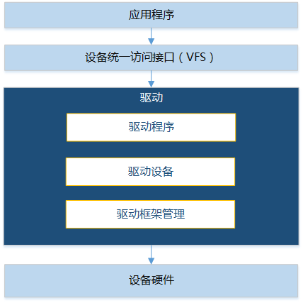

**Operating Mechanism<a name="sdd2c54eca65549d0abe154972dea424b"></a>**

The driver framework involves two important data structures: LosDevice (used to describe a driver device) and LosDriver (used to describe a driver program). There are two global doubly linked lists in the system. One is the global device linked list, which manages all mounted driver devices; the other is the global driver linked list, which manages all mounted driver programs.

These two data structures are described as follows:

-   LosDevice

    LosDevice represents a driver device. The important members of the structure include:

    -   const CHAR \*name: Device name, used to pair with the driver.
    -   struct LosDriver \*driver: Represents the driver program of this driver device.
    -   struct LosDeviceConfig cfg: Device IO start address, IO size, and interrupt number configuration.
    -   LOS\_DL\_LIST driverNode: The corresponding driver node, used to attach to the deviceList in this driver structure.
    -   LOS\_DL\_LIST deviceItem: The node of this driver device, used to attach to the global device linked list.

-   LosDriver

    LosDriver represents a device driver program. The important members of the structure include:

    -   const CHAR \*name: Driver name, used to pair with the device.
    -   LOS\_DL\_LIST deviceList: The doubly linked list of driver devices that use this driver program.
    -   LOS\_DL\_LIST driverItem: The node of this driver program, used to attach to the global driver linked list.
    -   struct LosDriverOps ops: The operation interfaces implemented by the driver, such as probe and remove.

The relationship between LosDevice and LosDriver is shown in [Figure 2](#fig2239348547).

**Figure 2**  Relationship Between LosDevice and LosDriver<a name="fig2239348547"></a>  
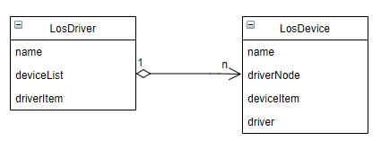

LosDriver is attached to the global driver linked list and contains a deviceList linked list, which represents all devices operated (or controlled) by this driver program.

LosDevice is attached to the global device linked list and contains a driver pointer, which represents the device driver program corresponding to this device.

A driver device corresponds to only one driver program, while a driver program can support multiple driver devices. When the corresponding device/driver is mounted, the system searches the global driver linked list/global device linked list by name for the already registered corresponding driver/device and performs the registration process.

### Development Guidelines<a name="ZH-CN_TOPIC_0000002543354341"></a>

**Functions<a name="s89374297992b429bb19509178b69b0fa"></a>**

The LiteOS driver framework provides the following functions for users. For details about the interfaces, see the API reference.

<a name="t04b2af382e3b47b09eb24fbc1c710bd4"></a>
<table><thead align="left"><tr id="r2996f3d256e749b793a00aa67617a256"><th class="cellrowborder" valign="top" width="21.77%" id="mcps1.1.4.1.1"><p id="a923792be2142462b88232c8ac46333d7"><a name="a923792be2142462b88232c8ac46333d7"></a><a name="a923792be2142462b88232c8ac46333d7"></a>Function Category</p>
</th>
<th class="cellrowborder" valign="top" width="27.51%" id="mcps1.1.4.1.2"><p id="a46f906f43ab74ab2b12c6599b5232bfa"><a name="a46f906f43ab74ab2b12c6599b5232bfa"></a><a name="a46f906f43ab74ab2b12c6599b5232bfa"></a>Interface Name</p>
</th>
<th class="cellrowborder" valign="top" width="50.72%" id="mcps1.1.4.1.3"><p id="a77af1fced9c14f3ea69b2c5dc3cae5c3"><a name="a77af1fced9c14f3ea69b2c5dc3cae5c3"></a><a name="a77af1fced9c14f3ea69b2c5dc3cae5c3"></a>Description</p>
</th>
</tr>
</thead>
<tbody><tr id="row23344849155346"><td class="cellrowborder" rowspan="6" valign="top" width="21.77%" headers="mcps1.1.4.1.1 "><p id="p6315166015542"><a name="p6315166015542"></a><a name="p6315166015542"></a>Operating Driver Devices</p>
</td>
<td class="cellrowborder" valign="top" width="27.51%" headers="mcps1.1.4.1.2 "><p id="p11884593155346"><a name="p11884593155346"></a><a name="p11884593155346"></a>LOS_DeviceRegister</p>
</td>
<td class="cellrowborder" valign="top" width="50.72%" headers="mcps1.1.4.1.3 "><p id="p23127986155346"><a name="p23127986155346"></a><a name="p23127986155346"></a>Register a device and add it to the global device linked list.</p>
</td>
</tr>
<tr id="r86faedb826e34b999cffa4daf9b8889a"><td class="cellrowborder" valign="top" headers="mcps1.1.4.1.1 "><p id="a7441f33b9e704f50845ba54e46f87db4"><a name="a7441f33b9e704f50845ba54e46f87db4"></a><a name="a7441f33b9e704f50845ba54e46f87db4"></a>LOS_DeviceUnregister</p>
</td>
<td class="cellrowborder" valign="top" headers="mcps1.1.4.1.2 "><p id="a84cc4c500df3484fac1e4836e094dd39"><a name="a84cc4c500df3484fac1e4836e094dd39"></a><a name="a84cc4c500df3484fac1e4836e094dd39"></a>Unregister a device and remove it from the global device linked list.</p>
</td>
</tr>
<tr id="r79e6a4cb0b574bd2822e032e0a880563"><td class="cellrowborder" valign="top" headers="mcps1.1.4.1.1 "><p id="afc76427d446f4e419f39d3e1d7781709"><a name="afc76427d446f4e419f39d3e1d7781709"></a><a name="afc76427d446f4e419f39d3e1d7781709"></a>LOS_DeviceDataGet</p>
</td>
<td class="cellrowborder" valign="top" headers="mcps1.1.4.1.2 "><p id="a4bc70a09dc7649f79eada49c6c716699"><a name="a4bc70a09dc7649f79eada49c6c716699"></a><a name="a4bc70a09dc7649f79eada49c6c716699"></a>Obtain the private data of the specified device.</p>
</td>
</tr>
<tr id="r1c80723906bb4a52b377a47ec48d7620"><td class="cellrowborder" valign="top" headers="mcps1.1.4.1.1 "><p id="zh-cn_topic_0074610457_p324270105443"><a name="zh-cn_topic_0074610457_p324270105443"></a><a name="zh-cn_topic_0074610457_p324270105443"></a>LOS_DeviceRegBaseGet</p>
</td>
<td class="cellrowborder" valign="top" headers="mcps1.1.4.1.2 "><p id="ab0cc57a214a14b8bada15d5c3ed0b02c"><a name="ab0cc57a214a14b8bada15d5c3ed0b02c"></a><a name="ab0cc57a214a14b8bada15d5c3ed0b02c"></a>Obtain the IO start address of the specified device.</p>
</td>
</tr>
<tr id="ra9938e3ce19549e5852af541895d5d9b"><td class="cellrowborder" valign="top" headers="mcps1.1.4.1.1 "><p id="ac897a919e5f745cf860a54cc4e1a3a8e"><a name="ac897a919e5f745cf860a54cc4e1a3a8e"></a><a name="ac897a919e5f745cf860a54cc4e1a3a8e"></a>LOS_DeviceRegSizeGet</p>
</td>
<td class="cellrowborder" valign="top" headers="mcps1.1.4.1.2 "><p id="a76587bee13d04d7dafb29b16536bc3b5"><a name="a76587bee13d04d7dafb29b16536bc3b5"></a><a name="a76587bee13d04d7dafb29b16536bc3b5"></a>Obtain the IO size of the specified device.</p>
</td>
</tr>
<tr id="re392f77390d642f78b1122ba4daa606e"><td class="cellrowborder" valign="top" headers="mcps1.1.4.1.1 "><p id="aabdb06e14dda445eab0c6202aae96c7d"><a name="aabdb06e14dda445eab0c6202aae96c7d"></a><a name="aabdb06e14dda445eab0c6202aae96c7d"></a>LOS_DeviceIrqNumGet</p>
</td>
<td class="cellrowborder" valign="top" headers="mcps1.1.4.1.2 "><p id="a87500cc68ada41428d2d58f48c0889ab"><a name="a87500cc68ada41428d2d58f48c0889ab"></a><a name="a87500cc68ada41428d2d58f48c0889ab"></a>Obtain the interrupt number of the specified device.</p>
</td>
</tr>
<tr id="rc6d966b29e114f33b5c8db3c4c7c4d7e"><td class="cellrowborder" rowspan="2" valign="top" width="21.77%" headers="mcps1.1.4.1.1 "><p id="aab03d0ef17554b26a48549bd33152be1"><a name="aab03d0ef17554b26a48549bd33152be1"></a><a name="aab03d0ef17554b26a48549bd33152be1"></a>Register/Unregister Driver</p>
</td>
<td class="cellrowborder" valign="top" width="27.51%" headers="mcps1.1.4.1.2 "><p id="ac307717a575749c58a1391b47ccd414b"><a name="ac307717a575749c58a1391b47ccd414b"></a><a name="ac307717a575749c58a1391b47ccd414b"></a>LOS_DriverRegister</p>
</td>
<td class="cellrowborder" valign="top" width="50.72%" headers="mcps1.1.4.1.3 "><p id="a1a0822ea835c451abd73d05609b3903e"><a name="a1a0822ea835c451abd73d05609b3903e"></a><a name="a1a0822ea835c451abd73d05609b3903e"></a>Register the device driver and bind it to the corresponding device.</p>
</td>
</tr>
<tr id="r02d3e9b3d9ad4b0d95de62984accd7ea"><td class="cellrowborder" valign="top" headers="mcps1.1.4.1.1 "><p id="a78e5d30f5e9d4896b40cac2f23f2e7a7"><a name="a78e5d30f5e9d4896b40cac2f23f2e7a7"></a><a name="a78e5d30f5e9d4896b40cac2f23f2e7a7"></a>LOS_DriverUnregister</p>
</td>
<td class="cellrowborder" valign="top" headers="mcps1.1.4.1.2 "><p id="ae06d15004e7a4ae398588da1dc8af616"><a name="ae06d15004e7a4ae398588da1dc8af616"></a><a name="ae06d15004e7a4ae398588da1dc8af616"></a>Unregister the device driver.</p>
</td>
</tr>
<tr id="row159361223205519"><td class="cellrowborder" rowspan="2" valign="top" width="21.77%" headers="mcps1.1.4.1.1 "><p id="p6620101325613"><a name="p6620101325613"></a><a name="p6620101325613"></a>Low-power Function</p>
</td>
<td class="cellrowborder" valign="top" width="27.51%" headers="mcps1.1.4.1.2 "><p id="p199371923135513"><a name="p199371923135513"></a><a name="p199371923135513"></a>LOS_PmSuspend</p>
</td>
<td class="cellrowborder" valign="top" width="50.72%" headers="mcps1.1.4.1.3 "><p id="p793717237559"><a name="p793717237559"></a><a name="p793717237559"></a>Suspend all devices.</p>
</td>
</tr>
<tr id="row6929134920559"><td class="cellrowborder" valign="top" headers="mcps1.1.4.1.1 "><p id="p592954911554"><a name="p592954911554"></a><a name="p592954911554"></a>LOS_PmResume</p>
</td>
<td class="cellrowborder" valign="top" headers="mcps1.1.4.1.2 "><p id="p189291849155515"><a name="p189291849155515"></a><a name="p189291849155515"></a>Resume all devices.</p>
</td>
</tr>
</tbody>
</table>

**Development Process<a name="s8c51caa2d7274cd38c5e96286885f5cb"></a>**

The following uses USB driver registration as an example to describe the driver development process based on the driver framework.

1.  Open the menu and select Driver ---\> Enable Driver Base to enable the driver framework.

    <a name="table06655375130"></a>
    <table><thead align="left"><tr id="row8665203751318"><th class="cellrowborder" valign="top" width="24.1%" id="mcps1.1.6.1.1"><p id="p61687296155221"><a name="p61687296155221"></a><a name="p61687296155221"></a>Configuration Item</p>
    </th>
    <th class="cellrowborder" valign="top" width="29.990000000000006%" id="mcps1.1.6.1.2"><p id="p25007692155221"><a name="p25007692155221"></a><a name="p25007692155221"></a>Description</p>
    </th>
    <th class="cellrowborder" valign="top" width="15.380000000000003%" id="mcps1.1.6.1.3"><p id="p47081329204415"><a name="p47081329204415"></a><a name="p47081329204415"></a>Value Range</p>
    </th>
    <th class="cellrowborder" valign="top" width="15.590000000000003%" id="mcps1.1.6.1.4"><p id="p7383544155221"><a name="p7383544155221"></a><a name="p7383544155221"></a>Default Value</p>
    </th>
    <th class="cellrowborder" valign="top" width="14.940000000000003%" id="mcps1.1.6.1.5"><p id="p34917797155221"><a name="p34917797155221"></a><a name="p34917797155221"></a>Dependency</p>
    </th>
    </tr>
    </thead>
    <tbody><tr id="row9665837161320"><td class="cellrowborder" valign="top" width="24.1%" headers="mcps1.1.6.1.1 "><p id="p1270485014235"><a name="p1270485014235"></a><a name="p1270485014235"></a>LOSCFG_DRIVERS_BASE</p>
    </td>
    <td class="cellrowborder" valign="top" width="29.990000000000006%" headers="mcps1.1.6.1.2 "><p id="p43336113320"><a name="p43336113320"></a><a name="p43336113320"></a>Switch for enabling the driver framework</p>
    </td>
    <td class="cellrowborder" valign="top" width="15.380000000000003%" headers="mcps1.1.6.1.3 "><p id="p19665193721319"><a name="p19665193721319"></a><a name="p19665193721319"></a>YES/NO</p>
    </td>
    <td class="cellrowborder" valign="top" width="15.590000000000003%" headers="mcps1.1.6.1.4 "><p id="p1866573713131"><a name="p1866573713131"></a><a name="p1866573713131"></a>YES</p>
    </td>
    <td class="cellrowborder" valign="top" width="14.940000000000003%" headers="mcps1.1.6.1.5 "><p id="p1266519378138"><a name="p1266519378138"></a><a name="p1266519378138"></a>None</p>
    </td>
    </tr>
    </tbody>
    </table>

2.  Register the driver device.
    1.  Define the USB driver device instance.

        ```
        struct LosDeviceRegs hiudc3_regs[] = {
            {
                .base = DWC_USB3_PORT1_BASE_ADDR,
                .size = DWC_USB3_PORT1_ADDR_OFFSET,
            },
        };
        static struct LosDevice hiudc3_device = {
            .name       = "hi_udc3",
            .id = -1,
            .cfg   = {
        
                .irqNum = NUM_HAL_INTERRUPT_USB_DEV,
        
                .numRegs = ARRAY_SIZE(hiudc3_regs),
                .regs = hiudc3_regs,
            },
        };
        ```

    2.  Register the driver device to the global device linked list.

        ```
        LOS_DeviceRegister(&hiudc3_device);
        ```

    3.  Preload processing.

        Call the preload mounting functions in "linux/module.h" (located in the root directory "self\_src/compat/linux/include") to mount the driver device registration function to the system. When the system starts, it traverses the preload nodes in the priority order of the mounting functions to register driver devices. The system provides the following preload mounting functions in descending priority order:

        ```
        pure_initcall(f)       //0
        core_initcall(f)       //1
        postcore_initcall(f)   //2
        arch_initcall(f)       //3
        subsys_initcall(f)     //4
        fs_initcall(f)         //5
        device_initcall(f)     //6
        late_initcall(f)       //7
        ```

        For details about the specific invocation, see "[Programming Example](programming_example-146.md)".

        > **Notice:** 
        >Executing preloading may affect certain system functions. For example, if driver initialization takes a long time, it may impact the startup time of fast startup (scatter loading). Currently, the system only supports preload functions with a priority less than or equal to 3.

3.  Register the device driver.
    1.  Define the USB driver instance.

        ```
        static struct LosDriver hiudc3_driver = {
        	.name = "hi_udc3",
        	.ops = {
        		.probe = hiudc3_probe,
        		.remove = hiudc3_remove,
        	},
        	.pmOps = {
        		.suspend = hiudc3_suspend,
        		.resume = hiudc3_resume,
        	},
        };
        ```

        The parameter description is shown in the following table.

        <a name="table6723115317"></a>
        <table><thead align="left"><tr id="row57231633"><th class="cellrowborder" valign="top" width="28.43%" id="mcps1.1.3.1.1"><p id="p18372147637"><a name="p18372147637"></a><a name="p18372147637"></a>Parameter</p>
        </th>
        <th class="cellrowborder" valign="top" width="71.57%" id="mcps1.1.3.1.2"><p id="p1137207332"><a name="p1137207332"></a><a name="p1137207332"></a>Description</p>
        </th>
        </tr>
        </thead>
        <tbody><tr id="row12721614317"><td class="cellrowborder" valign="top" width="28.43%" headers="mcps1.1.3.1.1 "><p id="p791713431478"><a name="p791713431478"></a><a name="p791713431478"></a>probe</p>
        </td>
        <td class="cellrowborder" valign="top" width="71.57%" headers="mcps1.1.3.1.2 "><p id="p181919413812"><a name="p181919413812"></a><a name="p181919413812"></a>This function parameter is generally used to initialize the driver.</p>
        </td>
        </tr>
        <tr id="row1572310318"><td class="cellrowborder" valign="top" width="28.43%" headers="mcps1.1.3.1.1 "><p id="p123728717316"><a name="p123728717316"></a><a name="p123728717316"></a>remove</p>
        </td>
        <td class="cellrowborder" valign="top" width="71.57%" headers="mcps1.1.3.1.2 "><p id="p138917101087"><a name="p138917101087"></a><a name="p138917101087"></a>This function parameter is generally used to deinitialize the driver.</p>
        </td>
        </tr>
        <tr id="row1472211639"><td class="cellrowborder" valign="top" width="28.43%" headers="mcps1.1.3.1.1 "><p id="p9372147338"><a name="p9372147338"></a><a name="p9372147338"></a>name</p>
        </td>
        <td class="cellrowborder" valign="top" width="71.57%" headers="mcps1.1.3.1.2 "><p id="p83017288818"><a name="p83017288818"></a><a name="p83017288818"></a>The name attribute of the driver must be consistent with the name of the corresponding driver device.</p>
        </td>
        </tr>
        <tr id="row941815561073"><td class="cellrowborder" valign="top" width="28.43%" headers="mcps1.1.3.1.1 "><p id="p10419145612713"><a name="p10419145612713"></a><a name="p10419145612713"></a>suspend/resume</p>
        </td>
        <td class="cellrowborder" valign="top" width="71.57%" headers="mcps1.1.3.1.2 "><p id="p041985614716"><a name="p041985614716"></a><a name="p041985614716"></a>Used to suspend/resume the driver device.</p>
        </td>
        </tr>
        </tbody>
        </table>

    2.  Register the USB driver.

        ```
        LOS_DriverRegister(&hiudc3_driver);
        ```

4.  Register the loaded driver with the file system.

    For ease of use, the driver instance is registered with the file system so that operations on the driver are abstracted as operations on files. For details, see "[Driver Development Adapted to File Operations](driver_development_adapted_to_file_operations.md)".

### Precautions<a name="ZH-CN_TOPIC_0000002543394283"></a>

Driver functions that invoke preload processing need a "-u" declaration added to LITEOS\_TABLES\_DRIVER\_LDFLAGS in "build/make/liteos\_tables\_ldflags.mk"; otherwise, the linker may optimize away the driver initialization module, causing unpredictable errors.

```
LITEOS_TABLES_DRIVER_LDFLAGS := \
-ui2c_init \
-ugpio_init \
-uregulator_init \
-umtd_init_list \
```

### Programming Example<a name="ZH-CN_TOPIC_0000002543394209"></a>

**Example Description<a name="s1c712e15fc034d27b9eb2111a867ba70"></a>**

Add the USB driver.

**Programming Example<a name="sdbce09d9d7de4425bd1653661e4ad39f"></a>**

Prerequisites: Enable the driver framework in the menuconfig menu.

1.  Define the driver device under the "board.c" directory of the specified development board.

    ```
    /* Define the driver device instance */
    #ifdef LOSCFG_DRIVERS_USB3_DEVICE_CONTROLLER
    struct LosDeviceRegs hiudc3_regs[] = {
        {
            .base = DWC_USB3_PORT1_BASE_ADDR,
            .size = DWC_USB3_PORT1_ADDR_OFFSET,
        },
    };
    
    static struct LosDevice hiudc3_device = {
        .name       = "hi_udc3",
        .id = -1,
        .cfg   = {
            .irqNum = NUM_HAL_INTERRUPT_USB_DEV,
            .numRegs = ARRAY_SIZE(hiudc3_regs),
            .regs = hiudc3_regs,
        },
    };
    #endif
    
    int machine_init(void)
    {
    #ifdef LOSCFG_DRIVERS_USB3_DEVICE_CONTROLLER
        (void)LOS_DeviceRegister(&hiudc3_device);
    #endif
    }
    arch_initcall(machine_init);    // Preload the driver device registration. The driver device registration is preloaded when the kernel initialization is executed
    ```

2.  Define the USB device driver under the "self\_src/drivers/usb/adapt\_liteos/controller/usb\_device" directory.

    ```
    /* Operation interfaces implemented by the driver */
    static int hiudc3_probe(struct LosDevice *pdev)
    {
        ……
    }
    
    static int hiudc3_remove(struct LosDevice *pdev)
    {
        ……
    }
    
    static int hiudc3_suspend(struct LosDevice *pst_dev)
    {
        ……
    }
    
    static int hiudc3_resume(struct LosDevice *pst_dev)
    {
        ……
    }
    
    /* Define the device driver instance */
    static struct LosDriver hiudc3_driver = {
        .name = "hi_udc3",
        .ops = {
            .probe = hiudc3_probe,
            .remove = hiudc3_remove,
        },
    	.pmOps = {
            .suspend = hiudc3_suspend,
            .resume = hiudc3_resume,
        },
    };
    
    /* Initialize the driver, that is, register the driver */
    int hiudc3_init(void)
    {
        return (int)LOS_DriverRegister(&hiudc3_driver);
    }
    
    /* Unregister the driver */
    int hiudc3_exit(void)
    {
        return (int)LOS_DriverUnregister(&hiudc3_driver);
    }
    ```

## Driver Development Adapted to File Operations<a name="ZH-CN_TOPIC_0000002511794376"></a>


### Overview<a name="ZH-CN_TOPIC_0000002511794314"></a>

**Basic Concepts<a name="s7790c21996624bab82e21137bef5a3cb"></a>**

Driver development implements and abstracts the hardware functions according to the operating system specifications, so that they can be invoked by application developers.

When porting the system to a new chip, you need to develop drivers for the supported external devices based on the chip features.

The LiteOS driver initialization function mainly initializes the driver structure corresponding to the device, and provides it to upper-layer applications to register the control node of the device driver.

### Development Guidelines<a name="ZH-CN_TOPIC_0000002511794220"></a>

**Development Process<a name="s7e1881ce88114ecb9f4959393f0d3b16"></a>**

It is recommended that driver developers use the VFS framework to register/unregister device drivers. Driver development based on the file system mainly involves the following steps:

1.  Open the menu and select FileSystem ---\> Enable VFS to enable VFS.

    <a name="table06655375130"></a>
    <table><thead align="left"><tr id="row8665203751318"><th class="cellrowborder" valign="top" width="18.56%" id="mcps1.1.6.1.1"><p id="p61687296155221"><a name="p61687296155221"></a><a name="p61687296155221"></a>Configuration Item</p>
    </th>
    <th class="cellrowborder" valign="top" width="37.71%" id="mcps1.1.6.1.2"><p id="p25007692155221"><a name="p25007692155221"></a><a name="p25007692155221"></a>Description</p>
    </th>
    <th class="cellrowborder" valign="top" width="15%" id="mcps1.1.6.1.3"><p id="p47081329204415"><a name="p47081329204415"></a><a name="p47081329204415"></a>Value Range</p>
    </th>
    <th class="cellrowborder" valign="top" width="14.71%" id="mcps1.1.6.1.4"><p id="p7383544155221"><a name="p7383544155221"></a><a name="p7383544155221"></a>Default Value</p>
    </th>
    <th class="cellrowborder" valign="top" width="14.02%" id="mcps1.1.6.1.5"><p id="p34917797155221"><a name="p34917797155221"></a><a name="p34917797155221"></a>Dependency</p>
    </th>
    </tr>
    </thead>
    <tbody><tr id="row9665837161320"><td class="cellrowborder" valign="top" width="18.56%" headers="mcps1.1.6.1.1 "><p id="p3665143710130"><a name="p3665143710130"></a><a name="p3665143710130"></a>LOSCFG_FS_VFS</p>
    </td>
    <td class="cellrowborder" valign="top" width="37.71%" headers="mcps1.1.6.1.2 "><p id="p13665737191318"><a name="p13665737191318"></a><a name="p13665737191318"></a>Enable switch for the VFS framework</p>
    </td>
    <td class="cellrowborder" valign="top" width="15%" headers="mcps1.1.6.1.3 "><p id="p19665193721319"><a name="p19665193721319"></a><a name="p19665193721319"></a>YES/NO</p>
    </td>
    <td class="cellrowborder" valign="top" width="14.71%" headers="mcps1.1.6.1.4 "><p id="p1866573713131"><a name="p1866573713131"></a><a name="p1866573713131"></a>YES</p>
    </td>
    <td class="cellrowborder" valign="top" width="14.02%" headers="mcps1.1.6.1.5 "><p id="p1266519378138"><a name="p1266519378138"></a><a name="p1266519378138"></a>None</p>
    </td>
    </tr>
    </tbody>
    </table>

2.  [Initializing the Driver](#sb85add7cfac2440095b3d3da80a49a66).
3.  [Operating the Driver Node](#s0a0f66e601894a3183aa1aa704a4dce9).

**Initializing the Driver<a name="sb85add7cfac2440095b3d3da80a49a66"></a>**

The first step of driver development on LiteOS is to write the driver initialization function. The driver initialization function initializes the driver structure required by the device and generates the driver control node.

The driver initialization function must call the device driver registration function to register and generate the driver node.

```
register_driver(FAR const char *path, FAR const struct file_operations_vfs *fops, mode_t mode, FAR void *priv)
register_blockdriver(FAR const char *path, FAR const struct block_operations *bops, mode_t mode, FAR void *priv)
```

The parameters are described in the following table:

<a name="table18579152951013"></a>
<table><thead align="left"><tr id="row8579229151016"><th class="cellrowborder" valign="top" width="22.720000000000002%" id="mcps1.1.3.1.1"><p id="p126782441109"><a name="p126782441109"></a><a name="p126782441109"></a>Parameter</p>
</th>
<th class="cellrowborder" valign="top" width="77.28%" id="mcps1.1.3.1.2"><p id="p8678184416106"><a name="p8678184416106"></a><a name="p8678184416106"></a>Description</p>
</th>
</tr>
</thead>
<tbody><tr id="row1057972971010"><td class="cellrowborder" valign="top" width="22.720000000000002%" headers="mcps1.1.3.1.1 "><p id="p196781844171010"><a name="p196781844171010"></a><a name="p196781844171010"></a>path</p>
</td>
<td class="cellrowborder" valign="top" width="77.28%" headers="mcps1.1.3.1.2 "><p id="p5678184414107"><a name="p5678184414107"></a><a name="p5678184414107"></a>Path of the driver node. Applications can access the driver node through this path, and then access the operation interfaces provided by the device driver.</p>
</td>
</tr>
<tr id="row195791429181014"><td class="cellrowborder" valign="top" width="22.720000000000002%" headers="mcps1.1.3.1.1 "><p id="p16678144101010"><a name="p16678144101010"></a><a name="p16678144101010"></a>fops/bops</p>
</td>
<td class="cellrowborder" valign="top" width="77.28%" headers="mcps1.1.3.1.2 "><p id="p206781444171018"><a name="p206781444171018"></a><a name="p206781444171018"></a>Driver operation structure, which provides a set of operation functions for applications. fops and bops indicate the driver operation sets for character devices and block devices, respectively.</p>
</td>
</tr>
<tr id="row20579529131016"><td class="cellrowborder" valign="top" width="22.720000000000002%" headers="mcps1.1.3.1.1 "><p id="p196789442102"><a name="p196789442102"></a><a name="p196789442102"></a>mode</p>
</td>
<td class="cellrowborder" valign="top" width="77.28%" headers="mcps1.1.3.1.2 "><p id="p106781144101015"><a name="p106781144101015"></a><a name="p106781144101015"></a>Permission to read from and write to the driver node. It is temporarily invalid, and support may be provided later.</p>
</td>
</tr>
<tr id="row18579162916105"><td class="cellrowborder" valign="top" width="22.720000000000002%" headers="mcps1.1.3.1.1 "><p id="p136782044191012"><a name="p136782044191012"></a><a name="p136782044191012"></a>priv</p>
</td>
<td class="cellrowborder" valign="top" width="77.28%" headers="mcps1.1.3.1.2 "><p id="p1467804417108"><a name="p1467804417108"></a><a name="p1467804417108"></a>Parameter to be passed in during the driver node registration process.</p>
</td>
</tr>
</tbody>
</table>

After writing the driver initialization function, you need to guide the execution of the initialization function at an appropriate place. You can call the written driver initialization function in the app\_init function to guide device initialization.

**Operating the Driver Node<a name="s0a0f66e601894a3183aa1aa704a4dce9"></a>**

After the driver is initialized, the generated device driver node provides applications with interfaces for operating the device. The following uses the I2C device driver as an example to describe the calling relationship between user programs and driver operation functions.

The driver operation function set is very important to the calling relationship between applications and driver operation functions. When writing a driver, the operation function set must implement the mechanisms of the hardware device and be passed in when the device driver is registered. The operation function set becomes the final implementation of application requirements.

The operation function set provided by the I2C device driver is shown in the following table:

<a name="t1569e285bfc2456da9114480255ca8d7"></a>
<table><thead align="left"><tr id="r5f4aab246a874b5cb3a1d828de7ffb0d"><th class="cellrowborder" valign="top" width="32.53%" id="mcps1.1.3.1.1"><p id="ab50f0169149b4210b5b28bc51f6fea00"><a name="ab50f0169149b4210b5b28bc51f6fea00"></a><a name="ab50f0169149b4210b5b28bc51f6fea00"></a>Operation Function Set</p>
</th>
<th class="cellrowborder" valign="top" width="67.47%" id="mcps1.1.3.1.2"><p id="aa92c121db0314405a13e9c0ac0ac62a1"><a name="aa92c121db0314405a13e9c0ac0ac62a1"></a><a name="aa92c121db0314405a13e9c0ac0ac62a1"></a>Corresponding Application-Layer Interface</p>
</th>
</tr>
</thead>
<tbody><tr id="r895f20871a1a48a8b5814ace82f24f96"><td class="cellrowborder" valign="top" width="32.53%" headers="mcps1.1.3.1.1 "><p id="af69c50f5d15d40c88b14f478c91c0a97"><a name="af69c50f5d15d40c88b14f478c91c0a97"></a><a name="af69c50f5d15d40c88b14f478c91c0a97"></a>i2cdev_open</p>
</td>
<td class="cellrowborder" valign="top" width="67.47%" headers="mcps1.1.3.1.2 "><p id="a11a86b60d76c45ea9cf87b010ae0d228"><a name="a11a86b60d76c45ea9cf87b010ae0d228"></a><a name="a11a86b60d76c45ea9cf87b010ae0d228"></a>open</p>
</td>
</tr>
<tr id="rd3b8a9bbd4294330b4b0e6e14abb6717"><td class="cellrowborder" valign="top" width="32.53%" headers="mcps1.1.3.1.1 "><p id="a136e729682fa473489b7dcfb10339242"><a name="a136e729682fa473489b7dcfb10339242"></a><a name="a136e729682fa473489b7dcfb10339242"></a>i2cdev_release</p>
</td>
<td class="cellrowborder" valign="top" width="67.47%" headers="mcps1.1.3.1.2 "><p id="aa1a6f70f38494e9dbce3f4d1bcbe06aa"><a name="aa1a6f70f38494e9dbce3f4d1bcbe06aa"></a><a name="aa1a6f70f38494e9dbce3f4d1bcbe06aa"></a>close</p>
</td>
</tr>
<tr id="r9736e1c0aacf4a898703f9b4a9c1aa27"><td class="cellrowborder" valign="top" width="32.53%" headers="mcps1.1.3.1.1 "><p id="aaf63fa01defc4241b569217e607cc75e"><a name="aaf63fa01defc4241b569217e607cc75e"></a><a name="aaf63fa01defc4241b569217e607cc75e"></a>i2cdev_read</p>
</td>
<td class="cellrowborder" valign="top" width="67.47%" headers="mcps1.1.3.1.2 "><p id="a724f12cd078d4a7b85ccb16c150c6d7c"><a name="a724f12cd078d4a7b85ccb16c150c6d7c"></a><a name="a724f12cd078d4a7b85ccb16c150c6d7c"></a>read</p>
</td>
</tr>
<tr id="r029c0feef71b438884f01c63e80f22bf"><td class="cellrowborder" valign="top" width="32.53%" headers="mcps1.1.3.1.1 "><p id="a095110ee6dd64613b2003529169eb825"><a name="a095110ee6dd64613b2003529169eb825"></a><a name="a095110ee6dd64613b2003529169eb825"></a>i2cdev_write</p>
</td>
<td class="cellrowborder" valign="top" width="67.47%" headers="mcps1.1.3.1.2 "><p id="a5648411fd762462dbb5d1064efad19b8"><a name="a5648411fd762462dbb5d1064efad19b8"></a><a name="a5648411fd762462dbb5d1064efad19b8"></a>write</p>
</td>
</tr>
<tr id="ra8822ff681ff4623b6586d1c13176056"><td class="cellrowborder" valign="top" width="32.53%" headers="mcps1.1.3.1.1 "><p id="a4a74b3756b674c148aa61303030a6699"><a name="a4a74b3756b674c148aa61303030a6699"></a><a name="a4a74b3756b674c148aa61303030a6699"></a>i2cdev_ioctl</p>
</td>
<td class="cellrowborder" valign="top" width="67.47%" headers="mcps1.1.3.1.2 "><p id="a41f9dea57fa34ab1bdafb24c07395c66"><a name="a41f9dea57fa34ab1bdafb24c07395c66"></a><a name="a41f9dea57fa34ab1bdafb24c07395c66"></a>ioctl</p>
</td>
</tr>
</tbody>
</table>

-   open operation

    When an application opens a node file, the system eventually calls the open function in the driver operation function set during the driver node registration process.

    The open function first instantiates the function structure of the target driver device and then performs necessary initialization. After the node file is successfully opened, the application can obtain the file descriptor of the corresponding driver node and use the file descriptor to access the driver.

-   read/write operations

    read/write operations are common interfaces for accessing devices. The read/write operations provided by drivers vary with device types. For I2C devices, applications can read from and write to I2C devices by calling the read/write interfaces.

    ```
    i2cdev_read(struct file * filep, char __user *buf, size_t count)
    i2cdev_write(struct file * filep, const char __user *buf, size_t count)
    ```

    The parameters are described in the following table:

    <a name="table17781428602"></a>
    <table><thead align="left"><tr id="row278228404"><th class="cellrowborder" valign="top" width="27.939999999999998%" id="mcps1.1.3.1.1"><p id="p9432123920016"><a name="p9432123920016"></a><a name="p9432123920016"></a>Parameter</p>
    </th>
    <th class="cellrowborder" valign="top" width="72.06%" id="mcps1.1.3.1.2"><p id="p443211391103"><a name="p443211391103"></a><a name="p443211391103"></a>Description</p>
    </th>
    </tr>
    </thead>
    <tbody><tr id="row1478162819012"><td class="cellrowborder" valign="top" width="27.939999999999998%" headers="mcps1.1.3.1.1 "><p id="p24321539801"><a name="p24321539801"></a><a name="p24321539801"></a>filep</p>
    </td>
    <td class="cellrowborder" valign="top" width="72.06%" headers="mcps1.1.3.1.2 "><p id="p134321739709"><a name="p134321739709"></a><a name="p134321739709"></a>Pointer to the file description structure</p>
    </td>
    </tr>
    <tr id="row167816281605"><td class="cellrowborder" valign="top" width="27.939999999999998%" headers="mcps1.1.3.1.1 "><p id="p194323399015"><a name="p194323399015"></a><a name="p194323399015"></a>buf</p>
    </td>
    <td class="cellrowborder" valign="top" width="72.06%" headers="mcps1.1.3.1.2 "><p id="p2432239404"><a name="p2432239404"></a><a name="p2432239404"></a>Pointer to the buffer for data read/written</p>
    </td>
    </tr>
    <tr id="row678928309"><td class="cellrowborder" valign="top" width="27.939999999999998%" headers="mcps1.1.3.1.1 "><p id="p343263913019"><a name="p343263913019"></a><a name="p343263913019"></a>count</p>
    </td>
    <td class="cellrowborder" valign="top" width="72.06%" headers="mcps1.1.3.1.2 "><p id="p154326391205"><a name="p154326391205"></a><a name="p154326391205"></a>Length of data read/written</p>
    </td>
    </tr>
    </tbody>
    </table>

-   ioctl operation

    The ioctl operation provides configuration management for driver device functions. By executing the corresponding command, you can configure or access device attributes.

    For I2C devices, the commands I2C\_16BIT\_REG, I2C\_16BIT\_DATA, and I2C\_TIMEOUT are used to set the transfer register bit width, transfer data bit width, and timeout of the I2C device, respectively.

    ```
    i2cdev_ioctl(struct file *filep, int cmd, unsigned long arg)
    ```

    The parameters are described in the following table:

    <a name="table6723115317"></a>
    <table><thead align="left"><tr id="row57231633"><th class="cellrowborder" valign="top" width="28.43%" id="mcps1.1.3.1.1"><p id="p18372147637"><a name="p18372147637"></a><a name="p18372147637"></a>Parameter</p>
    </th>
    <th class="cellrowborder" valign="top" width="71.57%" id="mcps1.1.3.1.2"><p id="p1137207332"><a name="p1137207332"></a><a name="p1137207332"></a>Description</p>
    </th>
    </tr>
    </thead>
    <tbody><tr id="row12721614317"><td class="cellrowborder" valign="top" width="28.43%" headers="mcps1.1.3.1.1 "><p id="p6372878310"><a name="p6372878310"></a><a name="p6372878310"></a>filep</p>
    </td>
    <td class="cellrowborder" valign="top" width="71.57%" headers="mcps1.1.3.1.2 "><p id="p153721377318"><a name="p153721377318"></a><a name="p153721377318"></a>Pointer to the file description structure</p>
    </td>
    </tr>
    <tr id="row1572310318"><td class="cellrowborder" valign="top" width="28.43%" headers="mcps1.1.3.1.1 "><p id="p123728717316"><a name="p123728717316"></a><a name="p123728717316"></a>cmd</p>
    </td>
    <td class="cellrowborder" valign="top" width="71.57%" headers="mcps1.1.3.1.2 "><p id="p3372107833"><a name="p3372107833"></a><a name="p3372107833"></a>Operation command</p>
    </td>
    </tr>
    <tr id="row1472211639"><td class="cellrowborder" valign="top" width="28.43%" headers="mcps1.1.3.1.1 "><p id="p9372147338"><a name="p9372147338"></a><a name="p9372147338"></a>arg</p>
    </td>
    <td class="cellrowborder" valign="top" width="71.57%" headers="mcps1.1.3.1.2 "><p id="p837227730"><a name="p837227730"></a><a name="p837227730"></a>Additional parameter</p>
    </td>
    </tr>
    </tbody>
    </table>

-   close operation

    The close operation corresponds to the release function in the driver operation function set. The release function releases the resources of the driver.

### Precautions<a name="ZH-CN_TOPIC_0000002511794276"></a>

None.

## MMC Driver Development<a name="ZH-CN_TOPIC_0000002511794290"></a>


### Overview<a name="ZH-CN_TOPIC_0000002543394311"></a>

MMC (Multi Media Card) is an embedded memory standard specification formulated by the MMC Association, mainly for products such as mobile phones and tablets. The MMC driver is used to handle operations such as identification and read/write on SD memory cards (Secure Digital Memory Card) and EMMC cards (Embedded Multi Media Card), and supports expansion peripherals (such as Bluetooth, WiFi, and GPS) through the SDIO protocol.

Devices supported by the LiteOS MMC driver include TF cards, EMMC storage, and WiFi expansion peripherals.

-   TF (T-Flash) card, also known as micro SD card

    The TF card mainly implements read/write operations on the device by being mounted as a FAT file system. Before mounting, the device must be identified first. The TF card can also be read from and written to directly through raw read/write interfaces.

    > **Notice:** 
    >Currently, LiteOS does not support user-defined TF card partitions. If necessary, you need to partition the TF card on a PC in advance.

-   EMMC storage

    EMMC storage mainly implements read/write operations on the device by being mounted as a FAT file system. Before mounting, you need to call an interface to customize partitions, and then identify the device. EMMC storage can also be read from and written to directly through raw read/write interfaces.

    Supports completing MMC driver initialization before the LiteOS scheduling module starts, and supports calling the MMC exception read/write interfaces to read, write, and format MMC storage before system startup (after system resource initialization and before the first task scheduling) and during the exception phase. The macro LOSCFG\_DRIVERS\_MMC\_RW\_IN\_BOOT\_AND\_EXC needs to be enabled.

    Supports completing the MMC tuning process for switching from low frequency to high frequency before the LiteOS global scheduler starts, and supports EMMC devices running at 200 MHz before startup.

    Supports the RPMB (Replay Protected Memory Block) partition. Through the RPMB operation interface, you can write the KEY, read the Write Counter, and read/write data in the RPMB data area (only data transparent transmission is involved, without encryption or decryption). The macro LOSCFG\_DRIVERS\_MMC\_RPMB needs to be enabled.

    Provides an external interface for sending CMD56 commands to obtain EMMC storage information.

-   SDIO expansion peripherals

    Currently, the only supported peripheral is the WiFi module. The device communicates and transmits data through the WiFi module. Before device identification, pin multiplexing must be configured according to the hardware requirements.

The LiteOS MMC driver module includes the protocol layer and the control layer:

-   The protocol layer supports the SD, EMMC, and SDIO protocol specifications.
-   The control layer supports the Himci and Sdhci controllers. Different chip platforms select the corresponding controller driver based on the hardware IP.

### Development Guidelines<a name="ZH-CN_TOPIC_0000002543354161"></a>

**MMC Device Identification<a name="zh-cn_topic_0000001158533357_section11534615115214"></a>**

MMC devices in LiteOS are classified into embedded and non-embedded types:

-   Embedded devices include EMMC storage and SDIO expansion peripherals, none of which support hot plugging. Currently, EMMC devices support only the first identification and do not support multiple identifications. SDIO expansion peripherals can call the hisi\_sdio\_rescan interface to unload and load device identification (depending on the software power-on/off of the expansion peripheral).
-   Non-embedded devices are TF cards. TF cards support hot plugging, and dynamic unloading and loading of devices is implemented through thread polling.

> **Notice:** 
>Except that SDIO expansion peripherals can call the sdio\_rescan interface for device identification, identification of other MMC devices is implemented in the same thread. When multiple MMC devices exist, devices are identified serially in the order of the controller IDs.

**Driver Initialization Interfaces<a name="zh-cn_topic_0000001158533357_section459813712569"></a>**

<a name="zh-cn_topic_0000001158533357_table1570161885615"></a>
<table><thead align="left"><tr id="zh-cn_topic_0000001158533357_row1470121817561"><th class="cellrowborder" valign="top" width="27.950000000000003%" id="mcps1.1.3.1.1"><p id="zh-cn_topic_0000001158533357_p1870111825615"><a name="zh-cn_topic_0000001158533357_p1870111825615"></a><a name="zh-cn_topic_0000001158533357_p1870111825615"></a>Interface Name</p>
</th>
<th class="cellrowborder" valign="top" width="72.05%" id="mcps1.1.3.1.2"><p id="zh-cn_topic_0000001158533357_p170131820568"><a name="zh-cn_topic_0000001158533357_p170131820568"></a><a name="zh-cn_topic_0000001158533357_p170131820568"></a>Description</p>
</th>
</tr>
</thead>
<tbody><tr id="zh-cn_topic_0000001158533357_row27031813562"><td class="cellrowborder" valign="top" width="27.950000000000003%" headers="mcps1.1.3.1.1 "><p id="zh-cn_topic_0000001158533357_p170161818561"><a name="zh-cn_topic_0000001158533357_p170161818561"></a><a name="zh-cn_topic_0000001158533357_p170161818561"></a>SD_MMC_Host_init</p>
</td>
<td class="cellrowborder" valign="top" width="72.05%" headers="mcps1.1.3.1.2 "><p id="zh-cn_topic_0000001158533357_p177014187561"><a name="zh-cn_topic_0000001158533357_p177014187561"></a><a name="zh-cn_topic_0000001158533357_p177014187561"></a>Traverse all controllers on the platform and initialize them.</p>
</td>
</tr>
<tr id="zh-cn_topic_0000001158533357_row8701189564"><td class="cellrowborder" valign="top" width="27.950000000000003%" headers="mcps1.1.3.1.1 "><p id="zh-cn_topic_0000001158533357_p370121865616"><a name="zh-cn_topic_0000001158533357_p370121865616"></a><a name="zh-cn_topic_0000001158533357_p370121865616"></a>MMC_HostInitById</p>
</td>
<td class="cellrowborder" valign="top" width="72.05%" headers="mcps1.1.3.1.2 "><p id="zh-cn_topic_0000001158533357_p1970118175615"><a name="zh-cn_topic_0000001158533357_p1970118175615"></a><a name="zh-cn_topic_0000001158533357_p1970118175615"></a>Initialize the controller specified by the platform. The controller is determined by the input ID parameter (which reduces the overall time consumed by MMC driver initialization).</p>
</td>
</tr>
</tbody>
</table>

> **Notice:** 
>After MMC driver initialization succeeds, if the system supports the proc file system, the "proc/mci/mci\_info" node is generated, and device information can be viewed with "cat proc/mci/mci\_info". These two initialization interfaces must not be mixed, and MMC\_HostInitById must be called in a single thread or be mutually exclusive in time.

**Interface for Adding an EMMC Partition<a name="zh-cn_topic_0000001158533357_section1832516305599"></a>**

<a name="zh-cn_topic_0000001158533357_table13319134101818"></a>
<table><thead align="left"><tr id="zh-cn_topic_0000001158533357_row18319164191816"><th class="cellrowborder" valign="top" width="22.69226922692269%" id="mcps1.1.4.1.1"><p id="zh-cn_topic_0000001158533357_p1471620150017"><a name="zh-cn_topic_0000001158533357_p1471620150017"></a><a name="zh-cn_topic_0000001158533357_p1471620150017"></a>Interface Name</p>
</th>
<th class="cellrowborder" valign="top" width="23.812381238123812%" id="mcps1.1.4.1.2"><p id="zh-cn_topic_0000001158533357_p75707891812"><a name="zh-cn_topic_0000001158533357_p75707891812"></a><a name="zh-cn_topic_0000001158533357_p75707891812"></a>Interface Parameters</p>
</th>
<th class="cellrowborder" valign="top" width="53.4953495349535%" id="mcps1.1.4.1.3"><p id="zh-cn_topic_0000001158533357_p7570138171813"><a name="zh-cn_topic_0000001158533357_p7570138171813"></a><a name="zh-cn_topic_0000001158533357_p7570138171813"></a>Parameter Description</p>
</th>
</tr>
</thead>
<tbody><tr id="zh-cn_topic_0000001158533357_row33195415180"><td class="cellrowborder" rowspan="3" valign="top" width="22.69226922692269%" headers="mcps1.1.4.1.1 "><p id="zh-cn_topic_0000001158533357_p16716121511015"><a name="zh-cn_topic_0000001158533357_p16716121511015"></a><a name="zh-cn_topic_0000001158533357_p16716121511015"></a>add_mmc_partition</p>
</td>
<td class="cellrowborder" valign="top" width="23.812381238123812%" headers="mcps1.1.4.1.2 "><p id="zh-cn_topic_0000001158533357_p135703841819"><a name="zh-cn_topic_0000001158533357_p135703841819"></a><a name="zh-cn_topic_0000001158533357_p135703841819"></a>struct disk_divide_info *info</p>
</td>
<td class="cellrowborder" valign="top" width="53.4953495349535%" headers="mcps1.1.4.1.3 "><p id="zh-cn_topic_0000001158533357_p12570485183"><a name="zh-cn_topic_0000001158533357_p12570485183"></a><a name="zh-cn_topic_0000001158533357_p12570485183"></a>Input parameter. It is a device information structure, which indicates the EMMC partition information here. Currently, only the global variable struct disk_divide_info emmc can be passed in.</p>
</td>
</tr>
<tr id="zh-cn_topic_0000001158533357_row43191549184"><td class="cellrowborder" valign="top" headers="mcps1.1.4.1.1 "><p id="zh-cn_topic_0000001158533357_p11570781180"><a name="zh-cn_topic_0000001158533357_p11570781180"></a><a name="zh-cn_topic_0000001158533357_p11570781180"></a>size_t sectorStart</p>
</td>
<td class="cellrowborder" valign="top" headers="mcps1.1.4.1.2 "><p id="zh-cn_topic_0000001158533357_p19570118151820"><a name="zh-cn_topic_0000001158533357_p19570118151820"></a><a name="zh-cn_topic_0000001158533357_p19570118151820"></a>Input parameter, indicating the start sector of the partition.</p>
</td>
</tr>
<tr id="zh-cn_topic_0000001158533357_row63190412181"><td class="cellrowborder" valign="top" headers="mcps1.1.4.1.1 "><p id="zh-cn_topic_0000001158533357_p25701816181"><a name="zh-cn_topic_0000001158533357_p25701816181"></a><a name="zh-cn_topic_0000001158533357_p25701816181"></a>size_t sectorCount</p>
</td>
<td class="cellrowborder" valign="top" headers="mcps1.1.4.1.2 "><p id="zh-cn_topic_0000001158533357_p145701484186"><a name="zh-cn_topic_0000001158533357_p145701484186"></a><a name="zh-cn_topic_0000001158533357_p145701484186"></a>Input parameter, indicating the number of sectors in the partition.</p>
</td>
</tr>
</tbody>
</table>

The device information structure is defined as follows:

```
#define MAX_DIVIDE_PART_PER_DISK 16         // Maximum number of logical partitions supported by each device
#define MAX_PRIMARY_PART_PER_DISK 4         // Maximum number of primary partitions supported by each device

struct disk_divide_info{
    UINT64   sector_count;                  // Number of partition blocks
    UINT32   part_count;                    // Partition number
    UINT32   sector_size;                   // Partition size
    struct partition_info part[MAX_DIVIDE_PART_PER_DISK + MAX_PRIMARY_PART_PER_DISK];  // Partition information structure
};
```

**Raw Read/Write Interfaces<a name="zh-cn_topic_0000001158533357_section513612461154"></a>**

-   Description of the TF card raw read/write interfaces

    <a name="zh-cn_topic_0000001158533357_table728716301241"></a>
    <table><thead align="left"><tr id="zh-cn_topic_0000001158533357_row14287430122412"><th class="cellrowborder" valign="top" width="21.62%" id="mcps1.1.4.1.1"><p id="zh-cn_topic_0000001158533357_p5380146468"><a name="zh-cn_topic_0000001158533357_p5380146468"></a><a name="zh-cn_topic_0000001158533357_p5380146468"></a>Interface Name</p>
    </th>
    <th class="cellrowborder" valign="top" width="22.759999999999998%" id="mcps1.1.4.1.2"><p id="zh-cn_topic_0000001158533357_p723419241118"><a name="zh-cn_topic_0000001158533357_p723419241118"></a><a name="zh-cn_topic_0000001158533357_p723419241118"></a>Interface Parameters</p>
    </th>
    <th class="cellrowborder" valign="top" width="55.620000000000005%" id="mcps1.1.4.1.3"><p id="zh-cn_topic_0000001158533357_p10234132461117"><a name="zh-cn_topic_0000001158533357_p10234132461117"></a><a name="zh-cn_topic_0000001158533357_p10234132461117"></a>Parameter Description</p>
    </th>
    </tr>
    </thead>
    <tbody><tr id="zh-cn_topic_0000001158533357_row19287230112419"><td class="cellrowborder" rowspan="4" valign="top" width="21.62%" headers="mcps1.1.4.1.1 "><p id="zh-cn_topic_0000001158533357_p1988155810101"><a name="zh-cn_topic_0000001158533357_p1988155810101"></a><a name="zh-cn_topic_0000001158533357_p1988155810101"></a>mmc_direct_write</p>
    <p id="zh-cn_topic_0000001158533357_p9814111220112"><a name="zh-cn_topic_0000001158533357_p9814111220112"></a><a name="zh-cn_topic_0000001158533357_p9814111220112"></a>mmc_direct_read</p>
    </td>
    <td class="cellrowborder" valign="top" width="22.759999999999998%" headers="mcps1.1.4.1.2 "><p id="zh-cn_topic_0000001158533357_p127817421105"><a name="zh-cn_topic_0000001158533357_p127817421105"></a><a name="zh-cn_topic_0000001158533357_p127817421105"></a>uint32_t host_idx</p>
    </td>
    <td class="cellrowborder" valign="top" width="55.620000000000005%" headers="mcps1.1.4.1.3 "><p id="zh-cn_topic_0000001158533357_p105681355245"><a name="zh-cn_topic_0000001158533357_p105681355245"></a><a name="zh-cn_topic_0000001158533357_p105681355245"></a>Input parameter, indicating the controller number where the TF card resides.</p>
    </td>
    </tr>
    <tr id="zh-cn_topic_0000001158533357_row928723012413"><td class="cellrowborder" valign="top" headers="mcps1.1.4.1.1 "><p id="zh-cn_topic_0000001158533357_p11590145315107"><a name="zh-cn_topic_0000001158533357_p11590145315107"></a><a name="zh-cn_topic_0000001158533357_p11590145315107"></a>char * buffer</p>
    </td>
    <td class="cellrowborder" valign="top" headers="mcps1.1.4.1.2 "><p id="zh-cn_topic_0000001158533357_p17569193522415"><a name="zh-cn_topic_0000001158533357_p17569193522415"></a><a name="zh-cn_topic_0000001158533357_p17569193522415"></a>Input parameter, indicating the buffer address where the read/write data is stored (aligned with CACHE_ALIGNED_SIZE).</p>
    </td>
    </tr>
    <tr id="zh-cn_topic_0000001158533357_row9287830202411"><td class="cellrowborder" valign="top" headers="mcps1.1.4.1.1 "><p id="zh-cn_topic_0000001158533357_p75691735162419"><a name="zh-cn_topic_0000001158533357_p75691735162419"></a><a name="zh-cn_topic_0000001158533357_p75691735162419"></a>uint32_t start_sector</p>
    </td>
    <td class="cellrowborder" valign="top" headers="mcps1.1.4.1.2 "><p id="zh-cn_topic_0000001158533357_p18569153552420"><a name="zh-cn_topic_0000001158533357_p18569153552420"></a><a name="zh-cn_topic_0000001158533357_p18569153552420"></a>Input parameter, indicating the start block address for reading/writing.</p>
    </td>
    </tr>
    <tr id="zh-cn_topic_0000001158533357_row192878308246"><td class="cellrowborder" valign="top" headers="mcps1.1.4.1.1 "><p id="zh-cn_topic_0000001158533357_p1256943512419"><a name="zh-cn_topic_0000001158533357_p1256943512419"></a><a name="zh-cn_topic_0000001158533357_p1256943512419"></a>uint32_t nsectors</p>
    </td>
    <td class="cellrowborder" valign="top" headers="mcps1.1.4.1.2 "><p id="zh-cn_topic_0000001158533357_p1856923515247"><a name="zh-cn_topic_0000001158533357_p1856923515247"></a><a name="zh-cn_topic_0000001158533357_p1856923515247"></a>Input parameter, indicating the number of blocks for reading/writing.</p>
    </td>
    </tr>
    </tbody>
    </table>

-   Description of the EMMC raw read/write interfaces

    <a name="zh-cn_topic_0000001158533357_table16103112714238"></a>
    <table><thead align="left"><tr id="zh-cn_topic_0000001158533357_row110302752311"><th class="cellrowborder" valign="top" width="21.902190219021904%" id="mcps1.1.4.1.1"><p id="zh-cn_topic_0000001158533357_p66091437137"><a name="zh-cn_topic_0000001158533357_p66091437137"></a><a name="zh-cn_topic_0000001158533357_p66091437137"></a>Interface Name</p>
    </th>
    <th class="cellrowborder" valign="top" width="22.38223822382238%" id="mcps1.1.4.1.2"><p id="zh-cn_topic_0000001158533357_p060953121315"><a name="zh-cn_topic_0000001158533357_p060953121315"></a><a name="zh-cn_topic_0000001158533357_p060953121315"></a>Interface Parameters</p>
    </th>
    <th class="cellrowborder" valign="top" width="55.71557155715572%" id="mcps1.1.4.1.3"><p id="zh-cn_topic_0000001158533357_p96091351318"><a name="zh-cn_topic_0000001158533357_p96091351318"></a><a name="zh-cn_topic_0000001158533357_p96091351318"></a>Parameter Description</p>
    </th>
    </tr>
    </thead>
    <tbody><tr id="zh-cn_topic_0000001158533357_row210312713231"><td class="cellrowborder" rowspan="3" valign="top" width="21.902190219021904%" headers="mcps1.1.4.1.1 "><p id="zh-cn_topic_0000001158533357_p11379191812139"><a name="zh-cn_topic_0000001158533357_p11379191812139"></a><a name="zh-cn_topic_0000001158533357_p11379191812139"></a>emmc_raw_write</p>
    <p id="zh-cn_topic_0000001158533357_p53104237133"><a name="zh-cn_topic_0000001158533357_p53104237133"></a><a name="zh-cn_topic_0000001158533357_p53104237133"></a>emmc_raw_read</p>
    </td>
    <td class="cellrowborder" valign="top" width="22.38223822382238%" headers="mcps1.1.4.1.2 "><p id="zh-cn_topic_0000001158533357_p632911011136"><a name="zh-cn_topic_0000001158533357_p632911011136"></a><a name="zh-cn_topic_0000001158533357_p632911011136"></a>char * buffer</p>
    </td>
    <td class="cellrowborder" valign="top" width="55.71557155715572%" headers="mcps1.1.4.1.3 "><p id="zh-cn_topic_0000001158533357_p1371453318233"><a name="zh-cn_topic_0000001158533357_p1371453318233"></a><a name="zh-cn_topic_0000001158533357_p1371453318233"></a>Input parameter, indicating the buffer address where the read/write data is stored (aligned with CACHE_ALIGNED_SIZE).</p>
    </td>
    </tr>
    <tr id="zh-cn_topic_0000001158533357_row17103172732317"><td class="cellrowborder" valign="top" headers="mcps1.1.4.1.1 "><p id="zh-cn_topic_0000001158533357_p53294019131"><a name="zh-cn_topic_0000001158533357_p53294019131"></a><a name="zh-cn_topic_0000001158533357_p53294019131"></a>uint32_t start_sector</p>
    </td>
    <td class="cellrowborder" valign="top" headers="mcps1.1.4.1.2 "><p id="zh-cn_topic_0000001158533357_p12714143311236"><a name="zh-cn_topic_0000001158533357_p12714143311236"></a><a name="zh-cn_topic_0000001158533357_p12714143311236"></a>Input parameter, indicating the start block for reading/writing.</p>
    </td>
    </tr>
    <tr id="zh-cn_topic_0000001158533357_row131031275234"><td class="cellrowborder" valign="top" headers="mcps1.1.4.1.1 "><p id="zh-cn_topic_0000001158533357_p113298011310"><a name="zh-cn_topic_0000001158533357_p113298011310"></a><a name="zh-cn_topic_0000001158533357_p113298011310"></a>uint32_t nsectors</p>
    </td>
    <td class="cellrowborder" valign="top" headers="mcps1.1.4.1.2 "><p id="zh-cn_topic_0000001158533357_p571453310235"><a name="zh-cn_topic_0000001158533357_p571453310235"></a><a name="zh-cn_topic_0000001158533357_p571453310235"></a>Input parameter, indicating the number of blocks for reading/writing.</p>
    </td>
    </tr>
    </tbody>
    </table>

-   Description of the MMC read/write and initialization interfaces before system startup and during exceptions

    <a name="table13102112612117"></a>
    <table><thead align="left"><tr id="row15102172617212"><th class="cellrowborder" valign="top" width="23.54%" id="mcps1.1.4.1.1"><p id="p510211267219"><a name="p510211267219"></a><a name="p510211267219"></a>Interface Name</p>
    </th>
    <th class="cellrowborder" valign="top" width="20.84%" id="mcps1.1.4.1.2"><p id="p1210202613214"><a name="p1210202613214"></a><a name="p1210202613214"></a>Interface Parameters</p>
    </th>
    <th class="cellrowborder" valign="top" width="55.620000000000005%" id="mcps1.1.4.1.3"><p id="p181021826162113"><a name="p181021826162113"></a><a name="p181021826162113"></a>Parameter Description</p>
    </th>
    </tr>
    </thead>
    <tbody><tr id="row510252610212"><td class="cellrowborder" rowspan="4" valign="top" width="23.54%" headers="mcps1.1.4.1.1 "><p id="p1623818517215"><a name="p1623818517215"></a><a name="p1623818517215"></a>mmc_write_in_exception</p>
    <p id="p2102142612119"><a name="p2102142612119"></a><a name="p2102142612119"></a>mmc_read_in_exception</p>
    </td>
    <td class="cellrowborder" valign="top" width="20.84%" headers="mcps1.1.4.1.2 "><p id="p161029261216"><a name="p161029261216"></a><a name="p161029261216"></a>uint32_t host_idx</p>
    </td>
    <td class="cellrowborder" valign="top" width="55.620000000000005%" headers="mcps1.1.4.1.3 "><p id="p19102112611215"><a name="p19102112611215"></a><a name="p19102112611215"></a>Input parameter, indicating the controller number where the MMC device resides (TF cards and EMMC are supported).</p>
    </td>
    </tr>
    <tr id="row161021426182111"><td class="cellrowborder" valign="top" headers="mcps1.1.4.1.1 "><p id="p1810292615218"><a name="p1810292615218"></a><a name="p1810292615218"></a>char * buffer</p>
    </td>
    <td class="cellrowborder" valign="top" headers="mcps1.1.4.1.2 "><p id="p10102926142117"><a name="p10102926142117"></a><a name="p10102926142117"></a>Input parameter, indicating the buffer address where the read/write data is stored (aligned with CACHE_ALIGNED_SIZE).</p>
    </td>
    </tr>
    <tr id="row14102526162111"><td class="cellrowborder" valign="top" headers="mcps1.1.4.1.1 "><p id="p1710272622117"><a name="p1710272622117"></a><a name="p1710272622117"></a>uint32_t start_sector</p>
    </td>
    <td class="cellrowborder" valign="top" headers="mcps1.1.4.1.2 "><p id="p20102826162119"><a name="p20102826162119"></a><a name="p20102826162119"></a>Input parameter, indicating the start block address for reading/writing.</p>
    </td>
    </tr>
    <tr id="row1310272619211"><td class="cellrowborder" valign="top" headers="mcps1.1.4.1.1 "><p id="p2102152610217"><a name="p2102152610217"></a><a name="p2102152610217"></a>uint32_t nsectors</p>
    </td>
    <td class="cellrowborder" valign="top" headers="mcps1.1.4.1.2 "><p id="p131021626122119"><a name="p131021626122119"></a><a name="p131021626122119"></a>Input parameter, indicating the number of blocks for reading/writing.</p>
    </td>
    </tr>
    <tr id="row1019813139126"><td class="cellrowborder" rowspan="3" valign="top" width="23.54%" headers="mcps1.1.4.1.1 "><p id="p1519981321219"><a name="p1519981321219"></a><a name="p1519981321219"></a>mmc_earse_in_exception</p>
    </td>
    <td class="cellrowborder" valign="top" width="20.84%" headers="mcps1.1.4.1.2 "><p id="p6590885133"><a name="p6590885133"></a><a name="p6590885133"></a>uint32_t host_idx</p>
    </td>
    <td class="cellrowborder" valign="top" width="55.620000000000005%" headers="mcps1.1.4.1.3 "><p id="p11199613201216"><a name="p11199613201216"></a><a name="p11199613201216"></a>Input parameter, indicating the controller number where the MMC device resides.</p>
    </td>
    </tr>
    <tr id="row18701815171313"><td class="cellrowborder" valign="top" headers="mcps1.1.4.1.1 "><p id="p5870101519133"><a name="p5870101519133"></a><a name="p5870101519133"></a>uint32_t start_sector</p>
    </td>
    <td class="cellrowborder" valign="top" headers="mcps1.1.4.1.2 "><p id="p787021519134"><a name="p787021519134"></a><a name="p787021519134"></a>Input parameter, indicating the start block address to be formatted.</p>
    </td>
    </tr>
    <tr id="row1661813193131"><td class="cellrowborder" valign="top" headers="mcps1.1.4.1.1 "><p id="p16618161915137"><a name="p16618161915137"></a><a name="p16618161915137"></a>uint32_t nsectors</p>
    </td>
    <td class="cellrowborder" valign="top" headers="mcps1.1.4.1.2 "><p id="p261831911132"><a name="p261831911132"></a><a name="p261831911132"></a>Input parameter, indicating the number of blocks to be formatted.</p>
    </td>
    </tr>
    </tbody>
    </table>

    > **Notice:** 
    >The MMC read/write interfaces in the exception (interrupt) context support TF cards and EMMC but not SDIO devices. They are not recommended for calls outside exceptions (interrupts). Before calling them, you must ensure that the system is not in the MMC logic execution flow; otherwise, interface read/write may fail.

**RPMB Interfaces<a name="section269842863810"></a>**

RPMB data frame structure

```
typedef struct {
    uint8_t padding[RPMB_PADING_LEN];
    uint8_t mac_key[RPMB_MAC_KEY_LEN];
    uint8_t data[RPMB_DATA_LEN];
    uint8_t rand[RPMB_RAND_LEN];
    uint32_t write_cnt;
    uint16_t address;
    uint16_t block_cnt;
    uint16_t op_result;
    uint16_t req_resp;
} rpmb_data_t;
```

RPMB partition operation interfaces

<a name="table12384112973319"></a>
<table><thead align="left"><tr id="row138562915330"><th class="cellrowborder" valign="top" width="13.421342134213424%" id="mcps1.1.4.1.1"><p id="p1038592919339"><a name="p1038592919339"></a><a name="p1038592919339"></a>Interface Name</p>
</th>
<th class="cellrowborder" valign="top" width="16.96169616961696%" id="mcps1.1.4.1.2"><p id="p438522913338"><a name="p438522913338"></a><a name="p438522913338"></a>Interface Parameters</p>
</th>
<th class="cellrowborder" valign="top" width="69.61696169616962%" id="mcps1.1.4.1.3"><p id="p143852296339"><a name="p143852296339"></a><a name="p143852296339"></a>Parameter Description</p>
</th>
</tr>
</thead>
<tbody><tr id="row8385112993314"><td class="cellrowborder" rowspan="3" valign="top" width="13.421342134213424%" headers="mcps1.1.4.1.1 "><p id="p17385192912332"><a name="p17385192912332"></a><a name="p17385192912332"></a>mmc_rpmb_operate</p>
</td>
<td class="cellrowborder" valign="top" width="16.96169616961696%" headers="mcps1.1.4.1.2 "><p id="p183853292339"><a name="p183853292339"></a><a name="p183853292339"></a>uint32_t index</p>
</td>
<td class="cellrowborder" valign="top" width="69.61696169616962%" headers="mcps1.1.4.1.3 "><p id="p538515298332"><a name="p538515298332"></a><a name="p538515298332"></a>Input parameter, indicating the controller number where the MMC device resides.</p>
</td>
</tr>
<tr id="row44314362463"><td class="cellrowborder" valign="top" headers="mcps1.1.4.1.1 "><p id="p1644173694619"><a name="p1644173694619"></a><a name="p1644173694619"></a>uint32_t operType</p>
</td>
<td class="cellrowborder" valign="top" headers="mcps1.1.4.1.2 "><p id="p124413619462"><a name="p124413619462"></a><a name="p124413619462"></a>Input parameter, the operation type for the RPMB partition. Four operation types are supported: setting the key (RPMB_SET_KEY), obtaining the Write Counter (RPMB_READ_WRITE_COUNTER), writing data (RPMB_WRITE_DATA), and reading data (RPMB_READ_DATA).</p>
</td>
</tr>
<tr id="row163692391462"><td class="cellrowborder" valign="top" headers="mcps1.1.4.1.1 "><p id="p1836993913465"><a name="p1836993913465"></a><a name="p1836993913465"></a>void *buf</p>
</td>
<td class="cellrowborder" valign="top" headers="mcps1.1.4.1.2 "><p id="p1370173919468"><a name="p1370173919468"></a><a name="p1370173919468"></a>Input/output parameter, the RPMB data frame structure.</p>
</td>
</tr>
</tbody>
</table>

**Interface for Sending CMD56 Commands<a name="section18174630145416"></a>**

<a name="table754919319555"></a>
<table><thead align="left"><tr id="row135503310556"><th class="cellrowborder" valign="top" width="13.071307130713073%" id="mcps1.1.4.1.1"><p id="p9550838553"><a name="p9550838553"></a><a name="p9550838553"></a>Interface Name</p>
</th>
<th class="cellrowborder" valign="top" width="21.172117211721172%" id="mcps1.1.4.1.2"><p id="p75501531554"><a name="p75501531554"></a><a name="p75501531554"></a>Interface Parameters</p>
</th>
<th class="cellrowborder" valign="top" width="65.75657565756575%" id="mcps1.1.4.1.3"><p id="p755017315557"><a name="p755017315557"></a><a name="p755017315557"></a>Parameter Description</p>
</th>
</tr>
</thead>
<tbody><tr id="row855013345511"><td class="cellrowborder" rowspan="3" valign="top" width="13.071307130713073%" headers="mcps1.1.4.1.1 "><p id="p75506335510"><a name="p75506335510"></a><a name="p75506335510"></a>mmc_general_cmd</p>
</td>
<td class="cellrowborder" valign="top" width="21.172117211721172%" headers="mcps1.1.4.1.2 "><p id="p1455017315516"><a name="p1455017315516"></a><a name="p1455017315516"></a>uint32_t index</p>
</td>
<td class="cellrowborder" valign="top" width="65.75657565756575%" headers="mcps1.1.4.1.3 "><p id="p655017316552"><a name="p655017316552"></a><a name="p655017316552"></a>Input parameter, indicating the controller number where the MMC device resides.</p>
</td>
</tr>
<tr id="row755017312552"><td class="cellrowborder" valign="top" headers="mcps1.1.4.1.1 "><p id="p1455017313557"><a name="p1455017313557"></a><a name="p1455017313557"></a>uint32_t arg</p>
</td>
<td class="cellrowborder" valign="top" headers="mcps1.1.4.1.2 "><p id="p45507365514"><a name="p45507365514"></a><a name="p45507365514"></a>Input parameter, related to the eMMC vendor. The parameters differ across vendors.</p>
</td>
</tr>
<tr id="row11550832557"><td class="cellrowborder" valign="top" headers="mcps1.1.4.1.1 "><p id="p355019315559"><a name="p355019315559"></a><a name="p355019315559"></a>unsigned char *buffer</p>
</td>
<td class="cellrowborder" valign="top" headers="mcps1.1.4.1.2 "><p id="p2550143105512"><a name="p2550143105512"></a><a name="p2550143105512"></a>Output parameter, returning the health information and vendor information of the eMMC device.</p>
</td>
</tr>
</tbody>
</table>

**SDIO Interfaces<a name="zh-cn_topic_0000001158533357_section285517236147"></a>**

LiteOS provides a complete set of external SDIO interfaces, including sending commands and sending/receiving data. SDIO expansion peripherals operate on the expansion peripherals by calling this set of interfaces.

<a name="zh-cn_topic_0000001158533357_table3165134253017"></a>
<table><thead align="left"><tr id="zh-cn_topic_0000001158533357_row1116564215302"><th class="cellrowborder" valign="top" width="25.869999999999997%" id="mcps1.1.3.1.1"><p id="zh-cn_topic_0000001158533357_p209770574306"><a name="zh-cn_topic_0000001158533357_p209770574306"></a><a name="zh-cn_topic_0000001158533357_p209770574306"></a>Interface Name</p>
</th>
<th class="cellrowborder" valign="top" width="74.13%" id="mcps1.1.3.1.2"><p id="zh-cn_topic_0000001158533357_p119771577303"><a name="zh-cn_topic_0000001158533357_p119771577303"></a><a name="zh-cn_topic_0000001158533357_p119771577303"></a>Description</p>
</th>
</tr>
</thead>
<tbody><tr id="zh-cn_topic_0000001158533357_row816544220305"><td class="cellrowborder" valign="top" width="25.869999999999997%" headers="mcps1.1.3.1.1 "><p id="zh-cn_topic_0000001158533357_p7977657173018"><a name="zh-cn_topic_0000001158533357_p7977657173018"></a><a name="zh-cn_topic_0000001158533357_p7977657173018"></a>sdio_get_func</p>
</td>
<td class="cellrowborder" valign="top" width="74.13%" headers="mcps1.1.3.1.2 "><p id="zh-cn_topic_0000001158533357_p697735711302"><a name="zh-cn_topic_0000001158533357_p697735711302"></a><a name="zh-cn_topic_0000001158533357_p697735711302"></a>Obtain an sdio_func. This sdio_func is generated after SDIO device identification and is uniquely identified by the func number, vendor ID, and device ID (these three parameters are obtained based on the SDIO peripheral).</p>
</td>
</tr>
<tr id="zh-cn_topic_0000001158533357_row191651642163017"><td class="cellrowborder" valign="top" width="25.869999999999997%" headers="mcps1.1.3.1.1 "><p id="zh-cn_topic_0000001158533357_p39771357133010"><a name="zh-cn_topic_0000001158533357_p39771357133010"></a><a name="zh-cn_topic_0000001158533357_p39771357133010"></a>sdio_en_func</p>
</td>
<td class="cellrowborder" valign="top" width="74.13%" headers="mcps1.1.3.1.2 "><p id="zh-cn_topic_0000001158533357_p197745720308"><a name="zh-cn_topic_0000001158533357_p197745720308"></a><a name="zh-cn_topic_0000001158533357_p197745720308"></a>Enable. This interface is implemented by writing to address 0x2 using the CMD52 command.</p>
</td>
</tr>
<tr id="zh-cn_topic_0000001158533357_row1816584211309"><td class="cellrowborder" valign="top" width="25.869999999999997%" headers="mcps1.1.3.1.1 "><p id="zh-cn_topic_0000001158533357_p18977165716305"><a name="zh-cn_topic_0000001158533357_p18977165716305"></a><a name="zh-cn_topic_0000001158533357_p18977165716305"></a>sdio_dis_func</p>
</td>
<td class="cellrowborder" valign="top" width="74.13%" headers="mcps1.1.3.1.2 "><p id="zh-cn_topic_0000001158533357_p1297745711302"><a name="zh-cn_topic_0000001158533357_p1297745711302"></a><a name="zh-cn_topic_0000001158533357_p1297745711302"></a>Disable the specified sdio_func. This interface is implemented by writing to address 0x2 using the CMD52 command.</p>
</td>
</tr>
<tr id="zh-cn_topic_0000001158533357_row1716544233010"><td class="cellrowborder" valign="top" width="25.869999999999997%" headers="mcps1.1.3.1.1 "><p id="zh-cn_topic_0000001158533357_p1797745753014"><a name="zh-cn_topic_0000001158533357_p1797745753014"></a><a name="zh-cn_topic_0000001158533357_p1797745753014"></a>sdio_require_irq</p>
</td>
<td class="cellrowborder" valign="top" width="74.13%" headers="mcps1.1.3.1.2 "><p id="zh-cn_topic_0000001158533357_p2977057153016"><a name="zh-cn_topic_0000001158533357_p2977057153016"></a><a name="zh-cn_topic_0000001158533357_p2977057153016"></a>Register an SDIO interrupt handler for the specified sdio_func. The interrupt handler needs to be implemented by the user, and its function type is defined as: void (sdio_irq_handler_t)(struct sdio_func *).</p>
</td>
</tr>
<tr id="zh-cn_topic_0000001158533357_row15165144293020"><td class="cellrowborder" valign="top" width="25.869999999999997%" headers="mcps1.1.3.1.1 "><p id="zh-cn_topic_0000001158533357_p14977125783020"><a name="zh-cn_topic_0000001158533357_p14977125783020"></a><a name="zh-cn_topic_0000001158533357_p14977125783020"></a>sdio_release_irq</p>
</td>
<td class="cellrowborder" valign="top" width="74.13%" headers="mcps1.1.3.1.2 "><p id="zh-cn_topic_0000001158533357_p1097712576303"><a name="zh-cn_topic_0000001158533357_p1097712576303"></a><a name="zh-cn_topic_0000001158533357_p1097712576303"></a>Release the SDIO interrupt handler registered for the specified sdio_func.</p>
</td>
</tr>
<tr id="zh-cn_topic_0000001158533357_row1516520429306"><td class="cellrowborder" valign="top" width="25.869999999999997%" headers="mcps1.1.3.1.1 "><p id="zh-cn_topic_0000001158533357_p597785713302"><a name="zh-cn_topic_0000001158533357_p597785713302"></a><a name="zh-cn_topic_0000001158533357_p597785713302"></a>sdio_read_byte</p>
</td>
<td class="cellrowborder" valign="top" width="74.13%" headers="mcps1.1.3.1.2 "><p id="zh-cn_topic_0000001158533357_p1597735733018"><a name="zh-cn_topic_0000001158533357_p1597735733018"></a><a name="zh-cn_topic_0000001158533357_p1597735733018"></a>Read one byte of data from the specified address addr of the specified sdio_func and return the read data.</p>
</td>
</tr>
<tr id="zh-cn_topic_0000001158533357_row316612422307"><td class="cellrowborder" valign="top" width="25.869999999999997%" headers="mcps1.1.3.1.1 "><p id="zh-cn_topic_0000001158533357_p18977175710304"><a name="zh-cn_topic_0000001158533357_p18977175710304"></a><a name="zh-cn_topic_0000001158533357_p18977175710304"></a>sdio_read_byte_ext</p>
</td>
<td class="cellrowborder" valign="top" width="74.13%" headers="mcps1.1.3.1.2 "><p id="zh-cn_topic_0000001158533357_p19771157163013"><a name="zh-cn_topic_0000001158533357_p19771157163013"></a><a name="zh-cn_topic_0000001158533357_p19771157163013"></a>Read one byte of data from the specified address addr of the specified sdio_func, add the input parameter in to the CMD parameter (not supported for now), and return the read data.</p>
</td>
</tr>
<tr id="zh-cn_topic_0000001158533357_row131661842103017"><td class="cellrowborder" valign="top" width="25.869999999999997%" headers="mcps1.1.3.1.1 "><p id="zh-cn_topic_0000001158533357_p17977557103010"><a name="zh-cn_topic_0000001158533357_p17977557103010"></a><a name="zh-cn_topic_0000001158533357_p17977557103010"></a>sdio_read_incr_block</p>
</td>
<td class="cellrowborder" valign="top" width="74.13%" headers="mcps1.1.3.1.2 "><p id="zh-cn_topic_0000001158533357_p15973123472610"><a name="zh-cn_topic_0000001158533357_p15973123472610"></a><a name="zh-cn_topic_0000001158533357_p15973123472610"></a>Read data of the specified length from the specified address addr of the specified sdio_func to the specified memory address dst. During reading, the device address increases sequentially (for example, the device memory address).</p>
<p id="zh-cn_topic_0000001158533357_p69771657183014"><a name="zh-cn_topic_0000001158533357_p69771657183014"></a><a name="zh-cn_topic_0000001158533357_p69771657183014"></a>This interface is implemented using the CMD53 command.</p>
</td>
</tr>
<tr id="zh-cn_topic_0000001158533357_row716684223018"><td class="cellrowborder" valign="top" width="25.869999999999997%" headers="mcps1.1.3.1.1 "><p id="zh-cn_topic_0000001158533357_p14977195783015"><a name="zh-cn_topic_0000001158533357_p14977195783015"></a><a name="zh-cn_topic_0000001158533357_p14977195783015"></a>sdio_read_fifo_block</p>
</td>
<td class="cellrowborder" valign="top" width="74.13%" headers="mcps1.1.3.1.2 "><p id="zh-cn_topic_0000001158533357_p1497182562712"><a name="zh-cn_topic_0000001158533357_p1497182562712"></a><a name="zh-cn_topic_0000001158533357_p1497182562712"></a>Read data of the specified length from the specified address addr of the specified sdio_func to the specified memory address dst. During reading, the device address remains fixed (for example, the device FIFO).</p>
<p id="zh-cn_topic_0000001158533357_p6497172532714"><a name="zh-cn_topic_0000001158533357_p6497172532714"></a><a name="zh-cn_topic_0000001158533357_p6497172532714"></a>This interface is implemented using the CMD53 command.</p>
</td>
</tr>
<tr id="zh-cn_topic_0000001158533357_row1416674273011"><td class="cellrowborder" valign="top" width="25.869999999999997%" headers="mcps1.1.3.1.1 "><p id="zh-cn_topic_0000001158533357_p3977115703010"><a name="zh-cn_topic_0000001158533357_p3977115703010"></a><a name="zh-cn_topic_0000001158533357_p3977115703010"></a>sdio_write_incr_block</p>
</td>
<td class="cellrowborder" valign="top" width="74.13%" headers="mcps1.1.3.1.2 "><p id="zh-cn_topic_0000001158533357_p1497795793017"><a name="zh-cn_topic_0000001158533357_p1497795793017"></a><a name="zh-cn_topic_0000001158533357_p1497795793017"></a>Write data of the size length from the specified address src to the specified address addr of the specified sdio_func. During writing, the device address increases sequentially (for example, the device memory address).</p>
<p id="zh-cn_topic_0000001158533357_p897715576308"><a name="zh-cn_topic_0000001158533357_p897715576308"></a><a name="zh-cn_topic_0000001158533357_p897715576308"></a>This interface is implemented using the CMD53 command.</p>
</td>
</tr>
<tr id="zh-cn_topic_0000001158533357_row416674216309"><td class="cellrowborder" valign="top" width="25.869999999999997%" headers="mcps1.1.3.1.1 "><p id="zh-cn_topic_0000001158533357_p697718579305"><a name="zh-cn_topic_0000001158533357_p697718579305"></a><a name="zh-cn_topic_0000001158533357_p697718579305"></a>sdio_write_fifo_block</p>
</td>
<td class="cellrowborder" valign="top" width="74.13%" headers="mcps1.1.3.1.2 "><p id="zh-cn_topic_0000001158533357_p19772057143010"><a name="zh-cn_topic_0000001158533357_p19772057143010"></a><a name="zh-cn_topic_0000001158533357_p19772057143010"></a>Write data of the size length from the specified address src to the specified address addr of the specified sdio_func. During writing, the device address remains fixed (for example, the device FIFO).</p>
<p id="zh-cn_topic_0000001158533357_p515361619303"><a name="zh-cn_topic_0000001158533357_p515361619303"></a><a name="zh-cn_topic_0000001158533357_p515361619303"></a>This interface is implemented using the CMD53 command.</p>
</td>
</tr>
<tr id="zh-cn_topic_0000001158533357_row191661842193013"><td class="cellrowborder" valign="top" width="25.869999999999997%" headers="mcps1.1.3.1.1 "><p id="zh-cn_topic_0000001158533357_p1897765763011"><a name="zh-cn_topic_0000001158533357_p1897765763011"></a><a name="zh-cn_topic_0000001158533357_p1897765763011"></a>sdio_write_byte</p>
</td>
<td class="cellrowborder" valign="top" width="74.13%" headers="mcps1.1.3.1.2 "><p id="zh-cn_topic_0000001158533357_p197835703011"><a name="zh-cn_topic_0000001158533357_p197835703011"></a><a name="zh-cn_topic_0000001158533357_p197835703011"></a>Write one byte of data to the specified address addr of the specified sdio_func. This interface is implemented using the CMD52 command.</p>
</td>
</tr>
<tr id="zh-cn_topic_0000001158533357_row91666426309"><td class="cellrowborder" valign="top" width="25.869999999999997%" headers="mcps1.1.3.1.1 "><p id="zh-cn_topic_0000001158533357_p1197816576304"><a name="zh-cn_topic_0000001158533357_p1197816576304"></a><a name="zh-cn_topic_0000001158533357_p1197816576304"></a>sdio_write_byte_raw</p>
</td>
<td class="cellrowborder" valign="top" width="74.13%" headers="mcps1.1.3.1.2 "><p id="zh-cn_topic_0000001158533357_p6978195793018"><a name="zh-cn_topic_0000001158533357_p6978195793018"></a><a name="zh-cn_topic_0000001158533357_p6978195793018"></a>Write one byte of data to the specified address addr of the specified sdio_func and read it back after writing (set the RAW Flag). This interface is implemented using the CMD52 command.</p>
</td>
</tr>
<tr id="zh-cn_topic_0000001158533357_row916634219307"><td class="cellrowborder" valign="top" width="25.869999999999997%" headers="mcps1.1.3.1.1 "><p id="zh-cn_topic_0000001158533357_p5978657173018"><a name="zh-cn_topic_0000001158533357_p5978657173018"></a><a name="zh-cn_topic_0000001158533357_p5978657173018"></a>sdio_func0_read_byte</p>
</td>
<td class="cellrowborder" valign="top" width="74.13%" headers="mcps1.1.3.1.2 "><p id="zh-cn_topic_0000001158533357_p119781957173020"><a name="zh-cn_topic_0000001158533357_p119781957173020"></a><a name="zh-cn_topic_0000001158533357_p119781957173020"></a>Read one byte of data from the specified address addr of the device and return the read data. This interface is implemented by reading func0 using the CMD52 command.</p>
</td>
</tr>
<tr id="zh-cn_topic_0000001158533357_row12166124243018"><td class="cellrowborder" valign="top" width="25.869999999999997%" headers="mcps1.1.3.1.1 "><p id="zh-cn_topic_0000001158533357_p1897815773018"><a name="zh-cn_topic_0000001158533357_p1897815773018"></a><a name="zh-cn_topic_0000001158533357_p1897815773018"></a>sdio_func0_write_byte</p>
</td>
<td class="cellrowborder" valign="top" width="74.13%" headers="mcps1.1.3.1.2 "><p id="zh-cn_topic_0000001158533357_p297814571307"><a name="zh-cn_topic_0000001158533357_p297814571307"></a><a name="zh-cn_topic_0000001158533357_p297814571307"></a>Write one byte of data to the specified address addr of the device. This interface is implemented by writing to func0 using the CMD52 command.</p>
</td>
</tr>
<tr id="zh-cn_topic_0000001158533357_row1316634253010"><td class="cellrowborder" valign="top" width="25.869999999999997%" headers="mcps1.1.3.1.1 "><p id="zh-cn_topic_0000001158533357_p1797805753018"><a name="zh-cn_topic_0000001158533357_p1797805753018"></a><a name="zh-cn_topic_0000001158533357_p1797805753018"></a>sdio_set_cur_blk_size</p>
</td>
<td class="cellrowborder" valign="top" width="74.13%" headers="mcps1.1.3.1.2 "><p id="zh-cn_topic_0000001158533357_p997812575301"><a name="zh-cn_topic_0000001158533357_p997812575301"></a><a name="zh-cn_topic_0000001158533357_p997812575301"></a>Configure the current SDIO block size. The block size must not be greater than 512 bytes.</p>
</td>
</tr>
<tr id="zh-cn_topic_0000001158533357_row4509155215574"><td class="cellrowborder" valign="top" width="25.869999999999997%" headers="mcps1.1.3.1.1 "><p id="zh-cn_topic_0000001158533357_p16179604587"><a name="zh-cn_topic_0000001158533357_p16179604587"></a><a name="zh-cn_topic_0000001158533357_p16179604587"></a>sdio_rescan</p>
</td>
<td class="cellrowborder" valign="top" width="74.13%" headers="mcps1.1.3.1.2 "><p id="zh-cn_topic_0000001158533357_p1416065115572"><a name="zh-cn_topic_0000001158533357_p1416065115572"></a><a name="zh-cn_topic_0000001158533357_p1416065115572"></a>Re-identify the SDIO device. The actual operations executed are device unload and load.</p>
</td>
</tr>
<tr id="zh-cn_topic_0000001158533357_row8872163615211"><td class="cellrowborder" valign="top" width="25.869999999999997%" headers="mcps1.1.3.1.1 "><p id="zh-cn_topic_0000001158533357_p855111455213"><a name="zh-cn_topic_0000001158533357_p855111455213"></a><a name="zh-cn_topic_0000001158533357_p855111455213"></a>sdio_reset_comm</p>
</td>
<td class="cellrowborder" valign="top" width="74.13%" headers="mcps1.1.3.1.2 "><p id="zh-cn_topic_0000001158533357_p1260083519216"><a name="zh-cn_topic_0000001158533357_p1260083519216"></a><a name="zh-cn_topic_0000001158533357_p1260083519216"></a>Reset the SDIO device.</p>
</td>
</tr>
</tbody>
</table>

Based on the controller capabilities, LiteOS provides scatter-mode data transmission and a dedicated set of read/write interfaces. SDIO expansion peripherals implement scatter transmission by calling this set of interfaces; that is, multiple blocks of buffer data can be sent at one time, or data can be read into multiple buffers at one time, reducing data copies in multi-block data transmission scenarios and improving data transmission performance.

<a name="zh-cn_topic_0000001158533357_table1942315476315"></a>
<table><thead align="left"><tr id="zh-cn_topic_0000001158533357_row24231347163119"><th class="cellrowborder" valign="top" width="26.669999999999998%" id="mcps1.1.3.1.1"><p id="zh-cn_topic_0000001158533357_p749985510316"><a name="zh-cn_topic_0000001158533357_p749985510316"></a><a name="zh-cn_topic_0000001158533357_p749985510316"></a>Interface Name</p>
</th>
<th class="cellrowborder" valign="top" width="73.33%" id="mcps1.1.3.1.2"><p id="zh-cn_topic_0000001158533357_p1149914553312"><a name="zh-cn_topic_0000001158533357_p1149914553312"></a><a name="zh-cn_topic_0000001158533357_p1149914553312"></a>Description</p>
</th>
</tr>
</thead>
<tbody><tr id="zh-cn_topic_0000001158533357_row10423114712315"><td class="cellrowborder" valign="top" width="26.669999999999998%" headers="mcps1.1.3.1.1 "><p id="zh-cn_topic_0000001158533357_p18499165512311"><a name="zh-cn_topic_0000001158533357_p18499165512311"></a><a name="zh-cn_topic_0000001158533357_p18499165512311"></a>sdio_readv_incr_block</p>
</td>
<td class="cellrowborder" valign="top" width="73.33%" headers="mcps1.1.3.1.2 "><p id="zh-cn_topic_0000001158533357_p14499135515318"><a name="zh-cn_topic_0000001158533357_p14499135515318"></a><a name="zh-cn_topic_0000001158533357_p14499135515318"></a>Read data from the specified address addr of the specified sdio_func. The length of the data read and the address where it is stored are specified by the input parameter struct mmc_sg *sg, and the number of data entries in sg is determined by the input parameter sg_nums. During reading, the device address increases sequentially (for example, the device memory address).</p>
<p id="zh-cn_topic_0000001158533357_p1749985515313"><a name="zh-cn_topic_0000001158533357_p1749985515313"></a><a name="zh-cn_topic_0000001158533357_p1749985515313"></a>This interface is implemented using the CMD53 command.</p>
</td>
</tr>
<tr id="zh-cn_topic_0000001158533357_row9423154753112"><td class="cellrowborder" valign="top" width="26.669999999999998%" headers="mcps1.1.3.1.1 "><p id="zh-cn_topic_0000001158533357_p104991555193118"><a name="zh-cn_topic_0000001158533357_p104991555193118"></a><a name="zh-cn_topic_0000001158533357_p104991555193118"></a>sdio_readv_fifo_block</p>
</td>
<td class="cellrowborder" valign="top" width="73.33%" headers="mcps1.1.3.1.2 "><p id="zh-cn_topic_0000001158533357_p7499355113118"><a name="zh-cn_topic_0000001158533357_p7499355113118"></a><a name="zh-cn_topic_0000001158533357_p7499355113118"></a>Read data from the specified address addr of the specified sdio_func. The length of the data read and the address where it is stored are specified by the input parameter struct mmc_sg *sg, and the number of data entries in sg is determined by the input parameter sg_nums. During reading, the device address remains fixed (for example, the device FIFO).</p>
<p id="zh-cn_topic_0000001158533357_p1438163615614"><a name="zh-cn_topic_0000001158533357_p1438163615614"></a><a name="zh-cn_topic_0000001158533357_p1438163615614"></a>This interface is implemented using the CMD53 command.</p>
</td>
</tr>
<tr id="zh-cn_topic_0000001158533357_row142316476319"><td class="cellrowborder" valign="top" width="26.669999999999998%" headers="mcps1.1.3.1.1 "><p id="zh-cn_topic_0000001158533357_p2499955193112"><a name="zh-cn_topic_0000001158533357_p2499955193112"></a><a name="zh-cn_topic_0000001158533357_p2499955193112"></a>sdio_writev_incr_block</p>
</td>
<td class="cellrowborder" valign="top" width="73.33%" headers="mcps1.1.3.1.2 "><p id="zh-cn_topic_0000001158533357_p44996554318"><a name="zh-cn_topic_0000001158533357_p44996554318"></a><a name="zh-cn_topic_0000001158533357_p44996554318"></a>Write the data in the input parameter struct mmc_sg *sg to the specified address addr of the specified sdio_func. sg provides the data addresses and lengths, and the number of data entries in sg is determined by the input parameter sg_nums. During writing, the device address increases sequentially (for example, the device memory address).</p>
<p id="zh-cn_topic_0000001158533357_p1249985517316"><a name="zh-cn_topic_0000001158533357_p1249985517316"></a><a name="zh-cn_topic_0000001158533357_p1249985517316"></a>This interface is implemented using the CMD53 command.</p>
</td>
</tr>
<tr id="zh-cn_topic_0000001158533357_row442344743115"><td class="cellrowborder" valign="top" width="26.669999999999998%" headers="mcps1.1.3.1.1 "><p id="zh-cn_topic_0000001158533357_p13499195518310"><a name="zh-cn_topic_0000001158533357_p13499195518310"></a><a name="zh-cn_topic_0000001158533357_p13499195518310"></a>sdio_writev_fifo_block</p>
</td>
<td class="cellrowborder" valign="top" width="73.33%" headers="mcps1.1.3.1.2 "><p id="zh-cn_topic_0000001158533357_p3298143016594"><a name="zh-cn_topic_0000001158533357_p3298143016594"></a><a name="zh-cn_topic_0000001158533357_p3298143016594"></a>Write the data in the input parameter struct mmc_sg *sg to the specified address addr of the specified sdio_func. sg provides the data addresses and lengths, and the number of data entries in sg is determined by the input parameter sg_nums. During writing, the device address remains fixed (for example, the device FIFO).</p>
<p id="zh-cn_topic_0000001158533357_p1298530145916"><a name="zh-cn_topic_0000001158533357_p1298530145916"></a><a name="zh-cn_topic_0000001158533357_p1298530145916"></a>This interface is implemented using the CMD53 command.</p>
</td>
</tr>
</tbody>
</table>

The mmc\_sg structure is as follows:

```
struct mmc_sg {
    size_t length;  // Data length, which cannot be greater than the buffer memory space size
    void *data;     // Buffer address, which must be cache line aligned; the buffer memory space it points to must also be cache line aligned
};
```

**EMMC Storage Development Process<a name="zh-cn_topic_0000001158533357_section167813173613"></a>**

1.  Add an EMMC partition

    ```
    size_t part0_start_sector = 16 * (0x100000/512);
    size_t part0_count_sector = 1024 * (0x100000/512);
    extern struct disk_divide_info emmc;
    add_mmc_partition(&emmc, part0_start_sector, part0_count_sector);  
    ```

2.  Initialize the driver

    ```
    MMC_HostInitById(emmc_host_id);
    ```

    > **Note:** 
    >emmc\_host\_id is the controller number corresponding to the EMMC storage.
    >After the EMMC media is identified, the "/dev/mmcblkxPy" node is generated for file system mounting. (x is the device ID, usually 0 or 1, and y is the partition ID, determined by the number of device partitions, starting from 0.)

3.  After device identification, read from and write to the device
    1.  Raw read/write

        Call the EMMC raw read/write interfaces for reading and writing.

    2.  Mount it as a FAT file system for reading and writing

        ```
        mount("/dev/mmcblk0p0", "/sd", "vfat", 0, NULL);
        ```

        After mounting, you can use the standard file system interfaces to perform operations such as reading from and writing to the device.

        > **Note:** 
        >"/dev/mmcblk0p0" is the device name registered after the EMMC storage is identified. Pass it according to the actual situation.

**TF Card Development Process<a name="zh-cn_topic_0000001158533357_section29696525717"></a>**

1.  Initialize the driver

    ```
    MMC_HostInitById(sd_host_id);
    ```

    > **Note:** 
    >sd\_host\_id is the controller number corresponding to the TF card. After the SD card is inserted and identified, the "/dev/mmcblkxPy" node is generated for file system mounting. x is the device ID, usually 0 or 1, and y is the partition ID, determined by the number of device partitions, starting from 0.

2.  After device identification, read from and write to the device
    1.  Raw read/write

        Call the TF card raw read/write interfaces for reading and writing.

    2.  Mount it as a FAT file system for reading and writing

        ```
        mount("/dev/mmcblk0p0", "/sd", "vfat", 0, NULL);
        ```

        After mounting, you can use the standard file system interfaces to perform operations such as reading from and writing to the media.

        > **Note:** 
        >"/dev/mmcblk0p0" is the device name registered after the TF card is identified. Pass it according to the actual situation.

**SDIO Expansion Peripheral Development Process<a name="zh-cn_topic_0000001158533357_section168541326997"></a>**

1.  Pin multiplexing

    Configure the IO registers, and configure the CLK, CMD, DATA0, DATA1, DATA2, and DATA3 pin registers of the corresponding SDIO peripheral.

2.  Initialize the driver

    ```
    MMC_HostInitById(sdio_host_id);
    ```

    > **Note:** 
    >sdio\_host\_id is the controller number corresponding to the SDIO expansion peripheral. After the SDIO WiFi device is identified, the "/dev/sdio0" node is generated.

3.  After device identification, obtain the func and enable it

    ```
    struct sdio_func* func;
    func = sdio_get_func(func_num,  manf_id, device_id);
    sdio_en_func(func);
    ```

4.  Set the current block size

    ```
    sdio_set_cur_blk_size(func, blk_size);
    ```

5.  Register the interrupt handler

    ```
    void handler_sample(struct sdio_func *func)
    {
        dprintf("%s,%d func:0x%x\n",__FUNCTION__,__LINE__,func);
        return;
    }
    sdio_require_irq(func, handler_sample);
    ```

Afterwards, you can perform operations such as reading and writing through the external SDIO read/write interfaces.

### Precautions<a name="ZH-CN_TOPIC_0000002511954260"></a>

-   Items to be observed during normal operation:
    -   Ensure that the metal contacts of the card are in full and good contact with the card slot hardware (poor contact may cause detection errors or read/write data errors). When testing thin MMC cards, you can press the communication end of the card slot with your hand if necessary.

    -   If the card is pulled out abnormally during reading/writing, the driver directly unloads the device node. In this scenario, you must release the resources being operated (such as opened files, directories, and other resources) and perform the umount operation on the mount point. Otherwise, resource leakage may occur, or the mount point cannot be mounted again.

    -   After the SDIO peripheral service calls sdio\_require\_irq to register an interrupt, you must ensure that the sdio\_release\_irq interface is called to release the interrupt and related resources before the device is unloaded; otherwise, system exceptions may occur.
    -   Before driver initialization of EMMC storage, partitions must be added first; otherwise, partitions cannot be obtained during device identification. After device identification, dynamic addition and deletion of partitions are not supported.
    -   Before EMMC storage is mounted as a FAT file system, the dev device must be formatted; otherwise, mounting may fail.
    -   Before driver initialization of the SDIO expansion peripheral, pin multiplexing must be configured first; otherwise, the device cannot be identified.

-   Prohibited operations:
    -   Do not pull out the card when reading from or writing to an SD card; otherwise, some exception information will be printed, and the files or the file system on the card may be damaged.

    -   Do not pull out the card when formatting an SD card; otherwise, the SD card may be permanently damaged.

    -   Do not pull out the SDIO expansion peripheral while the device is powered on; otherwise, the SDIO expansion peripheral or the hardware board may be damaged.

-   The media corresponding to controllers may differ across platforms. For the controller numbers and the supported media types, see the chapters about EMMC/SD/SDIO controllers in the user guide documents of each chip platform.

## USB Driver Development<a name="ZH-CN_TOPIC_0000002511954312"></a>


### Overview<a name="ZH-CN_TOPIC_0000002511954344"></a>

USB (Universal Serial Bus) is an external bus standard that regulates the connection and communication between computers and external devices. The LiteOS USB driver mainly consists of three parts: the protocol layer, the Composite layer, and the controller driver.

-   Protocol layer

    The protocol layer is the layer where the device is specifically implemented, and supports upper-layer services in sending and receiving data through the USB port.

-   Composite layer

    The Composite layer connects the protocol layer and the controller driver, and supports the loading and unloading of specific protocols and the device enumeration process. As a virtual device, all other USB devices need to be mounted under the Composite device. Because the Composite layer encapsulates the processing flow of interaction with the control port, USB devices only need to register the corresponding processing functions with the Composite layer; the loading of specific protocols and the device enumeration process are executed by the Composite layer.

-   Controller driver

    The controller driver interacts with hardware and mainly supports data sending/receiving and port control.

**Figure 1**  USB driver basic framework<a name="fig167818491228"></a>  
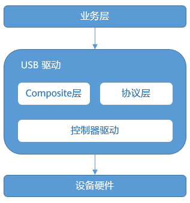

**Working Mechanism<a name="zh-cn_topic_0000001111953766_section1154170125012"></a>**

The main process of USB protocol driver loading and data sending/receiving is as follows:

1.  USB driver loading

    The loading of the USB device driver is encapsulated by the Composite layer into a unified processing flow. The Composite calls the loading function of the specific protocol to load the driver. After the device establishes a connection with the host through the USB cable, the Composite layer uniformly handles the enumeration process with the host, and applies for ports and initializes protocol private data through the processing functions registered by the protocol layer.

2.  USB data sending/receiving

    After the USB device is successfully loaded, the service layer sends and receives data through the protocol layer, and the protocol layer directly calls the port control interfaces provided by the controller driver to handle port data sending and receiving.

### Development Guidelines<a name="ZH-CN_TOPIC_0000002543394181"></a>


#### Functions<a name="ZH-CN_TOPIC_0000002543354227"></a>

**Functions<a name="zh-cn_topic_0000001158521617_section13923153913293"></a>**

The USB function of Hi35xx supports Device mode. For the specific protocols and functions, see the following table.

<a name="zh-cn_topic_0000001158521617_table1424mcpsimp"></a>
<table><thead align="left"><tr id="zh-cn_topic_0000001158521617_row1431mcpsimp"><th class="cellrowborder" valign="top" width="23.23%" id="mcps1.1.4.1.1"><p id="zh-cn_topic_0000001158521617_p1433mcpsimp"><a name="zh-cn_topic_0000001158521617_p1433mcpsimp"></a><a name="zh-cn_topic_0000001158521617_p1433mcpsimp"></a>Function</p>
</th>
<th class="cellrowborder" valign="top" width="26.26%" id="mcps1.1.4.1.2"><p id="zh-cn_topic_0000001158521617_p1435mcpsimp"><a name="zh-cn_topic_0000001158521617_p1435mcpsimp"></a><a name="zh-cn_topic_0000001158521617_p1435mcpsimp"></a>Description</p>
</th>
<th class="cellrowborder" valign="top" width="50.51%" id="mcps1.1.4.1.3"><p id="zh-cn_topic_0000001158521617_p1437mcpsimp"><a name="zh-cn_topic_0000001158521617_p1437mcpsimp"></a><a name="zh-cn_topic_0000001158521617_p1437mcpsimp"></a>Usage Notes</p>
</th>
</tr>
</thead>
<tbody><tr id="zh-cn_topic_0000001158521617_row1439mcpsimp"><td class="cellrowborder" valign="top" width="23.23%" headers="mcps1.1.4.1.1 "><p id="zh-cn_topic_0000001158521617_p1441mcpsimp"><a name="zh-cn_topic_0000001158521617_p1441mcpsimp"></a><a name="zh-cn_topic_0000001158521617_p1441mcpsimp"></a>Device USB Drive</p>
</td>
<td class="cellrowborder" valign="top" width="26.26%" headers="mcps1.1.4.1.2 "><p id="zh-cn_topic_0000001158521617_p1443mcpsimp"><a name="zh-cn_topic_0000001158521617_p1443mcpsimp"></a><a name="zh-cn_topic_0000001158521617_p1443mcpsimp"></a>Supports using the SD card/MMC media mounted to the system as a USB drive for read/write access from the USB Host.</p>
</td>
<td class="cellrowborder" valign="top" width="50.51%" headers="mcps1.1.4.1.3 "><a name="zh-cn_topic_0000001158521617_ul1445mcpsimp"></a><a name="zh-cn_topic_0000001158521617_ul1445mcpsimp"></a><ul id="zh-cn_topic_0000001158521617_ul1445mcpsimp"><li>Supports virtualizing an SD card as a USB drive</li><li>Supports virtualizing EMMC and RAM media as USB drives</li><li>Supports identification of specified partitions mounted on EMMC media</li><li>Supports virtualizing the ftl file system as a USB drive</li><li>Supports formatting and ejecting the USB drive using the drive-letter right-click menu on a PC</li></ul>
</td>
</tr>
<tr id="zh-cn_topic_0000001158521617_row1450mcpsimp"><td class="cellrowborder" valign="top" width="23.23%" headers="mcps1.1.4.1.1 "><p id="zh-cn_topic_0000001158521617_p1452mcpsimp"><a name="zh-cn_topic_0000001158521617_p1452mcpsimp"></a><a name="zh-cn_topic_0000001158521617_p1452mcpsimp"></a>UVC (USB Video Class)</p>
</td>
<td class="cellrowborder" valign="top" width="26.26%" headers="mcps1.1.4.1.2 "><p id="zh-cn_topic_0000001158521617_p1454mcpsimp"><a name="zh-cn_topic_0000001158521617_p1454mcpsimp"></a><a name="zh-cn_topic_0000001158521617_p1454mcpsimp"></a>Supports sending video data through the USB port.</p>
</td>
<td class="cellrowborder" valign="top" width="50.51%" headers="mcps1.1.4.1.3 "><a name="zh-cn_topic_0000001158521617_ul1456mcpsimp"></a><a name="zh-cn_topic_0000001158521617_ul1456mcpsimp"></a><ul id="zh-cn_topic_0000001158521617_ul1456mcpsimp"><li>Supports Android set-top box UVC extension commands</li><li>Supported video specifications:<p id="p1832179173810"><a name="p1832179173810"></a><a name="p1832179173810"></a>Formats: H.265/H.264/MJPEG/YUYV/NV12/NV21</p>
<p id="p1777141363819"><a name="p1777141363819"></a><a name="p1777141363819"></a>Resolution@frame rate: 1920×1080@30fps, 1280×720@30fps, 640×480@30fps, 640×360@30fps, 352×288@30fps, 320×240@30fps, 176×144@30fps</p>
</li></ul>
</td>
</tr>
<tr id="zh-cn_topic_0000001158521617_row1461mcpsimp"><td class="cellrowborder" valign="top" width="23.23%" headers="mcps1.1.4.1.1 "><p id="zh-cn_topic_0000001158521617_p1463mcpsimp"><a name="zh-cn_topic_0000001158521617_p1463mcpsimp"></a><a name="zh-cn_topic_0000001158521617_p1463mcpsimp"></a>UAC (USB Audio Class)</p>
</td>
<td class="cellrowborder" valign="top" width="26.26%" headers="mcps1.1.4.1.2 "><p id="zh-cn_topic_0000001158521617_p1465mcpsimp"><a name="zh-cn_topic_0000001158521617_p1465mcpsimp"></a><a name="zh-cn_topic_0000001158521617_p1465mcpsimp"></a>Supports sending and receiving audio data through the USB port.</p>
</td>
<td class="cellrowborder" valign="top" width="50.51%" headers="mcps1.1.4.1.3 "><a name="zh-cn_topic_0000001158521617_ul1467mcpsimp"></a><a name="zh-cn_topic_0000001158521617_ul1467mcpsimp"></a><ul id="zh-cn_topic_0000001158521617_ul1467mcpsimp"><li>USB3.0 is not supported</li><li>Supported PCM specifications: 48K, 32K, 16K, 8K</li><li>Supported bit depths and channel counts: 16bit/1ch, 24bit/1ch, 24bit/2ch, 24bit/4ch</li><li>Supports microphone and speaker functions</li><li>Supports UAC1.0 and UAC2.0</li></ul>
</td>
</tr>
<tr id="zh-cn_topic_0000001158521617_row1470mcpsimp"><td class="cellrowborder" valign="top" width="23.23%" headers="mcps1.1.4.1.1 "><p id="zh-cn_topic_0000001158521617_p1472mcpsimp"><a name="zh-cn_topic_0000001158521617_p1472mcpsimp"></a><a name="zh-cn_topic_0000001158521617_p1472mcpsimp"></a>UAV (UVC&amp;UAC)</p>
</td>
<td class="cellrowborder" valign="top" width="26.26%" headers="mcps1.1.4.1.2 "><p id="zh-cn_topic_0000001158521617_p1474mcpsimp"><a name="zh-cn_topic_0000001158521617_p1474mcpsimp"></a><a name="zh-cn_topic_0000001158521617_p1474mcpsimp"></a>Supports sending audio and video data through the USB port.</p>
</td>
<td class="cellrowborder" valign="top" width="50.51%" headers="mcps1.1.4.1.3 "><a name="zh-cn_topic_0000001158521617_ul1476mcpsimp"></a><a name="zh-cn_topic_0000001158521617_ul1476mcpsimp"></a><ul id="zh-cn_topic_0000001158521617_ul1476mcpsimp"><li>USB3.0 is not supported</li><li>For the supported specifications, see the UVC and UAC specifications</li><li>UAC1.0 speaker function and UAC2.0 are not supported</li></ul>
</td>
</tr>
<tr id="zh-cn_topic_0000001158521617_row1479mcpsimp"><td class="cellrowborder" valign="top" width="23.23%" headers="mcps1.1.4.1.1 "><p id="zh-cn_topic_0000001158521617_p1481mcpsimp"><a name="zh-cn_topic_0000001158521617_p1481mcpsimp"></a><a name="zh-cn_topic_0000001158521617_p1481mcpsimp"></a>DFU (Device Firmware Upgrade)</p>
</td>
<td class="cellrowborder" valign="top" width="26.26%" headers="mcps1.1.4.1.2 "><p id="zh-cn_topic_0000001158521617_p1483mcpsimp"><a name="zh-cn_topic_0000001158521617_p1483mcpsimp"></a><a name="zh-cn_topic_0000001158521617_p1483mcpsimp"></a>Supports firmware upgrade through the USB port and works with the DFU protocol on the Host.</p>
</td>
<td class="cellrowborder" valign="top" width="50.51%" headers="mcps1.1.4.1.3 "><a name="zh-cn_topic_0000001158521617_ul1485mcpsimp"></a><a name="zh-cn_topic_0000001158521617_ul1485mcpsimp"></a><ul id="zh-cn_topic_0000001158521617_ul1485mcpsimp"><li>USB3.0 is not supported</li><li>Supports PC upgrade</li><li>Supports Android set-top box upgrade</li><li>Supports upgrade status query</li></ul>
</td>
</tr>
<tr id="zh-cn_topic_0000001158521617_row1490mcpsimp"><td class="cellrowborder" valign="top" width="23.23%" headers="mcps1.1.4.1.1 "><p id="zh-cn_topic_0000001158521617_p1492mcpsimp"><a name="zh-cn_topic_0000001158521617_p1492mcpsimp"></a><a name="zh-cn_topic_0000001158521617_p1492mcpsimp"></a>HID (Human Interface Device)</p>
</td>
<td class="cellrowborder" valign="top" width="26.26%" headers="mcps1.1.4.1.2 "><p id="zh-cn_topic_0000001158521617_p1494mcpsimp"><a name="zh-cn_topic_0000001158521617_p1494mcpsimp"></a><a name="zh-cn_topic_0000001158521617_p1494mcpsimp"></a>Supports receiving and sending data of HID devices through the USB port.</p>
</td>
<td class="cellrowborder" valign="top" width="50.51%" headers="mcps1.1.4.1.3 "><a name="zh-cn_topic_0000001158521617_ul1496mcpsimp"></a><a name="zh-cn_topic_0000001158521617_ul1496mcpsimp"></a><ul id="zh-cn_topic_0000001158521617_ul1496mcpsimp"><li>USB3.0 is not supported</li><li>Boot interfaces and boot protocols are not supported</li><li>Supports USB mouse, keyboard, and keyboard devices with mouse functions</li><li>Supports dynamic configuration of report descriptors</li></ul>
</td>
</tr>
<tr id="zh-cn_topic_0000001158521617_row1501mcpsimp"><td class="cellrowborder" valign="top" width="23.23%" headers="mcps1.1.4.1.1 "><p id="zh-cn_topic_0000001158521617_p1503mcpsimp"><a name="zh-cn_topic_0000001158521617_p1503mcpsimp"></a><a name="zh-cn_topic_0000001158521617_p1503mcpsimp"></a>Virtual network port</p>
</td>
<td class="cellrowborder" valign="top" width="26.26%" headers="mcps1.1.4.1.2 "><p id="zh-cn_topic_0000001158521617_p1505mcpsimp"><a name="zh-cn_topic_0000001158521617_p1505mcpsimp"></a><a name="zh-cn_topic_0000001158521617_p1505mcpsimp"></a>Supports sending and receiving network data through the USB port to simulate the function of a network port.</p>
</td>
<td class="cellrowborder" valign="top" width="50.51%" headers="mcps1.1.4.1.3 "><a name="ul1323413417253"></a><a name="ul1323413417253"></a><ul id="ul1323413417253"><li>Layer-2 socket settings are not supported</li><li>Supports network transmission using the RNDIS protocol</li><li>Supports network transmission using the ECM protocol</li></ul>
</td>
</tr>
<tr id="zh-cn_topic_0000001158521617_row1508mcpsimp"><td class="cellrowborder" valign="top" width="23.23%" headers="mcps1.1.4.1.1 "><p id="zh-cn_topic_0000001158521617_p1510mcpsimp"><a name="zh-cn_topic_0000001158521617_p1510mcpsimp"></a><a name="zh-cn_topic_0000001158521617_p1510mcpsimp"></a>Virtual serial port</p>
</td>
<td class="cellrowborder" valign="top" width="26.26%" headers="mcps1.1.4.1.2 "><p id="zh-cn_topic_0000001158521617_p1512mcpsimp"><a name="zh-cn_topic_0000001158521617_p1512mcpsimp"></a><a name="zh-cn_topic_0000001158521617_p1512mcpsimp"></a>Supports serial communication through the USB port to simulate the function of a serial port.</p>
</td>
<td class="cellrowborder" valign="top" width="50.51%" headers="mcps1.1.4.1.3 "><p id="zh-cn_topic_0000001158521617_p1514mcpsimp"><a name="zh-cn_topic_0000001158521617_p1514mcpsimp"></a><a name="zh-cn_topic_0000001158521617_p1514mcpsimp"></a>Supports debugging function</p>
</td>
</tr>
<tr id="zh-cn_topic_0000001158521617_row1515mcpsimp"><td class="cellrowborder" valign="top" width="23.23%" headers="mcps1.1.4.1.1 "><p id="zh-cn_topic_0000001158521617_p1517mcpsimp"><a name="zh-cn_topic_0000001158521617_p1517mcpsimp"></a><a name="zh-cn_topic_0000001158521617_p1517mcpsimp"></a>Composite device (virtual network port &amp; virtual serial port)</p>
</td>
<td class="cellrowborder" valign="top" width="26.26%" headers="mcps1.1.4.1.2 "><p id="zh-cn_topic_0000001158521617_p1519mcpsimp"><a name="zh-cn_topic_0000001158521617_p1519mcpsimp"></a><a name="zh-cn_topic_0000001158521617_p1519mcpsimp"></a>Supports simulating both the network port and the serial port through the USB port.</p>
</td>
<td class="cellrowborder" valign="top" width="50.51%" headers="mcps1.1.4.1.3 "><a name="zh-cn_topic_0000001158521617_ul1521mcpsimp"></a><a name="zh-cn_topic_0000001158521617_ul1521mcpsimp"></a><ul id="zh-cn_topic_0000001158521617_ul1521mcpsimp"><li>Supports debugging function</li><li>Layer-2 socket settings are not supported</li></ul>
</td>
</tr>
<tr id="row1546719198292"><td class="cellrowborder" valign="top" width="23.23%" headers="mcps1.1.4.1.1 "><p id="p1646801915296"><a name="p1646801915296"></a><a name="p1646801915296"></a>UAC&amp;HID composite device</p>
</td>
<td class="cellrowborder" valign="top" width="26.26%" headers="mcps1.1.4.1.2 "><p id="p1946871972916"><a name="p1946871972916"></a><a name="p1946871972916"></a>Supports sending and receiving audio data and HID data through the USB port.</p>
</td>
<td class="cellrowborder" valign="top" width="50.51%" headers="mcps1.1.4.1.3 "><a name="ul9506113815376"></a><a name="ul9506113815376"></a><ul id="ul9506113815376"><li>USB3.0 is not supported</li><li>For the supported specifications, see the UAC and HID specifications</li><li>Supports UAC1.0 microphone and speaker functions and HID keyboard and mouse functions</li><li>UAC2.0 is not supported</li></ul>
</td>
</tr>
</tbody>
</table>

> **Note:** 
>When a USB3.0 Device is connected to a USB2.0 Host, speed reduction is not supported due to device-side hardware limitations, so the device cannot be identified.

Due to chip hardware resource limitations, the specifications supported by the LiteOS USB driver vary. For details, see the following table.

<a name="zh-cn_topic_0000001158521617__Toc534313347"></a>
<table><thead align="left"><tr id="zh-cn_topic_0000001158521617_row1599mcpsimp"><th class="cellrowborder" valign="top" width="14.097180563887221%" id="mcps1.1.13.1.1"><p id="zh-cn_topic_0000001158521617_p7530151214711"><a name="zh-cn_topic_0000001158521617_p7530151214711"></a><a name="zh-cn_topic_0000001158521617_p7530151214711"></a>Chip Platform</p>
</th>
<th class="cellrowborder" valign="top" width="6.25874825034993%" id="mcps1.1.13.1.2"><p id="zh-cn_topic_0000001158521617_p1601mcpsimp"><a name="zh-cn_topic_0000001158521617_p1601mcpsimp"></a><a name="zh-cn_topic_0000001158521617_p1601mcpsimp"></a>USB Drive</p>
</th>
<th class="cellrowborder" valign="top" width="5.548890221955609%" id="mcps1.1.13.1.3"><p id="zh-cn_topic_0000001158521617_p1603mcpsimp"><a name="zh-cn_topic_0000001158521617_p1603mcpsimp"></a><a name="zh-cn_topic_0000001158521617_p1603mcpsimp"></a>UVC</p>
</th>
<th class="cellrowborder" valign="top" width="6.08878224355129%" id="mcps1.1.13.1.4"><p id="zh-cn_topic_0000001158521617_p1605mcpsimp"><a name="zh-cn_topic_0000001158521617_p1605mcpsimp"></a><a name="zh-cn_topic_0000001158521617_p1605mcpsimp"></a>UAC</p>
</th>
<th class="cellrowborder" valign="top" width="5.978804239152169%" id="mcps1.1.13.1.5"><p id="zh-cn_topic_0000001158521617_p1607mcpsimp"><a name="zh-cn_topic_0000001158521617_p1607mcpsimp"></a><a name="zh-cn_topic_0000001158521617_p1607mcpsimp"></a>UAV</p>
</th>
<th class="cellrowborder" valign="top" width="5.858828234353129%" id="mcps1.1.13.1.6"><p id="zh-cn_topic_0000001158521617_p1609mcpsimp"><a name="zh-cn_topic_0000001158521617_p1609mcpsimp"></a><a name="zh-cn_topic_0000001158521617_p1609mcpsimp"></a>DFU</p>
</th>
<th class="cellrowborder" valign="top" width="6.09878024395121%" id="mcps1.1.13.1.7"><p id="zh-cn_topic_0000001158521617_p1611mcpsimp"><a name="zh-cn_topic_0000001158521617_p1611mcpsimp"></a><a name="zh-cn_topic_0000001158521617_p1611mcpsimp"></a>HID</p>
</th>
<th class="cellrowborder" valign="top" width="9.668066386722655%" id="mcps1.1.13.1.8"><p id="zh-cn_topic_0000001158521617_p1613mcpsimp"><a name="zh-cn_topic_0000001158521617_p1613mcpsimp"></a><a name="zh-cn_topic_0000001158521617_p1613mcpsimp"></a>Virtual Serial Port</p>
</th>
<th class="cellrowborder" valign="top" width="11.347730453909218%" id="mcps1.1.13.1.9"><p id="zh-cn_topic_0000001158521617_p1615mcpsimp"><a name="zh-cn_topic_0000001158521617_p1615mcpsimp"></a><a name="zh-cn_topic_0000001158521617_p1615mcpsimp"></a>Virtual Network Port RNDIS</p>
</th>
<th class="cellrowborder" valign="top" width="9.978004399120175%" id="mcps1.1.13.1.10"><p id="p87021222881"><a name="p87021222881"></a><a name="p87021222881"></a>Virtual Network Port</p>
<p id="p159383514812"><a name="p159383514812"></a><a name="p159383514812"></a>ECM</p>
</th>
<th class="cellrowborder" valign="top" width="12.11757648470306%" id="mcps1.1.13.1.11"><p id="zh-cn_topic_0000001158521617_p1617mcpsimp"><a name="zh-cn_topic_0000001158521617_p1617mcpsimp"></a><a name="zh-cn_topic_0000001158521617_p1617mcpsimp"></a>Composite Device</p>
<p id="p10165152318163"><a name="p10165152318163"></a><a name="p10165152318163"></a>SER_RNDIS and SER_ECM</p>
</th>
<th class="cellrowborder" valign="top" width="6.958608278344331%" id="mcps1.1.13.1.12"><p id="p106154410418"><a name="p106154410418"></a><a name="p106154410418"></a>UAC&amp;HID</p>
</th>
</tr>
</thead>
<tbody><tr id="zh-cn_topic_0000001158521617_row1618mcpsimp"><td class="cellrowborder" valign="top" width="14.097180563887221%" headers="mcps1.1.13.1.1 "><p id="zh-cn_topic_0000001158521617_p1620mcpsimp"><a name="zh-cn_topic_0000001158521617_p1620mcpsimp"></a><a name="zh-cn_topic_0000001158521617_p1620mcpsimp"></a>Hi3516DV300 (USB2.0)</p>
</td>
<td class="cellrowborder" valign="top" width="6.25874825034993%" headers="mcps1.1.13.1.2 "><p id="zh-cn_topic_0000001158521617_p1622mcpsimp"><a name="zh-cn_topic_0000001158521617_p1622mcpsimp"></a><a name="zh-cn_topic_0000001158521617_p1622mcpsimp"></a>√</p>
</td>
<td class="cellrowborder" valign="top" width="5.548890221955609%" headers="mcps1.1.13.1.3 "><p id="zh-cn_topic_0000001158521617_p1624mcpsimp"><a name="zh-cn_topic_0000001158521617_p1624mcpsimp"></a><a name="zh-cn_topic_0000001158521617_p1624mcpsimp"></a>√</p>
</td>
<td class="cellrowborder" valign="top" width="6.08878224355129%" headers="mcps1.1.13.1.4 "><p id="zh-cn_topic_0000001158521617_p1626mcpsimp"><a name="zh-cn_topic_0000001158521617_p1626mcpsimp"></a><a name="zh-cn_topic_0000001158521617_p1626mcpsimp"></a>√</p>
</td>
<td class="cellrowborder" valign="top" width="5.978804239152169%" headers="mcps1.1.13.1.5 "><p id="zh-cn_topic_0000001158521617_p1628mcpsimp"><a name="zh-cn_topic_0000001158521617_p1628mcpsimp"></a><a name="zh-cn_topic_0000001158521617_p1628mcpsimp"></a>√</p>
</td>
<td class="cellrowborder" valign="top" width="5.858828234353129%" headers="mcps1.1.13.1.6 "><p id="zh-cn_topic_0000001158521617_p1630mcpsimp"><a name="zh-cn_topic_0000001158521617_p1630mcpsimp"></a><a name="zh-cn_topic_0000001158521617_p1630mcpsimp"></a>√</p>
</td>
<td class="cellrowborder" valign="top" width="6.09878024395121%" headers="mcps1.1.13.1.7 "><p id="zh-cn_topic_0000001158521617_p1632mcpsimp"><a name="zh-cn_topic_0000001158521617_p1632mcpsimp"></a><a name="zh-cn_topic_0000001158521617_p1632mcpsimp"></a>√</p>
</td>
<td class="cellrowborder" valign="top" width="9.668066386722655%" headers="mcps1.1.13.1.8 "><p id="zh-cn_topic_0000001158521617_p1634mcpsimp"><a name="zh-cn_topic_0000001158521617_p1634mcpsimp"></a><a name="zh-cn_topic_0000001158521617_p1634mcpsimp"></a>√</p>
</td>
<td class="cellrowborder" valign="top" width="11.347730453909218%" headers="mcps1.1.13.1.9 "><p id="zh-cn_topic_0000001158521617_p1636mcpsimp"><a name="zh-cn_topic_0000001158521617_p1636mcpsimp"></a><a name="zh-cn_topic_0000001158521617_p1636mcpsimp"></a>√</p>
</td>
<td class="cellrowborder" valign="top" width="9.978004399120175%" headers="mcps1.1.13.1.10 ">&nbsp;&nbsp;</td>
<td class="cellrowborder" valign="top" width="12.11757648470306%" headers="mcps1.1.13.1.11 "><p id="zh-cn_topic_0000001158521617_p1638mcpsimp"><a name="zh-cn_topic_0000001158521617_p1638mcpsimp"></a><a name="zh-cn_topic_0000001158521617_p1638mcpsimp"></a>√</p>
</td>
<td class="cellrowborder" valign="top" width="6.958608278344331%" headers="mcps1.1.13.1.12 "><p id="p26104454113"><a name="p26104454113"></a><a name="p26104454113"></a>√</p>
</td>
</tr>
</tbody>
</table>

> **Note:** 
>The USB2.0 ports of Hi3516DV300/Hi3556V200/Hi3559V200 operate based on USB3.0 controllers. When compiling, you need to select the 3.0 controller.

#### Configuring the Memory of the USB Module<a name="ZH-CN_TOPIC_0000002543354219"></a>

The USB module needs a section of uncached memory for normal operation, so you need to configure memory for the USB module separately.

Memory can be configured by defining the following function:

```
void board_config(void)
{
    g_sys_mem_addr_end = 0x88000000;
    g_usb_mem_addr_start = g_sys_mem_addr_end;
    g_usb_mem_size = 0x100000;
}
```

> **Notice:** 
>-   You must not modify the declaration of void board\_config\(void\). If the application layer does not define the void board\_config\(void\) function, LiteOS allocates the OS-visible memory size based on the default value. It is recommended that you define the function according to the actual situation.
>-   g\_sys\_mem\_addr\_end configures the end position of the OS-visible memory.
>-   g\_usb\_mem\_addr\_start configures the start position of the USB memory.
>-   g\_usb\_mem\_size configures the size of the USB memory.
>-   If the system does not support USB-related functions at all, you can configure g\_usb\_mem\_addr\_start and g\_usb\_mem\_size to 0.

#### Dynamically Switching USB Protocols<a name="ZH-CN_TOPIC_0000002511794346"></a>

When switching dynamically, first call usb\_deinit to unload the currently used protocol, and then reload the protocol to be switched to through usb\_init.

Some protocols do not support unloading while in use (for example, DFU, UVC, Camera, and HID). You need to stop the current service first, and then call usb\_deinit to unload them.

#### Module Compilation<a name="ZH-CN_TOPIC_0000002511954374"></a>

The source code of the USB driver is located in drivers/usb. You can compile the corresponding USB module library by running make in the LiteOS root directory. After compilation succeeds, library files named "libusb\_base.a" and "libusb\_device.a" are generated in the "out/<platform\>/lib" directory, where platform is the specific platform name.

[Figure 1](#fig653025965111) shows the menuconfig configuration items of the USB driver in LiteOS. Under the "Driver" configuration item, you can enable the USB driver function by selecting "Enable USB".

**Figure 1**  USB driver menuconfig configuration<a name="fig653025965111"></a>  
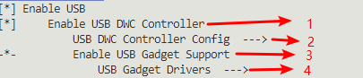

**Device End<a name="zh-cn_topic_0000001158521619_section1625195823210"></a>**

The configuration items numbered 1 to 4 in [Figure 1](#fig653025965111) are described as follows:

-   1 indicates whether to enable the Device function of the USB driver.
-   2 indicates the Device controller type, which can be Dwc2.0 or 3.0 (depending on the USB port type of the specific board).
-   3 indicates whether to enable the USB protocol functions in Device mode.
-   4 indicates the specific USB protocol functions in Device mode. The supported USB protocols are as follows, and the menuconfig configuration items are shown in [Figure 2](#fig659124262511):

    -   Device USB Drive
    -   UVC
    -   UAC
    -   Camera (UVC&UAC)
    -   DFU upgrade
    -   Virtual serial port
    -   Virtual network port ECM
    -   Virtual network port RNDIS
    -   Composite device (virtual serial port & virtual network port)
    -   HID
    -   UAC&HID composite device

    **Figure 2**  Device-end configuration of the USB driver<a name="fig659124262511"></a>  
    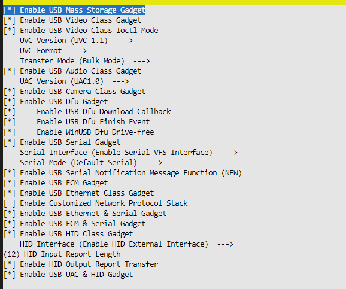

> **Notice:** 
>To initialize Device mode, also call usb\_init\(DEVICE, xxx\). Enable the required protocols based on service requirements, or enable all of them. In addition, the dependent peripheral components also need to be loaded in advance. For details, see the programming example in "[Device End](device_end.md)".

### Programming Example<a name="ZH-CN_TOPIC_0000002511794330"></a>


#### Device End<a name="ZH-CN_TOPIC_0000002511954242"></a>


##### Device Virtual USB Drive<a name="ZH-CN_TOPIC_0000002543394265"></a>

**Initialization<a name="zh-cn_topic_0000001158566737_section2368259319"></a>**

In the initialization function, initialize the SD card driver and the USB driver:

```
SD_MMC_Host_init();
usbd_set_device_info(DEV_MASS, &str_manufacturer, &str_product, &str_serial_number, dev_id);
usb_init(DEVICE, DEV_MASS);   // Set dtype to DEV_MASS
```

> **Note:** 
>-   In a multi-card scenario (the system mounts two or more cards at the same time), the USB2.0 Device is bound to the first card device node by default. For example, when "/dev/mmcblk0p0" and "/dev/mmcblk1p0" exist at the same time, the USB2.0 Device is bound to "/dev/mmcblk0p0". Therefore, the Host can access only one SD/MMC card through the USB port.
>-   After the USB2.0 Device is connected to the Host, the Host can access the files on the system storage media through the USB port. While the Host is accessing the storage media, do not perform operations such as reading/writing or formatting on the MMC/SD card storage media on the system side, to avoid exceptions when the Host accesses the storage media.
>-   When the Device USB drive is connected to a PC for formatting, only the quick format operation of Windows PC is supported. Do not use the general format operation of Windows PC or the advanced format commands of Linux, to avoid modifying the partition information, which may cause mount failures after the Device unloads the virtual USB drive. If this operation has been performed, you can reformat the storage media after the mount failure to resolve the issue.
>-   Currently, the virtual USB drive supports four types of storage media: SD card, MMC, RAM, and FTL spi\_nor. The initialization process is the same. Before loading USB, you need to initialize the file system of the corresponding media first to ensure that nodes available for the virtual USB drive to read from and write to exist in the "dev/" directory.

**Registering the Device USB Drive Callback Function<a name="zh-cn_topic_0000001158566737_section5711512448"></a>**

The application layer registers the notify callback through the fmass\_register\_notify\(void\(\*notify\)\(void\* context, int status\), void\* context\) function. The driver calls this callback function when detecting the Host connection and disconnection, thereby implementing processing related to the plugging and unplugging of the Device USB drive.

After the USB module is initialized, immediately call fmass\_register\_notify\(\) to register the Device callback function.

> **Notice:** 
>In the Notify callback function, when the USB Device is connected, you need to use fmass\_partition\_startup\(\) to start the SD card partition node to be identified by the PC, and ensure that the device node passed to the interface exists. If it does not exist, "/dev/mmcblk0p0" is virtualized as a USB drive by default. If the "/dev/mmcblk0p0" node does not exist, the operation fails.

**Enabling an Additional Serial Port<a name="section728111271546"></a>**

Enable LOSCFG\_DRIVERS\_USB\_MASS\_STORAGE\_EXT\_SER\_FUNC to add a serial port function on top of the virtual USB drive. Currently, single-serial-port and dual-serial-port configurations are supported.

**Precautions<a name="zh-cn_topic_0000001158566737_section12536387510"></a>**

-   Items to be observed during normal operation:
    -   The Device USB drive hands over the SD card to the USB Host for processing. Therefore, after the Device USB drive is identified by the Host, the APP software module is notified through the callback function. The APP must stop all services that operate on the SD card, such as recording and snapshot capture, and umount the SD card partition. After the USB Host goes offline, mount the partition again and resume the related services.
    -   When the USB Host is performing read/write access, do not pull out the SD/MMC card on the board; otherwise, some exception information will be printed, and files may be stuck or the file system may be damaged.

-   Operations when an exception occurs during operation:

    If the Device USB drive is pulled out and then reinserted extremely quickly, the Host may fail to detect the USB drive, because the detection, registration, and unregistration process of the Device USB drive on the board takes some time.

**Programming Example<a name="zh-cn_topic_0000001158566737_section152522281762"></a>**

```
extern int fmass_register_notify(void(*notify)(void* context, int status), void* context);
extern int fmass_partition_startup(char* path);
void fmass_app_notify(void* conext, int status)
{
    char *path = "/dev/mmcblk0p0";
    if(status == 1)/*usb device connect*/
    {
        /* Stop read/write operations on the /dev/mmcblk0p0 partition, such as recording and snapshot capture, and umount the partition */
        fmass_partition_startup(path);    // startup fmass access partition
    }
    else
    {
        /* Mount the partition and notify other modules that the partition is available for read/write operations */
    }
}
void app_init()
{
    uint32_t ret;
    int handle;

    const char manufacturer[38] = {
        'H', 0, 'i', 0, 'S', 0, 'i', 0, 'l', 0, 'i', 0, 'c', 0, 'o', 0, 'n', 0,
        '(', 0, 'S', 0, 'h', 0, 'a', 0, 'n', 0, 'g', 0, 'h', 0, 'a', 0, 'i', 0, ')', 0
    };
    struct device_string str_manufacturer = {
        .str = manufacturer,
        .len = 38
    };

    const char product[18] = {
        'U', 0, 'S', 0, 'B', 0, 'D', 0, 'E', 0, 'V', 0, 'I', 0,
        'C', 0, 'E', 0
    };
    struct device_string str_product = {
        .str = product,
        .len = 18
    };

    const char serial[16] = {
        '2', 0, '0', 0, '2', 0, '0', 0, '0', 0, '6', 0, '2', 0,
        '4', 0
    };
    struct device_string str_serial_number = {
        .str = serial,
        .len = 16
    };

    struct device_id dev_id = {
        .vendor_id = 0x3361,
        .product_id = 0x0108,
        .release_num = 0x0318
    };

    SD_MMC_Host_init();

    g_usb_mem_addr_start= g_sys_mem_addr_end;
    g_usb_mem_size= 0x40000; //recommend 256K nonCache for usb

    ret = usbd_set_device_info(DEV_MASS, &str_manufacturer, &str_product, &str_serial_number, dev_id);
    if (ret != 0) {
        dprintf("set fail!\n");
        return;
    }
    
    ret = usb_init(DEVICE, DEV_MASS);  // usb_init must after SD_MMC_Host_init
    if(ret != 0) {
        dprintf("usb init failed!\n");
        return;
    }
    handle = fmass_register_notify(fmass_app_notify,NULL);
    if (handle == -1) {
        return;
    }
}
```

**Virtualizing the In-Memory Fat32 File System as a USB Drive<a name="zh-cn_topic_0000001158566737_section1093014511813"></a>**

1.  Create a FAT-format file system image (taking the Ubuntu system as an example).
    1.  Create a FAT-format disk image.

        ```
        mkfs.fat -s 64 -S 512 -f 2 -n "Internal SD" -F 32 -C usbdisk.tmp 2048
        ```

        2048 indicates the disk space size, in KB.

    2.  Mount the FAT-format disk image.

        ```
        mount -o loop -t vfat usbdisk.tmp test/
        ```

        test is the mount directory.

    3.  Store the required files in the test directory, and then synchronize the files to the disk.

        ```
        sync test/
        ```

    4.  Unmount the disk image.

        ```
        umount test/
        ```

    5.  Create the file system image.

        ```
        dd if=usbdisk.tmp of=udisk.img bs=1024 count=2048
        ```

        Create a file system image "udisk.img" from the first 2 MB of "usbdisk.tmp".

2.  Download the created file system image to the flash.

    Place the "udisk.img" file in the specified path FAT\_PART\_IMAGE\_PATH ("/littlefs/udisk.img").

3.  Call the ram\_mass\_storage\_init interface to register the RAM\_DEV\_NAME (/dev/uram) device node.
4.  Call the fmass\_register\_notify interface to virtualize the device node "/dev/uram" as a USB drive.
5.  Call the usbd\_set\_device\_info and usb\_init interfaces to load the virtual USB drive protocol.

    > **Notice:** 
    >The file system image created this time requests 2 MB of capacity. Adjust the capacity based on actual service requirements. In addition to creating a file system image of the specific capacity, you also need to modify the corresponding FAT\_PART\_SIZE.

##### Device UVC<a name="ZH-CN_TOPIC_0000002511794298"></a>

Device UVC supports switching between the UVC1.0 and UVC1.1 protocol versions. Open the menu and go to Driver ---\> Enable USB ---\> Enable USB DWC Controller ---\> Enable USB Gadget Support ---\> USB Gadget Drivers ---\> UVC Version to select the UVC1.0 or UVC1.1 version. Currently, the UVC1.1 protocol is used by default. Switching to UVC1.0 supports Windows XP systems and improves compatibility.

**Operation Guidelines<a name="zh-cn_topic_0000001158521631_section1822055133413"></a>**

1.  Before USB initialization, the UVC upper-layer application sets the UVC transmission capability set, enables VI, and opens the UVC device.
2.  After preparation, wait for the underlying UVC connection, start VPSS and VENC encoding, and transmit the code stream data until the UVC channel is disconnected.
3.  When switching to a new code stream format, the application must first stop the previous encoding and clear the cache, and then start encoding.

**Operation Example<a name="zh-cn_topic_0000001158521631_section113017485329"></a>**

-   **Method 1: Directly call the device UVC interfaces to control data transmission.**

1.  Set the UVC transmission capability set (including the encoding format, resolution, and frame rate) through the fuvc\_frame\_descriptors\_get interface.
2.  In the initialization function, call the usbd\_set\_device\_info and usb\_init interfaces to register the USB driver.

    ```
    usbd_set_device_info(DEV_UVC, &str_manufacturer, &str_product, &str_serial_number, dev_id);
    usb_init(DEVICE, DEV_UVC);     // Set dtype to DEV_UVC
    ```

3.  After enabling VI, call uvc\_open\_device to open the UVC device. The resolution and frame rate must be specified.
4.  Use uvc\_wait\_host to wait for the board end to successfully connect with the USB host.
5.  After starting VPSS and VENC encoding, use uvc\_recv\_pack to start video data transmission.
6.  Use uvc\_video\_stop to stop video data transmission, and call uvc\_close\_device to close the USB device.

-   **Method 2: Open the device node registered by device UVC and control data transmission through system calls.**

1.  In the initialization function, call the usbd\_set\_device\_info and usb\_init interfaces to register the USB driver.

    ```
    usbd_set_device_info(DEV_UVC, &str_manufacturer, &str_product, &str_serial_number, dev_id);
    usb_init(DEVICE, DEV_UVC);     // Set dtype to DEV_UVC
    ```

2.  After enabling VI, call open to open the UVC device node "/dev/usb\_uvc-0", and monitor the device connection status by calling the select function.
3.  When the board end successfully connects with the USB host and can start data transmission, the select system call can receive messages from the host. At this time, call the ioctl interface to send the VIDIOC\_DQEVENT command, and provide the structure struct usbd\_uvc\_video\_event to receive data. Based on the received data, send information such as the video resolution and frame rate to VPSS and VENC.
4.  After starting VPSS and VENC encoding, use uvc\_recv\_pack to start video data transmission. At the same time, send the VIDIOC\_STREAMON command through the ioctl system call to notify the USB device that data transmission can start.
5.  Call VIDIOC\_STREAMOFF to stop video transmission, and then close the USB device through the close system call.

> **Notice:** 
>Both Method 1 and Method 2 involve opening the device, through the uvc\_open\_device interface and the open system interface, respectively. When both interfaces are used at the same time, the device can be opened only once. The interface called later will fail to open the device, and all its operations will be invalid.

##### Device UAC<a name="ZH-CN_TOPIC_0000002511954266"></a>

The UAC data processing flow. The specific steps of the microphone service are as follows:

1.  <a name="zh-cn_topic_0000001158521635_li12336155093519"></a>In the initialization function, call the usbd\_set\_device\_info and usb\_init interfaces to register the USB driver.

    ```
    usbd_set_device_info(DEV_UAC, str_manufacturer, str_product, str_serial_number, dev_id);
    usb_init(DEVICE, DEV_UAC);      // Set dtype to DEV_UAC
    ```

2.  <a name="zh-cn_topic_0000001158521635_li8336175011352"></a>After enabling VI, use uac\_wait\_host to wait for the board end to connect with the USB.
3.  <a name="li13876112144214"></a>Obtain the sampling rate, channel count, and bit depth negotiated between the current Device UAC and the Host through the fuac\_get\_opts interface, and calculate the audio length to be sent each time and the number of audio data blocks to be cached.
4.  Use the values calculated in [3](#li13876112144214) and call the fuac\_reqbuf\_init interface to initialize the UAC memory pool.
5.  <a name="li258324718444"></a>Before starting VPSS and VENC encoding, call the fuac\_reqbuf\_get interface to obtain an idle buf and fill the encoded audio into this buf.
6.  <a name="zh-cn_topic_0000001158521635_li3336165003519"></a>Send the filled buf to the Host by calling fuac\_send\_message. Afterwards, [5](#li258324718444) and [6](#zh-cn_topic_0000001158521635_li3336165003519) are executed repeatedly.
7.  When ending audio transmission, return all the idle bufs obtained in [5](#li258324718444) to USB by calling the fuac\_send\_message interface, and then call the fuac\_reqbuf\_deinit interface to release the UAC memory pool.
8.  Call the usb\_deinit interface to unload the protocol. Note that before unloading the protocol, you must ensure that all bufs in the UAC memory pool have been returned to the USB layer; otherwise, unloading fails.

The specific steps of the speaker service are as follows:

1.  Same as [1](#zh-cn_topic_0000001158521635_li12336155093519) and [2](#zh-cn_topic_0000001158521635_li8336175011352) in the microphone service, load the UAC protocol in sequence.
2.  Obtain the sampling rate, channel count, and bit depth negotiated between the current Device UAC and the Host through the fuac\_get\_opts interface, and calculate the audio length to be received each time.
3.  Call fuac\_receive\_message to receive the audio data sent by the Host.
4.  Stop calling the fuac\_receive\_message interface, that is, stop audio data transmission.
5.  Call the usb\_deinit interface to unload the protocol.

##### Device UAV (Camera)<a name="ZH-CN_TOPIC_0000002511794270"></a>

UAV supports both UAC and UVC. For the related operation process, see the UVC and UAC usage examples above. The difference lies in the protocol type passed in during initialization:

```
usbd_set_device_info(DEV_CAMERA, &str_manufacturer, &str_product, &str_serial_number, dev_id);
usb_init(DEVICE, DEV_CAMERA);   // Set dtype to DEV_CAMERA
```

##### Device Virtual Serial Port<a name="ZH-CN_TOPIC_0000002511954342"></a>

The virtual serial port configuration is described as follows:

<a name="table307549115016"></a>
<table><thead align="left"><tr id="row6708500315016"><th class="cellrowborder" valign="top" width="33.08669133086692%" id="mcps1.1.6.1.1"><p id="p1839509215016"><a name="p1839509215016"></a><a name="p1839509215016"></a>Configuration Item</p>
</th>
<th class="cellrowborder" valign="top" width="22.307769223077692%" id="mcps1.1.6.1.2"><p id="p1360747715016"><a name="p1360747715016"></a><a name="p1360747715016"></a>Description</p>
</th>
<th class="cellrowborder" valign="top" width="13.288671132886712%" id="mcps1.1.6.1.3"><p id="p2846381815016"><a name="p2846381815016"></a><a name="p2846381815016"></a>Value Range</p>
</th>
<th class="cellrowborder" valign="top" width="10.578942105789421%" id="mcps1.1.6.1.4"><p id="p2386789915016"><a name="p2386789915016"></a><a name="p2386789915016"></a>Default Value</p>
</th>
<th class="cellrowborder" valign="top" width="20.73792620737926%" id="mcps1.1.6.1.5"><p id="p5425169815016"><a name="p5425169815016"></a><a name="p5425169815016"></a>Dependency</p>
</th>
</tr>
</thead>
<tbody><tr id="row2853386715016"><td class="cellrowborder" valign="top" width="33.08669133086692%" headers="mcps1.1.6.1.1 "><p id="p88551044102511"><a name="p88551044102511"></a><a name="p88551044102511"></a>LOSCFG_DRIVERS_USB_SERIAL_VFS_INTERFACE</p>
</td>
<td class="cellrowborder" valign="top" width="22.307769223077692%" headers="mcps1.1.6.1.2 "><p id="p4478011915016"><a name="p4478011915016"></a><a name="p4478011915016"></a>Enables the VFS read/write interfaces to control virtual serial port read/write and ioctl</p>
</td>
<td class="cellrowborder" valign="top" width="13.288671132886712%" headers="mcps1.1.6.1.3 "><p id="p5143025815447"><a name="p5143025815447"></a><a name="p5143025815447"></a>YES/NO</p>
</td>
<td class="cellrowborder" valign="top" width="10.578942105789421%" headers="mcps1.1.6.1.4 "><p id="p6686734915016"><a name="p6686734915016"></a><a name="p6686734915016"></a>YES</p>
</td>
<td class="cellrowborder" valign="top" width="20.73792620737926%" headers="mcps1.1.6.1.5 "><p id="p22471755182617"><a name="p22471755182617"></a><a name="p22471755182617"></a>LOSCFG_FS_VFS</p>
</td>
</tr>
<tr id="row15729155514413"><td class="cellrowborder" valign="top" width="33.08669133086692%" headers="mcps1.1.6.1.1 "><p id="p486713410272"><a name="p486713410272"></a><a name="p486713410272"></a>LOSCFG_DRIVERS_USB_SERIAL_FUNC_INTERFACE</p>
</td>
<td class="cellrowborder" valign="top" width="22.307769223077692%" headers="mcps1.1.6.1.2 "><p id="p17815771273"><a name="p17815771273"></a><a name="p17815771273"></a>Enables external interfaces to control virtual serial port read/write and ioctl</p>
</td>
<td class="cellrowborder" valign="top" width="13.288671132886712%" headers="mcps1.1.6.1.3 "><p id="p57293551241"><a name="p57293551241"></a><a name="p57293551241"></a>YES/NO</p>
</td>
<td class="cellrowborder" valign="top" width="10.578942105789421%" headers="mcps1.1.6.1.4 "><p id="p82611040192713"><a name="p82611040192713"></a><a name="p82611040192713"></a>NO</p>
</td>
<td class="cellrowborder" valign="top" width="20.73792620737926%" headers="mcps1.1.6.1.5 "><p id="p1392216534274"><a name="p1392216534274"></a><a name="p1392216534274"></a>None</p>
</td>
</tr>
<tr id="row65851552164"><td class="cellrowborder" valign="top" width="33.08669133086692%" headers="mcps1.1.6.1.1 "><p id="p195851952663"><a name="p195851952663"></a><a name="p195851952663"></a>LOSCFG_DRIVERS_USB_SERIAL_GADGET_DEFAULT</p>
</td>
<td class="cellrowborder" valign="top" width="22.307769223077692%" headers="mcps1.1.6.1.2 "><p id="p15585252968"><a name="p15585252968"></a><a name="p15585252968"></a>Enables the default single serial port</p>
</td>
<td class="cellrowborder" valign="top" width="13.288671132886712%" headers="mcps1.1.6.1.3 "><p id="p205856521362"><a name="p205856521362"></a><a name="p205856521362"></a>YES/NO</p>
</td>
<td class="cellrowborder" valign="top" width="10.578942105789421%" headers="mcps1.1.6.1.4 "><p id="p10585652567"><a name="p10585652567"></a><a name="p10585652567"></a>YES</p>
</td>
<td class="cellrowborder" valign="top" width="20.73792620737926%" headers="mcps1.1.6.1.5 "><p id="p758514524618"><a name="p758514524618"></a><a name="p758514524618"></a>None</p>
</td>
</tr>
<tr id="row4465140515016"><td class="cellrowborder" valign="top" width="33.08669133086692%" headers="mcps1.1.6.1.1 "><p id="p5547821915016"><a name="p5547821915016"></a><a name="p5547821915016"></a>LOSCFG_DRIVERS_USB_SERIAL_GADGET_MULT</p>
</td>
<td class="cellrowborder" valign="top" width="22.307769223077692%" headers="mcps1.1.6.1.2 "><p id="p6455075115016"><a name="p6455075115016"></a><a name="p6455075115016"></a>Enables multiple serial ports</p>
</td>
<td class="cellrowborder" valign="top" width="13.288671132886712%" headers="mcps1.1.6.1.3 "><p id="p6122837215016"><a name="p6122837215016"></a><a name="p6122837215016"></a>YES/NO</p>
</td>
<td class="cellrowborder" valign="top" width="10.578942105789421%" headers="mcps1.1.6.1.4 "><p id="p6055112215016"><a name="p6055112215016"></a><a name="p6055112215016"></a>NO</p>
</td>
<td class="cellrowborder" valign="top" width="20.73792620737926%" headers="mcps1.1.6.1.5 "><p id="p569382415016"><a name="p569382415016"></a><a name="p569382415016"></a>None</p>
</td>
</tr>
<tr id="row179809201138"><td class="cellrowborder" valign="top" width="33.08669133086692%" headers="mcps1.1.6.1.1 "><p id="p89819203131"><a name="p89819203131"></a><a name="p89819203131"></a>LOSCFG_DRIVERS_USB_SERIAL_COUNT</p>
</td>
<td class="cellrowborder" valign="top" width="22.307769223077692%" headers="mcps1.1.6.1.2 "><p id="p129811206139"><a name="p129811206139"></a><a name="p129811206139"></a>When multiple serial ports are enabled, sets the specific number of serial ports</p>
</td>
<td class="cellrowborder" valign="top" width="13.288671132886712%" headers="mcps1.1.6.1.3 "><p id="p198102019135"><a name="p198102019135"></a><a name="p198102019135"></a>2-3</p>
</td>
<td class="cellrowborder" valign="top" width="10.578942105789421%" headers="mcps1.1.6.1.4 "><p id="p12981192018139"><a name="p12981192018139"></a><a name="p12981192018139"></a>2</p>
</td>
<td class="cellrowborder" valign="top" width="20.73792620737926%" headers="mcps1.1.6.1.5 "><p id="p1098152010139"><a name="p1098152010139"></a><a name="p1098152010139"></a>LOSCFG_DRIVERS_USB_SERIAL_GADGET_MULT</p>
</td>
</tr>
<tr id="row1345014211687"><td class="cellrowborder" valign="top" width="33.08669133086692%" headers="mcps1.1.6.1.1 "><p id="p645115211811"><a name="p645115211811"></a><a name="p645115211811"></a>LOSCFG_DRIVERS_USB_SERIAL_NOTIFICATION_FUNC</p>
</td>
<td class="cellrowborder" valign="top" width="22.307769223077692%" headers="mcps1.1.6.1.2 "><p id="p12344152718304"><a name="p12344152718304"></a><a name="p12344152718304"></a>Enables the serial port notification function (enables the interrupt endpoint)</p>
</td>
<td class="cellrowborder" valign="top" width="13.288671132886712%" headers="mcps1.1.6.1.3 "><p id="p195798497307"><a name="p195798497307"></a><a name="p195798497307"></a>YES/NO</p>
</td>
<td class="cellrowborder" valign="top" width="10.578942105789421%" headers="mcps1.1.6.1.4 "><p id="p1645119211387"><a name="p1645119211387"></a><a name="p1645119211387"></a>YES</p>
</td>
<td class="cellrowborder" valign="top" width="20.73792620737926%" headers="mcps1.1.6.1.5 "><p id="p245192110814"><a name="p245192110814"></a><a name="p245192110814"></a>None</p>
</td>
</tr>
</tbody>
</table>

**Operation Example<a name="section7235192719222"></a>**

-   Method 1: After initializing the virtual serial port, open the serial port node through the VFS interface, and control the serial port using interfaces such as read, write, and ioctl.

    When the system supports the file system, the following is the initialization and usage process of the virtual serial port that depends on the file system:

    In the initialization function, call the following interfaces to register the USB driver:

    ```
    usbd_set_device_info(DEV_SERIAL, &str_manufacturer, &str_product, &str_serial_number, dev_id);
    usb_init(DEVICE, DEV_SERIAL);
    ```

    If you need to use the USB virtualized serial port for shell communication and debugging information printing, you also need to initialize modules that depend on the serial port, such as console and Shell.

    ```
    virtual_serial_init("/dev/ttyGS0");
    system_console_init("/dev/serial");
    ```

    If the board end writes data to send to the USB host, directly call the write interface. If the board end reads data sent from the USB host, after opening the serial port, first call the ioctl interface, and then call the read interface. The ioctl usage is as follows:

    ```
    ioctl(fd, CONSOLE_CMD_RD_BLOCK_SERIAL, 1);
    ```

    > **Notice:** 
    >-   The virtual serial port function cannot be used together with the UART serial port.
    >-   If the node is opened multiple times, you need to perform the same number of close operations before unloading; otherwise, unpredictable errors may occur during protocol unloading.
    >-   The virtual serial port supports reading and writing up to 4096 bytes of data.
    >-   After initialization in single-serial-port mode, the /dev/ttyGS0 node is generated in the dev directory. After initialization in dual-serial-port mode, the /dev/ttyGS0 and /dev/ttyGS1 nodes are generated in the dev directory.

-   Method 2: Directly call the external interfaces of non-VFS modules to control the virtual serial port

    When the system does not support the file system, the virtual serial port and shell are temporarily incompatible. After initializing the virtual serial port, you need to call the usb\_serial\_ioctl interface so that the virtual serial port can read normally. The usage is as follows:

    ```
    usbd_set_device_info(DEV_SERIAL, &str_manufacturer, &str_product, &str_serial_number, dev_id);
    usb_init(DEVICE, DEV_SERIAL);
    usb_serial_ioctl(0,CONSOLE_CMD_RD_BLOCK_SERIAL, 1); // The index parameter is 0 by default. When dual serial ports are enabled, 0 or 1 can be selected.
    ```

    Then, based on service requirements, call usb\_serial\_read and usb\_serial\_write to read from and write to the virtual serial port.

    > **Notice:** 
    >For the virtual serial port in non-VFS mode, when using external interfaces, the input parameter index defaults to 0. When only one virtual serial port is supported, only 0 can be used. When dual serial ports are enabled, 0 or 1 can be selected.

**How the Host Identifies the Serial Port<a name="section848244144812"></a>**

If the Host is a Windows PC, first place the driver file "linux-cdc-acm.inf" on the PC. The path of this file in the release package is 01.software/pc/usb\_tools.

Connect the board to the Host with a USB cable. The PC automatically loads the driver. The first attempt generally fails, and you need to install the driver manually as follows:

1.  Right-click Computer and go to the management interface.
2.  Open Device Manager.
3.  Expand Other devices, and you will see Gadget Serial\(COMx\). Double-click it.
4.  Open the Driver tab, click Update Driver, and go to Browse my computer for driver software\(R\).
5.  Point the path to the directory containing the driver file "linux-cdc-acm.inf", click Next, and the computer automatically installs the driver. After installation succeeds, close the interface.

    > **Notice:** 
    >-   The "linux-cdc-acm.inf" file is in the "01. software/pc/usb\_tools" directory. Usually, Win7 cannot automatically load the virtual serial port driver and needs manual loading; Win10 usually loads the virtual serial port driver automatically without manual loading.
    >-   If installing the serial port driver fails, you need to modify the "linux-cdc-acm.inf" file. Add "USB\\VID\_3361&PID\_0102&REV\_0318" in \[DeviceList\] and \[DeviceList.NTamd64\], where 3361 corresponds to the VID, 0102 corresponds to the PID, and 0318 corresponds to the device version number. These three groups of numbers are set by calling the usbd\_set\_device\_info interface. Modify them according to the actual device, and they must be consistent with the set values.

    After the board is powered on and restarted, it can be used as a real serial port on the PC.

##### Device Virtual Network Port RNDIS<a name="ZH-CN_TOPIC_0000002543354355"></a>

Currently, RNDIS does not depend on lwip and supports working with different network protocol stacks. There are two RNDIS initialization methods.

The first method is used after the LWIP configuration item is enabled. The steps are as follows:

1.  In the initialization function, call the following interfaces to initialize the TCP/IP protocol stack and register the USB driver.

    ```
    tcpip_init(NULL, NULL);   // Initialize the TCP/IP protocol stack
    usbd_set_device_info(DEV_ETHERNET, &str_manufacturer, &str_product, &str_serial_number, dev_id);
    usb_init(DEVICE, DEV_ETHERNET);
    ```

2.  The USB virtual network port does not have an IP address configured by default. Configure the IP address based on the network planning.
3.  If the host is Windows 7 or Windows 10, first place the linux.inf driver file on the PC. See the release package path: 01.software/pc/usb\_tools. Then modify the "linux.inf" driver file and add "USB\\VID\_3361&PID\_0102&REV\_0318" in \[RndisDevices.NTx86\], \[RndisDevices.NTamd64\], and \[RndisDevices.NTia64\], where 3361 corresponds to the VID, 0102 corresponds to the PID, and 0318 corresponds to the device version number. These three groups of numbers are set by calling the usbd\_set\_device\_info interface. Modify them according to the actual device, and they must be consistent with the set values.
4.  Connect the board to the Host with a USB cable.
    -   If the Host is a Windows 7 system, the driver is usually loaded automatically, but this generally fails, and you need to install the driver manually. The specific operations are as follows:
        1.  Right-click Computer and go to the management interface.
        2.  Open Device Manager.
        3.  Expand Other devices, and you will see "Linux USB Ethernet/RNDIS Gadget \#3". Double-click it.
        4.  Open the Driver tab, click Update Driver, and go to Browse my computer for driver software\(R\).
        5.  Point the path to the directory containing "linux.inf", click Next, and the computer automatically installs the driver. After installation succeeds, close the interface.

    -   If the Host is a Windows 10 system, the device is usually misidentified as a virtual serial port, and you need to manually update the driver. The specific operations are as follows:
        1.  Right-click Computer and go to the management interface.
        2.  Open Device Manager.
        3.  Expand Ports devices, and you will see USB Serial Device (COMX).
        4.  Open the Driver tab, click Update Driver, and go to Browse my computer for driver software (R).
        5.  Point the path to the directory containing "linux.inf", click Next, and the computer automatically installs the driver. After installation succeeds, a virtual network port device is generated, and the corresponding virtual serial port device disappears. Close the interface. If the installation process prompts that the third-party INF does not contain digital signature information, you can search the Internet for how to disable this check. It will not be described here.

5.  On the board, configure the IP address and add a route.
6.  When the board and the PC are connected with a USB cable, a USB network node is generated on the PC. Its location: Open Network and Sharing Center ---\> Change adapter settings ---\> Linux USB Ethernet /RNDIS Gadget \#x.
7.  Set up the network bridge:

    1.  Right-click the "Linux USB Ethernet /RNDIS Gadget \#x" node and click Add to bridge;
    2.  Right-click the local connection node that connects the PC to the external network and select Add to bridge;
    3.  Wait for the network bridge to be set up, as shown in [Figure 1](#zh-cn_topic_0000001158521641_fig1522513401380).

    **Figure 1**  Network bridge set up successfully<a name="zh-cn_topic_0000001158521641_fig1522513401380"></a>  
    

    At this point, the board can access the external network normally and can be used as a real network port.

> **Notice:** 
>-   When bridging the network on a Win10 PC, if the network bridge cannot obtain an IP address, check the bridging order. When bridging, first select the physical network adapter, then the virtual network adapter, and then bridge them. If configuring the network bridge fails, click OK, and then right-click the physical network adapter and select Add to bridge (this step is very important), because the reason why configuring the network bridge fails is that the physical network adapter was not added to the bridge.
>-   Accessing the bridged network environment requires permissions. If you can ping the IP address but cannot ping the gateway or the server, check the MAC address on the board (the IP address and the MAC address are related).

The second method of initializing RNDIS is to work with other network protocol stacks with LWIP disabled. The steps are as follows:

1.  Before registering the USB driver in the initialization function, you need to call the RNDIS function that initializes the hooks of the other network protocol stack.

    ```
    struct usb_eth_operations
    {
      void (*eth_register)(void);// Called when loading, to register the network adapter
      void (*eth_unregister)(void);// Called when unloading, to unregister the network adapter
      void (*eth_link_change)(bool connected);// Called when the connection status changes, to notify the network protocol stack of the connection status
      void (*eth_rx)(const uint8_t *buf, uint32_t buflen);// Called when data is received, to pass the data to the network protocol stack
    };// This structure is defined in the f_eth.h header file, which must be included
    ```

    Create an ops variable of the struct usb\_eth\_operations type, implement functions of the four function types above using the APIs of the other network protocol stack, and assign the corresponding functions to the function pointer members of ops. Then call the feth\_init\_ops function to initialize the corresponding internal functions of RNDIS.

    ```
    // By default, the other network protocol stack has implemented the corresponding function pointers. See how lwip implements the corresponding function pointers in the self_src/drivers/usb/gadget/usbd_eth_common.c file
    struct usb_eth_operations ops;
    ops.eth_register = other_net_reg;
    ops.eth_unregister = other_net_unreg;
    ops.eth_link_change = other_net_link;
    ops.eth_rx = other_net_rx;
    if (feth_init_ops(&ops) != 0) {
        dprintf("RNDIS init ops faild.\n");
        return;
    }
    dprintf("RNDIS init ops success.\n");// Execution reaching this point indicates that the hooks connecting RNDIS with the network protocol stack have been initialized
    ```

2.  Call the following interfaces to register the USB driver.

    ```
    usbd_set_device_info(DEV_ETHERNET, &str_manufacturer, &str_product, &str_serial_number, dev_id);
    usb_init(DEVICE, DEV_ETHERNET);
    ```

3.  At this point, RNDIS loading is complete. If the other network protocol stack needs to send data to the host, call the feth\_send\_data interface.

    ```
    feth_send_data(buf, ETH_SEND_BUF);// Call the send interface directly where needed to send data
    ```

4.  After connecting with the host, refer to the methods in the first RNDIS initialization method to identify problems.

> **Notice:** 
>When lwip is not enabled, you are required to use the feth\_init\_ops function to register hook functions to work with a network protocol stack. If no hook functions are registered, after loading, RNDIS is only a virtual network port without any network communication function. It cannot parse the received network data, nor can it send network data conforming to the network protocols. At the same time, although RNDIS can also directly call the send interface to send data, it cannot construct network data conforming to the network protocols by itself, so the host will have no response.

##### Device Virtual Network Port ECM<a name="ZH-CN_TOPIC_0000002511954388"></a>

The loading process of the virtual network port ECM is the same as that of the virtual network port RNDIS. Before connecting with the host, the initialization and loading process can refer to the RNDIS loading process. The code that needs to be adjusted is as follows; only the input parameters differ, and everything else is the same as RNDIS.

```
usbd_set_device_info(DEV_ECM, &str_manufacturer, &str_product, &str_serial_number, dev_id);
usb_init(DEVICE, DEV_ECM);
```

> **Notice:** 
>-   The host that ECM works with is Linux, and Linux must enable the configuration supporting the ECM virtual network port.
>-   After ECM connects with Linux, you need to first set the IP address of the corresponding network adapter in the Linux system, and then set the IP address of the ECM network adapter on the device side; otherwise, setting the IP on the device side fails.
>-   The way ECM works with the network protocol layer is also the same as RNDIS. You can refer to RNDIS.

##### Device Composite Device (Serial Port & Network Port)<a name="ZH-CN_TOPIC_0000002543354319"></a>

The composite device supports single-serial-port and network port composition and dual-serial-port and network port composition. In the configuration items, after enabling the serial port and network port composition configuration item, single-serial-port and network port composition is used by default. To use dual-serial-port and network port composition, select the dual serial port mode in the serial port mode.

The initialization process of the above two composite devices is the same. The specific process is as follows:

```
tcpip_init(NULL, NULL);       // Initialize the TCP/IP protocol stack
usbd_set_device_info(DEV_SER_ETH, &str_manufacturer, &str_product, &str_serial_number, dev_id);
usb_init(DEVICE, DEV_SER_ETH);
virtual_serial_init("/dev/ttyGS0");
system_console_init("/dev/serial");
```

The serial port and network port usage in the composite device is the same as the usage examples of "[Device Virtual Serial Port](device_virtual_serial_port.md)" and "[Device Virtual Network Port RNDIS](device_virtual_network_port_rndis.md)" above.

> **Notice:** 
>-   The virtual serial port function cannot be used together with the UART serial port.
>-   Since the network port is classified into the RNDIS network port and the ECM network port, the difference in composite device initialization lies in the device enumeration value passed in. When RNDIS is composed with the serial port, pass in DEV\_SER\_ETH; when ECM is composed with the serial port, pass in DEV\_SER\_ECM. The final composite device is used in the same way as a single serial port or network port. You can refer to the introduction of the virtual serial port and the virtual network port.

##### Device DFU<a name="ZH-CN_TOPIC_0000002511954252"></a>

Currently, DFU supports two upgrade methods, and Method 1 is used by default.

-   Method 1: Allocate a sufficiently large space to store the upgrade file.
-   Method 2: No sufficiently large space needs to be allocated; data is processed while downloading.

The upgrade steps of Method 1 are as follows:

1.  In the initialization function, call the following interfaces to register the USB driver.

    ```
    usbd_set_device_info(DEV_DFU, &str_manufacturer, &str_product, &str_serial_number, dev_id);
    usb_init(DEVICE, DEV_DFU);
    ```

2.  Before the upgrade starts, call the usb\_dfu\_init\_env\_entities interface to set the upgrade interface type and environment variables.
3.  Call usb\_dfu\_update\_status to wait for the upgrade event.
4.  After an upgrade event occurs, call usb\_dfu\_update\_size\_get to obtain the upgrade file size, and perform necessary verification on the upgrade file. Check whether the upgrade file carries suffix fields (keywords such as checksum and flags); if so, compare the checksum of the suffix.
5.  Based on the upgrade file size above, provide sufficient memory space for DFU to cache the upgrade file, and obtain the actual upgrade file through usb\_dfu\_read.
6.  After obtaining the actual upgrade file, you can perform the firmware upgrade and write it to the specified Flash address range.
7.  Finally, call the usb\_dfu\_free\_entities interface to release related resources.

    > **Note:** 
    >Providing sufficient memory space for the upgrade file mainly depends on the size of the upgrade image provided by the vendor. Reserve sufficient space for the upgrade.

The upgrade steps of Method 2 are as follows:

1.  In the initialization function, call the following interfaces to register the USB driver.

    ```
    usbd_set_device_info(DEV_DFU, &str_manufacturer, &str_product, &str_serial_number, dev_id);
    usb_init(DEVICE, DEV_DFU);
    ```

2.  The service layer needs to implement the weak function usb\_dfu\_download\_callback by itself. This function is called in the "control transfer completion callback function", and the data transmitted from the host is passed to the weak function as an input parameter, so that the service layer can directly process the upgrade data transmitted each time.

    ```
    void usb_dfu_download_callback(constuint8_t *buf, uint32_t len);  // Declaration of the weak function usb_dfu_download_callback
    ```

3.  Finally, call the usb\_dfu\_wait\_transmit\_finish function to wait for the transmission to complete.

    > **Note:** 
    >The weak function usb\_dfu\_download\_callback is called in an interrupt. Therefore, in the self-implemented data processing code, functions that cause scheduling, such as mutex locks, must not be used.
    >Since the upgrade is performed while downloading, you need to ensure that USB interrupts are not affected during the upgrade. It is recommended that you disable other modules or functions that may affect USB interrupts during the upgrade.

##### Device HID<a name="ZH-CN_TOPIC_0000002543354373"></a>

Before USB initialization, the HID upper-layer application first calls the usbd\_set\_device\_info interface to set the vendor ID, product ID, device serial number, and string information, and then calls the hid\_report\_descriptor\_info or hid\_add\_report\_descriptor interface to configure the report descriptor information, so that the USB host identifies the device as a specific HID device, such as a keyboard, a mouse, or a keyboard with mouse functions.

**Operation Example<a name="section151681152122516"></a>**

-   Method 1: Open the device node registered by Device HID and transmit HID data streams by calling the interfaces of the VFS module.

1.  Call the usbd\_set\_device\_info and hid\_report\_descriptor\_info interfaces to fill in the descriptor information.
2.  In the initialization function, call the usb\_init interface to register the USB driver.

    ```
    usb_init(DEVICE, DEV_HID); // Set dtype to DEV_HID
    ```

3.  In the upper-layer application, call the open function to open the specified HID device.

    ```
    fd = open("/dev/hid", O_RDWR, 0);
    ```

4.  In the upper-layer application, write the INPUT data format specified by the report descriptor into the buffer parameter of the write function, and the length is also the INPUT length specified by the report descriptor. If the report descriptor defines an OUTPUT item, call the read function to read the data sent by the USB host to the device, and the read size is the OUTPUT length specified by the report descriptor. To improve task execution efficiency, you can use the poll mechanism. The difference between the two is that read is in permanent blocking mode, while the poll mechanism is in timed blocking mode.
5.  After data transmission ends, if the device is no longer used, call the close function to close the device.

-   Method 2: Directly call the external interfaces of non-VFS modules to transmit HID data streams.

1.  Call the usbd\_set\_device\_info and hid\_add\_report\_descriptor interfaces to fill in the descriptor information.
2.  In the initialization function, call the usb\_init interface to register the USB driver.

    ```
    usb_init(DEVICE, DEV_HID); // Set dtype to DEV_HID
    ```

3.  In the upper-layer application, call the fhid\_send\_data interface to send HID data according to the INPUT data format and length specified by the report descriptor. If the report descriptor defines an OUTPUT item, call the fhid\_recv\_data interface to read the data sent by the USB host to the device. The length of the read HID data is consistent with the OUTPUT length specified by the report descriptor.

> **Notice:** 
>-   The hid\_report\_descriptor\_info interface can set only one Report and is used together with the interfaces of the VFS module. The hid\_add\_report\_descriptor interface can set up to two Reports (call the interface repeatedly for setting; before setting, you need to configure LOSCFG\_DRIVERS\_USB\_HID\_REPORT\_MAP\_NUM) and is used together with the interfaces of non-VFS modules. These two methods must not be mixed. If you need to reset the Report, you must load and unload the Device HID protocol before setting it.
>-   If the report descriptor does not contain a Report ID item (mouse or keyboard report tables), the default ID value is 0. During data transmission, the first byte does not need to be filled with 0. If more than one Report ID is defined (keyboard report table with mouse functions), fill the first byte of the transmitted report with the corresponding Report ID. Input reports, output reports, and feature reports can share the same Report ID.
>-   If the set report descriptor contains the Output Report feature, you need to enable the LOSCFG\_DRIVERS\_USB\_HID\_OUTPUT\_REPORT configuration to perform Output transmission. When the USB host sends data to the device, it is recommended that you read the data in time; otherwise, the data sent by the USB host for the second time will overwrite the first batch of data.
>-   If the open function has been called, the protocol cannot be unloaded at this time. Only by calling the close function can the protocol be unloaded. Currently, Device HID allows the device to be opened only once; a second open fails.
>-   When the upper-layer application calls the read and write interfaces of the VFS module or the fhid\_send\_data and fhid\_recv\_data interfaces of non-VFS modules, ensure that the passed-in buffer and len are consistent in size; otherwise, the data sent or read will be incorrect. Before data stream transmission, you need to configure LOSCFG\_DRIVERS\_USB\_HID\_INPUT\_REPORT\_LEN, that is, the maximum length of HID data sent. This value must be aligned; otherwise, data transmission errors occur. There are currently two alignment policies:
>    1.  If the memory for transmission is of non-cache attribute, this value must be four-byte aligned.
>    2.  If the memory for transmission is of cache attribute, this value must be aligned with USB\_CACHE\_ALIGN\_SIZE.
>-   The USB2.0 controller supports sending HID data through the SOF interrupt (the configuration item LOSCFG\_DRIVERS\_USB\_HID\_POLLING\_REPORTS needs to be enabled). In high-speed mode, the interrupt is reported every 125 μs. The callback weak function void usb\_sof\_intr\_callback\(void\) needs to implement specific operations in the service layer. The operation time of this interface must not exceed 125 μs; otherwise, the transmission rate and other interrupt operations will be affected.
>-   Method 1 and Method 2 cannot be used at the same time. If Method 1 is used, the VFS module function needs to be enabled. During HID service running, the HID protocol must not be unloaded. Only after stopping the business operations of the application layer can the protocol be unloaded.
>-   The HID data receiving interfaces of Method 1 and Method 2 can only be called in tasks and cannot be called in interrupt callbacks. The HID data sending interface can be called in interrupt callbacks.

##### Device UAC&HID&Serial Port Composite Device<a name="ZH-CN_TOPIC_0000002511954218"></a>

The UAC&HID&serial port composite device supports at most the microphone, speaker, keyboard and mouse, and serial port functions at the same time. The speaker function can be enabled or disabled in the configuration items, while the keyboard and mouse functions are implemented by calling the hid\_report\_descriptor\_info or hid\_add\_report\_descriptor interface to configure the report descriptor information. For the related operation process, see the UAC and HID usage examples above. The difference lies in the protocol type passed in during initialization:

```
usbd_set_device_info(DEV_UAC_HID, &str_manufacturer, &str_product, &str_serial_number, dev_id);
usb_init(DEVICE, DEV_UAC_HID);   // Set dtype to DEV_UAC_HID
```

The serial port function can be trimmed and is disabled by default. Enable LOSCFG\_DRIVERS\_USB\_UAC\_HID\_EXT\_SER\_FUNC to enable the additional single-serial-port function.

### API Reference<a name="ZH-CN_TOPIC_0000002543394211"></a>

The functional module provides the following APIs:

<a name="zh-cn_topic_0000001158681639_table169941150413"></a>
<table><thead align="left"><tr id="zh-cn_topic_0000001158681639_row29951150116"><th class="cellrowborder" valign="top" width="32.98%" id="mcps1.1.3.1.1"><p id="zh-cn_topic_0000001158681639_p1712213612210"><a name="zh-cn_topic_0000001158681639_p1712213612210"></a><a name="zh-cn_topic_0000001158681639_p1712213612210"></a>API Name</p>
</th>
<th class="cellrowborder" valign="top" width="67.02%" id="mcps1.1.3.1.2"><p id="zh-cn_topic_0000001158681639_p18122068215"><a name="zh-cn_topic_0000001158681639_p18122068215"></a><a name="zh-cn_topic_0000001158681639_p18122068215"></a>Description</p>
</th>
</tr>
</thead>
<tbody><tr id="zh-cn_topic_0000001158681639_row1699512506110"><td class="cellrowborder" valign="top" width="32.98%" headers="mcps1.1.3.1.1 "><p id="zh-cn_topic_0000001158681639_p41221764219"><a name="zh-cn_topic_0000001158681639_p41221764219"></a><a name="zh-cn_topic_0000001158681639_p41221764219"></a><a href="usbd_set_device_info.md">usbd_set_device_info</a></p>
</td>
<td class="cellrowborder" valign="top" width="67.02%" headers="mcps1.1.3.1.2 "><p id="zh-cn_topic_0000001158681639_p181221461024"><a name="zh-cn_topic_0000001158681639_p181221461024"></a><a name="zh-cn_topic_0000001158681639_p181221461024"></a>Sets the VID, PID, device version number, and the manufacturer, product, and serial number string information of the device.</p>
</td>
</tr>
<tr id="zh-cn_topic_0000001158681639_row1999517503113"><td class="cellrowborder" valign="top" width="32.98%" headers="mcps1.1.3.1.1 "><p id="zh-cn_topic_0000001158681639_p81221061423"><a name="zh-cn_topic_0000001158681639_p81221061423"></a><a name="zh-cn_topic_0000001158681639_p81221061423"></a><a href="usb_init.md">usb_init</a></p>
</td>
<td class="cellrowborder" valign="top" width="67.02%" headers="mcps1.1.3.1.2 "><p id="zh-cn_topic_0000001158681639_p312312612217"><a name="zh-cn_topic_0000001158681639_p312312612217"></a><a name="zh-cn_topic_0000001158681639_p312312612217"></a>Initializes the USB module.</p>
</td>
</tr>
<tr id="zh-cn_topic_0000001158681639_row2995850017"><td class="cellrowborder" valign="top" width="32.98%" headers="mcps1.1.3.1.1 "><p id="zh-cn_topic_0000001158681639_p812313614216"><a name="zh-cn_topic_0000001158681639_p812313614216"></a><a name="zh-cn_topic_0000001158681639_p812313614216"></a><a href="usb_deinit.md">usb_deinit</a></p>
</td>
<td class="cellrowborder" valign="top" width="67.02%" headers="mcps1.1.3.1.2 "><p id="zh-cn_topic_0000001158681639_p2123661820"><a name="zh-cn_topic_0000001158681639_p2123661820"></a><a name="zh-cn_topic_0000001158681639_p2123661820"></a>Unloads the USB module.</p>
</td>
</tr>
<tr id="row1846703612416"><td class="cellrowborder" valign="top" width="32.98%" headers="mcps1.1.3.1.1 "><p id="p174671836146"><a name="p174671836146"></a><a name="p174671836146"></a><a href="usb_is_devicemode.md">usb_is_devicemode</a></p>
</td>
<td class="cellrowborder" valign="top" width="67.02%" headers="mcps1.1.3.1.2 "><p id="p194671336941"><a name="p194671336941"></a><a name="p194671336941"></a>Checks whether the current USB Device is connected to a USB Host.</p>
</td>
</tr>
<tr id="row17431181018383"><td class="cellrowborder" valign="top" width="32.98%" headers="mcps1.1.3.1.1 "><p id="p18432910123819"><a name="p18432910123819"></a><a name="p18432910123819"></a><a href="usb_device_is_host_suspended.md">usb_device_is_host_suspended</a></p>
</td>
<td class="cellrowborder" valign="top" width="67.02%" headers="mcps1.1.3.1.2 "><p id="p11432910133812"><a name="p11432910133812"></a><a name="p11432910133812"></a>Checks whether the USB Host has entered the sleep state.</p>
</td>
</tr>
<tr id="row18179161718384"><td class="cellrowborder" valign="top" width="32.98%" headers="mcps1.1.3.1.1 "><p id="p51796173381"><a name="p51796173381"></a><a name="p51796173381"></a><a href="usb_device_remote_wakeup.md">usb_device_remote_wakeup</a></p>
</td>
<td class="cellrowborder" valign="top" width="67.02%" headers="mcps1.1.3.1.2 "><p id="p2017931714388"><a name="p2017931714388"></a><a name="p2017931714388"></a>Remotely wakes up the USB Host that has entered the sleep state.</p>
</td>
</tr>
<tr id="zh-cn_topic_0000001158681639_row11995135012113"><td class="cellrowborder" valign="top" width="32.98%" headers="mcps1.1.3.1.1 "><p id="zh-cn_topic_0000001158681639_p1512315613213"><a name="zh-cn_topic_0000001158681639_p1512315613213"></a><a name="zh-cn_topic_0000001158681639_p1512315613213"></a><a href="fmass_register_notify.md">fmass_register_notify</a></p>
</td>
<td class="cellrowborder" valign="top" width="67.02%" headers="mcps1.1.3.1.2 "><p id="zh-cn_topic_0000001158681639_p101231161723"><a name="zh-cn_topic_0000001158681639_p101231161723"></a><a name="zh-cn_topic_0000001158681639_p101231161723"></a>Registers the Device notify callback function.</p>
</td>
</tr>
<tr id="zh-cn_topic_0000001158681639_row899519501711"><td class="cellrowborder" valign="top" width="32.98%" headers="mcps1.1.3.1.1 "><p id="zh-cn_topic_0000001158681639_p4123196224"><a name="zh-cn_topic_0000001158681639_p4123196224"></a><a name="zh-cn_topic_0000001158681639_p4123196224"></a><a href="fmass_unregister_notify.md">fmass_unregister_notify</a></p>
</td>
<td class="cellrowborder" valign="top" width="67.02%" headers="mcps1.1.3.1.2 "><p id="zh-cn_topic_0000001158681639_p201231766213"><a name="zh-cn_topic_0000001158681639_p201231766213"></a><a name="zh-cn_topic_0000001158681639_p201231766213"></a>Unregisters the Device notify callback function.</p>
</td>
</tr>
<tr id="zh-cn_topic_0000001158681639_row6995195016115"><td class="cellrowborder" valign="top" width="32.98%" headers="mcps1.1.3.1.1 "><p id="zh-cn_topic_0000001158681639_p6123767216"><a name="zh-cn_topic_0000001158681639_p6123767216"></a><a name="zh-cn_topic_0000001158681639_p6123767216"></a><a href="fmass_partition_startup.md">fmass_partition_startup</a></p>
</td>
<td class="cellrowborder" valign="top" width="67.02%" headers="mcps1.1.3.1.2 "><p id="zh-cn_topic_0000001158681639_p121231364216"><a name="zh-cn_topic_0000001158681639_p121231364216"></a><a name="zh-cn_topic_0000001158681639_p121231364216"></a>Starts the SD card, MMC media, or RAM media partition node recognized by the PC.</p>
</td>
</tr>
<tr id="zh-cn_topic_0000001158681639_row14995185011111"><td class="cellrowborder" valign="top" width="32.98%" headers="mcps1.1.3.1.1 "><p id="zh-cn_topic_0000001158681639_p612396123"><a name="zh-cn_topic_0000001158681639_p612396123"></a><a name="zh-cn_topic_0000001158681639_p612396123"></a><a href="ram_mass_storage_init.md">ram_mass_storage_init</a></p>
</td>
<td class="cellrowborder" valign="top" width="67.02%" headers="mcps1.1.3.1.2 "><p id="zh-cn_topic_0000001158681639_p11231961628"><a name="zh-cn_topic_0000001158681639_p11231961628"></a><a name="zh-cn_topic_0000001158681639_p11231961628"></a>Enables memory mapping of the FAT32 file system image and registers the /dev/uram device node.</p>
</td>
</tr>
<tr id="zh-cn_topic_0000001158681639_row56115018220"><td class="cellrowborder" valign="top" width="32.98%" headers="mcps1.1.3.1.1 "><p id="zh-cn_topic_0000001158681639_p5123566216"><a name="zh-cn_topic_0000001158681639_p5123566216"></a><a name="zh-cn_topic_0000001158681639_p5123566216"></a><a href="ram_mass_storage_deinit.md">ram_mass_storage_deinit</a></p>
</td>
<td class="cellrowborder" valign="top" width="67.02%" headers="mcps1.1.3.1.2 "><p id="zh-cn_topic_0000001158681639_p41232068211"><a name="zh-cn_topic_0000001158681639_p41232068211"></a><a name="zh-cn_topic_0000001158681639_p41232068211"></a>Disables memory mapping of the FAT32 file system image.</p>
</td>
</tr>
<tr id="zh-cn_topic_0000001158681639_row136114018219"><td class="cellrowborder" valign="top" width="32.98%" headers="mcps1.1.3.1.1 "><p id="zh-cn_topic_0000001158681639_p8123961926"><a name="zh-cn_topic_0000001158681639_p8123961926"></a><a name="zh-cn_topic_0000001158681639_p8123961926"></a><a href="fuvc_frame_descriptors_get.md">fuvc_frame_descriptors_get</a></p>
</td>
<td class="cellrowborder" valign="top" width="67.02%" headers="mcps1.1.3.1.2 "><p id="zh-cn_topic_0000001158681639_p4123164217"><a name="zh-cn_topic_0000001158681639_p4123164217"></a><a name="zh-cn_topic_0000001158681639_p4123164217"></a>Sets the video transmission capability set of the UVC device.</p>
</td>
</tr>
<tr id="zh-cn_topic_0000001158681639_row1061308210"><td class="cellrowborder" valign="top" width="32.98%" headers="mcps1.1.3.1.1 "><p id="zh-cn_topic_0000001158681639_p12123961321"><a name="zh-cn_topic_0000001158681639_p12123961321"></a><a name="zh-cn_topic_0000001158681639_p12123961321"></a><a href="uvc_open_device.md">uvc_open_device</a></p>
</td>
<td class="cellrowborder" valign="top" width="67.02%" headers="mcps1.1.3.1.2 "><p id="zh-cn_topic_0000001158681639_p9123176823"><a name="zh-cn_topic_0000001158681639_p9123176823"></a><a name="zh-cn_topic_0000001158681639_p9123176823"></a>Opens the UVC device.</p>
</td>
</tr>
<tr id="zh-cn_topic_0000001158681639_row1962901421"><td class="cellrowborder" valign="top" width="32.98%" headers="mcps1.1.3.1.1 "><p id="zh-cn_topic_0000001158681639_p81231161122"><a name="zh-cn_topic_0000001158681639_p81231161122"></a><a name="zh-cn_topic_0000001158681639_p81231161122"></a><a href="uvc_close_device.md">uvc_close_device</a></p>
</td>
<td class="cellrowborder" valign="top" width="67.02%" headers="mcps1.1.3.1.2 "><p id="zh-cn_topic_0000001158681639_p121231361420"><a name="zh-cn_topic_0000001158681639_p121231361420"></a><a name="zh-cn_topic_0000001158681639_p121231361420"></a>Closes the UVC device.</p>
</td>
</tr>
<tr id="zh-cn_topic_0000001158681639_row156260326"><td class="cellrowborder" valign="top" width="32.98%" headers="mcps1.1.3.1.1 "><p id="zh-cn_topic_0000001158681639_p7123261626"><a name="zh-cn_topic_0000001158681639_p7123261626"></a><a name="zh-cn_topic_0000001158681639_p7123261626"></a><a href="uvc_wait_host.md">uvc_wait_host</a></p>
</td>
<td class="cellrowborder" valign="top" width="67.02%" headers="mcps1.1.3.1.2 "><p id="zh-cn_topic_0000001158681639_p212316929"><a name="zh-cn_topic_0000001158681639_p212316929"></a><a name="zh-cn_topic_0000001158681639_p212316929"></a>Waits for the USB HOST connection.</p>
</td>
</tr>
<tr id="row1152581011810"><td class="cellrowborder" valign="top" width="32.98%" headers="mcps1.1.3.1.1 "><p id="p55264104181"><a name="p55264104181"></a><a name="p55264104181"></a><a href="uvc_get_state.md">uvc_get_state</a></p>
</td>
<td class="cellrowborder" valign="top" width="67.02%" headers="mcps1.1.3.1.2 "><p id="p1752611108188"><a name="p1752611108188"></a><a name="p1752611108188"></a>Obtains the running state of the UVC device.</p>
</td>
</tr>
<tr id="zh-cn_topic_0000001158681639_row4621902026"><td class="cellrowborder" valign="top" width="32.98%" headers="mcps1.1.3.1.1 "><p id="zh-cn_topic_0000001158681639_p12232132072418"><a name="zh-cn_topic_0000001158681639_p12232132072418"></a><a name="zh-cn_topic_0000001158681639_p12232132072418"></a><a href="uvc_recv_pack.md">uvc_recv_pack</a></p>
</td>
<td class="cellrowborder" valign="top" width="67.02%" headers="mcps1.1.3.1.2 "><p id="zh-cn_topic_0000001158681639_p171231661128"><a name="zh-cn_topic_0000001158681639_p171231661128"></a><a name="zh-cn_topic_0000001158681639_p171231661128"></a>Starts UVC video data transmission in copy mode.</p>
</td>
</tr>
<tr id="zh-cn_topic_0000001158681639_row41801341822"><td class="cellrowborder" valign="top" width="32.98%" headers="mcps1.1.3.1.1 "><p id="zh-cn_topic_0000001158681639_p1112316612217"><a name="zh-cn_topic_0000001158681639_p1112316612217"></a><a name="zh-cn_topic_0000001158681639_p1112316612217"></a><a href="uvc_video_stop.md">uvc_video_stop</a></p>
</td>
<td class="cellrowborder" valign="top" width="67.02%" headers="mcps1.1.3.1.2 "><p id="zh-cn_topic_0000001158681639_p212320618210"><a name="zh-cn_topic_0000001158681639_p212320618210"></a><a name="zh-cn_topic_0000001158681639_p212320618210"></a>Stops UVC video transmission.</p>
</td>
</tr>
<tr id="zh-cn_topic_0000001158681639_row191801349210"><td class="cellrowborder" valign="top" width="32.98%" headers="mcps1.1.3.1.1 "><p id="zh-cn_topic_0000001158681639_p61231661020"><a name="zh-cn_topic_0000001158681639_p61231661020"></a><a name="zh-cn_topic_0000001158681639_p61231661020"></a><a href="uvc_format_info_get.md">uvc_format_info_get</a></p>
</td>
<td class="cellrowborder" valign="top" width="67.02%" headers="mcps1.1.3.1.2 "><p id="zh-cn_topic_0000001158681639_p8123165217"><a name="zh-cn_topic_0000001158681639_p8123165217"></a><a name="zh-cn_topic_0000001158681639_p8123165217"></a>Obtains detailed information about the new stream format.</p>
</td>
</tr>
<tr id="zh-cn_topic_0000001158681639_row81801641227"><td class="cellrowborder" valign="top" width="32.98%" headers="mcps1.1.3.1.1 "><p id="zh-cn_topic_0000001158681639_p181239618216"><a name="zh-cn_topic_0000001158681639_p181239618216"></a><a name="zh-cn_topic_0000001158681639_p181239618216"></a><a href="uvc_format_status_check.md">uvc_format_status_check</a></p>
</td>
<td class="cellrowborder" valign="top" width="67.02%" headers="mcps1.1.3.1.2 "><p id="zh-cn_topic_0000001158681639_p21231468210"><a name="zh-cn_topic_0000001158681639_p21231468210"></a><a name="zh-cn_topic_0000001158681639_p21231468210"></a>Stream format switch event.</p>
</td>
</tr>
<tr id="zh-cn_topic_0000001158681639_row41807418211"><td class="cellrowborder" valign="top" width="32.98%" headers="mcps1.1.3.1.1 "><p id="zh-cn_topic_0000001158681639_p11231561224"><a name="zh-cn_topic_0000001158681639_p11231561224"></a><a name="zh-cn_topic_0000001158681639_p11231561224"></a><a href="hi_camera_register_cmd.md">hi_camera_register_cmd</a></p>
</td>
<td class="cellrowborder" valign="top" width="67.02%" headers="mcps1.1.3.1.2 "><p id="zh-cn_topic_0000001158681639_p12123361922"><a name="zh-cn_topic_0000001158681639_p12123361922"></a><a name="zh-cn_topic_0000001158681639_p12123361922"></a>The application registers UVC extension commands for the underlying driver to call.</p>
</td>
</tr>
<tr id="zh-cn_topic_0000001158681639_row131801741628"><td class="cellrowborder" valign="top" width="32.98%" headers="mcps1.1.3.1.1 "><p id="zh-cn_topic_0000001158681639_p112311610214"><a name="zh-cn_topic_0000001158681639_p112311610214"></a><a name="zh-cn_topic_0000001158681639_p112311610214"></a><a href="uac_wait_host.md">uac_wait_host</a></p>
</td>
<td class="cellrowborder" valign="top" width="67.02%" headers="mcps1.1.3.1.2 "><p id="zh-cn_topic_0000001158681639_p1512366823"><a name="zh-cn_topic_0000001158681639_p1512366823"></a><a name="zh-cn_topic_0000001158681639_p1512366823"></a>Waits for the USB HOST connection.</p>
</td>
</tr>
<tr id="row330152582714"><td class="cellrowborder" valign="top" width="32.98%" headers="mcps1.1.3.1.1 "><p id="p117110502510"><a name="p117110502510"></a><a name="p117110502510"></a><a href="fuac_reqbuf_init.md">fuac_reqbuf_init</a></p>
</td>
<td class="cellrowborder" valign="top" width="67.02%" headers="mcps1.1.3.1.2 "><p id="p43182516273"><a name="p43182516273"></a><a name="p43182516273"></a>Initializes the UAC (audio) memory pool.</p>
</td>
</tr>
<tr id="row5809333102714"><td class="cellrowborder" valign="top" width="32.98%" headers="mcps1.1.3.1.1 "><p id="p158098335278"><a name="p158098335278"></a><a name="p158098335278"></a><a href="fuac_reqbuf_deinit.md">fuac_reqbuf_deinit</a></p>
</td>
<td class="cellrowborder" valign="top" width="67.02%" headers="mcps1.1.3.1.2 "><p id="p380919331276"><a name="p380919331276"></a><a name="p380919331276"></a>Releases the UAC (audio) memory pool.</p>
</td>
</tr>
<tr id="row770183915278"><td class="cellrowborder" valign="top" width="32.98%" headers="mcps1.1.3.1.1 "><p id="p1570103912271"><a name="p1570103912271"></a><a name="p1570103912271"></a><a href="fuac_reqbuf_get.md">fuac_reqbuf_get</a></p>
</td>
<td class="cellrowborder" valign="top" width="67.02%" headers="mcps1.1.3.1.2 "><p id="p47011393275"><a name="p47011393275"></a><a name="p47011393275"></a>Obtains idle UAC (audio) memory.</p>
</td>
</tr>
<tr id="zh-cn_topic_0000001158681639_row1118034721"><td class="cellrowborder" valign="top" width="32.98%" headers="mcps1.1.3.1.1 "><p id="zh-cn_topic_0000001158681639_p31231161724"><a name="zh-cn_topic_0000001158681639_p31231161724"></a><a name="zh-cn_topic_0000001158681639_p31231161724"></a><a href="fuac_send_message.md">fuac_send_message</a></p>
</td>
<td class="cellrowborder" valign="top" width="67.02%" headers="mcps1.1.3.1.2 "><p id="zh-cn_topic_0000001158681639_p8123468217"><a name="zh-cn_topic_0000001158681639_p8123468217"></a><a name="zh-cn_topic_0000001158681639_p8123468217"></a>Audio data transmission.</p>
</td>
</tr>
<tr id="row96696518182"><td class="cellrowborder" valign="top" width="32.98%" headers="mcps1.1.3.1.1 "><p id="p26691551171820"><a name="p26691551171820"></a><a name="p26691551171820"></a><a href="fuac_receive_message.md">fuac_receive_message</a></p>
</td>
<td class="cellrowborder" valign="top" width="67.02%" headers="mcps1.1.3.1.2 "><p id="p3669125191814"><a name="p3669125191814"></a><a name="p3669125191814"></a>Receives audio data.</p>
</td>
</tr>
<tr id="zh-cn_topic_0000001158681639_row197563216433"><td class="cellrowborder" valign="top" width="32.98%" headers="mcps1.1.3.1.1 "><p id="zh-cn_topic_0000001158681639_p147561229438"><a name="zh-cn_topic_0000001158681639_p147561229438"></a><a name="zh-cn_topic_0000001158681639_p147561229438"></a><a href="fuac_opts_set.md">fuac_opts_set</a></p>
</td>
<td class="cellrowborder" valign="top" width="67.02%" headers="mcps1.1.3.1.2 "><p id="zh-cn_topic_0000001158681639_p19756102184313"><a name="zh-cn_topic_0000001158681639_p19756102184313"></a><a name="zh-cn_topic_0000001158681639_p19756102184313"></a>Sets UAC1.0 audio parameters, including the number of channels, etc.</p>
</td>
</tr>
<tr id="row2607637191814"><td class="cellrowborder" valign="top" width="32.98%" headers="mcps1.1.3.1.1 "><p id="p14607137191811"><a name="p14607137191811"></a><a name="p14607137191811"></a><a href="fuac_get_opts.md">fuac_get_opts</a></p>
</td>
<td class="cellrowborder" valign="top" width="67.02%" headers="mcps1.1.3.1.2 "><p id="p760713373185"><a name="p760713373185"></a><a name="p760713373185"></a>Obtains UAC1.0 audio parameters, including the number of channels, etc.</p>
</td>
</tr>
<tr id="zh-cn_topic_0000001158681639_row1359705316426"><td class="cellrowborder" valign="top" width="32.98%" headers="mcps1.1.3.1.1 "><p id="zh-cn_topic_0000001158681639_p7597145334216"><a name="zh-cn_topic_0000001158681639_p7597145334216"></a><a name="zh-cn_topic_0000001158681639_p7597145334216"></a><a href="fuac_rate_get.md">fuac_rate_get</a></p>
</td>
<td class="cellrowborder" valign="top" width="67.02%" headers="mcps1.1.3.1.2 "><p id="zh-cn_topic_0000001158681639_p19597153114216"><a name="zh-cn_topic_0000001158681639_p19597153114216"></a><a name="zh-cn_topic_0000001158681639_p19597153114216"></a>Obtains the UAC1.0 audio sampling rate.</p>
</td>
</tr>
<tr id="zh-cn_topic_0000001158681639_row17312059124213"><td class="cellrowborder" valign="top" width="32.98%" headers="mcps1.1.3.1.1 "><p id="zh-cn_topic_0000001158681639_p3731559104210"><a name="zh-cn_topic_0000001158681639_p3731559104210"></a><a name="zh-cn_topic_0000001158681639_p3731559104210"></a><a href="fuac2_get_opts.md">fuac2_get_opts</a></p>
</td>
<td class="cellrowborder" valign="top" width="67.02%" headers="mcps1.1.3.1.2 "><p id="zh-cn_topic_0000001158681639_p973113595423"><a name="zh-cn_topic_0000001158681639_p973113595423"></a><a name="zh-cn_topic_0000001158681639_p973113595423"></a>Obtains the audio 2.0 protocol parameters, including the number of channels, etc.</p>
</td>
</tr>
<tr id="zh-cn_topic_0000001158681639_row001457174218"><td class="cellrowborder" valign="top" width="32.98%" headers="mcps1.1.3.1.1 "><p id="zh-cn_topic_0000001158681639_p160125718422"><a name="zh-cn_topic_0000001158681639_p160125718422"></a><a name="zh-cn_topic_0000001158681639_p160125718422"></a><a href="fuac2_set_opts.md">fuac2_set_opts</a></p>
</td>
<td class="cellrowborder" valign="top" width="67.02%" headers="mcps1.1.3.1.2 "><p id="zh-cn_topic_0000001158681639_p190185713424"><a name="zh-cn_topic_0000001158681639_p190185713424"></a><a name="zh-cn_topic_0000001158681639_p190185713424"></a>Sets the audio 2.0 protocol parameters, including the number of channels, etc.</p>
</td>
</tr>
<tr id="zh-cn_topic_0000001158681639_row18180842027"><td class="cellrowborder" valign="top" width="32.98%" headers="mcps1.1.3.1.1 "><p id="zh-cn_topic_0000001158681639_p1512311614219"><a name="zh-cn_topic_0000001158681639_p1512311614219"></a><a name="zh-cn_topic_0000001158681639_p1512311614219"></a><a href="usb_dfu_init_env_entities.md">usb_dfu_init_env_entities</a></p>
</td>
<td class="cellrowborder" valign="top" width="67.02%" headers="mcps1.1.3.1.2 "><p id="zh-cn_topic_0000001158681639_p6123661026"><a name="zh-cn_topic_0000001158681639_p6123661026"></a><a name="zh-cn_topic_0000001158681639_p6123661026"></a>Initializes and configures the DFU interface function and configures environment variables.</p>
</td>
</tr>
<tr id="zh-cn_topic_0000001158681639_row7180114923"><td class="cellrowborder" valign="top" width="32.98%" headers="mcps1.1.3.1.1 "><p id="zh-cn_topic_0000001158681639_p81234617219"><a name="zh-cn_topic_0000001158681639_p81234617219"></a><a name="zh-cn_topic_0000001158681639_p81234617219"></a><a href="usb_dfu_update_status.md">usb_dfu_update_status</a></p>
</td>
<td class="cellrowborder" valign="top" width="67.02%" headers="mcps1.1.3.1.2 "><p id="zh-cn_topic_0000001158681639_p01235618212"><a name="zh-cn_topic_0000001158681639_p01235618212"></a><a name="zh-cn_topic_0000001158681639_p01235618212"></a>Obtains the upgrade event.</p>
</td>
</tr>
<tr id="zh-cn_topic_0000001158681639_row19181243211"><td class="cellrowborder" valign="top" width="32.98%" headers="mcps1.1.3.1.1 "><p id="zh-cn_topic_0000001158681639_p7123261929"><a name="zh-cn_topic_0000001158681639_p7123261929"></a><a name="zh-cn_topic_0000001158681639_p7123261929"></a><a href="usb_dfu_update_size_get.md">usb_dfu_update_size_get</a></p>
</td>
<td class="cellrowborder" valign="top" width="67.02%" headers="mcps1.1.3.1.2 "><p id="zh-cn_topic_0000001158681639_p7123167210"><a name="zh-cn_topic_0000001158681639_p7123167210"></a><a name="zh-cn_topic_0000001158681639_p7123167210"></a>Obtains the actual size of the upgrade file.</p>
</td>
</tr>
<tr id="zh-cn_topic_0000001158681639_row4181154124"><td class="cellrowborder" valign="top" width="32.98%" headers="mcps1.1.3.1.1 "><p id="zh-cn_topic_0000001158681639_p131231861026"><a name="zh-cn_topic_0000001158681639_p131231861026"></a><a name="zh-cn_topic_0000001158681639_p131231861026"></a><a href="usb_dfu_get_entity.md">usb_dfu_get_entity</a></p>
</td>
<td class="cellrowborder" valign="top" width="67.02%" headers="mcps1.1.3.1.2 "><p id="zh-cn_topic_0000001158681639_p171231061723"><a name="zh-cn_topic_0000001158681639_p171231061723"></a><a name="zh-cn_topic_0000001158681639_p171231061723"></a>Obtains the specified DFU structure variable from the DFU list.</p>
</td>
</tr>
<tr id="zh-cn_topic_0000001158681639_row101811541425"><td class="cellrowborder" valign="top" width="32.98%" headers="mcps1.1.3.1.1 "><p id="zh-cn_topic_0000001158681639_p512312619220"><a name="zh-cn_topic_0000001158681639_p512312619220"></a><a name="zh-cn_topic_0000001158681639_p512312619220"></a><a href="usb_dfu_read.md">usb_dfu_read</a></p>
</td>
<td class="cellrowborder" valign="top" width="67.02%" headers="mcps1.1.3.1.2 "><p id="zh-cn_topic_0000001158681639_p12123965210"><a name="zh-cn_topic_0000001158681639_p12123965210"></a><a name="zh-cn_topic_0000001158681639_p12123965210"></a>Obtains buffered data of a specified size from the specified DFU list.</p>
</td>
</tr>
<tr id="row382119406277"><td class="cellrowborder" valign="top" width="32.98%" headers="mcps1.1.3.1.1 "><p id="p6821114012720"><a name="p6821114012720"></a><a name="p6821114012720"></a><a href="usb_dfu_free_entities.md">usb_dfu_free_entities</a></p>
</td>
<td class="cellrowborder" valign="top" width="67.02%" headers="mcps1.1.3.1.2 "><p id="p48211840122713"><a name="p48211840122713"></a><a name="p48211840122713"></a>Releases DFU-related resources.</p>
</td>
</tr>
<tr id="row14712165311295"><td class="cellrowborder" valign="top" width="32.98%" headers="mcps1.1.3.1.1 "><p id="p187121053182920"><a name="p187121053182920"></a><a name="p187121053182920"></a><a href="usb_dfu_wait_transmit_finish.md">usb_dfu_wait_transmit_finish</a></p>
</td>
<td class="cellrowborder" valign="top" width="67.02%" headers="mcps1.1.3.1.2 "><p id="p87125534295"><a name="p87125534295"></a><a name="p87125534295"></a>Waits for the DFU transmission to complete.</p>
</td>
</tr>
<tr id="zh-cn_topic_0000001158681639_row1818144228"><td class="cellrowborder" valign="top" width="32.98%" headers="mcps1.1.3.1.1 "><p id="zh-cn_topic_0000001158681639_p212366825"><a name="zh-cn_topic_0000001158681639_p212366825"></a><a name="zh-cn_topic_0000001158681639_p212366825"></a><a href="hid_report_descriptor_info.md">hid_report_descriptor_info</a></p>
</td>
<td class="cellrowborder" valign="top" width="67.02%" headers="mcps1.1.3.1.2 "><p id="zh-cn_topic_0000001158681639_p11123367217"><a name="zh-cn_topic_0000001158681639_p11123367217"></a><a name="zh-cn_topic_0000001158681639_p11123367217"></a>Configures the report descriptor information and sets the report data format and functions.</p>
</td>
</tr>
<tr id="row7386112714392"><td class="cellrowborder" valign="top" width="32.98%" headers="mcps1.1.3.1.1 "><p id="p338722717390"><a name="p338722717390"></a><a name="p338722717390"></a><a href="hid_add_report_descriptor.md">hid_add_report_descriptor</a></p>
</td>
<td class="cellrowborder" valign="top" width="67.02%" headers="mcps1.1.3.1.2 "><p id="p538713273396"><a name="p538713273396"></a><a name="p538713273396"></a>Configures multiple report descriptor tables and sets the report table data format, functions, and interface protocol.</p>
</td>
</tr>
<tr id="row0440181417414"><td class="cellrowborder" valign="top" width="32.98%" headers="mcps1.1.3.1.1 "><p id="p844011141545"><a name="p844011141545"></a><a name="p844011141545"></a><a href="fhid_send_data.md">fhid_send_data</a></p>
</td>
<td class="cellrowborder" valign="top" width="67.02%" headers="mcps1.1.3.1.2 "><p id="p64401114949"><a name="p64401114949"></a><a name="p64401114949"></a>Sends HID data.</p>
</td>
</tr>
<tr id="row105606231849"><td class="cellrowborder" valign="top" width="32.98%" headers="mcps1.1.3.1.1 "><p id="p356092315418"><a name="p356092315418"></a><a name="p356092315418"></a><a href="fhid_recv_data.md">fhid_recv_data</a></p>
</td>
<td class="cellrowborder" valign="top" width="67.02%" headers="mcps1.1.3.1.2 "><p id="p14560423549"><a name="p14560423549"></a><a name="p14560423549"></a>Receives HID data.</p>
</td>
</tr>
<tr id="row1830481219496"><td class="cellrowborder" valign="top" width="32.98%" headers="mcps1.1.3.1.1 "><p id="p122411652481"><a name="p122411652481"></a><a name="p122411652481"></a><a href="uvc_get_frame_buf.md">uvc_get_frame_buf</a></p>
</td>
<td class="cellrowborder" valign="top" width="67.02%" headers="mcps1.1.3.1.2 "><p id="p1624118512489"><a name="p1624118512489"></a><a name="p1624118512489"></a>Obtains the address of the frame buffer (self-developed interface).</p>
</td>
</tr>
<tr id="row12191194274"><td class="cellrowborder" valign="top" width="32.98%" headers="mcps1.1.3.1.1 "><p id="p820129152713"><a name="p820129152713"></a><a name="p820129152713"></a><a href="usb_serial_ioctl.md">usb_serial_ioctl</a></p>
</td>
<td class="cellrowborder" valign="top" width="67.02%" headers="mcps1.1.3.1.2 "><p id="p1720898275"><a name="p1720898275"></a><a name="p1720898275"></a>Sends ioctl commands to the USB virtual serial port.</p>
</td>
</tr>
<tr id="row53211813132720"><td class="cellrowborder" valign="top" width="32.98%" headers="mcps1.1.3.1.1 "><p id="p15322141312276"><a name="p15322141312276"></a><a name="p15322141312276"></a><a href="usb_serial_read.md">usb_serial_read</a></p>
</td>
<td class="cellrowborder" valign="top" width="67.02%" headers="mcps1.1.3.1.2 "><p id="p18322113132717"><a name="p18322113132717"></a><a name="p18322113132717"></a>Reads the data sent by the host to the USB virtual serial port.</p>
</td>
</tr>
<tr id="row9386121718275"><td class="cellrowborder" valign="top" width="32.98%" headers="mcps1.1.3.1.1 "><p id="p193869172276"><a name="p193869172276"></a><a name="p193869172276"></a><a href="usb_serial_write.md">usb_serial_write</a></p>
</td>
<td class="cellrowborder" valign="top" width="67.02%" headers="mcps1.1.3.1.2 "><p id="p12386917192714"><a name="p12386917192714"></a><a name="p12386917192714"></a>Sends data to the USB virtual serial port.</p>
</td>
</tr>
<tr id="row8292165388"><td class="cellrowborder" valign="top" width="32.98%" headers="mcps1.1.3.1.1 "><p id="p1330181633811"><a name="p1330181633811"></a><a name="p1330181633811"></a><a href="feth_send_data.md">feth_send_data</a></p>
</td>
<td class="cellrowborder" valign="top" width="67.02%" headers="mcps1.1.3.1.2 "><p id="p17301116103815"><a name="p17301116103815"></a><a name="p17301116103815"></a>Sends data to the USB virtual network port.</p>
</td>
</tr>
<tr id="row154211719103818"><td class="cellrowborder" valign="top" width="32.98%" headers="mcps1.1.3.1.1 "><p id="p17422419143813"><a name="p17422419143813"></a><a name="p17422419143813"></a><a href="feth_init_ops.md">feth_init_ops</a></p>
</td>
<td class="cellrowborder" valign="top" width="67.02%" headers="mcps1.1.3.1.2 "><p id="p84221196382"><a name="p84221196382"></a><a name="p84221196382"></a>Initializes the hooks for connecting the USB virtual network port to the network protocol stack.</p>
</td>
</tr>
<tr id="row12362141662610"><td class="cellrowborder" valign="top" width="32.98%" headers="mcps1.1.3.1.1 "><p id="p2362816162616"><a name="p2362816162616"></a><a name="p2362816162616"></a><a href="feth_change_connect_status.md">feth_change_connect_status</a></p>
</td>
<td class="cellrowborder" valign="top" width="67.02%" headers="mcps1.1.3.1.2 "><p id="p123621165265"><a name="p123621165265"></a><a name="p123621165265"></a>Controls the virtual network port disconnection and reconnection interface.</p>
</td>
</tr>
</tbody>
</table>


#### usbd\_set\_device\_info<a name="ZH-CN_TOPIC_0000002543354361"></a>

Description

Sets the VID, PID, device version number, and the manufacturer, product, and serial number string information of the device.

Syntax

```
uint32_t usbd_set_device_info(device_type dtype,
                          const struct device_string *str_manufacturer,
                          const struct device_string *str_product,
                          const struct device_string *str_serial_number,
                          struct device_id dev_id);
```

Parameters

<a name="zh-cn_topic_0000001111721792_table2551mcpsimp"></a>
<table><thead align="left"><tr id="zh-cn_topic_0000001111721792_row2557mcpsimp"><th class="cellrowborder" valign="top" width="20.66%" id="mcps1.1.4.1.1"><p id="zh-cn_topic_0000001111721792_p2559mcpsimp"><a name="zh-cn_topic_0000001111721792_p2559mcpsimp"></a><a name="zh-cn_topic_0000001111721792_p2559mcpsimp"></a>Parameter Name</p>
</th>
<th class="cellrowborder" valign="top" width="63.12%" id="mcps1.1.4.1.2"><p id="zh-cn_topic_0000001111721792_p2561mcpsimp"><a name="zh-cn_topic_0000001111721792_p2561mcpsimp"></a><a name="zh-cn_topic_0000001111721792_p2561mcpsimp"></a>Description</p>
</th>
<th class="cellrowborder" valign="top" width="16.220000000000002%" id="mcps1.1.4.1.3"><p id="zh-cn_topic_0000001111721792_p2563mcpsimp"><a name="zh-cn_topic_0000001111721792_p2563mcpsimp"></a><a name="zh-cn_topic_0000001111721792_p2563mcpsimp"></a>Input/Output</p>
</th>
</tr>
</thead>
<tbody><tr id="zh-cn_topic_0000001111721792_row2565mcpsimp"><td class="cellrowborder" valign="top" width="20.66%" headers="mcps1.1.4.1.1 "><p id="zh-cn_topic_0000001111721792_p2567mcpsimp"><a name="zh-cn_topic_0000001111721792_p2567mcpsimp"></a><a name="zh-cn_topic_0000001111721792_p2567mcpsimp"></a>dtype</p>
</td>
<td class="cellrowborder" valign="top" width="63.12%" headers="mcps1.1.4.1.2 "><p id="p19209202672117"><a name="p19209202672117"></a><a name="p19209202672117"></a>Device type:</p>
<a name="ul97231836172519"></a><a name="ul97231836172519"></a><ul id="ul97231836172519"><li>DEV_SERIAL, virtual serial port.</li><li>DEV_ETHERNET, virtual network port.</li><li>DEV_SER_ETH, composite device (serial port &amp; network port).</li><li>DEV_DFU, USB firmware upgrade.</li><li>DEV_MASS, virtual USB disk.</li><li>DEV_UVC, USB video transmission.</li><li>DEV_UAC, USB audio transmission.</li><li>DEV_CAMERA, USB camera.</li><li>DEV_HID, USB HID device input.</li><li>DEV_UAC_HID, USB UAC&amp;HID composite device</li></ul>
</td>
<td class="cellrowborder" valign="top" width="16.220000000000002%" headers="mcps1.1.4.1.3 "><p id="zh-cn_topic_0000001111721792_p2579mcpsimp"><a name="zh-cn_topic_0000001111721792_p2579mcpsimp"></a><a name="zh-cn_topic_0000001111721792_p2579mcpsimp"></a>Input</p>
</td>
</tr>
<tr id="zh-cn_topic_0000001111721792_row2580mcpsimp"><td class="cellrowborder" valign="top" width="20.66%" headers="mcps1.1.4.1.1 "><p id="zh-cn_topic_0000001111721792_p2582mcpsimp"><a name="zh-cn_topic_0000001111721792_p2582mcpsimp"></a><a name="zh-cn_topic_0000001111721792_p2582mcpsimp"></a>str_manufacturer</p>
</td>
<td class="cellrowborder" valign="top" width="63.12%" headers="mcps1.1.4.1.2 "><p id="zh-cn_topic_0000001111721792_p2584mcpsimp"><a name="zh-cn_topic_0000001111721792_p2584mcpsimp"></a><a name="zh-cn_topic_0000001111721792_p2584mcpsimp"></a>Manufacturer string information. The first member variable of the structure is the string pointer, and the second member variable is the total length of the string.</p>
</td>
<td class="cellrowborder" valign="top" width="16.220000000000002%" headers="mcps1.1.4.1.3 "><p id="zh-cn_topic_0000001111721792_p2586mcpsimp"><a name="zh-cn_topic_0000001111721792_p2586mcpsimp"></a><a name="zh-cn_topic_0000001111721792_p2586mcpsimp"></a>Input</p>
</td>
</tr>
<tr id="zh-cn_topic_0000001111721792_row2587mcpsimp"><td class="cellrowborder" valign="top" width="20.66%" headers="mcps1.1.4.1.1 "><p id="zh-cn_topic_0000001111721792_p2589mcpsimp"><a name="zh-cn_topic_0000001111721792_p2589mcpsimp"></a><a name="zh-cn_topic_0000001111721792_p2589mcpsimp"></a>str_product</p>
</td>
<td class="cellrowborder" valign="top" width="63.12%" headers="mcps1.1.4.1.2 "><p id="zh-cn_topic_0000001111721792_p2591mcpsimp"><a name="zh-cn_topic_0000001111721792_p2591mcpsimp"></a><a name="zh-cn_topic_0000001111721792_p2591mcpsimp"></a>Product string information. The structure members are the same as those above.</p>
</td>
<td class="cellrowborder" valign="top" width="16.220000000000002%" headers="mcps1.1.4.1.3 "><p id="zh-cn_topic_0000001111721792_p2593mcpsimp"><a name="zh-cn_topic_0000001111721792_p2593mcpsimp"></a><a name="zh-cn_topic_0000001111721792_p2593mcpsimp"></a>Input</p>
</td>
</tr>
<tr id="zh-cn_topic_0000001111721792_row2594mcpsimp"><td class="cellrowborder" valign="top" width="20.66%" headers="mcps1.1.4.1.1 "><p id="zh-cn_topic_0000001111721792_p2596mcpsimp"><a name="zh-cn_topic_0000001111721792_p2596mcpsimp"></a><a name="zh-cn_topic_0000001111721792_p2596mcpsimp"></a>str_serial_number</p>
</td>
<td class="cellrowborder" valign="top" width="63.12%" headers="mcps1.1.4.1.2 "><p id="zh-cn_topic_0000001111721792_p2598mcpsimp"><a name="zh-cn_topic_0000001111721792_p2598mcpsimp"></a><a name="zh-cn_topic_0000001111721792_p2598mcpsimp"></a>Product serial number string information. The structure members are the same as those above.</p>
</td>
<td class="cellrowborder" valign="top" width="16.220000000000002%" headers="mcps1.1.4.1.3 "><p id="zh-cn_topic_0000001111721792_p2600mcpsimp"><a name="zh-cn_topic_0000001111721792_p2600mcpsimp"></a><a name="zh-cn_topic_0000001111721792_p2600mcpsimp"></a>Input</p>
</td>
</tr>
<tr id="zh-cn_topic_0000001111721792_row2601mcpsimp"><td class="cellrowborder" valign="top" width="20.66%" headers="mcps1.1.4.1.1 "><p id="zh-cn_topic_0000001111721792_p2603mcpsimp"><a name="zh-cn_topic_0000001111721792_p2603mcpsimp"></a><a name="zh-cn_topic_0000001111721792_p2603mcpsimp"></a>dev_id</p>
</td>
<td class="cellrowborder" valign="top" width="63.12%" headers="mcps1.1.4.1.2 "><p id="zh-cn_topic_0000001111721792_p2605mcpsimp"><a name="zh-cn_topic_0000001111721792_p2605mcpsimp"></a><a name="zh-cn_topic_0000001111721792_p2605mcpsimp"></a>Device ID. The first member variable of the structure is VID (vendor ID), the second is PID (product ID), and the third is release_num, that is, the device version number.</p>
</td>
<td class="cellrowborder" valign="top" width="16.220000000000002%" headers="mcps1.1.4.1.3 "><p id="zh-cn_topic_0000001111721792_p2607mcpsimp"><a name="zh-cn_topic_0000001111721792_p2607mcpsimp"></a><a name="zh-cn_topic_0000001111721792_p2607mcpsimp"></a>Input</p>
</td>
</tr>
</tbody>
</table>

Return Value

<a name="zh-cn_topic_0000001111721792_table2609mcpsimp"></a>
<table><thead align="left"><tr id="zh-cn_topic_0000001111721792_row2614mcpsimp"><th class="cellrowborder" valign="top" width="20.84%" id="mcps1.1.3.1.1"><p id="zh-cn_topic_0000001111721792_p2616mcpsimp"><a name="zh-cn_topic_0000001111721792_p2616mcpsimp"></a><a name="zh-cn_topic_0000001111721792_p2616mcpsimp"></a>Return Value</p>
</th>
<th class="cellrowborder" valign="top" width="79.16%" id="mcps1.1.3.1.2"><p id="zh-cn_topic_0000001111721792_p2618mcpsimp"><a name="zh-cn_topic_0000001111721792_p2618mcpsimp"></a><a name="zh-cn_topic_0000001111721792_p2618mcpsimp"></a>Description</p>
</th>
</tr>
</thead>
<tbody><tr id="zh-cn_topic_0000001111721792_row2620mcpsimp"><td class="cellrowborder" valign="top" width="20.84%" headers="mcps1.1.3.1.1 "><p id="zh-cn_topic_0000001111721792_p2622mcpsimp"><a name="zh-cn_topic_0000001111721792_p2622mcpsimp"></a><a name="zh-cn_topic_0000001111721792_p2622mcpsimp"></a>LOS_OK</p>
</td>
<td class="cellrowborder" valign="top" width="79.16%" headers="mcps1.1.3.1.2 "><p id="zh-cn_topic_0000001111721792_p2624mcpsimp"><a name="zh-cn_topic_0000001111721792_p2624mcpsimp"></a><a name="zh-cn_topic_0000001111721792_p2624mcpsimp"></a>Success</p>
</td>
</tr>
<tr id="zh-cn_topic_0000001111721792_row2625mcpsimp"><td class="cellrowborder" valign="top" width="20.84%" headers="mcps1.1.3.1.1 "><p id="zh-cn_topic_0000001111721792_p2627mcpsimp"><a name="zh-cn_topic_0000001111721792_p2627mcpsimp"></a><a name="zh-cn_topic_0000001111721792_p2627mcpsimp"></a>LOS_NOK</p>
</td>
<td class="cellrowborder" valign="top" width="79.16%" headers="mcps1.1.3.1.2 "><p id="zh-cn_topic_0000001111721792_p2629mcpsimp"><a name="zh-cn_topic_0000001111721792_p2629mcpsimp"></a><a name="zh-cn_topic_0000001111721792_p2629mcpsimp"></a>Failure</p>
</td>
</tr>
</tbody>
</table>

Requirements

-   Header file: usb\_init.h
-   Library file: libusb\_base.a

Precautions

-   The vendor ID cannot be set arbitrarily and must be applied for from the USB Association. The product ID and device version number can be set based on the actual product. If the same board switches to a different USB device, the PID must be changed; otherwise, the device driver recognized by the USB host may have problems.
-   The string length must be consistent with the string size. The valid length range is 2 to 252, and the length of the input parameter must be an even number; otherwise, the USB host cannot recognize the string information.

Example

> **Notice:** 
>The following example is for reference only and cannot be used directly. In particular, be sure to change the VID to the customer's own vendor information.

```
const char manufacturer[38] = {
    'H', 0, 'i', 0, 'S', 0, 'i', 0, 'l', 0, 'i', 0, 'c', 0, 'o', 0, 'n', 0,
    '(', 0, 'S', 0, 'h', 0, 'a', 0, 'n', 0, 'g', 0, 'h', 0, 'a', 0, 'i', 0, ')', 0 
};
struct device_string str_manufacturer = {
    .str = manufacturer,
    .len = 38
};
 
const char product[18] = {
    'U', 0, 'S', 0, 'B', 0, 'D', 0, 'E', 0, 'V', 0, 'I', 0,
    'C', 0, 'E', 0
};
struct device_string str_product = {
    .str = product,
    .len = 18
};
 
const char serial[16] = {
    '2', 0, '0', 0, '2', 0, '0', 0, '0', 0, '6', 0, '2', 0,
    '4', 0
};
struct device_string str_serial_number = {
    .str = serial,
    .len = 16
};
struct device_id dev_id = {
    .vendor_id = 0x3361,
    .product_id = 0x0102,
    .release_num = 0x0318
};
 
uint32_t ret;
ret = usbd_set_device_info(DEV_UVC, &str_manufacturer, &str_product, &str_serial_number, dev_id);
if (ret != 0) {
    dprintf("set fail!\n");
}
```

Related Topics

None.

#### usb\_init<a name="ZH-CN_TOPIC_0000002511954350"></a>

Description

Initializes the USB module.

Syntax

```
uint32_t usb_init(controller_type ctype, device_type dtype);
```

Parameters

<a name="zh-cn_topic_0000001158521653_table468mcpsimp"></a>
<table><thead align="left"><tr id="zh-cn_topic_0000001158521653_row474mcpsimp"><th class="cellrowborder" valign="top" width="18.44%" id="mcps1.1.4.1.1"><p id="zh-cn_topic_0000001158521653_p476mcpsimp"><a name="zh-cn_topic_0000001158521653_p476mcpsimp"></a><a name="zh-cn_topic_0000001158521653_p476mcpsimp"></a>Parameter Name</p>
</th>
<th class="cellrowborder" valign="top" width="63.739999999999995%" id="mcps1.1.4.1.2"><p id="zh-cn_topic_0000001158521653_p478mcpsimp"><a name="zh-cn_topic_0000001158521653_p478mcpsimp"></a><a name="zh-cn_topic_0000001158521653_p478mcpsimp"></a>Description</p>
</th>
<th class="cellrowborder" valign="top" width="17.82%" id="mcps1.1.4.1.3"><p id="zh-cn_topic_0000001158521653_p480mcpsimp"><a name="zh-cn_topic_0000001158521653_p480mcpsimp"></a><a name="zh-cn_topic_0000001158521653_p480mcpsimp"></a>Input/Output</p>
</th>
</tr>
</thead>
<tbody><tr id="zh-cn_topic_0000001158521653_row482mcpsimp"><td class="cellrowborder" valign="top" width="18.44%" headers="mcps1.1.4.1.1 "><p id="zh-cn_topic_0000001158521653_p484mcpsimp"><a name="zh-cn_topic_0000001158521653_p484mcpsimp"></a><a name="zh-cn_topic_0000001158521653_p484mcpsimp"></a>ctype</p>
</td>
<td class="cellrowborder" valign="top" width="63.739999999999995%" headers="mcps1.1.4.1.2 "><p id="zh-cn_topic_0000001158521653_p486mcpsimp"><a name="zh-cn_topic_0000001158521653_p486mcpsimp"></a><a name="zh-cn_topic_0000001158521653_p486mcpsimp"></a>Enumeration type that describes whether the USB is a host type or a device type:</p>
<a name="zh-cn_topic_0000001158521653_ul17483185813125"></a><a name="zh-cn_topic_0000001158521653_ul17483185813125"></a><ul id="zh-cn_topic_0000001158521653_ul17483185813125"><li>HOST indicates the host type.</li><li>DEVICE indicates the device type.</li></ul>
</td>
<td class="cellrowborder" valign="top" width="17.82%" headers="mcps1.1.4.1.3 "><p id="zh-cn_topic_0000001158521653_p490mcpsimp"><a name="zh-cn_topic_0000001158521653_p490mcpsimp"></a><a name="zh-cn_topic_0000001158521653_p490mcpsimp"></a>Input</p>
</td>
</tr>
<tr id="zh-cn_topic_0000001158521653_row491mcpsimp"><td class="cellrowborder" valign="top" width="18.44%" headers="mcps1.1.4.1.1 "><p id="zh-cn_topic_0000001158521653_p493mcpsimp"><a name="zh-cn_topic_0000001158521653_p493mcpsimp"></a><a name="zh-cn_topic_0000001158521653_p493mcpsimp"></a>dtype</p>
</td>
<td class="cellrowborder" valign="top" width="63.739999999999995%" headers="mcps1.1.4.1.2 "><p id="zh-cn_topic_0000001158521653_p495mcpsimp"><a name="zh-cn_topic_0000001158521653_p495mcpsimp"></a><a name="zh-cn_topic_0000001158521653_p495mcpsimp"></a>Enumeration type.</p>
<a name="zh-cn_topic_0000001158521653_ul10427910111310"></a><a name="zh-cn_topic_0000001158521653_ul10427910111310"></a><ul id="zh-cn_topic_0000001158521653_ul10427910111310"><li>When used in host mode, this parameter is invalid; pass 0.</li><li>When used in device mode, it indicates the device type:<a name="zh-cn_topic_0000001158521653_ul965952731314"></a><a name="zh-cn_topic_0000001158521653_ul965952731314"></a><ul id="zh-cn_topic_0000001158521653_ul965952731314"><li>DEV_SERIAL, virtual serial port.</li><li>DEV_ETHERNET, virtual network port.</li><li>DEV_SER_ETH, composite device (serial port &amp; network port).</li><li>DEV_DFU, USB firmware upgrade.</li><li>DEV_MASS, virtual USB disk.</li><li>DEV_UVC, USB video transmission.</li><li>DEV_UAC, USB audio transmission.</li><li>DEV_CAMERA, USB camera.</li><li>DEV_HID, USB HID device input.</li><li>DEV_UAC_HID, USB UAC&amp;HID composite device.</li></ul>
</li></ul>
</td>
<td class="cellrowborder" valign="top" width="17.82%" headers="mcps1.1.4.1.3 "><p id="zh-cn_topic_0000001158521653_p508mcpsimp"><a name="zh-cn_topic_0000001158521653_p508mcpsimp"></a><a name="zh-cn_topic_0000001158521653_p508mcpsimp"></a>Input</p>
</td>
</tr>
</tbody>
</table>

Return Value

<a name="zh-cn_topic_0000001158521653_table510mcpsimp"></a>
<table><thead align="left"><tr id="zh-cn_topic_0000001158521653_row515mcpsimp"><th class="cellrowborder" valign="top" width="21.75%" id="mcps1.1.3.1.1"><p id="zh-cn_topic_0000001158521653_p517mcpsimp"><a name="zh-cn_topic_0000001158521653_p517mcpsimp"></a><a name="zh-cn_topic_0000001158521653_p517mcpsimp"></a>Return Value</p>
</th>
<th class="cellrowborder" valign="top" width="78.25%" id="mcps1.1.3.1.2"><p id="zh-cn_topic_0000001158521653_p519mcpsimp"><a name="zh-cn_topic_0000001158521653_p519mcpsimp"></a><a name="zh-cn_topic_0000001158521653_p519mcpsimp"></a>Description</p>
</th>
</tr>
</thead>
<tbody><tr id="zh-cn_topic_0000001158521653_row521mcpsimp"><td class="cellrowborder" valign="top" width="21.75%" headers="mcps1.1.3.1.1 "><p id="zh-cn_topic_0000001158521653_p523mcpsimp"><a name="zh-cn_topic_0000001158521653_p523mcpsimp"></a><a name="zh-cn_topic_0000001158521653_p523mcpsimp"></a>LOS_OK</p>
</td>
<td class="cellrowborder" valign="top" width="78.25%" headers="mcps1.1.3.1.2 "><p id="zh-cn_topic_0000001158521653_p525mcpsimp"><a name="zh-cn_topic_0000001158521653_p525mcpsimp"></a><a name="zh-cn_topic_0000001158521653_p525mcpsimp"></a>Success.</p>
</td>
</tr>
<tr id="zh-cn_topic_0000001158521653_row526mcpsimp"><td class="cellrowborder" valign="top" width="21.75%" headers="mcps1.1.3.1.1 "><p id="zh-cn_topic_0000001158521653_p528mcpsimp"><a name="zh-cn_topic_0000001158521653_p528mcpsimp"></a><a name="zh-cn_topic_0000001158521653_p528mcpsimp"></a>LOS_NOK</p>
</td>
<td class="cellrowborder" valign="top" width="78.25%" headers="mcps1.1.3.1.2 "><p id="zh-cn_topic_0000001158521653_p530mcpsimp"><a name="zh-cn_topic_0000001158521653_p530mcpsimp"></a><a name="zh-cn_topic_0000001158521653_p530mcpsimp"></a>Failure.</p>
</td>
</tr>
</tbody>
</table>

Requirements

-   Header file: usb\_init.h
-   Library file: libusb\_base.a

Precautions

-   For the dependencies of USB protocols on other modules during use, see [Programming Example](programming_example-155.md).
-   Repeated execution is not supported. To switch protocols, call usb\_deinit to unload the current protocol.

Example

See [Programming Example](programming_example-155.md).

Related Topics

[usb\_deinit](#usb_deinit)

#### usb\_deinit<a name="ZH-CN_TOPIC_0000002543354367"></a>

Description

Unloads the USB module.

Syntax

```
uint32_t usb_deinit(void);
```

Parameters

None

Return Value

<a name="zh-cn_topic_0000001111881688_table2829mcpsimp"></a>
<table><thead align="left"><tr id="zh-cn_topic_0000001111881688_row2834mcpsimp"><th class="cellrowborder" valign="top" width="22.56%" id="mcps1.1.3.1.1"><p id="zh-cn_topic_0000001111881688_p2836mcpsimp"><a name="zh-cn_topic_0000001111881688_p2836mcpsimp"></a><a name="zh-cn_topic_0000001111881688_p2836mcpsimp"></a>Return Value</p>
</th>
<th class="cellrowborder" valign="top" width="77.44%" id="mcps1.1.3.1.2"><p id="zh-cn_topic_0000001111881688_p2838mcpsimp"><a name="zh-cn_topic_0000001111881688_p2838mcpsimp"></a><a name="zh-cn_topic_0000001111881688_p2838mcpsimp"></a>Description</p>
</th>
</tr>
</thead>
<tbody><tr id="zh-cn_topic_0000001111881688_row2840mcpsimp"><td class="cellrowborder" valign="top" width="22.56%" headers="mcps1.1.3.1.1 "><p id="zh-cn_topic_0000001111881688_p2842mcpsimp"><a name="zh-cn_topic_0000001111881688_p2842mcpsimp"></a><a name="zh-cn_topic_0000001111881688_p2842mcpsimp"></a>LOS_OK</p>
</td>
<td class="cellrowborder" valign="top" width="77.44%" headers="mcps1.1.3.1.2 "><p id="zh-cn_topic_0000001111881688_p2844mcpsimp"><a name="zh-cn_topic_0000001111881688_p2844mcpsimp"></a><a name="zh-cn_topic_0000001111881688_p2844mcpsimp"></a>Success.</p>
</td>
</tr>
<tr id="zh-cn_topic_0000001111881688_row2845mcpsimp"><td class="cellrowborder" valign="top" width="22.56%" headers="mcps1.1.3.1.1 "><p id="zh-cn_topic_0000001111881688_p2847mcpsimp"><a name="zh-cn_topic_0000001111881688_p2847mcpsimp"></a><a name="zh-cn_topic_0000001111881688_p2847mcpsimp"></a>LOS_NOK</p>
</td>
<td class="cellrowborder" valign="top" width="77.44%" headers="mcps1.1.3.1.2 "><p id="zh-cn_topic_0000001111881688_p2849mcpsimp"><a name="zh-cn_topic_0000001111881688_p2849mcpsimp"></a><a name="zh-cn_topic_0000001111881688_p2849mcpsimp"></a>Failure.</p>
</td>
</tr>
</tbody>
</table>

Requirements

-   Header file: usb\_init.h
-   Library file: libusb\_base.a

Precautions

None

Example

See [Programming Example](programming_example-155.md).

Related Topics

[usb\_init](#usb_init)

#### usb\_is\_devicemode<a name="ZH-CN_TOPIC_0000002511954460"></a>

Description

Checks whether the current USB Device is connected to a USB Host.

Syntax

```
bool usb_is_devicemode(void);
```

Parameters

None.

Return Value

<a name="zh-cn_topic_0000001111881688_table2829mcpsimp"></a>
<table><thead align="left"><tr id="zh-cn_topic_0000001111881688_row2834mcpsimp"><th class="cellrowborder" valign="top" width="22.56%" id="mcps1.1.3.1.1"><p id="zh-cn_topic_0000001111881688_p2836mcpsimp"><a name="zh-cn_topic_0000001111881688_p2836mcpsimp"></a><a name="zh-cn_topic_0000001111881688_p2836mcpsimp"></a>Return Value</p>
</th>
<th class="cellrowborder" valign="top" width="77.44%" id="mcps1.1.3.1.2"><p id="zh-cn_topic_0000001111881688_p2838mcpsimp"><a name="zh-cn_topic_0000001111881688_p2838mcpsimp"></a><a name="zh-cn_topic_0000001111881688_p2838mcpsimp"></a>Description</p>
</th>
</tr>
</thead>
<tbody><tr id="zh-cn_topic_0000001111881688_row2840mcpsimp"><td class="cellrowborder" valign="top" width="22.56%" headers="mcps1.1.3.1.1 "><p id="zh-cn_topic_0000001111881688_p2842mcpsimp"><a name="zh-cn_topic_0000001111881688_p2842mcpsimp"></a><a name="zh-cn_topic_0000001111881688_p2842mcpsimp"></a>TRUE</p>
</td>
<td class="cellrowborder" valign="top" width="77.44%" headers="mcps1.1.3.1.2 "><p id="zh-cn_topic_0000001111881688_p2844mcpsimp"><a name="zh-cn_topic_0000001111881688_p2844mcpsimp"></a><a name="zh-cn_topic_0000001111881688_p2844mcpsimp"></a>The current USB Device is connected to a USB Host.</p>
</td>
</tr>
<tr id="zh-cn_topic_0000001111881688_row2845mcpsimp"><td class="cellrowborder" valign="top" width="22.56%" headers="mcps1.1.3.1.1 "><p id="zh-cn_topic_0000001111881688_p2847mcpsimp"><a name="zh-cn_topic_0000001111881688_p2847mcpsimp"></a><a name="zh-cn_topic_0000001111881688_p2847mcpsimp"></a>FALSE</p>
</td>
<td class="cellrowborder" valign="top" width="77.44%" headers="mcps1.1.3.1.2 "><p id="p4127106111010"><a name="p4127106111010"></a><a name="p4127106111010"></a>The current USB Device is not connected to a USB Host.</p>
</td>
</tr>
</tbody>
</table>

Requirements

-   Header file: usb\_init.h
-   Library file: libusb\_base.a

Precautions

Call this API only after the USB Device protocol is loaded.

Example

None.

Related Topics

None.

#### usb\_device\_is\_host\_suspended<a name="ZH-CN_TOPIC_0000002543354309"></a>

Description

Checks whether the USB Host has entered the sleep state.

Syntax

```
bool usb_device_is_host_suspended(void);
```

Parameters

None.

Return Value

<a name="zh-cn_topic_0000001111881688_table2829mcpsimp"></a>
<table><thead align="left"><tr id="zh-cn_topic_0000001111881688_row2834mcpsimp"><th class="cellrowborder" valign="top" width="22.56%" id="mcps1.1.3.1.1"><p id="zh-cn_topic_0000001111881688_p2836mcpsimp"><a name="zh-cn_topic_0000001111881688_p2836mcpsimp"></a><a name="zh-cn_topic_0000001111881688_p2836mcpsimp"></a>Return Value</p>
</th>
<th class="cellrowborder" valign="top" width="77.44%" id="mcps1.1.3.1.2"><p id="zh-cn_topic_0000001111881688_p2838mcpsimp"><a name="zh-cn_topic_0000001111881688_p2838mcpsimp"></a><a name="zh-cn_topic_0000001111881688_p2838mcpsimp"></a>Description</p>
</th>
</tr>
</thead>
<tbody><tr id="zh-cn_topic_0000001111881688_row2840mcpsimp"><td class="cellrowborder" valign="top" width="22.56%" headers="mcps1.1.3.1.1 "><p id="zh-cn_topic_0000001111881688_p2842mcpsimp"><a name="zh-cn_topic_0000001111881688_p2842mcpsimp"></a><a name="zh-cn_topic_0000001111881688_p2842mcpsimp"></a>true</p>
</td>
<td class="cellrowborder" valign="top" width="77.44%" headers="mcps1.1.3.1.2 "><p id="zh-cn_topic_0000001111881688_p2844mcpsimp"><a name="zh-cn_topic_0000001111881688_p2844mcpsimp"></a><a name="zh-cn_topic_0000001111881688_p2844mcpsimp"></a>The current USB Host has entered the sleep state.</p>
</td>
</tr>
<tr id="zh-cn_topic_0000001111881688_row2845mcpsimp"><td class="cellrowborder" valign="top" width="22.56%" headers="mcps1.1.3.1.1 "><p id="zh-cn_topic_0000001111881688_p2847mcpsimp"><a name="zh-cn_topic_0000001111881688_p2847mcpsimp"></a><a name="zh-cn_topic_0000001111881688_p2847mcpsimp"></a>false</p>
</td>
<td class="cellrowborder" valign="top" width="77.44%" headers="mcps1.1.3.1.2 "><p id="p4127106111010"><a name="p4127106111010"></a><a name="p4127106111010"></a>The current USB Host is not in the sleep state.</p>
</td>
</tr>
</tbody>
</table>

Requirements

-   Header file: usb\_init.h
-   Library file: libusb\_base.a

Precautions

Call this API only after the USB2.0 controller is loaded.

Example

None

Related Topics

[usb\_device\_remote\_wakeup](#usb_device_remote_wakeup)

#### usb\_device\_remote\_wakeup<a name="ZH-CN_TOPIC_0000002543394361"></a>

Description

Remotely wakes up the USB Host that has entered the sleep state.

Syntax

```
int usb_device_remote_wakeup(void);
```

Parameters

None.

Return Value

<a name="zh-cn_topic_0000001111881688_table2829mcpsimp"></a>
<table><thead align="left"><tr id="zh-cn_topic_0000001111881688_row2834mcpsimp"><th class="cellrowborder" valign="top" width="22.56%" id="mcps1.1.3.1.1"><p id="zh-cn_topic_0000001111881688_p2836mcpsimp"><a name="zh-cn_topic_0000001111881688_p2836mcpsimp"></a><a name="zh-cn_topic_0000001111881688_p2836mcpsimp"></a>Return Value</p>
</th>
<th class="cellrowborder" valign="top" width="77.44%" id="mcps1.1.3.1.2"><p id="zh-cn_topic_0000001111881688_p2838mcpsimp"><a name="zh-cn_topic_0000001111881688_p2838mcpsimp"></a><a name="zh-cn_topic_0000001111881688_p2838mcpsimp"></a>Description</p>
</th>
</tr>
</thead>
<tbody><tr id="zh-cn_topic_0000001111881688_row2840mcpsimp"><td class="cellrowborder" valign="top" width="22.56%" headers="mcps1.1.3.1.1 "><p id="zh-cn_topic_0000001111881688_p2842mcpsimp"><a name="zh-cn_topic_0000001111881688_p2842mcpsimp"></a><a name="zh-cn_topic_0000001111881688_p2842mcpsimp"></a>0</p>
</td>
<td class="cellrowborder" valign="top" width="77.44%" headers="mcps1.1.3.1.2 "><p id="zh-cn_topic_0000001111881688_p2844mcpsimp"><a name="zh-cn_topic_0000001111881688_p2844mcpsimp"></a><a name="zh-cn_topic_0000001111881688_p2844mcpsimp"></a>Indicates that the remote wakeup operation succeeds.</p>
</td>
</tr>
<tr id="zh-cn_topic_0000001111881688_row2845mcpsimp"><td class="cellrowborder" valign="top" width="22.56%" headers="mcps1.1.3.1.1 "><p id="zh-cn_topic_0000001111881688_p2847mcpsimp"><a name="zh-cn_topic_0000001111881688_p2847mcpsimp"></a><a name="zh-cn_topic_0000001111881688_p2847mcpsimp"></a>-1</p>
</td>
<td class="cellrowborder" valign="top" width="77.44%" headers="mcps1.1.3.1.2 "><p id="p184373301015"><a name="p184373301015"></a><a name="p184373301015"></a>Indicates that the remote wakeup operation fails.</p>
</td>
</tr>
</tbody>
</table>

Requirements

-   Header file: usb\_init.h
-   Library file: libusb\_base.a

Precautions

Call this API only after the USB2.0 controller is loaded.

Example

None

Related Topics

[usb\_device\_is\_host\_suspended](#usb_device_is_host_suspended)

#### fmass\_register\_notify<a name="ZH-CN_TOPIC_0000002511794432"></a>

Description

Registers the Device notify callback function.

Syntax

```
int fmass_register_notify(void (*notify)(void *context, int status), void *context);
```

Parameters

<a name="zh-cn_topic_0000001158681641_table2090mcpsimp"></a>
<table><thead align="left"><tr id="zh-cn_topic_0000001158681641_row2096mcpsimp"><th class="cellrowborder" valign="top" width="19.25%" id="mcps1.1.4.1.1"><p id="zh-cn_topic_0000001158681641_p2098mcpsimp"><a name="zh-cn_topic_0000001158681641_p2098mcpsimp"></a><a name="zh-cn_topic_0000001158681641_p2098mcpsimp"></a>Parameter Name</p>
</th>
<th class="cellrowborder" valign="top" width="62.03999999999999%" id="mcps1.1.4.1.2"><p id="zh-cn_topic_0000001158681641_p2100mcpsimp"><a name="zh-cn_topic_0000001158681641_p2100mcpsimp"></a><a name="zh-cn_topic_0000001158681641_p2100mcpsimp"></a>Description</p>
</th>
<th class="cellrowborder" valign="top" width="18.709999999999997%" id="mcps1.1.4.1.3"><p id="zh-cn_topic_0000001158681641_p2102mcpsimp"><a name="zh-cn_topic_0000001158681641_p2102mcpsimp"></a><a name="zh-cn_topic_0000001158681641_p2102mcpsimp"></a>Input/Output</p>
</th>
</tr>
</thead>
<tbody><tr id="zh-cn_topic_0000001158681641_row2104mcpsimp"><td class="cellrowborder" valign="top" width="19.25%" headers="mcps1.1.4.1.1 "><p xml:lang="sv-SE" id="zh-cn_topic_0000001158681641_p2106mcpsimp"><a name="zh-cn_topic_0000001158681641_p2106mcpsimp"></a><a name="zh-cn_topic_0000001158681641_p2106mcpsimp"></a>notify</p>
</td>
<td class="cellrowborder" valign="top" width="62.03999999999999%" headers="mcps1.1.4.1.2 "><p id="zh-cn_topic_0000001158681641_p2108mcpsimp"><a name="zh-cn_topic_0000001158681641_p2108mcpsimp"></a><a name="zh-cn_topic_0000001158681641_p2108mcpsimp"></a>Pointer to the Notify callback function.</p>
</td>
<td class="cellrowborder" valign="top" width="18.709999999999997%" headers="mcps1.1.4.1.3 "><p id="zh-cn_topic_0000001158681641_p2110mcpsimp"><a name="zh-cn_topic_0000001158681641_p2110mcpsimp"></a><a name="zh-cn_topic_0000001158681641_p2110mcpsimp"></a>Input</p>
</td>
</tr>
<tr id="zh-cn_topic_0000001158681641_row2111mcpsimp"><td class="cellrowborder" valign="top" width="19.25%" headers="mcps1.1.4.1.1 "><p xml:lang="sv-SE" id="zh-cn_topic_0000001158681641_p2113mcpsimp"><a name="zh-cn_topic_0000001158681641_p2113mcpsimp"></a><a name="zh-cn_topic_0000001158681641_p2113mcpsimp"></a>context</p>
</td>
<td class="cellrowborder" valign="top" width="62.03999999999999%" headers="mcps1.1.4.1.2 "><p id="zh-cn_topic_0000001158681641_p2115mcpsimp"><a name="zh-cn_topic_0000001158681641_p2115mcpsimp"></a><a name="zh-cn_topic_0000001158681641_p2115mcpsimp"></a>Pointer to the private data to be passed to the Notify callback function. This pointer is passed as the context of the Notify callback function.</p>
</td>
<td class="cellrowborder" valign="top" width="18.709999999999997%" headers="mcps1.1.4.1.3 "><p id="zh-cn_topic_0000001158681641_p2118mcpsimp"><a name="zh-cn_topic_0000001158681641_p2118mcpsimp"></a><a name="zh-cn_topic_0000001158681641_p2118mcpsimp"></a>Input</p>
</td>
</tr>
</tbody>
</table>

Return Value

<a name="zh-cn_topic_0000001158681641_table2120mcpsimp"></a>
<table><thead align="left"><tr id="zh-cn_topic_0000001158681641_row2125mcpsimp"><th class="cellrowborder" valign="top" width="37.1%" id="mcps1.1.3.1.1"><p id="zh-cn_topic_0000001158681641_p2127mcpsimp"><a name="zh-cn_topic_0000001158681641_p2127mcpsimp"></a><a name="zh-cn_topic_0000001158681641_p2127mcpsimp"></a>Return Value</p>
</th>
<th class="cellrowborder" valign="top" width="62.9%" id="mcps1.1.3.1.2"><p id="zh-cn_topic_0000001158681641_p2129mcpsimp"><a name="zh-cn_topic_0000001158681641_p2129mcpsimp"></a><a name="zh-cn_topic_0000001158681641_p2129mcpsimp"></a>Description</p>
</th>
</tr>
</thead>
<tbody><tr id="zh-cn_topic_0000001158681641_row2131mcpsimp"><td class="cellrowborder" valign="top" width="37.1%" headers="mcps1.1.3.1.1 "><p id="zh-cn_topic_0000001158681641_p2133mcpsimp"><a name="zh-cn_topic_0000001158681641_p2133mcpsimp"></a><a name="zh-cn_topic_0000001158681641_p2133mcpsimp"></a>0 ～ MAX_NOFIFY_NUM-1</p>
</td>
<td class="cellrowborder" valign="top" width="62.9%" headers="mcps1.1.3.1.2 "><p id="zh-cn_topic_0000001158681641_p2135mcpsimp"><a name="zh-cn_topic_0000001158681641_p2135mcpsimp"></a><a name="zh-cn_topic_0000001158681641_p2135mcpsimp"></a>Success.</p>
</td>
</tr>
<tr id="zh-cn_topic_0000001158681641_row2136mcpsimp"><td class="cellrowborder" valign="top" width="37.1%" headers="mcps1.1.3.1.1 "><p id="zh-cn_topic_0000001158681641_p2138mcpsimp"><a name="zh-cn_topic_0000001158681641_p2138mcpsimp"></a><a name="zh-cn_topic_0000001158681641_p2138mcpsimp"></a>-1</p>
</td>
<td class="cellrowborder" valign="top" width="62.9%" headers="mcps1.1.3.1.2 "><p id="zh-cn_topic_0000001158681641_p2140mcpsimp"><a name="zh-cn_topic_0000001158681641_p2140mcpsimp"></a><a name="zh-cn_topic_0000001158681641_p2140mcpsimp"></a>Failure.</p>
</td>
</tr>
</tbody>
</table>

Requirements

-   Header file: f\_mass\_storage.h
-   Library file: libusb\_base.a

Precautions

Multiple notify callback functions can be registered. When a USB2.0 Device plug-in/plug-out event occurs, the driver calls each notify function.

Example

See [Programming Example](programming_example-155.md).

Related Topics

-   [fmass\_partition\_startup](#fmass_partition_startup)
-   [fmass\_unregister\_notify](#fmass_unregister_notify)

#### fmass\_unregister\_notify<a name="ZH-CN_TOPIC_0000002543354229"></a>

Description

Unregisters the Device notify callback function.

Syntax

```
int fmass_unregister_notify(int handle);
```

Parameters

<a name="zh-cn_topic_0000001111721794_table2309mcpsimp"></a>
<table><thead align="left"><tr id="zh-cn_topic_0000001111721794_row2315mcpsimp"><th class="cellrowborder" valign="top" width="19.61%" id="mcps1.1.4.1.1"><p id="zh-cn_topic_0000001111721794_p2317mcpsimp"><a name="zh-cn_topic_0000001111721794_p2317mcpsimp"></a><a name="zh-cn_topic_0000001111721794_p2317mcpsimp"></a>Parameter Name</p>
</th>
<th class="cellrowborder" valign="top" width="60.650000000000006%" id="mcps1.1.4.1.2"><p id="zh-cn_topic_0000001111721794_p2319mcpsimp"><a name="zh-cn_topic_0000001111721794_p2319mcpsimp"></a><a name="zh-cn_topic_0000001111721794_p2319mcpsimp"></a>Description</p>
</th>
<th class="cellrowborder" valign="top" width="19.74%" id="mcps1.1.4.1.3"><p id="zh-cn_topic_0000001111721794_p2321mcpsimp"><a name="zh-cn_topic_0000001111721794_p2321mcpsimp"></a><a name="zh-cn_topic_0000001111721794_p2321mcpsimp"></a>Input/Output</p>
</th>
</tr>
</thead>
<tbody><tr id="zh-cn_topic_0000001111721794_row2323mcpsimp"><td class="cellrowborder" valign="top" width="19.61%" headers="mcps1.1.4.1.1 "><p xml:lang="sv-SE" id="zh-cn_topic_0000001111721794_p2325mcpsimp"><a name="zh-cn_topic_0000001111721794_p2325mcpsimp"></a><a name="zh-cn_topic_0000001111721794_p2325mcpsimp"></a>handle</p>
</td>
<td class="cellrowborder" valign="top" width="60.650000000000006%" headers="mcps1.1.4.1.2 "><p id="zh-cn_topic_0000001111721794_p2327mcpsimp"><a name="zh-cn_topic_0000001111721794_p2327mcpsimp"></a><a name="zh-cn_topic_0000001111721794_p2327mcpsimp"></a>The handle value returned by fmass_register_notify.</p>
</td>
<td class="cellrowborder" valign="top" width="19.74%" headers="mcps1.1.4.1.3 "><p id="zh-cn_topic_0000001111721794_p2329mcpsimp"><a name="zh-cn_topic_0000001111721794_p2329mcpsimp"></a><a name="zh-cn_topic_0000001111721794_p2329mcpsimp"></a>Input</p>
</td>
</tr>
</tbody>
</table>

Return Value

<a name="zh-cn_topic_0000001111721794_table2331mcpsimp"></a>
<table><thead align="left"><tr id="zh-cn_topic_0000001111721794_row2336mcpsimp"><th class="cellrowborder" valign="top" width="19.52%" id="mcps1.1.3.1.1"><p id="zh-cn_topic_0000001111721794_p2338mcpsimp"><a name="zh-cn_topic_0000001111721794_p2338mcpsimp"></a><a name="zh-cn_topic_0000001111721794_p2338mcpsimp"></a>Return Value</p>
</th>
<th class="cellrowborder" valign="top" width="80.47999999999999%" id="mcps1.1.3.1.2"><p id="zh-cn_topic_0000001111721794_p2340mcpsimp"><a name="zh-cn_topic_0000001111721794_p2340mcpsimp"></a><a name="zh-cn_topic_0000001111721794_p2340mcpsimp"></a>Description</p>
</th>
</tr>
</thead>
<tbody><tr id="zh-cn_topic_0000001111721794_row2342mcpsimp"><td class="cellrowborder" valign="top" width="19.52%" headers="mcps1.1.3.1.1 "><p id="zh-cn_topic_0000001111721794_p2344mcpsimp"><a name="zh-cn_topic_0000001111721794_p2344mcpsimp"></a><a name="zh-cn_topic_0000001111721794_p2344mcpsimp"></a>0</p>
</td>
<td class="cellrowborder" valign="top" width="80.47999999999999%" headers="mcps1.1.3.1.2 "><p id="zh-cn_topic_0000001111721794_p2346mcpsimp"><a name="zh-cn_topic_0000001111721794_p2346mcpsimp"></a><a name="zh-cn_topic_0000001111721794_p2346mcpsimp"></a>Success.</p>
</td>
</tr>
<tr id="zh-cn_topic_0000001111721794_row2347mcpsimp"><td class="cellrowborder" valign="top" width="19.52%" headers="mcps1.1.3.1.1 "><p id="zh-cn_topic_0000001111721794_p2349mcpsimp"><a name="zh-cn_topic_0000001111721794_p2349mcpsimp"></a><a name="zh-cn_topic_0000001111721794_p2349mcpsimp"></a>-1</p>
</td>
<td class="cellrowborder" valign="top" width="80.47999999999999%" headers="mcps1.1.3.1.2 "><p id="zh-cn_topic_0000001111721794_p2351mcpsimp"><a name="zh-cn_topic_0000001111721794_p2351mcpsimp"></a><a name="zh-cn_topic_0000001111721794_p2351mcpsimp"></a>Failure.</p>
</td>
</tr>
</tbody>
</table>

Requirements

-   Header file: f\_mass\_storage.h
-   Library file: libusb\_base.a

Precautions

None

Example

See [Programming Example](programming_example-155.md).

Related Topics

[fmass\_register\_notify](#fmass_register_notify)

#### fmass\_partition\_startup<a name="ZH-CN_TOPIC_0000002511954386"></a>

Description

Starts the SD card, MMC media, or RAM media partition node recognized by the PC.

Syntax

```
int fmass_partition_startup(const char *path);
```

Parameters

<a name="zh-cn_topic_0000001158521655_table730mcpsimp"></a>
<table><thead align="left"><tr id="zh-cn_topic_0000001158521655_row736mcpsimp"><th class="cellrowborder" valign="top" width="19.790000000000003%" id="mcps1.1.4.1.1"><p id="zh-cn_topic_0000001158521655_p738mcpsimp"><a name="zh-cn_topic_0000001158521655_p738mcpsimp"></a><a name="zh-cn_topic_0000001158521655_p738mcpsimp"></a>Parameter Name</p>
</th>
<th class="cellrowborder" valign="top" width="62.03000000000001%" id="mcps1.1.4.1.2"><p id="zh-cn_topic_0000001158521655_p740mcpsimp"><a name="zh-cn_topic_0000001158521655_p740mcpsimp"></a><a name="zh-cn_topic_0000001158521655_p740mcpsimp"></a>Description</p>
</th>
<th class="cellrowborder" valign="top" width="18.180000000000003%" id="mcps1.1.4.1.3"><p id="zh-cn_topic_0000001158521655_p742mcpsimp"><a name="zh-cn_topic_0000001158521655_p742mcpsimp"></a><a name="zh-cn_topic_0000001158521655_p742mcpsimp"></a>Input/Output</p>
</th>
</tr>
</thead>
<tbody><tr id="zh-cn_topic_0000001158521655_row744mcpsimp"><td class="cellrowborder" valign="top" width="19.790000000000003%" headers="mcps1.1.4.1.1 "><p xml:lang="sv-SE" id="zh-cn_topic_0000001158521655_p746mcpsimp"><a name="zh-cn_topic_0000001158521655_p746mcpsimp"></a><a name="zh-cn_topic_0000001158521655_p746mcpsimp"></a>path</p>
</td>
<td class="cellrowborder" valign="top" width="62.03000000000001%" headers="mcps1.1.4.1.2 "><p id="zh-cn_topic_0000001158521655_p748mcpsimp"><a name="zh-cn_topic_0000001158521655_p748mcpsimp"></a><a name="zh-cn_topic_0000001158521655_p748mcpsimp"></a>The SD card, MMC media, or RAM media partition node. This device node must be valid.</p>
</td>
<td class="cellrowborder" valign="top" width="18.180000000000003%" headers="mcps1.1.4.1.3 "><p id="zh-cn_topic_0000001158521655_p750mcpsimp"><a name="zh-cn_topic_0000001158521655_p750mcpsimp"></a><a name="zh-cn_topic_0000001158521655_p750mcpsimp"></a>Input</p>
</td>
</tr>
</tbody>
</table>

Return Value

<a name="zh-cn_topic_0000001158521655_table752mcpsimp"></a>
<table><thead align="left"><tr id="zh-cn_topic_0000001158521655_row757mcpsimp"><th class="cellrowborder" valign="top" width="21.97%" id="mcps1.1.3.1.1"><p id="zh-cn_topic_0000001158521655_p759mcpsimp"><a name="zh-cn_topic_0000001158521655_p759mcpsimp"></a><a name="zh-cn_topic_0000001158521655_p759mcpsimp"></a>Return Value</p>
</th>
<th class="cellrowborder" valign="top" width="78.03%" id="mcps1.1.3.1.2"><p id="zh-cn_topic_0000001158521655_p761mcpsimp"><a name="zh-cn_topic_0000001158521655_p761mcpsimp"></a><a name="zh-cn_topic_0000001158521655_p761mcpsimp"></a>Description</p>
</th>
</tr>
</thead>
<tbody><tr id="zh-cn_topic_0000001158521655_row763mcpsimp"><td class="cellrowborder" valign="top" width="21.97%" headers="mcps1.1.3.1.1 "><p id="zh-cn_topic_0000001158521655_p765mcpsimp"><a name="zh-cn_topic_0000001158521655_p765mcpsimp"></a><a name="zh-cn_topic_0000001158521655_p765mcpsimp"></a>0</p>
</td>
<td class="cellrowborder" valign="top" width="78.03%" headers="mcps1.1.3.1.2 "><p id="zh-cn_topic_0000001158521655_p767mcpsimp"><a name="zh-cn_topic_0000001158521655_p767mcpsimp"></a><a name="zh-cn_topic_0000001158521655_p767mcpsimp"></a>Success.</p>
</td>
</tr>
<tr id="zh-cn_topic_0000001158521655_row768mcpsimp"><td class="cellrowborder" valign="top" width="21.97%" headers="mcps1.1.3.1.1 "><p id="zh-cn_topic_0000001158521655_p770mcpsimp"><a name="zh-cn_topic_0000001158521655_p770mcpsimp"></a><a name="zh-cn_topic_0000001158521655_p770mcpsimp"></a>-1</p>
</td>
<td class="cellrowborder" valign="top" width="78.03%" headers="mcps1.1.3.1.2 "><p id="zh-cn_topic_0000001158521655_p772mcpsimp"><a name="zh-cn_topic_0000001158521655_p772mcpsimp"></a><a name="zh-cn_topic_0000001158521655_p772mcpsimp"></a>Failure.</p>
</td>
</tr>
</tbody>
</table>

Requirements

-   Header file: f\_mass\_storage.h
-   Library file: libusb\_base.a

Precautions

None

Example

See [Programming Example](programming_example-155.md).

Related Topics

[fmass\_register\_notify](#fmass_register_notify)

#### ram\_mass\_storage\_init<a name="ZH-CN_TOPIC_0000002543354359"></a>

Description

Enables memory mapping of the FAT32 file system image and registers the /dev/uram device node.

Syntax

```
int ram_mass_storage_init(void);
```

Parameters

None

Return Value

<a name="zh-cn_topic_0000001111881690_table1155mcpsimp"></a>
<table><thead align="left"><tr id="zh-cn_topic_0000001111881690_row1160mcpsimp"><th class="cellrowborder" valign="top" width="20.43%" id="mcps1.1.3.1.1"><p id="zh-cn_topic_0000001111881690_p1162mcpsimp"><a name="zh-cn_topic_0000001111881690_p1162mcpsimp"></a><a name="zh-cn_topic_0000001111881690_p1162mcpsimp"></a>Return Value</p>
</th>
<th class="cellrowborder" valign="top" width="79.57%" id="mcps1.1.3.1.2"><p id="zh-cn_topic_0000001111881690_p1164mcpsimp"><a name="zh-cn_topic_0000001111881690_p1164mcpsimp"></a><a name="zh-cn_topic_0000001111881690_p1164mcpsimp"></a>Description</p>
</th>
</tr>
</thead>
<tbody><tr id="zh-cn_topic_0000001111881690_row1166mcpsimp"><td class="cellrowborder" valign="top" width="20.43%" headers="mcps1.1.3.1.1 "><p id="zh-cn_topic_0000001111881690_p1168mcpsimp"><a name="zh-cn_topic_0000001111881690_p1168mcpsimp"></a><a name="zh-cn_topic_0000001111881690_p1168mcpsimp"></a>0</p>
</td>
<td class="cellrowborder" valign="top" width="79.57%" headers="mcps1.1.3.1.2 "><p id="zh-cn_topic_0000001111881690_p1170mcpsimp"><a name="zh-cn_topic_0000001111881690_p1170mcpsimp"></a><a name="zh-cn_topic_0000001111881690_p1170mcpsimp"></a>Success.</p>
</td>
</tr>
<tr id="zh-cn_topic_0000001111881690_row1171mcpsimp"><td class="cellrowborder" valign="top" width="20.43%" headers="mcps1.1.3.1.1 "><p id="zh-cn_topic_0000001111881690_p1173mcpsimp"><a name="zh-cn_topic_0000001111881690_p1173mcpsimp"></a><a name="zh-cn_topic_0000001111881690_p1173mcpsimp"></a>-1</p>
</td>
<td class="cellrowborder" valign="top" width="79.57%" headers="mcps1.1.3.1.2 "><p id="zh-cn_topic_0000001111881690_p1175mcpsimp"><a name="zh-cn_topic_0000001111881690_p1175mcpsimp"></a><a name="zh-cn_topic_0000001111881690_p1175mcpsimp"></a>Failure.</p>
</td>
</tr>
</tbody>
</table>

Requirements

-   Header file: f\_mass\_storage\_ram.h
-   Library file: libusb\_base.a

Precautions

None.

Example

See [Programming Example](programming_example-155.md).

Related Topics

[ram\_mass\_storage\_deinit](#ram_mass_storage_deinit)

#### ram\_mass\_storage\_deinit<a name="ZH-CN_TOPIC_0000002511954380"></a>

Description

Disables memory mapping of the FAT32 file system image.

Syntax

```
int ram_mass_storage_deinit(void);
```

Parameters

None.

Return Value

<a name="zh-cn_topic_0000001158681643_table2042mcpsimp"></a>
<table><thead align="left"><tr id="zh-cn_topic_0000001158681643_row2047mcpsimp"><th class="cellrowborder" valign="top" width="22.400000000000002%" id="mcps1.1.3.1.1"><p id="zh-cn_topic_0000001158681643_p2049mcpsimp"><a name="zh-cn_topic_0000001158681643_p2049mcpsimp"></a><a name="zh-cn_topic_0000001158681643_p2049mcpsimp"></a>Return Value</p>
</th>
<th class="cellrowborder" valign="top" width="77.60000000000001%" id="mcps1.1.3.1.2"><p id="zh-cn_topic_0000001158681643_p2051mcpsimp"><a name="zh-cn_topic_0000001158681643_p2051mcpsimp"></a><a name="zh-cn_topic_0000001158681643_p2051mcpsimp"></a>Description</p>
</th>
</tr>
</thead>
<tbody><tr id="zh-cn_topic_0000001158681643_row2053mcpsimp"><td class="cellrowborder" valign="top" width="22.400000000000002%" headers="mcps1.1.3.1.1 "><p id="zh-cn_topic_0000001158681643_p2055mcpsimp"><a name="zh-cn_topic_0000001158681643_p2055mcpsimp"></a><a name="zh-cn_topic_0000001158681643_p2055mcpsimp"></a>0</p>
</td>
<td class="cellrowborder" valign="top" width="77.60000000000001%" headers="mcps1.1.3.1.2 "><p id="zh-cn_topic_0000001158681643_p2057mcpsimp"><a name="zh-cn_topic_0000001158681643_p2057mcpsimp"></a><a name="zh-cn_topic_0000001158681643_p2057mcpsimp"></a>Success.</p>
</td>
</tr>
<tr id="zh-cn_topic_0000001158681643_row2058mcpsimp"><td class="cellrowborder" valign="top" width="22.400000000000002%" headers="mcps1.1.3.1.1 "><p id="zh-cn_topic_0000001158681643_p2060mcpsimp"><a name="zh-cn_topic_0000001158681643_p2060mcpsimp"></a><a name="zh-cn_topic_0000001158681643_p2060mcpsimp"></a>-1</p>
</td>
<td class="cellrowborder" valign="top" width="77.60000000000001%" headers="mcps1.1.3.1.2 "><p id="zh-cn_topic_0000001158681643_p2062mcpsimp"><a name="zh-cn_topic_0000001158681643_p2062mcpsimp"></a><a name="zh-cn_topic_0000001158681643_p2062mcpsimp"></a>Failure.</p>
</td>
</tr>
</tbody>
</table>

Requirements

-   Header file: f\_mass\_storage\_ram.h
-   Library file: libusb\_base.a

Precautions

None

Example

See [Programming Example](programming_example-155.md).

Related Topics

[ram\_mass\_storage\_init](#ram_mass_storage_init)

#### fuvc\_frame\_descriptors\_get<a name="ZH-CN_TOPIC_0000002511794352"></a>

Description

Sets the video transmission capability set of the UVC device.

Syntax

```
void fuvc_frame_descriptors_get(const struct fuvc_format_info *format_info, uint32_t frames_count);
```

Parameters

<a name="zh-cn_topic_0000001111721796_table2264mcpsimp"></a>
<table><thead align="left"><tr id="zh-cn_topic_0000001111721796_row2270mcpsimp"><th class="cellrowborder" valign="top" width="19.52%" id="mcps1.1.4.1.1"><p id="zh-cn_topic_0000001111721796_p2272mcpsimp"><a name="zh-cn_topic_0000001111721796_p2272mcpsimp"></a><a name="zh-cn_topic_0000001111721796_p2272mcpsimp"></a>Parameter Name</p>
</th>
<th class="cellrowborder" valign="top" width="62.53999999999999%" id="mcps1.1.4.1.2"><p id="zh-cn_topic_0000001111721796_p2274mcpsimp"><a name="zh-cn_topic_0000001111721796_p2274mcpsimp"></a><a name="zh-cn_topic_0000001111721796_p2274mcpsimp"></a>Description</p>
</th>
<th class="cellrowborder" valign="top" width="17.94%" id="mcps1.1.4.1.3"><p id="zh-cn_topic_0000001111721796_p2276mcpsimp"><a name="zh-cn_topic_0000001111721796_p2276mcpsimp"></a><a name="zh-cn_topic_0000001111721796_p2276mcpsimp"></a>Input/Output</p>
</th>
</tr>
</thead>
<tbody><tr id="zh-cn_topic_0000001111721796_row2278mcpsimp"><td class="cellrowborder" valign="top" width="19.52%" headers="mcps1.1.4.1.1 "><p id="zh-cn_topic_0000001111721796_p2280mcpsimp"><a name="zh-cn_topic_0000001111721796_p2280mcpsimp"></a><a name="zh-cn_topic_0000001111721796_p2280mcpsimp"></a>format_info</p>
</td>
<td class="cellrowborder" valign="top" width="62.53999999999999%" headers="mcps1.1.4.1.2 "><p id="zh-cn_topic_0000001111721796_p2282mcpsimp"><a name="zh-cn_topic_0000001111721796_p2282mcpsimp"></a><a name="zh-cn_topic_0000001111721796_p2282mcpsimp"></a>Video stream formats and resolutions supported by UVC.</p>
</td>
<td class="cellrowborder" valign="top" width="17.94%" headers="mcps1.1.4.1.3 "><p id="zh-cn_topic_0000001111721796_p2284mcpsimp"><a name="zh-cn_topic_0000001111721796_p2284mcpsimp"></a><a name="zh-cn_topic_0000001111721796_p2284mcpsimp"></a>Input</p>
</td>
</tr>
<tr id="zh-cn_topic_0000001111721796_row757459152816"><td class="cellrowborder" valign="top" width="19.52%" headers="mcps1.1.4.1.1 "><p id="zh-cn_topic_0000001111721796_p13571659182815"><a name="zh-cn_topic_0000001111721796_p13571659182815"></a><a name="zh-cn_topic_0000001111721796_p13571659182815"></a>frames_count</p>
</td>
<td class="cellrowborder" valign="top" width="62.53999999999999%" headers="mcps1.1.4.1.2 "><p id="zh-cn_topic_0000001111721796_p20573596282"><a name="zh-cn_topic_0000001111721796_p20573596282"></a><a name="zh-cn_topic_0000001111721796_p20573596282"></a>Total number of resolutions corresponding to the video format.</p>
</td>
<td class="cellrowborder" valign="top" width="17.94%" headers="mcps1.1.4.1.3 "><p id="zh-cn_topic_0000001111721796_p957195916289"><a name="zh-cn_topic_0000001111721796_p957195916289"></a><a name="zh-cn_topic_0000001111721796_p957195916289"></a>Input</p>
</td>
</tr>
</tbody>
</table>

Return Value

None.

Requirements

-   Header file: f\_uvc.h
-   Library file: libusb\_base.a

Precautions

See [Programming Example](programming_example-155.md).

Example

See [Programming Example](programming_example-155.md).

Related Topics

None

#### uvc\_open\_device<a name="ZH-CN_TOPIC_0000002511954424"></a>

Description

Opens the UVC device.

Syntax

```
int uvc_open_device(uvc_t *hdl, const struct uvc_open_param *param);
```

Parameters

<a name="zh-cn_topic_0000001158521657_table2447mcpsimp"></a>
<table><thead align="left"><tr id="zh-cn_topic_0000001158521657_row2453mcpsimp"><th class="cellrowborder" valign="top" width="18.529999999999998%" id="mcps1.1.4.1.1"><p id="zh-cn_topic_0000001158521657_p2455mcpsimp"><a name="zh-cn_topic_0000001158521657_p2455mcpsimp"></a><a name="zh-cn_topic_0000001158521657_p2455mcpsimp"></a>Parameter Name</p>
</th>
<th class="cellrowborder" valign="top" width="64.14%" id="mcps1.1.4.1.2"><p id="zh-cn_topic_0000001158521657_p2457mcpsimp"><a name="zh-cn_topic_0000001158521657_p2457mcpsimp"></a><a name="zh-cn_topic_0000001158521657_p2457mcpsimp"></a>Description</p>
</th>
<th class="cellrowborder" valign="top" width="17.330000000000002%" id="mcps1.1.4.1.3"><p id="zh-cn_topic_0000001158521657_p2459mcpsimp"><a name="zh-cn_topic_0000001158521657_p2459mcpsimp"></a><a name="zh-cn_topic_0000001158521657_p2459mcpsimp"></a>Input/Output</p>
</th>
</tr>
</thead>
<tbody><tr id="zh-cn_topic_0000001158521657_row2461mcpsimp"><td class="cellrowborder" valign="top" width="18.529999999999998%" headers="mcps1.1.4.1.1 "><p id="zh-cn_topic_0000001158521657_p2463mcpsimp"><a name="zh-cn_topic_0000001158521657_p2463mcpsimp"></a><a name="zh-cn_topic_0000001158521657_p2463mcpsimp"></a>hdl</p>
</td>
<td class="cellrowborder" valign="top" width="64.14%" headers="mcps1.1.4.1.2 "><p id="zh-cn_topic_0000001158521657_p2465mcpsimp"><a name="zh-cn_topic_0000001158521657_p2465mcpsimp"></a><a name="zh-cn_topic_0000001158521657_p2465mcpsimp"></a>Used to store the UVC device handle.</p>
</td>
<td class="cellrowborder" valign="top" width="17.330000000000002%" headers="mcps1.1.4.1.3 "><p id="zh-cn_topic_0000001158521657_p2467mcpsimp"><a name="zh-cn_topic_0000001158521657_p2467mcpsimp"></a><a name="zh-cn_topic_0000001158521657_p2467mcpsimp"></a>Output</p>
</td>
</tr>
<tr id="zh-cn_topic_0000001158521657_row2468mcpsimp"><td class="cellrowborder" valign="top" width="18.529999999999998%" headers="mcps1.1.4.1.1 "><p id="zh-cn_topic_0000001158521657_p2470mcpsimp"><a name="zh-cn_topic_0000001158521657_p2470mcpsimp"></a><a name="zh-cn_topic_0000001158521657_p2470mcpsimp"></a>param</p>
</td>
<td class="cellrowborder" valign="top" width="64.14%" headers="mcps1.1.4.1.2 "><p id="zh-cn_topic_0000001158521657_p2472mcpsimp"><a name="zh-cn_topic_0000001158521657_p2472mcpsimp"></a><a name="zh-cn_topic_0000001158521657_p2472mcpsimp"></a>The initial capability for opening the UVC device, which can be modified as required during use.</p>
</td>
<td class="cellrowborder" valign="top" width="17.330000000000002%" headers="mcps1.1.4.1.3 "><p id="zh-cn_topic_0000001158521657_p2474mcpsimp"><a name="zh-cn_topic_0000001158521657_p2474mcpsimp"></a><a name="zh-cn_topic_0000001158521657_p2474mcpsimp"></a>Input</p>
</td>
</tr>
</tbody>
</table>

Return Value

<a name="zh-cn_topic_0000001158521657_table2476mcpsimp"></a>
<table><thead align="left"><tr id="zh-cn_topic_0000001158521657_row2481mcpsimp"><th class="cellrowborder" valign="top" width="42.58%" id="mcps1.1.3.1.1"><p id="zh-cn_topic_0000001158521657_p2483mcpsimp"><a name="zh-cn_topic_0000001158521657_p2483mcpsimp"></a><a name="zh-cn_topic_0000001158521657_p2483mcpsimp"></a>Return Value</p>
</th>
<th class="cellrowborder" valign="top" width="57.42%" id="mcps1.1.3.1.2"><p id="zh-cn_topic_0000001158521657_p2485mcpsimp"><a name="zh-cn_topic_0000001158521657_p2485mcpsimp"></a><a name="zh-cn_topic_0000001158521657_p2485mcpsimp"></a>Description</p>
</th>
</tr>
</thead>
<tbody><tr id="zh-cn_topic_0000001158521657_row2487mcpsimp"><td class="cellrowborder" valign="top" width="42.58%" headers="mcps1.1.3.1.1 "><p id="zh-cn_topic_0000001158521657_p2489mcpsimp"><a name="zh-cn_topic_0000001158521657_p2489mcpsimp"></a><a name="zh-cn_topic_0000001158521657_p2489mcpsimp"></a>UVC_OK</p>
</td>
<td class="cellrowborder" valign="top" width="57.42%" headers="mcps1.1.3.1.2 "><p id="zh-cn_topic_0000001158521657_p2491mcpsimp"><a name="zh-cn_topic_0000001158521657_p2491mcpsimp"></a><a name="zh-cn_topic_0000001158521657_p2491mcpsimp"></a>Success.</p>
</td>
</tr>
<tr id="zh-cn_topic_0000001158521657_row2492mcpsimp"><td class="cellrowborder" valign="top" width="42.58%" headers="mcps1.1.3.1.1 "><p id="zh-cn_topic_0000001158521657_p2494mcpsimp"><a name="zh-cn_topic_0000001158521657_p2494mcpsimp"></a><a name="zh-cn_topic_0000001158521657_p2494mcpsimp"></a>UVC_ERROR_NOMATCH</p>
</td>
<td class="cellrowborder" valign="top" width="57.42%" headers="mcps1.1.3.1.2 "><p id="zh-cn_topic_0000001158521657_p2496mcpsimp"><a name="zh-cn_topic_0000001158521657_p2496mcpsimp"></a><a name="zh-cn_topic_0000001158521657_p2496mcpsimp"></a>UVC state mismatch.</p>
</td>
</tr>
<tr id="zh-cn_topic_0000001158521657_row2497mcpsimp"><td class="cellrowborder" valign="top" width="42.58%" headers="mcps1.1.3.1.1 "><p id="zh-cn_topic_0000001158521657_p2499mcpsimp"><a name="zh-cn_topic_0000001158521657_p2499mcpsimp"></a><a name="zh-cn_topic_0000001158521657_p2499mcpsimp"></a>UVC_ERROR_HANDLE</p>
</td>
<td class="cellrowborder" valign="top" width="57.42%" headers="mcps1.1.3.1.2 "><p id="zh-cn_topic_0000001158521657_p2501mcpsimp"><a name="zh-cn_topic_0000001158521657_p2501mcpsimp"></a><a name="zh-cn_topic_0000001158521657_p2501mcpsimp"></a>Invalid UVC handle.</p>
</td>
</tr>
<tr id="zh-cn_topic_0000001158521657_row2502mcpsimp"><td class="cellrowborder" valign="top" width="42.58%" headers="mcps1.1.3.1.1 "><p id="zh-cn_topic_0000001158521657_p2504mcpsimp"><a name="zh-cn_topic_0000001158521657_p2504mcpsimp"></a><a name="zh-cn_topic_0000001158521657_p2504mcpsimp"></a>UVC_ERROR_PTR</p>
</td>
<td class="cellrowborder" valign="top" width="57.42%" headers="mcps1.1.3.1.2 "><p id="zh-cn_topic_0000001158521657_p2506mcpsimp"><a name="zh-cn_topic_0000001158521657_p2506mcpsimp"></a><a name="zh-cn_topic_0000001158521657_p2506mcpsimp"></a>Illegal pointer.</p>
</td>
</tr>
<tr id="zh-cn_topic_0000001158521657_row2507mcpsimp"><td class="cellrowborder" valign="top" width="42.58%" headers="mcps1.1.3.1.1 "><p id="zh-cn_topic_0000001158521657_p2509mcpsimp"><a name="zh-cn_topic_0000001158521657_p2509mcpsimp"></a><a name="zh-cn_topic_0000001158521657_p2509mcpsimp"></a>UVC_ERROR_MEMORY</p>
</td>
<td class="cellrowborder" valign="top" width="57.42%" headers="mcps1.1.3.1.2 "><p id="zh-cn_topic_0000001158521657_p2511mcpsimp"><a name="zh-cn_topic_0000001158521657_p2511mcpsimp"></a><a name="zh-cn_topic_0000001158521657_p2511mcpsimp"></a>Insufficient memory.</p>
</td>
</tr>
<tr id="zh-cn_topic_0000001158521657_row2512mcpsimp"><td class="cellrowborder" valign="top" width="42.58%" headers="mcps1.1.3.1.1 "><p id="zh-cn_topic_0000001158521657_p2514mcpsimp"><a name="zh-cn_topic_0000001158521657_p2514mcpsimp"></a><a name="zh-cn_topic_0000001158521657_p2514mcpsimp"></a>UVC_ERROR_VALUE</p>
</td>
<td class="cellrowborder" valign="top" width="57.42%" headers="mcps1.1.3.1.2 "><p id="zh-cn_topic_0000001158521657_p2516mcpsimp"><a name="zh-cn_topic_0000001158521657_p2516mcpsimp"></a><a name="zh-cn_topic_0000001158521657_p2516mcpsimp"></a>Illegal value.</p>
</td>
</tr>
</tbody>
</table>

Requirements

-   Header file: f\_uvc.h
-   Library file: libusb\_base.a

Precautions

See [Programming Example](programming_example-155.md).

Example

See [Programming Example](programming_example-155.md).

Related Topics

[uvc\_close\_device](#uvc_close_device)

#### uvc\_close\_device<a name="ZH-CN_TOPIC_0000002543394339"></a>

Description

Closes the UVC device.

Syntax

```
int uvc_close_device(uvc_t hdl);
```

Parameters

<a name="zh-cn_topic_0000001111881692_table2164mcpsimp"></a>
<table><thead align="left"><tr id="zh-cn_topic_0000001111881692_row2170mcpsimp"><th class="cellrowborder" valign="top" width="19.07%" id="mcps1.1.4.1.1"><p id="zh-cn_topic_0000001111881692_p2172mcpsimp"><a name="zh-cn_topic_0000001111881692_p2172mcpsimp"></a><a name="zh-cn_topic_0000001111881692_p2172mcpsimp"></a>Parameter Name</p>
</th>
<th class="cellrowborder" valign="top" width="60.870000000000005%" id="mcps1.1.4.1.2"><p id="zh-cn_topic_0000001111881692_p2174mcpsimp"><a name="zh-cn_topic_0000001111881692_p2174mcpsimp"></a><a name="zh-cn_topic_0000001111881692_p2174mcpsimp"></a>Description</p>
</th>
<th class="cellrowborder" valign="top" width="20.06%" id="mcps1.1.4.1.3"><p id="zh-cn_topic_0000001111881692_p2176mcpsimp"><a name="zh-cn_topic_0000001111881692_p2176mcpsimp"></a><a name="zh-cn_topic_0000001111881692_p2176mcpsimp"></a>Input/Output</p>
</th>
</tr>
</thead>
<tbody><tr id="zh-cn_topic_0000001111881692_row2178mcpsimp"><td class="cellrowborder" valign="top" width="19.07%" headers="mcps1.1.4.1.1 "><p id="zh-cn_topic_0000001111881692_p2180mcpsimp"><a name="zh-cn_topic_0000001111881692_p2180mcpsimp"></a><a name="zh-cn_topic_0000001111881692_p2180mcpsimp"></a>hdl</p>
</td>
<td class="cellrowborder" valign="top" width="60.870000000000005%" headers="mcps1.1.4.1.2 "><p id="zh-cn_topic_0000001111881692_p2182mcpsimp"><a name="zh-cn_topic_0000001111881692_p2182mcpsimp"></a><a name="zh-cn_topic_0000001111881692_p2182mcpsimp"></a>Used to store the UVC device handle.</p>
</td>
<td class="cellrowborder" valign="top" width="20.06%" headers="mcps1.1.4.1.3 "><p id="zh-cn_topic_0000001111881692_p2184mcpsimp"><a name="zh-cn_topic_0000001111881692_p2184mcpsimp"></a><a name="zh-cn_topic_0000001111881692_p2184mcpsimp"></a>Input</p>
</td>
</tr>
</tbody>
</table>

Return Value

<a name="zh-cn_topic_0000001111881692_table2186mcpsimp"></a>
<table><thead align="left"><tr id="zh-cn_topic_0000001111881692_row2191mcpsimp"><th class="cellrowborder" valign="top" width="28.349999999999998%" id="mcps1.1.3.1.1"><p id="zh-cn_topic_0000001111881692_p2193mcpsimp"><a name="zh-cn_topic_0000001111881692_p2193mcpsimp"></a><a name="zh-cn_topic_0000001111881692_p2193mcpsimp"></a>Return Value</p>
</th>
<th class="cellrowborder" valign="top" width="71.65%" id="mcps1.1.3.1.2"><p id="zh-cn_topic_0000001111881692_p2195mcpsimp"><a name="zh-cn_topic_0000001111881692_p2195mcpsimp"></a><a name="zh-cn_topic_0000001111881692_p2195mcpsimp"></a>Description</p>
</th>
</tr>
</thead>
<tbody><tr id="zh-cn_topic_0000001111881692_row2197mcpsimp"><td class="cellrowborder" valign="top" width="28.349999999999998%" headers="mcps1.1.3.1.1 "><p id="zh-cn_topic_0000001111881692_p2199mcpsimp"><a name="zh-cn_topic_0000001111881692_p2199mcpsimp"></a><a name="zh-cn_topic_0000001111881692_p2199mcpsimp"></a>UVC_OK</p>
</td>
<td class="cellrowborder" valign="top" width="71.65%" headers="mcps1.1.3.1.2 "><p id="zh-cn_topic_0000001111881692_p2201mcpsimp"><a name="zh-cn_topic_0000001111881692_p2201mcpsimp"></a><a name="zh-cn_topic_0000001111881692_p2201mcpsimp"></a>Success.</p>
</td>
</tr>
<tr id="zh-cn_topic_0000001111881692_row2202mcpsimp"><td class="cellrowborder" valign="top" width="28.349999999999998%" headers="mcps1.1.3.1.1 "><p id="zh-cn_topic_0000001111881692_p2204mcpsimp"><a name="zh-cn_topic_0000001111881692_p2204mcpsimp"></a><a name="zh-cn_topic_0000001111881692_p2204mcpsimp"></a>UVC_ERROR_FATAL</p>
</td>
<td class="cellrowborder" valign="top" width="71.65%" headers="mcps1.1.3.1.2 "><p id="zh-cn_topic_0000001111881692_p2206mcpsimp"><a name="zh-cn_topic_0000001111881692_p2206mcpsimp"></a><a name="zh-cn_topic_0000001111881692_p2206mcpsimp"></a>Fatal error.</p>
</td>
</tr>
</tbody>
</table>

Requirements

-   Header file: f\_uvc.h
-   Library file: libusb\_base.a

Precautions

See [Programming Example](programming_example-155.md).

Example

See [Programming Example](programming_example-155.md).

Related Topics

[uvc\_open\_device](#uvc_open_device)

#### uvc\_wait\_host<a name="ZH-CN_TOPIC_0000002543394401"></a>

Description

Waits for the USB HOST connection.

Syntax

```
int uvc_wait_host(uvc_t hdl, int wait_option, int *connected);
```

Parameters

<a name="zh-cn_topic_0000001158681645_table1242mcpsimp"></a>
<table><thead align="left"><tr id="zh-cn_topic_0000001158681645_row1248mcpsimp"><th class="cellrowborder" valign="top" width="20.95%" id="mcps1.1.4.1.1"><p id="zh-cn_topic_0000001158681645_p1250mcpsimp"><a name="zh-cn_topic_0000001158681645_p1250mcpsimp"></a><a name="zh-cn_topic_0000001158681645_p1250mcpsimp"></a>Parameter Name</p>
</th>
<th class="cellrowborder" valign="top" width="59.98%" id="mcps1.1.4.1.2"><p id="zh-cn_topic_0000001158681645_p1252mcpsimp"><a name="zh-cn_topic_0000001158681645_p1252mcpsimp"></a><a name="zh-cn_topic_0000001158681645_p1252mcpsimp"></a>Description</p>
</th>
<th class="cellrowborder" valign="top" width="19.07%" id="mcps1.1.4.1.3"><p id="zh-cn_topic_0000001158681645_p1254mcpsimp"><a name="zh-cn_topic_0000001158681645_p1254mcpsimp"></a><a name="zh-cn_topic_0000001158681645_p1254mcpsimp"></a>Input/Output</p>
</th>
</tr>
</thead>
<tbody><tr id="zh-cn_topic_0000001158681645_row1256mcpsimp"><td class="cellrowborder" valign="top" width="20.95%" headers="mcps1.1.4.1.1 "><p id="zh-cn_topic_0000001158681645_p1258mcpsimp"><a name="zh-cn_topic_0000001158681645_p1258mcpsimp"></a><a name="zh-cn_topic_0000001158681645_p1258mcpsimp"></a>hdl</p>
</td>
<td class="cellrowborder" valign="top" width="59.98%" headers="mcps1.1.4.1.2 "><p id="zh-cn_topic_0000001158681645_p1260mcpsimp"><a name="zh-cn_topic_0000001158681645_p1260mcpsimp"></a><a name="zh-cn_topic_0000001158681645_p1260mcpsimp"></a>UVC device handle.</p>
</td>
<td class="cellrowborder" valign="top" width="19.07%" headers="mcps1.1.4.1.3 "><p id="zh-cn_topic_0000001158681645_p1262mcpsimp"><a name="zh-cn_topic_0000001158681645_p1262mcpsimp"></a><a name="zh-cn_topic_0000001158681645_p1262mcpsimp"></a>Input</p>
</td>
</tr>
<tr id="zh-cn_topic_0000001158681645_row1263mcpsimp"><td class="cellrowborder" valign="top" width="20.95%" headers="mcps1.1.4.1.1 "><p id="zh-cn_topic_0000001158681645_p1265mcpsimp"><a name="zh-cn_topic_0000001158681645_p1265mcpsimp"></a><a name="zh-cn_topic_0000001158681645_p1265mcpsimp"></a>wait_option</p>
</td>
<td class="cellrowborder" valign="top" width="59.98%" headers="mcps1.1.4.1.2 "><p id="zh-cn_topic_0000001158681645_p1267mcpsimp"><a name="zh-cn_topic_0000001158681645_p1267mcpsimp"></a><a name="zh-cn_topic_0000001158681645_p1267mcpsimp"></a>The state when waiting for the connection:</p>
<a name="zh-cn_topic_0000001158681645_ul415982210537"></a><a name="zh-cn_topic_0000001158681645_ul415982210537"></a><ul id="zh-cn_topic_0000001158681645_ul415982210537"><li>UVC_WAIT_HOST_NOP: Returns the current state immediately.</li><li>UVC_WAIT_HOST_FOREVER: Blocks until the connection is established.</li></ul>
</td>
<td class="cellrowborder" valign="top" width="19.07%" headers="mcps1.1.4.1.3 "><p id="zh-cn_topic_0000001158681645_p1271mcpsimp"><a name="zh-cn_topic_0000001158681645_p1271mcpsimp"></a><a name="zh-cn_topic_0000001158681645_p1271mcpsimp"></a>Input</p>
</td>
</tr>
<tr id="zh-cn_topic_0000001158681645_row1272mcpsimp"><td class="cellrowborder" valign="top" width="20.95%" headers="mcps1.1.4.1.1 "><p id="zh-cn_topic_0000001158681645_p1274mcpsimp"><a name="zh-cn_topic_0000001158681645_p1274mcpsimp"></a><a name="zh-cn_topic_0000001158681645_p1274mcpsimp"></a>connected</p>
</td>
<td class="cellrowborder" valign="top" width="59.98%" headers="mcps1.1.4.1.2 "><p id="zh-cn_topic_0000001158681645_p1276mcpsimp"><a name="zh-cn_topic_0000001158681645_p1276mcpsimp"></a><a name="zh-cn_topic_0000001158681645_p1276mcpsimp"></a>Current connection state:</p>
<a name="zh-cn_topic_0000001158681645_ul19554173445316"></a><a name="zh-cn_topic_0000001158681645_ul19554173445316"></a><ul id="zh-cn_topic_0000001158681645_ul19554173445316"><li>0: Not connected.</li><li>1: Connected.</li></ul>
</td>
<td class="cellrowborder" valign="top" width="19.07%" headers="mcps1.1.4.1.3 "><p id="zh-cn_topic_0000001158681645_p1280mcpsimp"><a name="zh-cn_topic_0000001158681645_p1280mcpsimp"></a><a name="zh-cn_topic_0000001158681645_p1280mcpsimp"></a>Output</p>
</td>
</tr>
</tbody>
</table>

Return Value

<a name="zh-cn_topic_0000001158681645_table1282mcpsimp"></a>
<table><thead align="left"><tr id="zh-cn_topic_0000001158681645_row1287mcpsimp"><th class="cellrowborder" valign="top" width="32.99%" id="mcps1.1.3.1.1"><p id="zh-cn_topic_0000001158681645_p1289mcpsimp"><a name="zh-cn_topic_0000001158681645_p1289mcpsimp"></a><a name="zh-cn_topic_0000001158681645_p1289mcpsimp"></a>Return Value</p>
</th>
<th class="cellrowborder" valign="top" width="67.01%" id="mcps1.1.3.1.2"><p id="zh-cn_topic_0000001158681645_p1291mcpsimp"><a name="zh-cn_topic_0000001158681645_p1291mcpsimp"></a><a name="zh-cn_topic_0000001158681645_p1291mcpsimp"></a>Description</p>
</th>
</tr>
</thead>
<tbody><tr id="zh-cn_topic_0000001158681645_row1293mcpsimp"><td class="cellrowborder" valign="top" width="32.99%" headers="mcps1.1.3.1.1 "><p id="zh-cn_topic_0000001158681645_p1295mcpsimp"><a name="zh-cn_topic_0000001158681645_p1295mcpsimp"></a><a name="zh-cn_topic_0000001158681645_p1295mcpsimp"></a>UVC_OK</p>
</td>
<td class="cellrowborder" valign="top" width="67.01%" headers="mcps1.1.3.1.2 "><p id="zh-cn_topic_0000001158681645_p1297mcpsimp"><a name="zh-cn_topic_0000001158681645_p1297mcpsimp"></a><a name="zh-cn_topic_0000001158681645_p1297mcpsimp"></a>Success.</p>
</td>
</tr>
<tr id="zh-cn_topic_0000001158681645_row1298mcpsimp"><td class="cellrowborder" valign="top" width="32.99%" headers="mcps1.1.3.1.1 "><p id="zh-cn_topic_0000001158681645_p1300mcpsimp"><a name="zh-cn_topic_0000001158681645_p1300mcpsimp"></a><a name="zh-cn_topic_0000001158681645_p1300mcpsimp"></a>UVC_ERROR_NOMATCH</p>
</td>
<td class="cellrowborder" valign="top" width="67.01%" headers="mcps1.1.3.1.2 "><p id="zh-cn_topic_0000001158681645_p1302mcpsimp"><a name="zh-cn_topic_0000001158681645_p1302mcpsimp"></a><a name="zh-cn_topic_0000001158681645_p1302mcpsimp"></a>UVC state mismatch.</p>
</td>
</tr>
<tr id="zh-cn_topic_0000001158681645_row1303mcpsimp"><td class="cellrowborder" valign="top" width="32.99%" headers="mcps1.1.3.1.1 "><p id="zh-cn_topic_0000001158681645_p1305mcpsimp"><a name="zh-cn_topic_0000001158681645_p1305mcpsimp"></a><a name="zh-cn_topic_0000001158681645_p1305mcpsimp"></a>UVC_ERROR_HANDLE</p>
</td>
<td class="cellrowborder" valign="top" width="67.01%" headers="mcps1.1.3.1.2 "><p id="zh-cn_topic_0000001158681645_p1307mcpsimp"><a name="zh-cn_topic_0000001158681645_p1307mcpsimp"></a><a name="zh-cn_topic_0000001158681645_p1307mcpsimp"></a>Invalid UVC handle.</p>
</td>
</tr>
<tr id="zh-cn_topic_0000001158681645_row1308mcpsimp"><td class="cellrowborder" valign="top" width="32.99%" headers="mcps1.1.3.1.1 "><p id="zh-cn_topic_0000001158681645_p1310mcpsimp"><a name="zh-cn_topic_0000001158681645_p1310mcpsimp"></a><a name="zh-cn_topic_0000001158681645_p1310mcpsimp"></a>UVC_ERROR_PTR</p>
</td>
<td class="cellrowborder" valign="top" width="67.01%" headers="mcps1.1.3.1.2 "><p id="zh-cn_topic_0000001158681645_p1312mcpsimp"><a name="zh-cn_topic_0000001158681645_p1312mcpsimp"></a><a name="zh-cn_topic_0000001158681645_p1312mcpsimp"></a>Illegal pointer.</p>
</td>
</tr>
<tr id="zh-cn_topic_0000001158681645_row1313mcpsimp"><td class="cellrowborder" valign="top" width="32.99%" headers="mcps1.1.3.1.1 "><p id="zh-cn_topic_0000001158681645_p1315mcpsimp"><a name="zh-cn_topic_0000001158681645_p1315mcpsimp"></a><a name="zh-cn_topic_0000001158681645_p1315mcpsimp"></a>UVC_ERROR_VALUE</p>
</td>
<td class="cellrowborder" valign="top" width="67.01%" headers="mcps1.1.3.1.2 "><p id="zh-cn_topic_0000001158681645_p1317mcpsimp"><a name="zh-cn_topic_0000001158681645_p1317mcpsimp"></a><a name="zh-cn_topic_0000001158681645_p1317mcpsimp"></a>Illegal value.</p>
</td>
</tr>
</tbody>
</table>

Requirements

-   Header file: f\_uvc.h
-   Library file: libusb\_base.a

Precautions

See [Programming Example](programming_example-155.md).

Example

See [Programming Example](programming_example-155.md).

Related Topics

[uvc\_close\_device](#uvc_close_device)

#### uvc\_get\_state<a name="ZH-CN_TOPIC_0000002543394309"></a>

Description

Obtains the running state of the UVC device.

Syntax

```
int uvc_get_state(uvc_t hdl, uint32_t *state);
```

Parameters

<a name="zh-cn_topic_0000001111721798_table1012mcpsimp"></a>
<table><thead align="left"><tr id="zh-cn_topic_0000001111721798_row1018mcpsimp"><th class="cellrowborder" valign="top" width="18.17%" id="mcps1.1.4.1.1"><p id="zh-cn_topic_0000001111721798_p1020mcpsimp"><a name="zh-cn_topic_0000001111721798_p1020mcpsimp"></a><a name="zh-cn_topic_0000001111721798_p1020mcpsimp"></a>Parameter Name</p>
</th>
<th class="cellrowborder" valign="top" width="64.82%" id="mcps1.1.4.1.2"><p id="zh-cn_topic_0000001111721798_p1022mcpsimp"><a name="zh-cn_topic_0000001111721798_p1022mcpsimp"></a><a name="zh-cn_topic_0000001111721798_p1022mcpsimp"></a>Description</p>
</th>
<th class="cellrowborder" valign="top" width="17.01%" id="mcps1.1.4.1.3"><p id="zh-cn_topic_0000001111721798_p1024mcpsimp"><a name="zh-cn_topic_0000001111721798_p1024mcpsimp"></a><a name="zh-cn_topic_0000001111721798_p1024mcpsimp"></a>Input/Output</p>
</th>
</tr>
</thead>
<tbody><tr id="row35174815514"><td class="cellrowborder" valign="top" width="18.17%" headers="mcps1.1.4.1.1 "><p id="p10513489556"><a name="p10513489556"></a><a name="p10513489556"></a>hdl</p>
</td>
<td class="cellrowborder" valign="top" width="64.82%" headers="mcps1.1.4.1.2 "><p id="p451748115520"><a name="p451748115520"></a><a name="p451748115520"></a>UVC device handle.</p>
</td>
<td class="cellrowborder" valign="top" width="17.01%" headers="mcps1.1.4.1.3 "><p id="p85194815511"><a name="p85194815511"></a><a name="p85194815511"></a>Input</p>
</td>
</tr>
<tr id="zh-cn_topic_0000001111721798_row1026mcpsimp"><td class="cellrowborder" valign="top" width="18.17%" headers="mcps1.1.4.1.1 "><p id="zh-cn_topic_0000001111721798_p1028mcpsimp"><a name="zh-cn_topic_0000001111721798_p1028mcpsimp"></a><a name="zh-cn_topic_0000001111721798_p1028mcpsimp"></a>state</p>
</td>
<td class="cellrowborder" valign="top" width="64.82%" headers="mcps1.1.4.1.2 "><p id="zh-cn_topic_0000001111721798_p1030mcpsimp"><a name="zh-cn_topic_0000001111721798_p1030mcpsimp"></a><a name="zh-cn_topic_0000001111721798_p1030mcpsimp"></a>Running state of the UVC device:</p>
<a name="zh-cn_topic_0000001158681645_ul19554173445316"></a><a name="zh-cn_topic_0000001158681645_ul19554173445316"></a><ul id="zh-cn_topic_0000001158681645_ul19554173445316"><li>UVC_STATE_IDLE: Idle state.</li><li>UVC_STATE_CONN: Connected state.</li><li>UVC_STATE_CLOSE: Closed state.</li></ul>
</td>
<td class="cellrowborder" valign="top" width="17.01%" headers="mcps1.1.4.1.3 "><p id="zh-cn_topic_0000001111721798_p1032mcpsimp"><a name="zh-cn_topic_0000001111721798_p1032mcpsimp"></a><a name="zh-cn_topic_0000001111721798_p1032mcpsimp"></a>Output</p>
</td>
</tr>
</tbody>
</table>

Return Value

<a name="zh-cn_topic_0000001111721798_table1055mcpsimp"></a>
<table><thead align="left"><tr id="zh-cn_topic_0000001111721798_row1060mcpsimp"><th class="cellrowborder" valign="top" width="30.240000000000002%" id="mcps1.1.3.1.1"><p id="zh-cn_topic_0000001111721798_p1062mcpsimp"><a name="zh-cn_topic_0000001111721798_p1062mcpsimp"></a><a name="zh-cn_topic_0000001111721798_p1062mcpsimp"></a>Return Value</p>
</th>
<th class="cellrowborder" valign="top" width="69.76%" id="mcps1.1.3.1.2"><p id="zh-cn_topic_0000001111721798_p1064mcpsimp"><a name="zh-cn_topic_0000001111721798_p1064mcpsimp"></a><a name="zh-cn_topic_0000001111721798_p1064mcpsimp"></a>Description</p>
</th>
</tr>
</thead>
<tbody><tr id="zh-cn_topic_0000001111721798_row1066mcpsimp"><td class="cellrowborder" valign="top" width="30.240000000000002%" headers="mcps1.1.3.1.1 "><p id="zh-cn_topic_0000001111721798_p1068mcpsimp"><a name="zh-cn_topic_0000001111721798_p1068mcpsimp"></a><a name="zh-cn_topic_0000001111721798_p1068mcpsimp"></a>UVC_OK</p>
</td>
<td class="cellrowborder" valign="top" width="69.76%" headers="mcps1.1.3.1.2 "><p id="zh-cn_topic_0000001111721798_p1070mcpsimp"><a name="zh-cn_topic_0000001111721798_p1070mcpsimp"></a><a name="zh-cn_topic_0000001111721798_p1070mcpsimp"></a>Success.</p>
</td>
</tr>
<tr id="zh-cn_topic_0000001111721798_row1076mcpsimp"><td class="cellrowborder" valign="top" width="30.240000000000002%" headers="mcps1.1.3.1.1 "><p id="zh-cn_topic_0000001111721798_p1078mcpsimp"><a name="zh-cn_topic_0000001111721798_p1078mcpsimp"></a><a name="zh-cn_topic_0000001111721798_p1078mcpsimp"></a>UVC_ERROR_HANDLE</p>
</td>
<td class="cellrowborder" valign="top" width="69.76%" headers="mcps1.1.3.1.2 "><p id="zh-cn_topic_0000001111721798_p1080mcpsimp"><a name="zh-cn_topic_0000001111721798_p1080mcpsimp"></a><a name="zh-cn_topic_0000001111721798_p1080mcpsimp"></a>Invalid UVC handle.</p>
</td>
</tr>
<tr id="zh-cn_topic_0000001111721798_row1081mcpsimp"><td class="cellrowborder" valign="top" width="30.240000000000002%" headers="mcps1.1.3.1.1 "><p id="zh-cn_topic_0000001111721798_p1083mcpsimp"><a name="zh-cn_topic_0000001111721798_p1083mcpsimp"></a><a name="zh-cn_topic_0000001111721798_p1083mcpsimp"></a>UVC_ERROR_PTR</p>
</td>
<td class="cellrowborder" valign="top" width="69.76%" headers="mcps1.1.3.1.2 "><p id="zh-cn_topic_0000001111721798_p1085mcpsimp"><a name="zh-cn_topic_0000001111721798_p1085mcpsimp"></a><a name="zh-cn_topic_0000001111721798_p1085mcpsimp"></a>Illegal pointer.</p>
</td>
</tr>
<tr id="row1699216293216"><td class="cellrowborder" valign="top" width="30.240000000000002%" headers="mcps1.1.3.1.1 "><p id="p159922295220"><a name="p159922295220"></a><a name="p159922295220"></a>UVC_ERROR_VALUE</p>
</td>
<td class="cellrowborder" valign="top" width="69.76%" headers="mcps1.1.3.1.2 "><p id="p14992132915212"><a name="p14992132915212"></a><a name="p14992132915212"></a>Illegal value.</p>
</td>
</tr>
</tbody>
</table>

Requirements

-   Header file: f\_uvc.h
-   Library file: libusb\_base.a

Precautions

None.

Example

None.

Related Topics

None.

#### uvc\_recv\_pack<a name="ZH-CN_TOPIC_0000002543394287"></a>

Description

Sends data packets in UVC zero-copy mode.

Syntax

```
int uvc_recv_pack(const struct uvc_pack *pack);
```

Parameters

<a name="zh-cn_topic_0000001111721798_table1012mcpsimp"></a>
<table><thead align="left"><tr id="zh-cn_topic_0000001111721798_row1018mcpsimp"><th class="cellrowborder" valign="top" width="18.17%" id="mcps1.1.4.1.1"><p id="zh-cn_topic_0000001111721798_p1020mcpsimp"><a name="zh-cn_topic_0000001111721798_p1020mcpsimp"></a><a name="zh-cn_topic_0000001111721798_p1020mcpsimp"></a>Parameter Name</p>
</th>
<th class="cellrowborder" valign="top" width="64.82%" id="mcps1.1.4.1.2"><p id="zh-cn_topic_0000001111721798_p1022mcpsimp"><a name="zh-cn_topic_0000001111721798_p1022mcpsimp"></a><a name="zh-cn_topic_0000001111721798_p1022mcpsimp"></a>Description</p>
</th>
<th class="cellrowborder" valign="top" width="17.01%" id="mcps1.1.4.1.3"><p id="zh-cn_topic_0000001111721798_p1024mcpsimp"><a name="zh-cn_topic_0000001111721798_p1024mcpsimp"></a><a name="zh-cn_topic_0000001111721798_p1024mcpsimp"></a>Input/Output</p>
</th>
</tr>
</thead>
<tbody><tr id="zh-cn_topic_0000001111721798_row1026mcpsimp"><td class="cellrowborder" valign="top" width="18.17%" headers="mcps1.1.4.1.1 "><p id="zh-cn_topic_0000001111721798_p1028mcpsimp"><a name="zh-cn_topic_0000001111721798_p1028mcpsimp"></a><a name="zh-cn_topic_0000001111721798_p1028mcpsimp"></a>pack</p>
</td>
<td class="cellrowborder" valign="top" width="64.82%" headers="mcps1.1.4.1.2 "><p id="zh-cn_topic_0000001111721798_p1030mcpsimp"><a name="zh-cn_topic_0000001111721798_p1030mcpsimp"></a><a name="zh-cn_topic_0000001111721798_p1030mcpsimp"></a>Pointer to the UVC data packet.</p>
</td>
<td class="cellrowborder" valign="top" width="17.01%" headers="mcps1.1.4.1.3 "><p id="zh-cn_topic_0000001111721798_p1032mcpsimp"><a name="zh-cn_topic_0000001111721798_p1032mcpsimp"></a><a name="zh-cn_topic_0000001111721798_p1032mcpsimp"></a>Input</p>
</td>
</tr>
</tbody>
</table>

Return Value

<a name="zh-cn_topic_0000001111721798_table1055mcpsimp"></a>
<table><thead align="left"><tr id="zh-cn_topic_0000001111721798_row1060mcpsimp"><th class="cellrowborder" valign="top" width="25.779999999999998%" id="mcps1.1.3.1.1"><p id="zh-cn_topic_0000001111721798_p1062mcpsimp"><a name="zh-cn_topic_0000001111721798_p1062mcpsimp"></a><a name="zh-cn_topic_0000001111721798_p1062mcpsimp"></a>Return Value</p>
</th>
<th class="cellrowborder" valign="top" width="74.22%" id="mcps1.1.3.1.2"><p id="zh-cn_topic_0000001111721798_p1064mcpsimp"><a name="zh-cn_topic_0000001111721798_p1064mcpsimp"></a><a name="zh-cn_topic_0000001111721798_p1064mcpsimp"></a>Description</p>
</th>
</tr>
</thead>
<tbody><tr id="zh-cn_topic_0000001111721798_row1066mcpsimp"><td class="cellrowborder" valign="top" width="25.779999999999998%" headers="mcps1.1.3.1.1 "><p id="zh-cn_topic_0000001111721798_p1068mcpsimp"><a name="zh-cn_topic_0000001111721798_p1068mcpsimp"></a><a name="zh-cn_topic_0000001111721798_p1068mcpsimp"></a>UVC_OK</p>
</td>
<td class="cellrowborder" valign="top" width="74.22%" headers="mcps1.1.3.1.2 "><p id="zh-cn_topic_0000001111721798_p1070mcpsimp"><a name="zh-cn_topic_0000001111721798_p1070mcpsimp"></a><a name="zh-cn_topic_0000001111721798_p1070mcpsimp"></a>Success.</p>
</td>
</tr>
<tr id="zh-cn_topic_0000001111721798_row1071mcpsimp"><td class="cellrowborder" valign="top" width="25.779999999999998%" headers="mcps1.1.3.1.1 "><p id="zh-cn_topic_0000001111721798_p105902015162111"><a name="zh-cn_topic_0000001111721798_p105902015162111"></a><a name="zh-cn_topic_0000001111721798_p105902015162111"></a>UVC_ERROR_MEMORY</p>
</td>
<td class="cellrowborder" valign="top" width="74.22%" headers="mcps1.1.3.1.2 "><p id="zh-cn_topic_0000001111721798_p122888206216"><a name="zh-cn_topic_0000001111721798_p122888206216"></a><a name="zh-cn_topic_0000001111721798_p122888206216"></a>Memory allocation failed.</p>
</td>
</tr>
<tr id="zh-cn_topic_0000001111721798_row1076mcpsimp"><td class="cellrowborder" valign="top" width="25.779999999999998%" headers="mcps1.1.3.1.1 "><p id="zh-cn_topic_0000001111721798_p1078mcpsimp"><a name="zh-cn_topic_0000001111721798_p1078mcpsimp"></a><a name="zh-cn_topic_0000001111721798_p1078mcpsimp"></a>UVC_ERROR_HANDLE</p>
</td>
<td class="cellrowborder" valign="top" width="74.22%" headers="mcps1.1.3.1.2 "><p id="zh-cn_topic_0000001111721798_p1080mcpsimp"><a name="zh-cn_topic_0000001111721798_p1080mcpsimp"></a><a name="zh-cn_topic_0000001111721798_p1080mcpsimp"></a>Invalid UVC handle.</p>
</td>
</tr>
<tr id="zh-cn_topic_0000001111721798_row1081mcpsimp"><td class="cellrowborder" valign="top" width="25.779999999999998%" headers="mcps1.1.3.1.1 "><p id="zh-cn_topic_0000001111721798_p1083mcpsimp"><a name="zh-cn_topic_0000001111721798_p1083mcpsimp"></a><a name="zh-cn_topic_0000001111721798_p1083mcpsimp"></a>UVC_ERROR_PTR</p>
</td>
<td class="cellrowborder" valign="top" width="74.22%" headers="mcps1.1.3.1.2 "><p id="zh-cn_topic_0000001111721798_p1085mcpsimp"><a name="zh-cn_topic_0000001111721798_p1085mcpsimp"></a><a name="zh-cn_topic_0000001111721798_p1085mcpsimp"></a>Illegal pointer.</p>
</td>
</tr>
</tbody>
</table>

Requirements

-   Header file: f\_uvc.h
-   Library file: libusb\_base.a

Precautions

See [Programming Example](programming_example-155.md).

Example

See [Programming Example](programming_example-155.md).

Related Topics

[uvc\_video\_stop](#uvc_video_stop)

#### uvc\_video\_stop<a name="ZH-CN_TOPIC_0000002543394239"></a>

Description

Stops UVC video transmission.

Syntax

```
int uvc_video_stop(uvc_t hdl);
```

Parameters

<a name="zh-cn_topic_0000001111881694_table2369mcpsimp"></a>
<table><thead align="left"><tr id="zh-cn_topic_0000001111881694_row2375mcpsimp"><th class="cellrowborder" valign="top" width="18.26%" id="mcps1.1.4.1.1"><p id="zh-cn_topic_0000001111881694_p2377mcpsimp"><a name="zh-cn_topic_0000001111881694_p2377mcpsimp"></a><a name="zh-cn_topic_0000001111881694_p2377mcpsimp"></a>Parameter Name</p>
</th>
<th class="cellrowborder" valign="top" width="63.83%" id="mcps1.1.4.1.2"><p id="zh-cn_topic_0000001111881694_p2379mcpsimp"><a name="zh-cn_topic_0000001111881694_p2379mcpsimp"></a><a name="zh-cn_topic_0000001111881694_p2379mcpsimp"></a>Description</p>
</th>
<th class="cellrowborder" valign="top" width="17.91%" id="mcps1.1.4.1.3"><p id="zh-cn_topic_0000001111881694_p2381mcpsimp"><a name="zh-cn_topic_0000001111881694_p2381mcpsimp"></a><a name="zh-cn_topic_0000001111881694_p2381mcpsimp"></a>Input/Output</p>
</th>
</tr>
</thead>
<tbody><tr id="zh-cn_topic_0000001111881694_row2383mcpsimp"><td class="cellrowborder" valign="top" width="18.26%" headers="mcps1.1.4.1.1 "><p id="zh-cn_topic_0000001111881694_p2385mcpsimp"><a name="zh-cn_topic_0000001111881694_p2385mcpsimp"></a><a name="zh-cn_topic_0000001111881694_p2385mcpsimp"></a>hdl</p>
</td>
<td class="cellrowborder" valign="top" width="63.83%" headers="mcps1.1.4.1.2 "><p id="zh-cn_topic_0000001111881694_p2387mcpsimp"><a name="zh-cn_topic_0000001111881694_p2387mcpsimp"></a><a name="zh-cn_topic_0000001111881694_p2387mcpsimp"></a>UVC device handle.</p>
</td>
<td class="cellrowborder" valign="top" width="17.91%" headers="mcps1.1.4.1.3 "><p id="zh-cn_topic_0000001111881694_p2389mcpsimp"><a name="zh-cn_topic_0000001111881694_p2389mcpsimp"></a><a name="zh-cn_topic_0000001111881694_p2389mcpsimp"></a>Input</p>
</td>
</tr>
</tbody>
</table>

Return Value

<a name="zh-cn_topic_0000001111881694_table2391mcpsimp"></a>
<table><thead align="left"><tr id="zh-cn_topic_0000001111881694_row2396mcpsimp"><th class="cellrowborder" valign="top" width="33.97%" id="mcps1.1.3.1.1"><p id="zh-cn_topic_0000001111881694_p2398mcpsimp"><a name="zh-cn_topic_0000001111881694_p2398mcpsimp"></a><a name="zh-cn_topic_0000001111881694_p2398mcpsimp"></a>Return Value</p>
</th>
<th class="cellrowborder" valign="top" width="66.03%" id="mcps1.1.3.1.2"><p id="zh-cn_topic_0000001111881694_p2400mcpsimp"><a name="zh-cn_topic_0000001111881694_p2400mcpsimp"></a><a name="zh-cn_topic_0000001111881694_p2400mcpsimp"></a>Description</p>
</th>
</tr>
</thead>
<tbody><tr id="zh-cn_topic_0000001111881694_row2402mcpsimp"><td class="cellrowborder" valign="top" width="33.97%" headers="mcps1.1.3.1.1 "><p id="zh-cn_topic_0000001111881694_p2404mcpsimp"><a name="zh-cn_topic_0000001111881694_p2404mcpsimp"></a><a name="zh-cn_topic_0000001111881694_p2404mcpsimp"></a>UVC_OK</p>
</td>
<td class="cellrowborder" valign="top" width="66.03%" headers="mcps1.1.3.1.2 "><p id="zh-cn_topic_0000001111881694_p2406mcpsimp"><a name="zh-cn_topic_0000001111881694_p2406mcpsimp"></a><a name="zh-cn_topic_0000001111881694_p2406mcpsimp"></a>Success.</p>
</td>
</tr>
<tr id="zh-cn_topic_0000001111881694_row2407mcpsimp"><td class="cellrowborder" valign="top" width="33.97%" headers="mcps1.1.3.1.1 "><p id="zh-cn_topic_0000001111881694_p2409mcpsimp"><a name="zh-cn_topic_0000001111881694_p2409mcpsimp"></a><a name="zh-cn_topic_0000001111881694_p2409mcpsimp"></a>UVC_ERROR_NOMATCH</p>
</td>
<td class="cellrowborder" valign="top" width="66.03%" headers="mcps1.1.3.1.2 "><p id="zh-cn_topic_0000001111881694_p2411mcpsimp"><a name="zh-cn_topic_0000001111881694_p2411mcpsimp"></a><a name="zh-cn_topic_0000001111881694_p2411mcpsimp"></a>UVC state mismatch.</p>
</td>
</tr>
<tr id="zh-cn_topic_0000001111881694_row2412mcpsimp"><td class="cellrowborder" valign="top" width="33.97%" headers="mcps1.1.3.1.1 "><p id="zh-cn_topic_0000001111881694_p2414mcpsimp"><a name="zh-cn_topic_0000001111881694_p2414mcpsimp"></a><a name="zh-cn_topic_0000001111881694_p2414mcpsimp"></a>UVC_ERROR_HANDLE</p>
</td>
<td class="cellrowborder" valign="top" width="66.03%" headers="mcps1.1.3.1.2 "><p id="zh-cn_topic_0000001111881694_p2416mcpsimp"><a name="zh-cn_topic_0000001111881694_p2416mcpsimp"></a><a name="zh-cn_topic_0000001111881694_p2416mcpsimp"></a>Invalid UVC handle.</p>
</td>
</tr>
<tr id="zh-cn_topic_0000001111881694_row2417mcpsimp"><td class="cellrowborder" valign="top" width="33.97%" headers="mcps1.1.3.1.1 "><p id="zh-cn_topic_0000001111881694_p2419mcpsimp"><a name="zh-cn_topic_0000001111881694_p2419mcpsimp"></a><a name="zh-cn_topic_0000001111881694_p2419mcpsimp"></a>UVC_ERROR_PTR</p>
</td>
<td class="cellrowborder" valign="top" width="66.03%" headers="mcps1.1.3.1.2 "><p id="zh-cn_topic_0000001111881694_p2421mcpsimp"><a name="zh-cn_topic_0000001111881694_p2421mcpsimp"></a><a name="zh-cn_topic_0000001111881694_p2421mcpsimp"></a>Illegal pointer.</p>
</td>
</tr>
<tr id="zh-cn_topic_0000001111881694_row2422mcpsimp"><td class="cellrowborder" valign="top" width="33.97%" headers="mcps1.1.3.1.1 "><p id="zh-cn_topic_0000001111881694_p2424mcpsimp"><a name="zh-cn_topic_0000001111881694_p2424mcpsimp"></a><a name="zh-cn_topic_0000001111881694_p2424mcpsimp"></a>UVC_ERROR_VALUE</p>
</td>
<td class="cellrowborder" valign="top" width="66.03%" headers="mcps1.1.3.1.2 "><p id="zh-cn_topic_0000001111881694_p2426mcpsimp"><a name="zh-cn_topic_0000001111881694_p2426mcpsimp"></a><a name="zh-cn_topic_0000001111881694_p2426mcpsimp"></a>Illegal value.</p>
</td>
</tr>
</tbody>
</table>

Requirements

-   Header file: f\_uvc.h
-   Library file: libusb\_base.a

Precautions

See [Programming Example](programming_example-155.md).

Example

See [Programming Example](programming_example-155.md).

Related Topics

[uvc\_recv\_pack](#uvc_recv_pack)

#### uvc\_format\_info\_get<a name="ZH-CN_TOPIC_0000002511954306"></a>

Description

Obtains detailed information about the new stream format.

Syntax

```
int uvc_format_info_get(struct uvc_format_info *info);
```

Parameters

<a name="zh-cn_topic_0000001158681647_table1700mcpsimp"></a>
<table><thead align="left"><tr id="zh-cn_topic_0000001158681647_row1706mcpsimp"><th class="cellrowborder" valign="top" width="18.62%" id="mcps1.1.4.1.1"><p id="zh-cn_topic_0000001158681647_p1708mcpsimp"><a name="zh-cn_topic_0000001158681647_p1708mcpsimp"></a><a name="zh-cn_topic_0000001158681647_p1708mcpsimp"></a>Parameter Name</p>
</th>
<th class="cellrowborder" valign="top" width="62.580000000000005%" id="mcps1.1.4.1.2"><p id="zh-cn_topic_0000001158681647_p1710mcpsimp"><a name="zh-cn_topic_0000001158681647_p1710mcpsimp"></a><a name="zh-cn_topic_0000001158681647_p1710mcpsimp"></a>Description</p>
</th>
<th class="cellrowborder" valign="top" width="18.8%" id="mcps1.1.4.1.3"><p id="zh-cn_topic_0000001158681647_p1712mcpsimp"><a name="zh-cn_topic_0000001158681647_p1712mcpsimp"></a><a name="zh-cn_topic_0000001158681647_p1712mcpsimp"></a>Input/Output</p>
</th>
</tr>
</thead>
<tbody><tr id="zh-cn_topic_0000001158681647_row1714mcpsimp"><td class="cellrowborder" valign="top" width="18.62%" headers="mcps1.1.4.1.1 "><p id="zh-cn_topic_0000001158681647_p1716mcpsimp"><a name="zh-cn_topic_0000001158681647_p1716mcpsimp"></a><a name="zh-cn_topic_0000001158681647_p1716mcpsimp"></a>info</p>
</td>
<td class="cellrowborder" valign="top" width="62.580000000000005%" headers="mcps1.1.4.1.2 "><pre class="codeblock" id="codeblock6602125010523"><a name="codeblock6602125010523"></a><a name="codeblock6602125010523"></a>struct uvc_format_info{
    uint32_t width;  // Resolution, width
    uint32_t height; // Resolution, height
    uint32_t format; // Stream format
    uint32_t status; // 1-Format switching in progress; 0-Switch complete
} __attribute__((packed));</pre>
</td>
<td class="cellrowborder" valign="top" width="18.8%" headers="mcps1.1.4.1.3 "><p id="zh-cn_topic_0000001158681647_p1725mcpsimp"><a name="zh-cn_topic_0000001158681647_p1725mcpsimp"></a><a name="zh-cn_topic_0000001158681647_p1725mcpsimp"></a>Output</p>
</td>
</tr>
</tbody>
</table>

Return Value

<a name="zh-cn_topic_0000001158681647_table1727mcpsimp"></a>
<table><thead align="left"><tr id="zh-cn_topic_0000001158681647_row1732mcpsimp"><th class="cellrowborder" valign="top" width="33.03%" id="mcps1.1.3.1.1"><p id="zh-cn_topic_0000001158681647_p1734mcpsimp"><a name="zh-cn_topic_0000001158681647_p1734mcpsimp"></a><a name="zh-cn_topic_0000001158681647_p1734mcpsimp"></a>Return Value</p>
</th>
<th class="cellrowborder" valign="top" width="66.97%" id="mcps1.1.3.1.2"><p id="zh-cn_topic_0000001158681647_p1736mcpsimp"><a name="zh-cn_topic_0000001158681647_p1736mcpsimp"></a><a name="zh-cn_topic_0000001158681647_p1736mcpsimp"></a>Description</p>
</th>
</tr>
</thead>
<tbody><tr id="zh-cn_topic_0000001158681647_row1738mcpsimp"><td class="cellrowborder" valign="top" width="33.03%" headers="mcps1.1.3.1.1 "><p id="zh-cn_topic_0000001158681647_p1740mcpsimp"><a name="zh-cn_topic_0000001158681647_p1740mcpsimp"></a><a name="zh-cn_topic_0000001158681647_p1740mcpsimp"></a>UVC_OK</p>
</td>
<td class="cellrowborder" valign="top" width="66.97%" headers="mcps1.1.3.1.2 "><p id="zh-cn_topic_0000001158681647_p1742mcpsimp"><a name="zh-cn_topic_0000001158681647_p1742mcpsimp"></a><a name="zh-cn_topic_0000001158681647_p1742mcpsimp"></a>Success.</p>
</td>
</tr>
<tr id="zh-cn_topic_0000001158681647_row1743mcpsimp"><td class="cellrowborder" valign="top" width="33.03%" headers="mcps1.1.3.1.1 "><p id="zh-cn_topic_0000001158681647_p1745mcpsimp"><a name="zh-cn_topic_0000001158681647_p1745mcpsimp"></a><a name="zh-cn_topic_0000001158681647_p1745mcpsimp"></a>UVC_ERROR_NOMATCH</p>
</td>
<td class="cellrowborder" valign="top" width="66.97%" headers="mcps1.1.3.1.2 "><p id="zh-cn_topic_0000001158681647_p1747mcpsimp"><a name="zh-cn_topic_0000001158681647_p1747mcpsimp"></a><a name="zh-cn_topic_0000001158681647_p1747mcpsimp"></a>UVC state mismatch.</p>
</td>
</tr>
<tr id="zh-cn_topic_0000001158681647_row1748mcpsimp"><td class="cellrowborder" valign="top" width="33.03%" headers="mcps1.1.3.1.1 "><p id="zh-cn_topic_0000001158681647_p1750mcpsimp"><a name="zh-cn_topic_0000001158681647_p1750mcpsimp"></a><a name="zh-cn_topic_0000001158681647_p1750mcpsimp"></a>UVC_ERROR_PTR</p>
</td>
<td class="cellrowborder" valign="top" width="66.97%" headers="mcps1.1.3.1.2 "><p id="zh-cn_topic_0000001158681647_p1752mcpsimp"><a name="zh-cn_topic_0000001158681647_p1752mcpsimp"></a><a name="zh-cn_topic_0000001158681647_p1752mcpsimp"></a>Illegal pointer.</p>
</td>
</tr>
<tr id="row19569105310415"><td class="cellrowborder" valign="top" width="33.03%" headers="mcps1.1.3.1.1 "><p id="p1556910536410"><a name="p1556910536410"></a><a name="p1556910536410"></a>UVC_ERROR_FATAL</p>
</td>
<td class="cellrowborder" valign="top" width="66.97%" headers="mcps1.1.3.1.2 "><p id="p19569125394113"><a name="p19569125394113"></a><a name="p19569125394113"></a>Fatal error.</p>
</td>
</tr>
</tbody>
</table>

Requirements

-   Header file: f\_uvc.h
-   Library file: libusb\_base.a

Precautions

None.

Example

None.

Related Topics

[uvc\_format\_status\_check](#uvc_format_status_check)

#### uvc\_format\_status\_check<a name="ZH-CN_TOPIC_0000002543354159"></a>

Description

Stream format switch event.

Syntax

```
enum format_switch_status uvc_format_status_check(void);
```

Parameters

None.

Return Value

<a name="zh-cn_topic_0000001111721800_table966mcpsimp"></a>
<table><thead align="left"><tr id="zh-cn_topic_0000001111721800_row971mcpsimp"><th class="cellrowborder" valign="top" width="37.12%" id="mcps1.1.3.1.1"><p id="zh-cn_topic_0000001111721800_p973mcpsimp"><a name="zh-cn_topic_0000001111721800_p973mcpsimp"></a><a name="zh-cn_topic_0000001111721800_p973mcpsimp"></a>Return Value</p>
</th>
<th class="cellrowborder" valign="top" width="62.88%" id="mcps1.1.3.1.2"><p id="zh-cn_topic_0000001111721800_p975mcpsimp"><a name="zh-cn_topic_0000001111721800_p975mcpsimp"></a><a name="zh-cn_topic_0000001111721800_p975mcpsimp"></a>Description</p>
</th>
</tr>
</thead>
<tbody><tr id="zh-cn_topic_0000001111721800_row977mcpsimp"><td class="cellrowborder" valign="top" width="37.12%" headers="mcps1.1.3.1.1 "><p id="zh-cn_topic_0000001111721800_p979mcpsimp"><a name="zh-cn_topic_0000001111721800_p979mcpsimp"></a><a name="zh-cn_topic_0000001111721800_p979mcpsimp"></a>FORMAT_SWITCH_FINISH</p>
</td>
<td class="cellrowborder" valign="top" width="62.88%" headers="mcps1.1.3.1.2 "><p id="zh-cn_topic_0000001111721800_p981mcpsimp"><a name="zh-cn_topic_0000001111721800_p981mcpsimp"></a><a name="zh-cn_topic_0000001111721800_p981mcpsimp"></a>Format switch complete.</p>
</td>
</tr>
<tr id="zh-cn_topic_0000001111721800_row982mcpsimp"><td class="cellrowborder" valign="top" width="37.12%" headers="mcps1.1.3.1.1 "><p id="zh-cn_topic_0000001111721800_p984mcpsimp"><a name="zh-cn_topic_0000001111721800_p984mcpsimp"></a><a name="zh-cn_topic_0000001111721800_p984mcpsimp"></a>FORMAT_SWITCH_PENDING</p>
</td>
<td class="cellrowborder" valign="top" width="62.88%" headers="mcps1.1.3.1.2 "><p id="zh-cn_topic_0000001111721800_p986mcpsimp"><a name="zh-cn_topic_0000001111721800_p986mcpsimp"></a><a name="zh-cn_topic_0000001111721800_p986mcpsimp"></a>Format switch in progress.</p>
</td>
</tr>
</tbody>
</table>

Requirements

-   Header file: f\_uvc.h
-   Library file: libusb\_base.a

Precautions

None.

Example

None.

Related Topics

[uvc\_format\_info\_get](#uvc_format_info_get)

#### hi\_camera\_register\_cmd<a name="ZH-CN_TOPIC_0000002543354349"></a>

Description

The application registers UVC extension commands for the underlying driver to call.

Syntax

```
int hi_camera_register_cmd(const struct uvc_camera_cmd *cmd);
```

Parameters

<a name="zh-cn_topic_0000001158521661_table1967mcpsimp"></a>
<table><thead align="left"><tr id="zh-cn_topic_0000001158521661_row1973mcpsimp"><th class="cellrowborder" valign="top" width="19.79%" id="mcps1.1.4.1.1"><p id="zh-cn_topic_0000001158521661_p1975mcpsimp"><a name="zh-cn_topic_0000001158521661_p1975mcpsimp"></a><a name="zh-cn_topic_0000001158521661_p1975mcpsimp"></a>Parameter Name</p>
</th>
<th class="cellrowborder" valign="top" width="59.260000000000005%" id="mcps1.1.4.1.2"><p id="zh-cn_topic_0000001158521661_p1977mcpsimp"><a name="zh-cn_topic_0000001158521661_p1977mcpsimp"></a><a name="zh-cn_topic_0000001158521661_p1977mcpsimp"></a>Description</p>
</th>
<th class="cellrowborder" valign="top" width="20.95%" id="mcps1.1.4.1.3"><p id="zh-cn_topic_0000001158521661_p1979mcpsimp"><a name="zh-cn_topic_0000001158521661_p1979mcpsimp"></a><a name="zh-cn_topic_0000001158521661_p1979mcpsimp"></a>Input/Output</p>
</th>
</tr>
</thead>
<tbody><tr id="zh-cn_topic_0000001158521661_row1981mcpsimp"><td class="cellrowborder" valign="top" width="19.79%" headers="mcps1.1.4.1.1 "><p id="zh-cn_topic_0000001158521661_p1983mcpsimp"><a name="zh-cn_topic_0000001158521661_p1983mcpsimp"></a><a name="zh-cn_topic_0000001158521661_p1983mcpsimp"></a>cmd</p>
</td>
<td class="cellrowborder" valign="top" width="59.260000000000005%" headers="mcps1.1.4.1.2 "><p id="zh-cn_topic_0000001158521661_p1985mcpsimp"><a name="zh-cn_topic_0000001158521661_p1985mcpsimp"></a><a name="zh-cn_topic_0000001158521661_p1985mcpsimp"></a>UVC extension command:</p>
<pre class="screen" id="zh-cn_topic_0000001158521661_screen10179156404"><a name="zh-cn_topic_0000001158521661_screen10179156404"></a><a name="zh-cn_topic_0000001158521661_screen10179156404"></a>struct uvc_camera_cmd {
    uint32_t id;        // Event code
    uint8_t name[32]; // Name
    camera_control_func uvc_control_func;
    // Array of handler function pointers
};</pre>
<pre class="screen" id="zh-cn_topic_0000001158521661_screen3524182915010"><a name="zh-cn_topic_0000001158521661_screen3524182915010"></a><a name="zh-cn_topic_0000001158521661_screen3524182915010"></a>typedef uint32_t (*camera_control_func)(void *buf, uint32_t len, uint32_t event_id, uint32_t cmd_type);</pre>
</td>
<td class="cellrowborder" valign="top" width="20.95%" headers="mcps1.1.4.1.3 "><p id="zh-cn_topic_0000001158521661_p1994mcpsimp"><a name="zh-cn_topic_0000001158521661_p1994mcpsimp"></a><a name="zh-cn_topic_0000001158521661_p1994mcpsimp"></a>Input</p>
</td>
</tr>
</tbody>
</table>

Return Value

<a name="zh-cn_topic_0000001158521661_table1996mcpsimp"></a>
<table><thead align="left"><tr id="zh-cn_topic_0000001158521661_row2001mcpsimp"><th class="cellrowborder" valign="top" width="24.62%" id="mcps1.1.3.1.1"><p id="zh-cn_topic_0000001158521661_p2003mcpsimp"><a name="zh-cn_topic_0000001158521661_p2003mcpsimp"></a><a name="zh-cn_topic_0000001158521661_p2003mcpsimp"></a>Return Value</p>
</th>
<th class="cellrowborder" valign="top" width="75.38%" id="mcps1.1.3.1.2"><p id="zh-cn_topic_0000001158521661_p2005mcpsimp"><a name="zh-cn_topic_0000001158521661_p2005mcpsimp"></a><a name="zh-cn_topic_0000001158521661_p2005mcpsimp"></a>Description</p>
</th>
</tr>
</thead>
<tbody><tr id="zh-cn_topic_0000001158521661_row2007mcpsimp"><td class="cellrowborder" valign="top" width="24.62%" headers="mcps1.1.3.1.1 "><p id="zh-cn_topic_0000001158521661_p2009mcpsimp"><a name="zh-cn_topic_0000001158521661_p2009mcpsimp"></a><a name="zh-cn_topic_0000001158521661_p2009mcpsimp"></a>0</p>
</td>
<td class="cellrowborder" valign="top" width="75.38%" headers="mcps1.1.3.1.2 "><p id="zh-cn_topic_0000001158521661_p2011mcpsimp"><a name="zh-cn_topic_0000001158521661_p2011mcpsimp"></a><a name="zh-cn_topic_0000001158521661_p2011mcpsimp"></a>Success</p>
</td>
</tr>
<tr id="zh-cn_topic_0000001158521661_row2012mcpsimp"><td class="cellrowborder" valign="top" width="24.62%" headers="mcps1.1.3.1.1 "><p id="zh-cn_topic_0000001158521661_p2014mcpsimp"><a name="zh-cn_topic_0000001158521661_p2014mcpsimp"></a><a name="zh-cn_topic_0000001158521661_p2014mcpsimp"></a>-1</p>
</td>
<td class="cellrowborder" valign="top" width="75.38%" headers="mcps1.1.3.1.2 "><p id="zh-cn_topic_0000001158521661_p2016mcpsimp"><a name="zh-cn_topic_0000001158521661_p2016mcpsimp"></a><a name="zh-cn_topic_0000001158521661_p2016mcpsimp"></a>Failure</p>
</td>
</tr>
</tbody>
</table>

Requirements

-   Header file: f\_uvc.h
-   Library file: libusb\_base.a

Precautions

None.

Example

None.

Related Topics

None.

#### uac\_wait\_host<a name="ZH-CN_TOPIC_0000002511794280"></a>

Description

Waits for the USB HOST connection.

Syntax

```
int uac_wait_host(int wait_option);
```

Parameters

<a name="zh-cn_topic_0000001111881696_table1838mcpsimp"></a>
<table><thead align="left"><tr id="zh-cn_topic_0000001111881696_row1844mcpsimp"><th class="cellrowborder" valign="top" width="20.41%" id="mcps1.1.4.1.1"><p id="zh-cn_topic_0000001111881696_p1846mcpsimp"><a name="zh-cn_topic_0000001111881696_p1846mcpsimp"></a><a name="zh-cn_topic_0000001111881696_p1846mcpsimp"></a>Parameter Name</p>
</th>
<th class="cellrowborder" valign="top" width="60.88%" id="mcps1.1.4.1.2"><p id="zh-cn_topic_0000001111881696_p1848mcpsimp"><a name="zh-cn_topic_0000001111881696_p1848mcpsimp"></a><a name="zh-cn_topic_0000001111881696_p1848mcpsimp"></a>Description</p>
</th>
<th class="cellrowborder" valign="top" width="18.709999999999997%" id="mcps1.1.4.1.3"><p id="zh-cn_topic_0000001111881696_p1850mcpsimp"><a name="zh-cn_topic_0000001111881696_p1850mcpsimp"></a><a name="zh-cn_topic_0000001111881696_p1850mcpsimp"></a>Input/Output</p>
</th>
</tr>
</thead>
<tbody><tr id="zh-cn_topic_0000001111881696_row1852mcpsimp"><td class="cellrowborder" valign="top" width="20.41%" headers="mcps1.1.4.1.1 "><p id="zh-cn_topic_0000001111881696_p1854mcpsimp"><a name="zh-cn_topic_0000001111881696_p1854mcpsimp"></a><a name="zh-cn_topic_0000001111881696_p1854mcpsimp"></a>wait_option</p>
</td>
<td class="cellrowborder" valign="top" width="60.88%" headers="mcps1.1.4.1.2 "><p id="zh-cn_topic_0000001111881696_p1856mcpsimp"><a name="zh-cn_topic_0000001111881696_p1856mcpsimp"></a><a name="zh-cn_topic_0000001111881696_p1856mcpsimp"></a>The state when waiting for the connection:</p>
<a name="zh-cn_topic_0000001111881696_ul61517318111"></a><a name="zh-cn_topic_0000001111881696_ul61517318111"></a><ul id="zh-cn_topic_0000001111881696_ul61517318111"><li>UAC_WAIT_HOST_NOP: Returns the current state immediately.</li><li>UAC_WAIT_HOST_FOREVER: Blocks until the connection is established.</li></ul>
</td>
<td class="cellrowborder" valign="top" width="18.709999999999997%" headers="mcps1.1.4.1.3 "><p id="zh-cn_topic_0000001111881696_p1860mcpsimp"><a name="zh-cn_topic_0000001111881696_p1860mcpsimp"></a><a name="zh-cn_topic_0000001111881696_p1860mcpsimp"></a>Input</p>
</td>
</tr>
</tbody>
</table>

Return Value

<a name="zh-cn_topic_0000001111881696_table1862mcpsimp"></a>
<table><thead align="left"><tr id="zh-cn_topic_0000001111881696_row1867mcpsimp"><th class="cellrowborder" valign="top" width="32.25%" id="mcps1.1.3.1.1"><p id="zh-cn_topic_0000001111881696_p1869mcpsimp"><a name="zh-cn_topic_0000001111881696_p1869mcpsimp"></a><a name="zh-cn_topic_0000001111881696_p1869mcpsimp"></a>Return Value</p>
</th>
<th class="cellrowborder" valign="top" width="67.75%" id="mcps1.1.3.1.2"><p id="zh-cn_topic_0000001111881696_p1871mcpsimp"><a name="zh-cn_topic_0000001111881696_p1871mcpsimp"></a><a name="zh-cn_topic_0000001111881696_p1871mcpsimp"></a>Description</p>
</th>
</tr>
</thead>
<tbody><tr id="zh-cn_topic_0000001111881696_row1873mcpsimp"><td class="cellrowborder" valign="top" width="32.25%" headers="mcps1.1.3.1.1 "><p id="zh-cn_topic_0000001111881696_p1875mcpsimp"><a name="zh-cn_topic_0000001111881696_p1875mcpsimp"></a><a name="zh-cn_topic_0000001111881696_p1875mcpsimp"></a>UAC_OK</p>
</td>
<td class="cellrowborder" valign="top" width="67.75%" headers="mcps1.1.3.1.2 "><p id="zh-cn_topic_0000001111881696_p1877mcpsimp"><a name="zh-cn_topic_0000001111881696_p1877mcpsimp"></a><a name="zh-cn_topic_0000001111881696_p1877mcpsimp"></a>Success.</p>
</td>
</tr>
<tr id="zh-cn_topic_0000001111881696_row1878mcpsimp"><td class="cellrowborder" valign="top" width="32.25%" headers="mcps1.1.3.1.1 "><p id="zh-cn_topic_0000001111881696_p1880mcpsimp"><a name="zh-cn_topic_0000001111881696_p1880mcpsimp"></a><a name="zh-cn_topic_0000001111881696_p1880mcpsimp"></a>UAC_ERROR_NOMATCH</p>
</td>
<td class="cellrowborder" valign="top" width="67.75%" headers="mcps1.1.3.1.2 "><p id="zh-cn_topic_0000001111881696_p1882mcpsimp"><a name="zh-cn_topic_0000001111881696_p1882mcpsimp"></a><a name="zh-cn_topic_0000001111881696_p1882mcpsimp"></a>State mismatch.</p>
</td>
</tr>
<tr id="zh-cn_topic_0000001111881696_row1883mcpsimp"><td class="cellrowborder" valign="top" width="32.25%" headers="mcps1.1.3.1.1 "><p id="zh-cn_topic_0000001111881696_p1885mcpsimp"><a name="zh-cn_topic_0000001111881696_p1885mcpsimp"></a><a name="zh-cn_topic_0000001111881696_p1885mcpsimp"></a>UAC_ERROR_PTR</p>
</td>
<td class="cellrowborder" valign="top" width="67.75%" headers="mcps1.1.3.1.2 "><p id="zh-cn_topic_0000001111881696_p1887mcpsimp"><a name="zh-cn_topic_0000001111881696_p1887mcpsimp"></a><a name="zh-cn_topic_0000001111881696_p1887mcpsimp"></a>Illegal pointer.</p>
</td>
</tr>
<tr id="zh-cn_topic_0000001111881696_row1888mcpsimp"><td class="cellrowborder" valign="top" width="32.25%" headers="mcps1.1.3.1.1 "><p id="zh-cn_topic_0000001111881696_p1890mcpsimp"><a name="zh-cn_topic_0000001111881696_p1890mcpsimp"></a><a name="zh-cn_topic_0000001111881696_p1890mcpsimp"></a>UAC_ERROR_VALUE</p>
</td>
<td class="cellrowborder" valign="top" width="67.75%" headers="mcps1.1.3.1.2 "><p id="zh-cn_topic_0000001111881696_p1892mcpsimp"><a name="zh-cn_topic_0000001111881696_p1892mcpsimp"></a><a name="zh-cn_topic_0000001111881696_p1892mcpsimp"></a>Illegal parameter.</p>
</td>
</tr>
</tbody>
</table>

Requirements

-   Header file: f\_uac.h
-   Library file: libusb\_device.a

Precautions

None.

Example

None.

Related Topics

[fuac\_send\_message](#fuac_send_message)

#### fuac\_reqbuf\_init<a name="ZH-CN_TOPIC_0000002511794278"></a>

Description

Initializes the UAC (audio) memory pool.

Syntax

```
int fuac_reqbuf_init(uint32_t buf_count, uint32_t data_len);
```

Parameters

<a name="zh-cn_topic_0000001158681649_table647mcpsimp"></a>
<table><thead align="left"><tr id="zh-cn_topic_0000001158681649_row653mcpsimp"><th class="cellrowborder" valign="top" width="20.23%" id="mcps1.1.4.1.1"><p id="zh-cn_topic_0000001158681649_p655mcpsimp"><a name="zh-cn_topic_0000001158681649_p655mcpsimp"></a><a name="zh-cn_topic_0000001158681649_p655mcpsimp"></a>Parameter Name</p>
</th>
<th class="cellrowborder" valign="top" width="60.79%" id="mcps1.1.4.1.2"><p id="zh-cn_topic_0000001158681649_p657mcpsimp"><a name="zh-cn_topic_0000001158681649_p657mcpsimp"></a><a name="zh-cn_topic_0000001158681649_p657mcpsimp"></a>Description</p>
</th>
<th class="cellrowborder" valign="top" width="18.98%" id="mcps1.1.4.1.3"><p id="zh-cn_topic_0000001158681649_p659mcpsimp"><a name="zh-cn_topic_0000001158681649_p659mcpsimp"></a><a name="zh-cn_topic_0000001158681649_p659mcpsimp"></a>Input/Output</p>
</th>
</tr>
</thead>
<tbody><tr id="zh-cn_topic_0000001158681649_row661mcpsimp"><td class="cellrowborder" valign="top" width="20.23%" headers="mcps1.1.4.1.1 "><p id="zh-cn_topic_0000001158681649_p663mcpsimp"><a name="zh-cn_topic_0000001158681649_p663mcpsimp"></a><a name="zh-cn_topic_0000001158681649_p663mcpsimp"></a>buf_count</p>
</td>
<td class="cellrowborder" valign="top" width="60.79%" headers="mcps1.1.4.1.2 "><p id="p1311974211294"><a name="p1311974211294"></a><a name="p1311974211294"></a>Number of audio memory buffers.</p>
</td>
<td class="cellrowborder" valign="top" width="18.98%" headers="mcps1.1.4.1.3 "><p id="zh-cn_topic_0000001158681649_p667mcpsimp"><a name="zh-cn_topic_0000001158681649_p667mcpsimp"></a><a name="zh-cn_topic_0000001158681649_p667mcpsimp"></a>Input</p>
</td>
</tr>
<tr id="zh-cn_topic_0000001158681649_row668mcpsimp"><td class="cellrowborder" valign="top" width="20.23%" headers="mcps1.1.4.1.1 "><p id="p19898132810299"><a name="p19898132810299"></a><a name="p19898132810299"></a>data_len</p>
</td>
<td class="cellrowborder" valign="top" width="60.79%" headers="mcps1.1.4.1.2 "><p id="zh-cn_topic_0000001158681649_p672mcpsimp"><a name="zh-cn_topic_0000001158681649_p672mcpsimp"></a><a name="zh-cn_topic_0000001158681649_p672mcpsimp"></a>Length of each audio memory block.</p>
</td>
<td class="cellrowborder" valign="top" width="18.98%" headers="mcps1.1.4.1.3 "><p id="zh-cn_topic_0000001158681649_p674mcpsimp"><a name="zh-cn_topic_0000001158681649_p674mcpsimp"></a><a name="zh-cn_topic_0000001158681649_p674mcpsimp"></a>Input</p>
</td>
</tr>
</tbody>
</table>

Return Value

<a name="zh-cn_topic_0000001158681649_table676mcpsimp"></a>
<table><thead align="left"><tr id="zh-cn_topic_0000001158681649_row681mcpsimp"><th class="cellrowborder" valign="top" width="35.35%" id="mcps1.1.3.1.1"><p id="zh-cn_topic_0000001158681649_p683mcpsimp"><a name="zh-cn_topic_0000001158681649_p683mcpsimp"></a><a name="zh-cn_topic_0000001158681649_p683mcpsimp"></a>Return Value</p>
</th>
<th class="cellrowborder" valign="top" width="64.64999999999999%" id="mcps1.1.3.1.2"><p id="zh-cn_topic_0000001158681649_p685mcpsimp"><a name="zh-cn_topic_0000001158681649_p685mcpsimp"></a><a name="zh-cn_topic_0000001158681649_p685mcpsimp"></a>Description</p>
</th>
</tr>
</thead>
<tbody><tr id="zh-cn_topic_0000001158681649_row687mcpsimp"><td class="cellrowborder" valign="top" width="35.35%" headers="mcps1.1.3.1.1 "><p id="zh-cn_topic_0000001158681649_p689mcpsimp"><a name="zh-cn_topic_0000001158681649_p689mcpsimp"></a><a name="zh-cn_topic_0000001158681649_p689mcpsimp"></a>UAC_OK</p>
</td>
<td class="cellrowborder" valign="top" width="64.64999999999999%" headers="mcps1.1.3.1.2 "><p id="zh-cn_topic_0000001158681649_p691mcpsimp"><a name="zh-cn_topic_0000001158681649_p691mcpsimp"></a><a name="zh-cn_topic_0000001158681649_p691mcpsimp"></a>Success.</p>
</td>
</tr>
<tr id="zh-cn_topic_0000001158681649_row692mcpsimp"><td class="cellrowborder" valign="top" width="35.35%" headers="mcps1.1.3.1.1 "><p id="zh-cn_topic_0000001158681649_p694mcpsimp"><a name="zh-cn_topic_0000001158681649_p694mcpsimp"></a><a name="zh-cn_topic_0000001158681649_p694mcpsimp"></a>UAC_ERROR_MEMORY</p>
</td>
<td class="cellrowborder" valign="top" width="64.64999999999999%" headers="mcps1.1.3.1.2 "><p id="zh-cn_topic_0000001158681649_p696mcpsimp"><a name="zh-cn_topic_0000001158681649_p696mcpsimp"></a><a name="zh-cn_topic_0000001158681649_p696mcpsimp"></a>Insufficient memory.</p>
</td>
</tr>
<tr id="zh-cn_topic_0000001158681649_row697mcpsimp"><td class="cellrowborder" valign="top" width="35.35%" headers="mcps1.1.3.1.1 "><p id="zh-cn_topic_0000001158681649_p699mcpsimp"><a name="zh-cn_topic_0000001158681649_p699mcpsimp"></a><a name="zh-cn_topic_0000001158681649_p699mcpsimp"></a>UAC_ERROR_PTR</p>
</td>
<td class="cellrowborder" valign="top" width="64.64999999999999%" headers="mcps1.1.3.1.2 "><p id="zh-cn_topic_0000001158681649_p701mcpsimp"><a name="zh-cn_topic_0000001158681649_p701mcpsimp"></a><a name="zh-cn_topic_0000001158681649_p701mcpsimp"></a>Illegal parameter.</p>
</td>
</tr>
<tr id="row119647463448"><td class="cellrowborder" valign="top" width="35.35%" headers="mcps1.1.3.1.1 "><p id="p399012522523"><a name="p399012522523"></a><a name="p399012522523"></a>UAC_ERROR_VALUE</p>
</td>
<td class="cellrowborder" valign="top" width="64.64999999999999%" headers="mcps1.1.3.1.2 "><p id="p11964154617449"><a name="p11964154617449"></a><a name="p11964154617449"></a>Incorrect value.</p>
</td>
</tr>
</tbody>
</table>

Requirements

-   Header file: f\_uac.h
-   Library file: libusb\_device.a

Precautions

Do not initialize repeatedly. To re-initialize an initialized memory pool, call the release API first.

Example

None.

Related Topics

[fuac\_reqbuf\_deinit](#fuac_reqbuf_deinit)

#### fuac\_reqbuf\_deinit<a name="ZH-CN_TOPIC_0000002543394301"></a>

Description

Releases the UAC (audio) memory pool.

Syntax

```
int fuac_reqbuf_deinit(void);
```

Parameters

None.

Return Value

<a name="zh-cn_topic_0000001158681649_table676mcpsimp"></a>
<table><thead align="left"><tr id="zh-cn_topic_0000001158681649_row681mcpsimp"><th class="cellrowborder" valign="top" width="31.61%" id="mcps1.1.3.1.1"><p id="zh-cn_topic_0000001158681649_p683mcpsimp"><a name="zh-cn_topic_0000001158681649_p683mcpsimp"></a><a name="zh-cn_topic_0000001158681649_p683mcpsimp"></a>Return Value</p>
</th>
<th class="cellrowborder" valign="top" width="68.39%" id="mcps1.1.3.1.2"><p id="zh-cn_topic_0000001158681649_p685mcpsimp"><a name="zh-cn_topic_0000001158681649_p685mcpsimp"></a><a name="zh-cn_topic_0000001158681649_p685mcpsimp"></a>Description</p>
</th>
</tr>
</thead>
<tbody><tr id="zh-cn_topic_0000001158681649_row687mcpsimp"><td class="cellrowborder" valign="top" width="31.61%" headers="mcps1.1.3.1.1 "><p id="zh-cn_topic_0000001158681649_p689mcpsimp"><a name="zh-cn_topic_0000001158681649_p689mcpsimp"></a><a name="zh-cn_topic_0000001158681649_p689mcpsimp"></a>UAC_OK</p>
</td>
<td class="cellrowborder" valign="top" width="68.39%" headers="mcps1.1.3.1.2 "><p id="zh-cn_topic_0000001158681649_p691mcpsimp"><a name="zh-cn_topic_0000001158681649_p691mcpsimp"></a><a name="zh-cn_topic_0000001158681649_p691mcpsimp"></a>Success.</p>
</td>
</tr>
<tr id="row119647463448"><td class="cellrowborder" valign="top" width="31.61%" headers="mcps1.1.3.1.1 "><p id="p399012522523"><a name="p399012522523"></a><a name="p399012522523"></a>UAC_ERROR_VALUE</p>
</td>
<td class="cellrowborder" valign="top" width="68.39%" headers="mcps1.1.3.1.2 "><p id="p11964154617449"><a name="p11964154617449"></a><a name="p11964154617449"></a>Incorrect value.</p>
</td>
</tr>
</tbody>
</table>

Requirements

-   Header file: f\_uac.h
-   Library file: libusb\_device.a

Precautions

Before releasing the memory pool, all allocated memory must be returned to the USB layer; otherwise, the release fails. If the sampling rate, number of channels, or bit depth changes, the memory must be released and the memory pool re-initialized.

Example

None.

Related Topics

[fuac\_reqbuf\_init](#fuac_reqbuf_init)

#### fuac\_reqbuf\_get<a name="ZH-CN_TOPIC_0000002511954454"></a>

Description

Obtains idle UAC (audio) memory.

Syntax

```
uint8_t *fuac_reqbuf_get(uint32_t *buf_index);
```

Parameters

<a name="zh-cn_topic_0000001158681649_table647mcpsimp"></a>
<table><thead align="left"><tr id="zh-cn_topic_0000001158681649_row653mcpsimp"><th class="cellrowborder" valign="top" width="20.23%" id="mcps1.1.4.1.1"><p id="zh-cn_topic_0000001158681649_p655mcpsimp"><a name="zh-cn_topic_0000001158681649_p655mcpsimp"></a><a name="zh-cn_topic_0000001158681649_p655mcpsimp"></a>Parameter Name</p>
</th>
<th class="cellrowborder" valign="top" width="60.79%" id="mcps1.1.4.1.2"><p id="zh-cn_topic_0000001158681649_p657mcpsimp"><a name="zh-cn_topic_0000001158681649_p657mcpsimp"></a><a name="zh-cn_topic_0000001158681649_p657mcpsimp"></a>Description</p>
</th>
<th class="cellrowborder" valign="top" width="18.98%" id="mcps1.1.4.1.3"><p id="zh-cn_topic_0000001158681649_p659mcpsimp"><a name="zh-cn_topic_0000001158681649_p659mcpsimp"></a><a name="zh-cn_topic_0000001158681649_p659mcpsimp"></a>Input/Output</p>
</th>
</tr>
</thead>
<tbody><tr id="zh-cn_topic_0000001158681649_row661mcpsimp"><td class="cellrowborder" valign="top" width="20.23%" headers="mcps1.1.4.1.1 "><p id="zh-cn_topic_0000001158681649_p663mcpsimp"><a name="zh-cn_topic_0000001158681649_p663mcpsimp"></a><a name="zh-cn_topic_0000001158681649_p663mcpsimp"></a>buf_index</p>
</td>
<td class="cellrowborder" valign="top" width="60.79%" headers="mcps1.1.4.1.2 "><p id="zh-cn_topic_0000001158681649_p665mcpsimp"><a name="zh-cn_topic_0000001158681649_p665mcpsimp"></a><a name="zh-cn_topic_0000001158681649_p665mcpsimp"></a>Index corresponding to the obtained audio memory.</p>
</td>
<td class="cellrowborder" valign="top" width="18.98%" headers="mcps1.1.4.1.3 "><p id="zh-cn_topic_0000001158681649_p667mcpsimp"><a name="zh-cn_topic_0000001158681649_p667mcpsimp"></a><a name="zh-cn_topic_0000001158681649_p667mcpsimp"></a>Output</p>
</td>
</tr>
</tbody>
</table>

Return Value

<a name="zh-cn_topic_0000001158681649_table676mcpsimp"></a>
<table><thead align="left"><tr id="zh-cn_topic_0000001158681649_row681mcpsimp"><th class="cellrowborder" valign="top" width="28.65%" id="mcps1.1.3.1.1"><p id="zh-cn_topic_0000001158681649_p683mcpsimp"><a name="zh-cn_topic_0000001158681649_p683mcpsimp"></a><a name="zh-cn_topic_0000001158681649_p683mcpsimp"></a>Return Value</p>
</th>
<th class="cellrowborder" valign="top" width="71.35000000000001%" id="mcps1.1.3.1.2"><p id="zh-cn_topic_0000001158681649_p685mcpsimp"><a name="zh-cn_topic_0000001158681649_p685mcpsimp"></a><a name="zh-cn_topic_0000001158681649_p685mcpsimp"></a>Description</p>
</th>
</tr>
</thead>
<tbody><tr id="zh-cn_topic_0000001158681649_row687mcpsimp"><td class="cellrowborder" valign="top" width="28.65%" headers="mcps1.1.3.1.1 "><p id="zh-cn_topic_0000001158681649_p689mcpsimp"><a name="zh-cn_topic_0000001158681649_p689mcpsimp"></a><a name="zh-cn_topic_0000001158681649_p689mcpsimp"></a>UINTPTR</p>
</td>
<td class="cellrowborder" valign="top" width="71.35000000000001%" headers="mcps1.1.3.1.2 "><p id="zh-cn_topic_0000001158681649_p691mcpsimp"><a name="zh-cn_topic_0000001158681649_p691mcpsimp"></a><a name="zh-cn_topic_0000001158681649_p691mcpsimp"></a>Address of the audio memory.</p>
</td>
</tr>
<tr id="zh-cn_topic_0000001158681649_row692mcpsimp"><td class="cellrowborder" valign="top" width="28.65%" headers="mcps1.1.3.1.1 "><p id="zh-cn_topic_0000001158681649_p694mcpsimp"><a name="zh-cn_topic_0000001158681649_p694mcpsimp"></a><a name="zh-cn_topic_0000001158681649_p694mcpsimp"></a>NULL</p>
</td>
<td class="cellrowborder" valign="top" width="71.35000000000001%" headers="mcps1.1.3.1.2 "><p id="zh-cn_topic_0000001158681649_p696mcpsimp"><a name="zh-cn_topic_0000001158681649_p696mcpsimp"></a><a name="zh-cn_topic_0000001158681649_p696mcpsimp"></a>Null pointer.</p>
</td>
</tr>
</tbody>
</table>

Requirements

-   Header file: f\_uac.h
-   Library file: libusb\_device.a

Precautions

When the audio memory is no longer used, call fuac\_send\_message to return the obtained memory to USB.

Example

None.

Related Topics

[fuac\_send\_message](#fuac_send_message)

#### fuac\_send\_message<a name="ZH-CN_TOPIC_0000002511954284"></a>

Description

Sends audio data.

Syntax

```
int fuac_send_message(const uint8_t *buf, uint32_t len, uint32_t buf_index);
```

Parameters

<a name="zh-cn_topic_0000001158681649_table647mcpsimp"></a>
<table><thead align="left"><tr id="zh-cn_topic_0000001158681649_row653mcpsimp"><th class="cellrowborder" valign="top" width="20.23%" id="mcps1.1.4.1.1"><p id="zh-cn_topic_0000001158681649_p655mcpsimp"><a name="zh-cn_topic_0000001158681649_p655mcpsimp"></a><a name="zh-cn_topic_0000001158681649_p655mcpsimp"></a>Parameter Name</p>
</th>
<th class="cellrowborder" valign="top" width="60.79%" id="mcps1.1.4.1.2"><p id="zh-cn_topic_0000001158681649_p657mcpsimp"><a name="zh-cn_topic_0000001158681649_p657mcpsimp"></a><a name="zh-cn_topic_0000001158681649_p657mcpsimp"></a>Description</p>
</th>
<th class="cellrowborder" valign="top" width="18.98%" id="mcps1.1.4.1.3"><p id="zh-cn_topic_0000001158681649_p659mcpsimp"><a name="zh-cn_topic_0000001158681649_p659mcpsimp"></a><a name="zh-cn_topic_0000001158681649_p659mcpsimp"></a>Input/Output</p>
</th>
</tr>
</thead>
<tbody><tr id="zh-cn_topic_0000001158681649_row661mcpsimp"><td class="cellrowborder" valign="top" width="20.23%" headers="mcps1.1.4.1.1 "><p id="zh-cn_topic_0000001158681649_p663mcpsimp"><a name="zh-cn_topic_0000001158681649_p663mcpsimp"></a><a name="zh-cn_topic_0000001158681649_p663mcpsimp"></a>buf</p>
</td>
<td class="cellrowborder" valign="top" width="60.79%" headers="mcps1.1.4.1.2 "><p id="zh-cn_topic_0000001158681649_p665mcpsimp"><a name="zh-cn_topic_0000001158681649_p665mcpsimp"></a><a name="zh-cn_topic_0000001158681649_p665mcpsimp"></a>Audio data to be transmitted.</p>
</td>
<td class="cellrowborder" valign="top" width="18.98%" headers="mcps1.1.4.1.3 "><p id="zh-cn_topic_0000001158681649_p667mcpsimp"><a name="zh-cn_topic_0000001158681649_p667mcpsimp"></a><a name="zh-cn_topic_0000001158681649_p667mcpsimp"></a>Input</p>
</td>
</tr>
<tr id="zh-cn_topic_0000001158681649_row668mcpsimp"><td class="cellrowborder" valign="top" width="20.23%" headers="mcps1.1.4.1.1 "><p id="zh-cn_topic_0000001158681649_p670mcpsimp"><a name="zh-cn_topic_0000001158681649_p670mcpsimp"></a><a name="zh-cn_topic_0000001158681649_p670mcpsimp"></a>len</p>
</td>
<td class="cellrowborder" valign="top" width="60.79%" headers="mcps1.1.4.1.2 "><p id="zh-cn_topic_0000001158681649_p672mcpsimp"><a name="zh-cn_topic_0000001158681649_p672mcpsimp"></a><a name="zh-cn_topic_0000001158681649_p672mcpsimp"></a>Length of the audio data to be transmitted.</p>
</td>
<td class="cellrowborder" valign="top" width="18.98%" headers="mcps1.1.4.1.3 "><p id="zh-cn_topic_0000001158681649_p674mcpsimp"><a name="zh-cn_topic_0000001158681649_p674mcpsimp"></a><a name="zh-cn_topic_0000001158681649_p674mcpsimp"></a>Input</p>
</td>
</tr>
<tr id="row10546058162316"><td class="cellrowborder" valign="top" width="20.23%" headers="mcps1.1.4.1.1 "><p id="p654695892312"><a name="p654695892312"></a><a name="p654695892312"></a>buf_index</p>
</td>
<td class="cellrowborder" valign="top" width="60.79%" headers="mcps1.1.4.1.2 "><p id="p1954605814237"><a name="p1954605814237"></a><a name="p1954605814237"></a>Index of the audio data buffer (buf) to be transmitted.</p>
</td>
<td class="cellrowborder" valign="top" width="18.98%" headers="mcps1.1.4.1.3 "><p id="p12546458152312"><a name="p12546458152312"></a><a name="p12546458152312"></a>Input</p>
</td>
</tr>
</tbody>
</table>

Return Value

<a name="zh-cn_topic_0000001158681649_table676mcpsimp"></a>
<table><thead align="left"><tr id="zh-cn_topic_0000001158681649_row681mcpsimp"><th class="cellrowborder" valign="top" width="31.480000000000004%" id="mcps1.1.3.1.1"><p id="zh-cn_topic_0000001158681649_p683mcpsimp"><a name="zh-cn_topic_0000001158681649_p683mcpsimp"></a><a name="zh-cn_topic_0000001158681649_p683mcpsimp"></a>Return Value</p>
</th>
<th class="cellrowborder" valign="top" width="68.52000000000001%" id="mcps1.1.3.1.2"><p id="zh-cn_topic_0000001158681649_p685mcpsimp"><a name="zh-cn_topic_0000001158681649_p685mcpsimp"></a><a name="zh-cn_topic_0000001158681649_p685mcpsimp"></a>Description</p>
</th>
</tr>
</thead>
<tbody><tr id="zh-cn_topic_0000001158681649_row687mcpsimp"><td class="cellrowborder" valign="top" width="31.480000000000004%" headers="mcps1.1.3.1.1 "><p id="zh-cn_topic_0000001158681649_p689mcpsimp"><a name="zh-cn_topic_0000001158681649_p689mcpsimp"></a><a name="zh-cn_topic_0000001158681649_p689mcpsimp"></a>UAC_OK</p>
</td>
<td class="cellrowborder" valign="top" width="68.52000000000001%" headers="mcps1.1.3.1.2 "><p id="zh-cn_topic_0000001158681649_p691mcpsimp"><a name="zh-cn_topic_0000001158681649_p691mcpsimp"></a><a name="zh-cn_topic_0000001158681649_p691mcpsimp"></a>Success</p>
</td>
</tr>
<tr id="zh-cn_topic_0000001158681649_row697mcpsimp"><td class="cellrowborder" valign="top" width="31.480000000000004%" headers="mcps1.1.3.1.1 "><p id="zh-cn_topic_0000001158681649_p699mcpsimp"><a name="zh-cn_topic_0000001158681649_p699mcpsimp"></a><a name="zh-cn_topic_0000001158681649_p699mcpsimp"></a>UAC_ERROR_PTR</p>
</td>
<td class="cellrowborder" valign="top" width="68.52000000000001%" headers="mcps1.1.3.1.2 "><p id="zh-cn_topic_0000001158681649_p701mcpsimp"><a name="zh-cn_topic_0000001158681649_p701mcpsimp"></a><a name="zh-cn_topic_0000001158681649_p701mcpsimp"></a>Illegal pointer</p>
</td>
</tr>
<tr id="row119647463448"><td class="cellrowborder" valign="top" width="31.480000000000004%" headers="mcps1.1.3.1.1 "><p id="p69647461441"><a name="p69647461441"></a><a name="p69647461441"></a>UAC_ERROR_VALUE</p>
</td>
<td class="cellrowborder" valign="top" width="68.52000000000001%" headers="mcps1.1.3.1.2 "><p id="p11964154617449"><a name="p11964154617449"></a><a name="p11964154617449"></a>Incorrect value</p>
</td>
</tr>
</tbody>
</table>

Requirements

-   Header file: f\_uac.h
-   Library file: libusb\_device.a

Precautions

The input parameter buf\_index is the buf\_index returned by fuac\_reqbuf\_get. fuac\_reqbuf\_get and fuac\_send\_message correspond one to one. Apply for and send the buffers in order. Do not send out of order; otherwise, abnormal sound may occur on the Host.

Example

None.

Related Topics

[fuac\_reqbuf\_get](#fuac_reqbuf_get)

#### fuac\_receive\_message<a name="ZH-CN_TOPIC_0000002543354141"></a>

Description

Receives audio data.

Syntax

```
int fuac_receive_message(void *buf, int len, int timeout);
```

Parameters

<a name="zh-cn_topic_0000001158681649_table647mcpsimp"></a>
<table><thead align="left"><tr id="zh-cn_topic_0000001158681649_row653mcpsimp"><th class="cellrowborder" valign="top" width="20.23%" id="mcps1.1.4.1.1"><p id="zh-cn_topic_0000001158681649_p655mcpsimp"><a name="zh-cn_topic_0000001158681649_p655mcpsimp"></a><a name="zh-cn_topic_0000001158681649_p655mcpsimp"></a>Parameter Name</p>
</th>
<th class="cellrowborder" valign="top" width="60.79%" id="mcps1.1.4.1.2"><p id="zh-cn_topic_0000001158681649_p657mcpsimp"><a name="zh-cn_topic_0000001158681649_p657mcpsimp"></a><a name="zh-cn_topic_0000001158681649_p657mcpsimp"></a>Description</p>
</th>
<th class="cellrowborder" valign="top" width="18.98%" id="mcps1.1.4.1.3"><p id="zh-cn_topic_0000001158681649_p659mcpsimp"><a name="zh-cn_topic_0000001158681649_p659mcpsimp"></a><a name="zh-cn_topic_0000001158681649_p659mcpsimp"></a>Input/Output</p>
</th>
</tr>
</thead>
<tbody><tr id="zh-cn_topic_0000001158681649_row661mcpsimp"><td class="cellrowborder" valign="top" width="20.23%" headers="mcps1.1.4.1.1 "><p id="zh-cn_topic_0000001158681649_p663mcpsimp"><a name="zh-cn_topic_0000001158681649_p663mcpsimp"></a><a name="zh-cn_topic_0000001158681649_p663mcpsimp"></a>buf</p>
</td>
<td class="cellrowborder" valign="top" width="60.79%" headers="mcps1.1.4.1.2 "><p id="zh-cn_topic_0000001158681649_p665mcpsimp"><a name="zh-cn_topic_0000001158681649_p665mcpsimp"></a><a name="zh-cn_topic_0000001158681649_p665mcpsimp"></a>Buffer for the audio data to be received.</p>
</td>
<td class="cellrowborder" valign="top" width="18.98%" headers="mcps1.1.4.1.3 "><p id="zh-cn_topic_0000001158681649_p667mcpsimp"><a name="zh-cn_topic_0000001158681649_p667mcpsimp"></a><a name="zh-cn_topic_0000001158681649_p667mcpsimp"></a>Input</p>
</td>
</tr>
<tr id="zh-cn_topic_0000001158681649_row668mcpsimp"><td class="cellrowborder" valign="top" width="20.23%" headers="mcps1.1.4.1.1 "><p id="zh-cn_topic_0000001158681649_p670mcpsimp"><a name="zh-cn_topic_0000001158681649_p670mcpsimp"></a><a name="zh-cn_topic_0000001158681649_p670mcpsimp"></a>len</p>
</td>
<td class="cellrowborder" valign="top" width="60.79%" headers="mcps1.1.4.1.2 "><p id="zh-cn_topic_0000001158681649_p672mcpsimp"><a name="zh-cn_topic_0000001158681649_p672mcpsimp"></a><a name="zh-cn_topic_0000001158681649_p672mcpsimp"></a>Size of the buffer for receiving audio data.</p>
</td>
<td class="cellrowborder" valign="top" width="18.98%" headers="mcps1.1.4.1.3 "><p id="zh-cn_topic_0000001158681649_p674mcpsimp"><a name="zh-cn_topic_0000001158681649_p674mcpsimp"></a><a name="zh-cn_topic_0000001158681649_p674mcpsimp"></a>Input</p>
</td>
</tr>
<tr id="row7513755162"><td class="cellrowborder" valign="top" width="20.23%" headers="mcps1.1.4.1.1 "><p id="p165136571612"><a name="p165136571612"></a><a name="p165136571612"></a>timeout</p>
</td>
<td class="cellrowborder" valign="top" width="60.79%" headers="mcps1.1.4.1.2 "><p id="p351315141610"><a name="p351315141610"></a><a name="p351315141610"></a>Timeout for receiving audio data.</p>
</td>
<td class="cellrowborder" valign="top" width="18.98%" headers="mcps1.1.4.1.3 "><p id="p2513959168"><a name="p2513959168"></a><a name="p2513959168"></a>Input</p>
</td>
</tr>
</tbody>
</table>

Return Value

<a name="zh-cn_topic_0000001158681649_table676mcpsimp"></a>
<table><thead align="left"><tr id="zh-cn_topic_0000001158681649_row681mcpsimp"><th class="cellrowborder" valign="top" width="37.72%" id="mcps1.1.3.1.1"><p id="zh-cn_topic_0000001158681649_p683mcpsimp"><a name="zh-cn_topic_0000001158681649_p683mcpsimp"></a><a name="zh-cn_topic_0000001158681649_p683mcpsimp"></a>Return Value</p>
</th>
<th class="cellrowborder" valign="top" width="62.28%" id="mcps1.1.3.1.2"><p id="zh-cn_topic_0000001158681649_p685mcpsimp"><a name="zh-cn_topic_0000001158681649_p685mcpsimp"></a><a name="zh-cn_topic_0000001158681649_p685mcpsimp"></a>Description</p>
</th>
</tr>
</thead>
<tbody><tr id="zh-cn_topic_0000001158681649_row687mcpsimp"><td class="cellrowborder" valign="top" width="37.72%" headers="mcps1.1.3.1.1 "><p id="zh-cn_topic_0000001158681649_p689mcpsimp"><a name="zh-cn_topic_0000001158681649_p689mcpsimp"></a><a name="zh-cn_topic_0000001158681649_p689mcpsimp"></a>int</p>
</td>
<td class="cellrowborder" valign="top" width="62.28%" headers="mcps1.1.3.1.2 "><p id="zh-cn_topic_0000001158681649_p691mcpsimp"><a name="zh-cn_topic_0000001158681649_p691mcpsimp"></a><a name="zh-cn_topic_0000001158681649_p691mcpsimp"></a>Actual size of the received audio data.</p>
</td>
</tr>
<tr id="zh-cn_topic_0000001158681649_row692mcpsimp"><td class="cellrowborder" valign="top" width="37.72%" headers="mcps1.1.3.1.1 "><p id="zh-cn_topic_0000001158681649_p694mcpsimp"><a name="zh-cn_topic_0000001158681649_p694mcpsimp"></a><a name="zh-cn_topic_0000001158681649_p694mcpsimp"></a>-UAC_ERROR_MEMORY</p>
</td>
<td class="cellrowborder" valign="top" width="62.28%" headers="mcps1.1.3.1.2 "><p id="zh-cn_topic_0000001158681649_p696mcpsimp"><a name="zh-cn_topic_0000001158681649_p696mcpsimp"></a><a name="zh-cn_topic_0000001158681649_p696mcpsimp"></a>Insufficient memory.</p>
</td>
</tr>
<tr id="zh-cn_topic_0000001158681649_row697mcpsimp"><td class="cellrowborder" valign="top" width="37.72%" headers="mcps1.1.3.1.1 "><p id="zh-cn_topic_0000001158681649_p699mcpsimp"><a name="zh-cn_topic_0000001158681649_p699mcpsimp"></a><a name="zh-cn_topic_0000001158681649_p699mcpsimp"></a>-UAC_ERROR_PTR</p>
</td>
<td class="cellrowborder" valign="top" width="62.28%" headers="mcps1.1.3.1.2 "><p id="zh-cn_topic_0000001158681649_p701mcpsimp"><a name="zh-cn_topic_0000001158681649_p701mcpsimp"></a><a name="zh-cn_topic_0000001158681649_p701mcpsimp"></a>Illegal pointer.</p>
</td>
</tr>
<tr id="row119647463448"><td class="cellrowborder" valign="top" width="37.72%" headers="mcps1.1.3.1.1 "><p id="p69647461441"><a name="p69647461441"></a><a name="p69647461441"></a>-UAC_ERROR_DISCONNECT</p>
</td>
<td class="cellrowborder" valign="top" width="62.28%" headers="mcps1.1.3.1.2 "><p id="p11964154617449"><a name="p11964154617449"></a><a name="p11964154617449"></a>The device is disconnected.</p>
</td>
</tr>
<tr id="row712710413189"><td class="cellrowborder" valign="top" width="37.72%" headers="mcps1.1.3.1.1 "><p id="p12128124171814"><a name="p12128124171814"></a><a name="p12128124171814"></a>-UAC_ERROR_TIMEOUT</p>
</td>
<td class="cellrowborder" valign="top" width="62.28%" headers="mcps1.1.3.1.2 "><p id="p1812874171815"><a name="p1812874171815"></a><a name="p1812874171815"></a>Wait timeout.</p>
</td>
</tr>
<tr id="row9411174110207"><td class="cellrowborder" valign="top" width="37.72%" headers="mcps1.1.3.1.1 "><p id="p16411241172018"><a name="p16411241172018"></a><a name="p16411241172018"></a>-UAC_ERROR_EVENT</p>
</td>
<td class="cellrowborder" valign="top" width="62.28%" headers="mcps1.1.3.1.2 "><p id="p741112414209"><a name="p741112414209"></a><a name="p741112414209"></a>Error event.</p>
</td>
</tr>
</tbody>
</table>

Requirements

-   Header file: f\_uac.h
-   Library file: libusb\_device.a

Precautions

None.

Example

None.

Related Topics

None.

#### fuac\_opts\_set<a name="ZH-CN_TOPIC_0000002511954436"></a>

Description

Sets UAC1.0 audio parameters.

Syntax

```
int fuac_opts_set(const struct uac_opts *opts);
```

Parameters

<a name="zh-cn_topic_0000001214769575_table389mcpsimp"></a>
<table><thead align="left"><tr id="zh-cn_topic_0000001214769575_row395mcpsimp"><th class="cellrowborder" valign="top" width="19.52%" id="mcps1.1.4.1.1"><p id="zh-cn_topic_0000001214769575_p397mcpsimp"><a name="zh-cn_topic_0000001214769575_p397mcpsimp"></a><a name="zh-cn_topic_0000001214769575_p397mcpsimp"></a>Parameter Name</p>
</th>
<th class="cellrowborder" valign="top" width="60.870000000000005%" id="mcps1.1.4.1.2"><p id="zh-cn_topic_0000001214769575_p399mcpsimp"><a name="zh-cn_topic_0000001214769575_p399mcpsimp"></a><a name="zh-cn_topic_0000001214769575_p399mcpsimp"></a>Description</p>
</th>
<th class="cellrowborder" valign="top" width="19.61%" id="mcps1.1.4.1.3"><p id="zh-cn_topic_0000001214769575_p401mcpsimp"><a name="zh-cn_topic_0000001214769575_p401mcpsimp"></a><a name="zh-cn_topic_0000001214769575_p401mcpsimp"></a>Input/Output</p>
</th>
</tr>
</thead>
<tbody><tr id="zh-cn_topic_0000001214769575_row403mcpsimp"><td class="cellrowborder" valign="top" width="19.52%" headers="mcps1.1.4.1.1 "><p id="zh-cn_topic_0000001214769575_p1565515541291"><a name="zh-cn_topic_0000001214769575_p1565515541291"></a><a name="zh-cn_topic_0000001214769575_p1565515541291"></a>opts</p>
</td>
<td class="cellrowborder" valign="top" width="60.870000000000005%" headers="mcps1.1.4.1.2 "><p id="zh-cn_topic_0000001214769575_p10219131153020"><a name="zh-cn_topic_0000001214769575_p10219131153020"></a><a name="zh-cn_topic_0000001214769575_p10219131153020"></a>Audio parameter structure.</p>
</td>
<td class="cellrowborder" valign="top" width="19.61%" headers="mcps1.1.4.1.3 "><p id="zh-cn_topic_0000001214769575_p409mcpsimp"><a name="zh-cn_topic_0000001214769575_p409mcpsimp"></a><a name="zh-cn_topic_0000001214769575_p409mcpsimp"></a>Input</p>
</td>
</tr>
</tbody>
</table>

Return Value

<a name="zh-cn_topic_0000001214769575_table425mcpsimp"></a>
<table><thead align="left"><tr id="zh-cn_topic_0000001214769575_row430mcpsimp"><th class="cellrowborder" valign="top" width="26.41%" id="mcps1.1.3.1.1"><p id="zh-cn_topic_0000001214769575_p432mcpsimp"><a name="zh-cn_topic_0000001214769575_p432mcpsimp"></a><a name="zh-cn_topic_0000001214769575_p432mcpsimp"></a>Return Value</p>
</th>
<th class="cellrowborder" valign="top" width="73.59%" id="mcps1.1.3.1.2"><p id="zh-cn_topic_0000001214769575_p434mcpsimp"><a name="zh-cn_topic_0000001214769575_p434mcpsimp"></a><a name="zh-cn_topic_0000001214769575_p434mcpsimp"></a>Description</p>
</th>
</tr>
</thead>
<tbody><tr id="zh-cn_topic_0000001214769575_row436mcpsimp"><td class="cellrowborder" valign="top" width="26.41%" headers="mcps1.1.3.1.1 "><p id="zh-cn_topic_0000001214769575_p438mcpsimp"><a name="zh-cn_topic_0000001214769575_p438mcpsimp"></a><a name="zh-cn_topic_0000001214769575_p438mcpsimp"></a>0</p>
</td>
<td class="cellrowborder" valign="top" width="73.59%" headers="mcps1.1.3.1.2 "><p id="zh-cn_topic_0000001214769575_p440mcpsimp"><a name="zh-cn_topic_0000001214769575_p440mcpsimp"></a><a name="zh-cn_topic_0000001214769575_p440mcpsimp"></a>Success.</p>
</td>
</tr>
<tr id="zh-cn_topic_0000001214769575_row441mcpsimp"><td class="cellrowborder" valign="top" width="26.41%" headers="mcps1.1.3.1.1 "><p id="zh-cn_topic_0000001214769575_p495961718302"><a name="zh-cn_topic_0000001214769575_p495961718302"></a><a name="zh-cn_topic_0000001214769575_p495961718302"></a>-1</p>
</td>
<td class="cellrowborder" valign="top" width="73.59%" headers="mcps1.1.3.1.2 "><p id="zh-cn_topic_0000001214769575_p144991225308"><a name="zh-cn_topic_0000001214769575_p144991225308"></a><a name="zh-cn_topic_0000001214769575_p144991225308"></a>Null pointer.</p>
</td>
</tr>
</tbody>
</table>

Requirements

-   Header file: f\_uac.h
-   Library file: libusb\_device.a

Precautions

None.

Example

None.

Related Topics

[fuac\_get\_opts](#fuac_get_opts)

#### fuac\_get\_opts<a name="ZH-CN_TOPIC_0000002543394357"></a>

Description

Obtains UAC1.0 audio parameters.

Syntax

```
int fuac_get_opts(struct uac_opts *opts);
```

Parameters

<a name="zh-cn_topic_0000001214769575_table389mcpsimp"></a>
<table><thead align="left"><tr id="zh-cn_topic_0000001214769575_row395mcpsimp"><th class="cellrowborder" valign="top" width="19.52%" id="mcps1.1.4.1.1"><p id="zh-cn_topic_0000001214769575_p397mcpsimp"><a name="zh-cn_topic_0000001214769575_p397mcpsimp"></a><a name="zh-cn_topic_0000001214769575_p397mcpsimp"></a>Parameter Name</p>
</th>
<th class="cellrowborder" valign="top" width="60.870000000000005%" id="mcps1.1.4.1.2"><p id="zh-cn_topic_0000001214769575_p399mcpsimp"><a name="zh-cn_topic_0000001214769575_p399mcpsimp"></a><a name="zh-cn_topic_0000001214769575_p399mcpsimp"></a>Description</p>
</th>
<th class="cellrowborder" valign="top" width="19.61%" id="mcps1.1.4.1.3"><p id="zh-cn_topic_0000001214769575_p401mcpsimp"><a name="zh-cn_topic_0000001214769575_p401mcpsimp"></a><a name="zh-cn_topic_0000001214769575_p401mcpsimp"></a>Input/Output</p>
</th>
</tr>
</thead>
<tbody><tr id="zh-cn_topic_0000001214769575_row403mcpsimp"><td class="cellrowborder" valign="top" width="19.52%" headers="mcps1.1.4.1.1 "><p id="zh-cn_topic_0000001214769575_p1565515541291"><a name="zh-cn_topic_0000001214769575_p1565515541291"></a><a name="zh-cn_topic_0000001214769575_p1565515541291"></a>opts</p>
</td>
<td class="cellrowborder" valign="top" width="60.870000000000005%" headers="mcps1.1.4.1.2 "><p id="zh-cn_topic_0000001214769575_p10219131153020"><a name="zh-cn_topic_0000001214769575_p10219131153020"></a><a name="zh-cn_topic_0000001214769575_p10219131153020"></a>Audio parameter structure.</p>
</td>
<td class="cellrowborder" valign="top" width="19.61%" headers="mcps1.1.4.1.3 "><p id="zh-cn_topic_0000001214769575_p409mcpsimp"><a name="zh-cn_topic_0000001214769575_p409mcpsimp"></a><a name="zh-cn_topic_0000001214769575_p409mcpsimp"></a>Output</p>
</td>
</tr>
</tbody>
</table>

Return Value

<a name="zh-cn_topic_0000001214769575_table425mcpsimp"></a>
<table><thead align="left"><tr id="zh-cn_topic_0000001214769575_row430mcpsimp"><th class="cellrowborder" valign="top" width="33.58%" id="mcps1.1.3.1.1"><p id="zh-cn_topic_0000001214769575_p432mcpsimp"><a name="zh-cn_topic_0000001214769575_p432mcpsimp"></a><a name="zh-cn_topic_0000001214769575_p432mcpsimp"></a>Return Value</p>
</th>
<th class="cellrowborder" valign="top" width="66.42%" id="mcps1.1.3.1.2"><p id="zh-cn_topic_0000001214769575_p434mcpsimp"><a name="zh-cn_topic_0000001214769575_p434mcpsimp"></a><a name="zh-cn_topic_0000001214769575_p434mcpsimp"></a>Description</p>
</th>
</tr>
</thead>
<tbody><tr id="zh-cn_topic_0000001214769575_row436mcpsimp"><td class="cellrowborder" valign="top" width="33.58%" headers="mcps1.1.3.1.1 "><p id="zh-cn_topic_0000001214769575_p438mcpsimp"><a name="zh-cn_topic_0000001214769575_p438mcpsimp"></a><a name="zh-cn_topic_0000001214769575_p438mcpsimp"></a>0</p>
</td>
<td class="cellrowborder" valign="top" width="66.42%" headers="mcps1.1.3.1.2 "><p id="zh-cn_topic_0000001214769575_p440mcpsimp"><a name="zh-cn_topic_0000001214769575_p440mcpsimp"></a><a name="zh-cn_topic_0000001214769575_p440mcpsimp"></a>Success.</p>
</td>
</tr>
<tr id="zh-cn_topic_0000001214769575_row441mcpsimp"><td class="cellrowborder" valign="top" width="33.58%" headers="mcps1.1.3.1.1 "><p id="zh-cn_topic_0000001214769575_p495961718302"><a name="zh-cn_topic_0000001214769575_p495961718302"></a><a name="zh-cn_topic_0000001214769575_p495961718302"></a>-UAC_ERROR_PTR</p>
</td>
<td class="cellrowborder" valign="top" width="66.42%" headers="mcps1.1.3.1.2 "><p id="zh-cn_topic_0000001214769575_p144991225308"><a name="zh-cn_topic_0000001214769575_p144991225308"></a><a name="zh-cn_topic_0000001214769575_p144991225308"></a>Illegal pointer.</p>
</td>
</tr>
</tbody>
</table>

Requirements

-   Header file: f\_uac.h
-   Library file: libusb\_device.a

Precautions

None.

Example

None.

Related Topics

[fuac\_opts\_set](#fuac_opts_set)

#### fuac\_rate\_get<a name="ZH-CN_TOPIC_0000002511794266"></a>

Description

Obtains the UAC1.0 audio sampling rate.

Syntax

```
uint32_t fuac_rate_get(void);
```

Parameters

None

Return Value

<a name="zh-cn_topic_0000001214528103_table425mcpsimp"></a>
<table><thead align="left"><tr id="zh-cn_topic_0000001214528103_row430mcpsimp"><th class="cellrowborder" valign="top" width="26.41%" id="mcps1.1.3.1.1"><p id="zh-cn_topic_0000001214528103_p432mcpsimp"><a name="zh-cn_topic_0000001214528103_p432mcpsimp"></a><a name="zh-cn_topic_0000001214528103_p432mcpsimp"></a>Return Value</p>
</th>
<th class="cellrowborder" valign="top" width="73.59%" id="mcps1.1.3.1.2"><p id="zh-cn_topic_0000001214528103_p434mcpsimp"><a name="zh-cn_topic_0000001214528103_p434mcpsimp"></a><a name="zh-cn_topic_0000001214528103_p434mcpsimp"></a>Description</p>
</th>
</tr>
</thead>
<tbody><tr id="zh-cn_topic_0000001214528103_row176161110153013"><td class="cellrowborder" valign="top" width="26.41%" headers="mcps1.1.3.1.1 "><p id="zh-cn_topic_0000001214528103_p584394013352"><a name="zh-cn_topic_0000001214528103_p584394013352"></a><a name="zh-cn_topic_0000001214528103_p584394013352"></a>Value of the uint32_t type</p>
</td>
<td class="cellrowborder" valign="top" width="73.59%" headers="mcps1.1.3.1.2 "><p id="zh-cn_topic_0000001214528103_p76160103306"><a name="zh-cn_topic_0000001214528103_p76160103306"></a><a name="zh-cn_topic_0000001214528103_p76160103306"></a>Current UAC1.0 audio sampling rate.</p>
</td>
</tr>
</tbody>
</table>

Requirements

-   Header file: f\_uac.h
-   Library file: libusb\_device.a

Precautions

None.

Example

None.

Related Topics

None.


#### fuac2\_get\_opts<a name="ZH-CN_TOPIC_0000002511794340"></a>

**Description**

Obtains the parameters of the Audio 2.0 protocol, including the number of channels and so on.

**Syntax**

```
int fuac2_get_opts(struct uac2_opts *opts);
```

**Parameters**

<a name="zh-cn_topic_0000001169209686_table389mcpsimp"></a>
<table><thead align="left"><tr id="zh-cn_topic_0000001169209686_row395mcpsimp"><th class="cellrowborder" valign="top" width="19.52%" id="mcps1.1.4.1.1"><p id="zh-cn_topic_0000001169209686_p397mcpsimp"><a name="zh-cn_topic_0000001169209686_p397mcpsimp"></a><a name="zh-cn_topic_0000001169209686_p397mcpsimp"></a>Parameter Name</p>
</th>
<th class="cellrowborder" valign="top" width="60.870000000000005%" id="mcps1.1.4.1.2"><p id="zh-cn_topic_0000001169209686_p399mcpsimp"><a name="zh-cn_topic_0000001169209686_p399mcpsimp"></a><a name="zh-cn_topic_0000001169209686_p399mcpsimp"></a>Description</p>
</th>
<th class="cellrowborder" valign="top" width="19.61%" id="mcps1.1.4.1.3"><p id="zh-cn_topic_0000001169209686_p401mcpsimp"><a name="zh-cn_topic_0000001169209686_p401mcpsimp"></a><a name="zh-cn_topic_0000001169209686_p401mcpsimp"></a>Input/Output</p>
</th>
</tr>
</thead>
<tbody><tr id="zh-cn_topic_0000001169209686_row403mcpsimp"><td class="cellrowborder" valign="top" width="19.52%" headers="mcps1.1.4.1.1 "><p id="zh-cn_topic_0000001169209686_p1565515541291"><a name="zh-cn_topic_0000001169209686_p1565515541291"></a><a name="zh-cn_topic_0000001169209686_p1565515541291"></a>opts</p>
</td>
<td class="cellrowborder" valign="top" width="60.870000000000005%" headers="mcps1.1.4.1.2 "><p id="zh-cn_topic_0000001169209686_p144681329113613"><a name="zh-cn_topic_0000001169209686_p144681329113613"></a><a name="zh-cn_topic_0000001169209686_p144681329113613"></a>Pointer to the current audio parameter structure.</p>
</td>
<td class="cellrowborder" valign="top" width="19.61%" headers="mcps1.1.4.1.3 "><p id="zh-cn_topic_0000001169209686_p409mcpsimp"><a name="zh-cn_topic_0000001169209686_p409mcpsimp"></a><a name="zh-cn_topic_0000001169209686_p409mcpsimp"></a>Output</p>
</td>
</tr>
</tbody>
</table>

**Return Value**

<a name="zh-cn_topic_0000001169209686_table425mcpsimp"></a>
<table><thead align="left"><tr id="zh-cn_topic_0000001169209686_row430mcpsimp"><th class="cellrowborder" valign="top" width="29.87%" id="mcps1.1.3.1.1"><p id="zh-cn_topic_0000001169209686_p432mcpsimp"><a name="zh-cn_topic_0000001169209686_p432mcpsimp"></a><a name="zh-cn_topic_0000001169209686_p432mcpsimp"></a>Return Value</p>
</th>
<th class="cellrowborder" valign="top" width="70.13000000000001%" id="mcps1.1.3.1.2"><p id="zh-cn_topic_0000001169209686_p434mcpsimp"><a name="zh-cn_topic_0000001169209686_p434mcpsimp"></a><a name="zh-cn_topic_0000001169209686_p434mcpsimp"></a>Description</p>
</th>
</tr>
</thead>
<tbody><tr id="zh-cn_topic_0000001169209686_row436mcpsimp"><td class="cellrowborder" valign="top" width="29.87%" headers="mcps1.1.3.1.1 "><p id="zh-cn_topic_0000001169209686_p438mcpsimp"><a name="zh-cn_topic_0000001169209686_p438mcpsimp"></a><a name="zh-cn_topic_0000001169209686_p438mcpsimp"></a>0</p>
</td>
<td class="cellrowborder" valign="top" width="70.13000000000001%" headers="mcps1.1.3.1.2 "><p id="zh-cn_topic_0000001169209686_p440mcpsimp"><a name="zh-cn_topic_0000001169209686_p440mcpsimp"></a><a name="zh-cn_topic_0000001169209686_p440mcpsimp"></a>Success.</p>
</td>
</tr>
<tr id="zh-cn_topic_0000001169209686_row441mcpsimp"><td class="cellrowborder" valign="top" width="29.87%" headers="mcps1.1.3.1.1 "><p id="zh-cn_topic_0000001169209686_p495961718302"><a name="zh-cn_topic_0000001169209686_p495961718302"></a><a name="zh-cn_topic_0000001169209686_p495961718302"></a>-UAC_ERROR_PTR</p>
</td>
<td class="cellrowborder" valign="top" width="70.13000000000001%" headers="mcps1.1.3.1.2 "><p id="zh-cn_topic_0000001169209686_p144991225308"><a name="zh-cn_topic_0000001169209686_p144991225308"></a><a name="zh-cn_topic_0000001169209686_p144991225308"></a>Null pointer.</p>
</td>
</tr>
</tbody>
</table>

**Requirements**

-   Header file: f\_uac.h
-   Library file: libusb\_device.a

**Notes**

None.

**Example**

None.

**Related Topics**

[fuac2\_set\_opts](#fuac2_set_opts)

#### fuac2\_set\_opts<a name="ZH-CN_TOPIC_0000002511954330"></a>

**Description**

Sets the UAC 2.0 audio parameters.

**Syntax**

```
int fuac2_set_opts(const struct uac2_opts *opts);
```

**Parameters**

<a name="zh-cn_topic_0000001214889533_table389mcpsimp"></a>
<table><thead align="left"><tr id="zh-cn_topic_0000001214889533_row395mcpsimp"><th class="cellrowborder" valign="top" width="19.52%" id="mcps1.1.4.1.1"><p id="zh-cn_topic_0000001214889533_p397mcpsimp"><a name="zh-cn_topic_0000001214889533_p397mcpsimp"></a><a name="zh-cn_topic_0000001214889533_p397mcpsimp"></a>Parameter Name</p>
</th>
<th class="cellrowborder" valign="top" width="60.870000000000005%" id="mcps1.1.4.1.2"><p id="zh-cn_topic_0000001214889533_p399mcpsimp"><a name="zh-cn_topic_0000001214889533_p399mcpsimp"></a><a name="zh-cn_topic_0000001214889533_p399mcpsimp"></a>Description</p>
</th>
<th class="cellrowborder" valign="top" width="19.61%" id="mcps1.1.4.1.3"><p id="zh-cn_topic_0000001214889533_p401mcpsimp"><a name="zh-cn_topic_0000001214889533_p401mcpsimp"></a><a name="zh-cn_topic_0000001214889533_p401mcpsimp"></a>Input/Output</p>
</th>
</tr>
</thead>
<tbody><tr id="zh-cn_topic_0000001214889533_row403mcpsimp"><td class="cellrowborder" valign="top" width="19.52%" headers="mcps1.1.4.1.1 "><p id="zh-cn_topic_0000001214889533_p1565515541291"><a name="zh-cn_topic_0000001214889533_p1565515541291"></a><a name="zh-cn_topic_0000001214889533_p1565515541291"></a>opts</p>
</td>
<td class="cellrowborder" valign="top" width="60.870000000000005%" headers="mcps1.1.4.1.2 "><p id="zh-cn_topic_0000001214889533_p10219131153020"><a name="zh-cn_topic_0000001214889533_p10219131153020"></a><a name="zh-cn_topic_0000001214889533_p10219131153020"></a>Pointer to the audio parameter structure.</p>
</td>
<td class="cellrowborder" valign="top" width="19.61%" headers="mcps1.1.4.1.3 "><p id="zh-cn_topic_0000001214889533_p409mcpsimp"><a name="zh-cn_topic_0000001214889533_p409mcpsimp"></a><a name="zh-cn_topic_0000001214889533_p409mcpsimp"></a>Input</p>
</td>
</tr>
</tbody>
</table>

**Return Value**

<a name="zh-cn_topic_0000001214889533_table425mcpsimp"></a>
<table><thead align="left"><tr id="zh-cn_topic_0000001214889533_row430mcpsimp"><th class="cellrowborder" valign="top" width="33.739999999999995%" id="mcps1.1.3.1.1"><p id="zh-cn_topic_0000001214889533_p432mcpsimp"><a name="zh-cn_topic_0000001214889533_p432mcpsimp"></a><a name="zh-cn_topic_0000001214889533_p432mcpsimp"></a>Return Value</p>
</th>
<th class="cellrowborder" valign="top" width="66.25999999999999%" id="mcps1.1.3.1.2"><p id="zh-cn_topic_0000001214889533_p434mcpsimp"><a name="zh-cn_topic_0000001214889533_p434mcpsimp"></a><a name="zh-cn_topic_0000001214889533_p434mcpsimp"></a>Description</p>
</th>
</tr>
</thead>
<tbody><tr id="zh-cn_topic_0000001214889533_row436mcpsimp"><td class="cellrowborder" valign="top" width="33.739999999999995%" headers="mcps1.1.3.1.1 "><p id="zh-cn_topic_0000001214889533_p438mcpsimp"><a name="zh-cn_topic_0000001214889533_p438mcpsimp"></a><a name="zh-cn_topic_0000001214889533_p438mcpsimp"></a>0</p>
</td>
<td class="cellrowborder" valign="top" width="66.25999999999999%" headers="mcps1.1.3.1.2 "><p id="zh-cn_topic_0000001214889533_p440mcpsimp"><a name="zh-cn_topic_0000001214889533_p440mcpsimp"></a><a name="zh-cn_topic_0000001214889533_p440mcpsimp"></a>Success.</p>
</td>
</tr>
<tr id="zh-cn_topic_0000001214889533_row441mcpsimp"><td class="cellrowborder" valign="top" width="33.739999999999995%" headers="mcps1.1.3.1.1 "><p id="zh-cn_topic_0000001214889533_p495961718302"><a name="zh-cn_topic_0000001214889533_p495961718302"></a><a name="zh-cn_topic_0000001214889533_p495961718302"></a>-UAC_ERROR_PTR</p>
</td>
<td class="cellrowborder" valign="top" width="66.25999999999999%" headers="mcps1.1.3.1.2 "><p id="zh-cn_topic_0000001214889533_p144991225308"><a name="zh-cn_topic_0000001214889533_p144991225308"></a><a name="zh-cn_topic_0000001214889533_p144991225308"></a>Null pointer.</p>
</td>
</tr>
<tr id="zh-cn_topic_0000001214889533_row176161110153013"><td class="cellrowborder" valign="top" width="33.739999999999995%" headers="mcps1.1.3.1.1 "><p id="zh-cn_topic_0000001214889533_p146161710133016"><a name="zh-cn_topic_0000001214889533_p146161710133016"></a><a name="zh-cn_topic_0000001214889533_p146161710133016"></a>-UAC_ERROR_VALUE</p>
</td>
<td class="cellrowborder" valign="top" width="66.25999999999999%" headers="mcps1.1.3.1.2 "><p id="zh-cn_topic_0000001214889533_p76160103306"><a name="zh-cn_topic_0000001214889533_p76160103306"></a><a name="zh-cn_topic_0000001214889533_p76160103306"></a>Unsupported parameter settings.</p>
</td>
</tr>
</tbody>
</table>

**Requirements**

-   Header file: f\_uac.h
-   Library file: libusb\_device.a

**Notes**

None.

**Example**

None.

**Related Topics**

[fuac2\_get\_opts](#fuac2_get_opts)

#### usb\_dfu\_init\_env\_entities<a name="ZH-CN_TOPIC_0000002543354157"></a>

**Description**

Initializes and configures the DFU interface functions, and configures environment variables (only RAM is currently supported).

**Syntax**

```
int usb_dfu_init_env_entities(const char *type, char *envstr, const char *devstr);
```

**Parameters**

<a name="zh-cn_topic_0000001111721802_table389mcpsimp"></a>
<table><thead align="left"><tr id="zh-cn_topic_0000001111721802_row395mcpsimp"><th class="cellrowborder" valign="top" width="19.52%" id="mcps1.1.4.1.1"><p id="zh-cn_topic_0000001111721802_p397mcpsimp"><a name="zh-cn_topic_0000001111721802_p397mcpsimp"></a><a name="zh-cn_topic_0000001111721802_p397mcpsimp"></a>Parameter Name</p>
</th>
<th class="cellrowborder" valign="top" width="60.870000000000005%" id="mcps1.1.4.1.2"><p id="zh-cn_topic_0000001111721802_p399mcpsimp"><a name="zh-cn_topic_0000001111721802_p399mcpsimp"></a><a name="zh-cn_topic_0000001111721802_p399mcpsimp"></a>Description</p>
</th>
<th class="cellrowborder" valign="top" width="19.61%" id="mcps1.1.4.1.3"><p id="zh-cn_topic_0000001111721802_p401mcpsimp"><a name="zh-cn_topic_0000001111721802_p401mcpsimp"></a><a name="zh-cn_topic_0000001111721802_p401mcpsimp"></a>Input/Output</p>
</th>
</tr>
</thead>
<tbody><tr id="zh-cn_topic_0000001111721802_row403mcpsimp"><td class="cellrowborder" valign="top" width="19.52%" headers="mcps1.1.4.1.1 "><p id="zh-cn_topic_0000001111721802_p405mcpsimp"><a name="zh-cn_topic_0000001111721802_p405mcpsimp"></a><a name="zh-cn_topic_0000001111721802_p405mcpsimp"></a>type</p>
</td>
<td class="cellrowborder" valign="top" width="60.870000000000005%" headers="mcps1.1.4.1.2 "><p id="zh-cn_topic_0000001111721802_p407mcpsimp"><a name="zh-cn_topic_0000001111721802_p407mcpsimp"></a><a name="zh-cn_topic_0000001111721802_p407mcpsimp"></a>DFU function; only RAM is supported.</p>
</td>
<td class="cellrowborder" valign="top" width="19.61%" headers="mcps1.1.4.1.3 "><p id="zh-cn_topic_0000001111721802_p409mcpsimp"><a name="zh-cn_topic_0000001111721802_p409mcpsimp"></a><a name="zh-cn_topic_0000001111721802_p409mcpsimp"></a>Input</p>
</td>
</tr>
<tr id="zh-cn_topic_0000001111721802_row410mcpsimp"><td class="cellrowborder" valign="top" width="19.52%" headers="mcps1.1.4.1.1 "><p id="zh-cn_topic_0000001111721802_p412mcpsimp"><a name="zh-cn_topic_0000001111721802_p412mcpsimp"></a><a name="zh-cn_topic_0000001111721802_p412mcpsimp"></a>envstr</p>
</td>
<td class="cellrowborder" valign="top" width="60.870000000000005%" headers="mcps1.1.4.1.2 "><p id="zh-cn_topic_0000001111721802_p414mcpsimp"><a name="zh-cn_topic_0000001111721802_p414mcpsimp"></a><a name="zh-cn_topic_0000001111721802_p414mcpsimp"></a>DFU environment parameters.</p>
</td>
<td class="cellrowborder" valign="top" width="19.61%" headers="mcps1.1.4.1.3 "><p id="zh-cn_topic_0000001111721802_p416mcpsimp"><a name="zh-cn_topic_0000001111721802_p416mcpsimp"></a><a name="zh-cn_topic_0000001111721802_p416mcpsimp"></a>Input</p>
</td>
</tr>
<tr id="zh-cn_topic_0000001111721802_row417mcpsimp"><td class="cellrowborder" valign="top" width="19.52%" headers="mcps1.1.4.1.1 "><p id="zh-cn_topic_0000001111721802_p419mcpsimp"><a name="zh-cn_topic_0000001111721802_p419mcpsimp"></a><a name="zh-cn_topic_0000001111721802_p419mcpsimp"></a>devstr</p>
</td>
<td class="cellrowborder" valign="top" width="60.870000000000005%" headers="mcps1.1.4.1.2 "><p id="zh-cn_topic_0000001111721802_p421mcpsimp"><a name="zh-cn_topic_0000001111721802_p421mcpsimp"></a><a name="zh-cn_topic_0000001111721802_p421mcpsimp"></a>Not used.</p>
</td>
<td class="cellrowborder" valign="top" width="19.61%" headers="mcps1.1.4.1.3 "><p id="zh-cn_topic_0000001111721802_p423mcpsimp"><a name="zh-cn_topic_0000001111721802_p423mcpsimp"></a><a name="zh-cn_topic_0000001111721802_p423mcpsimp"></a>Input</p>
</td>
</tr>
</tbody>
</table>

**Return Value**

<a name="zh-cn_topic_0000001111721802_table425mcpsimp"></a>
<table><thead align="left"><tr id="zh-cn_topic_0000001111721802_row430mcpsimp"><th class="cellrowborder" valign="top" width="26.41%" id="mcps1.1.3.1.1"><p id="zh-cn_topic_0000001111721802_p432mcpsimp"><a name="zh-cn_topic_0000001111721802_p432mcpsimp"></a><a name="zh-cn_topic_0000001111721802_p432mcpsimp"></a>Return Value</p>
</th>
<th class="cellrowborder" valign="top" width="73.59%" id="mcps1.1.3.1.2"><p id="zh-cn_topic_0000001111721802_p434mcpsimp"><a name="zh-cn_topic_0000001111721802_p434mcpsimp"></a><a name="zh-cn_topic_0000001111721802_p434mcpsimp"></a>Description</p>
</th>
</tr>
</thead>
<tbody><tr id="zh-cn_topic_0000001111721802_row436mcpsimp"><td class="cellrowborder" valign="top" width="26.41%" headers="mcps1.1.3.1.1 "><p id="zh-cn_topic_0000001111721802_p438mcpsimp"><a name="zh-cn_topic_0000001111721802_p438mcpsimp"></a><a name="zh-cn_topic_0000001111721802_p438mcpsimp"></a>0</p>
</td>
<td class="cellrowborder" valign="top" width="73.59%" headers="mcps1.1.3.1.2 "><p id="zh-cn_topic_0000001111721802_p440mcpsimp"><a name="zh-cn_topic_0000001111721802_p440mcpsimp"></a><a name="zh-cn_topic_0000001111721802_p440mcpsimp"></a>Success.</p>
</td>
</tr>
<tr id="zh-cn_topic_0000001111721802_row441mcpsimp"><td class="cellrowborder" valign="top" width="26.41%" headers="mcps1.1.3.1.1 "><p id="zh-cn_topic_0000001111721802_p443mcpsimp"><a name="zh-cn_topic_0000001111721802_p443mcpsimp"></a><a name="zh-cn_topic_0000001111721802_p443mcpsimp"></a>-1</p>
</td>
<td class="cellrowborder" valign="top" width="73.59%" headers="mcps1.1.3.1.2 "><p id="zh-cn_topic_0000001111721802_p445mcpsimp"><a name="zh-cn_topic_0000001111721802_p445mcpsimp"></a><a name="zh-cn_topic_0000001111721802_p445mcpsimp"></a>Failure.</p>
</td>
</tr>
</tbody>
</table>

**Requirements**

-   Header file: f\_dfu.h
-   Library file: libusb\_device.a

**Notes**

None.

**Example**

None.

**Related Topics**

None.

#### usb\_dfu\_update\_status<a name="ZH-CN_TOPIC_0000002511794260"></a>

**Description**

Obtains the upgrade event.

**Syntax**

```
uint32_t usb_dfu_update_status(void);
```

**Parameters**

None.

**Return Value**

<a name="zh-cn_topic_0000001158521663_table1112mcpsimp"></a>
<table><thead align="left"><tr id="zh-cn_topic_0000001158521663_row1117mcpsimp"><th class="cellrowborder" valign="top" width="25.96%" id="mcps1.1.3.1.1"><p id="zh-cn_topic_0000001158521663_p1119mcpsimp"><a name="zh-cn_topic_0000001158521663_p1119mcpsimp"></a><a name="zh-cn_topic_0000001158521663_p1119mcpsimp"></a>Return Value</p>
</th>
<th class="cellrowborder" valign="top" width="74.03999999999999%" id="mcps1.1.3.1.2"><p id="zh-cn_topic_0000001158521663_p1121mcpsimp"><a name="zh-cn_topic_0000001158521663_p1121mcpsimp"></a><a name="zh-cn_topic_0000001158521663_p1121mcpsimp"></a>Description</p>
</th>
</tr>
</thead>
<tbody><tr id="zh-cn_topic_0000001158521663_row1123mcpsimp"><td class="cellrowborder" valign="top" width="25.96%" headers="mcps1.1.3.1.1 "><p id="zh-cn_topic_0000001158521663_p1125mcpsimp"><a name="zh-cn_topic_0000001158521663_p1125mcpsimp"></a><a name="zh-cn_topic_0000001158521663_p1125mcpsimp"></a>0</p>
</td>
<td class="cellrowborder" valign="top" width="74.03999999999999%" headers="mcps1.1.3.1.2 "><p id="zh-cn_topic_0000001158521663_p1127mcpsimp"><a name="zh-cn_topic_0000001158521663_p1127mcpsimp"></a><a name="zh-cn_topic_0000001158521663_p1127mcpsimp"></a>Upgrade not started.</p>
</td>
</tr>
<tr id="zh-cn_topic_0000001158521663_row1128mcpsimp"><td class="cellrowborder" valign="top" width="25.96%" headers="mcps1.1.3.1.1 "><p id="zh-cn_topic_0000001158521663_p1130mcpsimp"><a name="zh-cn_topic_0000001158521663_p1130mcpsimp"></a><a name="zh-cn_topic_0000001158521663_p1130mcpsimp"></a>1</p>
</td>
<td class="cellrowborder" valign="top" width="74.03999999999999%" headers="mcps1.1.3.1.2 "><p id="zh-cn_topic_0000001158521663_p1132mcpsimp"><a name="zh-cn_topic_0000001158521663_p1132mcpsimp"></a><a name="zh-cn_topic_0000001158521663_p1132mcpsimp"></a>Upgrade in progress.</p>
</td>
</tr>
</tbody>
</table>

**Requirements**

-   Header file: f\_dfu.h
-   Library file: libusb\_device.a

**Notes**

None.

**Example**

None.

**Related Topics**

None.

#### usb\_dfu\_update\_size\_get<a name="ZH-CN_TOPIC_0000002543354267"></a>

**Description**

Obtains the actual size of the upgrade file.

**Syntax**

```
uint64_t *usb_dfu_update_size_get(void);
```

**Parameters**

None.

**Return Value**

<a name="zh-cn_topic_0000001111881698_table2232mcpsimp"></a>
<table><thead align="left"><tr id="zh-cn_topic_0000001111881698_row2237mcpsimp"><th class="cellrowborder" valign="top" width="29.189999999999998%" id="mcps1.1.3.1.1"><p id="zh-cn_topic_0000001111881698_p2239mcpsimp"><a name="zh-cn_topic_0000001111881698_p2239mcpsimp"></a><a name="zh-cn_topic_0000001111881698_p2239mcpsimp"></a>Return Value</p>
</th>
<th class="cellrowborder" valign="top" width="70.81%" id="mcps1.1.3.1.2"><p id="zh-cn_topic_0000001111881698_p2241mcpsimp"><a name="zh-cn_topic_0000001111881698_p2241mcpsimp"></a><a name="zh-cn_topic_0000001111881698_p2241mcpsimp"></a>Description</p>
</th>
</tr>
</thead>
<tbody><tr id="zh-cn_topic_0000001111881698_row2243mcpsimp"><td class="cellrowborder" valign="top" width="29.189999999999998%" headers="mcps1.1.3.1.1 "><p id="zh-cn_topic_0000001111881698_p2245mcpsimp"><a name="zh-cn_topic_0000001111881698_p2245mcpsimp"></a><a name="zh-cn_topic_0000001111881698_p2245mcpsimp"></a>uint64_t *</p>
</td>
<td class="cellrowborder" valign="top" width="70.81%" headers="mcps1.1.3.1.2 "><p id="zh-cn_topic_0000001111881698_p2247mcpsimp"><a name="zh-cn_topic_0000001111881698_p2247mcpsimp"></a><a name="zh-cn_topic_0000001111881698_p2247mcpsimp"></a>Address where the actual size of the upgrade file is stored.</p>
</td>
</tr>
</tbody>
</table>

**Requirements**

-   Header file: f\_dfu.h
-   Library file: libusb\_device.a

**Notes**

None.

**Example**

None.

**Related Topics**

None.

#### usb\_dfu\_get\_entity<a name="ZH-CN_TOPIC_0000002511794326"></a>

**Description**

Obtains the DFU structure variable at the specified position in the list.

**Syntax**

```
struct usb_dfu_entity *usb_dfu_get_entity(int alter);
```

**Parameters**

<a name="zh-cn_topic_0000001158681651_table2766mcpsimp"></a>
<table><thead align="left"><tr id="zh-cn_topic_0000001158681651_row2772mcpsimp"><th class="cellrowborder" valign="top" width="18.89%" id="mcps1.1.4.1.1"><p id="zh-cn_topic_0000001158681651_p2774mcpsimp"><a name="zh-cn_topic_0000001158681651_p2774mcpsimp"></a><a name="zh-cn_topic_0000001158681651_p2774mcpsimp"></a>Parameter Name</p>
</th>
<th class="cellrowborder" valign="top" width="64.1%" id="mcps1.1.4.1.2"><p id="zh-cn_topic_0000001158681651_p2776mcpsimp"><a name="zh-cn_topic_0000001158681651_p2776mcpsimp"></a><a name="zh-cn_topic_0000001158681651_p2776mcpsimp"></a>Description</p>
</th>
<th class="cellrowborder" valign="top" width="17.01%" id="mcps1.1.4.1.3"><p id="zh-cn_topic_0000001158681651_p2778mcpsimp"><a name="zh-cn_topic_0000001158681651_p2778mcpsimp"></a><a name="zh-cn_topic_0000001158681651_p2778mcpsimp"></a>Input/Output</p>
</th>
</tr>
</thead>
<tbody><tr id="zh-cn_topic_0000001158681651_row2780mcpsimp"><td class="cellrowborder" valign="top" width="18.89%" headers="mcps1.1.4.1.1 "><p id="zh-cn_topic_0000001158681651_p2782mcpsimp"><a name="zh-cn_topic_0000001158681651_p2782mcpsimp"></a><a name="zh-cn_topic_0000001158681651_p2782mcpsimp"></a>alter</p>
</td>
<td class="cellrowborder" valign="top" width="64.1%" headers="mcps1.1.4.1.2 "><p id="zh-cn_topic_0000001158681651_p2784mcpsimp"><a name="zh-cn_topic_0000001158681651_p2784mcpsimp"></a><a name="zh-cn_topic_0000001158681651_p2784mcpsimp"></a>Sequence number of the variable stored in the list.</p>
</td>
<td class="cellrowborder" valign="top" width="17.01%" headers="mcps1.1.4.1.3 "><p id="zh-cn_topic_0000001158681651_p2786mcpsimp"><a name="zh-cn_topic_0000001158681651_p2786mcpsimp"></a><a name="zh-cn_topic_0000001158681651_p2786mcpsimp"></a>Input</p>
</td>
</tr>
</tbody>
</table>

**Return Value**

<a name="zh-cn_topic_0000001158681651_table2788mcpsimp"></a>
<table><thead align="left"><tr id="zh-cn_topic_0000001158681651_row2793mcpsimp"><th class="cellrowborder" valign="top" width="27.66%" id="mcps1.1.3.1.1"><p id="zh-cn_topic_0000001158681651_p2795mcpsimp"><a name="zh-cn_topic_0000001158681651_p2795mcpsimp"></a><a name="zh-cn_topic_0000001158681651_p2795mcpsimp"></a>Return Value</p>
</th>
<th class="cellrowborder" valign="top" width="72.34%" id="mcps1.1.3.1.2"><p id="zh-cn_topic_0000001158681651_p2797mcpsimp"><a name="zh-cn_topic_0000001158681651_p2797mcpsimp"></a><a name="zh-cn_topic_0000001158681651_p2797mcpsimp"></a>Description</p>
</th>
</tr>
</thead>
<tbody><tr id="zh-cn_topic_0000001158681651_row2799mcpsimp"><td class="cellrowborder" valign="top" width="27.66%" headers="mcps1.1.3.1.1 "><p id="zh-cn_topic_0000001158681651_p2801mcpsimp"><a name="zh-cn_topic_0000001158681651_p2801mcpsimp"></a><a name="zh-cn_topic_0000001158681651_p2801mcpsimp"></a>struct usb_dfu_entity *</p>
</td>
<td class="cellrowborder" valign="top" width="72.34%" headers="mcps1.1.3.1.2 "><p id="zh-cn_topic_0000001158681651_p2803mcpsimp"><a name="zh-cn_topic_0000001158681651_p2803mcpsimp"></a><a name="zh-cn_topic_0000001158681651_p2803mcpsimp"></a>DFU structure variable that stores the parameter values of the currently used DFU. See the structure declaration.</p>
</td>
</tr>
</tbody>
</table>

**Requirements**

-   Header file: f\_dfu.h
-   Library file: libusb\_device.a

**Notes**

None.

**Example**

None.

**Related Topics**

None.

#### usb\_dfu\_read<a name="ZH-CN_TOPIC_0000002543354249"></a>

**Description**

Obtains buffered data of a specified size from the specified DFU list.

**Syntax**

```
int usb_dfu_read(struct usb_dfu_entity *dfu, void *buf, int size, uint32_t blk_seq_num);
```

**Parameters**

<a name="zh-cn_topic_0000001111721804_table552mcpsimp"></a>
<table><thead align="left"><tr id="zh-cn_topic_0000001111721804_row558mcpsimp"><th class="cellrowborder" valign="top" width="21.490000000000002%" id="mcps1.1.4.1.1"><p id="zh-cn_topic_0000001111721804_p560mcpsimp"><a name="zh-cn_topic_0000001111721804_p560mcpsimp"></a><a name="zh-cn_topic_0000001111721804_p560mcpsimp"></a>Parameter Name</p>
</th>
<th class="cellrowborder" valign="top" width="62.480000000000004%" id="mcps1.1.4.1.2"><p id="zh-cn_topic_0000001111721804_p562mcpsimp"><a name="zh-cn_topic_0000001111721804_p562mcpsimp"></a><a name="zh-cn_topic_0000001111721804_p562mcpsimp"></a>Description</p>
</th>
<th class="cellrowborder" valign="top" width="16.03%" id="mcps1.1.4.1.3"><p id="zh-cn_topic_0000001111721804_p564mcpsimp"><a name="zh-cn_topic_0000001111721804_p564mcpsimp"></a><a name="zh-cn_topic_0000001111721804_p564mcpsimp"></a>Input/Output</p>
</th>
</tr>
</thead>
<tbody><tr id="zh-cn_topic_0000001111721804_row566mcpsimp"><td class="cellrowborder" valign="top" width="21.490000000000002%" headers="mcps1.1.4.1.1 "><p id="zh-cn_topic_0000001111721804_p568mcpsimp"><a name="zh-cn_topic_0000001111721804_p568mcpsimp"></a><a name="zh-cn_topic_0000001111721804_p568mcpsimp"></a>dfu</p>
</td>
<td class="cellrowborder" valign="top" width="62.480000000000004%" headers="mcps1.1.4.1.2 "><p id="zh-cn_topic_0000001111721804_p570mcpsimp"><a name="zh-cn_topic_0000001111721804_p570mcpsimp"></a><a name="zh-cn_topic_0000001111721804_p570mcpsimp"></a>Structure information of the DFU list from which the buffered data is obtained. It is obtained by calling usb_dfu_get_entity.</p>
</td>
<td class="cellrowborder" valign="top" width="16.03%" headers="mcps1.1.4.1.3 "><p id="zh-cn_topic_0000001111721804_p572mcpsimp"><a name="zh-cn_topic_0000001111721804_p572mcpsimp"></a><a name="zh-cn_topic_0000001111721804_p572mcpsimp"></a>Input</p>
</td>
</tr>
<tr id="zh-cn_topic_0000001111721804_row573mcpsimp"><td class="cellrowborder" valign="top" width="21.490000000000002%" headers="mcps1.1.4.1.1 "><p id="zh-cn_topic_0000001111721804_p575mcpsimp"><a name="zh-cn_topic_0000001111721804_p575mcpsimp"></a><a name="zh-cn_topic_0000001111721804_p575mcpsimp"></a>buf</p>
</td>
<td class="cellrowborder" valign="top" width="62.480000000000004%" headers="mcps1.1.4.1.2 "><p id="zh-cn_topic_0000001111721804_p577mcpsimp"><a name="zh-cn_topic_0000001111721804_p577mcpsimp"></a><a name="zh-cn_topic_0000001111721804_p577mcpsimp"></a>Buffer used to receive data.</p>
</td>
<td class="cellrowborder" valign="top" width="16.03%" headers="mcps1.1.4.1.3 "><p id="zh-cn_topic_0000001111721804_p579mcpsimp"><a name="zh-cn_topic_0000001111721804_p579mcpsimp"></a><a name="zh-cn_topic_0000001111721804_p579mcpsimp"></a>Input</p>
</td>
</tr>
<tr id="zh-cn_topic_0000001111721804_row580mcpsimp"><td class="cellrowborder" valign="top" width="21.490000000000002%" headers="mcps1.1.4.1.1 "><p id="zh-cn_topic_0000001111721804_p582mcpsimp"><a name="zh-cn_topic_0000001111721804_p582mcpsimp"></a><a name="zh-cn_topic_0000001111721804_p582mcpsimp"></a>size</p>
</td>
<td class="cellrowborder" valign="top" width="62.480000000000004%" headers="mcps1.1.4.1.2 "><p id="zh-cn_topic_0000001111721804_p584mcpsimp"><a name="zh-cn_topic_0000001111721804_p584mcpsimp"></a><a name="zh-cn_topic_0000001111721804_p584mcpsimp"></a>Size of the data to receive.</p>
</td>
<td class="cellrowborder" valign="top" width="16.03%" headers="mcps1.1.4.1.3 "><p id="zh-cn_topic_0000001111721804_p586mcpsimp"><a name="zh-cn_topic_0000001111721804_p586mcpsimp"></a><a name="zh-cn_topic_0000001111721804_p586mcpsimp"></a>Input</p>
</td>
</tr>
<tr id="zh-cn_topic_0000001111721804_row587mcpsimp"><td class="cellrowborder" valign="top" width="21.490000000000002%" headers="mcps1.1.4.1.1 "><p id="zh-cn_topic_0000001111721804_p589mcpsimp"><a name="zh-cn_topic_0000001111721804_p589mcpsimp"></a><a name="zh-cn_topic_0000001111721804_p589mcpsimp"></a>blk_seq_num</p>
</td>
<td class="cellrowborder" valign="top" width="62.480000000000004%" headers="mcps1.1.4.1.2 "><p id="zh-cn_topic_0000001111721804_p591mcpsimp"><a name="zh-cn_topic_0000001111721804_p591mcpsimp"></a><a name="zh-cn_topic_0000001111721804_p591mcpsimp"></a>Counter of the number of times data has been obtained; it must be a continuously incremented value.</p>
</td>
<td class="cellrowborder" valign="top" width="16.03%" headers="mcps1.1.4.1.3 "><p id="zh-cn_topic_0000001111721804_p593mcpsimp"><a name="zh-cn_topic_0000001111721804_p593mcpsimp"></a><a name="zh-cn_topic_0000001111721804_p593mcpsimp"></a>Input</p>
</td>
</tr>
</tbody>
</table>

**Return Value**

<a name="zh-cn_topic_0000001111721804_table595mcpsimp"></a>
<table><thead align="left"><tr id="zh-cn_topic_0000001111721804_row600mcpsimp"><th class="cellrowborder" valign="top" width="24.169999999999998%" id="mcps1.1.3.1.1"><p id="zh-cn_topic_0000001111721804_p602mcpsimp"><a name="zh-cn_topic_0000001111721804_p602mcpsimp"></a><a name="zh-cn_topic_0000001111721804_p602mcpsimp"></a>Return Value</p>
</th>
<th class="cellrowborder" valign="top" width="75.83%" id="mcps1.1.3.1.2"><p id="zh-cn_topic_0000001111721804_p604mcpsimp"><a name="zh-cn_topic_0000001111721804_p604mcpsimp"></a><a name="zh-cn_topic_0000001111721804_p604mcpsimp"></a>Description</p>
</th>
</tr>
</thead>
<tbody><tr id="zh-cn_topic_0000001111721804_row606mcpsimp"><td class="cellrowborder" valign="top" width="24.169999999999998%" headers="mcps1.1.3.1.1 "><p id="zh-cn_topic_0000001111721804_p608mcpsimp"><a name="zh-cn_topic_0000001111721804_p608mcpsimp"></a><a name="zh-cn_topic_0000001111721804_p608mcpsimp"></a>int</p>
</td>
<td class="cellrowborder" valign="top" width="75.83%" headers="mcps1.1.3.1.2 "><p id="zh-cn_topic_0000001111721804_p610mcpsimp"><a name="zh-cn_topic_0000001111721804_p610mcpsimp"></a><a name="zh-cn_topic_0000001111721804_p610mcpsimp"></a>Actual length of the obtained data.</p>
</td>
</tr>
</tbody>
</table>

**Requirements**

-   Header file: f\_dfu.h
-   Library file: libusb\_device.a

**Notes**

None.

**Example**

None.

**Related Topics**

None.

#### usb\_dfu\_free\_entities<a name="ZH-CN_TOPIC_0000002511954288"></a>

**Description**

Releases DFU-related resources.

**Syntax**

```
void usb_dfu_free_entities(void)
```

**Parameters**

None.

**Return Value**

None.

**Requirements**

-   Header file: f\_dfu.h
-   Library file: libusb\_device.a

**Notes**

None.

**Example**

None.

**Related Topics**

None.

#### usb\_dfu\_wait\_transmit\_finish<a name="ZH-CN_TOPIC_0000002543394167"></a>

**Description**

Waits for the DFU transmission to complete.

**Syntax**

```
int usb_dfu_wait_transmit_finish(uint32_t timeout);
```

**Parameters**

<a name="zh-cn_topic_0000001158521665_table1772mcpsimp"></a>
<table><thead align="left"><tr id="zh-cn_topic_0000001158521665_row1778mcpsimp"><th class="cellrowborder" valign="top" width="18.800000000000004%" id="mcps1.1.4.1.1"><p id="zh-cn_topic_0000001158521665_p1780mcpsimp"><a name="zh-cn_topic_0000001158521665_p1780mcpsimp"></a><a name="zh-cn_topic_0000001158521665_p1780mcpsimp"></a>Parameter Name</p>
</th>
<th class="cellrowborder" valign="top" width="61.91000000000001%" id="mcps1.1.4.1.2"><p id="zh-cn_topic_0000001158521665_p1782mcpsimp"><a name="zh-cn_topic_0000001158521665_p1782mcpsimp"></a><a name="zh-cn_topic_0000001158521665_p1782mcpsimp"></a>Description</p>
</th>
<th class="cellrowborder" valign="top" width="19.290000000000003%" id="mcps1.1.4.1.3"><p id="zh-cn_topic_0000001158521665_p1784mcpsimp"><a name="zh-cn_topic_0000001158521665_p1784mcpsimp"></a><a name="zh-cn_topic_0000001158521665_p1784mcpsimp"></a>Input/Output</p>
</th>
</tr>
</thead>
<tbody><tr id="zh-cn_topic_0000001158521665_row1786mcpsimp"><td class="cellrowborder" valign="top" width="18.800000000000004%" headers="mcps1.1.4.1.1 "><p id="zh-cn_topic_0000001158521665_p1788mcpsimp"><a name="zh-cn_topic_0000001158521665_p1788mcpsimp"></a><a name="zh-cn_topic_0000001158521665_p1788mcpsimp"></a>timeout</p>
</td>
<td class="cellrowborder" valign="top" width="61.91000000000001%" headers="mcps1.1.4.1.2 "><p id="p131541521201411"><a name="p131541521201411"></a><a name="p131541521201411"></a>Waiting timeout.</p>
</td>
<td class="cellrowborder" valign="top" width="19.290000000000003%" headers="mcps1.1.4.1.3 "><p id="zh-cn_topic_0000001158521665_p1792mcpsimp"><a name="zh-cn_topic_0000001158521665_p1792mcpsimp"></a><a name="zh-cn_topic_0000001158521665_p1792mcpsimp"></a>Input</p>
</td>
</tr>
</tbody>
</table>

**Return Value**

<a name="zh-cn_topic_0000001158521665_table1801mcpsimp"></a>
<table><thead align="left"><tr id="zh-cn_topic_0000001158521665_row1806mcpsimp"><th class="cellrowborder" valign="top" width="22.38%" id="mcps1.1.3.1.1"><p id="zh-cn_topic_0000001158521665_p1808mcpsimp"><a name="zh-cn_topic_0000001158521665_p1808mcpsimp"></a><a name="zh-cn_topic_0000001158521665_p1808mcpsimp"></a>Return Value</p>
</th>
<th class="cellrowborder" valign="top" width="77.62%" id="mcps1.1.3.1.2"><p id="zh-cn_topic_0000001158521665_p1810mcpsimp"><a name="zh-cn_topic_0000001158521665_p1810mcpsimp"></a><a name="zh-cn_topic_0000001158521665_p1810mcpsimp"></a>Description</p>
</th>
</tr>
</thead>
<tbody><tr id="zh-cn_topic_0000001158521665_row1812mcpsimp"><td class="cellrowborder" valign="top" width="22.38%" headers="mcps1.1.3.1.1 "><p id="zh-cn_topic_0000001158521665_p1814mcpsimp"><a name="zh-cn_topic_0000001158521665_p1814mcpsimp"></a><a name="zh-cn_topic_0000001158521665_p1814mcpsimp"></a>0</p>
</td>
<td class="cellrowborder" valign="top" width="77.62%" headers="mcps1.1.3.1.2 "><p id="p2927142881514"><a name="p2927142881514"></a><a name="p2927142881514"></a>Transmission not completed.</p>
</td>
</tr>
<tr id="zh-cn_topic_0000001158521665_row1817mcpsimp"><td class="cellrowborder" valign="top" width="22.38%" headers="mcps1.1.3.1.1 "><p id="zh-cn_topic_0000001158521665_p1819mcpsimp"><a name="zh-cn_topic_0000001158521665_p1819mcpsimp"></a><a name="zh-cn_topic_0000001158521665_p1819mcpsimp"></a>-1</p>
</td>
<td class="cellrowborder" valign="top" width="77.62%" headers="mcps1.1.3.1.2 "><p id="zh-cn_topic_0000001158521665_p1821mcpsimp"><a name="zh-cn_topic_0000001158521665_p1821mcpsimp"></a><a name="zh-cn_topic_0000001158521665_p1821mcpsimp"></a>The protocol is not loaded or a transmission error occurred.</p>
</td>
</tr>
<tr id="row412915131511"><td class="cellrowborder" valign="top" width="22.38%" headers="mcps1.1.3.1.1 "><p id="p3121615191510"><a name="p3121615191510"></a><a name="p3121615191510"></a>1</p>
</td>
<td class="cellrowborder" valign="top" width="77.62%" headers="mcps1.1.3.1.2 "><p id="p1012715121515"><a name="p1012715121515"></a><a name="p1012715121515"></a>Transmission completed.</p>
</td>
</tr>
</tbody>
</table>

**Requirements**

-   Header file: f\_dfu.h
-   Library file: libusb\_device.a

**Notes**

None.

**Example**

None.

**Related Topics**

None.

#### hid\_report\_descriptor\_info<a name="ZH-CN_TOPIC_0000002543394373"></a>

**Description**

Configures the report descriptor information, and sets the report data format and functions.

**Syntax**

```
int hid_report_descriptor_info(const void *report_desc, size_t report_desc_len);
```

**Parameters**

<a name="zh-cn_topic_0000001158521665_table1772mcpsimp"></a>
<table><thead align="left"><tr id="zh-cn_topic_0000001158521665_row1778mcpsimp"><th class="cellrowborder" valign="top" width="21.15%" id="mcps1.1.4.1.1"><p id="zh-cn_topic_0000001158521665_p1780mcpsimp"><a name="zh-cn_topic_0000001158521665_p1780mcpsimp"></a><a name="zh-cn_topic_0000001158521665_p1780mcpsimp"></a>Parameter Name</p>
</th>
<th class="cellrowborder" valign="top" width="59.56%" id="mcps1.1.4.1.2"><p id="zh-cn_topic_0000001158521665_p1782mcpsimp"><a name="zh-cn_topic_0000001158521665_p1782mcpsimp"></a><a name="zh-cn_topic_0000001158521665_p1782mcpsimp"></a>Description</p>
</th>
<th class="cellrowborder" valign="top" width="19.29%" id="mcps1.1.4.1.3"><p id="zh-cn_topic_0000001158521665_p1784mcpsimp"><a name="zh-cn_topic_0000001158521665_p1784mcpsimp"></a><a name="zh-cn_topic_0000001158521665_p1784mcpsimp"></a>Input/Output</p>
</th>
</tr>
</thead>
<tbody><tr id="zh-cn_topic_0000001158521665_row1786mcpsimp"><td class="cellrowborder" valign="top" width="21.15%" headers="mcps1.1.4.1.1 "><p id="zh-cn_topic_0000001158521665_p1788mcpsimp"><a name="zh-cn_topic_0000001158521665_p1788mcpsimp"></a><a name="zh-cn_topic_0000001158521665_p1788mcpsimp"></a>report_desc</p>
</td>
<td class="cellrowborder" valign="top" width="59.56%" headers="mcps1.1.4.1.2 "><p id="zh-cn_topic_0000001158521665_p1790mcpsimp"><a name="zh-cn_topic_0000001158521665_p1790mcpsimp"></a><a name="zh-cn_topic_0000001158521665_p1790mcpsimp"></a>Report descriptor information.</p>
</td>
<td class="cellrowborder" valign="top" width="19.29%" headers="mcps1.1.4.1.3 "><p id="zh-cn_topic_0000001158521665_p1792mcpsimp"><a name="zh-cn_topic_0000001158521665_p1792mcpsimp"></a><a name="zh-cn_topic_0000001158521665_p1792mcpsimp"></a>Input</p>
</td>
</tr>
<tr id="zh-cn_topic_0000001158521665_row1793mcpsimp"><td class="cellrowborder" valign="top" width="21.15%" headers="mcps1.1.4.1.1 "><p id="zh-cn_topic_0000001158521665_p1795mcpsimp"><a name="zh-cn_topic_0000001158521665_p1795mcpsimp"></a><a name="zh-cn_topic_0000001158521665_p1795mcpsimp"></a>report_desc_len</p>
</td>
<td class="cellrowborder" valign="top" width="59.56%" headers="mcps1.1.4.1.2 "><p id="zh-cn_topic_0000001158521665_p1797mcpsimp"><a name="zh-cn_topic_0000001158521665_p1797mcpsimp"></a><a name="zh-cn_topic_0000001158521665_p1797mcpsimp"></a>Total size of the report descriptor.</p>
</td>
<td class="cellrowborder" valign="top" width="19.29%" headers="mcps1.1.4.1.3 "><p id="zh-cn_topic_0000001158521665_p1799mcpsimp"><a name="zh-cn_topic_0000001158521665_p1799mcpsimp"></a><a name="zh-cn_topic_0000001158521665_p1799mcpsimp"></a>Input</p>
</td>
</tr>
</tbody>
</table>

**Return Value**

<a name="zh-cn_topic_0000001158521665_table1801mcpsimp"></a>
<table><thead align="left"><tr id="zh-cn_topic_0000001158521665_row1806mcpsimp"><th class="cellrowborder" valign="top" width="22.38%" id="mcps1.1.3.1.1"><p id="zh-cn_topic_0000001158521665_p1808mcpsimp"><a name="zh-cn_topic_0000001158521665_p1808mcpsimp"></a><a name="zh-cn_topic_0000001158521665_p1808mcpsimp"></a>Return Value</p>
</th>
<th class="cellrowborder" valign="top" width="77.62%" id="mcps1.1.3.1.2"><p id="zh-cn_topic_0000001158521665_p1810mcpsimp"><a name="zh-cn_topic_0000001158521665_p1810mcpsimp"></a><a name="zh-cn_topic_0000001158521665_p1810mcpsimp"></a>Description</p>
</th>
</tr>
</thead>
<tbody><tr id="zh-cn_topic_0000001158521665_row1812mcpsimp"><td class="cellrowborder" valign="top" width="22.38%" headers="mcps1.1.3.1.1 "><p id="zh-cn_topic_0000001158521665_p1814mcpsimp"><a name="zh-cn_topic_0000001158521665_p1814mcpsimp"></a><a name="zh-cn_topic_0000001158521665_p1814mcpsimp"></a>0</p>
</td>
<td class="cellrowborder" valign="top" width="77.62%" headers="mcps1.1.3.1.2 "><p id="zh-cn_topic_0000001158521665_p1816mcpsimp"><a name="zh-cn_topic_0000001158521665_p1816mcpsimp"></a><a name="zh-cn_topic_0000001158521665_p1816mcpsimp"></a>Success.</p>
</td>
</tr>
<tr id="zh-cn_topic_0000001158521665_row1817mcpsimp"><td class="cellrowborder" valign="top" width="22.38%" headers="mcps1.1.3.1.1 "><p id="zh-cn_topic_0000001158521665_p1819mcpsimp"><a name="zh-cn_topic_0000001158521665_p1819mcpsimp"></a><a name="zh-cn_topic_0000001158521665_p1819mcpsimp"></a>-1</p>
</td>
<td class="cellrowborder" valign="top" width="77.62%" headers="mcps1.1.3.1.2 "><p id="zh-cn_topic_0000001158521665_p1821mcpsimp"><a name="zh-cn_topic_0000001158521665_p1821mcpsimp"></a><a name="zh-cn_topic_0000001158521665_p1821mcpsimp"></a>Failure.</p>
</td>
</tr>
</tbody>
</table>

**Requirements**

-   Header file: f\_hid.h
-   Library file: libusb\_device.a

**Notes**

The report descriptor must be defined in compliance with the standard HID protocol and used together with the VFS module interface.

**Example**

See the official HID documents: Device Class Definition for Human Interface Devices and HID Usage Tables.

**Related Topics**

None.

#### hid\_add\_report\_descriptor<a name="ZH-CN_TOPIC_0000002511794408"></a>

**Description**

Configures multiple report descriptors, and sets the report data format, functions, and interface protocol.

**Syntax**

```
int hid_add_report_descriptor(const uint8_t *report_desc, size_t report_desc_len, uint8_t protocol);
```

**Parameters**

<a name="zh-cn_topic_0000001158521665_table1772mcpsimp"></a>
<table><thead align="left"><tr id="zh-cn_topic_0000001158521665_row1778mcpsimp"><th class="cellrowborder" valign="top" width="18.800000000000004%" id="mcps1.1.4.1.1"><p id="zh-cn_topic_0000001158521665_p1780mcpsimp"><a name="zh-cn_topic_0000001158521665_p1780mcpsimp"></a><a name="zh-cn_topic_0000001158521665_p1780mcpsimp"></a>Parameter Name</p>
</th>
<th class="cellrowborder" valign="top" width="61.91000000000001%" id="mcps1.1.4.1.2"><p id="zh-cn_topic_0000001158521665_p1782mcpsimp"><a name="zh-cn_topic_0000001158521665_p1782mcpsimp"></a><a name="zh-cn_topic_0000001158521665_p1782mcpsimp"></a>Description</p>
</th>
<th class="cellrowborder" valign="top" width="19.290000000000003%" id="mcps1.1.4.1.3"><p id="zh-cn_topic_0000001158521665_p1784mcpsimp"><a name="zh-cn_topic_0000001158521665_p1784mcpsimp"></a><a name="zh-cn_topic_0000001158521665_p1784mcpsimp"></a>Input/Output</p>
</th>
</tr>
</thead>
<tbody><tr id="zh-cn_topic_0000001158521665_row1786mcpsimp"><td class="cellrowborder" valign="top" width="18.800000000000004%" headers="mcps1.1.4.1.1 "><p id="zh-cn_topic_0000001158521665_p1788mcpsimp"><a name="zh-cn_topic_0000001158521665_p1788mcpsimp"></a><a name="zh-cn_topic_0000001158521665_p1788mcpsimp"></a>report_desc</p>
</td>
<td class="cellrowborder" valign="top" width="61.91000000000001%" headers="mcps1.1.4.1.2 "><p id="zh-cn_topic_0000001158521665_p1790mcpsimp"><a name="zh-cn_topic_0000001158521665_p1790mcpsimp"></a><a name="zh-cn_topic_0000001158521665_p1790mcpsimp"></a>Report descriptor information.</p>
</td>
<td class="cellrowborder" valign="top" width="19.290000000000003%" headers="mcps1.1.4.1.3 "><p id="zh-cn_topic_0000001158521665_p1792mcpsimp"><a name="zh-cn_topic_0000001158521665_p1792mcpsimp"></a><a name="zh-cn_topic_0000001158521665_p1792mcpsimp"></a>Input</p>
</td>
</tr>
<tr id="zh-cn_topic_0000001158521665_row1793mcpsimp"><td class="cellrowborder" valign="top" width="18.800000000000004%" headers="mcps1.1.4.1.1 "><p id="p12621657122817"><a name="p12621657122817"></a><a name="p12621657122817"></a>report_desc_len</p>
</td>
<td class="cellrowborder" valign="top" width="61.91000000000001%" headers="mcps1.1.4.1.2 "><p id="zh-cn_topic_0000001158521665_p1797mcpsimp"><a name="zh-cn_topic_0000001158521665_p1797mcpsimp"></a><a name="zh-cn_topic_0000001158521665_p1797mcpsimp"></a>Total size of the report descriptor.</p>
</td>
<td class="cellrowborder" valign="top" width="19.290000000000003%" headers="mcps1.1.4.1.3 "><p id="zh-cn_topic_0000001158521665_p1799mcpsimp"><a name="zh-cn_topic_0000001158521665_p1799mcpsimp"></a><a name="zh-cn_topic_0000001158521665_p1799mcpsimp"></a>Input</p>
</td>
</tr>
<tr id="row747247132910"><td class="cellrowborder" valign="top" width="18.800000000000004%" headers="mcps1.1.4.1.1 "><p id="p164736720299"><a name="p164736720299"></a><a name="p164736720299"></a>protocol</p>
</td>
<td class="cellrowborder" valign="top" width="61.91000000000001%" headers="mcps1.1.4.1.2 "><p id="p194736792914"><a name="p194736792914"></a><a name="p194736792914"></a>The default value is 0. To support the boot interface, pass 1 or 2, where 1 indicates a keyboard and 2 indicates a mouse.</p>
</td>
<td class="cellrowborder" valign="top" width="19.290000000000003%" headers="mcps1.1.4.1.3 "><p id="p9473207142914"><a name="p9473207142914"></a><a name="p9473207142914"></a>Input</p>
</td>
</tr>
</tbody>
</table>

**Return Value**

<a name="zh-cn_topic_0000001158521665_table1801mcpsimp"></a>
<table><thead align="left"><tr id="zh-cn_topic_0000001158521665_row1806mcpsimp"><th class="cellrowborder" valign="top" width="22.38%" id="mcps1.1.3.1.1"><p id="zh-cn_topic_0000001158521665_p1808mcpsimp"><a name="zh-cn_topic_0000001158521665_p1808mcpsimp"></a><a name="zh-cn_topic_0000001158521665_p1808mcpsimp"></a>Return Value</p>
</th>
<th class="cellrowborder" valign="top" width="77.62%" id="mcps1.1.3.1.2"><p id="zh-cn_topic_0000001158521665_p1810mcpsimp"><a name="zh-cn_topic_0000001158521665_p1810mcpsimp"></a><a name="zh-cn_topic_0000001158521665_p1810mcpsimp"></a>Description</p>
</th>
</tr>
</thead>
<tbody><tr id="zh-cn_topic_0000001158521665_row1812mcpsimp"><td class="cellrowborder" valign="top" width="22.38%" headers="mcps1.1.3.1.1 "><p id="zh-cn_topic_0000001158521665_p1814mcpsimp"><a name="zh-cn_topic_0000001158521665_p1814mcpsimp"></a><a name="zh-cn_topic_0000001158521665_p1814mcpsimp"></a>report_index</p>
</td>
<td class="cellrowborder" valign="top" width="77.62%" headers="mcps1.1.3.1.2 "><p id="zh-cn_topic_0000001158521665_p1816mcpsimp"><a name="zh-cn_topic_0000001158521665_p1816mcpsimp"></a><a name="zh-cn_topic_0000001158521665_p1816mcpsimp"></a>Success (the index value of the corresponding report).</p>
</td>
</tr>
<tr id="zh-cn_topic_0000001158521665_row1817mcpsimp"><td class="cellrowborder" valign="top" width="22.38%" headers="mcps1.1.3.1.1 "><p id="zh-cn_topic_0000001158521665_p1819mcpsimp"><a name="zh-cn_topic_0000001158521665_p1819mcpsimp"></a><a name="zh-cn_topic_0000001158521665_p1819mcpsimp"></a>-1</p>
</td>
<td class="cellrowborder" valign="top" width="77.62%" headers="mcps1.1.3.1.2 "><p id="zh-cn_topic_0000001158521665_p1821mcpsimp"><a name="zh-cn_topic_0000001158521665_p1821mcpsimp"></a><a name="zh-cn_topic_0000001158521665_p1821mcpsimp"></a>Failure.</p>
</td>
</tr>
</tbody>
</table>

**Requirements**

-   Header file: f\_hid.h
-   Library file: libusb\_device.a

**Notes**

The report descriptor must be defined in compliance with the standard HID protocol and used together with the fhid\_send\_data and fhid\_recv\_data interfaces.

**Example**

See the official HID documents: Device Class Definition for Human Interface Devices and HID Usage Tables.

**Related Topics**

None.

#### fhid\_send\_data<a name="ZH-CN_TOPIC_0000002543354297"></a>

**Description**

Sends HID data.

**Syntax**

```
ssize_t fhid_send_data (uint8_t report_index, const char *buf, size_t buflen);
```

**Parameters**

<a name="table1765317326419"></a>
<table><thead align="left"><tr id="row1465383210414"><th class="cellrowborder" valign="top" width="18.800000000000004%" id="mcps1.1.4.1.1"><p id="p46531032184115"><a name="p46531032184115"></a><a name="p46531032184115"></a>Parameter Name</p>
</th>
<th class="cellrowborder" valign="top" width="61.91000000000001%" id="mcps1.1.4.1.2"><p id="p2653203224117"><a name="p2653203224117"></a><a name="p2653203224117"></a>Description</p>
</th>
<th class="cellrowborder" valign="top" width="19.290000000000003%" id="mcps1.1.4.1.3"><p id="p3653432134114"><a name="p3653432134114"></a><a name="p3653432134114"></a>Input/Output</p>
</th>
</tr>
</thead>
<tbody><tr id="row18297141394510"><td class="cellrowborder" valign="top" width="18.800000000000004%" headers="mcps1.1.4.1.1 "><p id="p18298111354513"><a name="p18298111354513"></a><a name="p18298111354513"></a>report_index</p>
</td>
<td class="cellrowborder" valign="top" width="61.91000000000001%" headers="mcps1.1.4.1.2 "><p id="p1929821319458"><a name="p1929821319458"></a><a name="p1929821319458"></a>Index value of the report, obtained from the return value of the hid_add_report_descriptor interface.</p>
</td>
<td class="cellrowborder" valign="top" width="19.290000000000003%" headers="mcps1.1.4.1.3 "><p id="p1329861315455"><a name="p1329861315455"></a><a name="p1329861315455"></a>Input</p>
</td>
</tr>
<tr id="row11654123274118"><td class="cellrowborder" valign="top" width="18.800000000000004%" headers="mcps1.1.4.1.1 "><p id="p16654732194113"><a name="p16654732194113"></a><a name="p16654732194113"></a>buf</p>
</td>
<td class="cellrowborder" valign="top" width="61.91000000000001%" headers="mcps1.1.4.1.2 "><p id="p196542325411"><a name="p196542325411"></a><a name="p196542325411"></a>HID data to send.</p>
</td>
<td class="cellrowborder" valign="top" width="19.290000000000003%" headers="mcps1.1.4.1.3 "><p id="p1165463212418"><a name="p1165463212418"></a><a name="p1165463212418"></a>Input</p>
</td>
</tr>
<tr id="row8654123213412"><td class="cellrowborder" valign="top" width="18.800000000000004%" headers="mcps1.1.4.1.1 "><p id="p5423192354612"><a name="p5423192354612"></a><a name="p5423192354612"></a>buflen</p>
</td>
<td class="cellrowborder" valign="top" width="61.91000000000001%" headers="mcps1.1.4.1.2 "><p id="p17654173211414"><a name="p17654173211414"></a><a name="p17654173211414"></a>Total size of the HID data.</p>
</td>
<td class="cellrowborder" valign="top" width="19.290000000000003%" headers="mcps1.1.4.1.3 "><p id="p5654133214112"><a name="p5654133214112"></a><a name="p5654133214112"></a>Input</p>
</td>
</tr>
</tbody>
</table>

**Return Value**

<a name="table1654232184118"></a>
<table><thead align="left"><tr id="row66542032184111"><th class="cellrowborder" valign="top" width="22.38%" id="mcps1.1.3.1.1"><p id="p665415323417"><a name="p665415323417"></a><a name="p665415323417"></a>Return Value</p>
</th>
<th class="cellrowborder" valign="top" width="77.62%" id="mcps1.1.3.1.2"><p id="p136541632154111"><a name="p136541632154111"></a><a name="p136541632154111"></a>Description</p>
</th>
</tr>
</thead>
<tbody><tr id="row1965415320413"><td class="cellrowborder" valign="top" width="22.38%" headers="mcps1.1.3.1.1 "><p id="p13318237204714"><a name="p13318237204714"></a><a name="p13318237204714"></a>ssize_t</p>
</td>
<td class="cellrowborder" valign="top" width="77.62%" headers="mcps1.1.3.1.2 "><p id="p6654133254110"><a name="p6654133254110"></a><a name="p6654133254110"></a>Actual size of the HID data sent.</p>
</td>
</tr>
<tr id="row1965420325418"><td class="cellrowborder" valign="top" width="22.38%" headers="mcps1.1.3.1.1 "><p id="p665413216414"><a name="p665413216414"></a><a name="p665413216414"></a>-1</p>
</td>
<td class="cellrowborder" valign="top" width="77.62%" headers="mcps1.1.3.1.2 "><p id="p126541132124117"><a name="p126541132124117"></a><a name="p126541132124117"></a>Failure.</p>
</td>
</tr>
</tbody>
</table>

**Requirements**

-   Header file: f\_hid.h
-   Library file: libusb\_device.a

**Notes**

None.

**Example**

None.

**Related Topics**

None.

#### fhid\_recv\_data<a name="ZH-CN_TOPIC_0000002511794228"></a>

**Description**

Receives HID data.

**Syntax**

```
ssize_t fhid_recv_data(uint8_t report_index, char *buf, size_t buflen);
```

**Parameters**

<a name="table78571123115318"></a>
<table><thead align="left"><tr id="row8858723165314"><th class="cellrowborder" valign="top" width="18.800000000000004%" id="mcps1.1.4.1.1"><p id="p7858202315314"><a name="p7858202315314"></a><a name="p7858202315314"></a>Parameter Name</p>
</th>
<th class="cellrowborder" valign="top" width="61.91000000000001%" id="mcps1.1.4.1.2"><p id="p1485892385312"><a name="p1485892385312"></a><a name="p1485892385312"></a>Description</p>
</th>
<th class="cellrowborder" valign="top" width="19.290000000000003%" id="mcps1.1.4.1.3"><p id="p178587233531"><a name="p178587233531"></a><a name="p178587233531"></a>Input/Output</p>
</th>
</tr>
</thead>
<tbody><tr id="row1568823414616"><td class="cellrowborder" valign="top" width="18.800000000000004%" headers="mcps1.1.4.1.1 "><p id="p18298111354513"><a name="p18298111354513"></a><a name="p18298111354513"></a>report_index</p>
</td>
<td class="cellrowborder" valign="top" width="61.91000000000001%" headers="mcps1.1.4.1.2 "><p id="p1929821319458"><a name="p1929821319458"></a><a name="p1929821319458"></a>Index value of the report, obtained from the return value of the hid_add_report_descriptor interface.</p>
</td>
<td class="cellrowborder" valign="top" width="19.290000000000003%" headers="mcps1.1.4.1.3 "><p id="p1329861315455"><a name="p1329861315455"></a><a name="p1329861315455"></a>Input</p>
</td>
</tr>
<tr id="row9858172345317"><td class="cellrowborder" valign="top" width="18.800000000000004%" headers="mcps1.1.4.1.1 "><p id="p485812235532"><a name="p485812235532"></a><a name="p485812235532"></a>buf</p>
</td>
<td class="cellrowborder" valign="top" width="61.91000000000001%" headers="mcps1.1.4.1.2 "><p id="p68581231530"><a name="p68581231530"></a><a name="p68581231530"></a>Buffer used to receive HID data.</p>
</td>
<td class="cellrowborder" valign="top" width="19.290000000000003%" headers="mcps1.1.4.1.3 "><p id="p11858112395318"><a name="p11858112395318"></a><a name="p11858112395318"></a>Input</p>
</td>
</tr>
<tr id="row18584231530"><td class="cellrowborder" valign="top" width="18.800000000000004%" headers="mcps1.1.4.1.1 "><p id="p1985813232532"><a name="p1985813232532"></a><a name="p1985813232532"></a>buflen</p>
</td>
<td class="cellrowborder" valign="top" width="61.91000000000001%" headers="mcps1.1.4.1.2 "><p id="p181838403548"><a name="p181838403548"></a><a name="p181838403548"></a>Length of the buffer for receiving HID data.</p>
</td>
<td class="cellrowborder" valign="top" width="19.290000000000003%" headers="mcps1.1.4.1.3 "><p id="p1485815237536"><a name="p1485815237536"></a><a name="p1485815237536"></a>Input</p>
</td>
</tr>
</tbody>
</table>

**Return Value**

<a name="table68588236532"></a>
<table><thead align="left"><tr id="row785862365315"><th class="cellrowborder" valign="top" width="22.38%" id="mcps1.1.3.1.1"><p id="p14858223165317"><a name="p14858223165317"></a><a name="p14858223165317"></a>Return Value</p>
</th>
<th class="cellrowborder" valign="top" width="77.62%" id="mcps1.1.3.1.2"><p id="p18858723105310"><a name="p18858723105310"></a><a name="p18858723105310"></a>Description</p>
</th>
</tr>
</thead>
<tbody><tr id="row98581223195312"><td class="cellrowborder" valign="top" width="22.38%" headers="mcps1.1.3.1.1 "><p id="p385810231532"><a name="p385810231532"></a><a name="p385810231532"></a>ssize_t</p>
</td>
<td class="cellrowborder" valign="top" width="77.62%" headers="mcps1.1.3.1.2 "><p id="p1585832305311"><a name="p1585832305311"></a><a name="p1585832305311"></a>Actual length of the obtained data.</p>
</td>
</tr>
<tr id="row168581123145311"><td class="cellrowborder" valign="top" width="22.38%" headers="mcps1.1.3.1.1 "><p id="p1085813236539"><a name="p1085813236539"></a><a name="p1085813236539"></a>-1</p>
</td>
<td class="cellrowborder" valign="top" width="77.62%" headers="mcps1.1.3.1.2 "><p id="p785815234532"><a name="p785815234532"></a><a name="p785815234532"></a>Failure.</p>
</td>
</tr>
</tbody>
</table>

**Requirements**

-   Header file: f\_hid.h
-   Library file: libusb\_device.a

**Notes**

Because this interface has a read-blocking mechanism, it can only be called in a task and cannot be called in an interrupt callback.

**Example**

None.

**Related Topics**

None.

#### uvc\_get\_frame\_buf<a name="ZH-CN_TOPIC_0000002511794386"></a>

**Description**

Obtains the address of the frame buffer.

**Syntax**

```
uint8_t *uvc_get_frame_buf(struct file *filep, uint32_t index, uint32_t offset);
```

**Parameters**

<a name="table82133255612"></a>
<table><thead align="left"><tr id="row142203215619"><th class="cellrowborder" valign="top" width="18.800000000000004%" id="mcps1.1.4.1.1"><p id="p3263218565"><a name="p3263218565"></a><a name="p3263218565"></a>Parameter Name</p>
</th>
<th class="cellrowborder" valign="top" width="61.91000000000001%" id="mcps1.1.4.1.2"><p id="p62332185610"><a name="p62332185610"></a><a name="p62332185610"></a>Description</p>
</th>
<th class="cellrowborder" valign="top" width="19.290000000000003%" id="mcps1.1.4.1.3"><p id="p3213218562"><a name="p3213218562"></a><a name="p3213218562"></a>Input/Output</p>
</th>
</tr>
</thead>
<tbody><tr id="row321832205614"><td class="cellrowborder" valign="top" width="18.800000000000004%" headers="mcps1.1.4.1.1 "><p id="p521132205617"><a name="p521132205617"></a><a name="p521132205617"></a>filep</p>
</td>
<td class="cellrowborder" valign="top" width="61.91000000000001%" headers="mcps1.1.4.1.2 "><p id="p19213285612"><a name="p19213285612"></a><a name="p19213285612"></a>Character device file handle, obtained through the file descriptor fd.</p>
</td>
<td class="cellrowborder" valign="top" width="19.290000000000003%" headers="mcps1.1.4.1.3 "><p id="p10273215561"><a name="p10273215561"></a><a name="p10273215561"></a>Input</p>
</td>
</tr>
<tr id="row6216328564"><td class="cellrowborder" valign="top" width="18.800000000000004%" headers="mcps1.1.4.1.1 "><p id="p5233211563"><a name="p5233211563"></a><a name="p5233211563"></a>index</p>
</td>
<td class="cellrowborder" valign="top" width="61.91000000000001%" headers="mcps1.1.4.1.2 "><p id="p42632185616"><a name="p42632185616"></a><a name="p42632185616"></a>Index number of the current buffered frame.</p>
</td>
<td class="cellrowborder" valign="top" width="19.290000000000003%" headers="mcps1.1.4.1.3 "><p id="p2293245616"><a name="p2293245616"></a><a name="p2293245616"></a>Input</p>
</td>
</tr>
<tr id="row182732115616"><td class="cellrowborder" valign="top" width="18.800000000000004%" headers="mcps1.1.4.1.1 "><p id="p13141192017588"><a name="p13141192017588"></a><a name="p13141192017588"></a>offset</p>
</td>
<td class="cellrowborder" valign="top" width="61.91000000000001%" headers="mcps1.1.4.1.2 "><p id="p6217329563"><a name="p6217329563"></a><a name="p6217329563"></a>Start position of the frame data, queried and requested through VIDIOC_QUERYBUF.</p>
</td>
<td class="cellrowborder" valign="top" width="19.290000000000003%" headers="mcps1.1.4.1.3 "><p id="p931232115618"><a name="p931232115618"></a><a name="p931232115618"></a>Input</p>
</td>
</tr>
</tbody>
</table>

**Return Value**

<a name="table93183214568"></a>
<table><thead align="left"><tr id="row93113245613"><th class="cellrowborder" valign="top" width="22.38%" id="mcps1.1.3.1.1"><p id="p113183216560"><a name="p113183216560"></a><a name="p113183216560"></a>Return Value</p>
</th>
<th class="cellrowborder" valign="top" width="77.62%" id="mcps1.1.3.1.2"><p id="p631732125619"><a name="p631732125619"></a><a name="p631732125619"></a>Description</p>
</th>
</tr>
</thead>
<tbody><tr id="row123173295615"><td class="cellrowborder" valign="top" width="22.38%" headers="mcps1.1.3.1.1 "><p id="p35828513019"><a name="p35828513019"></a><a name="p35828513019"></a>uint8_t *</p>
</td>
<td class="cellrowborder" valign="top" width="77.62%" headers="mcps1.1.3.1.2 "><p id="p20313323568"><a name="p20313323568"></a><a name="p20313323568"></a>Returns the address of the frame buffer.</p>
</td>
</tr>
</tbody>
</table>

**Requirements**

-   Header file: usb\_v4l2.h
-   Library file: libusb\_base.a

**Notes**

None.

**Example**

None.

**Related Topics**

None.

#### usb\_serial\_ioctl<a name="ZH-CN_TOPIC_0000002543394393"></a>

**Description**

Sends an ioctl command to the USB virtual serial port.

**Syntax**

```
int usb_serial_ioctl(uint32_t index, int cmd, unsigned long arg);
```

**Parameters**

<a name="table1765317326419"></a>
<table><thead align="left"><tr id="row1465383210414"><th class="cellrowborder" valign="top" width="18.800000000000004%" id="mcps1.1.4.1.1"><p id="p46531032184115"><a name="p46531032184115"></a><a name="p46531032184115"></a>Parameter Name</p>
</th>
<th class="cellrowborder" valign="top" width="61.91000000000001%" id="mcps1.1.4.1.2"><p id="p2653203224117"><a name="p2653203224117"></a><a name="p2653203224117"></a>Description</p>
</th>
<th class="cellrowborder" valign="top" width="19.290000000000003%" id="mcps1.1.4.1.3"><p id="p3653432134114"><a name="p3653432134114"></a><a name="p3653432134114"></a>Input/Output</p>
</th>
</tr>
</thead>
<tbody><tr id="row18297141394510"><td class="cellrowborder" valign="top" width="18.800000000000004%" headers="mcps1.1.4.1.1 "><p id="p18298111354513"><a name="p18298111354513"></a><a name="p18298111354513"></a>index</p>
</td>
<td class="cellrowborder" valign="top" width="61.91000000000001%" headers="mcps1.1.4.1.2 "><p id="p10129101194911"><a name="p10129101194911"></a><a name="p10129101194911"></a>Index of the virtual serial port. It can only be 0 for a single serial port, and can be 0 or 1 for dual serial ports.</p>
</td>
<td class="cellrowborder" valign="top" width="19.290000000000003%" headers="mcps1.1.4.1.3 "><p id="p1329861315455"><a name="p1329861315455"></a><a name="p1329861315455"></a>Input</p>
</td>
</tr>
<tr id="row11654123274118"><td class="cellrowborder" valign="top" width="18.800000000000004%" headers="mcps1.1.4.1.1 "><p id="p88931817123519"><a name="p88931817123519"></a><a name="p88931817123519"></a>cmd</p>
</td>
<td class="cellrowborder" valign="top" width="61.91000000000001%" headers="mcps1.1.4.1.2 "><p id="p1810137112815"><a name="p1810137112815"></a><a name="p1810137112815"></a>Command to send. Currently, only a command with the value 0x104 is supported. After this command is sent, the read interface can be controlled to block and wait for reading.</p>
</td>
<td class="cellrowborder" valign="top" width="19.290000000000003%" headers="mcps1.1.4.1.3 "><p id="p1165463212418"><a name="p1165463212418"></a><a name="p1165463212418"></a>Input</p>
</td>
</tr>
<tr id="row8654123213412"><td class="cellrowborder" valign="top" width="18.800000000000004%" headers="mcps1.1.4.1.1 "><p id="p2811202114356"><a name="p2811202114356"></a><a name="p2811202114356"></a>arg</p>
</td>
<td class="cellrowborder" valign="top" width="61.91000000000001%" headers="mcps1.1.4.1.2 "><p id="p1252210823810"><a name="p1252210823810"></a><a name="p1252210823810"></a>Parameter attached to the command. It is the parameter value attached to the 0x104 command. Currently, 0 or a non-zero value can be passed. A non-zero value controls the read interface to block and wait for data; 0 means reading data without blocking.</p>
</td>
<td class="cellrowborder" valign="top" width="19.290000000000003%" headers="mcps1.1.4.1.3 "><p id="p5654133214112"><a name="p5654133214112"></a><a name="p5654133214112"></a>Input</p>
</td>
</tr>
</tbody>
</table>

**Return Value**

<a name="table1654232184118"></a>
<table><thead align="left"><tr id="row66542032184111"><th class="cellrowborder" valign="top" width="22.38%" id="mcps1.1.3.1.1"><p id="p665415323417"><a name="p665415323417"></a><a name="p665415323417"></a>Return Value</p>
</th>
<th class="cellrowborder" valign="top" width="77.62%" id="mcps1.1.3.1.2"><p id="p136541632154111"><a name="p136541632154111"></a><a name="p136541632154111"></a>Description</p>
</th>
</tr>
</thead>
<tbody><tr id="row1965415320413"><td class="cellrowborder" valign="top" width="22.38%" headers="mcps1.1.3.1.1 "><p id="p4488113294417"><a name="p4488113294417"></a><a name="p4488113294417"></a>0</p>
</td>
<td class="cellrowborder" valign="top" width="77.62%" headers="mcps1.1.3.1.2 "><p id="p1875874444415"><a name="p1875874444415"></a><a name="p1875874444415"></a>Command sent successfully.</p>
</td>
</tr>
<tr id="row1965420325418"><td class="cellrowborder" valign="top" width="22.38%" headers="mcps1.1.3.1.1 "><p id="p665413216414"><a name="p665413216414"></a><a name="p665413216414"></a>-25</p>
</td>
<td class="cellrowborder" valign="top" width="77.62%" headers="mcps1.1.3.1.2 "><p id="p126541132124117"><a name="p126541132124117"></a><a name="p126541132124117"></a>The input parameter cmd is an unknown command.</p>
</td>
</tr>
<tr id="row71245252306"><td class="cellrowborder" valign="top" width="22.38%" headers="mcps1.1.3.1.1 "><p id="p912422519303"><a name="p912422519303"></a><a name="p912422519303"></a>-22</p>
</td>
<td class="cellrowborder" valign="top" width="77.62%" headers="mcps1.1.3.1.2 "><p id="p71241525133020"><a name="p71241525133020"></a><a name="p71241525133020"></a>The USB virtual serial port is being unloaded, or the input index is invalid.</p>
</td>
</tr>
</tbody>
</table>

**Requirements**

-   Header file: usbd\_acm.h
-   Library file: libusb\_device.a

**Notes**

None

**Example**

usb\_serial\_ioctl\(0, 0x104, 1\); // It is recommended to use a macro with the value 0x104 to represent the cmd command. Passing 1 as the last parameter controls the virtual serial port to block and wait when reading data, until data is received.

usb\_serial\_ioctl\(0, 0x104, 0\); // Passing 0 as the last parameter controls the virtual serial port to return the read result immediately when it reads data through the read interface, regardless of whether data is received.

**Related Topics**

None.

#### usb\_serial\_read<a name="ZH-CN_TOPIC_0000002543394237"></a>

**Description**

Reads data sent from the host to the USB virtual serial port.

**Syntax**

```
ssize_t usb_serial_read(uint32_t index, char *buffer, size_t buflen);
```

**Parameters**

<a name="table1765317326419"></a>
<table><thead align="left"><tr id="row1465383210414"><th class="cellrowborder" valign="top" width="18.800000000000004%" id="mcps1.1.4.1.1"><p id="p46531032184115"><a name="p46531032184115"></a><a name="p46531032184115"></a>Parameter Name</p>
</th>
<th class="cellrowborder" valign="top" width="61.91000000000001%" id="mcps1.1.4.1.2"><p id="p2653203224117"><a name="p2653203224117"></a><a name="p2653203224117"></a>Description</p>
</th>
<th class="cellrowborder" valign="top" width="19.290000000000003%" id="mcps1.1.4.1.3"><p id="p3653432134114"><a name="p3653432134114"></a><a name="p3653432134114"></a>Input/Output</p>
</th>
</tr>
</thead>
<tbody><tr id="row18297141394510"><td class="cellrowborder" valign="top" width="18.800000000000004%" headers="mcps1.1.4.1.1 "><p id="p18298111354513"><a name="p18298111354513"></a><a name="p18298111354513"></a>index</p>
</td>
<td class="cellrowborder" valign="top" width="61.91000000000001%" headers="mcps1.1.4.1.2 "><p id="p10129101194911"><a name="p10129101194911"></a><a name="p10129101194911"></a>Index of the virtual serial port. It can only be 0 for a single serial port, and can be 0 or 1 for dual serial ports.</p>
</td>
<td class="cellrowborder" valign="top" width="19.290000000000003%" headers="mcps1.1.4.1.3 "><p id="p1329861315455"><a name="p1329861315455"></a><a name="p1329861315455"></a>Input</p>
</td>
</tr>
<tr id="row11654123274118"><td class="cellrowborder" valign="top" width="18.800000000000004%" headers="mcps1.1.4.1.1 "><p id="p16654732194113"><a name="p16654732194113"></a><a name="p16654732194113"></a>buffer</p>
</td>
<td class="cellrowborder" valign="top" width="61.91000000000001%" headers="mcps1.1.4.1.2 "><p id="p1810137112815"><a name="p1810137112815"></a><a name="p1810137112815"></a>Buffer used to receive serial port data.</p>
</td>
<td class="cellrowborder" valign="top" width="19.290000000000003%" headers="mcps1.1.4.1.3 "><p id="p1165463212418"><a name="p1165463212418"></a><a name="p1165463212418"></a>Input</p>
</td>
</tr>
<tr id="row8654123213412"><td class="cellrowborder" valign="top" width="18.800000000000004%" headers="mcps1.1.4.1.1 "><p id="p5423192354612"><a name="p5423192354612"></a><a name="p5423192354612"></a>buflen</p>
</td>
<td class="cellrowborder" valign="top" width="61.91000000000001%" headers="mcps1.1.4.1.2 "><p id="p51815481285"><a name="p51815481285"></a><a name="p51815481285"></a>Length of the buffer that stores the received serial port data.</p>
</td>
<td class="cellrowborder" valign="top" width="19.290000000000003%" headers="mcps1.1.4.1.3 "><p id="p5654133214112"><a name="p5654133214112"></a><a name="p5654133214112"></a>Input</p>
</td>
</tr>
</tbody>
</table>

**Return Value**

<a name="table1654232184118"></a>
<table><thead align="left"><tr id="row66542032184111"><th class="cellrowborder" valign="top" width="22.38%" id="mcps1.1.3.1.1"><p id="p665415323417"><a name="p665415323417"></a><a name="p665415323417"></a>Return Value</p>
</th>
<th class="cellrowborder" valign="top" width="77.62%" id="mcps1.1.3.1.2"><p id="p136541632154111"><a name="p136541632154111"></a><a name="p136541632154111"></a>Description</p>
</th>
</tr>
</thead>
<tbody><tr id="row1965415320413"><td class="cellrowborder" valign="top" width="22.38%" headers="mcps1.1.3.1.1 "><p id="p13318237204714"><a name="p13318237204714"></a><a name="p13318237204714"></a>ssize_t</p>
</td>
<td class="cellrowborder" valign="top" width="77.62%" headers="mcps1.1.3.1.2 "><p id="p6654133254110"><a name="p6654133254110"></a><a name="p6654133254110"></a>Actual size of the data received in the buffer.</p>
</td>
</tr>
<tr id="row1965420325418"><td class="cellrowborder" valign="top" width="22.38%" headers="mcps1.1.3.1.1 "><p id="p665413216414"><a name="p665413216414"></a><a name="p665413216414"></a>-1</p>
</td>
<td class="cellrowborder" valign="top" width="77.62%" headers="mcps1.1.3.1.2 "><p id="p126541132124117"><a name="p126541132124117"></a><a name="p126541132124117"></a>Failed to receive data.</p>
</td>
</tr>
<tr id="row71245252306"><td class="cellrowborder" valign="top" width="22.38%" headers="mcps1.1.3.1.1 "><p id="p912422519303"><a name="p912422519303"></a><a name="p912422519303"></a>-22</p>
</td>
<td class="cellrowborder" valign="top" width="77.62%" headers="mcps1.1.3.1.2 "><p id="p71241525133020"><a name="p71241525133020"></a><a name="p71241525133020"></a>Invalid input parameter.</p>
</td>
</tr>
</tbody>
</table>

**Requirements**

-   Header file: usbd\_acm.h
-   Library file: libusb\_device.a

**Notes**

None.

**Example**

None.

**Related Topics**

None.

#### usb\_serial\_write<a name="ZH-CN_TOPIC_0000002543394151"></a>

**Description**

Sends data to the USB virtual serial port.

**Syntax**

```
ssize_t usb_serial_write(uint32_t index, const char *buffer, size_t buflen);
```

**Parameters**

<a name="table1765317326419"></a>
<table><thead align="left"><tr id="row1465383210414"><th class="cellrowborder" valign="top" width="18.800000000000004%" id="mcps1.1.4.1.1"><p id="p46531032184115"><a name="p46531032184115"></a><a name="p46531032184115"></a>Parameter Name</p>
</th>
<th class="cellrowborder" valign="top" width="61.91000000000001%" id="mcps1.1.4.1.2"><p id="p2653203224117"><a name="p2653203224117"></a><a name="p2653203224117"></a>Description</p>
</th>
<th class="cellrowborder" valign="top" width="19.290000000000003%" id="mcps1.1.4.1.3"><p id="p3653432134114"><a name="p3653432134114"></a><a name="p3653432134114"></a>Input/Output</p>
</th>
</tr>
</thead>
<tbody><tr id="row18297141394510"><td class="cellrowborder" valign="top" width="18.800000000000004%" headers="mcps1.1.4.1.1 "><p id="p18298111354513"><a name="p18298111354513"></a><a name="p18298111354513"></a>index</p>
</td>
<td class="cellrowborder" valign="top" width="61.91000000000001%" headers="mcps1.1.4.1.2 "><p id="p10129101194911"><a name="p10129101194911"></a><a name="p10129101194911"></a>Index of the virtual serial port. It can only be 0 for a single serial port, and can be 0 or 1 for dual serial ports.</p>
</td>
<td class="cellrowborder" valign="top" width="19.290000000000003%" headers="mcps1.1.4.1.3 "><p id="p1329861315455"><a name="p1329861315455"></a><a name="p1329861315455"></a>Input</p>
</td>
</tr>
<tr id="row11654123274118"><td class="cellrowborder" valign="top" width="18.800000000000004%" headers="mcps1.1.4.1.1 "><p id="p16654732194113"><a name="p16654732194113"></a><a name="p16654732194113"></a>buffer</p>
</td>
<td class="cellrowborder" valign="top" width="61.91000000000001%" headers="mcps1.1.4.1.2 "><p id="p1810137112815"><a name="p1810137112815"></a><a name="p1810137112815"></a>USB virtual serial port data to send.</p>
</td>
<td class="cellrowborder" valign="top" width="19.290000000000003%" headers="mcps1.1.4.1.3 "><p id="p1165463212418"><a name="p1165463212418"></a><a name="p1165463212418"></a>Input</p>
</td>
</tr>
<tr id="row8654123213412"><td class="cellrowborder" valign="top" width="18.800000000000004%" headers="mcps1.1.4.1.1 "><p id="p5423192354612"><a name="p5423192354612"></a><a name="p5423192354612"></a>buflen</p>
</td>
<td class="cellrowborder" valign="top" width="61.91000000000001%" headers="mcps1.1.4.1.2 "><p id="p51815481285"><a name="p51815481285"></a><a name="p51815481285"></a>Size of the USB virtual serial port data sent.</p>
</td>
<td class="cellrowborder" valign="top" width="19.290000000000003%" headers="mcps1.1.4.1.3 "><p id="p5654133214112"><a name="p5654133214112"></a><a name="p5654133214112"></a>Input</p>
</td>
</tr>
</tbody>
</table>

**Return Value**

<a name="table1654232184118"></a>
<table><thead align="left"><tr id="row66542032184111"><th class="cellrowborder" valign="top" width="22.38%" id="mcps1.1.3.1.1"><p id="p665415323417"><a name="p665415323417"></a><a name="p665415323417"></a>Return Value</p>
</th>
<th class="cellrowborder" valign="top" width="77.62%" id="mcps1.1.3.1.2"><p id="p136541632154111"><a name="p136541632154111"></a><a name="p136541632154111"></a>Description</p>
</th>
</tr>
</thead>
<tbody><tr id="row1965415320413"><td class="cellrowborder" valign="top" width="22.38%" headers="mcps1.1.3.1.1 "><p id="p13318237204714"><a name="p13318237204714"></a><a name="p13318237204714"></a>ssize_t</p>
</td>
<td class="cellrowborder" valign="top" width="77.62%" headers="mcps1.1.3.1.2 "><p id="p6654133254110"><a name="p6654133254110"></a><a name="p6654133254110"></a>Size of the USB virtual serial port data sent.</p>
</td>
</tr>
<tr id="row1965420325418"><td class="cellrowborder" valign="top" width="22.38%" headers="mcps1.1.3.1.1 "><p id="p665413216414"><a name="p665413216414"></a><a name="p665413216414"></a>-1</p>
</td>
<td class="cellrowborder" valign="top" width="77.62%" headers="mcps1.1.3.1.2 "><p id="p126541132124117"><a name="p126541132124117"></a><a name="p126541132124117"></a>Failed to send data.</p>
</td>
</tr>
<tr id="row14110204212618"><td class="cellrowborder" valign="top" width="22.38%" headers="mcps1.1.3.1.1 "><p id="p6110134219269"><a name="p6110134219269"></a><a name="p6110134219269"></a>-22</p>
</td>
<td class="cellrowborder" valign="top" width="77.62%" headers="mcps1.1.3.1.2 "><p id="p41109425269"><a name="p41109425269"></a><a name="p41109425269"></a>Invalid input parameter.</p>
</td>
</tr>
</tbody>
</table>

**Requirements**

-   Header file: usbd\_acm.h
-   Library file: libusb\_device.a

**Notes**

None.

**Example**

None.

**Related Topics**

None.

#### feth\_send\_data<a name="ZH-CN_TOPIC_0000002511954434"></a>

**Description**

Sends data to the USB virtual network port.

**Syntax**

```
void feth_send_data(const uint8_t *buf, uint32_t buflen);
```

**Parameters**

<a name="table1765317326419"></a>
<table><thead align="left"><tr id="row1465383210414"><th class="cellrowborder" valign="top" width="18.800000000000004%" id="mcps1.1.4.1.1"><p id="p46531032184115"><a name="p46531032184115"></a><a name="p46531032184115"></a>Parameter Name</p>
</th>
<th class="cellrowborder" valign="top" width="61.91000000000001%" id="mcps1.1.4.1.2"><p id="p2653203224117"><a name="p2653203224117"></a><a name="p2653203224117"></a>Description</p>
</th>
<th class="cellrowborder" valign="top" width="19.290000000000003%" id="mcps1.1.4.1.3"><p id="p3653432134114"><a name="p3653432134114"></a><a name="p3653432134114"></a>Input/Output</p>
</th>
</tr>
</thead>
<tbody><tr id="row11654123274118"><td class="cellrowborder" valign="top" width="18.800000000000004%" headers="mcps1.1.4.1.1 "><p id="p13763182492816"><a name="p13763182492816"></a><a name="p13763182492816"></a>buf</p>
</td>
<td class="cellrowborder" valign="top" width="61.91000000000001%" headers="mcps1.1.4.1.2 "><p id="p1810137112815"><a name="p1810137112815"></a><a name="p1810137112815"></a>Network data to send to the host.</p>
</td>
<td class="cellrowborder" valign="top" width="19.290000000000003%" headers="mcps1.1.4.1.3 "><p id="p1165463212418"><a name="p1165463212418"></a><a name="p1165463212418"></a>Input</p>
</td>
</tr>
<tr id="row8654123213412"><td class="cellrowborder" valign="top" width="18.800000000000004%" headers="mcps1.1.4.1.1 "><p id="p5423192354612"><a name="p5423192354612"></a><a name="p5423192354612"></a>buflen</p>
</td>
<td class="cellrowborder" valign="top" width="61.91000000000001%" headers="mcps1.1.4.1.2 "><p id="p2064412385295"><a name="p2064412385295"></a><a name="p2064412385295"></a>Length of the network data to send to the host.</p>
</td>
<td class="cellrowborder" valign="top" width="19.290000000000003%" headers="mcps1.1.4.1.3 "><p id="p5654133214112"><a name="p5654133214112"></a><a name="p5654133214112"></a>Input</p>
</td>
</tr>
</tbody>
</table>

**Return Value**

None.

**Requirements**

-   Header file: f\_eth.h
-   Library file: libusb\_device.a

**Notes**

None.

**Example**

None.

**Related Topics**

None.

#### feth\_init\_ops<a name="ZH-CN_TOPIC_0000002543394191"></a>

**Description**

Initializes the hooks that connect the USB virtual network port to the network protocol stack.

**Syntax**

```
int feth_init_ops(struct usb_eth_operations* ops);
```

**Parameters**

<a name="table1765317326419"></a>
<table><thead align="left"><tr id="row1465383210414"><th class="cellrowborder" valign="top" width="18.800000000000004%" id="mcps1.1.4.1.1"><p id="p46531032184115"><a name="p46531032184115"></a><a name="p46531032184115"></a>Parameter Name</p>
</th>
<th class="cellrowborder" valign="top" width="61.91000000000001%" id="mcps1.1.4.1.2"><p id="p2653203224117"><a name="p2653203224117"></a><a name="p2653203224117"></a>Description</p>
</th>
<th class="cellrowborder" valign="top" width="19.290000000000003%" id="mcps1.1.4.1.3"><p id="p3653432134114"><a name="p3653432134114"></a><a name="p3653432134114"></a>Input/Output</p>
</th>
</tr>
</thead>
<tbody><tr id="row18297141394510"><td class="cellrowborder" valign="top" width="18.800000000000004%" headers="mcps1.1.4.1.1 "><p id="p18298111354513"><a name="p18298111354513"></a><a name="p18298111354513"></a>ops</p>
</td>
<td class="cellrowborder" valign="top" width="61.91000000000001%" headers="mcps1.1.4.1.2 "><p id="p108442410312"><a name="p108442410312"></a><a name="p108442410312"></a>Structure of function pointers for connecting to the network protocol stack.</p>
</td>
<td class="cellrowborder" valign="top" width="19.290000000000003%" headers="mcps1.1.4.1.3 "><p id="p1329861315455"><a name="p1329861315455"></a><a name="p1329861315455"></a>Input</p>
</td>
</tr>
</tbody>
</table>

**Return Value**

<a name="table1654232184118"></a>
<table><thead align="left"><tr id="row66542032184111"><th class="cellrowborder" valign="top" width="22.38%" id="mcps1.1.3.1.1"><p id="p665415323417"><a name="p665415323417"></a><a name="p665415323417"></a>Return Value</p>
</th>
<th class="cellrowborder" valign="top" width="77.62%" id="mcps1.1.3.1.2"><p id="p136541632154111"><a name="p136541632154111"></a><a name="p136541632154111"></a>Description</p>
</th>
</tr>
</thead>
<tbody><tr id="row1965415320413"><td class="cellrowborder" valign="top" width="22.38%" headers="mcps1.1.3.1.1 "><p id="p13318237204714"><a name="p13318237204714"></a><a name="p13318237204714"></a>0</p>
</td>
<td class="cellrowborder" valign="top" width="77.62%" headers="mcps1.1.3.1.2 "><p id="p6654133254110"><a name="p6654133254110"></a><a name="p6654133254110"></a>Initialized successfully.</p>
</td>
</tr>
<tr id="row1965420325418"><td class="cellrowborder" valign="top" width="22.38%" headers="mcps1.1.3.1.1 "><p id="p665413216414"><a name="p665413216414"></a><a name="p665413216414"></a>-1</p>
</td>
<td class="cellrowborder" valign="top" width="77.62%" headers="mcps1.1.3.1.2 "><p id="p126541132124117"><a name="p126541132124117"></a><a name="p126541132124117"></a>Failed to initialize.</p>
</td>
</tr>
</tbody>
</table>

**Requirements**

-   Header file: f\_eth.h
-   Library file: libusb\_device.a

**Notes**

None.

**Example**

None.

**Related Topics**

None.

#### feth\_change\_connect\_status<a name="ZH-CN_TOPIC_0000002543354365"></a>

**Description**

Controls disconnection and reconnection of the virtual network port.

**Syntax**

```
void feth_change_connect_status(bool connect);
```

**Parameters**

<a name="table1765317326419"></a>
<table><thead align="left"><tr id="row1465383210414"><th class="cellrowborder" valign="top" width="18.800000000000004%" id="mcps1.1.4.1.1"><p id="p46531032184115"><a name="p46531032184115"></a><a name="p46531032184115"></a>Parameter Name</p>
</th>
<th class="cellrowborder" valign="top" width="61.91000000000001%" id="mcps1.1.4.1.2"><p id="p2653203224117"><a name="p2653203224117"></a><a name="p2653203224117"></a>Description</p>
</th>
<th class="cellrowborder" valign="top" width="19.290000000000003%" id="mcps1.1.4.1.3"><p id="p3653432134114"><a name="p3653432134114"></a><a name="p3653432134114"></a>Input/Output</p>
</th>
</tr>
</thead>
<tbody><tr id="row18297141394510"><td class="cellrowborder" valign="top" width="18.800000000000004%" headers="mcps1.1.4.1.1 "><p id="p1528065051714"><a name="p1528065051714"></a><a name="p1528065051714"></a>connect</p>
</td>
<td class="cellrowborder" valign="top" width="61.91000000000001%" headers="mcps1.1.4.1.2 "><p id="p17129133161819"><a name="p17129133161819"></a><a name="p17129133161819"></a>Parameter that sets the virtual network port to be disconnected or connected. true indicates connected, and false indicates disconnected.</p>
</td>
<td class="cellrowborder" valign="top" width="19.290000000000003%" headers="mcps1.1.4.1.3 "><p id="p1329861315455"><a name="p1329861315455"></a><a name="p1329861315455"></a>Input</p>
</td>
</tr>
</tbody>
</table>

**Return Value**

None.

**Requirements**

-   Header file: f\_eth.h
-   Library file: libusb\_device.a

**Notes**

This interface only notifies the host that the virtual network port needs to be disconnected or connected. Whether the host actually disconnects or connects the virtual network port is the host's behavior, which is unknown to the device.

**Example**

None.

**Related Topics**

None.

## UART Driver Development<a name="ZH-CN_TOPIC_0000002511794302"></a>


### Overview<a name="ZH-CN_TOPIC_0000002511794424"></a>

UART (Universal Asynchronous Receiver/Transmitter) is used to communicate with PCs in embedded designs, including communication with monitoring debuggers and other devices such as EEPROMs.

The basic framework of the Huawei_LiteOS UART driver module includes the file adaptation layer, driver abstraction layer, and driver implementation layer.

-   File adaptation layer: controlled by LOSCFG\_FS\_VFS and can be scaled down. It provides file-based UART control.
-   Driver abstraction layer: provides external interfaces and provides UART control through the struct LosDevice device.
-   Driver implementation layer: hardware implementation layer of the UART controller. It does not provide external interfaces.

**Figure 1**  Basic framework of the UART driver<a name="fig781472821619"></a>  
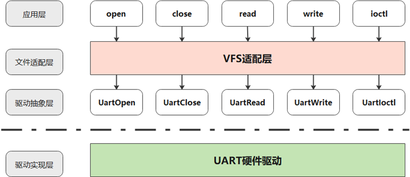

**Operating Mechanism<a name="section15524124212321"></a>**

The main development process of the UART driver is as follows:

1.  Loading the UART driver:

    The UART driver is loaded through the loading interface provided by the driver abstraction layer, and the system registers the driver during startup.

2.  Loading UART devices:

    UART devices are loaded by the system based on requirements and actual conditions.

3.  UART data sending and receiving:

    The driver abstraction layer provides bare read/write interfaces, and the file adaptation layer provides VFS file-based read/write.

### Development Guidelines<a name="ZH-CN_TOPIC_0000002511794430"></a>


#### Bare Read/Write UART<a name="ZH-CN_TOPIC_0000002511794262"></a>

The UART driver abstraction layer provides the following interfaces:

<a name="table633719329167"></a>
<table><thead align="left"><tr id="row1533716326164"><th class="cellrowborder" valign="top" width="53%" id="mcps1.1.3.1.1"><p id="p15337532101612"><a name="p15337532101612"></a><a name="p15337532101612"></a>Interface Name</p>
</th>
<th class="cellrowborder" valign="top" width="47%" id="mcps1.1.3.1.2"><p id="p2033718326165"><a name="p2033718326165"></a><a name="p2033718326165"></a>Description</p>
</th>
</tr>
</thead>
<tbody><tr id="row2337133219167"><td class="cellrowborder" valign="top" width="53%" headers="mcps1.1.3.1.1 "><p id="p63371232121612"><a name="p63371232121612"></a><a name="p63371232121612"></a>struct LosDevice *UartDevGetByPort(int num)</p>
</td>
<td class="cellrowborder" valign="top" width="47%" headers="mcps1.1.3.1.2 "><p id="p11337332161610"><a name="p11337332161610"></a><a name="p11337332161610"></a>Obtains the UART device by port number.</p>
</td>
</tr>
<tr id="row18337432161616"><td class="cellrowborder" valign="top" width="53%" headers="mcps1.1.3.1.1 "><p id="p123371232121614"><a name="p123371232121614"></a><a name="p123371232121614"></a>int UartOpen(struct LosDevice *dev)</p>
</td>
<td class="cellrowborder" valign="top" width="47%" headers="mcps1.1.3.1.2 "><p id="p18337193217164"><a name="p18337193217164"></a><a name="p18337193217164"></a>Opens the specified UART device.</p>
</td>
</tr>
<tr id="row163371332141619"><td class="cellrowborder" valign="top" width="53%" headers="mcps1.1.3.1.1 "><p id="p13337193211615"><a name="p13337193211615"></a><a name="p13337193211615"></a>int UartClose(struct LosDevice *dev)</p>
</td>
<td class="cellrowborder" valign="top" width="47%" headers="mcps1.1.3.1.2 "><p id="p14337103281617"><a name="p14337103281617"></a><a name="p14337103281617"></a>Closes the specified UART device.</p>
</td>
</tr>
<tr id="row23372321169"><td class="cellrowborder" valign="top" width="53%" headers="mcps1.1.3.1.1 "><p id="p2033718324168"><a name="p2033718324168"></a><a name="p2033718324168"></a>ssize_t UartRead(struct LosDevice *dev, char *buf, size_t count)</p>
</td>
<td class="cellrowborder" valign="top" width="47%" headers="mcps1.1.3.1.2 "><p id="p1333783213166"><a name="p1333783213166"></a><a name="p1333783213166"></a>Reads data from the specified UART device.</p>
</td>
</tr>
<tr id="row7337932151611"><td class="cellrowborder" valign="top" width="53%" headers="mcps1.1.3.1.1 "><p id="p4337113214161"><a name="p4337113214161"></a><a name="p4337113214161"></a>ssize_t UartWrite(struct LosDevice *dev, const char *buf, size_t count)</p>
</td>
<td class="cellrowborder" valign="top" width="47%" headers="mcps1.1.3.1.2 "><p id="p7337832141620"><a name="p7337832141620"></a><a name="p7337832141620"></a>Writes data to the specified UART device.</p>
</td>
</tr>
<tr id="row633763291617"><td class="cellrowborder" valign="top" width="53%" headers="mcps1.1.3.1.1 "><p id="p103371332181615"><a name="p103371332181615"></a><a name="p103371332181615"></a>int UartIoctl(struct LosDevice *dev, int cmd, unsigned long arg)</p>
</td>
<td class="cellrowborder" valign="top" width="47%" headers="mcps1.1.3.1.2 "><p id="p14337113217162"><a name="p14337113217162"></a><a name="p14337113217162"></a>Controls the specified UART device (the specific control modes supported are provided by the driver implementation layer of the UART controller).</p>
</td>
</tr>
<tr id="row17558115210205"><td class="cellrowborder" valign="top" width="53%" headers="mcps1.1.3.1.1 "><p id="p18558185242014"><a name="p18558185242014"></a><a name="p18558185242014"></a>int UartSuspend(struct LosDevice *dev)</p>
</td>
<td class="cellrowborder" valign="top" width="47%" headers="mcps1.1.3.1.2 "><p id="p3558145242015"><a name="p3558145242015"></a><a name="p3558145242015"></a>Suspends the specified UART device.</p>
</td>
</tr>
<tr id="row137142018172118"><td class="cellrowborder" valign="top" width="53%" headers="mcps1.1.3.1.1 "><p id="p187141618122116"><a name="p187141618122116"></a><a name="p187141618122116"></a>int UartResume(struct LosDevice *dev)</p>
</td>
<td class="cellrowborder" valign="top" width="47%" headers="mcps1.1.3.1.2 "><p id="p14714118182114"><a name="p14714118182114"></a><a name="p14714118182114"></a>Resumes the specified UART device.</p>
</td>
</tr>
<tr id="row775912362289"><td class="cellrowborder" valign="top" width="53%" headers="mcps1.1.3.1.1 "><p id="p1375933618284"><a name="p1375933618284"></a><a name="p1375933618284"></a>VOID UartEarlyInit(VOID);</p>
</td>
<td class="cellrowborder" valign="top" width="47%" headers="mcps1.1.3.1.2 "><p id="p118421121335"><a name="p118421121335"></a><a name="p118421121335"></a>Serial port initialization.</p>
</td>
</tr>
<tr id="row680220439286"><td class="cellrowborder" valign="top" width="53%" headers="mcps1.1.3.1.1 "><p id="p4802154342812"><a name="p4802154342812"></a><a name="p4802154342812"></a>VOID UartPuts(const CHAR *s, UINT32 len, BOOL isLock);</p>
</td>
<td class="cellrowborder" valign="top" width="47%" headers="mcps1.1.3.1.2 "><p id="p1480294392815"><a name="p1480294392815"></a><a name="p1480294392815"></a>Serial port output (system default).</p>
</td>
</tr>
<tr id="row1817834018284"><td class="cellrowborder" valign="top" width="53%" headers="mcps1.1.3.1.1 "><p id="p1017810403289"><a name="p1017810403289"></a><a name="p1017810403289"></a>VOID UartPutsReg(UINTPTR regBase, const CHAR *s, UINT32 len, BOOL isLock);</p>
</td>
<td class="cellrowborder" valign="top" width="47%" headers="mcps1.1.3.1.2 "><p id="p1094402818363"><a name="p1094402818363"></a><a name="p1094402818363"></a>Serial port output (with a user-specified base address).</p>
</td>
</tr>
</tbody>
</table>

#### File-Based UART Read/Write<a name="ZH-CN_TOPIC_0000002543394317"></a>

See "[VFS](VFS.md)". It supports the open, close, read, write, and ioctl operations.

#### Module Configuration<a name="ZH-CN_TOPIC_0000002511954394"></a>

Open the menu, go to Driver → Uart Type, and complete the configuration of the UART module.

<a name="table648144042712"></a>
<table><thead align="left"><tr id="row11481124022712"><th class="cellrowborder" valign="top" width="29.92%" id="mcps1.1.6.1.1"><p id="p448154011270"><a name="p448154011270"></a><a name="p448154011270"></a>Configuration Item</p>
</th>
<th class="cellrowborder" valign="top" width="26.529999999999998%" id="mcps1.1.6.1.2"><p id="p348234062713"><a name="p348234062713"></a><a name="p348234062713"></a>Description</p>
</th>
<th class="cellrowborder" valign="top" width="12.53%" id="mcps1.1.6.1.3"><p id="p74821740172717"><a name="p74821740172717"></a><a name="p74821740172717"></a>Value Range</p>
</th>
<th class="cellrowborder" valign="top" width="8.63%" id="mcps1.1.6.1.4"><p id="p1348234082710"><a name="p1348234082710"></a><a name="p1348234082710"></a>Default Value</p>
</th>
<th class="cellrowborder" valign="top" width="22.39%" id="mcps1.1.6.1.5"><p id="p048264010276"><a name="p048264010276"></a><a name="p048264010276"></a>Dependency</p>
</th>
</tr>
</thead>
<tbody><tr id="row44821440122711"><td class="cellrowborder" valign="top" width="29.92%" headers="mcps1.1.6.1.1 "><p id="p5482240192715"><a name="p5482240192715"></a><a name="p5482240192715"></a>LOSCFG_DRIVERS_SIMPLE_UART</p>
</td>
<td class="cellrowborder" valign="top" width="26.529999999999998%" headers="mcps1.1.6.1.2 "><p id="p7482154012717"><a name="p7482154012717"></a><a name="p7482154012717"></a>Simple UART; only output is supported.</p>
</td>
<td class="cellrowborder" valign="top" width="12.53%" headers="mcps1.1.6.1.3 "><p id="p14821440162711"><a name="p14821440162711"></a><a name="p14821440162711"></a>YES/NO</p>
</td>
<td class="cellrowborder" valign="top" width="8.63%" headers="mcps1.1.6.1.4 "><p id="p3482204012271"><a name="p3482204012271"></a><a name="p3482204012271"></a>YES</p>
</td>
<td class="cellrowborder" valign="top" width="22.39%" headers="mcps1.1.6.1.5 "><p id="p1348244022710"><a name="p1348244022710"></a><a name="p1348244022710"></a>None</p>
</td>
</tr>
<tr id="row3482114011279"><td class="cellrowborder" valign="top" width="29.92%" headers="mcps1.1.6.1.1 "><p id="p048234072720"><a name="p048234072720"></a><a name="p048234072720"></a>LOSCFG_DRIVERS_UART</p>
</td>
<td class="cellrowborder" valign="top" width="26.529999999999998%" headers="mcps1.1.6.1.2 "><p id="p15482340192714"><a name="p15482340192714"></a><a name="p15482340192714"></a>Complete UART; both input and output are supported.</p>
</td>
<td class="cellrowborder" valign="top" width="12.53%" headers="mcps1.1.6.1.3 "><p id="p12482164019271"><a name="p12482164019271"></a><a name="p12482164019271"></a>YES/NO</p>
</td>
<td class="cellrowborder" valign="top" width="8.63%" headers="mcps1.1.6.1.4 "><p id="p248214022719"><a name="p248214022719"></a><a name="p248214022719"></a>NO</p>
</td>
<td class="cellrowborder" valign="top" width="22.39%" headers="mcps1.1.6.1.5 "><p id="p174821740142712"><a name="p174821740142712"></a><a name="p174821740142712"></a>LOSCFG_DRIVERS_BASE</p>
</td>
</tr>
</tbody>
</table>

Go to Driver → Main Uart Driver to select the default serial port driver used for serial port output. The following configurations are available:

<a name="table183125371893"></a>
<table><thead align="left"><tr id="row1631263710915"><th class="cellrowborder" valign="top" width="34.59345934593459%" id="mcps1.1.4.1.1"><p id="p1591264018911"><a name="p1591264018911"></a><a name="p1591264018911"></a>Configuration Item</p>
</th>
<th class="cellrowborder" valign="top" width="34.153415341534156%" id="mcps1.1.4.1.2"><p id="p646264218915"><a name="p646264218915"></a><a name="p646264218915"></a>Description</p>
</th>
<th class="cellrowborder" valign="top" width="31.253125312531253%" id="mcps1.1.4.1.3"><p id="p17947451917"><a name="p17947451917"></a><a name="p17947451917"></a>Dependency</p>
</th>
</tr>
</thead>
<tbody><tr id="row2312937898"><td class="cellrowborder" valign="top" width="34.59345934593459%" headers="mcps1.1.4.1.1 "><p id="p155782919105"><a name="p155782919105"></a><a name="p155782919105"></a>LOSCFG_DRIVERS_UART_MAIN_ARM_PL011</p>
</td>
<td class="cellrowborder" valign="top" width="34.153415341534156%" headers="mcps1.1.4.1.2 "><p id="p9710162418104"><a name="p9710162418104"></a><a name="p9710162418104"></a>Uses ARM PL011 as the default serial port</p>
</td>
<td class="cellrowborder" valign="top" width="31.253125312531253%" headers="mcps1.1.4.1.3 "><p id="p196111417161012"><a name="p196111417161012"></a><a name="p196111417161012"></a>LOSCFG_DRIVERS_UART_ARM_PL011</p>
</td>
</tr>
<tr id="row12312203715913"><td class="cellrowborder" valign="top" width="34.59345934593459%" headers="mcps1.1.4.1.1 "><p id="p12091371013"><a name="p12091371013"></a><a name="p12091371013"></a>LOSCFG_DRIVERS_UART_MAIN_HQ_UART</p>
</td>
<td class="cellrowborder" valign="top" width="34.153415341534156%" headers="mcps1.1.4.1.2 "><p id="p13436103815105"><a name="p13436103815105"></a><a name="p13436103815105"></a>Uses the HQ UART series as the default serial port</p>
</td>
<td class="cellrowborder" valign="top" width="31.253125312531253%" headers="mcps1.1.4.1.3 "><p id="p293691910109"><a name="p293691910109"></a><a name="p293691910109"></a>LOSCFG_DRIVERS_UART_HQ_UART</p>
</td>
</tr>
<tr id="row153121037597"><td class="cellrowborder" valign="top" width="34.59345934593459%" headers="mcps1.1.4.1.1 "><p id="p155131015111011"><a name="p155131015111011"></a><a name="p155131015111011"></a>LOSCFG_DRIVERS_UART_MAIN_VUART_RPQ</p>
</td>
<td class="cellrowborder" valign="top" width="34.153415341534156%" headers="mcps1.1.4.1.2 "><p id="p12928113821017"><a name="p12928113821017"></a><a name="p12928113821017"></a>Uses the virtual UART as the default serial port</p>
</td>
<td class="cellrowborder" valign="top" width="31.253125312531253%" headers="mcps1.1.4.1.3 "><p id="p1221312229103"><a name="p1221312229103"></a><a name="p1221312229103"></a>LOSCFG_DRIVERS_UART_VUART_RPQ</p>
</td>
</tr>
</tbody>
</table>

### Programming Example<a name="ZH-CN_TOPIC_0000002511794258"></a>


#### simple uart<a name="ZH-CN_TOPIC_0000002543354379"></a>

Enable LOSCFG\_DRIVERS\_SIMPLE\_UART. The simple UART only supports output.

#### general uart<a name="ZH-CN_TOPIC_0000002511954300"></a>

Enable LOSCFG\_DRIVERS\_UART. The general UART supports both output and input.


##### Bare Read/Write UART<a name="ZH-CN_TOPIC_0000002511954438"></a>

**Example Description<a name="section793218575114"></a>**

1.  Obtain the UART device by port number.
2.  Open the serial port.
3.  Write to the serial port.
4.  Suspend the serial port.
5.  Resume the serial port.
6.  Close the serial port.

**Programming Example<a name="section199518012522"></a>**

```
#define BUF_SIZE 100

UINT32 TestCase(VOID)
{
    struct LosDevice *uartDev = NULL;
    int ret;
    ssize_t rtRet;
    char dataBuf[BUF_SIZE] = {"test uart\n"};

    uartDev = UartDevGetByPort(0);
    if (uartDev == NULL) {
        return LOS_NOK;
    }

    ret = UartOpen(uartDev);
    if (ret != 0) {
        return LOS_NOK;
    }

    rtRet = UartWrite(uartDev, dataBuf, BUF_SIZE);
    if (rtRet <= 0) {
        goto OUT_CLOSE;
    }

    ret = UartSuspend(uartDev);
    if (ret != 0) {
        goto OUT_CLOSE;
    }

    ret = UartResume(uartDev);
    if (ret != 0) {
        goto OUT_CLOSE;
    }

    ret = UartClose(uartDev);
    if (ret != 0) {
        return LOS_NOK;
    }

    return LOS_OK;

OUT_CLOSE:
    (VOID)UartClose(uartDev);
    return LOS_NOK;
}
```

##### File-Based UART Read/Write<a name="ZH-CN_TOPIC_0000002543354339"></a>

**Example Description<a name="section89818137128"></a>**

1.  Enable LOSCFG\_FS\_VFS.
2.  Open the serial port.
3.  Write to the serial port.
4.  Suspend the serial port.
5.  Resume the serial port.
6.  Close the serial port.

**Programming Example<a name="section489295395319"></a>**

```
#define BUF_SIZE 100
#define UART_DEV_PATH      "/dev/uartdev-0"

UINT32 TestCase(VOID)
{
    int ret;
    int fd;
    char dataBuf[BUF_SIZE] = {"test uart\n"};
    ssize_t writeLen;

    fd = open(UART_DEV_PATH, O_RDWR);
    if (fd == -1) {
        return LOS_NOK;
    }

    writeLen = write(fd, dataBuf, BUF_SIZE);
    if (writeLen <= 0) {
        goto OUT_CLOSE;
    }

    ret = ioctl(fd, Pl011_IOCTL_SUSPEND, 0);
    if (ret != 0) {
        goto OUT_CLOSE;
    }

    ret = ioctl(fd, Pl011_IOCTL_RESUME, 0);
    if (ret != 0) {
        goto OUT_CLOSE;
    }

    ret = close(fd);
    if (ret != 0) {
        return LOS_NOK;
    }

    return LOS_OK;

OUT_CLOSE:
    (VOID)close(fd);
    return LOS_NOK;
}
```

# Configuration Tool<a name="ZH-CN_TOPIC_0000002543354149"></a>


## Overview<a name="ZH-CN_TOPIC_0000002511794456"></a>

LiteOS uses Kconfig files to configure the system. The Kconfig language is a menu-based configuration language in which config.in and Kconfig files are written. LiteOS uses the Python kconfiglib library to parse and display Kconfig files. After the Kconfig files are parsed, a .config file is generated/updated in the root directory, and a menuconfig.h file is generated in the include folder of the development board. Before using menuconfig, you need to install Python and kconfiglib.

## Installing the Tools<a name="ZH-CN_TOPIC_0000002543394363"></a>

-   Install Python 2.7/3.2 or later.

    The following uses Python 3.10 as an example to describe the installation method.

    -   Installing via the command line:

        ```
        sudo apt-get install python3.10
        ```

    -   Installing by compiling the source package:
        1.  Download the [Python source package](https://www.python.org/ftp/python/3.10.2/Python-3.10.2.tgz) from the official website.
        2.  Decompress the source package.

            Decompress the package by running the following command. Replace the package name with the name of the source package actually downloaded:

            ```
            tar -xf Python-3.10.2.tgz
            ```

        3.  Check the dependencies.

            After decompression, enter the directory and run the ./configure command to check the dependencies required for compiling and installing Python:

            ```
            cd Python-3.10.2
            ./configure
            ```

            If no error is reported, proceed to the next step. If an error is reported, install the dependency as prompted.

        4.  Compile and install Python.

            ```
            sudo make
            sudo make install
            ```

        5.  Check the Python version and correctly link the python command.

            ```
            python --version
            ```

            If the displayed version is not the one just installed, run the following commands to correctly link the python command.

            1.  Obtain the Python directory. For example, for Python 3.10.2, run the following command.

                ```
                which python3.10
                ```

            2.  Link the python command to the Python package just installed.

                Replace "python3.10-path" in the following command with the path displayed after the which python3.10 command is executed:

                ```
                cd /usr/bin
                sudo rm python3 && sudo ln -s "python3.10-path" python3
                sudo rm python && sudo ln -s python3 python
                
                ```

            3.  Check the Python version again.

                ```
                python --version
                python3 --version
                ```

-   Install the pip package management tool.

    If the pip command does not exist, download the pip source package for installation. pip depends on setuptools. If setuptools does not exist, install it as well.

    -   Installing via the command line:

        ```
        sudo apt-get install python3-setuptools python3-pip -y
        sudo pip3 install --upgrade pip
        ```

    -   Installing via the source package:
        1.  Install setuptools.

            Click [setuptools source package download address](https://pypi.org/project/setuptools/) and install setuptools by referring to the following commands:

            ```
            sudo unzip setuptools-50.3.2.zip
            cd setuptools
            sudo python setup.py install
            ```

            > **Notice:** 
            >The latest setuptools version does not support Python 2.7. If you are using Python 2.7, download [setuptools 45.0.0](https://pypi.org/project/setuptools/45.0.0/#files) to support Python 2.7.

        2.  Install pip.

            Click [pip source package download address](https://pypi.org/project/pip/) and install pip by referring to the following commands:

            ```
            sudo tar -xf pip-20.2.4.tar.gz
            cd pip-20.2.4
            sudo python setup.py install
            ```

-   Install the kconfiglib library.
    -   If the server has network access.

        You can install kconfiglib by running the following command:

        ```
        sudo pip install kconfiglib
        ```

    -   If the server does not have network access.

        You can install kconfiglib offline. First, [download kconfiglib](https://pypi.org/project/kconfiglib/#files) in another environment with network access. You can download the kconfiglib wheel file kconfiglib-14.1.0-py2.py3-none-any.whl or the source code file kconfiglib-14.1.0.tar.gz. Version 14.1.0 is used as an example here.

        1.  To install the wheel file, refer to the following command:

            ```
            sudo pip install kconfiglib-14.1.0-py2.py3-none-any.whl
            ```

        2.  To install the source code file, refer to the following commands:

            ```
            sudo tar -zxvf kconfiglib-14.1.0.tar.gz
            cd kconfiglib-14.1.0
            sudo python setup.py install
            ```

## Usage Guidelines<a name="ZH-CN_TOPIC_0000002543394321"></a>

Before using the menuconfig configuration tool, ensure that the cross-compiler toolchain for compiling LiteOS has been installed and added to the environment variables.

To meet different usage scenarios, the configuration tool supports the following commands. Based on the usage scenario, run one of the following commands in the root directory. Before running the command, copy the default configuration file ${platform}.config from the self\_src/tools/build/config/ directory to the root directory according to the development board, and rename it to .config. In addition to the .config file, there is another important configuration file, build/menuconfig/config.in (which contains the Kconfig files of each module). The .config file determines the default values of the configuration items, and the config.in file determines the configuration items displayed in the graphical interface.

## Opening the menuconfig Menu<a name="ZH-CN_TOPIC_0000002511794210"></a>

Running the make menuconfig command or ./build/build\_cmake.sh menuconfig in the LiteOS root directory displays the graphical configuration interface, where you can add or remove modules or modify settings as needed. After you save the menu and exit, the command updates the .config file in the root directory.

The menuconfig usage is as follows:

-   Up and Down arrow keys: select different rows, that is, move to different options.
-   Spacebar/Enter: enable or disable an option.
    1.  Enabling an option: "[ * ]" is displayed before the option. An asterisk in the brackets indicates that the option is enabled.
    2.  Disabling an option: only "[ ]" is displayed before the option, with nothing inside the brackets.
    3.  If an option is followed by three hyphens and a right arrow (--->), it means that the option has sub-options. Press the Spacebar/Enter to enter the submenu.

-   ESC key: return to the previous menu, or exit menuconfig and be prompted to save.

-   Question mark (?): display the help information of the configuration item.
-   Slash (/): enter the configuration item search interface, which supports searching for configuration items.
-   Letter F: enter help mode. The help information of the configuration item is displayed at the bottom of the interface. Enter F again to exit this mode.
-   Letter C: enter name mode. In this mode, the macro definition switch corresponding to the configuration item is displayed. Enter C again to exit this mode.
-   Letter A: enter all mode. In this mode, all sub-options in the menu are expanded and displayed. Enter A again to exit this mode.
-   Letter S: save the configuration items.
-   Letter Q: exit menuconfig and be prompted to save.

> **Note:** 
>-   The letters above are case-insensitive.
>-   Press the Slash (/) to enter the search interface, and enter the macro definition of the configuration item to search in the input box. For example, to search for LOSCFG\_BASE\_IPC\_SEM, enter this macro definition. The configuration items matching this keyword are automatically listed. Select the required configuration item and press Enter to enter it.
>    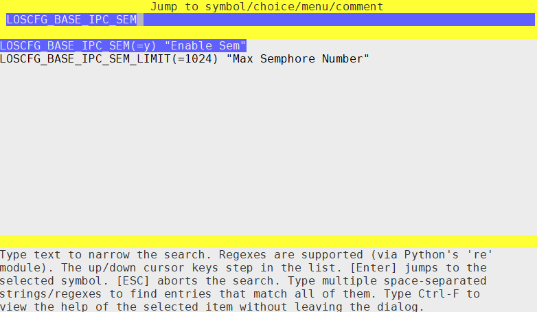

## Saving the savemenuconfig Menu<a name="ZH-CN_TOPIC_0000002543354245"></a>

For the Make build tool: running the make savemenuconfig command in the LiteOS root directory parses the .config file in the root directory and generates the menuconfig.h file in the include subdirectory of the corresponding LiteOS development board project.

For the CMake build tool: running ./build/build\_cmake.sh savemenuconfig in the LiteOS root directory parses the .config file in the root directory and generates the menuconfig.h file in the buildcmakeout/xxx/ subdirectory of the corresponding LiteOS development board project.

## make defconfig<a name="ZH-CN_TOPIC_0000002543394409"></a>

Running the make defconfig command in the LiteOS root directory parses the .config file in the root directory (CMake does not currently support this function), makes all configuration items use their default configurations as much as possible, updates .config, and generates menuconfig.h in the include subdirectory of the corresponding LiteOS development board project.

## make allyesconfig<a name="ZH-CN_TOPIC_0000002511954416"></a>

Running the make allyesconfig command in the LiteOS root directory parses the .config file in the root directory (CMake does not currently support this function), enables all configuration items as much as possible, that is, sets them to Y, updates .config, and generates menuconfig.h in the include subdirectory of the corresponding LiteOS development board project.

## make allnoconfig<a name="ZH-CN_TOPIC_0000002511954272"></a>

Running the make allnoconfig command in the LiteOS root directory parses the .config file in the root directory (CMake does not currently support this function), disables all configuration items as much as possible, that is, sets them to "is not set", updates .config, and generates menuconfig.h in the include subdirectory of the corresponding LiteOS development board project.

## Configuration Item Description<a name="ZH-CN_TOPIC_0000002543354215"></a>


### Configuration Item Introduction<a name="ZH-CN_TOPIC_0000002511954250"></a>

Run make menuconfig to enter the main interface of LiteOS Configuration, which currently provides the Compiler, Targets, Kernel, Debug, and SSP options. The Compiler, Targets, and SSP options are described below. The other options are described in their respective module chapters and are not repeated here.

### Compiler Configuration<a name="ZH-CN_TOPIC_0000002543354289"></a>

The Compiler option contains two submenus: Compiler cross-compiler toolchain and Optimize Option compile optimization options.

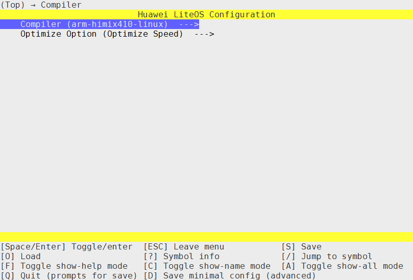

-   Multiple cross-compilers are available, including arm-himix410-linux and arm-none-eabi-, among others. Select the compiler actually used.
-   Three compile optimization options are available: Optimize None (no compile optimization), Optimize Speed (optimize compilation speed), and Optimize Size (optimize the compiled size).

### Targets Configuration<a name="ZH-CN_TOPIC_0000002543354207"></a>

The Targets option contains Family (product), Board (chip), Enable Floating Pointer Unit (enable floating-point numbers), and Enable Access Permission Control (enable access permission control).

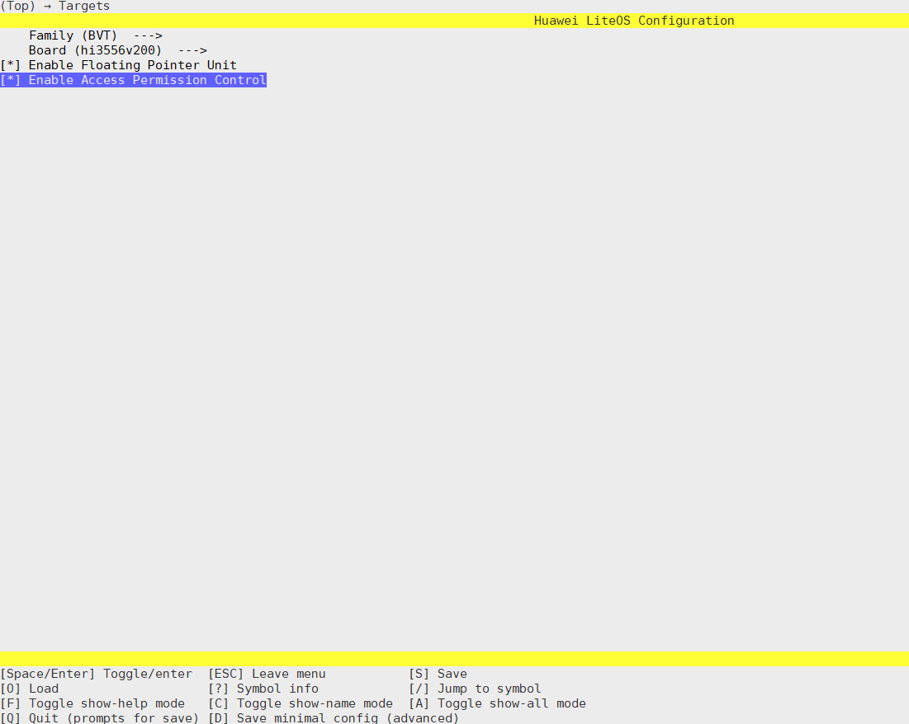

-   Family: select the product. BVT, DPT, and AIOT are product names, SECRET is a confidential project, and QEMU and STM32 are used internally by LiteOS.
-   Board: select the specific chip. Currently, Hi3161, Hi3372, Hi3322, and Hi1A21, among others, are supported.
-   Enable Access Permission Control: enable access permission control. The corresponding memory management unit can be enabled based on the architecture, including the PMP under RISC-V.

**Configuration Item Description<a name="section5828165914413"></a>**

Open the menu and enter the Targets menu. The related configuration items are described as follows. You can search for the specific location of a configuration item by its name.

<a name="table4672191322515"></a>
<table><thead align="left"><tr id="row1367271362515"><th class="cellrowborder" valign="top" width="25.369999999999997%" id="mcps1.1.6.1.1"><p id="p2672141310259"><a name="p2672141310259"></a><a name="p2672141310259"></a>Configuration Item</p>
</th>
<th class="cellrowborder" valign="top" width="37.43%" id="mcps1.1.6.1.2"><p id="p06727132259"><a name="p06727132259"></a><a name="p06727132259"></a>Meaning</p>
</th>
<th class="cellrowborder" valign="top" width="12.01%" id="mcps1.1.6.1.3"><p id="p56723138253"><a name="p56723138253"></a><a name="p56723138253"></a>Value Range</p>
</th>
<th class="cellrowborder" valign="top" width="13.020000000000001%" id="mcps1.1.6.1.4"><p id="p16726137252"><a name="p16726137252"></a><a name="p16726137252"></a>Default Value</p>
</th>
<th class="cellrowborder" valign="top" width="12.17%" id="mcps1.1.6.1.5"><p id="p1367231318251"><a name="p1367231318251"></a><a name="p1367231318251"></a>Architecture</p>
</th>
</tr>
</thead>
<tbody><tr id="row186720138253"><td class="cellrowborder" valign="top" width="25.369999999999997%" headers="mcps1.1.6.1.1 "><p id="p15456015216"><a name="p15456015216"></a><a name="p15456015216"></a>LOSCFG_ARCH_SECURE_MONITOR_MODE</p>
</td>
<td class="cellrowborder" valign="top" width="37.43%" headers="mcps1.1.6.1.2 "><p id="p654550192119"><a name="p654550192119"></a><a name="p654550192119"></a>Runs the OS in EL3</p>
</td>
<td class="cellrowborder" valign="top" width="12.01%" headers="mcps1.1.6.1.3 "><p id="p454560162112"><a name="p454560162112"></a><a name="p454560162112"></a>YES/NO</p>
</td>
<td class="cellrowborder" valign="top" width="13.020000000000001%" headers="mcps1.1.6.1.4 "><p id="p14545507211"><a name="p14545507211"></a><a name="p14545507211"></a>NO</p>
</td>
<td class="cellrowborder" rowspan="4" valign="top" width="12.17%" headers="mcps1.1.6.1.5 "><p id="p16514123419572"><a name="p16514123419572"></a><a name="p16514123419572"></a>ARM64</p>
</td>
</tr>
<tr id="row11673513102514"><td class="cellrowborder" valign="top" headers="mcps1.1.6.1.1 "><p id="p17813191592220"><a name="p17813191592220"></a><a name="p17813191592220"></a>LOSCFG_ARCH_NON_SECURE_OS_MODE</p>
</td>
<td class="cellrowborder" valign="top" headers="mcps1.1.6.1.2 "><p id="p33750772113"><a name="p33750772113"></a><a name="p33750772113"></a>Runs the OS in non-secure Guest OS mode (EL1-NS)</p>
</td>
<td class="cellrowborder" valign="top" headers="mcps1.1.6.1.3 "><p id="p7375147192110"><a name="p7375147192110"></a><a name="p7375147192110"></a>YES/NO</p>
</td>
<td class="cellrowborder" valign="top" headers="mcps1.1.6.1.4 "><p id="p1137516716213"><a name="p1137516716213"></a><a name="p1137516716213"></a>NO</p>
</td>
</tr>
<tr id="row4673171302510"><td class="cellrowborder" valign="top" headers="mcps1.1.6.1.1 "><p id="p613119547224"><a name="p613119547224"></a><a name="p613119547224"></a>LOSCFG_ARCH_SECURE_OS_MODE</p>
</td>
<td class="cellrowborder" valign="top" headers="mcps1.1.6.1.2 "><p id="p208915310216"><a name="p208915310216"></a><a name="p208915310216"></a>Runs the OS in secure Guest OS mode (EL1-S)</p>
</td>
<td class="cellrowborder" valign="top" headers="mcps1.1.6.1.3 "><p id="p5891331211"><a name="p5891331211"></a><a name="p5891331211"></a>YES/NO</p>
</td>
<td class="cellrowborder" valign="top" headers="mcps1.1.6.1.4 "><p id="p88912312213"><a name="p88912312213"></a><a name="p88912312213"></a>NO</p>
</td>
</tr>
<tr id="row2825043175717"><td class="cellrowborder" valign="top" headers="mcps1.1.6.1.1 "><p id="p36864875713"><a name="p36864875713"></a><a name="p36864875713"></a>LOSCFG_ARCH_ARM_AARCH64_LSE_ATOMIC</p>
</td>
<td class="cellrowborder" valign="top" headers="mcps1.1.6.1.2 "><p id="p116814835720"><a name="p116814835720"></a><a name="p116814835720"></a>Enables the ARMv8.1-LSE Atomic instruction set extension</p>
</td>
<td class="cellrowborder" valign="top" headers="mcps1.1.6.1.3 "><p id="p5681548175716"><a name="p5681548175716"></a><a name="p5681548175716"></a>YES/NO</p>
</td>
<td class="cellrowborder" valign="top" headers="mcps1.1.6.1.4 "><p id="p1268174815574"><a name="p1268174815574"></a><a name="p1268174815574"></a>YES</p>
</td>
</tr>
<tr id="row1288213171115"><td class="cellrowborder" valign="top" width="25.369999999999997%" headers="mcps1.1.6.1.1 "><p id="p788213171818"><a name="p788213171818"></a><a name="p788213171818"></a>LOSCFG_ARCH_ARM_SVE2</p>
</td>
<td class="cellrowborder" valign="top" width="37.43%" headers="mcps1.1.6.1.2 "><p id="p15882717017"><a name="p15882717017"></a><a name="p15882717017"></a>Enables the ARMv8.2 SVE parallelization function</p>
</td>
<td class="cellrowborder" valign="top" width="12.01%" headers="mcps1.1.6.1.3 "><p id="p888219175114"><a name="p888219175114"></a><a name="p888219175114"></a>YES/NO</p>
</td>
<td class="cellrowborder" valign="top" width="13.020000000000001%" headers="mcps1.1.6.1.4 "><p id="p088211171618"><a name="p088211171618"></a><a name="p088211171618"></a>NO</p>
</td>
<td class="cellrowborder" valign="top" width="12.17%" headers="mcps1.1.6.1.5 "><p id="p788216172119"><a name="p788216172119"></a><a name="p788216172119"></a>ARM64</p>
</td>
</tr>
</tbody>
</table>

> **Notice:** 
>The OS running mode needs to be adapted by the target. The specific modes available are subject to the delivered mode.

### SSP Configuration<a name="ZH-CN_TOPIC_0000002511954204"></a>

Select the "Stack Smashing Protector (SSP) Compiler Feature" option to enable or disable the stack protection function.

-   -fno-stack-protector: disables stack protection.
-   -fstack-protector: enables stack protection. If a C or C++ function has a char array (an array with a size of at least 4 bytes) in its local variables and the array will not be optimized away, the compiler inserts protection code for the function.
-   -fstack-protector-strong: enables stack protection. If a C or C++ function has an array definition that will not be optimized away, or if there is an address reference to a local variable, the compiler inserts protection code for the function (default option).
-   -fstack-protector-all: inserts protection code for all C or C++ functions. Compared with the previous option, it may significantly increase the performance overhead.

    The -fstack-protector option is recommended because it enhances security while taking performance into account.

-   ArchStackGuardInit: LiteOS only provides a pseudo-random canary value. Vendors need to adapt true randomness to ensure security.

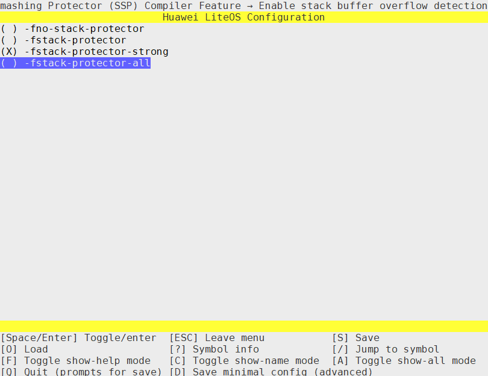

> **Notice:** 
>LiteOS provides the weak function ArchStackGuardInit, which initializes \_\_stack\_chk\_guard with pseudo-random numbers. If you need true random numbers, you must redefine ArchStackGuardInit. In addition, some architectures have no random seed and cannot generate pseudo-random numbers. Therefore, you must verify the randomness of \_\_stack\_chk\_guard yourself.

### NX Configuration<a name="ZH-CN_TOPIC_0000002511954392"></a>

The "Enable Data Sec NX Feature" option can enable or disable the non-executable data segment function.

-   When this option is selected, it is recommended to use the linker script provided by the system. If the system linker script is not used, you need to write a private linker script by referring to the system linker script.
-   This option takes effect only on architectures that support MMU. For architectures that do not support MMU, implement NX by yourself during initialization.

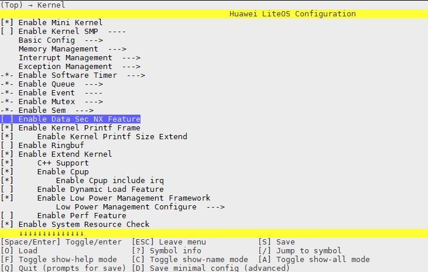

# Maintainability and Testability<a name="ZH-CN_TOPIC_0000002511794306"></a>


## Shell<a name="ZH-CN_TOPIC_0000002511794384"></a>


### Overview<a name="ZH-CN_TOPIC_0000002511954200"></a>

**Basic Concepts<a name="section62024452101623"></a>**

LiteOS provides a Shell command line through which you can access the functions or services of the operating system in an interactive command-line manner: it receives and parses the commands entered by users, and processes the output of the operating system.

**LiteOS Shell<a name="section189461456194614"></a>**

The Shell provided by LiteOS serves as an online debugging tool. It supports common basic debugging functions, including commands related to the system, files, network, dynamic loading, and Trace. In addition, the LiteOS Shell supports custom commands added as needed.

-   System-related commands: query system tasks, kernel semaphores, system software timers, CPU usage, current interrupts, and other related information. For details, see "[System Command Reference](system_command_reference.md)".
-   File-related commands: in addition to basic functions such as ls and cd, sync is supported. sync synchronizes cached data (file system data) to the SD card or Flash. For details, see "[File Command Reference](file_command_reference.md)".
-   Dynamic loading-related commands: load obj or so files, and directly call related functions by searching for the function addresses of the loaded obj or so files. You can also unload obj or so files.
-   Trace-related commands: start/stop Trace, set Trace events, output Trace buffer data, and so on. For details, see "[Trace Command Reference](trace_command_reference.md)".

### Development Guidelines<a name="ZH-CN_TOPIC_0000002543394337"></a>

**Usage Scenarios<a name="section51151648213255"></a>**

Shell commands can be entered through the serial port, Telnet, or a custom tool. Newly added custom commands can only be executed after recompilation and relinking.

**Functions<a name="section22370004105841"></a>**

1.  For the Shell commands provided by LiteOS, see the "[System Command Reference](system_command_reference.md)" chapter below.
2.  The LiteOS Shell module provides the following interfaces for users. For details about the interfaces, see the API reference.

    <a name="table5999158320325"></a>
    <table><thead align="left"><tr id="row2323990220325"><th class="cellrowborder" valign="top" width="20.712071207120715%" id="mcps1.1.4.1.1"><p id="p1748969020325"><a name="p1748969020325"></a><a name="p1748969020325"></a>Function Category</p>
    </th>
    <th class="cellrowborder" valign="top" width="24.602460246024602%" id="mcps1.1.4.1.2"><p id="p5025139720325"><a name="p5025139720325"></a><a name="p5025139720325"></a>Interface Name</p>
    </th>
    <th class="cellrowborder" valign="top" width="54.68546854685468%" id="mcps1.1.4.1.3"><p id="p2204176620325"><a name="p2204176620325"></a><a name="p2204176620325"></a>Description</p>
    </th>
    </tr>
    </thead>
    <tbody><tr id="row1839119416414"><td class="cellrowborder" rowspan="2" valign="top" width="20.712071207120715%" headers="mcps1.1.4.1.1 "><p id="p695912961416"><a name="p695912961416"></a><a name="p695912961416"></a>Registering Commands</p>
    </td>
    <td class="cellrowborder" valign="top" width="24.602460246024602%" headers="mcps1.1.4.1.2 "><p id="p14457102619145"><a name="p14457102619145"></a><a name="p14457102619145"></a>SHELLCMD_ENTRY</p>
    </td>
    <td class="cellrowborder" valign="top" width="54.68546854685468%" headers="mcps1.1.4.1.3 "><p id="p17391204116414"><a name="p17391204116414"></a><a name="p17391204116414"></a>Statically registers a command</p>
    </td>
    </tr>
    <tr id="row795992971416"><td class="cellrowborder" valign="top" headers="mcps1.1.4.1.1 "><p id="p5959329101415"><a name="p5959329101415"></a><a name="p5959329101415"></a>osCmdReg</p>
    </td>
    <td class="cellrowborder" valign="top" headers="mcps1.1.4.1.2 "><p id="p1959192991411"><a name="p1959192991411"></a><a name="p1959192991411"></a>Dynamically registers a command</p>
    </td>
    </tr>
    </tbody>
    </table>

    > **Note:** 
    >Static command registration is generally used to register common system commands, and dynamic command registration is generally used to register user commands.
    >A statically registered command has five input parameters, while a dynamically registered command has four. Except for the first input parameter, which is unique to static registration, the remaining four input parameters are the same for both registration methods.
    >-   First input parameter: command variable name, used to set the link option (the LITEOS\_TABLES\_LDFLAGS variable in build/make/liteos\_tables\_ldflags.mk). For example, if the variable name is ls\_shellcmd, the link option should be set to: LITEOS\_TABLES\_LDFLAGS += -uls\_shellcmd. This input parameter is unique to static registration; it does not exist in dynamic registration.
    >-   Second input parameter: command type. Currently, two command types are supported.
    >    -   CMD\_TYPE\_EX: does not support standard command parameter input, and shields the command keyword entered by the user. For example, if "ls /ramfs" is entered, only "/ramfs" is passed to the command processing function, corresponding to argv\[0\] in the command processing function, and the ls command keyword is not passed in.
    >    -   CMD\_TYPE\_STD: supports standard command parameter input. All entered characters are passed in after command parsing. For example, if "ls /ramfs" is entered, both "ls" and "/ramfs" are passed to the command processing function, corresponding to argv\[0\] and argv\[1\] in the command processing function, respectively.
    >-   Third input parameter: command keyword, the name of the command processing function in the Shell. **Command keywords must be unique**, that is, two different command items cannot share the same command keyword; otherwise, only one of them will be executed. When the Shell executes user commands, if multiple commands have the same command keyword, only the one listed first in the help command output will be executed.
    >-   Fourth input parameter: maximum number of input parameters of the command processing function.
    >    -   Not supported for statically registered commands for now.
    >    -   For dynamically registered commands, the maximum number of input parameters can be set to no more than 32, or set to XARGS (defined as 0xFFFFFFFF in the code) to indicate no limit on the number of parameters.
    >-   Fifth input parameter: name of the command processing function, that is, the function called when the command is executed in the Shell.

**Configuration Items<a name="section1161804935819"></a>**

Open menuconfig, go to Debug ---\> Enable a Debug Version ---\> Enable Shell, and complete the Shell configuration.

<a name="table1813095045911"></a>
<table><thead align="left"><tr id="row1913095035911"><th class="cellrowborder" valign="top" width="25.25%" id="mcps1.1.6.1.1"><p id="p17130175013598"><a name="p17130175013598"></a><a name="p17130175013598"></a>Configuration Item</p>
</th>
<th class="cellrowborder" valign="top" width="27.939999999999998%" id="mcps1.1.6.1.2"><p id="p313019506593"><a name="p313019506593"></a><a name="p313019506593"></a>Meaning</p>
</th>
<th class="cellrowborder" valign="top" width="13.26%" id="mcps1.1.6.1.3"><p id="p10130105012592"><a name="p10130105012592"></a><a name="p10130105012592"></a>Value Range</p>
</th>
<th class="cellrowborder" valign="top" width="10.83%" id="mcps1.1.6.1.4"><p id="p7130205019593"><a name="p7130205019593"></a><a name="p7130205019593"></a>Default Value</p>
</th>
<th class="cellrowborder" valign="top" width="22.720000000000002%" id="mcps1.1.6.1.5"><p id="p25049101933"><a name="p25049101933"></a><a name="p25049101933"></a>Dependency</p>
</th>
</tr>
</thead>
<tbody><tr id="row101311250135920"><td class="cellrowborder" valign="top" width="25.25%" headers="mcps1.1.6.1.1 "><p id="p81312050105917"><a name="p81312050105917"></a><a name="p81312050105917"></a>LOSCFG_SHELL</p>
</td>
<td class="cellrowborder" valign="top" width="27.939999999999998%" headers="mcps1.1.6.1.2 "><p id="p1213185095911"><a name="p1213185095911"></a><a name="p1213185095911"></a>Switch for scaling the Shell function</p>
</td>
<td class="cellrowborder" valign="top" width="13.26%" headers="mcps1.1.6.1.3 "><p id="p171317509593"><a name="p171317509593"></a><a name="p171317509593"></a>YES/NO</p>
</td>
<td class="cellrowborder" valign="top" width="10.83%" headers="mcps1.1.6.1.4 "><p id="p0131165014591"><a name="p0131165014591"></a><a name="p0131165014591"></a>YES</p>
</td>
<td class="cellrowborder" valign="top" width="22.720000000000002%" headers="mcps1.1.6.1.5 "><p id="p8504141016310"><a name="p8504141016310"></a><a name="p8504141016310"></a>LOSCFG_DEBUG_VERSION(=y)  &amp;&amp; LOSCFG_DRIVERS_UART(=y)</p>
</td>
</tr>
<tr id="row3131175017594"><td class="cellrowborder" valign="top" width="25.25%" headers="mcps1.1.6.1.1 "><p id="p111311850165920"><a name="p111311850165920"></a><a name="p111311850165920"></a>LOSCFG_SHELL_CONSOLE (this configuration item is not available in the open-source version)</p>
</td>
<td class="cellrowborder" valign="top" width="27.939999999999998%" headers="mcps1.1.6.1.2 "><p id="p713115085919"><a name="p713115085919"></a><a name="p713115085919"></a>Sets the Shell to interact directly with the Console</p>
</td>
<td class="cellrowborder" valign="top" width="13.26%" headers="mcps1.1.6.1.3 "><p id="p1313195018593"><a name="p1313195018593"></a><a name="p1313195018593"></a>YES/NO</p>
</td>
<td class="cellrowborder" valign="top" width="10.83%" headers="mcps1.1.6.1.4 "><p id="p3131650135913"><a name="p3131650135913"></a><a name="p3131650135913"></a>YES</p>
</td>
<td class="cellrowborder" valign="top" width="22.720000000000002%" headers="mcps1.1.6.1.5 "><p id="p135047101932"><a name="p135047101932"></a><a name="p135047101932"></a>LOSCFG_SHELL(=y)</p>
</td>
</tr>
<tr id="row2131650135914"><td class="cellrowborder" valign="top" width="25.25%" headers="mcps1.1.6.1.1 "><p id="p11311150125915"><a name="p11311150125915"></a><a name="p11311150125915"></a>LOSCFG_SHELL_UART</p>
</td>
<td class="cellrowborder" valign="top" width="27.939999999999998%" headers="mcps1.1.6.1.2 "><p id="p3131115095911"><a name="p3131115095911"></a><a name="p3131115095911"></a>Sets the Shell to interact directly with the UART driver</p>
</td>
<td class="cellrowborder" valign="top" width="13.26%" headers="mcps1.1.6.1.3 "><p id="p1613195015917"><a name="p1613195015917"></a><a name="p1613195015917"></a>YES/NO</p>
</td>
<td class="cellrowborder" valign="top" width="10.83%" headers="mcps1.1.6.1.4 "><p id="p1513145015916"><a name="p1513145015916"></a><a name="p1513145015916"></a>NO</p>
</td>
<td class="cellrowborder" valign="top" width="22.720000000000002%" headers="mcps1.1.6.1.5 "><p id="p14504141014319"><a name="p14504141014319"></a><a name="p14504141014319"></a>LOSCFG_DRIVERS_UART(=y)</p>
</td>
</tr>
<tr id="row18786113111210"><td class="cellrowborder" valign="top" width="25.25%" headers="mcps1.1.6.1.1 "><p id="p127869310124"><a name="p127869310124"></a><a name="p127869310124"></a>LOSCFG_SHELL_VENDOR</p>
</td>
<td class="cellrowborder" valign="top" width="27.939999999999998%" headers="mcps1.1.6.1.2 "><p id="p3786143118124"><a name="p3786143118124"></a><a name="p3786143118124"></a>Sets the Shell to interact in a custom manner</p>
</td>
<td class="cellrowborder" valign="top" width="13.26%" headers="mcps1.1.6.1.3 "><p id="p878623161214"><a name="p878623161214"></a><a name="p878623161214"></a>YES/NO</p>
</td>
<td class="cellrowborder" valign="top" width="10.83%" headers="mcps1.1.6.1.4 "><p id="p97868310123"><a name="p97868310123"></a><a name="p97868310123"></a>NO</p>
</td>
<td class="cellrowborder" valign="top" width="22.720000000000002%" headers="mcps1.1.6.1.5 "><p id="p8786183114120"><a name="p8786183114120"></a><a name="p8786183114120"></a>LOSCFG_SHELL(=y)</p>
</td>
</tr>
</tbody>
</table>

**Process for Adding a New Command<a name="section16774813105841"></a>**

The following uses the system command ls as an example to describe the typical process for adding a new Shell command.

1.  Define the Shell command processing function.

    The Shell command processing function is used to process registered commands. For example, define a command processing function osShellCmdLs to process the ls command, and declare the prototype of the command processing function in a header file.

    ```
    int osShellCmdLs(int argc, const char **argv);
    ```

    > **Notice:** 
    >The parameters of the command processing function are similar to those of the main function in the C language, including two input parameters:
    >-   argc: number of parameters of the Shell command. Whether the command keyword is included in the number depends on the command type used for registration.
    >-   argv: pointer array, each element of which points to a string. The string is the parameter passed to the command processing function when the Shell command is executed. Whether the command keyword is included in the parameters depends on the command type used for registration.

2.  Register the command.

    There are two registration methods: static registration and dynamic registration during system runtime.

    -   Statically registering the ls command:

        ```
        #include "shcmd.h"
        SHELLCMD_ENTRY(ls_shellcmd, CMD_TYPE_EX, "ls", XARGS, (CMD_CBK_FUNC)osShellCmdLs);
        ```

    -   Dynamically registering the ls command:

        ```
        #include "shell.h"
        osCmdReg(CMD_TYPE_EX, "ls", XARGS, (CMD_CBK_FUNC)osShellCmdLs);
        ```

3.  For static registration, set the link option (the LITEOS\_TABLES\_LDFLAGS variable) in build/make/liteos\_tables\_ldflags.mk.
4.  Open the menu to enable Shell. For details, see [Configuration Items](#section1161804935819).
5.  After the system is compiled and flashed, you can execute the new Shell command.

### Precautions<a name="ZH-CN_TOPIC_0000002511954256"></a>

-   English input is supported in the default mode. If Chinese characters are entered in UTF-8 format, they can only be deleted by pressing Backspace three times.
-   Tab-key auto-completion is supported for Shell commands, file names, and directory names. If there are multiple matches, the common characters are completed and all matches are printed. If there are too many matches (more than 24 lines to print), a prompt is displayed (Display all num possibilities? (y/n)). Enter y to print all matches, or n to exit printing. After selecting to print all matches and printing more than 24 lines, the --More-- prompt is displayed. At this point, press Enter to continue printing, or press q to exit (Ctrl+c is also supported for exiting).
-   It is not recommended to use Shell commands to operate device files in the /dev directory, as this may cause unpredictable results.
-   The Shell is a debugging function and is disabled by default. It is prohibited to use this function in commercial products.
-   Disclaimer: Huawei does not bear any risk arising from the use of this function in commercial products.

### Static Registration Programming Example<a name="ZH-CN_TOPIC_0000002511794436"></a>

**Example Description<a name="section12652506102830"></a>**

This example demonstrates how to add a Shell command named test through static command registration. The Make build tool is used as an example.

1.  Define a command processing function cmd\_test to be called by the new command.
2.  Use the SHELLCMD\_ENTRY function to add the new command item.
3.  Add the link parameter for the new command item in liteos\_tables\_ldflags.mk.
4.  Open the menu to enable Shell.
5.  Recompile the code and run it.

**Programming Example<a name="section15395384102858"></a>**

1.  Define the command processing function cmd\_test to be called by the command:

    ```
    #include "shell.h"
    #include "shcmd.h"
    
    int cmd_test(void)
    {
        printf("hello everybody!\n");
        return 0;
    }
    ```

2.  Add the new command item:

    ```
    SHELLCMD_ENTRY(test_shellcmd, CMD_TYPE_EX, "test", 0, (CMD_CBK_FUNC)cmd_test);
    ```

3.  Add the link parameter for the new command item in the link option:

    Add "-utest\_shellcmd" under the LITEOS\_TABLES\_LDFLAGS item in build/make/liteos\_tables\_ldflags.mk.

4.  Open the menu to enable Shell, that is, set LOSCFG\_SHELL=y.
5.  Recompile the code:

    ```
    make clean;make
    ```

**Result Verification<a name="section6553141911578"></a>**

After flashing the new system image, restart the system. Run the help command to view all registered commands in the current system. You can see that the test command has been registered.

### Dynamic Registration Programming Example<a name="ZH-CN_TOPIC_0000002511794246"></a>

**Example Description<a name="section34072723104457"></a>**

This example demonstrates how to add a Shell command named test through dynamic command registration. The Make build tool is used as an example.

1.  Define a command processing function cmd\_test to be called by the new command.
2.  Use the osCmdReg function to add the new command item.
3.  Open the menu to enable Shell.
4.  Recompile the code and run it.

**Programming Example<a name="section10666408193750"></a>**

1.  Define the command processing function cmd\_test to be called by the command:

    ```
    #include "shell.h"
    #include "shcmd.h"
    
    int cmd_test(void)
    {
        printf("hello everybody!\n");
        return 0;
    }
    ```

2.  Call the osCmdReg function in the app\_init function to dynamically register the command:

    ```
    void app_init(void)
    {
         ....
         ....
         osCmdReg(CMD_TYPE_EX, "test", 0,(CMD_CBK_FUNC)cmd_test);
         ....
    }
    ```

3.  Open the menu to enable Shell, that is, set LOSCFG\_SHELL=y.
4.  Recompile the code:

    ```
    make clean;make
    ```

**Result Verification<a name="section6553141911578"></a>**

After flashing the new system image, restart the system. Run the help command to view all registered commands in the current system. You can see that the test command has been registered.

### System Command Reference<a name="ZH-CN_TOPIC_0000002511954282"></a>


#### Enabling System Commands<a name="ZH-CN_TOPIC_0000002543354303"></a>

Before using system commands in the Shell, open menuconfig to enable Shell. For details, see "[Configuration Items](development_guide-162.md#section1161804935819)".

#### help<a name="ZH-CN_TOPIC_0000002543354345"></a>

**Command Function<a name="section54470097115514"></a>**

The help command is used to display all Shell commands in the current operating system.

**Command Format<a name="section47362124115514"></a>**

help

**Usage Example<a name="section19975367115514"></a>**

Example: enter "help".

**Output Description<a name="section66528011115514"></a>**

Run help to output all Shell commands in the current system:

```
LiteOS # help
*******************shell commands:*************************

cpup          date          dlock         dmesg         free          help          hwi
log           memcheck      mutex         queue         sem           stack         swtmr
systeminfo    task          uname         watch
```

#### date<a name="ZH-CN_TOPIC_0000002511794450"></a>

**Command Function<a name="section676257315176"></a>**

The date command is used to query and set the system time.

**Command Format<a name="section3096931815176"></a>**

date

date  --help

date  +Format

date  -s  YY/MM/DD

date  -s  hh:mm:ss

date  -r  Filename (this command is not supported in the open-source version for now)

**Parameter Description<a name="section2805486115176"></a>**

<a name="table5785124015176"></a>
<table><thead align="left"><tr id="row3935748315176"><th class="cellrowborder" valign="top" width="21.099999999999998%" id="mcps1.1.4.1.1"><p id="p3383958815176"><a name="p3383958815176"></a><a name="p3383958815176"></a>Parameter</p>
</th>
<th class="cellrowborder" valign="top" width="49.69%" id="mcps1.1.4.1.2"><p id="p5665211315176"><a name="p5665211315176"></a><a name="p5665211315176"></a>Parameter Description</p>
</th>
<th class="cellrowborder" valign="top" width="29.21%" id="mcps1.1.4.1.3"><p id="p2541845915176"><a name="p2541845915176"></a><a name="p2541845915176"></a>Value Range</p>
</th>
</tr>
</thead>
<tbody><tr id="row4562928915176"><td class="cellrowborder" valign="top" width="21.099999999999998%" headers="mcps1.1.4.1.1 "><p id="p26790210135033"><a name="p26790210135033"></a><a name="p26790210135033"></a>--help</p>
</td>
<td class="cellrowborder" valign="top" width="49.69%" headers="mcps1.1.4.1.2 "><p id="p59863311135138"><a name="p59863311135138"></a><a name="p59863311135138"></a>Displays usage help</p>
</td>
<td class="cellrowborder" valign="top" width="29.21%" headers="mcps1.1.4.1.3 "><p id="p2930806135233"><a name="p2930806135233"></a><a name="p2930806135233"></a>N/A</p>
</td>
</tr>
<tr id="row62510682135012"><td class="cellrowborder" valign="top" width="21.099999999999998%" headers="mcps1.1.4.1.1 "><p id="p4092812213513"><a name="p4092812213513"></a><a name="p4092812213513"></a>+Format</p>
</td>
<td class="cellrowborder" valign="top" width="49.69%" headers="mcps1.1.4.1.2 "><p id="p62477151135146"><a name="p62477151135146"></a><a name="p62477151135146"></a>Prints the time according to the Format format</p>
</td>
<td class="cellrowborder" valign="top" width="29.21%" headers="mcps1.1.4.1.3 "><p id="p50435944135242"><a name="p50435944135242"></a><a name="p50435944135242"></a>Placeholders listed in --help</p>
</td>
</tr>
<tr id="row5365911213508"><td class="cellrowborder" valign="top" width="21.099999999999998%" headers="mcps1.1.4.1.1 "><p id="p60074205135110"><a name="p60074205135110"></a><a name="p60074205135110"></a>-s YY/MM/DD</p>
</td>
<td class="cellrowborder" valign="top" width="49.69%" headers="mcps1.1.4.1.2 "><p id="p32125931135151"><a name="p32125931135151"></a><a name="p32125931135151"></a>Sets the system time, in year/month/day format separated by "/"</p>
</td>
<td class="cellrowborder" valign="top" width="29.21%" headers="mcps1.1.4.1.3 "><p id="p25441007135232"><a name="p25441007135232"></a><a name="p25441007135232"></a>&gt;= 1970/01/01</p>
</td>
</tr>
<tr id="row3084225516144"><td class="cellrowborder" valign="top" width="21.099999999999998%" headers="mcps1.1.4.1.1 "><p id="p1519475816144"><a name="p1519475816144"></a><a name="p1519475816144"></a>-s  hh:mm:ss</p>
</td>
<td class="cellrowborder" valign="top" width="49.69%" headers="mcps1.1.4.1.2 "><p id="p973195117445"><a name="p973195117445"></a><a name="p973195117445"></a>Sets the system time, in hour:minute:second format separated by ":"</p>
</td>
<td class="cellrowborder" valign="top" width="29.21%" headers="mcps1.1.4.1.3 "><p id="p24727246446"><a name="p24727246446"></a><a name="p24727246446"></a>N/A</p>
</td>
</tr>
<tr id="row34574578134959"><td class="cellrowborder" valign="top" width="21.099999999999998%" headers="mcps1.1.4.1.1 "><p id="p36895963135128"><a name="p36895963135128"></a><a name="p36895963135128"></a>-r Filename</p>
</td>
<td class="cellrowborder" valign="top" width="49.69%" headers="mcps1.1.4.1.2 "><p id="p51178271135217"><a name="p51178271135217"></a><a name="p51178271135217"></a>Queries the modification time of the specified file. LOSCFG_FS_VFS needs to be enabled</p>
</td>
<td class="cellrowborder" valign="top" width="29.21%" headers="mcps1.1.4.1.3 "><p id="p40075877135229"><a name="p40075877135229"></a><a name="p40075877135229"></a>N/A</p>
</td>
</tr>
</tbody>
</table>

**Usage Guide<a name="section338301615176"></a>**

-   This command depends on LOSCFG\_SHELL\_EXTENDED\_CMDS, which can be enabled in the menuconfig menu item Enable Shell Ext CMDs.

    ```
    Debug  ---> Enable a Debug Version ---> Enable Shell ---> Enable Shell Ext CMDs
    ```

-   When no parameter is specified for date, the current system time is displayed by default.
-   --help, +Format, -s, and -r cannot be used together.

**Usage Example<a name="section4315602815176"></a>**

Example:

Enter "date +%Y--%m--%d".

**Output Description<a name="section1440763015176"></a>**

Run "date +%Y--%m--%d" to print the current system time in the specified format:

```
LiteOS # date +%Y--%m--%d
2021--01--20
```

#### uname<a name="ZH-CN_TOPIC_0000002511794318"></a>

**Command Function<a name="section676257315176"></a>**

The uname command is used to display the operating system name, system compilation time, version information, and so on.

**Command Format<a name="section3096931815176"></a>**

uname \[_-a _|_ -s _|_ -t  _|_ -v_   |  _--help_\]

**Parameter Description<a name="section2805486115176"></a>**

<a name="table6399415210235"></a>
<table><thead align="left"><tr id="row2195413910235"><th class="cellrowborder" valign="top" width="26.71%" id="mcps1.1.3.1.1"><p id="p3345482910235"><a name="p3345482910235"></a><a name="p3345482910235"></a>Parameter</p>
</th>
<th class="cellrowborder" valign="top" width="73.29%" id="mcps1.1.3.1.2"><p id="p2548661510235"><a name="p2548661510235"></a><a name="p2548661510235"></a>Parameter Description</p>
</th>
</tr>
</thead>
<tbody><tr id="row2024022710334"><td class="cellrowborder" valign="top" width="26.71%" headers="mcps1.1.3.1.1 "><p id="p2884569610334"><a name="p2884569610334"></a><a name="p2884569610334"></a>-a</p>
</td>
<td class="cellrowborder" valign="top" width="73.29%" headers="mcps1.1.3.1.2 "><p id="p5480005810334"><a name="p5480005810334"></a><a name="p5480005810334"></a>Displays all information.</p>
</td>
</tr>
<tr id="row1433513210347"><td class="cellrowborder" valign="top" width="26.71%" headers="mcps1.1.3.1.1 "><p id="p2029506910347"><a name="p2029506910347"></a><a name="p2029506910347"></a>-s</p>
</td>
<td class="cellrowborder" valign="top" width="73.29%" headers="mcps1.1.3.1.2 "><p id="p3328793110347"><a name="p3328793110347"></a><a name="p3328793110347"></a>Displays the operating system name.</p>
</td>
</tr>
<tr id="row16746104474820"><td class="cellrowborder" valign="top" width="26.71%" headers="mcps1.1.3.1.1 "><p id="p881511410342"><a name="p881511410342"></a><a name="p881511410342"></a>-t</p>
</td>
<td class="cellrowborder" valign="top" width="73.29%" headers="mcps1.1.3.1.2 "><p id="p4293562710342"><a name="p4293562710342"></a><a name="p4293562710342"></a><span>Displays the system compilation time</span>.</p>
</td>
</tr>
<tr id="row4950562210235"><td class="cellrowborder" valign="top" width="26.71%" headers="mcps1.1.3.1.1 "><p id="p5053240910235"><a name="p5053240910235"></a><a name="p5053240910235"></a>-v</p>
</td>
<td class="cellrowborder" valign="top" width="73.29%" headers="mcps1.1.3.1.2 "><p id="p438626391033"><a name="p438626391033"></a><a name="p438626391033"></a>Displays version information.</p>
</td>
</tr>
<tr id="row3930805314256"><td class="cellrowborder" valign="top" width="26.71%" headers="mcps1.1.3.1.1 "><p id="p2983571114256"><a name="p2983571114256"></a><a name="p2983571114256"></a>--help</p>
</td>
<td class="cellrowborder" valign="top" width="73.29%" headers="mcps1.1.3.1.2 "><p id="p77354614256"><a name="p77354614256"></a><a name="p77354614256"></a>Displays the help information of the uname command.</p>
</td>
</tr>
</tbody>
</table>

**Usage Guide<a name="section338301615176"></a>**

-   When no parameter is specified, the operating system name is displayed by default.
-   The parameters of uname cannot be used together.

**Usage Example<a name="section4315602815176"></a>**

Example:

Enter "uname -a".

**Output Description<a name="section1440763015176"></a>**

Run "uname -a" to obtain system information:

```
LiteOS # uname -a
LiteOS V200R002C00SPC050B011 LiteOS 3.2.2 Mar 30 2019 16:09:28
```

#### task<a name="ZH-CN_TOPIC_0000002511794356"></a>

**Command Function<a name="section676257315176"></a>**

The task command is used to query system task information.

**Command Format<a name="section3096931815176"></a>**

task_ _\[_ID_\]

**Parameter Description<a name="section2805486115176"></a>**

<a name="table5785124015176"></a>
<table><thead align="left"><tr id="row3935748315176"><th class="cellrowborder" valign="top" width="21.099999999999998%" id="mcps1.1.4.1.1"><p id="p3383958815176"><a name="p3383958815176"></a><a name="p3383958815176"></a>Parameter</p>
</th>
<th class="cellrowborder" valign="top" width="52.32%" id="mcps1.1.4.1.2"><p id="p5665211315176"><a name="p5665211315176"></a><a name="p5665211315176"></a>Parameter Description</p>
</th>
<th class="cellrowborder" valign="top" width="26.58%" id="mcps1.1.4.1.3"><p id="p2541845915176"><a name="p2541845915176"></a><a name="p2541845915176"></a>Value Range</p>
</th>
</tr>
</thead>
<tbody><tr id="row4562928915176"><td class="cellrowborder" valign="top" width="21.099999999999998%" headers="mcps1.1.4.1.1 "><p id="p498493215176"><a name="p498493215176"></a><a name="p498493215176"></a>ID</p>
</td>
<td class="cellrowborder" valign="top" width="52.32%" headers="mcps1.1.4.1.2 "><p id="p112632315176"><a name="p112632315176"></a><a name="p112632315176"></a>Task ID. It can be entered in decimal or hexadecimal.</p>
</td>
<td class="cellrowborder" valign="top" width="26.58%" headers="mcps1.1.4.1.3 "><p id="p26357138173040"><a name="p26357138173040"></a><a name="p26357138173040"></a>[0, 0xFFFFFFFF]</p>
</td>
</tr>
</tbody>
</table>

**Usage Guide<a name="section338301615176"></a>**

-   When no parameter is specified, information about all running tasks is printed by default.
-   Add an ID after task. When the ID parameter is within [0, 64], the task name, task ID, and call stack information of the task with the specified ID are returned (up to 15 call stack levels are supported). For other values, a parameter error prompt is returned. If the task corresponding to the specified ID has not been created, a prompt is displayed.
-   If a task is found to be in the Invalid state in the task command, ensure that one of the following operations is performed when the pthread\_create function creates the task; otherwise, resources cannot be recycled properly.
    -   If the blocking mode is selected, call the pthread\_join\(\) function.
    -   If the non-blocking mode is selected, call the pthread\_detach\(\) function.
    -   If you do not want to call either of the two interfaces, set the pthread\_attr\_t state to PTHREAD\_STATE\_DETACHED and pass the attr parameter to pthread\_create. This setting, like calling the pthread\_detach function, is the non-blocking mode.

**Usage Example<a name="section4315602815176"></a>**

Example 1: enter "task 6".

Example 2: enter "task".

**Output Description<a name="section1440763015176"></a>**

Run "task 0xb" to query the information of the task whose ID is b:

```
LiteOS # task 0xb
TaskName = SerialEntryTask
TaskId = 0xb
*******backtrace begin*******
traceback 0 -- lr = 0x1d804    fp = 0xa86bc
traceback 1 -- lr = 0x1da40    fp = 0xa86e4
traceback 2 -- lr = 0x20154    fp = 0xa86fc
traceback 3 -- lr = 0x258e4    fp = 0xa8714
traceback 4 -- lr = 0x242f4    fp = 0xa872c
traceback 5 -- lr = 0x123e4    fp = 0xa8754
traceback 6 -- lr = 0x2a9d8    fp = 0xb0b0b0b
```

Run "task" to query information about all tasks:

```
LiteOS # task
Name          TaskEntryAddr    TID   Priority  Status     StackSize  WaterLine  StackPoint  TopOfStack EventMask SemID  CPUUSE  CPUUSE10s  CPUUSE1s MEMUSE
----          ------------     ---   -------   --------   ---------  --------   ----------  ---------- -------  -----  -------  ---------  ------  -------
Swt_Task          0x40002770   0x0    0        QueuePend  0x6000     0x2cc     0x4015a318  0x401544e8  0x0      0xffff    0.0       0.0     0.0     0
IdleCore000       0x40002dc8   0x1    31       Ready      0x400      0x15c     0x4015a7f4  0x4015a550  0x0      0xffff   98.6      98.2    99.9     0
system_wq         0x400b80fc   0x3    1        Pend       0x6000     0x244     0x40166928  0x40160ab8  0x1      0xffff    0.0       0.0     0.0     0
SerialShellTask   0x40090158   0x5    9        Running    0x3000     0x55c     0x40174918  0x40171e70  0xfff    0xffff    1.2       1.7     0.0     48
SerialEntryTask   0x4008fe30   0x6    9        Pend       0x1000      0x2c4    0x40175c78  0x40174e88  0x1      0xffff    0.0       0.0     0.0     72
```

> **Note:** 
>-   Output item description:
>    -   Name: task name.
>    -   TID: task ID.
>    -   Priority: task priority.
>    -   Status: current status of the task.
>    -   StackSize: task stack size.
>    -   WaterLine: size of the memory that has been used by the task stack.
>    -   StackPoint: task stack pointer, indicating the start address of the stack.
>    -   TopOfStack: address of the top of the stack.
>    -   EventMask: event mask of the current task. If no event is used, the default task event mask is 0 (if multiple events are used in the task, the most recently used event mask is displayed).
>    -   SemID: ID of the semaphore owned by the current task. If no semaphore is used, the default is 0xFFFF (if multiple semaphores are used in the task, the most recently used semaphore ID is displayed).
>    -   CPUUSE: CPU usage since the system started.
>    -   CPUUSE10s: CPU usage of the system in the last 10 seconds.
>    -   CPUUSE1s: CPU usage of the system in the last 1 second.
>    -   MEMUSE: size of the memory requested by the task up to the current time, displayed in bytes. MEMUSE is only counted for the system memory pool, excluding the memory processed in interrupts and the memory used before the task starts.
>        When the task requests memory, MEMUSE increases. When the task releases memory, MEMUSE decreases. Therefore, MEMUSE can be positive or negative.
>        1.  If MEMUSE is 0: the task has not requested memory, or the requested memory is equal to the released memory.
>        2.  If MEMUSE is positive: the task has memory that has not been released.
>        3.  If MEMUSE is negative: the memory released by the task is greater than the memory requested.
>-   System task description (LiteOS has the following initial system tasks):
>    -   Swt\_Task: software timer task, used to process software timer timeout callback functions.
>    -   IdleCore000: task executed when the system is idle.
>    -   system\_wq: task that processes the default system work queue.
>    -   SerialEntryTask: reads user input from the underlying buffer and performs initial command parsing, such as tab completion and arrow keys.
>    -   SerialShellTask: further parses the received commands, searches for the matching command processing function, and calls it.
>-   Task status description:
>    -   Ready: the task is in the ready state.
>    -   Pend: the task is in the blocked state.
>    -   PendTime: the blocked task is in the timeout waiting state.
>    -   Suspend: the task is in the suspended state.
>    -   Running: the task is running.
>    -   Delay: the task is in the delay waiting state.
>    -   SuspendTime: the suspended task is in the timeout waiting state.
>    -   Invalid: the task is in a state other than the above.

#### free<a name="ZH-CN_TOPIC_0000002543394223"></a>

**Command Function<a name="section3397848916315"></a>**

The free command displays the memory usage of the system, as well as the sizes of the text, data, rodata, and bss segments of the system.

**Command Format<a name="section714782516315"></a>**

free \[_-k  _|  _-m_\]

**Parameter Description<a name="section2432543416315"></a>**

<a name="table2420316616315"></a>
<table><thead align="left"><tr id="row335408816315"><th class="cellrowborder" valign="top" width="21.099999999999998%" id="mcps1.1.4.1.1"><p id="p324569116315"><a name="p324569116315"></a><a name="p324569116315"></a>Parameter</p>
</th>
<th class="cellrowborder" valign="top" width="52.32%" id="mcps1.1.4.1.2"><p id="p6157439016315"><a name="p6157439016315"></a><a name="p6157439016315"></a>Parameter Description</p>
</th>
<th class="cellrowborder" valign="top" width="26.58%" id="mcps1.1.4.1.3"><p id="p2146969816315"><a name="p2146969816315"></a><a name="p2146969816315"></a>Value Range</p>
</th>
</tr>
</thead>
<tbody><tr id="row6132397416315"><td class="cellrowborder" valign="top" width="21.099999999999998%" headers="mcps1.1.4.1.1 "><p id="p118602716315"><a name="p118602716315"></a><a name="p118602716315"></a>No parameter</p>
</td>
<td class="cellrowborder" valign="top" width="52.32%" headers="mcps1.1.4.1.2 "><p id="p2618439793551"><a name="p2618439793551"></a><a name="p2618439793551"></a>Displays in bytes.</p>
</td>
<td class="cellrowborder" valign="top" width="26.58%" headers="mcps1.1.4.1.3 "><p id="p5350974593540"><a name="p5350974593540"></a><a name="p5350974593540"></a>N/A</p>
</td>
</tr>
<tr id="row1524302995233"><td class="cellrowborder" valign="top" width="21.099999999999998%" headers="mcps1.1.4.1.1 "><p id="p2672584595233"><a name="p2672584595233"></a><a name="p2672584595233"></a>-k</p>
</td>
<td class="cellrowborder" valign="top" width="52.32%" headers="mcps1.1.4.1.2 "><p id="p1730981795233"><a name="p1730981795233"></a><a name="p1730981795233"></a>Displays in KBytes.</p>
</td>
<td class="cellrowborder" valign="top" width="26.58%" headers="mcps1.1.4.1.3 "><p id="p5991793095233"><a name="p5991793095233"></a><a name="p5991793095233"></a>N/A</p>
</td>
</tr>
<tr id="row48438219540"><td class="cellrowborder" valign="top" width="21.099999999999998%" headers="mcps1.1.4.1.1 "><p id="p568052339540"><a name="p568052339540"></a><a name="p568052339540"></a>-m</p>
</td>
<td class="cellrowborder" valign="top" width="52.32%" headers="mcps1.1.4.1.2 "><p id="p378211249540"><a name="p378211249540"></a><a name="p378211249540"></a>Displays in MBytes.</p>
</td>
<td class="cellrowborder" valign="top" width="26.58%" headers="mcps1.1.4.1.3 "><p id="p436122419540"><a name="p436122419540"></a><a name="p436122419540"></a>N/A</p>
</td>
</tr>
</tbody>
</table>

**Usage Guide<a name="section2177154516315"></a>**

-   Run free to display memory usage. total indicates the total size of the system dynamic memory pool, used indicates the used memory size, and free indicates the idle memory size. text indicates the code segment size, data indicates the data segment size, rodata indicates the read-only data segment size, and bss indicates the memory size occupied by uninitialized global variables.
-   The free command can display memory usage in three units: Byte, KByte, and MByte.

**Usage Example<a name="section367785216315"></a>**

Example:

Enter "free", "free -k", and "free -m" respectively.

**Output Description<a name="section6390849316315"></a>**

Output of memory usage displayed in three units:

```
LiteOS # free

        total        used          free
Mem:    117631744    31826864      85804880

        text         data          rodata        bss
Mem:    4116480      423656        1204224       6659316

LiteOS # free -k

        total        used          free
Mem:    114874       31080         83793

        text         data          rodata        bss
Mem:    4020         423           1176         6503

LiteOS # free -m

        total        used          free
Mem:    112          30            81

        text         data          rodata        bss
Mem:    3            0             1             6
```

#### memcheck<a name="ZH-CN_TOPIC_0000002543394299"></a>

**Command Function<a name="section4476907513433"></a>**

Checks whether the dynamically requested memory blocks are intact and whether there is node damage caused by memory out-of-bounds access.

**Command Format<a name="section2174806813433"></a>**

memcheck

**Usage Guide<a name="section3280846113433"></a>**

-   Enable the memory integrity check switch.
    -   Currently, only the bestfit memory management algorithm supports this command. LOSCFG\_KERNEL\_MEM\_BESTFIT needs to be enabled.

        ```
        Kernel ---> Memory Management ---> Dynamic Memory Management Algorithm ---> bestfit
        ```

    -   This command depends on LOSCFG\_BASE\_MEM\_NODE\_INTEGRITY\_CHECK. When using it, enable Enable integrity check or not in the menu item.

        ```
        Debug  ---> Enable a Debug Version ---> Enable MEM Debug ---> Enable integrity check or not
        ```

-   When all nodes in the memory pool are intact, "memcheck over, all passed!" is output.
-   When some nodes in the memory pool are damaged, the memory block information of the damaged nodes is output.

**Usage Example<a name="section2661303313433"></a>**

Example:

Enter "memcheck".

**Output Description<a name="section036810911200"></a>**

-   When there is no memory out-of-bounds access, the output of running memcheck is as follows:

    ```
    LiteOS # memcheck
    system memcheck over, all passed!
    ```

-   When memory out-of-bounds access occurs, the output of running memcheck is as follows:

    ```
    LiteOS # memcheck
    [ERR][OsMemIntegrityCheck], 1145, memory check error!
    freeNodeInfo.pstPrev:(nil) is out of legal mem range[0x80353540, 0x84000000]
    
    broken node head: (nil)  (nil)  (nil)  0x0, pre node head: 0x7fc6a31b  0x8  0x80395ccc  0x80000110
    
    ---------------------------------------------
     dump mem tmpNode:0x80395df4 ~ 0x80395e34
    
     0x80395df4 :00000000 00000000 00000000 00000000
     0x80395e04 :cacacaca cacacaca cacacaca cacacaca
     0x80395e14 :cacacaca cacacaca cacacaca cacacaca
     0x80395e24 :cacacaca cacacaca cacacaca cacacaca
    
    ---------------------------------------------
     dump mem :0x80395db4 ~ tmpNode:0x80395df4
    
     0x80395db4 :00000000 00000000 00000000 00000000
     0x80395dc4 :00000000 00000000 00000000 00000000
     0x80395dd4 :00000000 00000000 00000000 00000000
     0x80395de4 :00000000 00000000 00000000 00000000
    
    ---------------------------------------------
    cur node: 0x80395df4
    pre node: 0x80395ce4
    pre node was allocated by task:SerialShellTask
    cpu0 is in exc.
    cpu1 is running.
    excType:software interrupt
    taskName = SerialShellTask
    taskId = 8
    task stackSize = 12288
    system mem addr = 0x80353540
    excBuffAddr pc = 0x80210b78
    excBuffAddr lr = 0x80210b7c
    excBuffAddr sp = 0x803b2d50
    excBuffAddr fp = 0x80280368
    R0         = 0x59
    R1         = 0x600101d3
    R2         = 0x0
    R3         = 0x8027a300
    R4         = 0x1
    R5         = 0xa0010113
    R6         = 0x80395e04
    R7         = 0x80317254
    R8         = 0x803b2de4
    R9         = 0x4
    R10        = 0x803afca4
    R11        = 0x80280368
    R12        = 0x1
    CPSR       = 0x600101d3
    ```

The meanings of the key output items above are as follows:

-   "mem check error": indicates that a memory node is detected to be damaged.
-   "cur node:": indicates that the memory of this node has been overwritten, and the memory address is printed.
-   "pre node:": indicates the node before the overwritten node, and the node address is printed.
-   "pre node was allocated by task:SerialShellTask": indicates that memory overwriting occurred in the SerialShellTask task.
-   "taskName" and "taskId": indicate the name and ID of the task where the exception occurred, respectively.

#### memused<a name="ZH-CN_TOPIC_0000002511954326"></a>

**Command Function<a name="section4476907513433"></a>**

The memused command is used to view the LR information of function call stacks saved in the used nodes of the current system. Memory leak issues can be detected by analyzing the data.

**Command Format<a name="section2174806813433"></a>**

memused

**Usage Guide<a name="section3280846113433"></a>**

Open the menuconfig menu to enable memory leak detection.

-   Currently, only the bestfit memory management algorithm supports this function. LOSCFG\_KERNEL\_MEM\_BESTFIT needs to be enabled.

    ```
    Kernel ---> Memory Management ---> Dynamic Memory Management Algorithm ---> bestfit
    ```

-   This command depends on LOSCFG\_MEM\_LEAKCHECK, which can be enabled by selecting Enable Function call stack of Mem operation recorded in the menu item:

    ```
    Debug  ---> Enable a Debug Version ---> Enable MEM Debug ---> Enable Function call stack of Mem operation recorded
    ```

    After this menu item is enabled, the LR of function call relationships is recorded in memory nodes during memory operations. If the number of memory nodes with the same call stack keeps increasing over time, there may be a memory leak. The LR can be used to trace where the memory was requested. Pay special attention to nodes with duplicate LRs.

    > **Notice:** 
    >When this configuration is enabled, memory usage and memory operation performance are affected. Therefore, enable it only when detecting memory leak issues.

**Usage Example<a name="section2661303313433"></a>**

Example:

Enter "memused".

**Output Description<a name="section643948713433"></a>**

```
LiteOS # memused
node         LR[0]       LR[1]       LR[2]
0x802d79e4:  0x8011d740  0x8011a990  0x00000000
0x802daa0c:  0x8011d5ec  0x8011d740  0x8011a990
0x802dca28:  0x8006e6f4  0x8006e824  0x8011d5ec
0x802e2a48:  0x8014daac  0x8014db4c  0x800f6da0
0x802e8a68:  0x8011d274  0x8011d654  0x8011d740
0x802e8a94:  0x8014daac  0x8014db4c  0x8011d494
0x802eeab4:  0x8011d4e0  0x8011d658  0x8011d740
0x802f4ad4:  0x8015326c  0x80152a20  0x800702bc
0x802f4b48:  0x8015326c  0x80152a20  0x800702bc
0x802f4bac:  0x801504d8  0x801505d8  0x80150834
0x802f4c08:  0x801504d8  0x801505d8  0x80150834
0x802f4c74:  0x801504d8  0x801505d8  0x80150834
0x802f4e08:  0x801504d8  0x801505d8  0x80150834
0x802f4e60:  0x801030e8  0x801504d8  0x801505d8
0x802f4e88:  0x80103114  0x801504d8  0x801505d8
0x802f4eb4:  0x801504d8  0x801505d8  0x80150834
0x802f4f7c:  0x801504d8  0x801505d8  0x80150834
0x802f5044:  0x801504d8  0x801505d8  0x80150834
0x802f510c:  0x800702bc  0x80118f24  0x00000000
```

#### hwi<a name="ZH-CN_TOPIC_0000002511794442"></a>

**Command Function<a name="section52746037103926"></a>**

The hwi command is used to query current interrupt information.

**Command Format<a name="section65591119103926"></a>**

hwi

hwi status all

hwi status hwiNum \[devId\]

**Parameter Description<a name="section16968026085"></a>**

<a name="table5785124015176"></a>
<table><thead align="left"><tr id="row3935748315176"><th class="cellrowborder" valign="top" width="21.099999999999998%" id="mcps1.1.4.1.1"><p id="p3383958815176"><a name="p3383958815176"></a><a name="p3383958815176"></a>Parameter</p>
</th>
<th class="cellrowborder" valign="top" width="52.32%" id="mcps1.1.4.1.2"><p id="p5665211315176"><a name="p5665211315176"></a><a name="p5665211315176"></a>Description</p>
</th>
<th class="cellrowborder" valign="top" width="26.58%" id="mcps1.1.4.1.3"><p id="p2541845915176"><a name="p2541845915176"></a><a name="p2541845915176"></a>Value Range</p>
</th>
</tr>
</thead>
<tbody><tr id="row4562928915176"><td class="cellrowborder" valign="top" width="21.099999999999998%" headers="mcps1.1.4.1.1 "><p id="p498493215176"><a name="p498493215176"></a><a name="p498493215176"></a>status all</p>
</td>
<td class="cellrowborder" valign="top" width="52.32%" headers="mcps1.1.4.1.2 "><p id="p4200868294541"><a name="p4200868294541"></a><a name="p4200868294541"></a>Prints the status of all created interrupts.</p>
</td>
<td class="cellrowborder" valign="top" width="26.58%" headers="mcps1.1.4.1.3 "><p id="p1578335115176"><a name="p1578335115176"></a><a name="p1578335115176"></a>None</p>
</td>
</tr>
<tr id="row121091657996"><td class="cellrowborder" valign="top" width="21.099999999999998%" headers="mcps1.1.4.1.1 "><p id="p14109165713915"><a name="p14109165713915"></a><a name="p14109165713915"></a>hwiNum</p>
</td>
<td class="cellrowborder" valign="top" width="52.32%" headers="mcps1.1.4.1.2 "><p id="p11109857291"><a name="p11109857291"></a><a name="p11109857291"></a>Interrupt number, in decimal.</p>
</td>
<td class="cellrowborder" valign="top" width="26.58%" headers="mcps1.1.4.1.3 "><p id="p13847877128"><a name="p13847877128"></a><a name="p13847877128"></a>[0,0xFFFFFFFF]</p>
</td>
</tr>
<tr id="row3105135619108"><td class="cellrowborder" valign="top" width="21.099999999999998%" headers="mcps1.1.4.1.1 "><p id="p1210555611018"><a name="p1210555611018"></a><a name="p1210555611018"></a>devId</p>
</td>
<td class="cellrowborder" valign="top" width="52.32%" headers="mcps1.1.4.1.2 "><p id="p11105145615102"><a name="p11105145615102"></a><a name="p11105145615102"></a>Device number of the shared interrupt, in hexadecimal. When omitted, the queried interrupt is a non-shared interrupt.</p>
</td>
<td class="cellrowborder" valign="top" width="26.58%" headers="mcps1.1.4.1.3 "><p id="p6282159131215"><a name="p6282159131215"></a><a name="p6282159131215"></a>[0,0xFFFFFFFF]</p>
</td>
</tr>
</tbody>
</table>

**Usage Guidelines<a name="section7497889103926"></a>**

-   To enable the hwi command, enable the macro switch LOSCFG\_DEBUG\_HWI in the menu:

    ```
    Debug ---> Enable a Debug Version ---> Enable Debug LiteOS Kernel Resource ---> Enable Hwi Debugging
    ```

-   Enter hwi to display the current interrupt numbers, interrupt counts, and registered interrupt names.
-   Enter hwi status all to display the status of all created interrupts.
-   Enter hwi status hwiNum \[devId\] to query the status of a specific interrupt. Shared interrupts require the devId parameter, while non-shared interrupts do not require the devId parameter.
-   If the macro switch LOSCFG\_CPUP\_INCLUDE\_IRQ is enabled, the hwi command also displays the processing time (cycles), CPU usage, and interrupt type of each interrupt. This macro switch can be enabled by selecting Enable Cpup include irq in the menu:

    ```
    Kernel ---> Enable Extend Kernel ---> Enable Cpup ---> Enable Cpup include irq
    ```

    For more details about this macro switch, see Development Process in the CPU usage section.

**Example<a name="section30143519103926"></a>**

Example:

Enter hwi.

Enter hwi status hwiNum devId.

Enter hwi status hwiNum.

Enter hwi status all.

**Output Description<a name="section30027462103926"></a>**

1.  Enter hwi to display interrupt information (LOSCFG\_CPUP\_INCLUDE\_IRQ disabled).

    ```
    LiteOS # hwi
    InterruptNo     Count     Name
    35:             1364:
    36:             0:
    40:             79:       uart_pl011
    ```

2.  Enter hwi to display interrupt information (LOSCFG\_CPUP\_INCLUDE\_IRQ enabled).

    ```
    LiteOS # hwi
    InterruptNo Count   Name   CYCLECOST  CPUUSE CPUUSE10s CPUUSE1s mode
            3:  1333            122       0.0    0.0       0.0    normal
            4:  0               0         0.0    0.0       0.0    normal
            5:  59   uart_pl011 305       0.0    0.0       0.0    normal
           12:  96      ETH     131       0.0    0.0       0.0    normal
    ```

3.  Enter hwi status 3 0x1 to display the status of the shared interrupt with interrupt number 3 and device number 0x1.

    ```
    LiteOS # hwi status 3 0x1
    InterruptNo     DevId   Priority    Affinity    Created     Enable      Pending
    -----------     -----   --------    --------    -------     ------      -------
    3               0x1     20          0x0         0           1           0
    ```

4.  Enter hwi status 3 to display the status of the non-shared interrupt with interrupt number 3.

    ```
    LiteOS # hwi status 3
    InterruptNo     DevId   Priority    Affinity    Created     Enable      Pending
    -----------     -----   --------    --------    -------     ------      -------
    3               0x0     20          0x0         0           1           0
    ```

5.  Enter hwi status all to display the status of all created interrupts.

    ```
    LiteOS # hwi status all
    InterruptNo     DevId   Priority    Affinity    Created     Enable      Pending
    -----------     -----   --------    --------    -------     ------      -------
    0               0x0     20          0x0         1           1           0
    1               0x0     20          0x0         1           1           0
    2               0x0     20          0x0         1           1           0
    30              0x0     20          0x0         1           1           0
    33              0x0     0           0x1         1           1           0
    ```

#### queue<a name="ZH-CN_TOPIC_0000002543394323"></a>

**Command Function<a name="section19486104612152"></a>**

The queue command is used to view the usage of queues.

**Command Format<a name="section34866463157"></a>**

queue

**Usage Guidelines<a name="section1248674618158"></a>**

This command depends on LOSCFG\_DEBUG\_QUEUE. This macro switch can be enabled by selecting Enable Queue Debugging in the menu.

```
Debug ---> Enable a Debug Version ---> Enable Debug LiteOS Kernel Resource ---> Enable Queue Debugging
```

**Example<a name="section9486124621512"></a>**

Example:

Enter queue.

**Output Description<a name="section32094119157"></a>**

After executing queue, the queue usage is obtained:

```
LiteOS # queue
used queues information:
Queue ID <0x0> may leak, queue len is 0x10, readable cnt:0x0, writeable cnt:0x10, TaskEntry of creator:0x0x80007d5, Latest operation time: 0x614271
```

The meanings of the above output items are as follows:

<a name="table1143112346254"></a>
<table><thead align="left"><tr id="row164311534172517"><th class="cellrowborder" valign="top" width="35.949999999999996%" id="mcps1.1.3.1.1"><p id="p74311634102516"><a name="p74311634102516"></a><a name="p74311634102516"></a>Output Item</p>
</th>
<th class="cellrowborder" valign="top" width="64.05%" id="mcps1.1.3.1.2"><p id="p74315345255"><a name="p74315345255"></a><a name="p74315345255"></a>Description</p>
</th>
</tr>
</thead>
<tbody><tr id="row1943119343252"><td class="cellrowborder" valign="top" width="35.949999999999996%" headers="mcps1.1.3.1.1 "><p id="p1343173482517"><a name="p1343173482517"></a><a name="p1343173482517"></a>Queue ID</p>
</td>
<td class="cellrowborder" valign="top" width="64.05%" headers="mcps1.1.3.1.2 "><p id="p8431113432510"><a name="p8431113432510"></a><a name="p8431113432510"></a>Queue ID.</p>
</td>
</tr>
<tr id="row743117346255"><td class="cellrowborder" valign="top" width="35.949999999999996%" headers="mcps1.1.3.1.1 "><p id="p1943133412253"><a name="p1943133412253"></a><a name="p1943133412253"></a>queue len</p>
</td>
<td class="cellrowborder" valign="top" width="64.05%" headers="mcps1.1.3.1.2 "><p id="p1143117348255"><a name="p1143117348255"></a><a name="p1143117348255"></a>Number of message nodes in the queue.</p>
</td>
</tr>
<tr id="row1343115342257"><td class="cellrowborder" valign="top" width="35.949999999999996%" headers="mcps1.1.3.1.1 "><p id="p17431133413251"><a name="p17431133413251"></a><a name="p17431133413251"></a>readable cnt</p>
</td>
<td class="cellrowborder" valign="top" width="64.05%" headers="mcps1.1.3.1.2 "><p id="p1943153415252"><a name="p1943153415252"></a><a name="p1943153415252"></a>Number of readable messages in the queue.</p>
</td>
</tr>
<tr id="row1143153418252"><td class="cellrowborder" valign="top" width="35.949999999999996%" headers="mcps1.1.3.1.1 "><p id="p184321634142517"><a name="p184321634142517"></a><a name="p184321634142517"></a>writeable cnt</p>
</td>
<td class="cellrowborder" valign="top" width="64.05%" headers="mcps1.1.3.1.2 "><p id="p154323346259"><a name="p154323346259"></a><a name="p154323346259"></a>Number of writable messages in the queue.</p>
</td>
</tr>
<tr id="row1432834142514"><td class="cellrowborder" valign="top" width="35.949999999999996%" headers="mcps1.1.3.1.1 "><p id="p12432103415257"><a name="p12432103415257"></a><a name="p12432103415257"></a>TaskEntry of creator</p>
</td>
<td class="cellrowborder" valign="top" width="64.05%" headers="mcps1.1.3.1.2 "><p id="p14432153432518"><a name="p14432153432518"></a><a name="p14432153432518"></a>Address of the interface that created the queue.</p>
</td>
</tr>
<tr id="row12432103422513"><td class="cellrowborder" valign="top" width="35.949999999999996%" headers="mcps1.1.3.1.1 "><p id="p14432134152510"><a name="p14432134152510"></a><a name="p14432134152510"></a>Latest operation time</p>
</td>
<td class="cellrowborder" valign="top" width="64.05%" headers="mcps1.1.3.1.2 "><p id="p10432133410255"><a name="p10432133410255"></a><a name="p10432133410255"></a>Time of the last operation on the queue.</p>
</td>
</tr>
</tbody>
</table>

#### sem<a name="ZH-CN_TOPIC_0000002511954276"></a>

**Command Function<a name="section676257315176"></a>**

The sem command is used to query information about kernel semaphores.

**Command Format<a name="section3096931815176"></a>**

sem \[_ID_\]

sem fulldata

**Parameter Description<a name="section2805486115176"></a>**

<a name="table5785124015176"></a>
<table><thead align="left"><tr id="row3935748315176"><th class="cellrowborder" valign="top" width="21.099999999999998%" id="mcps1.1.4.1.1"><p id="p3383958815176"><a name="p3383958815176"></a><a name="p3383958815176"></a>Parameter</p>
</th>
<th class="cellrowborder" valign="top" width="52.32%" id="mcps1.1.4.1.2"><p id="p5665211315176"><a name="p5665211315176"></a><a name="p5665211315176"></a>Description</p>
</th>
<th class="cellrowborder" valign="top" width="26.58%" id="mcps1.1.4.1.3"><p id="p2541845915176"><a name="p2541845915176"></a><a name="p2541845915176"></a>Value Range</p>
</th>
</tr>
</thead>
<tbody><tr id="row4562928915176"><td class="cellrowborder" valign="top" width="21.099999999999998%" headers="mcps1.1.4.1.1 "><p id="p498493215176"><a name="p498493215176"></a><a name="p498493215176"></a>ID</p>
</td>
<td class="cellrowborder" valign="top" width="52.32%" headers="mcps1.1.4.1.2 "><p id="p112632315176"><a name="p112632315176"></a><a name="p112632315176"></a>Semaphore ID, which can be entered in decimal or hexadecimal format.</p>
</td>
<td class="cellrowborder" valign="top" width="26.58%" headers="mcps1.1.4.1.3 "><p id="p55594668143150"><a name="p55594668143150"></a><a name="p55594668143150"></a>[0, 0xFFFFFFFF]</p>
</td>
</tr>
<tr id="row1166922524814"><td class="cellrowborder" valign="top" width="21.099999999999998%" headers="mcps1.1.4.1.1 "><p id="p26701425154813"><a name="p26701425154813"></a><a name="p26701425154813"></a>fulldata</p>
</td>
<td class="cellrowborder" valign="top" width="52.32%" headers="mcps1.1.4.1.2 "><p id="p3769105924816"><a name="p3769105924816"></a><a name="p3769105924816"></a>Queries the information about all semaphores in use. The printed information includes SemID, Count, Original Count, Creater (TaskEntry), and Last Access Time.</p>
</td>
<td class="cellrowborder" valign="top" width="26.58%" headers="mcps1.1.4.1.3 "><p id="p5670132534810"><a name="p5670132534810"></a><a name="p5670132534810"></a>N/A</p>
</td>
</tr>
</tbody>
</table>

**Usage Guidelines<a name="section338301615176"></a>**

-   When the parameter is omitted, the number of semaphores in use and the total number of semaphores are displayed.
-   When ID is added after sem and the ID parameter is in the range [0, 1023], the usage count of the semaphore with the specified ID is returned (a prompt is displayed if the semaphore with the specified ID is not in use). For other values, a parameter error prompt is returned.
-   The ID and fulldata parameters of sem cannot be mixed.
-   The fulldata parameter depends on LOSCFG\_DEBUG\_SEMAPHORE. This macro switch can be enabled by selecting Enable Semaphore Debugging in the menu.

    ```
    Debug  ---> Enable a Debug Version ---> Enable Debug LiteOS Kernel Resource ---> Enable Semaphore Debugging
    ```

**Example<a name="section4315602815176"></a>**

Example 1: Enter sem 1.

Example 2: Enter sem and sem fulldata.

**Output Description<a name="section1440763015176"></a>**

Execute sem 1 to query the command result:

```
LiteOS # sem 1
   SemID       Count
   ----------  -----
   0x00000001      0x1
No task is pended on this semphore!
```

Execute sem and sem fulldata to query the information about all semaphores in use:

```
LiteOS # sem
   SemID       Count
   ----------  -----
   0x00000000  1
   SemID       Count
   ----------  -----
   0x00000001  1
   SemID       Count
   ----------  -----
   0x00000002  1
   SemUsingNum   : 3

LiteOS # sem fulldata
Used Semaphore List:
   SemID   Count   OriginalCout   Creater(TaskEntry)   LastAccessTime
   ------  -----   ------------   -----------------    --------------
   0x2     0x1     0x1            0x80164d70           0x3
   0x0     0x1     0x1            0x0                  0x3
   0x1     0x1     0x1            0x0                  0x3
```

#### mutex<a name="ZH-CN_TOPIC_0000002511794422"></a>

**Command Function<a name="section676257315176"></a>**

The mutex command is used to view the usage of mutexes.

**Command Format<a name="section3096931815176"></a>**

mutex

**Usage Guidelines<a name="section338301615176"></a>**

This command depends on LOSCFG\_DEBUG\_MUTEX. This macro switch can be enabled by selecting Enable Mutex Debugging in the menu.

```
Debug  ---> Enable a Debug Version ---> Enable Debug LiteOS Kernel Resource ---> Enable Mutex Debugging
```

**Example<a name="section4315602815176"></a>**

Example:

Enter mutex.

**Output Description<a name="section1440763015176"></a>**

Execute mutex to output the mutex usage:

```
LiteOS # mutex
used mutexs information: 
Mutex ID <0x0> may leak, Owner is null, TaskEntry of creator: 0x8000711,Latest operation time: 0x0
```

The meanings of the main output items above are as follows:

<a name="table19425104971413"></a>
<table><thead align="left"><tr id="row1642516498147"><th class="cellrowborder" valign="top" width="32.18%" id="mcps1.1.3.1.1"><p id="p1942554916149"><a name="p1942554916149"></a><a name="p1942554916149"></a>Output Item</p>
</th>
<th class="cellrowborder" valign="top" width="67.82000000000001%" id="mcps1.1.3.1.2"><p id="p7425164971412"><a name="p7425164971412"></a><a name="p7425164971412"></a>Description</p>
</th>
</tr>
</thead>
<tbody><tr id="row1342544911142"><td class="cellrowborder" valign="top" width="32.18%" headers="mcps1.1.3.1.1 "><p id="p1842514918146"><a name="p1842514918146"></a><a name="p1842514918146"></a>Mutex ID</p>
</td>
<td class="cellrowborder" valign="top" width="67.82000000000001%" headers="mcps1.1.3.1.2 "><p id="p194251949131420"><a name="p194251949131420"></a><a name="p194251949131420"></a>Lock sequence number.</p>
</td>
</tr>
<tr id="row11425749151413"><td class="cellrowborder" valign="top" width="32.18%" headers="mcps1.1.3.1.1 "><p id="p542514919149"><a name="p542514919149"></a><a name="p542514919149"></a>TaskEntry of creator</p>
</td>
<td class="cellrowborder" valign="top" width="67.82000000000001%" headers="mcps1.1.3.1.2 "><p id="p54252497145"><a name="p54252497145"></a><a name="p54252497145"></a>Address of the interface that created the lock.</p>
</td>
</tr>
<tr id="row1242544961414"><td class="cellrowborder" valign="top" width="32.18%" headers="mcps1.1.3.1.1 "><p id="p1342584916141"><a name="p1342584916141"></a><a name="p1342584916141"></a>Latest operation time</p>
</td>
<td class="cellrowborder" valign="top" width="67.82000000000001%" headers="mcps1.1.3.1.2 "><p id="p8425349171413"><a name="p8425349171413"></a><a name="p8425349171413"></a>Time of the last task scheduling.</p>
</td>
</tr>
</tbody>
</table>

#### swtmr<a name="ZH-CN_TOPIC_0000002543394251"></a>

**Command Function<a name="section676257315176"></a>**

The swtmr command is used to query information about system software timers.

**Command Format<a name="section3096931815176"></a>**

swtmr \[_ID_\]

**Parameter Description<a name="section2805486115176"></a>**

<a name="table5785124015176"></a>
<table><thead align="left"><tr id="row3935748315176"><th class="cellrowborder" valign="top" width="21.099999999999998%" id="mcps1.1.4.1.1"><p id="p3383958815176"><a name="p3383958815176"></a><a name="p3383958815176"></a>Parameter</p>
</th>
<th class="cellrowborder" valign="top" width="52.32%" id="mcps1.1.4.1.2"><p id="p5665211315176"><a name="p5665211315176"></a><a name="p5665211315176"></a>Description</p>
</th>
<th class="cellrowborder" valign="top" width="26.58%" id="mcps1.1.4.1.3"><p id="p2541845915176"><a name="p2541845915176"></a><a name="p2541845915176"></a>Value Range</p>
</th>
</tr>
</thead>
<tbody><tr id="row4562928915176"><td class="cellrowborder" valign="top" width="21.099999999999998%" headers="mcps1.1.4.1.1 "><p id="p498493215176"><a name="p498493215176"></a><a name="p498493215176"></a>ID</p>
</td>
<td class="cellrowborder" valign="top" width="52.32%" headers="mcps1.1.4.1.2 "><p id="p112632315176"><a name="p112632315176"></a><a name="p112632315176"></a>Software timer ID, which can be entered in decimal or hexadecimal format.</p>
</td>
<td class="cellrowborder" valign="top" width="26.58%" headers="mcps1.1.4.1.3 "><p id="p1578335115176"><a name="p1578335115176"></a><a name="p1578335115176"></a>[0,0xFFFFFFFF]</p>
</td>
</tr>
</tbody>
</table>

**Usage Guidelines<a name="section338301615176"></a>**

-   To enable the swtmr command, enable the macro switch LOSCFG\_DEBUG\_SWTMR in the menu:

    ```
    Debug ---> Enable a Debug Version ---> Enable Debug LiteOS Kernel Resource ---> Enable Swtmr Debugging
    ```

-   When the parameter is omitted, the information about all software timers is displayed by default.
-   When an ID is added after swtmr and the ID is in the range [0, number of current software timers - 1], the information about the software timer with the corresponding ID is returned. For other values, an error prompt is returned.

**Example<a name="section4315602815176"></a>**

Example:

Enter swtmr and swtmr 0.

**Output Description<a name="section1440763015176"></a>**

Execute swtmr to query information about software timers. The output is as follows:

```
LiteOS # swtmr

SwTmrID     State    Mode    Interval  Arg         handlerAddr
----------  -------  ------- --------- ----------  --------
0x00000000  Ticking  Period   1000     0x00000000  0x800442d
```

Execute swtmr 0 to query the information about the software timer with ID 0. The output is as follows:

```
LiteOS # swtmr 0

SwTmrID     State    Mode    Interval  Arg         handlerAddr
----------  -------  ------- --------- ----------  --------
0x00000000  Ticking  Period   1000     0x00000000  0x800442d
```

<a name="table14887020151220"></a>
<table><thead align="left"><tr id="row42043184151220"><th class="cellrowborder" valign="top" width="28.38%" id="mcps1.1.3.1.1"><p id="p47839586151220"><a name="p47839586151220"></a><a name="p47839586151220"></a>Output Item</p>
</th>
<th class="cellrowborder" valign="top" width="71.61999999999999%" id="mcps1.1.3.1.2"><p id="p49801239151220"><a name="p49801239151220"></a><a name="p49801239151220"></a>Description</p>
</th>
</tr>
</thead>
<tbody><tr id="row45557973151220"><td class="cellrowborder" valign="top" width="28.38%" headers="mcps1.1.3.1.1 "><p id="p66317162151220"><a name="p66317162151220"></a><a name="p66317162151220"></a>SwTmrID</p>
</td>
<td class="cellrowborder" valign="top" width="71.61999999999999%" headers="mcps1.1.3.1.2 "><p id="p2981019151220"><a name="p2981019151220"></a><a name="p2981019151220"></a>Software timer ID.</p>
</td>
</tr>
<tr id="row26829178151220"><td class="cellrowborder" valign="top" width="28.38%" headers="mcps1.1.3.1.1 "><p id="p25679842151220"><a name="p25679842151220"></a><a name="p25679842151220"></a>State</p>
</td>
<td class="cellrowborder" valign="top" width="71.61999999999999%" headers="mcps1.1.3.1.2 "><p id="p66801306151220"><a name="p66801306151220"></a><a name="p66801306151220"></a>Software timer state.</p>
</td>
</tr>
<tr id="row64340843151220"><td class="cellrowborder" valign="top" width="28.38%" headers="mcps1.1.3.1.1 "><p id="p44225823151220"><a name="p44225823151220"></a><a name="p44225823151220"></a>Mode</p>
</td>
<td class="cellrowborder" valign="top" width="71.61999999999999%" headers="mcps1.1.3.1.2 "><p id="p25521911151220"><a name="p25521911151220"></a><a name="p25521911151220"></a>Software timer mode.</p>
</td>
</tr>
<tr id="row28370612151220"><td class="cellrowborder" valign="top" width="28.38%" headers="mcps1.1.3.1.1 "><p id="p16318270151220"><a name="p16318270151220"></a><a name="p16318270151220"></a>Interval</p>
</td>
<td class="cellrowborder" valign="top" width="71.61999999999999%" headers="mcps1.1.3.1.2 "><p id="p46711521151220"><a name="p46711521151220"></a><a name="p46711521151220"></a>Number of ticks used by the software timer.</p>
</td>
</tr>
<tr id="row47480058152310"><td class="cellrowborder" valign="top" width="28.38%" headers="mcps1.1.3.1.1 "><p id="p20679490152310"><a name="p20679490152310"></a><a name="p20679490152310"></a>Arg</p>
</td>
<td class="cellrowborder" valign="top" width="71.61999999999999%" headers="mcps1.1.3.1.2 "><p id="p64426007152310"><a name="p64426007152310"></a><a name="p64426007152310"></a>Input parameter.</p>
</td>
</tr>
<tr id="row8527264152328"><td class="cellrowborder" valign="top" width="28.38%" headers="mcps1.1.3.1.1 "><p id="p19619792152328"><a name="p19619792152328"></a><a name="p19619792152328"></a>handlerAddr</p>
</td>
<td class="cellrowborder" valign="top" width="71.61999999999999%" headers="mcps1.1.3.1.2 "><p id="p45699300152328"><a name="p45699300152328"></a><a name="p45699300152328"></a>Address of the callback function.</p>
</td>
</tr>
</tbody>
</table>

#### systeminfo<a name="ZH-CN_TOPIC_0000002511954310"></a>

**Command Function<a name="section31007017114432"></a>**

The systeminfo command is used to display the resource usage of the current operating system, including tasks, semaphores, mutexes, queues, and software timers.

For semaphores, mutexes, queues, and software timers, if these modules have been stripped from the system image, it means that the system does not use these resources, and the command does not display the usage of these resources.

**Command Format<a name="section55537546114432"></a>**

systeminfo

**Example<a name="section63149349114432"></a>**

Example:

Enter systeminfo.

**Output Description<a name="section66303639114432"></a>**

Execute systeminfo to view the system resource usage. The output is as follows:

```
LiteOS # systeminfo

   Module    Used      Total
--------------------------------
   Task      5         16
   Sem       0         20
   Mutex     1         20
   Queue     1         10
   SwTmr     1         16
```

The meanings of the above output items are as follows:

<a name="table66720985141632"></a>
<table><thead align="left"><tr id="row47392211141632"><th class="cellrowborder" valign="top" width="25.790000000000003%" id="mcps1.1.3.1.1"><p id="p13563887141632"><a name="p13563887141632"></a><a name="p13563887141632"></a>Output Item</p>
</th>
<th class="cellrowborder" valign="top" width="74.21%" id="mcps1.1.3.1.2"><p id="p24933059141632"><a name="p24933059141632"></a><a name="p24933059141632"></a>Description</p>
</th>
</tr>
</thead>
<tbody><tr id="row6311928141632"><td class="cellrowborder" valign="top" width="25.790000000000003%" headers="mcps1.1.3.1.1 "><p id="p41504182141632"><a name="p41504182141632"></a><a name="p41504182141632"></a>Module</p>
</td>
<td class="cellrowborder" valign="top" width="74.21%" headers="mcps1.1.3.1.2 "><p id="p6395556141632"><a name="p6395556141632"></a><a name="p6395556141632"></a>Module name.</p>
</td>
</tr>
<tr id="row57560004141632"><td class="cellrowborder" valign="top" width="25.790000000000003%" headers="mcps1.1.3.1.1 "><p id="p31848766141632"><a name="p31848766141632"></a><a name="p31848766141632"></a>Used</p>
</td>
<td class="cellrowborder" valign="top" width="74.21%" headers="mcps1.1.3.1.2 "><p id="p29613244141632"><a name="p29613244141632"></a><a name="p29613244141632"></a>Current usage.</p>
</td>
</tr>
<tr id="row65192608141632"><td class="cellrowborder" valign="top" width="25.790000000000003%" headers="mcps1.1.3.1.1 "><p id="p46109920141632"><a name="p46109920141632"></a><a name="p46109920141632"></a>Total</p>
</td>
<td class="cellrowborder" valign="top" width="74.21%" headers="mcps1.1.3.1.2 "><p id="p43916057141632"><a name="p43916057141632"></a><a name="p43916057141632"></a>Maximum available amount.</p>
</td>
</tr>
</tbody>
</table>

#### log<a name="ZH-CN_TOPIC_0000002543394153"></a>

**Command Function<a name="section676257315176"></a>**

The log command is used to modify and query the system log printing level.

**Command Format<a name="section3096931815176"></a>**

log level \[_levelNum_\]

**Parameter Description<a name="section2805486115176"></a>**

<a name="table5785124015176"></a>
<table><thead align="left"><tr id="row3935748315176"><th class="cellrowborder" valign="top" width="21.099999999999998%" id="mcps1.1.4.1.1"><p id="p3383958815176"><a name="p3383958815176"></a><a name="p3383958815176"></a>Parameter</p>
</th>
<th class="cellrowborder" valign="top" width="52.32%" id="mcps1.1.4.1.2"><p id="p5665211315176"><a name="p5665211315176"></a><a name="p5665211315176"></a>Description</p>
</th>
<th class="cellrowborder" valign="top" width="26.58%" id="mcps1.1.4.1.3"><p id="p2541845915176"><a name="p2541845915176"></a><a name="p2541845915176"></a>Value Range</p>
</th>
</tr>
</thead>
<tbody><tr id="row4562928915176"><td class="cellrowborder" valign="top" width="21.099999999999998%" headers="mcps1.1.4.1.1 "><p id="p498493215176"><a name="p498493215176"></a><a name="p498493215176"></a>levelNum</p>
</td>
<td class="cellrowborder" valign="top" width="52.32%" headers="mcps1.1.4.1.2 "><p id="p4200868294541"><a name="p4200868294541"></a><a name="p4200868294541"></a>Sets the log printing level.</p>
</td>
<td class="cellrowborder" valign="top" width="26.58%" headers="mcps1.1.4.1.3 "><p id="p1578335115176"><a name="p1578335115176"></a><a name="p1578335115176"></a>[0x0, 0x5]</p>
</td>
</tr>
</tbody>
</table>

> **NOTICE:** 
>The help information of the log command also displays two other parameters, module and path, but these two parameters are not supported currently.

**Usage Guidelines<a name="section338301615176"></a>**

-   This command depends on LOSCFG\_SHELL\_LK. It can be enabled by selecting Enable Shell lk in the menu.

    ```
    Debug  ---> Enable a Debug Version ---> Enable Shell ---> Enable Shell lK
    ```

-   The log level command is used to set the system log printing level. There are 6 levels.

    TRACE\_EMG = 0

    TRACE\_COMMOM = 1

    TRACE\_ERROR = 2

    TRACE\_WARN = 3

    TRACE\_INFO = 4

    TRACE\_DEBUG = 5

-   If the log level command is executed without the levelNum parameter, the usage of the command is displayed.

**Example<a name="section4315602815176"></a>**

Example:

Enter log level 4.

**Output Description<a name="section1440763015176"></a>**

Execute log level 4 to set the system log printing level to INFO:

```
LiteOS # log level 4
Set current log level INFO
```

#### dmesg<a name="ZH-CN_TOPIC_0000002543354395"></a>

**Command Function<a name="section676257315176"></a>**

The dmesg command is used to control the kernel dmesg buffer.

**Command Format<a name="section3096931815176"></a>**

dmesg

dmesg \[_-c | -C | -D | -E | -L | -U_\]

dmesg -s <size\>

dmesg -l <level\>

dmesg \> file (not supported in the open-source version)

**Parameter Description<a name="section2805486115176"></a>**

<a name="table5785124015176"></a>
<table><thead align="left"><tr id="row3935748315176"><th class="cellrowborder" valign="top" width="21.099999999999998%" id="mcps1.1.4.1.1"><p id="p3383958815176"><a name="p3383958815176"></a><a name="p3383958815176"></a>Parameter</p>
</th>
<th class="cellrowborder" valign="top" width="52.32%" id="mcps1.1.4.1.2"><p id="p5665211315176"><a name="p5665211315176"></a><a name="p5665211315176"></a>Description</p>
</th>
<th class="cellrowborder" valign="top" width="26.58%" id="mcps1.1.4.1.3"><p id="p2541845915176"><a name="p2541845915176"></a><a name="p2541845915176"></a>Value Range</p>
</th>
</tr>
</thead>
<tbody><tr id="row4562928915176"><td class="cellrowborder" valign="top" width="21.099999999999998%" headers="mcps1.1.4.1.1 "><p id="p1372611313571"><a name="p1372611313571"></a><a name="p1372611313571"></a>-c</p>
</td>
<td class="cellrowborder" valign="top" width="52.32%" headers="mcps1.1.4.1.2 "><p id="p54798368135752"><a name="p54798368135752"></a><a name="p54798368135752"></a>Prints the buffer contents and clears the buffer. This printing is not affected by -D or -L.</p>
</td>
<td class="cellrowborder" valign="top" width="26.58%" headers="mcps1.1.4.1.3 "><p id="p37568760135854"><a name="p37568760135854"></a><a name="p37568760135854"></a>N/A</p>
</td>
</tr>
<tr id="row66475217135624"><td class="cellrowborder" valign="top" width="21.099999999999998%" headers="mcps1.1.4.1.1 "><p id="p5732809813576"><a name="p5732809813576"></a><a name="p5732809813576"></a>-C</p>
</td>
<td class="cellrowborder" valign="top" width="52.32%" headers="mcps1.1.4.1.2 "><p id="p9520387135757"><a name="p9520387135757"></a><a name="p9520387135757"></a>Clears the buffer.</p>
</td>
<td class="cellrowborder" valign="top" width="26.58%" headers="mcps1.1.4.1.3 "><p id="p24983852135855"><a name="p24983852135855"></a><a name="p24983852135855"></a>N/A</p>
</td>
</tr>
<tr id="row36164603135634"><td class="cellrowborder" valign="top" width="21.099999999999998%" headers="mcps1.1.4.1.1 "><p id="p4536317135711"><a name="p4536317135711"></a><a name="p4536317135711"></a>-D | -E</p>
</td>
<td class="cellrowborder" valign="top" width="52.32%" headers="mcps1.1.4.1.2 "><p id="p1648427813582"><a name="p1648427813582"></a><a name="p1648427813582"></a>Disables/enables console printing. This parameter is not supported in the open-source version.</p>
</td>
<td class="cellrowborder" valign="top" width="26.58%" headers="mcps1.1.4.1.3 "><p id="p44556568135855"><a name="p44556568135855"></a><a name="p44556568135855"></a>N/A</p>
</td>
</tr>
<tr id="row4216085135652"><td class="cellrowborder" valign="top" width="21.099999999999998%" headers="mcps1.1.4.1.1 "><p id="p37180986135715"><a name="p37180986135715"></a><a name="p37180986135715"></a>-L | -U</p>
</td>
<td class="cellrowborder" valign="top" width="52.32%" headers="mcps1.1.4.1.2 "><p id="p684484513587"><a name="p684484513587"></a><a name="p684484513587"></a>Disables/enables serial port printing. This parameter is not supported in the open-source version.</p>
</td>
<td class="cellrowborder" valign="top" width="26.58%" headers="mcps1.1.4.1.3 "><p id="p48457616135856"><a name="p48457616135856"></a><a name="p48457616135856"></a>N/A</p>
</td>
</tr>
<tr id="row64205653135648"><td class="cellrowborder" valign="top" width="21.099999999999998%" headers="mcps1.1.4.1.1 "><p id="p9261965135720"><a name="p9261965135720"></a><a name="p9261965135720"></a>-s &lt;size&gt;</p>
</td>
<td class="cellrowborder" valign="top" width="52.32%" headers="mcps1.1.4.1.2 "><p id="p865461135812"><a name="p865461135812"></a><a name="p865461135812"></a>Sets the buffer size.</p>
</td>
<td class="cellrowborder" valign="top" width="26.58%" headers="mcps1.1.4.1.3 "><p id="p30040610135857"><a name="p30040610135857"></a><a name="p30040610135857"></a>0-4294967279 (0 - 0xffffffef)</p>
</td>
</tr>
<tr id="row30833787135638"><td class="cellrowborder" valign="top" width="21.099999999999998%" headers="mcps1.1.4.1.1 "><p id="p19379370135731"><a name="p19379370135731"></a><a name="p19379370135731"></a>-l &lt;level&gt;</p>
</td>
<td class="cellrowborder" valign="top" width="52.32%" headers="mcps1.1.4.1.2 "><p id="p32254578135822"><a name="p32254578135822"></a><a name="p32254578135822"></a>Sets the log printing level of the buffer.</p>
</td>
<td class="cellrowborder" valign="top" width="26.58%" headers="mcps1.1.4.1.3 "><p id="p64022719135858"><a name="p64022719135858"></a><a name="p64022719135858"></a>0 -- 5</p>
</td>
</tr>
<tr id="row32039995135619"><td class="cellrowborder" valign="top" width="21.099999999999998%" headers="mcps1.1.4.1.1 "><p id="p30224331135741"><a name="p30224331135741"></a><a name="p30224331135741"></a>&gt; file</p>
</td>
<td class="cellrowborder" valign="top" width="52.32%" headers="mcps1.1.4.1.2 "><p id="p32052248135832"><a name="p32052248135832"></a><a name="p32052248135832"></a>Writes the buffer contents to a file. This parameter is not supported in the open-source version.</p>
</td>
<td class="cellrowborder" valign="top" width="26.58%" headers="mcps1.1.4.1.3 "><p id="p5490711413590"><a name="p5490711413590"></a><a name="p5490711413590"></a>N/A</p>
</td>
</tr>
</tbody>
</table>

> **NOTICE:** 
>1.  To write to a file, ensure that a file system has been mounted.
>2.  Disabling serial port printing affects Shell usage. It is recommended to connect via Telnet before disabling the serial port.

**Usage Guidelines<a name="section338301615176"></a>**

-   This command depends on LOSCFG\_SHELL\_DMESG. To use it, enable Enable Shell dmesg in the menu.

    ```
    Debug  ---> Enable a Debug Version---> Enable Shell---> Enable Shell dmesg
    ```

-   When the parameter is omitted, the buffer contents are printed by default.
-   The parameters cannot be mixed.

**Example<a name="section4315602815176"></a>**

Example:

Enter dmesg, then enter dmesg -C and dmesg.

**Output Description<a name="section1440763015176"></a>**

After executing dmesg for the first time, you can see that the buffer contents are output. Then execute dmesg -C to clear the buffer contents. Execute dmesg again immediately, and you can see that the previous buffer contents have been cleared:

```
LiteOS # dmesg

LiteOS # log level 4
Set current log level INFO
LiteOS # dmesg

LiteOS # dmesg -C
LiteOS # dmesg

LiteOS # dmesg

```

> **NOTICE:** 
>dmesg -C is a log debugging command. It only supports serial port output and does not support output to other output ports (Telnet, USB, etc.) through the console.

#### stack<a name="ZH-CN_TOPIC_0000002543394353"></a>

**Command Function<a name="section54470097115514"></a>**

The stack command is used to display information about all stacks in the current operating system.

**Command Format<a name="section47362124115514"></a>**

stack

**Usage Guidelines<a name="section11139120115514"></a>**

This function is enabled by default.

**Example<a name="section19975367115514"></a>**

Example:

Enter stack.

**Output Description<a name="section66528011115514"></a>**

Execute the stack command to view the information about all stacks in the system:

```
LiteOS # stack

 stack name    cpu id     stack addr     total size   used size
 ----------    ------     ---------      --------     --------
  udf_stack      3        0x3c800        0x28         0x0   
  udf_stack      2        0x3c828        0x28         0x0   
  udf_stack      1        0x3c850        0x28         0x0   
  udf_stack      0        0x3c878        0x28         0x0   
  abt_stack      3        0x3c8a0        0x28         0x0   
  abt_stack      2        0x3c8c8        0x28         0x0   
  abt_stack      1        0x3c8f0        0x28         0x0   
  abt_stack      0        0x3c918        0x28         0x0   
  fiq_stack      3        0x3ca40        0x40         0x0   
  fiq_stack      2        0x3ca80        0x40         0x0   
  fiq_stack      1        0x3cac0        0x40         0x0   
  fiq_stack      0        0x3cb00        0x40         0x0   
  svc_stack      3        0x3cb40        0x2000       0x524 
  svc_stack      2        0x3eb40        0x2000       0x524 
  svc_stack      1        0x40b40        0x2000       0x524 
  svc_stack      0        0x42b40        0x2000       0x528 
  irq_stack      3        0x3c940        0x40         0x0   
  irq_stack      2        0x3c980        0x40         0x0   
  irq_stack      1        0x3c9c0        0x40         0x0   
  irq_stack      0        0x3ca00        0x40         0x0   
  exc_stack      3        0x44b40        0x1000       0x0   
  exc_stack      2        0x45b40        0x1000       0x0   
  exc_stack      1        0x46b40        0x1000       0x0   
  exc_stack      0        0x47b40        0x1000       0x0
```

> **NOTICE:** 
>stack is an exception debugging command. It only supports serial port output and does not support output to other output ports (USB, etc.) through the console.

#### cpup<a name="ZH-CN_TOPIC_0000002511954198"></a>

**Command Function<a name="section676257315176"></a>**

The cpup command is used to query the CPU usage of the system and display it as a percentage.

**Command Format<a name="section3096931815176"></a>**

cpup \[_mode_\] \[_taskID_\]

**Parameter Description<a name="section2805486115176"></a>**

<a name="table5785124015176"></a>
<table><thead align="left"><tr id="row3935748315176"><th class="cellrowborder" valign="top" width="21.099999999999998%" id="mcps1.1.4.1.1"><p id="p3383958815176"><a name="p3383958815176"></a><a name="p3383958815176"></a>Parameter</p>
</th>
<th class="cellrowborder" valign="top" width="52.32%" id="mcps1.1.4.1.2"><p id="p5665211315176"><a name="p5665211315176"></a><a name="p5665211315176"></a>Description</p>
</th>
<th class="cellrowborder" valign="top" width="26.58%" id="mcps1.1.4.1.3"><p id="p2541845915176"><a name="p2541845915176"></a><a name="p2541845915176"></a>Value Range</p>
</th>
</tr>
</thead>
<tbody><tr id="row4562928915176"><td class="cellrowborder" valign="top" width="21.099999999999998%" headers="mcps1.1.4.1.1 "><p id="p498493215176"><a name="p498493215176"></a><a name="p498493215176"></a>mode</p>
</td>
<td class="cellrowborder" valign="top" width="52.32%" headers="mcps1.1.4.1.2 "><a name="ul11870718153533"></a><a name="ul11870718153533"></a><ul id="ul11870718153533"><li>Default: displays the CPU usage of the system in the <span>last</span> 10s</li><li>0: displays the CPU usage of the system in the <span>last</span> 10s</li><li>1: displays the CPU usage of the system in the <span>last</span> 1s</li><li>Other values: displays the total CPU usage of the system since startup</li></ul>
</td>
<td class="cellrowborder" valign="top" width="26.58%" headers="mcps1.1.4.1.3 "><p id="p31410743143155"><a name="p31410743143155"></a><a name="p31410743143155"></a>[0,0xFFFF]</p>
<p id="p14261236143155"><a name="p14261236143155"></a><a name="p14261236143155"></a>or 0xFFFFFFFF</p>
</td>
</tr>
<tr id="row3741643292421"><td class="cellrowborder" valign="top" width="21.099999999999998%" headers="mcps1.1.4.1.1 "><p id="p120357692421"><a name="p120357692421"></a><a name="p120357692421"></a>taskID</p>
</td>
<td class="cellrowborder" valign="top" width="52.32%" headers="mcps1.1.4.1.2 "><p id="p3038082892421"><a name="p3038082892421"></a><a name="p3038082892421"></a>Task ID</p>
</td>
<td class="cellrowborder" valign="top" width="26.58%" headers="mcps1.1.4.1.3 "><p id="p56026989173356"><a name="p56026989173356"></a><a name="p56026989173356"></a>[0,0xFFFF]</p>
<p id="p34480858173356"><a name="p34480858173356"></a><a name="p34480858173356"></a>or 0xFFFFFFFF</p>
</td>
</tr>
</tbody>
</table>

**Usage Guidelines<a name="section338301615176"></a>**

-   When the parameter is omitted, the CPU usage of the system in the last 10s is displayed.
-   When only one parameter is entered, the parameter is mode, and the CPU usage of the system over the corresponding period is displayed.
-   When two parameters are entered, the first parameter is mode and the second parameter is taskID. The CPU usage of the task with the specified task ID over the corresponding period is displayed.
-   This function requires the CPU usage module to be enabled. The menu path is:

    ```
    Kernel ---> Enable Extend Kernel ---> Enable Cpup
    ```

    To learn more about the CPU usage module, see [CPU Usage](cpu_usage.md).

**Example<a name="section4315602815176"></a>**

Example:

Enter cpup 1 1.

**Output Description<a name="section1440763015176"></a>**

Execute cpup 1 1 to display the CPU usage of the task with ID 1 in the last 1s:

```
LiteOS # cpup 1 1
TaskId 1 CpuUsage in 1s: 78.7
```

#### watch<a name="ZH-CN_TOPIC_0000002511954304"></a>

**Command Function<a name="section81771101235"></a>**

The watch command is used to periodically monitor the running result of a command.

**Command Format<a name="section3096931815176"></a>**

watch \[_-c | -n | -t | --count | --interval | -no-title_\] <command\>

watch --over

**Parameter Description<a name="section2805486115176"></a>**

<a name="table5785124015176"></a>
<table><thead align="left"><tr id="row3935748315176"><th class="cellrowborder" valign="top" width="20%" id="mcps1.1.5.1.1"><p id="p3383958815176"><a name="p3383958815176"></a><a name="p3383958815176"></a>Parameter</p>
</th>
<th class="cellrowborder" valign="top" width="37.93%" id="mcps1.1.5.1.2"><p id="p5665211315176"><a name="p5665211315176"></a><a name="p5665211315176"></a>Description</p>
</th>
<th class="cellrowborder" valign="top" width="20.87%" id="mcps1.1.5.1.3"><p id="p2541845915176"><a name="p2541845915176"></a><a name="p2541845915176"></a>Default Value</p>
</th>
<th class="cellrowborder" valign="top" width="21.2%" id="mcps1.1.5.1.4"><p id="p203381426300"><a name="p203381426300"></a><a name="p203381426300"></a>Value Range</p>
</th>
</tr>
</thead>
<tbody><tr id="row4562928915176"><td class="cellrowborder" valign="top" width="20%" headers="mcps1.1.5.1.1 "><p id="p1372611313571"><a name="p1372611313571"></a><a name="p1372611313571"></a>-c | --count</p>
</td>
<td class="cellrowborder" valign="top" width="37.93%" headers="mcps1.1.5.1.2 "><p id="p54798368135752"><a name="p54798368135752"></a><a name="p54798368135752"></a>Total number of times the command is executed</p>
</td>
<td class="cellrowborder" valign="top" width="20.87%" headers="mcps1.1.5.1.3 "><p id="p37568760135854"><a name="p37568760135854"></a><a name="p37568760135854"></a>0xFFFFFF</p>
</td>
<td class="cellrowborder" valign="top" width="21.2%" headers="mcps1.1.5.1.4 "><p id="p912819366300"><a name="p912819366300"></a><a name="p912819366300"></a>(0, 0xFFFFFF]</p>
</td>
</tr>
<tr id="row66475217135624"><td class="cellrowborder" valign="top" width="20%" headers="mcps1.1.5.1.1 "><p id="p5732809813576"><a name="p5732809813576"></a><a name="p5732809813576"></a>-n | --interval</p>
</td>
<td class="cellrowborder" valign="top" width="37.93%" headers="mcps1.1.5.1.2 "><p id="p9520387135757"><a name="p9520387135757"></a><a name="p9520387135757"></a>Time interval (s) of periodic command execution</p>
</td>
<td class="cellrowborder" valign="top" width="20.87%" headers="mcps1.1.5.1.3 "><p id="p24983852135855"><a name="p24983852135855"></a><a name="p24983852135855"></a>1s</p>
</td>
<td class="cellrowborder" valign="top" width="21.2%" headers="mcps1.1.5.1.4 "><p id="p712813663012"><a name="p712813663012"></a><a name="p712813663012"></a>(0, 0xFFFFFF]</p>
</td>
</tr>
<tr id="row36164603135634"><td class="cellrowborder" valign="top" width="20%" headers="mcps1.1.5.1.1 "><p id="p4536317135711"><a name="p4536317135711"></a><a name="p4536317135711"></a>-t | -no-title</p>
</td>
<td class="cellrowborder" valign="top" width="37.93%" headers="mcps1.1.5.1.2 "><p id="p1648427813582"><a name="p1648427813582"></a><a name="p1648427813582"></a>Disables the time display at the top</p>
</td>
<td class="cellrowborder" valign="top" width="20.87%" headers="mcps1.1.5.1.3 "><p id="p44556568135855"><a name="p44556568135855"></a><a name="p44556568135855"></a>N/A</p>
</td>
<td class="cellrowborder" valign="top" width="21.2%" headers="mcps1.1.5.1.4 "><p id="p1612803653010"><a name="p1612803653010"></a><a name="p1612803653010"></a>N/A</p>
</td>
</tr>
<tr id="row618245316529"><td class="cellrowborder" valign="top" width="20%" headers="mcps1.1.5.1.1 "><p id="p37180986135715"><a name="p37180986135715"></a><a name="p37180986135715"></a>command</p>
</td>
<td class="cellrowborder" valign="top" width="37.93%" headers="mcps1.1.5.1.2 "><p id="p684484513587"><a name="p684484513587"></a><a name="p684484513587"></a>Shell command to be monitored</p>
</td>
<td class="cellrowborder" valign="top" width="20.87%" headers="mcps1.1.5.1.3 "><p id="p48457616135856"><a name="p48457616135856"></a><a name="p48457616135856"></a>N/A</p>
</td>
<td class="cellrowborder" valign="top" width="21.2%" headers="mcps1.1.5.1.4 "><p id="p61281736133017"><a name="p61281736133017"></a><a name="p61281736133017"></a>N/A</p>
</td>
</tr>
<tr id="row94889542563"><td class="cellrowborder" valign="top" width="20%" headers="mcps1.1.5.1.1 "><p id="p53382769174642"><a name="p53382769174642"></a><a name="p53382769174642"></a>--over</p>
</td>
<td class="cellrowborder" valign="top" width="37.93%" headers="mcps1.1.5.1.2 "><p id="p29037021174642"><a name="p29037021174642"></a><a name="p29037021174642"></a>Stops the current monitoring</p>
</td>
<td class="cellrowborder" valign="top" width="20.87%" headers="mcps1.1.5.1.3 "><p id="p3188461174642"><a name="p3188461174642"></a><a name="p3188461174642"></a>N/A</p>
</td>
<td class="cellrowborder" valign="top" width="21.2%" headers="mcps1.1.5.1.4 "><p id="p56938761174642"><a name="p56938761174642"></a><a name="p56938761174642"></a>N/A</p>
</td>
</tr>
</tbody>
</table>

**Usage Guidelines<a name="section11917418145516"></a>**

-   This command depends on LOSCFG\_SHELL\_EXTENDED\_CMDS. This macro switch can be enabled by selecting Enable Shell Ext CMDs in the menu.

    ```
    Debug  ---> Enable a Debug Version ---> Enable Shell ---> Enable Shell Ext CMDs
    ```

-   The command parameter must be a Shell command. For a non-Shell command, the error prompt "command is not fount" is displayed.
-   To monitor a command, command is a required parameter.
-   The --over parameter cannot be used together with other parameters.

**Example<a name="section4315602815176"></a>**

Example 1: Enter watch -c 5 task 1.

Example 2: Execute watch --over when command monitoring is no longer needed.

**Output Description<a name="section3262608195524"></a>**

The task 1 command is executed every 1 second for a total of 5 times. The result monitored by the watch command is as follows:

```
LiteOS # watch -c 3 task 1

LiteOS # Thu Jan  1 16:26:26 1970

TaskName = Swt_Task
TaskId = 0x1
*******backtrace begin*******
traceback 1 -- lr = 0x08004006 -- fp = 0x0800045e
traceback 2 -- lr = 0x08004000 -- fp = 0x0800194c
traceback 3 -- lr = 0x080040da -- fp = 0x08003e50
traceback 4 -- lr = 0x080015c2 -- fp = 0x080040a8
traceback 5 -- lr = 0x0800396e -- fp = 0x08001598

Thu Jan  1 16:26:27 1970

TaskName = Swt_Task
TaskId = 0x1
*******backtrace begin*******
traceback 1 -- lr = 0x08004006 -- fp = 0x0800045e
traceback 2 -- lr = 0x08004000 -- fp = 0x0800194c
traceback 3 -- lr = 0x080040da -- fp = 0x08003e50
traceback 4 -- lr = 0x080015c2 -- fp = 0x080040a8
traceback 5 -- lr = 0x0800396e -- fp = 0x08001598

Thu Jan  1 16:26:28 1970

TaskName = Swt_Task
TaskId = 0x1
*******backtrace begin*******
traceback 1 -- lr = 0x08004006 -- fp = 0x0800045e
traceback 2 -- lr = 0x08004000 -- fp = 0x0800194c
traceback 3 -- lr = 0x080040da -- fp = 0x08003e50
traceback 4 -- lr = 0x080015c2 -- fp = 0x080040a8
traceback 5 -- lr = 0x0800396e -- fp = 0x08001598
```

#### schedstatstart<a name="ZH-CN_TOPIC_0000002543354151"></a>

**Command Function<a name="section81771101235"></a>**

The schedstatstart command is used to enable the scheduling statistics function.

**Command Format<a name="section3096931815176"></a>**

schedstatstart

**Usage Guidelines<a name="section10542191921216"></a>**

-   Currently, this function is supported only on platforms with floating-point operations. In addition, this command depends on LOSCFG\_DEBUG\_SCHED\_STATISTICS. This macro switch can be enabled by selecting Enable Scheduler Statistics Debugging in the menu.

    Debug ---\> Enable a Debug Version ---\> Enable DebugLiteOS Kernel Resource ---\> Enable Scheduler Statistics Debugging.

-   The three commands schedstatstart, schedstatstop, and schedstatinfo are used together.

**Example<a name="section1958365121310"></a>**

Example: Enter schedstatstart.

**Output Description<a name="section1637711561414"></a>**

See [Output Description](scheduling_statistics.md#section85734144813).

#### schedstatstop<a name="ZH-CN_TOPIC_0000002543354371"></a>

**Command Function<a name="section20994433191411"></a>**

The schedstatstop command is used to disable the scheduling statistics function and output the scheduling statistics information of each CPU.

**Command Format<a name="section2818334121412"></a>**

schedstatstop

**Usage Guidelines<a name="section136997356147"></a>**

Same as [Usage Guidelines](schedstatstart.md#section10542191921216).

**Example<a name="section79131536141411"></a>**

Example: Enter schedstatstop.

**Output Description<a name="section172908395144"></a>**

See [Output Description](scheduling_statistics.md#section85734144813).

#### schedstatinfo<a name="ZH-CN_TOPIC_0000002543354193"></a>

**Command Function<a name="section1351105561711"></a>**

The schedstatinfo command is used to output the CPU scheduling statistics information of each task.

**Command Format<a name="section1587413559171"></a>**

schedstatinfo

**Usage Guidelines<a name="section9602756201720"></a>**

Same as [Usage Guidelines](schedstatstart.md#section10542191921216).

**Example<a name="section1497457101719"></a>**

Example:

Enter schedstatinfo.

**Output Description<a name="section6233358111714"></a>**

See [Output Description](scheduling_statistics.md#section85734144813).

### File Commands Reference<a name="ZH-CN_TOPIC_0000002511794334"></a>


#### Enabling File System Commands<a name="ZH-CN_TOPIC_0000002543354203"></a>

Before using the file commands in the Shell, open the menuconfig menu to enable the Shell. For details, see [Configuration Items](development_guide-162.md#section1161804935819).

#### cd<a name="ZH-CN_TOPIC_0000002543354317"></a>

**Command Function<a name="section676257315176"></a>**

The cd command is used to change the current directory.

**Command Format<a name="section3096931815176"></a>**

cd \[_path_\]

**Parameter Description<a name="section2805486115176"></a>**

<a name="table5785124015176"></a>
<table><thead align="left"><tr id="row3935748315176"><th class="cellrowborder" valign="top" width="21.099999999999998%" id="mcps1.1.4.1.1"><p id="p3383958815176"><a name="p3383958815176"></a><a name="p3383958815176"></a>Parameter</p>
</th>
<th class="cellrowborder" valign="top" width="30.78%" id="mcps1.1.4.1.2"><p id="p5665211315176"><a name="p5665211315176"></a><a name="p5665211315176"></a>Description</p>
</th>
<th class="cellrowborder" valign="top" width="48.120000000000005%" id="mcps1.1.4.1.3"><p id="p2541845915176"><a name="p2541845915176"></a><a name="p2541845915176"></a>Value Range</p>
</th>
</tr>
</thead>
<tbody><tr id="row4562928915176"><td class="cellrowborder" valign="top" width="21.099999999999998%" headers="mcps1.1.4.1.1 "><p id="p498493215176"><a name="p498493215176"></a><a name="p498493215176"></a>path</p>
</td>
<td class="cellrowborder" valign="top" width="30.78%" headers="mcps1.1.4.1.2 "><p id="p112632315176"><a name="p112632315176"></a><a name="p112632315176"></a>Destination directory.</p>
</td>
<td class="cellrowborder" valign="top" width="48.120000000000005%" headers="mcps1.1.4.1.3 "><p id="p44501859173721"><a name="p44501859173721"></a><a name="p44501859173721"></a>The user must have execute permission on the destination directory.</p>
</td>
</tr>
</tbody>
</table>

**Usage Guidelines<a name="section338301615176"></a>**

-   When the directory parameter is not specified, the command switches to the root directory.
-   When a directory is added after cd, the command switches to that directory.
-   A directory starting with / (slash) indicates the root directory.
-   . (dot) indicates the current directory.
-   .. (dot-dot) indicates the parent directory.

**Example<a name="section4315602815176"></a>**

Example:

Enter cd ...

**Output Description<a name="section1440763015176"></a>**

**Figure 1** Display result<a name="fig2616739015176"></a>  
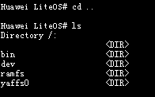

#### pwd<a name="ZH-CN_TOPIC_0000002543394157"></a>

**Command Function<a name="section53777413103259"></a>**

The pwd command is used to display the current path.

**Command Format<a name="section925636103244"></a>**

pwd

**Usage Guidelines<a name="section59716164103244"></a>**

The pwd command writes the full path name of the current directory (the absolute path starting from the root directory) to standard output. All directories are separated by / (slash). The first / indicates the root directory, and the last directory is the current directory.

**Example<a name="section11667957103244"></a>**

Example:

Enter pwd.

**Output Description<a name="section50224462103244"></a>**

**Figure 1** View the current path<a name="fig41649620103244"></a>  


#### mkdir<a name="ZH-CN_TOPIC_0000002543394269"></a>

**Command Function<a name="section40463725111011"></a>**

The mkdir command is used to create a directory.

**Command Format<a name="section37264765111011"></a>**

mkdir <dir\>

**Parameter Description<a name="section54033199111011"></a>**

<a name="table14613036111011"></a>
<table><thead align="left"><tr id="row19382697111011"><th class="cellrowborder" valign="top" width="21.099999999999998%" id="mcps1.1.4.1.1"><p id="p26494602111011"><a name="p26494602111011"></a><a name="p26494602111011"></a>Parameter</p>
</th>
<th class="cellrowborder" valign="top" width="52.32%" id="mcps1.1.4.1.2"><p id="p65688049111011"><a name="p65688049111011"></a><a name="p65688049111011"></a>Description</p>
</th>
<th class="cellrowborder" valign="top" width="26.58%" id="mcps1.1.4.1.3"><p id="p19131715111011"><a name="p19131715111011"></a><a name="p19131715111011"></a>Value Range</p>
</th>
</tr>
</thead>
<tbody><tr id="row6165098111011"><td class="cellrowborder" valign="top" width="21.099999999999998%" headers="mcps1.1.4.1.1 "><p id="p29610958111011"><a name="p29610958111011"></a><a name="p29610958111011"></a>dir</p>
</td>
<td class="cellrowborder" valign="top" width="52.32%" headers="mcps1.1.4.1.2 "><p id="p49677398111011"><a name="p49677398111011"></a><a name="p49677398111011"></a>Directory to be created.</p>
</td>
<td class="cellrowborder" valign="top" width="26.58%" headers="mcps1.1.4.1.3 "><p id="p43145925111011"><a name="p43145925111011"></a><a name="p43145925111011"></a>N/A</p>
</td>
</tr>
</tbody>
</table>

**Usage Guidelines<a name="section52769012111011"></a>**

-   When the name of the directory to be created is added after mkdir, the directory is created in the current directory.
-   When a directory name with a path is added after mkdir, the directory is created in the specified path.

**Example<a name="section2861444111011"></a>**

Example:

Enter mkdir share.

**Output Description<a name="section5618098111011"></a>**

**Figure 1** Create the share directory in the current directory<a name="fig58041059112429"></a>  


#### rmdir<a name="ZH-CN_TOPIC_0000002511954360"></a>

**Command Function<a name="section3989834516312"></a>**

The rmdir command is used to delete the specified directory.

**Command Format<a name="section2775577016312"></a>**

rmdir <dir\>

**Parameter Description<a name="section1780469016312"></a>**

<a name="table3289375716312"></a>
<table><thead align="left"><tr id="row321455216312"><th class="cellrowborder" valign="top" width="21.099999999999998%" id="mcps1.1.4.1.1"><p id="p5905219316312"><a name="p5905219316312"></a><a name="p5905219316312"></a>Parameter</p>
</th>
<th class="cellrowborder" valign="top" width="52.32%" id="mcps1.1.4.1.2"><p id="p1849833416312"><a name="p1849833416312"></a><a name="p1849833416312"></a>Description</p>
</th>
<th class="cellrowborder" valign="top" width="26.58%" id="mcps1.1.4.1.3"><p id="p2197010416312"><a name="p2197010416312"></a><a name="p2197010416312"></a>Value Range</p>
</th>
</tr>
</thead>
<tbody><tr id="row3474799016312"><td class="cellrowborder" valign="top" width="21.099999999999998%" headers="mcps1.1.4.1.1 "><p id="p2014652091132"><a name="p2014652091132"></a><a name="p2014652091132"></a>dir</p>
</td>
<td class="cellrowborder" valign="top" width="52.32%" headers="mcps1.1.4.1.2 "><p id="p845913791139"><a name="p845913791139"></a><a name="p845913791139"></a>Directory to be deleted. The directory must be empty.</p>
</td>
<td class="cellrowborder" valign="top" width="26.58%" headers="mcps1.1.4.1.3 "><p id="p609387179120"><a name="p609387179120"></a><a name="p609387179120"></a>N/A</p>
</td>
</tr>
</tbody>
</table>

**Usage Guidelines<a name="section14886116312"></a>**

-   The rmdir command can only be used to delete directories.
-   rmdir can delete only one directory at a time.
-   rmdir can only delete empty directories.

**Example<a name="section4163728916312"></a>**

Example: Enter rmdir dir.

**Output Description<a name="section2037772316312"></a>**

**Figure 1** Delete a directory named dir<a name="fig1766685292244"></a>  
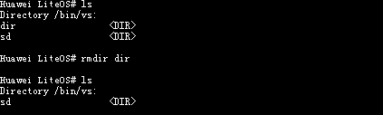

#### rm<a name="ZH-CN_TOPIC_0000002543394187"></a>

**Command Function<a name="section27278452163058"></a>**

The rm command is used to delete files or non-empty directories.

**Command Format<a name="section21767833163058"></a>**

rm -r <dir\>

rm_ _<file\>

**Parameter Description<a name="section32743949163058"></a>**

<a name="table35014231163058"></a>
<table><thead align="left"><tr id="row1183466163058"><th class="cellrowborder" valign="top" width="22.42%" id="mcps1.1.4.1.1"><p id="p28751891163058"><a name="p28751891163058"></a><a name="p28751891163058"></a>Parameter</p>
</th>
<th class="cellrowborder" valign="top" width="51.190000000000005%" id="mcps1.1.4.1.2"><p id="p47201796163058"><a name="p47201796163058"></a><a name="p47201796163058"></a>Description</p>
</th>
<th class="cellrowborder" valign="top" width="26.39%" id="mcps1.1.4.1.3"><p id="p65249126163058"><a name="p65249126163058"></a><a name="p65249126163058"></a>Value Range</p>
</th>
</tr>
</thead>
<tbody><tr id="row50687840163058"><td class="cellrowborder" valign="top" width="22.42%" headers="mcps1.1.4.1.1 "><p id="p12074395163058"><a name="p12074395163058"></a><a name="p12074395163058"></a>-r &lt;dir&gt;</p>
</td>
<td class="cellrowborder" valign="top" width="51.190000000000005%" headers="mcps1.1.4.1.2 "><p id="p10973239163058"><a name="p10973239163058"></a><a name="p10973239163058"></a>dir is the directory to be deleted. Both non-empty and empty directories are supported.</p>
</td>
<td class="cellrowborder" valign="top" width="26.39%" headers="mcps1.1.4.1.3 "><p id="p13536735163058"><a name="p13536735163058"></a><a name="p13536735163058"></a>N/A</p>
</td>
</tr>
<tr id="row25799037143936"><td class="cellrowborder" valign="top" width="22.42%" headers="mcps1.1.4.1.1 "><p id="p30864746143936"><a name="p30864746143936"></a><a name="p30864746143936"></a>file</p>
</td>
<td class="cellrowborder" valign="top" width="51.190000000000005%" headers="mcps1.1.4.1.2 "><p id="p17016475143936"><a name="p17016475143936"></a><a name="p17016475143936"></a>File to be deleted.</p>
</td>
<td class="cellrowborder" valign="top" width="26.39%" headers="mcps1.1.4.1.3 "><p id="p36157266143936"><a name="p36157266143936"></a><a name="p36157266143936"></a>N/A</p>
</td>
</tr>
</tbody>
</table>

**Usage Guidelines<a name="section54721754163058"></a>**

-   The rm command can delete only one file at a time.
-   The rm -r command can delete non-empty directories.

> **NOTICE:** 
>Using rm to delete critical system resources (for example, /dev) may cause unknown impacts such as system crashes. Use this command with caution.

**Example<a name="section32875621163058"></a>**

Example:

1.  Enter rm 1.c.
2.  Enter rm -r dir.

**Output Description<a name="section8463980163058"></a>**

**Figure 1** Use the rm command to delete the file 1.c<a name="fig7985432144853"></a>  
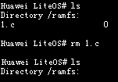

**Figure 2** Use rm -r to delete the directory dir<a name="fig54151803144925"></a>  
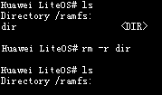

#### touch<a name="ZH-CN_TOPIC_0000002543354237"></a>

**Command Function<a name="section8534636163041"></a>**

The touch command is used to create an empty file in the current directory.

**Command Format<a name="section47734351163041"></a>**

touch <filename\>

**Parameter Description<a name="section26299140163041"></a>**

<a name="table49855628163041"></a>
<table><thead align="left"><tr id="row65286481163041"><th class="cellrowborder" valign="top" width="21.099999999999998%" id="mcps1.1.4.1.1"><p id="p53713622163041"><a name="p53713622163041"></a><a name="p53713622163041"></a>Parameter</p>
</th>
<th class="cellrowborder" valign="top" width="52.32%" id="mcps1.1.4.1.2"><p id="p55836111163041"><a name="p55836111163041"></a><a name="p55836111163041"></a>Description</p>
</th>
<th class="cellrowborder" valign="top" width="26.58%" id="mcps1.1.4.1.3"><p id="p26431141163041"><a name="p26431141163041"></a><a name="p26431141163041"></a>Value Range</p>
</th>
</tr>
</thead>
<tbody><tr id="row60547647163041"><td class="cellrowborder" valign="top" width="21.099999999999998%" headers="mcps1.1.4.1.1 "><p id="p5412357163041"><a name="p5412357163041"></a><a name="p5412357163041"></a>filename</p>
</td>
<td class="cellrowborder" valign="top" width="52.32%" headers="mcps1.1.4.1.2 "><p id="p35747809163041"><a name="p35747809163041"></a><a name="p35747809163041"></a>File to be created.</p>
</td>
<td class="cellrowborder" valign="top" width="26.58%" headers="mcps1.1.4.1.3 "><p id="p43438392165927"><a name="p43438392165927"></a><a name="p43438392165927"></a>N/A</p>
</td>
</tr>
</tbody>
</table>

**Usage Guidelines<a name="section30171036163041"></a>**

-   The empty file created by the touch command has read and write permissions by default.
-   The touch command can create only one file at a time.
-   The touch command succeeds when operating on an existing file without updating its timestamp.

> **NOTICE:** 
>Creating files with the touch command under important system resource paths may cause unknown impacts such as system crashes. For example, executing touch uartdev-0 under the /dev path causes the system to hang.

**Example<a name="section54776946163041"></a>**

Example:

Enter touch file.c.

**Output Description<a name="section2619942163041"></a>**

**Figure 1** Create a file named file.c in the current directory<a name="fig27793623171333"></a>  


#### cp<a name="ZH-CN_TOPIC_0000002543394285"></a>

**Command Function<a name="section676257315176"></a>**

The cp command is used to copy a file and create a duplicate.

**Command Format<a name="section3096931815176"></a>**

cp <source path\> <dest path\>

**Parameter Description<a name="section2805486115176"></a>**

<a name="table5785124015176"></a>
<table><thead align="left"><tr id="row3935748315176"><th class="cellrowborder" valign="top" width="21.099999999999998%" id="mcps1.1.4.1.1"><p id="p3383958815176"><a name="p3383958815176"></a><a name="p3383958815176"></a>Parameter</p>
</th>
<th class="cellrowborder" valign="top" width="31.55%" id="mcps1.1.4.1.2"><p id="p5665211315176"><a name="p5665211315176"></a><a name="p5665211315176"></a>Description</p>
</th>
<th class="cellrowborder" valign="top" width="47.349999999999994%" id="mcps1.1.4.1.3"><p id="p2541845915176"><a name="p2541845915176"></a><a name="p2541845915176"></a>Value Range</p>
</th>
</tr>
</thead>
<tbody><tr id="row4562928915176"><td class="cellrowborder" valign="top" width="21.099999999999998%" headers="mcps1.1.4.1.1 "><p id="p498493215176"><a name="p498493215176"></a><a name="p498493215176"></a>source path</p>
</td>
<td class="cellrowborder" valign="top" width="31.55%" headers="mcps1.1.4.1.2 "><p id="p112632315176"><a name="p112632315176"></a><a name="p112632315176"></a>Source file.</p>
</td>
<td class="cellrowborder" valign="top" width="47.349999999999994%" headers="mcps1.1.4.1.3 "><p id="p44501859173721"><a name="p44501859173721"></a><a name="p44501859173721"></a>Currently, only files are supported, not directories.</p>
</td>
</tr>
<tr id="row20866380142125"><td class="cellrowborder" valign="top" width="21.099999999999998%" headers="mcps1.1.4.1.1 "><p id="p12455180142125"><a name="p12455180142125"></a><a name="p12455180142125"></a>dest path</p>
</td>
<td class="cellrowborder" valign="top" width="31.55%" headers="mcps1.1.4.1.2 "><p id="p2236632142125"><a name="p2236632142125"></a><a name="p2236632142125"></a>Destination path.</p>
</td>
<td class="cellrowborder" valign="top" width="47.349999999999994%" headers="mcps1.1.4.1.3 "><p id="p54661298172121"><a name="p54661298172121"></a><a name="p54661298172121"></a>Directories and files are supported.</p>
</td>
</tr>
</tbody>
</table>

**Usage Guidelines<a name="section338301615176"></a>**

-   In the same path, the source file and the destination file cannot have the same name.
-   The source file must exist and must not be a directory.
-   The source file path supports the wildcards "\*" and "?". "\*" represents any number of characters, and "?" represents any single character. Wildcards are not supported in the destination path. When the source file path can match multiple files, the destination path must be a directory.
-   When the destination path is a directory, the directory must exist. In this case, the destination file is named after the source file.
-   When the destination path is a file, the directory containing the file must exist. The destination file name is the file name specified in the destination path.
-   Currently, copying multiple files is not supported. When there are more than two parameters, only the first two parameters are operated on.
-   If the destination file does not exist, a new file is created; if it exists, the file is overwritten.

> **NOTICE:** 
>Copying important system resource files may cause serious unknown impacts such as system crashes. For example, copying the /dev/uartdev-0 file causes the system to hang.

**Example<a name="section4315602815176"></a>**

Example:

Enter cp 100HSCAM/FILE0087.MP4 .

**Output Description<a name="section1440763015176"></a>**

**Figure 1** Display result<a name="fig2616739015176"></a>  
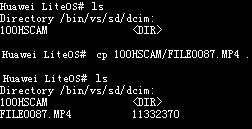

#### dd<a name="ZH-CN_TOPIC_0000002543354209"></a>

**Command Function<a name="section8534636163041"></a>**

The dd command is used for file read/write performance statistics.

**Command Format<a name="section47734351163041"></a>**

dd file=\[_PATHNAME_\] mode=\[_OPS_\] bs=\[_SIZE_\] count=\[_N_\]

**Parameter Description<a name="section26299140163041"></a>**

<a name="table49855628163041"></a>
<table><thead align="left"><tr id="row65286481163041"><th class="cellrowborder" valign="top" width="21.099999999999998%" id="mcps1.1.4.1.1"><p id="p53713622163041"><a name="p53713622163041"></a><a name="p53713622163041"></a>Parameter</p>
</th>
<th class="cellrowborder" valign="top" width="52.32%" id="mcps1.1.4.1.2"><p id="p55836111163041"><a name="p55836111163041"></a><a name="p55836111163041"></a>Description</p>
</th>
<th class="cellrowborder" valign="top" width="26.58%" id="mcps1.1.4.1.3"><p id="p26431141163041"><a name="p26431141163041"></a><a name="p26431141163041"></a>Value Range</p>
</th>
</tr>
</thead>
<tbody><tr id="row60547647163041"><td class="cellrowborder" valign="top" width="21.099999999999998%" headers="mcps1.1.4.1.1 "><p id="p5412357163041"><a name="p5412357163041"></a><a name="p5412357163041"></a>PATHNAME</p>
</td>
<td class="cellrowborder" valign="top" width="52.32%" headers="mcps1.1.4.1.2 "><p id="p35747809163041"><a name="p35747809163041"></a><a name="p35747809163041"></a>File name with the file path.</p>
</td>
<td class="cellrowborder" valign="top" width="26.58%" headers="mcps1.1.4.1.3 "><p id="p43438392165927"><a name="p43438392165927"></a><a name="p43438392165927"></a>Non-empty</p>
</td>
</tr>
<tr id="row13468121816475"><td class="cellrowborder" valign="top" width="21.099999999999998%" headers="mcps1.1.4.1.1 "><p id="p5468218104713"><a name="p5468218104713"></a><a name="p5468218104713"></a>OPS</p>
</td>
<td class="cellrowborder" valign="top" width="52.32%" headers="mcps1.1.4.1.2 "><p id="p34681618164712"><a name="p34681618164712"></a><a name="p34681618164712"></a>Type of file operation to be tested, including read/write. Value 1 indicates read, and 2 indicates write.</p>
</td>
<td class="cellrowborder" valign="top" width="26.58%" headers="mcps1.1.4.1.3 "><p id="p246881814712"><a name="p246881814712"></a><a name="p246881814712"></a>[1, 2]</p>
</td>
</tr>
<tr id="row13925192214478"><td class="cellrowborder" valign="top" width="21.099999999999998%" headers="mcps1.1.4.1.1 "><p id="p189261222104710"><a name="p189261222104710"></a><a name="p189261222104710"></a>SIZE</p>
</td>
<td class="cellrowborder" valign="top" width="52.32%" headers="mcps1.1.4.1.2 "><p id="p1926322164716"><a name="p1926322164716"></a><a name="p1926322164716"></a>Number of bytes in a block for one read/write operation.</p>
</td>
<td class="cellrowborder" valign="top" width="26.58%" headers="mcps1.1.4.1.3 "><p id="p6926172216472"><a name="p6926172216472"></a><a name="p6926172216472"></a>[0, 0xFFFFFFFF]</p>
</td>
</tr>
<tr id="row280891664818"><td class="cellrowborder" valign="top" width="21.099999999999998%" headers="mcps1.1.4.1.1 "><p id="p9809101644812"><a name="p9809101644812"></a><a name="p9809101644812"></a>N</p>
</td>
<td class="cellrowborder" valign="top" width="52.32%" headers="mcps1.1.4.1.2 "><p id="p1080910164485"><a name="p1080910164485"></a><a name="p1080910164485"></a>Number of blocks for read/write.</p>
</td>
<td class="cellrowborder" valign="top" width="26.58%" headers="mcps1.1.4.1.3 "><p id="p180941624818"><a name="p180941624818"></a><a name="p180941624818"></a>[0, 0xFFFFFFFF]</p>
</td>
</tr>
</tbody>
</table>

**Usage Guidelines<a name="section30171036163041"></a>**

1.  The dd command can be executed concurrently. One dd command corresponds to one thread, so multi-thread read/write tests can be performed.
2.  When the dd command tests large file read/write operations, it may take a long time and may not output performance results immediately. This is normal.
3.  The bs and count fields can be omitted, and the system uses the default values LOSCFG\_DD\_DEFAULT\_BS 1024 and LOSCFG\_DD\_DEFAULT\_CNT 1.
4.  The SIZE of the bs field should not be too large. The system allocates dynamic memory of the SIZE size. An excessively large SIZE causes the memory allocation to fail, and the dd command cannot be executed properly.
5.  In the dd process, only open, read/write, and close operations are performed. Ensure that the corresponding file system has been properly mounted before running dd. Any other operations also need to be performed by yourself.

**Example<a name="section54776946163041"></a>**

For example, test the file write performance as follows:

dd file=/app/sd/testfile mode=2 bs=32768 count=32768

**Output Description<a name="section2619942163041"></a>**

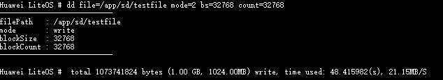

The total number of bytes written to the file, the total time consumed, and the rate are output.

#### ls<a name="ZH-CN_TOPIC_0000002511794438"></a>

**Command Function<a name="section676257315176"></a>**

The ls command is used to display the contents of the current directory.

**Command Format<a name="section3096931815176"></a>**

ls \[_path_\]

**Parameter Description<a name="section2805486115176"></a>**

<a name="table2827908616233"></a>
<table><thead align="left"><tr id="row1061475516233"><th class="cellrowborder" valign="top" width="21.099999999999998%" id="mcps1.1.4.1.1"><p id="p5448884016233"><a name="p5448884016233"></a><a name="p5448884016233"></a>Parameter</p>
</th>
<th class="cellrowborder" valign="top" width="52.32%" id="mcps1.1.4.1.2"><p id="p5151990516233"><a name="p5151990516233"></a><a name="p5151990516233"></a>Description</p>
</th>
<th class="cellrowborder" valign="top" width="26.58%" id="mcps1.1.4.1.3"><p id="p1236277516233"><a name="p1236277516233"></a><a name="p1236277516233"></a>Value Range</p>
</th>
</tr>
</thead>
<tbody><tr id="row6186068916233"><td class="cellrowborder" valign="top" width="21.099999999999998%" headers="mcps1.1.4.1.1 "><p id="p4465989516233"><a name="p4465989516233"></a><a name="p4465989516233"></a>path</p>
</td>
<td class="cellrowborder" valign="top" width="52.32%" headers="mcps1.1.4.1.2 "><a name="ul1018642014358"></a><a name="ul1018642014358"></a><ul id="ul1018642014358"><li>If it is empty, the contents of the current directory are displayed.</li><li>If it is an invalid file name, the display fails, with the prompt: No such directory.</li><li>If it is a valid directory path, the contents of the corresponding directory are displayed.</li></ul>
</td>
<td class="cellrowborder" valign="top" width="26.58%" headers="mcps1.1.4.1.3 "><a name="ol698187173615"></a><a name="ol698187173615"></a><ol id="ol698187173615"><li>Empty;</li><li>A valid directory path.</li></ol>
</td>
</tr>
</tbody>
</table>

**Usage Guidelines<a name="section338301615176"></a>**

-   ls can display the size of files.
-   Under proc, ls cannot calculate the file size, and the size is displayed as 0.

**Example<a name="section4315602815176"></a>**

Example:

Enter ls.

**Output Description<a name="section1440763015176"></a>**

**Figure 1** View the contents under the current system path<a name="fig2616739015176"></a>  
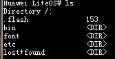

#### cat<a name="ZH-CN_TOPIC_0000002543354197"></a>

**Command Function<a name="section676257315176"></a>**

The cat command is used to display the contents of text files.

**Command Format<a name="section3096931815176"></a>**

cat <pathname\>

**Parameter Description<a name="section2805486115176"></a>**

<a name="table60251303162617"></a>
<table><thead align="left"><tr id="row26605759162617"><th class="cellrowborder" valign="top" width="21.099999999999998%" id="mcps1.1.4.1.1"><p id="p7582834162617"><a name="p7582834162617"></a><a name="p7582834162617"></a>Parameter</p>
</th>
<th class="cellrowborder" valign="top" width="52.32%" id="mcps1.1.4.1.2"><p id="p10229855162617"><a name="p10229855162617"></a><a name="p10229855162617"></a>Description</p>
</th>
<th class="cellrowborder" valign="top" width="26.58%" id="mcps1.1.4.1.3"><p id="p23311916162617"><a name="p23311916162617"></a><a name="p23311916162617"></a>Value Range</p>
</th>
</tr>
</thead>
<tbody><tr id="row9217025162617"><td class="cellrowborder" valign="top" width="21.099999999999998%" headers="mcps1.1.4.1.1 "><p id="p8381575162617"><a name="p8381575162617"></a><a name="p8381575162617"></a>pathname</p>
</td>
<td class="cellrowborder" valign="top" width="52.32%" headers="mcps1.1.4.1.2 "><p id="p7818981162617"><a name="p7818981162617"></a><a name="p7818981162617"></a>File name with the file path. If the file is in the current path, you can directly enter the file name.</p>
</td>
<td class="cellrowborder" valign="top" width="26.58%" headers="mcps1.1.4.1.3 "><p id="p29357764162617"><a name="p29357764162617"></a><a name="p29357764162617"></a>An existing file.</p>
</td>
</tr>
</tbody>
</table>

**Example<a name="section4315602815176"></a>**

Example:

Enter cat w.

**Output Description<a name="section1440763015176"></a>**

**Figure 1** View the information of the w file<a name="fig65471551513"></a>  
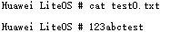

#### lsfd<a name="ZH-CN_TOPIC_0000002543394241"></a>

**Command Function<a name="se1ad2c8850f24263b57732d820b71fd6"></a>**

The lsfd command is used to display the currently open file descriptors and their corresponding file names.

**Command Format<a name="sb37f94a6be4e433586da8315e1502158"></a>**

lsfd

**Usage Guidelines<a name="s292535ce2f0641aebaadeaf22c5c7d28"></a>**

The lsfd command displays the fd numbers and names of currently open files.

**Example<a name="s8526caa34926480f90cc5a00b1dd9b43"></a>**

Example:

Enter lsfd.

**Output Description<a name="s792b6283d4c144eebb8c78535cdaad51"></a>**

```
LiteOS # lsfd
   fd    filename
    3   /dev/shell
```

#### format<a name="ZH-CN_TOPIC_0000002511954420"></a>

**Command Function<a name="section4489394910486"></a>**

The format command is used to format disks.

**Command Format<a name="section4567231610486"></a>**

format <dev\_inodename\> <sectors\> <option\> \[_label_\]

**Parameter Description<a name="section912211710486"></a>**

<a name="table69401910486"></a>
<table><thead align="left"><tr id="row4477913210486"><th class="cellrowborder" valign="top" width="26.040000000000003%" id="mcps1.1.3.1.1"><p id="p323109110486"><a name="p323109110486"></a><a name="p323109110486"></a>Parameter</p>
</th>
<th class="cellrowborder" valign="top" width="73.96000000000001%" id="mcps1.1.3.1.2"><p id="p6039184710486"><a name="p6039184710486"></a><a name="p6039184710486"></a>Description</p>
</th>
</tr>
</thead>
<tbody><tr id="row5990143910486"><td class="cellrowborder" valign="top" width="26.040000000000003%" headers="mcps1.1.3.1.1 "><p id="p2017840410486"><a name="p2017840410486"></a><a name="p2017840410486"></a>dev_inodename</p>
</td>
<td class="cellrowborder" valign="top" width="73.96000000000001%" headers="mcps1.1.3.1.2 "><p id="p2383801310486"><a name="p2383801310486"></a><a name="p2383801310486"></a>Name of the device to be formatted.</p>
</td>
</tr>
<tr id="row1321552910486"><td class="cellrowborder" valign="top" width="26.040000000000003%" headers="mcps1.1.3.1.1 "><p id="p6382490810486"><a name="p6382490810486"></a><a name="p6382490810486"></a>sectors</p>
</td>
<td class="cellrowborder" valign="top" width="73.96000000000001%" headers="mcps1.1.3.1.2 "><p id="p42617219205650"><a name="p42617219205650"></a><a name="p42617219205650"></a>Size of the allocated unit memory or sector. The value must be a power of 2. The maximum value is 128 under FAT32. Any other value means that an appropriate cluster size is automatically selected. Partitions of different sizes have different available cluster size ranges.</p>
</td>
</tr>
<tr id="row54102760102346"><td class="cellrowborder" valign="top" width="26.040000000000003%" headers="mcps1.1.3.1.1 "><p id="p20247476102346"><a name="p20247476102346"></a><a name="p20247476102346"></a>option</p>
</td>
<td class="cellrowborder" valign="top" width="73.96000000000001%" headers="mcps1.1.3.1.2 "><div class="p" id="p29432827102346"><a name="p29432827102346"></a><a name="p29432827102346"></a>Formatting option, used to select the file system type. The following options are available:<a name="ul4160908910336"></a><a name="ul4160908910336"></a><ul id="ul4160908910336"><li>0x01: FMT_FAT</li><li>0x02: FMT_FAT32</li><li>0x07: FMT_ANY</li><li>0x08: FMT_ERASE (not supported for USB)</li></ul>
</div>
<p id="p178814103324"><a name="p178814103324"></a><a name="p178814103324"></a>Any other value is invalid, and the system automatically selects the formatting method. If the low-level format bit is 1 when formatting a USB drive, an error message is printed.</p>
</td>
</tr>
<tr id="row15323738102351"><td class="cellrowborder" valign="top" width="26.040000000000003%" headers="mcps1.1.3.1.1 "><p id="p33263275102351"><a name="p33263275102351"></a><a name="p33263275102351"></a>label (optional parameter)</p>
</td>
<td class="cellrowborder" valign="top" width="73.96000000000001%" headers="mcps1.1.3.1.2 "><p id="p9970756102351"><a name="p9970756102351"></a><a name="p9970756102351"></a>This parameter is optional. The input value should be a string, used to specify the volume label name. When the string "null" is entered, the previously set volume label name is cleared.</p>
</td>
</tr>
</tbody>
</table>

**Usage Guidelines<a name="section343197610486"></a>**

-   The format command is used to format disks. The device name can be found in the dev directory. A storage card must be installed when formatting.
-   format can only format USB drives, SD cards, and EMMC cards. It cannot format Nand Flash or Nor Flash.
-   A valid value must be passed for the sectors parameter. Passing an invalid parameter may cause an exception.

**Example<a name="section5313296410486"></a>**

Example:

Enter format /dev/mmcblk0p0 128 2.

**Output Description<a name="section1211681010486"></a>**

```
LiteOS # format /dev/mmcblk0p0 128 2
Format to FAT32, 128 sectors per cluster.
format /dev/mmcblk0p0 Success
```

#### mount<a name="ZH-CN_TOPIC_0000002511794316"></a>

**Command Function<a name="section1416249311104"></a>**

The mount command is used to mount a device to the specified directory.

**Command Format<a name="section5680165011104"></a>**

mount <device\> <path\> <name\>

**Parameter Description<a name="section223424111104"></a>**

<a name="table4675586011104"></a>
<table><thead align="left"><tr id="row6362441811104"><th class="cellrowborder" valign="top" width="21.099999999999998%" id="mcps1.1.4.1.1"><p id="p5330420111104"><a name="p5330420111104"></a><a name="p5330420111104"></a>Parameter</p>
</th>
<th class="cellrowborder" valign="top" width="52.32%" id="mcps1.1.4.1.2"><p id="p2267304511104"><a name="p2267304511104"></a><a name="p2267304511104"></a>Description</p>
</th>
<th class="cellrowborder" valign="top" width="26.58%" id="mcps1.1.4.1.3"><p id="p2457739011104"><a name="p2457739011104"></a><a name="p2457739011104"></a>Value Range</p>
</th>
</tr>
</thead>
<tbody><tr id="row48488937114559"><td class="cellrowborder" valign="top" width="21.099999999999998%" headers="mcps1.1.4.1.1 "><p id="p33747254114559"><a name="p33747254114559"></a><a name="p33747254114559"></a>device</p>
</td>
<td class="cellrowborder" valign="top" width="52.32%" headers="mcps1.1.4.1.2 "><p id="p49173020114559"><a name="p49173020114559"></a><a name="p49173020114559"></a>Device to be mounted.</p>
</td>
<td class="cellrowborder" valign="top" width="26.58%" headers="mcps1.1.4.1.3 "><p id="p23591683114559"><a name="p23591683114559"></a><a name="p23591683114559"></a>A device owned by the system.</p>
</td>
</tr>
<tr id="row4461157911104"><td class="cellrowborder" valign="top" width="21.099999999999998%" headers="mcps1.1.4.1.1 "><p id="p5676816511104"><a name="p5676816511104"></a><a name="p5676816511104"></a>path</p>
</td>
<td class="cellrowborder" valign="top" width="52.32%" headers="mcps1.1.4.1.2 "><p id="p3481864311104"><a name="p3481864311104"></a><a name="p3481864311104"></a>Directory to which the device is mounted. The user must have execute permission on the directory.</p>
</td>
<td class="cellrowborder" valign="top" width="26.58%" headers="mcps1.1.4.1.3 "><p id="p1564054311104"><a name="p1564054311104"></a><a name="p1564054311104"></a>N/A</p>
</td>
</tr>
<tr id="row46211726114613"><td class="cellrowborder" valign="top" width="21.099999999999998%" headers="mcps1.1.4.1.1 "><p id="p13252351114613"><a name="p13252351114613"></a><a name="p13252351114613"></a>name</p>
</td>
<td class="cellrowborder" valign="top" width="52.32%" headers="mcps1.1.4.1.2 "><p id="p66807550114613"><a name="p66807550114613"></a><a name="p66807550114613"></a>Type of file system to be mounted.</p>
</td>
<td class="cellrowborder" valign="top" width="26.58%" headers="mcps1.1.4.1.3 "><p id="p42702502114613"><a name="p42702502114613"></a><a name="p42702502114613"></a>vfat, yaffs, ramfs, nfs, procfs, romfs</p>
</td>
</tr>
</tbody>
</table>

**Usage Guidelines<a name="section654716511104"></a>**

Adding the device information to be mounted, the specified directory, and the device file format after mount mounts the file system to the specified directory successfully.

**Example<a name="section627887311104"></a>**

Example:

Enter mount  /dev/mmc0 /bin/vs/sd vfat.

**Output Description<a name="section1389578011104"></a>**

Mount /dev/mmc0 to the /bin/vs/sd directory with the VFAT file system type.

```
LiteOS # mount /dev/mmc0 /bin/vs/sd vfat
mount ok
```

#### umount<a name="ZH-CN_TOPIC_0000002511954216"></a>

**Command Function<a name="section3772787311108"></a>**

The umount command is used to unmount a mounted file system.

**Command Format<a name="section5609421311108"></a>**

umount <dir\>

**Parameter Description<a name="section2338330711108"></a>**

<a name="table1499971111108"></a>
<table><thead align="left"><tr id="row2312928011108"><th class="cellrowborder" valign="top" width="21.87%" id="mcps1.1.4.1.1"><p id="p6153241011108"><a name="p6153241011108"></a><a name="p6153241011108"></a>Parameter</p>
</th>
<th class="cellrowborder" valign="top" width="43.39%" id="mcps1.1.4.1.2"><p id="p1806930411108"><a name="p1806930411108"></a><a name="p1806930411108"></a>Description</p>
</th>
<th class="cellrowborder" valign="top" width="34.74%" id="mcps1.1.4.1.3"><p id="p5432752311108"><a name="p5432752311108"></a><a name="p5432752311108"></a>Value Range</p>
</th>
</tr>
</thead>
<tbody><tr id="row3845321811108"><td class="cellrowborder" valign="top" width="21.87%" headers="mcps1.1.4.1.1 "><p id="p2770294211108"><a name="p2770294211108"></a><a name="p2770294211108"></a>dir</p>
</td>
<td class="cellrowborder" valign="top" width="43.39%" headers="mcps1.1.4.1.2 "><p id="p2934579011108"><a name="p2934579011108"></a><a name="p2934579011108"></a>Mount directory corresponding to the file system to be unmounted.</p>
</td>
<td class="cellrowborder" valign="top" width="34.74%" headers="mcps1.1.4.1.3 "><p id="p5246227311108"><a name="p5246227311108"></a><a name="p5246227311108"></a>Directory of a file system mounted by the system.</p>
</td>
</tr>
</tbody>
</table>

**Usage Guidelines<a name="section29810088122055"></a>**

Adding the mount directory corresponding to the file system to be unmounted after umount unmounts the specified file system.

**Example<a name="section3250676311108"></a>**

Example:

Enter umount /bin/vs/sd.

**Output Description<a name="section800180511108"></a>**

Unmount the file system mounted on the /bin/vs/sd directory.

```
LiteOS # umount /bin/vs/sd
umount ok
```

#### partinfo<a name="ZH-CN_TOPIC_0000002543354295"></a>

**Command Function<a name="section3507310415275"></a>**

The partinfo command is used to view the partition information of hard disks, USB drives, and SD cards recognized by the system.

**Command Format<a name="section6692475915275"></a>**

partinfo <dev\_inodename\>

**Parameter Description<a name="section44392615275"></a>**

<a name="table3595808515275"></a>
<table><thead align="left"><tr id="row1479093015275"><th class="cellrowborder" valign="top" width="22.23%" id="mcps1.1.4.1.1"><p id="p5721468215275"><a name="p5721468215275"></a><a name="p5721468215275"></a>Parameter</p>
</th>
<th class="cellrowborder" valign="top" width="35.64%" id="mcps1.1.4.1.2"><p id="p387767915275"><a name="p387767915275"></a><a name="p387767915275"></a>Description</p>
</th>
<th class="cellrowborder" valign="top" width="42.13%" id="mcps1.1.4.1.3"><p id="p4565656815275"><a name="p4565656815275"></a><a name="p4565656815275"></a>Value Range</p>
</th>
</tr>
</thead>
<tbody><tr id="row719452615275"><td class="cellrowborder" valign="top" width="22.23%" headers="mcps1.1.4.1.1 "><p id="p4699559152713"><a name="p4699559152713"></a><a name="p4699559152713"></a>dev_inodename</p>
</td>
<td class="cellrowborder" valign="top" width="35.64%" headers="mcps1.1.4.1.2 "><p id="p26617559152713"><a name="p26617559152713"></a><a name="p26617559152713"></a>Name of the partition to be viewed.</p>
</td>
<td class="cellrowborder" valign="top" width="42.13%" headers="mcps1.1.4.1.3 "><p id="p16637860152713"><a name="p16637860152713"></a><a name="p16637860152713"></a>A valid partition name.</p>
</td>
</tr>
</tbody>
</table>

**Example<a name="section4001979815275"></a>**

Example:

Enter partinfo /dev/sdap0.

**Output Description<a name="section26959292194448"></a>**

```
LiteOS # partinfo /dev/sdap0
part info :
disk id          : 3
part_id in system: 0
part no in disk  : 0
part no in mbr   : 1
part filesystem  : 0C
part dev name    : sdap0
part sec start   : 2048
part sec count   : 167794688
```

#### partition<a name="ZH-CN_TOPIC_0000002543354233"></a>

**Command Function<a name="section2151919117751"></a>**

The partition command is used to view Flash partition information.

**Command Format<a name="section5112550917751"></a>**

partition <nand | spinor\>

**Parameter Description<a name="section1795431417751"></a>**

<a name="table4501332417751"></a>
<table><thead align="left"><tr id="row1955018917751"><th class="cellrowborder" valign="top" width="21.099999999999998%" id="mcps1.1.4.1.1"><p id="p4006147217751"><a name="p4006147217751"></a><a name="p4006147217751"></a>Parameter</p>
</th>
<th class="cellrowborder" valign="top" width="52.32%" id="mcps1.1.4.1.2"><p id="p2375380817751"><a name="p2375380817751"></a><a name="p2375380817751"></a>Description</p>
</th>
<th class="cellrowborder" valign="top" width="26.58%" id="mcps1.1.4.1.3"><p id="p4501027617751"><a name="p4501027617751"></a><a name="p4501027617751"></a>Value Range</p>
</th>
</tr>
</thead>
<tbody><tr id="row2195373317751"><td class="cellrowborder" valign="top" width="21.099999999999998%" headers="mcps1.1.4.1.1 "><p id="p3342191417751"><a name="p3342191417751"></a><a name="p3342191417751"></a>nand</p>
</td>
<td class="cellrowborder" valign="top" width="52.32%" headers="mcps1.1.4.1.2 "><p id="p2282049117751"><a name="p2282049117751"></a><a name="p2282049117751"></a>Displays Nand Flash partition information.</p>
</td>
<td class="cellrowborder" valign="top" width="26.58%" headers="mcps1.1.4.1.3 "><p id="p3652051417751"><a name="p3652051417751"></a><a name="p3652051417751"></a>N/A</p>
</td>
</tr>
<tr id="row51387623171114"><td class="cellrowborder" valign="top" width="21.099999999999998%" headers="mcps1.1.4.1.1 "><p id="p1647931171114"><a name="p1647931171114"></a><a name="p1647931171114"></a>spinor</p>
</td>
<td class="cellrowborder" valign="top" width="52.32%" headers="mcps1.1.4.1.2 "><p id="p66373616171114"><a name="p66373616171114"></a><a name="p66373616171114"></a>Displays Spinor Flash partition information.</p>
</td>
<td class="cellrowborder" valign="top" width="26.58%" headers="mcps1.1.4.1.3 "><p id="p7553838171114"><a name="p7553838171114"></a><a name="p7553838171114"></a>N/A</p>
</td>
</tr>
</tbody>
</table>

**Usage Guidelines<a name="section6024917017751"></a>**

-   Nand Flash partition information can be viewed only when the YAFFS file system is enabled.
-   Spinor Flash partition information can be viewed only when the JFFS or ROMFS file system is enabled.

**Example<a name="section1104974317751"></a>**

Example:

Enter partition nand.

**Output Description<a name="section219933217751"></a>**

View the Nand Flash partition information.

```
LiteOS # partition nand
nand partition num:0, blkdev name:/dev/nandblk0, mountpt:/yaffs0, startaddr:0x00e00000, length:0x00200000
```

#### statfs<a name="ZH-CN_TOPIC_0000002543394297"></a>

**Command Function<a name="section12701761192913"></a>**

The statfs command is used to print file system information, such as the file system type, total size, and available size.

**Command Format<a name="section65669766192913"></a>**

statfs <directory\>

**Parameter Description<a name="section49687437192913"></a>**

<a name="table31194646194410"></a>
<table><thead align="left"><tr id="row24146062194410"><th class="cellrowborder" valign="top" width="21.45214521452145%" id="mcps1.1.4.1.1"><p id="p18657823194421"><a name="p18657823194421"></a><a name="p18657823194421"></a>Parameter</p>
</th>
<th class="cellrowborder" valign="top" width="35.64356435643564%" id="mcps1.1.4.1.2"><p id="p34888686194421"><a name="p34888686194421"></a><a name="p34888686194421"></a>Description</p>
</th>
<th class="cellrowborder" valign="top" width="42.9042904290429%" id="mcps1.1.4.1.3"><p id="p7411342194421"><a name="p7411342194421"></a><a name="p7411342194421"></a>Value Range</p>
</th>
</tr>
</thead>
<tbody><tr id="row4667745194410"><td class="cellrowborder" valign="top" width="21.45214521452145%" headers="mcps1.1.4.1.1 "><p id="p42543085194410"><a name="p42543085194410"></a><a name="p42543085194410"></a>directory</p>
</td>
<td class="cellrowborder" valign="top" width="35.64356435643564%" headers="mcps1.1.4.1.2 "><p id="p23437894194410"><a name="p23437894194410"></a><a name="p23437894194410"></a>Mount path of the file system.</p>
</td>
<td class="cellrowborder" valign="top" width="42.9042904290429%" headers="mcps1.1.4.1.3 "><p id="p19421267194410"><a name="p19421267194410"></a><a name="p19421267194410"></a>Must be an existing file system that supports the statfs command.</p>
</td>
</tr>
</tbody>
</table>

**Usage Guidelines<a name="section58452768192913"></a>**

The printed information varies with the file system.

**Example<a name="section34404499192913"></a>**

Take the YAFFS file system as an example:

Enter statfs /yaffs0.

**Output Description<a name="section49273739192913"></a>**

```
statfs got:
f_type         = 1497497427
cluster_size   = 2048
total_clusters = 704
free_clusters  = 640
avail_clusters = 640
f_namelen      = 255

/yaffs0
total size: 9830400 Bytes
free  size: 5890048 Bytes
```

#### virstatfs<a name="ZH-CN_TOPIC_0000002543354181"></a>

**Command Function<a name="section531338194151"></a>**

The virstatfs command is used to print information about the file system in a virtual partition, such as the total size and available size.

**Command Format<a name="section1338511694318"></a>**

virstatfs_ _<directory\>

**Parameter Description<a name="section467136694347"></a>**

<a name="table31194646194410"></a>
<table><thead align="left"><tr id="row24146062194410"><th class="cellrowborder" valign="top" width="21.45214521452145%" id="mcps1.1.4.1.1"><p id="p18657823194421"><a name="p18657823194421"></a><a name="p18657823194421"></a>Parameter</p>
</th>
<th class="cellrowborder" valign="top" width="45.58455845584558%" id="mcps1.1.4.1.2"><p id="p34888686194421"><a name="p34888686194421"></a><a name="p34888686194421"></a>Description</p>
</th>
<th class="cellrowborder" valign="top" width="32.96329632963296%" id="mcps1.1.4.1.3"><p id="p7411342194421"><a name="p7411342194421"></a><a name="p7411342194421"></a>Value Range</p>
</th>
</tr>
</thead>
<tbody><tr id="row4667745194410"><td class="cellrowborder" valign="top" width="21.45214521452145%" headers="mcps1.1.4.1.1 "><p id="p42543085194410"><a name="p42543085194410"></a><a name="p42543085194410"></a>directory</p>
</td>
<td class="cellrowborder" valign="top" width="45.58455845584558%" headers="mcps1.1.4.1.2 "><p id="p23437894194410"><a name="p23437894194410"></a><a name="p23437894194410"></a>Path of the entry directory of the virtual partition or its subpath.</p>
</td>
<td class="cellrowborder" valign="top" width="32.96329632963296%" headers="mcps1.1.4.1.3 "><p id="p19421267194410"><a name="p19421267194410"></a><a name="p19421267194410"></a>N/A</p>
</td>
</tr>
</tbody>
</table>

**Usage Guidelines<a name="section1870481994924"></a>**

-   The virstatfs command takes effect only when the virtual partition feature is enabled (LOSCFG\_FS\_FAT\_VIRTUAL\_PARTITION=y).
-   The input path of virstatfs must be the entry directory of a virtual partition on a physical partition where the virtual partition feature has been successfully applied, or a subdirectory of it. If the input path is the root directory of the physical partition, the physical partition has not successfully applied the virtual partition feature, or the path points to a non-FAT32 file system partition, the virstatfs command is rejected.
-   For details about the virtual partition feature, see [Interface Description for Virtual Partitions](development_guide-113.md#section1339318355214) and [Development Process](development_guide-113.md#section485291782345) in the FAT development guide.

**Example<a name="section116941510027"></a>**

Example:

Enter virstatfs /bin/vs/sd/virpart0.

**Output Description<a name="section353748331023"></a>**

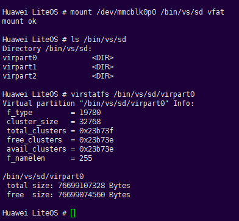

#### sync<a name="ZH-CN_TOPIC_0000002511794238"></a>

**Command Function<a name="section925108316319"></a>**

The sync command is used to synchronize cached data (data in the FAT file system) to the SD card.

**Command Format<a name="section3315319916319"></a>**

sync

**Usage Guidelines<a name="section4971367516319"></a>**

-   The sync command is used to flush the cache. No operation is performed when no SD card is inserted. When an SD card is inserted, the cache information is synchronized to the SD card. No information is displayed on success.
-   Before using the sync command, enable the FAT file system, that is, set LOSCFG\_FS\_FAT = y.

**Example<a name="section5118186316319"></a>**

Example:

Enter sync. When an SD card is present, the data is synchronized to the SD card; when no SD card is present, no operation is performed.

**Output Description<a name="section6615880216319"></a>**

None.

#### writeproc<a name="ZH-CN_TOPIC_0000002543394295"></a>

**Command Function<a name="section3507310415275"></a>**

The writeproc command is used to write content to files in the proc file system.

**Command Format<a name="section6692475915275"></a>**

writeproc <val\> <operational mark\> <path\>

**Parameter Description<a name="section44392615275"></a>**

<a name="table3595808515275"></a>
<table><thead align="left"><tr id="row1479093015275"><th class="cellrowborder" valign="top" width="22.23%" id="mcps1.1.4.1.1"><p id="p5721468215275"><a name="p5721468215275"></a><a name="p5721468215275"></a>Parameter</p>
</th>
<th class="cellrowborder" valign="top" width="51.190000000000005%" id="mcps1.1.4.1.2"><p id="p387767915275"><a name="p387767915275"></a><a name="p387767915275"></a>Description</p>
</th>
<th class="cellrowborder" valign="top" width="26.58%" id="mcps1.1.4.1.3"><p id="p4565656815275"><a name="p4565656815275"></a><a name="p4565656815275"></a>Value Range</p>
</th>
</tr>
</thead>
<tbody><tr id="row719452615275"><td class="cellrowborder" valign="top" width="22.23%" headers="mcps1.1.4.1.1 "><p id="p4699559152713"><a name="p4699559152713"></a><a name="p4699559152713"></a>val</p>
</td>
<td class="cellrowborder" valign="top" width="51.190000000000005%" headers="mcps1.1.4.1.2 "><p id="p26617559152713"><a name="p26617559152713"></a><a name="p26617559152713"></a>Content to be written to the file.</p>
</td>
<td class="cellrowborder" valign="top" width="26.58%" headers="mcps1.1.4.1.3 "><p id="p16637860152713"><a name="p16637860152713"></a><a name="p16637860152713"></a>String.</p>
</td>
</tr>
<tr id="row19810974153654"><td class="cellrowborder" valign="top" width="22.23%" headers="mcps1.1.4.1.1 "><p id="p61185050153654"><a name="p61185050153654"></a><a name="p61185050153654"></a>operational mark</p>
</td>
<td class="cellrowborder" valign="top" width="51.190000000000005%" headers="mcps1.1.4.1.2 "><p id="p57041978153654"><a name="p57041978153654"></a><a name="p57041978153654"></a>Operator. When the operator is "&gt;&gt;", the content is appended to the specified file.</p>
</td>
<td class="cellrowborder" valign="top" width="26.58%" headers="mcps1.1.4.1.3 "><p id="p56997478153654"><a name="p56997478153654"></a><a name="p56997478153654"></a>Currently, only "&gt;&gt;" is allowed.</p>
</td>
</tr>
<tr id="row16988758153658"><td class="cellrowborder" valign="top" width="22.23%" headers="mcps1.1.4.1.1 "><p id="p33912192153658"><a name="p33912192153658"></a><a name="p33912192153658"></a>path</p>
</td>
<td class="cellrowborder" valign="top" width="51.190000000000005%" headers="mcps1.1.4.1.2 "><p id="p62533059153658"><a name="p62533059153658"></a><a name="p62533059153658"></a>File to which the content will be written.</p>
</td>
<td class="cellrowborder" valign="top" width="26.58%" headers="mcps1.1.4.1.3 "><p id="p32012998153658"><a name="p32012998153658"></a><a name="p32012998153658"></a>Must be a file with an absolute path.</p>
</td>
</tr>
</tbody>
</table>

**Usage Guidelines<a name="section5167708215275"></a>**

-   writeproc is used to write the specified content to a file in the proc file system. The file must already exist and may be a file not created by the user.
-   When the operator is "\>\>" and the file exists, the specified content is written to the file.
-   Before using the writeproc command, enable the PROC file system, that is, set LOSCFG\_FS\_PROC = y.

**Example<a name="section4001979815275"></a>**

Example:

Enter writeproc 'sys=2' \>\> /proc/umap/logmpp.

**Output Description<a name="section4918617715275"></a>**

**Figure 1** Modify the sys level in logmpp<a name="fig6680055114347"></a>  
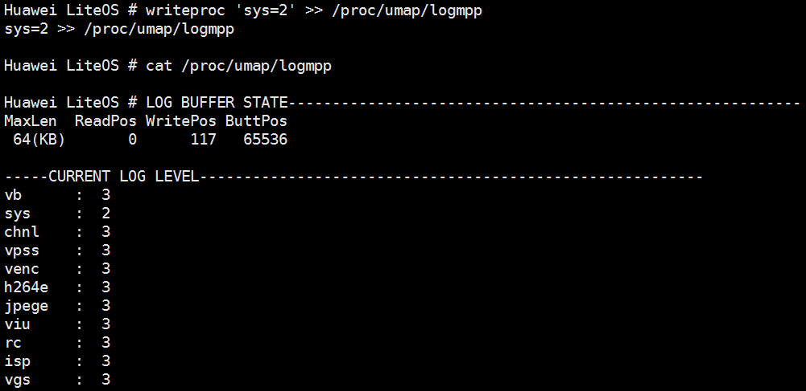

### Trace Commands Reference<a name="ZH-CN_TOPIC_0000002543354283"></a>


#### Enabling Trace Commands<a name="ZH-CN_TOPIC_0000002511794392"></a>

Before using the Trace commands in the Shell, open the menuconfig menu to enable the Shell. For details, see [Configuration Items](development_guide-162.md#section1161804935819).

Also configure the Trace module. For details, see [Development Guidelines](development_guide-95.md) in the Trace development process. The Offline mode mentioned below corresponds to the following menu item in menuconfig: Kernel ---\> Enable Extend Kernel ---\> Enable Trace Feature ---\> Trace work mode ---\> Offline mode. For detailed information about the Trace module, see [Trace](Trace.md).

#### trace\_mask<a name="ZH-CN_TOPIC_0000002543354329"></a>

**Command Function<a name="section10402133119271"></a>**

Sets the event filtering mask.

**Command Format<a name="section1540317311276"></a>**

trace\_mask \[_MASK_\]

**Parameter Description<a name="section15404163152711"></a>**

<a name="table3405133110275"></a>
<table><thead align="left"><tr id="row15441103117273"><th class="cellrowborder" valign="top" width="21.21%" id="mcps1.1.4.1.1"><p id="p11441173111271"><a name="p11441173111271"></a><a name="p11441173111271"></a>Parameter</p>
</th>
<th class="cellrowborder" valign="top" width="52.53%" id="mcps1.1.4.1.2"><p id="p1544113192712"><a name="p1544113192712"></a><a name="p1544113192712"></a>Description</p>
</th>
<th class="cellrowborder" valign="top" width="26.26%" id="mcps1.1.4.1.3"><p id="p044143172712"><a name="p044143172712"></a><a name="p044143172712"></a>Value Range</p>
</th>
</tr>
</thead>
<tbody><tr id="row14411231172720"><td class="cellrowborder" valign="top" width="21.21%" headers="mcps1.1.4.1.1 "><p id="p444143110271"><a name="p444143110271"></a><a name="p444143110271"></a>MASK</p>
</td>
<td class="cellrowborder" valign="top" width="52.53%" headers="mcps1.1.4.1.2 "><p id="p5441731112718"><a name="p5441731112718"></a><a name="p5441731112718"></a>Trace event mask.</p>
</td>
<td class="cellrowborder" valign="top" width="26.26%" headers="mcps1.1.4.1.3 "><p id="p04411831102714"><a name="p04411831102714"></a><a name="p04411831102714"></a>[0, 0xFFFFFFFF]</p>
</td>
</tr>
</tbody>
</table>

**Usage Guidelines<a name="section94114312274"></a>**

-   If no event mask is set, or the parameter is omitted when executing the command, only task and interrupt event recording is enabled by default.
-   When MASK is added after trace\_mask, event recording of the corresponding module is enabled.
-   For the specific module mask MASK, see LOS\_TRACE\_MASK defined in los\_trace.h.

**Example<a name="section241120310279"></a>**

Example:

1.  Enter trace\_mask 0
2.  Enter trace\_mask 0xFFFFFFFF

**Output Description<a name="section241133182710"></a>**

Execute trace\_mask 0 to disable event recording for all modules. After the command is executed successfully, no information is output.

```
LiteOS # trace_mask 0

LiteOS #
```

Execute trace\_mask 0xFFFFFFFF to enable event recording for all modules. After the command is executed successfully, no information is output.

```
LiteOS # trace_mask 0xFFFFFFFF

LiteOS #
```

#### trace\_start<a name="ZH-CN_TOPIC_0000002543394213"></a>

**Command Function<a name="section6500174111146"></a>**

Starts Trace.

**Command Format<a name="section34231251181618"></a>**

trace\_start

**Usage Guidelines<a name="section251085812180"></a>**

Entering trace\_start enables the system Trace function. In offline mode, events occurring in the system are recorded and saved in the specified buffer.

**Example<a name="section114351330161914"></a>**

Example: Enter trace\_start to enable the system Trace function.

**Output Description<a name="section1938174917199"></a>**

In offline mode, no information is output after the trace\_start command is successfully executed.

```
LiteOS # trace_start

LiteOS #
```

#### trace\_stop<a name="ZH-CN_TOPIC_0000002511794362"></a>

**Command Function<a name="section17526123413257"></a>**

Stops Trace.

**Command Format<a name="section552812341251"></a>**

trace\_stop

**Usage Guidelines<a name="section179441524172614"></a>**

Entering trace\_stop terminates the system Trace function and stops recording events.

**Example<a name="section86836914276"></a>**

Example: Enter trace\_stop to stop the system Trace function.

**Output Description<a name="section12684890271"></a>**

No information is output after the trace\_stop command is successfully executed.

```
LiteOS # trace_stop

LiteOS #
```

#### trace\_dump<a name="ZH-CN_TOPIC_0000002511794404"></a>

**Command Function<a name="section7773833153212"></a>**

In offline mode, dumps the information in the Trace buffer.

**Command Format<a name="section2077511334327"></a>**

trace\_dump \[1 | 0\]

**Parameter Description<a name="section9775433103218"></a>**

<a name="table10776033163211"></a>
<table><thead align="left"><tr id="row158021233133214"><th class="cellrowborder" valign="top" width="21.21%" id="mcps1.1.4.1.1"><p id="p20802193343210"><a name="p20802193343210"></a><a name="p20802193343210"></a>Parameter</p>
</th>
<th class="cellrowborder" valign="top" width="52.53%" id="mcps1.1.4.1.2"><p id="p18802143316321"><a name="p18802143316321"></a><a name="p18802143316321"></a>Description</p>
</th>
<th class="cellrowborder" valign="top" width="26.26%" id="mcps1.1.4.1.3"><p id="p08021933163212"><a name="p08021933163212"></a><a name="p08021933163212"></a>Value Range</p>
</th>
</tr>
</thead>
<tbody><tr id="row10802833103220"><td class="cellrowborder" valign="top" width="21.21%" headers="mcps1.1.4.1.1 "><p id="p780213331320"><a name="p780213331320"></a><a name="p780213331320"></a>1</p>
</td>
<td class="cellrowborder" valign="top" width="52.53%" headers="mcps1.1.4.1.2 "><p id="p1802103363218"><a name="p1802103363218"></a><a name="p1802103363218"></a>Outputs the Trace data to the client.</p>
</td>
<td class="cellrowborder" valign="top" width="26.26%" headers="mcps1.1.4.1.3 "><p id="p10802133193216"><a name="p10802133193216"></a><a name="p10802133193216"></a>NA</p>
</td>
</tr>
<tr id="row8575573349"><td class="cellrowborder" valign="top" width="21.21%" headers="mcps1.1.4.1.1 "><p id="p35759717344"><a name="p35759717344"></a><a name="p35759717344"></a>0</p>
</td>
<td class="cellrowborder" valign="top" width="52.53%" headers="mcps1.1.4.1.2 "><p id="p95757710347"><a name="p95757710347"></a><a name="p95757710347"></a>Formats and prints the Trace data.</p>
</td>
<td class="cellrowborder" valign="top" width="26.26%" headers="mcps1.1.4.1.3 "><p id="p12575127113419"><a name="p12575127113419"></a><a name="p12575127113419"></a>NA</p>
</td>
</tr>
</tbody>
</table>

**Usage Guidelines<a name="section1278343333217"></a>**

-   The trace\_dump command can only be used in offline mode.
-   When the parameter is omitted, the Trace data is formatted and printed.
-   The trace\_dump command prints the data between trace\_start and trace\_stop. Therefore, execute trace\_stop to stop Trace first, and then execute trace\_dump to print the information in the Trace buffer.

**Example<a name="section1783163315326"></a>**

Example:

Enter trace\_dump.

**Output Description<a name="section11783733183215"></a>**

Execute the trace\_dump command to format and print the data in the buffer.

```
LiteOS # trace_dump
*******TraceInfo begin*******
clockFreq = 180000000
CurEvtIndex = 19
Index   Time(cycles)      EventType      CurTask   Identity      params    
0       0x7da8da5180      0x45           0x5       0x2           0x9          0x20         0x1f
1       0x7dde8c6980      0x45           0x2       0x5           0x1f         0x4          0x9
2       0x7e1431df20      0x45           0x5       0x2           0x9          0x20         0x1f
3       0x7e49e3f720      0x45           0x2       0x5           0x1f         0x4          0x9
4       0x7e7f896cc0      0x45           0x5       0x2           0x9          0x20         0x1f
5       0x7eb53b84c0      0x45           0x2       0x5           0x1f         0x4          0x9
6       0x7eeae0fa60      0x45           0x5       0x2           0x9          0x20         0x1f
7       0x7f20931260      0x45           0x2       0x5           0x1f         0x4          0x9
8       0x7f56388800      0x45           0x5       0x2           0x9          0x20         0x1f
9       0x7f8beaa000      0x45           0x2       0x5           0x1f         0x4          0x9
10      0x7fc19015a0      0x45           0x5       0x2           0x9          0x20         0x1f
11      0x7ff7422da0      0x45           0x2       0x5           0x1f         0x4          0x9
12      0x802ce7a340      0x45           0x5       0x2           0x9          0x20         0x1f
13      0x806299bb40      0x45           0x2       0x5           0x1f         0x4          0x9
14      0x80983f30e0      0x45           0x5       0x2           0x9          0x20         0x1f
15      0x80cdf148e0      0x45           0x2       0x5           0x1f         0x4          0x9
……
24      0x6c560a8d00      0x24           0x2       0x2d          0x0          0x0          0x0
25      0x6c8baf7600      0x25           0x2       0x2d          0x0          0x0          0x0
……
36      0x71fe6f2000      0x24           0x2       0x2d          0x0          0x0          0x0
37      0x7234140900      0x25           0x2       0x2d          0x0          0x0          0x0
38      0x7269c20250      0x45           0x2       0x1           0x1f         0x4          0x0
39      0x734055a650      0x45           0x1       0x2           0x0          0x8          0x1f
40      0x7380b52450      0x45           0x2       0x1           0x1f         0x4          0x0
……
48      0x77a6d3b300      0x24           0x2       0x2d          0x0          0x0          0x0 
49      0x77dc789c00      0x25           0x2       0x2d          0x0          0x0          0x0
50      0x7812269550      0x45           0x2       0x1           0x1f         0x4          0x0
……
*******TraceInfo end*******
```

#### trace\_reset<a name="ZH-CN_TOPIC_0000002511954410"></a>

**Command Function<a name="section58681152124117"></a>**

In offline mode, clears the event data in the Trace buffer.

**Command Format<a name="section1870125219419"></a>**

trace\_reset

**Usage Guidelines<a name="section12879652184110"></a>**

The trace\_reset command can only be used in offline mode.

**Example<a name="section1880105211413"></a>**

Example:

Enter trace\_reset.

**Output Description<a name="section488018528415"></a>**

Execute trace\_reset to clear the event data:

```
LiteOS # trace_reset

LiteOS #
```

## Scheduler Statistics<a name="ZH-CN_TOPIC_0000002511794286"></a>

**Function Description<a name="section15719185416470"></a>**

LiteOS provides a scheduling statistics debugging function, which is used to collect scheduling information about the CPU, including the idle task startup time, idle task running time, number of scheduling switches, number of interrupts, and number of inter-core migrations (multi-core).

**Usage<a name="section2071256204815"></a>**

1.  Enable Debug ---\> Enable a Debug Version ---\> Enable DebugLiteOS Kernel Resource ---\> Enable Scheduler Statistics Debugging in the menu to enable the scheduling statistics debugging function (supported only on platforms with floating-point operations).
2.  Enter the shell command schedstatstart to enable the scheduling statistics function.
3.  Enter the shell command schedstatstop to disable the scheduling statistics function. The system outputs the scheduling statistics information of each CPU.
4.  Enter the shell command schedstatinfo. The system outputs the CPU scheduling statistics information of each task.

**Precautions<a name="section7672188125113"></a>**

The shell command execution sequence is schedstatstart -\> schedstatstop -\> schedstatinfo.

**Output Description<a name="section85734144813"></a>**

-   After calling schedstatstart, the system output is shown in the following figure:

    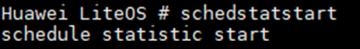

-   After calling schedstatstop, the system output is shown in the following figure:

    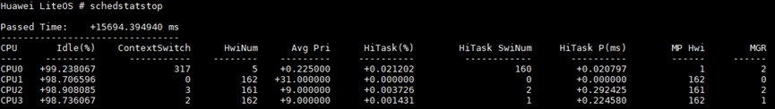

    The parameters are described in the following table:

    <a name="table04461657151218"></a>
    <table><thead align="left"><tr id="row19446135791213"><th class="cellrowborder" valign="top" width="33.7%" id="mcps1.1.3.1.1"><p id="p34461757151211"><a name="p34461757151211"></a><a name="p34461757151211"></a>Parameter</p>
    </th>
    <th class="cellrowborder" valign="top" width="66.3%" id="mcps1.1.3.1.2"><p id="p174461557161212"><a name="p174461557161212"></a><a name="p174461557161212"></a>Description</p>
    </th>
    </tr>
    </thead>
    <tbody><tr id="row15446105721214"><td class="cellrowborder" valign="top" width="33.7%" headers="mcps1.1.3.1.1 "><p id="p2446957181219"><a name="p2446957181219"></a><a name="p2446957181219"></a>Passed Time</p>
    </td>
    <td class="cellrowborder" valign="top" width="66.3%" headers="mcps1.1.3.1.2 "><p id="p844612572123"><a name="p844612572123"></a><a name="p844612572123"></a>Running time of the scheduling statistics function.</p>
    </td>
    </tr>
    <tr id="row1944617579121"><td class="cellrowborder" valign="top" width="33.7%" headers="mcps1.1.3.1.1 "><p id="p444635761216"><a name="p444635761216"></a><a name="p444635761216"></a>CPU</p>
    </td>
    <td class="cellrowborder" valign="top" width="66.3%" headers="mcps1.1.3.1.2 "><p id="p944655714127"><a name="p944655714127"></a><a name="p944655714127"></a>CPU ID.</p>
    </td>
    </tr>
    <tr id="row14446205719120"><td class="cellrowborder" valign="top" width="33.7%" headers="mcps1.1.3.1.1 "><p id="p1944625712124"><a name="p1944625712124"></a><a name="p1944625712124"></a>Idle(%)</p>
    </td>
    <td class="cellrowborder" valign="top" width="66.3%" headers="mcps1.1.3.1.2 "><p id="p154461357111211"><a name="p154461357111211"></a><a name="p154461357111211"></a>Percentage of idle task running time.</p>
    </td>
    </tr>
    <tr id="row7446135712126"><td class="cellrowborder" valign="top" width="33.7%" headers="mcps1.1.3.1.1 "><p id="p194464579124"><a name="p194464579124"></a><a name="p194464579124"></a>ContextSwitch</p>
    </td>
    <td class="cellrowborder" valign="top" width="66.3%" headers="mcps1.1.3.1.2 "><p id="p8447115721210"><a name="p8447115721210"></a><a name="p8447115721210"></a>Number of task scheduling switches.</p>
    </td>
    </tr>
    <tr id="row14471857101212"><td class="cellrowborder" valign="top" width="33.7%" headers="mcps1.1.3.1.1 "><p id="p104471357121216"><a name="p104471357121216"></a><a name="p104471357121216"></a>HwiNum</p>
    </td>
    <td class="cellrowborder" valign="top" width="66.3%" headers="mcps1.1.3.1.2 "><p id="p1544765714129"><a name="p1544765714129"></a><a name="p1544765714129"></a>Number of interrupt triggers.</p>
    </td>
    </tr>
    <tr id="row1544785731213"><td class="cellrowborder" valign="top" width="33.7%" headers="mcps1.1.3.1.1 "><p id="p14472057161214"><a name="p14472057161214"></a><a name="p14472057161214"></a>Avg Pri</p>
    </td>
    <td class="cellrowborder" valign="top" width="66.3%" headers="mcps1.1.3.1.2 "><p id="p744775719122"><a name="p744775719122"></a><a name="p744775719122"></a>Average priority of tasks switched in that are not idle tasks.</p>
    </td>
    </tr>
    <tr id="row9447357121218"><td class="cellrowborder" valign="top" width="33.7%" headers="mcps1.1.3.1.1 "><p id="p44476573123"><a name="p44476573123"></a><a name="p44476573123"></a>HiTask(%)</p>
    </td>
    <td class="cellrowborder" valign="top" width="66.3%" headers="mcps1.1.3.1.2 "><p id="p134472057161220"><a name="p134472057161220"></a><a name="p134472057161220"></a>Percentage of high-priority task running time. Tasks with a priority less than 16 are defined as high-priority tasks.</p>
    </td>
    </tr>
    <tr id="row744716575125"><td class="cellrowborder" valign="top" width="33.7%" headers="mcps1.1.3.1.1 "><p id="p13447657201217"><a name="p13447657201217"></a><a name="p13447657201217"></a>HiTask SwiNum</p>
    </td>
    <td class="cellrowborder" valign="top" width="66.3%" headers="mcps1.1.3.1.2 "><p id="p5447957191219"><a name="p5447957191219"></a><a name="p5447957191219"></a>Number of switches in which the new task switched in is a high-priority task. Tasks with a priority less than 16 are defined as high-priority tasks.</p>
    </td>
    </tr>
    <tr id="row6447165721215"><td class="cellrowborder" valign="top" width="33.7%" headers="mcps1.1.3.1.1 "><p id="p1744735751215"><a name="p1744735751215"></a><a name="p1744735751215"></a>HiTask P(ms)</p>
    </td>
    <td class="cellrowborder" valign="top" width="66.3%" headers="mcps1.1.3.1.2 "><p id="p164477575123"><a name="p164477575123"></a><a name="p164477575123"></a>Average running time of high-priority tasks. Tasks with a priority less than 16 are defined as high-priority tasks.</p>
    </td>
    </tr>
    <tr id="row1244715578128"><td class="cellrowborder" valign="top" width="33.7%" headers="mcps1.1.3.1.1 "><p id="p0447357151217"><a name="p0447357151217"></a><a name="p0447357151217"></a>MP Hwi</p>
    </td>
    <td class="cellrowborder" valign="top" width="66.3%" headers="mcps1.1.3.1.2 "><p id="p9447157111216"><a name="p9447157111216"></a><a name="p9447157111216"></a>Number of inter-core interrupt triggers, used only for multi-core.</p>
    </td>
    </tr>
    <tr id="row164471574127"><td class="cellrowborder" valign="top" width="33.7%" headers="mcps1.1.3.1.1 "><p id="p12447957181216"><a name="p12447957181216"></a><a name="p12447957181216"></a>MGR</p>
    </td>
    <td class="cellrowborder" valign="top" width="66.3%" headers="mcps1.1.3.1.2 "><p id="p244745731212"><a name="p244745731212"></a><a name="p244745731212"></a>Number of inter-core migrations, used only for multi-core.</p>
    </td>
    </tr>
    </tbody>
    </table>

-   After calling schedstatinfo, the system output is shown in the following figure:

    

    The parameters are described in the following table:

    <a name="table872608131312"></a>
    <table><thead align="left"><tr id="row672614831314"><th class="cellrowborder" valign="top" width="37.05%" id="mcps1.1.3.1.1"><p id="p137266811314"><a name="p137266811314"></a><a name="p137266811314"></a>Parameter</p>
    </th>
    <th class="cellrowborder" valign="top" width="62.949999999999996%" id="mcps1.1.3.1.2"><p id="p1772614811319"><a name="p1772614811319"></a><a name="p1772614811319"></a>Description</p>
    </th>
    </tr>
    </thead>
    <tbody><tr id="row3726187130"><td class="cellrowborder" valign="top" width="37.05%" headers="mcps1.1.3.1.1 "><p id="p1726148101318"><a name="p1726148101318"></a><a name="p1726148101318"></a>Passed Time</p>
    </td>
    <td class="cellrowborder" valign="top" width="62.949999999999996%" headers="mcps1.1.3.1.2 "><p id="p4726198101319"><a name="p4726198101319"></a><a name="p4726198101319"></a>Running time of the scheduling statistics function.</p>
    </td>
    </tr>
    <tr id="row1372608141313"><td class="cellrowborder" valign="top" width="37.05%" headers="mcps1.1.3.1.1 "><p id="p37265815133"><a name="p37265815133"></a><a name="p37265815133"></a>Task</p>
    </td>
    <td class="cellrowborder" valign="top" width="62.949999999999996%" headers="mcps1.1.3.1.2 "><p id="p117267819132"><a name="p117267819132"></a><a name="p117267819132"></a>Task name.</p>
    </td>
    </tr>
    <tr id="row1472612861313"><td class="cellrowborder" valign="top" width="37.05%" headers="mcps1.1.3.1.1 "><p id="p07273861316"><a name="p07273861316"></a><a name="p07273861316"></a>TID</p>
    </td>
    <td class="cellrowborder" valign="top" width="62.949999999999996%" headers="mcps1.1.3.1.2 "><p id="p137271283131"><a name="p137271283131"></a><a name="p137271283131"></a>Task ID.</p>
    </td>
    </tr>
    <tr id="row12727780137"><td class="cellrowborder" valign="top" width="37.05%" headers="mcps1.1.3.1.1 "><p id="p137271586135"><a name="p137271586135"></a><a name="p137271586135"></a>Total Time</p>
    </td>
    <td class="cellrowborder" valign="top" width="62.949999999999996%" headers="mcps1.1.3.1.2 "><p id="p772719813139"><a name="p772719813139"></a><a name="p772719813139"></a>Running time of the task on all CPUs.</p>
    </td>
    </tr>
    <tr id="row27275819139"><td class="cellrowborder" valign="top" width="37.05%" headers="mcps1.1.3.1.1 "><p id="p1872710818133"><a name="p1872710818133"></a><a name="p1872710818133"></a>Total CST</p>
    </td>
    <td class="cellrowborder" valign="top" width="62.949999999999996%" headers="mcps1.1.3.1.2 "><p id="p872719851316"><a name="p872719851316"></a><a name="p872719851316"></a>Number of context switches of the task on all CPUs.</p>
    </td>
    </tr>
    <tr id="row17727381131"><td class="cellrowborder" valign="top" width="37.05%" headers="mcps1.1.3.1.1 "><p id="p272758171318"><a name="p272758171318"></a><a name="p272758171318"></a>Total MGR</p>
    </td>
    <td class="cellrowborder" valign="top" width="62.949999999999996%" headers="mcps1.1.3.1.2 "><p id="p1072711812136"><a name="p1072711812136"></a><a name="p1072711812136"></a>Number of inter-core migrations on all CPUs, used only for multi-core.</p>
    </td>
    </tr>
    <tr id="row167276871316"><td class="cellrowborder" valign="top" width="37.05%" headers="mcps1.1.3.1.1 "><p id="p1072778171319"><a name="p1072778171319"></a><a name="p1072778171319"></a>CPU</p>
    </td>
    <td class="cellrowborder" valign="top" width="62.949999999999996%" headers="mcps1.1.3.1.2 "><p id="p1372768111320"><a name="p1372768111320"></a><a name="p1372768111320"></a>CPU ID on which the task runs.</p>
    </td>
    </tr>
    <tr id="row1772714815137"><td class="cellrowborder" valign="top" width="37.05%" headers="mcps1.1.3.1.1 "><p id="p177273831311"><a name="p177273831311"></a><a name="p177273831311"></a>Time</p>
    </td>
    <td class="cellrowborder" valign="top" width="62.949999999999996%" headers="mcps1.1.3.1.2 "><p id="p572717820136"><a name="p572717820136"></a><a name="p572717820136"></a>Running time of the task on a certain CPU.</p>
    </td>
    </tr>
    <tr id="row127278861313"><td class="cellrowborder" valign="top" width="37.05%" headers="mcps1.1.3.1.1 "><p id="p672717819132"><a name="p672717819132"></a><a name="p672717819132"></a>CST</p>
    </td>
    <td class="cellrowborder" valign="top" width="62.949999999999996%" headers="mcps1.1.3.1.2 "><p id="p1172718816133"><a name="p1172718816133"></a><a name="p1172718816133"></a>Number of context switches of the task on a certain CPU.</p>
    </td>
    </tr>
    <tr id="row1172717817138"><td class="cellrowborder" valign="top" width="37.05%" headers="mcps1.1.3.1.1 "><p id="p6727178141312"><a name="p6727178141312"></a><a name="p6727178141312"></a>MGR</p>
    </td>
    <td class="cellrowborder" valign="top" width="62.949999999999996%" headers="mcps1.1.3.1.2 "><p id="p1072712816131"><a name="p1072712816131"></a><a name="p1072712816131"></a>Number of inter-core migrations of the task on a certain CPU, used only for multi-core.</p>
    </td>
    </tr>
    </tbody>
    </table>

## Memory Debugging Methods<a name="ZH-CN_TOPIC_0000002543394233"></a>


### Overview<a name="ZH-CN_TOPIC_0000002511794360"></a>

LiteOS provides a memory debugging function. Enable Debug  ---\> Enable a Debug Version ---\> Enable MEM Debug in the menu to enable memory debugging.

After memory debugging is enabled, the LOS\_MemFree and LOS\_MemRealloc interfaces check the validity of the target node and its preceding and following nodes based on the linked list relationship. If an exception is detected, the system is suspended immediately and the exception is thrown. In addition, memory debugging sub-functions are provided, and each function can be enabled independently. For details, see the following sections.

### Multi-Pool Mechanism<a name="ZH-CN_TOPIC_0000002543394263"></a>

**Usage Scenario<a name="section43996196164637"></a>**

When multiple dynamic memory pools are used in the system, each memory pool needs to be managed and its usage needs to be counted.

**Function Description<a name="section46400139155028"></a>**

The system memory mechanism manages multiple memory pools through linked lists. When a memory pool needs to be reclaimed, the corresponding interface can be called to deinitialize it.

With the multi-pool mechanism, you can obtain the information and usage of each memory pool in the system and detect overlap in memory pool space allocation. When the space of two memory pools overlaps, the second memory pool fails to initialize and a space overlap prompt is displayed.

<a name="table17171164165"></a>
<table><thead align="left"><tr id="row31169589163114"><th class="cellrowborder" valign="top" width="21.97%" id="mcps1.1.4.1.1"><p id="p41708771163114"><a name="p41708771163114"></a><a name="p41708771163114"></a>Function Category</p>
</th>
<th class="cellrowborder" valign="top" width="19.75%" id="mcps1.1.4.1.2"><p id="p22967294163114"><a name="p22967294163114"></a><a name="p22967294163114"></a>Interface Name</p>
</th>
<th class="cellrowborder" valign="top" width="58.28%" id="mcps1.1.4.1.3"><p id="p48411501163114"><a name="p48411501163114"></a><a name="p48411501163114"></a>Description</p>
</th>
</tr>
</thead>
<tbody><tr id="row29017497163114"><td class="cellrowborder" valign="top" width="21.97%" headers="mcps1.1.4.1.1 "><p id="p1607017163114"><a name="p1607017163114"></a><a name="p1607017163114"></a>Initialize a memory pool</p>
</td>
<td class="cellrowborder" valign="top" width="19.75%" headers="mcps1.1.4.1.2 "><p id="p63059525163114"><a name="p63059525163114"></a><a name="p63059525163114"></a>LOS_MemInit</p>
</td>
<td class="cellrowborder" valign="top" width="58.28%" headers="mcps1.1.4.1.3 "><p id="p7547926163114"><a name="p7547926163114"></a><a name="p7547926163114"></a>Initializes a specified dynamic memory pool with the size size.</p>
</td>
</tr>
<tr id="row566665491512"><td class="cellrowborder" valign="top" width="21.97%" headers="mcps1.1.4.1.1 "><p id="p5634586991512"><a name="p5634586991512"></a><a name="p5634586991512"></a>Delete a memory pool</p>
</td>
<td class="cellrowborder" valign="top" width="19.75%" headers="mcps1.1.4.1.2 "><p id="p61270991512"><a name="p61270991512"></a><a name="p61270991512"></a>LOS_MemDeInit</p>
</td>
<td class="cellrowborder" valign="top" width="58.28%" headers="mcps1.1.4.1.3 "><p id="p4962945391512"><a name="p4962945391512"></a><a name="p4962945391512"></a>Deletes the specified memory pool. This takes effect only when LOSCFG_MEM_MUL_POOL is enabled.</p>
</td>
</tr>
<tr id="row131382579613"><td class="cellrowborder" valign="top" width="21.97%" headers="mcps1.1.4.1.1 "><p id="p2077919553615"><a name="p2077919553615"></a><a name="p2077919553615"></a>Display system memory pools</p>
</td>
<td class="cellrowborder" valign="top" width="19.75%" headers="mcps1.1.4.1.2 "><p id="p9779255064"><a name="p9779255064"></a><a name="p9779255064"></a>LOS_MemPoolList</p>
</td>
<td class="cellrowborder" valign="top" width="58.28%" headers="mcps1.1.4.1.3 "><p id="p2077919551963"><a name="p2077919551963"></a><a name="p2077919551963"></a>Prints all memory pools initialized in the system, including the start address of each memory pool, memory pool size, total free memory size, total used memory size, maximum free memory block size, number of free memory blocks, and number of used memory blocks. This takes effect only when LOSCFG_MEM_MUL_POOL is enabled.</p>
</td>
</tr>
</tbody>
</table>

**Usage<a name="section300741316138"></a>**

1.  Open the menu to enable the multi-pool mechanism.

    This function depends on LOSCFG\_MEM\_MUL\_POOL. To use it, enable Enable Memory multi-pool control in the menu:

    ```
    Debug  ---> Enable a Debug Version---> Enable MEM Debug---> Enable Memory multi-pool control
    ```

2.  Call the LOS\_MemInit interface to initialize the memory pool. When the memory pool is reclaimed, call the LOS\_MemDeInit interface to deinitialize it.
3.  Call LOS\_MemInfoGet to obtain the information and usage of the specified memory pool.
4.  Call LOS\_MemPoolList to obtain the information and usage of all memory pools in the system.

**Precautions<a name="section4175643316212"></a>**

-   When initializing memory pools, ensure that the spaces of memory pools do not overlap. Overlap causes initialization failure.
-   The malloc/free family of interfaces allocate and release memory from the OS system memory pool by default. Operations on other memory pools must call the LiteOS memory interfaces (such as LOS\_MemAlloc) and cannot call the malloc/free family of interfaces or their related wrapper interfaces.
-   To reclaim a memory pool, you must call the LOS\_MemDeInit interface to deinitialize it (ensure that all memory blocks in the pool have been released before reclamation). Otherwise, re-initializing the memory pool space fails, and the memory pool cannot be reused.
-   The memory pool size should be reasonably allocated based on actual service conditions.

**Programming Example<a name="section74785714338"></a>**

```
void test(void)
{
    UINT32 ret = 0;
    UINT32 size = 0x100000;

    VOID *poolAddr1 = LOS_MemAlloc(OS_SYS_MEM_ADDR, size);
    ret = LOS_MemInit(poolAddr1, size);
    if (ret != 0) {
        PRINTK("LOS_MemInit failed\n");
        return;
    }

    VOID *poolAddr2 = LOS_MemAlloc(OS_SYS_MEM_ADDR, size);
    ret = LOS_MemInit(poolAddr2, size);
    if (ret != 0) {
        PRINTK("LOS_MemInit failed\n");
        return;
    }

    PRINTK("\n********step1 list the mem poll\n");
    LOS_MemPoolList();

    LOS_MemDeInit(poolAddr1);
    if (ret != 0) {
        PRINTK("LOS_MemDeInit failed\n");
        return;
    }

    PRINTK("\n********step2 list the mem poll\n");
    LOS_MemPoolList();

    LOS_MemDeInit(poolAddr2);
    if (ret != 0) {
        PRINTK("LOS_MemDeInit failed\n");
        return;
    } 

    PRINTK("\n********step3 list the mem poll\n");
    LOS_MemPoolList(); 
}
```

log:

```
********step1 list the mem poll
pool0 :
pool addr          pool size    used size     free size    max free node size   used node num     free node num
---------------    --------     -------       --------     --------------       -------------      ------------
0x8017b2c0         0x100000     0x2e1fc       0xd1d20      0xd1d20              0x2b               0x1            
pool1 :
pool addr          pool size    used size     free size    max free node size   used node num     free node num
---------------    --------     -------       --------     --------------       -------------      ------------
0x8027b2c0         0x7d84d40    0x7070c8      0x767db94    0x767db94            0x1026             0x1            
pool2 :
pool addr          pool size    used size     free size    max free node size   used node num     free node num
---------------    --------     -------       --------     --------------       -------------      ------------
0x8078244c         0x100000     0x10          0xfff0c      0xfff0c              0x1                0x1            
pool3 :
pool addr          pool size    used size     free size    max free node size   used node num     free node num
---------------    --------     -------       --------     --------------       -------------      ------------
0x8088245c         0x100000     0x10          0xfff0c      0xfff0c              0x1                0x1            

********step2 list the mem poll
pool0 :
pool addr          pool size    used size     free size    max free node size   used node num     free node num
---------------    --------     -------       --------     --------------       -------------      ------------
0x8017b2c0         0x100000     0x2e1fc       0xd1d20      0xd1d20              0x2b               0x1            
pool1 :
pool addr          pool size    used size     free size    max free node size   used node num     free node num
---------------    --------     -------       --------     --------------       -------------      ------------
0x8027b2c0         0x7d84d40    0x7070c8      0x767db94    0x767db94            0x1026             0x1            
pool2 :
pool addr          pool size    used size     free size    max free node size   used node num     free node num
---------------    --------     -------       --------     --------------       -------------      ------------
0x8088245c         0x100000     0x10          0xfff0c      0xfff0c              0x1                0x1            

********step3 list the mem poll
pool0 :
pool addr          pool size    used size     free size    max free node size   used node num     free node num
---------------    --------     -------       --------     --------------       -------------      ------------
0x8017b2c0         0x100000     0x2e1fc       0xd1d20      0xd1d20              0x2b               0x1            
pool1 :
pool addr          pool size    used size     free size    max free node size   used node num     free node num
---------------    --------     -------       --------     --------------       -------------      ------------
0x8027b2c0         0x7d84d40    0x7070c8      0x767db94    0x767db94            0x1026             0x1   
```

### Memory Integrity Check<a name="ZH-CN_TOPIC_0000002511954358"></a>

**Usage Scenario<a name="section112041842161114"></a>**

A service overwrites memory, causing the memory node control header to be corrupted. The service exception is triggered only after a long time, and the service logic is complex, making it difficult to locate where the memory was overwritten.

**Function Description<a name="section46400139155028"></a>**

After this function is enabled, a memory integrity check is added to the dynamic memory allocation interface to check the integrity of all node control headers in the dynamic memory pool. If a dynamic memory node has been overwritten, an exception is triggered in a timely manner and error information is output, narrowing the scope of problem location.

**Usage<a name="section300741316138"></a>**

1.  Open the menu to enable the memory integrity check.

    This function depends on LOSCFG\_BASE\_MEM\_NODE\_INTEGRITY\_CHECK. To use it, enable Enable integrity check or not in the menu:

    ```
    Debug  ---> Enable a Debug Version ---> Enable MEM Debug ---> Enable integrity check or not
    ```

2.  After memory is overwritten, the next memory allocation operation triggers an exception and provides information about the corrupted node and the preceding node, allowing a preliminary analysis of whether the preceding node overwrote the memory through out-of-bounds access. The memory overwrite occurs between the previous memory allocation and the current memory allocation. When a corrupted node is detected, the system actively panics and prints exception information.

**Precautions<a name="section4175643316212"></a>**

When this function is enabled, the performance of system memory allocation operations degrades significantly. It is recommended to enable it only when locating problems. It is disabled by default.

**Example of Locating a Memory Overwrite Problem<a name="section18827202214589"></a>**

An out-of-bounds memory overwrite is constructed by performing a memset operation beyond the memory length, causing memory node corruption. The construction code is as follows:

```
VOID SampleFunc(VOID *p)
{
    memset(p, 0, 0x110); // memset beyond the length to create a memory overwrite scenario
}

UINT32 Test(UINT32 argc, CHAR **args)
{
    void *p1, *p2;

    p1 = LOS_MemAlloc((void*)OS_SYS_MEM_ADDR, 0x100);
    p2 = LOS_MemAlloc((void*)OS_SYS_MEM_ADDR, 0x100);
    dprintf("p1 = %p, p2 = %p \n", p1, p2);
    SampleFunc(p1); // Because p1 and p2 are adjacent, when the memset length exceeds the memory size of p1, it overflows and overwrites the memory of p2

    LOS_MemFree(OS_SYS_MEM_ADDR, (void *)p1);
    LOS_MemFree(OS_SYS_MEM_ADDR, (void *)p2);
    return 0;
}
```

After executing the above code, run the Shell command memcheck. The output is as follows:


The figure above shows the error information printed.

-   The cur node: 0x11b1ac indicated by marker 2 means that the memory of this node was overwritten, and pre node: 0x11b09c indicates the node preceding the corrupted node. As shown by marker 3, pre node was allocated by task:app\_Task means that memory was overwritten in the app\_Task task.
-   Marker 1 prints the start addresses of the p1 and p2 memory. p2 = 0x11b1bc. Subtracting the control header size 0x10, p2-0x10=0x11b1ac, which is the address printed by cur node, meaning that the p2 memory was overwritten. From the code, p1 and p2 are two adjacent nodes (this can also be seen from the printed p1 and p2 addresses: p1 + size of p1 + control header size = p2, 0x11b0ac+0x100+0x10=0x11b1bc). Therefore, pre node: 0x11b09c should be the address of p1. From marker 1, the address of p1 is p1 = 0x11b0ac, that is, pre node plus the control header size 0x10 (0x11b09c+0x10=0x11b0ac).

### Memory Size Check<a name="ZH-CN_TOPIC_0000002511794440"></a>

**Usage Scenario<a name="section38699997192621"></a>**

memset and memcpy operate on dynamic memory, and out-of-bounds memory overwrite occurs.

**Function Description<a name="section46400139155028"></a>**

For memset and memcpy operations, when the input parameter is a dynamic memory node, a check is added on the actual size of the memory node against the size specified by the input parameter. If the specified size is greater than the actual node size, error information is output and the memset or memcpy operation is canceled, preventing out-of-bounds operations. In the scenario of dynamic memory out-of-bounds access, this function can be enabled to locate the problem.

<a name="table6587685163114"></a>
<table><thead align="left"><tr id="row8355205704514"><th class="cellrowborder" valign="top" width="34.86%" id="mcps1.1.3.1.1"><p id="a2dffaf83b2894662b99e38092a81f4c0"><a name="a2dffaf83b2894662b99e38092a81f4c0"></a><a name="a2dffaf83b2894662b99e38092a81f4c0"></a>Interface Name</p>
</th>
<th class="cellrowborder" valign="top" width="65.14%" id="mcps1.1.3.1.2"><p id="a78e2e39f5b894c1d9e717315aceb9aeb"><a name="a78e2e39f5b894c1d9e717315aceb9aeb"></a><a name="a78e2e39f5b894c1d9e717315aceb9aeb"></a>Description</p>
</th>
</tr>
</thead>
<tbody><tr id="row10513314151950"><td class="cellrowborder" valign="top" width="34.86%" headers="mcps1.1.3.1.1 "><p id="p663627871946"><a name="p663627871946"></a><a name="p663627871946"></a>LOS_MemCheckLevelSet</p>
</td>
<td class="cellrowborder" valign="top" width="65.14%" headers="mcps1.1.3.1.2 "><p id="p66766791946"><a name="p66766791946"></a><a name="p66766791946"></a>Sets the memory check level.</p>
</td>
</tr>
<tr id="row57717782151954"><td class="cellrowborder" valign="top" width="34.86%" headers="mcps1.1.3.1.1 "><p id="p591081821946"><a name="p591081821946"></a><a name="p591081821946"></a>LOS_MemCheckLevelGet</p>
</td>
<td class="cellrowborder" valign="top" width="65.14%" headers="mcps1.1.3.1.2 "><p id="p230334311946"><a name="p230334311946"></a><a name="p230334311946"></a>Gets the memory check level.</p>
</td>
</tr>
<tr id="row193316438483"><td class="cellrowborder" valign="top" width="34.86%" headers="mcps1.1.3.1.1 "><p id="p846713011116"><a name="p846713011116"></a><a name="p846713011116"></a>LOS_MemNodeSizeCheck</p>
</td>
<td class="cellrowborder" valign="top" width="65.14%" headers="mcps1.1.3.1.2 "><p id="p104671930316"><a name="p104671930316"></a><a name="p104671930316"></a>Gets the total size and available size of the specified memory block.</p>
</td>
</tr>
</tbody>
</table>

**Error Codes<a name="section1881784174416"></a>**

<a name="table6015294495642"></a>
<table><thead align="left"><tr id="row2267197395642"><th class="cellrowborder" valign="top" width="7.5200000000000005%" id="mcps1.1.6.1.1"><p id="p1908783195642"><a name="p1908783195642"></a><a name="p1908783195642"></a>No.</p>
</th>
<th class="cellrowborder" valign="top" width="29.03%" id="mcps1.1.6.1.2"><p id="p261046995642"><a name="p261046995642"></a><a name="p261046995642"></a>Definition</p>
</th>
<th class="cellrowborder" valign="top" width="11.57%" id="mcps1.1.6.1.3"><p id="p1012144095642"><a name="p1012144095642"></a><a name="p1012144095642"></a>Actual Value</p>
</th>
<th class="cellrowborder" valign="top" width="21.69%" id="mcps1.1.6.1.4"><p id="p1453028795642"><a name="p1453028795642"></a><a name="p1453028795642"></a>Description</p>
</th>
<th class="cellrowborder" valign="top" width="30.19%" id="mcps1.1.6.1.5"><p id="p2753561710026"><a name="p2753561710026"></a><a name="p2753561710026"></a>Reference Solution</p>
</th>
</tr>
</thead>
<tbody><tr id="row6366372295642"><td class="cellrowborder" valign="top" width="7.5200000000000005%" headers="mcps1.1.6.1.1 "><p id="p5648782795642"><a name="p5648782795642"></a><a name="p5648782795642"></a>1</p>
</td>
<td class="cellrowborder" valign="top" width="29.03%" headers="mcps1.1.6.1.2 "><p id="p261116438345"><a name="p261116438345"></a><a name="p261116438345"></a>LOS_ERRNO_MEMCHECK_PARA_NULL</p>
</td>
<td class="cellrowborder" valign="top" width="11.57%" headers="mcps1.1.6.1.3 "><p id="p660114510360"><a name="p660114510360"></a><a name="p660114510360"></a>0x02000101</p>
</td>
<td class="cellrowborder" valign="top" width="21.69%" headers="mcps1.1.6.1.4 "><p id="p165631814114010"><a name="p165631814114010"></a><a name="p165631814114010"></a>A null pointer exists in the input parameters of LOS_MemNodeSizeCheck.</p>
</td>
<td class="cellrowborder" valign="top" width="30.19%" headers="mcps1.1.6.1.5 "><p id="p54251328201810"><a name="p54251328201810"></a><a name="p54251328201810"></a>Pass a valid pointer.</p>
</td>
</tr>
<tr id="row18396131112373"><td class="cellrowborder" valign="top" width="7.5200000000000005%" headers="mcps1.1.6.1.1 "><p id="p163971911103714"><a name="p163971911103714"></a><a name="p163971911103714"></a>2</p>
</td>
<td class="cellrowborder" valign="top" width="29.03%" headers="mcps1.1.6.1.2 "><p id="p15397191113710"><a name="p15397191113710"></a><a name="p15397191113710"></a>LOS_ERRNO_MEMCHECK_OUTSIDE</p>
</td>
<td class="cellrowborder" valign="top" width="11.57%" headers="mcps1.1.6.1.3 "><p id="p739751114372"><a name="p739751114372"></a><a name="p739751114372"></a>0x02000102</p>
</td>
<td class="cellrowborder" valign="top" width="21.69%" headers="mcps1.1.6.1.4 "><p id="p193971711193717"><a name="p193971711193717"></a><a name="p193971711193717"></a>The memory address is not in the valid range.</p>
</td>
<td class="cellrowborder" valign="top" width="30.19%" headers="mcps1.1.6.1.5 "><p id="p4397811113714"><a name="p4397811113714"></a><a name="p4397811113714"></a>The input memory address itself is not within the memory management range, and no processing is performed.</p>
</td>
</tr>
<tr id="row1077061733719"><td class="cellrowborder" valign="top" width="7.5200000000000005%" headers="mcps1.1.6.1.1 "><p id="p10770111716371"><a name="p10770111716371"></a><a name="p10770111716371"></a>3</p>
</td>
<td class="cellrowborder" valign="top" width="29.03%" headers="mcps1.1.6.1.2 "><p id="p177703178376"><a name="p177703178376"></a><a name="p177703178376"></a>LOS_ERRNO_MEMCHECK_NO_HEAD</p>
</td>
<td class="cellrowborder" valign="top" width="11.57%" headers="mcps1.1.6.1.3 "><p id="p7770191743713"><a name="p7770191743713"></a><a name="p7770191743713"></a>0x02000103</p>
</td>
<td class="cellrowborder" valign="top" width="21.69%" headers="mcps1.1.6.1.4 "><p id="p5770101743720"><a name="p5770101743720"></a><a name="p5770101743720"></a>The memory address has been released or is a wild pointer.</p>
</td>
<td class="cellrowborder" valign="top" width="30.19%" headers="mcps1.1.6.1.5 "><p id="p187701217163712"><a name="p187701217163712"></a><a name="p187701217163712"></a>Check the input memory address to ensure that it is a valid address.</p>
</td>
</tr>
<tr id="row1577222415378"><td class="cellrowborder" valign="top" width="7.5200000000000005%" headers="mcps1.1.6.1.1 "><p id="p1477282433715"><a name="p1477282433715"></a><a name="p1477282433715"></a>4</p>
</td>
<td class="cellrowborder" valign="top" width="29.03%" headers="mcps1.1.6.1.2 "><p id="p1677242453718"><a name="p1677242453718"></a><a name="p1677242453718"></a>LOS_ERRNO_MEMCHECK_WRONG_LEVEL</p>
</td>
<td class="cellrowborder" valign="top" width="11.57%" headers="mcps1.1.6.1.3 "><p id="p18772162443714"><a name="p18772162443714"></a><a name="p18772162443714"></a>0x02000104</p>
</td>
<td class="cellrowborder" valign="top" width="21.69%" headers="mcps1.1.6.1.4 "><p id="p18772142493717"><a name="p18772142493717"></a><a name="p18772142493717"></a>The memory check level is invalid.</p>
</td>
<td class="cellrowborder" valign="top" width="30.19%" headers="mcps1.1.6.1.5 "><p id="p1177210244376"><a name="p1177210244376"></a><a name="p1177210244376"></a>Check the level using LOS_MemCheckLevelGet, and configure a valid level using LOS_MemCheckLevelSet.</p>
</td>
</tr>
<tr id="row126753302374"><td class="cellrowborder" valign="top" width="7.5200000000000005%" headers="mcps1.1.6.1.1 "><p id="p18675193014379"><a name="p18675193014379"></a><a name="p18675193014379"></a>5</p>
</td>
<td class="cellrowborder" valign="top" width="29.03%" headers="mcps1.1.6.1.2 "><p id="p7675163011372"><a name="p7675163011372"></a><a name="p7675163011372"></a>LOS_ERRNO_MEMCHECK_DISABLED</p>
</td>
<td class="cellrowborder" valign="top" width="11.57%" headers="mcps1.1.6.1.3 "><p id="p967513014372"><a name="p967513014372"></a><a name="p967513014372"></a>0x02000105</p>
</td>
<td class="cellrowborder" valign="top" width="21.69%" headers="mcps1.1.6.1.4 "><p id="p19675530163715"><a name="p19675530163715"></a><a name="p19675530163715"></a>Memory check is disabled.</p>
</td>
<td class="cellrowborder" valign="top" width="30.19%" headers="mcps1.1.6.1.5 "><p id="p186751830193715"><a name="p186751830193715"></a><a name="p186751830193715"></a>Enable memory check using LOS_MemCheckLevelSet.</p>
</td>
</tr>
</tbody>
</table>

> **NOTICE:** 
>For the error code definitions, see [Introduction to Error Codes](development_guide-17.md#section29852515161). Bits 8 to 15 represent the module to which the error code belongs. The value 0x01 indicates the dynamic memory module.

**Usage<a name="section300741316138"></a>**

Open the menu to enable the memory size check:

-   Currently, only the bestfit memory management algorithm supports this function, so LOSCFG\_KERNEL\_MEM\_BESTFIT must be enabled.

    ```
    Kernel ---> Memory Management ---> Dynamic Memory Management Algorithm ---> bestfit
    ```

-   In addition, this function depends on LOSCFG\_BASE\_MEM\_NODE\_SIZE\_CHECK. This macro switch can be enabled by selecting Enable size check or not in the menu.

    ```
    Debug  ---> Enable a Debug Version ---> Enable MEM Debug ---> Enable size check or not
    ```

**Precautions<a name="section4175643316212"></a>**

After this function is enabled, the performance of memset and memcpy degrades. It is recommended to enable it only when locating out-of-bounds problems. It is disabled by default.

**Example of Locating an Out-of-Bounds Memory Problem<a name="section93997248518"></a>**

Out-of-bounds memory overwrite problems are constructed by performing memset and memcpy operations beyond the memory length. The construction code is as follows:

```
VOID test(VOID)
{
    UINT32 size = 0x100;

    VOID *poolAddr1 = LOS_MemAlloc((VOID *)OS_SYS_MEM_ADDR, size);
    if (poolAddr1 == NULL) {
        PRINTK("malloc poolAddr1 failed\n");
        return;
    } else {
        PRINTK("malloc poolAddr1 %p successed\n", poolAddr1);
    }

    VOID *poolAddr2 = LOS_MemAlloc((VOID *)OS_SYS_MEM_ADDR, size);
    if (poolAddr2 == NULL) {
        PRINTK("malloc poolAddr2 failed\n");
        return;
    } else {
        PRINTK("malloc poolAddr2 %p successed\n", poolAddr2);
    }

    LOS_MemCheckLevelSet(LOS_MEM_CHECK_LEVEL_LOW);      // Enable length check for memset and memcpy

    PRINTK("memset poolAddr1 overflow\n"); 
    memset(poolAddr1, 0x10, size * 2);                  // memset beyond the length
    PRINTK("memset poolAddr1\n"); 
    memset(poolAddr1, 0x10, size);                      // memset with a valid length

    PRINTK("memcpy poolAddr2 overflow\n"); 
    memcpy(poolAddr2, poolAddr1, size * 2);            // memcpy beyond the length

    PRINTK("memcpy poolAddr2\n"); 
    memcpy(poolAddr2, poolAddr1, size);                // memcpy with a valid length

    LOS_MemCheckLevelSet(LOS_MEM_CHECK_LEVEL_DISABLE); // Disable length check for memset and memcpy

    LOS_MemFree((VOID *)OS_SYS_MEM_ADDR, (VOID *)poolAddr1);
    LOS_MemFree((VOID *)OS_SYS_MEM_ADDR, (VOID *)poolAddr2);

    return 0;
}
```

log:

```
malloc poolAddr1 0x80349514 successed
malloc poolAddr2 0x80349624 successed
LOS_MemCheckLevelSet: LOS_MEM_CHECK_LEVEL_LOW
memset poolAddr1 overflow
[ERR] ---------------------------------------------
memset: dst inode availSize is not enough availSize = 0x100, memcpy length = 0x200
runTask->taskName = osMain
runTask->taskId = 64
*******backtrace begin*******
traceback 0 -- lr = 0x80209798    fp = 0x802c6930
traceback 1 -- lr = 0x80210fc4    fp = 0x802c6954
traceback 2 -- lr = 0x8020194c    fp = 0x802c6994
traceback 3 -- lr = 0x80201448    fp = 0x802c699c
traceback 4 -- lr = 0x802012fc    fp = 0x0
[ERR] ---------------------------------------------
memset poolAddr1
memcpy poolAddr2 overflow
[ERR] ---------------------------------------------
memcpy: dst inode availSize is not enough availSize = 0x100, memcpy length = 0x200
runTask->taskName = osMain
runTask->taskId = 64
*******backtrace begin*******
traceback 0 -- lr = 0x80209798    fp = 0x802c6930
traceback 1 -- lr = 0x8020dbc4    fp = 0x802c6954
traceback 2 -- lr = 0x8020194c    fp = 0x802c6994
traceback 3 -- lr = 0x80201448    fp = 0x802c699c
traceback 4 -- lr = 0x802012fc    fp = 0x0
[ERR] ---------------------------------------------
memcpy poolAddr2
```

Because the size check is enabled, the invalid memset and memcpy operations are canceled and error information is output. runTask-\>taskName = osMain indicates that the invalid operation occurs in the osMain function, and the values of registers lr and fp are printed. At this point, you can open the .asm disassembly file generated after compilation, which is generated by default in the RTOS\_Lite/out/<platform\> directory, where platform is the specific platform name. By comparing the value of register lr, you can view the nested calls of functions.

### Memory Leak Detection<a name="ZH-CN_TOPIC_0000002511794336"></a>

**Usage Scenario<a name="section20752180194244"></a>**

A memory leak occurs during service running. The service logic is complex, or the leak occurs only after a long running time.

**Function Description<a name="section46400139155028"></a>**

When memory is allocated and released, the function call stack is recorded in the memory node control header. When a memory leak occurs, the suspected leak location can be identified by analyzing the used node information.

**Usage<a name="section300741316138"></a>**

Multi-layer stack backtrace:

1.  Open the menu to enable memory leak detection.
    -   Currently, only the bestfit memory management algorithm supports this function, and LOSCFG\_KERNEL\_MEM\_BESTFIT must be enabled.

        ```
        Kernel ---> Memory Management ---> Dynamic Memory Management Algorithm ---> bestfit
        ```

    -   In addition, this function depends on LOSCFG\_MEM\_LEAKCHECK. This macro switch can be enabled by selecting Enable Function call stack of Mem operation recorded in the menu:

        ```
        Debug  ---> Enable a Debug Version ---> Enable MEM Debug ---> Enable Function call stack of Mem operation recorded
        ```

2.  Configure the menu path for call stack backtrace information:

    ```
    Debug  ---> Enable a Debug Version ---> Enable MEM Debug ---> Enable Function call stack of Mem operation recorded
    ```

    -   LOSCFG\_MEM\_OMIT\_LR\_CNT: number of levels ignored in the call stack backtrace. The default configuration is 2.
    -   LOSCFG\_MEM\_RECORD\_LR\_CNT: number of levels recorded in the call stack backtrace. The default configuration is 3.

    With the default configuration, LR information of levels 0 to 2 is obtained. Levels 0 and 1 are ignored (the LR information of levels 0 and 1 of a node calling a wrapper interface is the same), and level 2 is recorded.

3.  Use the Shell command memused to obtain the used node data.

    After the system runs stably, if the number of used nodes keeps increasing over time, a memory leak is highly likely. Compare and analyze the data, and pay special attention to whether nodes with duplicate LR are leaking memory. The leak point can be traced back through the LR information.

    The printed log information is as follows. For details about the memused command, see [memused](memused.md):

    ```
    LiteOS # memused
    node         LR[0]       LR[1]       LR[2]
    0x802d7b34:  0x8006d86c  0x8011c604  0x8011c758
    0x802dab6c:  0x8006d16c  0x8006d8a0  0x8011c604
    ```

Task-based memory node statistics:

1.  Open the menu to enable the LOSCFG\_MEM\_DFX\_SHOW\_CALLER\_RA macro.

    ```
    Kernel ---> Memory Management ---> Enable Memory Task Usage Statistics ---> Enable Show where MemAlloc function is called
    ```

    Currently, both the bestfit and bestfit\_little memory management algorithms support this function.

2.  Use the Shell command task\_mem to obtain the used node data.

    The printed log information is as follows:

    ```
    HuaWei LiteOS # task_mem
    ========== pool info ==========
    pool addr          pool size    used size     free size    max free node size   used node num     free node num      UsageWaterLine
    ---------------    --------     -------       --------     --------------       -------------      ------------      ------------
    0x114770           0x7eb890     0x5c68        0x7e5ae8     0x7e5ae8             0x9                0x1                0x5fd0         
    ========== [all task heap] pool start: 0x114770 ==========
    Task:Swt_Task(taskId=00) malloc details:
    Current total pool alloc size=0 Bytes
    Current total slab alloc size=400 Bytes
    Current total node cost size=0 Bytes
     
    Task:IdleCore000(taskId=01) malloc details:
    callerRA=0x00101d50 : totalSize=00018528 Bytes, blockCount= 3
    callerRA=0x00106e36 : totalSize=00000604 Bytes, blockCount= 1
    callerRA=0x00108172 : totalSize=00002068 Bytes, blockCount= 1
    callerRA=0x001031a2 : totalSize=00002456 Bytes, blockCount= 4
    Current total pool alloc size=23656 Bytes
    Current total slab alloc size=0 Bytes
    Current total node cost size=180 Bytes
    ```

3.  Analysis and location

    callerRA: caller of the memory allocation.

    totalSize: total size allocated by the caller.

    blockCount: number of memory blocks allocated by the caller.

    Location approach: execute the taskmem command multiple times, and focus on checking the callerRA values whose size and count keep increasing.

    If callerRA points to the user-defined user\_defined\_malloc interface, add callerRA statistics tracing around user\_defined\_malloc. An example is as follows:

    ```
    #include "los_memory.h"
     
    void *user_defined_malloc(size)
    {
        LOS_SaveCallerRa((uintptr_t)__builtin_return_address(0));
    /* Function body
         ......
    */
        LOS_ResetCallerRa();
    }
    ```

    After compiling and running again, you can use the command to view the callerRA of the upper-layer function that calls the user\_defined\_malloc function, thereby locating the memory leak point.

**Precautions<a name="section4175643316212"></a>**

Enabling the above functions increases system memory usage and affects the performance of memory operations. It is recommended to enable them only when locating problems. They are disabled by default.

Memory usage of multi-layer stack backtrace size = number of memory nodes \* (LOSCFG\_MEM\_RECORD\_LR\_CNT - LOSCFG\_MEM\_OMIT\_LR\_CNT) \* sizeof\(pointer\).

Memory usage of task-based memory node statistics size = number of memory nodes \* sizeof\(unsigned int\).

### Memory Double Free Detection<a name="ZH-CN_TOPIC_0000002529267262"></a>

**Usage Scenario<a name="section415583312468"></a>**

Memory is released repeatedly during service running. The service logic is complex, or the problem occurs only after a long running time.

**Function Description<a name="section6855144464613"></a>**

When memory is released, the function call stack is recorded in the memory node control header. When memory is released repeatedly, the double free location can be identified by analyzing the node information and call stack information.

**Usage<a name="section635685394611"></a>**

Enable the LOSCFG\_MEM\_DFX\_DOUBLE\_FREE\_CHECK macro

```
Kernel ---> Memory Management ---> Enable check mem double free check by record function called address
```

Currently, both the bestfit and bestfit\_little memory management algorithms support this function.

When memory is released repeatedly, the following log information is printed: (When LOSCFG\_MEM\_DEBUG is enabled, the system hangs due to the repeated release)

```
Memory double free detected!
Current running taskId = 3, taskName = app_Task.
Memory first free function addr = 0x0x100860.
Memory double free function addr = 0x0x101710.
```

## Inter-task Communication Debugging Methods<a name="ZH-CN_TOPIC_0000002511794212"></a>


### Queue Debugging Method<a name="ZH-CN_TOPIC_0000002511954318"></a>

**Function Description<a name="section134371754620"></a>**

A queue is a producer-consumer model in which producers produce messages and place them in the queue for consumers to use. If the queue is full, the producer is suspended. If the queue is empty, the consumer is suspended. When queues are used to pass messages in LiteOS, a timeout can be set. The main function of queues is to implement asynchronous communication between tasks. You can use the Shell command queue or the OsShellCmdQueueInfoGe function to view the queue usage.

**Usage<a name="section2139162615315"></a>**

The queue command and the OsShellCmdQueueInfoGe function depend on LOSCFG\_DEBUG\_QUEUE. When using them, enable Enable Queue Debugging in menuconfig.

```
Debug ---> Enable a Debug Version ---> Enable MMC Debug ---> Enable mmc dma descriptors dump
```

**Example<a name="section124462912419"></a>**

Execute the queue command in the Shell window, or directly use the OsShellCmdQueueInfoGet function in a task. The queue information printed in the system is as follows:


For the meanings of the output items, see [Queue](queue.md). During debugging, the marked item TaskEntry of creator in the preceding figure is mainly used, that is, the address of the interface function that created the queue (0x100830). Find this address in the .asm disassembly file (for make compilation, it is generated by default in the LiteOS/Huawei\_LiteOS/out/<platform\> directory; for CMake compilation, it is generated by default in the directory corresponding to the product, where platform is the specific platform name), and you can see the name of the function that created the queue, for example, app\_init (0x100830) here, as shown in the following figure.


### Deadlock Detection Mechanism<a name="ZH-CN_TOPIC_0000002511794234"></a>

**Functions<a name="section46418711245"></a>**

In many applications, processes need to access resources exclusively. When the operating system allows multiple processes to execute concurrently, processes may be blocked forever. For example, two processes each wait for the resource held by the other, so neither can execute and both remain in a permanent waiting state. This phenomenon is called a deadlock. The deadlock detection module supports deadlock detection for four types of locks: spinlocks, mutexes, binary semaphores, and thread locks (pthread mutex), as well as detection of repeated locking, incorrect release, and lock depth overflow.

**Usage<a name="section104865185441"></a>**

Open the menu, navigate to Debug ---\> Enable a Debug Version ---\> Enable Debug LiteOS Kernel Resource ---\> Enable Lockdep Debugging, and complete the configuration of the deadlock detection module.

<a name="table5759122110303"></a>
<table><thead align="left"><tr id="row167591121193012"><th class="cellrowborder" valign="top" width="26.75%" id="mcps1.1.6.1.1"><p id="p9759142119301"><a name="p9759142119301"></a><a name="p9759142119301"></a>Configuration Item</p>
</th>
<th class="cellrowborder" valign="top" width="24.349999999999998%" id="mcps1.1.6.1.2"><p id="p1575932117309"><a name="p1575932117309"></a><a name="p1575932117309"></a>Description</p>
</th>
<th class="cellrowborder" valign="top" width="9.93%" id="mcps1.1.6.1.3"><p id="p14759202110306"><a name="p14759202110306"></a><a name="p14759202110306"></a>Value Range</p>
</th>
<th class="cellrowborder" valign="top" width="8.51%" id="mcps1.1.6.1.4"><p id="p137595217301"><a name="p137595217301"></a><a name="p137595217301"></a>Default Value</p>
</th>
<th class="cellrowborder" valign="top" width="30.459999999999997%" id="mcps1.1.6.1.5"><p id="p8759202103010"><a name="p8759202103010"></a><a name="p8759202103010"></a>Dependency</p>
</th>
</tr>
</thead>
<tbody><tr id="row17759192111306"><td class="cellrowborder" valign="top" width="26.75%" headers="mcps1.1.6.1.1 "><p id="p154435318187"><a name="p154435318187"></a><a name="p154435318187"></a>LOSCFG_KERNEL_LOCKDEP</p>
</td>
<td class="cellrowborder" valign="top" width="24.349999999999998%" headers="mcps1.1.6.1.2 "><p id="p75955569559"><a name="p75955569559"></a><a name="p75955569559"></a>Enables the deadlock detection function.</p>
</td>
<td class="cellrowborder" valign="top" width="9.93%" headers="mcps1.1.6.1.3 "><p id="p27365915346"><a name="p27365915346"></a><a name="p27365915346"></a>YES/NO</p>
</td>
<td class="cellrowborder" valign="top" width="8.51%" headers="mcps1.1.6.1.4 "><p id="p176062112304"><a name="p176062112304"></a><a name="p176062112304"></a>NO</p>
</td>
<td class="cellrowborder" valign="top" width="30.459999999999997%" headers="mcps1.1.6.1.5 "><p id="p576015215306"><a name="p576015215306"></a><a name="p576015215306"></a>LOSCFG_KERNEL_MEM_ALLOC</p>
</td>
</tr>
<tr id="row376019212301"><td class="cellrowborder" valign="top" width="26.75%" headers="mcps1.1.6.1.1 "><p id="p597585815181"><a name="p597585815181"></a><a name="p597585815181"></a>LOSCFG_KERNEL_SPINDEP</p>
</td>
<td class="cellrowborder" valign="top" width="24.349999999999998%" headers="mcps1.1.6.1.2 "><p id="p361315395614"><a name="p361315395614"></a><a name="p361315395614"></a>Enables spinlock deadlock detection.</p>
</td>
<td class="cellrowborder" valign="top" width="9.93%" headers="mcps1.1.6.1.3 "><p id="p52943263518"><a name="p52943263518"></a><a name="p52943263518"></a>YES/NO</p>
</td>
<td class="cellrowborder" valign="top" width="8.51%" headers="mcps1.1.6.1.4 "><p id="p5760102120305"><a name="p5760102120305"></a><a name="p5760102120305"></a>NO</p>
</td>
<td class="cellrowborder" valign="top" width="30.459999999999997%" headers="mcps1.1.6.1.5 "><p id="p5378528141920"><a name="p5378528141920"></a><a name="p5378528141920"></a>LOSCFG_KERNEL_SMP</p>
</td>
</tr>
<tr id="row376072153016"><td class="cellrowborder" valign="top" width="26.75%" headers="mcps1.1.6.1.1 "><p id="p7787183610334"><a name="p7787183610334"></a><a name="p7787183610334"></a>LOSCFG_KERNEL_MUXDEP</p>
</td>
<td class="cellrowborder" valign="top" width="24.349999999999998%" headers="mcps1.1.6.1.2 "><p id="p137601921123013"><a name="p137601921123013"></a><a name="p137601921123013"></a>Enables mutex deadlock detection.</p>
</td>
<td class="cellrowborder" valign="top" width="9.93%" headers="mcps1.1.6.1.3 "><p id="p20256411354"><a name="p20256411354"></a><a name="p20256411354"></a>YES/NO</p>
</td>
<td class="cellrowborder" valign="top" width="8.51%" headers="mcps1.1.6.1.4 "><p id="p0385428353"><a name="p0385428353"></a><a name="p0385428353"></a>NO</p>
</td>
<td class="cellrowborder" valign="top" width="30.459999999999997%" headers="mcps1.1.6.1.5 "><p id="p7950131011110"><a name="p7950131011110"></a><a name="p7950131011110"></a>LOSCFG_BASE_IPC_MUX</p>
</td>
</tr>
<tr id="row1916515217424"><td class="cellrowborder" valign="top" width="26.75%" headers="mcps1.1.6.1.1 "><p id="p19166852154218"><a name="p19166852154218"></a><a name="p19166852154218"></a>LOSCFG_KERNEL_SEMDEP</p>
</td>
<td class="cellrowborder" valign="top" width="24.349999999999998%" headers="mcps1.1.6.1.2 "><p id="p1166125224216"><a name="p1166125224216"></a><a name="p1166125224216"></a>Enables binary semaphore deadlock detection.</p>
</td>
<td class="cellrowborder" valign="top" width="9.93%" headers="mcps1.1.6.1.3 "><p id="p1916645224213"><a name="p1916645224213"></a><a name="p1916645224213"></a>YES/NO</p>
</td>
<td class="cellrowborder" valign="top" width="8.51%" headers="mcps1.1.6.1.4 "><p id="p18166145213425"><a name="p18166145213425"></a><a name="p18166145213425"></a>NO</p>
</td>
<td class="cellrowborder" valign="top" width="30.459999999999997%" headers="mcps1.1.6.1.5 "><p id="p12166155244212"><a name="p12166155244212"></a><a name="p12166155244212"></a>LOSCFG_BASE_IPC_SEM</p>
</td>
</tr>
<tr id="row9870105919427"><td class="cellrowborder" valign="top" width="26.75%" headers="mcps1.1.6.1.1 "><p id="p18708591426"><a name="p18708591426"></a><a name="p18708591426"></a>LOSCFG_PTHREAD_MUXDEP</p>
</td>
<td class="cellrowborder" valign="top" width="24.349999999999998%" headers="mcps1.1.6.1.2 "><p id="p58701059154218"><a name="p58701059154218"></a><a name="p58701059154218"></a>Enables thread lock deadlock detection.</p>
</td>
<td class="cellrowborder" valign="top" width="9.93%" headers="mcps1.1.6.1.3 "><p id="p153521019102117"><a name="p153521019102117"></a><a name="p153521019102117"></a>YES/NO</p>
</td>
<td class="cellrowborder" valign="top" width="8.51%" headers="mcps1.1.6.1.4 "><p id="p12200142402112"><a name="p12200142402112"></a><a name="p12200142402112"></a>NO</p>
</td>
<td class="cellrowborder" valign="top" width="30.459999999999997%" headers="mcps1.1.6.1.5 "><p id="p8189558228"><a name="p8189558228"></a><a name="p8189558228"></a>LOSCFG_COMPAT_POSIX</p>
</td>
</tr>
</tbody>
</table>

**Example: Locating a Spinlock Deadlock<a name="section73091461817"></a>**

1.  After enabling spinlock detection, deadlock information is printed when a deadlock is detected. [Figure 1](#fig84571458203211) shows an example of the deadlock detection print information.

    **Figure 1**  Print information of the deadlock module<a name="fig84571458203211"></a>  
    

2.  Copy the value of request addr (0x471d2 in this example) and find the corresponding address in the .asm disassembly file of the system image (for make compilation, the file is by default in the "LiteOS/Huawei\_LiteOS/out/<platform\>" directory; for CMake compilation, it is by default in the directory corresponding to the product, where platform is the specific platform name), as shown in [Figure 2](#fig72744110334). The call location and the calling function (Task\_B in this example) can then be located.

    **Figure 2**  Locating the corresponding address in the disassembly file<a name="fig72744110334"></a>  
    

3.  Based on the spinlock in the second blue box in [Figure 1](#fig84571458203211), use the code logic to find the case where another task holds the lock, and then adjust the timing of spinlock calls based on the code to resolve the deadlock.

> **NOTICE:** 
>Spinlock deadlock generally occurs when a CPU is stuck and tasks are no longer scheduled. If spinlock deadlock detection is not enabled, you can use a debug tool such as JLink to halt the CPU or trigger a watchdog exception, and check whether the PC value points to spinlock code, to determine whether a spinlock deadlock has occurred.

**Example: Locating a Mutex Deadlock<a name="section48030327141646"></a>**

Construct an ABBA mutex deadlock scenario, as follows:

There are two tasks, Task\_A and Task\_B, and other system default initial tasks also exist in the system. In task Task\_A, Mutex1 and Mutex0 are requested in sequence, and task Task\_B requests Mutex1 and Mutex0 in sequence, forming an ABBA deadlock scenario between the two tasks.

The code is as follows:

```
#include "los_mux.h"

static UINT32 mutexTest[2];
UINT32 g_TestTaskID01, g_TestTaskID02;

static VOID Task_A(VOID)
{
    UINT32  ret;
    ret = LOS_MuxPend(mutexTest[0], LOS_WAIT_FOREVER);
    if (ret == LOS_OK) {
        dprintf("%s pend muxid %d\n", __func__, mutexTest[0]);
    }

    LOS_TaskDelay(0x2);

    ret = LOS_MuxPend(mutexTest[1], 6000); // Timed blocking mode, 6000 ticks
    if (ret == LOS_ERRNO_MUX_TIMEOUT) {
        dprintf("%s pend muxid %d\n", __func__, mutexTest[1]);
    }

    return;
}

static VOID Task_B(VOID)
{
    UINT32  ret;
    ret = LOS_MuxPend(mutexTest[1], LOS_WAIT_FOREVER);
    if (ret == LOS_OK) {
        dprintf("%s pend muxid %d\n", __func__, mutexTest[1]);
    }
    LOS_TaskDelay(0x2);
    ret = LOS_MuxPend(mutexTest[0], 6000); // Timed blocking mode, 6000 ticks
    if (ret == LOS_ERRNO_MUX_TIMEOUT) {
        dprintf("%s pend muxid %d\n", __func__, mutexTest[0]);
    }
    return;
}

UINT32 mutexDeadlock(VOID)
{
    UINT32 ret;
    TSK_INIT_PARAM_S stTask1 = {0};
    stTask1.pfnTaskEntry = (TSK_ENTRY_FUNC)Task_A;
    stTask1.uwStackSize  = LOSCFG_BASE_CORE_TSK_MIN_STACK_SIZE;
    stTask1.pcName       = "Task_A";
    stTask1.usTaskPrio   = 9;

    TSK_INIT_PARAM_S stTask2 = {0};
    stTask2.pfnTaskEntry = (TSK_ENTRY_FUNC)Task_B;
    stTask2.uwStackSize  = LOSCFG_BASE_CORE_TSK_MIN_STACK_SIZE;
    stTask2.pcName       = "Task_B";
    stTask2.usTaskPrio   = 9;

    ret = LOS_MuxCreate(&mutexTest[0]);
    ret |= LOS_MuxCreate(&mutexTest[1]);
    if (ret != LOS_OK) {
        PRINT_ERR("create mutex error %u\n", ret);
    }

    ret = LOS_TaskCreate(&g_TestTaskID01, &stTask1);
    ret |= LOS_TaskCreate(&g_TestTaskID02, &stTask2);
        if (ret != LOS_OK) {
        PRINT_ERR("create task error %u\n", ret);
    }

    LOS_TaskDelay(3000); // The task sleeps for 3000 ticks 

    ret = LOS_MuxDelete(mutexTest[0]);
    ret = LOS_MuxDelete(mutexTest[1]);

    LOS_TaskDelete(g_TestTaskID01);
    LOS_TaskDelete(g_TestTaskID02);
    return LOS_OK;
}
```

For the problem that occurs in the above scenario, analyze the logs. The specific operation steps are as follows:

**Note: For the detailed process, refer to the example of locating a spinlock deadlock.**

1.  From the dump information, it can be seen that tasks Task\_A and Task\_B have a deadlock.
2.  In the .asm disassembly file, find the corresponding task function, and locate the pend position of the mutex and the called interface.
3.  Confirm the cause of the deadlock based on the context, and adjust the timing of lock requests.

## Exception Interaction<a name="ZH-CN_TOPIC_0000002511794434"></a>

**Application Scenarios<a name="section10138163141413"></a>**

When an exception occurs during system runtime, you can use Shell commands to further locate the cause of the exception and check the system status.

**Functions<a name="section13598163943816"></a>**

When an exception occurs in the system, the basic Shell interaction function is retained.

**Configuration Items<a name="section375524412310"></a>**

<a name="table1775524422318"></a>
<table><thead align="left"><tr id="row1975511446237"><th class="cellrowborder" valign="top" width="21.29%" id="mcps1.1.6.1.1"><p id="p9755194412312"><a name="p9755194412312"></a><a name="p9755194412312"></a>Configuration Item</p>
</th>
<th class="cellrowborder" valign="top" width="18.35%" id="mcps1.1.6.1.2"><p id="p14755444132310"><a name="p14755444132310"></a><a name="p14755444132310"></a>Description</p>
</th>
<th class="cellrowborder" valign="top" width="12.33%" id="mcps1.1.6.1.3"><p id="p1975564422318"><a name="p1975564422318"></a><a name="p1975564422318"></a>Value Range</p>
</th>
<th class="cellrowborder" valign="top" width="11.360000000000001%" id="mcps1.1.6.1.4"><p id="p17550445235"><a name="p17550445235"></a><a name="p17550445235"></a>Default Value</p>
</th>
<th class="cellrowborder" valign="top" width="36.67%" id="mcps1.1.6.1.5"><p id="p9755184411237"><a name="p9755184411237"></a><a name="p9755184411237"></a>Dependency</p>
</th>
</tr>
</thead>
<tbody><tr id="row07551144122318"><td class="cellrowborder" valign="top" width="21.29%" headers="mcps1.1.6.1.1 "><p id="p17755144419237"><a name="p17755144419237"></a><a name="p17755144419237"></a>LOSCFG_EXC_INTERACTION</p>
</td>
<td class="cellrowborder" valign="top" width="18.35%" headers="mcps1.1.6.1.2 "><p id="p375574415234"><a name="p375574415234"></a><a name="p375574415234"></a>Customization switch of the exception interaction function</p>
</td>
<td class="cellrowborder" valign="top" width="12.33%" headers="mcps1.1.6.1.3 "><p id="p157551244132316"><a name="p157551244132316"></a><a name="p157551244132316"></a>YES/NO</p>
</td>
<td class="cellrowborder" valign="top" width="11.360000000000001%" headers="mcps1.1.6.1.4 "><p id="p2075514412315"><a name="p2075514412315"></a><a name="p2075514412315"></a>NO</p>
</td>
<td class="cellrowborder" valign="top" width="36.67%" headers="mcps1.1.6.1.5 "><p id="p187553449231"><a name="p187553449231"></a><a name="p187553449231"></a>LOSCFG_SHELL &amp;&amp; LOSCFG_KERNEL_CONSOLE</p>
</td>
</tr>
</tbody>
</table>

**Usage<a name="section18127185261820"></a>**

1.  Open the menu to enable the exception interaction function.

    This function requires the configuration of LOSCFG\_EXC\_INTERACTION=y and is disabled by default. If this option is disabled, the exception interaction function becomes invalid.

    The menu item for enabling this macro switch is:

    ```
    Debug ---> Enable a Debug Version ---> Enable Shell ---> Enable exc interaction
    ```

2.  Enter "help" to view the Shell commands currently supported.

**Precautions<a name="section7672188125113"></a>**

-   When a system exception occurs, the exception interaction function enables only the UART interrupt; all other interrupts are disabled. User-created tasks are also deleted, and only the basic tasks used by exception interaction are retained.
-   Exception interaction is a debugging and testing function and is disabled by default. It is prohibited to use this function in formal commercial products.
-   Disclaimer: Huawei does not assume any risk arising from the use of this function in formal commercial products.

## Low-Power Debugging Methods<a name="ZH-CN_TOPIC_0000002543394377"></a>


### Enabling Low-Power Debugging<a name="ZH-CN_TOPIC_0000002511794248"></a>

LiteOS provides a low-power maintenance and testing function. Enable Debug  ---\> Enable a Debug Version ---\> Enable Debug LiteOS Kernel Resource---\>Enable Lowpower Sleep Debugging in the menu to enable low-power debugging. To enable low-power debugging, you must first open the menuconfig menu to enable the Shell (for details, see "[Configuration Items](development_guide-162.md#section1161804935819)"); at the same time, enable the low-power framework (for details, see "[Low-Power Framework](low_power_framework.md)"). This function is only for use during the development stage. Disable this function before commercializing the official version.

### Querying System Status Information<a name="ZH-CN_TOPIC_0000002511954322"></a>

**Functions<a name="section14325182619299"></a>**

The system status information query command prints detailed information about interrupts, timers, and tasks. Use it together with the command for querying events that prevent task deep sleep and the system sleep/wake-up tracing command to facilitate problem locating. For the effect of the system status information query command, refer to the system commands hwi, swtmr, and task. For details, see "[System Command Reference](system_command_reference.md)".

**Usage<a name="section15589219193011"></a>**

Enter the command "pm sysinfo".


**Precautions<a name="section1998833220493"></a>**

To print interrupt and timer information, the system commands hwi and swtmr must be supported first. For details, see "[System Command Reference](system_command_reference.md)".

### Dynamic Low-Power Switch<a name="ZH-CN_TOPIC_0000002543394281"></a>

**Functions<a name="section172161124512"></a>**

The dynamic low-power switch supports manually enabling, disabling, and status query, and is enabled by default.

**Usage<a name="section1513074611511"></a>**

1.  Enable the dynamic low-power switch: lpm enable.
2.  Disable the dynamic low-power switch: lpm disable.
3.  Query the status of the dynamic low-power switch: lpm status.

**Precautions<a name="section10106171314524"></a>**

None.

### Querying Events That Prevent System Deep Sleep<a name="ZH-CN_TOPIC_0000002543354269"></a>

**Functions<a name="section125828512530"></a>**

An event that prevents system deep sleep refers to the event where the user hook getSleepMode returns deep sleep mode but the system determines that it cannot enter deep sleep. The reasons that prevent system deep sleep may include the remaining time before a timer or task expires being less than the minimum time threshold required for deep sleep, task voting blocking, and so on.

**Usage<a name="section73311914135312"></a>**

1.  Query the events that have prevented system deep sleep since power-on: lpm blockinfo cpuid. cpuid indicates the specific CPU number.
2.  Clear the statistics of the events that prevented system deep sleep: lpm resetblockinfo cpuid.

Example:

The following information can be obtained from the figure below:

-   On core 0, the task with task id 3 prevented system deep sleep twice, and its task address is 0x8008ced.
-   On core 0, the timer task with swtmr id 2 prevented system deep sleep once, and its timer task address is 0x800fc91.
-   The three votes (Normal, 3), (Light, 3), and (Deep, 3) each blocked deep sleep once.


**Precautions<a name="section8978333185310"></a>**

-   Currently, only a single core is supported, so cpuid can only be 0, that is, "lpm blockinfo 0" or "lpm resetblockinfo 0".
-   The statistics are recorded by timer id or task id. A task or timer may be created with the same id after destruction, in which case their statistics are combined. Avoid this scenario. For example, task A with id 8 is destroyed after execution and prevented deep sleep 3 times; after a while, task B with the same id 8 is created and prevents deep sleep 2 times. In this case, in the statistics, the blocking count for type task with id 8 is 3, and the handler is the handler of task B.
-   When deep sleep is blocked once, all the factors that do not meet the deep sleep conditions at that moment are counted.

### System Sleep/Wake-up Tracing<a name="ZH-CN_TOPIC_0000002543394199"></a>

**Functions<a name="section933443545215"></a>**

The system sleep/wake-up tracing function collects statistics on sleep timestamp information in Normal, Light, and Deep modes. Each record contains the CPU number, sleep mode, sleep start time, sleep end time, actual sleep duration, and the interrupt that woke up the system, in sequence. By default, 10 records are kept. When the system is in deep sleep, the wake-up interrupt is a fixed value 4294967295.

**Usage<a name="section1856715811529"></a>**

1.  Query the system sleep/wake-up tracing records: lpm timestamp cpuid. cpuid indicates the specific CPU number.
2.  The maximum number of records can be modified by configuring LOSCFG\_LOWPOWER\_RECORD\_COUNT, with a maximum value of 1000.

Example:


**Precautions<a name="section444214278557"></a>**

-   Currently, only a single core is supported, so cpuid can only be 0, that is, "lpm timestamp 0".
-   The system sleep/wake-up tracing collects actual sleep timestamp information. In the figure above, for example, the user configured the light sleep time as 100, but the actual light sleep time is 99.

## Using the Magic Key<a name="ZH-CN_TOPIC_0000002543394207"></a>

**Application Scenarios<a name="section10138163141413"></a>**

When the system does not output hang-related information but becomes unresponsive, you can use the magic key to check whether interrupts respond. If interrupts respond, you can use the magic key to view the CPUP (CPU usage) in the task information to find out which task occupies the CPU for a long time, causing other system tasks to be unresponsive (generally, a task with a relatively high priority keeps preempting the CPU, causing low-priority tasks to be unresponsive).

**Functions<a name="section13598163943816"></a>**

The magic key check function is embedded in the UART interrupt and the USB-to-virtual-serial-port interrupt to identify special keys and output related information.

**Usage<a name="section104865185441"></a>**

1.  Open the menu to enable the magic key function.

    This function requires the configuration of LOSCFG\_ENABLE\_MAGICKEY=y and is disabled by default. If this option is disabled, the magic key function becomes invalid. The menu item for enabling this macro switch is:

    ```
    Debug ---> Enable MAGIC KEY
    ```

    > **NOTE:** 
    >In menuconfig, you can move the cursor to this option and enter "?" to view the help information:
    >```
    >Answer Y to enable LiteOS Magic key.
    >  ctrl + r : Magic key check switch;
    >  ctrl + z : Show all magic op key;
    >  ctrl + t : Show task information;
    >  ctrl + p : System panic;
    >  ctrl + e : Check system memory pool.
    >```

2.  Press "Ctrl + r" to enable or disable the magic key check function.

    With a UART or USB-to-virtual-serial-port connection, press "Ctrl + r" to enable the magic key check function, and "Magic key on" is output. Press it again to disable the magic key check function, and "Magic key off" is output. The magic key functions are as follows:

    -   Ctrl + z: Help key. Outputs a brief introduction to the related magic keys.
    -   Ctrl + t: Outputs task-related information.
    -   Ctrl + p: The system actively enters panic. After panic-related information is output, the system hangs.
    -   Ctrl + e: The system performs a simple memory pool integrity check. If an error is found, related error information is output. If the check passes, "system memcheck over, all passed!" is output.

**Precautions<a name="section7672188125113"></a>**

When the magic key check function is enabled, if you need to input special characters through UART or USB-to-virtual-serial-port, avoid characters that duplicate the magic key values. Otherwise, the magic keys may be triggered accidentally, and the originally designed functions may behave incorrectly.

## Using the Stack Estimation Tool<a name="ZH-CN_TOPIC_0000002543394371"></a>

**Application Scenarios<a name="section12541939162518"></a>**

For embedded devices with limited memory resources, you can use the stack estimation tool to analyze task stacks for precise use of stack space.

-   When creating a task and setting the task stack size, you can use the stack estimation tool to analyze the task stack and set the task stack size precisely.
-   When dividing memory and setting the interrupt stack size, you can use the stack estimation tool to analyze the interrupt stack and set the interrupt stack size precisely.
-   You can use the stack estimation tool to analyze task stack overflow problems.

**Functions<a name="section97441334132514"></a>**

The stack estimation tool is a static analysis tool for function stacks developed in the Python language. It is an offline tool. By parsing disassembly files, it calculates the maximum stack space used during task running, providing static analysis data for scenarios such as setting task stack sizes, stack overflow analysis, and stack memory optimization. The stack estimation tool also provides recursive function warnings and a function call relationship tree display.

**How the Tool Works<a name="section588273711342"></a>**

The stack estimation tool parses the disassembly file line by line, converts jump instructions into function call relationships, and parses stack-opening instructions into the local space overhead of function stacks. Finally, it uses depth-first search to traverse the task entry function and all its called sub-functions, obtaining the peak task stack memory usage.

**Usage<a name="section463163812418"></a>**

The stack estimation tool is named "stackusage.py". Before using the tool, you can run the "python3 stackusage.py –h" command to view the help information. The stack estimation tool supports Python 3.6 and later versions. If Python 3.6 or a later version is not installed, see the official [Python installation document](https://docs.python.org/3.8/using/unix.html#on-linux) to complete the installation.


1.  Generate a disassembly file (optional).

    If you do not have a disassembly file, you can generate one from the ELF file. For example, if you have the "Huawei\_LiteOS.elf" file, you can generate a disassembly file named "Huawei\_LiteOS.asm" with reference to the following command:

    ```
    arm-none-eabi-objdump -d Huawei_LiteOS.elf > Huawei_LiteOS.asm
    ```

2.  Modify the configuration file (optional).

    Counting the stack overhead of exception handling methods in error branches is sometimes meaningless. Therefore, the stack estimation tool supports optionally ignoring some assertion functions, exception branch handling functions, print functions, and so on. Their stack overhead is set to 0 during statistics.

    When modifying the "cfg/config.ini" file, add the functions to be ignored during statistics to the end of the "Ignore\_function" line. If there are multiple functions, separate them with spaces. The tool automatically parses the configuration file when it runs.

    

3.  <a name="li1497820716467"></a>Run the stack estimation tool.

    For example, if the disassembly file is "Huawei\_LiteOS.asm" and you want to use the tool to estimate the task stack size of the OsIdleTask task, you can run the tool with reference to the following command:

    ```
    python3 stackusage.py -sp -t OsIdleTask -out Huawei_LiteOS.asm 
    ```

    After executing the above command, the output is as shown in the following figure:

    

    The tool output is divided into four parts: function call relationship configuration file prompts, recursive function warnings, calculation result output, and the call relationship tree diagram. The call relationship tree diagram shows the task's call relationships, as well as the maximum overhead and local stack overhead of the called function stack at each level. Recursively called functions are marked with "*Rec", and functions ignored in statistics are marked with "*Ignore".

4.  Annotate function pointers (optional).

    The tool saves the function call relationships that cannot be automatically parsed to the "cfg/config.ini" configuration file. Taking the following figure as an example, it indicates that in the LOS\_LkPrint method and the OsIdleTask task entry function, there are function call relationships that cannot be automatically parsed. You need to manually add the function names called in the methods to the end of the "Remarks\_here" line. If there are multiple functions, separate them with spaces. If no function needs to be added, annotate it as NULL.

    

    After editing the function call relationship configuration file, re-run the tool as in step 2 to obtain the updated calculation results. At this point, the function call relationships added in the configuration file are added to the call relationship tree.

5.  Calculate the task stack size.

    You can see the estimated task stack size from the tool output. For example, [3](#li1497820716467) shows that the OsIdleTask task stack is 476 bytes. Since the task stack initialization overhead and the register push overhead during task switching need to be added when setting the task stack (an overhead of 300 bytes is recommended), the final task stack size of OsIdleTask is calculated as 776 bytes.

6.  Estimate the interrupt stack (optional).

    The stack estimation tool cannot automatically identify or parse interrupt entry functions and interrupt callback functions. You need to manually configure them in the "cfg/config.ini" configuration file. The configuration format is as follows: Interrupt\_entry indicates the interrupt entry, and Interrupt\_isr indicates the interrupt callback function. The interrupt number and the interrupt callback function entry need to be added after the colon.

    

    Run the following command to estimate the interrupt stack:

    ```
    python3 stackusage.py -irq -out Huawei_LiteOS.asm 
    ```

    The estimation result is as follows:

    

    The interrupt entry stack overhead is 72 bytes. The callback function of interrupt number 58 has the largest stack overhead among all configured interrupt numbers, which is 372 bytes. Therefore, the total interrupt stack overhead is 444 bytes.

**Tool Commands<a name="section44076341295"></a>**

<a name="table194075341098"></a>
<table><thead align="left"><tr id="row5407113420913"><th class="cellrowborder" valign="top" width="17.97%" id="mcps1.1.3.1.1"><p id="p19407234691"><a name="p19407234691"></a><a name="p19407234691"></a>Command</p>
</th>
<th class="cellrowborder" valign="top" width="82.03%" id="mcps1.1.3.1.2"><p id="p1940715344914"><a name="p1940715344914"></a><a name="p1940715344914"></a>Description</p>
</th>
</tr>
</thead>
<tbody><tr id="row1340753412919"><td class="cellrowborder" valign="top" width="17.97%" headers="mcps1.1.3.1.1 "><p id="p740713341591"><a name="p740713341591"></a><a name="p740713341591"></a>-h, --help</p>
</td>
<td class="cellrowborder" valign="top" width="82.03%" headers="mcps1.1.3.1.2 "><p id="p11407834596"><a name="p11407834596"></a><a name="p11407834596"></a>Displays help information.</p>
</td>
</tr>
<tr id="row5407153412914"><td class="cellrowborder" valign="top" width="17.97%" headers="mcps1.1.3.1.1 "><p id="p74078341190"><a name="p74078341190"></a><a name="p74078341190"></a>-m N</p>
</td>
<td class="cellrowborder" valign="top" width="82.03%" headers="mcps1.1.3.1.2 "><p id="p11407133416913"><a name="p11407133416913"></a><a name="p11407133416913"></a>Statistics mode. The configurable mode N has the following three values:</p>
<p id="p154079342911"><a name="p154079342911"></a><a name="p154079342911"></a>0: Analyzes only the assembly code;</p>
<p id="p7407113419913"><a name="p7407113419913"></a><a name="p7407113419913"></a>1: Analyzes source code line numbers;</p>
<p id="p14079342916"><a name="p14079342916"></a><a name="p14079342916"></a>2: Analyzes the source code in the disassembly file.</p>
</td>
</tr>
<tr id="row6407143415920"><td class="cellrowborder" valign="top" width="17.97%" headers="mcps1.1.3.1.1 "><p id="p640710342915"><a name="p640710342915"></a><a name="p640710342915"></a>-sp</p>
</td>
<td class="cellrowborder" valign="top" width="82.03%" headers="mcps1.1.3.1.2 "><p id="p940703420917"><a name="p940703420917"></a><a name="p940703420917"></a>Analyzes the specified task entry. If -sp is not specified, all functions are counted.</p>
</td>
</tr>
<tr id="row1940715348915"><td class="cellrowborder" valign="top" width="17.97%" headers="mcps1.1.3.1.1 "><p id="p18407173412917"><a name="p18407173412917"></a><a name="p18407173412917"></a>-t taskEntry</p>
</td>
<td class="cellrowborder" valign="top" width="82.03%" headers="mcps1.1.3.1.2 "><p id="p240713347913"><a name="p240713347913"></a><a name="p240713347913"></a>Specifies the task entry taskEntry. The default value is OsIdleTASK. If -sp is not specified, this command is ignored.</p>
</td>
</tr>
<tr id="row94074344919"><td class="cellrowborder" valign="top" width="17.97%" headers="mcps1.1.3.1.1 "><p id="p440716342911"><a name="p440716342911"></a><a name="p440716342911"></a>-out</p>
</td>
<td class="cellrowborder" valign="top" width="82.03%" headers="mcps1.1.3.1.2 "><p id="p5407434796"><a name="p5407434796"></a><a name="p5407434796"></a>Outputs the estimation results to the console.</p>
</td>
</tr>
<tr id="row1840716348910"><td class="cellrowborder" valign="top" width="17.97%" headers="mcps1.1.3.1.1 "><p id="p14407183417914"><a name="p14407183417914"></a><a name="p14407183417914"></a>-j</p>
</td>
<td class="cellrowborder" valign="top" width="82.03%" headers="mcps1.1.3.1.2 "><p id="p1640719341596"><a name="p1640719341596"></a><a name="p1640719341596"></a>Outputs the estimation results to a JSON file.</p>
</td>
</tr>
<tr id="row1340711341595"><td class="cellrowborder" valign="top" width="17.97%" headers="mcps1.1.3.1.1 "><p id="p10407183411914"><a name="p10407183411914"></a><a name="p10407183411914"></a>-r N</p>
</td>
<td class="cellrowborder" valign="top" width="82.03%" headers="mcps1.1.3.1.2 "><p id="p340743412910"><a name="p340743412910"></a><a name="p340743412910"></a>Specifies the recursion depth N of recursive functions. The default value is 1.</p>
</td>
</tr>
<tr id="row18407634393"><td class="cellrowborder" valign="top" width="17.97%" headers="mcps1.1.3.1.1 "><p id="p134072034891"><a name="p134072034891"></a><a name="p134072034891"></a>-irq</p>
</td>
<td class="cellrowborder" valign="top" width="82.03%" headers="mcps1.1.3.1.2 "><p id="p740713341892"><a name="p740713341892"></a><a name="p740713341892"></a>Counts the interrupt stack. If this command is set, only the interrupt stack is counted.</p>
</td>
</tr>
</tbody>
</table>

**Precautions<a name="section6455015112217"></a>**

-   Because the function call relationships parsed from the static disassembly file cannot accurately obtain the values of dynamically assigned function pointers, missing function call relationships may cause calculation deviations. When using the tool, complete the pointer values in the function pointer configuration file to obtain more accurate calculation results.
-   Because the recursion depth of recursive functions cannot be determined during static parsing, the tool counts with a call depth of 1 by default. To set the recursion depth value, add the "-r" input parameter when using the tool.
-   The parsing results need to include the task stack initialization overhead and the register push overhead during task switching. These overheads are generally related to the number of registers available to the system. An overhead of 300 bytes is recommended.
-   The stack estimation tool supports parsing disassembly files of the ARM and RISC-V instruction sets, but does not support other instruction sets.
-   Because the interrupt stack grows with the depth of interrupt nesting, and interrupt nesting is related to the configured interrupt priority and the actual system operation, the stack estimation tool cannot statically estimate the stack overhead in interrupt nesting scenarios. The stack estimation tool supports configuring multiple interrupt callback function entries. After statistics are complete, a maximum interrupt stack overhead is provided. You can set the interrupt stack size with reference to the maximum interrupt stack overhead based on the possible nesting in actual services.

## Debugging Cases<a name="ZH-CN_TOPIC_0000002543354199"></a>


### Methods for Locating Memory Corruption<a name="ZH-CN_TOPIC_0000002543394383"></a>


#### Locating Memory Corruption Using Exception Information<a name="ZH-CN_TOPIC_0000002511954408"></a>

To locate problems through exception information, see "[Programming Example](programming_example-15.md)" in Exception Handling.

#### Locating Memory Corruption Using Memory Legality Check<a name="ZH-CN_TOPIC_0000002543394369"></a>

To locate problems through the memory legality check, see "[Memory Legality Check](memory_legality_check.md)".

#### Locating Memory Corruption Using Memory Size Check<a name="ZH-CN_TOPIC_0000002543354187"></a>

To locate problems through the memory size check, see "[Memory Size Check](memory_size_check.md)".

#### Locating Memory Corruption on Global Variables<a name="ZH-CN_TOPIC_0000002511794202"></a>

During debugging, if a global variable is assigned the value 0 in only one place, but a non-zero abnormal value is printed when it is used, the global variable is most likely corrupted.

If a global variable is known to be corrupted, you can find the address of the global variable in the "LiteOS/Huawei\_LiteOS/out/<platform\>/.map" file. Pay attention to the variable used most recently before this address, and check whether improper operations on the preceding variable cause memory corruption. For example, a memcpy or memset operation on the preceding variable may go out of bounds, and the overflow overwrites the current global variable.

Here is a test example. Two global variables are defined and initialized in the file.

```
UINT32 g_uwEraseMap[16] = {0};
UINT32 g_uwEraseCount = 0;
```

You can find the positions of these global variables in the bss section in the .map file.


If g\_uwEraseMap is corrupted, find its address in the ".map" file, and then find the variable before this address, that is, g\_uwEraseCount. Pay special attention to analyzing the usage of the g\_uwEraseCount variable, and check whether there is any place where an out-of-bounds operation is performed on g\_uwEraseCount.

#### Determining Memory Corruption from Task Status<a name="ZH-CN_TOPIC_0000002511794252"></a>

The Shell command "[task](task.md)" can display the status of all tasks in the current system. The stackSize, WaterLine, StackPoint, and Top0fStack information output by the command can be used as indicators for determining whether the task stack is corrupted.

The following example shows how to determine memory corruption using the task command. As shown in the figure below, there is a task named shellTask.


StackSize = 0x3000 (stack size allocated when the task is created)

WaterLine = 0x2810 (waterline: the memory size of the task stack that has been used so far)

StackPoint = 0x80d10084 (task stack pointer, pointing to the current address of the task)

Top0fStack = 0x80d0d768 (stack top)

MaxStackPoint = Top0fStack + StackSize = 0x80d10768 (maximum accessible address of the task stack)

-   If WaterLine \> StackSize, the task has corrupted memory.
-   If StackPoint \> MaxStackPoint or StackPoint < Top0fStack, the task has corrupted memory.

#### Locating Memory Corruption Using Trigger<a name="ZH-CN_TOPIC_0000002560204373"></a>

The Trigger method is mainly used to locate corruption at fixed addresses, such as global variables. If the corrupted address is known, it can quickly find out what corrupted it.

<a name="table8562135895616"></a>
<table><thead align="left"><tr id="row15562125816562"><th class="cellrowborder" valign="top" width="24.312431243124312%" id="mcps1.1.4.1.1"><p id="p175621158195619"><a name="p175621158195619"></a><a name="p175621158195619"></a>Function Category</p>
</th>
<th class="cellrowborder" valign="top" width="26.58265826582658%" id="mcps1.1.4.1.2"><p id="p256215816564"><a name="p256215816564"></a><a name="p256215816564"></a>API Name</p>
</th>
<th class="cellrowborder" valign="top" width="49.104910491049104%" id="mcps1.1.4.1.3"><p id="p1056316587566"><a name="p1056316587566"></a><a name="p1056316587566"></a>Description</p>
</th>
</tr>
</thead>
<tbody><tr id="row14563558135616"><td class="cellrowborder" valign="top" width="24.312431243124312%" headers="mcps1.1.4.1.1 "><p id="p956395815568"><a name="p956395815568"></a><a name="p956395815568"></a>Configures protection based on the provided address and range</p>
</td>
<td class="cellrowborder" valign="top" width="26.58265826582658%" headers="mcps1.1.4.1.2 "><p id="p2936162405819"><a name="p2936162405819"></a><a name="p2936162405819"></a>ArchProtectionSetAddrRo</p>
</td>
<td class="cellrowborder" valign="top" width="49.104910491049104%" headers="mcps1.1.4.1.3 "><p id="p4761247191312"><a name="p4761247191312"></a><a name="p4761247191312"></a>Parameter description:</p>
<p id="p10152141161313"><a name="p10152141161313"></a><a name="p10152141161313"></a>addr: start address of the protected range. When size is 4, addr must be 4-byte aligned;</p>
<p id="p96982353585"><a name="p96982353585"></a><a name="p96982353585"></a>size: size of the protected range.</p>
<p id="p19698335195819"><a name="p19698335195819"></a><a name="p19698335195819"></a>When ArchProtectionSetAddrRo(0x100000, 4) is called, the protected address range is [0x100000, 0x100003], 4 bytes in total.</p>
</td>
</tr>
<tr id="row7563205812566"><td class="cellrowborder" valign="top" width="24.312431243124312%" headers="mcps1.1.4.1.1 "><p id="p1256405875616"><a name="p1256405875616"></a><a name="p1256405875616"></a>Cancels the protection of the trigger with the specified index</p>
</td>
<td class="cellrowborder" valign="top" width="26.58265826582658%" headers="mcps1.1.4.1.2 "><p id="p1714173017585"><a name="p1714173017585"></a><a name="p1714173017585"></a>ArchProtectionUnSetAddrRo</p>
</td>
<td class="cellrowborder" valign="top" width="49.104910491049104%" headers="mcps1.1.4.1.3 "><p id="p186147110140"><a name="p186147110140"></a><a name="p186147110140"></a>Parameter description:</p>
<p id="p10288164245812"><a name="p10288164245812"></a><a name="p10288164245812"></a>index: trigger index, ranging from [0, 3]. When index == 0xffffffff, it indicates canceling all trigger protection.</p>
</td>
</tr>
</tbody>
</table>

**Usage<a name="section541771913596"></a>**

1.  Open the menu to enable the LOSCFG\_TRIGGER\_ENABLE macro.

    ```
    Targets ---> Enable Access Memory trigger.
    ```

2.  Use the API to protect the corrupted address.

    ```
    UINT32 ret = ArchProtectionSetAddrRo(0x1405ca4, 4);
    ```

    Writing to the address triggers the following print:

    

    Where:

    -   task\_name: the task that wrote to the protected address;
    -   mepc: the instruction address that wrote to the protected address. The corresponding code line and function can be found in the disassembly file;
    -   caller: the most recent function call stack;
    -   diff\_addr: the corrupted address;
    -   new\_val: the new value written to the corrupted address;
    -   old\_val: the old value of the corrupted address.

**Precautions<a name="section73999292597"></a>**

The current solution is designed based on the LiteOS kernel and applies only to RISC-V cores where the LOSCFG\_ARCH\_RISCV\_INT\_AUTO\_STACK feature is not enabled in the LiteOS kernel. The platforms supported by the solution are LINX131, LINX132, LINX170, and LINX-1XX\_TEE.

# LiteOS Kernel Startup Process<a name="ZH-CN_TOPIC_0000002511794320"></a>

**Figure 1**  LiteOS Kernel startup process<a name="fig1827392318231"></a>  


[Figure 1](#fig1827392318231) shows the system startup process. The initialization of some modules takes effect only when the module macro is enabled. You can choose whether to create the app task (app\_init). The menu configuration path is:

Debug ---\> Enable TestSuite or AppInit ---\> Choose TestSuite or AppInit.

When LOSCFG\_APPINIT\_TESTSUIT is enabled, you can choose to create the app or testsuite task. If it is not enabled, neither the app task nor the testsuite task is created.

# Key Points for Platform Compatibility Adaptation<a name="ZH-CN_TOPIC_0000002543394351"></a>

**Difference Comparison<a name="section2315611145724"></a>**

In 32-bit and 64-bit modes, the main difference lies in the bit width of data of different types, which needs attention during development. For details, see the following table:

<a name="table688364914581"></a>
<table><thead align="left"><tr id="row188453014581"><th class="cellrowborder" valign="top" width="33.12331233123312%" id="mcps1.1.4.1.1"><p id="p3492289214587"><a name="p3492289214587"></a><a name="p3492289214587"></a><strong id="b4587057214587"><a name="b4587057214587"></a><a name="b4587057214587"></a>Programming type</strong></p>
</th>
<th class="cellrowborder" valign="top" width="33.54335433543354%" id="mcps1.1.4.1.2"><p id="p2452883614587"><a name="p2452883614587"></a><a name="p2452883614587"></a><strong id="b1943293314587"><a name="b1943293314587"></a><a name="b1943293314587"></a>Size in A32</strong></p>
</th>
<th class="cellrowborder" valign="top" width="33.33333333333333%" id="mcps1.1.4.1.3"><p id="p3056376914587"><a name="p3056376914587"></a><a name="p3056376914587"></a><strong id="b663846914587"><a name="b663846914587"></a><a name="b663846914587"></a>Size in A64-LP64</strong></p>
</th>
</tr>
</thead>
<tbody><tr id="row3179426914581"><td class="cellrowborder" valign="top" width="33.12331233123312%" headers="mcps1.1.4.1.1 "><p id="p33940485145839"><a name="p33940485145839"></a><a name="p33940485145839"></a><strong id="b2925957115948"><a name="b2925957115948"></a><a name="b2925957115948"></a>char</strong></p>
</td>
<td class="cellrowborder" valign="top" width="33.54335433543354%" headers="mcps1.1.4.1.2 "><p id="p46551716145839"><a name="p46551716145839"></a><a name="p46551716145839"></a>8bit</p>
</td>
<td class="cellrowborder" valign="top" width="33.33333333333333%" headers="mcps1.1.4.1.3 "><p id="p12592688145839"><a name="p12592688145839"></a><a name="p12592688145839"></a>8bit</p>
</td>
</tr>
<tr id="row3847798214581"><td class="cellrowborder" valign="top" width="33.12331233123312%" headers="mcps1.1.4.1.1 "><p id="p53264117145839"><a name="p53264117145839"></a><a name="p53264117145839"></a><strong id="b1590771915950"><a name="b1590771915950"></a><a name="b1590771915950"></a>short</strong></p>
</td>
<td class="cellrowborder" valign="top" width="33.54335433543354%" headers="mcps1.1.4.1.2 "><p id="p40618460145839"><a name="p40618460145839"></a><a name="p40618460145839"></a>16bit</p>
</td>
<td class="cellrowborder" valign="top" width="33.33333333333333%" headers="mcps1.1.4.1.3 "><p id="p1760969145839"><a name="p1760969145839"></a><a name="p1760969145839"></a>16bit</p>
</td>
</tr>
<tr id="row5083636314581"><td class="cellrowborder" valign="top" width="33.12331233123312%" headers="mcps1.1.4.1.1 "><p id="p8678510145839"><a name="p8678510145839"></a><a name="p8678510145839"></a><strong id="b2740848215953"><a name="b2740848215953"></a><a name="b2740848215953"></a>int</strong></p>
</td>
<td class="cellrowborder" valign="top" width="33.54335433543354%" headers="mcps1.1.4.1.2 "><p id="p18400860145839"><a name="p18400860145839"></a><a name="p18400860145839"></a>32bit</p>
</td>
<td class="cellrowborder" valign="top" width="33.33333333333333%" headers="mcps1.1.4.1.3 "><p id="p14074667145839"><a name="p14074667145839"></a><a name="p14074667145839"></a>32bit</p>
</td>
</tr>
<tr id="row4753029114581"><td class="cellrowborder" valign="top" width="33.12331233123312%" headers="mcps1.1.4.1.1 "><p id="p59885167145839"><a name="p59885167145839"></a><a name="p59885167145839"></a><strong id="b3103351115954"><a name="b3103351115954"></a><a name="b3103351115954"></a>int *(pointer)</strong></p>
</td>
<td class="cellrowborder" valign="top" width="33.54335433543354%" headers="mcps1.1.4.1.2 "><p id="p35525155145839"><a name="p35525155145839"></a><a name="p35525155145839"></a>32bit</p>
</td>
<td class="cellrowborder" valign="top" width="33.33333333333333%" headers="mcps1.1.4.1.3 "><p id="p58965332145839"><a name="p58965332145839"></a><a name="p58965332145839"></a>64bit</p>
</td>
</tr>
<tr id="row208324514581"><td class="cellrowborder" valign="top" width="33.12331233123312%" headers="mcps1.1.4.1.1 "><p id="p36054775145839"><a name="p36054775145839"></a><a name="p36054775145839"></a><strong id="b1471597715957"><a name="b1471597715957"></a><a name="b1471597715957"></a>long</strong></p>
</td>
<td class="cellrowborder" valign="top" width="33.54335433543354%" headers="mcps1.1.4.1.2 "><p id="p44365619145839"><a name="p44365619145839"></a><a name="p44365619145839"></a>32bit</p>
</td>
<td class="cellrowborder" valign="top" width="33.33333333333333%" headers="mcps1.1.4.1.3 "><p id="p36845382145839"><a name="p36845382145839"></a><a name="p36845382145839"></a>64bit</p>
</td>
</tr>
<tr id="row8614770145823"><td class="cellrowborder" valign="top" width="33.12331233123312%" headers="mcps1.1.4.1.1 "><p id="p16738312145839"><a name="p16738312145839"></a><a name="p16738312145839"></a><strong id="b1930658215107"><a name="b1930658215107"></a><a name="b1930658215107"></a>long long</strong></p>
</td>
<td class="cellrowborder" valign="top" width="33.54335433543354%" headers="mcps1.1.4.1.2 "><p id="p55525259145839"><a name="p55525259145839"></a><a name="p55525259145839"></a>64bit</p>
</td>
<td class="cellrowborder" valign="top" width="33.33333333333333%" headers="mcps1.1.4.1.3 "><p id="p1252096145839"><a name="p1252096145839"></a><a name="p1252096145839"></a>64bit</p>
</td>
</tr>
<tr id="row20887035145827"><td class="cellrowborder" valign="top" width="33.12331233123312%" headers="mcps1.1.4.1.1 "><p id="p40362912145839"><a name="p40362912145839"></a><a name="p40362912145839"></a><strong id="b27721896145839"><a name="b27721896145839"></a><a name="b27721896145839"></a>float</strong></p>
</td>
<td class="cellrowborder" valign="top" width="33.54335433543354%" headers="mcps1.1.4.1.2 "><p id="p30881066145839"><a name="p30881066145839"></a><a name="p30881066145839"></a>32bit</p>
</td>
<td class="cellrowborder" valign="top" width="33.33333333333333%" headers="mcps1.1.4.1.3 "><p id="p18338433145839"><a name="p18338433145839"></a><a name="p18338433145839"></a>32bit</p>
</td>
</tr>
<tr id="row4206716014581"><td class="cellrowborder" valign="top" width="33.12331233123312%" headers="mcps1.1.4.1.1 "><p id="p14054337145839"><a name="p14054337145839"></a><a name="p14054337145839"></a><strong id="b59380173145839"><a name="b59380173145839"></a><a name="b59380173145839"></a>double</strong></p>
</td>
<td class="cellrowborder" valign="top" width="33.54335433543354%" headers="mcps1.1.4.1.2 "><p id="p45064722145839"><a name="p45064722145839"></a><a name="p45064722145839"></a>64bit</p>
</td>
<td class="cellrowborder" valign="top" width="33.33333333333333%" headers="mcps1.1.4.1.3 "><p id="p26363851145839"><a name="p26363851145839"></a><a name="p26363851145839"></a>64bit</p>
</td>
</tr>
<tr id="row65789221145818"><td class="cellrowborder" valign="top" width="33.12331233123312%" headers="mcps1.1.4.1.1 "><p id="p26112618145839"><a name="p26112618145839"></a><a name="p26112618145839"></a><strong id="b1549034151022"><a name="b1549034151022"></a><a name="b1549034151022"></a>size_t</strong></p>
</td>
<td class="cellrowborder" valign="top" width="33.54335433543354%" headers="mcps1.1.4.1.2 "><p id="p44290113145839"><a name="p44290113145839"></a><a name="p44290113145839"></a>32bit</p>
</td>
<td class="cellrowborder" valign="top" width="33.33333333333333%" headers="mcps1.1.4.1.3 "><p id="p30729437145839"><a name="p30729437145839"></a><a name="p30729437145839"></a>64bit</p>
</td>
</tr>
</tbody>
</table>

The 64-bit compiler of LiteOS uses the LP64 instruction mode. As can be seen from the table above, the pointer, long, and size\_t types are all upgraded to 64 bits.

In 64-bit mode, compared with 32-bit mode, the bit width difference causes some usage differences. Refer to the following 7 modification key points to check the application code for related differences.

**Key Modification Points<a name="section1913809115318"></a>**

1.  Pointer handling.

    It is not recommended to forcibly convert pointers to non-pointer types, such as long, int, and other non-pointer data types. Pointers can be forcibly converted to other pointer types and void\*, but the 64-bit compiler reports warnings, which need to be eliminated.

    > **NOTICE:** 
    >It is also not recommended to temporarily convert pointers to unsigned long or int for mathematical calculations. Instead, convert them to char\* and then add or subtract constants.

2.  Change all long to int.

    Unless kernel common modules are involved, change all long to int, and do not use long or related type casts.

    > **NOTICE:** 
    >Some 64-bit programming specifications strictly prohibit the use of the long type. Otherwise, errors are likely to occur.

3.  Carefully check all assignment and comparison statements involving int, long, and pointers.

    Although long is not allowed in principle, there are cases where the referenced data type is natively defined as long inside the Kernel. In this case, if the internal native data definition cannot be modified, pay attention to checking the reference locations.

    In the new compiler, data types are automatically converted according to the following rules:

    **int + long = long**

    **unsigned + signed = unsigned**

    Under this principle, the following code:

    ```
    long long a;
    int b;
    unsigned int c;
    b = -2;
    c = 1;
    a = b + c;
    ```

    The value of a is 0x00000000FFFFFFFF instead of -1. The reason is that b + c is unsigned + signed, and the result is an unsigned number. When converted to long long, only zeros can be padded at the front. However, in the following code:

    ```
    long long a;
    int b;
    unsigned int c;
    b = -2;
    c = 1;
    a = (long long) b + c;
    ```

    The result of a is 0xFFFFFFFFFFFFFFFF, because after b is converted to long, it becomes 0xFFFFFFFFFFFFFFFE, and adding it to unsigned int c gives the above result.

4.  Specify the data type in constant expressions.

    If you want to use a constant as 64 bits, you must clearly append ll or LL after the value. Otherwise, the compiler may treat it as int. For example, the following function:

    ```
    long long SetBitN(long long value, unsigned bitNum)
    { 
        long long mask; 
        mask = 1 << bitNum; 
        return value | mask; 
    }
    ```

    At first glance, this seems fine in 64-bit mode, but in fact 1 is treated as the int type. If bitNum is a number greater than 32, the shift is actually invalid, and the excess part is truncated, so the result is 0. It must be written as follows:

    ```
    long long SetBitN(long long value, unsigned bitNum)
    { 
        long long mask; 
        mask = 1LL << bitNum; 
        return value | mask; 
    }
    ```

    For another example, the following two operations clear the high 32 bits of the pointer.

    ```
    （void*）((long long)p & ~(16 - 1))
    （void*）((long long)p & ~(alain - 1)) /* alain is of u32 type */
    ```

    They can be modified as follows:

    ```
    （void*）((long long)p & ~((long long)16 - 1))
    （void*）((long long)p & ~((long long)alain - 1)) /* alain is of u32 type */
    ```

    Alternatively, the following definitions can be used to avoid the problem:

    ```
    1LL // (long long) 
    1ULL // (unsigned long long)
    ```

5.  Formatting input/output problems and solutions.

    Compared with 32-bit systems, 64-bit systems have the following problems:

    -   On 32-bit systems, %x can be used to print pointers, but on 64-bit systems, truncation problems occur.

        Solution: Use %p for pointer input and output.

    -   On 32-bit systems, %d is used to print values of the int or long type, but on 64-bit platforms, the values are truncated.

        Solution: Use %ld for long input and output.

    Regarding the size\_t type: on 32-bit platforms, its original type is unsigned int, while on 64-bit platforms, its original type is unsigned long. As a result, when using functions such as printf, printing with either %u or %llu causes a warning. Currently, you can use %lu to avoid this problem.

    When inputting, pay attention to the buffer length, which changes on 64-bit platforms. Ensure the buffer is long enough:

    ```
    char * buf[9];
    int a = 0;
    Sprint(buf, "%p", &a);
    ```

    The above code is correct in 32-bit mode: a pointer value of 0xC0001A38 takes 8 characters after input. In 64-bit mode, the length is 16 characters.

6.  Macro definitions of maximum and invalid numbers.

    Pay special attention to whether the code references macro definitions of maximum or invalid numbers, which may have changed on 64-bit platforms, for example:

    ```
    #define BYTES_IN_WORD 4
    #define INVALID_DMA_ADDRESS 0xffffffff
    ```

    Whether these are still invalid or maximum values on 64-bit platforms requires attention, for example:

    ```
    size_t count = BIG_NUMBER; 
    for (unsigned int index = 0; index != count; index++)
    ………
    ```

    size\_t is 64 bits, while index is 32 bits, so the loop above runs forever.

7.  Check the size of member variables in unions.

    The member variables in a union must have the same size. The difference between 32-bit and 64-bit may enlarge some member variables in the original union, breaking the balance among member variables. Check each union to ensure that all member variables in the union have the same size.

    The following example is a common open-source code package that can run in the ILP32 environment but not in the LP64 environment. The code assumes that an unsigned short array of length 2 occupies the same space as long, which is incorrect on LP64 platforms.

    ```
    union{
        unsigned long bytes;
        unsigned short len[2];
    } size;
    ```

    The correct approach is to check whether the structure has special usage. If so, carefully check all unions in the code to confirm that all data members have the same length in LP64.

**Optimization Suggestions<a name="section5257370720126"></a>**

1.  Data types.
    -   If 64-bit calculation and storage are definitely involved, define the type as long long. If 32 bits are sufficient, it is recommended to use int or unsigned int to reduce memory usage. Defining the long type is not allowed.
    -   For type definitions, use architecture-independent types: u32, u16, u64, s16, s32, and s64.

2.  Structure definition: Define the most frequently used data fields in adjacent positions so that they can be fetched into the cache at once, improving runtime performance and efficiency.
3.  Because the alignment changes to 8 bytes, pay attention to the new alignment when arranging structure fields.

    ```
    struct MyStruct
    {
        bool m_bool;
        char *m_pointer;
        int m_int;
    };
    ```

    As shown above, 4 bytes are padded between bool and char\* in the structure. Therefore, the structure layout needs to be modified to save memory usage, as follows:

    ```
    struct MyStructOpt
    {
        char *m_pointer;
        int m_int;
        bool m_bool;
    };
    ```

**Other Suggestions<a name="section50430174211"></a>**

1.  About unaligned operations

    Different chip platforms support unaligned operations on different media to varying degrees. Before using unaligned operations, confirm whether the target platform supports unaligned access.

2.  About the use of unions and bit fields

    The C language standard does not define the bit ordering of unions and bit fields. At compile time, the bit ordering of unions and bit fields is determined by the compiler implementation. It is recommended to reduce the use of unions and bit fields in program development.

