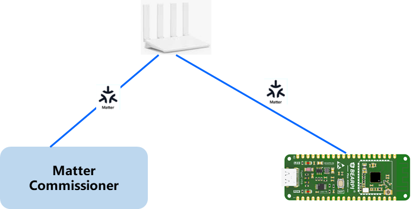
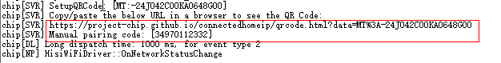
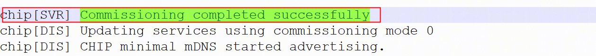
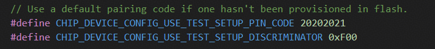

# Preface<a name="ZH-CN_TOPIC_0000002527488484"></a>

**Overview<a name="title103mcpsimp"></a>**

This document mainly describes the Matter development and verification operation procedures and usage precautions on WS63V100, providing necessary guidance for software developers and testers to develop and verify Matter on this chip.

> **Note:** 
>This document uses WS63V100 as an example for description.

**Product Version<a name="title109mcpsimp"></a>**

The product versions corresponding to this document are as follows.

<a name="table111mcpsimp"></a>
<table><thead align="left"><tr id="row116mcpsimp"><th class="cellrowborder" valign="top" width="32%" id="mcps1.1.3.1.1"><p id="p118mcpsimp"><a name="p118mcpsimp"></a><a name="p118mcpsimp"></a>Product Name</p>
</th>
<th class="cellrowborder" valign="top" width="68%" id="mcps1.1.3.1.2"><p id="p120mcpsimp"><a name="p120mcpsimp"></a><a name="p120mcpsimp"></a>Product Version</p>
</th>
</tr>
</thead>
<tbody><tr id="row122mcpsimp"><td class="cellrowborder" valign="top" width="32%" headers="mcps1.1.3.1.1 "><p id="p124mcpsimp"><a name="p124mcpsimp"></a><a name="p124mcpsimp"></a>WS63</p>
</td>
<td class="cellrowborder" valign="top" width="68%" headers="mcps1.1.3.1.2 "><p id="p126mcpsimp"><a name="p126mcpsimp"></a><a name="p126mcpsimp"></a>V100</p>
</td>
</tr>
</tbody>
</table>

**Intended Audience<a name="section4378592816410"></a>**

This document mainly applies to the following engineers:

-   Technical support engineers
-   Software development engineers

**Symbol Conventions<a name="section133020216410"></a>**

The following symbols may appear in this document. Their meanings are described below.

<a name="table2622507016410"></a>
<table><thead align="left"><tr id="row1530720816410"><th class="cellrowborder" valign="top" width="20.580000000000002%" id="mcps1.1.3.1.1"><p id="p6450074116410"><a name="p6450074116410"></a><a name="p6450074116410"></a><strong id="b2136615816410"><a name="b2136615816410"></a><a name="b2136615816410"></a>Symbol</strong></p>
</th>
<th class="cellrowborder" valign="top" width="79.42%" id="mcps1.1.3.1.2"><p id="p5435366816410"><a name="p5435366816410"></a><a name="p5435366816410"></a><strong id="b5941558116410"><a name="b5941558116410"></a><a name="b5941558116410"></a>Description</strong></p>
</th>
</tr>
</thead>
<tbody><tr id="row1372280416410"><td class="cellrowborder" valign="top" width="20.580000000000002%" headers="mcps1.1.3.1.1 "><p id="p3734547016410"><a name="p3734547016410"></a><a name="p3734547016410"></a><a name="image2670064316410"></a><a name="image2670064316410"></a><span></span></p>
</td>
<td class="cellrowborder" valign="top" width="79.42%" headers="mcps1.1.3.1.2 "><p id="p1757432116410"><a name="p1757432116410"></a><a name="p1757432116410"></a>Indicates a hazard with a high level of risk that, if not avoided, will result in death or serious injury.</p>
</td>
</tr>
<tr id="row466863216410"><td class="cellrowborder" valign="top" width="20.580000000000002%" headers="mcps1.1.3.1.1 "><p id="p1432579516410"><a name="p1432579516410"></a><a name="p1432579516410"></a><a name="image4895582316410"></a><a name="image4895582316410"></a><span></span></p>
</td>
<td class="cellrowborder" valign="top" width="79.42%" headers="mcps1.1.3.1.2 "><p id="p959197916410"><a name="p959197916410"></a><a name="p959197916410"></a>Indicates a hazard with a medium level of risk that, if not avoided, could result in death or serious injury.</p>
</td>
</tr>
<tr id="row123863216410"><td class="cellrowborder" valign="top" width="20.580000000000002%" headers="mcps1.1.3.1.1 "><p id="p1232579516410"><a name="p1232579516410"></a><a name="p1232579516410"></a><a name="image1235582316410"></a><a name="image1235582316410"></a><span></span></p>
</td>
<td class="cellrowborder" valign="top" width="79.42%" headers="mcps1.1.3.1.2 "><p id="p123197916410"><a name="p123197916410"></a><a name="p123197916410"></a>Indicates a hazard with a low level of risk that, if not avoided, could result in minor or moderate injury.</p>
</td>
</tr>
<tr id="row5786682116410"><td class="cellrowborder" valign="top" width="20.580000000000002%" headers="mcps1.1.3.1.1 "><p id="p2204984716410"><a name="p2204984716410"></a><a name="p2204984716410"></a><a name="image4504446716410"></a><a name="image4504446716410"></a><span></span></p>
</td>
<td class="cellrowborder" valign="top" width="79.42%" headers="mcps1.1.3.1.2 "><p id="p4388861916410"><a name="p4388861916410"></a><a name="p4388861916410"></a>Used to convey safety warning information about the device or environment. If not avoided, it may cause device damage, data loss, reduced device performance, or other unpredictable results.</p>
<p id="p1238861916410"><a name="p1238861916410"></a><a name="p1238861916410"></a>"Notice" does not involve personal injury.</p>
</td>
</tr>
<tr id="row2856923116410"><td class="cellrowborder" valign="top" width="20.580000000000002%" headers="mcps1.1.3.1.1 "><p id="p5555360116410"><a name="p5555360116410"></a><a name="p5555360116410"></a><a name="image799324016410"></a><a name="image799324016410"></a><span></span></p>
</td>
<td class="cellrowborder" valign="top" width="79.42%" headers="mcps1.1.3.1.2 "><p id="p4612588116410"><a name="p4612588116410"></a><a name="p4612588116410"></a>Supplementary explanation of key information in the main text.</p>
<p id="p1232588116410"><a name="p1232588116410"></a><a name="p1232588116410"></a>"Note" is not a safety warning and does not involve personal, device, or environmental injury information.</p>
</td>
</tr>
</tbody>
</table>

**Revision History<a name="section2467512116410"></a>**

<a name="table1557726816410"></a>
<table><thead align="left"><tr id="row2942532716410"><th class="cellrowborder" valign="top" width="20.72%" id="mcps1.1.4.1.1"><p id="p3778275416410"><a name="p3778275416410"></a><a name="p3778275416410"></a><strong id="b5687322716410"><a name="b5687322716410"></a><a name="b5687322716410"></a>Document Version</strong></p>
</th>
<th class="cellrowborder" valign="top" width="26.119999999999997%" id="mcps1.1.4.1.2"><p id="p5627845516410"><a name="p5627845516410"></a><a name="p5627845516410"></a><strong id="b5800814916410"><a name="b5800814916410"></a><a name="b5800814916410"></a>Release Date</strong></p>
</th>
<th class="cellrowborder" valign="top" width="53.16%" id="mcps1.1.4.1.3"><p id="p2382284816410"><a name="p2382284816410"></a><a name="p2382284816410"></a><strong id="b3316380216410"><a name="b3316380216410"></a><a name="b3316380216410"></a>Modification Description</strong></p>
</th>
</tr>
</thead>
<tbody><tr id="row5947359616410"><td class="cellrowborder" valign="top" width="20.72%" headers="mcps1.1.4.1.1 "><p id="p2149706016410"><a name="p2149706016410"></a><a name="p2149706016410"></a>01</p>
</td>
<td class="cellrowborder" valign="top" width="26.119999999999997%" headers="mcps1.1.4.1.2 "><p id="p648803616410"><a name="p648803616410"></a><a name="p648803616410"></a>2026-03-20</p>
</td>
<td class="cellrowborder" valign="top" width="53.16%" headers="mcps1.1.4.1.3 "><p id="p1946537916410"><a name="p1946537916410"></a><a name="p1946537916410"></a>First official release.</p>
</td>
</tr>
</tbody>
</table>

# Matter Overview<a name="ZH-CN_TOPIC_0000002527125016"></a>


## Matter Introduction<a name="ZH-CN_TOPIC_0000002558124909"></a>

Matter, developed by the work groups of CSA (Connectivity Standards Alliance), is a unified open-source application-layer connectivity standard designed to enable developers and device manufacturers to connect and build reliable, secure ecosystems, improving compatibility among connected home devices. It adopts market-proven technologies, uses the Internet Protocol (IP), and is compatible with Thread and Wi-Fi network transport.

Matter technology includes three specifications, which are:

-   Matter Core Specification: The core standard is the primary specification, defining the Matter protocol architecture, secure communication mechanisms, commissioning flow, data model, and other Matter technical content.
-   Matter Application Cluster Specification: Detailed definitions of the clusters related to the currently supported Matter product applications.
-   Matter Device Library Specification: Specific definitions of the currently supported Matter device types, such as the clusters a device needs to satisfy.

All of them can be downloaded from the CSA official website.

> **Note:** 
>Matter standard document download address: [https://csa-iot.org/developer-resource/specifications-download-request/](https://csa-iot.org/developer-resource/specifications-download-request/)

## Matter Solution<a name="ZH-CN_TOPIC_0000002558284891"></a>

This SDK integrates the Matter SDK. It can act as a Matter Device that, after commissioning through a Matter Commissioner, connects to and is controlled by a Matter controller. It supports developing rich Device types based on the SDK, such as light bulbs, switches, sensors, thermostats, blinds, door locks, and more. The current solution provides a smart lighting DEMO for developers' reference.

The Matter SDK version and standard supported by default in the current SDK: Matter V1.4.2.

# Setting Up the Development Environment<a name="ZH-CN_TOPIC_0000002526965084"></a>


## Development Environment Description<a name="ZH-CN_TOPIC_0000002527125018"></a>

-   Matter development environment: Ubuntu 22.04 LTS
-   Python 3.11 or later

Directory description:

The Matter component of this SDK is located at:

middleware/services/matter/connectedhomeip

The directory structure of the Matter code is as follows:
```bash
connectedhomeip
   ├── config
   │   └── hisilicon // Directory for the build configuration of the Matter code for this chip
   │       ├── mbedtls
   │       └── toolchain
   ├── examples
   │   ├── lighting-app
   │   │   └── hisilicon // Directory for the Matter DEMO sample code for this chip
   │   │       └── main
   │   │           └── include
   │   └── platform
   │       └── hisilicon // Platform common code for the DEMO sample code
   │           ├── common
   │           └── ota
   └── src
       └── platform
         └── hisilicon // Directory for the core Matter adaptation code for this chip's platform
```
## Matter Development Environment Setup Steps<a name="ZH-CN_TOPIC_0000002558124911"></a>

1.  Install the dependencies of the build development server environment.
    ```bash
    sudo apt-get install git gcc g++ pkg-config cmake libssl-dev libdbus-1-dev \
    libglib2.0-dev libavahi-client-dev ninja-build python3-venv python3-dev \
    python3-pip unzip libgirepository1.0-dev libcairo2-dev libreadline-dev default-jre
    ```
2.  Download the ws63 SDK software package that includes the Matter source code adapted for this platform:
    ```bash
    git clone https://gitcode.com/HiSpark/fbb_ws63.git -b master
    cd fbb_ws63
    git submodule update --init --remote --force
    cd src/middleware/services/matter/connectedhomeip
    ./scripts/checkout_submodules.py --shallow --platform hisilicon
    ```
3.  Install the Matter build dependency environment.
    Run the script in the connectedhomeip directory:
    ```bash
    source scripts/activate.sh
    ```
    Note: If network connection problems occur while running the script, a VPN generally needs to be configured.
4.  Run the Matter build command in the source code root directory.
    ```bash
    python3 -u build.py -c ws63-liteos-matter
    ```
    The build output is generated in the output directory:
    output/ws63/fwpkg/ws63-liteos-matter/ws63-liteos-matter\_all.fwpkg

For the detailed Matter build environment, refer to the official guide: [https://project-chip.github.io/connectedhomeip-doc/guides/BUILDING.html](https://project-chip.github.io/connectedhomeip-doc/guides/BUILDING.html)

# Testing and Verification<a name="ZH-CN_TOPIC_0000002558284893"></a>


## Testing and Verification Description<a name="ZH-CN_TOPIC_0000002526965086"></a>

The Matter application sample supports the light app by default, which supports turning the LED on and off. The light app is used to verify the integration and adaptation of the Matter SDK on this chip.

The Matter commissioning diagram is shown in [Figure 1](#fig12869218103212).

**Figure 1**  Matter test networking diagram<a name="fig12869218103212"></a>  


The Matter commissioner can be a Matter-capable phone, as well as the official Matter debugging tool chip-tool, among others.


### Matter Testing and Verification Methods<a name="ZH-CN_TOPIC_0000002527125020"></a>

Matter testing and verification supports the following methods:

1.  Use Matter ecosystem devices for commissioning (such as Apple Home, Google Home, and third-party Matter apps like the Tuya Smart app).
2.  Use the chip-tool testing tool.

### Burning Matter Certificates<a name="ZH-CN_TOPIC_0000002558124913"></a>

The Matter solution SDK for this chip is pre-provisioned with test certificates. Certificates must be burned before Matter connection and commissioning. Burning method:

Enter the AT command in the serial port tool:
```bash
AT+MATTERPROVISION
```

Note: These test certificates are for development and debugging use only and do not support commercial product use.

## Commissioning with Matter Ecosystem Devices<a name="ZH-CN_TOPIC_0000002558284895"></a>

Taking Apple Home as an example, pairing is supported by scanning the QR code or manually entering the pairing code during testing.

During the development and testing phase, the QR code and manual pairing code are printed to the serial port when the Matter device starts up.



For commissioning Matter devices using the Apple Home ecosystem, refer to the operation instructions on the Apple official website: [https://support.apple.com/en-us/102135](https://support.apple.com/en-us/102135)

During successful commissioning, the device serial port outputs the following key logs.



## Testing and Verification with chip-tool<a name="ZH-CN_TOPIC_0000002526965088"></a>

chip-tool is a Linux tool that can be used to pair and test Matter devices. For a detailed introduction and usage instructions of the tool, refer to the official documentation:

[https://project-chip.github.io/connectedhomeip-doc/development\_controllers/chip-tool/chip\_tool\_guide.html](https://project-chip.github.io/connectedhomeip-doc/development_controllers/chip-tool/chip_tool_guide.html)


### Pairing Command<a name="ZH-CN_TOPIC_0000002527125022"></a>
```bash
./chip-tool pairing ble-wifi <node_id> <ssid> <password> <pin_code> <discriminator>
```
In this command:
```bash
<node_id>: User-defined ID of the device to be paired
<ssid> and <password>: The Wi-Fi and password set for the device to be paired
<pin_code> and <discriminator>: The passcode and discriminator for the device to be paired
```
Example of Matter commissioning on the reference board:
```bash
chip-tool pairing ble-wifi 0x7238  ssid  password  20202021 3840
```
The default values of `pin_code` and `discriminator` can be modified and viewed in the configuration file, as follows:



File path:
`middleware/services/matter/connectedhomeip/src/platform/hisilicon/CHIPDevicePlatformConfig.h`

You can use the AT command to quickly view `pin_code` and the discriminator `discriminator`

Command: `AT+MATTERSHOW`. The device configuration information is printed to the serial port; check the values of the fields corresponding to the pin code and discriminator.

### Controlling On/Off<a name="ZH-CN_TOPIC_0000002558124915"></a>
```bash
chip-tool onoff on/off <node_id> <endpoint_id>
```
In this command:

`<node_id>` is the ID of the device to be controlled

`<endpoint_id>` is the ID of the endpoint that implements the onoff cluster

The Matter solution reference application controls the light switch:

Turning the light on: `chip-tool onoff on 0x7238 1`

Turning the light off: `chip-tool onoff off 0x7238 1`

For detailed usage instructions of chip-tool, refer to the official documentation:

[https://project-chip.github.io/connectedhomeip-doc/development\_controllers/chip-tool/chip\_tool\_guide.html](https://project-chip.github.io/connectedhomeip-doc/development_controllers/chip-tool/chip_tool_guide.html)

### Matter OTA Testing and Verification<a name="ZH-CN_TOPIC_0000002558304269"></a>

Use chip-ota-provider-app on a Raspberry Pi to simulate a provider. Open a new Raspberry Pi terminal as the commissioner. In this new commissioner terminal, pair with both the provider simulated in the previous terminal and the device, so that both are in the same Fabric network. After the provider is commissioned, the commissioner terminal needs to configure the provider's ACL access permissions, then notify the device that a provider exists, and then start the OTA upgrade.

-   **Creating the OTA Image**
```bash
src/app/ota_image_tool.py create -v 0xDEAD -p 0xBEEF -vn 2 -vs "2.0" -da sha256 firmware.bin firmware.ota
```
Parameter description:
```bash
-v: vid, vendor id
-p: pid, product id
-vn: software version number
-vs: software version number in string format
firmware.bin: input image for the Matter OTA script, using the FOTA image as the input
firmware.ota: output image of the Matter OTA script, that is, the _ws63.firmware.ota mentioned below
```
-   **Starting the OTA provider and adding it to the Matter network**

 Run the following command in Terminal 1 to start the OTA provider:
 ```bash
 chip-ota-provider-app -f  ws63.firmware.ota
 ```
 In Terminal 2, add the provider to the Matter network:
 ```bash
 chip-tool pairing onnetwork 1 20202021
 ```
 Note: The node ID here is 1. After successful commissioning, chip-tool uses this node ID as the handle to control it.

-   **Configuring the OTA provider's ACL permissions**
```bash
chip-tool accesscontrol write acl '[{"fabricIndex": 1, "privilege": 5, "authMode": 2, "subjects": [112233], "targets": null}, {"fabricIndex": 1, "privilege": 3, "authMode": 2, "subjects": null, "targets": null}]' 1 0
```
Note: During the Matter OTA process, configuring the ACL (Access Control List) ensures that only authorized nodes can send commands to and operate on the OTA Provider (firmware provider). The ACL is a security mechanism used to manage and enforce access permission rules for node Endpoints and their associated Cluster instances.

-   **Adding the ws63 device to the Matter network**

`chip-tool pairing ble-wifi 0x7238  ssid  password  20202021 3840`

-   **Starting the Matter OTA upgrade**

`chip-tool otasoftwareupdaterequestor announce-otaprovider <ota_provider_node_id> 0 0 0 <device_node_id> 0`

For example:
```bash
chip-tool otasoftwareupdaterequestor announce-otaprovider 1 0 0 0 0x7238 0
```
Parameter description:
```bash
Provider Node ID: 1, entered when commissioning chip-ota-provider-app
Provider Vendor ID: directly enter 0 during testing
Announcement Reason: directly enter 0 during testing
Provider Endpoint ID: usually Endpoint 0
Requestor Node ID: 0x7238, entered when commissioning the Matter device
Requestor Endpoint ID: usually Endpoint 0
```
### Test Harness (TH) Testing<a name="ZH-CN_TOPIC_0000002558284897"></a>

To simplify the testing and certification process of Matter devices, the Connectivity Standards Alliance has developed a standardized test tool, namely the Matter Test Harness. As Matter has evolved to version V1.5, the Matter Test Harness testing tool has been updated accordingly. The Alliance no longer provides complete Test Harness image files; the tool is now fully open source, and the code can be obtained from GitHub and installed by yourself.

For details, refer to the official documentation: [https://matter.cn/development/test-harness](https://matter.cn/development/test-harness)

# Common Development and Debugging Commands<a name="ZH-CN_TOPIC_0000002526965090"></a>


## Common Development and Debugging Commands<a name="ZH-CN_TOPIC_0000002527125024"></a>


### Burning Certificates<a name="ZH-CN_TOPIC_0000002558124917"></a>

Command:
```bash
AT+MATTERPROVISION
```
Function: Matter reference devices have no certificates by default. Use this command to burn test certificates.

Note: The device needs to be restarted after burning is complete. If customers implement their own certificate burning tool, they must ensure that the certificates and keys are stored in the NV region, with the corresponding key IDs as follows:

Certificate Declaration (DC): 0x6002

Device Attestation Certificate (DAC): 0x6003

Product Attestation Intermediate (PAI) certificate: 0x6004

DAC private key: 0x6005

DAC public key: 0x6028

### Displaying Matter Configuration Information<a name="ZH-CN_TOPIC_0000002526965092"></a>

Command:
```bash
AT+MATTERSHOW
```
Function: Displays the Matter device configuration information, such as the pin code and discriminator.

### Viewing Board Network IP Information<a name="ZH-CN_TOPIC_0000002527125026"></a>

Command:
```bash
AT+IFCFG
```
Function: Views the board network information, including whether the device has connected to the router hotspot and whether an IP address has been correctly assigned.

### PING Command<a name="ZH-CN_TOPIC_0000002558124919"></a>

-   Command:
```bash
    AT+PING
```
Function: Tests IPv4 network connectivity.
Example: `AT+PING=192.168.3.1`   executes `ping 192.168.3.1`

-   Command:
```bash
AT+PING6
```
Function: Tests IPv6 network connectivity.
Example: `AT+PING6=2001:a:b:c:d:e:f:b`

### Viewing System Information<a name="ZH-CN_TOPIC_0000002558284901"></a>

Command:
```bash
AT+SYSINFO
```
Function: Views the status of all system threads, such as priority, stack status, and memory and CPU usage, making it convenient to view and locate problems.

