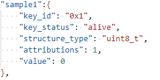
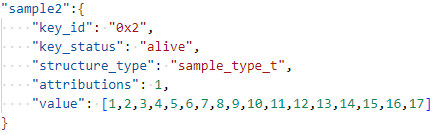

# Preface<a name="ZH-CN_TOPIC_0000001814189501"></a>

**Overview<a name="section4537382116410"></a>**

This document mainly describes the usage of the NV storage module in WS63V100. It is intended to guide engineers to quickly use the NV module for secondary development.

**Product Version<a name="section27775771"></a>**

The product version corresponding to this document is as follows.

<a name="table52250146"></a>
<table><thead align="left"><tr id="row55967882"><th class="cellrowborder" valign="top" width="39.39%" id="mcps1.1.3.1.1"><p id="p37104584"><a name="p37104584"></a><a name="p37104584"></a><strong id="b48174912328"><a name="b48174912328"></a><a name="b48174912328"></a>Product Name</strong></p>
</th>
<th class="cellrowborder" valign="top" width="60.61%" id="mcps1.1.3.1.2"><p id="p52681331"><a name="p52681331"></a><a name="p52681331"></a><strong id="b682239163211"><a name="b682239163211"></a><a name="b682239163211"></a>Product Version</strong></p>
</th>
</tr>
</thead>
<tbody><tr id="row39329394"><td class="cellrowborder" valign="top" width="39.39%" headers="mcps1.1.3.1.1 "><p id="p15727111613530"><a name="p15727111613530"></a><a name="p15727111613530"></a>WS63</p>
</td>
<td class="cellrowborder" valign="top" width="60.61%" headers="mcps1.1.3.1.2 "><p id="p34453054"><a name="p34453054"></a><a name="p34453054"></a>V100</p>
</td>
</tr>
</tbody>
</table>

**Intended Audience<a name="section4378592816410"></a>**

This document is mainly applicable to the following engineers:

-   Technical support engineers
-   Software engineers

**Symbol Conventions<a name="section133020216410"></a>**

The following symbols may appear in this document. Their meanings are described as follows.

<a name="table2622507016410"></a>
<table><thead align="left"><tr id="row1530720816410"><th class="cellrowborder" valign="top" width="20.580000000000002%" id="mcps1.1.3.1.1"><p id="p6450074116410"><a name="p6450074116410"></a><a name="p6450074116410"></a><strong id="b2136615816410"><a name="b2136615816410"></a><a name="b2136615816410"></a>Symbol</strong></p>
</th>
<th class="cellrowborder" valign="top" width="79.42%" id="mcps1.1.3.1.2"><p id="p5435366816410"><a name="p5435366816410"></a><a name="p5435366816410"></a><strong id="b5941558116410"><a name="b5941558116410"></a><a name="b5941558116410"></a>Description</strong></p>
</th>
</tr>
</thead>
<tbody><tr id="row1372280416410"><td class="cellrowborder" valign="top" width="20.580000000000002%" headers="mcps1.1.3.1.1 "><p id="p3734547016410"><a name="p3734547016410"></a><a name="p3734547016410"></a><a name="image2670064316410"></a><a name="image2670064316410"></a><span></span></p>
</td>
<td class="cellrowborder" valign="top" width="79.42%" headers="mcps1.1.3.1.2 "><p id="p1757432116410"><a name="p1757432116410"></a><a name="p1757432116410"></a>Indicates a hazard with a high level of risk that, if not avoided, will result in death or serious injury.</p>
</td>
</tr>
<tr id="row466863216410"><td class="cellrowborder" valign="top" width="20.580000000000002%" headers="mcps1.1.3.1.1 "><p id="p1432579516410"><a name="p1432579516410"></a><a name="p1432579516410"></a><a name="image4895582316410"></a><a name="image4895582316410"></a><span></span></p>
</td>
<td class="cellrowborder" valign="top" width="79.42%" headers="mcps1.1.3.1.2 "><p id="p959197916410"><a name="p959197916410"></a><a name="p959197916410"></a>Indicates a hazard with a medium level of risk that, if not avoided, could result in death or serious injury.</p>
</td>
</tr>
<tr id="row123863216410"><td class="cellrowborder" valign="top" width="20.580000000000002%" headers="mcps1.1.3.1.1 "><p id="p1232579516410"><a name="p1232579516410"></a><a name="p1232579516410"></a><a name="image1235582316410"></a><a name="image1235582316410"></a><span></span></p>
</td>
<td class="cellrowborder" valign="top" width="79.42%" headers="mcps1.1.3.1.2 "><p id="p123197916410"><a name="p123197916410"></a><a name="p123197916410"></a>Indicates a hazard with a low level of risk that, if not avoided, could result in minor or moderate injury.</p>
</td>
</tr>
<tr id="row5786682116410"><td class="cellrowborder" valign="top" width="20.580000000000002%" headers="mcps1.1.3.1.1 "><p id="p2204984716410"><a name="p2204984716410"></a><a name="p2204984716410"></a><a name="image4504446716410"></a><a name="image4504446716410"></a><span></span></p>
</td>
<td class="cellrowborder" valign="top" width="79.42%" headers="mcps1.1.3.1.2 "><p id="p4388861916410"><a name="p4388861916410"></a><a name="p4388861916410"></a>Conveys safety warnings about equipment or the environment. If not avoided, it may result in equipment damage, data loss, reduced equipment performance, or other unpredictable consequences.</p>
<p id="p1238861916410"><a name="p1238861916410"></a><a name="p1238861916410"></a>"Notice" does not involve personal injury.</p>
</td>
</tr>
<tr id="row2856923116410"><td class="cellrowborder" valign="top" width="20.580000000000002%" headers="mcps1.1.3.1.1 "><p id="p5555360116410"><a name="p5555360116410"></a><a name="p5555360116410"></a><a name="image799324016410"></a><a name="image799324016410"></a><span></span></p>
</td>
<td class="cellrowborder" valign="top" width="79.42%" headers="mcps1.1.3.1.2 "><p id="p4612588116410"><a name="p4612588116410"></a><a name="p4612588116410"></a>Supplementary explanation of key information in the main text.</p>
<p id="p1232588116410"><a name="p1232588116410"></a><a name="p1232588116410"></a>"Note" is not a safety warning and does not involve information about personal, equipment, or environmental injury.</p>
</td>
</tr>
</tbody>
</table>

**Revision History<a name="section2467512116410"></a>**

<a name="table1557726816410"></a>
<table><thead align="left"><tr id="row2942532716410"><th class="cellrowborder" valign="top" width="20.05%" id="mcps1.1.4.1.1"><p id="p3778275416410"><a name="p3778275416410"></a><a name="p3778275416410"></a><strong id="b5687322716410"><a name="b5687322716410"></a><a name="b5687322716410"></a>Document Version</strong></p>
</th>
<th class="cellrowborder" valign="top" width="22.73%" id="mcps1.1.4.1.2"><p id="p5627845516410"><a name="p5627845516410"></a><a name="p5627845516410"></a><strong id="b5800814916410"><a name="b5800814916410"></a><a name="b5800814916410"></a>Release Date</strong></p>
</th>
<th class="cellrowborder" valign="top" width="57.220000000000006%" id="mcps1.1.4.1.3"><p id="p2382284816410"><a name="p2382284816410"></a><a name="p2382284816410"></a><strong id="b3316380216410"><a name="b3316380216410"></a><a name="b3316380216410"></a>Modification Description</strong></p>
</th>
</tr>
</thead>
<tbody><tr id="row1665734332"><td class="cellrowborder" valign="top" width="20.05%" headers="mcps1.1.4.1.1 "><p id="p266643410314"><a name="p266643410314"></a><a name="p266643410314"></a>06</p>
</td>
<td class="cellrowborder" valign="top" width="22.73%" headers="mcps1.1.4.1.2 "><p id="p35211530171912"><a name="p35211530171912"></a><a name="p35211530171912"></a>2025-08-29</p>
</td>
<td class="cellrowborder" valign="top" width="57.220000000000006%" headers="mcps1.1.4.1.3 "><p id="p143800371535"><a name="p143800371535"></a><a name="p143800371535"></a>Updated the "<a href="NV Item Summary.md">NV Item Summary</a>" section.</p>
</td>
</tr>
<tr id="row8216208269"><td class="cellrowborder" valign="top" width="20.05%" headers="mcps1.1.4.1.1 "><p id="p1521162052615"><a name="p1521162052615"></a><a name="p1521162052615"></a>05</p>
</td>
<td class="cellrowborder" valign="top" width="22.73%" headers="mcps1.1.4.1.2 "><p id="p142102042616"><a name="p142102042616"></a><a name="p142102042616"></a>2025-02-28</p>
</td>
<td class="cellrowborder" valign="top" width="57.220000000000006%" headers="mcps1.1.4.1.3 "><p id="p9190113618286"><a name="p9190113618286"></a><a name="p9190113618286"></a>Updated the "<a href="NV Item Summary.md">NV Item Summary</a>" section.</p>
</td>
</tr>
<tr id="row04432872711"><td class="cellrowborder" valign="top" width="20.05%" headers="mcps1.1.4.1.1 "><p id="p6443148102716"><a name="p6443148102716"></a><a name="p6443148102716"></a>04</p>
</td>
<td class="cellrowborder" valign="top" width="22.73%" headers="mcps1.1.4.1.2 "><p id="p14435819274"><a name="p14435819274"></a><a name="p14435819274"></a>2024-10-14</p>
</td>
<td class="cellrowborder" valign="top" width="57.220000000000006%" headers="mcps1.1.4.1.3 "><p id="p6709115652710"><a name="p6709115652710"></a><a name="p6709115652710"></a>Updated the "<a href="Compile and Generate NV Image.md">Compile and Generate NV Image</a>" section.</p>
</td>
</tr>
<tr id="row1650123114275"><td class="cellrowborder" valign="top" width="20.05%" headers="mcps1.1.4.1.1 "><p id="p19501731112720"><a name="p19501731112720"></a><a name="p19501731112720"></a>03</p>
</td>
<td class="cellrowborder" valign="top" width="22.73%" headers="mcps1.1.4.1.2 "><p id="p1950143120271"><a name="p1950143120271"></a><a name="p1950143120271"></a>2024-05-30</p>
</td>
<td class="cellrowborder" valign="top" width="57.220000000000006%" headers="mcps1.1.4.1.3 "><a name="ul118461738112714"></a><a name="ul118461738112714"></a><ul id="ul118461738112714"><li>Updated the "<a href="Feature Description.md">Feature Description</a>" section.</li><li>Updated the "<a href="Interface Description.md">Interface Description</a>" section.</li></ul>
</td>
</tr>
<tr id="row11286029144112"><td class="cellrowborder" valign="top" width="20.05%" headers="mcps1.1.4.1.1 "><p id="p1228610295417"><a name="p1228610295417"></a><a name="p1228610295417"></a>02</p>
</td>
<td class="cellrowborder" valign="top" width="22.73%" headers="mcps1.1.4.1.2 "><p id="p4286192915418"><a name="p4286192915418"></a><a name="p4286192915418"></a>2024-05-07</p>
</td>
<td class="cellrowborder" valign="top" width="57.220000000000006%" headers="mcps1.1.4.1.3 "><p id="p6912153815411"><a name="p6912153815411"></a><a name="p6912153815411"></a>Updated the "<a href="Interface Description.md">Interface Description</a>" section.</p>
</td>
</tr>
<tr id="row27873516817"><td class="cellrowborder" valign="top" width="20.05%" headers="mcps1.1.4.1.1 "><p id="p15787351589"><a name="p15787351589"></a><a name="p15787351589"></a>01</p>
</td>
<td class="cellrowborder" valign="top" width="22.73%" headers="mcps1.1.4.1.2 "><p id="p47814359819"><a name="p47814359819"></a><a name="p47814359819"></a>2024-04-10</p>
</td>
<td class="cellrowborder" valign="top" width="57.220000000000006%" headers="mcps1.1.4.1.3 "><p id="p97833513813"><a name="p97833513813"></a><a name="p97833513813"></a>First official release.</p>
<a name="ul19528167192610"></a><a name="ul19528167192610"></a><ul id="ul19528167192610"><li>Updated the "<a href="Feature Description.md">Feature Description</a>" section.</li><li>Updated the "<a href="Interface Description.md">Interface Description</a>" section.</li><li>Updated the "<a href="Development Guidelines.md">Development Guidelines</a>" section.</li></ul>
</td>
</tr>
<tr id="row171014397454"><td class="cellrowborder" valign="top" width="20.05%" headers="mcps1.1.4.1.1 "><p id="p1810133910458"><a name="p1810133910458"></a><a name="p1810133910458"></a>00B02</p>
</td>
<td class="cellrowborder" valign="top" width="22.73%" headers="mcps1.1.4.1.2 "><p id="p6101739104519"><a name="p6101739104519"></a><a name="p6101739104519"></a>2024-03-29</p>
</td>
<td class="cellrowborder" valign="top" width="57.220000000000006%" headers="mcps1.1.4.1.3 "><p id="p151073917451"><a name="p151073917451"></a><a name="p151073917451"></a>Added the "<a href="NV Item Summary.md">NV Item Summary</a>" chapter.</p>
</td>
</tr>
<tr id="row5947359616410"><td class="cellrowborder" valign="top" width="20.05%" headers="mcps1.1.4.1.1 "><p id="p2149706016410"><a name="p2149706016410"></a><a name="p2149706016410"></a>00B01</p>
</td>
<td class="cellrowborder" valign="top" width="22.73%" headers="mcps1.1.4.1.2 "><p id="p648803616410"><a name="p648803616410"></a><a name="p648803616410"></a>2024-01-10</p>
</td>
<td class="cellrowborder" valign="top" width="57.220000000000006%" headers="mcps1.1.4.1.3 "><p id="p1946537916410"><a name="p1946537916410"></a><a name="p1946537916410"></a>First interim release.</p>
</td>
</tr>
</tbody>
</table>

# NV Introduction<a name="ZH-CN_TOPIC_0000001814229573"></a>

The NV module is used to store non-volatile data in local storage. Each data item in the NV is defined in a key-value manner, and the data item contains a unique index key and a value of a custom data type.

NV items can be stored in two ways: compile-time preset and API write.

-   Compile-time preset means that during the code compilation phase, developers can generate a customized NV image by modifying the NV header file and the NV configuration file, and the image is burned into the storage medium uniformly during the image burning process. The preset NV items can be read and updated through API interfaces during code execution.
-   API write means that users can directly call API interfaces in code to write new NV items. For specific usage, see "[NV API Guide](NV API Guide.md)".

# NV Compile-Time Preset<a name="ZH-CN_TOPIC_0000001767549426"></a>

The compile-time preset method does not support the generation of encrypted NV items. To write encrypted NV items, you must use API interfaces.


## Adding an NV Item<a name="ZH-CN_TOPIC_0000001767389742"></a>


### Procedure for Adding an NV Item<a name="ZH-CN_TOPIC_0000001814229577"></a>

1.  Add the data type definition of kvalue in the header file (optional; this step can be skipped if it is a common data type).
2.  Add the NV description item in the json file.

**Adding a kvalue Data Type<a name="section206861047121115"></a>**

-   Common data types:

    unit8\_t, unit16\_t, unit32\_t, and bool.

-   Custom data types:

    Custom enum types and struct types are supported.

-   Storage path of custom data types:

    middleware/chips/ws63/nv/nv\_config/include/nv\_common\_cfg.h

-   When users use common or already-defined data types, modification of the above file is not involved. When users need to add an enum or struct type, it must be defined in the above file.

**Adding an NV Description Item<a name="section13134513141310"></a>**

-   Path of the NV description item file:

    middleware/chips/ws63/nv/nv\_config/cfg/acore/app.json

-   Definition description:

    **Table 1**  Description of NV configuration options

    <a name="table8802115017551"></a>
    <table><thead align="left"><tr id="row3802550105510"><th class="cellrowborder" valign="top" width="29.18%" id="mcps1.2.3.1.1"><p id="p680265010550"><a name="p680265010550"></a><a name="p680265010550"></a>NV configuration option</p>
    </th>
    <th class="cellrowborder" valign="top" width="70.82000000000001%" id="mcps1.2.3.1.2"><p id="p7802115012558"><a name="p7802115012558"></a><a name="p7802115012558"></a>Description</p>
    </th>
    </tr>
    </thead>
    <tbody><tr id="row1780215504558"><td class="cellrowborder" valign="top" width="29.18%" headers="mcps1.2.3.1.1 "><p id="p188021550125516"><a name="p188021550125516"></a><a name="p188021550125516"></a>key_id</p>
    </td>
    <td class="cellrowborder" valign="top" width="70.82000000000001%" headers="mcps1.2.3.1.2 "><p id="p198021950105511"><a name="p198021950105511"></a><a name="p198021950105511"></a>ID of the NV item.</p>
    </td>
    </tr>
    <tr id="row198025507556"><td class="cellrowborder" valign="top" width="29.18%" headers="mcps1.2.3.1.1 "><p id="p14802115012556"><a name="p14802115012556"></a><a name="p14802115012556"></a>key_status</p>
    </td>
    <td class="cellrowborder" valign="top" width="70.82000000000001%" headers="mcps1.2.3.1.2 "><p id="p1780235085512"><a name="p1780235085512"></a><a name="p1780235085512"></a>Status of the NV item.</p>
    </td>
    </tr>
    <tr id="row480295035518"><td class="cellrowborder" valign="top" width="29.18%" headers="mcps1.2.3.1.1 "><p id="p18021450165513"><a name="p18021450165513"></a><a name="p18021450165513"></a>structure_type</p>
    </td>
    <td class="cellrowborder" valign="top" width="70.82000000000001%" headers="mcps1.2.3.1.2 "><p id="p198021450155516"><a name="p198021450155516"></a><a name="p198021450155516"></a>Data structure type of the NV item.</p>
    </td>
    </tr>
    <tr id="row1580225015551"><td class="cellrowborder" valign="top" width="29.18%" headers="mcps1.2.3.1.1 "><p id="p880245035512"><a name="p880245035512"></a><a name="p880245035512"></a>attributions</p>
    </td>
    <td class="cellrowborder" valign="top" width="70.82000000000001%" headers="mcps1.2.3.1.2 "><p id="p1280225015519"><a name="p1280225015519"></a><a name="p1280225015519"></a>Attribute value of the NV item.</p>
    </td>
    </tr>
    <tr id="row10802125014557"><td class="cellrowborder" valign="top" width="29.18%" headers="mcps1.2.3.1.1 "><p id="p20802450155516"><a name="p20802450155516"></a><a name="p20802450155516"></a>value</p>
    </td>
    <td class="cellrowborder" valign="top" width="70.82000000000001%" headers="mcps1.2.3.1.2 "><p id="p08025503552"><a name="p08025503552"></a><a name="p08025503552"></a>Data of the NV item.</p>
    </td>
    </tr>
    </tbody>
    </table>

    The following is an example of the NV configuration file:

    ```
    "common":{
        "module id":"0x0",
    
        "unused":{
            "key_id":"0x0"
            "key_status":"reserve"
            "structure_type": "uint8_t",
            "attributions":1,
            "value":[0]
        }
        "sample":{
            "key_id":"0xl"
            "key_status": "alive"
            "structure_type":"sample_type_t"
            "attributions":1,
            "value":[1,2,3,4,5,6,7,8,9,10,11,12,13,14,15,16,17]
        }
    }
    ```

    In the NV configuration, each field is described in detail as follows:

    -   key\_id:

        The NV item ID given in hexadecimal form. key\_id must be unique and must not be repeated. Therefore, it is recommended that users select values within the user-reserved range in "key\_id.h" to avoid mutual interference between different modules using NV.

    -   key\_status:

        Used to mark whether the NV value of this item is compiled into the generated bin file. If this field is "alive", it indicates that the NV item is effective and the current firmware version is using this key; if it is any other field or empty, it is not effective.

    -   structure\_type:

        The data type of the NV item. It has been described in detail in "[Adding a kvalue Data Type](#section206861047121115)".

    -   attributions: The attribute value of the NV item. 1, 2, and 4 are mutually exclusive; choose one of the three.

        1: Normal NV (modifiable).

        2: Permanent NV (non-modifiable).

        4: Un-upgrade NV (not modified with version upgrades).

    -   value:

        If value is not one of the above common data types, any structure must be written in list form. There are two cases as follows:

        -   All members of the list are assigned values.
        -   Only the first several members of the list are assigned values. This means that the members at the end without assigned values default to 0.

### Example of Adding an NV Item<a name="ZH-CN_TOPIC_0000001814189497"></a>

-   Add a custom struct in the "middleware/chips/ws63/nv/nv\_config/include/nv\_common\_cfg.h" file. Examples of adding custom data types are as follows:
    -   Add a struct type whose members are all basic types:

        ```
        typedef struct {
            int8_t param1;
            int8_t param2;
            int8_t param3;
            int8_t param4;
            int8_t param5;
            uint32_t param6;
            uint32_t param7;
            int32_t param8;
            uint32_t param9;
            uint32_t param10;
            uint32_t param11;
            uint32_t param12;
            uint32_t param13;
            uint32_t param14;
            uint32_t param15;
            uint32_t param16;
            uint32_t param17;
        } sample_type_t;
        ```

    -   Add a struct type that contains an array type:

        ```
        typedef struct {
            uint16_t param1; 
            uint16_t param2; 
            uint16_t param3;
            uint16_t param4[2];
        } sample_two;
        ```

    -   Add an enum type:

        ```
        typedef enum {
            PARAM1,
            PARAM2,
            PARAM3,
            PARAM4
        } sample_three;
        ```

-   Add a new NV item in the "middleware/chips/ws63/nv/nv\_config/cfg/acore/app.json" file.
    -   When the type of the kvalue preset value is a basic type, add the kvalue preset value as shown in [Figure 1](#fig1025212135315). It can be added directly in the "app.json" configuration file without adding it to the header file.

        **Figure 1**  Adding a basic-type kvalue preset value<a name="fig1025212135315"></a>  
        

    -   When the type of the kvalue preset value is a struct type, add the kvalue preset value as shown in [Figure 2](#fig655920623220). The kvalue must correspond to an existing struct in the header file; if there is none, add a custom struct manually.

        **Figure 2**  Adding a struct-type kvalue preset value<a name="fig655920623220"></a>  
        

## Compiling and Generating the NV Image<a name="ZH-CN_TOPIC_0000001767549430"></a>

> **NOTICE:** 
>When build.py is used to compile non-boot targets, such as ws63-liteos-app and ws63-liteos-xts, the NV image is compiled and packaged by default. By default, the package contains only ws63\_all\_nv.bin and does not contain ws63\_all\_nv\_factory.bin. To package ws63\_all\_nv\_factory.bin, add an extra parameter to the compilation command for packaging, for example: "python3 build.py -c ws63-liteos-app -def=PACKET\_NV\_FACTORY;".

During full compilation, the NV image is generated automatically. As shown in [Figure build_nvbin.py script executed successfully](#fig14910136115720), the generation is successful, and the "ws63\_all\_nv.bin" file is generated in the output path and can be directly burned for use.

Output path: output\\ws63\\acore\\nv\_bin\\ws63\_all\_nv.bin

**Figure 1**  build_nvbin.py script executed successfully<a name="fig14910136115720"></a>  


# NV API Guide<a name="ZH-CN_TOPIC_0000001814189493"></a>


## Feature Description<a name="ZH-CN_TOPIC_0000001767389746"></a>

NV currently supports storing up to 16K of data (the management struct occupies some space, so the actual size is slightly less than 16K). The backup partition is the same size as the NV main area, occupying a total of 32K of flash space. The API mainly provides the following functions:

-   NV item write:

    Saves the formatted data that needs to be stored. In addition to NV items with normal attributes, you can also set whether an NV item is stored permanently, stored encrypted, and whether it is non-upgradable.

-   NV item read:

    Reads NV data from local storage.

-   NV information query:
    -   Query whether the NV is stored in local storage.
    -   Query the usage status of the NV space.

-   NV data backup
    -   Backs up NV data. Backup is performed automatically only when exiting the factory test mode; manual backup is not supported.

-   NV data restore
    -   Restores NV data, supporting both full and partial restore.

The NV item write interface allows setting the attributes of an NV item. For NV items dynamically added through the API, their special attributes can be passed in the write interface.

> **NOTICE:** 
>Writing NV data to flash inevitably increases the number of flash erase/write cycles, consuming flash lifetime and even shortening the product's service life. Therefore, be sure to avoid frequent NV data writes. For battery-powered products, running data will not be lost. It is recommended to write the NV data to be saved only before power-off to reduce the number of data writes.

## Interface Description<a name="ZH-CN_TOPIC_0000001814229569"></a>

To use NV interfaces, include the NV interface header file, whose path is: include/middleware/utils/nv.h

The NV module mainly provides the following APIs:

```
errcode_t uapi_nv_write(uint16_t key, const uint8_t *kvalue, uint16_t kvalue_length)
```

<a name="table6707155564719"></a>
<table><thead align="left"><tr id="row4707135514715"><th class="cellrowborder" valign="top" width="23.150000000000002%" id="mcps1.1.3.1.1"><p id="p770717558479"><a name="p770717558479"></a><a name="p770717558479"></a>uapi_nv_write</p>
</th>
<th class="cellrowborder" valign="top" width="76.85%" id="mcps1.1.3.1.2"><p id="p11707755204711"><a name="p11707755204711"></a><a name="p11707755204711"></a>Writes an NV data item. The default attribute is Normal, and there is no callback function. Returns ERRCODE_SUCC on success, or an error code otherwise.</p>
</th>
</tr>
</thead>
<tbody><tr id="row67071055184710"><td class="cellrowborder" valign="top" width="23.150000000000002%" headers="mcps1.1.3.1.1 "><p id="p10707115514471"><a name="p10707115514471"></a><a name="p10707115514471"></a>key</p>
</td>
<td class="cellrowborder" valign="top" width="76.85%" headers="mcps1.1.3.1.2 "><p id="p27071855154716"><a name="p27071855154716"></a><a name="p27071855154716"></a>Key ID of the NV item to be written, used for indexing.</p>
</td>
</tr>
<tr id="row1707165554718"><td class="cellrowborder" valign="top" width="23.150000000000002%" headers="mcps1.1.3.1.1 "><p id="p13707185512478"><a name="p13707185512478"></a><a name="p13707185512478"></a>*kvalue</p>
</td>
<td class="cellrowborder" valign="top" width="76.85%" headers="mcps1.1.3.1.2 "><p id="p137072555474"><a name="p137072555474"></a><a name="p137072555474"></a>Pointer to the value of the NV item to be written.</p>
</td>
</tr>
<tr id="row1370775524718"><td class="cellrowborder" valign="top" width="23.150000000000002%" headers="mcps1.1.3.1.1 "><p id="p1870725518470"><a name="p1870725518470"></a><a name="p1870725518470"></a>kvalue_length</p>
</td>
<td class="cellrowborder" valign="top" width="76.85%" headers="mcps1.1.3.1.2 "><p id="p370714556478"><a name="p370714556478"></a><a name="p370714556478"></a>Length of the data to be written, in Byte. The maximum supported value is 4060 for non-encrypted NV items and 4048 for encrypted NV items.</p>
</td>
</tr>
</tbody>
</table>

```
errcode_t uapi_nv_write_with_attr(uint16_t key, const uint8_t *kvalue, uint16_t kvalue_length,nv_key_attr_t *attr, nv_storage_completed_callback func)
```

<a name="table7346114574915"></a>
<table><thead align="left"><tr id="row23461045114920"><th class="cellrowborder" valign="top" width="23.39%" id="mcps1.1.3.1.1"><p id="p1634612458495"><a name="p1634612458495"></a><a name="p1634612458495"></a>uapi_nv_write_with_attr</p>
</th>
<th class="cellrowborder" valign="top" width="76.61%" id="mcps1.1.3.1.2"><p id="p5346114514496"><a name="p5346114514496"></a><a name="p5346114514496"></a>Writes an NV data item and configures attributes and the callback function based on service requirements. Returns ERRCODE_SUCC on success, or an error code otherwise.</p>
</th>
</tr>
</thead>
<tbody><tr id="row234634518498"><td class="cellrowborder" valign="top" width="23.39%" headers="mcps1.1.3.1.1 "><p id="p1734644517499"><a name="p1734644517499"></a><a name="p1734644517499"></a>key</p>
</td>
<td class="cellrowborder" valign="top" width="76.61%" headers="mcps1.1.3.1.2 "><p id="p10346174515497"><a name="p10346174515497"></a><a name="p10346174515497"></a>Key ID of the NV item to be written, used for indexing.</p>
</td>
</tr>
<tr id="row13346154584913"><td class="cellrowborder" valign="top" width="23.39%" headers="mcps1.1.3.1.1 "><p id="p3346114524910"><a name="p3346114524910"></a><a name="p3346114524910"></a>*kvalue</p>
</td>
<td class="cellrowborder" valign="top" width="76.61%" headers="mcps1.1.3.1.2 "><p id="p434694554919"><a name="p434694554919"></a><a name="p434694554919"></a>Pointer to the value of the NV item to be written.</p>
</td>
</tr>
<tr id="row134615453495"><td class="cellrowborder" valign="top" width="23.39%" headers="mcps1.1.3.1.1 "><p id="p5346645194914"><a name="p5346645194914"></a><a name="p5346645194914"></a>kvalue_length</p>
</td>
<td class="cellrowborder" valign="top" width="76.61%" headers="mcps1.1.3.1.2 "><p id="p134604511495"><a name="p134604511495"></a><a name="p134604511495"></a>Length of the data to be written, in Byte. The maximum supported value is 4060 for non-encrypted NV items and 4048 for encrypted NV items.</p>
</td>
</tr>
<tr id="row027852165114"><td class="cellrowborder" valign="top" width="23.39%" headers="mcps1.1.3.1.1 "><p id="p162835235120"><a name="p162835235120"></a><a name="p162835235120"></a>*attr</p>
</td>
<td class="cellrowborder" valign="top" width="76.61%" headers="mcps1.1.3.1.2 "><p id="p4281152165118"><a name="p4281152165118"></a><a name="p4281152165118"></a>Attributes of the NV item to be configured.</p>
</td>
</tr>
<tr id="row446465925112"><td class="cellrowborder" valign="top" width="23.39%" headers="mcps1.1.3.1.1 "><p id="p44641659175110"><a name="p44641659175110"></a><a name="p44641659175110"></a>func</p>
</td>
<td class="cellrowborder" valign="top" width="76.61%" headers="mcps1.1.3.1.2 "><p id="p1446413592510"><a name="p1446413592510"></a><a name="p1446413592510"></a>Callback function called after the kvalue is written to flash. Not supported currently.</p>
</td>
</tr>
</tbody>
</table>

```
errcode_t uapi_nv_read(uint16_t key, uint16_t kvalue_max_length, uint16_t *kvalue_length, uint8_t *kvalue)
```

<a name="table525394610498"></a>
<table><thead align="left"><tr id="row72539466499"><th class="cellrowborder" valign="top" width="23.62%" id="mcps1.1.3.1.1"><p id="p11253164654919"><a name="p11253164654919"></a><a name="p11253164654919"></a>uapi_nv_read</p>
</th>
<th class="cellrowborder" valign="top" width="76.38000000000001%" id="mcps1.1.3.1.2"><p id="p125318465490"><a name="p125318465490"></a><a name="p125318465490"></a>Reads the value of the specified NV data item. The attribute value of the key is not obtained by default. Returns ERRCODE_SUCC on success, or an error code otherwise.</p>
</th>
</tr>
</thead>
<tbody><tr id="row4253194634912"><td class="cellrowborder" valign="top" width="23.62%" headers="mcps1.1.3.1.1 "><p id="p4253114612499"><a name="p4253114612499"></a><a name="p4253114612499"></a>key</p>
</td>
<td class="cellrowborder" valign="top" width="76.38000000000001%" headers="mcps1.1.3.1.2 "><p id="p12531346194919"><a name="p12531346194919"></a><a name="p12531346194919"></a>Key ID of the NV item to be read, used for indexing.</p>
</td>
</tr>
<tr id="row925324664918"><td class="cellrowborder" valign="top" width="23.62%" headers="mcps1.1.3.1.1 "><p id="p164554315543"><a name="p164554315543"></a><a name="p164554315543"></a>kvalue_max_length</p>
</td>
<td class="cellrowborder" valign="top" width="76.38000000000001%" headers="mcps1.1.3.1.2 "><p id="p9253134611495"><a name="p9253134611495"></a><a name="p9253134611495"></a>Maximum data size that the space pointed to by *kvalue can store, in Byte.</p>
</td>
</tr>
<tr id="row11253164644913"><td class="cellrowborder" valign="top" width="23.62%" headers="mcps1.1.3.1.1 "><p id="p20253246104919"><a name="p20253246104919"></a><a name="p20253246104919"></a>*kvalue_length</p>
</td>
<td class="cellrowborder" valign="top" width="76.38000000000001%" headers="mcps1.1.3.1.2 "><p id="p225317462493"><a name="p225317462493"></a><a name="p225317462493"></a>Actual length of the data read.</p>
</td>
</tr>
<tr id="row6895182265417"><td class="cellrowborder" valign="top" width="23.62%" headers="mcps1.1.3.1.1 "><p id="p15895102285417"><a name="p15895102285417"></a><a name="p15895102285417"></a>*kvalue</p>
</td>
<td class="cellrowborder" valign="top" width="76.38000000000001%" headers="mcps1.1.3.1.2 "><p id="p989519221544"><a name="p989519221544"></a><a name="p989519221544"></a>Pointer to the buffer for storing the read data.</p>
</td>
</tr>
</tbody>
</table>

```
errcode_t uapi_nv_read_with_attr(uint16_t key, uint16_t kvalue_max_length, uint16_t *kvalue_length,uint8_t *kvalue, nv_key_attr_t *attr)
```

<a name="table71638477494"></a>
<table><thead align="left"><tr id="row15163147174917"><th class="cellrowborder" valign="top" width="23.82%" id="mcps1.1.3.1.1"><p id="p516344754914"><a name="p516344754914"></a><a name="p516344754914"></a>uapi_nv_read_with_attr</p>
</th>
<th class="cellrowborder" valign="top" width="76.18%" id="mcps1.1.3.1.2"><p id="p8163047174919"><a name="p8163047174919"></a><a name="p8163047174919"></a>Reads the value of the specified NV data item and obtains the attribute value of the key at the same time. Returns ERRCODE_SUCC on success, or an error code otherwise.</p>
</th>
</tr>
</thead>
<tbody><tr id="row1716310471498"><td class="cellrowborder" valign="top" width="23.82%" headers="mcps1.1.3.1.1 "><p id="p7163174724914"><a name="p7163174724914"></a><a name="p7163174724914"></a>key</p>
</td>
<td class="cellrowborder" valign="top" width="76.18%" headers="mcps1.1.3.1.2 "><p id="p516384784917"><a name="p516384784917"></a><a name="p516384784917"></a>Key ID of the NV item to be read, used for indexing.</p>
</td>
</tr>
<tr id="row9163184712499"><td class="cellrowborder" valign="top" width="23.82%" headers="mcps1.1.3.1.1 "><p id="p1093420275819"><a name="p1093420275819"></a><a name="p1093420275819"></a>kvalue_max_length</p>
</td>
<td class="cellrowborder" valign="top" width="76.18%" headers="mcps1.1.3.1.2 "><p id="p1579439155819"><a name="p1579439155819"></a><a name="p1579439155819"></a>Maximum data size that the space pointed to by *kvalue can store, in Byte.</p>
</td>
</tr>
<tr id="row11163204714915"><td class="cellrowborder" valign="top" width="23.82%" headers="mcps1.1.3.1.1 "><p id="p21631947194917"><a name="p21631947194917"></a><a name="p21631947194917"></a>*kvalue_length</p>
</td>
<td class="cellrowborder" valign="top" width="76.18%" headers="mcps1.1.3.1.2 "><p id="p167953925815"><a name="p167953925815"></a><a name="p167953925815"></a>Actual length of the data read.</p>
</td>
</tr>
<tr id="row8993789585"><td class="cellrowborder" valign="top" width="23.82%" headers="mcps1.1.3.1.1 "><p id="p5993168125819"><a name="p5993168125819"></a><a name="p5993168125819"></a>*kvalue</p>
</td>
<td class="cellrowborder" valign="top" width="76.18%" headers="mcps1.1.3.1.2 "><p id="p779639155813"><a name="p779639155813"></a><a name="p779639155813"></a>Pointer to the buffer for storing the read data.</p>
</td>
</tr>
<tr id="row137151455813"><td class="cellrowborder" valign="top" width="23.82%" headers="mcps1.1.3.1.1 "><p id="p17371111455810"><a name="p17371111455810"></a><a name="p17371111455810"></a>*attr</p>
</td>
<td class="cellrowborder" valign="top" width="76.18%" headers="mcps1.1.3.1.2 "><p id="p337171485810"><a name="p337171485810"></a><a name="p337171485810"></a>Attributes of the NV item obtained.</p>
</td>
</tr>
</tbody>
</table>

```
errcode_t uapi_nv_get_store_status(nv_store_status_t *status)
```

<a name="table11171155012496"></a>
<table><thead align="left"><tr id="row81717509491"><th class="cellrowborder" valign="top" width="23.97%" id="mcps1.1.3.1.1"><p id="p1717116503494"><a name="p1717116503494"></a><a name="p1717116503494"></a>uapi_nv_get_store_status</p>
</th>
<th class="cellrowborder" valign="top" width="76.03%" id="mcps1.1.3.1.2"><p id="p1517115509496"><a name="p1517115509496"></a><a name="p1517115509496"></a>Obtains the usage of the NV storage space. Returns ERRCODE_SUCC on success, or an error code otherwise.</p>
</th>
</tr>
</thead>
<tbody><tr id="row01711950114911"><td class="cellrowborder" valign="top" width="23.97%" headers="mcps1.1.3.1.1 "><p id="p1543219281924"><a name="p1543219281924"></a><a name="p1543219281924"></a>*status</p>
</td>
<td class="cellrowborder" valign="top" width="76.03%" headers="mcps1.1.3.1.2 "><p id="p1417135074915"><a name="p1417135074915"></a><a name="p1417135074915"></a>Pointer for storing NV status data.</p>
</td>
</tr>
</tbody>
</table>

```
errcode_t uapi_nv_set_restore_mode_all(void);
```

<a name="table525942455617"></a>
<table><thead align="left"><tr id="row1525932495616"><th class="cellrowborder" valign="top" width="31.64%" id="mcps1.1.3.1.1"><p id="p1678723055611"><a name="p1678723055611"></a><a name="p1678723055611"></a>uapi_nv_set_restore_mode_all</p>
</th>
<th class="cellrowborder" valign="top" width="68.36%" id="mcps1.1.3.1.2"><p id="p0222151625711"><a name="p0222151625711"></a><a name="p0222151625711"></a>Sets the NV full factory restore flag. Returns ERRCODE_SUCC when the backup succeeds, or an error code otherwise.</p>
</th>
</tr>
</thead>
<tbody><tr id="row625972415611"><td class="cellrowborder" colspan="2" valign="top" headers="mcps1.1.3.1.1 mcps1.1.3.1.2 "><p id="p02591924125618"><a name="p02591924125618"></a><a name="p02591924125618"></a>Note: This interface can restore all data in the backup area. Data in the working area that has not been backed up will be deleted, meaning that after a full restore, the contents of the working area and the backup area are completely identical. The restore will not be performed immediately after the call; it will be performed after a restart.</p>
</td>
</tr>
</tbody>
</table>

```
errcode_t uapi_nv_set_restore_mode_partitial(const nv_restore_mode_t *restore_mode);
```

<a name="table17914541574"></a>
<table><thead align="left"><tr id="row8791054145715"><th class="cellrowborder" valign="top" width="31.740000000000002%" id="mcps1.1.3.1.1"><p id="p9138127205812"><a name="p9138127205812"></a><a name="p9138127205812"></a>uapi_nv_set_restore_mode_partitial</p>
</th>
<th class="cellrowborder" valign="top" width="68.26%" id="mcps1.1.3.1.2"><p id="p44581195812"><a name="p44581195812"></a><a name="p44581195812"></a>Sets the NV partial factory restore flag. Returns ERRCODE_SUCC on success, or an error code otherwise.</p>
</th>
</tr>
</thead>
<tbody><tr id="row87905435717"><td class="cellrowborder" valign="top" width="31.740000000000002%" headers="mcps1.1.3.1.1 "><p id="p1479105420570"><a name="p1479105420570"></a><a name="p1479105420570"></a>*restore_mode</p>
</td>
<td class="cellrowborder" valign="top" width="68.26%" headers="mcps1.1.3.1.2 "><p id="p187913540575"><a name="p187913540575"></a><a name="p187913540575"></a>Pointer to the restore flag struct.</p>
</td>
</tr>
<tr id="row279154145716"><td class="cellrowborder" colspan="2" valign="top" headers="mcps1.1.3.1.1 mcps1.1.3.1.2 "><p id="p65671450185811"><a name="p65671450185811"></a><a name="p65671450185811"></a>By controlling the flag in the region_mode array of the restore flag struct to be 0 or 1, the data of the specified region can be restored to factory defaults.</p>
<p id="p195065345820"><a name="p195065345820"></a><a name="p195065345820"></a>Note: This interface can restore the data of the specified region in the backup area to the working area. The data of regions marked as 0 will keep the original data in the working area, and the data of regions marked as 1 will be restored to the data in the backup area (note: data in such regions that has not been backed up will be deleted). The restore will not be performed immediately after the call; it will be performed after a restart.</p>
</td>
</tr>
</tbody>
</table>

**Table 1**  Region division table

<a name="table12718123511488"></a>
<table><thead align="left"><tr id="row5718163504814"><th class="cellrowborder" valign="top" width="50%" id="mcps1.2.3.1.1"><p id="p6718113520485"><a name="p6718113520485"></a><a name="p6718113520485"></a>Restore region</p>
</th>
<th class="cellrowborder" valign="top" width="50%" id="mcps1.2.3.1.2"><p id="p1719123519484"><a name="p1719123519484"></a><a name="p1719123519484"></a>key_id</p>
</th>
</tr>
</thead>
<tbody><tr id="row15719935104813"><td class="cellrowborder" valign="top" width="50%" headers="mcps1.2.3.1.1 "><p id="p6719183504819"><a name="p6719183504819"></a><a name="p6719183504819"></a>region_0</p>
</td>
<td class="cellrowborder" valign="top" width="50%" headers="mcps1.2.3.1.2 "><p id="p97197352481"><a name="p97197352481"></a><a name="p97197352481"></a>[0x0001,0x1000)</p>
</td>
</tr>
<tr id="row871915358487"><td class="cellrowborder" valign="top" width="50%" headers="mcps1.2.3.1.1 "><p id="p1880251416507"><a name="p1880251416507"></a><a name="p1880251416507"></a>region_1</p>
</td>
<td class="cellrowborder" valign="top" width="50%" headers="mcps1.2.3.1.2 "><p id="p1071913359489"><a name="p1071913359489"></a><a name="p1071913359489"></a>[0x1000,0x2000)</p>
</td>
</tr>
<tr id="row371916357489"><td class="cellrowborder" valign="top" width="50%" headers="mcps1.2.3.1.1 "><p id="p143441575019"><a name="p143441575019"></a><a name="p143441575019"></a>region_2</p>
</td>
<td class="cellrowborder" valign="top" width="50%" headers="mcps1.2.3.1.2 "><p id="p6719143511488"><a name="p6719143511488"></a><a name="p6719143511488"></a>[0x2000,0x3000)</p>
</td>
</tr>
<tr id="row2719103515486"><td class="cellrowborder" valign="top" width="50%" headers="mcps1.2.3.1.1 "><p id="p191071716145012"><a name="p191071716145012"></a><a name="p191071716145012"></a>region_3</p>
</td>
<td class="cellrowborder" valign="top" width="50%" headers="mcps1.2.3.1.2 "><p id="p1171933516481"><a name="p1171933516481"></a><a name="p1171933516481"></a>[0x3000,0x4000)</p>
</td>
</tr>
<tr id="row87191135194820"><td class="cellrowborder" valign="top" width="50%" headers="mcps1.2.3.1.1 "><p id="p12810141616507"><a name="p12810141616507"></a><a name="p12810141616507"></a>region_4</p>
</td>
<td class="cellrowborder" valign="top" width="50%" headers="mcps1.2.3.1.2 "><p id="p1371916359486"><a name="p1371916359486"></a><a name="p1371916359486"></a>[0x4000,0x5000)</p>
</td>
</tr>
<tr id="row571913515485"><td class="cellrowborder" valign="top" width="50%" headers="mcps1.2.3.1.1 "><p id="p1447717171501"><a name="p1447717171501"></a><a name="p1447717171501"></a>region_5</p>
</td>
<td class="cellrowborder" valign="top" width="50%" headers="mcps1.2.3.1.2 "><p id="p157191635184816"><a name="p157191635184816"></a><a name="p157191635184816"></a>[0x5000,0x6000)</p>
</td>
</tr>
<tr id="row2719635134817"><td class="cellrowborder" valign="top" width="50%" headers="mcps1.2.3.1.1 "><p id="p1212951835013"><a name="p1212951835013"></a><a name="p1212951835013"></a>region_6</p>
</td>
<td class="cellrowborder" valign="top" width="50%" headers="mcps1.2.3.1.2 "><p id="p2719135134812"><a name="p2719135134812"></a><a name="p2719135134812"></a>[0x6000,0x7000)</p>
</td>
</tr>
<tr id="row69491431194915"><td class="cellrowborder" valign="top" width="50%" headers="mcps1.2.3.1.1 "><p id="p388521845015"><a name="p388521845015"></a><a name="p388521845015"></a>region_7</p>
</td>
<td class="cellrowborder" valign="top" width="50%" headers="mcps1.2.3.1.2 "><p id="p394919319498"><a name="p394919319498"></a><a name="p394919319498"></a>[0x7000,0x8000)</p>
</td>
</tr>
<tr id="row16534153614491"><td class="cellrowborder" valign="top" width="50%" headers="mcps1.2.3.1.1 "><p id="p1448912193507"><a name="p1448912193507"></a><a name="p1448912193507"></a>region_8</p>
</td>
<td class="cellrowborder" valign="top" width="50%" headers="mcps1.2.3.1.2 "><p id="p1053473624911"><a name="p1053473624911"></a><a name="p1053473624911"></a>[0x8000,0x9000)</p>
</td>
</tr>
<tr id="row128431239184919"><td class="cellrowborder" valign="top" width="50%" headers="mcps1.2.3.1.1 "><p id="p11286192055019"><a name="p11286192055019"></a><a name="p11286192055019"></a>region_9</p>
</td>
<td class="cellrowborder" valign="top" width="50%" headers="mcps1.2.3.1.2 "><p id="p084373911494"><a name="p084373911494"></a><a name="p084373911494"></a>[0x9000,0xA000)</p>
</td>
</tr>
<tr id="row114144319498"><td class="cellrowborder" valign="top" width="50%" headers="mcps1.2.3.1.1 "><p id="p1767242145013"><a name="p1767242145013"></a><a name="p1767242145013"></a>region_10</p>
</td>
<td class="cellrowborder" valign="top" width="50%" headers="mcps1.2.3.1.2 "><p id="p7404513125211"><a name="p7404513125211"></a><a name="p7404513125211"></a>[0xA000,0xB000)</p>
</td>
</tr>
<tr id="row51341846194916"><td class="cellrowborder" valign="top" width="50%" headers="mcps1.2.3.1.1 "><p id="p872232219509"><a name="p872232219509"></a><a name="p872232219509"></a>region_11</p>
</td>
<td class="cellrowborder" valign="top" width="50%" headers="mcps1.2.3.1.2 "><p id="p19307028195219"><a name="p19307028195219"></a><a name="p19307028195219"></a>[0xB000,0xC000)</p>
</td>
</tr>
<tr id="row46014954918"><td class="cellrowborder" valign="top" width="50%" headers="mcps1.2.3.1.1 "><p id="p147571523125011"><a name="p147571523125011"></a><a name="p147571523125011"></a>region_12</p>
</td>
<td class="cellrowborder" valign="top" width="50%" headers="mcps1.2.3.1.2 "><p id="p145118362525"><a name="p145118362525"></a><a name="p145118362525"></a>[0xC000,0xD000)</p>
</td>
</tr>
<tr id="row10758164915504"><td class="cellrowborder" valign="top" width="50%" headers="mcps1.2.3.1.1 "><p id="p194541204510"><a name="p194541204510"></a><a name="p194541204510"></a>region_13</p>
</td>
<td class="cellrowborder" valign="top" width="50%" headers="mcps1.2.3.1.2 "><p id="p938294545218"><a name="p938294545218"></a><a name="p938294545218"></a>[0xD000,0xE000)</p>
</td>
</tr>
<tr id="row391417527507"><td class="cellrowborder" valign="top" width="50%" headers="mcps1.2.3.1.1 "><p id="p1730514112511"><a name="p1730514112511"></a><a name="p1730514112511"></a>region_14</p>
</td>
<td class="cellrowborder" valign="top" width="50%" headers="mcps1.2.3.1.2 "><p id="p139392059115212"><a name="p139392059115212"></a><a name="p139392059115212"></a>[0xE000,0xF000)</p>
</td>
</tr>
<tr id="row481517556504"><td class="cellrowborder" valign="top" width="50%" headers="mcps1.2.3.1.1 "><p id="p1710612285112"><a name="p1710612285112"></a><a name="p1710612285112"></a>region_15</p>
</td>
<td class="cellrowborder" valign="top" width="50%" headers="mcps1.2.3.1.2 "><p id="p153480113533"><a name="p153480113533"></a><a name="p153480113533"></a>[0xF000,0xFFFF)</p>
</td>
</tr>
</tbody>
</table>

> **NOTE:** 
>-   When NV is restored to factory defaults, the minimum unit is one region; restoring a single NV item is not supported.
>-   The two functions "uapi\_nv\_set\_restore\_mode\_all" and "uapi\_nv\_set\_restore\_mode\_partitial" only set the NV factory restore flag. The actual factory restore operation needs to be performed after the device is reset.

## Development Guidelines<a name="ZH-CN_TOPIC_0000001767549422"></a>

The following are usage guidelines for the NV read/write interfaces. API calls are highlighted in bold.

1.  Write an NV item of the default Normal type.

    ```
    uint8_t *test_nv_value; /* The NV value to be written is stored in test_nv_value */
    uint32_t test_len = 15; /* The length is test_len, which is 15 in this example */
    uint16_t key = TEST_KEY; /* TEST_KEY is the ID of this key */
    errcode_t nv_ret_value = uapi_nv_write(key, test_nv_value, test_len);
    if (nv_ret_value != ERRCODE_SUCC) {
        return ERRCODE_FAIL;
    }
    return ERRCODE_SUCC;
    ```

2.  Write an NV item with attributes (configure the permanent attribute; others are omitted).

    ```
    uint8_t *test_nv_value; /* The NV value to be written is stored in test_nv_value */
    uint32_t test_len = 15; /* The length is test_len, which is 15 in this example */
    uint16_t key = TEST_KEY;
    nv_key_attr_t attr = {0};
    attr.permanent = true;/* Set the permanent attribute to true */
    attr.encrypted = false;
    attr.non_upgrade = false;
    errcode_t nv_ret_value = uapi_nv_write_with_attr(key, test_nv_value, test_len, &attr, NULL);
    if (nv_ret_value != ERRCODE_SUCC) {
        return ERRCODE_FAIL;
    }
    /* APP PROCESS */
    return ERRCODE_SUCC;
    ```

3.  Read NV.

    ```
    uint16_t key = TEST_KEY;
    uint16_t key_len= test_len;
    uint16_t real_len= 0;
    uint8_t *read_value = malloc(key_len);
    if (read_value == NULL) {
        return ERRCODE_MALLOC;
    }
    if (uapi_nv_read(key, key_len, &real_len, read_value) != ERRCODE_SUCC) {
        /* ERROR PROCESS */
        uapi_free(read_value);
        return ERRCODE_FAIL;
    }
    /* APP PROCESS */
    free(read_value);
    return ERRCODE_SUCC;
    ```

4.  Read NV and its attributes.

    ```
    uint16_t key = TEST_KEY;
    uint16_t key_len = test_len;
    uint16_t real_len = 0;
    uint8_t *read_value = malloc(key_len);
    nv_key_attr_t attr = {false, false, false, 0};
    ext_errno nv_ret = uapi_nv_read_with_attr(key, key_len, &real_len, read_value, &attr);
    if (nv_ret != ERRCODE_SUCC ) {
    
        uapi_free(read_value);
        return ERRCODE_FAIL;
    } 
    free(read_value);
    return ERRCODE_SUCC;
    ```

> **NOTE:** 
>The development guidelines are only test cases for API interfaces, providing users with a simple sample reference. In the samples, the definition process of macros, some variables, and callback functions, as well as the service processing process, are omitted.

## Precautions<a name="ZH-CN_TOPIC_0000001767389738"></a>

-   uapi\_nv\_write: By default, no additional attributes are added to the stored key (such as whether to store permanently or whether to store encrypted).
-   uapi\_nv\_write\_with\_attr: The key attributes can be configured and a callback function can be registered at the same time. In WS63V100, the callback function can be ignored; pass NULL.
-   When NV items are stored in flash, they are managed in units of flash device sectors. The number of NV pages is configured to 4 by default. For a 4060-Byte sector, excluding the management structure, the valid data of a single non-encrypted NV item should not exceed 4060 Byte.
-   For descriptions of the NV attribute struct and the NV space status struct, see the "nv.h" file.

# NV Item Summary<a name="ZH-CN_TOPIC_0000001827928364"></a>

<a name="table368554152018"></a>
<table><thead align="left"><tr id="row46850422013"><th class="cellrowborder" valign="top" width="16.36%" id="mcps1.1.4.1.1"><p id="p1468514412202"><a name="p1468514412202"></a><a name="p1468514412202"></a>NV_ID</p>
</th>
<th class="cellrowborder" valign="top" width="27.54%" id="mcps1.1.4.1.2"><p id="p968504182014"><a name="p968504182014"></a><a name="p968504182014"></a>NV description</p>
</th>
<th class="cellrowborder" valign="top" width="56.10000000000001%" id="mcps1.1.4.1.3"><p id="p54081942181816"><a name="p54081942181816"></a><a name="p54081942181816"></a>NV value description</p>
</th>
</tr>
</thead>
<tbody><tr id="row46853462013"><td class="cellrowborder" valign="top" width="16.36%" headers="mcps1.1.4.1.1 "><p id="p86854482012"><a name="p86854482012"></a><a name="p86854482012"></a>0x3</p>
</td>
<td class="cellrowborder" valign="top" width="27.54%" headers="mcps1.1.4.1.2 "><p id="p36857422011"><a name="p36857422011"></a><a name="p36857422011"></a>Reserved NV item</p>
</td>
<td class="cellrowborder" valign="top" width="56.10000000000001%" headers="mcps1.1.4.1.3 "><p id="p2408174251816"><a name="p2408174251816"></a><a name="p2408174251816"></a>N/A</p>
</td>
</tr>
<tr id="row1968510413204"><td class="cellrowborder" valign="top" width="16.36%" headers="mcps1.1.4.1.1 "><p id="p46853415202"><a name="p46853415202"></a><a name="p46853415202"></a>0x4</p>
</td>
<td class="cellrowborder" valign="top" width="27.54%" headers="mcps1.1.4.1.2 "><p id="p9685164122016"><a name="p9685164122016"></a><a name="p9685164122016"></a>Reserved NV item</p>
</td>
<td class="cellrowborder" valign="top" width="56.10000000000001%" headers="mcps1.1.4.1.3 "><p id="p1440814420185"><a name="p1440814420185"></a><a name="p1440814420185"></a>N/A</p>
</td>
</tr>
<tr id="row1984172472111"><td class="cellrowborder" valign="top" width="16.36%" headers="mcps1.1.4.1.1 "><p id="p9841524132115"><a name="p9841524132115"></a><a name="p9841524132115"></a>0x5</p>
</td>
<td class="cellrowborder" valign="top" width="27.54%" headers="mcps1.1.4.1.2 "><p id="p5841124142113"><a name="p5841124142113"></a><a name="p5841124142113"></a>MAC address</p>
</td>
<td class="cellrowborder" valign="top" width="56.10000000000001%" headers="mcps1.1.4.1.3 "><p id="p14408542141813"><a name="p14408542141813"></a><a name="p14408542141813"></a>The 6 bytes of the MAC address.</p>
</td>
</tr>
<tr id="row118366125291"><td class="cellrowborder" valign="top" width="16.36%" headers="mcps1.1.4.1.1 "><p id="p1283611216297"><a name="p1283611216297"></a><a name="p1283611216297"></a>0x6</p>
</td>
<td class="cellrowborder" valign="top" width="27.54%" headers="mcps1.1.4.1.2 "><p id="p983613120291"><a name="p983613120291"></a><a name="p983613120291"></a>Frequency offset temperature compensation switch</p>
</td>
<td class="cellrowborder" valign="top" width="56.10000000000001%" headers="mcps1.1.4.1.3 "><a name="ul680295416200"></a><a name="ul680295416200"></a><ul id="ul680295416200"><li>0: Disabled</li><li>1: Enabled</li></ul>
</td>
</tr>
<tr id="row1919716416293"><td class="cellrowborder" valign="top" width="16.36%" headers="mcps1.1.4.1.1 "><p id="p5197441192917"><a name="p5197441192917"></a><a name="p5197441192917"></a>0x7</p>
</td>
<td class="cellrowborder" valign="top" width="27.54%" headers="mcps1.1.4.1.2 "><p id="p6197041182917"><a name="p6197041182917"></a><a name="p6197041182917"></a>Frequency offset temperature compensation value</p>
</td>
<td class="cellrowborder" valign="top" width="56.10000000000001%" headers="mcps1.1.4.1.3 "><p id="p81971541142915"><a name="p81971541142915"></a><a name="p81971541142915"></a>Fine-tuning compensation values, in the range [-127, 127], 8 values in total, corresponding to the temperature ranges [-40,-20), [-20,0), [0,20), [20,40), [40,60), [60,80), [80,100), and [100,~).</p>
</td>
</tr>
<tr id="row1591411284219"><td class="cellrowborder" valign="top" width="16.36%" headers="mcps1.1.4.1.1 "><p id="p1976619548206"><a name="p1976619548206"></a><a name="p1976619548206"></a>0x2003</p>
</td>
<td class="cellrowborder" valign="top" width="27.54%" headers="mcps1.1.4.1.2 "><p id="p1591412852111"><a name="p1591412852111"></a><a name="p1591412852111"></a>Wi-Fi country code</p>
</td>
<td class="cellrowborder" valign="top" width="56.10000000000001%" headers="mcps1.1.4.1.3 "><a name="ul1466211586206"></a><a name="ul1466211586206"></a><ul id="ul1466211586206"><li>67: Represents the character 'C'</li><li>78: Represents the character 'N'</li></ul>
</td>
</tr>
<tr id="row13177131714309"><td class="cellrowborder" valign="top" width="16.36%" headers="mcps1.1.4.1.1 "><p id="p1965113593015"><a name="p1965113593015"></a><a name="p1965113593015"></a>0x2004</p>
</td>
<td class="cellrowborder" valign="top" width="27.54%" headers="mcps1.1.4.1.2 "><p id="p517791713301"><a name="p517791713301"></a><a name="p517791713301"></a>Data acquisition switch status</p>
</td>
<td class="cellrowborder" valign="top" width="56.10000000000001%" headers="mcps1.1.4.1.3 "><a name="ul1110785742010"></a><a name="ul1110785742010"></a><ul id="ul1110785742010"><li>0: Off state</li><li>1: On state</li></ul>
</td>
</tr>
<tr id="row121771217143019"><td class="cellrowborder" valign="top" width="16.36%" headers="mcps1.1.4.1.1 "><p id="p14177101723018"><a name="p14177101723018"></a><a name="p14177101723018"></a>0x2005</p>
</td>
<td class="cellrowborder" valign="top" width="27.54%" headers="mcps1.1.4.1.2 "><p id="p11771177302"><a name="p11771177302"></a><a name="p11771177302"></a>Wi-Fi roaming switch</p>
</td>
<td class="cellrowborder" valign="top" width="56.10000000000001%" headers="mcps1.1.4.1.3 "><a name="ul1839621213"></a><a name="ul1839621213"></a><ul id="ul1839621213"><li>0: Roaming disabled</li><li>1: Roaming enabled</li></ul>
</td>
</tr>
<tr id="row19177161717302"><td class="cellrowborder" valign="top" width="16.36%" headers="mcps1.1.4.1.1 "><p id="p017711173304"><a name="p017711173304"></a><a name="p017711173304"></a>0x2006</p>
</td>
<td class="cellrowborder" valign="top" width="27.54%" headers="mcps1.1.4.1.2 "><p id="p5177717163010"><a name="p5177717163010"></a><a name="p5177717163010"></a>Wi-Fi 11r switch</p>
</td>
<td class="cellrowborder" valign="top" width="56.10000000000001%" headers="mcps1.1.4.1.3 "><a name="ul195101506211"></a><a name="ul195101506211"></a><ul id="ul195101506211"><li>0: Enable over air</li><li>1: Enable over ds</li></ul>
</td>
</tr>
<tr id="row16177101743016"><td class="cellrowborder" valign="top" width="16.36%" headers="mcps1.1.4.1.1 "><p id="p117761711301"><a name="p117761711301"></a><a name="p117761711301"></a>0x2007</p>
</td>
<td class="cellrowborder" valign="top" width="27.54%" headers="mcps1.1.4.1.2 "><p id="p13177201718309"><a name="p13177201718309"></a><a name="p13177201718309"></a>Configure the Wi-Fi 11ax TXBF capability bit</p>
</td>
<td class="cellrowborder" valign="top" width="56.10000000000001%" headers="mcps1.1.4.1.3 "><a name="ul1576115315214"></a><a name="ul1576115315214"></a><ul id="ul1576115315214"><li>0: Disabled</li><li>1: Enabled</li></ul>
</td>
</tr>
<tr id="row12177017193015"><td class="cellrowborder" valign="top" width="16.36%" headers="mcps1.1.4.1.1 "><p id="p11177201712300"><a name="p11177201712300"></a><a name="p11177201712300"></a>0x2008</p>
</td>
<td class="cellrowborder" valign="top" width="27.54%" headers="mcps1.1.4.1.2 "><p id="p7177217183020"><a name="p7177217183020"></a><a name="p7177217183020"></a>Configure the Wi-Fi LDPC mode switch</p>
</td>
<td class="cellrowborder" valign="top" width="56.10000000000001%" headers="mcps1.1.4.1.3 "><a name="ul2034515162112"></a><a name="ul2034515162112"></a><ul id="ul2034515162112"><li>0: Disabled</li><li>1: Enabled</li></ul>
</td>
</tr>
<tr id="row917831763017"><td class="cellrowborder" valign="top" width="16.36%" headers="mcps1.1.4.1.1 "><p id="p1217851712302"><a name="p1217851712302"></a><a name="p1217851712302"></a>0x2009</p>
</td>
<td class="cellrowborder" valign="top" width="27.54%" headers="mcps1.1.4.1.2 "><p id="p21781173303"><a name="p21781173303"></a><a name="p21781173303"></a>Configure the Wi-Fi receive STBC feature switch</p>
</td>
<td class="cellrowborder" valign="top" width="56.10000000000001%" headers="mcps1.1.4.1.3 "><a name="ul112526714214"></a><a name="ul112526714214"></a><ul id="ul112526714214"><li>0: Disabled</li><li>1: Enabled</li></ul>
</td>
</tr>
<tr id="row1178171713012"><td class="cellrowborder" valign="top" width="16.36%" headers="mcps1.1.4.1.1 "><p id="p7178817173015"><a name="p7178817173015"></a><a name="p7178817173015"></a>0x200A</p>
</td>
<td class="cellrowborder" valign="top" width="27.54%" headers="mcps1.1.4.1.2 "><p id="p12178121719305"><a name="p12178121719305"></a><a name="p12178121719305"></a>Configure whether Wi-Fi transmits packets in HE ER SU format</p>
</td>
<td class="cellrowborder" valign="top" width="56.10000000000001%" headers="mcps1.1.4.1.3 "><a name="ul16117310172119"></a><a name="ul16117310172119"></a><ul id="ul16117310172119"><li>0: SU configuration enabled</li><li>1: SU configuration disabled</li></ul>
</td>
</tr>
<tr id="row13178717163013"><td class="cellrowborder" valign="top" width="16.36%" headers="mcps1.1.4.1.1 "><p id="p161781617143013"><a name="p161781617143013"></a><a name="p161781617143013"></a>0x200B</p>
</td>
<td class="cellrowborder" valign="top" width="27.54%" headers="mcps1.1.4.1.2 "><p id="p1017851733012"><a name="p1017851733012"></a><a name="p1017851733012"></a>Configure the Wi-Fi DCM transmit capability switch</p>
</td>
<td class="cellrowborder" valign="top" width="56.10000000000001%" headers="mcps1.1.4.1.3 "><a name="ul104505196211"></a><a name="ul104505196211"></a><ul id="ul104505196211"><li>0: DCM not supported</li><li>1: BPSK</li><li>2: QPSK</li><li>3: 16-QAM</li></ul>
</td>
</tr>
<tr id="row1748731114308"><td class="cellrowborder" valign="top" width="16.36%" headers="mcps1.1.4.1.1 "><p id="p448712114303"><a name="p448712114303"></a><a name="p448712114303"></a>0x200C</p>
</td>
<td class="cellrowborder" valign="top" width="27.54%" headers="mcps1.1.4.1.2 "><p id="p13487161143012"><a name="p13487161143012"></a><a name="p13487161143012"></a>Configure whether Wi-Fi supports 106-tone packet transmission</p>
</td>
<td class="cellrowborder" valign="top" width="56.10000000000001%" headers="mcps1.1.4.1.3 "><a name="ul15794202632017"></a><a name="ul15794202632017"></a><ul id="ul15794202632017"><li>0: Not supported</li><li>1: Supported</li></ul>
</td>
</tr>
<tr id="row24871511173019"><td class="cellrowborder" valign="top" width="16.36%" headers="mcps1.1.4.1.1 "><p id="p14871411143017"><a name="p14871411143017"></a><a name="p14871411143017"></a>0x200D</p>
</td>
<td class="cellrowborder" valign="top" width="27.54%" headers="mcps1.1.4.1.2 "><p id="p615mcpsimp"><a name="p615mcpsimp"></a><a name="p615mcpsimp"></a>Configure the maximum aggregation number of Wi-Fi AMSDU small-packet aggregation (&lt;128 Byte).</p>
</td>
<td class="cellrowborder" valign="top" width="56.10000000000001%" headers="mcps1.1.4.1.3 "><p id="p165281862476"><a name="p165281862476"></a><a name="p165281862476"></a>Supported configuration range: 1 to 4.</p>
</td>
</tr>
<tr id="row74871311103012"><td class="cellrowborder" valign="top" width="16.36%" headers="mcps1.1.4.1.1 "><p id="p11487111111308"><a name="p11487111111308"></a><a name="p11487111111308"></a>0x200E</p>
</td>
<td class="cellrowborder" valign="top" width="27.54%" headers="mcps1.1.4.1.2 "><p id="p44871911203016"><a name="p44871911203016"></a><a name="p44871911203016"></a>Configure the Wi-Fi transmit AMSDU switch</p>
</td>
<td class="cellrowborder" valign="top" width="56.10000000000001%" headers="mcps1.1.4.1.3 "><a name="ul16576723132019"></a><a name="ul16576723132019"></a><ul id="ul16576723132019"><li>0: Disabled</li><li>1: Enabled</li></ul>
</td>
</tr>
<tr id="row14871011103015"><td class="cellrowborder" valign="top" width="16.36%" headers="mcps1.1.4.1.1 "><p id="p64871111203013"><a name="p64871111203013"></a><a name="p64871111203013"></a>0x200F</p>
</td>
<td class="cellrowborder" valign="top" width="27.54%" headers="mcps1.1.4.1.2 "><p id="p15487111143019"><a name="p15487111143019"></a><a name="p15487111143019"></a>Configure the Wi-Fi AMPDU+AMSDU joint enable switch</p>
</td>
<td class="cellrowborder" valign="top" width="56.10000000000001%" headers="mcps1.1.4.1.3 "><a name="ul169418208205"></a><a name="ul169418208205"></a><ul id="ul169418208205"><li>0: Disabled</li><li>1: Enabled</li></ul>
<p id="p1427241163212"><a name="p1427241163212"></a><a name="p1427241163212"></a>If disabled, only ampdu can be used for packet transmission.</p>
</td>
</tr>
<tr id="row945126113013"><td class="cellrowborder" valign="top" width="16.36%" headers="mcps1.1.4.1.1 "><p id="p204526113018"><a name="p204526113018"></a><a name="p204526113018"></a>0x2010</p>
</td>
<td class="cellrowborder" valign="top" width="27.54%" headers="mcps1.1.4.1.2 "><p id="p54514673014"><a name="p54514673014"></a><a name="p54514673014"></a>Configure the maximum number of Wi-Fi transmit A-MPDU aggregated packets</p>
</td>
<td class="cellrowborder" valign="top" width="56.10000000000001%" headers="mcps1.1.4.1.3 "><p id="p445564302"><a name="p445564302"></a><a name="p445564302"></a>Supported configuration range: 2 to 32.</p>
</td>
</tr>
<tr id="row4459673016"><td class="cellrowborder" valign="top" width="16.36%" headers="mcps1.1.4.1.1 "><p id="p13451462305"><a name="p13451462305"></a><a name="p13451462305"></a>0x2011</p>
</td>
<td class="cellrowborder" valign="top" width="27.54%" headers="mcps1.1.4.1.2 "><p id="p114566163010"><a name="p114566163010"></a><a name="p114566163010"></a>Configure the maximum number of Wi-Fi receive A-MPDU aggregated packets</p>
</td>
<td class="cellrowborder" valign="top" width="56.10000000000001%" headers="mcps1.1.4.1.3 "><p id="p154510643013"><a name="p154510643013"></a><a name="p154510643013"></a>Supported configuration range: 1 to 32.</p>
</td>
</tr>
<tr id="row930910114304"><td class="cellrowborder" valign="top" width="16.36%" headers="mcps1.1.4.1.1 "><p id="p730915120302"><a name="p730915120302"></a><a name="p730915120302"></a>0x2012</p>
</td>
<td class="cellrowborder" valign="top" width="27.54%" headers="mcps1.1.4.1.2 "><p id="p13095133015"><a name="p13095133015"></a><a name="p13095133015"></a>Configure the Wi-Fi aggregated packet transmit window size</p>
</td>
<td class="cellrowborder" valign="top" width="56.10000000000001%" headers="mcps1.1.4.1.3 "><p id="p202268463337"><a name="p202268463337"></a><a name="p202268463337"></a>Supported configuration range: 2 to 64.</p>
</td>
</tr>
<tr id="row18159132410238"><td class="cellrowborder" valign="top" width="16.36%" headers="mcps1.1.4.1.1 "><p id="p816052412239"><a name="p816052412239"></a><a name="p816052412239"></a>0x2013</p>
</td>
<td class="cellrowborder" valign="top" width="27.54%" headers="mcps1.1.4.1.2 "><p id="p1516019240237"><a name="p1516019240237"></a><a name="p1516019240237"></a>Wi-Fi maximum user quantity</p>
</td>
<td class="cellrowborder" valign="top" width="56.10000000000001%" headers="mcps1.1.4.1.3 "><p id="p21601624162313"><a name="p21601624162313"></a><a name="p21601624162313"></a>Supported range: 1 to 6</p>
</td>
</tr>
<tr id="row165929811320"><td class="cellrowborder" valign="top" width="16.36%" headers="mcps1.1.4.1.1 "><p id="p1259213833213"><a name="p1259213833213"></a><a name="p1259213833213"></a>0x2015</p>
</td>
<td class="cellrowborder" valign="top" width="27.54%" headers="mcps1.1.4.1.2 "><p id="p17592178153213"><a name="p17592178153213"></a><a name="p17592178153213"></a>Do not report to lwip after Wi-Fi disconnection</p>
</td>
<td class="cellrowborder" valign="top" width="56.10000000000001%" headers="mcps1.1.4.1.3 "><a name="ul18365181392014"></a><a name="ul18365181392014"></a><ul id="ul18365181392014"><li>0: Report</li><li>1: Do not report</li></ul>
</td>
</tr>
<tr id="row4896175117434"><td class="cellrowborder" valign="top" width="16.36%" headers="mcps1.1.4.1.1 "><p id="p1489617519435"><a name="p1489617519435"></a><a name="p1489617519435"></a>0x2016</p>
</td>
<td class="cellrowborder" valign="top" width="27.54%" headers="mcps1.1.4.1.2 "><p id="p178961951114312"><a name="p178961951114312"></a><a name="p178961951114312"></a>Wi-Fi linkloss switch</p>
</td>
<td class="cellrowborder" valign="top" width="56.10000000000001%" headers="mcps1.1.4.1.3 "><a name="ul564217165205"></a><a name="ul564217165205"></a><ul id="ul564217165205"><li>0: Enable linkloss</li><li>1: Disable linkloss</li></ul>
</td>
</tr>
<tr id="row178983276567"><td class="cellrowborder" valign="top" width="16.36%" headers="mcps1.1.4.1.1 "><p id="p128863013408"><a name="p128863013408"></a><a name="p128863013408"></a>0x2018</p>
</td>
<td class="cellrowborder" valign="top" width="27.54%" headers="mcps1.1.4.1.2 "><p id="p8288330104017"><a name="p8288330104017"></a><a name="p8288330104017"></a>Wi-Fi cross-protocol probing switch</p>
</td>
<td class="cellrowborder" valign="top" width="56.10000000000001%" headers="mcps1.1.4.1.3 "><a name="ul1666245155211"></a><a name="ul1666245155211"></a><ul id="ul1666245155211"><li>0: Disabled</li><li>1: Enabled</li></ul>
<p id="p1219214610558"><a name="p1219214610558"></a><a name="p1219214610558"></a>Cross-protocol probing is enabled by default.</p>
</td>
</tr>
<tr id="row58351157404"><td class="cellrowborder" valign="top" width="16.36%" headers="mcps1.1.4.1.1 "><p id="p5836185711017"><a name="p5836185711017"></a><a name="p5836185711017"></a>0x2019</p>
</td>
<td class="cellrowborder" valign="top" width="27.54%" headers="mcps1.1.4.1.2 "><p id="p1636662664519"><a name="p1636662664519"></a><a name="p1636662664519"></a>Configure the Wi-Fi er_su transmit dynamic decision threshold</p>
</td>
<td class="cellrowborder" valign="top" width="56.10000000000001%" headers="mcps1.1.4.1.3 "><p id="p99801226164713"><a name="p99801226164713"></a><a name="p99801226164713"></a>Supported configuration range: 1 to 32.</p>
</td>
</tr>
<tr id="row0227151373218"><td class="cellrowborder" valign="top" width="16.36%" headers="mcps1.1.4.1.1 "><p id="p16228313103215"><a name="p16228313103215"></a><a name="p16228313103215"></a>0x2050</p>
</td>
<td class="cellrowborder" valign="top" width="27.54%" headers="mcps1.1.4.1.2 "><p id="p822811318324"><a name="p822811318324"></a><a name="p822811318324"></a>Wi-Fi RF insertion loss</p>
</td>
<td class="cellrowborder" valign="top" width="56.10000000000001%" headers="mcps1.1.4.1.3 "><p id="p1522821310323"><a name="p1522821310323"></a><a name="p1522821310323"></a>Insertion loss compensation value, with a precision of 1 dB.</p>
</td>
</tr>
<tr id="row722811316324"><td class="cellrowborder" valign="top" width="16.36%" headers="mcps1.1.4.1.1 "><p id="p1222831318321"><a name="p1222831318321"></a><a name="p1222831318321"></a>0x2051</p>
</td>
<td class="cellrowborder" valign="top" width="27.54%" headers="mcps1.1.4.1.2 "><p id="p22281139321"><a name="p22281139321"></a><a name="p22281139321"></a>Wi-Fi RF calibration switch</p>
</td>
<td class="cellrowborder" valign="top" width="56.10000000000001%" headers="mcps1.1.4.1.3 "><p id="p9228191314326"><a name="p9228191314326"></a><a name="p9228191314326"></a>Each bit represents one calibration item.</p>
</td>
</tr>
<tr id="row1275161943216"><td class="cellrowborder" valign="top" width="16.36%" headers="mcps1.1.4.1.1 "><p id="p1375161919326"><a name="p1375161919326"></a><a name="p1375161919326"></a>0x2052</p>
</td>
<td class="cellrowborder" valign="top" width="27.54%" headers="mcps1.1.4.1.2 "><p id="p187541913214"><a name="p187541913214"></a><a name="p187541913214"></a>Wi-Fi RF data switch</p>
</td>
<td class="cellrowborder" valign="top" width="56.10000000000001%" headers="mcps1.1.4.1.3 "><p id="p97531913321"><a name="p97531913321"></a><a name="p97531913321"></a>Each bit represents one data item.</p>
</td>
</tr>
<tr id="row275219153211"><td class="cellrowborder" valign="top" width="16.36%" headers="mcps1.1.4.1.1 "><p id="p87617196327"><a name="p87617196327"></a><a name="p87617196327"></a>0x2053</p>
</td>
<td class="cellrowborder" valign="top" width="27.54%" headers="mcps1.1.4.1.2 "><p id="p57618199321"><a name="p57618199321"></a><a name="p57618199321"></a>Wi-Fi region power configuration FCC</p>
</td>
<td class="cellrowborder" valign="top" width="56.10000000000001%" headers="mcps1.1.4.1.3 "><p id="p8761319193217"><a name="p8761319193217"></a><a name="p8761319193217"></a>Select the region power configuration based on the country code. Refer to the country code function configuration in the Software Development Guide.</p>
</td>
</tr>
<tr id="row127631910325"><td class="cellrowborder" valign="top" width="16.36%" headers="mcps1.1.4.1.1 "><p id="p67613194326"><a name="p67613194326"></a><a name="p67613194326"></a>0x2054</p>
</td>
<td class="cellrowborder" valign="top" width="27.54%" headers="mcps1.1.4.1.2 "><p id="p228516336574"><a name="p228516336574"></a><a name="p228516336574"></a>Wi-Fi region power configuration ETSI</p>
</td>
<td class="cellrowborder" valign="top" width="56.10000000000001%" headers="mcps1.1.4.1.3 "><p id="p17207194517011"><a name="p17207194517011"></a><a name="p17207194517011"></a>Select the region power configuration based on the country code. Refer to the country code function configuration in the Software Development Guide.</p>
</td>
</tr>
<tr id="row117601933220"><td class="cellrowborder" valign="top" width="16.36%" headers="mcps1.1.4.1.1 "><p id="p19766192323"><a name="p19766192323"></a><a name="p19766192323"></a>0x2055</p>
</td>
<td class="cellrowborder" valign="top" width="27.54%" headers="mcps1.1.4.1.2 "><p id="p159991381575"><a name="p159991381575"></a><a name="p159991381575"></a>Wi-Fi region power configuration JAPAN</p>
</td>
<td class="cellrowborder" valign="top" width="56.10000000000001%" headers="mcps1.1.4.1.3 "><p id="p598284515012"><a name="p598284515012"></a><a name="p598284515012"></a>Select the region power configuration based on the country code. Refer to the country code function configuration in the Software Development Guide.</p>
</td>
</tr>
<tr id="row26181646331"><td class="cellrowborder" valign="top" width="16.36%" headers="mcps1.1.4.1.1 "><p id="p166181646331"><a name="p166181646331"></a><a name="p166181646331"></a>0x2056</p>
</td>
<td class="cellrowborder" valign="top" width="27.54%" headers="mcps1.1.4.1.2 "><p id="p15959545165714"><a name="p15959545165714"></a><a name="p15959545165714"></a>Wi-Fi region power configuration general</p>
</td>
<td class="cellrowborder" valign="top" width="56.10000000000001%" headers="mcps1.1.4.1.3 "><p id="p6727204711019"><a name="p6727204711019"></a><a name="p6727204711019"></a>Select the region power configuration based on the country code. Refer to the country code function configuration in the Software Development Guide.</p>
</td>
</tr>
<tr id="row2618149338"><td class="cellrowborder" valign="top" width="16.36%" headers="mcps1.1.4.1.1 "><p id="p12618174153318"><a name="p12618174153318"></a><a name="p12618174153318"></a>0x2057</p>
</td>
<td class="cellrowborder" valign="top" width="27.54%" headers="mcps1.1.4.1.2 "><p id="p26189418334"><a name="p26189418334"></a><a name="p26189418334"></a>Wi-Fi<span id="ph12704131320469"><a name="ph12704131320469"></a><a name="ph12704131320469"></a> </span>RSSI compensation value</p>
</td>
<td class="cellrowborder" valign="top" width="56.10000000000001%" headers="mcps1.1.4.1.3 "><p id="p3618204203320"><a name="p3618204203320"></a><a name="p3618204203320"></a>Default RSSI compensation value, in dB.</p>
</td>
</tr>
<tr id="row206183433311"><td class="cellrowborder" valign="top" width="16.36%" headers="mcps1.1.4.1.1 "><p id="p661864183318"><a name="p661864183318"></a><a name="p661864183318"></a>0x2058</p>
</td>
<td class="cellrowborder" valign="top" width="27.54%" headers="mcps1.1.4.1.2 "><p id="p36181048338"><a name="p36181048338"></a><a name="p36181048338"></a>Wi-Fi calibration reference power</p>
</td>
<td class="cellrowborder" valign="top" width="56.10000000000001%" headers="mcps1.1.4.1.3 "><p id="p19618745331"><a name="p19618745331"></a><a name="p19618745331"></a>Power-up calibration power reference, in 0.1 dB.</p>
</td>
</tr>
<tr id="row1561817473313"><td class="cellrowborder" valign="top" width="16.36%" headers="mcps1.1.4.1.1 "><p id="p461813417332"><a name="p461813417332"></a><a name="p461813417332"></a>0x2059</p>
</td>
<td class="cellrowborder" valign="top" width="27.54%" headers="mcps1.1.4.1.2 "><p id="p1161814123315"><a name="p1161814123315"></a><a name="p1161814123315"></a>Wi-Fi high-power fitting curve default value</p>
</td>
<td class="cellrowborder" valign="top" width="56.10000000000001%" headers="mcps1.1.4.1.3 "><p id="p11618124203319"><a name="p11618124203319"></a><a name="p11618124203319"></a>Fitting curve coefficient.</p>
</td>
</tr>
<tr id="row136184417337"><td class="cellrowborder" valign="top" width="16.36%" headers="mcps1.1.4.1.1 "><p id="p116199413331"><a name="p116199413331"></a><a name="p116199413331"></a>0x205A</p>
</td>
<td class="cellrowborder" valign="top" width="27.54%" headers="mcps1.1.4.1.2 "><p id="p86199493312"><a name="p86199493312"></a><a name="p86199493312"></a>Wi-Fi low-power fitting curve default value</p>
</td>
<td class="cellrowborder" valign="top" width="56.10000000000001%" headers="mcps1.1.4.1.3 "><p id="p1961974113312"><a name="p1961974113312"></a><a name="p1961974113312"></a>Fitting curve coefficient.</p>
</td>
</tr>
<tr id="row1861919443312"><td class="cellrowborder" valign="top" width="16.36%" headers="mcps1.1.4.1.1 "><p id="p20619545337"><a name="p20619545337"></a><a name="p20619545337"></a>0x205B</p>
</td>
<td class="cellrowborder" valign="top" width="27.54%" headers="mcps1.1.4.1.2 "><p id="p16191449331"><a name="p16191449331"></a><a name="p16191449331"></a>Wi-Fi fitting curve amplification coefficient default value</p>
</td>
<td class="cellrowborder" valign="top" width="56.10000000000001%" headers="mcps1.1.4.1.3 "><p id="p3619174133319"><a name="p3619174133319"></a><a name="p3619174133319"></a>Fitting curve coefficient.</p>
</td>
</tr>
<tr id="row261911433310"><td class="cellrowborder" valign="top" width="16.36%" headers="mcps1.1.4.1.1 "><p id="p116194420332"><a name="p116194420332"></a><a name="p116194420332"></a>0x205C</p>
</td>
<td class="cellrowborder" valign="top" width="27.54%" headers="mcps1.1.4.1.2 "><p id="p166191444336"><a name="p166191444336"></a><a name="p166191444336"></a>Wi-Fi calibration data</p>
</td>
<td class="cellrowborder" valign="top" width="56.10000000000001%" headers="mcps1.1.4.1.3 "><p id="p1361944163319"><a name="p1361944163319"></a><a name="p1361944163319"></a>Data.</p>
</td>
</tr>
<tr id="row129803953313"><td class="cellrowborder" valign="top" width="16.36%" headers="mcps1.1.4.1.1 "><p id="p62981839113314"><a name="p62981839113314"></a><a name="p62981839113314"></a>0x205D</p>
</td>
<td class="cellrowborder" valign="top" width="27.54%" headers="mcps1.1.4.1.2 "><p id="p6298143917337"><a name="p6298143917337"></a><a name="p6298143917337"></a>Wi-Fi authentication switch</p>
</td>
<td class="cellrowborder" valign="top" width="56.10000000000001%" headers="mcps1.1.4.1.3 "><a name="ul337935916197"></a><a name="ul337935916197"></a><ul id="ul337935916197"><li>0: Disabled</li><li>1: Enabled</li></ul>
</td>
</tr>
<tr id="row1315615443331"><td class="cellrowborder" valign="top" width="16.36%" headers="mcps1.1.4.1.1 "><p id="p415618447333"><a name="p415618447333"></a><a name="p415618447333"></a>0x20A0</p>
</td>
<td class="cellrowborder" valign="top" width="27.54%" headers="mcps1.1.4.1.2 "><p id="p115618446332"><a name="p115618446332"></a><a name="p115618446332"></a>BSLE maximum power level</p>
</td>
<td class="cellrowborder" valign="top" width="56.10000000000001%" headers="mcps1.1.4.1.3 "><a name="ul49916112203"></a><a name="ul49916112203"></a><ul id="ul49916112203"><li>If set to 7, the available levels are 0 to 7, corresponding to -6, -2, 2, 6, 10, 14, 16, and 20 respectively.</li><li>If set to 3, the available levels are 0 to 3, corresponding to -6, -2, 2, and 6 respectively.</li></ul>
</td>
</tr>
<tr id="row411117139"><td class="cellrowborder" valign="top" width="16.36%" headers="mcps1.1.4.1.1 "><p id="p615141319"><a name="p615141319"></a><a name="p615141319"></a>0x20A1</p>
</td>
<td class="cellrowborder" valign="top" width="27.54%" headers="mcps1.1.4.1.2 "><p id="p211010138"><a name="p211010138"></a><a name="p211010138"></a>BSLE GOLDEN board switch</p>
</td>
<td class="cellrowborder" valign="top" width="56.10000000000001%" headers="mcps1.1.4.1.3 "><p id="p1615171317"><a name="p1615171317"></a><a name="p1615171317"></a>0: Disabled</p>
<p id="p2833172813134"><a name="p2833172813134"></a><a name="p2833172813134"></a>1: Enabled</p>
<p id="p4817193661317"><a name="p4817193661317"></a><a name="p4817193661317"></a>Disabled by default; enabled manually only on golden boards.</p>
</td>
</tr>
<tr id="row18772155164813"><td class="cellrowborder" valign="top" width="16.36%" headers="mcps1.1.4.1.1 "><p id="p1577205204815"><a name="p1577205204815"></a><a name="p1577205204815"></a>0x20A4</p>
</td>
<td class="cellrowborder" valign="top" width="27.54%" headers="mcps1.1.4.1.2 "><p id="p377217584813"><a name="p377217584813"></a><a name="p377217584813"></a>BSLE level 7 target power value</p>
</td>
<td class="cellrowborder" valign="top" width="56.10000000000001%" headers="mcps1.1.4.1.3 "><a name="ul434975715502"></a><a name="ul434975715502"></a><ul id="ul434975715502"><li>Default value: 20</li><li>If set to 20, each level corresponds to -6, -2, 2, 6, 10, 14, 16, and 20.</li><li>If set to 22, each level corresponds to -4, 0, 4, 8, 12, 16, 18, and 22.</li><li>Setting range: 18 to 23</li></ul>
</td>
</tr>
<tr id="row763119342525"><td class="cellrowborder" valign="top" width="16.36%" headers="mcps1.1.4.1.1 "><p id="p1063110340524"><a name="p1063110340524"></a><a name="p1063110340524"></a>0x20A5</p>
</td>
<td class="cellrowborder" valign="top" width="27.54%" headers="mcps1.1.4.1.2 "><p id="p196311034185210"><a name="p196311034185210"></a><a name="p196311034185210"></a>BSLE sideband power reduction switch</p>
</td>
<td class="cellrowborder" valign="top" width="56.10000000000001%" headers="mcps1.1.4.1.3 "><a name="ul1092124913536"></a><a name="ul1092124913536"></a><ul id="ul1092124913536"><li>Default value: 0</li><li>If set to 1, sideband power reduction is enabled.</li><li>If set to 0, sideband power reduction is disabled.</li></ul>
</td>
</tr>
<tr id="row7122143617388"><td class="cellrowborder" valign="top" width="16.36%" headers="mcps1.1.4.1.1 "><p id="p161221936153814"><a name="p161221936153814"></a><a name="p161221936153814"></a>0x20A6</p>
</td>
<td class="cellrowborder" valign="top" width="27.54%" headers="mcps1.1.4.1.2 "><p id="p12122336133810"><a name="p12122336133810"></a><a name="p12122336133810"></a>BSLE sideband power reduction channel</p>
</td>
<td class="cellrowborder" valign="top" width="56.10000000000001%" headers="mcps1.1.4.1.3 "><p id="p1712293613383"><a name="p1712293613383"></a><a name="p1712293613383"></a>Default value: 0,78,255,255,255,255,255,255</p>
<p id="p196234019409"><a name="p196234019409"></a><a name="p196234019409"></a>Indicates that channels 0 and 78 have reduced power; 255 means no power reduction. Eight custom power reduction channels are provided.</p>
</td>
</tr>
<tr id="row1830144474115"><td class="cellrowborder" valign="top" width="16.36%" headers="mcps1.1.4.1.1 "><p id="p16830154410419"><a name="p16830154410419"></a><a name="p16830154410419"></a>0x20A7</p>
</td>
<td class="cellrowborder" valign="top" width="27.54%" headers="mcps1.1.4.1.2 "><p id="p48305449418"><a name="p48305449418"></a><a name="p48305449418"></a>BSLE sideband power reduction power value</p>
</td>
<td class="cellrowborder" valign="top" width="56.10000000000001%" headers="mcps1.1.4.1.3 "><p id="p1883094414110"><a name="p1883094414110"></a><a name="p1883094414110"></a>Default value: 8,12,255,255,255,255,255,255</p>
<p id="p105691922134419"><a name="p105691922134419"></a><a name="p105691922134419"></a>Indicates that the power of channel 0 is reduced to 8 dBm and the power of channel 78 is reduced to 12 dBm; 255 means no power reduction. Power reduction needs to be used together with 0x20A6, and there is a one-to-one correspondence.</p>
</td>
</tr>
<tr id="row10301191851112"><td class="cellrowborder" valign="top" width="16.36%" headers="mcps1.1.4.1.1 "><p id="p3302171819116"><a name="p3302171819116"></a><a name="p3302171819116"></a>0x20A8</p>
</td>
<td class="cellrowborder" valign="top" width="27.54%" headers="mcps1.1.4.1.2 "><p id="p430219180113"><a name="p430219180113"></a><a name="p430219180113"></a>SLE scheduling layout interval</p>
</td>
<td class="cellrowborder" valign="top" width="56.10000000000001%" headers="mcps1.1.4.1.3 "><p id="p153021818161110"><a name="p153021818161110"></a><a name="p153021818161110"></a>Default value: 8</p>
<p id="p1971314424219"><a name="p1971314424219"></a><a name="p1971314424219"></a>payload transmission send time + ifs + payload transmission receive time + ifs</p>
<p id="p1728110134187"><a name="p1728110134187"></a><a name="p1728110134187"></a>Setting range: 5 to 8</p>
</td>
</tr>
<tr id="row1197917150127"><td class="cellrowborder" valign="top" width="16.36%" headers="mcps1.1.4.1.1 "><p id="p1979015191212"><a name="p1979015191212"></a><a name="p1979015191212"></a>0x20A9</p>
</td>
<td class="cellrowborder" valign="top" width="27.54%" headers="mcps1.1.4.1.2 "><p id="p159798151129"><a name="p159798151129"></a><a name="p159798151129"></a>BSLE demodulation mode switch</p>
</td>
<td class="cellrowborder" valign="top" width="56.10000000000001%" headers="mcps1.1.4.1.3 "><p id="p1695165011311"><a name="p1695165011311"></a><a name="p1695165011311"></a>Default value: 0</p>
<p id="p14979151531213"><a name="p14979151531213"></a><a name="p14979151531213"></a>0: Differential Viterbi demodulation</p>
<p id="p28915581136"><a name="p28915581136"></a><a name="p28915581136"></a>1: Differential demodulation</p>
</td>
</tr>
<tr id="row122532171212"><td class="cellrowborder" valign="top" width="16.36%" headers="mcps1.1.4.1.1 "><p id="p425821121212"><a name="p425821121212"></a><a name="p425821121212"></a>0x20AA</p>
</td>
<td class="cellrowborder" valign="top" width="27.54%" headers="mcps1.1.4.1.2 "><p id="p162572111127"><a name="p162572111127"></a><a name="p162572111127"></a>BSLE scheduling pre-arrangement switch</p>
</td>
<td class="cellrowborder" valign="top" width="56.10000000000001%" headers="mcps1.1.4.1.3 "><p id="p625621181215"><a name="p625621181215"></a><a name="p625621181215"></a>Default value: 1</p>
<a name="ul182451956162612"></a><a name="ul182451956162612"></a><ul id="ul182451956162612"><li>0: Disable scheduling pre-arrangement</li><li>1: Enable scheduling pre-arrangement</li></ul>
</td>
</tr>
<tr id="row67381502240"><td class="cellrowborder" valign="top" width="16.36%" headers="mcps1.1.4.1.1 "><p id="p173875072420"><a name="p173875072420"></a><a name="p173875072420"></a>0x20AB</p>
</td>
<td class="cellrowborder" valign="top" width="27.54%" headers="mcps1.1.4.1.2 "><p id="p1673810503241"><a name="p1673810503241"></a><a name="p1673810503241"></a>BSLE channel scan switch</p>
</td>
<td class="cellrowborder" valign="top" width="56.10000000000001%" headers="mcps1.1.4.1.3 "><p id="p1273819504241"><a name="p1273819504241"></a><a name="p1273819504241"></a>Default value: 1</p>
<a name="ul6668145862610"></a><a name="ul6668145862610"></a><ul id="ul6668145862610"><li>0: Disable channel scan</li><li>1: Enable channel scan</li></ul>
</td>
</tr>
<tr id="row3102646165817"><td class="cellrowborder" valign="top" width="16.36%" headers="mcps1.1.4.1.1 "><p id="p1910220464582"><a name="p1910220464582"></a><a name="p1910220464582"></a>0x20AD</p>
</td>
<td class="cellrowborder" valign="top" width="27.54%" headers="mcps1.1.4.1.2 "><p id="p510310469583"><a name="p510310469583"></a><a name="p510310469583"></a>BSLE power-up calibration switch</p>
</td>
<td class="cellrowborder" valign="top" width="56.10000000000001%" headers="mcps1.1.4.1.3 "><p id="p14103174615811"><a name="p14103174615811"></a><a name="p14103174615811"></a>Default value: 0x80000000</p>
<a name="ul084315818011"></a><a name="ul084315818011"></a><ul id="ul084315818011"><li>80000000: Enable power-up calibration</li><li>00000000: Disable power-up calibration; performance will deteriorate</li></ul>
</td>
</tr>
<tr id="row3156174483314"><td class="cellrowborder" valign="top" width="16.36%" headers="mcps1.1.4.1.1 "><p id="p91560447335"><a name="p91560447335"></a><a name="p91560447335"></a>0x2100~0x211F</p>
</td>
<td class="cellrowborder" valign="top" width="27.54%" headers="mcps1.1.4.1.2 "><p id="p681992094212"><a name="p681992094212"></a><a name="p681992094212"></a>Radar performance parameters</p>
</td>
<td class="cellrowborder" valign="top" width="56.10000000000001%" headers="mcps1.1.4.1.3 "><p id="p1315614483311"><a name="p1315614483311"></a><a name="p1315614483311"></a>Parameters such as approach, presence, and distance tracking, which are calibration values for scenarios such as mounting height, sensitivity, and occlusion materials.</p>
</td>
</tr>
<tr id="row1021405016335"><td class="cellrowborder" valign="top" width="16.36%" headers="mcps1.1.4.1.1 "><p id="p10214195063316"><a name="p10214195063316"></a><a name="p10214195063316"></a>0x2140</p>
</td>
<td class="cellrowborder" valign="top" width="27.54%" headers="mcps1.1.4.1.2 "><p id="p1121465043311"><a name="p1121465043311"></a><a name="p1121465043311"></a>Radar control parameters</p>
</td>
<td class="cellrowborder" valign="top" width="56.10000000000001%" headers="mcps1.1.4.1.3 "><a name="ul1536115212278"></a><a name="ul1536115212278"></a><ul id="ul1536115212278"><li>Mounting height<p id="p11947202419272"><a name="p11947202419272"></a><a name="p11947202419272"></a>0: 1 m</p>
<p id="p8128162642715"><a name="p8128162642715"></a><a name="p8128162642715"></a>1: 2 m</p>
<p id="p44762862715"><a name="p44762862715"></a><a name="p44762862715"></a>2: 3 m</p>
</li><li>Sensitivity<p id="p624714315271"><a name="p624714315271"></a><a name="p624714315271"></a>0: Normal</p>
<p id="p1124784316279"><a name="p1124784316279"></a><a name="p1124784316279"></a>1: More sensitive</p>
</li><li>WIFI mode<p id="p6115205419274"><a name="p6115205419274"></a><a name="p6115205419274"></a>0: STA</p>
<p id="p2115205422710"><a name="p2115205422710"></a><a name="p2115205422710"></a>1: softAP</p>
</li><li>Occlusion material<p id="p377922192816"><a name="p377922192816"></a><a name="p377922192816"></a>0: No occlusion</p>
<p id="p6779192142811"><a name="p6779192142811"></a><a name="p6779192142811"></a>1: Metal or PCB occlusion</p>
</li><li>Fusion distance tracking<p id="p830831002818"><a name="p830831002818"></a><a name="p830831002818"></a>0: Disabled</p>
<p id="p123081210152813"><a name="p123081210152813"></a><a name="p123081210152813"></a>1: Enabled</p>
</li><li>Fusion AI<p id="p1265432012811"><a name="p1265432012811"></a><a name="p1265432012811"></a>0: Disabled</p>
<p id="p18654132022812"><a name="p18654132022812"></a><a name="p18654132022812"></a>1: Enabled</p>
</li></ul>
</td>
</tr>
</tbody>
</table>

