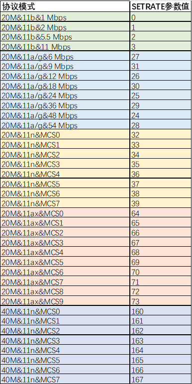

# Preface<a name="ZH-CN_TOPIC_0000001775361928"></a>

**Overview<a name="section4537382116410"></a>**

This document describes in detail the RF non-signaling test guide and precautions for WS63V100 series modules.

**Intended Audience<a name="section4378592816410"></a>**

This document is mainly applicable to the following engineers:

-   Board hardware development engineers
-   Software engineers
-   Technical support engineers

**Symbol Conventions<a name="section133020216410"></a>**

The following symbols may appear in this document. Their meanings are as follows.

<a name="table2622507016410"></a>
<table><thead align="left"><tr id="row1530720816410"><th class="cellrowborder" valign="top" width="20.580000000000002%" id="mcps1.1.3.1.1"><p id="p6450074116410"><a name="p6450074116410"></a><a name="p6450074116410"></a><strong id="b2136615816410"><a name="b2136615816410"></a><a name="b2136615816410"></a>Symbol</strong></p>
</th>
<th class="cellrowborder" valign="top" width="79.42%" id="mcps1.1.3.1.2"><p id="p5435366816410"><a name="p5435366816410"></a><a name="p5435366816410"></a><strong id="b5941558116410"><a name="b5941558116410"></a><a name="b5941558116410"></a>Description</strong></p>
</th>
</tr>
</thead>
<tbody><tr id="row1372280416410"><td class="cellrowborder" valign="top" width="20.580000000000002%" headers="mcps1.1.3.1.1 "><p id="p3734547016410"><a name="p3734547016410"></a><a name="p3734547016410"></a><a name="image2670064316410"></a><a name="image2670064316410"></a><span></span></p>
</td>
<td class="cellrowborder" valign="top" width="79.42%" headers="mcps1.1.3.1.2 "><p id="p1757432116410"><a name="p1757432116410"></a><a name="p1757432116410"></a>Indicates a hazard with a high level of risk that, if not avoided, will result in death or serious injury.</p>
</td>
</tr>
<tr id="row466863216410"><td class="cellrowborder" valign="top" width="20.580000000000002%" headers="mcps1.1.3.1.1 "><p id="p1432579516410"><a name="p1432579516410"></a><a name="p1432579516410"></a><a name="image4895582316410"></a><a name="image4895582316410"></a><span></span></p>
</td>
<td class="cellrowborder" valign="top" width="79.42%" headers="mcps1.1.3.1.2 "><p id="p959197916410"><a name="p959197916410"></a><a name="p959197916410"></a>Indicates a hazard with a medium level of risk that, if not avoided, could result in death or serious injury.</p>
</td>
</tr>
<tr id="row123863216410"><td class="cellrowborder" valign="top" width="20.580000000000002%" headers="mcps1.1.3.1.1 "><p id="p1232579516410"><a name="p1232579516410"></a><a name="p1232579516410"></a><a name="image1235582316410"></a><a name="image1235582316410"></a><span></span></p>
</td>
<td class="cellrowborder" valign="top" width="79.42%" headers="mcps1.1.3.1.2 "><p id="p123197916410"><a name="p123197916410"></a><a name="p123197916410"></a>Indicates a hazard with a low level of risk that, if not avoided, could result in minor or moderate injury.</p>
</td>
</tr>
<tr id="row5786682116410"><td class="cellrowborder" valign="top" width="20.580000000000002%" headers="mcps1.1.3.1.1 "><p id="p2204984716410"><a name="p2204984716410"></a><a name="p2204984716410"></a><a name="image4504446716410"></a><a name="image4504446716410"></a><span></span></p>
</td>
<td class="cellrowborder" valign="top" width="79.42%" headers="mcps1.1.3.1.2 "><p id="p4388861916410"><a name="p4388861916410"></a><a name="p4388861916410"></a>Conveys device or environment safety warning information. If not avoided, it may result in device damage, data loss, device performance degradation, or other unpredictable consequences.</p>
<p id="p1238861916410"><a name="p1238861916410"></a><a name="p1238861916410"></a>"Notice" does not involve personal injury.</p>
</td>
</tr>
<tr id="row2856923116410"><td class="cellrowborder" valign="top" width="20.580000000000002%" headers="mcps1.1.3.1.1 "><p id="p5555360116410"><a name="p5555360116410"></a><a name="p5555360116410"></a><a name="image799324016410"></a><a name="image799324016410"></a><span></span></p>
</td>
<td class="cellrowborder" valign="top" width="79.42%" headers="mcps1.1.3.1.2 "><p id="p4612588116410"><a name="p4612588116410"></a><a name="p4612588116410"></a>Supplementary explanation of key information in the main text.</p>
<p id="p1232588116410"><a name="p1232588116410"></a><a name="p1232588116410"></a>"Note" is not a safety warning and does not involve personal, device, or environmental injury information.</p>
</td>
</tr>
</tbody>
</table>

**Revision History<a name="section2467512116410"></a>**

<a name="table219mcpsimp"></a>
<table><thead align="left"><tr id="row225mcpsimp"><th class="cellrowborder" valign="top" width="21%" id="mcps1.1.4.1.1"><p id="p227mcpsimp"><a name="p227mcpsimp"></a><a name="p227mcpsimp"></a><strong id="b228mcpsimp"><a name="b228mcpsimp"></a><a name="b228mcpsimp"></a>Document Version</strong></p>
</th>
<th class="cellrowborder" valign="top" width="26%" id="mcps1.1.4.1.2"><p id="p230mcpsimp"><a name="p230mcpsimp"></a><a name="p230mcpsimp"></a><strong id="b231mcpsimp"><a name="b231mcpsimp"></a><a name="b231mcpsimp"></a>Release Date</strong></p>
</th>
<th class="cellrowborder" valign="top" width="53%" id="mcps1.1.4.1.3"><p id="p233mcpsimp"><a name="p233mcpsimp"></a><a name="p233mcpsimp"></a><strong id="b234mcpsimp"><a name="b234mcpsimp"></a><a name="b234mcpsimp"></a>Modification Description</strong></p>
</th>
</tr>
</thead>
<tbody><tr id="row20605122611816"><td class="cellrowborder" valign="top" width="21%" headers="mcps1.1.4.1.1 "><p id="p9605626121811"><a name="p9605626121811"></a><a name="p9605626121811"></a>05</p>
</td>
<td class="cellrowborder" valign="top" width="26%" headers="mcps1.1.4.1.2 "><p id="p860562651812"><a name="p860562651812"></a><a name="p860562651812"></a>2025-02-28</p>
</td>
<td class="cellrowborder" valign="top" width="53%" headers="mcps1.1.4.1.3 "><p id="p1107125224"><a name="p1107125224"></a><a name="p1107125224"></a>Updated the content of the "<a href="rf_test_command_descriptions.md">RF Test Command Descriptions</a>" section.</p>
</td>
</tr>
<tr id="row20123201112196"><td class="cellrowborder" valign="top" width="21%" headers="mcps1.1.4.1.1 "><p id="p3123101116194"><a name="p3123101116194"></a><a name="p3123101116194"></a>04</p>
</td>
<td class="cellrowborder" valign="top" width="26%" headers="mcps1.1.4.1.2 "><p id="p71231311161917"><a name="p71231311161917"></a><a name="p71231311161917"></a>2024-09-29</p>
</td>
<td class="cellrowborder" valign="top" width="53%" headers="mcps1.1.4.1.3 "><p id="p212381171918"><a name="p212381171918"></a><a name="p212381171918"></a>Updated the content of the "<a href="rf_test_command_descriptions.md">RF Test Command Descriptions</a>" section.</p>
</td>
</tr>
<tr id="row111016439147"><td class="cellrowborder" valign="top" width="21%" headers="mcps1.1.4.1.1 "><p id="p141101343191416"><a name="p141101343191416"></a><a name="p141101343191416"></a>03</p>
</td>
<td class="cellrowborder" valign="top" width="26%" headers="mcps1.1.4.1.2 "><p id="p911094311144"><a name="p911094311144"></a><a name="p911094311144"></a>2024-07-01</p>
</td>
<td class="cellrowborder" valign="top" width="53%" headers="mcps1.1.4.1.3 "><a name="ul17776104401614"></a><a name="ul17776104401614"></a><ul id="ul17776104401614"><li>Updated the parameter descriptions of the WiFi continuous transmission commands in the "<a href="rf_test_command_descriptions.md">RF Test Command Descriptions</a>" section.</li><li>Updated the WiFi continuous transmission and reception commands in the "<a href="examples.md">Examples</a>" section.</li></ul>
</td>
</tr>
<tr id="row1397712405490"><td class="cellrowborder" valign="top" width="21%" headers="mcps1.1.4.1.1 "><p id="p179781640144919"><a name="p179781640144919"></a><a name="p179781640144919"></a>02</p>
</td>
<td class="cellrowborder" valign="top" width="26%" headers="mcps1.1.4.1.2 "><p id="p49782040104917"><a name="p49782040104917"></a><a name="p49782040104917"></a>2024-05-08</p>
</td>
<td class="cellrowborder" valign="top" width="53%" headers="mcps1.1.4.1.3 "><p id="p1326845194918"><a name="p1326845194918"></a><a name="p1326845194918"></a>Updated the content of the "<a href="rf_test_command_descriptions.md">RF Test Command Descriptions</a>" section.</p>
</td>
</tr>
<tr id="row121831127152117"><td class="cellrowborder" valign="top" width="21%" headers="mcps1.1.4.1.1 "><p id="p118382762110"><a name="p118382762110"></a><a name="p118382762110"></a>01</p>
</td>
<td class="cellrowborder" valign="top" width="26%" headers="mcps1.1.4.1.2 "><p id="p171834279217"><a name="p171834279217"></a><a name="p171834279217"></a>2024-04-10</p>
</td>
<td class="cellrowborder" valign="top" width="53%" headers="mcps1.1.4.1.3 "><p id="p618317279212"><a name="p618317279212"></a><a name="p618317279212"></a>First official release.</p>
<a name="ul113196321224"></a><a name="ul113196321224"></a><ul id="ul113196321224"><li>Updated the content of the "<a href="rf_test_command_descriptions.md">RF Test Command Descriptions</a>" section.</li><li>Updated the content of the "<a href="continuous_transmission_tone_command_examples.md">Continuous Transmission Tone Command Examples</a>" section.</li></ul>
</td>
</tr>
<tr id="row1787321175215"><td class="cellrowborder" valign="top" width="21%" headers="mcps1.1.4.1.1 "><p id="p158747111529"><a name="p158747111529"></a><a name="p158747111529"></a>00B06</p>
</td>
<td class="cellrowborder" valign="top" width="26%" headers="mcps1.1.4.1.2 "><p id="p1287481165218"><a name="p1287481165218"></a><a name="p1287481165218"></a>2024-03-14</p>
</td>
<td class="cellrowborder" valign="top" width="53%" headers="mcps1.1.4.1.3 "><p id="p165578555210"><a name="p165578555210"></a><a name="p165578555210"></a>Updated the parameter descriptions of the continuous transmission commands in the "<a href="rf_test_command_descriptions.md">RF Test Command Descriptions</a>" section.</p>
</td>
</tr>
<tr id="row127657374292"><td class="cellrowborder" valign="top" width="21%" headers="mcps1.1.4.1.1 "><p id="p4766153722913"><a name="p4766153722913"></a><a name="p4766153722913"></a>00B05</p>
</td>
<td class="cellrowborder" valign="top" width="26%" headers="mcps1.1.4.1.2 "><p id="p18915144264818"><a name="p18915144264818"></a><a name="p18915144264818"></a>2024-02-29</p>
</td>
<td class="cellrowborder" valign="top" width="53%" headers="mcps1.1.4.1.3 "><p id="p13766193702912"><a name="p13766193702912"></a><a name="p13766193702912"></a>Updated the parameter descriptions of the continuous transmission commands in the "<a href="rf_test_command_descriptions.md">RF Test Command Descriptions</a>" section.</p>
</td>
</tr>
<tr id="row17825164920247"><td class="cellrowborder" valign="top" width="21%" headers="mcps1.1.4.1.1 "><p id="p1482516496249"><a name="p1482516496249"></a><a name="p1482516496249"></a>00B04</p>
</td>
<td class="cellrowborder" valign="top" width="26%" headers="mcps1.1.4.1.2 "><p id="p18251549132413"><a name="p18251549132413"></a><a name="p18251549132413"></a>2024-02-22</p>
</td>
<td class="cellrowborder" valign="top" width="53%" headers="mcps1.1.4.1.3 "><p id="p1482518494247"><a name="p1482518494247"></a><a name="p1482518494247"></a>Updated the parameter descriptions of the continuous transmission commands in the "<a href="rf_test_command_descriptions.md">RF Test Command Descriptions</a>" section.</p>
</td>
</tr>
<tr id="row455993791212"><td class="cellrowborder" valign="top" width="21%" headers="mcps1.1.4.1.1 "><p id="p1756013376128"><a name="p1756013376128"></a><a name="p1756013376128"></a>00B03</p>
</td>
<td class="cellrowborder" valign="top" width="26%" headers="mcps1.1.4.1.2 "><p id="p125601037171219"><a name="p125601037171219"></a><a name="p125601037171219"></a>2024-01-15</p>
</td>
<td class="cellrowborder" valign="top" width="53%" headers="mcps1.1.4.1.3 "><a name="ul16242167389"></a><a name="ul16242167389"></a><ul id="ul16242167389"><li>Updated the WiFi continuous transmission commands and examples, as well as the BLE/SLE-related commands, in the "<a href="rf_test_command_descriptions.md">RF Test Command Descriptions</a>" section.</li><li>Updated the BLE/SLE continuous transmission and reception commands in the "<a href="examples.md">Examples</a>" section.</li></ul>
</td>
</tr>
<tr id="row6215812103316"><td class="cellrowborder" valign="top" width="21%" headers="mcps1.1.4.1.1 "><p id="p02161112113317"><a name="p02161112113317"></a><a name="p02161112113317"></a>00B02</p>
</td>
<td class="cellrowborder" valign="top" width="26%" headers="mcps1.1.4.1.2 "><p id="p2021681293317"><a name="p2021681293317"></a><a name="p2021681293317"></a>2023-12-18</p>
</td>
<td class="cellrowborder" valign="top" width="53%" headers="mcps1.1.4.1.3 "><p id="p1821619128334"><a name="p1821619128334"></a><a name="p1821619128334"></a>Updated the continuous transmission command content in the "<a href="rf_test_command_descriptions.md">RF Test Command Descriptions</a>" section.</p>
</td>
</tr>
<tr id="row236mcpsimp"><td class="cellrowborder" valign="top" width="21%" headers="mcps1.1.4.1.1 "><p id="p238mcpsimp"><a name="p238mcpsimp"></a><a name="p238mcpsimp"></a>00B01</p>
</td>
<td class="cellrowborder" valign="top" width="26%" headers="mcps1.1.4.1.2 "><p id="p240mcpsimp"><a name="p240mcpsimp"></a><a name="p240mcpsimp"></a>2023-11-24</p>
</td>
<td class="cellrowborder" valign="top" width="53%" headers="mcps1.1.4.1.3 "><p id="p242mcpsimp"><a name="p242mcpsimp"></a><a name="p242mcpsimp"></a>First temporary version release.</p>
</td>
</tr>
</tbody>
</table>

# Test Commands<a name="ZH-CN_TOPIC_0000001767604097"></a>


## RF Test Command Descriptions<a name="ZH-CN_TOPIC_0000001767724889"></a>

<a name="table249mcpsimp"></a>
<table><thead align="left"><tr id="row255mcpsimp"><th class="cellrowborder" valign="top" width="10%" id="mcps1.1.4.1.1"><p id="p257mcpsimp"><a name="p257mcpsimp"></a><a name="p257mcpsimp"></a>No.</p>
</th>
<th class="cellrowborder" valign="top" width="18.95%" id="mcps1.1.4.1.2"><p id="p259mcpsimp"><a name="p259mcpsimp"></a><a name="p259mcpsimp"></a>Test Command</p>
</th>
<th class="cellrowborder" valign="top" width="71.05%" id="mcps1.1.4.1.3"><p id="p261mcpsimp"><a name="p261mcpsimp"></a><a name="p261mcpsimp"></a>Command Description</p>
</th>
</tr>
</thead>
<tbody><tr id="row263mcpsimp"><td class="cellrowborder" valign="top" width="10%" headers="mcps1.1.4.1.1 "><p id="p265mcpsimp"><a name="p265mcpsimp"></a><a name="p265mcpsimp"></a>1</p>
</td>
<td class="cellrowborder" valign="top" width="18.95%" headers="mcps1.1.4.1.2 "><p id="p267mcpsimp"><a name="p267mcpsimp"></a><a name="p267mcpsimp"></a>Initialize WiFi</p>
</td>
<td class="cellrowborder" valign="top" width="71.05%" headers="mcps1.1.4.1.3 "><p id="p717911115911"><a name="p717911115911"></a><a name="p717911115911"></a>Command format:</p>
<p id="p271mcpsimp"><a name="p271mcpsimp"></a><a name="p271mcpsimp"></a>AT+STARTSTA</p>
</td>
</tr>
<tr id="row272mcpsimp"><td class="cellrowborder" valign="top" width="10%" headers="mcps1.1.4.1.1 "><p id="p274mcpsimp"><a name="p274mcpsimp"></a><a name="p274mcpsimp"></a>2</p>
</td>
<td class="cellrowborder" valign="top" width="18.95%" headers="mcps1.1.4.1.2 "><p id="p276mcpsimp"><a name="p276mcpsimp"></a><a name="p276mcpsimp"></a>WiFi continuous transmission command</p>
</td>
<td class="cellrowborder" valign="top" width="71.05%" headers="mcps1.1.4.1.3 "><p id="p1598116485516"><a name="p1598116485516"></a><a name="p1598116485516"></a><strong id="b720814910115"><a name="b720814910115"></a><a name="b720814910115"></a>Configure protocol mode</strong></p>
<a name="ul9982114812514"></a><a name="ul9982114812514"></a><ul id="ul9982114812514"><li>Command format<p id="p2982104820513"><a name="p2982104820513"></a><a name="p2982104820513"></a>AT+CCPRIV=wlan0,mode,&lt;mode&gt;</p>
</li><li>Parameter description: 11b, 11g2g20, 11n2g20, 11n2g40, 11ax2g20</li></ul>
<p id="p12383451652"><a name="p12383451652"></a><a name="p12383451652"></a><strong id="b51291165223"><a name="b51291165223"></a><a name="b51291165223"></a>Set channel</strong></p>
<a name="ul6395451554"></a><a name="ul6395451554"></a><ul id="ul6395451554"><li>Command format<pre class="codeblock" id="codeblock3391451756"><a name="codeblock3391451756"></a><a name="codeblock3391451756"></a>AT+CCPRIV=wlan0,freq,&lt;freq&gt;</pre>
</li><li>Parameter description: Channels 1 to 14. Only 11b supports channel 14. When the protocol mode is 11N 40M upper offset/lower offset, the actual channel is shifted up/down by 2 channels. For example, if channel 1 is set with upper offset, the signal can only be measured on channel 3 of the instrument; if channel 9 is set with lower offset, the signal can only be measured on channel 7 of the instrument.</li></ul>
<p id="p1775934219512"><a name="p1775934219512"></a><a name="p1775934219512"></a><strong id="b5282625112319"><a name="b5282625112319"></a><a name="b5282625112319"></a>Configure continuous transmission</strong></p>
<a name="ul1976214210517"></a><a name="ul1976214210517"></a><ul id="ul1976214210517"><li>Command format<p id="p147621421259"><a name="p147621421259"></a><a name="p147621421259"></a>AT+ALTX=&lt;control&gt;</p>
</li><li>Parameter description<p id="p2627mcpsimp"><a name="p2627mcpsimp"></a><a name="p2627mcpsimp"></a>&lt;control&gt;: enable switch</p>
<p id="p2628mcpsimp"><a name="p2628mcpsimp"></a><a name="p2628mcpsimp"></a>0: off</p>
<p id="p2629mcpsimp"><a name="p2629mcpsimp"></a><a name="p2629mcpsimp"></a>1: on</p>
<p id="p1396104016522"><a name="p1396104016522"></a><a name="p1396104016522"></a>2: continuous transmission at a fixed rate</p>
</li></ul>
<a name="ul189839315361"></a><a name="ul189839315361"></a><ul id="ul189839315361"><li>Command format<p id="p1647214548365"><a name="p1647214548365"></a><a name="p1647214548365"></a>AT+CCPRIV=wlan0,al_tx_ccpriv,&lt;flag&gt;,&lt;payload&gt;,&lt;len&gt;,&lt;tpc_code&gt;,&lt;duty_ratio&gt;</p>
</li><li>Parameter description<p id="p570194413711"><a name="p570194413711"></a><a name="p570194413711"></a>&lt;flag&gt;:</p>
<p id="p251161013386"><a name="p251161013386"></a><a name="p251161013386"></a>0: disable continuous transmission</p>
<p id="p3511131014384"><a name="p3511131014384"></a><a name="p3511131014384"></a>1: enable continuous transmission</p>
<p id="p5281147123716"><a name="p5281147123716"></a><a name="p5281147123716"></a>&lt;payload&gt;:</p>
<p id="p1284102063814"><a name="p1284102063814"></a><a name="p1284102063814"></a>0: all 0s</p>
<p id="p2831153212388"><a name="p2831153212388"></a><a name="p2831153212388"></a>1: all 1s</p>
<p id="p137992367383"><a name="p137992367383"></a><a name="p137992367383"></a>2: all 1010s</p>
<p id="p5696144753817"><a name="p5696144753817"></a><a name="p5696144753817"></a>3: random value</p>
<p id="p2478114933712"><a name="p2478114933712"></a><a name="p2478114933712"></a>&lt;len&gt;: payload length: 0-4000</p>
<p id="p1391942132718"><a name="p1391942132718"></a><a name="p1391942132718"></a>&lt;tpc_code&gt; (optional parameter): 0 to 73 for 11g/n/ax, and 74 to 146 for 11b. The smaller the tpc_code, the higher the power. The initial value is 23 dBm, and each step decreases the power by 0.5 dBm. 255 indicates using the power value from the power table.</p>
<p id="p116427461094"><a name="p116427461094"></a><a name="p116427461094"></a>&lt;duty_ratio&gt; (optional parameter): continuous transmission duty cycle, ranging from 1 to 10, corresponding to duty cycles of 10% to 100%. The default value is 7, corresponding to a duty cycle of 70%. To configure duty_ratio, tpc_code must be configured; if duty_ratio is not required, tpc_code is optional.</p>
</li></ul>
</td>
</tr>
<tr id="row359mcpsimp"><td class="cellrowborder" valign="top" width="10%" headers="mcps1.1.4.1.1 "><p id="p361mcpsimp"><a name="p361mcpsimp"></a><a name="p361mcpsimp"></a>3</p>
</td>
<td class="cellrowborder" valign="top" width="18.95%" headers="mcps1.1.4.1.2 "><p id="p363mcpsimp"><a name="p363mcpsimp"></a><a name="p363mcpsimp"></a>WiFi continuous reception command</p>
</td>
<td class="cellrowborder" valign="top" width="71.05%" headers="mcps1.1.4.1.3 "><p id="p1932362417611"><a name="p1932362417611"></a><a name="p1932362417611"></a><strong id="b367mcpsimp"><a name="b367mcpsimp"></a><a name="b367mcpsimp"></a>Disable continuous reception</strong></p>
<a name="ul365mcpsimp"></a><a name="ul365mcpsimp"></a><ul id="ul365mcpsimp"><li>Command format<p id="p39526271062"><a name="p39526271062"></a><a name="p39526271062"></a>AT+ALRX=0</p>
</li></ul>
<p id="p937523010612"><a name="p937523010612"></a><a name="p937523010612"></a><strong id="b371mcpsimp"><a name="b371mcpsimp"></a><a name="b371mcpsimp"></a>Set continuous reception</strong></p>
<a name="ul23787301268"></a><a name="ul23787301268"></a><ul id="ul23787301268"><li>Command format<p id="p23784301965"><a name="p23784301965"></a><a name="p23784301965"></a>AT+ALRX=&lt;flag&gt;,&lt;protocol mode&gt;,&lt;bandwidth&gt;,&lt;frep&gt;,&lt;reserved bit&gt;</p>
</li><li>Parameter description<a name="ul11378193018612"></a><a name="ul11378193018612"></a><ul id="ul11378193018612"><li>&lt;flag&gt;:<p id="p103781930761"><a name="p103781930761"></a><a name="p103781930761"></a>0: disable continuous reception</p>
<p id="p1037817309613"><a name="p1037817309613"></a><a name="p1037817309613"></a>1: enable continuous reception</p>
<p id="p18378730660"><a name="p18378730660"></a><a name="p18378730660"></a>2: change the rate (change to broadcast)</p>
</li><li>&lt;protocol mode&gt;:<p id="p2378133010611"><a name="p2378133010611"></a><a name="p2378133010611"></a>0: 802.11n</p>
<p id="p1337893016610"><a name="p1337893016610"></a><a name="p1337893016610"></a>1: 802.11g</p>
<p id="p43781730668"><a name="p43781730668"></a><a name="p43781730668"></a>2: 802.11b</p>
<p id="p1237833018615"><a name="p1237833018615"></a><a name="p1237833018615"></a>3: 802.11ax</p>
<p id="p109259501329"><a name="p109259501329"></a><a name="p109259501329"></a>5: 11n40plus</p>
<p id="p143781830362"><a name="p143781830362"></a><a name="p143781830362"></a>6: 11n40minus</p>
</li><li>&lt;bandwidth&gt;:<p id="p837883010616"><a name="p837883010616"></a><a name="p837883010616"></a>20M: 20</p>
<p id="p113781030664"><a name="p113781030664"></a><a name="p113781030664"></a>40M: 40</p>
</li><li>&lt;freq&gt;: frequency point, channel number</li><li>Protocol modes 0 to 3: channel number range: 1 to 14; only 11b supports channel 14</li><li>Protocol mode 5: channel number range: 1 to 9</li><li>Protocol mode 6: channel number range: 5 to 13</li></ul>
<a name="ul391mcpsimp"></a><a name="ul391mcpsimp"></a><ul id="ul391mcpsimp"><li>&lt;reserved bit&gt;:</li></ul>
<p id="p394mcpsimp"><a name="p394mcpsimp"></a><a name="p394mcpsimp"></a>0 or 1</p>
</li></ul>
<p id="p396mcpsimp"><a name="p396mcpsimp"></a><a name="p396mcpsimp"></a><strong id="b397mcpsimp"><a name="b397mcpsimp"></a><a name="b397mcpsimp"></a>Query received packet count statistics</strong></p>
<a name="ul398mcpsimp"></a><a name="ul398mcpsimp"></a><ul id="ul398mcpsimp"><li>Command format<p id="p400mcpsimp"><a name="p400mcpsimp"></a><a name="p400mcpsimp"></a>AT+RXINFO</p>
</li><li>Response<p id="p402mcpsimp"><a name="p402mcpsimp"></a><a name="p402mcpsimp"></a>+RXINFO::rx succ num[mpdu,ampdu]:[45713,975] fail num:47959 rssi:-69</p>
</li></ul>
<a name="ul403mcpsimp"></a><a name="ul403mcpsimp"></a><ul id="ul403mcpsimp"><li>Example<p id="p405mcpsimp"><a name="p405mcpsimp"></a><a name="p405mcpsimp"></a>Description: 45713 MPDU packets and 975 AMPDU packets were received successfully, and 47959 packets failed to be received.</p>
</li></ul>
<a name="ul406mcpsimp"></a><a name="ul406mcpsimp"></a><ul id="ul406mcpsimp"><li>Precautions<p id="p408mcpsimp"><a name="p408mcpsimp"></a><a name="p408mcpsimp"></a>Run the query after setting the continuous reception command, and check the printed result on the host side.</p>
</li></ul>
</td>
</tr>
<tr id="row957214432523"><td class="cellrowborder" valign="top" width="10%" headers="mcps1.1.4.1.1 "><p id="p157234355213"><a name="p157234355213"></a><a name="p157234355213"></a>4</p>
</td>
<td class="cellrowborder" valign="top" width="18.95%" headers="mcps1.1.4.1.2 "><p id="p957214375216"><a name="p957214375216"></a><a name="p957214375216"></a>Enable WiFi single tone</p>
</td>
<td class="cellrowborder" valign="top" width="71.05%" headers="mcps1.1.4.1.3 "><p id="p68217420548"><a name="p68217420548"></a><a name="p68217420548"></a><strong id="b882124125418"><a name="b882124125418"></a><a name="b882124125418"></a>Configure single tone</strong></p>
<a name="ul208213475416"></a><a name="ul208213475416"></a><ul id="ul208213475416"><li>Command format<p id="p8824445419"><a name="p8824445419"></a><a name="p8824445419"></a>AT+CALTONE=&lt;sw&gt;, &lt;tone_freq&gt;</p>
</li><li>Parameter description<p id="p2785134615515"><a name="p2785134615515"></a><a name="p2785134615515"></a>&lt;sw&gt;: switch, 1: on, 0: off.</p>
<p id="p45584482551"><a name="p45584482551"></a><a name="p45584482551"></a>&lt;tone_freq&gt;: tone offset frequency, in kHz</p>
</li><li>Response<p id="p26398125710"><a name="p26398125710"></a><a name="p26398125710"></a>Success: OK</p>
<p id="p91101095576"><a name="p91101095576"></a><a name="p91101095576"></a>Failure: ERROR</p>
</li><li>Example<p id="p139513114316"><a name="p139513114316"></a><a name="p139513114316"></a>Enable the single tone; the tone is offset from the center frequency by 2.5 MHz</p>
<p id="p2741mcpsimp"><a name="p2741mcpsimp"></a><a name="p2741mcpsimp"></a>AT+CALTONE=1, 2500</p>
<p id="p16179250317"><a name="p16179250317"></a><a name="p16179250317"></a>Disable the single tone</p>
<p id="p1890815285312"><a name="p1890815285312"></a><a name="p1890815285312"></a>AT+CALTONE=0, 0</p>
</li><li>Precautions<p id="p19231931185616"><a name="p19231931185616"></a><a name="p19231931185616"></a>The single tone command is used after WiFi continuous transmission.</p>
</li></ul>
</td>
</tr>
<tr id="row409mcpsimp"><td class="cellrowborder" valign="top" width="10%" headers="mcps1.1.4.1.1 "><p id="p411mcpsimp"><a name="p411mcpsimp"></a><a name="p411mcpsimp"></a>5</p>
</td>
<td class="cellrowborder" valign="top" width="18.95%" headers="mcps1.1.4.1.2 "><p id="p425111363546"><a name="p425111363546"></a><a name="p425111363546"></a>Enable BLE</p>
</td>
<td class="cellrowborder" valign="top" width="71.05%" headers="mcps1.1.4.1.3 "><a name="ul3622152774614"></a><a name="ul3622152774614"></a><ul id="ul3622152774614"><li>Command format<pre class="codeblock" id="codeblock146224273460"><a name="codeblock146224273460"></a><a name="codeblock146224273460"></a>AT+BLEENABLE</pre>
</li><li>Response<p id="p116232279468"><a name="p116232279468"></a><a name="p116232279468"></a>OK or ERROR</p>
</li><li>Description<p id="p17623827114619"><a name="p17623827114619"></a><a name="p17623827114619"></a>Before performing BLE tests and production line calibration, run this command first to enable the BLE protocol stack.</p>
</li></ul>
</td>
</tr>
<tr id="row420mcpsimp"><td class="cellrowborder" valign="top" width="10%" headers="mcps1.1.4.1.1 "><p id="p422mcpsimp"><a name="p422mcpsimp"></a><a name="p422mcpsimp"></a>6</p>
</td>
<td class="cellrowborder" valign="top" width="18.95%" headers="mcps1.1.4.1.2 "><p id="p424mcpsimp"><a name="p424mcpsimp"></a><a name="p424mcpsimp"></a>Register BLE callback</p>
</td>
<td class="cellrowborder" valign="top" width="71.05%" headers="mcps1.1.4.1.3 "><a name="ul134281445162811"></a><a name="ul134281445162811"></a><ul id="ul134281445162811"><li>Command format<pre class="codeblock" id="codeblock188903518295"><a name="codeblock188903518295"></a><a name="codeblock188903518295"></a>AT+BLEFACCALLBACK</pre>
</li><li>Response<p id="p2564897586"><a name="p2564897586"></a><a name="p2564897586"></a>OK or ERROR</p>
</li><li>Description<p id="p1096020424292"><a name="p1096020424292"></a><a name="p1096020424292"></a>Before performing BLE tests and BLE/SLE production line calibration, run this command first to register message echo.</p>
</li></ul>
</td>
</tr>
<tr id="row430mcpsimp"><td class="cellrowborder" valign="top" width="10%" headers="mcps1.1.4.1.1 "><p id="p432mcpsimp"><a name="p432mcpsimp"></a><a name="p432mcpsimp"></a>7</p>
</td>
<td class="cellrowborder" valign="top" width="18.95%" headers="mcps1.1.4.1.2 "><p id="p434mcpsimp"><a name="p434mcpsimp"></a><a name="p434mcpsimp"></a>BLE continuous transmission</p>
</td>
<td class="cellrowborder" valign="top" width="71.05%" headers="mcps1.1.4.1.3 "><a name="ul73067349339"></a><a name="ul73067349339"></a><ul id="ul73067349339"><li>Command format<pre class="codeblock" id="codeblock114436366425"><a name="codeblock114436366425"></a><a name="codeblock114436366425"></a>AT+BLETX=&lt;channel&gt;,&lt;data_len&gt;,&lt;payload_type&gt;.&lt;phy&gt;</pre>
</li><li>Parameter description<a name="ul820mcpsimp"></a><a name="ul820mcpsimp"></a><ul id="ul820mcpsimp"><li>channel: 0 to 39, corresponding to the 40 BLE channels.</li><li>data_len: 37 to 255, indicating the length of the transmitted test packet, in bytes<strong id="b823mcpsimp"><a name="b823mcpsimp"></a><a name="b823mcpsimp"></a>.</strong></li><li>payload_type: 0 to 7, indicating the content carried by the transmitted test packet.<p id="p825mcpsimp"><a name="p825mcpsimp"></a><a name="p825mcpsimp"></a>0: PRBS9</p>
<p id="p826mcpsimp"><a name="p826mcpsimp"></a><a name="p826mcpsimp"></a>1: '11110000'</p>
<p id="p827mcpsimp"><a name="p827mcpsimp"></a><a name="p827mcpsimp"></a>2: '10101010'</p>
<p id="p828mcpsimp"><a name="p828mcpsimp"></a><a name="p828mcpsimp"></a>3: PRBS15</p>
<p id="p829mcpsimp"><a name="p829mcpsimp"></a><a name="p829mcpsimp"></a>4: '11111111'</p>
<p id="p830mcpsimp"><a name="p830mcpsimp"></a><a name="p830mcpsimp"></a>5: '00000000'</p>
<p id="p831mcpsimp"><a name="p831mcpsimp"></a><a name="p831mcpsimp"></a>6: '00001111'</p>
<p id="p832mcpsimp"><a name="p832mcpsimp"></a><a name="p832mcpsimp"></a>7: '01010101'</p>
</li><li>phy: the physical debug link used for transmitting the test packet.<p id="p834mcpsimp"><a name="p834mcpsimp"></a><a name="p834mcpsimp"></a>1: LE 1MPhy</p>
<p id="p835mcpsimp"><a name="p835mcpsimp"></a><a name="p835mcpsimp"></a>2: LE 2MPhy</p>
<p id="p836mcpsimp"><a name="p836mcpsimp"></a><a name="p836mcpsimp"></a>3: LE CodedPhy (S=8)</p>
<p id="p837mcpsimp"><a name="p837mcpsimp"></a><a name="p837mcpsimp"></a>4: LE CodedPhy (S=2)</p>
</li></ul>
</li><li>Response<p id="p184551145377"><a name="p184551145377"></a><a name="p184551145377"></a>OK</p>
<p id="p2020611171370"><a name="p2020611171370"></a><a name="p2020611171370"></a>status: &lt;value&gt;</p>
<p id="p1995416121379"><a name="p1995416121379"></a><a name="p1995416121379"></a>value: return status, 0 indicates success, and other values indicate errors.</p>
</li></ul>
</td>
</tr>
<tr id="row468mcpsimp"><td class="cellrowborder" valign="top" width="10%" headers="mcps1.1.4.1.1 "><p id="p470mcpsimp"><a name="p470mcpsimp"></a><a name="p470mcpsimp"></a>8</p>
</td>
<td class="cellrowborder" valign="top" width="18.95%" headers="mcps1.1.4.1.2 "><p id="p472mcpsimp"><a name="p472mcpsimp"></a><a name="p472mcpsimp"></a>BLE continuous reception</p>
</td>
<td class="cellrowborder" valign="top" width="71.05%" headers="mcps1.1.4.1.3 "><a name="ul16677154134517"></a><a name="ul16677154134517"></a><ul id="ul16677154134517"><li>Command format<pre class="codeblock" id="codeblock8677249455"><a name="codeblock8677249455"></a><a name="codeblock8677249455"></a>AT+BLERX=&lt;channel&gt;,&lt;phy&gt;,&lt;modulation&gt;</pre>
</li><li>Parameter description<a name="ul858mcpsimp"></a><a name="ul858mcpsimp"></a><ul id="ul858mcpsimp"><li>channel: 0 to 39, corresponding to the 40 BLE channels.</li><li>phy: the physical debug link being monitored.<p id="p861mcpsimp"><a name="p861mcpsimp"></a><a name="p861mcpsimp"></a>1: LE 1MPhy</p>
<p id="p862mcpsimp"><a name="p862mcpsimp"></a><a name="p862mcpsimp"></a>2: LE 2MPhy</p>
<p id="p863mcpsimp"><a name="p863mcpsimp"></a><a name="p863mcpsimp"></a>3: LE CodedPhy</p>
</li><li>modulation:<p id="p865mcpsimp"><a name="p865mcpsimp"></a><a name="p865mcpsimp"></a>0: standard</p>
<p id="p866mcpsimp"><a name="p866mcpsimp"></a><a name="p866mcpsimp"></a>1: stable</p>
</li></ul>
</li><li>Response<p id="p36788414513"><a name="p36788414513"></a><a name="p36788414513"></a>OK</p>
<p id="p16788464516"><a name="p16788464516"></a><a name="p16788464516"></a>status: &lt;value&gt;</p>
<p id="p184114191172"><a name="p184114191172"></a><a name="p184114191172"></a>value: return status, 0 indicates success, and other values indicate errors.</p>
</li></ul>
</td>
</tr>
<tr id="row497mcpsimp"><td class="cellrowborder" valign="top" width="10%" headers="mcps1.1.4.1.1 "><p id="p499mcpsimp"><a name="p499mcpsimp"></a><a name="p499mcpsimp"></a>9</p>
</td>
<td class="cellrowborder" valign="top" width="18.95%" headers="mcps1.1.4.1.2 "><p id="p501mcpsimp"><a name="p501mcpsimp"></a><a name="p501mcpsimp"></a>Stop BLE continuous transmission/reception</p>
</td>
<td class="cellrowborder" valign="top" width="71.05%" headers="mcps1.1.4.1.3 "><a name="ul183631118114711"></a><a name="ul183631118114711"></a><ul id="ul183631118114711"><li>Command format<pre class="codeblock" id="codeblock3363918154710"><a name="codeblock3363918154710"></a><a name="codeblock3363918154710"></a>AT+BLETRXEND</pre>
</li><li>Response<p id="p33631018134717"><a name="p33631018134717"></a><a name="p33631018134717"></a>OK</p>
<p id="p1836391854718"><a name="p1836391854718"></a><a name="p1836391854718"></a>status: &lt;value1&gt;, num_packets: &lt;value2&gt;</p>
<a name="ul143631318114712"></a><a name="ul143631318114712"></a><ul id="ul143631318114712"><li>value1: return status, 0 indicates success, and other values indicate errors;</li><li>value2: number of received packets, in hexadecimal, valid only when stopping BLE continuous reception.</li></ul>
</li></ul>
</td>
</tr>
<tr id="row10850101365718"><td class="cellrowborder" valign="top" width="10%" headers="mcps1.1.4.1.1 "><p id="p185091395715"><a name="p185091395715"></a><a name="p185091395715"></a>10</p>
</td>
<td class="cellrowborder" valign="top" width="18.95%" headers="mcps1.1.4.1.2 "><p id="p13850613135714"><a name="p13850613135714"></a><a name="p13850613135714"></a>BLE Reset</p>
</td>
<td class="cellrowborder" valign="top" width="71.05%" headers="mcps1.1.4.1.3 "><a name="ul74546975015"></a><a name="ul74546975015"></a><ul id="ul74546975015"><li>Command format<pre class="codeblock" id="codeblock11454194504"><a name="codeblock11454194504"></a><a name="codeblock11454194504"></a>AT+BLERST</pre>
</li><li>Response<p id="p2454169135012"><a name="p2454169135012"></a><a name="p2454169135012"></a>OK</p>
<p id="p194541099504"><a name="p194541099504"></a><a name="p194541099504"></a>status: &lt;value&gt;</p>
<p id="p135887275718"><a name="p135887275718"></a><a name="p135887275718"></a>value: return status, 0 indicates success, and other values indicate errors.</p>
</li></ul>
</td>
</tr>
<tr id="row06026596917"><td class="cellrowborder" valign="top" width="10%" headers="mcps1.1.4.1.1 "><p id="p460319591594"><a name="p460319591594"></a><a name="p460319591594"></a>11</p>
</td>
<td class="cellrowborder" valign="top" width="18.95%" headers="mcps1.1.4.1.2 "><p id="p1133291916419"><a name="p1133291916419"></a><a name="p1133291916419"></a>BLE/SLE single tone command</p>
</td>
<td class="cellrowborder" valign="top" width="71.05%" headers="mcps1.1.4.1.3 "><a name="ul1336mcpsimp"></a><a name="ul1336mcpsimp"></a><ul id="ul1336mcpsimp"><li>Command format<pre class="codeblock" id="codeblock11168191814113"><a name="codeblock11168191814113"></a><a name="codeblock11168191814113"></a>AT+BTTXLO=&lt;freq&gt; &lt;mode&gt;</pre>
</li><li>Parameter description<a name="ul1340mcpsimp"></a><a name="ul1340mcpsimp"></a><ul id="ul1340mcpsimp"><li>freq: frequency point, ranging from 0 to 78, indicating (2402+freq) Mhz.</li><li>mode: mode and switch,<p id="p9214125411282"><a name="p9214125411282"></a><a name="p9214125411282"></a>0: transmit digital LE 1M modulation;</p>
<p id="p162641655122816"><a name="p162641655122816"></a><a name="p162641655122816"></a>1: transmit LO single tone;</p>
<p id="p203605310286"><a name="p203605310286"></a><a name="p203605310286"></a>255: stop.</p>
</li></ul>
</li><li>Response<p id="p1344mcpsimp"><a name="p1344mcpsimp"></a><a name="p1344mcpsimp"></a>OK</p>
<p id="p1345mcpsimp"><a name="p1345mcpsimp"></a><a name="p1345mcpsimp"></a>status: &lt;value1&gt;</p>
<a name="ul1346mcpsimp"></a><a name="ul1346mcpsimp"></a><ul id="ul1346mcpsimp"><li>value1: command execution status.<p id="p1348mcpsimp"><a name="p1348mcpsimp"></a><a name="p1348mcpsimp"></a>00: OK</p>
<p id="p1349mcpsimp"><a name="p1349mcpsimp"></a><a name="p1349mcpsimp"></a>Others: FAIL.</p>
</li></ul>
</li><li>Command description<p id="p17475153613617"><a name="p17475153613617"></a><a name="p17475153613617"></a>Prerequisite for the single tone command: the AT+BLEENABLE command must have been executed to enable BLE. SLE single tone shares the command with BLE single tone.</p>
</li></ul>
</td>
</tr>
<tr id="row456532575"><td class="cellrowborder" valign="top" width="10%" headers="mcps1.1.4.1.1 "><p id="p195733175710"><a name="p195733175710"></a><a name="p195733175710"></a>12</p>
</td>
<td class="cellrowborder" valign="top" width="18.95%" headers="mcps1.1.4.1.2 "><p id="p105733185717"><a name="p105733185717"></a><a name="p105733185717"></a>Enable SLE</p>
</td>
<td class="cellrowborder" valign="top" width="71.05%" headers="mcps1.1.4.1.3 "><a name="ul1945602714587"></a><a name="ul1945602714587"></a><ul id="ul1945602714587"><li>Command format<pre class="codeblock" id="codeblock3456427115810"><a name="codeblock3456427115810"></a><a name="codeblock3456427115810"></a>AT+SLEENABLE</pre>
</li><li>Response<p id="p44563279582"><a name="p44563279582"></a><a name="p44563279582"></a>OK or ERROR</p>
</li><li>Description<p id="p194565271581"><a name="p194565271581"></a><a name="p194565271581"></a>Before performing SLE tests, run this command first to enable SLE.</p>
</li></ul>
</td>
</tr>
<tr id="row15177191819584"><td class="cellrowborder" valign="top" width="10%" headers="mcps1.1.4.1.1 "><p id="p5177111865810"><a name="p5177111865810"></a><a name="p5177111865810"></a>13</p>
</td>
<td class="cellrowborder" valign="top" width="18.95%" headers="mcps1.1.4.1.2 "><p id="p1317741865816"><a name="p1317741865816"></a><a name="p1317741865816"></a>Register SLE event callback</p>
</td>
<td class="cellrowborder" valign="top" width="71.05%" headers="mcps1.1.4.1.3 "><a name="ul9752171613598"></a><a name="ul9752171613598"></a><ul id="ul9752171613598"><li>Command format<pre class="codeblock" id="codeblock1275241625912"><a name="codeblock1275241625912"></a><a name="codeblock1275241625912"></a>AT+SLEFACCALLBACK</pre>
</li><li>Response<p id="p1752121618599"><a name="p1752121618599"></a><a name="p1752121618599"></a>OK or ERROR</p>
</li><li>Description<p id="p17529169592"><a name="p17529169592"></a><a name="p17529169592"></a>Before performing SLE tests, after running the SLE enable command, run this command first to register the SLE message echo callback.</p>
</li></ul>
</td>
</tr>
<tr id="row519mcpsimp"><td class="cellrowborder" valign="top" width="10%" headers="mcps1.1.4.1.1 "><p id="p521mcpsimp"><a name="p521mcpsimp"></a><a name="p521mcpsimp"></a>14</p>
</td>
<td class="cellrowborder" valign="top" width="18.95%" headers="mcps1.1.4.1.2 "><p id="p523mcpsimp"><a name="p523mcpsimp"></a><a name="p523mcpsimp"></a>SLE continuous transmission</p>
</td>
<td class="cellrowborder" valign="top" width="71.05%" headers="mcps1.1.4.1.3 "><a name="ul906mcpsimp"></a><a name="ul906mcpsimp"></a><ul id="ul906mcpsimp"><li>Command format<pre class="codeblock" id="codeblock2502185705811"><a name="codeblock2502185705811"></a><a name="codeblock2502185705811"></a>AT+SLETX=&lt;channel&gt;,&lt;power&gt;,&lt;data_len&gt;,&lt;payload_type&gt;,&lt;phy&gt;,&lt;format&gt;,&lt;rate&gt;,&lt;pilot_ratio&gt;,&lt;polar&gt;,&lt;interval&gt;</pre>
</li><li>Parameter description<a name="ul910mcpsimp"></a><a name="ul910mcpsimp"></a><ul id="ul910mcpsimp"><li>channel: 0 to 78, indicating the channel (2402+channel) MHz.</li><li>power: transmit power level. The highest two levels (06, 07) are valid only for GFSK modulated signals.<p id="p913mcpsimp"><a name="p913mcpsimp"></a><a name="p913mcpsimp"></a>0: -6dBm</p>
<p id="p914mcpsimp"><a name="p914mcpsimp"></a><a name="p914mcpsimp"></a>1: -2dBm</p>
<p id="p915mcpsimp"><a name="p915mcpsimp"></a><a name="p915mcpsimp"></a>2: 2dBm</p>
<p id="p916mcpsimp"><a name="p916mcpsimp"></a><a name="p916mcpsimp"></a>3: 6dBm</p>
<p id="p917mcpsimp"><a name="p917mcpsimp"></a><a name="p917mcpsimp"></a>4: 10dBm</p>
<p id="p918mcpsimp"><a name="p918mcpsimp"></a><a name="p918mcpsimp"></a>5: 14dBm</p>
<p id="p919mcpsimp"><a name="p919mcpsimp"></a><a name="p919mcpsimp"></a>6: 16dBm</p>
<p id="p920mcpsimp"><a name="p920mcpsimp"></a><a name="p920mcpsimp"></a>7: 20dBm</p>
</li><li>data_len: 37 to 255, packet length, in bytes.</li><li>payload_type: packet type<p id="p923mcpsimp"><a name="p923mcpsimp"></a><a name="p923mcpsimp"></a>0: PRBS9</p>
<p id="p924mcpsimp"><a name="p924mcpsimp"></a><a name="p924mcpsimp"></a>1: '11110000'</p>
<p id="p925mcpsimp"><a name="p925mcpsimp"></a><a name="p925mcpsimp"></a>2: '10101010'</p>
<p id="p926mcpsimp"><a name="p926mcpsimp"></a><a name="p926mcpsimp"></a>3: PRBS15</p>
<p id="p927mcpsimp"><a name="p927mcpsimp"></a><a name="p927mcpsimp"></a>4: '11111111'</p>
<p id="p928mcpsimp"><a name="p928mcpsimp"></a><a name="p928mcpsimp"></a>5: '00000000'</p>
<p id="p929mcpsimp"><a name="p929mcpsimp"></a><a name="p929mcpsimp"></a>6: '00001111'</p>
<p id="p930mcpsimp"><a name="p930mcpsimp"></a><a name="p930mcpsimp"></a>7: '01010101'</p>
</li><li>phy: the physical link used for transmitting the test packet<p id="p932mcpsimp"><a name="p932mcpsimp"></a><a name="p932mcpsimp"></a>0: 1M PHY</p>
<p id="p933mcpsimp"><a name="p933mcpsimp"></a><a name="p933mcpsimp"></a>1: 2M PHY</p>
<p id="p934mcpsimp"><a name="p934mcpsimp"></a><a name="p934mcpsimp"></a>4: 4M PHY</p>
</li><li>format: frame format<p id="p936mcpsimp"><a name="p936mcpsimp"></a><a name="p936mcpsimp"></a>0: GFSK</p>
<p id="p937mcpsimp"><a name="p937mcpsimp"></a><a name="p937mcpsimp"></a>2: short frame</p>
</li><li>rate: modulation scheme<p id="p940mcpsimp"><a name="p940mcpsimp"></a><a name="p940mcpsimp"></a>0: GFSK</p>
<p id="p941mcpsimp"><a name="p941mcpsimp"></a><a name="p941mcpsimp"></a>2: QPSK</p>
<p id="p942mcpsimp"><a name="p942mcpsimp"></a><a name="p942mcpsimp"></a>3: 8PSK</p>
</li><li>pilot_ratio: pilot density<p id="p944mcpsimp"><a name="p944mcpsimp"></a><a name="p944mcpsimp"></a>0: no</p>
<p id="p945mcpsimp"><a name="p945mcpsimp"></a><a name="p945mcpsimp"></a>1: 1:1</p>
<p id="p946mcpsimp"><a name="p946mcpsimp"></a><a name="p946mcpsimp"></a>2: 4:1</p>
<p id="p947mcpsimp"><a name="p947mcpsimp"></a><a name="p947mcpsimp"></a>3: 16:1</p>
</li><li>polar: encoding scheme, with different meanings depending on the format value<p id="p950mcpsimp"><a name="p950mcpsimp"></a><a name="p950mcpsimp"></a>0: no</p>
<p id="p951mcpsimp"><a name="p951mcpsimp"></a><a name="p951mcpsimp"></a>2: 3/4</p>
</li><li>interval: transmission time interval between two packets, in units of 125 μs, ranging from 4 to 65535. Select an appropriate parameter value based on the frame length. When the packet length is 255, 50 is recommended, i.e., 50*125=6250 μs.</li></ul>
</li><li>Response<p id="p1916107679"><a name="p1916107679"></a><a name="p1916107679"></a>OK</p>
<p id="p13916975715"><a name="p13916975715"></a><a name="p13916975715"></a>status: &lt;value&gt;</p>
<a name="ul9916137979"></a><a name="ul9916137979"></a><ul id="ul9916137979"><li>value: status, return status, 0 indicates success, and other values indicate errors.</li></ul>
</li></ul>
</td>
</tr>
<tr id="row585mcpsimp"><td class="cellrowborder" valign="top" width="10%" headers="mcps1.1.4.1.1 "><p id="p587mcpsimp"><a name="p587mcpsimp"></a><a name="p587mcpsimp"></a>15</p>
</td>
<td class="cellrowborder" valign="top" width="18.95%" headers="mcps1.1.4.1.2 "><p id="p589mcpsimp"><a name="p589mcpsimp"></a><a name="p589mcpsimp"></a>SLE continuous reception</p>
</td>
<td class="cellrowborder" valign="top" width="71.05%" headers="mcps1.1.4.1.3 "><a name="ul972mcpsimp"></a><a name="ul972mcpsimp"></a><ul id="ul972mcpsimp"><li>Command format<pre class="codeblock" id="codeblock16565166596"><a name="codeblock16565166596"></a><a name="codeblock16565166596"></a>AT+SLERX=&lt;channel&gt;,&lt;phy&gt;,&lt;format&gt;,&lt;pilot_ratio&gt;,&lt;interval&gt;</pre>
</li><li>Parameter description<a name="ul976mcpsimp"></a><a name="ul976mcpsimp"></a><ul id="ul976mcpsimp"><li>channel: 0 to 78, corresponding to the 79 SLE channels. Frequency point: (2402+channel) MHz</li><li>phy: the physical link used for transmitting the test packet<p id="p979mcpsimp"><a name="p979mcpsimp"></a><a name="p979mcpsimp"></a>0: 1M PHY</p>
<p id="p980mcpsimp"><a name="p980mcpsimp"></a><a name="p980mcpsimp"></a>1: 2M PHY</p>
<p id="p981mcpsimp"><a name="p981mcpsimp"></a><a name="p981mcpsimp"></a>4: 4M PHY</p>
</li><li>format: frame format<p id="p983mcpsimp"><a name="p983mcpsimp"></a><a name="p983mcpsimp"></a>0: GFSK</p>
<p id="p984mcpsimp"><a name="p984mcpsimp"></a><a name="p984mcpsimp"></a>2: short frame</p>
</li><li>pilot_ratio: pilot density. Pilots must be inserted in long frames; this field does not take effect for reception.<p id="p987mcpsimp"><a name="p987mcpsimp"></a><a name="p987mcpsimp"></a>0: no</p>
<p id="p988mcpsimp"><a name="p988mcpsimp"></a><a name="p988mcpsimp"></a>1: 1:1</p>
<p id="p989mcpsimp"><a name="p989mcpsimp"></a><a name="p989mcpsimp"></a>2: 4:1</p>
<p id="p990mcpsimp"><a name="p990mcpsimp"></a><a name="p990mcpsimp"></a>3: 16:1</p>
</li><li>interval: transmission time interval between two packets, in units of 125 μs, ranging from 4 to 65535. Set it to be consistent with the frame interval on the TX side.</li></ul>
</li><li>Response<p id="p482692061013"><a name="p482692061013"></a><a name="p482692061013"></a>OK</p>
<p id="p118264206106"><a name="p118264206106"></a><a name="p118264206106"></a>status: &lt;value&gt;</p>
<a name="ul98261020141016"></a><a name="ul98261020141016"></a><ul id="ul98261020141016"><li>value: status, return status, 0 indicates success, and other values indicate errors.</li></ul>
</li></ul>
</td>
</tr>
<tr id="row621mcpsimp"><td class="cellrowborder" valign="top" width="10%" headers="mcps1.1.4.1.1 "><p id="p623mcpsimp"><a name="p623mcpsimp"></a><a name="p623mcpsimp"></a>16</p>
</td>
<td class="cellrowborder" valign="top" width="18.95%" headers="mcps1.1.4.1.2 "><p id="p625mcpsimp"><a name="p625mcpsimp"></a><a name="p625mcpsimp"></a>Stop SLE continuous transmission/reception</p>
</td>
<td class="cellrowborder" valign="top" width="71.05%" headers="mcps1.1.4.1.3 "><a name="ul144731566111"></a><a name="ul144731566111"></a><ul id="ul144731566111"><li>Command format<pre class="codeblock" id="codeblock1947356131114"><a name="codeblock1947356131114"></a><a name="codeblock1947356131114"></a>AT+SLETRXEND</pre>
</li><li>Response<p id="p647317618119"><a name="p647317618119"></a><a name="p647317618119"></a>OK</p>
<p id="p1647310631114"><a name="p1647310631114"></a><a name="p1647310631114"></a>status: &lt;value1&gt;, num_packet: &lt;value2&gt;, rssi: &lt;value3&gt;</p>
<a name="ul20473769113"></a><a name="ul20473769113"></a><ul id="ul20473769113"><li>value1: status, return status, 0 indicates success, and other values indicate errors;</li><li>value2: num_packet, in hexadecimal. When stopping SLE TX, it indicates the number of transmitted packets; when stopping SLE RX, it indicates the number of received packets;</li><li>value3: rssi, indicating the received signal strength, in hexadecimal.</li></ul>
</li></ul>
</td>
</tr>
<tr id="row597817436594"><td class="cellrowborder" valign="top" width="10%" headers="mcps1.1.4.1.1 "><p id="p39781043185911"><a name="p39781043185911"></a><a name="p39781043185911"></a>17</p>
</td>
<td class="cellrowborder" valign="top" width="18.95%" headers="mcps1.1.4.1.2 "><p id="p1382816521547"><a name="p1382816521547"></a><a name="p1382816521547"></a>SLE Reset</p>
</td>
<td class="cellrowborder" valign="top" width="71.05%" headers="mcps1.1.4.1.3 "><a name="ul054062001419"></a><a name="ul054062001419"></a><ul id="ul054062001419"><li>Command format<pre class="codeblock" id="codeblock17540152012141"><a name="codeblock17540152012141"></a><a name="codeblock17540152012141"></a>AT+SLERST</pre>
</li><li>Response<p id="p954017205142"><a name="p954017205142"></a><a name="p954017205142"></a>OK</p>
<p id="p16540420201410"><a name="p16540420201410"></a><a name="p16540420201410"></a>status: &lt;value&gt;</p>
<p id="p137729418717"><a name="p137729418717"></a><a name="p137729418717"></a>value: return status, 0 indicates success, and other values indicate errors.</p>
</li></ul>
</td>
</tr>
</tbody>
</table>

## Examples<a name="ZH-CN_TOPIC_0000001719764872"></a>


### Continuous Transmission Command Examples<a name="ZH-CN_TOPIC_0000001719924300"></a>

> **Note:** 
>The default transmit power is the target power, with an error of ±2 dB.

-   For example, the continuous transmission command with 11n/20M bandwidth/channel 7/mcs4, PSDU length of 1500, and power of 18 dBm\(=23-0.5\*10\):

```
Enable WiFi continuous transmission (fixed rate):
1)    AT+STARTSTA
2)    AT+ALTX=2          // 2: continuous transmission at a fixed rate
3)    AT+TRC=0           // 0: fixed rate, 1: automatic rate
4)    AT+SETRATE=36      // For parameter descriptions, see "[Figure 1](#fig1225071435516)". For example, 36 indicates 11n, 20 MHz bandwidth, mcs4
5)    AT+CCPRIV=wlan0,mode,11n2g20 // Set the protocol mode
6)    AT+CCPRIV=wlan0,freq,7 // Set the channel
7）   AT+CCPRIV=wlan0,al_tx_ccpriv,1,2,1500,10,7 // 1 indicates enabling continuous transmission, 2 indicates the payload is 1010, the payload length is 1500, the power is 18 dBm (=23-0.5*10), and the continuous transmission duty cycle is 70%.
Stop WiFi continuous transmission
8)    AT+ALTX=0

```

**Figure 1** **WiFi continuous transmission fixed rate table**<a name="fig1225071435516"></a>  


-   For example, BLE continuous transmission

    **Enable BLE continuous transmission**

    ```
    AT+BLEENABLE           // Enable BLE, run once
    AT+BLEFACCALLBACK      // Register the BLE echo callback, run once
    AT+BLERST              // BLE soft reset, run before each BLE continuous transmission
    AT+BLETX=0,255,0,1     // BLE continuous transmission command
    ```

    This indicates sending a packet with a length of 255 and payload of the PRBS9 sequence on channel 0 over 1M Phy.

    **Stop BLE continuous transmission**

    ```
    AT+BLETRXEND           // Stop BLE continuous transmission
    ```

-   For example, SLE continuous transmission

    **Enable SLE continuous transmission**

    ```
    AT+SLEENABLE           // Enable SLE, run once
    AT+SLEFACCALLBACK      // Register the SLE echo callback, run once
    AT+SLERST              // SLE soft reset, run before each SLE continuous transmission
    ```

    ```
    AT+SLETX=0,7,255,0,0,0,0,0,0,50   // SLE continuous transmission command
    ```

    This indicates transmitting on channel 0 with power level 7 and a packet length of 255 bytes (note: ff00 in the parameters is the transmitted data length in little-endian byte order, i.e., 0x00ff, which is 255 in decimal), with packet type PRBS9, 1M Phy, GFSK format and modulation scheme, no pilot, no encoding, and a packet transmission interval of 6250 μs (note: one SLE slot is 125 μs, so the time interval is 50\*125=6250 μs).

    **Stop SLE continuous transmission**

    ```
    AT+SLETRXEND          // Stop SLE continuous transmission
    ```

### Continuous Reception Command Examples<a name="ZH-CN_TOPIC_0000001767604101"></a>

-   For example, the continuous reception command for 11n 20M channel 7

    ```
    AT+STARTSTA
    AT+ALRX=1,0,20,7,0
    ```

After each round of continuous reception, enter the following command to read the number of parsed packets.

AT+RXINFO

-   For example, BLE continuous reception

    **Enable BLE continuous reception**

    ```
    AT+BLEENABLE           // Enable BLE, run once
    AT+BLEFACCALLBACK      // Register the BLE echo callback, run once
    AT+BLERST              // BLE soft reset, run before each BLE continuous transmission
    ```

    ```
    AT+BLERX=0,1,0         // Enable BLE continuous reception
    ```

    This indicates monitoring test packets on channel 0 over the 1MPhy physical modulation link using the standard debug method.

    **Stop BLE continuous reception**

    ```
    AT+BLETRXEND           // Stop BLE continuous reception
    ```

-   For example, SLE continuous reception

    **Enable SLE continuous reception**

    ```
    AT+SLEENABLE           // Enable SLE, run once
    AT+SLEFACCALLBACK      // Register the SLE echo callback, run once
    AT+SLERST              // SLE soft reset, run before each SLE continuous reception
    ```

    ```
    AT+SLERX=0,0,0,0,50    // Enable SLE continuous reception
    ```

    This indicates receiving packets in 1M PHY and GFSK frame format on channel 0, with a packet interval of 6250 μs (note: one SLE slot is 125 μs, so the time interval is 50\*125=6250 μs)

    **Stop SLE continuous reception**

AT+SLETRXEND          // Stop SLE continuous reception

> **Note:** 
>-   The 11b sensitivity specification is based on 8% PER with a 1024 octet PSDU; the 11g sensitivity specification is based on 10% PER with a 1024 octet PSDU; the 11n sensitivity specification is based on 10% PER with a 4096 octet PSDU.

### Continuous Transmission Tone Command Examples<a name="ZH-CN_TOPIC_0000001767724893"></a>

-   For example, the WiFi continuous transmission tone test command with a +2.5M offset:

    ```
    AT+CALTONE=1, 2500
    ```

-   For example, disable the WiFi single tone

    ```
    AT+CALTONE=0, 0
    ```

-   For example, the BLE single tone test, transmitting a single carrier at 2402M

    ```
    AT+BTTXLO=0 1
    ```

-   For example, disable the BLE single tone

    ```
    AT+BTTXLO=0 255
    ```

# Precautions<a name="ZH-CN_TOPIC_0000001719764876"></a>

Before power-on, ensure that a 50Ω load is connected to the RF port of the DUT; otherwise, the power may be significantly higher or lower than expected.

