# Preface<a name="ZH-CN_TOPIC_0000001700134464"></a>

**Overview<a name="section4537382116410"></a>**

This document describes the WS63 chip SDK development environment (including SDK compilation, application development, etc.) to help users quickly understand the development environment and compile executable files for secondary development.

**Product Version<a name="section1423985410207"></a>**

The product version corresponding to this document is as follows.

<a name="table2270181717471"></a>
<table><thead align="left"><tr id="row15364171712479"><th class="cellrowborder" valign="top" width="31.759999999999998%" id="mcps1.1.3.1.1"><p id="p123646174478"><a name="p123646174478"></a><a name="p123646174478"></a><strong id="b12222191212104"><a name="b12222191212104"></a><a name="b12222191212104"></a>Product Name</strong></p>
</th>
<th class="cellrowborder" valign="top" width="68.24%" id="mcps1.1.3.1.2"><p id="p1936401717470"><a name="p1936401717470"></a><a name="p1936401717470"></a><strong id="b1523661211108"><a name="b1523661211108"></a><a name="b1523661211108"></a>Product Version</strong></p>
</th>
</tr>
</thead>
<tbody><tr id="row19364317104716"><td class="cellrowborder" valign="top" width="31.759999999999998%" headers="mcps1.1.3.1.1 "><p id="p14623132513473"><a name="p14623132513473"></a><a name="p14623132513473"></a>WS63</p>
</td>
<td class="cellrowborder" valign="top" width="68.24%" headers="mcps1.1.3.1.2 "><p id="p733963813395"><a name="p733963813395"></a><a name="p733963813395"></a>V100</p>
</td>
</tr>
</tbody>
</table>

**Target Audience<a name="section4378592816410"></a>**

This document is mainly applicable to the following engineers:

-   Technical support engineers
-   Software development engineers

**Symbol Conventions<a name="section133020216410"></a>**

The following symbols may appear in this document. Their meanings are as follows.

<a name="table2622507016410"></a>
<table><thead align="left"><tr id="row1530720816410"><th class="cellrowborder" valign="top" width="20.580000000000002%" id="mcps1.1.3.1.1"><p id="p6450074116410"><a name="p6450074116410"></a><a name="p6450074116410"></a><strong id="b2136615816410"><a name="b2136615816410"></a><a name="b2136615816410"></a>Symbol</strong></p>
</th>
<th class="cellrowborder" valign="top" width="79.42%" id="mcps1.1.3.1.2"><p id="p5435366816410"><a name="p5435366816410"></a><a name="p5435366816410"></a><strong id="b5941558116410"><a name="b5941558116410"></a><a name="b5941558116410"></a>Description</strong></p>
</th>
</tr>
</thead>
<tbody><tr id="row1372280416410"><td class="cellrowborder" valign="top" width="20.580000000000002%" headers="mcps1.1.3.1.1 "><p id="p3734547016410"><a name="p3734547016410"></a><a name="p3734547016410"></a><a name="image2670064316410"></a><a name="image2670064316410"></a><span></span></p>
</td>
<td class="cellrowborder" valign="top" width="79.42%" headers="mcps1.1.3.1.2 "><p id="p1757432116410"><a name="p1757432116410"></a><a name="p1757432116410"></a>Indicates a high-level risk hazard that will result in death or serious injury if not avoided.</p>
</td>
</tr>
<tr id="row466863216410"><td class="cellrowborder" valign="top" width="20.580000000000002%" headers="mcps1.1.3.1.1 "><p id="p1432579516410"><a name="p1432579516410"></a><a name="p1432579516410"></a><a name="image4895582316410"></a><a name="image4895582316410"></a><span></span></p>
</td>
<td class="cellrowborder" valign="top" width="79.42%" headers="mcps1.1.3.1.2 "><p id="p959197916410"><a name="p959197916410"></a><a name="p959197916410"></a>Indicates a medium-level risk hazard that could result in death or serious injury if not avoided.</p>
</td>
</tr>
<tr id="row123863216410"><td class="cellrowborder" valign="top" width="20.580000000000002%" headers="mcps1.1.3.1.1 "><p id="p1232579516410"><a name="p1232579516410"></a><a name="p1232579516410"></a><a name="image1235582316410"></a><a name="image1235582316410"></a><span></span></p>
</td>
<td class="cellrowborder" valign="top" width="79.42%" headers="mcps1.1.3.1.2 "><p id="p123197916410"><a name="p123197916410"></a><a name="p123197916410"></a>Indicates a low-level risk hazard that could result in minor or moderate injury if not avoided.</p>
</td>
</tr>
<tr id="row5786682116410"><td class="cellrowborder" valign="top" width="20.580000000000002%" headers="mcps1.1.3.1.1 "><p id="p2204984716410"><a name="p2204984716410"></a><a name="p2204984716410"></a><a name="image4504446716410"></a><a name="image4504446716410"></a><span></span></p>
</td>
<td class="cellrowborder" valign="top" width="79.42%" headers="mcps1.1.3.1.2 "><p id="p4388861916410"><a name="p4388861916410"></a><a name="p4388861916410"></a>Used to convey device or environmental safety warning information. If not avoided, it may result in device damage, data loss, degraded device performance, or other unpredictable consequences.</p>
<p id="p1238861916410"><a name="p1238861916410"></a><a name="p1238861916410"></a>The "Notice" does not involve personal injury.</p>
</td>
</tr>
<tr id="row2856923116410"><td class="cellrowborder" valign="top" width="20.580000000000002%" headers="mcps1.1.3.1.1 "><p id="p5555360116410"><a name="p5555360116410"></a><a name="p5555360116410"></a><a name="image799324016410"></a><a name="image799324016410"></a><span></span></p>
</td>
<td class="cellrowborder" valign="top" width="79.42%" headers="mcps1.1.3.1.2 "><p id="p4612588116410"><a name="p4612588116410"></a><a name="p4612588116410"></a>Supplementary description of key information in the text.</p>
<p id="p1232588116410"><a name="p1232588116410"></a><a name="p1232588116410"></a>The "Note" is not safety warning information and does not involve personal, device, or environmental injury information.</p>
</td>
</tr>
</tbody>
</table>

**Revision History<a name="section2467512116410"></a>**

<a name="table1557726816410"></a>
<table><thead align="left"><tr id="row2942532716410"><th class="cellrowborder" valign="top" width="19.6%" id="mcps1.1.4.1.1"><p id="p3778275416410"><a name="p3778275416410"></a><a name="p3778275416410"></a><strong id="b5687322716410"><a name="b5687322716410"></a><a name="b5687322716410"></a>Document Version</strong></p>
</th>
<th class="cellrowborder" valign="top" width="19.09%" id="mcps1.1.4.1.2"><p id="p5627845516410"><a name="p5627845516410"></a><a name="p5627845516410"></a><strong id="b5800814916410"><a name="b5800814916410"></a><a name="b5800814916410"></a>Release Date</strong></p>
</th>
<th class="cellrowborder" valign="top" width="61.309999999999995%" id="mcps1.1.4.1.3"><p id="p2382284816410"><a name="p2382284816410"></a><a name="p2382284816410"></a><strong id="b3316380216410"><a name="b3316380216410"></a><a name="b3316380216410"></a>Change Description</strong></p>
</th>
</tr>
</thead>
<tbody><tr id="row3413132583118"><td class="cellrowborder" valign="top" width="19.6%" headers="mcps1.1.4.1.1 "><p id="p2765193313312"><a name="p2765193313312"></a><a name="p2765193313312"></a>05</p>
</td>
<td class="cellrowborder" valign="top" width="19.09%" headers="mcps1.1.4.1.2 "><p id="p11604143418317"><a name="p11604143418317"></a><a name="p11604143418317"></a>2025-08-29</p>
</td>
<td class="cellrowborder" valign="top" width="61.309999999999995%" headers="mcps1.1.4.1.3 "><p id="p20710114313317"><a name="p20710114313317"></a><a name="p20710114313317"></a>Updated the content of the "<a href="sdk_directory_structure_introduction.md">SDK Directory Structure Introduction</a>" section.</p>
</td>
</tr>
<tr id="row98621143304"><td class="cellrowborder" valign="top" width="19.6%" headers="mcps1.1.4.1.1 "><p id="p786244316018"><a name="p786244316018"></a><a name="p786244316018"></a>04</p>
</td>
<td class="cellrowborder" valign="top" width="19.09%" headers="mcps1.1.4.1.2 "><p id="p18862184313017"><a name="p18862184313017"></a><a name="p18862184313017"></a>2025-02-28</p>
</td>
<td class="cellrowborder" valign="top" width="61.309999999999995%" headers="mcps1.1.4.1.3 "><p id="p127681017917"><a name="p127681017917"></a><a name="p127681017917"></a>Updated the content of the "<a href="adding_external_static_library_links.md">Adding External Static Library Links</a>" section.</p>
</td>
</tr>
<tr id="row135791612125615"><td class="cellrowborder" valign="top" width="19.6%" headers="mcps1.1.4.1.1 "><p id="p857941245617"><a name="p857941245617"></a><a name="p857941245617"></a>03</p>
</td>
<td class="cellrowborder" valign="top" width="19.09%" headers="mcps1.1.4.1.2 "><p id="p8579612115620"><a name="p8579612115620"></a><a name="p8579612115620"></a>2024-10-30</p>
</td>
<td class="cellrowborder" valign="top" width="61.309999999999995%" headers="mcps1.1.4.1.3 "><p id="p16964152245620"><a name="p16964152245620"></a><a name="p16964152245620"></a>Updated the content of the "<a href="flash_partition_table_configuration.md">Flash Partition Table Configuration</a>" section.</p>
</td>
</tr>
<tr id="row153682054121613"><td class="cellrowborder" valign="top" width="19.6%" headers="mcps1.1.4.1.1 "><p id="p1236815411619"><a name="p1236815411619"></a><a name="p1236815411619"></a>02</p>
</td>
<td class="cellrowborder" valign="top" width="19.09%" headers="mcps1.1.4.1.2 "><p id="p1236814546167"><a name="p1236814546167"></a><a name="p1236814546167"></a>2024-07-01</p>
</td>
<td class="cellrowborder" valign="top" width="61.309999999999995%" headers="mcps1.1.4.1.3 "><a name="ul1550619281711"></a><a name="ul1550619281711"></a><ul id="ul1550619281711"><li>Updated the content of the "<a href="sdk_directory_structure_introduction.md">SDK Directory Structure Introduction</a>" section.</li><li>Updated the content of the "<a href="adding_bin_file_compilation.md">Adding bin File Compilation</a>" section.</li><li>Updated the content of the "<a href="menuconfig_configuration.md">Menuconfig Configuration</a>" section.</li><li>Added the "<a href="uart_configuration_method.md">UART Configuration Method</a>" section.</li><li>Updated the content of the "<a href="creating_source_code_directory.md">Creating a Source Code Directory</a>" section.</li></ul>
</td>
</tr>
<tr id="row5241131133918"><td class="cellrowborder" valign="top" width="19.6%" headers="mcps1.1.4.1.1 "><p id="p3241031143914"><a name="p3241031143914"></a><a name="p3241031143914"></a>01</p>
</td>
<td class="cellrowborder" valign="top" width="19.09%" headers="mcps1.1.4.1.2 "><p id="p724143118391"><a name="p724143118391"></a><a name="p724143118391"></a>2024-04-10</p>
</td>
<td class="cellrowborder" valign="top" width="61.309999999999995%" headers="mcps1.1.4.1.3 "><p id="p1724153116391"><a name="p1724153116391"></a><a name="p1724153116391"></a>First official release.</p>
<a name="ul1422924953920"></a><a name="ul1422924953920"></a><ul id="ul1422924953920"><li>Updated the content of the "<a href="detailed_compilation_parameters.md">Detailed Compilation Parameters</a>" section.</li><li>Updated the content of the "<a href="adding_bin_file_compilation.md">Adding bin File Compilation</a>" section.</li><li>Updated the content of the "<a href="flash_partition_table_configuration.md">Flash Partition Table Configuration</a>" section.</li></ul>
</td>
</tr>
<tr id="row52414385241"><td class="cellrowborder" valign="top" width="19.6%" headers="mcps1.1.4.1.1 "><p id="p172433822412"><a name="p172433822412"></a><a name="p172433822412"></a>00B03</p>
</td>
<td class="cellrowborder" valign="top" width="19.09%" headers="mcps1.1.4.1.2 "><p id="p824738112414"><a name="p824738112414"></a><a name="p824738112414"></a>2024-03-29</p>
</td>
<td class="cellrowborder" valign="top" width="61.309999999999995%" headers="mcps1.1.4.1.3 "><a name="ul9244850152412"></a><a name="ul9244850152412"></a><ul id="ul9244850152412"><li>Updated the content of the "<a href="detailed_compilation_parameters.md">Detailed Compilation Parameters</a>" section.</li><li>Updated the content of the "<a href="adding_bin_file_compilation.md">Adding bin File Compilation</a>" section.</li></ul>
</td>
</tr>
<tr id="row5947359616410"><td class="cellrowborder" valign="top" width="19.6%" headers="mcps1.1.4.1.1 "><p id="p1359161103310"><a name="p1359161103310"></a><a name="p1359161103310"></a>00B02</p>
</td>
<td class="cellrowborder" valign="top" width="19.09%" headers="mcps1.1.4.1.2 "><p id="p133594116335"><a name="p133594116335"></a><a name="p133594116335"></a>2024-01-10</p>
</td>
<td class="cellrowborder" valign="top" width="61.309999999999995%" headers="mcps1.1.4.1.3 "><p id="p12215184819505"><a name="p12215184819505"></a><a name="p12215184819505"></a>Updated the content of the "<a href="installing_python_environment.md">Installing the Python Environment</a>" section.</p>
</td>
</tr>
<tr id="row18512113914112"><td class="cellrowborder" valign="top" width="19.6%" headers="mcps1.1.4.1.1 "><p id="p2149706016410"><a name="p2149706016410"></a><a name="p2149706016410"></a>00B01</p>
</td>
<td class="cellrowborder" valign="top" width="19.09%" headers="mcps1.1.4.1.2 "><p id="p648803616410"><a name="p648803616410"></a><a name="p648803616410"></a>2023-11-27</p>
</td>
<td class="cellrowborder" valign="top" width="61.309999999999995%" headers="mcps1.1.4.1.3 "><p id="p1946537916410"><a name="p1946537916410"></a><a name="p1946537916410"></a>First temporary release.</p>
</td>
</tr>
</tbody>
</table>

# Development Environment Setup<a name="ZH-CN_TOPIC_0000001700293960"></a>


## Introduction to the SDK Development Environment<a name="ZH-CN_TOPIC_0000001748093909"></a>

A typical SDK development environment mainly includes:

-   Linux server

    The Linux server is mainly used to set up the cross-compilation environment, enabling the compilation of executable code that can run on the target board on the Linux server.

-   Workbench

    The workbench is mainly used for flashing and debugging the target board. It connects to the target board through a serial port, and developers can flash the target board image and debug programs from the workbench. The workbench usually needs a terminal tool installed, which is used to log in to the Linux server and the target board and view the print output of the target board. The workbench typically runs the Windows or Linux operating system. Terminal tools running on Windows or Linux workbenches usually include SecureCRT, Putty, miniCom, etc. These tools need to be downloaded from their official websites.

-   Target board

    The target board in this document is a DEMO board as an example. The DEMO board connects to the workbench through a USB-to-serial adapter. The workbench flashes the cross-compiled DEMO board image to the DEMO board through the serial port, as shown in [Figure 1](#fig1236915206315).

    **Figure 1**  SDK development environment<a name="fig1236915206315"></a>  
    
    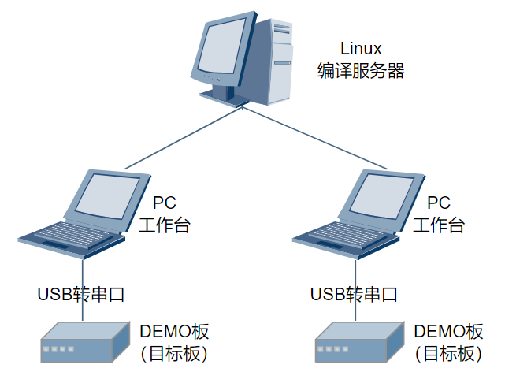

## Setting Up the Linux Development Environment<a name="ZH-CN_TOPIC_0000001700293988"></a>

Ubuntu 20.04 or later is recommended for the Linux system, with bash as the Shell. The SDK is compiled with CMake (3.14.1 or later), and the compilation tools also include Python (3.8.0 or later), etc.


### Configuring the Shell<a name="ZH-CN_TOPIC_0000001700293972"></a>

Configure bash as the default Shell. Open a Linux terminal, run the command "sudo dpkg-reconfigure dash", and select no.

### Installing CMake<a name="ZH-CN_TOPIC_0000001758443013"></a>

Open a Linux terminal and run the command "sudo apt install cmake" to complete the CMake installation.

### Installing the Python Environment<a name="ZH-CN_TOPIC_0000001710481148"></a>

1.  Open a Linux terminal, enter the command "python3 -V" to check the Python version. Python 3.8.0 or later is recommended.
2.  If the Python version is too low, use the command "sudo apt-get update" to update the system to the latest version, or install Python 3 with the command "sudo apt-get install python3 -y" (root/sudo permission is required for installation). After installation, verify the Python version again.

    If the version requirement is still not met, download the source package of the corresponding version from "[https://www.python.org/downloads/source/](https://www.python.org/downloads/source/)  ". For the download and installation methods, please read  [https://wiki.python.org/moin/BeginnersGuide/Download](https://wiki.python.org/moin/BeginnersGuide/Download)  and the README content in the source package.

3.  Install the Python package management tool by running the command "sudo apt-get install python3-setuptools python3-pip -y" (root/sudo permission is required for installation).
4.  Install Kconfiglib 14.1.0+. Use the command "sudo pip3 install kconfiglib" (root/sudo permission is required for installation), or download the .whl file from "[https://pypi.org/project/kconfiglib](https://pypi.org/project/kconfiglib)" (for example: kconfiglib-14.1.0-py2.py3-none-any.whl) and install it with "pip3 install kconfiglib-xxx.whl" (root/sudo permission is required for installation), or download the source package to the local machine, extract it, and install it with "python setup.py install" (root/sudo permission is required for installation). The interface after installation is shown in [Figure 1](#fig743717512220).

    **Figure 1**  Example of completed Kconfiglib component package installation<a name="fig743717512220"></a>  
    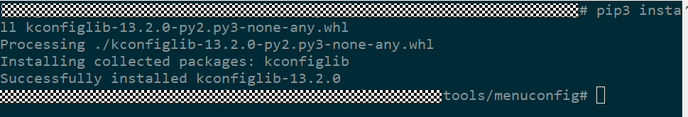

5.  Install the Python component packages required for signing upgrade files.

    Install pycparser:

    After downloading the .whl file from "[https://pypi.org/project/pycparser/](https://pypi.org/project/pycparser/)" (for example: pycparser-2.21-py2.py3-none-any.whl), install it with "pip3 install pycparser-xxx.whl" (root/sudo permission is required for installation), or download the source package to the local machine, extract it, and install it with "python setup.py install" (root/sudo permission is required for installation). After the installation is complete, the interface will show "Successfully intalled pycparser-2.21".

> **Note:** 
>If the build environment contains multiple Python installations, especially multiple installations of the same version, and the user cannot tell which one is being used, it is recommended to install the Python component packages from the component package source code in this case.

# Compiling the SDK<a name="ZH-CN_TOPIC_0000001748014017"></a>


## SDK Directory Structure Introduction<a name="ZH-CN_TOPIC_0000001748014045"></a>

The SDK root directory structure is shown in [Table 1](#table13927142512394).

**Table 1**  SDK root directory

<a name="table13927142512394"></a>
<table><thead align="left"><tr id="row15927132514396"><th class="cellrowborder" valign="top" width="27.38%" id="mcps1.2.3.1.1"><p id="p11927325113916"><a name="p11927325113916"></a><a name="p11927325113916"></a>Directory</p>
</th>
<th class="cellrowborder" valign="top" width="72.61999999999999%" id="mcps1.2.3.1.2"><p id="p1292722593913"><a name="p1292722593913"></a><a name="p1292722593913"></a>Description</p>
</th>
</tr>
</thead>
<tbody><tr id="row292882517399"><td class="cellrowborder" valign="top" width="27.38%" headers="mcps1.2.3.1.1 "><p id="p159281025163910"><a name="p159281025163910"></a><a name="p159281025163910"></a>application</p>
</td>
<td class="cellrowborder" valign="top" width="72.61999999999999%" headers="mcps1.2.3.1.2 "><p id="p417918234"><a name="p417918234"></a><a name="p417918234"></a>Application-layer code (including demo programs as reference examples).</p>
</td>
</tr>
<tr id="row19928225163913"><td class="cellrowborder" valign="top" width="27.38%" headers="mcps1.2.3.1.1 "><p id="p2928122511393"><a name="p2928122511393"></a><a name="p2928122511393"></a>bootloader</p>
</td>
<td class="cellrowborder" valign="top" width="72.61999999999999%" headers="mcps1.2.3.1.2 "><p id="p1192882518398"><a name="p1192882518398"></a><a name="p1192882518398"></a>boot (Flashboot/SSB) code.</p>
</td>
</tr>
<tr id="row12308241122019"><td class="cellrowborder" valign="top" width="27.38%" headers="mcps1.2.3.1.1 "><p id="p1566453261918"><a name="p1566453261918"></a><a name="p1566453261918"></a>build</p>
</td>
<td class="cellrowborder" valign="top" width="72.61999999999999%" headers="mcps1.2.3.1.2 "><p id="p466403211919"><a name="p466403211919"></a><a name="p466403211919"></a>Scripts and configuration files required for SDK building.</p>
</td>
</tr>
<tr id="row1653555018202"><td class="cellrowborder" valign="top" width="27.38%" headers="mcps1.2.3.1.1 "><p id="p1066416323191"><a name="p1066416323191"></a><a name="p1066416323191"></a>build.py</p>
</td>
<td class="cellrowborder" valign="top" width="72.61999999999999%" headers="mcps1.2.3.1.2 "><p id="p14664123216198"><a name="p14664123216198"></a><a name="p14664123216198"></a>Compilation entry script.</p>
</td>
</tr>
<tr id="row10787191320215"><td class="cellrowborder" valign="top" width="27.38%" headers="mcps1.2.3.1.1 "><p id="p116642329192"><a name="p116642329192"></a><a name="p116642329192"></a>CMakeLists.txt</p>
</td>
<td class="cellrowborder" valign="top" width="72.61999999999999%" headers="mcps1.2.3.1.2 "><p id="p14664132191912"><a name="p14664132191912"></a><a name="p14664132191912"></a>Top-level "CMakeLists.txt" file of the CMake project.</p>
</td>
</tr>
<tr id="row109286253399"><td class="cellrowborder" valign="top" width="27.38%" headers="mcps1.2.3.1.1 "><p id="p17664432111917"><a name="p17664432111917"></a><a name="p17664432111917"></a>config.in</p>
</td>
<td class="cellrowborder" valign="top" width="72.61999999999999%" headers="mcps1.2.3.1.2 "><p id="p136644327197"><a name="p136644327197"></a><a name="p136644327197"></a>Kconfig configuration file.</p>
</td>
</tr>
<tr id="row15928132512396"><td class="cellrowborder" valign="top" width="27.38%" headers="mcps1.2.3.1.1 "><p id="p666414326194"><a name="p666414326194"></a><a name="p666414326194"></a>drivers</p>
</td>
<td class="cellrowborder" valign="top" width="72.61999999999999%" headers="mcps1.2.3.1.2 "><p id="p1566483281918"><a name="p1566483281918"></a><a name="p1566483281918"></a>Driver code.</p>
</td>
</tr>
<tr id="row415218166102"><td class="cellrowborder" valign="top" width="27.38%" headers="mcps1.2.3.1.1 "><p id="p19664732181920"><a name="p19664732181920"></a><a name="p19664732181920"></a>include</p>
</td>
<td class="cellrowborder" valign="top" width="72.61999999999999%" headers="mcps1.2.3.1.2 "><p id="p1066453216197"><a name="p1066453216197"></a><a name="p1066453216197"></a>Directory for storing API header files.</p>
</td>
</tr>
<tr id="row75842056117"><td class="cellrowborder" valign="top" width="27.38%" headers="mcps1.2.3.1.1 "><p id="p1166412325191"><a name="p1166412325191"></a><a name="p1166412325191"></a>interim_binary</p>
</td>
<td class="cellrowborder" valign="top" width="72.61999999999999%" headers="mcps1.2.3.1.2 "><p id="p1866403221917"><a name="p1866403221917"></a><a name="p1866403221917"></a>Library storage directory.</p>
</td>
</tr>
<tr id="row152262035269"><td class="cellrowborder" valign="top" width="27.38%" headers="mcps1.2.3.1.1 "><p id="p1566413221912"><a name="p1566413221912"></a><a name="p1566413221912"></a>kernel</p>
</td>
<td class="cellrowborder" valign="top" width="72.61999999999999%" headers="mcps1.2.3.1.2 "><p id="p1066483281910"><a name="p1066483281910"></a><a name="p1066483281910"></a>Kernel code and OS interface adaptation layer code.</p>
</td>
</tr>
<tr id="row07472124410"><td class="cellrowborder" valign="top" width="27.38%" headers="mcps1.2.3.1.1 "><p id="p1465510306495"><a name="p1465510306495"></a><a name="p1465510306495"></a>libs_url</p>
</td>
<td class="cellrowborder" valign="top" width="72.61999999999999%" headers="mcps1.2.3.1.2 "><p id="p11655153012490"><a name="p11655153012490"></a><a name="p11655153012490"></a>Library files.</p>
</td>
</tr>
<tr id="row26011201747"><td class="cellrowborder" valign="top" width="27.38%" headers="mcps1.2.3.1.1 "><p id="p433325713498"><a name="p433325713498"></a><a name="p433325713498"></a>middleware</p>
</td>
<td class="cellrowborder" valign="top" width="72.61999999999999%" headers="mcps1.2.3.1.2 "><p id="p233335715491"><a name="p233335715491"></a><a name="p233335715491"></a>Middleware code.</p>
</td>
</tr>
<tr id="row17392173512420"><td class="cellrowborder" valign="top" width="27.38%" headers="mcps1.2.3.1.1 "><p id="p14333185794910"><a name="p14333185794910"></a><a name="p14333185794910"></a>open_source</p>
</td>
<td class="cellrowborder" valign="top" width="72.61999999999999%" headers="mcps1.2.3.1.2 "><p id="p14333957164919"><a name="p14333957164919"></a><a name="p14333957164919"></a>Open-source code.</p>
</td>
</tr>
<tr id="row17747172410413"><td class="cellrowborder" valign="top" width="27.38%" headers="mcps1.2.3.1.1 "><p id="p1333312572493"><a name="p1333312572493"></a><a name="p1333312572493"></a>protocol</p>
</td>
<td class="cellrowborder" valign="top" width="72.61999999999999%" headers="mcps1.2.3.1.2 "><p id="p6333157154912"><a name="p6333157154912"></a><a name="p6333157154912"></a>Code of components such as WiFi, BT, and Radar.</p>
</td>
</tr>
<tr id="row768611001510"><td class="cellrowborder" valign="top" width="27.38%" headers="mcps1.2.3.1.1 "><p id="p03333575492"><a name="p03333575492"></a><a name="p03333575492"></a>test</p>
</td>
<td class="cellrowborder" valign="top" width="72.61999999999999%" headers="mcps1.2.3.1.2 "><p id="p333345713495"><a name="p333345713495"></a><a name="p333345713495"></a>testsuite code.</p>
</td>
</tr>
<tr id="row44171914181911"><td class="cellrowborder" valign="top" width="27.38%" headers="mcps1.2.3.1.1 "><p id="p93331557104916"><a name="p93331557104916"></a><a name="p93331557104916"></a>tools</p>
</td>
<td class="cellrowborder" valign="top" width="72.61999999999999%" headers="mcps1.2.3.1.2 "><p id="p1833415714912"><a name="p1833415714912"></a><a name="p1833415714912"></a>Contains the compilation toolchain (including Linux and Windows), image packaging scripts, NV creation tools, and signing scripts.</p>
</td>
</tr>
<tr id="row15401556194817"><td class="cellrowborder" valign="top" width="27.38%" headers="mcps1.2.3.1.1 "><p id="p53342570499"><a name="p53342570499"></a><a name="p53342570499"></a>output</p>
</td>
<td class="cellrowborder" valign="top" width="72.61999999999999%" headers="mcps1.2.3.1.2 "><p id="p43341957154917"><a name="p43341957154917"></a><a name="p43341957154917"></a>Object files and intermediate files generated during compilation (including library files, printed logs, and generated binary files).</p>
</td>
</tr>
</tbody>
</table>

The root directory after extracting the SDK is shown in [Figure 1](#fig1447325620456). Note: The output directory described in the table above is generated after compilation.

**Figure 1**  Example of extracting the SDK<a name="fig1447325620456"></a>  
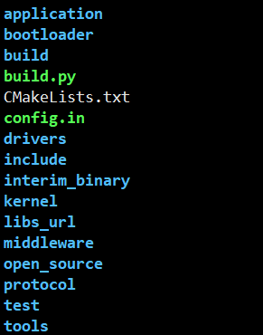

## Compiling the SDK (CMake)<a name="ZH-CN_TOPIC_0000001700134488"></a>


### Compilation Method<a name="ZH-CN_TOPIC_0000001748093877"></a>

Run the script with the command "python3 build.py" in the root directory to compile and generate the corresponding SDK program. The list of compilation commands is shown in [Table 1](#table1646491114816).

**Table 1**  build.sh parameter list

<a name="table1646491114816"></a>
<table><thead align="left"><tr id="row44654114810"><th class="cellrowborder" valign="top" width="12.76%" id="mcps1.2.4.1.1"><p id="p194651412487"><a name="p194651412487"></a><a name="p194651412487"></a>Parameter</p>
</th>
<th class="cellrowborder" valign="top" width="37.480000000000004%" id="mcps1.2.4.1.2"><p id="p6461872507"><a name="p6461872507"></a><a name="p6461872507"></a>Example</p>
</th>
<th class="cellrowborder" valign="top" width="49.76%" id="mcps1.2.4.1.3"><p id="p1246515144820"><a name="p1246515144820"></a><a name="p1246515144820"></a>Description</p>
</th>
</tr>
</thead>
<tbody><tr id="row746513144812"><td class="cellrowborder" valign="top" width="12.76%" headers="mcps1.2.4.1.1 "><p id="p2465219482"><a name="p2465219482"></a><a name="p2465219482"></a>None</p>
</td>
<td class="cellrowborder" valign="top" width="37.480000000000004%" headers="mcps1.2.4.1.2 "><p id="p1215022142715"><a name="p1215022142715"></a><a name="p1215022142715"></a>python3 build.py ws63-liteos-app</p>
</td>
<td class="cellrowborder" valign="top" width="49.76%" headers="mcps1.2.4.1.3 "><p id="p144651117489"><a name="p144651117489"></a><a name="p144651117489"></a>Start the incremental compilation of the ws63-liteos-app target.</p>
</td>
</tr>
<tr id="row04651218489"><td class="cellrowborder" valign="top" width="12.76%" headers="mcps1.2.4.1.1 "><p id="p24654119480"><a name="p24654119480"></a><a name="p24654119480"></a>-c</p>
</td>
<td class="cellrowborder" valign="top" width="37.480000000000004%" headers="mcps1.2.4.1.2 "><p id="p16463717500"><a name="p16463717500"></a><a name="p16463717500"></a>python3 build.py -c ws63-liteos-app</p>
</td>
<td class="cellrowborder" valign="top" width="49.76%" headers="mcps1.2.4.1.3 "><p id="p1046516134810"><a name="p1046516134810"></a><a name="p1046516134810"></a>Start the full compilation of the ws63-liteos-app target.</p>
</td>
</tr>
<tr id="row11696675533"><td class="cellrowborder" valign="top" width="12.76%" headers="mcps1.2.4.1.1 "><p id="p206971172535"><a name="p206971172535"></a><a name="p206971172535"></a>menuconfig</p>
</td>
<td class="cellrowborder" valign="top" width="37.480000000000004%" headers="mcps1.2.4.1.2 "><p id="p1669710713535"><a name="p1669710713535"></a><a name="p1669710713535"></a>python3 build.py  ws63-liteos-app menuconfig</p>
</td>
<td class="cellrowborder" valign="top" width="49.76%" headers="mcps1.2.4.1.3 "><p id="p18697274534"><a name="p18697274534"></a><a name="p18697274534"></a>Start the menuconfig graphical configuration interface of the ws63-liteos-app target.</p>
</td>
</tr>
</tbody>
</table>

**Table 2**  Compilation target introduction

<a name="table16988747155411"></a>
<table><thead align="left"><tr id="row1898820470542"><th class="cellrowborder" valign="top" width="42.96%" id="mcps1.2.3.1.1"><p id="p69881047105420"><a name="p69881047105420"></a><a name="p69881047105420"></a>Compilation target</p>
</th>
<th class="cellrowborder" valign="top" width="57.04%" id="mcps1.2.3.1.2"><p id="p898824715413"><a name="p898824715413"></a><a name="p898824715413"></a>Description</p>
</th>
</tr>
</thead>
<tbody><tr id="row20988114713546"><td class="cellrowborder" valign="top" width="42.96%" headers="mcps1.2.3.1.1 "><p id="p1098804755419"><a name="p1098804755419"></a><a name="p1098804755419"></a>python3 build.py -c ws63-liteos-app</p>
</td>
<td class="cellrowborder" valign="top" width="57.04%" headers="mcps1.2.3.1.2 "><p id="p7989144715418"><a name="p7989144715418"></a><a name="p7989144715418"></a>Compilation target of the app version (automatically includes flashboot compilation).</p>
</td>
</tr>
<tr id="row14862228125611"><td class="cellrowborder" valign="top" width="42.96%" headers="mcps1.2.3.1.1 "><p id="p757993465615"><a name="p757993465615"></a><a name="p757993465615"></a>python3 build.py -c ws63-flashboot</p>
</td>
<td class="cellrowborder" valign="top" width="57.04%" headers="mcps1.2.3.1.2 "><p id="p4863132885617"><a name="p4863132885617"></a><a name="p4863132885617"></a>Compilation target of the flashboot image.</p>
</td>
</tr>
<tr id="row1798914714548"><td class="cellrowborder" valign="top" width="42.96%" headers="mcps1.2.3.1.1 "><p id="p59897476544"><a name="p59897476544"></a><a name="p59897476544"></a>python3 build.py -c ws63-liteos-xts</p>
</td>
<td class="cellrowborder" valign="top" width="57.04%" headers="mcps1.2.3.1.2 "><p id="p15989747145416"><a name="p15989747145416"></a><a name="p15989747145416"></a>Compilation target of the OpenHarmony XTS certification version (for details, refer to the "HarmonyOS XTS Certification Guide").</p>
</td>
</tr>
<tr id="row2170141317581"><td class="cellrowborder" valign="top" width="42.96%" headers="mcps1.2.3.1.1 "><p id="p17171161316588"><a name="p17171161316588"></a><a name="p17171161316588"></a>python3 build.py -c ws63-liteos-app-iot</p>
</td>
<td class="cellrowborder" valign="top" width="57.04%" headers="mcps1.2.3.1.2 "><p id="p7171191365813"><a name="p7171191365813"></a><a name="p7171191365813"></a>Compilation target of the Harmony Connect version (for details, refer to the "HiLink Compilation User Guide").</p>
</td>
</tr>
<tr id="row398924715412"><td class="cellrowborder" valign="top" width="42.96%" headers="mcps1.2.3.1.1 "><p id="p2098914711549"><a name="p2098914711549"></a><a name="p2098914711549"></a>python3 build.py -c ws63-liteos-hilink</p>
</td>
<td class="cellrowborder" valign="top" width="57.04%" headers="mcps1.2.3.1.2 "><p id="p497215559918"><a name="p497215559918"></a><a name="p497215559918"></a>Compilation target of the Harmony Connect standalone upgrade version (for details, refer to the "HiLink Compilation User Guide").</p>
</td>
</tr>
</tbody>
</table>

The flashing image generated by compilation is in the "output/ws63/fwpkg/ws63-liteos-app" directory (as shown in [Table 3](#table5535429403)).

**Table 3**  Flashing images

<a name="table5535429403"></a>
<table><thead align="left"><tr id="row1353722184019"><th class="cellrowborder" valign="top" width="21.45%" id="mcps1.2.3.1.1"><p id="p97691634164219"><a name="p97691634164219"></a><a name="p97691634164219"></a>File name</p>
</th>
<th class="cellrowborder" valign="top" width="78.55%" id="mcps1.2.3.1.2"><p id="p253772164019"><a name="p253772164019"></a><a name="p253772164019"></a>Description</p>
</th>
</tr>
</thead>
<tbody><tr id="row75376234019"><td class="cellrowborder" valign="top" width="21.45%" headers="mcps1.2.3.1.1 "><p id="p1740682318402"><a name="p1740682318402"></a><a name="p1740682318402"></a>ws63-liteos-app_all.fwpkg</p>
</td>
<td class="cellrowborder" valign="top" width="78.55%" headers="mcps1.2.3.1.2 "><p id="p10903201011919"><a name="p10903201011919"></a><a name="p10903201011919"></a>When flashing a blank chip, this file must be flashed. It contains all the content that needs to be upgraded, including: root_loaderboot_sign.bin, root_params.bin, flashboot_sign.bin, ws63_all_nv.bin, and ws63-liteos-app-sign.bin.</p>
<p id="p7548577443"><a name="p7548577443"></a><a name="p7548577443"></a>The files are described as follows:</p>
<p id="p195743193449"><a name="p195743193449"></a><a name="p195743193449"></a>root_loaderboot_sign.bin: The image file of loaderboot. When an upgrade starts, the romboot embedded in the chip receives this image file, loads it into memory, and runs it. loadboot is responsible for receiving subsequent image files. Note: This image runs only in RAM during the upgrade phase and is not stored in flash.</p>
<p id="p5426121718517"><a name="p5426121718517"></a><a name="p5426121718517"></a>root_params.bin: The image file of flash partition information. The partition information is used by romboot, loaderboot, and flashboot.</p>
<p id="p205118146539"><a name="p205118146539"></a><a name="p205118146539"></a>flashboot_sign.bin: The image file of flashboot.</p>
<p id="p4313165175313"><a name="p4313165175313"></a><a name="p4313165175313"></a>ws63_all_nv.bin: The image file of the parameter area.</p>
<p id="p123521010192719"><a name="p123521010192719"></a><a name="p123521010192719"></a>ws63-liteos-app-sign.bin: The image file of the version.</p>
</td>
</tr>
<tr id="row15537132114020"><td class="cellrowborder" valign="top" width="21.45%" headers="mcps1.2.3.1.1 "><p id="p20351123274017"><a name="p20351123274017"></a><a name="p20351123274017"></a>ws63-liteos-app_load_only.fwpkg</p>
</td>
<td class="cellrowborder" valign="top" width="78.55%" headers="mcps1.2.3.1.2 "><p id="p109031510191919"><a name="p109031510191919"></a><a name="p109031510191919"></a>Package file for version upgrades, containing: root_loaderboot_sign.bin and ws63-liteos-app-sign.bin. It does not contain flashboot-related content.</p>
<p id="p7556838163116"><a name="p7556838163116"></a><a name="p7556838163116"></a>After the "ws63-liteos-app_all.fwpkg" image has been flashed to the chip, this file can be used for upgrades if subsequent modifications do not involve changes to root_params, flash_boot, or nv.</p>
</td>
</tr>
</tbody>
</table>

Note: The intermediate files generated by compilation are in the "output/ws63/acore/ws63-liteos-app" directory.

### Detailed Compilation Parameters<a name="ZH-CN_TOPIC_0000001882476501"></a>

The parameters accepted by the compilation command and their explanations are shown in [Table 1](#table36913222319).

**Table 1**  Compilation parameter information

<a name="table36913222319"></a>
<table><thead align="left"><tr id="row205261342910"><th class="cellrowborder" valign="top" width="20.65%" id="mcps1.2.3.1.1"><p id="p6526649913"><a name="p6526649913"></a><a name="p6526649913"></a>Parameter</p>
</th>
<th class="cellrowborder" valign="top" width="79.35%" id="mcps1.2.3.1.2"><p id="p135275415919"><a name="p135275415919"></a><a name="p135275415919"></a>Parameter information</p>
</th>
</tr>
</thead>
<tbody><tr id="row1289314403919"><td class="cellrowborder" valign="top" width="20.65%" headers="mcps1.2.3.1.1 "><p id="p1089312404913"><a name="p1089312404913"></a><a name="p1089312404913"></a>-c</p>
</td>
<td class="cellrowborder" valign="top" width="79.35%" headers="mcps1.2.3.1.2 "><p id="p489312401193"><a name="p489312401193"></a><a name="p489312401193"></a>Clean and then compile</p>
</td>
</tr>
<tr id="row9701422193117"><td class="cellrowborder" valign="top" width="20.65%" headers="mcps1.2.3.1.1 "><p id="p157010226318"><a name="p157010226318"></a><a name="p157010226318"></a>-j</p>
</td>
<td class="cellrowborder" valign="top" width="79.35%" headers="mcps1.2.3.1.2 "><p id="p17092210313"><a name="p17092210313"></a><a name="p17092210313"></a>-j&lt;num&gt;: compile with num threads, for example, -j16 or -j8</p>
<p id="p194801456193213"><a name="p194801456193213"></a><a name="p194801456193213"></a>Default maximum threads</p>
</td>
</tr>
<tr id="row270622113120"><td class="cellrowborder" valign="top" width="20.65%" headers="mcps1.2.3.1.1 "><p id="p327613157339"><a name="p327613157339"></a><a name="p327613157339"></a>-def=</p>
</td>
<td class="cellrowborder" valign="top" width="79.35%" headers="mcps1.2.3.1.2 "><p id="p570622133113"><a name="p570622133113"></a><a name="p570622133113"></a>-def=XXX,YYY,ZZZ=x,...  Add the XXX, YYY, and ZZZ=x compilation macros to this compilation target</p>
<p id="p687205165210"><a name="p687205165210"></a><a name="p687205165210"></a>Use -def=-:XXX to disable the XXX macro</p>
<p id="p7751710105219"><a name="p7751710105219"></a><a name="p7751710105219"></a>Use -def=-:ZZZ=x to add or modify the ZZZ macro</p>
</td>
</tr>
<tr id="row5701722153118"><td class="cellrowborder" valign="top" width="20.65%" headers="mcps1.2.3.1.1 "><p id="p147012225311"><a name="p147012225311"></a><a name="p147012225311"></a>-component=</p>
</td>
<td class="cellrowborder" valign="top" width="79.35%" headers="mcps1.2.3.1.2 "><p id="p170922163112"><a name="p170922163112"></a><a name="p170922163112"></a>-component=XXX,YYY,...  Compile only the XXX and YYY components</p>
</td>
</tr>
<tr id="row12380153694910"><td class="cellrowborder" valign="top" width="20.65%" headers="mcps1.2.3.1.1 "><p id="p183801736124914"><a name="p183801736124914"></a><a name="p183801736124914"></a>-ninja</p>
</td>
<td class="cellrowborder" valign="top" width="79.35%" headers="mcps1.2.3.1.2 "><p id="p6744245135819"><a name="p6744245135819"></a><a name="p6744245135819"></a>Use ninja to generate intermediate files; the Unix makefile is used by default</p>
</td>
</tr>
<tr id="row57010229319"><td class="cellrowborder" valign="top" width="20.65%" headers="mcps1.2.3.1.1 "><p id="p8706227315"><a name="p8706227315"></a><a name="p8706227315"></a>-[release / debug]</p>
</td>
<td class="cellrowborder" valign="top" width="79.35%" headers="mcps1.2.3.1.2 "><p id="p270112211312"><a name="p270112211312"></a><a name="p270112211312"></a>release:  saves time when generating disassembly files</p>
<p id="p16649163112211"><a name="p16649163112211"></a><a name="p16649163112211"></a>debug:   provides more comprehensive information when generating disassembly files but takes more time</p>
<p id="p18807163914214"><a name="p18807163914214"></a><a name="p18807163914214"></a>debug is the default</p>
</td>
</tr>
<tr id="row187072220311"><td class="cellrowborder" valign="top" width="20.65%" headers="mcps1.2.3.1.1 "><p id="p770422133120"><a name="p770422133120"></a><a name="p770422133120"></a>-dump</p>
</td>
<td class="cellrowborder" valign="top" width="79.35%" headers="mcps1.2.3.1.2 "><p id="p4701622143115"><a name="p4701622143115"></a><a name="p4701622143115"></a>Output all parameter lists of the target in the terminal during compilation -- including compilation macros, components, compilation options, etc.</p>
</td>
</tr>
<tr id="row1170152283114"><td class="cellrowborder" valign="top" width="20.65%" headers="mcps1.2.3.1.1 "><p id="p5701222103111"><a name="p5701222103111"></a><a name="p5701222103111"></a>-nhso</p>
</td>
<td class="cellrowborder" valign="top" width="79.35%" headers="mcps1.2.3.1.2 "><p id="p117012221318"><a name="p117012221318"></a><a name="p117012221318"></a>Do not update the HSO database</p>
</td>
</tr>
<tr id="row87082218313"><td class="cellrowborder" valign="top" width="20.65%" headers="mcps1.2.3.1.1 "><p id="p1870102213317"><a name="p1870102213317"></a><a name="p1870102213317"></a>-out_libs</p>
</td>
<td class="cellrowborder" valign="top" width="79.35%" headers="mcps1.2.3.1.2 "><p id="p370192214311"><a name="p370192214311"></a><a name="p370192214311"></a>-out_libs=file_path: instead of linking into an elf, package all .a files into one large .a file</p>
</td>
</tr>
<tr id="row57062212312"><td class="cellrowborder" valign="top" width="20.65%" headers="mcps1.2.3.1.1 "><p id="p1270182211310"><a name="p1270182211310"></a><a name="p1270182211310"></a>others</p>
</td>
<td class="cellrowborder" valign="top" width="79.35%" headers="mcps1.2.3.1.2 "><p id="p17019227313"><a name="p17019227313"></a><a name="p17019227313"></a>Used as the keyword for matching compilation target_names</p>
</td>
</tr>
</tbody>
</table>

### Detailed Compilation Options<a name="ZH-CN_TOPIC_0000001885439217"></a>

WS63 configures compilation options in .py files in different directories, as shown in [Table 1](#table20340122212538).

**Table 1**  WS63 common component compilation options

<a name="table20340122212538"></a>
<table><thead align="left"><tr id="row5340132295310"><th class="cellrowborder" align="center" valign="top" width="15.85%" id="mcps1.2.5.1.1"><p id="p1934072235311"><a name="p1934072235311"></a><a name="p1934072235311"></a>Compilation option type</p>
</th>
<th class="cellrowborder" align="center" valign="top" width="16.68%" id="mcps1.2.5.1.2"><p id="p9340122218538"><a name="p9340122218538"></a><a name="p9340122218538"></a>Description</p>
</th>
<th class="cellrowborder" align="center" valign="top" width="42.47%" id="mcps1.2.5.1.3"><p id="p12340192213533"><a name="p12340192213533"></a><a name="p12340192213533"></a>Content</p>
</th>
<th class="cellrowborder" align="center" valign="top" width="25%" id="mcps1.2.5.1.4"><p id="p183401122125318"><a name="p183401122125318"></a><a name="p183401122125318"></a>Corresponding file control path</p>
</th>
</tr>
</thead>
<tbody><tr id="row1234092285320"><td class="cellrowborder" align="left" valign="top" width="15.85%" headers="mcps1.2.5.1.1 "><p id="p2034012205315"><a name="p2034012205315"></a><a name="p2034012205315"></a>common_ccflags</p>
</td>
<td class="cellrowborder" align="left" valign="top" width="16.68%" headers="mcps1.2.5.1.2 "><p id="p6340172295318"><a name="p6340172295318"></a><a name="p6340172295318"></a>Basic compilation options</p>
</td>
<td class="cellrowborder" align="left" valign="top" width="42.47%" headers="mcps1.2.5.1.3 "><p id="p334017226530"><a name="p334017226530"></a><a name="p334017226530"></a>-std=gnu99 -Wall -Werror -Wextra -Winit-self -Wpointer-arith -Wstrict-prototypes -Wno-type-limits -fno-strict-aliasing -Os -fno-unwind-tables</p>
</td>
<td class="cellrowborder" align="left" valign="top" width="25%" headers="mcps1.2.5.1.4 "><p id="p33404224537"><a name="p33404224537"></a><a name="p33404224537"></a>\sdk\build\config\target_config\common_config.py</p>
</td>
</tr>
<tr id="row1534012216539"><td class="cellrowborder" align="left" valign="top" width="15.85%" headers="mcps1.2.5.1.1 "><p id="p63407223532"><a name="p63407223532"></a><a name="p63407223532"></a>riscv31</p>
</td>
<td class="cellrowborder" align="left" valign="top" width="16.68%" headers="mcps1.2.5.1.2 "><p id="p12340142265320"><a name="p12340142265320"></a><a name="p12340142265320"></a>Chip type compilation options</p>
</td>
<td class="cellrowborder" align="left" valign="top" width="42.47%" headers="mcps1.2.5.1.3 "><p id="p18340922175319"><a name="p18340922175319"></a><a name="p18340922175319"></a>-ffreestanding -fdata-sections -Wno-implicit-fallthrough -ffunction-sections -nostdlib -pipe -fno-tree-scev-cprop -fno-common -mpush-pop -msmall-data-limit=0 -fno-ipa-ra -Wtrampolines -Wlogical-op -Wjump-misses-init -Wa,-enable-c-lbu-sb -Wa,-enable-c-lhu-sh -fimm-compare -femit-muliadd -fmerge-immshf -femit-uxtb-uxth -femit-lli -femit-clz -fldm-stm-optimize -g</p>
</td>
<td class="cellrowborder" align="left" valign="top" width="25%" headers="mcps1.2.5.1.4 "><p id="p17340422185318"><a name="p17340422185318"></a><a name="p17340422185318"></a>\sdk\build\config\target_config\common_config.py</p>
</td>
</tr>
<tr id="row143404224531"><td class="cellrowborder" align="left" valign="top" width="15.85%" headers="mcps1.2.5.1.1 "><p id="p16340152214539"><a name="p16340152214539"></a><a name="p16340152214539"></a>fp_flags</p>
</td>
<td class="cellrowborder" align="left" valign="top" width="16.68%" headers="mcps1.2.5.1.2 "><p id="p12340182275318"><a name="p12340182275318"></a><a name="p12340182275318"></a>Hard-floating-point compilation options</p>
</td>
<td class="cellrowborder" align="left" valign="top" width="42.47%" headers="mcps1.2.5.1.3 "><p id="p113401322195311"><a name="p113401322195311"></a><a name="p113401322195311"></a>-march=rv32imfc -mabi=ilp32f</p>
</td>
<td class="cellrowborder" align="left" valign="top" width="25%" headers="mcps1.2.5.1.4 "><p id="p1734013223533"><a name="p1734013223533"></a><a name="p1734013223533"></a>\sdk\build\config\target_config\ws63\target_config.py</p>
</td>
</tr>
<tr id="row20340322205313"><td class="cellrowborder" align="left" valign="top" width="15.85%" headers="mcps1.2.5.1.1 "><p id="p334013226531"><a name="p334013226531"></a><a name="p334013226531"></a>codesize_flags</p>
</td>
<td class="cellrowborder" align="left" valign="top" width="16.68%" headers="mcps1.2.5.1.2 "><p id="p434012235317"><a name="p434012235317"></a><a name="p434012235317"></a>codesize optimization options</p>
</td>
<td class="cellrowborder" align="left" valign="top" width="42.47%" headers="mcps1.2.5.1.3 "><p id="p43401422205318"><a name="p43401422205318"></a><a name="p43401422205318"></a>--short-enums -madjust-regorder -madjust-const-cost -freorder-commu-args -fimm-compare-expand -frmv-str-zero -mfp-const-opt -mswitch-jump-table -frtl-sequence-abstract -frtl-hoist-sink -fsafe-alias-multipointer -finline-optimize-size -fmuliadd-expand -mlli-expand -Wa,-mcjal-expand -foptimize-reg-alloc -fsplit-multi-zero-assignments -floop-optimize-size -Wa,-mlli-relax -mpattern-abstract -foptimize-pro-and-epilogue</p>
</td>
<td class="cellrowborder" align="left" valign="top" width="25%" headers="mcps1.2.5.1.4 "><p id="p16341142215317"><a name="p16341142215317"></a><a name="p16341142215317"></a>\sdk\build\config\target_config\ws63\target_config.py</p>
</td>
</tr>
</tbody>
</table>

Among them, the detailed descriptions of the compilation options are shown in [Table 2](#table5190336213).

**Table 2**  Detailed descriptions of compilation options

<a name="table5190336213"></a>
<table><thead align="left"><tr id="row1319033617116"><th class="cellrowborder" valign="top" width="23.27%" id="mcps1.2.3.1.1"><p id="p17190636711"><a name="p17190636711"></a><a name="p17190636711"></a>Option</p>
</th>
<th class="cellrowborder" valign="top" width="76.73%" id="mcps1.2.3.1.2"><p id="p11190936911"><a name="p11190936911"></a><a name="p11190936911"></a>Description</p>
</th>
</tr>
</thead>
<tbody><tr id="row71905363117"><td class="cellrowborder" valign="top" width="23.27%" headers="mcps1.2.3.1.1 "><p id="p519017366118"><a name="p519017366118"></a><a name="p519017366118"></a>-std=gnu99</p>
</td>
<td class="cellrowborder" valign="top" width="76.73%" headers="mcps1.2.3.1.2 "><p id="p2019017361613"><a name="p2019017361613"></a><a name="p2019017361613"></a>Use the ISO C99 standard with GNU extensions</p>
</td>
</tr>
<tr id="row12190103614112"><td class="cellrowborder" valign="top" width="23.27%" headers="mcps1.2.3.1.1 "><p id="p2190236315"><a name="p2190236315"></a><a name="p2190236315"></a>-Wall</p>
</td>
<td class="cellrowborder" valign="top" width="76.73%" headers="mcps1.2.3.1.2 "><p id="p81901236214"><a name="p81901236214"></a><a name="p81901236214"></a>Display all warnings after compilation</p>
</td>
</tr>
<tr id="row101901836410"><td class="cellrowborder" valign="top" width="23.27%" headers="mcps1.2.3.1.1 "><p id="p2190143614118"><a name="p2190143614118"></a><a name="p2190143614118"></a>-Werror</p>
</td>
<td class="cellrowborder" valign="top" width="76.73%" headers="mcps1.2.3.1.2 "><p id="p10190163611115"><a name="p10190163611115"></a><a name="p10190163611115"></a>Used to escalate all warnings to errors</p>
</td>
</tr>
<tr id="row1119017361713"><td class="cellrowborder" valign="top" width="23.27%" headers="mcps1.2.3.1.1 "><p id="p019020361111"><a name="p019020361111"></a><a name="p019020361111"></a>-Wextra</p>
</td>
<td class="cellrowborder" valign="top" width="76.73%" headers="mcps1.2.3.1.2 "><p id="p20190163620117"><a name="p20190163620117"></a><a name="p20190163620117"></a>Used to enable additional warning information (a supplement to -Wall)</p>
</td>
</tr>
<tr id="row619013367118"><td class="cellrowborder" valign="top" width="23.27%" headers="mcps1.2.3.1.1 "><p id="p019015360118"><a name="p019015360118"></a><a name="p019015360118"></a>-Winit-self</p>
</td>
<td class="cellrowborder" valign="top" width="76.73%" headers="mcps1.2.3.1.2 "><p id="p161900368113"><a name="p161900368113"></a><a name="p161900368113"></a>Warn about uninitialized variables that are initialized with themselves</p>
</td>
</tr>
<tr id="row719019363117"><td class="cellrowborder" valign="top" width="23.27%" headers="mcps1.2.3.1.1 "><p id="p119014366115"><a name="p119014366115"></a><a name="p119014366115"></a>-Wpointer-arith</p>
</td>
<td class="cellrowborder" valign="top" width="76.73%" headers="mcps1.2.3.1.2 "><p id="p1619043612113"><a name="p1619043612113"></a><a name="p1619043612113"></a>Warn about anything that depends on the "size of" a function type or of "void"</p>
</td>
</tr>
<tr id="row14190153619116"><td class="cellrowborder" valign="top" width="23.27%" headers="mcps1.2.3.1.1 "><p id="p111901367112"><a name="p111901367112"></a><a name="p111901367112"></a>-Wstrict-prototypes</p>
</td>
<td class="cellrowborder" valign="top" width="76.73%" headers="mcps1.2.3.1.2 "><p id="p91904361411"><a name="p91904361411"></a><a name="p91904361411"></a>Warn if a function is declared or defined without specifying its parameter types</p>
</td>
</tr>
<tr id="row1291829722"><td class="cellrowborder" valign="top" width="23.27%" headers="mcps1.2.3.1.1 "><p id="p109181091128"><a name="p109181091128"></a><a name="p109181091128"></a>-Wno-type-limits</p>
</td>
<td class="cellrowborder" valign="top" width="76.73%" headers="mcps1.2.3.1.2 "><p id="p09187916216"><a name="p09187916216"></a><a name="p09187916216"></a>Suppress warnings about comparisons that are always true or always false due to the limited range of data types</p>
</td>
</tr>
<tr id="row358111191722"><td class="cellrowborder" valign="top" width="23.27%" headers="mcps1.2.3.1.1 "><p id="p1658117191624"><a name="p1658117191624"></a><a name="p1658117191624"></a>-fno-strict-aliasing</p>
</td>
<td class="cellrowborder" valign="top" width="76.73%" headers="mcps1.2.3.1.2 "><p id="p35814192026"><a name="p35814192026"></a><a name="p35814192026"></a>Disable the strict-aliasing optimization rule: pointers of different types never point to the same memory region</p>
</td>
</tr>
<tr id="row8581919926"><td class="cellrowborder" valign="top" width="23.27%" headers="mcps1.2.3.1.1 "><p id="p205811519027"><a name="p205811519027"></a><a name="p205811519027"></a>-Os</p>
</td>
<td class="cellrowborder" valign="top" width="76.73%" headers="mcps1.2.3.1.2 "><p id="p95813198217"><a name="p95813198217"></a><a name="p95813198217"></a>Specifically optimize the object file size, performing all -O2 optimizations that do not increase the object file size; -Os also executes options that further optimize the program</p>
</td>
</tr>
<tr id="row16125102412213"><td class="cellrowborder" valign="top" width="23.27%" headers="mcps1.2.3.1.1 "><p id="p1412517241221"><a name="p1412517241221"></a><a name="p1412517241221"></a>-fno-unwind-tables</p>
</td>
<td class="cellrowborder" valign="top" width="76.73%" headers="mcps1.2.3.1.2 "><p id="p131259244217"><a name="p131259244217"></a><a name="p131259244217"></a>Remove unwind debug information</p>
</td>
</tr>
<tr id="row1012518241212"><td class="cellrowborder" valign="top" width="23.27%" headers="mcps1.2.3.1.1 "><p id="p1312512243217"><a name="p1312512243217"></a><a name="p1312512243217"></a>-ffreestanding</p>
</td>
<td class="cellrowborder" valign="top" width="76.73%" headers="mcps1.2.3.1.2 "><p id="p612515241523"><a name="p612515241523"></a><a name="p612515241523"></a>Assert that compilation occurs in a freestanding environment</p>
</td>
</tr>
<tr id="row31251624524"><td class="cellrowborder" valign="top" width="23.27%" headers="mcps1.2.3.1.1 "><p id="p13125152413211"><a name="p13125152413211"></a><a name="p13125152413211"></a>-fdata-sections</p>
</td>
<td class="cellrowborder" valign="top" width="76.73%" headers="mcps1.2.3.1.2 "><p id="p1512552417212"><a name="p1512552417212"></a><a name="p1512552417212"></a>Place each piece of data into its own section (ELF only)</p>
</td>
</tr>
<tr id="row1912517240210"><td class="cellrowborder" valign="top" width="23.27%" headers="mcps1.2.3.1.1 "><p id="p1112512417210"><a name="p1112512417210"></a><a name="p1112512417210"></a>-Wno-implicit-fallthrough</p>
</td>
<td class="cellrowborder" valign="top" width="76.73%" headers="mcps1.2.3.1.2 "><p id="p3125924522"><a name="p3125924522"></a><a name="p3125924522"></a>Ignore errors caused by missing break in switch-case during compilation</p>
</td>
</tr>
<tr id="row19253297218"><td class="cellrowborder" valign="top" width="23.27%" headers="mcps1.2.3.1.1 "><p id="p32522910212"><a name="p32522910212"></a><a name="p32522910212"></a>-ffunction-sections</p>
</td>
<td class="cellrowborder" valign="top" width="76.73%" headers="mcps1.2.3.1.2 "><p id="p112517292029"><a name="p112517292029"></a><a name="p112517292029"></a>Place each function into its own section (ELF only)</p>
</td>
</tr>
<tr id="row0223859152611"><td class="cellrowborder" valign="top" width="23.27%" headers="mcps1.2.3.1.1 "><p id="p12801157122614"><a name="p12801157122614"></a><a name="p12801157122614"></a>-nostdlib</p>
</td>
<td class="cellrowborder" valign="top" width="76.73%" headers="mcps1.2.3.1.2 "><p id="p580145752611"><a name="p580145752611"></a><a name="p580145752611"></a>Disable the default header file and library file search directories</p>
</td>
</tr>
<tr id="row82231359192613"><td class="cellrowborder" valign="top" width="23.27%" headers="mcps1.2.3.1.1 "><p id="p480114577263"><a name="p480114577263"></a><a name="p480114577263"></a>-pipe</p>
</td>
<td class="cellrowborder" valign="top" width="76.73%" headers="mcps1.2.3.1.2 "><p id="p08011257132610"><a name="p08011257132610"></a><a name="p08011257132610"></a>Use pipes during compilation to improve compilation speed with GCC's pipe functionality</p>
</td>
</tr>
<tr id="row4223185992617"><td class="cellrowborder" valign="top" width="23.27%" headers="mcps1.2.3.1.1 "><p id="p780155782616"><a name="p780155782616"></a><a name="p780155782616"></a>-fno-tree-scev-cprop</p>
</td>
<td class="cellrowborder" valign="top" width="76.73%" headers="mcps1.2.3.1.2 "><p id="p11801115713269"><a name="p11801115713269"></a><a name="p11801115713269"></a>Disable copy propagation using scalar evolution information; related to code size optimization</p>
</td>
</tr>
<tr id="row42231559132610"><td class="cellrowborder" valign="top" width="23.27%" headers="mcps1.2.3.1.1 "><p id="p38013573266"><a name="p38013573266"></a><a name="p38013573266"></a>-fno-common</p>
</td>
<td class="cellrowborder" valign="top" width="76.73%" headers="mcps1.2.3.1.2 "><p id="p12801195752613"><a name="p12801195752613"></a><a name="p12801195752613"></a>Can change uninitialized global variables in static libraries from weak symbols to strong symbols. When all static libraries are linked into an executable file, if there are two or more "strong symbols with the same name", the linker will report an error.</p>
</td>
</tr>
<tr id="row222315919261"><td class="cellrowborder" valign="top" width="23.27%" headers="mcps1.2.3.1.1 "><p id="p1280155716262"><a name="p1280155716262"></a><a name="p1280155716262"></a>-mpush-pop</p>
</td>
<td class="cellrowborder" valign="top" width="76.73%" headers="mcps1.2.3.1.2 "><p id="p10801457172618"><a name="p10801457172618"></a><a name="p10801457172618"></a>CodeSize optimization. This compilation option requires the CPU version to support instructions such as push/pop/popret/lwm/swm</p>
</td>
</tr>
<tr id="row52231259132616"><td class="cellrowborder" valign="top" width="23.27%" headers="mcps1.2.3.1.1 "><p id="p38011357172611"><a name="p38011357172611"></a><a name="p38011357172611"></a>-msmall-data-limit=0</p>
</td>
<td class="cellrowborder" valign="top" width="76.73%" headers="mcps1.2.3.1.2 "><p id="p13801105716267"><a name="p13801105716267"></a><a name="p13801105716267"></a>CodeSize optimization. This compilation option requires the CPU version to support instructions such as push/pop/popret/lwm/swm</p>
</td>
</tr>
<tr id="row1422318591268"><td class="cellrowborder" valign="top" width="23.27%" headers="mcps1.2.3.1.1 "><p id="p7801115712618"><a name="p7801115712618"></a><a name="p7801115712618"></a>-fno-ipa-ra</p>
</td>
<td class="cellrowborder" valign="top" width="76.73%" headers="mcps1.2.3.1.2 "><p id="p480110573264"><a name="p480110573264"></a><a name="p480110573264"></a>Disable the compiler's compilation optimization for leaf functions (caused by the -fipa-ra parameter when the -O2 optimization option is added to the compilation options)</p>
</td>
</tr>
<tr id="row112231859142619"><td class="cellrowborder" valign="top" width="23.27%" headers="mcps1.2.3.1.1 "><p id="p2801135712616"><a name="p2801135712616"></a><a name="p2801135712616"></a>-Wtrampolines</p>
</td>
<td class="cellrowborder" valign="top" width="76.73%" headers="mcps1.2.3.1.2 "><p id="p118011557192613"><a name="p118011557192613"></a><a name="p118011557192613"></a>This option is used to check whether the code contains nested functions. GCC has a special name for nested functions: trampoline</p>
</td>
</tr>
<tr id="row822315592263"><td class="cellrowborder" valign="top" width="23.27%" headers="mcps1.2.3.1.1 "><p id="p58016579269"><a name="p58016579269"></a><a name="p58016579269"></a>-Wlogical-op</p>
</td>
<td class="cellrowborder" valign="top" width="76.73%" headers="mcps1.2.3.1.2 "><p id="p2801185716269"><a name="p2801185716269"></a><a name="p2801185716269"></a>Warn when the result of a logical operation always appears to be true or false</p>
</td>
</tr>
<tr id="row3223159172612"><td class="cellrowborder" valign="top" width="23.27%" headers="mcps1.2.3.1.1 "><p id="p98011357202616"><a name="p98011357202616"></a><a name="p98011357202616"></a>-Wjump-misses-init</p>
</td>
<td class="cellrowborder" valign="top" width="76.73%" headers="mcps1.2.3.1.2 "><p id="p4801657112615"><a name="p4801657112615"></a><a name="p4801657112615"></a>Warn about variables declared and initialized after switch or goto statements.</p>
</td>
</tr>
<tr id="row16223205992611"><td class="cellrowborder" valign="top" width="23.27%" headers="mcps1.2.3.1.1 "><p id="p2801857142613"><a name="p2801857142613"></a><a name="p2801857142613"></a>-Wa,-enable-c-lbu-sb</p>
</td>
<td class="cellrowborder" valign="top" width="76.73%" headers="mcps1.2.3.1.2 "><p id="p980145762611"><a name="p980145762611"></a><a name="p980145762611"></a>Assembler optimization, disabled by default. If this optimization is enabled, the assembler will use the compressed lbu &amp; sb to replace lbu &amp; sb.</p>
</td>
</tr>
<tr id="row12223145992612"><td class="cellrowborder" valign="top" width="23.27%" headers="mcps1.2.3.1.1 "><p id="p68019577260"><a name="p68019577260"></a><a name="p68019577260"></a>-Wa,-enable-c-lhu-sh</p>
</td>
<td class="cellrowborder" valign="top" width="76.73%" headers="mcps1.2.3.1.2 "><p id="p780116576263"><a name="p780116576263"></a><a name="p780116576263"></a>Assembler optimization, disabled by default. If this optimization is enabled, the assembler will use the compressed lhu &amp; sh to replace lhu &amp; sh</p>
</td>
</tr>
<tr id="row922385932618"><td class="cellrowborder" valign="top" width="23.27%" headers="mcps1.2.3.1.1 "><p id="p8801125718262"><a name="p8801125718262"></a><a name="p8801125718262"></a>-fimm-compare</p>
</td>
<td class="cellrowborder" valign="top" width="76.73%" headers="mcps1.2.3.1.2 "><p id="p1380125712267"><a name="p1380125712267"></a><a name="p1380125712267"></a>Code size optimization. Can merge the two instructions (li, bxx) for non-zero immediate comparison into one instruction (bxxi)</p>
</td>
</tr>
<tr id="row17223155916263"><td class="cellrowborder" valign="top" width="23.27%" headers="mcps1.2.3.1.1 "><p id="p138011557162617"><a name="p138011557162617"></a><a name="p138011557162617"></a>-femit-muliadd</p>
</td>
<td class="cellrowborder" valign="top" width="76.73%" headers="mcps1.2.3.1.2 "><p id="p780114574266"><a name="p780114574266"></a><a name="p780114574266"></a>CodeSize optimization. Can merge multiple addition tree instructions into one instruction</p>
</td>
</tr>
<tr id="row14223145912610"><td class="cellrowborder" valign="top" width="23.27%" headers="mcps1.2.3.1.1 "><p id="p118019579264"><a name="p118019579264"></a><a name="p118019579264"></a>-fmerge-immshf</p>
</td>
<td class="cellrowborder" valign="top" width="76.73%" headers="mcps1.2.3.1.2 "><p id="p580113575267"><a name="p580113575267"></a><a name="p580113575267"></a>CodeSize optimization. Can merge an immediate shift into one instruction. This combination takes effect only with options above -O1</p>
</td>
</tr>
<tr id="row122385912614"><td class="cellrowborder" valign="top" width="23.27%" headers="mcps1.2.3.1.1 "><p id="p78011257162613"><a name="p78011257162613"></a><a name="p78011257162613"></a>-femit-uxtb-uxth</p>
</td>
<td class="cellrowborder" valign="top" width="76.73%" headers="mcps1.2.3.1.2 "><p id="p9802195772618"><a name="p9802195772618"></a><a name="p9802195772618"></a>CodeSize optimization. Optimizes unsigned byte extension and unsigned half-word extension into uxtb and uxth (16 bytes). This combination takes effect only with options above -O1</p>
</td>
</tr>
<tr id="row10223135911262"><td class="cellrowborder" valign="top" width="23.27%" headers="mcps1.2.3.1.1 "><p id="p12802175762619"><a name="p12802175762619"></a><a name="p12802175762619"></a>-femit-lli</p>
</td>
<td class="cellrowborder" valign="top" width="76.73%" headers="mcps1.2.3.1.2 "><p id="p15802135719269"><a name="p15802135719269"></a><a name="p15802135719269"></a>Use the 48-bit l.li instruction instead of the 64-bit lui + addi instructions for 32-bit long immediate loading. This optimization is used in combination with insn combination</p>
</td>
</tr>
<tr id="row522395932614"><td class="cellrowborder" valign="top" width="23.27%" headers="mcps1.2.3.1.1 "><p id="p16802155782615"><a name="p16802155782615"></a><a name="p16802155782615"></a>-femit-clz</p>
</td>
<td class="cellrowborder" valign="top" width="76.73%" headers="mcps1.2.3.1.2 "><p id="p158021557112619"><a name="p158021557112619"></a><a name="p158021557112619"></a>Supports the CLZ instruction. All calls to the __builtin_clz function are optimized to the CLZ instruction.</p>
</td>
</tr>
<tr id="row152221259102610"><td class="cellrowborder" valign="top" width="23.27%" headers="mcps1.2.3.1.1 "><p id="p1180215717269"><a name="p1180215717269"></a><a name="p1180215717269"></a>-fldm-stm-optimize</p>
</td>
<td class="cellrowborder" valign="top" width="76.73%" headers="mcps1.2.3.1.2 "><p id="p58021057112610"><a name="p58021057112610"></a><a name="p58021057112610"></a>Enable the optimization that replaces consecutive WORD loads/stores with ldmia/stmia. Disabled by default.</p>
</td>
</tr>
<tr id="row19222195911264"><td class="cellrowborder" valign="top" width="23.27%" headers="mcps1.2.3.1.1 "><p id="p18802205772613"><a name="p18802205772613"></a><a name="p18802205772613"></a>-g</p>
</td>
<td class="cellrowborder" valign="top" width="76.73%" headers="mcps1.2.3.1.2 "><p id="p1580235712268"><a name="p1580235712268"></a><a name="p1580235712268"></a>Debug compilation option. For executable binary files, use the following method to determine whether they contain debug information</p>
</td>
</tr>
<tr id="row8222125972613"><td class="cellrowborder" valign="top" width="23.27%" headers="mcps1.2.3.1.1 "><p id="p13802105710266"><a name="p13802105710266"></a><a name="p13802105710266"></a>-mabi=ilp32f</p>
</td>
<td class="cellrowborder" valign="top" width="76.73%" headers="mcps1.2.3.1.2 "><p id="p880285711261"><a name="p880285711261"></a><a name="p880285711261"></a>Support hard floating point (specifies the integer and floating-point calling conventions)</p>
</td>
</tr>
<tr id="row62223599267"><td class="cellrowborder" valign="top" width="23.27%" headers="mcps1.2.3.1.1 "><p id="p11802125782610"><a name="p11802125782610"></a><a name="p11802125782610"></a>-march=rv32imfc</p>
</td>
<td class="cellrowborder" valign="top" width="76.73%" headers="mcps1.2.3.1.2 "><p id="p180225712268"><a name="p180225712268"></a><a name="p180225712268"></a>Support hard floating point (generates code for the given RISC-V ISA)</p>
</td>
</tr>
<tr id="row022216592268"><td class="cellrowborder" valign="top" width="23.27%" headers="mcps1.2.3.1.1 "><p id="p11802115732615"><a name="p11802115732615"></a><a name="p11802115732615"></a>--short-enums</p>
</td>
<td class="cellrowborder" valign="top" width="76.73%" headers="mcps1.2.3.1.2 "><p id="p1280214577264"><a name="p1280214577264"></a><a name="p1280214577264"></a>CodeSize optimization. The enum type is equal to the smallest integer type of sufficient size</p>
</td>
</tr>
<tr id="row17222125972619"><td class="cellrowborder" valign="top" width="23.27%" headers="mcps1.2.3.1.1 "><p id="p880285772615"><a name="p880285772615"></a><a name="p880285772615"></a>-madjust-regorder</p>
</td>
<td class="cellrowborder" valign="top" width="76.73%" headers="mcps1.2.3.1.2 "><p id="p4802125762613"><a name="p4802125762613"></a><a name="p4802125762613"></a>Register allocation optimization - register allocation order adjustment optimization</p>
</td>
</tr>
<tr id="row42226593261"><td class="cellrowborder" valign="top" width="23.27%" headers="mcps1.2.3.1.1 "><p id="p10802657102615"><a name="p10802657102615"></a><a name="p10802657102615"></a>-madjust-const-cost</p>
</td>
<td class="cellrowborder" valign="top" width="76.73%" headers="mcps1.2.3.1.2 "><p id="p5802957152612"><a name="p5802957152612"></a><a name="p5802957152612"></a>Immediate value repeated loading optimization</p>
</td>
</tr>
<tr id="row7222165972619"><td class="cellrowborder" valign="top" width="23.27%" headers="mcps1.2.3.1.1 "><p id="p580265710263"><a name="p580265710263"></a><a name="p580265710263"></a>-freorder-commu-args</p>
</td>
<td class="cellrowborder" valign="top" width="76.73%" headers="mcps1.2.3.1.2 "><p id="p2802105719261"><a name="p2802105719261"></a><a name="p2802105719261"></a>Floating-point operation commutative operand optimization</p>
</td>
</tr>
<tr id="row1922295942618"><td class="cellrowborder" valign="top" width="23.27%" headers="mcps1.2.3.1.1 "><p id="p128021057142619"><a name="p128021057142619"></a><a name="p128021057142619"></a>-fimm-compare-expand</p>
</td>
<td class="cellrowborder" valign="top" width="76.73%" headers="mcps1.2.3.1.2 "><p id="p13802057142614"><a name="p13802057142614"></a><a name="p13802057142614"></a>Extended instruction constant comparison optimization</p>
</td>
</tr>
<tr id="row62227599269"><td class="cellrowborder" valign="top" width="23.27%" headers="mcps1.2.3.1.1 "><p id="p198027575269"><a name="p198027575269"></a><a name="p198027575269"></a>-frmv-str-zero</p>
</td>
<td class="cellrowborder" valign="top" width="76.73%" headers="mcps1.2.3.1.2 "><p id="p180218572268"><a name="p180218572268"></a><a name="p180218572268"></a>rodata section constant string alignment optimization</p>
</td>
</tr>
<tr id="row20222125911269"><td class="cellrowborder" valign="top" width="23.27%" headers="mcps1.2.3.1.1 "><p id="p2802125702610"><a name="p2802125702610"></a><a name="p2802125702610"></a>-mfp-const-opt</p>
</td>
<td class="cellrowborder" valign="top" width="76.73%" headers="mcps1.2.3.1.2 "><p id="p48021057162618"><a name="p48021057162618"></a><a name="p48021057162618"></a>Floating-point constant loading optimization</p>
</td>
</tr>
<tr id="row322255912263"><td class="cellrowborder" valign="top" width="23.27%" headers="mcps1.2.3.1.1 "><p id="p680220574266"><a name="p680220574266"></a><a name="p680220574266"></a>-mswitch-jump-table</p>
</td>
<td class="cellrowborder" valign="top" width="76.73%" headers="mcps1.2.3.1.2 "><p id="p1080265714268"><a name="p1080265714268"></a><a name="p1080265714268"></a>switch case jump table optimization</p>
</td>
</tr>
<tr id="row1422275916266"><td class="cellrowborder" valign="top" width="23.27%" headers="mcps1.2.3.1.1 "><p id="p15802165792620"><a name="p15802165792620"></a><a name="p15802165792620"></a>-frtl-sequence-abstract</p>
</td>
<td class="cellrowborder" valign="top" width="76.73%" headers="mcps1.2.3.1.2 "><p id="p880218573260"><a name="p880218573260"></a><a name="p880218573260"></a>Intra-function procedure optimization</p>
</td>
</tr>
<tr id="row192221459112614"><td class="cellrowborder" valign="top" width="23.27%" headers="mcps1.2.3.1.1 "><p id="p198020573260"><a name="p198020573260"></a><a name="p198020573260"></a>-frtl-hoist-sink</p>
</td>
<td class="cellrowborder" valign="top" width="76.73%" headers="mcps1.2.3.1.2 "><p id="p980255715269"><a name="p980255715269"></a><a name="p980255715269"></a>Code movement optimization</p>
</td>
</tr>
<tr id="row22221659202615"><td class="cellrowborder" valign="top" width="23.27%" headers="mcps1.2.3.1.1 "><p id="p780210572261"><a name="p780210572261"></a><a name="p780210572261"></a>-fsafe-alias-multipointer</p>
</td>
<td class="cellrowborder" valign="top" width="76.73%" headers="mcps1.2.3.1.2 "><p id="p14802155772613"><a name="p14802155772613"></a><a name="p14802155772613"></a>Multi-level pointer repeated loading optimization</p>
</td>
</tr>
<tr id="row52220590262"><td class="cellrowborder" valign="top" width="23.27%" headers="mcps1.2.3.1.1 "><p id="p580275711266"><a name="p580275711266"></a><a name="p580275711266"></a>-finline-optimize-size</p>
</td>
<td class="cellrowborder" valign="top" width="76.73%" headers="mcps1.2.3.1.2 "><p id="p9802115722617"><a name="p9802115722617"></a><a name="p9802115722617"></a>inline cost model optimization</p>
</td>
</tr>
<tr id="row422255910268"><td class="cellrowborder" valign="top" width="23.27%" headers="mcps1.2.3.1.1 "><p id="p10802165719268"><a name="p10802165719268"></a><a name="p10802165719268"></a>-fmuliadd-expand</p>
</td>
<td class="cellrowborder" valign="top" width="76.73%" headers="mcps1.2.3.1.2 "><p id="p15802125772620"><a name="p15802125772620"></a><a name="p15802125772620"></a>Extended instruction multiply-add optimization (muliadd optimization)</p>
</td>
</tr>
<tr id="row1022225915261"><td class="cellrowborder" valign="top" width="23.27%" headers="mcps1.2.3.1.1 "><p id="p8802185715264"><a name="p8802185715264"></a><a name="p8802185715264"></a>-mlli-expand</p>
</td>
<td class="cellrowborder" valign="top" width="76.73%" headers="mcps1.2.3.1.2 "><p id="p12802175712265"><a name="p12802175712265"></a><a name="p12802175712265"></a>Extended instruction l.li instruction optimization</p>
</td>
</tr>
<tr id="row162222059172614"><td class="cellrowborder" valign="top" width="23.27%" headers="mcps1.2.3.1.1 "><p id="p2802195718261"><a name="p2802195718261"></a><a name="p2802195718261"></a>-Wa,-mcjal-expand</p>
</td>
<td class="cellrowborder" valign="top" width="76.73%" headers="mcps1.2.3.1.2 "><p id="p1980295715265"><a name="p1980295715265"></a><a name="p1980295715265"></a>jal compressed instruction optimization on the assembler</p>
</td>
</tr>
<tr id="row9222135920268"><td class="cellrowborder" valign="top" width="23.27%" headers="mcps1.2.3.1.1 "><p id="p680211576264"><a name="p680211576264"></a><a name="p680211576264"></a>-foptimize-reg-alloc</p>
</td>
<td class="cellrowborder" valign="top" width="76.73%" headers="mcps1.2.3.1.2 "><p id="p1980295717268"><a name="p1980295717268"></a><a name="p1980295717268"></a>Register allocation optimization - register allocation priority adjustment optimization</p>
</td>
</tr>
<tr id="row102227596265"><td class="cellrowborder" valign="top" width="23.27%" headers="mcps1.2.3.1.1 "><p id="p18802175792618"><a name="p18802175792618"></a><a name="p18802175792618"></a>-fsplit-multi-zero-assignments</p>
</td>
<td class="cellrowborder" valign="top" width="76.73%" headers="mcps1.2.3.1.2 "><p id="p8802125715260"><a name="p8802125715260"></a><a name="p8802125715260"></a>Consecutive zero assignment optimization</p>
</td>
</tr>
<tr id="row18222135932618"><td class="cellrowborder" valign="top" width="23.27%" headers="mcps1.2.3.1.1 "><p id="p1280225714264"><a name="p1280225714264"></a><a name="p1280225714264"></a>-floop-optimize-size</p>
</td>
<td class="cellrowborder" valign="top" width="76.73%" headers="mcps1.2.3.1.2 "><p id="p13802165792611"><a name="p13802165792611"></a><a name="p13802165792611"></a>Loop structure optimization</p>
</td>
</tr>
<tr id="row622212598262"><td class="cellrowborder" valign="top" width="23.27%" headers="mcps1.2.3.1.1 "><p id="p3802957102613"><a name="p3802957102613"></a><a name="p3802957102613"></a>-Wa,-mlli-relax</p>
</td>
<td class="cellrowborder" valign="top" width="76.73%" headers="mcps1.2.3.1.2 "><p id="p480225719264"><a name="p480225719264"></a><a name="p480225719264"></a>High-frequency immediate value loading optimization (co-optimization between the assembler and the linker)</p>
</td>
</tr>
<tr id="row19222459132612"><td class="cellrowborder" valign="top" width="23.27%" headers="mcps1.2.3.1.1 "><p id="p6802657122612"><a name="p6802657122612"></a><a name="p6802657122612"></a>-mpattern-abstract</p>
</td>
<td class="cellrowborder" valign="top" width="76.73%" headers="mcps1.2.3.1.2 "><p id="p1280375711260"><a name="p1280375711260"></a><a name="p1280375711260"></a>Inter-procedural abstraction optimization (abstracts and optimizes based on known patterns)</p>
</td>
</tr>
<tr id="row112215590261"><td class="cellrowborder" valign="top" width="23.27%" headers="mcps1.2.3.1.1 "><p id="p38031257182617"><a name="p38031257182617"></a><a name="p38031257182617"></a>-foptimize-pro-and-epilogue</p>
</td>
<td class="cellrowborder" valign="top" width="76.73%" headers="mcps1.2.3.1.2 "><p id="p108038575262"><a name="p108038575262"></a><a name="p108038575262"></a>Function prologue and epilogue optimization</p>
</td>
</tr>
</tbody>
</table>

### Adding External Static Library Links<a name="ZH-CN_TOPIC_0000002188128385"></a>

To link external static libraries, refer to the example of referencing one external static library file hilinkbtsdk.a in sdk\\application\\samples\\wifi\\ohos\_connect\\CMakeLists.txt:

```
set(COMPONENT_NAME "hilinkbtsdk")
set(LIBS ${ROOT_DIR}/application/samples/wifi/libhilink/lib${COMPONENT_NAME}.a)
set(WHOLE_LINK
true
)
build_component()
```

Then add 'hilinkbtsdk' to the corresponding compilation target in sdk\\build\\config\\target\_config\\ws63\\config.py.

### Adding bin File Compilation<a name="ZH-CN_TOPIC_0000001872047653"></a>

When compiling ws63-liteos-app\_all.fwpkg for ws63, the following files are compiled by default: root\_loaderboot\_sign.bin, root\_params.bin, flashboot\_sign.bin, ws63\_all\_nv.bin, and ws63-liteos-app-sign.bin. The file descriptions are shown in [Table 3](compilation_methods.md#table5535429403).

To compile other bin files, add them by following the steps below:

1.  Open the /tools/pkg/chip\_packet/ws63/packet.py file in the root directory
2.  Add code in the make\_all\_in\_one\_packet function, as shown in [Figure 1](#fig951946172817)

    **Figure 1**  File path and function<a name="fig951946172817"></a>  
    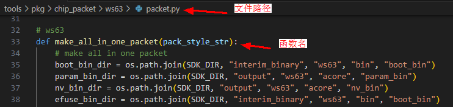

3.  Add the bin file path in the function

    Each concatenated string represents one level of the directory (folder name and file name)

    The final value of the concatenated test\_add\_bin: sdk\\interim\_binary\\ws63\\bin\\rom\_bin\\pke\_rom.bin

    **Figure 2**  bin file path diagram<a name="fig1516335210303"></a>  
    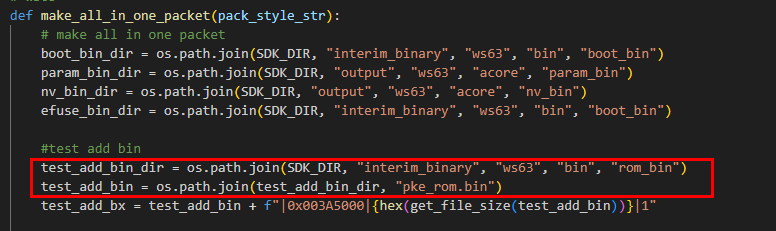

4.  Set the compilation parameters. Separate the parameters with "|"

    **Figure 3**  bin file compilation parameters<a name="fig1499631915318"></a>  
    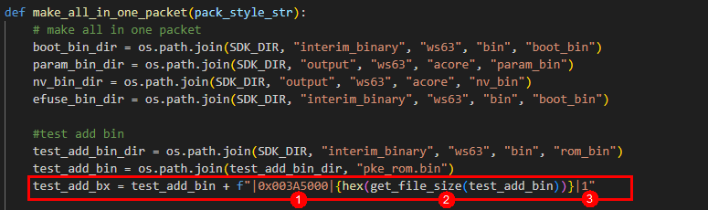

    1. Flashing position. The remaining addresses on the single board can be viewed in the sdk\\build\\config\\target\_config\\ws63\\param\_sector\\param\_sector.json file

    2. Space occupied

    3. File type: 0 indicates loader, 1 indicates a normal flashing file, 3 is efuse, and 4 is otp

    **Figure 4**  Remaining addresses on the single board<a name="fig15441153283112"></a>  
    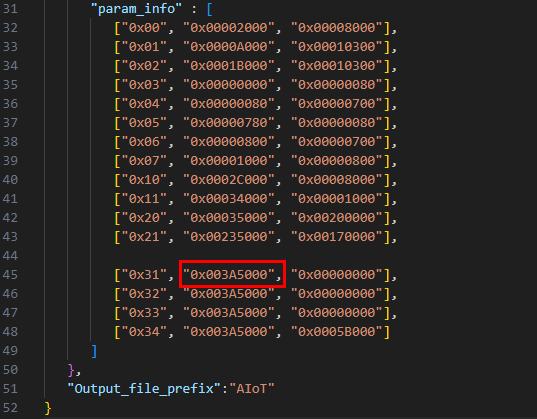

5.  At the end of the function, add the variable with the compilation parameters and path set to the compilation list

    **Figure 5**  Adding the path to the compilation list<a name="fig43951143193119"></a>  
    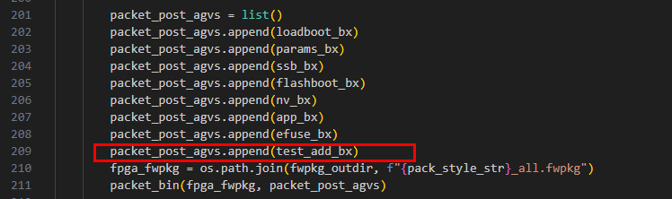

6.  Display of the compilation result

    **Figure 6**  Compilation result<a name="fig64574383219"></a>  
    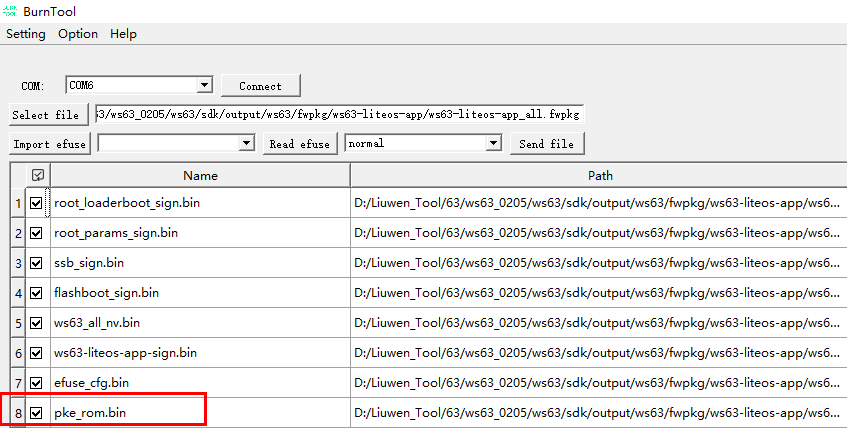

> **Note:** 
>If the newly added bin file needs to be upgraded through OTA, refer to the corresponding content in the "WS63V100 FOTA Development Guide" to adapt OTA upgrade support for the newly added bin file.

### Flash Partition Table Configuration<a name="ZH-CN_TOPIC_0000001883133629"></a>

The partition table configuration file path is sdk\\build\\config\\target\_config\\ws63\\param\_sector\\param\_sector.json

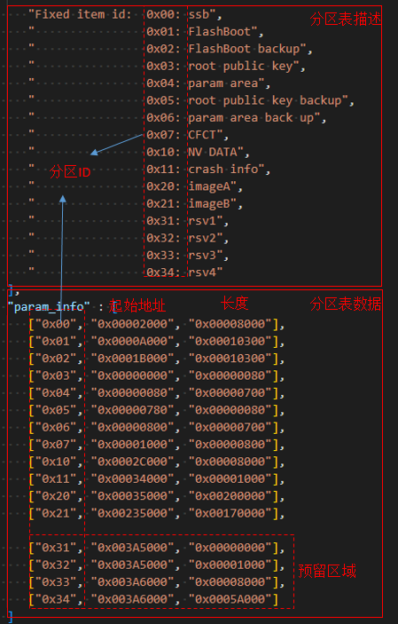

> **Note:** 
>The content in the figure above only illustrates the file content. For specific partition information, refer to the partition information in the "4.2 Precautions" section of the "WS63V100 FOTA Development Guide".
>The partition table limits the number of partitions to 16 IDs. The default Flash size is 4M in total, with 6 partition IDs reserved. You can pass the partition ID to the uapi\_partition\_get\_info interface to obtain the corresponding address and length.

According to the current Flash partition scheme, the Flash partitioning is shown in [Figure 1](#fig01859287557).

**Figure 1**  Flash partitioning<a name="fig01859287557"></a>  

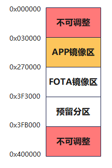

When adjusting partitions, the following principles must be followed:

1.  The address range 0x000000\~0x030000 is a non-adjustable area. **Any modification may cause the device to fail to start and become bricked**.
2.  The address range 0x030000\~0x270000 is the APP image area. The address range information comes from the APP image area corresponding to ID 0x20 in the partition table. **Only the partition size can be adjusted in this address range; the partition start address cannot be adjusted**. Adjusting the partition start address will also cause the device to fail to start.
3.  The address range 0x270000\~0x3F3000 is the FOTA image area. The address range information comes from the compressed partition/OTA upgrade partition/production test image partition/B-side partition corresponding to ID 0x21 in the partition table. **The start address of this partition must be the end address of the APP image area**; **when the compressed upgrade scheme is used, the size of this partition must be configured to at least 0.7 times the size of the APP image area or larger**.
4.  The address range 0x3F3000\~0x3FB000 is a reserved partition area. The start address of this area is the end address of the FOTA image area, and it can be divided into 4 separate partitions with different partition IDs.
5.  The address range 0x3FB000\~0x400000 is for other functional areas, including the crash information area \(0x11\) and the NV partition \(0x10\). **This area does not support adjustment**.
6.  When adjusting partitions, except for the non-adjustable area, the start addresses and sizes of other partitions must be 4K-aligned.

Example of adjusting partitions:

Based on the partition information in the partition table, suppose you want to adjust the size of the reserved partition with partition ID 0x30.

1.  Assuming the APP image partition has an 8K space margin, adjust the APP image area size to reduce it by 8K, and the partition end address is reduced by 8K accordingly. Meanwhile, modify the file drivers/boards/ws63/evb/memory\_config/include/memory\_config\_common.h, changing the value of the macro APP\_PROGRAM\_LENGTH in the file \(default: '\(0x240000 - 0x000300\)'\) to the adjusted partition size \(for example, '\(0x23E000 - 0x000300\)'\).
2.  Affected by the APP image area, the FOTA partition start address moves forward by 8K and is adjusted to 0x26E000. In the compressed upgrade scheme, the FOTA partition size needs to be adjusted accordingly; after 4K alignment, it is reduced by 4K, and the final FOTA partition end address is 0x3F0000.
3.  The APP image partition and the FOTA partition together free up a total of 12K of margin, which can be merged into the reserved partition. The reserved partition start address moves forward by 12K to 0x3F0000, its size increases by 12K, and the end address remains 0x3FB000.

### Menuconfig Configuration<a name="ZH-CN_TOPIC_0000001748014029"></a>

Running the script "python3 build.py -c ws63-liteos-app menuconfig" starts the Menuconfig program. Users can configure compilation and system functions through Menuconfig, as shown in [Figure 1](#fig155343385597).

The SDK integrates default configurations, but it is recommended that users perform the corresponding configuration on the first run to reduce problems caused by configuration issues. Users can run "python3 build.py -c ws63-liteos-app menuconfig" at any time to change the configuration.

**Figure 1**  Menuconfig running interface<a name="fig155343385597"></a>  
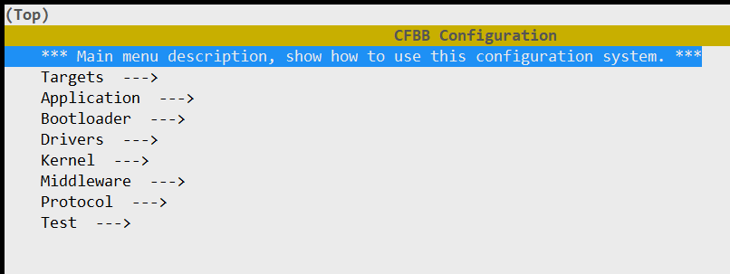

Note: If the interface differs, the actual version prevails.

The Menuconfig operation instructions are shown in [Table 1](#table364152210248). Shortcut keys can be entered in the Menuconfig interface for configuration.

**Table 1**  Menuconfig common operation commands

<a name="table364152210248"></a>
<table><thead align="left"><tr id="row2642122213247"><th class="cellrowborder" valign="top" width="17%" id="mcps1.2.3.1.1"><p id="p10343125916259"><a name="p10343125916259"></a><a name="p10343125916259"></a>Shortcut key</p>
</th>
<th class="cellrowborder" valign="top" width="83%" id="mcps1.2.3.1.2"><p id="p0642102212419"><a name="p0642102212419"></a><a name="p0642102212419"></a>Description</p>
</th>
</tr>
</thead>
<tbody><tr id="row146421622162417"><td class="cellrowborder" valign="top" width="17%" headers="mcps1.2.3.1.1 "><p id="p66421322192415"><a name="p66421322192415"></a><a name="p66421322192415"></a>Space, Enter</p>
</td>
<td class="cellrowborder" valign="top" width="83%" headers="mcps1.2.3.1.2 "><p id="p464282282416"><a name="p464282282416"></a><a name="p464282282416"></a>Select or deselect.</p>
</td>
</tr>
<tr id="row0235155732813"><td class="cellrowborder" valign="top" width="17%" headers="mcps1.2.3.1.1 "><p id="p123512571284"><a name="p123512571284"></a><a name="p123512571284"></a>ESC</p>
</td>
<td class="cellrowborder" valign="top" width="83%" headers="mcps1.2.3.1.2 "><p id="p4235125718282"><a name="p4235125718282"></a><a name="p4235125718282"></a>Return to the parent menu and exit the interface.</p>
</td>
</tr>
<tr id="row1425985152914"><td class="cellrowborder" valign="top" width="17%" headers="mcps1.2.3.1.1 "><p id="p02597515295"><a name="p02597515295"></a><a name="p02597515295"></a>Q</p>
</td>
<td class="cellrowborder" valign="top" width="83%" headers="mcps1.2.3.1.2 "><p id="p1825945119290"><a name="p1825945119290"></a><a name="p1825945119290"></a>Exit the interface.</p>
</td>
</tr>
<tr id="row161871942143019"><td class="cellrowborder" valign="top" width="17%" headers="mcps1.2.3.1.1 "><p id="p718744220300"><a name="p718744220300"></a><a name="p718744220300"></a>S</p>
</td>
<td class="cellrowborder" valign="top" width="83%" headers="mcps1.2.3.1.2 "><p id="p1818734211305"><a name="p1818734211305"></a><a name="p1818734211305"></a>Save the configuration.</p>
</td>
</tr>
<tr id="row1661115053113"><td class="cellrowborder" valign="top" width="17%" headers="mcps1.2.3.1.1 "><p id="p1861165015311"><a name="p1861165015311"></a><a name="p1861165015311"></a>F</p>
</td>
<td class="cellrowborder" valign="top" width="83%" headers="mcps1.2.3.1.2 "><p id="p17611125012312"><a name="p17611125012312"></a><a name="p17611125012312"></a>Display the help menu.</p>
</td>
</tr>
</tbody>
</table>

All commands can be viewed in the official Menuconfig explanations at the bottom of the Menuconfig interface, as shown in [Figure 2](#fig14504171214012).

**Figure 2**  Menuconfig command help bar<a name="fig14504171214012"></a>  
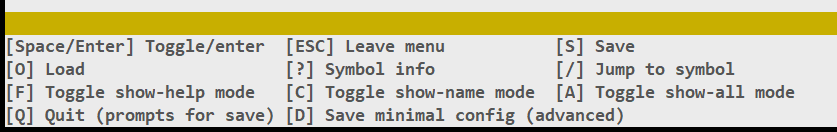

**Table 2**  Menuconfig menu item descriptions

<a name="table111109185019"></a>
<table><thead align="left"><tr id="row31102115020"><th class="cellrowborder" valign="top" width="28.48%" id="mcps1.2.3.1.1"><p id="p1511071155010"><a name="p1511071155010"></a><a name="p1511071155010"></a>Menu</p>
</th>
<th class="cellrowborder" valign="top" width="71.52%" id="mcps1.2.3.1.2"><p id="p1511016155013"><a name="p1511016155013"></a><a name="p1511016155013"></a>Description</p>
</th>
</tr>
</thead>
<tbody><tr id="row171109113504"><td class="cellrowborder" valign="top" width="28.48%" headers="mcps1.2.3.1.1 "><p id="p21103135016"><a name="p21103135016"></a><a name="p21103135016"></a>Targets</p>
</td>
<td class="cellrowborder" valign="top" width="71.52%" headers="mcps1.2.3.1.2 "><p id="p171101818501"><a name="p171101818501"></a><a name="p171101818501"></a>Configuration related to compilation targets.</p>
</td>
</tr>
<tr id="row211021195018"><td class="cellrowborder" valign="top" width="28.48%" headers="mcps1.2.3.1.1 "><p id="p1311017165013"><a name="p1311017165013"></a><a name="p1311017165013"></a>Application</p>
</td>
<td class="cellrowborder" valign="top" width="71.52%" headers="mcps1.2.3.1.2 "><p id="p31103195010"><a name="p31103195010"></a><a name="p31103195010"></a>Application-related configuration (mainly sample-related).</p>
</td>
</tr>
<tr id="row161103165010"><td class="cellrowborder" valign="top" width="28.48%" headers="mcps1.2.3.1.1 "><p id="p01104117505"><a name="p01104117505"></a><a name="p01104117505"></a>Bootloader</p>
</td>
<td class="cellrowborder" valign="top" width="71.52%" headers="mcps1.2.3.1.2 "><p id="p121105116505"><a name="p121105116505"></a><a name="p121105116505"></a>boot-related configuration.</p>
</td>
</tr>
<tr id="row1211071175013"><td class="cellrowborder" valign="top" width="28.48%" headers="mcps1.2.3.1.1 "><p id="p8110141155011"><a name="p8110141155011"></a><a name="p8110141155011"></a>Drivers</p>
</td>
<td class="cellrowborder" valign="top" width="71.52%" headers="mcps1.2.3.1.2 "><p id="p11692144810534"><a name="p11692144810534"></a><a name="p11692144810534"></a>Peripheral driver-related configuration and board-level configuration.</p>
</td>
</tr>
<tr id="row1511031125010"><td class="cellrowborder" valign="top" width="28.48%" headers="mcps1.2.3.1.1 "><p id="p141101111500"><a name="p141101111500"></a><a name="p141101111500"></a>Kernel</p>
</td>
<td class="cellrowborder" valign="top" width="71.52%" headers="mcps1.2.3.1.2 "><p id="p15798145395311"><a name="p15798145395311"></a><a name="p15798145395311"></a>Kernel-related configuration.</p>
</td>
</tr>
<tr id="row161106115504"><td class="cellrowborder" valign="top" width="28.48%" headers="mcps1.2.3.1.1 "><p id="p91105115502"><a name="p91105115502"></a><a name="p91105115502"></a>Middleware</p>
</td>
<td class="cellrowborder" valign="top" width="71.52%" headers="mcps1.2.3.1.2 "><p id="p199165471300"><a name="p199165471300"></a><a name="p199165471300"></a>Middleware (NV, FOTA, AT, DFX, PM, etc.)-related configuration.</p>
</td>
</tr>
<tr id="row94651621525"><td class="cellrowborder" valign="top" width="28.48%" headers="mcps1.2.3.1.1 "><p id="p8671200105210"><a name="p8671200105210"></a><a name="p8671200105210"></a>Protocol</p>
</td>
<td class="cellrowborder" valign="top" width="71.52%" headers="mcps1.2.3.1.2 "><p id="p8251182085411"><a name="p8251182085411"></a><a name="p8251182085411"></a>WiFi and Bluetooth-related configuration.</p>
</td>
</tr>
<tr id="row1453145185216"><td class="cellrowborder" valign="top" width="28.48%" headers="mcps1.2.3.1.1 "><p id="p1760612418522"><a name="p1760612418522"></a><a name="p1760612418522"></a>Test</p>
</td>
<td class="cellrowborder" valign="top" width="71.52%" headers="mcps1.2.3.1.2 "><p id="p1960613475215"><a name="p1960613475215"></a><a name="p1960613475215"></a>testsuite-related configuration.</p>
</td>
</tr>
</tbody>
</table>

### UART Configuration Method<a name="ZH-CN_TOPIC_0000001964047897"></a>

The WS63 chip has 3 UARTs in total. The SDK default configuration is as follows.

<a name="table179737495303"></a>
<table><thead align="left"><tr id="row12271050193018"><th class="cellrowborder" valign="top" width="20.61%" id="mcps1.1.4.1.1"><p id="p4274501303"><a name="p4274501303"></a><a name="p4274501303"></a>UART number</p>
</th>
<th class="cellrowborder" valign="top" width="29.310000000000002%" id="mcps1.1.4.1.2"><p id="p182755019307"><a name="p182755019307"></a><a name="p182755019307"></a>Baud rate</p>
</th>
<th class="cellrowborder" valign="top" width="50.080000000000005%" id="mcps1.1.4.1.3"><p id="p20272509302"><a name="p20272509302"></a><a name="p20272509302"></a>Usage</p>
</th>
</tr>
</thead>
<tbody><tr id="row8279503302"><td class="cellrowborder" valign="top" width="20.61%" headers="mcps1.1.4.1.1 "><p id="p11274502303"><a name="p11274502303"></a><a name="p11274502303"></a>0</p>
</td>
<td class="cellrowborder" valign="top" width="29.310000000000002%" headers="mcps1.1.4.1.2 "><p id="p327850183010"><a name="p327850183010"></a><a name="p327850183010"></a>115200</p>
</td>
<td class="cellrowborder" valign="top" width="50.080000000000005%" headers="mcps1.1.4.1.3 "><p id="p1227450143011"><a name="p1227450143011"></a><a name="p1227450143011"></a>debug print/flashing/AT.</p>
</td>
</tr>
<tr id="row182785073016"><td class="cellrowborder" valign="top" width="20.61%" headers="mcps1.1.4.1.1 "><p id="p92715013015"><a name="p92715013015"></a><a name="p92715013015"></a>1</p>
</td>
<td class="cellrowborder" valign="top" width="29.310000000000002%" headers="mcps1.1.4.1.2 "><p id="p927195023011"><a name="p927195023011"></a><a name="p927195023011"></a>921600</p>
</td>
<td class="cellrowborder" valign="top" width="50.080000000000005%" headers="mcps1.1.4.1.3 "><p id="p7272050103014"><a name="p7272050103014"></a><a name="p7272050103014"></a>debugkits debug port.</p>
</td>
</tr>
<tr id="row1327155093018"><td class="cellrowborder" valign="top" width="20.61%" headers="mcps1.1.4.1.1 "><p id="p152735013013"><a name="p152735013013"></a><a name="p152735013013"></a>2</p>
</td>
<td class="cellrowborder" valign="top" width="29.310000000000002%" headers="mcps1.1.4.1.2 "><p id="p15271150183018"><a name="p15271150183018"></a><a name="p15271150183018"></a>115200</p>
</td>
<td class="cellrowborder" valign="top" width="50.080000000000005%" headers="mcps1.1.4.1.3 "><p id="p627750153017"><a name="p627750153017"></a><a name="p627750153017"></a>Idle. Not used for now.</p>
</td>
</tr>
</tbody>
</table>

The flashing function is fixed to uart0 and cannot be changed.

The debug print/AT/debugkits debug port can be configured through menuconfig to accommodate different hardware board-level UART connections. The baud rate can also be customized through menuconfig.

The menuconfig configuration path is Drivers-\>Chips-\>Chip Configurations for ws63:

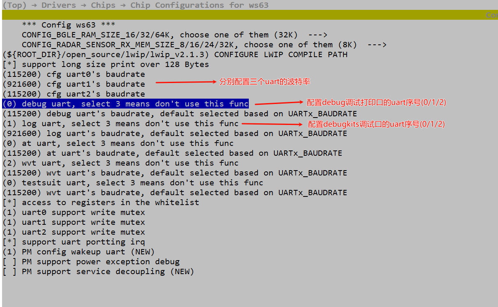

> **Notice:** 
>1.  The debugkits debug port cannot share the same UART port with other functions; it must be exclusively occupied.
>2.  It is recommended to configure typical UART baud rate values, such as 115200/921600/1M. Considering compatibility, it is not recommended to configure uncommon special values, such as baud rates like 115623.
>3.  Be cautious when modifying the UART number. You must confirm the UART hardware connection with the board-level hardware engineer to ensure that the software configuration matches the actual circuit connections on the hardware board; otherwise, it will not work properly.

### Precautions<a name="ZH-CN_TOPIC_0000001700134460"></a>

-   If "./build.py" reports a permission denied error, run the command "chmod +x build.py" to add execute permission, or run "python3./build.py".
-   If a package is reported missing during compilation, check whether the Python in the environment has the corresponding component installed. If the build environment contains multiple Python installations, especially multiple installations of the same version, and the user cannot tell which one is being used, it is recommended to install the Python component packages from the component package source code in this case.
-   The system gives priority to the configuration made by the user through Menuconfig. If the user has not configured it, the system will use the default configuration for compilation.

# Creating a New App<a name="ZH-CN_TOPIC_0000001748014009"></a>


## Creating a Source Code Directory<a name="ZH-CN_TOPIC_0000001700134428"></a>

> **Note:** 
>Users can create an app in the same directory level as "application/ws63" by referring to the "ws63\_liteos\_application" directory. The following uses the creation of "my\_demo" as an example.

The steps are as follows:

1.  Create the "application/ws63/my\_demo" directory to store the source files of "my\_demo".
2.  Copy "application/ws63/ws63\_liteos\_application/CMakeLists.txt" to "application/ws63/my\_demo/CmakeLists.txt", and place the source files in the "application/ws63/my\_demo" directory.
3.  Modify the "application/ws63/my\_demo/CmakeLists.txt" file. The meanings of each variable are shown in [Table 1](#table89969106362).

    **Table 1**  Meanings of variables in the component's CMakeLists.txt

    <a name="table89969106362"></a>
    <table><thead align="left"><tr id="row69971710143612"><th class="cellrowborder" valign="top" width="27.900000000000002%" id="mcps1.2.3.1.1"><p id="p8997181043611"><a name="p8997181043611"></a><a name="p8997181043611"></a>Variable name</p>
    </th>
    <th class="cellrowborder" valign="top" width="72.1%" id="mcps1.2.3.1.2"><p id="p1799771019361"><a name="p1799771019361"></a><a name="p1799771019361"></a>Variable meaning</p>
    </th>
    </tr>
    </thead>
    <tbody><tr id="row77088920486"><td class="cellrowborder" valign="top" width="27.900000000000002%" headers="mcps1.2.3.1.1 "><p id="p167083915484"><a name="p167083915484"></a><a name="p167083915484"></a>COMPONENT_NAME</p>
    </td>
    <td class="cellrowborder" valign="top" width="72.1%" headers="mcps1.2.3.1.2 "><p id="p570849194814"><a name="p570849194814"></a><a name="p570849194814"></a>The name of the current component, for example, "my_demo".</p>
    </td>
    </tr>
    <tr id="row99971710133619"><td class="cellrowborder" valign="top" width="27.900000000000002%" headers="mcps1.2.3.1.1 "><p id="p199976101361"><a name="p199976101361"></a><a name="p199976101361"></a>SOURCES</p>
    </td>
    <td class="cellrowborder" valign="top" width="72.1%" headers="mcps1.2.3.1.2 "><p id="p499751023618"><a name="p499751023618"></a><a name="p499751023618"></a>The list of C files of the current component, in which the CMAKE_CURRENT_SOURCE_DIR variable identifies the path where the current CMakeLists.txt is located.</p>
    </td>
    </tr>
    <tr id="row5997910163618"><td class="cellrowborder" valign="top" width="27.900000000000002%" headers="mcps1.2.3.1.1 "><p id="p129971210143615"><a name="p129971210143615"></a><a name="p129971210143615"></a>PUBLIC_HEADER</p>
    </td>
    <td class="cellrowborder" valign="top" width="72.1%" headers="mcps1.2.3.1.2 "><p id="p69971109360"><a name="p69971109360"></a><a name="p69971109360"></a>The paths of the header files that the current component needs to expose externally.</p>
    </td>
    </tr>
    <tr id="row1199791011363"><td class="cellrowborder" valign="top" width="27.900000000000002%" headers="mcps1.2.3.1.1 "><p id="p1699711105364"><a name="p1699711105364"></a><a name="p1699711105364"></a>PRIVATE_HEADER</p>
    </td>
    <td class="cellrowborder" valign="top" width="72.1%" headers="mcps1.2.3.1.2 "><p id="p1799771033615"><a name="p1799771033615"></a><a name="p1799771033615"></a>The header file search paths within the current component.</p>
    </td>
    </tr>
    <tr id="row99971610193616"><td class="cellrowborder" valign="top" width="27.900000000000002%" headers="mcps1.2.3.1.1 "><p id="p169971610133618"><a name="p169971610133618"></a><a name="p169971610133618"></a>PRIVATE_DEFINES</p>
    </td>
    <td class="cellrowborder" valign="top" width="72.1%" headers="mcps1.2.3.1.2 "><p id="p14997610103613"><a name="p14997610103613"></a><a name="p14997610103613"></a>The macro definitions that take effect within the current component.</p>
    </td>
    </tr>
    <tr id="row12997210203618"><td class="cellrowborder" valign="top" width="27.900000000000002%" headers="mcps1.2.3.1.1 "><p id="p59971910163611"><a name="p59971910163611"></a><a name="p59971910163611"></a>PUBLIC_DEFINES</p>
    </td>
    <td class="cellrowborder" valign="top" width="72.1%" headers="mcps1.2.3.1.2 "><p id="p02671050184018"><a name="p02671050184018"></a><a name="p02671050184018"></a>The macro definitions that the current component needs to expose externally.</p>
    </td>
    </tr>
    <tr id="row12716914103914"><td class="cellrowborder" valign="top" width="27.900000000000002%" headers="mcps1.2.3.1.1 "><p id="p5717214153911"><a name="p5717214153911"></a><a name="p5717214153911"></a>COMPONENT_PUBLIC_CCFLAGS</p>
    </td>
    <td class="cellrowborder" valign="top" width="72.1%" headers="mcps1.2.3.1.2 "><p id="p14717111473912"><a name="p14717111473912"></a><a name="p14717111473912"></a>The compilation options that the current component needs to expose externally.</p>
    </td>
    </tr>
    <tr id="row22992182396"><td class="cellrowborder" valign="top" width="27.900000000000002%" headers="mcps1.2.3.1.1 "><p id="p152993185398"><a name="p152993185398"></a><a name="p152993185398"></a>COMPONENT_CCFLAGS</p>
    </td>
    <td class="cellrowborder" valign="top" width="72.1%" headers="mcps1.2.3.1.2 "><p id="p132991118123913"><a name="p132991118123913"></a><a name="p132991118123913"></a>The compilation options that take effect within the current component.</p>
    </td>
    </tr>
    </tbody>
    </table>

4.  Modify "application/ws63/CMakeLists.txt" to add the my\_demo directory to the compilation.
5.  Modify "build/config/target\_config/ws63/config.py" and add 'my\_demo' to the ram\_component field to register the my\_demo component in the compilation system.

## Developing Code<a name="ZH-CN_TOPIC_0000001700134432"></a>

After the directory structure is set up, start code development (users can refer to "application/samples" for porting). After the code development is complete, use "python3 build.py -c ws63-liteos-app -component=my\_demo" to compile my\_demo for code compilation and debugging.

## Image Flashing<a name="ZH-CN_TOPIC_0000001768396593"></a>

For the image flashing method, refer to the "Operation Guide" chapter in the "WS63V100 BurnTool Tool User Guide".

