# Preface<a name="ZH-CN_TOPIC_0000001760286249"></a>

**Overview<a name="section4537382116410"></a>**

This document describes in detail the WS63V100 Wi-Fi and BLE & SLE interface functions and development flow.

**Product Version<a name="section578420251745"></a>**

The product version corresponding to this document is as follows.

<a name="table06171831652"></a>
<table><thead align="left"><tr id="row761817313520"><th class="cellrowborder" valign="top" width="50%" id="mcps1.1.3.1.1"><p id="p1361973854"><a name="p1361973854"></a><a name="p1361973854"></a><strong id="b138501913165"><a name="b138501913165"></a><a name="b138501913165"></a>Product Name</strong></p>
</th>
<th class="cellrowborder" valign="top" width="50%" id="mcps1.1.3.1.2"><p id="p1961917310511"><a name="p1961917310511"></a><a name="p1961917310511"></a><strong id="b5855151161619"><a name="b5855151161619"></a><a name="b5855151161619"></a>Product Version</strong></p>
</th>
</tr>
</thead>
<tbody><tr id="row46911211859"><td class="cellrowborder" valign="top" width="50%" headers="mcps1.1.3.1.1 "><p id="p66923113516"><a name="p66923113516"></a><a name="p66923113516"></a>WS63</p>
</td>
<td class="cellrowborder" valign="top" width="50%" headers="mcps1.1.3.1.2 "><p id="p15693311255"><a name="p15693311255"></a><a name="p15693311255"></a>V100</p>
</td>
</tr>
</tbody>
</table>

**Intended Audience<a name="section4378592816410"></a>**

This document is mainly intended for the following engineers:

-   Technical support engineers
-   Software development engineers

**Symbol Conventions<a name="section133020216410"></a>**

The following symbols may appear in this document. Their meanings are as follows.

<a name="table2622507016410"></a>
<table><thead align="left"><tr id="row1530720816410"><th class="cellrowborder" valign="top" width="20.580000000000002%" id="mcps1.1.3.1.1"><p id="p6450074116410"><a name="p6450074116410"></a><a name="p6450074116410"></a><strong id="b2136615816410"><a name="b2136615816410"></a><a name="b2136615816410"></a>Symbol</strong></p>
</th>
<th class="cellrowborder" valign="top" width="79.42%" id="mcps1.1.3.1.2"><p id="p5435366816410"><a name="p5435366816410"></a><a name="p5435366816410"></a><strong id="b5941558116410"><a name="b5941558116410"></a><a name="b5941558116410"></a>Description</strong></p>
</th>
</tr>
</thead>
<tbody><tr id="row1372280416410"><td class="cellrowborder" valign="top" width="20.580000000000002%" headers="mcps1.1.3.1.1 "><p id="p3734547016410"><a name="p3734547016410"></a><a name="p3734547016410"></a><a name="image2670064316410"></a><a name="image2670064316410"></a><span></span></p>
</td>
<td class="cellrowborder" valign="top" width="79.42%" headers="mcps1.1.3.1.2 "><p id="p1757432116410"><a name="p1757432116410"></a><a name="p1757432116410"></a>Indicates a hazard with a high level of risk that, if not avoided, will result in death or serious injury.</p>
</td>
</tr>
<tr id="row466863216410"><td class="cellrowborder" valign="top" width="20.580000000000002%" headers="mcps1.1.3.1.1 "><p id="p1432579516410"><a name="p1432579516410"></a><a name="p1432579516410"></a><a name="image4895582316410"></a><a name="image4895582316410"></a><span></span></p>
</td>
<td class="cellrowborder" valign="top" width="79.42%" headers="mcps1.1.3.1.2 "><p id="p959197916410"><a name="p959197916410"></a><a name="p959197916410"></a>Indicates a hazard with a medium level of risk that, if not avoided, could result in death or serious injury.</p>
</td>
</tr>
<tr id="row123863216410"><td class="cellrowborder" valign="top" width="20.580000000000002%" headers="mcps1.1.3.1.1 "><p id="p1232579516410"><a name="p1232579516410"></a><a name="p1232579516410"></a><a name="image1235582316410"></a><a name="image1235582316410"></a><span></span></p>
</td>
<td class="cellrowborder" valign="top" width="79.42%" headers="mcps1.1.3.1.2 "><p id="p123197916410"><a name="p123197916410"></a><a name="p123197916410"></a>Indicates a hazard with a low level of risk that, if not avoided, could result in minor or moderate injury.</p>
</td>
</tr>
<tr id="row5786682116410"><td class="cellrowborder" valign="top" width="20.580000000000002%" headers="mcps1.1.3.1.1 "><p id="p2204984716410"><a name="p2204984716410"></a><a name="p2204984716410"></a><a name="image4504446716410"></a><a name="image4504446716410"></a><span></span></p>
</td>
<td class="cellrowborder" valign="top" width="79.42%" headers="mcps1.1.3.1.2 "><p id="p4388861916410"><a name="p4388861916410"></a><a name="p4388861916410"></a>Used to convey equipment or environmental safety warnings. If not avoided, it may result in equipment damage, data loss, degraded device performance, or other unpredictable consequences.</p>
<p id="p1238861916410"><a name="p1238861916410"></a><a name="p1238861916410"></a>"Notice" does not involve personal injury.</p>
</td>
</tr>
<tr id="row2856923116410"><td class="cellrowborder" valign="top" width="20.580000000000002%" headers="mcps1.1.3.1.1 "><p id="p5555360116410"><a name="p5555360116410"></a><a name="p5555360116410"></a><a name="image799324016410"></a><a name="image799324016410"></a><span></span></p>
</td>
<td class="cellrowborder" valign="top" width="79.42%" headers="mcps1.1.3.1.2 "><p id="p4612588116410"><a name="p4612588116410"></a><a name="p4612588116410"></a>Supplementary explanation of key information in the main text.</p>
<p id="p1232588116410"><a name="p1232588116410"></a><a name="p1232588116410"></a>"Note" is not a safety warning and does not involve personal, equipment, or environmental damage.</p>
</td>
</tr>
</tbody>
</table>

**Revision History<a name="section2467512116410"></a>**

<a name="table1557726816410"></a>
<table><thead align="left"><tr id="row2942532716410"><th class="cellrowborder" valign="top" width="22.71%" id="mcps1.1.4.1.1"><p id="p3778275416410"><a name="p3778275416410"></a><a name="p3778275416410"></a><strong id="b5687322716410"><a name="b5687322716410"></a><a name="b5687322716410"></a>Document Version</strong></p>
</th>
<th class="cellrowborder" valign="top" width="23.330000000000002%" id="mcps1.1.4.1.2"><p id="p5627845516410"><a name="p5627845516410"></a><a name="p5627845516410"></a><strong id="b5800814916410"><a name="b5800814916410"></a><a name="b5800814916410"></a>Release Date</strong></p>
</th>
<th class="cellrowborder" valign="top" width="53.959999999999994%" id="mcps1.1.4.1.3"><p id="p2382284816410"><a name="p2382284816410"></a><a name="p2382284816410"></a><strong id="b3316380216410"><a name="b3316380216410"></a><a name="b3316380216410"></a>Revision Description</strong></p>
</th>
</tr>
</thead>
<tbody><tr id="row102051855104619"><td class="cellrowborder" valign="top" width="22.71%" headers="mcps1.1.4.1.1 "><p id="p1120565517464"><a name="p1120565517464"></a><a name="p1120565517464"></a>04</p>
</td>
<td class="cellrowborder" valign="top" width="23.330000000000002%" headers="mcps1.1.4.1.2 "><p id="p10205195524619"><a name="p10205195524619"></a><a name="p10205195524619"></a>2025-02-28</p>
</td>
<td class="cellrowborder" valign="top" width="53.959999999999994%" headers="mcps1.1.4.1.3 "><a name="ul124110334483"></a><a name="ul124110334483"></a><ul id="ul124110334483"><li>Updated the "<a href="sample_example.md">Sample Example</a>" section of <span id="ph152831745812"><a name="ph152831745812"></a><a name="ph152831745812"></a>"<a href="ble_development_flow.md">BLE Development Flow</a>"</span>.</li><li>Added the "<a href="sample_example-35.md">Sample Example</a>" section of <span id="ph2478816145817"><a name="ph2478816145817"></a><a name="ph2478816145817"></a>"<a href="sle_development_flow.md">SLE Development Flow</a>"</span>.</li><li>Updated the "<a href="sensing_software_development.md">Sensing Software Development</a>" section.</li></ul>
</td>
</tr>
<tr id="row17853125702"><td class="cellrowborder" valign="top" width="22.71%" headers="mcps1.1.4.1.1 "><p id="p17854155206"><a name="p17854155206"></a><a name="p17854155206"></a>03</p>
</td>
<td class="cellrowborder" valign="top" width="23.330000000000002%" headers="mcps1.1.4.1.2 "><p id="p485465402"><a name="p485465402"></a><a name="p485465402"></a>2024-10-30</p>
</td>
<td class="cellrowborder" valign="top" width="53.959999999999994%" headers="mcps1.1.4.1.3 "><a name="ul779915463020"></a><a name="ul779915463020"></a><ul id="ul779915463020"><li>Updated the "<a href="development_flow-17.md">Development Flow</a>" section of <span id="ph12658171755816"><a name="ph12658171755816"></a><a name="ph12658171755816"></a>"<a href="gap_interface.md">GAP Interface</a>"</span>.</li><li>Updated the "<a href="development_flow-26.md">Development Flow</a>" section of <span id="ph2578618195818"><a name="ph2578618195818"></a><a name="ph2578618195818"></a>"<a href="device_discovery_interface.md">Device Discovery Interface</a>"</span>.</li><li>Updated the "<a href="data_structures.md">Data Structures</a>" section.</li><li>Updated the "<a href="APIs.md">APIs</a>" section.</li></ul>
</td>
</tr>
<tr id="row1458314561238"><td class="cellrowborder" valign="top" width="22.71%" headers="mcps1.1.4.1.1 "><p id="p1358415612312"><a name="p1358415612312"></a><a name="p1358415612312"></a>02</p>
</td>
<td class="cellrowborder" valign="top" width="23.330000000000002%" headers="mcps1.1.4.1.2 "><p id="p55842563239"><a name="p55842563239"></a><a name="p55842563239"></a>2024-06-27</p>
</td>
<td class="cellrowborder" valign="top" width="53.959999999999994%" headers="mcps1.1.4.1.3 "><a name="ul1494736112412"></a><a name="ul1494736112412"></a><ul id="ul1494736112412"><li>Updated the <span id="ph887353105913"><a name="ph887353105913"></a><a name="ph887353105913"></a>"</span><a href="development_flow-17.md">Development Flow</a><span id="ph209332057135816"><a name="ph209332057135816"></a><a name="ph209332057135816"></a>"</span> section of <span id="ph855711237588"><a name="ph855711237588"></a><a name="ph855711237588"></a>"<a href="gap_interface.md">GAP Interface</a>"</span>.</li><li>Updated the "<a href="development_flow-26.md">Development Flow</a>" section of <span id="ph1654892455816"><a name="ph1654892455816"></a><a name="ph1654892455816"></a>"<a href="device_discovery_interface.md">Device Discovery Interface</a>"</span>.</li><li>Updated the "<a href="data_structures.md">Data Structures</a>" section.</li><li>Updated the "<a href="APIs.md">APIs</a>" section.</li><li>Updated the "<a href="watchdog.md">Watchdog</a>" section.</li></ul>
</td>
</tr>
<tr id="row11741150142815"><td class="cellrowborder" valign="top" width="22.71%" headers="mcps1.1.4.1.1 "><p id="p118382762110"><a name="p118382762110"></a><a name="p118382762110"></a>01</p>
</td>
<td class="cellrowborder" valign="top" width="23.330000000000002%" headers="mcps1.1.4.1.2 "><p id="p171834279217"><a name="p171834279217"></a><a name="p171834279217"></a>2024-04-10</p>
</td>
<td class="cellrowborder" valign="top" width="53.959999999999994%" headers="mcps1.1.4.1.3 "><p id="p618317279212"><a name="p618317279212"></a><a name="p618317279212"></a>First official version release.</p>
</td>
</tr>
<tr id="row451921743718"><td class="cellrowborder" valign="top" width="22.71%" headers="mcps1.1.4.1.1 "><p id="p85201917193712"><a name="p85201917193712"></a><a name="p85201917193712"></a>00B06</p>
</td>
<td class="cellrowborder" valign="top" width="23.330000000000002%" headers="mcps1.1.4.1.2 "><p id="p95208173378"><a name="p95208173378"></a><a name="p95208173378"></a>2024-03-29</p>
</td>
<td class="cellrowborder" valign="top" width="53.959999999999994%" headers="mcps1.1.4.1.3 "><a name="ul1926543063710"></a><a name="ul1926543063710"></a><ul id="ul1926543063710"><li>Updated the "<a href="user_guide.md">User Guide</a>" section of <span id="ph939882885815"><a name="ph939882885815"></a><a name="ph939882885815"></a>"<a href="country_code_function_configuration.md">Country Code Configuration</a>"</span>.</li><li>Updated the "<a href="user_guide-14.md">User Guide</a>" section of <span id="ph69684297584"><a name="ph69684297584"></a><a name="ph69684297584"></a>"<a href="frequency_offset_temperature_compensation.md">Frequency Offset Temperature Compensation</a>"</span>.</li></ul>
</td>
</tr>
<tr id="row547818410284"><td class="cellrowborder" valign="top" width="22.71%" headers="mcps1.1.4.1.1 "><p id="p447918419282"><a name="p447918419282"></a><a name="p447918419282"></a>00B05</p>
</td>
<td class="cellrowborder" valign="top" width="23.330000000000002%" headers="mcps1.1.4.1.2 "><p id="p1947954182811"><a name="p1947954182811"></a><a name="p1947954182811"></a>2024-03-14</p>
</td>
<td class="cellrowborder" valign="top" width="53.959999999999994%" headers="mcps1.1.4.1.3 "><p id="p1947919402817"><a name="p1947919402817"></a><a name="p1947919402817"></a>Updated the "<a href="ble_sle_power_level_customization.md">BLE&amp;SLE Power Level Customization</a>" section.</p>
</td>
</tr>
<tr id="row173519136221"><td class="cellrowborder" valign="top" width="22.71%" headers="mcps1.1.4.1.1 "><p id="p163511913182211"><a name="p163511913182211"></a><a name="p163511913182211"></a>00B04</p>
</td>
<td class="cellrowborder" valign="top" width="23.330000000000002%" headers="mcps1.1.4.1.2 "><p id="p7351131352218"><a name="p7351131352218"></a><a name="p7351131352218"></a>2024-02-22</p>
</td>
<td class="cellrowborder" valign="top" width="53.959999999999994%" headers="mcps1.1.4.1.3 "><a name="ul12990150152219"></a><a name="ul12990150152219"></a><ul id="ul12990150152219"><li>Updated the <span id="ph85481442195817"><a name="ph85481442195817"></a><a name="ph85481442195817"></a>"</span><a href="sta_softap_coexistence.md">STA&amp;SoftAp Coexistence</a><span id="ph92521252105819"><a name="ph92521252105819"></a><a name="ph92521252105819"></a>"</span> section.</li><li>Updated the "<a href="development_flow-11.md">Development Flow</a>" section of <span id="ph65893335811"><a name="ph65893335811"></a><a name="ph65893335811"></a>"<a href="wifi_bluetooth_coexistence.md">Wi-Fi&amp;Bluetooth Coexistence</a>"</span>.</li><li>Updated the "<a href="user_guide-14.md">User Guide</a>" section of <span id="ph1440645314012"><a name="ph1440645314012"></a><a name="ph1440645314012"></a>"<a href="frequency_offset_temperature_compensation.md">Frequency Offset Temperature Compensation</a>"</span><span id="ph14880153355815"><a name="ph14880153355815"></a><a name="ph14880153355815"></a></span>.</li><li>Updated the "<a href="development_flow-33.md">Development Flow</a>" section of <span id="ph1155915345588"><a name="ph1155915345588"></a><a name="ph1155915345588"></a>"<a href="ssap_client_interface.md">SSAP Client Interface</a>"</span>.</li><li>Updated the "<a href="development_flow-38.md">Development Flow</a>" section of <span id="ph18178435105812"><a name="ph18178435105812"></a><a name="ph18178435105812"></a>"<a href="sensing_software_development.md">Sensing Software Development</a>"</span>.</li><li>Updated the "<a href="precautions-40.md">Precautions</a>" section of <span id="ph179013350582"><a name="ph179013350582"></a><a name="ph179013350582"></a>"<a href="sensing_software_development.md">Sensing Software Development</a>"</span>.</li></ul>
</td>
</tr>
<tr id="row895315521106"><td class="cellrowborder" valign="top" width="22.71%" headers="mcps1.1.4.1.1 "><p id="p14953452191019"><a name="p14953452191019"></a><a name="p14953452191019"></a>00B03</p>
</td>
<td class="cellrowborder" valign="top" width="23.330000000000002%" headers="mcps1.1.4.1.2 "><p id="p109531052101015"><a name="p109531052101015"></a><a name="p109531052101015"></a>2024-01-15</p>
</td>
<td class="cellrowborder" valign="top" width="53.959999999999994%" headers="mcps1.1.4.1.3 "><a name="ul16606193621119"></a><a name="ul16606193621119"></a><ul id="ul16606193621119"><li>Added the <span id="ph1347515522112"><a name="ph1347515522112"></a><a name="ph1347515522112"></a>"</span><a href="sensing_software_development.md">Sensing Software Development</a><span id="ph148338551612"><a name="ph148338551612"></a><a name="ph148338551612"></a>"</span> chapter.</li></ul>
</td>
</tr>
<tr id="row22816211224"><td class="cellrowborder" valign="top" width="22.71%" headers="mcps1.1.4.1.1 "><p id="p112819212212"><a name="p112819212212"></a><a name="p112819212212"></a>00B02</p>
</td>
<td class="cellrowborder" valign="top" width="23.330000000000002%" headers="mcps1.1.4.1.2 "><p id="p2028114212223"><a name="p2028114212223"></a><a name="p2028114212223"></a>2023-12-18</p>
</td>
<td class="cellrowborder" valign="top" width="53.959999999999994%" headers="mcps1.1.4.1.3 "><a name="ul15563185174516"></a><a name="ul15563185174516"></a><ul id="ul15563185174516"><li>Updated the "<a href="sample_use_cases.md">Sample Use Cases</a>" section of <span id="ph246013775820"><a name="ph246013775820"></a><a name="ph246013775820"></a>"<a href="sta_function.md">STA Function</a>"</span>.</li><li>Updated the "<a href="sample_use_cases-6.md">Sample Use Cases</a>" section of <span id="ph1918163765813"><a name="ph1918163765813"></a><a name="ph1918163765813"></a>"<a href="softap_function.md">SoftAP Function</a>"</span>.</li><li>Updated the "<a href="precautions-42.md">Precautions</a>" section.</li></ul>
</td>
</tr>
<tr id="row81651946131711"><td class="cellrowborder" valign="top" width="22.71%" headers="mcps1.1.4.1.1 "><p id="p771550111715"><a name="p771550111715"></a><a name="p771550111715"></a>00B01</p>
</td>
<td class="cellrowborder" valign="top" width="23.330000000000002%" headers="mcps1.1.4.1.2 "><p id="p167250181711"><a name="p167250181711"></a><a name="p167250181711"></a>2023-11-27</p>
</td>
<td class="cellrowborder" valign="top" width="53.959999999999994%" headers="mcps1.1.4.1.3 "><p id="p14765071719"><a name="p14765071719"></a><a name="p14765071719"></a>First provisional version release.</p>
</td>
</tr>
</tbody>
</table>

# Overview<a name="ZH-CN_TOPIC_0000001760286245"></a>

WS63V100 provides developers with Wi-Fi development and application APIs (Application Programming Interface), including chip initialization, resource configuration, Station creation and configuration, scanning, association and disassociation, status query, and a series of other functions. The framework structure is shown in [Figure 1](#fig8131141419332).

**Figure 1**  WS63V100 solution block diagram<a name="fig8131141419332"></a>  
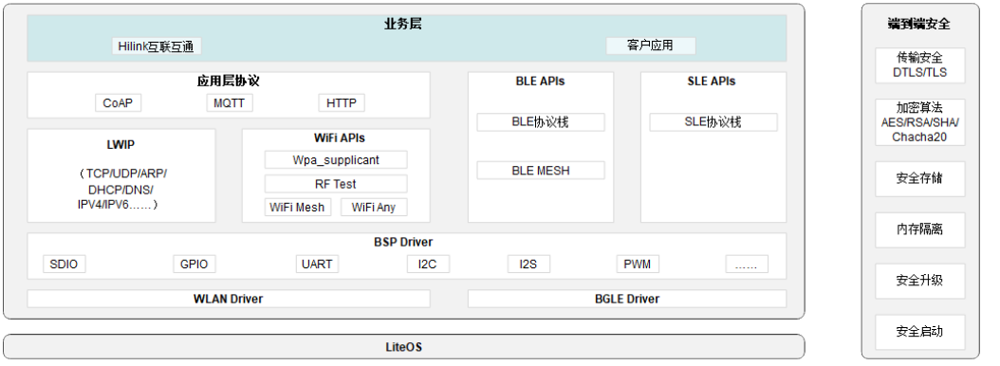

The functions of each module are described as follows:

-   Business layer: Secondary development by users based on the API interfaces.
-   Application layer protocol: Application-layer network protocols.
-   LWIP protocol stack: TCP/IP protocol stack.
-   WiFi APIs: Provide general Wi-Fi interfaces based on the SDK.
-   BLE APIs: Provide general BLE interfaces based on the SDK.
-   SLE APIs: Provide general SLE interfaces based on the SDK.
-   Sensing APIs: Provide general sensing interfaces based on the SDK.
-   BSP Driver: Drivers for the chip and peripheral devices.
-   WLAN Driver: 802.11 protocol implementation module.
-   BLE&SLE Driver: Module implementing the BLE and SLE protocols.

> **Note:** 
>This document describes the development flow of each module.

# Wi-Fi Software Development<a name="ZH-CN_TOPIC_0000001712592682"></a>


## Driver Loading and Unloading<a name="ZH-CN_TOPIC_0000001712327304"></a>


### Overview<a name="ZH-CN_TOPIC_0000001712327312"></a>

After the chip is powered on, driver loading performs the initial configuration of chip registers, reads and writes calibration parameters, and requests and configures software resources; driver unloading releases software resources.

### Development Flow<a name="ZH-CN_TOPIC_0000001760286253"></a>

**Usage Scenarios<a name="section2062815751519"></a>**

Wi-Fi driver initialization provides basic resource configuration and chip initialization for Wi-Fi functions, and is the first step in implementing Wi-Fi functions. To configure Wi-Fi functions, driver initialization must be completed first. After Wi-Fi functions are no longer needed, resources can be released through deinitialization or through a soft reset.

**Functions<a name="section179410249279"></a>**

The interfaces provided by Wi-Fi driver loading and unloading are shown in [Table 1](#table213321716161).

**Table 1**  Wi-Fi driver loading and unloading interfaces

<a name="table213321716161"></a>
<table><thead align="left"><tr id="row1513313173162"><th class="cellrowborder" valign="top" width="25.22%" id="mcps1.2.3.1.1"><p id="p12986192321615"><a name="p12986192321615"></a><a name="p12986192321615"></a>Interface Name</p>
</th>
<th class="cellrowborder" valign="top" width="74.78%" id="mcps1.2.3.1.2"><p id="p298617239162"><a name="p298617239162"></a><a name="p298617239162"></a>Description</p>
</th>
</tr>
</thead>
<tbody><tr id="row9133101751617"><td class="cellrowborder" valign="top" width="25.22%" headers="mcps1.2.3.1.1 "><p id="p12986112319166"><a name="p12986112319166"></a><a name="p12986112319166"></a>wifi_init</p>
</td>
<td class="cellrowborder" valign="top" width="74.78%" headers="mcps1.2.3.1.2 "><p id="p0986102331610"><a name="p0986102331610"></a><a name="p0986102331610"></a>Initializes the Wi-Fi driver.</p>
</td>
</tr>
<tr id="row5133171721610"><td class="cellrowborder" valign="top" width="25.22%" headers="mcps1.2.3.1.1 "><p id="p8986162311615"><a name="p8986162311615"></a><a name="p8986162311615"></a>wifi_deinit</p>
</td>
<td class="cellrowborder" valign="top" width="74.78%" headers="mcps1.2.3.1.2 "><p id="p298652331619"><a name="p298652331619"></a><a name="p298652331619"></a>Deinitializes the Wi-Fi driver.</p>
</td>
</tr>
</tbody>
</table>

**Development Flow<a name="section46551152112817"></a>**

Typical flow of driver loading and unloading:

1.  Call wifi\_init to initialize the Wi-Fi driver.
2.  Configure Wi-Fi functions by referring to "[STA Function](sta_function.md)" or "[SoftAP Function](softap_function.md)".
3.  Call wifi\_deinit to deinitialize the Wi-Fi driver.

**Return Values<a name="section2021173615319"></a>**

The return values of Wi-Fi driver loading and unloading are shown in [Table 2](#table326819447226).

**Table 2**  Wi-Fi driver loading and unloading return values

<a name="table326819447226"></a>
<table><thead align="left"><tr id="row20268744122212"><th class="cellrowborder" valign="top" width="12.16%" id="mcps1.2.5.1.1"><p id="p1096717507222"><a name="p1096717507222"></a><a name="p1096717507222"></a>No.</p>
</th>
<th class="cellrowborder" valign="top" width="17.06%" id="mcps1.2.5.1.2"><p id="p1896715017226"><a name="p1896715017226"></a><a name="p1896715017226"></a>Definition</p>
</th>
<th class="cellrowborder" valign="top" width="20.65%" id="mcps1.2.5.1.3"><p id="p18967145072216"><a name="p18967145072216"></a><a name="p18967145072216"></a>Actual Value</p>
</th>
<th class="cellrowborder" valign="top" width="50.129999999999995%" id="mcps1.2.5.1.4"><p id="p196716506221"><a name="p196716506221"></a><a name="p196716506221"></a>Description</p>
</th>
</tr>
</thead>
<tbody><tr id="row92680447221"><td class="cellrowborder" valign="top" width="12.16%" headers="mcps1.2.5.1.1 "><p id="p1667982562316"><a name="p1667982562316"></a><a name="p1667982562316"></a>1</p>
</td>
<td class="cellrowborder" valign="top" width="17.06%" headers="mcps1.2.5.1.2 "><p id="p021739320"><a name="p021739320"></a><a name="p021739320"></a>ERRCODE_SUCC</p>
</td>
<td class="cellrowborder" valign="top" width="20.65%" headers="mcps1.2.5.1.3 "><p id="p727291125811"><a name="p727291125811"></a><a name="p727291125811"></a>0x0</p>
</td>
<td class="cellrowborder" valign="top" width="50.129999999999995%" headers="mcps1.2.5.1.4 "><p id="p627212175818"><a name="p627212175818"></a><a name="p627212175818"></a>Execution succeeded.</p>
</td>
</tr>
<tr id="row72682441229"><td class="cellrowborder" valign="top" width="12.16%" headers="mcps1.2.5.1.1 "><p id="p9679025132314"><a name="p9679025132314"></a><a name="p9679025132314"></a>2</p>
</td>
<td class="cellrowborder" valign="top" width="17.06%" headers="mcps1.2.5.1.2 "><p id="p1467418156214"><a name="p1467418156214"></a><a name="p1467418156214"></a>ERRCODE_FAIL</p>
</td>
<td class="cellrowborder" valign="top" width="20.65%" headers="mcps1.2.5.1.3 "><p id="p1338817111386"><a name="p1338817111386"></a><a name="p1338817111386"></a>0xFFFFFFFF</p>
</td>
<td class="cellrowborder" valign="top" width="50.129999999999995%" headers="mcps1.2.5.1.4 "><p id="p227212117581"><a name="p227212117581"></a><a name="p227212117581"></a>Execution failed.</p>
</td>
</tr>
</tbody>
</table>

### Programming Example<a name="ZH-CN_TOPIC_0000001712486828"></a>

Example 1: Based on the app\_main function of LiteOS, the Wi-Fi driver is loaded automatically during system initialization, so this loading method does not need to be executed. The driver is unloaded and reloaded automatically when the system reboots.

**Code Example**

```
td_void app_main(td_void)
{
    td_u32 ret;

    ret = wifi_init();
    if (ret != 0) {
        printf("fail to init wifi\n");
    } else {
        printf("wifi init success\n");
    }

    //Add test code here

    ret = wifi_deinit();
    if (ret != 0) {
        printf("fail to deinit wifi\n");
    } else {
        printf("wifi deinit success\n");
    }

    return;
}
```

**Result Verification**

```
wifi init success
wifi deinit success

```

## STA Function<a name="ZH-CN_TOPIC_0000001712327324"></a>


### Overview<a name="ZH-CN_TOPIC_0000001760166377"></a>

The STA function, i.e., the Station function, implements STA device creation, scanning, association, and DHCP in the driver to establish the communication link. Before developing the STA function, driver loading must be completed.

### Development Flow<a name="ZH-CN_TOPIC_0000001760286261"></a>

**Usage Scenarios<a name="section2062815751519"></a>**

When you need to connect to a network and communicate over it, you need to enable the STA function.

**Functions<a name="section179410249279"></a>**

The interfaces provided by the driver for the STA function are shown in [Table 1](#table143637195303).

**Table 1**  STA function driver interfaces

<a name="table143637195303"></a>
<table><thead align="left"><tr id="row8363101983015"><th class="cellrowborder" valign="top" width="37.49%" id="mcps1.2.3.1.1"><p id="p18428154019309"><a name="p18428154019309"></a><a name="p18428154019309"></a>Interface Name</p>
</th>
<th class="cellrowborder" valign="top" width="62.51%" id="mcps1.2.3.1.2"><p id="p542816408305"><a name="p542816408305"></a><a name="p542816408305"></a>Description</p>
</th>
</tr>
</thead>
<tbody><tr id="row436301917301"><td class="cellrowborder" valign="top" width="37.49%" headers="mcps1.2.3.1.1 "><p id="p6428104043019"><a name="p6428104043019"></a><a name="p6428104043019"></a>wifi_sta_enable</p>
</td>
<td class="cellrowborder" valign="top" width="62.51%" headers="mcps1.2.3.1.2 "><p id="p12428184011308"><a name="p12428184011308"></a><a name="p12428184011308"></a>Enables the STA interface.</p>
</td>
</tr>
<tr id="row14562125710212"><td class="cellrowborder" valign="top" width="37.49%" headers="mcps1.2.3.1.1 "><p id="p556215571724"><a name="p556215571724"></a><a name="p556215571724"></a>wifi_sta_set_reconnect_policy</p>
</td>
<td class="cellrowborder" valign="top" width="62.51%" headers="mcps1.2.3.1.2 "><p id="p25623571623"><a name="p25623571623"></a><a name="p25623571623"></a>Sets the automatic reconnection configuration of the STA interface.</p>
</td>
</tr>
<tr id="row39941337517"><td class="cellrowborder" valign="top" width="37.49%" headers="mcps1.2.3.1.1 "><p id="p1158142319914"><a name="p1158142319914"></a><a name="p1158142319914"></a>wifi_register_event_cb</p>
</td>
<td class="cellrowborder" valign="top" width="62.51%" headers="mcps1.2.3.1.2 "><p id="p1099473715117"><a name="p1099473715117"></a><a name="p1099473715117"></a>Registers an event callback function.</p>
</td>
</tr>
<tr id="row33632191304"><td class="cellrowborder" valign="top" width="37.49%" headers="mcps1.2.3.1.1 "><p id="p12429540163013"><a name="p12429540163013"></a><a name="p12429540163013"></a>wifi_sta_scan</p>
</td>
<td class="cellrowborder" valign="top" width="62.51%" headers="mcps1.2.3.1.2 "><p id="p6429740183011"><a name="p6429740183011"></a><a name="p6429740183011"></a>Triggers an STA scan.</p>
</td>
</tr>
<tr id="row191629361541"><td class="cellrowborder" valign="top" width="37.49%" headers="mcps1.2.3.1.1 "><p id="p1216220362410"><a name="p1216220362410"></a><a name="p1216220362410"></a>wifi_sta_scan_advance</p>
</td>
<td class="cellrowborder" valign="top" width="62.51%" headers="mcps1.2.3.1.2 "><p id="p316215365413"><a name="p316215365413"></a><a name="p316215365413"></a>Performs a scan with specific parameters.</p>
</td>
</tr>
<tr id="row133631219103015"><td class="cellrowborder" valign="top" width="37.49%" headers="mcps1.2.3.1.1 "><p id="p10429134043020"><a name="p10429134043020"></a><a name="p10429134043020"></a>wifi_sta_get_scan_info</p>
</td>
<td class="cellrowborder" valign="top" width="62.51%" headers="mcps1.2.3.1.2 "><p id="p0429104063018"><a name="p0429104063018"></a><a name="p0429104063018"></a>Gets the STA scan results.</p>
</td>
</tr>
<tr id="row236351916307"><td class="cellrowborder" valign="top" width="37.49%" headers="mcps1.2.3.1.1 "><p id="p242912406305"><a name="p242912406305"></a><a name="p242912406305"></a>wifi_sta_connect</p>
</td>
<td class="cellrowborder" valign="top" width="62.51%" headers="mcps1.2.3.1.2 "><p id="p9429164014309"><a name="p9429164014309"></a><a name="p9429164014309"></a>Triggers the STA to connect to a Wi-Fi network.</p>
</td>
</tr>
<tr id="row236341973014"><td class="cellrowborder" valign="top" width="37.49%" headers="mcps1.2.3.1.1 "><p id="p2042916401306"><a name="p2042916401306"></a><a name="p2042916401306"></a>wifi_sta_get_ap_info</p>
</td>
<td class="cellrowborder" valign="top" width="62.51%" headers="mcps1.2.3.1.2 "><p id="p842916408304"><a name="p842916408304"></a><a name="p842916408304"></a>Gets the status of the network the STA is connected to.</p>
</td>
</tr>
<tr id="row936321913306"><td class="cellrowborder" valign="top" width="37.49%" headers="mcps1.2.3.1.1 "><p id="p3429840123012"><a name="p3429840123012"></a><a name="p3429840123012"></a>netifapi_dhcp_start</p>
</td>
<td class="cellrowborder" valign="top" width="62.51%" headers="mcps1.2.3.1.2 "><p id="p9429154053010"><a name="p9429154053010"></a><a name="p9429154053010"></a>Starts the DHCP client to obtain an IP address.</p>
</td>
</tr>
<tr id="row2121115013610"><td class="cellrowborder" valign="top" width="37.49%" headers="mcps1.2.3.1.1 "><p id="p712125003610"><a name="p712125003610"></a><a name="p712125003610"></a>netifapi_dhcp_stop</p>
</td>
<td class="cellrowborder" valign="top" width="62.51%" headers="mcps1.2.3.1.2 "><p id="p9121350193613"><a name="p9121350193613"></a><a name="p9121350193613"></a>Stops the DHCP client.</p>
</td>
</tr>
<tr id="row636411933017"><td class="cellrowborder" valign="top" width="37.49%" headers="mcps1.2.3.1.1 "><p id="p18429154013019"><a name="p18429154013019"></a><a name="p18429154013019"></a>wifi_sta_disconnect</p>
</td>
<td class="cellrowborder" valign="top" width="62.51%" headers="mcps1.2.3.1.2 "><p id="p74294406301"><a name="p74294406301"></a><a name="p74294406301"></a>Triggers the STA to leave the current network.</p>
</td>
</tr>
<tr id="row2851194533010"><td class="cellrowborder" valign="top" width="37.49%" headers="mcps1.2.3.1.1 "><p id="p16644175533010"><a name="p16644175533010"></a><a name="p16644175533010"></a>wifi_sta_disable</p>
</td>
<td class="cellrowborder" valign="top" width="62.51%" headers="mcps1.2.3.1.2 "><p id="p12644255183014"><a name="p12644255183014"></a><a name="p12644255183014"></a>Disables the STA interface.</p>
</td>
</tr>
<tr id="row192341815115219"><td class="cellrowborder" valign="top" width="37.49%" headers="mcps1.2.3.1.1 "><p id="p1234115195210"><a name="p1234115195210"></a><a name="p1234115195210"></a>wifi_sta_fast_connect</p>
</td>
<td class="cellrowborder" valign="top" width="62.51%" headers="mcps1.2.3.1.2 "><p id="p18234415165212"><a name="p18234415165212"></a><a name="p18234415165212"></a>STA fast-connect interface. When connecting to an encrypted router, the WPA3 encryption method is not supported.</p>
</td>
</tr>
<tr id="row106014185104"><td class="cellrowborder" valign="top" width="37.49%" headers="mcps1.2.3.1.1 "><p id="p860116188107"><a name="p860116188107"></a><a name="p860116188107"></a>wifi_raw_scan</p>
</td>
<td class="cellrowborder" valign="top" width="62.51%" headers="mcps1.2.3.1.2 "><p id="p136016189107"><a name="p136016189107"></a><a name="p136016189107"></a>A scan initiated directly by the Wi-Fi driver.</p>
</td>
</tr>
<tr id="row1314875210488"><td class="cellrowborder" valign="top" width="37.49%" headers="mcps1.2.3.1.1 "><p id="p4148452174812"><a name="p4148452174812"></a><a name="p4148452174812"></a>wifi_set_intrf_mode</p>
</td>
<td class="cellrowborder" valign="top" width="62.51%" headers="mcps1.2.3.1.2 "><p id="p174412055175110"><a name="p174412055175110"></a><a name="p174412055175110"></a>Whether to enable anti-interference mode.</p>
</td>
</tr>
</tbody>
</table>

**Development Flow<a name="section46551152112817"></a>**

Typical flow of STA function development:

1.  Call wifi\_sta\_enable to enable the STA.
2.  (Optional, configure as needed) Call wifi\_sta\_set\_reconnect\_policy to set automatic reconnection.
3.  Call wifi\_sta\_scan (or call aich\_wifi\_sta\_advance\_scan to perform a scan with parameters) to trigger an STA scan.
4.  Call wifi\_sta\_get\_scan\_info to obtain the scan results.
5.  Filter the scan results as needed for the target network, and call wifi\_sta\_connect to connect.
6.  Call wifi\_sta\_get\_ap\_info to query the Wi-Fi connection status.
7.  After a successful connection, call netifapi\_dhcp\_start to start the DHCP client and obtain an IP address.
8.  Call wifi\_sta\_disconnect to leave the currently connected network.
9.  (Optional) Call netifapi\_dhcps\_stop to stop the DHCP client.
10. Call wifi\_sta\_disable to disable the STA (the DHCP client is disabled automatically).

**Return Values<a name="section2021173615319"></a>**

The return values of the STA function are shown in [Table 2](#table2038664116377).

**Table 2**  STA function return values

<a name="table2038664116377"></a>
<table><thead align="left"><tr id="row73873419379"><th class="cellrowborder" valign="top" width="12%" id="mcps1.2.5.1.1"><p id="p1438713112386"><a name="p1438713112386"></a><a name="p1438713112386"></a>No.</p>
</th>
<th class="cellrowborder" valign="top" width="27.68%" id="mcps1.2.5.1.2"><p id="p113881613387"><a name="p113881613387"></a><a name="p113881613387"></a>Definition</p>
</th>
<th class="cellrowborder" valign="top" width="19.18%" id="mcps1.2.5.1.3"><p id="p53887117387"><a name="p53887117387"></a><a name="p53887117387"></a>Actual Value</p>
</th>
<th class="cellrowborder" valign="top" width="41.14%" id="mcps1.2.5.1.4"><p id="p113888173815"><a name="p113888173815"></a><a name="p113888173815"></a>Description</p>
</th>
</tr>
</thead>
<tbody><tr id="row193875413373"><td class="cellrowborder" valign="top" width="12%" headers="mcps1.2.5.1.1 "><p id="p33881819389"><a name="p33881819389"></a><a name="p33881819389"></a>1</p>
</td>
<td class="cellrowborder" valign="top" width="27.68%" headers="mcps1.2.5.1.2 "><p id="p1616013731710"><a name="p1616013731710"></a><a name="p1616013731710"></a>ERRCODE_SUCC</p>
</td>
<td class="cellrowborder" valign="top" width="19.18%" headers="mcps1.2.5.1.3 "><p id="p63881515387"><a name="p63881515387"></a><a name="p63881515387"></a>0x0</p>
</td>
<td class="cellrowborder" valign="top" width="41.14%" headers="mcps1.2.5.1.4 "><p id="p138816183814"><a name="p138816183814"></a><a name="p138816183814"></a>Execution succeeded.</p>
</td>
</tr>
<tr id="row83878416374"><td class="cellrowborder" valign="top" width="12%" headers="mcps1.2.5.1.1 "><p id="p103881614385"><a name="p103881614385"></a><a name="p103881614385"></a>2</p>
</td>
<td class="cellrowborder" valign="top" width="27.68%" headers="mcps1.2.5.1.2 "><p id="p12568244201710"><a name="p12568244201710"></a><a name="p12568244201710"></a>ERRCODE_FAIL</p>
</td>
<td class="cellrowborder" valign="top" width="19.18%" headers="mcps1.2.5.1.3 "><p id="p1338817111386"><a name="p1338817111386"></a><a name="p1338817111386"></a>0xFFFFFFFF</p>
</td>
<td class="cellrowborder" valign="top" width="41.14%" headers="mcps1.2.5.1.4 "><p id="p10388713386"><a name="p10388713386"></a><a name="p10388713386"></a>Execution failed.</p>
</td>
</tr>
</tbody>
</table>

### Precautions<a name="ZH-CN_TOPIC_0000001760286257"></a>

-   Scanning is a non-blocking interface. After the scan command is issued successfully, wait for a period of time before retrieving the scan results. For a full-channel scan, a delay of 1 s is recommended.
-   A scan with specified parameters such as SSID, BSSID, and channel can be used for more accurate scanning and a shorter scan time.
-   When the parameters of the target network are known, the scanning process can be skipped and the connection can be initiated directly.
-   Connection is a non-blocking interface. After the connection command is issued successfully, use commands to check the connection status.
-   After registering an event callback function, Wi-Fi-related events are reported to the user through the callback, and the user can perform subsequent actions based on the events.
-   Starting the STA repeatedly is not supported. To start the STA again, disable the STA first.
-   Disabling the STA is optional. If the device's network role remains unchanged, disabling the STA is not required.
-   The STA supports sending and receiving AMPDU aggregated frames by default.

### Sample Use Cases<a name="ZH-CN_TOPIC_0000001712327320"></a>

> **Note:** 
>1.  The STA Sample files are located in the application\\samples\\wifi\\sta\_sample directory.
>2.  After the STA Sample software version is successfully flashed, the board automatically starts the STA on startup and keeps scanning until an AP with the SSID "my\_softAP" is found. It then connects using the password "my\_password". If the connection fails, the scanning is repeated; if the connection succeeds, a dynamic IP address is obtained, and upon obtaining the IP address, the serial port prints "STA connect success.".

1.  In the root directory of the SDK package, run the command "python3 build.py ws63-liteos-app menuconfig" to enter menuconfig.
2.  Select Application -\> Enable Sample -\> Enable the Sample of WIFI -\> Sample -\> Support WIFI STA Sample in sequence, press S to save, and then press Esc to exit menuconfig.
3.  In the root directory of the SDK package, run the command "python3 build.py ws63-liteos-app" to compile the STA Sample software version.

## SoftAP Function<a name="ZH-CN_TOPIC_0000001760166381"></a>


### Overview<a name="ZH-CN_TOPIC_0000001712486840"></a>

The SoftAP function provides a network access point for other STAs to connect to, and provides DHCP Server services for the connected STAs.

### Development Flow<a name="ZH-CN_TOPIC_0000001712327316"></a>

**Usage Scenarios<a name="section2062815751519"></a>**

When you need to create a network access point for other devices to connect to and share data on the network, use the SoftAP function.

**Functions<a name="section179410249279"></a>**

The interfaces provided by the driver for the SoftAP function are shown in [Table 1](#table77291141131814).

**Table 1**  SoftAP function driver interfaces

<a name="table77291141131814"></a>
<table><thead align="left"><tr id="row137309418184"><th class="cellrowborder" valign="top" width="36.059999999999995%" id="mcps1.2.3.1.1"><p id="p631973310191"><a name="p631973310191"></a><a name="p631973310191"></a>Interface Name</p>
</th>
<th class="cellrowborder" valign="top" width="63.94%" id="mcps1.2.3.1.2"><p id="p1431953319191"><a name="p1431953319191"></a><a name="p1431953319191"></a>Description</p>
</th>
</tr>
</thead>
<tbody><tr id="row573094116188"><td class="cellrowborder" valign="top" width="36.059999999999995%" headers="mcps1.2.3.1.1 "><p id="p1319533141916"><a name="p1319533141916"></a><a name="p1319533141916"></a>wifi_softap_enable</p>
</td>
<td class="cellrowborder" valign="top" width="63.94%" headers="mcps1.2.3.1.2 "><p id="p1031943317193"><a name="p1031943317193"></a><a name="p1031943317193"></a>Enables the SoftAP interface.</p>
</td>
</tr>
<tr id="row1473084114184"><td class="cellrowborder" valign="top" width="36.059999999999995%" headers="mcps1.2.3.1.1 "><p id="p331963371918"><a name="p331963371918"></a><a name="p331963371918"></a>wifi_set_softap_config_advance</p>
</td>
<td class="cellrowborder" valign="top" width="63.94%" headers="mcps1.2.3.1.2 "><p id="p6319033191910"><a name="p6319033191910"></a><a name="p6319033191910"></a>Sets the SoftAP protocol mode, beacon period, DTIM period, key update time, whether to hide the SSID, and GI parameters.</p>
</td>
</tr>
<tr id="row134254321440"><td class="cellrowborder" valign="top" width="36.059999999999995%" headers="mcps1.2.3.1.1 "><p id="p1642573218444"><a name="p1642573218444"></a><a name="p1642573218444"></a>wifi_get_softap_config_advance</p>
</td>
<td class="cellrowborder" valign="top" width="63.94%" headers="mcps1.2.3.1.2 "><p id="p9425133284413"><a name="p9425133284413"></a><a name="p9425133284413"></a>Gets the SoftAP protocol mode, beacon period, DTIM period, key update time, whether to hide the SSID, and GI parameters.</p>
</td>
</tr>
<tr id="row108942512579"><td class="cellrowborder" valign="top" width="36.059999999999995%" headers="mcps1.2.3.1.1 "><p id="p089612555718"><a name="p089612555718"></a><a name="p089612555718"></a>netifapi_netif_set_addr</p>
</td>
<td class="cellrowborder" valign="top" width="63.94%" headers="mcps1.2.3.1.2 "><p id="p38962055578"><a name="p38962055578"></a><a name="p38962055578"></a>Sets the IP address, subnet mask, and gateway parameters of the SoftAP DHCP server.</p>
</td>
</tr>
<tr id="row114859117578"><td class="cellrowborder" valign="top" width="36.059999999999995%" headers="mcps1.2.3.1.1 "><p id="p204861711145711"><a name="p204861711145711"></a><a name="p204861711145711"></a>netifapi_dhcps_start</p>
</td>
<td class="cellrowborder" valign="top" width="63.94%" headers="mcps1.2.3.1.2 "><p id="p2486161155719"><a name="p2486161155719"></a><a name="p2486161155719"></a>Starts the SoftAP DHCP server.</p>
</td>
</tr>
<tr id="row1555893917503"><td class="cellrowborder" valign="top" width="36.059999999999995%" headers="mcps1.2.3.1.1 "><p id="p18559153915014"><a name="p18559153915014"></a><a name="p18559153915014"></a>netifapi_dhcps_stop</p>
</td>
<td class="cellrowborder" valign="top" width="63.94%" headers="mcps1.2.3.1.2 "><p id="p855923915015"><a name="p855923915015"></a><a name="p855923915015"></a>Stops the SoftAP DHCP server.</p>
</td>
</tr>
<tr id="row6646145417195"><td class="cellrowborder" valign="top" width="36.059999999999995%" headers="mcps1.2.3.1.1 "><p id="p18406159209"><a name="p18406159209"></a><a name="p18406159209"></a>wifi_softap_get_sta_list</p>
</td>
<td class="cellrowborder" valign="top" width="63.94%" headers="mcps1.2.3.1.2 "><p id="p178401915112011"><a name="p178401915112011"></a><a name="p178401915112011"></a>Gets information about the STAs currently connected.</p>
</td>
</tr>
<tr id="row27741326205"><td class="cellrowborder" valign="top" width="36.059999999999995%" headers="mcps1.2.3.1.1 "><p id="p1884011520204"><a name="p1884011520204"></a><a name="p1884011520204"></a>wifi_softap_deauth_sta</p>
</td>
<td class="cellrowborder" valign="top" width="63.94%" headers="mcps1.2.3.1.2 "><p id="p584061510203"><a name="p584061510203"></a><a name="p584061510203"></a>Disconnects the specified STA.</p>
</td>
</tr>
<tr id="row1196155817195"><td class="cellrowborder" valign="top" width="36.059999999999995%" headers="mcps1.2.3.1.1 "><p id="p10840121582010"><a name="p10840121582010"></a><a name="p10840121582010"></a>wifi_softap_disable</p>
</td>
<td class="cellrowborder" valign="top" width="63.94%" headers="mcps1.2.3.1.2 "><p id="p1284091518209"><a name="p1284091518209"></a><a name="p1284091518209"></a>Disables the SoftAP interface.</p>
</td>
</tr>
</tbody>
</table>

**Development Flow<a name="section46551152112817"></a>**

Typical flow of SoftAP function development:

1.  (Optional) Call wifi\_set\_softap\_config\_advance to set the SoftAP protocol mode, beacon period, DTIM period, key update time, whether to hide the SSID, and GI parameters.
2.  Call wifi\_softap\_start to start the SoftAP.
3.  Call netifapi\_netif\_set\_addr to configure the DHCP server.
4.  Call netifapi\_dhcps\_start to start the DHCP server.
5.  (Optional) Call netifapi\_dhcps\_stop to stop the DHCP server.
6.  Call aich\_wifi\_softap\_stop to disable the SoftAP (the DHCP server is stopped automatically).

**Return Values<a name="section2021173615319"></a>**

The return values of the SoftAP function are shown in [Table 2](#table1250291942313).

**Table 2**  SoftAP function return values

<a name="table1250291942313"></a>
<table><thead align="left"><tr id="row75031219112319"><th class="cellrowborder" valign="top" width="12.41%" id="mcps1.2.5.1.1"><p id="p2679825192311"><a name="p2679825192311"></a><a name="p2679825192311"></a>No.</p>
</th>
<th class="cellrowborder" valign="top" width="24.67%" id="mcps1.2.5.1.2"><p id="p06791025172315"><a name="p06791025172315"></a><a name="p06791025172315"></a>Definition</p>
</th>
<th class="cellrowborder" valign="top" width="14.93%" id="mcps1.2.5.1.3"><p id="p12679192562315"><a name="p12679192562315"></a><a name="p12679192562315"></a>Actual Value</p>
</th>
<th class="cellrowborder" valign="top" width="47.99%" id="mcps1.2.5.1.4"><p id="p146791125112310"><a name="p146791125112310"></a><a name="p146791125112310"></a>Description</p>
</th>
</tr>
</thead>
<tbody><tr id="row6503519172314"><td class="cellrowborder" valign="top" width="12.41%" headers="mcps1.2.5.1.1 "><p id="p1667982562316"><a name="p1667982562316"></a><a name="p1667982562316"></a>1</p>
</td>
<td class="cellrowborder" valign="top" width="24.67%" headers="mcps1.2.5.1.2 "><p id="p1616013731710"><a name="p1616013731710"></a><a name="p1616013731710"></a>ERRCODE_SUCC</p>
</td>
<td class="cellrowborder" valign="top" width="14.93%" headers="mcps1.2.5.1.3 "><p id="p63881515387"><a name="p63881515387"></a><a name="p63881515387"></a>0x0</p>
</td>
<td class="cellrowborder" valign="top" width="47.99%" headers="mcps1.2.5.1.4 "><p id="p1567952552319"><a name="p1567952552319"></a><a name="p1567952552319"></a>Execution succeeded.</p>
</td>
</tr>
<tr id="row14503719152316"><td class="cellrowborder" valign="top" width="12.41%" headers="mcps1.2.5.1.1 "><p id="p9679025132314"><a name="p9679025132314"></a><a name="p9679025132314"></a>2</p>
</td>
<td class="cellrowborder" valign="top" width="24.67%" headers="mcps1.2.5.1.2 "><p id="p12568244201710"><a name="p12568244201710"></a><a name="p12568244201710"></a>ERRCODE_FAIL</p>
</td>
<td class="cellrowborder" valign="top" width="14.93%" headers="mcps1.2.5.1.3 "><p id="p1338817111386"><a name="p1338817111386"></a><a name="p1338817111386"></a>0xFFFFFFFF</p>
</td>
<td class="cellrowborder" valign="top" width="47.99%" headers="mcps1.2.5.1.4 "><p id="p12679152562312"><a name="p12679152562312"></a><a name="p12679152562312"></a>Execution failed.</p>
</td>
</tr>
</tbody>
</table>

### Precautions<a name="ZH-CN_TOPIC_0000001712486820"></a>

-   The SoftAP network parameters are optional configurations. Default values can be used unless there are special requirements.
-   The SoftAP starts with a 20 MHz bandwidth by default.
-   SoftAP network parameters are not reset when the SoftAP is disabled; the last configuration is retained. Restarting the board restores the initial default values.
-   Maximum number of associated users in SoftAP mode:
    -   No more than 6 associated users.

### Sample Use Cases<a name="ZH-CN_TOPIC_0000001712486836"></a>

> **Note:** 
>1.  The "SoftAP Sample" files are located in the "application\\samples\\wifi\\softap\_sample" directory.
>2.  After the SoftAP Sample software version is successfully flashed, the board automatically starts the SoftAP on startup. Its encryption method is WPA/WPA2, the SSID is "my\_softAP", the password is "my\_password", the default IP address is 192.168.43.1, and the default gateway address is 192.168.43.2.

1.  In the root directory of the SDK package, run the command "python3 build.py ws63-liteos-app menuconfig" to enter menuconfig.
2.  Select Application -\> Enable Sample -\> Enable the Sample of WIFI -\> Sample -\> Support WIFI SoftAP Sample in sequence, press S to save, and then press Esc to exit menuconfig.
3.  In the root directory of the SDK package, run the command "python3 build.py ws63-liteos-app" to compile the SoftAP Sample software version.

## STA & SoftAP Coexistence<a name="ZH-CN_TOPIC_0000001760166349"></a>


### Overview<a name="ZH-CN_TOPIC_0000001760166337"></a>

STA & SoftAP coexistence means that the STA function and the SoftAP function work simultaneously, and only same-channel coexistence is supported.

### Development Flow<a name="ZH-CN_TOPIC_0000001760166341"></a>

**Usage Scenarios<a name="section2062815751519"></a>**

During network configuration, the product first starts the SoftAP. After the phone connects to the SoftAP, it sends the home network SSID and password to the product. After obtaining the home network connection parameters, the product starts the STA to associate with the home network, completing the product's network access. After the product is successfully connected to the network, the SoftAP is disabled, keeping only the STA for long-term connection at the device side. The coexistence scenario can be used as appropriate based on the product form and requirements.

**Functions<a name="section179410249279"></a>**

The coexistence function uses the API interfaces of the STA function and the SoftAP function separately; no additional API interfaces are added.

**Development Flow<a name="section810939162311"></a>**

Typical flow of coexistence function development in network configuration mode:

1.  Create a SoftAP network interface (see "[SoftAP Function](softap_function.md)" for details).
2.  Connect the phone to the SoftAP, and send the home network SSID and password through the phone APP.
3.  Create an STA network interface, and complete the association based on the SSID and password (see "[STA Function](sta_function.md)" for details).
4.  Disable the SoftAP (see "[SoftAP Function](softap_function.md)" for details).

**Return Values<a name="section8109793233"></a>**

For return values, see the return value descriptions of the corresponding module functions.

### Programming Example<a name="ZH-CN_TOPIC_0000001760286229"></a>

See the programming examples of the STA and SoftAP functions (see "[STA Function](sta_function.md)" or "[SoftAP Function](softap_function.md)" for details).

## Wi-Fi & Bluetooth Coexistence<a name="ZH-CN_TOPIC_0000001760286213"></a>


### Overview<a name="ZH-CN_TOPIC_0000001760166357"></a>

Bluetooth (BT, Bluetooth) and Wi-Fi both may operate in the 2.4 GHz ISM band, so they may interfere with each other. Time division uses the handshake signals between Bluetooth and Wi-Fi to make Bluetooth and Wi-Fi work alternately in the 2.4 GHz band, thereby avoiding noise interference and blocking interference.

802.15.2 specifies the arbitration mechanism and the framework of signals (PTA, Packet Traffic Arbitration). When Bluetooth or Wi-Fi has transmission or reception traffic, a request is submitted to the PTA controller (integrated in Wi-Fi), which grants the permission.

The handshake signals between Bluetooth and Wi-Fi are defined as follows:

-   Wi-Fi sends the PTA signal wl\_tx\_status: Wi-Fi has packet transmission traffic.
-   Wi-Fi sends the PTA signal wl\_rx\_status: Wi-Fi has packet reception traffic.
-   Wi-Fi sends the PTA signal wl\_priority: Wi-Fi traffic status, Wi-Fi high priority.
-   Wi-Fi sends the PTA signal wl\_occupied: Wi-Fi traffic status, Wi-Fi highest priority.
-   Bluetooth sends the PTA signal bt\_status: Bluetooth has transmission or reception traffic.
-   Bluetooth sends the PTA signal bt\_priority: Bluetooth traffic status, indicating the Bluetooth priority.

### Development Flow<a name="ZH-CN_TOPIC_0000001712327288"></a>

**Usage Scenarios<a name="section566012218586"></a>**

When Wi-Fi and Bluetooth need to be used simultaneously, enable the Wi-Fi & BT coexistence function.

**Development Flow<a name="section1824214411117"></a>**

Typical flow of Wi-Fi & BT coexistence function development:

1.  After loading Bluetooth, call the Bluetooth coexistence initialization function
2.  Create an STA network interface (see "[STA Function](sta_function.md)" for details).
3.  Create Bluetooth services (see "[BLE & SLE Software Development](ble_sle_software_development.md)" for details).

### Precautions<a name="ZH-CN_TOPIC_0000001760286217"></a>

-   Wi-Fi & BT coexistence supports STA mode and SoftAP mode.
-   For modules or products that integrate both Wi-Fi and Bluetooth chips, the Wi-Fi & BT coexistence function is always enabled.
-   External coexistence is not supported.

## Country Code Configuration<a name="ZH-CN_TOPIC_0000001760286221"></a>


### Background<a name="ZH-CN_TOPIC_0000001712486800"></a>

To use the same firmware for users in different countries, the regulatory domain information in NV (including the country code, channels, transmit power, etc.) can be modified.

### User Guide<a name="ZH-CN_TOPIC_0000001712486816"></a>

1.  <a name="li797318515116"></a>In the NV configuration file middleware/chips/ws63/nv/nv\_config/cfg/acore/app.json, the entry with NV ID = "0x2003" is used to determine the country code. The value indicates the ASCII code corresponding to the country code. For example, decimal 67 and 78 correspond to 'C' and 'N' in ASCII codes, respectively.

    ```
    "country":{
        "key_id": "0x2003",
        "key_status": "alive",
        "structure_type": "country_type_t",
        "attributions": 2,
        "value": [[67,78]]
    },
    ```

    The correspondence between country codes and the four regional regulatory domains is as follows.

    <a name="table499365102515"></a>
    <table><thead align="left"><tr id="row139931258255"><th class="cellrowborder" valign="top" width="20.442044204420444%" id="mcps1.1.4.1.1"><p id="p199315112511"><a name="p199315112511"></a><a name="p199315112511"></a>key_id</p>
    </th>
    <th class="cellrowborder" valign="top" width="22.69226922692269%" id="mcps1.1.4.1.2"><p id="p11993755258"><a name="p11993755258"></a><a name="p11993755258"></a>Region</p>
    </th>
    <th class="cellrowborder" valign="top" width="56.86568656865686%" id="mcps1.1.4.1.3"><p id="p499305162511"><a name="p499305162511"></a><a name="p499305162511"></a>Country Code</p>
    </th>
    </tr>
    </thead>
    <tbody><tr id="row1499320582511"><td class="cellrowborder" valign="top" width="20.442044204420444%" headers="mcps1.1.4.1.1 "><p id="p699313517253"><a name="p699313517253"></a><a name="p699313517253"></a>0x2053</p>
    </td>
    <td class="cellrowborder" valign="top" width="22.69226922692269%" headers="mcps1.1.4.1.2 "><p id="p1199312592518"><a name="p1199312592518"></a><a name="p1199312592518"></a>North America</p>
    </td>
    <td class="cellrowborder" valign="top" width="56.86568656865686%" headers="mcps1.1.4.1.3 "><p id="p09935516253"><a name="p09935516253"></a><a name="p09935516253"></a>US,CA,KH</p>
    </td>
    </tr>
    <tr id="row1999318542514"><td class="cellrowborder" valign="top" width="20.442044204420444%" headers="mcps1.1.4.1.1 "><p id="p599314512256"><a name="p599314512256"></a><a name="p599314512256"></a>0x2054</p>
    </td>
    <td class="cellrowborder" valign="top" width="22.69226922692269%" headers="mcps1.1.4.1.2 "><p id="p899313562519"><a name="p899313562519"></a><a name="p899313562519"></a>Europe</p>
    </td>
    <td class="cellrowborder" valign="top" width="56.86568656865686%" headers="mcps1.1.4.1.3 "><p id="p199319512254"><a name="p199319512254"></a><a name="p199319512254"></a>RU,AU,MY,ID,TR,PL,FR,PT,IT,DE,ES,AR,ZA,MA,PH,TH,GB,CO,MX,EC,PE,CL,SA,EG,AE</p>
    </td>
    </tr>
    <tr id="row1699345162513"><td class="cellrowborder" valign="top" width="20.442044204420444%" headers="mcps1.1.4.1.1 "><p id="p16993135152519"><a name="p16993135152519"></a><a name="p16993135152519"></a>0x2055</p>
    </td>
    <td class="cellrowborder" valign="top" width="22.69226922692269%" headers="mcps1.1.4.1.2 "><p id="p1999319582516"><a name="p1999319582516"></a><a name="p1999319582516"></a>Japan</p>
    </td>
    <td class="cellrowborder" valign="top" width="56.86568656865686%" headers="mcps1.1.4.1.3 "><p id="p1499315511252"><a name="p1499315511252"></a><a name="p1499315511252"></a>JP</p>
    </td>
    </tr>
    <tr id="row499311592519"><td class="cellrowborder" valign="top" width="20.442044204420444%" headers="mcps1.1.4.1.1 "><p id="p5993175102511"><a name="p5993175102511"></a><a name="p5993175102511"></a>0x2056</p>
    </td>
    <td class="cellrowborder" valign="top" width="22.69226922692269%" headers="mcps1.1.4.1.2 "><p id="p4993259252"><a name="p4993259252"></a><a name="p4993259252"></a>Asia-Pacific</p>
    </td>
    <td class="cellrowborder" valign="top" width="56.86568656865686%" headers="mcps1.1.4.1.3 "><p id="p1099365152514"><a name="p1099365152514"></a><a name="p1099365152514"></a>CN</p>
    </td>
    </tr>
    </tbody>
    </table>

2.  Based on the correspondence determined in [1](#li797318515116), refresh the corresponding transmit power entries, which supports adjusting the target power at different rates and the maximum power on different operating channels.

    Refresh the 0x2053, 0x2054, 0x2055, and 0x2056 entries:

    ```
    "fe_tx_power_fcc":{
        "key_id": "0x2053",
        "key_status": "alive",
        "structure_type": "fe_tx_power_type_t",
        "attributions": 2,
        "value": [
            [230],
            [46, 46, 46, 43, 42, 42, 42, 42, 42, 42, 40, 38, 40, 40, 40, 37, 37, 37, 37, 36, 33, 30, 40, 40, 40, 37, 37, 37, 37, 36, 33, 30, 22],
            [60, 60, 60, 60, 60, 60, 60, 60, 60, 60, 60, 60, 60, 60, 60, 60, 60, 60, 60, 60, 60, 60, 60, 60, 60, 60, 60, 60, 60, 60, 60, 60, 60, 60, 60, 60, 60, 60, 60, 60, 60, 60, 60, 60, 60, 60, 60, 60, 60, 60, 60, 60, 60, 60, 60, 60],
            [60, 60, 60]
        ]
    },
    ```

    ```
    "fe_tx_power_etsi":{
        "key_id": "0x2054",
        "key_status": "alive",
        "structure_type": "fe_tx_power_type_t",
        "attributions": 2,
        "value": [
            [230],
            [46, 46, 46, 43, 42, 42, 42, 42, 42, 42, 40, 38, 40, 40, 40, 37, 37, 37, 37, 36, 33, 30, 40, 40, 40, 37, 37, 37, 37, 36, 33, 30, 22],
            [60, 60, 60, 60, 60, 60, 60, 60, 60, 60, 60, 60, 60, 60, 60, 60, 60, 60, 60, 60, 60, 60, 60, 60, 60, 60, 60, 60, 60, 60, 60, 60, 60, 60, 60, 60, 60, 60, 60, 60, 60, 60, 60, 60, 60, 60, 60, 60, 60, 60, 60, 60, 60, 60, 60, 60],
            [60, 60, 60]
        ]
    },
    ```

    ```
    "fe_tx_power_japan":{
        "key_id": "0x2055",
        "key_status": "alive",
        "structure_type": "fe_tx_power_type_t",
        "attributions": 2,
        "value": [
            [230],
            [46, 46, 46, 43, 42, 42, 42, 42, 42, 42, 40, 38, 40, 40, 40, 37, 37, 37, 37, 36, 33, 30, 40, 40, 40, 37, 37, 37, 37, 36, 33, 30, 22],
            [60, 60, 60, 60, 60, 60, 60, 60, 60, 60, 60, 60, 60, 60, 60, 60, 60, 60, 60, 60, 60, 60, 60, 60, 60, 60, 60, 60, 60, 60, 60, 60, 60, 60, 60, 60, 60, 60, 60, 60, 60, 60, 60, 60, 60, 60, 60, 60, 60, 60, 60, 60, 60, 60, 60, 60],
            [60, 60, 60]
        ]
    },
    ```

    ```
    "fe_tx_power_common":{
        "key_id": "0x2056",
        "key_status": "alive",
        "structure_type": "fe_tx_power_type_t",
        "attributions": 2,
        "value": [
            [230],
            [46, 46, 46, 43, 42, 42, 42, 42, 42, 42, 40, 38, 40, 40, 40, 37, 37, 37, 37, 36, 33, 30, 40, 40, 40, 37, 37, 37, 37, 36, 33, 30, 22],
            [60, 60, 60, 60, 60, 60, 60, 60, 60, 60, 60, 60, 60, 60, 60, 60, 60, 60, 60, 60, 60, 60, 60, 60, 60, 60, 60, 60, 60, 60, 60, 60, 60, 60, 60, 60, 60, 60, 60, 60, 60, 60, 60, 60, 60, 60, 60, 60, 60, 60, 60, 60, 60, 60, 60, 60],
            [60, 60, 60]
        ]
    },
    ```

    For the structure of the parameter values in each of the above transmit power entries, see fe\_tx\_power\_type\_t:

    ```
    #define WLAN_RF_FE_MAX_POWER_NUM 1
    #define WLAN_RF_FE_TARGET_POWER_NUM 33
    #define WLAN_RF_FE_LIMIT_POWER_NUM 56
    #define WLAN_RF_FE_SAR_POWER_NUM 3
    typedef struct {
        uint8_t chip_max_power[WLAN_RF_FE_MAX_POWER_NUM];
        uint8_t target_power[WLAN_RF_FE_TARGET_POWER_NUM];
        uint8_t limit_power[WLAN_RF_FE_LIMIT_POWER_NUM];
        uint8_t sar_power[WLAN_RF_FE_SAR_POWER_NUM];
    } fe_tx_power_type_t;
    ```

    Where:

    chip\_max\_power is the maximum transmit power, currently updated to the actual capability of the chip. Unit: 0.1 dB.

    target\_power is the target power at different protocol rates, in the following order: 11b protocol (1M, 2M, 5.5M, 11M), 11g protocol (6M, 9M, 12M, 18M, 24M, 36M, 48M, 54M), 11n/11ax protocol 20M (mcs0\~mcs9), and 11n/11ax protocol 40M (mcs0\~mcs9 and mcs32). Unit: 0.5 dB.

    limit\_power is the limit power divided by channel, covering 14 channels in total, with 4 limit power values per channel, corresponding to the 11b protocol, the 11g protocol, the 11n/11ax protocol 20M, and the 11n/11ax protocol 40M. Unit: 0.5 dB.

    sar\_power is the specific absorption rate (SAR) power limit, with a total of three values for selection. Unit: 0.5 dB.

3.  After refreshing the NV configuration file, recompile the NV firmware and load it. NV supports configuring the transmit power for four regions. Users can call the AT command AT+CC=$\{COUNTRY\} to change the country code, so that the power table is updated according to the region of the country code.

    Where $\{COUNTRY\} is taken from region\_country\_map in step [1](#li1161155882315).

> **Note:** 
>-   The maximum transmit power cannot be modified; it has been configured according to the chip capability. Modifying it may cause abnormal transmit power.
>-   When customizing transmit power entries, do not exceed the maximum RF transmit power.
>-   11n supports 20M and 40M, with a maximum rate of mcs7; mcs32 is not supported. 11ax does not support 40M.
>-   The AT+CC command must be called after power-on and before any user (STA) associates.

## Frequency Offset Temperature Compensation<a name="ZH-CN_TOPIC_0000001803088174"></a>


### Background<a name="ZH-CN_TOPIC_0000001849807137"></a>

Since the RF frequency offset changes at different operating temperatures, to keep the frequency offset of the transmitted signal within the specification range, the frequency offset temperature compensation function can be enabled to compensate for excessive frequency offset at specific temperatures, so that the frequency offset can continue to remain within the specification range.

### User Guide<a name="ZH-CN_TOPIC_0000001849727189"></a>

1.  See the WS63V100 Production Line Tooling User Guide to load the software version, refer to test step 4 in the "STA Mode Smoke Test" chapter to complete Wi-Fi initialization, and then refer to step 5, section 1 to enable continuous transmission.
2.  Obtain the frequency offset adjustment capability F<sub>avg</sub> at room temperature. Refer to step 5, section 4 in chapter 2.2.2 of the WS63V100 Production Line Tooling User Guide to configure the fine frequency offset value. Configure the value as 0 and 127 respectively, and record the frequency offset F<sub>0</sub> when the value is 0 and the frequency offset F<sub>127</sub> when the value is 127. Calculate the frequency offset compensation capability as F<sub>avg</sub>=\(F<sub>127</sub>  - F<sub>0</sub>\) / 127.
3.  Record the frequency offset values at operating temperatures. Restart the board and enable continuous transmission as in step 1. Then adjust the temperature chamber from low to high temperatures; the temperature range can be determined based on the actual usage scenario. At different chamber temperatures, observe how the signal frequency offset changes with temperature, and record the chip temperature T<sub>i</sub> (refer to the "Production Test Flow" chapter of the WS63V100 Production Line Tooling User Guide) and the frequency offset F<sub>i</sub>. Recommended Ti values: T<sub>0</sub>=-30, T<sub>1</sub>=-10, T<sub>2</sub>=10, T<sub>3</sub>=30, T<sub>4</sub>=50, T<sub>5</sub>=70, T<sub>6</sub>=90, T<sub>7</sub>=110.
4.  Calculate the frequency offset temperature compensation values and apply the compensation. Based on the frequency offset F<sub>i</sub> obtained in step 3, determine the temperature Ti that requires compensation, and calculate the compensation value FC<sub>i</sub>=F<sub>i</sub>  / F<sub>avg</sub> (for temperature points that do not require compensation, FC<sub>i</sub>=0). Round the result to the nearest integer, keep it within the value range \[-127,127\], and configure values outside the range as the boundary values. Fill the calculated FC<sub>i</sub> values into the structure corresponding to the NV entry with key\_id 0x7, and enable the compensation switch with key\_id 0x6.

    ```
    "xo_trim_temp_param":{
    "key_id": "0x7",
    "key_status": "alive",
    "structure_type": "xo_trim_temp_type_t",
    "attributions": 1,
    "value": [[FC0,FC1,FC2,FC3,FC4,FC5,FC6,FC7]]
    },
    "xo_trim_temp_sw":{
    "key_id": "0x6",
    "key_status": "alive",
    "structure_type": "uint8_t",
    "attributions": 1,
    "value": 1
    },
    ```

> **Note:** 
>-   The frequency offset temperature compensation function is based on production line frequency offset calibration and serves as an optimization. Ensure that production line frequency offset calibration has been completed. For the specific flow, refer to the "Production Test Flow" chapter of the WS63V100 Production Line Tooling User Guide.
>-   When obtaining the frequency offset temperature compensation values, use a temperature chamber and keep the temperature stable.
>-   The frequency offset compensation values can be obtained based on the average data of boards from the same batch.

## FAQ<a name="ZH-CN_TOPIC_0000001772454789"></a>


### Frequency Offset Correction<a name="ZH-CN_TOPIC_0000001772574109"></a>

If the signal frequency offset is large and no production frequency offset calibration has been performed, consider correcting the frequency offset by modifying the default frequency offset compensation value. Refer to the following flow:

1.  Find the frequency offset compensation macro in the file where the frequency offset compensation is configured: application/ws63/ws63\_liteos\_application/clock\_init.c.

    "RG\_CMU\_XO\_TRIM\_COARSE".

2.  Based on the current frequency offset, if the frequency offset is positive, increase the lower 8 bits of the frequency offset compensation macro; otherwise, decrease them.
3.  After the modification, verify the signal frequency offset. If it meets the requirements, update the frequency offset compensation macro with the new configuration value.

# BLE & SLE Software Development<a name="ZH-CN_TOPIC_0000001760431777"></a>


## BLE Development Flow<a name="ZH-CN_TOPIC_0000001765309181"></a>


### Overview<a name="ZH-CN_TOPIC_0000001717501848"></a>

WS63V100 provides developers with BLE development and application APIs (Application Programming Interface), including GAP, GATT server, and GATT client interfaces.

The functions of each component are described as follows:

-   GAP: Generic Access Profile, including Bluetooth local settings and BLE discovery and connection interfaces.
-   GATT: Generic Attribute Profile, including interfaces related to service registration, service discovery, and other functions.

    > **Note:** 
    >This document describes the basic flow and API interfaces of each module.

### GAP Interface<a name="ZH-CN_TOPIC_0000001765461149"></a>


#### Overview<a name="ZH-CN_TOPIC_0000001717661284"></a>

GAP implements Bluetooth device switch control, device information management, advertising management, active connection, and disconnection.

#### Development Flow<a name="ZH-CN_TOPIC_0000001765301893"></a>

**Usage Scenarios<a name="section181891331817"></a>**

Turning on the Bluetooth device switch is the prerequisite for using Bluetooth functions. After Bluetooth starts, device information management is available, including getting and setting the local device name, getting the local device address, getting pairing information, and getting the remote device name/device type/received signal strength.

When the Bluetooth device needs to passively establish a connection with the peer device, set the advertising parameters and start advertising to wait for the peer to connect. When the Bluetooth device needs to actively establish a connection with the peer device, initiate an active connection to the peer. When the peer address is known, the user can directly initiate an active connection to the peer. When the peer address is unknown, enable the Bluetooth device's scanning function to obtain information about devices that are advertising, and initiate an active connection to the peer. When the Bluetooth device is in a connected state, the device connection information can be obtained. When the Bluetooth device no longer needs to maintain the connection with the peer device, it can actively disconnect.

**Functions<a name="section390615121814"></a>**

The interfaces provided by GAP are shown in the following table.

<a name="table430162981915"></a>
<table><thead align="left"><tr id="row1010118295199"><th class="cellrowborder" valign="top" width="22.447755224477554%" id="mcps1.1.5.1.1"><p id="p1710152911197"><a name="p1710152911197"></a><a name="p1710152911197"></a>Interface Name</p>
</th>
<th class="cellrowborder" valign="top" width="17.348265173482652%" id="mcps1.1.5.1.2"><p id="p310114297193"><a name="p310114297193"></a><a name="p310114297193"></a>Description</p>
</th>
<th class="cellrowborder" valign="top" width="25.72742725727427%" id="mcps1.1.5.1.3"><p id="p610119295199"><a name="p610119295199"></a><a name="p610119295199"></a>Input Parameter Description</p>
</th>
<th class="cellrowborder" valign="top" width="34.47655234476552%" id="mcps1.1.5.1.4"><p id="p71014296199"><a name="p71014296199"></a><a name="p71014296199"></a>Return Information Description</p>
</th>
</tr>
</thead>
<tbody><tr id="row710142971912"><td class="cellrowborder" valign="top" width="22.447755224477554%" headers="mcps1.1.5.1.1 "><p id="p1101162911199"><a name="p1101162911199"></a><a name="p1101162911199"></a>enable_ble</p>
</td>
<td class="cellrowborder" valign="top" width="17.348265173482652%" headers="mcps1.1.5.1.2 "><p id="p13101122911191"><a name="p13101122911191"></a><a name="p13101122911191"></a>Enables BLE.</p>
</td>
<td class="cellrowborder" valign="top" width="25.72742725727427%" headers="mcps1.1.5.1.3 "><p id="p91016291194"><a name="p91016291194"></a><a name="p91016291194"></a>-</p>
</td>
<td class="cellrowborder" valign="top" width="34.47655234476552%" headers="mcps1.1.5.1.4 "><p id="p101018295199"><a name="p101018295199"></a><a name="p101018295199"></a>Interface return value: error code.</p>
</td>
</tr>
<tr id="row19101129101913"><td class="cellrowborder" valign="top" width="22.447755224477554%" headers="mcps1.1.5.1.1 "><p id="p11101202911199"><a name="p11101202911199"></a><a name="p11101202911199"></a>disable_ble</p>
</td>
<td class="cellrowborder" valign="top" width="17.348265173482652%" headers="mcps1.1.5.1.2 "><p id="p14101132918195"><a name="p14101132918195"></a><a name="p14101132918195"></a>Disables BLE.</p>
</td>
<td class="cellrowborder" valign="top" width="25.72742725727427%" headers="mcps1.1.5.1.3 "><p id="p13101172991914"><a name="p13101172991914"></a><a name="p13101172991914"></a>-</p>
</td>
<td class="cellrowborder" valign="top" width="34.47655234476552%" headers="mcps1.1.5.1.4 "><p id="p31011129181910"><a name="p31011129181910"></a><a name="p31011129181910"></a>Interface return value: error code.</p>
</td>
</tr>
<tr id="row1689462695210"><td class="cellrowborder" valign="top" width="22.447755224477554%" headers="mcps1.1.5.1.1 "><p id="p189542611523"><a name="p189542611523"></a><a name="p189542611523"></a>get_dev_addr</p>
</td>
<td class="cellrowborder" valign="top" width="17.348265173482652%" headers="mcps1.1.5.1.2 "><p id="p1589532665211"><a name="p1589532665211"></a><a name="p1589532665211"></a>Gets the BLE MAC address from eFuse or NV.</p>
</td>
<td class="cellrowborder" valign="top" width="25.72742725727427%" headers="mcps1.1.5.1.3 "><p id="p689516265522"><a name="p689516265522"></a><a name="p689516265522"></a>pc_addr: pointer to the obtained MAC address;</p>
<p id="p0966121010540"><a name="p0966121010540"></a><a name="p0966121010540"></a>addr_len: MAC address length;</p>
<p id="p8486152225410"><a name="p8486152225410"></a><a name="p8486152225410"></a>type: for BLE, pass IFTYPE_BLE 0xF1.</p>
</td>
<td class="cellrowborder" valign="top" width="34.47655234476552%" headers="mcps1.1.5.1.4 "><p id="p3792165918558"><a name="p3792165918558"></a><a name="p3792165918558"></a>Interface return value:</p>
<p id="p14818200155616"><a name="p14818200155616"></a><a name="p14818200155616"></a>ERROCODE_SUCC 0</p>
<p id="p08954265521"><a name="p08954265521"></a><a name="p08954265521"></a>ERROCODE_FAIL 0xFFFFFFFF</p>
</td>
</tr>
<tr id="row201015299190"><td class="cellrowborder" valign="top" width="22.447755224477554%" headers="mcps1.1.5.1.1 "><p id="p1010172915197"><a name="p1010172915197"></a><a name="p1010172915197"></a>gap_ble_set_local_addr</p>
</td>
<td class="cellrowborder" valign="top" width="17.348265173482652%" headers="mcps1.1.5.1.2 "><p id="p2101629201911"><a name="p2101629201911"></a><a name="p2101629201911"></a>Sets the local device address.</p>
</td>
<td class="cellrowborder" valign="top" width="25.72742725727427%" headers="mcps1.1.5.1.3 "><p id="p610162915195"><a name="p610162915195"></a><a name="p610162915195"></a>mac: pointer to the local device address;</p>
<p id="p1010110293195"><a name="p1010110293195"></a><a name="p1010110293195"></a>len: local device address length;</p>
<p id="p133318524910"><a name="p133318524910"></a><a name="p133318524910"></a>Note: To use the address stored in NV or eFuse, call the 'get_dev_addr' interface to obtain the currently stored address, and then call this interface to set the address to BTH and BTC.</p>
</td>
<td class="cellrowborder" valign="top" width="34.47655234476552%" headers="mcps1.1.5.1.4 "><p id="p2101162919199"><a name="p2101162919199"></a><a name="p2101162919199"></a>Interface return value: error code.</p>
</td>
</tr>
<tr id="row14101229121917"><td class="cellrowborder" valign="top" width="22.447755224477554%" headers="mcps1.1.5.1.1 "><p id="p1010114299196"><a name="p1010114299196"></a><a name="p1010114299196"></a>gap_ble_get_local_addr</p>
</td>
<td class="cellrowborder" valign="top" width="17.348265173482652%" headers="mcps1.1.5.1.2 "><p id="p191011429151917"><a name="p191011429151917"></a><a name="p191011429151917"></a>Gets the local device address.</p>
</td>
<td class="cellrowborder" valign="top" width="25.72742725727427%" headers="mcps1.1.5.1.3 "><p id="p410112971917"><a name="p410112971917"></a><a name="p410112971917"></a>mac: pointer to the local device address;</p>
<p id="p171016293199"><a name="p171016293199"></a><a name="p171016293199"></a>len: local device address length.</p>
</td>
<td class="cellrowborder" valign="top" width="34.47655234476552%" headers="mcps1.1.5.1.4 "><p id="p12101162911195"><a name="p12101162911195"></a><a name="p12101162911195"></a>The local device address is stored in the input parameter mac;</p>
<p id="p141013294198"><a name="p141013294198"></a><a name="p141013294198"></a>Interface return value: error code.</p>
</td>
</tr>
<tr id="row1910172931915"><td class="cellrowborder" valign="top" width="22.447755224477554%" headers="mcps1.1.5.1.1 "><p id="p10101529101917"><a name="p10101529101917"></a><a name="p10101529101917"></a>gap_ble_set_local_name</p>
</td>
<td class="cellrowborder" valign="top" width="17.348265173482652%" headers="mcps1.1.5.1.2 "><p id="p1710112915198"><a name="p1710112915198"></a><a name="p1710112915198"></a>Sets the local device name.</p>
</td>
<td class="cellrowborder" valign="top" width="25.72742725727427%" headers="mcps1.1.5.1.3 "><p id="p12101152918199"><a name="p12101152918199"></a><a name="p12101152918199"></a>local_name: pointer to the local device name;</p>
<p id="p17101162931919"><a name="p17101162931919"></a><a name="p17101162931919"></a>length: local device name length.</p>
</td>
<td class="cellrowborder" valign="top" width="34.47655234476552%" headers="mcps1.1.5.1.4 "><p id="p1310113296194"><a name="p1310113296194"></a><a name="p1310113296194"></a>Interface return value: error code.</p>
</td>
</tr>
<tr id="row3101172911199"><td class="cellrowborder" valign="top" width="22.447755224477554%" headers="mcps1.1.5.1.1 "><p id="p3101152931912"><a name="p3101152931912"></a><a name="p3101152931912"></a>gap_ble_set_local_appearance</p>
</td>
<td class="cellrowborder" valign="top" width="17.348265173482652%" headers="mcps1.1.5.1.2 "><p id="p181012029141914"><a name="p181012029141914"></a><a name="p181012029141914"></a>Sets the local device appearance.</p>
</td>
<td class="cellrowborder" valign="top" width="25.72742725727427%" headers="mcps1.1.5.1.3 "><p id="p12101192912192"><a name="p12101192912192"></a><a name="p12101192912192"></a>appearance: the local device appearance.</p>
</td>
<td class="cellrowborder" valign="top" width="34.47655234476552%" headers="mcps1.1.5.1.4 "><p id="p1310162918194"><a name="p1310162918194"></a><a name="p1310162918194"></a>Interface return value: error code.</p>
</td>
</tr>
<tr id="row1410192911196"><td class="cellrowborder" valign="top" width="22.447755224477554%" headers="mcps1.1.5.1.1 "><p id="p13101172951915"><a name="p13101172951915"></a><a name="p13101172951915"></a>gap_ble_get_local_name</p>
</td>
<td class="cellrowborder" valign="top" width="17.348265173482652%" headers="mcps1.1.5.1.2 "><p id="p11101192931915"><a name="p11101192931915"></a><a name="p11101192931915"></a>Gets the local device name.</p>
</td>
<td class="cellrowborder" valign="top" width="25.72742725727427%" headers="mcps1.1.5.1.3 "><p id="p131012291191"><a name="p131012291191"></a><a name="p131012291191"></a>local_name: pointer to the local device name;</p>
<p id="p111011729121917"><a name="p111011729121917"></a><a name="p111011729121917"></a>length: local device name length.</p>
</td>
<td class="cellrowborder" valign="top" width="34.47655234476552%" headers="mcps1.1.5.1.4 "><p id="p1510162961917"><a name="p1510162961917"></a><a name="p1510162961917"></a>The local device name is stored in the input parameter local_name;</p>
<p id="p4101122917198"><a name="p4101122917198"></a><a name="p4101122917198"></a>Interface return value: error code.</p>
</td>
</tr>
<tr id="row1210132931910"><td class="cellrowborder" valign="top" width="22.447755224477554%" headers="mcps1.1.5.1.1 "><p id="p21011729101912"><a name="p21011729101912"></a><a name="p21011729101912"></a>gap_ble_get_paired_devices_num</p>
</td>
<td class="cellrowborder" valign="top" width="17.348265173482652%" headers="mcps1.1.5.1.2 "><p id="p110116297197"><a name="p110116297197"></a><a name="p110116297197"></a>Gets the number of paired BLE devices.</p>
</td>
<td class="cellrowborder" valign="top" width="25.72742725727427%" headers="mcps1.1.5.1.3 "><p id="p13101142912195"><a name="p13101142912195"></a><a name="p13101142912195"></a>number: pointer to the number of paired devices.</p>
</td>
<td class="cellrowborder" valign="top" width="34.47655234476552%" headers="mcps1.1.5.1.4 "><p id="p21011929191911"><a name="p21011929191911"></a><a name="p21011929191911"></a>The number of paired devices is stored in the input parameter number;</p>
<p id="p121011729101911"><a name="p121011729101911"></a><a name="p121011729101911"></a>Interface return value: error code.</p>
</td>
</tr>
<tr id="row910182971918"><td class="cellrowborder" valign="top" width="22.447755224477554%" headers="mcps1.1.5.1.1 "><p id="p41011429191919"><a name="p41011429191919"></a><a name="p41011429191919"></a>gap_ble_get_paired_devices</p>
</td>
<td class="cellrowborder" valign="top" width="17.348265173482652%" headers="mcps1.1.5.1.2 "><p id="p141014292194"><a name="p141014292194"></a><a name="p141014292194"></a>Gets the paired BLE devices.</p>
</td>
<td class="cellrowborder" valign="top" width="25.72742725727427%" headers="mcps1.1.5.1.3 "><p id="p610112918195"><a name="p610112918195"></a><a name="p610112918195"></a>number: pointer to the number of paired devices;</p>
<p id="p1101729121917"><a name="p1101729121917"></a><a name="p1101729121917"></a>addr: pointer to the paired device addresses.</p>
</td>
<td class="cellrowborder" valign="top" width="34.47655234476552%" headers="mcps1.1.5.1.4 "><p id="p19101162911195"><a name="p19101162911195"></a><a name="p19101162911195"></a>The number of paired devices is stored in the input parameter number;</p>
<p id="p13101629171916"><a name="p13101629171916"></a><a name="p13101629171916"></a>The paired device addresses are stored in the input parameter addr;</p>
<p id="p15101329101912"><a name="p15101329101912"></a><a name="p15101329101912"></a>Interface return value: error code.</p>
</td>
</tr>
<tr id="row4101122941915"><td class="cellrowborder" valign="top" width="22.447755224477554%" headers="mcps1.1.5.1.1 "><p id="p171012296193"><a name="p171012296193"></a><a name="p171012296193"></a>gap_ble_get_pair_state</p>
</td>
<td class="cellrowborder" valign="top" width="17.348265173482652%" headers="mcps1.1.5.1.2 "><p id="p510152918197"><a name="p510152918197"></a><a name="p510152918197"></a>Gets the pairing state of the BLE device.</p>
</td>
<td class="cellrowborder" valign="top" width="25.72742725727427%" headers="mcps1.1.5.1.3 "><p id="p15101112914197"><a name="p15101112914197"></a><a name="p15101112914197"></a>addr: peer device address.</p>
</td>
<td class="cellrowborder" valign="top" width="34.47655234476552%" headers="mcps1.1.5.1.4 "><p id="p1710172915199"><a name="p1710172915199"></a><a name="p1710172915199"></a>Interface return value: pairing state (GAP_PAIR_NONE, GAP_PAIR_PAIRING, GAP_PAIR_PAIRED).</p>
</td>
</tr>
<tr id="row810152911914"><td class="cellrowborder" valign="top" width="22.447755224477554%" headers="mcps1.1.5.1.1 "><p id="p111011529181912"><a name="p111011529181912"></a><a name="p111011529181912"></a>gap_ble_remove_all_pairs</p>
</td>
<td class="cellrowborder" valign="top" width="17.348265173482652%" headers="mcps1.1.5.1.2 "><p id="p1110116297199"><a name="p1110116297199"></a><a name="p1110116297199"></a>Removes all paired devices.</p>
</td>
<td class="cellrowborder" valign="top" width="25.72742725727427%" headers="mcps1.1.5.1.3 "><p id="p110116299199"><a name="p110116299199"></a><a name="p110116299199"></a>-</p>
</td>
<td class="cellrowborder" valign="top" width="34.47655234476552%" headers="mcps1.1.5.1.4 "><p id="p18101182951918"><a name="p18101182951918"></a><a name="p18101182951918"></a>Interface return value: error code.</p>
</td>
</tr>
<tr id="row31011329161910"><td class="cellrowborder" valign="top" width="22.447755224477554%" headers="mcps1.1.5.1.1 "><p id="p510112981916"><a name="p510112981916"></a><a name="p510112981916"></a>gap_ble_remove_pair</p>
</td>
<td class="cellrowborder" valign="top" width="17.348265173482652%" headers="mcps1.1.5.1.2 "><p id="p110114295194"><a name="p110114295194"></a><a name="p110114295194"></a>Removes a paired device.</p>
</td>
<td class="cellrowborder" valign="top" width="25.72742725727427%" headers="mcps1.1.5.1.3 "><p id="p7101829191913"><a name="p7101829191913"></a><a name="p7101829191913"></a>addr: paired device address.</p>
</td>
<td class="cellrowborder" valign="top" width="34.47655234476552%" headers="mcps1.1.5.1.4 "><p id="p1101182971912"><a name="p1101182971912"></a><a name="p1101182971912"></a>Interface return value: error code.</p>
</td>
</tr>
<tr id="row11101429111912"><td class="cellrowborder" valign="top" width="22.447755224477554%" headers="mcps1.1.5.1.1 "><p id="p17101829131920"><a name="p17101829131920"></a><a name="p17101829131920"></a>gap_ble_disconnect_remote_device</p>
</td>
<td class="cellrowborder" valign="top" width="17.348265173482652%" headers="mcps1.1.5.1.2 "><p id="p810142911199"><a name="p810142911199"></a><a name="p810142911199"></a>Disconnects the BLE device.</p>
</td>
<td class="cellrowborder" valign="top" width="25.72742725727427%" headers="mcps1.1.5.1.3 "><p id="p15101629181911"><a name="p15101629181911"></a><a name="p15101629181911"></a>addr: peer device address.</p>
</td>
<td class="cellrowborder" valign="top" width="34.47655234476552%" headers="mcps1.1.5.1.4 "><p id="p610152911198"><a name="p610152911198"></a><a name="p610152911198"></a>Interface return value: error code.</p>
</td>
</tr>
<tr id="row10101192913196"><td class="cellrowborder" valign="top" width="22.447755224477554%" headers="mcps1.1.5.1.1 "><p id="p1102132961913"><a name="p1102132961913"></a><a name="p1102132961913"></a>gap_ble_connect_remote_device</p>
</td>
<td class="cellrowborder" valign="top" width="17.348265173482652%" headers="mcps1.1.5.1.2 "><p id="p110372920192"><a name="p110372920192"></a><a name="p110372920192"></a>Establishes an ACL connection with the device.</p>
</td>
<td class="cellrowborder" valign="top" width="25.72742725727427%" headers="mcps1.1.5.1.3 "><p id="p13103152910197"><a name="p13103152910197"></a><a name="p13103152910197"></a>addr: peer device address.</p>
</td>
<td class="cellrowborder" valign="top" width="34.47655234476552%" headers="mcps1.1.5.1.4 "><p id="p610302910198"><a name="p610302910198"></a><a name="p610302910198"></a>Interface return value: error code.</p>
</td>
</tr>
<tr id="row11103329121919"><td class="cellrowborder" valign="top" width="22.447755224477554%" headers="mcps1.1.5.1.1 "><p id="p510362991913"><a name="p510362991913"></a><a name="p510362991913"></a>gap_ble_pair_remote_device</p>
</td>
<td class="cellrowborder" valign="top" width="17.348265173482652%" headers="mcps1.1.5.1.2 "><p id="p1103192991916"><a name="p1103192991916"></a><a name="p1103192991916"></a>Pairs with the connected device.</p>
</td>
<td class="cellrowborder" valign="top" width="25.72742725727427%" headers="mcps1.1.5.1.3 "><p id="p810318298197"><a name="p810318298197"></a><a name="p810318298197"></a>addr: peer device address.</p>
</td>
<td class="cellrowborder" valign="top" width="34.47655234476552%" headers="mcps1.1.5.1.4 "><p id="p2010342981911"><a name="p2010342981911"></a><a name="p2010342981911"></a>Interface return value: error code.</p>
</td>
</tr>
<tr id="row151031529161912"><td class="cellrowborder" valign="top" width="22.447755224477554%" headers="mcps1.1.5.1.1 "><p id="p18103182911910"><a name="p18103182911910"></a><a name="p18103182911910"></a>gap_ble_connect_param_update</p>
</td>
<td class="cellrowborder" valign="top" width="17.348265173482652%" headers="mcps1.1.5.1.2 "><p id="p810312912192"><a name="p810312912192"></a><a name="p810312912192"></a>Updates the connection parameters.</p>
</td>
<td class="cellrowborder" valign="top" width="25.72742725727427%" headers="mcps1.1.5.1.3 "><p id="p5103122951914"><a name="p5103122951914"></a><a name="p5103122951914"></a>params: connection parameters to be updated.</p>
</td>
<td class="cellrowborder" valign="top" width="34.47655234476552%" headers="mcps1.1.5.1.4 "><p id="p1710312292195"><a name="p1710312292195"></a><a name="p1710312292195"></a>Interface return value: error code.</p>
</td>
</tr>
<tr id="row1610322991912"><td class="cellrowborder" valign="top" width="22.447755224477554%" headers="mcps1.1.5.1.1 "><p id="p210342911913"><a name="p210342911913"></a><a name="p210342911913"></a>gap_ble_set_adv_data</p>
</td>
<td class="cellrowborder" valign="top" width="17.348265173482652%" headers="mcps1.1.5.1.2 "><p id="p1210319299198"><a name="p1210319299198"></a><a name="p1210319299198"></a>Sets the BLE advertising data.</p>
</td>
<td class="cellrowborder" valign="top" width="25.72742725727427%" headers="mcps1.1.5.1.3 "><p id="p1103172911198"><a name="p1103172911198"></a><a name="p1103172911198"></a>adv_id: advertising ID;</p>
<p id="p161031329171912"><a name="p161031329171912"></a><a name="p161031329171912"></a>data: the advertising data to be set.</p>
</td>
<td class="cellrowborder" valign="top" width="34.47655234476552%" headers="mcps1.1.5.1.4 "><p id="p7103122991918"><a name="p7103122991918"></a><a name="p7103122991918"></a>Interface return value: error code.</p>
</td>
</tr>
<tr id="row1310312941911"><td class="cellrowborder" valign="top" width="22.447755224477554%" headers="mcps1.1.5.1.1 "><p id="p410372913196"><a name="p410372913196"></a><a name="p410372913196"></a>gap_ble_set_adv_param</p>
</td>
<td class="cellrowborder" valign="top" width="17.348265173482652%" headers="mcps1.1.5.1.2 "><p id="p161033291198"><a name="p161033291198"></a><a name="p161033291198"></a>Sets the advertising parameters.</p>
</td>
<td class="cellrowborder" valign="top" width="25.72742725727427%" headers="mcps1.1.5.1.3 "><p id="p12103202981916"><a name="p12103202981916"></a><a name="p12103202981916"></a>adv_id: advertising ID;</p>
<p id="p610312991915"><a name="p610312991915"></a><a name="p610312991915"></a>param: the advertising data to be set.</p>
<p id="p95052413415"><a name="p95052413415"></a><a name="p95052413415"></a>tx_power: value range [-127, 20]; if 127 is passed, the default maximum power value of BTC is used</p>
<p id="p710372901912"><a name="p710372901912"></a><a name="p710372901912"></a><strong id="b11031929131912"><a name="b11031929131912"></a><a name="b11031929131912"></a>Note: When advertising with the board address, own_addr should be set to all zeros.</strong></p>
</td>
<td class="cellrowborder" valign="top" width="34.47655234476552%" headers="mcps1.1.5.1.4 "><p id="p111031029191916"><a name="p111031029191916"></a><a name="p111031029191916"></a>Interface return value: error code.</p>
</td>
</tr>
<tr id="row210332916197"><td class="cellrowborder" valign="top" width="22.447755224477554%" headers="mcps1.1.5.1.1 "><p id="p1210362918194"><a name="p1210362918194"></a><a name="p1210362918194"></a>gap_ble_start_adv</p>
</td>
<td class="cellrowborder" valign="top" width="17.348265173482652%" headers="mcps1.1.5.1.2 "><p id="p13103192981912"><a name="p13103192981912"></a><a name="p13103192981912"></a>Starts BLE advertising.</p>
</td>
<td class="cellrowborder" valign="top" width="25.72742725727427%" headers="mcps1.1.5.1.3 "><p id="p1610392931916"><a name="p1610392931916"></a><a name="p1610392931916"></a>adv_id: advertising ID.</p>
</td>
<td class="cellrowborder" valign="top" width="34.47655234476552%" headers="mcps1.1.5.1.4 "><p id="p9103152981916"><a name="p9103152981916"></a><a name="p9103152981916"></a>Interface return value: error code.</p>
</td>
</tr>
<tr id="row5103529101914"><td class="cellrowborder" valign="top" width="22.447755224477554%" headers="mcps1.1.5.1.1 "><p id="p1510318291193"><a name="p1510318291193"></a><a name="p1510318291193"></a>gap_ble_stop_adv</p>
</td>
<td class="cellrowborder" valign="top" width="17.348265173482652%" headers="mcps1.1.5.1.2 "><p id="p15103182911197"><a name="p15103182911197"></a><a name="p15103182911197"></a>Stops BLE advertising.</p>
</td>
<td class="cellrowborder" valign="top" width="25.72742725727427%" headers="mcps1.1.5.1.3 "><p id="p810362917192"><a name="p810362917192"></a><a name="p810362917192"></a>adv_id: advertising ID.</p>
</td>
<td class="cellrowborder" valign="top" width="34.47655234476552%" headers="mcps1.1.5.1.4 "><p id="p1710332913195"><a name="p1710332913195"></a><a name="p1710332913195"></a>Interface return value: error code.</p>
</td>
</tr>
<tr id="row14103132931918"><td class="cellrowborder" valign="top" width="22.447755224477554%" headers="mcps1.1.5.1.1 "><p id="p111039299195"><a name="p111039299195"></a><a name="p111039299195"></a>gap_ble_set_scan_parameters</p>
</td>
<td class="cellrowborder" valign="top" width="17.348265173482652%" headers="mcps1.1.5.1.2 "><p id="p16103112961919"><a name="p16103112961919"></a><a name="p16103112961919"></a>Sets the scan parameters.</p>
</td>
<td class="cellrowborder" valign="top" width="25.72742725727427%" headers="mcps1.1.5.1.3 "><p id="p610382911915"><a name="p610382911915"></a><a name="p610382911915"></a>param: the scan parameters to be set.</p>
</td>
<td class="cellrowborder" valign="top" width="34.47655234476552%" headers="mcps1.1.5.1.4 "><p id="p3103112918199"><a name="p3103112918199"></a><a name="p3103112918199"></a>Interface return value: error code.</p>
</td>
</tr>
<tr id="row510372918199"><td class="cellrowborder" valign="top" width="22.447755224477554%" headers="mcps1.1.5.1.1 "><p id="p111031629151912"><a name="p111031629151912"></a><a name="p111031629151912"></a>gap_ble_start_scan</p>
</td>
<td class="cellrowborder" valign="top" width="17.348265173482652%" headers="mcps1.1.5.1.2 "><p id="p21031429101914"><a name="p21031429101914"></a><a name="p21031429101914"></a>Starts scanning.</p>
</td>
<td class="cellrowborder" valign="top" width="25.72742725727427%" headers="mcps1.1.5.1.3 "><p id="p7103729131919"><a name="p7103729131919"></a><a name="p7103729131919"></a>-</p>
</td>
<td class="cellrowborder" valign="top" width="34.47655234476552%" headers="mcps1.1.5.1.4 "><p id="p11103429151915"><a name="p11103429151915"></a><a name="p11103429151915"></a>Interface return value: error code.</p>
</td>
</tr>
<tr id="row9103329121915"><td class="cellrowborder" valign="top" width="22.447755224477554%" headers="mcps1.1.5.1.1 "><p id="p1710312971913"><a name="p1710312971913"></a><a name="p1710312971913"></a>gap_ble_stop_scan</p>
</td>
<td class="cellrowborder" valign="top" width="17.348265173482652%" headers="mcps1.1.5.1.2 "><p id="p910392920191"><a name="p910392920191"></a><a name="p910392920191"></a>Stops scanning.</p>
</td>
<td class="cellrowborder" valign="top" width="25.72742725727427%" headers="mcps1.1.5.1.3 "><p id="p151031299195"><a name="p151031299195"></a><a name="p151031299195"></a>-</p>
</td>
<td class="cellrowborder" valign="top" width="34.47655234476552%" headers="mcps1.1.5.1.4 "><p id="p9103102961914"><a name="p9103102961914"></a><a name="p9103102961914"></a>Interface return value: error code.</p>
</td>
</tr>
<tr id="row14103162911194"><td class="cellrowborder" valign="top" width="22.447755224477554%" headers="mcps1.1.5.1.1 "><p id="p110317297197"><a name="p110317297197"></a><a name="p110317297197"></a>gap_ble_register_callbacks</p>
</td>
<td class="cellrowborder" valign="top" width="17.348265173482652%" headers="mcps1.1.5.1.2 "><p id="p1510362911199"><a name="p1510362911199"></a><a name="p1510362911199"></a>Registers BLE GAP callbacks.</p>
</td>
<td class="cellrowborder" valign="top" width="25.72742725727427%" headers="mcps1.1.5.1.3 "><p id="p1510316292199"><a name="p1510316292199"></a><a name="p1510316292199"></a>func: user callback function.</p>
</td>
<td class="cellrowborder" valign="top" width="34.47655234476552%" headers="mcps1.1.5.1.4 "><p id="p8103629131913"><a name="p8103629131913"></a><a name="p8103629131913"></a>Interface return value: error code.</p>
</td>
</tr>
<tr id="row210310291196"><td class="cellrowborder" valign="top" width="22.447755224477554%" headers="mcps1.1.5.1.1 "><p id="p310422914196"><a name="p310422914196"></a><a name="p310422914196"></a>bth_ota_init</p>
</td>
<td class="cellrowborder" valign="top" width="17.348265173482652%" headers="mcps1.1.5.1.2 "><p id="p6104229131916"><a name="p6104229131916"></a><a name="p6104229131916"></a>Initializes the BTH OTA channel.</p>
<p id="p8104182991917"><a name="p8104182991917"></a><a name="p8104182991917"></a><strong id="b310422916191"><a name="b310422916191"></a><a name="b310422916191"></a>Note: Call this after receiving the BLE enable success callback.</strong></p>
</td>
<td class="cellrowborder" valign="top" width="25.72742725727427%" headers="mcps1.1.5.1.3 "><p id="p51043295195"><a name="p51043295195"></a><a name="p51043295195"></a>-</p>
</td>
<td class="cellrowborder" valign="top" width="34.47655234476552%" headers="mcps1.1.5.1.4 "><p id="p1910442910193"><a name="p1910442910193"></a><a name="p1910442910193"></a>Interface return value: error code.</p>
</td>
</tr>
</tbody>
</table>

Specific operation flow:

For specific programming examples of GAP development, refer to application/samples/bt.

Typical flow of GAP development (the data in the commands can be modified as needed per the AT command user guide):

Slave:

1.  Call gap\_ble\_register\_callbacks to register user callback functions.
2.  Call enable\_ble to turn on the Bluetooth switch.
3.  Call gap\_ble\_set\_local\_addr to set the local Bluetooth address.
4.  Call gap\_ble\_set\_local\_name to set the local device name.
5.  Call gap\_ble\_set\_adv\_param to set the advertising parameters.
6.  Call gap\_ble\_set\_adv\_data to set the advertising data.
7.  Call gap\_ble\_start\_adv to start advertising.

Master:

1.  Call gap\_ble\_register\_callbacks to register user callback functions.
2.  Call enable\_ble to turn on the Bluetooth switch.
3.  Call gap\_ble\_set\_local\_addr to set the local Bluetooth address.
4.  Call gap\_ble\_set\_local\_name to set the local device name.
5.  Call gap\_ble\_set\_scan\_parameters to set the scan parameters.
6.  Call gap\_ble\_start\_scan to start scanning.
7.  Call gap\_connect\_remote\_device to connect to the target device.
8.  Call gap\_ble\_pair\_remote\_device to pair with the target device.

Return Values

The return values of the pairing state query are shown below.

<a name="table1968654791612"></a>
<table><thead align="left"><tr id="row11709047161618"><th class="cellrowborder" valign="top" width="10.879999999999999%" id="mcps1.1.5.1.1"><p id="p1970915472167"><a name="p1970915472167"></a><a name="p1970915472167"></a>No.</p>
</th>
<th class="cellrowborder" valign="top" width="45.24%" id="mcps1.1.5.1.2"><p id="p8709847101616"><a name="p8709847101616"></a><a name="p8709847101616"></a>Definition</p>
</th>
<th class="cellrowborder" valign="top" width="18.37%" id="mcps1.1.5.1.3"><p id="p17092474163"><a name="p17092474163"></a><a name="p17092474163"></a>Actual Value</p>
</th>
<th class="cellrowborder" valign="top" width="25.509999999999998%" id="mcps1.1.5.1.4"><p id="p16709194719166"><a name="p16709194719166"></a><a name="p16709194719166"></a>Description</p>
</th>
</tr>
</thead>
<tbody><tr id="row10709154731613"><td class="cellrowborder" valign="top" width="10.879999999999999%" headers="mcps1.1.5.1.1 "><p id="p12709154715166"><a name="p12709154715166"></a><a name="p12709154715166"></a>1</p>
</td>
<td class="cellrowborder" valign="top" width="45.24%" headers="mcps1.1.5.1.2 "><p id="p1970917471169"><a name="p1970917471169"></a><a name="p1970917471169"></a>GAP_PAIR_NONE</p>
</td>
<td class="cellrowborder" valign="top" width="18.37%" headers="mcps1.1.5.1.3 "><p id="p18709114713169"><a name="p18709114713169"></a><a name="p18709114713169"></a>1</p>
</td>
<td class="cellrowborder" valign="top" width="25.509999999999998%" headers="mcps1.1.5.1.4 "><p id="p15709154712166"><a name="p15709154712166"></a><a name="p15709154712166"></a>Not paired.</p>
</td>
</tr>
<tr id="row770924771616"><td class="cellrowborder" valign="top" width="10.879999999999999%" headers="mcps1.1.5.1.1 "><p id="p470924713169"><a name="p470924713169"></a><a name="p470924713169"></a>2</p>
</td>
<td class="cellrowborder" valign="top" width="45.24%" headers="mcps1.1.5.1.2 "><p id="p17709154710166"><a name="p17709154710166"></a><a name="p17709154710166"></a>GAP_PAIR_PAIRING</p>
</td>
<td class="cellrowborder" valign="top" width="18.37%" headers="mcps1.1.5.1.3 "><p id="p6709147101618"><a name="p6709147101618"></a><a name="p6709147101618"></a>2</p>
</td>
<td class="cellrowborder" valign="top" width="25.509999999999998%" headers="mcps1.1.5.1.4 "><p id="p5709847131616"><a name="p5709847131616"></a><a name="p5709847131616"></a>Pairing.</p>
</td>
</tr>
<tr id="row18709547131614"><td class="cellrowborder" valign="top" width="10.879999999999999%" headers="mcps1.1.5.1.1 "><p id="p87099478162"><a name="p87099478162"></a><a name="p87099478162"></a>3</p>
</td>
<td class="cellrowborder" valign="top" width="45.24%" headers="mcps1.1.5.1.2 "><p id="p3709114715167"><a name="p3709114715167"></a><a name="p3709114715167"></a>GAP_PAIR_PAIRED</p>
</td>
<td class="cellrowborder" valign="top" width="18.37%" headers="mcps1.1.5.1.3 "><p id="p07109478165"><a name="p07109478165"></a><a name="p07109478165"></a>3</p>
</td>
<td class="cellrowborder" valign="top" width="25.509999999999998%" headers="mcps1.1.5.1.4 "><p id="p10710947101612"><a name="p10710947101612"></a><a name="p10710947101612"></a>Paired.</p>
</td>
</tr>
</tbody>
</table>

#### Precautions<a name="ZH-CN_TOPIC_0000001717501852"></a>

-   The WS63V100 product supports up to 8 Bluetooth connections.
-   If no device is found during scanning, first check whether the device is already in the paired device list, or whether the device has been paired with another device (in this case, the pairing information on the device side must be cleared first).

### GATT Server Interface<a name="ZH-CN_TOPIC_0000001765563429"></a>


#### Overview<a name="ZH-CN_TOPIC_0000001717923592"></a>

GATT is a generic specification for sending and receiving data over a Bluetooth GAP connection, supporting data transmission between two Bluetooth devices.

#### Development Flow<a name="ZH-CN_TOPIC_0000001717764144"></a>

**Usage Scenarios<a name="section152948715305"></a>**

The GATT server mainly receives commands and requests from the peer device, and sends responses, indications, or notifications to the peer device.

**Functions<a name="section4284211183014"></a>**

The interfaces provided by the GATT server are shown in the following table.

<a name="table3381134233016"></a>
<table><thead align="left"><tr id="row20449124210305"><th class="cellrowborder" valign="top" width="15.310000000000002%" id="mcps1.1.5.1.1"><p id="p24491342133013"><a name="p24491342133013"></a><a name="p24491342133013"></a>Interface Name</p>
</th>
<th class="cellrowborder" valign="top" width="33.67%" id="mcps1.1.5.1.2"><p id="p20449194293020"><a name="p20449194293020"></a><a name="p20449194293020"></a>Description</p>
</th>
<th class="cellrowborder" valign="top" width="27.55%" id="mcps1.1.5.1.3"><p id="p13449114213017"><a name="p13449114213017"></a><a name="p13449114213017"></a>Input Parameter Description</p>
</th>
<th class="cellrowborder" valign="top" width="23.47%" id="mcps1.1.5.1.4"><p id="p6449342193014"><a name="p6449342193014"></a><a name="p6449342193014"></a>Return Information Description</p>
</th>
</tr>
</thead>
<tbody><tr id="row1144914423304"><td class="cellrowborder" valign="top" width="15.310000000000002%" headers="mcps1.1.5.1.1 "><p id="p54497427305"><a name="p54497427305"></a><a name="p54497427305"></a>gatts_register_server</p>
</td>
<td class="cellrowborder" valign="top" width="33.67%" headers="mcps1.1.5.1.2 "><p id="p444944220303"><a name="p444944220303"></a><a name="p444944220303"></a>Registers the GATT server. Registers the server based on the passed UUID, and the callback function returns the server interface ID.</p>
<p id="p5449124223018"><a name="p5449124223018"></a><a name="p5449124223018"></a><strong id="b34491142133012"><a name="b34491142133012"></a><a name="b34491142133012"></a>Note: Only one GATT server can be registered currently.</strong></p>
</td>
<td class="cellrowborder" valign="top" width="27.55%" headers="mcps1.1.5.1.3 "><p id="p5449542153015"><a name="p5449542153015"></a><a name="p5449542153015"></a>app_uuid: pointer to the application UUID;</p>
<p id="p3449242193013"><a name="p3449242193013"></a><a name="p3449242193013"></a>server_id: pointer to the server ID.</p>
</td>
<td class="cellrowborder" valign="top" width="23.47%" headers="mcps1.1.5.1.4 "><p id="p18449134211308"><a name="p18449134211308"></a><a name="p18449134211308"></a>The server ID is stored in server_id;</p>
<p id="p84491242113011"><a name="p84491242113011"></a><a name="p84491242113011"></a>Interface return value: error code.</p>
</td>
</tr>
<tr id="row15449104263010"><td class="cellrowborder" valign="top" width="15.310000000000002%" headers="mcps1.1.5.1.1 "><p id="p3450184220306"><a name="p3450184220306"></a><a name="p3450184220306"></a>gatts_unregister_server</p>
</td>
<td class="cellrowborder" valign="top" width="33.67%" headers="mcps1.1.5.1.2 "><p id="p1845054203013"><a name="p1845054203013"></a><a name="p1845054203013"></a>Unregisters the GATT server.</p>
</td>
<td class="cellrowborder" valign="top" width="27.55%" headers="mcps1.1.5.1.3 "><p id="p6450114283012"><a name="p6450114283012"></a><a name="p6450114283012"></a>server_id: server ID.</p>
</td>
<td class="cellrowborder" valign="top" width="23.47%" headers="mcps1.1.5.1.4 "><p id="p164501742113012"><a name="p164501742113012"></a><a name="p164501742113012"></a>Interface return value: error code.</p>
</td>
</tr>
<tr id="row64509428308"><td class="cellrowborder" valign="top" width="15.310000000000002%" headers="mcps1.1.5.1.1 "><p id="p17450742123012"><a name="p17450742123012"></a><a name="p17450742123012"></a>gatts_add_service</p>
</td>
<td class="cellrowborder" valign="top" width="33.67%" headers="mcps1.1.5.1.2 "><p id="p1445044210301"><a name="p1445044210301"></a><a name="p1445044210301"></a>Adds a service.</p>
</td>
<td class="cellrowborder" valign="top" width="27.55%" headers="mcps1.1.5.1.3 "><p id="p345034203020"><a name="p345034203020"></a><a name="p345034203020"></a>server_id: server ID;</p>
<p id="p345044273019"><a name="p345044273019"></a><a name="p345044273019"></a>service_uuid: service UUID;</p>
<p id="p1445019422303"><a name="p1445019422303"></a><a name="p1445019422303"></a>is_primary: whether it is a primary service.</p>
</td>
<td class="cellrowborder" valign="top" width="23.47%" headers="mcps1.1.5.1.4 "><p id="p13450204263015"><a name="p13450204263015"></a><a name="p13450204263015"></a>Interface return value: error code.</p>
</td>
</tr>
<tr id="row2045084223013"><td class="cellrowborder" valign="top" width="15.310000000000002%" headers="mcps1.1.5.1.1 "><p id="p1045011428300"><a name="p1045011428300"></a><a name="p1045011428300"></a>gatts_add_characteristic</p>
</td>
<td class="cellrowborder" valign="top" width="33.67%" headers="mcps1.1.5.1.2 "><p id="p1845004243017"><a name="p1845004243017"></a><a name="p1845004243017"></a>Adds a characteristic to the specified service.</p>
</td>
<td class="cellrowborder" valign="top" width="27.55%" headers="mcps1.1.5.1.3 "><p id="p5450154212302"><a name="p5450154212302"></a><a name="p5450154212302"></a>server_id: server ID;</p>
<p id="p94501842133016"><a name="p94501842133016"></a><a name="p94501842133016"></a>service_handle: service handle;</p>
<p id="p045064223011"><a name="p045064223011"></a><a name="p045064223011"></a>character: characteristic information.</p>
</td>
<td class="cellrowborder" valign="top" width="23.47%" headers="mcps1.1.5.1.4 "><p id="p13450164253010"><a name="p13450164253010"></a><a name="p13450164253010"></a>Interface return value: error code.</p>
</td>
</tr>
<tr id="row2450154210305"><td class="cellrowborder" valign="top" width="15.310000000000002%" headers="mcps1.1.5.1.1 "><p id="p17450174283010"><a name="p17450174283010"></a><a name="p17450174283010"></a>gatts_add_descriptor</p>
</td>
<td class="cellrowborder" valign="top" width="33.67%" headers="mcps1.1.5.1.2 "><p id="p94504429303"><a name="p94504429303"></a><a name="p94504429303"></a>Adds a descriptor to the corresponding characteristic.</p>
<p id="p10450742193015"><a name="p10450742193015"></a><a name="p10450742193015"></a>Includes the description, configuration, and presentation format information of the current characteristic.</p>
</td>
<td class="cellrowborder" valign="top" width="27.55%" headers="mcps1.1.5.1.3 "><p id="p5450342113015"><a name="p5450342113015"></a><a name="p5450342113015"></a>server_id: server ID;</p>
<p id="p045034210305"><a name="p045034210305"></a><a name="p045034210305"></a>service_handle: service handle;</p>
<p id="p445024283010"><a name="p445024283010"></a><a name="p445024283010"></a>descriptor: descriptor information.</p>
</td>
<td class="cellrowborder" valign="top" width="23.47%" headers="mcps1.1.5.1.4 "><p id="p34501420309"><a name="p34501420309"></a><a name="p34501420309"></a>Interface return value: error code.</p>
</td>
</tr>
<tr id="row9450184220305"><td class="cellrowborder" valign="top" width="15.310000000000002%" headers="mcps1.1.5.1.1 "><p id="p154505426309"><a name="p154505426309"></a><a name="p154505426309"></a>gatts_add_service_sync</p>
</td>
<td class="cellrowborder" valign="top" width="33.67%" headers="mcps1.1.5.1.2 "><p id="p9450942143013"><a name="p9450942143013"></a><a name="p9450942143013"></a>Adds a synchronous GATT service interface, and the service handle is returned synchronously.</p>
</td>
<td class="cellrowborder" valign="top" width="27.55%" headers="mcps1.1.5.1.3 "><p id="p1745014217302"><a name="p1745014217302"></a><a name="p1745014217302"></a>server_id: server ID;</p>
<p id="p13450174210307"><a name="p13450174210307"></a><a name="p13450174210307"></a>service_uuid: service UUID;</p>
<p id="p54501042153012"><a name="p54501042153012"></a><a name="p54501042153012"></a>is_primary: whether it is a primary service;</p>
<p id="p14450104213303"><a name="p14450104213303"></a><a name="p14450104213303"></a>handle: pointer to the service handle.</p>
</td>
<td class="cellrowborder" valign="top" width="23.47%" headers="mcps1.1.5.1.4 "><p id="p445015424309"><a name="p445015424309"></a><a name="p445015424309"></a>The service handle is stored in handle;</p>
<p id="p645094213016"><a name="p645094213016"></a><a name="p645094213016"></a>Interface return value: error code.</p>
</td>
</tr>
<tr id="row1145017429307"><td class="cellrowborder" valign="top" width="15.310000000000002%" headers="mcps1.1.5.1.1 "><p id="p13450194273011"><a name="p13450194273011"></a><a name="p13450194273011"></a>gatts_add_characteristic_sync</p>
</td>
<td class="cellrowborder" valign="top" width="33.67%" headers="mcps1.1.5.1.2 "><p id="p3450942173012"><a name="p3450942173012"></a><a name="p3450942173012"></a>Adds a synchronous GATT characteristic interface, and the characteristic handle is returned synchronously.</p>
</td>
<td class="cellrowborder" valign="top" width="27.55%" headers="mcps1.1.5.1.3 "><p id="p1545024212309"><a name="p1545024212309"></a><a name="p1545024212309"></a>server_id: server ID;</p>
<p id="p15450184293012"><a name="p15450184293012"></a><a name="p15450184293012"></a>service_handle: service UUID;</p>
<p id="p3450542183014"><a name="p3450542183014"></a><a name="p3450542183014"></a>character: GATT characteristic;</p>
<p id="p194501442163019"><a name="p194501442163019"></a><a name="p194501442163019"></a>handle: pointer to the characteristic handle.</p>
</td>
<td class="cellrowborder" valign="top" width="23.47%" headers="mcps1.1.5.1.4 "><p id="p11450104219306"><a name="p11450104219306"></a><a name="p11450104219306"></a>The characteristic handle is stored in handle;</p>
<p id="p34505422303"><a name="p34505422303"></a><a name="p34505422303"></a>Interface return value: error code.</p>
</td>
</tr>
<tr id="row1745004273019"><td class="cellrowborder" valign="top" width="15.310000000000002%" headers="mcps1.1.5.1.1 "><p id="p8450242173018"><a name="p8450242173018"></a><a name="p8450242173018"></a>gatts_add_descriptor_sync</p>
</td>
<td class="cellrowborder" valign="top" width="33.67%" headers="mcps1.1.5.1.2 "><p id="p164507422304"><a name="p164507422304"></a><a name="p164507422304"></a>Adds a synchronous GATT characteristic descriptor interface, and the characteristic descriptor handle is returned synchronously.</p>
</td>
<td class="cellrowborder" valign="top" width="27.55%" headers="mcps1.1.5.1.3 "><p id="p14450842103010"><a name="p14450842103010"></a><a name="p14450842103010"></a>server_id: server ID;</p>
<p id="p19450342153019"><a name="p19450342153019"></a><a name="p19450342153019"></a>service_handle: service UUID;</p>
<p id="p13450124253016"><a name="p13450124253016"></a><a name="p13450124253016"></a>character: characteristic descriptor;</p>
<p id="p12450042103015"><a name="p12450042103015"></a><a name="p12450042103015"></a>handle: pointer to the characteristic descriptor handle.</p>
</td>
<td class="cellrowborder" valign="top" width="23.47%" headers="mcps1.1.5.1.4 "><p id="p345034243013"><a name="p345034243013"></a><a name="p345034243013"></a>The characteristic descriptor handle is stored in handle;</p>
<p id="p3450184243012"><a name="p3450184243012"></a><a name="p3450184243012"></a>Interface return value: error code.</p>
</td>
</tr>
<tr id="row17450164214300"><td class="cellrowborder" valign="top" width="15.310000000000002%" headers="mcps1.1.5.1.1 "><p id="p1450742173016"><a name="p1450742173016"></a><a name="p1450742173016"></a>gatts_start_service</p>
</td>
<td class="cellrowborder" valign="top" width="33.67%" headers="mcps1.1.5.1.2 "><p id="p20450184253013"><a name="p20450184253013"></a><a name="p20450184253013"></a>Starts the service.</p>
</td>
<td class="cellrowborder" valign="top" width="27.55%" headers="mcps1.1.5.1.3 "><p id="p9450144212303"><a name="p9450144212303"></a><a name="p9450144212303"></a>server_id: server ID;</p>
<p id="p145144211306"><a name="p145144211306"></a><a name="p145144211306"></a>service_handle: service handle.</p>
</td>
<td class="cellrowborder" valign="top" width="23.47%" headers="mcps1.1.5.1.4 "><p id="p1451174213309"><a name="p1451174213309"></a><a name="p1451174213309"></a>Interface return value: error code.</p>
</td>
</tr>
<tr id="row174511642203014"><td class="cellrowborder" valign="top" width="15.310000000000002%" headers="mcps1.1.5.1.1 "><p id="p10451174219303"><a name="p10451174219303"></a><a name="p10451174219303"></a>gatts_delete_all_services</p>
</td>
<td class="cellrowborder" valign="top" width="33.67%" headers="mcps1.1.5.1.2 "><p id="p445194211303"><a name="p445194211303"></a><a name="p445194211303"></a>Deletes all GATT services.</p>
</td>
<td class="cellrowborder" valign="top" width="27.55%" headers="mcps1.1.5.1.3 "><p id="p12451942153013"><a name="p12451942153013"></a><a name="p12451942153013"></a>server_id: server ID;</p>
</td>
<td class="cellrowborder" valign="top" width="23.47%" headers="mcps1.1.5.1.4 "><p id="p14451104216309"><a name="p14451104216309"></a><a name="p14451104216309"></a>Interface return value: error code.</p>
</td>
</tr>
<tr id="row14511942113010"><td class="cellrowborder" valign="top" width="15.310000000000002%" headers="mcps1.1.5.1.1 "><p id="p104511742183019"><a name="p104511742183019"></a><a name="p104511742183019"></a>gatts_send_response</p>
</td>
<td class="cellrowborder" valign="top" width="33.67%" headers="mcps1.1.5.1.2 "><p id="p4451742203012"><a name="p4451742203012"></a><a name="p4451742203012"></a>Sends a response.</p>
</td>
<td class="cellrowborder" valign="top" width="27.55%" headers="mcps1.1.5.1.3 "><p id="p64513423306"><a name="p64513423306"></a><a name="p64513423306"></a>server_id: server ID;</p>
<p id="p9451184273013"><a name="p9451184273013"></a><a name="p9451184273013"></a>conn_id: connection ID;</p>
<p id="p1245184223017"><a name="p1245184223017"></a><a name="p1245184223017"></a>param: response parameters.</p>
</td>
<td class="cellrowborder" valign="top" width="23.47%" headers="mcps1.1.5.1.4 "><p id="p24511342193010"><a name="p24511342193010"></a><a name="p24511342193010"></a>Interface return value: error code.</p>
</td>
</tr>
<tr id="row7451142113012"><td class="cellrowborder" valign="top" width="15.310000000000002%" headers="mcps1.1.5.1.1 "><p id="p12451184223014"><a name="p12451184223014"></a><a name="p12451184223014"></a>gatts_notify_indicate</p>
</td>
<td class="cellrowborder" valign="top" width="33.67%" headers="mcps1.1.5.1.2 "><p id="p14511042143018"><a name="p14511042143018"></a><a name="p14511042143018"></a>Sends indication/notification to the remote client.</p>
</td>
<td class="cellrowborder" valign="top" width="27.55%" headers="mcps1.1.5.1.3 "><p id="p1451642143014"><a name="p1451642143014"></a><a name="p1451642143014"></a>server_id: server ID;</p>
<p id="p845164203018"><a name="p845164203018"></a><a name="p845164203018"></a>conn_id: connection ID;</p>
<p id="p2045164223014"><a name="p2045164223014"></a><a name="p2045164223014"></a>param: notification or indication parameters.</p>
</td>
<td class="cellrowborder" valign="top" width="23.47%" headers="mcps1.1.5.1.4 "><p id="p345194211305"><a name="p345194211305"></a><a name="p345194211305"></a>Interface return value: error code.</p>
</td>
</tr>
<tr id="row2451144218307"><td class="cellrowborder" valign="top" width="15.310000000000002%" headers="mcps1.1.5.1.1 "><p id="p545144253014"><a name="p545144253014"></a><a name="p545144253014"></a>gatts_notify_indicate_by_uuid</p>
</td>
<td class="cellrowborder" valign="top" width="33.67%" headers="mcps1.1.5.1.2 "><p id="p845118424302"><a name="p845118424302"></a><a name="p845118424302"></a>Sends indication/notification to the remote client by UUID.</p>
</td>
<td class="cellrowborder" valign="top" width="27.55%" headers="mcps1.1.5.1.3 "><p id="p14511442153016"><a name="p14511442153016"></a><a name="p14511442153016"></a>server_id: server ID;</p>
<p id="p1345118428308"><a name="p1345118428308"></a><a name="p1345118428308"></a>conn_id: connection ID;</p>
<p id="p184514428303"><a name="p184514428303"></a><a name="p184514428303"></a>param: notification or indication parameters.</p>
</td>
<td class="cellrowborder" valign="top" width="23.47%" headers="mcps1.1.5.1.4 "><p id="p4451144211303"><a name="p4451144211303"></a><a name="p4451144211303"></a>Interface return value: error code.</p>
</td>
</tr>
<tr id="row845134211303"><td class="cellrowborder" valign="top" width="15.310000000000002%" headers="mcps1.1.5.1.1 "><p id="p174511742133014"><a name="p174511742133014"></a><a name="p174511742133014"></a>gatts_set_mtu_size</p>
</td>
<td class="cellrowborder" valign="top" width="33.67%" headers="mcps1.1.5.1.2 "><p id="p045184273010"><a name="p045184273010"></a><a name="p045184273010"></a>Sets the server's receive MTU before the connection is established.</p>
</td>
<td class="cellrowborder" valign="top" width="27.55%" headers="mcps1.1.5.1.3 "><p id="p34515425308"><a name="p34515425308"></a><a name="p34515425308"></a>server_id: server ID;</p>
<p id="p1145114423301"><a name="p1145114423301"></a><a name="p1145114423301"></a>mtu_size: the server's receive MTU value.</p>
</td>
<td class="cellrowborder" valign="top" width="23.47%" headers="mcps1.1.5.1.4 "><p id="p9451194283019"><a name="p9451194283019"></a><a name="p9451194283019"></a>Interface return value: error code.</p>
</td>
</tr>
<tr id="row8451442163013"><td class="cellrowborder" valign="top" width="15.310000000000002%" headers="mcps1.1.5.1.1 "><p id="p1445116420306"><a name="p1445116420306"></a><a name="p1445116420306"></a>gatts_register_callbacks</p>
</td>
<td class="cellrowborder" valign="top" width="33.67%" headers="mcps1.1.5.1.2 "><p id="p745114425303"><a name="p745114425303"></a><a name="p745114425303"></a>Registers GATT server callback functions.</p>
</td>
<td class="cellrowborder" valign="top" width="27.55%" headers="mcps1.1.5.1.3 "><p id="p94511242183012"><a name="p94511242183012"></a><a name="p94511242183012"></a>func: user callback function.</p>
</td>
<td class="cellrowborder" valign="top" width="23.47%" headers="mcps1.1.5.1.4 "><p id="p14511042163010"><a name="p14511042163010"></a><a name="p14511042163010"></a>Interface return value: error code.</p>
</td>
</tr>
</tbody>
</table>

**Development Flow<a name="section14610145118308"></a>**

For specific programming examples of GATT server development, refer to application/samples/bt.

Typical flow of GATT server development: add services, characteristics, and descriptor information, and start the service.

1.  Call gatts\_register\_callbacks to register GATT server user callback functions.
2.  Call enable\_ble to turn on the Bluetooth switch.
3.  Call gatts\_register\_server to create a server.
4.  Call gatts\_add\_service to create a service based on the UUID.
5.  Call gatts\_add\_characteristic to add a characteristic to the created service.
6.  Call gatts\_add\_descriptor to add descriptor information to the characteristic in the service.
7.  Call gatts\_start\_service to start the service.
8.  Start advertising and wait for the peer to connect.
9.  After the peer enables "notify", call gatts\_notify\_indicate or gatts\_notify\_indicate\_by\_uuid to send characteristic notifications to the peer.

### GATT Client Interface<a name="ZH-CN_TOPIC_0000001765404173"></a>


#### Overview<a name="ZH-CN_TOPIC_0000001765563433"></a>

GATT is a generic specification for sending and receiving data over a Bluetooth GAP connection, supporting data transmission between two Bluetooth devices.

#### Development Flow<a name="ZH-CN_TOPIC_0000001717923596"></a>

**Usage Scenarios<a name="section721912236316"></a>**

The GATT client mainly sends commands and requests to the peer, and receives the responses, indications, and notifications replied by the peer.

**Functions<a name="section12817726103113"></a>**

The interfaces provided by the GATT client are shown in the following table.

<a name="table14513950183115"></a>
<table><thead align="left"><tr id="row55651650193115"><th class="cellrowborder" valign="top" width="17.349999999999998%" id="mcps1.1.5.1.1"><p id="p195651650163114"><a name="p195651650163114"></a><a name="p195651650163114"></a>Interface Name</p>
</th>
<th class="cellrowborder" valign="top" width="22.45%" id="mcps1.1.5.1.2"><p id="p756511504312"><a name="p756511504312"></a><a name="p756511504312"></a>Description</p>
</th>
<th class="cellrowborder" valign="top" width="29.59%" id="mcps1.1.5.1.3"><p id="p45651550183112"><a name="p45651550183112"></a><a name="p45651550183112"></a>Input Parameter Description</p>
</th>
<th class="cellrowborder" valign="top" width="30.61%" id="mcps1.1.5.1.4"><p id="p10565115014318"><a name="p10565115014318"></a><a name="p10565115014318"></a>Return Information Description</p>
</th>
</tr>
</thead>
<tbody><tr id="row2056515093111"><td class="cellrowborder" valign="top" width="17.349999999999998%" headers="mcps1.1.5.1.1 "><p id="p1556575018313"><a name="p1556575018313"></a><a name="p1556575018313"></a>gattc_register_client</p>
</td>
<td class="cellrowborder" valign="top" width="22.45%" headers="mcps1.1.5.1.2 "><p id="p256575013117"><a name="p256575013117"></a><a name="p256575013117"></a>Registers the GATT client.</p>
</td>
<td class="cellrowborder" valign="top" width="29.59%" headers="mcps1.1.5.1.3 "><p id="p75652508316"><a name="p75652508316"></a><a name="p75652508316"></a>app_uuid: application UUID;</p>
<p id="p656555017310"><a name="p656555017310"></a><a name="p656555017310"></a>client_id: pointer to the client ID.</p>
</td>
<td class="cellrowborder" valign="top" width="30.61%" headers="mcps1.1.5.1.4 "><p id="p18565550163118"><a name="p18565550163118"></a><a name="p18565550163118"></a>The client ID is stored in client_id;</p>
<p id="p556525083111"><a name="p556525083111"></a><a name="p556525083111"></a>Interface return value: error code.</p>
</td>
</tr>
<tr id="row7565115043120"><td class="cellrowborder" valign="top" width="17.349999999999998%" headers="mcps1.1.5.1.1 "><p id="p1456515053112"><a name="p1456515053112"></a><a name="p1456515053112"></a>gattc_unregister_client</p>
</td>
<td class="cellrowborder" valign="top" width="22.45%" headers="mcps1.1.5.1.2 "><p id="p18565185023111"><a name="p18565185023111"></a><a name="p18565185023111"></a>Unregisters the GATT client.</p>
</td>
<td class="cellrowborder" valign="top" width="29.59%" headers="mcps1.1.5.1.3 "><p id="p756515504313"><a name="p756515504313"></a><a name="p756515504313"></a>client_id: client ID.</p>
</td>
<td class="cellrowborder" valign="top" width="30.61%" headers="mcps1.1.5.1.4 "><p id="p7565185016318"><a name="p7565185016318"></a><a name="p7565185016318"></a>Interface return value: error code.</p>
</td>
</tr>
<tr id="row155651850173118"><td class="cellrowborder" valign="top" width="17.349999999999998%" headers="mcps1.1.5.1.1 "><p id="p19565115019318"><a name="p19565115019318"></a><a name="p19565115019318"></a>gattc_discovery_service</p>
</td>
<td class="cellrowborder" valign="top" width="22.45%" headers="mcps1.1.5.1.2 "><p id="p8565125017316"><a name="p8565125017316"></a><a name="p8565125017316"></a>Discovers services.</p>
</td>
<td class="cellrowborder" valign="top" width="29.59%" headers="mcps1.1.5.1.3 "><p id="p14565185011314"><a name="p14565185011314"></a><a name="p14565185011314"></a>client_id: client ID;</p>
<p id="p1656595010312"><a name="p1656595010312"></a><a name="p1656595010312"></a>conn_id: connection ID;</p>
<p id="p9565165033111"><a name="p9565165033111"></a><a name="p9565165033111"></a>uuid: service UUID.</p>
</td>
<td class="cellrowborder" valign="top" width="30.61%" headers="mcps1.1.5.1.4 "><p id="p15565155011311"><a name="p15565155011311"></a><a name="p15565155011311"></a>Interface return value: error code.</p>
</td>
</tr>
<tr id="row056515018314"><td class="cellrowborder" valign="top" width="17.349999999999998%" headers="mcps1.1.5.1.1 "><p id="p1956518509316"><a name="p1956518509316"></a><a name="p1956518509316"></a>gattc_discovery_character</p>
</td>
<td class="cellrowborder" valign="top" width="22.45%" headers="mcps1.1.5.1.2 "><p id="p12565135033120"><a name="p12565135033120"></a><a name="p12565135033120"></a>Discovers characteristics.</p>
</td>
<td class="cellrowborder" valign="top" width="29.59%" headers="mcps1.1.5.1.3 "><p id="p4565115015316"><a name="p4565115015316"></a><a name="p4565115015316"></a>client_id: client ID;</p>
<p id="p12565150193120"><a name="p12565150193120"></a><a name="p12565150193120"></a>conn_id: connection ID;</p>
<p id="p105659509311"><a name="p105659509311"></a><a name="p105659509311"></a>param: parameters of the characteristic to be discovered.</p>
</td>
<td class="cellrowborder" valign="top" width="30.61%" headers="mcps1.1.5.1.4 "><p id="p1656515063112"><a name="p1656515063112"></a><a name="p1656515063112"></a>Interface return value: error code.</p>
</td>
</tr>
<tr id="row135651450183110"><td class="cellrowborder" valign="top" width="17.349999999999998%" headers="mcps1.1.5.1.1 "><p id="p85655500312"><a name="p85655500312"></a><a name="p85655500312"></a>gattc_discovery_descriptor</p>
</td>
<td class="cellrowborder" valign="top" width="22.45%" headers="mcps1.1.5.1.2 "><p id="p18565205017313"><a name="p18565205017313"></a><a name="p18565205017313"></a>Discovers characteristic descriptors.</p>
</td>
<td class="cellrowborder" valign="top" width="29.59%" headers="mcps1.1.5.1.3 "><p id="p115658505312"><a name="p115658505312"></a><a name="p115658505312"></a>client_id: client ID;</p>
<p id="p856517508319"><a name="p856517508319"></a><a name="p856517508319"></a>conn_id: connection ID;</p>
<p id="p17565205023114"><a name="p17565205023114"></a><a name="p17565205023114"></a>character_handle: characteristic declaration handle.</p>
</td>
<td class="cellrowborder" valign="top" width="30.61%" headers="mcps1.1.5.1.4 "><p id="p185651650113115"><a name="p185651650113115"></a><a name="p185651650113115"></a>Interface return value: error code.</p>
</td>
</tr>
<tr id="row125651550113116"><td class="cellrowborder" valign="top" width="17.349999999999998%" headers="mcps1.1.5.1.1 "><p id="p85651350133110"><a name="p85651350133110"></a><a name="p85651350133110"></a>gattc_read_req_by_handle</p>
</td>
<td class="cellrowborder" valign="top" width="22.45%" headers="mcps1.1.5.1.2 "><p id="p10565105011314"><a name="p10565105011314"></a><a name="p10565105011314"></a>Initiates a read request by handle.</p>
</td>
<td class="cellrowborder" valign="top" width="29.59%" headers="mcps1.1.5.1.3 "><p id="p85651750163112"><a name="p85651750163112"></a><a name="p85651750163112"></a>client_id: client ID;</p>
<p id="p135652503316"><a name="p135652503316"></a><a name="p135652503316"></a>conn_id: connection ID;</p>
<p id="p5565650193116"><a name="p5565650193116"></a><a name="p5565650193116"></a>handle: handle.</p>
</td>
<td class="cellrowborder" valign="top" width="30.61%" headers="mcps1.1.5.1.4 "><p id="p16565175020317"><a name="p16565175020317"></a><a name="p16565175020317"></a>Interface return value: error code.</p>
</td>
</tr>
<tr id="row16565250143110"><td class="cellrowborder" valign="top" width="17.349999999999998%" headers="mcps1.1.5.1.1 "><p id="p556575018315"><a name="p556575018315"></a><a name="p556575018315"></a>gattc_read_req_by_uuid</p>
</td>
<td class="cellrowborder" valign="top" width="22.45%" headers="mcps1.1.5.1.2 "><p id="p6565125019317"><a name="p6565125019317"></a><a name="p6565125019317"></a>Initiates a read request by UUID.</p>
</td>
<td class="cellrowborder" valign="top" width="29.59%" headers="mcps1.1.5.1.3 "><p id="p25651350173115"><a name="p25651350173115"></a><a name="p25651350173115"></a>client_id: client ID;</p>
<p id="p456535043119"><a name="p456535043119"></a><a name="p456535043119"></a>conn_id: connection ID;</p>
<p id="p956515504316"><a name="p956515504316"></a><a name="p956515504316"></a>param: parameters of the read request by UUID.</p>
</td>
<td class="cellrowborder" valign="top" width="30.61%" headers="mcps1.1.5.1.4 "><p id="p19565145003117"><a name="p19565145003117"></a><a name="p19565145003117"></a>Interface return value: error code.</p>
</td>
</tr>
<tr id="row7565105073117"><td class="cellrowborder" valign="top" width="17.349999999999998%" headers="mcps1.1.5.1.1 "><p id="p756615505310"><a name="p756615505310"></a><a name="p756615505310"></a>gattc_write_req</p>
</td>
<td class="cellrowborder" valign="top" width="22.45%" headers="mcps1.1.5.1.2 "><p id="p16566850143118"><a name="p16566850143118"></a><a name="p16566850143118"></a>Initiates a write request.</p>
</td>
<td class="cellrowborder" valign="top" width="29.59%" headers="mcps1.1.5.1.3 "><p id="p856610502318"><a name="p856610502318"></a><a name="p856610502318"></a>client_id: client ID;</p>
<p id="p105661507316"><a name="p105661507316"></a><a name="p105661507316"></a>conn_id: connection ID;</p>
<p id="p125661550183117"><a name="p125661550183117"></a><a name="p125661550183117"></a>param: write request parameters.</p>
</td>
<td class="cellrowborder" valign="top" width="30.61%" headers="mcps1.1.5.1.4 "><p id="p12566550153111"><a name="p12566550153111"></a><a name="p12566550153111"></a>Interface return value: error code.</p>
</td>
</tr>
<tr id="row25661550103117"><td class="cellrowborder" valign="top" width="17.349999999999998%" headers="mcps1.1.5.1.1 "><p id="p11566195017311"><a name="p11566195017311"></a><a name="p11566195017311"></a>gattc_write_cmd</p>
</td>
<td class="cellrowborder" valign="top" width="22.45%" headers="mcps1.1.5.1.2 "><p id="p55660505312"><a name="p55660505312"></a><a name="p55660505312"></a>Initiates a write command.</p>
</td>
<td class="cellrowborder" valign="top" width="29.59%" headers="mcps1.1.5.1.3 "><p id="p15566135011311"><a name="p15566135011311"></a><a name="p15566135011311"></a>client_id: client ID;</p>
<p id="p6566115016314"><a name="p6566115016314"></a><a name="p6566115016314"></a>conn_id: connection ID;</p>
<p id="p1456625023113"><a name="p1456625023113"></a><a name="p1456625023113"></a>param: write command parameters.</p>
</td>
<td class="cellrowborder" valign="top" width="30.61%" headers="mcps1.1.5.1.4 "><p id="p35661050123116"><a name="p35661050123116"></a><a name="p35661050123116"></a>Interface return value: error code.</p>
</td>
</tr>
<tr id="row55661950173115"><td class="cellrowborder" valign="top" width="17.349999999999998%" headers="mcps1.1.5.1.1 "><p id="p13566145019313"><a name="p13566145019313"></a><a name="p13566145019313"></a>gattc_exchange_mtu_req</p>
</td>
<td class="cellrowborder" valign="top" width="22.45%" headers="mcps1.1.5.1.2 "><p id="p15667506310"><a name="p15667506310"></a><a name="p15667506310"></a>Sends an MTU exchange request.</p>
</td>
<td class="cellrowborder" valign="top" width="29.59%" headers="mcps1.1.5.1.3 "><p id="p3566650153110"><a name="p3566650153110"></a><a name="p3566650153110"></a>client_id: client ID;</p>
<p id="p185661350163120"><a name="p185661350163120"></a><a name="p185661350163120"></a>conn_id: connection ID;</p>
<p id="p1566175018313"><a name="p1566175018313"></a><a name="p1566175018313"></a>mtu_size: the client's receive MTU.</p>
</td>
<td class="cellrowborder" valign="top" width="30.61%" headers="mcps1.1.5.1.4 "><p id="p12566145053118"><a name="p12566145053118"></a><a name="p12566145053118"></a>Interface return value: error code.</p>
</td>
</tr>
<tr id="row10566750153117"><td class="cellrowborder" valign="top" width="17.349999999999998%" headers="mcps1.1.5.1.1 "><p id="p4566150133119"><a name="p4566150133119"></a><a name="p4566150133119"></a>gattc_register_callbacks</p>
</td>
<td class="cellrowborder" valign="top" width="22.45%" headers="mcps1.1.5.1.2 "><p id="p1656615508313"><a name="p1656615508313"></a><a name="p1656615508313"></a>Registers GATT client callback functions.</p>
</td>
<td class="cellrowborder" valign="top" width="29.59%" headers="mcps1.1.5.1.3 "><p id="p13566185015312"><a name="p13566185015312"></a><a name="p13566185015312"></a>func: user callback function.</p>
</td>
<td class="cellrowborder" valign="top" width="30.61%" headers="mcps1.1.5.1.4 "><p id="p1656615015313"><a name="p1656615015313"></a><a name="p1656615015313"></a>Interface return value: error code.</p>
</td>
</tr>
</tbody>
</table>

**Development Flow<a name="section3263150133311"></a>**

For specific programming examples of GATT client development, refer to application/samples/bt.

Typical flow of GATT client development: connect to the peer device, discover the peer device's services, read and write the peer's characteristic values, and subscribe to the peer's notifications or indications.

1.  Call gattc\_register\_callbacks to register GATT client user callback functions.
2.  Call enable\_ble to turn on the Bluetooth switch.
3.  Call gattc\_register\_client to create a client.
4.  Recursively call gattc\_discovery\_service, gattc\_discovery\_character, and gattc\_discovery\_descriptor to obtain the peer's attribute database.
5.  Call gattc\_write\_req or gattc\_write\_cmd to write the client characteristic configuration of the peer characteristic of interest as 0x0001 or 0x0002. Setting it to the former enables receiving characteristic notifications of the characteristic of interest; setting it to the latter enables receiving characteristic indications of the characteristic of interest.
6.  Use the corresponding read/write interfaces to operate on the GATT server's characteristics and descriptors.

### Error Codes<a name="ZH-CN_TOPIC_0000001720791076"></a>

The BLE error code return values are shown in the following table.

<a name="table75094121717"></a>
<table><thead align="left"><tr id="row585941171719"><th class="cellrowborder" valign="top" width="9.09090909090909%" id="mcps1.1.5.1.1"><p id="p17852041181717"><a name="p17852041181717"></a><a name="p17852041181717"></a>No.</p>
</th>
<th class="cellrowborder" valign="top" width="40.40404040404041%" id="mcps1.1.5.1.2"><p id="p185841121712"><a name="p185841121712"></a><a name="p185841121712"></a>Definition</p>
</th>
<th class="cellrowborder" valign="top" width="14.14141414141414%" id="mcps1.1.5.1.3"><p id="p88694181712"><a name="p88694181712"></a><a name="p88694181712"></a>Actual Value</p>
</th>
<th class="cellrowborder" valign="top" width="36.36363636363636%" id="mcps1.1.5.1.4"><p id="p1386041171717"><a name="p1386041171717"></a><a name="p1386041171717"></a>Description</p>
</th>
</tr>
</thead>
<tbody><tr id="row198684171714"><td class="cellrowborder" valign="top" width="9.09090909090909%" headers="mcps1.1.5.1.1 "><p id="p3861741111714"><a name="p3861741111714"></a><a name="p3861741111714"></a>1</p>
</td>
<td class="cellrowborder" valign="top" width="40.40404040404041%" headers="mcps1.1.5.1.2 "><p id="p158634111179"><a name="p158634111179"></a><a name="p158634111179"></a>ERRCODE_BT_SUCCESS</p>
</td>
<td class="cellrowborder" valign="top" width="14.14141414141414%" headers="mcps1.1.5.1.3 "><p id="p386104118176"><a name="p386104118176"></a><a name="p386104118176"></a>0x0</p>
</td>
<td class="cellrowborder" valign="top" width="36.36363636363636%" headers="mcps1.1.5.1.4 "><p id="p2861641141714"><a name="p2861641141714"></a><a name="p2861641141714"></a>Error code indicating successful execution.</p>
</td>
</tr>
<tr id="row1286941151715"><td class="cellrowborder" valign="top" width="9.09090909090909%" headers="mcps1.1.5.1.1 "><p id="p78664112170"><a name="p78664112170"></a><a name="p78664112170"></a>2</p>
</td>
<td class="cellrowborder" valign="top" width="40.40404040404041%" headers="mcps1.1.5.1.2 "><p id="p68614110174"><a name="p68614110174"></a><a name="p68614110174"></a>ERRCODE_BT_FAIL</p>
</td>
<td class="cellrowborder" valign="top" width="14.14141414141414%" headers="mcps1.1.5.1.3 "><p id="p786194117175"><a name="p786194117175"></a><a name="p786194117175"></a>0x80006000</p>
</td>
<td class="cellrowborder" valign="top" width="36.36363636363636%" headers="mcps1.1.5.1.4 "><p id="p08634141717"><a name="p08634141717"></a><a name="p08634141717"></a>Error code indicating failed execution.</p>
</td>
</tr>
<tr id="row386941101716"><td class="cellrowborder" valign="top" width="9.09090909090909%" headers="mcps1.1.5.1.1 "><p id="p986174114177"><a name="p986174114177"></a><a name="p986174114177"></a>3</p>
</td>
<td class="cellrowborder" valign="top" width="40.40404040404041%" headers="mcps1.1.5.1.2 "><p id="p17862411172"><a name="p17862411172"></a><a name="p17862411172"></a>ERRCODE_BT_NOT_READY</p>
</td>
<td class="cellrowborder" valign="top" width="14.14141414141414%" headers="mcps1.1.5.1.3 "><p id="p586541141711"><a name="p586541141711"></a><a name="p586541141711"></a>0x80006001</p>
</td>
<td class="cellrowborder" valign="top" width="36.36363636363636%" headers="mcps1.1.5.1.4 "><p id="p58634118176"><a name="p58634118176"></a><a name="p58634118176"></a>Error code indicating the execution state is not ready.</p>
</td>
</tr>
<tr id="row178624151710"><td class="cellrowborder" valign="top" width="9.09090909090909%" headers="mcps1.1.5.1.1 "><p id="p108617413177"><a name="p108617413177"></a><a name="p108617413177"></a>4</p>
</td>
<td class="cellrowborder" valign="top" width="40.40404040404041%" headers="mcps1.1.5.1.2 "><p id="p168619413175"><a name="p168619413175"></a><a name="p168619413175"></a>ERRCODE_BT_MALLOC_FAIL</p>
</td>
<td class="cellrowborder" valign="top" width="14.14141414141414%" headers="mcps1.1.5.1.3 "><p id="p10861041131710"><a name="p10861041131710"></a><a name="p10861041131710"></a>0x80006002</p>
</td>
<td class="cellrowborder" valign="top" width="36.36363636363636%" headers="mcps1.1.5.1.4 "><p id="p78612412172"><a name="p78612412172"></a><a name="p78612412172"></a>Error code indicating insufficient memory.</p>
</td>
</tr>
<tr id="row98618417176"><td class="cellrowborder" valign="top" width="9.09090909090909%" headers="mcps1.1.5.1.1 "><p id="p68654171713"><a name="p68654171713"></a><a name="p68654171713"></a>5</p>
</td>
<td class="cellrowborder" valign="top" width="40.40404040404041%" headers="mcps1.1.5.1.2 "><p id="p108684110173"><a name="p108684110173"></a><a name="p108684110173"></a>ERRCODE_BT_MEMCPY_FAIL</p>
</td>
<td class="cellrowborder" valign="top" width="14.14141414141414%" headers="mcps1.1.5.1.3 "><p id="p1886104191715"><a name="p1886104191715"></a><a name="p1886104191715"></a>0x80006003</p>
</td>
<td class="cellrowborder" valign="top" width="36.36363636363636%" headers="mcps1.1.5.1.4 "><p id="p78624116176"><a name="p78624116176"></a><a name="p78624116176"></a>Error code indicating a memory copy error.</p>
</td>
</tr>
<tr id="row08614112172"><td class="cellrowborder" valign="top" width="9.09090909090909%" headers="mcps1.1.5.1.1 "><p id="p15869414179"><a name="p15869414179"></a><a name="p15869414179"></a>6</p>
</td>
<td class="cellrowborder" valign="top" width="40.40404040404041%" headers="mcps1.1.5.1.2 "><p id="p1286164117174"><a name="p1286164117174"></a><a name="p1286164117174"></a>ERRCODE_BT_BUSY</p>
</td>
<td class="cellrowborder" valign="top" width="14.14141414141414%" headers="mcps1.1.5.1.3 "><p id="p12861141111710"><a name="p12861141111710"></a><a name="p12861141111710"></a>0x80006004</p>
</td>
<td class="cellrowborder" valign="top" width="36.36363636363636%" headers="mcps1.1.5.1.4 "><p id="p7860411170"><a name="p7860411170"></a><a name="p7860411170"></a>Error code indicating that the device is busy and cannot respond.</p>
</td>
</tr>
<tr id="row586541141719"><td class="cellrowborder" valign="top" width="9.09090909090909%" headers="mcps1.1.5.1.1 "><p id="p986441151716"><a name="p986441151716"></a><a name="p986441151716"></a>7</p>
</td>
<td class="cellrowborder" valign="top" width="40.40404040404041%" headers="mcps1.1.5.1.2 "><p id="p286241141713"><a name="p286241141713"></a><a name="p286241141713"></a>ERRCODE_BT_DONE</p>
</td>
<td class="cellrowborder" valign="top" width="14.14141414141414%" headers="mcps1.1.5.1.3 "><p id="p48618410179"><a name="p48618410179"></a><a name="p48618410179"></a>0x80006005</p>
</td>
<td class="cellrowborder" valign="top" width="36.36363636363636%" headers="mcps1.1.5.1.4 "><p id="p19861141121719"><a name="p19861141121719"></a><a name="p19861141121719"></a>Error code indicating that execution is complete.</p>
</td>
</tr>
<tr id="row12861241201710"><td class="cellrowborder" valign="top" width="9.09090909090909%" headers="mcps1.1.5.1.1 "><p id="p1586941121715"><a name="p1586941121715"></a><a name="p1586941121715"></a>8</p>
</td>
<td class="cellrowborder" valign="top" width="40.40404040404041%" headers="mcps1.1.5.1.2 "><p id="p5864415176"><a name="p5864415176"></a><a name="p5864415176"></a>ERRCODE_BT_UNSUPPORTED</p>
</td>
<td class="cellrowborder" valign="top" width="14.14141414141414%" headers="mcps1.1.5.1.3 "><p id="p38674113174"><a name="p38674113174"></a><a name="p38674113174"></a>0x80006006</p>
</td>
<td class="cellrowborder" valign="top" width="36.36363636363636%" headers="mcps1.1.5.1.4 "><p id="p986184117174"><a name="p986184117174"></a><a name="p986184117174"></a>Error code indicating not supported.</p>
</td>
</tr>
<tr id="row386341161715"><td class="cellrowborder" valign="top" width="9.09090909090909%" headers="mcps1.1.5.1.1 "><p id="p1286104114174"><a name="p1286104114174"></a><a name="p1286104114174"></a>9</p>
</td>
<td class="cellrowborder" valign="top" width="40.40404040404041%" headers="mcps1.1.5.1.2 "><p id="p28684119173"><a name="p28684119173"></a><a name="p28684119173"></a>ERRCODE_BT_PARAM_ERR</p>
</td>
<td class="cellrowborder" valign="top" width="14.14141414141414%" headers="mcps1.1.5.1.3 "><p id="p586104114175"><a name="p586104114175"></a><a name="p586104114175"></a>0x80006007</p>
</td>
<td class="cellrowborder" valign="top" width="36.36363636363636%" headers="mcps1.1.5.1.4 "><p id="p16861741141717"><a name="p16861741141717"></a><a name="p16861741141717"></a>Error code indicating an invalid parameter.</p>
</td>
</tr>
<tr id="row178654151718"><td class="cellrowborder" valign="top" width="9.09090909090909%" headers="mcps1.1.5.1.1 "><p id="p786641141713"><a name="p786641141713"></a><a name="p786641141713"></a>10</p>
</td>
<td class="cellrowborder" valign="top" width="40.40404040404041%" headers="mcps1.1.5.1.2 "><p id="p18860415172"><a name="p18860415172"></a><a name="p18860415172"></a>ERRCODE_BT_STATE_ERR</p>
</td>
<td class="cellrowborder" valign="top" width="14.14141414141414%" headers="mcps1.1.5.1.3 "><p id="p1186241191710"><a name="p1186241191710"></a><a name="p1186241191710"></a>0x80006008</p>
</td>
<td class="cellrowborder" valign="top" width="36.36363636363636%" headers="mcps1.1.5.1.4 "><p id="p386541171716"><a name="p386541171716"></a><a name="p386541171716"></a>State error.</p>
</td>
</tr>
<tr id="row178684111718"><td class="cellrowborder" valign="top" width="9.09090909090909%" headers="mcps1.1.5.1.1 "><p id="p0867411172"><a name="p0867411172"></a><a name="p0867411172"></a>11</p>
</td>
<td class="cellrowborder" valign="top" width="40.40404040404041%" headers="mcps1.1.5.1.2 "><p id="p178644110178"><a name="p178644110178"></a><a name="p178644110178"></a>ERRCODE_BT_UNHANDLED</p>
</td>
<td class="cellrowborder" valign="top" width="14.14141414141414%" headers="mcps1.1.5.1.3 "><p id="p086204115170"><a name="p086204115170"></a><a name="p086204115170"></a>0x80006009</p>
</td>
<td class="cellrowborder" valign="top" width="36.36363636363636%" headers="mcps1.1.5.1.4 "><p id="p1686841101716"><a name="p1686841101716"></a><a name="p1686841101716"></a>Error code indicating an unhandled error.</p>
</td>
</tr>
<tr id="row1186941191712"><td class="cellrowborder" valign="top" width="9.09090909090909%" headers="mcps1.1.5.1.1 "><p id="p1868419171"><a name="p1868419171"></a><a name="p1868419171"></a>12</p>
</td>
<td class="cellrowborder" valign="top" width="40.40404040404041%" headers="mcps1.1.5.1.2 "><p id="p128634117177"><a name="p128634117177"></a><a name="p128634117177"></a>ERRCODE_BT_AUTH_FAIL</p>
</td>
<td class="cellrowborder" valign="top" width="14.14141414141414%" headers="mcps1.1.5.1.3 "><p id="p586144113177"><a name="p586144113177"></a><a name="p586144113177"></a>0x8000600A</p>
</td>
<td class="cellrowborder" valign="top" width="36.36363636363636%" headers="mcps1.1.5.1.4 "><p id="p108613419173"><a name="p108613419173"></a><a name="p108613419173"></a>Error code indicating authentication failure.</p>
</td>
</tr>
<tr id="row286341141713"><td class="cellrowborder" valign="top" width="9.09090909090909%" headers="mcps1.1.5.1.1 "><p id="p4861419175"><a name="p4861419175"></a><a name="p4861419175"></a>13</p>
</td>
<td class="cellrowborder" valign="top" width="40.40404040404041%" headers="mcps1.1.5.1.2 "><p id="p118654111718"><a name="p118654111718"></a><a name="p118654111718"></a>ERRCODE_BT_RMT_DEV_DOWN</p>
</td>
<td class="cellrowborder" valign="top" width="14.14141414141414%" headers="mcps1.1.5.1.3 "><p id="p118619411173"><a name="p118619411173"></a><a name="p118619411173"></a>0x8000600B</p>
</td>
<td class="cellrowborder" valign="top" width="36.36363636363636%" headers="mcps1.1.5.1.4 "><p id="p98674171719"><a name="p98674171719"></a><a name="p98674171719"></a>Error code indicating that the remote device is down.</p>
</td>
</tr>
<tr id="row386124110174"><td class="cellrowborder" valign="top" width="9.09090909090909%" headers="mcps1.1.5.1.1 "><p id="p1686441151719"><a name="p1686441151719"></a><a name="p1686441151719"></a>14</p>
</td>
<td class="cellrowborder" valign="top" width="40.40404040404041%" headers="mcps1.1.5.1.2 "><p id="p38614413179"><a name="p38614413179"></a><a name="p38614413179"></a>ERRCODE_BT_AUTH_REJECTED</p>
</td>
<td class="cellrowborder" valign="top" width="14.14141414141414%" headers="mcps1.1.5.1.3 "><p id="p148604115170"><a name="p148604115170"></a><a name="p148604115170"></a>0x8000600C</p>
</td>
<td class="cellrowborder" valign="top" width="36.36363636363636%" headers="mcps1.1.5.1.4 "><p id="p586184116178"><a name="p586184116178"></a><a name="p586184116178"></a>Error code indicating that authentication was rejected.</p>
</td>
</tr>
</tbody>
</table>

### Sample Examples<a name="ZH-CN_TOPIC_0000002199592185"></a>


#### ble\_speed\_client Usage Guide<a name="ZH-CN_TOPIC_0000002199680893"></a>

**Sample Compilation<a name="section3263150133311"></a>**

1.  In the SDK root directory, run the command "python3 build.py  ws63-liteos-app menuconfig", and configure the corresponding compilation options as shown in the figures below.

    

    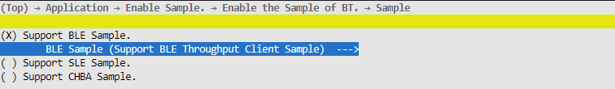

    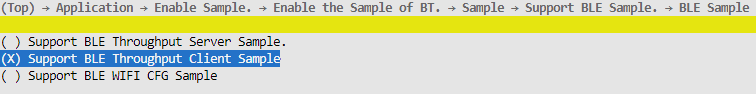

2.  After the configuration is complete, run the command python3 build.py  ws63-liteos-app, and burn the generated image into the board using BurnTool.

**Sample Usage<a name="section193796588269"></a>**

1.  Scanning: The sample automatically starts scanning on first run and on disconnection, and stops scanning after connection. Users can process the scanned Bluetooth devices in the ble\_gatt\_client\_scan\_result\_cbk interface, which is called back once for each BLE device scanned.
2.  Connection: When a Bluetooth device is scanned, the gap\_ble\_connect\_remote\_device interface can be used to connect to the peer device. **It is not required to connect to the peer Bluetooth device in the ble\_gatt\_client\_scan\_result\_cbk interface, but the peer Bluetooth device must be advertising.** Connection state changes are reported in the ble\_gatt\_client\_conn\_state\_change\_cbk callback. The current sample stops scanning, pairing, and service discovery after connection.
3.  Data transmission: Call the gattc\_write\_req or gattc\_write\_cmd interface to send data to the server.
4.  Data reception: Process the received server data in the ble\_gatt\_client\_notification\_cbk or ble\_gatt\_client\_indication\_cbk callback.

> **Note:** 
>For the input parameters in callbacks, there is no need to release memory manually; the protocol stack releases them after the callback ends.

#### ble\_speed\_server Usage Guide<a name="ZH-CN_TOPIC_0000002164274546"></a>

**Sample Compilation<a name="section143574111"></a>**

1.  In the SDK root directory, run the command "python3 build.py  ws63-liteos-app menuconfig", and configure the corresponding compilation options as shown in the figures below.

    

    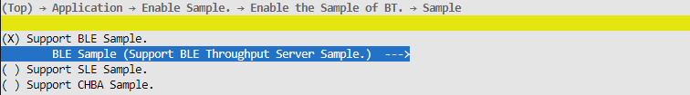

    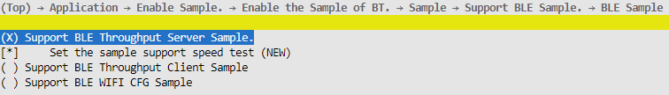

2.  After the configuration is complete, run the command python3 build.py  ws63-liteos-app, and burn the generated image into the board using BurnTool.

**Sample Usage<a name="section19522154454414"></a>**

With the default compilation options, the ble\_speed\_server sample automatically generates traffic for speed testing. Users can also **deselect "Set the sample support speed test"** when configuring the compilation options, so that the sample automatically sends the received data back to the client to verify **data interoperability**.

Specifically, use the nRF Connect tool for connection testing. Download link: "https://github.com/NordicSemiconductor/Android-nRF-Connect".

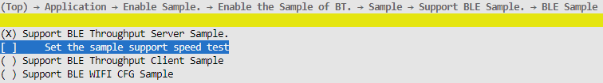

1.  Start advertising: Call the ble\_start\_adv interface to start advertising. The current sample automatically starts advertising on first run and when the server does not disconnect actively.
2.  Stop advertising: Advertising automatically stops after connection and is reported in ble\_uuid\_server\_adv\_terminate\_cbk.
3.  Receive data: Process the data sent by the client in the ble\_uuid\_server\_receive\_write\_req\_cbk interface.
4.  Send data: Call the ble\_uuid\_server\_send\_report\_by\_handle or ble\_uuid\_server\_send\_report\_by\_uuid interface to send data. **The server is not required to send data to the client in ble\_uuid\_server\_receive\_write\_req\_cbk.**
5.  Custom service and characteristic settings: The UUIDs of the custom services, characteristics, and descriptors are defined in "ble\_speed\_server/inc/ble\_speed\_server.h". The current sample defines a private service BLE\_UUID\_UUID\_SERVER\_SERVICE, under which there is a characteristic BLE\_UUID\_UUID\_SERVER\_REPORT. The UUIDs need to be changed according to customer requirements. The UUIDs are described in detail below.

**Table 1**  Server UUID description

<a name="table27521825165016"></a>
<table><thead align="left"><tr id="row575282545013"><th class="cellrowborder" valign="top" width="44.91%" id="mcps1.2.4.1.1"><p id="p063916414519"><a name="p063916414519"></a><a name="p063916414519"></a>Name</p>
</th>
<th class="cellrowborder" valign="top" width="26.06%" id="mcps1.2.4.1.2"><p id="p675292565013"><a name="p675292565013"></a><a name="p675292565013"></a>Description</p>
</th>
<th class="cellrowborder" valign="top" width="29.03%" id="mcps1.2.4.1.3"><p id="p1851311872920"><a name="p1851311872920"></a><a name="p1851311872920"></a>Sample Default Value</p>
</th>
</tr>
</thead>
<tbody><tr id="row675217253508"><td class="cellrowborder" valign="top" width="44.91%" headers="mcps1.2.4.1.1 "><p id="p12691334135016"><a name="p12691334135016"></a><a name="p12691334135016"></a>BLE_UUID_UUID_SERVER_SERVICE</p>
</td>
<td class="cellrowborder" valign="top" width="26.06%" headers="mcps1.2.4.1.2 "><p id="p3752172517502"><a name="p3752172517502"></a><a name="p3752172517502"></a>Service UUID</p>
</td>
<td class="cellrowborder" valign="top" width="29.03%" headers="mcps1.2.4.1.3 "><p id="p19513111816298"><a name="p19513111816298"></a><a name="p19513111816298"></a>0xABCD</p>
</td>
</tr>
<tr id="row147520251505"><td class="cellrowborder" valign="top" width="44.91%" headers="mcps1.2.4.1.1 "><p id="p318094285017"><a name="p318094285017"></a><a name="p318094285017"></a>BLE_UUID_UUID_SERVER_REPORT</p>
</td>
<td class="cellrowborder" valign="top" width="26.06%" headers="mcps1.2.4.1.2 "><p id="p67521625115017"><a name="p67521625115017"></a><a name="p67521625115017"></a>Characteristic UUID</p>
</td>
<td class="cellrowborder" valign="top" width="29.03%" headers="mcps1.2.4.1.3 "><p id="p349724552911"><a name="p349724552911"></a><a name="p349724552911"></a>0xCDEF</p>
</td>
</tr>
</tbody>
</table>

If all **16** bytes of the UUID are custom-defined (for example, ABCDEFGH-IJKL-MNOP-QRST-UVWXYZ012345), convert the byte array to bt\_uuid\_t by referring to the code below when registering the UUID.

```
void stream_data_to_uuid(bt_uuid_t *out_uuid)
{   
    char uuids[] = {0x45, 0x23, 0x01, 0xYZ, 0xWX, 0xUV, 0xST, 0xQR, 0xOP, 0xMN, 0xKL, 0xIJ, 0xGH, 0xEF, 0xCD, 0xAB}; 
    out_uuid->uuid_len = 16; 
    if (memcpy_s(out_uuid->uuid, out_uuid->uuid_len, uuids, 16) != EOK) {       
        return;   
    }
}
```

Users can change the characteristic properties as needed. The specific enumeration is defined in gatt\_characteristic\_property\_t in "bts\_gatt\_stru.h".

In addition, **the default MTU size is 23 bytes. If the data length of a data transmission exceeds 20 bytes (3 of which are the GATT header), the client must proactively initiate MTU negotiation**.

> **Note:** 
>For the input parameters in callbacks, there is no need to release memory manually; the protocol stack releases them after the callback ends.

#### Precautions<a name="ZH-CN_TOPIC_0000002199595301"></a>

On abnormal disconnection, restart advertising and scanning to ensure that services can self-heal as much as possible in interference scenarios (self-healing is recommended when the **disconnection cause is a disconnect initiated by the remote end** and when **pairing fails**).

## SLE Development Flow<a name="ZH-CN_TOPIC_0000001717509128"></a>


### Overview<a name="ZH-CN_TOPIC_0000001717668580"></a>

WS63V100 provides developers with SLE development and application APIs (Application Programming Interface), including Device Discovery, Connection Manager, SSAP, etc.

The functions of each component are described as follows:

-   Device Discovery: SLE device discovery protocol, including device management, device publicization, and device discovery interfaces.
-   Connection Manager: SLE connection management protocol, including device connection and pairing interfaces.
-   SSAP: SparkLink Service Access Protocol, including interfaces for service registration, service discovery, and attribute data read/write.
-   Low Latency: low-latency initialization and low-latency data transmission/reception interfaces.

    > **Note:** 
    >This document describes the basic flow and API interfaces of each module.

### Device Discovery Interface<a name="ZH-CN_TOPIC_0000001765309185"></a>


#### Overview<a name="ZH-CN_TOPIC_0000001717509132"></a>

The Device Discovery interface is the software implementation of the SLE device discovery protocol. Its main functions include the SLE device switch, device management, device publicization, and device discovery.

#### Development Process<a name="ZH-CN_TOPIC_0000001717668584"></a>

**Usage Scenario<a name="section9238112152618"></a>**

Enabling the SLE device switch is the primary condition for using the SLE functions. After SLE is started, device information management can be performed, including obtaining and setting the local device name, obtaining and setting the local device address, and setting the local device appearance.

-   When an SLE device needs to be announced, you can set the announcement parameters and announcement data first, and then enable device announcement.
-   When an SLE device needs to discover devices, you can set the device discovery parameters first, then enable device discovery, and observe the announcement packets of discovered devices through the callback function.

**Functions<a name="section37062510263"></a>**

The APIs provided by Device Discovery are listed in the following table.

<a name="table2053885392615"></a>
<table><thead align="left"><tr id="row15571105319268"><th class="cellrowborder" valign="top" width="22.447755224477554%" id="mcps1.1.5.1.1"><p id="p155715537261"><a name="p155715537261"></a><a name="p155715537261"></a>API Name</p>
</th>
<th class="cellrowborder" valign="top" width="17.348265173482652%" id="mcps1.1.5.1.2"><p id="p16571953172612"><a name="p16571953172612"></a><a name="p16571953172612"></a>Description</p>
</th>
<th class="cellrowborder" valign="top" width="29.967003299670036%" id="mcps1.1.5.1.3"><p id="p195711753122611"><a name="p195711753122611"></a><a name="p195711753122611"></a>Parameter Description</p>
</th>
<th class="cellrowborder" valign="top" width="30.23697630236976%" id="mcps1.1.5.1.4"><p id="p5571185352620"><a name="p5571185352620"></a><a name="p5571185352620"></a>Return Value Description</p>
</th>
</tr>
</thead>
<tbody><tr id="row105711253182613"><td class="cellrowborder" valign="top" width="22.447755224477554%" headers="mcps1.1.5.1.1 "><p id="p1457145311261"><a name="p1457145311261"></a><a name="p1457145311261"></a>enable_sle</p>
</td>
<td class="cellrowborder" valign="top" width="17.348265173482652%" headers="mcps1.1.5.1.2 "><p id="p145712534266"><a name="p145712534266"></a><a name="p145712534266"></a>Enables SLE.</p>
</td>
<td class="cellrowborder" valign="top" width="29.967003299670036%" headers="mcps1.1.5.1.3 "><p id="p457135310267"><a name="p457135310267"></a><a name="p457135310267"></a>-</p>
</td>
<td class="cellrowborder" valign="top" width="30.23697630236976%" headers="mcps1.1.5.1.4 "><p id="p125717539263"><a name="p125717539263"></a><a name="p125717539263"></a>Return value: Error code.</p>
</td>
</tr>
<tr id="row105711153172611"><td class="cellrowborder" valign="top" width="22.447755224477554%" headers="mcps1.1.5.1.1 "><p id="p85713534262"><a name="p85713534262"></a><a name="p85713534262"></a>disable_sle</p>
</td>
<td class="cellrowborder" valign="top" width="17.348265173482652%" headers="mcps1.1.5.1.2 "><p id="p1457195317264"><a name="p1457195317264"></a><a name="p1457195317264"></a>Disables SLE.</p>
</td>
<td class="cellrowborder" valign="top" width="29.967003299670036%" headers="mcps1.1.5.1.3 "><p id="p1557165318261"><a name="p1557165318261"></a><a name="p1557165318261"></a>-</p>
</td>
<td class="cellrowborder" valign="top" width="30.23697630236976%" headers="mcps1.1.5.1.4 "><p id="p75711753162616"><a name="p75711753162616"></a><a name="p75711753162616"></a>Return value: Error code.</p>
</td>
</tr>
<tr id="row978163515568"><td class="cellrowborder" valign="top" width="22.447755224477554%" headers="mcps1.1.5.1.1 "><p id="p178153575615"><a name="p178153575615"></a><a name="p178153575615"></a>get_dev_addr</p>
</td>
<td class="cellrowborder" valign="top" width="17.348265173482652%" headers="mcps1.1.5.1.2 "><p id="p1078153515561"><a name="p1078153515561"></a><a name="p1078153515561"></a>Obtains the SLE MAC address from eFuse or NV.</p>
</td>
<td class="cellrowborder" valign="top" width="29.967003299670036%" headers="mcps1.1.5.1.3 "><p id="p7220933164219"><a name="p7220933164219"></a><a name="p7220933164219"></a>pc_addr: Pointer for storing the obtained MAC address;</p>
<p id="p127819357566"><a name="p127819357566"></a><a name="p127819357566"></a>addr_len: MAC address length;</p>
<p id="p82617134012"><a name="p82617134012"></a><a name="p82617134012"></a>type: For SLE, pass IFTYPE_SLE 0xF2.</p>
</td>
<td class="cellrowborder" valign="top" width="30.23697630236976%" headers="mcps1.1.5.1.4 "><p id="p778219356560"><a name="p778219356560"></a><a name="p778219356560"></a>Return value:</p>
<p id="p6427174816016"><a name="p6427174816016"></a><a name="p6427174816016"></a>ERROCODE_SUCC 0</p>
<p id="p7427164816013"><a name="p7427164816013"></a><a name="p7427164816013"></a>ERROCODE_FAIL 0xFFFFFFFF</p>
</td>
</tr>
<tr id="row1557155322618"><td class="cellrowborder" valign="top" width="22.447755224477554%" headers="mcps1.1.5.1.1 "><p id="p195716536263"><a name="p195716536263"></a><a name="p195716536263"></a>sle_set_local_addr</p>
</td>
<td class="cellrowborder" valign="top" width="17.348265173482652%" headers="mcps1.1.5.1.2 "><p id="p135711553102611"><a name="p135711553102611"></a><a name="p135711553102611"></a>Sets the local device address.</p>
</td>
<td class="cellrowborder" valign="top" width="29.967003299670036%" headers="mcps1.1.5.1.3 "><p id="p15711253142612"><a name="p15711253142612"></a><a name="p15711253142612"></a>addr: Local device address;</p>
<p id="p133318524910"><a name="p133318524910"></a><a name="p133318524910"></a>Note: To use the address stored in NV or eFuse, call the 'get_dev_addr' API to obtain the currently stored address, and then call this API to set the address to BTH and BTC.</p>
</td>
<td class="cellrowborder" valign="top" width="30.23697630236976%" headers="mcps1.1.5.1.4 "><p id="p2571145316266"><a name="p2571145316266"></a><a name="p2571145316266"></a>Return value: Error code.</p>
</td>
</tr>
<tr id="row185711353192615"><td class="cellrowborder" valign="top" width="22.447755224477554%" headers="mcps1.1.5.1.1 "><p id="p4571135313261"><a name="p4571135313261"></a><a name="p4571135313261"></a>sle_get_local_addr</p>
</td>
<td class="cellrowborder" valign="top" width="17.348265173482652%" headers="mcps1.1.5.1.2 "><p id="p757195313265"><a name="p757195313265"></a><a name="p757195313265"></a>Obtains the local device address.</p>
</td>
<td class="cellrowborder" valign="top" width="29.967003299670036%" headers="mcps1.1.5.1.3 "><p id="p205711153102612"><a name="p205711153102612"></a><a name="p205711153102612"></a>addr: [out] Local device address.</p>
</td>
<td class="cellrowborder" valign="top" width="30.23697630236976%" headers="mcps1.1.5.1.4 "><p id="p85711353142610"><a name="p85711353142610"></a><a name="p85711353142610"></a>Return value: Error code.</p>
</td>
</tr>
<tr id="row17571175320266"><td class="cellrowborder" valign="top" width="22.447755224477554%" headers="mcps1.1.5.1.1 "><p id="p15711253182617"><a name="p15711253182617"></a><a name="p15711253182617"></a>sle_set_local_name</p>
</td>
<td class="cellrowborder" valign="top" width="17.348265173482652%" headers="mcps1.1.5.1.2 "><p id="p17571175310262"><a name="p17571175310262"></a><a name="p17571175310262"></a>Sets the local device name.</p>
</td>
<td class="cellrowborder" valign="top" width="29.967003299670036%" headers="mcps1.1.5.1.3 "><p id="p195711353152618"><a name="p195711353152618"></a><a name="p195711353152618"></a>name: Local device name;</p>
<p id="p8571105311265"><a name="p8571105311265"></a><a name="p8571105311265"></a>len: Length of the local device name.</p>
</td>
<td class="cellrowborder" valign="top" width="30.23697630236976%" headers="mcps1.1.5.1.4 "><p id="p15711353112615"><a name="p15711353112615"></a><a name="p15711353112615"></a>Return value: Error code.</p>
</td>
</tr>
<tr id="row17571155342615"><td class="cellrowborder" valign="top" width="22.447755224477554%" headers="mcps1.1.5.1.1 "><p id="p0571185392616"><a name="p0571185392616"></a><a name="p0571185392616"></a>sle_get_local_name</p>
</td>
<td class="cellrowborder" valign="top" width="17.348265173482652%" headers="mcps1.1.5.1.2 "><p id="p65714538262"><a name="p65714538262"></a><a name="p65714538262"></a>Obtains the local device name.</p>
</td>
<td class="cellrowborder" valign="top" width="29.967003299670036%" headers="mcps1.1.5.1.3 "><p id="p17571175318269"><a name="p17571175318269"></a><a name="p17571175318269"></a>name: [out] Local device name;</p>
<p id="p1757110534263"><a name="p1757110534263"></a><a name="p1757110534263"></a>len: [inout] On input, the memory size reserved by the user; on output, the length of the local device name.</p>
</td>
<td class="cellrowborder" valign="top" width="30.23697630236976%" headers="mcps1.1.5.1.4 "><p id="p35717539266"><a name="p35717539266"></a><a name="p35717539266"></a>Return value: Error code.</p>
</td>
</tr>
<tr id="row957155342614"><td class="cellrowborder" valign="top" width="22.447755224477554%" headers="mcps1.1.5.1.1 "><p id="p185714535263"><a name="p185714535263"></a><a name="p185714535263"></a>sle_set_announce_data</p>
</td>
<td class="cellrowborder" valign="top" width="17.348265173482652%" headers="mcps1.1.5.1.2 "><p id="p13571145372613"><a name="p13571145372613"></a><a name="p13571145372613"></a>Sets device announcement data.</p>
</td>
<td class="cellrowborder" valign="top" width="29.967003299670036%" headers="mcps1.1.5.1.3 "><p id="p1357105352615"><a name="p1357105352615"></a><a name="p1357105352615"></a>announce_id: Device announcement ID;</p>
<p id="p45728530263"><a name="p45728530263"></a><a name="p45728530263"></a>data: Device announcement data.</p>
</td>
<td class="cellrowborder" valign="top" width="30.23697630236976%" headers="mcps1.1.5.1.4 "><p id="p2572165342613"><a name="p2572165342613"></a><a name="p2572165342613"></a>Return value: Error code.</p>
</td>
</tr>
<tr id="row157235310260"><td class="cellrowborder" valign="top" width="22.447755224477554%" headers="mcps1.1.5.1.1 "><p id="p155721753112614"><a name="p155721753112614"></a><a name="p155721753112614"></a>sle_set_announce_param</p>
</td>
<td class="cellrowborder" valign="top" width="17.348265173482652%" headers="mcps1.1.5.1.2 "><p id="p857215332610"><a name="p857215332610"></a><a name="p857215332610"></a>Sets device announcement parameters.</p>
</td>
<td class="cellrowborder" valign="top" width="29.967003299670036%" headers="mcps1.1.5.1.3 "><p id="p2572125372617"><a name="p2572125372617"></a><a name="p2572125372617"></a>announce_id: Device announcement ID;</p>
<p id="p1572165316268"><a name="p1572165316268"></a><a name="p1572165316268"></a>data: Device announcement parameters;</p>
<p id="p95052413415"><a name="p95052413415"></a><a name="p95052413415"></a>tx_power: The input value range is [-127, 20]. If 127 is passed, the default maximum power value of BTC is used.</p>
</td>
<td class="cellrowborder" valign="top" width="30.23697630236976%" headers="mcps1.1.5.1.4 "><p id="p19572105382619"><a name="p19572105382619"></a><a name="p19572105382619"></a>Return value: Error code.</p>
</td>
</tr>
<tr id="row45721553112618"><td class="cellrowborder" valign="top" width="22.447755224477554%" headers="mcps1.1.5.1.1 "><p id="p657255362611"><a name="p657255362611"></a><a name="p657255362611"></a>sle_start_announce</p>
</td>
<td class="cellrowborder" valign="top" width="17.348265173482652%" headers="mcps1.1.5.1.2 "><p id="p557235318262"><a name="p557235318262"></a><a name="p557235318262"></a>Starts device announcement.</p>
</td>
<td class="cellrowborder" valign="top" width="29.967003299670036%" headers="mcps1.1.5.1.3 "><p id="p10572953142618"><a name="p10572953142618"></a><a name="p10572953142618"></a>announce_id: Device announcement ID.</p>
</td>
<td class="cellrowborder" valign="top" width="30.23697630236976%" headers="mcps1.1.5.1.4 "><p id="p175721153122611"><a name="p175721153122611"></a><a name="p175721153122611"></a>Return value: Error code.</p>
</td>
</tr>
<tr id="row18572253182619"><td class="cellrowborder" valign="top" width="22.447755224477554%" headers="mcps1.1.5.1.1 "><p id="p257255302615"><a name="p257255302615"></a><a name="p257255302615"></a>sle_stop_announce</p>
</td>
<td class="cellrowborder" valign="top" width="17.348265173482652%" headers="mcps1.1.5.1.2 "><p id="p3572145312619"><a name="p3572145312619"></a><a name="p3572145312619"></a>Stops device announcement.</p>
</td>
<td class="cellrowborder" valign="top" width="29.967003299670036%" headers="mcps1.1.5.1.3 "><p id="p2572953132612"><a name="p2572953132612"></a><a name="p2572953132612"></a>announce_id: Device announcement ID.</p>
</td>
<td class="cellrowborder" valign="top" width="30.23697630236976%" headers="mcps1.1.5.1.4 "><p id="p7572353172612"><a name="p7572353172612"></a><a name="p7572353172612"></a>Return value: Error code.</p>
</td>
</tr>
<tr id="row25721653112615"><td class="cellrowborder" valign="top" width="22.447755224477554%" headers="mcps1.1.5.1.1 "><p id="p25721453182616"><a name="p25721453182616"></a><a name="p25721453182616"></a>sle_set_seek_param</p>
</td>
<td class="cellrowborder" valign="top" width="17.348265173482652%" headers="mcps1.1.5.1.2 "><p id="p0572853182616"><a name="p0572853182616"></a><a name="p0572853182616"></a>Sets device discovery parameters.</p>
</td>
<td class="cellrowborder" valign="top" width="29.967003299670036%" headers="mcps1.1.5.1.3 "><p id="p05721953102620"><a name="p05721953102620"></a><a name="p05721953102620"></a>param: Device discovery parameters.</p>
</td>
<td class="cellrowborder" valign="top" width="30.23697630236976%" headers="mcps1.1.5.1.4 "><p id="p7572553182613"><a name="p7572553182613"></a><a name="p7572553182613"></a>Return value: Error code.</p>
</td>
</tr>
<tr id="row757275392618"><td class="cellrowborder" valign="top" width="22.447755224477554%" headers="mcps1.1.5.1.1 "><p id="p15572553112618"><a name="p15572553112618"></a><a name="p15572553112618"></a>sle_start_seek</p>
</td>
<td class="cellrowborder" valign="top" width="17.348265173482652%" headers="mcps1.1.5.1.2 "><p id="p9572135316262"><a name="p9572135316262"></a><a name="p9572135316262"></a>Starts device discovery.</p>
</td>
<td class="cellrowborder" valign="top" width="29.967003299670036%" headers="mcps1.1.5.1.3 "><p id="p165728534267"><a name="p165728534267"></a><a name="p165728534267"></a>-</p>
</td>
<td class="cellrowborder" valign="top" width="30.23697630236976%" headers="mcps1.1.5.1.4 "><p id="p13572155314260"><a name="p13572155314260"></a><a name="p13572155314260"></a>Return value: Error code.</p>
</td>
</tr>
<tr id="row1657225352613"><td class="cellrowborder" valign="top" width="22.447755224477554%" headers="mcps1.1.5.1.1 "><p id="p1157285310264"><a name="p1157285310264"></a><a name="p1157285310264"></a>sle_stop_seek</p>
</td>
<td class="cellrowborder" valign="top" width="17.348265173482652%" headers="mcps1.1.5.1.2 "><p id="p4572353202610"><a name="p4572353202610"></a><a name="p4572353202610"></a>Stops device discovery.</p>
</td>
<td class="cellrowborder" valign="top" width="29.967003299670036%" headers="mcps1.1.5.1.3 "><p id="p155722536269"><a name="p155722536269"></a><a name="p155722536269"></a>-</p>
</td>
<td class="cellrowborder" valign="top" width="30.23697630236976%" headers="mcps1.1.5.1.4 "><p id="p1357235313266"><a name="p1357235313266"></a><a name="p1357235313266"></a>Return value: Error code.</p>
</td>
</tr>
<tr id="row1557245318268"><td class="cellrowborder" valign="top" width="22.447755224477554%" headers="mcps1.1.5.1.1 "><p id="p1457213533263"><a name="p1457213533263"></a><a name="p1457213533263"></a>sle_announce_seek_register_callbacks</p>
</td>
<td class="cellrowborder" valign="top" width="17.348265173482652%" headers="mcps1.1.5.1.2 "><p id="p5572553162619"><a name="p5572553162619"></a><a name="p5572553162619"></a>Registers the device announcement and device discovery callback functions.</p>
</td>
<td class="cellrowborder" valign="top" width="29.967003299670036%" headers="mcps1.1.5.1.3 "><p id="p457295319268"><a name="p457295319268"></a><a name="p457295319268"></a>func: User callback function.</p>
</td>
<td class="cellrowborder" valign="top" width="30.23697630236976%" headers="mcps1.1.5.1.4 "><p id="p1057225313268"><a name="p1057225313268"></a><a name="p1057225313268"></a>Return value: Error code.</p>
</td>
</tr>
</tbody>
</table>

**Development Process<a name="section1145313792718"></a>**

The typical development process of Device Discovery is as follows. For specific programming examples, refer to application/samples/bt.

**Terminal Node:**

1.  Call enable\_sle to enable SLE.
2.  Call sle\_announce\_seek\_register\_callbacks to register the device announcement and device discovery callback functions.
3.  Call sle\_set\_local\_addr to set the local device address.
4.  Call sle\_set\_local\_name to set the local device name.
5.  Call sle\_set\_announce\_param to set device announcement parameters.
6.  Call sle\_set\_announce\_data to set device announcement data.
7.  Call sle\_start\_announce to start device announcement.

**Grant Node:**

1.  Call enable\_sle to enable SLE.
2.  Call sle\_announce\_seek\_register\_callbacks to register the device announcement and device discovery callback functions.
3.  Call sle\_set\_local\_addr to set the local device address.
4.  Call sle\_set\_local\_name to set the local device name.
5.  Call sle\_set\_seek\_param to set device discovery parameters.
6.  Call sle\_start\_seek to start device discovery, and obtain the information of devices that are announcing in the callback function.

#### Precautions<a name="ZH-CN_TOPIC_0000001765468433"></a>

-   WS63V100 supports 8 SLE connections and can work as both a BLE and SLE device simultaneously.
-   If no device can be found during scanning, first check whether the device is already in the paired device list, or whether the device has been paired with another device (in this case, clear the pairing information on the device side first).

### Connection Manager API<a name="ZH-CN_TOPIC_0000001765309189"></a>


#### Overview<a name="ZH-CN_TOPIC_0000001717509136"></a>

The Connection Manager API is the software implementation of the SLE connection management protocol. Its main functions include connecting, pairing, and reading the RSSI value of the remote device.

#### Development Process<a name="ZH-CN_TOPIC_0000001717668588"></a>

**Usage Scenario<a name="section644715301351"></a>**

When a device needs to establish a connection with a peer device, it can initiate a connection request to the peer device. During the connection, the device can read the RSSI value of the remote device. When the device needs to update connection parameters, it can initiate a connection parameter update request to the peer device. When the device needs to pair with the peer device, it can initiate a pairing request to the peer device. During the pairing process, the pairing status between the local device and the specified peer device can be obtained. The device can also obtain the number of currently paired devices and the linked list of information about currently paired devices.

**Functions<a name="section185719350352"></a>**

The APIs provided by Connection Manager are listed in the following table.

<a name="table7681195573511"></a>
<table><thead align="left"><tr id="row1871635553517"><th class="cellrowborder" valign="top" width="15.310000000000002%" id="mcps1.1.5.1.1"><p id="p1771617557353"><a name="p1771617557353"></a><a name="p1771617557353"></a>API Name</p>
</th>
<th class="cellrowborder" valign="top" width="33.67%" id="mcps1.1.5.1.2"><p id="p1171635514357"><a name="p1171635514357"></a><a name="p1171635514357"></a>Description</p>
</th>
<th class="cellrowborder" valign="top" width="27.55%" id="mcps1.1.5.1.3"><p id="p5716455173520"><a name="p5716455173520"></a><a name="p5716455173520"></a>Parameter Description</p>
</th>
<th class="cellrowborder" valign="top" width="23.47%" id="mcps1.1.5.1.4"><p id="p117161555203519"><a name="p117161555203519"></a><a name="p117161555203519"></a>Return Value Description</p>
</th>
</tr>
</thead>
<tbody><tr id="row11716195518357"><td class="cellrowborder" valign="top" width="15.310000000000002%" headers="mcps1.1.5.1.1 "><p id="p3716355113511"><a name="p3716355113511"></a><a name="p3716355113511"></a>sle_connect_remote_device</p>
</td>
<td class="cellrowborder" valign="top" width="33.67%" headers="mcps1.1.5.1.2 "><p id="p471617557359"><a name="p471617557359"></a><a name="p471617557359"></a>Initiates a connection request to the peer device.</p>
</td>
<td class="cellrowborder" valign="top" width="27.55%" headers="mcps1.1.5.1.3 "><p id="p871645514354"><a name="p871645514354"></a><a name="p871645514354"></a>addr: Peer device address.</p>
</td>
<td class="cellrowborder" valign="top" width="23.47%" headers="mcps1.1.5.1.4 "><p id="p1671645573516"><a name="p1671645573516"></a><a name="p1671645573516"></a>Return value: Error code.</p>
</td>
</tr>
<tr id="row17716135516355"><td class="cellrowborder" valign="top" width="15.310000000000002%" headers="mcps1.1.5.1.1 "><p id="p167167557352"><a name="p167167557352"></a><a name="p167167557352"></a>sle_disconnect_remote_device</p>
</td>
<td class="cellrowborder" valign="top" width="33.67%" headers="mcps1.1.5.1.2 "><p id="p9716115519351"><a name="p9716115519351"></a><a name="p9716115519351"></a>Initiates a disconnection request to the peer device.</p>
</td>
<td class="cellrowborder" valign="top" width="27.55%" headers="mcps1.1.5.1.3 "><p id="p16716185510358"><a name="p16716185510358"></a><a name="p16716185510358"></a>addr: Peer device address.</p>
</td>
<td class="cellrowborder" valign="top" width="23.47%" headers="mcps1.1.5.1.4 "><p id="p771695593515"><a name="p771695593515"></a><a name="p771695593515"></a>Return value: Error code.</p>
</td>
</tr>
<tr id="row13716145511358"><td class="cellrowborder" valign="top" width="15.310000000000002%" headers="mcps1.1.5.1.1 "><p id="p16716155523518"><a name="p16716155523518"></a><a name="p16716155523518"></a>sle_update_connect_param</p>
</td>
<td class="cellrowborder" valign="top" width="33.67%" headers="mcps1.1.5.1.2 "><p id="p2716115512352"><a name="p2716115512352"></a><a name="p2716115512352"></a>Updates connection parameters.</p>
</td>
<td class="cellrowborder" valign="top" width="27.55%" headers="mcps1.1.5.1.3 "><p id="p171635533511"><a name="p171635533511"></a><a name="p171635533511"></a>params: Connection parameters.</p>
</td>
<td class="cellrowborder" valign="top" width="23.47%" headers="mcps1.1.5.1.4 "><p id="p197161455133518"><a name="p197161455133518"></a><a name="p197161455133518"></a>Return value: Error code.</p>
</td>
</tr>
<tr id="row107164556359"><td class="cellrowborder" valign="top" width="15.310000000000002%" headers="mcps1.1.5.1.1 "><p id="p2716155510354"><a name="p2716155510354"></a><a name="p2716155510354"></a>sle_pair_remote_device</p>
</td>
<td class="cellrowborder" valign="top" width="33.67%" headers="mcps1.1.5.1.2 "><p id="p1171616557350"><a name="p1171616557350"></a><a name="p1171616557350"></a>Initiates a pairing request to the peer device. (Currently, the SLE authentication process only supports the no-input mode.)</p>
</td>
<td class="cellrowborder" valign="top" width="27.55%" headers="mcps1.1.5.1.3 "><p id="p14716145512356"><a name="p14716145512356"></a><a name="p14716145512356"></a>addr: Peer device address.</p>
</td>
<td class="cellrowborder" valign="top" width="23.47%" headers="mcps1.1.5.1.4 "><p id="p1871645533513"><a name="p1871645533513"></a><a name="p1871645533513"></a>Return value: Error code.</p>
</td>
</tr>
<tr id="row471645517356"><td class="cellrowborder" valign="top" width="15.310000000000002%" headers="mcps1.1.5.1.1 "><p id="p5716205513519"><a name="p5716205513519"></a><a name="p5716205513519"></a>sle_remove_paired_remote_device</p>
</td>
<td class="cellrowborder" valign="top" width="33.67%" headers="mcps1.1.5.1.2 "><p id="p6716655153516"><a name="p6716655153516"></a><a name="p6716655153516"></a>Unpairs from the peer device.</p>
</td>
<td class="cellrowborder" valign="top" width="27.55%" headers="mcps1.1.5.1.3 "><p id="p971665593515"><a name="p971665593515"></a><a name="p971665593515"></a>addr: Peer device address.</p>
</td>
<td class="cellrowborder" valign="top" width="23.47%" headers="mcps1.1.5.1.4 "><p id="p571612554355"><a name="p571612554355"></a><a name="p571612554355"></a>Return value: Error code.</p>
</td>
</tr>
<tr id="row12716165519351"><td class="cellrowborder" valign="top" width="15.310000000000002%" headers="mcps1.1.5.1.1 "><p id="p13717195563520"><a name="p13717195563520"></a><a name="p13717195563520"></a>sle_remove_all_pairs</p>
</td>
<td class="cellrowborder" valign="top" width="33.67%" headers="mcps1.1.5.1.2 "><p id="p18717135518356"><a name="p18717135518356"></a><a name="p18717135518356"></a>Unpairs from all peer devices.</p>
</td>
<td class="cellrowborder" valign="top" width="27.55%" headers="mcps1.1.5.1.3 "><p id="p571719551356"><a name="p571719551356"></a><a name="p571719551356"></a>-</p>
</td>
<td class="cellrowborder" valign="top" width="23.47%" headers="mcps1.1.5.1.4 "><p id="p13717105520351"><a name="p13717105520351"></a><a name="p13717105520351"></a>Return value: Error code.</p>
</td>
</tr>
<tr id="row1571712551357"><td class="cellrowborder" valign="top" width="15.310000000000002%" headers="mcps1.1.5.1.1 "><p id="p1971715516355"><a name="p1971715516355"></a><a name="p1971715516355"></a>sle_get_paired_devices_num</p>
</td>
<td class="cellrowborder" valign="top" width="33.67%" headers="mcps1.1.5.1.2 "><p id="p14717355143518"><a name="p14717355143518"></a><a name="p14717355143518"></a>Obtains the number of paired devices.</p>
</td>
<td class="cellrowborder" valign="top" width="27.55%" headers="mcps1.1.5.1.3 "><p id="p8717855123510"><a name="p8717855123510"></a><a name="p8717855123510"></a>number: [out] Number of paired devices.</p>
</td>
<td class="cellrowborder" valign="top" width="23.47%" headers="mcps1.1.5.1.4 "><p id="p197171855173511"><a name="p197171855173511"></a><a name="p197171855173511"></a>Return value: Error code.</p>
</td>
</tr>
<tr id="row1771735513358"><td class="cellrowborder" valign="top" width="15.310000000000002%" headers="mcps1.1.5.1.1 "><p id="p8717175533512"><a name="p8717175533512"></a><a name="p8717175533512"></a>sle_get_paired_devices</p>
</td>
<td class="cellrowborder" valign="top" width="33.67%" headers="mcps1.1.5.1.2 "><p id="p971795583520"><a name="p971795583520"></a><a name="p971795583520"></a>Obtains information about paired devices.</p>
</td>
<td class="cellrowborder" valign="top" width="27.55%" headers="mcps1.1.5.1.3 "><p id="p171735553510"><a name="p171735553510"></a><a name="p171735553510"></a>addr: [out] Linked list of device addresses;</p>
<p id="p1871710553354"><a name="p1871710553354"></a><a name="p1871710553354"></a>number: [inout] On input, the memory size reserved by the user; on output, the number of devices.</p>
</td>
<td class="cellrowborder" valign="top" width="23.47%" headers="mcps1.1.5.1.4 "><p id="p1171765517352"><a name="p1171765517352"></a><a name="p1171765517352"></a>Return value: Error code.</p>
</td>
</tr>
<tr id="row7717555123516"><td class="cellrowborder" valign="top" width="15.310000000000002%" headers="mcps1.1.5.1.1 "><p id="p11717175510352"><a name="p11717175510352"></a><a name="p11717175510352"></a>sle_get_pair_state</p>
</td>
<td class="cellrowborder" valign="top" width="33.67%" headers="mcps1.1.5.1.2 "><p id="p9717555133514"><a name="p9717555133514"></a><a name="p9717555133514"></a>Obtains the pairing status.</p>
</td>
<td class="cellrowborder" valign="top" width="27.55%" headers="mcps1.1.5.1.3 "><p id="p771785553520"><a name="p771785553520"></a><a name="p771785553520"></a>addr: Device address;</p>
<p id="p97173556357"><a name="p97173556357"></a><a name="p97173556357"></a>state: [out] Pairing status.</p>
</td>
<td class="cellrowborder" valign="top" width="23.47%" headers="mcps1.1.5.1.4 "><p id="p10717355123511"><a name="p10717355123511"></a><a name="p10717355123511"></a>Return value: Error code.</p>
</td>
</tr>
<tr id="row47171557354"><td class="cellrowborder" valign="top" width="15.310000000000002%" headers="mcps1.1.5.1.1 "><p id="p97171355123510"><a name="p97171355123510"></a><a name="p97171355123510"></a>sle_read_remote_device_rssi</p>
</td>
<td class="cellrowborder" valign="top" width="33.67%" headers="mcps1.1.5.1.2 "><p id="p1571785514358"><a name="p1571785514358"></a><a name="p1571785514358"></a>Reads the RSSI value of the peer device.</p>
</td>
<td class="cellrowborder" valign="top" width="27.55%" headers="mcps1.1.5.1.3 "><p id="p0717115513510"><a name="p0717115513510"></a><a name="p0717115513510"></a>conn_id: Connection ID.</p>
</td>
<td class="cellrowborder" valign="top" width="23.47%" headers="mcps1.1.5.1.4 "><p id="p9717125510354"><a name="p9717125510354"></a><a name="p9717125510354"></a>Return value: Error code.</p>
</td>
</tr>
<tr id="row271745543510"><td class="cellrowborder" valign="top" width="15.310000000000002%" headers="mcps1.1.5.1.1 "><p id="p19717175513357"><a name="p19717175513357"></a><a name="p19717175513357"></a>sle_connection_register_callbacks</p>
</td>
<td class="cellrowborder" valign="top" width="33.67%" headers="mcps1.1.5.1.2 "><p id="p17177554357"><a name="p17177554357"></a><a name="p17177554357"></a>Registers the connection management callback function.</p>
</td>
<td class="cellrowborder" valign="top" width="27.55%" headers="mcps1.1.5.1.3 "><p id="p197175556351"><a name="p197175556351"></a><a name="p197175556351"></a>func: User callback function.</p>
</td>
<td class="cellrowborder" valign="top" width="23.47%" headers="mcps1.1.5.1.4 "><p id="p6717105533512"><a name="p6717105533512"></a><a name="p6717105533512"></a>Return value: Error code.</p>
</td>
</tr>
</tbody>
</table>

**Development Process<a name="section957718620361"></a>**

The typical development process of Connection Manager is as follows. For specific programming examples, refer to application/samples/bt.

**Terminal Node:**

1.  Call enable\_sle to enable SLE.
2.  Call sle\_announce\_seek\_register\_callbacks to register the device announcement and device discovery callback functions.
3.  Call sle\_connection\_register\_callbacks to register the connection management callback function.
4.  Call sle\_set\_local\_addr to set the local device address.
5.  Call sle\_set\_local\_name to set the local device name.
6.  Call sle\_set\_announce\_param to set device announcement parameters.
7.  Call sle\_set\_announce\_data to set device announcement data.
8.  Call sle\_start\_announce to start device announcement.

**Grant Node:**

1.  Call enable\_sle to enable SLE.
2.  Call sle\_announce\_seek\_register\_callbacks to register the device announcement and device discovery callback functions.
3.  Call sle\_connection\_register\_callbacks to register the connection management callback function.
4.  Call sle\_set\_local\_addr to set the local device address.
5.  Call sle\_set\_local\_name to set the local device name.
6.  Call sle\_set\_seek\_param to set device discovery parameters.
7.  Call sle\_start\_seek to start device discovery, and obtain the information of devices that are announcing in the callback function.
8.  Call sle\_connect\_remote\_device to initiate a connection request to the peer device.
9.  Call sle\_pair\_remote\_device to initiate a pairing request to the peer device.
10. Call sle\_get\_paired\_devices\_num to obtain the number of currently paired devices.
11. Call sle\_get\_paired\_devices to obtain the information of currently paired devices.
12. Call sle\_get\_pair\_state to obtain the pairing status.

### SSAP server API<a name="ZH-CN_TOPIC_0000001765468437"></a>


#### Overview<a name="ZH-CN_TOPIC_0000001765309193"></a>

SSAP is a common specification for sending and receiving data over SLE, supporting data transmission between two SLE devices.

#### Development Process<a name="ZH-CN_TOPIC_0000001717509140"></a>

**Usage Scenario<a name="section367314279371"></a>**

The SSAP Server mainly receives requests and commands from the peer and sends responses, notifications, and indications to the peer.

**Functions<a name="section3464143253714"></a>**

The APIs provided by SSAP Server are listed in the following table.

<a name="table13626135163813"></a>
<table><thead align="left"><tr id="row18685135153815"><th class="cellrowborder" valign="top" width="15.310000000000002%" id="mcps1.1.5.1.1"><p id="p10685658385"><a name="p10685658385"></a><a name="p10685658385"></a>API Name</p>
</th>
<th class="cellrowborder" valign="top" width="33.67%" id="mcps1.1.5.1.2"><p id="p186851510383"><a name="p186851510383"></a><a name="p186851510383"></a>Description</p>
</th>
<th class="cellrowborder" valign="top" width="27.55%" id="mcps1.1.5.1.3"><p id="p136853553819"><a name="p136853553819"></a><a name="p136853553819"></a>Parameter Description</p>
</th>
<th class="cellrowborder" valign="top" width="23.47%" id="mcps1.1.5.1.4"><p id="p2685058389"><a name="p2685058389"></a><a name="p2685058389"></a>Return Value Description</p>
</th>
</tr>
</thead>
<tbody><tr id="row8685959385"><td class="cellrowborder" valign="top" width="15.310000000000002%" headers="mcps1.1.5.1.1 "><p id="p368575153814"><a name="p368575153814"></a><a name="p368575153814"></a>ssaps_register_server</p>
</td>
<td class="cellrowborder" valign="top" width="33.67%" headers="mcps1.1.5.1.2 "><p id="p1568519543810"><a name="p1568519543810"></a><a name="p1568519543810"></a>Registers an SSAP server.</p>
<p id="p1768513513812"><a name="p1768513513812"></a><a name="p1768513513812"></a><strong id="b19685857387"><a name="b19685857387"></a><a name="b19685857387"></a>Note: Only one SSAP server can be registered currently.</strong></p>
</td>
<td class="cellrowborder" valign="top" width="27.55%" headers="mcps1.1.5.1.3 "><p id="p76852523815"><a name="p76852523815"></a><a name="p76852523815"></a>app_uuid: Application UUID pointer;</p>
<p id="p10685145133816"><a name="p10685145133816"></a><a name="p10685145133816"></a>server_id: [out] Server ID pointer.</p>
</td>
<td class="cellrowborder" valign="top" width="23.47%" headers="mcps1.1.5.1.4 "><p id="p068519533812"><a name="p068519533812"></a><a name="p068519533812"></a>Return value: Error code.</p>
</td>
</tr>
<tr id="row5685955388"><td class="cellrowborder" valign="top" width="15.310000000000002%" headers="mcps1.1.5.1.1 "><p id="p19685752387"><a name="p19685752387"></a><a name="p19685752387"></a>ssaps_unregister_server</p>
</td>
<td class="cellrowborder" valign="top" width="33.67%" headers="mcps1.1.5.1.2 "><p id="p1668510553819"><a name="p1668510553819"></a><a name="p1668510553819"></a>Unregisters the SSAP server.</p>
</td>
<td class="cellrowborder" valign="top" width="27.55%" headers="mcps1.1.5.1.3 "><p id="p76859516389"><a name="p76859516389"></a><a name="p76859516389"></a>server_id: Server ID.</p>
</td>
<td class="cellrowborder" valign="top" width="23.47%" headers="mcps1.1.5.1.4 "><p id="p5685145163818"><a name="p5685145163818"></a><a name="p5685145163818"></a>Return value: Error code.</p>
</td>
</tr>
<tr id="row1768520573818"><td class="cellrowborder" valign="top" width="15.310000000000002%" headers="mcps1.1.5.1.1 "><p id="p1068515573815"><a name="p1068515573815"></a><a name="p1068515573815"></a>ssaps_add_service</p>
</td>
<td class="cellrowborder" valign="top" width="33.67%" headers="mcps1.1.5.1.2 "><p id="p12685185183817"><a name="p12685185183817"></a><a name="p12685185183817"></a>Adds a service.</p>
</td>
<td class="cellrowborder" valign="top" width="27.55%" headers="mcps1.1.5.1.3 "><p id="p06854511388"><a name="p06854511388"></a><a name="p06854511388"></a>server_id: Server ID.</p>
<p id="p668555123817"><a name="p668555123817"></a><a name="p668555123817"></a>service_uuid: Service UUID;</p>
<p id="p96852057388"><a name="p96852057388"></a><a name="p96852057388"></a>is_primary: Whether it is a primary service.</p>
</td>
<td class="cellrowborder" valign="top" width="23.47%" headers="mcps1.1.5.1.4 "><p id="p26850514384"><a name="p26850514384"></a><a name="p26850514384"></a>Return value: Error code.</p>
</td>
</tr>
<tr id="row10685135133813"><td class="cellrowborder" valign="top" width="15.310000000000002%" headers="mcps1.1.5.1.1 "><p id="p206858563818"><a name="p206858563818"></a><a name="p206858563818"></a>ssaps_add_property</p>
</td>
<td class="cellrowborder" valign="top" width="33.67%" headers="mcps1.1.5.1.2 "><p id="p26859517382"><a name="p26859517382"></a><a name="p26859517382"></a>Adds a characteristic.</p>
</td>
<td class="cellrowborder" valign="top" width="27.55%" headers="mcps1.1.5.1.3 "><p id="p468525193817"><a name="p468525193817"></a><a name="p468525193817"></a>server_id: Server ID;</p>
<p id="p268516523818"><a name="p268516523818"></a><a name="p268516523818"></a>service_handle: Service handle;</p>
<p id="p186851756389"><a name="p186851756389"></a><a name="p186851756389"></a>property: Characteristic information.</p>
</td>
<td class="cellrowborder" valign="top" width="23.47%" headers="mcps1.1.5.1.4 "><p id="p106852573813"><a name="p106852573813"></a><a name="p106852573813"></a>Return value: Error code.</p>
</td>
</tr>
<tr id="row1268525113812"><td class="cellrowborder" valign="top" width="15.310000000000002%" headers="mcps1.1.5.1.1 "><p id="p7686651388"><a name="p7686651388"></a><a name="p7686651388"></a>ssaps_add_descriptor</p>
</td>
<td class="cellrowborder" valign="top" width="33.67%" headers="mcps1.1.5.1.2 "><p id="p4686858387"><a name="p4686858387"></a><a name="p4686858387"></a>Adds a characteristic descriptor.</p>
</td>
<td class="cellrowborder" valign="top" width="27.55%" headers="mcps1.1.5.1.3 "><p id="p468618515385"><a name="p468618515385"></a><a name="p468618515385"></a>server_id: Server ID;</p>
<p id="p668619513817"><a name="p668619513817"></a><a name="p668619513817"></a>service_handle: Service handle;</p>
<p id="p2686955381"><a name="p2686955381"></a><a name="p2686955381"></a>property_handle: Characteristic handle;</p>
<p id="p2686353383"><a name="p2686353383"></a><a name="p2686353383"></a>descriptor: Descriptor information.</p>
</td>
<td class="cellrowborder" valign="top" width="23.47%" headers="mcps1.1.5.1.4 "><p id="p168616553814"><a name="p168616553814"></a><a name="p168616553814"></a>Return value: Error code.</p>
</td>
</tr>
<tr id="row13686555386"><td class="cellrowborder" valign="top" width="15.310000000000002%" headers="mcps1.1.5.1.1 "><p id="p46862563816"><a name="p46862563816"></a><a name="p46862563816"></a>ssaps_add_service_sync</p>
</td>
<td class="cellrowborder" valign="top" width="33.67%" headers="mcps1.1.5.1.2 "><p id="p46869512388"><a name="p46869512388"></a><a name="p46869512388"></a>Adds a service synchronously; the service handle is returned synchronously.</p>
</td>
<td class="cellrowborder" valign="top" width="27.55%" headers="mcps1.1.5.1.3 "><p id="p1368616520388"><a name="p1368616520388"></a><a name="p1368616520388"></a>server_id: Server ID.</p>
<p id="p176861523814"><a name="p176861523814"></a><a name="p176861523814"></a>service_uuid: Service UUID;</p>
<p id="p1568611553814"><a name="p1568611553814"></a><a name="p1568611553814"></a>is_primary: Whether it is a primary service;</p>
<p id="p46861250384"><a name="p46861250384"></a><a name="p46861250384"></a>handle: [out] Service handle pointer.</p>
</td>
<td class="cellrowborder" valign="top" width="23.47%" headers="mcps1.1.5.1.4 "><p id="p4686355389"><a name="p4686355389"></a><a name="p4686355389"></a>Return value: Error code.</p>
</td>
</tr>
<tr id="row19686756381"><td class="cellrowborder" valign="top" width="15.310000000000002%" headers="mcps1.1.5.1.1 "><p id="p1168620533817"><a name="p1168620533817"></a><a name="p1168620533817"></a>ssaps_add_property_sync</p>
</td>
<td class="cellrowborder" valign="top" width="33.67%" headers="mcps1.1.5.1.2 "><p id="p768612511389"><a name="p768612511389"></a><a name="p768612511389"></a>Adds a characteristic synchronously; the characteristic handle is returned synchronously.</p>
</td>
<td class="cellrowborder" valign="top" width="27.55%" headers="mcps1.1.5.1.3 "><p id="p468610519386"><a name="p468610519386"></a><a name="p468610519386"></a>server_id: Server ID.</p>
<p id="p76862583817"><a name="p76862583817"></a><a name="p76862583817"></a>service_handle: Service handle;</p>
<p id="p18686165163812"><a name="p18686165163812"></a><a name="p18686165163812"></a>property: Characteristic;</p>
<p id="p96869519387"><a name="p96869519387"></a><a name="p96869519387"></a>handle: [out] Characteristic handle pointer.</p>
</td>
<td class="cellrowborder" valign="top" width="23.47%" headers="mcps1.1.5.1.4 "><p id="p156863515387"><a name="p156863515387"></a><a name="p156863515387"></a>Return value: Error code.</p>
</td>
</tr>
<tr id="row66861552387"><td class="cellrowborder" valign="top" width="15.310000000000002%" headers="mcps1.1.5.1.1 "><p id="p36866510388"><a name="p36866510388"></a><a name="p36866510388"></a>ssaps_add_descriptor_sync</p>
</td>
<td class="cellrowborder" valign="top" width="33.67%" headers="mcps1.1.5.1.2 "><p id="p1686155143812"><a name="p1686155143812"></a><a name="p1686155143812"></a>Adds a characteristic descriptor synchronously; the characteristic descriptor handle is returned synchronously.</p>
</td>
<td class="cellrowborder" valign="top" width="27.55%" headers="mcps1.1.5.1.3 "><p id="p2068685203812"><a name="p2068685203812"></a><a name="p2068685203812"></a>server_id: Server ID.</p>
<p id="p46862050387"><a name="p46862050387"></a><a name="p46862050387"></a>service_handle: Service handle;</p>
<p id="p268665163813"><a name="p268665163813"></a><a name="p268665163813"></a>property_handle: Characteristic handle;</p>
<p id="p668675173818"><a name="p668675173818"></a><a name="p668675173818"></a>descriptor: Characteristic descriptor;</p>
<p id="p66864518386"><a name="p66864518386"></a><a name="p66864518386"></a>handle: [out] Characteristic descriptor handle pointer.</p>
</td>
<td class="cellrowborder" valign="top" width="23.47%" headers="mcps1.1.5.1.4 "><p id="p2686165163820"><a name="p2686165163820"></a><a name="p2686165163820"></a>Return value: Error code.</p>
</td>
</tr>
<tr id="row1686135103814"><td class="cellrowborder" valign="top" width="15.310000000000002%" headers="mcps1.1.5.1.1 "><p id="p106867519382"><a name="p106867519382"></a><a name="p106867519382"></a>ssaps_start_service</p>
</td>
<td class="cellrowborder" valign="top" width="33.67%" headers="mcps1.1.5.1.2 "><p id="p166861456382"><a name="p166861456382"></a><a name="p166861456382"></a>Starts the service.</p>
</td>
<td class="cellrowborder" valign="top" width="27.55%" headers="mcps1.1.5.1.3 "><p id="p126868512384"><a name="p126868512384"></a><a name="p126868512384"></a>server_id: Server ID;</p>
<p id="p06867513381"><a name="p06867513381"></a><a name="p06867513381"></a>service_handle: Service handle.</p>
</td>
<td class="cellrowborder" valign="top" width="23.47%" headers="mcps1.1.5.1.4 "><p id="p76869519384"><a name="p76869519384"></a><a name="p76869519384"></a>Return value: Error code.</p>
</td>
</tr>
<tr id="row26861754388"><td class="cellrowborder" valign="top" width="15.310000000000002%" headers="mcps1.1.5.1.1 "><p id="p2686752384"><a name="p2686752384"></a><a name="p2686752384"></a>ssaps_delete_all_services</p>
</td>
<td class="cellrowborder" valign="top" width="33.67%" headers="mcps1.1.5.1.2 "><p id="p15686105103819"><a name="p15686105103819"></a><a name="p15686105103819"></a>Deletes all services.</p>
</td>
<td class="cellrowborder" valign="top" width="27.55%" headers="mcps1.1.5.1.3 "><p id="p1068610517388"><a name="p1068610517388"></a><a name="p1068610517388"></a>server_id: Server ID.</p>
</td>
<td class="cellrowborder" valign="top" width="23.47%" headers="mcps1.1.5.1.4 "><p id="p16686756388"><a name="p16686756388"></a><a name="p16686756388"></a>Return value: Error code.</p>
</td>
</tr>
<tr id="row6686165193815"><td class="cellrowborder" valign="top" width="15.310000000000002%" headers="mcps1.1.5.1.1 "><p id="p268619515381"><a name="p268619515381"></a><a name="p268619515381"></a>ssaps_send_response</p>
</td>
<td class="cellrowborder" valign="top" width="33.67%" headers="mcps1.1.5.1.2 "><p id="p19686659386"><a name="p19686659386"></a><a name="p19686659386"></a>Sends a response.</p>
</td>
<td class="cellrowborder" valign="top" width="27.55%" headers="mcps1.1.5.1.3 "><p id="p126864511389"><a name="p126864511389"></a><a name="p126864511389"></a>server_id: Server ID;</p>
<p id="p19686105173815"><a name="p19686105173815"></a><a name="p19686105173815"></a>conn_id: Connection ID;</p>
<p id="p1268613517386"><a name="p1268613517386"></a><a name="p1268613517386"></a>param: Response parameters.</p>
</td>
<td class="cellrowborder" valign="top" width="23.47%" headers="mcps1.1.5.1.4 "><p id="p1268655173819"><a name="p1268655173819"></a><a name="p1268655173819"></a>Return value: Error code.</p>
</td>
</tr>
<tr id="row166866533819"><td class="cellrowborder" valign="top" width="15.310000000000002%" headers="mcps1.1.5.1.1 "><p id="p7686185153819"><a name="p7686185153819"></a><a name="p7686185153819"></a>ssaps_notify_indicate</p>
</td>
<td class="cellrowborder" valign="top" width="33.67%" headers="mcps1.1.5.1.2 "><p id="p15686452381"><a name="p15686452381"></a><a name="p15686452381"></a>Sends a notification or indication to the peer. Note that the data transmission rate must be 30% higher than the connection interval.</p>
</td>
<td class="cellrowborder" valign="top" width="27.55%" headers="mcps1.1.5.1.3 "><p id="p19686353381"><a name="p19686353381"></a><a name="p19686353381"></a>server_id: Server ID;</p>
<p id="p11686125163813"><a name="p11686125163813"></a><a name="p11686125163813"></a>conn_id: Connection ID;</p>
<p id="p15686051382"><a name="p15686051382"></a><a name="p15686051382"></a>param: Notification or indication parameters.</p>
</td>
<td class="cellrowborder" valign="top" width="23.47%" headers="mcps1.1.5.1.4 "><p id="p268614593816"><a name="p268614593816"></a><a name="p268614593816"></a>Return value: Error code.</p>
</td>
</tr>
<tr id="row668619583814"><td class="cellrowborder" valign="top" width="15.310000000000002%" headers="mcps1.1.5.1.1 "><p id="p4686175183810"><a name="p4686175183810"></a><a name="p4686175183810"></a>ssaps_notify_indicate_by_uuid</p>
</td>
<td class="cellrowborder" valign="top" width="33.67%" headers="mcps1.1.5.1.2 "><p id="p7686195103812"><a name="p7686195103812"></a><a name="p7686195103812"></a>Sends a notification or indication to the peer by UUID. Note that the data transmission rate must be 30% higher than the connection interval.</p>
</td>
<td class="cellrowborder" valign="top" width="27.55%" headers="mcps1.1.5.1.3 "><p id="p20686195123811"><a name="p20686195123811"></a><a name="p20686195123811"></a>server_id: Server ID;</p>
<p id="p36861355388"><a name="p36861355388"></a><a name="p36861355388"></a>conn_id: Connection ID;</p>
<p id="p11686185153817"><a name="p11686185153817"></a><a name="p11686185153817"></a>param: Notification or indication parameters.</p>
</td>
<td class="cellrowborder" valign="top" width="23.47%" headers="mcps1.1.5.1.4 "><p id="p5686195123817"><a name="p5686195123817"></a><a name="p5686195123817"></a>Return value: Error code.</p>
</td>
</tr>
<tr id="row166868503811"><td class="cellrowborder" valign="top" width="15.310000000000002%" headers="mcps1.1.5.1.1 "><p id="p1868655113816"><a name="p1868655113816"></a><a name="p1868655113816"></a>ssaps_set_info</p>
</td>
<td class="cellrowborder" valign="top" width="33.67%" headers="mcps1.1.5.1.2 "><p id="p968611514389"><a name="p968611514389"></a><a name="p968611514389"></a>Sets server information before the connection is established.</p>
</td>
<td class="cellrowborder" valign="top" width="27.55%" headers="mcps1.1.5.1.3 "><p id="p1968613563810"><a name="p1968613563810"></a><a name="p1968613563810"></a>server_id: Server ID;</p>
<p id="p86861657381"><a name="p86861657381"></a><a name="p86861657381"></a>info: Server information.</p>
</td>
<td class="cellrowborder" valign="top" width="23.47%" headers="mcps1.1.5.1.4 "><p id="p168665143819"><a name="p168665143819"></a><a name="p168665143819"></a>Return value: Error code.</p>
</td>
</tr>
<tr id="row66866593814"><td class="cellrowborder" valign="top" width="15.310000000000002%" headers="mcps1.1.5.1.1 "><p id="p5686456387"><a name="p5686456387"></a><a name="p5686456387"></a>ssaps_register_callbacks</p>
</td>
<td class="cellrowborder" valign="top" width="33.67%" headers="mcps1.1.5.1.2 "><p id="p12686135193812"><a name="p12686135193812"></a><a name="p12686135193812"></a>Registers the SSAP server callback function.</p>
</td>
<td class="cellrowborder" valign="top" width="27.55%" headers="mcps1.1.5.1.3 "><p id="p156862054382"><a name="p156862054382"></a><a name="p156862054382"></a>func: User callback function.</p>
</td>
<td class="cellrowborder" valign="top" width="23.47%" headers="mcps1.1.5.1.4 "><p id="p86861956381"><a name="p86861956381"></a><a name="p86861956381"></a>Return value: Error code.</p>
</td>
</tr>
</tbody>
</table>

**Development Process<a name="section1655119383"></a>**

The typical development process of an SSAP server: register the SSAP server, register the local attribute database, receive requests and commands from the peer, and send notifications and indications to the peer. For specific programming examples, refer to application/samples/bt.

1.  Call enable\_sle to enable SLE.
2.  Call ssaps\_register\_callbacks to register the SSAP server callback.
3.  Call sle\_announce\_seek\_register\_callbacks to register the device announcement and device discovery callback functions.
4.  Call ssaps\_register\_server to create a server entity.
5.  Call ssaps\_add\_service\_sync, ssaps\_add\_property\_sync, ssaps\_add\_descriptor\_sync, and ssaps\_start\_service to register the local attribute database. After each service and its contents are added, call ssaps\_start\_service to start the service.
6.  Call sle\_set\_local\_addr to set the local device address.
7.  Call sle\_set\_local\_name to set the local device name.
8.  Call sle\_set\_announce\_param to set device announcement parameters.
9.  Call sle\_set\_announce\_data to set device announcement data.
10. Call sle\_start\_announce to start device announcement.
11. The connection is established.
12. Receive read/write requests from the peer device. When the peer device reads or writes a characteristic or descriptor that requires authorization, call ssaps\_send\_response to send a response to the peer and modify the local characteristic value.
13. When the Client Characteristic Configuration Descriptor of a characteristic is 0x0001, send a notification to the peer device when the characteristic value changes; when the Client Characteristic Configuration Descriptor of a characteristic is 0x0002, send an indication to the peer device when the characteristic value changes.

### SSAP client API<a name="ZH-CN_TOPIC_0000001717668592"></a>


#### Overview<a name="ZH-CN_TOPIC_0000001765468441"></a>

SSAP is a common specification for sending and receiving data over SLE, supporting data transmission between two SLE devices.

#### Development Process<a name="ZH-CN_TOPIC_0000001765309205"></a>

**Usage Scenario<a name="section20327173414395"></a>**

The SSAP Client mainly sends requests and commands to the peer and receives responses, notifications, and indications from the peer.

**Functions<a name="section2044993903910"></a>**

The APIs provided by SSAP Client are listed in the following table.

<a name="table22371515403"></a>
<table><thead align="left"><tr id="row227219117405"><th class="cellrowborder" valign="top" width="17.419999999999998%" id="mcps1.1.5.1.1"><p id="p1927281174018"><a name="p1927281174018"></a><a name="p1927281174018"></a>API Name</p>
</th>
<th class="cellrowborder" valign="top" width="31.56%" id="mcps1.1.5.1.2"><p id="p2272171144016"><a name="p2272171144016"></a><a name="p2272171144016"></a>Description</p>
</th>
<th class="cellrowborder" valign="top" width="27.55%" id="mcps1.1.5.1.3"><p id="p82723111408"><a name="p82723111408"></a><a name="p82723111408"></a>Parameter Description</p>
</th>
<th class="cellrowborder" valign="top" width="23.47%" id="mcps1.1.5.1.4"><p id="p14272181144015"><a name="p14272181144015"></a><a name="p14272181144015"></a>Return Value Description</p>
</th>
</tr>
</thead>
<tbody><tr id="row027210119403"><td class="cellrowborder" valign="top" width="17.419999999999998%" headers="mcps1.1.5.1.1 "><p id="p62721613402"><a name="p62721613402"></a><a name="p62721613402"></a>ssapc_register_client</p>
</td>
<td class="cellrowborder" valign="top" width="31.56%" headers="mcps1.1.5.1.2 "><p id="p142721016401"><a name="p142721016401"></a><a name="p142721016401"></a>Registers an SSAP client.</p>
<p id="p72721116405"><a name="p72721116405"></a><a name="p72721116405"></a><strong id="b927281114016"><a name="b927281114016"></a><a name="b927281114016"></a>Note: Only one SSAP client can be registered currently.</strong></p>
</td>
<td class="cellrowborder" valign="top" width="27.55%" headers="mcps1.1.5.1.3 "><p id="p1127291184014"><a name="p1127291184014"></a><a name="p1127291184014"></a>app_uuid: Application UUID pointer;</p>
<p id="p122728116408"><a name="p122728116408"></a><a name="p122728116408"></a>client_id: [out] Client ID pointer.</p>
</td>
<td class="cellrowborder" valign="top" width="23.47%" headers="mcps1.1.5.1.4 "><p id="p02728115407"><a name="p02728115407"></a><a name="p02728115407"></a>Return value: Error code.</p>
</td>
</tr>
<tr id="row1827211119401"><td class="cellrowborder" valign="top" width="17.419999999999998%" headers="mcps1.1.5.1.1 "><p id="p12723116403"><a name="p12723116403"></a><a name="p12723116403"></a>ssapc_unregister_client</p>
</td>
<td class="cellrowborder" valign="top" width="31.56%" headers="mcps1.1.5.1.2 "><p id="p1827211134010"><a name="p1827211134010"></a><a name="p1827211134010"></a>Unregisters the SSAP client.</p>
</td>
<td class="cellrowborder" valign="top" width="27.55%" headers="mcps1.1.5.1.3 "><p id="p1927219118401"><a name="p1927219118401"></a><a name="p1927219118401"></a>client_id: Client ID.</p>
</td>
<td class="cellrowborder" valign="top" width="23.47%" headers="mcps1.1.5.1.4 "><p id="p17272191194015"><a name="p17272191194015"></a><a name="p17272191194015"></a>Return value: Error code.</p>
</td>
</tr>
<tr id="row72724124018"><td class="cellrowborder" valign="top" width="17.419999999999998%" headers="mcps1.1.5.1.1 "><p id="p2027220184012"><a name="p2027220184012"></a><a name="p2027220184012"></a>ssapc_find_structure</p>
</td>
<td class="cellrowborder" valign="top" width="31.56%" headers="mcps1.1.5.1.2 "><p id="p327271134015"><a name="p327271134015"></a><a name="p327271134015"></a>Finds services, characteristics, and descriptors on the peer.</p>
</td>
<td class="cellrowborder" valign="top" width="27.55%" headers="mcps1.1.5.1.3 "><p id="p1727221144014"><a name="p1727221144014"></a><a name="p1727221144014"></a>client_id: Client ID;</p>
<p id="p32721917407"><a name="p32721917407"></a><a name="p32721917407"></a>conn_id: Connection ID;</p>
<p id="p1027215154014"><a name="p1027215154014"></a><a name="p1027215154014"></a>param: Search parameters.</p>
</td>
<td class="cellrowborder" valign="top" width="23.47%" headers="mcps1.1.5.1.4 "><p id="p172721419404"><a name="p172721419404"></a><a name="p172721419404"></a>Return value: Error code.</p>
</td>
</tr>
<tr id="row102721213406"><td class="cellrowborder" valign="top" width="17.419999999999998%" headers="mcps1.1.5.1.1 "><p id="p1927291114014"><a name="p1927291114014"></a><a name="p1927291114014"></a>ssapc_read_req_by_uuid</p>
</td>
<td class="cellrowborder" valign="top" width="31.56%" headers="mcps1.1.5.1.2 "><p id="p12272181204016"><a name="p12272181204016"></a><a name="p12272181204016"></a>Sends a read request by UUID to the peer.</p>
</td>
<td class="cellrowborder" valign="top" width="27.55%" headers="mcps1.1.5.1.3 "><p id="p1827211110403"><a name="p1827211110403"></a><a name="p1827211110403"></a>client_id: Client ID;</p>
<p id="p12272151144011"><a name="p12272151144011"></a><a name="p12272151144011"></a>conn_id: Connection ID;</p>
<p id="p1027212112400"><a name="p1027212112400"></a><a name="p1027212112400"></a>param: Read parameters.</p>
</td>
<td class="cellrowborder" valign="top" width="23.47%" headers="mcps1.1.5.1.4 "><p id="p3272619401"><a name="p3272619401"></a><a name="p3272619401"></a>Return value: Error code.</p>
</td>
</tr>
<tr id="row3272111154019"><td class="cellrowborder" valign="top" width="17.419999999999998%" headers="mcps1.1.5.1.1 "><p id="p162729194014"><a name="p162729194014"></a><a name="p162729194014"></a>ssapc_read_req</p>
</td>
<td class="cellrowborder" valign="top" width="31.56%" headers="mcps1.1.5.1.2 "><p id="p112721717401"><a name="p112721717401"></a><a name="p112721717401"></a>Sends a read request to the peer.</p>
</td>
<td class="cellrowborder" valign="top" width="27.55%" headers="mcps1.1.5.1.3 "><p id="p62724194012"><a name="p62724194012"></a><a name="p62724194012"></a>client_id: Client ID;</p>
<p id="p1127251194013"><a name="p1127251194013"></a><a name="p1127251194013"></a>conn_id: Connection ID;</p>
<p id="p227271104012"><a name="p227271104012"></a><a name="p227271104012"></a>handle: Handle;</p>
<p id="p527201134010"><a name="p527201134010"></a><a name="p527201134010"></a>type: Type.</p>
</td>
<td class="cellrowborder" valign="top" width="23.47%" headers="mcps1.1.5.1.4 "><p id="p62726154020"><a name="p62726154020"></a><a name="p62726154020"></a>Return value: Error code.</p>
</td>
</tr>
<tr id="row027213104019"><td class="cellrowborder" valign="top" width="17.419999999999998%" headers="mcps1.1.5.1.1 "><p id="p327212134015"><a name="p327212134015"></a><a name="p327212134015"></a>ssapc_write_req</p>
</td>
<td class="cellrowborder" valign="top" width="31.56%" headers="mcps1.1.5.1.2 "><p id="p142721615407"><a name="p142721615407"></a><a name="p142721615407"></a>Sends a write request to the peer. Note that the data transmission rate must be 30% higher than the connection interval.</p>
</td>
<td class="cellrowborder" valign="top" width="27.55%" headers="mcps1.1.5.1.3 "><p id="p12272210409"><a name="p12272210409"></a><a name="p12272210409"></a>client_id: Client ID;</p>
<p id="p1227220124015"><a name="p1227220124015"></a><a name="p1227220124015"></a>conn_id: Connection ID;</p>
<p id="p827213119404"><a name="p827213119404"></a><a name="p827213119404"></a>param: Write parameters.</p>
</td>
<td class="cellrowborder" valign="top" width="23.47%" headers="mcps1.1.5.1.4 "><p id="p7272712404"><a name="p7272712404"></a><a name="p7272712404"></a>Return value: Error code.</p>
</td>
</tr>
<tr id="row227212184013"><td class="cellrowborder" valign="top" width="17.419999999999998%" headers="mcps1.1.5.1.1 "><p id="p227261174016"><a name="p227261174016"></a><a name="p227261174016"></a>ssapc_write_cmd</p>
</td>
<td class="cellrowborder" valign="top" width="31.56%" headers="mcps1.1.5.1.2 "><p id="p027215111406"><a name="p027215111406"></a><a name="p027215111406"></a>Sends a write command to the peer. Note that the data transmission rate must be 30% higher than the connection interval.</p>
</td>
<td class="cellrowborder" valign="top" width="27.55%" headers="mcps1.1.5.1.3 "><p id="p1027221154015"><a name="p1027221154015"></a><a name="p1027221154015"></a>client_id: Client ID;</p>
<p id="p152721614408"><a name="p152721614408"></a><a name="p152721614408"></a>conn_id: Connection ID;</p>
<p id="p4272416403"><a name="p4272416403"></a><a name="p4272416403"></a>param: Write parameters.</p>
</td>
<td class="cellrowborder" valign="top" width="23.47%" headers="mcps1.1.5.1.4 "><p id="p52728113401"><a name="p52728113401"></a><a name="p52728113401"></a>Return value: Error code.</p>
</td>
</tr>
<tr id="row17272141174018"><td class="cellrowborder" valign="top" width="17.419999999999998%" headers="mcps1.1.5.1.1 "><p id="p4272181104013"><a name="p4272181104013"></a><a name="p4272181104013"></a>ssapc_exchange_info_req</p>
</td>
<td class="cellrowborder" valign="top" width="31.56%" headers="mcps1.1.5.1.2 "><p id="p327216114013"><a name="p327216114013"></a><a name="p327216114013"></a>Sends an exchange information request to the peer.</p>
</td>
<td class="cellrowborder" valign="top" width="27.55%" headers="mcps1.1.5.1.3 "><p id="p1327214113407"><a name="p1327214113407"></a><a name="p1327214113407"></a>client_id: Client ID;</p>
<p id="p327211117401"><a name="p327211117401"></a><a name="p327211117401"></a>conn_id: Connection ID;</p>
<p id="p8272016405"><a name="p8272016405"></a><a name="p8272016405"></a>param: Exchange information parameters.</p>
</td>
<td class="cellrowborder" valign="top" width="23.47%" headers="mcps1.1.5.1.4 "><p id="p82721412402"><a name="p82721412402"></a><a name="p82721412402"></a>Return value: Error code.</p>
</td>
</tr>
<tr id="row122721210408"><td class="cellrowborder" valign="top" width="17.419999999999998%" headers="mcps1.1.5.1.1 "><p id="p2272121164019"><a name="p2272121164019"></a><a name="p2272121164019"></a>ssapc_register_callbacks</p>
</td>
<td class="cellrowborder" valign="top" width="31.56%" headers="mcps1.1.5.1.2 "><p id="p32721174020"><a name="p32721174020"></a><a name="p32721174020"></a>Registers the SSAP client callback function.</p>
</td>
<td class="cellrowborder" valign="top" width="27.55%" headers="mcps1.1.5.1.3 "><p id="p2273113408"><a name="p2273113408"></a><a name="p2273113408"></a>func: User callback function.</p>
</td>
<td class="cellrowborder" valign="top" width="23.47%" headers="mcps1.1.5.1.4 "><p id="p827314117403"><a name="p827314117403"></a><a name="p827314117403"></a>Return value: Error code.</p>
</td>
</tr>
</tbody>
</table>

**Development Process<a name="section2564171034018"></a>**

The typical development process of an SSAP client: register the SSAP client, find the peer's attribute database, send requests and commands to the peer, and receive notifications and indications from the peer. For specific programming examples, refer to application/samples/bt.

**SSAP Server:**

1.  Call enable\_sle to enable SLE.
2.  Call ssaps\_register\_callbacks to register the SSAP server callback.
3.  Call sle\_announce\_seek\_register\_callbacks to register the device announcement and device discovery callback functions.
4.  Call ssaps\_register\_server to create a server entity.
5.  Call ssaps\_add\_service\_sync, ssaps\_add\_property\_sync, ssaps\_add\_descriptor\_sync, and ssaps\_start\_service to register the local attribute database. After each service and its contents are added, call ssaps\_start\_service to start the service.
6.  Call sle\_set\_local\_addr to set the local device address.
7.  Call sle\_set\_local\_name to set the local device name.
8.  Call sle\_set\_announce\_param to set device announcement parameters.
9.  Call sle\_set\_announce\_data to set device announcement data.
10. Call sle\_start\_announce to start device announcement.
11. The connection is established.
12. Receive read/write requests from the peer device. When the peer device reads or writes a characteristic or descriptor that requires authorization, call ssaps\_send\_response to send a response to the peer and modify the local characteristic value.
13. When the Client Characteristic Configuration Descriptor of a characteristic is 0x0001, send a notification to the peer device when the characteristic value changes; when the Client Characteristic Configuration Descriptor of a characteristic is 0x0002, send an indication to the peer device when the characteristic value changes.

**SSAP Client:**

1.  Call enable\_sle to enable SLE.
2.  Call ssapc\_register\_callbacks to register the SSAP client callback.
3.  Call sle\_announce\_seek\_register\_callbacks to register the device announcement and device discovery callback functions.
4.  Call ssapc\_register\_client to create a client entity.
5.  Call ssapc\_find\_structure recursively to find the peer's attribute database.
6.  If you are interested in a characteristic of the peer, call ssapc\_write\_req or ssapc\_write\_cmd to write the Client Characteristic Configuration Descriptor of the characteristic to 0x0001 or 0x0002. The former enables the peer's characteristic notification, and the latter enables the peer's characteristic indication.
7.  Use the read/write APIs to operate on the peer's attribute database.

### Error Codes<a name="ZH-CN_TOPIC_0000001768511653"></a>

The SLE SDK uses error codes to indicate the execution result of the current task to users, as shown in the following table.

<a name="table54639314269"></a>
<table><thead align="left"><tr id="row1950714310264"><th class="cellrowborder" valign="top" width="8.18081808180818%" id="mcps1.1.5.1.1"><p id="p1550810310267"><a name="p1550810310267"></a><a name="p1550810310267"></a>No.</p>
</th>
<th class="cellrowborder" valign="top" width="41.31413141314131%" id="mcps1.1.5.1.2"><p id="p9508237262"><a name="p9508237262"></a><a name="p9508237262"></a>Definition</p>
</th>
<th class="cellrowborder" valign="top" width="14.14141414141414%" id="mcps1.1.5.1.3"><p id="p2508239265"><a name="p2508239265"></a><a name="p2508239265"></a>Actual Value</p>
</th>
<th class="cellrowborder" valign="top" width="36.36363636363636%" id="mcps1.1.5.1.4"><p id="p11508138268"><a name="p11508138268"></a><a name="p11508138268"></a>Description</p>
</th>
</tr>
</thead>
<tbody><tr id="row15081315264"><td class="cellrowborder" valign="top" width="8.18081808180818%" headers="mcps1.1.5.1.1 "><p id="p19508193202616"><a name="p19508193202616"></a><a name="p19508193202616"></a>1</p>
</td>
<td class="cellrowborder" valign="top" width="41.31413141314131%" headers="mcps1.1.5.1.2 "><p id="p45082316263"><a name="p45082316263"></a><a name="p45082316263"></a>ERRCODE_SLE_SUCCESS</p>
</td>
<td class="cellrowborder" valign="top" width="14.14141414141414%" headers="mcps1.1.5.1.3 "><p id="p35083342610"><a name="p35083342610"></a><a name="p35083342610"></a>0</p>
</td>
<td class="cellrowborder" valign="top" width="36.36363636363636%" headers="mcps1.1.5.1.4 "><p id="p95081731266"><a name="p95081731266"></a><a name="p95081731266"></a>Error code for successful execution.</p>
</td>
</tr>
<tr id="row35081335265"><td class="cellrowborder" valign="top" width="8.18081808180818%" headers="mcps1.1.5.1.1 "><p id="p25086318265"><a name="p25086318265"></a><a name="p25086318265"></a>2</p>
</td>
<td class="cellrowborder" valign="top" width="41.31413141314131%" headers="mcps1.1.5.1.2 "><p id="p950814382615"><a name="p950814382615"></a><a name="p950814382615"></a>ERRCODE_SLE_CONTINUE</p>
</td>
<td class="cellrowborder" valign="top" width="14.14141414141414%" headers="mcps1.1.5.1.3 "><p id="p145081312618"><a name="p145081312618"></a><a name="p145081312618"></a>0x80006000</p>
</td>
<td class="cellrowborder" valign="top" width="36.36363636363636%" headers="mcps1.1.5.1.4 "><p id="p9508183172616"><a name="p9508183172616"></a><a name="p9508183172616"></a>Error code for continuing execution.</p>
</td>
</tr>
<tr id="row115080362618"><td class="cellrowborder" valign="top" width="8.18081808180818%" headers="mcps1.1.5.1.1 "><p id="p1950883152618"><a name="p1950883152618"></a><a name="p1950883152618"></a>3</p>
</td>
<td class="cellrowborder" valign="top" width="41.31413141314131%" headers="mcps1.1.5.1.2 "><p id="p350819322613"><a name="p350819322613"></a><a name="p350819322613"></a>ERRCODE_SLE_DIRECT_RETURN</p>
</td>
<td class="cellrowborder" valign="top" width="14.14141414141414%" headers="mcps1.1.5.1.3 "><p id="p2508163152613"><a name="p2508163152613"></a><a name="p2508163152613"></a>0x80006001</p>
</td>
<td class="cellrowborder" valign="top" width="36.36363636363636%" headers="mcps1.1.5.1.4 "><p id="p05082362611"><a name="p05082362611"></a><a name="p05082362611"></a>Error code for direct return.</p>
</td>
</tr>
<tr id="row18508183152612"><td class="cellrowborder" valign="top" width="8.18081808180818%" headers="mcps1.1.5.1.1 "><p id="p0508538261"><a name="p0508538261"></a><a name="p0508538261"></a>5</p>
</td>
<td class="cellrowborder" valign="top" width="41.31413141314131%" headers="mcps1.1.5.1.2 "><p id="p14508143112611"><a name="p14508143112611"></a><a name="p14508143112611"></a>ERRCODE_SLE_PARAM_ERR</p>
</td>
<td class="cellrowborder" valign="top" width="14.14141414141414%" headers="mcps1.1.5.1.3 "><p id="p195089314264"><a name="p195089314264"></a><a name="p195089314264"></a>0x80006002</p>
</td>
<td class="cellrowborder" valign="top" width="36.36363636363636%" headers="mcps1.1.5.1.4 "><p id="p165081434262"><a name="p165081434262"></a><a name="p165081434262"></a>Error code for parameter error.</p>
</td>
</tr>
<tr id="row14508173122614"><td class="cellrowborder" valign="top" width="8.18081808180818%" headers="mcps1.1.5.1.1 "><p id="p450812332620"><a name="p450812332620"></a><a name="p450812332620"></a>6</p>
</td>
<td class="cellrowborder" valign="top" width="41.31413141314131%" headers="mcps1.1.5.1.2 "><p id="p195081335263"><a name="p195081335263"></a><a name="p195081335263"></a>ERRCODE_SLE_FAIL</p>
</td>
<td class="cellrowborder" valign="top" width="14.14141414141414%" headers="mcps1.1.5.1.3 "><p id="p15082031264"><a name="p15082031264"></a><a name="p15082031264"></a>0x80006003</p>
</td>
<td class="cellrowborder" valign="top" width="36.36363636363636%" headers="mcps1.1.5.1.4 "><p id="p1250911372611"><a name="p1250911372611"></a><a name="p1250911372611"></a>Error code for execution failure.</p>
</td>
</tr>
<tr id="row3509193152616"><td class="cellrowborder" valign="top" width="8.18081808180818%" headers="mcps1.1.5.1.1 "><p id="p1450953152610"><a name="p1450953152610"></a><a name="p1450953152610"></a>7</p>
</td>
<td class="cellrowborder" valign="top" width="41.31413141314131%" headers="mcps1.1.5.1.2 "><p id="p95091438260"><a name="p95091438260"></a><a name="p95091438260"></a>ERRCODE_SLE_TIMEOUT</p>
</td>
<td class="cellrowborder" valign="top" width="14.14141414141414%" headers="mcps1.1.5.1.3 "><p id="p1250912312260"><a name="p1250912312260"></a><a name="p1250912312260"></a>0x80006004</p>
</td>
<td class="cellrowborder" valign="top" width="36.36363636363636%" headers="mcps1.1.5.1.4 "><p id="p175093317266"><a name="p175093317266"></a><a name="p175093317266"></a>Error code for execution timeout.</p>
</td>
</tr>
<tr id="row1950983152617"><td class="cellrowborder" valign="top" width="8.18081808180818%" headers="mcps1.1.5.1.1 "><p id="p65095314262"><a name="p65095314262"></a><a name="p65095314262"></a>8</p>
</td>
<td class="cellrowborder" valign="top" width="41.31413141314131%" headers="mcps1.1.5.1.2 "><p id="p950913182615"><a name="p950913182615"></a><a name="p950913182615"></a>ERRCODE_SLE_UNSUPPORTED</p>
</td>
<td class="cellrowborder" valign="top" width="14.14141414141414%" headers="mcps1.1.5.1.3 "><p id="p1750918342610"><a name="p1750918342610"></a><a name="p1750918342610"></a>0x80006005</p>
</td>
<td class="cellrowborder" valign="top" width="36.36363636363636%" headers="mcps1.1.5.1.4 "><p id="p1750963182615"><a name="p1750963182615"></a><a name="p1750963182615"></a>Error code for an unsupported parameter.</p>
</td>
</tr>
<tr id="row7509153142612"><td class="cellrowborder" valign="top" width="8.18081808180818%" headers="mcps1.1.5.1.1 "><p id="p1450910382618"><a name="p1450910382618"></a><a name="p1450910382618"></a>9</p>
</td>
<td class="cellrowborder" valign="top" width="41.31413141314131%" headers="mcps1.1.5.1.2 "><p id="p950983132610"><a name="p950983132610"></a><a name="p950983132610"></a>ERRCODE_SLE_GETRECORD_FAIL</p>
</td>
<td class="cellrowborder" valign="top" width="14.14141414141414%" headers="mcps1.1.5.1.3 "><p id="p115095312619"><a name="p115095312619"></a><a name="p115095312619"></a>0x80006006</p>
</td>
<td class="cellrowborder" valign="top" width="36.36363636363636%" headers="mcps1.1.5.1.4 "><p id="p115098312617"><a name="p115098312617"></a><a name="p115098312617"></a>Error code for failure to obtain the current record.</p>
</td>
</tr>
<tr id="row5509193182613"><td class="cellrowborder" valign="top" width="8.18081808180818%" headers="mcps1.1.5.1.1 "><p id="p950914332615"><a name="p950914332615"></a><a name="p950914332615"></a>10</p>
</td>
<td class="cellrowborder" valign="top" width="41.31413141314131%" headers="mcps1.1.5.1.2 "><p id="p185097320269"><a name="p185097320269"></a><a name="p185097320269"></a>ERRCODE_SLE_POINTER_NULL</p>
</td>
<td class="cellrowborder" valign="top" width="14.14141414141414%" headers="mcps1.1.5.1.3 "><p id="p175091631265"><a name="p175091631265"></a><a name="p175091631265"></a>0x80006007</p>
</td>
<td class="cellrowborder" valign="top" width="36.36363636363636%" headers="mcps1.1.5.1.4 "><p id="p1050963122613"><a name="p1050963122613"></a><a name="p1050963122613"></a>Error code for a null pointer.</p>
</td>
</tr>
<tr id="row1509535264"><td class="cellrowborder" valign="top" width="8.18081808180818%" headers="mcps1.1.5.1.1 "><p id="p5509737264"><a name="p5509737264"></a><a name="p5509737264"></a>11</p>
</td>
<td class="cellrowborder" valign="top" width="41.31413141314131%" headers="mcps1.1.5.1.2 "><p id="p1050913322618"><a name="p1050913322618"></a><a name="p1050913322618"></a>ERRCODE_SLE_NO_RECORD</p>
</td>
<td class="cellrowborder" valign="top" width="14.14141414141414%" headers="mcps1.1.5.1.3 "><p id="p175096342616"><a name="p175096342616"></a><a name="p175096342616"></a>0x80006008</p>
</td>
<td class="cellrowborder" valign="top" width="36.36363636363636%" headers="mcps1.1.5.1.4 "><p id="p25099311269"><a name="p25099311269"></a><a name="p25099311269"></a>Error code for no record returned.</p>
</td>
</tr>
<tr id="row550919317261"><td class="cellrowborder" valign="top" width="8.18081808180818%" headers="mcps1.1.5.1.1 "><p id="p75097372618"><a name="p75097372618"></a><a name="p75097372618"></a>12</p>
</td>
<td class="cellrowborder" valign="top" width="41.31413141314131%" headers="mcps1.1.5.1.2 "><p id="p250917319267"><a name="p250917319267"></a><a name="p250917319267"></a>ERRCODE_SLE_STATUS_ERR</p>
</td>
<td class="cellrowborder" valign="top" width="14.14141414141414%" headers="mcps1.1.5.1.3 "><p id="p17509153152610"><a name="p17509153152610"></a><a name="p17509153152610"></a>0x80006009</p>
</td>
<td class="cellrowborder" valign="top" width="36.36363636363636%" headers="mcps1.1.5.1.4 "><p id="p135091437266"><a name="p135091437266"></a><a name="p135091437266"></a>Error code for status error.</p>
</td>
</tr>
<tr id="row5509237263"><td class="cellrowborder" valign="top" width="8.18081808180818%" headers="mcps1.1.5.1.1 "><p id="p165091633262"><a name="p165091633262"></a><a name="p165091633262"></a>13</p>
</td>
<td class="cellrowborder" valign="top" width="41.31413141314131%" headers="mcps1.1.5.1.2 "><p id="p115092322619"><a name="p115092322619"></a><a name="p115092322619"></a>ERRCODE_SLE_NOMEM</p>
</td>
<td class="cellrowborder" valign="top" width="14.14141414141414%" headers="mcps1.1.5.1.3 "><p id="p135091933264"><a name="p135091933264"></a><a name="p135091933264"></a>0x8000600a</p>
</td>
<td class="cellrowborder" valign="top" width="36.36363636363636%" headers="mcps1.1.5.1.4 "><p id="p7509183192619"><a name="p7509183192619"></a><a name="p7509183192619"></a>Error code for insufficient memory.</p>
</td>
</tr>
<tr id="row1850973132619"><td class="cellrowborder" valign="top" width="8.18081808180818%" headers="mcps1.1.5.1.1 "><p id="p2509838268"><a name="p2509838268"></a><a name="p2509838268"></a>14</p>
</td>
<td class="cellrowborder" valign="top" width="41.31413141314131%" headers="mcps1.1.5.1.2 "><p id="p6509163192617"><a name="p6509163192617"></a><a name="p6509163192617"></a>ERRCODE_SLE_AUTH_FAIL</p>
</td>
<td class="cellrowborder" valign="top" width="14.14141414141414%" headers="mcps1.1.5.1.3 "><p id="p85094322610"><a name="p85094322610"></a><a name="p85094322610"></a>0x8000600b</p>
</td>
<td class="cellrowborder" valign="top" width="36.36363636363636%" headers="mcps1.1.5.1.4 "><p id="p15509143112618"><a name="p15509143112618"></a><a name="p15509143112618"></a>Error code for authentication failure.</p>
</td>
</tr>
<tr id="row195091382615"><td class="cellrowborder" valign="top" width="8.18081808180818%" headers="mcps1.1.5.1.1 "><p id="p250915313262"><a name="p250915313262"></a><a name="p250915313262"></a>15</p>
</td>
<td class="cellrowborder" valign="top" width="41.31413141314131%" headers="mcps1.1.5.1.2 "><p id="p15509103192618"><a name="p15509103192618"></a><a name="p15509103192618"></a>ERRCODE_SLE_AUTH_PKEY_MISS</p>
</td>
<td class="cellrowborder" valign="top" width="14.14141414141414%" headers="mcps1.1.5.1.3 "><p id="p125091332268"><a name="p125091332268"></a><a name="p125091332268"></a>0x8000600c</p>
</td>
<td class="cellrowborder" valign="top" width="36.36363636363636%" headers="mcps1.1.5.1.4 "><p id="p1050915342615"><a name="p1050915342615"></a><a name="p1050915342615"></a>Error code for authentication failure caused by a lost PIN code or key.</p>
</td>
</tr>
<tr id="row1750943102616"><td class="cellrowborder" valign="top" width="8.18081808180818%" headers="mcps1.1.5.1.1 "><p id="p1650912382615"><a name="p1650912382615"></a><a name="p1650912382615"></a>16</p>
</td>
<td class="cellrowborder" valign="top" width="41.31413141314131%" headers="mcps1.1.5.1.2 "><p id="p1350923112612"><a name="p1350923112612"></a><a name="p1350923112612"></a>ERRCODE_SLE_RMT_DEV_DOWN</p>
</td>
<td class="cellrowborder" valign="top" width="14.14141414141414%" headers="mcps1.1.5.1.3 "><p id="p15099313268"><a name="p15099313268"></a><a name="p15099313268"></a>0x8000600d</p>
</td>
<td class="cellrowborder" valign="top" width="36.36363636363636%" headers="mcps1.1.5.1.4 "><p id="p1650993172614"><a name="p1650993172614"></a><a name="p1650993172614"></a>Error code for the peer device being powered off.</p>
</td>
</tr>
<tr id="row65091035269"><td class="cellrowborder" valign="top" width="8.18081808180818%" headers="mcps1.1.5.1.1 "><p id="p3509163182616"><a name="p3509163182616"></a><a name="p3509163182616"></a>17</p>
</td>
<td class="cellrowborder" valign="top" width="41.31413141314131%" headers="mcps1.1.5.1.2 "><p id="p550919382612"><a name="p550919382612"></a><a name="p550919382612"></a>ERRCODE_SLE_PAIRING_REJECT</p>
</td>
<td class="cellrowborder" valign="top" width="14.14141414141414%" headers="mcps1.1.5.1.3 "><p id="p18509135263"><a name="p18509135263"></a><a name="p18509135263"></a>0x8000600e</p>
</td>
<td class="cellrowborder" valign="top" width="36.36363636363636%" headers="mcps1.1.5.1.4 "><p id="p2509163102615"><a name="p2509163102615"></a><a name="p2509163102615"></a>Error code for pairing rejection.</p>
</td>
</tr>
<tr id="row35091734264"><td class="cellrowborder" valign="top" width="8.18081808180818%" headers="mcps1.1.5.1.1 "><p id="p11509193162617"><a name="p11509193162617"></a><a name="p11509193162617"></a>18</p>
</td>
<td class="cellrowborder" valign="top" width="41.31413141314131%" headers="mcps1.1.5.1.2 "><p id="p4509939267"><a name="p4509939267"></a><a name="p4509939267"></a>ERRCODE_SLE_BUSY</p>
</td>
<td class="cellrowborder" valign="top" width="14.14141414141414%" headers="mcps1.1.5.1.3 "><p id="p150915362617"><a name="p150915362617"></a><a name="p150915362617"></a>0x8000600f</p>
</td>
<td class="cellrowborder" valign="top" width="36.36363636363636%" headers="mcps1.1.5.1.4 "><p id="p125093342612"><a name="p125093342612"></a><a name="p125093342612"></a>Error code for a busy system.</p>
</td>
</tr>
<tr id="row10509635265"><td class="cellrowborder" valign="top" width="8.18081808180818%" headers="mcps1.1.5.1.1 "><p id="p051011312264"><a name="p051011312264"></a><a name="p051011312264"></a>19</p>
</td>
<td class="cellrowborder" valign="top" width="41.31413141314131%" headers="mcps1.1.5.1.2 "><p id="p251017312264"><a name="p251017312264"></a><a name="p251017312264"></a>ERRCODE_SLE_NOT_READY</p>
</td>
<td class="cellrowborder" valign="top" width="14.14141414141414%" headers="mcps1.1.5.1.3 "><p id="p851014312611"><a name="p851014312611"></a><a name="p851014312611"></a>0x80006010</p>
</td>
<td class="cellrowborder" valign="top" width="36.36363636363636%" headers="mcps1.1.5.1.4 "><p id="p351013152611"><a name="p351013152611"></a><a name="p351013152611"></a>Error code for the system not being ready.</p>
</td>
</tr>
<tr id="row7510734267"><td class="cellrowborder" valign="top" width="8.18081808180818%" headers="mcps1.1.5.1.1 "><p id="p851073152613"><a name="p851073152613"></a><a name="p851073152613"></a>20</p>
</td>
<td class="cellrowborder" valign="top" width="41.31413141314131%" headers="mcps1.1.5.1.2 "><p id="p1051023142610"><a name="p1051023142610"></a><a name="p1051023142610"></a>ERRCODE_SLE_CONN_FAIL</p>
</td>
<td class="cellrowborder" valign="top" width="14.14141414141414%" headers="mcps1.1.5.1.3 "><p id="p751013392618"><a name="p751013392618"></a><a name="p751013392618"></a>0x80006011</p>
</td>
<td class="cellrowborder" valign="top" width="36.36363636363636%" headers="mcps1.1.5.1.4 "><p id="p451083192616"><a name="p451083192616"></a><a name="p451083192616"></a>Error code for connection failure.</p>
</td>
</tr>
<tr id="row6510193162619"><td class="cellrowborder" valign="top" width="8.18081808180818%" headers="mcps1.1.5.1.1 "><p id="p55107310267"><a name="p55107310267"></a><a name="p55107310267"></a>21</p>
</td>
<td class="cellrowborder" valign="top" width="41.31413141314131%" headers="mcps1.1.5.1.2 "><p id="p2510036266"><a name="p2510036266"></a><a name="p2510036266"></a>ERRCODE_SLE_OUT_OF_RANGE</p>
</td>
<td class="cellrowborder" valign="top" width="14.14141414141414%" headers="mcps1.1.5.1.3 "><p id="p145106372614"><a name="p145106372614"></a><a name="p145106372614"></a>0x80006012</p>
</td>
<td class="cellrowborder" valign="top" width="36.36363636363636%" headers="mcps1.1.5.1.4 "><p id="p151013312265"><a name="p151013312265"></a><a name="p151013312265"></a>Error code for out-of-range.</p>
</td>
</tr>
<tr id="row1751023162615"><td class="cellrowborder" valign="top" width="8.18081808180818%" headers="mcps1.1.5.1.1 "><p id="p185101732265"><a name="p185101732265"></a><a name="p185101732265"></a>22</p>
</td>
<td class="cellrowborder" valign="top" width="41.31413141314131%" headers="mcps1.1.5.1.2 "><p id="p1951014372610"><a name="p1951014372610"></a><a name="p1951014372610"></a>ERRCODE_SLE_MEMCPY_FAIL</p>
</td>
<td class="cellrowborder" valign="top" width="14.14141414141414%" headers="mcps1.1.5.1.3 "><p id="p351093172618"><a name="p351093172618"></a><a name="p351093172618"></a>0x80006013</p>
</td>
<td class="cellrowborder" valign="top" width="36.36363636363636%" headers="mcps1.1.5.1.4 "><p id="p85105318264"><a name="p85105318264"></a><a name="p85105318264"></a>Error code for copy failure.</p>
</td>
</tr>
<tr id="row195102318263"><td class="cellrowborder" valign="top" width="8.18081808180818%" headers="mcps1.1.5.1.1 "><p id="p0510123122615"><a name="p0510123122615"></a><a name="p0510123122615"></a>23</p>
</td>
<td class="cellrowborder" valign="top" width="41.31413141314131%" headers="mcps1.1.5.1.2 "><p id="p45108310264"><a name="p45108310264"></a><a name="p45108310264"></a>ERRCODE_SLE_MALLOC_FAIL</p>
</td>
<td class="cellrowborder" valign="top" width="14.14141414141414%" headers="mcps1.1.5.1.3 "><p id="p185101233266"><a name="p185101233266"></a><a name="p185101233266"></a>0x80006014</p>
</td>
<td class="cellrowborder" valign="top" width="36.36363636363636%" headers="mcps1.1.5.1.4 "><p id="p1051016302616"><a name="p1051016302616"></a><a name="p1051016302616"></a>Error code for memory allocation failure.</p>
</td>
</tr>
</tbody>
</table>

### Sample Example<a name="ZH-CN_TOPIC_0000002199677761"></a>


#### sle\_speed\_client Usage Guide<a name="ZH-CN_TOPIC_0000002164434290"></a>

**Compiling the Sample<a name="section3263150133311"></a>**

1.  Run the command "python3 build.py  ws63-liteos-app menuconfig" in the SDK root directory, and configure the corresponding build options as shown in the following figures.

    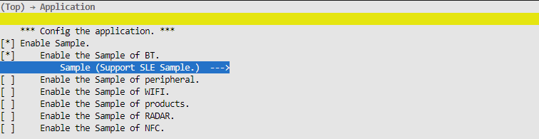

    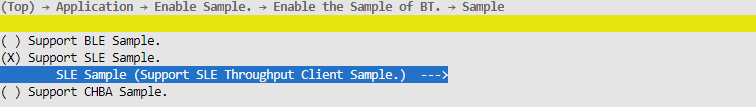

    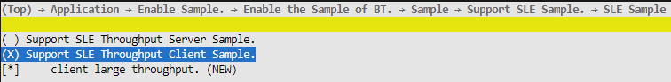

2.  After the configuration is complete, run the command python3 build.py  ws63-liteos-app, and flash the generated image into the board using BurnTool.

**Using the Sample<a name="section193796588269"></a>**

1.  Scanning: The sample automatically starts scanning on the first run and after disconnection, and stops scanning after a connection is established. You can process the discovered SLE devices in the sle\_sample\_seek\_result\_info\_cbk callback. Each time an SLE device is discovered, the sle\_sample\_seek\_result\_info\_cbk callback is invoked once.
2.  Connection: When a BLE device is scanned, you can use the sle\_connect\_remote\_device API to connect to the peer device. **It is not required to connect to the peer SLE device in the sle\_sample\_seek\_result\_info\_cbk callback, but the peer SLE device must be announcing.** Changes in the connection state are reported in the sle\_sample\_connect\_state\_changed\_cbk callback. The current sample stops scanning, pairing, service discovery, and other operations after a connection is established.
3.  Data transmission: Call the ssapc\_write\_req or ssapc\_write\_cmd API to send data to the server.
4.  Data reception: Process the received server data in the sle\_speed\_notification\_cb or sle\_speed\_indication\_cb callback.

> **Note:**
>For the input parameters in callbacks, you do not need to release the memory explicitly. After the callback returns, the protocol stack releases it automatically.

#### sle\_speed\_server Usage Guide<a name="ZH-CN_TOPIC_0000002199680897"></a>

**Compiling the Sample<a name="section3263150133311"></a>**

1.  Run the command "python3 build.py  ws63-liteos-app menuconfig" in the SDK root directory, and configure the corresponding build options as shown in the following figures.

    

    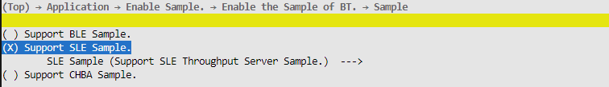

    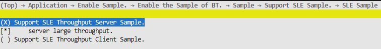

2.  After the configuration is complete, run the command python3 build.py  ws63-liteos-app, and flash the generated image into the board using BurnTool.

**Using the Sample<a name="section193796588269"></a>**

1.  Start announcement: Call the sle\_start\_announce API to start announcement. The current sample automatically starts announcement on the first run and when the server disconnects non-initiatively.
2.  Stop announcement: Announcement stops automatically after a connection is established, and this is reported in sle\_announce\_terminal\_cbk.
3.  Receive data: Process the data sent by the client in the ssaps\_write\_request\_cbk callback.
4.  Send data: Call the sle\_uuid\_server\_send\_report\_by\_handle\_id API to send data.
5.  Custom service and characteristic settings: The UUIDs of the custom service, characteristic, and descriptor are defined in "sle\_speed\_server/inc/sle\_speed\_server.h". The current sample defines a private service SLE\_UUID\_SERVER\_SERVICE, under which there is a characteristic SLE\_UUID\_SERVER\_NTF\_REPORT. The UUIDs need to be changed according to customer requirements. The UUIDs are described in detail below.

**Table 1** Server UUID description

<a name="table27521825165016"></a>
<table><thead align="left"><tr id="row575282545013"><th class="cellrowborder" valign="top" width="44.91%" id="mcps1.2.4.1.1"><p id="p063916414519"><a name="p063916414519"></a><a name="p063916414519"></a>Name</p>
</th>
<th class="cellrowborder" valign="top" width="26.06%" id="mcps1.2.4.1.2"><p id="p675292565013"><a name="p675292565013"></a><a name="p675292565013"></a>Description</p>
</th>
<th class="cellrowborder" valign="top" width="29.03%" id="mcps1.2.4.1.3"><p id="p1851311872920"><a name="p1851311872920"></a><a name="p1851311872920"></a>Sample Default Value</p>
</th>
</tr>
</thead>
<tbody><tr id="row675217253508"><td class="cellrowborder" valign="top" width="44.91%" headers="mcps1.2.4.1.1 "><p id="p151677504129"><a name="p151677504129"></a><a name="p151677504129"></a>SLE_UUID_SERVER_SERVICE</p>
</td>
<td class="cellrowborder" valign="top" width="26.06%" headers="mcps1.2.4.1.2 "><p id="p3752172517502"><a name="p3752172517502"></a><a name="p3752172517502"></a>Service UUID</p>
</td>
<td class="cellrowborder" valign="top" width="29.03%" headers="mcps1.2.4.1.3 "><p id="p19513111816298"><a name="p19513111816298"></a><a name="p19513111816298"></a>0xABCD</p>
</td>
</tr>
<tr id="row147520251505"><td class="cellrowborder" valign="top" width="44.91%" headers="mcps1.2.4.1.1 "><p id="p19838436151216"><a name="p19838436151216"></a><a name="p19838436151216"></a>SLE_UUID_SERVER_NTF_REPORT</p>
</td>
<td class="cellrowborder" valign="top" width="26.06%" headers="mcps1.2.4.1.2 "><p id="p67521625115017"><a name="p67521625115017"></a><a name="p67521625115017"></a>Characteristic UUID</p>
</td>
<td class="cellrowborder" valign="top" width="29.03%" headers="mcps1.2.4.1.3 "><p id="p349724552911"><a name="p349724552911"></a><a name="p349724552911"></a>0x1122</p>
</td>
</tr>
</tbody>
</table>

> **Note:**
>For the input parameters in callbacks, you do not need to release the memory explicitly. After the callback returns, the protocol stack releases it automatically.

#### Precautions<a name="ZH-CN_TOPIC_0000002164274550"></a>

In case of abnormal disconnection, restart announcement and scanning to ensure that the service can self-heal as much as possible in interference scenarios (it is recommended to self-heal when the **disconnection is not initiated by the local device** and when **pairing fails**).

## BLE&SLE Power Level Customization<a name="ZH-CN_TOPIC_0000001813678500"></a>

1.  In the NV configuration file middleware/chips/ws63/nv/nv\_config/cfg/acore/app.json, the entry with NV ID "0x20A0" is used to set the maximum power level of BLE&SLE, and the value indicates the maximum power level of BLE&SLE. Currently, the transmit power of each level is -6, -2, 2, 6, 10, 14, 16, 20.

    If it is set to 7, the available levels are 0\~7, corresponding to -6, -2, 2, 6, 10, 14, 16, 20 respectively;

    If it is set to 5, the available levels are 0\~5, corresponding to -6, -2, 2, 6, 10, 14 respectively.

    ```
    "bt_txpower":{
        "key_id": "0x20A0",
        "key_status": "alive",
        "structure_type": "btc_power_type_t",
        "attributions": 1,
        "value": [7]
    },
    ```

# Sensing Software Development<a name="ZH-CN_TOPIC_0000001820274885"></a>


## Overview<a name="ZH-CN_TOPIC_0000001773477878"></a>

The sensing feature periodically transmits and receives sensing signals to detect moving targets. Users can use this feature by calling the sensing APIs.

## Development Process<a name="ZH-CN_TOPIC_0000001820277561"></a>


### Data Structures<a name="ZH-CN_TOPIC_0000001773888862"></a>

Definition of the sensing status setting enumeration:

```
typedef enum {
    RADAR_STATUS_STOP = 0,  /* Stop sensing status configuration */
    RADAR_STATUS_START,     /* Start sensing status configuration */
    RADAR_STATUS_RESET,     /* Reset sensing status configuration */
    RADAR_STATUS_RESUME,    /* Resume sensing status configuration */
} radar_set_sts_t;
```

Definition of the sensing software status query enumeration:

```
typedef enum {
    RADAR_STATUS_IDLE = 0,  /* Sensing software is not working */
    RADAR_STATUS_RUNNING,   /* Sensing software is working */
} radar_get_sts_t;
```

Definition of the sensing hardware status query enumeration:

```
ypedef enum {
    RADAR_STATUS_HW_FAULT = 0,  /* Sensing hardware fault */
    RADAR_STATUS_HW_NORMAL,   /* Sensing hardware normal */
} radar_get_hardware_sts_t;
```

Definition of the sensing result reporting structure:

```
typedef struct {
    uint32_t lower_boundary;    /* Sensing result is near the lower detection boundary */
    uint32_t upper_boundary;    /* Sensing result is near the upper detection boundary */
    uint8_t is_human_presence;  /* Whether a human is present in the sensing result */
    uint8_t reserved_0;
    uint8_t reserved_1;
    uint8_t reserved_2;
} radar_result_t;
```

Definition of the radar single-frame result structure:

```
typedef struct {
    uint8_t gear_one_flag;    /* In the current frame sensing result, whether there is human motion at gear 1 (default: 1 meter horizontally from the sensing module) */
    uint8_t gear_two_flag;    /* In the current frame sensing result, whether there is human motion at gear 2 (default: 2 meters horizontally from the sensing module) */
    uint8_t gear_three_flag;  /* In the current frame sensing result, whether there is human motion at gear 3 (default: 6 meters horizontally from the sensing module) */
    uint8_t ai_flag;          /* AI result of the current frame sensing, whether it is human motion */
} radar_current_frame_result_t;
```

Definition of the data structure of the sensing result callback function:

```
typedef void (*radar_result_cb_t)(radar_result_t *result);
```

Definition of the data structure of the sensing debug information callback function:

```
typedef void (*radar_debug_info_cb_t)(int16_t *arr, uint8_t len);
```

Definition of the data structure of the callback function invoked after each sensing frame is computed:

```
typedef void (*radar_current_frame_result_cb_t)(radar_current_frame_result_t *result);
```

Definition of the sensing debug parameter structure:

```
typedef struct {
    uint8_t times;    // Number of subframe transmissions, default value 0 (transmit continuously), range 0~20
    uint8_t loop;     // Number of times the sensing waveform of a single subframe is transmitted in a loop, default value 8
    uint8_t ant;      // Receive path selection, default value 0
    uint8_t wave;     // Sensing transmit waveform type selection, default value 2
    uint8_t dbg_type; // Debug information output selection, default value 0 (only basic process logs are printed), range 0~4
    uint16_t period;  // Sensing subframe interval, in us, default value 5000, range 3000~100000
} radar_dbg_para_t;
```

Definition of the structure of the sensing algorithm parameter set selection parameters:

```
typedef struct {
    uint8_t height;       // Module mounting height: 1/2/3 m
    uint8_t scenario;     // Scenario: home/open space
    uint8_t material;     // Material obstructing the module's line of sight: plastic/metal
    uint8_t fusion_track; // Whether to fuse range tracking results
    uint8_t fusion_ai;    // Whether to fuse AI results
} radar_sel_para_t;
```

Definition of the sensing algorithm parameter structure:

```
typedef struct {
    uint8_t d_th_1m;    // Threshold for approaching the 1 m gear
    uint8_t d_th_2m;    // Threshold for approaching the 2 m gear
    uint8_t p_th;       // Threshold for presence in the 6 m gear
    uint8_t t_th_1m;    // Range tracking threshold for the 1 m gear
    uint8_t t_th_2m;    // Range tracking threshold for the 2 m gear
    uint8_t b_th_ratio; // Threshold for the ratio of anti-spectrum symmetric interference
    uint8_t b_th_cnt;   // Threshold for the count of anti-spectrum symmetric interference
    uint8_t a_th;       // Similarity threshold for AI human recognition
} radar_alg_para_t;
```

### APIs<a name="ZH-CN_TOPIC_0000001820408829"></a>

The sensing APIs are listed in the following table.

<a name="table22371515403"></a>
<table><thead align="left"><tr id="row227219117405"><th class="cellrowborder" valign="top" width="20.84%" id="mcps1.1.5.1.1"><p id="p1927281174018"><a name="p1927281174018"></a><a name="p1927281174018"></a>API Name</p>
</th>
<th class="cellrowborder" valign="top" width="23.79%" id="mcps1.1.5.1.2"><p id="p2272171144016"><a name="p2272171144016"></a><a name="p2272171144016"></a>Description</p>
</th>
<th class="cellrowborder" valign="top" width="28.02%" id="mcps1.1.5.1.3"><p id="p82723111408"><a name="p82723111408"></a><a name="p82723111408"></a>Parameter Description</p>
</th>
<th class="cellrowborder" valign="top" width="27.35%" id="mcps1.1.5.1.4"><p id="p14272181144015"><a name="p14272181144015"></a><a name="p14272181144015"></a>Return Value Description</p>
</th>
</tr>
</thead>
<tbody><tr id="row027210119403"><td class="cellrowborder" valign="top" width="20.84%" headers="mcps1.1.5.1.1 "><p id="p12764860585"><a name="p12764860585"></a><a name="p12764860585"></a>uapi_radar_set_status</p>
</td>
<td class="cellrowborder" valign="top" width="23.79%" headers="mcps1.1.5.1.2 "><p id="p169217338583"><a name="p169217338583"></a><a name="p169217338583"></a>Sets the sensing status.</p>
</td>
<td class="cellrowborder" valign="top" width="28.02%" headers="mcps1.1.5.1.3 "><p id="p1891165755816"><a name="p1891165755816"></a><a name="p1891165755816"></a>sts: Sensing status.</p>
</td>
<td class="cellrowborder" valign="top" width="27.35%" headers="mcps1.1.5.1.4 "><p id="p02728115407"><a name="p02728115407"></a><a name="p02728115407"></a>Return value: Error code.</p>
</td>
</tr>
<tr id="row1616011618525"><td class="cellrowborder" valign="top" width="20.84%" headers="mcps1.1.5.1.1 "><p id="p759656646"><a name="p759656646"></a><a name="p759656646"></a>uapi_radar_get_status</p>
</td>
<td class="cellrowborder" valign="top" width="23.79%" headers="mcps1.1.5.1.2 "><p id="p946181118512"><a name="p946181118512"></a><a name="p946181118512"></a>Obtains the sensing software status.</p>
</td>
<td class="cellrowborder" valign="top" width="28.02%" headers="mcps1.1.5.1.3 "><p id="p4839131192411"><a name="p4839131192411"></a><a name="p4839131192411"></a>*sts: Sensing software status.</p>
</td>
<td class="cellrowborder" valign="top" width="27.35%" headers="mcps1.1.5.1.4 "><p id="p416013619525"><a name="p416013619525"></a><a name="p416013619525"></a>Return value: Error code.</p>
</td>
</tr>
<tr id="row433461213529"><td class="cellrowborder" valign="top" width="20.84%" headers="mcps1.1.5.1.1 "><p id="p1521913368248"><a name="p1521913368248"></a><a name="p1521913368248"></a>uapi_radar_register_result_cb</p>
</td>
<td class="cellrowborder" valign="top" width="23.79%" headers="mcps1.1.5.1.2 "><p id="p2040044952415"><a name="p2040044952415"></a><a name="p2040044952415"></a>Registers the sensing result callback function.</p>
</td>
<td class="cellrowborder" valign="top" width="28.02%" headers="mcps1.1.5.1.3 "><p id="p111717605817"><a name="p111717605817"></a><a name="p111717605817"></a>cb: Callback function.</p>
</td>
<td class="cellrowborder" valign="top" width="27.35%" headers="mcps1.1.5.1.4 "><p id="p93341612145216"><a name="p93341612145216"></a><a name="p93341612145216"></a>Return value: Error code.</p>
</td>
</tr>
<tr id="row198641157519"><td class="cellrowborder" valign="top" width="20.84%" headers="mcps1.1.5.1.1 "><p id="p14865915185112"><a name="p14865915185112"></a><a name="p14865915185112"></a>uapi_radar_get_result</p>
</td>
<td class="cellrowborder" valign="top" width="23.79%" headers="mcps1.1.5.1.2 "><p id="p68656152510"><a name="p68656152510"></a><a name="p68656152510"></a>Obtains the reported sensing result.</p>
</td>
<td class="cellrowborder" valign="top" width="28.02%" headers="mcps1.1.5.1.3 "><p id="p186511153515"><a name="p186511153515"></a><a name="p186511153515"></a>*res: Reported sensing result.</p>
</td>
<td class="cellrowborder" valign="top" width="27.35%" headers="mcps1.1.5.1.4 "><p id="p19865315175119"><a name="p19865315175119"></a><a name="p19865315175119"></a>Return value: Error code.</p>
</td>
</tr>
<tr id="row7455151520524"><td class="cellrowborder" valign="top" width="20.84%" headers="mcps1.1.5.1.1 "><p id="p237215226548"><a name="p237215226548"></a><a name="p237215226548"></a>uapi_radar_set_delay_time</p>
</td>
<td class="cellrowborder" valign="top" width="23.79%" headers="mcps1.1.5.1.2 "><p id="p20438555155717"><a name="p20438555155717"></a><a name="p20438555155717"></a>Sets the exit delay time.</p>
</td>
<td class="cellrowborder" valign="top" width="28.02%" headers="mcps1.1.5.1.3 "><p id="p11781611508"><a name="p11781611508"></a><a name="p11781611508"></a>time: Exit delay time.</p>
</td>
<td class="cellrowborder" valign="top" width="27.35%" headers="mcps1.1.5.1.4 "><p id="p945561535210"><a name="p945561535210"></a><a name="p945561535210"></a>Return value: Error code.</p>
</td>
</tr>
<tr id="row075421825219"><td class="cellrowborder" valign="top" width="20.84%" headers="mcps1.1.5.1.1 "><p id="p1095042819543"><a name="p1095042819543"></a><a name="p1095042819543"></a>uapi_radar_get_delay_time</p>
</td>
<td class="cellrowborder" valign="top" width="23.79%" headers="mcps1.1.5.1.2 "><p id="p380774614577"><a name="p380774614577"></a><a name="p380774614577"></a>Obtains the exit delay time.</p>
</td>
<td class="cellrowborder" valign="top" width="28.02%" headers="mcps1.1.5.1.3 "><p id="p186220181402"><a name="p186220181402"></a><a name="p186220181402"></a>*time: Exit delay time.</p>
</td>
<td class="cellrowborder" valign="top" width="27.35%" headers="mcps1.1.5.1.4 "><p id="p13755111835210"><a name="p13755111835210"></a><a name="p13755111835210"></a>Return value: Error code.</p>
</td>
</tr>
<tr id="row3308174117548"><td class="cellrowborder" valign="top" width="20.84%" headers="mcps1.1.5.1.1 "><p id="p5203752105411"><a name="p5203752105411"></a><a name="p5203752105411"></a>uapi_radar_get_isolation</p>
</td>
<td class="cellrowborder" valign="top" width="23.79%" headers="mcps1.1.5.1.2 "><p id="p1153716360574"><a name="p1153716360574"></a><a name="p1153716360574"></a>Obtains the antenna isolation information.</p>
</td>
<td class="cellrowborder" valign="top" width="28.02%" headers="mcps1.1.5.1.3 "><p id="p156716278014"><a name="p156716278014"></a><a name="p156716278014"></a>*iso: Antenna isolation information.</p>
</td>
<td class="cellrowborder" valign="top" width="27.35%" headers="mcps1.1.5.1.4 "><p id="p8308134112547"><a name="p8308134112547"></a><a name="p8308134112547"></a>Return value: Error code.</p>
</td>
</tr>
<tr id="row12899234181811"><td class="cellrowborder" valign="top" width="20.84%" headers="mcps1.1.5.1.1 "><p id="p10276336556"><a name="p10276336556"></a><a name="p10276336556"></a>uapi_radar_set_debug_para</p>
</td>
<td class="cellrowborder" valign="top" width="23.79%" headers="mcps1.1.5.1.2 "><p id="p142773317553"><a name="p142773317553"></a><a name="p142773317553"></a>Sets debug parameters.</p>
</td>
<td class="cellrowborder" valign="top" width="28.02%" headers="mcps1.1.5.1.3 "><p id="p1027153314553"><a name="p1027153314553"></a><a name="p1027153314553"></a>*para: Debug parameters. Refer to the definition of the radar_dbg_para_t structure.</p>
</td>
<td class="cellrowborder" valign="top" width="27.35%" headers="mcps1.1.5.1.4 "><p id="p16273330555"><a name="p16273330555"></a><a name="p16273330555"></a>Return value: Error code.</p>
</td>
</tr>
<tr id="row9481239161815"><td class="cellrowborder" valign="top" width="20.84%" headers="mcps1.1.5.1.1 "><p id="p1436425516581"><a name="p1436425516581"></a><a name="p1436425516581"></a>uapi_radar_select_alg_para</p>
</td>
<td class="cellrowborder" valign="top" width="23.79%" headers="mcps1.1.5.1.2 "><p id="p3364195535818"><a name="p3364195535818"></a><a name="p3364195535818"></a>Sets the algorithm parameter set selection parameters.</p>
</td>
<td class="cellrowborder" valign="top" width="28.02%" headers="mcps1.1.5.1.3 "><p id="p1736415510584"><a name="p1736415510584"></a><a name="p1736415510584"></a>*para: Algorithm parameter set selection parameters. Refer to the definition of the radar_sel_para_t structure.</p>
</td>
<td class="cellrowborder" valign="top" width="27.35%" headers="mcps1.1.5.1.4 "><p id="p12364165525812"><a name="p12364165525812"></a><a name="p12364165525812"></a>Return value: Error code.</p>
</td>
</tr>
<tr id="row420715436188"><td class="cellrowborder" valign="top" width="20.84%" headers="mcps1.1.5.1.1 "><p id="p53575524581"><a name="p53575524581"></a><a name="p53575524581"></a>uapi_radar_set_alg_para</p>
</td>
<td class="cellrowborder" valign="top" width="23.79%" headers="mcps1.1.5.1.2 "><p id="p1335712523587"><a name="p1335712523587"></a><a name="p1335712523587"></a>Sets algorithm parameters.</p>
</td>
<td class="cellrowborder" valign="top" width="28.02%" headers="mcps1.1.5.1.3 "><p id="p53571052115819"><a name="p53571052115819"></a><a name="p53571052115819"></a>*para: Algorithm parameters. Refer to the definition of the radar_alg_para_t structure.</p>
<p id="p128242035151610"><a name="p128242035151610"></a><a name="p128242035151610"></a>write_to_flash: Whether to write to flash; 0 means not to write, 1 means to write.</p>
</td>
<td class="cellrowborder" valign="top" width="27.35%" headers="mcps1.1.5.1.4 "><p id="p1335718528581"><a name="p1335718528581"></a><a name="p1335718528581"></a>Return value: Error code.</p>
</td>
</tr>
<tr id="row11246164510389"><td class="cellrowborder" valign="top" width="20.84%" headers="mcps1.1.5.1.1 "><p id="p1680313316266"><a name="p1680313316266"></a><a name="p1680313316266"></a>uapi_radar_get_hardware_status</p>
</td>
<td class="cellrowborder" valign="top" width="23.79%" headers="mcps1.1.5.1.2 "><p id="p28038311263"><a name="p28038311263"></a><a name="p28038311263"></a>Obtains the sensing hardware status (query after the radar is enabled; the value queried by this API is invalid after the radar is disabled).</p>
</td>
<td class="cellrowborder" valign="top" width="28.02%" headers="mcps1.1.5.1.3 "><p id="p108031332616"><a name="p108031332616"></a><a name="p108031332616"></a>*sts: Sensing hardware status.</p>
</td>
<td class="cellrowborder" valign="top" width="27.35%" headers="mcps1.1.5.1.4 "><p id="p080353182613"><a name="p080353182613"></a><a name="p080353182613"></a>Return value: Error code.</p>
</td>
</tr>
<tr id="row171591157123813"><td class="cellrowborder" valign="top" width="20.84%" headers="mcps1.1.5.1.1 "><p id="p1421711119287"><a name="p1421711119287"></a><a name="p1421711119287"></a>uapi_radar_get_debug_info</p>
</td>
<td class="cellrowborder" valign="top" width="23.79%" headers="mcps1.1.5.1.2 "><p id="p621711113285"><a name="p621711113285"></a><a name="p621711113285"></a>Obtains sensing debug data.</p>
</td>
<td class="cellrowborder" valign="top" width="28.02%" headers="mcps1.1.5.1.3 "><p id="p152171811122813"><a name="p152171811122813"></a><a name="p152171811122813"></a>*arr: Address of the first element of the array that stores sensing debug data.</p>
<p id="p416919211295"><a name="p416919211295"></a><a name="p416919211295"></a>len: Length of the array that stores sensing debug data, greater than 0 and no more than 16.</p>
</td>
<td class="cellrowborder" valign="top" width="27.35%" headers="mcps1.1.5.1.4 "><p id="p1621751114281"><a name="p1621751114281"></a><a name="p1621751114281"></a>Return value: Error code.</p>
</td>
</tr>
<tr id="row147811353153817"><td class="cellrowborder" valign="top" width="20.84%" headers="mcps1.1.5.1.1 "><p id="p128719278293"><a name="p128719278293"></a><a name="p128719278293"></a>uapi_radar_register_debug_info_cb</p>
</td>
<td class="cellrowborder" valign="top" width="23.79%" headers="mcps1.1.5.1.2 "><p id="p1428792762920"><a name="p1428792762920"></a><a name="p1428792762920"></a>Registers the sensing debug data callback function.</p>
</td>
<td class="cellrowborder" valign="top" width="28.02%" headers="mcps1.1.5.1.3 "><p id="p1428710276299"><a name="p1428710276299"></a><a name="p1428710276299"></a>cb: Callback function.</p>
<p id="p271813415306"><a name="p271813415306"></a><a name="p271813415306"></a>period: Statistics period of sensing debug data (in frames), greater than 0 and less than 32768.</p>
</td>
<td class="cellrowborder" valign="top" width="27.35%" headers="mcps1.1.5.1.4 "><p id="p20287142716298"><a name="p20287142716298"></a><a name="p20287142716298"></a>Return value: Error code.</p>
</td>
</tr>
<tr id="row4442519122612"><td class="cellrowborder" valign="top" width="20.84%" headers="mcps1.1.5.1.1 "><p id="p94748811133"><a name="p94748811133"></a><a name="p94748811133"></a>uapi_radar_get_current_frame_result</p>
</td>
<td class="cellrowborder" valign="top" width="23.79%" headers="mcps1.1.5.1.2 "><p id="p11836213101315"><a name="p11836213101315"></a><a name="p11836213101315"></a>Obtains the reported result of the current sensing frame.</p>
</td>
<td class="cellrowborder" valign="top" width="28.02%" headers="mcps1.1.5.1.3 "><p id="p1799119141319"><a name="p1799119141319"></a><a name="p1799119141319"></a>*res: Reported result of the current sensing frame.</p>
</td>
<td class="cellrowborder" valign="top" width="27.35%" headers="mcps1.1.5.1.4 "><p id="p1753053113121"><a name="p1753053113121"></a><a name="p1753053113121"></a>Return value: Error code.</p>
</td>
</tr>
<tr id="row14692122313262"><td class="cellrowborder" valign="top" width="20.84%" headers="mcps1.1.5.1.1 "><p id="p1420885215135"><a name="p1420885215135"></a><a name="p1420885215135"></a>uapi_radar_register_current_frame_result_cb</p>
</td>
<td class="cellrowborder" valign="top" width="23.79%" headers="mcps1.1.5.1.2 "><p id="p61620013143"><a name="p61620013143"></a><a name="p61620013143"></a>Registers the current-frame sensing result callback function.</p>
</td>
<td class="cellrowborder" valign="top" width="28.02%" headers="mcps1.1.5.1.3 "><p id="p1660617891414"><a name="p1660617891414"></a><a name="p1660617891414"></a>cb: Callback function.</p>
</td>
<td class="cellrowborder" valign="top" width="27.35%" headers="mcps1.1.5.1.4 "><p id="p1242614713131"><a name="p1242614713131"></a><a name="p1242614713131"></a>Return value: Error code.</p>
</td>
</tr>
</tbody>
</table>

### Error Codes<a name="ZH-CN_TOPIC_0000001773729186"></a>

<a name="table54639314269"></a>
<table><thead align="left"><tr id="row1950714310264"><th class="cellrowborder" valign="top" width="9.09090909090909%" id="mcps1.1.5.1.1"><p id="p1550810310267"><a name="p1550810310267"></a><a name="p1550810310267"></a>No.</p>
</th>
<th class="cellrowborder" valign="top" width="40.40404040404041%" id="mcps1.1.5.1.2"><p id="p9508237262"><a name="p9508237262"></a><a name="p9508237262"></a>Definition</p>
</th>
<th class="cellrowborder" valign="top" width="14.14141414141414%" id="mcps1.1.5.1.3"><p id="p2508239265"><a name="p2508239265"></a><a name="p2508239265"></a>Actual Value</p>
</th>
<th class="cellrowborder" valign="top" width="36.36363636363636%" id="mcps1.1.5.1.4"><p id="p11508138268"><a name="p11508138268"></a><a name="p11508138268"></a>Description</p>
</th>
</tr>
</thead>
<tbody><tr id="row15081315264"><td class="cellrowborder" valign="top" width="9.09090909090909%" headers="mcps1.1.5.1.1 "><p id="p19508193202616"><a name="p19508193202616"></a><a name="p19508193202616"></a>1</p>
</td>
<td class="cellrowborder" valign="top" width="40.40404040404041%" headers="mcps1.1.5.1.2 "><p id="p551413454113"><a name="p551413454113"></a><a name="p551413454113"></a>ERRCODE_SUCC</p>
</td>
<td class="cellrowborder" valign="top" width="14.14141414141414%" headers="mcps1.1.5.1.3 "><p id="p35083342610"><a name="p35083342610"></a><a name="p35083342610"></a>0</p>
</td>
<td class="cellrowborder" valign="top" width="36.36363636363636%" headers="mcps1.1.5.1.4 "><p id="p95081731266"><a name="p95081731266"></a><a name="p95081731266"></a>Error code for successful execution.</p>
</td>
</tr>
<tr id="row35081335265"><td class="cellrowborder" valign="top" width="9.09090909090909%" headers="mcps1.1.5.1.1 "><p id="p25086318265"><a name="p25086318265"></a><a name="p25086318265"></a>2</p>
</td>
<td class="cellrowborder" valign="top" width="40.40404040404041%" headers="mcps1.1.5.1.2 "><p id="p151481351921"><a name="p151481351921"></a><a name="p151481351921"></a>ERRCODE_FAIL</p>
</td>
<td class="cellrowborder" valign="top" width="14.14141414141414%" headers="mcps1.1.5.1.3 "><p id="p118571415928"><a name="p118571415928"></a><a name="p118571415928"></a>0xFFFFFFFF</p>
</td>
<td class="cellrowborder" valign="top" width="36.36363636363636%" headers="mcps1.1.5.1.4 "><p id="p9508183172616"><a name="p9508183172616"></a><a name="p9508183172616"></a>Error code for execution failure.</p>
</td>
</tr>
</tbody>
</table>

## Precautions<a name="ZH-CN_TOPIC_0000001820404977"></a>

The sensing feature works on the Wi-Fi channel. Therefore, before enabling the radar, ensure that the Wi-Fi channel is configured; the Wi-Fi only needs to enter softAP or STA mode.

## Programming Example<a name="ZH-CN_TOPIC_0000001820317513"></a>

```
typedef void (*radar_result_cb_t)(radar_result_t *result);


#define WIFI_IFNAME_MAX_SIZE             16
#define WIFI_MAX_SSID_LEN                33
#define WIFI_SCAN_AP_LIMIT               64
#define WIFI_MAC_LEN                     6
#define WIFI_INIT_WAIT_TIME              500 // 5s
#define WIFI_START_STA_DELAY             100 // 1s

#define RADAR_STATUS_START               1
#define RADAR_STATUS_QUERY_DELAY         1000 // 10s
#define RADAR_QUIT_DELAY_TIME            12 // 12s

#define RADAR_DEFAULT_TIMES 0
#define RADAR_DEFAULT_LOOP 8
#define RADAR_DEFAULT_ANT 0
#define RADAR_DEFAULT_PERIOD 5000
#define RADAR_DEFAULT_DBG_TYPE 3
#define RADAR_DEFAULT_WAVE 2

#define RADAR_API_NO_HUMAN 0
#define RADAR_API_RANGE_CLOSE 50
#define RADAR_API_RANGE_NEAR 100
#define RADAR_API_RANGE_MEDIUM 200
#define RADAR_API_RANGE_FAR 600

#define RADAR_DBG_INFO_RPT_COEF 100
#define RADAR_DBG_INFO_LEN 16

// Example of starting the Wi-Fi STA mode
td_s32 radar_start_sta(td_void)
{
    (void)osDelay(WIFI_INIT_WAIT_TIME); /* 500: Delay 0.5s to wait for Wi-Fi initialization to complete */
    PRINT("STA try enable.\r\n");
    /* Create the STA interface */
    if (wifi_sta_enable() != 0) {
        PRINT("sta enbale fail !\r\n");
        return -1;
    }

    /* Connection succeeded */
    PRINT("STA connect success.\r\n");
    return 0;
}

// Example implementation of the sensing result callback function
static void radar_print_res(radar_result_t *res)
{
    PRINT("[RADAR_SAMPLE] lb:%u, ub:%u, hm:%u\r\n", res->lower_boundary, res->upper_boundary, res->is_human_presence);
}

static void radar_print_cur_frame_res(radar_current_frame_result_t *res)
{
    PRINT("[RADAR_SAMPLE] gear1:%u, gear2:%u, gear3:%u, ai:%u\r\n",
        res->gear_one_flag, res->gear_two_flag, res->gear_three_flag, res->ai_flag);
}

// The debug information items are as follows:
// 1. Whether the upper layer needs to write to flash
// 2. LNA * 10 + VGA
// 3. Raw echo peak value
// 4. Average MO1 noise floor over the past period frames
// 5. Average MO2 noise floor over the past period frames
// 6. Average DP noise floor over the past period frames
// 7. Average frame interval over the past period frames
// 8. Number of frames whose frame interval exceeds X ms over the past period frames
// 9. Number of frames whose bitmap count exceeds the X threshold over the past period frames
// 10. Number of frames whose bitmap ratio exceeds the X threshold over the past period frames
// 11. Number of frames included in the statistics over the past period frames
// 12. Maximum frame interval over the past period frames
// 13. Index of the maximum frame interval over the past period frames
// 14. MO1 threshold of the algorithm parameters currently in use
// 15. MO2 threshold of the algorithm parameters currently in use
// 16. DP threshold of the algorithm parameters currently in use
static void radar_print_dbg_info(int16_t *arr, uint8_t len)
{
    if (len > RADAR_DBG_INFO_LEN || len == 0) {
        return;
    }

    PRINT("dbg_info: %d,%d,%d,%d,%d,%d,%d,%d,%d,%d,%d,%d,%d,%d,%d,%d\r\n",
        arr[0], arr[1], arr[2], arr[3], arr[4], arr[5], arr[6], arr[7], arr[8], arr[9], arr[10],
        arr[11], arr[12], arr[13], arr[14], arr[15]);
}

static void radar_init_para(void)
{
    radar_dbg_para_t dbg_para;
    dbg_para.times = RADAR_DEFAULT_TIMES;
    dbg_para.loop = RADAR_DEFAULT_LOOP;
    dbg_para.ant = RADAR_DEFAULT_ANT;
    dbg_para.wave = RADAR_DEFAULT_WAVE;
    dbg_para.dbg_type = RADAR_DEFAULT_DBG_TYPE;
    dbg_para.period = RADAR_DEFAULT_PERIOD;
    uapi_radar_set_debug_para(&dbg_para);

    int16_t dly_time = RADAR_QUIT_DELAY_TIME;
    uapi_radar_set_delay_time(dly_time);

    radar_sel_para_t sel_para;
    sel_para.height = RADAR_HEIGHT_2M;
    sel_para.scenario = RADAR_SCENARIO_TYPE_HOME;
    sel_para.material = RADAR_MATERIAL_SINGLE;
    sel_para.fusion_track = true;
    sel_para.fusion_ai = true;
    uapi_radar_select_alg_para(&sel_para);

    // Algorithm thresholds: calibrate the first three using the tools/bin/radar_tool/radar_para_gen_tool tool, and use the default values provided in this sample for the remaining five
    radar_alg_para_t alg_para;
    alg_para.d_th_1m = 32;
    alg_para.d_th_2m = 25;
    alg_para.p_th = 25;
    alg_para.t_th_1m = 13;
    alg_para.t_th_2m = 26;
    alg_para.b_th_ratio = 20;
    alg_para.b_th_cnt = 4;
    alg_para.a_th = 70;
    uapi_radar_set_alg_para(&alg_para, 0);
}

int radar_demo_init(void *param)
{
    PRINT("[RADAR_SAMPLE] radar_demo_init sta!\r\n");

    param = param;
    // Start the Wi-Fi STA mode
    radar_start_sta();

    // Register the sensing result callback function
    uapi_radar_register_result_cb(radar_print_res);
    uapi_radar_register_current_frame_result_cb(radar_print_cur_frame_res);
    uapi_radar_register_debug_info_cb(radar_print_dbg_info, RADAR_DBG_INFO_RPT_COEF);

    // Start sensing
    (void)osDelay(WIFI_START_STA_DELAY);
    uapi_radar_set_status(RADAR_STATUS_SET_START);
    radar_init_para();

    // Example of sensing query APIs
    while(1) {
        (void)osDelay(RADAR_STATUS_QUERY_DELAY);
        uint8_t sts;
        uapi_radar_get_status(&sts);
        uint16_t time;
        uapi_radar_get_delay_time(&time);
        uint16_t iso;
        uapi_radar_get_isolation(&iso);
        radar_result_t res = {0};
        uapi_radar_get_result(&res);
        radar_current_frame_result_t cur_frame_res = {0};
        uapi_radar_get_current_frame_result(&cur_frame_res);
        int16_t arr[RADAR_DBG_INFO_LEN] = {0};
        uapi_radar_get_debug_info(arr, RADAR_DBG_INFO_LEN);
        radar_print_dbg_info(arr, RADAR_DBG_INFO_LEN);
    }

    return 0;
}
```

# Precautions<a name="ZH-CN_TOPIC_0000001793895849"></a>


## Watchdog<a name="ZH-CN_TOPIC_0000001747016212"></a>

**Overview<a name="section19528141716147"></a>**

WS63V100 provides the watchdog function by default. The watchdog is a timer with a specified (programmable) duration used for system exception recovery. If the timer is not refreshed, a system reset signal is generated when the timer expires. If the watchdog is disabled or kicked (that is, the timer is refreshed) before expiration, no reset signal is generated.

**Functional Description<a name="section1873826121416"></a>**

The APIs provided by the watchdog are listed in the following table.

<a name="table213321716161"></a>
<table><thead align="left"><tr id="row1513313173162"><th class="cellrowborder" valign="top" width="36.36%" id="mcps1.1.3.1.1"><p id="p12986192321615"><a name="p12986192321615"></a><a name="p12986192321615"></a>API Name</p>
</th>
<th class="cellrowborder" valign="top" width="63.63999999999999%" id="mcps1.1.3.1.2"><p id="p298617239162"><a name="p298617239162"></a><a name="p298617239162"></a>Description</p>
</th>
</tr>
</thead>
<tbody><tr id="row248652620584"><td class="cellrowborder" valign="top" width="36.36%" headers="mcps1.1.3.1.1 "><p id="p148662655817"><a name="p148662655817"></a><a name="p148662655817"></a>uapi_watchdog_enable(mode)</p>
</td>
<td class="cellrowborder" valign="top" width="63.63999999999999%" headers="mcps1.1.3.1.2 "><p id="p1032518301105"><a name="p1032518301105"></a><a name="p1032518301105"></a>Enables the watchdog;</p>
<p id="p148672618583"><a name="p148672618583"></a><a name="p148672618583"></a>The mode parameter is the working type (mode 0 is used by default);</p>
<p id="p1435414229019"><a name="p1435414229019"></a><a name="p1435414229019"></a>0: When the watchdog is triggered, the system is restarted;</p>
<p id="p17156753904"><a name="p17156753904"></a><a name="p17156753904"></a>1: When the watchdog is triggered, an interrupt is entered. If the watchdog is not fed in the interrupt, the system restarts.</p>
</td>
</tr>
<tr id="row14761122495813"><td class="cellrowborder" valign="top" width="36.36%" headers="mcps1.1.3.1.1 "><p id="p076182415585"><a name="p076182415585"></a><a name="p076182415585"></a>uapi_watchdog_disable()</p>
</td>
<td class="cellrowborder" valign="top" width="63.63999999999999%" headers="mcps1.1.3.1.2 "><p id="p57611524185820"><a name="p57611524185820"></a><a name="p57611524185820"></a>Disables the watchdog;</p>
</td>
</tr>
<tr id="row362019550416"><td class="cellrowborder" valign="top" width="36.36%" headers="mcps1.1.3.1.1 "><p id="p862035517414"><a name="p862035517414"></a><a name="p862035517414"></a>uapi_watchdog_set_time(timeout)</p>
</td>
<td class="cellrowborder" valign="top" width="63.63999999999999%" headers="mcps1.1.3.1.2 "><p id="p362012555415"><a name="p362012555415"></a><a name="p362012555415"></a>Sets the watchdog timeout duration, in seconds.</p>
</td>
</tr>
<tr id="row9133101751617"><td class="cellrowborder" valign="top" width="36.36%" headers="mcps1.1.3.1.1 "><p id="p12986112319166"><a name="p12986112319166"></a><a name="p12986112319166"></a>uapi_watchdog_kick()</p>
</td>
<td class="cellrowborder" valign="top" width="63.63999999999999%" headers="mcps1.1.3.1.2 "><p id="p0986102331610"><a name="p0986102331610"></a><a name="p0986102331610"></a>Kicks the watchdog and resets the watchdog timer.</p>
</td>
</tr>
</tbody>
</table>

**Development Guidelines<a name="section1981435614131"></a>**

The purpose of the watchdog is to expose hangs or meaningless infinite loops in the business logic. In normal business processes, the watchdog should be kicked periodically. When the business hangs abnormally or enters an infinite loop, the kick operation cannot be scheduled, and a reset signal is triggered after the watchdog timer expires.

The steps to modify the watchdog timeout are as follows:

1.  Call uapi\_watchdog\_disable to disable the watchdog. (It is enabled by default during initialization.)
2.  Call uapi\_watchdog\_set\_time to set the timeout.
3.  Call uapi\_watchdog\_enable to re-enable the watchdog.

The steps to kick the watchdog are as follows:

1.  Call uapi\_watchdog\_kick to refresh the watchdog timer to the configured timeout.

**Precautions<a name="section16414171431314"></a>**

The watchdog is enabled by default with a timeout of 15 s. The kick action is only retained in the IDLE thread of LiteOS. Therefore, in upper-layer application scenarios that heavily consume CPU and system resources, such as Wi-Fi traffic streaming, the IDLE thread may not be scheduled, and the application needs to actively call the kick API to kick the watchdog.

If the underlying kick is not desired and the upper-layer business needs to feed the watchdog, you can register a function for the kick action in the IDLE thread through the watchdog\_port\_idle\_kick\_register API to take over the feeding action. The watchdog\_port\_idle\_kick\_register function requires the drivers\\chips\\ws63\\porting\\liteos\\riscv31\\idle\_config.h header file.

Example code of the kick action in the IPERF traffic streaming function (kernel/liteos/liteos\_v207.0.0/Huawei\_LiteOS/net/los\_iperf/src/los\_iperf.c):

```
static void IperfFeedWdg(void)
{
    UINT32 ret = LOS_HistoryTaskCpuUsage(OsGetIdleTaskId(), CPUP_LAST_ONE_SECONDS);
    if (ret < IPERF_MIN_IDEL_RATE) {
        uapi_watchdog_kick();
    }
}
void IperfServerPhase2(IperfContext *context)
{
    int32_t recvLen;
    struct sockaddr peer;
    struct sockaddr *from = &peer;
    socklen_t slen = sizeof(struct sockaddr);
    socklen_t *fromLen = &slen;
    BOOL firstData = FALSE;
    IperfUdpHdr *udpHdr = (IperfUdpHdr *)context->param.buffer;
#ifdef LOSCFG_NET_IPERF_JITTER
    if (IPERF_IS_UDP(context->param.mask)) {
        context->udpStat->lastID = -1;
    }
#endif
    while ((context->isFinish == FALSE) && (context->isKilled == FALSE)) {
        recvLen = recvfrom(context->trafficSock, context->param.buffer,
                           context->param.bufLen, 0, from, fromLen);
        if (recvLen < 0) {
            if ((firstData == FALSE) && (errno == EAGAIN)) {
                continue;
            }
            IPERF_PRINT("recv failed %d\r\n", errno);
            break;
        } else if (recvLen == 0) { /* tcp connection closed by peer side */
            context->isFinish = TRUE;
            break;
        } else {
            if (firstData == FALSE) {
                firstData = TRUE;
                IperfServerFirstDataProcess(context, from, *fromLen);
                from = NULL;
                fromLen = NULL;
            }
            context->param.total += (uint32_t)recvLen;
            if (IperfServerDataProcess(context, (uint32_t)recvLen) && ((int32_t)ntohl(udpHdr->id) < 0)) {
                context->isFinish = TRUE;
                break;
            }
            UNUSED(udpHdr);
#ifdef IPERF_FEED_WDG
            IperfFeedWdg();
#endif /* IPERF_FEED_WDG */
        }
    }
    gettimeofday(&context->end, NULL);
}
```

