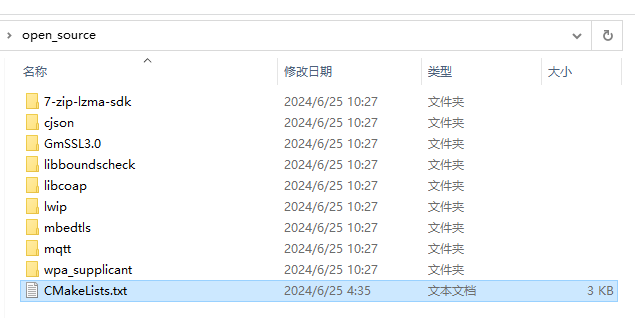
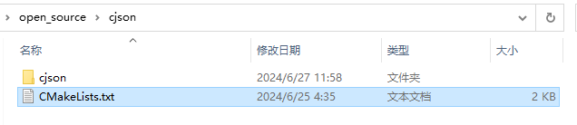
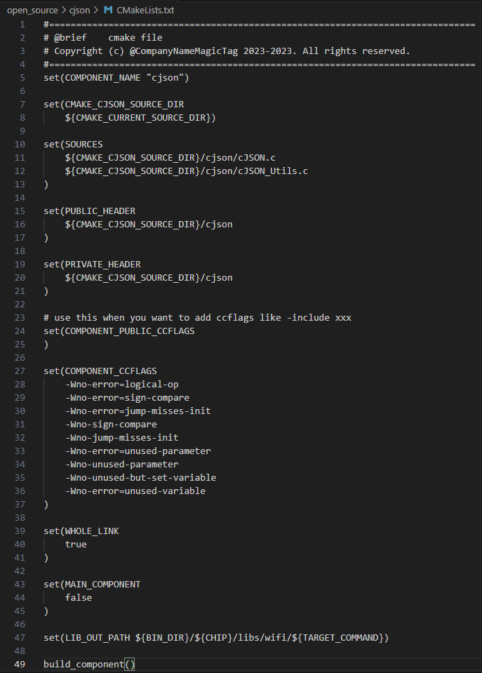
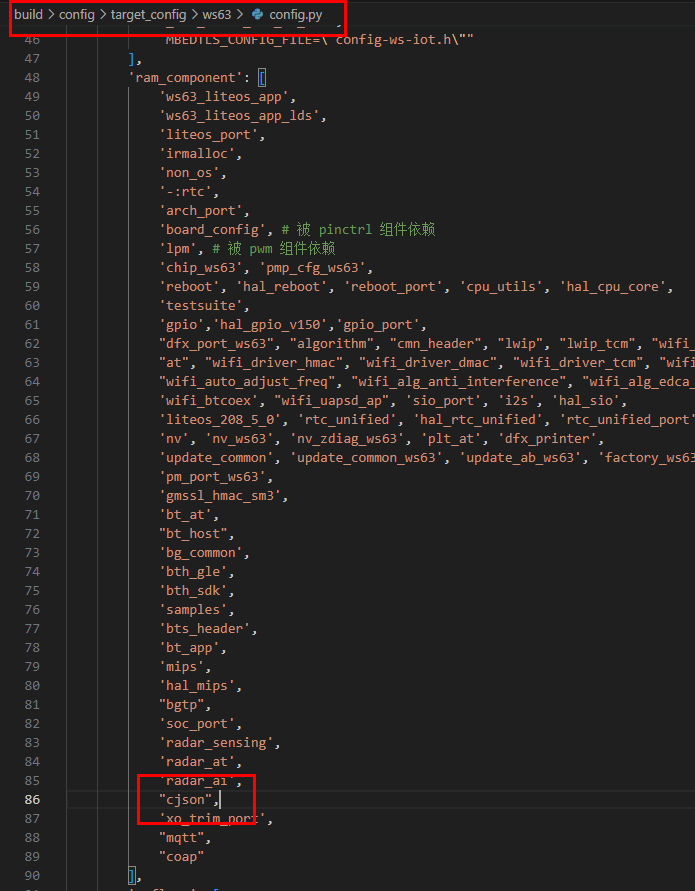

# Preface<a name="ZH-CN_TOPIC_0000001834645229"></a>

**Overview<a name="section4537382116410"></a>**

This document describes in detail the build operation guidance for porting third-party software into the WS63V100 SDK, and also provides answers to common issues and troubleshooting methods.

**Intended Audience<a name="section4378592816410"></a>**

This document is mainly applicable to the following engineers:

-   Technical support engineers
-   Software development engineers

**Symbol Conventions<a name="section133020216410"></a>**

The following symbols may appear in this document. Their meanings are described as follows.

<a name="table2622507016410"></a>
<table><thead align="left"><tr id="row1530720816410"><th class="cellrowborder" valign="top" width="20.580000000000002%" id="mcps1.1.3.1.1"><p id="p6450074116410"><a name="p6450074116410"></a><a name="p6450074116410"></a><strong id="b2136615816410"><a name="b2136615816410"></a><a name="b2136615816410"></a>Symbol</strong></p>
</th>
<th class="cellrowborder" valign="top" width="79.42%" id="mcps1.1.3.1.2"><p id="p5435366816410"><a name="p5435366816410"></a><a name="p5435366816410"></a><strong id="b5941558116410"><a name="b5941558116410"></a><a name="b5941558116410"></a>Description</strong></p>
</th>
</tr>
</thead>
<tbody><tr id="row1372280416410"><td class="cellrowborder" valign="top" width="20.580000000000002%" headers="mcps1.1.3.1.1 "><p id="p3734547016410"><a name="p3734547016410"></a><a name="p3734547016410"></a><a name="image2670064316410"></a><a name="image2670064316410"></a><span></span></p>
</td>
<td class="cellrowborder" valign="top" width="79.42%" headers="mcps1.1.3.1.2 "><p id="p1757432116410"><a name="p1757432116410"></a><a name="p1757432116410"></a>Indicates a hazard with a high level of risk that, if not avoided, will result in death or serious injury.</p>
</td>
</tr>
<tr id="row466863216410"><td class="cellrowborder" valign="top" width="20.580000000000002%" headers="mcps1.1.3.1.1 "><p id="p1432579516410"><a name="p1432579516410"></a><a name="p1432579516410"></a><a name="image4895582316410"></a><a name="image4895582316410"></a><span></span></p>
</td>
<td class="cellrowborder" valign="top" width="79.42%" headers="mcps1.1.3.1.2 "><p id="p959197916410"><a name="p959197916410"></a><a name="p959197916410"></a>Indicates a hazard with a medium level of risk that, if not avoided, could result in death or serious injury.</p>
</td>
</tr>
<tr id="row123863216410"><td class="cellrowborder" valign="top" width="20.580000000000002%" headers="mcps1.1.3.1.1 "><p id="p1232579516410"><a name="p1232579516410"></a><a name="p1232579516410"></a><a name="image1235582316410"></a><a name="image1235582316410"></a><span></span></p>
</td>
<td class="cellrowborder" valign="top" width="79.42%" headers="mcps1.1.3.1.2 "><p id="p123197916410"><a name="p123197916410"></a><a name="p123197916410"></a>Indicates a hazard with a low level of risk that, if not avoided, could result in minor or moderate injury.</p>
</td>
</tr>
<tr id="row5786682116410"><td class="cellrowborder" valign="top" width="20.580000000000002%" headers="mcps1.1.3.1.1 "><p id="p2204984716410"><a name="p2204984716410"></a><a name="p2204984716410"></a><a name="image4504446716410"></a><a name="image4504446716410"></a><span></span></p>
</td>
<td class="cellrowborder" valign="top" width="79.42%" headers="mcps1.1.3.1.2 "><p id="p4388861916410"><a name="p4388861916410"></a><a name="p4388861916410"></a>Used to convey device or environment safety warning information. If not avoided, it may result in device damage, data loss, degraded device performance, or other unpredictable results.</p>
<p id="p1238861916410"><a name="p1238861916410"></a><a name="p1238861916410"></a>"Caution" does not involve personal injury.</p>
</td>
</tr>
<tr id="row2856923116410"><td class="cellrowborder" valign="top" width="20.580000000000002%" headers="mcps1.1.3.1.1 "><p id="p5555360116410"><a name="p5555360116410"></a><a name="p5555360116410"></a><a name="image799324016410"></a><a name="image799324016410"></a><span></span></p>
</td>
<td class="cellrowborder" valign="top" width="79.42%" headers="mcps1.1.3.1.2 "><p id="p4612588116410"><a name="p4612588116410"></a><a name="p4612588116410"></a>Supplementary explanation of key information in the text.</p>
<p id="p1232588116410"><a name="p1232588116410"></a><a name="p1232588116410"></a>"Note" is not safety warning information and does not involve personal, device, or environmental damage.</p>
</td>
</tr>
</tbody>
</table>

**Revision History<a name="section2467512116410"></a>**

<a name="table1557726816410"></a>
<table><thead align="left"><tr id="row2942532716410"><th class="cellrowborder" valign="top" width="20.72%" id="mcps1.1.4.1.1"><p id="p3778275416410"><a name="p3778275416410"></a><a name="p3778275416410"></a><strong id="b5687322716410"><a name="b5687322716410"></a><a name="b5687322716410"></a>Document Version</strong></p>
</th>
<th class="cellrowborder" valign="top" width="26.119999999999997%" id="mcps1.1.4.1.2"><p id="p5627845516410"><a name="p5627845516410"></a><a name="p5627845516410"></a><strong id="b5800814916410"><a name="b5800814916410"></a><a name="b5800814916410"></a>Release Date</strong></p>
</th>
<th class="cellrowborder" valign="top" width="53.16%" id="mcps1.1.4.1.3"><p id="p2382284816410"><a name="p2382284816410"></a><a name="p2382284816410"></a><strong id="b3316380216410"><a name="b3316380216410"></a><a name="b3316380216410"></a>Modification Description</strong></p>
</th>
</tr>
</thead>
<tbody><tr id="row1187218238111"><td class="cellrowborder" valign="top" width="20.72%" headers="mcps1.1.4.1.1 "><p id="p1387242315111"><a name="p1387242315111"></a><a name="p1387242315111"></a>02</p>
</td>
<td class="cellrowborder" valign="top" width="26.119999999999997%" headers="mcps1.1.4.1.2 "><p id="p987222371117"><a name="p987222371117"></a><a name="p987222371117"></a>2024-06-27</p>
</td>
<td class="cellrowborder" valign="top" width="53.16%" headers="mcps1.1.4.1.3 "><a name="ul1825518116123"></a><a name="ul1825518116123"></a><ul id="ul1825518116123"><li>Updated the "<a href="cmake_build.md">CMake Build</a>" section.</li><li>Updated the "<a href="cmake_basic_syntax.md">CMake Basic Syntax</a>" section.</li></ul>
</td>
</tr>
<tr id="row1553015377329"><td class="cellrowborder" valign="top" width="20.72%" headers="mcps1.1.4.1.1 "><p id="p118382762110"><a name="p118382762110"></a><a name="p118382762110"></a>01</p>
</td>
<td class="cellrowborder" valign="top" width="26.119999999999997%" headers="mcps1.1.4.1.2 "><p id="p171834279217"><a name="p171834279217"></a><a name="p171834279217"></a>2024-04-10</p>
</td>
<td class="cellrowborder" valign="top" width="53.16%" headers="mcps1.1.4.1.3 "><p id="p618317279212"><a name="p618317279212"></a><a name="p618317279212"></a>First official version release.</p>
</td>
</tr>
<tr id="row5947359616410"><td class="cellrowborder" valign="top" width="20.72%" headers="mcps1.1.4.1.1 "><p id="p2149706016410"><a name="p2149706016410"></a><a name="p2149706016410"></a>00B01</p>
</td>
<td class="cellrowborder" valign="top" width="26.119999999999997%" headers="mcps1.1.4.1.2 "><p id="p648803616410"><a name="p648803616410"></a><a name="p648803616410"></a>2024-02-22</p>
</td>
<td class="cellrowborder" valign="top" width="53.16%" headers="mcps1.1.4.1.3 "><p id="p1946537916410"><a name="p1946537916410"></a><a name="p1946537916410"></a>First temporary version release.</p>
</td>
</tr>
</tbody>
</table>

# Porting Guide<a name="ZH-CN_TOPIC_0000001788005284"></a>


## Overview<a name="ZH-CN_TOPIC_0000001787902676"></a>

The WS63V100 SDK uses CMake as the build tool. Therefore, it is recommended to use CMake when porting third-party libraries, so as to ensure the integrity and consistency of compilation. The compilation of its main files depends on the CMakeLists.txt file. When a third-party component needs to be added and compiled, the CMake framework must be modified and extended, that is, modify CMakeLists.txt.

## CMake Build<a name="ZH-CN_TOPIC_0000001788062352"></a>

Taking the porting of cjson as an example (the SDK has integrated this component, and you can refer to the modifications in the corresponding files), the porting steps are as follows:

1.  Place the third-party component in the "opensource" directory (for example: opensource/cjson/cjson; add an extra path level to facilitate file path handling).
2.  In the "opensource" directory, find the CMakeLists.txt at this level and add a line to the file

    ```
    add_subdirectory_if_exist(cjson)
    ```

    This adds the corresponding "opensource/cjson" path to the build framework.

    

3.  Modify the CMakeList.txt in the opensource/cjson path of the newly added component (you can refer to existing third-party components).

    Set the component name:

    ```
    set(COMPONENT_NAME "cjson")
    ```

    Add xxx.c to the compilation:

    ```
    set(SOURCES xxx.c)
    ```

    Private header file reference path:

    ```
    set(PRIVATE_HEADER yyy)
    ```

    Private compilation parameters:

    ```
    set(COMPONENT_CCFLAGS zzz)
    ```

    Set the output path:

    ```
    set(LIB_OUT_PATH ...)
    ```

    

    

4.  Now, a component named "cjson" (COMPONENT\_NAME) has been successfully added to the framework. Finally, enable the compilation of this component. By modifying the "ram\_component" of the corresponding target in "build/config/target\_config/ws63/config.py", add the component to be compiled to the build process. For example:

    If the target to be compiled is named "ws63-liteos-app", find the ram\_component under the "ws63-liteos-app" dictionary and add the value "cjson" to this array. When the compilation of "ws63-liteos-app" is started (start the build using the IDE, or compile using python build.py), CMake will attempt to compile "cjson" (SOURCES).

    

# FAQ<a name="ZH-CN_TOPIC_0000001834701941"></a>

This chapter collects and sorts out common compilation issues encountered by users and provides users with basic references.


## CMake Basic Syntax<a name="ZH-CN_TOPIC_0000001834946241"></a>

In addition to "COMPONENT\_NAME", "SOURCES", "PRIVATE\_HEADER", "COMPONENT\_CCFLAGES", "LIB\_OUT\_PATH" mentioned above, public header files, public compilation parameters, and so on can also be defined.

Users can refer to the development process of the standard CMakeLists.txt to make customized modifications to the SDK.

If a third-party component already has a callable CMakeLists.txt, you can also directly use add\_subdirectory\_if\_exits\(xxx\) in the CMakeLists.txt under the opensource path to compile the folder.

## Header File Reference Issue<a name="ZH-CN_TOPIC_0000001788306644"></a>

When users need to reference the header files of a newly added third-party component during development, they can specify the public header files in the CMakeLists.txt of the third-party component.

For example, to reference "cJSON.h" under the cjson component (in fact, it is already referenced across all files; this is for reference only), you need to add the following to the CMakeLists.txt in opensource/cjson:

```
set （PUBLIC_HEADER ${CMAKE_CURRENT_SOURCE_DIR}/cjson/cJSON.h）
```

