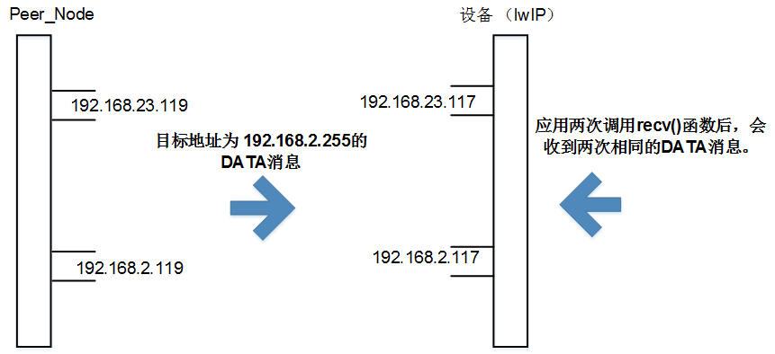

# Preface<a name="ZH-CN_TOPIC_0000001822998506"></a>

**Overview<a name="section4537382116410"></a>**

This document describes lwIP (A Lightweight TCP/IP stack), including an introduction to lwIP, application development, network security, and FAQ. This document is mainly used for adapting lwIP to Huawei LiteOS and for implementing additional features such as DNS clients and DHCP servers.

**Product Version<a name="section518mcpsimp"></a>**

The product versions corresponding to this document are as follows.

<a name="table521mcpsimp"></a>
<table><thead align="left"><tr id="row526mcpsimp"><th class="cellrowborder" valign="top" width="32%" id="mcps1.1.3.1.1"><p id="p528mcpsimp"><a name="p528mcpsimp"></a><a name="p528mcpsimp"></a><strong id="b529mcpsimp"><a name="b529mcpsimp"></a><a name="b529mcpsimp"></a>Product Name</strong></p>
</th>
<th class="cellrowborder" valign="top" width="68%" id="mcps1.1.3.1.2"><p id="p531mcpsimp"><a name="p531mcpsimp"></a><a name="p531mcpsimp"></a><strong id="b532mcpsimp"><a name="b532mcpsimp"></a><a name="b532mcpsimp"></a>Product Version</strong></p>
</th>
</tr>
</thead>
<tbody><tr id="row534mcpsimp"><td class="cellrowborder" valign="top" width="32%" headers="mcps1.1.3.1.1 "><p id="p536mcpsimp"><a name="p536mcpsimp"></a><a name="p536mcpsimp"></a>WS63</p>
</td>
<td class="cellrowborder" valign="top" width="68%" headers="mcps1.1.3.1.2 "><p id="p538mcpsimp"><a name="p538mcpsimp"></a><a name="p538mcpsimp"></a>V100</p>
</td>
</tr>
</tbody>
</table>

**Intended Audience<a name="section539mcpsimp"></a>**

This document is mainly intended for the following audiences:

-   Test engineers
-   Software development engineers

**Symbol Conventions<a name="section545mcpsimp"></a>**

The following symbols may appear in this document. Their meanings are as follows.

<a name="table548mcpsimp"></a>
<table><thead align="left"><tr id="row553mcpsimp"><th class="cellrowborder" valign="top" width="21%" id="mcps1.1.3.1.1"><p id="p555mcpsimp"><a name="p555mcpsimp"></a><a name="p555mcpsimp"></a><strong id="b556mcpsimp"><a name="b556mcpsimp"></a><a name="b556mcpsimp"></a>Symbol</strong></p>
</th>
<th class="cellrowborder" valign="top" width="79%" id="mcps1.1.3.1.2"><p id="p558mcpsimp"><a name="p558mcpsimp"></a><a name="p558mcpsimp"></a><strong id="b559mcpsimp"><a name="b559mcpsimp"></a><a name="b559mcpsimp"></a>Description</strong></p>
</th>
</tr>
</thead>
<tbody><tr id="row561mcpsimp"><td class="cellrowborder" valign="top" width="21%" headers="mcps1.1.3.1.1 "><p class="msonormal" id="p563mcpsimp"><a name="p563mcpsimp"></a><a name="p563mcpsimp"></a><a name="image109"></a><a name="image109"></a><span></span></p>
</td>
<td class="cellrowborder" valign="top" width="79%" headers="mcps1.1.3.1.2 "><p id="p565mcpsimp"><a name="p565mcpsimp"></a><a name="p565mcpsimp"></a>Indicates a hazard with a high level of risk that, if not avoided, will result in death or serious injury.</p>
</td>
</tr>
<tr id="row566mcpsimp"><td class="cellrowborder" valign="top" width="21%" headers="mcps1.1.3.1.1 "><p class="msonormal" id="p568mcpsimp"><a name="p568mcpsimp"></a><a name="p568mcpsimp"></a><a name="image110"></a><a name="image110"></a><span></span></p>
</td>
<td class="cellrowborder" valign="top" width="79%" headers="mcps1.1.3.1.2 "><p id="p570mcpsimp"><a name="p570mcpsimp"></a><a name="p570mcpsimp"></a>Indicates a hazard with a medium level of risk that, if not avoided, could result in death or serious injury.</p>
</td>
</tr>
<tr id="row571mcpsimp"><td class="cellrowborder" valign="top" width="21%" headers="mcps1.1.3.1.1 "><p class="msonormal" id="p573mcpsimp"><a name="p573mcpsimp"></a><a name="p573mcpsimp"></a><a name="image111"></a><a name="image111"></a><span></span></p>
</td>
<td class="cellrowborder" valign="top" width="79%" headers="mcps1.1.3.1.2 "><p id="p575mcpsimp"><a name="p575mcpsimp"></a><a name="p575mcpsimp"></a>Indicates a hazard with a low level of risk that, if not avoided, could result in minor or moderate injury.</p>
</td>
</tr>
<tr id="row576mcpsimp"><td class="cellrowborder" valign="top" width="21%" headers="mcps1.1.3.1.1 "><p class="msonormal" id="p578mcpsimp"><a name="p578mcpsimp"></a><a name="p578mcpsimp"></a><a name="image112"></a><a name="image112"></a><span></span></p>
</td>
<td class="cellrowborder" valign="top" width="79%" headers="mcps1.1.3.1.2 "><p id="p580mcpsimp"><a name="p580mcpsimp"></a><a name="p580mcpsimp"></a>Used to convey equipment or environment safety warnings. If not avoided, it may result in equipment damage, data loss, performance deterioration, or other unanticipated results.</p>
<p id="p581mcpsimp"><a name="p581mcpsimp"></a><a name="p581mcpsimp"></a>"Notice" does not involve personal injury.</p>
</td>
</tr>
<tr id="row582mcpsimp"><td class="cellrowborder" valign="top" width="21%" headers="mcps1.1.3.1.1 "><p class="msonormal" id="p584mcpsimp"><a name="p584mcpsimp"></a><a name="p584mcpsimp"></a><a name="image113"></a><a name="image113"></a><span></span></p>
</td>
<td class="cellrowborder" valign="top" width="79%" headers="mcps1.1.3.1.2 "><p id="p586mcpsimp"><a name="p586mcpsimp"></a><a name="p586mcpsimp"></a>Supplementary explanation of key information in the main text.</p>
<p id="p587mcpsimp"><a name="p587mcpsimp"></a><a name="p587mcpsimp"></a>"Note" is not a safety warning and does not involve personal, equipment, or environmental damage.</p>
</td>
</tr>
</tbody>
</table>

**Revision History<a name="section588mcpsimp"></a>**

<a name="table590mcpsimp"></a>
<table><thead align="left"><tr id="row596mcpsimp"><th class="cellrowborder" valign="top" width="15%" id="mcps1.1.4.1.1"><p id="p598mcpsimp"><a name="p598mcpsimp"></a><a name="p598mcpsimp"></a><strong id="b599mcpsimp"><a name="b599mcpsimp"></a><a name="b599mcpsimp"></a>Document Version</strong></p>
</th>
<th class="cellrowborder" valign="top" width="22%" id="mcps1.1.4.1.2"><p id="p601mcpsimp"><a name="p601mcpsimp"></a><a name="p601mcpsimp"></a><strong id="b602mcpsimp"><a name="b602mcpsimp"></a><a name="b602mcpsimp"></a>Release Date</strong></p>
</th>
<th class="cellrowborder" valign="top" width="63%" id="mcps1.1.4.1.3"><p id="p604mcpsimp"><a name="p604mcpsimp"></a><a name="p604mcpsimp"></a><strong id="b605mcpsimp"><a name="b605mcpsimp"></a><a name="b605mcpsimp"></a>Change Description</strong></p>
</th>
</tr>
</thead>
<tbody><tr id="row19521183013194"><td class="cellrowborder" valign="top" width="15%" headers="mcps1.1.4.1.1 "><p id="p14521113010196"><a name="p14521113010196"></a><a name="p14521113010196"></a>03</p>
</td>
<td class="cellrowborder" valign="top" width="22%" headers="mcps1.1.4.1.2 "><p id="p35211530171912"><a name="p35211530171912"></a><a name="p35211530171912"></a>2025-08-29</p>
</td>
<td class="cellrowborder" valign="top" width="63%" headers="mcps1.1.4.1.3 "><p id="p17360104154510"><a name="p17360104154510"></a><a name="p17360104154510"></a>Updated the content of the "<a href="faq.md">FAQ</a>" section.</p>
</td>
</tr>
<tr id="row0274317125115"><td class="cellrowborder" valign="top" width="15%" headers="mcps1.1.4.1.1 "><p id="p192741317185116"><a name="p192741317185116"></a><a name="p192741317185116"></a>02</p>
</td>
<td class="cellrowborder" valign="top" width="22%" headers="mcps1.1.4.1.2 "><p id="p1527471716515"><a name="p1527471716515"></a><a name="p1527471716515"></a>2024-06-27</p>
</td>
<td class="cellrowborder" valign="top" width="63%" headers="mcps1.1.4.1.3 "><p id="p0274141719517"><a name="p0274141719517"></a><a name="p0274141719517"></a>Updated the content of the "<a href="restrictions.md">Restrictions</a>" section.</p>
</td>
</tr>
<tr id="row1160063620135"><td class="cellrowborder" valign="top" width="15%" headers="mcps1.1.4.1.1 "><p id="p13477159577"><a name="p13477159577"></a><a name="p13477159577"></a>01</p>
</td>
<td class="cellrowborder" valign="top" width="22%" headers="mcps1.1.4.1.2 "><p id="p7347191514575"><a name="p7347191514575"></a><a name="p7347191514575"></a>2024-04-10</p>
</td>
<td class="cellrowborder" valign="top" width="63%" headers="mcps1.1.4.1.3 "><p id="p663512312573"><a name="p663512312573"></a><a name="p663512312573"></a>First official release.</p>
</td>
</tr>
<tr id="row607mcpsimp"><td class="cellrowborder" valign="top" width="15%" headers="mcps1.1.4.1.1 "><p id="p609mcpsimp"><a name="p609mcpsimp"></a><a name="p609mcpsimp"></a>00B01</p>
</td>
<td class="cellrowborder" valign="top" width="22%" headers="mcps1.1.4.1.2 "><p id="p611mcpsimp"><a name="p611mcpsimp"></a><a name="p611mcpsimp"></a>2024-03-15</p>
</td>
<td class="cellrowborder" valign="top" width="63%" headers="mcps1.1.4.1.3 "><p id="p613mcpsimp"><a name="p613mcpsimp"></a><a name="p613mcpsimp"></a>First temporary release.</p>
</td>
</tr>
</tbody>
</table>

# Overview<a name="ZH-CN_TOPIC_0000001864472805"></a>


## Background<a name="ZH-CN_TOPIC_0000001817593060"></a>

To migrate smart home chips to a lightweight operating system and TCP/IP protocol stack, lwIP was developed. Its features are as follows:

-   Lite Operating System is an RTOS, which means "lightweight real-time operating system". It is an RTOS specifically designed for the Cortex-M series, Cortex-R series, and Cortex-A series chip architectures. The system is mainly customized for smart terminals/wearable devices and currently has mature commercial applications.
-   Based on the open-source lwIP, additional features such as the DHCP server have been implemented.

## Third-Party Reference<a name="ZH-CN_TOPIC_0000001817752848"></a>

This document provides the following third-party application references for customers:

-   SNTP client: This lwIP does not re-implement the SNTP (Simple Network Time Protocol) client, but an implemented SNTP client already exists in the lwIP contrib open-source project for users.
-   Operating system adaptation layer code: The lwIP contrib contains code adapted to the Linux platform. LiteOS supports most POSIX (Portable Operating System Interface of UNIX) interfaces, and this code is used during integration.

## RFC (Request For Comments) Compliance<a name="ZH-CN_TOPIC_0000001864392613"></a>

> **Note:** 
>The protocols are implemented in accordance with industry standards and can interact with other chips normally. There are no proprietary protocols, and only a small number of these protocols are not fully compliant.

lwIP complies with the following RFC protocol standards:

-   RFC 791 \(IPv4 Standard\)
-   RFC 2460 \(IPv6 Standard\)
-   RFC 768 \(UDP\) User Datagram Protocol
-   RFC 793 \(TCP\) Transmission Control Protocol
-   RFC 792 \(ICMP\) Internet Control Message Protocol
-   RFC 826 \(ARP\) Address Resolution Protocol
-   RFC 1035 (DNS) DOMAIN NAMES - IMPLEMENTATION AND SPECIFICATION
-   RFC 2030 (SNTP) Simple Network Timer Protocal (SNTP) Version 4 for IPv4, IPv6 and OSI
-   RFC 2131 \(DHCP\) Dynamic Host Configuration Protocol
-   RFC 2018 \(SACK\) TCP Selective Acknowledgment Options
-   RFC 7323 \(Window Scaling\)
-   RFC 6675 \(SACK for TCP\) RFC 3927 \(Autoip\)  Dynamic Configuration of IPv4 Link-Local Addresses
-   RFC 2236 \(IGMP\) Internet Group Management Protocol, Version 2
-   RFC4861 \(ND for IPv6\) Neighbor Discovery for IP version 6 \(IPv6\)
-   RFC4443 Internet Control Message Protocol \(ICMPv6\) for the Internet Protocol Version 6 \(IPv6\) Specification
-   RFC4862 IPv6 Stateless Address Autoconfiguration
-   RFC2710 Multicast Listener Discovery \(MLD\) for IPv6

# Features<a name="ZH-CN_TOPIC_0000001864472809"></a>


## Supported Features<a name="ZH-CN_TOPIC_0000001817593064"></a>

lwIP supports the following features:

-   Internet Protocol version 4 (IPv4)

    IPv4 is a connectionless protocol used in packet-switched networks. This protocol delivers packets on a best-effort basis, which means it does not guarantee no packet loss, nor does it guarantee that all packets arrive in the correct order without duplication.

-   Internet Control Message Protocol (ICMP)

    One of the core protocols of the Internet protocol suite. This protocol is used to send notification messages such as "host unreachable" and can also send Ping messages such as "echo request" and "echo reply".

-   User Datagram Protocol (UDP)

    One of the core protocols of the Internet protocol suite. This protocol uses a simple connectionless transmission model and minimal protocol mechanism. It provides connectionless packet services with low latency but slightly weaker reliability. Therefore, this protocol exposes the unreliability of the underlying network protocols to user programs and cannot guarantee no packet loss, ordering, or no duplication. UDP provides checksums for data integrity and port numbers for addressing the source and destination of packets, among other functions.

-   Transmission Control Protocol (TCP)

    One of the core protocols of the Internet protocol suite. This protocol originated from the initial network implementation and complements IP. Therefore, the entire protocol suite is commonly called TCP/IP. TCP provides reliable, ordered, and error-checked transmission for applications on hosts over IP networks. Applications that do not require reliable data stream services can use UDP.

-   Domain Name System (DNS) client

    DNS is a hierarchical distributed naming system for computers, services, or resources connected to the Internet or a private network. lwIP supports a feature-minimal DNS client based on RFC 1035 (with domain name resolution support).

    In lwIP, DNS uses a configurable fallback mechanism between A records and AAAA records.

    The fallback mechanism means that if resolving a host name to an "A" record fails, DNS automatically attempts to resolve the host name to an "AAAA" record, or vice versa, without notifying the application that resolving the host name to the "A" record failed.

    The DNS response depends on the configuration parameter LWIP\_DNS\_ADDRTYPE\_DEFAULT. The possible values of this parameter are as follows:

    -   LWIP\_DNS\_ADDRTYPE\_IPV4

        DNS only responds with the A records of the host name that the client requests to resolve.

    -   LWIP\_DNS\_ADDRTYPE\_IPV6

        DNS only responds with the AAAA records of the host name that the client requests to resolve.

    -   LWIP\_DNS\_ADDRTYPE\_IPV4\_IPV6

        A records are resolved first. If that fails, it falls back to AAAA records.

    -   LWIP\_DNS\_ADDRTYPE\_IPV6\_IPV4

        AAAA records are resolved first. If that fails, it falls back to A records.

    lwIP supports obtaining multiple resolved IP addresses for a single host name.

    -   The "count" parameter should provide the number of IP addresses the client needs to resolve.
    -   The minimum value of "count" should be 1. If "count" is less than 1, DNS resolution fails and returns ERR \_ ARG.
    -   The maximum value of "count" equals the configurable DNS\_MAX\_IPADDR parameter.

        If the given "count" value is greater than DNS\_MAX\_IPADDR, only DNS\_MAX\_IPADDR resolved IP addresses of the host name at most are returned to the application.

    The DNS interface can be called in a blocking or non-blocking manner.

> **Note:** 
>DNS on lwIP 2.1.3 does not validate or modify the resolved IP addresses provided by the DNS server. DNS only checks whether the resolved IP address is correct. Therefore, the resolved IP addresses are returned directly to the application.

-   Dynamic Host Configuration Protocol (DHCP) client and server

    A standardized network protocol used on IP networks to dynamically allocate network configuration parameters such as interface IP addresses and service IP addresses. Through DHCP, computers automatically request IP addresses and network parameters from DHCP servers, reducing the workload of manual configuration by network administrators or users. lwIP supports the DHCP client and server based on RFC 2131.

    -   If the DHCPv4 range (address pool) uses the default configuration, start\_ip and ip\_num must be NULL.
    -   If the DHCPv4 range (address pool) needs to be configured manually, start\_ip and ip\_num must not be NULL.
    -   Regardless of whether the default address range or a manually configured address range is used, whether one allocatable IP is missing does not depend on whether the default address range is used, but on whether the server's IP address is within the address pool: if it is within the address pool, one is missing; if it is not within the address pool, none is missing.

        Note: The default address pool range currently starts from 2.

    -   When configuring the DHCPv4 range (address pool), if the DHCPv4 server's IP address is within the range of (ip\_start, ip\_start + ip\_num), the total number of addresses available in the client pool will be less than ip\_num, because one address in the pool will be occupied by the DHCPv4 server.
    -   The total number of addresses in the DHCPv4 range will be the minimum of ip\_num and LWIP\_DHCPS\_MAX\_LEASE.
    -   When manually configuring the DHCPv4 range, if ip\_start + ip\_num exceeds x.y.z.254, the total number of addresses in the pool can only start from (ip\_start, x.y.z.254). If the subnet mask is 255.255.0.0 or 255.255.255.128, the above condition does not apply.
    -   The DNS SERVER OPTION is returned by the DHCP server to the client. The DISCOVER and REQUEST packets do not carry this OPTION. In lwIP 2.1.2, the DNS server address has the following two cases:
        -   If an IPv4 DNS server is configured, the configured DNS addresses are returned (there may be 2).
        -   If no DNS address is configured, the interface IP address of the DHCP server is returned.

    -   The DHCPv4 server only responds with the primary DNS server address and does not provide a backup DNS server address; if the system is configured with two DNS addresses, both DNS server addresses are returned.

-   RFC 2131 deviation

    According to Section 4.3.2 of RFC 2131, the DHCPv4 server checks whether the client fills in server\_id in the Init-Reboot, Renew, or Rebinding states of DHCP REQUEST packets. If the client fills in server\_id in these states, the server will not accept these packets. However, in lwIP 2.1.2, the DHCPv4 server does not consider the Init-Reboot, Renew, or Rebinding states of the server\_id packet.

-   Ethernet Address Resolution Protocol (ARP)

    ARP is a telecommunication protocol used to resolve network layer addresses into link layer addresses and is an important function in multi-access networks. Huawei LiteOS lwIP 2.1.2 supports the ARP protocol and a configurable ARP table based on RFC 826.

-   Internet Group Management Protocol (IGMP)

    The IGMP protocol is used to deliver multicast group membership information between hosts and local routers. lwIP currently only supports IGMP v2 based on RFC 2236.

-   Socket interface types

    lwIP provides the following types of socket interfaces:

    -   Low-level interfaces that are not thread-safe
    -   Thread-safe Netconn interfaces

        BSD (Berkeley Software Distribution) style interfaces that internally call the Netconn interfaces. Providing Berkeley Software Distribution style interfaces helps applications migrate smoothly from the Linux TCP/IP stack to the lwIP TCP/IP stack.

-   TCP selective acknowledgment option

    This option is used to acknowledge out-of-order segments received by the stack, so that these selectively acknowledged segments can be skipped during retransmission in loss recovery.

> **Notice:** 
>Compared with the open-source code, lwIP has the following optimizations:
>-   Supports rich AT debugging commands.
>-   Multiple RFC compliance rectifications help improve compatibility with commercial routers.
>-   Provides the standard TCP SACK flow control algorithm (RFC 2018) to improve transmission performance in packet loss scenarios.
>-   Improves IPv6 protocol support, such as extended header field handling and Socket Interface Extensions.
>-   Adds the RDNS and RPL protocols.

## Unsupported Features<a name="ZH-CN_TOPIC_0000001817752852"></a>

Features or protocols not supported by lwIP are as follows:

-   PPPoS/PPPOE
-   SNMP agent (currently, lwIP only supports the private MIB)
-   IP forwarding over multiple network interfaces
-   Routing function (only terminal device functionality is supported)

The features of lwIP miniaturization are as follows:

-   Simple Network Time Protocol (SNTP)

    SNTP (Simple Network Time Protocol) is a clock synchronization network protocol between computer systems over packet-switched, variable-latency data networks. lwIP supports SNTP version 4 based on RFC 2030.

-   The lwip\_get\_conn\_info\(\) interface has the following restrictions:
    -   Call this function to obtain TCP or UDP connection information.
    -   The null pointer is of type tcpip\_conn.
    -   In the LISTEN state, this interface does not support obtaining TCP socket connection information.

-   TCP window scale option

    lwIP supports the TCP window scale option based on RFC 7323.

    -   The window scale option in TCP allows a 30-bit window size to be used in TCP connections instead of 16 bits.
    -   The window scale feature extends the TCP window size to 30 bits and then uses an implicit scaling factor to carry this 30-bit value in the 16-bit window field of the TCP header.
    -   The exponent of the scaling factor is carried in a TCP option named window scale.

-   lwIP supports the AutoIP module.
-   lwIP provides an interface for setting the Wi-Fi driver status.
-   lwIP provides an interface for setting the Wi-Fi driver status to the lwIP stack.

    -   When the Wi-Fi driver is busy, the lwIP stack stops sending messages.
    -   When the Wi-Fi driver is ready, the lwIP stack continues sending messages.

    If the driver does not wake up from the busy state before the DRIVER\_WAKEUP\_INTERVAL timeout expires, all TCP connections using this netif driver are deleted. Therefore, blocking connection calls wait for the netif driver to wake up, for SYN (Synchronize Sequence Numbers) retransmission, or for the TCP connection timeout to be cleared.

-   lwIP provides the PF\_PACKET option on SOCK\_RAW.

    lwIP supports SOCK\_RAW of the PF\_PACKET family. Applications can use this feature to create link layer sockets. Therefore, when the lwIP stack sends packets, it expects the application to include the link layer header. SOCK\_RAW packets are passed between device drivers without any change to the packet data.

    By default, all packets of the specified protocol type are delivered to one packet socket. To receive packets only from a specific interface, bind the socket to that interface. The sll \_ protocol and sll\_ifindex address fields are used for binding. When an application sends packets, it only needs to specify sll\_family, sll\_addr, sll\_halen, and sll\_ifindex. Other fields should be 0, and received packets set sll\_hatype and sll\_pkttype.

# Development Guidelines<a name="ZH-CN_TOPIC_0000001864392617"></a>

lwIP supports Ethernet or Wi-Fi. Applications must configure lwIP and adapt the drivers based on actual requirements.


## Prerequisites<a name="ZH-CN_TOPIC_0000001864472813"></a>

lwIP must meet the following prerequisites:

-   lwIP must be optimized before it can support Huawei LiteOS. Currently, lwIP does not support other operating systems. For details, see "[Optimizing lwIP](optimizing_lwip.md)".
-   Before using lwIP, update the driver code based on the lwIP-related configuration. For details, see the pseudocode in "[Porting Method](porting_method.md)".

## Dependencies<a name="ZH-CN_TOPIC_0000001817593068"></a>

The dependencies of lwIP are as follows:

-   Depends on Huawei LiteOS calls.
-   The Ethernet or Wi-Fi driver module is required to complete the sending and receiving of physical layer data.

## Using lwIP<a name="ZH-CN_TOPIC_0000001817752856"></a>

lwIP provides the BSD TCP/IP socket interface through which applications can connect. The advantages of lwIP are as follows:

-   Legacy application code running on the BSD TCP/IP protocol stack can be directly ported to lwIP.
-   lwIP supports the DHCP client feature for configuring dynamic IP addresses.
-   lwIP supports the DNS client feature, through which applications can resolve domain names.
-   lwIP consumes few resources and can meet the protocol stack requirements.

> **Notice:** 
>lwIP 2.1.3 uses socket as the external API. close\(\) is replaced by the closesocket\(\) interface, and the ioctl\(\) interface is replaced by the lwip\_ioctl\(\) interface, to avoid conflicts with the native interfaces of LiteOS.

## Porting Method<a name="ZH-CN_TOPIC_0000001864392621"></a>


### lwIP Initialization<a name="ZH-CN_TOPIC_0000001864472817"></a>

lwIP initialization is completed by the tcpip\_init\(\) interface. This interface accepts an optional callback function and its parameter (the parameter value can also be set to NULL). Once initialization is complete, the callback function is called with the corresponding parameter.

The example code is as follows:

```
void tcpip_init_func(void *arg) {
    printf("lwIP initialization successfully done");
}
void Init_lwIP() {
    tcpip_init(tcpip_init_func, NULL);
}
```

### Adding a Netif Interface and Driver Functionality<a name="ZH-CN_TOPIC_0000001817593072"></a>

After initialization, the application must add at least one netif interface for communication.

The application needs to implement related callback functions based on the driver type. The related link layer type, MAC address, and send callback function must be registered before use. If the promiscuous mode of the raw socket interface needs to be supported, a callback function implementing this feature must also be registered in the driver.

The Ethernet example code is as follows:

```
struct netif g_netif;
/* user_driver_send mentioned below is the pseudocode for the */
/* driver send function. It explains the prototype for the driver send function. */
/* User should implement this function based on their driver */
void user_driver_send(struct netif *netif, struct pbuf *p) {
    /* This will be the send function of the driver */
    /* It should send the data in pbuf p->payload of size p->tot_len */
}
/* user_driver_recv mentioned below is the pseudocode for the */
/* driver receive function. It explains how it should create pbuf */
/* and copy the incoming packets. User should implement this function */
/* based on their driver */
void user_driver_recv(char *data, int len) {
    /* This should be the receive function of the user driver */
    /* Once it receives the data it should do the following*/
    struct pbuf *p = NULL; 
    struct pbuf *q = NULL;
    p = pbuf_alloc(PBUF_RAW, (len + ETH_PAD_SIZE), PBUF_RAM);
    if (p == NULL) {
        printf("user_driver_recv : pbuf_alloc failed\n");
        return;
    }
    #if ETH_PAD_SIZE
    pbuf_header(p, -ETH_PAD_SIZE); /* drop the padding word */
    #endif
    memcpy(p->payload, data, len);
    #if ETH_PAD_SIZE
    pbuf_header(p, ETH_PAD_SIZE); /* reclaim the padding word */
    #endif
    driverif_input(&gnetif, p);
}
void eth_drv_config(struct netif *netif, u32_t config_flags,u8_t setBit) {
    /* Enable/Disable promiscuous mode in driver code. */
}
/* user_driver_init_func mentioned below is the pseudocode for the */
/* driver initialization function. It explains the lwIP configuration which needs to be */
/* done along with driver initialization. User should implement this function based on their driver */
void user_driver_init_func() {
    ip4_addr_t ipaddr, netmask, gw;
    /* After performing user driver initialization operation here */
    /* lwIP driver configuration needs to be done*/
    #ifndef lwIP_WITH_DHCP_CLIENT
    IP4_ADDR(gw, 192, 168, 2, 1);
    IP4_ADDR(ipaddr, 192, 168, 2, 5);
    IP4_ADDR(netmask, 255, 255, 255, 0);
    #endif
    g_netif.link_layer_type = ETHERNET_DRIVER_IF;
    g_netif.hwaddr_len = ETHARP_HWADDR_LEN;
    g_netif.drv_send = user_driver_send;
    memcpy(g_netif.hwaddr, driver_mac_address, ETHER_ADDR_LEN);
    #if LWIP_NETIF_PROMISC
    g_netif.drv_config = eth_drv_config;
    #endif
    #ifndef lwIP_WITH_DHCP_CLIENT
    netifapi_netif_add(&g_netif, ipaddr, netmask, gw);
    #else
    netifapi_netif_add(&g_netif, 0, 0, 0);
    #endif
    /* lwIP configuration ends */
}
void Init_Configure_lwIP() {
    Init_lwIP();
    user_driver_init_func();   
    netifapi_netif_set_up(&g_netif); 
    #ifndef lwIP_WITH_DHCP_CLIENT
    netifapi_dhcp_start(&g_netif);
    do {
        msleep(20);
    } while (netifapi_dhcp_is_bound(&g_netif) != ERR_OK);
    #endif
    printf("Network is up !!!\n");
}
```

## Optimizing lwIP<a name="ZH-CN_TOPIC_0000001817752860"></a>


### Optimizing Throughput<a name="ZH-CN_TOPIC_0000001864392625"></a>

To improve lwIP throughput in different application scenarios, the following optimization solutions are recommended:

-   Set the value of the macro MEMP\_NUM\_UDP\_PCB, that is, the number of UDP connections required.

    DHCP also creates a UDP connection, so this should be considered when setting the value of this macro.

-   Set the value of the macro MEMP\_NUM\_TCP\_PCB, that is, the number of TCP connections required.
-   Set the value of MEMP\_NUM\_RAW\_PCB, that is, the number of RAW connections required.

    The LWIP\_ENABLE\_LOS\_SHELL\_CMD module uses one RAW connection to execute the ping command.

-   Set the value of MEMP\_NUM\_NETCONN, that is, the total number of UDP, TCP, and RAW connections required.
    -   If neither LWIP\_ENABLE\_LOS\_SHELL\_CMD nor RAW connections are used, disable LWIP\_RAW.
    -   If UDP is not used, disable LWIP\_UDP. If TCP is not used, disable LWIP\_TCP.
    -   If the pbuf\_alloc\(\) call in the driver receive function fails to allocate PBUF\_RAM memory, increase MEM\_SIZE.
    -   If driverif\_input\(\) fails because no space is available for incoming packets in the TCPIP mbox, increase the values of TCPIP\_MBOX\_SIZE and MEMP\_NUM\_TCPIP\_MSG\_INPKT. If the driver module receives packets too quickly, driverif\_input may also fail due to unavailable packet space.

-   Disable all debugging options and do not define LWIP\_DEBUG.
-   If the architecture word length is 4, set ETH\_PAD\_SIZE to 2.

### Optimizing Memory<a name="ZH-CN_TOPIC_0000001864472821"></a>

To save lwIP memory space, the following optimization solutions are recommended:

-   In the driver receive function, call pbuf\_alloc\(\) to allocate PBUF\_POOL memory, set the value of PBUF\_POOL\_SIZE (that is, the number of pbuffers required), and set the value of PBUF\_POOL\_BUFSIZE based on the MTU.
-   Set the values of MEMP\_NUM\_TCP\_PCB, MEMP\_NUM\_UDP\_PCB, MEMP\_NUM\_RAW\_PCB, and MEMP\_NUM\_NETCONN based on the required numbers of TCP, UDP, and RAW connections and the total number of connections.
-   Based on the actual amount of data sent by the peer, the values of TCPIP\_MBOX\_SIZE and MEMP\_NUM\_TCPIP\_MSG\_INPKT can be reduced.
-   Disable all debugging options and do not define LWIP\_DEBUG.

    In lwipopts.h, change it to \#define LWIP\_DBG\_TYPES\_ON    LWIP\_DBG\_OFF.

-   Disable ETHARP\_TRUST\_IP\_MAC.
    -   If this macro is enabled, all received packets are used to update the ARP table.
    -   If this macro is disabled, the entries in the ARP table are updated only through ARP queries.

### Customization<a name="ZH-CN_TOPIC_0000001817593076"></a>

In actual applications, some functions may need to be customized. The usage of the macros newly defined in lwIP is described as follows:

-   LWIP\_DHCP

    When the user enables the DHCP server, the LWIP\_DHCPS macro must be enabled. If the LWIP\_DHCPS macro is enabled, LWIP\_DHCP must also be enabled.

-   LWIP\_DHCPS\_DISCOVER\_BROADCAST

    Normally, the DHCP server broadcasts or unicasts the Offer packet based on the flag set by the client in the Discover message. However, if the user wants to always broadcast the Offer message, the LWIP\_DHCPS\_DISCOVER\_BROADCAST macro can be enabled.

### lwIP Macros<a name="ZH-CN_TOPIC_0000001817752864"></a>

> **Note:** 
>lwIP 2.1.3 has many open-source configuration macros, not all of which are described here. For details, refer to the open-source link: [https://www.nongnu.org/lwip/2\_1\_x/index.html](https://www.nongnu.org/lwip/2_1_x/index.html). If modifications are required, contact the corresponding interface owner.

This section lists the lwIP macros. The descriptions of these macros are as follows (contact the corresponding interface owner if changes are required):

-   The default values of the lwIP macros are defined in the opt.h and lwipopts\_default.h header files.
-   The macro definitions in the lwipopts\_default.h header file override those in the opt.h header file.

**Table 1**  Macro list

<a name="table1242mcpsimp"></a>
<table><thead align="left"><tr id="row1248mcpsimp"><th class="cellrowborder" valign="top" width="32%" id="mcps1.2.3.1.1"><p id="p1250mcpsimp"><a name="p1250mcpsimp"></a><a name="p1250mcpsimp"></a>Macro</p>
</th>
<th class="cellrowborder" valign="top" width="68%" id="mcps1.2.3.1.2"><p id="p1252mcpsimp"><a name="p1252mcpsimp"></a><a name="p1252mcpsimp"></a>Description</p>
</th>
</tr>
</thead>
<tbody><tr id="row1254mcpsimp"><td class="cellrowborder" valign="top" width="32%" headers="mcps1.2.3.1.1 "><p id="p1256mcpsimp"><a name="p1256mcpsimp"></a><a name="p1256mcpsimp"></a>LWIP_AUTOIP</p>
</td>
<td class="cellrowborder" valign="top" width="68%" headers="mcps1.2.3.1.2 "><p id="p1258mcpsimp"><a name="p1258mcpsimp"></a><a name="p1258mcpsimp"></a>This macro is used to enable or disable the AUTOIP module.</p>
</td>
</tr>
<tr id="row1259mcpsimp"><td class="cellrowborder" valign="top" width="32%" headers="mcps1.2.3.1.1 "><p id="p1261mcpsimp"><a name="p1261mcpsimp"></a><a name="p1261mcpsimp"></a>MEM_SIZE</p>
</td>
<td class="cellrowborder" valign="top" width="68%" headers="mcps1.2.3.1.2 "><p id="p1263mcpsimp"><a name="p1263mcpsimp"></a><a name="p1263mcpsimp"></a>lwIP maintains a heap memory (including mem_malloc and mem_free) management module, which is used for dynamic memory allocation. This macro is used to define the size of the heap memory management module in lwIP.</p>
</td>
</tr>
<tr id="row1264mcpsimp"><td class="cellrowborder" valign="top" width="32%" headers="mcps1.2.3.1.1 "><p id="p1266mcpsimp"><a name="p1266mcpsimp"></a><a name="p1266mcpsimp"></a>MEM_LIBC_MALLOC</p>
</td>
<td class="cellrowborder" valign="top" width="68%" headers="mcps1.2.3.1.2 "><p id="p1268mcpsimp"><a name="p1268mcpsimp"></a><a name="p1268mcpsimp"></a>If this macro is enabled, the system calls malloc() and free() for all dynamic memory allocations, and the heap memory management module code in lwIP is disabled.</p>
</td>
</tr>
<tr id="row1269mcpsimp"><td class="cellrowborder" valign="top" width="32%" headers="mcps1.2.3.1.1 "><p id="p1271mcpsimp"><a name="p1271mcpsimp"></a><a name="p1271mcpsimp"></a>MEMP_MEM_MALLOC</p>
</td>
<td class="cellrowborder" valign="top" width="68%" headers="mcps1.2.3.1.2 "><p id="p1273mcpsimp"><a name="p1273mcpsimp"></a><a name="p1273mcpsimp"></a>lwIP provides a pool memory (including memp_malloc and memp_free) management module for frequently used structures.</p>
</td>
</tr>
<tr id="row1274mcpsimp"><td class="cellrowborder" valign="top" width="32%" headers="mcps1.2.3.1.1 "><p id="p1276mcpsimp"><a name="p1276mcpsimp"></a><a name="p1276mcpsimp"></a>MEM_ALIGNMENT</p>
</td>
<td class="cellrowborder" valign="top" width="68%" headers="mcps1.2.3.1.2 "><p id="p1278mcpsimp"><a name="p1278mcpsimp"></a><a name="p1278mcpsimp"></a>The value of this macro needs to be set based on the architecture. For example, for a 32-bit architecture, the value of this macro needs to be set to 4.</p>
</td>
</tr>
<tr id="row1279mcpsimp"><td class="cellrowborder" valign="top" width="32%" headers="mcps1.2.3.1.1 "><p id="p1281mcpsimp"><a name="p1281mcpsimp"></a><a name="p1281mcpsimp"></a>MEMP_NUM_TCP_PCB</p>
</td>
<td class="cellrowborder" valign="top" width="68%" headers="mcps1.2.3.1.2 "><p id="p1283mcpsimp"><a name="p1283mcpsimp"></a><a name="p1283mcpsimp"></a>This macro is used to set the number of TCP connections required at the same time.</p>
</td>
</tr>
<tr id="row1284mcpsimp"><td class="cellrowborder" valign="top" width="32%" headers="mcps1.2.3.1.1 "><p id="p1286mcpsimp"><a name="p1286mcpsimp"></a><a name="p1286mcpsimp"></a>MEMP_NUM_UDP_PCB</p>
</td>
<td class="cellrowborder" valign="top" width="68%" headers="mcps1.2.3.1.2 "><p id="p1288mcpsimp"><a name="p1288mcpsimp"></a><a name="p1288mcpsimp"></a>This macro is used to set the number of UDP connections required at the same time. When setting the value of this macro, the user must consider internal lwIP modules such as the DNS module and the DHCP module. The DHCP module creates a UDP connection for its own communication.</p>
</td>
</tr>
<tr id="row1289mcpsimp"><td class="cellrowborder" valign="top" width="32%" headers="mcps1.2.3.1.1 "><p id="p1291mcpsimp"><a name="p1291mcpsimp"></a><a name="p1291mcpsimp"></a>MEMP_NUM_RAW_PCB</p>
</td>
<td class="cellrowborder" valign="top" width="68%" headers="mcps1.2.3.1.2 "><p id="p1293mcpsimp"><a name="p1293mcpsimp"></a><a name="p1293mcpsimp"></a>This macro is used to set the number of RAW connections required at the same time.</p>
</td>
</tr>
<tr id="row1294mcpsimp"><td class="cellrowborder" valign="top" width="32%" headers="mcps1.2.3.1.1 "><p id="p1296mcpsimp"><a name="p1296mcpsimp"></a><a name="p1296mcpsimp"></a>MEMP_NUM_NETCONN</p>
</td>
<td class="cellrowborder" valign="top" width="68%" headers="mcps1.2.3.1.2 "><p id="p1298mcpsimp"><a name="p1298mcpsimp"></a><a name="p1298mcpsimp"></a>This macro is used to set the total number of TCP, UDP, and RAW connections. The value of this macro must be the sum of the values of the MEMP_NUM_TCP_PCB, MEMP_NUM_UDP_PCB, and MEMP_NUM_RAW_PCB macros.</p>
</td>
</tr>
<tr id="row1299mcpsimp"><td class="cellrowborder" valign="top" width="32%" headers="mcps1.2.3.1.1 "><p id="p1301mcpsimp"><a name="p1301mcpsimp"></a><a name="p1301mcpsimp"></a>MEMP_NUM_TCP_PCB_LISTEN</p>
</td>
<td class="cellrowborder" valign="top" width="68%" headers="mcps1.2.3.1.2 "><p id="p1303mcpsimp"><a name="p1303mcpsimp"></a><a name="p1303mcpsimp"></a>This macro is used to set the number of TCP connections required to be listened on at the same time.</p>
</td>
</tr>
<tr id="row1304mcpsimp"><td class="cellrowborder" valign="top" width="32%" headers="mcps1.2.3.1.1 "><p id="p1306mcpsimp"><a name="p1306mcpsimp"></a><a name="p1306mcpsimp"></a>MEMP_NUM_REASSDATA</p>
</td>
<td class="cellrowborder" valign="top" width="68%" headers="mcps1.2.3.1.2 "><p id="p1308mcpsimp"><a name="p1308mcpsimp"></a><a name="p1308mcpsimp"></a>This macro is used to set the number of IP packets queued for reassembly at the same time (complete packets, not fragmented packets).</p>
</td>
</tr>
<tr id="row1309mcpsimp"><td class="cellrowborder" valign="top" width="32%" headers="mcps1.2.3.1.1 "><p id="p1311mcpsimp"><a name="p1311mcpsimp"></a><a name="p1311mcpsimp"></a>MEMP_NUM_FRAG_PBUF</p>
</td>
<td class="cellrowborder" valign="top" width="68%" headers="mcps1.2.3.1.2 "><p id="p1313mcpsimp"><a name="p1313mcpsimp"></a><a name="p1313mcpsimp"></a>This macro is used to set the number of IP packets sent out at the same time (fragmented packets, not complete packets).</p>
</td>
</tr>
<tr id="row1314mcpsimp"><td class="cellrowborder" valign="top" width="32%" headers="mcps1.2.3.1.1 "><p id="p1316mcpsimp"><a name="p1316mcpsimp"></a><a name="p1316mcpsimp"></a>ARP_TABLE_SIZE</p>
</td>
<td class="cellrowborder" valign="top" width="68%" headers="mcps1.2.3.1.2 "><p id="p1318mcpsimp"><a name="p1318mcpsimp"></a><a name="p1318mcpsimp"></a>This macro is used to set the size of the ARP cache table.</p>
</td>
</tr>
<tr id="row1319mcpsimp"><td class="cellrowborder" valign="top" width="32%" headers="mcps1.2.3.1.1 "><p id="p1321mcpsimp"><a name="p1321mcpsimp"></a><a name="p1321mcpsimp"></a>ARP_QUEUEING</p>
</td>
<td class="cellrowborder" valign="top" width="68%" headers="mcps1.2.3.1.2 "><p id="p1323mcpsimp"><a name="p1323mcpsimp"></a><a name="p1323mcpsimp"></a>If this macro is enabled, multiple outgoing packets are queued during ARP resolution. If this macro is disabled, only the most recent packet sent by the upper layer can be kept for each destination address.</p>
</td>
</tr>
<tr id="row1324mcpsimp"><td class="cellrowborder" valign="top" width="32%" headers="mcps1.2.3.1.1 "><p id="p1326mcpsimp"><a name="p1326mcpsimp"></a><a name="p1326mcpsimp"></a>MEMP_NUM_ARP_QUEUE</p>
</td>
<td class="cellrowborder" valign="top" width="68%" headers="mcps1.2.3.1.2 "><p id="p1328mcpsimp"><a name="p1328mcpsimp"></a><a name="p1328mcpsimp"></a>This macro is used to set the number of outgoing packets (pbuf) queued at the same time. These outgoing packets are waiting for ARP responses to resolve the destination address. This macro only applies when ARP_QUEUEING is enabled.</p>
</td>
</tr>
<tr id="row1329mcpsimp"><td class="cellrowborder" valign="top" width="32%" headers="mcps1.2.3.1.1 "><p id="p1331mcpsimp"><a name="p1331mcpsimp"></a><a name="p1331mcpsimp"></a>ETHARP_TRUST_IP_MAC</p>
</td>
<td class="cellrowborder" valign="top" width="68%" headers="mcps1.2.3.1.2 "><p id="p1333mcpsimp"><a name="p1333mcpsimp"></a><a name="p1333mcpsimp"></a>If this macro is enabled, both the source IP address and the source MAC address in the ARP cache table are updated by all incoming packets. If this macro is disabled, the entries in the ARP cache table can only be updated through ARP queries.</p>
</td>
</tr>
<tr id="row1334mcpsimp"><td class="cellrowborder" valign="top" width="32%" headers="mcps1.2.3.1.1 "><p id="p1336mcpsimp"><a name="p1336mcpsimp"></a><a name="p1336mcpsimp"></a>ETH_PAD_SIZE</p>
</td>
<td class="cellrowborder" valign="top" width="68%" headers="mcps1.2.3.1.2 "><p id="p1338mcpsimp"><a name="p1338mcpsimp"></a><a name="p1338mcpsimp"></a>This macro is used to set the number of bytes added before the Ethernet header to ensure that the payload after the header is aligned. Since the header length is 14 bytes, the addresses in the IP header will not be aligned without padding. For example, in a 32-bit architecture, setting the value of this macro to 2 aligns the IP header length to 4 bytes and can also speed up packet delivery.</p>
</td>
</tr>
<tr id="row1339mcpsimp"><td class="cellrowborder" valign="top" width="32%" headers="mcps1.2.3.1.1 "><p id="p1341mcpsimp"><a name="p1341mcpsimp"></a><a name="p1341mcpsimp"></a>ETHARP_SUPPORT_STATIC_ENTRIES</p>
</td>
<td class="cellrowborder" valign="top" width="68%" headers="mcps1.2.3.1.2 "><p id="p1343mcpsimp"><a name="p1343mcpsimp"></a><a name="p1343mcpsimp"></a>This macro supports static updates of the ARP cache table through the application interfaces etharp_add_static_entry() and etharp_remove_static_entry().</p>
</td>
</tr>
<tr id="row1344mcpsimp"><td class="cellrowborder" valign="top" width="32%" headers="mcps1.2.3.1.1 "><p id="p1346mcpsimp"><a name="p1346mcpsimp"></a><a name="p1346mcpsimp"></a>IP_REASSEMBLY</p>
</td>
<td class="cellrowborder" valign="top" width="68%" headers="mcps1.2.3.1.2 "><p id="p1348mcpsimp"><a name="p1348mcpsimp"></a><a name="p1348mcpsimp"></a>This macro supports reassembly of IP fragmented packets.</p>
</td>
</tr>
<tr id="row1349mcpsimp"><td class="cellrowborder" valign="top" width="32%" headers="mcps1.2.3.1.1 "><p id="p1351mcpsimp"><a name="p1351mcpsimp"></a><a name="p1351mcpsimp"></a>IP_FRAG</p>
</td>
<td class="cellrowborder" valign="top" width="68%" headers="mcps1.2.3.1.2 "><p id="p1353mcpsimp"><a name="p1353mcpsimp"></a><a name="p1353mcpsimp"></a>This macro supports IP layer fragmentation of all outgoing packets.</p>
</td>
</tr>
<tr id="row1354mcpsimp"><td class="cellrowborder" valign="top" width="32%" headers="mcps1.2.3.1.1 "><p id="p1356mcpsimp"><a name="p1356mcpsimp"></a><a name="p1356mcpsimp"></a>IP_REASS_MAXAGE</p>
</td>
<td class="cellrowborder" valign="top" width="68%" headers="mcps1.2.3.1.2 "><p id="p1358mcpsimp"><a name="p1358mcpsimp"></a><a name="p1358mcpsimp"></a>This macro is used to set the timeout for IP incoming packet reassembly. lwIP can keep packets for IP_REASS_MAXAGE seconds for reassembly. If packets cannot be reassembled within this time, these fragmented packets are discarded.</p>
</td>
</tr>
<tr id="row1359mcpsimp"><td class="cellrowborder" valign="top" width="32%" headers="mcps1.2.3.1.1 "><p id="p1361mcpsimp"><a name="p1361mcpsimp"></a><a name="p1361mcpsimp"></a>IP_REASS_MAX_PBUFS</p>
</td>
<td class="cellrowborder" valign="top" width="68%" headers="mcps1.2.3.1.2 "><p id="p1363mcpsimp"><a name="p1363mcpsimp"></a><a name="p1363mcpsimp"></a>This macro is used to set the maximum number of fragments allowed for any IP incoming packet.</p>
</td>
</tr>
<tr id="row1364mcpsimp"><td class="cellrowborder" valign="top" width="32%" headers="mcps1.2.3.1.1 "><p id="p1366mcpsimp"><a name="p1366mcpsimp"></a><a name="p1366mcpsimp"></a>IP_FRAG_USES_STATIC_BUF</p>
</td>
<td class="cellrowborder" valign="top" width="68%" headers="mcps1.2.3.1.2 "><p id="p1368mcpsimp"><a name="p1368mcpsimp"></a><a name="p1368mcpsimp"></a>If this macro is enabled, static buffers are used for IP fragmentation; otherwise, dynamic memory is allocated.</p>
</td>
</tr>
<tr id="row1369mcpsimp"><td class="cellrowborder" valign="top" width="32%" headers="mcps1.2.3.1.1 "><p id="p1371mcpsimp"><a name="p1371mcpsimp"></a><a name="p1371mcpsimp"></a>IP_FRAG_MAX_MTU</p>
</td>
<td class="cellrowborder" valign="top" width="68%" headers="mcps1.2.3.1.2 "><p id="p1373mcpsimp"><a name="p1373mcpsimp"></a><a name="p1373mcpsimp"></a>This macro is used to set the maximum MTU size.</p>
</td>
</tr>
<tr id="row1374mcpsimp"><td class="cellrowborder" valign="top" width="32%" headers="mcps1.2.3.1.1 "><p id="p1376mcpsimp"><a name="p1376mcpsimp"></a><a name="p1376mcpsimp"></a>IP_DEFAULT_TTL</p>
</td>
<td class="cellrowborder" valign="top" width="68%" headers="mcps1.2.3.1.2 "><p id="p1378mcpsimp"><a name="p1378mcpsimp"></a><a name="p1378mcpsimp"></a>The default time-to-live (TTL) value of transport layer data packets.</p>
</td>
</tr>
<tr id="row1379mcpsimp"><td class="cellrowborder" valign="top" width="32%" headers="mcps1.2.3.1.1 "><p id="p1381mcpsimp"><a name="p1381mcpsimp"></a><a name="p1381mcpsimp"></a>LWIP_RAND</p>
</td>
<td class="cellrowborder" valign="top" width="68%" headers="mcps1.2.3.1.2 "><p id="p1383mcpsimp"><a name="p1383mcpsimp"></a><a name="p1383mcpsimp"></a>lwIP depends on the system random generator function, so a strong random number generator function must be called to set the value of this macro. Random numbers are used to generate random client ports for DNS and user TCP/UDP connections. In addition, random numbers are also used to create transaction IDs in DHCP and DNS and to create the ISS value in TCP.</p>
</td>
</tr>
<tr id="row1384mcpsimp"><td class="cellrowborder" valign="top" width="32%" headers="mcps1.2.3.1.1 "><p id="p1386mcpsimp"><a name="p1386mcpsimp"></a><a name="p1386mcpsimp"></a>LWIP_ICMP</p>
</td>
<td class="cellrowborder" valign="top" width="68%" headers="mcps1.2.3.1.2 "><p id="p1388mcpsimp"><a name="p1388mcpsimp"></a><a name="p1388mcpsimp"></a>This macro is used to enable the ICMP module.</p>
</td>
</tr>
<tr id="row1389mcpsimp"><td class="cellrowborder" valign="top" width="32%" headers="mcps1.2.3.1.1 "><p id="p1391mcpsimp"><a name="p1391mcpsimp"></a><a name="p1391mcpsimp"></a>ICMP_TTL</p>
</td>
<td class="cellrowborder" valign="top" width="68%" headers="mcps1.2.3.1.2 "><p id="p1393mcpsimp"><a name="p1393mcpsimp"></a><a name="p1393mcpsimp"></a>This macro is used to set the TTL value of ICMP messages.</p>
</td>
</tr>
<tr id="row1394mcpsimp"><td class="cellrowborder" valign="top" width="32%" headers="mcps1.2.3.1.1 "><p id="p1396mcpsimp"><a name="p1396mcpsimp"></a><a name="p1396mcpsimp"></a>LWIP_RAW</p>
</td>
<td class="cellrowborder" valign="top" width="68%" headers="mcps1.2.3.1.2 "><p id="p1398mcpsimp"><a name="p1398mcpsimp"></a><a name="p1398mcpsimp"></a>This macro supports enabling raw socket support in lwIP.</p>
</td>
</tr>
<tr id="row1399mcpsimp"><td class="cellrowborder" valign="top" width="32%" headers="mcps1.2.3.1.1 "><p id="p1401mcpsimp"><a name="p1401mcpsimp"></a><a name="p1401mcpsimp"></a>RAW_TTL</p>
</td>
<td class="cellrowborder" valign="top" width="68%" headers="mcps1.2.3.1.2 "><p id="p1403mcpsimp"><a name="p1403mcpsimp"></a><a name="p1403mcpsimp"></a>This macro is used to set the TTL value of raw socket messages.</p>
</td>
</tr>
<tr id="row1404mcpsimp"><td class="cellrowborder" valign="top" width="32%" headers="mcps1.2.3.1.1 "><p id="p1406mcpsimp"><a name="p1406mcpsimp"></a><a name="p1406mcpsimp"></a>LWIP_UDP</p>
</td>
<td class="cellrowborder" valign="top" width="68%" headers="mcps1.2.3.1.2 "><p id="p1408mcpsimp"><a name="p1408mcpsimp"></a><a name="p1408mcpsimp"></a>This macro supports enabling UDP connection support in lwIP.</p>
</td>
</tr>
<tr id="row1409mcpsimp"><td class="cellrowborder" valign="top" width="32%" headers="mcps1.2.3.1.1 "><p id="p1411mcpsimp"><a name="p1411mcpsimp"></a><a name="p1411mcpsimp"></a>UDP_TTL</p>
</td>
<td class="cellrowborder" valign="top" width="68%" headers="mcps1.2.3.1.2 "><p id="p1413mcpsimp"><a name="p1413mcpsimp"></a><a name="p1413mcpsimp"></a>This macro is used to set the TTL value of UDP socket messages.</p>
</td>
</tr>
<tr id="row1414mcpsimp"><td class="cellrowborder" valign="top" width="32%" headers="mcps1.2.3.1.1 "><p id="p1416mcpsimp"><a name="p1416mcpsimp"></a><a name="p1416mcpsimp"></a>LWIP_TCP</p>
</td>
<td class="cellrowborder" valign="top" width="68%" headers="mcps1.2.3.1.2 "><p id="p1418mcpsimp"><a name="p1418mcpsimp"></a><a name="p1418mcpsimp"></a>This macro supports enabling TCP connection support in lwIP.</p>
</td>
</tr>
<tr id="row1419mcpsimp"><td class="cellrowborder" valign="top" width="32%" headers="mcps1.2.3.1.1 "><p id="p1421mcpsimp"><a name="p1421mcpsimp"></a><a name="p1421mcpsimp"></a>TCP_TTL</p>
</td>
<td class="cellrowborder" valign="top" width="68%" headers="mcps1.2.3.1.2 "><p id="p1423mcpsimp"><a name="p1423mcpsimp"></a><a name="p1423mcpsimp"></a>This macro is used to set the TTL value of TCP socket messages.</p>
</td>
</tr>
<tr id="row1424mcpsimp"><td class="cellrowborder" valign="top" width="32%" headers="mcps1.2.3.1.1 "><p id="p1426mcpsimp"><a name="p1426mcpsimp"></a><a name="p1426mcpsimp"></a>TCP_WND</p>
</td>
<td class="cellrowborder" valign="top" width="68%" headers="mcps1.2.3.1.2 "><p id="p1428mcpsimp"><a name="p1428mcpsimp"></a><a name="p1428mcpsimp"></a>This macro is used to set the TCP window size.</p>
</td>
</tr>
<tr id="row1429mcpsimp"><td class="cellrowborder" valign="top" width="32%" headers="mcps1.2.3.1.1 "><p id="p1431mcpsimp"><a name="p1431mcpsimp"></a><a name="p1431mcpsimp"></a>TCP_MAXRTX</p>
</td>
<td class="cellrowborder" valign="top" width="68%" headers="mcps1.2.3.1.2 "><p id="p1433mcpsimp"><a name="p1433mcpsimp"></a><a name="p1433mcpsimp"></a>This macro is used to set the maximum number of retransmissions of TCP data packets.</p>
</td>
</tr>
<tr id="row1434mcpsimp"><td class="cellrowborder" valign="top" width="32%" headers="mcps1.2.3.1.1 "><p id="p1436mcpsimp"><a name="p1436mcpsimp"></a><a name="p1436mcpsimp"></a>TCP_SYNMAXRTX</p>
</td>
<td class="cellrowborder" valign="top" width="68%" headers="mcps1.2.3.1.2 "><p id="p1438mcpsimp"><a name="p1438mcpsimp"></a><a name="p1438mcpsimp"></a>This macro is used to set the maximum number of retransmissions of TCP SYN data packets.</p>
</td>
</tr>
<tr id="row1439mcpsimp"><td class="cellrowborder" valign="top" width="32%" headers="mcps1.2.3.1.1 "><p id="p1441mcpsimp"><a name="p1441mcpsimp"></a><a name="p1441mcpsimp"></a>TCP_FW1MAXRTX</p>
</td>
<td class="cellrowborder" valign="top" width="68%" headers="mcps1.2.3.1.2 "><p id="p1443mcpsimp"><a name="p1443mcpsimp"></a><a name="p1443mcpsimp"></a>This macro is used to set the maximum number of retransmissions of connection closing packets (that is, packets entering the FIN_WAIT_1 or CLOSING state).</p>
</td>
</tr>
<tr id="row1444mcpsimp"><td class="cellrowborder" valign="top" width="32%" headers="mcps1.2.3.1.1 "><p id="p1446mcpsimp"><a name="p1446mcpsimp"></a><a name="p1446mcpsimp"></a>TCP_QUEUE_OOSEQ</p>
</td>
<td class="cellrowborder" valign="top" width="68%" headers="mcps1.2.3.1.2 "><p id="p1448mcpsimp"><a name="p1448mcpsimp"></a><a name="p1448mcpsimp"></a>This macro supports caching received out-of-order data packets. If the user device has low memory, set the value of this macro to 0.</p>
</td>
</tr>
<tr id="row1449mcpsimp"><td class="cellrowborder" valign="top" width="32%" headers="mcps1.2.3.1.1 "><p id="p1451mcpsimp"><a name="p1451mcpsimp"></a><a name="p1451mcpsimp"></a>TCP_MSS</p>
</td>
<td class="cellrowborder" valign="top" width="68%" headers="mcps1.2.3.1.2 "><p id="p1453mcpsimp"><a name="p1453mcpsimp"></a><a name="p1453mcpsimp"></a>This macro is used to set the maximum segment size of TCP connections.</p>
</td>
</tr>
<tr id="row1454mcpsimp"><td class="cellrowborder" valign="top" width="32%" headers="mcps1.2.3.1.1 "><p id="p1456mcpsimp"><a name="p1456mcpsimp"></a><a name="p1456mcpsimp"></a>TCP_SND_BUF</p>
</td>
<td class="cellrowborder" valign="top" width="68%" headers="mcps1.2.3.1.2 "><p id="p1458mcpsimp"><a name="p1458mcpsimp"></a><a name="p1458mcpsimp"></a>This macro is used to set the size of the TCP send data buffer.</p>
</td>
</tr>
<tr id="row1459mcpsimp"><td class="cellrowborder" valign="top" width="32%" headers="mcps1.2.3.1.1 "><p id="p1461mcpsimp"><a name="p1461mcpsimp"></a><a name="p1461mcpsimp"></a>TCP_SND_QUEUELEN</p>
</td>
<td class="cellrowborder" valign="top" width="68%" headers="mcps1.2.3.1.2 "><p id="p1463mcpsimp"><a name="p1463mcpsimp"></a><a name="p1463mcpsimp"></a>This macro is used to set the length of the TCP send queue.</p>
</td>
</tr>
<tr id="row1464mcpsimp"><td class="cellrowborder" valign="top" width="32%" headers="mcps1.2.3.1.1 "><p id="p1466mcpsimp"><a name="p1466mcpsimp"></a><a name="p1466mcpsimp"></a>TCP_OOSEQ_MAX_BYTES</p>
</td>
<td class="cellrowborder" valign="top" width="68%" headers="mcps1.2.3.1.2 "><p id="p1468mcpsimp"><a name="p1468mcpsimp"></a><a name="p1468mcpsimp"></a>This macro is used to set the maximum number of bytes queued on the ooseq of each pcb. The default value is 0 (unlimited). Only applicable when TCP_QUEUE_OOSEQ=0.</p>
</td>
</tr>
<tr id="row1469mcpsimp"><td class="cellrowborder" valign="top" width="32%" headers="mcps1.2.3.1.1 "><p id="p1471mcpsimp"><a name="p1471mcpsimp"></a><a name="p1471mcpsimp"></a>TCP_OOSEQ_MAX_PBUFS</p>
</td>
<td class="cellrowborder" valign="top" width="68%" headers="mcps1.2.3.1.2 "><p id="p1473mcpsimp"><a name="p1473mcpsimp"></a><a name="p1473mcpsimp"></a>This macro is used to set the maximum number of pbuffers queued on the ooseq of each pcb. The default value is 0 (unlimited). Only applicable when TCP_QUEUE_OOSEQ=0.</p>
</td>
</tr>
<tr id="row1474mcpsimp"><td class="cellrowborder" valign="top" width="32%" headers="mcps1.2.3.1.1 "><p id="p1476mcpsimp"><a name="p1476mcpsimp"></a><a name="p1476mcpsimp"></a>TCP_LISTEN_BACKLOG</p>
</td>
<td class="cellrowborder" valign="top" width="68%" headers="mcps1.2.3.1.2 "><p id="p1478mcpsimp"><a name="p1478mcpsimp"></a><a name="p1478mcpsimp"></a>This macro supports enabling the backlog support feature during TCP listening.</p>
</td>
</tr>
<tr id="row1479mcpsimp"><td class="cellrowborder" valign="top" width="32%" headers="mcps1.2.3.1.1 "><p id="p1481mcpsimp"><a name="p1481mcpsimp"></a><a name="p1481mcpsimp"></a>LWIP_DHCP</p>
</td>
<td class="cellrowborder" valign="top" width="68%" headers="mcps1.2.3.1.2 "><p id="p1483mcpsimp"><a name="p1483mcpsimp"></a><a name="p1483mcpsimp"></a>This macro is used to enable the DHCP client module.</p>
</td>
</tr>
<tr id="row1484mcpsimp"><td class="cellrowborder" valign="top" width="32%" headers="mcps1.2.3.1.1 "><p id="p1486mcpsimp"><a name="p1486mcpsimp"></a><a name="p1486mcpsimp"></a>LWIP_DHCPS</p>
</td>
<td class="cellrowborder" valign="top" width="68%" headers="mcps1.2.3.1.2 "><p id="p1488mcpsimp"><a name="p1488mcpsimp"></a><a name="p1488mcpsimp"></a>This macro is used to enable the DHCP server module.</p>
</td>
</tr>
<tr id="row1489mcpsimp"><td class="cellrowborder" valign="top" width="32%" headers="mcps1.2.3.1.1 "><p id="p1491mcpsimp"><a name="p1491mcpsimp"></a><a name="p1491mcpsimp"></a>LWIP_IGMP</p>
</td>
<td class="cellrowborder" valign="top" width="68%" headers="mcps1.2.3.1.2 "><p id="p1493mcpsimp"><a name="p1493mcpsimp"></a><a name="p1493mcpsimp"></a>This macro is used to enable the IGMP module.</p>
</td>
</tr>
<tr id="row1494mcpsimp"><td class="cellrowborder" valign="top" width="32%" headers="mcps1.2.3.1.1 "><p id="p1496mcpsimp"><a name="p1496mcpsimp"></a><a name="p1496mcpsimp"></a>LWIP_SNTP</p>
</td>
<td class="cellrowborder" valign="top" width="68%" headers="mcps1.2.3.1.2 "><p id="p1498mcpsimp"><a name="p1498mcpsimp"></a><a name="p1498mcpsimp"></a>This macro is used to enable the SNTP client module.</p>
</td>
</tr>
<tr id="row1499mcpsimp"><td class="cellrowborder" valign="top" width="32%" headers="mcps1.2.3.1.1 "><p id="p1501mcpsimp"><a name="p1501mcpsimp"></a><a name="p1501mcpsimp"></a>LWIP_DNS</p>
</td>
<td class="cellrowborder" valign="top" width="68%" headers="mcps1.2.3.1.2 "><p id="p1503mcpsimp"><a name="p1503mcpsimp"></a><a name="p1503mcpsimp"></a>This macro is used to enable the DNS client module.</p>
</td>
</tr>
<tr id="row1504mcpsimp"><td class="cellrowborder" valign="top" width="32%" headers="mcps1.2.3.1.1 "><p id="p1506mcpsimp"><a name="p1506mcpsimp"></a><a name="p1506mcpsimp"></a>DNS_TABLE_SIZE</p>
</td>
<td class="cellrowborder" valign="top" width="68%" headers="mcps1.2.3.1.2 "><p id="p1508mcpsimp"><a name="p1508mcpsimp"></a><a name="p1508mcpsimp"></a>This macro is used to set the size of the DNS cache table.</p>
</td>
</tr>
<tr id="row1509mcpsimp"><td class="cellrowborder" valign="top" width="32%" headers="mcps1.2.3.1.1 "><p id="p1511mcpsimp"><a name="p1511mcpsimp"></a><a name="p1511mcpsimp"></a>DNS_MAX_NAME_LENGTH</p>
</td>
<td class="cellrowborder" valign="top" width="68%" headers="mcps1.2.3.1.2 "><p id="p1513mcpsimp"><a name="p1513mcpsimp"></a><a name="p1513mcpsimp"></a>This macro is used to set the maximum supported length of a domain name. According to the DNS RFC, the domain name length is set to 255. Modification is not recommended.</p>
</td>
</tr>
<tr id="row1514mcpsimp"><td class="cellrowborder" valign="top" width="32%" headers="mcps1.2.3.1.1 "><p id="p1516mcpsimp"><a name="p1516mcpsimp"></a><a name="p1516mcpsimp"></a>DNS_MAX_SERVERS</p>
</td>
<td class="cellrowborder" valign="top" width="68%" headers="mcps1.2.3.1.2 "><p id="p1518mcpsimp"><a name="p1518mcpsimp"></a><a name="p1518mcpsimp"></a>This macro is used to set the number of DNS servers.</p>
</td>
</tr>
<tr id="row1519mcpsimp"><td class="cellrowborder" valign="top" width="32%" headers="mcps1.2.3.1.1 "><p id="p1521mcpsimp"><a name="p1521mcpsimp"></a><a name="p1521mcpsimp"></a>DNS_MAX_IPADDR</p>
</td>
<td class="cellrowborder" valign="top" width="68%" headers="mcps1.2.3.1.2 "><p id="p1523mcpsimp"><a name="p1523mcpsimp"></a><a name="p1523mcpsimp"></a>This macro is used to set the maximum number of IP addresses that the DNS client can cache.</p>
</td>
</tr>
<tr id="row1524mcpsimp"><td class="cellrowborder" valign="top" width="32%" headers="mcps1.2.3.1.1 "><p id="p1526mcpsimp"><a name="p1526mcpsimp"></a><a name="p1526mcpsimp"></a>PBUF_LINK_HLEN</p>
</td>
<td class="cellrowborder" valign="top" width="68%" headers="mcps1.2.3.1.2 "><p id="p1528mcpsimp"><a name="p1528mcpsimp"></a><a name="p1528mcpsimp"></a>This macro is used to set the number of bytes that must be allocated to the link layer header, which should include the actual length and ETH_PAD_SIZE.</p>
</td>
</tr>
<tr id="row1529mcpsimp"><td class="cellrowborder" valign="top" width="32%" headers="mcps1.2.3.1.1 "><p id="p1531mcpsimp"><a name="p1531mcpsimp"></a><a name="p1531mcpsimp"></a>LWIP_NETIF_API</p>
</td>
<td class="cellrowborder" valign="top" width="68%" headers="mcps1.2.3.1.2 "><p id="p1533mcpsimp"><a name="p1533mcpsimp"></a><a name="p1533mcpsimp"></a>This macro is used to enable the thread-safe netif interface module (netiapi_*).</p>
</td>
</tr>
<tr id="row1534mcpsimp"><td class="cellrowborder" valign="top" width="32%" headers="mcps1.2.3.1.1 "><p id="p1536mcpsimp"><a name="p1536mcpsimp"></a><a name="p1536mcpsimp"></a>TCPIP_THREAD_NAME</p>
</td>
<td class="cellrowborder" valign="top" width="68%" headers="mcps1.2.3.1.2 "><p id="p1538mcpsimp"><a name="p1538mcpsimp"></a><a name="p1538mcpsimp"></a>This macro is used to set the name of the TCP/IP thread.</p>
</td>
</tr>
<tr id="row1539mcpsimp"><td class="cellrowborder" valign="top" width="32%" headers="mcps1.2.3.1.1 "><p id="p1541mcpsimp"><a name="p1541mcpsimp"></a><a name="p1541mcpsimp"></a>DEFAULT_RAW_RECVMBOX_SIZE</p>
</td>
<td class="cellrowborder" valign="top" width="68%" headers="mcps1.2.3.1.2 "><p id="p1543mcpsimp"><a name="p1543mcpsimp"></a><a name="p1543mcpsimp"></a>Each RAW connection maintains an incoming packet queue for buffering incoming packets until the application layer issues a receive notification. This macro is used to set the size of the receive message box queue.</p>
</td>
</tr>
<tr id="row1544mcpsimp"><td class="cellrowborder" valign="top" width="32%" headers="mcps1.2.3.1.1 "><p id="p1546mcpsimp"><a name="p1546mcpsimp"></a><a name="p1546mcpsimp"></a>DEFAULT_UDP_RECVMBOX_SIZE</p>
</td>
<td class="cellrowborder" valign="top" width="68%" headers="mcps1.2.3.1.2 "><p id="p1548mcpsimp"><a name="p1548mcpsimp"></a><a name="p1548mcpsimp"></a>Each UDP connection maintains an incoming packet queue for buffering incoming packets until the application layer issues a receive notification. This macro is used to set the size of the receive message box queue.</p>
</td>
</tr>
<tr id="row1549mcpsimp"><td class="cellrowborder" valign="top" width="32%" headers="mcps1.2.3.1.1 "><p id="p1551mcpsimp"><a name="p1551mcpsimp"></a><a name="p1551mcpsimp"></a>DEFAULT_TCP_RECVMBOX_SIZE</p>
</td>
<td class="cellrowborder" valign="top" width="68%" headers="mcps1.2.3.1.2 "><p id="p1553mcpsimp"><a name="p1553mcpsimp"></a><a name="p1553mcpsimp"></a>Each TCP connection maintains an incoming packet queue for buffering incoming packets until the application layer issues a receive notification. This macro is used to set the size of the receive message box queue.</p>
</td>
</tr>
<tr id="row1554mcpsimp"><td class="cellrowborder" valign="top" width="32%" headers="mcps1.2.3.1.1 "><p id="p1556mcpsimp"><a name="p1556mcpsimp"></a><a name="p1556mcpsimp"></a>DEFAULT_ACCEPTMBOX_SIZE</p>
</td>
<td class="cellrowborder" valign="top" width="68%" headers="mcps1.2.3.1.2 "><p id="p1558mcpsimp"><a name="p1558mcpsimp"></a><a name="p1558mcpsimp"></a>This macro is used to set the size of the message box queue to maintain incoming TCP connections.</p>
</td>
</tr>
<tr id="row1559mcpsimp"><td class="cellrowborder" valign="top" width="32%" headers="mcps1.2.3.1.1 "><p id="p1561mcpsimp"><a name="p1561mcpsimp"></a><a name="p1561mcpsimp"></a>TCPIP_MBOX_SIZE</p>
</td>
<td class="cellrowborder" valign="top" width="68%" headers="mcps1.2.3.1.2 "><p id="p1563mcpsimp"><a name="p1563mcpsimp"></a><a name="p1563mcpsimp"></a>This macro is used to set the message box queue of the TCP/IP thread. This queue can maintain all operation requests issued by application threads and driver threads.</p>
</td>
</tr>
<tr id="row1564mcpsimp"><td class="cellrowborder" valign="top" width="32%" headers="mcps1.2.3.1.1 "><p id="p1566mcpsimp"><a name="p1566mcpsimp"></a><a name="p1566mcpsimp"></a>LWIP_TCPIP_TIMEOUT</p>
</td>
<td class="cellrowborder" valign="top" width="68%" headers="mcps1.2.3.1.2 "><p id="p1568mcpsimp"><a name="p1568mcpsimp"></a><a name="p1568mcpsimp"></a>This macro supports enabling the feature of running any custom timer handler on the lwIP tcpip thread.</p>
</td>
</tr>
<tr id="row1569mcpsimp"><td class="cellrowborder" valign="top" width="32%" headers="mcps1.2.3.1.1 "><p id="p1571mcpsimp"><a name="p1571mcpsimp"></a><a name="p1571mcpsimp"></a>LWIP_SOCKET_START_NUM</p>
</td>
<td class="cellrowborder" valign="top" width="68%" headers="mcps1.2.3.1.2 "><p id="p1573mcpsimp"><a name="p1573mcpsimp"></a><a name="p1573mcpsimp"></a>This macro is used to set the starting number of the socket file descriptors created by lwIP.</p>
</td>
</tr>
<tr id="row1574mcpsimp"><td class="cellrowborder" valign="top" width="32%" headers="mcps1.2.3.1.1 "><p id="p1576mcpsimp"><a name="p1576mcpsimp"></a><a name="p1576mcpsimp"></a>LWIP_COMPAT_SOCKETS</p>
</td>
<td class="cellrowborder" valign="top" width="68%" headers="mcps1.2.3.1.2 "><p id="p1578mcpsimp"><a name="p1578mcpsimp"></a><a name="p1578mcpsimp"></a>This macro can create a Linux BSD macro for all socket interfaces.</p>
</td>
</tr>
<tr id="row1579mcpsimp"><td class="cellrowborder" valign="top" width="32%" headers="mcps1.2.3.1.1 "><p id="p1581mcpsimp"><a name="p1581mcpsimp"></a><a name="p1581mcpsimp"></a>LWIP_STATS</p>
</td>
<td class="cellrowborder" valign="top" width="68%" headers="mcps1.2.3.1.2 "><p id="p1583mcpsimp"><a name="p1583mcpsimp"></a><a name="p1583mcpsimp"></a>This macro is used to collect statistics on all online connections.</p>
</td>
</tr>
<tr id="row1584mcpsimp"><td class="cellrowborder" valign="top" width="32%" headers="mcps1.2.3.1.1 "><p id="p1586mcpsimp"><a name="p1586mcpsimp"></a><a name="p1586mcpsimp"></a>LWIP_SACK</p>
</td>
<td class="cellrowborder" valign="top" width="68%" headers="mcps1.2.3.1.2 "><p id="p1588mcpsimp"><a name="p1588mcpsimp"></a><a name="p1588mcpsimp"></a>This macro is used to enable or disable the SACK feature in lwIP. To enable both the sender and receiver SACK features, this macro needs to be enabled.</p>
</td>
</tr>
<tr id="row1589mcpsimp"><td class="cellrowborder" valign="top" width="32%" headers="mcps1.2.3.1.1 "><p id="p1591mcpsimp"><a name="p1591mcpsimp"></a><a name="p1591mcpsimp"></a>LWIP_SACK_DATA_SEG_PIGGYBACK</p>
</td>
<td class="cellrowborder" valign="top" width="68%" headers="mcps1.2.3.1.2 "><p id="p1593mcpsimp"><a name="p1593mcpsimp"></a><a name="p1593mcpsimp"></a>This macro is used to send the SACK option in data segments with the ACK flag set. If this macro is disabled, the SACK option can only be sent in empty ACK segments and in ACKs during bidirectional data transfer, but not in data segments.</p>
</td>
</tr>
<tr id="row1594mcpsimp"><td class="cellrowborder" valign="top" width="32%" headers="mcps1.2.3.1.1 "><p id="p1596mcpsimp"><a name="p1596mcpsimp"></a><a name="p1596mcpsimp"></a>MEM_PBUF_RAM_SIZE_LIMIT</p>
</td>
<td class="cellrowborder" valign="top" width="68%" headers="mcps1.2.3.1.2 "><p id="p1598mcpsimp"><a name="p1598mcpsimp"></a><a name="p1598mcpsimp"></a>This macro is used to determine whether to limit the size of PBUF_RAM memory allocated through pbuf_alloc(). It limits the operating system memory allocation for PBUF_RAM, rather than the allocation of internal buf memory.</p>
<p id="p1599mcpsimp"><a name="p1599mcpsimp"></a><a name="p1599mcpsimp"></a>This macro only applies when MEM_LIBC_MALLOC is enabled.</p>
</td>
</tr>
<tr id="row1600mcpsimp"><td class="cellrowborder" valign="top" width="32%" headers="mcps1.2.3.1.1 "><p id="p1602mcpsimp"><a name="p1602mcpsimp"></a><a name="p1602mcpsimp"></a>LWIP_PBUF_STATS</p>
</td>
<td class="cellrowborder" valign="top" width="68%" headers="mcps1.2.3.1.2 "><p id="p1604mcpsimp"><a name="p1604mcpsimp"></a><a name="p1604mcpsimp"></a>When MEM_PBUF_RAM_SIZE_LIMIT is enabled, this macro can enable or disable the debug printing of PBUF_RAM memory allocation statistics.</p>
</td>
</tr>
<tr id="row1605mcpsimp"><td class="cellrowborder" valign="top" width="32%" headers="mcps1.2.3.1.1 "><p id="p1607mcpsimp"><a name="p1607mcpsimp"></a><a name="p1607mcpsimp"></a>PBUF_RAM_SIZE_MIN</p>
</td>
<td class="cellrowborder" valign="top" width="68%" headers="mcps1.2.3.1.2 "><p id="p1609mcpsimp"><a name="p1609mcpsimp"></a><a name="p1609mcpsimp"></a>The minimum RAM memory that needs to be set through the pbuf_ram_size_set interface.</p>
</td>
</tr>
<tr id="row1610mcpsimp"><td class="cellrowborder" valign="top" width="32%" headers="mcps1.2.3.1.1 "><p id="p1612mcpsimp"><a name="p1612mcpsimp"></a><a name="p1612mcpsimp"></a>DRIVER_STATUS_CHECK</p>
</td>
<td class="cellrowborder" valign="top" width="68%" headers="mcps1.2.3.1.2 "><p id="p1614mcpsimp"><a name="p1614mcpsimp"></a><a name="p1614mcpsimp"></a>This macro can enable the notification of the driver send buffer status to the protocol stack through the netifapi_stop_queue and netifapi_wake_queue interfaces.</p>
</td>
</tr>
<tr id="row1615mcpsimp"><td class="cellrowborder" valign="top" width="32%" headers="mcps1.2.3.1.1 "><p id="p1617mcpsimp"><a name="p1617mcpsimp"></a><a name="p1617mcpsimp"></a>DRIVER_WAKEUP_INTERVAL</p>
</td>
<td class="cellrowborder" valign="top" width="68%" headers="mcps1.2.3.1.2 "><p id="p1619mcpsimp"><a name="p1619mcpsimp"></a><a name="p1619mcpsimp"></a>When the netif driver status changes to Busy and does not return to Ready before the timer times out, all TCP connections linked to this netif are cleared. The default value is 120000 milliseconds.</p>
</td>
</tr>
<tr id="row1620mcpsimp"><td class="cellrowborder" valign="top" width="32%" headers="mcps1.2.3.1.1 "><p id="p1622mcpsimp"><a name="p1622mcpsimp"></a><a name="p1622mcpsimp"></a>PBUF_LINK_CHKSUM_LEN</p>
</td>
<td class="cellrowborder" valign="top" width="68%" headers="mcps1.2.3.1.2 "><p id="p1624mcpsimp"><a name="p1624mcpsimp"></a><a name="p1624mcpsimp"></a>This macro gives the length of the link layer checksum filled in by the Ethernet driver.</p>
</td>
</tr>
<tr id="row1625mcpsimp"><td class="cellrowborder" valign="top" width="32%" headers="mcps1.2.3.1.1 "><p id="p1627mcpsimp"><a name="p1627mcpsimp"></a><a name="p1627mcpsimp"></a>LWIP_DEV_DEBUG</p>
</td>
<td class="cellrowborder" valign="top" width="68%" headers="mcps1.2.3.1.2 "><p id="p1629mcpsimp"><a name="p1629mcpsimp"></a><a name="p1629mcpsimp"></a>This macro is only for developer debugging. This macro must be disabled in user environments.</p>
</td>
</tr>
</tbody>
</table>

## Example Code<a name="ZH-CN_TOPIC_0000001864392629"></a>

This section lists some lwIP example code to illustrate the usage of lwIP. The lwIP example code includes pseudocode that describes the changes that need to be made on the driver (Ethernet or Wi-Fi) module. This example code, along with lwIP and Huawei LiteOS, is compiled with the HiSilicon platform cross compiler.

> **Notice:** 
>This example code must not be used directly for commercial purposes.


### Application Example Code<a name="ZH-CN_TOPIC_0000001864472825"></a>


#### UDP Example Code<a name="ZH-CN_TOPIC_0000001817593080"></a>

```
#include <stdio.h>
#include <netinet/in.h>
#include <string.h>
#include <errno.h>
#include <stdlib.h>
#define STACK_IP "192.168.2.5"
#define STACK_PORT 2277
#define PEER_PORT 3377
#define PEER_IP "192.168.2.2"
#define MSG "Hi, I am lwIP"
#define BUF_SIZE (1024 * 8)
typedef unsigned   char    u8_t;
typedef signed     int     s32_t;
u8_t g_buf[BUF_SIZE+1] = {0};
int sample_udp() {
    s32_t sfd;
    struct sockaddr_in srv_addr = {0};
    struct sockaddr_in cln_addr = {0};
    socklen_t cln_addr_len = sizeof(cln_addr);
    s32_t ret = 0, i = 0;
    /* socket creation */
    printf("going to call socket\n");
    sfd = socket(AF_INET,SOCK_DGRAM,0);
    if (sfd == -1) {
        printf("socket failed, return is %d\n", sfd);
        goto FAILURE;
    }
    printf("socket succeeded\n");
    srv_addr.sin_family = AF_INET;
    srv_addr.sin_addr.s_addr=inet_addr(STACK_IP);
    srv_addr.sin_port=htons(STACK_PORT);
    printf("going to call bind\n");
    ret = bind(sfd,(struct sockaddr*)&srv_addr, sizeof(srv_addr));
    if (ret != 0) {
        printf("bind failed, return is %d\n", ret);
        goto FAILURE;
    }
    printf("bind succeeded\n");
    /* socket creation */
    /* send */
    cln_addr.sin_family = AF_INET;
    cln_addr.sin_addr.s_addr=inet_addr(PEER_IP);
    cln_addr.sin_port=htons(PEER_PORT);
    printf("calling sendto...\n");
    memset(g_buf, 0, BUF_SIZE);
    strcpy(g_buf, MSG);
    ret = sendto(sfd, g_buf, strlen(MSG),
    0, (struct sockaddr *)&cln_addr,
    (socklen_t)sizeof(cln_addr));
    if (ret <= 0) {
        printf("sendto failed,return is %d\n", ret);
        goto FAILURE;
    }
    printf("sendto succeeded,return is %d\n", ret);
    /* send */
    /* recv */
    printf("going to call recvfrom\n");
    memset(g_buf, 0, BUF_SIZE);
    ret = recvfrom(sfd, g_buf, sizeof(g_buf), 0,
    (struct sockaddr *)&cln_addr, &cln_addr_len);
    if (ret <= 0) {
        printf("recvfrom failed,
        return is %d\n", ret);
        goto FAILURE;
    }
    printf("recvfrom succeeded, return is %d\n", ret);
    printf("received msg is : %s\n", g_buf);
    printf("client ip %x, port %d\n",
    cln_addr.sin_addr.s_addr,
    cln_addr.sin_port);
    /* recv */
    close(sfd);
    return 0;
    FAILURE:
    printf("failed, errno is %d\n", errno);
    close(sfd);
    return -1;
}
int main() {
    int ret;
    ret = sample_udp();
    if (ret != 0) {
        printf("Sample Test case failed\n");
        exit(0);
    }
    return 0;
}
```

#### TCP Client Example Code<a name="ZH-CN_TOPIC_0000001817752868"></a>

```
#include <stdio.h>
#include <netinet/in.h>
#include <string.h>
#include <errno.h>
#include <stdlib.h>
#define STACK_IP "192.168.2.5"
#define STACK_PORT 2277
#define PEER_PORT 3377
#define PEER_IP "192.168.2.2"
#define MSG "Hi, I am lwIP"
#define BUF_SIZE (1024 * 8)
typedef unsigned   char    u8_t;
typedef signed     int     s32_t;
u8_t g_buf[BUF_SIZE+1] = {0};
/* Global variable for lwIP Network interface */
int sample_tcp_client() {
    s32_t sfd = -1;
    struct sockaddr_in srv_addr = {0};
    struct sockaddr_in cln_addr = {0};
    socklen_t cln_addr_len = sizeof(cln_addr);
    s32_t ret = 0, i = 0;
    /* tcp client connection */
    printf("going to call socket\n");
    sfd = socket(AF_INET,SOCK_STREAM,0);
    if (sfd == -1) {
        printf("socket failed, return is %d\n", sfd);
        goto FAILURE;
    }
    printf("socket succeeded, sfd %d\n", sfd);
    srv_addr.sin_family = AF_INET;
    srv_addr.sin_addr.s_addr = inet_addr(PEER_IP);
    srv_addr.sin_port = htons(PEER_PORT);
    printf("going to call connect\n");
    ret = connect(sfd, (struct sockaddr *)&srv_addr, sizeof(srv_addr));
    if (ret != 0) {
        printf("connect failed, return is %d\n", ret);
        goto FAILURE;
    }
    printf("connec succeeded, return is %d\n", ret);
    /* tcp client connection */
    /* send */
    memset(g_buf, 0, BUF_SIZE);
    strcpy(g_buf, MSG);
    printf("calling send...\n");
    ret = send(sfd, g_buf, sizeof(MSG), 0);
    if (ret <= 0) {
        printf("send failed, return is %d,i is %d\n", ret, i);
        goto FAILURE;
    }
    printf("send finished ret is %d\n", ret);
    /* send */
    /* recv */
    memset(g_buf, 0, BUF_SIZE);
    printf("going to call recv\n");
    ret = recv(sfd, g_buf, sizeof(g_buf), 0);
    if (ret <= 0) {
        printf("recv failed, return is %d\n", ret);
        goto FAILURE;
    }
    printf("recv succeeded, return is %d\n", ret);
    printf("received msg is : %s\n", g_buf);
    /* recv */
    close(sfd);
    return 0;
    FAILURE:
    close(sfd);
    printf("errno is %d\n", errno);
    return -1;
}
int main() {
    int ret;
    ret = sample_tcp_client();
    if (ret != 0) {
        printf("Sample Test case failed\n");
        exit(0);
    }
    return 0;
}
```

#### TCP Server Example Code<a name="ZH-CN_TOPIC_0000001864392633"></a>

```
#include <stdio.h>
#include <netinet/in.h>
#include <string.h>
#include <errno.h>
#include <stdlib.h>
#define STACK_IP "192.168.2.5"
#define STACK_PORT 2277
#define PEER_PORT 3377
#define PEER_IP "192.168.2.2"
#define MSG "Hi, I am lwIP"
#define BUF_SIZE (1024 * 8)
typedef unsigned   char    u8_t;
typedef signed     int     s32_t;
u8_t g_buf[BUF_SIZE+1] = {0};
/* Global variable for lwIP Network interface */
int sample_tcp_server() {
    s32_t sfd = -1; 
    s32_t lsfd = -1; 
    struct sockaddr_in srv_addr = {0};
    struct sockaddr_in cln_addr = {0};
    socklen_t cln_addr_len = sizeof(cln_addr);
    s32_t ret = 0, i = 0;
    /* tcp server */
    printf("going to call socket\n");
    lsfd = socket(AF_INET,SOCK_STREAM,0);
    if (lsfd == -1) {
        printf("socket failed, return is %d\n", lsfd);
        goto FAILURE;
    }
    printf("socket succeeded\n");
    srv_addr.sin_family = AF_INET;
    srv_addr.sin_addr.s_addr = inet_addr(STACK_IP);
    srv_addr.sin_port = htons(STACK_PORT);
    ret = bind(lsfd, (struct sockaddr *)&srv_addr, sizeof(srv_addr));
    if (ret != 0) {
        printf("bind failed, return is %d\n",  ret);
        goto FAILURE;
    }
    ret = listen(lsfd, 0);
    if (ret != 0) {
        printf("listen failed, return is %d\n", ret);
        goto FAILURE;
    }
    printf("listen succeeded, return is %d\n", ret);
    printf("going to call accept\n");
    sfd = accept(lsfd, (struct sockaddr *)&cln_addr, &cln_addr_len);
    if (sfd < 0) {
        printf("accept failed, return is %d\n", sfd);
    }
    printf("accept succeeded, return is %d\n", sfd);
    /* tcp server */
    /* send */
    memset(g_buf, 0, BUF_SIZE);
    strcpy(g_buf, MSG);
    printf("calling send...\n");
    ret = send(sfd, g_buf, sizeof(MSG), 0);
    if (ret <= 0) {
        printf("send failed, return is %d,
        i is %d\n", ret, i);
        goto FAILURE;
    }
    printf("send finished ret is %d\n", ret);
    /* send */
    /* recv */
    memset(g_buf, 0, BUF_SIZE);
    printf("going to call recv\n");
    ret = recv(sfd, g_buf, sizeof(g_buf), 0);
    if (ret <= 0) {
        printf("recv failed, return is %d\n", ret);
        goto FAILURE;
    }
    printf("recv succeeded, return is %d\n", ret);
    printf("received msg is : %s\n", g_buf);
    /* recv */
    close(sfd);
    close(lsfd);
    return 0;
    FAILURE:
    close(sfd);
    close(lsfd);
    printf("errno is %d\n", errno);
    return -1;
}
int main() {
    int ret;
    ret = sample_tcp_server();
    if (ret != 0) {
        printf("Sample Test case failed\n");
        exit(0);
    }
    return 0;
}
```

#### DNS Example Code<a name="ZH-CN_TOPIC_0000001864472829"></a>

```
#include <netdb.h>
#include "lwip/opt.h"
//#include "lwip/sockets.h"
//#include "lwip/netdb.h"
#include "lwip/err.h"
#include "lwip/inet.h"
#include "lwip/dns.h"
int gmutexFail;
int gmutexFailCount;
struct gethostbyname_r_helper {
    ip_addr_t *addr_list[DNS_MAX_IPADDR+1];
    ip_addr_t addr[DNS_MAX_IPADDR];
    char *aliases;
};
void dns_call_with_unsafe_api() {
    struct hostent *result = NULL;
    int i = 0;
    ip_addr_t *addr = NULL;
    char addrString[20] = {0};
    char *hostname;
    char *dns_server_ip;
    ip_addr_t dns_server_ipaddr;
    hostname = "www.huawei.com";
    dns_server_ip = "192.168.0.2";
    inet_aton(dns_server_ip, &dns_server_ipaddr);
    dns_setserver(0, &dns_server_ipaddr);
    result = gethostbyname(hostname);
    if (result)
    {
        while (1)
        {
            addr = *(((ip_addr_t **)result->h_addr_list) + i);
            if (addr == NULL)
            {
                break;
            }
            inet_ntoa_r(*addr, addrString, 20);
            printf("dns call for %s, returns %s\n",
            hostname, addrString);
            i++;
        }
    }
    else
    {
        printf("dns call failed\n");
    }
}
void dns_call_with_safe_api()
{
    int i = 0;
    ip_addr_t *addr = NULL;
    char addrString[20] = {0};
    char *buf = NULL;
    int buflen;
    char *hostname = NULL;
    char *dns_server_ip = NULL;
    ip_addr_t dns_server_ipaddr;
    struct hostent ret;
    struct hostent *result = NULL;
    int h_errnop;
    hostname = "www.huawei.com";
    dns_server_ip = "192.168.0.2";
    inet_aton(dns_server_ip, &dns_server_ipaddr);
    lwip_dns_setserver(0, &dns_server_ipaddr);
    buflen = sizeof(struct gethostbyname_r_helper) +
    strlen(hostname) + MEM_ALIGNMENT;
    buf = malloc(buflen);
    gethostbyname_r(hostname, &ret, buf, buflen, &result, &h_errnop);
    if (result)
    {
        while (1)
        {
            addr = *(((ip_addr_t **)result->h_addr_list) + i);
            if (addr == NULL)
            {
                break;
            }
            inet_ntoa_r(*addr, addrString, 20);
            printf("dns call for %s, returns %s\n",
            hostname, addrString);
            i++;
        }
    }
    else
    {
        printf("dns call failed\n");
    }
    free(buf);
}
/* To get the dns server address configured in lwIP */
/* Application can call dns_getserver() API and then decide whether to
change it */
/* If application needs to change it then, it needs */
void display_dns_server_address()
{
    int i;
    ip_addr_t addr;
    int ret;
    char addrString[20] = {0};
    for (i = 0; i < DNS_MAX_SERVERS; i++)
    {
        ret = lwip_dns_getserver(i, &addr);
        if (ret != ERR_OK)
        {
            printf("dns_getserver failed\n");
            return;
        }
        memset(addrString, 0, sizeof(addrString));
        inet_ntoa_r(addr, addrString, 20);
        printf("dns server address configured \
        at index %d, is %s\n", i,
        addrString);
    }
    return;
}
int main() {
    /* after doing lwIP init, driver init and netifapi_netif_add */
    display_dns_server_address();
    dns_call_with_unsafe_api();
    dns_call_with_safe_api();
    return 0;
}
```

> **Note:** 
>Internally, lwIP stores and manages DNS addresses through the dns\_servers global variable, and the number of stored DNS addresses is controlled by the DNS\_MAX\_SERVERS macro. In an IPv4 network, after the device associates with an AP, it obtains the DNS address through DHCP, which is usually the AP's gateway address. In IPv4 and IPv6 networking scenarios, DNS addresses come not only from DHCP packets but also from RA packets in the IPv6 network. In such networking scenarios, the device may have both IPv4 and IPv6 DNS addresses at the same time. The protocol stack uses the address at index 0 of the dns\_servers array (IPv4 or IPv6) by default, and the application needs to explicitly use either the v4 or v6 DNS address.

### Driver-Related Example Code<a name="ZH-CN_TOPIC_0000001817593084"></a>

```
#include <string.h>
#include "lwip/ip.h"
unsigned char SUT_MAC[6] = { 0x46, 0x44, 0x2, 0x2, 0x3, 0x3 };
#define ETHER_ADDR_LEN 6
/* Global variable for lwIP Network interface */
struct netif g_netif;
/* user_driver_send mentioned below is the pseudocode for the */
/* driver send function. It explains the prototype for the driver send function.
*/
/* User should implement this function based on their driver */
void user_driver_send(struct netif *netif, struct pbuf *p)
{
    /* This will be the send function of the
    driver */
    /* It should send the data in pbuf
    p->payload of size p->tot_len */
}
void user_driver_init_func()
{
    ip4_addr_t ipaddr, netmask, gw;
    /* After performing user driver init
    operation */
    /* lwIP driver configuration needs to be
    done*/
    /* lwIP configuration starts */
    IP4_ADDR(&gw, 192, 168, 2, 1);
    IP4_ADDR(&ipaddr, 192, 168, 2, 5);
    IP4_ADDR(&netmask, 255, 255, 255, 0);
    g_netif.link_layer_type = ETHERNET_DRIVER_IF;
    g_netif.hwaddr_len = ETHARP_HWADDR_LEN;
    g_netif.drv_send = user_driver_send;
    memcpy(g_netif.hwaddr, SUT_MAC, ETHER_ADDR_LEN);
    netifapi_netif_add(&g_netif, &ipaddr, &netmask, &gw);
    netifapi_netif_set_default(&g_netif);
    /* lwIP configuratin ends */
}
/* user_driver_recv mentioned below is the pseudocode for the */
/* driver receive function. It explains how it should create pbuf */
/* and copy the incoming packets. User should implement this function */
/* based on their driver */
void user_driver_recv(char * data, int len)
{
    /* This should be the receive function of
    the user driver */
    /* Once it receives the data it should do
    the below */
    struct pbuf *p;
    p = pbuf_alloc(PBUF_RAW, (len +
    ETH_PAD_SIZE), PBUF_RAM);
    if (p == NULL)
    {
        printf("user_driver_recv : pbuf_alloc \
        failed\n");
        return;
    }
    #if ETH_PAD_SIZE
    pbuf_header(p, -ETH_PAD_SIZE); /* drop the
    padding word */
    #endif
    memcpy(p->payload, data, len);
    #if ETH_PAD_SIZE
    pbuf_header(p, ETH_PAD_SIZE); /* reclaim the
    padding word */
    #endif
    driverif_input(&g_netif,p);
}
int main()
{
    /* Call lwIP tcpip_init before driver init*/
    tcpip_init(NULL, NULL);
    user_driver_init_func();
    return 0;
}
```

### Service Example Code<a name="ZH-CN_TOPIC_0000001817752872"></a>


#### SNTP Example Code<a name="ZH-CN_TOPIC_0000001864392637"></a>

```
#include "lwip/opt.h"
//#include "lwip/sntp.h"
/* Compile time configuration for SNTP
* 1) Configure SNTP server address
*/
int gmutexFail;
int gmutexFailCount;
int start_sntp()
{
    int ret;
    int server_num = 1;  /*Number of SNTP servers available*/
    char *sntp_server = "192.168.0.2"; /*sntp_server : List of the available servers*/
    struct timeval time_local; /*Output Local time of server, which will be received in NTP response from server*/
    memset(&time_local, 0, sizeof(time_local));
    ret = lwip_sntp_start(server_num, &sntp_server, &time_local);
    printf("Recevied time from server = [%li]sec [%li]u sec\n", time_local.tv_sec, time_local.tv_usec);
    /* After the SNTP time synchronization is complete, the time calibration is not performed     periodically.
    */
    return ret;
}
int main()
{
    /* after doing lwIP init, driver init and
    netifapi_netif_add */
    start_sntp();
    return 0;
}
```

#### DHCP Client Example Code<a name="ZH-CN_TOPIC_0000001864472833"></a>

```
#include <unistd.h>
#include "lwip/opt.h"
#include "lwip/netifapi.h"
#include "lwip/inet.h"
//#include "lwip/netif.h"
struct netif g_netif;
int gmutexFail;
int gmutexFailCount;
int dhcp_client_start(struct netif *pnetif)
{
    int ret;
    char addrString[20] = {0};
    /* Calling netifapi_dhcp_start() will start
    initiating DHCP configuration
    * process by sending DHCP messages */
    ret = netifapi_dhcp_start(pnetif);
    if (ret == ERR_OK)
    {
        printf("dhcp client started \
        successfully\n");
    }
    else
    {
        printf("dhcp client start failed\n");
    }
    /* After doing this it will get the IP and
    update to netif, once it finishes
    the process with DHCP server. Application
    need to call netifapi_dhcp_is_bound()
    API to check whether DHCP process is
    finished or not */
    do
    {
        sleep(1); /* sleep for sometime,
        like 1 sec */
        ret = netifapi_dhcp_is_bound(pnetif);
    } while(ret != ERR_OK);
    memset(addrString, 0, sizeof(addrString));
    inet_ntoa_r(pnetif->ip_addr, addrString, 20);
    printf("ipaddr %s\n", addrString);
    memset(addrString, 0, sizeof(addrString));
    inet_ntoa_r(pnetif->netmask, addrString, 20);
    printf("netmask %s\n", addrString);
    memset(addrString, 0, sizeof(addrString));
    inet_ntoa_r(pnetif->gw, addrString, 20);
    printf("gw %s\n", addrString);
    return 0;
}
int main()
{
    /* after doing lwIP init, driver init and
    netifapi_netif_add */
    dhcp_client_start(&g_netif);
    /* Later if application wants to stop the
    DHCP client then it should
    call netifapi_dhcp_stop() and
    netifapi_dhcp_cleanup() */
    /* netifapi_dhcp_stop(&g_netif); */
    /* netifapi_dhcp_cleanup(&g_netif); */
    return 0;
}
```

#### DHCP Server Example Code<a name="ZH-CN_TOPIC_0000001817593088"></a>

```
#include "lwip/opt.h"
#include "lwip/netifapi.h"
#include "lwip/inet.h"
#include "lwip/netif.h"
struct netif g_netif;
int gmutexFail;
int gmutexFailCount;
int dhcp_server_start(struct netif *pnetif, char *startIP, int ipNum)
{
    int ret;
    /* Calling netifapi_dhcps_start() will start DHCP server */
    if ( startIP == NULL )
    {
        /* For Automatic Configuration */
        ret = netifapi_dhcps_start(pnetif, NULL, NULL);
    }
    else
    {
        /* For Manual Configuration */
        ret = netifapi_dhcps_start(pnetif, startIP, ipNum);
    }
    if (ret == ERR_OK)
    {
        printf("dhcp server started successfully\n");
    }
    else
    {
        printf("dhcp server start failed\n");
    }
}
int main()
{
    /* after doing lwIP init, driver init and netifapi_netif_add */
    /* DHCP Server Address Pool Configuration */
    char *startIP; // IP from where the DHCP Server address pool has to start
    int ipNum;    // Number of IPs that is to be offered by DHCP Server starting from startIP
    /*****************************************/
    char manualDHCPServerConfiguration = 'Y';
    if ( manualDHCPServerConfiguration == 'Y' )
    {
        /* For Manual Configuration */
        startIP = "192.168.0.5";
        ipNum = 15;
    }
    else
    {
        /* For Automatic Configuration */
        startIP = NULL;
        ipNum = 0;
    }
    dhcp_server_start(&g_netif, startIP, ipNum);
    /* Later if application wants to stop the DHCP client then it should call netifapi_dhcps_stop()*/
    /*netifapi_dhcps_stop(&g_netif);*/
    return 0;
}
```

## Restrictions<a name="ZH-CN_TOPIC_0000001817752876"></a>

Before using lwIP, consider the following restrictions:

-   The operating system adaptation layer inside lwIP is tightly coupled with the Huawei LiteOS interfaces, so lwIP can only run on Huawei LiteOS<sub>.</sub>
-   The current RAM and ROM of lwIP are further trimmed and controlled by configuring macros in lwipopts.h. For more restrictions, see the LWIP\_SMALL\_SIZE code macro in lwipopts.h.
-   The DHCP client allows the UDP socket interface to bind to the DHCP client port, while lwIP does not allow multiple network interfaces (including the netif structures of Ethernet and Wi-Fi) to bind to the same port. Therefore, if SO\_BINDTODEVICE is disabled, lwIP can run with two network interfaces (Ethernet and Wi-Fi) at the same time, but the DHCP client cannot.
-   The DNS client only supports A or AAAA resource records in response messages. When parsing multiple answer records in a DNS response message, if any abnormal answer record is encountered, the parsing terminates and returns the successfully parsed records (if any); otherwise, a parsing failure is returned.
-   lwIP provides the following types of interfaces:
    -   BSD interfaces

        All of them can ensure thread safety.

    -   Netconn interfaces

        Thread-safe interfaces.

    -   Low-level interfaces

        Low-level interfaces are not thread-safe interfaces. Therefore, using this interface is not recommended. If users use this interface, application threads and driver threads need to pay attention to locking the core TCP/IP thread functionality.

-   The multithreaded use of lwIP has the following restrictions:
    -   The lwIP core is not thread-safe. If an application in a multithreaded environment needs to use lwIP, it should use the interface layer (for example, the netconn or socket interface layer). However, if low-level interfaces are used, the lwIP core should be protected.
    -   netif\_xxx and dhcp\_xxx are not thread-safe interfaces. Therefore, applications should use the thread-safe interfaces netifapi\_netif\_xxx and netifapi\_dhcp\_xxx available in the netifapi module.

        The thread safety of the lwIP interfaces is described as follows:

        -   All socket BSD APIs are thread-safe.
        -   All APIs in the form of netifapi\_xxx are thread-safe.
        -   All APIs in the form of netif\_xxx are not thread-safe.

-   Since the interface index required for maintaining network interfaces ranges from 1 to 254, the number of network interfaces created by an application cannot exceed 254.
-   Multithreading considerations for the lwip\_select and closesocket interfaces:

    If a socket is monitored by the lwip\_select\(\) interface and closed by the closesocket\(\) interface in another thread, the lwip\_select\(\) interface in lwIP returns from the blocked state without marking the specific socket. In Linux, however, closing the socket in another thread has no effect on the lwip\_select\(\) interface.

-   The lwip\_shutdown\(\) interface has the following restrictions:
    -   If the lwip\_shutdown\(\) interface is called with the SHUT\_RDWR or SHUT\_RD flag, any pending received data should be cleared by lwIP, an RST is sent to the peer, and the application must read the data before calling SHUT\_RDWR or SHUT\_RD.
    -   When sending is blocked and lwip\_shutdown\(SHUT\_RDWR\) is called, EINPROGRESS \(115\) is returned.

-   The lwip\_listen\(\) interface has the following restrictions:
    -   The maximum backlog value is 16 and the minimum value is 0.
    -   If the backlog value is ≤ 0, the backlog value 1 is used.
    -   During listening, lwIP does not support automatic binding, so lwip\_bind\(\) must be called before lwip\_listen\(\).
    -   The lwip\_listen\(\) interface supports multiple calls. If the socket has already started listening, the socket updates the listen backlog.
    -   The new backlog value only applies to new incoming connection requests.

-   The lwip\_recv\(\) interface has the following restrictions:
    -   When lwIP receives the next expected data segment, lwIP updates the receive buffer list.
    -   If a data segment adjacent to the received data segment is an out-of-order data segment, lwIP merges the two data segments into one and puts it into the receive buffer list.
    -   UDP or RAW sockets do not support MSG\_PEEK.
    -   UDP or RAW does not report memory allocation failures for received packets.
    -   MSG\_WAITALL is not supported, and MSG\_DONTWAIT is supported.
    -   When the SO\_RECVTIMEO socket option is set, the socket is not marked as O\_NONBLOCK. Due to the socket timeout, non-data is received, and an error is returned with the ETIMEDOUT set.

-   The recvfrom\(\) interface has the following restrictions:
    -   UDP or RAW sockets do not support MSG\_PEEK.
    -   UDP or RAW does not report memory allocation failures for received packets.
    -   MSG\_WAITALL is not supported, and MSG\_DONTWAIT is supported.
    -   On TCP sockets, if feasible, recvfrom\(\) attempts to receive all data from the receive buffer.
    -   The TCP receive buffer is a list that retains data segments received from the peer. If an application calls the recv function to obtain data, the function retrieves the first entry from the list and returns it to the application. The function does not repeatedly receive entries from the list to fill the complete user buffer.
    -   When lwIP receives the next expected data segment, lwIP updates the receive buffer list. If a data segment adjacent to the received data segment is an out-of-order data segment, lwIP merges the two data segments into one and puts it into the receive buffer list.
    -   If the "length" parameter is set to zero, the protocol stack returns -1 and errno is set to EINVAL. However, the POSIX specification does not explicitly describe this setting. If the Linux implementation of lwip\_recv\(\) deviates, it returns 0 when the buffer size is set to 0.
    -   The MSG\_TRUNC flag is not supported.

-   The lwip\_send\(\) and lwip\_sendmsg\(\) interfaces have the following restrictions:
    -   The maximum data length that UDP and RAW connections can send is 65332. If longer data is sent, -1 is returned and errno is set to ENOMEM.
    -   Only the MSG\_MORE and MSG\_DONTWAIT flags are supported. Other flags such as MSG\_OOB/MSG\_NOSIGNAL/MSG\_EOR are not supported.

-   The lwip\_sendto\(\) interface has the following restrictions:
    -   The maximum data length that AF\_INET/AF\_INET6 UDP and RAW connections can send is 65332. If longer data is sent, the send fails with -1 returned, and errno is set to ENOMEM.
    -   Only the MSG\_MORE and MSG\_DONTWAIT flags are supported. Other flags such as MSG\_OOB/MSG\_NOSIGNAL/MSG\_EOR are not supported.

-   The socket\(\) interface has the following restrictions:
    -   Only SOCK\_RAW supports PF\_PACKET.
    -   AF\_INET sockets support the SOCK\_RAW | SOCK\_DGRAM | SOCK\_STREAM types.
    -   AF\_PACKET only supports the SOCK\_RAW type.

-   The lwip\_write\(\) interface has the following restriction:
    -   For sockets that are not marked O\_NONBLOCK, have the SP\_SENDTIMEO option set, and take longer than the timeout, lwIP fails and reports errno EAGAIN.

-   The lwip\_select\(\) interface has the following restrictions:
    -   The select\(\) interface does not update the timeout parameter to show the remaining time.
    -   FD\_SETSIZE is a compile-time configurable value in lwIP. Applications must ensure that this boundary value is not exceeded, and lwIP does not verify this during runtime.

-   The lwip\_fcntl\(\) interface has the following restrictions:
    -   Only the F\_GETFL and F\_SETFL commands are supported. For F\_SETFL, val only supports O\_NONBLOCK.
    -   PF\_PACKET sockets support the F\_SETFL and F\_GETFL options.

-   Any change of the IP address causes the following behavior:
    -   TCP
        -   All existing TCP connections are dropped, and any operation on such connections returns ECONNABORTED.
        -   All bound addresses are changed to the new IP address.
        -   If there is a listening socket, it accepts connections on the new IP address.

    -   UDP
        -   The IP addresses of all sockets are changed to the new IP address, and communication continues on the new IP address.
        -   Multiple bind call behavior: bind\(\) interface calls change the port binding of UDP sockets.
            -   UDP sockets change their local bound port.
            -   Not allowed on TCP sockets. If multiple bind calls are executed, a failure is returned with errno EINVAL.
            -   On AF\_INET/AF\_INET6 SOCK\_RAW sockets, multiple bind call behavior updates the local IP address.
            -   On PF\_PACKET sockets, multiple bind call behavior changes the binding to the new interface number.
            -   AF\_INET/AF\_INET6 SOCK\_RAW binding does not check whether the socket address is available.

-   The following interfaces do not support the PF\_PACKET option:
    -   lwip\_accept\(\)
    -   lwip\_shutdown\(\)
    -   lwip\_getpeername\(\)
    -   lwip\_getsockname\(\)
    -   lwip\_listen\(\)

-   For ping6, if an application creates raw ICMPv6 messages, the protocol stack does not store statistics for these messages. The application must keep the counts and handle these statistics.
-   When a packet is sent to a link-local address, the link-local address of the current netif must be set. Otherwise, routing returns with the network unreachable message.
-   The IPv6 Neighbor Discovery resolution options defined in RFC 4861 are supported. To ensure reasonable coexistence of future extensions with the existing implementation, the protocol stack ignores any unrecognized options in received ND packets and continues processing the packets. Validation is performed, with program checks for specific types that may affect future extensions.
-   When the network mask is configured as 0.0.0.0, the following restriction applies:

    Setting the network mask of an interface to 0.0.0.0 is not supported. In this case, the behavior of the lwIP protocol stack deviates from that of Linux.

    For example, there is an eth0 interface and a loopback interface. If the following command is run:

ifconfig eth0 netmask 0.0.0.0

    ifconfig successfully sets the network mask of eth0 to the specified value, but this produces interference in routing and may even cause loopback ping to fail with the destination unreachable message.

-   The SO\_ATTACH\_FILTER option in setsockopt\(\) has the following restriction:

    Because LSF\_MSH is not supported, the LSF\_LDX hack for loading the IP header length is not supported. Therefore, the following filter pattern is not supported:

LSF\_LDX+LSF\_B+LSF\_MSH X <- 4_\(P\[k:1\]&0xf\)_

-   When a socket is bound to an IP address, and the IP address is changed for the interface configured with this IP address using bind\(\), if an application calls listen\(\), it returns with the error ECONNABORTED. Sockets bound to the old IP address are not updated with the new IP address configured on the interface, but their status changes to ERR\_ABRT. Therefore, calling listen\(\) returns with the error ECONNABORTED.
-   On IPv6 raw sockets, IPv4-mapped IPv6 [dual-stack support] is not supported, that is, IPv6 raw sockets do not support receiving IPv4 packets or packets containing IPv4-mapped IPv6 addresses.
-   Pinging IPv4 addresses has the following restriction:

    There is no matching of the ICMP identifier or ICMP sequence number to maintain ping sessions, and no ordering of the respective ping responses from the peer.

# Network Security<a name="ZH-CN_TOPIC_0000001864392641"></a>


## Network Security Statement<a name="ZH-CN_TOPIC_0000001864472837"></a>

To avoid the leakage of sensitive information, users must pay attention to the following security precautions:

Debug logs: The DebugFlag can be enabled or disabled by configuring the macro LWIP\_DBG\_TYPES\_ON in the opt.h header file. This macro is disabled by default.

**Table 1**  Debug disable options

<a name="table2054mcpsimp"></a>
<table><thead align="left"><tr id="row2061mcpsimp"><th class="cellrowborder" valign="top" width="21%" id="mcps1.2.4.1.1"><p id="p2063mcpsimp"><a name="p2063mcpsimp"></a><a name="p2063mcpsimp"></a>Option</p>
</th>
<th class="cellrowborder" valign="top" width="23%" id="mcps1.2.4.1.2"><p id="p2065mcpsimp"><a name="p2065mcpsimp"></a><a name="p2065mcpsimp"></a>Recommended value</p>
</th>
<th class="cellrowborder" valign="top" width="56.00000000000001%" id="mcps1.2.4.1.3"><p id="p2067mcpsimp"><a name="p2067mcpsimp"></a><a name="p2067mcpsimp"></a>Impact</p>
</th>
</tr>
</thead>
<tbody><tr id="row2069mcpsimp"><td class="cellrowborder" valign="top" width="21%" headers="mcps1.2.4.1.1 "><p id="p2071mcpsimp"><a name="p2071mcpsimp"></a><a name="p2071mcpsimp"></a>LWIP_DEBUGF</p>
</td>
<td class="cellrowborder" valign="top" width="23%" headers="mcps1.2.4.1.2 "><p id="p2073mcpsimp"><a name="p2073mcpsimp"></a><a name="p2073mcpsimp"></a>LWIP_DBG_OFF</p>
</td>
<td class="cellrowborder" valign="top" width="56.00000000000001%" headers="mcps1.2.4.1.3 "><p id="p2075mcpsimp"><a name="p2075mcpsimp"></a><a name="p2075mcpsimp"></a>When LWIP_DBG_ON is enabled, if this value is set to 1, some user sensitive information may be leaked.</p>
</td>
</tr>
</tbody>
</table>

Read this statement carefully to prevent security-related risks. Users must pay attention to the following security precautions:

-   Users define the LWIP\_RAND function macro in the lwipopts.h header file. DHCP and DNS use the corresponding function to randomly generate service IDs. Users should define the LWIP\_RAND macro as an appropriate random number generator function.
-   Application data sent to lwIP over UDP or TCP is temporarily stored in lwIP buffers, and the data in the buffers is not explicitly cleared before the memory is released. The above is based on the assumption that applications do not provide user sensitive information to lwIP in plaintext. This is because applications usually encrypt user sensitive information through transport security protocols (such as TLS or DTLS) and send the encrypted messages to lwIP.

# FAQ<a name="ZH-CN_TOPIC_0000001817593092"></a>

**1. Does lwIP support the route command?<a name="section102mcpsimp"></a>**

<u>**Answer:**</u>lwIP does not support the route command.

**2. What is the routing mechanism of lwIP?<a name="section107mcpsimp"></a>**

<u>**Answer:**</u>lwIP does not support routing, but lwIP supports forwarding if the IP\_FORWARD flag is enabled. Network interface packets are sent through routing.

**3. Can lwIP run normally without adding a netif?<a name="section112mcpsimp"></a>**

<u>**Answer:**</u>No. A netif must be added and the callback must be executed.

**4. Does lwIP support IPv4 multicast?<a name="section117mcpsimp"></a>**

<u>**Answer:**</u>Yes. This feature can be enabled by setting LWIP\_IGMP to 1 and using setsockopt\(\) to set IP\_ADD\_MEMBERSHIP and IP\_DROP\_MEMBERSHIP.

**5. What is the impact of IP address changes on TCP connections?<a name="section122mcpsimp"></a>**

<u>**Answer:**</u>All existing TCP connections are dropped, and any TCP connection operation returns ECONNABORTED.

All bound addresses are changed to the new IP address.

If there is a listening socket, it accepts connections on the new IP address.

**6. What is the impact of IP address changes on UDP connections?<a name="section129mcpsimp"></a>**

<u>**Answer:**</u>The IP addresses of all sockets are changed to the new IP address. Communication continues on the new IP address.

**7. Does the protocol stack support sending MLD messages including the solicited-node multicast address as required by Section 5 of RFC 2710?<a name="section134mcpsimp"></a>**

<u>**Answer:**</u>As required by Section 5 of RFC 2710, when working as a host, MLD messages should not be sent to the link-local scope all-nodes multicast address, such as FF02::1.

As required by Section 4 of RFC 2710:

-   If a node receives a multicast address REPORT message from another node on an interface while its timer is running, the node stops the timer and no longer sends the multicast address REPORT message, thereby suppressing duplicated reports on the link.
-   When sending a DONE message, if the node's most recent REPORT message was suppressed by listening to other REPORT messages, it may stop sending the message, because it is very likely that a device listening to this address exists on the same link. This mechanism can be disabled, but it is enabled by default.

**8. What happens if an unsolicited NA message with a multicast destination address is received when the neighbor cache entry state is not INCOMPLETE?<a name="section143mcpsimp"></a>**

<u>**Answer:**</u>The state changes to STALE.

**9. What happens when the protocol stack receives an RA message sent by a router?<a name="section148mcpsimp"></a>**

<u>**Answer:**</u>When the protocol stack receives an RA message sent by a router, it sends an NS to the default router address to resolve the default router address in a timely manner.

**10. How many IPv6 addresses can be added?<a name="section153mcpsimp"></a>**

<u>**Answer:**</u>Up to 3, including the link-local address. If more than two IPv6 addresses are added, the first address is replaced by the new address, and the miniaturized version will be further optimized.

**11. What happens if duplicate address detection fails?<a name="section158mcpsimp"></a>**

<u>**Answer:**</u>A callback function is registered to perform duplicate address detection. When duplicate address detection fails, the callback function can be called to delete the original IPv6 address and add a new address. The miniaturized version no longer supports this feature.

**12. When lwIP runs on a device with multiple interfaces, can it receive peer messages through these interfaces?<a name="section163mcpsimp"></a>**

<u>**Answer:**</u>When lwIP runs on a device with multiple interfaces, if the destination address in the messages received from the peer through these interfaces is a broadcast IP address, lwIP can receive the messages. Once the recv\(\) function is called, the application can receive as many messages as the number of configured interfaces.

An example is as follows:

1.  The device has two interfaces. Assume that the IP addresses are configured as follows:

    Peer_Node                                                     Device (lwIP)

    192.168.23.119 (p5p2)                <--\>       192.168.23.117 (eth15)

    192.168.2.119   (eth2)                 <--\>       192.168.2.117   (eth1)

2.  The lwIP socket has the SO\_BROADCAST socket option set.
3.  The lwIP socket is bound to INADDR\_ANY.
4.  The DATA messages received from Peer\_Node are sent to the device with the destination address 192.168.2.255.

    Result:

    The device receives the messages of Peer\_Node through both the 192.168.23.117 and 192.168.2.117 interfaces. After the application calls the recv\(\) function twice, it receives the same message twice.

    > **Note:** 
    >When the 192.168.23.117 interface receives a message from Peer\_Node, it finds that the message is not addressed to this interface. In this case, the interface forwards the message to the 192.168.2.117 interface.

    **Figure 1**  Interface receiving peer messages<a name="fig181mcpsimp"></a>  
    

**13. Does customization support modifying the maximum number of TCP or UDP connections simultaneously?<a name="section183mcpsimp"></a>**

<u>**Answer:**</u>Modifying the macro definitions in lwipopts.h overrides the macro configurations in opt.h, as shown in [Table 1](#_d0e4230).

**Table 1**  Macro definitions in lwipopts.h

<a name="_d0e4230"></a>
<table><thead align="left"><tr id="row193mcpsimp"><th class="cellrowborder" valign="top" width="30%" id="mcps1.2.3.1.1"><p id="p195mcpsimp"><a name="p195mcpsimp"></a><a name="p195mcpsimp"></a>Macro</p>
</th>
<th class="cellrowborder" valign="top" width="70%" id="mcps1.2.3.1.2"><p id="p197mcpsimp"><a name="p197mcpsimp"></a><a name="p197mcpsimp"></a>Description</p>
</th>
</tr>
</thead>
<tbody><tr id="row199mcpsimp"><td class="cellrowborder" valign="top" width="30%" headers="mcps1.2.3.1.1 "><p id="p201mcpsimp"><a name="p201mcpsimp"></a><a name="p201mcpsimp"></a>MEMP_NUM_TCP_PCB</p>
</td>
<td class="cellrowborder" valign="top" width="70%" headers="mcps1.2.3.1.2 "><p id="p203mcpsimp"><a name="p203mcpsimp"></a><a name="p203mcpsimp"></a>Sets the number of TCP connections required at the same time. It is currently set to 4.</p>
</td>
</tr>
<tr id="row204mcpsimp"><td class="cellrowborder" valign="top" width="30%" headers="mcps1.2.3.1.1 "><p id="p206mcpsimp"><a name="p206mcpsimp"></a><a name="p206mcpsimp"></a>MEMP_NUM_UDP_PCB</p>
</td>
<td class="cellrowborder" valign="top" width="70%" headers="mcps1.2.3.1.2 "><p id="p208mcpsimp"><a name="p208mcpsimp"></a><a name="p208mcpsimp"></a>Sets the number of UDP connections required at the same time. When setting the value of this macro, the user must consider the internal lwIP modules (for example, the DNS module, DHCP module, and LIBCOAP module), so it is set to 7+LWIP_MPL.</p>
</td>
</tr>
<tr id="row209mcpsimp"><td class="cellrowborder" valign="top" width="30%" headers="mcps1.2.3.1.1 "><p id="p211mcpsimp"><a name="p211mcpsimp"></a><a name="p211mcpsimp"></a>LWIP_NUM_SOCKETS_MAX</p>
</td>
<td class="cellrowborder" valign="top" width="70%" headers="mcps1.2.3.1.2 "><p id="p213mcpsimp"><a name="p213mcpsimp"></a><a name="p213mcpsimp"></a>Sets the maximum number of sockets supported at the same time to 9, including 4 UDP sockets, 4 TCP sockets, and 1 RAW socket.</p>
</td>
</tr>
<tr id="row214mcpsimp"><td class="cellrowborder" valign="top" width="30%" headers="mcps1.2.3.1.1 "><p id="p216mcpsimp"><a name="p216mcpsimp"></a><a name="p216mcpsimp"></a>MEMP_NUM_NETCONN</p>
</td>
<td class="cellrowborder" valign="top" width="70%" headers="mcps1.2.3.1.2 "><p id="p218mcpsimp"><a name="p218mcpsimp"></a><a name="p218mcpsimp"></a>Sets the total number of TCP, UDP, and RAW connections. The value of this macro must be the sum of the values of the MEMP_NUM_TCP_PCB, MEMP_NUM_UDP_PCB, and MEMP_NUM_RAW_PCB macros. It is currently set to DEFAULT_LWIP_NUM_SOCKETS=9.</p>
</td>
</tr>
<tr id="row219mcpsimp"><td class="cellrowborder" valign="top" width="30%" headers="mcps1.2.3.1.1 "><p id="p221mcpsimp"><a name="p221mcpsimp"></a><a name="p221mcpsimp"></a>MEMP_NUM_TCP_PCB_LISTEN</p>
</td>
<td class="cellrowborder" valign="top" width="70%" headers="mcps1.2.3.1.2 "><p id="p223mcpsimp"><a name="p223mcpsimp"></a><a name="p223mcpsimp"></a>Sets the number of TCP connections required to be listened on at the same time. It is currently set to 2.</p>
</td>
</tr>
</tbody>
</table>

> **Notice:** 
>-   The values of LWIP\_NUM\_SOCKETS\_MAX, DEFAULT\_LWIP\_NUM\_SOCKETS, and MEMP\_NUM\_NETCONN must be consistent.
>-   When adjusting the maximum number of TCP or UDP connections, consider the total of LWIP\_NUM\_SOCKETS\_MAX, DEFAULT\_LWIP\_NUM\_SOCKETS, and MEMP\_NUM\_NETCONN.
>-   For the TCP server, establishing a connection with accept requires 1 socket.
>-   Increasing the number of TCP or UDP connections increases the corresponding RAM and ROM resources. Evaluate and test before use.
>-   By default, the maximum socket resources supported is 9. Creating sockets fails when the number exceeds 9.

**14. How do I adjust the lwIP receive window related configuration?<a name="section239mcpsimp"></a>**

<u>**Answer:**</u>Reducing the lwIP receive window lowers memory usage, but it will degrade the peak throughput performance to some extent. It is recommended to test after integrating the changes to ensure that the actual application scenarios are satisfied.

> **Note:** 
>In throughput scenarios, memory usage can be reduced by up to about 8 KB.

-   Modification 1

Components/lwip\_sack/include/lwip/lwipopts.h 

```
#define TCP_SND_BUF        (65535 / 3)
```

Change it to:

```
#define TCP_SND_BUF        (12*1024)
```

-   Modification 2

```
#define TCP_WND            ((TCP_SND_BUF * 2) / 3)
```

Change it to:

```
#define TCP_WND            (8*1024)
```

-   Modification 3

```
#define TCP_OOSEQ_MAX_PBUFS     8
```

Change it to:

```
#define TCP_OOSEQ_MAX_PBUFS     5
```

**15. What is the routing mechanism of lwIP?<a name="section261mcpsimp"></a>**

<u>**Answer:**</u>The lwIP routing mechanism is based on subnet matching: it searches the netif list for a suitable network interface to send packets. Instead of the longest prefix match algorithm, the first network interface that matches the destination IP of the outgoing packet, that is, the one in the same subnet, is preferred. If no match is found, the default network interface is used to send packets. If SO\_BINDTODEVICE is enabled through setsockopt\(\), packets can only be sent through the bound network interface. If SO\_DONTROUTE is enabled through setsockopt\(\), the same matching principle is used to search for a network interface, but the default network interface is not used when no match is found.

**16. How to handle packet sending failures when two interfaces coexist?<a name="section265mcpsimp"></a>**

<u>**Answer:**</u>Currently, the corresponding interface must be specified for routing. The application layer can use the following method. For example, specify AP0 when sending packets to the AP, and specify wlan0 when sending to the wlan.

```
ret = lwip_setsockopt(sfd, SOL_SOCKET, SO_BINDTODEVICE, "wlan0", IFNAMSIZ);
if (ret == -1) {
    hi_at_printf("setsockopt: unknown iface %s\n", src_iface);
    return -1;
}
```

**17. When system memory is insufficient, can the number of out-of-order queues at the receiving end be modified to reduce packet loss?<a name="section274mcpsimp"></a>**

<u>**Answer:**</u>For high throughput, the current TCP implementation sets the out-of-order queue at the receiving end to 8. When environmental interference is significant, the receiving end can cache up to 8 TCP packets. Since LiteOS implements each packet with a maximum of 1748 bytes, this consumes memory. If high bandwidth is not required in some business scenarios, configure the following macro in lwipopts.h: TCP\_QUEUE\_OOSEQ.

**18. What is the behavior of the ifconfig parameter processing in the AT command?<a name="section278mcpsimp"></a>**

<u>**Answer:**</u>The lwIP design only allows gw and ip to be in the same subnet. The lwIP ifconfig command allows ip, netmask, and gw to be configured at the same time. When the newly configured ip is a valid value that is not in the same subnet as the old ip, but the gw is invalid, the new ip is configured successfully but the original gw is cleared to zero.

**19. Why does a closed TCP connection always remain in state 10 when checked with the netstat command?<a name="section282mcpsimp"></a>**

<u>**Answer:**</u>When the low power mode is enabled, a delayed release policy is adopted for the TIME\_WAIT pcb, that is, the pcb is released only when there is no free pcb during the next TCP pcb allocation. Therefore, connections in state 10 (TIME\_WAIT) displayed by netstat do not affect the establishment of new connections. To disable the low power mode, change the LWIP\_LOWPOWER macro in the opt.h compilation option to 0.

If the low power mode is disabled, TIME\_WAIT connections also wait for a period of time before being released. The waiting time can be set through the TCP\_MSL macro in tcp\_priv.h.

**20. How do I adjust the retransmission count and retransmission interval of SYN packets during TCP connection establishment?<a name="section288mcpsimp"></a>**

<u>**Answer:**</u>You can modify TCP\_SYNMAXRTX (the maximum retransmission count of SYN packets) and the global variable tcp\_persist\_backoff (which determines the number of interval periods). Note that the number of elements in tcp\_persist\_backoff must be at least TCP\_SYNMAXRTX+1. For example, making the following modifications can greatly shorten the timeout waiting time of the connect interface when the peer does not reply with SYN+ACK.

\#define TCP\_SYNMAXRTX 3 

```
static const u8_t tcp_backoff[4] = { 1, 2, 4, 8 };
```

# Glossary<a name="ZH-CN_TOPIC_0000001823159738"></a>

<a name="table810mcpsimp"></a>
<table><thead align="left"><tr id="row816mcpsimp"><th class="cellrowborder" valign="top" width="8.91%" id="mcps1.1.4.1.1"><p id="p818mcpsimp"><a name="p818mcpsimp"></a><a name="p818mcpsimp"></a>Abbreviation</p>
</th>
<th class="cellrowborder" valign="top" width="14.85%" id="mcps1.1.4.1.2"><p id="p820mcpsimp"><a name="p820mcpsimp"></a><a name="p820mcpsimp"></a>Term</p>
</th>
<th class="cellrowborder" valign="top" width="76.24%" id="mcps1.1.4.1.3"><p id="p822mcpsimp"><a name="p822mcpsimp"></a><a name="p822mcpsimp"></a>Description</p>
</th>
</tr>
</thead>
<tbody><tr id="row824mcpsimp"><td class="cellrowborder" valign="top" width="8.91%" headers="mcps1.1.4.1.1 "><p id="p826mcpsimp"><a name="p826mcpsimp"></a><a name="p826mcpsimp"></a>ARP</p>
</td>
<td class="cellrowborder" valign="top" width="14.85%" headers="mcps1.1.4.1.2 "><p id="p828mcpsimp"><a name="p828mcpsimp"></a><a name="p828mcpsimp"></a>Address Resolution Protocol</p>
</td>
<td class="cellrowborder" valign="top" width="76.24%" headers="mcps1.1.4.1.3 "><p id="p830mcpsimp"><a name="p830mcpsimp"></a><a name="p830mcpsimp"></a>The Address Resolution Protocol is a network protocol that converts IP addresses into physical addresses.</p>
</td>
</tr>
<tr id="row831mcpsimp"><td class="cellrowborder" valign="top" width="8.91%" headers="mcps1.1.4.1.1 "><p id="p833mcpsimp"><a name="p833mcpsimp"></a><a name="p833mcpsimp"></a>DHCP</p>
</td>
<td class="cellrowborder" valign="top" width="14.85%" headers="mcps1.1.4.1.2 "><p id="p835mcpsimp"><a name="p835mcpsimp"></a><a name="p835mcpsimp"></a>Dynamic Host Configuration Protocol</p>
</td>
<td class="cellrowborder" valign="top" width="76.24%" headers="mcps1.1.4.1.3 "><p id="p837mcpsimp"><a name="p837mcpsimp"></a><a name="p837mcpsimp"></a>The Dynamic Host Configuration Protocol is a standardized networking protocol used on IP networks to dynamically allocate network configuration parameters such as IP addresses for interfaces and services.</p>
</td>
</tr>
<tr id="row838mcpsimp"><td class="cellrowborder" valign="top" width="8.91%" headers="mcps1.1.4.1.1 "><p id="p840mcpsimp"><a name="p840mcpsimp"></a><a name="p840mcpsimp"></a>lwIP</p>
</td>
<td class="cellrowborder" valign="top" width="14.85%" headers="mcps1.1.4.1.2 "><p id="p842mcpsimp"><a name="p842mcpsimp"></a><a name="p842mcpsimp"></a>Lightweight TCP/IP Stack</p>
</td>
<td class="cellrowborder" valign="top" width="76.24%" headers="mcps1.1.4.1.3 "><p id="p844mcpsimp"><a name="p844mcpsimp"></a><a name="p844mcpsimp"></a>lwIP is a lightweight open-source TCP/IP protocol stack widely used in embedded systems.</p>
</td>
</tr>
<tr id="row845mcpsimp"><td class="cellrowborder" valign="top" width="8.91%" headers="mcps1.1.4.1.1 "><p id="p847mcpsimp"><a name="p847mcpsimp"></a><a name="p847mcpsimp"></a>LiteOS</p>
</td>
<td class="cellrowborder" valign="top" width="14.85%" headers="mcps1.1.4.1.2 "><p id="p849mcpsimp"><a name="p849mcpsimp"></a><a name="p849mcpsimp"></a>LiteOS</p>
</td>
<td class="cellrowborder" valign="top" width="76.24%" headers="mcps1.1.4.1.3 "><p id="p851mcpsimp"><a name="p851mcpsimp"></a><a name="p851mcpsimp"></a>LiteOS is an operating system developed by Huawei based on the CMSIS software standard.</p>
</td>
</tr>
<tr id="row852mcpsimp"><td class="cellrowborder" valign="top" width="8.91%" headers="mcps1.1.4.1.1 "><p id="p854mcpsimp"><a name="p854mcpsimp"></a><a name="p854mcpsimp"></a>ICMP</p>
</td>
<td class="cellrowborder" valign="top" width="14.85%" headers="mcps1.1.4.1.2 "><p id="p856mcpsimp"><a name="p856mcpsimp"></a><a name="p856mcpsimp"></a>Internet Control Message Protocol</p>
</td>
<td class="cellrowborder" valign="top" width="76.24%" headers="mcps1.1.4.1.3 "><p id="p858mcpsimp"><a name="p858mcpsimp"></a><a name="p858mcpsimp"></a>The Internet Control Message Protocol is a protocol used by network devices such as routers to send error messages, indicating that the requested service is unavailable or the host cannot be reached.</p>
</td>
</tr>
<tr id="row859mcpsimp"><td class="cellrowborder" valign="top" width="8.91%" headers="mcps1.1.4.1.1 "><p id="p861mcpsimp"><a name="p861mcpsimp"></a><a name="p861mcpsimp"></a>IP</p>
</td>
<td class="cellrowborder" valign="top" width="14.85%" headers="mcps1.1.4.1.2 "><p id="p863mcpsimp"><a name="p863mcpsimp"></a><a name="p863mcpsimp"></a>Internet Protocol</p>
</td>
<td class="cellrowborder" valign="top" width="76.24%" headers="mcps1.1.4.1.3 "><p id="p865mcpsimp"><a name="p865mcpsimp"></a><a name="p865mcpsimp"></a>A protocol in the TCP/IP protocol suite that controls the encapsulation of segmented data messages into packets, the routing of packets from the source station to the destination network and station, and the reassembly of the original data message at the destination station. The IP protocol runs on the Internet layer of the TCP/IP model, corresponding to the network layer of the ISO/OSI model.</p>
</td>
</tr>
<tr id="row866mcpsimp"><td class="cellrowborder" valign="top" width="8.91%" headers="mcps1.1.4.1.1 "><p id="p868mcpsimp"><a name="p868mcpsimp"></a><a name="p868mcpsimp"></a>IoT</p>
</td>
<td class="cellrowborder" valign="top" width="14.85%" headers="mcps1.1.4.1.2 "><p id="p870mcpsimp"><a name="p870mcpsimp"></a><a name="p870mcpsimp"></a>Internet of Things</p>
</td>
<td class="cellrowborder" valign="top" width="76.24%" headers="mcps1.1.4.1.3 "><p id="p872mcpsimp"><a name="p872mcpsimp"></a><a name="p872mcpsimp"></a>It is a network built on information carriers such as the Internet and traditional telecommunication networks, enabling all ordinary objects that can perform independent functions to interconnect and communicate with each other.</p>
</td>
</tr>
<tr id="row873mcpsimp"><td class="cellrowborder" valign="top" width="8.91%" headers="mcps1.1.4.1.1 "><p id="p875mcpsimp"><a name="p875mcpsimp"></a><a name="p875mcpsimp"></a>TCP</p>
</td>
<td class="cellrowborder" valign="top" width="14.85%" headers="mcps1.1.4.1.2 "><p id="p877mcpsimp"><a name="p877mcpsimp"></a><a name="p877mcpsimp"></a>Transmission Control Protocol</p>
</td>
<td class="cellrowborder" valign="top" width="76.24%" headers="mcps1.1.4.1.3 "><p id="p879mcpsimp"><a name="p879mcpsimp"></a><a name="p879mcpsimp"></a>A protocol in TCP/IP that decomposes data messages into packets for transmission over the IP protocol, and verifies and reassembles the packets received through the IP protocol into complete messages. TCP is a connection-oriented reliable protocol that ensures error-free transmission of information. It corresponds to the transport layer in the ISO/OSI reference model.</p>
</td>
</tr>
<tr id="row880mcpsimp"><td class="cellrowborder" valign="top" width="8.91%" headers="mcps1.1.4.1.1 "><p id="p882mcpsimp"><a name="p882mcpsimp"></a><a name="p882mcpsimp"></a>UDP</p>
</td>
<td class="cellrowborder" valign="top" width="14.85%" headers="mcps1.1.4.1.2 "><p id="p884mcpsimp"><a name="p884mcpsimp"></a><a name="p884mcpsimp"></a>User Datagram Protocol</p>
</td>
<td class="cellrowborder" valign="top" width="76.24%" headers="mcps1.1.4.1.3 "><p id="p886mcpsimp"><a name="p886mcpsimp"></a><a name="p886mcpsimp"></a>A standard protocol in TCP/IP that allows an application on one device to send datagrams to an application on another device. UDP uses IP to transmit datagrams and provides applications with unreliable, connectionless message delivery services. That is, UDP messages may be lost, duplicated, delayed, or out of order. The destination device does not proactively acknowledge whether the correct data packets are received.</p>
</td>
</tr>
</tbody>
</table>

