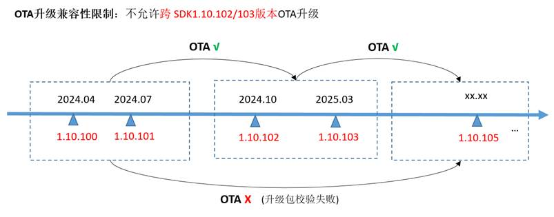

# WS63 1.10.103 Release Notes

## 1. Improvements over the Previous Base Version

| Serial No. | Category | Change Description | Remarks |
| --- | --- | ------- | --- |
| 01  | WiFi Module Optimization   | 1. Adjusted channel scanning parameters to improve the scan success rate. 2. The driver supports transmission of fragmented pbufs of the LWIP protocol stack. 3. Optimized the packet transmission success rate of SoftAP in interference environments, improving performance in interference scenarios. 4. Resolved the issue where a small number of received packets were probabilistically lost right after association in repeated disconnection and re-association scenarios, and added application-layer packet loss or retransmission handling. 5. Optimized the scanning process so that, in the unassociated scenario, the device returns to the previously configured working channel after scanning. 6. Fixed the compilation error when enabling the SNTP function in LWIP. 7. The MQTT component is provided in the form of a patch.|     |
| 02  | BLE/SLE Module Optimization | 1. Committed the SLE interconnect interoperability changes to the repository to meet the consistency requirements of the SLE certification protocol. 2. Optimized SLE connection stability. Resolved the probabilistic link-drop issue in scenarios involving SLE connection parameters and repeated disconnection. 3. Optimized scheduling in BLE/SLE + Wi-Fi coexistence scenarios, resolving the probabilistic SLE link-drop issue and the high-probability Wi-Fi disconnection caused by repeated BLE scanning. 4. The BLE Sample supports the write property of characteristic values. 5. Adjusted the rate configuration of the BLE Sample; the speed test supports the PHY 2M rate. 6. Optimized SLE flow control to improve throughput-test stability. |     |
| 03  | System and Peripheral Optimization    | 1. Simplified the SSB/Flashboot startup prints during the boot phase to reduce serial port information output, making it easier for customers to share the serial port. 2. Optimized the parameters of the AT+CUSTOMEFUSE command to support multiple writes. 3. Enhanced the printing of task test information in AT+SYSINFO. 4. Resolved the issue where, in UART interrupt mode, receiving fewer than 16 bytes of data did not report the interrupt in time, causing serial port reception delays. 5. Resolved the issue where the clock signal was not output in SPI Master mode when data was read without writing. 6. OTA upgrade scenarios now support sector-by-sector flash erase, reducing the time occupied by a single flash erase operation and minimizing the impact on data transmission services. 7. PWM channel parameters support configuration of 8 channels and support low-frequency (below 1 kHz) PWM output. |     |
| 04  | Sensing Module Optimization     | 1. Optimized the detection trigger latency in interference scenarios. 2. Added an isolation range statistics function to the parameter calibration tool. 3. Optimized the algorithm to improve detection distance and reduce false alarms in different scenarios. |     |

## 2. Features Added, Modified, and Deleted Compared with the Previous Base Version

### 2.1  WS63 1.10.103 Compared with WS63 1.10.102

This section describes all new features added in the current version compared with the previous base version.

| Serial No. | Brief Description | Detailed Description | Remarks |
| --- | ------- | ------ | --- |
| 01  | Optimize the usability of the signature and encryption function   (keeping the WS63 1.10.102 policy) | 1. Provided signature key generation and configuration scripts, which can generate keys (for signing and signature verification) with one click (see sections 1.4 to 1.6 of the "WS63V100 Secondary Development Network Security" document); 2. To enhance the security of signature key management, HASH verification has been added as a new verification type for OTA upgrade image packages; versions 1.10.100 to 1.10.103 use signature verification by default, while versions 1.10.103 and later use HASH verification by default. For OTA upgrade constraints, refer to Figure 1. |     |
| 02  | Support IP-based transmission of SLE data                   | 1. Supports SLE data transmission based on IP packet encapsulation, enabling iperf throughput testing.|     |

Figure 1 OTA Upgrade Constraints Diagram  
