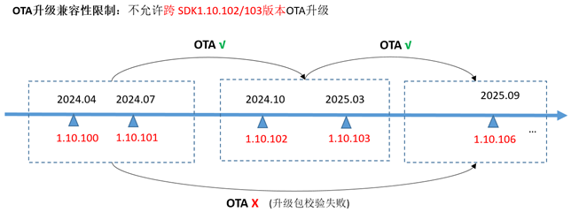

# WS63 1.10.106 Release Notes
The WS63 1.10.106 release is the software release version of the WS63 solution for the Combo chip with Wi-Fi, BLE, and SLE, provided to customers for development and design.

## 1. Improvements over the Previous Base Version

| No. | Category | Change Description | Remarks |
| --- | --- | ------- | --- |
| 01  | Wi-Fi Module Optimization | 1. Supports configuring the channel before STA association. 2. Optimizes error code reporting, resolving the issue of inaccurate error code reporting when the password is incorrect. 3. Optimizes the timing of the Wi-Fi enable and disable flows to enhance interface robustness, resolving the issue of occasional Wi-Fi enable failures in some stress test scenarios. 4. Resolves the compilation configuration error of the Wi-Fi HarmonyOS Connect non-standalone upgrade version. 5. Resolves the issue of STA failing to obtain an IP address in some router DHCP Relay scenarios. 6. Compatibility optimization to resolve the issue of occasional STA keepalive disconnections when connecting to routers with abnormal QoS Null keepalive behavior. 7. When STA 11v roaming fails, the STA now proactively responds to the router, improving connection stability in roaming scenarios. 8. Keepalive optimization: management frames and multicast frames are no longer counted in the keepalive count. 9. Resolves the association failure in hidden SSID scenarios with some 11b routers. 10. Optimizes the validation of duplicate values written to EFUSE during production testing, improving the production test pass-through rate. 11. Supports TPC power level configuration and temperature protection power level configuration. |     |
| 02  | BLE/SLE (NearLink) Module Optimization | 1. Optimizes the SLE Speed Sample, fixes the issue where the MCS setting was not effective, and corrects the issues of multiple disconnections and inaccurate connection rate statistics. 2. Modifies the filter parameter ranges for SLE scanning, advertising, and BLE scan results. For details, refer to the description in the AT command line manual. 3. Supports registration of the callback interface for completion of the SLE Read Req event. 4. Supports registration of the BLE Indicate Confirm callback interface. 5. Resolves the issue where setting PHY 125K mode was not effective. 6. Optimizes the SLE SSAP traffic testing flow control mechanism, resolving the issue of occasional throughput drops during traffic testing in some scenarios. 7. Resolves the issue where sending the same scan parameters twice in succession caused the scan duty cycle to revert to the default value. 8. Stability optimizations to resolve low-probability abnormal restarts in multi-channel SLE advertising scenarios, BLE disable/enable stress test scenarios, and BLE connect/disconnect stress test scenarios, and to resolve low-probability abnormal advertising states in advertising start/stop stress test scenarios. 9. Optimizes the address setting of the SLE advertising interface; an all-zero address is now automatically switched to a local address. 10. Modifies the SLE Server Sample parameters to support connection with HarmonyOS 5.0 phones. 11. Optimizes the scan success rate in environments with multiple SLE devices advertising. 12. Modifies the SLE write_req/read_req error codes and the SSAP read attribute error codes to meet protocol requirements. 13. Resolves memory leak issues in some stress test scenarios: network provisioning scenarios and repeated connect/disconnect scenarios. |     |
| 03  | System and Peripheral Optimization | 1. Resolves the UART DMA operation failure issue. 2. Resolves the issue where configuring a PWM waveform with a specified period was not effective. 3. Supports the PWM preload configuration update interface. 4. Fixes the DMA channel resource allocation limitation to avoid channel allocation conflicts when more than four peripheral DMA channels are accessed simultaneously. 5. Optimizes the SPI clock configuration, resolving the issue where the SPI master clock configuration affected the SPI slave clock configuration. 6. Resolves the issue where the I2S master could not read data, and supports changing the I2S sample rate. 7. Enhances the production test flag validation at system startup, reducing cases where customers accidentally enter the production test partition after mistakenly modifying the startup flag. |     |
| 04  | Sensing Module Optimization | 1. Optimizes the switching latency between levels. 2. Implements the underlying channel switching logic and interface in the offline (non-networked) state, optimizing radar detection stability in interference environments. 3. Optimizes the computational stability of the presence detection algorithm in channel-busy and microwave oven interference scenarios. 4. Supports the supporting base components of the SP31C presence detection solution. |     |

## 2. Features Added, Modified, and Removed Compared with the Previous Base Version

### 2.1  WS63 1.10.106 vs. WS63 1.10.103

This section describes all new features of the current version compared with the previous base version.

| No. | Brief Description | Detailed Description | Remarks |
| --- | ------- | ------ | --- |
| 01  | BLE connection API optimization | Supports BLE connection cancellation and asynchronous connection configuration interfaces. |     |
| 02  | BurnTools flashing | Supports flashing at a 4M baud rate over the serial port. |     |
| 03  | System O&M commands | 1. Adds memory O&M commands. 2. Adds system resource usage O&M. For details, see the description in Section 2.1.2 of the AT Command User Guide. 3. Supports configuring the AT/DEBUG serial ports via Menuconfig, and supports configuring them to the same serial port. |     |
| 04  | SLE O&M commands | 1. Adds AT+SLESETMCS. 2. Updates the AT+SLESETPHY command parameters. For details, see the description in Section 3.2.2 of the AT Command User Guide. |     |
| 05  | Wi-Fi O&M commands | Adds key frame O&M logs such as Auth, Assoc, and EAPOL in the Wi-Fi connection and disconnection flows. |     |

Figure 1 OTA upgrade constraint diagram  
