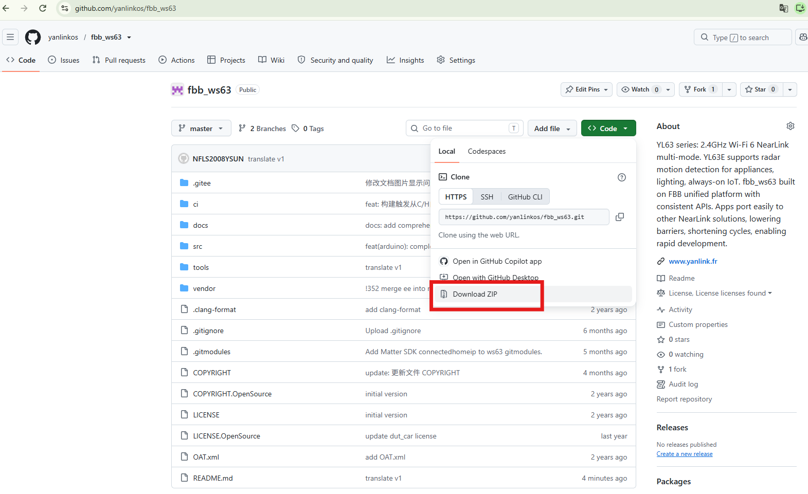

# HiSpark Studio Plugin Version Environment Setup

**Note: Only the LiteOS system version is supported. The OpenHarmony system version does not support Windows environment setup.**

## 1. VS Code Installation

- Download and install [VS Code](https://code.visualstudio.com/Download), select "Windows" installation, and follow the recommended steps to install.

## 2. Install the HiSpark Studio Plugin

- A. In VS Code Extensions, search for "Chinese" and click Install.

- B. In VS Code Extensions, search for "HiSpark Studio" and click Install. The HiSpark Cloud Test plugin provides chip customers with efficient and convenient testing services. It currently supports RF TX/RX performance testing, certification pre-testing, and whole-device power consumption testing. After the test is complete, a professional test report is automatically generated.

- C. After installation, the "HiSpark Studio" icon appears in the VS Code sidebar. Click the "Home" page.

## 3. Install the Toolchain

Prerequisite: Toolchain installation is currently divided into "Automatic Toolchain Installation" and "Manual Toolchain Installation". If you encounter network, proxy, or other issues when using "Automatic Toolchain Installation", and VS Code displays text such as "Download failed" in the bottom right corner, please refer to 3.2 Manual Toolchain Installation. If the automatic toolchain installation succeeds, you can skip the manual installation.

### 3.1 Automatic Toolchain Installation

- A. Click "Download Toolchain" to install the tools and plugin.

- B. Wait for the installation. If successful, VS Code will show the current status in the bottom right corner, and text such as "Environment preparation complete" indicates the tools are installed, as shown below. If the automatic installation succeeds, you can skip step 3.2 Manual Toolchain Installation. If installation fails or an error occurs, please refer to steps C and D of section 3.1.

- C. If a python installation failure occurs (**Reason: the network may be unavailable or there may be a local network proxy issue. You need to change the network or modify the local proxy; please check this yourself. If it still cannot be downloaded, please refer to "3.2 Manual Toolchain Installation"**).

- D. If python installs successfully but other plugins cannot be downloaded, try clicking "Download Toolchain" multiple times in HiSpark Studio. If the problem still cannot be resolved, please refer to "3.2 Manual Toolchain Installation". (Reason: some plugins have slow access within China, causing download failures.)

  

### 3.2 Manual Toolchain Installation

- A. If an installation failure occurs (**Reason: the network may be unavailable or there may be a local network proxy issue. You need to change the network or modify the local proxy; please check this yourself. If it still cannot be downloaded, please refer to "3.2 Manual Toolchain Installation"**).

  

- B. Download the tool script "install_vscode_extension.bat" to any directory. Here, drive E is used as an example. Download link: https://hispark-obs.obs.cn-east-3.myhuaweicloud.com/install_vscode_extension.bat .

- C. After downloading to the directory, double-click the script, and in the dialog box select "Run".

  

- D. Wait for the tools to download and the configuration to complete. When "You may need to restart VS Code for the changes to take effect" appears, restart VS Code and press any key to exit the command-line mode.

    
    
- E. If VS Code has not been restarted, restart VS Code, then in the HiSpark Studio plugin click "Download Toolchain" to configure and install.

    

- F. Wait until the message "Environment preparation complete" appears, indicating that the environment configuration is complete.

  

## 4. SDK Package Download

Prerequisite: SDK package download is currently divided into git download and manual download. For the git download method, the computer needs to have git installed and the environment variables configured. If git is not installed, or the installation/download of git is slow, please refer to "4.2 Manual SDK Download".

### 4.1 Download SDK Package via Git

- A. Prerequisite: git must be installed on the computer. If git is not installed, please install it first. If it is already installed, you can skip step A and start from step B. If the download is slow or fails, please refer to "4.2 Manual SDK Download". Git download link: https://git-scm.com/install/windows 

- B. Install following the prompts. Copy the path shown in the figure below and add it to the environment variables. For how to add environment variables, refer to https://blog.csdn.net/weixin_52534056/article/details/144449026

  

- C. Download the corresponding SDK package as needed. Here, "WS63 SDK" is used as an example. Click "Download SDK from HiSpark" and select "WS63 SDK".

- D. Select the directory to download to and choose the save folder (**Note: the path level should not be too deep, within 260 characters, and must not contain Chinese directories**). VS Code will pop up a prompt in the bottom right corner indicating the SDK is currently downloading. If the wait is too long, it may be due to environment issues or lack of current github download permission; please check this yourself, and refer to step B of section 4.1 to configure environment variables.

  

- F. After the download completes, it will look like the figure below. Drive E is used as an example here.

### 4.2 Manual SDK Package Download

- A. WS63 SDK download link: https://github.com/yanlinkos/fbb_ws63 . Click "Clone/Download" and select "Download ZIP" in the dialog box.

  

- B. After selecting to download the "ZIP", choose the directory to download to. Here, drive E is used as an example (**Note: the path level should not be too deep, within 260 characters, and must not contain Chinese directories**).

  

- C. Wait for the download to complete. It is approximately 510M.

  

- D. After the download completes, extract "fbb_ws63-master.zip". Right-click the file and select "Extract to current folder" or "Extract Here".

  

- E. After extraction is complete, it will look like the figure below.

  

## 5. Create a New Project

- A. Click "New Project", fill in the corresponding information as prompted, select "WS63" as the chip, "Normal Project" as the project type, and enter "demo" as the project name.

- B. Select "f:/project" as the project path, and select "g:/fbb_ws63/src" as the software package (**Note: the path selection must go down to the src directory or below**). Click "Select Folder".

- C. After the selection is complete, click "Finish" and wait for the project to be created. A successful creation is shown in the figure.

  

## 6. Compile the Project

- A. After successful creation, click "rebuild" or "build" to compile.

- B. When compilation is complete, it displays "SUCCESS Took xxx seconds", as shown below.

## 7. Image Flashing

- A. Hardware setup: Use a Type-C cable to connect the board to the PC. The HiHope_NearLink_DK3863E_V03 development board is used as an example here; for other development boards, please refer to the respective board schematics.

- B. Install the driver "CH341SER Driver" ([CH341SER Driver download address](https://www.wch.cn/downloads/CH341SER_EXE.html). **If the link is invalid or cannot be downloaded, please download it yourself via Baidu**). Before installing the CH341SER driver, the board must be connected to the PC. Click Install. **"Driver installed successfully" indicates success; if "Driver pre-installation successful" appears, it means the installation failed**.

- C. After successful installation, in the HiSpark Studio plugin, click the "Project Config" button, select "Program Loading", set the transfer method to "serial", and select the port "comxxx". The COM port can be viewed in Device Manager.

- D. After configuration, click the "Program Loading" tool button to flash. When "Connecting, please reset device..." appears, reset the development board (the HiHope_NearLink_DK3863E_V03 board is used as an example here; for other boards, please refer to the respective board schematics. The RST reset button is on the right side of the board, as shown in Figure 2) and wait for the flashing to finish.

- E. At the bottom of the HiSpark Studio plugin, select "Monitor", choose the port (**the development board needs to be connected to the computer via Type-C**). If the port does not appear, you can refresh it. Click "Start Monitoring", reset the development board, and when "flashboot version" appears, it indicates that compilation and flashing were successful.

## 8. How to Compile the First Program "Hello World"

- A. Hardware used in this example: [HiHope_NearLink_DK3863E_V03 development board](https://e.tb.cn/h.TyIdVOFouZyhA23?tk=vPA6eoh0e0u)

  

- B. In the HiSpark Studio plugin version, select "Kconfig" -> Application -> Enable Sample -> Enable the Sample of peripheral -> Support hello world oled Sample -> Save. After saving, close it.

- C. Click "rebuild" or "clean+build" to compile.

  

- D. Wait for the compilation to complete. It displays "SUCCESS Took xxx seconds", as shown below.

- E. In the HiSpark Studio plugin, click the "Project Config" button, select "Program Loading", set the transfer method to "serial", and select the port "comxxx". The COM port can be viewed in Device Manager.

  

- F. After configuration, click the "Program Loading" tool button to flash. When "Connecting, please reset device..." appears, reset the development board (the RST reset button is on the right side of the board, as shown in Figure 2) and wait for the flashing to finish.

  
  
  
  
- G. After flashing, reset the development board (the RST reset button is on the right side of the board). "Hello World!!!" will be displayed on the screen.

